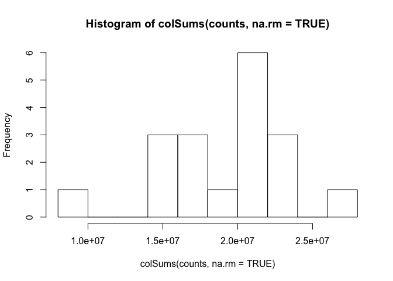

# Ferula_RNAseq_DEG
Hajar  
June 8, 2017  

#import data


```r
counts <- read.csv("~/Documents/Ferula_RNAseq_Rbased/input/combined_counts_V2.csv", header=T, row.names="target_id")
#head(counts) for pooling two library of BR3 (they are not replication)
counts$BR3.2 <- counts$BR3 + counts$BR3.1
counts$BR3 <- NULL
counts$BR3.1 <- NULL
colnames(counts)[19] <- "BR3"
counts$BF3.2 <- counts$BF3 + counts$BF3.1
counts$BF3 <- NULL
counts$BF3.1 <- NULL
colnames(counts)[18] <- "BF3"
#colnames(counts)[1] 
#rownames(counts)
dim(counts) # 158617 18 158617 is num of transcripts in Reference
```

```
## [1] 158617     18
```

```r
write.csv(counts, file="/Users/hajaramini/Documents/Ferula_RNAseq_Rbased/input/Ferula_RNAseq.coutns_v2.csv")
```
#filter based on read count, assign group, normalize, design matrix

```r
hist(colSums(counts,na.rm=TRUE))
```

<!-- -->

```r
colSums(counts,na.rm=TRUE)
```

```
##      DS6      DF6      DL6      DR3      DS3      DF3      DL3      DR2 
## 22185775 22738489 20446520 21387648 19793593  9549581 22938854 17169702 
##      DS2      DF2      DL2      DR6      NF3      NF6      NR3      NR6 
## 26336386 21407169 14960410 21625910 20917468 17632293 20384896 16792343 
##      BR3      BF3 
## 14958214 14782562
```

```r
#general threshold
colSums(counts,na.rm=TRUE) > 1000000 # all samples are true
```

```
##  DS6  DF6  DL6  DR3  DS3  DF3  DL3  DR2  DS2  DF2  DL2  DR6  NF3  NF6  NR3 
## TRUE TRUE TRUE TRUE TRUE TRUE TRUE TRUE TRUE TRUE TRUE TRUE TRUE TRUE TRUE 
##  NR6  BR3  BF3 
## TRUE TRUE TRUE
```

```r
counts.nolow <- counts[,colSums(counts,na.rm=TRUE) > 1000000]
dim(counts.nolow) #all of samples has more than 1000000 counts
```

```
## [1] 158617     18
```

```r
#sample description
samples <- data.frame(file=colnames(counts),
                      facility=factor(sub("(B|D|N)(S|F|L|R)(2|3|6)","\\1",colnames(counts))),
                      trt=factor(sub("(B|D|N)(S|F|L|R)(2|3|6)","\\2",colnames(counts))),
                    
                      genotype=factor(sub("(B|D|N)(S|F|L|R)(2|3|6)","\\3",colnames(counts)))) 
head(samples) 
```

```
##   file facility trt genotype
## 1  DS6        D   S        6
## 2  DF6        D   F        6
## 3  DL6        D   L        6
## 4  DR3        D   R        3
## 5  DS3        D   S        3
## 6  DF3        D   F        3
```

```r
#convert NA to zero
counts[is.na(counts)]<-0
# eliminating genes with low expression levels by retaining genes with > 10 reads in >= 3 samples
counts.small <-counts[rowSums(counts > 10) >= 3,] 
dim(counts.small) #61234 18 
```

```
## [1] 62147    18
```

```r
dim(counts) #158617 18
```

```
## [1] 158617     18
```

```r
write.csv(counts.small, file="/Users/hajaramini/Documents/Ferula_RNAseq_Rbased/input/Ferula_RNAseq.coutns.small_v2.csv") # use this for other analysis
samples.small <- data.frame(file=colnames(counts.small),                     facility=factor(sub("(B|D|N)(S|F|L|R)(2|3|6)","\\1",colnames(counts.small))),
                      trt=factor(sub("(B|D|N)(S|F|L|R)(2|3|6)","\\2",colnames(counts.small))),
                    
                      genotype=factor(sub("(B|D|N)(S|F|L|R)(2|3|6)","\\3",colnames(counts.small)))) 
head(samples.small)
```

```
##   file facility trt genotype
## 1  DS6        D   S        6
## 2  DF6        D   F        6
## 3  DL6        D   L        6
## 4  DR3        D   R        3
## 5  DS3        D   S        3
## 6  DF3        D   F        3
```

```r
save(samples.small,file="/Users/hajaramini/Documents/Ferula_RNAseq_Rbased/input/Ferula_RNAseq.samples.small_v2.Rdata")
#assign group by combining all the experimental factors into one combined factor
Genotype<-levels(samples.small$genotype)
samples.small$group <- paste(samples.small$genotype,samples.small$trt,samples.small$facility,sep=".")
samples.small$genotype<-as.character(samples.small$genotype)
```

#install.packages("edgeR")

```r
library(edgeR)
```

```
## Loading required package: limma
```

```r
dge <- DGEList(counts=counts.small, group=samples.small$group) 
length(colnames(counts.small)) # 18
```

```
## [1] 18
```

```r
dge<-calcNormFactors(dge, method = "TMM")
# look at the normalization factors
nrow(dge$samples) # 18 
```

```
## [1] 18
```

```r
hist(dge$samples[,3]) # norm.factor > 3 seem outlier? I don't want to remove sample 
```

<!-- -->

```r
plot(log10(dge$sample[,"lib.size"]),dge$sample[,"norm.factors"]) 
```

<!-- -->

```r
#when we want to change the ref from first icon to others
samples.small$genotype <- as.factor(samples.small$genotype)
samples.small$genotype <- relevel(samples.small$genotype,ref="3")
samples.small$trt <- as.factor(samples.small$trt)
samples.small$trt <- relevel(samples.small$trt,ref="R")

#design model for each factor (genotype & trt factors)
design1 <- model.matrix(~genotype+trt + facility, data=samples.small)
colnames(design1)
```

```
## [1] "(Intercept)" "genotype2"   "genotype6"   "trtF"        "trtL"       
## [6] "trtS"        "facilityD"   "facilityN"
```

```r
#First the overall dispersion
dge <- estimateGLMCommonDisp(dge,design1, verbose = T) #Disp = 0.89 , BCV =  0.94
```

```
## Disp = 0.89357 , BCV = 0.9453
```

```r
dge <- estimateGLMTrendedDisp(dge,design1)
dge <- estimateGLMTagwiseDisp(dge,design1)
save(dge,file="/Users/hajaramini/Documents/Ferula_RNAseq_Rbased/output/dge_v2.Rdata")
plotBCV(dge)
```

<!-- -->

```r
mds.dge <- plotMDS(dge, method = "bcv",labels = dge$samples$group)
```

<!-- -->

#To find genes that are differentially expressed in gt 2 & 6 vs 3


```r
dge.fit <- glmFit(dge, design1)
#colnames(dge.fit)
dge.lrt <- glmLRT(dge.fit,coef = c("genotype2","genotype6"))
#the top 10 most differentially expressed genes
#topTags(dge.lrt)
#summary(decideTestsDGE(dge.lrt,p=0.05)) why error?
#Extract genes with a FDR < 0.01 (could also use 0.05)
DEgenes1 <- topTags(dge.lrt,n = Inf)$table[topTags(dge.lrt,n = Inf)$table$FDR<0.05,]
dim(DEgenes1) #2700   6
```

```
## [1] 2700    6
```

```r
colnames(DEgenes1)
```

```
## [1] "logFC.genotype2" "logFC.genotype6" "logCPM"          "LR"             
## [5] "PValue"          "FDR"
```

```r
#head(DEgenes1)
#save to a file
write.csv(DEgenes1,file="/Users/hajaramini/Documents/Ferula_RNAseq_Rbased/output/Ferula_RNAseq.DEgenes1_v2.csv")
#To find genes that are differentially expressed in gt 2 & 6 vs 3 seperately
dge.lrt.gt2 <- glmLRT(dge.fit,coef = c("genotype2"))
#topTags(dge.lrt.gt2)
summary(decideTestsDGE(dge.lrt.gt2, p=0.05))
```

```
##    [,1] 
## -1   455
## 0  61406
## 1    286
```

```r
dge.lrt.gt6 <- glmLRT(dge.fit,coef = c("genotype6"))
#topTags(dge.lrt.gt6)
summary(decideTestsDGE(dge.lrt.gt6, p=0.05))
```

```
##    [,1] 
## -1   903
## 0  60640
## 1    604
```

```r
DEGs1 <- data.frame ("gt2" = as.data.frame(summary(decideTestsDGE(dge.lrt.gt2, p=0.05)))$Freq,
                                     "gt6" = as.data.frame(summary(decideTestsDGE(dge.lrt.gt6, p=0.05)))$Freq)
rownames(DEGs1) <- c("down", "no", "up")
DEGs1 <- DEGs1[c("down", "up"),]
DEGs1
```

```
##      gt2 gt6
## down 455 903
## up   286 604
```

```r
save(DEGs1, file="/Users/hajaramini/Documents/Ferula_RNAseq_Rbased/output/Ferula_RNAseq.DEGs1_v2.Rdata")
library(reshape2)
```

```
## Warning: package 'reshape2' was built under R version 3.2.5
```

```r
library(ggplot2)
```

```
## Warning: package 'ggplot2' was built under R version 3.2.5
```

```r
DEGs1.melt <- melt(DEGs1)
```

```
## No id variables; using all as measure variables
```

```r
DEGs1.melt$DE <- rep(c("down", "up"), 2)
colnames(DEGs1.melt) <- c("genotype", "number", "DE")
DEGs1.melt
```

```
##   genotype number   DE
## 1      gt2    455 down
## 2      gt2    286   up
## 3      gt6    903 down
## 4      gt6    604   up
```

```r
# reorder: up 1st down 2nd 
DEGs1.melt$DE <- factor(DEGs1.melt$DE, levels = c("up", "down"))
DEGs1.melt <- DEGs1.melt[order(DEGs1.melt$DE),]
DEGs1.melt
```

```
##   genotype number   DE
## 2      gt2    286   up
## 4      gt6    604   up
## 1      gt2    455 down
## 3      gt6    903 down
```

```r
DEGs1.melt$gt <- gsub("(X)(\\.)(S|L|F)(\\.)", "\\1",DEGs1.melt$genotype)

DEGs1.melt$trt <- gsub("(X)(\\.)(S|L|F)(\\.)", "\\2",DEGs1.melt$genotype)


### making ggplot for DEGs
library(ggplot2)
p.DEGs1 <- ggplot(data = DEGs1.melt)
p.DEGs1 <- p.DEGs1 + geom_bar(mapping = aes(fill=DE, x = factor(DE), y = number) , stat= "identity")
#p.DEGs1 <- p.DEGs1 + facet_grid(~genotype) 
p.DEGs1 <- p.DEGs1 + labs(y = "number of differentially expressed genes", x = "")
p.DEGs1
```

<!-- -->

```r
ggsave(p.DEGs1, file="/Users/hajaramini/Documents/Ferula_RNAseq_Rbased/output/Ferula_RNAseq.p.DEG1_v2.png")
```

```
## Saving 7 x 5 in image
```

#To find genes that are differentially expressed in trt S, F & L vs R 


```r
dge.lrt.trt <- glmLRT(dge.fit,coef = c("trtF","trtL", "trtS"))
#the top 10 most differentially expressed genes
#topTags(dge.lrt.trt)
#summary(decideTestsDGE(dge.lrt,p=0.05)) why error?
#Extract genes with a FDR < 0.01 (could also use 0.05)
DEgenes2 <- topTags(dge.lrt.trt,n = Inf)$table[topTags(dge.lrt.trt,n = Inf)$table$FDR<0.05,]
write.csv(DEgenes2,file="/Users/hajaramini/Documents/Ferula_RNAseq_Rbased/output/Ferula_RNAseq.DEgenes1_v2.csv")
dim(DEgenes2) #12687 7
```

```
## [1] 12687     7
```

```r
#colnames(DEgenes2)
head(DEgenes2)
```

```
##                          logFC.trtF logFC.trtL logFC.trtS   logCPM
## TRINITY_DN59790_c0_g1_i1   8.990086  1.5099392  1.8899683 2.964240
## TRINITY_DN15353_c0_g2_i1  10.000930  1.0079972  0.4142302 3.419545
## TRINITY_DN67795_c0_g1_i1  10.819517  5.5040013  0.7663922 3.058659
## TRINITY_DN21262_c0_g1_i2   8.891950 -2.5158477 -3.2335133 4.173338
## TRINITY_DN13576_c0_g1_i1   9.763360  3.8651982  1.7732271 4.454639
## TRINITY_DN32850_c0_g3_i1   9.708344 -0.7907408 -1.3949423 1.793940
##                                LR       PValue          FDR
## TRINITY_DN59790_c0_g1_i1 147.6280 8.558943e-32 5.319126e-27
## TRINITY_DN15353_c0_g2_i1 145.8443 2.075646e-31 6.449757e-27
## TRINITY_DN67795_c0_g1_i1 140.4021 3.095758e-30 5.463040e-26
## TRINITY_DN21262_c0_g1_i2 140.1456 3.516205e-30 5.463040e-26
## TRINITY_DN13576_c0_g1_i1 132.9266 1.265682e-28 1.573167e-24
## TRINITY_DN32850_c0_g3_i1 124.2949 9.168993e-27 9.497090e-23
```


```r
#create .txt file for creating gff3
names <- rownames(DEgenes2[1:1000,])
names <- paste0("<",names)
names <- data.frame(names)
write.table(names, "top_transcripts.txt", col.names = F, row.names = F, quote = F)


#for all DE genes
names2 <-rownames(DEgenes2)
names2 <- paste0("<",names2)
names2 <- data.frame(names2)
write.table(names2, "All_transcripts.txt", col.names = F, row.names = F, quote = F)
```


```r
#To find genes that are differentially expressed in trt S, F & L vs R seperately
dge.lrt.trtF <- glmLRT(dge.fit,coef = c("trtF"))
#topTags(dge.lrt.trtF)
summary(decideTestsDGE(dge.lrt.trtF, p=0.05))
```

```
##    [,1] 
## -1  2271
## 0  54876
## 1   5000
```

```r
dge.lrt.trtL <- glmLRT(dge.fit,coef = c("trtL"))
#topTags(dge.lrt.trtL)
summary(decideTestsDGE(dge.lrt.trtL, p=0.05))
```

```
##    [,1] 
## -1  3872
## 0  55421
## 1   2854
```

```r
dge.lrt.trtS <- glmLRT(dge.fit,coef = c("trtS"))
#topTags(dge.lrt.trtS)
summary(decideTestsDGE(dge.lrt.trtS, p=0.05))
```

```
##    [,1] 
## -1   180
## 0  61558
## 1    409
```

```r
#For finding the expression of each genes for each tissues
decideTestsDGE(dge.lrt.trtF, p=0.05)
```

```
## TestResults matrix
## [1] 1 0 0 0 0
## 62142 more rows ...
```

```r
a <- decideTestsDGE(dge.lrt.trtF, p=0.05)
dge.lrt.trtF
```

```
## An object of class "DGELRT"
## $coefficients
##                          (Intercept)  genotype2   genotype6      trtF
## TRINITY_DN67662_c0_g1_i1   -17.50730 -1.5635900  0.51878292 3.5553629
## TRINITY_DN67616_c0_g1_i1   -14.81810  0.4991261 -0.72002327 0.6750147
## TRINITY_DN67687_c0_g1_i1   -13.39304 -1.0944639  0.61798819 0.4278344
## TRINITY_DN67606_c0_g1_i1   -16.73410 -2.1955397 -0.31731520 1.9639666
## TRINITY_DN67688_c0_g1_i1   -16.25065 -1.3506218  0.09812887 1.0581556
##                                trtL       trtS   facilityD  facilityN
## TRINITY_DN67662_c0_g1_i1 -0.5287015 -0.9014563 -1.11404577  0.1497874
## TRINITY_DN67616_c0_g1_i1  1.0361502  1.2412963 -0.25441196  0.2800126
## TRINITY_DN67687_c0_g1_i1  0.3599628  0.3356147 -0.48290185 -0.2411987
## TRINITY_DN67606_c0_g1_i1  1.9714693 -2.2004868 -0.18235067 -0.4915372
## TRINITY_DN67688_c0_g1_i1  1.0065155 -0.7443894 -0.09253053  0.1471498
## 62142 more rows ...
## 
## $fitted.values
##                                   DS6       DF6          DL6        DR3
## TRINITY_DN67662_c0_g1_i1 6.382759e-08  9.149861 1.760992e-08 0.03742013
## TRINITY_DN67616_c0_g1_i1 1.183833e+01  5.107452 1.939769e+00 1.50779827
## TRINITY_DN67687_c0_g1_i1 6.110627e+01 51.026477 1.254276e+01 5.03839793
## TRINITY_DN67606_c0_g1_i1 4.621003e-08  4.428334 1.152319e+00 0.22714309
## TRINITY_DN67688_c0_g1_i1 9.349870e-01  4.801080 1.192328e+00 0.40970356
##                                   DS3       DF3          DL3         DR2
## TRINITY_DN67662_c0_g1_i1 4.748592e-08  3.637802 1.150516e-08 0.007326256
## TRINITY_DN67616_c0_g1_i1 3.015860e+01  6.953335 4.339599e+00 2.895592313
## TRINITY_DN67687_c0_g1_i1 4.049463e+01 18.070711 7.299338e+00 1.946751164
## TRINITY_DN67606_c0_g1_i1 8.751100e-08  4.481618 1.916363e+00 0.022309628
## TRINITY_DN67688_c0_g1_i1 1.033958e+00  2.837294 1.157901e+00 0.115531594
##                                   DS2        DF2          DL2        DR6
## TRINITY_DN67662_c0_g1_i1 1.433201e-09  0.9851260 3.006150e-09 0.06502221
## TRINITY_DN67616_c0_g1_i1 8.928341e+00 18.4698460 1.112205e+01 0.76513023
## TRINITY_DN67687_c0_g1_i1 2.412019e+00  9.6575992 3.763940e+00 9.82864826
## TRINITY_DN67606_c0_g1_i1 1.325015e-09  0.6088406 2.511955e-01 0.15505510
## TRINITY_DN67688_c0_g1_i1 4.494685e-02  1.1066526 4.357565e-01 0.47894471
##                                NF3       NF6       NR3        NR6
## TRINITY_DN67662_c0_g1_i1  98.11195 134.00269  2.061194   2.789297
## TRINITY_DN67616_c0_g1_i1  90.10637  35.94039 39.905820  15.770587
## TRINITY_DN67687_c0_g1_i1 173.88282 266.62027 99.015809 150.426851
## TRINITY_DN67606_c0_g1_i1  22.67844  12.16844  2.347516   1.248000
## TRINITY_DN67688_c0_g1_i1  27.35543  25.13589  8.067510   7.344710
##                                 BR3       BF3
## TRINITY_DN67662_c0_g1_i1  0.6597303  57.39451
## TRINITY_DN67616_c0_g1_i1 11.3375674  46.78859
## TRINITY_DN67687_c0_g1_i1 47.4813318 152.39680
## TRINITY_DN67606_c0_g1_i1  1.4435698  25.48844
## TRINITY_DN67688_c0_g1_i1  2.6218013  16.24817
## 62142 more rows ...
## 
## $deviance
## [1]  4.416767 10.732911  8.544106  8.508034  8.917491
## 62142 more elements ...
## 
## $iter
## [1] 19 13  8 18  9
## 62142 more elements ...
## 
## $failed
## [1] FALSE FALSE FALSE FALSE FALSE
## 62142 more elements ...
## 
## $method
## [1] "levenberg"
## 
## $unshrunk.coefficients
##                          (Intercept)  genotype2  genotype6      trtF
## TRINITY_DN67662_c0_g1_i1   -17.67258 -1.7804030  0.5041545 3.7301432
## TRINITY_DN67616_c0_g1_i1   -14.82853  0.5028804 -0.7267254 0.6817880
## TRINITY_DN67687_c0_g1_i1   -13.39632 -1.1005851  0.6198476 0.4304214
## TRINITY_DN67606_c0_g1_i1   -16.88953 -2.4702207 -0.4301653 2.1353764
## TRINITY_DN67688_c0_g1_i1   -16.29279 -1.4155487  0.1077856 1.0883892
##                                 trtL        trtS   facilityD  facilityN
## TRINITY_DN67662_c0_g1_i1 -15.0048048 -15.3234550 -1.11084478  0.1624164
## TRINITY_DN67616_c0_g1_i1   1.0472506   1.2496507 -0.25869364  0.2816074
## TRINITY_DN67687_c0_g1_i1   0.3608146   0.3379121 -0.48447082 -0.2418501
## TRINITY_DN67606_c0_g1_i1   2.1227236 -16.5154953 -0.09051652 -0.4905545
## TRINITY_DN67688_c0_g1_i1   1.0290499  -0.8204536 -0.09740535  0.1471904
## 62142 more rows ...
## 
## $df.residual
## [1] 10 10 10 10 10
## 62142 more elements ...
## 
## $design
##   (Intercept) genotype2 genotype6 trtF trtL trtS facilityD facilityN
## 1           1         0         1    0    0    1         1         0
## 2           1         0         1    1    0    0         1         0
## 3           1         0         1    0    1    0         1         0
## 4           1         0         0    0    0    0         1         0
## 5           1         0         0    0    0    1         1         0
## 13 more rows ...
## 
## $offset
##          [,1]     [,2]     [,3]     [,4]     [,5]     [,6]     [,7]
## [1,] 17.03564 16.76286 15.42927 15.49788 17.24404 16.34466 15.50776
## [2,] 17.03564 16.76286 15.42927 15.49788 17.24404 16.34466 15.50776
## [3,] 17.03564 16.76286 15.42927 15.49788 17.24404 16.34466 15.50776
## [4,] 17.03564 16.76286 15.42927 15.49788 17.24404 16.34466 15.50776
## [5,] 17.03564 16.76286 15.42927 15.49788 17.24404 16.34466 15.50776
##          [,8]     [,9]   [,10]    [,11]    [,12]    [,13]    [,14]
## [1,] 15.64753 15.52393 16.8187 15.94602 15.54624 18.36613 18.17372
## [2,] 15.64753 15.52393 16.8187 15.94602 15.54624 18.36613 18.17372
## [3,] 15.64753 15.52393 16.8187 15.94602 15.54624 18.36613 18.17372
## [4,] 15.64753 15.52393 16.8187 15.94602 15.54624 18.36613 18.17372
## [5,] 15.64753 15.52393 16.8187 15.94602 15.54624 18.36613 18.17372
##         [,15]   [,16]    [,17]    [,18]
## [1,] 18.23345 18.0318 17.25665 17.99238
## [2,] 18.23345 18.0318 17.25665 17.99238
## [3,] 18.23345 18.0318 17.25665 17.99238
## [4,] 18.23345 18.0318 17.25665 17.99238
## [5,] 18.23345 18.0318 17.25665 17.99238
## 62142 more rows ...
## 
## $dispersion
## [1] 1.0618145 0.7970626 0.5617565 1.5131763 0.8101577
## 62142 more elements ...
## 
## $prior.count
## [1] 0.125
## 
## $samples
##     group lib.size norm.factors
## DS6 6.S.D 22101618    1.1325608
## DF6 6.F.D 22660464    0.8409115
## DL6 6.L.D 20425303    0.2458544
## DR3 3.R.D 21343878    0.2519815
## DS3 3.S.D 19685802    1.5661756
## 13 more rows ...
## 
## $prior.df
## [1] 10
## 
## $AveLogCPM
## [1] -0.9993258 -0.7234798  0.7574131 -2.2673742 -2.2074789
## 62142 more elements ...
## 
## $table
##                              logFC     logCPM         LR       PValue
## TRINITY_DN67662_c0_g1_i1 5.1293045 -0.9993258 14.7785825 0.0001209009
## TRINITY_DN67616_c0_g1_i1 0.9738404 -0.7234798  1.3593028 0.2436583475
## TRINITY_DN67687_c0_g1_i1 0.6172346  0.7574131  0.8276507 0.3629527333
## TRINITY_DN67606_c0_g1_i1 2.8334049 -2.2673742  4.1755110 0.0410121942
## TRINITY_DN67688_c0_g1_i1 1.5265958 -2.2074789  2.5181792 0.1125404605
## 62142 more rows ...
## 
## $comparison
## [1] "trtF"
## 
## $df.test
## [1] 1 1 1 1 1
## 62142 more elements ...
```

```r
a[1:3]
```

```
## [1] 1 0 0
```

```r
a[1:3,]
```

```
## [1] 1 0 0
```

```r
a[1:3,1]
```

```
## [1] 1 0 0
```

```r
dim(a)
```

```
## [1] 62147     1
```

```r
b <- rownames(dge.lrt.trtF$coefficients)
c <- data.frame(b,a)
View(c)
dge.lrt.trtL <- glmLRT(dge.fit,coef = c("trtL"))
d <- decideTestsDGE(dge.lrt.trtL, p=0.05)
e <- decideTestsDGE(dge.lrt.trtS, p=0.05)
c <- data.frame(b,a,d,e)
all_trts <- c
colnames(all_trts) <- c("Gene","Flower","Leaf","Stem")
View(all_trts)
write.table(all_trts, "all_trts.txt", col.names = T, row.names = F, quote = F)

DEGs2 <- data.frame ("trtF" = as.data.frame(summary(decideTestsDGE(dge.lrt.trtF, p=0.05)))$Freq,
                                     "trtL" = as.data.frame(summary(decideTestsDGE(dge.lrt.trtL, p=0.05)))$Freq,
                                     "trtS"= as.data.frame( summary(decideTestsDGE(dge.lrt.trtS, p=0.05)))$Freq)
rownames(DEGs2) <- c("down", "no", "up")
DEGs2 <- DEGs2[c("down", "up"),]
DEGs2
```

```
##      trtF trtL trtS
## down 2271 3872  180
## up   5000 2854  409
```

```r
save(DEGs2, file="/Users/hajaramini/Documents/Ferula_RNAseq_Rbased/output/Ferula_RNAseq.DEGs2_v2.Rdata")
#library(reshape2)
#library(ggplot2)
DEGs2.melt <- melt(DEGs2)
```

```
## No id variables; using all as measure variables
```

```r
DEGs2.melt$DE <- rep(c("down", "up"), 3)
colnames(DEGs2.melt) <- c("genotype", "number", "DE")
DEGs2.melt
```

```
##   genotype number   DE
## 1     trtF   2271 down
## 2     trtF   5000   up
## 3     trtL   3872 down
## 4     trtL   2854   up
## 5     trtS    180 down
## 6     trtS    409   up
```

```r
# reorder: up 1st down 2nd 
DEGs2.melt$DE <- factor(DEGs2.melt$DE, levels = c("up", "down"))
DEGs2.melt <- DEGs2.melt[order(DEGs2.melt$DE),]
DEGs2.melt
```

```
##   genotype number   DE
## 2     trtF   5000   up
## 4     trtL   2854   up
## 6     trtS    409   up
## 1     trtF   2271 down
## 3     trtL   3872 down
## 5     trtS    180 down
```

```r
DEGs2.melt$gt <- gsub("(X)(\\.)(S|L|F)(\\.)", "\\1",DEGs2.melt$genotype)

DEGs2.melt$trt <- gsub("(X)(\\.)(S|L|F)(\\.)", "\\2",DEGs2.melt$genotype)
```


```r
### making ggplot for DEGs
library(ggplot2)
p.DEGs2 <- ggplot(data = DEGs2.melt)
p.DEGs2 <- p.DEGs2 + geom_bar(mapping = aes(fill=DE, x = factor(DE), y = number) , stat= "identity")
p.DEGs2 <- p.DEGs2 + facet_grid(~genotype) 
p.DEGs2 <- p.DEGs2 + labs(y = "number of differentially expressed genes", x = "")
p.DEGs2
```

<!-- -->

```r
ggsave(p.DEGs2, file="/Users/hajaramini/Documents/Ferula_RNAseq_Rbased/output/Ferula_RNAseq.p.DEG2_v2.png")
```

```
## Saving 7 x 5 in image
```

