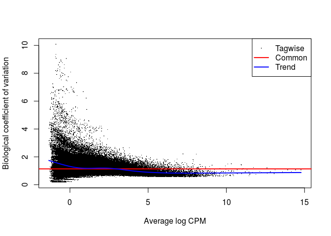

# RNASeq_Ferula_Kallisto_DEG

#After mapping reads in to kallisto, we want to find DEG for BGI_Nova_UnmappedDavis_Less50_Merged 
#import data

```r
counts_All <- read.csv("~/Ferula_RNAseq_Rbased/Kallisto_out/combined_All_counts_kallisto.csv", header=T , row.names = "target_id")
#head(counts_All) for pooling two library of BR3 (they are not replication)
#counts_All$BR3.2 <- counts_All$BR3 + counts_All$BR3.1
#counts_All$BR3 <- NULL
#counts_All$BR3.1 <- NULL
#colnames(counts_All)[19] <- "BR3"
#counts_All$BF3.2 <- counts_All$BF3 + counts_All$BF3.1
#counts_All$BF3 <- NULL
#counts_All$BF3.1 <- NULL
#colnames(counts_All)[18] <- "BF3"
#colnames(counts_All)[1] 
#rownames(counts_All)
#dim(counts_All) # 612953 18 158617 is num of transcripts in Reference
#write.csv(counts_All, file="~/Ferula_RNAseq_Rbased/Kallisto_out/combined_All_counts_kallisto.csv")
```
#filter based on read count, assign group, normalize, design matrix

```r
hist(colSums(counts_All,na.rm=TRUE))
```

<!-- -->

```r
colSums(counts_All,na.rm=TRUE)
```

```
##      DS6      DF6      DL6      DR3      DS3      DF3      DL3      DR2 
##  4961952  2694920  1295375  1089601  7362440   597663  1249417  1215260 
##      DS2      DF2      DL2      DR6      NF3      NF6      NR3      NR6 
##  1613066  4486274  1580467   934029 19398648 15951646 17638515 14573369 
##      BR3      BF3 
## 13353866 14008889
```

```r
#general threshold
colSums(counts_All,na.rm=TRUE) > 1000000 # all samples are true
```

```
##   DS6   DF6   DL6   DR3   DS3   DF3   DL3   DR2   DS2   DF2   DL2   DR6 
##  TRUE  TRUE  TRUE  TRUE  TRUE FALSE  TRUE  TRUE  TRUE  TRUE  TRUE FALSE 
##   NF3   NF6   NR3   NR6   BR3   BF3 
##  TRUE  TRUE  TRUE  TRUE  TRUE  TRUE
```

```r
counts_All_nolow <- counts_All[,colSums(counts_All,na.rm=TRUE) > 1000000]
dim(counts_All_nolow) #612953 16 but I prefer to work with all 18 libraries
```

```
## [1] 612953     16
```

```r
#sample description
samples <- data.frame(file=colnames(counts_All),
                      facility=factor(sub("(B|D|N)(S|F|L|R)(2|3|6)","\\1",colnames(counts_All))),
                      trt=factor(sub("(B|D|N)(S|F|L|R)(2|3|6)","\\2",colnames(counts_All))),
                    
                      genotype=factor(sub("(B|D|N)(S|F|L|R)(2|3|6)","\\3",colnames(counts_All)))) 
head(samples) 
```

```
##   file facility trt genotype
## 1  DS6        D   S        6
## 2  DF6        D   F        6
## 3  DL6        D   L        6
## 4  DR3        D   R        3
## 5  DS3        D   S        3
## 6  DF3        D   F        3
```

```r
#convert NA to zero
counts_All[is.na(counts_All)]<-0
# eliminating genes with low expression levels by retaining genes with > 10 reads in >= 3 samples
counts_All_small <-counts_All[rowSums(counts_All > 10) >= 3,] 
dim(counts_All_small) #90268 18 This low # versus 612953 is very interesting 
```

```
## [1] 90268    18
```

```r
dim(counts_All) #612953 18
```

```
## [1] 612953     18
```

```r
write.csv(counts_All_small,file="~/Ferula_RNAseq_Rbased/Kallisto_out/combined_All_counts_small_kalliso.csv") # use this for other analysis
```


```r
samples_small <- data.frame(file=colnames(counts_All_small),                     facility=factor(sub("(B|D|N)(S|F|L|R)(2|3|6)","\\1",colnames(counts_All_small))),
                      trt=factor(sub("(B|D|N)(S|F|L|R)(2|3|6)","\\2",colnames(counts_All_small))),
                    
                      genotype=factor(sub("(B|D|N)(S|F|L|R)(2|3|6)","\\3",colnames(counts_All_small)))) 
head(samples_small)
```

```
##   file facility trt genotype
## 1  DS6        D   S        6
## 2  DF6        D   F        6
## 3  DL6        D   L        6
## 4  DR3        D   R        3
## 5  DS3        D   S        3
## 6  DF3        D   F        3
```

```r
save(samples_small,file="~/Ferula_RNAseq_Rbased/Kallisto_out/combined_All_samples_small_kalliso.Rdata")
```

#assign group by combining all the experimental factors into one combined factor

```r
Genotype<-levels(samples_small$genotype)
samples_small$group <- paste(samples_small$genotype,samples_small$trt,samples_small$facility,sep=".")
samples_small$genotype<-as.character(samples_small$genotype)
```
#edgeR

```r
library(edgeR)
```

```
## Loading required package: limma
```

```r
dge <- DGEList(counts=counts_All_small, group=samples_small$group) 
length(colnames(counts_All_small)) # 18
```

```
## [1] 18
```

```r
dge<-calcNormFactors(dge, method = "TMM")
# look at the normalization factors
nrow(dge$samples) # 18 
```

```
## [1] 18
```

```r
hist(dge$samples[,3]) 
```

<!-- -->

```r
plot(log10(dge$sample[,"lib.size"]),dge$sample[,"norm.factors"]) 
```

<!-- -->

```r
#when we want to change the ref from first icon to others
samples_small$genotype <- as.factor(samples_small$genotype)
samples_small$genotype <- relevel(samples_small$genotype,ref="3") # plant3 reads including all three facilities
samples_small$trt <- as.factor(samples_small$trt)
samples_small$trt <- relevel(samples_small$trt,ref="R")
#design model for each factor (genotype & trt factors)
design1 <- model.matrix(~genotype+trt + facility, data=samples_small)
colnames(design1)
```

```
## [1] "(Intercept)" "genotype2"   "genotype6"   "trtF"        "trtL"       
## [6] "trtS"        "facilityD"   "facilityN"
```

```r
#First the overall dispersion
dge <- estimateGLMCommonDisp(dge,design1, verbose = T) #Disp =1.31737 , BCV =1.1478
```

```
## Disp = 1.2973 , BCV = 1.139
```

```r
dge <- estimateGLMTrendedDisp(dge,design1)
dge <- estimateGLMTagwiseDisp(dge,design1)
save(dge,file="~/Ferula_RNAseq_Rbased/Kallisto_outdge.Rdata")
plotBCV(dge)
```

<!-- -->

```r
mds.dge <- plotMDS(dge, method = "bcv",labels = dge$samples$group)
```

<!-- -->

#To find genes that are differentially expressed in gt 2 & 6 vs 3

```r
dge.fit <- glmFit(dge, design1)
#colnames(dge.fit)
dge.lrt <- glmLRT(dge.fit,coef = c("genotype2","genotype6"))
#the top 10 most differentially expressed genes
topTags(dge.lrt)
```

```
## Coefficient:  genotype2 genotype6 
##                           logFC.genotype2 logFC.genotype6   logCPM
## TRINITY_DN73583_c0_g1_i7        4.8725516       12.471829 6.514216
## TRINITY_DN68326_c0_g1_i10      -1.5461259       11.358371 5.160536
## TRINITY_DN70695_c2_g1_i2       -3.1935718      -13.413648 8.692773
## TRINITY_DN74422_c0_g1_i8       -1.4854858       11.259505 5.105611
## TRINITY_DN71601_c0_g1_i2       -1.9513660       10.606404 4.808070
## TRINITY_DN64740_c2_g1_i1       -3.0277860        8.944099 4.095733
## TRINITY_DN68326_c0_g1_i4       -0.1842713      -12.086379 6.504192
## TRINITY_DN72700_c0_g1_i1       11.6108302       10.544394 6.998101
## TRINITY_DN74810_c1_g5_i3       -0.3853776        6.997164 5.540680
## TRINITY_DN73948_c3_g1_i8      -10.7267189      -12.503070 4.936356
##                                 LR       PValue          FDR
## TRINITY_DN73583_c0_g1_i7  136.5548 2.225851e-30 1.700073e-25
## TRINITY_DN68326_c0_g1_i10 135.5027 3.766723e-30 1.700073e-25
## TRINITY_DN70695_c2_g1_i2  133.5308 1.009630e-29 3.037909e-25
## TRINITY_DN74422_c0_g1_i8  131.2971 3.084583e-29 6.960978e-25
## TRINITY_DN71601_c0_g1_i2  122.6317 2.348847e-27 4.240514e-23
## TRINITY_DN64740_c2_g1_i1  116.5452 4.926405e-26 7.411613e-22
## TRINITY_DN68326_c0_g1_i4  111.9892 4.806697e-25 6.198441e-21
## TRINITY_DN72700_c0_g1_i1  108.6661 2.531904e-24 2.856874e-20
## TRINITY_DN74810_c1_g5_i3  107.5377 4.451313e-24 4.464568e-20
## TRINITY_DN73948_c3_g1_i8  103.9596 2.663576e-23 2.325048e-19
```

```r
summary(decideTestsDGE(dge.lrt,p=0.05))
```

```
##   genotype2+genotype6
## 0               72472
## 1               17796
```

```r
#Extract genes with a FDR < 0.01 (could also use 0.05)
DEgenes1 <- topTags(dge.lrt,n = Inf)$table[topTags(dge.lrt,n = Inf)$table$FDR<0.05,]
dim(DEgenes1) #17791   6
```

```
## [1] 17796     6
```

```r
colnames(DEgenes1)
```

```
## [1] "logFC.genotype2" "logFC.genotype6" "logCPM"          "LR"             
## [5] "PValue"          "FDR"
```

```r
#head(DEgenes1)
#save to a file
write.csv(DEgenes1,file="~/Ferula_RNAseq_Rbased/Kallisto_out/Ferula_RNAseq.DEgenes1.csv")
#To find genes that are differentially expressed in gt 2 & 6 vs 3 seperately
dge.lrt.gt2 <- glmLRT(dge.fit,coef = c("genotype2"))
topTags(dge.lrt.gt2)
```

```
## Coefficient:  genotype2 
##                               logFC   logCPM        LR       PValue
## TRINITY_DN72700_c0_g1_i1  11.610830 6.998101 105.07722 1.174675e-24
## TRINITY_DN74573_c1_g1_i1   8.178046 6.263342  78.83056 6.767215e-19
## TRINITY_DN67996_c0_g2_i3  10.326904 6.045411  77.94386 1.060109e-18
## TRINITY_DN68894_c0_g1_i18 11.537138 4.824070  77.29100 1.475369e-18
## TRINITY_DN69086_c1_g1_i2   8.488683 7.373193  74.33422 6.595017e-18
## TRINITY_DN67884_c3_g1_i2  10.142108 5.512749  68.14760 1.517039e-16
## TRINITY_DN64039_c0_g1_i1   9.232858 6.980381  66.66598 3.216386e-16
## TRINITY_DN74688_c0_g1_i10  9.114850 6.463315  64.31187 1.062041e-15
## TRINITY_DN67884_c3_g1_i10 -7.669510 5.803737  64.03740 1.220794e-15
## TRINITY_DN61880_c1_g1_i11 12.169640 3.587781  61.73838 3.922590e-15
##                                    FDR
## TRINITY_DN72700_c0_g1_i1  1.060356e-19
## TRINITY_DN74573_c1_g1_i1  3.054315e-14
## TRINITY_DN67996_c0_g2_i3  3.189798e-14
## TRINITY_DN68894_c0_g1_i18 3.329464e-14
## TRINITY_DN69086_c1_g1_i2  1.190638e-13
## TRINITY_DN67884_c3_g1_i2  2.282335e-12
## TRINITY_DN64039_c0_g1_i1  4.147667e-12
## TRINITY_DN74688_c0_g1_i10 1.198354e-11
## TRINITY_DN67884_c3_g1_i10 1.224429e-11
## TRINITY_DN61880_c1_g1_i11 3.540843e-11
```

```r
summary(decideTestsDGE(dge.lrt.gt2, p=0.05))
```

```
##    genotype2
## -1      1943
## 0      86980
## 1       1345
```

```r
dge.lrt.gt6 <- glmLRT(dge.fit,coef = c("genotype6"))
topTags(dge.lrt.gt6)
```

```
## Coefficient:  genotype6 
##                                logFC   logCPM        LR       PValue
## TRINITY_DN70695_c2_g1_i2  -13.413648 8.692773 127.07350 1.790194e-29
## TRINITY_DN68326_c0_g1_i4  -12.086379 6.504192 110.20297 8.845383e-26
## TRINITY_DN71601_c0_g1_i6  -11.738985 6.788035 103.64969 2.414451e-24
## TRINITY_DN73583_c0_g1_i7   12.471829 6.514216 100.97345 9.322473e-24
## TRINITY_DN72700_c0_g1_i1   10.544394 6.998101  98.35908 3.489963e-23
## TRINITY_DN69483_c0_g2_i5  -11.504988 6.083135  93.40432 4.263183e-22
## TRINITY_DN62784_c0_g1_i3  -11.091085 5.906587  91.95553 8.864626e-22
## TRINITY_DN74573_c1_g1_i1    8.428547 6.263342  91.63204 1.043888e-21
## TRINITY_DN68894_c0_g1_i18  11.944810 4.824070  91.39439 1.177097e-21
## TRINITY_DN68326_c0_g1_i10  11.358371 5.160536  86.52660 1.378704e-20
##                                    FDR
## TRINITY_DN70695_c2_g1_i2  1.615973e-24
## TRINITY_DN68326_c0_g1_i4  3.992275e-21
## TRINITY_DN71601_c0_g1_i6  7.264921e-20
## TRINITY_DN73583_c0_g1_i7  2.103802e-19
## TRINITY_DN72700_c0_g1_i1  6.300640e-19
## TRINITY_DN69483_c0_g2_i5  6.413817e-18
## TRINITY_DN62784_c0_g1_i3  1.143131e-17
## TRINITY_DN74573_c1_g1_i1  1.177871e-17
## TRINITY_DN68894_c0_g1_i18 1.180602e-17
## TRINITY_DN68326_c0_g1_i10 1.244528e-16
```

```r
summary(decideTestsDGE(dge.lrt.gt6, p=0.05))
```

```
##    genotype6
## -1      9727
## 0      74845
## 1       5696
```

```r
DEGs1 <- data.frame ("gt2" = as.data.frame(summary(decideTestsDGE(dge.lrt.gt2, p=0.05)))$Freq,
                                     "gt6" = as.data.frame(summary(decideTestsDGE(dge.lrt.gt6, p=0.05)))$Freq)
rownames(DEGs1) <- c("down", "no", "up")
DEGs1 <- DEGs1[c("down", "up"),]
DEGs1
```

```
##       gt2  gt6
## down 1943 9727
## up   1345 5696
```

```r
save(DEGs1, file="~/Ferula_RNAseq_Rbased/Kallisto_out/Ferula_RNAseq.DEGs1.Rdata")
```


```r
library(reshape2)
library(ggplot2)
DEGs1.melt <- melt(DEGs1)
```

```
## No id variables; using all as measure variables
```

```r
DEGs1.melt$DE <- rep(c("down", "up"), 2)
colnames(DEGs1.melt) <- c("genotype", "number", "DE")
DEGs1.melt
```

```
##   genotype number   DE
## 1      gt2   1943 down
## 2      gt2   1345   up
## 3      gt6   9727 down
## 4      gt6   5696   up
```

```r
# reorder: up 1st down 2nd 
DEGs1.melt$DE <- factor(DEGs1.melt$DE, levels = c("up", "down"))
DEGs1.melt <- DEGs1.melt[order(DEGs1.melt$DE),]
DEGs1.melt
```

```
##   genotype number   DE
## 2      gt2   1345   up
## 4      gt6   5696   up
## 1      gt2   1943 down
## 3      gt6   9727 down
```

```r
DEGs1.melt$gt <- gsub("(X)(\\.)(S|L|F)(\\.)", "\\1",DEGs1.melt$genotype)

DEGs1.melt$trt <- gsub("(X)(\\.)(S|L|F)(\\.)", "\\2",DEGs1.melt$genotype)
```
#making ggplot for DEGs

```r
library(ggplot2)
p.DEGs1 <- ggplot(data = DEGs1.melt)
p.DEGs1 <- p.DEGs1 + geom_bar(mapping = aes(fill=DE, x = factor(DE), y = number) , stat= "identity")
p.DEGs1 <- p.DEGs1 + facet_grid(~genotype) 
p.DEGs1 <- p.DEGs1 + labs(y = "number of differentially expressed genes", x = "")
p.DEGs1
```

<!-- -->

```r
ggsave(p.DEGs1, file="~/Ferula_RNAseq_Rbased/Kallisto_out/Ferula_RNAseq.p.DEG1.png")
```

```
## Saving 7 x 5 in image
```

#To find genes that are differentially expressed in trt S, F & L vs R 

```r
dge.lrt.trt <- glmLRT(dge.fit,coef = c("trtF","trtL", "trtS"))
#the top 10 most differentially expressed genes
topTags(dge.lrt.trt)
```

```
## Coefficient:  trtF trtL trtS 
##                           logFC.trtF logFC.trtL logFC.trtS   logCPM
## TRINITY_DN62548_c2_g5_i1    8.062721 -3.7802573 -0.5870111 5.351324
## TRINITY_DN69156_c1_g5_i2   10.000549  3.3037370  2.4097154 6.623887
## TRINITY_DN60565_c0_g4_i1   10.565691  5.2889835  2.3505614 4.713719
## TRINITY_DN62209_c3_g1_i2    6.161419  0.5376617 -0.8776464 8.218885
## TRINITY_DN68694_c2_g1_i13   8.437424 -4.4707562 -1.7783742 7.029411
## TRINITY_DN69782_c0_g6_i2    8.861235  3.5018228  2.3293737 5.685749
## TRINITY_DN63227_c1_g1_i5   10.057363  0.4381458 -0.2637316 5.965568
## TRINITY_DN59238_c0_g1_i1    8.282750  1.0467821  0.1271037 5.313810
## TRINITY_DN72650_c1_g6_i2    6.453427  1.3570685 -0.6034135 7.733244
## TRINITY_DN68694_c2_g1_i4   10.251360  2.6263579  1.8154358 7.806057
##                                 LR       PValue          FDR
## TRINITY_DN62548_c2_g5_i1  123.1109 1.649646e-26 1.489103e-21
## TRINITY_DN69156_c1_g5_i2  119.7011 8.949699e-26 4.039357e-21
## TRINITY_DN60565_c0_g4_i1  117.0660 3.305600e-25 9.946331e-21
## TRINITY_DN62209_c3_g1_i2  114.7025 1.066937e-24 2.285175e-20
## TRINITY_DN68694_c2_g1_i13 114.3577 1.265772e-24 2.285175e-20
## TRINITY_DN69782_c0_g6_i2  109.8180 1.200903e-23 1.806719e-19
## TRINITY_DN63227_c1_g1_i5  106.2679 6.972454e-23 8.991279e-19
## TRINITY_DN59238_c0_g1_i1  105.3198 1.115213e-22 1.258350e-18
## TRINITY_DN72650_c1_g6_i2  103.2007 3.185493e-22 3.194979e-18
## TRINITY_DN68694_c2_g1_i4  102.4993 4.508448e-22 4.069686e-18
```

```r
summary(decideTestsDGE(dge.lrt.trt,p=0.05))
```

```
##   trtF+trtL+trtS
## 0          81245
## 1           9023
```

```r
#Extract genes with a FDR < 0.01 (could also use 0.05)
DEgenes2 <- topTags(dge.lrt.trt,n = Inf)$table[topTags(dge.lrt.trt,n = Inf)$table$FDR<0.05,]
write.csv(DEgenes2,file="~/Ferula_RNAseq_Rbased/Kallisto_out/Ferula_RNAseq.DEgenes2.csv")
dim(DEgenes2) #9012  7
```

```
## [1] 9023    7
```

```r
colnames(DEgenes2)
```

```
## [1] "logFC.trtF" "logFC.trtL" "logFC.trtS" "logCPM"     "LR"        
## [6] "PValue"     "FDR"
```

```r
head(DEgenes2)
```

```
##                           logFC.trtF logFC.trtL logFC.trtS   logCPM
## TRINITY_DN62548_c2_g5_i1    8.062721 -3.7802573 -0.5870111 5.351324
## TRINITY_DN69156_c1_g5_i2   10.000549  3.3037370  2.4097154 6.623887
## TRINITY_DN60565_c0_g4_i1   10.565691  5.2889835  2.3505614 4.713719
## TRINITY_DN62209_c3_g1_i2    6.161419  0.5376617 -0.8776464 8.218885
## TRINITY_DN68694_c2_g1_i13   8.437424 -4.4707562 -1.7783742 7.029411
## TRINITY_DN69782_c0_g6_i2    8.861235  3.5018228  2.3293737 5.685749
##                                 LR       PValue          FDR
## TRINITY_DN62548_c2_g5_i1  123.1109 1.649646e-26 1.489103e-21
## TRINITY_DN69156_c1_g5_i2  119.7011 8.949699e-26 4.039357e-21
## TRINITY_DN60565_c0_g4_i1  117.0660 3.305600e-25 9.946331e-21
## TRINITY_DN62209_c3_g1_i2  114.7025 1.066937e-24 2.285175e-20
## TRINITY_DN68694_c2_g1_i13 114.3577 1.265772e-24 2.285175e-20
## TRINITY_DN69782_c0_g6_i2  109.8180 1.200903e-23 1.806719e-19
```

##To find genes that are differentially expressed in trt S, F & L vs R seperately

```r
dge.lrt.trtF <- glmLRT(dge.fit,coef = c("trtF"))
topTags(dge.lrt.trtF)
```

```
## Coefficient:  trtF 
##                               logFC     logCPM       LR       PValue
## TRINITY_DN67195_c0_g1_i10  7.155751 -0.4355536 85.41241 2.421963e-20
## TRINITY_DN69156_c1_g5_i2  10.000549  6.6238874 82.20262 1.228273e-19
## TRINITY_DN60565_c0_g4_i1  10.565691  4.7137186 79.70732 4.341892e-19
## TRINITY_DN69782_c0_g6_i2   8.861235  5.6857492 78.20516 9.287548e-19
## TRINITY_DN73129_c0_g2_i10  6.652588 -0.6181325 74.32164 6.637194e-18
## TRINITY_DN67643_c0_g1_i11  6.680921 -0.5973938 74.09587 7.441380e-18
## TRINITY_DN67350_c1_g1_i4   6.646439 -0.5840426 73.61804 9.479443e-18
## TRINITY_DN73158_c0_g1_i4   6.506390 -0.5586382 72.22887 1.916315e-17
## TRINITY_DN75445_c1_g3_i1  10.696086  5.4088646 71.46394 2.823722e-17
## TRINITY_DN68912_c1_g1_i4   6.570294 -0.6518668 70.52718 4.539686e-17
##                                    FDR
## TRINITY_DN67195_c0_g1_i10 2.186257e-15
## TRINITY_DN69156_c1_g5_i2  5.543686e-15
## TRINITY_DN60565_c0_g4_i1  1.306446e-14
## TRINITY_DN69782_c0_g6_i2  2.095921e-14
## TRINITY_DN73129_c0_g2_i10 1.119531e-13
## TRINITY_DN67643_c0_g1_i11 1.119531e-13
## TRINITY_DN67350_c1_g1_i4  1.222415e-13
## TRINITY_DN73158_c0_g1_i4  2.162274e-13
## TRINITY_DN75445_c1_g3_i1  2.832131e-13
## TRINITY_DN68912_c1_g1_i4  4.097884e-13
```

```r
summary(decideTestsDGE(dge.lrt.trtF, p=0.05))
```

```
##     trtF
## -1  1508
## 0  84266
## 1   4494
```

```r
dge.lrt.trtL <- glmLRT(dge.fit,coef = c("trtL"))
topTags(dge.lrt.trtL)
```

```
## Coefficient:  trtL 
##                               logFC   logCPM       LR       PValue
## TRINITY_DN67803_c3_g2_i1   8.412609 5.817792 55.20046 1.088434e-13
## TRINITY_DN77374_c0_g1_i1   6.628537 6.554695 54.30151 1.719696e-13
## TRINITY_DN65609_c1_g2_i6  12.277298 4.761098 52.92261 3.469524e-13
## TRINITY_DN68548_c0_g1_i3 -11.121130 6.152299 52.31403 4.729835e-13
## TRINITY_DN70998_c2_g3_i1  10.659748 4.420718 52.03549 5.450644e-13
## TRINITY_DN63328_c0_g3_i1  14.226263 6.256844 46.89064 7.506051e-12
## TRINITY_DN70998_c2_g2_i2   9.496643 4.999502 46.23637 1.048129e-11
## TRINITY_DN74332_c0_g1_i3  10.668811 5.325251 46.23197 1.050488e-11
## TRINITY_DN67505_c0_g1_i2  11.019892 7.152871 45.55517 1.483995e-11
## TRINITY_DN63328_c0_g5_i1   6.991787 5.210151 44.88857 2.085723e-11
##                                   FDR
## TRINITY_DN67803_c3_g2_i1 7.761677e-09
## TRINITY_DN77374_c0_g1_i1 7.761677e-09
## TRINITY_DN65609_c1_g2_i6 9.840375e-09
## TRINITY_DN68548_c0_g1_i3 9.840375e-09
## TRINITY_DN70998_c2_g3_i1 9.840375e-09
## TRINITY_DN63328_c0_g3_i1 1.129260e-07
## TRINITY_DN70998_c2_g2_i2 1.185318e-07
## TRINITY_DN74332_c0_g1_i3 1.185318e-07
## TRINITY_DN67505_c0_g1_i2 1.488414e-07
## TRINITY_DN63328_c0_g5_i1 1.882741e-07
```

```r
summary(decideTestsDGE(dge.lrt.trtL, p=0.05))
```

```
##     trtL
## -1   937
## 0  87962
## 1   1369
```

```r
dge.lrt.trtS <- glmLRT(dge.fit,coef = c("trtS"))
topTags(dge.lrt.trtS)
```

```
## Coefficient:  trtS 
##                               logFC    logCPM       LR       PValue
## TRINITY_DN63612_c0_g3_i5 -12.022555 3.0688444 39.39633 3.459465e-10
## TRINITY_DN74332_c0_g4_i2   9.692500 4.7148284 39.23830 3.751089e-10
## TRINITY_DN65609_c1_g2_i6  10.674947 4.7610982 36.43856 1.575548e-09
## TRINITY_DN69025_c0_g2_i3  10.510637 4.8016045 33.16804 8.452839e-09
## TRINITY_DN63628_c0_g1_i2   5.692171 5.5891450 32.75093 1.047561e-08
## TRINITY_DN70650_c3_g1_i9  12.706845 6.1601288 31.89167 1.630146e-08
## TRINITY_DN75442_c0_g2_i1  11.559205 4.8601781 31.45126 2.045099e-08
## TRINITY_DN72683_c1_g2_i1  -9.592361 3.3426713 30.82164 2.828661e-08
## TRINITY_DN75715_c0_g1_i6  13.628545 0.3469659 30.46139 3.405784e-08
## TRINITY_DN67319_c1_g2_i8   9.761393 4.5667134 30.30167 3.698083e-08
##                                   FDR
## TRINITY_DN63612_c0_g3_i5 1.693016e-05
## TRINITY_DN74332_c0_g4_i2 1.693016e-05
## TRINITY_DN65609_c1_g2_i6 4.740719e-05
## TRINITY_DN69025_c0_g2_i3 1.891225e-04
## TRINITY_DN63628_c0_g1_i2 1.891225e-04
## TRINITY_DN70650_c3_g1_i9 2.452500e-04
## TRINITY_DN75442_c0_g2_i1 2.637243e-04
## TRINITY_DN72683_c1_g2_i1 3.191720e-04
## TRINITY_DN75715_c0_g1_i6 3.277238e-04
## TRINITY_DN67319_c1_g2_i8 3.277238e-04
```

```r
summary(decideTestsDGE(dge.lrt.trtS, p=0.05))
```

```
##     trtS
## -1    79
## 0  89945
## 1    244
```

```r
#For finding the expression of each genes for each tissues
decideTestsDGE(dge.lrt.trtF, p=0.05)
```

```
## TestResults matrix
##                           trtF
## TRINITY_DN113716_c0_g1_i1    0
## TRINITY_DN134440_c0_g1_i1    0
## TRINITY_DN139246_c0_g1_i1    1
## TRINITY_DN112407_c0_g1_i1    0
## TRINITY_DN102327_c0_g1_i1    0
## 90263 more rows ...
```

```r
a <- decideTestsDGE(dge.lrt.trtF, p=0.05)
a[1:3]
```

```
## [1] 0 0 1
```

```r
a[1:3,]
```

```
## TRINITY_DN113716_c0_g1_i1 TRINITY_DN134440_c0_g1_i1 
##                         0                         0 
## TRINITY_DN139246_c0_g1_i1 
##                         1
```

```r
a[1:3,1]
```

```
## TRINITY_DN113716_c0_g1_i1 TRINITY_DN134440_c0_g1_i1 
##                         0                         0 
## TRINITY_DN139246_c0_g1_i1 
##                         1
```

```r
dim(a) #90268 1
```

```
## [1] 90268     1
```

```r
b <- rownames(dge.lrt.trtF$coefficients)
c <- data.frame(b,a)
#view(c)
dge.lrt.trtL <- glmLRT(dge.fit,coef = c("trtL"))
d <- decideTestsDGE(dge.lrt.trtL, p=0.05)
e <- decideTestsDGE(dge.lrt.trtS, p=0.05)
c <- data.frame(b,a,d,e)
all_trts <- c
colnames(all_trts) <- c("Gene","Flower","Leaf","Stem")
#View(all_trts)
write.table(all_trts, "all_trts.txt", col.names = T, row.names = F)
```

#draw figure for DE genes across different tissues

```r
DEGs2 <- data.frame ("trtF" = as.data.frame(summary(decideTestsDGE(dge.lrt.trtF, p=0.05)))$Freq,
                                     "trtL" = as.data.frame(summary(decideTestsDGE(dge.lrt.trtL, p=0.05)))$Freq,
                                     "trtS"= as.data.frame( summary(decideTestsDGE(dge.lrt.trtS, p=0.05)))$Freq)
rownames(DEGs2) <- c("down", "no", "up")
DEGs2 <- DEGs2[c("down", "up"),]
DEGs2
```

```
##      trtF trtL trtS
## down 1508  937   79
## up   4494 1369  244
```

```r
save(DEGs2, file="~/Ferula_RNAseq_Rbased/Kallisto_out/Ferula_RNAseq.DEGs2.Rdata")
DEGs2.melt <- melt(DEGs2)
```

```
## No id variables; using all as measure variables
```

```r
DEGs2.melt$DE <- rep(c("down", "up"), 3)
colnames(DEGs2.melt) <- c("genotype", "number", "DE")
DEGs2.melt
```

```
##   genotype number   DE
## 1     trtF   1508 down
## 2     trtF   4494   up
## 3     trtL    937 down
## 4     trtL   1369   up
## 5     trtS     79 down
## 6     trtS    244   up
```

```r
# reorder: up 1st down 2nd 
DEGs2.melt$DE <- factor(DEGs2.melt$DE, levels = c("up", "down"))
DEGs2.melt <- DEGs2.melt[order(DEGs2.melt$DE),]
DEGs2.melt
```

```
##   genotype number   DE
## 2     trtF   4494   up
## 4     trtL   1369   up
## 6     trtS    244   up
## 1     trtF   1508 down
## 3     trtL    937 down
## 5     trtS     79 down
```

```r
DEGs2.melt$gt <- gsub("(X)(\\.)(S|L|F)(\\.)", "\\1",DEGs2.melt$genotype)
DEGs2.melt$trt <- gsub("(X)(\\.)(S|L|F)(\\.)", "\\2",DEGs2.melt$genotype)
### making ggplot for DEGs
library(ggplot2)
p.DEGs2 <- ggplot(data = DEGs2.melt)
p.DEGs2 <- p.DEGs2 + geom_bar(mapping = aes(fill=DE, x = factor(DE), y = number) , stat= "identity")
p.DEGs2 <- p.DEGs2 + facet_grid(~genotype) 
p.DEGs2 <- p.DEGs2 + labs(y = "number of differentially expressed genes", x = "")
p.DEGs2
```

<!-- -->

```r
ggsave(p.DEGs2, file="~/Ferula_RNAseq_Rbased/Kallisto_out/Ferula_RNAseq.p.DEG2.png")
```

```
## Saving 7 x 5 in image
```

#create .txt file for creating gff3

```r
names <- rownames(DEgenes2[1:1000,])
names <- paste0("<",names)
names <- data.frame(names)
write.table(names, "top_transcripts.txt", col.names = F, row.names = F, quote = F)


#for all DE genes
names2 <-rownames(DEgenes2)
names2 <- paste0("<",names2)
names2 <- data.frame(names2)
write.table(names2, "All_transcripts.txt", col.names = F, row.names = F, quote = F)
```

# Ward Hierarchical Clustering
counts_Allt <- t(counts_All)
d <- dist(countst, method = "euclidean") # distance matrix
d2 <- dist(counts_Allt,method = "euclidean")
fit <- hclust(d2, method="ward.D") 
a <- plot(fit) # display dendogram
a <- cutree(a, k=2) # cut tree into 5 clusters
# draw dendogram with red borders around the 5 clusters 
rect.hclust(a, k=2, border="red")
# Ward Hierarchical Clustering with Bootstrapped p values
library(pvclust)
fit <- pvclust(counts, method.hclust="ward",
   method.dist="euclidean")
plot(fit) # dendogram with p values
# add rectangles around groups highly supported by the data
pvrect(fit, alpha=.95)
```
