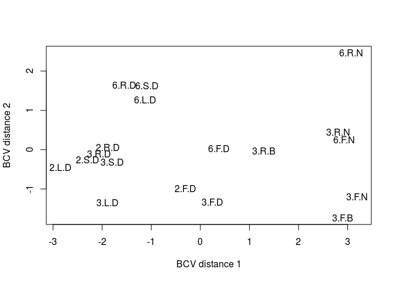

# RNASeq_Ferula_Kallisto_DEG_Drap_Oases_Plant6


#After mapping reads in to kallisto, we want to find DEG for Drap_Oases_Plant6.fasta, this fasta are from adding transcripts which are not available in drap assembly result in to drap assembly  
#import data


```r
counts_All <- read.csv("~/Ferula_RNAseq_Rbased/Kallisto_out/combined_drap_oases_plant6_counts_kallisto.csv", header=T, row.names = "target_id")
head(counts_All) #for pooling two library of BR3 (they are not replication)
```

```
##                             DS6      DF6     DL6       DR3       DS3
## oases2_CL10000Contig1_1 15.0000  4.59606  3.0000   3.00000  20.95490
## oases2_CL10001Contig1_1  5.0000 12.00000  1.0000  26.00000  32.00000
## oases2_CL10005Contig1_1 81.2495 31.04250  2.0000 131.25800 147.06100
## oases2_CL10009Contig1_1  5.0000 45.71530  0.0000   5.72259  15.10610
## oases2_CL10011Contig1_1 12.6235 18.18220  1.6518   5.33567   1.28541
## oases2_CL10019Contig1_1 56.4402 28.86100 16.2551  11.55010  52.63800
##                                DF3      DL3      DR2     DS2      DF2
## oases2_CL10000Contig1_1  0.0000000  1.00000  3.00000 3.00000  27.7982
## oases2_CL10001Contig1_1  0.0000000  2.00000 25.00000 0.00000  46.9724
## oases2_CL10005Contig1_1 15.7109000 19.00000 55.99870 3.00000  74.0393
## oases2_CL10009Contig1_1 10.7437000  6.00000  3.00000 0.00000 152.4140
## oases2_CL10011Contig1_1  0.0795711  0.00000 12.64270 8.61167  11.2904
## oases2_CL10019Contig1_1 18.6827000  2.40846  4.71514 7.72168  18.9723
##                             DL2     DR6       NF3       NF6      NR3
## oases2_CL10000Contig1_1 22.0000  1.0000  29.75780   8.72591  13.7127
## oases2_CL10001Contig1_1  1.0000  3.0000   0.00000   0.00000   0.0000
## oases2_CL10005Contig1_1  5.0000 51.4577  20.00000   4.00000   5.0000
## oases2_CL10009Contig1_1  0.0000  1.0000 394.25700  62.39880 124.4290
## oases2_CL10011Contig1_1 29.0000  4.7750   5.83154  63.86720   0.0000
## oases2_CL10019Contig1_1 63.7184  7.2763  55.63170 112.53500  33.2134
##                              NR6      BR3    BR3.1       BF3     BF3.1
## oases2_CL10000Contig1_1  8.55384  7.40930 13.67940  14.64350   9.56439
## oases2_CL10001Contig1_1  0.00000  0.00000  1.00000   0.00000   0.00000
## oases2_CL10005Contig1_1  1.00000 14.62720 14.00000   2.00000   3.00000
## oases2_CL10009Contig1_1  9.63900 14.07770 17.26550 215.81000 192.65200
## oases2_CL10011Contig1_1 61.14940  0.00000  4.71652  15.64550   0.00000
## oases2_CL10019Contig1_1 43.63300  7.65049  9.86757   9.59389   8.57577
```

```r
counts_All$BR3.2 <- counts_All$BR3 + counts_All$BR3.1
counts_All$BR3 <- NULL
counts_All$BR3.1 <- NULL
colnames(counts_All)[19] <- "BR3"
counts_All$BF3.2 <- counts_All$BF3 + counts_All$BF3.1
counts_All$BF3 <- NULL
counts_All$BF3.1 <- NULL
colnames(counts_All)[18] <- "BF3"
colnames(counts_All)[1] 
```

```
## [1] "DS6"
```

```r
rownames(counts_All)
```

```
##     [1] "oases2_CL10000Contig1_1"               
##     [2] "oases2_CL10001Contig1_1"               
##     [3] "oases2_CL10005Contig1_1"               
##     [4] "oases2_CL10009Contig1_1"               
##     [5] "oases2_CL10011Contig1_1"               
##     [6] "oases2_CL10019Contig1_1"               
##     [7] "oases2_CL10026Contig1_1"               
##     [8] "oases2_CL1002Contig1_1"                
##     [9] "oases2_CL10039Contig1_1"               
##    [10] "oases2_CL10052Contig1_1"               
##    [11] "oases2_CL1005Contig1_1"                
##    [12] "oases2_CL10068Contig1_1"               
##    [13] "oases2_CL10085Contig1_1"               
##    [14] "oases2_CL1008Contig1_2"                
##    [15] "oases2_CL10095Contig1_1"               
##    [16] "oases2_CL100Contig1_1"                 
##    [17] "oases2_CL10114Contig1_1"               
##    [18] "oases2_CL10115Contig1_1"               
##    [19] "oases2_CL10115Contig1_2"               
##    [20] "oases2_CL10121Contig1_1"               
##    [21] "oases2_CL10124Contig1_1"               
##    [22] "oases2_CL10128Contig1_1"               
##    [23] "oases2_CL10131Contig1_1"               
##    [24] "oases2_CL10135Contig1_1"               
##    [25] "oases2_CL1013Contig1_1"                
##    [26] "oases2_CL10149Contig1_1"               
##    [27] "oases2_CL10154Contig1_1"               
##    [28] "oases2_CL10154Contig1_2"               
##    [29] "oases2_CL1015Contig1_1"                
##    [30] "oases2_CL10170Contig1_1"               
##    [31] "oases2_CL10173Contig1_1"               
##    [32] "oases2_CL10175Contig1_1"               
##    [33] "oases2_CL10176Contig1_1"               
##    [34] "oases2_CL10178Contig1_1"               
##    [35] "oases2_CL10180Contig1_1"               
##    [36] "oases2_CL1018Contig1_1"                
##    [37] "oases2_CL10190Contig1_1"               
##    [38] "oases2_CL10202Contig1_1"               
##    [39] "oases2_CL10209Contig1_1"               
##    [40] "oases2_CL10211Contig1_1"               
##    [41] "oases2_CL10216Contig1_1"               
##    [42] "oases2_CL10223Contig1_1"               
##    [43] "oases2_CL10224Contig1_1"               
##    [44] "oases2_CL10262Contig1_1"               
##    [45] "oases2_CL10275Contig1_1"               
##    [46] "oases2_CL1029Contig1_1"                
##    [47] "oases2_CL102Contig2_1"                 
##    [48] "oases2_CL10301Contig1_1"               
##    [49] "oases2_CL10301Contig1_2"               
##    [50] "oases2_CL1030Contig1_1"                
##    [51] "oases2_CL10323Contig1_1"               
##    [52] "oases2_CL10327Contig1_1"               
##    [53] "oases2_CL10329Contig1_1"               
##    [54] "oases2_CL10330Contig1_1"               
##    [55] "oases2_CL10345Contig1_1"               
##    [56] "oases2_CL10345Contig1_2"               
##    [57] "oases2_CL10345Contig1_3"               
##    [58] "oases2_CL10345Contig1_4"               
##    [59] "oases2_CL10346Contig1_1"               
##    [60] "oases2_CL10353Contig1_1"               
##    [61] "oases2_CL10355Contig1_1"               
##    [62] "oases2_CL10360Contig1_2"               
##    [63] "oases2_CL10361Contig1_1"               
##    [64] "oases2_CL10365Contig1_1"               
##    [65] "oases2_CL10366Contig1_1"               
##    [66] "oases2_CL10370Contig1_1"               
##    [67] "oases2_CL10373Contig1_1"               
##    [68] "oases2_CL10375Contig1_1"               
##    [69] "oases2_CL10381Contig1_1"               
##    [70] "oases2_CL10382Contig1_1"               
##    [71] "oases2_CL10389Contig1_1"               
##    [72] "oases2_CL10408Contig1_1"               
##    [73] "oases2_CL10409Contig1_1"               
##    [74] "oases2_CL1040Contig1_1"                
##    [75] "oases2_CL10418Contig1_1"               
##    [76] "oases2_CL10422Contig1_1"               
##    [77] "oases2_CL10424Contig1_1"               
##    [78] "oases2_CL10436Contig1_1"               
##    [79] "oases2_CL10440Contig1_1"               
##    [80] "oases2_CL1044Contig1_1"                
##    [81] "oases2_CL10458Contig1_1"               
##    [82] "oases2_CL10459Contig1_1"               
##    [83] "oases2_CL10464Contig1_1"               
##    [84] "oases2_CL10467Contig1_1"               
##    [85] "oases2_CL1046Contig1_1"                
##    [86] "oases2_CL10476Contig1_1"               
##    [87] "oases2_CL10479Contig1_1"               
##    [88] "oases2_CL1047Contig1_1"                
##    [89] "oases2_CL1048Contig1_1"                
##    [90] "oases2_CL10498Contig1_1"               
##    [91] "oases2_CL10499Contig1_1"               
##    [92] "oases2_CL10504Contig1_1"               
##    [93] "oases2_CL10505Contig1_1"               
##    [94] "oases2_CL10509Contig1_1"               
##    [95] "oases2_CL1050Contig1_1"                
##    [96] "oases2_CL10511Contig1_1"               
##    [97] "oases2_CL10516Contig1_1"               
##    [98] "oases2_CL10518Contig1_1"               
##    [99] "oases2_CL1051Contig1_1"                
##   [100] "oases2_CL10520Contig1_1"               
##   [101] "oases2_CL10528Contig1_1"               
##   [102] "oases2_CL10529Contig1_1"               
##   [103] "oases2_CL10538Contig1_1"               
##   [104] "oases2_CL10546Contig1_1"               
##   [105] "oases2_CL10547Contig1_1"               
##   [106] "oases2_CL10557Contig1_1"               
##   [107] "oases2_CL10559Contig1_1"               
##   [108] "oases2_CL1055Contig1_1"                
##   [109] "oases2_CL10566Contig1_1"               
##   [110] "oases2_CL1057Contig1_1"                
##   [111] "oases2_CL10587Contig1_1"               
##   [112] "oases2_CL10594Contig1_1"               
##   [113] "oases2_CL10597Contig1_2"               
##   [114] "oases2_CL105Contig2_1"                 
##   [115] "oases2_CL10620Contig1_1"               
##   [116] "oases2_CL10622Contig1_1"               
##   [117] "oases2_CL1062Contig1_1"                
##   [118] "oases2_CL10631Contig1_1"               
##   [119] "oases2_CL10633Contig1_1"               
##   [120] "oases2_CL1063Contig1_1"                
##   [121] "oases2_CL10646Contig1_1"               
##   [122] "oases2_CL10666Contig1_1"               
##   [123] "oases2_CL1066Contig1_1"                
##   [124] "oases2_CL10672Contig1_1"               
##   [125] "oases2_CL10674Contig1_1"               
##   [126] "oases2_CL1068Contig1_1"                
##   [127] "oases2_CL10709Contig1_1"               
##   [128] "oases2_CL10711Contig1_1"               
##   [129] "oases2_CL10714Contig1_1"               
##   [130] "oases2_CL10715Contig1_1"               
##   [131] "oases2_CL10719Contig1_1"               
##   [132] "oases2_CL10721Contig1_1"               
##   [133] "oases2_CL10723Contig1_2"               
##   [134] "oases2_CL10746Contig1_1"               
##   [135] "oases2_CL10750Contig1_1"               
##   [136] "oases2_CL10755Contig1_1"               
##   [137] "oases2_CL10756Contig1_1"               
##   [138] "oases2_CL10768Contig1_1"               
##   [139] "oases2_CL10769Contig1_1"               
##   [140] "oases2_CL1076Contig1_1"                
##   [141] "oases2_CL10787Contig1_1"               
##   [142] "oases2_CL10789Contig1_1"               
##   [143] "oases2_CL10791Contig1_1"               
##   [144] "oases2_CL10799Contig1_1"               
##   [145] "oases2_CL107Contig2_1"                 
##   [146] "oases2_CL10804Contig1_1"               
##   [147] "oases2_CL10805Contig1_1"               
##   [148] "oases2_CL10809Contig1_1"               
##   [149] "oases2_CL10819Contig1_1"               
##   [150] "oases2_CL10833Contig1_1"               
##   [151] "oases2_CL10839Contig1_1"               
##   [152] "oases2_CL10848Contig1_1"               
##   [153] "oases2_CL10849Contig1_1"               
##   [154] "oases2_CL10852Contig1_1"               
##   [155] "oases2_CL10868Contig1_1"               
##   [156] "oases2_CL10869Contig1_1"               
##   [157] "oases2_CL10881Contig1_1"               
##   [158] "oases2_CL10884Contig1_1"               
##   [159] "oases2_CL10885Contig1_1"               
##   [160] "oases2_CL10887Contig1_1"               
##   [161] "oases2_CL1088Contig1_1"                
##   [162] "oases2_CL10893Contig1_1"               
##   [163] "oases2_CL10894Contig1_1"               
##   [164] "oases2_CL10895Contig1_1"               
##   [165] "oases2_CL10898Contig1_1"               
##   [166] "oases2_CL108Contig2_1"                 
##   [167] "oases2_CL10908Contig1_1"               
##   [168] "oases2_CL10910Contig1_1"               
##   [169] "oases2_CL10913Contig1_1"               
##   [170] "oases2_CL10918Contig1_1"               
##   [171] "oases2_CL10922Contig1_1"               
##   [172] "oases2_CL10929Contig1_1"               
##   [173] "oases2_CL10933Contig1_1"               
##   [174] "oases2_CL10934Contig1_1"               
##   [175] "oases2_CL10936Contig1_1"               
##   [176] "oases2_CL10937Contig1_1"               
##   [177] "oases2_CL10940Contig1_1"               
##   [178] "oases2_CL10945Contig1_1"               
##   [179] "oases2_CL10952Contig1_1"               
##   [180] "oases2_CL1095Contig2_1"                
##   [181] "oases2_CL10972Contig1_1"               
##   [182] "oases2_CL10979Contig1_1"               
##   [183] "oases2_CL10987Contig1_1"               
##   [184] "oases2_CL10988Contig1_1"               
##   [185] "oases2_CL1098Contig1_1"                
##   [186] "oases2_CL10Contig3_1"                  
##   [187] "oases2_CL11000Contig1_1"               
##   [188] "oases2_CL11005Contig1_1"               
##   [189] "oases2_CL11006Contig1_1"               
##   [190] "oases2_CL11007Contig1_1"               
##   [191] "oases2_CL11009Contig1_1"               
##   [192] "oases2_CL11011Contig1_1"               
##   [193] "oases2_CL11012Contig1_1"               
##   [194] "oases2_CL11013Contig1_1"               
##   [195] "oases2_CL1101Contig1_1"                
##   [196] "oases2_CL11026Contig1_1"               
##   [197] "oases2_CL11030Contig1_1"               
##   [198] "oases2_CL11032Contig1_1"               
##   [199] "oases2_CL11038Contig1_1"               
##   [200] "oases2_CL11046Contig1_1"               
##   [201] "oases2_CL11048Contig1_1"               
##   [202] "oases2_CL1104Contig1_1"                
##   [203] "oases2_CL11050Contig1_1"               
##   [204] "oases2_CL11052Contig1_1"               
##   [205] "oases2_CL11058Contig1_1"               
##   [206] "oases2_CL11059Contig1_1"               
##   [207] "oases2_CL11071Contig1_1"               
##   [208] "oases2_CL11074Contig1_1"               
##   [209] "oases2_CL11079Contig1_1"               
##   [210] "oases2_CL11084Contig1_1"               
##   [211] "oases2_CL11091Contig1_1"               
##   [212] "oases2_CL11098Contig1_1"               
##   [213] "oases2_CL11102Contig1_1"               
##   [214] "oases2_CL1110Contig1_1"                
##   [215] "oases2_CL11120Contig1_1"               
##   [216] "oases2_CL11121Contig1_1"               
##   [217] "oases2_CL11123Contig1_1"               
##   [218] "oases2_CL11128Contig1_1"               
##   [219] "oases2_CL11132Contig1_1"               
##   [220] "oases2_CL11140Contig1_1"               
##   [221] "oases2_CL11141Contig1_1"               
##   [222] "oases2_CL11150Contig1_1"               
##   [223] "oases2_CL11153Contig1_1"               
##   [224] "oases2_CL11161Contig1_1"               
##   [225] "oases2_CL11164Contig1_1"               
##   [226] "oases2_CL11185Contig1_1"               
##   [227] "oases2_CL11186Contig1_1"               
##   [228] "oases2_CL11190Contig1_1"               
##   [229] "oases2_CL11196Contig1_1"               
##   [230] "oases2_CL11209Contig1_1"               
##   [231] "oases2_CL11210Contig1_1"               
##   [232] "oases2_CL11211Contig1_1"               
##   [233] "oases2_CL11214Contig1_1"               
##   [234] "oases2_CL11215Contig1_1"               
##   [235] "oases2_CL11217Contig1_2"               
##   [236] "oases2_CL11224Contig1_1"               
##   [237] "oases2_CL11226Contig1_1"               
##   [238] "oases2_CL11228Contig1_1"               
##   [239] "oases2_CL11238Contig1_1"               
##   [240] "oases2_CL11247Contig1_1"               
##   [241] "oases2_CL11252Contig1_1"               
##   [242] "oases2_CL11258Contig1_1"               
##   [243] "oases2_CL11260Contig1_1"               
##   [244] "oases2_CL11260Contig1_2"               
##   [245] "oases2_CL11264Contig1_1"               
##   [246] "oases2_CL1126Contig1_2"                
##   [247] "oases2_CL11273Contig1_1"               
##   [248] "oases2_CL11276Contig1_1"               
##   [249] "oases2_CL11282Contig1_1"               
##   [250] "oases2_CL1128Contig1_1"                
##   [251] "oases2_CL11294Contig1_1"               
##   [252] "oases2_CL11299Contig1_1"               
##   [253] "oases2_CL11304Contig1_1"               
##   [254] "oases2_CL11308Contig1_1"               
##   [255] "oases2_CL1131Contig1_1"                
##   [256] "oases2_CL1132Contig1_1"                
##   [257] "oases2_CL11330Contig1_1"               
##   [258] "oases2_CL11337Contig1_1"               
##   [259] "oases2_CL11342Contig1_1"               
##   [260] "oases2_CL11344Contig1_1"               
##   [261] "oases2_CL11347Contig1_1"               
##   [262] "oases2_CL11355Contig1_1"               
##   [263] "oases2_CL11358Contig1_1"               
##   [264] "oases2_CL11361Contig1_1"               
##   [265] "oases2_CL11367Contig1_1"               
##   [266] "oases2_CL11369Contig1_1"               
##   [267] "oases2_CL11372Contig1_1"               
##   [268] "oases2_CL11379Contig1_1"               
##   [269] "oases2_CL1137Contig1_1"                
##   [270] "oases2_CL11380Contig1_1"               
##   [271] "oases2_CL11388Contig1_1"               
##   [272] "oases2_CL11391Contig1_1"               
##   [273] "oases2_CL11393Contig1_1"               
##   [274] "oases2_CL11399Contig1_1"               
##   [275] "oases2_CL113Contig1_1"                 
##   [276] "oases2_CL113Contig2_1"                 
##   [277] "oases2_CL113Contig3_1"                 
##   [278] "oases2_CL11408Contig1_1"               
##   [279] "oases2_CL11418Contig1_1"               
##   [280] "oases2_CL11421Contig1_1"               
##   [281] "oases2_CL11449Contig1_1"               
##   [282] "oases2_CL11451Contig1_1"               
##   [283] "oases2_CL11455Contig1_1"               
##   [284] "oases2_CL11459Contig1_1"               
##   [285] "oases2_CL11496Contig1_1"               
##   [286] "oases2_CL11499Contig1_1"               
##   [287] "oases2_CL11514Contig1_1"               
##   [288] "oases2_CL11517Contig1_1"               
##   [289] "oases2_CL11531Contig1_1"               
##   [290] "oases2_CL11538Contig1_1"               
##   [291] "oases2_CL11547Contig1_1"               
##   [292] "oases2_CL11553Contig1_1"               
##   [293] "oases2_CL11562Contig1_1"               
##   [294] "oases2_CL11576Contig1_1"               
##   [295] "oases2_CL11579Contig1_1"               
##   [296] "oases2_CL11599Contig1_1"               
##   [297] "oases2_CL1159Contig1_1"                
##   [298] "oases2_CL11600Contig1_1"               
##   [299] "oases2_CL1161Contig1_1"                
##   [300] "oases2_CL11628Contig1_1"               
##   [301] "oases2_CL11648Contig1_1"               
##   [302] "oases2_CL1165Contig1_1"                
##   [303] "oases2_CL11671Contig1_1"               
##   [304] "oases2_CL11690Contig1_1"               
##   [305] "oases2_CL11711Contig1_1"               
##   [306] "oases2_CL11713Contig1_1"               
##   [307] "oases2_CL11722Contig1_1"               
##   [308] "oases2_CL11723Contig1_1"               
##   [309] "oases2_CL11726Contig1_1"               
##   [310] "oases2_CL11736Contig1_1"               
##   [311] "oases2_CL11764Contig1_1"               
##   [312] "oases2_CL1176Contig1_1"                
##   [313] "oases2_CL1178Contig1_1"                
##   [314] "oases2_CL11791Contig1_1"               
##   [315] "oases2_CL11794Contig1_1"               
##   [316] "oases2_CL11795Contig1_1"               
##   [317] "oases2_CL11801Contig1_1"               
##   [318] "oases2_CL11819Contig1_1"               
##   [319] "oases2_CL1183Contig1_1"                
##   [320] "oases2_CL11840Contig1_1"               
##   [321] "oases2_CL1185Contig1_1"                
##   [322] "oases2_CL11870Contig1_1"               
##   [323] "oases2_CL1187Contig1_1"                
##   [324] "oases2_CL118Contig1_1"                 
##   [325] "oases2_CL1190Contig1_1"                
##   [326] "oases2_CL11912Contig1_1"               
##   [327] "oases2_CL11914Contig1_1"               
##   [328] "oases2_CL11940Contig1_1"               
##   [329] "oases2_CL11949Contig1_1"               
##   [330] "oases2_CL1195Contig1_1"                
##   [331] "oases2_CL11976Contig1_1"               
##   [332] "oases2_CL11987Contig1_1"               
##   [333] "oases2_CL11990Contig1_1"               
##   [334] "oases2_CL11Contig3_1"                  
##   [335] "oases2_CL11Contig4_1"                  
##   [336] "oases2_CL11Contig7_1"                  
##   [337] "oases2_CL12004Contig1_1"               
##   [338] "oases2_CL1202Contig1_3"                
##   [339] "oases2_CL12038Contig1_1"               
##   [340] "oases2_CL1203Contig1_1"                
##   [341] "oases2_CL12049Contig1_1"               
##   [342] "oases2_CL12050Contig1_1"               
##   [343] "oases2_CL1205Contig1_1"                
##   [344] "oases2_CL12080Contig1_1"               
##   [345] "oases2_CL12087Contig1_1"               
##   [346] "oases2_CL12095Contig1_1"               
##   [347] "oases2_CL12106Contig1_1"               
##   [348] "oases2_CL12109Contig1_1"               
##   [349] "oases2_CL12114Contig1_1"               
##   [350] "oases2_CL12124Contig1_1"               
##   [351] "oases2_CL12126Contig1_1"               
##   [352] "oases2_CL12137Contig1_1"               
##   [353] "oases2_CL12140Contig1_1"               
##   [354] "oases2_CL12149Contig1_1"               
##   [355] "oases2_CL12150Contig1_1"               
##   [356] "oases2_CL12182Contig1_1"               
##   [357] "oases2_CL12199Contig1_1"               
##   [358] "oases2_CL1222Contig1_1"                
##   [359] "oases2_CL12232Contig1_1"               
##   [360] "oases2_CL12232Contig1_2"               
##   [361] "oases2_CL1223Contig1_1"                
##   [362] "oases2_CL12243Contig1_1"               
##   [363] "oases2_CL1226Contig1_1"                
##   [364] "oases2_CL12277Contig1_1"               
##   [365] "oases2_CL12298Contig1_1"               
##   [366] "oases2_CL12300Contig1_1"               
##   [367] "oases2_CL12309Contig1_1"               
##   [368] "oases2_CL12321Contig1_1"               
##   [369] "oases2_CL12322Contig1_1"               
##   [370] "oases2_CL12324Contig1_1"               
##   [371] "oases2_CL1233Contig1_1"                
##   [372] "oases2_CL12348Contig1_1"               
##   [373] "oases2_CL12349Contig1_1"               
##   [374] "oases2_CL12361Contig1_1"               
##   [375] "oases2_CL12364Contig1_1"               
##   [376] "oases2_CL12384Contig1_1"               
##   [377] "oases2_CL12401Contig1_1"               
##   [378] "oases2_CL12402Contig1_1"               
##   [379] "oases2_CL1240Contig2_1"                
##   [380] "oases2_CL12414Contig1_1"               
##   [381] "oases2_CL12424Contig1_1"               
##   [382] "oases2_CL12434Contig1_1"               
##   [383] "oases2_CL12438Contig1_1"               
##   [384] "oases2_CL12442Contig1_1"               
##   [385] "oases2_CL12446Contig1_1"               
##   [386] "oases2_CL12459Contig1_1"               
##   [387] "oases2_CL1245Contig1_1"                
##   [388] "oases2_CL12464Contig1_1"               
##   [389] "oases2_CL12470Contig1_1"               
##   [390] "oases2_CL12481Contig1_1"               
##   [391] "oases2_CL12491Contig1_1"               
##   [392] "oases2_CL1250Contig1_1"                
##   [393] "oases2_CL12512Contig1_1"               
##   [394] "oases2_CL12517Contig1_1"               
##   [395] "oases2_CL12519Contig1_1"               
##   [396] "oases2_CL12520Contig1_1"               
##   [397] "oases2_CL12531Contig1_1"               
##   [398] "oases2_CL12537Contig1_1"               
##   [399] "oases2_CL12549Contig1_1"               
##   [400] "oases2_CL12550Contig1_1"               
##   [401] "oases2_CL12556Contig1_1"               
##   [402] "oases2_CL1255Contig1_1"                
##   [403] "oases2_CL12567Contig1_1"               
##   [404] "oases2_CL12569Contig1_1"               
##   [405] "oases2_CL12570Contig1_1"               
##   [406] "oases2_CL12583Contig1_1"               
##   [407] "oases2_CL12598Contig1_1"               
##   [408] "oases2_CL12608Contig1_1"               
##   [409] "oases2_CL12615Contig1_1"               
##   [410] "oases2_CL12616Contig1_1"               
##   [411] "oases2_CL12625Contig1_1"               
##   [412] "oases2_CL12637Contig1_1"               
##   [413] "oases2_CL12639Contig1_1"               
##   [414] "oases2_CL12664Contig1_1"               
##   [415] "oases2_CL12665Contig1_1"               
##   [416] "oases2_CL12670Contig1_1"               
##   [417] "oases2_CL126Contig1_1"                 
##   [418] "oases2_CL126Contig2_1"                 
##   [419] "oases2_CL12703Contig1_1"               
##   [420] "oases2_CL12707Contig1_1"               
##   [421] "oases2_CL12711Contig1_1"               
##   [422] "oases2_CL12727Contig1_1"               
##   [423] "oases2_CL12743Contig1_1"               
##   [424] "oases2_CL1274Contig1_1"                
##   [425] "oases2_CL12752Contig1_1"               
##   [426] "oases2_CL12769Contig1_1"               
##   [427] "oases2_CL12772Contig1_1"               
##   [428] "oases2_CL12775Contig1_1"               
##   [429] "oases2_CL12780Contig1_1"               
##   [430] "oases2_CL12781Contig1_1"               
##   [431] "oases2_CL12791Contig1_1"               
##   [432] "oases2_CL127Contig2_1"                 
##   [433] "oases2_CL12805Contig1_1"               
##   [434] "oases2_CL12808Contig1_1"               
##   [435] "oases2_CL12814Contig1_1"               
##   [436] "oases2_CL12819Contig1_1"               
##   [437] "oases2_CL12832Contig1_1"               
##   [438] "oases2_CL1283Contig1_1"                
##   [439] "oases2_CL12841Contig1_1"               
##   [440] "oases2_CL1284Contig1_1"                
##   [441] "oases2_CL12852Contig1_1"               
##   [442] "oases2_CL12856Contig1_1"               
##   [443] "oases2_CL12867Contig1_1"               
##   [444] "oases2_CL1287Contig1_1"                
##   [445] "oases2_CL12883Contig1_1"               
##   [446] "oases2_CL12886Contig1_1"               
##   [447] "oases2_CL12891Contig1_1"               
##   [448] "oases2_CL12898Contig1_1"               
##   [449] "oases2_CL1289Contig1_1"                
##   [450] "oases2_CL12901Contig1_1"               
##   [451] "oases2_CL12902Contig1_1"               
##   [452] "oases2_CL12907Contig1_1"               
##   [453] "oases2_CL12908Contig1_1"               
##   [454] "oases2_CL12919Contig1_1"               
##   [455] "oases2_CL12941Contig1_1"               
##   [456] "oases2_CL1294Contig1_1"                
##   [457] "oases2_CL12959Contig1_1"               
##   [458] "oases2_CL12960Contig1_1"               
##   [459] "oases2_CL12974Contig1_1"               
##   [460] "oases2_CL12986Contig1_1"               
##   [461] "oases2_CL1298Contig1_2"                
##   [462] "oases2_CL12997Contig1_2"               
##   [463] "oases2_CL129Contig1_1"                 
##   [464] "oases2_CL129Contig2_1"                 
##   [465] "oases2_CL12Contig1_1"                  
##   [466] "oases2_CL12Contig3_1"                  
##   [467] "oases2_CL13002Contig1_1"               
##   [468] "oases2_CL13011Contig1_1"               
##   [469] "oases2_CL13015Contig1_1"               
##   [470] "oases2_CL13019Contig1_1"               
##   [471] "oases2_CL13030Contig1_1"               
##   [472] "oases2_CL13032Contig1_1"               
##   [473] "oases2_CL13042Contig1_1"               
##   [474] "oases2_CL13043Contig1_1"               
##   [475] "oases2_CL13047Contig1_1"               
##   [476] "oases2_CL13050Contig1_1"               
##   [477] "oases2_CL13052Contig1_1"               
##   [478] "oases2_CL13058Contig1_1"               
##   [479] "oases2_CL13063Contig1_1"               
##   [480] "oases2_CL13067Contig1_1"               
##   [481] "oases2_CL13079Contig1_1"               
##   [482] "oases2_CL13085Contig1_1"               
##   [483] "oases2_CL13091Contig1_1"               
##   [484] "oases2_CL13097Contig1_1"               
##   [485] "oases2_CL13103Contig1_1"               
##   [486] "oases2_CL13105Contig1_1"               
##   [487] "oases2_CL13106Contig1_1"               
##   [488] "oases2_CL13118Contig1_1"               
##   [489] "oases2_CL1312Contig1_1"                
##   [490] "oases2_CL13131Contig1_1"               
##   [491] "oases2_CL13132Contig1_1"               
##   [492] "oases2_CL13138Contig1_1"               
##   [493] "oases2_CL13144Contig1_1"               
##   [494] "oases2_CL13162Contig1_1"               
##   [495] "oases2_CL13171Contig1_1"               
##   [496] "oases2_CL13179Contig1_1"               
##   [497] "oases2_CL13190Contig1_1"               
##   [498] "oases2_CL13191Contig1_1"               
##   [499] "oases2_CL13194Contig1_1"               
##   [500] "oases2_CL13197Contig1_1"               
##   [501] "oases2_CL131Contig1_1"                 
##   [502] "oases2_CL131Contig2_2"                 
##   [503] "oases2_CL13201Contig1_1"               
##   [504] "oases2_CL13203Contig1_1"               
##   [505] "oases2_CL13209Contig1_2"               
##   [506] "oases2_CL13227Contig1_1"               
##   [507] "oases2_CL13244Contig1_1"               
##   [508] "oases2_CL13246Contig1_1"               
##   [509] "oases2_CL13261Contig1_1"               
##   [510] "oases2_CL13262Contig1_1"               
##   [511] "oases2_CL13270Contig1_2"               
##   [512] "oases2_CL13277Contig1_1"               
##   [513] "oases2_CL13280Contig1_1"               
##   [514] "oases2_CL13296Contig1_1"               
##   [515] "oases2_CL132Contig2_1"                 
##   [516] "oases2_CL13302Contig1_1"               
##   [517] "oases2_CL13304Contig1_1"               
##   [518] "oases2_CL13315Contig1_1"               
##   [519] "oases2_CL13322Contig1_1"               
##   [520] "oases2_CL13331Contig1_1"               
##   [521] "oases2_CL1333Contig1_1"                
##   [522] "oases2_CL13344Contig1_1"               
##   [523] "oases2_CL13345Contig1_1"               
##   [524] "oases2_CL13357Contig1_1"               
##   [525] "oases2_CL13369Contig1_1"               
##   [526] "oases2_CL1337Contig1_1"                
##   [527] "oases2_CL13384Contig1_1"               
##   [528] "oases2_CL13387Contig1_1"               
##   [529] "oases2_CL13390Contig1_1"               
##   [530] "oases2_CL13396Contig1_1"               
##   [531] "oases2_CL133Contig2_1"                 
##   [532] "oases2_CL13400Contig1_1"               
##   [533] "oases2_CL13414Contig1_1"               
##   [534] "oases2_CL1341Contig1_1"                
##   [535] "oases2_CL13422Contig1_1"               
##   [536] "oases2_CL13423Contig1_1"               
##   [537] "oases2_CL13440Contig1_1"               
##   [538] "oases2_CL13441Contig1_1"               
##   [539] "oases2_CL13442Contig1_1"               
##   [540] "oases2_CL13443Contig1_1"               
##   [541] "oases2_CL13454Contig1_1"               
##   [542] "oases2_CL13456Contig1_1"               
##   [543] "oases2_CL1345Contig1_1"                
##   [544] "oases2_CL13467Contig1_1"               
##   [545] "oases2_CL13472Contig1_1"               
##   [546] "oases2_CL13474Contig1_1"               
##   [547] "oases2_CL13481Contig1_1"               
##   [548] "oases2_CL13489Contig1_1"               
##   [549] "oases2_CL134Contig1_1"                 
##   [550] "oases2_CL13500Contig1_1"               
##   [551] "oases2_CL13503Contig1_1"               
##   [552] "oases2_CL13506Contig1_1"               
##   [553] "oases2_CL13513Contig1_1"               
##   [554] "oases2_CL13516Contig1_1"               
##   [555] "oases2_CL13517Contig1_1"               
##   [556] "oases2_CL13523Contig1_1"               
##   [557] "oases2_CL13528Contig1_1"               
##   [558] "oases2_CL13533Contig1_1"               
##   [559] "oases2_CL13539Contig1_1"               
##   [560] "oases2_CL13554Contig1_1"               
##   [561] "oases2_CL13578Contig1_1"               
##   [562] "oases2_CL13592Contig1_1"               
##   [563] "oases2_CL135Contig1_1"                 
##   [564] "oases2_CL135Contig2_1"                 
##   [565] "oases2_CL135Contig3_1"                 
##   [566] "oases2_CL13606Contig1_1"               
##   [567] "oases2_CL13614Contig1_1"               
##   [568] "oases2_CL13618Contig1_1"               
##   [569] "oases2_CL13659Contig1_1"               
##   [570] "oases2_CL13660Contig1_1"               
##   [571] "oases2_CL13661Contig1_1"               
##   [572] "oases2_CL13665Contig1_1"               
##   [573] "oases2_CL13669Contig1_1"               
##   [574] "oases2_CL13677Contig1_1"               
##   [575] "oases2_CL13683Contig1_1"               
##   [576] "oases2_CL13689Contig1_1"               
##   [577] "oases2_CL136Contig1_1"                 
##   [578] "oases2_CL13702Contig1_1"               
##   [579] "oases2_CL13703Contig1_1"               
##   [580] "oases2_CL13706Contig1_1"               
##   [581] "oases2_CL13707Contig1_1"               
##   [582] "oases2_CL13708Contig1_1"               
##   [583] "oases2_CL13716Contig1_1"               
##   [584] "oases2_CL13734Contig1_1"               
##   [585] "oases2_CL13735Contig1_1"               
##   [586] "oases2_CL13736Contig1_1"               
##   [587] "oases2_CL1373Contig1_1"                
##   [588] "oases2_CL13741Contig1_1"               
##   [589] "oases2_CL13750Contig1_1"               
##   [590] "oases2_CL13763Contig1_1"               
##   [591] "oases2_CL1376Contig1_1"                
##   [592] "oases2_CL13770Contig1_1"               
##   [593] "oases2_CL13779Contig1_1"               
##   [594] "oases2_CL13785Contig1_1"               
##   [595] "oases2_CL13788Contig1_1"               
##   [596] "oases2_CL1378Contig1_1"                
##   [597] "oases2_CL13790Contig1_1"               
##   [598] "oases2_CL13794Contig1_1"               
##   [599] "oases2_CL13796Contig1_1"               
##   [600] "oases2_CL13808Contig1_1"               
##   [601] "oases2_CL13816Contig1_1"               
##   [602] "oases2_CL13825Contig1_1"               
##   [603] "oases2_CL13829Contig1_1"               
##   [604] "oases2_CL13831Contig1_1"               
##   [605] "oases2_CL13838Contig1_1"               
##   [606] "oases2_CL13853Contig1_1"               
##   [607] "oases2_CL1386Contig1_1"                
##   [608] "oases2_CL13874Contig1_1"               
##   [609] "oases2_CL13879Contig1_1"               
##   [610] "oases2_CL1387Contig1_1"                
##   [611] "oases2_CL13888Contig1_1"               
##   [612] "oases2_CL13893Contig1_1"               
##   [613] "oases2_CL13898Contig1_1"               
##   [614] "oases2_CL138Contig1_1"                 
##   [615] "oases2_CL13909Contig1_1"               
##   [616] "oases2_CL13913Contig1_1"               
##   [617] "oases2_CL13914Contig1_1"               
##   [618] "oases2_CL13925Contig1_1"               
##   [619] "oases2_CL13928Contig1_1"               
##   [620] "oases2_CL13931Contig1_1"               
##   [621] "oases2_CL13934Contig1_1"               
##   [622] "oases2_CL13937Contig1_1"               
##   [623] "oases2_CL13938Contig1_1"               
##   [624] "oases2_CL13944Contig1_1"               
##   [625] "oases2_CL13946Contig1_1"               
##   [626] "oases2_CL13960Contig1_1"               
##   [627] "oases2_CL1397Contig1_1"                
##   [628] "oases2_CL13993Contig1_1"               
##   [629] "oases2_CL14018Contig1_1"               
##   [630] "oases2_CL14026Contig1_1"               
##   [631] "oases2_CL14028Contig1_1"               
##   [632] "oases2_CL14048Contig1_1"               
##   [633] "oases2_CL14050Contig1_1"               
##   [634] "oases2_CL14056Contig1_1"               
##   [635] "oases2_CL14064Contig1_1"               
##   [636] "oases2_CL14066Contig1_1"               
##   [637] "oases2_CL14073Contig1_1"               
##   [638] "oases2_CL14079Contig1_1"               
##   [639] "oases2_CL14084Contig1_1"               
##   [640] "oases2_CL140Contig3_1"                 
##   [641] "oases2_CL1410Contig1_1"                
##   [642] "oases2_CL1415Contig1_1"                
##   [643] "oases2_CL1416Contig1_1"                
##   [644] "oases2_CL1423Contig1_1"                
##   [645] "oases2_CL1425Contig1_1"                
##   [646] "oases2_CL142Contig1_1"                 
##   [647] "oases2_CL1431Contig1_1"                
##   [648] "oases2_CL1436Contig1_1"                
##   [649] "oases2_CL1448Contig1_1"                
##   [650] "oases2_CL1449Contig1_1"                
##   [651] "oases2_CL1451Contig1_1"                
##   [652] "oases2_CL145Contig2_1"                 
##   [653] "oases2_CL1474Contig1_1"                
##   [654] "oases2_CL1479Contig1_1"                
##   [655] "oases2_CL1484Contig1_1"                
##   [656] "oases2_CL1486Contig1_1"                
##   [657] "oases2_CL148Contig2_1"                 
##   [658] "oases2_CL1490Contig1_1"                
##   [659] "oases2_CL1499Contig1_1"                
##   [660] "oases2_CL149Contig1_2"                 
##   [661] "oases2_CL14Contig7_1"                  
##   [662] "oases2_CL1508Contig1_1"                
##   [663] "oases2_CL1513Contig1_1"                
##   [664] "oases2_CL1515Contig1_1"                
##   [665] "oases2_CL1523Contig1_1"                
##   [666] "oases2_CL1528Contig1_1"                
##   [667] "oases2_CL1534Contig1_1"                
##   [668] "oases2_CL1538Contig1_1"                
##   [669] "oases2_CL1540Contig1_1"                
##   [670] "oases2_CL1554Contig1_1"                
##   [671] "oases2_CL1562Contig1_1"                
##   [672] "oases2_CL1567Contig1_1"                
##   [673] "oases2_CL1578Contig1_1"                
##   [674] "oases2_CL157Contig1_1"                 
##   [675] "oases2_CL157Contig2_1"                 
##   [676] "oases2_CL1580Contig1_1"                
##   [677] "oases2_CL159Contig2_1"                 
##   [678] "oases2_CL1600Contig1_1"                
##   [679] "oases2_CL1601Contig1_1"                
##   [680] "oases2_CL160Contig2_1"                 
##   [681] "oases2_CL1615Contig1_1"                
##   [682] "oases2_CL1618Contig1_1"                
##   [683] "oases2_CL1623Contig1_1"                
##   [684] "oases2_CL1636Contig1_1"                
##   [685] "oases2_CL1637Contig1_1"                
##   [686] "oases2_CL1638Contig1_1"                
##   [687] "oases2_CL163Contig1_1"                 
##   [688] "oases2_CL165Contig3_1"                 
##   [689] "oases2_CL1660Contig1_1"                
##   [690] "oases2_CL1664Contig1_1"                
##   [691] "oases2_CL1666Contig1_1"                
##   [692] "oases2_CL166Contig3_1"                 
##   [693] "oases2_CL1670Contig1_1"                
##   [694] "oases2_CL1674Contig1_1"                
##   [695] "oases2_CL167Contig2_1"                 
##   [696] "oases2_CL1681Contig1_1"                
##   [697] "oases2_CL1694Contig1_1"                
##   [698] "oases2_CL1698Contig1_1"                
##   [699] "oases2_CL1699Contig1_1"                
##   [700] "oases2_CL169Contig1_1"                 
##   [701] "oases2_CL16Contig9_1"                  
##   [702] "oases2_CL1706Contig1_1"                
##   [703] "oases2_CL1714Contig1_1"                
##   [704] "oases2_CL171Contig1_1"                 
##   [705] "oases2_CL1720Contig1_1"                
##   [706] "oases2_CL172Contig1_1"                 
##   [707] "oases2_CL1734Contig1_1"                
##   [708] "oases2_CL1737Contig1_1"                
##   [709] "oases2_CL1742Contig1_1"                
##   [710] "oases2_CL1748Contig1_1"                
##   [711] "oases2_CL1762Contig1_1"                
##   [712] "oases2_CL1766Contig1_1"                
##   [713] "oases2_CL1773Contig1_1"                
##   [714] "oases2_CL177Contig1_1"                 
##   [715] "oases2_CL1780Contig1_1"                
##   [716] "oases2_CL1793Contig1_1"                
##   [717] "oases2_CL17Contig3_1"                  
##   [718] "oases2_CL1801Contig1_1"                
##   [719] "oases2_CL1803Contig1_1"                
##   [720] "oases2_CL1804Contig1_1"                
##   [721] "oases2_CL1812Contig1_1"                
##   [722] "oases2_CL1814Contig1_1"                
##   [723] "oases2_CL181Contig1_1"                 
##   [724] "oases2_CL1820Contig1_1"                
##   [725] "oases2_CL1822Contig1_1"                
##   [726] "oases2_CL1824Contig1_1"                
##   [727] "oases2_CL182Contig1_1"                 
##   [728] "oases2_CL1831Contig1_1"                
##   [729] "oases2_CL1838Contig1_1"                
##   [730] "oases2_CL1876Contig1_1"                
##   [731] "oases2_CL1891Contig1_1"                
##   [732] "oases2_CL1893Contig1_1"                
##   [733] "oases2_CL1899Contig1_1"                
##   [734] "oases2_CL18Contig2_1"                  
##   [735] "oases2_CL18Contig4_1"                  
##   [736] "oases2_CL18Contig5_1"                  
##   [737] "oases2_CL1902Contig1_1"                
##   [738] "oases2_CL1909Contig1_1"                
##   [739] "oases2_CL1910Contig1_1"                
##   [740] "oases2_CL191Contig1_1"                 
##   [741] "oases2_CL191Contig2_1"                 
##   [742] "oases2_CL1921Contig1_1"                
##   [743] "oases2_CL1932Contig1_1"                
##   [744] "oases2_CL193Contig1_1"                 
##   [745] "oases2_CL1942Contig1_1"                
##   [746] "oases2_CL194Contig1_1"                 
##   [747] "oases2_CL1954Contig1_1"                
##   [748] "oases2_CL1966Contig1_1"                
##   [749] "oases2_CL1972Contig1_1"                
##   [750] "oases2_CL1973Contig1_1"                
##   [751] "oases2_CL1974Contig1_1"                
##   [752] "oases2_CL1988Contig1_1"                
##   [753] "oases2_CL198Contig1_2"                 
##   [754] "oases2_CL1990Contig1_1"                
##   [755] "oases2_CL1991Contig1_1"                
##   [756] "oases2_CL1993Contig1_1"                
##   [757] "oases2_CL1Contig10_1"                  
##   [758] "oases2_CL1Contig12_1"                  
##   [759] "oases2_CL1Contig13_1"                  
##   [760] "oases2_CL1Contig15_1"                  
##   [761] "oases2_CL1Contig1_1"                   
##   [762] "oases2_CL1Contig7_1"                   
##   [763] "oases2_CL1Contig8_1"                   
##   [764] "oases2_CL1Contig9_1"                   
##   [765] "oases2_CL2009Contig1_1"                
##   [766] "oases2_CL2017Contig1_1"                
##   [767] "oases2_CL2033Contig1_1"                
##   [768] "oases2_CL2040Contig1_1"                
##   [769] "oases2_CL2041Contig1_1"                
##   [770] "oases2_CL2047Contig1_1"                
##   [771] "oases2_CL2048Contig1_1"                
##   [772] "oases2_CL204Contig1_1"                 
##   [773] "oases2_CL2052Contig1_1"                
##   [774] "oases2_CL2057Contig1_1"                
##   [775] "oases2_CL2066Contig1_1"                
##   [776] "oases2_CL2077Contig1_1"                
##   [777] "oases2_CL207Contig1_1"                 
##   [778] "oases2_CL2081Contig1_1"                
##   [779] "oases2_CL2083Contig1_1"                
##   [780] "oases2_CL2089Contig1_1"                
##   [781] "oases2_CL208Contig1_1"                 
##   [782] "oases2_CL208Contig2_1"                 
##   [783] "oases2_CL20Contig4_2"                  
##   [784] "oases2_CL2115Contig1_1"                
##   [785] "oases2_CL2118Contig1_1"                
##   [786] "oases2_CL2120Contig1_1"                
##   [787] "oases2_CL2127Contig1_1"                
##   [788] "oases2_CL2129Contig1_1"                
##   [789] "oases2_CL212Contig1_1"                 
##   [790] "oases2_CL2133Contig1_1"                
##   [791] "oases2_CL2134Contig1_1"                
##   [792] "oases2_CL215Contig1_1"                 
##   [793] "oases2_CL216Contig2_1"                 
##   [794] "oases2_CL2188Contig1_1"                
##   [795] "oases2_CL2192Contig1_1"                
##   [796] "oases2_CL2202Contig1_1"                
##   [797] "oases2_CL2219Contig1_1"                
##   [798] "oases2_CL221Contig1_1"                 
##   [799] "oases2_CL2229Contig1_1"                
##   [800] "oases2_CL222Contig2_1"                 
##   [801] "oases2_CL2243Contig1_1"                
##   [802] "oases2_CL2245Contig1_1"                
##   [803] "oases2_CL2247Contig1_1"                
##   [804] "oases2_CL2253Contig1_1"                
##   [805] "oases2_CL2255Contig1_1"                
##   [806] "oases2_CL2258Contig1_1"                
##   [807] "oases2_CL225Contig1_1"                 
##   [808] "oases2_CL2260Contig1_1"                
##   [809] "oases2_CL2267Contig1_1"                
##   [810] "oases2_CL2273Contig1_2"                
##   [811] "oases2_CL2283Contig1_1"                
##   [812] "oases2_CL2286Contig1_1"                
##   [813] "oases2_CL228Contig1_1"                 
##   [814] "oases2_CL2292Contig1_1"                
##   [815] "oases2_CL2300Contig1_1"                
##   [816] "oases2_CL2311Contig1_1"                
##   [817] "oases2_CL2315Contig1_1"                
##   [818] "oases2_CL2320Contig1_1"                
##   [819] "oases2_CL2341Contig1_1"                
##   [820] "oases2_CL2346Contig1_1"                
##   [821] "oases2_CL2347Contig1_1"                
##   [822] "oases2_CL234Contig1_1"                 
##   [823] "oases2_CL234Contig2_1"                 
##   [824] "oases2_CL2356Contig1_1"                
##   [825] "oases2_CL2357Contig1_1"                
##   [826] "oases2_CL2359Contig1_1"                
##   [827] "oases2_CL2360Contig1_1"                
##   [828] "oases2_CL2365Contig1_1"                
##   [829] "oases2_CL2376Contig1_1"                
##   [830] "oases2_CL2382Contig1_1"                
##   [831] "oases2_CL238Contig2_1"                 
##   [832] "oases2_CL2397Contig1_1"                
##   [833] "oases2_CL2404Contig1_1"                
##   [834] "oases2_CL2411Contig1_1"                
##   [835] "oases2_CL2416Contig1_1"                
##   [836] "oases2_CL241Contig1_1"                 
##   [837] "oases2_CL2421Contig1_1"                
##   [838] "oases2_CL2423Contig1_1"                
##   [839] "oases2_CL242Contig1_1"                 
##   [840] "oases2_CL2435Contig1_1"                
##   [841] "oases2_CL2439Contig1_1"                
##   [842] "oases2_CL2440Contig1_1"                
##   [843] "oases2_CL2458Contig1_1"                
##   [844] "oases2_CL246Contig1_1"                 
##   [845] "oases2_CL2478Contig1_1"                
##   [846] "oases2_CL2479Contig1_1"                
##   [847] "oases2_CL247Contig1_1"                 
##   [848] "oases2_CL2483Contig1_1"                
##   [849] "oases2_CL248Contig1_1"                 
##   [850] "oases2_CL248Contig2_1"                 
##   [851] "oases2_CL2490Contig1_1"                
##   [852] "oases2_CL2491Contig1_1"                
##   [853] "oases2_CL2493Contig1_1"                
##   [854] "oases2_CL249Contig1_1"                 
##   [855] "oases2_CL24Contig1_2"                  
##   [856] "oases2_CL24Contig3_2"                  
##   [857] "oases2_CL2500Contig1_1"                
##   [858] "oases2_CL2502Contig1_1"                
##   [859] "oases2_CL2504Contig1_1"                
##   [860] "oases2_CL2516Contig1_1"                
##   [861] "oases2_CL2520Contig1_1"                
##   [862] "oases2_CL2526Contig1_1"                
##   [863] "oases2_CL2539Contig1_1"                
##   [864] "oases2_CL2546Contig1_1"                
##   [865] "oases2_CL2551Contig1_1"                
##   [866] "oases2_CL2555Contig1_1"                
##   [867] "oases2_CL2559Contig1_1"                
##   [868] "oases2_CL2561Contig1_1"                
##   [869] "oases2_CL2579Contig1_1"                
##   [870] "oases2_CL2580Contig1_1"                
##   [871] "oases2_CL2584Contig1_1"                
##   [872] "oases2_CL2586Contig1_1"                
##   [873] "oases2_CL2589Contig1_1"                
##   [874] "oases2_CL2593Contig1_1"                
##   [875] "oases2_CL2596Contig1_1"                
##   [876] "oases2_CL2605Contig1_1"                
##   [877] "oases2_CL2609Contig1_1"                
##   [878] "oases2_CL2618Contig1_1"                
##   [879] "oases2_CL2627Contig1_1"                
##   [880] "oases2_CL262Contig2_1"                 
##   [881] "oases2_CL2631Contig1_1"                
##   [882] "oases2_CL2633Contig1_2"                
##   [883] "oases2_CL2634Contig1_1"                
##   [884] "oases2_CL2635Contig1_1"                
##   [885] "oases2_CL263Contig1_1"                 
##   [886] "oases2_CL2642Contig1_1"                
##   [887] "oases2_CL2645Contig1_1"                
##   [888] "oases2_CL2646Contig1_1"                
##   [889] "oases2_CL2647Contig1_1"                
##   [890] "oases2_CL2651Contig1_1"                
##   [891] "oases2_CL265Contig1_1"                 
##   [892] "oases2_CL2665Contig1_1"                
##   [893] "oases2_CL266Contig1_1"                 
##   [894] "oases2_CL2671Contig1_1"                
##   [895] "oases2_CL2673Contig1_1"                
##   [896] "oases2_CL2682Contig1_1"                
##   [897] "oases2_CL2688Contig1_1"                
##   [898] "oases2_CL2689Contig1_1"                
##   [899] "oases2_CL269Contig1_1"                 
##   [900] "oases2_CL26Contig1_2"                  
##   [901] "oases2_CL26Contig3_1"                  
##   [902] "oases2_CL26Contig4_1"                  
##   [903] "oases2_CL2703Contig1_1"                
##   [904] "oases2_CL271Contig1_1"                 
##   [905] "oases2_CL2722Contig1_1"                
##   [906] "oases2_CL2724Contig1_1"                
##   [907] "oases2_CL2732Contig1_1"                
##   [908] "oases2_CL2738Contig1_1"                
##   [909] "oases2_CL273Contig1_2"                 
##   [910] "oases2_CL2742Contig1_1"                
##   [911] "oases2_CL2744Contig1_1"                
##   [912] "oases2_CL2746Contig1_1"                
##   [913] "oases2_CL274Contig1_1"                 
##   [914] "oases2_CL2751Contig1_1"                
##   [915] "oases2_CL2757Contig1_1"                
##   [916] "oases2_CL275Contig2_1"                 
##   [917] "oases2_CL276Contig2_2"                 
##   [918] "oases2_CL2778Contig1_1"                
##   [919] "oases2_CL277Contig1_1"                 
##   [920] "oases2_CL279Contig1_1"                 
##   [921] "oases2_CL2801Contig1_1"                
##   [922] "oases2_CL2807Contig1_1"                
##   [923] "oases2_CL2813Contig1_2"                
##   [924] "oases2_CL2822Contig1_1"                
##   [925] "oases2_CL2825Contig1_1"                
##   [926] "oases2_CL2833Contig1_1"                
##   [927] "oases2_CL2845Contig1_1"                
##   [928] "oases2_CL2851Contig1_1"                
##   [929] "oases2_CL2853Contig1_1"                
##   [930] "oases2_CL2859Contig1_1"                
##   [931] "oases2_CL2863Contig1_1"                
##   [932] "oases2_CL2878Contig1_1"                
##   [933] "oases2_CL2887Contig1_1"                
##   [934] "oases2_CL2899Contig1_1"                
##   [935] "oases2_CL289Contig1_1"                 
##   [936] "oases2_CL28Contig3_1"                  
##   [937] "oases2_CL2904Contig1_1"                
##   [938] "oases2_CL2913Contig1_1"                
##   [939] "oases2_CL2917Contig1_1"                
##   [940] "oases2_CL2920Contig1_1"                
##   [941] "oases2_CL2941Contig1_1"                
##   [942] "oases2_CL2944Contig1_1"                
##   [943] "oases2_CL2957Contig1_1"                
##   [944] "oases2_CL2959Contig1_1"                
##   [945] "oases2_CL2964Contig1_1"                
##   [946] "oases2_CL296Contig1_1"                 
##   [947] "oases2_CL2971Contig1_1"                
##   [948] "oases2_CL2974Contig1_1"                
##   [949] "oases2_CL2976Contig1_1"                
##   [950] "oases2_CL2992Contig1_1"                
##   [951] "oases2_CL2996Contig1_1"                
##   [952] "oases2_CL29Contig2_3"                  
##   [953] "oases2_CL2Contig12_3"                  
##   [954] "oases2_CL2Contig15_1"                  
##   [955] "oases2_CL3005Contig1_1"                
##   [956] "oases2_CL3010Contig1_1"                
##   [957] "oases2_CL3021Contig1_1"                
##   [958] "oases2_CL3022Contig1_2"                
##   [959] "oases2_CL302Contig1_1"                 
##   [960] "oases2_CL3045Contig1_1"                
##   [961] "oases2_CL3051Contig1_1"                
##   [962] "oases2_CL3055Contig1_1"                
##   [963] "oases2_CL3065Contig1_1"                
##   [964] "oases2_CL3069Contig1_1"                
##   [965] "oases2_CL3075Contig1_1"                
##   [966] "oases2_CL3081Contig1_1"                
##   [967] "oases2_CL3083Contig1_2"                
##   [968] "oases2_CL3090Contig1_1"                
##   [969] "oases2_CL309Contig1_2"                 
##   [970] "oases2_CL3107Contig1_1"                
##   [971] "oases2_CL311Contig1_1"                 
##   [972] "oases2_CL3125Contig1_1"                
##   [973] "oases2_CL3136Contig1_1"                
##   [974] "oases2_CL313Contig1_1"                 
##   [975] "oases2_CL3140Contig1_1"                
##   [976] "oases2_CL3151Contig1_1"                
##   [977] "oases2_CL3165Contig1_1"                
##   [978] "oases2_CL3165Contig1_2"                
##   [979] "oases2_CL3165Contig1_6"                
##   [980] "oases2_CL3166Contig1_2"                
##   [981] "oases2_CL3166Contig1_5"                
##   [982] "oases2_CL3167Contig1_1"                
##   [983] "oases2_CL3171Contig1_1"                
##   [984] "oases2_CL3178Contig1_1"                
##   [985] "oases2_CL3178Contig1_2"                
##   [986] "oases2_CL3189Contig1_1"                
##   [987] "oases2_CL3191Contig1_1"                
##   [988] "oases2_CL31Contig4_1"                  
##   [989] "oases2_CL3206Contig1_1"                
##   [990] "oases2_CL320Contig1_3"                 
##   [991] "oases2_CL3216Contig1_3"                
##   [992] "oases2_CL3222Contig1_2"                
##   [993] "oases2_CL3223Contig1_1"                
##   [994] "oases2_CL3225Contig1_1"                
##   [995] "oases2_CL322Contig2_1"                 
##   [996] "oases2_CL3242Contig1_1"                
##   [997] "oases2_CL3245Contig1_1"                
##   [998] "oases2_CL3253Contig1_1"                
##   [999] "oases2_CL3263Contig1_1"                
##  [1000] "oases2_CL3265Contig1_1"                
##  [1001] "oases2_CL3266Contig1_1"                
##  [1002] "oases2_CL326Contig2_1"                 
##  [1003] "oases2_CL3282Contig1_1"                
##  [1004] "oases2_CL3290Contig1_1"                
##  [1005] "oases2_CL3295Contig1_1"                
##  [1006] "oases2_CL32Contig1_1"                  
##  [1007] "oases2_CL32Contig4_1"                  
##  [1008] "oases2_CL3300Contig1_1"                
##  [1009] "oases2_CL3313Contig1_1"                
##  [1010] "oases2_CL3314Contig1_2"                
##  [1011] "oases2_CL3315Contig1_1"                
##  [1012] "oases2_CL3317Contig1_1"                
##  [1013] "oases2_CL3320Contig1_1"                
##  [1014] "oases2_CL332Contig1_1"                 
##  [1015] "oases2_CL3334Contig1_1"                
##  [1016] "oases2_CL3336Contig1_1"                
##  [1017] "oases2_CL3340Contig1_1"                
##  [1018] "oases2_CL3351Contig1_3"                
##  [1019] "oases2_CL3352Contig1_1"                
##  [1020] "oases2_CL3363Contig1_1"                
##  [1021] "oases2_CL3381Contig1_1"                
##  [1022] "oases2_CL3394Contig1_1"                
##  [1023] "oases2_CL3397Contig1_1"                
##  [1024] "oases2_CL33Contig2_1"                  
##  [1025] "oases2_CL33Contig3_1"                  
##  [1026] "oases2_CL3407Contig1_1"                
##  [1027] "oases2_CL340Contig2_1"                 
##  [1028] "oases2_CL3411Contig1_1"                
##  [1029] "oases2_CL3416Contig1_1"                
##  [1030] "oases2_CL3418Contig1_1"                
##  [1031] "oases2_CL3419Contig1_1"                
##  [1032] "oases2_CL3423Contig1_1"                
##  [1033] "oases2_CL3429Contig1_1"                
##  [1034] "oases2_CL3440Contig1_1"                
##  [1035] "oases2_CL3440Contig1_2"                
##  [1036] "oases2_CL3454Contig1_1"                
##  [1037] "oases2_CL3470Contig1_1"                
##  [1038] "oases2_CL3473Contig1_1"                
##  [1039] "oases2_CL3476Contig1_1"                
##  [1040] "oases2_CL3480Contig1_1"                
##  [1041] "oases2_CL3489Contig1_1"                
##  [1042] "oases2_CL348Contig1_1"                 
##  [1043] "oases2_CL3491Contig1_1"                
##  [1044] "oases2_CL3507Contig1_1"                
##  [1045] "oases2_CL3509Contig1_1"                
##  [1046] "oases2_CL3510Contig1_1"                
##  [1047] "oases2_CL3511Contig1_1"                
##  [1048] "oases2_CL3515Contig1_1"                
##  [1049] "oases2_CL3530Contig1_1"                
##  [1050] "oases2_CL3533Contig1_1"                
##  [1051] "oases2_CL3537Contig1_1"                
##  [1052] "oases2_CL3538Contig1_1"                
##  [1053] "oases2_CL3539Contig1_1"                
##  [1054] "oases2_CL3549Contig1_1"                
##  [1055] "oases2_CL3558Contig1_1"                
##  [1056] "oases2_CL3566Contig1_1"                
##  [1057] "oases2_CL3574Contig1_1"                
##  [1058] "oases2_CL3579Contig1_1"                
##  [1059] "oases2_CL357Contig1_1"                 
##  [1060] "oases2_CL3584Contig1_1"                
##  [1061] "oases2_CL3592Contig1_1"                
##  [1062] "oases2_CL3595Contig1_1"                
##  [1063] "oases2_CL3603Contig1_1"                
##  [1064] "oases2_CL3610Contig1_1"                
##  [1065] "oases2_CL3624Contig1_1"                
##  [1066] "oases2_CL3628Contig1_1"                
##  [1067] "oases2_CL362Contig1_1"                 
##  [1068] "oases2_CL363Contig1_1"                 
##  [1069] "oases2_CL3665Contig1_1"                
##  [1070] "oases2_CL3669Contig1_1"                
##  [1071] "oases2_CL366Contig1_1"                 
##  [1072] "oases2_CL3682Contig1_1"                
##  [1073] "oases2_CL3686Contig1_1"                
##  [1074] "oases2_CL3699Contig1_1"                
##  [1075] "oases2_CL369Contig1_1"                 
##  [1076] "oases2_CL3700Contig1_1"                
##  [1077] "oases2_CL3709Contig1_1"                
##  [1078] "oases2_CL3713Contig1_2"                
##  [1079] "oases2_CL3715Contig1_2"                
##  [1080] "oases2_CL371Contig1_1"                 
##  [1081] "oases2_CL3725Contig1_1"                
##  [1082] "oases2_CL3731Contig1_1"                
##  [1083] "oases2_CL3736Contig1_1"                
##  [1084] "oases2_CL3742Contig1_1"                
##  [1085] "oases2_CL3751Contig1_1"                
##  [1086] "oases2_CL3753Contig1_1"                
##  [1087] "oases2_CL375Contig2_1"                 
##  [1088] "oases2_CL3763Contig1_1"                
##  [1089] "oases2_CL3769Contig1_1"                
##  [1090] "oases2_CL3770Contig1_1"                
##  [1091] "oases2_CL3772Contig1_1"                
##  [1092] "oases2_CL3784Contig1_1"                
##  [1093] "oases2_CL37Contig6_1"                  
##  [1094] "oases2_CL3813Contig1_1"                
##  [1095] "oases2_CL3829Contig1_1"                
##  [1096] "oases2_CL382Contig1_1"                 
##  [1097] "oases2_CL3846Contig1_1"                
##  [1098] "oases2_CL3848Contig1_1"                
##  [1099] "oases2_CL384Contig2_1"                 
##  [1100] "oases2_CL385Contig2_1"                 
##  [1101] "oases2_CL3886Contig1_1"                
##  [1102] "oases2_CL3891Contig1_1"                
##  [1103] "oases2_CL38Contig4_1"                  
##  [1104] "oases2_CL3914Contig1_1"                
##  [1105] "oases2_CL3915Contig1_1"                
##  [1106] "oases2_CL3919Contig1_1"                
##  [1107] "oases2_CL3921Contig1_1"                
##  [1108] "oases2_CL3976Contig1_1"                
##  [1109] "oases2_CL39Contig1_1"                  
##  [1110] "oases2_CL39Contig1_3"                  
##  [1111] "oases2_CL39Contig2_2"                  
##  [1112] "oases2_CL39Contig4_1"                  
##  [1113] "oases2_CL4022Contig1_1"                
##  [1114] "oases2_CL4027Contig1_1"                
##  [1115] "oases2_CL4039Contig1_1"                
##  [1116] "oases2_CL4078Contig1_1"                
##  [1117] "oases2_CL4079Contig1_1"                
##  [1118] "oases2_CL409Contig2_1"                 
##  [1119] "oases2_CL4107Contig1_1"                
##  [1120] "oases2_CL410Contig1_1"                 
##  [1121] "oases2_CL4136Contig1_1"                
##  [1122] "oases2_CL413Contig1_1"                 
##  [1123] "oases2_CL4165Contig1_1"                
##  [1124] "oases2_CL4167Contig1_1"                
##  [1125] "oases2_CL4175Contig1_1"                
##  [1126] "oases2_CL4180Contig1_1"                
##  [1127] "oases2_CL4203Contig1_1"                
##  [1128] "oases2_CL4224Contig1_1"                
##  [1129] "oases2_CL4246Contig1_1"                
##  [1130] "oases2_CL424Contig2_1"                 
##  [1131] "oases2_CL4289Contig1_1"                
##  [1132] "oases2_CL4295Contig1_1"                
##  [1133] "oases2_CL42Contig5_1"                  
##  [1134] "oases2_CL42Contig6_1"                  
##  [1135] "oases2_CL4333Contig1_1"                
##  [1136] "oases2_CL4356Contig1_1"                
##  [1137] "oases2_CL435Contig1_1"                 
##  [1138] "oases2_CL43Contig3_1"                  
##  [1139] "oases2_CL441Contig1_1"                 
##  [1140] "oases2_CL4440Contig1_1"                
##  [1141] "oases2_CL4460Contig1_1"                
##  [1142] "oases2_CL446Contig2_1"                 
##  [1143] "oases2_CL4475Contig1_1"                
##  [1144] "oases2_CL4491Contig1_1"                
##  [1145] "oases2_CL4499Contig1_1"                
##  [1146] "oases2_CL44Contig2_1"                  
##  [1147] "oases2_CL4504Contig1_1"                
##  [1148] "oases2_CL4519Contig1_1"                
##  [1149] "oases2_CL4543Contig1_1"                
##  [1150] "oases2_CL4570Contig1_1"                
##  [1151] "oases2_CL457Contig1_1"                 
##  [1152] "oases2_CL45Contig2_1"                  
##  [1153] "oases2_CL45Contig4_1"                  
##  [1154] "oases2_CL4608Contig1_1"                
##  [1155] "oases2_CL4628Contig1_1"                
##  [1156] "oases2_CL4629Contig1_1"                
##  [1157] "oases2_CL462Contig1_1"                 
##  [1158] "oases2_CL4641Contig1_1"                
##  [1159] "oases2_CL465Contig1_1"                 
##  [1160] "oases2_CL4661Contig1_1"                
##  [1161] "oases2_CL4675Contig1_1"                
##  [1162] "oases2_CL4687Contig1_1"                
##  [1163] "oases2_CL4693Contig1_1"                
##  [1164] "oases2_CL4695Contig1_1"                
##  [1165] "oases2_CL46Contig1_1"                  
##  [1166] "oases2_CL4705Contig1_1"                
##  [1167] "oases2_CL4716Contig1_1"                
##  [1168] "oases2_CL4725Contig1_1"                
##  [1169] "oases2_CL472Contig1_1"                 
##  [1170] "oases2_CL4736Contig1_1"                
##  [1171] "oases2_CL4742Contig1_1"                
##  [1172] "oases2_CL4745Contig1_1"                
##  [1173] "oases2_CL4747Contig1_1"                
##  [1174] "oases2_CL4759Contig1_1"                
##  [1175] "oases2_CL4771Contig1_1"                
##  [1176] "oases2_CL477Contig1_1"                 
##  [1177] "oases2_CL4783Contig1_1"                
##  [1178] "oases2_CL478Contig1_1"                 
##  [1179] "oases2_CL47Contig1_1"                  
##  [1180] "oases2_CL47Contig3_1"                  
##  [1181] "oases2_CL4801Contig1_1"                
##  [1182] "oases2_CL4802Contig1_1"                
##  [1183] "oases2_CL4805Contig1_2"                
##  [1184] "oases2_CL4807Contig1_1"                
##  [1185] "oases2_CL480Contig1_1"                 
##  [1186] "oases2_CL4849Contig1_1"                
##  [1187] "oases2_CL484Contig1_1"                 
##  [1188] "oases2_CL4852Contig1_1"                
##  [1189] "oases2_CL4857Contig1_1"                
##  [1190] "oases2_CL4868Contig1_1"                
##  [1191] "oases2_CL4904Contig1_1"                
##  [1192] "oases2_CL4906Contig1_1"                
##  [1193] "oases2_CL4907Contig1_1"                
##  [1194] "oases2_CL491Contig1_1"                 
##  [1195] "oases2_CL4925Contig1_1"                
##  [1196] "oases2_CL492Contig1_1"                 
##  [1197] "oases2_CL4943Contig1_1"                
##  [1198] "oases2_CL4951Contig1_1"                
##  [1199] "oases2_CL496Contig1_1"                 
##  [1200] "oases2_CL4985Contig1_1"                
##  [1201] "oases2_CL4Contig12_1"                  
##  [1202] "oases2_CL4Contig5_1"                   
##  [1203] "oases2_CL4Contig9_1"                   
##  [1204] "oases2_CL4Contig9_2"                   
##  [1205] "oases2_CL5008Contig1_1"                
##  [1206] "oases2_CL500Contig1_1"                 
##  [1207] "oases2_CL5014Contig1_1"                
##  [1208] "oases2_CL5018Contig1_1"                
##  [1209] "oases2_CL5028Contig1_1"                
##  [1210] "oases2_CL502Contig1_1"                 
##  [1211] "oases2_CL5045Contig1_1"                
##  [1212] "oases2_CL5049Contig1_1"                
##  [1213] "oases2_CL5050Contig1_1"                
##  [1214] "oases2_CL5065Contig1_1"                
##  [1215] "oases2_CL507Contig1_1"                 
##  [1216] "oases2_CL507Contig1_2"                 
##  [1217] "oases2_CL5085Contig1_1"                
##  [1218] "oases2_CL508Contig1_1"                 
##  [1219] "oases2_CL508Contig2_1"                 
##  [1220] "oases2_CL508Contig2_2"                 
##  [1221] "oases2_CL5092Contig1_1"                
##  [1222] "oases2_CL5095Contig1_1"                
##  [1223] "oases2_CL5115Contig1_1"                
##  [1224] "oases2_CL5138Contig1_1"                
##  [1225] "oases2_CL513Contig1_1"                 
##  [1226] "oases2_CL5157Contig1_1"                
##  [1227] "oases2_CL5174Contig1_1"                
##  [1228] "oases2_CL517Contig1_1"                 
##  [1229] "oases2_CL5189Contig1_1"                
##  [1230] "oases2_CL51Contig1_1"                  
##  [1231] "oases2_CL525Contig1_1"                 
##  [1232] "oases2_CL5268Contig1_1"                
##  [1233] "oases2_CL526Contig1_1"                 
##  [1234] "oases2_CL5272Contig1_1"                
##  [1235] "oases2_CL5290Contig1_1"                
##  [1236] "oases2_CL52Contig4_1"                  
##  [1237] "oases2_CL5302Contig1_1"                
##  [1238] "oases2_CL5305Contig1_1"                
##  [1239] "oases2_CL531Contig1_1"                 
##  [1240] "oases2_CL5321Contig1_1"                
##  [1241] "oases2_CL532Contig1_1"                 
##  [1242] "oases2_CL5345Contig1_1"                
##  [1243] "oases2_CL5347Contig1_1"                
##  [1244] "oases2_CL5349Contig1_1"                
##  [1245] "oases2_CL5351Contig1_1"                
##  [1246] "oases2_CL5353Contig1_1"                
##  [1247] "oases2_CL535Contig1_1"                 
##  [1248] "oases2_CL5373Contig1_1"                
##  [1249] "oases2_CL5389Contig1_1"                
##  [1250] "oases2_CL5395Contig1_1"                
##  [1251] "oases2_CL542Contig2_1"                 
##  [1252] "oases2_CL5430Contig1_1"                
##  [1253] "oases2_CL543Contig2_1"                 
##  [1254] "oases2_CL5448Contig1_1"                
##  [1255] "oases2_CL546Contig2_1"                 
##  [1256] "oases2_CL5472Contig1_1"                
##  [1257] "oases2_CL5495Contig1_1"                
##  [1258] "oases2_CL549Contig1_1"                 
##  [1259] "oases2_CL5503Contig1_1"                
##  [1260] "oases2_CL551Contig1_1"                 
##  [1261] "oases2_CL551Contig2_1"                 
##  [1262] "oases2_CL5550Contig1_1"                
##  [1263] "oases2_CL5558Contig1_1"                
##  [1264] "oases2_CL5563Contig1_1"                
##  [1265] "oases2_CL5570Contig1_1"                
##  [1266] "oases2_CL5587Contig1_1"                
##  [1267] "oases2_CL558Contig1_1"                 
##  [1268] "oases2_CL5604Contig1_1"                
##  [1269] "oases2_CL5609Contig1_2"                
##  [1270] "oases2_CL560Contig1_1"                 
##  [1271] "oases2_CL5622Contig1_1"                
##  [1272] "oases2_CL562Contig1_1"                 
##  [1273] "oases2_CL564Contig2_1"                 
##  [1274] "oases2_CL5659Contig1_1"                
##  [1275] "oases2_CL5705Contig1_1"                
##  [1276] "oases2_CL5714Contig1_1"                
##  [1277] "oases2_CL5729Contig1_1"                
##  [1278] "oases2_CL572Contig1_1"                 
##  [1279] "oases2_CL5764Contig1_1"                
##  [1280] "oases2_CL5767Contig1_1"                
##  [1281] "oases2_CL576Contig1_1"                 
##  [1282] "oases2_CL5773Contig1_1"                
##  [1283] "oases2_CL5784Contig1_1"                
##  [1284] "oases2_CL578Contig1_1"                 
##  [1285] "oases2_CL5800Contig1_1"                
##  [1286] "oases2_CL5804Contig1_1"                
##  [1287] "oases2_CL580Contig1_1"                 
##  [1288] "oases2_CL5811Contig1_1"                
##  [1289] "oases2_CL5822Contig1_1"                
##  [1290] "oases2_CL585Contig2_1"                 
##  [1291] "oases2_CL5862Contig1_1"                
##  [1292] "oases2_CL5873Contig1_1"                
##  [1293] "oases2_CL5880Contig1_1"                
##  [1294] "oases2_CL591Contig1_1"                 
##  [1295] "oases2_CL5927Contig1_1"                
##  [1296] "oases2_CL592Contig1_1"                 
##  [1297] "oases2_CL5931Contig1_1"                
##  [1298] "oases2_CL5959Contig1_1"                
##  [1299] "oases2_CL595Contig1_1"                 
##  [1300] "oases2_CL5983Contig1_1"                
##  [1301] "oases2_CL5984Contig1_1"                
##  [1302] "oases2_CL5Contig11_1"                  
##  [1303] "oases2_CL5Contig3_2"                   
##  [1304] "oases2_CL5Contig6_1"                   
##  [1305] "oases2_CL6015Contig1_1"                
##  [1306] "oases2_CL6021Contig1_1"                
##  [1307] "oases2_CL604Contig1_1"                 
##  [1308] "oases2_CL6054Contig1_1"                
##  [1309] "oases2_CL6058Contig1_1"                
##  [1310] "oases2_CL605Contig2_1"                 
##  [1311] "oases2_CL6078Contig1_1"                
##  [1312] "oases2_CL608Contig1_1"                 
##  [1313] "oases2_CL6098Contig1_1"                
##  [1314] "oases2_CL60Contig1_2"                  
##  [1315] "oases2_CL60Contig1_3"                  
##  [1316] "oases2_CL60Contig3_1"                  
##  [1317] "oases2_CL6127Contig1_1"                
##  [1318] "oases2_CL617Contig1_1"                 
##  [1319] "oases2_CL6181Contig1_1"                
##  [1320] "oases2_CL618Contig1_1"                 
##  [1321] "oases2_CL6195Contig1_1"                
##  [1322] "oases2_CL619Contig2_1"                 
##  [1323] "oases2_CL61Contig3_1"                  
##  [1324] "oases2_CL61Contig4_1"                  
##  [1325] "oases2_CL6215Contig1_1"                
##  [1326] "oases2_CL621Contig1_1"                 
##  [1327] "oases2_CL6227Contig1_1"                
##  [1328] "oases2_CL6253Contig1_1"                
##  [1329] "oases2_CL625Contig1_1"                 
##  [1330] "oases2_CL6264Contig1_1"                
##  [1331] "oases2_CL6266Contig1_1"                
##  [1332] "oases2_CL626Contig1_1"                 
##  [1333] "oases2_CL6271Contig1_1"                
##  [1334] "oases2_CL6284Contig1_1"                
##  [1335] "oases2_CL62Contig2_1"                  
##  [1336] "oases2_CL6313Contig1_1"                
##  [1337] "oases2_CL6317Contig1_1"                
##  [1338] "oases2_CL6323Contig1_1"                
##  [1339] "oases2_CL6331Contig1_1"                
##  [1340] "oases2_CL6336Contig1_1"                
##  [1341] "oases2_CL6338Contig1_1"                
##  [1342] "oases2_CL6340Contig1_1"                
##  [1343] "oases2_CL6366Contig1_1"                
##  [1344] "oases2_CL6372Contig1_1"                
##  [1345] "oases2_CL6384Contig1_1"                
##  [1346] "oases2_CL638Contig1_1"                 
##  [1347] "oases2_CL6396Contig1_1"                
##  [1348] "oases2_CL63Contig1_1"                  
##  [1349] "oases2_CL6415Contig1_1"                
##  [1350] "oases2_CL6417Contig1_1"                
##  [1351] "oases2_CL6428Contig1_1"                
##  [1352] "oases2_CL642Contig1_1"                 
##  [1353] "oases2_CL6436Contig1_1"                
##  [1354] "oases2_CL6446Contig1_1"                
##  [1355] "oases2_CL6463Contig1_1"                
##  [1356] "oases2_CL6469Contig1_1"                
##  [1357] "oases2_CL6480Contig1_1"                
##  [1358] "oases2_CL6482Contig1_1"                
##  [1359] "oases2_CL6490Contig1_1"                
##  [1360] "oases2_CL6493Contig1_1"                
##  [1361] "oases2_CL6503Contig1_1"                
##  [1362] "oases2_CL6509Contig1_1"                
##  [1363] "oases2_CL6512Contig1_1"                
##  [1364] "oases2_CL6514Contig1_1"                
##  [1365] "oases2_CL6515Contig1_1"                
##  [1366] "oases2_CL651Contig1_1"                 
##  [1367] "oases2_CL652Contig1_1"                 
##  [1368] "oases2_CL6563Contig1_1"                
##  [1369] "oases2_CL656Contig1_1"                 
##  [1370] "oases2_CL6606Contig1_1"                
##  [1371] "oases2_CL660Contig1_1"                 
##  [1372] "oases2_CL663Contig1_1"                 
##  [1373] "oases2_CL665Contig1_1"                 
##  [1374] "oases2_CL66Contig1_1"                  
##  [1375] "oases2_CL6746Contig1_1"                
##  [1376] "oases2_CL674Contig1_1"                 
##  [1377] "oases2_CL6797Contig1_1"                
##  [1378] "oases2_CL6811Contig1_1"                
##  [1379] "oases2_CL681Contig1_1"                 
##  [1380] "oases2_CL682Contig1_1"                 
##  [1381] "oases2_CL685Contig1_1"                 
##  [1382] "oases2_CL686Contig1_1"                 
##  [1383] "oases2_CL6901Contig1_1"                
##  [1384] "oases2_CL6916Contig1_1"                
##  [1385] "oases2_CL6922Contig1_1"                
##  [1386] "oases2_CL6926Contig1_1"                
##  [1387] "oases2_CL6957Contig1_1"                
##  [1388] "oases2_CL6969Contig1_1"                
##  [1389] "oases2_CL6993Contig1_1"                
##  [1390] "oases2_CL6Contig3_1"                   
##  [1391] "oases2_CL6Contig4_1"                   
##  [1392] "oases2_CL7042Contig1_1"                
##  [1393] "oases2_CL704Contig1_1"                 
##  [1394] "oases2_CL7056Contig1_1"                
##  [1395] "oases2_CL705Contig1_1"                 
##  [1396] "oases2_CL7078Contig1_1"                
##  [1397] "oases2_CL7087Contig1_1"                
##  [1398] "oases2_CL7116Contig1_1"                
##  [1399] "oases2_CL711Contig2_1"                 
##  [1400] "oases2_CL7123Contig1_1"                
##  [1401] "oases2_CL7125Contig1_1"                
##  [1402] "oases2_CL7145Contig1_1"                
##  [1403] "oases2_CL7164Contig1_1"                
##  [1404] "oases2_CL716Contig1_1"                 
##  [1405] "oases2_CL718Contig1_1"                 
##  [1406] "oases2_CL7217Contig1_1"                
##  [1407] "oases2_CL7226Contig1_1"                
##  [1408] "oases2_CL723Contig1_1"                 
##  [1409] "oases2_CL7241Contig1_1"                
##  [1410] "oases2_CL7244Contig1_1"                
##  [1411] "oases2_CL726Contig1_1"                 
##  [1412] "oases2_CL727Contig1_1"                 
##  [1413] "oases2_CL72Contig4_1"                  
##  [1414] "oases2_CL7315Contig1_1"                
##  [1415] "oases2_CL7356Contig1_1"                
##  [1416] "oases2_CL735Contig1_1"                 
##  [1417] "oases2_CL7362Contig1_1"                
##  [1418] "oases2_CL7388Contig1_1"                
##  [1419] "oases2_CL7395Contig1_1"                
##  [1420] "oases2_CL73Contig2_1"                  
##  [1421] "oases2_CL7408Contig1_1"                
##  [1422] "oases2_CL7419Contig1_1"                
##  [1423] "oases2_CL741Contig1_1"                 
##  [1424] "oases2_CL7436Contig1_2"                
##  [1425] "oases2_CL7447Contig1_1"                
##  [1426] "oases2_CL744Contig1_1"                 
##  [1427] "oases2_CL7450Contig1_1"                
##  [1428] "oases2_CL7475Contig1_1"                
##  [1429] "oases2_CL7476Contig1_1"                
##  [1430] "oases2_CL7489Contig1_1"                
##  [1431] "oases2_CL7490Contig1_1"                
##  [1432] "oases2_CL74Contig4_1"                  
##  [1433] "oases2_CL750Contig1_1"                 
##  [1434] "oases2_CL7564Contig1_1"                
##  [1435] "oases2_CL7574Contig1_1"                
##  [1436] "oases2_CL7578Contig1_1"                
##  [1437] "oases2_CL7583Contig1_1"                
##  [1438] "oases2_CL7589Contig1_1"                
##  [1439] "oases2_CL7630Contig1_1"                
##  [1440] "oases2_CL7657Contig1_1"                
##  [1441] "oases2_CL7668Contig1_1"                
##  [1442] "oases2_CL768Contig1_1"                 
##  [1443] "oases2_CL770Contig1_2"                 
##  [1444] "oases2_CL7712Contig1_1"                
##  [1445] "oases2_CL7735Contig1_1"                
##  [1446] "oases2_CL7761Contig1_1"                
##  [1447] "oases2_CL7766Contig1_1"                
##  [1448] "oases2_CL7785Contig1_1"                
##  [1449] "oases2_CL77Contig4_1"                  
##  [1450] "oases2_CL7811Contig1_1"                
##  [1451] "oases2_CL7815Contig1_1"                
##  [1452] "oases2_CL7842Contig1_1"                
##  [1453] "oases2_CL7843Contig1_1"                
##  [1454] "oases2_CL7849Contig1_1"                
##  [1455] "oases2_CL7858Contig1_1"                
##  [1456] "oases2_CL7865Contig1_1"                
##  [1457] "oases2_CL7878Contig1_1"                
##  [1458] "oases2_CL7882Contig1_1"                
##  [1459] "oases2_CL7892Contig1_1"                
##  [1460] "oases2_CL7896Contig1_1"                
##  [1461] "oases2_CL793Contig1_1"                 
##  [1462] "oases2_CL7Contig1_2"                   
##  [1463] "oases2_CL7Contig5_1"                   
##  [1464] "oases2_CL7Contig6_1"                   
##  [1465] "oases2_CL7Contig6_2"                   
##  [1466] "oases2_CL8045Contig1_1"                
##  [1467] "oases2_CL8061Contig1_1"                
##  [1468] "oases2_CL8076Contig1_1"                
##  [1469] "oases2_CL8078Contig1_1"                
##  [1470] "oases2_CL8090Contig1_1"                
##  [1471] "oases2_CL8120Contig1_1"                
##  [1472] "oases2_CL8130Contig1_1"                
##  [1473] "oases2_CL8132Contig1_1"                
##  [1474] "oases2_CL8143Contig1_1"                
##  [1475] "oases2_CL81Contig2_1"                  
##  [1476] "oases2_CL8200Contig1_1"                
##  [1477] "oases2_CL8206Contig1_1"                
##  [1478] "oases2_CL8220Contig1_1"                
##  [1479] "oases2_CL8233Contig1_1"                
##  [1480] "oases2_CL8243Contig1_1"                
##  [1481] "oases2_CL8269Contig1_1"                
##  [1482] "oases2_CL826Contig1_1"                 
##  [1483] "oases2_CL8305Contig1_1"                
##  [1484] "oases2_CL8322Contig1_1"                
##  [1485] "oases2_CL8332Contig1_1"                
##  [1486] "oases2_CL8339Contig1_1"                
##  [1487] "oases2_CL8347Contig1_1"                
##  [1488] "oases2_CL840Contig1_1"                 
##  [1489] "oases2_CL8428Contig1_1"                
##  [1490] "oases2_CL8429Contig1_1"                
##  [1491] "oases2_CL8452Contig1_1"                
##  [1492] "oases2_CL8454Contig1_1"                
##  [1493] "oases2_CL8455Contig1_1"                
##  [1494] "oases2_CL8468Contig1_1"                
##  [1495] "oases2_CL8473Contig1_1"                
##  [1496] "oases2_CL8475Contig1_1"                
##  [1497] "oases2_CL8477Contig1_1"                
##  [1498] "oases2_CL8487Contig1_1"                
##  [1499] "oases2_CL849Contig1_1"                 
##  [1500] "oases2_CL84Contig2_2"                  
##  [1501] "oases2_CL8504Contig1_1"                
##  [1502] "oases2_CL8506Contig1_1"                
##  [1503] "oases2_CL8518Contig1_1"                
##  [1504] "oases2_CL8525Contig1_1"                
##  [1505] "oases2_CL8527Contig1_1"                
##  [1506] "oases2_CL852Contig1_1"                 
##  [1507] "oases2_CL8534Contig1_1"                
##  [1508] "oases2_CL8535Contig1_1"                
##  [1509] "oases2_CL8538Contig1_1"                
##  [1510] "oases2_CL853Contig1_1"                 
##  [1511] "oases2_CL8550Contig1_1"                
##  [1512] "oases2_CL8553Contig1_1"                
##  [1513] "oases2_CL8561Contig1_1"                
##  [1514] "oases2_CL8563Contig1_1"                
##  [1515] "oases2_CL8564Contig1_1"                
##  [1516] "oases2_CL8565Contig1_1"                
##  [1517] "oases2_CL8582Contig1_1"                
##  [1518] "oases2_CL8583Contig1_1"                
##  [1519] "oases2_CL8585Contig1_1"                
##  [1520] "oases2_CL8592Contig1_1"                
##  [1521] "oases2_CL8596Contig1_1"                
##  [1522] "oases2_CL860Contig1_1"                 
##  [1523] "oases2_CL8615Contig1_1"                
##  [1524] "oases2_CL8616Contig1_1"                
##  [1525] "oases2_CL8628Contig1_1"                
##  [1526] "oases2_CL8629Contig1_1"                
##  [1527] "oases2_CL8632Contig1_1"                
##  [1528] "oases2_CL8636Contig1_1"                
##  [1529] "oases2_CL863Contig2_1"                 
##  [1530] "oases2_CL8658Contig1_1"                
##  [1531] "oases2_CL8659Contig1_1"                
##  [1532] "oases2_CL8662Contig1_1"                
##  [1533] "oases2_CL8663Contig1_1"                
##  [1534] "oases2_CL8665Contig1_1"                
##  [1535] "oases2_CL8667Contig1_1"                
##  [1536] "oases2_CL8676Contig1_1"                
##  [1537] "oases2_CL8678Contig1_1"                
##  [1538] "oases2_CL8680Contig1_1"                
##  [1539] "oases2_CL8682Contig1_1"                
##  [1540] "oases2_CL8688Contig1_1"                
##  [1541] "oases2_CL8691Contig1_1"                
##  [1542] "oases2_CL8694Contig1_1"                
##  [1543] "oases2_CL8698Contig1_1"                
##  [1544] "oases2_CL86Contig2_1"                  
##  [1545] "oases2_CL8707Contig1_1"                
##  [1546] "oases2_CL870Contig1_1"                 
##  [1547] "oases2_CL8722Contig1_1"                
##  [1548] "oases2_CL8727Contig1_1"                
##  [1549] "oases2_CL872Contig1_1"                 
##  [1550] "oases2_CL8734Contig1_1"                
##  [1551] "oases2_CL8748Contig1_1"                
##  [1552] "oases2_CL8751Contig1_1"                
##  [1553] "oases2_CL8763Contig1_1"                
##  [1554] "oases2_CL8789Contig1_1"                
##  [1555] "oases2_CL8795Contig1_1"                
##  [1556] "oases2_CL8815Contig1_1"                
##  [1557] "oases2_CL8824Contig1_1"                
##  [1558] "oases2_CL8829Contig1_1"                
##  [1559] "oases2_CL8831Contig1_1"                
##  [1560] "oases2_CL8834Contig1_1"                
##  [1561] "oases2_CL8839Contig1_1"                
##  [1562] "oases2_CL8842Contig1_1"                
##  [1563] "oases2_CL8861Contig1_1"                
##  [1564] "oases2_CL8865Contig1_1"                
##  [1565] "oases2_CL8866Contig1_1"                
##  [1566] "oases2_CL8870Contig1_1"                
##  [1567] "oases2_CL8872Contig1_1"                
##  [1568] "oases2_CL8874Contig1_1"                
##  [1569] "oases2_CL8878Contig1_2"                
##  [1570] "oases2_CL8880Contig1_1"                
##  [1571] "oases2_CL8888Contig1_1"                
##  [1572] "oases2_CL8892Contig1_1"                
##  [1573] "oases2_CL8894Contig1_1"                
##  [1574] "oases2_CL8895Contig1_1"                
##  [1575] "oases2_CL8900Contig1_1"                
##  [1576] "oases2_CL8911Contig1_1"                
##  [1577] "oases2_CL8923Contig1_1"                
##  [1578] "oases2_CL8925Contig1_1"                
##  [1579] "oases2_CL8926Contig1_1"                
##  [1580] "oases2_CL8929Contig1_1"                
##  [1581] "oases2_CL8939Contig1_1"                
##  [1582] "oases2_CL8953Contig1_1"                
##  [1583] "oases2_CL8959Contig1_1"                
##  [1584] "oases2_CL8960Contig1_1"                
##  [1585] "oases2_CL8964Contig1_1"                
##  [1586] "oases2_CL8966Contig1_1"                
##  [1587] "oases2_CL8967Contig1_1"                
##  [1588] "oases2_CL896Contig2_1"                 
##  [1589] "oases2_CL8972Contig1_1"                
##  [1590] "oases2_CL8975Contig1_1"                
##  [1591] "oases2_CL8979Contig1_1"                
##  [1592] "oases2_CL8982Contig1_1"                
##  [1593] "oases2_CL8983Contig1_1"                
##  [1594] "oases2_CL8984Contig1_1"                
##  [1595] "oases2_CL8988Contig1_1"                
##  [1596] "oases2_CL8990Contig1_1"                
##  [1597] "oases2_CL8994Contig1_1"                
##  [1598] "oases2_CL8997Contig1_1"                
##  [1599] "oases2_CL8998Contig1_1"                
##  [1600] "oases2_CL8Contig2_1"                   
##  [1601] "oases2_CL8Contig3_1"                   
##  [1602] "oases2_CL9004Contig1_1"                
##  [1603] "oases2_CL900Contig1_1"                 
##  [1604] "oases2_CL9017Contig1_1"                
##  [1605] "oases2_CL9019Contig1_1"                
##  [1606] "oases2_CL9028Contig1_1"                
##  [1607] "oases2_CL9030Contig1_1"                
##  [1608] "oases2_CL9035Contig1_1"                
##  [1609] "oases2_CL9036Contig1_1"                
##  [1610] "oases2_CL903Contig1_1"                 
##  [1611] "oases2_CL9045Contig1_1"                
##  [1612] "oases2_CL9052Contig1_1"                
##  [1613] "oases2_CL9056Contig1_1"                
##  [1614] "oases2_CL9059Contig1_1"                
##  [1615] "oases2_CL9064Contig1_1"                
##  [1616] "oases2_CL9073Contig1_1"                
##  [1617] "oases2_CL9078Contig1_1"                
##  [1618] "oases2_CL907Contig1_1"                 
##  [1619] "oases2_CL9083Contig1_1"                
##  [1620] "oases2_CL9125Contig1_1"                
##  [1621] "oases2_CL9134Contig1_1"                
##  [1622] "oases2_CL9137Contig1_1"                
##  [1623] "oases2_CL9143Contig1_1"                
##  [1624] "oases2_CL9148Contig1_1"                
##  [1625] "oases2_CL9149Contig1_1"                
##  [1626] "oases2_CL9150Contig1_1"                
##  [1627] "oases2_CL9152Contig1_1"                
##  [1628] "oases2_CL9161Contig1_1"                
##  [1629] "oases2_CL9171Contig1_1"                
##  [1630] "oases2_CL9190Contig1_1"                
##  [1631] "oases2_CL9194Contig1_1"                
##  [1632] "oases2_CL9201Contig1_1"                
##  [1633] "oases2_CL9209Contig1_1"                
##  [1634] "oases2_CL9223Contig1_1"                
##  [1635] "oases2_CL9234Contig1_2"                
##  [1636] "oases2_CL9235Contig1_1"                
##  [1637] "oases2_CL9236Contig1_1"                
##  [1638] "oases2_CL923Contig1_1"                 
##  [1639] "oases2_CL9247Contig1_1"                
##  [1640] "oases2_CL925Contig1_1"                 
##  [1641] "oases2_CL9265Contig1_1"                
##  [1642] "oases2_CL9279Contig1_1"                
##  [1643] "oases2_CL9280Contig1_1"                
##  [1644] "oases2_CL9282Contig1_1"                
##  [1645] "oases2_CL9284Contig1_1"                
##  [1646] "oases2_CL9288Contig1_1"                
##  [1647] "oases2_CL928Contig1_1"                 
##  [1648] "oases2_CL9308Contig1_1"                
##  [1649] "oases2_CL9313Contig1_1"                
##  [1650] "oases2_CL9329Contig1_1"                
##  [1651] "oases2_CL9337Contig1_1"                
##  [1652] "oases2_CL9352Contig1_1"                
##  [1653] "oases2_CL9355Contig1_1"                
##  [1654] "oases2_CL9359Contig1_1"                
##  [1655] "oases2_CL9365Contig1_1"                
##  [1656] "oases2_CL9366Contig1_1"                
##  [1657] "oases2_CL9372Contig1_1"                
##  [1658] "oases2_CL9374Contig1_1"                
##  [1659] "oases2_CL9376Contig1_1"                
##  [1660] "oases2_CL938Contig1_1"                 
##  [1661] "oases2_CL93Contig2_1"                  
##  [1662] "oases2_CL9406Contig1_1"                
##  [1663] "oases2_CL9412Contig1_1"                
##  [1664] "oases2_CL9413Contig1_1"                
##  [1665] "oases2_CL9425Contig1_1"                
##  [1666] "oases2_CL9429Contig1_1"                
##  [1667] "oases2_CL9433Contig1_1"                
##  [1668] "oases2_CL9436Contig1_1"                
##  [1669] "oases2_CL943Contig1_1"                 
##  [1670] "oases2_CL9442Contig1_1"                
##  [1671] "oases2_CL9445Contig1_1"                
##  [1672] "oases2_CL9453Contig1_1"                
##  [1673] "oases2_CL9456Contig1_1"                
##  [1674] "oases2_CL9464Contig1_1"                
##  [1675] "oases2_CL9467Contig1_1"                
##  [1676] "oases2_CL946Contig1_1"                 
##  [1677] "oases2_CL9472Contig1_1"                
##  [1678] "oases2_CL9474Contig1_1"                
##  [1679] "oases2_CL9476Contig1_1"                
##  [1680] "oases2_CL9488Contig1_1"                
##  [1681] "oases2_CL9491Contig1_1"                
##  [1682] "oases2_CL94Contig1_2"                  
##  [1683] "oases2_CL9502Contig1_1"                
##  [1684] "oases2_CL9507Contig1_1"                
##  [1685] "oases2_CL9520Contig1_1"                
##  [1686] "oases2_CL9524Contig1_1"                
##  [1687] "oases2_CL9537Contig1_1"                
##  [1688] "oases2_CL9552Contig1_1"                
##  [1689] "oases2_CL9571Contig1_1"                
##  [1690] "oases2_CL9574Contig1_1"                
##  [1691] "oases2_CL9578Contig1_1"                
##  [1692] "oases2_CL9591Contig1_1"                
##  [1693] "oases2_CL9595Contig1_1"                
##  [1694] "oases2_CL9603Contig1_1"                
##  [1695] "oases2_CL9611Contig1_1"                
##  [1696] "oases2_CL961Contig1_1"                 
##  [1697] "oases2_CL9636Contig1_1"                
##  [1698] "oases2_CL9643Contig1_1"                
##  [1699] "oases2_CL9645Contig1_1"                
##  [1700] "oases2_CL9649Contig1_1"                
##  [1701] "oases2_CL9650Contig1_1"                
##  [1702] "oases2_CL9656Contig1_1"                
##  [1703] "oases2_CL9658Contig1_1"                
##  [1704] "oases2_CL9660Contig1_1"                
##  [1705] "oases2_CL9663Contig1_1"                
##  [1706] "oases2_CL9668Contig1_1"                
##  [1707] "oases2_CL9670Contig1_1"                
##  [1708] "oases2_CL9683Contig1_1"                
##  [1709] "oases2_CL9684Contig1_1"                
##  [1710] "oases2_CL9694Contig1_1"                
##  [1711] "oases2_CL9695Contig1_1"                
##  [1712] "oases2_CL9696Contig1_1"                
##  [1713] "oases2_CL96Contig3_2"                  
##  [1714] "oases2_CL9712Contig1_1"                
##  [1715] "oases2_CL9713Contig1_1"                
##  [1716] "oases2_CL9724Contig1_1"                
##  [1717] "oases2_CL972Contig1_1"                 
##  [1718] "oases2_CL9733Contig1_1"                
##  [1719] "oases2_CL9735Contig1_1"                
##  [1720] "oases2_CL9741Contig1_1"                
##  [1721] "oases2_CL9754Contig1_1"                
##  [1722] "oases2_CL9758Contig1_1"                
##  [1723] "oases2_CL9759Contig1_1"                
##  [1724] "oases2_CL9769Contig1_1"                
##  [1725] "oases2_CL9772Contig1_1"                
##  [1726] "oases2_CL977Contig1_1"                 
##  [1727] "oases2_CL9788Contig1_1"                
##  [1728] "oases2_CL978Contig1_1"                 
##  [1729] "oases2_CL9796Contig1_1"                
##  [1730] "oases2_CL9798Contig1_1"                
##  [1731] "oases2_CL97Contig2_1"                  
##  [1732] "oases2_CL9806Contig1_1"                
##  [1733] "oases2_CL9822Contig1_1"                
##  [1734] "oases2_CL9824Contig1_1"                
##  [1735] "oases2_CL9829Contig1_1"                
##  [1736] "oases2_CL9832Contig1_1"                
##  [1737] "oases2_CL9833Contig1_1"                
##  [1738] "oases2_CL9836Contig1_1"                
##  [1739] "oases2_CL9847Contig1_1"                
##  [1740] "oases2_CL985Contig1_1"                 
##  [1741] "oases2_CL9864Contig1_1"                
##  [1742] "oases2_CL9868Contig1_1"                
##  [1743] "oases2_CL9869Contig1_1"                
##  [1744] "oases2_CL9874Contig1_1"                
##  [1745] "oases2_CL9876Contig1_1"                
##  [1746] "oases2_CL9884Contig1_1"                
##  [1747] "oases2_CL9889Contig1_1"                
##  [1748] "oases2_CL9892Contig1_1"                
##  [1749] "oases2_CL9899Contig1_1"                
##  [1750] "oases2_CL9904Contig1_1"                
##  [1751] "oases2_CL9907Contig1_1"                
##  [1752] "oases2_CL9909Contig1_1"                
##  [1753] "oases2_CL990Contig1_1"                 
##  [1754] "oases2_CL9918Contig1_1"                
##  [1755] "oases2_CL9922Contig1_1"                
##  [1756] "oases2_CL9924Contig1_1"                
##  [1757] "oases2_CL9934Contig1_2"                
##  [1758] "oases2_CL9946Contig1_1"                
##  [1759] "oases2_CL9947Contig1_1"                
##  [1760] "oases2_CL9949Contig1_1"                
##  [1761] "oases2_CL9953Contig1_1"                
##  [1762] "oases2_CL9955Contig1_1"                
##  [1763] "oases2_CL9957Contig1_1"                
##  [1764] "oases2_CL9961Contig1_1"                
##  [1765] "oases2_CL9965Contig1_1"                
##  [1766] "oases2_CL9966Contig1_1"                
##  [1767] "oases2_CL996Contig1_1"                 
##  [1768] "oases2_CL9970Contig1_1"                
##  [1769] "oases2_CL9974Contig1_1"                
##  [1770] "oases2_CL9985Contig1_1"                
##  [1771] "oases2_CL9988Contig1_1"                
##  [1772] "oases2_CL9989Contig1_1"                
##  [1773] "oases2_k25_Locus_10021_Transcript_2_1" 
##  [1774] "oases2_k25_Locus_10028_Transcript_1_1" 
##  [1775] "oases2_k25_Locus_10089_Transcript_3_1" 
##  [1776] "oases2_k25_Locus_10110_Transcript_6_1" 
##  [1777] "oases2_k25_Locus_10116_Transcript_1_1" 
##  [1778] "oases2_k25_Locus_10135_Transcript_1_1" 
##  [1779] "oases2_k25_Locus_10147_Transcript_1_1" 
##  [1780] "oases2_k25_Locus_10178_Transcript_1_1" 
##  [1781] "oases2_k25_Locus_1018_Transcript_6_1"  
##  [1782] "oases2_k25_Locus_10211_Transcript_5_1" 
##  [1783] "oases2_k25_Locus_10222_Transcript_7_1" 
##  [1784] "oases2_k25_Locus_10261_Transcript_1_1" 
##  [1785] "oases2_k25_Locus_10266_Transcript_1_1" 
##  [1786] "oases2_k25_Locus_10352_Transcript_5_1" 
##  [1787] "oases2_k25_Locus_10355_Transcript_2_1" 
##  [1788] "oases2_k25_Locus_10364_Transcript_1_1" 
##  [1789] "oases2_k25_Locus_1039_Transcript_8_1"  
##  [1790] "oases2_k25_Locus_10410_Transcript_1_1" 
##  [1791] "oases2_k25_Locus_10424_Transcript_5_1" 
##  [1792] "oases2_k25_Locus_10425_Transcript_1_1" 
##  [1793] "oases2_k25_Locus_1043_Transcript_11_1" 
##  [1794] "oases2_k25_Locus_10445_Transcript_2_1" 
##  [1795] "oases2_k25_Locus_10459_Transcript_1_1" 
##  [1796] "oases2_k25_Locus_10461_Transcript_1_1" 
##  [1797] "oases2_k25_Locus_10511_Transcript_1_1" 
##  [1798] "oases2_k25_Locus_10524_Transcript_1_1" 
##  [1799] "oases2_k25_Locus_10571_Transcript_4_1" 
##  [1800] "oases2_k25_Locus_1057_Transcript_1_1"  
##  [1801] "oases2_k25_Locus_1059_Transcript_2_1"  
##  [1802] "oases2_k25_Locus_1062_Transcript_1_1"  
##  [1803] "oases2_k25_Locus_1065_Transcript_8_1"  
##  [1804] "oases2_k25_Locus_1065_Transcript_8_2"  
##  [1805] "oases2_k25_Locus_10697_Transcript_1_1" 
##  [1806] "oases2_k25_Locus_10711_Transcript_7_1" 
##  [1807] "oases2_k25_Locus_10717_Transcript_4_1" 
##  [1808] "oases2_k25_Locus_10724_Transcript_1_1" 
##  [1809] "oases2_k25_Locus_10739_Transcript_1_1" 
##  [1810] "oases2_k25_Locus_10786_Transcript_3_1" 
##  [1811] "oases2_k25_Locus_10788_Transcript_6_1" 
##  [1812] "oases2_k25_Locus_10794_Transcript_1_1" 
##  [1813] "oases2_k25_Locus_10805_Transcript_1_1" 
##  [1814] "oases2_k25_Locus_10823_Transcript_1_1" 
##  [1815] "oases2_k25_Locus_10830_Transcript_1_1" 
##  [1816] "oases2_k25_Locus_10871_Transcript_5_1" 
##  [1817] "oases2_k25_Locus_10988_Transcript_1_1" 
##  [1818] "oases2_k25_Locus_11002_Transcript_1_1" 
##  [1819] "oases2_k25_Locus_11006_Transcript_1_1" 
##  [1820] "oases2_k25_Locus_11010_Transcript_1_1" 
##  [1821] "oases2_k25_Locus_11019_Transcript_1_1" 
##  [1822] "oases2_k25_Locus_11051_Transcript_1_1" 
##  [1823] "oases2_k25_Locus_1107_Transcript_1_1"  
##  [1824] "oases2_k25_Locus_11098_Transcript_1_1" 
##  [1825] "oases2_k25_Locus_11188_Transcript_1_1" 
##  [1826] "oases2_k25_Locus_11190_Transcript_1_1" 
##  [1827] "oases2_k25_Locus_11197_Transcript_1_1" 
##  [1828] "oases2_k25_Locus_11236_Transcript_2_1" 
##  [1829] "oases2_k25_Locus_1124_Transcript_1_1"  
##  [1830] "oases2_k25_Locus_11251_Transcript_1_1" 
##  [1831] "oases2_k25_Locus_112_Transcript_1_1"   
##  [1832] "oases2_k25_Locus_11312_Transcript_3_1" 
##  [1833] "oases2_k25_Locus_11314_Transcript_1_1" 
##  [1834] "oases2_k25_Locus_1132_Transcript_3_1"  
##  [1835] "oases2_k25_Locus_11331_Transcript_1_1" 
##  [1836] "oases2_k25_Locus_11344_Transcript_1_1" 
##  [1837] "oases2_k25_Locus_1135_Transcript_6_1"  
##  [1838] "oases2_k25_Locus_1136_Transcript_2_1"  
##  [1839] "oases2_k25_Locus_1137_Transcript_1_1"  
##  [1840] "oases2_k25_Locus_11409_Transcript_3_1" 
##  [1841] "oases2_k25_Locus_11464_Transcript_3_1" 
##  [1842] "oases2_k25_Locus_11471_Transcript_4_1" 
##  [1843] "oases2_k25_Locus_114_Transcript_8_1"   
##  [1844] "oases2_k25_Locus_11558_Transcript_7_1" 
##  [1845] "oases2_k25_Locus_115_Transcript_2_1"   
##  [1846] "oases2_k25_Locus_1161_Transcript_9_1"  
##  [1847] "oases2_k25_Locus_11623_Transcript_3_1" 
##  [1848] "oases2_k25_Locus_11635_Transcript_3_1" 
##  [1849] "oases2_k25_Locus_11640_Transcript_1_1" 
##  [1850] "oases2_k25_Locus_11647_Transcript_1_1" 
##  [1851] "oases2_k25_Locus_11654_Transcript_1_1" 
##  [1852] "oases2_k25_Locus_11662_Transcript_1_1" 
##  [1853] "oases2_k25_Locus_11669_Transcript_1_1" 
##  [1854] "oases2_k25_Locus_11674_Transcript_1_1" 
##  [1855] "oases2_k25_Locus_116_Transcript_14_2"  
##  [1856] "oases2_k25_Locus_11734_Transcript_1_1" 
##  [1857] "oases2_k25_Locus_11735_Transcript_1_1" 
##  [1858] "oases2_k25_Locus_11756_Transcript_1_1" 
##  [1859] "oases2_k25_Locus_11764_Transcript_1_1" 
##  [1860] "oases2_k25_Locus_117_Transcript_8_1"   
##  [1861] "oases2_k25_Locus_11807_Transcript_1_1" 
##  [1862] "oases2_k25_Locus_11809_Transcript_1_1" 
##  [1863] "oases2_k25_Locus_11816_Transcript_1_1" 
##  [1864] "oases2_k25_Locus_11840_Transcript_1_1" 
##  [1865] "oases2_k25_Locus_11857_Transcript_2_1" 
##  [1866] "oases2_k25_Locus_11868_Transcript_1_1" 
##  [1867] "oases2_k25_Locus_11884_Transcript_1_1" 
##  [1868] "oases2_k25_Locus_1192_Transcript_2_1"  
##  [1869] "oases2_k25_Locus_11947_Transcript_1_1" 
##  [1870] "oases2_k25_Locus_11957_Transcript_2_1" 
##  [1871] "oases2_k25_Locus_11963_Transcript_1_1" 
##  [1872] "oases2_k25_Locus_12012_Transcript_1_1" 
##  [1873] "oases2_k25_Locus_1201_Transcript_16_1" 
##  [1874] "oases2_k25_Locus_12031_Transcript_3_1" 
##  [1875] "oases2_k25_Locus_12039_Transcript_6_1" 
##  [1876] "oases2_k25_Locus_12059_Transcript_1_1" 
##  [1877] "oases2_k25_Locus_12096_Transcript_1_1" 
##  [1878] "oases2_k25_Locus_12144_Transcript_1_1" 
##  [1879] "oases2_k25_Locus_1215_Transcript_1_1"  
##  [1880] "oases2_k25_Locus_12190_Transcript_1_1" 
##  [1881] "oases2_k25_Locus_12195_Transcript_2_1" 
##  [1882] "oases2_k25_Locus_12217_Transcript_4_1" 
##  [1883] "oases2_k25_Locus_12219_Transcript_9_1" 
##  [1884] "oases2_k25_Locus_12275_Transcript_1_1" 
##  [1885] "oases2_k25_Locus_122_Transcript_3_1"   
##  [1886] "oases2_k25_Locus_12370_Transcript_2_1" 
##  [1887] "oases2_k25_Locus_12410_Transcript_2_1" 
##  [1888] "oases2_k25_Locus_12412_Transcript_5_1" 
##  [1889] "oases2_k25_Locus_12414_Transcript_1_1" 
##  [1890] "oases2_k25_Locus_12428_Transcript_3_1" 
##  [1891] "oases2_k25_Locus_12434_Transcript_1_1" 
##  [1892] "oases2_k25_Locus_12436_Transcript_3_1" 
##  [1893] "oases2_k25_Locus_12482_Transcript_1_1" 
##  [1894] "oases2_k25_Locus_124_Transcript_13_1"  
##  [1895] "oases2_k25_Locus_12538_Transcript_1_1" 
##  [1896] "oases2_k25_Locus_12559_Transcript_1_1" 
##  [1897] "oases2_k25_Locus_12561_Transcript_5_1" 
##  [1898] "oases2_k25_Locus_12588_Transcript_1_1" 
##  [1899] "oases2_k25_Locus_12620_Transcript_4_1" 
##  [1900] "oases2_k25_Locus_12639_Transcript_1_1" 
##  [1901] "oases2_k25_Locus_12660_Transcript_7_1" 
##  [1902] "oases2_k25_Locus_12666_Transcript_1_1" 
##  [1903] "oases2_k25_Locus_12681_Transcript_1_1" 
##  [1904] "oases2_k25_Locus_1268_Transcript_1_1"  
##  [1905] "oases2_k25_Locus_12712_Transcript_1_1" 
##  [1906] "oases2_k25_Locus_12719_Transcript_2_1" 
##  [1907] "oases2_k25_Locus_12721_Transcript_2_1" 
##  [1908] "oases2_k25_Locus_12723_Transcript_3_1" 
##  [1909] "oases2_k25_Locus_12727_Transcript_1_1" 
##  [1910] "oases2_k25_Locus_12746_Transcript_2_1" 
##  [1911] "oases2_k25_Locus_1274_Transcript_3_1"  
##  [1912] "oases2_k25_Locus_12754_Transcript_3_1" 
##  [1913] "oases2_k25_Locus_12765_Transcript_3_1" 
##  [1914] "oases2_k25_Locus_12768_Transcript_1_1" 
##  [1915] "oases2_k25_Locus_12778_Transcript_1_1" 
##  [1916] "oases2_k25_Locus_12799_Transcript_1_1" 
##  [1917] "oases2_k25_Locus_12802_Transcript_3_1" 
##  [1918] "oases2_k25_Locus_12825_Transcript_1_1" 
##  [1919] "oases2_k25_Locus_12829_Transcript_1_1" 
##  [1920] "oases2_k25_Locus_12881_Transcript_1_2" 
##  [1921] "oases2_k25_Locus_12898_Transcript_1_1" 
##  [1922] "oases2_k25_Locus_1290_Transcript_9_1"  
##  [1923] "oases2_k25_Locus_1292_Transcript_1_1"  
##  [1924] "oases2_k25_Locus_12974_Transcript_1_1" 
##  [1925] "oases2_k25_Locus_12975_Transcript_1_1" 
##  [1926] "oases2_k25_Locus_12980_Transcript_1_1" 
##  [1927] "oases2_k25_Locus_13007_Transcript_1_1" 
##  [1928] "oases2_k25_Locus_13018_Transcript_2_1" 
##  [1929] "oases2_k25_Locus_13029_Transcript_1_1" 
##  [1930] "oases2_k25_Locus_13051_Transcript_6_1" 
##  [1931] "oases2_k25_Locus_13095_Transcript_1_1" 
##  [1932] "oases2_k25_Locus_13159_Transcript_1_1" 
##  [1933] "oases2_k25_Locus_13168_Transcript_1_1" 
##  [1934] "oases2_k25_Locus_13197_Transcript_1_1" 
##  [1935] "oases2_k25_Locus_13269_Transcript_1_1" 
##  [1936] "oases2_k25_Locus_13278_Transcript_1_1" 
##  [1937] "oases2_k25_Locus_13299_Transcript_6_1" 
##  [1938] "oases2_k25_Locus_13444_Transcript_4_1" 
##  [1939] "oases2_k25_Locus_13490_Transcript_4_1" 
##  [1940] "oases2_k25_Locus_134_Transcript_11_1"  
##  [1941] "oases2_k25_Locus_1350_Transcript_3_1"  
##  [1942] "oases2_k25_Locus_13511_Transcript_1_1" 
##  [1943] "oases2_k25_Locus_13528_Transcript_1_1" 
##  [1944] "oases2_k25_Locus_13539_Transcript_1_1" 
##  [1945] "oases2_k25_Locus_1355_Transcript_4_1"  
##  [1946] "oases2_k25_Locus_13621_Transcript_1_1" 
##  [1947] "oases2_k25_Locus_13632_Transcript_1_1" 
##  [1948] "oases2_k25_Locus_13681_Transcript_2_1" 
##  [1949] "oases2_k25_Locus_13694_Transcript_1_1" 
##  [1950] "oases2_k25_Locus_1369_Transcript_4_1"  
##  [1951] "oases2_k25_Locus_13716_Transcript_1_1" 
##  [1952] "oases2_k25_Locus_13735_Transcript_1_1" 
##  [1953] "oases2_k25_Locus_13743_Transcript_1_1" 
##  [1954] "oases2_k25_Locus_13747_Transcript_1_1" 
##  [1955] "oases2_k25_Locus_13758_Transcript_1_1" 
##  [1956] "oases2_k25_Locus_13779_Transcript_3_1" 
##  [1957] "oases2_k25_Locus_13780_Transcript_1_1" 
##  [1958] "oases2_k25_Locus_13807_Transcript_1_1" 
##  [1959] "oases2_k25_Locus_13823_Transcript_3_1" 
##  [1960] "oases2_k25_Locus_1384_Transcript_2_1"  
##  [1961] "oases2_k25_Locus_1385_Transcript_1_1"  
##  [1962] "oases2_k25_Locus_13884_Transcript_3_1" 
##  [1963] "oases2_k25_Locus_13913_Transcript_1_1" 
##  [1964] "oases2_k25_Locus_13953_Transcript_1_1" 
##  [1965] "oases2_k25_Locus_13958_Transcript_1_1" 
##  [1966] "oases2_k25_Locus_1398_Transcript_3_1"  
##  [1967] "oases2_k25_Locus_14023_Transcript_2_1" 
##  [1968] "oases2_k25_Locus_14048_Transcript_1_1" 
##  [1969] "oases2_k25_Locus_14077_Transcript_1_1" 
##  [1970] "oases2_k25_Locus_14079_Transcript_2_1" 
##  [1971] "oases2_k25_Locus_14104_Transcript_1_1" 
##  [1972] "oases2_k25_Locus_14106_Transcript_1_1" 
##  [1973] "oases2_k25_Locus_14126_Transcript_1_1" 
##  [1974] "oases2_k25_Locus_1413_Transcript_10_1" 
##  [1975] "oases2_k25_Locus_1418_Transcript_1_1"  
##  [1976] "oases2_k25_Locus_14190_Transcript_2_1" 
##  [1977] "oases2_k25_Locus_14198_Transcript_3_1" 
##  [1978] "oases2_k25_Locus_141_Transcript_1_1"   
##  [1979] "oases2_k25_Locus_1420_Transcript_3_1"  
##  [1980] "oases2_k25_Locus_14244_Transcript_1_1" 
##  [1981] "oases2_k25_Locus_14263_Transcript_1_1" 
##  [1982] "oases2_k25_Locus_14327_Transcript_6_1" 
##  [1983] "oases2_k25_Locus_14344_Transcript_10_3"
##  [1984] "oases2_k25_Locus_1436_Transcript_1_1"  
##  [1985] "oases2_k25_Locus_14374_Transcript_3_1" 
##  [1986] "oases2_k25_Locus_1438_Transcript_1_1"  
##  [1987] "oases2_k25_Locus_14423_Transcript_1_1" 
##  [1988] "oases2_k25_Locus_14430_Transcript_3_1" 
##  [1989] "oases2_k25_Locus_14453_Transcript_1_1" 
##  [1990] "oases2_k25_Locus_14469_Transcript_1_1" 
##  [1991] "oases2_k25_Locus_14487_Transcript_5_1" 
##  [1992] "oases2_k25_Locus_1452_Transcript_5_1"  
##  [1993] "oases2_k25_Locus_14535_Transcript_1_1" 
##  [1994] "oases2_k25_Locus_1456_Transcript_8_1"  
##  [1995] "oases2_k25_Locus_14612_Transcript_1_1" 
##  [1996] "oases2_k25_Locus_14634_Transcript_1_1" 
##  [1997] "oases2_k25_Locus_14644_Transcript_1_1" 
##  [1998] "oases2_k25_Locus_14645_Transcript_1_1" 
##  [1999] "oases2_k25_Locus_14671_Transcript_1_1" 
##  [2000] "oases2_k25_Locus_14683_Transcript_1_1" 
##  [2001] "oases2_k25_Locus_14785_Transcript_2_1" 
##  [2002] "oases2_k25_Locus_1478_Transcript_7_1"  
##  [2003] "oases2_k25_Locus_14849_Transcript_1_1" 
##  [2004] "oases2_k25_Locus_14866_Transcript_1_1" 
##  [2005] "oases2_k25_Locus_14868_Transcript_3_1" 
##  [2006] "oases2_k25_Locus_14902_Transcript_1_1" 
##  [2007] "oases2_k25_Locus_14908_Transcript_5_1" 
##  [2008] "oases2_k25_Locus_14915_Transcript_2_1" 
##  [2009] "oases2_k25_Locus_14933_Transcript_1_1" 
##  [2010] "oases2_k25_Locus_14936_Transcript_3_1" 
##  [2011] "oases2_k25_Locus_14937_Transcript_1_1" 
##  [2012] "oases2_k25_Locus_1496_Transcript_3_1"  
##  [2013] "oases2_k25_Locus_14979_Transcript_1_1" 
##  [2014] "oases2_k25_Locus_15048_Transcript_2_1" 
##  [2015] "oases2_k25_Locus_15049_Transcript_1_1" 
##  [2016] "oases2_k25_Locus_1506_Transcript_2_1"  
##  [2017] "oases2_k25_Locus_15090_Transcript_1_1" 
##  [2018] "oases2_k25_Locus_15106_Transcript_1_1" 
##  [2019] "oases2_k25_Locus_15113_Transcript_1_1" 
##  [2020] "oases2_k25_Locus_15121_Transcript_3_1" 
##  [2021] "oases2_k25_Locus_1515_Transcript_1_1"  
##  [2022] "oases2_k25_Locus_15162_Transcript_1_1" 
##  [2023] "oases2_k25_Locus_15226_Transcript_4_1" 
##  [2024] "oases2_k25_Locus_15235_Transcript_1_1" 
##  [2025] "oases2_k25_Locus_15280_Transcript_5_1" 
##  [2026] "oases2_k25_Locus_15310_Transcript_1_1" 
##  [2027] "oases2_k25_Locus_15327_Transcript_1_1" 
##  [2028] "oases2_k25_Locus_15335_Transcript_9_1" 
##  [2029] "oases2_k25_Locus_15337_Transcript_1_1" 
##  [2030] "oases2_k25_Locus_15395_Transcript_1_1" 
##  [2031] "oases2_k25_Locus_1540_Transcript_1_1"  
##  [2032] "oases2_k25_Locus_15422_Transcript_3_1" 
##  [2033] "oases2_k25_Locus_15461_Transcript_1_1" 
##  [2034] "oases2_k25_Locus_15471_Transcript_1_1" 
##  [2035] "oases2_k25_Locus_1547_Transcript_1_1"  
##  [2036] "oases2_k25_Locus_15507_Transcript_1_1" 
##  [2037] "oases2_k25_Locus_15534_Transcript_5_1" 
##  [2038] "oases2_k25_Locus_15565_Transcript_1_1" 
##  [2039] "oases2_k25_Locus_15591_Transcript_1_1" 
##  [2040] "oases2_k25_Locus_15643_Transcript_5_1" 
##  [2041] "oases2_k25_Locus_15647_Transcript_1_1" 
##  [2042] "oases2_k25_Locus_15656_Transcript_1_1" 
##  [2043] "oases2_k25_Locus_15658_Transcript_1_1" 
##  [2044] "oases2_k25_Locus_15713_Transcript_1_1" 
##  [2045] "oases2_k25_Locus_15717_Transcript_1_1" 
##  [2046] "oases2_k25_Locus_15718_Transcript_1_1" 
##  [2047] "oases2_k25_Locus_15723_Transcript_1_1" 
##  [2048] "oases2_k25_Locus_15730_Transcript_1_1" 
##  [2049] "oases2_k25_Locus_15745_Transcript_1_1" 
##  [2050] "oases2_k25_Locus_15772_Transcript_3_1" 
##  [2051] "oases2_k25_Locus_15785_Transcript_2_1" 
##  [2052] "oases2_k25_Locus_15785_Transcript_2_2" 
##  [2053] "oases2_k25_Locus_15806_Transcript_3_1" 
##  [2054] "oases2_k25_Locus_15896_Transcript_3_1" 
##  [2055] "oases2_k25_Locus_15992_Transcript_1_1" 
##  [2056] "oases2_k25_Locus_16003_Transcript_1_1" 
##  [2057] "oases2_k25_Locus_16009_Transcript_1_1" 
##  [2058] "oases2_k25_Locus_1603_Transcript_3_1"  
##  [2059] "oases2_k25_Locus_16045_Transcript_1_1" 
##  [2060] "oases2_k25_Locus_16063_Transcript_1_1" 
##  [2061] "oases2_k25_Locus_16077_Transcript_1_1" 
##  [2062] "oases2_k25_Locus_1607_Transcript_1_1"  
##  [2063] "oases2_k25_Locus_16117_Transcript_1_2" 
##  [2064] "oases2_k25_Locus_16119_Transcript_1_1" 
##  [2065] "oases2_k25_Locus_16124_Transcript_1_1" 
##  [2066] "oases2_k25_Locus_16126_Transcript_1_1" 
##  [2067] "oases2_k25_Locus_16153_Transcript_1_1" 
##  [2068] "oases2_k25_Locus_16154_Transcript_1_1" 
##  [2069] "oases2_k25_Locus_16209_Transcript_1_1" 
##  [2070] "oases2_k25_Locus_16219_Transcript_3_1" 
##  [2071] "oases2_k25_Locus_16224_Transcript_1_1" 
##  [2072] "oases2_k25_Locus_16238_Transcript_1_1" 
##  [2073] "oases2_k25_Locus_16246_Transcript_1_1" 
##  [2074] "oases2_k25_Locus_16259_Transcript_5_1" 
##  [2075] "oases2_k25_Locus_16309_Transcript_1_1" 
##  [2076] "oases2_k25_Locus_1632_Transcript_1_1"  
##  [2077] "oases2_k25_Locus_16383_Transcript_1_1" 
##  [2078] "oases2_k25_Locus_16393_Transcript_1_1" 
##  [2079] "oases2_k25_Locus_163_Transcript_6_1"   
##  [2080] "oases2_k25_Locus_16405_Transcript_1_1" 
##  [2081] "oases2_k25_Locus_16410_Transcript_1_1" 
##  [2082] "oases2_k25_Locus_16422_Transcript_1_1" 
##  [2083] "oases2_k25_Locus_16426_Transcript_1_1" 
##  [2084] "oases2_k25_Locus_16463_Transcript_1_1" 
##  [2085] "oases2_k25_Locus_16474_Transcript_1_1" 
##  [2086] "oases2_k25_Locus_1648_Transcript_1_1"  
##  [2087] "oases2_k25_Locus_16500_Transcript_1_1" 
##  [2088] "oases2_k25_Locus_16536_Transcript_1_1" 
##  [2089] "oases2_k25_Locus_16581_Transcript_1_1" 
##  [2090] "oases2_k25_Locus_16584_Transcript_1_1" 
##  [2091] "oases2_k25_Locus_16591_Transcript_2_1" 
##  [2092] "oases2_k25_Locus_16671_Transcript_4_1" 
##  [2093] "oases2_k25_Locus_16699_Transcript_1_1" 
##  [2094] "oases2_k25_Locus_166_Transcript_3_1"   
##  [2095] "oases2_k25_Locus_16704_Transcript_3_1" 
##  [2096] "oases2_k25_Locus_1670_Transcript_1_1"  
##  [2097] "oases2_k25_Locus_16713_Transcript_1_1" 
##  [2098] "oases2_k25_Locus_16740_Transcript_1_1" 
##  [2099] "oases2_k25_Locus_16778_Transcript_1_1" 
##  [2100] "oases2_k25_Locus_16779_Transcript_1_1" 
##  [2101] "oases2_k25_Locus_16779_Transcript_1_2" 
##  [2102] "oases2_k25_Locus_16825_Transcript_1_1" 
##  [2103] "oases2_k25_Locus_16827_Transcript_3_1" 
##  [2104] "oases2_k25_Locus_16836_Transcript_4_1" 
##  [2105] "oases2_k25_Locus_16837_Transcript_1_1" 
##  [2106] "oases2_k25_Locus_1684_Transcript_1_1"  
##  [2107] "oases2_k25_Locus_16852_Transcript_1_1" 
##  [2108] "oases2_k25_Locus_16890_Transcript_3_1" 
##  [2109] "oases2_k25_Locus_16891_Transcript_1_1" 
##  [2110] "oases2_k25_Locus_16894_Transcript_4_1" 
##  [2111] "oases2_k25_Locus_16903_Transcript_1_1" 
##  [2112] "oases2_k25_Locus_16906_Transcript_1_1" 
##  [2113] "oases2_k25_Locus_16921_Transcript_1_1" 
##  [2114] "oases2_k25_Locus_16925_Transcript_2_1" 
##  [2115] "oases2_k25_Locus_16927_Transcript_1_1" 
##  [2116] "oases2_k25_Locus_16958_Transcript_1_1" 
##  [2117] "oases2_k25_Locus_16972_Transcript_2_1" 
##  [2118] "oases2_k25_Locus_17002_Transcript_1_1" 
##  [2119] "oases2_k25_Locus_17012_Transcript_1_1" 
##  [2120] "oases2_k25_Locus_17028_Transcript_1_1" 
##  [2121] "oases2_k25_Locus_17030_Transcript_1_1" 
##  [2122] "oases2_k25_Locus_17136_Transcript_3_1" 
##  [2123] "oases2_k25_Locus_1714_Transcript_9_2"  
##  [2124] "oases2_k25_Locus_17156_Transcript_7_1" 
##  [2125] "oases2_k25_Locus_171_Transcript_1_1"   
##  [2126] "oases2_k25_Locus_17204_Transcript_1_1" 
##  [2127] "oases2_k25_Locus_17234_Transcript_2_1" 
##  [2128] "oases2_k25_Locus_17242_Transcript_4_1" 
##  [2129] "oases2_k25_Locus_1725_Transcript_1_1"  
##  [2130] "oases2_k25_Locus_17262_Transcript_1_1" 
##  [2131] "oases2_k25_Locus_17284_Transcript_1_1" 
##  [2132] "oases2_k25_Locus_17337_Transcript_2_1" 
##  [2133] "oases2_k25_Locus_17337_Transcript_2_2" 
##  [2134] "oases2_k25_Locus_17363_Transcript_1_1" 
##  [2135] "oases2_k25_Locus_1738_Transcript_1_1"  
##  [2136] "oases2_k25_Locus_17399_Transcript_1_1" 
##  [2137] "oases2_k25_Locus_17401_Transcript_1_1" 
##  [2138] "oases2_k25_Locus_17420_Transcript_1_1" 
##  [2139] "oases2_k25_Locus_17435_Transcript_1_1" 
##  [2140] "oases2_k25_Locus_17500_Transcript_1_1" 
##  [2141] "oases2_k25_Locus_17543_Transcript_2_1" 
##  [2142] "oases2_k25_Locus_17547_Transcript_3_1" 
##  [2143] "oases2_k25_Locus_17641_Transcript_3_1" 
##  [2144] "oases2_k25_Locus_17682_Transcript_1_1" 
##  [2145] "oases2_k25_Locus_17721_Transcript_1_1" 
##  [2146] "oases2_k25_Locus_17731_Transcript_2_1" 
##  [2147] "oases2_k25_Locus_17743_Transcript_3_1" 
##  [2148] "oases2_k25_Locus_17756_Transcript_1_1" 
##  [2149] "oases2_k25_Locus_17791_Transcript_1_1" 
##  [2150] "oases2_k25_Locus_17792_Transcript_1_1" 
##  [2151] "oases2_k25_Locus_17801_Transcript_1_1" 
##  [2152] "oases2_k25_Locus_17818_Transcript_1_1" 
##  [2153] "oases2_k25_Locus_17930_Transcript_1_1" 
##  [2154] "oases2_k25_Locus_17950_Transcript_1_1" 
##  [2155] "oases2_k25_Locus_17951_Transcript_1_1" 
##  [2156] "oases2_k25_Locus_17952_Transcript_1_1" 
##  [2157] "oases2_k25_Locus_17996_Transcript_2_1" 
##  [2158] "oases2_k25_Locus_18009_Transcript_2_1" 
##  [2159] "oases2_k25_Locus_1803_Transcript_7_1"  
##  [2160] "oases2_k25_Locus_18048_Transcript_2_1" 
##  [2161] "oases2_k25_Locus_18076_Transcript_1_1" 
##  [2162] "oases2_k25_Locus_18105_Transcript_2_1" 
##  [2163] "oases2_k25_Locus_18113_Transcript_1_1" 
##  [2164] "oases2_k25_Locus_18148_Transcript_1_1" 
##  [2165] "oases2_k25_Locus_18151_Transcript_1_1" 
##  [2166] "oases2_k25_Locus_1819_Transcript_5_2"  
##  [2167] "oases2_k25_Locus_18218_Transcript_1_1" 
##  [2168] "oases2_k25_Locus_18223_Transcript_1_1" 
##  [2169] "oases2_k25_Locus_18256_Transcript_2_1" 
##  [2170] "oases2_k25_Locus_18259_Transcript_1_1" 
##  [2171] "oases2_k25_Locus_1825_Transcript_3_1"  
##  [2172] "oases2_k25_Locus_18264_Transcript_1_1" 
##  [2173] "oases2_k25_Locus_1828_Transcript_1_1"  
##  [2174] "oases2_k25_Locus_18297_Transcript_1_1" 
##  [2175] "oases2_k25_Locus_182_Transcript_1_1"   
##  [2176] "oases2_k25_Locus_18301_Transcript_3_1" 
##  [2177] "oases2_k25_Locus_18319_Transcript_1_1" 
##  [2178] "oases2_k25_Locus_1837_Transcript_10_1" 
##  [2179] "oases2_k25_Locus_18402_Transcript_1_1" 
##  [2180] "oases2_k25_Locus_18411_Transcript_1_1" 
##  [2181] "oases2_k25_Locus_18441_Transcript_2_1" 
##  [2182] "oases2_k25_Locus_18461_Transcript_1_1" 
##  [2183] "oases2_k25_Locus_1847_Transcript_3_1"  
##  [2184] "oases2_k25_Locus_18563_Transcript_1_1" 
##  [2185] "oases2_k25_Locus_18701_Transcript_1_1" 
##  [2186] "oases2_k25_Locus_18772_Transcript_3_1" 
##  [2187] "oases2_k25_Locus_18825_Transcript_4_1" 
##  [2188] "oases2_k25_Locus_18855_Transcript_1_1" 
##  [2189] "oases2_k25_Locus_18867_Transcript_1_1" 
##  [2190] "oases2_k25_Locus_18876_Transcript_4_1" 
##  [2191] "oases2_k25_Locus_18910_Transcript_1_1" 
##  [2192] "oases2_k25_Locus_1891_Transcript_1_1"  
##  [2193] "oases2_k25_Locus_18940_Transcript_1_1" 
##  [2194] "oases2_k25_Locus_18986_Transcript_2_1" 
##  [2195] "oases2_k25_Locus_19053_Transcript_1_1" 
##  [2196] "oases2_k25_Locus_19095_Transcript_1_1" 
##  [2197] "oases2_k25_Locus_190_Transcript_29_1"  
##  [2198] "oases2_k25_Locus_19142_Transcript_1_1" 
##  [2199] "oases2_k25_Locus_19143_Transcript_3_1" 
##  [2200] "oases2_k25_Locus_19149_Transcript_4_1" 
##  [2201] "oases2_k25_Locus_19210_Transcript_1_1" 
##  [2202] "oases2_k25_Locus_19263_Transcript_1_1" 
##  [2203] "oases2_k25_Locus_19268_Transcript_1_1" 
##  [2204] "oases2_k25_Locus_19272_Transcript_4_1" 
##  [2205] "oases2_k25_Locus_19277_Transcript_1_1" 
##  [2206] "oases2_k25_Locus_19325_Transcript_1_1" 
##  [2207] "oases2_k25_Locus_1932_Transcript_6_1"  
##  [2208] "oases2_k25_Locus_19333_Transcript_2_1" 
##  [2209] "oases2_k25_Locus_19343_Transcript_3_1" 
##  [2210] "oases2_k25_Locus_19417_Transcript_1_1" 
##  [2211] "oases2_k25_Locus_19453_Transcript_1_1" 
##  [2212] "oases2_k25_Locus_19454_Transcript_1_1" 
##  [2213] "oases2_k25_Locus_19475_Transcript_1_1" 
##  [2214] "oases2_k25_Locus_19477_Transcript_1_1" 
##  [2215] "oases2_k25_Locus_19502_Transcript_2_1" 
##  [2216] "oases2_k25_Locus_1956_Transcript_5_1"  
##  [2217] "oases2_k25_Locus_19572_Transcript_1_1" 
##  [2218] "oases2_k25_Locus_19576_Transcript_1_1" 
##  [2219] "oases2_k25_Locus_19577_Transcript_3_1" 
##  [2220] "oases2_k25_Locus_19646_Transcript_3_1" 
##  [2221] "oases2_k25_Locus_19657_Transcript_1_1" 
##  [2222] "oases2_k25_Locus_19713_Transcript_1_1" 
##  [2223] "oases2_k25_Locus_19718_Transcript_3_1" 
##  [2224] "oases2_k25_Locus_1972_Transcript_1_1"  
##  [2225] "oases2_k25_Locus_19732_Transcript_1_1" 
##  [2226] "oases2_k25_Locus_1974_Transcript_6_1"  
##  [2227] "oases2_k25_Locus_19754_Transcript_1_1" 
##  [2228] "oases2_k25_Locus_19782_Transcript_2_1" 
##  [2229] "oases2_k25_Locus_19812_Transcript_1_1" 
##  [2230] "oases2_k25_Locus_19819_Transcript_1_1" 
##  [2231] "oases2_k25_Locus_19829_Transcript_1_1" 
##  [2232] "oases2_k25_Locus_19843_Transcript_1_1" 
##  [2233] "oases2_k25_Locus_19849_Transcript_1_1" 
##  [2234] "oases2_k25_Locus_19877_Transcript_1_1" 
##  [2235] "oases2_k25_Locus_1987_Transcript_4_1"  
##  [2236] "oases2_k25_Locus_19880_Transcript_1_1" 
##  [2237] "oases2_k25_Locus_19887_Transcript_1_1" 
##  [2238] "oases2_k25_Locus_19946_Transcript_1_1" 
##  [2239] "oases2_k25_Locus_19947_Transcript_2_1" 
##  [2240] "oases2_k25_Locus_19965_Transcript_1_1" 
##  [2241] "oases2_k25_Locus_19965_Transcript_1_2" 
##  [2242] "oases2_k25_Locus_19969_Transcript_1_1" 
##  [2243] "oases2_k25_Locus_20000_Transcript_1_1" 
##  [2244] "oases2_k25_Locus_20001_Transcript_1_1" 
##  [2245] "oases2_k25_Locus_20009_Transcript_2_1" 
##  [2246] "oases2_k25_Locus_20022_Transcript_1_1" 
##  [2247] "oases2_k25_Locus_20040_Transcript_2_1" 
##  [2248] "oases2_k25_Locus_2013_Transcript_1_1"  
##  [2249] "oases2_k25_Locus_2021_Transcript_7_1"  
##  [2250] "oases2_k25_Locus_20222_Transcript_1_1" 
##  [2251] "oases2_k25_Locus_20236_Transcript_1_1" 
##  [2252] "oases2_k25_Locus_20237_Transcript_1_1" 
##  [2253] "oases2_k25_Locus_20250_Transcript_1_1" 
##  [2254] "oases2_k25_Locus_20295_Transcript_2_1" 
##  [2255] "oases2_k25_Locus_20340_Transcript_1_1" 
##  [2256] "oases2_k25_Locus_20359_Transcript_1_1" 
##  [2257] "oases2_k25_Locus_2035_Transcript_1_1"  
##  [2258] "oases2_k25_Locus_20379_Transcript_1_1" 
##  [2259] "oases2_k25_Locus_20487_Transcript_1_1" 
##  [2260] "oases2_k25_Locus_20497_Transcript_1_1" 
##  [2261] "oases2_k25_Locus_20509_Transcript_1_1" 
##  [2262] "oases2_k25_Locus_2051_Transcript_4_1"  
##  [2263] "oases2_k25_Locus_20554_Transcript_1_1" 
##  [2264] "oases2_k25_Locus_20698_Transcript_1_1" 
##  [2265] "oases2_k25_Locus_20757_Transcript_1_1" 
##  [2266] "oases2_k25_Locus_20814_Transcript_1_1" 
##  [2267] "oases2_k25_Locus_20822_Transcript_1_1" 
##  [2268] "oases2_k25_Locus_20840_Transcript_1_1" 
##  [2269] "oases2_k25_Locus_20874_Transcript_1_1" 
##  [2270] "oases2_k25_Locus_2087_Transcript_4_1"  
##  [2271] "oases2_k25_Locus_20884_Transcript_1_1" 
##  [2272] "oases2_k25_Locus_20887_Transcript_1_1" 
##  [2273] "oases2_k25_Locus_20913_Transcript_1_1" 
##  [2274] "oases2_k25_Locus_20928_Transcript_1_1" 
##  [2275] "oases2_k25_Locus_20962_Transcript_3_1" 
##  [2276] "oases2_k25_Locus_20990_Transcript_1_1" 
##  [2277] "oases2_k25_Locus_21010_Transcript_1_1" 
##  [2278] "oases2_k25_Locus_21015_Transcript_1_1" 
##  [2279] "oases2_k25_Locus_21053_Transcript_1_1" 
##  [2280] "oases2_k25_Locus_21059_Transcript_1_1" 
##  [2281] "oases2_k25_Locus_21066_Transcript_4_1" 
##  [2282] "oases2_k25_Locus_2106_Transcript_3_1"  
##  [2283] "oases2_k25_Locus_21111_Transcript_1_1" 
##  [2284] "oases2_k25_Locus_21130_Transcript_1_1" 
##  [2285] "oases2_k25_Locus_21226_Transcript_1_1" 
##  [2286] "oases2_k25_Locus_2124_Transcript_1_1"  
##  [2287] "oases2_k25_Locus_2127_Transcript_6_1"  
##  [2288] "oases2_k25_Locus_21285_Transcript_1_1" 
##  [2289] "oases2_k25_Locus_2138_Transcript_10_1" 
##  [2290] "oases2_k25_Locus_21390_Transcript_1_1" 
##  [2291] "oases2_k25_Locus_21391_Transcript_1_1" 
##  [2292] "oases2_k25_Locus_21399_Transcript_3_1" 
##  [2293] "oases2_k25_Locus_21411_Transcript_1_1" 
##  [2294] "oases2_k25_Locus_21482_Transcript_1_1" 
##  [2295] "oases2_k25_Locus_21507_Transcript_1_1" 
##  [2296] "oases2_k25_Locus_21532_Transcript_2_1" 
##  [2297] "oases2_k25_Locus_21549_Transcript_1_1" 
##  [2298] "oases2_k25_Locus_21555_Transcript_1_1" 
##  [2299] "oases2_k25_Locus_21620_Transcript_1_1" 
##  [2300] "oases2_k25_Locus_2162_Transcript_1_1"  
##  [2301] "oases2_k25_Locus_21644_Transcript_2_1" 
##  [2302] "oases2_k25_Locus_21675_Transcript_1_1" 
##  [2303] "oases2_k25_Locus_21692_Transcript_1_1" 
##  [2304] "oases2_k25_Locus_21718_Transcript_1_1" 
##  [2305] "oases2_k25_Locus_2173_Transcript_1_1"  
##  [2306] "oases2_k25_Locus_21755_Transcript_1_1" 
##  [2307] "oases2_k25_Locus_21771_Transcript_1_1" 
##  [2308] "oases2_k25_Locus_21792_Transcript_1_1" 
##  [2309] "oases2_k25_Locus_21807_Transcript_1_1" 
##  [2310] "oases2_k25_Locus_2183_Transcript_3_1"  
##  [2311] "oases2_k25_Locus_21854_Transcript_1_1" 
##  [2312] "oases2_k25_Locus_21919_Transcript_1_1" 
##  [2313] "oases2_k25_Locus_2192_Transcript_9_1"  
##  [2314] "oases2_k25_Locus_21946_Transcript_1_1" 
##  [2315] "oases2_k25_Locus_21954_Transcript_5_1" 
##  [2316] "oases2_k25_Locus_21974_Transcript_1_1" 
##  [2317] "oases2_k25_Locus_2198_Transcript_9_1"  
##  [2318] "oases2_k25_Locus_2199_Transcript_5_1"  
##  [2319] "oases2_k25_Locus_22006_Transcript_1_1" 
##  [2320] "oases2_k25_Locus_22047_Transcript_1_1" 
##  [2321] "oases2_k25_Locus_22156_Transcript_2_1" 
##  [2322] "oases2_k25_Locus_22203_Transcript_1_1" 
##  [2323] "oases2_k25_Locus_2221_Transcript_1_1"  
##  [2324] "oases2_k25_Locus_22237_Transcript_1_1" 
##  [2325] "oases2_k25_Locus_22239_Transcript_1_1" 
##  [2326] "oases2_k25_Locus_22291_Transcript_1_1" 
##  [2327] "oases2_k25_Locus_2230_Transcript_16_1" 
##  [2328] "oases2_k25_Locus_22366_Transcript_1_1" 
##  [2329] "oases2_k25_Locus_22388_Transcript_1_1" 
##  [2330] "oases2_k25_Locus_22396_Transcript_1_1" 
##  [2331] "oases2_k25_Locus_22401_Transcript_1_1" 
##  [2332] "oases2_k25_Locus_22434_Transcript_1_1" 
##  [2333] "oases2_k25_Locus_22435_Transcript_1_1" 
##  [2334] "oases2_k25_Locus_22448_Transcript_2_1" 
##  [2335] "oases2_k25_Locus_22471_Transcript_1_1" 
##  [2336] "oases2_k25_Locus_2250_Transcript_2_1"  
##  [2337] "oases2_k25_Locus_22512_Transcript_1_1" 
##  [2338] "oases2_k25_Locus_22526_Transcript_1_1" 
##  [2339] "oases2_k25_Locus_22542_Transcript_1_1" 
##  [2340] "oases2_k25_Locus_22557_Transcript_2_1" 
##  [2341] "oases2_k25_Locus_22597_Transcript_5_1" 
##  [2342] "oases2_k25_Locus_22672_Transcript_1_1" 
##  [2343] "oases2_k25_Locus_22693_Transcript_4_1" 
##  [2344] "oases2_k25_Locus_22694_Transcript_2_1" 
##  [2345] "oases2_k25_Locus_22704_Transcript_1_1" 
##  [2346] "oases2_k25_Locus_22709_Transcript_1_1" 
##  [2347] "oases2_k25_Locus_2275_Transcript_1_1"  
##  [2348] "oases2_k25_Locus_2279_Transcript_1_1"  
##  [2349] "oases2_k25_Locus_22808_Transcript_1_1" 
##  [2350] "oases2_k25_Locus_22819_Transcript_1_1" 
##  [2351] "oases2_k25_Locus_22851_Transcript_3_1" 
##  [2352] "oases2_k25_Locus_22888_Transcript_3_1" 
##  [2353] "oases2_k25_Locus_2289_Transcript_7_1"  
##  [2354] "oases2_k25_Locus_22935_Transcript_1_1" 
##  [2355] "oases2_k25_Locus_22939_Transcript_3_1" 
##  [2356] "oases2_k25_Locus_22985_Transcript_1_1" 
##  [2357] "oases2_k25_Locus_23013_Transcript_1_1" 
##  [2358] "oases2_k25_Locus_2305_Transcript_1_1"  
##  [2359] "oases2_k25_Locus_23089_Transcript_1_1" 
##  [2360] "oases2_k25_Locus_23116_Transcript_1_1" 
##  [2361] "oases2_k25_Locus_2311_Transcript_5_1"  
##  [2362] "oases2_k25_Locus_23152_Transcript_1_1" 
##  [2363] "oases2_k25_Locus_23157_Transcript_1_1" 
##  [2364] "oases2_k25_Locus_23166_Transcript_1_1" 
##  [2365] "oases2_k25_Locus_23170_Transcript_1_1" 
##  [2366] "oases2_k25_Locus_23179_Transcript_2_1" 
##  [2367] "oases2_k25_Locus_23221_Transcript_1_1" 
##  [2368] "oases2_k25_Locus_23285_Transcript_1_1" 
##  [2369] "oases2_k25_Locus_23356_Transcript_3_1" 
##  [2370] "oases2_k25_Locus_23358_Transcript_2_1" 
##  [2371] "oases2_k25_Locus_23391_Transcript_1_1" 
##  [2372] "oases2_k25_Locus_23445_Transcript_5_1" 
##  [2373] "oases2_k25_Locus_23469_Transcript_1_1" 
##  [2374] "oases2_k25_Locus_2348_Transcript_2_1"  
##  [2375] "oases2_k25_Locus_23558_Transcript_1_1" 
##  [2376] "oases2_k25_Locus_23560_Transcript_1_1" 
##  [2377] "oases2_k25_Locus_23610_Transcript_1_1" 
##  [2378] "oases2_k25_Locus_23663_Transcript_1_1" 
##  [2379] "oases2_k25_Locus_23683_Transcript_1_1" 
##  [2380] "oases2_k25_Locus_23708_Transcript_1_1" 
##  [2381] "oases2_k25_Locus_23784_Transcript_1_1" 
##  [2382] "oases2_k25_Locus_23841_Transcript_1_1" 
##  [2383] "oases2_k25_Locus_23882_Transcript_2_1" 
##  [2384] "oases2_k25_Locus_23894_Transcript_1_1" 
##  [2385] "oases2_k25_Locus_23973_Transcript_1_1" 
##  [2386] "oases2_k25_Locus_24060_Transcript_3_1" 
##  [2387] "oases2_k25_Locus_24070_Transcript_1_1" 
##  [2388] "oases2_k25_Locus_24130_Transcript_1_1" 
##  [2389] "oases2_k25_Locus_24146_Transcript_1_1" 
##  [2390] "oases2_k25_Locus_2418_Transcript_2_1"  
##  [2391] "oases2_k25_Locus_2421_Transcript_6_1"  
##  [2392] "oases2_k25_Locus_24248_Transcript_2_1" 
##  [2393] "oases2_k25_Locus_2425_Transcript_1_1"  
##  [2394] "oases2_k25_Locus_24306_Transcript_1_1" 
##  [2395] "oases2_k25_Locus_24334_Transcript_1_1" 
##  [2396] "oases2_k25_Locus_2435_Transcript_1_2"  
##  [2397] "oases2_k25_Locus_2443_Transcript_1_1"  
##  [2398] "oases2_k25_Locus_2451_Transcript_4_1"  
##  [2399] "oases2_k25_Locus_24586_Transcript_7_1" 
##  [2400] "oases2_k25_Locus_24588_Transcript_1_1" 
##  [2401] "oases2_k25_Locus_24633_Transcript_1_1" 
##  [2402] "oases2_k25_Locus_24732_Transcript_1_1" 
##  [2403] "oases2_k25_Locus_2473_Transcript_5_1"  
##  [2404] "oases2_k25_Locus_24762_Transcript_1_1" 
##  [2405] "oases2_k25_Locus_24763_Transcript_1_1" 
##  [2406] "oases2_k25_Locus_24790_Transcript_1_1" 
##  [2407] "oases2_k25_Locus_24799_Transcript_1_1" 
##  [2408] "oases2_k25_Locus_24889_Transcript_1_1" 
##  [2409] "oases2_k25_Locus_24890_Transcript_1_1" 
##  [2410] "oases2_k25_Locus_24892_Transcript_1_1" 
##  [2411] "oases2_k25_Locus_2489_Transcript_1_1"  
##  [2412] "oases2_k25_Locus_24966_Transcript_1_1" 
##  [2413] "oases2_k25_Locus_25111_Transcript_1_1" 
##  [2414] "oases2_k25_Locus_25116_Transcript_1_1" 
##  [2415] "oases2_k25_Locus_25134_Transcript_1_1" 
##  [2416] "oases2_k25_Locus_25180_Transcript_1_1" 
##  [2417] "oases2_k25_Locus_25182_Transcript_4_1" 
##  [2418] "oases2_k25_Locus_25207_Transcript_1_1" 
##  [2419] "oases2_k25_Locus_2522_Transcript_1_1"  
##  [2420] "oases2_k25_Locus_2525_Transcript_4_1"  
##  [2421] "oases2_k25_Locus_252_Transcript_12_2"  
##  [2422] "oases2_k25_Locus_25303_Transcript_1_1" 
##  [2423] "oases2_k25_Locus_2534_Transcript_1_1"  
##  [2424] "oases2_k25_Locus_25358_Transcript_1_1" 
##  [2425] "oases2_k25_Locus_25403_Transcript_1_1" 
##  [2426] "oases2_k25_Locus_2541_Transcript_2_1"  
##  [2427] "oases2_k25_Locus_25472_Transcript_1_1" 
##  [2428] "oases2_k25_Locus_25526_Transcript_1_1" 
##  [2429] "oases2_k25_Locus_2553_Transcript_4_1"  
##  [2430] "oases2_k25_Locus_2555_Transcript_3_1"  
##  [2431] "oases2_k25_Locus_25561_Transcript_1_1" 
##  [2432] "oases2_k25_Locus_25608_Transcript_1_1" 
##  [2433] "oases2_k25_Locus_25632_Transcript_1_1" 
##  [2434] "oases2_k25_Locus_25692_Transcript_1_1" 
##  [2435] "oases2_k25_Locus_2571_Transcript_9_1"  
##  [2436] "oases2_k25_Locus_25735_Transcript_1_1" 
##  [2437] "oases2_k25_Locus_25751_Transcript_1_1" 
##  [2438] "oases2_k25_Locus_25793_Transcript_1_1" 
##  [2439] "oases2_k25_Locus_25816_Transcript_1_1" 
##  [2440] "oases2_k25_Locus_2595_Transcript_2_1"  
##  [2441] "oases2_k25_Locus_25974_Transcript_1_1" 
##  [2442] "oases2_k25_Locus_25979_Transcript_2_1" 
##  [2443] "oases2_k25_Locus_26006_Transcript_1_1" 
##  [2444] "oases2_k25_Locus_26043_Transcript_1_1" 
##  [2445] "oases2_k25_Locus_26096_Transcript_1_1" 
##  [2446] "oases2_k25_Locus_26105_Transcript_1_1" 
##  [2447] "oases2_k25_Locus_26119_Transcript_1_1" 
##  [2448] "oases2_k25_Locus_26140_Transcript_1_1" 
##  [2449] "oases2_k25_Locus_26170_Transcript_1_1" 
##  [2450] "oases2_k25_Locus_26210_Transcript_1_1" 
##  [2451] "oases2_k25_Locus_2626_Transcript_4_1"  
##  [2452] "oases2_k25_Locus_26277_Transcript_1_1" 
##  [2453] "oases2_k25_Locus_26301_Transcript_3_1" 
##  [2454] "oases2_k25_Locus_26309_Transcript_1_1" 
##  [2455] "oases2_k25_Locus_26312_Transcript_1_1" 
##  [2456] "oases2_k25_Locus_26317_Transcript_1_1" 
##  [2457] "oases2_k25_Locus_26410_Transcript_1_1" 
##  [2458] "oases2_k25_Locus_2642_Transcript_4_1"  
##  [2459] "oases2_k25_Locus_2644_Transcript_3_1"  
##  [2460] "oases2_k25_Locus_26456_Transcript_1_1" 
##  [2461] "oases2_k25_Locus_26492_Transcript_1_1" 
##  [2462] "oases2_k25_Locus_26503_Transcript_1_1" 
##  [2463] "oases2_k25_Locus_26532_Transcript_1_1" 
##  [2464] "oases2_k25_Locus_26586_Transcript_1_1" 
##  [2465] "oases2_k25_Locus_26613_Transcript_1_1" 
##  [2466] "oases2_k25_Locus_26617_Transcript_1_1" 
##  [2467] "oases2_k25_Locus_26666_Transcript_3_1" 
##  [2468] "oases2_k25_Locus_26678_Transcript_1_1" 
##  [2469] "oases2_k25_Locus_26819_Transcript_1_1" 
##  [2470] "oases2_k25_Locus_26872_Transcript_1_1" 
##  [2471] "oases2_k25_Locus_26935_Transcript_1_1" 
##  [2472] "oases2_k25_Locus_26955_Transcript_1_1" 
##  [2473] "oases2_k25_Locus_26995_Transcript_3_1" 
##  [2474] "oases2_k25_Locus_27010_Transcript_1_1" 
##  [2475] "oases2_k25_Locus_27015_Transcript_1_1" 
##  [2476] "oases2_k25_Locus_27069_Transcript_1_1" 
##  [2477] "oases2_k25_Locus_27101_Transcript_1_1" 
##  [2478] "oases2_k25_Locus_27104_Transcript_1_1" 
##  [2479] "oases2_k25_Locus_27147_Transcript_3_2" 
##  [2480] "oases2_k25_Locus_27208_Transcript_1_1" 
##  [2481] "oases2_k25_Locus_27239_Transcript_1_1" 
##  [2482] "oases2_k25_Locus_27289_Transcript_1_1" 
##  [2483] "oases2_k25_Locus_27317_Transcript_1_1" 
##  [2484] "oases2_k25_Locus_27339_Transcript_1_1" 
##  [2485] "oases2_k25_Locus_27351_Transcript_1_1" 
##  [2486] "oases2_k25_Locus_27371_Transcript_1_1" 
##  [2487] "oases2_k25_Locus_27410_Transcript_1_1" 
##  [2488] "oases2_k25_Locus_27423_Transcript_1_1" 
##  [2489] "oases2_k25_Locus_27463_Transcript_1_1" 
##  [2490] "oases2_k25_Locus_27549_Transcript_1_1" 
##  [2491] "oases2_k25_Locus_27590_Transcript_1_1" 
##  [2492] "oases2_k25_Locus_27597_Transcript_1_1" 
##  [2493] "oases2_k25_Locus_2770_Transcript_4_1"  
##  [2494] "oases2_k25_Locus_27713_Transcript_1_1" 
##  [2495] "oases2_k25_Locus_27733_Transcript_1_1" 
##  [2496] "oases2_k25_Locus_27754_Transcript_1_1" 
##  [2497] "oases2_k25_Locus_27758_Transcript_1_1" 
##  [2498] "oases2_k25_Locus_27764_Transcript_1_1" 
##  [2499] "oases2_k25_Locus_27832_Transcript_1_1" 
##  [2500] "oases2_k25_Locus_27873_Transcript_1_1" 
##  [2501] "oases2_k25_Locus_27966_Transcript_1_1" 
##  [2502] "oases2_k25_Locus_28160_Transcript_1_1" 
##  [2503] "oases2_k25_Locus_2818_Transcript_1_1"  
##  [2504] "oases2_k25_Locus_2822_Transcript_1_1"  
##  [2505] "oases2_k25_Locus_28241_Transcript_1_1" 
##  [2506] "oases2_k25_Locus_28280_Transcript_3_1" 
##  [2507] "oases2_k25_Locus_28326_Transcript_1_1" 
##  [2508] "oases2_k25_Locus_28332_Transcript_1_1" 
##  [2509] "oases2_k25_Locus_28358_Transcript_3_1" 
##  [2510] "oases2_k25_Locus_28363_Transcript_3_1" 
##  [2511] "oases2_k25_Locus_28379_Transcript_1_1" 
##  [2512] "oases2_k25_Locus_28433_Transcript_2_1" 
##  [2513] "oases2_k25_Locus_28456_Transcript_1_1" 
##  [2514] "oases2_k25_Locus_28478_Transcript_1_1" 
##  [2515] "oases2_k25_Locus_284_Transcript_6_1"   
##  [2516] "oases2_k25_Locus_2850_Transcript_5_1"  
##  [2517] "oases2_k25_Locus_28531_Transcript_1_1" 
##  [2518] "oases2_k25_Locus_28580_Transcript_1_1" 
##  [2519] "oases2_k25_Locus_28683_Transcript_1_1" 
##  [2520] "oases2_k25_Locus_28708_Transcript_1_1" 
##  [2521] "oases2_k25_Locus_28744_Transcript_1_1" 
##  [2522] "oases2_k25_Locus_28811_Transcript_1_1" 
##  [2523] "oases2_k25_Locus_28859_Transcript_1_1" 
##  [2524] "oases2_k25_Locus_28916_Transcript_1_1" 
##  [2525] "oases2_k25_Locus_28948_Transcript_1_1" 
##  [2526] "oases2_k25_Locus_2895_Transcript_1_1"  
##  [2527] "oases2_k25_Locus_29008_Transcript_1_1" 
##  [2528] "oases2_k25_Locus_2900_Transcript_1_1"  
##  [2529] "oases2_k25_Locus_2904_Transcript_1_1"  
##  [2530] "oases2_k25_Locus_29091_Transcript_1_1" 
##  [2531] "oases2_k25_Locus_29161_Transcript_2_1" 
##  [2532] "oases2_k25_Locus_29190_Transcript_1_1" 
##  [2533] "oases2_k25_Locus_2924_Transcript_1_1"  
##  [2534] "oases2_k25_Locus_29291_Transcript_3_1" 
##  [2535] "oases2_k25_Locus_29349_Transcript_1_1" 
##  [2536] "oases2_k25_Locus_29362_Transcript_2_1" 
##  [2537] "oases2_k25_Locus_29371_Transcript_1_1" 
##  [2538] "oases2_k25_Locus_29382_Transcript_1_1" 
##  [2539] "oases2_k25_Locus_29412_Transcript_2_1" 
##  [2540] "oases2_k25_Locus_29455_Transcript_2_1" 
##  [2541] "oases2_k25_Locus_29466_Transcript_1_1" 
##  [2542] "oases2_k25_Locus_29487_Transcript_3_1" 
##  [2543] "oases2_k25_Locus_29522_Transcript_1_1" 
##  [2544] "oases2_k25_Locus_29529_Transcript_7_1" 
##  [2545] "oases2_k25_Locus_29545_Transcript_1_1" 
##  [2546] "oases2_k25_Locus_29549_Transcript_1_1" 
##  [2547] "oases2_k25_Locus_29567_Transcript_1_1" 
##  [2548] "oases2_k25_Locus_2959_Transcript_3_1"  
##  [2549] "oases2_k25_Locus_29622_Transcript_1_1" 
##  [2550] "oases2_k25_Locus_29631_Transcript_2_1" 
##  [2551] "oases2_k25_Locus_29662_Transcript_1_1" 
##  [2552] "oases2_k25_Locus_29666_Transcript_3_1" 
##  [2553] "oases2_k25_Locus_29692_Transcript_1_1" 
##  [2554] "oases2_k25_Locus_29699_Transcript_1_1" 
##  [2555] "oases2_k25_Locus_29740_Transcript_1_1" 
##  [2556] "oases2_k25_Locus_29748_Transcript_1_1" 
##  [2557] "oases2_k25_Locus_29755_Transcript_1_1" 
##  [2558] "oases2_k25_Locus_29769_Transcript_1_1" 
##  [2559] "oases2_k25_Locus_29797_Transcript_1_1" 
##  [2560] "oases2_k25_Locus_2985_Transcript_1_1"  
##  [2561] "oases2_k25_Locus_29878_Transcript_1_1" 
##  [2562] "oases2_k25_Locus_29908_Transcript_1_1" 
##  [2563] "oases2_k25_Locus_29920_Transcript_1_1" 
##  [2564] "oases2_k25_Locus_2_Transcript_7_1"     
##  [2565] "oases2_k25_Locus_30058_Transcript_1_1" 
##  [2566] "oases2_k25_Locus_30079_Transcript_1_1" 
##  [2567] "oases2_k25_Locus_30209_Transcript_5_1" 
##  [2568] "oases2_k25_Locus_30221_Transcript_1_1" 
##  [2569] "oases2_k25_Locus_3022_Transcript_2_1"  
##  [2570] "oases2_k25_Locus_30236_Transcript_1_1" 
##  [2571] "oases2_k25_Locus_30294_Transcript_1_1" 
##  [2572] "oases2_k25_Locus_30414_Transcript_1_1" 
##  [2573] "oases2_k25_Locus_3041_Transcript_3_1"  
##  [2574] "oases2_k25_Locus_3043_Transcript_1_1"  
##  [2575] "oases2_k25_Locus_30458_Transcript_1_1" 
##  [2576] "oases2_k25_Locus_30498_Transcript_1_1" 
##  [2577] "oases2_k25_Locus_3052_Transcript_1_1"  
##  [2578] "oases2_k25_Locus_3055_Transcript_1_1"  
##  [2579] "oases2_k25_Locus_3060_Transcript_4_1"  
##  [2580] "oases2_k25_Locus_30619_Transcript_1_1" 
##  [2581] "oases2_k25_Locus_30703_Transcript_7_1" 
##  [2582] "oases2_k25_Locus_30749_Transcript_2_1" 
##  [2583] "oases2_k25_Locus_30788_Transcript_2_1" 
##  [2584] "oases2_k25_Locus_30802_Transcript_1_1" 
##  [2585] "oases2_k25_Locus_30806_Transcript_1_1" 
##  [2586] "oases2_k25_Locus_30813_Transcript_1_1" 
##  [2587] "oases2_k25_Locus_30817_Transcript_1_1" 
##  [2588] "oases2_k25_Locus_30942_Transcript_1_1" 
##  [2589] "oases2_k25_Locus_30986_Transcript_1_1" 
##  [2590] "oases2_k25_Locus_3099_Transcript_4_1"  
##  [2591] "oases2_k25_Locus_3100_Transcript_4_1"  
##  [2592] "oases2_k25_Locus_31011_Transcript_2_1" 
##  [2593] "oases2_k25_Locus_31013_Transcript_1_1" 
##  [2594] "oases2_k25_Locus_31036_Transcript_1_1" 
##  [2595] "oases2_k25_Locus_31040_Transcript_1_1" 
##  [2596] "oases2_k25_Locus_31064_Transcript_1_1" 
##  [2597] "oases2_k25_Locus_31098_Transcript_3_1" 
##  [2598] "oases2_k25_Locus_310_Transcript_10_1"  
##  [2599] "oases2_k25_Locus_31119_Transcript_1_1" 
##  [2600] "oases2_k25_Locus_31120_Transcript_1_1" 
##  [2601] "oases2_k25_Locus_31178_Transcript_1_1" 
##  [2602] "oases2_k25_Locus_3119_Transcript_1_1"  
##  [2603] "oases2_k25_Locus_31204_Transcript_1_1" 
##  [2604] "oases2_k25_Locus_3120_Transcript_6_1"  
##  [2605] "oases2_k25_Locus_31218_Transcript_2_1" 
##  [2606] "oases2_k25_Locus_31245_Transcript_1_1" 
##  [2607] "oases2_k25_Locus_31328_Transcript_1_1" 
##  [2608] "oases2_k25_Locus_31344_Transcript_1_1" 
##  [2609] "oases2_k25_Locus_31352_Transcript_3_1" 
##  [2610] "oases2_k25_Locus_31395_Transcript_3_1" 
##  [2611] "oases2_k25_Locus_31398_Transcript_1_1" 
##  [2612] "oases2_k25_Locus_31428_Transcript_1_1" 
##  [2613] "oases2_k25_Locus_3144_Transcript_1_1"  
##  [2614] "oases2_k25_Locus_31452_Transcript_1_1" 
##  [2615] "oases2_k25_Locus_31469_Transcript_1_1" 
##  [2616] "oases2_k25_Locus_31472_Transcript_1_1" 
##  [2617] "oases2_k25_Locus_3153_Transcript_2_1"  
##  [2618] "oases2_k25_Locus_31609_Transcript_1_1" 
##  [2619] "oases2_k25_Locus_31637_Transcript_3_1" 
##  [2620] "oases2_k25_Locus_31651_Transcript_1_1" 
##  [2621] "oases2_k25_Locus_3167_Transcript_1_1"  
##  [2622] "oases2_k25_Locus_3172_Transcript_3_2"  
##  [2623] "oases2_k25_Locus_31746_Transcript_1_1" 
##  [2624] "oases2_k25_Locus_31789_Transcript_1_1" 
##  [2625] "oases2_k25_Locus_31791_Transcript_1_1" 
##  [2626] "oases2_k25_Locus_31835_Transcript_1_1" 
##  [2627] "oases2_k25_Locus_3185_Transcript_7_1"  
##  [2628] "oases2_k25_Locus_31899_Transcript_2_1" 
##  [2629] "oases2_k25_Locus_3195_Transcript_1_1"  
##  [2630] "oases2_k25_Locus_31966_Transcript_1_1" 
##  [2631] "oases2_k25_Locus_31990_Transcript_1_1" 
##  [2632] "oases2_k25_Locus_31994_Transcript_1_1" 
##  [2633] "oases2_k25_Locus_32012_Transcript_9_1" 
##  [2634] "oases2_k25_Locus_3203_Transcript_1_1"  
##  [2635] "oases2_k25_Locus_32144_Transcript_1_1" 
##  [2636] "oases2_k25_Locus_32147_Transcript_1_1" 
##  [2637] "oases2_k25_Locus_32150_Transcript_1_1" 
##  [2638] "oases2_k25_Locus_32287_Transcript_1_1" 
##  [2639] "oases2_k25_Locus_3232_Transcript_4_1"  
##  [2640] "oases2_k25_Locus_3242_Transcript_1_1"  
##  [2641] "oases2_k25_Locus_3250_Transcript_1_1"  
##  [2642] "oases2_k25_Locus_32615_Transcript_1_1" 
##  [2643] "oases2_k25_Locus_32626_Transcript_1_1" 
##  [2644] "oases2_k25_Locus_32629_Transcript_1_1" 
##  [2645] "oases2_k25_Locus_32664_Transcript_1_1" 
##  [2646] "oases2_k25_Locus_32734_Transcript_1_1" 
##  [2647] "oases2_k25_Locus_32754_Transcript_1_1" 
##  [2648] "oases2_k25_Locus_32755_Transcript_1_1" 
##  [2649] "oases2_k25_Locus_32767_Transcript_1_1" 
##  [2650] "oases2_k25_Locus_3276_Transcript_4_1"  
##  [2651] "oases2_k25_Locus_32773_Transcript_1_1" 
##  [2652] "oases2_k25_Locus_32889_Transcript_1_1" 
##  [2653] "oases2_k25_Locus_3293_Transcript_3_1"  
##  [2654] "oases2_k25_Locus_3296_Transcript_1_1"  
##  [2655] "oases2_k25_Locus_32993_Transcript_3_1" 
##  [2656] "oases2_k25_Locus_33055_Transcript_1_1" 
##  [2657] "oases2_k25_Locus_3306_Transcript_5_1"  
##  [2658] "oases2_k25_Locus_3307_Transcript_1_1"  
##  [2659] "oases2_k25_Locus_33092_Transcript_1_1" 
##  [2660] "oases2_k25_Locus_33110_Transcript_1_1" 
##  [2661] "oases2_k25_Locus_3312_Transcript_3_1"  
##  [2662] "oases2_k25_Locus_33136_Transcript_1_1" 
##  [2663] "oases2_k25_Locus_33173_Transcript_1_1" 
##  [2664] "oases2_k25_Locus_33183_Transcript_1_1" 
##  [2665] "oases2_k25_Locus_33200_Transcript_1_1" 
##  [2666] "oases2_k25_Locus_33298_Transcript_1_1" 
##  [2667] "oases2_k25_Locus_33314_Transcript_1_1" 
##  [2668] "oases2_k25_Locus_33353_Transcript_3_1" 
##  [2669] "oases2_k25_Locus_33355_Transcript_4_1" 
##  [2670] "oases2_k25_Locus_33429_Transcript_1_1" 
##  [2671] "oases2_k25_Locus_33441_Transcript_4_1" 
##  [2672] "oases2_k25_Locus_33442_Transcript_4_1" 
##  [2673] "oases2_k25_Locus_33490_Transcript_1_1" 
##  [2674] "oases2_k25_Locus_33556_Transcript_1_1" 
##  [2675] "oases2_k25_Locus_3356_Transcript_5_1"  
##  [2676] "oases2_k25_Locus_33599_Transcript_1_1" 
##  [2677] "oases2_k25_Locus_33622_Transcript_1_1" 
##  [2678] "oases2_k25_Locus_33631_Transcript_2_1" 
##  [2679] "oases2_k25_Locus_33644_Transcript_1_1" 
##  [2680] "oases2_k25_Locus_33699_Transcript_1_1" 
##  [2681] "oases2_k25_Locus_33715_Transcript_1_1" 
##  [2682] "oases2_k25_Locus_3371_Transcript_9_1"  
##  [2683] "oases2_k25_Locus_33774_Transcript_1_1" 
##  [2684] "oases2_k25_Locus_3377_Transcript_1_1"  
##  [2685] "oases2_k25_Locus_33786_Transcript_1_1" 
##  [2686] "oases2_k25_Locus_3386_Transcript_7_1"  
##  [2687] "oases2_k25_Locus_33910_Transcript_1_1" 
##  [2688] "oases2_k25_Locus_33911_Transcript_1_1" 
##  [2689] "oases2_k25_Locus_33917_Transcript_1_1" 
##  [2690] "oases2_k25_Locus_33945_Transcript_1_1" 
##  [2691] "oases2_k25_Locus_33986_Transcript_3_1" 
##  [2692] "oases2_k25_Locus_34023_Transcript_1_1" 
##  [2693] "oases2_k25_Locus_34044_Transcript_1_1" 
##  [2694] "oases2_k25_Locus_34061_Transcript_1_1" 
##  [2695] "oases2_k25_Locus_34064_Transcript_1_1" 
##  [2696] "oases2_k25_Locus_3406_Transcript_1_1"  
##  [2697] "oases2_k25_Locus_3410_Transcript_3_1"  
##  [2698] "oases2_k25_Locus_34376_Transcript_1_1" 
##  [2699] "oases2_k25_Locus_34393_Transcript_1_1" 
##  [2700] "oases2_k25_Locus_34429_Transcript_1_1" 
##  [2701] "oases2_k25_Locus_34463_Transcript_1_1" 
##  [2702] "oases2_k25_Locus_34512_Transcript_1_1" 
##  [2703] "oases2_k25_Locus_34530_Transcript_1_1" 
##  [2704] "oases2_k25_Locus_3455_Transcript_4_1"  
##  [2705] "oases2_k25_Locus_34579_Transcript_2_1" 
##  [2706] "oases2_k25_Locus_34586_Transcript_1_1" 
##  [2707] "oases2_k25_Locus_3458_Transcript_4_1"  
##  [2708] "oases2_k25_Locus_34622_Transcript_1_1" 
##  [2709] "oases2_k25_Locus_34675_Transcript_1_1" 
##  [2710] "oases2_k25_Locus_34724_Transcript_1_1" 
##  [2711] "oases2_k25_Locus_34824_Transcript_1_1" 
##  [2712] "oases2_k25_Locus_3482_Transcript_5_1"  
##  [2713] "oases2_k25_Locus_34838_Transcript_1_1" 
##  [2714] "oases2_k25_Locus_34865_Transcript_1_1" 
##  [2715] "oases2_k25_Locus_34900_Transcript_1_1" 
##  [2716] "oases2_k25_Locus_34904_Transcript_1_1" 
##  [2717] "oases2_k25_Locus_34957_Transcript_1_1" 
##  [2718] "oases2_k25_Locus_3495_Transcript_4_1"  
##  [2719] "oases2_k25_Locus_34975_Transcript_1_1" 
##  [2720] "oases2_k25_Locus_35004_Transcript_1_1" 
##  [2721] "oases2_k25_Locus_35019_Transcript_1_1" 
##  [2722] "oases2_k25_Locus_35025_Transcript_4_1" 
##  [2723] "oases2_k25_Locus_3518_Transcript_3_1"  
##  [2724] "oases2_k25_Locus_35195_Transcript_1_1" 
##  [2725] "oases2_k25_Locus_35253_Transcript_1_1" 
##  [2726] "oases2_k25_Locus_35269_Transcript_1_1" 
##  [2727] "oases2_k25_Locus_3528_Transcript_3_1"  
##  [2728] "oases2_k25_Locus_35297_Transcript_3_1" 
##  [2729] "oases2_k25_Locus_3533_Transcript_2_1"  
##  [2730] "oases2_k25_Locus_35358_Transcript_1_1" 
##  [2731] "oases2_k25_Locus_35380_Transcript_1_1" 
##  [2732] "oases2_k25_Locus_35395_Transcript_1_1" 
##  [2733] "oases2_k25_Locus_35491_Transcript_1_1" 
##  [2734] "oases2_k25_Locus_35522_Transcript_1_1" 
##  [2735] "oases2_k25_Locus_35539_Transcript_1_1" 
##  [2736] "oases2_k25_Locus_35542_Transcript_1_1" 
##  [2737] "oases2_k25_Locus_35552_Transcript_1_1" 
##  [2738] "oases2_k25_Locus_35553_Transcript_3_1" 
##  [2739] "oases2_k25_Locus_35556_Transcript_1_1" 
##  [2740] "oases2_k25_Locus_35557_Transcript_1_1" 
##  [2741] "oases2_k25_Locus_35597_Transcript_1_1" 
##  [2742] "oases2_k25_Locus_3559_Transcript_1_1"  
##  [2743] "oases2_k25_Locus_35773_Transcript_1_1" 
##  [2744] "oases2_k25_Locus_35825_Transcript_1_1" 
##  [2745] "oases2_k25_Locus_35880_Transcript_1_1" 
##  [2746] "oases2_k25_Locus_35889_Transcript_1_1" 
##  [2747] "oases2_k25_Locus_35908_Transcript_1_1" 
##  [2748] "oases2_k25_Locus_35976_Transcript_1_1" 
##  [2749] "oases2_k25_Locus_35983_Transcript_1_1" 
##  [2750] "oases2_k25_Locus_35_Transcript_2_1"    
##  [2751] "oases2_k25_Locus_36002_Transcript_1_1" 
##  [2752] "oases2_k25_Locus_36069_Transcript_1_1" 
##  [2753] "oases2_k25_Locus_3606_Transcript_1_1"  
##  [2754] "oases2_k25_Locus_36084_Transcript_1_1" 
##  [2755] "oases2_k25_Locus_3619_Transcript_3_1"  
##  [2756] "oases2_k25_Locus_36223_Transcript_1_1" 
##  [2757] "oases2_k25_Locus_36248_Transcript_1_1" 
##  [2758] "oases2_k25_Locus_36252_Transcript_1_1" 
##  [2759] "oases2_k25_Locus_36267_Transcript_3_1" 
##  [2760] "oases2_k25_Locus_36282_Transcript_1_1" 
##  [2761] "oases2_k25_Locus_3628_Transcript_1_1"  
##  [2762] "oases2_k25_Locus_36399_Transcript_1_1" 
##  [2763] "oases2_k25_Locus_36420_Transcript_1_1" 
##  [2764] "oases2_k25_Locus_36452_Transcript_1_1" 
##  [2765] "oases2_k25_Locus_3645_Transcript_1_1"  
##  [2766] "oases2_k25_Locus_36472_Transcript_1_1" 
##  [2767] "oases2_k25_Locus_36531_Transcript_1_1" 
##  [2768] "oases2_k25_Locus_36533_Transcript_1_1" 
##  [2769] "oases2_k25_Locus_36582_Transcript_1_1" 
##  [2770] "oases2_k25_Locus_3672_Transcript_1_1"  
##  [2771] "oases2_k25_Locus_3673_Transcript_1_1"  
##  [2772] "oases2_k25_Locus_36746_Transcript_1_1" 
##  [2773] "oases2_k25_Locus_3677_Transcript_9_1"  
##  [2774] "oases2_k25_Locus_36809_Transcript_1_1" 
##  [2775] "oases2_k25_Locus_36857_Transcript_1_1" 
##  [2776] "oases2_k25_Locus_36903_Transcript_1_1" 
##  [2777] "oases2_k25_Locus_3692_Transcript_1_1"  
##  [2778] "oases2_k25_Locus_36992_Transcript_1_1" 
##  [2779] "oases2_k25_Locus_37030_Transcript_1_1" 
##  [2780] "oases2_k25_Locus_37056_Transcript_1_1" 
##  [2781] "oases2_k25_Locus_3711_Transcript_1_1"  
##  [2782] "oases2_k25_Locus_37155_Transcript_4_1" 
##  [2783] "oases2_k25_Locus_37224_Transcript_1_1" 
##  [2784] "oases2_k25_Locus_37275_Transcript_1_1" 
##  [2785] "oases2_k25_Locus_37288_Transcript_1_1" 
##  [2786] "oases2_k25_Locus_37314_Transcript_8_1" 
##  [2787] "oases2_k25_Locus_3731_Transcript_1_1"  
##  [2788] "oases2_k25_Locus_37354_Transcript_1_1" 
##  [2789] "oases2_k25_Locus_37364_Transcript_6_1" 
##  [2790] "oases2_k25_Locus_37380_Transcript_1_1" 
##  [2791] "oases2_k25_Locus_373_Transcript_6_1"   
##  [2792] "oases2_k25_Locus_37400_Transcript_3_1" 
##  [2793] "oases2_k25_Locus_3742_Transcript_9_1"  
##  [2794] "oases2_k25_Locus_37521_Transcript_1_1" 
##  [2795] "oases2_k25_Locus_37588_Transcript_1_1" 
##  [2796] "oases2_k25_Locus_3764_Transcript_3_1"  
##  [2797] "oases2_k25_Locus_37661_Transcript_1_1" 
##  [2798] "oases2_k25_Locus_3767_Transcript_1_1"  
##  [2799] "oases2_k25_Locus_3769_Transcript_1_1"  
##  [2800] "oases2_k25_Locus_37703_Transcript_1_1" 
##  [2801] "oases2_k25_Locus_37706_Transcript_1_1" 
##  [2802] "oases2_k25_Locus_37731_Transcript_1_1" 
##  [2803] "oases2_k25_Locus_37802_Transcript_1_1" 
##  [2804] "oases2_k25_Locus_37881_Transcript_1_1" 
##  [2805] "oases2_k25_Locus_37910_Transcript_1_1" 
##  [2806] "oases2_k25_Locus_37955_Transcript_1_1" 
##  [2807] "oases2_k25_Locus_37978_Transcript_5_1" 
##  [2808] "oases2_k25_Locus_38013_Transcript_1_1" 
##  [2809] "oases2_k25_Locus_3802_Transcript_1_1"  
##  [2810] "oases2_k25_Locus_38045_Transcript_1_1" 
##  [2811] "oases2_k25_Locus_38050_Transcript_1_1" 
##  [2812] "oases2_k25_Locus_3811_Transcript_1_1"  
##  [2813] "oases2_k25_Locus_38159_Transcript_1_1" 
##  [2814] "oases2_k25_Locus_38191_Transcript_1_1" 
##  [2815] "oases2_k25_Locus_38204_Transcript_1_1" 
##  [2816] "oases2_k25_Locus_38230_Transcript_1_1" 
##  [2817] "oases2_k25_Locus_38243_Transcript_1_1" 
##  [2818] "oases2_k25_Locus_38247_Transcript_1_1" 
##  [2819] "oases2_k25_Locus_38263_Transcript_1_1" 
##  [2820] "oases2_k25_Locus_38276_Transcript_3_1" 
##  [2821] "oases2_k25_Locus_38429_Transcript_1_1" 
##  [2822] "oases2_k25_Locus_38436_Transcript_1_1" 
##  [2823] "oases2_k25_Locus_38452_Transcript_1_1" 
##  [2824] "oases2_k25_Locus_38461_Transcript_1_1" 
##  [2825] "oases2_k25_Locus_38530_Transcript_1_1" 
##  [2826] "oases2_k25_Locus_38562_Transcript_1_1" 
##  [2827] "oases2_k25_Locus_38624_Transcript_1_1" 
##  [2828] "oases2_k25_Locus_3864_Transcript_9_1"  
##  [2829] "oases2_k25_Locus_38682_Transcript_1_1" 
##  [2830] "oases2_k25_Locus_38774_Transcript_1_1" 
##  [2831] "oases2_k25_Locus_38795_Transcript_1_1" 
##  [2832] "oases2_k25_Locus_38832_Transcript_1_1" 
##  [2833] "oases2_k25_Locus_38843_Transcript_1_1" 
##  [2834] "oases2_k25_Locus_38902_Transcript_1_1" 
##  [2835] "oases2_k25_Locus_3891_Transcript_5_1"  
##  [2836] "oases2_k25_Locus_38932_Transcript_3_1" 
##  [2837] "oases2_k25_Locus_38985_Transcript_1_1" 
##  [2838] "oases2_k25_Locus_39033_Transcript_1_1" 
##  [2839] "oases2_k25_Locus_39069_Transcript_1_1" 
##  [2840] "oases2_k25_Locus_39088_Transcript_1_1" 
##  [2841] "oases2_k25_Locus_39111_Transcript_1_1" 
##  [2842] "oases2_k25_Locus_39124_Transcript_2_1" 
##  [2843] "oases2_k25_Locus_3917_Transcript_2_1"  
##  [2844] "oases2_k25_Locus_39204_Transcript_1_1" 
##  [2845] "oases2_k25_Locus_39274_Transcript_1_1" 
##  [2846] "oases2_k25_Locus_39337_Transcript_1_1" 
##  [2847] "oases2_k25_Locus_3940_Transcript_1_1"  
##  [2848] "oases2_k25_Locus_39429_Transcript_1_1" 
##  [2849] "oases2_k25_Locus_39464_Transcript_1_1" 
##  [2850] "oases2_k25_Locus_3949_Transcript_4_1"  
##  [2851] "oases2_k25_Locus_39528_Transcript_1_1" 
##  [2852] "oases2_k25_Locus_39568_Transcript_1_1" 
##  [2853] "oases2_k25_Locus_39599_Transcript_1_1" 
##  [2854] "oases2_k25_Locus_39624_Transcript_2_1" 
##  [2855] "oases2_k25_Locus_39633_Transcript_1_1" 
##  [2856] "oases2_k25_Locus_39649_Transcript_3_1" 
##  [2857] "oases2_k25_Locus_39667_Transcript_1_1" 
##  [2858] "oases2_k25_Locus_39716_Transcript_1_1" 
##  [2859] "oases2_k25_Locus_39803_Transcript_1_1" 
##  [2860] "oases2_k25_Locus_39823_Transcript_1_1" 
##  [2861] "oases2_k25_Locus_39854_Transcript_1_1" 
##  [2862] "oases2_k25_Locus_398_Transcript_4_1"   
##  [2863] "oases2_k25_Locus_39928_Transcript_1_1" 
##  [2864] "oases2_k25_Locus_39942_Transcript_1_1" 
##  [2865] "oases2_k25_Locus_39976_Transcript_1_1" 
##  [2866] "oases2_k25_Locus_399_Transcript_2_1"   
##  [2867] "oases2_k25_Locus_40013_Transcript_1_1" 
##  [2868] "oases2_k25_Locus_40021_Transcript_1_1" 
##  [2869] "oases2_k25_Locus_40061_Transcript_1_1" 
##  [2870] "oases2_k25_Locus_40150_Transcript_1_1" 
##  [2871] "oases2_k25_Locus_40159_Transcript_1_1" 
##  [2872] "oases2_k25_Locus_40202_Transcript_1_1" 
##  [2873] "oases2_k25_Locus_40255_Transcript_1_1" 
##  [2874] "oases2_k25_Locus_40267_Transcript_1_1" 
##  [2875] "oases2_k25_Locus_40285_Transcript_1_1" 
##  [2876] "oases2_k25_Locus_40296_Transcript_1_1" 
##  [2877] "oases2_k25_Locus_40314_Transcript_1_1" 
##  [2878] "oases2_k25_Locus_40379_Transcript_1_1" 
##  [2879] "oases2_k25_Locus_40393_Transcript_1_1" 
##  [2880] "oases2_k25_Locus_40429_Transcript_1_1" 
##  [2881] "oases2_k25_Locus_40546_Transcript_1_1" 
##  [2882] "oases2_k25_Locus_40566_Transcript_1_1" 
##  [2883] "oases2_k25_Locus_40569_Transcript_1_1" 
##  [2884] "oases2_k25_Locus_40665_Transcript_1_1" 
##  [2885] "oases2_k25_Locus_40672_Transcript_1_1" 
##  [2886] "oases2_k25_Locus_40747_Transcript_1_1" 
##  [2887] "oases2_k25_Locus_40786_Transcript_1_1" 
##  [2888] "oases2_k25_Locus_40835_Transcript_1_1" 
##  [2889] "oases2_k25_Locus_40842_Transcript_1_1" 
##  [2890] "oases2_k25_Locus_40869_Transcript_1_1" 
##  [2891] "oases2_k25_Locus_4086_Transcript_6_1"  
##  [2892] "oases2_k25_Locus_4091_Transcript_2_1"  
##  [2893] "oases2_k25_Locus_40981_Transcript_2_1" 
##  [2894] "oases2_k25_Locus_41057_Transcript_1_1" 
##  [2895] "oases2_k25_Locus_41155_Transcript_1_1" 
##  [2896] "oases2_k25_Locus_41216_Transcript_1_1" 
##  [2897] "oases2_k25_Locus_41251_Transcript_1_1" 
##  [2898] "oases2_k25_Locus_41262_Transcript_1_1" 
##  [2899] "oases2_k25_Locus_41297_Transcript_1_1" 
##  [2900] "oases2_k25_Locus_41310_Transcript_1_1" 
##  [2901] "oases2_k25_Locus_41314_Transcript_1_1" 
##  [2902] "oases2_k25_Locus_41387_Transcript_1_1" 
##  [2903] "oases2_k25_Locus_41401_Transcript_1_1" 
##  [2904] "oases2_k25_Locus_41408_Transcript_1_1" 
##  [2905] "oases2_k25_Locus_4153_Transcript_1_1"  
##  [2906] "oases2_k25_Locus_41545_Transcript_1_1" 
##  [2907] "oases2_k25_Locus_41594_Transcript_1_1" 
##  [2908] "oases2_k25_Locus_41664_Transcript_1_1" 
##  [2909] "oases2_k25_Locus_41683_Transcript_1_1" 
##  [2910] "oases2_k25_Locus_4169_Transcript_5_1"  
##  [2911] "oases2_k25_Locus_41731_Transcript_1_1" 
##  [2912] "oases2_k25_Locus_4173_Transcript_22_2" 
##  [2913] "oases2_k25_Locus_41746_Transcript_1_1" 
##  [2914] "oases2_k25_Locus_41777_Transcript_2_1" 
##  [2915] "oases2_k25_Locus_41797_Transcript_1_1" 
##  [2916] "oases2_k25_Locus_417_Transcript_1_1"   
##  [2917] "oases2_k25_Locus_4180_Transcript_1_1"  
##  [2918] "oases2_k25_Locus_41815_Transcript_1_1" 
##  [2919] "oases2_k25_Locus_41875_Transcript_1_1" 
##  [2920] "oases2_k25_Locus_41893_Transcript_2_1" 
##  [2921] "oases2_k25_Locus_41902_Transcript_1_1" 
##  [2922] "oases2_k25_Locus_41908_Transcript_1_1" 
##  [2923] "oases2_k25_Locus_41929_Transcript_1_1" 
##  [2924] "oases2_k25_Locus_41998_Transcript_1_1" 
##  [2925] "oases2_k25_Locus_41_Transcript_8_1"    
##  [2926] "oases2_k25_Locus_42029_Transcript_1_1" 
##  [2927] "oases2_k25_Locus_42059_Transcript_1_1" 
##  [2928] "oases2_k25_Locus_42075_Transcript_1_1" 
##  [2929] "oases2_k25_Locus_42115_Transcript_1_1" 
##  [2930] "oases2_k25_Locus_42139_Transcript_1_1" 
##  [2931] "oases2_k25_Locus_42150_Transcript_1_1" 
##  [2932] "oases2_k25_Locus_42297_Transcript_1_1" 
##  [2933] "oases2_k25_Locus_42336_Transcript_1_1" 
##  [2934] "oases2_k25_Locus_42339_Transcript_2_1" 
##  [2935] "oases2_k25_Locus_4234_Transcript_1_1"  
##  [2936] "oases2_k25_Locus_42356_Transcript_1_1" 
##  [2937] "oases2_k25_Locus_4235_Transcript_3_1"  
##  [2938] "oases2_k25_Locus_42363_Transcript_3_1" 
##  [2939] "oases2_k25_Locus_423_Transcript_6_1"   
##  [2940] "oases2_k25_Locus_42419_Transcript_1_1" 
##  [2941] "oases2_k25_Locus_4254_Transcript_21_1" 
##  [2942] "oases2_k25_Locus_42651_Transcript_1_1" 
##  [2943] "oases2_k25_Locus_42675_Transcript_1_1" 
##  [2944] "oases2_k25_Locus_42686_Transcript_1_1" 
##  [2945] "oases2_k25_Locus_42712_Transcript_1_1" 
##  [2946] "oases2_k25_Locus_42793_Transcript_1_1" 
##  [2947] "oases2_k25_Locus_42794_Transcript_1_1" 
##  [2948] "oases2_k25_Locus_42815_Transcript_1_1" 
##  [2949] "oases2_k25_Locus_42844_Transcript_1_1" 
##  [2950] "oases2_k25_Locus_4288_Transcript_1_1"  
##  [2951] "oases2_k25_Locus_43008_Transcript_1_1" 
##  [2952] "oases2_k25_Locus_4301_Transcript_1_1"  
##  [2953] "oases2_k25_Locus_4306_Transcript_6_1"  
##  [2954] "oases2_k25_Locus_43108_Transcript_1_1" 
##  [2955] "oases2_k25_Locus_43135_Transcript_1_1" 
##  [2956] "oases2_k25_Locus_43190_Transcript_1_1" 
##  [2957] "oases2_k25_Locus_43210_Transcript_1_1" 
##  [2958] "oases2_k25_Locus_43267_Transcript_1_1" 
##  [2959] "oases2_k25_Locus_43277_Transcript_1_1" 
##  [2960] "oases2_k25_Locus_432_Transcript_3_1"   
##  [2961] "oases2_k25_Locus_4333_Transcript_2_1"  
##  [2962] "oases2_k25_Locus_43356_Transcript_1_1" 
##  [2963] "oases2_k25_Locus_43386_Transcript_1_1" 
##  [2964] "oases2_k25_Locus_4338_Transcript_2_1"  
##  [2965] "oases2_k25_Locus_434_Transcript_3_1"   
##  [2966] "oases2_k25_Locus_43506_Transcript_1_1" 
##  [2967] "oases2_k25_Locus_43585_Transcript_1_1" 
##  [2968] "oases2_k25_Locus_43611_Transcript_1_1" 
##  [2969] "oases2_k25_Locus_43737_Transcript_1_1" 
##  [2970] "oases2_k25_Locus_43833_Transcript_1_1" 
##  [2971] "oases2_k25_Locus_43865_Transcript_1_1" 
##  [2972] "oases2_k25_Locus_43902_Transcript_1_1" 
##  [2973] "oases2_k25_Locus_43917_Transcript_1_1" 
##  [2974] "oases2_k25_Locus_43937_Transcript_1_1" 
##  [2975] "oases2_k25_Locus_43940_Transcript_1_1" 
##  [2976] "oases2_k25_Locus_43_Transcript_22_1"   
##  [2977] "oases2_k25_Locus_44041_Transcript_1_1" 
##  [2978] "oases2_k25_Locus_44043_Transcript_1_1" 
##  [2979] "oases2_k25_Locus_44063_Transcript_1_1" 
##  [2980] "oases2_k25_Locus_44125_Transcript_1_1" 
##  [2981] "oases2_k25_Locus_44132_Transcript_1_1" 
##  [2982] "oases2_k25_Locus_44149_Transcript_1_1" 
##  [2983] "oases2_k25_Locus_44168_Transcript_1_1" 
##  [2984] "oases2_k25_Locus_44209_Transcript_1_1" 
##  [2985] "oases2_k25_Locus_44230_Transcript_1_1" 
##  [2986] "oases2_k25_Locus_4425_Transcript_1_1"  
##  [2987] "oases2_k25_Locus_44264_Transcript_1_1" 
##  [2988] "oases2_k25_Locus_44270_Transcript_1_1" 
##  [2989] "oases2_k25_Locus_44346_Transcript_1_1" 
##  [2990] "oases2_k25_Locus_44354_Transcript_2_1" 
##  [2991] "oases2_k25_Locus_44442_Transcript_1_1" 
##  [2992] "oases2_k25_Locus_44475_Transcript_1_1" 
##  [2993] "oases2_k25_Locus_44491_Transcript_1_1" 
##  [2994] "oases2_k25_Locus_44493_Transcript_1_1" 
##  [2995] "oases2_k25_Locus_44505_Transcript_1_1" 
##  [2996] "oases2_k25_Locus_44527_Transcript_1_1" 
##  [2997] "oases2_k25_Locus_44627_Transcript_1_1" 
##  [2998] "oases2_k25_Locus_44648_Transcript_1_1" 
##  [2999] "oases2_k25_Locus_44663_Transcript_1_1" 
##  [3000] "oases2_k25_Locus_44690_Transcript_1_1" 
##  [3001] "oases2_k25_Locus_447_Transcript_3_1"   
##  [3002] "oases2_k25_Locus_44833_Transcript_1_1" 
##  [3003] "oases2_k25_Locus_4483_Transcript_3_1"  
##  [3004] "oases2_k25_Locus_44857_Transcript_1_1" 
##  [3005] "oases2_k25_Locus_44874_Transcript_1_1" 
##  [3006] "oases2_k25_Locus_44892_Transcript_1_1" 
##  [3007] "oases2_k25_Locus_44923_Transcript_1_1" 
##  [3008] "oases2_k25_Locus_44950_Transcript_1_1" 
##  [3009] "oases2_k25_Locus_44972_Transcript_1_1" 
##  [3010] "oases2_k25_Locus_44982_Transcript_1_1" 
##  [3011] "oases2_k25_Locus_4499_Transcript_1_1"  
##  [3012] "oases2_k25_Locus_44_Transcript_3_1"    
##  [3013] "oases2_k25_Locus_45015_Transcript_1_1" 
##  [3014] "oases2_k25_Locus_45016_Transcript_1_1" 
##  [3015] "oases2_k25_Locus_4501_Transcript_4_1"  
##  [3016] "oases2_k25_Locus_45065_Transcript_1_1" 
##  [3017] "oases2_k25_Locus_45094_Transcript_1_1" 
##  [3018] "oases2_k25_Locus_45122_Transcript_1_1" 
##  [3019] "oases2_k25_Locus_45164_Transcript_1_1" 
##  [3020] "oases2_k25_Locus_45173_Transcript_1_1" 
##  [3021] "oases2_k25_Locus_45215_Transcript_1_1" 
##  [3022] "oases2_k25_Locus_45237_Transcript_1_1" 
##  [3023] "oases2_k25_Locus_45259_Transcript_1_1" 
##  [3024] "oases2_k25_Locus_45294_Transcript_1_1" 
##  [3025] "oases2_k25_Locus_45336_Transcript_1_1" 
##  [3026] "oases2_k25_Locus_4534_Transcript_1_1"  
##  [3027] "oases2_k25_Locus_45390_Transcript_1_1" 
##  [3028] "oases2_k25_Locus_4539_Transcript_5_1"  
##  [3029] "oases2_k25_Locus_45441_Transcript_1_1" 
##  [3030] "oases2_k25_Locus_45519_Transcript_1_1" 
##  [3031] "oases2_k25_Locus_45527_Transcript_1_1" 
##  [3032] "oases2_k25_Locus_45559_Transcript_1_1" 
##  [3033] "oases2_k25_Locus_45566_Transcript_2_1" 
##  [3034] "oases2_k25_Locus_45567_Transcript_1_1" 
##  [3035] "oases2_k25_Locus_45581_Transcript_1_1" 
##  [3036] "oases2_k25_Locus_45592_Transcript_1_1" 
##  [3037] "oases2_k25_Locus_45601_Transcript_1_1" 
##  [3038] "oases2_k25_Locus_45661_Transcript_1_1" 
##  [3039] "oases2_k25_Locus_4566_Transcript_1_1"  
##  [3040] "oases2_k25_Locus_45670_Transcript_1_1" 
##  [3041] "oases2_k25_Locus_45785_Transcript_1_1" 
##  [3042] "oases2_k25_Locus_45863_Transcript_1_1" 
##  [3043] "oases2_k25_Locus_45878_Transcript_1_1" 
##  [3044] "oases2_k25_Locus_45881_Transcript_1_1" 
##  [3045] "oases2_k25_Locus_45955_Transcript_1_1" 
##  [3046] "oases2_k25_Locus_45956_Transcript_1_1" 
##  [3047] "oases2_k25_Locus_46009_Transcript_1_1" 
##  [3048] "oases2_k25_Locus_46044_Transcript_1_1" 
##  [3049] "oases2_k25_Locus_46058_Transcript_1_1" 
##  [3050] "oases2_k25_Locus_46222_Transcript_1_1" 
##  [3051] "oases2_k25_Locus_46237_Transcript_1_1" 
##  [3052] "oases2_k25_Locus_46300_Transcript_1_1" 
##  [3053] "oases2_k25_Locus_46304_Transcript_1_1" 
##  [3054] "oases2_k25_Locus_46306_Transcript_1_1" 
##  [3055] "oases2_k25_Locus_46335_Transcript_1_1" 
##  [3056] "oases2_k25_Locus_46338_Transcript_1_1" 
##  [3057] "oases2_k25_Locus_46343_Transcript_1_1" 
##  [3058] "oases2_k25_Locus_46364_Transcript_1_1" 
##  [3059] "oases2_k25_Locus_46392_Transcript_1_1" 
##  [3060] "oases2_k25_Locus_46400_Transcript_1_1" 
##  [3061] "oases2_k25_Locus_4640_Transcript_1_1"  
##  [3062] "oases2_k25_Locus_4644_Transcript_1_1"  
##  [3063] "oases2_k25_Locus_4651_Transcript_3_1"  
##  [3064] "oases2_k25_Locus_46535_Transcript_1_1" 
##  [3065] "oases2_k25_Locus_46565_Transcript_3_1" 
##  [3066] "oases2_k25_Locus_46590_Transcript_1_1" 
##  [3067] "oases2_k25_Locus_46624_Transcript_1_1" 
##  [3068] "oases2_k25_Locus_46674_Transcript_1_1" 
##  [3069] "oases2_k25_Locus_46677_Transcript_1_1" 
##  [3070] "oases2_k25_Locus_4668_Transcript_2_1"  
##  [3071] "oases2_k25_Locus_46761_Transcript_1_1" 
##  [3072] "oases2_k25_Locus_46799_Transcript_1_1" 
##  [3073] "oases2_k25_Locus_46860_Transcript_1_1" 
##  [3074] "oases2_k25_Locus_46865_Transcript_1_1" 
##  [3075] "oases2_k25_Locus_46870_Transcript_1_1" 
##  [3076] "oases2_k25_Locus_46952_Transcript_1_1" 
##  [3077] "oases2_k25_Locus_4696_Transcript_4_1"  
##  [3078] "oases2_k25_Locus_4703_Transcript_4_1"  
##  [3079] "oases2_k25_Locus_47099_Transcript_1_1" 
##  [3080] "oases2_k25_Locus_47111_Transcript_1_1" 
##  [3081] "oases2_k25_Locus_47113_Transcript_2_1" 
##  [3082] "oases2_k25_Locus_47136_Transcript_1_1" 
##  [3083] "oases2_k25_Locus_47163_Transcript_1_1" 
##  [3084] "oases2_k25_Locus_4716_Transcript_1_1"  
##  [3085] "oases2_k25_Locus_47191_Transcript_1_1" 
##  [3086] "oases2_k25_Locus_47323_Transcript_1_1" 
##  [3087] "oases2_k25_Locus_47386_Transcript_1_1" 
##  [3088] "oases2_k25_Locus_47407_Transcript_1_1" 
##  [3089] "oases2_k25_Locus_47410_Transcript_1_1" 
##  [3090] "oases2_k25_Locus_47477_Transcript_1_1" 
##  [3091] "oases2_k25_Locus_4747_Transcript_10_2" 
##  [3092] "oases2_k25_Locus_47531_Transcript_1_1" 
##  [3093] "oases2_k25_Locus_47548_Transcript_1_1" 
##  [3094] "oases2_k25_Locus_47579_Transcript_1_1" 
##  [3095] "oases2_k25_Locus_47615_Transcript_1_1" 
##  [3096] "oases2_k25_Locus_47642_Transcript_1_1" 
##  [3097] "oases2_k25_Locus_47753_Transcript_1_1" 
##  [3098] "oases2_k25_Locus_47786_Transcript_1_1" 
##  [3099] "oases2_k25_Locus_47790_Transcript_1_1" 
##  [3100] "oases2_k25_Locus_47795_Transcript_1_1" 
##  [3101] "oases2_k25_Locus_47842_Transcript_1_1" 
##  [3102] "oases2_k25_Locus_47845_Transcript_1_1" 
##  [3103] "oases2_k25_Locus_47863_Transcript_1_1" 
##  [3104] "oases2_k25_Locus_47873_Transcript_1_1" 
##  [3105] "oases2_k25_Locus_47933_Transcript_1_1" 
##  [3106] "oases2_k25_Locus_4797_Transcript_1_1"  
##  [3107] "oases2_k25_Locus_47980_Transcript_1_1" 
##  [3108] "oases2_k25_Locus_48049_Transcript_1_1" 
##  [3109] "oases2_k25_Locus_48084_Transcript_1_1" 
##  [3110] "oases2_k25_Locus_48137_Transcript_1_1" 
##  [3111] "oases2_k25_Locus_48150_Transcript_1_1" 
##  [3112] "oases2_k25_Locus_481_Transcript_3_1"   
##  [3113] "oases2_k25_Locus_48328_Transcript_1_1" 
##  [3114] "oases2_k25_Locus_48395_Transcript_1_1" 
##  [3115] "oases2_k25_Locus_48406_Transcript_1_1" 
##  [3116] "oases2_k25_Locus_48416_Transcript_1_1" 
##  [3117] "oases2_k25_Locus_48439_Transcript_1_1" 
##  [3118] "oases2_k25_Locus_48442_Transcript_1_1" 
##  [3119] "oases2_k25_Locus_4846_Transcript_3_1"  
##  [3120] "oases2_k25_Locus_48499_Transcript_1_1" 
##  [3121] "oases2_k25_Locus_48545_Transcript_1_1" 
##  [3122] "oases2_k25_Locus_48590_Transcript_1_1" 
##  [3123] "oases2_k25_Locus_4861_Transcript_3_1"  
##  [3124] "oases2_k25_Locus_48712_Transcript_1_1" 
##  [3125] "oases2_k25_Locus_48724_Transcript_1_1" 
##  [3126] "oases2_k25_Locus_48796_Transcript_1_1" 
##  [3127] "oases2_k25_Locus_48846_Transcript_1_1" 
##  [3128] "oases2_k25_Locus_48923_Transcript_1_1" 
##  [3129] "oases2_k25_Locus_48926_Transcript_1_1" 
##  [3130] "oases2_k25_Locus_48954_Transcript_1_1" 
##  [3131] "oases2_k25_Locus_4902_Transcript_9_1"  
##  [3132] "oases2_k25_Locus_49041_Transcript_1_1" 
##  [3133] "oases2_k25_Locus_49164_Transcript_1_1" 
##  [3134] "oases2_k25_Locus_49191_Transcript_1_1" 
##  [3135] "oases2_k25_Locus_49251_Transcript_1_1" 
##  [3136] "oases2_k25_Locus_49269_Transcript_1_1" 
##  [3137] "oases2_k25_Locus_49273_Transcript_1_1" 
##  [3138] "oases2_k25_Locus_49286_Transcript_1_1" 
##  [3139] "oases2_k25_Locus_49324_Transcript_1_1" 
##  [3140] "oases2_k25_Locus_4952_Transcript_1_1"  
##  [3141] "oases2_k25_Locus_49553_Transcript_1_1" 
##  [3142] "oases2_k25_Locus_49589_Transcript_1_1" 
##  [3143] "oases2_k25_Locus_49601_Transcript_1_1" 
##  [3144] "oases2_k25_Locus_49616_Transcript_1_1" 
##  [3145] "oases2_k25_Locus_49631_Transcript_1_1" 
##  [3146] "oases2_k25_Locus_49648_Transcript_1_1" 
##  [3147] "oases2_k25_Locus_49674_Transcript_1_1" 
##  [3148] "oases2_k25_Locus_496_Transcript_1_1"   
##  [3149] "oases2_k25_Locus_4976_Transcript_8_2"  
##  [3150] "oases2_k25_Locus_49893_Transcript_2_1" 
##  [3151] "oases2_k25_Locus_49897_Transcript_1_1" 
##  [3152] "oases2_k25_Locus_4990_Transcript_1_1"  
##  [3153] "oases2_k25_Locus_4993_Transcript_3_1"  
##  [3154] "oases2_k25_Locus_50063_Transcript_1_1" 
##  [3155] "oases2_k25_Locus_50168_Transcript_1_1" 
##  [3156] "oases2_k25_Locus_50185_Transcript_1_1" 
##  [3157] "oases2_k25_Locus_5026_Transcript_1_1"  
##  [3158] "oases2_k25_Locus_50384_Transcript_1_1" 
##  [3159] "oases2_k25_Locus_5040_Transcript_1_1"  
##  [3160] "oases2_k25_Locus_50411_Transcript_1_1" 
##  [3161] "oases2_k25_Locus_50414_Transcript_1_1" 
##  [3162] "oases2_k25_Locus_50428_Transcript_1_1" 
##  [3163] "oases2_k25_Locus_50456_Transcript_1_1" 
##  [3164] "oases2_k25_Locus_50462_Transcript_1_1" 
##  [3165] "oases2_k25_Locus_50465_Transcript_1_1" 
##  [3166] "oases2_k25_Locus_50494_Transcript_1_1" 
##  [3167] "oases2_k25_Locus_50568_Transcript_1_1" 
##  [3168] "oases2_k25_Locus_50627_Transcript_2_1" 
##  [3169] "oases2_k25_Locus_50723_Transcript_1_1" 
##  [3170] "oases2_k25_Locus_50762_Transcript_1_1" 
##  [3171] "oases2_k25_Locus_50786_Transcript_1_1" 
##  [3172] "oases2_k25_Locus_50841_Transcript_1_1" 
##  [3173] "oases2_k25_Locus_50966_Transcript_1_1" 
##  [3174] "oases2_k25_Locus_5096_Transcript_5_1"  
##  [3175] "oases2_k25_Locus_5098_Transcript_3_1"  
##  [3176] "oases2_k25_Locus_50_Transcript_1_1"    
##  [3177] "oases2_k25_Locus_51007_Transcript_1_1" 
##  [3178] "oases2_k25_Locus_51045_Transcript_1_1" 
##  [3179] "oases2_k25_Locus_51144_Transcript_1_1" 
##  [3180] "oases2_k25_Locus_51185_Transcript_1_1" 
##  [3181] "oases2_k25_Locus_51203_Transcript_1_1" 
##  [3182] "oases2_k25_Locus_51323_Transcript_1_1" 
##  [3183] "oases2_k25_Locus_51328_Transcript_1_1" 
##  [3184] "oases2_k25_Locus_51348_Transcript_1_1" 
##  [3185] "oases2_k25_Locus_51361_Transcript_1_1" 
##  [3186] "oases2_k25_Locus_51368_Transcript_1_1" 
##  [3187] "oases2_k25_Locus_51398_Transcript_1_1" 
##  [3188] "oases2_k25_Locus_51520_Transcript_1_1" 
##  [3189] "oases2_k25_Locus_5152_Transcript_5_1"  
##  [3190] "oases2_k25_Locus_51589_Transcript_1_1" 
##  [3191] "oases2_k25_Locus_51617_Transcript_1_1" 
##  [3192] "oases2_k25_Locus_5172_Transcript_4_1"  
##  [3193] "oases2_k25_Locus_51744_Transcript_1_1" 
##  [3194] "oases2_k25_Locus_51798_Transcript_1_1" 
##  [3195] "oases2_k25_Locus_5183_Transcript_4_1"  
##  [3196] "oases2_k25_Locus_51885_Transcript_1_1" 
##  [3197] "oases2_k25_Locus_51992_Transcript_1_1" 
##  [3198] "oases2_k25_Locus_52046_Transcript_1_1" 
##  [3199] "oases2_k25_Locus_52052_Transcript_1_1" 
##  [3200] "oases2_k25_Locus_520_Transcript_12_1"  
##  [3201] "oases2_k25_Locus_52104_Transcript_1_1" 
##  [3202] "oases2_k25_Locus_52139_Transcript_1_1" 
##  [3203] "oases2_k25_Locus_52147_Transcript_1_1" 
##  [3204] "oases2_k25_Locus_52345_Transcript_1_1" 
##  [3205] "oases2_k25_Locus_52376_Transcript_1_1" 
##  [3206] "oases2_k25_Locus_52385_Transcript_1_1" 
##  [3207] "oases2_k25_Locus_5243_Transcript_6_1"  
##  [3208] "oases2_k25_Locus_52459_Transcript_1_1" 
##  [3209] "oases2_k25_Locus_52563_Transcript_1_1" 
##  [3210] "oases2_k25_Locus_52586_Transcript_1_1" 
##  [3211] "oases2_k25_Locus_52589_Transcript_1_1" 
##  [3212] "oases2_k25_Locus_52612_Transcript_1_1" 
##  [3213] "oases2_k25_Locus_52748_Transcript_1_1" 
##  [3214] "oases2_k25_Locus_52793_Transcript_1_1" 
##  [3215] "oases2_k25_Locus_5281_Transcript_3_1"  
##  [3216] "oases2_k25_Locus_52861_Transcript_1_1" 
##  [3217] "oases2_k25_Locus_52873_Transcript_1_1" 
##  [3218] "oases2_k25_Locus_52938_Transcript_2_1" 
##  [3219] "oases2_k25_Locus_52990_Transcript_2_1" 
##  [3220] "oases2_k25_Locus_5303_Transcript_1_1"  
##  [3221] "oases2_k25_Locus_5306_Transcript_1_1"  
##  [3222] "oases2_k25_Locus_5312_Transcript_1_1"  
##  [3223] "oases2_k25_Locus_53161_Transcript_1_1" 
##  [3224] "oases2_k25_Locus_53242_Transcript_1_1" 
##  [3225] "oases2_k25_Locus_53263_Transcript_1_1" 
##  [3226] "oases2_k25_Locus_53288_Transcript_1_1" 
##  [3227] "oases2_k25_Locus_53374_Transcript_1_1" 
##  [3228] "oases2_k25_Locus_53397_Transcript_1_1" 
##  [3229] "oases2_k25_Locus_53439_Transcript_1_1" 
##  [3230] "oases2_k25_Locus_53502_Transcript_1_1" 
##  [3231] "oases2_k25_Locus_53519_Transcript_1_1" 
##  [3232] "oases2_k25_Locus_5354_Transcript_4_1"  
##  [3233] "oases2_k25_Locus_53568_Transcript_1_1" 
##  [3234] "oases2_k25_Locus_53573_Transcript_1_1" 
##  [3235] "oases2_k25_Locus_5358_Transcript_1_1"  
##  [3236] "oases2_k25_Locus_53643_Transcript_1_1" 
##  [3237] "oases2_k25_Locus_53727_Transcript_1_1" 
##  [3238] "oases2_k25_Locus_5375_Transcript_5_2"  
##  [3239] "oases2_k25_Locus_53812_Transcript_1_1" 
##  [3240] "oases2_k25_Locus_53889_Transcript_1_1" 
##  [3241] "oases2_k25_Locus_5390_Transcript_4_1"  
##  [3242] "oases2_k25_Locus_53983_Transcript_1_1" 
##  [3243] "oases2_k25_Locus_53992_Transcript_1_1" 
##  [3244] "oases2_k25_Locus_54052_Transcript_1_1" 
##  [3245] "oases2_k25_Locus_54075_Transcript_1_1" 
##  [3246] "oases2_k25_Locus_54098_Transcript_1_1" 
##  [3247] "oases2_k25_Locus_54116_Transcript_1_1" 
##  [3248] "oases2_k25_Locus_54134_Transcript_1_1" 
##  [3249] "oases2_k25_Locus_54141_Transcript_1_1" 
##  [3250] "oases2_k25_Locus_54204_Transcript_1_1" 
##  [3251] "oases2_k25_Locus_5424_Transcript_4_1"  
##  [3252] "oases2_k25_Locus_54257_Transcript_1_1" 
##  [3253] "oases2_k25_Locus_54288_Transcript_1_1" 
##  [3254] "oases2_k25_Locus_54291_Transcript_1_1" 
##  [3255] "oases2_k25_Locus_5431_Transcript_9_1"  
##  [3256] "oases2_k25_Locus_54398_Transcript_1_1" 
##  [3257] "oases2_k25_Locus_54458_Transcript_1_1" 
##  [3258] "oases2_k25_Locus_54460_Transcript_1_1" 
##  [3259] "oases2_k25_Locus_54496_Transcript_1_1" 
##  [3260] "oases2_k25_Locus_5452_Transcript_1_1"  
##  [3261] "oases2_k25_Locus_54530_Transcript_1_1" 
##  [3262] "oases2_k25_Locus_54545_Transcript_1_1" 
##  [3263] "oases2_k25_Locus_5460_Transcript_2_1"  
##  [3264] "oases2_k25_Locus_5462_Transcript_1_1"  
##  [3265] "oases2_k25_Locus_54696_Transcript_1_1" 
##  [3266] "oases2_k25_Locus_546_Transcript_1_1"   
##  [3267] "oases2_k25_Locus_54730_Transcript_1_1" 
##  [3268] "oases2_k25_Locus_54735_Transcript_1_1" 
##  [3269] "oases2_k25_Locus_54743_Transcript_1_1" 
##  [3270] "oases2_k25_Locus_55070_Transcript_1_1" 
##  [3271] "oases2_k25_Locus_55188_Transcript_1_1" 
##  [3272] "oases2_k25_Locus_55206_Transcript_1_1" 
##  [3273] "oases2_k25_Locus_5521_Transcript_1_1"  
##  [3274] "oases2_k25_Locus_55232_Transcript_1_1" 
##  [3275] "oases2_k25_Locus_55235_Transcript_1_1" 
##  [3276] "oases2_k25_Locus_55246_Transcript_1_1" 
##  [3277] "oases2_k25_Locus_5527_Transcript_4_1"  
##  [3278] "oases2_k25_Locus_5528_Transcript_5_1"  
##  [3279] "oases2_k25_Locus_55321_Transcript_1_1" 
##  [3280] "oases2_k25_Locus_55359_Transcript_1_1" 
##  [3281] "oases2_k25_Locus_55425_Transcript_1_1" 
##  [3282] "oases2_k25_Locus_5556_Transcript_1_1"  
##  [3283] "oases2_k25_Locus_55578_Transcript_1_1" 
##  [3284] "oases2_k25_Locus_55580_Transcript_1_1" 
##  [3285] "oases2_k25_Locus_55585_Transcript_1_1" 
##  [3286] "oases2_k25_Locus_555_Transcript_20_1"  
##  [3287] "oases2_k25_Locus_555_Transcript_20_2"  
##  [3288] "oases2_k25_Locus_55613_Transcript_1_1" 
##  [3289] "oases2_k25_Locus_55656_Transcript_1_1" 
##  [3290] "oases2_k25_Locus_5568_Transcript_1_1"  
##  [3291] "oases2_k25_Locus_55702_Transcript_1_1" 
##  [3292] "oases2_k25_Locus_55707_Transcript_1_1" 
##  [3293] "oases2_k25_Locus_55854_Transcript_1_1" 
##  [3294] "oases2_k25_Locus_55903_Transcript_1_1" 
##  [3295] "oases2_k25_Locus_55980_Transcript_1_1" 
##  [3296] "oases2_k25_Locus_5602_Transcript_3_1"  
##  [3297] "oases2_k25_Locus_56048_Transcript_1_1" 
##  [3298] "oases2_k25_Locus_5608_Transcript_3_1"  
##  [3299] "oases2_k25_Locus_56143_Transcript_1_1" 
##  [3300] "oases2_k25_Locus_56208_Transcript_1_1" 
##  [3301] "oases2_k25_Locus_56217_Transcript_1_1" 
##  [3302] "oases2_k25_Locus_5621_Transcript_1_1"  
##  [3303] "oases2_k25_Locus_56221_Transcript_1_1" 
##  [3304] "oases2_k25_Locus_5624_Transcript_5_1"  
##  [3305] "oases2_k25_Locus_56252_Transcript_1_1" 
##  [3306] "oases2_k25_Locus_56377_Transcript_1_1" 
##  [3307] "oases2_k25_Locus_564_Transcript_9_1"   
##  [3308] "oases2_k25_Locus_56522_Transcript_1_1" 
##  [3309] "oases2_k25_Locus_56724_Transcript_1_1" 
##  [3310] "oases2_k25_Locus_56778_Transcript_1_1" 
##  [3311] "oases2_k25_Locus_56838_Transcript_1_1" 
##  [3312] "oases2_k25_Locus_56871_Transcript_1_1" 
##  [3313] "oases2_k25_Locus_56922_Transcript_1_1" 
##  [3314] "oases2_k25_Locus_56932_Transcript_1_1" 
##  [3315] "oases2_k25_Locus_56990_Transcript_1_1" 
##  [3316] "oases2_k25_Locus_569_Transcript_8_1"   
##  [3317] "oases2_k25_Locus_57022_Transcript_1_1" 
##  [3318] "oases2_k25_Locus_57166_Transcript_1_1" 
##  [3319] "oases2_k25_Locus_57185_Transcript_1_1" 
##  [3320] "oases2_k25_Locus_57191_Transcript_1_1" 
##  [3321] "oases2_k25_Locus_5727_Transcript_3_1"  
##  [3322] "oases2_k25_Locus_57359_Transcript_1_1" 
##  [3323] "oases2_k25_Locus_57447_Transcript_1_1" 
##  [3324] "oases2_k25_Locus_57468_Transcript_1_1" 
##  [3325] "oases2_k25_Locus_57473_Transcript_1_1" 
##  [3326] "oases2_k25_Locus_5755_Transcript_2_1"  
##  [3327] "oases2_k25_Locus_57580_Transcript_1_1" 
##  [3328] "oases2_k25_Locus_57632_Transcript_1_1" 
##  [3329] "oases2_k25_Locus_57649_Transcript_1_1" 
##  [3330] "oases2_k25_Locus_57735_Transcript_1_1" 
##  [3331] "oases2_k25_Locus_57886_Transcript_1_1" 
##  [3332] "oases2_k25_Locus_5790_Transcript_2_1"  
##  [3333] "oases2_k25_Locus_57933_Transcript_1_1" 
##  [3334] "oases2_k25_Locus_5793_Transcript_2_1"  
##  [3335] "oases2_k25_Locus_58086_Transcript_1_1" 
##  [3336] "oases2_k25_Locus_58098_Transcript_1_1" 
##  [3337] "oases2_k25_Locus_58113_Transcript_1_1" 
##  [3338] "oases2_k25_Locus_5815_Transcript_10_2" 
##  [3339] "oases2_k25_Locus_58165_Transcript_1_1" 
##  [3340] "oases2_k25_Locus_5821_Transcript_2_1"  
##  [3341] "oases2_k25_Locus_58332_Transcript_1_1" 
##  [3342] "oases2_k25_Locus_5838_Transcript_3_1"  
##  [3343] "oases2_k25_Locus_5840_Transcript_2_1"  
##  [3344] "oases2_k25_Locus_58491_Transcript_1_1" 
##  [3345] "oases2_k25_Locus_5855_Transcript_1_1"  
##  [3346] "oases2_k25_Locus_58583_Transcript_1_1" 
##  [3347] "oases2_k25_Locus_585_Transcript_5_1"   
##  [3348] "oases2_k25_Locus_58733_Transcript_1_1" 
##  [3349] "oases2_k25_Locus_58818_Transcript_1_1" 
##  [3350] "oases2_k25_Locus_5892_Transcript_1_1"  
##  [3351] "oases2_k25_Locus_58_Transcript_3_1"    
##  [3352] "oases2_k25_Locus_59031_Transcript_1_1" 
##  [3353] "oases2_k25_Locus_59149_Transcript_1_1" 
##  [3354] "oases2_k25_Locus_59150_Transcript_1_1" 
##  [3355] "oases2_k25_Locus_59166_Transcript_1_1" 
##  [3356] "oases2_k25_Locus_59176_Transcript_1_1" 
##  [3357] "oases2_k25_Locus_5918_Transcript_1_1"  
##  [3358] "oases2_k25_Locus_59310_Transcript_1_1" 
##  [3359] "oases2_k25_Locus_5938_Transcript_1_1"  
##  [3360] "oases2_k25_Locus_59453_Transcript_1_1" 
##  [3361] "oases2_k25_Locus_59470_Transcript_1_1" 
##  [3362] "oases2_k25_Locus_5947_Transcript_7_2"  
##  [3363] "oases2_k25_Locus_59497_Transcript_1_1" 
##  [3364] "oases2_k25_Locus_59519_Transcript_1_1" 
##  [3365] "oases2_k25_Locus_5955_Transcript_2_1"  
##  [3366] "oases2_k25_Locus_59561_Transcript_1_1" 
##  [3367] "oases2_k25_Locus_59652_Transcript_1_1" 
##  [3368] "oases2_k25_Locus_5965_Transcript_3_1"  
##  [3369] "oases2_k25_Locus_59725_Transcript_1_1" 
##  [3370] "oases2_k25_Locus_5976_Transcript_5_1"  
##  [3371] "oases2_k25_Locus_59772_Transcript_1_1" 
##  [3372] "oases2_k25_Locus_5983_Transcript_3_1"  
##  [3373] "oases2_k25_Locus_59844_Transcript_1_1" 
##  [3374] "oases2_k25_Locus_6005_Transcript_1_1"  
##  [3375] "oases2_k25_Locus_60080_Transcript_1_1" 
##  [3376] "oases2_k25_Locus_600_Transcript_1_1"   
##  [3377] "oases2_k25_Locus_60194_Transcript_1_1" 
##  [3378] "oases2_k25_Locus_6032_Transcript_5_1"  
##  [3379] "oases2_k25_Locus_60373_Transcript_1_1" 
##  [3380] "oases2_k25_Locus_60419_Transcript_1_1" 
##  [3381] "oases2_k25_Locus_6051_Transcript_10_1" 
##  [3382] "oases2_k25_Locus_60621_Transcript_1_1" 
##  [3383] "oases2_k25_Locus_6072_Transcript_1_1"  
##  [3384] "oases2_k25_Locus_6073_Transcript_1_1"  
##  [3385] "oases2_k25_Locus_6077_Transcript_1_1"  
##  [3386] "oases2_k25_Locus_6081_Transcript_1_1"  
##  [3387] "oases2_k25_Locus_60967_Transcript_1_1" 
##  [3388] "oases2_k25_Locus_6098_Transcript_12_1" 
##  [3389] "oases2_k25_Locus_6102_Transcript_1_1"  
##  [3390] "oases2_k25_Locus_6105_Transcript_1_1"  
##  [3391] "oases2_k25_Locus_61066_Transcript_1_1" 
##  [3392] "oases2_k25_Locus_61286_Transcript_1_1" 
##  [3393] "oases2_k25_Locus_61289_Transcript_1_1" 
##  [3394] "oases2_k25_Locus_6139_Transcript_2_1"  
##  [3395] "oases2_k25_Locus_61500_Transcript_1_1" 
##  [3396] "oases2_k25_Locus_6161_Transcript_1_1"  
##  [3397] "oases2_k25_Locus_6187_Transcript_3_1"  
##  [3398] "oases2_k25_Locus_61910_Transcript_1_1" 
##  [3399] "oases2_k25_Locus_61980_Transcript_1_1" 
##  [3400] "oases2_k25_Locus_62102_Transcript_1_1" 
##  [3401] "oases2_k25_Locus_6226_Transcript_1_1"  
##  [3402] "oases2_k25_Locus_62284_Transcript_1_1" 
##  [3403] "oases2_k25_Locus_62445_Transcript_1_1" 
##  [3404] "oases2_k25_Locus_6249_Transcript_4_1"  
##  [3405] "oases2_k25_Locus_62604_Transcript_1_1" 
##  [3406] "oases2_k25_Locus_62687_Transcript_1_1" 
##  [3407] "oases2_k25_Locus_62709_Transcript_1_1" 
##  [3408] "oases2_k25_Locus_6270_Transcript_4_1"  
##  [3409] "oases2_k25_Locus_62849_Transcript_1_1" 
##  [3410] "oases2_k25_Locus_62950_Transcript_1_1" 
##  [3411] "oases2_k25_Locus_63067_Transcript_1_1" 
##  [3412] "oases2_k25_Locus_630_Transcript_1_1"   
##  [3413] "oases2_k25_Locus_6314_Transcript_1_1"  
##  [3414] "oases2_k25_Locus_63164_Transcript_1_1" 
##  [3415] "oases2_k25_Locus_6319_Transcript_1_1"  
##  [3416] "oases2_k25_Locus_6322_Transcript_4_1"  
##  [3417] "oases2_k25_Locus_6323_Transcript_3_1"  
##  [3418] "oases2_k25_Locus_63242_Transcript_1_1" 
##  [3419] "oases2_k25_Locus_6333_Transcript_7_1"  
##  [3420] "oases2_k25_Locus_63355_Transcript_1_1" 
##  [3421] "oases2_k25_Locus_6335_Transcript_3_1"  
##  [3422] "oases2_k25_Locus_63360_Transcript_1_1" 
##  [3423] "oases2_k25_Locus_63396_Transcript_1_1" 
##  [3424] "oases2_k25_Locus_6350_Transcript_1_1"  
##  [3425] "oases2_k25_Locus_6351_Transcript_2_1"  
##  [3426] "oases2_k25_Locus_63570_Transcript_1_1" 
##  [3427] "oases2_k25_Locus_63596_Transcript_1_1" 
##  [3428] "oases2_k25_Locus_63618_Transcript_1_1" 
##  [3429] "oases2_k25_Locus_6363_Transcript_6_1"  
##  [3430] "oases2_k25_Locus_636_Transcript_3_1"   
##  [3431] "oases2_k25_Locus_63731_Transcript_1_1" 
##  [3432] "oases2_k25_Locus_63897_Transcript_1_1" 
##  [3433] "oases2_k25_Locus_63905_Transcript_1_1" 
##  [3434] "oases2_k25_Locus_63978_Transcript_1_1" 
##  [3435] "oases2_k25_Locus_6402_Transcript_1_1"  
##  [3436] "oases2_k25_Locus_64121_Transcript_1_1" 
##  [3437] "oases2_k25_Locus_64177_Transcript_1_1" 
##  [3438] "oases2_k25_Locus_6436_Transcript_7_2"  
##  [3439] "oases2_k25_Locus_6446_Transcript_1_1"  
##  [3440] "oases2_k25_Locus_6456_Transcript_4_1"  
##  [3441] "oases2_k25_Locus_6464_Transcript_1_1"  
##  [3442] "oases2_k25_Locus_6474_Transcript_1_1"  
##  [3443] "oases2_k25_Locus_6519_Transcript_2_1"  
##  [3444] "oases2_k25_Locus_651_Transcript_4_1"   
##  [3445] "oases2_k25_Locus_6525_Transcript_1_1"  
##  [3446] "oases2_k25_Locus_6550_Transcript_3_1"  
##  [3447] "oases2_k25_Locus_6578_Transcript_3_1"  
##  [3448] "oases2_k25_Locus_6585_Transcript_2_1"  
##  [3449] "oases2_k25_Locus_6599_Transcript_1_1"  
##  [3450] "oases2_k25_Locus_660_Transcript_8_1"   
##  [3451] "oases2_k25_Locus_6615_Transcript_1_1"  
##  [3452] "oases2_k25_Locus_6621_Transcript_16_1" 
##  [3453] "oases2_k25_Locus_6623_Transcript_9_1"  
##  [3454] "oases2_k25_Locus_6655_Transcript_3_1"  
##  [3455] "oases2_k25_Locus_670_Transcript_1_1"   
##  [3456] "oases2_k25_Locus_6726_Transcript_1_1"  
##  [3457] "oases2_k25_Locus_6742_Transcript_1_1"  
##  [3458] "oases2_k25_Locus_6745_Transcript_7_1"  
##  [3459] "oases2_k25_Locus_6777_Transcript_10_1" 
##  [3460] "oases2_k25_Locus_6782_Transcript_2_1"  
##  [3461] "oases2_k25_Locus_6835_Transcript_1_1"  
##  [3462] "oases2_k25_Locus_683_Transcript_6_1"   
##  [3463] "oases2_k25_Locus_6845_Transcript_3_1"  
##  [3464] "oases2_k25_Locus_6849_Transcript_1_1"  
##  [3465] "oases2_k25_Locus_6870_Transcript_5_1"  
##  [3466] "oases2_k25_Locus_6890_Transcript_5_1"  
##  [3467] "oases2_k25_Locus_6921_Transcript_1_1"  
##  [3468] "oases2_k25_Locus_6926_Transcript_3_1"  
##  [3469] "oases2_k25_Locus_692_Transcript_3_1"   
##  [3470] "oases2_k25_Locus_697_Transcript_1_1"   
##  [3471] "oases2_k25_Locus_7035_Transcript_1_1"  
##  [3472] "oases2_k25_Locus_703_Transcript_1_1"   
##  [3473] "oases2_k25_Locus_706_Transcript_7_1"   
##  [3474] "oases2_k25_Locus_7094_Transcript_1_1"  
##  [3475] "oases2_k25_Locus_7127_Transcript_1_1"  
##  [3476] "oases2_k25_Locus_7127_Transcript_1_2"  
##  [3477] "oases2_k25_Locus_7166_Transcript_2_1"  
##  [3478] "oases2_k25_Locus_7173_Transcript_3_1"  
##  [3479] "oases2_k25_Locus_7190_Transcript_1_1"  
##  [3480] "oases2_k25_Locus_7200_Transcript_2_1"  
##  [3481] "oases2_k25_Locus_7201_Transcript_10_1" 
##  [3482] "oases2_k25_Locus_7226_Transcript_2_1"  
##  [3483] "oases2_k25_Locus_7233_Transcript_6_1"  
##  [3484] "oases2_k25_Locus_7250_Transcript_1_1"  
##  [3485] "oases2_k25_Locus_7255_Transcript_1_1"  
##  [3486] "oases2_k25_Locus_7268_Transcript_1_1"  
##  [3487] "oases2_k25_Locus_7293_Transcript_2_1"  
##  [3488] "oases2_k25_Locus_7300_Transcript_1_1"  
##  [3489] "oases2_k25_Locus_7312_Transcript_1_1"  
##  [3490] "oases2_k25_Locus_7326_Transcript_2_1"  
##  [3491] "oases2_k25_Locus_7361_Transcript_9_2"  
##  [3492] "oases2_k25_Locus_7397_Transcript_1_1"  
##  [3493] "oases2_k25_Locus_7409_Transcript_3_1"  
##  [3494] "oases2_k25_Locus_7420_Transcript_2_1"  
##  [3495] "oases2_k25_Locus_7441_Transcript_1_1"  
##  [3496] "oases2_k25_Locus_7470_Transcript_2_1"  
##  [3497] "oases2_k25_Locus_7483_Transcript_1_1"  
##  [3498] "oases2_k25_Locus_7484_Transcript_6_1"  
##  [3499] "oases2_k25_Locus_7507_Transcript_1_1"  
##  [3500] "oases2_k25_Locus_7510_Transcript_4_1"  
##  [3501] "oases2_k25_Locus_7527_Transcript_1_1"  
##  [3502] "oases2_k25_Locus_7541_Transcript_1_1"  
##  [3503] "oases2_k25_Locus_7587_Transcript_1_1"  
##  [3504] "oases2_k25_Locus_75_Transcript_4_1"    
##  [3505] "oases2_k25_Locus_7650_Transcript_3_1"  
##  [3506] "oases2_k25_Locus_7667_Transcript_1_1"  
##  [3507] "oases2_k25_Locus_767_Transcript_18_1"  
##  [3508] "oases2_k25_Locus_7685_Transcript_3_1"  
##  [3509] "oases2_k25_Locus_7690_Transcript_7_1"  
##  [3510] "oases2_k25_Locus_7719_Transcript_3_1"  
##  [3511] "oases2_k25_Locus_7720_Transcript_2_1"  
##  [3512] "oases2_k25_Locus_7722_Transcript_3_1"  
##  [3513] "oases2_k25_Locus_7729_Transcript_1_1"  
##  [3514] "oases2_k25_Locus_7756_Transcript_1_1"  
##  [3515] "oases2_k25_Locus_7777_Transcript_2_1"  
##  [3516] "oases2_k25_Locus_7794_Transcript_1_1"  
##  [3517] "oases2_k25_Locus_783_Transcript_6_1"   
##  [3518] "oases2_k25_Locus_7842_Transcript_2_1"  
##  [3519] "oases2_k25_Locus_7880_Transcript_1_1"  
##  [3520] "oases2_k25_Locus_7915_Transcript_3_1"  
##  [3521] "oases2_k25_Locus_7934_Transcript_1_1"  
##  [3522] "oases2_k25_Locus_7944_Transcript_1_1"  
##  [3523] "oases2_k25_Locus_7945_Transcript_1_1"  
##  [3524] "oases2_k25_Locus_7993_Transcript_1_1"  
##  [3525] "oases2_k25_Locus_799_Transcript_1_1"   
##  [3526] "oases2_k25_Locus_8052_Transcript_2_1"  
##  [3527] "oases2_k25_Locus_8057_Transcript_3_1"  
##  [3528] "oases2_k25_Locus_8092_Transcript_1_1"  
##  [3529] "oases2_k25_Locus_8101_Transcript_2_1"  
##  [3530] "oases2_k25_Locus_8108_Transcript_2_1"  
##  [3531] "oases2_k25_Locus_811_Transcript_7_1"   
##  [3532] "oases2_k25_Locus_8168_Transcript_5_1"  
##  [3533] "oases2_k25_Locus_8184_Transcript_2_1"  
##  [3534] "oases2_k25_Locus_8189_Transcript_1_1"  
##  [3535] "oases2_k25_Locus_8218_Transcript_5_1"  
##  [3536] "oases2_k25_Locus_8316_Transcript_1_1"  
##  [3537] "oases2_k25_Locus_8350_Transcript_2_1"  
##  [3538] "oases2_k25_Locus_8370_Transcript_1_1"  
##  [3539] "oases2_k25_Locus_8391_Transcript_1_1"  
##  [3540] "oases2_k25_Locus_8401_Transcript_3_1"  
##  [3541] "oases2_k25_Locus_8433_Transcript_1_1"  
##  [3542] "oases2_k25_Locus_8435_Transcript_1_1"  
##  [3543] "oases2_k25_Locus_8438_Transcript_5_2"  
##  [3544] "oases2_k25_Locus_8441_Transcript_1_1"  
##  [3545] "oases2_k25_Locus_8464_Transcript_2_1"  
##  [3546] "oases2_k25_Locus_8465_Transcript_1_1"  
##  [3547] "oases2_k25_Locus_846_Transcript_1_1"   
##  [3548] "oases2_k25_Locus_8503_Transcript_5_1"  
##  [3549] "oases2_k25_Locus_8522_Transcript_3_1"  
##  [3550] "oases2_k25_Locus_8533_Transcript_1_1"  
##  [3551] "oases2_k25_Locus_8534_Transcript_3_1"  
##  [3552] "oases2_k25_Locus_857_Transcript_1_1"   
##  [3553] "oases2_k25_Locus_8595_Transcript_1_1"  
##  [3554] "oases2_k25_Locus_859_Transcript_2_1"   
##  [3555] "oases2_k25_Locus_85_Transcript_9_1"    
##  [3556] "oases2_k25_Locus_8627_Transcript_8_1"  
##  [3557] "oases2_k25_Locus_8635_Transcript_1_1"  
##  [3558] "oases2_k25_Locus_8668_Transcript_7_1"  
##  [3559] "oases2_k25_Locus_8692_Transcript_4_1"  
##  [3560] "oases2_k25_Locus_8705_Transcript_1_1"  
##  [3561] "oases2_k25_Locus_8716_Transcript_1_1"  
##  [3562] "oases2_k25_Locus_8718_Transcript_2_1"  
##  [3563] "oases2_k25_Locus_8721_Transcript_1_1"  
##  [3564] "oases2_k25_Locus_8725_Transcript_3_1"  
##  [3565] "oases2_k25_Locus_8727_Transcript_5_1"  
##  [3566] "oases2_k25_Locus_8742_Transcript_5_1"  
##  [3567] "oases2_k25_Locus_8769_Transcript_1_1"  
##  [3568] "oases2_k25_Locus_8782_Transcript_1_1"  
##  [3569] "oases2_k25_Locus_8794_Transcript_2_1"  
##  [3570] "oases2_k25_Locus_8822_Transcript_1_1"  
##  [3571] "oases2_k25_Locus_8834_Transcript_2_1"  
##  [3572] "oases2_k25_Locus_8840_Transcript_1_1"  
##  [3573] "oases2_k25_Locus_8849_Transcript_1_1"  
##  [3574] "oases2_k25_Locus_8871_Transcript_3_1"  
##  [3575] "oases2_k25_Locus_8943_Transcript_1_1"  
##  [3576] "oases2_k25_Locus_8995_Transcript_3_1"  
##  [3577] "oases2_k25_Locus_8_Transcript_616_3"   
##  [3578] "oases2_k25_Locus_9017_Transcript_1_1"  
##  [3579] "oases2_k25_Locus_901_Transcript_3_1"   
##  [3580] "oases2_k25_Locus_9026_Transcript_1_1"  
##  [3581] "oases2_k25_Locus_9027_Transcript_1_1"  
##  [3582] "oases2_k25_Locus_9041_Transcript_2_1"  
##  [3583] "oases2_k25_Locus_9043_Transcript_3_1"  
##  [3584] "oases2_k25_Locus_9053_Transcript_1_1"  
##  [3585] "oases2_k25_Locus_906_Transcript_1_1"   
##  [3586] "oases2_k25_Locus_9076_Transcript_6_1"  
##  [3587] "oases2_k25_Locus_9079_Transcript_1_1"  
##  [3588] "oases2_k25_Locus_9107_Transcript_1_1"  
##  [3589] "oases2_k25_Locus_9190_Transcript_3_1"  
##  [3590] "oases2_k25_Locus_9223_Transcript_3_1"  
##  [3591] "oases2_k25_Locus_9225_Transcript_6_2"  
##  [3592] "oases2_k25_Locus_9283_Transcript_1_1"  
##  [3593] "oases2_k25_Locus_9286_Transcript_3_1"  
##  [3594] "oases2_k25_Locus_9299_Transcript_1_1"  
##  [3595] "oases2_k25_Locus_9333_Transcript_1_1"  
##  [3596] "oases2_k25_Locus_9355_Transcript_3_1"  
##  [3597] "oases2_k25_Locus_9414_Transcript_1_1"  
##  [3598] "oases2_k25_Locus_9419_Transcript_2_1"  
##  [3599] "oases2_k25_Locus_942_Transcript_11_1"  
##  [3600] "oases2_k25_Locus_9434_Transcript_4_1"  
##  [3601] "oases2_k25_Locus_9448_Transcript_1_1"  
##  [3602] "oases2_k25_Locus_952_Transcript_10_1"  
##  [3603] "oases2_k25_Locus_9570_Transcript_1_1"  
##  [3604] "oases2_k25_Locus_9574_Transcript_2_1"  
##  [3605] "oases2_k25_Locus_959_Transcript_10_1"  
##  [3606] "oases2_k25_Locus_960_Transcript_1_1"   
##  [3607] "oases2_k25_Locus_9617_Transcript_1_1"  
##  [3608] "oases2_k25_Locus_9630_Transcript_1_1"  
##  [3609] "oases2_k25_Locus_9644_Transcript_3_1"  
##  [3610] "oases2_k25_Locus_9671_Transcript_6_1"  
##  [3611] "oases2_k25_Locus_9688_Transcript_7_1"  
##  [3612] "oases2_k25_Locus_968_Transcript_6_1"   
##  [3613] "oases2_k25_Locus_970_Transcript_3_1"   
##  [3614] "oases2_k25_Locus_9723_Transcript_5_1"  
##  [3615] "oases2_k25_Locus_9755_Transcript_2_1"  
##  [3616] "oases2_k25_Locus_9757_Transcript_2_1"  
##  [3617] "oases2_k25_Locus_9781_Transcript_1_1"  
##  [3618] "oases2_k25_Locus_9833_Transcript_1_1"  
##  [3619] "oases2_k25_Locus_9841_Transcript_1_1"  
##  [3620] "oases2_k25_Locus_987_Transcript_13_1"  
##  [3621] "oases2_k25_Locus_9920_Transcript_1_1"  
##  [3622] "oases2_k25_Locus_9920_Transcript_1_3"  
##  [3623] "oases2_k25_Locus_9920_Transcript_1_4"  
##  [3624] "oases2_k25_Locus_9927_Transcript_3_1"  
##  [3625] "oases2_k25_Locus_9935_Transcript_4_1"  
##  [3626] "oases2_k25_Locus_9_Transcript_1_1"     
##  [3627] "oases2_k31_Locus_10034_Transcript_2_1" 
##  [3628] "oases2_k31_Locus_10070_Transcript_1_1" 
##  [3629] "oases2_k31_Locus_10147_Transcript_2_1" 
##  [3630] "oases2_k31_Locus_10203_Transcript_1_1" 
##  [3631] "oases2_k31_Locus_1021_Transcript_15_1" 
##  [3632] "oases2_k31_Locus_10271_Transcript_3_1" 
##  [3633] "oases2_k31_Locus_10317_Transcript_1_1" 
##  [3634] "oases2_k31_Locus_1038_Transcript_1_1"  
##  [3635] "oases2_k31_Locus_10419_Transcript_3_1" 
##  [3636] "oases2_k31_Locus_10448_Transcript_5_1" 
##  [3637] "oases2_k31_Locus_10506_Transcript_1_1" 
##  [3638] "oases2_k31_Locus_10582_Transcript_4_1" 
##  [3639] "oases2_k31_Locus_10610_Transcript_12_1"
##  [3640] "oases2_k31_Locus_10626_Transcript_1_1" 
##  [3641] "oases2_k31_Locus_10629_Transcript_1_1" 
##  [3642] "oases2_k31_Locus_10648_Transcript_2_1" 
##  [3643] "oases2_k31_Locus_10654_Transcript_1_1" 
##  [3644] "oases2_k31_Locus_1069_Transcript_3_1"  
##  [3645] "oases2_k31_Locus_1072_Transcript_2_1"  
##  [3646] "oases2_k31_Locus_10805_Transcript_1_1" 
##  [3647] "oases2_k31_Locus_10844_Transcript_1_1" 
##  [3648] "oases2_k31_Locus_10851_Transcript_1_1" 
##  [3649] "oases2_k31_Locus_10851_Transcript_1_2" 
##  [3650] "oases2_k31_Locus_10976_Transcript_3_1" 
##  [3651] "oases2_k31_Locus_11023_Transcript_2_1" 
##  [3652] "oases2_k31_Locus_11032_Transcript_1_1" 
##  [3653] "oases2_k31_Locus_11044_Transcript_1_1" 
##  [3654] "oases2_k31_Locus_11055_Transcript_1_1" 
##  [3655] "oases2_k31_Locus_11061_Transcript_1_1" 
##  [3656] "oases2_k31_Locus_11086_Transcript_1_1" 
##  [3657] "oases2_k31_Locus_11089_Transcript_4_1" 
##  [3658] "oases2_k31_Locus_11103_Transcript_1_1" 
##  [3659] "oases2_k31_Locus_11136_Transcript_1_1" 
##  [3660] "oases2_k31_Locus_11164_Transcript_7_1" 
##  [3661] "oases2_k31_Locus_11169_Transcript_1_1" 
##  [3662] "oases2_k31_Locus_11212_Transcript_2_1" 
##  [3663] "oases2_k31_Locus_11230_Transcript_1_1" 
##  [3664] "oases2_k31_Locus_11231_Transcript_1_1" 
##  [3665] "oases2_k31_Locus_11237_Transcript_1_1" 
##  [3666] "oases2_k31_Locus_11253_Transcript_1_1" 
##  [3667] "oases2_k31_Locus_112_Transcript_1_1"   
##  [3668] "oases2_k31_Locus_11324_Transcript_1_1" 
##  [3669] "oases2_k31_Locus_11343_Transcript_1_1" 
##  [3670] "oases2_k31_Locus_11359_Transcript_1_1" 
##  [3671] "oases2_k31_Locus_11409_Transcript_1_1" 
##  [3672] "oases2_k31_Locus_1140_Transcript_1_1"  
##  [3673] "oases2_k31_Locus_11453_Transcript_1_1" 
##  [3674] "oases2_k31_Locus_11468_Transcript_2_1" 
##  [3675] "oases2_k31_Locus_11488_Transcript_1_1" 
##  [3676] "oases2_k31_Locus_11517_Transcript_6_1" 
##  [3677] "oases2_k31_Locus_11573_Transcript_1_1" 
##  [3678] "oases2_k31_Locus_115_Transcript_22_1"  
##  [3679] "oases2_k31_Locus_11632_Transcript_1_1" 
##  [3680] "oases2_k31_Locus_11646_Transcript_3_1" 
##  [3681] "oases2_k31_Locus_117_Transcript_82_1"  
##  [3682] "oases2_k31_Locus_11809_Transcript_8_1" 
##  [3683] "oases2_k31_Locus_11825_Transcript_2_1" 
##  [3684] "oases2_k31_Locus_11829_Transcript_3_1" 
##  [3685] "oases2_k31_Locus_11900_Transcript_1_1" 
##  [3686] "oases2_k31_Locus_12163_Transcript_1_1" 
##  [3687] "oases2_k31_Locus_1217_Transcript_1_1"  
##  [3688] "oases2_k31_Locus_1229_Transcript_5_1"  
##  [3689] "oases2_k31_Locus_1246_Transcript_1_1"  
##  [3690] "oases2_k31_Locus_1248_Transcript_1_1"  
##  [3691] "oases2_k31_Locus_12494_Transcript_1_1" 
##  [3692] "oases2_k31_Locus_12510_Transcript_2_1" 
##  [3693] "oases2_k31_Locus_12520_Transcript_1_1" 
##  [3694] "oases2_k31_Locus_12577_Transcript_5_1" 
##  [3695] "oases2_k31_Locus_12649_Transcript_1_1" 
##  [3696] "oases2_k31_Locus_12698_Transcript_1_1" 
##  [3697] "oases2_k31_Locus_1271_Transcript_2_1"  
##  [3698] "oases2_k31_Locus_12736_Transcript_2_1" 
##  [3699] "oases2_k31_Locus_1273_Transcript_2_1"  
##  [3700] "oases2_k31_Locus_12799_Transcript_6_1" 
##  [3701] "oases2_k31_Locus_12832_Transcript_1_1" 
##  [3702] "oases2_k31_Locus_12875_Transcript_1_1" 
##  [3703] "oases2_k31_Locus_12896_Transcript_1_1" 
##  [3704] "oases2_k31_Locus_12903_Transcript_1_1" 
##  [3705] "oases2_k31_Locus_12967_Transcript_2_1" 
##  [3706] "oases2_k31_Locus_12974_Transcript_1_1" 
##  [3707] "oases2_k31_Locus_13020_Transcript_1_1" 
##  [3708] "oases2_k31_Locus_1304_Transcript_2_1"  
##  [3709] "oases2_k31_Locus_13120_Transcript_3_1" 
##  [3710] "oases2_k31_Locus_13146_Transcript_1_1" 
##  [3711] "oases2_k31_Locus_13181_Transcript_1_1" 
##  [3712] "oases2_k31_Locus_13211_Transcript_9_1" 
##  [3713] "oases2_k31_Locus_13212_Transcript_1_1" 
##  [3714] "oases2_k31_Locus_13231_Transcript_1_1" 
##  [3715] "oases2_k31_Locus_13246_Transcript_1_1" 
##  [3716] "oases2_k31_Locus_13281_Transcript_2_1" 
##  [3717] "oases2_k31_Locus_1347_Transcript_1_1"  
##  [3718] "oases2_k31_Locus_13480_Transcript_1_1" 
##  [3719] "oases2_k31_Locus_13523_Transcript_1_1" 
##  [3720] "oases2_k31_Locus_13527_Transcript_8_1" 
##  [3721] "oases2_k31_Locus_13575_Transcript_3_1" 
##  [3722] "oases2_k31_Locus_1363_Transcript_1_1"  
##  [3723] "oases2_k31_Locus_13640_Transcript_11_1"
##  [3724] "oases2_k31_Locus_13647_Transcript_1_1" 
##  [3725] "oases2_k31_Locus_13677_Transcript_2_1" 
##  [3726] "oases2_k31_Locus_13701_Transcript_1_1" 
##  [3727] "oases2_k31_Locus_1370_Transcript_1_1"  
##  [3728] "oases2_k31_Locus_13731_Transcript_1_1" 
##  [3729] "oases2_k31_Locus_13736_Transcript_1_1" 
##  [3730] "oases2_k31_Locus_13739_Transcript_3_1" 
##  [3731] "oases2_k31_Locus_13772_Transcript_1_1" 
##  [3732] "oases2_k31_Locus_13791_Transcript_2_1" 
##  [3733] "oases2_k31_Locus_13862_Transcript_1_1" 
##  [3734] "oases2_k31_Locus_13873_Transcript_1_1" 
##  [3735] "oases2_k31_Locus_13881_Transcript_1_1" 
##  [3736] "oases2_k31_Locus_13896_Transcript_1_1" 
##  [3737] "oases2_k31_Locus_13929_Transcript_1_1" 
##  [3738] "oases2_k31_Locus_13967_Transcript_1_1" 
##  [3739] "oases2_k31_Locus_13980_Transcript_1_1" 
##  [3740] "oases2_k31_Locus_14070_Transcript_1_1" 
##  [3741] "oases2_k31_Locus_14197_Transcript_1_1" 
##  [3742] "oases2_k31_Locus_1424_Transcript_4_1"  
##  [3743] "oases2_k31_Locus_14308_Transcript_2_1" 
##  [3744] "oases2_k31_Locus_1433_Transcript_1_1"  
##  [3745] "oases2_k31_Locus_14461_Transcript_1_1" 
##  [3746] "oases2_k31_Locus_145_Transcript_3_1"   
##  [3747] "oases2_k31_Locus_14618_Transcript_1_1" 
##  [3748] "oases2_k31_Locus_14685_Transcript_2_1" 
##  [3749] "oases2_k31_Locus_1473_Transcript_1_1"  
##  [3750] "oases2_k31_Locus_14752_Transcript_1_1" 
##  [3751] "oases2_k31_Locus_1481_Transcript_1_1"  
##  [3752] "oases2_k31_Locus_14858_Transcript_4_1" 
##  [3753] "oases2_k31_Locus_1486_Transcript_3_1"  
##  [3754] "oases2_k31_Locus_14880_Transcript_1_1" 
##  [3755] "oases2_k31_Locus_15007_Transcript_1_1" 
##  [3756] "oases2_k31_Locus_15031_Transcript_4_1" 
##  [3757] "oases2_k31_Locus_15134_Transcript_1_1" 
##  [3758] "oases2_k31_Locus_15206_Transcript_3_1" 
##  [3759] "oases2_k31_Locus_15217_Transcript_1_1" 
##  [3760] "oases2_k31_Locus_15281_Transcript_5_1" 
##  [3761] "oases2_k31_Locus_15325_Transcript_1_1" 
##  [3762] "oases2_k31_Locus_15334_Transcript_1_1" 
##  [3763] "oases2_k31_Locus_15442_Transcript_1_1" 
##  [3764] "oases2_k31_Locus_15512_Transcript_1_1" 
##  [3765] "oases2_k31_Locus_1554_Transcript_10_1" 
##  [3766] "oases2_k31_Locus_15590_Transcript_3_2" 
##  [3767] "oases2_k31_Locus_15634_Transcript_1_1" 
##  [3768] "oases2_k31_Locus_1580_Transcript_9_1"  
##  [3769] "oases2_k31_Locus_1600_Transcript_1_1"  
##  [3770] "oases2_k31_Locus_1604_Transcript_9_1"  
##  [3771] "oases2_k31_Locus_1615_Transcript_1_1"  
##  [3772] "oases2_k31_Locus_16262_Transcript_1_1" 
##  [3773] "oases2_k31_Locus_16281_Transcript_1_1" 
##  [3774] "oases2_k31_Locus_16297_Transcript_2_1" 
##  [3775] "oases2_k31_Locus_16322_Transcript_2_1" 
##  [3776] "oases2_k31_Locus_16337_Transcript_4_1" 
##  [3777] "oases2_k31_Locus_16460_Transcript_2_1" 
##  [3778] "oases2_k31_Locus_16503_Transcript_1_1" 
##  [3779] "oases2_k31_Locus_16546_Transcript_1_1" 
##  [3780] "oases2_k31_Locus_16554_Transcript_1_1" 
##  [3781] "oases2_k31_Locus_16560_Transcript_1_1" 
##  [3782] "oases2_k31_Locus_16571_Transcript_1_1" 
##  [3783] "oases2_k31_Locus_1658_Transcript_2_1"  
##  [3784] "oases2_k31_Locus_16621_Transcript_1_1" 
##  [3785] "oases2_k31_Locus_16680_Transcript_1_1" 
##  [3786] "oases2_k31_Locus_16700_Transcript_1_1" 
##  [3787] "oases2_k31_Locus_16728_Transcript_1_1" 
##  [3788] "oases2_k31_Locus_1673_Transcript_4_1"  
##  [3789] "oases2_k31_Locus_16767_Transcript_1_1" 
##  [3790] "oases2_k31_Locus_16786_Transcript_1_1" 
##  [3791] "oases2_k31_Locus_1686_Transcript_1_1"  
##  [3792] "oases2_k31_Locus_16923_Transcript_1_1" 
##  [3793] "oases2_k31_Locus_17002_Transcript_1_1" 
##  [3794] "oases2_k31_Locus_1700_Transcript_5_1"  
##  [3795] "oases2_k31_Locus_17028_Transcript_9_1" 
##  [3796] "oases2_k31_Locus_17171_Transcript_1_1" 
##  [3797] "oases2_k31_Locus_17206_Transcript_4_1" 
##  [3798] "oases2_k31_Locus_17232_Transcript_1_1" 
##  [3799] "oases2_k31_Locus_17352_Transcript_1_1" 
##  [3800] "oases2_k31_Locus_17477_Transcript_3_1" 
##  [3801] "oases2_k31_Locus_17517_Transcript_1_1" 
##  [3802] "oases2_k31_Locus_17570_Transcript_1_1" 
##  [3803] "oases2_k31_Locus_17571_Transcript_2_2" 
##  [3804] "oases2_k31_Locus_17603_Transcript_4_1" 
##  [3805] "oases2_k31_Locus_17681_Transcript_1_1" 
##  [3806] "oases2_k31_Locus_17689_Transcript_1_1" 
##  [3807] "oases2_k31_Locus_17699_Transcript_3_1" 
##  [3808] "oases2_k31_Locus_1777_Transcript_2_1"  
##  [3809] "oases2_k31_Locus_17879_Transcript_1_1" 
##  [3810] "oases2_k31_Locus_17889_Transcript_1_1" 
##  [3811] "oases2_k31_Locus_17895_Transcript_1_1" 
##  [3812] "oases2_k31_Locus_17951_Transcript_1_1" 
##  [3813] "oases2_k31_Locus_17965_Transcript_2_1" 
##  [3814] "oases2_k31_Locus_1801_Transcript_5_1"  
##  [3815] "oases2_k31_Locus_18079_Transcript_2_1" 
##  [3816] "oases2_k31_Locus_18139_Transcript_3_1" 
##  [3817] "oases2_k31_Locus_18185_Transcript_1_1" 
##  [3818] "oases2_k31_Locus_18191_Transcript_1_1" 
##  [3819] "oases2_k31_Locus_18200_Transcript_1_1" 
##  [3820] "oases2_k31_Locus_1820_Transcript_8_1"  
##  [3821] "oases2_k31_Locus_18248_Transcript_5_1" 
##  [3822] "oases2_k31_Locus_18280_Transcript_1_1" 
##  [3823] "oases2_k31_Locus_18307_Transcript_3_1" 
##  [3824] "oases2_k31_Locus_18343_Transcript_1_1" 
##  [3825] "oases2_k31_Locus_1835_Transcript_6_1"  
##  [3826] "oases2_k31_Locus_18397_Transcript_1_1" 
##  [3827] "oases2_k31_Locus_18429_Transcript_2_1" 
##  [3828] "oases2_k31_Locus_18453_Transcript_1_1" 
##  [3829] "oases2_k31_Locus_18471_Transcript_2_1" 
##  [3830] "oases2_k31_Locus_18532_Transcript_1_1" 
##  [3831] "oases2_k31_Locus_18569_Transcript_2_1" 
##  [3832] "oases2_k31_Locus_1857_Transcript_8_1"  
##  [3833] "oases2_k31_Locus_1863_Transcript_10_1" 
##  [3834] "oases2_k31_Locus_1868_Transcript_3_1"  
##  [3835] "oases2_k31_Locus_1869_Transcript_5_1"  
##  [3836] "oases2_k31_Locus_18872_Transcript_3_1" 
##  [3837] "oases2_k31_Locus_18967_Transcript_2_1" 
##  [3838] "oases2_k31_Locus_19015_Transcript_1_1" 
##  [3839] "oases2_k31_Locus_190_Transcript_6_1"   
##  [3840] "oases2_k31_Locus_19140_Transcript_1_1" 
##  [3841] "oases2_k31_Locus_1917_Transcript_1_1"  
##  [3842] "oases2_k31_Locus_19197_Transcript_1_1" 
##  [3843] "oases2_k31_Locus_19233_Transcript_1_1" 
##  [3844] "oases2_k31_Locus_1940_Transcript_2_1"  
##  [3845] "oases2_k31_Locus_1941_Transcript_18_1" 
##  [3846] "oases2_k31_Locus_19481_Transcript_2_1" 
##  [3847] "oases2_k31_Locus_19516_Transcript_1_1" 
##  [3848] "oases2_k31_Locus_19517_Transcript_1_1" 
##  [3849] "oases2_k31_Locus_1951_Transcript_1_1"  
##  [3850] "oases2_k31_Locus_19595_Transcript_1_1" 
##  [3851] "oases2_k31_Locus_19597_Transcript_1_1" 
##  [3852] "oases2_k31_Locus_1959_Transcript_1_1"  
##  [3853] "oases2_k31_Locus_19609_Transcript_1_1" 
##  [3854] "oases2_k31_Locus_19660_Transcript_1_1" 
##  [3855] "oases2_k31_Locus_1973_Transcript_5_1"  
##  [3856] "oases2_k31_Locus_1974_Transcript_2_1"  
##  [3857] "oases2_k31_Locus_19782_Transcript_1_1" 
##  [3858] "oases2_k31_Locus_19825_Transcript_1_1" 
##  [3859] "oases2_k31_Locus_19887_Transcript_1_1" 
##  [3860] "oases2_k31_Locus_19951_Transcript_1_1" 
##  [3861] "oases2_k31_Locus_19964_Transcript_1_1" 
##  [3862] "oases2_k31_Locus_19990_Transcript_1_1" 
##  [3863] "oases2_k31_Locus_20008_Transcript_1_1" 
##  [3864] "oases2_k31_Locus_2004_Transcript_1_1"  
##  [3865] "oases2_k31_Locus_20166_Transcript_1_1" 
##  [3866] "oases2_k31_Locus_20185_Transcript_2_1" 
##  [3867] "oases2_k31_Locus_20320_Transcript_1_1" 
##  [3868] "oases2_k31_Locus_20445_Transcript_1_1" 
##  [3869] "oases2_k31_Locus_20541_Transcript_2_1" 
##  [3870] "oases2_k31_Locus_20565_Transcript_1_1" 
##  [3871] "oases2_k31_Locus_20598_Transcript_2_1" 
##  [3872] "oases2_k31_Locus_20601_Transcript_2_1" 
##  [3873] "oases2_k31_Locus_20695_Transcript_3_1" 
##  [3874] "oases2_k31_Locus_20702_Transcript_2_1" 
##  [3875] "oases2_k31_Locus_20721_Transcript_1_1" 
##  [3876] "oases2_k31_Locus_20737_Transcript_1_1" 
##  [3877] "oases2_k31_Locus_20771_Transcript_1_1" 
##  [3878] "oases2_k31_Locus_20807_Transcript_1_1" 
##  [3879] "oases2_k31_Locus_20881_Transcript_1_1" 
##  [3880] "oases2_k31_Locus_2088_Transcript_1_1"  
##  [3881] "oases2_k31_Locus_20890_Transcript_5_1" 
##  [3882] "oases2_k31_Locus_20916_Transcript_1_1" 
##  [3883] "oases2_k31_Locus_20941_Transcript_1_1" 
##  [3884] "oases2_k31_Locus_20979_Transcript_1_1" 
##  [3885] "oases2_k31_Locus_21093_Transcript_1_1" 
##  [3886] "oases2_k31_Locus_21094_Transcript_1_1" 
##  [3887] "oases2_k31_Locus_21174_Transcript_1_1" 
##  [3888] "oases2_k31_Locus_2117_Transcript_2_1"  
##  [3889] "oases2_k31_Locus_21187_Transcript_1_1" 
##  [3890] "oases2_k31_Locus_21231_Transcript_1_1" 
##  [3891] "oases2_k31_Locus_21283_Transcript_1_1" 
##  [3892] "oases2_k31_Locus_212_Transcript_4_1"   
##  [3893] "oases2_k31_Locus_21342_Transcript_1_1" 
##  [3894] "oases2_k31_Locus_21359_Transcript_1_1" 
##  [3895] "oases2_k31_Locus_21412_Transcript_3_1" 
##  [3896] "oases2_k31_Locus_21441_Transcript_2_1" 
##  [3897] "oases2_k31_Locus_21448_Transcript_3_1" 
##  [3898] "oases2_k31_Locus_21473_Transcript_1_1" 
##  [3899] "oases2_k31_Locus_21565_Transcript_1_1" 
##  [3900] "oases2_k31_Locus_21582_Transcript_1_1" 
##  [3901] "oases2_k31_Locus_21684_Transcript_1_1" 
##  [3902] "oases2_k31_Locus_21699_Transcript_1_1" 
##  [3903] "oases2_k31_Locus_2174_Transcript_7_1"  
##  [3904] "oases2_k31_Locus_21778_Transcript_1_1" 
##  [3905] "oases2_k31_Locus_21815_Transcript_3_1" 
##  [3906] "oases2_k31_Locus_21862_Transcript_1_1" 
##  [3907] "oases2_k31_Locus_21904_Transcript_3_1" 
##  [3908] "oases2_k31_Locus_21948_Transcript_1_1" 
##  [3909] "oases2_k31_Locus_21981_Transcript_1_1" 
##  [3910] "oases2_k31_Locus_21986_Transcript_1_1" 
##  [3911] "oases2_k31_Locus_21_Transcript_5_1"    
##  [3912] "oases2_k31_Locus_22034_Transcript_2_1" 
##  [3913] "oases2_k31_Locus_22092_Transcript_2_1" 
##  [3914] "oases2_k31_Locus_2212_Transcript_5_1"  
##  [3915] "oases2_k31_Locus_22149_Transcript_1_1" 
##  [3916] "oases2_k31_Locus_22238_Transcript_1_1" 
##  [3917] "oases2_k31_Locus_2225_Transcript_2_1"  
##  [3918] "oases2_k31_Locus_22310_Transcript_1_1" 
##  [3919] "oases2_k31_Locus_22370_Transcript_1_1" 
##  [3920] "oases2_k31_Locus_22410_Transcript_1_1" 
##  [3921] "oases2_k31_Locus_22481_Transcript_1_1" 
##  [3922] "oases2_k31_Locus_22522_Transcript_1_1" 
##  [3923] "oases2_k31_Locus_2255_Transcript_1_1"  
##  [3924] "oases2_k31_Locus_225_Transcript_3_1"   
##  [3925] "oases2_k31_Locus_22688_Transcript_1_1" 
##  [3926] "oases2_k31_Locus_22705_Transcript_1_1" 
##  [3927] "oases2_k31_Locus_22773_Transcript_1_1" 
##  [3928] "oases2_k31_Locus_22893_Transcript_1_1" 
##  [3929] "oases2_k31_Locus_23023_Transcript_1_1" 
##  [3930] "oases2_k31_Locus_23071_Transcript_2_1" 
##  [3931] "oases2_k31_Locus_23131_Transcript_1_1" 
##  [3932] "oases2_k31_Locus_23193_Transcript_1_1" 
##  [3933] "oases2_k31_Locus_2319_Transcript_5_2"  
##  [3934] "oases2_k31_Locus_23256_Transcript_1_1" 
##  [3935] "oases2_k31_Locus_23342_Transcript_1_1" 
##  [3936] "oases2_k31_Locus_23355_Transcript_1_1" 
##  [3937] "oases2_k31_Locus_23367_Transcript_2_1" 
##  [3938] "oases2_k31_Locus_23385_Transcript_1_1" 
##  [3939] "oases2_k31_Locus_23451_Transcript_1_1" 
##  [3940] "oases2_k31_Locus_23484_Transcript_1_1" 
##  [3941] "oases2_k31_Locus_23605_Transcript_2_2" 
##  [3942] "oases2_k31_Locus_23613_Transcript_1_1" 
##  [3943] "oases2_k31_Locus_23685_Transcript_1_1" 
##  [3944] "oases2_k31_Locus_23737_Transcript_2_1" 
##  [3945] "oases2_k31_Locus_2376_Transcript_3_1"  
##  [3946] "oases2_k31_Locus_23812_Transcript_1_1" 
##  [3947] "oases2_k31_Locus_23837_Transcript_1_1" 
##  [3948] "oases2_k31_Locus_238_Transcript_7_1"   
##  [3949] "oases2_k31_Locus_24007_Transcript_1_1" 
##  [3950] "oases2_k31_Locus_24031_Transcript_1_1" 
##  [3951] "oases2_k31_Locus_24100_Transcript_1_1" 
##  [3952] "oases2_k31_Locus_24165_Transcript_3_1" 
##  [3953] "oases2_k31_Locus_24265_Transcript_1_1" 
##  [3954] "oases2_k31_Locus_24301_Transcript_1_1" 
##  [3955] "oases2_k31_Locus_24312_Transcript_1_1" 
##  [3956] "oases2_k31_Locus_24399_Transcript_1_1" 
##  [3957] "oases2_k31_Locus_24401_Transcript_1_1" 
##  [3958] "oases2_k31_Locus_24454_Transcript_1_1" 
##  [3959] "oases2_k31_Locus_2458_Transcript_7_1"  
##  [3960] "oases2_k31_Locus_24681_Transcript_1_1" 
##  [3961] "oases2_k31_Locus_24709_Transcript_2_1" 
##  [3962] "oases2_k31_Locus_247_Transcript_9_1"   
##  [3963] "oases2_k31_Locus_2490_Transcript_4_2"  
##  [3964] "oases2_k31_Locus_24925_Transcript_1_1" 
##  [3965] "oases2_k31_Locus_2492_Transcript_3_1"  
##  [3966] "oases2_k31_Locus_24993_Transcript_1_1" 
##  [3967] "oases2_k31_Locus_25036_Transcript_1_1" 
##  [3968] "oases2_k31_Locus_25041_Transcript_1_1" 
##  [3969] "oases2_k31_Locus_25079_Transcript_1_1" 
##  [3970] "oases2_k31_Locus_25081_Transcript_1_1" 
##  [3971] "oases2_k31_Locus_2513_Transcript_8_1"  
##  [3972] "oases2_k31_Locus_2520_Transcript_2_1"  
##  [3973] "oases2_k31_Locus_25291_Transcript_1_1" 
##  [3974] "oases2_k31_Locus_25504_Transcript_1_1" 
##  [3975] "oases2_k31_Locus_25671_Transcript_1_1" 
##  [3976] "oases2_k31_Locus_25693_Transcript_2_1" 
##  [3977] "oases2_k31_Locus_25808_Transcript_1_1" 
##  [3978] "oases2_k31_Locus_258_Transcript_6_1"   
##  [3979] "oases2_k31_Locus_25944_Transcript_1_1" 
##  [3980] "oases2_k31_Locus_25974_Transcript_1_1" 
##  [3981] "oases2_k31_Locus_26067_Transcript_1_1" 
##  [3982] "oases2_k31_Locus_26075_Transcript_1_1" 
##  [3983] "oases2_k31_Locus_2610_Transcript_5_1"  
##  [3984] "oases2_k31_Locus_26172_Transcript_1_1" 
##  [3985] "oases2_k31_Locus_2617_Transcript_9_1"  
##  [3986] "oases2_k31_Locus_26191_Transcript_1_1" 
##  [3987] "oases2_k31_Locus_26258_Transcript_1_1" 
##  [3988] "oases2_k31_Locus_26350_Transcript_1_1" 
##  [3989] "oases2_k31_Locus_26392_Transcript_1_1" 
##  [3990] "oases2_k31_Locus_26415_Transcript_1_1" 
##  [3991] "oases2_k31_Locus_2647_Transcript_5_1"  
##  [3992] "oases2_k31_Locus_2650_Transcript_7_1"  
##  [3993] "oases2_k31_Locus_2651_Transcript_3_1"  
##  [3994] "oases2_k31_Locus_26522_Transcript_1_1" 
##  [3995] "oases2_k31_Locus_26596_Transcript_1_1" 
##  [3996] "oases2_k31_Locus_26650_Transcript_4_1" 
##  [3997] "oases2_k31_Locus_2665_Transcript_2_1"  
##  [3998] "oases2_k31_Locus_26713_Transcript_1_1" 
##  [3999] "oases2_k31_Locus_26748_Transcript_1_1" 
##  [4000] "oases2_k31_Locus_2675_Transcript_1_1"  
##  [4001] "oases2_k31_Locus_2678_Transcript_1_1"  
##  [4002] "oases2_k31_Locus_26792_Transcript_1_1" 
##  [4003] "oases2_k31_Locus_2680_Transcript_1_1"  
##  [4004] "oases2_k31_Locus_2681_Transcript_9_1"  
##  [4005] "oases2_k31_Locus_26851_Transcript_2_1" 
##  [4006] "oases2_k31_Locus_26867_Transcript_1_1" 
##  [4007] "oases2_k31_Locus_2689_Transcript_5_1"  
##  [4008] "oases2_k31_Locus_2700_Transcript_5_1"  
##  [4009] "oases2_k31_Locus_27012_Transcript_1_1" 
##  [4010] "oases2_k31_Locus_27083_Transcript_2_1" 
##  [4011] "oases2_k31_Locus_27142_Transcript_1_1" 
##  [4012] "oases2_k31_Locus_27155_Transcript_1_1" 
##  [4013] "oases2_k31_Locus_27208_Transcript_1_1" 
##  [4014] "oases2_k31_Locus_27233_Transcript_1_1" 
##  [4015] "oases2_k31_Locus_2730_Transcript_1_1"  
##  [4016] "oases2_k31_Locus_27330_Transcript_1_1" 
##  [4017] "oases2_k31_Locus_27461_Transcript_1_1" 
##  [4018] "oases2_k31_Locus_27464_Transcript_2_1" 
##  [4019] "oases2_k31_Locus_27573_Transcript_1_1" 
##  [4020] "oases2_k31_Locus_276_Transcript_3_1"   
##  [4021] "oases2_k31_Locus_27707_Transcript_2_1" 
##  [4022] "oases2_k31_Locus_27713_Transcript_1_1" 
##  [4023] "oases2_k31_Locus_27825_Transcript_4_1" 
##  [4024] "oases2_k31_Locus_2786_Transcript_2_1"  
##  [4025] "oases2_k31_Locus_280_Transcript_2_2"   
##  [4026] "oases2_k31_Locus_28120_Transcript_1_1" 
##  [4027] "oases2_k31_Locus_28213_Transcript_3_1" 
##  [4028] "oases2_k31_Locus_2825_Transcript_4_1"  
##  [4029] "oases2_k31_Locus_28280_Transcript_1_1" 
##  [4030] "oases2_k31_Locus_28291_Transcript_1_1" 
##  [4031] "oases2_k31_Locus_283_Transcript_4_1"   
##  [4032] "oases2_k31_Locus_28450_Transcript_1_1" 
##  [4033] "oases2_k31_Locus_28484_Transcript_1_1" 
##  [4034] "oases2_k31_Locus_28559_Transcript_1_1" 
##  [4035] "oases2_k31_Locus_28592_Transcript_1_1" 
##  [4036] "oases2_k31_Locus_2859_Transcript_2_1"  
##  [4037] "oases2_k31_Locus_28609_Transcript_2_1" 
##  [4038] "oases2_k31_Locus_28618_Transcript_1_1" 
##  [4039] "oases2_k31_Locus_28712_Transcript_1_1" 
##  [4040] "oases2_k31_Locus_28746_Transcript_1_1" 
##  [4041] "oases2_k31_Locus_28774_Transcript_1_1" 
##  [4042] "oases2_k31_Locus_28780_Transcript_1_1" 
##  [4043] "oases2_k31_Locus_28799_Transcript_4_1" 
##  [4044] "oases2_k31_Locus_28836_Transcript_1_1" 
##  [4045] "oases2_k31_Locus_28860_Transcript_1_1" 
##  [4046] "oases2_k31_Locus_28866_Transcript_1_1" 
##  [4047] "oases2_k31_Locus_28923_Transcript_4_1" 
##  [4048] "oases2_k31_Locus_28930_Transcript_1_1" 
##  [4049] "oases2_k31_Locus_2900_Transcript_1_1"  
##  [4050] "oases2_k31_Locus_29082_Transcript_2_1" 
##  [4051] "oases2_k31_Locus_29105_Transcript_1_1" 
##  [4052] "oases2_k31_Locus_29107_Transcript_1_1" 
##  [4053] "oases2_k31_Locus_29154_Transcript_1_1" 
##  [4054] "oases2_k31_Locus_29293_Transcript_1_1" 
##  [4055] "oases2_k31_Locus_29341_Transcript_4_1" 
##  [4056] "oases2_k31_Locus_29478_Transcript_1_1" 
##  [4057] "oases2_k31_Locus_2951_Transcript_1_1"  
##  [4058] "oases2_k31_Locus_29579_Transcript_3_1" 
##  [4059] "oases2_k31_Locus_295_Transcript_3_1"   
##  [4060] "oases2_k31_Locus_29623_Transcript_1_1" 
##  [4061] "oases2_k31_Locus_29637_Transcript_1_1" 
##  [4062] "oases2_k31_Locus_2965_Transcript_3_1"  
##  [4063] "oases2_k31_Locus_29828_Transcript_1_1" 
##  [4064] "oases2_k31_Locus_3015_Transcript_5_1"  
##  [4065] "oases2_k31_Locus_30200_Transcript_2_1" 
##  [4066] "oases2_k31_Locus_30268_Transcript_1_1" 
##  [4067] "oases2_k31_Locus_30310_Transcript_1_1" 
##  [4068] "oases2_k31_Locus_30323_Transcript_1_1" 
##  [4069] "oases2_k31_Locus_30333_Transcript_1_1" 
##  [4070] "oases2_k31_Locus_30349_Transcript_1_1" 
##  [4071] "oases2_k31_Locus_30448_Transcript_1_1" 
##  [4072] "oases2_k31_Locus_30640_Transcript_3_1" 
##  [4073] "oases2_k31_Locus_30892_Transcript_1_1" 
##  [4074] "oases2_k31_Locus_30963_Transcript_1_1" 
##  [4075] "oases2_k31_Locus_31015_Transcript_1_1" 
##  [4076] "oases2_k31_Locus_31061_Transcript_1_1" 
##  [4077] "oases2_k31_Locus_31077_Transcript_1_1" 
##  [4078] "oases2_k31_Locus_31191_Transcript_1_1" 
##  [4079] "oases2_k31_Locus_31312_Transcript_1_1" 
##  [4080] "oases2_k31_Locus_3158_Transcript_3_1"  
##  [4081] "oases2_k31_Locus_31661_Transcript_1_1" 
##  [4082] "oases2_k31_Locus_31664_Transcript_1_1" 
##  [4083] "oases2_k31_Locus_31674_Transcript_1_1" 
##  [4084] "oases2_k31_Locus_31804_Transcript_1_1" 
##  [4085] "oases2_k31_Locus_3180_Transcript_4_1"  
##  [4086] "oases2_k31_Locus_31875_Transcript_1_1" 
##  [4087] "oases2_k31_Locus_31965_Transcript_1_1" 
##  [4088] "oases2_k31_Locus_3198_Transcript_1_1"  
##  [4089] "oases2_k31_Locus_32005_Transcript_1_1" 
##  [4090] "oases2_k31_Locus_32006_Transcript_1_1" 
##  [4091] "oases2_k31_Locus_32014_Transcript_1_1" 
##  [4092] "oases2_k31_Locus_32212_Transcript_1_1" 
##  [4093] "oases2_k31_Locus_32253_Transcript_1_1" 
##  [4094] "oases2_k31_Locus_3227_Transcript_1_1"  
##  [4095] "oases2_k31_Locus_3233_Transcript_9_1"  
##  [4096] "oases2_k31_Locus_32352_Transcript_1_1" 
##  [4097] "oases2_k31_Locus_32375_Transcript_2_1" 
##  [4098] "oases2_k31_Locus_3241_Transcript_2_1"  
##  [4099] "oases2_k31_Locus_32479_Transcript_1_1" 
##  [4100] "oases2_k31_Locus_3254_Transcript_2_1"  
##  [4101] "oases2_k31_Locus_32573_Transcript_1_1" 
##  [4102] "oases2_k31_Locus_32689_Transcript_1_1" 
##  [4103] "oases2_k31_Locus_3277_Transcript_4_1"  
##  [4104] "oases2_k31_Locus_32870_Transcript_1_1" 
##  [4105] "oases2_k31_Locus_32877_Transcript_1_1" 
##  [4106] "oases2_k31_Locus_32879_Transcript_1_1" 
##  [4107] "oases2_k31_Locus_32974_Transcript_1_1" 
##  [4108] "oases2_k31_Locus_33015_Transcript_1_1" 
##  [4109] "oases2_k31_Locus_33036_Transcript_1_1" 
##  [4110] "oases2_k31_Locus_33083_Transcript_1_1" 
##  [4111] "oases2_k31_Locus_33091_Transcript_1_1" 
##  [4112] "oases2_k31_Locus_33188_Transcript_1_1" 
##  [4113] "oases2_k31_Locus_33264_Transcript_1_1" 
##  [4114] "oases2_k31_Locus_33279_Transcript_1_1" 
##  [4115] "oases2_k31_Locus_3339_Transcript_2_1"  
##  [4116] "oases2_k31_Locus_3343_Transcript_1_1"  
##  [4117] "oases2_k31_Locus_33613_Transcript_4_2" 
##  [4118] "oases2_k31_Locus_33691_Transcript_2_1" 
##  [4119] "oases2_k31_Locus_33740_Transcript_1_1" 
##  [4120] "oases2_k31_Locus_33770_Transcript_1_1" 
##  [4121] "oases2_k31_Locus_34083_Transcript_1_1" 
##  [4122] "oases2_k31_Locus_34091_Transcript_1_1" 
##  [4123] "oases2_k31_Locus_34109_Transcript_1_1" 
##  [4124] "oases2_k31_Locus_3414_Transcript_1_1"  
##  [4125] "oases2_k31_Locus_34155_Transcript_1_1" 
##  [4126] "oases2_k31_Locus_3429_Transcript_2_1"  
##  [4127] "oases2_k31_Locus_34348_Transcript_1_1" 
##  [4128] "oases2_k31_Locus_34358_Transcript_1_1" 
##  [4129] "oases2_k31_Locus_34475_Transcript_1_1" 
##  [4130] "oases2_k31_Locus_34519_Transcript_1_1" 
##  [4131] "oases2_k31_Locus_34819_Transcript_1_1" 
##  [4132] "oases2_k31_Locus_34826_Transcript_1_1" 
##  [4133] "oases2_k31_Locus_35177_Transcript_1_1" 
##  [4134] "oases2_k31_Locus_35366_Transcript_1_1" 
##  [4135] "oases2_k31_Locus_35408_Transcript_1_1" 
##  [4136] "oases2_k31_Locus_3541_Transcript_1_1"  
##  [4137] "oases2_k31_Locus_35468_Transcript_1_1" 
##  [4138] "oases2_k31_Locus_35499_Transcript_1_1" 
##  [4139] "oases2_k31_Locus_35583_Transcript_1_1" 
##  [4140] "oases2_k31_Locus_35592_Transcript_1_1" 
##  [4141] "oases2_k31_Locus_35684_Transcript_1_1" 
##  [4142] "oases2_k31_Locus_35707_Transcript_1_1" 
##  [4143] "oases2_k31_Locus_35747_Transcript_6_1" 
##  [4144] "oases2_k31_Locus_35944_Transcript_1_1" 
##  [4145] "oases2_k31_Locus_36214_Transcript_1_1" 
##  [4146] "oases2_k31_Locus_36236_Transcript_1_1" 
##  [4147] "oases2_k31_Locus_36255_Transcript_1_1" 
##  [4148] "oases2_k31_Locus_36414_Transcript_1_1" 
##  [4149] "oases2_k31_Locus_3651_Transcript_4_1"  
##  [4150] "oases2_k31_Locus_3665_Transcript_1_1"  
##  [4151] "oases2_k31_Locus_36724_Transcript_1_1" 
##  [4152] "oases2_k31_Locus_36791_Transcript_1_1" 
##  [4153] "oases2_k31_Locus_36868_Transcript_1_1" 
##  [4154] "oases2_k31_Locus_36939_Transcript_1_1" 
##  [4155] "oases2_k31_Locus_3694_Transcript_1_1"  
##  [4156] "oases2_k31_Locus_36_Transcript_5_1"    
##  [4157] "oases2_k31_Locus_37013_Transcript_1_1" 
##  [4158] "oases2_k31_Locus_37034_Transcript_1_1" 
##  [4159] "oases2_k31_Locus_37090_Transcript_2_1" 
##  [4160] "oases2_k31_Locus_37124_Transcript_5_1" 
##  [4161] "oases2_k31_Locus_3721_Transcript_6_1"  
##  [4162] "oases2_k31_Locus_3723_Transcript_6_1"  
##  [4163] "oases2_k31_Locus_37341_Transcript_1_1" 
##  [4164] "oases2_k31_Locus_37385_Transcript_1_1" 
##  [4165] "oases2_k31_Locus_37412_Transcript_1_1" 
##  [4166] "oases2_k31_Locus_376_Transcript_9_1"   
##  [4167] "oases2_k31_Locus_37725_Transcript_2_1" 
##  [4168] "oases2_k31_Locus_37731_Transcript_1_1" 
##  [4169] "oases2_k31_Locus_3776_Transcript_3_1"  
##  [4170] "oases2_k31_Locus_37812_Transcript_1_1" 
##  [4171] "oases2_k31_Locus_3792_Transcript_2_1"  
##  [4172] "oases2_k31_Locus_37943_Transcript_1_1" 
##  [4173] "oases2_k31_Locus_38009_Transcript_1_1" 
##  [4174] "oases2_k31_Locus_3808_Transcript_5_1"  
##  [4175] "oases2_k31_Locus_38106_Transcript_1_1" 
##  [4176] "oases2_k31_Locus_38128_Transcript_1_1" 
##  [4177] "oases2_k31_Locus_38248_Transcript_1_1" 
##  [4178] "oases2_k31_Locus_38283_Transcript_1_1" 
##  [4179] "oases2_k31_Locus_38427_Transcript_2_1" 
##  [4180] "oases2_k31_Locus_38536_Transcript_1_1" 
##  [4181] "oases2_k31_Locus_38544_Transcript_1_1" 
##  [4182] "oases2_k31_Locus_38597_Transcript_1_1" 
##  [4183] "oases2_k31_Locus_38764_Transcript_1_1" 
##  [4184] "oases2_k31_Locus_38900_Transcript_1_1" 
##  [4185] "oases2_k31_Locus_38920_Transcript_1_1" 
##  [4186] "oases2_k31_Locus_38966_Transcript_1_1" 
##  [4187] "oases2_k31_Locus_389_Transcript_1_1"   
##  [4188] "oases2_k31_Locus_39081_Transcript_1_1" 
##  [4189] "oases2_k31_Locus_3915_Transcript_1_1"  
##  [4190] "oases2_k31_Locus_39180_Transcript_1_1" 
##  [4191] "oases2_k31_Locus_39233_Transcript_1_1" 
##  [4192] "oases2_k31_Locus_39308_Transcript_1_1" 
##  [4193] "oases2_k31_Locus_39316_Transcript_2_1" 
##  [4194] "oases2_k31_Locus_3935_Transcript_1_1"  
##  [4195] "oases2_k31_Locus_39365_Transcript_2_1" 
##  [4196] "oases2_k31_Locus_3948_Transcript_2_1"  
##  [4197] "oases2_k31_Locus_39626_Transcript_1_1" 
##  [4198] "oases2_k31_Locus_39814_Transcript_1_1" 
##  [4199] "oases2_k31_Locus_39856_Transcript_1_1" 
##  [4200] "oases2_k31_Locus_39871_Transcript_1_1" 
##  [4201] "oases2_k31_Locus_39880_Transcript_1_1" 
##  [4202] "oases2_k31_Locus_40005_Transcript_3_1" 
##  [4203] "oases2_k31_Locus_4000_Transcript_4_2"  
##  [4204] "oases2_k31_Locus_40064_Transcript_1_1" 
##  [4205] "oases2_k31_Locus_40067_Transcript_1_1" 
##  [4206] "oases2_k31_Locus_40243_Transcript_1_1" 
##  [4207] "oases2_k31_Locus_40312_Transcript_1_1" 
##  [4208] "oases2_k31_Locus_40405_Transcript_1_1" 
##  [4209] "oases2_k31_Locus_40430_Transcript_1_1" 
##  [4210] "oases2_k31_Locus_4047_Transcript_3_1"  
##  [4211] "oases2_k31_Locus_40529_Transcript_1_1" 
##  [4212] "oases2_k31_Locus_40555_Transcript_1_1" 
##  [4213] "oases2_k31_Locus_40759_Transcript_1_1" 
##  [4214] "oases2_k31_Locus_4077_Transcript_1_1"  
##  [4215] "oases2_k31_Locus_40796_Transcript_1_1" 
##  [4216] "oases2_k31_Locus_4098_Transcript_5_1"  
##  [4217] "oases2_k31_Locus_41080_Transcript_1_1" 
##  [4218] "oases2_k31_Locus_4121_Transcript_1_1"  
##  [4219] "oases2_k31_Locus_4122_Transcript_3_1"  
##  [4220] "oases2_k31_Locus_4130_Transcript_8_1"  
##  [4221] "oases2_k31_Locus_41369_Transcript_1_1" 
##  [4222] "oases2_k31_Locus_41487_Transcript_2_1" 
##  [4223] "oases2_k31_Locus_41511_Transcript_1_1" 
##  [4224] "oases2_k31_Locus_4166_Transcript_5_1"  
##  [4225] "oases2_k31_Locus_41786_Transcript_1_1" 
##  [4226] "oases2_k31_Locus_417_Transcript_1_1"   
##  [4227] "oases2_k31_Locus_41807_Transcript_1_1" 
##  [4228] "oases2_k31_Locus_41924_Transcript_1_1" 
##  [4229] "oases2_k31_Locus_42002_Transcript_1_1" 
##  [4230] "oases2_k31_Locus_42092_Transcript_1_1" 
##  [4231] "oases2_k31_Locus_42139_Transcript_1_1" 
##  [4232] "oases2_k31_Locus_42258_Transcript_1_1" 
##  [4233] "oases2_k31_Locus_42343_Transcript_1_1" 
##  [4234] "oases2_k31_Locus_42632_Transcript_1_1" 
##  [4235] "oases2_k31_Locus_42684_Transcript_1_1" 
##  [4236] "oases2_k31_Locus_4284_Transcript_4_1"  
##  [4237] "oases2_k31_Locus_42989_Transcript_1_1" 
##  [4238] "oases2_k31_Locus_43214_Transcript_1_1" 
##  [4239] "oases2_k31_Locus_43232_Transcript_1_1" 
##  [4240] "oases2_k31_Locus_4331_Transcript_3_1"  
##  [4241] "oases2_k31_Locus_43414_Transcript_1_1" 
##  [4242] "oases2_k31_Locus_43500_Transcript_2_1" 
##  [4243] "oases2_k31_Locus_43505_Transcript_1_1" 
##  [4244] "oases2_k31_Locus_43699_Transcript_1_1" 
##  [4245] "oases2_k31_Locus_43702_Transcript_1_1" 
##  [4246] "oases2_k31_Locus_4376_Transcript_5_1"  
##  [4247] "oases2_k31_Locus_4381_Transcript_1_1"  
##  [4248] "oases2_k31_Locus_44108_Transcript_1_1" 
##  [4249] "oases2_k31_Locus_4411_Transcript_1_1"  
##  [4250] "oases2_k31_Locus_441_Transcript_3_1"   
##  [4251] "oases2_k31_Locus_44201_Transcript_1_1" 
##  [4252] "oases2_k31_Locus_44230_Transcript_1_1" 
##  [4253] "oases2_k31_Locus_44374_Transcript_1_1" 
##  [4254] "oases2_k31_Locus_44740_Transcript_1_1" 
##  [4255] "oases2_k31_Locus_4478_Transcript_1_1"  
##  [4256] "oases2_k31_Locus_44887_Transcript_1_1" 
##  [4257] "oases2_k31_Locus_45033_Transcript_1_1" 
##  [4258] "oases2_k31_Locus_45047_Transcript_1_1" 
##  [4259] "oases2_k31_Locus_45285_Transcript_1_1" 
##  [4260] "oases2_k31_Locus_45299_Transcript_1_1" 
##  [4261] "oases2_k31_Locus_452_Transcript_1_1"   
##  [4262] "oases2_k31_Locus_45641_Transcript_1_1" 
##  [4263] "oases2_k31_Locus_457_Transcript_6_2"   
##  [4264] "oases2_k31_Locus_4586_Transcript_2_1"  
##  [4265] "oases2_k31_Locus_46343_Transcript_1_1" 
##  [4266] "oases2_k31_Locus_46361_Transcript_1_1" 
##  [4267] "oases2_k31_Locus_46375_Transcript_1_1" 
##  [4268] "oases2_k31_Locus_46463_Transcript_1_1" 
##  [4269] "oases2_k31_Locus_46628_Transcript_1_1" 
##  [4270] "oases2_k31_Locus_46744_Transcript_1_1" 
##  [4271] "oases2_k31_Locus_46808_Transcript_1_1" 
##  [4272] "oases2_k31_Locus_46869_Transcript_1_1" 
##  [4273] "oases2_k31_Locus_4686_Transcript_2_1"  
##  [4274] "oases2_k31_Locus_469_Transcript_4_1"   
##  [4275] "oases2_k31_Locus_4710_Transcript_1_1"  
##  [4276] "oases2_k31_Locus_47199_Transcript_1_1" 
##  [4277] "oases2_k31_Locus_47409_Transcript_1_1" 
##  [4278] "oases2_k31_Locus_4744_Transcript_2_1"  
##  [4279] "oases2_k31_Locus_47659_Transcript_1_1" 
##  [4280] "oases2_k31_Locus_4765_Transcript_3_2"  
##  [4281] "oases2_k31_Locus_47787_Transcript_1_1" 
##  [4282] "oases2_k31_Locus_4789_Transcript_1_1"  
##  [4283] "oases2_k31_Locus_48210_Transcript_1_1" 
##  [4284] "oases2_k31_Locus_4826_Transcript_1_1"  
##  [4285] "oases2_k31_Locus_48419_Transcript_1_1" 
##  [4286] "oases2_k31_Locus_484_Transcript_1_1"   
##  [4287] "oases2_k31_Locus_485_Transcript_2_1"   
##  [4288] "oases2_k31_Locus_48652_Transcript_1_1" 
##  [4289] "oases2_k31_Locus_4917_Transcript_4_1"  
##  [4290] "oases2_k31_Locus_49365_Transcript_1_1" 
##  [4291] "oases2_k31_Locus_49460_Transcript_1_1" 
##  [4292] "oases2_k31_Locus_49530_Transcript_1_1" 
##  [4293] "oases2_k31_Locus_49570_Transcript_1_1" 
##  [4294] "oases2_k31_Locus_4959_Transcript_1_1"  
##  [4295] "oases2_k31_Locus_49625_Transcript_1_1" 
##  [4296] "oases2_k31_Locus_4975_Transcript_1_1"  
##  [4297] "oases2_k31_Locus_49873_Transcript_1_1" 
##  [4298] "oases2_k31_Locus_5019_Transcript_8_1"  
##  [4299] "oases2_k31_Locus_50263_Transcript_1_1" 
##  [4300] "oases2_k31_Locus_50451_Transcript_1_1" 
##  [4301] "oases2_k31_Locus_50519_Transcript_1_1" 
##  [4302] "oases2_k31_Locus_50979_Transcript_1_1" 
##  [4303] "oases2_k31_Locus_5101_Transcript_1_1"  
##  [4304] "oases2_k31_Locus_5105_Transcript_3_1"  
##  [4305] "oases2_k31_Locus_5113_Transcript_2_1"  
##  [4306] "oases2_k31_Locus_5114_Transcript_5_2"  
##  [4307] "oases2_k31_Locus_51159_Transcript_1_1" 
##  [4308] "oases2_k31_Locus_51478_Transcript_1_1" 
##  [4309] "oases2_k31_Locus_51496_Transcript_1_1" 
##  [4310] "oases2_k31_Locus_5157_Transcript_4_1"  
##  [4311] "oases2_k31_Locus_51634_Transcript_1_1" 
##  [4312] "oases2_k31_Locus_51728_Transcript_1_1" 
##  [4313] "oases2_k31_Locus_5178_Transcript_9_1"  
##  [4314] "oases2_k31_Locus_51818_Transcript_1_1" 
##  [4315] "oases2_k31_Locus_51821_Transcript_1_1" 
##  [4316] "oases2_k31_Locus_51877_Transcript_1_1" 
##  [4317] "oases2_k31_Locus_51898_Transcript_1_1" 
##  [4318] "oases2_k31_Locus_51928_Transcript_1_1" 
##  [4319] "oases2_k31_Locus_5204_Transcript_1_1"  
##  [4320] "oases2_k31_Locus_52110_Transcript_1_1" 
##  [4321] "oases2_k31_Locus_52234_Transcript_1_1" 
##  [4322] "oases2_k31_Locus_5229_Transcript_1_1"  
##  [4323] "oases2_k31_Locus_52340_Transcript_1_1" 
##  [4324] "oases2_k31_Locus_52403_Transcript_1_1" 
##  [4325] "oases2_k31_Locus_52550_Transcript_1_1" 
##  [4326] "oases2_k31_Locus_5270_Transcript_1_1"  
##  [4327] "oases2_k31_Locus_52807_Transcript_1_1" 
##  [4328] "oases2_k31_Locus_52920_Transcript_1_1" 
##  [4329] "oases2_k31_Locus_52955_Transcript_1_1" 
##  [4330] "oases2_k31_Locus_53092_Transcript_1_1" 
##  [4331] "oases2_k31_Locus_5322_Transcript_1_1"  
##  [4332] "oases2_k31_Locus_53246_Transcript_1_1" 
##  [4333] "oases2_k31_Locus_53256_Transcript_1_1" 
##  [4334] "oases2_k31_Locus_5332_Transcript_2_1"  
##  [4335] "oases2_k31_Locus_53762_Transcript_1_1" 
##  [4336] "oases2_k31_Locus_5393_Transcript_3_1"  
##  [4337] "oases2_k31_Locus_541_Transcript_3_1"   
##  [4338] "oases2_k31_Locus_5420_Transcript_1_1"  
##  [4339] "oases2_k31_Locus_5425_Transcript_2_1"  
##  [4340] "oases2_k31_Locus_542_Transcript_1_1"   
##  [4341] "oases2_k31_Locus_54438_Transcript_1_1" 
##  [4342] "oases2_k31_Locus_54648_Transcript_1_1" 
##  [4343] "oases2_k31_Locus_54802_Transcript_1_1" 
##  [4344] "oases2_k31_Locus_55042_Transcript_1_1" 
##  [4345] "oases2_k31_Locus_55144_Transcript_1_1" 
##  [4346] "oases2_k31_Locus_5525_Transcript_14_1" 
##  [4347] "oases2_k31_Locus_5525_Transcript_14_2" 
##  [4348] "oases2_k31_Locus_55276_Transcript_1_1" 
##  [4349] "oases2_k31_Locus_55293_Transcript_1_1" 
##  [4350] "oases2_k31_Locus_5529_Transcript_1_1"  
##  [4351] "oases2_k31_Locus_5567_Transcript_3_1"  
##  [4352] "oases2_k31_Locus_5568_Transcript_1_1"  
##  [4353] "oases2_k31_Locus_55712_Transcript_1_1" 
##  [4354] "oases2_k31_Locus_5576_Transcript_3_1"  
##  [4355] "oases2_k31_Locus_55799_Transcript_1_1" 
##  [4356] "oases2_k31_Locus_56183_Transcript_1_1" 
##  [4357] "oases2_k31_Locus_56310_Transcript_1_1" 
##  [4358] "oases2_k31_Locus_56465_Transcript_1_1" 
##  [4359] "oases2_k31_Locus_56573_Transcript_1_1" 
##  [4360] "oases2_k31_Locus_56639_Transcript_1_1" 
##  [4361] "oases2_k31_Locus_56659_Transcript_1_1" 
##  [4362] "oases2_k31_Locus_56677_Transcript_1_1" 
##  [4363] "oases2_k31_Locus_5683_Transcript_2_1"  
##  [4364] "oases2_k31_Locus_57051_Transcript_1_1" 
##  [4365] "oases2_k31_Locus_572_Transcript_1_1"   
##  [4366] "oases2_k31_Locus_5749_Transcript_1_1"  
##  [4367] "oases2_k31_Locus_576_Transcript_2_1"   
##  [4368] "oases2_k31_Locus_5771_Transcript_1_1"  
##  [4369] "oases2_k31_Locus_57775_Transcript_1_1" 
##  [4370] "oases2_k31_Locus_57801_Transcript_2_1" 
##  [4371] "oases2_k31_Locus_579_Transcript_11_1"  
##  [4372] "oases2_k31_Locus_58141_Transcript_1_1" 
##  [4373] "oases2_k31_Locus_5821_Transcript_3_1"  
##  [4374] "oases2_k31_Locus_5867_Transcript_1_1"  
##  [4375] "oases2_k31_Locus_5887_Transcript_4_1"  
##  [4376] "oases2_k31_Locus_588_Transcript_16_1"  
##  [4377] "oases2_k31_Locus_5893_Transcript_4_1"  
##  [4378] "oases2_k31_Locus_5902_Transcript_3_1"  
##  [4379] "oases2_k31_Locus_590_Transcript_7_1"   
##  [4380] "oases2_k31_Locus_5912_Transcript_3_1"  
##  [4381] "oases2_k31_Locus_5918_Transcript_1_1"  
##  [4382] "oases2_k31_Locus_5929_Transcript_1_1"  
##  [4383] "oases2_k31_Locus_59434_Transcript_1_1" 
##  [4384] "oases2_k31_Locus_595_Transcript_15_2"  
##  [4385] "oases2_k31_Locus_595_Transcript_15_3"  
##  [4386] "oases2_k31_Locus_595_Transcript_15_5"  
##  [4387] "oases2_k31_Locus_5988_Transcript_1_1"  
##  [4388] "oases2_k31_Locus_5996_Transcript_3_1"  
##  [4389] "oases2_k31_Locus_59999_Transcript_1_1" 
##  [4390] "oases2_k31_Locus_60070_Transcript_1_1" 
##  [4391] "oases2_k31_Locus_6027_Transcript_4_1"  
##  [4392] "oases2_k31_Locus_60446_Transcript_1_1" 
##  [4393] "oases2_k31_Locus_6058_Transcript_1_1"  
##  [4394] "oases2_k31_Locus_6060_Transcript_1_1"  
##  [4395] "oases2_k31_Locus_6126_Transcript_3_1"  
##  [4396] "oases2_k31_Locus_61291_Transcript_1_1" 
##  [4397] "oases2_k31_Locus_61358_Transcript_1_1" 
##  [4398] "oases2_k31_Locus_61424_Transcript_1_1" 
##  [4399] "oases2_k31_Locus_6172_Transcript_1_1"  
##  [4400] "oases2_k31_Locus_62075_Transcript_1_1" 
##  [4401] "oases2_k31_Locus_620_Transcript_3_1"   
##  [4402] "oases2_k31_Locus_622_Transcript_12_1"  
##  [4403] "oases2_k31_Locus_62391_Transcript_1_1" 
##  [4404] "oases2_k31_Locus_6252_Transcript_3_1"  
##  [4405] "oases2_k31_Locus_626_Transcript_8_1"   
##  [4406] "oases2_k31_Locus_62728_Transcript_1_1" 
##  [4407] "oases2_k31_Locus_6272_Transcript_1_1"  
##  [4408] "oases2_k31_Locus_62867_Transcript_1_1" 
##  [4409] "oases2_k31_Locus_6301_Transcript_1_1"  
##  [4410] "oases2_k31_Locus_6304_Transcript_8_1"  
##  [4411] "oases2_k31_Locus_63083_Transcript_1_1" 
##  [4412] "oases2_k31_Locus_63164_Transcript_1_1" 
##  [4413] "oases2_k31_Locus_63531_Transcript_1_1" 
##  [4414] "oases2_k31_Locus_6391_Transcript_2_1"  
##  [4415] "oases2_k31_Locus_6414_Transcript_3_1"  
##  [4416] "oases2_k31_Locus_6430_Transcript_1_1"  
##  [4417] "oases2_k31_Locus_6465_Transcript_9_1"  
##  [4418] "oases2_k31_Locus_648_Transcript_1_1"   
##  [4419] "oases2_k31_Locus_649_Transcript_5_1"   
##  [4420] "oases2_k31_Locus_6567_Transcript_3_1"  
##  [4421] "oases2_k31_Locus_6572_Transcript_1_1"  
##  [4422] "oases2_k31_Locus_6579_Transcript_1_1"  
##  [4423] "oases2_k31_Locus_6684_Transcript_1_1"  
##  [4424] "oases2_k31_Locus_6685_Transcript_5_1"  
##  [4425] "oases2_k31_Locus_668_Transcript_3_1"   
##  [4426] "oases2_k31_Locus_6783_Transcript_2_1"  
##  [4427] "oases2_k31_Locus_6819_Transcript_3_1"  
##  [4428] "oases2_k31_Locus_6824_Transcript_1_1"  
##  [4429] "oases2_k31_Locus_6860_Transcript_1_1"  
##  [4430] "oases2_k31_Locus_6867_Transcript_1_1"  
##  [4431] "oases2_k31_Locus_6884_Transcript_3_1"  
##  [4432] "oases2_k31_Locus_6912_Transcript_1_1"  
##  [4433] "oases2_k31_Locus_6926_Transcript_2_2"  
##  [4434] "oases2_k31_Locus_6965_Transcript_11_1" 
##  [4435] "oases2_k31_Locus_7032_Transcript_1_1"  
##  [4436] "oases2_k31_Locus_707_Transcript_6_1"   
##  [4437] "oases2_k31_Locus_719_Transcript_9_1"   
##  [4438] "oases2_k31_Locus_7260_Transcript_5_1"  
##  [4439] "oases2_k31_Locus_7296_Transcript_5_1"  
##  [4440] "oases2_k31_Locus_731_Transcript_19_1"  
##  [4441] "oases2_k31_Locus_7337_Transcript_3_1"  
##  [4442] "oases2_k31_Locus_7385_Transcript_4_1"  
##  [4443] "oases2_k31_Locus_73_Transcript_4_1"    
##  [4444] "oases2_k31_Locus_742_Transcript_4_1"   
##  [4445] "oases2_k31_Locus_745_Transcript_8_1"   
##  [4446] "oases2_k31_Locus_7483_Transcript_3_1"  
##  [4447] "oases2_k31_Locus_7522_Transcript_4_1"  
##  [4448] "oases2_k31_Locus_756_Transcript_10_1"  
##  [4449] "oases2_k31_Locus_757_Transcript_4_1"   
##  [4450] "oases2_k31_Locus_7597_Transcript_13_1" 
##  [4451] "oases2_k31_Locus_7620_Transcript_1_1"  
##  [4452] "oases2_k31_Locus_7744_Transcript_2_1"  
##  [4453] "oases2_k31_Locus_7769_Transcript_1_1"  
##  [4454] "oases2_k31_Locus_77_Transcript_1_1"    
##  [4455] "oases2_k31_Locus_7805_Transcript_4_1"  
##  [4456] "oases2_k31_Locus_781_Transcript_14_1"  
##  [4457] "oases2_k31_Locus_7885_Transcript_1_1"  
##  [4458] "oases2_k31_Locus_8101_Transcript_3_1"  
##  [4459] "oases2_k31_Locus_8121_Transcript_1_1"  
##  [4460] "oases2_k31_Locus_8167_Transcript_1_1"  
##  [4461] "oases2_k31_Locus_8215_Transcript_6_1"  
##  [4462] "oases2_k31_Locus_8231_Transcript_1_1"  
##  [4463] "oases2_k31_Locus_8268_Transcript_2_1"  
##  [4464] "oases2_k31_Locus_8299_Transcript_4_1"  
##  [4465] "oases2_k31_Locus_829_Transcript_15_1"  
##  [4466] "oases2_k31_Locus_8332_Transcript_1_2"  
##  [4467] "oases2_k31_Locus_8350_Transcript_7_1"  
##  [4468] "oases2_k31_Locus_8359_Transcript_5_1"  
##  [4469] "oases2_k31_Locus_8370_Transcript_4_1"  
##  [4470] "oases2_k31_Locus_8383_Transcript_3_1"  
##  [4471] "oases2_k31_Locus_8406_Transcript_1_1"  
##  [4472] "oases2_k31_Locus_8500_Transcript_3_1"  
##  [4473] "oases2_k31_Locus_8512_Transcript_3_1"  
##  [4474] "oases2_k31_Locus_8555_Transcript_3_1"  
##  [4475] "oases2_k31_Locus_8566_Transcript_3_1"  
##  [4476] "oases2_k31_Locus_8581_Transcript_1_1"  
##  [4477] "oases2_k31_Locus_858_Transcript_3_1"   
##  [4478] "oases2_k31_Locus_8600_Transcript_4_1"  
##  [4479] "oases2_k31_Locus_8623_Transcript_2_1"  
##  [4480] "oases2_k31_Locus_8716_Transcript_1_1"  
##  [4481] "oases2_k31_Locus_8720_Transcript_1_1"  
##  [4482] "oases2_k31_Locus_873_Transcript_1_1"   
##  [4483] "oases2_k31_Locus_8743_Transcript_3_1"  
##  [4484] "oases2_k31_Locus_8759_Transcript_1_1"  
##  [4485] "oases2_k31_Locus_8769_Transcript_1_1"  
##  [4486] "oases2_k31_Locus_8770_Transcript_1_1"  
##  [4487] "oases2_k31_Locus_8793_Transcript_1_1"  
##  [4488] "oases2_k31_Locus_8821_Transcript_3_1"  
##  [4489] "oases2_k31_Locus_8846_Transcript_2_1"  
##  [4490] "oases2_k31_Locus_8859_Transcript_1_1"  
##  [4491] "oases2_k31_Locus_887_Transcript_4_1"   
##  [4492] "oases2_k31_Locus_8892_Transcript_1_1"  
##  [4493] "oases2_k31_Locus_8944_Transcript_5_1"  
##  [4494] "oases2_k31_Locus_8985_Transcript_1_1"  
##  [4495] "oases2_k31_Locus_9028_Transcript_1_1"  
##  [4496] "oases2_k31_Locus_9070_Transcript_1_1"  
##  [4497] "oases2_k31_Locus_9089_Transcript_2_1"  
##  [4498] "oases2_k31_Locus_9119_Transcript_7_1"  
##  [4499] "oases2_k31_Locus_912_Transcript_9_2"   
##  [4500] "oases2_k31_Locus_9142_Transcript_3_1"  
##  [4501] "oases2_k31_Locus_9143_Transcript_1_1"  
##  [4502] "oases2_k31_Locus_9171_Transcript_7_1"  
##  [4503] "oases2_k31_Locus_9217_Transcript_1_1"  
##  [4504] "oases2_k31_Locus_9349_Transcript_4_1"  
##  [4505] "oases2_k31_Locus_9397_Transcript_7_1"  
##  [4506] "oases2_k31_Locus_9428_Transcript_1_1"  
##  [4507] "oases2_k31_Locus_9434_Transcript_4_1"  
##  [4508] "oases2_k31_Locus_9437_Transcript_1_1"  
##  [4509] "oases2_k31_Locus_9449_Transcript_2_1"  
##  [4510] "oases2_k31_Locus_9456_Transcript_4_1"  
##  [4511] "oases2_k31_Locus_9478_Transcript_3_1"  
##  [4512] "oases2_k31_Locus_9489_Transcript_1_1"  
##  [4513] "oases2_k31_Locus_94_Transcript_10_1"   
##  [4514] "oases2_k31_Locus_9515_Transcript_1_1"  
##  [4515] "oases2_k31_Locus_9590_Transcript_1_1"  
##  [4516] "oases2_k31_Locus_9617_Transcript_1_1"  
##  [4517] "oases2_k31_Locus_9743_Transcript_1_1"  
##  [4518] "oases2_k31_Locus_9811_Transcript_5_1"  
##  [4519] "oases2_k31_Locus_9863_Transcript_4_1"  
##  [4520] "oases2_k31_Locus_9878_Transcript_1_1"  
##  [4521] "oases2_k31_Locus_9946_Transcript_1_1"  
##  [4522] "oases2_k31_Locus_9991_Transcript_2_1"  
##  [4523] "oases2_k37_Locus_10123_Transcript_4_1" 
##  [4524] "oases2_k37_Locus_10144_Transcript_1_1" 
##  [4525] "oases2_k37_Locus_1016_Transcript_3_1"  
##  [4526] "oases2_k37_Locus_10217_Transcript_1_1" 
##  [4527] "oases2_k37_Locus_10261_Transcript_1_1" 
##  [4528] "oases2_k37_Locus_10264_Transcript_1_1" 
##  [4529] "oases2_k37_Locus_10387_Transcript_11_1"
##  [4530] "oases2_k37_Locus_10413_Transcript_1_1" 
##  [4531] "oases2_k37_Locus_10422_Transcript_1_1" 
##  [4532] "oases2_k37_Locus_10450_Transcript_1_1" 
##  [4533] "oases2_k37_Locus_1053_Transcript_11_1" 
##  [4534] "oases2_k37_Locus_10565_Transcript_1_1" 
##  [4535] "oases2_k37_Locus_10566_Transcript_1_1" 
##  [4536] "oases2_k37_Locus_10596_Transcript_4_1" 
##  [4537] "oases2_k37_Locus_105_Transcript_3_1"   
##  [4538] "oases2_k37_Locus_10668_Transcript_1_1" 
##  [4539] "oases2_k37_Locus_10669_Transcript_4_1" 
##  [4540] "oases2_k37_Locus_10679_Transcript_2_1" 
##  [4541] "oases2_k37_Locus_10723_Transcript_8_1" 
##  [4542] "oases2_k37_Locus_10737_Transcript_1_1" 
##  [4543] "oases2_k37_Locus_10758_Transcript_1_1" 
##  [4544] "oases2_k37_Locus_10979_Transcript_1_1" 
##  [4545] "oases2_k37_Locus_11055_Transcript_4_1" 
##  [4546] "oases2_k37_Locus_11103_Transcript_1_1" 
##  [4547] "oases2_k37_Locus_11115_Transcript_4_1" 
##  [4548] "oases2_k37_Locus_11116_Transcript_2_1" 
##  [4549] "oases2_k37_Locus_11146_Transcript_3_1" 
##  [4550] "oases2_k37_Locus_11232_Transcript_1_1" 
##  [4551] "oases2_k37_Locus_1128_Transcript_1_1"  
##  [4552] "oases2_k37_Locus_11296_Transcript_1_1" 
##  [4553] "oases2_k37_Locus_11315_Transcript_1_1" 
##  [4554] "oases2_k37_Locus_11374_Transcript_1_1" 
##  [4555] "oases2_k37_Locus_11386_Transcript_1_1" 
##  [4556] "oases2_k37_Locus_11387_Transcript_2_1" 
##  [4557] "oases2_k37_Locus_1138_Transcript_2_1"  
##  [4558] "oases2_k37_Locus_11402_Transcript_6_1" 
##  [4559] "oases2_k37_Locus_11435_Transcript_2_1" 
##  [4560] "oases2_k37_Locus_11447_Transcript_1_1" 
##  [4561] "oases2_k37_Locus_1144_Transcript_2_1"  
##  [4562] "oases2_k37_Locus_1153_Transcript_3_1"  
##  [4563] "oases2_k37_Locus_11648_Transcript_3_1" 
##  [4564] "oases2_k37_Locus_11684_Transcript_2_1" 
##  [4565] "oases2_k37_Locus_116_Transcript_4_1"   
##  [4566] "oases2_k37_Locus_11700_Transcript_4_1" 
##  [4567] "oases2_k37_Locus_11773_Transcript_1_1" 
##  [4568] "oases2_k37_Locus_11895_Transcript_3_1" 
##  [4569] "oases2_k37_Locus_11977_Transcript_3_1" 
##  [4570] "oases2_k37_Locus_12033_Transcript_1_1" 
##  [4571] "oases2_k37_Locus_12154_Transcript_3_1" 
##  [4572] "oases2_k37_Locus_1226_Transcript_15_1" 
##  [4573] "oases2_k37_Locus_1238_Transcript_1_1"  
##  [4574] "oases2_k37_Locus_12392_Transcript_1_1" 
##  [4575] "oases2_k37_Locus_12406_Transcript_1_1" 
##  [4576] "oases2_k37_Locus_1252_Transcript_11_1" 
##  [4577] "oases2_k37_Locus_12575_Transcript_1_1" 
##  [4578] "oases2_k37_Locus_12594_Transcript_1_1" 
##  [4579] "oases2_k37_Locus_1261_Transcript_5_1"  
##  [4580] "oases2_k37_Locus_12657_Transcript_1_1" 
##  [4581] "oases2_k37_Locus_12798_Transcript_1_1" 
##  [4582] "oases2_k37_Locus_12843_Transcript_2_1" 
##  [4583] "oases2_k37_Locus_12851_Transcript_1_1" 
##  [4584] "oases2_k37_Locus_12870_Transcript_1_1" 
##  [4585] "oases2_k37_Locus_12880_Transcript_2_1" 
##  [4586] "oases2_k37_Locus_12907_Transcript_1_1" 
##  [4587] "oases2_k37_Locus_13008_Transcript_1_1" 
##  [4588] "oases2_k37_Locus_13069_Transcript_1_1" 
##  [4589] "oases2_k37_Locus_13074_Transcript_3_1" 
##  [4590] "oases2_k37_Locus_13170_Transcript_2_1" 
##  [4591] "oases2_k37_Locus_13271_Transcript_2_1" 
##  [4592] "oases2_k37_Locus_13324_Transcript_1_1" 
##  [4593] "oases2_k37_Locus_13375_Transcript_4_1" 
##  [4594] "oases2_k37_Locus_13382_Transcript_1_1" 
##  [4595] "oases2_k37_Locus_13408_Transcript_1_1" 
##  [4596] "oases2_k37_Locus_13452_Transcript_1_1" 
##  [4597] "oases2_k37_Locus_13518_Transcript_1_1" 
##  [4598] "oases2_k37_Locus_13564_Transcript_1_1" 
##  [4599] "oases2_k37_Locus_13572_Transcript_1_1" 
##  [4600] "oases2_k37_Locus_13587_Transcript_1_1" 
##  [4601] "oases2_k37_Locus_13649_Transcript_4_1" 
##  [4602] "oases2_k37_Locus_13730_Transcript_1_1" 
##  [4603] "oases2_k37_Locus_13736_Transcript_4_1" 
##  [4604] "oases2_k37_Locus_13760_Transcript_2_1" 
##  [4605] "oases2_k37_Locus_13761_Transcript_4_1" 
##  [4606] "oases2_k37_Locus_13782_Transcript_1_1" 
##  [4607] "oases2_k37_Locus_13793_Transcript_2_1" 
##  [4608] "oases2_k37_Locus_137_Transcript_1_1"   
##  [4609] "oases2_k37_Locus_13804_Transcript_1_1" 
##  [4610] "oases2_k37_Locus_13808_Transcript_1_1" 
##  [4611] "oases2_k37_Locus_13850_Transcript_1_1" 
##  [4612] "oases2_k37_Locus_13918_Transcript_2_1" 
##  [4613] "oases2_k37_Locus_14013_Transcript_1_1" 
##  [4614] "oases2_k37_Locus_14054_Transcript_1_1" 
##  [4615] "oases2_k37_Locus_1405_Transcript_5_1"  
##  [4616] "oases2_k37_Locus_14120_Transcript_1_1" 
##  [4617] "oases2_k37_Locus_1415_Transcript_10_1" 
##  [4618] "oases2_k37_Locus_14181_Transcript_2_1" 
##  [4619] "oases2_k37_Locus_14227_Transcript_1_1" 
##  [4620] "oases2_k37_Locus_14286_Transcript_1_1" 
##  [4621] "oases2_k37_Locus_14365_Transcript_5_1" 
##  [4622] "oases2_k37_Locus_14490_Transcript_2_1" 
##  [4623] "oases2_k37_Locus_145_Transcript_5_1"   
##  [4624] "oases2_k37_Locus_14620_Transcript_1_1" 
##  [4625] "oases2_k37_Locus_14669_Transcript_3_1" 
##  [4626] "oases2_k37_Locus_14696_Transcript_1_1" 
##  [4627] "oases2_k37_Locus_14701_Transcript_4_1" 
##  [4628] "oases2_k37_Locus_14733_Transcript_6_1" 
##  [4629] "oases2_k37_Locus_14774_Transcript_1_1" 
##  [4630] "oases2_k37_Locus_14830_Transcript_1_1" 
##  [4631] "oases2_k37_Locus_14837_Transcript_5_1" 
##  [4632] "oases2_k37_Locus_14884_Transcript_2_1" 
##  [4633] "oases2_k37_Locus_15025_Transcript_1_1" 
##  [4634] "oases2_k37_Locus_15170_Transcript_1_1" 
##  [4635] "oases2_k37_Locus_15257_Transcript_2_1" 
##  [4636] "oases2_k37_Locus_15431_Transcript_1_1" 
##  [4637] "oases2_k37_Locus_15485_Transcript_2_1" 
##  [4638] "oases2_k37_Locus_1560_Transcript_1_1"  
##  [4639] "oases2_k37_Locus_15614_Transcript_1_1" 
##  [4640] "oases2_k37_Locus_15721_Transcript_2_1" 
##  [4641] "oases2_k37_Locus_15722_Transcript_1_1" 
##  [4642] "oases2_k37_Locus_15770_Transcript_1_1" 
##  [4643] "oases2_k37_Locus_15848_Transcript_1_1" 
##  [4644] "oases2_k37_Locus_15919_Transcript_1_1" 
##  [4645] "oases2_k37_Locus_16010_Transcript_1_1" 
##  [4646] "oases2_k37_Locus_16104_Transcript_4_1" 
##  [4647] "oases2_k37_Locus_16210_Transcript_1_1" 
##  [4648] "oases2_k37_Locus_1625_Transcript_5_1"  
##  [4649] "oases2_k37_Locus_16306_Transcript_1_1" 
##  [4650] "oases2_k37_Locus_1630_Transcript_3_1"  
##  [4651] "oases2_k37_Locus_16502_Transcript_1_1" 
##  [4652] "oases2_k37_Locus_16522_Transcript_6_1" 
##  [4653] "oases2_k37_Locus_1652_Transcript_4_1"  
##  [4654] "oases2_k37_Locus_16574_Transcript_4_1" 
##  [4655] "oases2_k37_Locus_16702_Transcript_1_1" 
##  [4656] "oases2_k37_Locus_16821_Transcript_1_1" 
##  [4657] "oases2_k37_Locus_17049_Transcript_1_1" 
##  [4658] "oases2_k37_Locus_1705_Transcript_5_1"  
##  [4659] "oases2_k37_Locus_1719_Transcript_2_1"  
##  [4660] "oases2_k37_Locus_17218_Transcript_3_1" 
##  [4661] "oases2_k37_Locus_1726_Transcript_9_1"  
##  [4662] "oases2_k37_Locus_17295_Transcript_1_1" 
##  [4663] "oases2_k37_Locus_17314_Transcript_1_1" 
##  [4664] "oases2_k37_Locus_17387_Transcript_1_1" 
##  [4665] "oases2_k37_Locus_17429_Transcript_1_1" 
##  [4666] "oases2_k37_Locus_1744_Transcript_9_1"  
##  [4667] "oases2_k37_Locus_17520_Transcript_3_1" 
##  [4668] "oases2_k37_Locus_17538_Transcript_1_1" 
##  [4669] "oases2_k37_Locus_1754_Transcript_1_1"  
##  [4670] "oases2_k37_Locus_17656_Transcript_1_1" 
##  [4671] "oases2_k37_Locus_17661_Transcript_1_1" 
##  [4672] "oases2_k37_Locus_17665_Transcript_1_1" 
##  [4673] "oases2_k37_Locus_17700_Transcript_1_1" 
##  [4674] "oases2_k37_Locus_17762_Transcript_4_1" 
##  [4675] "oases2_k37_Locus_17821_Transcript_5_1" 
##  [4676] "oases2_k37_Locus_17_Transcript_31_1"   
##  [4677] "oases2_k37_Locus_18013_Transcript_1_1" 
##  [4678] "oases2_k37_Locus_18038_Transcript_1_1" 
##  [4679] "oases2_k37_Locus_18082_Transcript_1_1" 
##  [4680] "oases2_k37_Locus_181_Transcript_4_1"   
##  [4681] "oases2_k37_Locus_1822_Transcript_5_1"  
##  [4682] "oases2_k37_Locus_1824_Transcript_6_1"  
##  [4683] "oases2_k37_Locus_18256_Transcript_2_1" 
##  [4684] "oases2_k37_Locus_18332_Transcript_1_1" 
##  [4685] "oases2_k37_Locus_1856_Transcript_2_1"  
##  [4686] "oases2_k37_Locus_18608_Transcript_3_1" 
##  [4687] "oases2_k37_Locus_1861_Transcript_4_1"  
##  [4688] "oases2_k37_Locus_18621_Transcript_2_1" 
##  [4689] "oases2_k37_Locus_1862_Transcript_1_1"  
##  [4690] "oases2_k37_Locus_18636_Transcript_1_1" 
##  [4691] "oases2_k37_Locus_18742_Transcript_1_1" 
##  [4692] "oases2_k37_Locus_18812_Transcript_3_1" 
##  [4693] "oases2_k37_Locus_1883_Transcript_7_1"  
##  [4694] "oases2_k37_Locus_18856_Transcript_1_1" 
##  [4695] "oases2_k37_Locus_18889_Transcript_1_1" 
##  [4696] "oases2_k37_Locus_18977_Transcript_1_1" 
##  [4697] "oases2_k37_Locus_18989_Transcript_1_1" 
##  [4698] "oases2_k37_Locus_1901_Transcript_1_1"  
##  [4699] "oases2_k37_Locus_19058_Transcript_1_1" 
##  [4700] "oases2_k37_Locus_19085_Transcript_9_1" 
##  [4701] "oases2_k37_Locus_19090_Transcript_1_1" 
##  [4702] "oases2_k37_Locus_1913_Transcript_8_1"  
##  [4703] "oases2_k37_Locus_19158_Transcript_1_1" 
##  [4704] "oases2_k37_Locus_1920_Transcript_7_1"  
##  [4705] "oases2_k37_Locus_19237_Transcript_1_1" 
##  [4706] "oases2_k37_Locus_1928_Transcript_3_1"  
##  [4707] "oases2_k37_Locus_1939_Transcript_11_1" 
##  [4708] "oases2_k37_Locus_19416_Transcript_2_1" 
##  [4709] "oases2_k37_Locus_1943_Transcript_3_1"  
##  [4710] "oases2_k37_Locus_19486_Transcript_2_1" 
##  [4711] "oases2_k37_Locus_19612_Transcript_1_1" 
##  [4712] "oases2_k37_Locus_20011_Transcript_2_1" 
##  [4713] "oases2_k37_Locus_20066_Transcript_1_1" 
##  [4714] "oases2_k37_Locus_20068_Transcript_1_1" 
##  [4715] "oases2_k37_Locus_20069_Transcript_1_1" 
##  [4716] "oases2_k37_Locus_20075_Transcript_1_1" 
##  [4717] "oases2_k37_Locus_20234_Transcript_1_1" 
##  [4718] "oases2_k37_Locus_20270_Transcript_2_1" 
##  [4719] "oases2_k37_Locus_20271_Transcript_1_1" 
##  [4720] "oases2_k37_Locus_20346_Transcript_1_1" 
##  [4721] "oases2_k37_Locus_20379_Transcript_1_1" 
##  [4722] "oases2_k37_Locus_2043_Transcript_10_1" 
##  [4723] "oases2_k37_Locus_2050_Transcript_1_1"  
##  [4724] "oases2_k37_Locus_20526_Transcript_1_1" 
##  [4725] "oases2_k37_Locus_20709_Transcript_1_1" 
##  [4726] "oases2_k37_Locus_20752_Transcript_1_1" 
##  [4727] "oases2_k37_Locus_20810_Transcript_1_1" 
##  [4728] "oases2_k37_Locus_20881_Transcript_1_1" 
##  [4729] "oases2_k37_Locus_20911_Transcript_1_1" 
##  [4730] "oases2_k37_Locus_20942_Transcript_1_1" 
##  [4731] "oases2_k37_Locus_21073_Transcript_4_1" 
##  [4732] "oases2_k37_Locus_21084_Transcript_1_1" 
##  [4733] "oases2_k37_Locus_21099_Transcript_6_2" 
##  [4734] "oases2_k37_Locus_2111_Transcript_6_1"  
##  [4735] "oases2_k37_Locus_21144_Transcript_1_1" 
##  [4736] "oases2_k37_Locus_21326_Transcript_1_1" 
##  [4737] "oases2_k37_Locus_2138_Transcript_6_1"  
##  [4738] "oases2_k37_Locus_21455_Transcript_1_1" 
##  [4739] "oases2_k37_Locus_21554_Transcript_1_1" 
##  [4740] "oases2_k37_Locus_21568_Transcript_1_1" 
##  [4741] "oases2_k37_Locus_21615_Transcript_1_1" 
##  [4742] "oases2_k37_Locus_2175_Transcript_1_1"  
##  [4743] "oases2_k37_Locus_21815_Transcript_1_1" 
##  [4744] "oases2_k37_Locus_21949_Transcript_1_1" 
##  [4745] "oases2_k37_Locus_21989_Transcript_2_1" 
##  [4746] "oases2_k37_Locus_2205_Transcript_2_1"  
##  [4747] "oases2_k37_Locus_22180_Transcript_2_1" 
##  [4748] "oases2_k37_Locus_2219_Transcript_1_1"  
##  [4749] "oases2_k37_Locus_2222_Transcript_2_1"  
##  [4750] "oases2_k37_Locus_22310_Transcript_3_2" 
##  [4751] "oases2_k37_Locus_22391_Transcript_1_1" 
##  [4752] "oases2_k37_Locus_22433_Transcript_1_1" 
##  [4753] "oases2_k37_Locus_22457_Transcript_1_1" 
##  [4754] "oases2_k37_Locus_2257_Transcript_1_1"  
##  [4755] "oases2_k37_Locus_225_Transcript_26_1"  
##  [4756] "oases2_k37_Locus_2263_Transcript_1_1"  
##  [4757] "oases2_k37_Locus_22708_Transcript_1_1" 
##  [4758] "oases2_k37_Locus_22712_Transcript_1_1" 
##  [4759] "oases2_k37_Locus_2271_Transcript_1_1"  
##  [4760] "oases2_k37_Locus_22761_Transcript_1_1" 
##  [4761] "oases2_k37_Locus_22775_Transcript_1_1" 
##  [4762] "oases2_k37_Locus_22780_Transcript_3_1" 
##  [4763] "oases2_k37_Locus_22789_Transcript_1_1" 
##  [4764] "oases2_k37_Locus_22846_Transcript_1_1" 
##  [4765] "oases2_k37_Locus_22865_Transcript_1_1" 
##  [4766] "oases2_k37_Locus_22884_Transcript_2_1" 
##  [4767] "oases2_k37_Locus_22934_Transcript_1_1" 
##  [4768] "oases2_k37_Locus_22938_Transcript_1_1" 
##  [4769] "oases2_k37_Locus_2293_Transcript_8_1"  
##  [4770] "oases2_k37_Locus_22963_Transcript_1_1" 
##  [4771] "oases2_k37_Locus_23030_Transcript_1_1" 
##  [4772] "oases2_k37_Locus_23119_Transcript_1_1" 
##  [4773] "oases2_k37_Locus_2321_Transcript_2_1"  
##  [4774] "oases2_k37_Locus_23302_Transcript_3_1" 
##  [4775] "oases2_k37_Locus_2344_Transcript_9_1"  
##  [4776] "oases2_k37_Locus_23513_Transcript_1_1" 
##  [4777] "oases2_k37_Locus_2351_Transcript_1_1"  
##  [4778] "oases2_k37_Locus_23544_Transcript_1_1" 
##  [4779] "oases2_k37_Locus_235_Transcript_1_1"   
##  [4780] "oases2_k37_Locus_23699_Transcript_1_1" 
##  [4781] "oases2_k37_Locus_2370_Transcript_1_1"  
##  [4782] "oases2_k37_Locus_23743_Transcript_1_1" 
##  [4783] "oases2_k37_Locus_2378_Transcript_1_1"  
##  [4784] "oases2_k37_Locus_2387_Transcript_1_1"  
##  [4785] "oases2_k37_Locus_23908_Transcript_1_1" 
##  [4786] "oases2_k37_Locus_24235_Transcript_1_1" 
##  [4787] "oases2_k37_Locus_2426_Transcript_4_1"  
##  [4788] "oases2_k37_Locus_2431_Transcript_5_1"  
##  [4789] "oases2_k37_Locus_2444_Transcript_1_1"  
##  [4790] "oases2_k37_Locus_24493_Transcript_3_1" 
##  [4791] "oases2_k37_Locus_2455_Transcript_2_1"  
##  [4792] "oases2_k37_Locus_24607_Transcript_1_1" 
##  [4793] "oases2_k37_Locus_24736_Transcript_1_1" 
##  [4794] "oases2_k37_Locus_24746_Transcript_1_1" 
##  [4795] "oases2_k37_Locus_24758_Transcript_1_1" 
##  [4796] "oases2_k37_Locus_24772_Transcript_1_1" 
##  [4797] "oases2_k37_Locus_24804_Transcript_1_1" 
##  [4798] "oases2_k37_Locus_24815_Transcript_1_1" 
##  [4799] "oases2_k37_Locus_2481_Transcript_1_1"  
##  [4800] "oases2_k37_Locus_24864_Transcript_1_1" 
##  [4801] "oases2_k37_Locus_24946_Transcript_1_1" 
##  [4802] "oases2_k37_Locus_25143_Transcript_4_1" 
##  [4803] "oases2_k37_Locus_25158_Transcript_2_1" 
##  [4804] "oases2_k37_Locus_2523_Transcript_6_1"  
##  [4805] "oases2_k37_Locus_25568_Transcript_1_1" 
##  [4806] "oases2_k37_Locus_25622_Transcript_3_1" 
##  [4807] "oases2_k37_Locus_25641_Transcript_1_1" 
##  [4808] "oases2_k37_Locus_25704_Transcript_2_1" 
##  [4809] "oases2_k37_Locus_25725_Transcript_1_1" 
##  [4810] "oases2_k37_Locus_2586_Transcript_5_1"  
##  [4811] "oases2_k37_Locus_25948_Transcript_2_1" 
##  [4812] "oases2_k37_Locus_25970_Transcript_1_1" 
##  [4813] "oases2_k37_Locus_2612_Transcript_4_1"  
##  [4814] "oases2_k37_Locus_2613_Transcript_4_1"  
##  [4815] "oases2_k37_Locus_26155_Transcript_1_1" 
##  [4816] "oases2_k37_Locus_26163_Transcript_1_1" 
##  [4817] "oases2_k37_Locus_26208_Transcript_1_1" 
##  [4818] "oases2_k37_Locus_26329_Transcript_1_1" 
##  [4819] "oases2_k37_Locus_2644_Transcript_3_1"  
##  [4820] "oases2_k37_Locus_26549_Transcript_1_1" 
##  [4821] "oases2_k37_Locus_26565_Transcript_1_1" 
##  [4822] "oases2_k37_Locus_26580_Transcript_1_1" 
##  [4823] "oases2_k37_Locus_26596_Transcript_1_1" 
##  [4824] "oases2_k37_Locus_26645_Transcript_1_1" 
##  [4825] "oases2_k37_Locus_26807_Transcript_1_1" 
##  [4826] "oases2_k37_Locus_26913_Transcript_1_1" 
##  [4827] "oases2_k37_Locus_26986_Transcript_1_1" 
##  [4828] "oases2_k37_Locus_2698_Transcript_1_1"  
##  [4829] "oases2_k37_Locus_27032_Transcript_1_1" 
##  [4830] "oases2_k37_Locus_27130_Transcript_1_1" 
##  [4831] "oases2_k37_Locus_27222_Transcript_1_1" 
##  [4832] "oases2_k37_Locus_27231_Transcript_1_1" 
##  [4833] "oases2_k37_Locus_27234_Transcript_3_1" 
##  [4834] "oases2_k37_Locus_27322_Transcript_1_1" 
##  [4835] "oases2_k37_Locus_27363_Transcript_1_1" 
##  [4836] "oases2_k37_Locus_27442_Transcript_1_1" 
##  [4837] "oases2_k37_Locus_27495_Transcript_1_1" 
##  [4838] "oases2_k37_Locus_27527_Transcript_1_1" 
##  [4839] "oases2_k37_Locus_27557_Transcript_1_1" 
##  [4840] "oases2_k37_Locus_27587_Transcript_2_1" 
##  [4841] "oases2_k37_Locus_27694_Transcript_1_1" 
##  [4842] "oases2_k37_Locus_27722_Transcript_1_1" 
##  [4843] "oases2_k37_Locus_27729_Transcript_1_1" 
##  [4844] "oases2_k37_Locus_27739_Transcript_1_1" 
##  [4845] "oases2_k37_Locus_27748_Transcript_1_1" 
##  [4846] "oases2_k37_Locus_2776_Transcript_1_1"  
##  [4847] "oases2_k37_Locus_278_Transcript_7_1"   
##  [4848] "oases2_k37_Locus_27927_Transcript_1_1" 
##  [4849] "oases2_k37_Locus_27984_Transcript_3_1" 
##  [4850] "oases2_k37_Locus_28030_Transcript_1_1" 
##  [4851] "oases2_k37_Locus_2803_Transcript_1_1"  
##  [4852] "oases2_k37_Locus_2803_Transcript_1_2"  
##  [4853] "oases2_k37_Locus_28138_Transcript_1_1" 
##  [4854] "oases2_k37_Locus_2815_Transcript_2_1"  
##  [4855] "oases2_k37_Locus_28211_Transcript_3_1" 
##  [4856] "oases2_k37_Locus_2877_Transcript_6_1"  
##  [4857] "oases2_k37_Locus_28845_Transcript_1_1" 
##  [4858] "oases2_k37_Locus_2885_Transcript_2_1"  
##  [4859] "oases2_k37_Locus_28934_Transcript_1_1" 
##  [4860] "oases2_k37_Locus_28_Transcript_1_1"    
##  [4861] "oases2_k37_Locus_29165_Transcript_1_1" 
##  [4862] "oases2_k37_Locus_29270_Transcript_1_1" 
##  [4863] "oases2_k37_Locus_2927_Transcript_5_1"  
##  [4864] "oases2_k37_Locus_29309_Transcript_1_1" 
##  [4865] "oases2_k37_Locus_2943_Transcript_2_1"  
##  [4866] "oases2_k37_Locus_29460_Transcript_1_1" 
##  [4867] "oases2_k37_Locus_29672_Transcript_2_1" 
##  [4868] "oases2_k37_Locus_29796_Transcript_3_1" 
##  [4869] "oases2_k37_Locus_2989_Transcript_1_1"  
##  [4870] "oases2_k37_Locus_29954_Transcript_1_1" 
##  [4871] "oases2_k37_Locus_3001_Transcript_1_1"  
##  [4872] "oases2_k37_Locus_30030_Transcript_1_1" 
##  [4873] "oases2_k37_Locus_3009_Transcript_11_1" 
##  [4874] "oases2_k37_Locus_303_Transcript_1_1"   
##  [4875] "oases2_k37_Locus_30420_Transcript_1_1" 
##  [4876] "oases2_k37_Locus_30459_Transcript_1_1" 
##  [4877] "oases2_k37_Locus_30488_Transcript_2_1" 
##  [4878] "oases2_k37_Locus_30493_Transcript_1_1" 
##  [4879] "oases2_k37_Locus_3060_Transcript_2_1"  
##  [4880] "oases2_k37_Locus_30694_Transcript_1_1" 
##  [4881] "oases2_k37_Locus_3071_Transcript_2_1"  
##  [4882] "oases2_k37_Locus_30744_Transcript_1_1" 
##  [4883] "oases2_k37_Locus_30754_Transcript_2_1" 
##  [4884] "oases2_k37_Locus_30816_Transcript_1_1" 
##  [4885] "oases2_k37_Locus_30921_Transcript_1_1" 
##  [4886] "oases2_k37_Locus_30975_Transcript_1_1" 
##  [4887] "oases2_k37_Locus_31097_Transcript_2_1" 
##  [4888] "oases2_k37_Locus_3114_Transcript_5_1"  
##  [4889] "oases2_k37_Locus_31211_Transcript_1_1" 
##  [4890] "oases2_k37_Locus_31225_Transcript_1_1" 
##  [4891] "oases2_k37_Locus_31226_Transcript_1_1" 
##  [4892] "oases2_k37_Locus_31227_Transcript_1_1" 
##  [4893] "oases2_k37_Locus_3123_Transcript_6_1"  
##  [4894] "oases2_k37_Locus_31416_Transcript_1_1" 
##  [4895] "oases2_k37_Locus_31429_Transcript_2_1" 
##  [4896] "oases2_k37_Locus_31471_Transcript_1_1" 
##  [4897] "oases2_k37_Locus_3155_Transcript_4_2"  
##  [4898] "oases2_k37_Locus_3161_Transcript_2_1"  
##  [4899] "oases2_k37_Locus_3171_Transcript_1_1"  
##  [4900] "oases2_k37_Locus_32064_Transcript_1_1" 
##  [4901] "oases2_k37_Locus_32096_Transcript_1_1" 
##  [4902] "oases2_k37_Locus_320_Transcript_22_1"  
##  [4903] "oases2_k37_Locus_32140_Transcript_1_1" 
##  [4904] "oases2_k37_Locus_32254_Transcript_1_1" 
##  [4905] "oases2_k37_Locus_32351_Transcript_1_1" 
##  [4906] "oases2_k37_Locus_3239_Transcript_3_1"  
##  [4907] "oases2_k37_Locus_323_Transcript_5_1"   
##  [4908] "oases2_k37_Locus_32439_Transcript_1_1" 
##  [4909] "oases2_k37_Locus_32488_Transcript_1_1" 
##  [4910] "oases2_k37_Locus_32551_Transcript_1_1" 
##  [4911] "oases2_k37_Locus_32564_Transcript_1_1" 
##  [4912] "oases2_k37_Locus_32573_Transcript_1_1" 
##  [4913] "oases2_k37_Locus_32860_Transcript_1_1" 
##  [4914] "oases2_k37_Locus_32943_Transcript_1_1" 
##  [4915] "oases2_k37_Locus_32962_Transcript_1_1" 
##  [4916] "oases2_k37_Locus_33170_Transcript_1_1" 
##  [4917] "oases2_k37_Locus_33236_Transcript_1_1" 
##  [4918] "oases2_k37_Locus_33357_Transcript_1_1" 
##  [4919] "oases2_k37_Locus_33490_Transcript_1_1" 
##  [4920] "oases2_k37_Locus_33515_Transcript_1_1" 
##  [4921] "oases2_k37_Locus_33548_Transcript_1_1" 
##  [4922] "oases2_k37_Locus_33570_Transcript_1_1" 
##  [4923] "oases2_k37_Locus_3359_Transcript_1_1"  
##  [4924] "oases2_k37_Locus_33601_Transcript_1_1" 
##  [4925] "oases2_k37_Locus_33660_Transcript_1_1" 
##  [4926] "oases2_k37_Locus_33778_Transcript_1_1" 
##  [4927] "oases2_k37_Locus_33840_Transcript_1_1" 
##  [4928] "oases2_k37_Locus_33940_Transcript_1_1" 
##  [4929] "oases2_k37_Locus_339_Transcript_2_1"   
##  [4930] "oases2_k37_Locus_34148_Transcript_1_1" 
##  [4931] "oases2_k37_Locus_34443_Transcript_1_1" 
##  [4932] "oases2_k37_Locus_34456_Transcript_1_1" 
##  [4933] "oases2_k37_Locus_344_Transcript_2_1"   
##  [4934] "oases2_k37_Locus_34652_Transcript_1_1" 
##  [4935] "oases2_k37_Locus_346_Transcript_8_1"   
##  [4936] "oases2_k37_Locus_349_Transcript_9_2"   
##  [4937] "oases2_k37_Locus_35009_Transcript_1_1" 
##  [4938] "oases2_k37_Locus_35181_Transcript_1_1" 
##  [4939] "oases2_k37_Locus_3523_Transcript_3_1"  
##  [4940] "oases2_k37_Locus_3529_Transcript_4_1"  
##  [4941] "oases2_k37_Locus_35393_Transcript_1_1" 
##  [4942] "oases2_k37_Locus_35399_Transcript_1_1" 
##  [4943] "oases2_k37_Locus_35487_Transcript_1_1" 
##  [4944] "oases2_k37_Locus_35529_Transcript_1_1" 
##  [4945] "oases2_k37_Locus_35553_Transcript_1_1" 
##  [4946] "oases2_k37_Locus_35630_Transcript_1_1" 
##  [4947] "oases2_k37_Locus_35670_Transcript_2_1" 
##  [4948] "oases2_k37_Locus_35700_Transcript_2_1" 
##  [4949] "oases2_k37_Locus_35779_Transcript_1_1" 
##  [4950] "oases2_k37_Locus_35789_Transcript_1_1" 
##  [4951] "oases2_k37_Locus_35815_Transcript_2_1" 
##  [4952] "oases2_k37_Locus_35935_Transcript_1_1" 
##  [4953] "oases2_k37_Locus_3594_Transcript_1_1"  
##  [4954] "oases2_k37_Locus_36150_Transcript_1_1" 
##  [4955] "oases2_k37_Locus_3615_Transcript_1_1"  
##  [4956] "oases2_k37_Locus_36361_Transcript_1_1" 
##  [4957] "oases2_k37_Locus_3639_Transcript_1_1"  
##  [4958] "oases2_k37_Locus_3644_Transcript_1_1"  
##  [4959] "oases2_k37_Locus_36688_Transcript_1_1" 
##  [4960] "oases2_k37_Locus_36761_Transcript_1_1" 
##  [4961] "oases2_k37_Locus_36774_Transcript_1_1" 
##  [4962] "oases2_k37_Locus_3682_Transcript_4_1"  
##  [4963] "oases2_k37_Locus_3683_Transcript_16_1" 
##  [4964] "oases2_k37_Locus_37210_Transcript_1_1" 
##  [4965] "oases2_k37_Locus_37337_Transcript_1_1" 
##  [4966] "oases2_k37_Locus_37404_Transcript_1_1" 
##  [4967] "oases2_k37_Locus_37451_Transcript_1_1" 
##  [4968] "oases2_k37_Locus_37479_Transcript_1_1" 
##  [4969] "oases2_k37_Locus_37513_Transcript_2_1" 
##  [4970] "oases2_k37_Locus_3761_Transcript_2_1"  
##  [4971] "oases2_k37_Locus_37650_Transcript_1_1" 
##  [4972] "oases2_k37_Locus_3766_Transcript_1_1"  
##  [4973] "oases2_k37_Locus_37802_Transcript_1_1" 
##  [4974] "oases2_k37_Locus_38194_Transcript_1_1" 
##  [4975] "oases2_k37_Locus_38201_Transcript_1_2" 
##  [4976] "oases2_k37_Locus_38231_Transcript_1_1" 
##  [4977] "oases2_k37_Locus_3825_Transcript_1_1"  
##  [4978] "oases2_k37_Locus_3829_Transcript_1_1"  
##  [4979] "oases2_k37_Locus_38313_Transcript_1_1" 
##  [4980] "oases2_k37_Locus_38637_Transcript_1_1" 
##  [4981] "oases2_k37_Locus_3866_Transcript_2_1"  
##  [4982] "oases2_k37_Locus_38670_Transcript_1_1" 
##  [4983] "oases2_k37_Locus_3877_Transcript_2_1"  
##  [4984] "oases2_k37_Locus_38808_Transcript_1_1" 
##  [4985] "oases2_k37_Locus_3896_Transcript_7_1"  
##  [4986] "oases2_k37_Locus_39134_Transcript_3_1" 
##  [4987] "oases2_k37_Locus_3919_Transcript_2_1"  
##  [4988] "oases2_k37_Locus_391_Transcript_1_1"   
##  [4989] "oases2_k37_Locus_39242_Transcript_1_1" 
##  [4990] "oases2_k37_Locus_39343_Transcript_1_1" 
##  [4991] "oases2_k37_Locus_39408_Transcript_1_1" 
##  [4992] "oases2_k37_Locus_39424_Transcript_1_1" 
##  [4993] "oases2_k37_Locus_3946_Transcript_1_1"  
##  [4994] "oases2_k37_Locus_39650_Transcript_1_1" 
##  [4995] "oases2_k37_Locus_39755_Transcript_1_1" 
##  [4996] "oases2_k37_Locus_39773_Transcript_1_1" 
##  [4997] "oases2_k37_Locus_39797_Transcript_2_1" 
##  [4998] "oases2_k37_Locus_39910_Transcript_1_1" 
##  [4999] "oases2_k37_Locus_39992_Transcript_1_1" 
##  [5000] "oases2_k37_Locus_4009_Transcript_2_1"  
##  [5001] "oases2_k37_Locus_4012_Transcript_14_1" 
##  [5002] "oases2_k37_Locus_40156_Transcript_1_1" 
##  [5003] "oases2_k37_Locus_40178_Transcript_1_1" 
##  [5004] "oases2_k37_Locus_4019_Transcript_1_1"  
##  [5005] "oases2_k37_Locus_40270_Transcript_1_1" 
##  [5006] "oases2_k37_Locus_40309_Transcript_1_1" 
##  [5007] "oases2_k37_Locus_4030_Transcript_2_1"  
##  [5008] "oases2_k37_Locus_40461_Transcript_1_1" 
##  [5009] "oases2_k37_Locus_40582_Transcript_1_1" 
##  [5010] "oases2_k37_Locus_40624_Transcript_4_1" 
##  [5011] "oases2_k37_Locus_40653_Transcript_1_1" 
##  [5012] "oases2_k37_Locus_40826_Transcript_1_1" 
##  [5013] "oases2_k37_Locus_41179_Transcript_1_1" 
##  [5014] "oases2_k37_Locus_41580_Transcript_1_1" 
##  [5015] "oases2_k37_Locus_415_Transcript_5_1"   
##  [5016] "oases2_k37_Locus_4161_Transcript_9_1"  
##  [5017] "oases2_k37_Locus_41665_Transcript_1_1" 
##  [5018] "oases2_k37_Locus_4190_Transcript_3_1"  
##  [5019] "oases2_k37_Locus_42012_Transcript_1_1" 
##  [5020] "oases2_k37_Locus_42056_Transcript_5_1" 
##  [5021] "oases2_k37_Locus_42166_Transcript_1_1" 
##  [5022] "oases2_k37_Locus_4219_Transcript_8_1"  
##  [5023] "oases2_k37_Locus_42223_Transcript_1_1" 
##  [5024] "oases2_k37_Locus_42365_Transcript_1_1" 
##  [5025] "oases2_k37_Locus_42452_Transcript_1_1" 
##  [5026] "oases2_k37_Locus_42467_Transcript_1_1" 
##  [5027] "oases2_k37_Locus_42748_Transcript_1_1" 
##  [5028] "oases2_k37_Locus_4297_Transcript_3_1"  
##  [5029] "oases2_k37_Locus_4298_Transcript_1_1"  
##  [5030] "oases2_k37_Locus_42996_Transcript_1_1" 
##  [5031] "oases2_k37_Locus_43058_Transcript_1_1" 
##  [5032] "oases2_k37_Locus_43115_Transcript_1_1" 
##  [5033] "oases2_k37_Locus_43222_Transcript_1_1" 
##  [5034] "oases2_k37_Locus_43240_Transcript_1_1" 
##  [5035] "oases2_k37_Locus_43311_Transcript_1_1" 
##  [5036] "oases2_k37_Locus_43388_Transcript_1_1" 
##  [5037] "oases2_k37_Locus_43446_Transcript_1_1" 
##  [5038] "oases2_k37_Locus_43599_Transcript_1_1" 
##  [5039] "oases2_k37_Locus_43620_Transcript_1_1" 
##  [5040] "oases2_k37_Locus_436_Transcript_16_2"  
##  [5041] "oases2_k37_Locus_43789_Transcript_1_1" 
##  [5042] "oases2_k37_Locus_43882_Transcript_1_1" 
##  [5043] "oases2_k37_Locus_44174_Transcript_1_1" 
##  [5044] "oases2_k37_Locus_442_Transcript_2_1"   
##  [5045] "oases2_k37_Locus_4436_Transcript_4_1"  
##  [5046] "oases2_k37_Locus_4444_Transcript_1_2"  
##  [5047] "oases2_k37_Locus_44480_Transcript_1_1" 
##  [5048] "oases2_k37_Locus_44625_Transcript_1_1" 
##  [5049] "oases2_k37_Locus_44863_Transcript_1_1" 
##  [5050] "oases2_k37_Locus_4501_Transcript_10_1" 
##  [5051] "oases2_k37_Locus_45127_Transcript_1_1" 
##  [5052] "oases2_k37_Locus_45203_Transcript_1_1" 
##  [5053] "oases2_k37_Locus_45205_Transcript_1_1" 
##  [5054] "oases2_k37_Locus_4532_Transcript_2_1"  
##  [5055] "oases2_k37_Locus_45339_Transcript_1_1" 
##  [5056] "oases2_k37_Locus_45444_Transcript_1_1" 
##  [5057] "oases2_k37_Locus_45483_Transcript_1_1" 
##  [5058] "oases2_k37_Locus_45772_Transcript_1_1" 
##  [5059] "oases2_k37_Locus_4588_Transcript_1_1"  
##  [5060] "oases2_k37_Locus_45999_Transcript_1_1" 
##  [5061] "oases2_k37_Locus_46189_Transcript_1_1" 
##  [5062] "oases2_k37_Locus_4635_Transcript_1_1"  
##  [5063] "oases2_k37_Locus_4641_Transcript_1_1"  
##  [5064] "oases2_k37_Locus_46684_Transcript_1_1" 
##  [5065] "oases2_k37_Locus_46808_Transcript_1_1" 
##  [5066] "oases2_k37_Locus_46_Transcript_1_1"    
##  [5067] "oases2_k37_Locus_47038_Transcript_1_1" 
##  [5068] "oases2_k37_Locus_4714_Transcript_3_1"  
##  [5069] "oases2_k37_Locus_47177_Transcript_1_1" 
##  [5070] "oases2_k37_Locus_4719_Transcript_9_1"  
##  [5071] "oases2_k37_Locus_47220_Transcript_1_1" 
##  [5072] "oases2_k37_Locus_47256_Transcript_1_1" 
##  [5073] "oases2_k37_Locus_4738_Transcript_1_1"  
##  [5074] "oases2_k37_Locus_47458_Transcript_1_1" 
##  [5075] "oases2_k37_Locus_47528_Transcript_1_1" 
##  [5076] "oases2_k37_Locus_47715_Transcript_1_1" 
##  [5077] "oases2_k37_Locus_47733_Transcript_1_1" 
##  [5078] "oases2_k37_Locus_4794_Transcript_1_1"  
##  [5079] "oases2_k37_Locus_4822_Transcript_1_1"  
##  [5080] "oases2_k37_Locus_48355_Transcript_1_1" 
##  [5081] "oases2_k37_Locus_4837_Transcript_2_1"  
##  [5082] "oases2_k37_Locus_483_Transcript_3_1"   
##  [5083] "oases2_k37_Locus_48497_Transcript_1_1" 
##  [5084] "oases2_k37_Locus_48801_Transcript_1_1" 
##  [5085] "oases2_k37_Locus_48872_Transcript_1_1" 
##  [5086] "oases2_k37_Locus_49201_Transcript_1_1" 
##  [5087] "oases2_k37_Locus_49279_Transcript_1_1" 
##  [5088] "oases2_k37_Locus_49438_Transcript_1_1" 
##  [5089] "oases2_k37_Locus_4974_Transcript_1_1"  
##  [5090] "oases2_k37_Locus_50153_Transcript_1_1" 
##  [5091] "oases2_k37_Locus_50283_Transcript_1_1" 
##  [5092] "oases2_k37_Locus_5037_Transcript_7_1"  
##  [5093] "oases2_k37_Locus_5038_Transcript_3_1"  
##  [5094] "oases2_k37_Locus_5046_Transcript_5_1"  
##  [5095] "oases2_k37_Locus_5046_Transcript_5_2"  
##  [5096] "oases2_k37_Locus_50498_Transcript_1_1" 
##  [5097] "oases2_k37_Locus_50755_Transcript_1_1" 
##  [5098] "oases2_k37_Locus_50767_Transcript_1_1" 
##  [5099] "oases2_k37_Locus_50799_Transcript_1_1" 
##  [5100] "oases2_k37_Locus_51057_Transcript_1_1" 
##  [5101] "oases2_k37_Locus_51112_Transcript_1_1" 
##  [5102] "oases2_k37_Locus_51196_Transcript_1_1" 
##  [5103] "oases2_k37_Locus_5133_Transcript_4_1"  
##  [5104] "oases2_k37_Locus_51380_Transcript_1_1" 
##  [5105] "oases2_k37_Locus_51390_Transcript_1_1" 
##  [5106] "oases2_k37_Locus_51504_Transcript_1_1" 
##  [5107] "oases2_k37_Locus_5150_Transcript_1_1"  
##  [5108] "oases2_k37_Locus_51674_Transcript_1_1" 
##  [5109] "oases2_k37_Locus_5186_Transcript_3_1"  
##  [5110] "oases2_k37_Locus_5192_Transcript_8_1"  
##  [5111] "oases2_k37_Locus_52006_Transcript_1_1" 
##  [5112] "oases2_k37_Locus_5214_Transcript_5_1"  
##  [5113] "oases2_k37_Locus_52195_Transcript_1_1" 
##  [5114] "oases2_k37_Locus_52221_Transcript_1_1" 
##  [5115] "oases2_k37_Locus_5246_Transcript_1_1"  
##  [5116] "oases2_k37_Locus_5266_Transcript_1_1"  
##  [5117] "oases2_k37_Locus_52689_Transcript_1_1" 
##  [5118] "oases2_k37_Locus_5274_Transcript_1_1"  
##  [5119] "oases2_k37_Locus_5276_Transcript_2_1"  
##  [5120] "oases2_k37_Locus_5293_Transcript_1_1"  
##  [5121] "oases2_k37_Locus_52978_Transcript_1_1" 
##  [5122] "oases2_k37_Locus_5324_Transcript_1_1"  
##  [5123] "oases2_k37_Locus_53449_Transcript_1_1" 
##  [5124] "oases2_k37_Locus_53545_Transcript_1_1" 
##  [5125] "oases2_k37_Locus_5362_Transcript_1_1"  
##  [5126] "oases2_k37_Locus_53649_Transcript_1_1" 
##  [5127] "oases2_k37_Locus_5373_Transcript_1_1"  
##  [5128] "oases2_k37_Locus_53923_Transcript_1_1" 
##  [5129] "oases2_k37_Locus_53955_Transcript_1_1" 
##  [5130] "oases2_k37_Locus_5466_Transcript_2_1"  
##  [5131] "oases2_k37_Locus_547_Transcript_1_1"   
##  [5132] "oases2_k37_Locus_54814_Transcript_1_1" 
##  [5133] "oases2_k37_Locus_54968_Transcript_1_1" 
##  [5134] "oases2_k37_Locus_5497_Transcript_3_1"  
##  [5135] "oases2_k37_Locus_55066_Transcript_1_1" 
##  [5136] "oases2_k37_Locus_55185_Transcript_1_1" 
##  [5137] "oases2_k37_Locus_5533_Transcript_1_1"  
##  [5138] "oases2_k37_Locus_55443_Transcript_1_1" 
##  [5139] "oases2_k37_Locus_556_Transcript_6_1"   
##  [5140] "oases2_k37_Locus_55700_Transcript_1_1" 
##  [5141] "oases2_k37_Locus_5572_Transcript_2_1"  
##  [5142] "oases2_k37_Locus_55749_Transcript_1_1" 
##  [5143] "oases2_k37_Locus_5617_Transcript_1_1"  
##  [5144] "oases2_k37_Locus_56249_Transcript_1_1" 
##  [5145] "oases2_k37_Locus_56521_Transcript_1_1" 
##  [5146] "oases2_k37_Locus_56541_Transcript_1_1" 
##  [5147] "oases2_k37_Locus_56609_Transcript_1_1" 
##  [5148] "oases2_k37_Locus_5664_Transcript_7_1"  
##  [5149] "oases2_k37_Locus_57259_Transcript_1_1" 
##  [5150] "oases2_k37_Locus_5737_Transcript_1_1"  
##  [5151] "oases2_k37_Locus_5743_Transcript_3_1"  
##  [5152] "oases2_k37_Locus_5762_Transcript_5_1"  
##  [5153] "oases2_k37_Locus_5784_Transcript_1_1"  
##  [5154] "oases2_k37_Locus_57961_Transcript_1_1" 
##  [5155] "oases2_k37_Locus_57_Transcript_1_1"    
##  [5156] "oases2_k37_Locus_580_Transcript_1_1"   
##  [5157] "oases2_k37_Locus_5825_Transcript_1_1"  
##  [5158] "oases2_k37_Locus_5831_Transcript_7_1"  
##  [5159] "oases2_k37_Locus_5950_Transcript_3_1"  
##  [5160] "oases2_k37_Locus_5976_Transcript_3_1"  
##  [5161] "oases2_k37_Locus_599_Transcript_7_1"   
##  [5162] "oases2_k37_Locus_6003_Transcript_1_1"  
##  [5163] "oases2_k37_Locus_6007_Transcript_5_1"  
##  [5164] "oases2_k37_Locus_6022_Transcript_1_1"  
##  [5165] "oases2_k37_Locus_61136_Transcript_1_1" 
##  [5166] "oases2_k37_Locus_6149_Transcript_3_1"  
##  [5167] "oases2_k37_Locus_617_Transcript_6_1"   
##  [5168] "oases2_k37_Locus_61998_Transcript_1_1" 
##  [5169] "oases2_k37_Locus_62103_Transcript_1_1" 
##  [5170] "oases2_k37_Locus_6227_Transcript_2_1"  
##  [5171] "oases2_k37_Locus_626_Transcript_2_1"   
##  [5172] "oases2_k37_Locus_627_Transcript_3_1"   
##  [5173] "oases2_k37_Locus_6337_Transcript_8_1"  
##  [5174] "oases2_k37_Locus_63798_Transcript_1_1" 
##  [5175] "oases2_k37_Locus_6481_Transcript_1_1"  
##  [5176] "oases2_k37_Locus_6493_Transcript_3_1"  
##  [5177] "oases2_k37_Locus_649_Transcript_5_1"   
##  [5178] "oases2_k37_Locus_6613_Transcript_7_1"  
##  [5179] "oases2_k37_Locus_6669_Transcript_1_1"  
##  [5180] "oases2_k37_Locus_6749_Transcript_3_1"  
##  [5181] "oases2_k37_Locus_6787_Transcript_1_1"  
##  [5182] "oases2_k37_Locus_6855_Transcript_3_1"  
##  [5183] "oases2_k37_Locus_6880_Transcript_1_1"  
##  [5184] "oases2_k37_Locus_7031_Transcript_1_1"  
##  [5185] "oases2_k37_Locus_708_Transcript_3_1"   
##  [5186] "oases2_k37_Locus_7092_Transcript_2_1"  
##  [5187] "oases2_k37_Locus_7097_Transcript_1_1"  
##  [5188] "oases2_k37_Locus_720_Transcript_6_1"   
##  [5189] "oases2_k37_Locus_7214_Transcript_2_1"  
##  [5190] "oases2_k37_Locus_7226_Transcript_1_1"  
##  [5191] "oases2_k37_Locus_729_Transcript_8_1"   
##  [5192] "oases2_k37_Locus_7317_Transcript_2_1"  
##  [5193] "oases2_k37_Locus_7345_Transcript_1_1"  
##  [5194] "oases2_k37_Locus_7359_Transcript_1_1"  
##  [5195] "oases2_k37_Locus_7383_Transcript_1_1"  
##  [5196] "oases2_k37_Locus_7388_Transcript_1_1"  
##  [5197] "oases2_k37_Locus_7434_Transcript_1_1"  
##  [5198] "oases2_k37_Locus_7489_Transcript_7_1"  
##  [5199] "oases2_k37_Locus_7558_Transcript_1_1"  
##  [5200] "oases2_k37_Locus_7597_Transcript_2_1"  
##  [5201] "oases2_k37_Locus_7644_Transcript_1_1"  
##  [5202] "oases2_k37_Locus_765_Transcript_9_2"   
##  [5203] "oases2_k37_Locus_7737_Transcript_1_1"  
##  [5204] "oases2_k37_Locus_7837_Transcript_9_1"  
##  [5205] "oases2_k37_Locus_7867_Transcript_9_1"  
##  [5206] "oases2_k37_Locus_7970_Transcript_2_1"  
##  [5207] "oases2_k37_Locus_8017_Transcript_2_1"  
##  [5208] "oases2_k37_Locus_8028_Transcript_2_1"  
##  [5209] "oases2_k37_Locus_8049_Transcript_1_1"  
##  [5210] "oases2_k37_Locus_8056_Transcript_1_1"  
##  [5211] "oases2_k37_Locus_8165_Transcript_2_1"  
##  [5212] "oases2_k37_Locus_816_Transcript_4_1"   
##  [5213] "oases2_k37_Locus_8182_Transcript_1_1"  
##  [5214] "oases2_k37_Locus_8203_Transcript_1_1"  
##  [5215] "oases2_k37_Locus_8271_Transcript_3_1"  
##  [5216] "oases2_k37_Locus_8278_Transcript_3_1"  
##  [5217] "oases2_k37_Locus_8346_Transcript_1_1"  
##  [5218] "oases2_k37_Locus_8414_Transcript_4_1"  
##  [5219] "oases2_k37_Locus_8446_Transcript_1_1"  
##  [5220] "oases2_k37_Locus_8453_Transcript_2_1"  
##  [5221] "oases2_k37_Locus_8485_Transcript_6_1"  
##  [5222] "oases2_k37_Locus_8494_Transcript_3_1"  
##  [5223] "oases2_k37_Locus_851_Transcript_18_1"  
##  [5224] "oases2_k37_Locus_858_Transcript_1_1"   
##  [5225] "oases2_k37_Locus_8704_Transcript_1_1"  
##  [5226] "oases2_k37_Locus_8736_Transcript_1_1"  
##  [5227] "oases2_k37_Locus_8795_Transcript_1_1"  
##  [5228] "oases2_k37_Locus_881_Transcript_5_1"   
##  [5229] "oases2_k37_Locus_8844_Transcript_1_1"  
##  [5230] "oases2_k37_Locus_8887_Transcript_2_1"  
##  [5231] "oases2_k37_Locus_8926_Transcript_1_1"  
##  [5232] "oases2_k37_Locus_8928_Transcript_1_1"  
##  [5233] "oases2_k37_Locus_8948_Transcript_3_1"  
##  [5234] "oases2_k37_Locus_8952_Transcript_1_1"  
##  [5235] "oases2_k37_Locus_8988_Transcript_4_1"  
##  [5236] "oases2_k37_Locus_8_Transcript_346_1"   
##  [5237] "oases2_k37_Locus_8_Transcript_346_2"   
##  [5238] "oases2_k37_Locus_8_Transcript_346_4"   
##  [5239] "oases2_k37_Locus_9030_Transcript_1_1"  
##  [5240] "oases2_k37_Locus_9093_Transcript_1_1"  
##  [5241] "oases2_k37_Locus_9108_Transcript_1_1"  
##  [5242] "oases2_k37_Locus_9140_Transcript_3_1"  
##  [5243] "oases2_k37_Locus_9235_Transcript_2_1"  
##  [5244] "oases2_k37_Locus_9268_Transcript_1_2"  
##  [5245] "oases2_k37_Locus_9327_Transcript_1_1"  
##  [5246] "oases2_k37_Locus_9363_Transcript_1_1"  
##  [5247] "oases2_k37_Locus_943_Transcript_4_1"   
##  [5248] "oases2_k37_Locus_9557_Transcript_2_1"  
##  [5249] "oases2_k37_Locus_9574_Transcript_1_1"  
##  [5250] "oases2_k37_Locus_957_Transcript_2_1"   
##  [5251] "oases2_k37_Locus_960_Transcript_8_1"   
##  [5252] "oases2_k37_Locus_972_Transcript_2_1"   
##  [5253] "oases2_k37_Locus_9731_Transcript_1_1"  
##  [5254] "oases2_k37_Locus_9809_Transcript_1_1"  
##  [5255] "oases2_k37_Locus_9810_Transcript_3_1"  
##  [5256] "oases2_k37_Locus_9833_Transcript_2_1"  
##  [5257] "oases2_k37_Locus_9838_Transcript_1_1"  
##  [5258] "oases2_k37_Locus_987_Transcript_1_1"   
##  [5259] "oases2_k43_Locus_10016_Transcript_1_1" 
##  [5260] "oases2_k43_Locus_10020_Transcript_1_1" 
##  [5261] "oases2_k43_Locus_10041_Transcript_1_1" 
##  [5262] "oases2_k43_Locus_10073_Transcript_1_1" 
##  [5263] "oases2_k43_Locus_1014_Transcript_3_1"  
##  [5264] "oases2_k43_Locus_10150_Transcript_1_1" 
##  [5265] "oases2_k43_Locus_10214_Transcript_1_1" 
##  [5266] "oases2_k43_Locus_10225_Transcript_1_1" 
##  [5267] "oases2_k43_Locus_10236_Transcript_1_1" 
##  [5268] "oases2_k43_Locus_102_Transcript_4_1"   
##  [5269] "oases2_k43_Locus_10316_Transcript_3_1" 
##  [5270] "oases2_k43_Locus_1037_Transcript_3_1"  
##  [5271] "oases2_k43_Locus_1050_Transcript_1_1"  
##  [5272] "oases2_k43_Locus_10525_Transcript_6_2" 
##  [5273] "oases2_k43_Locus_10534_Transcript_2_1" 
##  [5274] "oases2_k43_Locus_10558_Transcript_2_1" 
##  [5275] "oases2_k43_Locus_10640_Transcript_1_1" 
##  [5276] "oases2_k43_Locus_1065_Transcript_1_1"  
##  [5277] "oases2_k43_Locus_10666_Transcript_1_1" 
##  [5278] "oases2_k43_Locus_10715_Transcript_1_1" 
##  [5279] "oases2_k43_Locus_10800_Transcript_1_1" 
##  [5280] "oases2_k43_Locus_11033_Transcript_5_1" 
##  [5281] "oases2_k43_Locus_11047_Transcript_3_1" 
##  [5282] "oases2_k43_Locus_11070_Transcript_1_1" 
##  [5283] "oases2_k43_Locus_11309_Transcript_1_1" 
##  [5284] "oases2_k43_Locus_1131_Transcript_2_1"  
##  [5285] "oases2_k43_Locus_1135_Transcript_2_1"  
##  [5286] "oases2_k43_Locus_11393_Transcript_1_2" 
##  [5287] "oases2_k43_Locus_11398_Transcript_1_1" 
##  [5288] "oases2_k43_Locus_11463_Transcript_1_1" 
##  [5289] "oases2_k43_Locus_11475_Transcript_1_1" 
##  [5290] "oases2_k43_Locus_11513_Transcript_1_1" 
##  [5291] "oases2_k43_Locus_11515_Transcript_2_1" 
##  [5292] "oases2_k43_Locus_11527_Transcript_2_1" 
##  [5293] "oases2_k43_Locus_11531_Transcript_1_1" 
##  [5294] "oases2_k43_Locus_11538_Transcript_1_1" 
##  [5295] "oases2_k43_Locus_11677_Transcript_3_1" 
##  [5296] "oases2_k43_Locus_11702_Transcript_1_1" 
##  [5297] "oases2_k43_Locus_11724_Transcript_1_1" 
##  [5298] "oases2_k43_Locus_11741_Transcript_1_1" 
##  [5299] "oases2_k43_Locus_11751_Transcript_2_1" 
##  [5300] "oases2_k43_Locus_11799_Transcript_1_1" 
##  [5301] "oases2_k43_Locus_11806_Transcript_1_1" 
##  [5302] "oases2_k43_Locus_1180_Transcript_1_1"  
##  [5303] "oases2_k43_Locus_11857_Transcript_3_1" 
##  [5304] "oases2_k43_Locus_11897_Transcript_1_1" 
##  [5305] "oases2_k43_Locus_11947_Transcript_1_1" 
##  [5306] "oases2_k43_Locus_11999_Transcript_2_1" 
##  [5307] "oases2_k43_Locus_1200_Transcript_4_2"  
##  [5308] "oases2_k43_Locus_12020_Transcript_1_1" 
##  [5309] "oases2_k43_Locus_12035_Transcript_1_1" 
##  [5310] "oases2_k43_Locus_1207_Transcript_2_2"  
##  [5311] "oases2_k43_Locus_12125_Transcript_5_1" 
##  [5312] "oases2_k43_Locus_12155_Transcript_2_1" 
##  [5313] "oases2_k43_Locus_12217_Transcript_4_1" 
##  [5314] "oases2_k43_Locus_12388_Transcript_5_1" 
##  [5315] "oases2_k43_Locus_1248_Transcript_2_1"  
##  [5316] "oases2_k43_Locus_12561_Transcript_3_1" 
##  [5317] "oases2_k43_Locus_12562_Transcript_1_1" 
##  [5318] "oases2_k43_Locus_12658_Transcript_1_1" 
##  [5319] "oases2_k43_Locus_12682_Transcript_3_1" 
##  [5320] "oases2_k43_Locus_12757_Transcript_1_1" 
##  [5321] "oases2_k43_Locus_12763_Transcript_1_1" 
##  [5322] "oases2_k43_Locus_12824_Transcript_1_1" 
##  [5323] "oases2_k43_Locus_12861_Transcript_1_1" 
##  [5324] "oases2_k43_Locus_12882_Transcript_1_1" 
##  [5325] "oases2_k43_Locus_12901_Transcript_1_1" 
##  [5326] "oases2_k43_Locus_12927_Transcript_6_1" 
##  [5327] "oases2_k43_Locus_12958_Transcript_1_1" 
##  [5328] "oases2_k43_Locus_12977_Transcript_2_1" 
##  [5329] "oases2_k43_Locus_13095_Transcript_3_1" 
##  [5330] "oases2_k43_Locus_13142_Transcript_1_1" 
##  [5331] "oases2_k43_Locus_1315_Transcript_6_1"  
##  [5332] "oases2_k43_Locus_13258_Transcript_1_1" 
##  [5333] "oases2_k43_Locus_132_Transcript_3_1"   
##  [5334] "oases2_k43_Locus_13347_Transcript_1_1" 
##  [5335] "oases2_k43_Locus_1337_Transcript_10_1" 
##  [5336] "oases2_k43_Locus_13385_Transcript_3_1" 
##  [5337] "oases2_k43_Locus_1340_Transcript_6_1"  
##  [5338] "oases2_k43_Locus_13445_Transcript_1_1" 
##  [5339] "oases2_k43_Locus_13632_Transcript_2_1" 
##  [5340] "oases2_k43_Locus_13711_Transcript_3_1" 
##  [5341] "oases2_k43_Locus_13749_Transcript_2_1" 
##  [5342] "oases2_k43_Locus_1376_Transcript_1_1"  
##  [5343] "oases2_k43_Locus_14031_Transcript_2_2" 
##  [5344] "oases2_k43_Locus_14091_Transcript_1_1" 
##  [5345] "oases2_k43_Locus_14237_Transcript_1_1" 
##  [5346] "oases2_k43_Locus_14392_Transcript_1_1" 
##  [5347] "oases2_k43_Locus_14403_Transcript_1_1" 
##  [5348] "oases2_k43_Locus_14472_Transcript_1_1" 
##  [5349] "oases2_k43_Locus_14480_Transcript_3_1" 
##  [5350] "oases2_k43_Locus_14541_Transcript_1_1" 
##  [5351] "oases2_k43_Locus_14564_Transcript_1_1" 
##  [5352] "oases2_k43_Locus_14623_Transcript_1_1" 
##  [5353] "oases2_k43_Locus_1471_Transcript_3_1"  
##  [5354] "oases2_k43_Locus_14832_Transcript_1_1" 
##  [5355] "oases2_k43_Locus_14862_Transcript_1_1" 
##  [5356] "oases2_k43_Locus_14888_Transcript_2_1" 
##  [5357] "oases2_k43_Locus_1500_Transcript_13_1" 
##  [5358] "oases2_k43_Locus_15123_Transcript_1_1" 
##  [5359] "oases2_k43_Locus_15148_Transcript_1_1" 
##  [5360] "oases2_k43_Locus_15202_Transcript_1_1" 
##  [5361] "oases2_k43_Locus_15315_Transcript_3_1" 
##  [5362] "oases2_k43_Locus_15404_Transcript_1_1" 
##  [5363] "oases2_k43_Locus_1541_Transcript_4_1"  
##  [5364] "oases2_k43_Locus_15443_Transcript_1_1" 
##  [5365] "oases2_k43_Locus_154_Transcript_3_1"   
##  [5366] "oases2_k43_Locus_15580_Transcript_1_1" 
##  [5367] "oases2_k43_Locus_15602_Transcript_1_1" 
##  [5368] "oases2_k43_Locus_15674_Transcript_1_1" 
##  [5369] "oases2_k43_Locus_15750_Transcript_2_1" 
##  [5370] "oases2_k43_Locus_1575_Transcript_1_1"  
##  [5371] "oases2_k43_Locus_15784_Transcript_1_1" 
##  [5372] "oases2_k43_Locus_15790_Transcript_1_1" 
##  [5373] "oases2_k43_Locus_15839_Transcript_1_1" 
##  [5374] "oases2_k43_Locus_15943_Transcript_1_1" 
##  [5375] "oases2_k43_Locus_16004_Transcript_1_1" 
##  [5376] "oases2_k43_Locus_16009_Transcript_1_1" 
##  [5377] "oases2_k43_Locus_16010_Transcript_1_1" 
##  [5378] "oases2_k43_Locus_16022_Transcript_1_1" 
##  [5379] "oases2_k43_Locus_16088_Transcript_1_1" 
##  [5380] "oases2_k43_Locus_16345_Transcript_1_1" 
##  [5381] "oases2_k43_Locus_16408_Transcript_3_1" 
##  [5382] "oases2_k43_Locus_16576_Transcript_1_1" 
##  [5383] "oases2_k43_Locus_1661_Transcript_20_1" 
##  [5384] "oases2_k43_Locus_1661_Transcript_20_3" 
##  [5385] "oases2_k43_Locus_16651_Transcript_1_1" 
##  [5386] "oases2_k43_Locus_16676_Transcript_1_1" 
##  [5387] "oases2_k43_Locus_1667_Transcript_2_1"  
##  [5388] "oases2_k43_Locus_16729_Transcript_1_1" 
##  [5389] "oases2_k43_Locus_1673_Transcript_2_1"  
##  [5390] "oases2_k43_Locus_16740_Transcript_2_1" 
##  [5391] "oases2_k43_Locus_16795_Transcript_2_1" 
##  [5392] "oases2_k43_Locus_1684_Transcript_1_1"  
##  [5393] "oases2_k43_Locus_16949_Transcript_2_1" 
##  [5394] "oases2_k43_Locus_16996_Transcript_1_1" 
##  [5395] "oases2_k43_Locus_17018_Transcript_3_1" 
##  [5396] "oases2_k43_Locus_17070_Transcript_1_1" 
##  [5397] "oases2_k43_Locus_17156_Transcript_1_1" 
##  [5398] "oases2_k43_Locus_17180_Transcript_1_1" 
##  [5399] "oases2_k43_Locus_17191_Transcript_6_1" 
##  [5400] "oases2_k43_Locus_17297_Transcript_3_1" 
##  [5401] "oases2_k43_Locus_17351_Transcript_1_1" 
##  [5402] "oases2_k43_Locus_17353_Transcript_1_1" 
##  [5403] "oases2_k43_Locus_1736_Transcript_1_1"  
##  [5404] "oases2_k43_Locus_17547_Transcript_2_1" 
##  [5405] "oases2_k43_Locus_17558_Transcript_1_1" 
##  [5406] "oases2_k43_Locus_17665_Transcript_4_1" 
##  [5407] "oases2_k43_Locus_17681_Transcript_1_1" 
##  [5408] "oases2_k43_Locus_17687_Transcript_1_1" 
##  [5409] "oases2_k43_Locus_17725_Transcript_1_1" 
##  [5410] "oases2_k43_Locus_1778_Transcript_1_1"  
##  [5411] "oases2_k43_Locus_17812_Transcript_1_1" 
##  [5412] "oases2_k43_Locus_17833_Transcript_1_1" 
##  [5413] "oases2_k43_Locus_1784_Transcript_3_1"  
##  [5414] "oases2_k43_Locus_17946_Transcript_2_1" 
##  [5415] "oases2_k43_Locus_17975_Transcript_1_1" 
##  [5416] "oases2_k43_Locus_17981_Transcript_1_1" 
##  [5417] "oases2_k43_Locus_18037_Transcript_4_1" 
##  [5418] "oases2_k43_Locus_18085_Transcript_1_1" 
##  [5419] "oases2_k43_Locus_18135_Transcript_2_1" 
##  [5420] "oases2_k43_Locus_18186_Transcript_1_1" 
##  [5421] "oases2_k43_Locus_18236_Transcript_1_1" 
##  [5422] "oases2_k43_Locus_18296_Transcript_3_1" 
##  [5423] "oases2_k43_Locus_1830_Transcript_1_1"  
##  [5424] "oases2_k43_Locus_18445_Transcript_1_1" 
##  [5425] "oases2_k43_Locus_18453_Transcript_1_1" 
##  [5426] "oases2_k43_Locus_18625_Transcript_3_1" 
##  [5427] "oases2_k43_Locus_18629_Transcript_1_1" 
##  [5428] "oases2_k43_Locus_18643_Transcript_1_1" 
##  [5429] "oases2_k43_Locus_18666_Transcript_1_1" 
##  [5430] "oases2_k43_Locus_18714_Transcript_1_1" 
##  [5431] "oases2_k43_Locus_1879_Transcript_1_1"  
##  [5432] "oases2_k43_Locus_18914_Transcript_1_1" 
##  [5433] "oases2_k43_Locus_19129_Transcript_1_1" 
##  [5434] "oases2_k43_Locus_19199_Transcript_1_1" 
##  [5435] "oases2_k43_Locus_19236_Transcript_1_1" 
##  [5436] "oases2_k43_Locus_19240_Transcript_1_1" 
##  [5437] "oases2_k43_Locus_19315_Transcript_1_1" 
##  [5438] "oases2_k43_Locus_19322_Transcript_3_1" 
##  [5439] "oases2_k43_Locus_19382_Transcript_1_1" 
##  [5440] "oases2_k43_Locus_19480_Transcript_1_1" 
##  [5441] "oases2_k43_Locus_19579_Transcript_1_1" 
##  [5442] "oases2_k43_Locus_196_Transcript_1_1"   
##  [5443] "oases2_k43_Locus_19855_Transcript_1_1" 
##  [5444] "oases2_k43_Locus_19918_Transcript_1_1" 
##  [5445] "oases2_k43_Locus_19943_Transcript_1_1" 
##  [5446] "oases2_k43_Locus_20035_Transcript_2_1" 
##  [5447] "oases2_k43_Locus_20048_Transcript_2_1" 
##  [5448] "oases2_k43_Locus_20082_Transcript_1_1" 
##  [5449] "oases2_k43_Locus_20120_Transcript_1_1" 
##  [5450] "oases2_k43_Locus_20121_Transcript_1_1" 
##  [5451] "oases2_k43_Locus_20190_Transcript_1_1" 
##  [5452] "oases2_k43_Locus_20194_Transcript_1_1" 
##  [5453] "oases2_k43_Locus_2025_Transcript_1_1"  
##  [5454] "oases2_k43_Locus_20261_Transcript_1_1" 
##  [5455] "oases2_k43_Locus_20263_Transcript_1_1" 
##  [5456] "oases2_k43_Locus_20455_Transcript_1_1" 
##  [5457] "oases2_k43_Locus_20479_Transcript_1_1" 
##  [5458] "oases2_k43_Locus_20502_Transcript_3_1" 
##  [5459] "oases2_k43_Locus_20506_Transcript_1_1" 
##  [5460] "oases2_k43_Locus_20596_Transcript_1_1" 
##  [5461] "oases2_k43_Locus_20622_Transcript_5_1" 
##  [5462] "oases2_k43_Locus_20622_Transcript_5_2" 
##  [5463] "oases2_k43_Locus_20633_Transcript_2_1" 
##  [5464] "oases2_k43_Locus_20797_Transcript_1_1" 
##  [5465] "oases2_k43_Locus_20865_Transcript_2_1" 
##  [5466] "oases2_k43_Locus_20993_Transcript_1_1" 
##  [5467] "oases2_k43_Locus_21072_Transcript_1_1" 
##  [5468] "oases2_k43_Locus_21289_Transcript_1_1" 
##  [5469] "oases2_k43_Locus_21318_Transcript_1_1" 
##  [5470] "oases2_k43_Locus_2139_Transcript_11_1" 
##  [5471] "oases2_k43_Locus_21406_Transcript_1_1" 
##  [5472] "oases2_k43_Locus_21578_Transcript_1_1" 
##  [5473] "oases2_k43_Locus_21590_Transcript_1_1" 
##  [5474] "oases2_k43_Locus_21694_Transcript_1_1" 
##  [5475] "oases2_k43_Locus_21699_Transcript_1_1" 
##  [5476] "oases2_k43_Locus_21711_Transcript_1_1" 
##  [5477] "oases2_k43_Locus_21842_Transcript_1_1" 
##  [5478] "oases2_k43_Locus_218_Transcript_1_1"   
##  [5479] "oases2_k43_Locus_21945_Transcript_1_1" 
##  [5480] "oases2_k43_Locus_21948_Transcript_1_1" 
##  [5481] "oases2_k43_Locus_21952_Transcript_1_1" 
##  [5482] "oases2_k43_Locus_21994_Transcript_1_1" 
##  [5483] "oases2_k43_Locus_22047_Transcript_1_1" 
##  [5484] "oases2_k43_Locus_22080_Transcript_1_1" 
##  [5485] "oases2_k43_Locus_22112_Transcript_1_1" 
##  [5486] "oases2_k43_Locus_22219_Transcript_1_1" 
##  [5487] "oases2_k43_Locus_22287_Transcript_1_1" 
##  [5488] "oases2_k43_Locus_22407_Transcript_7_1" 
##  [5489] "oases2_k43_Locus_22787_Transcript_1_1" 
##  [5490] "oases2_k43_Locus_22878_Transcript_2_1" 
##  [5491] "oases2_k43_Locus_22880_Transcript_1_1" 
##  [5492] "oases2_k43_Locus_22891_Transcript_1_1" 
##  [5493] "oases2_k43_Locus_22896_Transcript_1_1" 
##  [5494] "oases2_k43_Locus_22932_Transcript_1_1" 
##  [5495] "oases2_k43_Locus_22975_Transcript_2_1" 
##  [5496] "oases2_k43_Locus_22993_Transcript_1_1" 
##  [5497] "oases2_k43_Locus_23059_Transcript_2_1" 
##  [5498] "oases2_k43_Locus_23067_Transcript_3_1" 
##  [5499] "oases2_k43_Locus_23093_Transcript_1_1" 
##  [5500] "oases2_k43_Locus_23160_Transcript_1_1" 
##  [5501] "oases2_k43_Locus_23185_Transcript_1_1" 
##  [5502] "oases2_k43_Locus_23243_Transcript_1_1" 
##  [5503] "oases2_k43_Locus_23270_Transcript_1_1" 
##  [5504] "oases2_k43_Locus_2334_Transcript_1_1"  
##  [5505] "oases2_k43_Locus_23362_Transcript_1_1" 
##  [5506] "oases2_k43_Locus_23369_Transcript_1_1" 
##  [5507] "oases2_k43_Locus_23392_Transcript_1_1" 
##  [5508] "oases2_k43_Locus_23475_Transcript_1_1" 
##  [5509] "oases2_k43_Locus_2351_Transcript_2_1"  
##  [5510] "oases2_k43_Locus_2353_Transcript_3_1"  
##  [5511] "oases2_k43_Locus_23551_Transcript_1_1" 
##  [5512] "oases2_k43_Locus_2355_Transcript_2_1"  
##  [5513] "oases2_k43_Locus_23693_Transcript_1_1" 
##  [5514] "oases2_k43_Locus_23715_Transcript_1_1" 
##  [5515] "oases2_k43_Locus_23746_Transcript_1_1" 
##  [5516] "oases2_k43_Locus_23816_Transcript_1_1" 
##  [5517] "oases2_k43_Locus_23870_Transcript_1_1" 
##  [5518] "oases2_k43_Locus_238_Transcript_41_1"  
##  [5519] "oases2_k43_Locus_24195_Transcript_1_1" 
##  [5520] "oases2_k43_Locus_24441_Transcript_1_1" 
##  [5521] "oases2_k43_Locus_24652_Transcript_1_1" 
##  [5522] "oases2_k43_Locus_2476_Transcript_1_1"  
##  [5523] "oases2_k43_Locus_24798_Transcript_1_1" 
##  [5524] "oases2_k43_Locus_2480_Transcript_5_1"  
##  [5525] "oases2_k43_Locus_24902_Transcript_1_1" 
##  [5526] "oases2_k43_Locus_2501_Transcript_1_1"  
##  [5527] "oases2_k43_Locus_25021_Transcript_1_1" 
##  [5528] "oases2_k43_Locus_2513_Transcript_1_1"  
##  [5529] "oases2_k43_Locus_251_Transcript_3_1"   
##  [5530] "oases2_k43_Locus_2521_Transcript_1_1"  
##  [5531] "oases2_k43_Locus_25316_Transcript_1_1" 
##  [5532] "oases2_k43_Locus_2538_Transcript_5_1"  
##  [5533] "oases2_k43_Locus_25419_Transcript_1_1" 
##  [5534] "oases2_k43_Locus_2543_Transcript_2_1"  
##  [5535] "oases2_k43_Locus_25463_Transcript_1_1" 
##  [5536] "oases2_k43_Locus_25649_Transcript_1_1" 
##  [5537] "oases2_k43_Locus_25674_Transcript_3_1" 
##  [5538] "oases2_k43_Locus_25702_Transcript_1_1" 
##  [5539] "oases2_k43_Locus_25780_Transcript_1_1" 
##  [5540] "oases2_k43_Locus_25949_Transcript_1_1" 
##  [5541] "oases2_k43_Locus_25963_Transcript_1_1" 
##  [5542] "oases2_k43_Locus_26002_Transcript_1_1" 
##  [5543] "oases2_k43_Locus_26180_Transcript_1_1" 
##  [5544] "oases2_k43_Locus_26412_Transcript_1_1" 
##  [5545] "oases2_k43_Locus_2641_Transcript_1_1"  
##  [5546] "oases2_k43_Locus_26550_Transcript_2_1" 
##  [5547] "oases2_k43_Locus_265_Transcript_1_1"   
##  [5548] "oases2_k43_Locus_26608_Transcript_1_1" 
##  [5549] "oases2_k43_Locus_26819_Transcript_1_1" 
##  [5550] "oases2_k43_Locus_2714_Transcript_1_1"  
##  [5551] "oases2_k43_Locus_27162_Transcript_1_1" 
##  [5552] "oases2_k43_Locus_27197_Transcript_4_1" 
##  [5553] "oases2_k43_Locus_27298_Transcript_2_1" 
##  [5554] "oases2_k43_Locus_27488_Transcript_1_1" 
##  [5555] "oases2_k43_Locus_27829_Transcript_3_1" 
##  [5556] "oases2_k43_Locus_27843_Transcript_1_1" 
##  [5557] "oases2_k43_Locus_27866_Transcript_1_1" 
##  [5558] "oases2_k43_Locus_27876_Transcript_2_1" 
##  [5559] "oases2_k43_Locus_27907_Transcript_1_1" 
##  [5560] "oases2_k43_Locus_27955_Transcript_1_1" 
##  [5561] "oases2_k43_Locus_2797_Transcript_1_1"  
##  [5562] "oases2_k43_Locus_28098_Transcript_1_1" 
##  [5563] "oases2_k43_Locus_28260_Transcript_1_1" 
##  [5564] "oases2_k43_Locus_28321_Transcript_1_1" 
##  [5565] "oases2_k43_Locus_2843_Transcript_1_2"  
##  [5566] "oases2_k43_Locus_28584_Transcript_1_1" 
##  [5567] "oases2_k43_Locus_28819_Transcript_1_1" 
##  [5568] "oases2_k43_Locus_2882_Transcript_1_1"  
##  [5569] "oases2_k43_Locus_28848_Transcript_2_1" 
##  [5570] "oases2_k43_Locus_2901_Transcript_1_1"  
##  [5571] "oases2_k43_Locus_29025_Transcript_2_1" 
##  [5572] "oases2_k43_Locus_29029_Transcript_1_1" 
##  [5573] "oases2_k43_Locus_2918_Transcript_7_1"  
##  [5574] "oases2_k43_Locus_29309_Transcript_3_1" 
##  [5575] "oases2_k43_Locus_29332_Transcript_1_1" 
##  [5576] "oases2_k43_Locus_2945_Transcript_4_2"  
##  [5577] "oases2_k43_Locus_2961_Transcript_1_1"  
##  [5578] "oases2_k43_Locus_29716_Transcript_1_1" 
##  [5579] "oases2_k43_Locus_29775_Transcript_1_1" 
##  [5580] "oases2_k43_Locus_29827_Transcript_3_1" 
##  [5581] "oases2_k43_Locus_29949_Transcript_1_1" 
##  [5582] "oases2_k43_Locus_30081_Transcript_1_1" 
##  [5583] "oases2_k43_Locus_30257_Transcript_2_1" 
##  [5584] "oases2_k43_Locus_30261_Transcript_2_1" 
##  [5585] "oases2_k43_Locus_30358_Transcript_1_1" 
##  [5586] "oases2_k43_Locus_30440_Transcript_1_1" 
##  [5587] "oases2_k43_Locus_3046_Transcript_3_1"  
##  [5588] "oases2_k43_Locus_30656_Transcript_1_1" 
##  [5589] "oases2_k43_Locus_30678_Transcript_1_1" 
##  [5590] "oases2_k43_Locus_30750_Transcript_1_1" 
##  [5591] "oases2_k43_Locus_30791_Transcript_2_1" 
##  [5592] "oases2_k43_Locus_30823_Transcript_1_1" 
##  [5593] "oases2_k43_Locus_3086_Transcript_2_1"  
##  [5594] "oases2_k43_Locus_30898_Transcript_1_1" 
##  [5595] "oases2_k43_Locus_30963_Transcript_1_1" 
##  [5596] "oases2_k43_Locus_31157_Transcript_1_1" 
##  [5597] "oases2_k43_Locus_31220_Transcript_1_1" 
##  [5598] "oases2_k43_Locus_31242_Transcript_1_1" 
##  [5599] "oases2_k43_Locus_31259_Transcript_1_1" 
##  [5600] "oases2_k43_Locus_31271_Transcript_1_1" 
##  [5601] "oases2_k43_Locus_313_Transcript_3_1"   
##  [5602] "oases2_k43_Locus_31432_Transcript_1_1" 
##  [5603] "oases2_k43_Locus_31529_Transcript_2_1" 
##  [5604] "oases2_k43_Locus_31726_Transcript_1_1" 
##  [5605] "oases2_k43_Locus_32031_Transcript_1_1" 
##  [5606] "oases2_k43_Locus_32077_Transcript_1_1" 
##  [5607] "oases2_k43_Locus_32122_Transcript_1_1" 
##  [5608] "oases2_k43_Locus_323_Transcript_5_1"   
##  [5609] "oases2_k43_Locus_32458_Transcript_2_1" 
##  [5610] "oases2_k43_Locus_32539_Transcript_1_1" 
##  [5611] "oases2_k43_Locus_32569_Transcript_1_1" 
##  [5612] "oases2_k43_Locus_32576_Transcript_1_1" 
##  [5613] "oases2_k43_Locus_32805_Transcript_1_1" 
##  [5614] "oases2_k43_Locus_329_Transcript_5_1"   
##  [5615] "oases2_k43_Locus_33114_Transcript_1_1" 
##  [5616] "oases2_k43_Locus_33132_Transcript_1_1" 
##  [5617] "oases2_k43_Locus_33239_Transcript_1_1" 
##  [5618] "oases2_k43_Locus_33253_Transcript_1_1" 
##  [5619] "oases2_k43_Locus_33363_Transcript_1_1" 
##  [5620] "oases2_k43_Locus_335_Transcript_7_1"   
##  [5621] "oases2_k43_Locus_33732_Transcript_1_1" 
##  [5622] "oases2_k43_Locus_3376_Transcript_2_1"  
##  [5623] "oases2_k43_Locus_337_Transcript_2_1"   
##  [5624] "oases2_k43_Locus_33968_Transcript_1_1" 
##  [5625] "oases2_k43_Locus_34109_Transcript_1_1" 
##  [5626] "oases2_k43_Locus_34178_Transcript_1_1" 
##  [5627] "oases2_k43_Locus_3436_Transcript_1_1"  
##  [5628] "oases2_k43_Locus_34428_Transcript_1_1" 
##  [5629] "oases2_k43_Locus_3460_Transcript_4_1"  
##  [5630] "oases2_k43_Locus_34950_Transcript_1_1" 
##  [5631] "oases2_k43_Locus_3500_Transcript_1_1"  
##  [5632] "oases2_k43_Locus_35030_Transcript_1_1" 
##  [5633] "oases2_k43_Locus_35243_Transcript_1_1" 
##  [5634] "oases2_k43_Locus_3530_Transcript_1_1"  
##  [5635] "oases2_k43_Locus_3540_Transcript_1_1"  
##  [5636] "oases2_k43_Locus_3563_Transcript_2_1"  
##  [5637] "oases2_k43_Locus_35722_Transcript_1_1" 
##  [5638] "oases2_k43_Locus_358_Transcript_2_1"   
##  [5639] "oases2_k43_Locus_3603_Transcript_1_1"  
##  [5640] "oases2_k43_Locus_3606_Transcript_1_1"  
##  [5641] "oases2_k43_Locus_36129_Transcript_2_1" 
##  [5642] "oases2_k43_Locus_3624_Transcript_1_1"  
##  [5643] "oases2_k43_Locus_3641_Transcript_4_1"  
##  [5644] "oases2_k43_Locus_36569_Transcript_1_1" 
##  [5645] "oases2_k43_Locus_3665_Transcript_1_1"  
##  [5646] "oases2_k43_Locus_36785_Transcript_1_1" 
##  [5647] "oases2_k43_Locus_367_Transcript_1_1"   
##  [5648] "oases2_k43_Locus_36803_Transcript_1_1" 
##  [5649] "oases2_k43_Locus_36881_Transcript_1_1" 
##  [5650] "oases2_k43_Locus_37137_Transcript_1_1" 
##  [5651] "oases2_k43_Locus_37162_Transcript_1_1" 
##  [5652] "oases2_k43_Locus_37197_Transcript_1_1" 
##  [5653] "oases2_k43_Locus_37593_Transcript_1_1" 
##  [5654] "oases2_k43_Locus_37635_Transcript_1_1" 
##  [5655] "oases2_k43_Locus_37687_Transcript_1_1" 
##  [5656] "oases2_k43_Locus_37725_Transcript_1_1" 
##  [5657] "oases2_k43_Locus_37740_Transcript_1_1" 
##  [5658] "oases2_k43_Locus_37914_Transcript_1_1" 
##  [5659] "oases2_k43_Locus_3796_Transcript_1_1"  
##  [5660] "oases2_k43_Locus_38010_Transcript_1_1" 
##  [5661] "oases2_k43_Locus_3803_Transcript_1_1"  
##  [5662] "oases2_k43_Locus_38062_Transcript_1_1" 
##  [5663] "oases2_k43_Locus_38359_Transcript_1_1" 
##  [5664] "oases2_k43_Locus_3848_Transcript_3_1"  
##  [5665] "oases2_k43_Locus_38545_Transcript_1_1" 
##  [5666] "oases2_k43_Locus_3896_Transcript_1_1"  
##  [5667] "oases2_k43_Locus_39066_Transcript_1_1" 
##  [5668] "oases2_k43_Locus_39161_Transcript_1_1" 
##  [5669] "oases2_k43_Locus_39364_Transcript_1_1" 
##  [5670] "oases2_k43_Locus_3943_Transcript_2_1"  
##  [5671] "oases2_k43_Locus_394_Transcript_1_1"   
##  [5672] "oases2_k43_Locus_39546_Transcript_1_1" 
##  [5673] "oases2_k43_Locus_39581_Transcript_1_1" 
##  [5674] "oases2_k43_Locus_39620_Transcript_1_1" 
##  [5675] "oases2_k43_Locus_39861_Transcript_1_1" 
##  [5676] "oases2_k43_Locus_39973_Transcript_1_1" 
##  [5677] "oases2_k43_Locus_4041_Transcript_1_1"  
##  [5678] "oases2_k43_Locus_40539_Transcript_1_1" 
##  [5679] "oases2_k43_Locus_40581_Transcript_1_1" 
##  [5680] "oases2_k43_Locus_4058_Transcript_2_1"  
##  [5681] "oases2_k43_Locus_40645_Transcript_1_1" 
##  [5682] "oases2_k43_Locus_40724_Transcript_1_1" 
##  [5683] "oases2_k43_Locus_40738_Transcript_1_1" 
##  [5684] "oases2_k43_Locus_40858_Transcript_1_1" 
##  [5685] "oases2_k43_Locus_40887_Transcript_1_1" 
##  [5686] "oases2_k43_Locus_4110_Transcript_10_1" 
##  [5687] "oases2_k43_Locus_41240_Transcript_1_1" 
##  [5688] "oases2_k43_Locus_4129_Transcript_1_1"  
##  [5689] "oases2_k43_Locus_41704_Transcript_1_1" 
##  [5690] "oases2_k43_Locus_4186_Transcript_1_1"  
##  [5691] "oases2_k43_Locus_42010_Transcript_1_1" 
##  [5692] "oases2_k43_Locus_42026_Transcript_1_1" 
##  [5693] "oases2_k43_Locus_42083_Transcript_1_1" 
##  [5694] "oases2_k43_Locus_4211_Transcript_1_1"  
##  [5695] "oases2_k43_Locus_42149_Transcript_1_1" 
##  [5696] "oases2_k43_Locus_4217_Transcript_5_1"  
##  [5697] "oases2_k43_Locus_42193_Transcript_1_1" 
##  [5698] "oases2_k43_Locus_42265_Transcript_1_1" 
##  [5699] "oases2_k43_Locus_42416_Transcript_1_1" 
##  [5700] "oases2_k43_Locus_42705_Transcript_1_1" 
##  [5701] "oases2_k43_Locus_42712_Transcript_1_1" 
##  [5702] "oases2_k43_Locus_42834_Transcript_1_1" 
##  [5703] "oases2_k43_Locus_42935_Transcript_1_1" 
##  [5704] "oases2_k43_Locus_4352_Transcript_1_1"  
##  [5705] "oases2_k43_Locus_43711_Transcript_1_1" 
##  [5706] "oases2_k43_Locus_4378_Transcript_1_1"  
##  [5707] "oases2_k43_Locus_4401_Transcript_1_1"  
##  [5708] "oases2_k43_Locus_44518_Transcript_1_1" 
##  [5709] "oases2_k43_Locus_44650_Transcript_1_1" 
##  [5710] "oases2_k43_Locus_44672_Transcript_1_1" 
##  [5711] "oases2_k43_Locus_45012_Transcript_1_1" 
##  [5712] "oases2_k43_Locus_4504_Transcript_1_1"  
##  [5713] "oases2_k43_Locus_4509_Transcript_1_2"  
##  [5714] "oases2_k43_Locus_45259_Transcript_1_1" 
##  [5715] "oases2_k43_Locus_45353_Transcript_1_1" 
##  [5716] "oases2_k43_Locus_45374_Transcript_1_1" 
##  [5717] "oases2_k43_Locus_45473_Transcript_1_1" 
##  [5718] "oases2_k43_Locus_45543_Transcript_1_1" 
##  [5719] "oases2_k43_Locus_45553_Transcript_1_1" 
##  [5720] "oases2_k43_Locus_4568_Transcript_3_1"  
##  [5721] "oases2_k43_Locus_45788_Transcript_1_1" 
##  [5722] "oases2_k43_Locus_45_Transcript_4_1"    
##  [5723] "oases2_k43_Locus_4610_Transcript_9_1"  
##  [5724] "oases2_k43_Locus_46224_Transcript_1_1" 
##  [5725] "oases2_k43_Locus_46393_Transcript_1_1" 
##  [5726] "oases2_k43_Locus_4644_Transcript_1_1"  
##  [5727] "oases2_k43_Locus_46472_Transcript_1_1" 
##  [5728] "oases2_k43_Locus_46551_Transcript_1_1" 
##  [5729] "oases2_k43_Locus_46666_Transcript_1_1" 
##  [5730] "oases2_k43_Locus_4677_Transcript_2_1"  
##  [5731] "oases2_k43_Locus_46843_Transcript_1_1" 
##  [5732] "oases2_k43_Locus_47157_Transcript_1_1" 
##  [5733] "oases2_k43_Locus_4735_Transcript_2_1"  
##  [5734] "oases2_k43_Locus_4746_Transcript_1_2"  
##  [5735] "oases2_k43_Locus_4759_Transcript_1_1"  
##  [5736] "oases2_k43_Locus_4772_Transcript_3_1"  
##  [5737] "oases2_k43_Locus_47863_Transcript_1_1" 
##  [5738] "oases2_k43_Locus_48038_Transcript_1_1" 
##  [5739] "oases2_k43_Locus_48263_Transcript_1_1" 
##  [5740] "oases2_k43_Locus_48527_Transcript_1_1" 
##  [5741] "oases2_k43_Locus_487_Transcript_9_1"   
##  [5742] "oases2_k43_Locus_48875_Transcript_1_1" 
##  [5743] "oases2_k43_Locus_49175_Transcript_1_1" 
##  [5744] "oases2_k43_Locus_4925_Transcript_1_1"  
##  [5745] "oases2_k43_Locus_4934_Transcript_2_1"  
##  [5746] "oases2_k43_Locus_49847_Transcript_1_1" 
##  [5747] "oases2_k43_Locus_49941_Transcript_1_1" 
##  [5748] "oases2_k43_Locus_500_Transcript_3_1"   
##  [5749] "oases2_k43_Locus_50235_Transcript_1_1" 
##  [5750] "oases2_k43_Locus_5023_Transcript_1_1"  
##  [5751] "oases2_k43_Locus_50265_Transcript_1_1" 
##  [5752] "oases2_k43_Locus_50427_Transcript_1_1" 
##  [5753] "oases2_k43_Locus_50439_Transcript_1_1" 
##  [5754] "oases2_k43_Locus_50555_Transcript_1_1" 
##  [5755] "oases2_k43_Locus_50706_Transcript_1_1" 
##  [5756] "oases2_k43_Locus_50773_Transcript_1_1" 
##  [5757] "oases2_k43_Locus_5082_Transcript_3_1"  
##  [5758] "oases2_k43_Locus_5108_Transcript_4_1"  
##  [5759] "oases2_k43_Locus_51395_Transcript_1_1" 
##  [5760] "oases2_k43_Locus_51559_Transcript_1_1" 
##  [5761] "oases2_k43_Locus_5156_Transcript_8_1"  
##  [5762] "oases2_k43_Locus_51844_Transcript_1_1" 
##  [5763] "oases2_k43_Locus_51888_Transcript_1_1" 
##  [5764] "oases2_k43_Locus_52586_Transcript_1_1" 
##  [5765] "oases2_k43_Locus_52665_Transcript_1_1" 
##  [5766] "oases2_k43_Locus_5285_Transcript_1_1"  
##  [5767] "oases2_k43_Locus_53045_Transcript_1_1" 
##  [5768] "oases2_k43_Locus_5318_Transcript_7_1"  
##  [5769] "oases2_k43_Locus_53305_Transcript_1_1" 
##  [5770] "oases2_k43_Locus_5339_Transcript_2_1"  
##  [5771] "oases2_k43_Locus_5344_Transcript_2_1"  
##  [5772] "oases2_k43_Locus_5350_Transcript_1_1"  
##  [5773] "oases2_k43_Locus_5352_Transcript_1_1"  
##  [5774] "oases2_k43_Locus_5367_Transcript_6_1"  
##  [5775] "oases2_k43_Locus_5373_Transcript_2_1"  
##  [5776] "oases2_k43_Locus_54043_Transcript_1_1" 
##  [5777] "oases2_k43_Locus_5413_Transcript_2_1"  
##  [5778] "oases2_k43_Locus_54145_Transcript_1_1" 
##  [5779] "oases2_k43_Locus_5423_Transcript_1_1"  
##  [5780] "oases2_k43_Locus_54561_Transcript_1_1" 
##  [5781] "oases2_k43_Locus_5464_Transcript_1_1"  
##  [5782] "oases2_k43_Locus_54933_Transcript_1_1" 
##  [5783] "oases2_k43_Locus_5533_Transcript_3_1"  
##  [5784] "oases2_k43_Locus_55431_Transcript_1_1" 
##  [5785] "oases2_k43_Locus_55563_Transcript_1_1" 
##  [5786] "oases2_k43_Locus_55616_Transcript_1_1" 
##  [5787] "oases2_k43_Locus_5568_Transcript_2_1"  
##  [5788] "oases2_k43_Locus_558_Transcript_1_1"   
##  [5789] "oases2_k43_Locus_5599_Transcript_7_1"  
##  [5790] "oases2_k43_Locus_5665_Transcript_2_1"  
##  [5791] "oases2_k43_Locus_5706_Transcript_1_1"  
##  [5792] "oases2_k43_Locus_576_Transcript_5_1"   
##  [5793] "oases2_k43_Locus_580_Transcript_10_1"  
##  [5794] "oases2_k43_Locus_58401_Transcript_1_1" 
##  [5795] "oases2_k43_Locus_58592_Transcript_1_1" 
##  [5796] "oases2_k43_Locus_59166_Transcript_1_1" 
##  [5797] "oases2_k43_Locus_594_Transcript_1_1"   
##  [5798] "oases2_k43_Locus_604_Transcript_9_1"   
##  [5799] "oases2_k43_Locus_605_Transcript_3_1"   
##  [5800] "oases2_k43_Locus_6088_Transcript_3_1"  
##  [5801] "oases2_k43_Locus_6092_Transcript_1_1"  
##  [5802] "oases2_k43_Locus_6110_Transcript_4_1"  
##  [5803] "oases2_k43_Locus_61698_Transcript_1_1" 
##  [5804] "oases2_k43_Locus_6183_Transcript_1_1"  
##  [5805] "oases2_k43_Locus_61860_Transcript_1_1" 
##  [5806] "oases2_k43_Locus_62069_Transcript_1_1" 
##  [5807] "oases2_k43_Locus_62468_Transcript_1_1" 
##  [5808] "oases2_k43_Locus_62565_Transcript_1_1" 
##  [5809] "oases2_k43_Locus_6268_Transcript_1_1"  
##  [5810] "oases2_k43_Locus_6278_Transcript_5_1"  
##  [5811] "oases2_k43_Locus_6285_Transcript_2_1"  
##  [5812] "oases2_k43_Locus_6293_Transcript_2_1"  
##  [5813] "oases2_k43_Locus_6313_Transcript_2_1"  
##  [5814] "oases2_k43_Locus_6316_Transcript_7_1"  
##  [5815] "oases2_k43_Locus_6403_Transcript_1_1"  
##  [5816] "oases2_k43_Locus_6450_Transcript_1_1"  
##  [5817] "oases2_k43_Locus_6463_Transcript_1_1"  
##  [5818] "oases2_k43_Locus_6469_Transcript_1_1"  
##  [5819] "oases2_k43_Locus_6538_Transcript_1_1"  
##  [5820] "oases2_k43_Locus_6582_Transcript_3_1"  
##  [5821] "oases2_k43_Locus_6600_Transcript_1_1"  
##  [5822] "oases2_k43_Locus_6688_Transcript_1_1"  
##  [5823] "oases2_k43_Locus_669_Transcript_2_1"   
##  [5824] "oases2_k43_Locus_6711_Transcript_3_1"  
##  [5825] "oases2_k43_Locus_6726_Transcript_1_1"  
##  [5826] "oases2_k43_Locus_6739_Transcript_3_1"  
##  [5827] "oases2_k43_Locus_6764_Transcript_6_1"  
##  [5828] "oases2_k43_Locus_678_Transcript_22_1"  
##  [5829] "oases2_k43_Locus_6840_Transcript_1_1"  
##  [5830] "oases2_k43_Locus_6842_Transcript_1_1"  
##  [5831] "oases2_k43_Locus_6849_Transcript_1_1"  
##  [5832] "oases2_k43_Locus_6871_Transcript_3_1"  
##  [5833] "oases2_k43_Locus_6879_Transcript_1_1"  
##  [5834] "oases2_k43_Locus_6917_Transcript_1_1"  
##  [5835] "oases2_k43_Locus_6964_Transcript_1_1"  
##  [5836] "oases2_k43_Locus_696_Transcript_3_1"   
##  [5837] "oases2_k43_Locus_7041_Transcript_1_1"  
##  [5838] "oases2_k43_Locus_7052_Transcript_3_1"  
##  [5839] "oases2_k43_Locus_7109_Transcript_2_1"  
##  [5840] "oases2_k43_Locus_7115_Transcript_1_1"  
##  [5841] "oases2_k43_Locus_7119_Transcript_2_1"  
##  [5842] "oases2_k43_Locus_7253_Transcript_1_1"  
##  [5843] "oases2_k43_Locus_7320_Transcript_2_1"  
##  [5844] "oases2_k43_Locus_7321_Transcript_2_1"  
##  [5845] "oases2_k43_Locus_7330_Transcript_2_1"  
##  [5846] "oases2_k43_Locus_7384_Transcript_1_1"  
##  [5847] "oases2_k43_Locus_7395_Transcript_1_1"  
##  [5848] "oases2_k43_Locus_741_Transcript_3_1"   
##  [5849] "oases2_k43_Locus_7426_Transcript_1_1"  
##  [5850] "oases2_k43_Locus_7440_Transcript_1_1"  
##  [5851] "oases2_k43_Locus_747_Transcript_1_1"   
##  [5852] "oases2_k43_Locus_7483_Transcript_1_1"  
##  [5853] "oases2_k43_Locus_750_Transcript_3_1"   
##  [5854] "oases2_k43_Locus_7527_Transcript_2_1"  
##  [5855] "oases2_k43_Locus_7555_Transcript_1_1"  
##  [5856] "oases2_k43_Locus_7568_Transcript_3_1"  
##  [5857] "oases2_k43_Locus_7651_Transcript_2_1"  
##  [5858] "oases2_k43_Locus_7688_Transcript_1_1"  
##  [5859] "oases2_k43_Locus_7690_Transcript_2_1"  
##  [5860] "oases2_k43_Locus_7697_Transcript_2_1"  
##  [5861] "oases2_k43_Locus_7777_Transcript_1_1"  
##  [5862] "oases2_k43_Locus_7800_Transcript_1_1"  
##  [5863] "oases2_k43_Locus_7807_Transcript_1_1"  
##  [5864] "oases2_k43_Locus_791_Transcript_28_1"  
##  [5865] "oases2_k43_Locus_7983_Transcript_1_1"  
##  [5866] "oases2_k43_Locus_7992_Transcript_1_2"  
##  [5867] "oases2_k43_Locus_8011_Transcript_3_1"  
##  [5868] "oases2_k43_Locus_8018_Transcript_1_1"  
##  [5869] "oases2_k43_Locus_8025_Transcript_1_1"  
##  [5870] "oases2_k43_Locus_8255_Transcript_1_1"  
##  [5871] "oases2_k43_Locus_8337_Transcript_3_1"  
##  [5872] "oases2_k43_Locus_8389_Transcript_3_1"  
##  [5873] "oases2_k43_Locus_839_Transcript_1_1"   
##  [5874] "oases2_k43_Locus_845_Transcript_1_1"   
##  [5875] "oases2_k43_Locus_8560_Transcript_1_1"  
##  [5876] "oases2_k43_Locus_8648_Transcript_1_1"  
##  [5877] "oases2_k43_Locus_8697_Transcript_1_1"  
##  [5878] "oases2_k43_Locus_8725_Transcript_1_1"  
##  [5879] "oases2_k43_Locus_8801_Transcript_1_1"  
##  [5880] "oases2_k43_Locus_883_Transcript_1_1"   
##  [5881] "oases2_k43_Locus_888_Transcript_2_1"   
##  [5882] "oases2_k43_Locus_8907_Transcript_4_1"  
##  [5883] "oases2_k43_Locus_897_Transcript_1_1"   
##  [5884] "oases2_k43_Locus_9142_Transcript_1_1"  
##  [5885] "oases2_k43_Locus_9378_Transcript_1_1"  
##  [5886] "oases2_k43_Locus_9390_Transcript_1_1"  
##  [5887] "oases2_k43_Locus_9419_Transcript_1_1"  
##  [5888] "oases2_k43_Locus_9449_Transcript_1_1"  
##  [5889] "oases2_k43_Locus_9549_Transcript_1_1"  
##  [5890] "oases2_k43_Locus_9591_Transcript_1_1"  
##  [5891] "oases2_k43_Locus_9615_Transcript_6_1"  
##  [5892] "oases2_k43_Locus_9652_Transcript_1_1"  
##  [5893] "oases2_k43_Locus_96_Transcript_4_1"    
##  [5894] "oases2_k43_Locus_9703_Transcript_1_1"  
##  [5895] "oases2_k43_Locus_9771_Transcript_1_1"  
##  [5896] "oases2_k43_Locus_9830_Transcript_1_1"  
##  [5897] "oases2_k43_Locus_9841_Transcript_1_1"  
##  [5898] "oases2_k43_Locus_986_Transcript_1_1"   
##  [5899] "oases2_k43_Locus_988_Transcript_1_1"   
##  [5900] "oases2_k43_Locus_993_Transcript_3_1"   
##  [5901] "oases2_k43_Locus_9988_Transcript_2_1"  
##  [5902] "oases2_k43_Locus_9994_Transcript_1_1"  
##  [5903] "oases2_k49_Locus_10001_Transcript_1_1" 
##  [5904] "oases2_k49_Locus_10037_Transcript_1_1" 
##  [5905] "oases2_k49_Locus_10136_Transcript_2_1" 
##  [5906] "oases2_k49_Locus_1018_Transcript_1_1"  
##  [5907] "oases2_k49_Locus_10250_Transcript_1_1" 
##  [5908] "oases2_k49_Locus_10295_Transcript_1_1" 
##  [5909] "oases2_k49_Locus_10302_Transcript_4_1" 
##  [5910] "oases2_k49_Locus_10340_Transcript_3_1" 
##  [5911] "oases2_k49_Locus_10344_Transcript_1_1" 
##  [5912] "oases2_k49_Locus_10449_Transcript_2_1" 
##  [5913] "oases2_k49_Locus_10464_Transcript_1_1" 
##  [5914] "oases2_k49_Locus_10488_Transcript_1_1" 
##  [5915] "oases2_k49_Locus_10578_Transcript_5_1" 
##  [5916] "oases2_k49_Locus_10608_Transcript_4_1" 
##  [5917] "oases2_k49_Locus_10658_Transcript_2_1" 
##  [5918] "oases2_k49_Locus_10707_Transcript_3_1" 
##  [5919] "oases2_k49_Locus_10716_Transcript_1_1" 
##  [5920] "oases2_k49_Locus_1071_Transcript_13_1" 
##  [5921] "oases2_k49_Locus_10724_Transcript_1_1" 
##  [5922] "oases2_k49_Locus_10739_Transcript_2_1" 
##  [5923] "oases2_k49_Locus_10771_Transcript_4_1" 
##  [5924] "oases2_k49_Locus_10774_Transcript_1_1" 
##  [5925] "oases2_k49_Locus_10791_Transcript_1_1" 
##  [5926] "oases2_k49_Locus_10829_Transcript_1_1" 
##  [5927] "oases2_k49_Locus_1087_Transcript_1_1"  
##  [5928] "oases2_k49_Locus_10904_Transcript_1_1" 
##  [5929] "oases2_k49_Locus_10906_Transcript_1_1" 
##  [5930] "oases2_k49_Locus_1092_Transcript_3_1"  
##  [5931] "oases2_k49_Locus_10942_Transcript_1_1" 
##  [5932] "oases2_k49_Locus_11052_Transcript_1_1" 
##  [5933] "oases2_k49_Locus_1105_Transcript_1_1"  
##  [5934] "oases2_k49_Locus_11093_Transcript_2_1" 
##  [5935] "oases2_k49_Locus_11099_Transcript_2_1" 
##  [5936] "oases2_k49_Locus_11119_Transcript_1_1" 
##  [5937] "oases2_k49_Locus_1111_Transcript_1_1"  
##  [5938] "oases2_k49_Locus_11196_Transcript_1_1" 
##  [5939] "oases2_k49_Locus_11221_Transcript_1_1" 
##  [5940] "oases2_k49_Locus_11292_Transcript_1_1" 
##  [5941] "oases2_k49_Locus_1129_Transcript_3_1"  
##  [5942] "oases2_k49_Locus_1133_Transcript_1_1"  
##  [5943] "oases2_k49_Locus_1140_Transcript_1_1"  
##  [5944] "oases2_k49_Locus_11439_Transcript_1_1" 
##  [5945] "oases2_k49_Locus_11458_Transcript_1_1" 
##  [5946] "oases2_k49_Locus_1151_Transcript_3_1"  
##  [5947] "oases2_k49_Locus_11561_Transcript_4_1" 
##  [5948] "oases2_k49_Locus_11573_Transcript_1_1" 
##  [5949] "oases2_k49_Locus_11600_Transcript_1_1" 
##  [5950] "oases2_k49_Locus_116_Transcript_1_1"   
##  [5951] "oases2_k49_Locus_11748_Transcript_1_1" 
##  [5952] "oases2_k49_Locus_11793_Transcript_1_1" 
##  [5953] "oases2_k49_Locus_11861_Transcript_2_1" 
##  [5954] "oases2_k49_Locus_11866_Transcript_1_1" 
##  [5955] "oases2_k49_Locus_11896_Transcript_1_1" 
##  [5956] "oases2_k49_Locus_1189_Transcript_1_1"  
##  [5957] "oases2_k49_Locus_11905_Transcript_1_1" 
##  [5958] "oases2_k49_Locus_11949_Transcript_1_1" 
##  [5959] "oases2_k49_Locus_1197_Transcript_1_1"  
##  [5960] "oases2_k49_Locus_12006_Transcript_1_1" 
##  [5961] "oases2_k49_Locus_12066_Transcript_1_1" 
##  [5962] "oases2_k49_Locus_12091_Transcript_1_1" 
##  [5963] "oases2_k49_Locus_1210_Transcript_1_1"  
##  [5964] "oases2_k49_Locus_12134_Transcript_1_1" 
##  [5965] "oases2_k49_Locus_12286_Transcript_1_1" 
##  [5966] "oases2_k49_Locus_12290_Transcript_3_1" 
##  [5967] "oases2_k49_Locus_12345_Transcript_1_1" 
##  [5968] "oases2_k49_Locus_12362_Transcript_1_1" 
##  [5969] "oases2_k49_Locus_12377_Transcript_1_1" 
##  [5970] "oases2_k49_Locus_1238_Transcript_9_1"  
##  [5971] "oases2_k49_Locus_12481_Transcript_1_1" 
##  [5972] "oases2_k49_Locus_1251_Transcript_1_1"  
##  [5973] "oases2_k49_Locus_12535_Transcript_1_1" 
##  [5974] "oases2_k49_Locus_12542_Transcript_1_1" 
##  [5975] "oases2_k49_Locus_1255_Transcript_8_1"  
##  [5976] "oases2_k49_Locus_12603_Transcript_1_1" 
##  [5977] "oases2_k49_Locus_12654_Transcript_1_1" 
##  [5978] "oases2_k49_Locus_12754_Transcript_5_1" 
##  [5979] "oases2_k49_Locus_127_Transcript_4_1"   
##  [5980] "oases2_k49_Locus_12848_Transcript_1_1" 
##  [5981] "oases2_k49_Locus_1293_Transcript_3_1"  
##  [5982] "oases2_k49_Locus_12974_Transcript_1_1" 
##  [5983] "oases2_k49_Locus_12998_Transcript_1_1" 
##  [5984] "oases2_k49_Locus_13016_Transcript_1_1" 
##  [5985] "oases2_k49_Locus_13079_Transcript_1_1" 
##  [5986] "oases2_k49_Locus_13104_Transcript_1_1" 
##  [5987] "oases2_k49_Locus_13106_Transcript_1_1" 
##  [5988] "oases2_k49_Locus_1313_Transcript_2_1"  
##  [5989] "oases2_k49_Locus_13140_Transcript_1_1" 
##  [5990] "oases2_k49_Locus_13195_Transcript_3_1" 
##  [5991] "oases2_k49_Locus_13278_Transcript_3_1" 
##  [5992] "oases2_k49_Locus_13462_Transcript_1_1" 
##  [5993] "oases2_k49_Locus_13504_Transcript_1_1" 
##  [5994] "oases2_k49_Locus_13526_Transcript_1_1" 
##  [5995] "oases2_k49_Locus_13551_Transcript_3_1" 
##  [5996] "oases2_k49_Locus_1355_Transcript_3_1"  
##  [5997] "oases2_k49_Locus_13591_Transcript_1_1" 
##  [5998] "oases2_k49_Locus_13652_Transcript_1_1" 
##  [5999] "oases2_k49_Locus_13758_Transcript_1_1" 
##  [6000] "oases2_k49_Locus_13830_Transcript_1_1" 
##  [6001] "oases2_k49_Locus_13906_Transcript_2_1" 
##  [6002] "oases2_k49_Locus_13915_Transcript_1_1" 
##  [6003] "oases2_k49_Locus_13927_Transcript_1_1" 
##  [6004] "oases2_k49_Locus_13939_Transcript_1_1" 
##  [6005] "oases2_k49_Locus_13953_Transcript_4_1" 
##  [6006] "oases2_k49_Locus_14006_Transcript_1_1" 
##  [6007] "oases2_k49_Locus_1400_Transcript_1_1"  
##  [6008] "oases2_k49_Locus_14018_Transcript_1_1" 
##  [6009] "oases2_k49_Locus_14071_Transcript_3_1" 
##  [6010] "oases2_k49_Locus_14076_Transcript_1_1" 
##  [6011] "oases2_k49_Locus_1411_Transcript_1_1"  
##  [6012] "oases2_k49_Locus_14230_Transcript_1_1" 
##  [6013] "oases2_k49_Locus_14301_Transcript_1_1" 
##  [6014] "oases2_k49_Locus_14377_Transcript_1_1" 
##  [6015] "oases2_k49_Locus_14444_Transcript_1_1" 
##  [6016] "oases2_k49_Locus_1446_Transcript_1_1"  
##  [6017] "oases2_k49_Locus_14484_Transcript_3_1" 
##  [6018] "oases2_k49_Locus_14507_Transcript_4_1" 
##  [6019] "oases2_k49_Locus_14517_Transcript_1_1" 
##  [6020] "oases2_k49_Locus_14524_Transcript_1_1" 
##  [6021] "oases2_k49_Locus_14577_Transcript_2_1" 
##  [6022] "oases2_k49_Locus_14623_Transcript_1_1" 
##  [6023] "oases2_k49_Locus_14699_Transcript_3_1" 
##  [6024] "oases2_k49_Locus_14708_Transcript_1_1" 
##  [6025] "oases2_k49_Locus_14815_Transcript_1_1" 
##  [6026] "oases2_k49_Locus_14846_Transcript_2_1" 
##  [6027] "oases2_k49_Locus_14893_Transcript_1_1" 
##  [6028] "oases2_k49_Locus_14914_Transcript_1_1" 
##  [6029] "oases2_k49_Locus_1496_Transcript_3_1"  
##  [6030] "oases2_k49_Locus_15064_Transcript_1_1" 
##  [6031] "oases2_k49_Locus_15107_Transcript_1_1" 
##  [6032] "oases2_k49_Locus_15170_Transcript_1_1" 
##  [6033] "oases2_k49_Locus_15173_Transcript_1_1" 
##  [6034] "oases2_k49_Locus_15177_Transcript_3_1" 
##  [6035] "oases2_k49_Locus_15240_Transcript_1_1" 
##  [6036] "oases2_k49_Locus_15279_Transcript_1_1" 
##  [6037] "oases2_k49_Locus_15309_Transcript_1_1" 
##  [6038] "oases2_k49_Locus_15338_Transcript_1_1" 
##  [6039] "oases2_k49_Locus_15340_Transcript_2_1" 
##  [6040] "oases2_k49_Locus_1535_Transcript_5_1"  
##  [6041] "oases2_k49_Locus_15413_Transcript_1_1" 
##  [6042] "oases2_k49_Locus_15422_Transcript_1_1" 
##  [6043] "oases2_k49_Locus_15460_Transcript_2_1" 
##  [6044] "oases2_k49_Locus_15474_Transcript_1_1" 
##  [6045] "oases2_k49_Locus_15523_Transcript_1_1" 
##  [6046] "oases2_k49_Locus_15532_Transcript_1_1" 
##  [6047] "oases2_k49_Locus_15612_Transcript_3_1" 
##  [6048] "oases2_k49_Locus_15634_Transcript_1_1" 
##  [6049] "oases2_k49_Locus_15668_Transcript_1_1" 
##  [6050] "oases2_k49_Locus_15669_Transcript_1_1" 
##  [6051] "oases2_k49_Locus_15756_Transcript_2_1" 
##  [6052] "oases2_k49_Locus_15772_Transcript_1_1" 
##  [6053] "oases2_k49_Locus_15774_Transcript_1_1" 
##  [6054] "oases2_k49_Locus_15775_Transcript_1_1" 
##  [6055] "oases2_k49_Locus_15776_Transcript_1_1" 
##  [6056] "oases2_k49_Locus_15841_Transcript_1_1" 
##  [6057] "oases2_k49_Locus_16023_Transcript_1_1" 
##  [6058] "oases2_k49_Locus_16044_Transcript_1_1" 
##  [6059] "oases2_k49_Locus_16093_Transcript_1_1" 
##  [6060] "oases2_k49_Locus_16101_Transcript_1_1" 
##  [6061] "oases2_k49_Locus_16107_Transcript_1_1" 
##  [6062] "oases2_k49_Locus_1612_Transcript_1_1"  
##  [6063] "oases2_k49_Locus_16133_Transcript_1_1" 
##  [6064] "oases2_k49_Locus_1617_Transcript_4_1"  
##  [6065] "oases2_k49_Locus_16182_Transcript_2_1" 
##  [6066] "oases2_k49_Locus_1627_Transcript_1_1"  
##  [6067] "oases2_k49_Locus_16336_Transcript_3_1" 
##  [6068] "oases2_k49_Locus_16348_Transcript_1_1" 
##  [6069] "oases2_k49_Locus_16371_Transcript_1_1" 
##  [6070] "oases2_k49_Locus_16497_Transcript_1_1" 
##  [6071] "oases2_k49_Locus_16510_Transcript_3_1" 
##  [6072] "oases2_k49_Locus_16660_Transcript_1_1" 
##  [6073] "oases2_k49_Locus_16687_Transcript_1_1" 
##  [6074] "oases2_k49_Locus_16701_Transcript_1_1" 
##  [6075] "oases2_k49_Locus_16703_Transcript_1_1" 
##  [6076] "oases2_k49_Locus_16716_Transcript_1_1" 
##  [6077] "oases2_k49_Locus_16765_Transcript_1_1" 
##  [6078] "oases2_k49_Locus_16772_Transcript_1_1" 
##  [6079] "oases2_k49_Locus_16786_Transcript_1_1" 
##  [6080] "oases2_k49_Locus_16872_Transcript_1_1" 
##  [6081] "oases2_k49_Locus_16881_Transcript_1_1" 
##  [6082] "oases2_k49_Locus_16907_Transcript_1_1" 
##  [6083] "oases2_k49_Locus_17252_Transcript_4_1" 
##  [6084] "oases2_k49_Locus_17268_Transcript_1_1" 
##  [6085] "oases2_k49_Locus_17269_Transcript_1_1" 
##  [6086] "oases2_k49_Locus_17282_Transcript_1_1" 
##  [6087] "oases2_k49_Locus_17298_Transcript_1_1" 
##  [6088] "oases2_k49_Locus_172_Transcript_3_1"   
##  [6089] "oases2_k49_Locus_17344_Transcript_1_1" 
##  [6090] "oases2_k49_Locus_17492_Transcript_1_1" 
##  [6091] "oases2_k49_Locus_17519_Transcript_1_1" 
##  [6092] "oases2_k49_Locus_17522_Transcript_1_1" 
##  [6093] "oases2_k49_Locus_1768_Transcript_5_1"  
##  [6094] "oases2_k49_Locus_17709_Transcript_1_1" 
##  [6095] "oases2_k49_Locus_17748_Transcript_1_1" 
##  [6096] "oases2_k49_Locus_17756_Transcript_2_1" 
##  [6097] "oases2_k49_Locus_17802_Transcript_5_1" 
##  [6098] "oases2_k49_Locus_17804_Transcript_1_1" 
##  [6099] "oases2_k49_Locus_17941_Transcript_2_1" 
##  [6100] "oases2_k49_Locus_18052_Transcript_1_1" 
##  [6101] "oases2_k49_Locus_18115_Transcript_8_1" 
##  [6102] "oases2_k49_Locus_1815_Transcript_1_1"  
##  [6103] "oases2_k49_Locus_1818_Transcript_1_1"  
##  [6104] "oases2_k49_Locus_181_Transcript_1_1"   
##  [6105] "oases2_k49_Locus_18207_Transcript_2_1" 
##  [6106] "oases2_k49_Locus_18279_Transcript_1_1" 
##  [6107] "oases2_k49_Locus_18390_Transcript_2_1" 
##  [6108] "oases2_k49_Locus_18392_Transcript_1_1" 
##  [6109] "oases2_k49_Locus_18460_Transcript_2_1" 
##  [6110] "oases2_k49_Locus_18465_Transcript_1_1" 
##  [6111] "oases2_k49_Locus_1850_Transcript_1_1"  
##  [6112] "oases2_k49_Locus_1863_Transcript_1_1"  
##  [6113] "oases2_k49_Locus_18704_Transcript_3_1" 
##  [6114] "oases2_k49_Locus_18792_Transcript_1_1" 
##  [6115] "oases2_k49_Locus_18884_Transcript_1_1" 
##  [6116] "oases2_k49_Locus_18923_Transcript_1_1" 
##  [6117] "oases2_k49_Locus_1892_Transcript_2_1"  
##  [6118] "oases2_k49_Locus_1914_Transcript_4_1"  
##  [6119] "oases2_k49_Locus_19192_Transcript_1_1" 
##  [6120] "oases2_k49_Locus_19253_Transcript_1_1" 
##  [6121] "oases2_k49_Locus_19259_Transcript_1_1" 
##  [6122] "oases2_k49_Locus_19340_Transcript_1_1" 
##  [6123] "oases2_k49_Locus_19362_Transcript_1_1" 
##  [6124] "oases2_k49_Locus_19395_Transcript_1_1" 
##  [6125] "oases2_k49_Locus_19468_Transcript_1_1" 
##  [6126] "oases2_k49_Locus_19506_Transcript_1_1" 
##  [6127] "oases2_k49_Locus_19695_Transcript_1_1" 
##  [6128] "oases2_k49_Locus_19713_Transcript_1_1" 
##  [6129] "oases2_k49_Locus_1977_Transcript_2_1"  
##  [6130] "oases2_k49_Locus_1978_Transcript_1_1"  
##  [6131] "oases2_k49_Locus_19872_Transcript_1_1" 
##  [6132] "oases2_k49_Locus_1987_Transcript_1_1"  
##  [6133] "oases2_k49_Locus_1999_Transcript_1_1"  
##  [6134] "oases2_k49_Locus_2012_Transcript_1_1"  
##  [6135] "oases2_k49_Locus_20174_Transcript_1_1" 
##  [6136] "oases2_k49_Locus_20284_Transcript_4_1" 
##  [6137] "oases2_k49_Locus_20313_Transcript_1_1" 
##  [6138] "oases2_k49_Locus_20349_Transcript_1_1" 
##  [6139] "oases2_k49_Locus_20382_Transcript_1_1" 
##  [6140] "oases2_k49_Locus_20404_Transcript_1_1" 
##  [6141] "oases2_k49_Locus_20439_Transcript_1_1" 
##  [6142] "oases2_k49_Locus_2043_Transcript_3_1"  
##  [6143] "oases2_k49_Locus_20456_Transcript_2_1" 
##  [6144] "oases2_k49_Locus_2050_Transcript_20_1" 
##  [6145] "oases2_k49_Locus_2054_Transcript_2_1"  
##  [6146] "oases2_k49_Locus_20578_Transcript_1_1" 
##  [6147] "oases2_k49_Locus_20641_Transcript_1_1" 
##  [6148] "oases2_k49_Locus_20650_Transcript_1_1" 
##  [6149] "oases2_k49_Locus_20675_Transcript_1_1" 
##  [6150] "oases2_k49_Locus_20677_Transcript_1_1" 
##  [6151] "oases2_k49_Locus_20712_Transcript_1_1" 
##  [6152] "oases2_k49_Locus_20744_Transcript_1_1" 
##  [6153] "oases2_k49_Locus_2079_Transcript_2_1"  
##  [6154] "oases2_k49_Locus_20831_Transcript_1_1" 
##  [6155] "oases2_k49_Locus_2093_Transcript_1_1"  
##  [6156] "oases2_k49_Locus_21134_Transcript_1_1" 
##  [6157] "oases2_k49_Locus_21135_Transcript_1_1" 
##  [6158] "oases2_k49_Locus_21200_Transcript_1_1" 
##  [6159] "oases2_k49_Locus_21201_Transcript_1_1" 
##  [6160] "oases2_k49_Locus_21223_Transcript_1_1" 
##  [6161] "oases2_k49_Locus_21271_Transcript_1_1" 
##  [6162] "oases2_k49_Locus_21319_Transcript_1_1" 
##  [6163] "oases2_k49_Locus_2133_Transcript_2_1"  
##  [6164] "oases2_k49_Locus_2136_Transcript_1_1"  
##  [6165] "oases2_k49_Locus_21370_Transcript_1_1" 
##  [6166] "oases2_k49_Locus_21387_Transcript_4_1" 
##  [6167] "oases2_k49_Locus_2148_Transcript_4_1"  
##  [6168] "oases2_k49_Locus_21498_Transcript_1_1" 
##  [6169] "oases2_k49_Locus_2156_Transcript_1_1"  
##  [6170] "oases2_k49_Locus_21646_Transcript_1_1" 
##  [6171] "oases2_k49_Locus_21656_Transcript_1_1" 
##  [6172] "oases2_k49_Locus_21662_Transcript_1_1" 
##  [6173] "oases2_k49_Locus_21667_Transcript_1_1" 
##  [6174] "oases2_k49_Locus_21670_Transcript_2_1" 
##  [6175] "oases2_k49_Locus_21687_Transcript_1_1" 
##  [6176] "oases2_k49_Locus_21696_Transcript_1_1" 
##  [6177] "oases2_k49_Locus_2172_Transcript_4_1"  
##  [6178] "oases2_k49_Locus_22120_Transcript_3_1" 
##  [6179] "oases2_k49_Locus_22308_Transcript_1_1" 
##  [6180] "oases2_k49_Locus_2240_Transcript_1_1"  
##  [6181] "oases2_k49_Locus_22421_Transcript_3_1" 
##  [6182] "oases2_k49_Locus_22445_Transcript_1_1" 
##  [6183] "oases2_k49_Locus_22481_Transcript_1_1" 
##  [6184] "oases2_k49_Locus_22578_Transcript_1_1" 
##  [6185] "oases2_k49_Locus_22631_Transcript_1_1" 
##  [6186] "oases2_k49_Locus_22651_Transcript_1_1" 
##  [6187] "oases2_k49_Locus_22726_Transcript_1_1" 
##  [6188] "oases2_k49_Locus_23120_Transcript_1_1" 
##  [6189] "oases2_k49_Locus_23173_Transcript_1_1" 
##  [6190] "oases2_k49_Locus_2317_Transcript_1_1"  
##  [6191] "oases2_k49_Locus_23223_Transcript_1_1" 
##  [6192] "oases2_k49_Locus_23343_Transcript_1_1" 
##  [6193] "oases2_k49_Locus_23366_Transcript_1_1" 
##  [6194] "oases2_k49_Locus_23562_Transcript_1_1" 
##  [6195] "oases2_k49_Locus_235_Transcript_1_1"   
##  [6196] "oases2_k49_Locus_23661_Transcript_1_1" 
##  [6197] "oases2_k49_Locus_23668_Transcript_1_1" 
##  [6198] "oases2_k49_Locus_23681_Transcript_1_1" 
##  [6199] "oases2_k49_Locus_23703_Transcript_1_1" 
##  [6200] "oases2_k49_Locus_23714_Transcript_1_1" 
##  [6201] "oases2_k49_Locus_23776_Transcript_2_1" 
##  [6202] "oases2_k49_Locus_237_Transcript_3_1"   
##  [6203] "oases2_k49_Locus_23806_Transcript_1_1" 
##  [6204] "oases2_k49_Locus_23841_Transcript_1_1" 
##  [6205] "oases2_k49_Locus_23891_Transcript_1_1" 
##  [6206] "oases2_k49_Locus_2393_Transcript_2_1"  
##  [6207] "oases2_k49_Locus_2400_Transcript_1_1"  
##  [6208] "oases2_k49_Locus_24074_Transcript_1_1" 
##  [6209] "oases2_k49_Locus_24106_Transcript_1_1" 
##  [6210] "oases2_k49_Locus_24124_Transcript_1_1" 
##  [6211] "oases2_k49_Locus_24131_Transcript_1_1" 
##  [6212] "oases2_k49_Locus_24133_Transcript_1_1" 
##  [6213] "oases2_k49_Locus_24183_Transcript_1_1" 
##  [6214] "oases2_k49_Locus_24298_Transcript_5_1" 
##  [6215] "oases2_k49_Locus_24326_Transcript_1_1" 
##  [6216] "oases2_k49_Locus_24355_Transcript_1_1" 
##  [6217] "oases2_k49_Locus_24382_Transcript_1_1" 
##  [6218] "oases2_k49_Locus_2446_Transcript_1_1"  
##  [6219] "oases2_k49_Locus_24531_Transcript_1_1" 
##  [6220] "oases2_k49_Locus_24580_Transcript_2_1" 
##  [6221] "oases2_k49_Locus_24587_Transcript_1_1" 
##  [6222] "oases2_k49_Locus_2458_Transcript_1_1"  
##  [6223] "oases2_k49_Locus_24655_Transcript_1_1" 
##  [6224] "oases2_k49_Locus_24701_Transcript_1_1" 
##  [6225] "oases2_k49_Locus_24718_Transcript_1_1" 
##  [6226] "oases2_k49_Locus_2483_Transcript_5_1"  
##  [6227] "oases2_k49_Locus_24876_Transcript_1_1" 
##  [6228] "oases2_k49_Locus_24993_Transcript_1_1" 
##  [6229] "oases2_k49_Locus_2500_Transcript_7_1"  
##  [6230] "oases2_k49_Locus_25075_Transcript_1_1" 
##  [6231] "oases2_k49_Locus_25082_Transcript_1_1" 
##  [6232] "oases2_k49_Locus_25375_Transcript_1_1" 
##  [6233] "oases2_k49_Locus_25417_Transcript_1_1" 
##  [6234] "oases2_k49_Locus_25454_Transcript_1_1" 
##  [6235] "oases2_k49_Locus_25574_Transcript_1_1" 
##  [6236] "oases2_k49_Locus_25913_Transcript_1_1" 
##  [6237] "oases2_k49_Locus_25951_Transcript_1_1" 
##  [6238] "oases2_k49_Locus_25991_Transcript_1_1" 
##  [6239] "oases2_k49_Locus_25995_Transcript_1_1" 
##  [6240] "oases2_k49_Locus_26084_Transcript_1_1" 
##  [6241] "oases2_k49_Locus_26166_Transcript_1_1" 
##  [6242] "oases2_k49_Locus_26181_Transcript_3_1" 
##  [6243] "oases2_k49_Locus_26234_Transcript_1_1" 
##  [6244] "oases2_k49_Locus_26266_Transcript_1_1" 
##  [6245] "oases2_k49_Locus_26352_Transcript_3_1" 
##  [6246] "oases2_k49_Locus_26376_Transcript_1_1" 
##  [6247] "oases2_k49_Locus_2647_Transcript_1_1"  
##  [6248] "oases2_k49_Locus_2670_Transcript_1_1"  
##  [6249] "oases2_k49_Locus_2674_Transcript_1_1"  
##  [6250] "oases2_k49_Locus_26767_Transcript_1_1" 
##  [6251] "oases2_k49_Locus_26803_Transcript_1_1" 
##  [6252] "oases2_k49_Locus_26970_Transcript_1_1" 
##  [6253] "oases2_k49_Locus_27010_Transcript_1_1" 
##  [6254] "oases2_k49_Locus_27115_Transcript_1_1" 
##  [6255] "oases2_k49_Locus_27154_Transcript_1_1" 
##  [6256] "oases2_k49_Locus_27188_Transcript_1_1" 
##  [6257] "oases2_k49_Locus_2722_Transcript_4_1"  
##  [6258] "oases2_k49_Locus_27489_Transcript_1_1" 
##  [6259] "oases2_k49_Locus_27591_Transcript_1_1" 
##  [6260] "oases2_k49_Locus_2759_Transcript_1_1"  
##  [6261] "oases2_k49_Locus_2763_Transcript_3_1"  
##  [6262] "oases2_k49_Locus_27644_Transcript_1_1" 
##  [6263] "oases2_k49_Locus_276_Transcript_3_1"   
##  [6264] "oases2_k49_Locus_2770_Transcript_1_1"  
##  [6265] "oases2_k49_Locus_27771_Transcript_1_1" 
##  [6266] "oases2_k49_Locus_28043_Transcript_1_1" 
##  [6267] "oases2_k49_Locus_28193_Transcript_1_1" 
##  [6268] "oases2_k49_Locus_28271_Transcript_1_1" 
##  [6269] "oases2_k49_Locus_28334_Transcript_1_1" 
##  [6270] "oases2_k49_Locus_28389_Transcript_1_1" 
##  [6271] "oases2_k49_Locus_28479_Transcript_1_1" 
##  [6272] "oases2_k49_Locus_2866_Transcript_1_1"  
##  [6273] "oases2_k49_Locus_2867_Transcript_2_1"  
##  [6274] "oases2_k49_Locus_2868_Transcript_1_1"  
##  [6275] "oases2_k49_Locus_28708_Transcript_1_1" 
##  [6276] "oases2_k49_Locus_28740_Transcript_1_1" 
##  [6277] "oases2_k49_Locus_28746_Transcript_1_1" 
##  [6278] "oases2_k49_Locus_28752_Transcript_1_1" 
##  [6279] "oases2_k49_Locus_2888_Transcript_3_1"  
##  [6280] "oases2_k49_Locus_28943_Transcript_1_1" 
##  [6281] "oases2_k49_Locus_28944_Transcript_1_1" 
##  [6282] "oases2_k49_Locus_28946_Transcript_1_1" 
##  [6283] "oases2_k49_Locus_28996_Transcript_1_1" 
##  [6284] "oases2_k49_Locus_29047_Transcript_1_1" 
##  [6285] "oases2_k49_Locus_29162_Transcript_1_1" 
##  [6286] "oases2_k49_Locus_29174_Transcript_1_1" 
##  [6287] "oases2_k49_Locus_29238_Transcript_1_1" 
##  [6288] "oases2_k49_Locus_29254_Transcript_1_1" 
##  [6289] "oases2_k49_Locus_2929_Transcript_3_1"  
##  [6290] "oases2_k49_Locus_29349_Transcript_1_1" 
##  [6291] "oases2_k49_Locus_29355_Transcript_1_1" 
##  [6292] "oases2_k49_Locus_29367_Transcript_1_1" 
##  [6293] "oases2_k49_Locus_29381_Transcript_2_1" 
##  [6294] "oases2_k49_Locus_29393_Transcript_1_1" 
##  [6295] "oases2_k49_Locus_29404_Transcript_3_1" 
##  [6296] "oases2_k49_Locus_29412_Transcript_1_1" 
##  [6297] "oases2_k49_Locus_29454_Transcript_1_1" 
##  [6298] "oases2_k49_Locus_29465_Transcript_1_1" 
##  [6299] "oases2_k49_Locus_29494_Transcript_1_1" 
##  [6300] "oases2_k49_Locus_29561_Transcript_1_1" 
##  [6301] "oases2_k49_Locus_2962_Transcript_1_1"  
##  [6302] "oases2_k49_Locus_29766_Transcript_1_1" 
##  [6303] "oases2_k49_Locus_2979_Transcript_4_1"  
##  [6304] "oases2_k49_Locus_2982_Transcript_3_1"  
##  [6305] "oases2_k49_Locus_29837_Transcript_1_1" 
##  [6306] "oases2_k49_Locus_29922_Transcript_2_1" 
##  [6307] "oases2_k49_Locus_2993_Transcript_1_1"  
##  [6308] "oases2_k49_Locus_30042_Transcript_2_1" 
##  [6309] "oases2_k49_Locus_30095_Transcript_1_1" 
##  [6310] "oases2_k49_Locus_300_Transcript_18_1"  
##  [6311] "oases2_k49_Locus_30147_Transcript_1_1" 
##  [6312] "oases2_k49_Locus_30190_Transcript_6_1" 
##  [6313] "oases2_k49_Locus_3029_Transcript_3_1"  
##  [6314] "oases2_k49_Locus_30306_Transcript_1_1" 
##  [6315] "oases2_k49_Locus_30325_Transcript_1_1" 
##  [6316] "oases2_k49_Locus_30357_Transcript_1_1" 
##  [6317] "oases2_k49_Locus_30446_Transcript_1_1" 
##  [6318] "oases2_k49_Locus_30497_Transcript_1_1" 
##  [6319] "oases2_k49_Locus_30583_Transcript_1_1" 
##  [6320] "oases2_k49_Locus_3059_Transcript_1_1"  
##  [6321] "oases2_k49_Locus_30754_Transcript_1_1" 
##  [6322] "oases2_k49_Locus_3075_Transcript_1_1"  
##  [6323] "oases2_k49_Locus_30929_Transcript_1_1" 
##  [6324] "oases2_k49_Locus_30999_Transcript_1_1" 
##  [6325] "oases2_k49_Locus_31053_Transcript_1_1" 
##  [6326] "oases2_k49_Locus_3110_Transcript_3_1"  
##  [6327] "oases2_k49_Locus_31428_Transcript_1_1" 
##  [6328] "oases2_k49_Locus_31487_Transcript_1_1" 
##  [6329] "oases2_k49_Locus_3148_Transcript_1_1"  
##  [6330] "oases2_k49_Locus_31519_Transcript_1_1" 
##  [6331] "oases2_k49_Locus_3160_Transcript_1_1"  
##  [6332] "oases2_k49_Locus_31627_Transcript_1_1" 
##  [6333] "oases2_k49_Locus_31689_Transcript_1_1" 
##  [6334] "oases2_k49_Locus_3170_Transcript_1_1"  
##  [6335] "oases2_k49_Locus_31731_Transcript_1_1" 
##  [6336] "oases2_k49_Locus_31737_Transcript_1_1" 
##  [6337] "oases2_k49_Locus_31816_Transcript_1_1" 
##  [6338] "oases2_k49_Locus_318_Transcript_1_1"   
##  [6339] "oases2_k49_Locus_3198_Transcript_2_1"  
##  [6340] "oases2_k49_Locus_3199_Transcript_1_1"  
##  [6341] "oases2_k49_Locus_3207_Transcript_4_1"  
##  [6342] "oases2_k49_Locus_3209_Transcript_3_1"  
##  [6343] "oases2_k49_Locus_32111_Transcript_1_1" 
##  [6344] "oases2_k49_Locus_32247_Transcript_1_1" 
##  [6345] "oases2_k49_Locus_32265_Transcript_2_1" 
##  [6346] "oases2_k49_Locus_32294_Transcript_1_1" 
##  [6347] "oases2_k49_Locus_3262_Transcript_1_1"  
##  [6348] "oases2_k49_Locus_32653_Transcript_1_1" 
##  [6349] "oases2_k49_Locus_32666_Transcript_1_1" 
##  [6350] "oases2_k49_Locus_32674_Transcript_1_1" 
##  [6351] "oases2_k49_Locus_32713_Transcript_1_1" 
##  [6352] "oases2_k49_Locus_3276_Transcript_3_1"  
##  [6353] "oases2_k49_Locus_32785_Transcript_2_1" 
##  [6354] "oases2_k49_Locus_32870_Transcript_1_1" 
##  [6355] "oases2_k49_Locus_33053_Transcript_1_1" 
##  [6356] "oases2_k49_Locus_33056_Transcript_1_1" 
##  [6357] "oases2_k49_Locus_33254_Transcript_1_1" 
##  [6358] "oases2_k49_Locus_33376_Transcript_1_1" 
##  [6359] "oases2_k49_Locus_33410_Transcript_1_1" 
##  [6360] "oases2_k49_Locus_33434_Transcript_1_1" 
##  [6361] "oases2_k49_Locus_33589_Transcript_1_1" 
##  [6362] "oases2_k49_Locus_33623_Transcript_1_1" 
##  [6363] "oases2_k49_Locus_3364_Transcript_1_1"  
##  [6364] "oases2_k49_Locus_33714_Transcript_2_1" 
##  [6365] "oases2_k49_Locus_33746_Transcript_1_1" 
##  [6366] "oases2_k49_Locus_33784_Transcript_1_1" 
##  [6367] "oases2_k49_Locus_33815_Transcript_1_1" 
##  [6368] "oases2_k49_Locus_33821_Transcript_1_1" 
##  [6369] "oases2_k49_Locus_33932_Transcript_1_1" 
##  [6370] "oases2_k49_Locus_3401_Transcript_1_1"  
##  [6371] "oases2_k49_Locus_34149_Transcript_1_1" 
##  [6372] "oases2_k49_Locus_34164_Transcript_1_1" 
##  [6373] "oases2_k49_Locus_34228_Transcript_1_1" 
##  [6374] "oases2_k49_Locus_3443_Transcript_3_1"  
##  [6375] "oases2_k49_Locus_34464_Transcript_1_1" 
##  [6376] "oases2_k49_Locus_34489_Transcript_1_1" 
##  [6377] "oases2_k49_Locus_34560_Transcript_1_1" 
##  [6378] "oases2_k49_Locus_34642_Transcript_1_1" 
##  [6379] "oases2_k49_Locus_3487_Transcript_1_1"  
##  [6380] "oases2_k49_Locus_35029_Transcript_1_1" 
##  [6381] "oases2_k49_Locus_3508_Transcript_1_1"  
##  [6382] "oases2_k49_Locus_35171_Transcript_1_1" 
##  [6383] "oases2_k49_Locus_35247_Transcript_1_1" 
##  [6384] "oases2_k49_Locus_35374_Transcript_1_1" 
##  [6385] "oases2_k49_Locus_35584_Transcript_1_1" 
##  [6386] "oases2_k49_Locus_35704_Transcript_1_1" 
##  [6387] "oases2_k49_Locus_3572_Transcript_1_1"  
##  [6388] "oases2_k49_Locus_35799_Transcript_1_1" 
##  [6389] "oases2_k49_Locus_3580_Transcript_1_1"  
##  [6390] "oases2_k49_Locus_35813_Transcript_1_1" 
##  [6391] "oases2_k49_Locus_35895_Transcript_1_1" 
##  [6392] "oases2_k49_Locus_35930_Transcript_1_1" 
##  [6393] "oases2_k49_Locus_36050_Transcript_1_1" 
##  [6394] "oases2_k49_Locus_36111_Transcript_1_1" 
##  [6395] "oases2_k49_Locus_3617_Transcript_4_2"  
##  [6396] "oases2_k49_Locus_3631_Transcript_1_1"  
##  [6397] "oases2_k49_Locus_363_Transcript_1_1"   
##  [6398] "oases2_k49_Locus_3659_Transcript_10_1" 
##  [6399] "oases2_k49_Locus_36734_Transcript_1_1" 
##  [6400] "oases2_k49_Locus_3684_Transcript_3_1"  
##  [6401] "oases2_k49_Locus_3686_Transcript_2_1"  
##  [6402] "oases2_k49_Locus_36891_Transcript_1_1" 
##  [6403] "oases2_k49_Locus_3694_Transcript_2_1"  
##  [6404] "oases2_k49_Locus_36966_Transcript_1_1" 
##  [6405] "oases2_k49_Locus_37108_Transcript_1_1" 
##  [6406] "oases2_k49_Locus_3714_Transcript_9_2"  
##  [6407] "oases2_k49_Locus_3717_Transcript_3_1"  
##  [6408] "oases2_k49_Locus_3721_Transcript_1_1"  
##  [6409] "oases2_k49_Locus_3729_Transcript_1_1"  
##  [6410] "oases2_k49_Locus_372_Transcript_2_1"   
##  [6411] "oases2_k49_Locus_3732_Transcript_3_1"  
##  [6412] "oases2_k49_Locus_3738_Transcript_1_1"  
##  [6413] "oases2_k49_Locus_37494_Transcript_1_1" 
##  [6414] "oases2_k49_Locus_3752_Transcript_1_1"  
##  [6415] "oases2_k49_Locus_37552_Transcript_1_1" 
##  [6416] "oases2_k49_Locus_37639_Transcript_1_1" 
##  [6417] "oases2_k49_Locus_37760_Transcript_1_1" 
##  [6418] "oases2_k49_Locus_37814_Transcript_1_1" 
##  [6419] "oases2_k49_Locus_37894_Transcript_1_1" 
##  [6420] "oases2_k49_Locus_37987_Transcript_1_1" 
##  [6421] "oases2_k49_Locus_38046_Transcript_1_1" 
##  [6422] "oases2_k49_Locus_38197_Transcript_1_1" 
##  [6423] "oases2_k49_Locus_38352_Transcript_1_1" 
##  [6424] "oases2_k49_Locus_38367_Transcript_1_1" 
##  [6425] "oases2_k49_Locus_3843_Transcript_2_1"  
##  [6426] "oases2_k49_Locus_38622_Transcript_1_1" 
##  [6427] "oases2_k49_Locus_38707_Transcript_1_1" 
##  [6428] "oases2_k49_Locus_3873_Transcript_1_1"  
##  [6429] "oases2_k49_Locus_38891_Transcript_1_1" 
##  [6430] "oases2_k49_Locus_39043_Transcript_1_1" 
##  [6431] "oases2_k49_Locus_3911_Transcript_1_1"  
##  [6432] "oases2_k49_Locus_3912_Transcript_5_1"  
##  [6433] "oases2_k49_Locus_39160_Transcript_1_1" 
##  [6434] "oases2_k49_Locus_39295_Transcript_1_1" 
##  [6435] "oases2_k49_Locus_39319_Transcript_1_1" 
##  [6436] "oases2_k49_Locus_3940_Transcript_4_1"  
##  [6437] "oases2_k49_Locus_3945_Transcript_5_1"  
##  [6438] "oases2_k49_Locus_3950_Transcript_1_1"  
##  [6439] "oases2_k49_Locus_39646_Transcript_1_1" 
##  [6440] "oases2_k49_Locus_39690_Transcript_1_1" 
##  [6441] "oases2_k49_Locus_3970_Transcript_5_1"  
##  [6442] "oases2_k49_Locus_39712_Transcript_1_1" 
##  [6443] "oases2_k49_Locus_3988_Transcript_1_1"  
##  [6444] "oases2_k49_Locus_398_Transcript_4_1"   
##  [6445] "oases2_k49_Locus_3994_Transcript_1_1"  
##  [6446] "oases2_k49_Locus_39971_Transcript_1_1" 
##  [6447] "oases2_k49_Locus_40230_Transcript_1_1" 
##  [6448] "oases2_k49_Locus_40660_Transcript_1_1" 
##  [6449] "oases2_k49_Locus_40672_Transcript_1_1" 
##  [6450] "oases2_k49_Locus_40789_Transcript_1_1" 
##  [6451] "oases2_k49_Locus_40892_Transcript_1_1" 
##  [6452] "oases2_k49_Locus_40906_Transcript_1_1" 
##  [6453] "oases2_k49_Locus_40992_Transcript_1_1" 
##  [6454] "oases2_k49_Locus_410_Transcript_5_2"   
##  [6455] "oases2_k49_Locus_41140_Transcript_1_1" 
##  [6456] "oases2_k49_Locus_41271_Transcript_1_1" 
##  [6457] "oases2_k49_Locus_41348_Transcript_1_1" 
##  [6458] "oases2_k49_Locus_41370_Transcript_1_1" 
##  [6459] "oases2_k49_Locus_41455_Transcript_1_1" 
##  [6460] "oases2_k49_Locus_41607_Transcript_1_1" 
##  [6461] "oases2_k49_Locus_42064_Transcript_2_1" 
##  [6462] "oases2_k49_Locus_42066_Transcript_1_1" 
##  [6463] "oases2_k49_Locus_42095_Transcript_1_1" 
##  [6464] "oases2_k49_Locus_42101_Transcript_1_1" 
##  [6465] "oases2_k49_Locus_42168_Transcript_1_1" 
##  [6466] "oases2_k49_Locus_42178_Transcript_1_1" 
##  [6467] "oases2_k49_Locus_4223_Transcript_1_1"  
##  [6468] "oases2_k49_Locus_42359_Transcript_1_1" 
##  [6469] "oases2_k49_Locus_42399_Transcript_1_1" 
##  [6470] "oases2_k49_Locus_4241_Transcript_1_1"  
##  [6471] "oases2_k49_Locus_42468_Transcript_1_1" 
##  [6472] "oases2_k49_Locus_4255_Transcript_3_1"  
##  [6473] "oases2_k49_Locus_42571_Transcript_1_1" 
##  [6474] "oases2_k49_Locus_42792_Transcript_1_1" 
##  [6475] "oases2_k49_Locus_4284_Transcript_1_1"  
##  [6476] "oases2_k49_Locus_4320_Transcript_1_1"  
##  [6477] "oases2_k49_Locus_43256_Transcript_1_1" 
##  [6478] "oases2_k49_Locus_43379_Transcript_1_1" 
##  [6479] "oases2_k49_Locus_43448_Transcript_1_1" 
##  [6480] "oases2_k49_Locus_4344_Transcript_1_1"  
##  [6481] "oases2_k49_Locus_434_Transcript_2_1"   
##  [6482] "oases2_k49_Locus_4373_Transcript_1_1"  
##  [6483] "oases2_k49_Locus_43759_Transcript_1_1" 
##  [6484] "oases2_k49_Locus_4378_Transcript_1_1"  
##  [6485] "oases2_k49_Locus_43847_Transcript_1_1" 
##  [6486] "oases2_k49_Locus_438_Transcript_11_1"  
##  [6487] "oases2_k49_Locus_439_Transcript_1_1"   
##  [6488] "oases2_k49_Locus_4402_Transcript_1_1"  
##  [6489] "oases2_k49_Locus_4412_Transcript_1_1"  
##  [6490] "oases2_k49_Locus_4415_Transcript_2_1"  
##  [6491] "oases2_k49_Locus_44335_Transcript_1_1" 
##  [6492] "oases2_k49_Locus_4454_Transcript_1_1"  
##  [6493] "oases2_k49_Locus_44743_Transcript_1_1" 
##  [6494] "oases2_k49_Locus_44839_Transcript_1_1" 
##  [6495] "oases2_k49_Locus_44921_Transcript_1_1" 
##  [6496] "oases2_k49_Locus_4495_Transcript_5_1"  
##  [6497] "oases2_k49_Locus_45047_Transcript_1_1" 
##  [6498] "oases2_k49_Locus_45190_Transcript_1_1" 
##  [6499] "oases2_k49_Locus_451_Transcript_2_1"   
##  [6500] "oases2_k49_Locus_4530_Transcript_1_1"  
##  [6501] "oases2_k49_Locus_4532_Transcript_1_1"  
##  [6502] "oases2_k49_Locus_45464_Transcript_1_1" 
##  [6503] "oases2_k49_Locus_4563_Transcript_2_1"  
##  [6504] "oases2_k49_Locus_45929_Transcript_1_1" 
##  [6505] "oases2_k49_Locus_46113_Transcript_1_1" 
##  [6506] "oases2_k49_Locus_463_Transcript_1_1"   
##  [6507] "oases2_k49_Locus_46680_Transcript_1_1" 
##  [6508] "oases2_k49_Locus_46917_Transcript_1_1" 
##  [6509] "oases2_k49_Locus_46964_Transcript_1_1" 
##  [6510] "oases2_k49_Locus_4699_Transcript_5_1"  
##  [6511] "oases2_k49_Locus_47003_Transcript_1_1" 
##  [6512] "oases2_k49_Locus_4716_Transcript_2_1"  
##  [6513] "oases2_k49_Locus_471_Transcript_1_1"   
##  [6514] "oases2_k49_Locus_47227_Transcript_1_1" 
##  [6515] "oases2_k49_Locus_47392_Transcript_1_1" 
##  [6516] "oases2_k49_Locus_47541_Transcript_1_1" 
##  [6517] "oases2_k49_Locus_4760_Transcript_5_1"  
##  [6518] "oases2_k49_Locus_47825_Transcript_1_1" 
##  [6519] "oases2_k49_Locus_47896_Transcript_1_1" 
##  [6520] "oases2_k49_Locus_48011_Transcript_1_1" 
##  [6521] "oases2_k49_Locus_48386_Transcript_1_1" 
##  [6522] "oases2_k49_Locus_4854_Transcript_9_1"  
##  [6523] "oases2_k49_Locus_48646_Transcript_1_1" 
##  [6524] "oases2_k49_Locus_48671_Transcript_1_1" 
##  [6525] "oases2_k49_Locus_4874_Transcript_1_1"  
##  [6526] "oases2_k49_Locus_48812_Transcript_1_1" 
##  [6527] "oases2_k49_Locus_49196_Transcript_1_1" 
##  [6528] "oases2_k49_Locus_49213_Transcript_1_1" 
##  [6529] "oases2_k49_Locus_4933_Transcript_2_1"  
##  [6530] "oases2_k49_Locus_49453_Transcript_1_1" 
##  [6531] "oases2_k49_Locus_4974_Transcript_1_1"  
##  [6532] "oases2_k49_Locus_49750_Transcript_1_1" 
##  [6533] "oases2_k49_Locus_49821_Transcript_1_1" 
##  [6534] "oases2_k49_Locus_50034_Transcript_1_1" 
##  [6535] "oases2_k49_Locus_50111_Transcript_1_1" 
##  [6536] "oases2_k49_Locus_5015_Transcript_1_1"  
##  [6537] "oases2_k49_Locus_50218_Transcript_1_1" 
##  [6538] "oases2_k49_Locus_5052_Transcript_2_1"  
##  [6539] "oases2_k49_Locus_50575_Transcript_1_1" 
##  [6540] "oases2_k49_Locus_50620_Transcript_1_1" 
##  [6541] "oases2_k49_Locus_5070_Transcript_10_1" 
##  [6542] "oases2_k49_Locus_50784_Transcript_1_1" 
##  [6543] "oases2_k49_Locus_50905_Transcript_1_1" 
##  [6544] "oases2_k49_Locus_509_Transcript_4_2"   
##  [6545] "oases2_k49_Locus_509_Transcript_4_4"   
##  [6546] "oases2_k49_Locus_51135_Transcript_1_1" 
##  [6547] "oases2_k49_Locus_51192_Transcript_1_1" 
##  [6548] "oases2_k49_Locus_5124_Transcript_1_1"  
##  [6549] "oases2_k49_Locus_51280_Transcript_1_1" 
##  [6550] "oases2_k49_Locus_51429_Transcript_1_1" 
##  [6551] "oases2_k49_Locus_5149_Transcript_5_1"  
##  [6552] "oases2_k49_Locus_51910_Transcript_1_1" 
##  [6553] "oases2_k49_Locus_5194_Transcript_1_1"  
##  [6554] "oases2_k49_Locus_5196_Transcript_1_1"  
##  [6555] "oases2_k49_Locus_51988_Transcript_1_1" 
##  [6556] "oases2_k49_Locus_52013_Transcript_1_1" 
##  [6557] "oases2_k49_Locus_52230_Transcript_1_1" 
##  [6558] "oases2_k49_Locus_52244_Transcript_1_1" 
##  [6559] "oases2_k49_Locus_5228_Transcript_1_1"  
##  [6560] "oases2_k49_Locus_52548_Transcript_1_1" 
##  [6561] "oases2_k49_Locus_52607_Transcript_1_1" 
##  [6562] "oases2_k49_Locus_52718_Transcript_1_1" 
##  [6563] "oases2_k49_Locus_5277_Transcript_1_1"  
##  [6564] "oases2_k49_Locus_5301_Transcript_1_1"  
##  [6565] "oases2_k49_Locus_5319_Transcript_2_1"  
##  [6566] "oases2_k49_Locus_532_Transcript_15_1"  
##  [6567] "oases2_k49_Locus_53605_Transcript_1_1" 
##  [6568] "oases2_k49_Locus_53808_Transcript_1_1" 
##  [6569] "oases2_k49_Locus_5395_Transcript_3_1"  
##  [6570] "oases2_k49_Locus_5396_Transcript_1_1"  
##  [6571] "oases2_k49_Locus_5397_Transcript_1_1"  
##  [6572] "oases2_k49_Locus_53_Transcript_63_1"   
##  [6573] "oases2_k49_Locus_53_Transcript_63_2"   
##  [6574] "oases2_k49_Locus_54037_Transcript_1_1" 
##  [6575] "oases2_k49_Locus_54079_Transcript_1_1" 
##  [6576] "oases2_k49_Locus_5424_Transcript_5_1"  
##  [6577] "oases2_k49_Locus_542_Transcript_9_1"   
##  [6578] "oases2_k49_Locus_54336_Transcript_1_1" 
##  [6579] "oases2_k49_Locus_54385_Transcript_1_1" 
##  [6580] "oases2_k49_Locus_5440_Transcript_1_1"  
##  [6581] "oases2_k49_Locus_54512_Transcript_1_1" 
##  [6582] "oases2_k49_Locus_54916_Transcript_1_1" 
##  [6583] "oases2_k49_Locus_54973_Transcript_1_1" 
##  [6584] "oases2_k49_Locus_55068_Transcript_1_1" 
##  [6585] "oases2_k49_Locus_55127_Transcript_1_1" 
##  [6586] "oases2_k49_Locus_5514_Transcript_1_1"  
##  [6587] "oases2_k49_Locus_55173_Transcript_1_1" 
##  [6588] "oases2_k49_Locus_55213_Transcript_1_1" 
##  [6589] "oases2_k49_Locus_5524_Transcript_1_1"  
##  [6590] "oases2_k49_Locus_5540_Transcript_4_1"  
##  [6591] "oases2_k49_Locus_5547_Transcript_1_1"  
##  [6592] "oases2_k49_Locus_56343_Transcript_1_1" 
##  [6593] "oases2_k49_Locus_563_Transcript_2_1"   
##  [6594] "oases2_k49_Locus_56578_Transcript_1_1" 
##  [6595] "oases2_k49_Locus_568_Transcript_9_1"   
##  [6596] "oases2_k49_Locus_5691_Transcript_2_1"  
##  [6597] "oases2_k49_Locus_56921_Transcript_1_1" 
##  [6598] "oases2_k49_Locus_56959_Transcript_1_1" 
##  [6599] "oases2_k49_Locus_5708_Transcript_4_1"  
##  [6600] "oases2_k49_Locus_5709_Transcript_1_1"  
##  [6601] "oases2_k49_Locus_5743_Transcript_1_1"  
##  [6602] "oases2_k49_Locus_57499_Transcript_1_1" 
##  [6603] "oases2_k49_Locus_5755_Transcript_1_1"  
##  [6604] "oases2_k49_Locus_5762_Transcript_3_1"  
##  [6605] "oases2_k49_Locus_57690_Transcript_1_1" 
##  [6606] "oases2_k49_Locus_5778_Transcript_1_1"  
##  [6607] "oases2_k49_Locus_5816_Transcript_3_1"  
##  [6608] "oases2_k49_Locus_5831_Transcript_6_1"  
##  [6609] "oases2_k49_Locus_5837_Transcript_1_1"  
##  [6610] "oases2_k49_Locus_58500_Transcript_1_1" 
##  [6611] "oases2_k49_Locus_59191_Transcript_1_1" 
##  [6612] "oases2_k49_Locus_59208_Transcript_1_1" 
##  [6613] "oases2_k49_Locus_5921_Transcript_2_1"  
##  [6614] "oases2_k49_Locus_5940_Transcript_2_1"  
##  [6615] "oases2_k49_Locus_5949_Transcript_1_1"  
##  [6616] "oases2_k49_Locus_59804_Transcript_1_1" 
##  [6617] "oases2_k49_Locus_5992_Transcript_1_1"  
##  [6618] "oases2_k49_Locus_6010_Transcript_2_1"  
##  [6619] "oases2_k49_Locus_60372_Transcript_1_1" 
##  [6620] "oases2_k49_Locus_60521_Transcript_1_1" 
##  [6621] "oases2_k49_Locus_6054_Transcript_2_1"  
##  [6622] "oases2_k49_Locus_606_Transcript_28_1"  
##  [6623] "oases2_k49_Locus_6106_Transcript_1_1"  
##  [6624] "oases2_k49_Locus_6161_Transcript_1_1"  
##  [6625] "oases2_k49_Locus_617_Transcript_3_1"   
##  [6626] "oases2_k49_Locus_61896_Transcript_1_1" 
##  [6627] "oases2_k49_Locus_6247_Transcript_1_1"  
##  [6628] "oases2_k49_Locus_624_Transcript_1_1"   
##  [6629] "oases2_k49_Locus_625_Transcript_1_1"   
##  [6630] "oases2_k49_Locus_62640_Transcript_1_1" 
##  [6631] "oases2_k49_Locus_6266_Transcript_1_1"  
##  [6632] "oases2_k49_Locus_6268_Transcript_4_1"  
##  [6633] "oases2_k49_Locus_6318_Transcript_5_1"  
##  [6634] "oases2_k49_Locus_6319_Transcript_1_1"  
##  [6635] "oases2_k49_Locus_63214_Transcript_1_1" 
##  [6636] "oases2_k49_Locus_6347_Transcript_2_1"  
##  [6637] "oases2_k49_Locus_6358_Transcript_1_1"  
##  [6638] "oases2_k49_Locus_6417_Transcript_3_1"  
##  [6639] "oases2_k49_Locus_6483_Transcript_1_1"  
##  [6640] "oases2_k49_Locus_6487_Transcript_1_1"  
##  [6641] "oases2_k49_Locus_6504_Transcript_1_1"  
##  [6642] "oases2_k49_Locus_6526_Transcript_1_1"  
##  [6643] "oases2_k49_Locus_6540_Transcript_1_1"  
##  [6644] "oases2_k49_Locus_6566_Transcript_1_1"  
##  [6645] "oases2_k49_Locus_6599_Transcript_2_1"  
##  [6646] "oases2_k49_Locus_6625_Transcript_1_1"  
##  [6647] "oases2_k49_Locus_66_Transcript_1_1"    
##  [6648] "oases2_k49_Locus_671_Transcript_1_1"   
##  [6649] "oases2_k49_Locus_6747_Transcript_1_1"  
##  [6650] "oases2_k49_Locus_6783_Transcript_1_1"  
##  [6651] "oases2_k49_Locus_6829_Transcript_1_1"  
##  [6652] "oases2_k49_Locus_6957_Transcript_2_1"  
##  [6653] "oases2_k49_Locus_6997_Transcript_1_1"  
##  [6654] "oases2_k49_Locus_7000_Transcript_1_1"  
##  [6655] "oases2_k49_Locus_7023_Transcript_1_1"  
##  [6656] "oases2_k49_Locus_709_Transcript_1_1"   
##  [6657] "oases2_k49_Locus_7127_Transcript_4_1"  
##  [6658] "oases2_k49_Locus_7150_Transcript_1_1"  
##  [6659] "oases2_k49_Locus_7156_Transcript_3_1"  
##  [6660] "oases2_k49_Locus_71_Transcript_10_1"   
##  [6661] "oases2_k49_Locus_7235_Transcript_1_1"  
##  [6662] "oases2_k49_Locus_7244_Transcript_4_1"  
##  [6663] "oases2_k49_Locus_7268_Transcript_1_1"  
##  [6664] "oases2_k49_Locus_72_Transcript_5_1"    
##  [6665] "oases2_k49_Locus_7334_Transcript_1_1"  
##  [6666] "oases2_k49_Locus_7414_Transcript_1_1"  
##  [6667] "oases2_k49_Locus_7415_Transcript_1_1"  
##  [6668] "oases2_k49_Locus_7454_Transcript_2_1"  
##  [6669] "oases2_k49_Locus_751_Transcript_1_1"   
##  [6670] "oases2_k49_Locus_7552_Transcript_1_1"  
##  [6671] "oases2_k49_Locus_7598_Transcript_7_1"  
##  [6672] "oases2_k49_Locus_7651_Transcript_1_1"  
##  [6673] "oases2_k49_Locus_7675_Transcript_1_1"  
##  [6674] "oases2_k49_Locus_7686_Transcript_1_1"  
##  [6675] "oases2_k49_Locus_772_Transcript_3_1"   
##  [6676] "oases2_k49_Locus_7801_Transcript_1_1"  
##  [6677] "oases2_k49_Locus_7811_Transcript_9_1"  
##  [6678] "oases2_k49_Locus_788_Transcript_1_1"   
##  [6679] "oases2_k49_Locus_7949_Transcript_1_1"  
##  [6680] "oases2_k49_Locus_7957_Transcript_3_1"  
##  [6681] "oases2_k49_Locus_795_Transcript_1_1"   
##  [6682] "oases2_k49_Locus_7979_Transcript_1_1"  
##  [6683] "oases2_k49_Locus_7_Transcript_1_1"     
##  [6684] "oases2_k49_Locus_804_Transcript_1_1"   
##  [6685] "oases2_k49_Locus_8156_Transcript_1_1"  
##  [6686] "oases2_k49_Locus_8173_Transcript_1_1"  
##  [6687] "oases2_k49_Locus_8226_Transcript_1_1"  
##  [6688] "oases2_k49_Locus_8259_Transcript_1_1"  
##  [6689] "oases2_k49_Locus_8309_Transcript_1_1"  
##  [6690] "oases2_k49_Locus_832_Transcript_1_1"   
##  [6691] "oases2_k49_Locus_8446_Transcript_3_1"  
##  [6692] "oases2_k49_Locus_8464_Transcript_1_1"  
##  [6693] "oases2_k49_Locus_849_Transcript_1_1"   
##  [6694] "oases2_k49_Locus_850_Transcript_2_1"   
##  [6695] "oases2_k49_Locus_8541_Transcript_4_1"  
##  [6696] "oases2_k49_Locus_8545_Transcript_1_1"  
##  [6697] "oases2_k49_Locus_8555_Transcript_2_1"  
##  [6698] "oases2_k49_Locus_8607_Transcript_2_1"  
##  [6699] "oases2_k49_Locus_8638_Transcript_9_1"  
##  [6700] "oases2_k49_Locus_8738_Transcript_1_1"  
##  [6701] "oases2_k49_Locus_8743_Transcript_1_1"  
##  [6702] "oases2_k49_Locus_8769_Transcript_4_1"  
##  [6703] "oases2_k49_Locus_87_Transcript_15_1"   
##  [6704] "oases2_k49_Locus_8800_Transcript_1_1"  
##  [6705] "oases2_k49_Locus_8807_Transcript_1_1"  
##  [6706] "oases2_k49_Locus_8885_Transcript_1_1"  
##  [6707] "oases2_k49_Locus_8908_Transcript_2_1"  
##  [6708] "oases2_k49_Locus_8_Transcript_1_1"     
##  [6709] "oases2_k49_Locus_9099_Transcript_1_1"  
##  [6710] "oases2_k49_Locus_9118_Transcript_2_1"  
##  [6711] "oases2_k49_Locus_9136_Transcript_1_1"  
##  [6712] "oases2_k49_Locus_9151_Transcript_1_1"  
##  [6713] "oases2_k49_Locus_9198_Transcript_2_1"  
##  [6714] "oases2_k49_Locus_921_Transcript_2_1"   
##  [6715] "oases2_k49_Locus_9238_Transcript_1_1"  
##  [6716] "oases2_k49_Locus_9239_Transcript_1_1"  
##  [6717] "oases2_k49_Locus_9283_Transcript_1_1"  
##  [6718] "oases2_k49_Locus_929_Transcript_1_1"   
##  [6719] "oases2_k49_Locus_9354_Transcript_1_1"  
##  [6720] "oases2_k49_Locus_9362_Transcript_1_1"  
##  [6721] "oases2_k49_Locus_9382_Transcript_2_1"  
##  [6722] "oases2_k49_Locus_942_Transcript_1_1"   
##  [6723] "oases2_k49_Locus_9481_Transcript_1_1"  
##  [6724] "oases2_k49_Locus_9545_Transcript_1_1"  
##  [6725] "oases2_k49_Locus_957_Transcript_4_1"   
##  [6726] "oases2_k49_Locus_9602_Transcript_2_1"  
##  [6727] "oases2_k49_Locus_9646_Transcript_2_1"  
##  [6728] "oases2_k49_Locus_9654_Transcript_1_1"  
##  [6729] "oases2_k49_Locus_9666_Transcript_1_1"  
##  [6730] "oases2_k49_Locus_969_Transcript_1_1"   
##  [6731] "oases2_k49_Locus_9710_Transcript_1_1"  
##  [6732] "oases2_k49_Locus_9884_Transcript_2_1"  
##  [6733] "oases2_k49_Locus_98_Transcript_2_2"    
##  [6734] "oases2_k49_Locus_990_Transcript_2_1"   
##  [6735] "oases2_k49_Locus_9957_Transcript_1_1"  
##  [6736] "oases3_CL10013Contig1_1"               
##  [6737] "oases3_CL10035Contig1_1"               
##  [6738] "oases3_CL10043Contig1_2"               
##  [6739] "oases3_CL1008Contig2_1"                
##  [6740] "oases3_CL10095Contig1_1"               
##  [6741] "oases3_CL10097Contig1_1"               
##  [6742] "oases3_CL10119Contig1_1"               
##  [6743] "oases3_CL10122Contig1_1"               
##  [6744] "oases3_CL10153Contig1_2"               
##  [6745] "oases3_CL10173Contig1_1"               
##  [6746] "oases3_CL101Contig3_1"                 
##  [6747] "oases3_CL101Contig4_1"                 
##  [6748] "oases3_CL1021Contig1_1"                
##  [6749] "oases3_CL10224Contig1_1"               
##  [6750] "oases3_CL1022Contig2_1"                
##  [6751] "oases3_CL10258Contig1_1"               
##  [6752] "oases3_CL10258Contig1_2"               
##  [6753] "oases3_CL10276Contig1_1"               
##  [6754] "oases3_CL10280Contig1_1"               
##  [6755] "oases3_CL10289Contig1_1"               
##  [6756] "oases3_CL1033Contig1_1"                
##  [6757] "oases3_CL10347Contig1_1"               
##  [6758] "oases3_CL1036Contig1_1"                
##  [6759] "oases3_CL103Contig6_1"                 
##  [6760] "oases3_CL10439Contig1_1"               
##  [6761] "oases3_CL1043Contig1_1"                
##  [6762] "oases3_CL10441Contig1_1"               
##  [6763] "oases3_CL10456Contig1_1"               
##  [6764] "oases3_CL1045Contig1_1"                
##  [6765] "oases3_CL1046Contig1_1"                
##  [6766] "oases3_CL104Contig5_1"                 
##  [6767] "oases3_CL1051Contig1_1"                
##  [6768] "oases3_CL1051Contig1_2"                
##  [6769] "oases3_CL10522Contig1_1"               
##  [6770] "oases3_CL10538Contig1_2"               
##  [6771] "oases3_CL10538Contig1_3"               
##  [6772] "oases3_CL10538Contig1_4"               
##  [6773] "oases3_CL10538Contig1_8"               
##  [6774] "oases3_CL10538Contig1_9"               
##  [6775] "oases3_CL10539Contig1_1"               
##  [6776] "oases3_CL1057Contig1_2"                
##  [6777] "oases3_CL10581Contig1_1"               
##  [6778] "oases3_CL10599Contig1_1"               
##  [6779] "oases3_CL105Contig2_1"                 
##  [6780] "oases3_CL105Contig4_1"                 
##  [6781] "oases3_CL105Contig5_1"                 
##  [6782] "oases3_CL105Contig6_1"                 
##  [6783] "oases3_CL105Contig7_1"                 
##  [6784] "oases3_CL10605Contig1_1"               
##  [6785] "oases3_CL10613Contig1_1"               
##  [6786] "oases3_CL10638Contig1_1"               
##  [6787] "oases3_CL1066Contig1_1"                
##  [6788] "oases3_CL10674Contig1_1"               
##  [6789] "oases3_CL10678Contig1_1"               
##  [6790] "oases3_CL1069Contig1_1"                
##  [6791] "oases3_CL106Contig3_1"                 
##  [6792] "oases3_CL1070Contig1_1"                
##  [6793] "oases3_CL10782Contig1_1"               
##  [6794] "oases3_CL10782Contig1_3"               
##  [6795] "oases3_CL10802Contig1_1"               
##  [6796] "oases3_CL10807Contig1_2"               
##  [6797] "oases3_CL10811Contig1_1"               
##  [6798] "oases3_CL1081Contig1_1"                
##  [6799] "oases3_CL10836Contig1_1"               
##  [6800] "oases3_CL10854Contig1_1"               
##  [6801] "oases3_CL10867Contig1_1"               
##  [6802] "oases3_CL10868Contig1_1"               
##  [6803] "oases3_CL1086Contig1_1"                
##  [6804] "oases3_CL10874Contig1_1"               
##  [6805] "oases3_CL10883Contig1_1"               
##  [6806] "oases3_CL1088Contig1_1"                
##  [6807] "oases3_CL10903Contig1_1"               
##  [6808] "oases3_CL1090Contig1_1"                
##  [6809] "oases3_CL10929Contig1_1"               
##  [6810] "oases3_CL1092Contig2_1"                
##  [6811] "oases3_CL1094Contig1_1"                
##  [6812] "oases3_CL10971Contig1_1"               
##  [6813] "oases3_CL10984Contig1_1"               
##  [6814] "oases3_CL109Contig2_1"                 
##  [6815] "oases3_CL109Contig3_1"                 
##  [6816] "oases3_CL109Contig5_1"                 
##  [6817] "oases3_CL10Contig13_1"                 
##  [6818] "oases3_CL10Contig17_1"                 
##  [6819] "oases3_CL10Contig18_1"                 
##  [6820] "oases3_CL10Contig20_2"                 
##  [6821] "oases3_CL10Contig20_4"                 
##  [6822] "oases3_CL10Contig20_5"                 
##  [6823] "oases3_CL10Contig27_1"                 
##  [6824] "oases3_CL10Contig29_1"                 
##  [6825] "oases3_CL10Contig3_3"                  
##  [6826] "oases3_CL11006Contig1_1"               
##  [6827] "oases3_CL1100Contig2_1"                
##  [6828] "oases3_CL1102Contig1_1"                
##  [6829] "oases3_CL11058Contig1_2"               
##  [6830] "oases3_CL1106Contig1_3"                
##  [6831] "oases3_CL110Contig3_1"                 
##  [6832] "oases3_CL11100Contig1_1"               
##  [6833] "oases3_CL11175Contig1_1"               
##  [6834] "oases3_CL11180Contig1_1"               
##  [6835] "oases3_CL11202Contig1_1"               
##  [6836] "oases3_CL11250Contig1_1"               
##  [6837] "oases3_CL11251Contig1_1"               
##  [6838] "oases3_CL11272Contig1_1"               
##  [6839] "oases3_CL11289Contig1_3"               
##  [6840] "oases3_CL11297Contig1_1"               
##  [6841] "oases3_CL112Contig6_1"                 
##  [6842] "oases3_CL11354Contig1_2"               
##  [6843] "oases3_CL1135Contig1_1"                
##  [6844] "oases3_CL113Contig1_1"                 
##  [6845] "oases3_CL11423Contig1_1"               
##  [6846] "oases3_CL11435Contig1_1"               
##  [6847] "oases3_CL1143Contig2_1"                
##  [6848] "oases3_CL11457Contig1_2"               
##  [6849] "oases3_CL11466Contig1_1"               
##  [6850] "oases3_CL11466Contig1_2"               
##  [6851] "oases3_CL1148Contig1_1"                
##  [6852] "oases3_CL114Contig3_1"                 
##  [6853] "oases3_CL11565Contig1_1"               
##  [6854] "oases3_CL11566Contig1_1"               
##  [6855] "oases3_CL11584Contig1_1"               
##  [6856] "oases3_CL115Contig3_1"                 
##  [6857] "oases3_CL115Contig8_1"                 
##  [6858] "oases3_CL11620Contig1_1"               
##  [6859] "oases3_CL11624Contig1_1"               
##  [6860] "oases3_CL11624Contig1_2"               
##  [6861] "oases3_CL11648Contig1_2"               
##  [6862] "oases3_CL11664Contig1_1"               
##  [6863] "oases3_CL11695Contig1_1"               
##  [6864] "oases3_CL1172Contig1_1"                
##  [6865] "oases3_CL1174Contig1_1"                
##  [6866] "oases3_CL117Contig6_1"                 
##  [6867] "oases3_CL1180Contig1_1"                
##  [6868] "oases3_CL1181Contig1_1"                
##  [6869] "oases3_CL11829Contig1_1"               
##  [6870] "oases3_CL11835Contig1_1"               
##  [6871] "oases3_CL1183Contig1_1"                
##  [6872] "oases3_CL1184Contig1_1"                
##  [6873] "oases3_CL1185Contig1_2"                
##  [6874] "oases3_CL118Contig5_1"                 
##  [6875] "oases3_CL11906Contig1_1"               
##  [6876] "oases3_CL11907Contig1_1"               
##  [6877] "oases3_CL11918Contig1_1"               
##  [6878] "oases3_CL11Contig13_1"                 
##  [6879] "oases3_CL11Contig17_1"                 
##  [6880] "oases3_CL11Contig17_3"                 
##  [6881] "oases3_CL11Contig25_1"                 
##  [6882] "oases3_CL11Contig3_2"                  
##  [6883] "oases3_CL11Contig4_1"                  
##  [6884] "oases3_CL12028Contig1_1"               
##  [6885] "oases3_CL1205Contig1_1"                
##  [6886] "oases3_CL1206Contig2_1"                
##  [6887] "oases3_CL12086Contig1_1"               
##  [6888] "oases3_CL12091Contig1_1"               
##  [6889] "oases3_CL1209Contig1_1"                
##  [6890] "oases3_CL120Contig3_1"                 
##  [6891] "oases3_CL12111Contig1_1"               
##  [6892] "oases3_CL12125Contig1_2"               
##  [6893] "oases3_CL12128Contig1_1"               
##  [6894] "oases3_CL12192Contig1_1"               
##  [6895] "oases3_CL121Contig5_1"                 
##  [6896] "oases3_CL1224Contig1_1"                
##  [6897] "oases3_CL12319Contig1_1"               
##  [6898] "oases3_CL12331Contig1_1"               
##  [6899] "oases3_CL12339Contig1_1"               
##  [6900] "oases3_CL12357Contig1_1"               
##  [6901] "oases3_CL1236Contig1_1"                
##  [6902] "oases3_CL12374Contig1_1"               
##  [6903] "oases3_CL12405Contig1_1"               
##  [6904] "oases3_CL12417Contig1_1"               
##  [6905] "oases3_CL1241Contig2_1"                
##  [6906] "oases3_CL12426Contig1_1"               
##  [6907] "oases3_CL12427Contig1_1"               
##  [6908] "oases3_CL12454Contig1_1"               
##  [6909] "oases3_CL1245Contig1_1"                
##  [6910] "oases3_CL12513Contig1_1"               
##  [6911] "oases3_CL12516Contig1_1"               
##  [6912] "oases3_CL1252Contig1_1"                
##  [6913] "oases3_CL12534Contig1_1"               
##  [6914] "oases3_CL1253Contig1_1"                
##  [6915] "oases3_CL12544Contig1_2"               
##  [6916] "oases3_CL12558Contig1_1"               
##  [6917] "oases3_CL1255Contig1_1"                
##  [6918] "oases3_CL1259Contig1_1"                
##  [6919] "oases3_CL125Contig1_1"                 
##  [6920] "oases3_CL125Contig3_1"                 
##  [6921] "oases3_CL1260Contig1_1"                
##  [6922] "oases3_CL12630Contig1_1"               
##  [6923] "oases3_CL12651Contig1_1"               
##  [6924] "oases3_CL12680Contig1_1"               
##  [6925] "oases3_CL12692Contig1_1"               
##  [6926] "oases3_CL12694Contig1_1"               
##  [6927] "oases3_CL12696Contig1_1"               
##  [6928] "oases3_CL12697Contig1_1"               
##  [6929] "oases3_CL126Contig1_1"                 
##  [6930] "oases3_CL126Contig4_1"                 
##  [6931] "oases3_CL126Contig5_1"                 
##  [6932] "oases3_CL12740Contig1_2"               
##  [6933] "oases3_CL12762Contig1_1"               
##  [6934] "oases3_CL12773Contig1_1"               
##  [6935] "oases3_CL12777Contig1_1"               
##  [6936] "oases3_CL1277Contig1_1"                
##  [6937] "oases3_CL12785Contig1_2"               
##  [6938] "oases3_CL127Contig1_1"                 
##  [6939] "oases3_CL12809Contig1_1"               
##  [6940] "oases3_CL12812Contig1_1"               
##  [6941] "oases3_CL12826Contig1_1"               
##  [6942] "oases3_CL12844Contig1_1"               
##  [6943] "oases3_CL12858Contig1_1"               
##  [6944] "oases3_CL12869Contig1_1"               
##  [6945] "oases3_CL12872Contig1_1"               
##  [6946] "oases3_CL12875Contig1_1"               
##  [6947] "oases3_CL12876Contig1_1"               
##  [6948] "oases3_CL1290Contig2_1"                
##  [6949] "oases3_CL12918Contig1_2"               
##  [6950] "oases3_CL12930Contig1_1"               
##  [6951] "oases3_CL12933Contig1_1"               
##  [6952] "oases3_CL12943Contig1_1"               
##  [6953] "oases3_CL12948Contig1_1"               
##  [6954] "oases3_CL1294Contig1_1"                
##  [6955] "oases3_CL12965Contig1_1"               
##  [6956] "oases3_CL12994Contig1_1"               
##  [6957] "oases3_CL12997Contig1_2"               
##  [6958] "oases3_CL129Contig3_1"                 
##  [6959] "oases3_CL129Contig4_1"                 
##  [6960] "oases3_CL129Contig5_1"                 
##  [6961] "oases3_CL12Contig17_2"                 
##  [6962] "oases3_CL12Contig17_4"                 
##  [6963] "oases3_CL12Contig21_5"                 
##  [6964] "oases3_CL12Contig22_1"                 
##  [6965] "oases3_CL12Contig26_1"                 
##  [6966] "oases3_CL13014Contig1_1"               
##  [6967] "oases3_CL13031Contig1_1"               
##  [6968] "oases3_CL13047Contig1_1"               
##  [6969] "oases3_CL1305Contig1_1"                
##  [6970] "oases3_CL1306Contig1_1"                
##  [6971] "oases3_CL1308Contig2_1"                
##  [6972] "oases3_CL13095Contig1_1"               
##  [6973] "oases3_CL13096Contig1_1"               
##  [6974] "oases3_CL13099Contig1_1"               
##  [6975] "oases3_CL130Contig3_1"                 
##  [6976] "oases3_CL13100Contig1_1"               
##  [6977] "oases3_CL13103Contig1_1"               
##  [6978] "oases3_CL13113Contig1_1"               
##  [6979] "oases3_CL1311Contig1_1"                
##  [6980] "oases3_CL13127Contig1_1"               
##  [6981] "oases3_CL13134Contig1_1"               
##  [6982] "oases3_CL13141Contig1_1"               
##  [6983] "oases3_CL13149Contig1_1"               
##  [6984] "oases3_CL13164Contig1_1"               
##  [6985] "oases3_CL13175Contig1_1"               
##  [6986] "oases3_CL13192Contig1_1"               
##  [6987] "oases3_CL13193Contig1_1"               
##  [6988] "oases3_CL131Contig3_2"                 
##  [6989] "oases3_CL13205Contig1_1"               
##  [6990] "oases3_CL13221Contig1_1"               
##  [6991] "oases3_CL13225Contig1_1"               
##  [6992] "oases3_CL13232Contig1_1"               
##  [6993] "oases3_CL13242Contig1_1"               
##  [6994] "oases3_CL13248Contig1_1"               
##  [6995] "oases3_CL1324Contig2_1"                
##  [6996] "oases3_CL13264Contig1_1"               
##  [6997] "oases3_CL13285Contig1_2"               
##  [6998] "oases3_CL13286Contig1_1"               
##  [6999] "oases3_CL132Contig5_1"                 
##  [7000] "oases3_CL1334Contig2_1"                
##  [7001] "oases3_CL13370Contig1_1"               
##  [7002] "oases3_CL13372Contig1_1"               
##  [7003] "oases3_CL13379Contig1_1"               
##  [7004] "oases3_CL13379Contig1_2"               
##  [7005] "oases3_CL13381Contig1_1"               
##  [7006] "oases3_CL13389Contig1_1"               
##  [7007] "oases3_CL133Contig3_1"                 
##  [7008] "oases3_CL13415Contig1_1"               
##  [7009] "oases3_CL1345Contig1_1"                
##  [7010] "oases3_CL13485Contig1_1"               
##  [7011] "oases3_CL13500Contig1_1"               
##  [7012] "oases3_CL13579Contig1_1"               
##  [7013] "oases3_CL13579Contig1_2"               
##  [7014] "oases3_CL1359Contig1_3"                
##  [7015] "oases3_CL1361Contig1_2"                
##  [7016] "oases3_CL1361Contig1_3"                
##  [7017] "oases3_CL13629Contig1_1"               
##  [7018] "oases3_CL1362Contig1_2"                
##  [7019] "oases3_CL13680Contig1_1"               
##  [7020] "oases3_CL13682Contig1_1"               
##  [7021] "oases3_CL1368Contig2_1"                
##  [7022] "oases3_CL1369Contig1_2"                
##  [7023] "oases3_CL136Contig2_1"                 
##  [7024] "oases3_CL136Contig5_1"                 
##  [7025] "oases3_CL13725Contig1_1"               
##  [7026] "oases3_CL13746Contig1_1"               
##  [7027] "oases3_CL13750Contig1_1"               
##  [7028] "oases3_CL13784Contig1_1"               
##  [7029] "oases3_CL13801Contig1_1"               
##  [7030] "oases3_CL13801Contig1_2"               
##  [7031] "oases3_CL13827Contig1_1"               
##  [7032] "oases3_CL13828Contig1_1"               
##  [7033] "oases3_CL1383Contig2_1"                
##  [7034] "oases3_CL1385Contig1_1"                
##  [7035] "oases3_CL13868Contig1_1"               
##  [7036] "oases3_CL13892Contig1_1"               
##  [7037] "oases3_CL13909Contig1_1"               
##  [7038] "oases3_CL1394Contig1_1"                
##  [7039] "oases3_CL13969Contig1_1"               
##  [7040] "oases3_CL13970Contig1_1"               
##  [7041] "oases3_CL13Contig1_3"                  
##  [7042] "oases3_CL13Contig1_5"                  
##  [7043] "oases3_CL14070Contig1_1"               
##  [7044] "oases3_CL1407Contig2_2"                
##  [7045] "oases3_CL14081Contig1_1"               
##  [7046] "oases3_CL1408Contig1_1"                
##  [7047] "oases3_CL140Contig3_1"                 
##  [7048] "oases3_CL14115Contig1_1"               
##  [7049] "oases3_CL1412Contig1_1"                
##  [7050] "oases3_CL141Contig1_1"                 
##  [7051] "oases3_CL141Contig3_1"                 
##  [7052] "oases3_CL141Contig4_1"                 
##  [7053] "oases3_CL14228Contig1_1"               
##  [7054] "oases3_CL1422Contig1_1"                
##  [7055] "oases3_CL1422Contig1_2"                
##  [7056] "oases3_CL14311Contig1_1"               
##  [7057] "oases3_CL14316Contig1_1"               
##  [7058] "oases3_CL14316Contig1_2"               
##  [7059] "oases3_CL14321Contig1_1"               
##  [7060] "oases3_CL14338Contig1_1"               
##  [7061] "oases3_CL14355Contig1_1"               
##  [7062] "oases3_CL1436Contig1_2"                
##  [7063] "oases3_CL14380Contig1_1"               
##  [7064] "oases3_CL14380Contig1_5"               
##  [7065] "oases3_CL1439Contig1_1"                
##  [7066] "oases3_CL14459Contig1_1"               
##  [7067] "oases3_CL1445Contig1_1"                
##  [7068] "oases3_CL14497Contig1_1"               
##  [7069] "oases3_CL14500Contig1_2"               
##  [7070] "oases3_CL14534Contig1_1"               
##  [7071] "oases3_CL1454Contig1_2"                
##  [7072] "oases3_CL14559Contig1_1"               
##  [7073] "oases3_CL1459Contig1_2"                
##  [7074] "oases3_CL14603Contig1_1"               
##  [7075] "oases3_CL14618Contig1_1"               
##  [7076] "oases3_CL14627Contig1_1"               
##  [7077] "oases3_CL1463Contig1_1"                
##  [7078] "oases3_CL14648Contig1_1"               
##  [7079] "oases3_CL14663Contig1_1"               
##  [7080] "oases3_CL1466Contig1_1"                
##  [7081] "oases3_CL1466Contig1_2"                
##  [7082] "oases3_CL1466Contig1_3"                
##  [7083] "oases3_CL1466Contig1_4"                
##  [7084] "oases3_CL14673Contig1_1"               
##  [7085] "oases3_CL14683Contig1_1"               
##  [7086] "oases3_CL14734Contig1_1"               
##  [7087] "oases3_CL14784Contig1_1"               
##  [7088] "oases3_CL14785Contig1_1"               
##  [7089] "oases3_CL1478Contig1_1"                
##  [7090] "oases3_CL14803Contig1_1"               
##  [7091] "oases3_CL14805Contig1_1"               
##  [7092] "oases3_CL1481Contig1_1"                
##  [7093] "oases3_CL14827Contig1_1"               
##  [7094] "oases3_CL14849Contig1_1"               
##  [7095] "oases3_CL1486Contig1_1"                
##  [7096] "oases3_CL148Contig2_1"                 
##  [7097] "oases3_CL14904Contig1_1"               
##  [7098] "oases3_CL1491Contig1_1"                
##  [7099] "oases3_CL14936Contig1_1"               
##  [7100] "oases3_CL14936Contig1_2"               
##  [7101] "oases3_CL14941Contig1_1"               
##  [7102] "oases3_CL14966Contig1_1"               
##  [7103] "oases3_CL14974Contig1_1"               
##  [7104] "oases3_CL14984Contig1_1"               
##  [7105] "oases3_CL149Contig4_1"                 
##  [7106] "oases3_CL14Contig14_1"                 
##  [7107] "oases3_CL15006Contig1_1"               
##  [7108] "oases3_CL15017Contig1_2"               
##  [7109] "oases3_CL15033Contig1_2"               
##  [7110] "oases3_CL15036Contig1_1"               
##  [7111] "oases3_CL1503Contig1_1"                
##  [7112] "oases3_CL1505Contig1_1"                
##  [7113] "oases3_CL1512Contig1_1"                
##  [7114] "oases3_CL1513Contig1_1"                
##  [7115] "oases3_CL1514Contig1_1"                
##  [7116] "oases3_CL15166Contig1_1"               
##  [7117] "oases3_CL15237Contig1_1"               
##  [7118] "oases3_CL15277Contig1_1"               
##  [7119] "oases3_CL15299Contig1_1"               
##  [7120] "oases3_CL1532Contig1_1"                
##  [7121] "oases3_CL1536Contig1_1"                
##  [7122] "oases3_CL1539Contig2_1"                
##  [7123] "oases3_CL153Contig3_2"                 
##  [7124] "oases3_CL1540Contig1_1"                
##  [7125] "oases3_CL1540Contig1_2"                
##  [7126] "oases3_CL1540Contig2_1"                
##  [7127] "oases3_CL15420Contig1_1"               
##  [7128] "oases3_CL15462Contig1_1"               
##  [7129] "oases3_CL15467Contig1_1"               
##  [7130] "oases3_CL1547Contig1_1"                
##  [7131] "oases3_CL1547Contig1_2"                
##  [7132] "oases3_CL1548Contig1_1"                
##  [7133] "oases3_CL154Contig2_1"                 
##  [7134] "oases3_CL154Contig2_2"                 
##  [7135] "oases3_CL154Contig3_1"                 
##  [7136] "oases3_CL15532Contig1_1"               
##  [7137] "oases3_CL15573Contig1_1"               
##  [7138] "oases3_CL15575Contig1_1"               
##  [7139] "oases3_CL15626Contig1_2"               
##  [7140] "oases3_CL1563Contig1_5"                
##  [7141] "oases3_CL15645Contig1_1"               
##  [7142] "oases3_CL1568Contig1_2"                
##  [7143] "oases3_CL15694Contig1_1"               
##  [7144] "oases3_CL15714Contig1_3"               
##  [7145] "oases3_CL15722Contig1_1"               
##  [7146] "oases3_CL15768Contig1_1"               
##  [7147] "oases3_CL15769Contig1_1"               
##  [7148] "oases3_CL15770Contig1_1"               
##  [7149] "oases3_CL157Contig2_1"                 
##  [7150] "oases3_CL15801Contig1_1"               
##  [7151] "oases3_CL15828Contig1_1"               
##  [7152] "oases3_CL1588Contig1_1"                
##  [7153] "oases3_CL15890Contig1_1"               
##  [7154] "oases3_CL158Contig2_1"                 
##  [7155] "oases3_CL15928Contig1_1"               
##  [7156] "oases3_CL15934Contig1_4"               
##  [7157] "oases3_CL15948Contig1_1"               
##  [7158] "oases3_CL15955Contig1_1"               
##  [7159] "oases3_CL15961Contig1_1"               
##  [7160] "oases3_CL159Contig1_2"                 
##  [7161] "oases3_CL15Contig1_5"                  
##  [7162] "oases3_CL15Contig26_1"                 
##  [7163] "oases3_CL1600Contig1_1"                
##  [7164] "oases3_CL1601Contig1_1"                
##  [7165] "oases3_CL16053Contig1_1"               
##  [7166] "oases3_CL1605Contig1_1"                
##  [7167] "oases3_CL16069Contig1_1"               
##  [7168] "oases3_CL1606Contig1_1"                
##  [7169] "oases3_CL1606Contig2_1"                
##  [7170] "oases3_CL160Contig5_1"                 
##  [7171] "oases3_CL16137Contig1_1"               
##  [7172] "oases3_CL16142Contig1_1"               
##  [7173] "oases3_CL16171Contig1_1"               
##  [7174] "oases3_CL16171Contig1_3"               
##  [7175] "oases3_CL1620Contig1_1"                
##  [7176] "oases3_CL16214Contig1_1"               
##  [7177] "oases3_CL16217Contig1_1"               
##  [7178] "oases3_CL16224Contig1_1"               
##  [7179] "oases3_CL16258Contig1_1"               
##  [7180] "oases3_CL1629Contig2_1"                
##  [7181] "oases3_CL16320Contig1_2"               
##  [7182] "oases3_CL16334Contig1_1"               
##  [7183] "oases3_CL1633Contig1_1"                
##  [7184] "oases3_CL16352Contig1_1"               
##  [7185] "oases3_CL16358Contig1_1"               
##  [7186] "oases3_CL16416Contig1_1"               
##  [7187] "oases3_CL16460Contig1_1"               
##  [7188] "oases3_CL16465Contig1_1"               
##  [7189] "oases3_CL16468Contig1_1"               
##  [7190] "oases3_CL16479Contig1_1"               
##  [7191] "oases3_CL164Contig6_1"                 
##  [7192] "oases3_CL16507Contig1_1"               
##  [7193] "oases3_CL16523Contig1_1"               
##  [7194] "oases3_CL16607Contig1_1"               
##  [7195] "oases3_CL16608Contig1_1"               
##  [7196] "oases3_CL16640Contig1_1"               
##  [7197] "oases3_CL1665Contig1_1"                
##  [7198] "oases3_CL1667Contig1_1"                
##  [7199] "oases3_CL1672Contig1_1"                
##  [7200] "oases3_CL16738Contig1_1"               
##  [7201] "oases3_CL16767Contig1_1"               
##  [7202] "oases3_CL1676Contig1_1"                
##  [7203] "oases3_CL167Contig5_2"                 
##  [7204] "oases3_CL16820Contig1_1"               
##  [7205] "oases3_CL1694Contig1_1"                
##  [7206] "oases3_CL16996Contig1_1"               
##  [7207] "oases3_CL1699Contig1_1"                
##  [7208] "oases3_CL169Contig5_1"                 
##  [7209] "oases3_CL16Contig10_1"                 
##  [7210] "oases3_CL16Contig12_1"                 
##  [7211] "oases3_CL16Contig16_1"                 
##  [7212] "oases3_CL16Contig18_1"                 
##  [7213] "oases3_CL16Contig19_1"                 
##  [7214] "oases3_CL16Contig20_1"                 
##  [7215] "oases3_CL16Contig22_1"                 
##  [7216] "oases3_CL16Contig24_1"                 
##  [7217] "oases3_CL16Contig25_1"                 
##  [7218] "oases3_CL16Contig27_1"                 
##  [7219] "oases3_CL17031Contig1_1"               
##  [7220] "oases3_CL17032Contig1_1"               
##  [7221] "oases3_CL1703Contig1_1"                
##  [7222] "oases3_CL1705Contig1_3"                
##  [7223] "oases3_CL17082Contig1_1"               
##  [7224] "oases3_CL1709Contig1_1"                
##  [7225] "oases3_CL170Contig1_1"                 
##  [7226] "oases3_CL170Contig2_1"                 
##  [7227] "oases3_CL170Contig4_1"                 
##  [7228] "oases3_CL17109Contig1_1"               
##  [7229] "oases3_CL17121Contig1_1"               
##  [7230] "oases3_CL17142Contig1_1"               
##  [7231] "oases3_CL17149Contig1_1"               
##  [7232] "oases3_CL17174Contig1_1"               
##  [7233] "oases3_CL17194Contig1_1"               
##  [7234] "oases3_CL17217Contig1_1"               
##  [7235] "oases3_CL1722Contig1_1"                
##  [7236] "oases3_CL1724Contig1_2"                
##  [7237] "oases3_CL1724Contig1_4"                
##  [7238] "oases3_CL17254Contig1_2"               
##  [7239] "oases3_CL1728Contig1_1"                
##  [7240] "oases3_CL17299Contig1_1"               
##  [7241] "oases3_CL1733Contig1_4"                
##  [7242] "oases3_CL17355Contig1_1"               
##  [7243] "oases3_CL17356Contig1_1"               
##  [7244] "oases3_CL17362Contig1_1"               
##  [7245] "oases3_CL17382Contig1_1"               
##  [7246] "oases3_CL17387Contig1_1"               
##  [7247] "oases3_CL17399Contig1_2"               
##  [7248] "oases3_CL17413Contig1_1"               
##  [7249] "oases3_CL17421Contig1_1"               
##  [7250] "oases3_CL17428Contig1_1"               
##  [7251] "oases3_CL17433Contig1_1"               
##  [7252] "oases3_CL17440Contig1_1"               
##  [7253] "oases3_CL17456Contig1_1"               
##  [7254] "oases3_CL17459Contig1_1"               
##  [7255] "oases3_CL17465Contig1_1"               
##  [7256] "oases3_CL17466Contig1_1"               
##  [7257] "oases3_CL17469Contig1_1"               
##  [7258] "oases3_CL17521Contig1_1"               
##  [7259] "oases3_CL17523Contig1_1"               
##  [7260] "oases3_CL17540Contig1_1"               
##  [7261] "oases3_CL17542Contig1_1"               
##  [7262] "oases3_CL17561Contig1_1"               
##  [7263] "oases3_CL17561Contig1_2"               
##  [7264] "oases3_CL17585Contig1_1"               
##  [7265] "oases3_CL17587Contig1_1"               
##  [7266] "oases3_CL17592Contig1_1"               
##  [7267] "oases3_CL17599Contig1_1"               
##  [7268] "oases3_CL17600Contig1_1"               
##  [7269] "oases3_CL17601Contig1_1"               
##  [7270] "oases3_CL17604Contig1_1"               
##  [7271] "oases3_CL17606Contig1_2"               
##  [7272] "oases3_CL17613Contig1_1"               
##  [7273] "oases3_CL17633Contig1_1"               
##  [7274] "oases3_CL17639Contig1_1"               
##  [7275] "oases3_CL17643Contig1_1"               
##  [7276] "oases3_CL1765Contig1_1"                
##  [7277] "oases3_CL1765Contig1_2"                
##  [7278] "oases3_CL1765Contig1_3"                
##  [7279] "oases3_CL17669Contig1_1"               
##  [7280] "oases3_CL17669Contig1_2"               
##  [7281] "oases3_CL17685Contig1_1"               
##  [7282] "oases3_CL17692Contig1_1"               
##  [7283] "oases3_CL17697Contig1_1"               
##  [7284] "oases3_CL17712Contig1_1"               
##  [7285] "oases3_CL17729Contig1_1"               
##  [7286] "oases3_CL17734Contig1_1"               
##  [7287] "oases3_CL17747Contig1_1"               
##  [7288] "oases3_CL17747Contig1_3"               
##  [7289] "oases3_CL17754Contig1_1"               
##  [7290] "oases3_CL17757Contig1_1"               
##  [7291] "oases3_CL17760Contig1_1"               
##  [7292] "oases3_CL17763Contig1_1"               
##  [7293] "oases3_CL17767Contig1_1"               
##  [7294] "oases3_CL17768Contig1_1"               
##  [7295] "oases3_CL17792Contig1_1"               
##  [7296] "oases3_CL17804Contig1_1"               
##  [7297] "oases3_CL17816Contig1_1"               
##  [7298] "oases3_CL17820Contig1_2"               
##  [7299] "oases3_CL17832Contig1_1"               
##  [7300] "oases3_CL17838Contig1_1"               
##  [7301] "oases3_CL17864Contig1_1"               
##  [7302] "oases3_CL17875Contig1_1"               
##  [7303] "oases3_CL1787Contig2_1"                
##  [7304] "oases3_CL17884Contig1_1"               
##  [7305] "oases3_CL1789Contig1_1"                
##  [7306] "oases3_CL17905Contig1_1"               
##  [7307] "oases3_CL17908Contig1_1"               
##  [7308] "oases3_CL17928Contig1_1"               
##  [7309] "oases3_CL17935Contig1_1"               
##  [7310] "oases3_CL17948Contig1_1"               
##  [7311] "oases3_CL17951Contig1_1"               
##  [7312] "oases3_CL17953Contig1_1"               
##  [7313] "oases3_CL17954Contig1_1"               
##  [7314] "oases3_CL17960Contig1_1"               
##  [7315] "oases3_CL17967Contig1_1"               
##  [7316] "oases3_CL17974Contig1_1"               
##  [7317] "oases3_CL17996Contig1_1"               
##  [7318] "oases3_CL17Contig11_1"                 
##  [7319] "oases3_CL17Contig13_1"                 
##  [7320] "oases3_CL17Contig14_1"                 
##  [7321] "oases3_CL17Contig15_1"                 
##  [7322] "oases3_CL17Contig19_1"                 
##  [7323] "oases3_CL17Contig7_1"                  
##  [7324] "oases3_CL18001Contig1_1"               
##  [7325] "oases3_CL18015Contig1_1"               
##  [7326] "oases3_CL18021Contig1_1"               
##  [7327] "oases3_CL18040Contig1_1"               
##  [7328] "oases3_CL18046Contig1_1"               
##  [7329] "oases3_CL18049Contig1_1"               
##  [7330] "oases3_CL1804Contig1_2"                
##  [7331] "oases3_CL18057Contig1_1"               
##  [7332] "oases3_CL18063Contig1_1"               
##  [7333] "oases3_CL1806Contig1_1"                
##  [7334] "oases3_CL18100Contig1_1"               
##  [7335] "oases3_CL18115Contig1_1"               
##  [7336] "oases3_CL18127Contig1_1"               
##  [7337] "oases3_CL18141Contig1_1"               
##  [7338] "oases3_CL1814Contig2_1"                
##  [7339] "oases3_CL18169Contig1_1"               
##  [7340] "oases3_CL1816Contig1_1"                
##  [7341] "oases3_CL18176Contig1_1"               
##  [7342] "oases3_CL18185Contig1_1"               
##  [7343] "oases3_CL18187Contig1_1"               
##  [7344] "oases3_CL18198Contig1_1"               
##  [7345] "oases3_CL18199Contig1_1"               
##  [7346] "oases3_CL18217Contig1_1"               
##  [7347] "oases3_CL18225Contig1_1"               
##  [7348] "oases3_CL18232Contig1_2"               
##  [7349] "oases3_CL18236Contig1_1"               
##  [7350] "oases3_CL18236Contig1_2"               
##  [7351] "oases3_CL18257Contig1_1"               
##  [7352] "oases3_CL18269Contig1_1"               
##  [7353] "oases3_CL1827Contig1_1"                
##  [7354] "oases3_CL18288Contig1_1"               
##  [7355] "oases3_CL1829Contig1_1"                
##  [7356] "oases3_CL182Contig2_1"                 
##  [7357] "oases3_CL18300Contig1_1"               
##  [7358] "oases3_CL18317Contig1_1"               
##  [7359] "oases3_CL18324Contig1_1"               
##  [7360] "oases3_CL18327Contig1_1"               
##  [7361] "oases3_CL18328Contig1_1"               
##  [7362] "oases3_CL18334Contig1_1"               
##  [7363] "oases3_CL18361Contig1_1"               
##  [7364] "oases3_CL18371Contig1_1"               
##  [7365] "oases3_CL18372Contig1_1"               
##  [7366] "oases3_CL18375Contig1_1"               
##  [7367] "oases3_CL1837Contig1_1"                
##  [7368] "oases3_CL18416Contig1_1"               
##  [7369] "oases3_CL18434Contig1_1"               
##  [7370] "oases3_CL18444Contig1_1"               
##  [7371] "oases3_CL18460Contig1_1"               
##  [7372] "oases3_CL18461Contig1_1"               
##  [7373] "oases3_CL18471Contig1_1"               
##  [7374] "oases3_CL18471Contig1_2"               
##  [7375] "oases3_CL18476Contig1_1"               
##  [7376] "oases3_CL18479Contig1_1"               
##  [7377] "oases3_CL18480Contig1_1"               
##  [7378] "oases3_CL18485Contig1_1"               
##  [7379] "oases3_CL18487Contig1_1"               
##  [7380] "oases3_CL18517Contig1_1"               
##  [7381] "oases3_CL1851Contig1_1"                
##  [7382] "oases3_CL1851Contig1_2"                
##  [7383] "oases3_CL18525Contig1_1"               
##  [7384] "oases3_CL18526Contig1_1"               
##  [7385] "oases3_CL18536Contig1_1"               
##  [7386] "oases3_CL18558Contig1_1"               
##  [7387] "oases3_CL1856Contig2_1"                
##  [7388] "oases3_CL1856Contig2_4"                
##  [7389] "oases3_CL18584Contig1_1"               
##  [7390] "oases3_CL18588Contig1_1"               
##  [7391] "oases3_CL18607Contig1_1"               
##  [7392] "oases3_CL18614Contig1_1"               
##  [7393] "oases3_CL1864Contig1_1"                
##  [7394] "oases3_CL18662Contig1_1"               
##  [7395] "oases3_CL18673Contig1_1"               
##  [7396] "oases3_CL18697Contig1_1"               
##  [7397] "oases3_CL1869Contig1_1"                
##  [7398] "oases3_CL186Contig1_1"                 
##  [7399] "oases3_CL186Contig5_1"                 
##  [7400] "oases3_CL1870Contig1_1"                
##  [7401] "oases3_CL18716Contig1_1"               
##  [7402] "oases3_CL18733Contig1_1"               
##  [7403] "oases3_CL18752Contig1_1"               
##  [7404] "oases3_CL18758Contig1_1"               
##  [7405] "oases3_CL18778Contig1_1"               
##  [7406] "oases3_CL1877Contig2_1"                
##  [7407] "oases3_CL18786Contig1_1"               
##  [7408] "oases3_CL187Contig2_1"                 
##  [7409] "oases3_CL187Contig4_2"                 
##  [7410] "oases3_CL18875Contig1_1"               
##  [7411] "oases3_CL18896Contig1_1"               
##  [7412] "oases3_CL188Contig4_1"                 
##  [7413] "oases3_CL18916Contig1_1"               
##  [7414] "oases3_CL18926Contig1_1"               
##  [7415] "oases3_CL18937Contig1_1"               
##  [7416] "oases3_CL18947Contig1_1"               
##  [7417] "oases3_CL18979Contig1_1"               
##  [7418] "oases3_CL18983Contig1_1"               
##  [7419] "oases3_CL18Contig23_1"                 
##  [7420] "oases3_CL18Contig24_1"                 
##  [7421] "oases3_CL18Contig6_1"                  
##  [7422] "oases3_CL19017Contig1_1"               
##  [7423] "oases3_CL19021Contig1_1"               
##  [7424] "oases3_CL19027Contig1_1"               
##  [7425] "oases3_CL1902Contig1_1"                
##  [7426] "oases3_CL19035Contig1_1"               
##  [7427] "oases3_CL19043Contig1_1"               
##  [7428] "oases3_CL19095Contig1_1"               
##  [7429] "oases3_CL19101Contig1_1"               
##  [7430] "oases3_CL1910Contig1_2"                
##  [7431] "oases3_CL19111Contig1_1"               
##  [7432] "oases3_CL19128Contig1_1"               
##  [7433] "oases3_CL19138Contig1_1"               
##  [7434] "oases3_CL1913Contig1_1"                
##  [7435] "oases3_CL19154Contig1_1"               
##  [7436] "oases3_CL19172Contig1_2"               
##  [7437] "oases3_CL19172Contig1_3"               
##  [7438] "oases3_CL1917Contig1_1"                
##  [7439] "oases3_CL19189Contig1_1"               
##  [7440] "oases3_CL19190Contig1_1"               
##  [7441] "oases3_CL19195Contig1_1"               
##  [7442] "oases3_CL191Contig3_1"                 
##  [7443] "oases3_CL191Contig4_1"                 
##  [7444] "oases3_CL19203Contig1_1"               
##  [7445] "oases3_CL19209Contig1_1"               
##  [7446] "oases3_CL19219Contig1_1"               
##  [7447] "oases3_CL19221Contig1_1"               
##  [7448] "oases3_CL1922Contig1_1"                
##  [7449] "oases3_CL19256Contig1_1"               
##  [7450] "oases3_CL19286Contig1_1"               
##  [7451] "oases3_CL19294Contig1_1"               
##  [7452] "oases3_CL19321Contig1_1"               
##  [7453] "oases3_CL19323Contig1_1"               
##  [7454] "oases3_CL19324Contig1_1"               
##  [7455] "oases3_CL19329Contig1_1"               
##  [7456] "oases3_CL19337Contig1_1"               
##  [7457] "oases3_CL1934Contig1_1"                
##  [7458] "oases3_CL19378Contig1_1"               
##  [7459] "oases3_CL19390Contig1_1"               
##  [7460] "oases3_CL19391Contig1_1"               
##  [7461] "oases3_CL19396Contig1_1"               
##  [7462] "oases3_CL19408Contig1_1"               
##  [7463] "oases3_CL1940Contig1_1"                
##  [7464] "oases3_CL19422Contig1_1"               
##  [7465] "oases3_CL19431Contig1_1"               
##  [7466] "oases3_CL19433Contig1_1"               
##  [7467] "oases3_CL19457Contig1_1"               
##  [7468] "oases3_CL19479Contig1_1"               
##  [7469] "oases3_CL19494Contig1_1"               
##  [7470] "oases3_CL19527Contig1_1"               
##  [7471] "oases3_CL19596Contig1_1"               
##  [7472] "oases3_CL19608Contig1_1"               
##  [7473] "oases3_CL19614Contig1_1"               
##  [7474] "oases3_CL19628Contig1_1"               
##  [7475] "oases3_CL19651Contig1_1"               
##  [7476] "oases3_CL19683Contig1_1"               
##  [7477] "oases3_CL19683Contig1_2"               
##  [7478] "oases3_CL19690Contig1_1"               
##  [7479] "oases3_CL196Contig1_1"                 
##  [7480] "oases3_CL196Contig3_1"                 
##  [7481] "oases3_CL196Contig4_3"                 
##  [7482] "oases3_CL19707Contig1_1"               
##  [7483] "oases3_CL1970Contig1_1"                
##  [7484] "oases3_CL19721Contig1_1"               
##  [7485] "oases3_CL19722Contig1_1"               
##  [7486] "oases3_CL1976Contig1_1"                
##  [7487] "oases3_CL19772Contig1_1"               
##  [7488] "oases3_CL19778Contig1_1"               
##  [7489] "oases3_CL19781Contig1_1"               
##  [7490] "oases3_CL1979Contig1_1"                
##  [7491] "oases3_CL19806Contig1_1"               
##  [7492] "oases3_CL19840Contig1_1"               
##  [7493] "oases3_CL19854Contig1_1"               
##  [7494] "oases3_CL1985Contig1_1"                
##  [7495] "oases3_CL19864Contig1_1"               
##  [7496] "oases3_CL19881Contig1_1"               
##  [7497] "oases3_CL19883Contig1_1"               
##  [7498] "oases3_CL19898Contig1_1"               
##  [7499] "oases3_CL19899Contig1_1"               
##  [7500] "oases3_CL19899Contig1_2"               
##  [7501] "oases3_CL1989Contig1_1"                
##  [7502] "oases3_CL19900Contig1_1"               
##  [7503] "oases3_CL19903Contig1_1"               
##  [7504] "oases3_CL19904Contig1_1"               
##  [7505] "oases3_CL19905Contig1_1"               
##  [7506] "oases3_CL19910Contig1_1"               
##  [7507] "oases3_CL19910Contig1_4"               
##  [7508] "oases3_CL19915Contig1_1"               
##  [7509] "oases3_CL19922Contig1_1"               
##  [7510] "oases3_CL19924Contig1_1"               
##  [7511] "oases3_CL19926Contig1_1"               
##  [7512] "oases3_CL19930Contig1_1"               
##  [7513] "oases3_CL19941Contig1_1"               
##  [7514] "oases3_CL19949Contig1_1"               
##  [7515] "oases3_CL19952Contig1_4"               
##  [7516] "oases3_CL19955Contig1_1"               
##  [7517] "oases3_CL19956Contig1_1"               
##  [7518] "oases3_CL19961Contig1_1"               
##  [7519] "oases3_CL19965Contig1_2"               
##  [7520] "oases3_CL19966Contig1_1"               
##  [7521] "oases3_CL19971Contig1_1"               
##  [7522] "oases3_CL19971Contig1_4"               
##  [7523] "oases3_CL19982Contig1_1"               
##  [7524] "oases3_CL1998Contig1_1"                
##  [7525] "oases3_CL1998Contig1_2"                
##  [7526] "oases3_CL19993Contig1_1"               
##  [7527] "oases3_CL19994Contig1_1"               
##  [7528] "oases3_CL19995Contig1_1"               
##  [7529] "oases3_CL19996Contig1_1"               
##  [7530] "oases3_CL19Contig10_2"                 
##  [7531] "oases3_CL19Contig17_1"                 
##  [7532] "oases3_CL19Contig23_1"                 
##  [7533] "oases3_CL1Contig27_1"                  
##  [7534] "oases3_CL1Contig32_1"                  
##  [7535] "oases3_CL1Contig35_1"                  
##  [7536] "oases3_CL1Contig45_1"                  
##  [7537] "oases3_CL1Contig56_1"                  
##  [7538] "oases3_CL1Contig69_1"                  
##  [7539] "oases3_CL1Contig71_1"                  
##  [7540] "oases3_CL1Contig73_1"                  
##  [7541] "oases3_CL1Contig89_1"                  
##  [7542] "oases3_CL1Contig95_1"                  
##  [7543] "oases3_CL1Contig96_1"                  
##  [7544] "oases3_CL20000Contig1_1"               
##  [7545] "oases3_CL20001Contig1_1"               
##  [7546] "oases3_CL20003Contig1_1"               
##  [7547] "oases3_CL20007Contig1_2"               
##  [7548] "oases3_CL20007Contig1_3"               
##  [7549] "oases3_CL20009Contig1_1"               
##  [7550] "oases3_CL20016Contig1_1"               
##  [7551] "oases3_CL20017Contig1_1"               
##  [7552] "oases3_CL2001Contig1_1"                
##  [7553] "oases3_CL20020Contig1_1"               
##  [7554] "oases3_CL20021Contig1_1"               
##  [7555] "oases3_CL20025Contig1_1"               
##  [7556] "oases3_CL20027Contig1_1"               
##  [7557] "oases3_CL2002Contig1_1"                
##  [7558] "oases3_CL20031Contig1_1"               
##  [7559] "oases3_CL20031Contig1_2"               
##  [7560] "oases3_CL20034Contig1_1"               
##  [7561] "oases3_CL20035Contig1_1"               
##  [7562] "oases3_CL20037Contig1_1"               
##  [7563] "oases3_CL20049Contig1_1"               
##  [7564] "oases3_CL20050Contig1_1"               
##  [7565] "oases3_CL20053Contig1_1"               
##  [7566] "oases3_CL20054Contig1_1"               
##  [7567] "oases3_CL20082Contig1_2"               
##  [7568] "oases3_CL20085Contig1_1"               
##  [7569] "oases3_CL20086Contig1_1"               
##  [7570] "oases3_CL20087Contig1_1"               
##  [7571] "oases3_CL20089Contig1_1"               
##  [7572] "oases3_CL20090Contig1_1"               
##  [7573] "oases3_CL20096Contig1_1"               
##  [7574] "oases3_CL20097Contig1_1"               
##  [7575] "oases3_CL20099Contig1_1"               
##  [7576] "oases3_CL20100Contig1_1"               
##  [7577] "oases3_CL20102Contig1_1"               
##  [7578] "oases3_CL20105Contig1_1"               
##  [7579] "oases3_CL20107Contig1_1"               
##  [7580] "oases3_CL20112Contig1_1"               
##  [7581] "oases3_CL20118Contig1_1"               
##  [7582] "oases3_CL20121Contig1_1"               
##  [7583] "oases3_CL20122Contig1_1"               
##  [7584] "oases3_CL20123Contig1_1"               
##  [7585] "oases3_CL20125Contig1_1"               
##  [7586] "oases3_CL20127Contig1_1"               
##  [7587] "oases3_CL20131Contig1_1"               
##  [7588] "oases3_CL20134Contig1_1"               
##  [7589] "oases3_CL20136Contig1_1"               
##  [7590] "oases3_CL20138Contig1_1"               
##  [7591] "oases3_CL20139Contig1_1"               
##  [7592] "oases3_CL20140Contig1_1"               
##  [7593] "oases3_CL20141Contig1_1"               
##  [7594] "oases3_CL20143Contig1_1"               
##  [7595] "oases3_CL20147Contig1_1"               
##  [7596] "oases3_CL20148Contig1_1"               
##  [7597] "oases3_CL20149Contig1_1"               
##  [7598] "oases3_CL2014Contig2_1"                
##  [7599] "oases3_CL20151Contig1_1"               
##  [7600] "oases3_CL20152Contig1_1"               
##  [7601] "oases3_CL20155Contig1_1"               
##  [7602] "oases3_CL20156Contig1_1"               
##  [7603] "oases3_CL20158Contig1_1"               
##  [7604] "oases3_CL20160Contig1_1"               
##  [7605] "oases3_CL20160Contig1_2"               
##  [7606] "oases3_CL20162Contig1_1"               
##  [7607] "oases3_CL20168Contig1_1"               
##  [7608] "oases3_CL20170Contig1_1"               
##  [7609] "oases3_CL20172Contig1_1"               
##  [7610] "oases3_CL20173Contig1_1"               
##  [7611] "oases3_CL20178Contig1_1"               
##  [7612] "oases3_CL20180Contig1_1"               
##  [7613] "oases3_CL20181Contig1_1"               
##  [7614] "oases3_CL20182Contig1_1"               
##  [7615] "oases3_CL20183Contig1_3"               
##  [7616] "oases3_CL20185Contig1_1"               
##  [7617] "oases3_CL20187Contig1_1"               
##  [7618] "oases3_CL20188Contig1_1"               
##  [7619] "oases3_CL2018Contig2_1"                
##  [7620] "oases3_CL20198Contig1_1"               
##  [7621] "oases3_CL20208Contig1_1"               
##  [7622] "oases3_CL20212Contig1_1"               
##  [7623] "oases3_CL20215Contig1_1"               
##  [7624] "oases3_CL20216Contig1_1"               
##  [7625] "oases3_CL20225Contig1_1"               
##  [7626] "oases3_CL20229Contig1_1"               
##  [7627] "oases3_CL2022Contig1_2"                
##  [7628] "oases3_CL20232Contig1_1"               
##  [7629] "oases3_CL20241Contig1_1"               
##  [7630] "oases3_CL20243Contig1_1"               
##  [7631] "oases3_CL20245Contig1_1"               
##  [7632] "oases3_CL20248Contig1_1"               
##  [7633] "oases3_CL20250Contig1_1"               
##  [7634] "oases3_CL20254Contig1_1"               
##  [7635] "oases3_CL20259Contig1_1"               
##  [7636] "oases3_CL20260Contig1_1"               
##  [7637] "oases3_CL20265Contig1_2"               
##  [7638] "oases3_CL20268Contig1_1"               
##  [7639] "oases3_CL20269Contig1_1"               
##  [7640] "oases3_CL20270Contig1_1"               
##  [7641] "oases3_CL20273Contig1_1"               
##  [7642] "oases3_CL20278Contig1_1"               
##  [7643] "oases3_CL20279Contig1_1"               
##  [7644] "oases3_CL20281Contig1_1"               
##  [7645] "oases3_CL20283Contig1_1"               
##  [7646] "oases3_CL20286Contig1_1"               
##  [7647] "oases3_CL20293Contig1_1"               
##  [7648] "oases3_CL20298Contig1_1"               
##  [7649] "oases3_CL20299Contig1_1"               
##  [7650] "oases3_CL2029Contig1_1"                
##  [7651] "oases3_CL20302Contig1_1"               
##  [7652] "oases3_CL20304Contig1_1"               
##  [7653] "oases3_CL20305Contig1_3"               
##  [7654] "oases3_CL20308Contig1_1"               
##  [7655] "oases3_CL20311Contig1_1"               
##  [7656] "oases3_CL20315Contig1_1"               
##  [7657] "oases3_CL20318Contig1_1"               
##  [7658] "oases3_CL20320Contig1_1"               
##  [7659] "oases3_CL20322Contig1_1"               
##  [7660] "oases3_CL20324Contig1_1"               
##  [7661] "oases3_CL20327Contig1_1"               
##  [7662] "oases3_CL20328Contig1_1"               
##  [7663] "oases3_CL20329Contig1_1"               
##  [7664] "oases3_CL20332Contig1_1"               
##  [7665] "oases3_CL20334Contig1_1"               
##  [7666] "oases3_CL20335Contig1_1"               
##  [7667] "oases3_CL20336Contig1_1"               
##  [7668] "oases3_CL20339Contig1_1"               
##  [7669] "oases3_CL20340Contig1_1"               
##  [7670] "oases3_CL20343Contig1_1"               
##  [7671] "oases3_CL20345Contig1_1"               
##  [7672] "oases3_CL20346Contig1_1"               
##  [7673] "oases3_CL20350Contig1_1"               
##  [7674] "oases3_CL20354Contig1_1"               
##  [7675] "oases3_CL20355Contig1_1"               
##  [7676] "oases3_CL20356Contig1_1"               
##  [7677] "oases3_CL20358Contig1_1"               
##  [7678] "oases3_CL20363Contig1_1"               
##  [7679] "oases3_CL20366Contig1_1"               
##  [7680] "oases3_CL20369Contig1_1"               
##  [7681] "oases3_CL20371Contig1_1"               
##  [7682] "oases3_CL20372Contig1_1"               
##  [7683] "oases3_CL20377Contig1_1"               
##  [7684] "oases3_CL20379Contig1_1"               
##  [7685] "oases3_CL20380Contig1_1"               
##  [7686] "oases3_CL2038Contig1_2"                
##  [7687] "oases3_CL20391Contig1_1"               
##  [7688] "oases3_CL20393Contig1_1"               
##  [7689] "oases3_CL20395Contig1_1"               
##  [7690] "oases3_CL20396Contig1_1"               
##  [7691] "oases3_CL2039Contig1_1"                
##  [7692] "oases3_CL20401Contig1_1"               
##  [7693] "oases3_CL20404Contig1_1"               
##  [7694] "oases3_CL20409Contig1_1"               
##  [7695] "oases3_CL20411Contig1_1"               
##  [7696] "oases3_CL20413Contig1_1"               
##  [7697] "oases3_CL20417Contig1_1"               
##  [7698] "oases3_CL20419Contig1_1"               
##  [7699] "oases3_CL20420Contig1_1"               
##  [7700] "oases3_CL20421Contig1_1"               
##  [7701] "oases3_CL20422Contig1_1"               
##  [7702] "oases3_CL20426Contig1_1"               
##  [7703] "oases3_CL20427Contig1_1"               
##  [7704] "oases3_CL20428Contig1_1"               
##  [7705] "oases3_CL20429Contig1_1"               
##  [7706] "oases3_CL20437Contig1_1"               
##  [7707] "oases3_CL20439Contig1_1"               
##  [7708] "oases3_CL20442Contig1_1"               
##  [7709] "oases3_CL20445Contig1_1"               
##  [7710] "oases3_CL20446Contig1_1"               
##  [7711] "oases3_CL20448Contig1_1"               
##  [7712] "oases3_CL20449Contig1_1"               
##  [7713] "oases3_CL20450Contig1_1"               
##  [7714] "oases3_CL20456Contig1_1"               
##  [7715] "oases3_CL20460Contig1_1"               
##  [7716] "oases3_CL20464Contig1_1"               
##  [7717] "oases3_CL20465Contig1_1"               
##  [7718] "oases3_CL20466Contig1_1"               
##  [7719] "oases3_CL20468Contig1_1"               
##  [7720] "oases3_CL20476Contig1_1"               
##  [7721] "oases3_CL20477Contig1_1"               
##  [7722] "oases3_CL20479Contig1_2"               
##  [7723] "oases3_CL20480Contig1_1"               
##  [7724] "oases3_CL20481Contig1_1"               
##  [7725] "oases3_CL20482Contig1_1"               
##  [7726] "oases3_CL20485Contig1_1"               
##  [7727] "oases3_CL20486Contig1_1"               
##  [7728] "oases3_CL20489Contig1_1"               
##  [7729] "oases3_CL20492Contig1_1"               
##  [7730] "oases3_CL20492Contig1_2"               
##  [7731] "oases3_CL20492Contig1_3"               
##  [7732] "oases3_CL20494Contig1_1"               
##  [7733] "oases3_CL20495Contig1_1"               
##  [7734] "oases3_CL20496Contig1_1"               
##  [7735] "oases3_CL20507Contig1_1"               
##  [7736] "oases3_CL20508Contig1_1"               
##  [7737] "oases3_CL20510Contig1_1"               
##  [7738] "oases3_CL20511Contig1_1"               
##  [7739] "oases3_CL20519Contig1_1"               
##  [7740] "oases3_CL20520Contig1_1"               
##  [7741] "oases3_CL20521Contig1_1"               
##  [7742] "oases3_CL20523Contig1_1"               
##  [7743] "oases3_CL20526Contig1_1"               
##  [7744] "oases3_CL20532Contig1_2"               
##  [7745] "oases3_CL20539Contig1_1"               
##  [7746] "oases3_CL20540Contig1_1"               
##  [7747] "oases3_CL20542Contig1_1"               
##  [7748] "oases3_CL20544Contig1_1"               
##  [7749] "oases3_CL20548Contig1_1"               
##  [7750] "oases3_CL20549Contig1_1"               
##  [7751] "oases3_CL20550Contig1_1"               
##  [7752] "oases3_CL20551Contig1_1"               
##  [7753] "oases3_CL20553Contig1_1"               
##  [7754] "oases3_CL20556Contig1_1"               
##  [7755] "oases3_CL20560Contig1_1"               
##  [7756] "oases3_CL20565Contig1_1"               
##  [7757] "oases3_CL20566Contig1_2"               
##  [7758] "oases3_CL20568Contig1_1"               
##  [7759] "oases3_CL20574Contig1_1"               
##  [7760] "oases3_CL20575Contig1_1"               
##  [7761] "oases3_CL20577Contig1_2"               
##  [7762] "oases3_CL20577Contig1_4"               
##  [7763] "oases3_CL20579Contig1_1"               
##  [7764] "oases3_CL20581Contig1_1"               
##  [7765] "oases3_CL20584Contig1_1"               
##  [7766] "oases3_CL20585Contig1_1"               
##  [7767] "oases3_CL20586Contig1_1"               
##  [7768] "oases3_CL20587Contig1_1"               
##  [7769] "oases3_CL20591Contig1_1"               
##  [7770] "oases3_CL20592Contig1_2"               
##  [7771] "oases3_CL20593Contig1_1"               
##  [7772] "oases3_CL20598Contig1_1"               
##  [7773] "oases3_CL20601Contig1_1"               
##  [7774] "oases3_CL20602Contig1_1"               
##  [7775] "oases3_CL20605Contig1_1"               
##  [7776] "oases3_CL20606Contig1_1"               
##  [7777] "oases3_CL20609Contig1_1"               
##  [7778] "oases3_CL20614Contig1_2"               
##  [7779] "oases3_CL20617Contig1_1"               
##  [7780] "oases3_CL20619Contig1_1"               
##  [7781] "oases3_CL20622Contig1_1"               
##  [7782] "oases3_CL20623Contig1_1"               
##  [7783] "oases3_CL20627Contig1_1"               
##  [7784] "oases3_CL20628Contig1_1"               
##  [7785] "oases3_CL20632Contig1_1"               
##  [7786] "oases3_CL20635Contig1_1"               
##  [7787] "oases3_CL20637Contig1_1"               
##  [7788] "oases3_CL20639Contig1_1"               
##  [7789] "oases3_CL20640Contig1_1"               
##  [7790] "oases3_CL20643Contig1_1"               
##  [7791] "oases3_CL20646Contig1_1"               
##  [7792] "oases3_CL20649Contig1_1"               
##  [7793] "oases3_CL20650Contig1_2"               
##  [7794] "oases3_CL20651Contig1_1"               
##  [7795] "oases3_CL20653Contig1_1"               
##  [7796] "oases3_CL20656Contig1_1"               
##  [7797] "oases3_CL20657Contig1_1"               
##  [7798] "oases3_CL20659Contig1_1"               
##  [7799] "oases3_CL20661Contig1_2"               
##  [7800] "oases3_CL20662Contig1_1"               
##  [7801] "oases3_CL20663Contig1_2"               
##  [7802] "oases3_CL20667Contig1_1"               
##  [7803] "oases3_CL20668Contig1_1"               
##  [7804] "oases3_CL20670Contig1_1"               
##  [7805] "oases3_CL20672Contig1_2"               
##  [7806] "oases3_CL20673Contig1_1"               
##  [7807] "oases3_CL20674Contig1_1"               
##  [7808] "oases3_CL20677Contig1_1"               
##  [7809] "oases3_CL20681Contig1_1"               
##  [7810] "oases3_CL20682Contig1_1"               
##  [7811] "oases3_CL20684Contig1_1"               
##  [7812] "oases3_CL20685Contig1_3"               
##  [7813] "oases3_CL20686Contig1_2"               
##  [7814] "oases3_CL20699Contig1_1"               
##  [7815] "oases3_CL20700Contig1_1"               
##  [7816] "oases3_CL20703Contig1_1"               
##  [7817] "oases3_CL20708Contig1_1"               
##  [7818] "oases3_CL20709Contig1_1"               
##  [7819] "oases3_CL20710Contig1_1"               
##  [7820] "oases3_CL20712Contig1_1"               
##  [7821] "oases3_CL20713Contig1_1"               
##  [7822] "oases3_CL20714Contig1_1"               
##  [7823] "oases3_CL20719Contig1_1"               
##  [7824] "oases3_CL20721Contig1_1"               
##  [7825] "oases3_CL20723Contig1_1"               
##  [7826] "oases3_CL20732Contig1_2"               
##  [7827] "oases3_CL20733Contig1_2"               
##  [7828] "oases3_CL20735Contig1_1"               
##  [7829] "oases3_CL20736Contig1_1"               
##  [7830] "oases3_CL20738Contig1_3"               
##  [7831] "oases3_CL20742Contig1_1"               
##  [7832] "oases3_CL20743Contig1_1"               
##  [7833] "oases3_CL20744Contig1_1"               
##  [7834] "oases3_CL20747Contig1_1"               
##  [7835] "oases3_CL20750Contig1_1"               
##  [7836] "oases3_CL20755Contig1_1"               
##  [7837] "oases3_CL20757Contig1_1"               
##  [7838] "oases3_CL20758Contig1_1"               
##  [7839] "oases3_CL20760Contig1_1"               
##  [7840] "oases3_CL20762Contig1_1"               
##  [7841] "oases3_CL20763Contig1_1"               
##  [7842] "oases3_CL20769Contig1_1"               
##  [7843] "oases3_CL20770Contig1_1"               
##  [7844] "oases3_CL20772Contig1_1"               
##  [7845] "oases3_CL20772Contig1_2"               
##  [7846] "oases3_CL20774Contig1_1"               
##  [7847] "oases3_CL20780Contig1_1"               
##  [7848] "oases3_CL20780Contig1_2"               
##  [7849] "oases3_CL20781Contig1_2"               
##  [7850] "oases3_CL20783Contig1_1"               
##  [7851] "oases3_CL20786Contig1_1"               
##  [7852] "oases3_CL20786Contig1_2"               
##  [7853] "oases3_CL20787Contig1_1"               
##  [7854] "oases3_CL20789Contig1_1"               
##  [7855] "oases3_CL20789Contig1_2"               
##  [7856] "oases3_CL20789Contig1_4"               
##  [7857] "oases3_CL20792Contig1_1"               
##  [7858] "oases3_CL20799Contig1_1"               
##  [7859] "oases3_CL20801Contig1_1"               
##  [7860] "oases3_CL20802Contig1_1"               
##  [7861] "oases3_CL20804Contig1_2"               
##  [7862] "oases3_CL20806Contig1_1"               
##  [7863] "oases3_CL2080Contig1_1"                
##  [7864] "oases3_CL20812Contig1_1"               
##  [7865] "oases3_CL20814Contig1_1"               
##  [7866] "oases3_CL20817Contig1_1"               
##  [7867] "oases3_CL20825Contig1_1"               
##  [7868] "oases3_CL20826Contig1_1"               
##  [7869] "oases3_CL20830Contig1_1"               
##  [7870] "oases3_CL20832Contig1_1"               
##  [7871] "oases3_CL20837Contig1_1"               
##  [7872] "oases3_CL20838Contig1_1"               
##  [7873] "oases3_CL20839Contig1_1"               
##  [7874] "oases3_CL20844Contig1_2"               
##  [7875] "oases3_CL20844Contig1_4"               
##  [7876] "oases3_CL20845Contig1_1"               
##  [7877] "oases3_CL20847Contig1_1"               
##  [7878] "oases3_CL20851Contig1_1"               
##  [7879] "oases3_CL20852Contig1_1"               
##  [7880] "oases3_CL20853Contig1_1"               
##  [7881] "oases3_CL20854Contig1_1"               
##  [7882] "oases3_CL20855Contig1_1"               
##  [7883] "oases3_CL20858Contig1_1"               
##  [7884] "oases3_CL20864Contig1_1"               
##  [7885] "oases3_CL20865Contig1_1"               
##  [7886] "oases3_CL20865Contig1_4"               
##  [7887] "oases3_CL20866Contig1_2"               
##  [7888] "oases3_CL20867Contig1_1"               
##  [7889] "oases3_CL20868Contig1_2"               
##  [7890] "oases3_CL20871Contig1_1"               
##  [7891] "oases3_CL20873Contig1_1"               
##  [7892] "oases3_CL20875Contig1_1"               
##  [7893] "oases3_CL20876Contig1_1"               
##  [7894] "oases3_CL20878Contig1_1"               
##  [7895] "oases3_CL20881Contig1_1"               
##  [7896] "oases3_CL20884Contig1_1"               
##  [7897] "oases3_CL20886Contig1_1"               
##  [7898] "oases3_CL20887Contig1_1"               
##  [7899] "oases3_CL20888Contig1_1"               
##  [7900] "oases3_CL20889Contig1_1"               
##  [7901] "oases3_CL20893Contig1_1"               
##  [7902] "oases3_CL208Contig3_2"                 
##  [7903] "oases3_CL20902Contig1_1"               
##  [7904] "oases3_CL20902Contig1_2"               
##  [7905] "oases3_CL20904Contig1_1"               
##  [7906] "oases3_CL20904Contig1_2"               
##  [7907] "oases3_CL20906Contig1_1"               
##  [7908] "oases3_CL20908Contig1_1"               
##  [7909] "oases3_CL20909Contig1_1"               
##  [7910] "oases3_CL20910Contig1_1"               
##  [7911] "oases3_CL20911Contig1_1"               
##  [7912] "oases3_CL20919Contig1_1"               
##  [7913] "oases3_CL20920Contig1_2"               
##  [7914] "oases3_CL20925Contig1_2"               
##  [7915] "oases3_CL20928Contig1_1"               
##  [7916] "oases3_CL20930Contig1_1"               
##  [7917] "oases3_CL20933Contig1_1"               
##  [7918] "oases3_CL20934Contig1_1"               
##  [7919] "oases3_CL20935Contig1_2"               
##  [7920] "oases3_CL20937Contig1_1"               
##  [7921] "oases3_CL20938Contig1_1"               
##  [7922] "oases3_CL20940Contig1_1"               
##  [7923] "oases3_CL20942Contig1_1"               
##  [7924] "oases3_CL20942Contig1_2"               
##  [7925] "oases3_CL20945Contig1_2"               
##  [7926] "oases3_CL20946Contig1_1"               
##  [7927] "oases3_CL20948Contig1_1"               
##  [7928] "oases3_CL20950Contig1_1"               
##  [7929] "oases3_CL20953Contig1_1"               
##  [7930] "oases3_CL20954Contig1_1"               
##  [7931] "oases3_CL20955Contig1_1"               
##  [7932] "oases3_CL20960Contig1_1"               
##  [7933] "oases3_CL20961Contig1_1"               
##  [7934] "oases3_CL20963Contig1_1"               
##  [7935] "oases3_CL20966Contig1_1"               
##  [7936] "oases3_CL20967Contig1_3"               
##  [7937] "oases3_CL20968Contig1_1"               
##  [7938] "oases3_CL20969Contig1_1"               
##  [7939] "oases3_CL20972Contig1_1"               
##  [7940] "oases3_CL20973Contig1_1"               
##  [7941] "oases3_CL20975Contig1_1"               
##  [7942] "oases3_CL20976Contig1_1"               
##  [7943] "oases3_CL20978Contig1_1"               
##  [7944] "oases3_CL20979Contig1_1"               
##  [7945] "oases3_CL20982Contig1_1"               
##  [7946] "oases3_CL20985Contig1_1"               
##  [7947] "oases3_CL20986Contig1_1"               
##  [7948] "oases3_CL20988Contig1_1"               
##  [7949] "oases3_CL20989Contig1_1"               
##  [7950] "oases3_CL2098Contig1_1"                
##  [7951] "oases3_CL20992Contig1_1"               
##  [7952] "oases3_CL20995Contig1_1"               
##  [7953] "oases3_CL20Contig23_1"                 
##  [7954] "oases3_CL20Contig23_2"                 
##  [7955] "oases3_CL20Contig9_1"                  
##  [7956] "oases3_CL21002Contig1_1"               
##  [7957] "oases3_CL21004Contig1_1"               
##  [7958] "oases3_CL21005Contig1_1"               
##  [7959] "oases3_CL21006Contig1_1"               
##  [7960] "oases3_CL21008Contig1_1"               
##  [7961] "oases3_CL21012Contig1_1"               
##  [7962] "oases3_CL21013Contig1_1"               
##  [7963] "oases3_CL21014Contig1_1"               
##  [7964] "oases3_CL21016Contig1_1"               
##  [7965] "oases3_CL21017Contig1_1"               
##  [7966] "oases3_CL21019Contig1_1"               
##  [7967] "oases3_CL21022Contig1_1"               
##  [7968] "oases3_CL21023Contig1_3"               
##  [7969] "oases3_CL21024Contig1_2"               
##  [7970] "oases3_CL21027Contig1_2"               
##  [7971] "oases3_CL21030Contig1_1"               
##  [7972] "oases3_CL21032Contig1_1"               
##  [7973] "oases3_CL21037Contig1_1"               
##  [7974] "oases3_CL21038Contig1_1"               
##  [7975] "oases3_CL21040Contig1_1"               
##  [7976] "oases3_CL21043Contig1_1"               
##  [7977] "oases3_CL21044Contig1_1"               
##  [7978] "oases3_CL21045Contig1_1"               
##  [7979] "oases3_CL21049Contig1_1"               
##  [7980] "oases3_CL21051Contig1_1"               
##  [7981] "oases3_CL21057Contig1_1"               
##  [7982] "oases3_CL21058Contig1_1"               
##  [7983] "oases3_CL21059Contig1_1"               
##  [7984] "oases3_CL21062Contig1_1"               
##  [7985] "oases3_CL21065Contig1_1"               
##  [7986] "oases3_CL21068Contig1_1"               
##  [7987] "oases3_CL21069Contig1_1"               
##  [7988] "oases3_CL2106Contig1_1"                
##  [7989] "oases3_CL21070Contig1_1"               
##  [7990] "oases3_CL21071Contig1_1"               
##  [7991] "oases3_CL21077Contig1_2"               
##  [7992] "oases3_CL21080Contig1_1"               
##  [7993] "oases3_CL21085Contig1_1"               
##  [7994] "oases3_CL21087Contig1_1"               
##  [7995] "oases3_CL21088Contig1_1"               
##  [7996] "oases3_CL21090Contig1_1"               
##  [7997] "oases3_CL21092Contig1_1"               
##  [7998] "oases3_CL21094Contig1_1"               
##  [7999] "oases3_CL21095Contig1_1"               
##  [8000] "oases3_CL21096Contig1_2"               
##  [8001] "oases3_CL21098Contig1_1"               
##  [8002] "oases3_CL210Contig2_1"                 
##  [8003] "oases3_CL21102Contig1_1"               
##  [8004] "oases3_CL21103Contig1_1"               
##  [8005] "oases3_CL21104Contig1_1"               
##  [8006] "oases3_CL21106Contig1_1"               
##  [8007] "oases3_CL21109Contig1_5"               
##  [8008] "oases3_CL21112Contig1_1"               
##  [8009] "oases3_CL21115Contig1_1"               
##  [8010] "oases3_CL21119Contig1_1"               
##  [8011] "oases3_CL2111Contig1_1"                
##  [8012] "oases3_CL21122Contig1_1"               
##  [8013] "oases3_CL21124Contig1_1"               
##  [8014] "oases3_CL21129Contig1_1"               
##  [8015] "oases3_CL21134Contig1_1"               
##  [8016] "oases3_CL21137Contig1_1"               
##  [8017] "oases3_CL21138Contig1_1"               
##  [8018] "oases3_CL21149Contig1_1"               
##  [8019] "oases3_CL21156Contig1_1"               
##  [8020] "oases3_CL21157Contig1_1"               
##  [8021] "oases3_CL21158Contig1_1"               
##  [8022] "oases3_CL21160Contig1_1"               
##  [8023] "oases3_CL21162Contig1_1"               
##  [8024] "oases3_CL21163Contig1_2"               
##  [8025] "oases3_CL21164Contig1_1"               
##  [8026] "oases3_CL21165Contig1_1"               
##  [8027] "oases3_CL21166Contig1_1"               
##  [8028] "oases3_CL21168Contig1_1"               
##  [8029] "oases3_CL21171Contig1_1"               
##  [8030] "oases3_CL21179Contig1_1"               
##  [8031] "oases3_CL2117Contig1_1"                
##  [8032] "oases3_CL21184Contig1_1"               
##  [8033] "oases3_CL21185Contig1_1"               
##  [8034] "oases3_CL21186Contig1_1"               
##  [8035] "oases3_CL21188Contig1_1"               
##  [8036] "oases3_CL21191Contig1_1"               
##  [8037] "oases3_CL21194Contig1_1"               
##  [8038] "oases3_CL21195Contig1_1"               
##  [8039] "oases3_CL211Contig5_1"                 
##  [8040] "oases3_CL21200Contig1_1"               
##  [8041] "oases3_CL21202Contig1_1"               
##  [8042] "oases3_CL21203Contig1_1"               
##  [8043] "oases3_CL21205Contig1_1"               
##  [8044] "oases3_CL21208Contig1_1"               
##  [8045] "oases3_CL21210Contig1_1"               
##  [8046] "oases3_CL21214Contig1_1"               
##  [8047] "oases3_CL21215Contig1_1"               
##  [8048] "oases3_CL21215Contig1_2"               
##  [8049] "oases3_CL21216Contig1_1"               
##  [8050] "oases3_CL21217Contig1_1"               
##  [8051] "oases3_CL21218Contig1_1"               
##  [8052] "oases3_CL2121Contig1_1"                
##  [8053] "oases3_CL21224Contig1_1"               
##  [8054] "oases3_CL21226Contig1_1"               
##  [8055] "oases3_CL2122Contig1_1"                
##  [8056] "oases3_CL2122Contig1_2"                
##  [8057] "oases3_CL21230Contig1_1"               
##  [8058] "oases3_CL21234Contig1_1"               
##  [8059] "oases3_CL21237Contig1_1"               
##  [8060] "oases3_CL21239Contig1_1"               
##  [8061] "oases3_CL21241Contig1_1"               
##  [8062] "oases3_CL21244Contig1_1"               
##  [8063] "oases3_CL21247Contig1_1"               
##  [8064] "oases3_CL21248Contig1_1"               
##  [8065] "oases3_CL21251Contig1_1"               
##  [8066] "oases3_CL21252Contig1_1"               
##  [8067] "oases3_CL21254Contig1_1"               
##  [8068] "oases3_CL21254Contig1_3"               
##  [8069] "oases3_CL21260Contig1_3"               
##  [8070] "oases3_CL21263Contig1_1"               
##  [8071] "oases3_CL21268Contig1_1"               
##  [8072] "oases3_CL21269Contig1_1"               
##  [8073] "oases3_CL21271Contig1_1"               
##  [8074] "oases3_CL21271Contig1_2"               
##  [8075] "oases3_CL21271Contig1_3"               
##  [8076] "oases3_CL21272Contig1_1"               
##  [8077] "oases3_CL21274Contig1_1"               
##  [8078] "oases3_CL21277Contig1_1"               
##  [8079] "oases3_CL21278Contig1_1"               
##  [8080] "oases3_CL21278Contig1_2"               
##  [8081] "oases3_CL21279Contig1_1"               
##  [8082] "oases3_CL21282Contig1_1"               
##  [8083] "oases3_CL21285Contig1_1"               
##  [8084] "oases3_CL21286Contig1_1"               
##  [8085] "oases3_CL21288Contig1_1"               
##  [8086] "oases3_CL21291Contig1_1"               
##  [8087] "oases3_CL21292Contig1_1"               
##  [8088] "oases3_CL21299Contig1_1"               
##  [8089] "oases3_CL21305Contig1_2"               
##  [8090] "oases3_CL21308Contig1_1"               
##  [8091] "oases3_CL21309Contig1_1"               
##  [8092] "oases3_CL2130Contig1_1"                
##  [8093] "oases3_CL21312Contig1_2"               
##  [8094] "oases3_CL21316Contig1_1"               
##  [8095] "oases3_CL21320Contig1_1"               
##  [8096] "oases3_CL21324Contig1_1"               
##  [8097] "oases3_CL21326Contig1_1"               
##  [8098] "oases3_CL21336Contig1_1"               
##  [8099] "oases3_CL21347Contig1_1"               
##  [8100] "oases3_CL21349Contig1_1"               
##  [8101] "oases3_CL21352Contig1_1"               
##  [8102] "oases3_CL21354Contig1_1"               
##  [8103] "oases3_CL21364Contig1_1"               
##  [8104] "oases3_CL21368Contig1_1"               
##  [8105] "oases3_CL21370Contig1_2"               
##  [8106] "oases3_CL21371Contig1_1"               
##  [8107] "oases3_CL21387Contig1_1"               
##  [8108] "oases3_CL21414Contig1_1"               
##  [8109] "oases3_CL21415Contig1_1"               
##  [8110] "oases3_CL21416Contig1_1"               
##  [8111] "oases3_CL21417Contig1_1"               
##  [8112] "oases3_CL21428Contig1_1"               
##  [8113] "oases3_CL21429Contig1_1"               
##  [8114] "oases3_CL21440Contig1_1"               
##  [8115] "oases3_CL21451Contig1_1"               
##  [8116] "oases3_CL21455Contig1_1"               
##  [8117] "oases3_CL21485Contig1_1"               
##  [8118] "oases3_CL21497Contig1_1"               
##  [8119] "oases3_CL214Contig1_1"                 
##  [8120] "oases3_CL214Contig2_1"                 
##  [8121] "oases3_CL214Contig3_1"                 
##  [8122] "oases3_CL214Contig4_1"                 
##  [8123] "oases3_CL214Contig4_2"                 
##  [8124] "oases3_CL21501Contig1_1"               
##  [8125] "oases3_CL21504Contig1_1"               
##  [8126] "oases3_CL2151Contig1_1"                
##  [8127] "oases3_CL21532Contig1_1"               
##  [8128] "oases3_CL21533Contig1_1"               
##  [8129] "oases3_CL21536Contig1_1"               
##  [8130] "oases3_CL21544Contig1_1"               
##  [8131] "oases3_CL21550Contig1_1"               
##  [8132] "oases3_CL21551Contig1_1"               
##  [8133] "oases3_CL21558Contig1_1"               
##  [8134] "oases3_CL21570Contig1_1"               
##  [8135] "oases3_CL21571Contig1_1"               
##  [8136] "oases3_CL21595Contig1_1"               
##  [8137] "oases3_CL21611Contig1_1"               
##  [8138] "oases3_CL21617Contig1_2"               
##  [8139] "oases3_CL21620Contig1_1"               
##  [8140] "oases3_CL21622Contig1_1"               
##  [8141] "oases3_CL21634Contig1_1"               
##  [8142] "oases3_CL21636Contig1_1"               
##  [8143] "oases3_CL21638Contig1_1"               
##  [8144] "oases3_CL2163Contig1_1"                
##  [8145] "oases3_CL21646Contig1_1"               
##  [8146] "oases3_CL21649Contig1_1"               
##  [8147] "oases3_CL21658Contig1_1"               
##  [8148] "oases3_CL21677Contig1_1"               
##  [8149] "oases3_CL21681Contig1_1"               
##  [8150] "oases3_CL21683Contig1_1"               
##  [8151] "oases3_CL21690Contig1_1"               
##  [8152] "oases3_CL21699Contig1_1"               
##  [8153] "oases3_CL21708Contig1_1"               
##  [8154] "oases3_CL21709Contig1_1"               
##  [8155] "oases3_CL21712Contig1_1"               
##  [8156] "oases3_CL21715Contig1_1"               
##  [8157] "oases3_CL21717Contig1_1"               
##  [8158] "oases3_CL21718Contig1_1"               
##  [8159] "oases3_CL21728Contig1_1"               
##  [8160] "oases3_CL21729Contig1_1"               
##  [8161] "oases3_CL21729Contig1_2"               
##  [8162] "oases3_CL21741Contig1_2"               
##  [8163] "oases3_CL21750Contig1_1"               
##  [8164] "oases3_CL21774Contig1_1"               
##  [8165] "oases3_CL21781Contig1_1"               
##  [8166] "oases3_CL21784Contig1_1"               
##  [8167] "oases3_CL21795Contig1_1"               
##  [8168] "oases3_CL21798Contig1_1"               
##  [8169] "oases3_CL21799Contig1_1"               
##  [8170] "oases3_CL217Contig2_1"                 
##  [8171] "oases3_CL21806Contig1_1"               
##  [8172] "oases3_CL21810Contig1_1"               
##  [8173] "oases3_CL21813Contig1_1"               
##  [8174] "oases3_CL21814Contig1_1"               
##  [8175] "oases3_CL21825Contig1_1"               
##  [8176] "oases3_CL21831Contig1_1"               
##  [8177] "oases3_CL21834Contig1_1"               
##  [8178] "oases3_CL21838Contig1_1"               
##  [8179] "oases3_CL21842Contig1_1"               
##  [8180] "oases3_CL21858Contig1_1"               
##  [8181] "oases3_CL2185Contig2_1"                
##  [8182] "oases3_CL21868Contig1_1"               
##  [8183] "oases3_CL2186Contig1_1"                
##  [8184] "oases3_CL2187Contig1_1"                
##  [8185] "oases3_CL2189Contig1_1"                
##  [8186] "oases3_CL21910Contig1_1"               
##  [8187] "oases3_CL21914Contig1_1"               
##  [8188] "oases3_CL21916Contig1_1"               
##  [8189] "oases3_CL2191Contig1_1"                
##  [8190] "oases3_CL21936Contig1_1"               
##  [8191] "oases3_CL21944Contig1_1"               
##  [8192] "oases3_CL21954Contig1_1"               
##  [8193] "oases3_CL21957Contig1_1"               
##  [8194] "oases3_CL21961Contig1_1"               
##  [8195] "oases3_CL21962Contig1_1"               
##  [8196] "oases3_CL21964Contig1_1"               
##  [8197] "oases3_CL21978Contig1_1"               
##  [8198] "oases3_CL21984Contig1_1"               
##  [8199] "oases3_CL21991Contig1_1"               
##  [8200] "oases3_CL21995Contig1_1"               
##  [8201] "oases3_CL219Contig2_1"                 
##  [8202] "oases3_CL21Contig10_1"                 
##  [8203] "oases3_CL21Contig10_2"                 
##  [8204] "oases3_CL21Contig21_1"                 
##  [8205] "oases3_CL21Contig3_1"                  
##  [8206] "oases3_CL21Contig3_2"                  
##  [8207] "oases3_CL21Contig4_1"                  
##  [8208] "oases3_CL21Contig6_1"                  
##  [8209] "oases3_CL22004Contig1_1"               
##  [8210] "oases3_CL22010Contig1_1"               
##  [8211] "oases3_CL22016Contig1_1"               
##  [8212] "oases3_CL22019Contig1_1"               
##  [8213] "oases3_CL22020Contig1_1"               
##  [8214] "oases3_CL22021Contig1_1"               
##  [8215] "oases3_CL22022Contig1_1"               
##  [8216] "oases3_CL22024Contig1_1"               
##  [8217] "oases3_CL22026Contig1_1"               
##  [8218] "oases3_CL22027Contig1_1"               
##  [8219] "oases3_CL22029Contig1_1"               
##  [8220] "oases3_CL22042Contig1_1"               
##  [8221] "oases3_CL22049Contig1_1"               
##  [8222] "oases3_CL22052Contig1_1"               
##  [8223] "oases3_CL22053Contig1_1"               
##  [8224] "oases3_CL22054Contig1_1"               
##  [8225] "oases3_CL22060Contig1_1"               
##  [8226] "oases3_CL22071Contig1_1"               
##  [8227] "oases3_CL22074Contig1_1"               
##  [8228] "oases3_CL22084Contig1_2"               
##  [8229] "oases3_CL22087Contig1_1"               
##  [8230] "oases3_CL22089Contig1_1"               
##  [8231] "oases3_CL22092Contig1_1"               
##  [8232] "oases3_CL22093Contig1_1"               
##  [8233] "oases3_CL22094Contig1_1"               
##  [8234] "oases3_CL22096Contig1_1"               
##  [8235] "oases3_CL2209Contig1_1"                
##  [8236] "oases3_CL220Contig2_1"                 
##  [8237] "oases3_CL22103Contig1_1"               
##  [8238] "oases3_CL22104Contig1_1"               
##  [8239] "oases3_CL22107Contig1_1"               
##  [8240] "oases3_CL22110Contig1_1"               
##  [8241] "oases3_CL22115Contig1_1"               
##  [8242] "oases3_CL22121Contig1_1"               
##  [8243] "oases3_CL22125Contig1_1"               
##  [8244] "oases3_CL22129Contig1_1"               
##  [8245] "oases3_CL22135Contig1_1"               
##  [8246] "oases3_CL22136Contig1_1"               
##  [8247] "oases3_CL22138Contig1_1"               
##  [8248] "oases3_CL22142Contig1_1"               
##  [8249] "oases3_CL22145Contig1_1"               
##  [8250] "oases3_CL22146Contig1_1"               
##  [8251] "oases3_CL22148Contig1_1"               
##  [8252] "oases3_CL22149Contig1_1"               
##  [8253] "oases3_CL22156Contig1_1"               
##  [8254] "oases3_CL2215Contig1_1"                
##  [8255] "oases3_CL22180Contig1_1"               
##  [8256] "oases3_CL22181Contig1_1"               
##  [8257] "oases3_CL22184Contig1_1"               
##  [8258] "oases3_CL22194Contig1_1"               
##  [8259] "oases3_CL22196Contig1_1"               
##  [8260] "oases3_CL22200Contig1_1"               
##  [8261] "oases3_CL22201Contig1_1"               
##  [8262] "oases3_CL22204Contig1_1"               
##  [8263] "oases3_CL22208Contig1_1"               
##  [8264] "oases3_CL22209Contig1_1"               
##  [8265] "oases3_CL2220Contig1_1"                
##  [8266] "oases3_CL22213Contig1_1"               
##  [8267] "oases3_CL22214Contig1_1"               
##  [8268] "oases3_CL22215Contig1_1"               
##  [8269] "oases3_CL22218Contig1_1"               
##  [8270] "oases3_CL22220Contig1_1"               
##  [8271] "oases3_CL22222Contig1_1"               
##  [8272] "oases3_CL22224Contig1_1"               
##  [8273] "oases3_CL22230Contig1_1"               
##  [8274] "oases3_CL22231Contig1_1"               
##  [8275] "oases3_CL22238Contig1_1"               
##  [8276] "oases3_CL2223Contig1_1"                
##  [8277] "oases3_CL22246Contig1_1"               
##  [8278] "oases3_CL22248Contig1_1"               
##  [8279] "oases3_CL2224Contig1_3"                
##  [8280] "oases3_CL22250Contig1_1"               
##  [8281] "oases3_CL22255Contig1_1"               
##  [8282] "oases3_CL22256Contig1_1"               
##  [8283] "oases3_CL22257Contig1_2"               
##  [8284] "oases3_CL22263Contig1_1"               
##  [8285] "oases3_CL22265Contig1_1"               
##  [8286] "oases3_CL22266Contig1_1"               
##  [8287] "oases3_CL22270Contig1_1"               
##  [8288] "oases3_CL22272Contig1_1"               
##  [8289] "oases3_CL22274Contig1_1"               
##  [8290] "oases3_CL22275Contig1_1"               
##  [8291] "oases3_CL22284Contig1_1"               
##  [8292] "oases3_CL22290Contig1_1"               
##  [8293] "oases3_CL22291Contig1_2"               
##  [8294] "oases3_CL22292Contig1_1"               
##  [8295] "oases3_CL22300Contig1_1"               
##  [8296] "oases3_CL22308Contig1_1"               
##  [8297] "oases3_CL22314Contig1_1"               
##  [8298] "oases3_CL22321Contig1_1"               
##  [8299] "oases3_CL22325Contig1_1"               
##  [8300] "oases3_CL22326Contig1_1"               
##  [8301] "oases3_CL22328Contig1_1"               
##  [8302] "oases3_CL22331Contig1_1"               
##  [8303] "oases3_CL22334Contig1_1"               
##  [8304] "oases3_CL22335Contig1_2"               
##  [8305] "oases3_CL2233Contig2_1"                
##  [8306] "oases3_CL22348Contig1_1"               
##  [8307] "oases3_CL22350Contig1_1"               
##  [8308] "oases3_CL22353Contig1_1"               
##  [8309] "oases3_CL22355Contig1_1"               
##  [8310] "oases3_CL22363Contig1_1"               
##  [8311] "oases3_CL22365Contig1_1"               
##  [8312] "oases3_CL22369Contig1_1"               
##  [8313] "oases3_CL22374Contig1_1"               
##  [8314] "oases3_CL22378Contig1_1"               
##  [8315] "oases3_CL22382Contig1_1"               
##  [8316] "oases3_CL22384Contig1_2"               
##  [8317] "oases3_CL22392Contig1_1"               
##  [8318] "oases3_CL22398Contig1_1"               
##  [8319] "oases3_CL223Contig1_1"                 
##  [8320] "oases3_CL223Contig2_1"                 
##  [8321] "oases3_CL22408Contig1_1"               
##  [8322] "oases3_CL22420Contig1_1"               
##  [8323] "oases3_CL22424Contig1_1"               
##  [8324] "oases3_CL22430Contig1_1"               
##  [8325] "oases3_CL22433Contig1_1"               
##  [8326] "oases3_CL22436Contig1_1"               
##  [8327] "oases3_CL22447Contig1_1"               
##  [8328] "oases3_CL22456Contig1_1"               
##  [8329] "oases3_CL22457Contig1_1"               
##  [8330] "oases3_CL22461Contig1_1"               
##  [8331] "oases3_CL22463Contig1_1"               
##  [8332] "oases3_CL22477Contig1_2"               
##  [8333] "oases3_CL22480Contig1_1"               
##  [8334] "oases3_CL22481Contig1_1"               
##  [8335] "oases3_CL22486Contig1_1"               
##  [8336] "oases3_CL22494Contig1_1"               
##  [8337] "oases3_CL22496Contig1_1"               
##  [8338] "oases3_CL22509Contig1_1"               
##  [8339] "oases3_CL22514Contig1_1"               
##  [8340] "oases3_CL22517Contig1_1"               
##  [8341] "oases3_CL22525Contig1_1"               
##  [8342] "oases3_CL22527Contig1_1"               
##  [8343] "oases3_CL2252Contig1_2"                
##  [8344] "oases3_CL2252Contig1_4"                
##  [8345] "oases3_CL22536Contig1_1"               
##  [8346] "oases3_CL22547Contig1_1"               
##  [8347] "oases3_CL22550Contig1_1"               
##  [8348] "oases3_CL22566Contig1_1"               
##  [8349] "oases3_CL22568Contig1_1"               
##  [8350] "oases3_CL2256Contig1_1"                
##  [8351] "oases3_CL22577Contig1_1"               
##  [8352] "oases3_CL22588Contig1_1"               
##  [8353] "oases3_CL22598Contig1_2"               
##  [8354] "oases3_CL2259Contig1_1"                
##  [8355] "oases3_CL22605Contig1_1"               
##  [8356] "oases3_CL22606Contig1_1"               
##  [8357] "oases3_CL22612Contig1_1"               
##  [8358] "oases3_CL22616Contig1_1"               
##  [8359] "oases3_CL22621Contig1_1"               
##  [8360] "oases3_CL22622Contig1_1"               
##  [8361] "oases3_CL22626Contig1_1"               
##  [8362] "oases3_CL22628Contig1_1"               
##  [8363] "oases3_CL22632Contig1_1"               
##  [8364] "oases3_CL22633Contig1_1"               
##  [8365] "oases3_CL22646Contig1_1"               
##  [8366] "oases3_CL22650Contig1_1"               
##  [8367] "oases3_CL22659Contig1_1"               
##  [8368] "oases3_CL22662Contig1_1"               
##  [8369] "oases3_CL22673Contig1_1"               
##  [8370] "oases3_CL22674Contig1_1"               
##  [8371] "oases3_CL22675Contig1_1"               
##  [8372] "oases3_CL22678Contig1_1"               
##  [8373] "oases3_CL22681Contig1_1"               
##  [8374] "oases3_CL22688Contig1_1"               
##  [8375] "oases3_CL22691Contig1_1"               
##  [8376] "oases3_CL22692Contig1_1"               
##  [8377] "oases3_CL22701Contig1_1"               
##  [8378] "oases3_CL22706Contig1_1"               
##  [8379] "oases3_CL22715Contig1_1"               
##  [8380] "oases3_CL22733Contig1_2"               
##  [8381] "oases3_CL2275Contig1_1"                
##  [8382] "oases3_CL2276Contig1_1"                
##  [8383] "oases3_CL22772Contig1_1"               
##  [8384] "oases3_CL2277Contig1_1"                
##  [8385] "oases3_CL2279Contig2_1"                
##  [8386] "oases3_CL22808Contig1_1"               
##  [8387] "oases3_CL2281Contig1_1"                
##  [8388] "oases3_CL22821Contig1_1"               
##  [8389] "oases3_CL22839Contig1_1"               
##  [8390] "oases3_CL22840Contig1_1"               
##  [8391] "oases3_CL22856Contig1_1"               
##  [8392] "oases3_CL22858Contig1_1"               
##  [8393] "oases3_CL22880Contig1_1"               
##  [8394] "oases3_CL22885Contig1_2"               
##  [8395] "oases3_CL22942Contig1_1"               
##  [8396] "oases3_CL22954Contig1_1"               
##  [8397] "oases3_CL2296Contig1_1"                
##  [8398] "oases3_CL2299Contig1_1"                
##  [8399] "oases3_CL229Contig1_1"                 
##  [8400] "oases3_CL229Contig2_1"                 
##  [8401] "oases3_CL229Contig3_2"                 
##  [8402] "oases3_CL22Contig5_1"                  
##  [8403] "oases3_CL23003Contig1_1"               
##  [8404] "oases3_CL23030Contig1_1"               
##  [8405] "oases3_CL23043Contig1_1"               
##  [8406] "oases3_CL23057Contig1_1"               
##  [8407] "oases3_CL2305Contig1_1"                
##  [8408] "oases3_CL23074Contig1_1"               
##  [8409] "oases3_CL23084Contig1_1"               
##  [8410] "oases3_CL23103Contig1_1"               
##  [8411] "oases3_CL23109Contig1_1"               
##  [8412] "oases3_CL23124Contig1_1"               
##  [8413] "oases3_CL23135Contig1_1"               
##  [8414] "oases3_CL23148Contig1_1"               
##  [8415] "oases3_CL23149Contig1_1"               
##  [8416] "oases3_CL23156Contig1_1"               
##  [8417] "oases3_CL2315Contig1_1"                
##  [8418] "oases3_CL23166Contig1_1"               
##  [8419] "oases3_CL2316Contig1_1"                
##  [8420] "oases3_CL2316Contig1_2"                
##  [8421] "oases3_CL2319Contig1_1"                
##  [8422] "oases3_CL231Contig1_1"                 
##  [8423] "oases3_CL231Contig3_1"                 
##  [8424] "oases3_CL23201Contig1_1"               
##  [8425] "oases3_CL23214Contig1_1"               
##  [8426] "oases3_CL23220Contig1_1"               
##  [8427] "oases3_CL23233Contig1_1"               
##  [8428] "oases3_CL2323Contig1_1"                
##  [8429] "oases3_CL23242Contig1_1"               
##  [8430] "oases3_CL232Contig1_1"                 
##  [8431] "oases3_CL23308Contig1_1"               
##  [8432] "oases3_CL23316Contig1_1"               
##  [8433] "oases3_CL2331Contig1_1"                
##  [8434] "oases3_CL23333Contig1_1"               
##  [8435] "oases3_CL23357Contig1_1"               
##  [8436] "oases3_CL2335Contig1_1"                
##  [8437] "oases3_CL2336Contig1_1"                
##  [8438] "oases3_CL2339Contig1_1"                
##  [8439] "oases3_CL23403Contig1_1"               
##  [8440] "oases3_CL2343Contig2_1"                
##  [8441] "oases3_CL234Contig2_1"                 
##  [8442] "oases3_CL23505Contig1_3"               
##  [8443] "oases3_CL23531Contig1_1"               
##  [8444] "oases3_CL23540Contig1_1"               
##  [8445] "oases3_CL2354Contig1_1"                
##  [8446] "oases3_CL2360Contig1_1"                
##  [8447] "oases3_CL23636Contig1_1"               
##  [8448] "oases3_CL23661Contig1_1"               
##  [8449] "oases3_CL23679Contig1_1"               
##  [8450] "oases3_CL2369Contig1_1"                
##  [8451] "oases3_CL23718Contig1_1"               
##  [8452] "oases3_CL23764Contig1_1"               
##  [8453] "oases3_CL23772Contig1_1"               
##  [8454] "oases3_CL2377Contig1_1"                
##  [8455] "oases3_CL23807Contig1_1"               
##  [8456] "oases3_CL23816Contig1_2"               
##  [8457] "oases3_CL23864Contig1_2"               
##  [8458] "oases3_CL23865Contig1_1"               
##  [8459] "oases3_CL23868Contig1_1"               
##  [8460] "oases3_CL23881Contig1_1"               
##  [8461] "oases3_CL23887Contig1_1"               
##  [8462] "oases3_CL23912Contig1_1"               
##  [8463] "oases3_CL23919Contig1_1"               
##  [8464] "oases3_CL23935Contig1_1"               
##  [8465] "oases3_CL23971Contig1_1"               
##  [8466] "oases3_CL23Contig18_1"                 
##  [8467] "oases3_CL23Contig3_1"                  
##  [8468] "oases3_CL24020Contig1_1"               
##  [8469] "oases3_CL24038Contig1_1"               
##  [8470] "oases3_CL24039Contig1_1"               
##  [8471] "oases3_CL24087Contig1_1"               
##  [8472] "oases3_CL240Contig4_1"                 
##  [8473] "oases3_CL24185Contig1_1"               
##  [8474] "oases3_CL2418Contig1_1"                
##  [8475] "oases3_CL24191Contig1_3"               
##  [8476] "oases3_CL24193Contig1_1"               
##  [8477] "oases3_CL24243Contig1_1"               
##  [8478] "oases3_CL2424Contig1_1"                
##  [8479] "oases3_CL2425Contig1_1"                
##  [8480] "oases3_CL2425Contig1_3"                
##  [8481] "oases3_CL24270Contig1_1"               
##  [8482] "oases3_CL2427Contig1_1"                
##  [8483] "oases3_CL2428Contig1_1"                
##  [8484] "oases3_CL24333Contig1_1"               
##  [8485] "oases3_CL24360Contig1_1"               
##  [8486] "oases3_CL24379Contig1_1"               
##  [8487] "oases3_CL24385Contig1_2"               
##  [8488] "oases3_CL24398Contig1_1"               
##  [8489] "oases3_CL24416Contig1_1"               
##  [8490] "oases3_CL2444Contig1_2"                
##  [8491] "oases3_CL2446Contig1_1"                
##  [8492] "oases3_CL24494Contig1_2"               
##  [8493] "oases3_CL244Contig1_1"                 
##  [8494] "oases3_CL24546Contig1_1"               
##  [8495] "oases3_CL2454Contig1_1"                
##  [8496] "oases3_CL2455Contig1_1"                
##  [8497] "oases3_CL24561Contig1_1"               
##  [8498] "oases3_CL2457Contig1_1"                
##  [8499] "oases3_CL24604Contig1_1"               
##  [8500] "oases3_CL24619Contig1_1"               
##  [8501] "oases3_CL24620Contig1_1"               
##  [8502] "oases3_CL24621Contig1_1"               
##  [8503] "oases3_CL24660Contig1_1"               
##  [8504] "oases3_CL24673Contig1_1"               
##  [8505] "oases3_CL2468Contig1_1"                
##  [8506] "oases3_CL24713Contig1_1"               
##  [8507] "oases3_CL24717Contig1_1"               
##  [8508] "oases3_CL2471Contig2_1"                
##  [8509] "oases3_CL24734Contig1_1"               
##  [8510] "oases3_CL24789Contig1_1"               
##  [8511] "oases3_CL24798Contig1_1"               
##  [8512] "oases3_CL24851Contig1_1"               
##  [8513] "oases3_CL2485Contig1_1"                
##  [8514] "oases3_CL2487Contig2_1"                
##  [8515] "oases3_CL248Contig4_3"                 
##  [8516] "oases3_CL248Contig4_4"                 
##  [8517] "oases3_CL24932Contig1_1"               
##  [8518] "oases3_CL24941Contig1_1"               
##  [8519] "oases3_CL24946Contig1_1"               
##  [8520] "oases3_CL24953Contig1_2"               
##  [8521] "oases3_CL24Contig14_1"                 
##  [8522] "oases3_CL24Contig3_1"                  
##  [8523] "oases3_CL24Contig4_1"                  
##  [8524] "oases3_CL24Contig7_1"                  
##  [8525] "oases3_CL2501Contig1_3"                
##  [8526] "oases3_CL25067Contig1_1"               
##  [8527] "oases3_CL25070Contig1_1"               
##  [8528] "oases3_CL25100Contig1_1"               
##  [8529] "oases3_CL2513Contig1_1"                
##  [8530] "oases3_CL25144Contig1_1"               
##  [8531] "oases3_CL25153Contig1_1"               
##  [8532] "oases3_CL25175Contig1_1"               
##  [8533] "oases3_CL25208Contig1_1"               
##  [8534] "oases3_CL25243Contig1_1"               
##  [8535] "oases3_CL25244Contig1_1"               
##  [8536] "oases3_CL25258Contig1_1"               
##  [8537] "oases3_CL2528Contig2_1"                
##  [8538] "oases3_CL25294Contig1_1"               
##  [8539] "oases3_CL252Contig3_1"                 
##  [8540] "oases3_CL25323Contig1_1"               
##  [8541] "oases3_CL25345Contig1_1"               
##  [8542] "oases3_CL25348Contig1_1"               
##  [8543] "oases3_CL253Contig1_1"                 
##  [8544] "oases3_CL25413Contig1_1"               
##  [8545] "oases3_CL25437Contig1_1"               
##  [8546] "oases3_CL254Contig2_1"                 
##  [8547] "oases3_CL25507Contig1_1"               
##  [8548] "oases3_CL2550Contig1_2"                
##  [8549] "oases3_CL25520Contig1_1"               
##  [8550] "oases3_CL25531Contig1_1"               
##  [8551] "oases3_CL25550Contig1_1"               
##  [8552] "oases3_CL25577Contig1_1"               
##  [8553] "oases3_CL25593Contig1_1"               
##  [8554] "oases3_CL255Contig4_1"                 
##  [8555] "oases3_CL25604Contig1_1"               
##  [8556] "oases3_CL2560Contig1_1"                
##  [8557] "oases3_CL2562Contig1_1"                
##  [8558] "oases3_CL25640Contig1_1"               
##  [8559] "oases3_CL25646Contig1_1"               
##  [8560] "oases3_CL25647Contig1_1"               
##  [8561] "oases3_CL25661Contig1_1"               
##  [8562] "oases3_CL25673Contig1_1"               
##  [8563] "oases3_CL25676Contig1_1"               
##  [8564] "oases3_CL25678Contig1_1"               
##  [8565] "oases3_CL25687Contig1_1"               
##  [8566] "oases3_CL25695Contig1_1"               
##  [8567] "oases3_CL256Contig3_1"                 
##  [8568] "oases3_CL25731Contig1_1"               
##  [8569] "oases3_CL25740Contig1_1"               
##  [8570] "oases3_CL25747Contig1_1"               
##  [8571] "oases3_CL25748Contig1_1"               
##  [8572] "oases3_CL2574Contig1_1"                
##  [8573] "oases3_CL25754Contig1_1"               
##  [8574] "oases3_CL25783Contig1_1"               
##  [8575] "oases3_CL25797Contig1_1"               
##  [8576] "oases3_CL257Contig3_1"                 
##  [8577] "oases3_CL257Contig5_1"                 
##  [8578] "oases3_CL25815Contig1_1"               
##  [8579] "oases3_CL25817Contig1_1"               
##  [8580] "oases3_CL25871Contig1_1"               
##  [8581] "oases3_CL25886Contig1_6"               
##  [8582] "oases3_CL25900Contig1_1"               
##  [8583] "oases3_CL25916Contig1_1"               
##  [8584] "oases3_CL2592Contig1_1"                
##  [8585] "oases3_CL2592Contig2_1"                
##  [8586] "oases3_CL25952Contig1_1"               
##  [8587] "oases3_CL25992Contig1_1"               
##  [8588] "oases3_CL259Contig1_1"                 
##  [8589] "oases3_CL25Contig9_1"                  
##  [8590] "oases3_CL26033Contig1_1"               
##  [8591] "oases3_CL26038Contig1_1"               
##  [8592] "oases3_CL26073Contig1_1"               
##  [8593] "oases3_CL260Contig2_1"                 
##  [8594] "oases3_CL260Contig4_1"                 
##  [8595] "oases3_CL26126Contig1_1"               
##  [8596] "oases3_CL26132Contig1_1"               
##  [8597] "oases3_CL26148Contig1_1"               
##  [8598] "oases3_CL26153Contig1_1"               
##  [8599] "oases3_CL2616Contig1_1"                
##  [8600] "oases3_CL26181Contig1_1"               
##  [8601] "oases3_CL26187Contig1_3"               
##  [8602] "oases3_CL26194Contig1_1"               
##  [8603] "oases3_CL26215Contig1_1"               
##  [8604] "oases3_CL26243Contig1_1"               
##  [8605] "oases3_CL26246Contig1_1"               
##  [8606] "oases3_CL26248Contig1_1"               
##  [8607] "oases3_CL2625Contig1_1"                
##  [8608] "oases3_CL26270Contig1_1"               
##  [8609] "oases3_CL26271Contig1_1"               
##  [8610] "oases3_CL26284Contig1_1"               
##  [8611] "oases3_CL26288Contig1_1"               
##  [8612] "oases3_CL262Contig4_1"                 
##  [8613] "oases3_CL26308Contig1_1"               
##  [8614] "oases3_CL26314Contig1_1"               
##  [8615] "oases3_CL26332Contig1_1"               
##  [8616] "oases3_CL26336Contig1_1"               
##  [8617] "oases3_CL26344Contig1_1"               
##  [8618] "oases3_CL26348Contig1_1"               
##  [8619] "oases3_CL2635Contig1_1"                
##  [8620] "oases3_CL26391Contig1_1"               
##  [8621] "oases3_CL263Contig3_1"                 
##  [8622] "oases3_CL26442Contig1_1"               
##  [8623] "oases3_CL26447Contig1_1"               
##  [8624] "oases3_CL26454Contig1_1"               
##  [8625] "oases3_CL26464Contig1_1"               
##  [8626] "oases3_CL2646Contig1_1"                
##  [8627] "oases3_CL2646Contig1_2"                
##  [8628] "oases3_CL26480Contig1_1"               
##  [8629] "oases3_CL26491Contig1_1"               
##  [8630] "oases3_CL26494Contig1_1"               
##  [8631] "oases3_CL264Contig2_1"                 
##  [8632] "oases3_CL264Contig3_1"                 
##  [8633] "oases3_CL26530Contig1_1"               
##  [8634] "oases3_CL26533Contig1_1"               
##  [8635] "oases3_CL26535Contig1_1"               
##  [8636] "oases3_CL26549Contig1_1"               
##  [8637] "oases3_CL26561Contig1_1"               
##  [8638] "oases3_CL26597Contig1_1"               
##  [8639] "oases3_CL26635Contig1_1"               
##  [8640] "oases3_CL26639Contig1_1"               
##  [8641] "oases3_CL26639Contig1_3"               
##  [8642] "oases3_CL26642Contig1_5"               
##  [8643] "oases3_CL26653Contig1_1"               
##  [8644] "oases3_CL266Contig1_1"                 
##  [8645] "oases3_CL26705Contig1_1"               
##  [8646] "oases3_CL26707Contig1_1"               
##  [8647] "oases3_CL2670Contig1_1"                
##  [8648] "oases3_CL26726Contig1_1"               
##  [8649] "oases3_CL2673Contig2_1"                
##  [8650] "oases3_CL2674Contig1_1"                
##  [8651] "oases3_CL26767Contig1_1"               
##  [8652] "oases3_CL26777Contig1_1"               
##  [8653] "oases3_CL26796Contig1_1"               
##  [8654] "oases3_CL267Contig2_1"                 
##  [8655] "oases3_CL26800Contig1_1"               
##  [8656] "oases3_CL2680Contig1_1"                
##  [8657] "oases3_CL26813Contig1_1"               
##  [8658] "oases3_CL26816Contig1_1"               
##  [8659] "oases3_CL26825Contig1_1"               
##  [8660] "oases3_CL26855Contig1_1"               
##  [8661] "oases3_CL26891Contig1_1"               
##  [8662] "oases3_CL26893Contig1_1"               
##  [8663] "oases3_CL26895Contig1_1"               
##  [8664] "oases3_CL26901Contig1_1"               
##  [8665] "oases3_CL26917Contig1_2"               
##  [8666] "oases3_CL26945Contig1_1"               
##  [8667] "oases3_CL2696Contig1_1"                
##  [8668] "oases3_CL26982Contig1_1"               
##  [8669] "oases3_CL26987Contig1_1"               
##  [8670] "oases3_CL26997Contig1_1"               
##  [8671] "oases3_CL26998Contig1_1"               
##  [8672] "oases3_CL26Contig12_1"                 
##  [8673] "oases3_CL27034Contig1_1"               
##  [8674] "oases3_CL27048Contig1_1"               
##  [8675] "oases3_CL2707Contig1_1"                
##  [8676] "oases3_CL27089Contig1_1"               
##  [8677] "oases3_CL27092Contig1_1"               
##  [8678] "oases3_CL27093Contig1_1"               
##  [8679] "oases3_CL27110Contig1_1"               
##  [8680] "oases3_CL27165Contig1_1"               
##  [8681] "oases3_CL27177Contig1_1"               
##  [8682] "oases3_CL27193Contig1_1"               
##  [8683] "oases3_CL27198Contig1_1"               
##  [8684] "oases3_CL27201Contig1_1"               
##  [8685] "oases3_CL27211Contig1_1"               
##  [8686] "oases3_CL27219Contig1_1"               
##  [8687] "oases3_CL27244Contig1_1"               
##  [8688] "oases3_CL27285Contig1_1"               
##  [8689] "oases3_CL272Contig1_2"                 
##  [8690] "oases3_CL2730Contig1_1"                
##  [8691] "oases3_CL27345Contig1_1"               
##  [8692] "oases3_CL2735Contig1_1"                
##  [8693] "oases3_CL27374Contig1_1"               
##  [8694] "oases3_CL27380Contig1_1"               
##  [8695] "oases3_CL27396Contig1_1"               
##  [8696] "oases3_CL273Contig1_1"                 
##  [8697] "oases3_CL273Contig2_1"                 
##  [8698] "oases3_CL27414Contig1_2"               
##  [8699] "oases3_CL27428Contig1_1"               
##  [8700] "oases3_CL27439Contig1_1"               
##  [8701] "oases3_CL27445Contig1_1"               
##  [8702] "oases3_CL27447Contig1_1"               
##  [8703] "oases3_CL27453Contig1_1"               
##  [8704] "oases3_CL27462Contig1_1"               
##  [8705] "oases3_CL27469Contig1_1"               
##  [8706] "oases3_CL27480Contig1_1"               
##  [8707] "oases3_CL27495Contig1_1"               
##  [8708] "oases3_CL27505Contig1_2"               
##  [8709] "oases3_CL27508Contig1_1"               
##  [8710] "oases3_CL27526Contig1_1"               
##  [8711] "oases3_CL27539Contig1_1"               
##  [8712] "oases3_CL27547Contig1_1"               
##  [8713] "oases3_CL2754Contig1_1"                
##  [8714] "oases3_CL27564Contig1_1"               
##  [8715] "oases3_CL27568Contig1_1"               
##  [8716] "oases3_CL2758Contig2_1"                
##  [8717] "oases3_CL27590Contig1_1"               
##  [8718] "oases3_CL27598Contig1_1"               
##  [8719] "oases3_CL275Contig3_1"                 
##  [8720] "oases3_CL27652Contig1_1"               
##  [8721] "oases3_CL27667Contig1_1"               
##  [8722] "oases3_CL2768Contig1_1"                
##  [8723] "oases3_CL27690Contig1_1"               
##  [8724] "oases3_CL27699Contig1_1"               
##  [8725] "oases3_CL2772Contig1_1"                
##  [8726] "oases3_CL27732Contig1_1"               
##  [8727] "oases3_CL27738Contig1_1"               
##  [8728] "oases3_CL27750Contig1_1"               
##  [8729] "oases3_CL27797Contig1_1"               
##  [8730] "oases3_CL27801Contig1_1"               
##  [8731] "oases3_CL27835Contig1_1"               
##  [8732] "oases3_CL27853Contig1_1"               
##  [8733] "oases3_CL27855Contig1_1"               
##  [8734] "oases3_CL27859Contig1_1"               
##  [8735] "oases3_CL2786Contig1_1"                
##  [8736] "oases3_CL278Contig2_1"                 
##  [8737] "oases3_CL27902Contig1_1"               
##  [8738] "oases3_CL27908Contig1_1"               
##  [8739] "oases3_CL2790Contig1_2"                
##  [8740] "oases3_CL27912Contig1_1"               
##  [8741] "oases3_CL27915Contig1_1"               
##  [8742] "oases3_CL27962Contig1_1"               
##  [8743] "oases3_CL27962Contig1_2"               
##  [8744] "oases3_CL27968Contig1_1"               
##  [8745] "oases3_CL27976Contig1_1"               
##  [8746] "oases3_CL27998Contig1_1"               
##  [8747] "oases3_CL27Contig3_1"                  
##  [8748] "oases3_CL27Contig7_1"                  
##  [8749] "oases3_CL27Contig8_1"                  
##  [8750] "oases3_CL28004Contig1_1"               
##  [8751] "oases3_CL28025Contig1_1"               
##  [8752] "oases3_CL28040Contig1_1"               
##  [8753] "oases3_CL28053Contig1_1"               
##  [8754] "oases3_CL28089Contig1_1"               
##  [8755] "oases3_CL2808Contig1_1"                
##  [8756] "oases3_CL28091Contig1_1"               
##  [8757] "oases3_CL28113Contig1_1"               
##  [8758] "oases3_CL28115Contig1_1"               
##  [8759] "oases3_CL28135Contig1_1"               
##  [8760] "oases3_CL28159Contig1_1"               
##  [8761] "oases3_CL28165Contig1_1"               
##  [8762] "oases3_CL2818Contig1_1"                
##  [8763] "oases3_CL281Contig2_1"                 
##  [8764] "oases3_CL28215Contig1_1"               
##  [8765] "oases3_CL28225Contig1_1"               
##  [8766] "oases3_CL2823Contig1_1"                
##  [8767] "oases3_CL28256Contig1_1"               
##  [8768] "oases3_CL28262Contig1_1"               
##  [8769] "oases3_CL28275Contig1_1"               
##  [8770] "oases3_CL2827Contig1_1"                
##  [8771] "oases3_CL28282Contig1_1"               
##  [8772] "oases3_CL28294Contig1_1"               
##  [8773] "oases3_CL282Contig2_1"                 
##  [8774] "oases3_CL283Contig1_1"                 
##  [8775] "oases3_CL2852Contig1_1"                
##  [8776] "oases3_CL2853Contig1_1"                
##  [8777] "oases3_CL2857Contig1_1"                
##  [8778] "oases3_CL2859Contig1_1"                
##  [8779] "oases3_CL285Contig3_5"                 
##  [8780] "oases3_CL2865Contig1_1"                
##  [8781] "oases3_CL2875Contig1_1"                
##  [8782] "oases3_CL2897Contig1_1"                
##  [8783] "oases3_CL28Contig10_1"                 
##  [8784] "oases3_CL2901Contig1_2"                
##  [8785] "oases3_CL2907Contig1_1"                
##  [8786] "oases3_CL2921Contig1_1"                
##  [8787] "oases3_CL2932Contig1_1"                
##  [8788] "oases3_CL2935Contig1_1"                
##  [8789] "oases3_CL2939Contig1_1"                
##  [8790] "oases3_CL2959Contig1_2"                
##  [8791] "oases3_CL2963Contig1_1"                
##  [8792] "oases3_CL2969Contig1_1"                
##  [8793] "oases3_CL2973Contig1_1"                
##  [8794] "oases3_CL2979Contig1_1"                
##  [8795] "oases3_CL2986Contig1_1"                
##  [8796] "oases3_CL298Contig1_1"                 
##  [8797] "oases3_CL298Contig2_1"                 
##  [8798] "oases3_CL2995Contig2_1"                
##  [8799] "oases3_CL299Contig2_1"                 
##  [8800] "oases3_CL299Contig3_1"                 
##  [8801] "oases3_CL29Contig10_1"                 
##  [8802] "oases3_CL29Contig11_1"                 
##  [8803] "oases3_CL29Contig12_1"                 
##  [8804] "oases3_CL29Contig13_1"                 
##  [8805] "oases3_CL29Contig1_1"                  
##  [8806] "oases3_CL29Contig1_2"                  
##  [8807] "oases3_CL29Contig2_1"                  
##  [8808] "oases3_CL29Contig4_1"                  
##  [8809] "oases3_CL29Contig5_1"                  
##  [8810] "oases3_CL29Contig5_2"                  
##  [8811] "oases3_CL29Contig6_1"                  
##  [8812] "oases3_CL29Contig8_1"                  
##  [8813] "oases3_CL29Contig8_3"                  
##  [8814] "oases3_CL2Contig13_1"                  
##  [8815] "oases3_CL2Contig32_1"                  
##  [8816] "oases3_CL2Contig32_4"                  
##  [8817] "oases3_CL2Contig33_1"                  
##  [8818] "oases3_CL2Contig42_1"                  
##  [8819] "oases3_CL2Contig46_1"                  
##  [8820] "oases3_CL2Contig60_1"                  
##  [8821] "oases3_CL2Contig62_1"                  
##  [8822] "oases3_CL3007Contig1_1"                
##  [8823] "oases3_CL3019Contig1_1"                
##  [8824] "oases3_CL3019Contig1_2"                
##  [8825] "oases3_CL3029Contig1_1"                
##  [8826] "oases3_CL3032Contig1_1"                
##  [8827] "oases3_CL3034Contig1_2"                
##  [8828] "oases3_CL3038Contig1_1"                
##  [8829] "oases3_CL303Contig3_1"                 
##  [8830] "oases3_CL3051Contig1_1"                
##  [8831] "oases3_CL3052Contig1_1"                
##  [8832] "oases3_CL3053Contig1_1"                
##  [8833] "oases3_CL3080Contig1_1"                
##  [8834] "oases3_CL3080Contig1_2"                
##  [8835] "oases3_CL3082Contig1_1"                
##  [8836] "oases3_CL3085Contig1_1"                
##  [8837] "oases3_CL3089Contig1_1"                
##  [8838] "oases3_CL308Contig2_1"                 
##  [8839] "oases3_CL3090Contig1_1"                
##  [8840] "oases3_CL3093Contig1_1"                
##  [8841] "oases3_CL3097Contig1_1"                
##  [8842] "oases3_CL3098Contig1_1"                
##  [8843] "oases3_CL3102Contig1_1"                
##  [8844] "oases3_CL3105Contig1_1"                
##  [8845] "oases3_CL3110Contig1_2"                
##  [8846] "oases3_CL3127Contig1_1"                
##  [8847] "oases3_CL3134Contig1_1"                
##  [8848] "oases3_CL3138Contig1_1"                
##  [8849] "oases3_CL314Contig2_1"                 
##  [8850] "oases3_CL314Contig2_2"                 
##  [8851] "oases3_CL314Contig2_3"                 
##  [8852] "oases3_CL314Contig3_1"                 
##  [8853] "oases3_CL3159Contig1_1"                
##  [8854] "oases3_CL315Contig2_1"                 
##  [8855] "oases3_CL315Contig3_1"                 
##  [8856] "oases3_CL3164Contig1_1"                
##  [8857] "oases3_CL3165Contig1_1"                
##  [8858] "oases3_CL3184Contig1_1"                
##  [8859] "oases3_CL3188Contig2_1"                
##  [8860] "oases3_CL318Contig3_1"                 
##  [8861] "oases3_CL319Contig1_1"                 
##  [8862] "oases3_CL31Contig1_1"                  
##  [8863] "oases3_CL3200Contig1_1"                
##  [8864] "oases3_CL3212Contig1_1"                
##  [8865] "oases3_CL3223Contig1_2"                
##  [8866] "oases3_CL3235Contig1_2"                
##  [8867] "oases3_CL323Contig1_1"                 
##  [8868] "oases3_CL3241Contig1_1"                
##  [8869] "oases3_CL3242Contig1_1"                
##  [8870] "oases3_CL3242Contig2_1"                
##  [8871] "oases3_CL3253Contig1_1"                
##  [8872] "oases3_CL325Contig1_1"                 
##  [8873] "oases3_CL3275Contig1_1"                
##  [8874] "oases3_CL3280Contig1_2"                
##  [8875] "oases3_CL3287Contig1_1"                
##  [8876] "oases3_CL3289Contig1_1"                
##  [8877] "oases3_CL3294Contig1_1"                
##  [8878] "oases3_CL3296Contig1_1"                
##  [8879] "oases3_CL329Contig2_1"                 
##  [8880] "oases3_CL32Contig10_1"                 
##  [8881] "oases3_CL32Contig14_2"                 
##  [8882] "oases3_CL32Contig1_1"                  
##  [8883] "oases3_CL32Contig8_2"                  
##  [8884] "oases3_CL32Contig9_1"                  
##  [8885] "oases3_CL32Contig9_2"                  
##  [8886] "oases3_CL3307Contig1_1"                
##  [8887] "oases3_CL331Contig1_1"                 
##  [8888] "oases3_CL333Contig2_1"                 
##  [8889] "oases3_CL3340Contig1_1"                
##  [8890] "oases3_CL3340Contig1_3"                
##  [8891] "oases3_CL3341Contig1_1"                
##  [8892] "oases3_CL3341Contig1_3"                
##  [8893] "oases3_CL334Contig1_1"                 
##  [8894] "oases3_CL334Contig2_1"                 
##  [8895] "oases3_CL3353Contig1_1"                
##  [8896] "oases3_CL3357Contig1_1"                
##  [8897] "oases3_CL3373Contig1_1"                
##  [8898] "oases3_CL3390Contig1_1"                
##  [8899] "oases3_CL3391Contig1_2"                
##  [8900] "oases3_CL3394Contig1_1"                
##  [8901] "oases3_CL3394Contig1_3"                
##  [8902] "oases3_CL3394Contig1_6"                
##  [8903] "oases3_CL3397Contig1_1"                
##  [8904] "oases3_CL33Contig9_1"                  
##  [8905] "oases3_CL3416Contig1_1"                
##  [8906] "oases3_CL341Contig1_1"                 
##  [8907] "oases3_CL341Contig2_2"                 
##  [8908] "oases3_CL3424Contig1_1"                
##  [8909] "oases3_CL3434Contig1_1"                
##  [8910] "oases3_CL343Contig3_1"                 
##  [8911] "oases3_CL343Contig4_1"                 
##  [8912] "oases3_CL3444Contig1_1"                
##  [8913] "oases3_CL3466Contig1_1"                
##  [8914] "oases3_CL346Contig3_1"                 
##  [8915] "oases3_CL3479Contig1_1"                
##  [8916] "oases3_CL3487Contig1_1"                
##  [8917] "oases3_CL3488Contig1_1"                
##  [8918] "oases3_CL34Contig12_1"                 
##  [8919] "oases3_CL34Contig7_4"                  
##  [8920] "oases3_CL3506Contig1_1"                
##  [8921] "oases3_CL3511Contig1_1"                
##  [8922] "oases3_CL3517Contig1_3"                
##  [8923] "oases3_CL3544Contig1_1"                
##  [8924] "oases3_CL3559Contig1_1"                
##  [8925] "oases3_CL3565Contig1_1"                
##  [8926] "oases3_CL3571Contig1_1"                
##  [8927] "oases3_CL3580Contig1_1"                
##  [8928] "oases3_CL3592Contig1_1"                
##  [8929] "oases3_CL35Contig3_1"                  
##  [8930] "oases3_CL35Contig5_1"                  
##  [8931] "oases3_CL360Contig1_1"                 
##  [8932] "oases3_CL361Contig3_1"                 
##  [8933] "oases3_CL3621Contig1_1"                
##  [8934] "oases3_CL3630Contig1_4"                
##  [8935] "oases3_CL3633Contig1_1"                
##  [8936] "oases3_CL3635Contig1_1"                
##  [8937] "oases3_CL3650Contig1_1"                
##  [8938] "oases3_CL365Contig2_1"                 
##  [8939] "oases3_CL3660Contig1_1"                
##  [8940] "oases3_CL3661Contig1_1"                
##  [8941] "oases3_CL3664Contig1_2"                
##  [8942] "oases3_CL3670Contig1_1"                
##  [8943] "oases3_CL3685Contig1_1"                
##  [8944] "oases3_CL3695Contig1_1"                
##  [8945] "oases3_CL36Contig6_1"                  
##  [8946] "oases3_CL3709Contig1_1"                
##  [8947] "oases3_CL3724Contig1_1"                
##  [8948] "oases3_CL3739Contig1_1"                
##  [8949] "oases3_CL3743Contig1_1"                
##  [8950] "oases3_CL3752Contig1_1"                
##  [8951] "oases3_CL3754Contig1_1"                
##  [8952] "oases3_CL375Contig1_1"                 
##  [8953] "oases3_CL375Contig3_1"                 
##  [8954] "oases3_CL3784Contig1_1"                
##  [8955] "oases3_CL378Contig1_1"                 
##  [8956] "oases3_CL3792Contig1_1"                
##  [8957] "oases3_CL37Contig1_1"                  
##  [8958] "oases3_CL380Contig2_1"                 
##  [8959] "oases3_CL381Contig1_1"                 
##  [8960] "oases3_CL3822Contig1_1"                
##  [8961] "oases3_CL3828Contig1_1"                
##  [8962] "oases3_CL3835Contig1_1"                
##  [8963] "oases3_CL383Contig1_1"                 
##  [8964] "oases3_CL383Contig1_2"                 
##  [8965] "oases3_CL3844Contig1_3"                
##  [8966] "oases3_CL3854Contig1_1"                
##  [8967] "oases3_CL3885Contig1_1"                
##  [8968] "oases3_CL38Contig2_1"                  
##  [8969] "oases3_CL38Contig5_1"                  
##  [8970] "oases3_CL3918Contig1_1"                
##  [8971] "oases3_CL3935Contig1_1"                
##  [8972] "oases3_CL393Contig2_1"                 
##  [8973] "oases3_CL3949Contig1_1"                
##  [8974] "oases3_CL3956Contig1_1"                
##  [8975] "oases3_CL3967Contig1_1"                
##  [8976] "oases3_CL396Contig1_1"                 
##  [8977] "oases3_CL3973Contig1_3"                
##  [8978] "oases3_CL397Contig1_1"                 
##  [8979] "oases3_CL3993Contig1_1"                
##  [8980] "oases3_CL39Contig1_1"                  
##  [8981] "oases3_CL39Contig2_1"                  
##  [8982] "oases3_CL39Contig2_2"                  
##  [8983] "oases3_CL39Contig4_1"                  
##  [8984] "oases3_CL3Contig21_1"                  
##  [8985] "oases3_CL3Contig29_1"                  
##  [8986] "oases3_CL3Contig32_1"                  
##  [8987] "oases3_CL3Contig37_1"                  
##  [8988] "oases3_CL3Contig46_2"                  
##  [8989] "oases3_CL3Contig54_1"                  
##  [8990] "oases3_CL3Contig55_1"                  
##  [8991] "oases3_CL3Contig9_1"                   
##  [8992] "oases3_CL4000Contig1_1"                
##  [8993] "oases3_CL401Contig1_3"                 
##  [8994] "oases3_CL401Contig1_4"                 
##  [8995] "oases3_CL401Contig1_6"                 
##  [8996] "oases3_CL4032Contig1_1"                
##  [8997] "oases3_CL4053Contig1_1"                
##  [8998] "oases3_CL4057Contig1_1"                
##  [8999] "oases3_CL4065Contig1_1"                
##  [9000] "oases3_CL4070Contig1_1"                
##  [9001] "oases3_CL4072Contig1_1"                
##  [9002] "oases3_CL4073Contig1_1"                
##  [9003] "oases3_CL407Contig1_1"                 
##  [9004] "oases3_CL407Contig2_1"                 
##  [9005] "oases3_CL4089Contig1_3"                
##  [9006] "oases3_CL408Contig1_1"                 
##  [9007] "oases3_CL408Contig2_1"                 
##  [9008] "oases3_CL408Contig3_1"                 
##  [9009] "oases3_CL4091Contig1_1"                
##  [9010] "oases3_CL40Contig6_1"                  
##  [9011] "oases3_CL4108Contig1_1"                
##  [9012] "oases3_CL4112Contig1_1"                
##  [9013] "oases3_CL4116Contig1_1"                
##  [9014] "oases3_CL412Contig1_1"                 
##  [9015] "oases3_CL4135Contig1_1"                
##  [9016] "oases3_CL413Contig1_1"                 
##  [9017] "oases3_CL4144Contig1_1"                
##  [9018] "oases3_CL4155Contig1_1"                
##  [9019] "oases3_CL4157Contig1_1"                
##  [9020] "oases3_CL4162Contig1_1"                
##  [9021] "oases3_CL4165Contig1_1"                
##  [9022] "oases3_CL4173Contig1_1"                
##  [9023] "oases3_CL4177Contig1_1"                
##  [9024] "oases3_CL417Contig2_1"                 
##  [9025] "oases3_CL4199Contig1_1"                
##  [9026] "oases3_CL419Contig1_1"                 
##  [9027] "oases3_CL41Contig10_1"                 
##  [9028] "oases3_CL420Contig1_3"                 
##  [9029] "oases3_CL4212Contig1_1"                
##  [9030] "oases3_CL4226Contig1_1"                
##  [9031] "oases3_CL4234Contig1_1"                
##  [9032] "oases3_CL425Contig2_1"                 
##  [9033] "oases3_CL42Contig1_2"                  
##  [9034] "oases3_CL4305Contig1_1"                
##  [9035] "oases3_CL432Contig2_1"                 
##  [9036] "oases3_CL4332Contig1_1"                
##  [9037] "oases3_CL4335Contig1_1"                
##  [9038] "oases3_CL4357Contig1_1"                
##  [9039] "oases3_CL4364Contig1_1"                
##  [9040] "oases3_CL4384Contig1_1"                
##  [9041] "oases3_CL438Contig2_1"                 
##  [9042] "oases3_CL4395Contig1_1"                
##  [9043] "oases3_CL4396Contig1_1"                
##  [9044] "oases3_CL4425Contig1_3"                
##  [9045] "oases3_CL442Contig1_1"                 
##  [9046] "oases3_CL4436Contig1_1"                
##  [9047] "oases3_CL4441Contig1_1"                
##  [9048] "oases3_CL4470Contig1_1"                
##  [9049] "oases3_CL4489Contig1_1"                
##  [9050] "oases3_CL44Contig6_1"                  
##  [9051] "oases3_CL4503Contig1_2"                
##  [9052] "oases3_CL4512Contig1_1"                
##  [9053] "oases3_CL4543Contig1_1"                
##  [9054] "oases3_CL4544Contig1_1"                
##  [9055] "oases3_CL455Contig2_1"                 
##  [9056] "oases3_CL4570Contig1_1"                
##  [9057] "oases3_CL458Contig2_1"                 
##  [9058] "oases3_CL45Contig10_1"                 
##  [9059] "oases3_CL45Contig10_2"                 
##  [9060] "oases3_CL45Contig11_1"                 
##  [9061] "oases3_CL45Contig3_1"                  
##  [9062] "oases3_CL45Contig4_1"                  
##  [9063] "oases3_CL45Contig5_1"                  
##  [9064] "oases3_CL45Contig5_2"                  
##  [9065] "oases3_CL45Contig6_1"                  
##  [9066] "oases3_CL45Contig8_1"                  
##  [9067] "oases3_CL45Contig9_1"                  
##  [9068] "oases3_CL460Contig2_1"                 
##  [9069] "oases3_CL4667Contig1_1"                
##  [9070] "oases3_CL4672Contig1_1"                
##  [9071] "oases3_CL4687Contig1_1"                
##  [9072] "oases3_CL468Contig3_1"                 
##  [9073] "oases3_CL4697Contig1_1"                
##  [9074] "oases3_CL46Contig8_1"                  
##  [9075] "oases3_CL4711Contig1_2"                
##  [9076] "oases3_CL4719Contig1_1"                
##  [9077] "oases3_CL471Contig1_2"                 
##  [9078] "oases3_CL4720Contig1_3"                
##  [9079] "oases3_CL4721Contig1_1"                
##  [9080] "oases3_CL4722Contig1_1"                
##  [9081] "oases3_CL4765Contig1_1"                
##  [9082] "oases3_CL4769Contig1_1"                
##  [9083] "oases3_CL4778Contig1_1"                
##  [9084] "oases3_CL478Contig1_1"                 
##  [9085] "oases3_CL478Contig1_2"                 
##  [9086] "oases3_CL47Contig10_1"                 
##  [9087] "oases3_CL47Contig11_1"                 
##  [9088] "oases3_CL4808Contig1_1"                
##  [9089] "oases3_CL480Contig1_3"                 
##  [9090] "oases3_CL480Contig2_2"                 
##  [9091] "oases3_CL4825Contig1_1"                
##  [9092] "oases3_CL4830Contig1_1"                
##  [9093] "oases3_CL4846Contig1_1"                
##  [9094] "oases3_CL4868Contig1_1"                
##  [9095] "oases3_CL4879Contig1_1"                
##  [9096] "oases3_CL4881Contig1_1"                
##  [9097] "oases3_CL4882Contig1_1"                
##  [9098] "oases3_CL4885Contig1_1"                
##  [9099] "oases3_CL4890Contig1_1"                
##  [9100] "oases3_CL4910Contig1_1"                
##  [9101] "oases3_CL491Contig1_1"                 
##  [9102] "oases3_CL4927Contig1_1"                
##  [9103] "oases3_CL493Contig2_1"                 
##  [9104] "oases3_CL4942Contig1_1"                
##  [9105] "oases3_CL4943Contig1_1"                
##  [9106] "oases3_CL4951Contig1_1"                
##  [9107] "oases3_CL495Contig3_1"                 
##  [9108] "oases3_CL4961Contig1_1"                
##  [9109] "oases3_CL4971Contig1_1"                
##  [9110] "oases3_CL497Contig2_1"                 
##  [9111] "oases3_CL498Contig2_1"                 
##  [9112] "oases3_CL4992Contig1_1"                
##  [9113] "oases3_CL49Contig6_1"                  
##  [9114] "oases3_CL49Contig9_2"                  
##  [9115] "oases3_CL4Contig20_1"                  
##  [9116] "oases3_CL4Contig23_2"                  
##  [9117] "oases3_CL4Contig3_2"                   
##  [9118] "oases3_CL500Contig1_1"                 
##  [9119] "oases3_CL5020Contig1_1"                
##  [9120] "oases3_CL5024Contig1_1"                
##  [9121] "oases3_CL502Contig1_1"                 
##  [9122] "oases3_CL5036Contig1_1"                
##  [9123] "oases3_CL5069Contig1_2"                
##  [9124] "oases3_CL5071Contig1_3"                
##  [9125] "oases3_CL5076Contig1_1"                
##  [9126] "oases3_CL5088Contig1_1"                
##  [9127] "oases3_CL5094Contig1_1"                
##  [9128] "oases3_CL5099Contig1_1"                
##  [9129] "oases3_CL50Contig11_1"                 
##  [9130] "oases3_CL50Contig1_1"                  
##  [9131] "oases3_CL50Contig6_1"                  
##  [9132] "oases3_CL5104Contig1_1"                
##  [9133] "oases3_CL5124Contig1_1"                
##  [9134] "oases3_CL5131Contig1_1"                
##  [9135] "oases3_CL5134Contig1_1"                
##  [9136] "oases3_CL5159Contig1_1"                
##  [9137] "oases3_CL5163Contig1_1"                
##  [9138] "oases3_CL5184Contig1_1"                
##  [9139] "oases3_CL518Contig1_1"                 
##  [9140] "oases3_CL51Contig2_1"                  
##  [9141] "oases3_CL521Contig1_1"                 
##  [9142] "oases3_CL521Contig2_1"                 
##  [9143] "oases3_CL5224Contig1_1"                
##  [9144] "oases3_CL5240Contig1_2"                
##  [9145] "oases3_CL5241Contig1_1"                
##  [9146] "oases3_CL5243Contig1_1"                
##  [9147] "oases3_CL525Contig3_1"                 
##  [9148] "oases3_CL525Contig3_2"                 
##  [9149] "oases3_CL5278Contig1_1"                
##  [9150] "oases3_CL5295Contig1_1"                
##  [9151] "oases3_CL52Contig6_1"                  
##  [9152] "oases3_CL52Contig8_1"                  
##  [9153] "oases3_CL5302Contig1_1"                
##  [9154] "oases3_CL5347Contig1_2"                
##  [9155] "oases3_CL534Contig1_1"                 
##  [9156] "oases3_CL5354Contig1_1"                
##  [9157] "oases3_CL5371Contig1_1"                
##  [9158] "oases3_CL5391Contig1_1"                
##  [9159] "oases3_CL5394Contig1_1"                
##  [9160] "oases3_CL5398Contig1_1"                
##  [9161] "oases3_CL53Contig9_1"                  
##  [9162] "oases3_CL5404Contig1_1"                
##  [9163] "oases3_CL5419Contig1_1"                
##  [9164] "oases3_CL5425Contig1_1"                
##  [9165] "oases3_CL5431Contig1_1"                
##  [9166] "oases3_CL5439Contig1_1"                
##  [9167] "oases3_CL5443Contig1_1"                
##  [9168] "oases3_CL5448Contig1_1"                
##  [9169] "oases3_CL5450Contig1_1"                
##  [9170] "oases3_CL5468Contig1_2"                
##  [9171] "oases3_CL5477Contig1_1"                
##  [9172] "oases3_CL547Contig1_1"                 
##  [9173] "oases3_CL547Contig3_2"                 
##  [9174] "oases3_CL5488Contig1_1"                
##  [9175] "oases3_CL549Contig2_2"                 
##  [9176] "oases3_CL54Contig1_1"                  
##  [9177] "oases3_CL54Contig5_1"                  
##  [9178] "oases3_CL54Contig9_1"                  
##  [9179] "oases3_CL5500Contig1_1"                
##  [9180] "oases3_CL550Contig1_1"                 
##  [9181] "oases3_CL550Contig1_2"                 
##  [9182] "oases3_CL550Contig2_1"                 
##  [9183] "oases3_CL5514Contig1_1"                
##  [9184] "oases3_CL5522Contig1_1"                
##  [9185] "oases3_CL5528Contig1_1"                
##  [9186] "oases3_CL5528Contig1_2"                
##  [9187] "oases3_CL5533Contig1_1"                
##  [9188] "oases3_CL5536Contig1_1"                
##  [9189] "oases3_CL5545Contig1_1"                
##  [9190] "oases3_CL5584Contig1_1"                
##  [9191] "oases3_CL5587Contig1_1"                
##  [9192] "oases3_CL5589Contig1_1"                
##  [9193] "oases3_CL5603Contig1_1"                
##  [9194] "oases3_CL561Contig1_1"                 
##  [9195] "oases3_CL5624Contig1_1"                
##  [9196] "oases3_CL5627Contig1_1"                
##  [9197] "oases3_CL5653Contig1_1"                
##  [9198] "oases3_CL5653Contig1_2"                
##  [9199] "oases3_CL5656Contig1_1"                
##  [9200] "oases3_CL5668Contig1_1"                
##  [9201] "oases3_CL566Contig1_1"                 
##  [9202] "oases3_CL5672Contig1_1"                
##  [9203] "oases3_CL5677Contig1_1"                
##  [9204] "oases3_CL5678Contig1_1"                
##  [9205] "oases3_CL567Contig2_1"                 
##  [9206] "oases3_CL5701Contig1_1"                
##  [9207] "oases3_CL570Contig2_1"                 
##  [9208] "oases3_CL5714Contig1_1"                
##  [9209] "oases3_CL5714Contig1_2"                
##  [9210] "oases3_CL5716Contig1_1"                
##  [9211] "oases3_CL5726Contig1_1"                
##  [9212] "oases3_CL5736Contig1_2"                
##  [9213] "oases3_CL5741Contig1_1"                
##  [9214] "oases3_CL5758Contig1_1"                
##  [9215] "oases3_CL575Contig2_1"                 
##  [9216] "oases3_CL5787Contig1_1"                
##  [9217] "oases3_CL578Contig1_1"                 
##  [9218] "oases3_CL578Contig1_2"                 
##  [9219] "oases3_CL578Contig1_4"                 
##  [9220] "oases3_CL578Contig2_1"                 
##  [9221] "oases3_CL5791Contig1_1"                
##  [9222] "oases3_CL5795Contig1_1"                
##  [9223] "oases3_CL5797Contig1_1"                
##  [9224] "oases3_CL57Contig1_1"                  
##  [9225] "oases3_CL5805Contig1_1"                
##  [9226] "oases3_CL5808Contig1_1"                
##  [9227] "oases3_CL580Contig2_1"                 
##  [9228] "oases3_CL5811Contig1_1"                
##  [9229] "oases3_CL5825Contig1_1"                
##  [9230] "oases3_CL582Contig1_2"                 
##  [9231] "oases3_CL5842Contig1_1"                
##  [9232] "oases3_CL5855Contig1_1"                
##  [9233] "oases3_CL585Contig1_3"                 
##  [9234] "oases3_CL585Contig1_4"                 
##  [9235] "oases3_CL585Contig2_1"                 
##  [9236] "oases3_CL5864Contig1_1"                
##  [9237] "oases3_CL5870Contig1_1"                
##  [9238] "oases3_CL5873Contig1_1"                
##  [9239] "oases3_CL5877Contig1_3"                
##  [9240] "oases3_CL5927Contig1_1"                
##  [9241] "oases3_CL5929Contig1_1"                
##  [9242] "oases3_CL5934Contig1_1"                
##  [9243] "oases3_CL5935Contig1_1"                
##  [9244] "oases3_CL5938Contig1_1"                
##  [9245] "oases3_CL5944Contig1_1"                
##  [9246] "oases3_CL5966Contig1_1"                
##  [9247] "oases3_CL596Contig1_1"                 
##  [9248] "oases3_CL5975Contig1_1"                
##  [9249] "oases3_CL5980Contig1_2"                
##  [9250] "oases3_CL5980Contig1_3"                
##  [9251] "oases3_CL5983Contig1_2"                
##  [9252] "oases3_CL5990Contig1_2"                
##  [9253] "oases3_CL5992Contig1_1"                
##  [9254] "oases3_CL5993Contig1_1"                
##  [9255] "oases3_CL5Contig15_1"                  
##  [9256] "oases3_CL5Contig17_1"                  
##  [9257] "oases3_CL5Contig25_1"                  
##  [9258] "oases3_CL5Contig27_1"                  
##  [9259] "oases3_CL5Contig29_1"                  
##  [9260] "oases3_CL5Contig32_1"                  
##  [9261] "oases3_CL5Contig35_1"                  
##  [9262] "oases3_CL5Contig40_1"                  
##  [9263] "oases3_CL5Contig6_1"                   
##  [9264] "oases3_CL5Contig7_1"                   
##  [9265] "oases3_CL5Contig8_1"                   
##  [9266] "oases3_CL6006Contig1_1"                
##  [9267] "oases3_CL600Contig1_1"                 
##  [9268] "oases3_CL6020Contig1_1"                
##  [9269] "oases3_CL6020Contig1_2"                
##  [9270] "oases3_CL6021Contig1_1"                
##  [9271] "oases3_CL6023Contig1_2"                
##  [9272] "oases3_CL6034Contig1_1"                
##  [9273] "oases3_CL6044Contig1_1"                
##  [9274] "oases3_CL6047Contig1_1"                
##  [9275] "oases3_CL6054Contig1_1"                
##  [9276] "oases3_CL6054Contig1_2"                
##  [9277] "oases3_CL6054Contig1_3"                
##  [9278] "oases3_CL6056Contig1_1"                
##  [9279] "oases3_CL6067Contig1_1"                
##  [9280] "oases3_CL6070Contig1_1"                
##  [9281] "oases3_CL6074Contig1_1"                
##  [9282] "oases3_CL6089Contig1_1"                
##  [9283] "oases3_CL6091Contig1_1"                
##  [9284] "oases3_CL60Contig7_1"                  
##  [9285] "oases3_CL60Contig7_2"                  
##  [9286] "oases3_CL6108Contig1_1"                
##  [9287] "oases3_CL611Contig1_2"                 
##  [9288] "oases3_CL611Contig1_3"                 
##  [9289] "oases3_CL611Contig2_1"                 
##  [9290] "oases3_CL6128Contig1_1"                
##  [9291] "oases3_CL6129Contig1_1"                
##  [9292] "oases3_CL6133Contig1_1"                
##  [9293] "oases3_CL613Contig2_1"                 
##  [9294] "oases3_CL6142Contig1_1"                
##  [9295] "oases3_CL6144Contig1_1"                
##  [9296] "oases3_CL6152Contig1_1"                
##  [9297] "oases3_CL6163Contig1_1"                
##  [9298] "oases3_CL6176Contig1_1"                
##  [9299] "oases3_CL6179Contig1_4"                
##  [9300] "oases3_CL61Contig1_1"                  
##  [9301] "oases3_CL61Contig2_1"                  
##  [9302] "oases3_CL61Contig3_1"                  
##  [9303] "oases3_CL61Contig7_1"                  
##  [9304] "oases3_CL6204Contig1_1"                
##  [9305] "oases3_CL6210Contig1_1"                
##  [9306] "oases3_CL6210Contig1_3"                
##  [9307] "oases3_CL6210Contig1_4"                
##  [9308] "oases3_CL6211Contig1_1"                
##  [9309] "oases3_CL6219Contig1_1"                
##  [9310] "oases3_CL6229Contig1_1"                
##  [9311] "oases3_CL6231Contig1_1"                
##  [9312] "oases3_CL6236Contig1_1"                
##  [9313] "oases3_CL6245Contig1_1"                
##  [9314] "oases3_CL6279Contig1_1"                
##  [9315] "oases3_CL6284Contig1_1"                
##  [9316] "oases3_CL6284Contig1_4"                
##  [9317] "oases3_CL6287Contig1_1"                
##  [9318] "oases3_CL6295Contig1_1"                
##  [9319] "oases3_CL6296Contig1_1"                
##  [9320] "oases3_CL6298Contig1_1"                
##  [9321] "oases3_CL629Contig1_1"                 
##  [9322] "oases3_CL629Contig2_2"                 
##  [9323] "oases3_CL62Contig7_1"                  
##  [9324] "oases3_CL6303Contig1_2"                
##  [9325] "oases3_CL6304Contig1_1"                
##  [9326] "oases3_CL6305Contig1_1"                
##  [9327] "oases3_CL6317Contig1_1"                
##  [9328] "oases3_CL6343Contig1_1"                
##  [9329] "oases3_CL634Contig2_1"                 
##  [9330] "oases3_CL634Contig2_3"                 
##  [9331] "oases3_CL6354Contig1_2"                
##  [9332] "oases3_CL6365Contig1_1"                
##  [9333] "oases3_CL6370Contig1_1"                
##  [9334] "oases3_CL6374Contig1_1"                
##  [9335] "oases3_CL6375Contig1_1"                
##  [9336] "oases3_CL6398Contig1_1"                
##  [9337] "oases3_CL6399Contig1_1"                
##  [9338] "oases3_CL639Contig1_1"                 
##  [9339] "oases3_CL63Contig3_1"                  
##  [9340] "oases3_CL63Contig9_1"                  
##  [9341] "oases3_CL6413Contig1_1"                
##  [9342] "oases3_CL6413Contig1_2"                
##  [9343] "oases3_CL6420Contig1_1"                
##  [9344] "oases3_CL6435Contig1_1"                
##  [9345] "oases3_CL6436Contig1_1"                
##  [9346] "oases3_CL6455Contig1_1"                
##  [9347] "oases3_CL6457Contig1_1"                
##  [9348] "oases3_CL6457Contig1_2"                
##  [9349] "oases3_CL6470Contig1_1"                
##  [9350] "oases3_CL6473Contig1_1"                
##  [9351] "oases3_CL6475Contig1_1"                
##  [9352] "oases3_CL6485Contig1_1"                
##  [9353] "oases3_CL6491Contig1_3"                
##  [9354] "oases3_CL649Contig3_1"                 
##  [9355] "oases3_CL64Contig7_1"                  
##  [9356] "oases3_CL6503Contig1_1"                
##  [9357] "oases3_CL6517Contig1_1"                
##  [9358] "oases3_CL6528Contig1_1"                
##  [9359] "oases3_CL652Contig1_1"                 
##  [9360] "oases3_CL6535Contig1_2"                
##  [9361] "oases3_CL6540Contig1_1"                
##  [9362] "oases3_CL6541Contig1_1"                
##  [9363] "oases3_CL6544Contig1_1"                
##  [9364] "oases3_CL6548Contig1_1"                
##  [9365] "oases3_CL6551Contig1_1"                
##  [9366] "oases3_CL6552Contig1_1"                
##  [9367] "oases3_CL6554Contig1_1"                
##  [9368] "oases3_CL6564Contig1_1"                
##  [9369] "oases3_CL6570Contig1_2"                
##  [9370] "oases3_CL6584Contig1_1"                
##  [9371] "oases3_CL6591Contig1_1"                
##  [9372] "oases3_CL6595Contig1_1"                
##  [9373] "oases3_CL65Contig1_2"                  
##  [9374] "oases3_CL65Contig2_1"                  
##  [9375] "oases3_CL65Contig3_1"                  
##  [9376] "oases3_CL65Contig3_2"                  
##  [9377] "oases3_CL65Contig3_3"                  
##  [9378] "oases3_CL65Contig3_5"                  
##  [9379] "oases3_CL65Contig4_1"                  
##  [9380] "oases3_CL65Contig5_1"                  
##  [9381] "oases3_CL65Contig5_3"                  
##  [9382] "oases3_CL65Contig6_1"                  
##  [9383] "oases3_CL6602Contig1_1"                
##  [9384] "oases3_CL6604Contig1_1"                
##  [9385] "oases3_CL6605Contig1_1"                
##  [9386] "oases3_CL6606Contig1_1"                
##  [9387] "oases3_CL6620Contig1_1"                
##  [9388] "oases3_CL6629Contig1_1"                
##  [9389] "oases3_CL6632Contig1_1"                
##  [9390] "oases3_CL6641Contig1_1"                
##  [9391] "oases3_CL6647Contig1_1"                
##  [9392] "oases3_CL6653Contig1_1"                
##  [9393] "oases3_CL6656Contig1_1"                
##  [9394] "oases3_CL6666Contig1_1"                
##  [9395] "oases3_CL6668Contig1_2"                
##  [9396] "oases3_CL666Contig1_1"                 
##  [9397] "oases3_CL666Contig2_1"                 
##  [9398] "oases3_CL6683Contig1_1"                
##  [9399] "oases3_CL6687Contig1_1"                
##  [9400] "oases3_CL6687Contig1_2"                
##  [9401] "oases3_CL6687Contig1_3"                
##  [9402] "oases3_CL668Contig2_1"                 
##  [9403] "oases3_CL6695Contig1_1"                
##  [9404] "oases3_CL670Contig1_1"                 
##  [9405] "oases3_CL670Contig2_4"                 
##  [9406] "oases3_CL6712Contig1_1"                
##  [9407] "oases3_CL6712Contig1_2"                
##  [9408] "oases3_CL6724Contig1_1"                
##  [9409] "oases3_CL6742Contig1_1"                
##  [9410] "oases3_CL6745Contig1_1"                
##  [9411] "oases3_CL6747Contig1_1"                
##  [9412] "oases3_CL674Contig1_1"                 
##  [9413] "oases3_CL6760Contig1_1"                
##  [9414] "oases3_CL6763Contig1_1"                
##  [9415] "oases3_CL6764Contig1_2"                
##  [9416] "oases3_CL6766Contig1_1"                
##  [9417] "oases3_CL6769Contig1_1"                
##  [9418] "oases3_CL6775Contig1_1"                
##  [9419] "oases3_CL6776Contig1_2"                
##  [9420] "oases3_CL6776Contig1_3"                
##  [9421] "oases3_CL6777Contig1_1"                
##  [9422] "oases3_CL677Contig2_1"                 
##  [9423] "oases3_CL6782Contig1_1"                
##  [9424] "oases3_CL6788Contig1_2"                
##  [9425] "oases3_CL6788Contig1_5"                
##  [9426] "oases3_CL6791Contig1_1"                
##  [9427] "oases3_CL6792Contig1_1"                
##  [9428] "oases3_CL6803Contig1_1"                
##  [9429] "oases3_CL6805Contig1_1"                
##  [9430] "oases3_CL6810Contig1_1"                
##  [9431] "oases3_CL6820Contig1_1"                
##  [9432] "oases3_CL6830Contig1_1"                
##  [9433] "oases3_CL6836Contig1_1"                
##  [9434] "oases3_CL6852Contig1_1"                
##  [9435] "oases3_CL6860Contig1_1"                
##  [9436] "oases3_CL6862Contig1_1"                
##  [9437] "oases3_CL6865Contig1_1"                
##  [9438] "oases3_CL686Contig1_1"                 
##  [9439] "oases3_CL6873Contig1_1"                
##  [9440] "oases3_CL6878Contig1_1"                
##  [9441] "oases3_CL6893Contig1_1"                
##  [9442] "oases3_CL68Contig1_1"                  
##  [9443] "oases3_CL68Contig3_1"                  
##  [9444] "oases3_CL6903Contig1_1"                
##  [9445] "oases3_CL6906Contig1_1"                
##  [9446] "oases3_CL690Contig1_1"                 
##  [9447] "oases3_CL690Contig2_2"                 
##  [9448] "oases3_CL6914Contig1_1"                
##  [9449] "oases3_CL6915Contig1_1"                
##  [9450] "oases3_CL6921Contig1_1"                
##  [9451] "oases3_CL6925Contig1_1"                
##  [9452] "oases3_CL692Contig2_1"                 
##  [9453] "oases3_CL6930Contig1_3"                
##  [9454] "oases3_CL6936Contig1_1"                
##  [9455] "oases3_CL6944Contig1_1"                
##  [9456] "oases3_CL6949Contig1_1"                
##  [9457] "oases3_CL6955Contig1_1"                
##  [9458] "oases3_CL695Contig3_4"                 
##  [9459] "oases3_CL6968Contig1_1"                
##  [9460] "oases3_CL6991Contig1_1"                
##  [9461] "oases3_CL6993Contig1_5"                
##  [9462] "oases3_CL699Contig1_1"                 
##  [9463] "oases3_CL6Contig1_1"                   
##  [9464] "oases3_CL6Contig22_1"                  
##  [9465] "oases3_CL6Contig29_1"                  
##  [9466] "oases3_CL6Contig4_1"                   
##  [9467] "oases3_CL7006Contig1_1"                
##  [9468] "oases3_CL7009Contig1_1"                
##  [9469] "oases3_CL7012Contig1_1"                
##  [9470] "oases3_CL7024Contig1_1"                
##  [9471] "oases3_CL703Contig1_2"                 
##  [9472] "oases3_CL7047Contig1_1"                
##  [9473] "oases3_CL7056Contig1_2"                
##  [9474] "oases3_CL7080Contig1_1"                
##  [9475] "oases3_CL7081Contig1_1"                
##  [9476] "oases3_CL7084Contig1_1"                
##  [9477] "oases3_CL708Contig1_1"                 
##  [9478] "oases3_CL708Contig2_1"                 
##  [9479] "oases3_CL7092Contig1_2"                
##  [9480] "oases3_CL7098Contig1_2"                
##  [9481] "oases3_CL7105Contig1_2"                
##  [9482] "oases3_CL7109Contig1_1"                
##  [9483] "oases3_CL7109Contig1_2"                
##  [9484] "oases3_CL7116Contig1_1"                
##  [9485] "oases3_CL7125Contig1_1"                
##  [9486] "oases3_CL7133Contig1_1"                
##  [9487] "oases3_CL713Contig1_1"                 
##  [9488] "oases3_CL7148Contig1_1"                
##  [9489] "oases3_CL7158Contig1_1"                
##  [9490] "oases3_CL7160Contig1_1"                
##  [9491] "oases3_CL7162Contig1_1"                
##  [9492] "oases3_CL7171Contig1_1"                
##  [9493] "oases3_CL7173Contig1_1"                
##  [9494] "oases3_CL7176Contig1_1"                
##  [9495] "oases3_CL7185Contig1_1"                
##  [9496] "oases3_CL7188Contig1_2"                
##  [9497] "oases3_CL7198Contig1_1"                
##  [9498] "oases3_CL71Contig3_1"                  
##  [9499] "oases3_CL7200Contig1_1"                
##  [9500] "oases3_CL7227Contig1_1"                
##  [9501] "oases3_CL7232Contig1_1"                
##  [9502] "oases3_CL723Contig1_8"                 
##  [9503] "oases3_CL723Contig2_3"                 
##  [9504] "oases3_CL7253Contig1_1"                
##  [9505] "oases3_CL7254Contig1_1"                
##  [9506] "oases3_CL7257Contig1_1"                
##  [9507] "oases3_CL7259Contig1_1"                
##  [9508] "oases3_CL7270Contig1_1"                
##  [9509] "oases3_CL7286Contig1_1"                
##  [9510] "oases3_CL7289Contig1_1"                
##  [9511] "oases3_CL728Contig2_1"                 
##  [9512] "oases3_CL7303Contig1_2"                
##  [9513] "oases3_CL7308Contig1_1"                
##  [9514] "oases3_CL7336Contig1_1"                
##  [9515] "oases3_CL7340Contig1_1"                
##  [9516] "oases3_CL7347Contig1_1"                
##  [9517] "oases3_CL7355Contig1_1"                
##  [9518] "oases3_CL7368Contig1_1"                
##  [9519] "oases3_CL7371Contig1_1"                
##  [9520] "oases3_CL7381Contig1_1"                
##  [9521] "oases3_CL7385Contig1_1"                
##  [9522] "oases3_CL7386Contig1_1"                
##  [9523] "oases3_CL738Contig1_3"                 
##  [9524] "oases3_CL7391Contig1_1"                
##  [9525] "oases3_CL73Contig2_1"                  
##  [9526] "oases3_CL7407Contig1_1"                
##  [9527] "oases3_CL7409Contig1_1"                
##  [9528] "oases3_CL7420Contig1_1"                
##  [9529] "oases3_CL7422Contig1_1"                
##  [9530] "oases3_CL7422Contig1_2"                
##  [9531] "oases3_CL7425Contig1_1"                
##  [9532] "oases3_CL7427Contig1_1"                
##  [9533] "oases3_CL7428Contig1_1"                
##  [9534] "oases3_CL7433Contig1_1"                
##  [9535] "oases3_CL7437Contig1_1"                
##  [9536] "oases3_CL743Contig2_2"                 
##  [9537] "oases3_CL7443Contig1_1"                
##  [9538] "oases3_CL7453Contig1_1"                
##  [9539] "oases3_CL7487Contig1_1"                
##  [9540] "oases3_CL748Contig1_1"                 
##  [9541] "oases3_CL748Contig2_1"                 
##  [9542] "oases3_CL74Contig1_1"                  
##  [9543] "oases3_CL74Contig2_1"                  
##  [9544] "oases3_CL74Contig4_1"                  
##  [9545] "oases3_CL7508Contig1_3"                
##  [9546] "oases3_CL7520Contig1_1"                
##  [9547] "oases3_CL7527Contig1_1"                
##  [9548] "oases3_CL7529Contig1_1"                
##  [9549] "oases3_CL752Contig1_1"                 
##  [9550] "oases3_CL7535Contig1_1"                
##  [9551] "oases3_CL7550Contig1_2"                
##  [9552] "oases3_CL7551Contig1_2"                
##  [9553] "oases3_CL7554Contig1_1"                
##  [9554] "oases3_CL7565Contig1_1"                
##  [9555] "oases3_CL757Contig1_3"                 
##  [9556] "oases3_CL757Contig2_4"                 
##  [9557] "oases3_CL7583Contig1_1"                
##  [9558] "oases3_CL7591Contig1_1"                
##  [9559] "oases3_CL759Contig1_1"                 
##  [9560] "oases3_CL75Contig1_1"                  
##  [9561] "oases3_CL75Contig2_1"                  
##  [9562] "oases3_CL75Contig5_1"                  
##  [9563] "oases3_CL75Contig6_1"                  
##  [9564] "oases3_CL7600Contig1_1"                
##  [9565] "oases3_CL7612Contig1_1"                
##  [9566] "oases3_CL7618Contig1_2"                
##  [9567] "oases3_CL7631Contig1_1"                
##  [9568] "oases3_CL7631Contig1_2"                
##  [9569] "oases3_CL7635Contig1_1"                
##  [9570] "oases3_CL763Contig1_1"                 
##  [9571] "oases3_CL7640Contig1_1"                
##  [9572] "oases3_CL764Contig1_1"                 
##  [9573] "oases3_CL7651Contig1_1"                
##  [9574] "oases3_CL7660Contig1_1"                
##  [9575] "oases3_CL7662Contig1_1"                
##  [9576] "oases3_CL767Contig1_1"                 
##  [9577] "oases3_CL7684Contig1_1"                
##  [9578] "oases3_CL7698Contig1_1"                
##  [9579] "oases3_CL7708Contig1_1"                
##  [9580] "oases3_CL7720Contig1_1"                
##  [9581] "oases3_CL7720Contig1_2"                
##  [9582] "oases3_CL7726Contig1_1"                
##  [9583] "oases3_CL7736Contig1_2"                
##  [9584] "oases3_CL7740Contig1_1"                
##  [9585] "oases3_CL774Contig2_1"                 
##  [9586] "oases3_CL7761Contig1_1"                
##  [9587] "oases3_CL7769Contig1_1"                
##  [9588] "oases3_CL7773Contig1_2"                
##  [9589] "oases3_CL7776Contig1_1"                
##  [9590] "oases3_CL7781Contig1_1"                
##  [9591] "oases3_CL7790Contig1_1"                
##  [9592] "oases3_CL7799Contig1_1"                
##  [9593] "oases3_CL779Contig1_1"                 
##  [9594] "oases3_CL7810Contig1_1"                
##  [9595] "oases3_CL7819Contig1_1"                
##  [9596] "oases3_CL7824Contig1_1"                
##  [9597] "oases3_CL7826Contig1_1"                
##  [9598] "oases3_CL7835Contig1_1"                
##  [9599] "oases3_CL7839Contig1_1"                
##  [9600] "oases3_CL7852Contig1_2"                
##  [9601] "oases3_CL7866Contig1_5"                
##  [9602] "oases3_CL7870Contig1_1"                
##  [9603] "oases3_CL7872Contig1_1"                
##  [9604] "oases3_CL7878Contig1_1"                
##  [9605] "oases3_CL7896Contig1_3"                
##  [9606] "oases3_CL7898Contig1_1"                
##  [9607] "oases3_CL789Contig1_1"                 
##  [9608] "oases3_CL78Contig2_3"                  
##  [9609] "oases3_CL790Contig1_1"                 
##  [9610] "oases3_CL790Contig2_1"                 
##  [9611] "oases3_CL7910Contig1_1"                
##  [9612] "oases3_CL7911Contig1_1"                
##  [9613] "oases3_CL7916Contig1_1"                
##  [9614] "oases3_CL7924Contig1_1"                
##  [9615] "oases3_CL7929Contig1_1"                
##  [9616] "oases3_CL7932Contig1_1"                
##  [9617] "oases3_CL7934Contig1_1"                
##  [9618] "oases3_CL7942Contig1_1"                
##  [9619] "oases3_CL7949Contig1_1"                
##  [9620] "oases3_CL7949Contig1_2"                
##  [9621] "oases3_CL7955Contig1_1"                
##  [9622] "oases3_CL795Contig1_2"                 
##  [9623] "oases3_CL7982Contig1_1"                
##  [9624] "oases3_CL7988Contig1_1"                
##  [9625] "oases3_CL799Contig1_2"                 
##  [9626] "oases3_CL799Contig2_1"                 
##  [9627] "oases3_CL7Contig10_1"                  
##  [9628] "oases3_CL7Contig14_1"                  
##  [9629] "oases3_CL7Contig15_1"                  
##  [9630] "oases3_CL7Contig33_2"                  
##  [9631] "oases3_CL7Contig36_1"                  
##  [9632] "oases3_CL802Contig2_1"                 
##  [9633] "oases3_CL8037Contig1_2"                
##  [9634] "oases3_CL803Contig1_1"                 
##  [9635] "oases3_CL803Contig2_1"                 
##  [9636] "oases3_CL8049Contig1_1"                
##  [9637] "oases3_CL8050Contig1_1"                
##  [9638] "oases3_CL8056Contig1_1"                
##  [9639] "oases3_CL8067Contig1_1"                
##  [9640] "oases3_CL8068Contig1_1"                
##  [9641] "oases3_CL806Contig1_1"                 
##  [9642] "oases3_CL806Contig2_1"                 
##  [9643] "oases3_CL8073Contig1_1"                
##  [9644] "oases3_CL8077Contig1_1"                
##  [9645] "oases3_CL8079Contig1_2"                
##  [9646] "oases3_CL8093Contig1_1"                
##  [9647] "oases3_CL809Contig1_1"                 
##  [9648] "oases3_CL80Contig9_1"                  
##  [9649] "oases3_CL8106Contig1_1"                
##  [9650] "oases3_CL8106Contig1_4"                
##  [9651] "oases3_CL810Contig1_1"                 
##  [9652] "oases3_CL8111Contig1_1"                
##  [9653] "oases3_CL8115Contig1_1"                
##  [9654] "oases3_CL8121Contig1_1"                
##  [9655] "oases3_CL8122Contig1_1"                
##  [9656] "oases3_CL8128Contig1_1"                
##  [9657] "oases3_CL812Contig1_1"                 
##  [9658] "oases3_CL8133Contig1_1"                
##  [9659] "oases3_CL813Contig1_1"                 
##  [9660] "oases3_CL814Contig1_1"                 
##  [9661] "oases3_CL8156Contig1_1"                
##  [9662] "oases3_CL8158Contig1_1"                
##  [9663] "oases3_CL8167Contig1_1"                
##  [9664] "oases3_CL8167Contig1_2"                
##  [9665] "oases3_CL816Contig1_1"                 
##  [9666] "oases3_CL8170Contig1_2"                
##  [9667] "oases3_CL8170Contig1_3"                
##  [9668] "oases3_CL8170Contig1_4"                
##  [9669] "oases3_CL8177Contig1_1"                
##  [9670] "oases3_CL8189Contig1_1"                
##  [9671] "oases3_CL818Contig2_1"                 
##  [9672] "oases3_CL8197Contig1_1"                
##  [9673] "oases3_CL8220Contig1_1"                
##  [9674] "oases3_CL8224Contig1_1"                
##  [9675] "oases3_CL8226Contig1_1"                
##  [9676] "oases3_CL8229Contig1_1"                
##  [9677] "oases3_CL822Contig1_1"                 
##  [9678] "oases3_CL822Contig1_2"                 
##  [9679] "oases3_CL822Contig1_3"                 
##  [9680] "oases3_CL822Contig1_4"                 
##  [9681] "oases3_CL823Contig2_2"                 
##  [9682] "oases3_CL8240Contig1_1"                
##  [9683] "oases3_CL8246Contig1_1"                
##  [9684] "oases3_CL8248Contig1_2"                
##  [9685] "oases3_CL8265Contig1_1"                
##  [9686] "oases3_CL8268Contig1_1"                
##  [9687] "oases3_CL8283Contig1_3"                
##  [9688] "oases3_CL829Contig1_2"                 
##  [9689] "oases3_CL82Contig2_1"                  
##  [9690] "oases3_CL82Contig5_2"                  
##  [9691] "oases3_CL831Contig2_1"                 
##  [9692] "oases3_CL8328Contig1_1"                
##  [9693] "oases3_CL8349Contig1_1"                
##  [9694] "oases3_CL8355Contig1_1"                
##  [9695] "oases3_CL837Contig1_1"                 
##  [9696] "oases3_CL83Contig6_1"                  
##  [9697] "oases3_CL8433Contig1_1"                
##  [9698] "oases3_CL8455Contig1_1"                
##  [9699] "oases3_CL845Contig1_1"                 
##  [9700] "oases3_CL8462Contig1_1"                
##  [9701] "oases3_CL8495Contig1_1"                
##  [9702] "oases3_CL852Contig2_1"                 
##  [9703] "oases3_CL853Contig1_1"                 
##  [9704] "oases3_CL8555Contig1_1"                
##  [9705] "oases3_CL855Contig2_1"                 
##  [9706] "oases3_CL8562Contig1_1"                
##  [9707] "oases3_CL85Contig5_1"                  
##  [9708] "oases3_CL85Contig7_1"                  
##  [9709] "oases3_CL8600Contig1_1"                
##  [9710] "oases3_CL8607Contig1_1"                
##  [9711] "oases3_CL860Contig1_1"                 
##  [9712] "oases3_CL861Contig2_2"                 
##  [9713] "oases3_CL8627Contig1_1"                
##  [9714] "oases3_CL8640Contig1_1"                
##  [9715] "oases3_CL8657Contig1_1"                
##  [9716] "oases3_CL8696Contig1_1"                
##  [9717] "oases3_CL86Contig1_1"                  
##  [9718] "oases3_CL86Contig4_1"                  
##  [9719] "oases3_CL86Contig7_1"                  
##  [9720] "oases3_CL8705Contig1_1"                
##  [9721] "oases3_CL872Contig1_2"                 
##  [9722] "oases3_CL874Contig1_1"                 
##  [9723] "oases3_CL8798Contig1_1"                
##  [9724] "oases3_CL87Contig4_1"                  
##  [9725] "oases3_CL8803Contig1_1"                
##  [9726] "oases3_CL8813Contig1_1"                
##  [9727] "oases3_CL8826Contig1_1"                
##  [9728] "oases3_CL8863Contig1_2"                
##  [9729] "oases3_CL886Contig1_1"                 
##  [9730] "oases3_CL8878Contig1_1"                
##  [9731] "oases3_CL887Contig1_2"                 
##  [9732] "oases3_CL8892Contig1_1"                
##  [9733] "oases3_CL88Contig3_1"                  
##  [9734] "oases3_CL8904Contig1_1"                
##  [9735] "oases3_CL8904Contig1_4"                
##  [9736] "oases3_CL8906Contig1_1"                
##  [9737] "oases3_CL890Contig1_1"                 
##  [9738] "oases3_CL8915Contig1_1"                
##  [9739] "oases3_CL8939Contig1_1"                
##  [9740] "oases3_CL8939Contig1_2"                
##  [9741] "oases3_CL8964Contig1_1"                
##  [9742] "oases3_CL89Contig9_1"                  
##  [9743] "oases3_CL8Contig11_1"                  
##  [9744] "oases3_CL8Contig13_1"                  
##  [9745] "oases3_CL8Contig14_1"                  
##  [9746] "oases3_CL8Contig21_4"                  
##  [9747] "oases3_CL8Contig21_5"                  
##  [9748] "oases3_CL9017Contig1_1"                
##  [9749] "oases3_CL901Contig1_1"                 
##  [9750] "oases3_CL9021Contig1_1"                
##  [9751] "oases3_CL902Contig1_1"                 
##  [9752] "oases3_CL9033Contig1_2"                
##  [9753] "oases3_CL9098Contig1_1"                
##  [9754] "oases3_CL9104Contig1_1"                
##  [9755] "oases3_CL9125Contig1_1"                
##  [9756] "oases3_CL9128Contig1_1"                
##  [9757] "oases3_CL913Contig1_1"                 
##  [9758] "oases3_CL9156Contig1_1"                
##  [9759] "oases3_CL9186Contig1_1"                
##  [9760] "oases3_CL9207Contig1_1"                
##  [9761] "oases3_CL9208Contig1_1"                
##  [9762] "oases3_CL920Contig2_1"                 
##  [9763] "oases3_CL921Contig1_1"                 
##  [9764] "oases3_CL922Contig1_1"                 
##  [9765] "oases3_CL922Contig2_1"                 
##  [9766] "oases3_CL9252Contig1_1"                
##  [9767] "oases3_CL9276Contig1_2"                
##  [9768] "oases3_CL928Contig2_1"                 
##  [9769] "oases3_CL928Contig2_3"                 
##  [9770] "oases3_CL92Contig3_1"                  
##  [9771] "oases3_CL9311Contig1_1"                
##  [9772] "oases3_CL9326Contig1_1"                
##  [9773] "oases3_CL9338Contig1_1"                
##  [9774] "oases3_CL9344Contig1_1"                
##  [9775] "oases3_CL9364Contig1_1"                
##  [9776] "oases3_CL9373Contig1_1"                
##  [9777] "oases3_CL93Contig4_1"                  
##  [9778] "oases3_CL9410Contig1_1"                
##  [9779] "oases3_CL941Contig1_2"                 
##  [9780] "oases3_CL9426Contig1_1"                
##  [9781] "oases3_CL9439Contig1_1"                
##  [9782] "oases3_CL9447Contig1_1"                
##  [9783] "oases3_CL9472Contig1_1"                
##  [9784] "oases3_CL9472Contig1_2"                
##  [9785] "oases3_CL94Contig5_1"                  
##  [9786] "oases3_CL94Contig5_2"                  
##  [9787] "oases3_CL953Contig1_1"                 
##  [9788] "oases3_CL9562Contig1_1"                
##  [9789] "oases3_CL9566Contig1_1"                
##  [9790] "oases3_CL9575Contig1_1"                
##  [9791] "oases3_CL95Contig2_1"                  
##  [9792] "oases3_CL9604Contig1_1"                
##  [9793] "oases3_CL9604Contig1_2"                
##  [9794] "oases3_CL960Contig1_1"                 
##  [9795] "oases3_CL9616Contig1_1"                
##  [9796] "oases3_CL9632Contig1_1"                
##  [9797] "oases3_CL9656Contig1_1"                
##  [9798] "oases3_CL9668Contig1_1"                
##  [9799] "oases3_CL967Contig1_1"                 
##  [9800] "oases3_CL96Contig1_1"                  
##  [9801] "oases3_CL96Contig2_1"                  
##  [9802] "oases3_CL96Contig6_1"                  
##  [9803] "oases3_CL9719Contig1_1"                
##  [9804] "oases3_CL973Contig1_1"                 
##  [9805] "oases3_CL9745Contig1_1"                
##  [9806] "oases3_CL9748Contig1_1"                
##  [9807] "oases3_CL974Contig1_1"                 
##  [9808] "oases3_CL9776Contig1_1"                
##  [9809] "oases3_CL9777Contig1_1"                
##  [9810] "oases3_CL9783Contig1_1"                
##  [9811] "oases3_CL978Contig2_1"                 
##  [9812] "oases3_CL979Contig1_1"                 
##  [9813] "oases3_CL97Contig5_1"                  
##  [9814] "oases3_CL9821Contig1_1"                
##  [9815] "oases3_CL9835Contig1_1"                
##  [9816] "oases3_CL983Contig1_1"                 
##  [9817] "oases3_CL9859Contig1_1"                
##  [9818] "oases3_CL9870Contig1_1"                
##  [9819] "oases3_CL9890Contig1_2"                
##  [9820] "oases3_CL98Contig6_1"                  
##  [9821] "oases3_CL9918Contig1_1"                
##  [9822] "oases3_CL998Contig1_1"                 
##  [9823] "oases3_CL998Contig1_2"                 
##  [9824] "oases3_CL9Contig27_1"                  
##  [9825] "oases3_CL9Contig34_1"                  
##  [9826] "oases3_k25_Locus_100143_Transcript_1_1"
##  [9827] "oases3_k25_Locus_100150_Transcript_1_1"
##  [9828] "oases3_k25_Locus_10018_Transcript_7_1" 
##  [9829] "oases3_k25_Locus_10029_Transcript_10_1"
##  [9830] "oases3_k25_Locus_10041_Transcript_3_1" 
##  [9831] "oases3_k25_Locus_10047_Transcript_2_1" 
##  [9832] "oases3_k25_Locus_10056_Transcript_2_1" 
##  [9833] "oases3_k25_Locus_100596_Transcript_1_1"
##  [9834] "oases3_k25_Locus_1005_Transcript_3_2"  
##  [9835] "oases3_k25_Locus_10062_Transcript_3_1" 
##  [9836] "oases3_k25_Locus_10067_Transcript_18_1"
##  [9837] "oases3_k25_Locus_10067_Transcript_18_2"
##  [9838] "oases3_k25_Locus_10069_Transcript_5_1" 
##  [9839] "oases3_k25_Locus_1006_Transcript_3_1"  
##  [9840] "oases3_k25_Locus_10079_Transcript_2_2" 
##  [9841] "oases3_k25_Locus_10084_Transcript_6_1" 
##  [9842] "oases3_k25_Locus_10087_Transcript_10_1"
##  [9843] "oases3_k25_Locus_10101_Transcript_3_1" 
##  [9844] "oases3_k25_Locus_10107_Transcript_1_1" 
##  [9845] "oases3_k25_Locus_101098_Transcript_1_1"
##  [9846] "oases3_k25_Locus_1011_Transcript_5_1"  
##  [9847] "oases3_k25_Locus_101299_Transcript_1_1"
##  [9848] "oases3_k25_Locus_10136_Transcript_2_1" 
##  [9849] "oases3_k25_Locus_101437_Transcript_1_1"
##  [9850] "oases3_k25_Locus_10143_Transcript_9_1" 
##  [9851] "oases3_k25_Locus_10144_Transcript_1_1" 
##  [9852] "oases3_k25_Locus_10155_Transcript_4_1" 
##  [9853] "oases3_k25_Locus_10156_Transcript_2_1" 
##  [9854] "oases3_k25_Locus_10156_Transcript_2_2" 
##  [9855] "oases3_k25_Locus_10162_Transcript_10_1"
##  [9856] "oases3_k25_Locus_10162_Transcript_10_2"
##  [9857] "oases3_k25_Locus_10165_Transcript_1_1" 
##  [9858] "oases3_k25_Locus_10168_Transcript_6_1" 
##  [9859] "oases3_k25_Locus_10170_Transcript_8_2" 
##  [9860] "oases3_k25_Locus_10183_Transcript_1_1" 
##  [9861] "oases3_k25_Locus_1018_Transcript_4_1"  
##  [9862] "oases3_k25_Locus_10193_Transcript_1_1" 
##  [9863] "oases3_k25_Locus_10198_Transcript_10_1"
##  [9864] "oases3_k25_Locus_10199_Transcript_1_1" 
##  [9865] "oases3_k25_Locus_1019_Transcript_12_2" 
##  [9866] "oases3_k25_Locus_10200_Transcript_3_1" 
##  [9867] "oases3_k25_Locus_10201_Transcript_10_1"
##  [9868] "oases3_k25_Locus_1020_Transcript_2_1"  
##  [9869] "oases3_k25_Locus_10214_Transcript_1_1" 
##  [9870] "oases3_k25_Locus_1021_Transcript_5_1"  
##  [9871] "oases3_k25_Locus_10221_Transcript_14_1"
##  [9872] "oases3_k25_Locus_10223_Transcript_1_1" 
##  [9873] "oases3_k25_Locus_10224_Transcript_4_1" 
##  [9874] "oases3_k25_Locus_10245_Transcript_8_1" 
##  [9875] "oases3_k25_Locus_10246_Transcript_1_1" 
##  [9876] "oases3_k25_Locus_10262_Transcript_2_1" 
##  [9877] "oases3_k25_Locus_102819_Transcript_1_1"
##  [9878] "oases3_k25_Locus_10284_Transcript_1_1" 
##  [9879] "oases3_k25_Locus_10293_Transcript_4_3" 
##  [9880] "oases3_k25_Locus_10295_Transcript_3_1" 
##  [9881] "oases3_k25_Locus_10296_Transcript_2_1" 
##  [9882] "oases3_k25_Locus_10297_Transcript_1_1" 
##  [9883] "oases3_k25_Locus_102986_Transcript_1_1"
##  [9884] "oases3_k25_Locus_10299_Transcript_4_1" 
##  [9885] "oases3_k25_Locus_103044_Transcript_1_1"
##  [9886] "oases3_k25_Locus_10304_Transcript_8_1" 
##  [9887] "oases3_k25_Locus_103222_Transcript_1_1"
##  [9888] "oases3_k25_Locus_10322_Transcript_1_1" 
##  [9889] "oases3_k25_Locus_10325_Transcript_3_1" 
##  [9890] "oases3_k25_Locus_10327_Transcript_1_1" 
##  [9891] "oases3_k25_Locus_103431_Transcript_1_1"
##  [9892] "oases3_k25_Locus_10344_Transcript_6_1" 
##  [9893] "oases3_k25_Locus_103578_Transcript_1_1"
##  [9894] "oases3_k25_Locus_10368_Transcript_4_1" 
##  [9895] "oases3_k25_Locus_10374_Transcript_4_1" 
##  [9896] "oases3_k25_Locus_10383_Transcript_27_1"
##  [9897] "oases3_k25_Locus_103853_Transcript_1_1"
##  [9898] "oases3_k25_Locus_10385_Transcript_16_1"
##  [9899] "oases3_k25_Locus_10386_Transcript_4_1" 
##  [9900] "oases3_k25_Locus_10405_Transcript_4_1" 
##  [9901] "oases3_k25_Locus_10407_Transcript_1_1" 
##  [9902] "oases3_k25_Locus_10425_Transcript_4_1" 
##  [9903] "oases3_k25_Locus_10438_Transcript_2_1" 
##  [9904] "oases3_k25_Locus_10446_Transcript_11_1"
##  [9905] "oases3_k25_Locus_1044_Transcript_5_1"  
##  [9906] "oases3_k25_Locus_10450_Transcript_1_1" 
##  [9907] "oases3_k25_Locus_10452_Transcript_1_1" 
##  [9908] "oases3_k25_Locus_10454_Transcript_1_1" 
##  [9909] "oases3_k25_Locus_10455_Transcript_22_1"
##  [9910] "oases3_k25_Locus_10456_Transcript_1_1" 
##  [9911] "oases3_k25_Locus_10467_Transcript_4_1" 
##  [9912] "oases3_k25_Locus_104756_Transcript_1_1"
##  [9913] "oases3_k25_Locus_10476_Transcript_1_1" 
##  [9914] "oases3_k25_Locus_10482_Transcript_17_1"
##  [9915] "oases3_k25_Locus_10484_Transcript_1_1" 
##  [9916] "oases3_k25_Locus_10486_Transcript_1_1" 
##  [9917] "oases3_k25_Locus_10487_Transcript_1_1" 
##  [9918] "oases3_k25_Locus_10489_Transcript_1_1" 
##  [9919] "oases3_k25_Locus_10499_Transcript_6_1" 
##  [9920] "oases3_k25_Locus_105006_Transcript_1_1"
##  [9921] "oases3_k25_Locus_10518_Transcript_9_1" 
##  [9922] "oases3_k25_Locus_10523_Transcript_7_1" 
##  [9923] "oases3_k25_Locus_10524_Transcript_4_1" 
##  [9924] "oases3_k25_Locus_10533_Transcript_3_1" 
##  [9925] "oases3_k25_Locus_10535_Transcript_6_1" 
##  [9926] "oases3_k25_Locus_10556_Transcript_5_1" 
##  [9927] "oases3_k25_Locus_10563_Transcript_7_1" 
##  [9928] "oases3_k25_Locus_10569_Transcript_4_1" 
##  [9929] "oases3_k25_Locus_10570_Transcript_4_1" 
##  [9930] "oases3_k25_Locus_10585_Transcript_4_1" 
##  [9931] "oases3_k25_Locus_1058_Transcript_5_3"  
##  [9932] "oases3_k25_Locus_10597_Transcript_1_1" 
##  [9933] "oases3_k25_Locus_105_Transcript_56_1"  
##  [9934] "oases3_k25_Locus_105_Transcript_56_2"  
##  [9935] "oases3_k25_Locus_1060_Transcript_1_2"  
##  [9936] "oases3_k25_Locus_10622_Transcript_2_1" 
##  [9937] "oases3_k25_Locus_10627_Transcript_6_1" 
##  [9938] "oases3_k25_Locus_10642_Transcript_3_1" 
##  [9939] "oases3_k25_Locus_10645_Transcript_1_1" 
##  [9940] "oases3_k25_Locus_1064_Transcript_2_1"  
##  [9941] "oases3_k25_Locus_10652_Transcript_1_1" 
##  [9942] "oases3_k25_Locus_10663_Transcript_3_1" 
##  [9943] "oases3_k25_Locus_10668_Transcript_4_1" 
##  [9944] "oases3_k25_Locus_10678_Transcript_2_1" 
##  [9945] "oases3_k25_Locus_10680_Transcript_1_1" 
##  [9946] "oases3_k25_Locus_10681_Transcript_2_1" 
##  [9947] "oases3_k25_Locus_10683_Transcript_3_1" 
##  [9948] "oases3_k25_Locus_10694_Transcript_2_1" 
##  [9949] "oases3_k25_Locus_10696_Transcript_1_1" 
##  [9950] "oases3_k25_Locus_10700_Transcript_6_4" 
##  [9951] "oases3_k25_Locus_10701_Transcript_8_1" 
##  [9952] "oases3_k25_Locus_10703_Transcript_9_1" 
##  [9953] "oases3_k25_Locus_10713_Transcript_9_1" 
##  [9954] "oases3_k25_Locus_10718_Transcript_1_1" 
##  [9955] "oases3_k25_Locus_10719_Transcript_3_1" 
##  [9956] "oases3_k25_Locus_1071_Transcript_15_1" 
##  [9957] "oases3_k25_Locus_10722_Transcript_7_3" 
##  [9958] "oases3_k25_Locus_1072_Transcript_11_1" 
##  [9959] "oases3_k25_Locus_10730_Transcript_7_1" 
##  [9960] "oases3_k25_Locus_10731_Transcript_4_1" 
##  [9961] "oases3_k25_Locus_1074_Transcript_9_2"  
##  [9962] "oases3_k25_Locus_1076_Transcript_9_1"  
##  [9963] "oases3_k25_Locus_1076_Transcript_9_2"  
##  [9964] "oases3_k25_Locus_10773_Transcript_1_1" 
##  [9965] "oases3_k25_Locus_10790_Transcript_3_1" 
##  [9966] "oases3_k25_Locus_10799_Transcript_1_1" 
##  [9967] "oases3_k25_Locus_107_Transcript_2_1"   
##  [9968] "oases3_k25_Locus_10806_Transcript_1_1" 
##  [9969] "oases3_k25_Locus_1080_Transcript_6_2"  
##  [9970] "oases3_k25_Locus_10814_Transcript_4_1" 
##  [9971] "oases3_k25_Locus_1081_Transcript_3_1"  
##  [9972] "oases3_k25_Locus_10831_Transcript_4_1" 
##  [9973] "oases3_k25_Locus_10854_Transcript_3_1" 
##  [9974] "oases3_k25_Locus_10865_Transcript_4_1" 
##  [9975] "oases3_k25_Locus_10872_Transcript_3_1" 
##  [9976] "oases3_k25_Locus_10885_Transcript_2_1" 
##  [9977] "oases3_k25_Locus_10913_Transcript_2_1" 
##  [9978] "oases3_k25_Locus_10948_Transcript_4_1" 
##  [9979] "oases3_k25_Locus_10950_Transcript_7_1" 
##  [9980] "oases3_k25_Locus_10960_Transcript_5_1" 
##  [9981] "oases3_k25_Locus_10969_Transcript_9_1" 
##  [9982] "oases3_k25_Locus_1097_Transcript_7_1"  
##  [9983] "oases3_k25_Locus_10982_Transcript_3_1" 
##  [9984] "oases3_k25_Locus_10985_Transcript_8_1" 
##  [9985] "oases3_k25_Locus_1099_Transcript_18_1" 
##  [9986] "oases3_k25_Locus_11005_Transcript_1_1" 
##  [9987] "oases3_k25_Locus_11006_Transcript_3_1" 
##  [9988] "oases3_k25_Locus_11016_Transcript_10_1"
##  [9989] "oases3_k25_Locus_11017_Transcript_1_1" 
##  [9990] "oases3_k25_Locus_11018_Transcript_1_1" 
##  [9991] "oases3_k25_Locus_11022_Transcript_7_2" 
##  [9992] "oases3_k25_Locus_11029_Transcript_9_1" 
##  [9993] "oases3_k25_Locus_11030_Transcript_1_1" 
##  [9994] "oases3_k25_Locus_11044_Transcript_11_1"
##  [9995] "oases3_k25_Locus_11045_Transcript_9_1" 
##  [9996] "oases3_k25_Locus_11049_Transcript_2_1" 
##  [9997] "oases3_k25_Locus_11053_Transcript_6_1" 
##  [9998] "oases3_k25_Locus_11054_Transcript_2_1" 
##  [9999] "oases3_k25_Locus_11056_Transcript_4_1" 
## [10000] "oases3_k25_Locus_11057_Transcript_3_1" 
## [10001] "oases3_k25_Locus_11061_Transcript_3_1" 
## [10002] "oases3_k25_Locus_11062_Transcript_3_1" 
## [10003] "oases3_k25_Locus_11101_Transcript_7_1" 
## [10004] "oases3_k25_Locus_11115_Transcript_1_1" 
## [10005] "oases3_k25_Locus_11118_Transcript_4_1" 
## [10006] "oases3_k25_Locus_11119_Transcript_8_1" 
## [10007] "oases3_k25_Locus_11121_Transcript_10_1"
## [10008] "oases3_k25_Locus_11123_Transcript_1_1" 
## [10009] "oases3_k25_Locus_11124_Transcript_5_1" 
## [10010] "oases3_k25_Locus_11126_Transcript_3_1" 
## [10011] "oases3_k25_Locus_11152_Transcript_3_1" 
## [10012] "oases3_k25_Locus_11153_Transcript_1_1" 
## [10013] "oases3_k25_Locus_11158_Transcript_1_1" 
## [10014] "oases3_k25_Locus_11172_Transcript_1_1" 
## [10015] "oases3_k25_Locus_11178_Transcript_6_1" 
## [10016] "oases3_k25_Locus_11189_Transcript_1_1" 
## [10017] "oases3_k25_Locus_1118_Transcript_10_1" 
## [10018] "oases3_k25_Locus_11197_Transcript_1_1" 
## [10019] "oases3_k25_Locus_11200_Transcript_4_1" 
## [10020] "oases3_k25_Locus_11232_Transcript_4_1" 
## [10021] "oases3_k25_Locus_11234_Transcript_1_1" 
## [10022] "oases3_k25_Locus_11236_Transcript_6_1" 
## [10023] "oases3_k25_Locus_11237_Transcript_4_1" 
## [10024] "oases3_k25_Locus_11239_Transcript_6_1" 
## [10025] "oases3_k25_Locus_11252_Transcript_2_1" 
## [10026] "oases3_k25_Locus_11259_Transcript_6_1" 
## [10027] "oases3_k25_Locus_11263_Transcript_7_1" 
## [10028] "oases3_k25_Locus_11272_Transcript_2_1" 
## [10029] "oases3_k25_Locus_11273_Transcript_2_1" 
## [10030] "oases3_k25_Locus_1127_Transcript_4_1"  
## [10031] "oases3_k25_Locus_11282_Transcript_8_1" 
## [10032] "oases3_k25_Locus_11283_Transcript_2_1" 
## [10033] "oases3_k25_Locus_11283_Transcript_2_2" 
## [10034] "oases3_k25_Locus_11300_Transcript_6_1" 
## [10035] "oases3_k25_Locus_11309_Transcript_1_1" 
## [10036] "oases3_k25_Locus_11312_Transcript_3_1" 
## [10037] "oases3_k25_Locus_11314_Transcript_1_1" 
## [10038] "oases3_k25_Locus_11337_Transcript_32_1"
## [10039] "oases3_k25_Locus_11340_Transcript_1_1" 
## [10040] "oases3_k25_Locus_11346_Transcript_8_1" 
## [10041] "oases3_k25_Locus_11347_Transcript_1_1" 
## [10042] "oases3_k25_Locus_11353_Transcript_1_1" 
## [10043] "oases3_k25_Locus_11356_Transcript_3_1" 
## [10044] "oases3_k25_Locus_11366_Transcript_4_1" 
## [10045] "oases3_k25_Locus_11376_Transcript_10_1"
## [10046] "oases3_k25_Locus_11380_Transcript_2_1" 
## [10047] "oases3_k25_Locus_11383_Transcript_3_1" 
## [10048] "oases3_k25_Locus_11388_Transcript_9_1" 
## [10049] "oases3_k25_Locus_11394_Transcript_1_1" 
## [10050] "oases3_k25_Locus_11400_Transcript_1_1" 
## [10051] "oases3_k25_Locus_11408_Transcript_9_1" 
## [10052] "oases3_k25_Locus_11412_Transcript_3_1" 
## [10053] "oases3_k25_Locus_11420_Transcript_5_1" 
## [10054] "oases3_k25_Locus_11441_Transcript_1_1" 
## [10055] "oases3_k25_Locus_11447_Transcript_1_1" 
## [10056] "oases3_k25_Locus_1144_Transcript_6_2"  
## [10057] "oases3_k25_Locus_11452_Transcript_2_1" 
## [10058] "oases3_k25_Locus_11460_Transcript_8_1" 
## [10059] "oases3_k25_Locus_11479_Transcript_3_1" 
## [10060] "oases3_k25_Locus_1147_Transcript_6_1"  
## [10061] "oases3_k25_Locus_11485_Transcript_1_1" 
## [10062] "oases3_k25_Locus_11488_Transcript_1_1" 
## [10063] "oases3_k25_Locus_11491_Transcript_6_1" 
## [10064] "oases3_k25_Locus_11497_Transcript_14_1"
## [10065] "oases3_k25_Locus_1151_Transcript_2_1"  
## [10066] "oases3_k25_Locus_11523_Transcript_1_1" 
## [10067] "oases3_k25_Locus_11527_Transcript_4_2" 
## [10068] "oases3_k25_Locus_1152_Transcript_9_2"  
## [10069] "oases3_k25_Locus_11538_Transcript_2_1" 
## [10070] "oases3_k25_Locus_11545_Transcript_8_2" 
## [10071] "oases3_k25_Locus_11552_Transcript_3_1" 
## [10072] "oases3_k25_Locus_11553_Transcript_4_1" 
## [10073] "oases3_k25_Locus_11554_Transcript_1_1" 
## [10074] "oases3_k25_Locus_11562_Transcript_1_1" 
## [10075] "oases3_k25_Locus_11563_Transcript_2_1" 
## [10076] "oases3_k25_Locus_11567_Transcript_2_1" 
## [10077] "oases3_k25_Locus_11569_Transcript_1_1" 
## [10078] "oases3_k25_Locus_11587_Transcript_5_1" 
## [10079] "oases3_k25_Locus_11606_Transcript_6_1" 
## [10080] "oases3_k25_Locus_11613_Transcript_1_1" 
## [10081] "oases3_k25_Locus_11617_Transcript_5_1" 
## [10082] "oases3_k25_Locus_1161_Transcript_9_1"  
## [10083] "oases3_k25_Locus_11626_Transcript_4_1" 
## [10084] "oases3_k25_Locus_11631_Transcript_6_1" 
## [10085] "oases3_k25_Locus_11633_Transcript_10_2"
## [10086] "oases3_k25_Locus_11668_Transcript_4_1" 
## [10087] "oases3_k25_Locus_11684_Transcript_1_1" 
## [10088] "oases3_k25_Locus_1168_Transcript_7_1"  
## [10089] "oases3_k25_Locus_11697_Transcript_1_1" 
## [10090] "oases3_k25_Locus_11702_Transcript_1_1" 
## [10091] "oases3_k25_Locus_11728_Transcript_1_1" 
## [10092] "oases3_k25_Locus_1172_Transcript_36_1" 
## [10093] "oases3_k25_Locus_11755_Transcript_2_1" 
## [10094] "oases3_k25_Locus_1176_Transcript_36_1" 
## [10095] "oases3_k25_Locus_11770_Transcript_1_1" 
## [10096] "oases3_k25_Locus_11774_Transcript_1_1" 
## [10097] "oases3_k25_Locus_11779_Transcript_2_1" 
## [10098] "oases3_k25_Locus_11793_Transcript_1_1" 
## [10099] "oases3_k25_Locus_11808_Transcript_1_1" 
## [10100] "oases3_k25_Locus_11825_Transcript_1_1" 
## [10101] "oases3_k25_Locus_11829_Transcript_5_1" 
## [10102] "oases3_k25_Locus_11844_Transcript_9_1" 
## [10103] "oases3_k25_Locus_1184_Transcript_9_1"  
## [10104] "oases3_k25_Locus_11854_Transcript_4_1" 
## [10105] "oases3_k25_Locus_11856_Transcript_7_1" 
## [10106] "oases3_k25_Locus_11869_Transcript_1_1" 
## [10107] "oases3_k25_Locus_11878_Transcript_3_1" 
## [10108] "oases3_k25_Locus_11888_Transcript_1_1" 
## [10109] "oases3_k25_Locus_11892_Transcript_3_1" 
## [10110] "oases3_k25_Locus_118_Transcript_8_1"   
## [10111] "oases3_k25_Locus_11906_Transcript_1_1" 
## [10112] "oases3_k25_Locus_11925_Transcript_7_1" 
## [10113] "oases3_k25_Locus_11925_Transcript_7_2" 
## [10114] "oases3_k25_Locus_11928_Transcript_6_1" 
## [10115] "oases3_k25_Locus_11938_Transcript_3_1" 
## [10116] "oases3_k25_Locus_11955_Transcript_2_1" 
## [10117] "oases3_k25_Locus_1195_Transcript_10_1" 
## [10118] "oases3_k25_Locus_11971_Transcript_8_1" 
## [10119] "oases3_k25_Locus_11979_Transcript_6_1" 
## [10120] "oases3_k25_Locus_11982_Transcript_10_1"
## [10121] "oases3_k25_Locus_11987_Transcript_3_2" 
## [10122] "oases3_k25_Locus_11997_Transcript_2_1" 
## [10123] "oases3_k25_Locus_11_Transcript_3_1"    
## [10124] "oases3_k25_Locus_12001_Transcript_9_1" 
## [10125] "oases3_k25_Locus_1200_Transcript_2_1"  
## [10126] "oases3_k25_Locus_12019_Transcript_4_1" 
## [10127] "oases3_k25_Locus_12020_Transcript_18_2"
## [10128] "oases3_k25_Locus_12023_Transcript_7_1" 
## [10129] "oases3_k25_Locus_1202_Transcript_12_2" 
## [10130] "oases3_k25_Locus_12030_Transcript_4_1" 
## [10131] "oases3_k25_Locus_12036_Transcript_10_1"
## [10132] "oases3_k25_Locus_12044_Transcript_2_1" 
## [10133] "oases3_k25_Locus_12046_Transcript_1_1" 
## [10134] "oases3_k25_Locus_12052_Transcript_4_1" 
## [10135] "oases3_k25_Locus_12053_Transcript_4_1" 
## [10136] "oases3_k25_Locus_12063_Transcript_1_1" 
## [10137] "oases3_k25_Locus_12077_Transcript_9_1" 
## [10138] "oases3_k25_Locus_1207_Transcript_1_1"  
## [10139] "oases3_k25_Locus_12083_Transcript_1_1" 
## [10140] "oases3_k25_Locus_12094_Transcript_1_1" 
## [10141] "oases3_k25_Locus_12107_Transcript_12_1"
## [10142] "oases3_k25_Locus_12123_Transcript_2_1" 
## [10143] "oases3_k25_Locus_12133_Transcript_3_1" 
## [10144] "oases3_k25_Locus_12139_Transcript_1_1" 
## [10145] "oases3_k25_Locus_12140_Transcript_1_1" 
## [10146] "oases3_k25_Locus_12144_Transcript_1_1" 
## [10147] "oases3_k25_Locus_12153_Transcript_3_1" 
## [10148] "oases3_k25_Locus_12156_Transcript_7_1" 
## [10149] "oases3_k25_Locus_12158_Transcript_1_1" 
## [10150] "oases3_k25_Locus_12162_Transcript_9_1" 
## [10151] "oases3_k25_Locus_12171_Transcript_1_1" 
## [10152] "oases3_k25_Locus_12175_Transcript_2_1" 
## [10153] "oases3_k25_Locus_12182_Transcript_10_2"
## [10154] "oases3_k25_Locus_12188_Transcript_2_1" 
## [10155] "oases3_k25_Locus_12200_Transcript_10_1"
## [10156] "oases3_k25_Locus_12210_Transcript_9_1" 
## [10157] "oases3_k25_Locus_12210_Transcript_9_2" 
## [10158] "oases3_k25_Locus_12222_Transcript_1_1" 
## [10159] "oases3_k25_Locus_12234_Transcript_1_1" 
## [10160] "oases3_k25_Locus_12252_Transcript_1_1" 
## [10161] "oases3_k25_Locus_12261_Transcript_4_1" 
## [10162] "oases3_k25_Locus_12269_Transcript_17_1"
## [10163] "oases3_k25_Locus_1226_Transcript_3_1"  
## [10164] "oases3_k25_Locus_12270_Transcript_1_1" 
## [10165] "oases3_k25_Locus_12273_Transcript_2_1" 
## [10166] "oases3_k25_Locus_12306_Transcript_1_1" 
## [10167] "oases3_k25_Locus_12329_Transcript_2_1" 
## [10168] "oases3_k25_Locus_12333_Transcript_2_1" 
## [10169] "oases3_k25_Locus_12336_Transcript_1_1" 
## [10170] "oases3_k25_Locus_12340_Transcript_2_2" 
## [10171] "oases3_k25_Locus_12348_Transcript_2_1" 
## [10172] "oases3_k25_Locus_12350_Transcript_3_1" 
## [10173] "oases3_k25_Locus_12358_Transcript_4_1" 
## [10174] "oases3_k25_Locus_12362_Transcript_6_1" 
## [10175] "oases3_k25_Locus_12366_Transcript_8_1" 
## [10176] "oases3_k25_Locus_12368_Transcript_1_1" 
## [10177] "oases3_k25_Locus_12374_Transcript_1_1" 
## [10178] "oases3_k25_Locus_12378_Transcript_3_1" 
## [10179] "oases3_k25_Locus_12384_Transcript_1_1" 
## [10180] "oases3_k25_Locus_12400_Transcript_8_1" 
## [10181] "oases3_k25_Locus_12408_Transcript_10_1"
## [10182] "oases3_k25_Locus_12410_Transcript_2_1" 
## [10183] "oases3_k25_Locus_12422_Transcript_2_1" 
## [10184] "oases3_k25_Locus_12426_Transcript_1_1" 
## [10185] "oases3_k25_Locus_12430_Transcript_1_1" 
## [10186] "oases3_k25_Locus_12434_Transcript_4_1" 
## [10187] "oases3_k25_Locus_12458_Transcript_11_1"
## [10188] "oases3_k25_Locus_1245_Transcript_1_1"  
## [10189] "oases3_k25_Locus_12463_Transcript_2_1" 
## [10190] "oases3_k25_Locus_12466_Transcript_1_1" 
## [10191] "oases3_k25_Locus_12468_Transcript_3_1" 
## [10192] "oases3_k25_Locus_12472_Transcript_9_1" 
## [10193] "oases3_k25_Locus_1247_Transcript_6_1"  
## [10194] "oases3_k25_Locus_12495_Transcript_4_1" 
## [10195] "oases3_k25_Locus_12500_Transcript_3_1" 
## [10196] "oases3_k25_Locus_12509_Transcript_2_1" 
## [10197] "oases3_k25_Locus_12520_Transcript_4_1" 
## [10198] "oases3_k25_Locus_1253_Transcript_3_1"  
## [10199] "oases3_k25_Locus_12546_Transcript_7_2" 
## [10200] "oases3_k25_Locus_12548_Transcript_1_1" 
## [10201] "oases3_k25_Locus_12554_Transcript_11_1"
## [10202] "oases3_k25_Locus_1255_Transcript_9_1"  
## [10203] "oases3_k25_Locus_1255_Transcript_9_3"  
## [10204] "oases3_k25_Locus_1255_Transcript_9_4"  
## [10205] "oases3_k25_Locus_12575_Transcript_7_1" 
## [10206] "oases3_k25_Locus_12582_Transcript_2_1" 
## [10207] "oases3_k25_Locus_1258_Transcript_15_1" 
## [10208] "oases3_k25_Locus_12598_Transcript_6_2" 
## [10209] "oases3_k25_Locus_1259_Transcript_1_1"  
## [10210] "oases3_k25_Locus_12603_Transcript_4_2" 
## [10211] "oases3_k25_Locus_12638_Transcript_3_1" 
## [10212] "oases3_k25_Locus_12646_Transcript_2_1" 
## [10213] "oases3_k25_Locus_1264_Transcript_10_1" 
## [10214] "oases3_k25_Locus_12655_Transcript_8_1" 
## [10215] "oases3_k25_Locus_1265_Transcript_25_1" 
## [10216] "oases3_k25_Locus_12660_Transcript_5_1" 
## [10217] "oases3_k25_Locus_12672_Transcript_1_1" 
## [10218] "oases3_k25_Locus_12676_Transcript_6_1" 
## [10219] "oases3_k25_Locus_12681_Transcript_2_1" 
## [10220] "oases3_k25_Locus_12689_Transcript_1_1" 
## [10221] "oases3_k25_Locus_12695_Transcript_2_1" 
## [10222] "oases3_k25_Locus_12715_Transcript_2_1" 
## [10223] "oases3_k25_Locus_12718_Transcript_1_1" 
## [10224] "oases3_k25_Locus_12719_Transcript_3_1" 
## [10225] "oases3_k25_Locus_12720_Transcript_3_1" 
## [10226] "oases3_k25_Locus_12726_Transcript_10_1"
## [10227] "oases3_k25_Locus_12727_Transcript_8_1" 
## [10228] "oases3_k25_Locus_1272_Transcript_1_1"  
## [10229] "oases3_k25_Locus_12741_Transcript_3_1" 
## [10230] "oases3_k25_Locus_12742_Transcript_3_1" 
## [10231] "oases3_k25_Locus_12752_Transcript_7_1" 
## [10232] "oases3_k25_Locus_12755_Transcript_1_1" 
## [10233] "oases3_k25_Locus_12756_Transcript_1_1" 
## [10234] "oases3_k25_Locus_12760_Transcript_5_1" 
## [10235] "oases3_k25_Locus_12789_Transcript_4_1" 
## [10236] "oases3_k25_Locus_12796_Transcript_10_1"
## [10237] "oases3_k25_Locus_12804_Transcript_2_1" 
## [10238] "oases3_k25_Locus_12810_Transcript_2_1" 
## [10239] "oases3_k25_Locus_12823_Transcript_4_1" 
## [10240] "oases3_k25_Locus_12828_Transcript_9_1" 
## [10241] "oases3_k25_Locus_12831_Transcript_10_1"
## [10242] "oases3_k25_Locus_12847_Transcript_4_1" 
## [10243] "oases3_k25_Locus_12848_Transcript_4_1" 
## [10244] "oases3_k25_Locus_1286_Transcript_6_1"  
## [10245] "oases3_k25_Locus_1287_Transcript_3_1"  
## [10246] "oases3_k25_Locus_12906_Transcript_1_1" 
## [10247] "oases3_k25_Locus_1291_Transcript_9_1"  
## [10248] "oases3_k25_Locus_12926_Transcript_1_2" 
## [10249] "oases3_k25_Locus_1292_Transcript_38_1" 
## [10250] "oases3_k25_Locus_1292_Transcript_38_3" 
## [10251] "oases3_k25_Locus_12932_Transcript_4_1" 
## [10252] "oases3_k25_Locus_12949_Transcript_2_1" 
## [10253] "oases3_k25_Locus_12953_Transcript_7_1" 
## [10254] "oases3_k25_Locus_12971_Transcript_5_1" 
## [10255] "oases3_k25_Locus_12979_Transcript_10_1"
## [10256] "oases3_k25_Locus_12981_Transcript_2_1" 
## [10257] "oases3_k25_Locus_12993_Transcript_5_1" 
## [10258] "oases3_k25_Locus_129_Transcript_15_1"  
## [10259] "oases3_k25_Locus_13008_Transcript_1_1" 
## [10260] "oases3_k25_Locus_13014_Transcript_2_1" 
## [10261] "oases3_k25_Locus_13023_Transcript_2_1" 
## [10262] "oases3_k25_Locus_13027_Transcript_1_1" 
## [10263] "oases3_k25_Locus_13058_Transcript_2_1" 
## [10264] "oases3_k25_Locus_13066_Transcript_5_1" 
## [10265] "oases3_k25_Locus_13068_Transcript_3_1" 
## [10266] "oases3_k25_Locus_1307_Transcript_2_1"  
## [10267] "oases3_k25_Locus_13081_Transcript_5_1" 
## [10268] "oases3_k25_Locus_13111_Transcript_5_1" 
## [10269] "oases3_k25_Locus_13124_Transcript_1_1" 
## [10270] "oases3_k25_Locus_13125_Transcript_2_1" 
## [10271] "oases3_k25_Locus_13130_Transcript_3_1" 
## [10272] "oases3_k25_Locus_13131_Transcript_3_1" 
## [10273] "oases3_k25_Locus_13143_Transcript_3_1" 
## [10274] "oases3_k25_Locus_13146_Transcript_3_1" 
## [10275] "oases3_k25_Locus_13154_Transcript_4_1" 
## [10276] "oases3_k25_Locus_13157_Transcript_3_1" 
## [10277] "oases3_k25_Locus_13192_Transcript_9_1" 
## [10278] "oases3_k25_Locus_13195_Transcript_1_1" 
## [10279] "oases3_k25_Locus_1319_Transcript_8_1"  
## [10280] "oases3_k25_Locus_13206_Transcript_5_1" 
## [10281] "oases3_k25_Locus_13212_Transcript_1_1" 
## [10282] "oases3_k25_Locus_13241_Transcript_2_1" 
## [10283] "oases3_k25_Locus_13244_Transcript_6_1" 
## [10284] "oases3_k25_Locus_13247_Transcript_7_1" 
## [10285] "oases3_k25_Locus_13251_Transcript_1_1" 
## [10286] "oases3_k25_Locus_13263_Transcript_1_1" 
## [10287] "oases3_k25_Locus_13268_Transcript_4_1" 
## [10288] "oases3_k25_Locus_13278_Transcript_1_1" 
## [10289] "oases3_k25_Locus_13298_Transcript_1_1" 
## [10290] "oases3_k25_Locus_1330_Transcript_2_1"  
## [10291] "oases3_k25_Locus_13319_Transcript_6_1" 
## [10292] "oases3_k25_Locus_13320_Transcript_2_1" 
## [10293] "oases3_k25_Locus_13322_Transcript_4_1" 
## [10294] "oases3_k25_Locus_13329_Transcript_3_1" 
## [10295] "oases3_k25_Locus_13335_Transcript_1_1" 
## [10296] "oases3_k25_Locus_13337_Transcript_1_1" 
## [10297] "oases3_k25_Locus_13339_Transcript_5_1" 
## [10298] "oases3_k25_Locus_13345_Transcript_1_1" 
## [10299] "oases3_k25_Locus_13357_Transcript_3_1" 
## [10300] "oases3_k25_Locus_1335_Transcript_42_1" 
## [10301] "oases3_k25_Locus_13371_Transcript_6_1" 
## [10302] "oases3_k25_Locus_13383_Transcript_2_1" 
## [10303] "oases3_k25_Locus_133_Transcript_390_1" 
## [10304] "oases3_k25_Locus_13400_Transcript_4_1" 
## [10305] "oases3_k25_Locus_13406_Transcript_1_1" 
## [10306] "oases3_k25_Locus_13409_Transcript_2_1" 
## [10307] "oases3_k25_Locus_13411_Transcript_1_1" 
## [10308] "oases3_k25_Locus_13420_Transcript_1_1" 
## [10309] "oases3_k25_Locus_13434_Transcript_7_1" 
## [10310] "oases3_k25_Locus_13438_Transcript_2_1" 
## [10311] "oases3_k25_Locus_13464_Transcript_1_1" 
## [10312] "oases3_k25_Locus_1347_Transcript_186_1"
## [10313] "oases3_k25_Locus_13497_Transcript_10_1"
## [10314] "oases3_k25_Locus_134_Transcript_2_1"   
## [10315] "oases3_k25_Locus_13522_Transcript_1_1" 
## [10316] "oases3_k25_Locus_13536_Transcript_1_1" 
## [10317] "oases3_k25_Locus_13542_Transcript_4_1" 
## [10318] "oases3_k25_Locus_13545_Transcript_5_1" 
## [10319] "oases3_k25_Locus_13550_Transcript_1_1" 
## [10320] "oases3_k25_Locus_13554_Transcript_3_1" 
## [10321] "oases3_k25_Locus_13559_Transcript_1_1" 
## [10322] "oases3_k25_Locus_1355_Transcript_1_1"  
## [10323] "oases3_k25_Locus_13563_Transcript_4_1" 
## [10324] "oases3_k25_Locus_13568_Transcript_1_1" 
## [10325] "oases3_k25_Locus_1356_Transcript_20_1" 
## [10326] "oases3_k25_Locus_13586_Transcript_1_1" 
## [10327] "oases3_k25_Locus_13595_Transcript_3_1" 
## [10328] "oases3_k25_Locus_135_Transcript_6_1"   
## [10329] "oases3_k25_Locus_13601_Transcript_6_1" 
## [10330] "oases3_k25_Locus_13614_Transcript_6_1" 
## [10331] "oases3_k25_Locus_13625_Transcript_1_1" 
## [10332] "oases3_k25_Locus_13637_Transcript_3_1" 
## [10333] "oases3_k25_Locus_13646_Transcript_2_1" 
## [10334] "oases3_k25_Locus_1364_Transcript_4_1"  
## [10335] "oases3_k25_Locus_13658_Transcript_6_1" 
## [10336] "oases3_k25_Locus_13666_Transcript_3_1" 
## [10337] "oases3_k25_Locus_1366_Transcript_59_1" 
## [10338] "oases3_k25_Locus_13677_Transcript_3_1" 
## [10339] "oases3_k25_Locus_1367_Transcript_2_1"  
## [10340] "oases3_k25_Locus_13680_Transcript_1_1" 
## [10341] "oases3_k25_Locus_13692_Transcript_5_1" 
## [10342] "oases3_k25_Locus_13698_Transcript_1_1" 
## [10343] "oases3_k25_Locus_136_Transcript_3_1"   
## [10344] "oases3_k25_Locus_13705_Transcript_3_1" 
## [10345] "oases3_k25_Locus_1370_Transcript_8_1"  
## [10346] "oases3_k25_Locus_13722_Transcript_10_1"
## [10347] "oases3_k25_Locus_13722_Transcript_10_3"
## [10348] "oases3_k25_Locus_13724_Transcript_5_1" 
## [10349] "oases3_k25_Locus_13737_Transcript_2_1" 
## [10350] "oases3_k25_Locus_13748_Transcript_10_1"
## [10351] "oases3_k25_Locus_1374_Transcript_20_1" 
## [10352] "oases3_k25_Locus_13752_Transcript_5_1" 
## [10353] "oases3_k25_Locus_13759_Transcript_5_1" 
## [10354] "oases3_k25_Locus_13764_Transcript_5_1" 
## [10355] "oases3_k25_Locus_13779_Transcript_1_1" 
## [10356] "oases3_k25_Locus_13785_Transcript_4_1" 
## [10357] "oases3_k25_Locus_13790_Transcript_4_1" 
## [10358] "oases3_k25_Locus_13797_Transcript_3_1" 
## [10359] "oases3_k25_Locus_137_Transcript_7_1"   
## [10360] "oases3_k25_Locus_13806_Transcript_4_1" 
## [10361] "oases3_k25_Locus_13807_Transcript_2_2" 
## [10362] "oases3_k25_Locus_1381_Transcript_8_1"  
## [10363] "oases3_k25_Locus_13825_Transcript_5_1" 
## [10364] "oases3_k25_Locus_13834_Transcript_1_1" 
## [10365] "oases3_k25_Locus_13835_Transcript_1_1" 
## [10366] "oases3_k25_Locus_13837_Transcript_1_1" 
## [10367] "oases3_k25_Locus_13842_Transcript_10_2"
## [10368] "oases3_k25_Locus_13861_Transcript_4_1" 
## [10369] "oases3_k25_Locus_13869_Transcript_5_1" 
## [10370] "oases3_k25_Locus_13882_Transcript_3_1" 
## [10371] "oases3_k25_Locus_13887_Transcript_2_1" 
## [10372] "oases3_k25_Locus_13889_Transcript_9_1" 
## [10373] "oases3_k25_Locus_13897_Transcript_2_1" 
## [10374] "oases3_k25_Locus_13898_Transcript_2_1" 
## [10375] "oases3_k25_Locus_1389_Transcript_14_1" 
## [10376] "oases3_k25_Locus_13902_Transcript_4_1" 
## [10377] "oases3_k25_Locus_13909_Transcript_6_1" 
## [10378] "oases3_k25_Locus_13922_Transcript_2_1" 
## [10379] "oases3_k25_Locus_13924_Transcript_2_1" 
## [10380] "oases3_k25_Locus_1392_Transcript_5_1"  
## [10381] "oases3_k25_Locus_13939_Transcript_1_1" 
## [10382] "oases3_k25_Locus_13948_Transcript_5_1" 
## [10383] "oases3_k25_Locus_13958_Transcript_3_1" 
## [10384] "oases3_k25_Locus_1395_Transcript_3_1"  
## [10385] "oases3_k25_Locus_13968_Transcript_1_1" 
## [10386] "oases3_k25_Locus_13969_Transcript_2_1" 
## [10387] "oases3_k25_Locus_13970_Transcript_6_1" 
## [10388] "oases3_k25_Locus_13981_Transcript_7_1" 
## [10389] "oases3_k25_Locus_13984_Transcript_1_1" 
## [10390] "oases3_k25_Locus_13994_Transcript_1_1" 
## [10391] "oases3_k25_Locus_13995_Transcript_13_2"
## [10392] "oases3_k25_Locus_13999_Transcript_3_2" 
## [10393] "oases3_k25_Locus_14000_Transcript_8_1" 
## [10394] "oases3_k25_Locus_1401_Transcript_2_1"  
## [10395] "oases3_k25_Locus_14020_Transcript_6_1" 
## [10396] "oases3_k25_Locus_14024_Transcript_5_1" 
## [10397] "oases3_k25_Locus_14027_Transcript_1_1" 
## [10398] "oases3_k25_Locus_14033_Transcript_1_1" 
## [10399] "oases3_k25_Locus_14039_Transcript_1_1" 
## [10400] "oases3_k25_Locus_14060_Transcript_5_1" 
## [10401] "oases3_k25_Locus_14061_Transcript_1_1" 
## [10402] "oases3_k25_Locus_14066_Transcript_1_1" 
## [10403] "oases3_k25_Locus_14078_Transcript_3_1" 
## [10404] "oases3_k25_Locus_14079_Transcript_1_1" 
## [10405] "oases3_k25_Locus_14087_Transcript_3_1" 
## [10406] "oases3_k25_Locus_14089_Transcript_1_1" 
## [10407] "oases3_k25_Locus_14103_Transcript_2_1" 
## [10408] "oases3_k25_Locus_14117_Transcript_1_1" 
## [10409] "oases3_k25_Locus_1413_Transcript_6_1"  
## [10410] "oases3_k25_Locus_1414_Transcript_4_1"  
## [10411] "oases3_k25_Locus_14153_Transcript_4_1" 
## [10412] "oases3_k25_Locus_14158_Transcript_6_1" 
## [10413] "oases3_k25_Locus_14171_Transcript_1_1" 
## [10414] "oases3_k25_Locus_14174_Transcript_1_1" 
## [10415] "oases3_k25_Locus_14175_Transcript_2_1" 
## [10416] "oases3_k25_Locus_14178_Transcript_1_1" 
## [10417] "oases3_k25_Locus_14185_Transcript_2_1" 
## [10418] "oases3_k25_Locus_14188_Transcript_5_1" 
## [10419] "oases3_k25_Locus_14200_Transcript_7_1" 
## [10420] "oases3_k25_Locus_14201_Transcript_2_1" 
## [10421] "oases3_k25_Locus_14209_Transcript_3_1" 
## [10422] "oases3_k25_Locus_14222_Transcript_8_1" 
## [10423] "oases3_k25_Locus_1422_Transcript_12_1" 
## [10424] "oases3_k25_Locus_14231_Transcript_2_1" 
## [10425] "oases3_k25_Locus_14246_Transcript_1_1" 
## [10426] "oases3_k25_Locus_14249_Transcript_5_1" 
## [10427] "oases3_k25_Locus_14261_Transcript_5_1" 
## [10428] "oases3_k25_Locus_14261_Transcript_5_3" 
## [10429] "oases3_k25_Locus_14272_Transcript_5_1" 
## [10430] "oases3_k25_Locus_1427_Transcript_21_1" 
## [10431] "oases3_k25_Locus_14295_Transcript_3_1" 
## [10432] "oases3_k25_Locus_14303_Transcript_2_1" 
## [10433] "oases3_k25_Locus_14307_Transcript_1_1" 
## [10434] "oases3_k25_Locus_1430_Transcript_470_2"
## [10435] "oases3_k25_Locus_14326_Transcript_1_1" 
## [10436] "oases3_k25_Locus_14327_Transcript_1_1" 
## [10437] "oases3_k25_Locus_14328_Transcript_7_2" 
## [10438] "oases3_k25_Locus_14330_Transcript_9_1" 
## [10439] "oases3_k25_Locus_14335_Transcript_5_1" 
## [10440] "oases3_k25_Locus_14354_Transcript_6_1" 
## [10441] "oases3_k25_Locus_14372_Transcript_1_1" 
## [10442] "oases3_k25_Locus_14385_Transcript_2_1" 
## [10443] "oases3_k25_Locus_14405_Transcript_1_1" 
## [10444] "oases3_k25_Locus_1440_Transcript_3_2"  
## [10445] "oases3_k25_Locus_14419_Transcript_3_1" 
## [10446] "oases3_k25_Locus_14429_Transcript_1_1" 
## [10447] "oases3_k25_Locus_14435_Transcript_8_1" 
## [10448] "oases3_k25_Locus_14436_Transcript_3_1" 
## [10449] "oases3_k25_Locus_14447_Transcript_18_1"
## [10450] "oases3_k25_Locus_1444_Transcript_3_1"  
## [10451] "oases3_k25_Locus_14459_Transcript_2_1" 
## [10452] "oases3_k25_Locus_1448_Transcript_2_1"  
## [10453] "oases3_k25_Locus_14494_Transcript_9_2" 
## [10454] "oases3_k25_Locus_1449_Transcript_1_1"  
## [10455] "oases3_k25_Locus_1452_Transcript_1_1"  
## [10456] "oases3_k25_Locus_14538_Transcript_1_1" 
## [10457] "oases3_k25_Locus_14547_Transcript_7_1" 
## [10458] "oases3_k25_Locus_14550_Transcript_6_1" 
## [10459] "oases3_k25_Locus_14554_Transcript_1_1" 
## [10460] "oases3_k25_Locus_14558_Transcript_2_1" 
## [10461] "oases3_k25_Locus_14561_Transcript_1_1" 
## [10462] "oases3_k25_Locus_14587_Transcript_1_1" 
## [10463] "oases3_k25_Locus_14598_Transcript_5_1" 
## [10464] "oases3_k25_Locus_145_Transcript_19_1"  
## [10465] "oases3_k25_Locus_14603_Transcript_3_1" 
## [10466] "oases3_k25_Locus_14604_Transcript_3_1" 
## [10467] "oases3_k25_Locus_14636_Transcript_1_3" 
## [10468] "oases3_k25_Locus_14638_Transcript_1_1" 
## [10469] "oases3_k25_Locus_1463_Transcript_13_2" 
## [10470] "oases3_k25_Locus_14647_Transcript_3_1" 
## [10471] "oases3_k25_Locus_14650_Transcript_1_1" 
## [10472] "oases3_k25_Locus_14662_Transcript_6_1" 
## [10473] "oases3_k25_Locus_14672_Transcript_4_1" 
## [10474] "oases3_k25_Locus_14687_Transcript_4_1" 
## [10475] "oases3_k25_Locus_14693_Transcript_1_1" 
## [10476] "oases3_k25_Locus_14696_Transcript_1_1" 
## [10477] "oases3_k25_Locus_1469_Transcript_3_1"  
## [10478] "oases3_k25_Locus_14714_Transcript_5_1" 
## [10479] "oases3_k25_Locus_1472_Transcript_5_1"  
## [10480] "oases3_k25_Locus_14732_Transcript_1_1" 
## [10481] "oases3_k25_Locus_14748_Transcript_5_1" 
## [10482] "oases3_k25_Locus_14768_Transcript_1_1" 
## [10483] "oases3_k25_Locus_14773_Transcript_4_1" 
## [10484] "oases3_k25_Locus_1477_Transcript_10_1" 
## [10485] "oases3_k25_Locus_14780_Transcript_8_1" 
## [10486] "oases3_k25_Locus_14785_Transcript_1_1" 
## [10487] "oases3_k25_Locus_14790_Transcript_3_1" 
## [10488] "oases3_k25_Locus_147_Transcript_4_1"   
## [10489] "oases3_k25_Locus_1481_Transcript_5_2"  
## [10490] "oases3_k25_Locus_14821_Transcript_1_1" 
## [10491] "oases3_k25_Locus_14826_Transcript_3_1" 
## [10492] "oases3_k25_Locus_14840_Transcript_5_1" 
## [10493] "oases3_k25_Locus_14848_Transcript_1_1" 
## [10494] "oases3_k25_Locus_14849_Transcript_3_1" 
## [10495] "oases3_k25_Locus_14858_Transcript_6_1" 
## [10496] "oases3_k25_Locus_1486_Transcript_119_1"
## [10497] "oases3_k25_Locus_14887_Transcript_3_1" 
## [10498] "oases3_k25_Locus_14894_Transcript_8_1" 
## [10499] "oases3_k25_Locus_14898_Transcript_9_2" 
## [10500] "oases3_k25_Locus_14906_Transcript_2_1" 
## [10501] "oases3_k25_Locus_14907_Transcript_1_1" 
## [10502] "oases3_k25_Locus_14912_Transcript_4_2" 
## [10503] "oases3_k25_Locus_14922_Transcript_1_1" 
## [10504] "oases3_k25_Locus_1495_Transcript_6_1"  
## [10505] "oases3_k25_Locus_14961_Transcript_3_1" 
## [10506] "oases3_k25_Locus_1496_Transcript_4_1"  
## [10507] "oases3_k25_Locus_14971_Transcript_1_1" 
## [10508] "oases3_k25_Locus_14978_Transcript_2_1" 
## [10509] "oases3_k25_Locus_14994_Transcript_2_1" 
## [10510] "oases3_k25_Locus_14995_Transcript_6_1" 
## [10511] "oases3_k25_Locus_1499_Transcript_2_1"  
## [10512] "oases3_k25_Locus_14_Transcript_2_1"    
## [10513] "oases3_k25_Locus_1501_Transcript_10_1" 
## [10514] "oases3_k25_Locus_15020_Transcript_3_1" 
## [10515] "oases3_k25_Locus_15024_Transcript_1_1" 
## [10516] "oases3_k25_Locus_15051_Transcript_1_1" 
## [10517] "oases3_k25_Locus_15053_Transcript_6_1" 
## [10518] "oases3_k25_Locus_15063_Transcript_1_1" 
## [10519] "oases3_k25_Locus_15081_Transcript_4_1" 
## [10520] "oases3_k25_Locus_15086_Transcript_1_1" 
## [10521] "oases3_k25_Locus_15089_Transcript_3_1" 
## [10522] "oases3_k25_Locus_15091_Transcript_2_1" 
## [10523] "oases3_k25_Locus_15096_Transcript_1_1" 
## [10524] "oases3_k25_Locus_15115_Transcript_10_1"
## [10525] "oases3_k25_Locus_1512_Transcript_51_2" 
## [10526] "oases3_k25_Locus_15140_Transcript_1_1" 
## [10527] "oases3_k25_Locus_15144_Transcript_5_1" 
## [10528] "oases3_k25_Locus_15155_Transcript_3_1" 
## [10529] "oases3_k25_Locus_15173_Transcript_3_1" 
## [10530] "oases3_k25_Locus_15174_Transcript_4_1" 
## [10531] "oases3_k25_Locus_15178_Transcript_3_1" 
## [10532] "oases3_k25_Locus_15187_Transcript_1_1" 
## [10533] "oases3_k25_Locus_15192_Transcript_8_1" 
## [10534] "oases3_k25_Locus_15215_Transcript_1_1" 
## [10535] "oases3_k25_Locus_15237_Transcript_2_1" 
## [10536] "oases3_k25_Locus_15247_Transcript_1_1" 
## [10537] "oases3_k25_Locus_15273_Transcript_4_1" 
## [10538] "oases3_k25_Locus_15281_Transcript_18_1"
## [10539] "oases3_k25_Locus_15281_Transcript_18_2"
## [10540] "oases3_k25_Locus_15281_Transcript_18_3"
## [10541] "oases3_k25_Locus_15285_Transcript_1_1" 
## [10542] "oases3_k25_Locus_15290_Transcript_2_1" 
## [10543] "oases3_k25_Locus_1529_Transcript_54_1" 
## [10544] "oases3_k25_Locus_15302_Transcript_5_1" 
## [10545] "oases3_k25_Locus_15314_Transcript_1_1" 
## [10546] "oases3_k25_Locus_15319_Transcript_1_1" 
## [10547] "oases3_k25_Locus_15366_Transcript_1_1" 
## [10548] "oases3_k25_Locus_1536_Transcript_17_2" 
## [10549] "oases3_k25_Locus_15395_Transcript_1_1" 
## [10550] "oases3_k25_Locus_15398_Transcript_2_1" 
## [10551] "oases3_k25_Locus_15399_Transcript_6_1" 
## [10552] "oases3_k25_Locus_1539_Transcript_13_2" 
## [10553] "oases3_k25_Locus_15406_Transcript_5_1" 
## [10554] "oases3_k25_Locus_1541_Transcript_3_1"  
## [10555] "oases3_k25_Locus_1542_Transcript_8_1"  
## [10556] "oases3_k25_Locus_1543_Transcript_29_1" 
## [10557] "oases3_k25_Locus_15441_Transcript_5_1" 
## [10558] "oases3_k25_Locus_15443_Transcript_7_1" 
## [10559] "oases3_k25_Locus_15445_Transcript_4_1" 
## [10560] "oases3_k25_Locus_1545_Transcript_11_1" 
## [10561] "oases3_k25_Locus_1545_Transcript_11_2" 
## [10562] "oases3_k25_Locus_15467_Transcript_3_1" 
## [10563] "oases3_k25_Locus_15477_Transcript_8_2" 
## [10564] "oases3_k25_Locus_15502_Transcript_3_1" 
## [10565] "oases3_k25_Locus_15504_Transcript_5_1" 
## [10566] "oases3_k25_Locus_15514_Transcript_1_1" 
## [10567] "oases3_k25_Locus_15527_Transcript_2_1" 
## [10568] "oases3_k25_Locus_1552_Transcript_10_1" 
## [10569] "oases3_k25_Locus_15552_Transcript_1_1" 
## [10570] "oases3_k25_Locus_15577_Transcript_15_1"
## [10571] "oases3_k25_Locus_15582_Transcript_3_1" 
## [10572] "oases3_k25_Locus_15584_Transcript_2_1" 
## [10573] "oases3_k25_Locus_15597_Transcript_2_1" 
## [10574] "oases3_k25_Locus_1559_Transcript_3_1"  
## [10575] "oases3_k25_Locus_1560_Transcript_18_1" 
## [10576] "oases3_k25_Locus_15611_Transcript_2_1" 
## [10577] "oases3_k25_Locus_15614_Transcript_1_1" 
## [10578] "oases3_k25_Locus_15624_Transcript_3_1" 
## [10579] "oases3_k25_Locus_15626_Transcript_1_1" 
## [10580] "oases3_k25_Locus_15627_Transcript_1_1" 
## [10581] "oases3_k25_Locus_15635_Transcript_4_1" 
## [10582] "oases3_k25_Locus_15637_Transcript_4_1" 
## [10583] "oases3_k25_Locus_15638_Transcript_4_1" 
## [10584] "oases3_k25_Locus_15640_Transcript_5_1" 
## [10585] "oases3_k25_Locus_1567_Transcript_13_1" 
## [10586] "oases3_k25_Locus_15689_Transcript_9_1" 
## [10587] "oases3_k25_Locus_1568_Transcript_9_2"  
## [10588] "oases3_k25_Locus_15707_Transcript_6_1" 
## [10589] "oases3_k25_Locus_15710_Transcript_9_1" 
## [10590] "oases3_k25_Locus_15715_Transcript_6_2" 
## [10591] "oases3_k25_Locus_15718_Transcript_9_1" 
## [10592] "oases3_k25_Locus_1572_Transcript_37_1" 
## [10593] "oases3_k25_Locus_15736_Transcript_1_1" 
## [10594] "oases3_k25_Locus_15749_Transcript_1_1" 
## [10595] "oases3_k25_Locus_15751_Transcript_4_1" 
## [10596] "oases3_k25_Locus_15757_Transcript_1_1" 
## [10597] "oases3_k25_Locus_15765_Transcript_6_1" 
## [10598] "oases3_k25_Locus_15779_Transcript_4_1" 
## [10599] "oases3_k25_Locus_1578_Transcript_3_1"  
## [10600] "oases3_k25_Locus_15807_Transcript_1_1" 
## [10601] "oases3_k25_Locus_15811_Transcript_5_1" 
## [10602] "oases3_k25_Locus_15829_Transcript_5_1" 
## [10603] "oases3_k25_Locus_1582_Transcript_1_1"  
## [10604] "oases3_k25_Locus_15830_Transcript_2_1" 
## [10605] "oases3_k25_Locus_1583_Transcript_6_1"  
## [10606] "oases3_k25_Locus_1583_Transcript_6_2"  
## [10607] "oases3_k25_Locus_15853_Transcript_1_1" 
## [10608] "oases3_k25_Locus_15863_Transcript_2_1" 
## [10609] "oases3_k25_Locus_15881_Transcript_5_1" 
## [10610] "oases3_k25_Locus_15898_Transcript_10_1"
## [10611] "oases3_k25_Locus_158_Transcript_10_1"  
## [10612] "oases3_k25_Locus_158_Transcript_10_3"  
## [10613] "oases3_k25_Locus_15902_Transcript_1_1" 
## [10614] "oases3_k25_Locus_15919_Transcript_1_1" 
## [10615] "oases3_k25_Locus_15937_Transcript_4_1" 
## [10616] "oases3_k25_Locus_15942_Transcript_1_1" 
## [10617] "oases3_k25_Locus_15951_Transcript_1_1" 
## [10618] "oases3_k25_Locus_1595_Transcript_6_1"  
## [10619] "oases3_k25_Locus_15963_Transcript_1_1" 
## [10620] "oases3_k25_Locus_15969_Transcript_5_1" 
## [10621] "oases3_k25_Locus_15974_Transcript_1_1" 
## [10622] "oases3_k25_Locus_15975_Transcript_7_1" 
## [10623] "oases3_k25_Locus_15976_Transcript_4_1" 
## [10624] "oases3_k25_Locus_15981_Transcript_6_1" 
## [10625] "oases3_k25_Locus_15985_Transcript_2_1" 
## [10626] "oases3_k25_Locus_159_Transcript_9_2"   
## [10627] "oases3_k25_Locus_15_Transcript_229_1"  
## [10628] "oases3_k25_Locus_16007_Transcript_2_2" 
## [10629] "oases3_k25_Locus_16007_Transcript_2_3" 
## [10630] "oases3_k25_Locus_16011_Transcript_1_1" 
## [10631] "oases3_k25_Locus_16025_Transcript_4_1" 
## [10632] "oases3_k25_Locus_16036_Transcript_2_1" 
## [10633] "oases3_k25_Locus_16051_Transcript_1_1" 
## [10634] "oases3_k25_Locus_16065_Transcript_3_1" 
## [10635] "oases3_k25_Locus_16075_Transcript_11_1"
## [10636] "oases3_k25_Locus_16086_Transcript_1_1" 
## [10637] "oases3_k25_Locus_1608_Transcript_58_1" 
## [10638] "oases3_k25_Locus_1609_Transcript_13_1" 
## [10639] "oases3_k25_Locus_16101_Transcript_2_1" 
## [10640] "oases3_k25_Locus_16106_Transcript_3_1" 
## [10641] "oases3_k25_Locus_16111_Transcript_4_1" 
## [10642] "oases3_k25_Locus_16117_Transcript_5_1" 
## [10643] "oases3_k25_Locus_16132_Transcript_1_1" 
## [10644] "oases3_k25_Locus_16135_Transcript_2_1" 
## [10645] "oases3_k25_Locus_1613_Transcript_1_1"  
## [10646] "oases3_k25_Locus_16155_Transcript_1_1" 
## [10647] "oases3_k25_Locus_16178_Transcript_4_2" 
## [10648] "oases3_k25_Locus_16191_Transcript_5_1" 
## [10649] "oases3_k25_Locus_161_Transcript_14_1"  
## [10650] "oases3_k25_Locus_16206_Transcript_7_1" 
## [10651] "oases3_k25_Locus_16206_Transcript_7_2" 
## [10652] "oases3_k25_Locus_16232_Transcript_1_1" 
## [10653] "oases3_k25_Locus_1625_Transcript_19_1" 
## [10654] "oases3_k25_Locus_16267_Transcript_5_1" 
## [10655] "oases3_k25_Locus_1626_Transcript_27_1" 
## [10656] "oases3_k25_Locus_16279_Transcript_1_1" 
## [10657] "oases3_k25_Locus_16284_Transcript_4_1" 
## [10658] "oases3_k25_Locus_1628_Transcript_9_1"  
## [10659] "oases3_k25_Locus_162_Transcript_9_1"   
## [10660] "oases3_k25_Locus_16310_Transcript_1_1" 
## [10661] "oases3_k25_Locus_16316_Transcript_6_1" 
## [10662] "oases3_k25_Locus_16316_Transcript_6_2" 
## [10663] "oases3_k25_Locus_16336_Transcript_1_1" 
## [10664] "oases3_k25_Locus_16344_Transcript_3_1" 
## [10665] "oases3_k25_Locus_16352_Transcript_2_1" 
## [10666] "oases3_k25_Locus_16352_Transcript_2_2" 
## [10667] "oases3_k25_Locus_1635_Transcript_3_1"  
## [10668] "oases3_k25_Locus_1638_Transcript_1_1"  
## [10669] "oases3_k25_Locus_16405_Transcript_6_1" 
## [10670] "oases3_k25_Locus_16447_Transcript_3_1" 
## [10671] "oases3_k25_Locus_16451_Transcript_3_1" 
## [10672] "oases3_k25_Locus_1645_Transcript_7_1"  
## [10673] "oases3_k25_Locus_16463_Transcript_7_1" 
## [10674] "oases3_k25_Locus_1646_Transcript_8_1"  
## [10675] "oases3_k25_Locus_16485_Transcript_3_1" 
## [10676] "oases3_k25_Locus_16502_Transcript_5_1" 
## [10677] "oases3_k25_Locus_1650_Transcript_6_1"  
## [10678] "oases3_k25_Locus_1652_Transcript_8_1"  
## [10679] "oases3_k25_Locus_16534_Transcript_9_1" 
## [10680] "oases3_k25_Locus_16538_Transcript_3_1" 
## [10681] "oases3_k25_Locus_16559_Transcript_2_1" 
## [10682] "oases3_k25_Locus_1655_Transcript_5_1"  
## [10683] "oases3_k25_Locus_16560_Transcript_2_1" 
## [10684] "oases3_k25_Locus_16566_Transcript_8_1" 
## [10685] "oases3_k25_Locus_16579_Transcript_4_1" 
## [10686] "oases3_k25_Locus_165_Transcript_205_1" 
## [10687] "oases3_k25_Locus_165_Transcript_205_3" 
## [10688] "oases3_k25_Locus_16606_Transcript_9_1" 
## [10689] "oases3_k25_Locus_16617_Transcript_7_1" 
## [10690] "oases3_k25_Locus_16622_Transcript_1_1" 
## [10691] "oases3_k25_Locus_16644_Transcript_1_1" 
## [10692] "oases3_k25_Locus_1665_Transcript_9_1"  
## [10693] "oases3_k25_Locus_16675_Transcript_4_1" 
## [10694] "oases3_k25_Locus_1667_Transcript_3_1"  
## [10695] "oases3_k25_Locus_16681_Transcript_3_2" 
## [10696] "oases3_k25_Locus_16686_Transcript_1_1" 
## [10697] "oases3_k25_Locus_16688_Transcript_1_1" 
## [10698] "oases3_k25_Locus_16693_Transcript_1_1" 
## [10699] "oases3_k25_Locus_16702_Transcript_3_1" 
## [10700] "oases3_k25_Locus_16705_Transcript_2_1" 
## [10701] "oases3_k25_Locus_16710_Transcript_1_1" 
## [10702] "oases3_k25_Locus_16718_Transcript_1_1" 
## [10703] "oases3_k25_Locus_16719_Transcript_5_1" 
## [10704] "oases3_k25_Locus_16722_Transcript_3_1" 
## [10705] "oases3_k25_Locus_16723_Transcript_1_1" 
## [10706] "oases3_k25_Locus_16743_Transcript_1_1" 
## [10707] "oases3_k25_Locus_16757_Transcript_3_1" 
## [10708] "oases3_k25_Locus_16763_Transcript_11_1"
## [10709] "oases3_k25_Locus_1676_Transcript_26_1" 
## [10710] "oases3_k25_Locus_16772_Transcript_4_1" 
## [10711] "oases3_k25_Locus_16777_Transcript_2_1" 
## [10712] "oases3_k25_Locus_1677_Transcript_48_2" 
## [10713] "oases3_k25_Locus_16786_Transcript_1_1" 
## [10714] "oases3_k25_Locus_16788_Transcript_3_1" 
## [10715] "oases3_k25_Locus_16789_Transcript_2_1" 
## [10716] "oases3_k25_Locus_16801_Transcript_1_1" 
## [10717] "oases3_k25_Locus_1680_Transcript_7_2"  
## [10718] "oases3_k25_Locus_16813_Transcript_4_1" 
## [10719] "oases3_k25_Locus_16820_Transcript_1_1" 
## [10720] "oases3_k25_Locus_16835_Transcript_1_1" 
## [10721] "oases3_k25_Locus_16838_Transcript_11_1"
## [10722] "oases3_k25_Locus_16843_Transcript_1_1" 
## [10723] "oases3_k25_Locus_1684_Transcript_13_1" 
## [10724] "oases3_k25_Locus_16856_Transcript_1_1" 
## [10725] "oases3_k25_Locus_16869_Transcript_1_1" 
## [10726] "oases3_k25_Locus_168_Transcript_29_1"  
## [10727] "oases3_k25_Locus_16909_Transcript_3_1" 
## [10728] "oases3_k25_Locus_16915_Transcript_1_1" 
## [10729] "oases3_k25_Locus_16920_Transcript_3_1" 
## [10730] "oases3_k25_Locus_16929_Transcript_5_1" 
## [10731] "oases3_k25_Locus_16935_Transcript_6_1" 
## [10732] "oases3_k25_Locus_16951_Transcript_2_1" 
## [10733] "oases3_k25_Locus_16955_Transcript_2_1" 
## [10734] "oases3_k25_Locus_1695_Transcript_6_2"  
## [10735] "oases3_k25_Locus_16961_Transcript_1_1" 
## [10736] "oases3_k25_Locus_16966_Transcript_3_1" 
## [10737] "oases3_k25_Locus_16967_Transcript_1_1" 
## [10738] "oases3_k25_Locus_16981_Transcript_1_1" 
## [10739] "oases3_k25_Locus_16983_Transcript_4_1" 
## [10740] "oases3_k25_Locus_16983_Transcript_4_2" 
## [10741] "oases3_k25_Locus_16991_Transcript_1_1" 
## [10742] "oases3_k25_Locus_16996_Transcript_1_1" 
## [10743] "oases3_k25_Locus_17005_Transcript_3_1" 
## [10744] "oases3_k25_Locus_17016_Transcript_4_1" 
## [10745] "oases3_k25_Locus_1702_Transcript_8_1"  
## [10746] "oases3_k25_Locus_17046_Transcript_1_1" 
## [10747] "oases3_k25_Locus_17055_Transcript_2_1" 
## [10748] "oases3_k25_Locus_1705_Transcript_15_1" 
## [10749] "oases3_k25_Locus_17089_Transcript_7_1" 
## [10750] "oases3_k25_Locus_17153_Transcript_1_1" 
## [10751] "oases3_k25_Locus_17161_Transcript_2_1" 
## [10752] "oases3_k25_Locus_17168_Transcript_1_1" 
## [10753] "oases3_k25_Locus_17169_Transcript_9_1" 
## [10754] "oases3_k25_Locus_17181_Transcript_6_1" 
## [10755] "oases3_k25_Locus_17188_Transcript_5_1" 
## [10756] "oases3_k25_Locus_17195_Transcript_3_1" 
## [10757] "oases3_k25_Locus_17198_Transcript_2_1" 
## [10758] "oases3_k25_Locus_171_Transcript_7_1"   
## [10759] "oases3_k25_Locus_17200_Transcript_1_1" 
## [10760] "oases3_k25_Locus_17210_Transcript_3_1" 
## [10761] "oases3_k25_Locus_17215_Transcript_1_1" 
## [10762] "oases3_k25_Locus_17220_Transcript_1_1" 
## [10763] "oases3_k25_Locus_17228_Transcript_3_1" 
## [10764] "oases3_k25_Locus_17248_Transcript_1_1" 
## [10765] "oases3_k25_Locus_17263_Transcript_2_1" 
## [10766] "oases3_k25_Locus_17269_Transcript_6_1" 
## [10767] "oases3_k25_Locus_17272_Transcript_6_1" 
## [10768] "oases3_k25_Locus_17273_Transcript_1_1" 
## [10769] "oases3_k25_Locus_17277_Transcript_8_1" 
## [10770] "oases3_k25_Locus_1727_Transcript_9_1"  
## [10771] "oases3_k25_Locus_17285_Transcript_4_1" 
## [10772] "oases3_k25_Locus_17312_Transcript_6_1" 
## [10773] "oases3_k25_Locus_17319_Transcript_1_1" 
## [10774] "oases3_k25_Locus_17327_Transcript_1_1" 
## [10775] "oases3_k25_Locus_17341_Transcript_4_1" 
## [10776] "oases3_k25_Locus_17350_Transcript_1_1" 
## [10777] "oases3_k25_Locus_17352_Transcript_3_1" 
## [10778] "oases3_k25_Locus_17354_Transcript_1_1" 
## [10779] "oases3_k25_Locus_17355_Transcript_2_1" 
## [10780] "oases3_k25_Locus_17357_Transcript_1_2" 
## [10781] "oases3_k25_Locus_17363_Transcript_6_1" 
## [10782] "oases3_k25_Locus_17378_Transcript_3_1" 
## [10783] "oases3_k25_Locus_17395_Transcript_8_1" 
## [10784] "oases3_k25_Locus_17400_Transcript_2_1" 
## [10785] "oases3_k25_Locus_17414_Transcript_4_1" 
## [10786] "oases3_k25_Locus_17428_Transcript_1_1" 
## [10787] "oases3_k25_Locus_1742_Transcript_52_1" 
## [10788] "oases3_k25_Locus_17451_Transcript_1_1" 
## [10789] "oases3_k25_Locus_17454_Transcript_2_1" 
## [10790] "oases3_k25_Locus_17489_Transcript_6_1" 
## [10791] "oases3_k25_Locus_17502_Transcript_1_1" 
## [10792] "oases3_k25_Locus_17519_Transcript_8_1" 
## [10793] "oases3_k25_Locus_17539_Transcript_2_1" 
## [10794] "oases3_k25_Locus_1755_Transcript_6_2"  
## [10795] "oases3_k25_Locus_17560_Transcript_5_1" 
## [10796] "oases3_k25_Locus_17574_Transcript_7_1" 
## [10797] "oases3_k25_Locus_17578_Transcript_1_1" 
## [10798] "oases3_k25_Locus_1757_Transcript_7_1"  
## [10799] "oases3_k25_Locus_17582_Transcript_4_1" 
## [10800] "oases3_k25_Locus_17583_Transcript_1_1" 
## [10801] "oases3_k25_Locus_1759_Transcript_2_2"  
## [10802] "oases3_k25_Locus_1762_Transcript_23_3" 
## [10803] "oases3_k25_Locus_17634_Transcript_2_1" 
## [10804] "oases3_k25_Locus_1763_Transcript_14_1" 
## [10805] "oases3_k25_Locus_17644_Transcript_1_1" 
## [10806] "oases3_k25_Locus_17656_Transcript_3_1" 
## [10807] "oases3_k25_Locus_17661_Transcript_9_2" 
## [10808] "oases3_k25_Locus_17661_Transcript_9_3" 
## [10809] "oases3_k25_Locus_1767_Transcript_1_1"  
## [10810] "oases3_k25_Locus_17687_Transcript_4_1" 
## [10811] "oases3_k25_Locus_17689_Transcript_1_1" 
## [10812] "oases3_k25_Locus_17698_Transcript_3_1" 
## [10813] "oases3_k25_Locus_17715_Transcript_1_1" 
## [10814] "oases3_k25_Locus_17726_Transcript_2_1" 
## [10815] "oases3_k25_Locus_1772_Transcript_10_1" 
## [10816] "oases3_k25_Locus_17730_Transcript_2_1" 
## [10817] "oases3_k25_Locus_17737_Transcript_1_1" 
## [10818] "oases3_k25_Locus_17739_Transcript_1_1" 
## [10819] "oases3_k25_Locus_17751_Transcript_3_1" 
## [10820] "oases3_k25_Locus_1775_Transcript_3_1"  
## [10821] "oases3_k25_Locus_1776_Transcript_10_1" 
## [10822] "oases3_k25_Locus_17788_Transcript_2_1" 
## [10823] "oases3_k25_Locus_17839_Transcript_2_1" 
## [10824] "oases3_k25_Locus_17850_Transcript_2_1" 
## [10825] "oases3_k25_Locus_17867_Transcript_5_1" 
## [10826] "oases3_k25_Locus_17873_Transcript_3_1" 
## [10827] "oases3_k25_Locus_17879_Transcript_2_1" 
## [10828] "oases3_k25_Locus_17880_Transcript_2_1" 
## [10829] "oases3_k25_Locus_17887_Transcript_4_1" 
## [10830] "oases3_k25_Locus_17899_Transcript_3_1" 
## [10831] "oases3_k25_Locus_178_Transcript_34_1"  
## [10832] "oases3_k25_Locus_17902_Transcript_3_1" 
## [10833] "oases3_k25_Locus_17910_Transcript_3_1" 
## [10834] "oases3_k25_Locus_17911_Transcript_7_1" 
## [10835] "oases3_k25_Locus_17926_Transcript_1_1" 
## [10836] "oases3_k25_Locus_1794_Transcript_16_1" 
## [10837] "oases3_k25_Locus_17951_Transcript_3_1" 
## [10838] "oases3_k25_Locus_17954_Transcript_2_1" 
## [10839] "oases3_k25_Locus_17955_Transcript_6_1" 
## [10840] "oases3_k25_Locus_1795_Transcript_47_1" 
## [10841] "oases3_k25_Locus_17960_Transcript_1_1" 
## [10842] "oases3_k25_Locus_17970_Transcript_4_1" 
## [10843] "oases3_k25_Locus_17976_Transcript_1_1" 
## [10844] "oases3_k25_Locus_17984_Transcript_1_1" 
## [10845] "oases3_k25_Locus_17986_Transcript_4_1" 
## [10846] "oases3_k25_Locus_17989_Transcript_1_1" 
## [10847] "oases3_k25_Locus_17992_Transcript_6_1" 
## [10848] "oases3_k25_Locus_17996_Transcript_1_1" 
## [10849] "oases3_k25_Locus_18024_Transcript_1_1" 
## [10850] "oases3_k25_Locus_18073_Transcript_1_1" 
## [10851] "oases3_k25_Locus_18079_Transcript_7_1" 
## [10852] "oases3_k25_Locus_18080_Transcript_1_1" 
## [10853] "oases3_k25_Locus_1810_Transcript_1_1"  
## [10854] "oases3_k25_Locus_18124_Transcript_1_1" 
## [10855] "oases3_k25_Locus_18134_Transcript_21_1"
## [10856] "oases3_k25_Locus_18134_Transcript_21_2"
## [10857] "oases3_k25_Locus_18148_Transcript_8_1" 
## [10858] "oases3_k25_Locus_18151_Transcript_3_1" 
## [10859] "oases3_k25_Locus_1818_Transcript_4_1"  
## [10860] "oases3_k25_Locus_1818_Transcript_4_2"  
## [10861] "oases3_k25_Locus_18198_Transcript_1_1" 
## [10862] "oases3_k25_Locus_1820_Transcript_15_1" 
## [10863] "oases3_k25_Locus_18211_Transcript_5_1" 
## [10864] "oases3_k25_Locus_18216_Transcript_1_1" 
## [10865] "oases3_k25_Locus_18221_Transcript_3_1" 
## [10866] "oases3_k25_Locus_18224_Transcript_1_1" 
## [10867] "oases3_k25_Locus_1822_Transcript_53_1" 
## [10868] "oases3_k25_Locus_18238_Transcript_4_1" 
## [10869] "oases3_k25_Locus_18245_Transcript_2_1" 
## [10870] "oases3_k25_Locus_18295_Transcript_3_1" 
## [10871] "oases3_k25_Locus_1830_Transcript_12_2" 
## [10872] "oases3_k25_Locus_18347_Transcript_4_1" 
## [10873] "oases3_k25_Locus_18348_Transcript_9_1" 
## [10874] "oases3_k25_Locus_1836_Transcript_4_1"  
## [10875] "oases3_k25_Locus_18378_Transcript_1_1" 
## [10876] "oases3_k25_Locus_18380_Transcript_1_1" 
## [10877] "oases3_k25_Locus_18389_Transcript_1_1" 
## [10878] "oases3_k25_Locus_18395_Transcript_2_1" 
## [10879] "oases3_k25_Locus_18396_Transcript_2_1" 
## [10880] "oases3_k25_Locus_183_Transcript_13_2"  
## [10881] "oases3_k25_Locus_1841_Transcript_26_1" 
## [10882] "oases3_k25_Locus_18432_Transcript_3_1" 
## [10883] "oases3_k25_Locus_18452_Transcript_7_1" 
## [10884] "oases3_k25_Locus_18457_Transcript_1_1" 
## [10885] "oases3_k25_Locus_18465_Transcript_1_1" 
## [10886] "oases3_k25_Locus_1847_Transcript_3_1"  
## [10887] "oases3_k25_Locus_18487_Transcript_4_1" 
## [10888] "oases3_k25_Locus_18490_Transcript_7_1" 
## [10889] "oases3_k25_Locus_18491_Transcript_1_1" 
## [10890] "oases3_k25_Locus_18498_Transcript_1_1" 
## [10891] "oases3_k25_Locus_1849_Transcript_13_3" 
## [10892] "oases3_k25_Locus_18503_Transcript_7_1" 
## [10893] "oases3_k25_Locus_18539_Transcript_2_1" 
## [10894] "oases3_k25_Locus_18541_Transcript_1_1" 
## [10895] "oases3_k25_Locus_18569_Transcript_3_1" 
## [10896] "oases3_k25_Locus_18573_Transcript_1_1" 
## [10897] "oases3_k25_Locus_18609_Transcript_3_1" 
## [10898] "oases3_k25_Locus_18614_Transcript_1_1" 
## [10899] "oases3_k25_Locus_18619_Transcript_9_1" 
## [10900] "oases3_k25_Locus_18621_Transcript_2_1" 
## [10901] "oases3_k25_Locus_18624_Transcript_6_1" 
## [10902] "oases3_k25_Locus_18625_Transcript_3_1" 
## [10903] "oases3_k25_Locus_18636_Transcript_1_1" 
## [10904] "oases3_k25_Locus_1865_Transcript_20_1" 
## [10905] "oases3_k25_Locus_18661_Transcript_2_1" 
## [10906] "oases3_k25_Locus_18666_Transcript_3_1" 
## [10907] "oases3_k25_Locus_18693_Transcript_1_1" 
## [10908] "oases3_k25_Locus_18733_Transcript_1_1" 
## [10909] "oases3_k25_Locus_18739_Transcript_1_1" 
## [10910] "oases3_k25_Locus_18742_Transcript_1_1" 
## [10911] "oases3_k25_Locus_18745_Transcript_2_1" 
## [10912] "oases3_k25_Locus_18765_Transcript_1_1" 
## [10913] "oases3_k25_Locus_18786_Transcript_5_1" 
## [10914] "oases3_k25_Locus_1878_Transcript_5_2"  
## [10915] "oases3_k25_Locus_18790_Transcript_5_1" 
## [10916] "oases3_k25_Locus_187_Transcript_272_1" 
## [10917] "oases3_k25_Locus_18814_Transcript_3_1" 
## [10918] "oases3_k25_Locus_18824_Transcript_1_1" 
## [10919] "oases3_k25_Locus_18836_Transcript_1_1" 
## [10920] "oases3_k25_Locus_18857_Transcript_1_1" 
## [10921] "oases3_k25_Locus_18875_Transcript_3_1" 
## [10922] "oases3_k25_Locus_18876_Transcript_4_1" 
## [10923] "oases3_k25_Locus_1887_Transcript_4_1"  
## [10924] "oases3_k25_Locus_18885_Transcript_1_1" 
## [10925] "oases3_k25_Locus_18889_Transcript_2_1" 
## [10926] "oases3_k25_Locus_18912_Transcript_1_1" 
## [10927] "oases3_k25_Locus_1891_Transcript_1_1"  
## [10928] "oases3_k25_Locus_18925_Transcript_1_1" 
## [10929] "oases3_k25_Locus_1892_Transcript_7_1"  
## [10930] "oases3_k25_Locus_1896_Transcript_2_1"  
## [10931] "oases3_k25_Locus_18974_Transcript_4_1" 
## [10932] "oases3_k25_Locus_18986_Transcript_9_1" 
## [10933] "oases3_k25_Locus_18990_Transcript_4_1" 
## [10934] "oases3_k25_Locus_18992_Transcript_3_1" 
## [10935] "oases3_k25_Locus_18_Transcript_2_1"    
## [10936] "oases3_k25_Locus_19000_Transcript_3_1" 
## [10937] "oases3_k25_Locus_19007_Transcript_1_1" 
## [10938] "oases3_k25_Locus_1901_Transcript_5_1"  
## [10939] "oases3_k25_Locus_19025_Transcript_2_1" 
## [10940] "oases3_k25_Locus_19029_Transcript_1_1" 
## [10941] "oases3_k25_Locus_19031_Transcript_1_1" 
## [10942] "oases3_k25_Locus_19039_Transcript_1_1" 
## [10943] "oases3_k25_Locus_19066_Transcript_3_1" 
## [10944] "oases3_k25_Locus_19068_Transcript_3_1" 
## [10945] "oases3_k25_Locus_19146_Transcript_4_1" 
## [10946] "oases3_k25_Locus_19153_Transcript_1_1" 
## [10947] "oases3_k25_Locus_19178_Transcript_1_1" 
## [10948] "oases3_k25_Locus_19196_Transcript_1_1" 
## [10949] "oases3_k25_Locus_19208_Transcript_1_1" 
## [10950] "oases3_k25_Locus_19209_Transcript_1_1" 
## [10951] "oases3_k25_Locus_1920_Transcript_1_1"  
## [10952] "oases3_k25_Locus_19218_Transcript_1_1" 
## [10953] "oases3_k25_Locus_1922_Transcript_9_1"  
## [10954] "oases3_k25_Locus_19242_Transcript_1_1" 
## [10955] "oases3_k25_Locus_19250_Transcript_1_1" 
## [10956] "oases3_k25_Locus_19254_Transcript_1_1" 
## [10957] "oases3_k25_Locus_1925_Transcript_10_1" 
## [10958] "oases3_k25_Locus_19264_Transcript_1_1" 
## [10959] "oases3_k25_Locus_19279_Transcript_1_1" 
## [10960] "oases3_k25_Locus_19293_Transcript_10_1"
## [10961] "oases3_k25_Locus_19298_Transcript_1_1" 
## [10962] "oases3_k25_Locus_1930_Transcript_13_1" 
## [10963] "oases3_k25_Locus_19320_Transcript_2_1" 
## [10964] "oases3_k25_Locus_19328_Transcript_1_1" 
## [10965] "oases3_k25_Locus_19362_Transcript_1_1" 
## [10966] "oases3_k25_Locus_19391_Transcript_3_1" 
## [10967] "oases3_k25_Locus_193_Transcript_9_1"   
## [10968] "oases3_k25_Locus_19411_Transcript_3_1" 
## [10969] "oases3_k25_Locus_19448_Transcript_5_1" 
## [10970] "oases3_k25_Locus_19449_Transcript_2_1" 
## [10971] "oases3_k25_Locus_19474_Transcript_1_1" 
## [10972] "oases3_k25_Locus_19476_Transcript_1_1" 
## [10973] "oases3_k25_Locus_19477_Transcript_1_1" 
## [10974] "oases3_k25_Locus_19491_Transcript_4_1" 
## [10975] "oases3_k25_Locus_194_Transcript_5_1"   
## [10976] "oases3_k25_Locus_19504_Transcript_1_1" 
## [10977] "oases3_k25_Locus_19508_Transcript_1_1" 
## [10978] "oases3_k25_Locus_19511_Transcript_7_1" 
## [10979] "oases3_k25_Locus_1951_Transcript_6_2"  
## [10980] "oases3_k25_Locus_1951_Transcript_6_3"  
## [10981] "oases3_k25_Locus_1953_Transcript_1_1"  
## [10982] "oases3_k25_Locus_19543_Transcript_1_1" 
## [10983] "oases3_k25_Locus_19568_Transcript_2_1" 
## [10984] "oases3_k25_Locus_19588_Transcript_7_1" 
## [10985] "oases3_k25_Locus_19590_Transcript_3_2" 
## [10986] "oases3_k25_Locus_19596_Transcript_1_1" 
## [10987] "oases3_k25_Locus_19610_Transcript_5_1" 
## [10988] "oases3_k25_Locus_19630_Transcript_2_1" 
## [10989] "oases3_k25_Locus_19642_Transcript_1_1" 
## [10990] "oases3_k25_Locus_1964_Transcript_4_1"  
## [10991] "oases3_k25_Locus_19654_Transcript_1_1" 
## [10992] "oases3_k25_Locus_19657_Transcript_1_1" 
## [10993] "oases3_k25_Locus_1965_Transcript_24_1" 
## [10994] "oases3_k25_Locus_19687_Transcript_7_1" 
## [10995] "oases3_k25_Locus_19705_Transcript_1_1" 
## [10996] "oases3_k25_Locus_19707_Transcript_1_1" 
## [10997] "oases3_k25_Locus_19709_Transcript_1_1" 
## [10998] "oases3_k25_Locus_1970_Transcript_3_1"  
## [10999] "oases3_k25_Locus_19751_Transcript_2_1" 
## [11000] "oases3_k25_Locus_19762_Transcript_2_1" 
## [11001] "oases3_k25_Locus_1976_Transcript_6_1"  
## [11002] "oases3_k25_Locus_1977_Transcript_2_1"  
## [11003] "oases3_k25_Locus_19781_Transcript_7_1" 
## [11004] "oases3_k25_Locus_19801_Transcript_1_1" 
## [11005] "oases3_k25_Locus_1980_Transcript_10_1" 
## [11006] "oases3_k25_Locus_19810_Transcript_3_1" 
## [11007] "oases3_k25_Locus_19815_Transcript_1_1" 
## [11008] "oases3_k25_Locus_19819_Transcript_3_1" 
## [11009] "oases3_k25_Locus_1983_Transcript_13_2" 
## [11010] "oases3_k25_Locus_19850_Transcript_2_1" 
## [11011] "oases3_k25_Locus_19856_Transcript_5_1" 
## [11012] "oases3_k25_Locus_19862_Transcript_3_1" 
## [11013] "oases3_k25_Locus_1990_Transcript_3_1"  
## [11014] "oases3_k25_Locus_19918_Transcript_1_1" 
## [11015] "oases3_k25_Locus_1992_Transcript_4_1"  
## [11016] "oases3_k25_Locus_19939_Transcript_4_1" 
## [11017] "oases3_k25_Locus_19949_Transcript_4_1" 
## [11018] "oases3_k25_Locus_19951_Transcript_1_1" 
## [11019] "oases3_k25_Locus_19964_Transcript_2_1" 
## [11020] "oases3_k25_Locus_19969_Transcript_1_1" 
## [11021] "oases3_k25_Locus_1996_Transcript_22_1" 
## [11022] "oases3_k25_Locus_19971_Transcript_1_1" 
## [11023] "oases3_k25_Locus_19986_Transcript_1_1" 
## [11024] "oases3_k25_Locus_19998_Transcript_4_1" 
## [11025] "oases3_k25_Locus_19999_Transcript_1_1" 
## [11026] "oases3_k25_Locus_19_Transcript_9_2"    
## [11027] "oases3_k25_Locus_20013_Transcript_5_1" 
## [11028] "oases3_k25_Locus_2001_Transcript_4_1"  
## [11029] "oases3_k25_Locus_20033_Transcript_6_1" 
## [11030] "oases3_k25_Locus_20045_Transcript_1_1" 
## [11031] "oases3_k25_Locus_2004_Transcript_2_1"  
## [11032] "oases3_k25_Locus_20057_Transcript_2_1" 
## [11033] "oases3_k25_Locus_20061_Transcript_1_1" 
## [11034] "oases3_k25_Locus_20088_Transcript_1_1" 
## [11035] "oases3_k25_Locus_20090_Transcript_1_1" 
## [11036] "oases3_k25_Locus_2009_Transcript_8_1"  
## [11037] "oases3_k25_Locus_20114_Transcript_1_1" 
## [11038] "oases3_k25_Locus_20119_Transcript_5_1" 
## [11039] "oases3_k25_Locus_20150_Transcript_1_1" 
## [11040] "oases3_k25_Locus_20152_Transcript_1_1" 
## [11041] "oases3_k25_Locus_20153_Transcript_1_1" 
## [11042] "oases3_k25_Locus_20155_Transcript_1_1" 
## [11043] "oases3_k25_Locus_20186_Transcript_1_1" 
## [11044] "oases3_k25_Locus_20224_Transcript_1_1" 
## [11045] "oases3_k25_Locus_2024_Transcript_3_1"  
## [11046] "oases3_k25_Locus_20250_Transcript_2_1" 
## [11047] "oases3_k25_Locus_20256_Transcript_1_1" 
## [11048] "oases3_k25_Locus_20264_Transcript_3_2" 
## [11049] "oases3_k25_Locus_2026_Transcript_21_1" 
## [11050] "oases3_k25_Locus_20309_Transcript_4_1" 
## [11051] "oases3_k25_Locus_20319_Transcript_1_1" 
## [11052] "oases3_k25_Locus_20322_Transcript_5_1" 
## [11053] "oases3_k25_Locus_20359_Transcript_1_1" 
## [11054] "oases3_k25_Locus_20363_Transcript_2_1" 
## [11055] "oases3_k25_Locus_20390_Transcript_1_1" 
## [11056] "oases3_k25_Locus_20395_Transcript_10_1"
## [11057] "oases3_k25_Locus_20403_Transcript_1_1" 
## [11058] "oases3_k25_Locus_20424_Transcript_3_1" 
## [11059] "oases3_k25_Locus_20457_Transcript_2_1" 
## [11060] "oases3_k25_Locus_20468_Transcript_3_1" 
## [11061] "oases3_k25_Locus_20491_Transcript_1_1" 
## [11062] "oases3_k25_Locus_20497_Transcript_1_1" 
## [11063] "oases3_k25_Locus_204_Transcript_1_1"   
## [11064] "oases3_k25_Locus_20514_Transcript_10_1"
## [11065] "oases3_k25_Locus_20533_Transcript_3_1" 
## [11066] "oases3_k25_Locus_20538_Transcript_1_1" 
## [11067] "oases3_k25_Locus_2056_Transcript_8_1"  
## [11068] "oases3_k25_Locus_20591_Transcript_5_1" 
## [11069] "oases3_k25_Locus_20627_Transcript_6_1" 
## [11070] "oases3_k25_Locus_20629_Transcript_1_1" 
## [11071] "oases3_k25_Locus_2062_Transcript_10_1" 
## [11072] "oases3_k25_Locus_20652_Transcript_1_1" 
## [11073] "oases3_k25_Locus_20677_Transcript_5_1" 
## [11074] "oases3_k25_Locus_2067_Transcript_2_1"  
## [11075] "oases3_k25_Locus_20692_Transcript_1_1" 
## [11076] "oases3_k25_Locus_2070_Transcript_1_1"  
## [11077] "oases3_k25_Locus_20726_Transcript_2_1" 
## [11078] "oases3_k25_Locus_20746_Transcript_3_1" 
## [11079] "oases3_k25_Locus_2075_Transcript_5_1"  
## [11080] "oases3_k25_Locus_2078_Transcript_4_1"  
## [11081] "oases3_k25_Locus_20791_Transcript_3_1" 
## [11082] "oases3_k25_Locus_207_Transcript_4_1"   
## [11083] "oases3_k25_Locus_20805_Transcript_3_1" 
## [11084] "oases3_k25_Locus_20808_Transcript_2_1" 
## [11085] "oases3_k25_Locus_20834_Transcript_7_1" 
## [11086] "oases3_k25_Locus_20835_Transcript_2_1" 
## [11087] "oases3_k25_Locus_2083_Transcript_11_1" 
## [11088] "oases3_k25_Locus_20844_Transcript_7_1" 
## [11089] "oases3_k25_Locus_20847_Transcript_6_1" 
## [11090] "oases3_k25_Locus_20872_Transcript_1_1" 
## [11091] "oases3_k25_Locus_208_Transcript_12_1"  
## [11092] "oases3_k25_Locus_20965_Transcript_1_1" 
## [11093] "oases3_k25_Locus_20976_Transcript_1_1" 
## [11094] "oases3_k25_Locus_20983_Transcript_9_1" 
## [11095] "oases3_k25_Locus_20986_Transcript_1_1" 
## [11096] "oases3_k25_Locus_209_Transcript_258_2" 
## [11097] "oases3_k25_Locus_209_Transcript_258_4" 
## [11098] "oases3_k25_Locus_21005_Transcript_3_1" 
## [11099] "oases3_k25_Locus_21010_Transcript_1_1" 
## [11100] "oases3_k25_Locus_21019_Transcript_1_1" 
## [11101] "oases3_k25_Locus_2102_Transcript_9_1"  
## [11102] "oases3_k25_Locus_2102_Transcript_9_2"  
## [11103] "oases3_k25_Locus_2103_Transcript_3_1"  
## [11104] "oases3_k25_Locus_21047_Transcript_1_1" 
## [11105] "oases3_k25_Locus_21098_Transcript_3_1" 
## [11106] "oases3_k25_Locus_21128_Transcript_2_1" 
## [11107] "oases3_k25_Locus_2112_Transcript_1_1"  
## [11108] "oases3_k25_Locus_21133_Transcript_4_1" 
## [11109] "oases3_k25_Locus_2115_Transcript_1_1"  
## [11110] "oases3_k25_Locus_21161_Transcript_1_1" 
## [11111] "oases3_k25_Locus_21163_Transcript_5_1" 
## [11112] "oases3_k25_Locus_21192_Transcript_1_1" 
## [11113] "oases3_k25_Locus_211_Transcript_1_1"   
## [11114] "oases3_k25_Locus_21206_Transcript_1_1" 
## [11115] "oases3_k25_Locus_21207_Transcript_8_1" 
## [11116] "oases3_k25_Locus_21209_Transcript_5_1" 
## [11117] "oases3_k25_Locus_21215_Transcript_1_1" 
## [11118] "oases3_k25_Locus_21227_Transcript_6_1" 
## [11119] "oases3_k25_Locus_2124_Transcript_6_1"  
## [11120] "oases3_k25_Locus_21251_Transcript_1_1" 
## [11121] "oases3_k25_Locus_2125_Transcript_3_1"  
## [11122] "oases3_k25_Locus_21269_Transcript_1_1" 
## [11123] "oases3_k25_Locus_21289_Transcript_1_1" 
## [11124] "oases3_k25_Locus_2128_Transcript_52_1" 
## [11125] "oases3_k25_Locus_2129_Transcript_9_1"  
## [11126] "oases3_k25_Locus_21329_Transcript_2_1" 
## [11127] "oases3_k25_Locus_2132_Transcript_12_1" 
## [11128] "oases3_k25_Locus_2136_Transcript_22_2" 
## [11129] "oases3_k25_Locus_21385_Transcript_1_1" 
## [11130] "oases3_k25_Locus_21391_Transcript_2_1" 
## [11131] "oases3_k25_Locus_21393_Transcript_10_1"
## [11132] "oases3_k25_Locus_21401_Transcript_1_1" 
## [11133] "oases3_k25_Locus_21442_Transcript_1_1" 
## [11134] "oases3_k25_Locus_21524_Transcript_1_1" 
## [11135] "oases3_k25_Locus_21535_Transcript_1_1" 
## [11136] "oases3_k25_Locus_21537_Transcript_4_1" 
## [11137] "oases3_k25_Locus_2153_Transcript_6_1"  
## [11138] "oases3_k25_Locus_21542_Transcript_1_1" 
## [11139] "oases3_k25_Locus_2155_Transcript_2_1"  
## [11140] "oases3_k25_Locus_21573_Transcript_1_1" 
## [11141] "oases3_k25_Locus_21673_Transcript_1_1" 
## [11142] "oases3_k25_Locus_21678_Transcript_1_1" 
## [11143] "oases3_k25_Locus_21679_Transcript_8_1" 
## [11144] "oases3_k25_Locus_21680_Transcript_1_1" 
## [11145] "oases3_k25_Locus_2168_Transcript_1_1"  
## [11146] "oases3_k25_Locus_21690_Transcript_2_1" 
## [11147] "oases3_k25_Locus_216_Transcript_21_1"  
## [11148] "oases3_k25_Locus_216_Transcript_21_2"  
## [11149] "oases3_k25_Locus_21702_Transcript_1_1" 
## [11150] "oases3_k25_Locus_21709_Transcript_2_1" 
## [11151] "oases3_k25_Locus_2170_Transcript_9_3"  
## [11152] "oases3_k25_Locus_21711_Transcript_1_1" 
## [11153] "oases3_k25_Locus_2171_Transcript_11_1" 
## [11154] "oases3_k25_Locus_2172_Transcript_10_1" 
## [11155] "oases3_k25_Locus_21732_Transcript_7_1" 
## [11156] "oases3_k25_Locus_21734_Transcript_1_1" 
## [11157] "oases3_k25_Locus_2174_Transcript_12_1" 
## [11158] "oases3_k25_Locus_21754_Transcript_2_1" 
## [11159] "oases3_k25_Locus_2175_Transcript_26_1" 
## [11160] "oases3_k25_Locus_21769_Transcript_1_1" 
## [11161] "oases3_k25_Locus_21777_Transcript_1_1" 
## [11162] "oases3_k25_Locus_2178_Transcript_1_1"  
## [11163] "oases3_k25_Locus_2179_Transcript_6_1"  
## [11164] "oases3_k25_Locus_2180_Transcript_1_1"  
## [11165] "oases3_k25_Locus_21885_Transcript_2_1" 
## [11166] "oases3_k25_Locus_21920_Transcript_1_1" 
## [11167] "oases3_k25_Locus_21931_Transcript_1_1" 
## [11168] "oases3_k25_Locus_2193_Transcript_3_1"  
## [11169] "oases3_k25_Locus_21973_Transcript_5_1" 
## [11170] "oases3_k25_Locus_21987_Transcript_1_1" 
## [11171] "oases3_k25_Locus_22006_Transcript_1_1" 
## [11172] "oases3_k25_Locus_2202_Transcript_7_1"  
## [11173] "oases3_k25_Locus_22057_Transcript_1_1" 
## [11174] "oases3_k25_Locus_22060_Transcript_5_1" 
## [11175] "oases3_k25_Locus_22069_Transcript_1_1" 
## [11176] "oases3_k25_Locus_22070_Transcript_5_1" 
## [11177] "oases3_k25_Locus_22070_Transcript_5_2" 
## [11178] "oases3_k25_Locus_22075_Transcript_1_1" 
## [11179] "oases3_k25_Locus_22096_Transcript_1_1" 
## [11180] "oases3_k25_Locus_2209_Transcript_7_1"  
## [11181] "oases3_k25_Locus_22117_Transcript_1_1" 
## [11182] "oases3_k25_Locus_22124_Transcript_1_1" 
## [11183] "oases3_k25_Locus_22127_Transcript_7_1" 
## [11184] "oases3_k25_Locus_22134_Transcript_1_1" 
## [11185] "oases3_k25_Locus_22141_Transcript_6_1" 
## [11186] "oases3_k25_Locus_22145_Transcript_1_1" 
## [11187] "oases3_k25_Locus_22164_Transcript_1_1" 
## [11188] "oases3_k25_Locus_2216_Transcript_6_1"  
## [11189] "oases3_k25_Locus_2217_Transcript_10_1" 
## [11190] "oases3_k25_Locus_2217_Transcript_10_2" 
## [11191] "oases3_k25_Locus_22189_Transcript_1_1" 
## [11192] "oases3_k25_Locus_22194_Transcript_1_1" 
## [11193] "oases3_k25_Locus_2219_Transcript_9_1"  
## [11194] "oases3_k25_Locus_22209_Transcript_1_1" 
## [11195] "oases3_k25_Locus_22231_Transcript_1_1" 
## [11196] "oases3_k25_Locus_2223_Transcript_1_1"  
## [11197] "oases3_k25_Locus_22241_Transcript_3_1" 
## [11198] "oases3_k25_Locus_22243_Transcript_6_1" 
## [11199] "oases3_k25_Locus_22252_Transcript_2_1" 
## [11200] "oases3_k25_Locus_22271_Transcript_1_1" 
## [11201] "oases3_k25_Locus_22293_Transcript_1_1" 
## [11202] "oases3_k25_Locus_22300_Transcript_1_1" 
## [11203] "oases3_k25_Locus_2230_Transcript_1_1"  
## [11204] "oases3_k25_Locus_2233_Transcript_5_1"  
## [11205] "oases3_k25_Locus_22354_Transcript_1_1" 
## [11206] "oases3_k25_Locus_22364_Transcript_9_1" 
## [11207] "oases3_k25_Locus_22382_Transcript_1_1" 
## [11208] "oases3_k25_Locus_2239_Transcript_6_1"  
## [11209] "oases3_k25_Locus_2239_Transcript_6_2"  
## [11210] "oases3_k25_Locus_22413_Transcript_1_1" 
## [11211] "oases3_k25_Locus_2241_Transcript_7_1"  
## [11212] "oases3_k25_Locus_22424_Transcript_1_1" 
## [11213] "oases3_k25_Locus_2243_Transcript_1_1"  
## [11214] "oases3_k25_Locus_22462_Transcript_6_1" 
## [11215] "oases3_k25_Locus_22467_Transcript_2_1" 
## [11216] "oases3_k25_Locus_22478_Transcript_2_1" 
## [11217] "oases3_k25_Locus_2247_Transcript_2_1"  
## [11218] "oases3_k25_Locus_22493_Transcript_2_1" 
## [11219] "oases3_k25_Locus_224_Transcript_154_1" 
## [11220] "oases3_k25_Locus_22522_Transcript_4_1" 
## [11221] "oases3_k25_Locus_22540_Transcript_2_1" 
## [11222] "oases3_k25_Locus_22564_Transcript_9_1" 
## [11223] "oases3_k25_Locus_22584_Transcript_1_1" 
## [11224] "oases3_k25_Locus_22585_Transcript_3_1" 
## [11225] "oases3_k25_Locus_2259_Transcript_8_1"  
## [11226] "oases3_k25_Locus_225_Transcript_36_1"  
## [11227] "oases3_k25_Locus_2260_Transcript_9_1"  
## [11228] "oases3_k25_Locus_2264_Transcript_7_1"  
## [11229] "oases3_k25_Locus_2265_Transcript_4_1"  
## [11230] "oases3_k25_Locus_22660_Transcript_2_1" 
## [11231] "oases3_k25_Locus_22665_Transcript_2_1" 
## [11232] "oases3_k25_Locus_2267_Transcript_10_2" 
## [11233] "oases3_k25_Locus_22698_Transcript_4_1" 
## [11234] "oases3_k25_Locus_22699_Transcript_2_1" 
## [11235] "oases3_k25_Locus_22708_Transcript_1_1" 
## [11236] "oases3_k25_Locus_22711_Transcript_1_1" 
## [11237] "oases3_k25_Locus_22715_Transcript_1_1" 
## [11238] "oases3_k25_Locus_22728_Transcript_2_1" 
## [11239] "oases3_k25_Locus_22750_Transcript_2_1" 
## [11240] "oases3_k25_Locus_2276_Transcript_4_1"  
## [11241] "oases3_k25_Locus_22776_Transcript_1_1" 
## [11242] "oases3_k25_Locus_22781_Transcript_1_1" 
## [11243] "oases3_k25_Locus_22787_Transcript_7_1" 
## [11244] "oases3_k25_Locus_22821_Transcript_4_1" 
## [11245] "oases3_k25_Locus_22830_Transcript_3_1" 
## [11246] "oases3_k25_Locus_22835_Transcript_3_1" 
## [11247] "oases3_k25_Locus_22904_Transcript_1_1" 
## [11248] "oases3_k25_Locus_2291_Transcript_3_1"  
## [11249] "oases3_k25_Locus_22928_Transcript_1_1" 
## [11250] "oases3_k25_Locus_22936_Transcript_1_1" 
## [11251] "oases3_k25_Locus_2294_Transcript_5_1"  
## [11252] "oases3_k25_Locus_22979_Transcript_2_1" 
## [11253] "oases3_k25_Locus_23000_Transcript_2_1" 
## [11254] "oases3_k25_Locus_23011_Transcript_1_1" 
## [11255] "oases3_k25_Locus_23013_Transcript_1_1" 
## [11256] "oases3_k25_Locus_2303_Transcript_6_1"  
## [11257] "oases3_k25_Locus_23079_Transcript_12_1"
## [11258] "oases3_k25_Locus_23097_Transcript_1_1" 
## [11259] "oases3_k25_Locus_23098_Transcript_3_1" 
## [11260] "oases3_k25_Locus_2313_Transcript_20_2" 
## [11261] "oases3_k25_Locus_23197_Transcript_1_1" 
## [11262] "oases3_k25_Locus_23220_Transcript_1_1" 
## [11263] "oases3_k25_Locus_23227_Transcript_1_1" 
## [11264] "oases3_k25_Locus_23285_Transcript_8_1" 
## [11265] "oases3_k25_Locus_23292_Transcript_1_1" 
## [11266] "oases3_k25_Locus_23342_Transcript_1_1" 
## [11267] "oases3_k25_Locus_23355_Transcript_1_1" 
## [11268] "oases3_k25_Locus_2336_Transcript_31_1" 
## [11269] "oases3_k25_Locus_2337_Transcript_10_1" 
## [11270] "oases3_k25_Locus_2338_Transcript_14_1" 
## [11271] "oases3_k25_Locus_23399_Transcript_9_1" 
## [11272] "oases3_k25_Locus_2341_Transcript_2_1"  
## [11273] "oases3_k25_Locus_2343_Transcript_9_1"  
## [11274] "oases3_k25_Locus_23445_Transcript_1_1" 
## [11275] "oases3_k25_Locus_23457_Transcript_1_1" 
## [11276] "oases3_k25_Locus_2345_Transcript_6_1"  
## [11277] "oases3_k25_Locus_23464_Transcript_9_2" 
## [11278] "oases3_k25_Locus_2347_Transcript_1_1"  
## [11279] "oases3_k25_Locus_23486_Transcript_1_1" 
## [11280] "oases3_k25_Locus_23498_Transcript_4_1" 
## [11281] "oases3_k25_Locus_23499_Transcript_1_1" 
## [11282] "oases3_k25_Locus_23528_Transcript_2_1" 
## [11283] "oases3_k25_Locus_23541_Transcript_4_1" 
## [11284] "oases3_k25_Locus_23543_Transcript_1_1" 
## [11285] "oases3_k25_Locus_23546_Transcript_3_2" 
## [11286] "oases3_k25_Locus_23554_Transcript_4_1" 
## [11287] "oases3_k25_Locus_23578_Transcript_2_1" 
## [11288] "oases3_k25_Locus_23590_Transcript_3_1" 
## [11289] "oases3_k25_Locus_2360_Transcript_7_1"  
## [11290] "oases3_k25_Locus_2363_Transcript_2_1"  
## [11291] "oases3_k25_Locus_23655_Transcript_2_1" 
## [11292] "oases3_k25_Locus_23659_Transcript_5_1" 
## [11293] "oases3_k25_Locus_23671_Transcript_1_1" 
## [11294] "oases3_k25_Locus_236_Transcript_5_1"   
## [11295] "oases3_k25_Locus_2371_Transcript_16_2" 
## [11296] "oases3_k25_Locus_2373_Transcript_5_1"  
## [11297] "oases3_k25_Locus_2374_Transcript_20_1" 
## [11298] "oases3_k25_Locus_23759_Transcript_1_1" 
## [11299] "oases3_k25_Locus_23766_Transcript_1_1" 
## [11300] "oases3_k25_Locus_23816_Transcript_3_1" 
## [11301] "oases3_k25_Locus_23818_Transcript_1_1" 
## [11302] "oases3_k25_Locus_23821_Transcript_1_1" 
## [11303] "oases3_k25_Locus_2384_Transcript_10_1" 
## [11304] "oases3_k25_Locus_23850_Transcript_1_1" 
## [11305] "oases3_k25_Locus_23852_Transcript_1_1" 
## [11306] "oases3_k25_Locus_23866_Transcript_3_1" 
## [11307] "oases3_k25_Locus_23889_Transcript_2_1" 
## [11308] "oases3_k25_Locus_2388_Transcript_4_1"  
## [11309] "oases3_k25_Locus_23900_Transcript_13_1"
## [11310] "oases3_k25_Locus_23928_Transcript_2_1" 
## [11311] "oases3_k25_Locus_23969_Transcript_1_1" 
## [11312] "oases3_k25_Locus_2396_Transcript_6_2"  
## [11313] "oases3_k25_Locus_23970_Transcript_2_1" 
## [11314] "oases3_k25_Locus_2401_Transcript_9_1"  
## [11315] "oases3_k25_Locus_2402_Transcript_3_1"  
## [11316] "oases3_k25_Locus_24030_Transcript_1_1" 
## [11317] "oases3_k25_Locus_24036_Transcript_3_1" 
## [11318] "oases3_k25_Locus_24049_Transcript_1_1" 
## [11319] "oases3_k25_Locus_2405_Transcript_40_1" 
## [11320] "oases3_k25_Locus_2411_Transcript_14_1" 
## [11321] "oases3_k25_Locus_24140_Transcript_3_1" 
## [11322] "oases3_k25_Locus_2414_Transcript_4_1"  
## [11323] "oases3_k25_Locus_24174_Transcript_1_1" 
## [11324] "oases3_k25_Locus_24185_Transcript_1_1" 
## [11325] "oases3_k25_Locus_24198_Transcript_1_1" 
## [11326] "oases3_k25_Locus_241_Transcript_4_1"   
## [11327] "oases3_k25_Locus_24226_Transcript_1_1" 
## [11328] "oases3_k25_Locus_2423_Transcript_5_1"  
## [11329] "oases3_k25_Locus_24248_Transcript_1_1" 
## [11330] "oases3_k25_Locus_24250_Transcript_1_1" 
## [11331] "oases3_k25_Locus_24258_Transcript_10_1"
## [11332] "oases3_k25_Locus_2427_Transcript_11_1" 
## [11333] "oases3_k25_Locus_24286_Transcript_1_1" 
## [11334] "oases3_k25_Locus_2428_Transcript_18_2" 
## [11335] "oases3_k25_Locus_24293_Transcript_1_1" 
## [11336] "oases3_k25_Locus_24307_Transcript_4_1" 
## [11337] "oases3_k25_Locus_24319_Transcript_1_1" 
## [11338] "oases3_k25_Locus_24323_Transcript_2_1" 
## [11339] "oases3_k25_Locus_2432_Transcript_12_5" 
## [11340] "oases3_k25_Locus_2434_Transcript_1_1"  
## [11341] "oases3_k25_Locus_24351_Transcript_2_1" 
## [11342] "oases3_k25_Locus_24362_Transcript_1_1" 
## [11343] "oases3_k25_Locus_24388_Transcript_1_1" 
## [11344] "oases3_k25_Locus_24402_Transcript_4_1" 
## [11345] "oases3_k25_Locus_24456_Transcript_1_1" 
## [11346] "oases3_k25_Locus_24464_Transcript_1_1" 
## [11347] "oases3_k25_Locus_24489_Transcript_1_1" 
## [11348] "oases3_k25_Locus_24519_Transcript_6_1" 
## [11349] "oases3_k25_Locus_24520_Transcript_1_1" 
## [11350] "oases3_k25_Locus_2453_Transcript_5_1"  
## [11351] "oases3_k25_Locus_24569_Transcript_4_1" 
## [11352] "oases3_k25_Locus_2457_Transcript_7_1"  
## [11353] "oases3_k25_Locus_24591_Transcript_1_1" 
## [11354] "oases3_k25_Locus_245_Transcript_1_1"   
## [11355] "oases3_k25_Locus_24610_Transcript_1_1" 
## [11356] "oases3_k25_Locus_24628_Transcript_1_1" 
## [11357] "oases3_k25_Locus_24629_Transcript_2_1" 
## [11358] "oases3_k25_Locus_24633_Transcript_3_1" 
## [11359] "oases3_k25_Locus_2463_Transcript_4_1"  
## [11360] "oases3_k25_Locus_24640_Transcript_1_1" 
## [11361] "oases3_k25_Locus_24641_Transcript_4_1" 
## [11362] "oases3_k25_Locus_2465_Transcript_8_1"  
## [11363] "oases3_k25_Locus_2469_Transcript_8_1"  
## [11364] "oases3_k25_Locus_24719_Transcript_4_1" 
## [11365] "oases3_k25_Locus_24723_Transcript_1_1" 
## [11366] "oases3_k25_Locus_24733_Transcript_1_1" 
## [11367] "oases3_k25_Locus_24734_Transcript_1_1" 
## [11368] "oases3_k25_Locus_24748_Transcript_1_1" 
## [11369] "oases3_k25_Locus_24757_Transcript_2_1" 
## [11370] "oases3_k25_Locus_24772_Transcript_1_1" 
## [11371] "oases3_k25_Locus_2479_Transcript_9_1"  
## [11372] "oases3_k25_Locus_24829_Transcript_1_1" 
## [11373] "oases3_k25_Locus_2483_Transcript_1_1"  
## [11374] "oases3_k25_Locus_24858_Transcript_2_1" 
## [11375] "oases3_k25_Locus_2485_Transcript_3_1"  
## [11376] "oases3_k25_Locus_24888_Transcript_4_1" 
## [11377] "oases3_k25_Locus_24889_Transcript_8_1" 
## [11378] "oases3_k25_Locus_24895_Transcript_1_1" 
## [11379] "oases3_k25_Locus_24923_Transcript_3_1" 
## [11380] "oases3_k25_Locus_24931_Transcript_1_1" 
## [11381] "oases3_k25_Locus_2493_Transcript_21_1" 
## [11382] "oases3_k25_Locus_24947_Transcript_2_1" 
## [11383] "oases3_k25_Locus_24952_Transcript_3_1" 
## [11384] "oases3_k25_Locus_25007_Transcript_1_1" 
## [11385] "oases3_k25_Locus_25011_Transcript_1_1" 
## [11386] "oases3_k25_Locus_2501_Transcript_25_1" 
## [11387] "oases3_k25_Locus_2501_Transcript_25_2" 
## [11388] "oases3_k25_Locus_25025_Transcript_4_1" 
## [11389] "oases3_k25_Locus_25095_Transcript_2_1" 
## [11390] "oases3_k25_Locus_2510_Transcript_7_1"  
## [11391] "oases3_k25_Locus_25120_Transcript_1_1" 
## [11392] "oases3_k25_Locus_25124_Transcript_1_1" 
## [11393] "oases3_k25_Locus_2512_Transcript_8_1"  
## [11394] "oases3_k25_Locus_25166_Transcript_3_1" 
## [11395] "oases3_k25_Locus_2519_Transcript_9_2"  
## [11396] "oases3_k25_Locus_2519_Transcript_9_3"  
## [11397] "oases3_k25_Locus_2520_Transcript_1_1"  
## [11398] "oases3_k25_Locus_25236_Transcript_1_1" 
## [11399] "oases3_k25_Locus_25249_Transcript_3_1" 
## [11400] "oases3_k25_Locus_25257_Transcript_3_1" 
## [11401] "oases3_k25_Locus_2526_Transcript_1_1"  
## [11402] "oases3_k25_Locus_25278_Transcript_2_1" 
## [11403] "oases3_k25_Locus_252_Transcript_2_1"   
## [11404] "oases3_k25_Locus_25311_Transcript_1_1" 
## [11405] "oases3_k25_Locus_25342_Transcript_1_1" 
## [11406] "oases3_k25_Locus_25352_Transcript_1_1" 
## [11407] "oases3_k25_Locus_2536_Transcript_2_1"  
## [11408] "oases3_k25_Locus_25412_Transcript_5_1" 
## [11409] "oases3_k25_Locus_2545_Transcript_17_1" 
## [11410] "oases3_k25_Locus_2545_Transcript_17_2" 
## [11411] "oases3_k25_Locus_2548_Transcript_6_1"  
## [11412] "oases3_k25_Locus_25499_Transcript_1_1" 
## [11413] "oases3_k25_Locus_25510_Transcript_4_1" 
## [11414] "oases3_k25_Locus_25545_Transcript_1_1" 
## [11415] "oases3_k25_Locus_25564_Transcript_1_1" 
## [11416] "oases3_k25_Locus_25587_Transcript_3_1" 
## [11417] "oases3_k25_Locus_25612_Transcript_3_1" 
## [11418] "oases3_k25_Locus_2562_Transcript_1_1"  
## [11419] "oases3_k25_Locus_25654_Transcript_5_1" 
## [11420] "oases3_k25_Locus_25668_Transcript_1_1" 
## [11421] "oases3_k25_Locus_25691_Transcript_4_1" 
## [11422] "oases3_k25_Locus_25719_Transcript_4_1" 
## [11423] "oases3_k25_Locus_2571_Transcript_7_1"  
## [11424] "oases3_k25_Locus_2573_Transcript_1_1"  
## [11425] "oases3_k25_Locus_2577_Transcript_6_1"  
## [11426] "oases3_k25_Locus_25786_Transcript_1_1" 
## [11427] "oases3_k25_Locus_2578_Transcript_233_1"
## [11428] "oases3_k25_Locus_25798_Transcript_1_1" 
## [11429] "oases3_k25_Locus_25804_Transcript_10_1"
## [11430] "oases3_k25_Locus_2582_Transcript_15_1" 
## [11431] "oases3_k25_Locus_25852_Transcript_1_1" 
## [11432] "oases3_k25_Locus_25872_Transcript_1_1" 
## [11433] "oases3_k25_Locus_2587_Transcript_15_1" 
## [11434] "oases3_k25_Locus_25908_Transcript_3_1" 
## [11435] "oases3_k25_Locus_25917_Transcript_2_1" 
## [11436] "oases3_k25_Locus_25930_Transcript_1_1" 
## [11437] "oases3_k25_Locus_25936_Transcript_3_1" 
## [11438] "oases3_k25_Locus_2593_Transcript_4_1"  
## [11439] "oases3_k25_Locus_2595_Transcript_11_1" 
## [11440] "oases3_k25_Locus_26037_Transcript_6_1" 
## [11441] "oases3_k25_Locus_2603_Transcript_1_1"  
## [11442] "oases3_k25_Locus_2604_Transcript_7_1"  
## [11443] "oases3_k25_Locus_2606_Transcript_9_2"  
## [11444] "oases3_k25_Locus_2606_Transcript_9_3"  
## [11445] "oases3_k25_Locus_26070_Transcript_3_1" 
## [11446] "oases3_k25_Locus_2607_Transcript_15_1" 
## [11447] "oases3_k25_Locus_26107_Transcript_6_1" 
## [11448] "oases3_k25_Locus_26110_Transcript_1_1" 
## [11449] "oases3_k25_Locus_26124_Transcript_1_1" 
## [11450] "oases3_k25_Locus_2613_Transcript_6_1"  
## [11451] "oases3_k25_Locus_2617_Transcript_1_1"  
## [11452] "oases3_k25_Locus_261_Transcript_4_1"   
## [11453] "oases3_k25_Locus_2624_Transcript_5_1"  
## [11454] "oases3_k25_Locus_2626_Transcript_68_1" 
## [11455] "oases3_k25_Locus_26304_Transcript_1_1" 
## [11456] "oases3_k25_Locus_26316_Transcript_1_1" 
## [11457] "oases3_k25_Locus_26382_Transcript_3_1" 
## [11458] "oases3_k25_Locus_26383_Transcript_2_1" 
## [11459] "oases3_k25_Locus_26396_Transcript_1_1" 
## [11460] "oases3_k25_Locus_263_Transcript_16_1"  
## [11461] "oases3_k25_Locus_26415_Transcript_1_1" 
## [11462] "oases3_k25_Locus_2644_Transcript_8_2"  
## [11463] "oases3_k25_Locus_26471_Transcript_1_1" 
## [11464] "oases3_k25_Locus_2647_Transcript_7_1"  
## [11465] "oases3_k25_Locus_26490_Transcript_4_1" 
## [11466] "oases3_k25_Locus_26498_Transcript_1_1" 
## [11467] "oases3_k25_Locus_2649_Transcript_5_1"  
## [11468] "oases3_k25_Locus_2650_Transcript_3_2"  
## [11469] "oases3_k25_Locus_26536_Transcript_1_1" 
## [11470] "oases3_k25_Locus_2653_Transcript_6_1"  
## [11471] "oases3_k25_Locus_26556_Transcript_1_1" 
## [11472] "oases3_k25_Locus_2656_Transcript_19_1" 
## [11473] "oases3_k25_Locus_26576_Transcript_1_1" 
## [11474] "oases3_k25_Locus_26584_Transcript_3_1" 
## [11475] "oases3_k25_Locus_26617_Transcript_1_1" 
## [11476] "oases3_k25_Locus_26625_Transcript_1_1" 
## [11477] "oases3_k25_Locus_2664_Transcript_12_1" 
## [11478] "oases3_k25_Locus_26650_Transcript_1_1" 
## [11479] "oases3_k25_Locus_2667_Transcript_9_1"  
## [11480] "oases3_k25_Locus_26697_Transcript_1_1" 
## [11481] "oases3_k25_Locus_26718_Transcript_4_1" 
## [11482] "oases3_k25_Locus_26738_Transcript_1_1" 
## [11483] "oases3_k25_Locus_26769_Transcript_1_1" 
## [11484] "oases3_k25_Locus_26797_Transcript_1_1" 
## [11485] "oases3_k25_Locus_267_Transcript_10_1"  
## [11486] "oases3_k25_Locus_26835_Transcript_2_1" 
## [11487] "oases3_k25_Locus_2683_Transcript_6_1"  
## [11488] "oases3_k25_Locus_26840_Transcript_1_1" 
## [11489] "oases3_k25_Locus_2684_Transcript_2_1"  
## [11490] "oases3_k25_Locus_2685_Transcript_40_1" 
## [11491] "oases3_k25_Locus_2686_Transcript_1_1"  
## [11492] "oases3_k25_Locus_2687_Transcript_3_1"  
## [11493] "oases3_k25_Locus_26910_Transcript_6_1" 
## [11494] "oases3_k25_Locus_26929_Transcript_1_1" 
## [11495] "oases3_k25_Locus_26940_Transcript_1_1" 
## [11496] "oases3_k25_Locus_26949_Transcript_7_1" 
## [11497] "oases3_k25_Locus_2698_Transcript_4_1"  
## [11498] "oases3_k25_Locus_27001_Transcript_2_1" 
## [11499] "oases3_k25_Locus_27019_Transcript_1_1" 
## [11500] "oases3_k25_Locus_27036_Transcript_1_1" 
## [11501] "oases3_k25_Locus_27038_Transcript_1_1" 
## [11502] "oases3_k25_Locus_27041_Transcript_1_1" 
## [11503] "oases3_k25_Locus_27057_Transcript_1_1" 
## [11504] "oases3_k25_Locus_27070_Transcript_1_1" 
## [11505] "oases3_k25_Locus_2710_Transcript_4_1"  
## [11506] "oases3_k25_Locus_27117_Transcript_3_1" 
## [11507] "oases3_k25_Locus_2714_Transcript_1_1"  
## [11508] "oases3_k25_Locus_27151_Transcript_1_1" 
## [11509] "oases3_k25_Locus_27158_Transcript_1_1" 
## [11510] "oases3_k25_Locus_27187_Transcript_3_1" 
## [11511] "oases3_k25_Locus_2718_Transcript_1_1"  
## [11512] "oases3_k25_Locus_2731_Transcript_10_2" 
## [11513] "oases3_k25_Locus_27330_Transcript_2_1" 
## [11514] "oases3_k25_Locus_2734_Transcript_77_1" 
## [11515] "oases3_k25_Locus_27357_Transcript_1_1" 
## [11516] "oases3_k25_Locus_27362_Transcript_2_1" 
## [11517] "oases3_k25_Locus_2738_Transcript_10_1" 
## [11518] "oases3_k25_Locus_27399_Transcript_1_1" 
## [11519] "oases3_k25_Locus_2739_Transcript_11_1" 
## [11520] "oases3_k25_Locus_27432_Transcript_5_1" 
## [11521] "oases3_k25_Locus_27452_Transcript_4_1" 
## [11522] "oases3_k25_Locus_27487_Transcript_4_1" 
## [11523] "oases3_k25_Locus_2748_Transcript_2_1"  
## [11524] "oases3_k25_Locus_27519_Transcript_1_1" 
## [11525] "oases3_k25_Locus_27546_Transcript_4_1" 
## [11526] "oases3_k25_Locus_27552_Transcript_1_1" 
## [11527] "oases3_k25_Locus_27562_Transcript_1_1" 
## [11528] "oases3_k25_Locus_27580_Transcript_2_1" 
## [11529] "oases3_k25_Locus_27597_Transcript_1_1" 
## [11530] "oases3_k25_Locus_27630_Transcript_7_1" 
## [11531] "oases3_k25_Locus_27630_Transcript_7_2" 
## [11532] "oases3_k25_Locus_27633_Transcript_7_1" 
## [11533] "oases3_k25_Locus_27634_Transcript_3_1" 
## [11534] "oases3_k25_Locus_27634_Transcript_3_2" 
## [11535] "oases3_k25_Locus_27643_Transcript_1_1" 
## [11536] "oases3_k25_Locus_27664_Transcript_1_1" 
## [11537] "oases3_k25_Locus_27684_Transcript_1_1" 
## [11538] "oases3_k25_Locus_2769_Transcript_75_2" 
## [11539] "oases3_k25_Locus_27700_Transcript_3_1" 
## [11540] "oases3_k25_Locus_27708_Transcript_1_1" 
## [11541] "oases3_k25_Locus_2774_Transcript_12_3" 
## [11542] "oases3_k25_Locus_27778_Transcript_1_1" 
## [11543] "oases3_k25_Locus_2777_Transcript_4_1"  
## [11544] "oases3_k25_Locus_27801_Transcript_1_1" 
## [11545] "oases3_k25_Locus_2781_Transcript_9_2"  
## [11546] "oases3_k25_Locus_27825_Transcript_15_1"
## [11547] "oases3_k25_Locus_27859_Transcript_6_2" 
## [11548] "oases3_k25_Locus_27863_Transcript_1_1" 
## [11549] "oases3_k25_Locus_27872_Transcript_1_1" 
## [11550] "oases3_k25_Locus_2787_Transcript_14_1" 
## [11551] "oases3_k25_Locus_2791_Transcript_6_1"  
## [11552] "oases3_k25_Locus_2794_Transcript_3_2"  
## [11553] "oases3_k25_Locus_27953_Transcript_3_1" 
## [11554] "oases3_k25_Locus_27953_Transcript_3_2" 
## [11555] "oases3_k25_Locus_2795_Transcript_4_1"  
## [11556] "oases3_k25_Locus_28038_Transcript_10_1"
## [11557] "oases3_k25_Locus_28069_Transcript_3_1" 
## [11558] "oases3_k25_Locus_28112_Transcript_2_1" 
## [11559] "oases3_k25_Locus_2811_Transcript_2_1"  
## [11560] "oases3_k25_Locus_281_Transcript_3_1"   
## [11561] "oases3_k25_Locus_2823_Transcript_1_1"  
## [11562] "oases3_k25_Locus_28271_Transcript_7_1" 
## [11563] "oases3_k25_Locus_2827_Transcript_4_1"  
## [11564] "oases3_k25_Locus_28282_Transcript_1_1" 
## [11565] "oases3_k25_Locus_28288_Transcript_5_1" 
## [11566] "oases3_k25_Locus_2828_Transcript_4_1"  
## [11567] "oases3_k25_Locus_2833_Transcript_5_1"  
## [11568] "oases3_k25_Locus_2838_Transcript_1_1"  
## [11569] "oases3_k25_Locus_283_Transcript_12_1"  
## [11570] "oases3_k25_Locus_283_Transcript_12_2"  
## [11571] "oases3_k25_Locus_28413_Transcript_1_1" 
## [11572] "oases3_k25_Locus_2843_Transcript_7_2"  
## [11573] "oases3_k25_Locus_28466_Transcript_1_1" 
## [11574] "oases3_k25_Locus_28500_Transcript_3_1" 
## [11575] "oases3_k25_Locus_28523_Transcript_1_1" 
## [11576] "oases3_k25_Locus_2852_Transcript_1_1"  
## [11577] "oases3_k25_Locus_28535_Transcript_3_2" 
## [11578] "oases3_k25_Locus_2853_Transcript_6_1"  
## [11579] "oases3_k25_Locus_2856_Transcript_8_1"  
## [11580] "oases3_k25_Locus_2858_Transcript_181_3"
## [11581] "oases3_k25_Locus_2859_Transcript_16_1" 
## [11582] "oases3_k25_Locus_2860_Transcript_3_1"  
## [11583] "oases3_k25_Locus_2861_Transcript_1_1"  
## [11584] "oases3_k25_Locus_28631_Transcript_3_1" 
## [11585] "oases3_k25_Locus_28658_Transcript_2_1" 
## [11586] "oases3_k25_Locus_28682_Transcript_1_1" 
## [11587] "oases3_k25_Locus_28707_Transcript_1_1" 
## [11588] "oases3_k25_Locus_2873_Transcript_50_2" 
## [11589] "oases3_k25_Locus_2873_Transcript_50_3" 
## [11590] "oases3_k25_Locus_28785_Transcript_3_1" 
## [11591] "oases3_k25_Locus_28796_Transcript_1_1" 
## [11592] "oases3_k25_Locus_28811_Transcript_4_1" 
## [11593] "oases3_k25_Locus_28826_Transcript_2_1" 
## [11594] "oases3_k25_Locus_2882_Transcript_4_1"  
## [11595] "oases3_k25_Locus_28865_Transcript_6_1" 
## [11596] "oases3_k25_Locus_28872_Transcript_1_1" 
## [11597] "oases3_k25_Locus_2887_Transcript_2_1"  
## [11598] "oases3_k25_Locus_28902_Transcript_3_1" 
## [11599] "oases3_k25_Locus_28902_Transcript_3_2" 
## [11600] "oases3_k25_Locus_28918_Transcript_1_1" 
## [11601] "oases3_k25_Locus_28942_Transcript_1_1" 
## [11602] "oases3_k25_Locus_28954_Transcript_3_1" 
## [11603] "oases3_k25_Locus_2901_Transcript_2_2"  
## [11604] "oases3_k25_Locus_29023_Transcript_1_1" 
## [11605] "oases3_k25_Locus_29053_Transcript_1_1" 
## [11606] "oases3_k25_Locus_29091_Transcript_8_1" 
## [11607] "oases3_k25_Locus_29189_Transcript_1_1" 
## [11608] "oases3_k25_Locus_291_Transcript_57_2"  
## [11609] "oases3_k25_Locus_2920_Transcript_5_1"  
## [11610] "oases3_k25_Locus_29219_Transcript_1_1" 
## [11611] "oases3_k25_Locus_29229_Transcript_3_1" 
## [11612] "oases3_k25_Locus_2923_Transcript_8_1"  
## [11613] "oases3_k25_Locus_2926_Transcript_6_1"  
## [11614] "oases3_k25_Locus_2926_Transcript_6_2"  
## [11615] "oases3_k25_Locus_29272_Transcript_1_1" 
## [11616] "oases3_k25_Locus_29286_Transcript_1_1" 
## [11617] "oases3_k25_Locus_2928_Transcript_31_1" 
## [11618] "oases3_k25_Locus_292_Transcript_14_1"  
## [11619] "oases3_k25_Locus_29330_Transcript_1_1" 
## [11620] "oases3_k25_Locus_29347_Transcript_1_1" 
## [11621] "oases3_k25_Locus_2940_Transcript_9_1"  
## [11622] "oases3_k25_Locus_2942_Transcript_4_1"  
## [11623] "oases3_k25_Locus_29463_Transcript_2_1" 
## [11624] "oases3_k25_Locus_29600_Transcript_1_1" 
## [11625] "oases3_k25_Locus_29622_Transcript_1_1" 
## [11626] "oases3_k25_Locus_2962_Transcript_2_1"  
## [11627] "oases3_k25_Locus_29631_Transcript_2_1" 
## [11628] "oases3_k25_Locus_2966_Transcript_3_1"  
## [11629] "oases3_k25_Locus_29675_Transcript_1_1" 
## [11630] "oases3_k25_Locus_2973_Transcript_7_2"  
## [11631] "oases3_k25_Locus_29740_Transcript_2_1" 
## [11632] "oases3_k25_Locus_29741_Transcript_1_1" 
## [11633] "oases3_k25_Locus_29759_Transcript_4_1" 
## [11634] "oases3_k25_Locus_2977_Transcript_3_1"  
## [11635] "oases3_k25_Locus_2984_Transcript_3_1"  
## [11636] "oases3_k25_Locus_29854_Transcript_1_1" 
## [11637] "oases3_k25_Locus_2987_Transcript_3_1"  
## [11638] "oases3_k25_Locus_2990_Transcript_3_1"  
## [11639] "oases3_k25_Locus_2994_Transcript_1_1"  
## [11640] "oases3_k25_Locus_29968_Transcript_1_1" 
## [11641] "oases3_k25_Locus_29987_Transcript_1_1" 
## [11642] "oases3_k25_Locus_30027_Transcript_1_1" 
## [11643] "oases3_k25_Locus_30027_Transcript_1_2" 
## [11644] "oases3_k25_Locus_3003_Transcript_2_1"  
## [11645] "oases3_k25_Locus_30041_Transcript_3_1" 
## [11646] "oases3_k25_Locus_30046_Transcript_1_1" 
## [11647] "oases3_k25_Locus_3004_Transcript_3_1"  
## [11648] "oases3_k25_Locus_30058_Transcript_1_1" 
## [11649] "oases3_k25_Locus_3007_Transcript_1_1"  
## [11650] "oases3_k25_Locus_300_Transcript_22_2"  
## [11651] "oases3_k25_Locus_30111_Transcript_1_1" 
## [11652] "oases3_k25_Locus_30112_Transcript_3_1" 
## [11653] "oases3_k25_Locus_30151_Transcript_2_1" 
## [11654] "oases3_k25_Locus_301_Transcript_12_2"  
## [11655] "oases3_k25_Locus_30206_Transcript_1_1" 
## [11656] "oases3_k25_Locus_3020_Transcript_1_1"  
## [11657] "oases3_k25_Locus_30224_Transcript_1_1" 
## [11658] "oases3_k25_Locus_3024_Transcript_1_1"  
## [11659] "oases3_k25_Locus_302_Transcript_2_1"   
## [11660] "oases3_k25_Locus_30380_Transcript_1_1" 
## [11661] "oases3_k25_Locus_30410_Transcript_2_1" 
## [11662] "oases3_k25_Locus_30417_Transcript_2_1" 
## [11663] "oases3_k25_Locus_3043_Transcript_5_1"  
## [11664] "oases3_k25_Locus_3044_Transcript_11_1" 
## [11665] "oases3_k25_Locus_304_Transcript_86_1"  
## [11666] "oases3_k25_Locus_3050_Transcript_7_1"  
## [11667] "oases3_k25_Locus_30510_Transcript_3_1" 
## [11668] "oases3_k25_Locus_30532_Transcript_1_1" 
## [11669] "oases3_k25_Locus_3055_Transcript_9_1"  
## [11670] "oases3_k25_Locus_30581_Transcript_1_1" 
## [11671] "oases3_k25_Locus_3060_Transcript_2_1"  
## [11672] "oases3_k25_Locus_30612_Transcript_2_1" 
## [11673] "oases3_k25_Locus_306_Transcript_10_1"  
## [11674] "oases3_k25_Locus_30713_Transcript_1_1" 
## [11675] "oases3_k25_Locus_3078_Transcript_5_1"  
## [11676] "oases3_k25_Locus_30798_Transcript_1_1" 
## [11677] "oases3_k25_Locus_307_Transcript_6_1"   
## [11678] "oases3_k25_Locus_30806_Transcript_1_1" 
## [11679] "oases3_k25_Locus_30820_Transcript_2_1" 
## [11680] "oases3_k25_Locus_30824_Transcript_1_1" 
## [11681] "oases3_k25_Locus_3083_Transcript_10_1" 
## [11682] "oases3_k25_Locus_3086_Transcript_3_2"  
## [11683] "oases3_k25_Locus_30926_Transcript_1_1" 
## [11684] "oases3_k25_Locus_30933_Transcript_5_1" 
## [11685] "oases3_k25_Locus_3093_Transcript_1_1"  
## [11686] "oases3_k25_Locus_30948_Transcript_3_1" 
## [11687] "oases3_k25_Locus_30950_Transcript_2_1" 
## [11688] "oases3_k25_Locus_30954_Transcript_1_1" 
## [11689] "oases3_k25_Locus_30987_Transcript_1_1" 
## [11690] "oases3_k25_Locus_3098_Transcript_3_1"  
## [11691] "oases3_k25_Locus_30994_Transcript_2_1" 
## [11692] "oases3_k25_Locus_31005_Transcript_3_1" 
## [11693] "oases3_k25_Locus_3100_Transcript_4_1"  
## [11694] "oases3_k25_Locus_31059_Transcript_3_1" 
## [11695] "oases3_k25_Locus_3105_Transcript_9_1"  
## [11696] "oases3_k25_Locus_31079_Transcript_2_1" 
## [11697] "oases3_k25_Locus_3110_Transcript_6_1"  
## [11698] "oases3_k25_Locus_31137_Transcript_3_1" 
## [11699] "oases3_k25_Locus_31141_Transcript_2_1" 
## [11700] "oases3_k25_Locus_31213_Transcript_1_1" 
## [11701] "oases3_k25_Locus_3122_Transcript_10_1" 
## [11702] "oases3_k25_Locus_31232_Transcript_1_1" 
## [11703] "oases3_k25_Locus_31268_Transcript_1_1" 
## [11704] "oases3_k25_Locus_3129_Transcript_10_1" 
## [11705] "oases3_k25_Locus_3130_Transcript_2_1"  
## [11706] "oases3_k25_Locus_31321_Transcript_1_1" 
## [11707] "oases3_k25_Locus_31324_Transcript_3_1" 
## [11708] "oases3_k25_Locus_31391_Transcript_1_1" 
## [11709] "oases3_k25_Locus_3139_Transcript_2_1"  
## [11710] "oases3_k25_Locus_3140_Transcript_55_1" 
## [11711] "oases3_k25_Locus_3140_Transcript_55_2" 
## [11712] "oases3_k25_Locus_31447_Transcript_1_1" 
## [11713] "oases3_k25_Locus_3144_Transcript_3_1"  
## [11714] "oases3_k25_Locus_31450_Transcript_2_1" 
## [11715] "oases3_k25_Locus_31452_Transcript_1_1" 
## [11716] "oases3_k25_Locus_31461_Transcript_7_1" 
## [11717] "oases3_k25_Locus_31490_Transcript_1_1" 
## [11718] "oases3_k25_Locus_31492_Transcript_1_1" 
## [11719] "oases3_k25_Locus_3150_Transcript_2_1"  
## [11720] "oases3_k25_Locus_3152_Transcript_7_1"  
## [11721] "oases3_k25_Locus_31534_Transcript_3_1" 
## [11722] "oases3_k25_Locus_3156_Transcript_8_1"  
## [11723] "oases3_k25_Locus_31581_Transcript_1_1" 
## [11724] "oases3_k25_Locus_31582_Transcript_1_1" 
## [11725] "oases3_k25_Locus_3163_Transcript_1_1"  
## [11726] "oases3_k25_Locus_3167_Transcript_6_1"  
## [11727] "oases3_k25_Locus_316_Transcript_4_1"   
## [11728] "oases3_k25_Locus_31708_Transcript_3_1" 
## [11729] "oases3_k25_Locus_3172_Transcript_1_1"  
## [11730] "oases3_k25_Locus_31761_Transcript_1_1" 
## [11731] "oases3_k25_Locus_31805_Transcript_5_1" 
## [11732] "oases3_k25_Locus_3180_Transcript_7_1"  
## [11733] "oases3_k25_Locus_31875_Transcript_1_1" 
## [11734] "oases3_k25_Locus_3187_Transcript_17_1" 
## [11735] "oases3_k25_Locus_3188_Transcript_2_1"  
## [11736] "oases3_k25_Locus_3189_Transcript_6_2"  
## [11737] "oases3_k25_Locus_31916_Transcript_1_1" 
## [11738] "oases3_k25_Locus_31920_Transcript_1_1" 
## [11739] "oases3_k25_Locus_31925_Transcript_1_1" 
## [11740] "oases3_k25_Locus_31943_Transcript_1_1" 
## [11741] "oases3_k25_Locus_31971_Transcript_1_1" 
## [11742] "oases3_k25_Locus_3200_Transcript_1_1"  
## [11743] "oases3_k25_Locus_32032_Transcript_1_1" 
## [11744] "oases3_k25_Locus_3205_Transcript_4_1"  
## [11745] "oases3_k25_Locus_32065_Transcript_3_1" 
## [11746] "oases3_k25_Locus_32075_Transcript_2_1" 
## [11747] "oases3_k25_Locus_32096_Transcript_1_1" 
## [11748] "oases3_k25_Locus_32119_Transcript_1_1" 
## [11749] "oases3_k25_Locus_32139_Transcript_1_1" 
## [11750] "oases3_k25_Locus_32146_Transcript_1_1" 
## [11751] "oases3_k25_Locus_3219_Transcript_6_1"  
## [11752] "oases3_k25_Locus_321_Transcript_9_1"   
## [11753] "oases3_k25_Locus_32208_Transcript_1_1" 
## [11754] "oases3_k25_Locus_3220_Transcript_28_3" 
## [11755] "oases3_k25_Locus_3222_Transcript_9_1"  
## [11756] "oases3_k25_Locus_3224_Transcript_4_1"  
## [11757] "oases3_k25_Locus_3231_Transcript_2_1"  
## [11758] "oases3_k25_Locus_3234_Transcript_16_1" 
## [11759] "oases3_k25_Locus_3236_Transcript_3_1"  
## [11760] "oases3_k25_Locus_32409_Transcript_1_1" 
## [11761] "oases3_k25_Locus_3242_Transcript_7_1"  
## [11762] "oases3_k25_Locus_32452_Transcript_2_1" 
## [11763] "oases3_k25_Locus_3247_Transcript_3_1"  
## [11764] "oases3_k25_Locus_3249_Transcript_10_2" 
## [11765] "oases3_k25_Locus_3251_Transcript_8_1"  
## [11766] "oases3_k25_Locus_32541_Transcript_1_1" 
## [11767] "oases3_k25_Locus_32546_Transcript_1_1" 
## [11768] "oases3_k25_Locus_32568_Transcript_1_1" 
## [11769] "oases3_k25_Locus_325_Transcript_9_1"   
## [11770] "oases3_k25_Locus_325_Transcript_9_2"   
## [11771] "oases3_k25_Locus_3260_Transcript_9_1"  
## [11772] "oases3_k25_Locus_3261_Transcript_1_1"  
## [11773] "oases3_k25_Locus_32638_Transcript_7_1" 
## [11774] "oases3_k25_Locus_32645_Transcript_1_1" 
## [11775] "oases3_k25_Locus_3268_Transcript_3_1"  
## [11776] "oases3_k25_Locus_32697_Transcript_4_1" 
## [11777] "oases3_k25_Locus_32702_Transcript_1_1" 
## [11778] "oases3_k25_Locus_32735_Transcript_1_1" 
## [11779] "oases3_k25_Locus_32741_Transcript_3_1" 
## [11780] "oases3_k25_Locus_32750_Transcript_1_1" 
## [11781] "oases3_k25_Locus_3277_Transcript_18_1" 
## [11782] "oases3_k25_Locus_327_Transcript_18_2"  
## [11783] "oases3_k25_Locus_3283_Transcript_4_1"  
## [11784] "oases3_k25_Locus_3283_Transcript_4_2"  
## [11785] "oases3_k25_Locus_32857_Transcript_1_1" 
## [11786] "oases3_k25_Locus_32860_Transcript_1_1" 
## [11787] "oases3_k25_Locus_32861_Transcript_1_1" 
## [11788] "oases3_k25_Locus_32939_Transcript_2_1" 
## [11789] "oases3_k25_Locus_32941_Transcript_6_1" 
## [11790] "oases3_k25_Locus_3294_Transcript_3_1"  
## [11791] "oases3_k25_Locus_33008_Transcript_1_1" 
## [11792] "oases3_k25_Locus_3301_Transcript_9_1"  
## [11793] "oases3_k25_Locus_33025_Transcript_1_1" 
## [11794] "oases3_k25_Locus_3302_Transcript_3_1"  
## [11795] "oases3_k25_Locus_33032_Transcript_1_1" 
## [11796] "oases3_k25_Locus_33089_Transcript_3_1" 
## [11797] "oases3_k25_Locus_3317_Transcript_9_1"  
## [11798] "oases3_k25_Locus_33196_Transcript_4_1" 
## [11799] "oases3_k25_Locus_331_Transcript_2_1"   
## [11800] "oases3_k25_Locus_331_Transcript_2_2"   
## [11801] "oases3_k25_Locus_33216_Transcript_1_1" 
## [11802] "oases3_k25_Locus_3321_Transcript_14_1" 
## [11803] "oases3_k25_Locus_3324_Transcript_10_1" 
## [11804] "oases3_k25_Locus_3329_Transcript_1_1"  
## [11805] "oases3_k25_Locus_332_Transcript_7_1"   
## [11806] "oases3_k25_Locus_33309_Transcript_1_1" 
## [11807] "oases3_k25_Locus_3331_Transcript_3_1"  
## [11808] "oases3_k25_Locus_3332_Transcript_9_1"  
## [11809] "oases3_k25_Locus_33364_Transcript_1_1" 
## [11810] "oases3_k25_Locus_3339_Transcript_2_1"  
## [11811] "oases3_k25_Locus_333_Transcript_14_2"  
## [11812] "oases3_k25_Locus_33400_Transcript_3_1" 
## [11813] "oases3_k25_Locus_33443_Transcript_1_1" 
## [11814] "oases3_k25_Locus_33503_Transcript_1_1" 
## [11815] "oases3_k25_Locus_33524_Transcript_2_1" 
## [11816] "oases3_k25_Locus_3352_Transcript_5_1"  
## [11817] "oases3_k25_Locus_3353_Transcript_3_1"  
## [11818] "oases3_k25_Locus_33565_Transcript_1_1" 
## [11819] "oases3_k25_Locus_3356_Transcript_4_1"  
## [11820] "oases3_k25_Locus_33576_Transcript_1_1" 
## [11821] "oases3_k25_Locus_3361_Transcript_3_1"  
## [11822] "oases3_k25_Locus_33629_Transcript_1_1" 
## [11823] "oases3_k25_Locus_33644_Transcript_1_1" 
## [11824] "oases3_k25_Locus_33646_Transcript_1_1" 
## [11825] "oases3_k25_Locus_3367_Transcript_1_1"  
## [11826] "oases3_k25_Locus_33683_Transcript_1_1" 
## [11827] "oases3_k25_Locus_3368_Transcript_3_1"  
## [11828] "oases3_k25_Locus_33707_Transcript_3_1" 
## [11829] "oases3_k25_Locus_33717_Transcript_5_1" 
## [11830] "oases3_k25_Locus_33813_Transcript_1_1" 
## [11831] "oases3_k25_Locus_3382_Transcript_13_1" 
## [11832] "oases3_k25_Locus_33880_Transcript_1_1" 
## [11833] "oases3_k25_Locus_3390_Transcript_14_2" 
## [11834] "oases3_k25_Locus_3390_Transcript_14_4" 
## [11835] "oases3_k25_Locus_33912_Transcript_1_1" 
## [11836] "oases3_k25_Locus_3392_Transcript_3_1"  
## [11837] "oases3_k25_Locus_3393_Transcript_9_1"  
## [11838] "oases3_k25_Locus_3397_Transcript_10_1" 
## [11839] "oases3_k25_Locus_33997_Transcript_1_1" 
## [11840] "oases3_k25_Locus_34002_Transcript_1_1" 
## [11841] "oases3_k25_Locus_34006_Transcript_1_1" 
## [11842] "oases3_k25_Locus_34018_Transcript_1_1" 
## [11843] "oases3_k25_Locus_34149_Transcript_1_1" 
## [11844] "oases3_k25_Locus_34163_Transcript_7_1" 
## [11845] "oases3_k25_Locus_34179_Transcript_1_1" 
## [11846] "oases3_k25_Locus_34296_Transcript_2_1" 
## [11847] "oases3_k25_Locus_34309_Transcript_1_1" 
## [11848] "oases3_k25_Locus_3430_Transcript_10_1" 
## [11849] "oases3_k25_Locus_34373_Transcript_1_1" 
## [11850] "oases3_k25_Locus_3438_Transcript_1_1"  
## [11851] "oases3_k25_Locus_34400_Transcript_1_1" 
## [11852] "oases3_k25_Locus_34419_Transcript_1_1" 
## [11853] "oases3_k25_Locus_34449_Transcript_2_1" 
## [11854] "oases3_k25_Locus_34454_Transcript_1_1" 
## [11855] "oases3_k25_Locus_34465_Transcript_1_1" 
## [11856] "oases3_k25_Locus_34476_Transcript_1_1" 
## [11857] "oases3_k25_Locus_3447_Transcript_7_1"  
## [11858] "oases3_k25_Locus_3451_Transcript_4_1"  
## [11859] "oases3_k25_Locus_3454_Transcript_1_1"  
## [11860] "oases3_k25_Locus_3455_Transcript_12_2" 
## [11861] "oases3_k25_Locus_3457_Transcript_16_2" 
## [11862] "oases3_k25_Locus_34584_Transcript_1_1" 
## [11863] "oases3_k25_Locus_3458_Transcript_2_1"  
## [11864] "oases3_k25_Locus_34592_Transcript_5_2" 
## [11865] "oases3_k25_Locus_34621_Transcript_1_1" 
## [11866] "oases3_k25_Locus_3464_Transcript_13_1" 
## [11867] "oases3_k25_Locus_3469_Transcript_1_1"  
## [11868] "oases3_k25_Locus_346_Transcript_347_1" 
## [11869] "oases3_k25_Locus_34709_Transcript_2_1" 
## [11870] "oases3_k25_Locus_3479_Transcript_10_1" 
## [11871] "oases3_k25_Locus_34851_Transcript_1_1" 
## [11872] "oases3_k25_Locus_34860_Transcript_8_1" 
## [11873] "oases3_k25_Locus_34946_Transcript_1_1" 
## [11874] "oases3_k25_Locus_34975_Transcript_1_1" 
## [11875] "oases3_k25_Locus_3497_Transcript_4_1"  
## [11876] "oases3_k25_Locus_35014_Transcript_3_1" 
## [11877] "oases3_k25_Locus_3503_Transcript_6_1"  
## [11878] "oases3_k25_Locus_35094_Transcript_1_1" 
## [11879] "oases3_k25_Locus_35162_Transcript_1_1" 
## [11880] "oases3_k25_Locus_351_Transcript_1_1"   
## [11881] "oases3_k25_Locus_35209_Transcript_1_1" 
## [11882] "oases3_k25_Locus_3524_Transcript_5_1"  
## [11883] "oases3_k25_Locus_3525_Transcript_9_1"  
## [11884] "oases3_k25_Locus_35297_Transcript_1_1" 
## [11885] "oases3_k25_Locus_3534_Transcript_7_2"  
## [11886] "oases3_k25_Locus_35372_Transcript_1_1" 
## [11887] "oases3_k25_Locus_35383_Transcript_3_1" 
## [11888] "oases3_k25_Locus_3538_Transcript_5_1"  
## [11889] "oases3_k25_Locus_3539_Transcript_2_1"  
## [11890] "oases3_k25_Locus_353_Transcript_7_1"   
## [11891] "oases3_k25_Locus_35400_Transcript_4_1" 
## [11892] "oases3_k25_Locus_35423_Transcript_5_1" 
## [11893] "oases3_k25_Locus_35453_Transcript_2_1" 
## [11894] "oases3_k25_Locus_3553_Transcript_5_2"  
## [11895] "oases3_k25_Locus_3564_Transcript_7_1"  
## [11896] "oases3_k25_Locus_3565_Transcript_6_1"  
## [11897] "oases3_k25_Locus_35681_Transcript_1_1" 
## [11898] "oases3_k25_Locus_3572_Transcript_2_1"  
## [11899] "oases3_k25_Locus_3573_Transcript_5_1"  
## [11900] "oases3_k25_Locus_3575_Transcript_9_1"  
## [11901] "oases3_k25_Locus_35857_Transcript_4_1" 
## [11902] "oases3_k25_Locus_35881_Transcript_1_1" 
## [11903] "oases3_k25_Locus_3591_Transcript_1_1"  
## [11904] "oases3_k25_Locus_3600_Transcript_9_1"  
## [11905] "oases3_k25_Locus_3602_Transcript_22_2" 
## [11906] "oases3_k25_Locus_3603_Transcript_1_1"  
## [11907] "oases3_k25_Locus_3609_Transcript_1_1"  
## [11908] "oases3_k25_Locus_3611_Transcript_5_1"  
## [11909] "oases3_k25_Locus_36136_Transcript_3_1" 
## [11910] "oases3_k25_Locus_36152_Transcript_1_1" 
## [11911] "oases3_k25_Locus_36153_Transcript_1_1" 
## [11912] "oases3_k25_Locus_36194_Transcript_4_1" 
## [11913] "oases3_k25_Locus_36227_Transcript_1_1" 
## [11914] "oases3_k25_Locus_3622_Transcript_3_1"  
## [11915] "oases3_k25_Locus_36233_Transcript_1_1" 
## [11916] "oases3_k25_Locus_3625_Transcript_5_1"  
## [11917] "oases3_k25_Locus_36268_Transcript_1_1" 
## [11918] "oases3_k25_Locus_36289_Transcript_1_1" 
## [11919] "oases3_k25_Locus_36327_Transcript_1_1" 
## [11920] "oases3_k25_Locus_3634_Transcript_1_1"  
## [11921] "oases3_k25_Locus_36431_Transcript_1_1" 
## [11922] "oases3_k25_Locus_3653_Transcript_5_1"  
## [11923] "oases3_k25_Locus_3659_Transcript_12_3" 
## [11924] "oases3_k25_Locus_3660_Transcript_3_1"  
## [11925] "oases3_k25_Locus_3661_Transcript_10_1" 
## [11926] "oases3_k25_Locus_3663_Transcript_12_1" 
## [11927] "oases3_k25_Locus_3665_Transcript_2_1"  
## [11928] "oases3_k25_Locus_36685_Transcript_1_1" 
## [11929] "oases3_k25_Locus_36687_Transcript_4_1" 
## [11930] "oases3_k25_Locus_36711_Transcript_2_1" 
## [11931] "oases3_k25_Locus_36731_Transcript_1_1" 
## [11932] "oases3_k25_Locus_3674_Transcript_10_1" 
## [11933] "oases3_k25_Locus_36800_Transcript_1_1" 
## [11934] "oases3_k25_Locus_3682_Transcript_14_1" 
## [11935] "oases3_k25_Locus_36835_Transcript_1_1" 
## [11936] "oases3_k25_Locus_36957_Transcript_1_1" 
## [11937] "oases3_k25_Locus_36976_Transcript_4_1" 
## [11938] "oases3_k25_Locus_36996_Transcript_1_1" 
## [11939] "oases3_k25_Locus_3700_Transcript_8_1"  
## [11940] "oases3_k25_Locus_3702_Transcript_1_1"  
## [11941] "oases3_k25_Locus_3704_Transcript_1_1"  
## [11942] "oases3_k25_Locus_3706_Transcript_12_1" 
## [11943] "oases3_k25_Locus_37084_Transcript_2_1" 
## [11944] "oases3_k25_Locus_3708_Transcript_1_1"  
## [11945] "oases3_k25_Locus_3709_Transcript_3_1"  
## [11946] "oases3_k25_Locus_3712_Transcript_6_1"  
## [11947] "oases3_k25_Locus_3713_Transcript_13_2" 
## [11948] "oases3_k25_Locus_3719_Transcript_1_1"  
## [11949] "oases3_k25_Locus_371_Transcript_3_1"   
## [11950] "oases3_k25_Locus_3724_Transcript_14_1" 
## [11951] "oases3_k25_Locus_37329_Transcript_1_1" 
## [11952] "oases3_k25_Locus_3732_Transcript_22_1" 
## [11953] "oases3_k25_Locus_37344_Transcript_1_1" 
## [11954] "oases3_k25_Locus_3735_Transcript_9_1"  
## [11955] "oases3_k25_Locus_3739_Transcript_3_1"  
## [11956] "oases3_k25_Locus_37426_Transcript_2_1" 
## [11957] "oases3_k25_Locus_3742_Transcript_18_1" 
## [11958] "oases3_k25_Locus_37433_Transcript_1_1" 
## [11959] "oases3_k25_Locus_3747_Transcript_1_1"  
## [11960] "oases3_k25_Locus_37508_Transcript_2_1" 
## [11961] "oases3_k25_Locus_3750_Transcript_12_1" 
## [11962] "oases3_k25_Locus_37591_Transcript_7_1" 
## [11963] "oases3_k25_Locus_37595_Transcript_1_1" 
## [11964] "oases3_k25_Locus_37697_Transcript_1_1" 
## [11965] "oases3_k25_Locus_3770_Transcript_2_1"  
## [11966] "oases3_k25_Locus_3774_Transcript_6_1"  
## [11967] "oases3_k25_Locus_37750_Transcript_1_1" 
## [11968] "oases3_k25_Locus_3775_Transcript_2_1"  
## [11969] "oases3_k25_Locus_37789_Transcript_2_1" 
## [11970] "oases3_k25_Locus_3782_Transcript_10_1" 
## [11971] "oases3_k25_Locus_3785_Transcript_9_1"  
## [11972] "oases3_k25_Locus_3789_Transcript_4_1"  
## [11973] "oases3_k25_Locus_37934_Transcript_1_1" 
## [11974] "oases3_k25_Locus_3796_Transcript_1_1"  
## [11975] "oases3_k25_Locus_38083_Transcript_1_1" 
## [11976] "oases3_k25_Locus_3808_Transcript_10_1" 
## [11977] "oases3_k25_Locus_38118_Transcript_1_1" 
## [11978] "oases3_k25_Locus_3811_Transcript_2_1"  
## [11979] "oases3_k25_Locus_38124_Transcript_1_1" 
## [11980] "oases3_k25_Locus_38136_Transcript_1_1" 
## [11981] "oases3_k25_Locus_3813_Transcript_10_1" 
## [11982] "oases3_k25_Locus_3816_Transcript_2_1"  
## [11983] "oases3_k25_Locus_3818_Transcript_10_1" 
## [11984] "oases3_k25_Locus_3818_Transcript_10_2" 
## [11985] "oases3_k25_Locus_381_Transcript_15_1"  
## [11986] "oases3_k25_Locus_3826_Transcript_3_1"  
## [11987] "oases3_k25_Locus_38271_Transcript_2_1" 
## [11988] "oases3_k25_Locus_3830_Transcript_4_1"  
## [11989] "oases3_k25_Locus_38312_Transcript_1_1" 
## [11990] "oases3_k25_Locus_38408_Transcript_1_1" 
## [11991] "oases3_k25_Locus_3843_Transcript_5_1"  
## [11992] "oases3_k25_Locus_38469_Transcript_1_1" 
## [11993] "oases3_k25_Locus_3847_Transcript_16_1" 
## [11994] "oases3_k25_Locus_38505_Transcript_1_1" 
## [11995] "oases3_k25_Locus_38525_Transcript_3_1" 
## [11996] "oases3_k25_Locus_38583_Transcript_1_1" 
## [11997] "oases3_k25_Locus_3863_Transcript_1_1"  
## [11998] "oases3_k25_Locus_38657_Transcript_3_1" 
## [11999] "oases3_k25_Locus_38663_Transcript_1_1" 
## [12000] "oases3_k25_Locus_38717_Transcript_2_1" 
## [12001] "oases3_k25_Locus_3873_Transcript_6_1"  
## [12002] "oases3_k25_Locus_3875_Transcript_10_1" 
## [12003] "oases3_k25_Locus_38922_Transcript_1_1" 
## [12004] "oases3_k25_Locus_38938_Transcript_1_1" 
## [12005] "oases3_k25_Locus_38961_Transcript_1_1" 
## [12006] "oases3_k25_Locus_38982_Transcript_8_1" 
## [12007] "oases3_k25_Locus_3899_Transcript_10_1" 
## [12008] "oases3_k25_Locus_3900_Transcript_11_2" 
## [12009] "oases3_k25_Locus_3900_Transcript_11_3" 
## [12010] "oases3_k25_Locus_39047_Transcript_1_1" 
## [12011] "oases3_k25_Locus_390_Transcript_5_1"   
## [12012] "oases3_k25_Locus_3920_Transcript_10_1" 
## [12013] "oases3_k25_Locus_3924_Transcript_9_2"  
## [12014] "oases3_k25_Locus_39304_Transcript_2_1" 
## [12015] "oases3_k25_Locus_3931_Transcript_5_1"  
## [12016] "oases3_k25_Locus_39429_Transcript_1_1" 
## [12017] "oases3_k25_Locus_3944_Transcript_10_1" 
## [12018] "oases3_k25_Locus_3945_Transcript_22_4" 
## [12019] "oases3_k25_Locus_39488_Transcript_2_1" 
## [12020] "oases3_k25_Locus_39540_Transcript_1_1" 
## [12021] "oases3_k25_Locus_39610_Transcript_1_1" 
## [12022] "oases3_k25_Locus_3965_Transcript_11_1" 
## [12023] "oases3_k25_Locus_3969_Transcript_5_1"  
## [12024] "oases3_k25_Locus_396_Transcript_11_1"  
## [12025] "oases3_k25_Locus_39716_Transcript_4_1" 
## [12026] "oases3_k25_Locus_3971_Transcript_4_1"  
## [12027] "oases3_k25_Locus_3972_Transcript_6_1"  
## [12028] "oases3_k25_Locus_3973_Transcript_6_1"  
## [12029] "oases3_k25_Locus_39771_Transcript_1_1" 
## [12030] "oases3_k25_Locus_3977_Transcript_6_1"  
## [12031] "oases3_k25_Locus_3978_Transcript_2_1"  
## [12032] "oases3_k25_Locus_39804_Transcript_3_1" 
## [12033] "oases3_k25_Locus_3981_Transcript_1_1"  
## [12034] "oases3_k25_Locus_3981_Transcript_1_2"  
## [12035] "oases3_k25_Locus_39827_Transcript_2_1" 
## [12036] "oases3_k25_Locus_39831_Transcript_1_1" 
## [12037] "oases3_k25_Locus_3984_Transcript_4_2"  
## [12038] "oases3_k25_Locus_3987_Transcript_3_1"  
## [12039] "oases3_k25_Locus_39929_Transcript_1_1" 
## [12040] "oases3_k25_Locus_3993_Transcript_9_1"  
## [12041] "oases3_k25_Locus_3995_Transcript_3_1"  
## [12042] "oases3_k25_Locus_3997_Transcript_1_1"  
## [12043] "oases3_k25_Locus_40013_Transcript_1_1" 
## [12044] "oases3_k25_Locus_40061_Transcript_1_1" 
## [12045] "oases3_k25_Locus_40113_Transcript_1_1" 
## [12046] "oases3_k25_Locus_4013_Transcript_2_1"  
## [12047] "oases3_k25_Locus_40144_Transcript_1_1" 
## [12048] "oases3_k25_Locus_40189_Transcript_1_1" 
## [12049] "oases3_k25_Locus_4022_Transcript_12_1" 
## [12050] "oases3_k25_Locus_4023_Transcript_8_1"  
## [12051] "oases3_k25_Locus_4024_Transcript_1_1"  
## [12052] "oases3_k25_Locus_4026_Transcript_9_2"  
## [12053] "oases3_k25_Locus_40287_Transcript_1_1" 
## [12054] "oases3_k25_Locus_4036_Transcript_8_1"  
## [12055] "oases3_k25_Locus_40380_Transcript_1_1" 
## [12056] "oases3_k25_Locus_403_Transcript_9_1"   
## [12057] "oases3_k25_Locus_40469_Transcript_4_1" 
## [12058] "oases3_k25_Locus_4048_Transcript_1_1"  
## [12059] "oases3_k25_Locus_404_Transcript_1_1"   
## [12060] "oases3_k25_Locus_4052_Transcript_5_1"  
## [12061] "oases3_k25_Locus_4053_Transcript_2_1"  
## [12062] "oases3_k25_Locus_4060_Transcript_5_1"  
## [12063] "oases3_k25_Locus_4061_Transcript_10_1" 
## [12064] "oases3_k25_Locus_4066_Transcript_3_1"  
## [12065] "oases3_k25_Locus_4072_Transcript_2_1"  
## [12066] "oases3_k25_Locus_40755_Transcript_1_1" 
## [12067] "oases3_k25_Locus_40846_Transcript_1_1" 
## [12068] "oases3_k25_Locus_40865_Transcript_1_1" 
## [12069] "oases3_k25_Locus_4089_Transcript_10_1" 
## [12070] "oases3_k25_Locus_4089_Transcript_10_2" 
## [12071] "oases3_k25_Locus_408_Transcript_4_1"   
## [12072] "oases3_k25_Locus_4096_Transcript_3_1"  
## [12073] "oases3_k25_Locus_41026_Transcript_1_1" 
## [12074] "oases3_k25_Locus_41047_Transcript_1_1" 
## [12075] "oases3_k25_Locus_4108_Transcript_5_1"  
## [12076] "oases3_k25_Locus_41090_Transcript_1_1" 
## [12077] "oases3_k25_Locus_4109_Transcript_26_1" 
## [12078] "oases3_k25_Locus_4109_Transcript_26_2" 
## [12079] "oases3_k25_Locus_4110_Transcript_5_1"  
## [12080] "oases3_k25_Locus_411_Transcript_67_1"  
## [12081] "oases3_k25_Locus_41222_Transcript_2_1" 
## [12082] "oases3_k25_Locus_4126_Transcript_2_1"  
## [12083] "oases3_k25_Locus_4129_Transcript_3_1"  
## [12084] "oases3_k25_Locus_4129_Transcript_3_2"  
## [12085] "oases3_k25_Locus_41303_Transcript_2_1" 
## [12086] "oases3_k25_Locus_4131_Transcript_10_1" 
## [12087] "oases3_k25_Locus_41325_Transcript_1_1" 
## [12088] "oases3_k25_Locus_4133_Transcript_17_1" 
## [12089] "oases3_k25_Locus_4136_Transcript_3_1"  
## [12090] "oases3_k25_Locus_41400_Transcript_1_1" 
## [12091] "oases3_k25_Locus_4148_Transcript_24_1" 
## [12092] "oases3_k25_Locus_414_Transcript_15_1"  
## [12093] "oases3_k25_Locus_4151_Transcript_10_1" 
## [12094] "oases3_k25_Locus_4151_Transcript_10_2" 
## [12095] "oases3_k25_Locus_4153_Transcript_10_1" 
## [12096] "oases3_k25_Locus_41581_Transcript_1_1" 
## [12097] "oases3_k25_Locus_41598_Transcript_1_1" 
## [12098] "oases3_k25_Locus_415_Transcript_10_2"  
## [12099] "oases3_k25_Locus_4163_Transcript_5_1"  
## [12100] "oases3_k25_Locus_4164_Transcript_5_1"  
## [12101] "oases3_k25_Locus_4165_Transcript_9_1"  
## [12102] "oases3_k25_Locus_41663_Transcript_2_1" 
## [12103] "oases3_k25_Locus_4166_Transcript_21_1" 
## [12104] "oases3_k25_Locus_41829_Transcript_1_1" 
## [12105] "oases3_k25_Locus_4185_Transcript_6_1"  
## [12106] "oases3_k25_Locus_41872_Transcript_2_1" 
## [12107] "oases3_k25_Locus_41882_Transcript_1_1" 
## [12108] "oases3_k25_Locus_41893_Transcript_6_1" 
## [12109] "oases3_k25_Locus_4189_Transcript_4_1"  
## [12110] "oases3_k25_Locus_4190_Transcript_12_1" 
## [12111] "oases3_k25_Locus_4192_Transcript_6_1"  
## [12112] "oases3_k25_Locus_41968_Transcript_1_1" 
## [12113] "oases3_k25_Locus_41981_Transcript_1_1" 
## [12114] "oases3_k25_Locus_41_Transcript_7_1"    
## [12115] "oases3_k25_Locus_42076_Transcript_1_1" 
## [12116] "oases3_k25_Locus_42146_Transcript_3_1" 
## [12117] "oases3_k25_Locus_4222_Transcript_4_1"  
## [12118] "oases3_k25_Locus_4227_Transcript_7_1"  
## [12119] "oases3_k25_Locus_4230_Transcript_1_1"  
## [12120] "oases3_k25_Locus_4231_Transcript_16_1" 
## [12121] "oases3_k25_Locus_42334_Transcript_1_1" 
## [12122] "oases3_k25_Locus_4237_Transcript_2_1"  
## [12123] "oases3_k25_Locus_42414_Transcript_1_1" 
## [12124] "oases3_k25_Locus_4247_Transcript_7_1"  
## [12125] "oases3_k25_Locus_4248_Transcript_4_1"  
## [12126] "oases3_k25_Locus_424_Transcript_7_1"   
## [12127] "oases3_k25_Locus_42509_Transcript_1_1" 
## [12128] "oases3_k25_Locus_4251_Transcript_8_1"  
## [12129] "oases3_k25_Locus_425_Transcript_2_1"   
## [12130] "oases3_k25_Locus_42682_Transcript_3_1" 
## [12131] "oases3_k25_Locus_42706_Transcript_1_1" 
## [12132] "oases3_k25_Locus_4270_Transcript_2_1"  
## [12133] "oases3_k25_Locus_4274_Transcript_7_1"  
## [12134] "oases3_k25_Locus_4281_Transcript_8_1"  
## [12135] "oases3_k25_Locus_42853_Transcript_1_1" 
## [12136] "oases3_k25_Locus_42926_Transcript_2_1" 
## [12137] "oases3_k25_Locus_4293_Transcript_9_1"  
## [12138] "oases3_k25_Locus_4295_Transcript_9_1"  
## [12139] "oases3_k25_Locus_4298_Transcript_9_2"  
## [12140] "oases3_k25_Locus_43016_Transcript_1_1" 
## [12141] "oases3_k25_Locus_4310_Transcript_1_1"  
## [12142] "oases3_k25_Locus_4312_Transcript_5_2"  
## [12143] "oases3_k25_Locus_43175_Transcript_5_1" 
## [12144] "oases3_k25_Locus_4317_Transcript_17_1" 
## [12145] "oases3_k25_Locus_43198_Transcript_1_1" 
## [12146] "oases3_k25_Locus_4319_Transcript_1_1"  
## [12147] "oases3_k25_Locus_4321_Transcript_2_1"  
## [12148] "oases3_k25_Locus_4323_Transcript_10_1" 
## [12149] "oases3_k25_Locus_4325_Transcript_4_1"  
## [12150] "oases3_k25_Locus_43274_Transcript_1_1" 
## [12151] "oases3_k25_Locus_43341_Transcript_1_1" 
## [12152] "oases3_k25_Locus_4334_Transcript_1_1"  
## [12153] "oases3_k25_Locus_4335_Transcript_6_1"  
## [12154] "oases3_k25_Locus_4336_Transcript_7_1"  
## [12155] "oases3_k25_Locus_4343_Transcript_2_1"  
## [12156] "oases3_k25_Locus_4344_Transcript_9_1"  
## [12157] "oases3_k25_Locus_4345_Transcript_3_1"  
## [12158] "oases3_k25_Locus_43473_Transcript_3_1" 
## [12159] "oases3_k25_Locus_4351_Transcript_2_1"  
## [12160] "oases3_k25_Locus_43568_Transcript_2_1" 
## [12161] "oases3_k25_Locus_4357_Transcript_8_1"  
## [12162] "oases3_k25_Locus_4364_Transcript_5_1"  
## [12163] "oases3_k25_Locus_4367_Transcript_3_1"  
## [12164] "oases3_k25_Locus_4368_Transcript_9_1"  
## [12165] "oases3_k25_Locus_4370_Transcript_3_1"  
## [12166] "oases3_k25_Locus_43737_Transcript_1_1" 
## [12167] "oases3_k25_Locus_43843_Transcript_2_1" 
## [12168] "oases3_k25_Locus_43848_Transcript_1_1" 
## [12169] "oases3_k25_Locus_43858_Transcript_1_1" 
## [12170] "oases3_k25_Locus_438_Transcript_3_1"   
## [12171] "oases3_k25_Locus_43915_Transcript_1_1" 
## [12172] "oases3_k25_Locus_4392_Transcript_2_1"  
## [12173] "oases3_k25_Locus_43969_Transcript_1_1" 
## [12174] "oases3_k25_Locus_4399_Transcript_1_1"  
## [12175] "oases3_k25_Locus_4407_Transcript_6_1"  
## [12176] "oases3_k25_Locus_4409_Transcript_2_1"  
## [12177] "oases3_k25_Locus_4419_Transcript_1_1"  
## [12178] "oases3_k25_Locus_441_Transcript_6_1"   
## [12179] "oases3_k25_Locus_4420_Transcript_12_2" 
## [12180] "oases3_k25_Locus_4422_Transcript_3_1"  
## [12181] "oases3_k25_Locus_4427_Transcript_5_2"  
## [12182] "oases3_k25_Locus_442_Transcript_24_2"  
## [12183] "oases3_k25_Locus_4435_Transcript_1_1"  
## [12184] "oases3_k25_Locus_4438_Transcript_1_1"  
## [12185] "oases3_k25_Locus_44396_Transcript_1_1" 
## [12186] "oases3_k25_Locus_44463_Transcript_1_1" 
## [12187] "oases3_k25_Locus_44517_Transcript_1_1" 
## [12188] "oases3_k25_Locus_44610_Transcript_1_1" 
## [12189] "oases3_k25_Locus_4462_Transcript_1_1"  
## [12190] "oases3_k25_Locus_44633_Transcript_3_1" 
## [12191] "oases3_k25_Locus_4463_Transcript_1_1"  
## [12192] "oases3_k25_Locus_44662_Transcript_2_1" 
## [12193] "oases3_k25_Locus_44703_Transcript_1_1" 
## [12194] "oases3_k25_Locus_44734_Transcript_1_1" 
## [12195] "oases3_k25_Locus_4475_Transcript_3_1"  
## [12196] "oases3_k25_Locus_447_Transcript_10_1"  
## [12197] "oases3_k25_Locus_44809_Transcript_1_1" 
## [12198] "oases3_k25_Locus_44840_Transcript_1_1" 
## [12199] "oases3_k25_Locus_4485_Transcript_1_1"  
## [12200] "oases3_k25_Locus_44893_Transcript_1_1" 
## [12201] "oases3_k25_Locus_44_Transcript_153_3"  
## [12202] "oases3_k25_Locus_45026_Transcript_2_1" 
## [12203] "oases3_k25_Locus_45104_Transcript_1_1" 
## [12204] "oases3_k25_Locus_4514_Transcript_3_1"  
## [12205] "oases3_k25_Locus_4514_Transcript_3_2"  
## [12206] "oases3_k25_Locus_4516_Transcript_3_1"  
## [12207] "oases3_k25_Locus_45179_Transcript_4_1" 
## [12208] "oases3_k25_Locus_45181_Transcript_1_1" 
## [12209] "oases3_k25_Locus_451_Transcript_24_1"  
## [12210] "oases3_k25_Locus_4523_Transcript_6_1"  
## [12211] "oases3_k25_Locus_45248_Transcript_1_1" 
## [12212] "oases3_k25_Locus_45279_Transcript_1_1" 
## [12213] "oases3_k25_Locus_4528_Transcript_10_2" 
## [12214] "oases3_k25_Locus_452_Transcript_5_2"   
## [12215] "oases3_k25_Locus_45311_Transcript_1_1" 
## [12216] "oases3_k25_Locus_4532_Transcript_6_1"  
## [12217] "oases3_k25_Locus_45352_Transcript_1_1" 
## [12218] "oases3_k25_Locus_45379_Transcript_1_1" 
## [12219] "oases3_k25_Locus_4538_Transcript_17_1" 
## [12220] "oases3_k25_Locus_45454_Transcript_1_1" 
## [12221] "oases3_k25_Locus_4554_Transcript_3_1"  
## [12222] "oases3_k25_Locus_45551_Transcript_2_1" 
## [12223] "oases3_k25_Locus_4558_Transcript_13_2" 
## [12224] "oases3_k25_Locus_4564_Transcript_3_1"  
## [12225] "oases3_k25_Locus_4569_Transcript_10_2" 
## [12226] "oases3_k25_Locus_45711_Transcript_1_1" 
## [12227] "oases3_k25_Locus_4574_Transcript_2_1"  
## [12228] "oases3_k25_Locus_4579_Transcript_4_1"  
## [12229] "oases3_k25_Locus_4582_Transcript_10_1" 
## [12230] "oases3_k25_Locus_4584_Transcript_12_2" 
## [12231] "oases3_k25_Locus_4585_Transcript_2_1"  
## [12232] "oases3_k25_Locus_45864_Transcript_1_1" 
## [12233] "oases3_k25_Locus_45894_Transcript_1_1" 
## [12234] "oases3_k25_Locus_4589_Transcript_5_1"  
## [12235] "oases3_k25_Locus_458_Transcript_2_1"   
## [12236] "oases3_k25_Locus_45926_Transcript_1_1" 
## [12237] "oases3_k25_Locus_4592_Transcript_3_1"  
## [12238] "oases3_k25_Locus_4593_Transcript_1_1"  
## [12239] "oases3_k25_Locus_45956_Transcript_1_1" 
## [12240] "oases3_k25_Locus_4595_Transcript_6_1"  
## [12241] "oases3_k25_Locus_45968_Transcript_1_1" 
## [12242] "oases3_k25_Locus_4596_Transcript_1_1"  
## [12243] "oases3_k25_Locus_4596_Transcript_1_2"  
## [12244] "oases3_k25_Locus_45986_Transcript_1_1" 
## [12245] "oases3_k25_Locus_4599_Transcript_1_1"  
## [12246] "oases3_k25_Locus_4603_Transcript_20_2" 
## [12247] "oases3_k25_Locus_4605_Transcript_2_1"  
## [12248] "oases3_k25_Locus_46089_Transcript_1_1" 
## [12249] "oases3_k25_Locus_4608_Transcript_3_1"  
## [12250] "oases3_k25_Locus_46117_Transcript_1_1" 
## [12251] "oases3_k25_Locus_46128_Transcript_1_1" 
## [12252] "oases3_k25_Locus_4612_Transcript_2_1"  
## [12253] "oases3_k25_Locus_4614_Transcript_1_1"  
## [12254] "oases3_k25_Locus_4615_Transcript_5_2"  
## [12255] "oases3_k25_Locus_46164_Transcript_1_1" 
## [12256] "oases3_k25_Locus_46166_Transcript_1_1" 
## [12257] "oases3_k25_Locus_4616_Transcript_9_1"  
## [12258] "oases3_k25_Locus_46184_Transcript_1_1" 
## [12259] "oases3_k25_Locus_4618_Transcript_1_1"  
## [12260] "oases3_k25_Locus_46210_Transcript_1_1" 
## [12261] "oases3_k25_Locus_4624_Transcript_8_1"  
## [12262] "oases3_k25_Locus_4629_Transcript_3_1"  
## [12263] "oases3_k25_Locus_46300_Transcript_1_1" 
## [12264] "oases3_k25_Locus_4631_Transcript_5_1"  
## [12265] "oases3_k25_Locus_4633_Transcript_10_1" 
## [12266] "oases3_k25_Locus_4633_Transcript_10_2" 
## [12267] "oases3_k25_Locus_46347_Transcript_5_1" 
## [12268] "oases3_k25_Locus_46462_Transcript_2_1" 
## [12269] "oases3_k25_Locus_4649_Transcript_9_1"  
## [12270] "oases3_k25_Locus_46517_Transcript_1_1" 
## [12271] "oases3_k25_Locus_4653_Transcript_4_1"  
## [12272] "oases3_k25_Locus_46547_Transcript_1_1" 
## [12273] "oases3_k25_Locus_46596_Transcript_2_1" 
## [12274] "oases3_k25_Locus_4661_Transcript_1_1"  
## [12275] "oases3_k25_Locus_4665_Transcript_9_1"  
## [12276] "oases3_k25_Locus_466_Transcript_4_1"   
## [12277] "oases3_k25_Locus_46701_Transcript_4_1" 
## [12278] "oases3_k25_Locus_46747_Transcript_5_1" 
## [12279] "oases3_k25_Locus_46747_Transcript_5_2" 
## [12280] "oases3_k25_Locus_4677_Transcript_8_1"  
## [12281] "oases3_k25_Locus_4681_Transcript_1_1"  
## [12282] "oases3_k25_Locus_4682_Transcript_5_1"  
## [12283] "oases3_k25_Locus_46836_Transcript_1_1" 
## [12284] "oases3_k25_Locus_4685_Transcript_3_1"  
## [12285] "oases3_k25_Locus_46881_Transcript_3_1" 
## [12286] "oases3_k25_Locus_4688_Transcript_1_1"  
## [12287] "oases3_k25_Locus_4689_Transcript_3_1"  
## [12288] "oases3_k25_Locus_468_Transcript_11_2"  
## [12289] "oases3_k25_Locus_46981_Transcript_7_1" 
## [12290] "oases3_k25_Locus_4703_Transcript_9_1"  
## [12291] "oases3_k25_Locus_4705_Transcript_1_1"  
## [12292] "oases3_k25_Locus_470_Transcript_8_1"   
## [12293] "oases3_k25_Locus_4710_Transcript_3_1"  
## [12294] "oases3_k25_Locus_4711_Transcript_15_1" 
## [12295] "oases3_k25_Locus_4715_Transcript_4_2"  
## [12296] "oases3_k25_Locus_47180_Transcript_4_1" 
## [12297] "oases3_k25_Locus_4719_Transcript_10_1" 
## [12298] "oases3_k25_Locus_4723_Transcript_3_1"  
## [12299] "oases3_k25_Locus_47267_Transcript_1_1" 
## [12300] "oases3_k25_Locus_472_Transcript_6_1"   
## [12301] "oases3_k25_Locus_4731_Transcript_10_1" 
## [12302] "oases3_k25_Locus_47394_Transcript_1_1" 
## [12303] "oases3_k25_Locus_4740_Transcript_1_1"  
## [12304] "oases3_k25_Locus_4751_Transcript_2_1"  
## [12305] "oases3_k25_Locus_47546_Transcript_1_1" 
## [12306] "oases3_k25_Locus_47604_Transcript_1_1" 
## [12307] "oases3_k25_Locus_4761_Transcript_2_1"  
## [12308] "oases3_k25_Locus_47645_Transcript_6_1" 
## [12309] "oases3_k25_Locus_47665_Transcript_1_1" 
## [12310] "oases3_k25_Locus_47688_Transcript_1_1" 
## [12311] "oases3_k25_Locus_4789_Transcript_2_1"  
## [12312] "oases3_k25_Locus_47936_Transcript_1_1" 
## [12313] "oases3_k25_Locus_4798_Transcript_2_1"  
## [12314] "oases3_k25_Locus_4799_Transcript_13_1" 
## [12315] "oases3_k25_Locus_4802_Transcript_4_1"  
## [12316] "oases3_k25_Locus_48033_Transcript_1_1" 
## [12317] "oases3_k25_Locus_4806_Transcript_9_1"  
## [12318] "oases3_k25_Locus_4807_Transcript_13_1" 
## [12319] "oases3_k25_Locus_48118_Transcript_1_1" 
## [12320] "oases3_k25_Locus_4815_Transcript_4_1"  
## [12321] "oases3_k25_Locus_48178_Transcript_1_1" 
## [12322] "oases3_k25_Locus_4817_Transcript_9_1"  
## [12323] "oases3_k25_Locus_48271_Transcript_1_1" 
## [12324] "oases3_k25_Locus_4827_Transcript_1_1"  
## [12325] "oases3_k25_Locus_48289_Transcript_1_1" 
## [12326] "oases3_k25_Locus_4829_Transcript_5_1"  
## [12327] "oases3_k25_Locus_4830_Transcript_4_1"  
## [12328] "oases3_k25_Locus_48357_Transcript_1_1" 
## [12329] "oases3_k25_Locus_4837_Transcript_5_1"  
## [12330] "oases3_k25_Locus_48383_Transcript_1_1" 
## [12331] "oases3_k25_Locus_4839_Transcript_4_1"  
## [12332] "oases3_k25_Locus_48458_Transcript_7_1" 
## [12333] "oases3_k25_Locus_4845_Transcript_1_1"  
## [12334] "oases3_k25_Locus_4847_Transcript_9_3"  
## [12335] "oases3_k25_Locus_48595_Transcript_1_1" 
## [12336] "oases3_k25_Locus_4861_Transcript_1_1"  
## [12337] "oases3_k25_Locus_4866_Transcript_2_1"  
## [12338] "oases3_k25_Locus_48672_Transcript_8_2" 
## [12339] "oases3_k25_Locus_48829_Transcript_1_1" 
## [12340] "oases3_k25_Locus_4893_Transcript_14_1" 
## [12341] "oases3_k25_Locus_4893_Transcript_14_2" 
## [12342] "oases3_k25_Locus_4894_Transcript_10_1" 
## [12343] "oases3_k25_Locus_48970_Transcript_2_1" 
## [12344] "oases3_k25_Locus_4898_Transcript_3_1"  
## [12345] "oases3_k25_Locus_4901_Transcript_9_1"  
## [12346] "oases3_k25_Locus_4902_Transcript_6_2"  
## [12347] "oases3_k25_Locus_4903_Transcript_1_1"  
## [12348] "oases3_k25_Locus_4906_Transcript_12_1" 
## [12349] "oases3_k25_Locus_4908_Transcript_2_1"  
## [12350] "oases3_k25_Locus_49150_Transcript_1_1" 
## [12351] "oases3_k25_Locus_4916_Transcript_6_1"  
## [12352] "oases3_k25_Locus_49196_Transcript_3_1" 
## [12353] "oases3_k25_Locus_4922_Transcript_4_1"  
## [12354] "oases3_k25_Locus_4925_Transcript_1_1"  
## [12355] "oases3_k25_Locus_4936_Transcript_2_1"  
## [12356] "oases3_k25_Locus_49387_Transcript_1_1" 
## [12357] "oases3_k25_Locus_493_Transcript_8_1"   
## [12358] "oases3_k25_Locus_493_Transcript_8_2"   
## [12359] "oases3_k25_Locus_49445_Transcript_1_1" 
## [12360] "oases3_k25_Locus_49449_Transcript_2_1" 
## [12361] "oases3_k25_Locus_4950_Transcript_7_1"  
## [12362] "oases3_k25_Locus_4953_Transcript_3_1"  
## [12363] "oases3_k25_Locus_49563_Transcript_5_1" 
## [12364] "oases3_k25_Locus_4956_Transcript_1_1"  
## [12365] "oases3_k25_Locus_49590_Transcript_1_1" 
## [12366] "oases3_k25_Locus_4968_Transcript_8_1"  
## [12367] "oases3_k25_Locus_496_Transcript_13_1"  
## [12368] "oases3_k25_Locus_4975_Transcript_21_1" 
## [12369] "oases3_k25_Locus_4985_Transcript_11_1" 
## [12370] "oases3_k25_Locus_4987_Transcript_6_1"  
## [12371] "oases3_k25_Locus_4989_Transcript_5_1"  
## [12372] "oases3_k25_Locus_4993_Transcript_3_1"  
## [12373] "oases3_k25_Locus_49961_Transcript_1_1" 
## [12374] "oases3_k25_Locus_49999_Transcript_7_1" 
## [12375] "oases3_k25_Locus_499_Transcript_12_2"  
## [12376] "oases3_k25_Locus_50008_Transcript_1_1" 
## [12377] "oases3_k25_Locus_50048_Transcript_3_1" 
## [12378] "oases3_k25_Locus_5004_Transcript_11_1" 
## [12379] "oases3_k25_Locus_5017_Transcript_1_1"  
## [12380] "oases3_k25_Locus_50244_Transcript_1_1" 
## [12381] "oases3_k25_Locus_50301_Transcript_1_1" 
## [12382] "oases3_k25_Locus_50307_Transcript_3_1" 
## [12383] "oases3_k25_Locus_50344_Transcript_1_1" 
## [12384] "oases3_k25_Locus_5040_Transcript_9_1"  
## [12385] "oases3_k25_Locus_5049_Transcript_5_1"  
## [12386] "oases3_k25_Locus_5050_Transcript_6_1"  
## [12387] "oases3_k25_Locus_50543_Transcript_1_1" 
## [12388] "oases3_k25_Locus_5054_Transcript_8_1"  
## [12389] "oases3_k25_Locus_5056_Transcript_1_1"  
## [12390] "oases3_k25_Locus_5058_Transcript_11_1" 
## [12391] "oases3_k25_Locus_5062_Transcript_5_1"  
## [12392] "oases3_k25_Locus_5068_Transcript_3_1"  
## [12393] "oases3_k25_Locus_50693_Transcript_2_1" 
## [12394] "oases3_k25_Locus_5069_Transcript_10_2" 
## [12395] "oases3_k25_Locus_5074_Transcript_2_1"  
## [12396] "oases3_k25_Locus_50792_Transcript_6_1" 
## [12397] "oases3_k25_Locus_507_Transcript_43_1"  
## [12398] "oases3_k25_Locus_50806_Transcript_1_1" 
## [12399] "oases3_k25_Locus_50880_Transcript_2_1" 
## [12400] "oases3_k25_Locus_5092_Transcript_1_1"  
## [12401] "oases3_k25_Locus_50966_Transcript_2_1" 
## [12402] "oases3_k25_Locus_50980_Transcript_1_1" 
## [12403] "oases3_k25_Locus_5098_Transcript_1_1"  
## [12404] "oases3_k25_Locus_5099_Transcript_9_1"  
## [12405] "oases3_k25_Locus_5103_Transcript_10_1" 
## [12406] "oases3_k25_Locus_5104_Transcript_4_1"  
## [12407] "oases3_k25_Locus_5105_Transcript_1_1"  
## [12408] "oases3_k25_Locus_5110_Transcript_1_1"  
## [12409] "oases3_k25_Locus_51114_Transcript_5_1" 
## [12410] "oases3_k25_Locus_51168_Transcript_1_1" 
## [12411] "oases3_k25_Locus_5119_Transcript_13_1" 
## [12412] "oases3_k25_Locus_5121_Transcript_2_1"  
## [12413] "oases3_k25_Locus_5124_Transcript_3_1"  
## [12414] "oases3_k25_Locus_512_Transcript_12_1"  
## [12415] "oases3_k25_Locus_5135_Transcript_1_1"  
## [12416] "oases3_k25_Locus_514_Transcript_13_1"  
## [12417] "oases3_k25_Locus_5150_Transcript_73_2" 
## [12418] "oases3_k25_Locus_5168_Transcript_1_1"  
## [12419] "oases3_k25_Locus_5175_Transcript_1_1"  
## [12420] "oases3_k25_Locus_5177_Transcript_7_2"  
## [12421] "oases3_k25_Locus_51807_Transcript_4_1" 
## [12422] "oases3_k25_Locus_51828_Transcript_1_1" 
## [12423] "oases3_k25_Locus_5186_Transcript_2_1"  
## [12424] "oases3_k25_Locus_5204_Transcript_12_1" 
## [12425] "oases3_k25_Locus_52056_Transcript_1_1" 
## [12426] "oases3_k25_Locus_52084_Transcript_1_1" 
## [12427] "oases3_k25_Locus_52160_Transcript_2_1" 
## [12428] "oases3_k25_Locus_52162_Transcript_1_1" 
## [12429] "oases3_k25_Locus_52170_Transcript_1_1" 
## [12430] "oases3_k25_Locus_52175_Transcript_1_1" 
## [12431] "oases3_k25_Locus_52185_Transcript_3_1" 
## [12432] "oases3_k25_Locus_52196_Transcript_1_1" 
## [12433] "oases3_k25_Locus_52202_Transcript_2_1" 
## [12434] "oases3_k25_Locus_52211_Transcript_1_1" 
## [12435] "oases3_k25_Locus_52241_Transcript_2_1" 
## [12436] "oases3_k25_Locus_5224_Transcript_12_1" 
## [12437] "oases3_k25_Locus_5225_Transcript_3_1"  
## [12438] "oases3_k25_Locus_52262_Transcript_3_1" 
## [12439] "oases3_k25_Locus_52263_Transcript_2_1" 
## [12440] "oases3_k25_Locus_52266_Transcript_1_1" 
## [12441] "oases3_k25_Locus_52274_Transcript_1_1" 
## [12442] "oases3_k25_Locus_52280_Transcript_3_1" 
## [12443] "oases3_k25_Locus_52281_Transcript_1_1" 
## [12444] "oases3_k25_Locus_52283_Transcript_7_1" 
## [12445] "oases3_k25_Locus_52288_Transcript_1_1" 
## [12446] "oases3_k25_Locus_5228_Transcript_12_1" 
## [12447] "oases3_k25_Locus_52290_Transcript_1_1" 
## [12448] "oases3_k25_Locus_52301_Transcript_4_1" 
## [12449] "oases3_k25_Locus_52307_Transcript_1_1" 
## [12450] "oases3_k25_Locus_52312_Transcript_1_1" 
## [12451] "oases3_k25_Locus_52320_Transcript_3_1" 
## [12452] "oases3_k25_Locus_52332_Transcript_1_1" 
## [12453] "oases3_k25_Locus_52336_Transcript_1_1" 
## [12454] "oases3_k25_Locus_52340_Transcript_1_1" 
## [12455] "oases3_k25_Locus_52343_Transcript_1_1" 
## [12456] "oases3_k25_Locus_52349_Transcript_1_1" 
## [12457] "oases3_k25_Locus_52353_Transcript_5_1" 
## [12458] "oases3_k25_Locus_52375_Transcript_3_1" 
## [12459] "oases3_k25_Locus_52380_Transcript_1_1" 
## [12460] "oases3_k25_Locus_52388_Transcript_1_1" 
## [12461] "oases3_k25_Locus_52395_Transcript_1_1" 
## [12462] "oases3_k25_Locus_52404_Transcript_1_1" 
## [12463] "oases3_k25_Locus_52405_Transcript_1_1" 
## [12464] "oases3_k25_Locus_5240_Transcript_1_1"  
## [12465] "oases3_k25_Locus_5242_Transcript_11_1" 
## [12466] "oases3_k25_Locus_52448_Transcript_1_1" 
## [12467] "oases3_k25_Locus_52449_Transcript_3_1" 
## [12468] "oases3_k25_Locus_52450_Transcript_1_1" 
## [12469] "oases3_k25_Locus_52456_Transcript_1_1" 
## [12470] "oases3_k25_Locus_52471_Transcript_9_1" 
## [12471] "oases3_k25_Locus_52477_Transcript_2_1" 
## [12472] "oases3_k25_Locus_5247_Transcript_4_1"  
## [12473] "oases3_k25_Locus_52484_Transcript_4_1" 
## [12474] "oases3_k25_Locus_5248_Transcript_3_1"  
## [12475] "oases3_k25_Locus_52491_Transcript_1_1" 
## [12476] "oases3_k25_Locus_52492_Transcript_4_1" 
## [12477] "oases3_k25_Locus_5249_Transcript_6_1"  
## [12478] "oases3_k25_Locus_52512_Transcript_1_1" 
## [12479] "oases3_k25_Locus_52514_Transcript_4_1" 
## [12480] "oases3_k25_Locus_52521_Transcript_2_1" 
## [12481] "oases3_k25_Locus_52522_Transcript_1_1" 
## [12482] "oases3_k25_Locus_52529_Transcript_1_1" 
## [12483] "oases3_k25_Locus_5252_Transcript_4_1"  
## [12484] "oases3_k25_Locus_52532_Transcript_1_1" 
## [12485] "oases3_k25_Locus_52539_Transcript_1_1" 
## [12486] "oases3_k25_Locus_52546_Transcript_2_1" 
## [12487] "oases3_k25_Locus_52548_Transcript_1_1" 
## [12488] "oases3_k25_Locus_52571_Transcript_1_1" 
## [12489] "oases3_k25_Locus_52579_Transcript_3_1" 
## [12490] "oases3_k25_Locus_52583_Transcript_1_1" 
## [12491] "oases3_k25_Locus_52587_Transcript_3_1" 
## [12492] "oases3_k25_Locus_52590_Transcript_1_1" 
## [12493] "oases3_k25_Locus_52596_Transcript_1_1" 
## [12494] "oases3_k25_Locus_52602_Transcript_1_1" 
## [12495] "oases3_k25_Locus_52603_Transcript_3_1" 
## [12496] "oases3_k25_Locus_52613_Transcript_3_1" 
## [12497] "oases3_k25_Locus_52615_Transcript_5_1" 
## [12498] "oases3_k25_Locus_52625_Transcript_1_1" 
## [12499] "oases3_k25_Locus_5262_Transcript_3_1"  
## [12500] "oases3_k25_Locus_52633_Transcript_1_1" 
## [12501] "oases3_k25_Locus_5263_Transcript_5_2"  
## [12502] "oases3_k25_Locus_52643_Transcript_1_2" 
## [12503] "oases3_k25_Locus_52650_Transcript_5_1" 
## [12504] "oases3_k25_Locus_52655_Transcript_1_1" 
## [12505] "oases3_k25_Locus_52668_Transcript_1_1" 
## [12506] "oases3_k25_Locus_5266_Transcript_1_1"  
## [12507] "oases3_k25_Locus_52673_Transcript_4_1" 
## [12508] "oases3_k25_Locus_5269_Transcript_3_1"  
## [12509] "oases3_k25_Locus_52713_Transcript_4_1" 
## [12510] "oases3_k25_Locus_52717_Transcript_1_1" 
## [12511] "oases3_k25_Locus_52724_Transcript_3_1" 
## [12512] "oases3_k25_Locus_52731_Transcript_2_1" 
## [12513] "oases3_k25_Locus_52739_Transcript_2_1" 
## [12514] "oases3_k25_Locus_52743_Transcript_1_1" 
## [12515] "oases3_k25_Locus_52753_Transcript_1_1" 
## [12516] "oases3_k25_Locus_5275_Transcript_3_1"  
## [12517] "oases3_k25_Locus_52773_Transcript_1_1" 
## [12518] "oases3_k25_Locus_52780_Transcript_1_1" 
## [12519] "oases3_k25_Locus_52781_Transcript_2_1" 
## [12520] "oases3_k25_Locus_52783_Transcript_1_1" 
## [12521] "oases3_k25_Locus_52792_Transcript_1_1" 
## [12522] "oases3_k25_Locus_52795_Transcript_3_1" 
## [12523] "oases3_k25_Locus_52796_Transcript_1_1" 
## [12524] "oases3_k25_Locus_52797_Transcript_1_1" 
## [12525] "oases3_k25_Locus_52803_Transcript_1_1" 
## [12526] "oases3_k25_Locus_52804_Transcript_2_1" 
## [12527] "oases3_k25_Locus_52806_Transcript_2_2" 
## [12528] "oases3_k25_Locus_52812_Transcript_1_1" 
## [12529] "oases3_k25_Locus_52818_Transcript_1_1" 
## [12530] "oases3_k25_Locus_52851_Transcript_1_1" 
## [12531] "oases3_k25_Locus_52861_Transcript_6_1" 
## [12532] "oases3_k25_Locus_5286_Transcript_1_1"  
## [12533] "oases3_k25_Locus_52881_Transcript_1_1" 
## [12534] "oases3_k25_Locus_52894_Transcript_2_1" 
## [12535] "oases3_k25_Locus_52901_Transcript_2_1" 
## [12536] "oases3_k25_Locus_5290_Transcript_8_1"  
## [12537] "oases3_k25_Locus_52920_Transcript_10_1"
## [12538] "oases3_k25_Locus_52934_Transcript_1_1" 
## [12539] "oases3_k25_Locus_52938_Transcript_1_1" 
## [12540] "oases3_k25_Locus_52943_Transcript_1_1" 
## [12541] "oases3_k25_Locus_52949_Transcript_1_1" 
## [12542] "oases3_k25_Locus_52959_Transcript_6_1" 
## [12543] "oases3_k25_Locus_52974_Transcript_5_1" 
## [12544] "oases3_k25_Locus_52977_Transcript_1_1" 
## [12545] "oases3_k25_Locus_52980_Transcript_1_1" 
## [12546] "oases3_k25_Locus_52993_Transcript_1_1" 
## [12547] "oases3_k25_Locus_52999_Transcript_3_1" 
## [12548] "oases3_k25_Locus_53037_Transcript_1_1" 
## [12549] "oases3_k25_Locus_53044_Transcript_1_1" 
## [12550] "oases3_k25_Locus_53085_Transcript_4_1" 
## [12551] "oases3_k25_Locus_53105_Transcript_6_2" 
## [12552] "oases3_k25_Locus_53119_Transcript_1_1" 
## [12553] "oases3_k25_Locus_53120_Transcript_1_1" 
## [12554] "oases3_k25_Locus_53127_Transcript_3_1" 
## [12555] "oases3_k25_Locus_53141_Transcript_1_1" 
## [12556] "oases3_k25_Locus_53148_Transcript_1_1" 
## [12557] "oases3_k25_Locus_53152_Transcript_1_1" 
## [12558] "oases3_k25_Locus_53161_Transcript_1_1" 
## [12559] "oases3_k25_Locus_53168_Transcript_1_1" 
## [12560] "oases3_k25_Locus_53175_Transcript_3_1" 
## [12561] "oases3_k25_Locus_53188_Transcript_1_1" 
## [12562] "oases3_k25_Locus_53189_Transcript_1_1" 
## [12563] "oases3_k25_Locus_53199_Transcript_1_1" 
## [12564] "oases3_k25_Locus_53200_Transcript_1_1" 
## [12565] "oases3_k25_Locus_53230_Transcript_1_1" 
## [12566] "oases3_k25_Locus_53244_Transcript_1_1" 
## [12567] "oases3_k25_Locus_53247_Transcript_1_1" 
## [12568] "oases3_k25_Locus_53259_Transcript_1_1" 
## [12569] "oases3_k25_Locus_53268_Transcript_1_1" 
## [12570] "oases3_k25_Locus_5326_Transcript_13_1" 
## [12571] "oases3_k25_Locus_53289_Transcript_1_1" 
## [12572] "oases3_k25_Locus_53291_Transcript_1_1" 
## [12573] "oases3_k25_Locus_5330_Transcript_3_1"  
## [12574] "oases3_k25_Locus_53316_Transcript_2_1" 
## [12575] "oases3_k25_Locus_5331_Transcript_3_1"  
## [12576] "oases3_k25_Locus_53335_Transcript_1_1" 
## [12577] "oases3_k25_Locus_53348_Transcript_1_1" 
## [12578] "oases3_k25_Locus_53353_Transcript_1_1" 
## [12579] "oases3_k25_Locus_53356_Transcript_1_1" 
## [12580] "oases3_k25_Locus_53364_Transcript_5_1" 
## [12581] "oases3_k25_Locus_5336_Transcript_27_1" 
## [12582] "oases3_k25_Locus_53383_Transcript_2_1" 
## [12583] "oases3_k25_Locus_53387_Transcript_1_1" 
## [12584] "oases3_k25_Locus_5338_Transcript_1_1"  
## [12585] "oases3_k25_Locus_53396_Transcript_1_1" 
## [12586] "oases3_k25_Locus_53404_Transcript_1_1" 
## [12587] "oases3_k25_Locus_5342_Transcript_1_1"  
## [12588] "oases3_k25_Locus_53433_Transcript_1_1" 
## [12589] "oases3_k25_Locus_53436_Transcript_3_1" 
## [12590] "oases3_k25_Locus_53442_Transcript_1_1" 
## [12591] "oases3_k25_Locus_53481_Transcript_1_1" 
## [12592] "oases3_k25_Locus_53497_Transcript_1_1" 
## [12593] "oases3_k25_Locus_53507_Transcript_3_1" 
## [12594] "oases3_k25_Locus_53511_Transcript_1_1" 
## [12595] "oases3_k25_Locus_53513_Transcript_1_1" 
## [12596] "oases3_k25_Locus_53517_Transcript_1_1" 
## [12597] "oases3_k25_Locus_53522_Transcript_1_1" 
## [12598] "oases3_k25_Locus_53524_Transcript_1_1" 
## [12599] "oases3_k25_Locus_5353_Transcript_2_1"  
## [12600] "oases3_k25_Locus_53543_Transcript_2_1" 
## [12601] "oases3_k25_Locus_53577_Transcript_2_1" 
## [12602] "oases3_k25_Locus_53582_Transcript_1_1" 
## [12603] "oases3_k25_Locus_53583_Transcript_1_1" 
## [12604] "oases3_k25_Locus_53585_Transcript_3_1" 
## [12605] "oases3_k25_Locus_53591_Transcript_1_1" 
## [12606] "oases3_k25_Locus_53611_Transcript_1_1" 
## [12607] "oases3_k25_Locus_53624_Transcript_1_1" 
## [12608] "oases3_k25_Locus_5362_Transcript_3_1"  
## [12609] "oases3_k25_Locus_53659_Transcript_1_1" 
## [12610] "oases3_k25_Locus_5365_Transcript_3_1"  
## [12611] "oases3_k25_Locus_53662_Transcript_3_1" 
## [12612] "oases3_k25_Locus_53664_Transcript_1_1" 
## [12613] "oases3_k25_Locus_53685_Transcript_1_1" 
## [12614] "oases3_k25_Locus_536_Transcript_5_1"   
## [12615] "oases3_k25_Locus_53738_Transcript_1_1" 
## [12616] "oases3_k25_Locus_53758_Transcript_1_1" 
## [12617] "oases3_k25_Locus_5375_Transcript_9_1"  
## [12618] "oases3_k25_Locus_53765_Transcript_1_1" 
## [12619] "oases3_k25_Locus_5377_Transcript_1_1"  
## [12620] "oases3_k25_Locus_53782_Transcript_1_1" 
## [12621] "oases3_k25_Locus_53783_Transcript_1_1" 
## [12622] "oases3_k25_Locus_53794_Transcript_2_1" 
## [12623] "oases3_k25_Locus_537_Transcript_27_3"  
## [12624] "oases3_k25_Locus_53807_Transcript_1_1" 
## [12625] "oases3_k25_Locus_5380_Transcript_9_2"  
## [12626] "oases3_k25_Locus_5381_Transcript_15_1" 
## [12627] "oases3_k25_Locus_53825_Transcript_1_1" 
## [12628] "oases3_k25_Locus_53829_Transcript_1_1" 
## [12629] "oases3_k25_Locus_53849_Transcript_1_1" 
## [12630] "oases3_k25_Locus_5386_Transcript_7_1"  
## [12631] "oases3_k25_Locus_5387_Transcript_5_1"  
## [12632] "oases3_k25_Locus_53902_Transcript_2_1" 
## [12633] "oases3_k25_Locus_5390_Transcript_3_1"  
## [12634] "oases3_k25_Locus_53929_Transcript_2_1" 
## [12635] "oases3_k25_Locus_53935_Transcript_1_1" 
## [12636] "oases3_k25_Locus_53946_Transcript_1_1" 
## [12637] "oases3_k25_Locus_53953_Transcript_1_1" 
## [12638] "oases3_k25_Locus_5395_Transcript_7_1"  
## [12639] "oases3_k25_Locus_53967_Transcript_2_1" 
## [12640] "oases3_k25_Locus_5396_Transcript_10_1" 
## [12641] "oases3_k25_Locus_53987_Transcript_2_1" 
## [12642] "oases3_k25_Locus_5398_Transcript_9_2"  
## [12643] "oases3_k25_Locus_53996_Transcript_1_1" 
## [12644] "oases3_k25_Locus_54029_Transcript_1_1" 
## [12645] "oases3_k25_Locus_54035_Transcript_1_1" 
## [12646] "oases3_k25_Locus_54039_Transcript_1_1" 
## [12647] "oases3_k25_Locus_5404_Transcript_2_1"  
## [12648] "oases3_k25_Locus_54054_Transcript_1_1" 
## [12649] "oases3_k25_Locus_54077_Transcript_1_1" 
## [12650] "oases3_k25_Locus_54119_Transcript_2_1" 
## [12651] "oases3_k25_Locus_54147_Transcript_1_1" 
## [12652] "oases3_k25_Locus_54197_Transcript_1_1" 
## [12653] "oases3_k25_Locus_5422_Transcript_8_1"  
## [12654] "oases3_k25_Locus_54259_Transcript_1_1" 
## [12655] "oases3_k25_Locus_54261_Transcript_1_1" 
## [12656] "oases3_k25_Locus_54335_Transcript_3_1" 
## [12657] "oases3_k25_Locus_54359_Transcript_1_1" 
## [12658] "oases3_k25_Locus_54367_Transcript_3_1" 
## [12659] "oases3_k25_Locus_54379_Transcript_1_1" 
## [12660] "oases3_k25_Locus_54404_Transcript_1_1" 
## [12661] "oases3_k25_Locus_54423_Transcript_1_1" 
## [12662] "oases3_k25_Locus_5444_Transcript_10_1" 
## [12663] "oases3_k25_Locus_54454_Transcript_1_1" 
## [12664] "oases3_k25_Locus_54469_Transcript_1_1" 
## [12665] "oases3_k25_Locus_5446_Transcript_1_1"  
## [12666] "oases3_k25_Locus_5449_Transcript_7_1"  
## [12667] "oases3_k25_Locus_54508_Transcript_1_1" 
## [12668] "oases3_k25_Locus_54513_Transcript_2_1" 
## [12669] "oases3_k25_Locus_54527_Transcript_1_1" 
## [12670] "oases3_k25_Locus_54532_Transcript_3_1" 
## [12671] "oases3_k25_Locus_54543_Transcript_1_1" 
## [12672] "oases3_k25_Locus_54599_Transcript_1_1" 
## [12673] "oases3_k25_Locus_545_Transcript_225_1" 
## [12674] "oases3_k25_Locus_545_Transcript_225_4" 
## [12675] "oases3_k25_Locus_54660_Transcript_1_1" 
## [12676] "oases3_k25_Locus_54713_Transcript_9_1" 
## [12677] "oases3_k25_Locus_54748_Transcript_1_1" 
## [12678] "oases3_k25_Locus_5475_Transcript_2_1"  
## [12679] "oases3_k25_Locus_54765_Transcript_1_1" 
## [12680] "oases3_k25_Locus_54777_Transcript_1_1" 
## [12681] "oases3_k25_Locus_54778_Transcript_2_1" 
## [12682] "oases3_k25_Locus_54813_Transcript_2_1" 
## [12683] "oases3_k25_Locus_54833_Transcript_1_1" 
## [12684] "oases3_k25_Locus_54874_Transcript_1_1" 
## [12685] "oases3_k25_Locus_54890_Transcript_1_1" 
## [12686] "oases3_k25_Locus_54958_Transcript_2_1" 
## [12687] "oases3_k25_Locus_5496_Transcript_9_1"  
## [12688] "oases3_k25_Locus_54970_Transcript_8_1" 
## [12689] "oases3_k25_Locus_54975_Transcript_1_1" 
## [12690] "oases3_k25_Locus_5499_Transcript_5_1"  
## [12691] "oases3_k25_Locus_54_Transcript_10_2"   
## [12692] "oases3_k25_Locus_55025_Transcript_1_1" 
## [12693] "oases3_k25_Locus_5502_Transcript_6_1"  
## [12694] "oases3_k25_Locus_55036_Transcript_1_1" 
## [12695] "oases3_k25_Locus_55062_Transcript_1_1" 
## [12696] "oases3_k25_Locus_5506_Transcript_5_1"  
## [12697] "oases3_k25_Locus_5507_Transcript_2_1"  
## [12698] "oases3_k25_Locus_5510_Transcript_3_1"  
## [12699] "oases3_k25_Locus_5513_Transcript_4_1"  
## [12700] "oases3_k25_Locus_5518_Transcript_2_1"  
## [12701] "oases3_k25_Locus_5520_Transcript_4_1"  
## [12702] "oases3_k25_Locus_55211_Transcript_1_1" 
## [12703] "oases3_k25_Locus_5521_Transcript_9_1"  
## [12704] "oases3_k25_Locus_5521_Transcript_9_2"  
## [12705] "oases3_k25_Locus_5522_Transcript_11_1" 
## [12706] "oases3_k25_Locus_55260_Transcript_2_1" 
## [12707] "oases3_k25_Locus_55302_Transcript_1_1" 
## [12708] "oases3_k25_Locus_55339_Transcript_2_1" 
## [12709] "oases3_k25_Locus_55385_Transcript_1_1" 
## [12710] "oases3_k25_Locus_55397_Transcript_1_1" 
## [12711] "oases3_k25_Locus_5542_Transcript_1_1"  
## [12712] "oases3_k25_Locus_55445_Transcript_1_1" 
## [12713] "oases3_k25_Locus_55459_Transcript_1_1" 
## [12714] "oases3_k25_Locus_5548_Transcript_10_2" 
## [12715] "oases3_k25_Locus_5549_Transcript_4_1"  
## [12716] "oases3_k25_Locus_55514_Transcript_1_1" 
## [12717] "oases3_k25_Locus_5552_Transcript_1_1"  
## [12718] "oases3_k25_Locus_55544_Transcript_1_1" 
## [12719] "oases3_k25_Locus_55675_Transcript_1_1" 
## [12720] "oases3_k25_Locus_5569_Transcript_2_1"  
## [12721] "oases3_k25_Locus_55725_Transcript_1_1" 
## [12722] "oases3_k25_Locus_55751_Transcript_1_1" 
## [12723] "oases3_k25_Locus_5575_Transcript_8_1"  
## [12724] "oases3_k25_Locus_5582_Transcript_7_1"  
## [12725] "oases3_k25_Locus_55852_Transcript_1_1" 
## [12726] "oases3_k25_Locus_55865_Transcript_1_1" 
## [12727] "oases3_k25_Locus_55883_Transcript_1_1" 
## [12728] "oases3_k25_Locus_5588_Transcript_1_1"  
## [12729] "oases3_k25_Locus_558_Transcript_7_1"   
## [12730] "oases3_k25_Locus_5595_Transcript_8_2"  
## [12731] "oases3_k25_Locus_55969_Transcript_1_1" 
## [12732] "oases3_k25_Locus_56016_Transcript_1_1" 
## [12733] "oases3_k25_Locus_5601_Transcript_2_1"  
## [12734] "oases3_k25_Locus_5605_Transcript_50_1" 
## [12735] "oases3_k25_Locus_5605_Transcript_50_3" 
## [12736] "oases3_k25_Locus_56099_Transcript_1_1" 
## [12737] "oases3_k25_Locus_5609_Transcript_12_1" 
## [12738] "oases3_k25_Locus_56112_Transcript_1_1" 
## [12739] "oases3_k25_Locus_5617_Transcript_1_1"  
## [12740] "oases3_k25_Locus_5619_Transcript_3_1"  
## [12741] "oases3_k25_Locus_5620_Transcript_4_1"  
## [12742] "oases3_k25_Locus_5621_Transcript_4_1"  
## [12743] "oases3_k25_Locus_5623_Transcript_6_1"  
## [12744] "oases3_k25_Locus_562_Transcript_5_1"   
## [12745] "oases3_k25_Locus_56426_Transcript_1_1" 
## [12746] "oases3_k25_Locus_5642_Transcript_2_1"  
## [12747] "oases3_k25_Locus_56451_Transcript_2_1" 
## [12748] "oases3_k25_Locus_5656_Transcript_1_1"  
## [12749] "oases3_k25_Locus_5660_Transcript_1_1"  
## [12750] "oases3_k25_Locus_5662_Transcript_2_3"  
## [12751] "oases3_k25_Locus_566_Transcript_9_1"   
## [12752] "oases3_k25_Locus_56706_Transcript_1_1" 
## [12753] "oases3_k25_Locus_5674_Transcript_2_1"  
## [12754] "oases3_k25_Locus_56751_Transcript_1_1" 
## [12755] "oases3_k25_Locus_5677_Transcript_3_1"  
## [12756] "oases3_k25_Locus_56844_Transcript_1_1" 
## [12757] "oases3_k25_Locus_5684_Transcript_4_2"  
## [12758] "oases3_k25_Locus_56898_Transcript_1_1" 
## [12759] "oases3_k25_Locus_5695_Transcript_7_1"  
## [12760] "oases3_k25_Locus_5696_Transcript_1_1"  
## [12761] "oases3_k25_Locus_57007_Transcript_1_1" 
## [12762] "oases3_k25_Locus_5700_Transcript_13_1" 
## [12763] "oases3_k25_Locus_5700_Transcript_13_2" 
## [12764] "oases3_k25_Locus_5705_Transcript_2_1"  
## [12765] "oases3_k25_Locus_5706_Transcript_3_1"  
## [12766] "oases3_k25_Locus_570_Transcript_2_1"   
## [12767] "oases3_k25_Locus_5710_Transcript_1_1"  
## [12768] "oases3_k25_Locus_5711_Transcript_2_1"  
## [12769] "oases3_k25_Locus_5715_Transcript_10_1" 
## [12770] "oases3_k25_Locus_572_Transcript_1_1"   
## [12771] "oases3_k25_Locus_5732_Transcript_1_1"  
## [12772] "oases3_k25_Locus_5743_Transcript_7_1"  
## [12773] "oases3_k25_Locus_5749_Transcript_9_1"  
## [12774] "oases3_k25_Locus_574_Transcript_6_1"   
## [12775] "oases3_k25_Locus_5751_Transcript_3_1"  
## [12776] "oases3_k25_Locus_5753_Transcript_10_1" 
## [12777] "oases3_k25_Locus_5756_Transcript_2_1"  
## [12778] "oases3_k25_Locus_5762_Transcript_1_1"  
## [12779] "oases3_k25_Locus_5763_Transcript_4_1"  
## [12780] "oases3_k25_Locus_576_Transcript_3_1"   
## [12781] "oases3_k25_Locus_5771_Transcript_2_1"  
## [12782] "oases3_k25_Locus_5773_Transcript_1_1"  
## [12783] "oases3_k25_Locus_5779_Transcript_3_1"  
## [12784] "oases3_k25_Locus_57813_Transcript_1_1" 
## [12785] "oases3_k25_Locus_5782_Transcript_11_1" 
## [12786] "oases3_k25_Locus_5784_Transcript_1_1"  
## [12787] "oases3_k25_Locus_57850_Transcript_1_1" 
## [12788] "oases3_k25_Locus_57864_Transcript_1_1" 
## [12789] "oases3_k25_Locus_57867_Transcript_1_1" 
## [12790] "oases3_k25_Locus_57893_Transcript_1_1" 
## [12791] "oases3_k25_Locus_5789_Transcript_10_1" 
## [12792] "oases3_k25_Locus_5790_Transcript_2_1"  
## [12793] "oases3_k25_Locus_5791_Transcript_9_1"  
## [12794] "oases3_k25_Locus_5793_Transcript_8_2"  
## [12795] "oases3_k25_Locus_5795_Transcript_2_1"  
## [12796] "oases3_k25_Locus_57968_Transcript_1_1" 
## [12797] "oases3_k25_Locus_5798_Transcript_2_1"  
## [12798] "oases3_k25_Locus_5804_Transcript_2_1"  
## [12799] "oases3_k25_Locus_5806_Transcript_5_1"  
## [12800] "oases3_k25_Locus_58091_Transcript_1_1" 
## [12801] "oases3_k25_Locus_5810_Transcript_8_1"  
## [12802] "oases3_k25_Locus_58150_Transcript_1_1" 
## [12803] "oases3_k25_Locus_5819_Transcript_2_1"  
## [12804] "oases3_k25_Locus_581_Transcript_1_1"   
## [12805] "oases3_k25_Locus_581_Transcript_1_2"   
## [12806] "oases3_k25_Locus_581_Transcript_1_3"   
## [12807] "oases3_k25_Locus_58252_Transcript_1_1" 
## [12808] "oases3_k25_Locus_58260_Transcript_1_1" 
## [12809] "oases3_k25_Locus_5828_Transcript_9_1"  
## [12810] "oases3_k25_Locus_582_Transcript_7_1"   
## [12811] "oases3_k25_Locus_5844_Transcript_3_1"  
## [12812] "oases3_k25_Locus_5850_Transcript_1_1"  
## [12813] "oases3_k25_Locus_58541_Transcript_1_1" 
## [12814] "oases3_k25_Locus_5866_Transcript_9_2"  
## [12815] "oases3_k25_Locus_5872_Transcript_15_1" 
## [12816] "oases3_k25_Locus_5873_Transcript_4_1"  
## [12817] "oases3_k25_Locus_5873_Transcript_4_2"  
## [12818] "oases3_k25_Locus_5884_Transcript_11_1" 
## [12819] "oases3_k25_Locus_5884_Transcript_11_2" 
## [12820] "oases3_k25_Locus_58877_Transcript_1_1" 
## [12821] "oases3_k25_Locus_5887_Transcript_5_1"  
## [12822] "oases3_k25_Locus_58959_Transcript_1_1" 
## [12823] "oases3_k25_Locus_5898_Transcript_5_1"  
## [12824] "oases3_k25_Locus_5898_Transcript_5_2"  
## [12825] "oases3_k25_Locus_589_Transcript_19_1"  
## [12826] "oases3_k25_Locus_5901_Transcript_6_1"  
## [12827] "oases3_k25_Locus_59050_Transcript_1_1" 
## [12828] "oases3_k25_Locus_5909_Transcript_1_1"  
## [12829] "oases3_k25_Locus_590_Transcript_1_1"   
## [12830] "oases3_k25_Locus_5925_Transcript_7_1"  
## [12831] "oases3_k25_Locus_59273_Transcript_1_1" 
## [12832] "oases3_k25_Locus_5928_Transcript_3_1"  
## [12833] "oases3_k25_Locus_5930_Transcript_2_1"  
## [12834] "oases3_k25_Locus_5936_Transcript_1_1"  
## [12835] "oases3_k25_Locus_5940_Transcript_10_1" 
## [12836] "oases3_k25_Locus_5941_Transcript_16_1" 
## [12837] "oases3_k25_Locus_5943_Transcript_8_1"  
## [12838] "oases3_k25_Locus_5948_Transcript_1_1"  
## [12839] "oases3_k25_Locus_5958_Transcript_1_1"  
## [12840] "oases3_k25_Locus_5961_Transcript_3_2"  
## [12841] "oases3_k25_Locus_5968_Transcript_10_1" 
## [12842] "oases3_k25_Locus_59728_Transcript_2_1" 
## [12843] "oases3_k25_Locus_5975_Transcript_3_1"  
## [12844] "oases3_k25_Locus_5976_Transcript_3_1"  
## [12845] "oases3_k25_Locus_598_Transcript_5_1"   
## [12846] "oases3_k25_Locus_59938_Transcript_1_1" 
## [12847] "oases3_k25_Locus_5993_Transcript_1_1"  
## [12848] "oases3_k25_Locus_5996_Transcript_4_1"  
## [12849] "oases3_k25_Locus_5997_Transcript_4_1"  
## [12850] "oases3_k25_Locus_59984_Transcript_1_1" 
## [12851] "oases3_k25_Locus_60053_Transcript_1_1" 
## [12852] "oases3_k25_Locus_60080_Transcript_1_1" 
## [12853] "oases3_k25_Locus_600_Transcript_167_1" 
## [12854] "oases3_k25_Locus_6010_Transcript_4_1"  
## [12855] "oases3_k25_Locus_6012_Transcript_9_1"  
## [12856] "oases3_k25_Locus_6013_Transcript_4_1"  
## [12857] "oases3_k25_Locus_60174_Transcript_1_1" 
## [12858] "oases3_k25_Locus_60223_Transcript_1_1" 
## [12859] "oases3_k25_Locus_6030_Transcript_1_1"  
## [12860] "oases3_k25_Locus_6033_Transcript_1_1"  
## [12861] "oases3_k25_Locus_60372_Transcript_1_1" 
## [12862] "oases3_k25_Locus_6037_Transcript_1_1"  
## [12863] "oases3_k25_Locus_6038_Transcript_7_1"  
## [12864] "oases3_k25_Locus_6039_Transcript_3_1"  
## [12865] "oases3_k25_Locus_60400_Transcript_1_1" 
## [12866] "oases3_k25_Locus_6043_Transcript_11_1" 
## [12867] "oases3_k25_Locus_6045_Transcript_1_1"  
## [12868] "oases3_k25_Locus_6049_Transcript_1_1"  
## [12869] "oases3_k25_Locus_6050_Transcript_14_3" 
## [12870] "oases3_k25_Locus_6053_Transcript_13_1" 
## [12871] "oases3_k25_Locus_60584_Transcript_1_1" 
## [12872] "oases3_k25_Locus_605_Transcript_1_1"   
## [12873] "oases3_k25_Locus_6064_Transcript_3_1"  
## [12874] "oases3_k25_Locus_6067_Transcript_6_1"  
## [12875] "oases3_k25_Locus_6079_Transcript_10_1" 
## [12876] "oases3_k25_Locus_6088_Transcript_9_1"  
## [12877] "oases3_k25_Locus_6091_Transcript_7_1"  
## [12878] "oases3_k25_Locus_6093_Transcript_10_1" 
## [12879] "oases3_k25_Locus_60944_Transcript_1_1" 
## [12880] "oases3_k25_Locus_60949_Transcript_3_1" 
## [12881] "oases3_k25_Locus_6098_Transcript_9_2"  
## [12882] "oases3_k25_Locus_6111_Transcript_1_1"  
## [12883] "oases3_k25_Locus_6114_Transcript_9_1"  
## [12884] "oases3_k25_Locus_6116_Transcript_1_1"  
## [12885] "oases3_k25_Locus_6119_Transcript_1_1"  
## [12886] "oases3_k25_Locus_61226_Transcript_1_1" 
## [12887] "oases3_k25_Locus_6124_Transcript_9_1"  
## [12888] "oases3_k25_Locus_6128_Transcript_4_1"  
## [12889] "oases3_k25_Locus_6130_Transcript_3_1"  
## [12890] "oases3_k25_Locus_61310_Transcript_1_1" 
## [12891] "oases3_k25_Locus_6131_Transcript_1_1"  
## [12892] "oases3_k25_Locus_6136_Transcript_7_2"  
## [12893] "oases3_k25_Locus_613_Transcript_58_1"  
## [12894] "oases3_k25_Locus_61414_Transcript_1_1" 
## [12895] "oases3_k25_Locus_6147_Transcript_8_1"  
## [12896] "oases3_k25_Locus_614_Transcript_5_1"   
## [12897] "oases3_k25_Locus_61509_Transcript_1_1" 
## [12898] "oases3_k25_Locus_6158_Transcript_5_1"  
## [12899] "oases3_k25_Locus_6169_Transcript_10_2" 
## [12900] "oases3_k25_Locus_616_Transcript_4_1"   
## [12901] "oases3_k25_Locus_6171_Transcript_2_1"  
## [12902] "oases3_k25_Locus_61736_Transcript_1_1" 
## [12903] "oases3_k25_Locus_6175_Transcript_23_1" 
## [12904] "oases3_k25_Locus_6177_Transcript_2_1"  
## [12905] "oases3_k25_Locus_617_Transcript_9_1"   
## [12906] "oases3_k25_Locus_6180_Transcript_2_1"  
## [12907] "oases3_k25_Locus_61816_Transcript_2_1" 
## [12908] "oases3_k25_Locus_61881_Transcript_1_1" 
## [12909] "oases3_k25_Locus_6189_Transcript_6_1"  
## [12910] "oases3_k25_Locus_61913_Transcript_1_1" 
## [12911] "oases3_k25_Locus_6191_Transcript_23_1" 
## [12912] "oases3_k25_Locus_6192_Transcript_9_2"  
## [12913] "oases3_k25_Locus_61934_Transcript_1_1" 
## [12914] "oases3_k25_Locus_6201_Transcript_5_1"  
## [12915] "oases3_k25_Locus_62043_Transcript_1_1" 
## [12916] "oases3_k25_Locus_6207_Transcript_5_2"  
## [12917] "oases3_k25_Locus_6210_Transcript_1_1"  
## [12918] "oases3_k25_Locus_6215_Transcript_5_1"  
## [12919] "oases3_k25_Locus_6215_Transcript_5_2"  
## [12920] "oases3_k25_Locus_621_Transcript_8_1"   
## [12921] "oases3_k25_Locus_6221_Transcript_3_1"  
## [12922] "oases3_k25_Locus_6223_Transcript_2_1"  
## [12923] "oases3_k25_Locus_622_Transcript_8_1"   
## [12924] "oases3_k25_Locus_6232_Transcript_22_1" 
## [12925] "oases3_k25_Locus_6238_Transcript_6_1"  
## [12926] "oases3_k25_Locus_62429_Transcript_1_1" 
## [12927] "oases3_k25_Locus_62435_Transcript_1_1" 
## [12928] "oases3_k25_Locus_62440_Transcript_1_1" 
## [12929] "oases3_k25_Locus_62444_Transcript_1_1" 
## [12930] "oases3_k25_Locus_6251_Transcript_2_1"  
## [12931] "oases3_k25_Locus_6257_Transcript_2_1"  
## [12932] "oases3_k25_Locus_6258_Transcript_1_1"  
## [12933] "oases3_k25_Locus_6263_Transcript_3_1"  
## [12934] "oases3_k25_Locus_6265_Transcript_1_1"  
## [12935] "oases3_k25_Locus_6269_Transcript_2_1"  
## [12936] "oases3_k25_Locus_6271_Transcript_1_1"  
## [12937] "oases3_k25_Locus_62731_Transcript_1_1" 
## [12938] "oases3_k25_Locus_6283_Transcript_9_1"  
## [12939] "oases3_k25_Locus_6284_Transcript_3_1"  
## [12940] "oases3_k25_Locus_6288_Transcript_7_1"  
## [12941] "oases3_k25_Locus_62999_Transcript_1_1" 
## [12942] "oases3_k25_Locus_6299_Transcript_3_1"  
## [12943] "oases3_k25_Locus_62_Transcript_112_1"  
## [12944] "oases3_k25_Locus_6303_Transcript_4_1"  
## [12945] "oases3_k25_Locus_6306_Transcript_10_1" 
## [12946] "oases3_k25_Locus_6307_Transcript_4_1"  
## [12947] "oases3_k25_Locus_630_Transcript_12_1"  
## [12948] "oases3_k25_Locus_6313_Transcript_5_1"  
## [12949] "oases3_k25_Locus_631_Transcript_2_1"   
## [12950] "oases3_k25_Locus_63237_Transcript_1_1" 
## [12951] "oases3_k25_Locus_63264_Transcript_1_1" 
## [12952] "oases3_k25_Locus_63267_Transcript_1_1" 
## [12953] "oases3_k25_Locus_6328_Transcript_4_2"  
## [12954] "oases3_k25_Locus_632_Transcript_2_1"   
## [12955] "oases3_k25_Locus_6332_Transcript_4_1"  
## [12956] "oases3_k25_Locus_6335_Transcript_7_1"  
## [12957] "oases3_k25_Locus_6337_Transcript_1_1"  
## [12958] "oases3_k25_Locus_6339_Transcript_3_1"  
## [12959] "oases3_k25_Locus_6349_Transcript_14_1" 
## [12960] "oases3_k25_Locus_6350_Transcript_7_1"  
## [12961] "oases3_k25_Locus_63586_Transcript_1_1" 
## [12962] "oases3_k25_Locus_6364_Transcript_4_1"  
## [12963] "oases3_k25_Locus_6369_Transcript_2_1"  
## [12964] "oases3_k25_Locus_636_Transcript_108_2" 
## [12965] "oases3_k25_Locus_636_Transcript_108_3" 
## [12966] "oases3_k25_Locus_6372_Transcript_9_1"  
## [12967] "oases3_k25_Locus_6377_Transcript_8_2"  
## [12968] "oases3_k25_Locus_63820_Transcript_1_1" 
## [12969] "oases3_k25_Locus_6382_Transcript_2_1"  
## [12970] "oases3_k25_Locus_6383_Transcript_6_1"  
## [12971] "oases3_k25_Locus_6386_Transcript_4_1"  
## [12972] "oases3_k25_Locus_63909_Transcript_1_1" 
## [12973] "oases3_k25_Locus_6396_Transcript_4_1"  
## [12974] "oases3_k25_Locus_6402_Transcript_26_2" 
## [12975] "oases3_k25_Locus_64033_Transcript_1_1" 
## [12976] "oases3_k25_Locus_6403_Transcript_16_2" 
## [12977] "oases3_k25_Locus_6409_Transcript_9_2"  
## [12978] "oases3_k25_Locus_6410_Transcript_1_1"  
## [12979] "oases3_k25_Locus_64118_Transcript_1_1" 
## [12980] "oases3_k25_Locus_6418_Transcript_6_1"  
## [12981] "oases3_k25_Locus_6422_Transcript_11_1" 
## [12982] "oases3_k25_Locus_6424_Transcript_4_1"  
## [12983] "oases3_k25_Locus_64307_Transcript_1_1" 
## [12984] "oases3_k25_Locus_64345_Transcript_1_1" 
## [12985] "oases3_k25_Locus_64358_Transcript_1_1" 
## [12986] "oases3_k25_Locus_6435_Transcript_4_1"  
## [12987] "oases3_k25_Locus_6455_Transcript_2_1"  
## [12988] "oases3_k25_Locus_64610_Transcript_1_1" 
## [12989] "oases3_k25_Locus_6466_Transcript_1_1"  
## [12990] "oases3_k25_Locus_64680_Transcript_1_1" 
## [12991] "oases3_k25_Locus_6484_Transcript_2_2"  
## [12992] "oases3_k25_Locus_6492_Transcript_6_1"  
## [12993] "oases3_k25_Locus_6501_Transcript_10_1" 
## [12994] "oases3_k25_Locus_6505_Transcript_1_1"  
## [12995] "oases3_k25_Locus_65082_Transcript_1_1" 
## [12996] "oases3_k25_Locus_65091_Transcript_1_1" 
## [12997] "oases3_k25_Locus_65101_Transcript_1_1" 
## [12998] "oases3_k25_Locus_6513_Transcript_12_1" 
## [12999] "oases3_k25_Locus_6514_Transcript_4_1"  
## [13000] "oases3_k25_Locus_6519_Transcript_2_1"  
## [13001] "oases3_k25_Locus_6523_Transcript_9_1"  
## [13002] "oases3_k25_Locus_6525_Transcript_8_1"  
## [13003] "oases3_k25_Locus_6525_Transcript_8_2"  
## [13004] "oases3_k25_Locus_6526_Transcript_1_1"  
## [13005] "oases3_k25_Locus_6535_Transcript_3_1"  
## [13006] "oases3_k25_Locus_6543_Transcript_4_1"  
## [13007] "oases3_k25_Locus_6544_Transcript_5_1"  
## [13008] "oases3_k25_Locus_6547_Transcript_1_1"  
## [13009] "oases3_k25_Locus_6552_Transcript_19_1" 
## [13010] "oases3_k25_Locus_65669_Transcript_1_1" 
## [13011] "oases3_k25_Locus_6574_Transcript_7_1"  
## [13012] "oases3_k25_Locus_6576_Transcript_28_1" 
## [13013] "oases3_k25_Locus_6577_Transcript_4_1"  
## [13014] "oases3_k25_Locus_6583_Transcript_8_1"  
## [13015] "oases3_k25_Locus_6587_Transcript_4_1"  
## [13016] "oases3_k25_Locus_65893_Transcript_1_1" 
## [13017] "oases3_k25_Locus_6595_Transcript_2_1"  
## [13018] "oases3_k25_Locus_6602_Transcript_3_1"  
## [13019] "oases3_k25_Locus_6610_Transcript_5_1"  
## [13020] "oases3_k25_Locus_6620_Transcript_11_1" 
## [13021] "oases3_k25_Locus_6625_Transcript_4_1"  
## [13022] "oases3_k25_Locus_66316_Transcript_1_1" 
## [13023] "oases3_k25_Locus_6639_Transcript_1_1"  
## [13024] "oases3_k25_Locus_66429_Transcript_1_1" 
## [13025] "oases3_k25_Locus_66438_Transcript_8_1" 
## [13026] "oases3_k25_Locus_6643_Transcript_3_1"  
## [13027] "oases3_k25_Locus_6645_Transcript_5_1"  
## [13028] "oases3_k25_Locus_66487_Transcript_1_1" 
## [13029] "oases3_k25_Locus_6650_Transcript_3_1"  
## [13030] "oases3_k25_Locus_6657_Transcript_11_1" 
## [13031] "oases3_k25_Locus_66627_Transcript_1_1" 
## [13032] "oases3_k25_Locus_6663_Transcript_2_1"  
## [13033] "oases3_k25_Locus_6666_Transcript_1_1"  
## [13034] "oases3_k25_Locus_66680_Transcript_1_1" 
## [13035] "oases3_k25_Locus_66724_Transcript_1_1" 
## [13036] "oases3_k25_Locus_66743_Transcript_1_1" 
## [13037] "oases3_k25_Locus_6674_Transcript_1_1"  
## [13038] "oases3_k25_Locus_66765_Transcript_1_1" 
## [13039] "oases3_k25_Locus_66768_Transcript_1_1" 
## [13040] "oases3_k25_Locus_66773_Transcript_1_1" 
## [13041] "oases3_k25_Locus_6679_Transcript_4_1"  
## [13042] "oases3_k25_Locus_6684_Transcript_12_2" 
## [13043] "oases3_k25_Locus_66889_Transcript_1_1" 
## [13044] "oases3_k25_Locus_66914_Transcript_1_1" 
## [13045] "oases3_k25_Locus_66939_Transcript_1_1" 
## [13046] "oases3_k25_Locus_6700_Transcript_1_1"  
## [13047] "oases3_k25_Locus_67048_Transcript_1_1" 
## [13048] "oases3_k25_Locus_67059_Transcript_1_1" 
## [13049] "oases3_k25_Locus_6709_Transcript_2_1"  
## [13050] "oases3_k25_Locus_67113_Transcript_1_1" 
## [13051] "oases3_k25_Locus_6720_Transcript_3_1"  
## [13052] "oases3_k25_Locus_6721_Transcript_6_1"  
## [13053] "oases3_k25_Locus_6723_Transcript_1_1"  
## [13054] "oases3_k25_Locus_67287_Transcript_1_1" 
## [13055] "oases3_k25_Locus_67295_Transcript_1_1" 
## [13056] "oases3_k25_Locus_6730_Transcript_1_1"  
## [13057] "oases3_k25_Locus_67321_Transcript_1_1" 
## [13058] "oases3_k25_Locus_67327_Transcript_1_1" 
## [13059] "oases3_k25_Locus_67347_Transcript_1_1" 
## [13060] "oases3_k25_Locus_67413_Transcript_1_1" 
## [13061] "oases3_k25_Locus_67475_Transcript_1_1" 
## [13062] "oases3_k25_Locus_6747_Transcript_3_1"  
## [13063] "oases3_k25_Locus_67482_Transcript_1_1" 
## [13064] "oases3_k25_Locus_67508_Transcript_2_1" 
## [13065] "oases3_k25_Locus_67566_Transcript_1_1" 
## [13066] "oases3_k25_Locus_67579_Transcript_1_1" 
## [13067] "oases3_k25_Locus_67602_Transcript_4_1" 
## [13068] "oases3_k25_Locus_6760_Transcript_1_1"  
## [13069] "oases3_k25_Locus_6764_Transcript_5_2"  
## [13070] "oases3_k25_Locus_6766_Transcript_3_1"  
## [13071] "oases3_k25_Locus_67694_Transcript_1_1" 
## [13072] "oases3_k25_Locus_6769_Transcript_5_1"  
## [13073] "oases3_k25_Locus_67751_Transcript_1_1" 
## [13074] "oases3_k25_Locus_6777_Transcript_6_1"  
## [13075] "oases3_k25_Locus_6786_Transcript_2_1"  
## [13076] "oases3_k25_Locus_6790_Transcript_6_2"  
## [13077] "oases3_k25_Locus_6794_Transcript_9_1"  
## [13078] "oases3_k25_Locus_6807_Transcript_1_1"  
## [13079] "oases3_k25_Locus_6814_Transcript_9_1"  
## [13080] "oases3_k25_Locus_6816_Transcript_15_3" 
## [13081] "oases3_k25_Locus_681_Transcript_2_1"   
## [13082] "oases3_k25_Locus_6821_Transcript_4_1"  
## [13083] "oases3_k25_Locus_68293_Transcript_1_1" 
## [13084] "oases3_k25_Locus_6830_Transcript_2_1"  
## [13085] "oases3_k25_Locus_6833_Transcript_3_1"  
## [13086] "oases3_k25_Locus_6834_Transcript_3_1"  
## [13087] "oases3_k25_Locus_6843_Transcript_9_1"  
## [13088] "oases3_k25_Locus_68453_Transcript_1_1" 
## [13089] "oases3_k25_Locus_68460_Transcript_1_1" 
## [13090] "oases3_k25_Locus_6849_Transcript_4_2"  
## [13091] "oases3_k25_Locus_68594_Transcript_1_1" 
## [13092] "oases3_k25_Locus_68625_Transcript_1_1" 
## [13093] "oases3_k25_Locus_68725_Transcript_1_1" 
## [13094] "oases3_k25_Locus_6873_Transcript_5_1"  
## [13095] "oases3_k25_Locus_68840_Transcript_1_1" 
## [13096] "oases3_k25_Locus_6884_Transcript_1_1"  
## [13097] "oases3_k25_Locus_68854_Transcript_1_1" 
## [13098] "oases3_k25_Locus_6885_Transcript_4_1"  
## [13099] "oases3_k25_Locus_68864_Transcript_1_1" 
## [13100] "oases3_k25_Locus_6886_Transcript_2_1"  
## [13101] "oases3_k25_Locus_68_Transcript_5_1"    
## [13102] "oases3_k25_Locus_6902_Transcript_9_1"  
## [13103] "oases3_k25_Locus_69092_Transcript_1_1" 
## [13104] "oases3_k25_Locus_690_Transcript_9_1"   
## [13105] "oases3_k25_Locus_69162_Transcript_1_1" 
## [13106] "oases3_k25_Locus_6920_Transcript_8_2"  
## [13107] "oases3_k25_Locus_6926_Transcript_1_1"  
## [13108] "oases3_k25_Locus_6927_Transcript_2_1"  
## [13109] "oases3_k25_Locus_6929_Transcript_1_1"  
## [13110] "oases3_k25_Locus_6943_Transcript_4_1"  
## [13111] "oases3_k25_Locus_694_Transcript_11_1"  
## [13112] "oases3_k25_Locus_694_Transcript_11_2"  
## [13113] "oases3_k25_Locus_695_Transcript_10_1"  
## [13114] "oases3_k25_Locus_6960_Transcript_4_1"  
## [13115] "oases3_k25_Locus_69665_Transcript_1_1" 
## [13116] "oases3_k25_Locus_6967_Transcript_9_1"  
## [13117] "oases3_k25_Locus_69684_Transcript_1_1" 
## [13118] "oases3_k25_Locus_6968_Transcript_1_1"  
## [13119] "oases3_k25_Locus_696_Transcript_8_1"   
## [13120] "oases3_k25_Locus_6987_Transcript_4_1"  
## [13121] "oases3_k25_Locus_6988_Transcript_23_2" 
## [13122] "oases3_k25_Locus_69898_Transcript_1_1" 
## [13123] "oases3_k25_Locus_6998_Transcript_3_1"  
## [13124] "oases3_k25_Locus_70018_Transcript_1_1" 
## [13125] "oases3_k25_Locus_7004_Transcript_8_2"  
## [13126] "oases3_k25_Locus_7011_Transcript_1_1"  
## [13127] "oases3_k25_Locus_70151_Transcript_1_1" 
## [13128] "oases3_k25_Locus_7028_Transcript_3_1"  
## [13129] "oases3_k25_Locus_702_Transcript_10_1"  
## [13130] "oases3_k25_Locus_7032_Transcript_1_1"  
## [13131] "oases3_k25_Locus_70330_Transcript_1_1" 
## [13132] "oases3_k25_Locus_7040_Transcript_1_1"  
## [13133] "oases3_k25_Locus_7049_Transcript_8_1"  
## [13134] "oases3_k25_Locus_704_Transcript_2_1"   
## [13135] "oases3_k25_Locus_7050_Transcript_7_1"  
## [13136] "oases3_k25_Locus_70510_Transcript_1_1" 
## [13137] "oases3_k25_Locus_7062_Transcript_1_1"  
## [13138] "oases3_k25_Locus_7067_Transcript_5_1"  
## [13139] "oases3_k25_Locus_70713_Transcript_1_1" 
## [13140] "oases3_k25_Locus_7071_Transcript_2_1"  
## [13141] "oases3_k25_Locus_7074_Transcript_3_1"  
## [13142] "oases3_k25_Locus_707_Transcript_18_1"  
## [13143] "oases3_k25_Locus_7080_Transcript_9_1"  
## [13144] "oases3_k25_Locus_7085_Transcript_7_1"  
## [13145] "oases3_k25_Locus_70873_Transcript_1_1" 
## [13146] "oases3_k25_Locus_7090_Transcript_6_1"  
## [13147] "oases3_k25_Locus_7098_Transcript_1_1"  
## [13148] "oases3_k25_Locus_7102_Transcript_7_1"  
## [13149] "oases3_k25_Locus_7103_Transcript_3_1"  
## [13150] "oases3_k25_Locus_7110_Transcript_3_1"  
## [13151] "oases3_k25_Locus_7115_Transcript_6_2"  
## [13152] "oases3_k25_Locus_7120_Transcript_3_1"  
## [13153] "oases3_k25_Locus_71275_Transcript_1_1" 
## [13154] "oases3_k25_Locus_7127_Transcript_14_1" 
## [13155] "oases3_k25_Locus_7139_Transcript_3_2"  
## [13156] "oases3_k25_Locus_7145_Transcript_4_1"  
## [13157] "oases3_k25_Locus_7147_Transcript_3_1"  
## [13158] "oases3_k25_Locus_7149_Transcript_1_1"  
## [13159] "oases3_k25_Locus_7158_Transcript_4_1"  
## [13160] "oases3_k25_Locus_715_Transcript_7_1"   
## [13161] "oases3_k25_Locus_7161_Transcript_1_1"  
## [13162] "oases3_k25_Locus_7166_Transcript_2_1"  
## [13163] "oases3_k25_Locus_71752_Transcript_1_1" 
## [13164] "oases3_k25_Locus_7178_Transcript_6_1"  
## [13165] "oases3_k25_Locus_71821_Transcript_1_1" 
## [13166] "oases3_k25_Locus_71877_Transcript_1_1" 
## [13167] "oases3_k25_Locus_71942_Transcript_1_1" 
## [13168] "oases3_k25_Locus_7201_Transcript_6_1"  
## [13169] "oases3_k25_Locus_7213_Transcript_2_1"  
## [13170] "oases3_k25_Locus_7215_Transcript_1_1"  
## [13171] "oases3_k25_Locus_7216_Transcript_12_1" 
## [13172] "oases3_k25_Locus_7217_Transcript_8_1"  
## [13173] "oases3_k25_Locus_721_Transcript_8_1"   
## [13174] "oases3_k25_Locus_721_Transcript_8_2"   
## [13175] "oases3_k25_Locus_7224_Transcript_1_1"  
## [13176] "oases3_k25_Locus_722_Transcript_33_1"  
## [13177] "oases3_k25_Locus_72331_Transcript_1_1" 
## [13178] "oases3_k25_Locus_7234_Transcript_1_1"  
## [13179] "oases3_k25_Locus_72489_Transcript_1_1" 
## [13180] "oases3_k25_Locus_7250_Transcript_11_1" 
## [13181] "oases3_k25_Locus_72511_Transcript_1_1" 
## [13182] "oases3_k25_Locus_72522_Transcript_1_1" 
## [13183] "oases3_k25_Locus_725_Transcript_17_1"  
## [13184] "oases3_k25_Locus_7271_Transcript_9_1"  
## [13185] "oases3_k25_Locus_7271_Transcript_9_2"  
## [13186] "oases3_k25_Locus_727_Transcript_58_1"  
## [13187] "oases3_k25_Locus_7280_Transcript_7_1"  
## [13188] "oases3_k25_Locus_7286_Transcript_1_2"  
## [13189] "oases3_k25_Locus_7290_Transcript_5_1"  
## [13190] "oases3_k25_Locus_72947_Transcript_1_1" 
## [13191] "oases3_k25_Locus_7294_Transcript_5_1"  
## [13192] "oases3_k25_Locus_7298_Transcript_2_1"  
## [13193] "oases3_k25_Locus_729_Transcript_11_1"  
## [13194] "oases3_k25_Locus_7303_Transcript_9_1"  
## [13195] "oases3_k25_Locus_730_Transcript_34_1"  
## [13196] "oases3_k25_Locus_730_Transcript_34_2"  
## [13197] "oases3_k25_Locus_7313_Transcript_3_1"  
## [13198] "oases3_k25_Locus_7330_Transcript_8_1"  
## [13199] "oases3_k25_Locus_7340_Transcript_6_2"  
## [13200] "oases3_k25_Locus_7341_Transcript_2_1"  
## [13201] "oases3_k25_Locus_734_Transcript_7_1"   
## [13202] "oases3_k25_Locus_7357_Transcript_2_1"  
## [13203] "oases3_k25_Locus_7359_Transcript_3_1"  
## [13204] "oases3_k25_Locus_735_Transcript_312_1" 
## [13205] "oases3_k25_Locus_7365_Transcript_3_1"  
## [13206] "oases3_k25_Locus_7369_Transcript_7_3"  
## [13207] "oases3_k25_Locus_7373_Transcript_3_1"  
## [13208] "oases3_k25_Locus_7377_Transcript_19_1" 
## [13209] "oases3_k25_Locus_7379_Transcript_10_1" 
## [13210] "oases3_k25_Locus_7381_Transcript_4_1"  
## [13211] "oases3_k25_Locus_73854_Transcript_1_1" 
## [13212] "oases3_k25_Locus_7386_Transcript_3_1"  
## [13213] "oases3_k25_Locus_7390_Transcript_1_1"  
## [13214] "oases3_k25_Locus_73942_Transcript_1_1" 
## [13215] "oases3_k25_Locus_7399_Transcript_1_1"  
## [13216] "oases3_k25_Locus_74065_Transcript_1_1" 
## [13217] "oases3_k25_Locus_7406_Transcript_1_1"  
## [13218] "oases3_k25_Locus_74085_Transcript_1_1" 
## [13219] "oases3_k25_Locus_740_Transcript_3_1"   
## [13220] "oases3_k25_Locus_7411_Transcript_1_1"  
## [13221] "oases3_k25_Locus_7412_Transcript_4_1"  
## [13222] "oases3_k25_Locus_7415_Transcript_2_1"  
## [13223] "oases3_k25_Locus_7418_Transcript_4_1"  
## [13224] "oases3_k25_Locus_7419_Transcript_3_1"  
## [13225] "oases3_k25_Locus_74227_Transcript_1_1" 
## [13226] "oases3_k25_Locus_7423_Transcript_8_1"  
## [13227] "oases3_k25_Locus_7434_Transcript_7_1"  
## [13228] "oases3_k25_Locus_7437_Transcript_1_1"  
## [13229] "oases3_k25_Locus_7455_Transcript_2_1"  
## [13230] "oases3_k25_Locus_7459_Transcript_3_1"  
## [13231] "oases3_k25_Locus_74626_Transcript_1_1" 
## [13232] "oases3_k25_Locus_7462_Transcript_2_1"  
## [13233] "oases3_k25_Locus_74756_Transcript_1_1" 
## [13234] "oases3_k25_Locus_74768_Transcript_1_1" 
## [13235] "oases3_k25_Locus_7481_Transcript_6_2"  
## [13236] "oases3_k25_Locus_7486_Transcript_1_1"  
## [13237] "oases3_k25_Locus_74944_Transcript_3_1" 
## [13238] "oases3_k25_Locus_7494_Transcript_4_1"  
## [13239] "oases3_k25_Locus_749_Transcript_6_1"   
## [13240] "oases3_k25_Locus_74_Transcript_42_1"   
## [13241] "oases3_k25_Locus_7501_Transcript_9_1"  
## [13242] "oases3_k25_Locus_7506_Transcript_6_1"  
## [13243] "oases3_k25_Locus_7509_Transcript_9_1"  
## [13244] "oases3_k25_Locus_7512_Transcript_4_1"  
## [13245] "oases3_k25_Locus_7518_Transcript_2_1"  
## [13246] "oases3_k25_Locus_7519_Transcript_9_1"  
## [13247] "oases3_k25_Locus_7525_Transcript_9_1"  
## [13248] "oases3_k25_Locus_7527_Transcript_7_1"  
## [13249] "oases3_k25_Locus_7529_Transcript_9_2"  
## [13250] "oases3_k25_Locus_75334_Transcript_2_1" 
## [13251] "oases3_k25_Locus_75411_Transcript_1_1" 
## [13252] "oases3_k25_Locus_75427_Transcript_1_1" 
## [13253] "oases3_k25_Locus_75486_Transcript_1_1" 
## [13254] "oases3_k25_Locus_75590_Transcript_1_1" 
## [13255] "oases3_k25_Locus_7560_Transcript_2_1"  
## [13256] "oases3_k25_Locus_7563_Transcript_5_1"  
## [13257] "oases3_k25_Locus_7564_Transcript_4_1"  
## [13258] "oases3_k25_Locus_7565_Transcript_1_1"  
## [13259] "oases3_k25_Locus_756_Transcript_24_1"  
## [13260] "oases3_k25_Locus_7574_Transcript_2_1"  
## [13261] "oases3_k25_Locus_7575_Transcript_2_1"  
## [13262] "oases3_k25_Locus_75764_Transcript_1_1" 
## [13263] "oases3_k25_Locus_7586_Transcript_2_1"  
## [13264] "oases3_k25_Locus_75882_Transcript_1_1" 
## [13265] "oases3_k25_Locus_7595_Transcript_2_1"  
## [13266] "oases3_k25_Locus_7596_Transcript_5_1"  
## [13267] "oases3_k25_Locus_75_Transcript_3_1"    
## [13268] "oases3_k25_Locus_7605_Transcript_5_1"  
## [13269] "oases3_k25_Locus_7606_Transcript_4_1"  
## [13270] "oases3_k25_Locus_76075_Transcript_1_1" 
## [13271] "oases3_k25_Locus_760_Transcript_7_1"   
## [13272] "oases3_k25_Locus_760_Transcript_7_2"   
## [13273] "oases3_k25_Locus_76143_Transcript_1_1" 
## [13274] "oases3_k25_Locus_76278_Transcript_1_1" 
## [13275] "oases3_k25_Locus_7631_Transcript_3_1"  
## [13276] "oases3_k25_Locus_7632_Transcript_1_1"  
## [13277] "oases3_k25_Locus_7636_Transcript_3_1"  
## [13278] "oases3_k25_Locus_7638_Transcript_4_1"  
## [13279] "oases3_k25_Locus_7639_Transcript_2_1"  
## [13280] "oases3_k25_Locus_7642_Transcript_8_1"  
## [13281] "oases3_k25_Locus_76440_Transcript_1_1" 
## [13282] "oases3_k25_Locus_76515_Transcript_1_1" 
## [13283] "oases3_k25_Locus_7656_Transcript_4_1"  
## [13284] "oases3_k25_Locus_765_Transcript_2_1"   
## [13285] "oases3_k25_Locus_7660_Transcript_1_1"  
## [13286] "oases3_k25_Locus_76642_Transcript_1_1" 
## [13287] "oases3_k25_Locus_76707_Transcript_1_1" 
## [13288] "oases3_k25_Locus_76732_Transcript_1_1" 
## [13289] "oases3_k25_Locus_7673_Transcript_4_1"  
## [13290] "oases3_k25_Locus_76772_Transcript_1_1" 
## [13291] "oases3_k25_Locus_77042_Transcript_1_1" 
## [13292] "oases3_k25_Locus_7706_Transcript_1_1"  
## [13293] "oases3_k25_Locus_77081_Transcript_1_1" 
## [13294] "oases3_k25_Locus_7713_Transcript_2_1"  
## [13295] "oases3_k25_Locus_7722_Transcript_1_1"  
## [13296] "oases3_k25_Locus_7723_Transcript_1_1"  
## [13297] "oases3_k25_Locus_7725_Transcript_6_1"  
## [13298] "oases3_k25_Locus_7725_Transcript_6_3"  
## [13299] "oases3_k25_Locus_7728_Transcript_2_1"  
## [13300] "oases3_k25_Locus_7731_Transcript_7_1"  
## [13301] "oases3_k25_Locus_7732_Transcript_4_1"  
## [13302] "oases3_k25_Locus_77331_Transcript_1_1" 
## [13303] "oases3_k25_Locus_77349_Transcript_1_1" 
## [13304] "oases3_k25_Locus_7735_Transcript_4_1"  
## [13305] "oases3_k25_Locus_77389_Transcript_1_1" 
## [13306] "oases3_k25_Locus_7738_Transcript_1_1"  
## [13307] "oases3_k25_Locus_7740_Transcript_7_2"  
## [13308] "oases3_k25_Locus_7749_Transcript_3_1"  
## [13309] "oases3_k25_Locus_77538_Transcript_1_1" 
## [13310] "oases3_k25_Locus_77567_Transcript_1_1" 
## [13311] "oases3_k25_Locus_77597_Transcript_1_1" 
## [13312] "oases3_k25_Locus_77657_Transcript_1_1" 
## [13313] "oases3_k25_Locus_7767_Transcript_1_1"  
## [13314] "oases3_k25_Locus_7770_Transcript_13_1" 
## [13315] "oases3_k25_Locus_77727_Transcript_1_1" 
## [13316] "oases3_k25_Locus_77793_Transcript_1_1" 
## [13317] "oases3_k25_Locus_777_Transcript_5_1"   
## [13318] "oases3_k25_Locus_7782_Transcript_1_1"  
## [13319] "oases3_k25_Locus_7790_Transcript_1_1"  
## [13320] "oases3_k25_Locus_77922_Transcript_1_1" 
## [13321] "oases3_k25_Locus_7794_Transcript_4_1"  
## [13322] "oases3_k25_Locus_7800_Transcript_3_1"  
## [13323] "oases3_k25_Locus_78013_Transcript_1_1" 
## [13324] "oases3_k25_Locus_78018_Transcript_1_1" 
## [13325] "oases3_k25_Locus_7804_Transcript_8_1"  
## [13326] "oases3_k25_Locus_7805_Transcript_1_1"  
## [13327] "oases3_k25_Locus_78086_Transcript_1_1" 
## [13328] "oases3_k25_Locus_7812_Transcript_23_1" 
## [13329] "oases3_k25_Locus_78143_Transcript_1_1" 
## [13330] "oases3_k25_Locus_7817_Transcript_8_1"  
## [13331] "oases3_k25_Locus_7818_Transcript_9_1"  
## [13332] "oases3_k25_Locus_7818_Transcript_9_2"  
## [13333] "oases3_k25_Locus_78192_Transcript_2_1" 
## [13334] "oases3_k25_Locus_78234_Transcript_1_1" 
## [13335] "oases3_k25_Locus_7824_Transcript_9_1"  
## [13336] "oases3_k25_Locus_782_Transcript_1_1"   
## [13337] "oases3_k25_Locus_7833_Transcript_3_1"  
## [13338] "oases3_k25_Locus_78407_Transcript_1_1" 
## [13339] "oases3_k25_Locus_7840_Transcript_5_2"  
## [13340] "oases3_k25_Locus_7846_Transcript_1_1"  
## [13341] "oases3_k25_Locus_784_Transcript_16_2"  
## [13342] "oases3_k25_Locus_784_Transcript_16_3"  
## [13343] "oases3_k25_Locus_7850_Transcript_5_1"  
## [13344] "oases3_k25_Locus_7852_Transcript_6_1"  
## [13345] "oases3_k25_Locus_78535_Transcript_1_1" 
## [13346] "oases3_k25_Locus_7857_Transcript_5_1"  
## [13347] "oases3_k25_Locus_78590_Transcript_1_1" 
## [13348] "oases3_k25_Locus_7859_Transcript_6_1"  
## [13349] "oases3_k25_Locus_785_Transcript_7_1"   
## [13350] "oases3_k25_Locus_78600_Transcript_1_1" 
## [13351] "oases3_k25_Locus_7861_Transcript_6_1"  
## [13352] "oases3_k25_Locus_78648_Transcript_2_1" 
## [13353] "oases3_k25_Locus_78655_Transcript_1_1" 
## [13354] "oases3_k25_Locus_7867_Transcript_7_2"  
## [13355] "oases3_k25_Locus_7872_Transcript_1_1"  
## [13356] "oases3_k25_Locus_7874_Transcript_4_1"  
## [13357] "oases3_k25_Locus_7876_Transcript_4_1"  
## [13358] "oases3_k25_Locus_78775_Transcript_1_1" 
## [13359] "oases3_k25_Locus_7878_Transcript_1_1"  
## [13360] "oases3_k25_Locus_7882_Transcript_9_1"  
## [13361] "oases3_k25_Locus_78875_Transcript_1_1" 
## [13362] "oases3_k25_Locus_7887_Transcript_7_1"  
## [13363] "oases3_k25_Locus_78899_Transcript_1_1" 
## [13364] "oases3_k25_Locus_78929_Transcript_2_1" 
## [13365] "oases3_k25_Locus_7893_Transcript_10_1" 
## [13366] "oases3_k25_Locus_78981_Transcript_1_1" 
## [13367] "oases3_k25_Locus_7900_Transcript_5_1"  
## [13368] "oases3_k25_Locus_79024_Transcript_2_1" 
## [13369] "oases3_k25_Locus_7907_Transcript_4_1"  
## [13370] "oases3_k25_Locus_7912_Transcript_1_1"  
## [13371] "oases3_k25_Locus_79147_Transcript_1_1" 
## [13372] "oases3_k25_Locus_7914_Transcript_5_1"  
## [13373] "oases3_k25_Locus_7917_Transcript_2_1"  
## [13374] "oases3_k25_Locus_7921_Transcript_4_1"  
## [13375] "oases3_k25_Locus_79303_Transcript_1_1" 
## [13376] "oases3_k25_Locus_79319_Transcript_1_1" 
## [13377] "oases3_k25_Locus_7938_Transcript_2_1"  
## [13378] "oases3_k25_Locus_793_Transcript_2_1"   
## [13379] "oases3_k25_Locus_79433_Transcript_1_1" 
## [13380] "oases3_k25_Locus_796_Transcript_9_1"   
## [13381] "oases3_k25_Locus_79717_Transcript_2_1" 
## [13382] "oases3_k25_Locus_79755_Transcript_2_1" 
## [13383] "oases3_k25_Locus_7996_Transcript_6_1"  
## [13384] "oases3_k25_Locus_8001_Transcript_2_1"  
## [13385] "oases3_k25_Locus_80021_Transcript_1_1" 
## [13386] "oases3_k25_Locus_80027_Transcript_1_1" 
## [13387] "oases3_k25_Locus_80056_Transcript_1_1" 
## [13388] "oases3_k25_Locus_80070_Transcript_1_1" 
## [13389] "oases3_k25_Locus_8009_Transcript_3_1"  
## [13390] "oases3_k25_Locus_8015_Transcript_3_1"  
## [13391] "oases3_k25_Locus_8017_Transcript_7_1"  
## [13392] "oases3_k25_Locus_8018_Transcript_2_1"  
## [13393] "oases3_k25_Locus_8020_Transcript_6_1"  
## [13394] "oases3_k25_Locus_8021_Transcript_6_1"  
## [13395] "oases3_k25_Locus_8029_Transcript_16_1" 
## [13396] "oases3_k25_Locus_80315_Transcript_1_1" 
## [13397] "oases3_k25_Locus_8035_Transcript_6_1"  
## [13398] "oases3_k25_Locus_803_Transcript_23_1"  
## [13399] "oases3_k25_Locus_8050_Transcript_3_1"  
## [13400] "oases3_k25_Locus_80665_Transcript_1_1" 
## [13401] "oases3_k25_Locus_80667_Transcript_1_1" 
## [13402] "oases3_k25_Locus_80672_Transcript_1_1" 
## [13403] "oases3_k25_Locus_806_Transcript_4_1"   
## [13404] "oases3_k25_Locus_80714_Transcript_1_1" 
## [13405] "oases3_k25_Locus_80722_Transcript_1_1" 
## [13406] "oases3_k25_Locus_8080_Transcript_3_1"  
## [13407] "oases3_k25_Locus_80887_Transcript_1_1" 
## [13408] "oases3_k25_Locus_80923_Transcript_1_1" 
## [13409] "oases3_k25_Locus_80936_Transcript_1_1" 
## [13410] "oases3_k25_Locus_8096_Transcript_5_1"  
## [13411] "oases3_k25_Locus_8099_Transcript_7_1"  
## [13412] "oases3_k25_Locus_809_Transcript_18_1"  
## [13413] "oases3_k25_Locus_8100_Transcript_10_1" 
## [13414] "oases3_k25_Locus_81030_Transcript_1_1" 
## [13415] "oases3_k25_Locus_8104_Transcript_2_1"  
## [13416] "oases3_k25_Locus_810_Transcript_8_1"   
## [13417] "oases3_k25_Locus_8115_Transcript_8_1"  
## [13418] "oases3_k25_Locus_81189_Transcript_1_1" 
## [13419] "oases3_k25_Locus_81218_Transcript_2_1" 
## [13420] "oases3_k25_Locus_8129_Transcript_4_1"  
## [13421] "oases3_k25_Locus_812_Transcript_6_1"   
## [13422] "oases3_k25_Locus_81365_Transcript_1_1" 
## [13423] "oases3_k25_Locus_81366_Transcript_1_1" 
## [13424] "oases3_k25_Locus_81385_Transcript_1_1" 
## [13425] "oases3_k25_Locus_81413_Transcript_1_1" 
## [13426] "oases3_k25_Locus_8145_Transcript_4_1"  
## [13427] "oases3_k25_Locus_8149_Transcript_23_1" 
## [13428] "oases3_k25_Locus_8160_Transcript_1_1"  
## [13429] "oases3_k25_Locus_81649_Transcript_1_1" 
## [13430] "oases3_k25_Locus_8166_Transcript_6_1"  
## [13431] "oases3_k25_Locus_81670_Transcript_1_1" 
## [13432] "oases3_k25_Locus_81675_Transcript_1_1" 
## [13433] "oases3_k25_Locus_81688_Transcript_1_1" 
## [13434] "oases3_k25_Locus_8169_Transcript_6_1"  
## [13435] "oases3_k25_Locus_8174_Transcript_3_1"  
## [13436] "oases3_k25_Locus_81760_Transcript_1_1" 
## [13437] "oases3_k25_Locus_81774_Transcript_1_1" 
## [13438] "oases3_k25_Locus_817_Transcript_2_1"   
## [13439] "oases3_k25_Locus_8182_Transcript_1_1"  
## [13440] "oases3_k25_Locus_8184_Transcript_1_1"  
## [13441] "oases3_k25_Locus_8187_Transcript_1_1"  
## [13442] "oases3_k25_Locus_81921_Transcript_1_1" 
## [13443] "oases3_k25_Locus_8195_Transcript_10_4" 
## [13444] "oases3_k25_Locus_82001_Transcript_1_1" 
## [13445] "oases3_k25_Locus_8204_Transcript_1_1"  
## [13446] "oases3_k25_Locus_82056_Transcript_1_1" 
## [13447] "oases3_k25_Locus_8214_Transcript_4_1"  
## [13448] "oases3_k25_Locus_821_Transcript_5_2"   
## [13449] "oases3_k25_Locus_82279_Transcript_1_1" 
## [13450] "oases3_k25_Locus_822_Transcript_6_1"   
## [13451] "oases3_k25_Locus_8231_Transcript_1_1"  
## [13452] "oases3_k25_Locus_82365_Transcript_1_1" 
## [13453] "oases3_k25_Locus_8239_Transcript_4_1"  
## [13454] "oases3_k25_Locus_82423_Transcript_1_1" 
## [13455] "oases3_k25_Locus_8248_Transcript_7_1"  
## [13456] "oases3_k25_Locus_8251_Transcript_2_1"  
## [13457] "oases3_k25_Locus_8256_Transcript_17_2" 
## [13458] "oases3_k25_Locus_8259_Transcript_3_1"  
## [13459] "oases3_k25_Locus_826_Transcript_14_1"  
## [13460] "oases3_k25_Locus_8275_Transcript_7_1"  
## [13461] "oases3_k25_Locus_827_Transcript_2_1"   
## [13462] "oases3_k25_Locus_8282_Transcript_3_1"  
## [13463] "oases3_k25_Locus_8287_Transcript_16_1" 
## [13464] "oases3_k25_Locus_8292_Transcript_10_1" 
## [13465] "oases3_k25_Locus_82956_Transcript_1_1" 
## [13466] "oases3_k25_Locus_8296_Transcript_5_1"  
## [13467] "oases3_k25_Locus_8304_Transcript_2_1"  
## [13468] "oases3_k25_Locus_830_Transcript_213_3" 
## [13469] "oases3_k25_Locus_83103_Transcript_5_1" 
## [13470] "oases3_k25_Locus_83114_Transcript_1_1" 
## [13471] "oases3_k25_Locus_8321_Transcript_1_1"  
## [13472] "oases3_k25_Locus_8322_Transcript_2_1"  
## [13473] "oases3_k25_Locus_8323_Transcript_3_1"  
## [13474] "oases3_k25_Locus_8329_Transcript_1_1"  
## [13475] "oases3_k25_Locus_8331_Transcript_5_1"  
## [13476] "oases3_k25_Locus_8333_Transcript_3_1"  
## [13477] "oases3_k25_Locus_83357_Transcript_1_1" 
## [13478] "oases3_k25_Locus_8347_Transcript_1_1"  
## [13479] "oases3_k25_Locus_834_Transcript_6_1"   
## [13480] "oases3_k25_Locus_83500_Transcript_1_1" 
## [13481] "oases3_k25_Locus_83525_Transcript_1_1" 
## [13482] "oases3_k25_Locus_8353_Transcript_1_1"  
## [13483] "oases3_k25_Locus_83557_Transcript_1_1" 
## [13484] "oases3_k25_Locus_8355_Transcript_5_1"  
## [13485] "oases3_k25_Locus_83577_Transcript_1_1" 
## [13486] "oases3_k25_Locus_8357_Transcript_3_2"  
## [13487] "oases3_k25_Locus_83597_Transcript_1_1" 
## [13488] "oases3_k25_Locus_8364_Transcript_1_2"  
## [13489] "oases3_k25_Locus_8365_Transcript_1_1"  
## [13490] "oases3_k25_Locus_8366_Transcript_1_1"  
## [13491] "oases3_k25_Locus_836_Transcript_5_2"   
## [13492] "oases3_k25_Locus_8379_Transcript_15_1" 
## [13493] "oases3_k25_Locus_8379_Transcript_15_2" 
## [13494] "oases3_k25_Locus_8380_Transcript_3_1"  
## [13495] "oases3_k25_Locus_8380_Transcript_3_2"  
## [13496] "oases3_k25_Locus_8390_Transcript_11_1" 
## [13497] "oases3_k25_Locus_8390_Transcript_11_2" 
## [13498] "oases3_k25_Locus_83917_Transcript_1_1" 
## [13499] "oases3_k25_Locus_83950_Transcript_1_1" 
## [13500] "oases3_k25_Locus_8397_Transcript_3_1"  
## [13501] "oases3_k25_Locus_839_Transcript_19_2"  
## [13502] "oases3_k25_Locus_8401_Transcript_27_1" 
## [13503] "oases3_k25_Locus_84094_Transcript_1_1" 
## [13504] "oases3_k25_Locus_8409_Transcript_1_1"  
## [13505] "oases3_k25_Locus_840_Transcript_3_1"   
## [13506] "oases3_k25_Locus_84111_Transcript_1_1" 
## [13507] "oases3_k25_Locus_8413_Transcript_8_1"  
## [13508] "oases3_k25_Locus_8423_Transcript_4_1"  
## [13509] "oases3_k25_Locus_8424_Transcript_4_1"  
## [13510] "oases3_k25_Locus_8427_Transcript_3_1"  
## [13511] "oases3_k25_Locus_8430_Transcript_1_1"  
## [13512] "oases3_k25_Locus_8433_Transcript_5_1"  
## [13513] "oases3_k25_Locus_8439_Transcript_9_1"  
## [13514] "oases3_k25_Locus_843_Transcript_6_1"   
## [13515] "oases3_k25_Locus_8445_Transcript_9_1"  
## [13516] "oases3_k25_Locus_8456_Transcript_5_1"  
## [13517] "oases3_k25_Locus_84587_Transcript_1_1" 
## [13518] "oases3_k25_Locus_84591_Transcript_1_1" 
## [13519] "oases3_k25_Locus_8460_Transcript_1_1"  
## [13520] "oases3_k25_Locus_84630_Transcript_1_1" 
## [13521] "oases3_k25_Locus_8463_Transcript_1_1"  
## [13522] "oases3_k25_Locus_84668_Transcript_1_1" 
## [13523] "oases3_k25_Locus_8472_Transcript_1_1"  
## [13524] "oases3_k25_Locus_8482_Transcript_4_1"  
## [13525] "oases3_k25_Locus_8482_Transcript_4_2"  
## [13526] "oases3_k25_Locus_84897_Transcript_1_1" 
## [13527] "oases3_k25_Locus_8489_Transcript_1_5"  
## [13528] "oases3_k25_Locus_8489_Transcript_1_6"  
## [13529] "oases3_k25_Locus_8496_Transcript_6_1"  
## [13530] "oases3_k25_Locus_84_Transcript_8_1"    
## [13531] "oases3_k25_Locus_8520_Transcript_3_1"  
## [13532] "oases3_k25_Locus_85277_Transcript_1_1" 
## [13533] "oases3_k25_Locus_8528_Transcript_10_1" 
## [13534] "oases3_k25_Locus_853_Transcript_3_1"   
## [13535] "oases3_k25_Locus_8541_Transcript_1_1"  
## [13536] "oases3_k25_Locus_8544_Transcript_3_1"  
## [13537] "oases3_k25_Locus_8545_Transcript_5_1"  
## [13538] "oases3_k25_Locus_85483_Transcript_1_1" 
## [13539] "oases3_k25_Locus_8548_Transcript_4_3"  
## [13540] "oases3_k25_Locus_8551_Transcript_6_1"  
## [13541] "oases3_k25_Locus_8558_Transcript_5_1"  
## [13542] "oases3_k25_Locus_8559_Transcript_1_1"  
## [13543] "oases3_k25_Locus_855_Transcript_3_1"   
## [13544] "oases3_k25_Locus_8563_Transcript_1_1"  
## [13545] "oases3_k25_Locus_85661_Transcript_1_1" 
## [13546] "oases3_k25_Locus_856_Transcript_1_1"   
## [13547] "oases3_k25_Locus_8570_Transcript_8_1"  
## [13548] "oases3_k25_Locus_8571_Transcript_20_4" 
## [13549] "oases3_k25_Locus_85723_Transcript_1_1" 
## [13550] "oases3_k25_Locus_8576_Transcript_25_1" 
## [13551] "oases3_k25_Locus_8581_Transcript_1_1"  
## [13552] "oases3_k25_Locus_85860_Transcript_1_1" 
## [13553] "oases3_k25_Locus_8588_Transcript_4_1"  
## [13554] "oases3_k25_Locus_8591_Transcript_1_1"  
## [13555] "oases3_k25_Locus_85969_Transcript_1_1" 
## [13556] "oases3_k25_Locus_8597_Transcript_2_1"  
## [13557] "oases3_k25_Locus_86032_Transcript_1_1" 
## [13558] "oases3_k25_Locus_86045_Transcript_1_1" 
## [13559] "oases3_k25_Locus_86046_Transcript_1_1" 
## [13560] "oases3_k25_Locus_86157_Transcript_1_1" 
## [13561] "oases3_k25_Locus_86169_Transcript_1_1" 
## [13562] "oases3_k25_Locus_8620_Transcript_2_1"  
## [13563] "oases3_k25_Locus_8621_Transcript_2_1"  
## [13564] "oases3_k25_Locus_8624_Transcript_1_1"  
## [13565] "oases3_k25_Locus_8628_Transcript_1_1"  
## [13566] "oases3_k25_Locus_86303_Transcript_1_1" 
## [13567] "oases3_k25_Locus_8633_Transcript_2_1"  
## [13568] "oases3_k25_Locus_8639_Transcript_4_1"  
## [13569] "oases3_k25_Locus_8644_Transcript_2_1"  
## [13570] "oases3_k25_Locus_86472_Transcript_1_1" 
## [13571] "oases3_k25_Locus_864_Transcript_3_1"   
## [13572] "oases3_k25_Locus_86515_Transcript_1_1" 
## [13573] "oases3_k25_Locus_8651_Transcript_1_1"  
## [13574] "oases3_k25_Locus_8652_Transcript_11_1" 
## [13575] "oases3_k25_Locus_86564_Transcript_1_1" 
## [13576] "oases3_k25_Locus_8660_Transcript_9_1"  
## [13577] "oases3_k25_Locus_8661_Transcript_9_1"  
## [13578] "oases3_k25_Locus_86663_Transcript_1_1" 
## [13579] "oases3_k25_Locus_86669_Transcript_1_1" 
## [13580] "oases3_k25_Locus_8666_Transcript_6_1"  
## [13581] "oases3_k25_Locus_8675_Transcript_8_1"  
## [13582] "oases3_k25_Locus_8693_Transcript_10_1" 
## [13583] "oases3_k25_Locus_869_Transcript_22_5"  
## [13584] "oases3_k25_Locus_869_Transcript_22_6"  
## [13585] "oases3_k25_Locus_87036_Transcript_1_1" 
## [13586] "oases3_k25_Locus_87058_Transcript_1_1" 
## [13587] "oases3_k25_Locus_87084_Transcript_1_1" 
## [13588] "oases3_k25_Locus_8709_Transcript_8_1"  
## [13589] "oases3_k25_Locus_87115_Transcript_1_1" 
## [13590] "oases3_k25_Locus_87127_Transcript_1_1" 
## [13591] "oases3_k25_Locus_8715_Transcript_15_1" 
## [13592] "oases3_k25_Locus_87161_Transcript_1_1" 
## [13593] "oases3_k25_Locus_8718_Transcript_7_1"  
## [13594] "oases3_k25_Locus_871_Transcript_1_1"   
## [13595] "oases3_k25_Locus_872_Transcript_17_3"  
## [13596] "oases3_k25_Locus_8732_Transcript_3_1"  
## [13597] "oases3_k25_Locus_87361_Transcript_1_1" 
## [13598] "oases3_k25_Locus_873_Transcript_6_1"   
## [13599] "oases3_k25_Locus_8749_Transcript_6_1"  
## [13600] "oases3_k25_Locus_8751_Transcript_1_1"  
## [13601] "oases3_k25_Locus_8752_Transcript_9_1"  
## [13602] "oases3_k25_Locus_87639_Transcript_1_1" 
## [13603] "oases3_k25_Locus_8764_Transcript_1_1"  
## [13604] "oases3_k25_Locus_8769_Transcript_1_1"  
## [13605] "oases3_k25_Locus_8776_Transcript_6_1"  
## [13606] "oases3_k25_Locus_8781_Transcript_1_1"  
## [13607] "oases3_k25_Locus_8784_Transcript_1_1"  
## [13608] "oases3_k25_Locus_8788_Transcript_10_1" 
## [13609] "oases3_k25_Locus_8798_Transcript_3_1"  
## [13610] "oases3_k25_Locus_8806_Transcript_4_1"  
## [13611] "oases3_k25_Locus_880_Transcript_9_1"   
## [13612] "oases3_k25_Locus_88160_Transcript_1_1" 
## [13613] "oases3_k25_Locus_88227_Transcript_1_1" 
## [13614] "oases3_k25_Locus_88393_Transcript_1_1" 
## [13615] "oases3_k25_Locus_8846_Transcript_1_1"  
## [13616] "oases3_k25_Locus_8850_Transcript_8_1"  
## [13617] "oases3_k25_Locus_88565_Transcript_1_1" 
## [13618] "oases3_k25_Locus_8856_Transcript_4_1"  
## [13619] "oases3_k25_Locus_8860_Transcript_8_1"  
## [13620] "oases3_k25_Locus_88641_Transcript_1_1" 
## [13621] "oases3_k25_Locus_88667_Transcript_1_1" 
## [13622] "oases3_k25_Locus_88668_Transcript_1_1" 
## [13623] "oases3_k25_Locus_8867_Transcript_1_1"  
## [13624] "oases3_k25_Locus_8868_Transcript_4_1"  
## [13625] "oases3_k25_Locus_8870_Transcript_2_1"  
## [13626] "oases3_k25_Locus_8873_Transcript_10_2" 
## [13627] "oases3_k25_Locus_8876_Transcript_4_1"  
## [13628] "oases3_k25_Locus_8877_Transcript_1_1"  
## [13629] "oases3_k25_Locus_88816_Transcript_1_1" 
## [13630] "oases3_k25_Locus_8881_Transcript_2_1"  
## [13631] "oases3_k25_Locus_8887_Transcript_2_1"  
## [13632] "oases3_k25_Locus_8890_Transcript_4_1"  
## [13633] "oases3_k25_Locus_8897_Transcript_9_1"  
## [13634] "oases3_k25_Locus_889_Transcript_1_1"   
## [13635] "oases3_k25_Locus_8900_Transcript_10_1" 
## [13636] "oases3_k25_Locus_89029_Transcript_1_1" 
## [13637] "oases3_k25_Locus_89050_Transcript_1_1" 
## [13638] "oases3_k25_Locus_890_Transcript_11_1"  
## [13639] "oases3_k25_Locus_8911_Transcript_5_1"  
## [13640] "oases3_k25_Locus_89123_Transcript_3_1" 
## [13641] "oases3_k25_Locus_8914_Transcript_4_1"  
## [13642] "oases3_k25_Locus_8917_Transcript_12_1" 
## [13643] "oases3_k25_Locus_89297_Transcript_1_1" 
## [13644] "oases3_k25_Locus_8932_Transcript_7_1"  
## [13645] "oases3_k25_Locus_8935_Transcript_5_1"  
## [13646] "oases3_k25_Locus_8941_Transcript_9_1"  
## [13647] "oases3_k25_Locus_8944_Transcript_1_1"  
## [13648] "oases3_k25_Locus_8949_Transcript_9_2"  
## [13649] "oases3_k25_Locus_8972_Transcript_6_1"  
## [13650] "oases3_k25_Locus_897_Transcript_3_1"   
## [13651] "oases3_k25_Locus_89811_Transcript_1_1" 
## [13652] "oases3_k25_Locus_8982_Transcript_1_1"  
## [13653] "oases3_k25_Locus_89874_Transcript_1_1" 
## [13654] "oases3_k25_Locus_8987_Transcript_7_1"  
## [13655] "oases3_k25_Locus_8988_Transcript_8_1"  
## [13656] "oases3_k25_Locus_89905_Transcript_1_1" 
## [13657] "oases3_k25_Locus_8990_Transcript_1_1"  
## [13658] "oases3_k25_Locus_8992_Transcript_3_2"  
## [13659] "oases3_k25_Locus_90028_Transcript_2_1" 
## [13660] "oases3_k25_Locus_90038_Transcript_1_1" 
## [13661] "oases3_k25_Locus_900_Transcript_1_1"   
## [13662] "oases3_k25_Locus_901_Transcript_3_1"   
## [13663] "oases3_k25_Locus_901_Transcript_3_2"   
## [13664] "oases3_k25_Locus_90258_Transcript_1_1" 
## [13665] "oases3_k25_Locus_9028_Transcript_4_1"  
## [13666] "oases3_k25_Locus_9031_Transcript_7_1"  
## [13667] "oases3_k25_Locus_9035_Transcript_4_1"  
## [13668] "oases3_k25_Locus_90372_Transcript_1_1" 
## [13669] "oases3_k25_Locus_90443_Transcript_1_1" 
## [13670] "oases3_k25_Locus_90453_Transcript_1_1" 
## [13671] "oases3_k25_Locus_9049_Transcript_3_1"  
## [13672] "oases3_k25_Locus_90511_Transcript_1_1" 
## [13673] "oases3_k25_Locus_9053_Transcript_1_1"  
## [13674] "oases3_k25_Locus_90553_Transcript_1_1" 
## [13675] "oases3_k25_Locus_90681_Transcript_1_1" 
## [13676] "oases3_k25_Locus_9068_Transcript_4_1"  
## [13677] "oases3_k25_Locus_9069_Transcript_2_3"  
## [13678] "oases3_k25_Locus_9069_Transcript_2_4"  
## [13679] "oases3_k25_Locus_90757_Transcript_1_1" 
## [13680] "oases3_k25_Locus_9076_Transcript_1_1"  
## [13681] "oases3_k25_Locus_90813_Transcript_1_1" 
## [13682] "oases3_k25_Locus_9081_Transcript_1_1"  
## [13683] "oases3_k25_Locus_9084_Transcript_3_1"  
## [13684] "oases3_k25_Locus_90888_Transcript_1_1" 
## [13685] "oases3_k25_Locus_9089_Transcript_3_1"  
## [13686] "oases3_k25_Locus_9092_Transcript_3_1"  
## [13687] "oases3_k25_Locus_90931_Transcript_1_1" 
## [13688] "oases3_k25_Locus_909_Transcript_9_1"   
## [13689] "oases3_k25_Locus_91003_Transcript_1_1" 
## [13690] "oases3_k25_Locus_9104_Transcript_1_1"  
## [13691] "oases3_k25_Locus_9105_Transcript_6_1"  
## [13692] "oases3_k25_Locus_91083_Transcript_1_1" 
## [13693] "oases3_k25_Locus_91118_Transcript_1_1" 
## [13694] "oases3_k25_Locus_9112_Transcript_5_1"  
## [13695] "oases3_k25_Locus_91162_Transcript_1_1" 
## [13696] "oases3_k25_Locus_91197_Transcript_1_1" 
## [13697] "oases3_k25_Locus_911_Transcript_10_1"  
## [13698] "oases3_k25_Locus_91275_Transcript_1_1" 
## [13699] "oases3_k25_Locus_9127_Transcript_13_1" 
## [13700] "oases3_k25_Locus_9128_Transcript_2_1"  
## [13701] "oases3_k25_Locus_9133_Transcript_1_1"  
## [13702] "oases3_k25_Locus_9134_Transcript_5_1"  
## [13703] "oases3_k25_Locus_91362_Transcript_1_1" 
## [13704] "oases3_k25_Locus_91432_Transcript_1_1" 
## [13705] "oases3_k25_Locus_9143_Transcript_24_1" 
## [13706] "oases3_k25_Locus_9148_Transcript_1_1"  
## [13707] "oases3_k25_Locus_9155_Transcript_8_2"  
## [13708] "oases3_k25_Locus_9159_Transcript_1_1"  
## [13709] "oases3_k25_Locus_9162_Transcript_1_1"  
## [13710] "oases3_k25_Locus_91658_Transcript_1_1" 
## [13711] "oases3_k25_Locus_9165_Transcript_10_1" 
## [13712] "oases3_k25_Locus_91684_Transcript_1_1" 
## [13713] "oases3_k25_Locus_91841_Transcript_1_1" 
## [13714] "oases3_k25_Locus_91884_Transcript_1_1" 
## [13715] "oases3_k25_Locus_918_Transcript_4_1"   
## [13716] "oases3_k25_Locus_9193_Transcript_1_1"  
## [13717] "oases3_k25_Locus_91958_Transcript_1_1" 
## [13718] "oases3_k25_Locus_9201_Transcript_3_1"  
## [13719] "oases3_k25_Locus_9203_Transcript_9_1"  
## [13720] "oases3_k25_Locus_9203_Transcript_9_3"  
## [13721] "oases3_k25_Locus_9205_Transcript_1_1"  
## [13722] "oases3_k25_Locus_92068_Transcript_1_1" 
## [13723] "oases3_k25_Locus_92125_Transcript_1_1" 
## [13724] "oases3_k25_Locus_92148_Transcript_1_1" 
## [13725] "oases3_k25_Locus_9216_Transcript_6_1"  
## [13726] "oases3_k25_Locus_9219_Transcript_3_1"  
## [13727] "oases3_k25_Locus_9228_Transcript_1_1"  
## [13728] "oases3_k25_Locus_9234_Transcript_1_1"  
## [13729] "oases3_k25_Locus_9237_Transcript_4_1"  
## [13730] "oases3_k25_Locus_923_Transcript_20_1"  
## [13731] "oases3_k25_Locus_9244_Transcript_10_1" 
## [13732] "oases3_k25_Locus_92457_Transcript_1_1" 
## [13733] "oases3_k25_Locus_9246_Transcript_10_1" 
## [13734] "oases3_k25_Locus_92534_Transcript_1_1" 
## [13735] "oases3_k25_Locus_9257_Transcript_3_1"  
## [13736] "oases3_k25_Locus_9267_Transcript_3_1"  
## [13737] "oases3_k25_Locus_92684_Transcript_1_1" 
## [13738] "oases3_k25_Locus_926_Transcript_29_1"  
## [13739] "oases3_k25_Locus_92728_Transcript_1_1" 
## [13740] "oases3_k25_Locus_9272_Transcript_15_1" 
## [13741] "oases3_k25_Locus_92806_Transcript_1_1" 
## [13742] "oases3_k25_Locus_9283_Transcript_1_1"  
## [13743] "oases3_k25_Locus_92850_Transcript_1_1" 
## [13744] "oases3_k25_Locus_92855_Transcript_1_1" 
## [13745] "oases3_k25_Locus_92861_Transcript_1_1" 
## [13746] "oases3_k25_Locus_9296_Transcript_1_1"  
## [13747] "oases3_k25_Locus_92988_Transcript_1_1" 
## [13748] "oases3_k25_Locus_9300_Transcript_2_1"  
## [13749] "oases3_k25_Locus_9305_Transcript_2_1"  
## [13750] "oases3_k25_Locus_9309_Transcript_1_1"  
## [13751] "oases3_k25_Locus_930_Transcript_50_2"  
## [13752] "oases3_k25_Locus_9311_Transcript_1_1"  
## [13753] "oases3_k25_Locus_9315_Transcript_2_1"  
## [13754] "oases3_k25_Locus_9322_Transcript_1_1"  
## [13755] "oases3_k25_Locus_9329_Transcript_5_1"  
## [13756] "oases3_k25_Locus_9332_Transcript_2_1"  
## [13757] "oases3_k25_Locus_93432_Transcript_1_1" 
## [13758] "oases3_k25_Locus_93453_Transcript_1_1" 
## [13759] "oases3_k25_Locus_9345_Transcript_9_1"  
## [13760] "oases3_k25_Locus_9347_Transcript_1_1"  
## [13761] "oases3_k25_Locus_9350_Transcript_3_1"  
## [13762] "oases3_k25_Locus_93511_Transcript_1_1" 
## [13763] "oases3_k25_Locus_93552_Transcript_1_1" 
## [13764] "oases3_k25_Locus_9358_Transcript_5_1"  
## [13765] "oases3_k25_Locus_936_Transcript_4_1"   
## [13766] "oases3_k25_Locus_937_Transcript_2_1"   
## [13767] "oases3_k25_Locus_9382_Transcript_5_1"  
## [13768] "oases3_k25_Locus_9384_Transcript_5_1"  
## [13769] "oases3_k25_Locus_9390_Transcript_5_2"  
## [13770] "oases3_k25_Locus_93934_Transcript_1_1" 
## [13771] "oases3_k25_Locus_93960_Transcript_1_1" 
## [13772] "oases3_k25_Locus_9401_Transcript_7_1"  
## [13773] "oases3_k25_Locus_9411_Transcript_13_1" 
## [13774] "oases3_k25_Locus_94194_Transcript_1_1" 
## [13775] "oases3_k25_Locus_94243_Transcript_1_1" 
## [13776] "oases3_k25_Locus_94259_Transcript_1_1" 
## [13777] "oases3_k25_Locus_9425_Transcript_3_1"  
## [13778] "oases3_k25_Locus_9429_Transcript_4_1"  
## [13779] "oases3_k25_Locus_942_Transcript_28_1"  
## [13780] "oases3_k25_Locus_9434_Transcript_5_1"  
## [13781] "oases3_k25_Locus_9435_Transcript_1_1"  
## [13782] "oases3_k25_Locus_9437_Transcript_1_1"  
## [13783] "oases3_k25_Locus_94475_Transcript_1_1" 
## [13784] "oases3_k25_Locus_9449_Transcript_5_1"  
## [13785] "oases3_k25_Locus_9450_Transcript_1_1"  
## [13786] "oases3_k25_Locus_94564_Transcript_1_1" 
## [13787] "oases3_k25_Locus_9457_Transcript_8_2"  
## [13788] "oases3_k25_Locus_945_Transcript_3_1"   
## [13789] "oases3_k25_Locus_94713_Transcript_1_1" 
## [13790] "oases3_k25_Locus_9479_Transcript_4_1"  
## [13791] "oases3_k25_Locus_9483_Transcript_5_2"  
## [13792] "oases3_k25_Locus_9485_Transcript_6_1"  
## [13793] "oases3_k25_Locus_9490_Transcript_1_1"  
## [13794] "oases3_k25_Locus_9494_Transcript_2_1"  
## [13795] "oases3_k25_Locus_9498_Transcript_2_1"  
## [13796] "oases3_k25_Locus_95050_Transcript_1_1" 
## [13797] "oases3_k25_Locus_95099_Transcript_1_1" 
## [13798] "oases3_k25_Locus_95123_Transcript_1_1" 
## [13799] "oases3_k25_Locus_95162_Transcript_1_1" 
## [13800] "oases3_k25_Locus_95233_Transcript_1_1" 
## [13801] "oases3_k25_Locus_95272_Transcript_1_1" 
## [13802] "oases3_k25_Locus_9530_Transcript_3_1"  
## [13803] "oases3_k25_Locus_9533_Transcript_2_1"  
## [13804] "oases3_k25_Locus_95350_Transcript_1_1" 
## [13805] "oases3_k25_Locus_95362_Transcript_1_1" 
## [13806] "oases3_k25_Locus_95384_Transcript_1_1" 
## [13807] "oases3_k25_Locus_9538_Transcript_3_1"  
## [13808] "oases3_k25_Locus_954_Transcript_3_1"   
## [13809] "oases3_k25_Locus_9555_Transcript_3_1"  
## [13810] "oases3_k25_Locus_95576_Transcript_1_1" 
## [13811] "oases3_k25_Locus_95602_Transcript_1_1" 
## [13812] "oases3_k25_Locus_95654_Transcript_1_1" 
## [13813] "oases3_k25_Locus_9565_Transcript_3_1"  
## [13814] "oases3_k25_Locus_9566_Transcript_1_1"  
## [13815] "oases3_k25_Locus_9567_Transcript_4_1"  
## [13816] "oases3_k25_Locus_956_Transcript_7_1"   
## [13817] "oases3_k25_Locus_9572_Transcript_6_1"  
## [13818] "oases3_k25_Locus_9573_Transcript_9_1"  
## [13819] "oases3_k25_Locus_9576_Transcript_3_1"  
## [13820] "oases3_k25_Locus_9578_Transcript_1_1"  
## [13821] "oases3_k25_Locus_9582_Transcript_5_1"  
## [13822] "oases3_k25_Locus_9588_Transcript_8_1"  
## [13823] "oases3_k25_Locus_958_Transcript_4_1"   
## [13824] "oases3_k25_Locus_95903_Transcript_1_1" 
## [13825] "oases3_k25_Locus_9590_Transcript_1_1"  
## [13826] "oases3_k25_Locus_9595_Transcript_3_1"  
## [13827] "oases3_k25_Locus_959_Transcript_13_1"  
## [13828] "oases3_k25_Locus_96002_Transcript_1_1" 
## [13829] "oases3_k25_Locus_9607_Transcript_1_1"  
## [13830] "oases3_k25_Locus_9617_Transcript_1_1"  
## [13831] "oases3_k25_Locus_961_Transcript_9_2"   
## [13832] "oases3_k25_Locus_96256_Transcript_1_1" 
## [13833] "oases3_k25_Locus_9627_Transcript_9_1"  
## [13834] "oases3_k25_Locus_96287_Transcript_1_1" 
## [13835] "oases3_k25_Locus_96315_Transcript_1_1" 
## [13836] "oases3_k25_Locus_9635_Transcript_4_1"  
## [13837] "oases3_k25_Locus_96377_Transcript_1_1" 
## [13838] "oases3_k25_Locus_9638_Transcript_3_1"  
## [13839] "oases3_k25_Locus_9641_Transcript_10_1" 
## [13840] "oases3_k25_Locus_96504_Transcript_1_1" 
## [13841] "oases3_k25_Locus_96524_Transcript_1_1" 
## [13842] "oases3_k25_Locus_9657_Transcript_7_1"  
## [13843] "oases3_k25_Locus_9662_Transcript_6_1"  
## [13844] "oases3_k25_Locus_96646_Transcript_1_1" 
## [13845] "oases3_k25_Locus_9667_Transcript_1_1"  
## [13846] "oases3_k25_Locus_9670_Transcript_2_1"  
## [13847] "oases3_k25_Locus_9676_Transcript_6_1"  
## [13848] "oases3_k25_Locus_968_Transcript_522_1" 
## [13849] "oases3_k25_Locus_9694_Transcript_10_2" 
## [13850] "oases3_k25_Locus_9697_Transcript_1_1"  
## [13851] "oases3_k25_Locus_9698_Transcript_2_1"  
## [13852] "oases3_k25_Locus_9699_Transcript_3_1"  
## [13853] "oases3_k25_Locus_96_Transcript_6_2"    
## [13854] "oases3_k25_Locus_97003_Transcript_1_1" 
## [13855] "oases3_k25_Locus_9702_Transcript_5_1"  
## [13856] "oases3_k25_Locus_9710_Transcript_2_1"  
## [13857] "oases3_k25_Locus_97176_Transcript_1_1" 
## [13858] "oases3_k25_Locus_9724_Transcript_7_1"  
## [13859] "oases3_k25_Locus_9735_Transcript_4_1"  
## [13860] "oases3_k25_Locus_9739_Transcript_8_1"  
## [13861] "oases3_k25_Locus_97401_Transcript_1_1" 
## [13862] "oases3_k25_Locus_9750_Transcript_2_1"  
## [13863] "oases3_k25_Locus_97517_Transcript_1_1" 
## [13864] "oases3_k25_Locus_97519_Transcript_1_1" 
## [13865] "oases3_k25_Locus_9753_Transcript_1_1"  
## [13866] "oases3_k25_Locus_97587_Transcript_1_1" 
## [13867] "oases3_k25_Locus_97683_Transcript_1_1" 
## [13868] "oases3_k25_Locus_976_Transcript_5_1"   
## [13869] "oases3_k25_Locus_97737_Transcript_1_1" 
## [13870] "oases3_k25_Locus_9776_Transcript_1_1"  
## [13871] "oases3_k25_Locus_9788_Transcript_1_1"  
## [13872] "oases3_k25_Locus_978_Transcript_2_1"   
## [13873] "oases3_k25_Locus_97945_Transcript_1_1" 
## [13874] "oases3_k25_Locus_979_Transcript_5_1"   
## [13875] "oases3_k25_Locus_98222_Transcript_1_1" 
## [13876] "oases3_k25_Locus_9829_Transcript_5_1"  
## [13877] "oases3_k25_Locus_98318_Transcript_1_1" 
## [13878] "oases3_k25_Locus_9833_Transcript_6_1"  
## [13879] "oases3_k25_Locus_98420_Transcript_1_1" 
## [13880] "oases3_k25_Locus_9856_Transcript_3_1"  
## [13881] "oases3_k25_Locus_986_Transcript_2_1"   
## [13882] "oases3_k25_Locus_9871_Transcript_5_1"  
## [13883] "oases3_k25_Locus_9880_Transcript_9_1"  
## [13884] "oases3_k25_Locus_9886_Transcript_3_1"  
## [13885] "oases3_k25_Locus_98911_Transcript_1_1" 
## [13886] "oases3_k25_Locus_98920_Transcript_1_1" 
## [13887] "oases3_k25_Locus_9894_Transcript_4_1"  
## [13888] "oases3_k25_Locus_9895_Transcript_1_1"  
## [13889] "oases3_k25_Locus_9897_Transcript_1_1"  
## [13890] "oases3_k25_Locus_9899_Transcript_5_1"  
## [13891] "oases3_k25_Locus_98_Transcript_2_1"    
## [13892] "oases3_k25_Locus_99030_Transcript_1_1" 
## [13893] "oases3_k25_Locus_9908_Transcript_1_1"  
## [13894] "oases3_k25_Locus_9910_Transcript_1_1"  
## [13895] "oases3_k25_Locus_99142_Transcript_1_1" 
## [13896] "oases3_k25_Locus_9920_Transcript_2_1"  
## [13897] "oases3_k25_Locus_9922_Transcript_3_1"  
## [13898] "oases3_k25_Locus_9924_Transcript_5_1"  
## [13899] "oases3_k25_Locus_9933_Transcript_12_1" 
## [13900] "oases3_k25_Locus_9936_Transcript_7_1"  
## [13901] "oases3_k25_Locus_9940_Transcript_2_1"  
## [13902] "oases3_k25_Locus_994_Transcript_1_1"   
## [13903] "oases3_k25_Locus_99631_Transcript_1_1" 
## [13904] "oases3_k25_Locus_9972_Transcript_7_1"  
## [13905] "oases3_k25_Locus_997_Transcript_22_1"  
## [13906] "oases3_k25_Locus_997_Transcript_22_2"  
## [13907] "oases3_k25_Locus_9985_Transcript_5_1"  
## [13908] "oases3_k25_Locus_99890_Transcript_1_1" 
## [13909] "oases3_k25_Locus_9995_Transcript_1_1"  
## [13910] "oases3_k25_Locus_999_Transcript_1_1"   
## [13911] "oases3_k31_Locus_10003_Transcript_5_1" 
## [13912] "oases3_k31_Locus_10004_Transcript_3_1" 
## [13913] "oases3_k31_Locus_10006_Transcript_3_1" 
## [13914] "oases3_k31_Locus_10010_Transcript_2_1" 
## [13915] "oases3_k31_Locus_10013_Transcript_15_1"
## [13916] "oases3_k31_Locus_1001_Transcript_54_1" 
## [13917] "oases3_k31_Locus_1001_Transcript_54_2" 
## [13918] "oases3_k31_Locus_10022_Transcript_7_1" 
## [13919] "oases3_k31_Locus_10035_Transcript_4_1" 
## [13920] "oases3_k31_Locus_100368_Transcript_1_1"
## [13921] "oases3_k31_Locus_10054_Transcript_1_1" 
## [13922] "oases3_k31_Locus_10056_Transcript_3_1" 
## [13923] "oases3_k31_Locus_10061_Transcript_7_1" 
## [13924] "oases3_k31_Locus_100733_Transcript_1_1"
## [13925] "oases3_k31_Locus_10077_Transcript_5_1" 
## [13926] "oases3_k31_Locus_10092_Transcript_5_1" 
## [13927] "oases3_k31_Locus_10096_Transcript_1_1" 
## [13928] "oases3_k31_Locus_10097_Transcript_1_1" 
## [13929] "oases3_k31_Locus_101008_Transcript_1_1"
## [13930] "oases3_k31_Locus_10106_Transcript_11_2"
## [13931] "oases3_k31_Locus_10109_Transcript_1_1" 
## [13932] "oases3_k31_Locus_10131_Transcript_5_1" 
## [13933] "oases3_k31_Locus_10137_Transcript_2_1" 
## [13934] "oases3_k31_Locus_101396_Transcript_1_1"
## [13935] "oases3_k31_Locus_10157_Transcript_2_1" 
## [13936] "oases3_k31_Locus_10178_Transcript_3_1" 
## [13937] "oases3_k31_Locus_10180_Transcript_3_1" 
## [13938] "oases3_k31_Locus_10192_Transcript_12_1"
## [13939] "oases3_k31_Locus_10215_Transcript_4_1" 
## [13940] "oases3_k31_Locus_10249_Transcript_8_1" 
## [13941] "oases3_k31_Locus_10258_Transcript_5_1" 
## [13942] "oases3_k31_Locus_1025_Transcript_3_1"  
## [13943] "oases3_k31_Locus_102662_Transcript_1_1"
## [13944] "oases3_k31_Locus_1026_Transcript_5_1"  
## [13945] "oases3_k31_Locus_10278_Transcript_4_1" 
## [13946] "oases3_k31_Locus_10286_Transcript_4_2" 
## [13947] "oases3_k31_Locus_102926_Transcript_1_1"
## [13948] "oases3_k31_Locus_10294_Transcript_2_1" 
## [13949] "oases3_k31_Locus_10296_Transcript_6_1" 
## [13950] "oases3_k31_Locus_10315_Transcript_2_1" 
## [13951] "oases3_k31_Locus_1031_Transcript_3_1"  
## [13952] "oases3_k31_Locus_103665_Transcript_1_1"
## [13953] "oases3_k31_Locus_10374_Transcript_5_1" 
## [13954] "oases3_k31_Locus_10378_Transcript_2_1" 
## [13955] "oases3_k31_Locus_10380_Transcript_4_1" 
## [13956] "oases3_k31_Locus_10385_Transcript_3_1" 
## [13957] "oases3_k31_Locus_10389_Transcript_5_1" 
## [13958] "oases3_k31_Locus_1038_Transcript_74_1" 
## [13959] "oases3_k31_Locus_10392_Transcript_6_1" 
## [13960] "oases3_k31_Locus_1039_Transcript_31_1" 
## [13961] "oases3_k31_Locus_1039_Transcript_31_2" 
## [13962] "oases3_k31_Locus_10417_Transcript_3_1" 
## [13963] "oases3_k31_Locus_10418_Transcript_1_1" 
## [13964] "oases3_k31_Locus_10435_Transcript_8_1" 
## [13965] "oases3_k31_Locus_10443_Transcript_3_1" 
## [13966] "oases3_k31_Locus_10466_Transcript_5_2" 
## [13967] "oases3_k31_Locus_10473_Transcript_1_1" 
## [13968] "oases3_k31_Locus_10478_Transcript_5_1" 
## [13969] "oases3_k31_Locus_10483_Transcript_6_1" 
## [13970] "oases3_k31_Locus_104_Transcript_3_1"   
## [13971] "oases3_k31_Locus_10501_Transcript_1_1" 
## [13972] "oases3_k31_Locus_10503_Transcript_1_1" 
## [13973] "oases3_k31_Locus_10504_Transcript_15_1"
## [13974] "oases3_k31_Locus_10522_Transcript_10_1"
## [13975] "oases3_k31_Locus_10523_Transcript_5_1" 
## [13976] "oases3_k31_Locus_10536_Transcript_3_1" 
## [13977] "oases3_k31_Locus_10538_Transcript_8_1" 
## [13978] "oases3_k31_Locus_10543_Transcript_5_1" 
## [13979] "oases3_k31_Locus_10546_Transcript_1_1" 
## [13980] "oases3_k31_Locus_10559_Transcript_1_1" 
## [13981] "oases3_k31_Locus_1055_Transcript_24_1" 
## [13982] "oases3_k31_Locus_1056_Transcript_3_1"  
## [13983] "oases3_k31_Locus_10574_Transcript_3_1" 
## [13984] "oases3_k31_Locus_10578_Transcript_3_1" 
## [13985] "oases3_k31_Locus_10579_Transcript_2_1" 
## [13986] "oases3_k31_Locus_10613_Transcript_3_1" 
## [13987] "oases3_k31_Locus_10614_Transcript_15_1"
## [13988] "oases3_k31_Locus_10614_Transcript_15_2"
## [13989] "oases3_k31_Locus_10617_Transcript_5_1" 
## [13990] "oases3_k31_Locus_10625_Transcript_3_1" 
## [13991] "oases3_k31_Locus_10642_Transcript_1_1" 
## [13992] "oases3_k31_Locus_10643_Transcript_4_1" 
## [13993] "oases3_k31_Locus_10648_Transcript_4_1" 
## [13994] "oases3_k31_Locus_10675_Transcript_1_1" 
## [13995] "oases3_k31_Locus_10675_Transcript_1_2" 
## [13996] "oases3_k31_Locus_10688_Transcript_1_1" 
## [13997] "oases3_k31_Locus_10704_Transcript_5_3" 
## [13998] "oases3_k31_Locus_10710_Transcript_9_1" 
## [13999] "oases3_k31_Locus_10711_Transcript_1_1" 
## [14000] "oases3_k31_Locus_10721_Transcript_1_1" 
## [14001] "oases3_k31_Locus_10737_Transcript_6_1" 
## [14002] "oases3_k31_Locus_10745_Transcript_4_1" 
## [14003] "oases3_k31_Locus_10752_Transcript_6_1" 
## [14004] "oases3_k31_Locus_10756_Transcript_2_1" 
## [14005] "oases3_k31_Locus_10758_Transcript_7_1" 
## [14006] "oases3_k31_Locus_10764_Transcript_7_1" 
## [14007] "oases3_k31_Locus_10774_Transcript_4_1" 
## [14008] "oases3_k31_Locus_10784_Transcript_1_1" 
## [14009] "oases3_k31_Locus_10787_Transcript_6_1" 
## [14010] "oases3_k31_Locus_10794_Transcript_10_1"
## [14011] "oases3_k31_Locus_10802_Transcript_1_1" 
## [14012] "oases3_k31_Locus_10815_Transcript_3_2" 
## [14013] "oases3_k31_Locus_10819_Transcript_1_1" 
## [14014] "oases3_k31_Locus_10842_Transcript_6_1" 
## [14015] "oases3_k31_Locus_10847_Transcript_5_1" 
## [14016] "oases3_k31_Locus_1084_Transcript_29_1" 
## [14017] "oases3_k31_Locus_10866_Transcript_9_1" 
## [14018] "oases3_k31_Locus_10873_Transcript_3_1" 
## [14019] "oases3_k31_Locus_10888_Transcript_4_1" 
## [14020] "oases3_k31_Locus_10890_Transcript_3_1" 
## [14021] "oases3_k31_Locus_10898_Transcript_7_1" 
## [14022] "oases3_k31_Locus_10908_Transcript_2_1" 
## [14023] "oases3_k31_Locus_10911_Transcript_17_1"
## [14024] "oases3_k31_Locus_10933_Transcript_5_1" 
## [14025] "oases3_k31_Locus_10937_Transcript_6_1" 
## [14026] "oases3_k31_Locus_10941_Transcript_14_2"
## [14027] "oases3_k31_Locus_10950_Transcript_1_1" 
## [14028] "oases3_k31_Locus_10958_Transcript_3_1" 
## [14029] "oases3_k31_Locus_10958_Transcript_3_2" 
## [14030] "oases3_k31_Locus_10963_Transcript_4_1" 
## [14031] "oases3_k31_Locus_10975_Transcript_3_1" 
## [14032] "oases3_k31_Locus_10992_Transcript_3_2" 
## [14033] "oases3_k31_Locus_1099_Transcript_10_1" 
## [14034] "oases3_k31_Locus_11001_Transcript_1_1" 
## [14035] "oases3_k31_Locus_11012_Transcript_2_1" 
## [14036] "oases3_k31_Locus_11014_Transcript_1_1" 
## [14037] "oases3_k31_Locus_1101_Transcript_3_1"  
## [14038] "oases3_k31_Locus_11037_Transcript_2_1" 
## [14039] "oases3_k31_Locus_11037_Transcript_2_2" 
## [14040] "oases3_k31_Locus_11040_Transcript_5_1" 
## [14041] "oases3_k31_Locus_11041_Transcript_3_1" 
## [14042] "oases3_k31_Locus_11052_Transcript_3_1" 
## [14043] "oases3_k31_Locus_11065_Transcript_3_1" 
## [14044] "oases3_k31_Locus_11066_Transcript_6_2" 
## [14045] "oases3_k31_Locus_11068_Transcript_1_1" 
## [14046] "oases3_k31_Locus_11073_Transcript_4_1" 
## [14047] "oases3_k31_Locus_11126_Transcript_9_1" 
## [14048] "oases3_k31_Locus_11136_Transcript_4_1" 
## [14049] "oases3_k31_Locus_1113_Transcript_126_2"
## [14050] "oases3_k31_Locus_11156_Transcript_4_1" 
## [14051] "oases3_k31_Locus_1117_Transcript_2_1"  
## [14052] "oases3_k31_Locus_11187_Transcript_3_1" 
## [14053] "oases3_k31_Locus_1118_Transcript_4_2"  
## [14054] "oases3_k31_Locus_11211_Transcript_5_1" 
## [14055] "oases3_k31_Locus_11216_Transcript_6_2" 
## [14056] "oases3_k31_Locus_11237_Transcript_2_2" 
## [14057] "oases3_k31_Locus_11239_Transcript_2_1" 
## [14058] "oases3_k31_Locus_11265_Transcript_1_1" 
## [14059] "oases3_k31_Locus_11268_Transcript_2_1" 
## [14060] "oases3_k31_Locus_1126_Transcript_17_1" 
## [14061] "oases3_k31_Locus_11279_Transcript_3_1" 
## [14062] "oases3_k31_Locus_11292_Transcript_2_1" 
## [14063] "oases3_k31_Locus_11298_Transcript_9_2" 
## [14064] "oases3_k31_Locus_11301_Transcript_2_1" 
## [14065] "oases3_k31_Locus_1130_Transcript_3_1"  
## [14066] "oases3_k31_Locus_11317_Transcript_10_1"
## [14067] "oases3_k31_Locus_11321_Transcript_2_1" 
## [14068] "oases3_k31_Locus_11329_Transcript_2_1" 
## [14069] "oases3_k31_Locus_11344_Transcript_11_1"
## [14070] "oases3_k31_Locus_11349_Transcript_8_2" 
## [14071] "oases3_k31_Locus_11351_Transcript_2_1" 
## [14072] "oases3_k31_Locus_11373_Transcript_3_1" 
## [14073] "oases3_k31_Locus_11384_Transcript_4_1" 
## [14074] "oases3_k31_Locus_11411_Transcript_6_1" 
## [14075] "oases3_k31_Locus_11417_Transcript_1_1" 
## [14076] "oases3_k31_Locus_11435_Transcript_2_1" 
## [14077] "oases3_k31_Locus_11453_Transcript_3_1" 
## [14078] "oases3_k31_Locus_11474_Transcript_8_1" 
## [14079] "oases3_k31_Locus_11480_Transcript_10_1"
## [14080] "oases3_k31_Locus_11490_Transcript_3_2" 
## [14081] "oases3_k31_Locus_11518_Transcript_8_1" 
## [14082] "oases3_k31_Locus_1152_Transcript_8_1"  
## [14083] "oases3_k31_Locus_11548_Transcript_2_1" 
## [14084] "oases3_k31_Locus_11555_Transcript_1_1" 
## [14085] "oases3_k31_Locus_11558_Transcript_10_1"
## [14086] "oases3_k31_Locus_11565_Transcript_6_1" 
## [14087] "oases3_k31_Locus_1157_Transcript_1_1"  
## [14088] "oases3_k31_Locus_11585_Transcript_5_1" 
## [14089] "oases3_k31_Locus_11586_Transcript_1_1" 
## [14090] "oases3_k31_Locus_11605_Transcript_2_1" 
## [14091] "oases3_k31_Locus_11620_Transcript_8_1" 
## [14092] "oases3_k31_Locus_11634_Transcript_4_1" 
## [14093] "oases3_k31_Locus_11641_Transcript_3_1" 
## [14094] "oases3_k31_Locus_11653_Transcript_7_2" 
## [14095] "oases3_k31_Locus_11659_Transcript_1_1" 
## [14096] "oases3_k31_Locus_11681_Transcript_4_1" 
## [14097] "oases3_k31_Locus_11682_Transcript_5_1" 
## [14098] "oases3_k31_Locus_11699_Transcript_3_1" 
## [14099] "oases3_k31_Locus_11707_Transcript_5_1" 
## [14100] "oases3_k31_Locus_11707_Transcript_5_2" 
## [14101] "oases3_k31_Locus_11710_Transcript_1_1" 
## [14102] "oases3_k31_Locus_11712_Transcript_5_1" 
## [14103] "oases3_k31_Locus_11732_Transcript_3_1" 
## [14104] "oases3_k31_Locus_11737_Transcript_3_1" 
## [14105] "oases3_k31_Locus_11739_Transcript_3_1" 
## [14106] "oases3_k31_Locus_11750_Transcript_5_1" 
## [14107] "oases3_k31_Locus_11755_Transcript_11_1"
## [14108] "oases3_k31_Locus_11760_Transcript_3_1" 
## [14109] "oases3_k31_Locus_11771_Transcript_1_1" 
## [14110] "oases3_k31_Locus_11778_Transcript_1_1" 
## [14111] "oases3_k31_Locus_11779_Transcript_11_1"
## [14112] "oases3_k31_Locus_1178_Transcript_6_1"  
## [14113] "oases3_k31_Locus_11808_Transcript_15_1"
## [14114] "oases3_k31_Locus_11809_Transcript_4_1" 
## [14115] "oases3_k31_Locus_11810_Transcript_4_1" 
## [14116] "oases3_k31_Locus_1181_Transcript_5_1"  
## [14117] "oases3_k31_Locus_11827_Transcript_10_1"
## [14118] "oases3_k31_Locus_11827_Transcript_10_2"
## [14119] "oases3_k31_Locus_1184_Transcript_6_1"  
## [14120] "oases3_k31_Locus_11867_Transcript_2_1" 
## [14121] "oases3_k31_Locus_1186_Transcript_78_1" 
## [14122] "oases3_k31_Locus_11876_Transcript_4_1" 
## [14123] "oases3_k31_Locus_11888_Transcript_2_1" 
## [14124] "oases3_k31_Locus_11896_Transcript_1_1" 
## [14125] "oases3_k31_Locus_11902_Transcript_1_1" 
## [14126] "oases3_k31_Locus_11912_Transcript_4_1" 
## [14127] "oases3_k31_Locus_11915_Transcript_9_2" 
## [14128] "oases3_k31_Locus_11923_Transcript_1_1" 
## [14129] "oases3_k31_Locus_11938_Transcript_5_1" 
## [14130] "oases3_k31_Locus_1194_Transcript_10_1" 
## [14131] "oases3_k31_Locus_11960_Transcript_9_1" 
## [14132] "oases3_k31_Locus_11964_Transcript_4_1" 
## [14133] "oases3_k31_Locus_11966_Transcript_1_1" 
## [14134] "oases3_k31_Locus_1196_Transcript_8_1"  
## [14135] "oases3_k31_Locus_11973_Transcript_6_1" 
## [14136] "oases3_k31_Locus_11974_Transcript_3_1" 
## [14137] "oases3_k31_Locus_1197_Transcript_30_1" 
## [14138] "oases3_k31_Locus_1197_Transcript_30_2" 
## [14139] "oases3_k31_Locus_11994_Transcript_2_1" 
## [14140] "oases3_k31_Locus_1201_Transcript_7_1"  
## [14141] "oases3_k31_Locus_12020_Transcript_5_1" 
## [14142] "oases3_k31_Locus_12037_Transcript_1_1" 
## [14143] "oases3_k31_Locus_12041_Transcript_5_1" 
## [14144] "oases3_k31_Locus_12056_Transcript_1_1" 
## [14145] "oases3_k31_Locus_12063_Transcript_5_1" 
## [14146] "oases3_k31_Locus_12070_Transcript_4_1" 
## [14147] "oases3_k31_Locus_12080_Transcript_1_1" 
## [14148] "oases3_k31_Locus_12081_Transcript_5_1" 
## [14149] "oases3_k31_Locus_120_Transcript_3_1"   
## [14150] "oases3_k31_Locus_12136_Transcript_2_1" 
## [14151] "oases3_k31_Locus_12153_Transcript_4_1" 
## [14152] "oases3_k31_Locus_12156_Transcript_3_1" 
## [14153] "oases3_k31_Locus_12156_Transcript_3_2" 
## [14154] "oases3_k31_Locus_12159_Transcript_8_1" 
## [14155] "oases3_k31_Locus_12162_Transcript_2_1" 
## [14156] "oases3_k31_Locus_1216_Transcript_97_2" 
## [14157] "oases3_k31_Locus_1218_Transcript_2_1"  
## [14158] "oases3_k31_Locus_12197_Transcript_1_1" 
## [14159] "oases3_k31_Locus_12203_Transcript_1_1" 
## [14160] "oases3_k31_Locus_12204_Transcript_3_1" 
## [14161] "oases3_k31_Locus_12228_Transcript_1_1" 
## [14162] "oases3_k31_Locus_12249_Transcript_4_1" 
## [14163] "oases3_k31_Locus_1225_Transcript_8_1"  
## [14164] "oases3_k31_Locus_12267_Transcript_1_1" 
## [14165] "oases3_k31_Locus_12283_Transcript_8_1" 
## [14166] "oases3_k31_Locus_12293_Transcript_5_1" 
## [14167] "oases3_k31_Locus_12297_Transcript_1_1" 
## [14168] "oases3_k31_Locus_122_Transcript_20_3"  
## [14169] "oases3_k31_Locus_12328_Transcript_1_1" 
## [14170] "oases3_k31_Locus_12337_Transcript_1_1" 
## [14171] "oases3_k31_Locus_12349_Transcript_3_1" 
## [14172] "oases3_k31_Locus_1234_Transcript_14_1" 
## [14173] "oases3_k31_Locus_1235_Transcript_6_1"  
## [14174] "oases3_k31_Locus_12379_Transcript_4_1" 
## [14175] "oases3_k31_Locus_12390_Transcript_7_2" 
## [14176] "oases3_k31_Locus_12396_Transcript_7_2" 
## [14177] "oases3_k31_Locus_12420_Transcript_1_1" 
## [14178] "oases3_k31_Locus_12444_Transcript_4_1" 
## [14179] "oases3_k31_Locus_1245_Transcript_3_1"  
## [14180] "oases3_k31_Locus_12460_Transcript_3_1" 
## [14181] "oases3_k31_Locus_12469_Transcript_4_1" 
## [14182] "oases3_k31_Locus_1248_Transcript_9_1"  
## [14183] "oases3_k31_Locus_12493_Transcript_4_1" 
## [14184] "oases3_k31_Locus_12496_Transcript_18_1"
## [14185] "oases3_k31_Locus_12503_Transcript_4_1" 
## [14186] "oases3_k31_Locus_1250_Transcript_2_1"  
## [14187] "oases3_k31_Locus_12516_Transcript_8_1" 
## [14188] "oases3_k31_Locus_12522_Transcript_6_1" 
## [14189] "oases3_k31_Locus_12525_Transcript_3_1" 
## [14190] "oases3_k31_Locus_12527_Transcript_15_1"
## [14191] "oases3_k31_Locus_12546_Transcript_2_1" 
## [14192] "oases3_k31_Locus_12547_Transcript_1_1" 
## [14193] "oases3_k31_Locus_12551_Transcript_5_1" 
## [14194] "oases3_k31_Locus_12567_Transcript_1_1" 
## [14195] "oases3_k31_Locus_12578_Transcript_2_1" 
## [14196] "oases3_k31_Locus_1257_Transcript_1_1"  
## [14197] "oases3_k31_Locus_12589_Transcript_7_1" 
## [14198] "oases3_k31_Locus_12595_Transcript_1_1" 
## [14199] "oases3_k31_Locus_12611_Transcript_6_1" 
## [14200] "oases3_k31_Locus_12638_Transcript_1_1" 
## [14201] "oases3_k31_Locus_12664_Transcript_6_1" 
## [14202] "oases3_k31_Locus_12681_Transcript_1_1" 
## [14203] "oases3_k31_Locus_12685_Transcript_5_1" 
## [14204] "oases3_k31_Locus_12705_Transcript_2_1" 
## [14205] "oases3_k31_Locus_12707_Transcript_5_1" 
## [14206] "oases3_k31_Locus_12709_Transcript_1_1" 
## [14207] "oases3_k31_Locus_12710_Transcript_5_1" 
## [14208] "oases3_k31_Locus_12726_Transcript_4_1" 
## [14209] "oases3_k31_Locus_12735_Transcript_1_1" 
## [14210] "oases3_k31_Locus_12742_Transcript_7_1" 
## [14211] "oases3_k31_Locus_12745_Transcript_8_1" 
## [14212] "oases3_k31_Locus_12753_Transcript_1_1" 
## [14213] "oases3_k31_Locus_12779_Transcript_1_1" 
## [14214] "oases3_k31_Locus_12787_Transcript_4_1" 
## [14215] "oases3_k31_Locus_1278_Transcript_7_1"  
## [14216] "oases3_k31_Locus_12819_Transcript_1_1" 
## [14217] "oases3_k31_Locus_12821_Transcript_1_1" 
## [14218] "oases3_k31_Locus_12822_Transcript_6_1" 
## [14219] "oases3_k31_Locus_12849_Transcript_4_1" 
## [14220] "oases3_k31_Locus_12852_Transcript_7_1" 
## [14221] "oases3_k31_Locus_1286_Transcript_1_1"  
## [14222] "oases3_k31_Locus_12885_Transcript_5_1" 
## [14223] "oases3_k31_Locus_12898_Transcript_1_1" 
## [14224] "oases3_k31_Locus_128_Transcript_11_1"  
## [14225] "oases3_k31_Locus_12903_Transcript_8_1" 
## [14226] "oases3_k31_Locus_12907_Transcript_1_1" 
## [14227] "oases3_k31_Locus_12908_Transcript_5_1" 
## [14228] "oases3_k31_Locus_12910_Transcript_3_1" 
## [14229] "oases3_k31_Locus_12919_Transcript_8_1" 
## [14230] "oases3_k31_Locus_1291_Transcript_5_1"  
## [14231] "oases3_k31_Locus_12929_Transcript_3_1" 
## [14232] "oases3_k31_Locus_12937_Transcript_3_1" 
## [14233] "oases3_k31_Locus_12949_Transcript_1_1" 
## [14234] "oases3_k31_Locus_12958_Transcript_1_1" 
## [14235] "oases3_k31_Locus_12963_Transcript_1_1" 
## [14236] "oases3_k31_Locus_12970_Transcript_3_1" 
## [14237] "oases3_k31_Locus_12977_Transcript_4_1" 
## [14238] "oases3_k31_Locus_13001_Transcript_1_2" 
## [14239] "oases3_k31_Locus_13037_Transcript_3_1" 
## [14240] "oases3_k31_Locus_13037_Transcript_3_2" 
## [14241] "oases3_k31_Locus_13039_Transcript_2_1" 
## [14242] "oases3_k31_Locus_1303_Transcript_22_1" 
## [14243] "oases3_k31_Locus_1304_Transcript_3_2"  
## [14244] "oases3_k31_Locus_13076_Transcript_1_1" 
## [14245] "oases3_k31_Locus_13097_Transcript_9_1" 
## [14246] "oases3_k31_Locus_13102_Transcript_4_1" 
## [14247] "oases3_k31_Locus_13103_Transcript_4_1" 
## [14248] "oases3_k31_Locus_1310_Transcript_3_1"  
## [14249] "oases3_k31_Locus_13114_Transcript_5_1" 
## [14250] "oases3_k31_Locus_13147_Transcript_9_1" 
## [14251] "oases3_k31_Locus_1314_Transcript_5_2"  
## [14252] "oases3_k31_Locus_13162_Transcript_1_1" 
## [14253] "oases3_k31_Locus_1316_Transcript_14_1" 
## [14254] "oases3_k31_Locus_13227_Transcript_1_1" 
## [14255] "oases3_k31_Locus_13237_Transcript_2_1" 
## [14256] "oases3_k31_Locus_13242_Transcript_1_1" 
## [14257] "oases3_k31_Locus_13263_Transcript_1_1" 
## [14258] "oases3_k31_Locus_13275_Transcript_2_5" 
## [14259] "oases3_k31_Locus_13315_Transcript_3_1" 
## [14260] "oases3_k31_Locus_13324_Transcript_2_1" 
## [14261] "oases3_k31_Locus_13329_Transcript_4_1" 
## [14262] "oases3_k31_Locus_13339_Transcript_5_1" 
## [14263] "oases3_k31_Locus_13360_Transcript_3_1" 
## [14264] "oases3_k31_Locus_13366_Transcript_8_2" 
## [14265] "oases3_k31_Locus_13374_Transcript_4_1" 
## [14266] "oases3_k31_Locus_13385_Transcript_4_1" 
## [14267] "oases3_k31_Locus_13408_Transcript_1_1" 
## [14268] "oases3_k31_Locus_1340_Transcript_26_2" 
## [14269] "oases3_k31_Locus_13428_Transcript_6_1" 
## [14270] "oases3_k31_Locus_13434_Transcript_6_2" 
## [14271] "oases3_k31_Locus_13439_Transcript_1_1" 
## [14272] "oases3_k31_Locus_13448_Transcript_3_1" 
## [14273] "oases3_k31_Locus_13452_Transcript_6_1" 
## [14274] "oases3_k31_Locus_13481_Transcript_5_1" 
## [14275] "oases3_k31_Locus_13483_Transcript_3_1" 
## [14276] "oases3_k31_Locus_134_Transcript_4_1"   
## [14277] "oases3_k31_Locus_13505_Transcript_2_1" 
## [14278] "oases3_k31_Locus_13513_Transcript_1_1" 
## [14279] "oases3_k31_Locus_1351_Transcript_8_1"  
## [14280] "oases3_k31_Locus_13520_Transcript_2_1" 
## [14281] "oases3_k31_Locus_13545_Transcript_1_1" 
## [14282] "oases3_k31_Locus_13550_Transcript_3_1" 
## [14283] "oases3_k31_Locus_13555_Transcript_1_1" 
## [14284] "oases3_k31_Locus_13562_Transcript_3_1" 
## [14285] "oases3_k31_Locus_13565_Transcript_1_1" 
## [14286] "oases3_k31_Locus_13574_Transcript_4_1" 
## [14287] "oases3_k31_Locus_13609_Transcript_1_1" 
## [14288] "oases3_k31_Locus_13612_Transcript_2_1" 
## [14289] "oases3_k31_Locus_1362_Transcript_17_1" 
## [14290] "oases3_k31_Locus_13633_Transcript_1_1" 
## [14291] "oases3_k31_Locus_1363_Transcript_4_1"  
## [14292] "oases3_k31_Locus_13646_Transcript_13_2"
## [14293] "oases3_k31_Locus_13647_Transcript_1_1" 
## [14294] "oases3_k31_Locus_13650_Transcript_1_1" 
## [14295] "oases3_k31_Locus_13651_Transcript_3_1" 
## [14296] "oases3_k31_Locus_13652_Transcript_5_1" 
## [14297] "oases3_k31_Locus_13656_Transcript_2_1" 
## [14298] "oases3_k31_Locus_13665_Transcript_4_1" 
## [14299] "oases3_k31_Locus_136_Transcript_2_1"   
## [14300] "oases3_k31_Locus_13703_Transcript_2_1" 
## [14301] "oases3_k31_Locus_1373_Transcript_4_1"  
## [14302] "oases3_k31_Locus_13743_Transcript_1_1" 
## [14303] "oases3_k31_Locus_13756_Transcript_5_1" 
## [14304] "oases3_k31_Locus_13771_Transcript_1_1" 
## [14305] "oases3_k31_Locus_13780_Transcript_1_1" 
## [14306] "oases3_k31_Locus_13789_Transcript_3_1" 
## [14307] "oases3_k31_Locus_13791_Transcript_1_1" 
## [14308] "oases3_k31_Locus_13810_Transcript_2_1" 
## [14309] "oases3_k31_Locus_13811_Transcript_1_1" 
## [14310] "oases3_k31_Locus_13818_Transcript_1_1" 
## [14311] "oases3_k31_Locus_13826_Transcript_1_1" 
## [14312] "oases3_k31_Locus_13869_Transcript_1_1" 
## [14313] "oases3_k31_Locus_13885_Transcript_1_1" 
## [14314] "oases3_k31_Locus_1388_Transcript_58_2" 
## [14315] "oases3_k31_Locus_13904_Transcript_1_1" 
## [14316] "oases3_k31_Locus_13905_Transcript_2_1" 
## [14317] "oases3_k31_Locus_13916_Transcript_2_1" 
## [14318] "oases3_k31_Locus_13919_Transcript_3_1" 
## [14319] "oases3_k31_Locus_1391_Transcript_2_1"  
## [14320] "oases3_k31_Locus_13929_Transcript_1_1" 
## [14321] "oases3_k31_Locus_13944_Transcript_3_1" 
## [14322] "oases3_k31_Locus_13954_Transcript_1_1" 
## [14323] "oases3_k31_Locus_13965_Transcript_7_1" 
## [14324] "oases3_k31_Locus_13986_Transcript_5_1" 
## [14325] "oases3_k31_Locus_13987_Transcript_1_1" 
## [14326] "oases3_k31_Locus_14011_Transcript_9_1" 
## [14327] "oases3_k31_Locus_14012_Transcript_5_1" 
## [14328] "oases3_k31_Locus_14022_Transcript_1_1" 
## [14329] "oases3_k31_Locus_14033_Transcript_7_1" 
## [14330] "oases3_k31_Locus_14044_Transcript_8_1" 
## [14331] "oases3_k31_Locus_1405_Transcript_14_1" 
## [14332] "oases3_k31_Locus_14074_Transcript_1_1" 
## [14333] "oases3_k31_Locus_1407_Transcript_7_1"  
## [14334] "oases3_k31_Locus_14080_Transcript_4_1" 
## [14335] "oases3_k31_Locus_14097_Transcript_3_1" 
## [14336] "oases3_k31_Locus_14114_Transcript_4_1" 
## [14337] "oases3_k31_Locus_14155_Transcript_4_1" 
## [14338] "oases3_k31_Locus_14155_Transcript_4_2" 
## [14339] "oases3_k31_Locus_1416_Transcript_23_2" 
## [14340] "oases3_k31_Locus_14189_Transcript_6_1" 
## [14341] "oases3_k31_Locus_1418_Transcript_1_1"  
## [14342] "oases3_k31_Locus_14200_Transcript_6_1" 
## [14343] "oases3_k31_Locus_14213_Transcript_1_1" 
## [14344] "oases3_k31_Locus_14214_Transcript_8_1" 
## [14345] "oases3_k31_Locus_14226_Transcript_3_1" 
## [14346] "oases3_k31_Locus_14236_Transcript_1_1" 
## [14347] "oases3_k31_Locus_14248_Transcript_4_1" 
## [14348] "oases3_k31_Locus_14257_Transcript_1_1" 
## [14349] "oases3_k31_Locus_14272_Transcript_2_1" 
## [14350] "oases3_k31_Locus_1427_Transcript_2_1"  
## [14351] "oases3_k31_Locus_14306_Transcript_1_1" 
## [14352] "oases3_k31_Locus_14310_Transcript_9_1" 
## [14353] "oases3_k31_Locus_14318_Transcript_1_1" 
## [14354] "oases3_k31_Locus_14319_Transcript_1_1" 
## [14355] "oases3_k31_Locus_1431_Transcript_4_1"  
## [14356] "oases3_k31_Locus_14324_Transcript_2_1" 
## [14357] "oases3_k31_Locus_14331_Transcript_5_1" 
## [14358] "oases3_k31_Locus_14341_Transcript_4_1" 
## [14359] "oases3_k31_Locus_14354_Transcript_9_1" 
## [14360] "oases3_k31_Locus_14364_Transcript_9_2" 
## [14361] "oases3_k31_Locus_14365_Transcript_1_1" 
## [14362] "oases3_k31_Locus_14369_Transcript_3_1" 
## [14363] "oases3_k31_Locus_14392_Transcript_2_1" 
## [14364] "oases3_k31_Locus_14394_Transcript_3_1" 
## [14365] "oases3_k31_Locus_14408_Transcript_3_1" 
## [14366] "oases3_k31_Locus_14409_Transcript_4_1" 
## [14367] "oases3_k31_Locus_14413_Transcript_3_1" 
## [14368] "oases3_k31_Locus_14426_Transcript_1_1" 
## [14369] "oases3_k31_Locus_14443_Transcript_3_1" 
## [14370] "oases3_k31_Locus_14449_Transcript_11_1"
## [14371] "oases3_k31_Locus_14450_Transcript_5_1" 
## [14372] "oases3_k31_Locus_1447_Transcript_1_1"  
## [14373] "oases3_k31_Locus_14496_Transcript_3_1" 
## [14374] "oases3_k31_Locus_14520_Transcript_1_1" 
## [14375] "oases3_k31_Locus_1452_Transcript_8_1"  
## [14376] "oases3_k31_Locus_14539_Transcript_3_1" 
## [14377] "oases3_k31_Locus_14540_Transcript_7_1" 
## [14378] "oases3_k31_Locus_14542_Transcript_4_1" 
## [14379] "oases3_k31_Locus_1454_Transcript_8_2"  
## [14380] "oases3_k31_Locus_14562_Transcript_3_1" 
## [14381] "oases3_k31_Locus_14564_Transcript_2_1" 
## [14382] "oases3_k31_Locus_14575_Transcript_1_1" 
## [14383] "oases3_k31_Locus_14588_Transcript_7_1" 
## [14384] "oases3_k31_Locus_1459_Transcript_8_1"  
## [14385] "oases3_k31_Locus_14627_Transcript_3_2" 
## [14386] "oases3_k31_Locus_14630_Transcript_4_1" 
## [14387] "oases3_k31_Locus_14637_Transcript_1_1" 
## [14388] "oases3_k31_Locus_14638_Transcript_7_1" 
## [14389] "oases3_k31_Locus_14652_Transcript_5_1" 
## [14390] "oases3_k31_Locus_14666_Transcript_3_1" 
## [14391] "oases3_k31_Locus_14668_Transcript_2_1" 
## [14392] "oases3_k31_Locus_14680_Transcript_1_1" 
## [14393] "oases3_k31_Locus_14703_Transcript_4_1" 
## [14394] "oases3_k31_Locus_14721_Transcript_5_1" 
## [14395] "oases3_k31_Locus_14721_Transcript_5_2" 
## [14396] "oases3_k31_Locus_14725_Transcript_2_1" 
## [14397] "oases3_k31_Locus_14750_Transcript_1_1" 
## [14398] "oases3_k31_Locus_14758_Transcript_3_1" 
## [14399] "oases3_k31_Locus_14800_Transcript_1_1" 
## [14400] "oases3_k31_Locus_14810_Transcript_2_1" 
## [14401] "oases3_k31_Locus_14812_Transcript_5_1" 
## [14402] "oases3_k31_Locus_1482_Transcript_2_1"  
## [14403] "oases3_k31_Locus_1484_Transcript_1_1"  
## [14404] "oases3_k31_Locus_14891_Transcript_5_1" 
## [14405] "oases3_k31_Locus_14895_Transcript_1_1" 
## [14406] "oases3_k31_Locus_14913_Transcript_5_1" 
## [14407] "oases3_k31_Locus_14919_Transcript_4_2" 
## [14408] "oases3_k31_Locus_14920_Transcript_2_1" 
## [14409] "oases3_k31_Locus_14933_Transcript_7_1" 
## [14410] "oases3_k31_Locus_14945_Transcript_4_1" 
## [14411] "oases3_k31_Locus_14950_Transcript_1_1" 
## [14412] "oases3_k31_Locus_14967_Transcript_1_1" 
## [14413] "oases3_k31_Locus_14988_Transcript_11_1"
## [14414] "oases3_k31_Locus_1498_Transcript_82_1" 
## [14415] "oases3_k31_Locus_14994_Transcript_1_1" 
## [14416] "oases3_k31_Locus_1500_Transcript_10_1" 
## [14417] "oases3_k31_Locus_15018_Transcript_9_1" 
## [14418] "oases3_k31_Locus_15040_Transcript_7_1" 
## [14419] "oases3_k31_Locus_15054_Transcript_2_1" 
## [14420] "oases3_k31_Locus_15063_Transcript_5_1" 
## [14421] "oases3_k31_Locus_15073_Transcript_1_1" 
## [14422] "oases3_k31_Locus_1507_Transcript_8_1"  
## [14423] "oases3_k31_Locus_15083_Transcript_3_1" 
## [14424] "oases3_k31_Locus_15129_Transcript_3_1" 
## [14425] "oases3_k31_Locus_1512_Transcript_2_1"  
## [14426] "oases3_k31_Locus_15138_Transcript_3_1" 
## [14427] "oases3_k31_Locus_15148_Transcript_3_1" 
## [14428] "oases3_k31_Locus_15154_Transcript_6_1" 
## [14429] "oases3_k31_Locus_15157_Transcript_1_1" 
## [14430] "oases3_k31_Locus_15161_Transcript_1_1" 
## [14431] "oases3_k31_Locus_15168_Transcript_9_1" 
## [14432] "oases3_k31_Locus_15168_Transcript_9_2" 
## [14433] "oases3_k31_Locus_15175_Transcript_3_2" 
## [14434] "oases3_k31_Locus_15179_Transcript_1_1" 
## [14435] "oases3_k31_Locus_1518_Transcript_4_1"  
## [14436] "oases3_k31_Locus_15245_Transcript_1_1" 
## [14437] "oases3_k31_Locus_1524_Transcript_62_2" 
## [14438] "oases3_k31_Locus_15265_Transcript_2_1" 
## [14439] "oases3_k31_Locus_15284_Transcript_1_1" 
## [14440] "oases3_k31_Locus_1528_Transcript_11_1" 
## [14441] "oases3_k31_Locus_15296_Transcript_5_1" 
## [14442] "oases3_k31_Locus_15303_Transcript_1_1" 
## [14443] "oases3_k31_Locus_15326_Transcript_6_1" 
## [14444] "oases3_k31_Locus_15331_Transcript_3_1" 
## [14445] "oases3_k31_Locus_1533_Transcript_5_1"  
## [14446] "oases3_k31_Locus_15361_Transcript_2_1" 
## [14447] "oases3_k31_Locus_15372_Transcript_1_1" 
## [14448] "oases3_k31_Locus_15373_Transcript_3_1" 
## [14449] "oases3_k31_Locus_15375_Transcript_2_1" 
## [14450] "oases3_k31_Locus_15375_Transcript_2_2" 
## [14451] "oases3_k31_Locus_15376_Transcript_2_1" 
## [14452] "oases3_k31_Locus_15384_Transcript_8_2" 
## [14453] "oases3_k31_Locus_15398_Transcript_8_1" 
## [14454] "oases3_k31_Locus_15405_Transcript_3_1" 
## [14455] "oases3_k31_Locus_15409_Transcript_5_1" 
## [14456] "oases3_k31_Locus_1542_Transcript_73_1" 
## [14457] "oases3_k31_Locus_15441_Transcript_1_1" 
## [14458] "oases3_k31_Locus_15445_Transcript_1_1" 
## [14459] "oases3_k31_Locus_15482_Transcript_2_1" 
## [14460] "oases3_k31_Locus_15490_Transcript_1_1" 
## [14461] "oases3_k31_Locus_15492_Transcript_6_2" 
## [14462] "oases3_k31_Locus_154_Transcript_192_2" 
## [14463] "oases3_k31_Locus_15501_Transcript_1_1" 
## [14464] "oases3_k31_Locus_15509_Transcript_2_1" 
## [14465] "oases3_k31_Locus_15524_Transcript_9_1" 
## [14466] "oases3_k31_Locus_1552_Transcript_1_1"  
## [14467] "oases3_k31_Locus_15530_Transcript_8_1" 
## [14468] "oases3_k31_Locus_15544_Transcript_1_1" 
## [14469] "oases3_k31_Locus_15552_Transcript_2_1" 
## [14470] "oases3_k31_Locus_15562_Transcript_3_1" 
## [14471] "oases3_k31_Locus_1557_Transcript_1_1"  
## [14472] "oases3_k31_Locus_15580_Transcript_3_1" 
## [14473] "oases3_k31_Locus_1560_Transcript_5_1"  
## [14474] "oases3_k31_Locus_15610_Transcript_3_1" 
## [14475] "oases3_k31_Locus_15630_Transcript_1_1" 
## [14476] "oases3_k31_Locus_15631_Transcript_3_1" 
## [14477] "oases3_k31_Locus_1563_Transcript_13_1" 
## [14478] "oases3_k31_Locus_1564_Transcript_1_1"  
## [14479] "oases3_k31_Locus_15653_Transcript_1_1" 
## [14480] "oases3_k31_Locus_15654_Transcript_5_1" 
## [14481] "oases3_k31_Locus_1565_Transcript_2_1"  
## [14482] "oases3_k31_Locus_15661_Transcript_4_1" 
## [14483] "oases3_k31_Locus_15675_Transcript_5_1" 
## [14484] "oases3_k31_Locus_15690_Transcript_1_1" 
## [14485] "oases3_k31_Locus_15706_Transcript_10_1"
## [14486] "oases3_k31_Locus_15714_Transcript_1_1" 
## [14487] "oases3_k31_Locus_15747_Transcript_3_1" 
## [14488] "oases3_k31_Locus_15753_Transcript_11_1"
## [14489] "oases3_k31_Locus_1575_Transcript_3_1"  
## [14490] "oases3_k31_Locus_15770_Transcript_2_1" 
## [14491] "oases3_k31_Locus_15776_Transcript_8_1" 
## [14492] "oases3_k31_Locus_1578_Transcript_8_1"  
## [14493] "oases3_k31_Locus_1578_Transcript_8_2"  
## [14494] "oases3_k31_Locus_15794_Transcript_9_1" 
## [14495] "oases3_k31_Locus_15811_Transcript_4_1" 
## [14496] "oases3_k31_Locus_15812_Transcript_1_1" 
## [14497] "oases3_k31_Locus_1581_Transcript_1_1"  
## [14498] "oases3_k31_Locus_1582_Transcript_1_1"  
## [14499] "oases3_k31_Locus_15850_Transcript_3_1" 
## [14500] "oases3_k31_Locus_15889_Transcript_1_1" 
## [14501] "oases3_k31_Locus_15909_Transcript_3_1" 
## [14502] "oases3_k31_Locus_1597_Transcript_13_1" 
## [14503] "oases3_k31_Locus_15983_Transcript_4_1" 
## [14504] "oases3_k31_Locus_15990_Transcript_1_1" 
## [14505] "oases3_k31_Locus_159_Transcript_17_2"  
## [14506] "oases3_k31_Locus_16000_Transcript_4_1" 
## [14507] "oases3_k31_Locus_16049_Transcript_3_1" 
## [14508] "oases3_k31_Locus_1604_Transcript_3_1"  
## [14509] "oases3_k31_Locus_16100_Transcript_7_1" 
## [14510] "oases3_k31_Locus_16121_Transcript_1_1" 
## [14511] "oases3_k31_Locus_16141_Transcript_7_1" 
## [14512] "oases3_k31_Locus_16149_Transcript_7_1" 
## [14513] "oases3_k31_Locus_16161_Transcript_8_1" 
## [14514] "oases3_k31_Locus_1616_Transcript_7_1"  
## [14515] "oases3_k31_Locus_1617_Transcript_6_1"  
## [14516] "oases3_k31_Locus_16192_Transcript_4_1" 
## [14517] "oases3_k31_Locus_16200_Transcript_1_1" 
## [14518] "oases3_k31_Locus_16202_Transcript_2_1" 
## [14519] "oases3_k31_Locus_16210_Transcript_3_2" 
## [14520] "oases3_k31_Locus_16222_Transcript_4_1" 
## [14521] "oases3_k31_Locus_1622_Transcript_58_1" 
## [14522] "oases3_k31_Locus_16235_Transcript_1_1" 
## [14523] "oases3_k31_Locus_16262_Transcript_5_1" 
## [14524] "oases3_k31_Locus_16278_Transcript_6_1" 
## [14525] "oases3_k31_Locus_16281_Transcript_1_1" 
## [14526] "oases3_k31_Locus_1631_Transcript_19_1" 
## [14527] "oases3_k31_Locus_16321_Transcript_5_1" 
## [14528] "oases3_k31_Locus_1634_Transcript_19_1" 
## [14529] "oases3_k31_Locus_1637_Transcript_9_2"  
## [14530] "oases3_k31_Locus_16380_Transcript_5_1" 
## [14531] "oases3_k31_Locus_1638_Transcript_10_1" 
## [14532] "oases3_k31_Locus_16392_Transcript_8_1" 
## [14533] "oases3_k31_Locus_16399_Transcript_9_1" 
## [14534] "oases3_k31_Locus_16399_Transcript_9_2" 
## [14535] "oases3_k31_Locus_16402_Transcript_1_1" 
## [14536] "oases3_k31_Locus_16404_Transcript_2_1" 
## [14537] "oases3_k31_Locus_16456_Transcript_5_1" 
## [14538] "oases3_k31_Locus_1645_Transcript_8_1"  
## [14539] "oases3_k31_Locus_16469_Transcript_1_1" 
## [14540] "oases3_k31_Locus_16470_Transcript_6_2" 
## [14541] "oases3_k31_Locus_16481_Transcript_5_1" 
## [14542] "oases3_k31_Locus_16484_Transcript_1_1" 
## [14543] "oases3_k31_Locus_16487_Transcript_6_2" 
## [14544] "oases3_k31_Locus_16490_Transcript_6_1" 
## [14545] "oases3_k31_Locus_16497_Transcript_5_1" 
## [14546] "oases3_k31_Locus_16501_Transcript_1_1" 
## [14547] "oases3_k31_Locus_16529_Transcript_1_1" 
## [14548] "oases3_k31_Locus_16538_Transcript_1_1" 
## [14549] "oases3_k31_Locus_16548_Transcript_2_1" 
## [14550] "oases3_k31_Locus_16571_Transcript_2_1" 
## [14551] "oases3_k31_Locus_1657_Transcript_1_1"  
## [14552] "oases3_k31_Locus_16582_Transcript_4_1" 
## [14553] "oases3_k31_Locus_16585_Transcript_5_1" 
## [14554] "oases3_k31_Locus_16590_Transcript_4_1" 
## [14555] "oases3_k31_Locus_165_Transcript_3_1"   
## [14556] "oases3_k31_Locus_16622_Transcript_1_1" 
## [14557] "oases3_k31_Locus_16628_Transcript_6_1" 
## [14558] "oases3_k31_Locus_16647_Transcript_1_1" 
## [14559] "oases3_k31_Locus_16649_Transcript_6_1" 
## [14560] "oases3_k31_Locus_1664_Transcript_4_1"  
## [14561] "oases3_k31_Locus_16654_Transcript_1_1" 
## [14562] "oases3_k31_Locus_16658_Transcript_3_1" 
## [14563] "oases3_k31_Locus_16669_Transcript_1_1" 
## [14564] "oases3_k31_Locus_16671_Transcript_1_1" 
## [14565] "oases3_k31_Locus_16685_Transcript_1_1" 
## [14566] "oases3_k31_Locus_16696_Transcript_5_1" 
## [14567] "oases3_k31_Locus_16701_Transcript_26_1"
## [14568] "oases3_k31_Locus_16708_Transcript_2_1" 
## [14569] "oases3_k31_Locus_16724_Transcript_3_1" 
## [14570] "oases3_k31_Locus_16736_Transcript_3_1" 
## [14571] "oases3_k31_Locus_1673_Transcript_1_1"  
## [14572] "oases3_k31_Locus_16747_Transcript_2_1" 
## [14573] "oases3_k31_Locus_1674_Transcript_17_3" 
## [14574] "oases3_k31_Locus_16757_Transcript_10_1"
## [14575] "oases3_k31_Locus_16777_Transcript_1_1" 
## [14576] "oases3_k31_Locus_1681_Transcript_16_1" 
## [14577] "oases3_k31_Locus_1682_Transcript_11_3" 
## [14578] "oases3_k31_Locus_16851_Transcript_3_1" 
## [14579] "oases3_k31_Locus_16852_Transcript_1_1" 
## [14580] "oases3_k31_Locus_1687_Transcript_24_1" 
## [14581] "oases3_k31_Locus_16882_Transcript_5_2" 
## [14582] "oases3_k31_Locus_16885_Transcript_1_1" 
## [14583] "oases3_k31_Locus_1688_Transcript_4_1"  
## [14584] "oases3_k31_Locus_16890_Transcript_1_1" 
## [14585] "oases3_k31_Locus_16892_Transcript_3_1" 
## [14586] "oases3_k31_Locus_16910_Transcript_3_1" 
## [14587] "oases3_k31_Locus_16935_Transcript_5_1" 
## [14588] "oases3_k31_Locus_1694_Transcript_9_1"  
## [14589] "oases3_k31_Locus_1697_Transcript_7_3"  
## [14590] "oases3_k31_Locus_16995_Transcript_4_1" 
## [14591] "oases3_k31_Locus_17019_Transcript_4_2" 
## [14592] "oases3_k31_Locus_1706_Transcript_13_1" 
## [14593] "oases3_k31_Locus_1706_Transcript_13_3" 
## [14594] "oases3_k31_Locus_1707_Transcript_8_1"  
## [14595] "oases3_k31_Locus_17096_Transcript_2_2" 
## [14596] "oases3_k31_Locus_170_Transcript_10_1"  
## [14597] "oases3_k31_Locus_17129_Transcript_7_1" 
## [14598] "oases3_k31_Locus_17151_Transcript_1_1" 
## [14599] "oases3_k31_Locus_17196_Transcript_5_1" 
## [14600] "oases3_k31_Locus_17196_Transcript_5_2" 
## [14601] "oases3_k31_Locus_171_Transcript_11_1"  
## [14602] "oases3_k31_Locus_17203_Transcript_1_1" 
## [14603] "oases3_k31_Locus_17206_Transcript_1_1" 
## [14604] "oases3_k31_Locus_17210_Transcript_2_1" 
## [14605] "oases3_k31_Locus_17213_Transcript_2_1" 
## [14606] "oases3_k31_Locus_1721_Transcript_15_1" 
## [14607] "oases3_k31_Locus_17245_Transcript_3_1" 
## [14608] "oases3_k31_Locus_17252_Transcript_3_1" 
## [14609] "oases3_k31_Locus_17262_Transcript_4_1" 
## [14610] "oases3_k31_Locus_17289_Transcript_2_1" 
## [14611] "oases3_k31_Locus_17297_Transcript_8_1" 
## [14612] "oases3_k31_Locus_17310_Transcript_1_1" 
## [14613] "oases3_k31_Locus_17314_Transcript_2_1" 
## [14614] "oases3_k31_Locus_17319_Transcript_8_1" 
## [14615] "oases3_k31_Locus_17327_Transcript_3_1" 
## [14616] "oases3_k31_Locus_17333_Transcript_7_1" 
## [14617] "oases3_k31_Locus_17337_Transcript_1_1" 
## [14618] "oases3_k31_Locus_17364_Transcript_4_1" 
## [14619] "oases3_k31_Locus_17372_Transcript_1_1" 
## [14620] "oases3_k31_Locus_17384_Transcript_2_1" 
## [14621] "oases3_k31_Locus_17401_Transcript_3_1" 
## [14622] "oases3_k31_Locus_17407_Transcript_2_1" 
## [14623] "oases3_k31_Locus_17490_Transcript_2_1" 
## [14624] "oases3_k31_Locus_17519_Transcript_1_1" 
## [14625] "oases3_k31_Locus_17532_Transcript_6_1" 
## [14626] "oases3_k31_Locus_1757_Transcript_2_1"  
## [14627] "oases3_k31_Locus_17589_Transcript_1_1" 
## [14628] "oases3_k31_Locus_17609_Transcript_2_1" 
## [14629] "oases3_k31_Locus_17613_Transcript_2_1" 
## [14630] "oases3_k31_Locus_17620_Transcript_1_1" 
## [14631] "oases3_k31_Locus_17630_Transcript_4_1" 
## [14632] "oases3_k31_Locus_17639_Transcript_1_1" 
## [14633] "oases3_k31_Locus_17655_Transcript_1_1" 
## [14634] "oases3_k31_Locus_17674_Transcript_5_1" 
## [14635] "oases3_k31_Locus_17677_Transcript_6_1" 
## [14636] "oases3_k31_Locus_17679_Transcript_1_1" 
## [14637] "oases3_k31_Locus_17737_Transcript_8_1" 
## [14638] "oases3_k31_Locus_17755_Transcript_7_1" 
## [14639] "oases3_k31_Locus_17760_Transcript_1_1" 
## [14640] "oases3_k31_Locus_17768_Transcript_3_1" 
## [14641] "oases3_k31_Locus_17776_Transcript_2_1" 
## [14642] "oases3_k31_Locus_1777_Transcript_8_1"  
## [14643] "oases3_k31_Locus_177_Transcript_2_1"   
## [14644] "oases3_k31_Locus_17829_Transcript_3_1" 
## [14645] "oases3_k31_Locus_17830_Transcript_4_1" 
## [14646] "oases3_k31_Locus_17849_Transcript_7_2" 
## [14647] "oases3_k31_Locus_17863_Transcript_4_1" 
## [14648] "oases3_k31_Locus_1787_Transcript_2_1"  
## [14649] "oases3_k31_Locus_1788_Transcript_4_2"  
## [14650] "oases3_k31_Locus_17949_Transcript_4_1" 
## [14651] "oases3_k31_Locus_17952_Transcript_1_1" 
## [14652] "oases3_k31_Locus_17956_Transcript_1_1" 
## [14653] "oases3_k31_Locus_1795_Transcript_11_1" 
## [14654] "oases3_k31_Locus_17989_Transcript_2_1" 
## [14655] "oases3_k31_Locus_18014_Transcript_5_2" 
## [14656] "oases3_k31_Locus_18018_Transcript_1_1" 
## [14657] "oases3_k31_Locus_18022_Transcript_1_1" 
## [14658] "oases3_k31_Locus_18059_Transcript_1_1" 
## [14659] "oases3_k31_Locus_18083_Transcript_3_1" 
## [14660] "oases3_k31_Locus_180_Transcript_13_1"  
## [14661] "oases3_k31_Locus_18101_Transcript_2_1" 
## [14662] "oases3_k31_Locus_18107_Transcript_2_1" 
## [14663] "oases3_k31_Locus_1810_Transcript_5_1"  
## [14664] "oases3_k31_Locus_18116_Transcript_3_1" 
## [14665] "oases3_k31_Locus_1811_Transcript_6_1"  
## [14666] "oases3_k31_Locus_18146_Transcript_1_1" 
## [14667] "oases3_k31_Locus_18159_Transcript_2_1" 
## [14668] "oases3_k31_Locus_18164_Transcript_1_1" 
## [14669] "oases3_k31_Locus_18181_Transcript_8_1" 
## [14670] "oases3_k31_Locus_18199_Transcript_10_1"
## [14671] "oases3_k31_Locus_18201_Transcript_6_1" 
## [14672] "oases3_k31_Locus_18219_Transcript_2_1" 
## [14673] "oases3_k31_Locus_1821_Transcript_2_1"  
## [14674] "oases3_k31_Locus_1824_Transcript_3_1"  
## [14675] "oases3_k31_Locus_18272_Transcript_1_1" 
## [14676] "oases3_k31_Locus_1827_Transcript_2_1"  
## [14677] "oases3_k31_Locus_18342_Transcript_1_1" 
## [14678] "oases3_k31_Locus_1834_Transcript_7_2"  
## [14679] "oases3_k31_Locus_18380_Transcript_1_1" 
## [14680] "oases3_k31_Locus_18402_Transcript_5_1" 
## [14681] "oases3_k31_Locus_1841_Transcript_19_1" 
## [14682] "oases3_k31_Locus_18449_Transcript_8_1" 
## [14683] "oases3_k31_Locus_18460_Transcript_1_1" 
## [14684] "oases3_k31_Locus_18467_Transcript_1_1" 
## [14685] "oases3_k31_Locus_1847_Transcript_8_1"  
## [14686] "oases3_k31_Locus_18503_Transcript_1_1" 
## [14687] "oases3_k31_Locus_1850_Transcript_19_2" 
## [14688] "oases3_k31_Locus_18512_Transcript_1_1" 
## [14689] "oases3_k31_Locus_18525_Transcript_1_1" 
## [14690] "oases3_k31_Locus_18529_Transcript_1_1" 
## [14691] "oases3_k31_Locus_1852_Transcript_17_1" 
## [14692] "oases3_k31_Locus_18539_Transcript_4_1" 
## [14693] "oases3_k31_Locus_1856_Transcript_15_2" 
## [14694] "oases3_k31_Locus_18573_Transcript_9_1" 
## [14695] "oases3_k31_Locus_18573_Transcript_9_2" 
## [14696] "oases3_k31_Locus_18600_Transcript_3_1" 
## [14697] "oases3_k31_Locus_18619_Transcript_1_1" 
## [14698] "oases3_k31_Locus_18637_Transcript_3_1" 
## [14699] "oases3_k31_Locus_18639_Transcript_2_1" 
## [14700] "oases3_k31_Locus_1865_Transcript_5_1"  
## [14701] "oases3_k31_Locus_1872_Transcript_1_2"  
## [14702] "oases3_k31_Locus_18738_Transcript_1_1" 
## [14703] "oases3_k31_Locus_18783_Transcript_3_1" 
## [14704] "oases3_k31_Locus_18836_Transcript_4_1" 
## [14705] "oases3_k31_Locus_1883_Transcript_94_4" 
## [14706] "oases3_k31_Locus_18848_Transcript_6_1" 
## [14707] "oases3_k31_Locus_1884_Transcript_4_1"  
## [14708] "oases3_k31_Locus_188_Transcript_2_1"   
## [14709] "oases3_k31_Locus_18903_Transcript_1_1" 
## [14710] "oases3_k31_Locus_18909_Transcript_1_1" 
## [14711] "oases3_k31_Locus_18949_Transcript_3_1" 
## [14712] "oases3_k31_Locus_18996_Transcript_4_1" 
## [14713] "oases3_k31_Locus_1899_Transcript_8_1"  
## [14714] "oases3_k31_Locus_19020_Transcript_1_1" 
## [14715] "oases3_k31_Locus_19023_Transcript_5_1" 
## [14716] "oases3_k31_Locus_19023_Transcript_5_2" 
## [14717] "oases3_k31_Locus_19024_Transcript_2_1" 
## [14718] "oases3_k31_Locus_19029_Transcript_1_1" 
## [14719] "oases3_k31_Locus_19049_Transcript_1_1" 
## [14720] "oases3_k31_Locus_19063_Transcript_3_1" 
## [14721] "oases3_k31_Locus_19078_Transcript_5_1" 
## [14722] "oases3_k31_Locus_19080_Transcript_2_1" 
## [14723] "oases3_k31_Locus_19091_Transcript_10_1"
## [14724] "oases3_k31_Locus_19101_Transcript_1_1" 
## [14725] "oases3_k31_Locus_1910_Transcript_18_2" 
## [14726] "oases3_k31_Locus_19112_Transcript_2_1" 
## [14727] "oases3_k31_Locus_19114_Transcript_1_1" 
## [14728] "oases3_k31_Locus_19144_Transcript_1_1" 
## [14729] "oases3_k31_Locus_19150_Transcript_1_1" 
## [14730] "oases3_k31_Locus_1920_Transcript_11_1" 
## [14731] "oases3_k31_Locus_19216_Transcript_1_1" 
## [14732] "oases3_k31_Locus_19249_Transcript_1_1" 
## [14733] "oases3_k31_Locus_1926_Transcript_35_1" 
## [14734] "oases3_k31_Locus_1927_Transcript_1_1"  
## [14735] "oases3_k31_Locus_19290_Transcript_1_1" 
## [14736] "oases3_k31_Locus_1929_Transcript_23_1" 
## [14737] "oases3_k31_Locus_19312_Transcript_1_1" 
## [14738] "oases3_k31_Locus_19321_Transcript_3_1" 
## [14739] "oases3_k31_Locus_19324_Transcript_2_1" 
## [14740] "oases3_k31_Locus_19325_Transcript_5_1" 
## [14741] "oases3_k31_Locus_19338_Transcript_3_1" 
## [14742] "oases3_k31_Locus_19345_Transcript_3_1" 
## [14743] "oases3_k31_Locus_1934_Transcript_3_1"  
## [14744] "oases3_k31_Locus_19390_Transcript_1_1" 
## [14745] "oases3_k31_Locus_19391_Transcript_3_2" 
## [14746] "oases3_k31_Locus_19403_Transcript_1_1" 
## [14747] "oases3_k31_Locus_19438_Transcript_1_1" 
## [14748] "oases3_k31_Locus_19445_Transcript_2_1" 
## [14749] "oases3_k31_Locus_19472_Transcript_1_1" 
## [14750] "oases3_k31_Locus_19489_Transcript_3_1" 
## [14751] "oases3_k31_Locus_19507_Transcript_1_1" 
## [14752] "oases3_k31_Locus_19518_Transcript_6_1" 
## [14753] "oases3_k31_Locus_19525_Transcript_2_1" 
## [14754] "oases3_k31_Locus_19562_Transcript_3_1" 
## [14755] "oases3_k31_Locus_19571_Transcript_2_1" 
## [14756] "oases3_k31_Locus_19572_Transcript_2_2" 
## [14757] "oases3_k31_Locus_19593_Transcript_1_1" 
## [14758] "oases3_k31_Locus_19623_Transcript_1_1" 
## [14759] "oases3_k31_Locus_19634_Transcript_1_1" 
## [14760] "oases3_k31_Locus_19635_Transcript_1_1" 
## [14761] "oases3_k31_Locus_19637_Transcript_4_1" 
## [14762] "oases3_k31_Locus_19664_Transcript_6_1" 
## [14763] "oases3_k31_Locus_19666_Transcript_8_1" 
## [14764] "oases3_k31_Locus_19683_Transcript_1_1" 
## [14765] "oases3_k31_Locus_19685_Transcript_1_1" 
## [14766] "oases3_k31_Locus_19688_Transcript_1_1" 
## [14767] "oases3_k31_Locus_1968_Transcript_17_1" 
## [14768] "oases3_k31_Locus_19705_Transcript_1_1" 
## [14769] "oases3_k31_Locus_19709_Transcript_2_1" 
## [14770] "oases3_k31_Locus_1973_Transcript_14_1" 
## [14771] "oases3_k31_Locus_19764_Transcript_1_1" 
## [14772] "oases3_k31_Locus_1976_Transcript_9_1"  
## [14773] "oases3_k31_Locus_1978_Transcript_7_1"  
## [14774] "oases3_k31_Locus_1981_Transcript_8_1"  
## [14775] "oases3_k31_Locus_19829_Transcript_1_1" 
## [14776] "oases3_k31_Locus_19856_Transcript_4_1" 
## [14777] "oases3_k31_Locus_19902_Transcript_8_1" 
## [14778] "oases3_k31_Locus_1990_Transcript_11_1" 
## [14779] "oases3_k31_Locus_19933_Transcript_1_1" 
## [14780] "oases3_k31_Locus_19987_Transcript_3_1" 
## [14781] "oases3_k31_Locus_1_Transcript_4_1"     
## [14782] "oases3_k31_Locus_20010_Transcript_1_1" 
## [14783] "oases3_k31_Locus_20014_Transcript_3_1" 
## [14784] "oases3_k31_Locus_20046_Transcript_5_1" 
## [14785] "oases3_k31_Locus_20047_Transcript_4_1" 
## [14786] "oases3_k31_Locus_20105_Transcript_3_1" 
## [14787] "oases3_k31_Locus_20110_Transcript_1_1" 
## [14788] "oases3_k31_Locus_20179_Transcript_1_1" 
## [14789] "oases3_k31_Locus_20228_Transcript_3_1" 
## [14790] "oases3_k31_Locus_20255_Transcript_1_1" 
## [14791] "oases3_k31_Locus_20288_Transcript_2_1" 
## [14792] "oases3_k31_Locus_2028_Transcript_6_2"  
## [14793] "oases3_k31_Locus_20302_Transcript_1_1" 
## [14794] "oases3_k31_Locus_20316_Transcript_5_1" 
## [14795] "oases3_k31_Locus_2032_Transcript_12_2" 
## [14796] "oases3_k31_Locus_20349_Transcript_3_1" 
## [14797] "oases3_k31_Locus_2035_Transcript_1_1"  
## [14798] "oases3_k31_Locus_20362_Transcript_2_2" 
## [14799] "oases3_k31_Locus_20367_Transcript_3_1" 
## [14800] "oases3_k31_Locus_20382_Transcript_1_1" 
## [14801] "oases3_k31_Locus_2042_Transcript_6_2"  
## [14802] "oases3_k31_Locus_20431_Transcript_1_1" 
## [14803] "oases3_k31_Locus_20440_Transcript_2_1" 
## [14804] "oases3_k31_Locus_20455_Transcript_1_1" 
## [14805] "oases3_k31_Locus_20492_Transcript_2_1" 
## [14806] "oases3_k31_Locus_20509_Transcript_4_1" 
## [14807] "oases3_k31_Locus_20517_Transcript_8_2" 
## [14808] "oases3_k31_Locus_2053_Transcript_3_1"  
## [14809] "oases3_k31_Locus_20545_Transcript_1_1" 
## [14810] "oases3_k31_Locus_20548_Transcript_5_1" 
## [14811] "oases3_k31_Locus_20561_Transcript_1_1" 
## [14812] "oases3_k31_Locus_20571_Transcript_6_1" 
## [14813] "oases3_k31_Locus_2058_Transcript_7_1"  
## [14814] "oases3_k31_Locus_20590_Transcript_1_1" 
## [14815] "oases3_k31_Locus_20606_Transcript_1_1" 
## [14816] "oases3_k31_Locus_20642_Transcript_1_1" 
## [14817] "oases3_k31_Locus_20651_Transcript_1_1" 
## [14818] "oases3_k31_Locus_2067_Transcript_3_1"  
## [14819] "oases3_k31_Locus_20713_Transcript_1_1" 
## [14820] "oases3_k31_Locus_20715_Transcript_1_1" 
## [14821] "oases3_k31_Locus_20728_Transcript_5_1" 
## [14822] "oases3_k31_Locus_20736_Transcript_1_1" 
## [14823] "oases3_k31_Locus_20760_Transcript_4_1" 
## [14824] "oases3_k31_Locus_2076_Transcript_8_1"  
## [14825] "oases3_k31_Locus_20782_Transcript_1_1" 
## [14826] "oases3_k31_Locus_20828_Transcript_1_1" 
## [14827] "oases3_k31_Locus_20911_Transcript_5_1" 
## [14828] "oases3_k31_Locus_20929_Transcript_1_1" 
## [14829] "oases3_k31_Locus_20930_Transcript_1_1" 
## [14830] "oases3_k31_Locus_20965_Transcript_1_1" 
## [14831] "oases3_k31_Locus_21000_Transcript_1_1" 
## [14832] "oases3_k31_Locus_21006_Transcript_1_1" 
## [14833] "oases3_k31_Locus_21038_Transcript_2_2" 
## [14834] "oases3_k31_Locus_21048_Transcript_1_1" 
## [14835] "oases3_k31_Locus_2104_Transcript_23_2" 
## [14836] "oases3_k31_Locus_21084_Transcript_1_1" 
## [14837] "oases3_k31_Locus_21102_Transcript_1_1" 
## [14838] "oases3_k31_Locus_2111_Transcript_4_1"  
## [14839] "oases3_k31_Locus_2114_Transcript_3_1"  
## [14840] "oases3_k31_Locus_21156_Transcript_1_1" 
## [14841] "oases3_k31_Locus_2120_Transcript_11_1" 
## [14842] "oases3_k31_Locus_2121_Transcript_7_2"  
## [14843] "oases3_k31_Locus_21222_Transcript_1_1" 
## [14844] "oases3_k31_Locus_2123_Transcript_3_1"  
## [14845] "oases3_k31_Locus_21244_Transcript_3_1" 
## [14846] "oases3_k31_Locus_21260_Transcript_3_1" 
## [14847] "oases3_k31_Locus_21272_Transcript_1_1" 
## [14848] "oases3_k31_Locus_21274_Transcript_2_1" 
## [14849] "oases3_k31_Locus_21338_Transcript_4_1" 
## [14850] "oases3_k31_Locus_21361_Transcript_4_1" 
## [14851] "oases3_k31_Locus_21368_Transcript_1_1" 
## [14852] "oases3_k31_Locus_2136_Transcript_2_1"  
## [14853] "oases3_k31_Locus_2138_Transcript_1_1"  
## [14854] "oases3_k31_Locus_21407_Transcript_2_1" 
## [14855] "oases3_k31_Locus_21425_Transcript_1_1" 
## [14856] "oases3_k31_Locus_21442_Transcript_3_1" 
## [14857] "oases3_k31_Locus_21471_Transcript_3_1" 
## [14858] "oases3_k31_Locus_21472_Transcript_4_1" 
## [14859] "oases3_k31_Locus_21492_Transcript_1_1" 
## [14860] "oases3_k31_Locus_21494_Transcript_1_1" 
## [14861] "oases3_k31_Locus_214_Transcript_21_1"  
## [14862] "oases3_k31_Locus_21501_Transcript_3_1" 
## [14863] "oases3_k31_Locus_21506_Transcript_4_1" 
## [14864] "oases3_k31_Locus_21511_Transcript_1_1" 
## [14865] "oases3_k31_Locus_21516_Transcript_2_1" 
## [14866] "oases3_k31_Locus_2151_Transcript_4_1"  
## [14867] "oases3_k31_Locus_2153_Transcript_2_2"  
## [14868] "oases3_k31_Locus_21618_Transcript_3_1" 
## [14869] "oases3_k31_Locus_21624_Transcript_5_1" 
## [14870] "oases3_k31_Locus_2162_Transcript_10_1" 
## [14871] "oases3_k31_Locus_2166_Transcript_1_1"  
## [14872] "oases3_k31_Locus_2167_Transcript_4_1"  
## [14873] "oases3_k31_Locus_21707_Transcript_3_1" 
## [14874] "oases3_k31_Locus_2170_Transcript_15_1" 
## [14875] "oases3_k31_Locus_2171_Transcript_2_2"  
## [14876] "oases3_k31_Locus_21792_Transcript_1_1" 
## [14877] "oases3_k31_Locus_21799_Transcript_1_1" 
## [14878] "oases3_k31_Locus_217_Transcript_68_1"  
## [14879] "oases3_k31_Locus_21818_Transcript_2_1" 
## [14880] "oases3_k31_Locus_21823_Transcript_2_1" 
## [14881] "oases3_k31_Locus_21852_Transcript_3_1" 
## [14882] "oases3_k31_Locus_2185_Transcript_3_2"  
## [14883] "oases3_k31_Locus_21871_Transcript_2_1" 
## [14884] "oases3_k31_Locus_21913_Transcript_2_1" 
## [14885] "oases3_k31_Locus_21927_Transcript_6_2" 
## [14886] "oases3_k31_Locus_21983_Transcript_3_1" 
## [14887] "oases3_k31_Locus_21999_Transcript_1_1" 
## [14888] "oases3_k31_Locus_2199_Transcript_3_1"  
## [14889] "oases3_k31_Locus_21_Transcript_5_2"    
## [14890] "oases3_k31_Locus_22016_Transcript_1_1" 
## [14891] "oases3_k31_Locus_22020_Transcript_5_1" 
## [14892] "oases3_k31_Locus_22074_Transcript_11_1"
## [14893] "oases3_k31_Locus_22075_Transcript_2_1" 
## [14894] "oases3_k31_Locus_2208_Transcript_1_1"  
## [14895] "oases3_k31_Locus_22112_Transcript_1_1" 
## [14896] "oases3_k31_Locus_22154_Transcript_2_1" 
## [14897] "oases3_k31_Locus_22173_Transcript_3_1" 
## [14898] "oases3_k31_Locus_22192_Transcript_4_2" 
## [14899] "oases3_k31_Locus_22196_Transcript_9_1" 
## [14900] "oases3_k31_Locus_22224_Transcript_2_1" 
## [14901] "oases3_k31_Locus_2226_Transcript_1_1"  
## [14902] "oases3_k31_Locus_2228_Transcript_7_1"  
## [14903] "oases3_k31_Locus_2231_Transcript_5_2"  
## [14904] "oases3_k31_Locus_22333_Transcript_1_1" 
## [14905] "oases3_k31_Locus_22344_Transcript_1_1" 
## [14906] "oases3_k31_Locus_2235_Transcript_2_1"  
## [14907] "oases3_k31_Locus_2243_Transcript_9_1"  
## [14908] "oases3_k31_Locus_22482_Transcript_4_1" 
## [14909] "oases3_k31_Locus_22511_Transcript_2_1" 
## [14910] "oases3_k31_Locus_22515_Transcript_8_1" 
## [14911] "oases3_k31_Locus_2251_Transcript_3_1"  
## [14912] "oases3_k31_Locus_22525_Transcript_1_1" 
## [14913] "oases3_k31_Locus_22561_Transcript_2_1" 
## [14914] "oases3_k31_Locus_2256_Transcript_82_1" 
## [14915] "oases3_k31_Locus_2264_Transcript_3_1"  
## [14916] "oases3_k31_Locus_22752_Transcript_1_1" 
## [14917] "oases3_k31_Locus_22754_Transcript_3_1" 
## [14918] "oases3_k31_Locus_22758_Transcript_2_1" 
## [14919] "oases3_k31_Locus_22759_Transcript_8_1" 
## [14920] "oases3_k31_Locus_227_Transcript_14_1"  
## [14921] "oases3_k31_Locus_2284_Transcript_4_1"  
## [14922] "oases3_k31_Locus_22878_Transcript_1_1" 
## [14923] "oases3_k31_Locus_22891_Transcript_1_1" 
## [14924] "oases3_k31_Locus_22901_Transcript_1_1" 
## [14925] "oases3_k31_Locus_22942_Transcript_4_1" 
## [14926] "oases3_k31_Locus_22951_Transcript_2_1" 
## [14927] "oases3_k31_Locus_2295_Transcript_4_1"  
## [14928] "oases3_k31_Locus_229_Transcript_1_1"   
## [14929] "oases3_k31_Locus_23003_Transcript_1_1" 
## [14930] "oases3_k31_Locus_23027_Transcript_1_1" 
## [14931] "oases3_k31_Locus_23032_Transcript_1_1" 
## [14932] "oases3_k31_Locus_23063_Transcript_1_1" 
## [14933] "oases3_k31_Locus_23110_Transcript_5_1" 
## [14934] "oases3_k31_Locus_23147_Transcript_2_1" 
## [14935] "oases3_k31_Locus_23152_Transcript_3_1" 
## [14936] "oases3_k31_Locus_23194_Transcript_1_1" 
## [14937] "oases3_k31_Locus_2319_Transcript_16_2" 
## [14938] "oases3_k31_Locus_231_Transcript_5_1"   
## [14939] "oases3_k31_Locus_2320_Transcript_1_1"  
## [14940] "oases3_k31_Locus_2322_Transcript_5_1"  
## [14941] "oases3_k31_Locus_23238_Transcript_1_1" 
## [14942] "oases3_k31_Locus_23274_Transcript_6_1" 
## [14943] "oases3_k31_Locus_23286_Transcript_6_2" 
## [14944] "oases3_k31_Locus_23315_Transcript_2_1" 
## [14945] "oases3_k31_Locus_23331_Transcript_4_1" 
## [14946] "oases3_k31_Locus_23337_Transcript_3_1" 
## [14947] "oases3_k31_Locus_2333_Transcript_4_1"  
## [14948] "oases3_k31_Locus_2338_Transcript_10_1" 
## [14949] "oases3_k31_Locus_2341_Transcript_1_1"  
## [14950] "oases3_k31_Locus_23434_Transcript_1_1" 
## [14951] "oases3_k31_Locus_23448_Transcript_2_1" 
## [14952] "oases3_k31_Locus_2345_Transcript_4_1"  
## [14953] "oases3_k31_Locus_23463_Transcript_1_1" 
## [14954] "oases3_k31_Locus_2347_Transcript_3_1"  
## [14955] "oases3_k31_Locus_2349_Transcript_7_1"  
## [14956] "oases3_k31_Locus_234_Transcript_58_1"  
## [14957] "oases3_k31_Locus_23547_Transcript_1_1" 
## [14958] "oases3_k31_Locus_2357_Transcript_2_1"  
## [14959] "oases3_k31_Locus_2360_Transcript_20_3" 
## [14960] "oases3_k31_Locus_23617_Transcript_1_1" 
## [14961] "oases3_k31_Locus_23620_Transcript_1_1" 
## [14962] "oases3_k31_Locus_2362_Transcript_4_1"  
## [14963] "oases3_k31_Locus_2362_Transcript_4_3"  
## [14964] "oases3_k31_Locus_23656_Transcript_1_1" 
## [14965] "oases3_k31_Locus_2365_Transcript_31_1" 
## [14966] "oases3_k31_Locus_2365_Transcript_31_2" 
## [14967] "oases3_k31_Locus_23681_Transcript_1_1" 
## [14968] "oases3_k31_Locus_2372_Transcript_5_1"  
## [14969] "oases3_k31_Locus_23758_Transcript_1_1" 
## [14970] "oases3_k31_Locus_2377_Transcript_15_2" 
## [14971] "oases3_k31_Locus_23802_Transcript_4_1" 
## [14972] "oases3_k31_Locus_2381_Transcript_7_1"  
## [14973] "oases3_k31_Locus_23862_Transcript_4_1" 
## [14974] "oases3_k31_Locus_23865_Transcript_3_1" 
## [14975] "oases3_k31_Locus_23876_Transcript_1_1" 
## [14976] "oases3_k31_Locus_2387_Transcript_6_1"  
## [14977] "oases3_k31_Locus_23901_Transcript_3_1" 
## [14978] "oases3_k31_Locus_23943_Transcript_3_1" 
## [14979] "oases3_k31_Locus_23945_Transcript_4_1" 
## [14980] "oases3_k31_Locus_23_Transcript_7_1"    
## [14981] "oases3_k31_Locus_24077_Transcript_1_1" 
## [14982] "oases3_k31_Locus_240_Transcript_4_1"   
## [14983] "oases3_k31_Locus_2411_Transcript_10_2" 
## [14984] "oases3_k31_Locus_24212_Transcript_2_1" 
## [14985] "oases3_k31_Locus_24229_Transcript_3_1" 
## [14986] "oases3_k31_Locus_24232_Transcript_1_1" 
## [14987] "oases3_k31_Locus_24240_Transcript_3_1" 
## [14988] "oases3_k31_Locus_24254_Transcript_6_2" 
## [14989] "oases3_k31_Locus_24280_Transcript_6_1" 
## [14990] "oases3_k31_Locus_2431_Transcript_2_1"  
## [14991] "oases3_k31_Locus_24331_Transcript_1_1" 
## [14992] "oases3_k31_Locus_24332_Transcript_1_1" 
## [14993] "oases3_k31_Locus_24383_Transcript_1_1" 
## [14994] "oases3_k31_Locus_24388_Transcript_1_1" 
## [14995] "oases3_k31_Locus_2438_Transcript_14_2" 
## [14996] "oases3_k31_Locus_24406_Transcript_1_1" 
## [14997] "oases3_k31_Locus_24460_Transcript_4_1" 
## [14998] "oases3_k31_Locus_24468_Transcript_2_1" 
## [14999] "oases3_k31_Locus_24469_Transcript_3_1" 
## [15000] "oases3_k31_Locus_2446_Transcript_3_1"  
## [15001] "oases3_k31_Locus_2447_Transcript_13_1" 
## [15002] "oases3_k31_Locus_2448_Transcript_24_3" 
## [15003] "oases3_k31_Locus_2449_Transcript_4_1"  
## [15004] "oases3_k31_Locus_24531_Transcript_1_1" 
## [15005] "oases3_k31_Locus_24547_Transcript_3_1" 
## [15006] "oases3_k31_Locus_24562_Transcript_1_1" 
## [15007] "oases3_k31_Locus_2459_Transcript_13_1" 
## [15008] "oases3_k31_Locus_2459_Transcript_13_2" 
## [15009] "oases3_k31_Locus_2461_Transcript_5_1"  
## [15010] "oases3_k31_Locus_2461_Transcript_5_3"  
## [15011] "oases3_k31_Locus_2462_Transcript_13_1" 
## [15012] "oases3_k31_Locus_2467_Transcript_8_1"  
## [15013] "oases3_k31_Locus_24695_Transcript_2_1" 
## [15014] "oases3_k31_Locus_24727_Transcript_8_1" 
## [15015] "oases3_k31_Locus_24761_Transcript_6_1" 
## [15016] "oases3_k31_Locus_24773_Transcript_1_1" 
## [15017] "oases3_k31_Locus_24827_Transcript_1_1" 
## [15018] "oases3_k31_Locus_2482_Transcript_4_1"  
## [15019] "oases3_k31_Locus_2489_Transcript_1_1"  
## [15020] "oases3_k31_Locus_24912_Transcript_1_1" 
## [15021] "oases3_k31_Locus_24913_Transcript_1_1" 
## [15022] "oases3_k31_Locus_24964_Transcript_1_2" 
## [15023] "oases3_k31_Locus_2498_Transcript_4_1"  
## [15024] "oases3_k31_Locus_25005_Transcript_2_1" 
## [15025] "oases3_k31_Locus_2502_Transcript_9_1"  
## [15026] "oases3_k31_Locus_2502_Transcript_9_2"  
## [15027] "oases3_k31_Locus_25042_Transcript_1_1" 
## [15028] "oases3_k31_Locus_25050_Transcript_2_1" 
## [15029] "oases3_k31_Locus_25085_Transcript_1_1" 
## [15030] "oases3_k31_Locus_250_Transcript_8_1"   
## [15031] "oases3_k31_Locus_25113_Transcript_6_1" 
## [15032] "oases3_k31_Locus_2513_Transcript_3_1"  
## [15033] "oases3_k31_Locus_25157_Transcript_4_1" 
## [15034] "oases3_k31_Locus_25168_Transcript_1_1" 
## [15035] "oases3_k31_Locus_25180_Transcript_3_1" 
## [15036] "oases3_k31_Locus_251_Transcript_8_1"   
## [15037] "oases3_k31_Locus_25209_Transcript_5_1" 
## [15038] "oases3_k31_Locus_25209_Transcript_5_2" 
## [15039] "oases3_k31_Locus_2522_Transcript_5_1"  
## [15040] "oases3_k31_Locus_2523_Transcript_1_1"  
## [15041] "oases3_k31_Locus_25240_Transcript_5_1" 
## [15042] "oases3_k31_Locus_25251_Transcript_1_1" 
## [15043] "oases3_k31_Locus_25292_Transcript_4_1" 
## [15044] "oases3_k31_Locus_252_Transcript_11_2"  
## [15045] "oases3_k31_Locus_25313_Transcript_6_1" 
## [15046] "oases3_k31_Locus_25314_Transcript_1_1" 
## [15047] "oases3_k31_Locus_25385_Transcript_1_1" 
## [15048] "oases3_k31_Locus_2539_Transcript_4_1"  
## [15049] "oases3_k31_Locus_25416_Transcript_1_1" 
## [15050] "oases3_k31_Locus_25461_Transcript_1_1" 
## [15051] "oases3_k31_Locus_25488_Transcript_1_1" 
## [15052] "oases3_k31_Locus_25490_Transcript_4_1" 
## [15053] "oases3_k31_Locus_2552_Transcript_3_1"  
## [15054] "oases3_k31_Locus_2553_Transcript_1_1"  
## [15055] "oases3_k31_Locus_2554_Transcript_12_1" 
## [15056] "oases3_k31_Locus_2554_Transcript_12_2" 
## [15057] "oases3_k31_Locus_25574_Transcript_1_1" 
## [15058] "oases3_k31_Locus_255_Transcript_3_1"   
## [15059] "oases3_k31_Locus_255_Transcript_3_2"   
## [15060] "oases3_k31_Locus_25625_Transcript_3_1" 
## [15061] "oases3_k31_Locus_2562_Transcript_11_1" 
## [15062] "oases3_k31_Locus_25667_Transcript_1_1" 
## [15063] "oases3_k31_Locus_25672_Transcript_5_1" 
## [15064] "oases3_k31_Locus_2567_Transcript_4_1"  
## [15065] "oases3_k31_Locus_25683_Transcript_14_1"
## [15066] "oases3_k31_Locus_256_Transcript_3_1"   
## [15067] "oases3_k31_Locus_2571_Transcript_2_1"  
## [15068] "oases3_k31_Locus_25769_Transcript_5_1" 
## [15069] "oases3_k31_Locus_25792_Transcript_2_1" 
## [15070] "oases3_k31_Locus_25812_Transcript_1_1" 
## [15071] "oases3_k31_Locus_25820_Transcript_1_1" 
## [15072] "oases3_k31_Locus_25843_Transcript_3_2" 
## [15073] "oases3_k31_Locus_2585_Transcript_15_1" 
## [15074] "oases3_k31_Locus_25880_Transcript_1_1" 
## [15075] "oases3_k31_Locus_258_Transcript_329_1" 
## [15076] "oases3_k31_Locus_2590_Transcript_2_1"  
## [15077] "oases3_k31_Locus_25952_Transcript_2_1" 
## [15078] "oases3_k31_Locus_25967_Transcript_1_1" 
## [15079] "oases3_k31_Locus_2602_Transcript_11_1" 
## [15080] "oases3_k31_Locus_26042_Transcript_1_1" 
## [15081] "oases3_k31_Locus_26043_Transcript_5_1" 
## [15082] "oases3_k31_Locus_2604_Transcript_8_1"  
## [15083] "oases3_k31_Locus_26057_Transcript_3_1" 
## [15084] "oases3_k31_Locus_2609_Transcript_4_1"  
## [15085] "oases3_k31_Locus_26117_Transcript_2_1" 
## [15086] "oases3_k31_Locus_2614_Transcript_1_1"  
## [15087] "oases3_k31_Locus_2614_Transcript_1_2"  
## [15088] "oases3_k31_Locus_26152_Transcript_9_1" 
## [15089] "oases3_k31_Locus_2618_Transcript_3_1"  
## [15090] "oases3_k31_Locus_26190_Transcript_1_1" 
## [15091] "oases3_k31_Locus_26198_Transcript_3_1" 
## [15092] "oases3_k31_Locus_2619_Transcript_1_1"  
## [15093] "oases3_k31_Locus_2620_Transcript_7_2"  
## [15094] "oases3_k31_Locus_26227_Transcript_4_1" 
## [15095] "oases3_k31_Locus_26229_Transcript_3_1" 
## [15096] "oases3_k31_Locus_2622_Transcript_1_1"  
## [15097] "oases3_k31_Locus_26255_Transcript_1_1" 
## [15098] "oases3_k31_Locus_26302_Transcript_4_1" 
## [15099] "oases3_k31_Locus_26315_Transcript_1_1" 
## [15100] "oases3_k31_Locus_2632_Transcript_7_1"  
## [15101] "oases3_k31_Locus_26366_Transcript_3_1" 
## [15102] "oases3_k31_Locus_26388_Transcript_1_1" 
## [15103] "oases3_k31_Locus_26398_Transcript_4_1" 
## [15104] "oases3_k31_Locus_263_Transcript_3_1"   
## [15105] "oases3_k31_Locus_26435_Transcript_7_1" 
## [15106] "oases3_k31_Locus_2643_Transcript_3_1"  
## [15107] "oases3_k31_Locus_26468_Transcript_1_1" 
## [15108] "oases3_k31_Locus_26497_Transcript_3_1" 
## [15109] "oases3_k31_Locus_2651_Transcript_3_2"  
## [15110] "oases3_k31_Locus_26534_Transcript_1_1" 
## [15111] "oases3_k31_Locus_26573_Transcript_5_1" 
## [15112] "oases3_k31_Locus_26675_Transcript_2_1" 
## [15113] "oases3_k31_Locus_266_Transcript_5_1"   
## [15114] "oases3_k31_Locus_26766_Transcript_5_1" 
## [15115] "oases3_k31_Locus_2678_Transcript_9_2"  
## [15116] "oases3_k31_Locus_2679_Transcript_38_1" 
## [15117] "oases3_k31_Locus_2680_Transcript_14_1" 
## [15118] "oases3_k31_Locus_26841_Transcript_2_1" 
## [15119] "oases3_k31_Locus_26842_Transcript_1_1" 
## [15120] "oases3_k31_Locus_2686_Transcript_3_1"  
## [15121] "oases3_k31_Locus_268_Transcript_3_1"   
## [15122] "oases3_k31_Locus_2691_Transcript_1_1"  
## [15123] "oases3_k31_Locus_26952_Transcript_1_1" 
## [15124] "oases3_k31_Locus_27000_Transcript_1_1" 
## [15125] "oases3_k31_Locus_2700_Transcript_1_1"  
## [15126] "oases3_k31_Locus_27018_Transcript_1_1" 
## [15127] "oases3_k31_Locus_2704_Transcript_11_1" 
## [15128] "oases3_k31_Locus_27051_Transcript_1_1" 
## [15129] "oases3_k31_Locus_27077_Transcript_1_1" 
## [15130] "oases3_k31_Locus_27099_Transcript_1_1" 
## [15131] "oases3_k31_Locus_270_Transcript_39_2"  
## [15132] "oases3_k31_Locus_27100_Transcript_3_1" 
## [15133] "oases3_k31_Locus_27101_Transcript_1_1" 
## [15134] "oases3_k31_Locus_2710_Transcript_43_1" 
## [15135] "oases3_k31_Locus_2712_Transcript_33_1" 
## [15136] "oases3_k31_Locus_27171_Transcript_5_1" 
## [15137] "oases3_k31_Locus_2717_Transcript_6_1"  
## [15138] "oases3_k31_Locus_2718_Transcript_7_2"  
## [15139] "oases3_k31_Locus_271_Transcript_2_1"   
## [15140] "oases3_k31_Locus_27206_Transcript_3_1" 
## [15141] "oases3_k31_Locus_27228_Transcript_1_1" 
## [15142] "oases3_k31_Locus_27275_Transcript_1_1" 
## [15143] "oases3_k31_Locus_27311_Transcript_1_1" 
## [15144] "oases3_k31_Locus_2734_Transcript_9_1"  
## [15145] "oases3_k31_Locus_27362_Transcript_4_1" 
## [15146] "oases3_k31_Locus_2736_Transcript_8_1"  
## [15147] "oases3_k31_Locus_2737_Transcript_2_1"  
## [15148] "oases3_k31_Locus_2741_Transcript_10_1" 
## [15149] "oases3_k31_Locus_27452_Transcript_5_1" 
## [15150] "oases3_k31_Locus_2748_Transcript_159_4"
## [15151] "oases3_k31_Locus_27495_Transcript_1_1" 
## [15152] "oases3_k31_Locus_274_Transcript_11_1"  
## [15153] "oases3_k31_Locus_27525_Transcript_1_1" 
## [15154] "oases3_k31_Locus_27547_Transcript_6_1" 
## [15155] "oases3_k31_Locus_27567_Transcript_3_1" 
## [15156] "oases3_k31_Locus_27579_Transcript_1_1" 
## [15157] "oases3_k31_Locus_2761_Transcript_18_1" 
## [15158] "oases3_k31_Locus_27642_Transcript_1_1" 
## [15159] "oases3_k31_Locus_2770_Transcript_1_1"  
## [15160] "oases3_k31_Locus_2773_Transcript_5_1"  
## [15161] "oases3_k31_Locus_27747_Transcript_1_1" 
## [15162] "oases3_k31_Locus_27790_Transcript_1_1" 
## [15163] "oases3_k31_Locus_277_Transcript_3_1"   
## [15164] "oases3_k31_Locus_27886_Transcript_6_2" 
## [15165] "oases3_k31_Locus_27914_Transcript_1_1" 
## [15166] "oases3_k31_Locus_27967_Transcript_1_1" 
## [15167] "oases3_k31_Locus_2796_Transcript_6_1"  
## [15168] "oases3_k31_Locus_279_Transcript_6_1"   
## [15169] "oases3_k31_Locus_28008_Transcript_1_1" 
## [15170] "oases3_k31_Locus_28015_Transcript_1_1" 
## [15171] "oases3_k31_Locus_28031_Transcript_6_1" 
## [15172] "oases3_k31_Locus_2803_Transcript_10_1" 
## [15173] "oases3_k31_Locus_2805_Transcript_7_1"  
## [15174] "oases3_k31_Locus_28088_Transcript_2_1" 
## [15175] "oases3_k31_Locus_280_Transcript_4_1"   
## [15176] "oases3_k31_Locus_2821_Transcript_9_1"  
## [15177] "oases3_k31_Locus_2824_Transcript_16_1" 
## [15178] "oases3_k31_Locus_2824_Transcript_16_2" 
## [15179] "oases3_k31_Locus_28268_Transcript_4_1" 
## [15180] "oases3_k31_Locus_2827_Transcript_5_1"  
## [15181] "oases3_k31_Locus_2837_Transcript_4_1"  
## [15182] "oases3_k31_Locus_2839_Transcript_1_1"  
## [15183] "oases3_k31_Locus_28417_Transcript_6_1" 
## [15184] "oases3_k31_Locus_28436_Transcript_6_1" 
## [15185] "oases3_k31_Locus_2844_Transcript_2_1"  
## [15186] "oases3_k31_Locus_28504_Transcript_1_1" 
## [15187] "oases3_k31_Locus_2851_Transcript_6_1"  
## [15188] "oases3_k31_Locus_28573_Transcript_1_1" 
## [15189] "oases3_k31_Locus_2866_Transcript_1_1"  
## [15190] "oases3_k31_Locus_2867_Transcript_29_1" 
## [15191] "oases3_k31_Locus_28686_Transcript_1_1" 
## [15192] "oases3_k31_Locus_28694_Transcript_14_1"
## [15193] "oases3_k31_Locus_2869_Transcript_12_1" 
## [15194] "oases3_k31_Locus_28704_Transcript_3_1" 
## [15195] "oases3_k31_Locus_2875_Transcript_6_1"  
## [15196] "oases3_k31_Locus_28831_Transcript_2_1" 
## [15197] "oases3_k31_Locus_2884_Transcript_4_1"  
## [15198] "oases3_k31_Locus_2887_Transcript_1_1"  
## [15199] "oases3_k31_Locus_2893_Transcript_3_1"  
## [15200] "oases3_k31_Locus_2894_Transcript_1_1"  
## [15201] "oases3_k31_Locus_2897_Transcript_15_2" 
## [15202] "oases3_k31_Locus_28981_Transcript_3_1" 
## [15203] "oases3_k31_Locus_28993_Transcript_1_1" 
## [15204] "oases3_k31_Locus_28_Transcript_1_1"    
## [15205] "oases3_k31_Locus_2905_Transcript_9_1"  
## [15206] "oases3_k31_Locus_2907_Transcript_15_1" 
## [15207] "oases3_k31_Locus_2908_Transcript_47_1" 
## [15208] "oases3_k31_Locus_2908_Transcript_47_2" 
## [15209] "oases3_k31_Locus_2910_Transcript_1_1"  
## [15210] "oases3_k31_Locus_29114_Transcript_5_2" 
## [15211] "oases3_k31_Locus_29183_Transcript_2_1" 
## [15212] "oases3_k31_Locus_29205_Transcript_2_1" 
## [15213] "oases3_k31_Locus_29217_Transcript_1_1" 
## [15214] "oases3_k31_Locus_29230_Transcript_1_1" 
## [15215] "oases3_k31_Locus_29361_Transcript_1_1" 
## [15216] "oases3_k31_Locus_29364_Transcript_2_1" 
## [15217] "oases3_k31_Locus_2938_Transcript_32_1" 
## [15218] "oases3_k31_Locus_2942_Transcript_3_1"  
## [15219] "oases3_k31_Locus_29461_Transcript_2_1" 
## [15220] "oases3_k31_Locus_29467_Transcript_2_1" 
## [15221] "oases3_k31_Locus_29469_Transcript_3_1" 
## [15222] "oases3_k31_Locus_2946_Transcript_8_1"  
## [15223] "oases3_k31_Locus_2949_Transcript_7_1"  
## [15224] "oases3_k31_Locus_2954_Transcript_10_2" 
## [15225] "oases3_k31_Locus_295_Transcript_9_1"   
## [15226] "oases3_k31_Locus_29607_Transcript_3_1" 
## [15227] "oases3_k31_Locus_29615_Transcript_1_1" 
## [15228] "oases3_k31_Locus_2961_Transcript_9_1"  
## [15229] "oases3_k31_Locus_29681_Transcript_1_1" 
## [15230] "oases3_k31_Locus_29694_Transcript_1_1" 
## [15231] "oases3_k31_Locus_29695_Transcript_2_1" 
## [15232] "oases3_k31_Locus_296_Transcript_8_1"   
## [15233] "oases3_k31_Locus_29755_Transcript_2_1" 
## [15234] "oases3_k31_Locus_2979_Transcript_3_1"  
## [15235] "oases3_k31_Locus_298_Transcript_3_1"   
## [15236] "oases3_k31_Locus_29916_Transcript_3_1" 
## [15237] "oases3_k31_Locus_2993_Transcript_18_1" 
## [15238] "oases3_k31_Locus_29956_Transcript_1_1" 
## [15239] "oases3_k31_Locus_29969_Transcript_2_1" 
## [15240] "oases3_k31_Locus_30010_Transcript_1_1" 
## [15241] "oases3_k31_Locus_3005_Transcript_3_1"  
## [15242] "oases3_k31_Locus_3007_Transcript_28_1" 
## [15243] "oases3_k31_Locus_30088_Transcript_10_1"
## [15244] "oases3_k31_Locus_30119_Transcript_4_1" 
## [15245] "oases3_k31_Locus_30159_Transcript_4_1" 
## [15246] "oases3_k31_Locus_30187_Transcript_2_1" 
## [15247] "oases3_k31_Locus_3020_Transcript_3_1"  
## [15248] "oases3_k31_Locus_30217_Transcript_1_1" 
## [15249] "oases3_k31_Locus_3022_Transcript_10_1" 
## [15250] "oases3_k31_Locus_3023_Transcript_9_1"  
## [15251] "oases3_k31_Locus_30276_Transcript_1_1" 
## [15252] "oases3_k31_Locus_30285_Transcript_8_1" 
## [15253] "oases3_k31_Locus_30321_Transcript_1_1" 
## [15254] "oases3_k31_Locus_30361_Transcript_1_1" 
## [15255] "oases3_k31_Locus_30386_Transcript_1_1" 
## [15256] "oases3_k31_Locus_30409_Transcript_3_1" 
## [15257] "oases3_k31_Locus_30440_Transcript_1_1" 
## [15258] "oases3_k31_Locus_30502_Transcript_2_1" 
## [15259] "oases3_k31_Locus_3058_Transcript_18_1" 
## [15260] "oases3_k31_Locus_306_Transcript_72_1"  
## [15261] "oases3_k31_Locus_30735_Transcript_3_1" 
## [15262] "oases3_k31_Locus_30747_Transcript_1_1" 
## [15263] "oases3_k31_Locus_30767_Transcript_1_1" 
## [15264] "oases3_k31_Locus_30833_Transcript_1_1" 
## [15265] "oases3_k31_Locus_3083_Transcript_5_1"  
## [15266] "oases3_k31_Locus_3096_Transcript_9_2"  
## [15267] "oases3_k31_Locus_31050_Transcript_1_1" 
## [15268] "oases3_k31_Locus_31076_Transcript_9_1" 
## [15269] "oases3_k31_Locus_3107_Transcript_3_1"  
## [15270] "oases3_k31_Locus_3110_Transcript_11_1" 
## [15271] "oases3_k31_Locus_31176_Transcript_2_1" 
## [15272] "oases3_k31_Locus_31179_Transcript_1_1" 
## [15273] "oases3_k31_Locus_3121_Transcript_9_1"  
## [15274] "oases3_k31_Locus_3121_Transcript_9_2"  
## [15275] "oases3_k31_Locus_3126_Transcript_1_1"  
## [15276] "oases3_k31_Locus_31292_Transcript_6_1" 
## [15277] "oases3_k31_Locus_312_Transcript_4_1"   
## [15278] "oases3_k31_Locus_3132_Transcript_2_1"  
## [15279] "oases3_k31_Locus_31339_Transcript_1_1" 
## [15280] "oases3_k31_Locus_31346_Transcript_1_1" 
## [15281] "oases3_k31_Locus_31362_Transcript_1_1" 
## [15282] "oases3_k31_Locus_31379_Transcript_4_1" 
## [15283] "oases3_k31_Locus_3140_Transcript_2_1"  
## [15284] "oases3_k31_Locus_31433_Transcript_1_1" 
## [15285] "oases3_k31_Locus_3144_Transcript_5_1"  
## [15286] "oases3_k31_Locus_31497_Transcript_2_1" 
## [15287] "oases3_k31_Locus_31539_Transcript_1_1" 
## [15288] "oases3_k31_Locus_31586_Transcript_3_1" 
## [15289] "oases3_k31_Locus_31629_Transcript_4_1" 
## [15290] "oases3_k31_Locus_31666_Transcript_3_1" 
## [15291] "oases3_k31_Locus_3169_Transcript_11_1" 
## [15292] "oases3_k31_Locus_31739_Transcript_1_1" 
## [15293] "oases3_k31_Locus_31757_Transcript_1_1" 
## [15294] "oases3_k31_Locus_31775_Transcript_3_1" 
## [15295] "oases3_k31_Locus_3182_Transcript_2_1"  
## [15296] "oases3_k31_Locus_3186_Transcript_1_1"  
## [15297] "oases3_k31_Locus_31877_Transcript_4_1" 
## [15298] "oases3_k31_Locus_3190_Transcript_14_2" 
## [15299] "oases3_k31_Locus_3192_Transcript_6_1"  
## [15300] "oases3_k31_Locus_31930_Transcript_3_1" 
## [15301] "oases3_k31_Locus_3193_Transcript_1_1"  
## [15302] "oases3_k31_Locus_3194_Transcript_1_1"  
## [15303] "oases3_k31_Locus_31952_Transcript_1_1" 
## [15304] "oases3_k31_Locus_31_Transcript_8_1"    
## [15305] "oases3_k31_Locus_32025_Transcript_1_1" 
## [15306] "oases3_k31_Locus_32053_Transcript_1_1" 
## [15307] "oases3_k31_Locus_3208_Transcript_81_2" 
## [15308] "oases3_k31_Locus_3208_Transcript_81_4" 
## [15309] "oases3_k31_Locus_32090_Transcript_5_1" 
## [15310] "oases3_k31_Locus_320_Transcript_21_1"  
## [15311] "oases3_k31_Locus_3212_Transcript_2_1"  
## [15312] "oases3_k31_Locus_3213_Transcript_10_1" 
## [15313] "oases3_k31_Locus_32243_Transcript_1_1" 
## [15314] "oases3_k31_Locus_32264_Transcript_1_1" 
## [15315] "oases3_k31_Locus_3226_Transcript_58_1" 
## [15316] "oases3_k31_Locus_3226_Transcript_58_2" 
## [15317] "oases3_k31_Locus_3232_Transcript_3_1"  
## [15318] "oases3_k31_Locus_3232_Transcript_3_2"  
## [15319] "oases3_k31_Locus_3234_Transcript_7_2"  
## [15320] "oases3_k31_Locus_32382_Transcript_2_1" 
## [15321] "oases3_k31_Locus_32403_Transcript_2_1" 
## [15322] "oases3_k31_Locus_3245_Transcript_3_1"  
## [15323] "oases3_k31_Locus_32514_Transcript_1_1" 
## [15324] "oases3_k31_Locus_32529_Transcript_1_1" 
## [15325] "oases3_k31_Locus_32536_Transcript_1_1" 
## [15326] "oases3_k31_Locus_32578_Transcript_1_1" 
## [15327] "oases3_k31_Locus_3257_Transcript_4_1"  
## [15328] "oases3_k31_Locus_3260_Transcript_2_1"  
## [15329] "oases3_k31_Locus_32632_Transcript_9_1" 
## [15330] "oases3_k31_Locus_32640_Transcript_1_1" 
## [15331] "oases3_k31_Locus_32649_Transcript_3_1" 
## [15332] "oases3_k31_Locus_32656_Transcript_2_1" 
## [15333] "oases3_k31_Locus_32676_Transcript_1_1" 
## [15334] "oases3_k31_Locus_32744_Transcript_3_1" 
## [15335] "oases3_k31_Locus_3280_Transcript_2_1"  
## [15336] "oases3_k31_Locus_3283_Transcript_1_2"  
## [15337] "oases3_k31_Locus_32844_Transcript_1_1" 
## [15338] "oases3_k31_Locus_3292_Transcript_4_1"  
## [15339] "oases3_k31_Locus_32975_Transcript_1_1" 
## [15340] "oases3_k31_Locus_32980_Transcript_1_1" 
## [15341] "oases3_k31_Locus_3298_Transcript_3_1"  
## [15342] "oases3_k31_Locus_32998_Transcript_5_1" 
## [15343] "oases3_k31_Locus_33031_Transcript_1_1" 
## [15344] "oases3_k31_Locus_33046_Transcript_4_1" 
## [15345] "oases3_k31_Locus_3304_Transcript_20_2" 
## [15346] "oases3_k31_Locus_3307_Transcript_7_1"  
## [15347] "oases3_k31_Locus_33155_Transcript_1_1" 
## [15348] "oases3_k31_Locus_3325_Transcript_2_1"  
## [15349] "oases3_k31_Locus_3326_Transcript_16_2" 
## [15350] "oases3_k31_Locus_33293_Transcript_1_1" 
## [15351] "oases3_k31_Locus_3329_Transcript_21_1" 
## [15352] "oases3_k31_Locus_33320_Transcript_1_1" 
## [15353] "oases3_k31_Locus_33332_Transcript_2_1" 
## [15354] "oases3_k31_Locus_3333_Transcript_13_3" 
## [15355] "oases3_k31_Locus_33371_Transcript_1_1" 
## [15356] "oases3_k31_Locus_33533_Transcript_1_1" 
## [15357] "oases3_k31_Locus_33538_Transcript_5_1" 
## [15358] "oases3_k31_Locus_33606_Transcript_1_1" 
## [15359] "oases3_k31_Locus_3361_Transcript_7_1"  
## [15360] "oases3_k31_Locus_3370_Transcript_2_1"  
## [15361] "oases3_k31_Locus_33784_Transcript_2_1" 
## [15362] "oases3_k31_Locus_33875_Transcript_1_1" 
## [15363] "oases3_k31_Locus_33904_Transcript_1_1" 
## [15364] "oases3_k31_Locus_33938_Transcript_1_1" 
## [15365] "oases3_k31_Locus_3394_Transcript_1_1"  
## [15366] "oases3_k31_Locus_33958_Transcript_2_1" 
## [15367] "oases3_k31_Locus_33960_Transcript_2_1" 
## [15368] "oases3_k31_Locus_3397_Transcript_5_1"  
## [15369] "oases3_k31_Locus_339_Transcript_5_1"   
## [15370] "oases3_k31_Locus_34036_Transcript_1_1" 
## [15371] "oases3_k31_Locus_34042_Transcript_2_1" 
## [15372] "oases3_k31_Locus_3404_Transcript_4_1"  
## [15373] "oases3_k31_Locus_34166_Transcript_1_1" 
## [15374] "oases3_k31_Locus_34198_Transcript_1_1" 
## [15375] "oases3_k31_Locus_34256_Transcript_4_1" 
## [15376] "oases3_k31_Locus_34288_Transcript_1_1" 
## [15377] "oases3_k31_Locus_34299_Transcript_2_1" 
## [15378] "oases3_k31_Locus_34360_Transcript_1_1" 
## [15379] "oases3_k31_Locus_34444_Transcript_3_1" 
## [15380] "oases3_k31_Locus_34456_Transcript_1_1" 
## [15381] "oases3_k31_Locus_3445_Transcript_3_1"  
## [15382] "oases3_k31_Locus_34563_Transcript_1_1" 
## [15383] "oases3_k31_Locus_3462_Transcript_6_1"  
## [15384] "oases3_k31_Locus_3464_Transcript_7_1"  
## [15385] "oases3_k31_Locus_34760_Transcript_3_1" 
## [15386] "oases3_k31_Locus_34764_Transcript_3_1" 
## [15387] "oases3_k31_Locus_34871_Transcript_1_1" 
## [15388] "oases3_k31_Locus_3487_Transcript_3_1"  
## [15389] "oases3_k31_Locus_34883_Transcript_1_1" 
## [15390] "oases3_k31_Locus_3495_Transcript_6_1"  
## [15391] "oases3_k31_Locus_3499_Transcript_3_1"  
## [15392] "oases3_k31_Locus_35007_Transcript_7_1" 
## [15393] "oases3_k31_Locus_35008_Transcript_1_1" 
## [15394] "oases3_k31_Locus_35014_Transcript_2_1" 
## [15395] "oases3_k31_Locus_3504_Transcript_11_1" 
## [15396] "oases3_k31_Locus_3510_Transcript_3_1"  
## [15397] "oases3_k31_Locus_35142_Transcript_1_1" 
## [15398] "oases3_k31_Locus_3533_Transcript_3_1"  
## [15399] "oases3_k31_Locus_3536_Transcript_2_1"  
## [15400] "oases3_k31_Locus_3537_Transcript_18_3" 
## [15401] "oases3_k31_Locus_3538_Transcript_4_1"  
## [15402] "oases3_k31_Locus_35406_Transcript_1_1" 
## [15403] "oases3_k31_Locus_3549_Transcript_2_1"  
## [15404] "oases3_k31_Locus_35528_Transcript_1_1" 
## [15405] "oases3_k31_Locus_35646_Transcript_2_1" 
## [15406] "oases3_k31_Locus_3570_Transcript_25_2" 
## [15407] "oases3_k31_Locus_3571_Transcript_5_1"  
## [15408] "oases3_k31_Locus_35801_Transcript_3_1" 
## [15409] "oases3_k31_Locus_35821_Transcript_1_1" 
## [15410] "oases3_k31_Locus_3583_Transcript_4_1"  
## [15411] "oases3_k31_Locus_35841_Transcript_3_1" 
## [15412] "oases3_k31_Locus_35857_Transcript_3_1" 
## [15413] "oases3_k31_Locus_3594_Transcript_3_1"  
## [15414] "oases3_k31_Locus_3599_Transcript_12_2" 
## [15415] "oases3_k31_Locus_3599_Transcript_12_3" 
## [15416] "oases3_k31_Locus_3604_Transcript_1_1"  
## [15417] "oases3_k31_Locus_3610_Transcript_7_1"  
## [15418] "oases3_k31_Locus_3619_Transcript_2_1"  
## [15419] "oases3_k31_Locus_36212_Transcript_1_1" 
## [15420] "oases3_k31_Locus_3623_Transcript_10_4" 
## [15421] "oases3_k31_Locus_36241_Transcript_1_1" 
## [15422] "oases3_k31_Locus_36323_Transcript_1_1" 
## [15423] "oases3_k31_Locus_36335_Transcript_1_1" 
## [15424] "oases3_k31_Locus_3633_Transcript_11_2" 
## [15425] "oases3_k31_Locus_3633_Transcript_11_3" 
## [15426] "oases3_k31_Locus_36377_Transcript_1_1" 
## [15427] "oases3_k31_Locus_3640_Transcript_1_1"  
## [15428] "oases3_k31_Locus_36418_Transcript_1_1" 
## [15429] "oases3_k31_Locus_3645_Transcript_1_1"  
## [15430] "oases3_k31_Locus_36462_Transcript_1_1" 
## [15431] "oases3_k31_Locus_36499_Transcript_1_1" 
## [15432] "oases3_k31_Locus_36547_Transcript_1_1" 
## [15433] "oases3_k31_Locus_3657_Transcript_4_1"  
## [15434] "oases3_k31_Locus_36602_Transcript_7_1" 
## [15435] "oases3_k31_Locus_36670_Transcript_1_1" 
## [15436] "oases3_k31_Locus_3667_Transcript_2_2"  
## [15437] "oases3_k31_Locus_3670_Transcript_8_2"  
## [15438] "oases3_k31_Locus_3694_Transcript_8_1"  
## [15439] "oases3_k31_Locus_3700_Transcript_1_1"  
## [15440] "oases3_k31_Locus_3702_Transcript_6_1"  
## [15441] "oases3_k31_Locus_37152_Transcript_4_1" 
## [15442] "oases3_k31_Locus_37168_Transcript_1_1" 
## [15443] "oases3_k31_Locus_37174_Transcript_1_1" 
## [15444] "oases3_k31_Locus_37176_Transcript_1_1" 
## [15445] "oases3_k31_Locus_37187_Transcript_1_1" 
## [15446] "oases3_k31_Locus_3722_Transcript_5_1"  
## [15447] "oases3_k31_Locus_37240_Transcript_1_1" 
## [15448] "oases3_k31_Locus_37345_Transcript_1_1" 
## [15449] "oases3_k31_Locus_3737_Transcript_1_1"  
## [15450] "oases3_k31_Locus_37404_Transcript_3_1" 
## [15451] "oases3_k31_Locus_3743_Transcript_9_1"  
## [15452] "oases3_k31_Locus_3748_Transcript_7_1"  
## [15453] "oases3_k31_Locus_3751_Transcript_3_1"  
## [15454] "oases3_k31_Locus_3752_Transcript_9_1"  
## [15455] "oases3_k31_Locus_37541_Transcript_1_1" 
## [15456] "oases3_k31_Locus_3774_Transcript_8_1"  
## [15457] "oases3_k31_Locus_3776_Transcript_3_1"  
## [15458] "oases3_k31_Locus_3777_Transcript_3_1"  
## [15459] "oases3_k31_Locus_3780_Transcript_3_1"  
## [15460] "oases3_k31_Locus_37813_Transcript_3_1" 
## [15461] "oases3_k31_Locus_37_Transcript_1_1"    
## [15462] "oases3_k31_Locus_38019_Transcript_1_1" 
## [15463] "oases3_k31_Locus_38028_Transcript_1_1" 
## [15464] "oases3_k31_Locus_3809_Transcript_4_1"  
## [15465] "oases3_k31_Locus_38130_Transcript_1_1" 
## [15466] "oases3_k31_Locus_3819_Transcript_32_1" 
## [15467] "oases3_k31_Locus_3823_Transcript_1_1"  
## [15468] "oases3_k31_Locus_3827_Transcript_1_1"  
## [15469] "oases3_k31_Locus_38363_Transcript_1_1" 
## [15470] "oases3_k31_Locus_3839_Transcript_14_1" 
## [15471] "oases3_k31_Locus_38510_Transcript_4_1" 
## [15472] "oases3_k31_Locus_3851_Transcript_4_1"  
## [15473] "oases3_k31_Locus_3856_Transcript_3_1"  
## [15474] "oases3_k31_Locus_38579_Transcript_1_1" 
## [15475] "oases3_k31_Locus_3859_Transcript_3_1"  
## [15476] "oases3_k31_Locus_3860_Transcript_10_1" 
## [15477] "oases3_k31_Locus_38627_Transcript_1_1" 
## [15478] "oases3_k31_Locus_3863_Transcript_5_1"  
## [15479] "oases3_k31_Locus_3867_Transcript_4_1"  
## [15480] "oases3_k31_Locus_3877_Transcript_100_1"
## [15481] "oases3_k31_Locus_3880_Transcript_7_1"  
## [15482] "oases3_k31_Locus_38841_Transcript_2_1" 
## [15483] "oases3_k31_Locus_38869_Transcript_4_1" 
## [15484] "oases3_k31_Locus_38977_Transcript_4_1" 
## [15485] "oases3_k31_Locus_3900_Transcript_10_1" 
## [15486] "oases3_k31_Locus_39051_Transcript_1_1" 
## [15487] "oases3_k31_Locus_3910_Transcript_4_1"  
## [15488] "oases3_k31_Locus_39173_Transcript_1_1" 
## [15489] "oases3_k31_Locus_39189_Transcript_1_1" 
## [15490] "oases3_k31_Locus_3919_Transcript_1_1"  
## [15491] "oases3_k31_Locus_3922_Transcript_1_1"  
## [15492] "oases3_k31_Locus_39262_Transcript_1_1" 
## [15493] "oases3_k31_Locus_3927_Transcript_1_1"  
## [15494] "oases3_k31_Locus_3934_Transcript_47_1" 
## [15495] "oases3_k31_Locus_39357_Transcript_7_1" 
## [15496] "oases3_k31_Locus_3941_Transcript_6_1"  
## [15497] "oases3_k31_Locus_39437_Transcript_4_1" 
## [15498] "oases3_k31_Locus_3956_Transcript_5_1"  
## [15499] "oases3_k31_Locus_39772_Transcript_3_1" 
## [15500] "oases3_k31_Locus_39776_Transcript_2_1" 
## [15501] "oases3_k31_Locus_3978_Transcript_1_1"  
## [15502] "oases3_k31_Locus_397_Transcript_34_2"  
## [15503] "oases3_k31_Locus_39837_Transcript_1_1" 
## [15504] "oases3_k31_Locus_398_Transcript_2_1"   
## [15505] "oases3_k31_Locus_3991_Transcript_15_1" 
## [15506] "oases3_k31_Locus_39934_Transcript_2_1" 
## [15507] "oases3_k31_Locus_3999_Transcript_1_1"  
## [15508] "oases3_k31_Locus_40004_Transcript_1_1" 
## [15509] "oases3_k31_Locus_4002_Transcript_11_1" 
## [15510] "oases3_k31_Locus_4007_Transcript_7_2"  
## [15511] "oases3_k31_Locus_4007_Transcript_7_3"  
## [15512] "oases3_k31_Locus_40089_Transcript_3_1" 
## [15513] "oases3_k31_Locus_40104_Transcript_1_1" 
## [15514] "oases3_k31_Locus_4012_Transcript_7_1"  
## [15515] "oases3_k31_Locus_4016_Transcript_4_1"  
## [15516] "oases3_k31_Locus_401_Transcript_3_1"   
## [15517] "oases3_k31_Locus_40264_Transcript_2_1" 
## [15518] "oases3_k31_Locus_4027_Transcript_3_2"  
## [15519] "oases3_k31_Locus_402_Transcript_4_1"   
## [15520] "oases3_k31_Locus_4030_Transcript_3_1"  
## [15521] "oases3_k31_Locus_4034_Transcript_1_1"  
## [15522] "oases3_k31_Locus_40389_Transcript_1_1" 
## [15523] "oases3_k31_Locus_40391_Transcript_2_1" 
## [15524] "oases3_k31_Locus_4048_Transcript_1_2"  
## [15525] "oases3_k31_Locus_40544_Transcript_1_1" 
## [15526] "oases3_k31_Locus_40617_Transcript_2_1" 
## [15527] "oases3_k31_Locus_40618_Transcript_1_1" 
## [15528] "oases3_k31_Locus_4061_Transcript_9_1"  
## [15529] "oases3_k31_Locus_4062_Transcript_9_1"  
## [15530] "oases3_k31_Locus_40631_Transcript_4_1" 
## [15531] "oases3_k31_Locus_4063_Transcript_3_1"  
## [15532] "oases3_k31_Locus_4067_Transcript_5_1"  
## [15533] "oases3_k31_Locus_407_Transcript_9_1"   
## [15534] "oases3_k31_Locus_4081_Transcript_1_1"  
## [15535] "oases3_k31_Locus_4082_Transcript_39_1" 
## [15536] "oases3_k31_Locus_40844_Transcript_6_1" 
## [15537] "oases3_k31_Locus_40875_Transcript_1_1" 
## [15538] "oases3_k31_Locus_4097_Transcript_6_2"  
## [15539] "oases3_k31_Locus_409_Transcript_3_1"   
## [15540] "oases3_k31_Locus_4114_Transcript_7_1"  
## [15541] "oases3_k31_Locus_41406_Transcript_2_1" 
## [15542] "oases3_k31_Locus_4143_Transcript_4_1"  
## [15543] "oases3_k31_Locus_4145_Transcript_3_1"  
## [15544] "oases3_k31_Locus_4146_Transcript_10_1" 
## [15545] "oases3_k31_Locus_4146_Transcript_10_2" 
## [15546] "oases3_k31_Locus_41636_Transcript_1_1" 
## [15547] "oases3_k31_Locus_4173_Transcript_14_2" 
## [15548] "oases3_k31_Locus_4179_Transcript_4_1"  
## [15549] "oases3_k31_Locus_41862_Transcript_1_1" 
## [15550] "oases3_k31_Locus_41870_Transcript_1_1" 
## [15551] "oases3_k31_Locus_41915_Transcript_1_1" 
## [15552] "oases3_k31_Locus_41918_Transcript_1_1" 
## [15553] "oases3_k31_Locus_41925_Transcript_1_1" 
## [15554] "oases3_k31_Locus_4196_Transcript_9_1"  
## [15555] "oases3_k31_Locus_42027_Transcript_1_1" 
## [15556] "oases3_k31_Locus_4202_Transcript_15_3" 
## [15557] "oases3_k31_Locus_4218_Transcript_4_1"  
## [15558] "oases3_k31_Locus_42350_Transcript_3_1" 
## [15559] "oases3_k31_Locus_4235_Transcript_9_2"  
## [15560] "oases3_k31_Locus_4235_Transcript_9_3"  
## [15561] "oases3_k31_Locus_42383_Transcript_1_1" 
## [15562] "oases3_k31_Locus_42428_Transcript_1_1" 
## [15563] "oases3_k31_Locus_4243_Transcript_5_1"  
## [15564] "oases3_k31_Locus_42442_Transcript_4_1" 
## [15565] "oases3_k31_Locus_4244_Transcript_6_1"  
## [15566] "oases3_k31_Locus_4246_Transcript_5_1"  
## [15567] "oases3_k31_Locus_42486_Transcript_1_1" 
## [15568] "oases3_k31_Locus_4269_Transcript_3_1"  
## [15569] "oases3_k31_Locus_42826_Transcript_1_1" 
## [15570] "oases3_k31_Locus_42842_Transcript_2_1" 
## [15571] "oases3_k31_Locus_42879_Transcript_4_1" 
## [15572] "oases3_k31_Locus_428_Transcript_7_1"   
## [15573] "oases3_k31_Locus_43076_Transcript_1_1" 
## [15574] "oases3_k31_Locus_43254_Transcript_1_1" 
## [15575] "oases3_k31_Locus_4326_Transcript_54_2" 
## [15576] "oases3_k31_Locus_4329_Transcript_8_1"  
## [15577] "oases3_k31_Locus_4342_Transcript_7_2"  
## [15578] "oases3_k31_Locus_43435_Transcript_1_1" 
## [15579] "oases3_k31_Locus_4355_Transcript_4_1"  
## [15580] "oases3_k31_Locus_43585_Transcript_3_1" 
## [15581] "oases3_k31_Locus_4379_Transcript_3_1"  
## [15582] "oases3_k31_Locus_4380_Transcript_3_1"  
## [15583] "oases3_k31_Locus_43830_Transcript_3_1" 
## [15584] "oases3_k31_Locus_4388_Transcript_9_1"  
## [15585] "oases3_k31_Locus_4390_Transcript_9_1"  
## [15586] "oases3_k31_Locus_4391_Transcript_4_1"  
## [15587] "oases3_k31_Locus_4395_Transcript_4_2"  
## [15588] "oases3_k31_Locus_439_Transcript_10_1"  
## [15589] "oases3_k31_Locus_4411_Transcript_1_1"  
## [15590] "oases3_k31_Locus_44131_Transcript_1_1" 
## [15591] "oases3_k31_Locus_4413_Transcript_2_1"  
## [15592] "oases3_k31_Locus_4420_Transcript_5_1"  
## [15593] "oases3_k31_Locus_4421_Transcript_3_1"  
## [15594] "oases3_k31_Locus_44230_Transcript_2_1" 
## [15595] "oases3_k31_Locus_4429_Transcript_9_1"  
## [15596] "oases3_k31_Locus_442_Transcript_6_1"   
## [15597] "oases3_k31_Locus_4469_Transcript_3_2"  
## [15598] "oases3_k31_Locus_446_Transcript_4_2"   
## [15599] "oases3_k31_Locus_4477_Transcript_9_1"  
## [15600] "oases3_k31_Locus_44789_Transcript_1_1" 
## [15601] "oases3_k31_Locus_4478_Transcript_11_1" 
## [15602] "oases3_k31_Locus_4478_Transcript_11_2" 
## [15603] "oases3_k31_Locus_4479_Transcript_9_2"  
## [15604] "oases3_k31_Locus_4483_Transcript_5_1"  
## [15605] "oases3_k31_Locus_4493_Transcript_8_1"  
## [15606] "oases3_k31_Locus_44966_Transcript_1_1" 
## [15607] "oases3_k31_Locus_44984_Transcript_1_1" 
## [15608] "oases3_k31_Locus_4499_Transcript_10_1" 
## [15609] "oases3_k31_Locus_449_Transcript_8_1"   
## [15610] "oases3_k31_Locus_449_Transcript_8_2"   
## [15611] "oases3_k31_Locus_4503_Transcript_9_1"  
## [15612] "oases3_k31_Locus_45231_Transcript_1_1" 
## [15613] "oases3_k31_Locus_4526_Transcript_2_1"  
## [15614] "oases3_k31_Locus_452_Transcript_256_2" 
## [15615] "oases3_k31_Locus_45375_Transcript_1_1" 
## [15616] "oases3_k31_Locus_45427_Transcript_1_1" 
## [15617] "oases3_k31_Locus_45730_Transcript_1_1" 
## [15618] "oases3_k31_Locus_4586_Transcript_2_1"  
## [15619] "oases3_k31_Locus_4589_Transcript_36_1" 
## [15620] "oases3_k31_Locus_4592_Transcript_6_1"  
## [15621] "oases3_k31_Locus_46020_Transcript_1_1" 
## [15622] "oases3_k31_Locus_4607_Transcript_7_2"  
## [15623] "oases3_k31_Locus_4609_Transcript_5_1"  
## [15624] "oases3_k31_Locus_4614_Transcript_9_2"  
## [15625] "oases3_k31_Locus_4617_Transcript_13_1" 
## [15626] "oases3_k31_Locus_46199_Transcript_1_1" 
## [15627] "oases3_k31_Locus_46202_Transcript_1_1" 
## [15628] "oases3_k31_Locus_4620_Transcript_12_1" 
## [15629] "oases3_k31_Locus_4629_Transcript_2_1"  
## [15630] "oases3_k31_Locus_4633_Transcript_27_1" 
## [15631] "oases3_k31_Locus_4635_Transcript_12_2" 
## [15632] "oases3_k31_Locus_463_Transcript_40_1"  
## [15633] "oases3_k31_Locus_4643_Transcript_1_1"  
## [15634] "oases3_k31_Locus_4644_Transcript_1_1"  
## [15635] "oases3_k31_Locus_46462_Transcript_1_1" 
## [15636] "oases3_k31_Locus_4646_Transcript_2_1"  
## [15637] "oases3_k31_Locus_464_Transcript_8_1"   
## [15638] "oases3_k31_Locus_4650_Transcript_3_1"  
## [15639] "oases3_k31_Locus_46558_Transcript_3_1" 
## [15640] "oases3_k31_Locus_465_Transcript_18_1"  
## [15641] "oases3_k31_Locus_46637_Transcript_1_1" 
## [15642] "oases3_k31_Locus_4664_Transcript_3_1"  
## [15643] "oases3_k31_Locus_46758_Transcript_9_1" 
## [15644] "oases3_k31_Locus_4676_Transcript_1_1"  
## [15645] "oases3_k31_Locus_4679_Transcript_5_1"  
## [15646] "oases3_k31_Locus_46831_Transcript_1_1" 
## [15647] "oases3_k31_Locus_4685_Transcript_2_1"  
## [15648] "oases3_k31_Locus_4685_Transcript_2_2"  
## [15649] "oases3_k31_Locus_47170_Transcript_2_1" 
## [15650] "oases3_k31_Locus_4723_Transcript_46_1" 
## [15651] "oases3_k31_Locus_47249_Transcript_1_1" 
## [15652] "oases3_k31_Locus_4725_Transcript_8_1"  
## [15653] "oases3_k31_Locus_4733_Transcript_1_1"  
## [15654] "oases3_k31_Locus_4749_Transcript_5_1"  
## [15655] "oases3_k31_Locus_47572_Transcript_3_1" 
## [15656] "oases3_k31_Locus_4769_Transcript_7_1"  
## [15657] "oases3_k31_Locus_4777_Transcript_8_3"  
## [15658] "oases3_k31_Locus_478_Transcript_1_1"   
## [15659] "oases3_k31_Locus_479_Transcript_184_1" 
## [15660] "oases3_k31_Locus_4801_Transcript_4_1"  
## [15661] "oases3_k31_Locus_4805_Transcript_3_1"  
## [15662] "oases3_k31_Locus_480_Transcript_13_1"  
## [15663] "oases3_k31_Locus_4811_Transcript_1_1"  
## [15664] "oases3_k31_Locus_4811_Transcript_1_2"  
## [15665] "oases3_k31_Locus_4814_Transcript_5_1"  
## [15666] "oases3_k31_Locus_48421_Transcript_1_1" 
## [15667] "oases3_k31_Locus_4846_Transcript_2_1"  
## [15668] "oases3_k31_Locus_48475_Transcript_1_1" 
## [15669] "oases3_k31_Locus_4859_Transcript_3_1"  
## [15670] "oases3_k31_Locus_4862_Transcript_6_1"  
## [15671] "oases3_k31_Locus_4864_Transcript_1_1"  
## [15672] "oases3_k31_Locus_4870_Transcript_42_1" 
## [15673] "oases3_k31_Locus_4872_Transcript_2_1"  
## [15674] "oases3_k31_Locus_4877_Transcript_2_1"  
## [15675] "oases3_k31_Locus_4877_Transcript_2_2"  
## [15676] "oases3_k31_Locus_4880_Transcript_15_1" 
## [15677] "oases3_k31_Locus_4880_Transcript_15_2" 
## [15678] "oases3_k31_Locus_4888_Transcript_7_1"  
## [15679] "oases3_k31_Locus_48941_Transcript_7_1" 
## [15680] "oases3_k31_Locus_4897_Transcript_8_1"  
## [15681] "oases3_k31_Locus_49026_Transcript_1_1" 
## [15682] "oases3_k31_Locus_4902_Transcript_20_1" 
## [15683] "oases3_k31_Locus_49047_Transcript_2_1" 
## [15684] "oases3_k31_Locus_4908_Transcript_25_2" 
## [15685] "oases3_k31_Locus_4911_Transcript_2_1"  
## [15686] "oases3_k31_Locus_4914_Transcript_4_2"  
## [15687] "oases3_k31_Locus_49307_Transcript_1_1" 
## [15688] "oases3_k31_Locus_4937_Transcript_4_1"  
## [15689] "oases3_k31_Locus_493_Transcript_2_1"   
## [15690] "oases3_k31_Locus_49500_Transcript_1_1" 
## [15691] "oases3_k31_Locus_4955_Transcript_1_1"  
## [15692] "oases3_k31_Locus_49581_Transcript_1_1" 
## [15693] "oases3_k31_Locus_495_Transcript_19_1"  
## [15694] "oases3_k31_Locus_498_Transcript_10_1"  
## [15695] "oases3_k31_Locus_49927_Transcript_3_1" 
## [15696] "oases3_k31_Locus_49945_Transcript_1_1" 
## [15697] "oases3_k31_Locus_4998_Transcript_15_1" 
## [15698] "oases3_k31_Locus_5009_Transcript_1_1"  
## [15699] "oases3_k31_Locus_50196_Transcript_1_1" 
## [15700] "oases3_k31_Locus_5020_Transcript_9_1"  
## [15701] "oases3_k31_Locus_5032_Transcript_8_1"  
## [15702] "oases3_k31_Locus_5034_Transcript_9_1"  
## [15703] "oases3_k31_Locus_5043_Transcript_1_1"  
## [15704] "oases3_k31_Locus_50445_Transcript_1_1" 
## [15705] "oases3_k31_Locus_50461_Transcript_1_1" 
## [15706] "oases3_k31_Locus_50484_Transcript_1_1" 
## [15707] "oases3_k31_Locus_5048_Transcript_1_1"  
## [15708] "oases3_k31_Locus_50510_Transcript_4_1" 
## [15709] "oases3_k31_Locus_50514_Transcript_2_1" 
## [15710] "oases3_k31_Locus_5053_Transcript_1_1"  
## [15711] "oases3_k31_Locus_50544_Transcript_5_1" 
## [15712] "oases3_k31_Locus_50558_Transcript_1_1" 
## [15713] "oases3_k31_Locus_5056_Transcript_2_1"  
## [15714] "oases3_k31_Locus_50609_Transcript_1_1" 
## [15715] "oases3_k31_Locus_50613_Transcript_1_1" 
## [15716] "oases3_k31_Locus_50622_Transcript_4_1" 
## [15717] "oases3_k31_Locus_5062_Transcript_6_1"  
## [15718] "oases3_k31_Locus_5063_Transcript_2_1"  
## [15719] "oases3_k31_Locus_50651_Transcript_4_1" 
## [15720] "oases3_k31_Locus_5065_Transcript_7_1"  
## [15721] "oases3_k31_Locus_50666_Transcript_4_1" 
## [15722] "oases3_k31_Locus_5067_Transcript_38_2" 
## [15723] "oases3_k31_Locus_50707_Transcript_1_1" 
## [15724] "oases3_k31_Locus_50737_Transcript_6_2" 
## [15725] "oases3_k31_Locus_50738_Transcript_4_1" 
## [15726] "oases3_k31_Locus_50739_Transcript_1_1" 
## [15727] "oases3_k31_Locus_50750_Transcript_1_1" 
## [15728] "oases3_k31_Locus_50761_Transcript_1_1" 
## [15729] "oases3_k31_Locus_50763_Transcript_3_1" 
## [15730] "oases3_k31_Locus_50764_Transcript_1_1" 
## [15731] "oases3_k31_Locus_50788_Transcript_1_1" 
## [15732] "oases3_k31_Locus_50795_Transcript_3_1" 
## [15733] "oases3_k31_Locus_50796_Transcript_2_1" 
## [15734] "oases3_k31_Locus_50804_Transcript_2_1" 
## [15735] "oases3_k31_Locus_50819_Transcript_1_1" 
## [15736] "oases3_k31_Locus_50832_Transcript_3_1" 
## [15737] "oases3_k31_Locus_50839_Transcript_1_1" 
## [15738] "oases3_k31_Locus_50846_Transcript_1_1" 
## [15739] "oases3_k31_Locus_50868_Transcript_1_2" 
## [15740] "oases3_k31_Locus_50870_Transcript_3_1" 
## [15741] "oases3_k31_Locus_50875_Transcript_1_1" 
## [15742] "oases3_k31_Locus_50889_Transcript_1_1" 
## [15743] "oases3_k31_Locus_50918_Transcript_1_1" 
## [15744] "oases3_k31_Locus_50953_Transcript_1_1" 
## [15745] "oases3_k31_Locus_50957_Transcript_1_1" 
## [15746] "oases3_k31_Locus_50959_Transcript_1_1" 
## [15747] "oases3_k31_Locus_50969_Transcript_2_1" 
## [15748] "oases3_k31_Locus_50978_Transcript_1_1" 
## [15749] "oases3_k31_Locus_5099_Transcript_3_2"  
## [15750] "oases3_k31_Locus_51011_Transcript_1_1" 
## [15751] "oases3_k31_Locus_5101_Transcript_4_2"  
## [15752] "oases3_k31_Locus_51023_Transcript_1_1" 
## [15753] "oases3_k31_Locus_51043_Transcript_1_1" 
## [15754] "oases3_k31_Locus_51064_Transcript_1_1" 
## [15755] "oases3_k31_Locus_5106_Transcript_1_1"  
## [15756] "oases3_k31_Locus_51089_Transcript_1_1" 
## [15757] "oases3_k31_Locus_51099_Transcript_2_1" 
## [15758] "oases3_k31_Locus_51102_Transcript_2_1" 
## [15759] "oases3_k31_Locus_51145_Transcript_3_1" 
## [15760] "oases3_k31_Locus_51176_Transcript_2_1" 
## [15761] "oases3_k31_Locus_51194_Transcript_1_1" 
## [15762] "oases3_k31_Locus_51196_Transcript_3_1" 
## [15763] "oases3_k31_Locus_51207_Transcript_1_1" 
## [15764] "oases3_k31_Locus_51210_Transcript_1_1" 
## [15765] "oases3_k31_Locus_5121_Transcript_3_1"  
## [15766] "oases3_k31_Locus_51222_Transcript_1_1" 
## [15767] "oases3_k31_Locus_5122_Transcript_1_1"  
## [15768] "oases3_k31_Locus_5125_Transcript_3_1"  
## [15769] "oases3_k31_Locus_5133_Transcript_4_1"  
## [15770] "oases3_k31_Locus_51344_Transcript_4_1" 
## [15771] "oases3_k31_Locus_51357_Transcript_3_1" 
## [15772] "oases3_k31_Locus_51359_Transcript_3_2" 
## [15773] "oases3_k31_Locus_51394_Transcript_2_1" 
## [15774] "oases3_k31_Locus_5144_Transcript_1_1"  
## [15775] "oases3_k31_Locus_51478_Transcript_2_1" 
## [15776] "oases3_k31_Locus_51492_Transcript_2_1" 
## [15777] "oases3_k31_Locus_51511_Transcript_1_1" 
## [15778] "oases3_k31_Locus_51523_Transcript_1_1" 
## [15779] "oases3_k31_Locus_51530_Transcript_1_1" 
## [15780] "oases3_k31_Locus_51532_Transcript_1_1" 
## [15781] "oases3_k31_Locus_5154_Transcript_7_1"  
## [15782] "oases3_k31_Locus_5156_Transcript_1_1"  
## [15783] "oases3_k31_Locus_51576_Transcript_2_1" 
## [15784] "oases3_k31_Locus_51586_Transcript_1_1" 
## [15785] "oases3_k31_Locus_51595_Transcript_1_1" 
## [15786] "oases3_k31_Locus_51668_Transcript_10_1"
## [15787] "oases3_k31_Locus_5168_Transcript_5_1"  
## [15788] "oases3_k31_Locus_51731_Transcript_3_1" 
## [15789] "oases3_k31_Locus_5175_Transcript_3_1"  
## [15790] "oases3_k31_Locus_51776_Transcript_1_1" 
## [15791] "oases3_k31_Locus_5177_Transcript_3_1"  
## [15792] "oases3_k31_Locus_5182_Transcript_7_1"  
## [15793] "oases3_k31_Locus_51842_Transcript_1_1" 
## [15794] "oases3_k31_Locus_51879_Transcript_2_1" 
## [15795] "oases3_k31_Locus_51913_Transcript_1_1" 
## [15796] "oases3_k31_Locus_51961_Transcript_3_1" 
## [15797] "oases3_k31_Locus_51984_Transcript_1_1" 
## [15798] "oases3_k31_Locus_51990_Transcript_2_1" 
## [15799] "oases3_k31_Locus_52003_Transcript_2_1" 
## [15800] "oases3_k31_Locus_52029_Transcript_1_1" 
## [15801] "oases3_k31_Locus_5204_Transcript_8_1"  
## [15802] "oases3_k31_Locus_52082_Transcript_1_1" 
## [15803] "oases3_k31_Locus_52088_Transcript_1_1" 
## [15804] "oases3_k31_Locus_5209_Transcript_7_1"  
## [15805] "oases3_k31_Locus_520_Transcript_23_1"  
## [15806] "oases3_k31_Locus_52102_Transcript_1_1" 
## [15807] "oases3_k31_Locus_52126_Transcript_1_1" 
## [15808] "oases3_k31_Locus_5212_Transcript_8_1"  
## [15809] "oases3_k31_Locus_5213_Transcript_9_1"  
## [15810] "oases3_k31_Locus_52159_Transcript_5_1" 
## [15811] "oases3_k31_Locus_52163_Transcript_1_1" 
## [15812] "oases3_k31_Locus_5218_Transcript_5_2"  
## [15813] "oases3_k31_Locus_5220_Transcript_2_1"  
## [15814] "oases3_k31_Locus_52312_Transcript_1_1" 
## [15815] "oases3_k31_Locus_52313_Transcript_1_1" 
## [15816] "oases3_k31_Locus_5240_Transcript_23_1" 
## [15817] "oases3_k31_Locus_5240_Transcript_23_2" 
## [15818] "oases3_k31_Locus_5245_Transcript_2_1"  
## [15819] "oases3_k31_Locus_52462_Transcript_1_1" 
## [15820] "oases3_k31_Locus_52470_Transcript_1_1" 
## [15821] "oases3_k31_Locus_52512_Transcript_1_1" 
## [15822] "oases3_k31_Locus_5251_Transcript_2_1"  
## [15823] "oases3_k31_Locus_52601_Transcript_2_1" 
## [15824] "oases3_k31_Locus_52659_Transcript_1_1" 
## [15825] "oases3_k31_Locus_52714_Transcript_2_1" 
## [15826] "oases3_k31_Locus_52744_Transcript_1_1" 
## [15827] "oases3_k31_Locus_52773_Transcript_1_1" 
## [15828] "oases3_k31_Locus_52792_Transcript_5_1" 
## [15829] "oases3_k31_Locus_5290_Transcript_1_1"  
## [15830] "oases3_k31_Locus_52943_Transcript_2_1" 
## [15831] "oases3_k31_Locus_52958_Transcript_1_1" 
## [15832] "oases3_k31_Locus_52979_Transcript_1_1" 
## [15833] "oases3_k31_Locus_529_Transcript_6_1"   
## [15834] "oases3_k31_Locus_53007_Transcript_1_1" 
## [15835] "oases3_k31_Locus_53078_Transcript_1_1" 
## [15836] "oases3_k31_Locus_53100_Transcript_1_1" 
## [15837] "oases3_k31_Locus_53129_Transcript_5_1" 
## [15838] "oases3_k31_Locus_5312_Transcript_6_1"  
## [15839] "oases3_k31_Locus_5322_Transcript_11_1" 
## [15840] "oases3_k31_Locus_5322_Transcript_11_2" 
## [15841] "oases3_k31_Locus_5328_Transcript_2_1"  
## [15842] "oases3_k31_Locus_53401_Transcript_1_1" 
## [15843] "oases3_k31_Locus_53404_Transcript_1_1" 
## [15844] "oases3_k31_Locus_53466_Transcript_1_1" 
## [15845] "oases3_k31_Locus_5347_Transcript_1_1"  
## [15846] "oases3_k31_Locus_5360_Transcript_6_1"  
## [15847] "oases3_k31_Locus_5362_Transcript_1_1"  
## [15848] "oases3_k31_Locus_53763_Transcript_1_1" 
## [15849] "oases3_k31_Locus_53803_Transcript_1_1" 
## [15850] "oases3_k31_Locus_53831_Transcript_1_1" 
## [15851] "oases3_k31_Locus_5383_Transcript_1_1"  
## [15852] "oases3_k31_Locus_5387_Transcript_4_1"  
## [15853] "oases3_k31_Locus_5387_Transcript_4_2"  
## [15854] "oases3_k31_Locus_53912_Transcript_3_1" 
## [15855] "oases3_k31_Locus_53913_Transcript_1_1" 
## [15856] "oases3_k31_Locus_5392_Transcript_18_1" 
## [15857] "oases3_k31_Locus_53969_Transcript_1_1" 
## [15858] "oases3_k31_Locus_5399_Transcript_7_1"  
## [15859] "oases3_k31_Locus_5399_Transcript_7_2"  
## [15860] "oases3_k31_Locus_53_Transcript_25_2"   
## [15861] "oases3_k31_Locus_54003_Transcript_2_1" 
## [15862] "oases3_k31_Locus_5426_Transcript_3_1"  
## [15863] "oases3_k31_Locus_5433_Transcript_3_1"  
## [15864] "oases3_k31_Locus_54374_Transcript_1_1" 
## [15865] "oases3_k31_Locus_54413_Transcript_1_1" 
## [15866] "oases3_k31_Locus_5450_Transcript_1_1"  
## [15867] "oases3_k31_Locus_5457_Transcript_2_1"  
## [15868] "oases3_k31_Locus_545_Transcript_5_1"   
## [15869] "oases3_k31_Locus_5461_Transcript_5_1"  
## [15870] "oases3_k31_Locus_5466_Transcript_7_2"  
## [15871] "oases3_k31_Locus_5466_Transcript_7_3"  
## [15872] "oases3_k31_Locus_5476_Transcript_3_1"  
## [15873] "oases3_k31_Locus_5485_Transcript_5_2"  
## [15874] "oases3_k31_Locus_5488_Transcript_15_1" 
## [15875] "oases3_k31_Locus_5500_Transcript_8_1"  
## [15876] "oases3_k31_Locus_55083_Transcript_1_1" 
## [15877] "oases3_k31_Locus_5510_Transcript_1_1"  
## [15878] "oases3_k31_Locus_5521_Transcript_6_1"  
## [15879] "oases3_k31_Locus_5527_Transcript_3_1"  
## [15880] "oases3_k31_Locus_5530_Transcript_1_1"  
## [15881] "oases3_k31_Locus_5538_Transcript_4_1"  
## [15882] "oases3_k31_Locus_5544_Transcript_4_1"  
## [15883] "oases3_k31_Locus_5550_Transcript_1_1"  
## [15884] "oases3_k31_Locus_5553_Transcript_5_1"  
## [15885] "oases3_k31_Locus_5557_Transcript_1_1"  
## [15886] "oases3_k31_Locus_55580_Transcript_1_1" 
## [15887] "oases3_k31_Locus_5562_Transcript_4_1"  
## [15888] "oases3_k31_Locus_55644_Transcript_1_1" 
## [15889] "oases3_k31_Locus_5571_Transcript_8_3"  
## [15890] "oases3_k31_Locus_5573_Transcript_9_1"  
## [15891] "oases3_k31_Locus_5574_Transcript_1_1"  
## [15892] "oases3_k31_Locus_558_Transcript_23_1"  
## [15893] "oases3_k31_Locus_5593_Transcript_3_1"  
## [15894] "oases3_k31_Locus_5608_Transcript_3_1"  
## [15895] "oases3_k31_Locus_5612_Transcript_9_1"  
## [15896] "oases3_k31_Locus_562_Transcript_121_3" 
## [15897] "oases3_k31_Locus_5641_Transcript_6_1"  
## [15898] "oases3_k31_Locus_56474_Transcript_1_1" 
## [15899] "oases3_k31_Locus_5647_Transcript_7_1"  
## [15900] "oases3_k31_Locus_5668_Transcript_9_1"  
## [15901] "oases3_k31_Locus_567_Transcript_206_1" 
## [15902] "oases3_k31_Locus_567_Transcript_206_4" 
## [15903] "oases3_k31_Locus_5689_Transcript_5_1"  
## [15904] "oases3_k31_Locus_569_Transcript_25_1"  
## [15905] "oases3_k31_Locus_5719_Transcript_2_1"  
## [15906] "oases3_k31_Locus_5721_Transcript_5_1"  
## [15907] "oases3_k31_Locus_5727_Transcript_6_1"  
## [15908] "oases3_k31_Locus_5728_Transcript_5_1"  
## [15909] "oases3_k31_Locus_5732_Transcript_9_1"  
## [15910] "oases3_k31_Locus_573_Transcript_1_1"   
## [15911] "oases3_k31_Locus_574_Transcript_4_1"   
## [15912] "oases3_k31_Locus_5750_Transcript_1_1"  
## [15913] "oases3_k31_Locus_5753_Transcript_21_2" 
## [15914] "oases3_k31_Locus_5765_Transcript_6_1"  
## [15915] "oases3_k31_Locus_5769_Transcript_6_1"  
## [15916] "oases3_k31_Locus_57705_Transcript_6_1" 
## [15917] "oases3_k31_Locus_5774_Transcript_4_2"  
## [15918] "oases3_k31_Locus_5780_Transcript_1_1"  
## [15919] "oases3_k31_Locus_5782_Transcript_5_2"  
## [15920] "oases3_k31_Locus_5788_Transcript_9_1"  
## [15921] "oases3_k31_Locus_578_Transcript_8_2"   
## [15922] "oases3_k31_Locus_5795_Transcript_1_1"  
## [15923] "oases3_k31_Locus_57_Transcript_9_1"    
## [15924] "oases3_k31_Locus_5807_Transcript_2_2"  
## [15925] "oases3_k31_Locus_5815_Transcript_8_1"  
## [15926] "oases3_k31_Locus_58162_Transcript_1_1" 
## [15927] "oases3_k31_Locus_5822_Transcript_1_1"  
## [15928] "oases3_k31_Locus_58242_Transcript_1_1" 
## [15929] "oases3_k31_Locus_58278_Transcript_1_1" 
## [15930] "oases3_k31_Locus_58393_Transcript_1_1" 
## [15931] "oases3_k31_Locus_583_Transcript_7_1"   
## [15932] "oases3_k31_Locus_5850_Transcript_8_1"  
## [15933] "oases3_k31_Locus_58540_Transcript_1_1" 
## [15934] "oases3_k31_Locus_586_Transcript_20_1"  
## [15935] "oases3_k31_Locus_5882_Transcript_9_1"  
## [15936] "oases3_k31_Locus_5888_Transcript_6_1"  
## [15937] "oases3_k31_Locus_5894_Transcript_9_1"  
## [15938] "oases3_k31_Locus_5913_Transcript_9_1"  
## [15939] "oases3_k31_Locus_59338_Transcript_4_1" 
## [15940] "oases3_k31_Locus_5942_Transcript_3_1"  
## [15941] "oases3_k31_Locus_59438_Transcript_1_1" 
## [15942] "oases3_k31_Locus_59479_Transcript_1_1" 
## [15943] "oases3_k31_Locus_595_Transcript_8_1"   
## [15944] "oases3_k31_Locus_5960_Transcript_1_1"  
## [15945] "oases3_k31_Locus_59633_Transcript_1_1" 
## [15946] "oases3_k31_Locus_5968_Transcript_1_1"  
## [15947] "oases3_k31_Locus_5972_Transcript_5_1"  
## [15948] "oases3_k31_Locus_59763_Transcript_1_1" 
## [15949] "oases3_k31_Locus_59793_Transcript_1_1" 
## [15950] "oases3_k31_Locus_5988_Transcript_1_1"  
## [15951] "oases3_k31_Locus_598_Transcript_4_1"   
## [15952] "oases3_k31_Locus_6027_Transcript_3_1"  
## [15953] "oases3_k31_Locus_6033_Transcript_1_1"  
## [15954] "oases3_k31_Locus_60383_Transcript_1_1" 
## [15955] "oases3_k31_Locus_6038_Transcript_6_2"  
## [15956] "oases3_k31_Locus_603_Transcript_11_1"  
## [15957] "oases3_k31_Locus_6060_Transcript_9_2"  
## [15958] "oases3_k31_Locus_6080_Transcript_5_1"  
## [15959] "oases3_k31_Locus_6082_Transcript_9_2"  
## [15960] "oases3_k31_Locus_608_Transcript_1_1"   
## [15961] "oases3_k31_Locus_6092_Transcript_26_2" 
## [15962] "oases3_k31_Locus_6093_Transcript_1_1"  
## [15963] "oases3_k31_Locus_6095_Transcript_7_1"  
## [15964] "oases3_k31_Locus_6105_Transcript_3_3"  
## [15965] "oases3_k31_Locus_6131_Transcript_10_1" 
## [15966] "oases3_k31_Locus_61329_Transcript_1_1" 
## [15967] "oases3_k31_Locus_6137_Transcript_3_1"  
## [15968] "oases3_k31_Locus_6152_Transcript_9_1"  
## [15969] "oases3_k31_Locus_615_Transcript_2_1"   
## [15970] "oases3_k31_Locus_61802_Transcript_1_1" 
## [15971] "oases3_k31_Locus_6197_Transcript_3_1"  
## [15972] "oases3_k31_Locus_6209_Transcript_2_1"  
## [15973] "oases3_k31_Locus_62198_Transcript_1_1" 
## [15974] "oases3_k31_Locus_6225_Transcript_7_3"  
## [15975] "oases3_k31_Locus_6236_Transcript_4_1"  
## [15976] "oases3_k31_Locus_6245_Transcript_4_1"  
## [15977] "oases3_k31_Locus_624_Transcript_3_1"   
## [15978] "oases3_k31_Locus_62512_Transcript_1_1" 
## [15979] "oases3_k31_Locus_6263_Transcript_3_1"  
## [15980] "oases3_k31_Locus_6274_Transcript_6_1"  
## [15981] "oases3_k31_Locus_6293_Transcript_3_1"  
## [15982] "oases3_k31_Locus_62953_Transcript_1_1" 
## [15983] "oases3_k31_Locus_63033_Transcript_1_1" 
## [15984] "oases3_k31_Locus_63072_Transcript_1_1" 
## [15985] "oases3_k31_Locus_6320_Transcript_4_1"  
## [15986] "oases3_k31_Locus_63225_Transcript_1_1" 
## [15987] "oases3_k31_Locus_63293_Transcript_1_1" 
## [15988] "oases3_k31_Locus_6332_Transcript_3_1"  
## [15989] "oases3_k31_Locus_6337_Transcript_30_1" 
## [15990] "oases3_k31_Locus_6347_Transcript_3_1"  
## [15991] "oases3_k31_Locus_6356_Transcript_11_3" 
## [15992] "oases3_k31_Locus_63763_Transcript_1_1" 
## [15993] "oases3_k31_Locus_63774_Transcript_1_1" 
## [15994] "oases3_k31_Locus_6378_Transcript_7_1"  
## [15995] "oases3_k31_Locus_63790_Transcript_1_1" 
## [15996] "oases3_k31_Locus_637_Transcript_10_2"  
## [15997] "oases3_k31_Locus_6386_Transcript_5_1"  
## [15998] "oases3_k31_Locus_6388_Transcript_4_1"  
## [15999] "oases3_k31_Locus_63891_Transcript_1_1" 
## [16000] "oases3_k31_Locus_63944_Transcript_7_1" 
## [16001] "oases3_k31_Locus_6396_Transcript_1_1"  
## [16002] "oases3_k31_Locus_6399_Transcript_3_1"  
## [16003] "oases3_k31_Locus_64023_Transcript_1_1" 
## [16004] "oases3_k31_Locus_64077_Transcript_1_1" 
## [16005] "oases3_k31_Locus_64143_Transcript_1_1" 
## [16006] "oases3_k31_Locus_6414_Transcript_7_1"  
## [16007] "oases3_k31_Locus_64168_Transcript_1_1" 
## [16008] "oases3_k31_Locus_6421_Transcript_9_1"  
## [16009] "oases3_k31_Locus_64227_Transcript_1_1" 
## [16010] "oases3_k31_Locus_6441_Transcript_5_1"  
## [16011] "oases3_k31_Locus_6442_Transcript_1_1"  
## [16012] "oases3_k31_Locus_64467_Transcript_1_1" 
## [16013] "oases3_k31_Locus_6447_Transcript_4_1"  
## [16014] "oases3_k31_Locus_6454_Transcript_5_1"  
## [16015] "oases3_k31_Locus_6454_Transcript_5_2"  
## [16016] "oases3_k31_Locus_64574_Transcript_1_1" 
## [16017] "oases3_k31_Locus_6457_Transcript_10_1" 
## [16018] "oases3_k31_Locus_64600_Transcript_1_1" 
## [16019] "oases3_k31_Locus_64603_Transcript_1_1" 
## [16020] "oases3_k31_Locus_6464_Transcript_3_1"  
## [16021] "oases3_k31_Locus_6466_Transcript_5_1"  
## [16022] "oases3_k31_Locus_6467_Transcript_4_1"  
## [16023] "oases3_k31_Locus_6468_Transcript_1_1"  
## [16024] "oases3_k31_Locus_6472_Transcript_1_1"  
## [16025] "oases3_k31_Locus_64800_Transcript_1_1" 
## [16026] "oases3_k31_Locus_6482_Transcript_14_2" 
## [16027] "oases3_k31_Locus_64865_Transcript_1_1" 
## [16028] "oases3_k31_Locus_6491_Transcript_3_1"  
## [16029] "oases3_k31_Locus_65036_Transcript_1_1" 
## [16030] "oases3_k31_Locus_6513_Transcript_4_1"  
## [16031] "oases3_k31_Locus_6522_Transcript_5_1"  
## [16032] "oases3_k31_Locus_65269_Transcript_1_1" 
## [16033] "oases3_k31_Locus_653_Transcript_6_1"   
## [16034] "oases3_k31_Locus_65464_Transcript_3_1" 
## [16035] "oases3_k31_Locus_65479_Transcript_1_1" 
## [16036] "oases3_k31_Locus_6547_Transcript_2_1"  
## [16037] "oases3_k31_Locus_65493_Transcript_1_1" 
## [16038] "oases3_k31_Locus_65618_Transcript_2_1" 
## [16039] "oases3_k31_Locus_6575_Transcript_9_1"  
## [16040] "oases3_k31_Locus_6580_Transcript_16_2" 
## [16041] "oases3_k31_Locus_6605_Transcript_5_1"  
## [16042] "oases3_k31_Locus_6628_Transcript_3_1"  
## [16043] "oases3_k31_Locus_6630_Transcript_1_1"  
## [16044] "oases3_k31_Locus_66359_Transcript_1_1" 
## [16045] "oases3_k31_Locus_66374_Transcript_1_1" 
## [16046] "oases3_k31_Locus_663_Transcript_2_1"   
## [16047] "oases3_k31_Locus_6645_Transcript_14_1" 
## [16048] "oases3_k31_Locus_6647_Transcript_4_1"  
## [16049] "oases3_k31_Locus_6652_Transcript_4_1"  
## [16050] "oases3_k31_Locus_66592_Transcript_1_1" 
## [16051] "oases3_k31_Locus_6663_Transcript_1_1"  
## [16052] "oases3_k31_Locus_6676_Transcript_28_2" 
## [16053] "oases3_k31_Locus_667_Transcript_8_1"   
## [16054] "oases3_k31_Locus_6681_Transcript_13_1" 
## [16055] "oases3_k31_Locus_6692_Transcript_3_1"  
## [16056] "oases3_k31_Locus_6699_Transcript_1_1"  
## [16057] "oases3_k31_Locus_6701_Transcript_5_1"  
## [16058] "oases3_k31_Locus_6702_Transcript_8_1"  
## [16059] "oases3_k31_Locus_6715_Transcript_3_1"  
## [16060] "oases3_k31_Locus_6716_Transcript_3_1"  
## [16061] "oases3_k31_Locus_6718_Transcript_9_1"  
## [16062] "oases3_k31_Locus_6733_Transcript_12_1" 
## [16063] "oases3_k31_Locus_67436_Transcript_1_1" 
## [16064] "oases3_k31_Locus_6755_Transcript_2_1"  
## [16065] "oases3_k31_Locus_6769_Transcript_1_1"  
## [16066] "oases3_k31_Locus_6775_Transcript_9_2"  
## [16067] "oases3_k31_Locus_6775_Transcript_9_3"  
## [16068] "oases3_k31_Locus_6778_Transcript_8_1"  
## [16069] "oases3_k31_Locus_67842_Transcript_1_1" 
## [16070] "oases3_k31_Locus_6786_Transcript_7_1"  
## [16071] "oases3_k31_Locus_6793_Transcript_1_1"  
## [16072] "oases3_k31_Locus_6804_Transcript_1_1"  
## [16073] "oases3_k31_Locus_6818_Transcript_19_1" 
## [16074] "oases3_k31_Locus_68213_Transcript_1_1" 
## [16075] "oases3_k31_Locus_6824_Transcript_2_1"  
## [16076] "oases3_k31_Locus_6826_Transcript_1_1"  
## [16077] "oases3_k31_Locus_682_Transcript_5_1"   
## [16078] "oases3_k31_Locus_6835_Transcript_1_1"  
## [16079] "oases3_k31_Locus_6847_Transcript_4_1"  
## [16080] "oases3_k31_Locus_68507_Transcript_1_1" 
## [16081] "oases3_k31_Locus_6850_Transcript_1_1"  
## [16082] "oases3_k31_Locus_6860_Transcript_21_1" 
## [16083] "oases3_k31_Locus_6860_Transcript_21_2" 
## [16084] "oases3_k31_Locus_6882_Transcript_6_1"  
## [16085] "oases3_k31_Locus_68901_Transcript_1_1" 
## [16086] "oases3_k31_Locus_6891_Transcript_2_1"  
## [16087] "oases3_k31_Locus_689_Transcript_3_1"   
## [16088] "oases3_k31_Locus_6903_Transcript_4_1"  
## [16089] "oases3_k31_Locus_690_Transcript_59_2"  
## [16090] "oases3_k31_Locus_6920_Transcript_8_1"  
## [16091] "oases3_k31_Locus_6922_Transcript_2_1"  
## [16092] "oases3_k31_Locus_69254_Transcript_1_1" 
## [16093] "oases3_k31_Locus_6931_Transcript_1_1"  
## [16094] "oases3_k31_Locus_69475_Transcript_1_1" 
## [16095] "oases3_k31_Locus_6947_Transcript_1_1"  
## [16096] "oases3_k31_Locus_6958_Transcript_1_1"  
## [16097] "oases3_k31_Locus_6960_Transcript_1_1"  
## [16098] "oases3_k31_Locus_6965_Transcript_13_1" 
## [16099] "oases3_k31_Locus_6965_Transcript_13_2" 
## [16100] "oases3_k31_Locus_6980_Transcript_7_1"  
## [16101] "oases3_k31_Locus_698_Transcript_1_1"   
## [16102] "oases3_k31_Locus_699_Transcript_17_1"  
## [16103] "oases3_k31_Locus_7001_Transcript_2_1"  
## [16104] "oases3_k31_Locus_7001_Transcript_2_2"  
## [16105] "oases3_k31_Locus_7009_Transcript_1_1"  
## [16106] "oases3_k31_Locus_7011_Transcript_1_1"  
## [16107] "oases3_k31_Locus_70389_Transcript_1_1" 
## [16108] "oases3_k31_Locus_7047_Transcript_3_1"  
## [16109] "oases3_k31_Locus_70504_Transcript_1_1" 
## [16110] "oases3_k31_Locus_7050_Transcript_7_1"  
## [16111] "oases3_k31_Locus_705_Transcript_2_1"   
## [16112] "oases3_k31_Locus_7066_Transcript_3_1"  
## [16113] "oases3_k31_Locus_70672_Transcript_1_1" 
## [16114] "oases3_k31_Locus_7067_Transcript_6_1"  
## [16115] "oases3_k31_Locus_7071_Transcript_8_1"  
## [16116] "oases3_k31_Locus_7090_Transcript_4_1"  
## [16117] "oases3_k31_Locus_7091_Transcript_1_1"  
## [16118] "oases3_k31_Locus_70920_Transcript_1_1" 
## [16119] "oases3_k31_Locus_7103_Transcript_3_1"  
## [16120] "oases3_k31_Locus_71122_Transcript_1_1" 
## [16121] "oases3_k31_Locus_7112_Transcript_14_1" 
## [16122] "oases3_k31_Locus_7116_Transcript_3_1"  
## [16123] "oases3_k31_Locus_7118_Transcript_6_2"  
## [16124] "oases3_k31_Locus_7122_Transcript_1_1"  
## [16125] "oases3_k31_Locus_712_Transcript_2_1"   
## [16126] "oases3_k31_Locus_71350_Transcript_1_1" 
## [16127] "oases3_k31_Locus_71355_Transcript_1_1" 
## [16128] "oases3_k31_Locus_71361_Transcript_1_1" 
## [16129] "oases3_k31_Locus_7137_Transcript_1_1"  
## [16130] "oases3_k31_Locus_713_Transcript_5_1"   
## [16131] "oases3_k31_Locus_7153_Transcript_8_1"  
## [16132] "oases3_k31_Locus_71593_Transcript_1_1" 
## [16133] "oases3_k31_Locus_7164_Transcript_9_1"  
## [16134] "oases3_k31_Locus_716_Transcript_3_1"   
## [16135] "oases3_k31_Locus_71848_Transcript_1_1" 
## [16136] "oases3_k31_Locus_7189_Transcript_7_2"  
## [16137] "oases3_k31_Locus_718_Transcript_4_1"   
## [16138] "oases3_k31_Locus_7192_Transcript_16_1" 
## [16139] "oases3_k31_Locus_7194_Transcript_2_1"  
## [16140] "oases3_k31_Locus_7206_Transcript_1_1"  
## [16141] "oases3_k31_Locus_7208_Transcript_4_1"  
## [16142] "oases3_k31_Locus_7231_Transcript_7_2"  
## [16143] "oases3_k31_Locus_7239_Transcript_1_1"  
## [16144] "oases3_k31_Locus_723_Transcript_11_1"  
## [16145] "oases3_k31_Locus_72442_Transcript_1_1" 
## [16146] "oases3_k31_Locus_7246_Transcript_4_1"  
## [16147] "oases3_k31_Locus_7264_Transcript_4_1"  
## [16148] "oases3_k31_Locus_7285_Transcript_1_1"  
## [16149] "oases3_k31_Locus_7286_Transcript_12_1" 
## [16150] "oases3_k31_Locus_7297_Transcript_3_1"  
## [16151] "oases3_k31_Locus_7315_Transcript_5_1"  
## [16152] "oases3_k31_Locus_7316_Transcript_13_1" 
## [16153] "oases3_k31_Locus_7336_Transcript_3_1"  
## [16154] "oases3_k31_Locus_733_Transcript_4_1"   
## [16155] "oases3_k31_Locus_7342_Transcript_6_1"  
## [16156] "oases3_k31_Locus_73560_Transcript_1_1" 
## [16157] "oases3_k31_Locus_7359_Transcript_13_2" 
## [16158] "oases3_k31_Locus_7361_Transcript_5_1"  
## [16159] "oases3_k31_Locus_7363_Transcript_2_1"  
## [16160] "oases3_k31_Locus_73656_Transcript_1_1" 
## [16161] "oases3_k31_Locus_7370_Transcript_3_1"  
## [16162] "oases3_k31_Locus_73741_Transcript_1_1" 
## [16163] "oases3_k31_Locus_73786_Transcript_1_1" 
## [16164] "oases3_k31_Locus_7385_Transcript_1_1"  
## [16165] "oases3_k31_Locus_74011_Transcript_1_1" 
## [16166] "oases3_k31_Locus_7402_Transcript_3_1"  
## [16167] "oases3_k31_Locus_74199_Transcript_1_1" 
## [16168] "oases3_k31_Locus_7419_Transcript_1_1"  
## [16169] "oases3_k31_Locus_7420_Transcript_7_1"  
## [16170] "oases3_k31_Locus_7423_Transcript_4_1"  
## [16171] "oases3_k31_Locus_74255_Transcript_1_1" 
## [16172] "oases3_k31_Locus_74284_Transcript_1_1" 
## [16173] "oases3_k31_Locus_7434_Transcript_1_2"  
## [16174] "oases3_k31_Locus_74398_Transcript_1_1" 
## [16175] "oases3_k31_Locus_7445_Transcript_10_1" 
## [16176] "oases3_k31_Locus_7459_Transcript_1_2"  
## [16177] "oases3_k31_Locus_7461_Transcript_1_1"  
## [16178] "oases3_k31_Locus_74669_Transcript_1_1" 
## [16179] "oases3_k31_Locus_7467_Transcript_15_1" 
## [16180] "oases3_k31_Locus_746_Transcript_55_1"  
## [16181] "oases3_k31_Locus_746_Transcript_55_3"  
## [16182] "oases3_k31_Locus_7473_Transcript_1_1"  
## [16183] "oases3_k31_Locus_7474_Transcript_4_1"  
## [16184] "oases3_k31_Locus_7474_Transcript_4_2"  
## [16185] "oases3_k31_Locus_74751_Transcript_1_1" 
## [16186] "oases3_k31_Locus_7478_Transcript_4_1"  
## [16187] "oases3_k31_Locus_74841_Transcript_1_1" 
## [16188] "oases3_k31_Locus_7484_Transcript_1_1"  
## [16189] "oases3_k31_Locus_7491_Transcript_1_1"  
## [16190] "oases3_k31_Locus_7494_Transcript_4_1"  
## [16191] "oases3_k31_Locus_7497_Transcript_4_1"  
## [16192] "oases3_k31_Locus_75066_Transcript_1_1" 
## [16193] "oases3_k31_Locus_7509_Transcript_9_1"  
## [16194] "oases3_k31_Locus_75113_Transcript_1_1" 
## [16195] "oases3_k31_Locus_7511_Transcript_1_1"  
## [16196] "oases3_k31_Locus_75178_Transcript_1_1" 
## [16197] "oases3_k31_Locus_751_Transcript_5_1"   
## [16198] "oases3_k31_Locus_7524_Transcript_7_1"  
## [16199] "oases3_k31_Locus_7530_Transcript_17_1" 
## [16200] "oases3_k31_Locus_7534_Transcript_7_1"  
## [16201] "oases3_k31_Locus_7545_Transcript_3_1"  
## [16202] "oases3_k31_Locus_7554_Transcript_6_1"  
## [16203] "oases3_k31_Locus_7560_Transcript_1_1"  
## [16204] "oases3_k31_Locus_7564_Transcript_1_1"  
## [16205] "oases3_k31_Locus_7566_Transcript_8_1"  
## [16206] "oases3_k31_Locus_75676_Transcript_1_1" 
## [16207] "oases3_k31_Locus_7569_Transcript_1_1"  
## [16208] "oases3_k31_Locus_7572_Transcript_3_1"  
## [16209] "oases3_k31_Locus_7594_Transcript_6_1"  
## [16210] "oases3_k31_Locus_7596_Transcript_1_1"  
## [16211] "oases3_k31_Locus_75981_Transcript_1_1" 
## [16212] "oases3_k31_Locus_7609_Transcript_1_1"  
## [16213] "oases3_k31_Locus_76106_Transcript_1_1" 
## [16214] "oases3_k31_Locus_7612_Transcript_1_1"  
## [16215] "oases3_k31_Locus_7616_Transcript_6_1"  
## [16216] "oases3_k31_Locus_7619_Transcript_105_2"
## [16217] "oases3_k31_Locus_7619_Transcript_105_4"
## [16218] "oases3_k31_Locus_7620_Transcript_6_1"  
## [16219] "oases3_k31_Locus_76274_Transcript_1_1" 
## [16220] "oases3_k31_Locus_7628_Transcript_8_2"  
## [16221] "oases3_k31_Locus_76464_Transcript_1_1" 
## [16222] "oases3_k31_Locus_7646_Transcript_10_1" 
## [16223] "oases3_k31_Locus_76503_Transcript_1_1" 
## [16224] "oases3_k31_Locus_7660_Transcript_4_1"  
## [16225] "oases3_k31_Locus_76661_Transcript_1_1" 
## [16226] "oases3_k31_Locus_7667_Transcript_5_1"  
## [16227] "oases3_k31_Locus_7686_Transcript_1_1"  
## [16228] "oases3_k31_Locus_768_Transcript_1_1"   
## [16229] "oases3_k31_Locus_7696_Transcript_4_1"  
## [16230] "oases3_k31_Locus_77019_Transcript_3_1" 
## [16231] "oases3_k31_Locus_7714_Transcript_1_2"  
## [16232] "oases3_k31_Locus_7721_Transcript_2_1"  
## [16233] "oases3_k31_Locus_77246_Transcript_1_1" 
## [16234] "oases3_k31_Locus_77308_Transcript_1_1" 
## [16235] "oases3_k31_Locus_77378_Transcript_1_1" 
## [16236] "oases3_k31_Locus_77387_Transcript_1_1" 
## [16237] "oases3_k31_Locus_77411_Transcript_1_1" 
## [16238] "oases3_k31_Locus_7760_Transcript_1_2"  
## [16239] "oases3_k31_Locus_77678_Transcript_1_1" 
## [16240] "oases3_k31_Locus_7773_Transcript_7_1"  
## [16241] "oases3_k31_Locus_777_Transcript_23_2"  
## [16242] "oases3_k31_Locus_7781_Transcript_2_1"  
## [16243] "oases3_k31_Locus_7786_Transcript_15_1" 
## [16244] "oases3_k31_Locus_7792_Transcript_5_1"  
## [16245] "oases3_k31_Locus_7806_Transcript_5_1"  
## [16246] "oases3_k31_Locus_7808_Transcript_1_1"  
## [16247] "oases3_k31_Locus_7811_Transcript_5_1"  
## [16248] "oases3_k31_Locus_7825_Transcript_4_2"  
## [16249] "oases3_k31_Locus_782_Transcript_3_1"   
## [16250] "oases3_k31_Locus_7830_Transcript_14_1" 
## [16251] "oases3_k31_Locus_7845_Transcript_4_1"  
## [16252] "oases3_k31_Locus_7849_Transcript_1_1"  
## [16253] "oases3_k31_Locus_784_Transcript_7_1"   
## [16254] "oases3_k31_Locus_7852_Transcript_10_1" 
## [16255] "oases3_k31_Locus_7862_Transcript_5_1"  
## [16256] "oases3_k31_Locus_7872_Transcript_17_1" 
## [16257] "oases3_k31_Locus_7872_Transcript_17_3" 
## [16258] "oases3_k31_Locus_7875_Transcript_3_1"  
## [16259] "oases3_k31_Locus_7882_Transcript_3_1"  
## [16260] "oases3_k31_Locus_7895_Transcript_6_1"  
## [16261] "oases3_k31_Locus_78_Transcript_13_1"   
## [16262] "oases3_k31_Locus_79208_Transcript_1_1" 
## [16263] "oases3_k31_Locus_7920_Transcript_2_1"  
## [16264] "oases3_k31_Locus_7927_Transcript_1_1"  
## [16265] "oases3_k31_Locus_7928_Transcript_2_1"  
## [16266] "oases3_k31_Locus_7935_Transcript_5_1"  
## [16267] "oases3_k31_Locus_7946_Transcript_1_1"  
## [16268] "oases3_k31_Locus_7953_Transcript_11_2" 
## [16269] "oases3_k31_Locus_7959_Transcript_10_1" 
## [16270] "oases3_k31_Locus_79688_Transcript_1_1" 
## [16271] "oases3_k31_Locus_79697_Transcript_1_1" 
## [16272] "oases3_k31_Locus_7975_Transcript_9_1"  
## [16273] "oases3_k31_Locus_7980_Transcript_5_1"  
## [16274] "oases3_k31_Locus_79895_Transcript_1_1" 
## [16275] "oases3_k31_Locus_79916_Transcript_1_1" 
## [16276] "oases3_k31_Locus_7992_Transcript_3_1"  
## [16277] "oases3_k31_Locus_8001_Transcript_6_1"  
## [16278] "oases3_k31_Locus_80113_Transcript_1_1" 
## [16279] "oases3_k31_Locus_80207_Transcript_1_1" 
## [16280] "oases3_k31_Locus_8025_Transcript_4_2"  
## [16281] "oases3_k31_Locus_802_Transcript_9_1"   
## [16282] "oases3_k31_Locus_80306_Transcript_1_1" 
## [16283] "oases3_k31_Locus_8033_Transcript_13_1" 
## [16284] "oases3_k31_Locus_804_Transcript_1_1"   
## [16285] "oases3_k31_Locus_8052_Transcript_7_2"  
## [16286] "oases3_k31_Locus_8070_Transcript_4_1"  
## [16287] "oases3_k31_Locus_8078_Transcript_14_3" 
## [16288] "oases3_k31_Locus_8079_Transcript_5_1"  
## [16289] "oases3_k31_Locus_80886_Transcript_1_1" 
## [16290] "oases3_k31_Locus_80890_Transcript_1_1" 
## [16291] "oases3_k31_Locus_80951_Transcript_1_1" 
## [16292] "oases3_k31_Locus_809_Transcript_18_3"  
## [16293] "oases3_k31_Locus_81073_Transcript_1_1" 
## [16294] "oases3_k31_Locus_8108_Transcript_10_1" 
## [16295] "oases3_k31_Locus_8110_Transcript_8_1"  
## [16296] "oases3_k31_Locus_8117_Transcript_6_2"  
## [16297] "oases3_k31_Locus_8131_Transcript_3_1"  
## [16298] "oases3_k31_Locus_813_Transcript_16_2"  
## [16299] "oases3_k31_Locus_8141_Transcript_4_1"  
## [16300] "oases3_k31_Locus_8150_Transcript_4_1"  
## [16301] "oases3_k31_Locus_8159_Transcript_5_1"  
## [16302] "oases3_k31_Locus_81668_Transcript_1_1" 
## [16303] "oases3_k31_Locus_8168_Transcript_5_1"  
## [16304] "oases3_k31_Locus_8171_Transcript_3_1"  
## [16305] "oases3_k31_Locus_81932_Transcript_1_1" 
## [16306] "oases3_k31_Locus_819_Transcript_1_1"   
## [16307] "oases3_k31_Locus_8203_Transcript_4_1"  
## [16308] "oases3_k31_Locus_8208_Transcript_5_1"  
## [16309] "oases3_k31_Locus_82150_Transcript_1_1" 
## [16310] "oases3_k31_Locus_82226_Transcript_1_1" 
## [16311] "oases3_k31_Locus_8238_Transcript_13_1" 
## [16312] "oases3_k31_Locus_8257_Transcript_1_1"  
## [16313] "oases3_k31_Locus_8265_Transcript_6_1"  
## [16314] "oases3_k31_Locus_8269_Transcript_2_1"  
## [16315] "oases3_k31_Locus_8278_Transcript_4_1"  
## [16316] "oases3_k31_Locus_8281_Transcript_1_1"  
## [16317] "oases3_k31_Locus_8283_Transcript_6_1"  
## [16318] "oases3_k31_Locus_82976_Transcript_1_1" 
## [16319] "oases3_k31_Locus_82_Transcript_5_2"    
## [16320] "oases3_k31_Locus_830_Transcript_8_1"   
## [16321] "oases3_k31_Locus_8310_Transcript_7_1"  
## [16322] "oases3_k31_Locus_83270_Transcript_1_1" 
## [16323] "oases3_k31_Locus_832_Transcript_8_1"   
## [16324] "oases3_k31_Locus_8331_Transcript_3_1"  
## [16325] "oases3_k31_Locus_83327_Transcript_1_1" 
## [16326] "oases3_k31_Locus_83393_Transcript_1_1" 
## [16327] "oases3_k31_Locus_8339_Transcript_5_1"  
## [16328] "oases3_k31_Locus_833_Transcript_7_2"   
## [16329] "oases3_k31_Locus_8345_Transcript_1_1"  
## [16330] "oases3_k31_Locus_8346_Transcript_2_1"  
## [16331] "oases3_k31_Locus_83471_Transcript_1_1" 
## [16332] "oases3_k31_Locus_8350_Transcript_2_1"  
## [16333] "oases3_k31_Locus_8351_Transcript_1_1"  
## [16334] "oases3_k31_Locus_8367_Transcript_8_1"  
## [16335] "oases3_k31_Locus_8369_Transcript_2_1"  
## [16336] "oases3_k31_Locus_8371_Transcript_7_2"  
## [16337] "oases3_k31_Locus_8374_Transcript_6_1"  
## [16338] "oases3_k31_Locus_83763_Transcript_1_1" 
## [16339] "oases3_k31_Locus_8379_Transcript_6_1"  
## [16340] "oases3_k31_Locus_8385_Transcript_4_1"  
## [16341] "oases3_k31_Locus_8390_Transcript_1_1"  
## [16342] "oases3_k31_Locus_8408_Transcript_13_2" 
## [16343] "oases3_k31_Locus_8409_Transcript_5_1"  
## [16344] "oases3_k31_Locus_8425_Transcript_1_1"  
## [16345] "oases3_k31_Locus_8432_Transcript_9_1"  
## [16346] "oases3_k31_Locus_84333_Transcript_1_1" 
## [16347] "oases3_k31_Locus_8433_Transcript_5_1"  
## [16348] "oases3_k31_Locus_84344_Transcript_1_1" 
## [16349] "oases3_k31_Locus_8437_Transcript_16_1" 
## [16350] "oases3_k31_Locus_843_Transcript_4_2"   
## [16351] "oases3_k31_Locus_8441_Transcript_8_1"  
## [16352] "oases3_k31_Locus_8441_Transcript_8_2"  
## [16353] "oases3_k31_Locus_844_Transcript_5_1"   
## [16354] "oases3_k31_Locus_8461_Transcript_2_1"  
## [16355] "oases3_k31_Locus_8467_Transcript_8_1"  
## [16356] "oases3_k31_Locus_8470_Transcript_10_1" 
## [16357] "oases3_k31_Locus_8477_Transcript_17_1" 
## [16358] "oases3_k31_Locus_8482_Transcript_1_1"  
## [16359] "oases3_k31_Locus_8486_Transcript_3_1"  
## [16360] "oases3_k31_Locus_8488_Transcript_10_1" 
## [16361] "oases3_k31_Locus_8505_Transcript_6_1"  
## [16362] "oases3_k31_Locus_85120_Transcript_1_1" 
## [16363] "oases3_k31_Locus_8530_Transcript_9_1"  
## [16364] "oases3_k31_Locus_8533_Transcript_22_2" 
## [16365] "oases3_k31_Locus_8549_Transcript_2_1"  
## [16366] "oases3_k31_Locus_854_Transcript_17_1"  
## [16367] "oases3_k31_Locus_8560_Transcript_3_1"  
## [16368] "oases3_k31_Locus_8565_Transcript_10_1" 
## [16369] "oases3_k31_Locus_8572_Transcript_2_1"  
## [16370] "oases3_k31_Locus_8578_Transcript_1_1"  
## [16371] "oases3_k31_Locus_8585_Transcript_7_1"  
## [16372] "oases3_k31_Locus_8587_Transcript_3_1"  
## [16373] "oases3_k31_Locus_8593_Transcript_1_1"  
## [16374] "oases3_k31_Locus_8595_Transcript_6_1"  
## [16375] "oases3_k31_Locus_8599_Transcript_7_1"  
## [16376] "oases3_k31_Locus_8610_Transcript_5_1"  
## [16377] "oases3_k31_Locus_8617_Transcript_8_1"  
## [16378] "oases3_k31_Locus_86232_Transcript_1_1" 
## [16379] "oases3_k31_Locus_86338_Transcript_1_1" 
## [16380] "oases3_k31_Locus_8641_Transcript_2_1"  
## [16381] "oases3_k31_Locus_8644_Transcript_2_1"  
## [16382] "oases3_k31_Locus_8653_Transcript_9_1"  
## [16383] "oases3_k31_Locus_8653_Transcript_9_2"  
## [16384] "oases3_k31_Locus_865_Transcript_3_1"   
## [16385] "oases3_k31_Locus_8664_Transcript_1_1"  
## [16386] "oases3_k31_Locus_86872_Transcript_1_1" 
## [16387] "oases3_k31_Locus_86873_Transcript_1_1" 
## [16388] "oases3_k31_Locus_86983_Transcript_1_1" 
## [16389] "oases3_k31_Locus_8698_Transcript_1_1"  
## [16390] "oases3_k31_Locus_8705_Transcript_1_1"  
## [16391] "oases3_k31_Locus_871_Transcript_7_1"   
## [16392] "oases3_k31_Locus_8723_Transcript_2_1"  
## [16393] "oases3_k31_Locus_8750_Transcript_3_1"  
## [16394] "oases3_k31_Locus_8758_Transcript_8_1"  
## [16395] "oases3_k31_Locus_875_Transcript_8_1"   
## [16396] "oases3_k31_Locus_87625_Transcript_1_1" 
## [16397] "oases3_k31_Locus_8776_Transcript_3_1"  
## [16398] "oases3_k31_Locus_87839_Transcript_1_1" 
## [16399] "oases3_k31_Locus_878_Transcript_46_2"  
## [16400] "oases3_k31_Locus_878_Transcript_46_3"  
## [16401] "oases3_k31_Locus_8792_Transcript_4_1"  
## [16402] "oases3_k31_Locus_8794_Transcript_4_1"  
## [16403] "oases3_k31_Locus_88046_Transcript_1_1" 
## [16404] "oases3_k31_Locus_880_Transcript_8_1"   
## [16405] "oases3_k31_Locus_880_Transcript_8_3"   
## [16406] "oases3_k31_Locus_8813_Transcript_3_1"  
## [16407] "oases3_k31_Locus_8821_Transcript_9_1"  
## [16408] "oases3_k31_Locus_8823_Transcript_3_1"  
## [16409] "oases3_k31_Locus_88276_Transcript_1_1" 
## [16410] "oases3_k31_Locus_88293_Transcript_1_1" 
## [16411] "oases3_k31_Locus_8831_Transcript_1_1"  
## [16412] "oases3_k31_Locus_8832_Transcript_2_1"  
## [16413] "oases3_k31_Locus_8840_Transcript_3_1"  
## [16414] "oases3_k31_Locus_88461_Transcript_1_1" 
## [16415] "oases3_k31_Locus_8847_Transcript_6_2"  
## [16416] "oases3_k31_Locus_8856_Transcript_1_1"  
## [16417] "oases3_k31_Locus_8859_Transcript_3_1"  
## [16418] "oases3_k31_Locus_8863_Transcript_4_1"  
## [16419] "oases3_k31_Locus_886_Transcript_11_1"  
## [16420] "oases3_k31_Locus_88718_Transcript_1_1" 
## [16421] "oases3_k31_Locus_88830_Transcript_2_1" 
## [16422] "oases3_k31_Locus_88999_Transcript_1_1" 
## [16423] "oases3_k31_Locus_8904_Transcript_1_1"  
## [16424] "oases3_k31_Locus_89188_Transcript_1_1" 
## [16425] "oases3_k31_Locus_8919_Transcript_9_1"  
## [16426] "oases3_k31_Locus_891_Transcript_5_1"   
## [16427] "oases3_k31_Locus_8922_Transcript_1_1"  
## [16428] "oases3_k31_Locus_8938_Transcript_1_1"  
## [16429] "oases3_k31_Locus_8957_Transcript_1_1"  
## [16430] "oases3_k31_Locus_8963_Transcript_3_1"  
## [16431] "oases3_k31_Locus_89645_Transcript_1_1" 
## [16432] "oases3_k31_Locus_89823_Transcript_1_1" 
## [16433] "oases3_k31_Locus_8985_Transcript_2_1"  
## [16434] "oases3_k31_Locus_8997_Transcript_6_1"  
## [16435] "oases3_k31_Locus_89_Transcript_11_1"   
## [16436] "oases3_k31_Locus_9027_Transcript_9_1"  
## [16437] "oases3_k31_Locus_90353_Transcript_1_1" 
## [16438] "oases3_k31_Locus_9047_Transcript_6_1"  
## [16439] "oases3_k31_Locus_9054_Transcript_8_1"  
## [16440] "oases3_k31_Locus_9059_Transcript_5_1"  
## [16441] "oases3_k31_Locus_9074_Transcript_1_1"  
## [16442] "oases3_k31_Locus_9075_Transcript_9_1"  
## [16443] "oases3_k31_Locus_9085_Transcript_2_1"  
## [16444] "oases3_k31_Locus_9085_Transcript_2_2"  
## [16445] "oases3_k31_Locus_90872_Transcript_1_1" 
## [16446] "oases3_k31_Locus_9088_Transcript_2_1"  
## [16447] "oases3_k31_Locus_9098_Transcript_8_1"  
## [16448] "oases3_k31_Locus_909_Transcript_11_1"  
## [16449] "oases3_k31_Locus_9118_Transcript_2_1"  
## [16450] "oases3_k31_Locus_9124_Transcript_2_2"  
## [16451] "oases3_k31_Locus_9127_Transcript_2_1"  
## [16452] "oases3_k31_Locus_9130_Transcript_4_1"  
## [16453] "oases3_k31_Locus_91421_Transcript_1_1" 
## [16454] "oases3_k31_Locus_91521_Transcript_1_1" 
## [16455] "oases3_k31_Locus_9163_Transcript_9_1"  
## [16456] "oases3_k31_Locus_9167_Transcript_3_1"  
## [16457] "oases3_k31_Locus_9197_Transcript_1_1"  
## [16458] "oases3_k31_Locus_919_Transcript_7_1"   
## [16459] "oases3_k31_Locus_919_Transcript_7_2"   
## [16460] "oases3_k31_Locus_9205_Transcript_4_1"  
## [16461] "oases3_k31_Locus_92098_Transcript_1_1" 
## [16462] "oases3_k31_Locus_9221_Transcript_3_1"  
## [16463] "oases3_k31_Locus_9229_Transcript_1_1"  
## [16464] "oases3_k31_Locus_9232_Transcript_2_1"  
## [16465] "oases3_k31_Locus_9244_Transcript_7_1"  
## [16466] "oases3_k31_Locus_9252_Transcript_2_1"  
## [16467] "oases3_k31_Locus_92534_Transcript_1_1" 
## [16468] "oases3_k31_Locus_92804_Transcript_1_1" 
## [16469] "oases3_k31_Locus_9285_Transcript_5_2"  
## [16470] "oases3_k31_Locus_9288_Transcript_2_1"  
## [16471] "oases3_k31_Locus_9289_Transcript_7_1"  
## [16472] "oases3_k31_Locus_92953_Transcript_1_1" 
## [16473] "oases3_k31_Locus_929_Transcript_4_1"   
## [16474] "oases3_k31_Locus_9304_Transcript_4_1"  
## [16475] "oases3_k31_Locus_9314_Transcript_1_1"  
## [16476] "oases3_k31_Locus_931_Transcript_10_2"  
## [16477] "oases3_k31_Locus_93220_Transcript_1_1" 
## [16478] "oases3_k31_Locus_9322_Transcript_1_1"  
## [16479] "oases3_k31_Locus_932_Transcript_8_1"   
## [16480] "oases3_k31_Locus_9332_Transcript_5_1"  
## [16481] "oases3_k31_Locus_93364_Transcript_1_1" 
## [16482] "oases3_k31_Locus_933_Transcript_6_1"   
## [16483] "oases3_k31_Locus_934_Transcript_11_1"  
## [16484] "oases3_k31_Locus_9352_Transcript_1_2"  
## [16485] "oases3_k31_Locus_9358_Transcript_2_1"  
## [16486] "oases3_k31_Locus_9362_Transcript_2_1"  
## [16487] "oases3_k31_Locus_9367_Transcript_3_1"  
## [16488] "oases3_k31_Locus_9379_Transcript_4_1"  
## [16489] "oases3_k31_Locus_9384_Transcript_1_1"  
## [16490] "oases3_k31_Locus_9409_Transcript_2_1"  
## [16491] "oases3_k31_Locus_9410_Transcript_3_1"  
## [16492] "oases3_k31_Locus_94191_Transcript_1_1" 
## [16493] "oases3_k31_Locus_9423_Transcript_3_1"  
## [16494] "oases3_k31_Locus_9431_Transcript_4_1"  
## [16495] "oases3_k31_Locus_9436_Transcript_3_1"  
## [16496] "oases3_k31_Locus_9436_Transcript_3_2"  
## [16497] "oases3_k31_Locus_9449_Transcript_2_1"  
## [16498] "oases3_k31_Locus_9462_Transcript_1_1"  
## [16499] "oases3_k31_Locus_9464_Transcript_1_1"  
## [16500] "oases3_k31_Locus_9465_Transcript_6_1"  
## [16501] "oases3_k31_Locus_9481_Transcript_5_1"  
## [16502] "oases3_k31_Locus_9484_Transcript_2_1"  
## [16503] "oases3_k31_Locus_94915_Transcript_1_1" 
## [16504] "oases3_k31_Locus_9498_Transcript_7_2"  
## [16505] "oases3_k31_Locus_949_Transcript_2_1"   
## [16506] "oases3_k31_Locus_94_Transcript_13_1"   
## [16507] "oases3_k31_Locus_9502_Transcript_4_1"  
## [16508] "oases3_k31_Locus_95110_Transcript_1_1" 
## [16509] "oases3_k31_Locus_9521_Transcript_7_1"  
## [16510] "oases3_k31_Locus_9525_Transcript_6_1"  
## [16511] "oases3_k31_Locus_9537_Transcript_2_1"  
## [16512] "oases3_k31_Locus_9537_Transcript_2_2"  
## [16513] "oases3_k31_Locus_9551_Transcript_4_1"  
## [16514] "oases3_k31_Locus_955_Transcript_232_1" 
## [16515] "oases3_k31_Locus_955_Transcript_232_3" 
## [16516] "oases3_k31_Locus_955_Transcript_232_5" 
## [16517] "oases3_k31_Locus_9571_Transcript_2_1"  
## [16518] "oases3_k31_Locus_9573_Transcript_4_1"  
## [16519] "oases3_k31_Locus_9580_Transcript_9_1"  
## [16520] "oases3_k31_Locus_9580_Transcript_9_2"  
## [16521] "oases3_k31_Locus_9589_Transcript_2_1"  
## [16522] "oases3_k31_Locus_9592_Transcript_6_1"  
## [16523] "oases3_k31_Locus_95934_Transcript_1_1" 
## [16524] "oases3_k31_Locus_9594_Transcript_5_1"  
## [16525] "oases3_k31_Locus_9598_Transcript_6_1"  
## [16526] "oases3_k31_Locus_960_Transcript_57_4"  
## [16527] "oases3_k31_Locus_96149_Transcript_1_1" 
## [16528] "oases3_k31_Locus_9614_Transcript_6_1"  
## [16529] "oases3_k31_Locus_96270_Transcript_1_1" 
## [16530] "oases3_k31_Locus_9651_Transcript_6_2"  
## [16531] "oases3_k31_Locus_9654_Transcript_3_1"  
## [16532] "oases3_k31_Locus_9662_Transcript_3_1"  
## [16533] "oases3_k31_Locus_9666_Transcript_4_1"  
## [16534] "oases3_k31_Locus_9680_Transcript_8_1"  
## [16535] "oases3_k31_Locus_9683_Transcript_3_1"  
## [16536] "oases3_k31_Locus_9685_Transcript_11_1" 
## [16537] "oases3_k31_Locus_9686_Transcript_7_1"  
## [16538] "oases3_k31_Locus_969_Transcript_22_1"  
## [16539] "oases3_k31_Locus_9709_Transcript_3_1"  
## [16540] "oases3_k31_Locus_9717_Transcript_1_1"  
## [16541] "oases3_k31_Locus_9721_Transcript_4_1"  
## [16542] "oases3_k31_Locus_9723_Transcript_3_1"  
## [16543] "oases3_k31_Locus_9725_Transcript_12_1" 
## [16544] "oases3_k31_Locus_9728_Transcript_16_2" 
## [16545] "oases3_k31_Locus_9731_Transcript_7_1"  
## [16546] "oases3_k31_Locus_9737_Transcript_1_1"  
## [16547] "oases3_k31_Locus_974_Transcript_19_1"  
## [16548] "oases3_k31_Locus_97564_Transcript_1_1" 
## [16549] "oases3_k31_Locus_9769_Transcript_7_2"  
## [16550] "oases3_k31_Locus_9775_Transcript_2_1"  
## [16551] "oases3_k31_Locus_977_Transcript_4_1"   
## [16552] "oases3_k31_Locus_9789_Transcript_9_1"  
## [16553] "oases3_k31_Locus_9791_Transcript_2_1"  
## [16554] "oases3_k31_Locus_9796_Transcript_1_1"  
## [16555] "oases3_k31_Locus_9800_Transcript_5_1"  
## [16556] "oases3_k31_Locus_9805_Transcript_3_1"  
## [16557] "oases3_k31_Locus_9805_Transcript_3_2"  
## [16558] "oases3_k31_Locus_98089_Transcript_1_1" 
## [16559] "oases3_k31_Locus_9813_Transcript_4_1"  
## [16560] "oases3_k31_Locus_98297_Transcript_1_1" 
## [16561] "oases3_k31_Locus_9841_Transcript_1_1"  
## [16562] "oases3_k31_Locus_9846_Transcript_5_1"  
## [16563] "oases3_k31_Locus_9849_Transcript_3_1"  
## [16564] "oases3_k31_Locus_9851_Transcript_4_1"  
## [16565] "oases3_k31_Locus_985_Transcript_18_1"  
## [16566] "oases3_k31_Locus_98653_Transcript_1_1" 
## [16567] "oases3_k31_Locus_9865_Transcript_5_1"  
## [16568] "oases3_k31_Locus_9904_Transcript_15_1" 
## [16569] "oases3_k31_Locus_9924_Transcript_3_1"  
## [16570] "oases3_k31_Locus_9927_Transcript_3_1"  
## [16571] "oases3_k31_Locus_9943_Transcript_2_1"  
## [16572] "oases3_k31_Locus_99528_Transcript_1_1" 
## [16573] "oases3_k31_Locus_9953_Transcript_5_1"  
## [16574] "oases3_k31_Locus_99571_Transcript_1_1" 
## [16575] "oases3_k31_Locus_9978_Transcript_1_1"  
## [16576] "oases3_k31_Locus_9_Transcript_2_1"     
## [16577] "oases3_k37_Locus_10000_Transcript_10_1"
## [16578] "oases3_k37_Locus_10011_Transcript_12_1"
## [16579] "oases3_k37_Locus_10034_Transcript_7_1" 
## [16580] "oases3_k37_Locus_10037_Transcript_1_1" 
## [16581] "oases3_k37_Locus_10051_Transcript_3_1" 
## [16582] "oases3_k37_Locus_10057_Transcript_2_1" 
## [16583] "oases3_k37_Locus_100600_Transcript_1_1"
## [16584] "oases3_k37_Locus_10061_Transcript_1_1" 
## [16585] "oases3_k37_Locus_10064_Transcript_1_1" 
## [16586] "oases3_k37_Locus_10078_Transcript_1_1" 
## [16587] "oases3_k37_Locus_10082_Transcript_1_1" 
## [16588] "oases3_k37_Locus_10084_Transcript_6_1" 
## [16589] "oases3_k37_Locus_10088_Transcript_5_1" 
## [16590] "oases3_k37_Locus_10089_Transcript_28_1"
## [16591] "oases3_k37_Locus_10096_Transcript_10_1"
## [16592] "oases3_k37_Locus_10115_Transcript_23_1"
## [16593] "oases3_k37_Locus_10129_Transcript_4_1" 
## [16594] "oases3_k37_Locus_10129_Transcript_4_2" 
## [16595] "oases3_k37_Locus_10134_Transcript_4_1" 
## [16596] "oases3_k37_Locus_10134_Transcript_4_2" 
## [16597] "oases3_k37_Locus_10136_Transcript_1_1" 
## [16598] "oases3_k37_Locus_10138_Transcript_2_1" 
## [16599] "oases3_k37_Locus_10148_Transcript_3_1" 
## [16600] "oases3_k37_Locus_10153_Transcript_2_1" 
## [16601] "oases3_k37_Locus_10157_Transcript_6_1" 
## [16602] "oases3_k37_Locus_1015_Transcript_10_1" 
## [16603] "oases3_k37_Locus_10164_Transcript_3_1" 
## [16604] "oases3_k37_Locus_10168_Transcript_1_2" 
## [16605] "oases3_k37_Locus_10171_Transcript_5_1" 
## [16606] "oases3_k37_Locus_10196_Transcript_4_2" 
## [16607] "oases3_k37_Locus_10197_Transcript_4_1" 
## [16608] "oases3_k37_Locus_10201_Transcript_4_1" 
## [16609] "oases3_k37_Locus_10203_Transcript_4_1" 
## [16610] "oases3_k37_Locus_102080_Transcript_1_1"
## [16611] "oases3_k37_Locus_10208_Transcript_58_1"
## [16612] "oases3_k37_Locus_10216_Transcript_2_1" 
## [16613] "oases3_k37_Locus_10220_Transcript_1_2" 
## [16614] "oases3_k37_Locus_1025_Transcript_41_1" 
## [16615] "oases3_k37_Locus_10260_Transcript_1_1" 
## [16616] "oases3_k37_Locus_10275_Transcript_3_1" 
## [16617] "oases3_k37_Locus_1027_Transcript_30_1" 
## [16618] "oases3_k37_Locus_10295_Transcript_4_1" 
## [16619] "oases3_k37_Locus_10311_Transcript_3_1" 
## [16620] "oases3_k37_Locus_10314_Transcript_1_1" 
## [16621] "oases3_k37_Locus_1033_Transcript_1_3"  
## [16622] "oases3_k37_Locus_10346_Transcript_7_2" 
## [16623] "oases3_k37_Locus_103685_Transcript_1_1"
## [16624] "oases3_k37_Locus_10373_Transcript_3_1" 
## [16625] "oases3_k37_Locus_10376_Transcript_6_1" 
## [16626] "oases3_k37_Locus_10378_Transcript_2_3" 
## [16627] "oases3_k37_Locus_10396_Transcript_4_1" 
## [16628] "oases3_k37_Locus_10397_Transcript_1_1" 
## [16629] "oases3_k37_Locus_10400_Transcript_3_1" 
## [16630] "oases3_k37_Locus_1041_Transcript_7_2"  
## [16631] "oases3_k37_Locus_10432_Transcript_1_1" 
## [16632] "oases3_k37_Locus_10434_Transcript_5_1" 
## [16633] "oases3_k37_Locus_10437_Transcript_1_1" 
## [16634] "oases3_k37_Locus_10451_Transcript_3_1" 
## [16635] "oases3_k37_Locus_10455_Transcript_9_2" 
## [16636] "oases3_k37_Locus_10466_Transcript_3_1" 
## [16637] "oases3_k37_Locus_10468_Transcript_3_1" 
## [16638] "oases3_k37_Locus_1046_Transcript_3_1"  
## [16639] "oases3_k37_Locus_10471_Transcript_3_1" 
## [16640] "oases3_k37_Locus_10490_Transcript_10_1"
## [16641] "oases3_k37_Locus_10501_Transcript_2_1" 
## [16642] "oases3_k37_Locus_1051_Transcript_25_1" 
## [16643] "oases3_k37_Locus_1051_Transcript_25_2" 
## [16644] "oases3_k37_Locus_10522_Transcript_1_1" 
## [16645] "oases3_k37_Locus_10525_Transcript_3_1" 
## [16646] "oases3_k37_Locus_10544_Transcript_7_1" 
## [16647] "oases3_k37_Locus_10560_Transcript_1_1" 
## [16648] "oases3_k37_Locus_1057_Transcript_2_1"  
## [16649] "oases3_k37_Locus_10602_Transcript_3_3" 
## [16650] "oases3_k37_Locus_10622_Transcript_7_1" 
## [16651] "oases3_k37_Locus_10640_Transcript_4_1" 
## [16652] "oases3_k37_Locus_10643_Transcript_4_1" 
## [16653] "oases3_k37_Locus_10674_Transcript_3_2" 
## [16654] "oases3_k37_Locus_10696_Transcript_2_1" 
## [16655] "oases3_k37_Locus_106_Transcript_9_1"   
## [16656] "oases3_k37_Locus_10724_Transcript_1_1" 
## [16657] "oases3_k37_Locus_10727_Transcript_6_1" 
## [16658] "oases3_k37_Locus_10729_Transcript_2_1" 
## [16659] "oases3_k37_Locus_1072_Transcript_3_2"  
## [16660] "oases3_k37_Locus_10741_Transcript_1_1" 
## [16661] "oases3_k37_Locus_10745_Transcript_3_1" 
## [16662] "oases3_k37_Locus_10776_Transcript_3_1" 
## [16663] "oases3_k37_Locus_10784_Transcript_2_1" 
## [16664] "oases3_k37_Locus_10791_Transcript_1_1" 
## [16665] "oases3_k37_Locus_10795_Transcript_1_1" 
## [16666] "oases3_k37_Locus_10805_Transcript_5_1" 
## [16667] "oases3_k37_Locus_10841_Transcript_2_1" 
## [16668] "oases3_k37_Locus_10848_Transcript_1_1" 
## [16669] "oases3_k37_Locus_10860_Transcript_1_1" 
## [16670] "oases3_k37_Locus_10877_Transcript_3_1" 
## [16671] "oases3_k37_Locus_10880_Transcript_5_2" 
## [16672] "oases3_k37_Locus_10894_Transcript_3_1" 
## [16673] "oases3_k37_Locus_1089_Transcript_1_1"  
## [16674] "oases3_k37_Locus_10919_Transcript_2_1" 
## [16675] "oases3_k37_Locus_10949_Transcript_8_1" 
## [16676] "oases3_k37_Locus_10966_Transcript_1_1" 
## [16677] "oases3_k37_Locus_10985_Transcript_1_1" 
## [16678] "oases3_k37_Locus_11002_Transcript_2_1" 
## [16679] "oases3_k37_Locus_11013_Transcript_10_1"
## [16680] "oases3_k37_Locus_11025_Transcript_3_1" 
## [16681] "oases3_k37_Locus_11029_Transcript_6_1" 
## [16682] "oases3_k37_Locus_11064_Transcript_3_1" 
## [16683] "oases3_k37_Locus_1107_Transcript_44_1" 
## [16684] "oases3_k37_Locus_11088_Transcript_4_1" 
## [16685] "oases3_k37_Locus_11091_Transcript_1_1" 
## [16686] "oases3_k37_Locus_11094_Transcript_1_2" 
## [16687] "oases3_k37_Locus_11095_Transcript_4_1" 
## [16688] "oases3_k37_Locus_11111_Transcript_1_1" 
## [16689] "oases3_k37_Locus_11117_Transcript_5_1" 
## [16690] "oases3_k37_Locus_11125_Transcript_1_1" 
## [16691] "oases3_k37_Locus_11127_Transcript_4_1" 
## [16692] "oases3_k37_Locus_11141_Transcript_1_1" 
## [16693] "oases3_k37_Locus_11142_Transcript_3_1" 
## [16694] "oases3_k37_Locus_11154_Transcript_6_1" 
## [16695] "oases3_k37_Locus_11176_Transcript_1_1" 
## [16696] "oases3_k37_Locus_11196_Transcript_5_1" 
## [16697] "oases3_k37_Locus_11198_Transcript_6_1" 
## [16698] "oases3_k37_Locus_11210_Transcript_7_1" 
## [16699] "oases3_k37_Locus_11223_Transcript_2_2" 
## [16700] "oases3_k37_Locus_11227_Transcript_5_1" 
## [16701] "oases3_k37_Locus_11229_Transcript_4_1" 
## [16702] "oases3_k37_Locus_11230_Transcript_1_1" 
## [16703] "oases3_k37_Locus_1123_Transcript_9_1"  
## [16704] "oases3_k37_Locus_1123_Transcript_9_2"  
## [16705] "oases3_k37_Locus_11248_Transcript_3_1" 
## [16706] "oases3_k37_Locus_11262_Transcript_3_2" 
## [16707] "oases3_k37_Locus_11270_Transcript_1_1" 
## [16708] "oases3_k37_Locus_11274_Transcript_3_1" 
## [16709] "oases3_k37_Locus_11287_Transcript_9_1" 
## [16710] "oases3_k37_Locus_11297_Transcript_8_1" 
## [16711] "oases3_k37_Locus_11315_Transcript_7_1" 
## [16712] "oases3_k37_Locus_11318_Transcript_6_1" 
## [16713] "oases3_k37_Locus_11321_Transcript_2_1" 
## [16714] "oases3_k37_Locus_11356_Transcript_2_1" 
## [16715] "oases3_k37_Locus_11369_Transcript_6_1" 
## [16716] "oases3_k37_Locus_1138_Transcript_18_1" 
## [16717] "oases3_k37_Locus_1138_Transcript_18_2" 
## [16718] "oases3_k37_Locus_1139_Transcript_10_1" 
## [16719] "oases3_k37_Locus_11406_Transcript_6_3" 
## [16720] "oases3_k37_Locus_11413_Transcript_4_1" 
## [16721] "oases3_k37_Locus_11438_Transcript_3_1" 
## [16722] "oases3_k37_Locus_11439_Transcript_4_1" 
## [16723] "oases3_k37_Locus_11447_Transcript_1_1" 
## [16724] "oases3_k37_Locus_11452_Transcript_3_1" 
## [16725] "oases3_k37_Locus_11473_Transcript_4_1" 
## [16726] "oases3_k37_Locus_11484_Transcript_1_1" 
## [16727] "oases3_k37_Locus_11486_Transcript_2_1" 
## [16728] "oases3_k37_Locus_11492_Transcript_2_1" 
## [16729] "oases3_k37_Locus_11505_Transcript_13_1"
## [16730] "oases3_k37_Locus_1151_Transcript_10_1" 
## [16731] "oases3_k37_Locus_11526_Transcript_5_1" 
## [16732] "oases3_k37_Locus_11563_Transcript_1_1" 
## [16733] "oases3_k37_Locus_11567_Transcript_1_2" 
## [16734] "oases3_k37_Locus_11571_Transcript_2_1" 
## [16735] "oases3_k37_Locus_11575_Transcript_9_1" 
## [16736] "oases3_k37_Locus_1157_Transcript_12_1" 
## [16737] "oases3_k37_Locus_1157_Transcript_12_2" 
## [16738] "oases3_k37_Locus_11585_Transcript_1_1" 
## [16739] "oases3_k37_Locus_11598_Transcript_1_2" 
## [16740] "oases3_k37_Locus_1159_Transcript_7_1"  
## [16741] "oases3_k37_Locus_11607_Transcript_12_2"
## [16742] "oases3_k37_Locus_11611_Transcript_4_1" 
## [16743] "oases3_k37_Locus_11628_Transcript_4_1" 
## [16744] "oases3_k37_Locus_11638_Transcript_4_1" 
## [16745] "oases3_k37_Locus_11658_Transcript_2_1" 
## [16746] "oases3_k37_Locus_1165_Transcript_5_1"  
## [16747] "oases3_k37_Locus_1166_Transcript_7_2"  
## [16748] "oases3_k37_Locus_11714_Transcript_1_1" 
## [16749] "oases3_k37_Locus_11715_Transcript_4_2" 
## [16750] "oases3_k37_Locus_11717_Transcript_2_1" 
## [16751] "oases3_k37_Locus_11720_Transcript_1_1" 
## [16752] "oases3_k37_Locus_11739_Transcript_5_1" 
## [16753] "oases3_k37_Locus_11740_Transcript_1_1" 
## [16754] "oases3_k37_Locus_11810_Transcript_2_1" 
## [16755] "oases3_k37_Locus_11818_Transcript_5_2" 
## [16756] "oases3_k37_Locus_11824_Transcript_1_1" 
## [16757] "oases3_k37_Locus_11825_Transcript_1_1" 
## [16758] "oases3_k37_Locus_11832_Transcript_1_1" 
## [16759] "oases3_k37_Locus_11835_Transcript_2_1" 
## [16760] "oases3_k37_Locus_1186_Transcript_37_1" 
## [16761] "oases3_k37_Locus_11883_Transcript_2_2" 
## [16762] "oases3_k37_Locus_11890_Transcript_1_1" 
## [16763] "oases3_k37_Locus_11893_Transcript_4_1" 
## [16764] "oases3_k37_Locus_11897_Transcript_5_1" 
## [16765] "oases3_k37_Locus_11906_Transcript_1_1" 
## [16766] "oases3_k37_Locus_11953_Transcript_3_1" 
## [16767] "oases3_k37_Locus_11969_Transcript_4_1" 
## [16768] "oases3_k37_Locus_1197_Transcript_7_1"  
## [16769] "oases3_k37_Locus_11985_Transcript_6_1" 
## [16770] "oases3_k37_Locus_11989_Transcript_4_1" 
## [16771] "oases3_k37_Locus_12001_Transcript_6_1" 
## [16772] "oases3_k37_Locus_1200_Transcript_25_1" 
## [16773] "oases3_k37_Locus_1200_Transcript_25_2" 
## [16774] "oases3_k37_Locus_1200_Transcript_25_3" 
## [16775] "oases3_k37_Locus_1200_Transcript_25_5" 
## [16776] "oases3_k37_Locus_1200_Transcript_25_6" 
## [16777] "oases3_k37_Locus_12015_Transcript_1_1" 
## [16778] "oases3_k37_Locus_12037_Transcript_6_1" 
## [16779] "oases3_k37_Locus_12045_Transcript_10_1"
## [16780] "oases3_k37_Locus_1204_Transcript_7_1"  
## [16781] "oases3_k37_Locus_12068_Transcript_2_1" 
## [16782] "oases3_k37_Locus_12072_Transcript_3_1" 
## [16783] "oases3_k37_Locus_12095_Transcript_3_1" 
## [16784] "oases3_k37_Locus_12112_Transcript_7_1" 
## [16785] "oases3_k37_Locus_12115_Transcript_5_1" 
## [16786] "oases3_k37_Locus_12132_Transcript_14_1"
## [16787] "oases3_k37_Locus_12132_Transcript_14_2"
## [16788] "oases3_k37_Locus_12135_Transcript_1_1" 
## [16789] "oases3_k37_Locus_1213_Transcript_6_1"  
## [16790] "oases3_k37_Locus_12149_Transcript_7_1" 
## [16791] "oases3_k37_Locus_1215_Transcript_19_2" 
## [16792] "oases3_k37_Locus_12164_Transcript_2_1" 
## [16793] "oases3_k37_Locus_12176_Transcript_3_1" 
## [16794] "oases3_k37_Locus_12185_Transcript_7_2" 
## [16795] "oases3_k37_Locus_12193_Transcript_2_1" 
## [16796] "oases3_k37_Locus_12195_Transcript_1_1" 
## [16797] "oases3_k37_Locus_12201_Transcript_5_1" 
## [16798] "oases3_k37_Locus_12209_Transcript_3_1" 
## [16799] "oases3_k37_Locus_12212_Transcript_1_1" 
## [16800] "oases3_k37_Locus_12213_Transcript_2_1" 
## [16801] "oases3_k37_Locus_12220_Transcript_8_2" 
## [16802] "oases3_k37_Locus_12231_Transcript_8_1" 
## [16803] "oases3_k37_Locus_12243_Transcript_2_1" 
## [16804] "oases3_k37_Locus_12270_Transcript_8_1" 
## [16805] "oases3_k37_Locus_12289_Transcript_3_1" 
## [16806] "oases3_k37_Locus_12302_Transcript_6_1" 
## [16807] "oases3_k37_Locus_12312_Transcript_23_1"
## [16808] "oases3_k37_Locus_12326_Transcript_4_1" 
## [16809] "oases3_k37_Locus_1232_Transcript_1_1"  
## [16810] "oases3_k37_Locus_12349_Transcript_9_1" 
## [16811] "oases3_k37_Locus_1237_Transcript_5_1"  
## [16812] "oases3_k37_Locus_12383_Transcript_1_1" 
## [16813] "oases3_k37_Locus_12385_Transcript_5_1" 
## [16814] "oases3_k37_Locus_12398_Transcript_7_1" 
## [16815] "oases3_k37_Locus_12408_Transcript_4_1" 
## [16816] "oases3_k37_Locus_12418_Transcript_5_1" 
## [16817] "oases3_k37_Locus_12422_Transcript_9_2" 
## [16818] "oases3_k37_Locus_12425_Transcript_5_1" 
## [16819] "oases3_k37_Locus_12465_Transcript_5_1" 
## [16820] "oases3_k37_Locus_12467_Transcript_1_1" 
## [16821] "oases3_k37_Locus_12478_Transcript_8_1" 
## [16822] "oases3_k37_Locus_12483_Transcript_7_1" 
## [16823] "oases3_k37_Locus_1250_Transcript_13_2" 
## [16824] "oases3_k37_Locus_12555_Transcript_1_1" 
## [16825] "oases3_k37_Locus_12569_Transcript_9_1" 
## [16826] "oases3_k37_Locus_12570_Transcript_5_1" 
## [16827] "oases3_k37_Locus_12575_Transcript_7_1" 
## [16828] "oases3_k37_Locus_12575_Transcript_7_2" 
## [16829] "oases3_k37_Locus_12575_Transcript_7_3" 
## [16830] "oases3_k37_Locus_12579_Transcript_2_1" 
## [16831] "oases3_k37_Locus_12594_Transcript_1_1" 
## [16832] "oases3_k37_Locus_12595_Transcript_1_1" 
## [16833] "oases3_k37_Locus_12604_Transcript_3_1" 
## [16834] "oases3_k37_Locus_12607_Transcript_2_1" 
## [16835] "oases3_k37_Locus_12616_Transcript_7_1" 
## [16836] "oases3_k37_Locus_12618_Transcript_2_1" 
## [16837] "oases3_k37_Locus_12621_Transcript_7_1" 
## [16838] "oases3_k37_Locus_12625_Transcript_9_1" 
## [16839] "oases3_k37_Locus_12640_Transcript_4_2" 
## [16840] "oases3_k37_Locus_1265_Transcript_9_1"  
## [16841] "oases3_k37_Locus_12676_Transcript_4_1" 
## [16842] "oases3_k37_Locus_12680_Transcript_3_1" 
## [16843] "oases3_k37_Locus_12698_Transcript_6_1" 
## [16844] "oases3_k37_Locus_12701_Transcript_1_1" 
## [16845] "oases3_k37_Locus_12706_Transcript_3_1" 
## [16846] "oases3_k37_Locus_12719_Transcript_1_1" 
## [16847] "oases3_k37_Locus_12743_Transcript_3_1" 
## [16848] "oases3_k37_Locus_12776_Transcript_6_1" 
## [16849] "oases3_k37_Locus_12803_Transcript_1_1" 
## [16850] "oases3_k37_Locus_1281_Transcript_25_1" 
## [16851] "oases3_k37_Locus_12831_Transcript_6_1" 
## [16852] "oases3_k37_Locus_12843_Transcript_14_1"
## [16853] "oases3_k37_Locus_12859_Transcript_1_1" 
## [16854] "oases3_k37_Locus_12871_Transcript_1_1" 
## [16855] "oases3_k37_Locus_12886_Transcript_2_1" 
## [16856] "oases3_k37_Locus_12888_Transcript_9_1" 
## [16857] "oases3_k37_Locus_12894_Transcript_2_1" 
## [16858] "oases3_k37_Locus_12897_Transcript_8_3" 
## [16859] "oases3_k37_Locus_12903_Transcript_1_1" 
## [16860] "oases3_k37_Locus_12904_Transcript_8_1" 
## [16861] "oases3_k37_Locus_1294_Transcript_5_1"  
## [16862] "oases3_k37_Locus_12960_Transcript_5_1" 
## [16863] "oases3_k37_Locus_12966_Transcript_1_1" 
## [16864] "oases3_k37_Locus_12972_Transcript_1_1" 
## [16865] "oases3_k37_Locus_1297_Transcript_357_1"
## [16866] "oases3_k37_Locus_12986_Transcript_4_1" 
## [16867] "oases3_k37_Locus_12989_Transcript_8_1" 
## [16868] "oases3_k37_Locus_12989_Transcript_8_2" 
## [16869] "oases3_k37_Locus_12993_Transcript_3_1" 
## [16870] "oases3_k37_Locus_12999_Transcript_4_1" 
## [16871] "oases3_k37_Locus_13000_Transcript_2_1" 
## [16872] "oases3_k37_Locus_13003_Transcript_3_1" 
## [16873] "oases3_k37_Locus_1300_Transcript_60_1" 
## [16874] "oases3_k37_Locus_13011_Transcript_2_1" 
## [16875] "oases3_k37_Locus_1301_Transcript_1_1"  
## [16876] "oases3_k37_Locus_13088_Transcript_5_1" 
## [16877] "oases3_k37_Locus_13090_Transcript_1_1" 
## [16878] "oases3_k37_Locus_1310_Transcript_1_1"  
## [16879] "oases3_k37_Locus_13117_Transcript_2_1" 
## [16880] "oases3_k37_Locus_13125_Transcript_6_1" 
## [16881] "oases3_k37_Locus_1312_Transcript_5_1"  
## [16882] "oases3_k37_Locus_13138_Transcript_4_1" 
## [16883] "oases3_k37_Locus_13157_Transcript_3_1" 
## [16884] "oases3_k37_Locus_1315_Transcript_3_1"  
## [16885] "oases3_k37_Locus_13160_Transcript_3_1" 
## [16886] "oases3_k37_Locus_13162_Transcript_1_1" 
## [16887] "oases3_k37_Locus_1318_Transcript_9_1"  
## [16888] "oases3_k37_Locus_13198_Transcript_2_1" 
## [16889] "oases3_k37_Locus_1319_Transcript_8_1"  
## [16890] "oases3_k37_Locus_13200_Transcript_3_1" 
## [16891] "oases3_k37_Locus_13220_Transcript_4_1" 
## [16892] "oases3_k37_Locus_13222_Transcript_7_1" 
## [16893] "oases3_k37_Locus_13227_Transcript_1_1" 
## [16894] "oases3_k37_Locus_13229_Transcript_2_1" 
## [16895] "oases3_k37_Locus_1322_Transcript_3_1"  
## [16896] "oases3_k37_Locus_13237_Transcript_1_1" 
## [16897] "oases3_k37_Locus_13250_Transcript_6_1" 
## [16898] "oases3_k37_Locus_13256_Transcript_5_1" 
## [16899] "oases3_k37_Locus_13275_Transcript_3_1" 
## [16900] "oases3_k37_Locus_13283_Transcript_3_1" 
## [16901] "oases3_k37_Locus_132_Transcript_242_3" 
## [16902] "oases3_k37_Locus_13304_Transcript_4_1" 
## [16903] "oases3_k37_Locus_1331_Transcript_1_1"  
## [16904] "oases3_k37_Locus_13320_Transcript_5_1" 
## [16905] "oases3_k37_Locus_13321_Transcript_7_1" 
## [16906] "oases3_k37_Locus_13334_Transcript_1_1" 
## [16907] "oases3_k37_Locus_13349_Transcript_8_1" 
## [16908] "oases3_k37_Locus_13368_Transcript_6_1" 
## [16909] "oases3_k37_Locus_13374_Transcript_4_1" 
## [16910] "oases3_k37_Locus_13375_Transcript_3_1" 
## [16911] "oases3_k37_Locus_13378_Transcript_3_1" 
## [16912] "oases3_k37_Locus_1338_Transcript_6_1"  
## [16913] "oases3_k37_Locus_13400_Transcript_5_1" 
## [16914] "oases3_k37_Locus_13401_Transcript_3_1" 
## [16915] "oases3_k37_Locus_13417_Transcript_2_1" 
## [16916] "oases3_k37_Locus_13442_Transcript_1_1" 
## [16917] "oases3_k37_Locus_13481_Transcript_9_1" 
## [16918] "oases3_k37_Locus_13492_Transcript_3_1" 
## [16919] "oases3_k37_Locus_13510_Transcript_4_1" 
## [16920] "oases3_k37_Locus_13549_Transcript_3_1" 
## [16921] "oases3_k37_Locus_13556_Transcript_1_1" 
## [16922] "oases3_k37_Locus_1356_Transcript_4_1"  
## [16923] "oases3_k37_Locus_13578_Transcript_2_1" 
## [16924] "oases3_k37_Locus_13587_Transcript_9_1" 
## [16925] "oases3_k37_Locus_13596_Transcript_2_1" 
## [16926] "oases3_k37_Locus_13609_Transcript_3_1" 
## [16927] "oases3_k37_Locus_1360_Transcript_8_1"  
## [16928] "oases3_k37_Locus_13627_Transcript_4_1" 
## [16929] "oases3_k37_Locus_13657_Transcript_3_1" 
## [16930] "oases3_k37_Locus_13666_Transcript_6_1" 
## [16931] "oases3_k37_Locus_13677_Transcript_3_1" 
## [16932] "oases3_k37_Locus_13694_Transcript_1_1" 
## [16933] "oases3_k37_Locus_13717_Transcript_9_1" 
## [16934] "oases3_k37_Locus_1372_Transcript_1_1"  
## [16935] "oases3_k37_Locus_13754_Transcript_1_1" 
## [16936] "oases3_k37_Locus_13758_Transcript_1_1" 
## [16937] "oases3_k37_Locus_13761_Transcript_11_1"
## [16938] "oases3_k37_Locus_13761_Transcript_11_2"
## [16939] "oases3_k37_Locus_13764_Transcript_5_1" 
## [16940] "oases3_k37_Locus_13776_Transcript_2_1" 
## [16941] "oases3_k37_Locus_13788_Transcript_1_1" 
## [16942] "oases3_k37_Locus_13809_Transcript_1_1" 
## [16943] "oases3_k37_Locus_1380_Transcript_1_1"  
## [16944] "oases3_k37_Locus_13825_Transcript_1_1" 
## [16945] "oases3_k37_Locus_13841_Transcript_1_1" 
## [16946] "oases3_k37_Locus_13848_Transcript_4_1" 
## [16947] "oases3_k37_Locus_13863_Transcript_1_1" 
## [16948] "oases3_k37_Locus_13881_Transcript_7_1" 
## [16949] "oases3_k37_Locus_13888_Transcript_4_1" 
## [16950] "oases3_k37_Locus_13895_Transcript_1_2" 
## [16951] "oases3_k37_Locus_13898_Transcript_1_1" 
## [16952] "oases3_k37_Locus_13899_Transcript_4_1" 
## [16953] "oases3_k37_Locus_13900_Transcript_11_2"
## [16954] "oases3_k37_Locus_13906_Transcript_1_1" 
## [16955] "oases3_k37_Locus_1391_Transcript_2_2"  
## [16956] "oases3_k37_Locus_1392_Transcript_8_1"  
## [16957] "oases3_k37_Locus_13938_Transcript_9_1" 
## [16958] "oases3_k37_Locus_13939_Transcript_1_1" 
## [16959] "oases3_k37_Locus_1394_Transcript_8_1"  
## [16960] "oases3_k37_Locus_13951_Transcript_2_1" 
## [16961] "oases3_k37_Locus_13972_Transcript_1_1" 
## [16962] "oases3_k37_Locus_13989_Transcript_1_1" 
## [16963] "oases3_k37_Locus_13990_Transcript_11_1"
## [16964] "oases3_k37_Locus_14002_Transcript_1_1" 
## [16965] "oases3_k37_Locus_14005_Transcript_11_1"
## [16966] "oases3_k37_Locus_14019_Transcript_7_1" 
## [16967] "oases3_k37_Locus_14031_Transcript_2_1" 
## [16968] "oases3_k37_Locus_14035_Transcript_1_1" 
## [16969] "oases3_k37_Locus_14057_Transcript_3_1" 
## [16970] "oases3_k37_Locus_1405_Transcript_4_2"  
## [16971] "oases3_k37_Locus_14109_Transcript_9_1" 
## [16972] "oases3_k37_Locus_1416_Transcript_4_1"  
## [16973] "oases3_k37_Locus_14180_Transcript_9_1" 
## [16974] "oases3_k37_Locus_14202_Transcript_3_1" 
## [16975] "oases3_k37_Locus_14216_Transcript_3_1" 
## [16976] "oases3_k37_Locus_14234_Transcript_3_1" 
## [16977] "oases3_k37_Locus_14248_Transcript_1_1" 
## [16978] "oases3_k37_Locus_14276_Transcript_5_1" 
## [16979] "oases3_k37_Locus_14294_Transcript_2_1" 
## [16980] "oases3_k37_Locus_14313_Transcript_8_1" 
## [16981] "oases3_k37_Locus_14338_Transcript_2_1" 
## [16982] "oases3_k37_Locus_1433_Transcript_9_1"  
## [16983] "oases3_k37_Locus_1434_Transcript_20_1" 
## [16984] "oases3_k37_Locus_14360_Transcript_5_1" 
## [16985] "oases3_k37_Locus_1437_Transcript_3_1"  
## [16986] "oases3_k37_Locus_1437_Transcript_3_2"  
## [16987] "oases3_k37_Locus_143_Transcript_4_1"   
## [16988] "oases3_k37_Locus_14409_Transcript_1_1" 
## [16989] "oases3_k37_Locus_14417_Transcript_4_1" 
## [16990] "oases3_k37_Locus_14452_Transcript_5_1" 
## [16991] "oases3_k37_Locus_14464_Transcript_3_1" 
## [16992] "oases3_k37_Locus_14476_Transcript_1_1" 
## [16993] "oases3_k37_Locus_14481_Transcript_6_1" 
## [16994] "oases3_k37_Locus_14488_Transcript_2_1" 
## [16995] "oases3_k37_Locus_14492_Transcript_1_1" 
## [16996] "oases3_k37_Locus_1449_Transcript_177_1"
## [16997] "oases3_k37_Locus_14508_Transcript_2_1" 
## [16998] "oases3_k37_Locus_14517_Transcript_1_1" 
## [16999] "oases3_k37_Locus_14535_Transcript_5_1" 
## [17000] "oases3_k37_Locus_14543_Transcript_3_1" 
## [17001] "oases3_k37_Locus_1456_Transcript_2_1"  
## [17002] "oases3_k37_Locus_14577_Transcript_2_1" 
## [17003] "oases3_k37_Locus_14582_Transcript_10_2"
## [17004] "oases3_k37_Locus_14583_Transcript_2_1" 
## [17005] "oases3_k37_Locus_14590_Transcript_2_1" 
## [17006] "oases3_k37_Locus_14607_Transcript_2_1" 
## [17007] "oases3_k37_Locus_1460_Transcript_4_1"  
## [17008] "oases3_k37_Locus_14619_Transcript_4_1" 
## [17009] "oases3_k37_Locus_1461_Transcript_10_1" 
## [17010] "oases3_k37_Locus_1462_Transcript_14_1" 
## [17011] "oases3_k37_Locus_14630_Transcript_8_1" 
## [17012] "oases3_k37_Locus_14630_Transcript_8_2" 
## [17013] "oases3_k37_Locus_14631_Transcript_9_1" 
## [17014] "oases3_k37_Locus_14644_Transcript_7_1" 
## [17015] "oases3_k37_Locus_14645_Transcript_6_1" 
## [17016] "oases3_k37_Locus_14647_Transcript_5_1" 
## [17017] "oases3_k37_Locus_14682_Transcript_3_1" 
## [17018] "oases3_k37_Locus_14694_Transcript_3_1" 
## [17019] "oases3_k37_Locus_14695_Transcript_1_1" 
## [17020] "oases3_k37_Locus_146_Transcript_96_4"  
## [17021] "oases3_k37_Locus_14700_Transcript_9_1" 
## [17022] "oases3_k37_Locus_14716_Transcript_1_1" 
## [17023] "oases3_k37_Locus_14718_Transcript_2_1" 
## [17024] "oases3_k37_Locus_1471_Transcript_3_1"  
## [17025] "oases3_k37_Locus_14722_Transcript_5_1" 
## [17026] "oases3_k37_Locus_14756_Transcript_2_1" 
## [17027] "oases3_k37_Locus_14770_Transcript_4_1" 
## [17028] "oases3_k37_Locus_14779_Transcript_6_2" 
## [17029] "oases3_k37_Locus_14852_Transcript_3_1" 
## [17030] "oases3_k37_Locus_1487_Transcript_3_2"  
## [17031] "oases3_k37_Locus_14881_Transcript_4_1" 
## [17032] "oases3_k37_Locus_14882_Transcript_1_1" 
## [17033] "oases3_k37_Locus_14908_Transcript_2_1" 
## [17034] "oases3_k37_Locus_14953_Transcript_1_1" 
## [17035] "oases3_k37_Locus_14960_Transcript_1_1" 
## [17036] "oases3_k37_Locus_14970_Transcript_6_1" 
## [17037] "oases3_k37_Locus_14979_Transcript_2_1" 
## [17038] "oases3_k37_Locus_1497_Transcript_1_1"  
## [17039] "oases3_k37_Locus_15003_Transcript_5_1" 
## [17040] "oases3_k37_Locus_15013_Transcript_6_1" 
## [17041] "oases3_k37_Locus_1501_Transcript_2_1"  
## [17042] "oases3_k37_Locus_15029_Transcript_3_1" 
## [17043] "oases3_k37_Locus_1502_Transcript_1_1"  
## [17044] "oases3_k37_Locus_15042_Transcript_4_1" 
## [17045] "oases3_k37_Locus_1504_Transcript_33_1" 
## [17046] "oases3_k37_Locus_15082_Transcript_1_1" 
## [17047] "oases3_k37_Locus_15084_Transcript_3_1" 
## [17048] "oases3_k37_Locus_15088_Transcript_3_1" 
## [17049] "oases3_k37_Locus_15090_Transcript_3_1" 
## [17050] "oases3_k37_Locus_1510_Transcript_55_1" 
## [17051] "oases3_k37_Locus_15134_Transcript_1_1" 
## [17052] "oases3_k37_Locus_15138_Transcript_3_1" 
## [17053] "oases3_k37_Locus_15162_Transcript_4_1" 
## [17054] "oases3_k37_Locus_15162_Transcript_4_2" 
## [17055] "oases3_k37_Locus_15176_Transcript_3_1" 
## [17056] "oases3_k37_Locus_15189_Transcript_1_1" 
## [17057] "oases3_k37_Locus_15191_Transcript_5_1" 
## [17058] "oases3_k37_Locus_1519_Transcript_42_1" 
## [17059] "oases3_k37_Locus_15205_Transcript_1_1" 
## [17060] "oases3_k37_Locus_15210_Transcript_1_1" 
## [17061] "oases3_k37_Locus_15217_Transcript_3_1" 
## [17062] "oases3_k37_Locus_15240_Transcript_2_1" 
## [17063] "oases3_k37_Locus_15279_Transcript_2_1" 
## [17064] "oases3_k37_Locus_15285_Transcript_1_1" 
## [17065] "oases3_k37_Locus_1528_Transcript_1_1"  
## [17066] "oases3_k37_Locus_15313_Transcript_6_1" 
## [17067] "oases3_k37_Locus_15346_Transcript_3_1" 
## [17068] "oases3_k37_Locus_15350_Transcript_5_1" 
## [17069] "oases3_k37_Locus_15373_Transcript_1_1" 
## [17070] "oases3_k37_Locus_15388_Transcript_2_1" 
## [17071] "oases3_k37_Locus_1539_Transcript_3_2"  
## [17072] "oases3_k37_Locus_15408_Transcript_4_1" 
## [17073] "oases3_k37_Locus_1541_Transcript_1_1"  
## [17074] "oases3_k37_Locus_15471_Transcript_3_1" 
## [17075] "oases3_k37_Locus_15474_Transcript_5_1" 
## [17076] "oases3_k37_Locus_15505_Transcript_1_2" 
## [17077] "oases3_k37_Locus_15513_Transcript_9_1" 
## [17078] "oases3_k37_Locus_15533_Transcript_4_1" 
## [17079] "oases3_k37_Locus_15539_Transcript_2_1" 
## [17080] "oases3_k37_Locus_15546_Transcript_1_1" 
## [17081] "oases3_k37_Locus_1554_Transcript_90_1" 
## [17082] "oases3_k37_Locus_15556_Transcript_1_1" 
## [17083] "oases3_k37_Locus_15564_Transcript_3_1" 
## [17084] "oases3_k37_Locus_15568_Transcript_1_1" 
## [17085] "oases3_k37_Locus_15573_Transcript_5_1" 
## [17086] "oases3_k37_Locus_15582_Transcript_2_1" 
## [17087] "oases3_k37_Locus_15599_Transcript_6_1" 
## [17088] "oases3_k37_Locus_1559_Transcript_17_1" 
## [17089] "oases3_k37_Locus_15608_Transcript_2_1" 
## [17090] "oases3_k37_Locus_15613_Transcript_9_1" 
## [17091] "oases3_k37_Locus_15618_Transcript_1_1" 
## [17092] "oases3_k37_Locus_15623_Transcript_3_1" 
## [17093] "oases3_k37_Locus_15653_Transcript_10_1"
## [17094] "oases3_k37_Locus_15661_Transcript_3_1" 
## [17095] "oases3_k37_Locus_15672_Transcript_2_1" 
## [17096] "oases3_k37_Locus_156_Transcript_6_1"   
## [17097] "oases3_k37_Locus_15703_Transcript_2_2" 
## [17098] "oases3_k37_Locus_15706_Transcript_1_1" 
## [17099] "oases3_k37_Locus_15735_Transcript_3_1" 
## [17100] "oases3_k37_Locus_15761_Transcript_9_1" 
## [17101] "oases3_k37_Locus_15768_Transcript_5_1" 
## [17102] "oases3_k37_Locus_15789_Transcript_9_1" 
## [17103] "oases3_k37_Locus_15793_Transcript_2_1" 
## [17104] "oases3_k37_Locus_15812_Transcript_1_1" 
## [17105] "oases3_k37_Locus_15836_Transcript_1_1" 
## [17106] "oases3_k37_Locus_15864_Transcript_3_1" 
## [17107] "oases3_k37_Locus_15901_Transcript_1_1" 
## [17108] "oases3_k37_Locus_15902_Transcript_1_1" 
## [17109] "oases3_k37_Locus_15919_Transcript_3_1" 
## [17110] "oases3_k37_Locus_15932_Transcript_9_1" 
## [17111] "oases3_k37_Locus_15948_Transcript_3_1" 
## [17112] "oases3_k37_Locus_15955_Transcript_5_1" 
## [17113] "oases3_k37_Locus_15956_Transcript_4_1" 
## [17114] "oases3_k37_Locus_15956_Transcript_4_2" 
## [17115] "oases3_k37_Locus_15968_Transcript_5_1" 
## [17116] "oases3_k37_Locus_15975_Transcript_1_1" 
## [17117] "oases3_k37_Locus_15976_Transcript_1_1" 
## [17118] "oases3_k37_Locus_16004_Transcript_10_1"
## [17119] "oases3_k37_Locus_16042_Transcript_2_1" 
## [17120] "oases3_k37_Locus_16053_Transcript_9_1" 
## [17121] "oases3_k37_Locus_16059_Transcript_4_1" 
## [17122] "oases3_k37_Locus_16062_Transcript_13_1"
## [17123] "oases3_k37_Locus_16063_Transcript_1_1" 
## [17124] "oases3_k37_Locus_16081_Transcript_1_1" 
## [17125] "oases3_k37_Locus_16114_Transcript_4_1" 
## [17126] "oases3_k37_Locus_16138_Transcript_3_1" 
## [17127] "oases3_k37_Locus_1613_Transcript_2_1"  
## [17128] "oases3_k37_Locus_16175_Transcript_3_1" 
## [17129] "oases3_k37_Locus_16185_Transcript_2_1" 
## [17130] "oases3_k37_Locus_1620_Transcript_1_1"  
## [17131] "oases3_k37_Locus_16211_Transcript_1_1" 
## [17132] "oases3_k37_Locus_16272_Transcript_1_1" 
## [17133] "oases3_k37_Locus_16275_Transcript_4_1" 
## [17134] "oases3_k37_Locus_16278_Transcript_1_2" 
## [17135] "oases3_k37_Locus_162_Transcript_339_1" 
## [17136] "oases3_k37_Locus_162_Transcript_339_6" 
## [17137] "oases3_k37_Locus_162_Transcript_339_8" 
## [17138] "oases3_k37_Locus_16306_Transcript_5_1" 
## [17139] "oases3_k37_Locus_16326_Transcript_1_1" 
## [17140] "oases3_k37_Locus_16328_Transcript_10_2"
## [17141] "oases3_k37_Locus_16339_Transcript_3_1" 
## [17142] "oases3_k37_Locus_16340_Transcript_1_1" 
## [17143] "oases3_k37_Locus_16349_Transcript_5_1" 
## [17144] "oases3_k37_Locus_16355_Transcript_9_1" 
## [17145] "oases3_k37_Locus_16369_Transcript_4_1" 
## [17146] "oases3_k37_Locus_1637_Transcript_6_1"  
## [17147] "oases3_k37_Locus_16385_Transcript_4_1" 
## [17148] "oases3_k37_Locus_16387_Transcript_2_1" 
## [17149] "oases3_k37_Locus_16392_Transcript_1_1" 
## [17150] "oases3_k37_Locus_16397_Transcript_8_1" 
## [17151] "oases3_k37_Locus_16406_Transcript_4_1" 
## [17152] "oases3_k37_Locus_16416_Transcript_2_1" 
## [17153] "oases3_k37_Locus_16417_Transcript_2_1" 
## [17154] "oases3_k37_Locus_16430_Transcript_1_1" 
## [17155] "oases3_k37_Locus_16440_Transcript_1_1" 
## [17156] "oases3_k37_Locus_16458_Transcript_3_1" 
## [17157] "oases3_k37_Locus_16479_Transcript_5_1" 
## [17158] "oases3_k37_Locus_1647_Transcript_36_1" 
## [17159] "oases3_k37_Locus_16495_Transcript_5_1" 
## [17160] "oases3_k37_Locus_16496_Transcript_4_1" 
## [17161] "oases3_k37_Locus_1649_Transcript_3_1"  
## [17162] "oases3_k37_Locus_16509_Transcript_1_1" 
## [17163] "oases3_k37_Locus_16521_Transcript_6_2" 
## [17164] "oases3_k37_Locus_1652_Transcript_10_1" 
## [17165] "oases3_k37_Locus_16547_Transcript_4_2" 
## [17166] "oases3_k37_Locus_16553_Transcript_1_1" 
## [17167] "oases3_k37_Locus_16559_Transcript_4_1" 
## [17168] "oases3_k37_Locus_16563_Transcript_1_1" 
## [17169] "oases3_k37_Locus_16591_Transcript_1_1" 
## [17170] "oases3_k37_Locus_16593_Transcript_4_1" 
## [17171] "oases3_k37_Locus_16632_Transcript_2_1" 
## [17172] "oases3_k37_Locus_16657_Transcript_1_1" 
## [17173] "oases3_k37_Locus_16660_Transcript_4_1" 
## [17174] "oases3_k37_Locus_16684_Transcript_4_1" 
## [17175] "oases3_k37_Locus_16698_Transcript_2_1" 
## [17176] "oases3_k37_Locus_16701_Transcript_3_1" 
## [17177] "oases3_k37_Locus_16705_Transcript_3_1" 
## [17178] "oases3_k37_Locus_16749_Transcript_5_2" 
## [17179] "oases3_k37_Locus_1674_Transcript_3_2"  
## [17180] "oases3_k37_Locus_16782_Transcript_5_1" 
## [17181] "oases3_k37_Locus_16783_Transcript_1_1" 
## [17182] "oases3_k37_Locus_16788_Transcript_1_1" 
## [17183] "oases3_k37_Locus_16792_Transcript_1_1" 
## [17184] "oases3_k37_Locus_16793_Transcript_4_1" 
## [17185] "oases3_k37_Locus_16794_Transcript_2_1" 
## [17186] "oases3_k37_Locus_16857_Transcript_2_1" 
## [17187] "oases3_k37_Locus_1685_Transcript_1_1"  
## [17188] "oases3_k37_Locus_16864_Transcript_2_1" 
## [17189] "oases3_k37_Locus_1688_Transcript_131_2"
## [17190] "oases3_k37_Locus_16902_Transcript_1_1" 
## [17191] "oases3_k37_Locus_16922_Transcript_5_2" 
## [17192] "oases3_k37_Locus_16940_Transcript_3_1" 
## [17193] "oases3_k37_Locus_16956_Transcript_8_1" 
## [17194] "oases3_k37_Locus_16_Transcript_5_1"    
## [17195] "oases3_k37_Locus_17013_Transcript_3_1" 
## [17196] "oases3_k37_Locus_17040_Transcript_1_1" 
## [17197] "oases3_k37_Locus_17052_Transcript_2_1" 
## [17198] "oases3_k37_Locus_17087_Transcript_7_1" 
## [17199] "oases3_k37_Locus_17090_Transcript_5_1" 
## [17200] "oases3_k37_Locus_17119_Transcript_9_1" 
## [17201] "oases3_k37_Locus_17126_Transcript_21_1"
## [17202] "oases3_k37_Locus_17132_Transcript_1_1" 
## [17203] "oases3_k37_Locus_17135_Transcript_2_1" 
## [17204] "oases3_k37_Locus_17188_Transcript_5_1" 
## [17205] "oases3_k37_Locus_1719_Transcript_5_2"  
## [17206] "oases3_k37_Locus_171_Transcript_1_1"   
## [17207] "oases3_k37_Locus_17201_Transcript_1_1" 
## [17208] "oases3_k37_Locus_17205_Transcript_1_1" 
## [17209] "oases3_k37_Locus_1721_Transcript_26_1" 
## [17210] "oases3_k37_Locus_1721_Transcript_26_2" 
## [17211] "oases3_k37_Locus_17233_Transcript_10_1"
## [17212] "oases3_k37_Locus_17239_Transcript_1_1" 
## [17213] "oases3_k37_Locus_17260_Transcript_1_1" 
## [17214] "oases3_k37_Locus_17274_Transcript_3_1" 
## [17215] "oases3_k37_Locus_1727_Transcript_7_1"  
## [17216] "oases3_k37_Locus_17292_Transcript_6_1" 
## [17217] "oases3_k37_Locus_1732_Transcript_5_2"  
## [17218] "oases3_k37_Locus_1733_Transcript_2_1"  
## [17219] "oases3_k37_Locus_17353_Transcript_1_1" 
## [17220] "oases3_k37_Locus_17359_Transcript_3_1" 
## [17221] "oases3_k37_Locus_17374_Transcript_1_1" 
## [17222] "oases3_k37_Locus_1737_Transcript_4_1"  
## [17223] "oases3_k37_Locus_17382_Transcript_1_1" 
## [17224] "oases3_k37_Locus_17413_Transcript_2_1" 
## [17225] "oases3_k37_Locus_17448_Transcript_1_1" 
## [17226] "oases3_k37_Locus_17471_Transcript_3_1" 
## [17227] "oases3_k37_Locus_17492_Transcript_1_1" 
## [17228] "oases3_k37_Locus_17495_Transcript_1_1" 
## [17229] "oases3_k37_Locus_1751_Transcript_39_1" 
## [17230] "oases3_k37_Locus_17522_Transcript_1_1" 
## [17231] "oases3_k37_Locus_17527_Transcript_7_1" 
## [17232] "oases3_k37_Locus_17544_Transcript_3_1" 
## [17233] "oases3_k37_Locus_17566_Transcript_1_1" 
## [17234] "oases3_k37_Locus_17578_Transcript_1_1" 
## [17235] "oases3_k37_Locus_17616_Transcript_8_1" 
## [17236] "oases3_k37_Locus_17634_Transcript_4_2" 
## [17237] "oases3_k37_Locus_17647_Transcript_2_1" 
## [17238] "oases3_k37_Locus_17681_Transcript_7_1" 
## [17239] "oases3_k37_Locus_17744_Transcript_4_1" 
## [17240] "oases3_k37_Locus_1774_Transcript_18_1" 
## [17241] "oases3_k37_Locus_17783_Transcript_8_1" 
## [17242] "oases3_k37_Locus_1780_Transcript_357_2"
## [17243] "oases3_k37_Locus_17875_Transcript_1_1" 
## [17244] "oases3_k37_Locus_17882_Transcript_2_1" 
## [17245] "oases3_k37_Locus_1789_Transcript_1_1"  
## [17246] "oases3_k37_Locus_17911_Transcript_1_1" 
## [17247] "oases3_k37_Locus_17928_Transcript_5_1" 
## [17248] "oases3_k37_Locus_1794_Transcript_6_1"  
## [17249] "oases3_k37_Locus_17967_Transcript_5_1" 
## [17250] "oases3_k37_Locus_17972_Transcript_4_1" 
## [17251] "oases3_k37_Locus_17978_Transcript_1_1" 
## [17252] "oases3_k37_Locus_179_Transcript_45_1"  
## [17253] "oases3_k37_Locus_18005_Transcript_1_1" 
## [17254] "oases3_k37_Locus_18060_Transcript_7_1" 
## [17255] "oases3_k37_Locus_18077_Transcript_1_1" 
## [17256] "oases3_k37_Locus_18080_Transcript_4_1" 
## [17257] "oases3_k37_Locus_18089_Transcript_1_1" 
## [17258] "oases3_k37_Locus_18103_Transcript_12_1"
## [17259] "oases3_k37_Locus_18118_Transcript_2_1" 
## [17260] "oases3_k37_Locus_18127_Transcript_5_1" 
## [17261] "oases3_k37_Locus_1817_Transcript_3_1"  
## [17262] "oases3_k37_Locus_1819_Transcript_5_1"  
## [17263] "oases3_k37_Locus_18217_Transcript_4_1" 
## [17264] "oases3_k37_Locus_18239_Transcript_1_1" 
## [17265] "oases3_k37_Locus_18249_Transcript_4_1" 
## [17266] "oases3_k37_Locus_18259_Transcript_5_1" 
## [17267] "oases3_k37_Locus_18259_Transcript_5_2" 
## [17268] "oases3_k37_Locus_1826_Transcript_87_4" 
## [17269] "oases3_k37_Locus_18276_Transcript_1_1" 
## [17270] "oases3_k37_Locus_18280_Transcript_1_1" 
## [17271] "oases3_k37_Locus_18319_Transcript_2_1" 
## [17272] "oases3_k37_Locus_18322_Transcript_1_1" 
## [17273] "oases3_k37_Locus_18338_Transcript_1_1" 
## [17274] "oases3_k37_Locus_18339_Transcript_1_1" 
## [17275] "oases3_k37_Locus_1836_Transcript_2_1"  
## [17276] "oases3_k37_Locus_18382_Transcript_1_1" 
## [17277] "oases3_k37_Locus_1840_Transcript_14_1" 
## [17278] "oases3_k37_Locus_18427_Transcript_2_1" 
## [17279] "oases3_k37_Locus_18432_Transcript_6_1" 
## [17280] "oases3_k37_Locus_18434_Transcript_4_1" 
## [17281] "oases3_k37_Locus_18443_Transcript_4_1" 
## [17282] "oases3_k37_Locus_18474_Transcript_3_1" 
## [17283] "oases3_k37_Locus_18495_Transcript_1_1" 
## [17284] "oases3_k37_Locus_18499_Transcript_2_1" 
## [17285] "oases3_k37_Locus_1849_Transcript_7_1"  
## [17286] "oases3_k37_Locus_18501_Transcript_1_1" 
## [17287] "oases3_k37_Locus_18510_Transcript_1_1" 
## [17288] "oases3_k37_Locus_1852_Transcript_1_1"  
## [17289] "oases3_k37_Locus_18549_Transcript_7_1" 
## [17290] "oases3_k37_Locus_18594_Transcript_7_1" 
## [17291] "oases3_k37_Locus_1859_Transcript_33_2" 
## [17292] "oases3_k37_Locus_18611_Transcript_11_2"
## [17293] "oases3_k37_Locus_18636_Transcript_8_1" 
## [17294] "oases3_k37_Locus_18637_Transcript_12_1"
## [17295] "oases3_k37_Locus_18637_Transcript_12_2"
## [17296] "oases3_k37_Locus_18650_Transcript_7_1" 
## [17297] "oases3_k37_Locus_18651_Transcript_1_1" 
## [17298] "oases3_k37_Locus_1867_Transcript_11_1" 
## [17299] "oases3_k37_Locus_1869_Transcript_51_2" 
## [17300] "oases3_k37_Locus_18709_Transcript_5_1" 
## [17301] "oases3_k37_Locus_1872_Transcript_7_1"  
## [17302] "oases3_k37_Locus_18742_Transcript_3_1" 
## [17303] "oases3_k37_Locus_18761_Transcript_3_1" 
## [17304] "oases3_k37_Locus_18784_Transcript_1_1" 
## [17305] "oases3_k37_Locus_18786_Transcript_2_1" 
## [17306] "oases3_k37_Locus_18840_Transcript_8_1" 
## [17307] "oases3_k37_Locus_18855_Transcript_1_1" 
## [17308] "oases3_k37_Locus_188_Transcript_14_1"  
## [17309] "oases3_k37_Locus_18901_Transcript_3_1" 
## [17310] "oases3_k37_Locus_18917_Transcript_1_1" 
## [17311] "oases3_k37_Locus_18919_Transcript_6_1" 
## [17312] "oases3_k37_Locus_1892_Transcript_16_1" 
## [17313] "oases3_k37_Locus_18940_Transcript_1_1" 
## [17314] "oases3_k37_Locus_1894_Transcript_12_1" 
## [17315] "oases3_k37_Locus_18952_Transcript_4_1" 
## [17316] "oases3_k37_Locus_18970_Transcript_1_1" 
## [17317] "oases3_k37_Locus_19001_Transcript_2_1" 
## [17318] "oases3_k37_Locus_19009_Transcript_7_1" 
## [17319] "oases3_k37_Locus_19012_Transcript_3_1" 
## [17320] "oases3_k37_Locus_19045_Transcript_6_1" 
## [17321] "oases3_k37_Locus_19065_Transcript_2_1" 
## [17322] "oases3_k37_Locus_19085_Transcript_3_1" 
## [17323] "oases3_k37_Locus_1908_Transcript_1_1"  
## [17324] "oases3_k37_Locus_19098_Transcript_5_1" 
## [17325] "oases3_k37_Locus_19101_Transcript_1_1" 
## [17326] "oases3_k37_Locus_19102_Transcript_2_1" 
## [17327] "oases3_k37_Locus_19114_Transcript_1_1" 
## [17328] "oases3_k37_Locus_1911_Transcript_94_2" 
## [17329] "oases3_k37_Locus_19128_Transcript_1_1" 
## [17330] "oases3_k37_Locus_19190_Transcript_1_1" 
## [17331] "oases3_k37_Locus_19205_Transcript_1_1" 
## [17332] "oases3_k37_Locus_1920_Transcript_48_2" 
## [17333] "oases3_k37_Locus_1920_Transcript_48_4" 
## [17334] "oases3_k37_Locus_19222_Transcript_2_1" 
## [17335] "oases3_k37_Locus_19263_Transcript_2_1" 
## [17336] "oases3_k37_Locus_19286_Transcript_1_1" 
## [17337] "oases3_k37_Locus_1928_Transcript_6_1"  
## [17338] "oases3_k37_Locus_1928_Transcript_6_2"  
## [17339] "oases3_k37_Locus_19291_Transcript_1_1" 
## [17340] "oases3_k37_Locus_19297_Transcript_3_1" 
## [17341] "oases3_k37_Locus_19314_Transcript_5_1" 
## [17342] "oases3_k37_Locus_1931_Transcript_1_2"  
## [17343] "oases3_k37_Locus_19332_Transcript_6_2" 
## [17344] "oases3_k37_Locus_19359_Transcript_3_1" 
## [17345] "oases3_k37_Locus_19361_Transcript_2_1" 
## [17346] "oases3_k37_Locus_1937_Transcript_9_1"  
## [17347] "oases3_k37_Locus_19438_Transcript_3_1" 
## [17348] "oases3_k37_Locus_1943_Transcript_1_1"  
## [17349] "oases3_k37_Locus_19455_Transcript_1_1" 
## [17350] "oases3_k37_Locus_19460_Transcript_6_1" 
## [17351] "oases3_k37_Locus_19470_Transcript_4_1" 
## [17352] "oases3_k37_Locus_19480_Transcript_1_1" 
## [17353] "oases3_k37_Locus_19498_Transcript_2_1" 
## [17354] "oases3_k37_Locus_19552_Transcript_3_1" 
## [17355] "oases3_k37_Locus_19583_Transcript_1_1" 
## [17356] "oases3_k37_Locus_19595_Transcript_3_1" 
## [17357] "oases3_k37_Locus_19607_Transcript_1_1" 
## [17358] "oases3_k37_Locus_19611_Transcript_4_1" 
## [17359] "oases3_k37_Locus_1961_Transcript_1_1"  
## [17360] "oases3_k37_Locus_19632_Transcript_1_1" 
## [17361] "oases3_k37_Locus_1963_Transcript_2_1"  
## [17362] "oases3_k37_Locus_19656_Transcript_5_1" 
## [17363] "oases3_k37_Locus_19660_Transcript_2_1" 
## [17364] "oases3_k37_Locus_19683_Transcript_2_1" 
## [17365] "oases3_k37_Locus_19709_Transcript_2_1" 
## [17366] "oases3_k37_Locus_19737_Transcript_3_2" 
## [17367] "oases3_k37_Locus_1975_Transcript_1_1"  
## [17368] "oases3_k37_Locus_19765_Transcript_3_1" 
## [17369] "oases3_k37_Locus_19780_Transcript_2_1" 
## [17370] "oases3_k37_Locus_19787_Transcript_7_2" 
## [17371] "oases3_k37_Locus_19826_Transcript_2_1" 
## [17372] "oases3_k37_Locus_19888_Transcript_3_1" 
## [17373] "oases3_k37_Locus_19916_Transcript_4_1" 
## [17374] "oases3_k37_Locus_19931_Transcript_5_1" 
## [17375] "oases3_k37_Locus_19948_Transcript_3_1" 
## [17376] "oases3_k37_Locus_19973_Transcript_3_1" 
## [17377] "oases3_k37_Locus_19990_Transcript_2_1" 
## [17378] "oases3_k37_Locus_19997_Transcript_3_1" 
## [17379] "oases3_k37_Locus_20076_Transcript_3_1" 
## [17380] "oases3_k37_Locus_20089_Transcript_3_1" 
## [17381] "oases3_k37_Locus_20097_Transcript_1_1" 
## [17382] "oases3_k37_Locus_2010_Transcript_9_1"  
## [17383] "oases3_k37_Locus_20112_Transcript_1_1" 
## [17384] "oases3_k37_Locus_20139_Transcript_1_1" 
## [17385] "oases3_k37_Locus_20168_Transcript_5_2" 
## [17386] "oases3_k37_Locus_20175_Transcript_4_1" 
## [17387] "oases3_k37_Locus_20176_Transcript_6_1" 
## [17388] "oases3_k37_Locus_20208_Transcript_1_1" 
## [17389] "oases3_k37_Locus_20261_Transcript_5_1" 
## [17390] "oases3_k37_Locus_20315_Transcript_3_1" 
## [17391] "oases3_k37_Locus_20331_Transcript_9_3" 
## [17392] "oases3_k37_Locus_20331_Transcript_9_4" 
## [17393] "oases3_k37_Locus_2034_Transcript_8_1"  
## [17394] "oases3_k37_Locus_20373_Transcript_3_1" 
## [17395] "oases3_k37_Locus_2043_Transcript_106_1"
## [17396] "oases3_k37_Locus_2043_Transcript_106_2"
## [17397] "oases3_k37_Locus_20445_Transcript_3_1" 
## [17398] "oases3_k37_Locus_20460_Transcript_1_1" 
## [17399] "oases3_k37_Locus_20462_Transcript_3_1" 
## [17400] "oases3_k37_Locus_2047_Transcript_11_1" 
## [17401] "oases3_k37_Locus_2048_Transcript_11_1" 
## [17402] "oases3_k37_Locus_20494_Transcript_3_1" 
## [17403] "oases3_k37_Locus_2049_Transcript_8_1"  
## [17404] "oases3_k37_Locus_20515_Transcript_4_1" 
## [17405] "oases3_k37_Locus_20516_Transcript_3_1" 
## [17406] "oases3_k37_Locus_20569_Transcript_2_1" 
## [17407] "oases3_k37_Locus_20609_Transcript_5_2" 
## [17408] "oases3_k37_Locus_20616_Transcript_3_1" 
## [17409] "oases3_k37_Locus_20632_Transcript_8_1" 
## [17410] "oases3_k37_Locus_20634_Transcript_2_1" 
## [17411] "oases3_k37_Locus_20639_Transcript_1_1" 
## [17412] "oases3_k37_Locus_20659_Transcript_1_1" 
## [17413] "oases3_k37_Locus_20668_Transcript_2_1" 
## [17414] "oases3_k37_Locus_20677_Transcript_8_1" 
## [17415] "oases3_k37_Locus_206_Transcript_7_2"   
## [17416] "oases3_k37_Locus_20709_Transcript_2_1" 
## [17417] "oases3_k37_Locus_20718_Transcript_1_1" 
## [17418] "oases3_k37_Locus_20725_Transcript_2_1" 
## [17419] "oases3_k37_Locus_20729_Transcript_1_1" 
## [17420] "oases3_k37_Locus_20731_Transcript_4_1" 
## [17421] "oases3_k37_Locus_20754_Transcript_6_1" 
## [17422] "oases3_k37_Locus_20787_Transcript_1_1" 
## [17423] "oases3_k37_Locus_20805_Transcript_3_1" 
## [17424] "oases3_k37_Locus_2082_Transcript_9_1"  
## [17425] "oases3_k37_Locus_2085_Transcript_3_1"  
## [17426] "oases3_k37_Locus_20873_Transcript_1_1" 
## [17427] "oases3_k37_Locus_20908_Transcript_3_1" 
## [17428] "oases3_k37_Locus_2091_Transcript_2_1"  
## [17429] "oases3_k37_Locus_20929_Transcript_5_1" 
## [17430] "oases3_k37_Locus_20929_Transcript_5_2" 
## [17431] "oases3_k37_Locus_20959_Transcript_4_1" 
## [17432] "oases3_k37_Locus_20995_Transcript_3_1" 
## [17433] "oases3_k37_Locus_21009_Transcript_1_1" 
## [17434] "oases3_k37_Locus_21039_Transcript_1_1" 
## [17435] "oases3_k37_Locus_2103_Transcript_1_1"  
## [17436] "oases3_k37_Locus_2104_Transcript_15_2" 
## [17437] "oases3_k37_Locus_2104_Transcript_15_3" 
## [17438] "oases3_k37_Locus_2105_Transcript_6_1"  
## [17439] "oases3_k37_Locus_21088_Transcript_3_1" 
## [17440] "oases3_k37_Locus_21113_Transcript_8_2" 
## [17441] "oases3_k37_Locus_2111_Transcript_15_1" 
## [17442] "oases3_k37_Locus_21125_Transcript_4_1" 
## [17443] "oases3_k37_Locus_2113_Transcript_4_1"  
## [17444] "oases3_k37_Locus_21152_Transcript_7_1" 
## [17445] "oases3_k37_Locus_21184_Transcript_1_1" 
## [17446] "oases3_k37_Locus_2118_Transcript_99_1" 
## [17447] "oases3_k37_Locus_21192_Transcript_2_1" 
## [17448] "oases3_k37_Locus_2125_Transcript_8_1"  
## [17449] "oases3_k37_Locus_21271_Transcript_1_1" 
## [17450] "oases3_k37_Locus_21306_Transcript_1_1" 
## [17451] "oases3_k37_Locus_21319_Transcript_1_1" 
## [17452] "oases3_k37_Locus_2137_Transcript_13_1" 
## [17453] "oases3_k37_Locus_213_Transcript_24_1"  
## [17454] "oases3_k37_Locus_21400_Transcript_4_1" 
## [17455] "oases3_k37_Locus_2143_Transcript_3_1"  
## [17456] "oases3_k37_Locus_2145_Transcript_3_1"  
## [17457] "oases3_k37_Locus_21483_Transcript_1_1" 
## [17458] "oases3_k37_Locus_2148_Transcript_3_2"  
## [17459] "oases3_k37_Locus_2149_Transcript_26_2" 
## [17460] "oases3_k37_Locus_2151_Transcript_2_1"  
## [17461] "oases3_k37_Locus_2157_Transcript_7_1"  
## [17462] "oases3_k37_Locus_21598_Transcript_1_1" 
## [17463] "oases3_k37_Locus_21640_Transcript_6_1" 
## [17464] "oases3_k37_Locus_21653_Transcript_10_1"
## [17465] "oases3_k37_Locus_21718_Transcript_1_1" 
## [17466] "oases3_k37_Locus_21737_Transcript_1_1" 
## [17467] "oases3_k37_Locus_21740_Transcript_1_1" 
## [17468] "oases3_k37_Locus_21741_Transcript_1_1" 
## [17469] "oases3_k37_Locus_21747_Transcript_2_1" 
## [17470] "oases3_k37_Locus_21748_Transcript_2_1" 
## [17471] "oases3_k37_Locus_2175_Transcript_6_1"  
## [17472] "oases3_k37_Locus_21766_Transcript_6_1" 
## [17473] "oases3_k37_Locus_21793_Transcript_4_1" 
## [17474] "oases3_k37_Locus_21806_Transcript_1_1" 
## [17475] "oases3_k37_Locus_21832_Transcript_1_1" 
## [17476] "oases3_k37_Locus_21846_Transcript_1_1" 
## [17477] "oases3_k37_Locus_2185_Transcript_5_2"  
## [17478] "oases3_k37_Locus_21883_Transcript_6_1" 
## [17479] "oases3_k37_Locus_21906_Transcript_3_1" 
## [17480] "oases3_k37_Locus_2190_Transcript_1_1"  
## [17481] "oases3_k37_Locus_21931_Transcript_3_1" 
## [17482] "oases3_k37_Locus_21935_Transcript_4_1" 
## [17483] "oases3_k37_Locus_21956_Transcript_1_1" 
## [17484] "oases3_k37_Locus_22019_Transcript_1_1" 
## [17485] "oases3_k37_Locus_22040_Transcript_4_1" 
## [17486] "oases3_k37_Locus_22057_Transcript_1_1" 
## [17487] "oases3_k37_Locus_2207_Transcript_3_1"  
## [17488] "oases3_k37_Locus_22155_Transcript_4_1" 
## [17489] "oases3_k37_Locus_22163_Transcript_1_1" 
## [17490] "oases3_k37_Locus_2217_Transcript_3_1"  
## [17491] "oases3_k37_Locus_22181_Transcript_2_1" 
## [17492] "oases3_k37_Locus_22196_Transcript_3_1" 
## [17493] "oases3_k37_Locus_22197_Transcript_2_1" 
## [17494] "oases3_k37_Locus_2220_Transcript_2_1"  
## [17495] "oases3_k37_Locus_22276_Transcript_2_1" 
## [17496] "oases3_k37_Locus_222_Transcript_25_2"  
## [17497] "oases3_k37_Locus_22316_Transcript_2_1" 
## [17498] "oases3_k37_Locus_22320_Transcript_1_1" 
## [17499] "oases3_k37_Locus_22346_Transcript_4_1" 
## [17500] "oases3_k37_Locus_22358_Transcript_5_1" 
## [17501] "oases3_k37_Locus_22366_Transcript_3_1" 
## [17502] "oases3_k37_Locus_2244_Transcript_11_1" 
## [17503] "oases3_k37_Locus_22457_Transcript_2_1" 
## [17504] "oases3_k37_Locus_2248_Transcript_25_1" 
## [17505] "oases3_k37_Locus_2248_Transcript_25_2" 
## [17506] "oases3_k37_Locus_22493_Transcript_4_1" 
## [17507] "oases3_k37_Locus_2249_Transcript_3_2"  
## [17508] "oases3_k37_Locus_22501_Transcript_1_1" 
## [17509] "oases3_k37_Locus_2250_Transcript_1_1"  
## [17510] "oases3_k37_Locus_22545_Transcript_5_1" 
## [17511] "oases3_k37_Locus_22648_Transcript_8_1" 
## [17512] "oases3_k37_Locus_22694_Transcript_1_1" 
## [17513] "oases3_k37_Locus_2270_Transcript_4_1"  
## [17514] "oases3_k37_Locus_22718_Transcript_1_1" 
## [17515] "oases3_k37_Locus_22763_Transcript_4_1" 
## [17516] "oases3_k37_Locus_22777_Transcript_1_1" 
## [17517] "oases3_k37_Locus_22795_Transcript_1_1" 
## [17518] "oases3_k37_Locus_22809_Transcript_3_1" 
## [17519] "oases3_k37_Locus_22829_Transcript_1_1" 
## [17520] "oases3_k37_Locus_22839_Transcript_2_1" 
## [17521] "oases3_k37_Locus_22849_Transcript_2_1" 
## [17522] "oases3_k37_Locus_22850_Transcript_4_1" 
## [17523] "oases3_k37_Locus_22892_Transcript_4_1" 
## [17524] "oases3_k37_Locus_22898_Transcript_2_1" 
## [17525] "oases3_k37_Locus_2290_Transcript_18_1" 
## [17526] "oases3_k37_Locus_22921_Transcript_2_1" 
## [17527] "oases3_k37_Locus_2296_Transcript_3_1"  
## [17528] "oases3_k37_Locus_22979_Transcript_3_1" 
## [17529] "oases3_k37_Locus_23020_Transcript_2_1" 
## [17530] "oases3_k37_Locus_23027_Transcript_4_1" 
## [17531] "oases3_k37_Locus_2304_Transcript_4_2"  
## [17532] "oases3_k37_Locus_23052_Transcript_1_1" 
## [17533] "oases3_k37_Locus_23107_Transcript_4_1" 
## [17534] "oases3_k37_Locus_23120_Transcript_3_1" 
## [17535] "oases3_k37_Locus_23131_Transcript_1_1" 
## [17536] "oases3_k37_Locus_23156_Transcript_5_1" 
## [17537] "oases3_k37_Locus_23168_Transcript_13_1"
## [17538] "oases3_k37_Locus_23197_Transcript_5_1" 
## [17539] "oases3_k37_Locus_23205_Transcript_1_1" 
## [17540] "oases3_k37_Locus_23262_Transcript_1_1" 
## [17541] "oases3_k37_Locus_2327_Transcript_1_1"  
## [17542] "oases3_k37_Locus_23304_Transcript_1_1" 
## [17543] "oases3_k37_Locus_2330_Transcript_44_1" 
## [17544] "oases3_k37_Locus_23329_Transcript_1_1" 
## [17545] "oases3_k37_Locus_23357_Transcript_7_1" 
## [17546] "oases3_k37_Locus_23359_Transcript_1_1" 
## [17547] "oases3_k37_Locus_2337_Transcript_12_1" 
## [17548] "oases3_k37_Locus_23380_Transcript_5_1" 
## [17549] "oases3_k37_Locus_23386_Transcript_6_2" 
## [17550] "oases3_k37_Locus_23425_Transcript_5_1" 
## [17551] "oases3_k37_Locus_23460_Transcript_1_1" 
## [17552] "oases3_k37_Locus_23541_Transcript_1_1" 
## [17553] "oases3_k37_Locus_2355_Transcript_12_1" 
## [17554] "oases3_k37_Locus_23563_Transcript_3_1" 
## [17555] "oases3_k37_Locus_23568_Transcript_1_1" 
## [17556] "oases3_k37_Locus_2356_Transcript_5_1"  
## [17557] "oases3_k37_Locus_2356_Transcript_5_2"  
## [17558] "oases3_k37_Locus_23587_Transcript_2_1" 
## [17559] "oases3_k37_Locus_23601_Transcript_1_1" 
## [17560] "oases3_k37_Locus_2363_Transcript_9_1"  
## [17561] "oases3_k37_Locus_23716_Transcript_4_1" 
## [17562] "oases3_k37_Locus_23725_Transcript_6_1" 
## [17563] "oases3_k37_Locus_23728_Transcript_1_1" 
## [17564] "oases3_k37_Locus_23744_Transcript_2_1" 
## [17565] "oases3_k37_Locus_23749_Transcript_6_1" 
## [17566] "oases3_k37_Locus_23830_Transcript_1_1" 
## [17567] "oases3_k37_Locus_23853_Transcript_1_1" 
## [17568] "oases3_k37_Locus_23854_Transcript_9_1" 
## [17569] "oases3_k37_Locus_23887_Transcript_1_1" 
## [17570] "oases3_k37_Locus_2388_Transcript_13_1" 
## [17571] "oases3_k37_Locus_23925_Transcript_4_1" 
## [17572] "oases3_k37_Locus_23953_Transcript_1_1" 
## [17573] "oases3_k37_Locus_2395_Transcript_2_1"  
## [17574] "oases3_k37_Locus_23988_Transcript_3_2" 
## [17575] "oases3_k37_Locus_24063_Transcript_3_1" 
## [17576] "oases3_k37_Locus_24066_Transcript_4_1" 
## [17577] "oases3_k37_Locus_24073_Transcript_1_1" 
## [17578] "oases3_k37_Locus_24087_Transcript_4_1" 
## [17579] "oases3_k37_Locus_24119_Transcript_1_1" 
## [17580] "oases3_k37_Locus_2412_Transcript_5_1"  
## [17581] "oases3_k37_Locus_2415_Transcript_1_1"  
## [17582] "oases3_k37_Locus_241_Transcript_8_1"   
## [17583] "oases3_k37_Locus_2420_Transcript_7_2"  
## [17584] "oases3_k37_Locus_24238_Transcript_1_1" 
## [17585] "oases3_k37_Locus_24255_Transcript_3_1" 
## [17586] "oases3_k37_Locus_24256_Transcript_1_1" 
## [17587] "oases3_k37_Locus_24265_Transcript_1_1" 
## [17588] "oases3_k37_Locus_24281_Transcript_1_1" 
## [17589] "oases3_k37_Locus_24287_Transcript_3_1" 
## [17590] "oases3_k37_Locus_24313_Transcript_1_1" 
## [17591] "oases3_k37_Locus_24331_Transcript_3_1" 
## [17592] "oases3_k37_Locus_24337_Transcript_2_1" 
## [17593] "oases3_k37_Locus_24352_Transcript_1_1" 
## [17594] "oases3_k37_Locus_24423_Transcript_3_1" 
## [17595] "oases3_k37_Locus_24426_Transcript_1_1" 
## [17596] "oases3_k37_Locus_24445_Transcript_3_1" 
## [17597] "oases3_k37_Locus_2446_Transcript_5_1"  
## [17598] "oases3_k37_Locus_24473_Transcript_1_1" 
## [17599] "oases3_k37_Locus_24486_Transcript_1_1" 
## [17600] "oases3_k37_Locus_24487_Transcript_5_1" 
## [17601] "oases3_k37_Locus_2448_Transcript_5_1"  
## [17602] "oases3_k37_Locus_24505_Transcript_1_1" 
## [17603] "oases3_k37_Locus_24517_Transcript_1_1" 
## [17604] "oases3_k37_Locus_24542_Transcript_1_1" 
## [17605] "oases3_k37_Locus_24544_Transcript_2_1" 
## [17606] "oases3_k37_Locus_24617_Transcript_3_1" 
## [17607] "oases3_k37_Locus_24623_Transcript_2_2" 
## [17608] "oases3_k37_Locus_24649_Transcript_1_1" 
## [17609] "oases3_k37_Locus_24658_Transcript_8_1" 
## [17610] "oases3_k37_Locus_2469_Transcript_20_1" 
## [17611] "oases3_k37_Locus_24727_Transcript_3_1" 
## [17612] "oases3_k37_Locus_2472_Transcript_4_1"  
## [17613] "oases3_k37_Locus_24757_Transcript_3_1" 
## [17614] "oases3_k37_Locus_24792_Transcript_6_1" 
## [17615] "oases3_k37_Locus_2481_Transcript_14_1" 
## [17616] "oases3_k37_Locus_24849_Transcript_1_1" 
## [17617] "oases3_k37_Locus_24860_Transcript_3_1" 
## [17618] "oases3_k37_Locus_2490_Transcript_3_1"  
## [17619] "oases3_k37_Locus_24917_Transcript_1_1" 
## [17620] "oases3_k37_Locus_2495_Transcript_6_1"  
## [17621] "oases3_k37_Locus_24_Transcript_6_1"    
## [17622] "oases3_k37_Locus_25003_Transcript_1_1" 
## [17623] "oases3_k37_Locus_2500_Transcript_1_1"  
## [17624] "oases3_k37_Locus_25053_Transcript_1_1" 
## [17625] "oases3_k37_Locus_2505_Transcript_6_1"  
## [17626] "oases3_k37_Locus_25114_Transcript_2_1" 
## [17627] "oases3_k37_Locus_25148_Transcript_2_1" 
## [17628] "oases3_k37_Locus_25185_Transcript_4_1" 
## [17629] "oases3_k37_Locus_25222_Transcript_3_1" 
## [17630] "oases3_k37_Locus_2522_Transcript_6_2"  
## [17631] "oases3_k37_Locus_25255_Transcript_1_1" 
## [17632] "oases3_k37_Locus_2525_Transcript_11_1" 
## [17633] "oases3_k37_Locus_2525_Transcript_11_2" 
## [17634] "oases3_k37_Locus_2525_Transcript_11_3" 
## [17635] "oases3_k37_Locus_25273_Transcript_6_2" 
## [17636] "oases3_k37_Locus_25286_Transcript_4_1" 
## [17637] "oases3_k37_Locus_2530_Transcript_7_1"  
## [17638] "oases3_k37_Locus_2533_Transcript_7_3"  
## [17639] "oases3_k37_Locus_25344_Transcript_1_1" 
## [17640] "oases3_k37_Locus_25356_Transcript_1_1" 
## [17641] "oases3_k37_Locus_25373_Transcript_1_1" 
## [17642] "oases3_k37_Locus_2537_Transcript_1_1"  
## [17643] "oases3_k37_Locus_25396_Transcript_1_1" 
## [17644] "oases3_k37_Locus_25405_Transcript_1_1" 
## [17645] "oases3_k37_Locus_25426_Transcript_1_1" 
## [17646] "oases3_k37_Locus_2544_Transcript_2_1"  
## [17647] "oases3_k37_Locus_25454_Transcript_2_1" 
## [17648] "oases3_k37_Locus_2548_Transcript_10_1" 
## [17649] "oases3_k37_Locus_25492_Transcript_1_1" 
## [17650] "oases3_k37_Locus_254_Transcript_12_1"  
## [17651] "oases3_k37_Locus_25546_Transcript_3_1" 
## [17652] "oases3_k37_Locus_25562_Transcript_3_1" 
## [17653] "oases3_k37_Locus_25589_Transcript_1_1" 
## [17654] "oases3_k37_Locus_25595_Transcript_3_1" 
## [17655] "oases3_k37_Locus_2560_Transcript_10_1" 
## [17656] "oases3_k37_Locus_25615_Transcript_3_1" 
## [17657] "oases3_k37_Locus_2567_Transcript_11_1" 
## [17658] "oases3_k37_Locus_25681_Transcript_1_1" 
## [17659] "oases3_k37_Locus_2569_Transcript_4_1"  
## [17660] "oases3_k37_Locus_25706_Transcript_6_1" 
## [17661] "oases3_k37_Locus_2580_Transcript_3_1"  
## [17662] "oases3_k37_Locus_2582_Transcript_8_1"  
## [17663] "oases3_k37_Locus_25832_Transcript_1_1" 
## [17664] "oases3_k37_Locus_25849_Transcript_3_1" 
## [17665] "oases3_k37_Locus_2585_Transcript_7_1"  
## [17666] "oases3_k37_Locus_25896_Transcript_2_1" 
## [17667] "oases3_k37_Locus_25950_Transcript_2_1" 
## [17668] "oases3_k37_Locus_2596_Transcript_6_1"  
## [17669] "oases3_k37_Locus_259_Transcript_9_3"   
## [17670] "oases3_k37_Locus_26057_Transcript_2_1" 
## [17671] "oases3_k37_Locus_26059_Transcript_1_1" 
## [17672] "oases3_k37_Locus_26064_Transcript_1_1" 
## [17673] "oases3_k37_Locus_26075_Transcript_4_1" 
## [17674] "oases3_k37_Locus_2610_Transcript_26_1" 
## [17675] "oases3_k37_Locus_26164_Transcript_1_1" 
## [17676] "oases3_k37_Locus_2616_Transcript_4_1"  
## [17677] "oases3_k37_Locus_2619_Transcript_32_1" 
## [17678] "oases3_k37_Locus_26222_Transcript_2_1" 
## [17679] "oases3_k37_Locus_2625_Transcript_2_1"  
## [17680] "oases3_k37_Locus_26296_Transcript_1_1" 
## [17681] "oases3_k37_Locus_262_Transcript_27_1"  
## [17682] "oases3_k37_Locus_26393_Transcript_4_1" 
## [17683] "oases3_k37_Locus_26401_Transcript_3_1" 
## [17684] "oases3_k37_Locus_26438_Transcript_4_1" 
## [17685] "oases3_k37_Locus_26451_Transcript_3_1" 
## [17686] "oases3_k37_Locus_2653_Transcript_9_2"  
## [17687] "oases3_k37_Locus_26646_Transcript_4_1" 
## [17688] "oases3_k37_Locus_2667_Transcript_10_1" 
## [17689] "oases3_k37_Locus_2671_Transcript_7_1"  
## [17690] "oases3_k37_Locus_26722_Transcript_1_1" 
## [17691] "oases3_k37_Locus_26744_Transcript_2_1" 
## [17692] "oases3_k37_Locus_26772_Transcript_1_1" 
## [17693] "oases3_k37_Locus_26785_Transcript_1_1" 
## [17694] "oases3_k37_Locus_267_Transcript_61_1"  
## [17695] "oases3_k37_Locus_26801_Transcript_9_1" 
## [17696] "oases3_k37_Locus_26837_Transcript_1_1" 
## [17697] "oases3_k37_Locus_268_Transcript_3_1"   
## [17698] "oases3_k37_Locus_2693_Transcript_4_1"  
## [17699] "oases3_k37_Locus_2697_Transcript_7_1"  
## [17700] "oases3_k37_Locus_27004_Transcript_1_1" 
## [17701] "oases3_k37_Locus_2703_Transcript_3_1"  
## [17702] "oases3_k37_Locus_2704_Transcript_9_1"  
## [17703] "oases3_k37_Locus_27055_Transcript_6_1" 
## [17704] "oases3_k37_Locus_27091_Transcript_1_1" 
## [17705] "oases3_k37_Locus_2709_Transcript_6_1"  
## [17706] "oases3_k37_Locus_2712_Transcript_7_1"  
## [17707] "oases3_k37_Locus_2713_Transcript_77_1" 
## [17708] "oases3_k37_Locus_27167_Transcript_2_1" 
## [17709] "oases3_k37_Locus_2716_Transcript_9_2"  
## [17710] "oases3_k37_Locus_2718_Transcript_5_1"  
## [17711] "oases3_k37_Locus_2721_Transcript_53_2" 
## [17712] "oases3_k37_Locus_27258_Transcript_1_1" 
## [17713] "oases3_k37_Locus_2725_Transcript_10_1" 
## [17714] "oases3_k37_Locus_27264_Transcript_3_1" 
## [17715] "oases3_k37_Locus_27276_Transcript_3_1" 
## [17716] "oases3_k37_Locus_2727_Transcript_2_1"  
## [17717] "oases3_k37_Locus_27336_Transcript_1_1" 
## [17718] "oases3_k37_Locus_27364_Transcript_1_1" 
## [17719] "oases3_k37_Locus_27366_Transcript_2_1" 
## [17720] "oases3_k37_Locus_2741_Transcript_5_1"  
## [17721] "oases3_k37_Locus_2743_Transcript_5_1"  
## [17722] "oases3_k37_Locus_2743_Transcript_5_2"  
## [17723] "oases3_k37_Locus_27470_Transcript_1_1" 
## [17724] "oases3_k37_Locus_27475_Transcript_1_1" 
## [17725] "oases3_k37_Locus_27479_Transcript_1_1" 
## [17726] "oases3_k37_Locus_27487_Transcript_2_1" 
## [17727] "oases3_k37_Locus_27525_Transcript_2_1" 
## [17728] "oases3_k37_Locus_27541_Transcript_3_1" 
## [17729] "oases3_k37_Locus_27543_Transcript_3_1" 
## [17730] "oases3_k37_Locus_27555_Transcript_2_1" 
## [17731] "oases3_k37_Locus_27558_Transcript_1_1" 
## [17732] "oases3_k37_Locus_2758_Transcript_2_1"  
## [17733] "oases3_k37_Locus_27655_Transcript_1_1" 
## [17734] "oases3_k37_Locus_27659_Transcript_1_1" 
## [17735] "oases3_k37_Locus_276_Transcript_22_1"  
## [17736] "oases3_k37_Locus_27731_Transcript_5_1" 
## [17737] "oases3_k37_Locus_27839_Transcript_5_1" 
## [17738] "oases3_k37_Locus_27872_Transcript_3_1" 
## [17739] "oases3_k37_Locus_2790_Transcript_66_1" 
## [17740] "oases3_k37_Locus_27988_Transcript_2_2" 
## [17741] "oases3_k37_Locus_2802_Transcript_8_1"  
## [17742] "oases3_k37_Locus_28093_Transcript_3_1" 
## [17743] "oases3_k37_Locus_28120_Transcript_3_1" 
## [17744] "oases3_k37_Locus_2812_Transcript_7_1"  
## [17745] "oases3_k37_Locus_28148_Transcript_2_1" 
## [17746] "oases3_k37_Locus_28196_Transcript_1_1" 
## [17747] "oases3_k37_Locus_28212_Transcript_3_1" 
## [17748] "oases3_k37_Locus_28250_Transcript_1_1" 
## [17749] "oases3_k37_Locus_28292_Transcript_2_1" 
## [17750] "oases3_k37_Locus_28348_Transcript_2_1" 
## [17751] "oases3_k37_Locus_2834_Transcript_8_2"  
## [17752] "oases3_k37_Locus_28375_Transcript_6_1" 
## [17753] "oases3_k37_Locus_28396_Transcript_1_1" 
## [17754] "oases3_k37_Locus_28447_Transcript_10_1"
## [17755] "oases3_k37_Locus_28458_Transcript_1_1" 
## [17756] "oases3_k37_Locus_2849_Transcript_9_1"  
## [17757] "oases3_k37_Locus_2850_Transcript_217_1"
## [17758] "oases3_k37_Locus_2850_Transcript_217_2"
## [17759] "oases3_k37_Locus_28512_Transcript_3_1" 
## [17760] "oases3_k37_Locus_28591_Transcript_5_1" 
## [17761] "oases3_k37_Locus_28612_Transcript_1_1" 
## [17762] "oases3_k37_Locus_2861_Transcript_5_1"  
## [17763] "oases3_k37_Locus_28628_Transcript_3_1" 
## [17764] "oases3_k37_Locus_2864_Transcript_9_1"  
## [17765] "oases3_k37_Locus_28679_Transcript_1_1" 
## [17766] "oases3_k37_Locus_28695_Transcript_1_1" 
## [17767] "oases3_k37_Locus_286_Transcript_2_1"   
## [17768] "oases3_k37_Locus_2870_Transcript_7_2"  
## [17769] "oases3_k37_Locus_2873_Transcript_10_1" 
## [17770] "oases3_k37_Locus_2876_Transcript_13_1" 
## [17771] "oases3_k37_Locus_2892_Transcript_2_1"  
## [17772] "oases3_k37_Locus_28943_Transcript_1_2" 
## [17773] "oases3_k37_Locus_28984_Transcript_2_1" 
## [17774] "oases3_k37_Locus_29011_Transcript_1_1" 
## [17775] "oases3_k37_Locus_29032_Transcript_9_1" 
## [17776] "oases3_k37_Locus_29039_Transcript_2_1" 
## [17777] "oases3_k37_Locus_29087_Transcript_3_1" 
## [17778] "oases3_k37_Locus_29105_Transcript_1_1" 
## [17779] "oases3_k37_Locus_2910_Transcript_1_1"  
## [17780] "oases3_k37_Locus_2913_Transcript_10_1" 
## [17781] "oases3_k37_Locus_2918_Transcript_3_1"  
## [17782] "oases3_k37_Locus_29194_Transcript_1_1" 
## [17783] "oases3_k37_Locus_2924_Transcript_103_3"
## [17784] "oases3_k37_Locus_29278_Transcript_1_1" 
## [17785] "oases3_k37_Locus_29299_Transcript_1_1" 
## [17786] "oases3_k37_Locus_2934_Transcript_5_1"  
## [17787] "oases3_k37_Locus_29352_Transcript_2_1" 
## [17788] "oases3_k37_Locus_29360_Transcript_4_1" 
## [17789] "oases3_k37_Locus_29380_Transcript_1_1" 
## [17790] "oases3_k37_Locus_2938_Transcript_7_1"  
## [17791] "oases3_k37_Locus_29392_Transcript_1_1" 
## [17792] "oases3_k37_Locus_29394_Transcript_3_1" 
## [17793] "oases3_k37_Locus_2941_Transcript_16_1" 
## [17794] "oases3_k37_Locus_294_Transcript_7_2"   
## [17795] "oases3_k37_Locus_29527_Transcript_1_1" 
## [17796] "oases3_k37_Locus_2953_Transcript_6_2"  
## [17797] "oases3_k37_Locus_29623_Transcript_1_1" 
## [17798] "oases3_k37_Locus_29641_Transcript_1_1" 
## [17799] "oases3_k37_Locus_29644_Transcript_1_1" 
## [17800] "oases3_k37_Locus_2965_Transcript_1_1"  
## [17801] "oases3_k37_Locus_29744_Transcript_4_1" 
## [17802] "oases3_k37_Locus_2974_Transcript_4_1"  
## [17803] "oases3_k37_Locus_29780_Transcript_1_1" 
## [17804] "oases3_k37_Locus_29831_Transcript_2_1" 
## [17805] "oases3_k37_Locus_29832_Transcript_4_1" 
## [17806] "oases3_k37_Locus_2984_Transcript_5_2"  
## [17807] "oases3_k37_Locus_29881_Transcript_2_1" 
## [17808] "oases3_k37_Locus_29889_Transcript_1_1" 
## [17809] "oases3_k37_Locus_29937_Transcript_1_1" 
## [17810] "oases3_k37_Locus_29961_Transcript_1_1" 
## [17811] "oases3_k37_Locus_29971_Transcript_1_1" 
## [17812] "oases3_k37_Locus_29981_Transcript_3_1" 
## [17813] "oases3_k37_Locus_29999_Transcript_3_1" 
## [17814] "oases3_k37_Locus_2999_Transcript_8_2"  
## [17815] "oases3_k37_Locus_3003_Transcript_9_1"  
## [17816] "oases3_k37_Locus_30043_Transcript_1_1" 
## [17817] "oases3_k37_Locus_30104_Transcript_3_1" 
## [17818] "oases3_k37_Locus_3012_Transcript_2_1"  
## [17819] "oases3_k37_Locus_30133_Transcript_9_1" 
## [17820] "oases3_k37_Locus_30165_Transcript_1_1" 
## [17821] "oases3_k37_Locus_30177_Transcript_2_1" 
## [17822] "oases3_k37_Locus_3019_Transcript_9_1"  
## [17823] "oases3_k37_Locus_30233_Transcript_2_1" 
## [17824] "oases3_k37_Locus_30262_Transcript_1_1" 
## [17825] "oases3_k37_Locus_30265_Transcript_1_1" 
## [17826] "oases3_k37_Locus_3027_Transcript_5_1"  
## [17827] "oases3_k37_Locus_30297_Transcript_6_1" 
## [17828] "oases3_k37_Locus_30308_Transcript_1_1" 
## [17829] "oases3_k37_Locus_3035_Transcript_7_1"  
## [17830] "oases3_k37_Locus_3042_Transcript_5_1"  
## [17831] "oases3_k37_Locus_3047_Transcript_5_1"  
## [17832] "oases3_k37_Locus_3049_Transcript_1_1"  
## [17833] "oases3_k37_Locus_304_Transcript_4_1"   
## [17834] "oases3_k37_Locus_3055_Transcript_1_1"  
## [17835] "oases3_k37_Locus_30589_Transcript_2_1" 
## [17836] "oases3_k37_Locus_3062_Transcript_2_1"  
## [17837] "oases3_k37_Locus_3070_Transcript_8_2"  
## [17838] "oases3_k37_Locus_3075_Transcript_3_1"  
## [17839] "oases3_k37_Locus_3077_Transcript_13_1" 
## [17840] "oases3_k37_Locus_3078_Transcript_10_1" 
## [17841] "oases3_k37_Locus_30811_Transcript_1_1" 
## [17842] "oases3_k37_Locus_3088_Transcript_18_1" 
## [17843] "oases3_k37_Locus_3104_Transcript_1_1"  
## [17844] "oases3_k37_Locus_310_Transcript_453_2" 
## [17845] "oases3_k37_Locus_3112_Transcript_2_1"  
## [17846] "oases3_k37_Locus_31174_Transcript_2_1" 
## [17847] "oases3_k37_Locus_3119_Transcript_4_1"  
## [17848] "oases3_k37_Locus_31271_Transcript_1_1" 
## [17849] "oases3_k37_Locus_31304_Transcript_1_1" 
## [17850] "oases3_k37_Locus_3130_Transcript_9_2"  
## [17851] "oases3_k37_Locus_3133_Transcript_7_1"  
## [17852] "oases3_k37_Locus_313_Transcript_9_1"   
## [17853] "oases3_k37_Locus_3143_Transcript_14_1" 
## [17854] "oases3_k37_Locus_314_Transcript_7_1"   
## [17855] "oases3_k37_Locus_31510_Transcript_1_1" 
## [17856] "oases3_k37_Locus_3152_Transcript_2_1"  
## [17857] "oases3_k37_Locus_3153_Transcript_1_1"  
## [17858] "oases3_k37_Locus_31555_Transcript_2_1" 
## [17859] "oases3_k37_Locus_3155_Transcript_6_1"  
## [17860] "oases3_k37_Locus_3156_Transcript_3_1"  
## [17861] "oases3_k37_Locus_31684_Transcript_1_1" 
## [17862] "oases3_k37_Locus_31712_Transcript_1_1" 
## [17863] "oases3_k37_Locus_31769_Transcript_1_1" 
## [17864] "oases3_k37_Locus_31783_Transcript_1_1" 
## [17865] "oases3_k37_Locus_31800_Transcript_3_1" 
## [17866] "oases3_k37_Locus_3181_Transcript_4_1"  
## [17867] "oases3_k37_Locus_318_Transcript_8_1"   
## [17868] "oases3_k37_Locus_31913_Transcript_1_1" 
## [17869] "oases3_k37_Locus_31937_Transcript_2_1" 
## [17870] "oases3_k37_Locus_31941_Transcript_1_1" 
## [17871] "oases3_k37_Locus_31953_Transcript_2_1" 
## [17872] "oases3_k37_Locus_31954_Transcript_1_1" 
## [17873] "oases3_k37_Locus_32018_Transcript_1_1" 
## [17874] "oases3_k37_Locus_3201_Transcript_2_1"  
## [17875] "oases3_k37_Locus_32061_Transcript_4_1" 
## [17876] "oases3_k37_Locus_3206_Transcript_3_1"  
## [17877] "oases3_k37_Locus_32103_Transcript_5_1" 
## [17878] "oases3_k37_Locus_32126_Transcript_3_1" 
## [17879] "oases3_k37_Locus_3212_Transcript_1_1"  
## [17880] "oases3_k37_Locus_32157_Transcript_1_1" 
## [17881] "oases3_k37_Locus_32169_Transcript_1_1" 
## [17882] "oases3_k37_Locus_32175_Transcript_6_1" 
## [17883] "oases3_k37_Locus_3229_Transcript_6_1"  
## [17884] "oases3_k37_Locus_3235_Transcript_6_1"  
## [17885] "oases3_k37_Locus_32364_Transcript_2_1" 
## [17886] "oases3_k37_Locus_32442_Transcript_1_1" 
## [17887] "oases3_k37_Locus_32488_Transcript_1_1" 
## [17888] "oases3_k37_Locus_32582_Transcript_1_1" 
## [17889] "oases3_k37_Locus_3259_Transcript_28_1" 
## [17890] "oases3_k37_Locus_32600_Transcript_1_1" 
## [17891] "oases3_k37_Locus_32651_Transcript_1_1" 
## [17892] "oases3_k37_Locus_32667_Transcript_3_1" 
## [17893] "oases3_k37_Locus_3267_Transcript_3_1"  
## [17894] "oases3_k37_Locus_32702_Transcript_2_1" 
## [17895] "oases3_k37_Locus_32706_Transcript_1_1" 
## [17896] "oases3_k37_Locus_32719_Transcript_8_1" 
## [17897] "oases3_k37_Locus_3275_Transcript_2_1"  
## [17898] "oases3_k37_Locus_327_Transcript_2_1"   
## [17899] "oases3_k37_Locus_32871_Transcript_1_1" 
## [17900] "oases3_k37_Locus_32965_Transcript_1_1" 
## [17901] "oases3_k37_Locus_33027_Transcript_2_1" 
## [17902] "oases3_k37_Locus_33042_Transcript_1_1" 
## [17903] "oases3_k37_Locus_33070_Transcript_3_1" 
## [17904] "oases3_k37_Locus_33168_Transcript_1_1" 
## [17905] "oases3_k37_Locus_3318_Transcript_3_2"  
## [17906] "oases3_k37_Locus_33205_Transcript_3_2" 
## [17907] "oases3_k37_Locus_3320_Transcript_22_4" 
## [17908] "oases3_k37_Locus_33275_Transcript_4_1" 
## [17909] "oases3_k37_Locus_3328_Transcript_3_2"  
## [17910] "oases3_k37_Locus_33326_Transcript_1_1" 
## [17911] "oases3_k37_Locus_33427_Transcript_1_1" 
## [17912] "oases3_k37_Locus_3343_Transcript_3_1"  
## [17913] "oases3_k37_Locus_3351_Transcript_6_2"  
## [17914] "oases3_k37_Locus_33528_Transcript_3_1" 
## [17915] "oases3_k37_Locus_33543_Transcript_1_1" 
## [17916] "oases3_k37_Locus_33653_Transcript_1_1" 
## [17917] "oases3_k37_Locus_33675_Transcript_2_2" 
## [17918] "oases3_k37_Locus_33683_Transcript_1_1" 
## [17919] "oases3_k37_Locus_33705_Transcript_4_1" 
## [17920] "oases3_k37_Locus_33796_Transcript_1_1" 
## [17921] "oases3_k37_Locus_3379_Transcript_25_1" 
## [17922] "oases3_k37_Locus_3380_Transcript_11_1" 
## [17923] "oases3_k37_Locus_3382_Transcript_37_2" 
## [17924] "oases3_k37_Locus_3398_Transcript_4_1"  
## [17925] "oases3_k37_Locus_34007_Transcript_3_1" 
## [17926] "oases3_k37_Locus_3400_Transcript_1_1"  
## [17927] "oases3_k37_Locus_3408_Transcript_8_1"  
## [17928] "oases3_k37_Locus_3419_Transcript_5_1"  
## [17929] "oases3_k37_Locus_3426_Transcript_10_1" 
## [17930] "oases3_k37_Locus_3427_Transcript_2_1"  
## [17931] "oases3_k37_Locus_3443_Transcript_5_2"  
## [17932] "oases3_k37_Locus_34444_Transcript_3_1" 
## [17933] "oases3_k37_Locus_3450_Transcript_7_1"  
## [17934] "oases3_k37_Locus_3452_Transcript_1_1"  
## [17935] "oases3_k37_Locus_3453_Transcript_5_1"  
## [17936] "oases3_k37_Locus_34550_Transcript_1_1" 
## [17937] "oases3_k37_Locus_3458_Transcript_8_1"  
## [17938] "oases3_k37_Locus_34612_Transcript_1_1" 
## [17939] "oases3_k37_Locus_34617_Transcript_3_1" 
## [17940] "oases3_k37_Locus_3468_Transcript_3_1"  
## [17941] "oases3_k37_Locus_3470_Transcript_3_1"  
## [17942] "oases3_k37_Locus_34719_Transcript_1_1" 
## [17943] "oases3_k37_Locus_3475_Transcript_5_1"  
## [17944] "oases3_k37_Locus_34807_Transcript_8_1" 
## [17945] "oases3_k37_Locus_34840_Transcript_5_1" 
## [17946] "oases3_k37_Locus_34896_Transcript_2_1" 
## [17947] "oases3_k37_Locus_3491_Transcript_2_1"  
## [17948] "oases3_k37_Locus_34963_Transcript_1_1" 
## [17949] "oases3_k37_Locus_35040_Transcript_1_1" 
## [17950] "oases3_k37_Locus_35049_Transcript_1_1" 
## [17951] "oases3_k37_Locus_35073_Transcript_8_1" 
## [17952] "oases3_k37_Locus_3518_Transcript_1_1"  
## [17953] "oases3_k37_Locus_3525_Transcript_1_1"  
## [17954] "oases3_k37_Locus_35371_Transcript_1_1" 
## [17955] "oases3_k37_Locus_3537_Transcript_12_1" 
## [17956] "oases3_k37_Locus_35462_Transcript_1_1" 
## [17957] "oases3_k37_Locus_3553_Transcript_9_1"  
## [17958] "oases3_k37_Locus_3554_Transcript_21_1" 
## [17959] "oases3_k37_Locus_3567_Transcript_7_2"  
## [17960] "oases3_k37_Locus_3580_Transcript_9_2"  
## [17961] "oases3_k37_Locus_35827_Transcript_1_1" 
## [17962] "oases3_k37_Locus_35859_Transcript_1_1" 
## [17963] "oases3_k37_Locus_35862_Transcript_1_1" 
## [17964] "oases3_k37_Locus_35878_Transcript_1_1" 
## [17965] "oases3_k37_Locus_35892_Transcript_1_1" 
## [17966] "oases3_k37_Locus_3589_Transcript_8_1"  
## [17967] "oases3_k37_Locus_358_Transcript_1_1"   
## [17968] "oases3_k37_Locus_3593_Transcript_21_1" 
## [17969] "oases3_k37_Locus_35945_Transcript_1_1" 
## [17970] "oases3_k37_Locus_360_Transcript_9_1"   
## [17971] "oases3_k37_Locus_36195_Transcript_4_1" 
## [17972] "oases3_k37_Locus_3631_Transcript_12_1" 
## [17973] "oases3_k37_Locus_3639_Transcript_1_1"  
## [17974] "oases3_k37_Locus_3645_Transcript_9_1"  
## [17975] "oases3_k37_Locus_36607_Transcript_1_1" 
## [17976] "oases3_k37_Locus_36612_Transcript_2_1" 
## [17977] "oases3_k37_Locus_3661_Transcript_7_1"  
## [17978] "oases3_k37_Locus_3666_Transcript_5_1"  
## [17979] "oases3_k37_Locus_3667_Transcript_3_1"  
## [17980] "oases3_k37_Locus_3670_Transcript_6_1"  
## [17981] "oases3_k37_Locus_36721_Transcript_4_1" 
## [17982] "oases3_k37_Locus_3672_Transcript_3_1"  
## [17983] "oases3_k37_Locus_36730_Transcript_1_1" 
## [17984] "oases3_k37_Locus_3674_Transcript_6_1"  
## [17985] "oases3_k37_Locus_36753_Transcript_1_1" 
## [17986] "oases3_k37_Locus_36768_Transcript_3_1" 
## [17987] "oases3_k37_Locus_36774_Transcript_1_1" 
## [17988] "oases3_k37_Locus_3679_Transcript_5_1"  
## [17989] "oases3_k37_Locus_3684_Transcript_1_1"  
## [17990] "oases3_k37_Locus_368_Transcript_10_1"  
## [17991] "oases3_k37_Locus_36960_Transcript_3_1" 
## [17992] "oases3_k37_Locus_37015_Transcript_1_1" 
## [17993] "oases3_k37_Locus_37019_Transcript_1_1" 
## [17994] "oases3_k37_Locus_3703_Transcript_1_1"  
## [17995] "oases3_k37_Locus_37043_Transcript_1_1" 
## [17996] "oases3_k37_Locus_371_Transcript_6_1"   
## [17997] "oases3_k37_Locus_3720_Transcript_3_1"  
## [17998] "oases3_k37_Locus_3721_Transcript_3_1"  
## [17999] "oases3_k37_Locus_37263_Transcript_1_1" 
## [18000] "oases3_k37_Locus_3727_Transcript_8_1"  
## [18001] "oases3_k37_Locus_37289_Transcript_1_1" 
## [18002] "oases3_k37_Locus_372_Transcript_5_1"   
## [18003] "oases3_k37_Locus_37334_Transcript_3_1" 
## [18004] "oases3_k37_Locus_3733_Transcript_12_1" 
## [18005] "oases3_k37_Locus_37414_Transcript_1_1" 
## [18006] "oases3_k37_Locus_3743_Transcript_3_1"  
## [18007] "oases3_k37_Locus_3744_Transcript_3_1"  
## [18008] "oases3_k37_Locus_37477_Transcript_2_1" 
## [18009] "oases3_k37_Locus_37522_Transcript_1_1" 
## [18010] "oases3_k37_Locus_3764_Transcript_4_1"  
## [18011] "oases3_k37_Locus_3769_Transcript_1_1"  
## [18012] "oases3_k37_Locus_3779_Transcript_9_2"  
## [18013] "oases3_k37_Locus_379_Transcript_1_1"   
## [18014] "oases3_k37_Locus_38156_Transcript_1_1" 
## [18015] "oases3_k37_Locus_3815_Transcript_1_1"  
## [18016] "oases3_k37_Locus_38190_Transcript_1_1" 
## [18017] "oases3_k37_Locus_38191_Transcript_1_1" 
## [18018] "oases3_k37_Locus_3825_Transcript_3_1"  
## [18019] "oases3_k37_Locus_3826_Transcript_8_1"  
## [18020] "oases3_k37_Locus_38288_Transcript_2_1" 
## [18021] "oases3_k37_Locus_38299_Transcript_1_1" 
## [18022] "oases3_k37_Locus_38326_Transcript_1_1" 
## [18023] "oases3_k37_Locus_3832_Transcript_8_1"  
## [18024] "oases3_k37_Locus_3832_Transcript_8_2"  
## [18025] "oases3_k37_Locus_3835_Transcript_12_1" 
## [18026] "oases3_k37_Locus_383_Transcript_1_1"   
## [18027] "oases3_k37_Locus_3842_Transcript_3_1"  
## [18028] "oases3_k37_Locus_384_Transcript_3_2"   
## [18029] "oases3_k37_Locus_3853_Transcript_12_1" 
## [18030] "oases3_k37_Locus_3854_Transcript_2_1"  
## [18031] "oases3_k37_Locus_3855_Transcript_6_1"  
## [18032] "oases3_k37_Locus_38587_Transcript_1_1" 
## [18033] "oases3_k37_Locus_38626_Transcript_5_1" 
## [18034] "oases3_k37_Locus_3866_Transcript_1_1"  
## [18035] "oases3_k37_Locus_3867_Transcript_5_1"  
## [18036] "oases3_k37_Locus_3870_Transcript_1_1"  
## [18037] "oases3_k37_Locus_3871_Transcript_5_1"  
## [18038] "oases3_k37_Locus_3874_Transcript_3_1"  
## [18039] "oases3_k37_Locus_38791_Transcript_1_1" 
## [18040] "oases3_k37_Locus_38834_Transcript_3_1" 
## [18041] "oases3_k37_Locus_3888_Transcript_6_1"  
## [18042] "oases3_k37_Locus_388_Transcript_11_1"  
## [18043] "oases3_k37_Locus_388_Transcript_11_2"  
## [18044] "oases3_k37_Locus_38935_Transcript_4_1" 
## [18045] "oases3_k37_Locus_3894_Transcript_1_1"  
## [18046] "oases3_k37_Locus_3896_Transcript_1_1"  
## [18047] "oases3_k37_Locus_38_Transcript_1_1"    
## [18048] "oases3_k37_Locus_39040_Transcript_1_1" 
## [18049] "oases3_k37_Locus_39085_Transcript_1_1" 
## [18050] "oases3_k37_Locus_39163_Transcript_1_1" 
## [18051] "oases3_k37_Locus_3920_Transcript_1_1"  
## [18052] "oases3_k37_Locus_3926_Transcript_25_1" 
## [18053] "oases3_k37_Locus_3928_Transcript_18_1" 
## [18054] "oases3_k37_Locus_3930_Transcript_35_2" 
## [18055] "oases3_k37_Locus_3932_Transcript_6_1"  
## [18056] "oases3_k37_Locus_3934_Transcript_2_1"  
## [18057] "oases3_k37_Locus_3935_Transcript_14_1" 
## [18058] "oases3_k37_Locus_39363_Transcript_3_1" 
## [18059] "oases3_k37_Locus_39445_Transcript_1_1" 
## [18060] "oases3_k37_Locus_39456_Transcript_2_1" 
## [18061] "oases3_k37_Locus_39502_Transcript_1_1" 
## [18062] "oases3_k37_Locus_39558_Transcript_3_1" 
## [18063] "oases3_k37_Locus_3955_Transcript_1_1"  
## [18064] "oases3_k37_Locus_39584_Transcript_1_1" 
## [18065] "oases3_k37_Locus_3971_Transcript_5_1"  
## [18066] "oases3_k37_Locus_3971_Transcript_5_2"  
## [18067] "oases3_k37_Locus_39752_Transcript_5_1" 
## [18068] "oases3_k37_Locus_3980_Transcript_7_1"  
## [18069] "oases3_k37_Locus_39827_Transcript_1_1" 
## [18070] "oases3_k37_Locus_39851_Transcript_2_1" 
## [18071] "oases3_k37_Locus_39917_Transcript_1_1" 
## [18072] "oases3_k37_Locus_39920_Transcript_1_1" 
## [18073] "oases3_k37_Locus_39960_Transcript_1_1" 
## [18074] "oases3_k37_Locus_39971_Transcript_1_1" 
## [18075] "oases3_k37_Locus_39_Transcript_5_1"    
## [18076] "oases3_k37_Locus_40213_Transcript_1_1" 
## [18077] "oases3_k37_Locus_4023_Transcript_14_1" 
## [18078] "oases3_k37_Locus_4027_Transcript_6_2"  
## [18079] "oases3_k37_Locus_4027_Transcript_6_3"  
## [18080] "oases3_k37_Locus_402_Transcript_4_1"   
## [18081] "oases3_k37_Locus_40356_Transcript_1_1" 
## [18082] "oases3_k37_Locus_4037_Transcript_4_1"  
## [18083] "oases3_k37_Locus_4038_Transcript_8_1"  
## [18084] "oases3_k37_Locus_4038_Transcript_8_2"  
## [18085] "oases3_k37_Locus_4039_Transcript_3_1"  
## [18086] "oases3_k37_Locus_403_Transcript_6_1"   
## [18087] "oases3_k37_Locus_4040_Transcript_2_1"  
## [18088] "oases3_k37_Locus_4043_Transcript_1_1"  
## [18089] "oases3_k37_Locus_404_Transcript_14_2"  
## [18090] "oases3_k37_Locus_40606_Transcript_1_1" 
## [18091] "oases3_k37_Locus_40644_Transcript_6_1" 
## [18092] "oases3_k37_Locus_4086_Transcript_3_1"  
## [18093] "oases3_k37_Locus_4087_Transcript_2_1"  
## [18094] "oases3_k37_Locus_40_Transcript_7_2"    
## [18095] "oases3_k37_Locus_4105_Transcript_1_1"  
## [18096] "oases3_k37_Locus_41079_Transcript_2_1" 
## [18097] "oases3_k37_Locus_4126_Transcript_8_1"  
## [18098] "oases3_k37_Locus_41357_Transcript_1_1" 
## [18099] "oases3_k37_Locus_41397_Transcript_1_1" 
## [18100] "oases3_k37_Locus_413_Transcript_1_1"   
## [18101] "oases3_k37_Locus_4140_Transcript_8_2"  
## [18102] "oases3_k37_Locus_4141_Transcript_2_1"  
## [18103] "oases3_k37_Locus_4149_Transcript_1_1"  
## [18104] "oases3_k37_Locus_4155_Transcript_4_1"  
## [18105] "oases3_k37_Locus_416_Transcript_21_1"  
## [18106] "oases3_k37_Locus_4176_Transcript_11_1" 
## [18107] "oases3_k37_Locus_41803_Transcript_1_1" 
## [18108] "oases3_k37_Locus_41913_Transcript_1_1" 
## [18109] "oases3_k37_Locus_41946_Transcript_1_1" 
## [18110] "oases3_k37_Locus_4196_Transcript_2_1"  
## [18111] "oases3_k37_Locus_419_Transcript_4_2"   
## [18112] "oases3_k37_Locus_41_Transcript_6_1"    
## [18113] "oases3_k37_Locus_42006_Transcript_1_1" 
## [18114] "oases3_k37_Locus_4207_Transcript_13_1" 
## [18115] "oases3_k37_Locus_42181_Transcript_1_1" 
## [18116] "oases3_k37_Locus_4221_Transcript_19_1" 
## [18117] "oases3_k37_Locus_42279_Transcript_3_1" 
## [18118] "oases3_k37_Locus_42317_Transcript_1_1" 
## [18119] "oases3_k37_Locus_4239_Transcript_1_1"  
## [18120] "oases3_k37_Locus_4240_Transcript_5_1"  
## [18121] "oases3_k37_Locus_4245_Transcript_10_1" 
## [18122] "oases3_k37_Locus_4253_Transcript_2_1"  
## [18123] "oases3_k37_Locus_4260_Transcript_5_1"  
## [18124] "oases3_k37_Locus_42621_Transcript_3_1" 
## [18125] "oases3_k37_Locus_42636_Transcript_1_1" 
## [18126] "oases3_k37_Locus_42699_Transcript_1_1" 
## [18127] "oases3_k37_Locus_4281_Transcript_24_1" 
## [18128] "oases3_k37_Locus_42830_Transcript_4_1" 
## [18129] "oases3_k37_Locus_42889_Transcript_1_1" 
## [18130] "oases3_k37_Locus_4292_Transcript_10_1" 
## [18131] "oases3_k37_Locus_42940_Transcript_1_1" 
## [18132] "oases3_k37_Locus_431_Transcript_38_2"  
## [18133] "oases3_k37_Locus_43206_Transcript_1_1" 
## [18134] "oases3_k37_Locus_4320_Transcript_3_1"  
## [18135] "oases3_k37_Locus_4321_Transcript_6_2"  
## [18136] "oases3_k37_Locus_43225_Transcript_1_1" 
## [18137] "oases3_k37_Locus_43240_Transcript_2_1" 
## [18138] "oases3_k37_Locus_4324_Transcript_4_1"  
## [18139] "oases3_k37_Locus_43265_Transcript_1_1" 
## [18140] "oases3_k37_Locus_4340_Transcript_9_1"  
## [18141] "oases3_k37_Locus_4341_Transcript_3_1"  
## [18142] "oases3_k37_Locus_4343_Transcript_5_1"  
## [18143] "oases3_k37_Locus_4346_Transcript_4_1"  
## [18144] "oases3_k37_Locus_43605_Transcript_1_1" 
## [18145] "oases3_k37_Locus_43666_Transcript_1_1" 
## [18146] "oases3_k37_Locus_437_Transcript_5_1"   
## [18147] "oases3_k37_Locus_437_Transcript_5_2"   
## [18148] "oases3_k37_Locus_4382_Transcript_2_1"  
## [18149] "oases3_k37_Locus_4395_Transcript_4_1"  
## [18150] "oases3_k37_Locus_44018_Transcript_1_1" 
## [18151] "oases3_k37_Locus_4410_Transcript_7_1"  
## [18152] "oases3_k37_Locus_4417_Transcript_12_1" 
## [18153] "oases3_k37_Locus_441_Transcript_1_1"   
## [18154] "oases3_k37_Locus_4421_Transcript_4_1"  
## [18155] "oases3_k37_Locus_4423_Transcript_8_1"  
## [18156] "oases3_k37_Locus_4429_Transcript_1_1"  
## [18157] "oases3_k37_Locus_44325_Transcript_1_1" 
## [18158] "oases3_k37_Locus_4438_Transcript_6_1"  
## [18159] "oases3_k37_Locus_4451_Transcript_2_1"  
## [18160] "oases3_k37_Locus_4455_Transcript_4_1"  
## [18161] "oases3_k37_Locus_4457_Transcript_1_1"  
## [18162] "oases3_k37_Locus_44596_Transcript_1_1" 
## [18163] "oases3_k37_Locus_445_Transcript_2_1"   
## [18164] "oases3_k37_Locus_44721_Transcript_1_1" 
## [18165] "oases3_k37_Locus_44821_Transcript_1_1" 
## [18166] "oases3_k37_Locus_44887_Transcript_2_1" 
## [18167] "oases3_k37_Locus_448_Transcript_1_1"   
## [18168] "oases3_k37_Locus_44957_Transcript_4_1" 
## [18169] "oases3_k37_Locus_44998_Transcript_5_1" 
## [18170] "oases3_k37_Locus_44_Transcript_71_1"   
## [18171] "oases3_k37_Locus_45037_Transcript_1_1" 
## [18172] "oases3_k37_Locus_45062_Transcript_3_1" 
## [18173] "oases3_k37_Locus_4506_Transcript_5_1"  
## [18174] "oases3_k37_Locus_4509_Transcript_5_1"  
## [18175] "oases3_k37_Locus_4514_Transcript_22_1" 
## [18176] "oases3_k37_Locus_45316_Transcript_1_1" 
## [18177] "oases3_k37_Locus_45329_Transcript_2_1" 
## [18178] "oases3_k37_Locus_4534_Transcript_4_1"  
## [18179] "oases3_k37_Locus_45358_Transcript_1_1" 
## [18180] "oases3_k37_Locus_4540_Transcript_6_1"  
## [18181] "oases3_k37_Locus_45431_Transcript_1_1" 
## [18182] "oases3_k37_Locus_45529_Transcript_1_1" 
## [18183] "oases3_k37_Locus_455_Transcript_6_1"   
## [18184] "oases3_k37_Locus_45736_Transcript_1_1" 
## [18185] "oases3_k37_Locus_4574_Transcript_10_1" 
## [18186] "oases3_k37_Locus_4580_Transcript_12_1" 
## [18187] "oases3_k37_Locus_45857_Transcript_1_1" 
## [18188] "oases3_k37_Locus_45900_Transcript_2_1" 
## [18189] "oases3_k37_Locus_4595_Transcript_5_1"  
## [18190] "oases3_k37_Locus_45_Transcript_38_2"   
## [18191] "oases3_k37_Locus_45_Transcript_38_5"   
## [18192] "oases3_k37_Locus_4604_Transcript_1_1"  
## [18193] "oases3_k37_Locus_4611_Transcript_2_1"  
## [18194] "oases3_k37_Locus_4612_Transcript_3_1"  
## [18195] "oases3_k37_Locus_46168_Transcript_1_1" 
## [18196] "oases3_k37_Locus_4622_Transcript_1_1"  
## [18197] "oases3_k37_Locus_46259_Transcript_1_1" 
## [18198] "oases3_k37_Locus_46376_Transcript_2_1" 
## [18199] "oases3_k37_Locus_46412_Transcript_3_1" 
## [18200] "oases3_k37_Locus_4641_Transcript_1_1"  
## [18201] "oases3_k37_Locus_4649_Transcript_2_1"  
## [18202] "oases3_k37_Locus_4654_Transcript_1_1"  
## [18203] "oases3_k37_Locus_4662_Transcript_60_2" 
## [18204] "oases3_k37_Locus_46655_Transcript_2_1" 
## [18205] "oases3_k37_Locus_467_Transcript_2_1"   
## [18206] "oases3_k37_Locus_4680_Transcript_5_2"  
## [18207] "oases3_k37_Locus_46897_Transcript_3_1" 
## [18208] "oases3_k37_Locus_4692_Transcript_7_1"  
## [18209] "oases3_k37_Locus_4700_Transcript_10_1" 
## [18210] "oases3_k37_Locus_4700_Transcript_10_2" 
## [18211] "oases3_k37_Locus_4707_Transcript_8_1"  
## [18212] "oases3_k37_Locus_470_Transcript_4_1"   
## [18213] "oases3_k37_Locus_47162_Transcript_1_1" 
## [18214] "oases3_k37_Locus_4728_Transcript_9_1"  
## [18215] "oases3_k37_Locus_4738_Transcript_3_1"  
## [18216] "oases3_k37_Locus_47429_Transcript_1_1" 
## [18217] "oases3_k37_Locus_47455_Transcript_1_1" 
## [18218] "oases3_k37_Locus_475_Transcript_44_1"  
## [18219] "oases3_k37_Locus_4762_Transcript_3_1"  
## [18220] "oases3_k37_Locus_4769_Transcript_1_1"  
## [18221] "oases3_k37_Locus_4777_Transcript_4_2"  
## [18222] "oases3_k37_Locus_4782_Transcript_10_2" 
## [18223] "oases3_k37_Locus_4785_Transcript_10_1" 
## [18224] "oases3_k37_Locus_47864_Transcript_1_1" 
## [18225] "oases3_k37_Locus_4787_Transcript_10_2" 
## [18226] "oases3_k37_Locus_47895_Transcript_1_1" 
## [18227] "oases3_k37_Locus_4794_Transcript_10_1" 
## [18228] "oases3_k37_Locus_4799_Transcript_1_1"  
## [18229] "oases3_k37_Locus_4805_Transcript_5_1"  
## [18230] "oases3_k37_Locus_48248_Transcript_1_1" 
## [18231] "oases3_k37_Locus_4828_Transcript_5_1"  
## [18232] "oases3_k37_Locus_4829_Transcript_1_1"  
## [18233] "oases3_k37_Locus_4830_Transcript_4_1"  
## [18234] "oases3_k37_Locus_48332_Transcript_2_1" 
## [18235] "oases3_k37_Locus_4843_Transcript_1_1"  
## [18236] "oases3_k37_Locus_48558_Transcript_1_1" 
## [18237] "oases3_k37_Locus_4857_Transcript_12_1" 
## [18238] "oases3_k37_Locus_48615_Transcript_2_1" 
## [18239] "oases3_k37_Locus_4863_Transcript_4_1"  
## [18240] "oases3_k37_Locus_48645_Transcript_1_1" 
## [18241] "oases3_k37_Locus_48693_Transcript_1_1" 
## [18242] "oases3_k37_Locus_4874_Transcript_10_1" 
## [18243] "oases3_k37_Locus_4879_Transcript_5_1"  
## [18244] "oases3_k37_Locus_48814_Transcript_3_1" 
## [18245] "oases3_k37_Locus_4904_Transcript_9_2"  
## [18246] "oases3_k37_Locus_490_Transcript_76_1"  
## [18247] "oases3_k37_Locus_49213_Transcript_7_1" 
## [18248] "oases3_k37_Locus_49288_Transcript_1_1" 
## [18249] "oases3_k37_Locus_49290_Transcript_1_1" 
## [18250] "oases3_k37_Locus_492_Transcript_19_1"  
## [18251] "oases3_k37_Locus_49318_Transcript_1_1" 
## [18252] "oases3_k37_Locus_49336_Transcript_1_1" 
## [18253] "oases3_k37_Locus_4933_Transcript_38_2" 
## [18254] "oases3_k37_Locus_49374_Transcript_9_1" 
## [18255] "oases3_k37_Locus_49399_Transcript_1_1" 
## [18256] "oases3_k37_Locus_49414_Transcript_5_1" 
## [18257] "oases3_k37_Locus_49416_Transcript_1_1" 
## [18258] "oases3_k37_Locus_49419_Transcript_1_1" 
## [18259] "oases3_k37_Locus_49423_Transcript_1_1" 
## [18260] "oases3_k37_Locus_49443_Transcript_1_1" 
## [18261] "oases3_k37_Locus_4946_Transcript_9_1"  
## [18262] "oases3_k37_Locus_49489_Transcript_3_1" 
## [18263] "oases3_k37_Locus_4953_Transcript_7_1"  
## [18264] "oases3_k37_Locus_49584_Transcript_1_1" 
## [18265] "oases3_k37_Locus_49587_Transcript_1_1" 
## [18266] "oases3_k37_Locus_4959_Transcript_4_1"  
## [18267] "oases3_k37_Locus_495_Transcript_398_2" 
## [18268] "oases3_k37_Locus_495_Transcript_398_3" 
## [18269] "oases3_k37_Locus_49607_Transcript_2_1" 
## [18270] "oases3_k37_Locus_49616_Transcript_4_1" 
## [18271] "oases3_k37_Locus_49628_Transcript_4_1" 
## [18272] "oases3_k37_Locus_49634_Transcript_7_1" 
## [18273] "oases3_k37_Locus_49659_Transcript_7_1" 
## [18274] "oases3_k37_Locus_49665_Transcript_1_1" 
## [18275] "oases3_k37_Locus_49697_Transcript_3_1" 
## [18276] "oases3_k37_Locus_49743_Transcript_1_1" 
## [18277] "oases3_k37_Locus_49784_Transcript_1_1" 
## [18278] "oases3_k37_Locus_49785_Transcript_1_1" 
## [18279] "oases3_k37_Locus_49795_Transcript_1_1" 
## [18280] "oases3_k37_Locus_49863_Transcript_1_1" 
## [18281] "oases3_k37_Locus_49890_Transcript_5_1" 
## [18282] "oases3_k37_Locus_49893_Transcript_5_1" 
## [18283] "oases3_k37_Locus_49919_Transcript_2_1" 
## [18284] "oases3_k37_Locus_49928_Transcript_4_1" 
## [18285] "oases3_k37_Locus_49974_Transcript_2_1" 
## [18286] "oases3_k37_Locus_4997_Transcript_41_1" 
## [18287] "oases3_k37_Locus_4997_Transcript_41_2" 
## [18288] "oases3_k37_Locus_4999_Transcript_4_1"  
## [18289] "oases3_k37_Locus_49_Transcript_155_1"  
## [18290] "oases3_k37_Locus_50015_Transcript_1_1" 
## [18291] "oases3_k37_Locus_50051_Transcript_3_1" 
## [18292] "oases3_k37_Locus_50057_Transcript_1_1" 
## [18293] "oases3_k37_Locus_50100_Transcript_1_1" 
## [18294] "oases3_k37_Locus_5013_Transcript_1_1"  
## [18295] "oases3_k37_Locus_50145_Transcript_2_1" 
## [18296] "oases3_k37_Locus_50155_Transcript_2_1" 
## [18297] "oases3_k37_Locus_50162_Transcript_5_1" 
## [18298] "oases3_k37_Locus_50168_Transcript_6_1" 
## [18299] "oases3_k37_Locus_50174_Transcript_3_1" 
## [18300] "oases3_k37_Locus_50178_Transcript_1_1" 
## [18301] "oases3_k37_Locus_50182_Transcript_1_1" 
## [18302] "oases3_k37_Locus_50191_Transcript_1_1" 
## [18303] "oases3_k37_Locus_50192_Transcript_1_1" 
## [18304] "oases3_k37_Locus_50198_Transcript_8_1" 
## [18305] "oases3_k37_Locus_5028_Transcript_3_1"  
## [18306] "oases3_k37_Locus_5029_Transcript_8_1"  
## [18307] "oases3_k37_Locus_50315_Transcript_1_1" 
## [18308] "oases3_k37_Locus_50335_Transcript_3_1" 
## [18309] "oases3_k37_Locus_50336_Transcript_1_1" 
## [18310] "oases3_k37_Locus_50352_Transcript_2_1" 
## [18311] "oases3_k37_Locus_50367_Transcript_1_1" 
## [18312] "oases3_k37_Locus_5039_Transcript_5_1"  
## [18313] "oases3_k37_Locus_50416_Transcript_1_1" 
## [18314] "oases3_k37_Locus_50445_Transcript_1_1" 
## [18315] "oases3_k37_Locus_50451_Transcript_6_1" 
## [18316] "oases3_k37_Locus_5045_Transcript_6_1"  
## [18317] "oases3_k37_Locus_50582_Transcript_1_1" 
## [18318] "oases3_k37_Locus_50594_Transcript_1_1" 
## [18319] "oases3_k37_Locus_50597_Transcript_1_1" 
## [18320] "oases3_k37_Locus_50608_Transcript_1_1" 
## [18321] "oases3_k37_Locus_50648_Transcript_1_1" 
## [18322] "oases3_k37_Locus_50777_Transcript_1_1" 
## [18323] "oases3_k37_Locus_5079_Transcript_31_1" 
## [18324] "oases3_k37_Locus_50837_Transcript_1_1" 
## [18325] "oases3_k37_Locus_5084_Transcript_8_1"  
## [18326] "oases3_k37_Locus_5088_Transcript_1_1"  
## [18327] "oases3_k37_Locus_50899_Transcript_1_1" 
## [18328] "oases3_k37_Locus_5094_Transcript_1_1"  
## [18329] "oases3_k37_Locus_50968_Transcript_4_1" 
## [18330] "oases3_k37_Locus_50971_Transcript_6_1" 
## [18331] "oases3_k37_Locus_50997_Transcript_1_1" 
## [18332] "oases3_k37_Locus_50_Transcript_262_1"  
## [18333] "oases3_k37_Locus_50_Transcript_262_2"  
## [18334] "oases3_k37_Locus_51026_Transcript_3_1" 
## [18335] "oases3_k37_Locus_51031_Transcript_1_1" 
## [18336] "oases3_k37_Locus_51073_Transcript_1_1" 
## [18337] "oases3_k37_Locus_51086_Transcript_1_1" 
## [18338] "oases3_k37_Locus_5108_Transcript_2_1"  
## [18339] "oases3_k37_Locus_51127_Transcript_2_1" 
## [18340] "oases3_k37_Locus_51195_Transcript_2_2" 
## [18341] "oases3_k37_Locus_51203_Transcript_1_1" 
## [18342] "oases3_k37_Locus_51208_Transcript_4_1" 
## [18343] "oases3_k37_Locus_5123_Transcript_7_1"  
## [18344] "oases3_k37_Locus_5128_Transcript_1_1"  
## [18345] "oases3_k37_Locus_51339_Transcript_1_1" 
## [18346] "oases3_k37_Locus_5135_Transcript_10_1" 
## [18347] "oases3_k37_Locus_51396_Transcript_1_1" 
## [18348] "oases3_k37_Locus_51423_Transcript_1_1" 
## [18349] "oases3_k37_Locus_51449_Transcript_1_1" 
## [18350] "oases3_k37_Locus_51476_Transcript_1_1" 
## [18351] "oases3_k37_Locus_5147_Transcript_24_1" 
## [18352] "oases3_k37_Locus_51496_Transcript_1_1" 
## [18353] "oases3_k37_Locus_5151_Transcript_5_1"  
## [18354] "oases3_k37_Locus_51535_Transcript_1_1" 
## [18355] "oases3_k37_Locus_5154_Transcript_3_1"  
## [18356] "oases3_k37_Locus_5156_Transcript_6_1"  
## [18357] "oases3_k37_Locus_5158_Transcript_4_1"  
## [18358] "oases3_k37_Locus_51609_Transcript_2_1" 
## [18359] "oases3_k37_Locus_5161_Transcript_3_1"  
## [18360] "oases3_k37_Locus_5164_Transcript_9_1"  
## [18361] "oases3_k37_Locus_5165_Transcript_2_1"  
## [18362] "oases3_k37_Locus_51666_Transcript_1_1" 
## [18363] "oases3_k37_Locus_5166_Transcript_4_1"  
## [18364] "oases3_k37_Locus_5178_Transcript_2_1"  
## [18365] "oases3_k37_Locus_51859_Transcript_3_1" 
## [18366] "oases3_k37_Locus_5191_Transcript_5_1"  
## [18367] "oases3_k37_Locus_5192_Transcript_6_1"  
## [18368] "oases3_k37_Locus_5202_Transcript_24_1" 
## [18369] "oases3_k37_Locus_52040_Transcript_1_1" 
## [18370] "oases3_k37_Locus_52063_Transcript_3_1" 
## [18371] "oases3_k37_Locus_5209_Transcript_1_1"  
## [18372] "oases3_k37_Locus_520_Transcript_7_1"   
## [18373] "oases3_k37_Locus_5210_Transcript_3_1"  
## [18374] "oases3_k37_Locus_52123_Transcript_1_1" 
## [18375] "oases3_k37_Locus_52193_Transcript_1_1" 
## [18376] "oases3_k37_Locus_52195_Transcript_1_1" 
## [18377] "oases3_k37_Locus_52217_Transcript_1_1" 
## [18378] "oases3_k37_Locus_5224_Transcript_4_1"  
## [18379] "oases3_k37_Locus_52338_Transcript_1_1" 
## [18380] "oases3_k37_Locus_5233_Transcript_35_1" 
## [18381] "oases3_k37_Locus_5235_Transcript_50_1" 
## [18382] "oases3_k37_Locus_5235_Transcript_50_2" 
## [18383] "oases3_k37_Locus_52363_Transcript_1_1" 
## [18384] "oases3_k37_Locus_52394_Transcript_1_1" 
## [18385] "oases3_k37_Locus_52517_Transcript_1_1" 
## [18386] "oases3_k37_Locus_5251_Transcript_2_1"  
## [18387] "oases3_k37_Locus_526_Transcript_7_1"   
## [18388] "oases3_k37_Locus_5277_Transcript_1_1"  
## [18389] "oases3_k37_Locus_527_Transcript_2_1"   
## [18390] "oases3_k37_Locus_52900_Transcript_1_1" 
## [18391] "oases3_k37_Locus_52979_Transcript_2_1" 
## [18392] "oases3_k37_Locus_5298_Transcript_3_1"  
## [18393] "oases3_k37_Locus_52991_Transcript_1_1" 
## [18394] "oases3_k37_Locus_529_Transcript_14_2"  
## [18395] "oases3_k37_Locus_5304_Transcript_6_1"  
## [18396] "oases3_k37_Locus_53143_Transcript_1_1" 
## [18397] "oases3_k37_Locus_5316_Transcript_6_1"  
## [18398] "oases3_k37_Locus_53194_Transcript_1_1" 
## [18399] "oases3_k37_Locus_531_Transcript_9_1"   
## [18400] "oases3_k37_Locus_5326_Transcript_13_3" 
## [18401] "oases3_k37_Locus_5328_Transcript_3_2"  
## [18402] "oases3_k37_Locus_5333_Transcript_12_1" 
## [18403] "oases3_k37_Locus_5334_Transcript_4_1"  
## [18404] "oases3_k37_Locus_53391_Transcript_1_1" 
## [18405] "oases3_k37_Locus_5345_Transcript_46_3" 
## [18406] "oases3_k37_Locus_5347_Transcript_5_1"  
## [18407] "oases3_k37_Locus_535_Transcript_1_1"   
## [18408] "oases3_k37_Locus_5374_Transcript_9_1"  
## [18409] "oases3_k37_Locus_5383_Transcript_9_2"  
## [18410] "oases3_k37_Locus_53862_Transcript_1_1" 
## [18411] "oases3_k37_Locus_5394_Transcript_4_1"  
## [18412] "oases3_k37_Locus_53966_Transcript_4_1" 
## [18413] "oases3_k37_Locus_5406_Transcript_4_1"  
## [18414] "oases3_k37_Locus_5408_Transcript_3_1"  
## [18415] "oases3_k37_Locus_5423_Transcript_9_2"  
## [18416] "oases3_k37_Locus_5427_Transcript_5_2"  
## [18417] "oases3_k37_Locus_5449_Transcript_7_1"  
## [18418] "oases3_k37_Locus_54573_Transcript_1_1" 
## [18419] "oases3_k37_Locus_5460_Transcript_15_1" 
## [18420] "oases3_k37_Locus_5464_Transcript_4_1"  
## [18421] "oases3_k37_Locus_5467_Transcript_1_1"  
## [18422] "oases3_k37_Locus_54772_Transcript_1_1" 
## [18423] "oases3_k37_Locus_5490_Transcript_7_1"  
## [18424] "oases3_k37_Locus_5494_Transcript_5_1"  
## [18425] "oases3_k37_Locus_5503_Transcript_4_1"  
## [18426] "oases3_k37_Locus_5506_Transcript_6_1"  
## [18427] "oases3_k37_Locus_550_Transcript_45_1"  
## [18428] "oases3_k37_Locus_5510_Transcript_4_1"  
## [18429] "oases3_k37_Locus_5516_Transcript_22_1" 
## [18430] "oases3_k37_Locus_5516_Transcript_22_3" 
## [18431] "oases3_k37_Locus_5519_Transcript_1_1"  
## [18432] "oases3_k37_Locus_5521_Transcript_4_1"  
## [18433] "oases3_k37_Locus_5550_Transcript_7_1"  
## [18434] "oases3_k37_Locus_5585_Transcript_22_1" 
## [18435] "oases3_k37_Locus_5592_Transcript_10_1" 
## [18436] "oases3_k37_Locus_5593_Transcript_4_1"  
## [18437] "oases3_k37_Locus_5594_Transcript_3_1"  
## [18438] "oases3_k37_Locus_5600_Transcript_4_1"  
## [18439] "oases3_k37_Locus_5630_Transcript_3_1"  
## [18440] "oases3_k37_Locus_5649_Transcript_8_1"  
## [18441] "oases3_k37_Locus_56546_Transcript_1_1" 
## [18442] "oases3_k37_Locus_5667_Transcript_71_2" 
## [18443] "oases3_k37_Locus_5686_Transcript_1_1"  
## [18444] "oases3_k37_Locus_5687_Transcript_3_1"  
## [18445] "oases3_k37_Locus_5688_Transcript_13_1" 
## [18446] "oases3_k37_Locus_5690_Transcript_8_1"  
## [18447] "oases3_k37_Locus_5711_Transcript_4_2"  
## [18448] "oases3_k37_Locus_5712_Transcript_8_1"  
## [18449] "oases3_k37_Locus_5714_Transcript_7_1"  
## [18450] "oases3_k37_Locus_5716_Transcript_81_1" 
## [18451] "oases3_k37_Locus_5736_Transcript_4_1"  
## [18452] "oases3_k37_Locus_5740_Transcript_2_1"  
## [18453] "oases3_k37_Locus_5742_Transcript_2_1"  
## [18454] "oases3_k37_Locus_5766_Transcript_6_1"  
## [18455] "oases3_k37_Locus_57780_Transcript_2_1" 
## [18456] "oases3_k37_Locus_5778_Transcript_4_2"  
## [18457] "oases3_k37_Locus_5788_Transcript_6_2"  
## [18458] "oases3_k37_Locus_58013_Transcript_1_1" 
## [18459] "oases3_k37_Locus_58115_Transcript_1_1" 
## [18460] "oases3_k37_Locus_58189_Transcript_1_1" 
## [18461] "oases3_k37_Locus_58272_Transcript_1_1" 
## [18462] "oases3_k37_Locus_58345_Transcript_1_1" 
## [18463] "oases3_k37_Locus_5857_Transcript_21_3" 
## [18464] "oases3_k37_Locus_5877_Transcript_17_3" 
## [18465] "oases3_k37_Locus_5883_Transcript_3_1"  
## [18466] "oases3_k37_Locus_5888_Transcript_3_1"  
## [18467] "oases3_k37_Locus_588_Transcript_6_1"   
## [18468] "oases3_k37_Locus_591_Transcript_4_1"   
## [18469] "oases3_k37_Locus_5920_Transcript_10_1" 
## [18470] "oases3_k37_Locus_5922_Transcript_3_1"  
## [18471] "oases3_k37_Locus_5928_Transcript_5_1"  
## [18472] "oases3_k37_Locus_5942_Transcript_1_1"  
## [18473] "oases3_k37_Locus_5946_Transcript_10_1" 
## [18474] "oases3_k37_Locus_5950_Transcript_2_1"  
## [18475] "oases3_k37_Locus_5953_Transcript_9_1"  
## [18476] "oases3_k37_Locus_59553_Transcript_1_1" 
## [18477] "oases3_k37_Locus_5957_Transcript_3_1"  
## [18478] "oases3_k37_Locus_5971_Transcript_2_1"  
## [18479] "oases3_k37_Locus_5977_Transcript_7_1"  
## [18480] "oases3_k37_Locus_5981_Transcript_3_2"  
## [18481] "oases3_k37_Locus_5983_Transcript_4_1"  
## [18482] "oases3_k37_Locus_59873_Transcript_1_1" 
## [18483] "oases3_k37_Locus_60004_Transcript_1_1" 
## [18484] "oases3_k37_Locus_6010_Transcript_6_1"  
## [18485] "oases3_k37_Locus_6035_Transcript_17_1" 
## [18486] "oases3_k37_Locus_6036_Transcript_5_1"  
## [18487] "oases3_k37_Locus_6044_Transcript_3_1"  
## [18488] "oases3_k37_Locus_60532_Transcript_4_1" 
## [18489] "oases3_k37_Locus_6073_Transcript_14_1" 
## [18490] "oases3_k37_Locus_6088_Transcript_1_1"  
## [18491] "oases3_k37_Locus_6100_Transcript_2_1"  
## [18492] "oases3_k37_Locus_6105_Transcript_7_1"  
## [18493] "oases3_k37_Locus_610_Transcript_3_1"   
## [18494] "oases3_k37_Locus_6110_Transcript_5_1"  
## [18495] "oases3_k37_Locus_6113_Transcript_10_1" 
## [18496] "oases3_k37_Locus_6115_Transcript_2_1"  
## [18497] "oases3_k37_Locus_61304_Transcript_1_1" 
## [18498] "oases3_k37_Locus_6134_Transcript_5_1"  
## [18499] "oases3_k37_Locus_61474_Transcript_1_1" 
## [18500] "oases3_k37_Locus_6150_Transcript_5_3"  
## [18501] "oases3_k37_Locus_6167_Transcript_7_1"  
## [18502] "oases3_k37_Locus_6167_Transcript_7_2"  
## [18503] "oases3_k37_Locus_6177_Transcript_7_1"  
## [18504] "oases3_k37_Locus_6182_Transcript_1_1"  
## [18505] "oases3_k37_Locus_6183_Transcript_2_1"  
## [18506] "oases3_k37_Locus_61888_Transcript_1_1" 
## [18507] "oases3_k37_Locus_6190_Transcript_3_1"  
## [18508] "oases3_k37_Locus_6196_Transcript_37_2" 
## [18509] "oases3_k37_Locus_6206_Transcript_3_1"  
## [18510] "oases3_k37_Locus_62085_Transcript_1_1" 
## [18511] "oases3_k37_Locus_6208_Transcript_3_1"  
## [18512] "oases3_k37_Locus_6215_Transcript_38_1" 
## [18513] "oases3_k37_Locus_6216_Transcript_9_1"  
## [18514] "oases3_k37_Locus_6216_Transcript_9_2"  
## [18515] "oases3_k37_Locus_6220_Transcript_4_1"  
## [18516] "oases3_k37_Locus_62221_Transcript_1_1" 
## [18517] "oases3_k37_Locus_62288_Transcript_1_1" 
## [18518] "oases3_k37_Locus_6229_Transcript_1_1"  
## [18519] "oases3_k37_Locus_6234_Transcript_10_1" 
## [18520] "oases3_k37_Locus_62444_Transcript_1_1" 
## [18521] "oases3_k37_Locus_6244_Transcript_6_2"  
## [18522] "oases3_k37_Locus_62450_Transcript_1_1" 
## [18523] "oases3_k37_Locus_62464_Transcript_1_1" 
## [18524] "oases3_k37_Locus_62514_Transcript_1_1" 
## [18525] "oases3_k37_Locus_6251_Transcript_7_1"  
## [18526] "oases3_k37_Locus_6258_Transcript_4_1"  
## [18527] "oases3_k37_Locus_6277_Transcript_9_1"  
## [18528] "oases3_k37_Locus_62808_Transcript_2_1" 
## [18529] "oases3_k37_Locus_6280_Transcript_2_1"  
## [18530] "oases3_k37_Locus_62842_Transcript_1_1" 
## [18531] "oases3_k37_Locus_62845_Transcript_1_1" 
## [18532] "oases3_k37_Locus_62868_Transcript_7_1" 
## [18533] "oases3_k37_Locus_62918_Transcript_1_1" 
## [18534] "oases3_k37_Locus_62955_Transcript_1_1" 
## [18535] "oases3_k37_Locus_63015_Transcript_1_1" 
## [18536] "oases3_k37_Locus_6301_Transcript_11_1" 
## [18537] "oases3_k37_Locus_6304_Transcript_2_2"  
## [18538] "oases3_k37_Locus_63105_Transcript_1_1" 
## [18539] "oases3_k37_Locus_63131_Transcript_1_1" 
## [18540] "oases3_k37_Locus_6313_Transcript_5_1"  
## [18541] "oases3_k37_Locus_6327_Transcript_5_1"  
## [18542] "oases3_k37_Locus_6329_Transcript_2_1"  
## [18543] "oases3_k37_Locus_63365_Transcript_1_1" 
## [18544] "oases3_k37_Locus_6341_Transcript_10_2" 
## [18545] "oases3_k37_Locus_6349_Transcript_7_1"  
## [18546] "oases3_k37_Locus_6357_Transcript_1_1"  
## [18547] "oases3_k37_Locus_6359_Transcript_1_1"  
## [18548] "oases3_k37_Locus_6361_Transcript_3_1"  
## [18549] "oases3_k37_Locus_636_Transcript_2_1"   
## [18550] "oases3_k37_Locus_6370_Transcript_2_2"  
## [18551] "oases3_k37_Locus_637_Transcript_1_1"   
## [18552] "oases3_k37_Locus_6382_Transcript_2_1"  
## [18553] "oases3_k37_Locus_63834_Transcript_1_1" 
## [18554] "oases3_k37_Locus_6386_Transcript_5_1"  
## [18555] "oases3_k37_Locus_6389_Transcript_8_2"  
## [18556] "oases3_k37_Locus_6399_Transcript_10_1" 
## [18557] "oases3_k37_Locus_63_Transcript_9_1"    
## [18558] "oases3_k37_Locus_640_Transcript_81_1"  
## [18559] "oases3_k37_Locus_6411_Transcript_5_1"  
## [18560] "oases3_k37_Locus_6415_Transcript_13_1" 
## [18561] "oases3_k37_Locus_6415_Transcript_13_3" 
## [18562] "oases3_k37_Locus_64241_Transcript_1_1" 
## [18563] "oases3_k37_Locus_6435_Transcript_5_1"  
## [18564] "oases3_k37_Locus_6436_Transcript_9_1"  
## [18565] "oases3_k37_Locus_6440_Transcript_1_1"  
## [18566] "oases3_k37_Locus_64430_Transcript_1_1" 
## [18567] "oases3_k37_Locus_6443_Transcript_7_1"  
## [18568] "oases3_k37_Locus_64455_Transcript_1_1" 
## [18569] "oases3_k37_Locus_64546_Transcript_2_1" 
## [18570] "oases3_k37_Locus_64760_Transcript_1_1" 
## [18571] "oases3_k37_Locus_6476_Transcript_3_2"  
## [18572] "oases3_k37_Locus_64789_Transcript_1_1" 
## [18573] "oases3_k37_Locus_64822_Transcript_1_1" 
## [18574] "oases3_k37_Locus_6501_Transcript_14_2" 
## [18575] "oases3_k37_Locus_65068_Transcript_1_1" 
## [18576] "oases3_k37_Locus_6506_Transcript_3_1"  
## [18577] "oases3_k37_Locus_6525_Transcript_12_1" 
## [18578] "oases3_k37_Locus_6535_Transcript_7_1"  
## [18579] "oases3_k37_Locus_6543_Transcript_1_1"  
## [18580] "oases3_k37_Locus_65496_Transcript_1_1" 
## [18581] "oases3_k37_Locus_655_Transcript_4_1"   
## [18582] "oases3_k37_Locus_65684_Transcript_1_1" 
## [18583] "oases3_k37_Locus_6570_Transcript_15_2" 
## [18584] "oases3_k37_Locus_65735_Transcript_1_1" 
## [18585] "oases3_k37_Locus_657_Transcript_3_2"   
## [18586] "oases3_k37_Locus_6580_Transcript_6_1"  
## [18587] "oases3_k37_Locus_6581_Transcript_4_2"  
## [18588] "oases3_k37_Locus_6583_Transcript_2_1"  
## [18589] "oases3_k37_Locus_658_Transcript_18_1"  
## [18590] "oases3_k37_Locus_6598_Transcript_7_1"  
## [18591] "oases3_k37_Locus_65_Transcript_3_1"    
## [18592] "oases3_k37_Locus_66036_Transcript_1_1" 
## [18593] "oases3_k37_Locus_661_Transcript_3_1"   
## [18594] "oases3_k37_Locus_6624_Transcript_5_1"  
## [18595] "oases3_k37_Locus_6625_Transcript_4_1"  
## [18596] "oases3_k37_Locus_6633_Transcript_2_1"  
## [18597] "oases3_k37_Locus_663_Transcript_11_1"  
## [18598] "oases3_k37_Locus_6645_Transcript_19_1" 
## [18599] "oases3_k37_Locus_6645_Transcript_19_2" 
## [18600] "oases3_k37_Locus_6651_Transcript_3_1"  
## [18601] "oases3_k37_Locus_66747_Transcript_1_1" 
## [18602] "oases3_k37_Locus_66799_Transcript_1_1" 
## [18603] "oases3_k37_Locus_66815_Transcript_1_1" 
## [18604] "oases3_k37_Locus_668_Transcript_8_1"   
## [18605] "oases3_k37_Locus_6694_Transcript_11_1" 
## [18606] "oases3_k37_Locus_6696_Transcript_1_1"  
## [18607] "oases3_k37_Locus_6714_Transcript_2_1"  
## [18608] "oases3_k37_Locus_6715_Transcript_3_1"  
## [18609] "oases3_k37_Locus_67298_Transcript_1_1" 
## [18610] "oases3_k37_Locus_674_Transcript_20_2"  
## [18611] "oases3_k37_Locus_67591_Transcript_1_1" 
## [18612] "oases3_k37_Locus_6759_Transcript_1_1"  
## [18613] "oases3_k37_Locus_6771_Transcript_4_1"  
## [18614] "oases3_k37_Locus_67720_Transcript_1_1" 
## [18615] "oases3_k37_Locus_6774_Transcript_3_1"  
## [18616] "oases3_k37_Locus_6775_Transcript_9_1"  
## [18617] "oases3_k37_Locus_6776_Transcript_6_1"  
## [18618] "oases3_k37_Locus_6781_Transcript_18_1" 
## [18619] "oases3_k37_Locus_6786_Transcript_3_1"  
## [18620] "oases3_k37_Locus_6788_Transcript_6_1"  
## [18621] "oases3_k37_Locus_6789_Transcript_3_1"  
## [18622] "oases3_k37_Locus_6792_Transcript_10_2" 
## [18623] "oases3_k37_Locus_67_Transcript_1_1"    
## [18624] "oases3_k37_Locus_6804_Transcript_2_1"  
## [18625] "oases3_k37_Locus_6806_Transcript_7_1"  
## [18626] "oases3_k37_Locus_6807_Transcript_3_3"  
## [18627] "oases3_k37_Locus_681_Transcript_3_1"   
## [18628] "oases3_k37_Locus_6824_Transcript_2_1"  
## [18629] "oases3_k37_Locus_6830_Transcript_4_1"  
## [18630] "oases3_k37_Locus_6831_Transcript_4_1"  
## [18631] "oases3_k37_Locus_68324_Transcript_1_1" 
## [18632] "oases3_k37_Locus_68516_Transcript_1_1" 
## [18633] "oases3_k37_Locus_6854_Transcript_10_1" 
## [18634] "oases3_k37_Locus_6865_Transcript_11_1" 
## [18635] "oases3_k37_Locus_6880_Transcript_5_1"  
## [18636] "oases3_k37_Locus_6885_Transcript_5_1"  
## [18637] "oases3_k37_Locus_6889_Transcript_6_1"  
## [18638] "oases3_k37_Locus_6895_Transcript_22_1" 
## [18639] "oases3_k37_Locus_68993_Transcript_1_1" 
## [18640] "oases3_k37_Locus_6908_Transcript_2_1"  
## [18641] "oases3_k37_Locus_6912_Transcript_14_1" 
## [18642] "oases3_k37_Locus_69168_Transcript_1_1" 
## [18643] "oases3_k37_Locus_6919_Transcript_5_1"  
## [18644] "oases3_k37_Locus_6921_Transcript_7_1"  
## [18645] "oases3_k37_Locus_69224_Transcript_1_1" 
## [18646] "oases3_k37_Locus_6924_Transcript_2_2"  
## [18647] "oases3_k37_Locus_6970_Transcript_6_1"  
## [18648] "oases3_k37_Locus_69839_Transcript_1_1" 
## [18649] "oases3_k37_Locus_699_Transcript_6_1"   
## [18650] "oases3_k37_Locus_6_Transcript_29739_2" 
## [18651] "oases3_k37_Locus_6_Transcript_29739_3" 
## [18652] "oases3_k37_Locus_6_Transcript_29739_5" 
## [18653] "oases3_k37_Locus_6_Transcript_29739_6" 
## [18654] "oases3_k37_Locus_6_Transcript_29739_8" 
## [18655] "oases3_k37_Locus_6_Transcript_29739_9" 
## [18656] "oases3_k37_Locus_7003_Transcript_5_1"  
## [18657] "oases3_k37_Locus_7041_Transcript_5_1"  
## [18658] "oases3_k37_Locus_7047_Transcript_5_1"  
## [18659] "oases3_k37_Locus_7047_Transcript_5_2"  
## [18660] "oases3_k37_Locus_70619_Transcript_1_1" 
## [18661] "oases3_k37_Locus_7061_Transcript_5_1"  
## [18662] "oases3_k37_Locus_7063_Transcript_1_1"  
## [18663] "oases3_k37_Locus_7084_Transcript_4_3"  
## [18664] "oases3_k37_Locus_7093_Transcript_2_1"  
## [18665] "oases3_k37_Locus_7102_Transcript_10_1" 
## [18666] "oases3_k37_Locus_7104_Transcript_6_1"  
## [18667] "oases3_k37_Locus_7106_Transcript_6_1"  
## [18668] "oases3_k37_Locus_7108_Transcript_7_1"  
## [18669] "oases3_k37_Locus_7112_Transcript_7_1"  
## [18670] "oases3_k37_Locus_7132_Transcript_7_1"  
## [18671] "oases3_k37_Locus_71367_Transcript_1_1" 
## [18672] "oases3_k37_Locus_7142_Transcript_11_1" 
## [18673] "oases3_k37_Locus_7145_Transcript_4_1"  
## [18674] "oases3_k37_Locus_71534_Transcript_1_1" 
## [18675] "oases3_k37_Locus_71639_Transcript_1_1" 
## [18676] "oases3_k37_Locus_7169_Transcript_10_1" 
## [18677] "oases3_k37_Locus_71725_Transcript_2_1" 
## [18678] "oases3_k37_Locus_7175_Transcript_4_1"  
## [18679] "oases3_k37_Locus_7180_Transcript_10_1" 
## [18680] "oases3_k37_Locus_7182_Transcript_11_3" 
## [18681] "oases3_k37_Locus_7185_Transcript_5_1"  
## [18682] "oases3_k37_Locus_71919_Transcript_1_1" 
## [18683] "oases3_k37_Locus_7195_Transcript_1_1"  
## [18684] "oases3_k37_Locus_71983_Transcript_2_1" 
## [18685] "oases3_k37_Locus_7201_Transcript_7_1"  
## [18686] "oases3_k37_Locus_7202_Transcript_2_2"  
## [18687] "oases3_k37_Locus_7204_Transcript_4_1"  
## [18688] "oases3_k37_Locus_7204_Transcript_4_2"  
## [18689] "oases3_k37_Locus_72051_Transcript_1_1" 
## [18690] "oases3_k37_Locus_72116_Transcript_1_1" 
## [18691] "oases3_k37_Locus_7216_Transcript_3_1"  
## [18692] "oases3_k37_Locus_72273_Transcript_1_1" 
## [18693] "oases3_k37_Locus_723_Transcript_20_1"  
## [18694] "oases3_k37_Locus_72407_Transcript_1_1" 
## [18695] "oases3_k37_Locus_72430_Transcript_1_1" 
## [18696] "oases3_k37_Locus_7248_Transcript_5_1"  
## [18697] "oases3_k37_Locus_72538_Transcript_2_1" 
## [18698] "oases3_k37_Locus_7257_Transcript_2_1"  
## [18699] "oases3_k37_Locus_7260_Transcript_4_1"  
## [18700] "oases3_k37_Locus_72636_Transcript_1_1" 
## [18701] "oases3_k37_Locus_72648_Transcript_2_1" 
## [18702] "oases3_k37_Locus_7264_Transcript_7_1"  
## [18703] "oases3_k37_Locus_7281_Transcript_1_1"  
## [18704] "oases3_k37_Locus_72852_Transcript_1_1" 
## [18705] "oases3_k37_Locus_7292_Transcript_1_1"  
## [18706] "oases3_k37_Locus_7295_Transcript_2_1"  
## [18707] "oases3_k37_Locus_7296_Transcript_8_1"  
## [18708] "oases3_k37_Locus_7296_Transcript_8_2"  
## [18709] "oases3_k37_Locus_73012_Transcript_2_1" 
## [18710] "oases3_k37_Locus_7304_Transcript_1_1"  
## [18711] "oases3_k37_Locus_7311_Transcript_2_1"  
## [18712] "oases3_k37_Locus_73392_Transcript_1_1" 
## [18713] "oases3_k37_Locus_7339_Transcript_12_1" 
## [18714] "oases3_k37_Locus_73412_Transcript_1_1" 
## [18715] "oases3_k37_Locus_73415_Transcript_1_1" 
## [18716] "oases3_k37_Locus_7342_Transcript_9_2"  
## [18717] "oases3_k37_Locus_7344_Transcript_5_2"  
## [18718] "oases3_k37_Locus_73456_Transcript_1_1" 
## [18719] "oases3_k37_Locus_734_Transcript_1_1"   
## [18720] "oases3_k37_Locus_7353_Transcript_4_1"  
## [18721] "oases3_k37_Locus_73556_Transcript_1_1" 
## [18722] "oases3_k37_Locus_7356_Transcript_9_1"  
## [18723] "oases3_k37_Locus_735_Transcript_61_2"  
## [18724] "oases3_k37_Locus_73817_Transcript_1_1" 
## [18725] "oases3_k37_Locus_73830_Transcript_1_1" 
## [18726] "oases3_k37_Locus_7389_Transcript_14_1" 
## [18727] "oases3_k37_Locus_7399_Transcript_4_1"  
## [18728] "oases3_k37_Locus_74035_Transcript_1_1" 
## [18729] "oases3_k37_Locus_7409_Transcript_3_2"  
## [18730] "oases3_k37_Locus_741_Transcript_13_3"  
## [18731] "oases3_k37_Locus_74261_Transcript_1_1" 
## [18732] "oases3_k37_Locus_74302_Transcript_1_1" 
## [18733] "oases3_k37_Locus_7434_Transcript_15_1" 
## [18734] "oases3_k37_Locus_7439_Transcript_4_2"  
## [18735] "oases3_k37_Locus_74415_Transcript_2_1" 
## [18736] "oases3_k37_Locus_7444_Transcript_3_1"  
## [18737] "oases3_k37_Locus_746_Transcript_54_3"  
## [18738] "oases3_k37_Locus_7471_Transcript_9_2"  
## [18739] "oases3_k37_Locus_747_Transcript_2_1"   
## [18740] "oases3_k37_Locus_7499_Transcript_7_1"  
## [18741] "oases3_k37_Locus_7500_Transcript_4_1"  
## [18742] "oases3_k37_Locus_75064_Transcript_1_1" 
## [18743] "oases3_k37_Locus_75149_Transcript_1_1" 
## [18744] "oases3_k37_Locus_7518_Transcript_6_1"  
## [18745] "oases3_k37_Locus_7519_Transcript_2_1"  
## [18746] "oases3_k37_Locus_751_Transcript_1_1"   
## [18747] "oases3_k37_Locus_75280_Transcript_1_1" 
## [18748] "oases3_k37_Locus_752_Transcript_2_1"   
## [18749] "oases3_k37_Locus_75317_Transcript_1_1" 
## [18750] "oases3_k37_Locus_75320_Transcript_1_1" 
## [18751] "oases3_k37_Locus_7542_Transcript_14_1" 
## [18752] "oases3_k37_Locus_7550_Transcript_4_1"  
## [18753] "oases3_k37_Locus_7571_Transcript_6_1"  
## [18754] "oases3_k37_Locus_7573_Transcript_1_1"  
## [18755] "oases3_k37_Locus_7585_Transcript_4_1"  
## [18756] "oases3_k37_Locus_75860_Transcript_1_1" 
## [18757] "oases3_k37_Locus_7603_Transcript_18_3" 
## [18758] "oases3_k37_Locus_76094_Transcript_1_1" 
## [18759] "oases3_k37_Locus_76110_Transcript_1_1" 
## [18760] "oases3_k37_Locus_7612_Transcript_9_1"  
## [18761] "oases3_k37_Locus_7641_Transcript_6_1"  
## [18762] "oases3_k37_Locus_76446_Transcript_1_1" 
## [18763] "oases3_k37_Locus_7654_Transcript_4_1"  
## [18764] "oases3_k37_Locus_7656_Transcript_15_1" 
## [18765] "oases3_k37_Locus_76837_Transcript_1_1" 
## [18766] "oases3_k37_Locus_7684_Transcript_9_2"  
## [18767] "oases3_k37_Locus_7708_Transcript_3_1"  
## [18768] "oases3_k37_Locus_770_Transcript_9_1"   
## [18769] "oases3_k37_Locus_7722_Transcript_6_3"  
## [18770] "oases3_k37_Locus_7733_Transcript_2_1"  
## [18771] "oases3_k37_Locus_7733_Transcript_2_2"  
## [18772] "oases3_k37_Locus_77681_Transcript_1_1" 
## [18773] "oases3_k37_Locus_7789_Transcript_13_1" 
## [18774] "oases3_k37_Locus_778_Transcript_3_1"   
## [18775] "oases3_k37_Locus_77996_Transcript_1_1" 
## [18776] "oases3_k37_Locus_7803_Transcript_4_2"  
## [18777] "oases3_k37_Locus_7804_Transcript_5_1"  
## [18778] "oases3_k37_Locus_7810_Transcript_3_1"  
## [18779] "oases3_k37_Locus_7813_Transcript_4_1"  
## [18780] "oases3_k37_Locus_7825_Transcript_4_1"  
## [18781] "oases3_k37_Locus_7832_Transcript_10_1" 
## [18782] "oases3_k37_Locus_78361_Transcript_1_1" 
## [18783] "oases3_k37_Locus_78368_Transcript_1_1" 
## [18784] "oases3_k37_Locus_78657_Transcript_1_1" 
## [18785] "oases3_k37_Locus_78811_Transcript_1_1" 
## [18786] "oases3_k37_Locus_7886_Transcript_3_1"  
## [18787] "oases3_k37_Locus_7897_Transcript_1_1"  
## [18788] "oases3_k37_Locus_7909_Transcript_1_1"  
## [18789] "oases3_k37_Locus_790_Transcript_8_1"   
## [18790] "oases3_k37_Locus_7913_Transcript_2_1"  
## [18791] "oases3_k37_Locus_7917_Transcript_1_1"  
## [18792] "oases3_k37_Locus_792_Transcript_1_1"   
## [18793] "oases3_k37_Locus_7939_Transcript_2_1"  
## [18794] "oases3_k37_Locus_7941_Transcript_1_1"  
## [18795] "oases3_k37_Locus_7948_Transcript_9_1"  
## [18796] "oases3_k37_Locus_7965_Transcript_4_1"  
## [18797] "oases3_k37_Locus_796_Transcript_5_1"   
## [18798] "oases3_k37_Locus_7973_Transcript_8_1"  
## [18799] "oases3_k37_Locus_7_Transcript_383_1"   
## [18800] "oases3_k37_Locus_8004_Transcript_1_1"  
## [18801] "oases3_k37_Locus_8005_Transcript_1_1"  
## [18802] "oases3_k37_Locus_80132_Transcript_1_1" 
## [18803] "oases3_k37_Locus_8034_Transcript_4_1"  
## [18804] "oases3_k37_Locus_8035_Transcript_1_1"  
## [18805] "oases3_k37_Locus_804_Transcript_7_1"   
## [18806] "oases3_k37_Locus_80527_Transcript_1_1" 
## [18807] "oases3_k37_Locus_8052_Transcript_8_1"  
## [18808] "oases3_k37_Locus_80640_Transcript_1_1" 
## [18809] "oases3_k37_Locus_8064_Transcript_1_1"  
## [18810] "oases3_k37_Locus_8078_Transcript_13_1" 
## [18811] "oases3_k37_Locus_8092_Transcript_6_1"  
## [18812] "oases3_k37_Locus_80985_Transcript_1_1" 
## [18813] "oases3_k37_Locus_810_Transcript_13_1"  
## [18814] "oases3_k37_Locus_8110_Transcript_3_1"  
## [18815] "oases3_k37_Locus_81154_Transcript_1_1" 
## [18816] "oases3_k37_Locus_81165_Transcript_1_1" 
## [18817] "oases3_k37_Locus_8122_Transcript_5_1"  
## [18818] "oases3_k37_Locus_8128_Transcript_2_1"  
## [18819] "oases3_k37_Locus_81335_Transcript_1_1" 
## [18820] "oases3_k37_Locus_81360_Transcript_3_1" 
## [18821] "oases3_k37_Locus_8151_Transcript_3_1"  
## [18822] "oases3_k37_Locus_81629_Transcript_1_1" 
## [18823] "oases3_k37_Locus_8163_Transcript_3_2"  
## [18824] "oases3_k37_Locus_8165_Transcript_5_1"  
## [18825] "oases3_k37_Locus_81_Transcript_25_2"   
## [18826] "oases3_k37_Locus_8202_Transcript_6_1"  
## [18827] "oases3_k37_Locus_8232_Transcript_1_1"  
## [18828] "oases3_k37_Locus_8234_Transcript_3_1"  
## [18829] "oases3_k37_Locus_8235_Transcript_6_1"  
## [18830] "oases3_k37_Locus_8248_Transcript_1_1"  
## [18831] "oases3_k37_Locus_8262_Transcript_8_2"  
## [18832] "oases3_k37_Locus_82642_Transcript_1_1" 
## [18833] "oases3_k37_Locus_8265_Transcript_6_1"  
## [18834] "oases3_k37_Locus_8268_Transcript_8_1"  
## [18835] "oases3_k37_Locus_82869_Transcript_1_1" 
## [18836] "oases3_k37_Locus_828_Transcript_84_3"  
## [18837] "oases3_k37_Locus_8308_Transcript_8_1"  
## [18838] "oases3_k37_Locus_830_Transcript_1_1"   
## [18839] "oases3_k37_Locus_83111_Transcript_1_1" 
## [18840] "oases3_k37_Locus_8321_Transcript_5_1"  
## [18841] "oases3_k37_Locus_8323_Transcript_16_1" 
## [18842] "oases3_k37_Locus_8331_Transcript_1_1"  
## [18843] "oases3_k37_Locus_8344_Transcript_1_1"  
## [18844] "oases3_k37_Locus_835_Transcript_403_1" 
## [18845] "oases3_k37_Locus_835_Transcript_403_3" 
## [18846] "oases3_k37_Locus_83684_Transcript_1_1" 
## [18847] "oases3_k37_Locus_8368_Transcript_1_1"  
## [18848] "oases3_k37_Locus_83795_Transcript_1_1" 
## [18849] "oases3_k37_Locus_837_Transcript_3_2"   
## [18850] "oases3_k37_Locus_83956_Transcript_1_1" 
## [18851] "oases3_k37_Locus_83_Transcript_1279_4" 
## [18852] "oases3_k37_Locus_8410_Transcript_10_1" 
## [18853] "oases3_k37_Locus_84151_Transcript_1_1" 
## [18854] "oases3_k37_Locus_84166_Transcript_1_1" 
## [18855] "oases3_k37_Locus_8423_Transcript_2_1"  
## [18856] "oases3_k37_Locus_843_Transcript_3_1"   
## [18857] "oases3_k37_Locus_8440_Transcript_1_1"  
## [18858] "oases3_k37_Locus_8444_Transcript_1_1"  
## [18859] "oases3_k37_Locus_8458_Transcript_8_1"  
## [18860] "oases3_k37_Locus_8468_Transcript_4_1"  
## [18861] "oases3_k37_Locus_8478_Transcript_26_2" 
## [18862] "oases3_k37_Locus_8479_Transcript_3_1"  
## [18863] "oases3_k37_Locus_848_Transcript_3_1"   
## [18864] "oases3_k37_Locus_84932_Transcript_1_1" 
## [18865] "oases3_k37_Locus_8499_Transcript_9_1"  
## [18866] "oases3_k37_Locus_8514_Transcript_3_1"  
## [18867] "oases3_k37_Locus_85228_Transcript_1_1" 
## [18868] "oases3_k37_Locus_85262_Transcript_1_1" 
## [18869] "oases3_k37_Locus_85478_Transcript_1_1" 
## [18870] "oases3_k37_Locus_8548_Transcript_8_2"  
## [18871] "oases3_k37_Locus_8562_Transcript_3_1"  
## [18872] "oases3_k37_Locus_8571_Transcript_3_1"  
## [18873] "oases3_k37_Locus_85812_Transcript_1_1" 
## [18874] "oases3_k37_Locus_8581_Transcript_1_1"  
## [18875] "oases3_k37_Locus_85876_Transcript_1_1" 
## [18876] "oases3_k37_Locus_8587_Transcript_4_1"  
## [18877] "oases3_k37_Locus_858_Transcript_3_1"   
## [18878] "oases3_k37_Locus_8591_Transcript_3_1"  
## [18879] "oases3_k37_Locus_85923_Transcript_1_1" 
## [18880] "oases3_k37_Locus_85930_Transcript_1_1" 
## [18881] "oases3_k37_Locus_8599_Transcript_13_1" 
## [18882] "oases3_k37_Locus_8601_Transcript_8_1"  
## [18883] "oases3_k37_Locus_86113_Transcript_1_1" 
## [18884] "oases3_k37_Locus_8612_Transcript_6_1"  
## [18885] "oases3_k37_Locus_8623_Transcript_5_1"  
## [18886] "oases3_k37_Locus_8629_Transcript_1_1"  
## [18887] "oases3_k37_Locus_863_Transcript_32_2"  
## [18888] "oases3_k37_Locus_863_Transcript_32_3"  
## [18889] "oases3_k37_Locus_8646_Transcript_5_1"  
## [18890] "oases3_k37_Locus_8648_Transcript_1_1"  
## [18891] "oases3_k37_Locus_864_Transcript_14_1"  
## [18892] "oases3_k37_Locus_8660_Transcript_4_1"  
## [18893] "oases3_k37_Locus_8666_Transcript_8_1"  
## [18894] "oases3_k37_Locus_8668_Transcript_7_1"  
## [18895] "oases3_k37_Locus_8680_Transcript_3_1"  
## [18896] "oases3_k37_Locus_8682_Transcript_3_1"  
## [18897] "oases3_k37_Locus_86843_Transcript_1_1" 
## [18898] "oases3_k37_Locus_8685_Transcript_2_1"  
## [18899] "oases3_k37_Locus_8694_Transcript_1_1"  
## [18900] "oases3_k37_Locus_8713_Transcript_9_1"  
## [18901] "oases3_k37_Locus_8714_Transcript_4_1"  
## [18902] "oases3_k37_Locus_8716_Transcript_4_1"  
## [18903] "oases3_k37_Locus_8720_Transcript_5_1"  
## [18904] "oases3_k37_Locus_8725_Transcript_2_1"  
## [18905] "oases3_k37_Locus_87449_Transcript_1_1" 
## [18906] "oases3_k37_Locus_8745_Transcript_6_1"  
## [18907] "oases3_k37_Locus_8754_Transcript_9_1"  
## [18908] "oases3_k37_Locus_8767_Transcript_1_1"  
## [18909] "oases3_k37_Locus_8780_Transcript_3_1"  
## [18910] "oases3_k37_Locus_87850_Transcript_1_1" 
## [18911] "oases3_k37_Locus_8788_Transcript_3_1"  
## [18912] "oases3_k37_Locus_8802_Transcript_3_2"  
## [18913] "oases3_k37_Locus_8822_Transcript_3_1"  
## [18914] "oases3_k37_Locus_8828_Transcript_3_1"  
## [18915] "oases3_k37_Locus_8845_Transcript_1_1"  
## [18916] "oases3_k37_Locus_8850_Transcript_3_1"  
## [18917] "oases3_k37_Locus_8853_Transcript_2_1"  
## [18918] "oases3_k37_Locus_8860_Transcript_2_1"  
## [18919] "oases3_k37_Locus_8862_Transcript_5_2"  
## [18920] "oases3_k37_Locus_8867_Transcript_1_1"  
## [18921] "oases3_k37_Locus_8872_Transcript_2_1"  
## [18922] "oases3_k37_Locus_8877_Transcript_1_1"  
## [18923] "oases3_k37_Locus_88791_Transcript_1_1" 
## [18924] "oases3_k37_Locus_8880_Transcript_1_1"  
## [18925] "oases3_k37_Locus_8894_Transcript_6_1"  
## [18926] "oases3_k37_Locus_8896_Transcript_1_1"  
## [18927] "oases3_k37_Locus_8897_Transcript_3_1"  
## [18928] "oases3_k37_Locus_8910_Transcript_5_1"  
## [18929] "oases3_k37_Locus_8911_Transcript_1_1"  
## [18930] "oases3_k37_Locus_89149_Transcript_1_1" 
## [18931] "oases3_k37_Locus_8920_Transcript_7_1"  
## [18932] "oases3_k37_Locus_89230_Transcript_1_1" 
## [18933] "oases3_k37_Locus_8930_Transcript_1_1"  
## [18934] "oases3_k37_Locus_8931_Transcript_3_1"  
## [18935] "oases3_k37_Locus_8945_Transcript_4_1"  
## [18936] "oases3_k37_Locus_8953_Transcript_1_1"  
## [18937] "oases3_k37_Locus_8962_Transcript_7_1"  
## [18938] "oases3_k37_Locus_8967_Transcript_10_1" 
## [18939] "oases3_k37_Locus_8967_Transcript_10_2" 
## [18940] "oases3_k37_Locus_8968_Transcript_1_1"  
## [18941] "oases3_k37_Locus_8972_Transcript_3_1"  
## [18942] "oases3_k37_Locus_8976_Transcript_1_1"  
## [18943] "oases3_k37_Locus_8981_Transcript_2_1"  
## [18944] "oases3_k37_Locus_89966_Transcript_1_1" 
## [18945] "oases3_k37_Locus_89975_Transcript_1_1" 
## [18946] "oases3_k37_Locus_9014_Transcript_7_2"  
## [18947] "oases3_k37_Locus_90401_Transcript_2_1" 
## [18948] "oases3_k37_Locus_9048_Transcript_10_3" 
## [18949] "oases3_k37_Locus_904_Transcript_6_1"   
## [18950] "oases3_k37_Locus_9050_Transcript_4_1"  
## [18951] "oases3_k37_Locus_9059_Transcript_1_1"  
## [18952] "oases3_k37_Locus_9062_Transcript_5_1"  
## [18953] "oases3_k37_Locus_90651_Transcript_1_1" 
## [18954] "oases3_k37_Locus_9068_Transcript_2_1"  
## [18955] "oases3_k37_Locus_906_Transcript_4_1"   
## [18956] "oases3_k37_Locus_9073_Transcript_9_1"  
## [18957] "oases3_k37_Locus_9076_Transcript_5_1"  
## [18958] "oases3_k37_Locus_90871_Transcript_1_1" 
## [18959] "oases3_k37_Locus_9102_Transcript_6_1"  
## [18960] "oases3_k37_Locus_910_Transcript_7_1"   
## [18961] "oases3_k37_Locus_9112_Transcript_6_1"  
## [18962] "oases3_k37_Locus_9119_Transcript_4_1"  
## [18963] "oases3_k37_Locus_9129_Transcript_4_1"  
## [18964] "oases3_k37_Locus_9132_Transcript_2_1"  
## [18965] "oases3_k37_Locus_91366_Transcript_1_1" 
## [18966] "oases3_k37_Locus_91464_Transcript_1_1" 
## [18967] "oases3_k37_Locus_9165_Transcript_2_1"  
## [18968] "oases3_k37_Locus_917_Transcript_1_1"   
## [18969] "oases3_k37_Locus_9185_Transcript_3_1"  
## [18970] "oases3_k37_Locus_921_Transcript_3_1"   
## [18971] "oases3_k37_Locus_92242_Transcript_1_1" 
## [18972] "oases3_k37_Locus_9225_Transcript_4_1"  
## [18973] "oases3_k37_Locus_9227_Transcript_1_1"  
## [18974] "oases3_k37_Locus_9229_Transcript_1_1"  
## [18975] "oases3_k37_Locus_9230_Transcript_1_1"  
## [18976] "oases3_k37_Locus_9240_Transcript_2_1"  
## [18977] "oases3_k37_Locus_9246_Transcript_6_1"  
## [18978] "oases3_k37_Locus_9247_Transcript_4_1"  
## [18979] "oases3_k37_Locus_9260_Transcript_3_1"  
## [18980] "oases3_k37_Locus_9260_Transcript_3_2"  
## [18981] "oases3_k37_Locus_9261_Transcript_3_2"  
## [18982] "oases3_k37_Locus_93315_Transcript_1_1" 
## [18983] "oases3_k37_Locus_9333_Transcript_5_1"  
## [18984] "oases3_k37_Locus_9345_Transcript_5_1"  
## [18985] "oases3_k37_Locus_93545_Transcript_1_1" 
## [18986] "oases3_k37_Locus_93606_Transcript_1_1" 
## [18987] "oases3_k37_Locus_9360_Transcript_3_1"  
## [18988] "oases3_k37_Locus_9364_Transcript_4_1"  
## [18989] "oases3_k37_Locus_93660_Transcript_1_1" 
## [18990] "oases3_k37_Locus_93664_Transcript_1_1" 
## [18991] "oases3_k37_Locus_9375_Transcript_19_2" 
## [18992] "oases3_k37_Locus_9379_Transcript_1_1"  
## [18993] "oases3_k37_Locus_9385_Transcript_4_1"  
## [18994] "oases3_k37_Locus_9409_Transcript_12_2" 
## [18995] "oases3_k37_Locus_940_Transcript_24_1"  
## [18996] "oases3_k37_Locus_9415_Transcript_3_1"  
## [18997] "oases3_k37_Locus_9416_Transcript_22_1" 
## [18998] "oases3_k37_Locus_9417_Transcript_7_1"  
## [18999] "oases3_k37_Locus_9420_Transcript_4_1"  
## [19000] "oases3_k37_Locus_9428_Transcript_9_1"  
## [19001] "oases3_k37_Locus_9431_Transcript_1_1"  
## [19002] "oases3_k37_Locus_9434_Transcript_1_1"  
## [19003] "oases3_k37_Locus_94370_Transcript_1_1" 
## [19004] "oases3_k37_Locus_9441_Transcript_5_1"  
## [19005] "oases3_k37_Locus_9445_Transcript_2_1"  
## [19006] "oases3_k37_Locus_9446_Transcript_4_1"  
## [19007] "oases3_k37_Locus_94713_Transcript_1_1" 
## [19008] "oases3_k37_Locus_9475_Transcript_6_1"  
## [19009] "oases3_k37_Locus_947_Transcript_12_1"  
## [19010] "oases3_k37_Locus_9480_Transcript_3_1"  
## [19011] "oases3_k37_Locus_9506_Transcript_16_1" 
## [19012] "oases3_k37_Locus_950_Transcript_11_1"  
## [19013] "oases3_k37_Locus_9518_Transcript_8_1"  
## [19014] "oases3_k37_Locus_9529_Transcript_12_2" 
## [19015] "oases3_k37_Locus_9540_Transcript_1_1"  
## [19016] "oases3_k37_Locus_9542_Transcript_3_1"  
## [19017] "oases3_k37_Locus_9566_Transcript_7_1"  
## [19018] "oases3_k37_Locus_9566_Transcript_7_2"  
## [19019] "oases3_k37_Locus_95810_Transcript_1_1" 
## [19020] "oases3_k37_Locus_9585_Transcript_13_1" 
## [19021] "oases3_k37_Locus_9586_Transcript_11_1" 
## [19022] "oases3_k37_Locus_9586_Transcript_11_2" 
## [19023] "oases3_k37_Locus_9605_Transcript_10_1" 
## [19024] "oases3_k37_Locus_9606_Transcript_1_1"  
## [19025] "oases3_k37_Locus_9631_Transcript_1_1"  
## [19026] "oases3_k37_Locus_9647_Transcript_10_1" 
## [19027] "oases3_k37_Locus_9692_Transcript_4_1"  
## [19028] "oases3_k37_Locus_9704_Transcript_7_1"  
## [19029] "oases3_k37_Locus_9711_Transcript_1_1"  
## [19030] "oases3_k37_Locus_9712_Transcript_1_1"  
## [19031] "oases3_k37_Locus_9720_Transcript_12_3" 
## [19032] "oases3_k37_Locus_9724_Transcript_3_1"  
## [19033] "oases3_k37_Locus_9743_Transcript_3_2"  
## [19034] "oases3_k37_Locus_9745_Transcript_1_1"  
## [19035] "oases3_k37_Locus_9758_Transcript_1_1"  
## [19036] "oases3_k37_Locus_9764_Transcript_5_1"  
## [19037] "oases3_k37_Locus_9768_Transcript_5_1"  
## [19038] "oases3_k37_Locus_977_Transcript_11_3"  
## [19039] "oases3_k37_Locus_9796_Transcript_9_2"  
## [19040] "oases3_k37_Locus_9804_Transcript_1_1"  
## [19041] "oases3_k37_Locus_9810_Transcript_3_1"  
## [19042] "oases3_k37_Locus_981_Transcript_4_1"   
## [19043] "oases3_k37_Locus_9822_Transcript_4_1"  
## [19044] "oases3_k37_Locus_9836_Transcript_4_1"  
## [19045] "oases3_k37_Locus_9837_Transcript_1_1"  
## [19046] "oases3_k37_Locus_9837_Transcript_1_2"  
## [19047] "oases3_k37_Locus_9852_Transcript_1_1"  
## [19048] "oases3_k37_Locus_98631_Transcript_1_1" 
## [19049] "oases3_k37_Locus_9868_Transcript_1_1"  
## [19050] "oases3_k37_Locus_9877_Transcript_4_1"  
## [19051] "oases3_k37_Locus_9880_Transcript_2_1"  
## [19052] "oases3_k37_Locus_989_Transcript_61_1"  
## [19053] "oases3_k37_Locus_9904_Transcript_1_1"  
## [19054] "oases3_k37_Locus_9927_Transcript_15_1" 
## [19055] "oases3_k37_Locus_9931_Transcript_6_1"  
## [19056] "oases3_k37_Locus_9956_Transcript_5_1"  
## [19057] "oases3_k37_Locus_9969_Transcript_2_1"  
## [19058] "oases3_k37_Locus_9975_Transcript_9_1"  
## [19059] "oases3_k37_Locus_99771_Transcript_1_1" 
## [19060] "oases3_k37_Locus_9985_Transcript_4_1"  
## [19061] "oases3_k37_Locus_9987_Transcript_1_1"  
## [19062] "oases3_k37_Locus_9991_Transcript_1_1"  
## [19063] "oases3_k37_Locus_9995_Transcript_3_1"  
## [19064] "oases3_k43_Locus_10022_Transcript_4_1" 
## [19065] "oases3_k43_Locus_10028_Transcript_3_1" 
## [19066] "oases3_k43_Locus_10029_Transcript_3_1" 
## [19067] "oases3_k43_Locus_10034_Transcript_8_2" 
## [19068] "oases3_k43_Locus_10038_Transcript_7_1" 
## [19069] "oases3_k43_Locus_1003_Transcript_4_1"  
## [19070] "oases3_k43_Locus_10050_Transcript_1_1" 
## [19071] "oases3_k43_Locus_10054_Transcript_3_1" 
## [19072] "oases3_k43_Locus_1006_Transcript_5_1"  
## [19073] "oases3_k43_Locus_10072_Transcript_17_1"
## [19074] "oases3_k43_Locus_10109_Transcript_2_1" 
## [19075] "oases3_k43_Locus_10136_Transcript_10_1"
## [19076] "oases3_k43_Locus_10140_Transcript_5_1" 
## [19077] "oases3_k43_Locus_1014_Transcript_4_1"  
## [19078] "oases3_k43_Locus_10155_Transcript_1_1" 
## [19079] "oases3_k43_Locus_10157_Transcript_2_1" 
## [19080] "oases3_k43_Locus_10199_Transcript_1_1" 
## [19081] "oases3_k43_Locus_10201_Transcript_9_1" 
## [19082] "oases3_k43_Locus_10225_Transcript_5_2" 
## [19083] "oases3_k43_Locus_10227_Transcript_4_1" 
## [19084] "oases3_k43_Locus_10229_Transcript_7_1" 
## [19085] "oases3_k43_Locus_10244_Transcript_4_2" 
## [19086] "oases3_k43_Locus_10260_Transcript_8_1" 
## [19087] "oases3_k43_Locus_10265_Transcript_19_1"
## [19088] "oases3_k43_Locus_10267_Transcript_10_1"
## [19089] "oases3_k43_Locus_10268_Transcript_15_2"
## [19090] "oases3_k43_Locus_10270_Transcript_5_1" 
## [19091] "oases3_k43_Locus_10289_Transcript_1_1" 
## [19092] "oases3_k43_Locus_10294_Transcript_8_2" 
## [19093] "oases3_k43_Locus_10329_Transcript_50_1"
## [19094] "oases3_k43_Locus_10336_Transcript_8_1" 
## [19095] "oases3_k43_Locus_10336_Transcript_8_2" 
## [19096] "oases3_k43_Locus_1035_Transcript_30_1" 
## [19097] "oases3_k43_Locus_10367_Transcript_7_1" 
## [19098] "oases3_k43_Locus_10370_Transcript_9_1" 
## [19099] "oases3_k43_Locus_1037_Transcript_12_1" 
## [19100] "oases3_k43_Locus_10390_Transcript_3_1" 
## [19101] "oases3_k43_Locus_10391_Transcript_1_1" 
## [19102] "oases3_k43_Locus_10397_Transcript_6_1" 
## [19103] "oases3_k43_Locus_10397_Transcript_6_2" 
## [19104] "oases3_k43_Locus_10427_Transcript_5_1" 
## [19105] "oases3_k43_Locus_1042_Transcript_9_1"  
## [19106] "oases3_k43_Locus_10444_Transcript_11_1"
## [19107] "oases3_k43_Locus_10463_Transcript_3_1" 
## [19108] "oases3_k43_Locus_10486_Transcript_1_1" 
## [19109] "oases3_k43_Locus_10491_Transcript_5_1" 
## [19110] "oases3_k43_Locus_10499_Transcript_1_1" 
## [19111] "oases3_k43_Locus_10507_Transcript_4_1" 
## [19112] "oases3_k43_Locus_10513_Transcript_6_1" 
## [19113] "oases3_k43_Locus_10520_Transcript_5_1" 
## [19114] "oases3_k43_Locus_10522_Transcript_1_1" 
## [19115] "oases3_k43_Locus_10542_Transcript_2_1" 
## [19116] "oases3_k43_Locus_1054_Transcript_111_6"
## [19117] "oases3_k43_Locus_105502_Transcript_1_1"
## [19118] "oases3_k43_Locus_10553_Transcript_1_1" 
## [19119] "oases3_k43_Locus_10563_Transcript_7_2" 
## [19120] "oases3_k43_Locus_1058_Transcript_7_1"  
## [19121] "oases3_k43_Locus_10591_Transcript_10_1"
## [19122] "oases3_k43_Locus_10604_Transcript_1_1" 
## [19123] "oases3_k43_Locus_10623_Transcript_7_1" 
## [19124] "oases3_k43_Locus_10674_Transcript_2_1" 
## [19125] "oases3_k43_Locus_10686_Transcript_1_1" 
## [19126] "oases3_k43_Locus_10704_Transcript_3_1" 
## [19127] "oases3_k43_Locus_10709_Transcript_1_1" 
## [19128] "oases3_k43_Locus_10711_Transcript_1_1" 
## [19129] "oases3_k43_Locus_10711_Transcript_1_2" 
## [19130] "oases3_k43_Locus_10714_Transcript_3_1" 
## [19131] "oases3_k43_Locus_107181_Transcript_1_1"
## [19132] "oases3_k43_Locus_10718_Transcript_5_1" 
## [19133] "oases3_k43_Locus_10727_Transcript_2_1" 
## [19134] "oases3_k43_Locus_10732_Transcript_4_1" 
## [19135] "oases3_k43_Locus_10739_Transcript_2_1" 
## [19136] "oases3_k43_Locus_10743_Transcript_8_1" 
## [19137] "oases3_k43_Locus_1074_Transcript_20_1" 
## [19138] "oases3_k43_Locus_10757_Transcript_5_1" 
## [19139] "oases3_k43_Locus_10762_Transcript_2_1" 
## [19140] "oases3_k43_Locus_10768_Transcript_2_1" 
## [19141] "oases3_k43_Locus_10786_Transcript_6_1" 
## [19142] "oases3_k43_Locus_10787_Transcript_8_1" 
## [19143] "oases3_k43_Locus_10806_Transcript_1_1" 
## [19144] "oases3_k43_Locus_10811_Transcript_1_1" 
## [19145] "oases3_k43_Locus_1082_Transcript_19_2" 
## [19146] "oases3_k43_Locus_10862_Transcript_3_1" 
## [19147] "oases3_k43_Locus_10881_Transcript_2_1" 
## [19148] "oases3_k43_Locus_10895_Transcript_12_2"
## [19149] "oases3_k43_Locus_10900_Transcript_4_1" 
## [19150] "oases3_k43_Locus_1091_Transcript_7_1"  
## [19151] "oases3_k43_Locus_10920_Transcript_2_1" 
## [19152] "oases3_k43_Locus_10950_Transcript_6_1" 
## [19153] "oases3_k43_Locus_10953_Transcript_2_1" 
## [19154] "oases3_k43_Locus_10959_Transcript_5_1" 
## [19155] "oases3_k43_Locus_10961_Transcript_5_1" 
## [19156] "oases3_k43_Locus_10963_Transcript_5_1" 
## [19157] "oases3_k43_Locus_10982_Transcript_2_1" 
## [19158] "oases3_k43_Locus_11004_Transcript_1_1" 
## [19159] "oases3_k43_Locus_11036_Transcript_1_1" 
## [19160] "oases3_k43_Locus_11045_Transcript_7_1" 
## [19161] "oases3_k43_Locus_11049_Transcript_1_1" 
## [19162] "oases3_k43_Locus_11060_Transcript_3_1" 
## [19163] "oases3_k43_Locus_11068_Transcript_2_1" 
## [19164] "oases3_k43_Locus_11073_Transcript_4_1" 
## [19165] "oases3_k43_Locus_11076_Transcript_1_1" 
## [19166] "oases3_k43_Locus_1107_Transcript_5_1"  
## [19167] "oases3_k43_Locus_11083_Transcript_3_1" 
## [19168] "oases3_k43_Locus_11106_Transcript_1_2" 
## [19169] "oases3_k43_Locus_1111_Transcript_6_1"  
## [19170] "oases3_k43_Locus_11144_Transcript_7_1" 
## [19171] "oases3_k43_Locus_11164_Transcript_4_2" 
## [19172] "oases3_k43_Locus_11180_Transcript_1_1" 
## [19173] "oases3_k43_Locus_11191_Transcript_1_1" 
## [19174] "oases3_k43_Locus_1119_Transcript_1_1"  
## [19175] "oases3_k43_Locus_11206_Transcript_1_1" 
## [19176] "oases3_k43_Locus_11221_Transcript_9_1" 
## [19177] "oases3_k43_Locus_11222_Transcript_1_1" 
## [19178] "oases3_k43_Locus_11224_Transcript_6_1" 
## [19179] "oases3_k43_Locus_11229_Transcript_2_1" 
## [19180] "oases3_k43_Locus_11262_Transcript_4_1" 
## [19181] "oases3_k43_Locus_11267_Transcript_12_2"
## [19182] "oases3_k43_Locus_11270_Transcript_1_1" 
## [19183] "oases3_k43_Locus_11282_Transcript_2_1" 
## [19184] "oases3_k43_Locus_11286_Transcript_5_1" 
## [19185] "oases3_k43_Locus_11287_Transcript_3_1" 
## [19186] "oases3_k43_Locus_11293_Transcript_3_1" 
## [19187] "oases3_k43_Locus_11295_Transcript_1_1" 
## [19188] "oases3_k43_Locus_1129_Transcript_10_1" 
## [19189] "oases3_k43_Locus_11302_Transcript_3_1" 
## [19190] "oases3_k43_Locus_11304_Transcript_2_1" 
## [19191] "oases3_k43_Locus_11317_Transcript_4_1" 
## [19192] "oases3_k43_Locus_11320_Transcript_9_1" 
## [19193] "oases3_k43_Locus_11322_Transcript_3_1" 
## [19194] "oases3_k43_Locus_11338_Transcript_1_1" 
## [19195] "oases3_k43_Locus_11358_Transcript_4_1" 
## [19196] "oases3_k43_Locus_11360_Transcript_7_1" 
## [19197] "oases3_k43_Locus_11362_Transcript_3_2" 
## [19198] "oases3_k43_Locus_11367_Transcript_10_1"
## [19199] "oases3_k43_Locus_11377_Transcript_5_1" 
## [19200] "oases3_k43_Locus_11391_Transcript_3_1" 
## [19201] "oases3_k43_Locus_11405_Transcript_1_1" 
## [19202] "oases3_k43_Locus_11408_Transcript_7_1" 
## [19203] "oases3_k43_Locus_11421_Transcript_10_1"
## [19204] "oases3_k43_Locus_11425_Transcript_3_1" 
## [19205] "oases3_k43_Locus_11444_Transcript_8_1" 
## [19206] "oases3_k43_Locus_11452_Transcript_5_1" 
## [19207] "oases3_k43_Locus_11452_Transcript_5_2" 
## [19208] "oases3_k43_Locus_11466_Transcript_9_1" 
## [19209] "oases3_k43_Locus_11469_Transcript_4_1" 
## [19210] "oases3_k43_Locus_11477_Transcript_4_1" 
## [19211] "oases3_k43_Locus_11495_Transcript_7_1" 
## [19212] "oases3_k43_Locus_11524_Transcript_10_1"
## [19213] "oases3_k43_Locus_11559_Transcript_8_1" 
## [19214] "oases3_k43_Locus_11566_Transcript_12_2"
## [19215] "oases3_k43_Locus_11567_Transcript_3_1" 
## [19216] "oases3_k43_Locus_1156_Transcript_3_1"  
## [19217] "oases3_k43_Locus_11572_Transcript_9_1" 
## [19218] "oases3_k43_Locus_1157_Transcript_39_1" 
## [19219] "oases3_k43_Locus_1157_Transcript_39_3" 
## [19220] "oases3_k43_Locus_1157_Transcript_39_4" 
## [19221] "oases3_k43_Locus_11580_Transcript_4_1" 
## [19222] "oases3_k43_Locus_11625_Transcript_2_1" 
## [19223] "oases3_k43_Locus_11627_Transcript_3_1" 
## [19224] "oases3_k43_Locus_11634_Transcript_3_1" 
## [19225] "oases3_k43_Locus_11640_Transcript_1_1" 
## [19226] "oases3_k43_Locus_11642_Transcript_3_1" 
## [19227] "oases3_k43_Locus_1166_Transcript_3_2"  
## [19228] "oases3_k43_Locus_11672_Transcript_4_2" 
## [19229] "oases3_k43_Locus_11681_Transcript_2_1" 
## [19230] "oases3_k43_Locus_11701_Transcript_4_1" 
## [19231] "oases3_k43_Locus_11702_Transcript_3_1" 
## [19232] "oases3_k43_Locus_11709_Transcript_4_1" 
## [19233] "oases3_k43_Locus_11715_Transcript_4_1" 
## [19234] "oases3_k43_Locus_1171_Transcript_4_1"  
## [19235] "oases3_k43_Locus_11730_Transcript_3_1" 
## [19236] "oases3_k43_Locus_11740_Transcript_4_1" 
## [19237] "oases3_k43_Locus_11743_Transcript_2_1" 
## [19238] "oases3_k43_Locus_11750_Transcript_2_1" 
## [19239] "oases3_k43_Locus_11752_Transcript_5_1" 
## [19240] "oases3_k43_Locus_11759_Transcript_3_1" 
## [19241] "oases3_k43_Locus_1175_Transcript_5_2"  
## [19242] "oases3_k43_Locus_11794_Transcript_3_1" 
## [19243] "oases3_k43_Locus_11795_Transcript_13_1"
## [19244] "oases3_k43_Locus_11799_Transcript_3_1" 
## [19245] "oases3_k43_Locus_11811_Transcript_1_1" 
## [19246] "oases3_k43_Locus_11820_Transcript_3_1" 
## [19247] "oases3_k43_Locus_11824_Transcript_5_1" 
## [19248] "oases3_k43_Locus_11831_Transcript_5_1" 
## [19249] "oases3_k43_Locus_11832_Transcript_2_1" 
## [19250] "oases3_k43_Locus_11835_Transcript_1_1" 
## [19251] "oases3_k43_Locus_11855_Transcript_3_1" 
## [19252] "oases3_k43_Locus_11856_Transcript_3_1" 
## [19253] "oases3_k43_Locus_1185_Transcript_1_1"  
## [19254] "oases3_k43_Locus_11868_Transcript_1_1" 
## [19255] "oases3_k43_Locus_11875_Transcript_3_1" 
## [19256] "oases3_k43_Locus_1188_Transcript_16_2" 
## [19257] "oases3_k43_Locus_11899_Transcript_5_1" 
## [19258] "oases3_k43_Locus_11899_Transcript_5_2" 
## [19259] "oases3_k43_Locus_118_Transcript_98_2"  
## [19260] "oases3_k43_Locus_11906_Transcript_1_1" 
## [19261] "oases3_k43_Locus_11913_Transcript_2_1" 
## [19262] "oases3_k43_Locus_11925_Transcript_3_1" 
## [19263] "oases3_k43_Locus_11951_Transcript_7_1" 
## [19264] "oases3_k43_Locus_11955_Transcript_2_1" 
## [19265] "oases3_k43_Locus_1195_Transcript_6_2"  
## [19266] "oases3_k43_Locus_11970_Transcript_2_1" 
## [19267] "oases3_k43_Locus_11974_Transcript_2_1" 
## [19268] "oases3_k43_Locus_11977_Transcript_1_1" 
## [19269] "oases3_k43_Locus_11998_Transcript_6_1" 
## [19270] "oases3_k43_Locus_12002_Transcript_5_2" 
## [19271] "oases3_k43_Locus_12013_Transcript_1_1" 
## [19272] "oases3_k43_Locus_12031_Transcript_1_1" 
## [19273] "oases3_k43_Locus_12048_Transcript_1_1" 
## [19274] "oases3_k43_Locus_12054_Transcript_4_1" 
## [19275] "oases3_k43_Locus_12057_Transcript_8_1" 
## [19276] "oases3_k43_Locus_12062_Transcript_5_1" 
## [19277] "oases3_k43_Locus_12073_Transcript_4_1" 
## [19278] "oases3_k43_Locus_12076_Transcript_4_1" 
## [19279] "oases3_k43_Locus_12083_Transcript_2_1" 
## [19280] "oases3_k43_Locus_12099_Transcript_8_1" 
## [19281] "oases3_k43_Locus_12101_Transcript_1_1" 
## [19282] "oases3_k43_Locus_12125_Transcript_7_1" 
## [19283] "oases3_k43_Locus_12131_Transcript_1_1" 
## [19284] "oases3_k43_Locus_12145_Transcript_1_1" 
## [19285] "oases3_k43_Locus_12154_Transcript_10_1"
## [19286] "oases3_k43_Locus_1217_Transcript_3_1"  
## [19287] "oases3_k43_Locus_12195_Transcript_3_1" 
## [19288] "oases3_k43_Locus_12196_Transcript_1_1" 
## [19289] "oases3_k43_Locus_121_Transcript_12_1"  
## [19290] "oases3_k43_Locus_121_Transcript_12_2"  
## [19291] "oases3_k43_Locus_12204_Transcript_6_1" 
## [19292] "oases3_k43_Locus_1220_Transcript_18_1" 
## [19293] "oases3_k43_Locus_12239_Transcript_5_1" 
## [19294] "oases3_k43_Locus_12242_Transcript_5_1" 
## [19295] "oases3_k43_Locus_12244_Transcript_1_1" 
## [19296] "oases3_k43_Locus_12248_Transcript_5_1" 
## [19297] "oases3_k43_Locus_12254_Transcript_3_1" 
## [19298] "oases3_k43_Locus_12256_Transcript_3_1" 
## [19299] "oases3_k43_Locus_12257_Transcript_1_1" 
## [19300] "oases3_k43_Locus_12263_Transcript_12_2"
## [19301] "oases3_k43_Locus_12271_Transcript_1_1" 
## [19302] "oases3_k43_Locus_12275_Transcript_7_1" 
## [19303] "oases3_k43_Locus_12276_Transcript_4_1" 
## [19304] "oases3_k43_Locus_12280_Transcript_1_1" 
## [19305] "oases3_k43_Locus_12311_Transcript_2_1" 
## [19306] "oases3_k43_Locus_1232_Transcript_6_1"  
## [19307] "oases3_k43_Locus_12346_Transcript_10_2"
## [19308] "oases3_k43_Locus_12386_Transcript_7_1" 
## [19309] "oases3_k43_Locus_12398_Transcript_3_1" 
## [19310] "oases3_k43_Locus_12405_Transcript_14_1"
## [19311] "oases3_k43_Locus_12419_Transcript_3_1" 
## [19312] "oases3_k43_Locus_12421_Transcript_2_2" 
## [19313] "oases3_k43_Locus_12433_Transcript_1_1" 
## [19314] "oases3_k43_Locus_12434_Transcript_4_1" 
## [19315] "oases3_k43_Locus_1243_Transcript_128_1"
## [19316] "oases3_k43_Locus_12442_Transcript_1_1" 
## [19317] "oases3_k43_Locus_12446_Transcript_5_1" 
## [19318] "oases3_k43_Locus_12447_Transcript_1_1" 
## [19319] "oases3_k43_Locus_12454_Transcript_13_1"
## [19320] "oases3_k43_Locus_12455_Transcript_4_1" 
## [19321] "oases3_k43_Locus_1246_Transcript_33_1" 
## [19322] "oases3_k43_Locus_12490_Transcript_5_1" 
## [19323] "oases3_k43_Locus_12494_Transcript_4_1" 
## [19324] "oases3_k43_Locus_12497_Transcript_1_1" 
## [19325] "oases3_k43_Locus_12517_Transcript_1_1" 
## [19326] "oases3_k43_Locus_1251_Transcript_8_1"  
## [19327] "oases3_k43_Locus_12523_Transcript_4_1" 
## [19328] "oases3_k43_Locus_1252_Transcript_8_1"  
## [19329] "oases3_k43_Locus_12533_Transcript_4_1" 
## [19330] "oases3_k43_Locus_12552_Transcript_3_1" 
## [19331] "oases3_k43_Locus_12555_Transcript_4_1" 
## [19332] "oases3_k43_Locus_12557_Transcript_4_1" 
## [19333] "oases3_k43_Locus_12564_Transcript_6_1" 
## [19334] "oases3_k43_Locus_12564_Transcript_6_2" 
## [19335] "oases3_k43_Locus_12567_Transcript_3_1" 
## [19336] "oases3_k43_Locus_12571_Transcript_1_1" 
## [19337] "oases3_k43_Locus_12572_Transcript_2_1" 
## [19338] "oases3_k43_Locus_12581_Transcript_6_1" 
## [19339] "oases3_k43_Locus_12618_Transcript_1_1" 
## [19340] "oases3_k43_Locus_1261_Transcript_10_1" 
## [19341] "oases3_k43_Locus_12625_Transcript_1_1" 
## [19342] "oases3_k43_Locus_12649_Transcript_12_1"
## [19343] "oases3_k43_Locus_12655_Transcript_15_1"
## [19344] "oases3_k43_Locus_12664_Transcript_6_1" 
## [19345] "oases3_k43_Locus_12665_Transcript_1_1" 
## [19346] "oases3_k43_Locus_1266_Transcript_1_1"  
## [19347] "oases3_k43_Locus_12677_Transcript_4_1" 
## [19348] "oases3_k43_Locus_12698_Transcript_1_1" 
## [19349] "oases3_k43_Locus_12725_Transcript_5_2" 
## [19350] "oases3_k43_Locus_12746_Transcript_9_1" 
## [19351] "oases3_k43_Locus_12762_Transcript_1_1" 
## [19352] "oases3_k43_Locus_12773_Transcript_1_1" 
## [19353] "oases3_k43_Locus_12773_Transcript_1_2" 
## [19354] "oases3_k43_Locus_12776_Transcript_4_1" 
## [19355] "oases3_k43_Locus_12779_Transcript_3_1" 
## [19356] "oases3_k43_Locus_12787_Transcript_3_2" 
## [19357] "oases3_k43_Locus_12794_Transcript_7_1" 
## [19358] "oases3_k43_Locus_12797_Transcript_2_1" 
## [19359] "oases3_k43_Locus_12809_Transcript_3_1" 
## [19360] "oases3_k43_Locus_1280_Transcript_3_1"  
## [19361] "oases3_k43_Locus_12819_Transcript_3_1" 
## [19362] "oases3_k43_Locus_12840_Transcript_5_1" 
## [19363] "oases3_k43_Locus_12845_Transcript_3_1" 
## [19364] "oases3_k43_Locus_1285_Transcript_5_1"  
## [19365] "oases3_k43_Locus_1293_Transcript_25_1" 
## [19366] "oases3_k43_Locus_1295_Transcript_6_2"  
## [19367] "oases3_k43_Locus_12962_Transcript_1_1" 
## [19368] "oases3_k43_Locus_1296_Transcript_62_2" 
## [19369] "oases3_k43_Locus_12979_Transcript_1_1" 
## [19370] "oases3_k43_Locus_13019_Transcript_2_1" 
## [19371] "oases3_k43_Locus_13038_Transcript_9_1" 
## [19372] "oases3_k43_Locus_13061_Transcript_3_1" 
## [19373] "oases3_k43_Locus_1308_Transcript_10_2" 
## [19374] "oases3_k43_Locus_13094_Transcript_1_1" 
## [19375] "oases3_k43_Locus_13095_Transcript_3_1" 
## [19376] "oases3_k43_Locus_13100_Transcript_3_1" 
## [19377] "oases3_k43_Locus_13144_Transcript_11_1"
## [19378] "oases3_k43_Locus_13220_Transcript_17_1"
## [19379] "oases3_k43_Locus_1322_Transcript_9_1"  
## [19380] "oases3_k43_Locus_13232_Transcript_1_1" 
## [19381] "oases3_k43_Locus_13246_Transcript_3_1" 
## [19382] "oases3_k43_Locus_13252_Transcript_9_1" 
## [19383] "oases3_k43_Locus_13280_Transcript_3_1" 
## [19384] "oases3_k43_Locus_1328_Transcript_7_2"  
## [19385] "oases3_k43_Locus_13302_Transcript_3_1" 
## [19386] "oases3_k43_Locus_13341_Transcript_7_1" 
## [19387] "oases3_k43_Locus_13357_Transcript_2_4" 
## [19388] "oases3_k43_Locus_13367_Transcript_11_3"
## [19389] "oases3_k43_Locus_1336_Transcript_10_1" 
## [19390] "oases3_k43_Locus_1337_Transcript_11_1" 
## [19391] "oases3_k43_Locus_13389_Transcript_4_1" 
## [19392] "oases3_k43_Locus_1342_Transcript_39_3" 
## [19393] "oases3_k43_Locus_1342_Transcript_39_4" 
## [19394] "oases3_k43_Locus_13435_Transcript_1_1" 
## [19395] "oases3_k43_Locus_13443_Transcript_2_1" 
## [19396] "oases3_k43_Locus_13449_Transcript_1_1" 
## [19397] "oases3_k43_Locus_1344_Transcript_1_1"  
## [19398] "oases3_k43_Locus_1345_Transcript_4_1"  
## [19399] "oases3_k43_Locus_13499_Transcript_5_1" 
## [19400] "oases3_k43_Locus_13507_Transcript_2_1" 
## [19401] "oases3_k43_Locus_1350_Transcript_55_2" 
## [19402] "oases3_k43_Locus_13518_Transcript_1_1" 
## [19403] "oases3_k43_Locus_13527_Transcript_5_1" 
## [19404] "oases3_k43_Locus_13528_Transcript_10_1"
## [19405] "oases3_k43_Locus_1352_Transcript_10_1" 
## [19406] "oases3_k43_Locus_1353_Transcript_10_2" 
## [19407] "oases3_k43_Locus_13545_Transcript_2_2" 
## [19408] "oases3_k43_Locus_13546_Transcript_8_1" 
## [19409] "oases3_k43_Locus_13553_Transcript_4_1" 
## [19410] "oases3_k43_Locus_13567_Transcript_1_1" 
## [19411] "oases3_k43_Locus_13569_Transcript_1_1" 
## [19412] "oases3_k43_Locus_13578_Transcript_5_1" 
## [19413] "oases3_k43_Locus_1357_Transcript_14_1" 
## [19414] "oases3_k43_Locus_13589_Transcript_8_1" 
## [19415] "oases3_k43_Locus_13595_Transcript_4_1" 
## [19416] "oases3_k43_Locus_13603_Transcript_7_1" 
## [19417] "oases3_k43_Locus_13618_Transcript_9_1" 
## [19418] "oases3_k43_Locus_13620_Transcript_3_1" 
## [19419] "oases3_k43_Locus_13622_Transcript_3_1" 
## [19420] "oases3_k43_Locus_13638_Transcript_4_1" 
## [19421] "oases3_k43_Locus_13687_Transcript_6_1" 
## [19422] "oases3_k43_Locus_1368_Transcript_4_1"  
## [19423] "oases3_k43_Locus_13700_Transcript_1_1" 
## [19424] "oases3_k43_Locus_13702_Transcript_5_1" 
## [19425] "oases3_k43_Locus_13705_Transcript_1_1" 
## [19426] "oases3_k43_Locus_13733_Transcript_2_1" 
## [19427] "oases3_k43_Locus_13735_Transcript_1_1" 
## [19428] "oases3_k43_Locus_13738_Transcript_1_1" 
## [19429] "oases3_k43_Locus_1373_Transcript_10_1" 
## [19430] "oases3_k43_Locus_13744_Transcript_1_1" 
## [19431] "oases3_k43_Locus_13745_Transcript_4_1" 
## [19432] "oases3_k43_Locus_1377_Transcript_1_1"  
## [19433] "oases3_k43_Locus_13782_Transcript_8_1" 
## [19434] "oases3_k43_Locus_1378_Transcript_39_1" 
## [19435] "oases3_k43_Locus_13795_Transcript_2_1" 
## [19436] "oases3_k43_Locus_13802_Transcript_1_1" 
## [19437] "oases3_k43_Locus_13804_Transcript_7_1" 
## [19438] "oases3_k43_Locus_1380_Transcript_42_1" 
## [19439] "oases3_k43_Locus_13826_Transcript_2_1" 
## [19440] "oases3_k43_Locus_13828_Transcript_2_1" 
## [19441] "oases3_k43_Locus_13844_Transcript_1_1" 
## [19442] "oases3_k43_Locus_13847_Transcript_2_2" 
## [19443] "oases3_k43_Locus_1384_Transcript_3_1"  
## [19444] "oases3_k43_Locus_13850_Transcript_1_1" 
## [19445] "oases3_k43_Locus_13851_Transcript_3_1" 
## [19446] "oases3_k43_Locus_13868_Transcript_3_1" 
## [19447] "oases3_k43_Locus_13869_Transcript_8_1" 
## [19448] "oases3_k43_Locus_1386_Transcript_9_1"  
## [19449] "oases3_k43_Locus_13872_Transcript_3_1" 
## [19450] "oases3_k43_Locus_1388_Transcript_5_1"  
## [19451] "oases3_k43_Locus_13919_Transcript_1_1" 
## [19452] "oases3_k43_Locus_1391_Transcript_4_1"  
## [19453] "oases3_k43_Locus_13927_Transcript_3_1" 
## [19454] "oases3_k43_Locus_1392_Transcript_3_1"  
## [19455] "oases3_k43_Locus_13933_Transcript_2_1" 
## [19456] "oases3_k43_Locus_13933_Transcript_2_2" 
## [19457] "oases3_k43_Locus_13939_Transcript_7_1" 
## [19458] "oases3_k43_Locus_13951_Transcript_1_1" 
## [19459] "oases3_k43_Locus_13972_Transcript_1_1" 
## [19460] "oases3_k43_Locus_13975_Transcript_6_1" 
## [19461] "oases3_k43_Locus_13978_Transcript_11_1"
## [19462] "oases3_k43_Locus_1397_Transcript_11_1" 
## [19463] "oases3_k43_Locus_1397_Transcript_11_2" 
## [19464] "oases3_k43_Locus_13991_Transcript_4_1" 
## [19465] "oases3_k43_Locus_13992_Transcript_1_1" 
## [19466] "oases3_k43_Locus_13997_Transcript_15_1"
## [19467] "oases3_k43_Locus_139_Transcript_34_1"  
## [19468] "oases3_k43_Locus_139_Transcript_34_2"  
## [19469] "oases3_k43_Locus_139_Transcript_34_3"  
## [19470] "oases3_k43_Locus_14007_Transcript_3_1" 
## [19471] "oases3_k43_Locus_14012_Transcript_15_2"
## [19472] "oases3_k43_Locus_14018_Transcript_4_1" 
## [19473] "oases3_k43_Locus_14035_Transcript_2_1" 
## [19474] "oases3_k43_Locus_14040_Transcript_1_1" 
## [19475] "oases3_k43_Locus_14048_Transcript_2_1" 
## [19476] "oases3_k43_Locus_14054_Transcript_2_1" 
## [19477] "oases3_k43_Locus_1406_Transcript_1_1"  
## [19478] "oases3_k43_Locus_14073_Transcript_4_1" 
## [19479] "oases3_k43_Locus_14096_Transcript_2_1" 
## [19480] "oases3_k43_Locus_14134_Transcript_1_2" 
## [19481] "oases3_k43_Locus_14137_Transcript_13_1"
## [19482] "oases3_k43_Locus_14148_Transcript_8_2" 
## [19483] "oases3_k43_Locus_14196_Transcript_5_1" 
## [19484] "oases3_k43_Locus_141_Transcript_34_2"  
## [19485] "oases3_k43_Locus_14210_Transcript_1_1" 
## [19486] "oases3_k43_Locus_14223_Transcript_4_1" 
## [19487] "oases3_k43_Locus_14239_Transcript_2_1" 
## [19488] "oases3_k43_Locus_1423_Transcript_10_1" 
## [19489] "oases3_k43_Locus_1426_Transcript_1_1"  
## [19490] "oases3_k43_Locus_14273_Transcript_1_1" 
## [19491] "oases3_k43_Locus_14281_Transcript_3_1" 
## [19492] "oases3_k43_Locus_14298_Transcript_23_1"
## [19493] "oases3_k43_Locus_14300_Transcript_1_1" 
## [19494] "oases3_k43_Locus_14322_Transcript_5_1" 
## [19495] "oases3_k43_Locus_14328_Transcript_5_1" 
## [19496] "oases3_k43_Locus_14334_Transcript_9_1" 
## [19497] "oases3_k43_Locus_14335_Transcript_1_1" 
## [19498] "oases3_k43_Locus_14371_Transcript_3_1" 
## [19499] "oases3_k43_Locus_143_Transcript_10_1"  
## [19500] "oases3_k43_Locus_14401_Transcript_2_1" 
## [19501] "oases3_k43_Locus_14404_Transcript_3_1" 
## [19502] "oases3_k43_Locus_14421_Transcript_1_1" 
## [19503] "oases3_k43_Locus_14422_Transcript_13_1"
## [19504] "oases3_k43_Locus_14444_Transcript_3_1" 
## [19505] "oases3_k43_Locus_14450_Transcript_2_1" 
## [19506] "oases3_k43_Locus_14467_Transcript_3_1" 
## [19507] "oases3_k43_Locus_14473_Transcript_3_1" 
## [19508] "oases3_k43_Locus_1447_Transcript_8_1"  
## [19509] "oases3_k43_Locus_14499_Transcript_3_1" 
## [19510] "oases3_k43_Locus_1449_Transcript_56_2" 
## [19511] "oases3_k43_Locus_144_Transcript_17_2"  
## [19512] "oases3_k43_Locus_14503_Transcript_1_2" 
## [19513] "oases3_k43_Locus_14506_Transcript_1_1" 
## [19514] "oases3_k43_Locus_14524_Transcript_1_1" 
## [19515] "oases3_k43_Locus_14545_Transcript_3_1" 
## [19516] "oases3_k43_Locus_14552_Transcript_1_1" 
## [19517] "oases3_k43_Locus_14556_Transcript_4_1" 
## [19518] "oases3_k43_Locus_14562_Transcript_6_1" 
## [19519] "oases3_k43_Locus_14601_Transcript_3_1" 
## [19520] "oases3_k43_Locus_14606_Transcript_2_1" 
## [19521] "oases3_k43_Locus_14653_Transcript_3_1" 
## [19522] "oases3_k43_Locus_14654_Transcript_3_1" 
## [19523] "oases3_k43_Locus_14682_Transcript_4_1" 
## [19524] "oases3_k43_Locus_14682_Transcript_4_2" 
## [19525] "oases3_k43_Locus_14690_Transcript_3_1" 
## [19526] "oases3_k43_Locus_14739_Transcript_6_2" 
## [19527] "oases3_k43_Locus_14740_Transcript_1_1" 
## [19528] "oases3_k43_Locus_14747_Transcript_1_3" 
## [19529] "oases3_k43_Locus_14778_Transcript_2_1" 
## [19530] "oases3_k43_Locus_14781_Transcript_1_1" 
## [19531] "oases3_k43_Locus_14789_Transcript_3_1" 
## [19532] "oases3_k43_Locus_14799_Transcript_9_1" 
## [19533] "oases3_k43_Locus_1479_Transcript_4_1"  
## [19534] "oases3_k43_Locus_14810_Transcript_2_1" 
## [19535] "oases3_k43_Locus_14811_Transcript_1_1" 
## [19536] "oases3_k43_Locus_14853_Transcript_1_1" 
## [19537] "oases3_k43_Locus_14855_Transcript_1_1" 
## [19538] "oases3_k43_Locus_14856_Transcript_1_1" 
## [19539] "oases3_k43_Locus_14862_Transcript_1_1" 
## [19540] "oases3_k43_Locus_14865_Transcript_1_1" 
## [19541] "oases3_k43_Locus_1486_Transcript_2_1"  
## [19542] "oases3_k43_Locus_14884_Transcript_4_1" 
## [19543] "oases3_k43_Locus_14901_Transcript_1_1" 
## [19544] "oases3_k43_Locus_14913_Transcript_1_1" 
## [19545] "oases3_k43_Locus_14914_Transcript_1_1" 
## [19546] "oases3_k43_Locus_14926_Transcript_1_1" 
## [19547] "oases3_k43_Locus_14936_Transcript_5_1" 
## [19548] "oases3_k43_Locus_1493_Transcript_2_1"  
## [19549] "oases3_k43_Locus_14944_Transcript_1_1" 
## [19550] "oases3_k43_Locus_1494_Transcript_10_1" 
## [19551] "oases3_k43_Locus_14984_Transcript_2_1" 
## [19552] "oases3_k43_Locus_1498_Transcript_10_1" 
## [19553] "oases3_k43_Locus_14990_Transcript_4_1" 
## [19554] "oases3_k43_Locus_14991_Transcript_4_2" 
## [19555] "oases3_k43_Locus_14993_Transcript_1_1" 
## [19556] "oases3_k43_Locus_15005_Transcript_4_1" 
## [19557] "oases3_k43_Locus_1501_Transcript_1_1"  
## [19558] "oases3_k43_Locus_15061_Transcript_6_1" 
## [19559] "oases3_k43_Locus_15061_Transcript_6_2" 
## [19560] "oases3_k43_Locus_15069_Transcript_1_1" 
## [19561] "oases3_k43_Locus_15078_Transcript_4_2" 
## [19562] "oases3_k43_Locus_15094_Transcript_1_2" 
## [19563] "oases3_k43_Locus_15116_Transcript_2_1" 
## [19564] "oases3_k43_Locus_1512_Transcript_1_1"  
## [19565] "oases3_k43_Locus_15131_Transcript_1_1" 
## [19566] "oases3_k43_Locus_1515_Transcript_16_1" 
## [19567] "oases3_k43_Locus_15185_Transcript_2_1" 
## [19568] "oases3_k43_Locus_15190_Transcript_1_1" 
## [19569] "oases3_k43_Locus_15190_Transcript_1_2" 
## [19570] "oases3_k43_Locus_15198_Transcript_1_1" 
## [19571] "oases3_k43_Locus_151_Transcript_31_1"  
## [19572] "oases3_k43_Locus_15235_Transcript_4_1" 
## [19573] "oases3_k43_Locus_15260_Transcript_9_1" 
## [19574] "oases3_k43_Locus_1528_Transcript_10_1" 
## [19575] "oases3_k43_Locus_1529_Transcript_12_1" 
## [19576] "oases3_k43_Locus_15301_Transcript_5_1" 
## [19577] "oases3_k43_Locus_15333_Transcript_2_1" 
## [19578] "oases3_k43_Locus_15338_Transcript_7_1" 
## [19579] "oases3_k43_Locus_15342_Transcript_3_1" 
## [19580] "oases3_k43_Locus_15384_Transcript_3_1" 
## [19581] "oases3_k43_Locus_15398_Transcript_2_1" 
## [19582] "oases3_k43_Locus_15401_Transcript_7_1" 
## [19583] "oases3_k43_Locus_15402_Transcript_1_1" 
## [19584] "oases3_k43_Locus_15423_Transcript_1_1" 
## [19585] "oases3_k43_Locus_15426_Transcript_1_1" 
## [19586] "oases3_k43_Locus_1542_Transcript_7_2"  
## [19587] "oases3_k43_Locus_15432_Transcript_5_1" 
## [19588] "oases3_k43_Locus_15446_Transcript_2_1" 
## [19589] "oases3_k43_Locus_15462_Transcript_1_1" 
## [19590] "oases3_k43_Locus_1546_Transcript_10_1" 
## [19591] "oases3_k43_Locus_15475_Transcript_3_1" 
## [19592] "oases3_k43_Locus_15499_Transcript_1_1" 
## [19593] "oases3_k43_Locus_15502_Transcript_5_1" 
## [19594] "oases3_k43_Locus_15513_Transcript_2_1" 
## [19595] "oases3_k43_Locus_15518_Transcript_1_1" 
## [19596] "oases3_k43_Locus_15519_Transcript_2_1" 
## [19597] "oases3_k43_Locus_1551_Transcript_17_2" 
## [19598] "oases3_k43_Locus_1551_Transcript_17_3" 
## [19599] "oases3_k43_Locus_15525_Transcript_1_1" 
## [19600] "oases3_k43_Locus_15555_Transcript_1_1" 
## [19601] "oases3_k43_Locus_1555_Transcript_8_1"  
## [19602] "oases3_k43_Locus_15560_Transcript_1_1" 
## [19603] "oases3_k43_Locus_15563_Transcript_2_1" 
## [19604] "oases3_k43_Locus_1557_Transcript_15_1" 
## [19605] "oases3_k43_Locus_15581_Transcript_13_1"
## [19606] "oases3_k43_Locus_15608_Transcript_6_1" 
## [19607] "oases3_k43_Locus_15612_Transcript_2_1" 
## [19608] "oases3_k43_Locus_15617_Transcript_3_1" 
## [19609] "oases3_k43_Locus_15648_Transcript_5_1" 
## [19610] "oases3_k43_Locus_15658_Transcript_2_2" 
## [19611] "oases3_k43_Locus_15660_Transcript_3_1" 
## [19612] "oases3_k43_Locus_15668_Transcript_4_1" 
## [19613] "oases3_k43_Locus_15671_Transcript_11_2"
## [19614] "oases3_k43_Locus_15685_Transcript_5_1" 
## [19615] "oases3_k43_Locus_1568_Transcript_9_2"  
## [19616] "oases3_k43_Locus_15696_Transcript_6_1" 
## [19617] "oases3_k43_Locus_15698_Transcript_5_2" 
## [19618] "oases3_k43_Locus_156_Transcript_113_1" 
## [19619] "oases3_k43_Locus_15747_Transcript_4_1" 
## [19620] "oases3_k43_Locus_15756_Transcript_1_1" 
## [19621] "oases3_k43_Locus_1575_Transcript_9_1"  
## [19622] "oases3_k43_Locus_15779_Transcript_2_1" 
## [19623] "oases3_k43_Locus_15786_Transcript_1_1" 
## [19624] "oases3_k43_Locus_15801_Transcript_1_1" 
## [19625] "oases3_k43_Locus_15824_Transcript_1_1" 
## [19626] "oases3_k43_Locus_15831_Transcript_4_1" 
## [19627] "oases3_k43_Locus_15880_Transcript_4_1" 
## [19628] "oases3_k43_Locus_15882_Transcript_1_1" 
## [19629] "oases3_k43_Locus_15939_Transcript_4_1" 
## [19630] "oases3_k43_Locus_15955_Transcript_3_1" 
## [19631] "oases3_k43_Locus_15995_Transcript_2_1" 
## [19632] "oases3_k43_Locus_15999_Transcript_3_1" 
## [19633] "oases3_k43_Locus_16004_Transcript_2_1" 
## [19634] "oases3_k43_Locus_1600_Transcript_22_1" 
## [19635] "oases3_k43_Locus_16016_Transcript_3_1" 
## [19636] "oases3_k43_Locus_16017_Transcript_2_1" 
## [19637] "oases3_k43_Locus_16038_Transcript_1_1" 
## [19638] "oases3_k43_Locus_16047_Transcript_4_1" 
## [19639] "oases3_k43_Locus_16049_Transcript_1_1" 
## [19640] "oases3_k43_Locus_1605_Transcript_4_1"  
## [19641] "oases3_k43_Locus_16060_Transcript_13_1"
## [19642] "oases3_k43_Locus_16069_Transcript_1_1" 
## [19643] "oases3_k43_Locus_1606_Transcript_24_1" 
## [19644] "oases3_k43_Locus_1607_Transcript_3_1"  
## [19645] "oases3_k43_Locus_16121_Transcript_5_1" 
## [19646] "oases3_k43_Locus_1612_Transcript_1_1"  
## [19647] "oases3_k43_Locus_16133_Transcript_2_1" 
## [19648] "oases3_k43_Locus_16139_Transcript_1_1" 
## [19649] "oases3_k43_Locus_16149_Transcript_1_1" 
## [19650] "oases3_k43_Locus_16178_Transcript_5_1" 
## [19651] "oases3_k43_Locus_16189_Transcript_2_1" 
## [19652] "oases3_k43_Locus_1618_Transcript_10_2" 
## [19653] "oases3_k43_Locus_16197_Transcript_1_1" 
## [19654] "oases3_k43_Locus_16203_Transcript_4_1" 
## [19655] "oases3_k43_Locus_16211_Transcript_3_1" 
## [19656] "oases3_k43_Locus_16214_Transcript_3_1" 
## [19657] "oases3_k43_Locus_16239_Transcript_2_1" 
## [19658] "oases3_k43_Locus_1623_Transcript_21_1" 
## [19659] "oases3_k43_Locus_16265_Transcript_1_1" 
## [19660] "oases3_k43_Locus_1630_Transcript_11_3" 
## [19661] "oases3_k43_Locus_16313_Transcript_4_1" 
## [19662] "oases3_k43_Locus_1633_Transcript_2_1"  
## [19663] "oases3_k43_Locus_16346_Transcript_4_1" 
## [19664] "oases3_k43_Locus_16357_Transcript_6_1" 
## [19665] "oases3_k43_Locus_16373_Transcript_2_1" 
## [19666] "oases3_k43_Locus_1637_Transcript_14_1" 
## [19667] "oases3_k43_Locus_16416_Transcript_1_1" 
## [19668] "oases3_k43_Locus_1643_Transcript_5_1"  
## [19669] "oases3_k43_Locus_16443_Transcript_5_1" 
## [19670] "oases3_k43_Locus_16468_Transcript_1_1" 
## [19671] "oases3_k43_Locus_16522_Transcript_5_1" 
## [19672] "oases3_k43_Locus_16525_Transcript_4_1" 
## [19673] "oases3_k43_Locus_16537_Transcript_1_1" 
## [19674] "oases3_k43_Locus_1654_Transcript_17_1" 
## [19675] "oases3_k43_Locus_16552_Transcript_4_1" 
## [19676] "oases3_k43_Locus_16562_Transcript_1_1" 
## [19677] "oases3_k43_Locus_16580_Transcript_1_1" 
## [19678] "oases3_k43_Locus_16607_Transcript_3_1" 
## [19679] "oases3_k43_Locus_16608_Transcript_1_1" 
## [19680] "oases3_k43_Locus_16630_Transcript_3_1" 
## [19681] "oases3_k43_Locus_16641_Transcript_4_1" 
## [19682] "oases3_k43_Locus_16650_Transcript_1_1" 
## [19683] "oases3_k43_Locus_1666_Transcript_9_1"  
## [19684] "oases3_k43_Locus_1669_Transcript_3_1"  
## [19685] "oases3_k43_Locus_16700_Transcript_3_1" 
## [19686] "oases3_k43_Locus_16711_Transcript_2_1" 
## [19687] "oases3_k43_Locus_16730_Transcript_6_1" 
## [19688] "oases3_k43_Locus_16739_Transcript_1_1" 
## [19689] "oases3_k43_Locus_16747_Transcript_6_1" 
## [19690] "oases3_k43_Locus_16787_Transcript_2_1" 
## [19691] "oases3_k43_Locus_16795_Transcript_3_1" 
## [19692] "oases3_k43_Locus_16821_Transcript_5_1" 
## [19693] "oases3_k43_Locus_16840_Transcript_2_1" 
## [19694] "oases3_k43_Locus_16842_Transcript_2_1" 
## [19695] "oases3_k43_Locus_16851_Transcript_3_1" 
## [19696] "oases3_k43_Locus_1686_Transcript_1_1"  
## [19697] "oases3_k43_Locus_16871_Transcript_5_1" 
## [19698] "oases3_k43_Locus_16872_Transcript_2_1" 
## [19699] "oases3_k43_Locus_16899_Transcript_2_1" 
## [19700] "oases3_k43_Locus_16914_Transcript_1_1" 
## [19701] "oases3_k43_Locus_16926_Transcript_2_1" 
## [19702] "oases3_k43_Locus_16941_Transcript_1_1" 
## [19703] "oases3_k43_Locus_16949_Transcript_1_1" 
## [19704] "oases3_k43_Locus_16960_Transcript_2_1" 
## [19705] "oases3_k43_Locus_1696_Transcript_5_2"  
## [19706] "oases3_k43_Locus_16973_Transcript_5_1" 
## [19707] "oases3_k43_Locus_1698_Transcript_1_1"  
## [19708] "oases3_k43_Locus_17002_Transcript_7_2" 
## [19709] "oases3_k43_Locus_17003_Transcript_2_1" 
## [19710] "oases3_k43_Locus_17007_Transcript_9_1" 
## [19711] "oases3_k43_Locus_17011_Transcript_1_1" 
## [19712] "oases3_k43_Locus_17016_Transcript_4_1" 
## [19713] "oases3_k43_Locus_17027_Transcript_1_1" 
## [19714] "oases3_k43_Locus_17052_Transcript_3_1" 
## [19715] "oases3_k43_Locus_17062_Transcript_4_1" 
## [19716] "oases3_k43_Locus_17064_Transcript_2_1" 
## [19717] "oases3_k43_Locus_1706_Transcript_9_1"  
## [19718] "oases3_k43_Locus_17077_Transcript_2_1" 
## [19719] "oases3_k43_Locus_17083_Transcript_1_1" 
## [19720] "oases3_k43_Locus_17097_Transcript_7_1" 
## [19721] "oases3_k43_Locus_17098_Transcript_3_1" 
## [19722] "oases3_k43_Locus_17108_Transcript_1_1" 
## [19723] "oases3_k43_Locus_17109_Transcript_16_1"
## [19724] "oases3_k43_Locus_17109_Transcript_16_2"
## [19725] "oases3_k43_Locus_17117_Transcript_2_1" 
## [19726] "oases3_k43_Locus_17120_Transcript_7_1" 
## [19727] "oases3_k43_Locus_17126_Transcript_1_1" 
## [19728] "oases3_k43_Locus_17145_Transcript_1_1" 
## [19729] "oases3_k43_Locus_17164_Transcript_1_1" 
## [19730] "oases3_k43_Locus_17174_Transcript_7_1" 
## [19731] "oases3_k43_Locus_17177_Transcript_2_1" 
## [19732] "oases3_k43_Locus_17196_Transcript_1_1" 
## [19733] "oases3_k43_Locus_1719_Transcript_27_2" 
## [19734] "oases3_k43_Locus_17213_Transcript_3_1" 
## [19735] "oases3_k43_Locus_17220_Transcript_2_1" 
## [19736] "oases3_k43_Locus_17225_Transcript_4_1" 
## [19737] "oases3_k43_Locus_17242_Transcript_1_1" 
## [19738] "oases3_k43_Locus_17274_Transcript_5_1" 
## [19739] "oases3_k43_Locus_17285_Transcript_1_1" 
## [19740] "oases3_k43_Locus_17290_Transcript_5_1" 
## [19741] "oases3_k43_Locus_17321_Transcript_5_1" 
## [19742] "oases3_k43_Locus_17338_Transcript_5_1" 
## [19743] "oases3_k43_Locus_17338_Transcript_5_2" 
## [19744] "oases3_k43_Locus_17345_Transcript_5_1" 
## [19745] "oases3_k43_Locus_17348_Transcript_1_1" 
## [19746] "oases3_k43_Locus_17370_Transcript_7_1" 
## [19747] "oases3_k43_Locus_17387_Transcript_3_1" 
## [19748] "oases3_k43_Locus_1738_Transcript_12_1" 
## [19749] "oases3_k43_Locus_17406_Transcript_5_1" 
## [19750] "oases3_k43_Locus_1740_Transcript_20_1" 
## [19751] "oases3_k43_Locus_1741_Transcript_4_1"  
## [19752] "oases3_k43_Locus_17428_Transcript_3_1" 
## [19753] "oases3_k43_Locus_17436_Transcript_1_1" 
## [19754] "oases3_k43_Locus_1743_Transcript_4_1"  
## [19755] "oases3_k43_Locus_17458_Transcript_3_1" 
## [19756] "oases3_k43_Locus_17460_Transcript_4_1" 
## [19757] "oases3_k43_Locus_17476_Transcript_1_1" 
## [19758] "oases3_k43_Locus_17533_Transcript_1_1" 
## [19759] "oases3_k43_Locus_17550_Transcript_5_1" 
## [19760] "oases3_k43_Locus_17564_Transcript_1_1" 
## [19761] "oases3_k43_Locus_1758_Transcript_12_2" 
## [19762] "oases3_k43_Locus_17592_Transcript_7_1" 
## [19763] "oases3_k43_Locus_17620_Transcript_5_1" 
## [19764] "oases3_k43_Locus_17622_Transcript_4_1" 
## [19765] "oases3_k43_Locus_17641_Transcript_2_1" 
## [19766] "oases3_k43_Locus_17653_Transcript_6_1" 
## [19767] "oases3_k43_Locus_17659_Transcript_1_1" 
## [19768] "oases3_k43_Locus_1766_Transcript_1_1"  
## [19769] "oases3_k43_Locus_17670_Transcript_3_1" 
## [19770] "oases3_k43_Locus_1769_Transcript_3_1"  
## [19771] "oases3_k43_Locus_17704_Transcript_6_1" 
## [19772] "oases3_k43_Locus_17708_Transcript_14_1"
## [19773] "oases3_k43_Locus_17713_Transcript_1_1" 
## [19774] "oases3_k43_Locus_17716_Transcript_3_1" 
## [19775] "oases3_k43_Locus_17724_Transcript_3_1" 
## [19776] "oases3_k43_Locus_1774_Transcript_1_1"  
## [19777] "oases3_k43_Locus_17755_Transcript_4_1" 
## [19778] "oases3_k43_Locus_1776_Transcript_3_1"  
## [19779] "oases3_k43_Locus_17772_Transcript_3_1" 
## [19780] "oases3_k43_Locus_17794_Transcript_2_1" 
## [19781] "oases3_k43_Locus_17813_Transcript_2_1" 
## [19782] "oases3_k43_Locus_17824_Transcript_10_1"
## [19783] "oases3_k43_Locus_17827_Transcript_3_1" 
## [19784] "oases3_k43_Locus_17834_Transcript_8_1" 
## [19785] "oases3_k43_Locus_17864_Transcript_2_1" 
## [19786] "oases3_k43_Locus_17869_Transcript_3_1" 
## [19787] "oases3_k43_Locus_17869_Transcript_3_2" 
## [19788] "oases3_k43_Locus_1787_Transcript_10_2" 
## [19789] "oases3_k43_Locus_17881_Transcript_2_1" 
## [19790] "oases3_k43_Locus_1788_Transcript_12_1" 
## [19791] "oases3_k43_Locus_178_Transcript_3_1"   
## [19792] "oases3_k43_Locus_17948_Transcript_1_1" 
## [19793] "oases3_k43_Locus_17949_Transcript_4_1" 
## [19794] "oases3_k43_Locus_17957_Transcript_1_1" 
## [19795] "oases3_k43_Locus_17979_Transcript_3_1" 
## [19796] "oases3_k43_Locus_17983_Transcript_2_1" 
## [19797] "oases3_k43_Locus_17998_Transcript_9_1" 
## [19798] "oases3_k43_Locus_18012_Transcript_4_1" 
## [19799] "oases3_k43_Locus_18015_Transcript_3_1" 
## [19800] "oases3_k43_Locus_18020_Transcript_3_1" 
## [19801] "oases3_k43_Locus_1802_Transcript_4_1"  
## [19802] "oases3_k43_Locus_18033_Transcript_1_1" 
## [19803] "oases3_k43_Locus_1803_Transcript_3_1"  
## [19804] "oases3_k43_Locus_18056_Transcript_3_1" 
## [19805] "oases3_k43_Locus_1808_Transcript_33_1" 
## [19806] "oases3_k43_Locus_18095_Transcript_1_1" 
## [19807] "oases3_k43_Locus_18102_Transcript_5_1" 
## [19808] "oases3_k43_Locus_1811_Transcript_1_1"  
## [19809] "oases3_k43_Locus_18136_Transcript_5_1" 
## [19810] "oases3_k43_Locus_18139_Transcript_1_1" 
## [19811] "oases3_k43_Locus_18161_Transcript_1_1" 
## [19812] "oases3_k43_Locus_18170_Transcript_2_1" 
## [19813] "oases3_k43_Locus_18190_Transcript_1_1" 
## [19814] "oases3_k43_Locus_18193_Transcript_1_1" 
## [19815] "oases3_k43_Locus_181_Transcript_6_1"   
## [19816] "oases3_k43_Locus_18236_Transcript_6_1" 
## [19817] "oases3_k43_Locus_18250_Transcript_10_1"
## [19818] "oases3_k43_Locus_18280_Transcript_3_1" 
## [19819] "oases3_k43_Locus_1829_Transcript_3_1"  
## [19820] "oases3_k43_Locus_18300_Transcript_3_1" 
## [19821] "oases3_k43_Locus_18321_Transcript_1_1" 
## [19822] "oases3_k43_Locus_18336_Transcript_3_1" 
## [19823] "oases3_k43_Locus_18339_Transcript_18_1"
## [19824] "oases3_k43_Locus_18339_Transcript_18_2"
## [19825] "oases3_k43_Locus_18368_Transcript_5_1" 
## [19826] "oases3_k43_Locus_18370_Transcript_6_1" 
## [19827] "oases3_k43_Locus_18376_Transcript_1_1" 
## [19828] "oases3_k43_Locus_1837_Transcript_4_1"  
## [19829] "oases3_k43_Locus_18397_Transcript_5_1" 
## [19830] "oases3_k43_Locus_18407_Transcript_2_1" 
## [19831] "oases3_k43_Locus_18414_Transcript_1_1" 
## [19832] "oases3_k43_Locus_18431_Transcript_1_1" 
## [19833] "oases3_k43_Locus_18443_Transcript_1_1" 
## [19834] "oases3_k43_Locus_18490_Transcript_1_1" 
## [19835] "oases3_k43_Locus_18538_Transcript_1_1" 
## [19836] "oases3_k43_Locus_1854_Transcript_3_1"  
## [19837] "oases3_k43_Locus_1856_Transcript_27_1" 
## [19838] "oases3_k43_Locus_18573_Transcript_4_1" 
## [19839] "oases3_k43_Locus_18593_Transcript_1_1" 
## [19840] "oases3_k43_Locus_18597_Transcript_4_1" 
## [19841] "oases3_k43_Locus_18613_Transcript_4_1" 
## [19842] "oases3_k43_Locus_1861_Transcript_7_1"  
## [19843] "oases3_k43_Locus_1869_Transcript_4_1"  
## [19844] "oases3_k43_Locus_1870_Transcript_110_1"
## [19845] "oases3_k43_Locus_1870_Transcript_110_2"
## [19846] "oases3_k43_Locus_1870_Transcript_110_3"
## [19847] "oases3_k43_Locus_1871_Transcript_24_1" 
## [19848] "oases3_k43_Locus_18721_Transcript_4_1" 
## [19849] "oases3_k43_Locus_18732_Transcript_4_1" 
## [19850] "oases3_k43_Locus_18755_Transcript_7_1" 
## [19851] "oases3_k43_Locus_18768_Transcript_4_1" 
## [19852] "oases3_k43_Locus_18784_Transcript_1_1" 
## [19853] "oases3_k43_Locus_18797_Transcript_4_1" 
## [19854] "oases3_k43_Locus_18798_Transcript_4_1" 
## [19855] "oases3_k43_Locus_1880_Transcript_5_1"  
## [19856] "oases3_k43_Locus_18820_Transcript_1_1" 
## [19857] "oases3_k43_Locus_18828_Transcript_2_1" 
## [19858] "oases3_k43_Locus_18831_Transcript_3_1" 
## [19859] "oases3_k43_Locus_18871_Transcript_3_1" 
## [19860] "oases3_k43_Locus_188_Transcript_4_1"   
## [19861] "oases3_k43_Locus_18908_Transcript_1_1" 
## [19862] "oases3_k43_Locus_18912_Transcript_2_1" 
## [19863] "oases3_k43_Locus_18922_Transcript_3_1" 
## [19864] "oases3_k43_Locus_18942_Transcript_1_1" 
## [19865] "oases3_k43_Locus_18953_Transcript_6_1" 
## [19866] "oases3_k43_Locus_18960_Transcript_1_1" 
## [19867] "oases3_k43_Locus_18966_Transcript_1_1" 
## [19868] "oases3_k43_Locus_18976_Transcript_3_1" 
## [19869] "oases3_k43_Locus_18978_Transcript_4_1" 
## [19870] "oases3_k43_Locus_1897_Transcript_1_1"  
## [19871] "oases3_k43_Locus_18993_Transcript_8_1" 
## [19872] "oases3_k43_Locus_18998_Transcript_2_1" 
## [19873] "oases3_k43_Locus_19009_Transcript_2_1" 
## [19874] "oases3_k43_Locus_19026_Transcript_1_1" 
## [19875] "oases3_k43_Locus_19027_Transcript_3_1" 
## [19876] "oases3_k43_Locus_1903_Transcript_11_1" 
## [19877] "oases3_k43_Locus_19080_Transcript_1_1" 
## [19878] "oases3_k43_Locus_19098_Transcript_2_1" 
## [19879] "oases3_k43_Locus_1911_Transcript_22_1" 
## [19880] "oases3_k43_Locus_1911_Transcript_22_2" 
## [19881] "oases3_k43_Locus_1912_Transcript_2_1"  
## [19882] "oases3_k43_Locus_19144_Transcript_1_1" 
## [19883] "oases3_k43_Locus_19159_Transcript_1_1" 
## [19884] "oases3_k43_Locus_1915_Transcript_5_1"  
## [19885] "oases3_k43_Locus_19162_Transcript_1_1" 
## [19886] "oases3_k43_Locus_19211_Transcript_2_1" 
## [19887] "oases3_k43_Locus_1921_Transcript_11_1" 
## [19888] "oases3_k43_Locus_19239_Transcript_5_1" 
## [19889] "oases3_k43_Locus_19252_Transcript_1_1" 
## [19890] "oases3_k43_Locus_19263_Transcript_1_1" 
## [19891] "oases3_k43_Locus_19275_Transcript_3_1" 
## [19892] "oases3_k43_Locus_19277_Transcript_4_1" 
## [19893] "oases3_k43_Locus_19286_Transcript_2_1" 
## [19894] "oases3_k43_Locus_19317_Transcript_1_1" 
## [19895] "oases3_k43_Locus_19324_Transcript_6_1" 
## [19896] "oases3_k43_Locus_19333_Transcript_2_1" 
## [19897] "oases3_k43_Locus_19337_Transcript_3_1" 
## [19898] "oases3_k43_Locus_1935_Transcript_52_2" 
## [19899] "oases3_k43_Locus_19361_Transcript_5_1" 
## [19900] "oases3_k43_Locus_19367_Transcript_6_1" 
## [19901] "oases3_k43_Locus_193_Transcript_4_1"   
## [19902] "oases3_k43_Locus_19407_Transcript_5_1" 
## [19903] "oases3_k43_Locus_19409_Transcript_1_1" 
## [19904] "oases3_k43_Locus_19413_Transcript_3_1" 
## [19905] "oases3_k43_Locus_1941_Transcript_6_1"  
## [19906] "oases3_k43_Locus_19424_Transcript_2_1" 
## [19907] "oases3_k43_Locus_1943_Transcript_5_1"  
## [19908] "oases3_k43_Locus_1948_Transcript_20_1" 
## [19909] "oases3_k43_Locus_19491_Transcript_4_1" 
## [19910] "oases3_k43_Locus_19494_Transcript_6_1" 
## [19911] "oases3_k43_Locus_19495_Transcript_3_1" 
## [19912] "oases3_k43_Locus_19514_Transcript_3_1" 
## [19913] "oases3_k43_Locus_19528_Transcript_1_1" 
## [19914] "oases3_k43_Locus_1955_Transcript_7_1"  
## [19915] "oases3_k43_Locus_19581_Transcript_3_1" 
## [19916] "oases3_k43_Locus_19605_Transcript_6_1" 
## [19917] "oases3_k43_Locus_19630_Transcript_5_1" 
## [19918] "oases3_k43_Locus_19643_Transcript_2_1" 
## [19919] "oases3_k43_Locus_19651_Transcript_4_1" 
## [19920] "oases3_k43_Locus_196_Transcript_4_1"   
## [19921] "oases3_k43_Locus_19703_Transcript_2_1" 
## [19922] "oases3_k43_Locus_19721_Transcript_5_1" 
## [19923] "oases3_k43_Locus_1972_Transcript_6_2"  
## [19924] "oases3_k43_Locus_19736_Transcript_1_1" 
## [19925] "oases3_k43_Locus_19756_Transcript_6_1" 
## [19926] "oases3_k43_Locus_19857_Transcript_7_2" 
## [19927] "oases3_k43_Locus_1985_Transcript_10_2" 
## [19928] "oases3_k43_Locus_19900_Transcript_1_1" 
## [19929] "oases3_k43_Locus_19920_Transcript_1_1" 
## [19930] "oases3_k43_Locus_19926_Transcript_6_1" 
## [19931] "oases3_k43_Locus_19945_Transcript_4_1" 
## [19932] "oases3_k43_Locus_19960_Transcript_2_1" 
## [19933] "oases3_k43_Locus_19961_Transcript_4_1" 
## [19934] "oases3_k43_Locus_19981_Transcript_2_1" 
## [19935] "oases3_k43_Locus_20013_Transcript_1_1" 
## [19936] "oases3_k43_Locus_20017_Transcript_2_1" 
## [19937] "oases3_k43_Locus_20046_Transcript_3_1" 
## [19938] "oases3_k43_Locus_2005_Transcript_4_1"  
## [19939] "oases3_k43_Locus_20067_Transcript_1_1" 
## [19940] "oases3_k43_Locus_20122_Transcript_2_1" 
## [19941] "oases3_k43_Locus_20139_Transcript_4_1" 
## [19942] "oases3_k43_Locus_20140_Transcript_1_1" 
## [19943] "oases3_k43_Locus_2014_Transcript_1_1"  
## [19944] "oases3_k43_Locus_20153_Transcript_1_1" 
## [19945] "oases3_k43_Locus_201_Transcript_24_2"  
## [19946] "oases3_k43_Locus_2020_Transcript_2_1"  
## [19947] "oases3_k43_Locus_20215_Transcript_1_1" 
## [19948] "oases3_k43_Locus_20217_Transcript_1_1" 
## [19949] "oases3_k43_Locus_20251_Transcript_3_1" 
## [19950] "oases3_k43_Locus_20295_Transcript_6_1" 
## [19951] "oases3_k43_Locus_202_Transcript_6_1"   
## [19952] "oases3_k43_Locus_20333_Transcript_7_1" 
## [19953] "oases3_k43_Locus_20339_Transcript_3_1" 
## [19954] "oases3_k43_Locus_20347_Transcript_1_1" 
## [19955] "oases3_k43_Locus_20388_Transcript_2_1" 
## [19956] "oases3_k43_Locus_2038_Transcript_39_1" 
## [19957] "oases3_k43_Locus_2038_Transcript_39_3" 
## [19958] "oases3_k43_Locus_20417_Transcript_1_1" 
## [19959] "oases3_k43_Locus_20437_Transcript_2_1" 
## [19960] "oases3_k43_Locus_2044_Transcript_5_1"  
## [19961] "oases3_k43_Locus_20555_Transcript_3_1" 
## [19962] "oases3_k43_Locus_20578_Transcript_1_1" 
## [19963] "oases3_k43_Locus_20611_Transcript_4_1" 
## [19964] "oases3_k43_Locus_20619_Transcript_1_1" 
## [19965] "oases3_k43_Locus_20641_Transcript_3_1" 
## [19966] "oases3_k43_Locus_20707_Transcript_2_2" 
## [19967] "oases3_k43_Locus_2070_Transcript_8_1"  
## [19968] "oases3_k43_Locus_2070_Transcript_8_2"  
## [19969] "oases3_k43_Locus_20734_Transcript_6_1" 
## [19970] "oases3_k43_Locus_20735_Transcript_1_1" 
## [19971] "oases3_k43_Locus_20741_Transcript_1_1" 
## [19972] "oases3_k43_Locus_20743_Transcript_3_1" 
## [19973] "oases3_k43_Locus_20750_Transcript_10_2"
## [19974] "oases3_k43_Locus_20770_Transcript_3_1" 
## [19975] "oases3_k43_Locus_20781_Transcript_1_1" 
## [19976] "oases3_k43_Locus_20790_Transcript_1_1" 
## [19977] "oases3_k43_Locus_20793_Transcript_5_1" 
## [19978] "oases3_k43_Locus_20795_Transcript_5_1" 
## [19979] "oases3_k43_Locus_207_Transcript_6_1"   
## [19980] "oases3_k43_Locus_20803_Transcript_1_1" 
## [19981] "oases3_k43_Locus_20836_Transcript_10_1"
## [19982] "oases3_k43_Locus_20869_Transcript_6_1" 
## [19983] "oases3_k43_Locus_20879_Transcript_1_1" 
## [19984] "oases3_k43_Locus_20896_Transcript_1_1" 
## [19985] "oases3_k43_Locus_20921_Transcript_1_1" 
## [19986] "oases3_k43_Locus_20927_Transcript_1_1" 
## [19987] "oases3_k43_Locus_2097_Transcript_28_1" 
## [19988] "oases3_k43_Locus_209_Transcript_12_1"  
## [19989] "oases3_k43_Locus_21038_Transcript_3_1" 
## [19990] "oases3_k43_Locus_21043_Transcript_1_1" 
## [19991] "oases3_k43_Locus_21058_Transcript_1_1" 
## [19992] "oases3_k43_Locus_2105_Transcript_137_1"
## [19993] "oases3_k43_Locus_2105_Transcript_137_3"
## [19994] "oases3_k43_Locus_21069_Transcript_1_1" 
## [19995] "oases3_k43_Locus_2106_Transcript_14_2" 
## [19996] "oases3_k43_Locus_21119_Transcript_3_2" 
## [19997] "oases3_k43_Locus_2111_Transcript_6_1"  
## [19998] "oases3_k43_Locus_2116_Transcript_27_1" 
## [19999] "oases3_k43_Locus_21172_Transcript_1_1" 
## [20000] "oases3_k43_Locus_21181_Transcript_1_1" 
## [20001] "oases3_k43_Locus_21183_Transcript_3_1" 
## [20002] "oases3_k43_Locus_2118_Transcript_10_1" 
## [20003] "oases3_k43_Locus_21192_Transcript_6_2" 
## [20004] "oases3_k43_Locus_2119_Transcript_6_1"  
## [20005] "oases3_k43_Locus_21204_Transcript_1_1" 
## [20006] "oases3_k43_Locus_2121_Transcript_6_1"  
## [20007] "oases3_k43_Locus_21221_Transcript_1_1" 
## [20008] "oases3_k43_Locus_21233_Transcript_1_1" 
## [20009] "oases3_k43_Locus_21282_Transcript_6_1" 
## [20010] "oases3_k43_Locus_212_Transcript_6_1"   
## [20011] "oases3_k43_Locus_21306_Transcript_4_1" 
## [20012] "oases3_k43_Locus_21317_Transcript_1_1" 
## [20013] "oases3_k43_Locus_21327_Transcript_2_1" 
## [20014] "oases3_k43_Locus_2136_Transcript_2_2"  
## [20015] "oases3_k43_Locus_21374_Transcript_2_1" 
## [20016] "oases3_k43_Locus_2137_Transcript_2_1"  
## [20017] "oases3_k43_Locus_21386_Transcript_2_1" 
## [20018] "oases3_k43_Locus_21388_Transcript_4_1" 
## [20019] "oases3_k43_Locus_21425_Transcript_1_1" 
## [20020] "oases3_k43_Locus_21466_Transcript_7_1" 
## [20021] "oases3_k43_Locus_21472_Transcript_2_1" 
## [20022] "oases3_k43_Locus_2148_Transcript_1_1"  
## [20023] "oases3_k43_Locus_21492_Transcript_2_1" 
## [20024] "oases3_k43_Locus_21503_Transcript_1_1" 
## [20025] "oases3_k43_Locus_21509_Transcript_1_1" 
## [20026] "oases3_k43_Locus_2152_Transcript_8_1"  
## [20027] "oases3_k43_Locus_21552_Transcript_3_1" 
## [20028] "oases3_k43_Locus_21567_Transcript_1_1" 
## [20029] "oases3_k43_Locus_21576_Transcript_1_1" 
## [20030] "oases3_k43_Locus_21582_Transcript_1_1" 
## [20031] "oases3_k43_Locus_21602_Transcript_1_1" 
## [20032] "oases3_k43_Locus_21631_Transcript_1_1" 
## [20033] "oases3_k43_Locus_2171_Transcript_80_2" 
## [20034] "oases3_k43_Locus_21771_Transcript_1_1" 
## [20035] "oases3_k43_Locus_21773_Transcript_1_1" 
## [20036] "oases3_k43_Locus_21784_Transcript_5_1" 
## [20037] "oases3_k43_Locus_21803_Transcript_4_1" 
## [20038] "oases3_k43_Locus_21804_Transcript_2_1" 
## [20039] "oases3_k43_Locus_21827_Transcript_1_1" 
## [20040] "oases3_k43_Locus_21829_Transcript_1_1" 
## [20041] "oases3_k43_Locus_21834_Transcript_5_1" 
## [20042] "oases3_k43_Locus_21867_Transcript_3_1" 
## [20043] "oases3_k43_Locus_21880_Transcript_1_1" 
## [20044] "oases3_k43_Locus_21885_Transcript_4_1" 
## [20045] "oases3_k43_Locus_2188_Transcript_1_1"  
## [20046] "oases3_k43_Locus_21911_Transcript_3_1" 
## [20047] "oases3_k43_Locus_21916_Transcript_1_1" 
## [20048] "oases3_k43_Locus_2191_Transcript_49_1" 
## [20049] "oases3_k43_Locus_2191_Transcript_49_4" 
## [20050] "oases3_k43_Locus_21921_Transcript_1_1" 
## [20051] "oases3_k43_Locus_2193_Transcript_1_1"  
## [20052] "oases3_k43_Locus_22002_Transcript_4_1" 
## [20053] "oases3_k43_Locus_22020_Transcript_9_1" 
## [20054] "oases3_k43_Locus_22033_Transcript_1_1" 
## [20055] "oases3_k43_Locus_22039_Transcript_1_1" 
## [20056] "oases3_k43_Locus_2204_Transcript_64_1" 
## [20057] "oases3_k43_Locus_2204_Transcript_64_2" 
## [20058] "oases3_k43_Locus_22050_Transcript_6_1" 
## [20059] "oases3_k43_Locus_22060_Transcript_3_1" 
## [20060] "oases3_k43_Locus_22065_Transcript_3_1" 
## [20061] "oases3_k43_Locus_22136_Transcript_1_1" 
## [20062] "oases3_k43_Locus_22142_Transcript_5_1" 
## [20063] "oases3_k43_Locus_22204_Transcript_7_1" 
## [20064] "oases3_k43_Locus_22263_Transcript_5_1" 
## [20065] "oases3_k43_Locus_22265_Transcript_3_1" 
## [20066] "oases3_k43_Locus_22306_Transcript_2_1" 
## [20067] "oases3_k43_Locus_22322_Transcript_1_1" 
## [20068] "oases3_k43_Locus_2234_Transcript_28_1" 
## [20069] "oases3_k43_Locus_2234_Transcript_28_2" 
## [20070] "oases3_k43_Locus_22363_Transcript_1_1" 
## [20071] "oases3_k43_Locus_22364_Transcript_2_1" 
## [20072] "oases3_k43_Locus_2237_Transcript_12_1" 
## [20073] "oases3_k43_Locus_2237_Transcript_12_2" 
## [20074] "oases3_k43_Locus_22382_Transcript_6_1" 
## [20075] "oases3_k43_Locus_22385_Transcript_2_1" 
## [20076] "oases3_k43_Locus_22404_Transcript_2_1" 
## [20077] "oases3_k43_Locus_22425_Transcript_1_1" 
## [20078] "oases3_k43_Locus_22434_Transcript_2_1" 
## [20079] "oases3_k43_Locus_22502_Transcript_1_1" 
## [20080] "oases3_k43_Locus_22508_Transcript_1_1" 
## [20081] "oases3_k43_Locus_22523_Transcript_1_1" 
## [20082] "oases3_k43_Locus_2260_Transcript_28_2" 
## [20083] "oases3_k43_Locus_22621_Transcript_4_1" 
## [20084] "oases3_k43_Locus_22633_Transcript_2_1" 
## [20085] "oases3_k43_Locus_2266_Transcript_1_1"  
## [20086] "oases3_k43_Locus_22696_Transcript_1_1" 
## [20087] "oases3_k43_Locus_22704_Transcript_2_1" 
## [20088] "oases3_k43_Locus_22710_Transcript_1_1" 
## [20089] "oases3_k43_Locus_22718_Transcript_3_1" 
## [20090] "oases3_k43_Locus_22721_Transcript_2_1" 
## [20091] "oases3_k43_Locus_22726_Transcript_1_1" 
## [20092] "oases3_k43_Locus_2273_Transcript_1_1"  
## [20093] "oases3_k43_Locus_2277_Transcript_12_1" 
## [20094] "oases3_k43_Locus_22796_Transcript_4_1" 
## [20095] "oases3_k43_Locus_22826_Transcript_3_1" 
## [20096] "oases3_k43_Locus_22866_Transcript_1_1" 
## [20097] "oases3_k43_Locus_22875_Transcript_1_1" 
## [20098] "oases3_k43_Locus_22876_Transcript_3_1" 
## [20099] "oases3_k43_Locus_22878_Transcript_1_1" 
## [20100] "oases3_k43_Locus_2287_Transcript_7_1"  
## [20101] "oases3_k43_Locus_22887_Transcript_3_1" 
## [20102] "oases3_k43_Locus_2288_Transcript_7_1"  
## [20103] "oases3_k43_Locus_22897_Transcript_5_1" 
## [20104] "oases3_k43_Locus_22909_Transcript_3_1" 
## [20105] "oases3_k43_Locus_2291_Transcript_7_1"  
## [20106] "oases3_k43_Locus_22940_Transcript_1_1" 
## [20107] "oases3_k43_Locus_22946_Transcript_7_1" 
## [20108] "oases3_k43_Locus_2299_Transcript_1_1"  
## [20109] "oases3_k43_Locus_22_Transcript_12_1"   
## [20110] "oases3_k43_Locus_23025_Transcript_2_1" 
## [20111] "oases3_k43_Locus_2302_Transcript_10_1" 
## [20112] "oases3_k43_Locus_23034_Transcript_1_1" 
## [20113] "oases3_k43_Locus_23038_Transcript_7_1" 
## [20114] "oases3_k43_Locus_2303_Transcript_9_1"  
## [20115] "oases3_k43_Locus_23053_Transcript_1_1" 
## [20116] "oases3_k43_Locus_23057_Transcript_7_1" 
## [20117] "oases3_k43_Locus_2305_Transcript_1_1"  
## [20118] "oases3_k43_Locus_23089_Transcript_1_1" 
## [20119] "oases3_k43_Locus_2308_Transcript_11_1" 
## [20120] "oases3_k43_Locus_23113_Transcript_2_1" 
## [20121] "oases3_k43_Locus_23116_Transcript_1_1" 
## [20122] "oases3_k43_Locus_23168_Transcript_3_1" 
## [20123] "oases3_k43_Locus_23255_Transcript_5_1" 
## [20124] "oases3_k43_Locus_23341_Transcript_1_1" 
## [20125] "oases3_k43_Locus_2338_Transcript_1_1"  
## [20126] "oases3_k43_Locus_23396_Transcript_1_1" 
## [20127] "oases3_k43_Locus_23409_Transcript_3_1" 
## [20128] "oases3_k43_Locus_23428_Transcript_1_1" 
## [20129] "oases3_k43_Locus_2343_Transcript_40_1" 
## [20130] "oases3_k43_Locus_23468_Transcript_1_1" 
## [20131] "oases3_k43_Locus_23481_Transcript_1_1" 
## [20132] "oases3_k43_Locus_23492_Transcript_5_1" 
## [20133] "oases3_k43_Locus_23498_Transcript_3_1" 
## [20134] "oases3_k43_Locus_23539_Transcript_1_1" 
## [20135] "oases3_k43_Locus_23551_Transcript_1_1" 
## [20136] "oases3_k43_Locus_2356_Transcript_1_1"  
## [20137] "oases3_k43_Locus_23575_Transcript_9_1" 
## [20138] "oases3_k43_Locus_23608_Transcript_1_1" 
## [20139] "oases3_k43_Locus_23612_Transcript_1_1" 
## [20140] "oases3_k43_Locus_23632_Transcript_1_1" 
## [20141] "oases3_k43_Locus_2363_Transcript_11_1" 
## [20142] "oases3_k43_Locus_23658_Transcript_1_1" 
## [20143] "oases3_k43_Locus_2367_Transcript_1_1"  
## [20144] "oases3_k43_Locus_23698_Transcript_2_1" 
## [20145] "oases3_k43_Locus_23698_Transcript_2_2" 
## [20146] "oases3_k43_Locus_23723_Transcript_1_1" 
## [20147] "oases3_k43_Locus_23741_Transcript_9_1" 
## [20148] "oases3_k43_Locus_23754_Transcript_1_1" 
## [20149] "oases3_k43_Locus_23777_Transcript_4_1" 
## [20150] "oases3_k43_Locus_237_Transcript_4_1"   
## [20151] "oases3_k43_Locus_23849_Transcript_4_1" 
## [20152] "oases3_k43_Locus_23851_Transcript_4_1" 
## [20153] "oases3_k43_Locus_238_Transcript_4_1"   
## [20154] "oases3_k43_Locus_23915_Transcript_1_1" 
## [20155] "oases3_k43_Locus_23936_Transcript_1_1" 
## [20156] "oases3_k43_Locus_23939_Transcript_7_1" 
## [20157] "oases3_k43_Locus_23979_Transcript_5_1" 
## [20158] "oases3_k43_Locus_23987_Transcript_1_1" 
## [20159] "oases3_k43_Locus_23996_Transcript_3_1" 
## [20160] "oases3_k43_Locus_24001_Transcript_1_1" 
## [20161] "oases3_k43_Locus_24023_Transcript_3_1" 
## [20162] "oases3_k43_Locus_24031_Transcript_3_1" 
## [20163] "oases3_k43_Locus_2404_Transcript_8_1"  
## [20164] "oases3_k43_Locus_2404_Transcript_8_2"  
## [20165] "oases3_k43_Locus_2409_Transcript_3_1"  
## [20166] "oases3_k43_Locus_2410_Transcript_5_1"  
## [20167] "oases3_k43_Locus_2411_Transcript_2_1"  
## [20168] "oases3_k43_Locus_24120_Transcript_1_1" 
## [20169] "oases3_k43_Locus_24133_Transcript_3_1" 
## [20170] "oases3_k43_Locus_24183_Transcript_1_1" 
## [20171] "oases3_k43_Locus_2418_Transcript_9_1"  
## [20172] "oases3_k43_Locus_24204_Transcript_8_1" 
## [20173] "oases3_k43_Locus_2420_Transcript_5_1"  
## [20174] "oases3_k43_Locus_24212_Transcript_3_1" 
## [20175] "oases3_k43_Locus_24218_Transcript_1_1" 
## [20176] "oases3_k43_Locus_2423_Transcript_3_1"  
## [20177] "oases3_k43_Locus_24263_Transcript_1_1" 
## [20178] "oases3_k43_Locus_24297_Transcript_1_1" 
## [20179] "oases3_k43_Locus_24331_Transcript_3_1" 
## [20180] "oases3_k43_Locus_24348_Transcript_1_1" 
## [20181] "oases3_k43_Locus_24349_Transcript_1_1" 
## [20182] "oases3_k43_Locus_24370_Transcript_2_1" 
## [20183] "oases3_k43_Locus_24377_Transcript_1_1" 
## [20184] "oases3_k43_Locus_24387_Transcript_7_1" 
## [20185] "oases3_k43_Locus_2439_Transcript_162_2"
## [20186] "oases3_k43_Locus_2439_Transcript_162_3"
## [20187] "oases3_k43_Locus_24414_Transcript_1_1" 
## [20188] "oases3_k43_Locus_2442_Transcript_6_1"  
## [20189] "oases3_k43_Locus_2442_Transcript_6_2"  
## [20190] "oases3_k43_Locus_2442_Transcript_6_3"  
## [20191] "oases3_k43_Locus_24443_Transcript_1_1" 
## [20192] "oases3_k43_Locus_24451_Transcript_5_1" 
## [20193] "oases3_k43_Locus_24505_Transcript_2_1" 
## [20194] "oases3_k43_Locus_24513_Transcript_3_1" 
## [20195] "oases3_k43_Locus_24540_Transcript_3_1" 
## [20196] "oases3_k43_Locus_24543_Transcript_2_1" 
## [20197] "oases3_k43_Locus_2454_Transcript_7_1"  
## [20198] "oases3_k43_Locus_24567_Transcript_1_1" 
## [20199] "oases3_k43_Locus_24582_Transcript_3_1" 
## [20200] "oases3_k43_Locus_24605_Transcript_1_1" 
## [20201] "oases3_k43_Locus_24642_Transcript_4_1" 
## [20202] "oases3_k43_Locus_24651_Transcript_3_1" 
## [20203] "oases3_k43_Locus_2468_Transcript_8_2"  
## [20204] "oases3_k43_Locus_24725_Transcript_1_1" 
## [20205] "oases3_k43_Locus_24765_Transcript_6_1" 
## [20206] "oases3_k43_Locus_24771_Transcript_4_1" 
## [20207] "oases3_k43_Locus_2480_Transcript_1_1"  
## [20208] "oases3_k43_Locus_2483_Transcript_4_1"  
## [20209] "oases3_k43_Locus_24840_Transcript_5_1" 
## [20210] "oases3_k43_Locus_24844_Transcript_4_1" 
## [20211] "oases3_k43_Locus_2486_Transcript_4_1"  
## [20212] "oases3_k43_Locus_2488_Transcript_5_1"  
## [20213] "oases3_k43_Locus_24912_Transcript_1_1" 
## [20214] "oases3_k43_Locus_24956_Transcript_2_1" 
## [20215] "oases3_k43_Locus_24963_Transcript_1_1" 
## [20216] "oases3_k43_Locus_24978_Transcript_1_1" 
## [20217] "oases3_k43_Locus_249_Transcript_2_1"   
## [20218] "oases3_k43_Locus_25018_Transcript_4_1" 
## [20219] "oases3_k43_Locus_25034_Transcript_1_1" 
## [20220] "oases3_k43_Locus_2503_Transcript_6_1"  
## [20221] "oases3_k43_Locus_2512_Transcript_10_1" 
## [20222] "oases3_k43_Locus_25168_Transcript_6_1" 
## [20223] "oases3_k43_Locus_25180_Transcript_1_1" 
## [20224] "oases3_k43_Locus_25187_Transcript_1_1" 
## [20225] "oases3_k43_Locus_25191_Transcript_1_1" 
## [20226] "oases3_k43_Locus_251_Transcript_3_1"   
## [20227] "oases3_k43_Locus_2520_Transcript_24_2" 
## [20228] "oases3_k43_Locus_25214_Transcript_1_1" 
## [20229] "oases3_k43_Locus_25217_Transcript_1_1" 
## [20230] "oases3_k43_Locus_25268_Transcript_7_1" 
## [20231] "oases3_k43_Locus_25292_Transcript_4_2" 
## [20232] "oases3_k43_Locus_25302_Transcript_2_1" 
## [20233] "oases3_k43_Locus_25356_Transcript_2_1" 
## [20234] "oases3_k43_Locus_2538_Transcript_3_1"  
## [20235] "oases3_k43_Locus_25433_Transcript_1_1" 
## [20236] "oases3_k43_Locus_25441_Transcript_1_1" 
## [20237] "oases3_k43_Locus_25458_Transcript_2_1" 
## [20238] "oases3_k43_Locus_25497_Transcript_10_1"
## [20239] "oases3_k43_Locus_25504_Transcript_1_1" 
## [20240] "oases3_k43_Locus_2554_Transcript_15_2" 
## [20241] "oases3_k43_Locus_25599_Transcript_4_1" 
## [20242] "oases3_k43_Locus_2560_Transcript_12_1" 
## [20243] "oases3_k43_Locus_25639_Transcript_1_1" 
## [20244] "oases3_k43_Locus_2566_Transcript_4_2"  
## [20245] "oases3_k43_Locus_2569_Transcript_9_3"  
## [20246] "oases3_k43_Locus_25712_Transcript_6_1" 
## [20247] "oases3_k43_Locus_25726_Transcript_1_1" 
## [20248] "oases3_k43_Locus_2573_Transcript_1_1"  
## [20249] "oases3_k43_Locus_25764_Transcript_4_1" 
## [20250] "oases3_k43_Locus_25782_Transcript_1_1" 
## [20251] "oases3_k43_Locus_2578_Transcript_11_1" 
## [20252] "oases3_k43_Locus_25846_Transcript_1_1" 
## [20253] "oases3_k43_Locus_25857_Transcript_1_1" 
## [20254] "oases3_k43_Locus_2585_Transcript_8_1"  
## [20255] "oases3_k43_Locus_25864_Transcript_6_1" 
## [20256] "oases3_k43_Locus_25865_Transcript_9_1" 
## [20257] "oases3_k43_Locus_2586_Transcript_1_1"  
## [20258] "oases3_k43_Locus_25882_Transcript_2_1" 
## [20259] "oases3_k43_Locus_25892_Transcript_4_1" 
## [20260] "oases3_k43_Locus_258_Transcript_3_1"   
## [20261] "oases3_k43_Locus_25915_Transcript_2_1" 
## [20262] "oases3_k43_Locus_25929_Transcript_1_1" 
## [20263] "oases3_k43_Locus_25936_Transcript_2_1" 
## [20264] "oases3_k43_Locus_2598_Transcript_6_1"  
## [20265] "oases3_k43_Locus_26011_Transcript_4_1" 
## [20266] "oases3_k43_Locus_2601_Transcript_4_2"  
## [20267] "oases3_k43_Locus_2603_Transcript_2_1"  
## [20268] "oases3_k43_Locus_26047_Transcript_1_1" 
## [20269] "oases3_k43_Locus_2605_Transcript_17_1" 
## [20270] "oases3_k43_Locus_2606_Transcript_11_1" 
## [20271] "oases3_k43_Locus_26086_Transcript_4_1" 
## [20272] "oases3_k43_Locus_26120_Transcript_5_1" 
## [20273] "oases3_k43_Locus_26181_Transcript_2_1" 
## [20274] "oases3_k43_Locus_2626_Transcript_10_2" 
## [20275] "oases3_k43_Locus_26277_Transcript_3_1" 
## [20276] "oases3_k43_Locus_26348_Transcript_1_1" 
## [20277] "oases3_k43_Locus_2635_Transcript_39_1" 
## [20278] "oases3_k43_Locus_26443_Transcript_2_1" 
## [20279] "oases3_k43_Locus_26495_Transcript_1_1" 
## [20280] "oases3_k43_Locus_26498_Transcript_3_1" 
## [20281] "oases3_k43_Locus_2651_Transcript_1_1"  
## [20282] "oases3_k43_Locus_26580_Transcript_1_1" 
## [20283] "oases3_k43_Locus_26590_Transcript_1_1" 
## [20284] "oases3_k43_Locus_26629_Transcript_9_1" 
## [20285] "oases3_k43_Locus_2662_Transcript_4_1"  
## [20286] "oases3_k43_Locus_26657_Transcript_6_1" 
## [20287] "oases3_k43_Locus_2665_Transcript_8_1"  
## [20288] "oases3_k43_Locus_2666_Transcript_7_1"  
## [20289] "oases3_k43_Locus_26685_Transcript_4_1" 
## [20290] "oases3_k43_Locus_26692_Transcript_3_1" 
## [20291] "oases3_k43_Locus_266_Transcript_7_1"   
## [20292] "oases3_k43_Locus_26710_Transcript_2_1" 
## [20293] "oases3_k43_Locus_26736_Transcript_6_1" 
## [20294] "oases3_k43_Locus_26751_Transcript_2_1" 
## [20295] "oases3_k43_Locus_267_Transcript_5_1"   
## [20296] "oases3_k43_Locus_26817_Transcript_1_1" 
## [20297] "oases3_k43_Locus_26821_Transcript_1_1" 
## [20298] "oases3_k43_Locus_26870_Transcript_1_1" 
## [20299] "oases3_k43_Locus_26909_Transcript_1_1" 
## [20300] "oases3_k43_Locus_26948_Transcript_3_1" 
## [20301] "oases3_k43_Locus_26970_Transcript_1_1" 
## [20302] "oases3_k43_Locus_269_Transcript_3_1"   
## [20303] "oases3_k43_Locus_2701_Transcript_3_1"  
## [20304] "oases3_k43_Locus_2702_Transcript_8_1"  
## [20305] "oases3_k43_Locus_27085_Transcript_1_1" 
## [20306] "oases3_k43_Locus_2708_Transcript_98_1" 
## [20307] "oases3_k43_Locus_2708_Transcript_98_2" 
## [20308] "oases3_k43_Locus_2708_Transcript_98_3" 
## [20309] "oases3_k43_Locus_2711_Transcript_15_1" 
## [20310] "oases3_k43_Locus_27155_Transcript_1_1" 
## [20311] "oases3_k43_Locus_27180_Transcript_7_1" 
## [20312] "oases3_k43_Locus_27200_Transcript_1_1" 
## [20313] "oases3_k43_Locus_27209_Transcript_2_1" 
## [20314] "oases3_k43_Locus_2721_Transcript_1_1"  
## [20315] "oases3_k43_Locus_27244_Transcript_1_1" 
## [20316] "oases3_k43_Locus_27264_Transcript_1_1" 
## [20317] "oases3_k43_Locus_2727_Transcript_12_1" 
## [20318] "oases3_k43_Locus_2727_Transcript_12_3" 
## [20319] "oases3_k43_Locus_27284_Transcript_1_1" 
## [20320] "oases3_k43_Locus_2741_Transcript_8_2"  
## [20321] "oases3_k43_Locus_27456_Transcript_1_1" 
## [20322] "oases3_k43_Locus_27464_Transcript_2_1" 
## [20323] "oases3_k43_Locus_27486_Transcript_1_1" 
## [20324] "oases3_k43_Locus_27499_Transcript_4_1" 
## [20325] "oases3_k43_Locus_27507_Transcript_2_1" 
## [20326] "oases3_k43_Locus_27520_Transcript_4_1" 
## [20327] "oases3_k43_Locus_27545_Transcript_2_1" 
## [20328] "oases3_k43_Locus_27553_Transcript_1_1" 
## [20329] "oases3_k43_Locus_2755_Transcript_53_1" 
## [20330] "oases3_k43_Locus_27571_Transcript_1_2" 
## [20331] "oases3_k43_Locus_27658_Transcript_2_1" 
## [20332] "oases3_k43_Locus_2778_Transcript_5_1"  
## [20333] "oases3_k43_Locus_277_Transcript_2_1"   
## [20334] "oases3_k43_Locus_2784_Transcript_3_2"  
## [20335] "oases3_k43_Locus_27887_Transcript_5_1" 
## [20336] "oases3_k43_Locus_27893_Transcript_1_1" 
## [20337] "oases3_k43_Locus_2789_Transcript_8_1"  
## [20338] "oases3_k43_Locus_2798_Transcript_62_1" 
## [20339] "oases3_k43_Locus_28006_Transcript_1_1" 
## [20340] "oases3_k43_Locus_28036_Transcript_1_1" 
## [20341] "oases3_k43_Locus_28080_Transcript_1_1" 
## [20342] "oases3_k43_Locus_2808_Transcript_1_1"  
## [20343] "oases3_k43_Locus_28093_Transcript_2_1" 
## [20344] "oases3_k43_Locus_28194_Transcript_1_1" 
## [20345] "oases3_k43_Locus_2825_Transcript_5_1"  
## [20346] "oases3_k43_Locus_28285_Transcript_2_1" 
## [20347] "oases3_k43_Locus_28291_Transcript_1_1" 
## [20348] "oases3_k43_Locus_282_Transcript_6_1"   
## [20349] "oases3_k43_Locus_28354_Transcript_1_1" 
## [20350] "oases3_k43_Locus_28393_Transcript_2_1" 
## [20351] "oases3_k43_Locus_2839_Transcript_1_1"  
## [20352] "oases3_k43_Locus_28412_Transcript_1_1" 
## [20353] "oases3_k43_Locus_2841_Transcript_7_1"  
## [20354] "oases3_k43_Locus_28425_Transcript_3_1" 
## [20355] "oases3_k43_Locus_28471_Transcript_2_1" 
## [20356] "oases3_k43_Locus_28492_Transcript_1_1" 
## [20357] "oases3_k43_Locus_2861_Transcript_1_1"  
## [20358] "oases3_k43_Locus_2868_Transcript_7_2"  
## [20359] "oases3_k43_Locus_2873_Transcript_6_1"  
## [20360] "oases3_k43_Locus_28812_Transcript_1_1" 
## [20361] "oases3_k43_Locus_28854_Transcript_4_1" 
## [20362] "oases3_k43_Locus_2886_Transcript_6_1"  
## [20363] "oases3_k43_Locus_288_Transcript_49_5"  
## [20364] "oases3_k43_Locus_28944_Transcript_1_1" 
## [20365] "oases3_k43_Locus_2895_Transcript_65_1" 
## [20366] "oases3_k43_Locus_28980_Transcript_2_1" 
## [20367] "oases3_k43_Locus_2903_Transcript_1_1"  
## [20368] "oases3_k43_Locus_2906_Transcript_8_1"  
## [20369] "oases3_k43_Locus_29093_Transcript_2_1" 
## [20370] "oases3_k43_Locus_29117_Transcript_6_1" 
## [20371] "oases3_k43_Locus_29147_Transcript_3_1" 
## [20372] "oases3_k43_Locus_2916_Transcript_5_1"  
## [20373] "oases3_k43_Locus_2919_Transcript_5_1"  
## [20374] "oases3_k43_Locus_29304_Transcript_1_1" 
## [20375] "oases3_k43_Locus_2933_Transcript_7_1"  
## [20376] "oases3_k43_Locus_29362_Transcript_3_1" 
## [20377] "oases3_k43_Locus_29394_Transcript_1_1" 
## [20378] "oases3_k43_Locus_2940_Transcript_11_1" 
## [20379] "oases3_k43_Locus_29453_Transcript_4_1" 
## [20380] "oases3_k43_Locus_29498_Transcript_16_1"
## [20381] "oases3_k43_Locus_29498_Transcript_16_2"
## [20382] "oases3_k43_Locus_29499_Transcript_1_1" 
## [20383] "oases3_k43_Locus_294_Transcript_19_1"  
## [20384] "oases3_k43_Locus_2950_Transcript_12_1" 
## [20385] "oases3_k43_Locus_2960_Transcript_10_1" 
## [20386] "oases3_k43_Locus_29632_Transcript_4_1" 
## [20387] "oases3_k43_Locus_2963_Transcript_20_1" 
## [20388] "oases3_k43_Locus_2964_Transcript_4_1"  
## [20389] "oases3_k43_Locus_29668_Transcript_1_1" 
## [20390] "oases3_k43_Locus_2966_Transcript_3_1"  
## [20391] "oases3_k43_Locus_29695_Transcript_1_1" 
## [20392] "oases3_k43_Locus_2970_Transcript_11_1" 
## [20393] "oases3_k43_Locus_29716_Transcript_1_1" 
## [20394] "oases3_k43_Locus_2971_Transcript_1_1"  
## [20395] "oases3_k43_Locus_29784_Transcript_3_1" 
## [20396] "oases3_k43_Locus_297_Transcript_3_1"   
## [20397] "oases3_k43_Locus_29801_Transcript_1_1" 
## [20398] "oases3_k43_Locus_2983_Transcript_16_1" 
## [20399] "oases3_k43_Locus_2986_Transcript_3_1"  
## [20400] "oases3_k43_Locus_29889_Transcript_1_1" 
## [20401] "oases3_k43_Locus_29892_Transcript_2_1" 
## [20402] "oases3_k43_Locus_30026_Transcript_2_1" 
## [20403] "oases3_k43_Locus_300_Transcript_4_1"   
## [20404] "oases3_k43_Locus_30106_Transcript_8_1" 
## [20405] "oases3_k43_Locus_30203_Transcript_1_1" 
## [20406] "oases3_k43_Locus_30217_Transcript_1_1" 
## [20407] "oases3_k43_Locus_30224_Transcript_1_1" 
## [20408] "oases3_k43_Locus_3022_Transcript_12_1" 
## [20409] "oases3_k43_Locus_30238_Transcript_4_1" 
## [20410] "oases3_k43_Locus_3023_Transcript_9_1"  
## [20411] "oases3_k43_Locus_3023_Transcript_9_3"  
## [20412] "oases3_k43_Locus_3023_Transcript_9_5"  
## [20413] "oases3_k43_Locus_30257_Transcript_6_1" 
## [20414] "oases3_k43_Locus_30303_Transcript_1_1" 
## [20415] "oases3_k43_Locus_30318_Transcript_1_1" 
## [20416] "oases3_k43_Locus_3031_Transcript_2_1"  
## [20417] "oases3_k43_Locus_30331_Transcript_1_1" 
## [20418] "oases3_k43_Locus_30337_Transcript_1_1" 
## [20419] "oases3_k43_Locus_30403_Transcript_2_1" 
## [20420] "oases3_k43_Locus_3045_Transcript_7_1"  
## [20421] "oases3_k43_Locus_3046_Transcript_1_1"  
## [20422] "oases3_k43_Locus_30512_Transcript_1_1" 
## [20423] "oases3_k43_Locus_30565_Transcript_1_1" 
## [20424] "oases3_k43_Locus_30694_Transcript_1_1" 
## [20425] "oases3_k43_Locus_3069_Transcript_2_1"  
## [20426] "oases3_k43_Locus_30778_Transcript_2_1" 
## [20427] "oases3_k43_Locus_3081_Transcript_1_1"  
## [20428] "oases3_k43_Locus_3083_Transcript_3_3"  
## [20429] "oases3_k43_Locus_30840_Transcript_1_1" 
## [20430] "oases3_k43_Locus_3088_Transcript_5_1"  
## [20431] "oases3_k43_Locus_3089_Transcript_5_1"  
## [20432] "oases3_k43_Locus_3091_Transcript_3_1"  
## [20433] "oases3_k43_Locus_3094_Transcript_12_1" 
## [20434] "oases3_k43_Locus_309_Transcript_546_2" 
## [20435] "oases3_k43_Locus_31079_Transcript_1_1" 
## [20436] "oases3_k43_Locus_31093_Transcript_1_2" 
## [20437] "oases3_k43_Locus_3109_Transcript_8_1"  
## [20438] "oases3_k43_Locus_3110_Transcript_3_1"  
## [20439] "oases3_k43_Locus_3111_Transcript_8_1"  
## [20440] "oases3_k43_Locus_3113_Transcript_1_1"  
## [20441] "oases3_k43_Locus_3115_Transcript_10_1" 
## [20442] "oases3_k43_Locus_3115_Transcript_10_3" 
## [20443] "oases3_k43_Locus_31237_Transcript_6_2" 
## [20444] "oases3_k43_Locus_31241_Transcript_5_1" 
## [20445] "oases3_k43_Locus_31295_Transcript_1_1" 
## [20446] "oases3_k43_Locus_31439_Transcript_1_1" 
## [20447] "oases3_k43_Locus_31447_Transcript_1_1" 
## [20448] "oases3_k43_Locus_3148_Transcript_6_1"  
## [20449] "oases3_k43_Locus_31540_Transcript_4_1" 
## [20450] "oases3_k43_Locus_31646_Transcript_1_1" 
## [20451] "oases3_k43_Locus_3170_Transcript_1_1"  
## [20452] "oases3_k43_Locus_31716_Transcript_1_1" 
## [20453] "oases3_k43_Locus_31729_Transcript_1_1" 
## [20454] "oases3_k43_Locus_3172_Transcript_5_1"  
## [20455] "oases3_k43_Locus_3173_Transcript_10_1" 
## [20456] "oases3_k43_Locus_31788_Transcript_2_1" 
## [20457] "oases3_k43_Locus_3178_Transcript_8_1"  
## [20458] "oases3_k43_Locus_31845_Transcript_1_1" 
## [20459] "oases3_k43_Locus_31855_Transcript_1_1" 
## [20460] "oases3_k43_Locus_31895_Transcript_5_1" 
## [20461] "oases3_k43_Locus_3196_Transcript_3_2"  
## [20462] "oases3_k43_Locus_3201_Transcript_3_1"  
## [20463] "oases3_k43_Locus_3208_Transcript_3_1"  
## [20464] "oases3_k43_Locus_32099_Transcript_1_1" 
## [20465] "oases3_k43_Locus_32109_Transcript_1_1" 
## [20466] "oases3_k43_Locus_3211_Transcript_8_1"  
## [20467] "oases3_k43_Locus_3214_Transcript_85_1" 
## [20468] "oases3_k43_Locus_32152_Transcript_2_1" 
## [20469] "oases3_k43_Locus_32189_Transcript_1_1" 
## [20470] "oases3_k43_Locus_3223_Transcript_170_1"
## [20471] "oases3_k43_Locus_3224_Transcript_6_1"  
## [20472] "oases3_k43_Locus_32267_Transcript_1_1" 
## [20473] "oases3_k43_Locus_3232_Transcript_8_1"  
## [20474] "oases3_k43_Locus_32344_Transcript_1_1" 
## [20475] "oases3_k43_Locus_32355_Transcript_4_1" 
## [20476] "oases3_k43_Locus_3236_Transcript_10_1" 
## [20477] "oases3_k43_Locus_3247_Transcript_4_1"  
## [20478] "oases3_k43_Locus_32489_Transcript_1_1" 
## [20479] "oases3_k43_Locus_32619_Transcript_5_1" 
## [20480] "oases3_k43_Locus_3264_Transcript_9_1"  
## [20481] "oases3_k43_Locus_32885_Transcript_1_1" 
## [20482] "oases3_k43_Locus_3288_Transcript_1_1"  
## [20483] "oases3_k43_Locus_3293_Transcript_5_1"  
## [20484] "oases3_k43_Locus_32959_Transcript_1_1" 
## [20485] "oases3_k43_Locus_32981_Transcript_9_1" 
## [20486] "oases3_k43_Locus_3301_Transcript_1_1"  
## [20487] "oases3_k43_Locus_3304_Transcript_1_1"  
## [20488] "oases3_k43_Locus_3305_Transcript_3_1"  
## [20489] "oases3_k43_Locus_33069_Transcript_4_1" 
## [20490] "oases3_k43_Locus_33129_Transcript_3_1" 
## [20491] "oases3_k43_Locus_33137_Transcript_1_1" 
## [20492] "oases3_k43_Locus_3321_Transcript_23_1" 
## [20493] "oases3_k43_Locus_33264_Transcript_1_1" 
## [20494] "oases3_k43_Locus_33285_Transcript_4_1" 
## [20495] "oases3_k43_Locus_3347_Transcript_54_1" 
## [20496] "oases3_k43_Locus_33557_Transcript_3_1" 
## [20497] "oases3_k43_Locus_3358_Transcript_14_1" 
## [20498] "oases3_k43_Locus_3360_Transcript_10_1" 
## [20499] "oases3_k43_Locus_3368_Transcript_9_1"  
## [20500] "oases3_k43_Locus_3369_Transcript_5_1"  
## [20501] "oases3_k43_Locus_3369_Transcript_5_2"  
## [20502] "oases3_k43_Locus_33735_Transcript_1_1" 
## [20503] "oases3_k43_Locus_33759_Transcript_1_1" 
## [20504] "oases3_k43_Locus_33759_Transcript_1_2" 
## [20505] "oases3_k43_Locus_33797_Transcript_1_1" 
## [20506] "oases3_k43_Locus_3386_Transcript_14_1" 
## [20507] "oases3_k43_Locus_33873_Transcript_1_1" 
## [20508] "oases3_k43_Locus_33910_Transcript_5_1" 
## [20509] "oases3_k43_Locus_33953_Transcript_1_1" 
## [20510] "oases3_k43_Locus_33964_Transcript_1_1" 
## [20511] "oases3_k43_Locus_33997_Transcript_1_1" 
## [20512] "oases3_k43_Locus_34027_Transcript_1_1" 
## [20513] "oases3_k43_Locus_3414_Transcript_7_1"  
## [20514] "oases3_k43_Locus_34186_Transcript_1_1" 
## [20515] "oases3_k43_Locus_34237_Transcript_1_1" 
## [20516] "oases3_k43_Locus_34244_Transcript_1_1" 
## [20517] "oases3_k43_Locus_3424_Transcript_84_3" 
## [20518] "oases3_k43_Locus_3426_Transcript_31_1" 
## [20519] "oases3_k43_Locus_34305_Transcript_1_1" 
## [20520] "oases3_k43_Locus_3431_Transcript_35_1" 
## [20521] "oases3_k43_Locus_3433_Transcript_8_1"  
## [20522] "oases3_k43_Locus_34433_Transcript_1_1" 
## [20523] "oases3_k43_Locus_3450_Transcript_4_1"  
## [20524] "oases3_k43_Locus_3459_Transcript_11_1" 
## [20525] "oases3_k43_Locus_34724_Transcript_1_1" 
## [20526] "oases3_k43_Locus_34738_Transcript_1_1" 
## [20527] "oases3_k43_Locus_34758_Transcript_9_1" 
## [20528] "oases3_k43_Locus_34758_Transcript_9_2" 
## [20529] "oases3_k43_Locus_3481_Transcript_4_1"  
## [20530] "oases3_k43_Locus_34889_Transcript_1_1" 
## [20531] "oases3_k43_Locus_34902_Transcript_1_1" 
## [20532] "oases3_k43_Locus_34962_Transcript_3_1" 
## [20533] "oases3_k43_Locus_34964_Transcript_1_1" 
## [20534] "oases3_k43_Locus_34998_Transcript_1_1" 
## [20535] "oases3_k43_Locus_3505_Transcript_3_1"  
## [20536] "oases3_k43_Locus_35064_Transcript_1_1" 
## [20537] "oases3_k43_Locus_3506_Transcript_1_1"  
## [20538] "oases3_k43_Locus_35091_Transcript_2_1" 
## [20539] "oases3_k43_Locus_3510_Transcript_1_1"  
## [20540] "oases3_k43_Locus_35116_Transcript_1_1" 
## [20541] "oases3_k43_Locus_3511_Transcript_5_1"  
## [20542] "oases3_k43_Locus_3515_Transcript_5_1"  
## [20543] "oases3_k43_Locus_35263_Transcript_1_1" 
## [20544] "oases3_k43_Locus_35275_Transcript_1_1" 
## [20545] "oases3_k43_Locus_35281_Transcript_1_1" 
## [20546] "oases3_k43_Locus_35290_Transcript_1_1" 
## [20547] "oases3_k43_Locus_3534_Transcript_13_1" 
## [20548] "oases3_k43_Locus_35379_Transcript_1_1" 
## [20549] "oases3_k43_Locus_3538_Transcript_2_1"  
## [20550] "oases3_k43_Locus_3539_Transcript_8_1"  
## [20551] "oases3_k43_Locus_35450_Transcript_2_1" 
## [20552] "oases3_k43_Locus_35522_Transcript_1_1" 
## [20553] "oases3_k43_Locus_35566_Transcript_1_1" 
## [20554] "oases3_k43_Locus_35594_Transcript_1_1" 
## [20555] "oases3_k43_Locus_3563_Transcript_5_1"  
## [20556] "oases3_k43_Locus_3565_Transcript_1_1"  
## [20557] "oases3_k43_Locus_3567_Transcript_10_1" 
## [20558] "oases3_k43_Locus_35712_Transcript_3_1" 
## [20559] "oases3_k43_Locus_3580_Transcript_10_1" 
## [20560] "oases3_k43_Locus_3584_Transcript_1_1"  
## [20561] "oases3_k43_Locus_3589_Transcript_15_1" 
## [20562] "oases3_k43_Locus_3590_Transcript_1_1"  
## [20563] "oases3_k43_Locus_3594_Transcript_3_1"  
## [20564] "oases3_k43_Locus_3599_Transcript_3_1"  
## [20565] "oases3_k43_Locus_36165_Transcript_2_1" 
## [20566] "oases3_k43_Locus_36194_Transcript_3_1" 
## [20567] "oases3_k43_Locus_36376_Transcript_1_1" 
## [20568] "oases3_k43_Locus_36404_Transcript_1_1" 
## [20569] "oases3_k43_Locus_3640_Transcript_10_4" 
## [20570] "oases3_k43_Locus_36523_Transcript_1_1" 
## [20571] "oases3_k43_Locus_3652_Transcript_3_1"  
## [20572] "oases3_k43_Locus_36559_Transcript_1_1" 
## [20573] "oases3_k43_Locus_365_Transcript_15_1"  
## [20574] "oases3_k43_Locus_36675_Transcript_3_1" 
## [20575] "oases3_k43_Locus_3670_Transcript_6_1"  
## [20576] "oases3_k43_Locus_3676_Transcript_1_1"  
## [20577] "oases3_k43_Locus_3679_Transcript_44_2" 
## [20578] "oases3_k43_Locus_36846_Transcript_3_1" 
## [20579] "oases3_k43_Locus_3690_Transcript_2_1"  
## [20580] "oases3_k43_Locus_36945_Transcript_2_1" 
## [20581] "oases3_k43_Locus_3696_Transcript_9_1"  
## [20582] "oases3_k43_Locus_36974_Transcript_3_1" 
## [20583] "oases3_k43_Locus_3702_Transcript_3_1"  
## [20584] "oases3_k43_Locus_37032_Transcript_3_1" 
## [20585] "oases3_k43_Locus_37198_Transcript_1_1" 
## [20586] "oases3_k43_Locus_3721_Transcript_5_1"  
## [20587] "oases3_k43_Locus_37295_Transcript_1_1" 
## [20588] "oases3_k43_Locus_372_Transcript_8_2"   
## [20589] "oases3_k43_Locus_3730_Transcript_2_1"  
## [20590] "oases3_k43_Locus_37332_Transcript_1_1" 
## [20591] "oases3_k43_Locus_37385_Transcript_1_1" 
## [20592] "oases3_k43_Locus_3739_Transcript_6_1"  
## [20593] "oases3_k43_Locus_373_Transcript_10_1"  
## [20594] "oases3_k43_Locus_37437_Transcript_5_1" 
## [20595] "oases3_k43_Locus_3757_Transcript_28_1" 
## [20596] "oases3_k43_Locus_3757_Transcript_28_2" 
## [20597] "oases3_k43_Locus_375_Transcript_12_1"  
## [20598] "oases3_k43_Locus_37627_Transcript_1_1" 
## [20599] "oases3_k43_Locus_3764_Transcript_22_1" 
## [20600] "oases3_k43_Locus_37670_Transcript_1_1" 
## [20601] "oases3_k43_Locus_3768_Transcript_3_1"  
## [20602] "oases3_k43_Locus_3781_Transcript_3_1"  
## [20603] "oases3_k43_Locus_37834_Transcript_2_1" 
## [20604] "oases3_k43_Locus_3784_Transcript_1_1"  
## [20605] "oases3_k43_Locus_37870_Transcript_1_1" 
## [20606] "oases3_k43_Locus_37886_Transcript_2_1" 
## [20607] "oases3_k43_Locus_37966_Transcript_2_1" 
## [20608] "oases3_k43_Locus_38020_Transcript_1_1" 
## [20609] "oases3_k43_Locus_3804_Transcript_7_2"  
## [20610] "oases3_k43_Locus_3807_Transcript_3_1"  
## [20611] "oases3_k43_Locus_38122_Transcript_3_1" 
## [20612] "oases3_k43_Locus_3813_Transcript_18_1" 
## [20613] "oases3_k43_Locus_38161_Transcript_1_1" 
## [20614] "oases3_k43_Locus_38168_Transcript_6_1" 
## [20615] "oases3_k43_Locus_38344_Transcript_3_1" 
## [20616] "oases3_k43_Locus_38429_Transcript_1_1" 
## [20617] "oases3_k43_Locus_38433_Transcript_1_1" 
## [20618] "oases3_k43_Locus_3850_Transcript_4_1"  
## [20619] "oases3_k43_Locus_38538_Transcript_1_1" 
## [20620] "oases3_k43_Locus_3854_Transcript_7_1"  
## [20621] "oases3_k43_Locus_3855_Transcript_2_1"  
## [20622] "oases3_k43_Locus_3856_Transcript_4_1"  
## [20623] "oases3_k43_Locus_3858_Transcript_11_1" 
## [20624] "oases3_k43_Locus_38688_Transcript_1_1" 
## [20625] "oases3_k43_Locus_38705_Transcript_1_1" 
## [20626] "oases3_k43_Locus_38747_Transcript_1_1" 
## [20627] "oases3_k43_Locus_38812_Transcript_1_1" 
## [20628] "oases3_k43_Locus_3892_Transcript_8_1"  
## [20629] "oases3_k43_Locus_38_Transcript_6_1"    
## [20630] "oases3_k43_Locus_39027_Transcript_3_1" 
## [20631] "oases3_k43_Locus_3917_Transcript_8_2"  
## [20632] "oases3_k43_Locus_39186_Transcript_5_2" 
## [20633] "oases3_k43_Locus_3921_Transcript_2_1"  
## [20634] "oases3_k43_Locus_39243_Transcript_1_1" 
## [20635] "oases3_k43_Locus_3930_Transcript_2_1"  
## [20636] "oases3_k43_Locus_3931_Transcript_8_1"  
## [20637] "oases3_k43_Locus_3931_Transcript_8_2"  
## [20638] "oases3_k43_Locus_39327_Transcript_1_1" 
## [20639] "oases3_k43_Locus_3936_Transcript_9_1"  
## [20640] "oases3_k43_Locus_39449_Transcript_1_1" 
## [20641] "oases3_k43_Locus_39561_Transcript_1_1" 
## [20642] "oases3_k43_Locus_39630_Transcript_1_1" 
## [20643] "oases3_k43_Locus_3968_Transcript_2_1"  
## [20644] "oases3_k43_Locus_39797_Transcript_1_1" 
## [20645] "oases3_k43_Locus_3981_Transcript_8_1"  
## [20646] "oases3_k43_Locus_39821_Transcript_1_1" 
## [20647] "oases3_k43_Locus_39878_Transcript_1_1" 
## [20648] "oases3_k43_Locus_3989_Transcript_36_1" 
## [20649] "oases3_k43_Locus_3989_Transcript_36_3" 
## [20650] "oases3_k43_Locus_39921_Transcript_12_1"
## [20651] "oases3_k43_Locus_3998_Transcript_30_1" 
## [20652] "oases3_k43_Locus_40040_Transcript_1_1" 
## [20653] "oases3_k43_Locus_4005_Transcript_3_1"  
## [20654] "oases3_k43_Locus_4009_Transcript_9_1"  
## [20655] "oases3_k43_Locus_4012_Transcript_1_1"  
## [20656] "oases3_k43_Locus_4015_Transcript_2_1"  
## [20657] "oases3_k43_Locus_40162_Transcript_2_1" 
## [20658] "oases3_k43_Locus_4019_Transcript_16_2" 
## [20659] "oases3_k43_Locus_401_Transcript_20_2"  
## [20660] "oases3_k43_Locus_4022_Transcript_2_1"  
## [20661] "oases3_k43_Locus_4024_Transcript_6_1"  
## [20662] "oases3_k43_Locus_40274_Transcript_1_1" 
## [20663] "oases3_k43_Locus_4033_Transcript_1_1"  
## [20664] "oases3_k43_Locus_4035_Transcript_17_1" 
## [20665] "oases3_k43_Locus_4037_Transcript_12_1" 
## [20666] "oases3_k43_Locus_40454_Transcript_1_1" 
## [20667] "oases3_k43_Locus_4047_Transcript_9_1"  
## [20668] "oases3_k43_Locus_404_Transcript_1_1"   
## [20669] "oases3_k43_Locus_40546_Transcript_1_1" 
## [20670] "oases3_k43_Locus_40552_Transcript_3_1" 
## [20671] "oases3_k43_Locus_40744_Transcript_1_1" 
## [20672] "oases3_k43_Locus_407_Transcript_4_1"   
## [20673] "oases3_k43_Locus_4084_Transcript_1_1"  
## [20674] "oases3_k43_Locus_4086_Transcript_1_1"  
## [20675] "oases3_k43_Locus_4103_Transcript_15_1" 
## [20676] "oases3_k43_Locus_4107_Transcript_5_1"  
## [20677] "oases3_k43_Locus_41107_Transcript_1_1" 
## [20678] "oases3_k43_Locus_4110_Transcript_8_1"  
## [20679] "oases3_k43_Locus_4113_Transcript_2_2"  
## [20680] "oases3_k43_Locus_41153_Transcript_1_1" 
## [20681] "oases3_k43_Locus_41204_Transcript_1_1" 
## [20682] "oases3_k43_Locus_41217_Transcript_1_1" 
## [20683] "oases3_k43_Locus_4124_Transcript_4_1"  
## [20684] "oases3_k43_Locus_4132_Transcript_3_1"  
## [20685] "oases3_k43_Locus_41468_Transcript_3_1" 
## [20686] "oases3_k43_Locus_4151_Transcript_9_2"  
## [20687] "oases3_k43_Locus_41612_Transcript_1_1" 
## [20688] "oases3_k43_Locus_4161_Transcript_9_1"  
## [20689] "oases3_k43_Locus_416_Transcript_42_1"  
## [20690] "oases3_k43_Locus_416_Transcript_42_2"  
## [20691] "oases3_k43_Locus_4179_Transcript_7_1"  
## [20692] "oases3_k43_Locus_4188_Transcript_2_1"  
## [20693] "oases3_k43_Locus_4190_Transcript_18_1" 
## [20694] "oases3_k43_Locus_42045_Transcript_1_1" 
## [20695] "oases3_k43_Locus_42057_Transcript_1_1" 
## [20696] "oases3_k43_Locus_4213_Transcript_4_1"  
## [20697] "oases3_k43_Locus_4218_Transcript_4_1"  
## [20698] "oases3_k43_Locus_4220_Transcript_12_1" 
## [20699] "oases3_k43_Locus_4222_Transcript_13_1" 
## [20700] "oases3_k43_Locus_4222_Transcript_13_2" 
## [20701] "oases3_k43_Locus_4227_Transcript_3_1"  
## [20702] "oases3_k43_Locus_42324_Transcript_2_1" 
## [20703] "oases3_k43_Locus_42364_Transcript_2_1" 
## [20704] "oases3_k43_Locus_4236_Transcript_2_1"  
## [20705] "oases3_k43_Locus_4241_Transcript_8_1"  
## [20706] "oases3_k43_Locus_42454_Transcript_1_1" 
## [20707] "oases3_k43_Locus_4251_Transcript_39_1" 
## [20708] "oases3_k43_Locus_4263_Transcript_4_1"  
## [20709] "oases3_k43_Locus_4263_Transcript_4_2"  
## [20710] "oases3_k43_Locus_42751_Transcript_3_1" 
## [20711] "oases3_k43_Locus_4285_Transcript_5_1"  
## [20712] "oases3_k43_Locus_4288_Transcript_12_1" 
## [20713] "oases3_k43_Locus_4293_Transcript_9_1"  
## [20714] "oases3_k43_Locus_4295_Transcript_1_1"  
## [20715] "oases3_k43_Locus_42_Transcript_3705_17"
## [20716] "oases3_k43_Locus_42_Transcript_3705_23"
## [20717] "oases3_k43_Locus_42_Transcript_3705_7" 
## [20718] "oases3_k43_Locus_42_Transcript_3705_8" 
## [20719] "oases3_k43_Locus_42_Transcript_3705_9" 
## [20720] "oases3_k43_Locus_4301_Transcript_5_1"  
## [20721] "oases3_k43_Locus_4301_Transcript_5_2"  
## [20722] "oases3_k43_Locus_43206_Transcript_1_1" 
## [20723] "oases3_k43_Locus_4328_Transcript_3_1"  
## [20724] "oases3_k43_Locus_43378_Transcript_1_1" 
## [20725] "oases3_k43_Locus_43387_Transcript_1_1" 
## [20726] "oases3_k43_Locus_43398_Transcript_1_1" 
## [20727] "oases3_k43_Locus_4340_Transcript_10_1" 
## [20728] "oases3_k43_Locus_43539_Transcript_1_1" 
## [20729] "oases3_k43_Locus_43613_Transcript_1_1" 
## [20730] "oases3_k43_Locus_43668_Transcript_5_1" 
## [20731] "oases3_k43_Locus_43841_Transcript_4_1" 
## [20732] "oases3_k43_Locus_43859_Transcript_1_1" 
## [20733] "oases3_k43_Locus_438_Transcript_1_1"   
## [20734] "oases3_k43_Locus_4391_Transcript_13_2" 
## [20735] "oases3_k43_Locus_43_Transcript_3_1"    
## [20736] "oases3_k43_Locus_44008_Transcript_3_1" 
## [20737] "oases3_k43_Locus_4409_Transcript_125_2"
## [20738] "oases3_k43_Locus_44211_Transcript_1_1" 
## [20739] "oases3_k43_Locus_442_Transcript_2_1"   
## [20740] "oases3_k43_Locus_44369_Transcript_1_1" 
## [20741] "oases3_k43_Locus_44382_Transcript_2_1" 
## [20742] "oases3_k43_Locus_44393_Transcript_1_1" 
## [20743] "oases3_k43_Locus_443_Transcript_11_3"  
## [20744] "oases3_k43_Locus_44406_Transcript_2_1" 
## [20745] "oases3_k43_Locus_44477_Transcript_1_1" 
## [20746] "oases3_k43_Locus_44592_Transcript_10_2"
## [20747] "oases3_k43_Locus_4461_Transcript_4_1"  
## [20748] "oases3_k43_Locus_4469_Transcript_1_1"  
## [20749] "oases3_k43_Locus_4470_Transcript_10_1" 
## [20750] "oases3_k43_Locus_44729_Transcript_2_1" 
## [20751] "oases3_k43_Locus_4474_Transcript_7_1"  
## [20752] "oases3_k43_Locus_4475_Transcript_11_1" 
## [20753] "oases3_k43_Locus_4477_Transcript_12_1" 
## [20754] "oases3_k43_Locus_44781_Transcript_1_1" 
## [20755] "oases3_k43_Locus_4481_Transcript_18_1" 
## [20756] "oases3_k43_Locus_4483_Transcript_71_1" 
## [20757] "oases3_k43_Locus_44908_Transcript_6_1" 
## [20758] "oases3_k43_Locus_4498_Transcript_6_1"  
## [20759] "oases3_k43_Locus_45040_Transcript_1_1" 
## [20760] "oases3_k43_Locus_4505_Transcript_5_1"  
## [20761] "oases3_k43_Locus_45132_Transcript_2_1" 
## [20762] "oases3_k43_Locus_45134_Transcript_1_1" 
## [20763] "oases3_k43_Locus_4522_Transcript_1_1"  
## [20764] "oases3_k43_Locus_4530_Transcript_4_1"  
## [20765] "oases3_k43_Locus_45344_Transcript_2_1" 
## [20766] "oases3_k43_Locus_4535_Transcript_6_1"  
## [20767] "oases3_k43_Locus_4539_Transcript_5_1"  
## [20768] "oases3_k43_Locus_45444_Transcript_1_1" 
## [20769] "oases3_k43_Locus_4560_Transcript_9_1"  
## [20770] "oases3_k43_Locus_456_Transcript_10_1"  
## [20771] "oases3_k43_Locus_457_Transcript_28_1"  
## [20772] "oases3_k43_Locus_4588_Transcript_13_1" 
## [20773] "oases3_k43_Locus_4589_Transcript_7_1"  
## [20774] "oases3_k43_Locus_4592_Transcript_12_1" 
## [20775] "oases3_k43_Locus_4594_Transcript_6_1"  
## [20776] "oases3_k43_Locus_45951_Transcript_1_1" 
## [20777] "oases3_k43_Locus_45969_Transcript_1_1" 
## [20778] "oases3_k43_Locus_4599_Transcript_10_2" 
## [20779] "oases3_k43_Locus_45_Transcript_47_1"   
## [20780] "oases3_k43_Locus_4600_Transcript_7_1"  
## [20781] "oases3_k43_Locus_4610_Transcript_9_1"  
## [20782] "oases3_k43_Locus_46218_Transcript_2_1" 
## [20783] "oases3_k43_Locus_46252_Transcript_1_1" 
## [20784] "oases3_k43_Locus_4629_Transcript_10_1" 
## [20785] "oases3_k43_Locus_4632_Transcript_60_1" 
## [20786] "oases3_k43_Locus_4633_Transcript_10_1" 
## [20787] "oases3_k43_Locus_4633_Transcript_10_2" 
## [20788] "oases3_k43_Locus_4635_Transcript_12_1" 
## [20789] "oases3_k43_Locus_4638_Transcript_5_1"  
## [20790] "oases3_k43_Locus_463_Transcript_4_1"   
## [20791] "oases3_k43_Locus_46431_Transcript_1_1" 
## [20792] "oases3_k43_Locus_46482_Transcript_1_1" 
## [20793] "oases3_k43_Locus_4654_Transcript_3_1"  
## [20794] "oases3_k43_Locus_4660_Transcript_3_1"  
## [20795] "oases3_k43_Locus_46638_Transcript_1_1" 
## [20796] "oases3_k43_Locus_4667_Transcript_5_1"  
## [20797] "oases3_k43_Locus_46688_Transcript_5_1" 
## [20798] "oases3_k43_Locus_46760_Transcript_1_1" 
## [20799] "oases3_k43_Locus_46786_Transcript_1_1" 
## [20800] "oases3_k43_Locus_46904_Transcript_1_1" 
## [20801] "oases3_k43_Locus_4693_Transcript_2_1"  
## [20802] "oases3_k43_Locus_4701_Transcript_6_1"  
## [20803] "oases3_k43_Locus_47020_Transcript_1_1" 
## [20804] "oases3_k43_Locus_4710_Transcript_9_1"  
## [20805] "oases3_k43_Locus_47125_Transcript_1_1" 
## [20806] "oases3_k43_Locus_4713_Transcript_10_2" 
## [20807] "oases3_k43_Locus_47234_Transcript_1_1" 
## [20808] "oases3_k43_Locus_47315_Transcript_1_1" 
## [20809] "oases3_k43_Locus_4738_Transcript_3_1"  
## [20810] "oases3_k43_Locus_47420_Transcript_2_1" 
## [20811] "oases3_k43_Locus_4744_Transcript_1_1"  
## [20812] "oases3_k43_Locus_4746_Transcript_7_1"  
## [20813] "oases3_k43_Locus_4749_Transcript_4_1"  
## [20814] "oases3_k43_Locus_4750_Transcript_6_1"  
## [20815] "oases3_k43_Locus_47591_Transcript_2_1" 
## [20816] "oases3_k43_Locus_47658_Transcript_4_1" 
## [20817] "oases3_k43_Locus_4766_Transcript_3_1"  
## [20818] "oases3_k43_Locus_47734_Transcript_1_1" 
## [20819] "oases3_k43_Locus_47874_Transcript_1_1" 
## [20820] "oases3_k43_Locus_4792_Transcript_2_1"  
## [20821] "oases3_k43_Locus_47937_Transcript_1_1" 
## [20822] "oases3_k43_Locus_4804_Transcript_5_1"  
## [20823] "oases3_k43_Locus_48080_Transcript_1_1" 
## [20824] "oases3_k43_Locus_48089_Transcript_1_1" 
## [20825] "oases3_k43_Locus_48147_Transcript_2_1" 
## [20826] "oases3_k43_Locus_481_Transcript_21_1"  
## [20827] "oases3_k43_Locus_4821_Transcript_2_1"  
## [20828] "oases3_k43_Locus_4827_Transcript_4_1"  
## [20829] "oases3_k43_Locus_4833_Transcript_16_2" 
## [20830] "oases3_k43_Locus_4833_Transcript_16_3" 
## [20831] "oases3_k43_Locus_4835_Transcript_8_1"  
## [20832] "oases3_k43_Locus_483_Transcript_4_1"   
## [20833] "oases3_k43_Locus_4846_Transcript_1_1"  
## [20834] "oases3_k43_Locus_48519_Transcript_1_1" 
## [20835] "oases3_k43_Locus_4851_Transcript_1_1"  
## [20836] "oases3_k43_Locus_4858_Transcript_10_1" 
## [20837] "oases3_k43_Locus_48700_Transcript_1_1" 
## [20838] "oases3_k43_Locus_4873_Transcript_4_1"  
## [20839] "oases3_k43_Locus_48867_Transcript_3_1" 
## [20840] "oases3_k43_Locus_48872_Transcript_1_1" 
## [20841] "oases3_k43_Locus_4890_Transcript_4_1"  
## [20842] "oases3_k43_Locus_48911_Transcript_3_1" 
## [20843] "oases3_k43_Locus_48913_Transcript_3_1" 
## [20844] "oases3_k43_Locus_4891_Transcript_28_1" 
## [20845] "oases3_k43_Locus_4891_Transcript_28_2" 
## [20846] "oases3_k43_Locus_4891_Transcript_28_3" 
## [20847] "oases3_k43_Locus_4892_Transcript_2_1"  
## [20848] "oases3_k43_Locus_48942_Transcript_6_1" 
## [20849] "oases3_k43_Locus_48943_Transcript_2_1" 
## [20850] "oases3_k43_Locus_4894_Transcript_5_1"  
## [20851] "oases3_k43_Locus_48964_Transcript_2_1" 
## [20852] "oases3_k43_Locus_489_Transcript_78_2"  
## [20853] "oases3_k43_Locus_49033_Transcript_1_1" 
## [20854] "oases3_k43_Locus_49111_Transcript_10_1"
## [20855] "oases3_k43_Locus_49114_Transcript_1_1" 
## [20856] "oases3_k43_Locus_49123_Transcript_1_1" 
## [20857] "oases3_k43_Locus_49140_Transcript_3_1" 
## [20858] "oases3_k43_Locus_49146_Transcript_2_1" 
## [20859] "oases3_k43_Locus_49158_Transcript_5_1" 
## [20860] "oases3_k43_Locus_49192_Transcript_5_1" 
## [20861] "oases3_k43_Locus_49214_Transcript_1_1" 
## [20862] "oases3_k43_Locus_49225_Transcript_10_2"
## [20863] "oases3_k43_Locus_49227_Transcript_1_1" 
## [20864] "oases3_k43_Locus_4928_Transcript_8_1"  
## [20865] "oases3_k43_Locus_49330_Transcript_1_1" 
## [20866] "oases3_k43_Locus_49332_Transcript_1_1" 
## [20867] "oases3_k43_Locus_49342_Transcript_6_1" 
## [20868] "oases3_k43_Locus_49355_Transcript_5_1" 
## [20869] "oases3_k43_Locus_49376_Transcript_3_1" 
## [20870] "oases3_k43_Locus_49382_Transcript_1_1" 
## [20871] "oases3_k43_Locus_4939_Transcript_26_2" 
## [20872] "oases3_k43_Locus_49401_Transcript_3_1" 
## [20873] "oases3_k43_Locus_49419_Transcript_1_1" 
## [20874] "oases3_k43_Locus_49424_Transcript_3_1" 
## [20875] "oases3_k43_Locus_4946_Transcript_12_1" 
## [20876] "oases3_k43_Locus_49494_Transcript_3_1" 
## [20877] "oases3_k43_Locus_49519_Transcript_1_1" 
## [20878] "oases3_k43_Locus_49544_Transcript_1_1" 
## [20879] "oases3_k43_Locus_49550_Transcript_2_1" 
## [20880] "oases3_k43_Locus_49564_Transcript_1_1" 
## [20881] "oases3_k43_Locus_4958_Transcript_1_1"  
## [20882] "oases3_k43_Locus_4962_Transcript_4_1"  
## [20883] "oases3_k43_Locus_4963_Transcript_4_1"  
## [20884] "oases3_k43_Locus_49671_Transcript_1_1" 
## [20885] "oases3_k43_Locus_4969_Transcript_14_1" 
## [20886] "oases3_k43_Locus_49716_Transcript_1_1" 
## [20887] "oases3_k43_Locus_49734_Transcript_2_1" 
## [20888] "oases3_k43_Locus_4974_Transcript_2_1"  
## [20889] "oases3_k43_Locus_4975_Transcript_1_1"  
## [20890] "oases3_k43_Locus_49789_Transcript_2_1" 
## [20891] "oases3_k43_Locus_49815_Transcript_1_1" 
## [20892] "oases3_k43_Locus_49864_Transcript_1_1" 
## [20893] "oases3_k43_Locus_49903_Transcript_1_1" 
## [20894] "oases3_k43_Locus_49929_Transcript_6_1" 
## [20895] "oases3_k43_Locus_49963_Transcript_3_1" 
## [20896] "oases3_k43_Locus_4996_Transcript_1_1"  
## [20897] "oases3_k43_Locus_49973_Transcript_1_1" 
## [20898] "oases3_k43_Locus_50029_Transcript_6_1" 
## [20899] "oases3_k43_Locus_50043_Transcript_1_1" 
## [20900] "oases3_k43_Locus_50046_Transcript_1_1" 
## [20901] "oases3_k43_Locus_50069_Transcript_3_1" 
## [20902] "oases3_k43_Locus_50071_Transcript_3_1" 
## [20903] "oases3_k43_Locus_50097_Transcript_2_1" 
## [20904] "oases3_k43_Locus_50118_Transcript_1_1" 
## [20905] "oases3_k43_Locus_50137_Transcript_1_1" 
## [20906] "oases3_k43_Locus_50173_Transcript_2_1" 
## [20907] "oases3_k43_Locus_50182_Transcript_1_1" 
## [20908] "oases3_k43_Locus_5025_Transcript_2_1"  
## [20909] "oases3_k43_Locus_50320_Transcript_1_1" 
## [20910] "oases3_k43_Locus_5033_Transcript_3_1"  
## [20911] "oases3_k43_Locus_50343_Transcript_1_1" 
## [20912] "oases3_k43_Locus_50371_Transcript_3_1" 
## [20913] "oases3_k43_Locus_50382_Transcript_1_1" 
## [20914] "oases3_k43_Locus_50413_Transcript_1_1" 
## [20915] "oases3_k43_Locus_50461_Transcript_3_1" 
## [20916] "oases3_k43_Locus_50472_Transcript_2_1" 
## [20917] "oases3_k43_Locus_504_Transcript_118_1" 
## [20918] "oases3_k43_Locus_50555_Transcript_1_1" 
## [20919] "oases3_k43_Locus_50568_Transcript_1_1" 
## [20920] "oases3_k43_Locus_50573_Transcript_1_1" 
## [20921] "oases3_k43_Locus_50576_Transcript_1_1" 
## [20922] "oases3_k43_Locus_50641_Transcript_1_1" 
## [20923] "oases3_k43_Locus_50672_Transcript_1_1" 
## [20924] "oases3_k43_Locus_5074_Transcript_4_1"  
## [20925] "oases3_k43_Locus_5074_Transcript_4_2"  
## [20926] "oases3_k43_Locus_50756_Transcript_1_1" 
## [20927] "oases3_k43_Locus_5083_Transcript_3_1"  
## [20928] "oases3_k43_Locus_50952_Transcript_5_1" 
## [20929] "oases3_k43_Locus_5097_Transcript_6_1"  
## [20930] "oases3_k43_Locus_5105_Transcript_2_1"  
## [20931] "oases3_k43_Locus_51080_Transcript_1_1" 
## [20932] "oases3_k43_Locus_5112_Transcript_1_1"  
## [20933] "oases3_k43_Locus_5114_Transcript_10_1" 
## [20934] "oases3_k43_Locus_51169_Transcript_1_1" 
## [20935] "oases3_k43_Locus_5119_Transcript_4_1"  
## [20936] "oases3_k43_Locus_51239_Transcript_1_1" 
## [20937] "oases3_k43_Locus_51270_Transcript_3_1" 
## [20938] "oases3_k43_Locus_5127_Transcript_1_1"  
## [20939] "oases3_k43_Locus_51397_Transcript_1_1" 
## [20940] "oases3_k43_Locus_5139_Transcript_3_1"  
## [20941] "oases3_k43_Locus_51575_Transcript_1_1" 
## [20942] "oases3_k43_Locus_51612_Transcript_1_1" 
## [20943] "oases3_k43_Locus_5163_Transcript_9_1"  
## [20944] "oases3_k43_Locus_51649_Transcript_1_1" 
## [20945] "oases3_k43_Locus_5164_Transcript_2_2"  
## [20946] "oases3_k43_Locus_5165_Transcript_2_2"  
## [20947] "oases3_k43_Locus_5167_Transcript_2_1"  
## [20948] "oases3_k43_Locus_51697_Transcript_1_1" 
## [20949] "oases3_k43_Locus_51732_Transcript_3_1" 
## [20950] "oases3_k43_Locus_51750_Transcript_1_1" 
## [20951] "oases3_k43_Locus_51755_Transcript_1_1" 
## [20952] "oases3_k43_Locus_5179_Transcript_7_1"  
## [20953] "oases3_k43_Locus_5191_Transcript_7_1"  
## [20954] "oases3_k43_Locus_5195_Transcript_4_1"  
## [20955] "oases3_k43_Locus_51962_Transcript_2_1" 
## [20956] "oases3_k43_Locus_51974_Transcript_1_1" 
## [20957] "oases3_k43_Locus_52015_Transcript_2_1" 
## [20958] "oases3_k43_Locus_5203_Transcript_4_1"  
## [20959] "oases3_k43_Locus_5211_Transcript_11_2" 
## [20960] "oases3_k43_Locus_5220_Transcript_5_1"  
## [20961] "oases3_k43_Locus_52217_Transcript_1_1" 
## [20962] "oases3_k43_Locus_52219_Transcript_2_1" 
## [20963] "oases3_k43_Locus_52371_Transcript_1_1" 
## [20964] "oases3_k43_Locus_52405_Transcript_2_1" 
## [20965] "oases3_k43_Locus_5248_Transcript_2_1"  
## [20966] "oases3_k43_Locus_524_Transcript_788_1" 
## [20967] "oases3_k43_Locus_524_Transcript_788_3" 
## [20968] "oases3_k43_Locus_5251_Transcript_3_1"  
## [20969] "oases3_k43_Locus_5254_Transcript_2_1"  
## [20970] "oases3_k43_Locus_52614_Transcript_1_1" 
## [20971] "oases3_k43_Locus_5268_Transcript_56_2" 
## [20972] "oases3_k43_Locus_5283_Transcript_3_1"  
## [20973] "oases3_k43_Locus_52875_Transcript_1_1" 
## [20974] "oases3_k43_Locus_5290_Transcript_7_1"  
## [20975] "oases3_k43_Locus_52949_Transcript_1_1" 
## [20976] "oases3_k43_Locus_52975_Transcript_1_1" 
## [20977] "oases3_k43_Locus_52984_Transcript_1_1" 
## [20978] "oases3_k43_Locus_5305_Transcript_3_1"  
## [20979] "oases3_k43_Locus_5309_Transcript_1_1"  
## [20980] "oases3_k43_Locus_5324_Transcript_2_1"  
## [20981] "oases3_k43_Locus_5325_Transcript_22_1" 
## [20982] "oases3_k43_Locus_53293_Transcript_1_1" 
## [20983] "oases3_k43_Locus_5329_Transcript_3_1"  
## [20984] "oases3_k43_Locus_5334_Transcript_25_1" 
## [20985] "oases3_k43_Locus_5347_Transcript_8_2"  
## [20986] "oases3_k43_Locus_5384_Transcript_3_1"  
## [20987] "oases3_k43_Locus_53958_Transcript_2_1" 
## [20988] "oases3_k43_Locus_5402_Transcript_5_1"  
## [20989] "oases3_k43_Locus_5405_Transcript_5_1"  
## [20990] "oases3_k43_Locus_5410_Transcript_10_1" 
## [20991] "oases3_k43_Locus_5415_Transcript_1_1"  
## [20992] "oases3_k43_Locus_54186_Transcript_1_1" 
## [20993] "oases3_k43_Locus_541_Transcript_89_1"  
## [20994] "oases3_k43_Locus_54220_Transcript_1_1" 
## [20995] "oases3_k43_Locus_5425_Transcript_11_1" 
## [20996] "oases3_k43_Locus_5430_Transcript_4_1"  
## [20997] "oases3_k43_Locus_5430_Transcript_4_2"  
## [20998] "oases3_k43_Locus_5432_Transcript_1_1"  
## [20999] "oases3_k43_Locus_54422_Transcript_2_1" 
## [21000] "oases3_k43_Locus_54426_Transcript_1_1" 
## [21001] "oases3_k43_Locus_54474_Transcript_1_1" 
## [21002] "oases3_k43_Locus_5461_Transcript_5_1"  
## [21003] "oases3_k43_Locus_5476_Transcript_38_3" 
## [21004] "oases3_k43_Locus_5476_Transcript_38_4" 
## [21005] "oases3_k43_Locus_5476_Transcript_38_5" 
## [21006] "oases3_k43_Locus_5478_Transcript_6_1"  
## [21007] "oases3_k43_Locus_547_Transcript_1_2"   
## [21008] "oases3_k43_Locus_5489_Transcript_2_1"  
## [21009] "oases3_k43_Locus_5490_Transcript_5_1"  
## [21010] "oases3_k43_Locus_54910_Transcript_1_1" 
## [21011] "oases3_k43_Locus_5498_Transcript_5_1"  
## [21012] "oases3_k43_Locus_5502_Transcript_1_1"  
## [21013] "oases3_k43_Locus_5509_Transcript_3_1"  
## [21014] "oases3_k43_Locus_55402_Transcript_1_1" 
## [21015] "oases3_k43_Locus_55438_Transcript_1_1" 
## [21016] "oases3_k43_Locus_5546_Transcript_3_1"  
## [21017] "oases3_k43_Locus_5548_Transcript_9_1"  
## [21018] "oases3_k43_Locus_5554_Transcript_8_1"  
## [21019] "oases3_k43_Locus_5556_Transcript_10_1" 
## [21020] "oases3_k43_Locus_55617_Transcript_1_1" 
## [21021] "oases3_k43_Locus_55697_Transcript_1_1" 
## [21022] "oases3_k43_Locus_557_Transcript_14_1"  
## [21023] "oases3_k43_Locus_5580_Transcript_1_1"  
## [21024] "oases3_k43_Locus_5585_Transcript_1_1"  
## [21025] "oases3_k43_Locus_55925_Transcript_4_1" 
## [21026] "oases3_k43_Locus_55935_Transcript_1_1" 
## [21027] "oases3_k43_Locus_56121_Transcript_2_1" 
## [21028] "oases3_k43_Locus_5621_Transcript_4_1"  
## [21029] "oases3_k43_Locus_5626_Transcript_1_1"  
## [21030] "oases3_k43_Locus_5627_Transcript_12_1" 
## [21031] "oases3_k43_Locus_5630_Transcript_3_1"  
## [21032] "oases3_k43_Locus_5630_Transcript_3_2"  
## [21033] "oases3_k43_Locus_56402_Transcript_7_1" 
## [21034] "oases3_k43_Locus_5650_Transcript_8_1"  
## [21035] "oases3_k43_Locus_5677_Transcript_11_1" 
## [21036] "oases3_k43_Locus_567_Transcript_87_1"  
## [21037] "oases3_k43_Locus_567_Transcript_87_2"  
## [21038] "oases3_k43_Locus_567_Transcript_87_3"  
## [21039] "oases3_k43_Locus_5681_Transcript_1_1"  
## [21040] "oases3_k43_Locus_5683_Transcript_22_1" 
## [21041] "oases3_k43_Locus_5683_Transcript_22_2" 
## [21042] "oases3_k43_Locus_5688_Transcript_2_1"  
## [21043] "oases3_k43_Locus_5694_Transcript_9_1"  
## [21044] "oases3_k43_Locus_5697_Transcript_2_1"  
## [21045] "oases3_k43_Locus_5699_Transcript_10_1" 
## [21046] "oases3_k43_Locus_5702_Transcript_5_1"  
## [21047] "oases3_k43_Locus_5711_Transcript_3_1"  
## [21048] "oases3_k43_Locus_5713_Transcript_1_1"  
## [21049] "oases3_k43_Locus_5725_Transcript_3_1"  
## [21050] "oases3_k43_Locus_5730_Transcript_13_1" 
## [21051] "oases3_k43_Locus_5771_Transcript_3_1"  
## [21052] "oases3_k43_Locus_5772_Transcript_3_1"  
## [21053] "oases3_k43_Locus_5773_Transcript_5_1"  
## [21054] "oases3_k43_Locus_5783_Transcript_4_1"  
## [21055] "oases3_k43_Locus_5784_Transcript_6_1"  
## [21056] "oases3_k43_Locus_578_Transcript_3_1"   
## [21057] "oases3_k43_Locus_5791_Transcript_10_1" 
## [21058] "oases3_k43_Locus_5796_Transcript_1_1"  
## [21059] "oases3_k43_Locus_5805_Transcript_2_1"  
## [21060] "oases3_k43_Locus_580_Transcript_6_2"   
## [21061] "oases3_k43_Locus_582_Transcript_40_1"  
## [21062] "oases3_k43_Locus_5836_Transcript_5_1"  
## [21063] "oases3_k43_Locus_5850_Transcript_1_1"  
## [21064] "oases3_k43_Locus_5852_Transcript_2_1"  
## [21065] "oases3_k43_Locus_58531_Transcript_1_1" 
## [21066] "oases3_k43_Locus_5856_Transcript_2_1"  
## [21067] "oases3_k43_Locus_5858_Transcript_5_1"  
## [21068] "oases3_k43_Locus_5874_Transcript_7_1"  
## [21069] "oases3_k43_Locus_5879_Transcript_4_2"  
## [21070] "oases3_k43_Locus_5880_Transcript_11_1" 
## [21071] "oases3_k43_Locus_5881_Transcript_8_2"  
## [21072] "oases3_k43_Locus_5883_Transcript_3_2"  
## [21073] "oases3_k43_Locus_5892_Transcript_19_3" 
## [21074] "oases3_k43_Locus_5893_Transcript_2_1"  
## [21075] "oases3_k43_Locus_5894_Transcript_10_1" 
## [21076] "oases3_k43_Locus_5898_Transcript_1_1"  
## [21077] "oases3_k43_Locus_5903_Transcript_1_1"  
## [21078] "oases3_k43_Locus_5910_Transcript_3_1"  
## [21079] "oases3_k43_Locus_59276_Transcript_1_1" 
## [21080] "oases3_k43_Locus_5930_Transcript_1_1"  
## [21081] "oases3_k43_Locus_5931_Transcript_4_1"  
## [21082] "oases3_k43_Locus_5936_Transcript_1_1"  
## [21083] "oases3_k43_Locus_59542_Transcript_1_1" 
## [21084] "oases3_k43_Locus_5957_Transcript_11_1" 
## [21085] "oases3_k43_Locus_5964_Transcript_4_1"  
## [21086] "oases3_k43_Locus_5989_Transcript_2_1"  
## [21087] "oases3_k43_Locus_5991_Transcript_5_1"  
## [21088] "oases3_k43_Locus_5993_Transcript_6_1"  
## [21089] "oases3_k43_Locus_59_Transcript_10_1"   
## [21090] "oases3_k43_Locus_6003_Transcript_3_1"  
## [21091] "oases3_k43_Locus_6004_Transcript_6_1"  
## [21092] "oases3_k43_Locus_6006_Transcript_1_1"  
## [21093] "oases3_k43_Locus_6007_Transcript_1_1"  
## [21094] "oases3_k43_Locus_6016_Transcript_4_1"  
## [21095] "oases3_k43_Locus_6027_Transcript_3_2"  
## [21096] "oases3_k43_Locus_6034_Transcript_10_1" 
## [21097] "oases3_k43_Locus_6042_Transcript_1_2"  
## [21098] "oases3_k43_Locus_60544_Transcript_1_1" 
## [21099] "oases3_k43_Locus_6057_Transcript_1_1"  
## [21100] "oases3_k43_Locus_605_Transcript_12_1"  
## [21101] "oases3_k43_Locus_60774_Transcript_1_1" 
## [21102] "oases3_k43_Locus_607_Transcript_19_2"  
## [21103] "oases3_k43_Locus_6090_Transcript_3_1"  
## [21104] "oases3_k43_Locus_6104_Transcript_2_1"  
## [21105] "oases3_k43_Locus_61350_Transcript_4_1" 
## [21106] "oases3_k43_Locus_61392_Transcript_1_1" 
## [21107] "oases3_k43_Locus_61393_Transcript_1_1" 
## [21108] "oases3_k43_Locus_61395_Transcript_2_1" 
## [21109] "oases3_k43_Locus_61410_Transcript_1_1" 
## [21110] "oases3_k43_Locus_61428_Transcript_3_1" 
## [21111] "oases3_k43_Locus_6144_Transcript_1_1"  
## [21112] "oases3_k43_Locus_61536_Transcript_1_1" 
## [21113] "oases3_k43_Locus_61547_Transcript_1_1" 
## [21114] "oases3_k43_Locus_61559_Transcript_1_1" 
## [21115] "oases3_k43_Locus_61559_Transcript_1_2" 
## [21116] "oases3_k43_Locus_6162_Transcript_1_1"  
## [21117] "oases3_k43_Locus_61714_Transcript_1_1" 
## [21118] "oases3_k43_Locus_6171_Transcript_3_1"  
## [21119] "oases3_k43_Locus_61733_Transcript_1_1" 
## [21120] "oases3_k43_Locus_6174_Transcript_55_2" 
## [21121] "oases3_k43_Locus_6186_Transcript_7_1"  
## [21122] "oases3_k43_Locus_61870_Transcript_1_1" 
## [21123] "oases3_k43_Locus_6199_Transcript_9_1"  
## [21124] "oases3_k43_Locus_61_Transcript_32_1"   
## [21125] "oases3_k43_Locus_62000_Transcript_1_1" 
## [21126] "oases3_k43_Locus_6234_Transcript_4_1"  
## [21127] "oases3_k43_Locus_623_Transcript_146_1" 
## [21128] "oases3_k43_Locus_62482_Transcript_1_1" 
## [21129] "oases3_k43_Locus_62531_Transcript_1_1" 
## [21130] "oases3_k43_Locus_62547_Transcript_1_1" 
## [21131] "oases3_k43_Locus_62548_Transcript_1_1" 
## [21132] "oases3_k43_Locus_62684_Transcript_1_1" 
## [21133] "oases3_k43_Locus_6281_Transcript_3_1"  
## [21134] "oases3_k43_Locus_6285_Transcript_10_1" 
## [21135] "oases3_k43_Locus_6290_Transcript_1_1"  
## [21136] "oases3_k43_Locus_6290_Transcript_1_2"  
## [21137] "oases3_k43_Locus_62928_Transcript_1_1" 
## [21138] "oases3_k43_Locus_62942_Transcript_1_1" 
## [21139] "oases3_k43_Locus_631_Transcript_3_1"   
## [21140] "oases3_k43_Locus_6347_Transcript_3_1"  
## [21141] "oases3_k43_Locus_6351_Transcript_32_1" 
## [21142] "oases3_k43_Locus_6353_Transcript_1_1"  
## [21143] "oases3_k43_Locus_6360_Transcript_2_1"  
## [21144] "oases3_k43_Locus_63672_Transcript_1_1" 
## [21145] "oases3_k43_Locus_6373_Transcript_7_1"  
## [21146] "oases3_k43_Locus_6375_Transcript_9_1"  
## [21147] "oases3_k43_Locus_63823_Transcript_3_1" 
## [21148] "oases3_k43_Locus_6394_Transcript_6_1"  
## [21149] "oases3_k43_Locus_6394_Transcript_6_2"  
## [21150] "oases3_k43_Locus_63_Transcript_11_1"   
## [21151] "oases3_k43_Locus_64012_Transcript_1_1" 
## [21152] "oases3_k43_Locus_6403_Transcript_5_1"  
## [21153] "oases3_k43_Locus_6404_Transcript_10_1" 
## [21154] "oases3_k43_Locus_6419_Transcript_1_1"  
## [21155] "oases3_k43_Locus_64387_Transcript_1_1" 
## [21156] "oases3_k43_Locus_6438_Transcript_1_1"  
## [21157] "oases3_k43_Locus_6439_Transcript_3_1"  
## [21158] "oases3_k43_Locus_6449_Transcript_11_1" 
## [21159] "oases3_k43_Locus_6449_Transcript_11_2" 
## [21160] "oases3_k43_Locus_6449_Transcript_11_3" 
## [21161] "oases3_k43_Locus_6451_Transcript_3_1"  
## [21162] "oases3_k43_Locus_6470_Transcript_1_1"  
## [21163] "oases3_k43_Locus_64764_Transcript_1_1" 
## [21164] "oases3_k43_Locus_6478_Transcript_1_1"  
## [21165] "oases3_k43_Locus_647_Transcript_3_1"   
## [21166] "oases3_k43_Locus_6481_Transcript_3_2"  
## [21167] "oases3_k43_Locus_6484_Transcript_1_1"  
## [21168] "oases3_k43_Locus_64892_Transcript_1_1" 
## [21169] "oases3_k43_Locus_6491_Transcript_2_1"  
## [21170] "oases3_k43_Locus_6508_Transcript_3_1"  
## [21171] "oases3_k43_Locus_6512_Transcript_5_1"  
## [21172] "oases3_k43_Locus_6513_Transcript_3_1"  
## [21173] "oases3_k43_Locus_6527_Transcript_3_1"  
## [21174] "oases3_k43_Locus_6530_Transcript_11_1" 
## [21175] "oases3_k43_Locus_6534_Transcript_1_1"  
## [21176] "oases3_k43_Locus_6535_Transcript_6_1"  
## [21177] "oases3_k43_Locus_6542_Transcript_10_2" 
## [21178] "oases3_k43_Locus_65444_Transcript_1_1" 
## [21179] "oases3_k43_Locus_6550_Transcript_2_1"  
## [21180] "oases3_k43_Locus_6551_Transcript_3_1"  
## [21181] "oases3_k43_Locus_6563_Transcript_11_1" 
## [21182] "oases3_k43_Locus_656_Transcript_5_1"   
## [21183] "oases3_k43_Locus_6581_Transcript_6_1"  
## [21184] "oases3_k43_Locus_6592_Transcript_1_1"  
## [21185] "oases3_k43_Locus_6597_Transcript_4_1"  
## [21186] "oases3_k43_Locus_6599_Transcript_4_1"  
## [21187] "oases3_k43_Locus_6612_Transcript_4_1"  
## [21188] "oases3_k43_Locus_66168_Transcript_1_1" 
## [21189] "oases3_k43_Locus_6617_Transcript_13_2" 
## [21190] "oases3_k43_Locus_6627_Transcript_4_1"  
## [21191] "oases3_k43_Locus_6654_Transcript_4_2"  
## [21192] "oases3_k43_Locus_6660_Transcript_3_1"  
## [21193] "oases3_k43_Locus_66686_Transcript_1_1" 
## [21194] "oases3_k43_Locus_6671_Transcript_2_1"  
## [21195] "oases3_k43_Locus_6684_Transcript_9_1"  
## [21196] "oases3_k43_Locus_6686_Transcript_9_1"  
## [21197] "oases3_k43_Locus_6687_Transcript_5_1"  
## [21198] "oases3_k43_Locus_671_Transcript_4_1"   
## [21199] "oases3_k43_Locus_6722_Transcript_1_2"  
## [21200] "oases3_k43_Locus_6723_Transcript_5_1"  
## [21201] "oases3_k43_Locus_6725_Transcript_6_1"  
## [21202] "oases3_k43_Locus_6728_Transcript_8_1"  
## [21203] "oases3_k43_Locus_6739_Transcript_1_1"  
## [21204] "oases3_k43_Locus_67499_Transcript_1_1" 
## [21205] "oases3_k43_Locus_6763_Transcript_1_1"  
## [21206] "oases3_k43_Locus_67645_Transcript_1_1" 
## [21207] "oases3_k43_Locus_6773_Transcript_1_1"  
## [21208] "oases3_k43_Locus_677_Transcript_5_1"   
## [21209] "oases3_k43_Locus_6820_Transcript_12_1" 
## [21210] "oases3_k43_Locus_6822_Transcript_4_2"  
## [21211] "oases3_k43_Locus_68248_Transcript_1_1" 
## [21212] "oases3_k43_Locus_6824_Transcript_5_1"  
## [21213] "oases3_k43_Locus_6852_Transcript_9_1"  
## [21214] "oases3_k43_Locus_68530_Transcript_1_1" 
## [21215] "oases3_k43_Locus_6866_Transcript_23_1" 
## [21216] "oases3_k43_Locus_6866_Transcript_23_3" 
## [21217] "oases3_k43_Locus_6887_Transcript_7_1"  
## [21218] "oases3_k43_Locus_6890_Transcript_4_1"  
## [21219] "oases3_k43_Locus_6896_Transcript_7_1"  
## [21220] "oases3_k43_Locus_6897_Transcript_1_1"  
## [21221] "oases3_k43_Locus_6901_Transcript_1_1"  
## [21222] "oases3_k43_Locus_69027_Transcript_1_1" 
## [21223] "oases3_k43_Locus_6906_Transcript_4_1"  
## [21224] "oases3_k43_Locus_6920_Transcript_3_2"  
## [21225] "oases3_k43_Locus_6942_Transcript_4_1"  
## [21226] "oases3_k43_Locus_69481_Transcript_1_1" 
## [21227] "oases3_k43_Locus_6954_Transcript_2_1"  
## [21228] "oases3_k43_Locus_69596_Transcript_1_1" 
## [21229] "oases3_k43_Locus_69613_Transcript_1_1" 
## [21230] "oases3_k43_Locus_6963_Transcript_4_1"  
## [21231] "oases3_k43_Locus_69681_Transcript_1_1" 
## [21232] "oases3_k43_Locus_69747_Transcript_1_1" 
## [21233] "oases3_k43_Locus_69748_Transcript_2_1" 
## [21234] "oases3_k43_Locus_6992_Transcript_9_2"  
## [21235] "oases3_k43_Locus_69953_Transcript_3_1" 
## [21236] "oases3_k43_Locus_6998_Transcript_3_1"  
## [21237] "oases3_k43_Locus_70007_Transcript_1_1" 
## [21238] "oases3_k43_Locus_70069_Transcript_3_1" 
## [21239] "oases3_k43_Locus_70073_Transcript_1_1" 
## [21240] "oases3_k43_Locus_7010_Transcript_2_1"  
## [21241] "oases3_k43_Locus_70157_Transcript_1_1" 
## [21242] "oases3_k43_Locus_7017_Transcript_3_1"  
## [21243] "oases3_k43_Locus_70198_Transcript_1_1" 
## [21244] "oases3_k43_Locus_7021_Transcript_10_2" 
## [21245] "oases3_k43_Locus_7035_Transcript_16_1" 
## [21246] "oases3_k43_Locus_7041_Transcript_2_1"  
## [21247] "oases3_k43_Locus_70438_Transcript_1_1" 
## [21248] "oases3_k43_Locus_7051_Transcript_9_1"  
## [21249] "oases3_k43_Locus_70600_Transcript_1_1" 
## [21250] "oases3_k43_Locus_70603_Transcript_1_1" 
## [21251] "oases3_k43_Locus_7064_Transcript_3_2"  
## [21252] "oases3_k43_Locus_70654_Transcript_3_1" 
## [21253] "oases3_k43_Locus_70716_Transcript_1_1" 
## [21254] "oases3_k43_Locus_7074_Transcript_9_1"  
## [21255] "oases3_k43_Locus_7075_Transcript_9_1"  
## [21256] "oases3_k43_Locus_7092_Transcript_9_1"  
## [21257] "oases3_k43_Locus_7100_Transcript_4_1"  
## [21258] "oases3_k43_Locus_71046_Transcript_1_1" 
## [21259] "oases3_k43_Locus_71063_Transcript_1_1" 
## [21260] "oases3_k43_Locus_71066_Transcript_1_1" 
## [21261] "oases3_k43_Locus_7113_Transcript_2_1"  
## [21262] "oases3_k43_Locus_7114_Transcript_10_2" 
## [21263] "oases3_k43_Locus_7123_Transcript_7_1"  
## [21264] "oases3_k43_Locus_712_Transcript_128_2" 
## [21265] "oases3_k43_Locus_7136_Transcript_7_1"  
## [21266] "oases3_k43_Locus_71375_Transcript_1_1" 
## [21267] "oases3_k43_Locus_71388_Transcript_1_1" 
## [21268] "oases3_k43_Locus_7141_Transcript_3_1"  
## [21269] "oases3_k43_Locus_7144_Transcript_1_1"  
## [21270] "oases3_k43_Locus_71505_Transcript_1_1" 
## [21271] "oases3_k43_Locus_7170_Transcript_6_1"  
## [21272] "oases3_k43_Locus_7171_Transcript_16_1" 
## [21273] "oases3_k43_Locus_7172_Transcript_2_1"  
## [21274] "oases3_k43_Locus_7189_Transcript_4_1"  
## [21275] "oases3_k43_Locus_7193_Transcript_3_2"  
## [21276] "oases3_k43_Locus_7199_Transcript_1_1"  
## [21277] "oases3_k43_Locus_72081_Transcript_1_1" 
## [21278] "oases3_k43_Locus_72127_Transcript_1_1" 
## [21279] "oases3_k43_Locus_7217_Transcript_3_1"  
## [21280] "oases3_k43_Locus_7234_Transcript_1_1"  
## [21281] "oases3_k43_Locus_724_Transcript_896_1" 
## [21282] "oases3_k43_Locus_72575_Transcript_1_1" 
## [21283] "oases3_k43_Locus_7257_Transcript_2_1"  
## [21284] "oases3_k43_Locus_725_Transcript_39_2"  
## [21285] "oases3_k43_Locus_7260_Transcript_5_1"  
## [21286] "oases3_k43_Locus_72635_Transcript_1_1" 
## [21287] "oases3_k43_Locus_7263_Transcript_2_1"  
## [21288] "oases3_k43_Locus_7273_Transcript_18_1" 
## [21289] "oases3_k43_Locus_727_Transcript_4_1"   
## [21290] "oases3_k43_Locus_7280_Transcript_2_1"  
## [21291] "oases3_k43_Locus_7282_Transcript_1_1"  
## [21292] "oases3_k43_Locus_7284_Transcript_5_2"  
## [21293] "oases3_k43_Locus_728_Transcript_11_2"  
## [21294] "oases3_k43_Locus_7315_Transcript_8_1"  
## [21295] "oases3_k43_Locus_73163_Transcript_1_1" 
## [21296] "oases3_k43_Locus_7316_Transcript_6_1"  
## [21297] "oases3_k43_Locus_7317_Transcript_2_1"  
## [21298] "oases3_k43_Locus_73226_Transcript_1_1" 
## [21299] "oases3_k43_Locus_7328_Transcript_1_1"  
## [21300] "oases3_k43_Locus_7329_Transcript_14_1" 
## [21301] "oases3_k43_Locus_73347_Transcript_1_1" 
## [21302] "oases3_k43_Locus_7337_Transcript_3_1"  
## [21303] "oases3_k43_Locus_7339_Transcript_5_1"  
## [21304] "oases3_k43_Locus_73417_Transcript_1_1" 
## [21305] "oases3_k43_Locus_7343_Transcript_2_1"  
## [21306] "oases3_k43_Locus_73506_Transcript_1_1" 
## [21307] "oases3_k43_Locus_7360_Transcript_10_1" 
## [21308] "oases3_k43_Locus_7370_Transcript_3_1"  
## [21309] "oases3_k43_Locus_7382_Transcript_9_1"  
## [21310] "oases3_k43_Locus_7399_Transcript_14_1" 
## [21311] "oases3_k43_Locus_74058_Transcript_1_1" 
## [21312] "oases3_k43_Locus_7414_Transcript_12_1" 
## [21313] "oases3_k43_Locus_7418_Transcript_5_1"  
## [21314] "oases3_k43_Locus_74210_Transcript_2_1" 
## [21315] "oases3_k43_Locus_7432_Transcript_15_1" 
## [21316] "oases3_k43_Locus_7449_Transcript_1_1"  
## [21317] "oases3_k43_Locus_7456_Transcript_11_1" 
## [21318] "oases3_k43_Locus_7459_Transcript_9_1"  
## [21319] "oases3_k43_Locus_7465_Transcript_16_1" 
## [21320] "oases3_k43_Locus_7468_Transcript_13_2" 
## [21321] "oases3_k43_Locus_7469_Transcript_14_1" 
## [21322] "oases3_k43_Locus_7469_Transcript_14_3" 
## [21323] "oases3_k43_Locus_7471_Transcript_1_1"  
## [21324] "oases3_k43_Locus_748_Transcript_4_2"   
## [21325] "oases3_k43_Locus_7492_Transcript_2_1"  
## [21326] "oases3_k43_Locus_75067_Transcript_1_1" 
## [21327] "oases3_k43_Locus_750_Transcript_1_1"   
## [21328] "oases3_k43_Locus_751_Transcript_7_3"   
## [21329] "oases3_k43_Locus_7526_Transcript_2_1"  
## [21330] "oases3_k43_Locus_75301_Transcript_1_1" 
## [21331] "oases3_k43_Locus_7532_Transcript_3_1"  
## [21332] "oases3_k43_Locus_7535_Transcript_4_1"  
## [21333] "oases3_k43_Locus_7538_Transcript_10_1" 
## [21334] "oases3_k43_Locus_7541_Transcript_4_1"  
## [21335] "oases3_k43_Locus_754_Transcript_21_2"  
## [21336] "oases3_k43_Locus_7560_Transcript_15_1" 
## [21337] "oases3_k43_Locus_7561_Transcript_5_1"  
## [21338] "oases3_k43_Locus_7570_Transcript_3_1"  
## [21339] "oases3_k43_Locus_7574_Transcript_2_1"  
## [21340] "oases3_k43_Locus_7588_Transcript_3_1"  
## [21341] "oases3_k43_Locus_7599_Transcript_1_1"  
## [21342] "oases3_k43_Locus_75_Transcript_2_1"    
## [21343] "oases3_k43_Locus_7614_Transcript_10_1" 
## [21344] "oases3_k43_Locus_7626_Transcript_52_1" 
## [21345] "oases3_k43_Locus_7626_Transcript_52_3" 
## [21346] "oases3_k43_Locus_762_Transcript_1_1"   
## [21347] "oases3_k43_Locus_76325_Transcript_1_1" 
## [21348] "oases3_k43_Locus_7658_Transcript_1_1"  
## [21349] "oases3_k43_Locus_7670_Transcript_3_1"  
## [21350] "oases3_k43_Locus_7676_Transcript_9_1"  
## [21351] "oases3_k43_Locus_76803_Transcript_1_1" 
## [21352] "oases3_k43_Locus_7693_Transcript_1_1"  
## [21353] "oases3_k43_Locus_76957_Transcript_1_1" 
## [21354] "oases3_k43_Locus_7711_Transcript_8_1"  
## [21355] "oases3_k43_Locus_7715_Transcript_5_1"  
## [21356] "oases3_k43_Locus_7720_Transcript_5_1"  
## [21357] "oases3_k43_Locus_7724_Transcript_8_1"  
## [21358] "oases3_k43_Locus_7724_Transcript_8_2"  
## [21359] "oases3_k43_Locus_7750_Transcript_1_1"  
## [21360] "oases3_k43_Locus_775_Transcript_65_1"  
## [21361] "oases3_k43_Locus_775_Transcript_65_2"  
## [21362] "oases3_k43_Locus_7762_Transcript_1_1"  
## [21363] "oases3_k43_Locus_77634_Transcript_1_1" 
## [21364] "oases3_k43_Locus_7777_Transcript_1_1"  
## [21365] "oases3_k43_Locus_7795_Transcript_6_1"  
## [21366] "oases3_k43_Locus_7796_Transcript_4_1"  
## [21367] "oases3_k43_Locus_78060_Transcript_1_1" 
## [21368] "oases3_k43_Locus_7816_Transcript_2_1"  
## [21369] "oases3_k43_Locus_78187_Transcript_2_1" 
## [21370] "oases3_k43_Locus_7818_Transcript_10_1" 
## [21371] "oases3_k43_Locus_78209_Transcript_1_1" 
## [21372] "oases3_k43_Locus_7832_Transcript_6_1"  
## [21373] "oases3_k43_Locus_7835_Transcript_3_1"  
## [21374] "oases3_k43_Locus_7838_Transcript_1_1"  
## [21375] "oases3_k43_Locus_78390_Transcript_1_1" 
## [21376] "oases3_k43_Locus_7842_Transcript_2_1"  
## [21377] "oases3_k43_Locus_7851_Transcript_1_1"  
## [21378] "oases3_k43_Locus_785_Transcript_1_1"   
## [21379] "oases3_k43_Locus_786_Transcript_14_2"  
## [21380] "oases3_k43_Locus_78829_Transcript_1_1" 
## [21381] "oases3_k43_Locus_7889_Transcript_5_1"  
## [21382] "oases3_k43_Locus_7890_Transcript_1_1"  
## [21383] "oases3_k43_Locus_7892_Transcript_6_1"  
## [21384] "oases3_k43_Locus_7898_Transcript_10_2" 
## [21385] "oases3_k43_Locus_78_Transcript_1_1"    
## [21386] "oases3_k43_Locus_7912_Transcript_10_1" 
## [21387] "oases3_k43_Locus_7921_Transcript_4_1"  
## [21388] "oases3_k43_Locus_7939_Transcript_10_1" 
## [21389] "oases3_k43_Locus_7954_Transcript_4_1"  
## [21390] "oases3_k43_Locus_7963_Transcript_1_2"  
## [21391] "oases3_k43_Locus_7981_Transcript_2_1"  
## [21392] "oases3_k43_Locus_79931_Transcript_1_1" 
## [21393] "oases3_k43_Locus_7994_Transcript_5_1"  
## [21394] "oases3_k43_Locus_7996_Transcript_10_1" 
## [21395] "oases3_k43_Locus_80057_Transcript_1_1" 
## [21396] "oases3_k43_Locus_801_Transcript_4_1"   
## [21397] "oases3_k43_Locus_8024_Transcript_3_1"  
## [21398] "oases3_k43_Locus_80368_Transcript_1_1" 
## [21399] "oases3_k43_Locus_803_Transcript_1_1"   
## [21400] "oases3_k43_Locus_8059_Transcript_9_1"  
## [21401] "oases3_k43_Locus_8061_Transcript_4_1"  
## [21402] "oases3_k43_Locus_8077_Transcript_5_1"  
## [21403] "oases3_k43_Locus_80797_Transcript_1_1" 
## [21404] "oases3_k43_Locus_8089_Transcript_7_1"  
## [21405] "oases3_k43_Locus_8089_Transcript_7_2"  
## [21406] "oases3_k43_Locus_8094_Transcript_15_1" 
## [21407] "oases3_k43_Locus_8096_Transcript_6_1"  
## [21408] "oases3_k43_Locus_8106_Transcript_4_1"  
## [21409] "oases3_k43_Locus_81079_Transcript_1_1" 
## [21410] "oases3_k43_Locus_8120_Transcript_1_1"  
## [21411] "oases3_k43_Locus_8126_Transcript_3_1"  
## [21412] "oases3_k43_Locus_81399_Transcript_1_1" 
## [21413] "oases3_k43_Locus_8143_Transcript_7_2"  
## [21414] "oases3_k43_Locus_8147_Transcript_15_2" 
## [21415] "oases3_k43_Locus_816_Transcript_102_1" 
## [21416] "oases3_k43_Locus_816_Transcript_102_2" 
## [21417] "oases3_k43_Locus_8174_Transcript_1_1"  
## [21418] "oases3_k43_Locus_81792_Transcript_1_1" 
## [21419] "oases3_k43_Locus_8188_Transcript_11_1" 
## [21420] "oases3_k43_Locus_81927_Transcript_1_1" 
## [21421] "oases3_k43_Locus_8192_Transcript_3_1"  
## [21422] "oases3_k43_Locus_8194_Transcript_4_1"  
## [21423] "oases3_k43_Locus_8198_Transcript_5_1"  
## [21424] "oases3_k43_Locus_8204_Transcript_1_1"  
## [21425] "oases3_k43_Locus_8206_Transcript_6_1"  
## [21426] "oases3_k43_Locus_8211_Transcript_1_1"  
## [21427] "oases3_k43_Locus_8225_Transcript_13_1" 
## [21428] "oases3_k43_Locus_8226_Transcript_4_1"  
## [21429] "oases3_k43_Locus_8228_Transcript_1_1"  
## [21430] "oases3_k43_Locus_8236_Transcript_2_1"  
## [21431] "oases3_k43_Locus_8242_Transcript_10_1" 
## [21432] "oases3_k43_Locus_8250_Transcript_1_1"  
## [21433] "oases3_k43_Locus_8254_Transcript_9_1"  
## [21434] "oases3_k43_Locus_8255_Transcript_3_1"  
## [21435] "oases3_k43_Locus_8258_Transcript_5_2"  
## [21436] "oases3_k43_Locus_8270_Transcript_6_2"  
## [21437] "oases3_k43_Locus_82757_Transcript_1_1" 
## [21438] "oases3_k43_Locus_8275_Transcript_3_1"  
## [21439] "oases3_k43_Locus_8298_Transcript_2_1"  
## [21440] "oases3_k43_Locus_82_Transcript_45_1"   
## [21441] "oases3_k43_Locus_82_Transcript_45_4"   
## [21442] "oases3_k43_Locus_82_Transcript_45_5"   
## [21443] "oases3_k43_Locus_8306_Transcript_5_1"  
## [21444] "oases3_k43_Locus_8310_Transcript_4_1"  
## [21445] "oases3_k43_Locus_8313_Transcript_3_1"  
## [21446] "oases3_k43_Locus_8322_Transcript_2_1"  
## [21447] "oases3_k43_Locus_8324_Transcript_2_2"  
## [21448] "oases3_k43_Locus_8328_Transcript_3_1"  
## [21449] "oases3_k43_Locus_8344_Transcript_6_1"  
## [21450] "oases3_k43_Locus_8344_Transcript_6_2"  
## [21451] "oases3_k43_Locus_8354_Transcript_6_1"  
## [21452] "oases3_k43_Locus_8357_Transcript_1_1"  
## [21453] "oases3_k43_Locus_83621_Transcript_2_1" 
## [21454] "oases3_k43_Locus_8388_Transcript_3_1"  
## [21455] "oases3_k43_Locus_8391_Transcript_2_1"  
## [21456] "oases3_k43_Locus_8394_Transcript_24_1" 
## [21457] "oases3_k43_Locus_8416_Transcript_6_1"  
## [21458] "oases3_k43_Locus_8419_Transcript_4_1"  
## [21459] "oases3_k43_Locus_84214_Transcript_1_1" 
## [21460] "oases3_k43_Locus_84226_Transcript_1_1" 
## [21461] "oases3_k43_Locus_8447_Transcript_1_1"  
## [21462] "oases3_k43_Locus_8451_Transcript_2_1"  
## [21463] "oases3_k43_Locus_8457_Transcript_7_1"  
## [21464] "oases3_k43_Locus_8457_Transcript_7_2"  
## [21465] "oases3_k43_Locus_8458_Transcript_5_1"  
## [21466] "oases3_k43_Locus_8462_Transcript_1_1"  
## [21467] "oases3_k43_Locus_84667_Transcript_1_1" 
## [21468] "oases3_k43_Locus_846_Transcript_4_1"   
## [21469] "oases3_k43_Locus_8488_Transcript_2_1"  
## [21470] "oases3_k43_Locus_84960_Transcript_1_1" 
## [21471] "oases3_k43_Locus_8508_Transcript_1_1"  
## [21472] "oases3_k43_Locus_8511_Transcript_5_1"  
## [21473] "oases3_k43_Locus_851_Transcript_76_1"  
## [21474] "oases3_k43_Locus_8521_Transcript_3_1"  
## [21475] "oases3_k43_Locus_85243_Transcript_1_1" 
## [21476] "oases3_k43_Locus_853_Transcript_6_1"   
## [21477] "oases3_k43_Locus_8543_Transcript_6_1"  
## [21478] "oases3_k43_Locus_854_Transcript_48_1"  
## [21479] "oases3_k43_Locus_8553_Transcript_4_1"  
## [21480] "oases3_k43_Locus_85625_Transcript_1_1" 
## [21481] "oases3_k43_Locus_856_Transcript_6_1"   
## [21482] "oases3_k43_Locus_85866_Transcript_1_1" 
## [21483] "oases3_k43_Locus_85877_Transcript_1_1" 
## [21484] "oases3_k43_Locus_8600_Transcript_6_1"  
## [21485] "oases3_k43_Locus_8616_Transcript_6_2"  
## [21486] "oases3_k43_Locus_8622_Transcript_7_1"  
## [21487] "oases3_k43_Locus_8622_Transcript_7_2"  
## [21488] "oases3_k43_Locus_8624_Transcript_14_1" 
## [21489] "oases3_k43_Locus_8627_Transcript_3_1"  
## [21490] "oases3_k43_Locus_8640_Transcript_3_1"  
## [21491] "oases3_k43_Locus_8642_Transcript_15_1" 
## [21492] "oases3_k43_Locus_864_Transcript_12_1"  
## [21493] "oases3_k43_Locus_8658_Transcript_2_1"  
## [21494] "oases3_k43_Locus_866_Transcript_42_1"  
## [21495] "oases3_k43_Locus_8685_Transcript_3_1"  
## [21496] "oases3_k43_Locus_87012_Transcript_1_1" 
## [21497] "oases3_k43_Locus_87015_Transcript_1_1" 
## [21498] "oases3_k43_Locus_87043_Transcript_1_1" 
## [21499] "oases3_k43_Locus_8717_Transcript_6_1"  
## [21500] "oases3_k43_Locus_871_Transcript_1_1"   
## [21501] "oases3_k43_Locus_8721_Transcript_2_1"  
## [21502] "oases3_k43_Locus_8723_Transcript_2_1"  
## [21503] "oases3_k43_Locus_8727_Transcript_5_2"  
## [21504] "oases3_k43_Locus_872_Transcript_7_1"   
## [21505] "oases3_k43_Locus_8743_Transcript_1_1"  
## [21506] "oases3_k43_Locus_87588_Transcript_1_1" 
## [21507] "oases3_k43_Locus_87684_Transcript_1_1" 
## [21508] "oases3_k43_Locus_8784_Transcript_3_1"  
## [21509] "oases3_k43_Locus_87_Transcript_5_1"    
## [21510] "oases3_k43_Locus_8807_Transcript_8_1"  
## [21511] "oases3_k43_Locus_8830_Transcript_3_1"  
## [21512] "oases3_k43_Locus_8832_Transcript_3_1"  
## [21513] "oases3_k43_Locus_886_Transcript_4_1"   
## [21514] "oases3_k43_Locus_8870_Transcript_3_1"  
## [21515] "oases3_k43_Locus_8882_Transcript_3_1"  
## [21516] "oases3_k43_Locus_8891_Transcript_10_1" 
## [21517] "oases3_k43_Locus_8891_Transcript_10_2" 
## [21518] "oases3_k43_Locus_88_Transcript_10_1"   
## [21519] "oases3_k43_Locus_88_Transcript_10_2"   
## [21520] "oases3_k43_Locus_8913_Transcript_6_1"  
## [21521] "oases3_k43_Locus_8914_Transcript_3_1"  
## [21522] "oases3_k43_Locus_8916_Transcript_5_1"  
## [21523] "oases3_k43_Locus_8933_Transcript_6_1"  
## [21524] "oases3_k43_Locus_8955_Transcript_19_1" 
## [21525] "oases3_k43_Locus_89677_Transcript_1_1" 
## [21526] "oases3_k43_Locus_8967_Transcript_6_1"  
## [21527] "oases3_k43_Locus_896_Transcript_51_7"  
## [21528] "oases3_k43_Locus_8986_Transcript_3_1"  
## [21529] "oases3_k43_Locus_899_Transcript_1_1"   
## [21530] "oases3_k43_Locus_8_Transcript_13_3"    
## [21531] "oases3_k43_Locus_9009_Transcript_2_1"  
## [21532] "oases3_k43_Locus_9009_Transcript_2_2"  
## [21533] "oases3_k43_Locus_9014_Transcript_8_1"  
## [21534] "oases3_k43_Locus_9015_Transcript_2_1"  
## [21535] "oases3_k43_Locus_9022_Transcript_10_1" 
## [21536] "oases3_k43_Locus_9022_Transcript_10_2" 
## [21537] "oases3_k43_Locus_9040_Transcript_5_1"  
## [21538] "oases3_k43_Locus_9042_Transcript_1_1"  
## [21539] "oases3_k43_Locus_904_Transcript_9_1"   
## [21540] "oases3_k43_Locus_905_Transcript_2_1"   
## [21541] "oases3_k43_Locus_9071_Transcript_3_1"  
## [21542] "oases3_k43_Locus_9090_Transcript_4_1"  
## [21543] "oases3_k43_Locus_9100_Transcript_3_1"  
## [21544] "oases3_k43_Locus_9107_Transcript_3_1"  
## [21545] "oases3_k43_Locus_910_Transcript_295_3" 
## [21546] "oases3_k43_Locus_9124_Transcript_9_2"  
## [21547] "oases3_k43_Locus_912_Transcript_4_2"   
## [21548] "oases3_k43_Locus_9140_Transcript_1_1"  
## [21549] "oases3_k43_Locus_9142_Transcript_5_2"  
## [21550] "oases3_k43_Locus_9149_Transcript_2_1"  
## [21551] "oases3_k43_Locus_915_Transcript_1_1"   
## [21552] "oases3_k43_Locus_9160_Transcript_2_1"  
## [21553] "oases3_k43_Locus_9194_Transcript_5_1"  
## [21554] "oases3_k43_Locus_9212_Transcript_9_1"  
## [21555] "oases3_k43_Locus_921_Transcript_8_1"   
## [21556] "oases3_k43_Locus_9226_Transcript_1_1"  
## [21557] "oases3_k43_Locus_9242_Transcript_4_2"  
## [21558] "oases3_k43_Locus_9260_Transcript_1_1"  
## [21559] "oases3_k43_Locus_9261_Transcript_1_1"  
## [21560] "oases3_k43_Locus_9266_Transcript_4_1"  
## [21561] "oases3_k43_Locus_9282_Transcript_10_1" 
## [21562] "oases3_k43_Locus_9289_Transcript_35_1" 
## [21563] "oases3_k43_Locus_9289_Transcript_35_2" 
## [21564] "oases3_k43_Locus_9297_Transcript_1_1"  
## [21565] "oases3_k43_Locus_9321_Transcript_2_1"  
## [21566] "oases3_k43_Locus_9323_Transcript_3_1"  
## [21567] "oases3_k43_Locus_9344_Transcript_4_1"  
## [21568] "oases3_k43_Locus_9375_Transcript_7_1"  
## [21569] "oases3_k43_Locus_9389_Transcript_3_1"  
## [21570] "oases3_k43_Locus_9403_Transcript_1_1"  
## [21571] "oases3_k43_Locus_9424_Transcript_6_1"  
## [21572] "oases3_k43_Locus_9426_Transcript_5_1"  
## [21573] "oases3_k43_Locus_942_Transcript_2_1"   
## [21574] "oases3_k43_Locus_944_Transcript_4_1"   
## [21575] "oases3_k43_Locus_9453_Transcript_2_1"  
## [21576] "oases3_k43_Locus_9462_Transcript_11_1" 
## [21577] "oases3_k43_Locus_946_Transcript_30_1"  
## [21578] "oases3_k43_Locus_9470_Transcript_4_1"  
## [21579] "oases3_k43_Locus_9471_Transcript_1_1"  
## [21580] "oases3_k43_Locus_9493_Transcript_4_1"  
## [21581] "oases3_k43_Locus_9518_Transcript_4_1"  
## [21582] "oases3_k43_Locus_9555_Transcript_3_1"  
## [21583] "oases3_k43_Locus_9597_Transcript_8_1"  
## [21584] "oases3_k43_Locus_9608_Transcript_1_1"  
## [21585] "oases3_k43_Locus_9611_Transcript_5_1"  
## [21586] "oases3_k43_Locus_96133_Transcript_1_1" 
## [21587] "oases3_k43_Locus_9633_Transcript_1_1"  
## [21588] "oases3_k43_Locus_9636_Transcript_5_1"  
## [21589] "oases3_k43_Locus_9648_Transcript_1_1"  
## [21590] "oases3_k43_Locus_9663_Transcript_8_1"  
## [21591] "oases3_k43_Locus_9678_Transcript_10_1" 
## [21592] "oases3_k43_Locus_967_Transcript_5_1"   
## [21593] "oases3_k43_Locus_9736_Transcript_4_1"  
## [21594] "oases3_k43_Locus_9739_Transcript_1_1"  
## [21595] "oases3_k43_Locus_97529_Transcript_1_1" 
## [21596] "oases3_k43_Locus_9757_Transcript_1_1"  
## [21597] "oases3_k43_Locus_97679_Transcript_1_1" 
## [21598] "oases3_k43_Locus_9779_Transcript_9_1"  
## [21599] "oases3_k43_Locus_9780_Transcript_2_1"  
## [21600] "oases3_k43_Locus_9781_Transcript_12_2" 
## [21601] "oases3_k43_Locus_97968_Transcript_1_1" 
## [21602] "oases3_k43_Locus_9805_Transcript_3_1"  
## [21603] "oases3_k43_Locus_9837_Transcript_1_1"  
## [21604] "oases3_k43_Locus_983_Transcript_10_1"  
## [21605] "oases3_k43_Locus_98538_Transcript_1_1" 
## [21606] "oases3_k43_Locus_9868_Transcript_3_1"  
## [21607] "oases3_k43_Locus_9874_Transcript_3_1"  
## [21608] "oases3_k43_Locus_9885_Transcript_4_1"  
## [21609] "oases3_k43_Locus_989_Transcript_1_1"   
## [21610] "oases3_k43_Locus_98_Transcript_2_1"    
## [21611] "oases3_k43_Locus_9901_Transcript_6_1"  
## [21612] "oases3_k43_Locus_9902_Transcript_1_1"  
## [21613] "oases3_k43_Locus_9907_Transcript_9_1"  
## [21614] "oases3_k43_Locus_9908_Transcript_1_1"  
## [21615] "oases3_k43_Locus_9911_Transcript_5_1"  
## [21616] "oases3_k43_Locus_99150_Transcript_1_1" 
## [21617] "oases3_k43_Locus_9915_Transcript_15_1" 
## [21618] "oases3_k43_Locus_9927_Transcript_9_2"  
## [21619] "oases3_k43_Locus_9930_Transcript_5_2"  
## [21620] "oases3_k43_Locus_9935_Transcript_1_1"  
## [21621] "oases3_k43_Locus_9936_Transcript_3_1"  
## [21622] "oases3_k43_Locus_99609_Transcript_1_1" 
## [21623] "oases3_k43_Locus_9973_Transcript_4_1"  
## [21624] "oases3_k43_Locus_9988_Transcript_1_1"  
## [21625] "oases3_k43_Locus_9992_Transcript_9_1"  
## [21626] "oases3_k43_Locus_9995_Transcript_3_1"  
## [21627] "oases3_k43_Locus_9_Transcript_1_1"     
## [21628] "oases3_k49_Locus_10012_Transcript_3_1" 
## [21629] "oases3_k49_Locus_10017_Transcript_1_1" 
## [21630] "oases3_k49_Locus_10059_Transcript_10_1"
## [21631] "oases3_k49_Locus_10072_Transcript_1_1" 
## [21632] "oases3_k49_Locus_10076_Transcript_3_1" 
## [21633] "oases3_k49_Locus_10097_Transcript_1_1" 
## [21634] "oases3_k49_Locus_10101_Transcript_4_1" 
## [21635] "oases3_k49_Locus_1010_Transcript_3_1"  
## [21636] "oases3_k49_Locus_1010_Transcript_3_2"  
## [21637] "oases3_k49_Locus_10122_Transcript_6_1" 
## [21638] "oases3_k49_Locus_10138_Transcript_9_1" 
## [21639] "oases3_k49_Locus_10147_Transcript_1_1" 
## [21640] "oases3_k49_Locus_10154_Transcript_3_1" 
## [21641] "oases3_k49_Locus_1015_Transcript_5_3"  
## [21642] "oases3_k49_Locus_10165_Transcript_3_1" 
## [21643] "oases3_k49_Locus_1016_Transcript_3_1"  
## [21644] "oases3_k49_Locus_10171_Transcript_3_1" 
## [21645] "oases3_k49_Locus_10175_Transcript_3_1" 
## [21646] "oases3_k49_Locus_10177_Transcript_3_1" 
## [21647] "oases3_k49_Locus_10184_Transcript_20_2"
## [21648] "oases3_k49_Locus_10192_Transcript_6_1" 
## [21649] "oases3_k49_Locus_10196_Transcript_14_1"
## [21650] "oases3_k49_Locus_10206_Transcript_6_1" 
## [21651] "oases3_k49_Locus_10210_Transcript_8_1" 
## [21652] "oases3_k49_Locus_10212_Transcript_10_1"
## [21653] "oases3_k49_Locus_10219_Transcript_3_1" 
## [21654] "oases3_k49_Locus_10223_Transcript_6_1" 
## [21655] "oases3_k49_Locus_10229_Transcript_1_1" 
## [21656] "oases3_k49_Locus_1025_Transcript_1_1"  
## [21657] "oases3_k49_Locus_10264_Transcript_3_1" 
## [21658] "oases3_k49_Locus_10267_Transcript_11_1"
## [21659] "oases3_k49_Locus_102772_Transcript_1_1"
## [21660] "oases3_k49_Locus_10279_Transcript_1_1" 
## [21661] "oases3_k49_Locus_10288_Transcript_1_1" 
## [21662] "oases3_k49_Locus_10305_Transcript_3_1" 
## [21663] "oases3_k49_Locus_10314_Transcript_5_1" 
## [21664] "oases3_k49_Locus_10317_Transcript_10_1"
## [21665] "oases3_k49_Locus_10321_Transcript_3_1" 
## [21666] "oases3_k49_Locus_10324_Transcript_2_1" 
## [21667] "oases3_k49_Locus_10331_Transcript_2_1" 
## [21668] "oases3_k49_Locus_10336_Transcript_5_1" 
## [21669] "oases3_k49_Locus_1034_Transcript_11_2" 
## [21670] "oases3_k49_Locus_10351_Transcript_4_1" 
## [21671] "oases3_k49_Locus_1035_Transcript_47_1" 
## [21672] "oases3_k49_Locus_10369_Transcript_10_1"
## [21673] "oases3_k49_Locus_1037_Transcript_1_1"  
## [21674] "oases3_k49_Locus_10380_Transcript_2_1" 
## [21675] "oases3_k49_Locus_10391_Transcript_3_1" 
## [21676] "oases3_k49_Locus_103_Transcript_52_3"  
## [21677] "oases3_k49_Locus_10400_Transcript_1_1" 
## [21678] "oases3_k49_Locus_10401_Transcript_2_1" 
## [21679] "oases3_k49_Locus_10402_Transcript_2_1" 
## [21680] "oases3_k49_Locus_10404_Transcript_1_1" 
## [21681] "oases3_k49_Locus_10411_Transcript_2_1" 
## [21682] "oases3_k49_Locus_10416_Transcript_2_1" 
## [21683] "oases3_k49_Locus_1041_Transcript_9_1"  
## [21684] "oases3_k49_Locus_10426_Transcript_6_1" 
## [21685] "oases3_k49_Locus_1042_Transcript_5_1"  
## [21686] "oases3_k49_Locus_1044_Transcript_29_1" 
## [21687] "oases3_k49_Locus_10450_Transcript_4_1" 
## [21688] "oases3_k49_Locus_10459_Transcript_1_1" 
## [21689] "oases3_k49_Locus_10462_Transcript_3_2" 
## [21690] "oases3_k49_Locus_10466_Transcript_5_1" 
## [21691] "oases3_k49_Locus_10475_Transcript_1_1" 
## [21692] "oases3_k49_Locus_10480_Transcript_1_1" 
## [21693] "oases3_k49_Locus_10490_Transcript_7_2" 
## [21694] "oases3_k49_Locus_1049_Transcript_11_1" 
## [21695] "oases3_k49_Locus_10503_Transcript_2_1" 
## [21696] "oases3_k49_Locus_1050_Transcript_5_1"  
## [21697] "oases3_k49_Locus_10510_Transcript_5_1" 
## [21698] "oases3_k49_Locus_10520_Transcript_12_1"
## [21699] "oases3_k49_Locus_10521_Transcript_10_1"
## [21700] "oases3_k49_Locus_10538_Transcript_1_1" 
## [21701] "oases3_k49_Locus_10542_Transcript_1_1" 
## [21702] "oases3_k49_Locus_10546_Transcript_3_2" 
## [21703] "oases3_k49_Locus_10551_Transcript_3_1" 
## [21704] "oases3_k49_Locus_10557_Transcript_2_1" 
## [21705] "oases3_k49_Locus_10566_Transcript_3_2" 
## [21706] "oases3_k49_Locus_10569_Transcript_3_1" 
## [21707] "oases3_k49_Locus_10570_Transcript_2_1" 
## [21708] "oases3_k49_Locus_10571_Transcript_4_1" 
## [21709] "oases3_k49_Locus_10583_Transcript_1_1" 
## [21710] "oases3_k49_Locus_105911_Transcript_1_1"
## [21711] "oases3_k49_Locus_1059_Transcript_5_1"  
## [21712] "oases3_k49_Locus_10611_Transcript_3_1" 
## [21713] "oases3_k49_Locus_10613_Transcript_12_1"
## [21714] "oases3_k49_Locus_10615_Transcript_2_1" 
## [21715] "oases3_k49_Locus_10626_Transcript_1_1" 
## [21716] "oases3_k49_Locus_10652_Transcript_5_1" 
## [21717] "oases3_k49_Locus_10658_Transcript_1_1" 
## [21718] "oases3_k49_Locus_10662_Transcript_6_1" 
## [21719] "oases3_k49_Locus_10664_Transcript_1_1" 
## [21720] "oases3_k49_Locus_10670_Transcript_2_1" 
## [21721] "oases3_k49_Locus_10681_Transcript_1_1" 
## [21722] "oases3_k49_Locus_10688_Transcript_5_1" 
## [21723] "oases3_k49_Locus_106_Transcript_4_1"   
## [21724] "oases3_k49_Locus_10728_Transcript_1_1" 
## [21725] "oases3_k49_Locus_10730_Transcript_1_1" 
## [21726] "oases3_k49_Locus_107398_Transcript_1_1"
## [21727] "oases3_k49_Locus_1073_Transcript_2_1"  
## [21728] "oases3_k49_Locus_10742_Transcript_1_1" 
## [21729] "oases3_k49_Locus_10745_Transcript_3_1" 
## [21730] "oases3_k49_Locus_10752_Transcript_1_1" 
## [21731] "oases3_k49_Locus_10755_Transcript_5_1" 
## [21732] "oases3_k49_Locus_10760_Transcript_2_1" 
## [21733] "oases3_k49_Locus_10763_Transcript_7_2" 
## [21734] "oases3_k49_Locus_10765_Transcript_6_1" 
## [21735] "oases3_k49_Locus_10769_Transcript_3_1" 
## [21736] "oases3_k49_Locus_1076_Transcript_2_1"  
## [21737] "oases3_k49_Locus_10776_Transcript_4_1" 
## [21738] "oases3_k49_Locus_10777_Transcript_6_1" 
## [21739] "oases3_k49_Locus_10782_Transcript_2_1" 
## [21740] "oases3_k49_Locus_10794_Transcript_5_1" 
## [21741] "oases3_k49_Locus_10805_Transcript_1_1" 
## [21742] "oases3_k49_Locus_10806_Transcript_10_1"
## [21743] "oases3_k49_Locus_10807_Transcript_4_1" 
## [21744] "oases3_k49_Locus_10818_Transcript_1_1" 
## [21745] "oases3_k49_Locus_1081_Transcript_4_2"  
## [21746] "oases3_k49_Locus_10828_Transcript_1_3" 
## [21747] "oases3_k49_Locus_1082_Transcript_5_2"  
## [21748] "oases3_k49_Locus_10834_Transcript_1_1" 
## [21749] "oases3_k49_Locus_10835_Transcript_1_1" 
## [21750] "oases3_k49_Locus_10850_Transcript_1_1" 
## [21751] "oases3_k49_Locus_10876_Transcript_4_1" 
## [21752] "oases3_k49_Locus_1087_Transcript_7_1"  
## [21753] "oases3_k49_Locus_10881_Transcript_2_1" 
## [21754] "oases3_k49_Locus_10885_Transcript_1_1" 
## [21755] "oases3_k49_Locus_10897_Transcript_6_1" 
## [21756] "oases3_k49_Locus_10899_Transcript_2_1" 
## [21757] "oases3_k49_Locus_10919_Transcript_1_1" 
## [21758] "oases3_k49_Locus_10923_Transcript_4_1" 
## [21759] "oases3_k49_Locus_10935_Transcript_2_1" 
## [21760] "oases3_k49_Locus_10939_Transcript_1_1" 
## [21761] "oases3_k49_Locus_1093_Transcript_3_1"  
## [21762] "oases3_k49_Locus_10941_Transcript_1_1" 
## [21763] "oases3_k49_Locus_10942_Transcript_2_1" 
## [21764] "oases3_k49_Locus_10979_Transcript_8_1" 
## [21765] "oases3_k49_Locus_11013_Transcript_1_1" 
## [21766] "oases3_k49_Locus_11022_Transcript_5_1" 
## [21767] "oases3_k49_Locus_11024_Transcript_11_1"
## [21768] "oases3_k49_Locus_11037_Transcript_5_1" 
## [21769] "oases3_k49_Locus_11037_Transcript_5_2" 
## [21770] "oases3_k49_Locus_1103_Transcript_6_1"  
## [21771] "oases3_k49_Locus_11042_Transcript_6_2" 
## [21772] "oases3_k49_Locus_11044_Transcript_6_1" 
## [21773] "oases3_k49_Locus_11053_Transcript_8_1" 
## [21774] "oases3_k49_Locus_11063_Transcript_9_1" 
## [21775] "oases3_k49_Locus_11063_Transcript_9_2" 
## [21776] "oases3_k49_Locus_11074_Transcript_3_1" 
## [21777] "oases3_k49_Locus_11077_Transcript_1_1" 
## [21778] "oases3_k49_Locus_11090_Transcript_2_1" 
## [21779] "oases3_k49_Locus_110969_Transcript_1_1"
## [21780] "oases3_k49_Locus_11111_Transcript_3_1" 
## [21781] "oases3_k49_Locus_11116_Transcript_3_1" 
## [21782] "oases3_k49_Locus_11117_Transcript_5_2" 
## [21783] "oases3_k49_Locus_11129_Transcript_3_1" 
## [21784] "oases3_k49_Locus_11144_Transcript_6_1" 
## [21785] "oases3_k49_Locus_11168_Transcript_1_1" 
## [21786] "oases3_k49_Locus_1116_Transcript_2_1"  
## [21787] "oases3_k49_Locus_11174_Transcript_7_1" 
## [21788] "oases3_k49_Locus_11176_Transcript_4_1" 
## [21789] "oases3_k49_Locus_1117_Transcript_33_1" 
## [21790] "oases3_k49_Locus_11180_Transcript_1_1" 
## [21791] "oases3_k49_Locus_11181_Transcript_1_1" 
## [21792] "oases3_k49_Locus_11186_Transcript_5_1" 
## [21793] "oases3_k49_Locus_11192_Transcript_3_1" 
## [21794] "oases3_k49_Locus_11198_Transcript_6_1" 
## [21795] "oases3_k49_Locus_11201_Transcript_1_1" 
## [21796] "oases3_k49_Locus_11215_Transcript_4_1" 
## [21797] "oases3_k49_Locus_11225_Transcript_4_1" 
## [21798] "oases3_k49_Locus_11227_Transcript_10_1"
## [21799] "oases3_k49_Locus_11276_Transcript_2_1" 
## [21800] "oases3_k49_Locus_11279_Transcript_1_1" 
## [21801] "oases3_k49_Locus_11281_Transcript_4_1" 
## [21802] "oases3_k49_Locus_1128_Transcript_4_1"  
## [21803] "oases3_k49_Locus_11290_Transcript_1_1" 
## [21804] "oases3_k49_Locus_11298_Transcript_1_1" 
## [21805] "oases3_k49_Locus_11321_Transcript_1_1" 
## [21806] "oases3_k49_Locus_11323_Transcript_3_1" 
## [21807] "oases3_k49_Locus_11337_Transcript_10_2"
## [21808] "oases3_k49_Locus_11340_Transcript_6_1" 
## [21809] "oases3_k49_Locus_11348_Transcript_2_1" 
## [21810] "oases3_k49_Locus_11358_Transcript_12_1"
## [21811] "oases3_k49_Locus_11366_Transcript_4_1" 
## [21812] "oases3_k49_Locus_11387_Transcript_4_1" 
## [21813] "oases3_k49_Locus_11389_Transcript_6_1" 
## [21814] "oases3_k49_Locus_11397_Transcript_1_1" 
## [21815] "oases3_k49_Locus_11401_Transcript_5_1" 
## [21816] "oases3_k49_Locus_11405_Transcript_1_1" 
## [21817] "oases3_k49_Locus_11405_Transcript_1_2" 
## [21818] "oases3_k49_Locus_11417_Transcript_2_1" 
## [21819] "oases3_k49_Locus_11418_Transcript_2_1" 
## [21820] "oases3_k49_Locus_11424_Transcript_4_1" 
## [21821] "oases3_k49_Locus_11429_Transcript_7_1" 
## [21822] "oases3_k49_Locus_11431_Transcript_1_1" 
## [21823] "oases3_k49_Locus_11465_Transcript_4_1" 
## [21824] "oases3_k49_Locus_11467_Transcript_2_1" 
## [21825] "oases3_k49_Locus_11468_Transcript_2_1" 
## [21826] "oases3_k49_Locus_11479_Transcript_11_1"
## [21827] "oases3_k49_Locus_1148_Transcript_3_1"  
## [21828] "oases3_k49_Locus_11496_Transcript_7_1" 
## [21829] "oases3_k49_Locus_11498_Transcript_7_1" 
## [21830] "oases3_k49_Locus_11500_Transcript_4_1" 
## [21831] "oases3_k49_Locus_11501_Transcript_1_1" 
## [21832] "oases3_k49_Locus_11502_Transcript_1_1" 
## [21833] "oases3_k49_Locus_11503_Transcript_2_1" 
## [21834] "oases3_k49_Locus_11508_Transcript_5_1" 
## [21835] "oases3_k49_Locus_11517_Transcript_4_1" 
## [21836] "oases3_k49_Locus_11529_Transcript_3_1" 
## [21837] "oases3_k49_Locus_11531_Transcript_8_1" 
## [21838] "oases3_k49_Locus_11536_Transcript_1_1" 
## [21839] "oases3_k49_Locus_11537_Transcript_2_1" 
## [21840] "oases3_k49_Locus_11540_Transcript_3_1" 
## [21841] "oases3_k49_Locus_11541_Transcript_2_1" 
## [21842] "oases3_k49_Locus_11545_Transcript_6_1" 
## [21843] "oases3_k49_Locus_11547_Transcript_3_1" 
## [21844] "oases3_k49_Locus_11553_Transcript_6_1" 
## [21845] "oases3_k49_Locus_11563_Transcript_1_1" 
## [21846] "oases3_k49_Locus_11564_Transcript_1_1" 
## [21847] "oases3_k49_Locus_11567_Transcript_1_1" 
## [21848] "oases3_k49_Locus_11579_Transcript_1_1" 
## [21849] "oases3_k49_Locus_11592_Transcript_12_1"
## [21850] "oases3_k49_Locus_11593_Transcript_1_1" 
## [21851] "oases3_k49_Locus_11602_Transcript_3_1" 
## [21852] "oases3_k49_Locus_11604_Transcript_7_2" 
## [21853] "oases3_k49_Locus_11608_Transcript_1_1" 
## [21854] "oases3_k49_Locus_11610_Transcript_3_1" 
## [21855] "oases3_k49_Locus_11611_Transcript_5_1" 
## [21856] "oases3_k49_Locus_11616_Transcript_3_1" 
## [21857] "oases3_k49_Locus_11620_Transcript_1_1" 
## [21858] "oases3_k49_Locus_11628_Transcript_1_2" 
## [21859] "oases3_k49_Locus_11632_Transcript_4_2" 
## [21860] "oases3_k49_Locus_11660_Transcript_1_1" 
## [21861] "oases3_k49_Locus_11662_Transcript_3_1" 
## [21862] "oases3_k49_Locus_11677_Transcript_2_1" 
## [21863] "oases3_k49_Locus_1167_Transcript_1_1"  
## [21864] "oases3_k49_Locus_11680_Transcript_1_1" 
## [21865] "oases3_k49_Locus_11691_Transcript_3_1" 
## [21866] "oases3_k49_Locus_11698_Transcript_4_1" 
## [21867] "oases3_k49_Locus_1170_Transcript_4_1"  
## [21868] "oases3_k49_Locus_11715_Transcript_4_1" 
## [21869] "oases3_k49_Locus_11718_Transcript_1_1" 
## [21870] "oases3_k49_Locus_11719_Transcript_1_1" 
## [21871] "oases3_k49_Locus_11724_Transcript_2_1" 
## [21872] "oases3_k49_Locus_11733_Transcript_26_1"
## [21873] "oases3_k49_Locus_11736_Transcript_3_1" 
## [21874] "oases3_k49_Locus_11744_Transcript_9_2" 
## [21875] "oases3_k49_Locus_11748_Transcript_2_1" 
## [21876] "oases3_k49_Locus_11765_Transcript_3_1" 
## [21877] "oases3_k49_Locus_11768_Transcript_2_1" 
## [21878] "oases3_k49_Locus_11773_Transcript_2_1" 
## [21879] "oases3_k49_Locus_11776_Transcript_8_1" 
## [21880] "oases3_k49_Locus_11779_Transcript_8_2" 
## [21881] "oases3_k49_Locus_11780_Transcript_3_1" 
## [21882] "oases3_k49_Locus_1178_Transcript_4_1"  
## [21883] "oases3_k49_Locus_1179_Transcript_27_3" 
## [21884] "oases3_k49_Locus_117_Transcript_4_1"   
## [21885] "oases3_k49_Locus_11816_Transcript_1_1" 
## [21886] "oases3_k49_Locus_11816_Transcript_1_2" 
## [21887] "oases3_k49_Locus_11826_Transcript_4_1" 
## [21888] "oases3_k49_Locus_11828_Transcript_1_1" 
## [21889] "oases3_k49_Locus_11835_Transcript_2_1" 
## [21890] "oases3_k49_Locus_11841_Transcript_1_1" 
## [21891] "oases3_k49_Locus_11851_Transcript_2_2" 
## [21892] "oases3_k49_Locus_11857_Transcript_1_1" 
## [21893] "oases3_k49_Locus_11867_Transcript_2_1" 
## [21894] "oases3_k49_Locus_1187_Transcript_6_1"  
## [21895] "oases3_k49_Locus_11895_Transcript_4_1" 
## [21896] "oases3_k49_Locus_11904_Transcript_34_1"
## [21897] "oases3_k49_Locus_11909_Transcript_3_1" 
## [21898] "oases3_k49_Locus_11912_Transcript_2_1" 
## [21899] "oases3_k49_Locus_11922_Transcript_6_1" 
## [21900] "oases3_k49_Locus_11932_Transcript_1_1" 
## [21901] "oases3_k49_Locus_11963_Transcript_9_1" 
## [21902] "oases3_k49_Locus_11969_Transcript_5_1" 
## [21903] "oases3_k49_Locus_11972_Transcript_3_1" 
## [21904] "oases3_k49_Locus_11976_Transcript_4_2" 
## [21905] "oases3_k49_Locus_11985_Transcript_4_1" 
## [21906] "oases3_k49_Locus_1199_Transcript_1_1"  
## [21907] "oases3_k49_Locus_11_Transcript_1_1"    
## [21908] "oases3_k49_Locus_12001_Transcript_3_1" 
## [21909] "oases3_k49_Locus_1201_Transcript_72_1" 
## [21910] "oases3_k49_Locus_1201_Transcript_72_2" 
## [21911] "oases3_k49_Locus_12028_Transcript_5_1" 
## [21912] "oases3_k49_Locus_12038_Transcript_3_1" 
## [21913] "oases3_k49_Locus_12042_Transcript_2_1" 
## [21914] "oases3_k49_Locus_12043_Transcript_2_1" 
## [21915] "oases3_k49_Locus_12045_Transcript_1_1" 
## [21916] "oases3_k49_Locus_12058_Transcript_3_1" 
## [21917] "oases3_k49_Locus_12059_Transcript_3_1" 
## [21918] "oases3_k49_Locus_12065_Transcript_4_1" 
## [21919] "oases3_k49_Locus_12067_Transcript_2_1" 
## [21920] "oases3_k49_Locus_12072_Transcript_3_1" 
## [21921] "oases3_k49_Locus_12086_Transcript_2_1" 
## [21922] "oases3_k49_Locus_12092_Transcript_1_1" 
## [21923] "oases3_k49_Locus_12117_Transcript_1_1" 
## [21924] "oases3_k49_Locus_12127_Transcript_4_1" 
## [21925] "oases3_k49_Locus_12149_Transcript_2_1" 
## [21926] "oases3_k49_Locus_1214_Transcript_10_1" 
## [21927] "oases3_k49_Locus_12156_Transcript_17_1"
## [21928] "oases3_k49_Locus_12171_Transcript_5_1" 
## [21929] "oases3_k49_Locus_12177_Transcript_9_1" 
## [21930] "oases3_k49_Locus_12188_Transcript_1_1" 
## [21931] "oases3_k49_Locus_12191_Transcript_5_1" 
## [21932] "oases3_k49_Locus_12214_Transcript_1_1" 
## [21933] "oases3_k49_Locus_12215_Transcript_1_1" 
## [21934] "oases3_k49_Locus_1222_Transcript_1_1"  
## [21935] "oases3_k49_Locus_12233_Transcript_4_1" 
## [21936] "oases3_k49_Locus_12237_Transcript_1_1" 
## [21937] "oases3_k49_Locus_12248_Transcript_3_1" 
## [21938] "oases3_k49_Locus_1224_Transcript_8_1"  
## [21939] "oases3_k49_Locus_12255_Transcript_1_1" 
## [21940] "oases3_k49_Locus_12260_Transcript_4_1" 
## [21941] "oases3_k49_Locus_12265_Transcript_1_1" 
## [21942] "oases3_k49_Locus_12276_Transcript_5_1" 
## [21943] "oases3_k49_Locus_1227_Transcript_4_1"  
## [21944] "oases3_k49_Locus_12288_Transcript_5_1" 
## [21945] "oases3_k49_Locus_12290_Transcript_2_1" 
## [21946] "oases3_k49_Locus_12292_Transcript_1_1" 
## [21947] "oases3_k49_Locus_12296_Transcript_8_1" 
## [21948] "oases3_k49_Locus_1229_Transcript_5_1"  
## [21949] "oases3_k49_Locus_1230_Transcript_6_1"  
## [21950] "oases3_k49_Locus_12335_Transcript_10_1"
## [21951] "oases3_k49_Locus_12336_Transcript_3_1" 
## [21952] "oases3_k49_Locus_12348_Transcript_7_1" 
## [21953] "oases3_k49_Locus_12372_Transcript_5_1" 
## [21954] "oases3_k49_Locus_12384_Transcript_1_1" 
## [21955] "oases3_k49_Locus_1238_Transcript_1_1"  
## [21956] "oases3_k49_Locus_12398_Transcript_3_1" 
## [21957] "oases3_k49_Locus_12402_Transcript_1_1" 
## [21958] "oases3_k49_Locus_1241_Transcript_6_1"  
## [21959] "oases3_k49_Locus_12420_Transcript_6_1" 
## [21960] "oases3_k49_Locus_12429_Transcript_9_1" 
## [21961] "oases3_k49_Locus_12434_Transcript_4_1" 
## [21962] "oases3_k49_Locus_12435_Transcript_2_1" 
## [21963] "oases3_k49_Locus_12453_Transcript_1_1" 
## [21964] "oases3_k49_Locus_12459_Transcript_3_1" 
## [21965] "oases3_k49_Locus_12459_Transcript_3_2" 
## [21966] "oases3_k49_Locus_12472_Transcript_4_1" 
## [21967] "oases3_k49_Locus_12480_Transcript_17_1"
## [21968] "oases3_k49_Locus_12486_Transcript_3_1" 
## [21969] "oases3_k49_Locus_12488_Transcript_9_2" 
## [21970] "oases3_k49_Locus_12499_Transcript_4_2" 
## [21971] "oases3_k49_Locus_1250_Transcript_13_1" 
## [21972] "oases3_k49_Locus_12552_Transcript_4_1" 
## [21973] "oases3_k49_Locus_12557_Transcript_3_1" 
## [21974] "oases3_k49_Locus_1255_Transcript_3_1"  
## [21975] "oases3_k49_Locus_12570_Transcript_2_1" 
## [21976] "oases3_k49_Locus_12586_Transcript_5_1" 
## [21977] "oases3_k49_Locus_12616_Transcript_1_1" 
## [21978] "oases3_k49_Locus_12617_Transcript_1_1" 
## [21979] "oases3_k49_Locus_1261_Transcript_16_1" 
## [21980] "oases3_k49_Locus_12642_Transcript_3_1" 
## [21981] "oases3_k49_Locus_1264_Transcript_12_1" 
## [21982] "oases3_k49_Locus_12657_Transcript_7_1" 
## [21983] "oases3_k49_Locus_12662_Transcript_7_1" 
## [21984] "oases3_k49_Locus_12669_Transcript_2_1" 
## [21985] "oases3_k49_Locus_12679_Transcript_1_1" 
## [21986] "oases3_k49_Locus_1267_Transcript_2_1"  
## [21987] "oases3_k49_Locus_12681_Transcript_1_1" 
## [21988] "oases3_k49_Locus_12699_Transcript_4_1" 
## [21989] "oases3_k49_Locus_12705_Transcript_4_1" 
## [21990] "oases3_k49_Locus_1271_Transcript_12_1" 
## [21991] "oases3_k49_Locus_12724_Transcript_1_1" 
## [21992] "oases3_k49_Locus_12731_Transcript_4_1" 
## [21993] "oases3_k49_Locus_12739_Transcript_5_1" 
## [21994] "oases3_k49_Locus_12741_Transcript_2_1" 
## [21995] "oases3_k49_Locus_12749_Transcript_3_1" 
## [21996] "oases3_k49_Locus_1274_Transcript_3_1"  
## [21997] "oases3_k49_Locus_12755_Transcript_3_1" 
## [21998] "oases3_k49_Locus_12756_Transcript_2_1" 
## [21999] "oases3_k49_Locus_12759_Transcript_1_1" 
## [22000] "oases3_k49_Locus_12767_Transcript_2_1" 
## [22001] "oases3_k49_Locus_12781_Transcript_1_1" 
## [22002] "oases3_k49_Locus_12784_Transcript_7_1" 
## [22003] "oases3_k49_Locus_12793_Transcript_4_1" 
## [22004] "oases3_k49_Locus_12800_Transcript_1_1" 
## [22005] "oases3_k49_Locus_12804_Transcript_3_1" 
## [22006] "oases3_k49_Locus_12813_Transcript_3_1" 
## [22007] "oases3_k49_Locus_12818_Transcript_1_1" 
## [22008] "oases3_k49_Locus_12822_Transcript_4_1" 
## [22009] "oases3_k49_Locus_12825_Transcript_4_1" 
## [22010] "oases3_k49_Locus_12831_Transcript_3_1" 
## [22011] "oases3_k49_Locus_12835_Transcript_2_1" 
## [22012] "oases3_k49_Locus_1283_Transcript_6_1"  
## [22013] "oases3_k49_Locus_12841_Transcript_15_1"
## [22014] "oases3_k49_Locus_12841_Transcript_15_3"
## [22015] "oases3_k49_Locus_12850_Transcript_1_1" 
## [22016] "oases3_k49_Locus_1285_Transcript_2_3"  
## [22017] "oases3_k49_Locus_12879_Transcript_1_1" 
## [22018] "oases3_k49_Locus_12886_Transcript_1_1" 
## [22019] "oases3_k49_Locus_12887_Transcript_4_1" 
## [22020] "oases3_k49_Locus_12889_Transcript_13_1"
## [22021] "oases3_k49_Locus_12906_Transcript_1_1" 
## [22022] "oases3_k49_Locus_12916_Transcript_3_1" 
## [22023] "oases3_k49_Locus_12921_Transcript_2_1" 
## [22024] "oases3_k49_Locus_12951_Transcript_2_1" 
## [22025] "oases3_k49_Locus_12988_Transcript_5_1" 
## [22026] "oases3_k49_Locus_129_Transcript_2_1"   
## [22027] "oases3_k49_Locus_13001_Transcript_1_1" 
## [22028] "oases3_k49_Locus_13043_Transcript_2_1" 
## [22029] "oases3_k49_Locus_13045_Transcript_2_1" 
## [22030] "oases3_k49_Locus_13059_Transcript_1_1" 
## [22031] "oases3_k49_Locus_13060_Transcript_1_1" 
## [22032] "oases3_k49_Locus_1306_Transcript_1_1"  
## [22033] "oases3_k49_Locus_1307_Transcript_9_1"  
## [22034] "oases3_k49_Locus_13083_Transcript_1_1" 
## [22035] "oases3_k49_Locus_1308_Transcript_15_1" 
## [22036] "oases3_k49_Locus_13099_Transcript_1_1" 
## [22037] "oases3_k49_Locus_13101_Transcript_11_2"
## [22038] "oases3_k49_Locus_13105_Transcript_1_1" 
## [22039] "oases3_k49_Locus_13115_Transcript_3_1" 
## [22040] "oases3_k49_Locus_13126_Transcript_5_1" 
## [22041] "oases3_k49_Locus_1312_Transcript_3_1"  
## [22042] "oases3_k49_Locus_13139_Transcript_3_1" 
## [22043] "oases3_k49_Locus_13149_Transcript_1_1" 
## [22044] "oases3_k49_Locus_13153_Transcript_8_2" 
## [22045] "oases3_k49_Locus_13159_Transcript_12_2"
## [22046] "oases3_k49_Locus_1315_Transcript_1_1"  
## [22047] "oases3_k49_Locus_13163_Transcript_3_1" 
## [22048] "oases3_k49_Locus_13177_Transcript_4_1" 
## [22049] "oases3_k49_Locus_13184_Transcript_2_1" 
## [22050] "oases3_k49_Locus_13186_Transcript_3_1" 
## [22051] "oases3_k49_Locus_1318_Transcript_39_1" 
## [22052] "oases3_k49_Locus_13194_Transcript_1_1" 
## [22053] "oases3_k49_Locus_13205_Transcript_4_1" 
## [22054] "oases3_k49_Locus_13210_Transcript_9_3" 
## [22055] "oases3_k49_Locus_13216_Transcript_1_1" 
## [22056] "oases3_k49_Locus_13225_Transcript_5_1" 
## [22057] "oases3_k49_Locus_1325_Transcript_4_1"  
## [22058] "oases3_k49_Locus_13261_Transcript_1_1" 
## [22059] "oases3_k49_Locus_13278_Transcript_4_1" 
## [22060] "oases3_k49_Locus_13289_Transcript_1_1" 
## [22061] "oases3_k49_Locus_132_Transcript_2_1"   
## [22062] "oases3_k49_Locus_13305_Transcript_1_1" 
## [22063] "oases3_k49_Locus_13314_Transcript_4_1" 
## [22064] "oases3_k49_Locus_13327_Transcript_4_1" 
## [22065] "oases3_k49_Locus_13333_Transcript_4_1" 
## [22066] "oases3_k49_Locus_13346_Transcript_3_1" 
## [22067] "oases3_k49_Locus_13358_Transcript_1_1" 
## [22068] "oases3_k49_Locus_13360_Transcript_3_1" 
## [22069] "oases3_k49_Locus_13362_Transcript_1_1" 
## [22070] "oases3_k49_Locus_13372_Transcript_3_1" 
## [22071] "oases3_k49_Locus_13391_Transcript_6_1" 
## [22072] "oases3_k49_Locus_13399_Transcript_3_1" 
## [22073] "oases3_k49_Locus_13406_Transcript_3_1" 
## [22074] "oases3_k49_Locus_13406_Transcript_3_2" 
## [22075] "oases3_k49_Locus_13420_Transcript_3_1" 
## [22076] "oases3_k49_Locus_13421_Transcript_3_1" 
## [22077] "oases3_k49_Locus_13426_Transcript_1_1" 
## [22078] "oases3_k49_Locus_13450_Transcript_1_1" 
## [22079] "oases3_k49_Locus_1345_Transcript_12_1" 
## [22080] "oases3_k49_Locus_1345_Transcript_12_2" 
## [22081] "oases3_k49_Locus_13463_Transcript_1_1" 
## [22082] "oases3_k49_Locus_1346_Transcript_2_1"  
## [22083] "oases3_k49_Locus_13472_Transcript_3_1" 
## [22084] "oases3_k49_Locus_13478_Transcript_7_1" 
## [22085] "oases3_k49_Locus_1347_Transcript_1_1"  
## [22086] "oases3_k49_Locus_13483_Transcript_1_1" 
## [22087] "oases3_k49_Locus_13493_Transcript_5_1" 
## [22088] "oases3_k49_Locus_13493_Transcript_5_2" 
## [22089] "oases3_k49_Locus_13495_Transcript_9_1" 
## [22090] "oases3_k49_Locus_13500_Transcript_3_1" 
## [22091] "oases3_k49_Locus_13525_Transcript_3_1" 
## [22092] "oases3_k49_Locus_13546_Transcript_10_1"
## [22093] "oases3_k49_Locus_13554_Transcript_2_1" 
## [22094] "oases3_k49_Locus_13555_Transcript_12_1"
## [22095] "oases3_k49_Locus_13557_Transcript_14_2"
## [22096] "oases3_k49_Locus_13566_Transcript_6_1" 
## [22097] "oases3_k49_Locus_1356_Transcript_8_1"  
## [22098] "oases3_k49_Locus_13570_Transcript_1_1" 
## [22099] "oases3_k49_Locus_13576_Transcript_1_1" 
## [22100] "oases3_k49_Locus_13580_Transcript_4_1" 
## [22101] "oases3_k49_Locus_13593_Transcript_5_1" 
## [22102] "oases3_k49_Locus_13610_Transcript_1_1" 
## [22103] "oases3_k49_Locus_13628_Transcript_1_1" 
## [22104] "oases3_k49_Locus_13633_Transcript_1_1" 
## [22105] "oases3_k49_Locus_1363_Transcript_44_3" 
## [22106] "oases3_k49_Locus_13663_Transcript_2_1" 
## [22107] "oases3_k49_Locus_13689_Transcript_3_1" 
## [22108] "oases3_k49_Locus_1368_Transcript_1_1"  
## [22109] "oases3_k49_Locus_13697_Transcript_4_1" 
## [22110] "oases3_k49_Locus_13699_Transcript_5_1" 
## [22111] "oases3_k49_Locus_13703_Transcript_6_1" 
## [22112] "oases3_k49_Locus_13717_Transcript_1_1" 
## [22113] "oases3_k49_Locus_13726_Transcript_4_1" 
## [22114] "oases3_k49_Locus_13732_Transcript_1_1" 
## [22115] "oases3_k49_Locus_13736_Transcript_5_1" 
## [22116] "oases3_k49_Locus_13743_Transcript_3_1" 
## [22117] "oases3_k49_Locus_13753_Transcript_2_1" 
## [22118] "oases3_k49_Locus_13754_Transcript_3_1" 
## [22119] "oases3_k49_Locus_13756_Transcript_2_1" 
## [22120] "oases3_k49_Locus_1375_Transcript_6_2"  
## [22121] "oases3_k49_Locus_13769_Transcript_5_1" 
## [22122] "oases3_k49_Locus_13769_Transcript_5_2" 
## [22123] "oases3_k49_Locus_13776_Transcript_3_1" 
## [22124] "oases3_k49_Locus_13776_Transcript_3_2" 
## [22125] "oases3_k49_Locus_13785_Transcript_4_1" 
## [22126] "oases3_k49_Locus_13799_Transcript_6_1" 
## [22127] "oases3_k49_Locus_13804_Transcript_1_1" 
## [22128] "oases3_k49_Locus_13807_Transcript_1_1" 
## [22129] "oases3_k49_Locus_13812_Transcript_1_1" 
## [22130] "oases3_k49_Locus_13834_Transcript_5_1" 
## [22131] "oases3_k49_Locus_13858_Transcript_4_1" 
## [22132] "oases3_k49_Locus_13861_Transcript_1_1" 
## [22133] "oases3_k49_Locus_13894_Transcript_1_1" 
## [22134] "oases3_k49_Locus_1389_Transcript_2_1"  
## [22135] "oases3_k49_Locus_13900_Transcript_3_1" 
## [22136] "oases3_k49_Locus_13908_Transcript_5_1" 
## [22137] "oases3_k49_Locus_13943_Transcript_3_1" 
## [22138] "oases3_k49_Locus_1395_Transcript_1_1"  
## [22139] "oases3_k49_Locus_13960_Transcript_12_2"
## [22140] "oases3_k49_Locus_13964_Transcript_9_2" 
## [22141] "oases3_k49_Locus_13980_Transcript_1_1" 
## [22142] "oases3_k49_Locus_14024_Transcript_1_1" 
## [22143] "oases3_k49_Locus_14025_Transcript_4_1" 
## [22144] "oases3_k49_Locus_14029_Transcript_1_1" 
## [22145] "oases3_k49_Locus_14031_Transcript_3_1" 
## [22146] "oases3_k49_Locus_14041_Transcript_2_1" 
## [22147] "oases3_k49_Locus_14052_Transcript_1_1" 
## [22148] "oases3_k49_Locus_14056_Transcript_5_1" 
## [22149] "oases3_k49_Locus_14060_Transcript_3_1" 
## [22150] "oases3_k49_Locus_14067_Transcript_1_1" 
## [22151] "oases3_k49_Locus_14072_Transcript_1_1" 
## [22152] "oases3_k49_Locus_14073_Transcript_4_1" 
## [22153] "oases3_k49_Locus_14080_Transcript_3_1" 
## [22154] "oases3_k49_Locus_14086_Transcript_8_1" 
## [22155] "oases3_k49_Locus_14091_Transcript_61_1"
## [22156] "oases3_k49_Locus_14092_Transcript_2_2" 
## [22157] "oases3_k49_Locus_14099_Transcript_1_1" 
## [22158] "oases3_k49_Locus_140_Transcript_3_1"   
## [22159] "oases3_k49_Locus_14103_Transcript_1_1" 
## [22160] "oases3_k49_Locus_14107_Transcript_9_1" 
## [22161] "oases3_k49_Locus_14113_Transcript_7_1" 
## [22162] "oases3_k49_Locus_1411_Transcript_6_1"  
## [22163] "oases3_k49_Locus_14123_Transcript_1_1" 
## [22164] "oases3_k49_Locus_14138_Transcript_1_1" 
## [22165] "oases3_k49_Locus_14151_Transcript_2_1" 
## [22166] "oases3_k49_Locus_14155_Transcript_2_1" 
## [22167] "oases3_k49_Locus_14172_Transcript_8_1" 
## [22168] "oases3_k49_Locus_14188_Transcript_10_1"
## [22169] "oases3_k49_Locus_14202_Transcript_2_1" 
## [22170] "oases3_k49_Locus_14215_Transcript_5_1" 
## [22171] "oases3_k49_Locus_14227_Transcript_4_1" 
## [22172] "oases3_k49_Locus_14235_Transcript_10_1"
## [22173] "oases3_k49_Locus_14251_Transcript_4_1" 
## [22174] "oases3_k49_Locus_14273_Transcript_8_1" 
## [22175] "oases3_k49_Locus_14281_Transcript_6_1" 
## [22176] "oases3_k49_Locus_14288_Transcript_3_1" 
## [22177] "oases3_k49_Locus_1428_Transcript_1_1"  
## [22178] "oases3_k49_Locus_14291_Transcript_2_1" 
## [22179] "oases3_k49_Locus_14308_Transcript_1_2" 
## [22180] "oases3_k49_Locus_14334_Transcript_6_1" 
## [22181] "oases3_k49_Locus_14335_Transcript_3_1" 
## [22182] "oases3_k49_Locus_14340_Transcript_6_2" 
## [22183] "oases3_k49_Locus_14348_Transcript_1_1" 
## [22184] "oases3_k49_Locus_1434_Transcript_10_1" 
## [22185] "oases3_k49_Locus_14353_Transcript_2_1" 
## [22186] "oases3_k49_Locus_14354_Transcript_3_1" 
## [22187] "oases3_k49_Locus_1435_Transcript_28_1" 
## [22188] "oases3_k49_Locus_14361_Transcript_2_1" 
## [22189] "oases3_k49_Locus_14364_Transcript_4_1" 
## [22190] "oases3_k49_Locus_14369_Transcript_1_1" 
## [22191] "oases3_k49_Locus_14370_Transcript_2_1" 
## [22192] "oases3_k49_Locus_14373_Transcript_4_1" 
## [22193] "oases3_k49_Locus_14388_Transcript_7_1" 
## [22194] "oases3_k49_Locus_14403_Transcript_13_2"
## [22195] "oases3_k49_Locus_14404_Transcript_4_1" 
## [22196] "oases3_k49_Locus_1440_Transcript_4_1"  
## [22197] "oases3_k49_Locus_14413_Transcript_8_1" 
## [22198] "oases3_k49_Locus_14418_Transcript_1_1" 
## [22199] "oases3_k49_Locus_14422_Transcript_5_1" 
## [22200] "oases3_k49_Locus_14425_Transcript_1_1" 
## [22201] "oases3_k49_Locus_14430_Transcript_5_1" 
## [22202] "oases3_k49_Locus_14440_Transcript_3_1" 
## [22203] "oases3_k49_Locus_14454_Transcript_9_1" 
## [22204] "oases3_k49_Locus_14479_Transcript_4_1" 
## [22205] "oases3_k49_Locus_14489_Transcript_1_1" 
## [22206] "oases3_k49_Locus_1448_Transcript_7_1"  
## [22207] "oases3_k49_Locus_1450_Transcript_14_1" 
## [22208] "oases3_k49_Locus_1452_Transcript_6_2"  
## [22209] "oases3_k49_Locus_14546_Transcript_4_1" 
## [22210] "oases3_k49_Locus_1455_Transcript_13_1" 
## [22211] "oases3_k49_Locus_14564_Transcript_6_1" 
## [22212] "oases3_k49_Locus_14567_Transcript_2_1" 
## [22213] "oases3_k49_Locus_14581_Transcript_1_1" 
## [22214] "oases3_k49_Locus_14586_Transcript_1_1" 
## [22215] "oases3_k49_Locus_14593_Transcript_1_1" 
## [22216] "oases3_k49_Locus_14606_Transcript_5_1" 
## [22217] "oases3_k49_Locus_14608_Transcript_4_1" 
## [22218] "oases3_k49_Locus_14618_Transcript_4_1" 
## [22219] "oases3_k49_Locus_14634_Transcript_2_1" 
## [22220] "oases3_k49_Locus_14638_Transcript_1_1" 
## [22221] "oases3_k49_Locus_14648_Transcript_1_1" 
## [22222] "oases3_k49_Locus_14667_Transcript_12_1"
## [22223] "oases3_k49_Locus_14671_Transcript_1_1" 
## [22224] "oases3_k49_Locus_14675_Transcript_7_1" 
## [22225] "oases3_k49_Locus_14677_Transcript_2_1" 
## [22226] "oases3_k49_Locus_14680_Transcript_1_1" 
## [22227] "oases3_k49_Locus_1469_Transcript_2_1"  
## [22228] "oases3_k49_Locus_14728_Transcript_1_2" 
## [22229] "oases3_k49_Locus_14761_Transcript_3_1" 
## [22230] "oases3_k49_Locus_14789_Transcript_2_1" 
## [22231] "oases3_k49_Locus_14795_Transcript_2_1" 
## [22232] "oases3_k49_Locus_14818_Transcript_3_1" 
## [22233] "oases3_k49_Locus_14823_Transcript_15_1"
## [22234] "oases3_k49_Locus_14824_Transcript_1_1" 
## [22235] "oases3_k49_Locus_14833_Transcript_1_1" 
## [22236] "oases3_k49_Locus_14845_Transcript_7_1" 
## [22237] "oases3_k49_Locus_1484_Transcript_3_1"  
## [22238] "oases3_k49_Locus_14880_Transcript_4_1" 
## [22239] "oases3_k49_Locus_14887_Transcript_1_1" 
## [22240] "oases3_k49_Locus_14888_Transcript_3_1" 
## [22241] "oases3_k49_Locus_14896_Transcript_9_1" 
## [22242] "oases3_k49_Locus_14900_Transcript_1_1" 
## [22243] "oases3_k49_Locus_1490_Transcript_28_1" 
## [22244] "oases3_k49_Locus_14910_Transcript_1_1" 
## [22245] "oases3_k49_Locus_14960_Transcript_3_1" 
## [22246] "oases3_k49_Locus_14965_Transcript_1_1" 
## [22247] "oases3_k49_Locus_14978_Transcript_8_1" 
## [22248] "oases3_k49_Locus_14993_Transcript_1_1" 
## [22249] "oases3_k49_Locus_14999_Transcript_8_1" 
## [22250] "oases3_k49_Locus_149_Transcript_31_1"  
## [22251] "oases3_k49_Locus_149_Transcript_31_2"  
## [22252] "oases3_k49_Locus_15004_Transcript_1_1" 
## [22253] "oases3_k49_Locus_15007_Transcript_5_1" 
## [22254] "oases3_k49_Locus_1500_Transcript_29_2" 
## [22255] "oases3_k49_Locus_15020_Transcript_1_1" 
## [22256] "oases3_k49_Locus_15025_Transcript_2_1" 
## [22257] "oases3_k49_Locus_15029_Transcript_3_1" 
## [22258] "oases3_k49_Locus_15036_Transcript_2_1" 
## [22259] "oases3_k49_Locus_15054_Transcript_5_1" 
## [22260] "oases3_k49_Locus_15082_Transcript_2_1" 
## [22261] "oases3_k49_Locus_15087_Transcript_2_1" 
## [22262] "oases3_k49_Locus_15110_Transcript_1_1" 
## [22263] "oases3_k49_Locus_15117_Transcript_1_1" 
## [22264] "oases3_k49_Locus_15119_Transcript_4_1" 
## [22265] "oases3_k49_Locus_1511_Transcript_4_1"  
## [22266] "oases3_k49_Locus_1512_Transcript_14_2" 
## [22267] "oases3_k49_Locus_15137_Transcript_2_1" 
## [22268] "oases3_k49_Locus_15138_Transcript_1_1" 
## [22269] "oases3_k49_Locus_15141_Transcript_5_1" 
## [22270] "oases3_k49_Locus_15152_Transcript_1_1" 
## [22271] "oases3_k49_Locus_15166_Transcript_2_1" 
## [22272] "oases3_k49_Locus_15172_Transcript_8_1" 
## [22273] "oases3_k49_Locus_15174_Transcript_1_1" 
## [22274] "oases3_k49_Locus_15181_Transcript_6_1" 
## [22275] "oases3_k49_Locus_15183_Transcript_3_1" 
## [22276] "oases3_k49_Locus_15190_Transcript_3_1" 
## [22277] "oases3_k49_Locus_15227_Transcript_2_1" 
## [22278] "oases3_k49_Locus_15231_Transcript_3_1" 
## [22279] "oases3_k49_Locus_15243_Transcript_5_1" 
## [22280] "oases3_k49_Locus_15250_Transcript_1_1" 
## [22281] "oases3_k49_Locus_15261_Transcript_1_1" 
## [22282] "oases3_k49_Locus_15269_Transcript_1_1" 
## [22283] "oases3_k49_Locus_15273_Transcript_11_1"
## [22284] "oases3_k49_Locus_15278_Transcript_3_1" 
## [22285] "oases3_k49_Locus_1527_Transcript_3_1"  
## [22286] "oases3_k49_Locus_15280_Transcript_1_1" 
## [22287] "oases3_k49_Locus_15311_Transcript_9_1" 
## [22288] "oases3_k49_Locus_15315_Transcript_5_1" 
## [22289] "oases3_k49_Locus_15320_Transcript_2_1" 
## [22290] "oases3_k49_Locus_15326_Transcript_1_1" 
## [22291] "oases3_k49_Locus_15334_Transcript_6_1" 
## [22292] "oases3_k49_Locus_1533_Transcript_6_1"  
## [22293] "oases3_k49_Locus_15376_Transcript_1_1" 
## [22294] "oases3_k49_Locus_1538_Transcript_1_1"  
## [22295] "oases3_k49_Locus_1542_Transcript_1_1"  
## [22296] "oases3_k49_Locus_15432_Transcript_4_1" 
## [22297] "oases3_k49_Locus_15439_Transcript_4_1" 
## [22298] "oases3_k49_Locus_15462_Transcript_1_1" 
## [22299] "oases3_k49_Locus_15465_Transcript_2_1" 
## [22300] "oases3_k49_Locus_15467_Transcript_2_1" 
## [22301] "oases3_k49_Locus_15474_Transcript_7_1" 
## [22302] "oases3_k49_Locus_15478_Transcript_2_1" 
## [22303] "oases3_k49_Locus_15482_Transcript_16_1"
## [22304] "oases3_k49_Locus_15510_Transcript_10_1"
## [22305] "oases3_k49_Locus_15521_Transcript_2_1" 
## [22306] "oases3_k49_Locus_15529_Transcript_2_1" 
## [22307] "oases3_k49_Locus_15531_Transcript_2_1" 
## [22308] "oases3_k49_Locus_15536_Transcript_1_1" 
## [22309] "oases3_k49_Locus_15554_Transcript_1_1" 
## [22310] "oases3_k49_Locus_15559_Transcript_3_1" 
## [22311] "oases3_k49_Locus_1557_Transcript_391_1"
## [22312] "oases3_k49_Locus_15584_Transcript_3_1" 
## [22313] "oases3_k49_Locus_15593_Transcript_1_1" 
## [22314] "oases3_k49_Locus_15598_Transcript_3_1" 
## [22315] "oases3_k49_Locus_15606_Transcript_3_1" 
## [22316] "oases3_k49_Locus_15615_Transcript_5_1" 
## [22317] "oases3_k49_Locus_15637_Transcript_3_1" 
## [22318] "oases3_k49_Locus_15658_Transcript_2_1" 
## [22319] "oases3_k49_Locus_15660_Transcript_2_1" 
## [22320] "oases3_k49_Locus_15667_Transcript_1_1" 
## [22321] "oases3_k49_Locus_1566_Transcript_12_2" 
## [22322] "oases3_k49_Locus_15672_Transcript_2_1" 
## [22323] "oases3_k49_Locus_15699_Transcript_6_2" 
## [22324] "oases3_k49_Locus_156_Transcript_19_1"  
## [22325] "oases3_k49_Locus_15715_Transcript_9_1" 
## [22326] "oases3_k49_Locus_15723_Transcript_3_1" 
## [22327] "oases3_k49_Locus_15731_Transcript_2_1" 
## [22328] "oases3_k49_Locus_15732_Transcript_7_1" 
## [22329] "oases3_k49_Locus_15736_Transcript_1_1" 
## [22330] "oases3_k49_Locus_15741_Transcript_4_1" 
## [22331] "oases3_k49_Locus_15757_Transcript_10_1"
## [22332] "oases3_k49_Locus_15773_Transcript_13_1"
## [22333] "oases3_k49_Locus_15808_Transcript_1_1" 
## [22334] "oases3_k49_Locus_15814_Transcript_5_1" 
## [22335] "oases3_k49_Locus_15815_Transcript_1_1" 
## [22336] "oases3_k49_Locus_15828_Transcript_8_1" 
## [22337] "oases3_k49_Locus_15828_Transcript_8_2" 
## [22338] "oases3_k49_Locus_1582_Transcript_4_1"  
## [22339] "oases3_k49_Locus_1584_Transcript_8_2"  
## [22340] "oases3_k49_Locus_15851_Transcript_3_1" 
## [22341] "oases3_k49_Locus_15863_Transcript_2_1" 
## [22342] "oases3_k49_Locus_15867_Transcript_2_1" 
## [22343] "oases3_k49_Locus_15867_Transcript_2_2" 
## [22344] "oases3_k49_Locus_1587_Transcript_5_1"  
## [22345] "oases3_k49_Locus_15882_Transcript_1_1" 
## [22346] "oases3_k49_Locus_1588_Transcript_8_1"  
## [22347] "oases3_k49_Locus_15898_Transcript_2_1" 
## [22348] "oases3_k49_Locus_15902_Transcript_4_1" 
## [22349] "oases3_k49_Locus_15916_Transcript_4_1" 
## [22350] "oases3_k49_Locus_15926_Transcript_1_1" 
## [22351] "oases3_k49_Locus_15934_Transcript_1_1" 
## [22352] "oases3_k49_Locus_15947_Transcript_1_1" 
## [22353] "oases3_k49_Locus_15974_Transcript_1_1" 
## [22354] "oases3_k49_Locus_15975_Transcript_2_1" 
## [22355] "oases3_k49_Locus_15978_Transcript_1_1" 
## [22356] "oases3_k49_Locus_15998_Transcript_1_1" 
## [22357] "oases3_k49_Locus_1603_Transcript_6_1"  
## [22358] "oases3_k49_Locus_16058_Transcript_2_1" 
## [22359] "oases3_k49_Locus_16058_Transcript_2_2" 
## [22360] "oases3_k49_Locus_1605_Transcript_11_1" 
## [22361] "oases3_k49_Locus_16060_Transcript_2_1" 
## [22362] "oases3_k49_Locus_1606_Transcript_5_1"  
## [22363] "oases3_k49_Locus_16089_Transcript_1_1" 
## [22364] "oases3_k49_Locus_1610_Transcript_11_2" 
## [22365] "oases3_k49_Locus_16111_Transcript_6_1" 
## [22366] "oases3_k49_Locus_16133_Transcript_12_1"
## [22367] "oases3_k49_Locus_16139_Transcript_1_1" 
## [22368] "oases3_k49_Locus_16160_Transcript_4_2" 
## [22369] "oases3_k49_Locus_16179_Transcript_2_1" 
## [22370] "oases3_k49_Locus_16189_Transcript_1_1" 
## [22371] "oases3_k49_Locus_1618_Transcript_4_1"  
## [22372] "oases3_k49_Locus_16190_Transcript_6_1" 
## [22373] "oases3_k49_Locus_16191_Transcript_1_1" 
## [22374] "oases3_k49_Locus_16220_Transcript_1_1" 
## [22375] "oases3_k49_Locus_16220_Transcript_1_2" 
## [22376] "oases3_k49_Locus_16227_Transcript_1_1" 
## [22377] "oases3_k49_Locus_1622_Transcript_9_1"  
## [22378] "oases3_k49_Locus_16240_Transcript_1_1" 
## [22379] "oases3_k49_Locus_16248_Transcript_3_1" 
## [22380] "oases3_k49_Locus_16262_Transcript_3_1" 
## [22381] "oases3_k49_Locus_16266_Transcript_1_1" 
## [22382] "oases3_k49_Locus_1626_Transcript_2_1"  
## [22383] "oases3_k49_Locus_16272_Transcript_4_1" 
## [22384] "oases3_k49_Locus_16282_Transcript_4_1" 
## [22385] "oases3_k49_Locus_16285_Transcript_3_1" 
## [22386] "oases3_k49_Locus_16291_Transcript_3_1" 
## [22387] "oases3_k49_Locus_16291_Transcript_3_2" 
## [22388] "oases3_k49_Locus_16292_Transcript_7_1" 
## [22389] "oases3_k49_Locus_16295_Transcript_4_1" 
## [22390] "oases3_k49_Locus_16296_Transcript_3_1" 
## [22391] "oases3_k49_Locus_162_Transcript_22_1"  
## [22392] "oases3_k49_Locus_16307_Transcript_2_1" 
## [22393] "oases3_k49_Locus_1630_Transcript_4_2"  
## [22394] "oases3_k49_Locus_16319_Transcript_3_1" 
## [22395] "oases3_k49_Locus_1631_Transcript_13_1" 
## [22396] "oases3_k49_Locus_1631_Transcript_13_2" 
## [22397] "oases3_k49_Locus_16352_Transcript_4_1" 
## [22398] "oases3_k49_Locus_1635_Transcript_8_1"  
## [22399] "oases3_k49_Locus_16367_Transcript_2_1" 
## [22400] "oases3_k49_Locus_16377_Transcript_1_1" 
## [22401] "oases3_k49_Locus_16390_Transcript_2_1" 
## [22402] "oases3_k49_Locus_16396_Transcript_3_2" 
## [22403] "oases3_k49_Locus_16409_Transcript_5_1" 
## [22404] "oases3_k49_Locus_16429_Transcript_1_1" 
## [22405] "oases3_k49_Locus_1643_Transcript_9_1"  
## [22406] "oases3_k49_Locus_16440_Transcript_3_1" 
## [22407] "oases3_k49_Locus_16445_Transcript_1_1" 
## [22408] "oases3_k49_Locus_16458_Transcript_2_1" 
## [22409] "oases3_k49_Locus_16468_Transcript_3_1" 
## [22410] "oases3_k49_Locus_1647_Transcript_6_1"  
## [22411] "oases3_k49_Locus_16480_Transcript_1_1" 
## [22412] "oases3_k49_Locus_16488_Transcript_1_1" 
## [22413] "oases3_k49_Locus_16490_Transcript_3_1" 
## [22414] "oases3_k49_Locus_16497_Transcript_1_1" 
## [22415] "oases3_k49_Locus_164_Transcript_22_1"  
## [22416] "oases3_k49_Locus_16501_Transcript_1_1" 
## [22417] "oases3_k49_Locus_16514_Transcript_1_1" 
## [22418] "oases3_k49_Locus_16515_Transcript_3_1" 
## [22419] "oases3_k49_Locus_16545_Transcript_2_1" 
## [22420] "oases3_k49_Locus_16553_Transcript_5_1" 
## [22421] "oases3_k49_Locus_16555_Transcript_9_1" 
## [22422] "oases3_k49_Locus_16583_Transcript_1_1" 
## [22423] "oases3_k49_Locus_16600_Transcript_1_1" 
## [22424] "oases3_k49_Locus_16613_Transcript_1_1" 
## [22425] "oases3_k49_Locus_16614_Transcript_3_1" 
## [22426] "oases3_k49_Locus_1661_Transcript_4_1"  
## [22427] "oases3_k49_Locus_1662_Transcript_7_1"  
## [22428] "oases3_k49_Locus_16632_Transcript_3_1" 
## [22429] "oases3_k49_Locus_16632_Transcript_3_2" 
## [22430] "oases3_k49_Locus_16634_Transcript_4_1" 
## [22431] "oases3_k49_Locus_16642_Transcript_1_1" 
## [22432] "oases3_k49_Locus_16654_Transcript_6_1" 
## [22433] "oases3_k49_Locus_16675_Transcript_4_1" 
## [22434] "oases3_k49_Locus_16688_Transcript_6_1" 
## [22435] "oases3_k49_Locus_16688_Transcript_6_2" 
## [22436] "oases3_k49_Locus_1668_Transcript_22_1" 
## [22437] "oases3_k49_Locus_1669_Transcript_3_1"  
## [22438] "oases3_k49_Locus_16703_Transcript_3_1" 
## [22439] "oases3_k49_Locus_16707_Transcript_6_1" 
## [22440] "oases3_k49_Locus_16717_Transcript_3_1" 
## [22441] "oases3_k49_Locus_16718_Transcript_3_1" 
## [22442] "oases3_k49_Locus_16734_Transcript_2_1" 
## [22443] "oases3_k49_Locus_16760_Transcript_11_1"
## [22444] "oases3_k49_Locus_16761_Transcript_9_1" 
## [22445] "oases3_k49_Locus_16764_Transcript_4_1" 
## [22446] "oases3_k49_Locus_16765_Transcript_3_1" 
## [22447] "oases3_k49_Locus_16780_Transcript_3_1" 
## [22448] "oases3_k49_Locus_16814_Transcript_4_1" 
## [22449] "oases3_k49_Locus_16818_Transcript_1_1" 
## [22450] "oases3_k49_Locus_16842_Transcript_3_1" 
## [22451] "oases3_k49_Locus_16862_Transcript_2_1" 
## [22452] "oases3_k49_Locus_16863_Transcript_3_1" 
## [22453] "oases3_k49_Locus_16879_Transcript_1_1" 
## [22454] "oases3_k49_Locus_1687_Transcript_10_1" 
## [22455] "oases3_k49_Locus_168_Transcript_4_1"   
## [22456] "oases3_k49_Locus_1690_Transcript_12_1" 
## [22457] "oases3_k49_Locus_16911_Transcript_3_1" 
## [22458] "oases3_k49_Locus_1692_Transcript_4_1"  
## [22459] "oases3_k49_Locus_16948_Transcript_2_1" 
## [22460] "oases3_k49_Locus_1694_Transcript_9_2"  
## [22461] "oases3_k49_Locus_16964_Transcript_1_1" 
## [22462] "oases3_k49_Locus_16976_Transcript_19_1"
## [22463] "oases3_k49_Locus_16976_Transcript_19_2"
## [22464] "oases3_k49_Locus_17008_Transcript_1_1" 
## [22465] "oases3_k49_Locus_17056_Transcript_3_1" 
## [22466] "oases3_k49_Locus_17057_Transcript_5_1" 
## [22467] "oases3_k49_Locus_17061_Transcript_3_1" 
## [22468] "oases3_k49_Locus_17079_Transcript_1_1" 
## [22469] "oases3_k49_Locus_17083_Transcript_4_1" 
## [22470] "oases3_k49_Locus_17087_Transcript_3_1" 
## [22471] "oases3_k49_Locus_1709_Transcript_3_1"  
## [22472] "oases3_k49_Locus_170_Transcript_5_1"   
## [22473] "oases3_k49_Locus_17106_Transcript_2_1" 
## [22474] "oases3_k49_Locus_17108_Transcript_3_1" 
## [22475] "oases3_k49_Locus_1711_Transcript_4_1"  
## [22476] "oases3_k49_Locus_17147_Transcript_1_1" 
## [22477] "oases3_k49_Locus_1715_Transcript_12_3" 
## [22478] "oases3_k49_Locus_17167_Transcript_1_1" 
## [22479] "oases3_k49_Locus_1717_Transcript_2_1"  
## [22480] "oases3_k49_Locus_17201_Transcript_4_1" 
## [22481] "oases3_k49_Locus_17215_Transcript_3_1" 
## [22482] "oases3_k49_Locus_1721_Transcript_3_1"  
## [22483] "oases3_k49_Locus_17231_Transcript_3_2" 
## [22484] "oases3_k49_Locus_17255_Transcript_2_1" 
## [22485] "oases3_k49_Locus_17258_Transcript_1_1" 
## [22486] "oases3_k49_Locus_17285_Transcript_4_1" 
## [22487] "oases3_k49_Locus_17294_Transcript_2_1" 
## [22488] "oases3_k49_Locus_17298_Transcript_3_1" 
## [22489] "oases3_k49_Locus_17299_Transcript_1_1" 
## [22490] "oases3_k49_Locus_17312_Transcript_3_1" 
## [22491] "oases3_k49_Locus_17313_Transcript_2_2" 
## [22492] "oases3_k49_Locus_1731_Transcript_5_1"  
## [22493] "oases3_k49_Locus_1732_Transcript_8_3"  
## [22494] "oases3_k49_Locus_17342_Transcript_1_1" 
## [22495] "oases3_k49_Locus_17371_Transcript_1_1" 
## [22496] "oases3_k49_Locus_17372_Transcript_1_1" 
## [22497] "oases3_k49_Locus_17396_Transcript_1_1" 
## [22498] "oases3_k49_Locus_17403_Transcript_1_1" 
## [22499] "oases3_k49_Locus_17415_Transcript_3_1" 
## [22500] "oases3_k49_Locus_17426_Transcript_6_1" 
## [22501] "oases3_k49_Locus_17442_Transcript_3_1" 
## [22502] "oases3_k49_Locus_17450_Transcript_3_1" 
## [22503] "oases3_k49_Locus_17471_Transcript_7_1" 
## [22504] "oases3_k49_Locus_17490_Transcript_2_1" 
## [22505] "oases3_k49_Locus_17491_Transcript_3_1" 
## [22506] "oases3_k49_Locus_17496_Transcript_6_1" 
## [22507] "oases3_k49_Locus_17499_Transcript_2_1" 
## [22508] "oases3_k49_Locus_17501_Transcript_6_1" 
## [22509] "oases3_k49_Locus_17510_Transcript_1_1" 
## [22510] "oases3_k49_Locus_17514_Transcript_2_1" 
## [22511] "oases3_k49_Locus_17516_Transcript_1_1" 
## [22512] "oases3_k49_Locus_17532_Transcript_4_1" 
## [22513] "oases3_k49_Locus_1753_Transcript_3_1"  
## [22514] "oases3_k49_Locus_1755_Transcript_7_1"  
## [22515] "oases3_k49_Locus_17589_Transcript_1_1" 
## [22516] "oases3_k49_Locus_17595_Transcript_3_1" 
## [22517] "oases3_k49_Locus_1759_Transcript_8_1"  
## [22518] "oases3_k49_Locus_1759_Transcript_8_2"  
## [22519] "oases3_k49_Locus_175_Transcript_17_1"  
## [22520] "oases3_k49_Locus_17635_Transcript_3_1" 
## [22521] "oases3_k49_Locus_17638_Transcript_3_1" 
## [22522] "oases3_k49_Locus_17643_Transcript_2_1" 
## [22523] "oases3_k49_Locus_17668_Transcript_3_1" 
## [22524] "oases3_k49_Locus_17678_Transcript_1_1" 
## [22525] "oases3_k49_Locus_17739_Transcript_4_1" 
## [22526] "oases3_k49_Locus_17751_Transcript_6_1" 
## [22527] "oases3_k49_Locus_17771_Transcript_3_1" 
## [22528] "oases3_k49_Locus_17777_Transcript_1_1" 
## [22529] "oases3_k49_Locus_17779_Transcript_27_1"
## [22530] "oases3_k49_Locus_17786_Transcript_3_1" 
## [22531] "oases3_k49_Locus_17799_Transcript_5_2" 
## [22532] "oases3_k49_Locus_17799_Transcript_5_3" 
## [22533] "oases3_k49_Locus_177_Transcript_2_1"   
## [22534] "oases3_k49_Locus_17810_Transcript_1_1" 
## [22535] "oases3_k49_Locus_17818_Transcript_1_1" 
## [22536] "oases3_k49_Locus_17823_Transcript_8_1" 
## [22537] "oases3_k49_Locus_17834_Transcript_4_1" 
## [22538] "oases3_k49_Locus_17838_Transcript_1_1" 
## [22539] "oases3_k49_Locus_17839_Transcript_2_1" 
## [22540] "oases3_k49_Locus_17840_Transcript_3_1" 
## [22541] "oases3_k49_Locus_17863_Transcript_6_1" 
## [22542] "oases3_k49_Locus_1786_Transcript_4_1"  
## [22543] "oases3_k49_Locus_17874_Transcript_3_1" 
## [22544] "oases3_k49_Locus_17888_Transcript_7_1" 
## [22545] "oases3_k49_Locus_17897_Transcript_1_1" 
## [22546] "oases3_k49_Locus_17898_Transcript_6_1" 
## [22547] "oases3_k49_Locus_17905_Transcript_1_1" 
## [22548] "oases3_k49_Locus_17925_Transcript_9_1" 
## [22549] "oases3_k49_Locus_1792_Transcript_35_1" 
## [22550] "oases3_k49_Locus_17941_Transcript_2_1" 
## [22551] "oases3_k49_Locus_17946_Transcript_4_1" 
## [22552] "oases3_k49_Locus_17951_Transcript_1_1" 
## [22553] "oases3_k49_Locus_17957_Transcript_4_1" 
## [22554] "oases3_k49_Locus_17985_Transcript_1_1" 
## [22555] "oases3_k49_Locus_1799_Transcript_1_1"  
## [22556] "oases3_k49_Locus_179_Transcript_3_1"   
## [22557] "oases3_k49_Locus_18005_Transcript_2_1" 
## [22558] "oases3_k49_Locus_18007_Transcript_3_1" 
## [22559] "oases3_k49_Locus_18009_Transcript_6_1" 
## [22560] "oases3_k49_Locus_18018_Transcript_1_1" 
## [22561] "oases3_k49_Locus_18038_Transcript_1_1" 
## [22562] "oases3_k49_Locus_1803_Transcript_6_1"  
## [22563] "oases3_k49_Locus_1804_Transcript_5_1"  
## [22564] "oases3_k49_Locus_18062_Transcript_7_1" 
## [22565] "oases3_k49_Locus_18068_Transcript_1_1" 
## [22566] "oases3_k49_Locus_18077_Transcript_1_1" 
## [22567] "oases3_k49_Locus_18091_Transcript_1_1" 
## [22568] "oases3_k49_Locus_18092_Transcript_1_1" 
## [22569] "oases3_k49_Locus_18096_Transcript_2_1" 
## [22570] "oases3_k49_Locus_18100_Transcript_4_1" 
## [22571] "oases3_k49_Locus_18102_Transcript_10_1"
## [22572] "oases3_k49_Locus_18106_Transcript_6_1" 
## [22573] "oases3_k49_Locus_18110_Transcript_3_1" 
## [22574] "oases3_k49_Locus_18120_Transcript_3_1" 
## [22575] "oases3_k49_Locus_18123_Transcript_1_1" 
## [22576] "oases3_k49_Locus_18155_Transcript_4_1" 
## [22577] "oases3_k49_Locus_18174_Transcript_4_1" 
## [22578] "oases3_k49_Locus_18191_Transcript_4_1" 
## [22579] "oases3_k49_Locus_18195_Transcript_4_1" 
## [22580] "oases3_k49_Locus_1819_Transcript_11_1" 
## [22581] "oases3_k49_Locus_181_Transcript_15_1"  
## [22582] "oases3_k49_Locus_181_Transcript_15_2"  
## [22583] "oases3_k49_Locus_18206_Transcript_3_1" 
## [22584] "oases3_k49_Locus_1820_Transcript_77_3" 
## [22585] "oases3_k49_Locus_1821_Transcript_3_1"  
## [22586] "oases3_k49_Locus_18246_Transcript_7_1" 
## [22587] "oases3_k49_Locus_18257_Transcript_1_1" 
## [22588] "oases3_k49_Locus_18276_Transcript_1_1" 
## [22589] "oases3_k49_Locus_18281_Transcript_1_1" 
## [22590] "oases3_k49_Locus_18282_Transcript_10_1"
## [22591] "oases3_k49_Locus_18285_Transcript_2_1" 
## [22592] "oases3_k49_Locus_1829_Transcript_4_1"  
## [22593] "oases3_k49_Locus_18306_Transcript_2_1" 
## [22594] "oases3_k49_Locus_18307_Transcript_5_1" 
## [22595] "oases3_k49_Locus_18309_Transcript_4_1" 
## [22596] "oases3_k49_Locus_18353_Transcript_6_1" 
## [22597] "oases3_k49_Locus_18369_Transcript_1_1" 
## [22598] "oases3_k49_Locus_18388_Transcript_7_1" 
## [22599] "oases3_k49_Locus_18398_Transcript_3_1" 
## [22600] "oases3_k49_Locus_1839_Transcript_5_2"  
## [22601] "oases3_k49_Locus_1842_Transcript_2_1"  
## [22602] "oases3_k49_Locus_18434_Transcript_2_1" 
## [22603] "oases3_k49_Locus_18447_Transcript_2_1" 
## [22604] "oases3_k49_Locus_18452_Transcript_1_1" 
## [22605] "oases3_k49_Locus_18458_Transcript_1_1" 
## [22606] "oases3_k49_Locus_18468_Transcript_1_1" 
## [22607] "oases3_k49_Locus_18484_Transcript_2_1" 
## [22608] "oases3_k49_Locus_18490_Transcript_1_1" 
## [22609] "oases3_k49_Locus_18492_Transcript_1_1" 
## [22610] "oases3_k49_Locus_18500_Transcript_2_1" 
## [22611] "oases3_k49_Locus_18506_Transcript_4_1" 
## [22612] "oases3_k49_Locus_1850_Transcript_5_1"  
## [22613] "oases3_k49_Locus_18527_Transcript_4_1" 
## [22614] "oases3_k49_Locus_18535_Transcript_7_1" 
## [22615] "oases3_k49_Locus_18548_Transcript_1_1" 
## [22616] "oases3_k49_Locus_18552_Transcript_5_1" 
## [22617] "oases3_k49_Locus_18560_Transcript_1_1" 
## [22618] "oases3_k49_Locus_18561_Transcript_2_1" 
## [22619] "oases3_k49_Locus_18567_Transcript_1_1" 
## [22620] "oases3_k49_Locus_18573_Transcript_4_1" 
## [22621] "oases3_k49_Locus_18611_Transcript_3_1" 
## [22622] "oases3_k49_Locus_18615_Transcript_4_1" 
## [22623] "oases3_k49_Locus_18620_Transcript_7_1" 
## [22624] "oases3_k49_Locus_18621_Transcript_3_1" 
## [22625] "oases3_k49_Locus_18625_Transcript_1_1" 
## [22626] "oases3_k49_Locus_18633_Transcript_1_1" 
## [22627] "oases3_k49_Locus_18647_Transcript_5_1" 
## [22628] "oases3_k49_Locus_18677_Transcript_3_1" 
## [22629] "oases3_k49_Locus_18691_Transcript_1_1" 
## [22630] "oases3_k49_Locus_18723_Transcript_3_2" 
## [22631] "oases3_k49_Locus_18736_Transcript_4_1" 
## [22632] "oases3_k49_Locus_18759_Transcript_1_1" 
## [22633] "oases3_k49_Locus_18769_Transcript_1_1" 
## [22634] "oases3_k49_Locus_18778_Transcript_3_1" 
## [22635] "oases3_k49_Locus_18797_Transcript_5_1" 
## [22636] "oases3_k49_Locus_18821_Transcript_2_1" 
## [22637] "oases3_k49_Locus_18835_Transcript_1_1" 
## [22638] "oases3_k49_Locus_18843_Transcript_7_1" 
## [22639] "oases3_k49_Locus_18899_Transcript_1_1" 
## [22640] "oases3_k49_Locus_18904_Transcript_3_1" 
## [22641] "oases3_k49_Locus_18919_Transcript_5_1" 
## [22642] "oases3_k49_Locus_18927_Transcript_1_1" 
## [22643] "oases3_k49_Locus_18949_Transcript_3_1" 
## [22644] "oases3_k49_Locus_18972_Transcript_3_1" 
## [22645] "oases3_k49_Locus_1897_Transcript_1_1"  
## [22646] "oases3_k49_Locus_18991_Transcript_4_1" 
## [22647] "oases3_k49_Locus_18_Transcript_4_1"    
## [22648] "oases3_k49_Locus_19004_Transcript_2_1" 
## [22649] "oases3_k49_Locus_19007_Transcript_1_1" 
## [22650] "oases3_k49_Locus_19008_Transcript_5_1" 
## [22651] "oases3_k49_Locus_19020_Transcript_4_1" 
## [22652] "oases3_k49_Locus_1902_Transcript_1_1"  
## [22653] "oases3_k49_Locus_19037_Transcript_1_1" 
## [22654] "oases3_k49_Locus_19041_Transcript_1_1" 
## [22655] "oases3_k49_Locus_19044_Transcript_1_1" 
## [22656] "oases3_k49_Locus_1906_Transcript_327_1"
## [22657] "oases3_k49_Locus_1906_Transcript_327_3"
## [22658] "oases3_k49_Locus_1906_Transcript_327_5"
## [22659] "oases3_k49_Locus_19074_Transcript_1_1" 
## [22660] "oases3_k49_Locus_1907_Transcript_1_1"  
## [22661] "oases3_k49_Locus_1908_Transcript_24_1" 
## [22662] "oases3_k49_Locus_1908_Transcript_24_2" 
## [22663] "oases3_k49_Locus_1910_Transcript_4_1"  
## [22664] "oases3_k49_Locus_19123_Transcript_4_2" 
## [22665] "oases3_k49_Locus_19137_Transcript_3_1" 
## [22666] "oases3_k49_Locus_19141_Transcript_1_1" 
## [22667] "oases3_k49_Locus_1916_Transcript_7_1"  
## [22668] "oases3_k49_Locus_19190_Transcript_1_1" 
## [22669] "oases3_k49_Locus_19197_Transcript_3_1" 
## [22670] "oases3_k49_Locus_1922_Transcript_31_2" 
## [22671] "oases3_k49_Locus_19232_Transcript_1_1" 
## [22672] "oases3_k49_Locus_19242_Transcript_1_1" 
## [22673] "oases3_k49_Locus_19248_Transcript_1_1" 
## [22674] "oases3_k49_Locus_19253_Transcript_1_1" 
## [22675] "oases3_k49_Locus_19264_Transcript_4_1" 
## [22676] "oases3_k49_Locus_19274_Transcript_2_1" 
## [22677] "oases3_k49_Locus_1927_Transcript_5_1"  
## [22678] "oases3_k49_Locus_19300_Transcript_8_2" 
## [22679] "oases3_k49_Locus_1932_Transcript_1_1"  
## [22680] "oases3_k49_Locus_19346_Transcript_4_1" 
## [22681] "oases3_k49_Locus_19360_Transcript_8_1" 
## [22682] "oases3_k49_Locus_19369_Transcript_4_1" 
## [22683] "oases3_k49_Locus_1936_Transcript_10_1" 
## [22684] "oases3_k49_Locus_19379_Transcript_1_1" 
## [22685] "oases3_k49_Locus_19382_Transcript_1_1" 
## [22686] "oases3_k49_Locus_19390_Transcript_2_1" 
## [22687] "oases3_k49_Locus_19400_Transcript_4_1" 
## [22688] "oases3_k49_Locus_19405_Transcript_2_1" 
## [22689] "oases3_k49_Locus_19410_Transcript_2_1" 
## [22690] "oases3_k49_Locus_19411_Transcript_1_1" 
## [22691] "oases3_k49_Locus_19427_Transcript_1_1" 
## [22692] "oases3_k49_Locus_19433_Transcript_1_1" 
## [22693] "oases3_k49_Locus_19437_Transcript_3_1" 
## [22694] "oases3_k49_Locus_1943_Transcript_3_1"  
## [22695] "oases3_k49_Locus_19443_Transcript_1_1" 
## [22696] "oases3_k49_Locus_19480_Transcript_5_1" 
## [22697] "oases3_k49_Locus_19497_Transcript_6_1" 
## [22698] "oases3_k49_Locus_194_Transcript_2_1"   
## [22699] "oases3_k49_Locus_19501_Transcript_3_2" 
## [22700] "oases3_k49_Locus_19517_Transcript_4_1" 
## [22701] "oases3_k49_Locus_19549_Transcript_1_1" 
## [22702] "oases3_k49_Locus_1955_Transcript_2_1"  
## [22703] "oases3_k49_Locus_1956_Transcript_3_1"  
## [22704] "oases3_k49_Locus_1956_Transcript_3_2"  
## [22705] "oases3_k49_Locus_19573_Transcript_1_1" 
## [22706] "oases3_k49_Locus_19580_Transcript_5_2" 
## [22707] "oases3_k49_Locus_19616_Transcript_5_1" 
## [22708] "oases3_k49_Locus_1961_Transcript_4_1"  
## [22709] "oases3_k49_Locus_19625_Transcript_4_1" 
## [22710] "oases3_k49_Locus_19629_Transcript_1_1" 
## [22711] "oases3_k49_Locus_19633_Transcript_1_1" 
## [22712] "oases3_k49_Locus_19666_Transcript_1_1" 
## [22713] "oases3_k49_Locus_19675_Transcript_3_1" 
## [22714] "oases3_k49_Locus_19678_Transcript_6_1" 
## [22715] "oases3_k49_Locus_19683_Transcript_3_1" 
## [22716] "oases3_k49_Locus_19695_Transcript_1_1" 
## [22717] "oases3_k49_Locus_19696_Transcript_1_1" 
## [22718] "oases3_k49_Locus_19701_Transcript_2_1" 
## [22719] "oases3_k49_Locus_1970_Transcript_9_1"  
## [22720] "oases3_k49_Locus_19721_Transcript_1_1" 
## [22721] "oases3_k49_Locus_19736_Transcript_1_1" 
## [22722] "oases3_k49_Locus_19762_Transcript_5_1" 
## [22723] "oases3_k49_Locus_19770_Transcript_2_1" 
## [22724] "oases3_k49_Locus_19778_Transcript_5_1" 
## [22725] "oases3_k49_Locus_19779_Transcript_1_1" 
## [22726] "oases3_k49_Locus_19795_Transcript_7_1" 
## [22727] "oases3_k49_Locus_19797_Transcript_1_1" 
## [22728] "oases3_k49_Locus_19800_Transcript_1_1" 
## [22729] "oases3_k49_Locus_19810_Transcript_4_1" 
## [22730] "oases3_k49_Locus_1983_Transcript_4_1"  
## [22731] "oases3_k49_Locus_19864_Transcript_1_1" 
## [22732] "oases3_k49_Locus_1986_Transcript_3_1"  
## [22733] "oases3_k49_Locus_19885_Transcript_3_1" 
## [22734] "oases3_k49_Locus_19890_Transcript_1_1" 
## [22735] "oases3_k49_Locus_19935_Transcript_2_1" 
## [22736] "oases3_k49_Locus_19986_Transcript_3_1" 
## [22737] "oases3_k49_Locus_20001_Transcript_3_1" 
## [22738] "oases3_k49_Locus_20018_Transcript_3_1" 
## [22739] "oases3_k49_Locus_20020_Transcript_2_1" 
## [22740] "oases3_k49_Locus_20027_Transcript_1_1" 
## [22741] "oases3_k49_Locus_20039_Transcript_1_1" 
## [22742] "oases3_k49_Locus_20044_Transcript_2_1" 
## [22743] "oases3_k49_Locus_2004_Transcript_2_1"  
## [22744] "oases3_k49_Locus_20052_Transcript_4_1" 
## [22745] "oases3_k49_Locus_20053_Transcript_2_1" 
## [22746] "oases3_k49_Locus_20057_Transcript_1_1" 
## [22747] "oases3_k49_Locus_20060_Transcript_1_1" 
## [22748] "oases3_k49_Locus_2006_Transcript_22_1" 
## [22749] "oases3_k49_Locus_20078_Transcript_2_1" 
## [22750] "oases3_k49_Locus_200_Transcript_5_1"   
## [22751] "oases3_k49_Locus_200_Transcript_5_2"   
## [22752] "oases3_k49_Locus_20104_Transcript_1_1" 
## [22753] "oases3_k49_Locus_20108_Transcript_3_1" 
## [22754] "oases3_k49_Locus_20111_Transcript_2_1" 
## [22755] "oases3_k49_Locus_20143_Transcript_2_1" 
## [22756] "oases3_k49_Locus_20151_Transcript_4_1" 
## [22757] "oases3_k49_Locus_20177_Transcript_1_1" 
## [22758] "oases3_k49_Locus_20183_Transcript_2_1" 
## [22759] "oases3_k49_Locus_2019_Transcript_4_1"  
## [22760] "oases3_k49_Locus_20239_Transcript_5_1" 
## [22761] "oases3_k49_Locus_20251_Transcript_1_1" 
## [22762] "oases3_k49_Locus_20263_Transcript_3_1" 
## [22763] "oases3_k49_Locus_20293_Transcript_3_1" 
## [22764] "oases3_k49_Locus_20311_Transcript_1_1" 
## [22765] "oases3_k49_Locus_20315_Transcript_6_1" 
## [22766] "oases3_k49_Locus_2036_Transcript_56_1" 
## [22767] "oases3_k49_Locus_2036_Transcript_56_2" 
## [22768] "oases3_k49_Locus_20371_Transcript_7_1" 
## [22769] "oases3_k49_Locus_20373_Transcript_4_1" 
## [22770] "oases3_k49_Locus_20374_Transcript_3_1" 
## [22771] "oases3_k49_Locus_20374_Transcript_3_2" 
## [22772] "oases3_k49_Locus_2037_Transcript_4_1"  
## [22773] "oases3_k49_Locus_20387_Transcript_5_1" 
## [22774] "oases3_k49_Locus_20412_Transcript_8_1" 
## [22775] "oases3_k49_Locus_20415_Transcript_1_1" 
## [22776] "oases3_k49_Locus_20424_Transcript_2_1" 
## [22777] "oases3_k49_Locus_2046_Transcript_4_1"  
## [22778] "oases3_k49_Locus_20485_Transcript_2_1" 
## [22779] "oases3_k49_Locus_20488_Transcript_4_1" 
## [22780] "oases3_k49_Locus_20490_Transcript_2_1" 
## [22781] "oases3_k49_Locus_20494_Transcript_4_1" 
## [22782] "oases3_k49_Locus_20503_Transcript_2_1" 
## [22783] "oases3_k49_Locus_20522_Transcript_7_1" 
## [22784] "oases3_k49_Locus_2053_Transcript_1_1"  
## [22785] "oases3_k49_Locus_20541_Transcript_3_1" 
## [22786] "oases3_k49_Locus_20546_Transcript_1_1" 
## [22787] "oases3_k49_Locus_20571_Transcript_1_1" 
## [22788] "oases3_k49_Locus_20572_Transcript_1_1" 
## [22789] "oases3_k49_Locus_20580_Transcript_5_1" 
## [22790] "oases3_k49_Locus_205_Transcript_18_2"  
## [22791] "oases3_k49_Locus_20610_Transcript_1_1" 
## [22792] "oases3_k49_Locus_20619_Transcript_1_1" 
## [22793] "oases3_k49_Locus_20622_Transcript_8_1" 
## [22794] "oases3_k49_Locus_20629_Transcript_1_1" 
## [22795] "oases3_k49_Locus_20637_Transcript_6_1" 
## [22796] "oases3_k49_Locus_20638_Transcript_1_1" 
## [22797] "oases3_k49_Locus_2063_Transcript_31_3" 
## [22798] "oases3_k49_Locus_20678_Transcript_2_1" 
## [22799] "oases3_k49_Locus_2067_Transcript_7_1"  
## [22800] "oases3_k49_Locus_20684_Transcript_1_1" 
## [22801] "oases3_k49_Locus_20687_Transcript_1_1" 
## [22802] "oases3_k49_Locus_2068_Transcript_7_2"  
## [22803] "oases3_k49_Locus_20697_Transcript_2_1" 
## [22804] "oases3_k49_Locus_20703_Transcript_8_1" 
## [22805] "oases3_k49_Locus_20706_Transcript_1_1" 
## [22806] "oases3_k49_Locus_2070_Transcript_63_1" 
## [22807] "oases3_k49_Locus_20720_Transcript_3_1" 
## [22808] "oases3_k49_Locus_20723_Transcript_1_1" 
## [22809] "oases3_k49_Locus_20732_Transcript_1_1" 
## [22810] "oases3_k49_Locus_20752_Transcript_7_1" 
## [22811] "oases3_k49_Locus_20770_Transcript_3_1" 
## [22812] "oases3_k49_Locus_20793_Transcript_1_1" 
## [22813] "oases3_k49_Locus_20808_Transcript_3_1" 
## [22814] "oases3_k49_Locus_20815_Transcript_1_1" 
## [22815] "oases3_k49_Locus_20863_Transcript_1_1" 
## [22816] "oases3_k49_Locus_20896_Transcript_11_1"
## [22817] "oases3_k49_Locus_2089_Transcript_4_2"  
## [22818] "oases3_k49_Locus_20902_Transcript_1_1" 
## [22819] "oases3_k49_Locus_20903_Transcript_3_1" 
## [22820] "oases3_k49_Locus_20925_Transcript_1_1" 
## [22821] "oases3_k49_Locus_20940_Transcript_1_1" 
## [22822] "oases3_k49_Locus_20956_Transcript_1_1" 
## [22823] "oases3_k49_Locus_20968_Transcript_3_1" 
## [22824] "oases3_k49_Locus_20980_Transcript_1_1" 
## [22825] "oases3_k49_Locus_21003_Transcript_5_1" 
## [22826] "oases3_k49_Locus_21011_Transcript_3_1" 
## [22827] "oases3_k49_Locus_21049_Transcript_2_1" 
## [22828] "oases3_k49_Locus_21054_Transcript_1_1" 
## [22829] "oases3_k49_Locus_21055_Transcript_1_1" 
## [22830] "oases3_k49_Locus_21086_Transcript_4_1" 
## [22831] "oases3_k49_Locus_21092_Transcript_2_1" 
## [22832] "oases3_k49_Locus_21137_Transcript_1_1" 
## [22833] "oases3_k49_Locus_21205_Transcript_1_1" 
## [22834] "oases3_k49_Locus_21210_Transcript_2_1" 
## [22835] "oases3_k49_Locus_21226_Transcript_12_1"
## [22836] "oases3_k49_Locus_21240_Transcript_1_2" 
## [22837] "oases3_k49_Locus_2125_Transcript_13_1" 
## [22838] "oases3_k49_Locus_2128_Transcript_1_1"  
## [22839] "oases3_k49_Locus_21302_Transcript_1_1" 
## [22840] "oases3_k49_Locus_21305_Transcript_2_1" 
## [22841] "oases3_k49_Locus_21318_Transcript_1_1" 
## [22842] "oases3_k49_Locus_21325_Transcript_1_1" 
## [22843] "oases3_k49_Locus_21327_Transcript_1_1" 
## [22844] "oases3_k49_Locus_2132_Transcript_1_1"  
## [22845] "oases3_k49_Locus_21332_Transcript_8_1" 
## [22846] "oases3_k49_Locus_21347_Transcript_1_1" 
## [22847] "oases3_k49_Locus_21348_Transcript_7_1" 
## [22848] "oases3_k49_Locus_2135_Transcript_7_1"  
## [22849] "oases3_k49_Locus_21372_Transcript_2_1" 
## [22850] "oases3_k49_Locus_21375_Transcript_2_1" 
## [22851] "oases3_k49_Locus_21389_Transcript_1_1" 
## [22852] "oases3_k49_Locus_21438_Transcript_20_1"
## [22853] "oases3_k49_Locus_21441_Transcript_3_1" 
## [22854] "oases3_k49_Locus_21461_Transcript_1_1" 
## [22855] "oases3_k49_Locus_21477_Transcript_2_1" 
## [22856] "oases3_k49_Locus_21478_Transcript_3_1" 
## [22857] "oases3_k49_Locus_2149_Transcript_5_1"  
## [22858] "oases3_k49_Locus_21511_Transcript_1_1" 
## [22859] "oases3_k49_Locus_21522_Transcript_4_1" 
## [22860] "oases3_k49_Locus_21528_Transcript_3_1" 
## [22861] "oases3_k49_Locus_21534_Transcript_3_1" 
## [22862] "oases3_k49_Locus_21539_Transcript_1_1" 
## [22863] "oases3_k49_Locus_21558_Transcript_1_1" 
## [22864] "oases3_k49_Locus_21564_Transcript_5_1" 
## [22865] "oases3_k49_Locus_21576_Transcript_1_1" 
## [22866] "oases3_k49_Locus_2158_Transcript_7_1"  
## [22867] "oases3_k49_Locus_21596_Transcript_2_1" 
## [22868] "oases3_k49_Locus_21601_Transcript_2_1" 
## [22869] "oases3_k49_Locus_2165_Transcript_9_1"  
## [22870] "oases3_k49_Locus_21660_Transcript_1_3" 
## [22871] "oases3_k49_Locus_21676_Transcript_2_1" 
## [22872] "oases3_k49_Locus_21689_Transcript_2_1" 
## [22873] "oases3_k49_Locus_2168_Transcript_8_1"  
## [22874] "oases3_k49_Locus_2168_Transcript_8_2"  
## [22875] "oases3_k49_Locus_21709_Transcript_4_1" 
## [22876] "oases3_k49_Locus_21743_Transcript_2_1" 
## [22877] "oases3_k49_Locus_2174_Transcript_1_1"  
## [22878] "oases3_k49_Locus_21763_Transcript_2_1" 
## [22879] "oases3_k49_Locus_21767_Transcript_2_1" 
## [22880] "oases3_k49_Locus_21777_Transcript_2_1" 
## [22881] "oases3_k49_Locus_2178_Transcript_15_1" 
## [22882] "oases3_k49_Locus_21813_Transcript_2_1" 
## [22883] "oases3_k49_Locus_21816_Transcript_1_1" 
## [22884] "oases3_k49_Locus_2181_Transcript_2_1"  
## [22885] "oases3_k49_Locus_21826_Transcript_4_1" 
## [22886] "oases3_k49_Locus_2182_Transcript_11_1" 
## [22887] "oases3_k49_Locus_21848_Transcript_4_1" 
## [22888] "oases3_k49_Locus_2184_Transcript_4_2"  
## [22889] "oases3_k49_Locus_21864_Transcript_5_1" 
## [22890] "oases3_k49_Locus_21874_Transcript_6_1" 
## [22891] "oases3_k49_Locus_21877_Transcript_2_1" 
## [22892] "oases3_k49_Locus_2187_Transcript_3_1"  
## [22893] "oases3_k49_Locus_21880_Transcript_4_1" 
## [22894] "oases3_k49_Locus_21882_Transcript_1_1" 
## [22895] "oases3_k49_Locus_21884_Transcript_4_1" 
## [22896] "oases3_k49_Locus_21905_Transcript_1_1" 
## [22897] "oases3_k49_Locus_21918_Transcript_1_1" 
## [22898] "oases3_k49_Locus_21932_Transcript_3_1" 
## [22899] "oases3_k49_Locus_21952_Transcript_4_1" 
## [22900] "oases3_k49_Locus_21979_Transcript_1_1" 
## [22901] "oases3_k49_Locus_21989_Transcript_2_1" 
## [22902] "oases3_k49_Locus_21996_Transcript_3_1" 
## [22903] "oases3_k49_Locus_219_Transcript_9_2"   
## [22904] "oases3_k49_Locus_22012_Transcript_2_1" 
## [22905] "oases3_k49_Locus_22021_Transcript_1_1" 
## [22906] "oases3_k49_Locus_22028_Transcript_6_1" 
## [22907] "oases3_k49_Locus_2202_Transcript_3_1"  
## [22908] "oases3_k49_Locus_22055_Transcript_2_1" 
## [22909] "oases3_k49_Locus_22061_Transcript_1_1" 
## [22910] "oases3_k49_Locus_22062_Transcript_2_1" 
## [22911] "oases3_k49_Locus_22092_Transcript_1_1" 
## [22912] "oases3_k49_Locus_22096_Transcript_1_1" 
## [22913] "oases3_k49_Locus_22101_Transcript_2_1" 
## [22914] "oases3_k49_Locus_22106_Transcript_1_1" 
## [22915] "oases3_k49_Locus_22120_Transcript_3_1" 
## [22916] "oases3_k49_Locus_2212_Transcript_6_1"  
## [22917] "oases3_k49_Locus_2214_Transcript_2_1"  
## [22918] "oases3_k49_Locus_22171_Transcript_2_1" 
## [22919] "oases3_k49_Locus_22188_Transcript_3_1" 
## [22920] "oases3_k49_Locus_22212_Transcript_1_1" 
## [22921] "oases3_k49_Locus_22218_Transcript_2_1" 
## [22922] "oases3_k49_Locus_22230_Transcript_1_1" 
## [22923] "oases3_k49_Locus_22243_Transcript_1_1" 
## [22924] "oases3_k49_Locus_22245_Transcript_1_1" 
## [22925] "oases3_k49_Locus_22264_Transcript_1_1" 
## [22926] "oases3_k49_Locus_22267_Transcript_8_1" 
## [22927] "oases3_k49_Locus_22276_Transcript_1_1" 
## [22928] "oases3_k49_Locus_2230_Transcript_3_1"  
## [22929] "oases3_k49_Locus_22319_Transcript_1_1" 
## [22930] "oases3_k49_Locus_2231_Transcript_4_1"  
## [22931] "oases3_k49_Locus_22337_Transcript_9_2" 
## [22932] "oases3_k49_Locus_22352_Transcript_7_1" 
## [22933] "oases3_k49_Locus_22357_Transcript_6_1" 
## [22934] "oases3_k49_Locus_2235_Transcript_10_2" 
## [22935] "oases3_k49_Locus_22370_Transcript_3_1" 
## [22936] "oases3_k49_Locus_22375_Transcript_1_1" 
## [22937] "oases3_k49_Locus_22394_Transcript_8_1" 
## [22938] "oases3_k49_Locus_223_Transcript_2_1"   
## [22939] "oases3_k49_Locus_22415_Transcript_4_1" 
## [22940] "oases3_k49_Locus_2241_Transcript_13_1" 
## [22941] "oases3_k49_Locus_2242_Transcript_36_1" 
## [22942] "oases3_k49_Locus_22437_Transcript_8_1" 
## [22943] "oases3_k49_Locus_22441_Transcript_1_1" 
## [22944] "oases3_k49_Locus_22443_Transcript_6_1" 
## [22945] "oases3_k49_Locus_2244_Transcript_18_2" 
## [22946] "oases3_k49_Locus_22460_Transcript_1_1" 
## [22947] "oases3_k49_Locus_22464_Transcript_1_1" 
## [22948] "oases3_k49_Locus_22481_Transcript_2_1" 
## [22949] "oases3_k49_Locus_22481_Transcript_2_2" 
## [22950] "oases3_k49_Locus_2248_Transcript_2_2"  
## [22951] "oases3_k49_Locus_22496_Transcript_2_1" 
## [22952] "oases3_k49_Locus_224_Transcript_27_1"  
## [22953] "oases3_k49_Locus_22514_Transcript_1_1" 
## [22954] "oases3_k49_Locus_22531_Transcript_1_1" 
## [22955] "oases3_k49_Locus_22540_Transcript_2_1" 
## [22956] "oases3_k49_Locus_22549_Transcript_1_1" 
## [22957] "oases3_k49_Locus_22549_Transcript_1_2" 
## [22958] "oases3_k49_Locus_2254_Transcript_7_1"  
## [22959] "oases3_k49_Locus_22639_Transcript_3_2" 
## [22960] "oases3_k49_Locus_22657_Transcript_1_1" 
## [22961] "oases3_k49_Locus_22671_Transcript_1_1" 
## [22962] "oases3_k49_Locus_22680_Transcript_3_1" 
## [22963] "oases3_k49_Locus_22685_Transcript_3_1" 
## [22964] "oases3_k49_Locus_22691_Transcript_1_1" 
## [22965] "oases3_k49_Locus_2269_Transcript_3_1"  
## [22966] "oases3_k49_Locus_226_Transcript_15_1"  
## [22967] "oases3_k49_Locus_22701_Transcript_2_1" 
## [22968] "oases3_k49_Locus_22761_Transcript_1_1" 
## [22969] "oases3_k49_Locus_22772_Transcript_1_1" 
## [22970] "oases3_k49_Locus_22789_Transcript_1_1" 
## [22971] "oases3_k49_Locus_22790_Transcript_1_1" 
## [22972] "oases3_k49_Locus_22808_Transcript_1_1" 
## [22973] "oases3_k49_Locus_22813_Transcript_1_1" 
## [22974] "oases3_k49_Locus_2281_Transcript_1_1"  
## [22975] "oases3_k49_Locus_22829_Transcript_4_1" 
## [22976] "oases3_k49_Locus_2283_Transcript_7_1"  
## [22977] "oases3_k49_Locus_22852_Transcript_1_1" 
## [22978] "oases3_k49_Locus_2287_Transcript_2_1"  
## [22979] "oases3_k49_Locus_22886_Transcript_1_1" 
## [22980] "oases3_k49_Locus_22892_Transcript_3_1" 
## [22981] "oases3_k49_Locus_22895_Transcript_4_1" 
## [22982] "oases3_k49_Locus_22904_Transcript_1_1" 
## [22983] "oases3_k49_Locus_22908_Transcript_1_1" 
## [22984] "oases3_k49_Locus_2294_Transcript_1_1"  
## [22985] "oases3_k49_Locus_22950_Transcript_2_1" 
## [22986] "oases3_k49_Locus_22959_Transcript_1_1" 
## [22987] "oases3_k49_Locus_22_Transcript_7_1"    
## [22988] "oases3_k49_Locus_23016_Transcript_2_1" 
## [22989] "oases3_k49_Locus_23020_Transcript_1_1" 
## [22990] "oases3_k49_Locus_23023_Transcript_1_1" 
## [22991] "oases3_k49_Locus_23033_Transcript_3_1" 
## [22992] "oases3_k49_Locus_23078_Transcript_2_1" 
## [22993] "oases3_k49_Locus_23105_Transcript_10_1"
## [22994] "oases3_k49_Locus_23119_Transcript_3_1" 
## [22995] "oases3_k49_Locus_23123_Transcript_2_1" 
## [22996] "oases3_k49_Locus_23135_Transcript_1_1" 
## [22997] "oases3_k49_Locus_23137_Transcript_5_2" 
## [22998] "oases3_k49_Locus_23150_Transcript_1_1" 
## [22999] "oases3_k49_Locus_23155_Transcript_1_1" 
## [23000] "oases3_k49_Locus_23156_Transcript_1_1" 
## [23001] "oases3_k49_Locus_23158_Transcript_2_1" 
## [23002] "oases3_k49_Locus_23169_Transcript_6_1" 
## [23003] "oases3_k49_Locus_23180_Transcript_1_1" 
## [23004] "oases3_k49_Locus_23185_Transcript_2_1" 
## [23005] "oases3_k49_Locus_23198_Transcript_1_1" 
## [23006] "oases3_k49_Locus_2319_Transcript_9_1"  
## [23007] "oases3_k49_Locus_2320_Transcript_11_1" 
## [23008] "oases3_k49_Locus_23211_Transcript_1_1" 
## [23009] "oases3_k49_Locus_23230_Transcript_2_1" 
## [23010] "oases3_k49_Locus_2323_Transcript_20_1" 
## [23011] "oases3_k49_Locus_2324_Transcript_6_1"  
## [23012] "oases3_k49_Locus_23253_Transcript_1_1" 
## [23013] "oases3_k49_Locus_23259_Transcript_2_1" 
## [23014] "oases3_k49_Locus_23260_Transcript_8_1" 
## [23015] "oases3_k49_Locus_23265_Transcript_4_1" 
## [23016] "oases3_k49_Locus_23272_Transcript_2_1" 
## [23017] "oases3_k49_Locus_23291_Transcript_3_1" 
## [23018] "oases3_k49_Locus_23293_Transcript_1_1" 
## [23019] "oases3_k49_Locus_23308_Transcript_2_1" 
## [23020] "oases3_k49_Locus_2333_Transcript_3_1"  
## [23021] "oases3_k49_Locus_23340_Transcript_2_1" 
## [23022] "oases3_k49_Locus_23341_Transcript_1_1" 
## [23023] "oases3_k49_Locus_23353_Transcript_1_1" 
## [23024] "oases3_k49_Locus_23355_Transcript_1_1" 
## [23025] "oases3_k49_Locus_23375_Transcript_3_1" 
## [23026] "oases3_k49_Locus_23394_Transcript_1_1" 
## [23027] "oases3_k49_Locus_23397_Transcript_4_1" 
## [23028] "oases3_k49_Locus_233_Transcript_1_1"   
## [23029] "oases3_k49_Locus_23401_Transcript_1_1" 
## [23030] "oases3_k49_Locus_23403_Transcript_2_1" 
## [23031] "oases3_k49_Locus_23441_Transcript_3_1" 
## [23032] "oases3_k49_Locus_23445_Transcript_2_1" 
## [23033] "oases3_k49_Locus_23451_Transcript_3_1" 
## [23034] "oases3_k49_Locus_2348_Transcript_3_1"  
## [23035] "oases3_k49_Locus_2349_Transcript_6_1"  
## [23036] "oases3_k49_Locus_23509_Transcript_3_1" 
## [23037] "oases3_k49_Locus_2351_Transcript_70_1" 
## [23038] "oases3_k49_Locus_2352_Transcript_91_1" 
## [23039] "oases3_k49_Locus_2352_Transcript_91_2" 
## [23040] "oases3_k49_Locus_2352_Transcript_91_3" 
## [23041] "oases3_k49_Locus_23532_Transcript_1_1" 
## [23042] "oases3_k49_Locus_23533_Transcript_1_1" 
## [23043] "oases3_k49_Locus_23548_Transcript_2_1" 
## [23044] "oases3_k49_Locus_23556_Transcript_1_1" 
## [23045] "oases3_k49_Locus_2356_Transcript_4_1"  
## [23046] "oases3_k49_Locus_23571_Transcript_1_1" 
## [23047] "oases3_k49_Locus_23589_Transcript_2_1" 
## [23048] "oases3_k49_Locus_23599_Transcript_2_1" 
## [23049] "oases3_k49_Locus_23607_Transcript_1_1" 
## [23050] "oases3_k49_Locus_23614_Transcript_3_1" 
## [23051] "oases3_k49_Locus_23654_Transcript_4_1" 
## [23052] "oases3_k49_Locus_23672_Transcript_3_1" 
## [23053] "oases3_k49_Locus_23690_Transcript_4_1" 
## [23054] "oases3_k49_Locus_23703_Transcript_3_1" 
## [23055] "oases3_k49_Locus_2371_Transcript_2_1"  
## [23056] "oases3_k49_Locus_2373_Transcript_10_1" 
## [23057] "oases3_k49_Locus_2373_Transcript_10_2" 
## [23058] "oases3_k49_Locus_23748_Transcript_2_1" 
## [23059] "oases3_k49_Locus_23759_Transcript_3_1" 
## [23060] "oases3_k49_Locus_23783_Transcript_1_1" 
## [23061] "oases3_k49_Locus_2378_Transcript_11_1" 
## [23062] "oases3_k49_Locus_23793_Transcript_2_1" 
## [23063] "oases3_k49_Locus_23823_Transcript_8_2" 
## [23064] "oases3_k49_Locus_2382_Transcript_10_1" 
## [23065] "oases3_k49_Locus_23832_Transcript_3_1" 
## [23066] "oases3_k49_Locus_23837_Transcript_4_1" 
## [23067] "oases3_k49_Locus_23852_Transcript_1_1" 
## [23068] "oases3_k49_Locus_23896_Transcript_2_1" 
## [23069] "oases3_k49_Locus_23909_Transcript_1_1" 
## [23070] "oases3_k49_Locus_23911_Transcript_2_1" 
## [23071] "oases3_k49_Locus_23925_Transcript_7_1" 
## [23072] "oases3_k49_Locus_23939_Transcript_1_1" 
## [23073] "oases3_k49_Locus_23947_Transcript_1_1" 
## [23074] "oases3_k49_Locus_23957_Transcript_3_1" 
## [23075] "oases3_k49_Locus_23978_Transcript_1_1" 
## [23076] "oases3_k49_Locus_2398_Transcript_20_2" 
## [23077] "oases3_k49_Locus_239_Transcript_4_1"   
## [23078] "oases3_k49_Locus_24002_Transcript_4_1" 
## [23079] "oases3_k49_Locus_24008_Transcript_4_1" 
## [23080] "oases3_k49_Locus_24039_Transcript_2_1" 
## [23081] "oases3_k49_Locus_24053_Transcript_3_1" 
## [23082] "oases3_k49_Locus_24064_Transcript_2_1" 
## [23083] "oases3_k49_Locus_24070_Transcript_1_1" 
## [23084] "oases3_k49_Locus_24077_Transcript_2_1" 
## [23085] "oases3_k49_Locus_24078_Transcript_1_1" 
## [23086] "oases3_k49_Locus_24103_Transcript_1_1" 
## [23087] "oases3_k49_Locus_24107_Transcript_1_1" 
## [23088] "oases3_k49_Locus_2411_Transcript_7_1"  
## [23089] "oases3_k49_Locus_24122_Transcript_1_1" 
## [23090] "oases3_k49_Locus_2412_Transcript_38_1" 
## [23091] "oases3_k49_Locus_24151_Transcript_1_1" 
## [23092] "oases3_k49_Locus_24153_Transcript_1_1" 
## [23093] "oases3_k49_Locus_2415_Transcript_2_1"  
## [23094] "oases3_k49_Locus_24172_Transcript_2_1" 
## [23095] "oases3_k49_Locus_24175_Transcript_1_1" 
## [23096] "oases3_k49_Locus_2417_Transcript_57_2" 
## [23097] "oases3_k49_Locus_2418_Transcript_7_2"  
## [23098] "oases3_k49_Locus_24200_Transcript_2_1" 
## [23099] "oases3_k49_Locus_24222_Transcript_4_1" 
## [23100] "oases3_k49_Locus_24224_Transcript_1_1" 
## [23101] "oases3_k49_Locus_24246_Transcript_7_1" 
## [23102] "oases3_k49_Locus_24303_Transcript_1_1" 
## [23103] "oases3_k49_Locus_24312_Transcript_7_1" 
## [23104] "oases3_k49_Locus_24320_Transcript_1_1" 
## [23105] "oases3_k49_Locus_24330_Transcript_2_1" 
## [23106] "oases3_k49_Locus_24354_Transcript_4_1" 
## [23107] "oases3_k49_Locus_24363_Transcript_1_1" 
## [23108] "oases3_k49_Locus_24368_Transcript_9_1" 
## [23109] "oases3_k49_Locus_24370_Transcript_1_1" 
## [23110] "oases3_k49_Locus_24388_Transcript_1_1" 
## [23111] "oases3_k49_Locus_24401_Transcript_2_1" 
## [23112] "oases3_k49_Locus_24418_Transcript_3_1" 
## [23113] "oases3_k49_Locus_24436_Transcript_1_1" 
## [23114] "oases3_k49_Locus_24437_Transcript_1_1" 
## [23115] "oases3_k49_Locus_24454_Transcript_1_1" 
## [23116] "oases3_k49_Locus_24501_Transcript_2_1" 
## [23117] "oases3_k49_Locus_24506_Transcript_1_1" 
## [23118] "oases3_k49_Locus_24526_Transcript_2_1" 
## [23119] "oases3_k49_Locus_2452_Transcript_7_1"  
## [23120] "oases3_k49_Locus_2456_Transcript_1_1"  
## [23121] "oases3_k49_Locus_2457_Transcript_11_1" 
## [23122] "oases3_k49_Locus_24580_Transcript_3_1" 
## [23123] "oases3_k49_Locus_2458_Transcript_8_1"  
## [23124] "oases3_k49_Locus_24615_Transcript_1_1" 
## [23125] "oases3_k49_Locus_2461_Transcript_4_1"  
## [23126] "oases3_k49_Locus_24637_Transcript_1_1" 
## [23127] "oases3_k49_Locus_2463_Transcript_3_1"  
## [23128] "oases3_k49_Locus_24640_Transcript_3_1" 
## [23129] "oases3_k49_Locus_24667_Transcript_3_1" 
## [23130] "oases3_k49_Locus_24726_Transcript_4_1" 
## [23131] "oases3_k49_Locus_24732_Transcript_1_2" 
## [23132] "oases3_k49_Locus_24737_Transcript_1_1" 
## [23133] "oases3_k49_Locus_24742_Transcript_1_1" 
## [23134] "oases3_k49_Locus_24750_Transcript_2_1" 
## [23135] "oases3_k49_Locus_24769_Transcript_1_1" 
## [23136] "oases3_k49_Locus_24775_Transcript_2_1" 
## [23137] "oases3_k49_Locus_24786_Transcript_1_1" 
## [23138] "oases3_k49_Locus_24788_Transcript_2_1" 
## [23139] "oases3_k49_Locus_2479_Transcript_3_1"  
## [23140] "oases3_k49_Locus_24811_Transcript_1_1" 
## [23141] "oases3_k49_Locus_24826_Transcript_1_1" 
## [23142] "oases3_k49_Locus_24831_Transcript_1_1" 
## [23143] "oases3_k49_Locus_24840_Transcript_1_1" 
## [23144] "oases3_k49_Locus_24859_Transcript_1_1" 
## [23145] "oases3_k49_Locus_25058_Transcript_8_1" 
## [23146] "oases3_k49_Locus_25067_Transcript_1_1" 
## [23147] "oases3_k49_Locus_2506_Transcript_10_1" 
## [23148] "oases3_k49_Locus_25070_Transcript_4_1" 
## [23149] "oases3_k49_Locus_25086_Transcript_1_1" 
## [23150] "oases3_k49_Locus_25087_Transcript_3_1" 
## [23151] "oases3_k49_Locus_25105_Transcript_2_1" 
## [23152] "oases3_k49_Locus_25118_Transcript_7_1" 
## [23153] "oases3_k49_Locus_25145_Transcript_5_1" 
## [23154] "oases3_k49_Locus_25147_Transcript_5_1" 
## [23155] "oases3_k49_Locus_25151_Transcript_1_1" 
## [23156] "oases3_k49_Locus_25166_Transcript_1_1" 
## [23157] "oases3_k49_Locus_2517_Transcript_1_1"  
## [23158] "oases3_k49_Locus_25193_Transcript_3_1" 
## [23159] "oases3_k49_Locus_25194_Transcript_4_1" 
## [23160] "oases3_k49_Locus_251_Transcript_3_1"   
## [23161] "oases3_k49_Locus_25204_Transcript_1_1" 
## [23162] "oases3_k49_Locus_2520_Transcript_2_1"  
## [23163] "oases3_k49_Locus_25214_Transcript_1_1" 
## [23164] "oases3_k49_Locus_25216_Transcript_1_1" 
## [23165] "oases3_k49_Locus_25226_Transcript_1_1" 
## [23166] "oases3_k49_Locus_25259_Transcript_1_1" 
## [23167] "oases3_k49_Locus_25260_Transcript_1_1" 
## [23168] "oases3_k49_Locus_25271_Transcript_1_1" 
## [23169] "oases3_k49_Locus_25292_Transcript_1_1" 
## [23170] "oases3_k49_Locus_25317_Transcript_2_1" 
## [23171] "oases3_k49_Locus_2532_Transcript_40_1" 
## [23172] "oases3_k49_Locus_2532_Transcript_40_2" 
## [23173] "oases3_k49_Locus_2533_Transcript_1_1"  
## [23174] "oases3_k49_Locus_25346_Transcript_3_1" 
## [23175] "oases3_k49_Locus_25347_Transcript_3_1" 
## [23176] "oases3_k49_Locus_25357_Transcript_4_1" 
## [23177] "oases3_k49_Locus_2537_Transcript_13_1" 
## [23178] "oases3_k49_Locus_25380_Transcript_1_1" 
## [23179] "oases3_k49_Locus_25402_Transcript_4_1" 
## [23180] "oases3_k49_Locus_25438_Transcript_1_1" 
## [23181] "oases3_k49_Locus_25454_Transcript_2_1" 
## [23182] "oases3_k49_Locus_25472_Transcript_1_1" 
## [23183] "oases3_k49_Locus_25485_Transcript_1_1" 
## [23184] "oases3_k49_Locus_25487_Transcript_1_1" 
## [23185] "oases3_k49_Locus_25494_Transcript_1_1" 
## [23186] "oases3_k49_Locus_25561_Transcript_2_1" 
## [23187] "oases3_k49_Locus_2557_Transcript_13_2" 
## [23188] "oases3_k49_Locus_25598_Transcript_5_1" 
## [23189] "oases3_k49_Locus_25607_Transcript_1_1" 
## [23190] "oases3_k49_Locus_2562_Transcript_10_1" 
## [23191] "oases3_k49_Locus_2563_Transcript_14_1" 
## [23192] "oases3_k49_Locus_2563_Transcript_14_2" 
## [23193] "oases3_k49_Locus_25711_Transcript_2_1" 
## [23194] "oases3_k49_Locus_25732_Transcript_1_1" 
## [23195] "oases3_k49_Locus_25734_Transcript_1_1" 
## [23196] "oases3_k49_Locus_25743_Transcript_1_2" 
## [23197] "oases3_k49_Locus_25744_Transcript_1_1" 
## [23198] "oases3_k49_Locus_25766_Transcript_3_1" 
## [23199] "oases3_k49_Locus_25769_Transcript_1_1" 
## [23200] "oases3_k49_Locus_25773_Transcript_3_1" 
## [23201] "oases3_k49_Locus_25789_Transcript_4_1" 
## [23202] "oases3_k49_Locus_25796_Transcript_2_1" 
## [23203] "oases3_k49_Locus_25796_Transcript_2_3" 
## [23204] "oases3_k49_Locus_25857_Transcript_9_1" 
## [23205] "oases3_k49_Locus_2593_Transcript_11_1" 
## [23206] "oases3_k49_Locus_2595_Transcript_5_1"  
## [23207] "oases3_k49_Locus_25973_Transcript_3_1" 
## [23208] "oases3_k49_Locus_25988_Transcript_2_1" 
## [23209] "oases3_k49_Locus_26027_Transcript_1_1" 
## [23210] "oases3_k49_Locus_26050_Transcript_1_1" 
## [23211] "oases3_k49_Locus_26112_Transcript_4_1" 
## [23212] "oases3_k49_Locus_2615_Transcript_3_1"  
## [23213] "oases3_k49_Locus_26161_Transcript_2_1" 
## [23214] "oases3_k49_Locus_2616_Transcript_8_1"  
## [23215] "oases3_k49_Locus_2617_Transcript_4_1"  
## [23216] "oases3_k49_Locus_26203_Transcript_3_1" 
## [23217] "oases3_k49_Locus_26205_Transcript_1_1" 
## [23218] "oases3_k49_Locus_26294_Transcript_1_1" 
## [23219] "oases3_k49_Locus_262_Transcript_22_1"  
## [23220] "oases3_k49_Locus_2631_Transcript_3_1"  
## [23221] "oases3_k49_Locus_2632_Transcript_2_1"  
## [23222] "oases3_k49_Locus_26330_Transcript_1_1" 
## [23223] "oases3_k49_Locus_2634_Transcript_21_1" 
## [23224] "oases3_k49_Locus_26378_Transcript_11_1"
## [23225] "oases3_k49_Locus_2637_Transcript_16_1" 
## [23226] "oases3_k49_Locus_2637_Transcript_16_2" 
## [23227] "oases3_k49_Locus_26408_Transcript_1_1" 
## [23228] "oases3_k49_Locus_2640_Transcript_7_1"  
## [23229] "oases3_k49_Locus_26422_Transcript_1_1" 
## [23230] "oases3_k49_Locus_26439_Transcript_3_1" 
## [23231] "oases3_k49_Locus_2644_Transcript_4_1"  
## [23232] "oases3_k49_Locus_26453_Transcript_7_1" 
## [23233] "oases3_k49_Locus_26467_Transcript_1_1" 
## [23234] "oases3_k49_Locus_26501_Transcript_1_1" 
## [23235] "oases3_k49_Locus_26528_Transcript_2_1" 
## [23236] "oases3_k49_Locus_2652_Transcript_5_1"  
## [23237] "oases3_k49_Locus_26532_Transcript_1_1" 
## [23238] "oases3_k49_Locus_2654_Transcript_2_1"  
## [23239] "oases3_k49_Locus_26557_Transcript_1_1" 
## [23240] "oases3_k49_Locus_2655_Transcript_3_1"  
## [23241] "oases3_k49_Locus_2656_Transcript_5_1"  
## [23242] "oases3_k49_Locus_2660_Transcript_3_1"  
## [23243] "oases3_k49_Locus_26616_Transcript_2_1" 
## [23244] "oases3_k49_Locus_26635_Transcript_4_1" 
## [23245] "oases3_k49_Locus_2663_Transcript_3_1"  
## [23246] "oases3_k49_Locus_26653_Transcript_1_1" 
## [23247] "oases3_k49_Locus_26675_Transcript_3_1" 
## [23248] "oases3_k49_Locus_2667_Transcript_3_1"  
## [23249] "oases3_k49_Locus_26686_Transcript_1_1" 
## [23250] "oases3_k49_Locus_26700_Transcript_5_1" 
## [23251] "oases3_k49_Locus_2674_Transcript_4_1"  
## [23252] "oases3_k49_Locus_26756_Transcript_5_2" 
## [23253] "oases3_k49_Locus_26765_Transcript_3_1" 
## [23254] "oases3_k49_Locus_26767_Transcript_1_1" 
## [23255] "oases3_k49_Locus_26788_Transcript_6_1" 
## [23256] "oases3_k49_Locus_26804_Transcript_3_1" 
## [23257] "oases3_k49_Locus_26824_Transcript_1_1" 
## [23258] "oases3_k49_Locus_26828_Transcript_1_1" 
## [23259] "oases3_k49_Locus_2682_Transcript_2_1"  
## [23260] "oases3_k49_Locus_26833_Transcript_1_1" 
## [23261] "oases3_k49_Locus_26840_Transcript_1_1" 
## [23262] "oases3_k49_Locus_26845_Transcript_4_1" 
## [23263] "oases3_k49_Locus_2685_Transcript_1_1"  
## [23264] "oases3_k49_Locus_26885_Transcript_2_2" 
## [23265] "oases3_k49_Locus_268_Transcript_3_1"   
## [23266] "oases3_k49_Locus_2693_Transcript_6_1"  
## [23267] "oases3_k49_Locus_2695_Transcript_35_1" 
## [23268] "oases3_k49_Locus_2695_Transcript_35_2" 
## [23269] "oases3_k49_Locus_26981_Transcript_1_1" 
## [23270] "oases3_k49_Locus_27004_Transcript_2_1" 
## [23271] "oases3_k49_Locus_2700_Transcript_3_1"  
## [23272] "oases3_k49_Locus_27014_Transcript_1_1" 
## [23273] "oases3_k49_Locus_2701_Transcript_1_1"  
## [23274] "oases3_k49_Locus_27045_Transcript_2_1" 
## [23275] "oases3_k49_Locus_27078_Transcript_1_1" 
## [23276] "oases3_k49_Locus_27084_Transcript_1_1" 
## [23277] "oases3_k49_Locus_27087_Transcript_3_1" 
## [23278] "oases3_k49_Locus_2708_Transcript_5_1"  
## [23279] "oases3_k49_Locus_27103_Transcript_4_1" 
## [23280] "oases3_k49_Locus_27113_Transcript_3_1" 
## [23281] "oases3_k49_Locus_27125_Transcript_2_1" 
## [23282] "oases3_k49_Locus_2712_Transcript_10_1" 
## [23283] "oases3_k49_Locus_27157_Transcript_1_1" 
## [23284] "oases3_k49_Locus_27198_Transcript_6_1" 
## [23285] "oases3_k49_Locus_27202_Transcript_1_1" 
## [23286] "oases3_k49_Locus_27211_Transcript_4_1" 
## [23287] "oases3_k49_Locus_27281_Transcript_1_1" 
## [23288] "oases3_k49_Locus_27286_Transcript_2_1" 
## [23289] "oases3_k49_Locus_27293_Transcript_2_1" 
## [23290] "oases3_k49_Locus_27312_Transcript_8_1" 
## [23291] "oases3_k49_Locus_27320_Transcript_5_1" 
## [23292] "oases3_k49_Locus_27327_Transcript_5_1" 
## [23293] "oases3_k49_Locus_27350_Transcript_14_1"
## [23294] "oases3_k49_Locus_27353_Transcript_4_2" 
## [23295] "oases3_k49_Locus_27382_Transcript_6_1" 
## [23296] "oases3_k49_Locus_2739_Transcript_10_3" 
## [23297] "oases3_k49_Locus_27407_Transcript_2_1" 
## [23298] "oases3_k49_Locus_27445_Transcript_5_1" 
## [23299] "oases3_k49_Locus_27458_Transcript_3_1" 
## [23300] "oases3_k49_Locus_2748_Transcript_1_1"  
## [23301] "oases3_k49_Locus_27498_Transcript_2_1" 
## [23302] "oases3_k49_Locus_2749_Transcript_2_1"  
## [23303] "oases3_k49_Locus_27507_Transcript_1_1" 
## [23304] "oases3_k49_Locus_27514_Transcript_1_1" 
## [23305] "oases3_k49_Locus_27519_Transcript_1_1" 
## [23306] "oases3_k49_Locus_27525_Transcript_3_1" 
## [23307] "oases3_k49_Locus_2753_Transcript_5_1"  
## [23308] "oases3_k49_Locus_27546_Transcript_1_1" 
## [23309] "oases3_k49_Locus_27555_Transcript_1_1" 
## [23310] "oases3_k49_Locus_27571_Transcript_1_1" 
## [23311] "oases3_k49_Locus_27595_Transcript_1_1" 
## [23312] "oases3_k49_Locus_2759_Transcript_9_2"  
## [23313] "oases3_k49_Locus_27609_Transcript_1_1" 
## [23314] "oases3_k49_Locus_27630_Transcript_1_1" 
## [23315] "oases3_k49_Locus_27668_Transcript_1_1" 
## [23316] "oases3_k49_Locus_27679_Transcript_1_1" 
## [23317] "oases3_k49_Locus_27685_Transcript_1_1" 
## [23318] "oases3_k49_Locus_27688_Transcript_1_1" 
## [23319] "oases3_k49_Locus_2779_Transcript_5_1"  
## [23320] "oases3_k49_Locus_27839_Transcript_1_1" 
## [23321] "oases3_k49_Locus_27841_Transcript_4_1" 
## [23322] "oases3_k49_Locus_27904_Transcript_1_1" 
## [23323] "oases3_k49_Locus_2791_Transcript_1_1"  
## [23324] "oases3_k49_Locus_2793_Transcript_2_1"  
## [23325] "oases3_k49_Locus_27947_Transcript_1_1" 
## [23326] "oases3_k49_Locus_27988_Transcript_3_1" 
## [23327] "oases3_k49_Locus_28004_Transcript_1_1" 
## [23328] "oases3_k49_Locus_28047_Transcript_1_1" 
## [23329] "oases3_k49_Locus_28057_Transcript_3_1" 
## [23330] "oases3_k49_Locus_28071_Transcript_3_1" 
## [23331] "oases3_k49_Locus_28088_Transcript_2_1" 
## [23332] "oases3_k49_Locus_28103_Transcript_1_1" 
## [23333] "oases3_k49_Locus_2810_Transcript_17_5" 
## [23334] "oases3_k49_Locus_2811_Transcript_5_1"  
## [23335] "oases3_k49_Locus_28147_Transcript_6_1" 
## [23336] "oases3_k49_Locus_28163_Transcript_1_1" 
## [23337] "oases3_k49_Locus_2817_Transcript_2_1"  
## [23338] "oases3_k49_Locus_28216_Transcript_4_1" 
## [23339] "oases3_k49_Locus_2826_Transcript_3_1"  
## [23340] "oases3_k49_Locus_28281_Transcript_1_1" 
## [23341] "oases3_k49_Locus_2830_Transcript_9_1"  
## [23342] "oases3_k49_Locus_28327_Transcript_1_1" 
## [23343] "oases3_k49_Locus_28433_Transcript_1_1" 
## [23344] "oases3_k49_Locus_28438_Transcript_1_1" 
## [23345] "oases3_k49_Locus_28444_Transcript_2_1" 
## [23346] "oases3_k49_Locus_28452_Transcript_1_1" 
## [23347] "oases3_k49_Locus_284_Transcript_8_1"   
## [23348] "oases3_k49_Locus_2850_Transcript_28_1" 
## [23349] "oases3_k49_Locus_28554_Transcript_1_1" 
## [23350] "oases3_k49_Locus_2855_Transcript_1_1"  
## [23351] "oases3_k49_Locus_28570_Transcript_2_1" 
## [23352] "oases3_k49_Locus_28570_Transcript_2_2" 
## [23353] "oases3_k49_Locus_28614_Transcript_2_1" 
## [23354] "oases3_k49_Locus_28664_Transcript_4_1" 
## [23355] "oases3_k49_Locus_28683_Transcript_4_1" 
## [23356] "oases3_k49_Locus_28687_Transcript_1_1" 
## [23357] "oases3_k49_Locus_28715_Transcript_2_1" 
## [23358] "oases3_k49_Locus_2875_Transcript_9_1"  
## [23359] "oases3_k49_Locus_28785_Transcript_1_1" 
## [23360] "oases3_k49_Locus_2878_Transcript_6_1"  
## [23361] "oases3_k49_Locus_28814_Transcript_1_1" 
## [23362] "oases3_k49_Locus_2882_Transcript_3_1"  
## [23363] "oases3_k49_Locus_2883_Transcript_11_1" 
## [23364] "oases3_k49_Locus_2884_Transcript_6_1"  
## [23365] "oases3_k49_Locus_28939_Transcript_1_1" 
## [23366] "oases3_k49_Locus_28941_Transcript_1_1" 
## [23367] "oases3_k49_Locus_2895_Transcript_17_1" 
## [23368] "oases3_k49_Locus_2896_Transcript_8_1"  
## [23369] "oases3_k49_Locus_28971_Transcript_2_1" 
## [23370] "oases3_k49_Locus_28999_Transcript_3_1" 
## [23371] "oases3_k49_Locus_289_Transcript_70_1"  
## [23372] "oases3_k49_Locus_289_Transcript_70_2"  
## [23373] "oases3_k49_Locus_289_Transcript_70_3"  
## [23374] "oases3_k49_Locus_29007_Transcript_2_1" 
## [23375] "oases3_k49_Locus_2902_Transcript_1_1"  
## [23376] "oases3_k49_Locus_29046_Transcript_3_1" 
## [23377] "oases3_k49_Locus_29079_Transcript_1_1" 
## [23378] "oases3_k49_Locus_29104_Transcript_3_1" 
## [23379] "oases3_k49_Locus_29114_Transcript_1_1" 
## [23380] "oases3_k49_Locus_29129_Transcript_1_1" 
## [23381] "oases3_k49_Locus_29131_Transcript_4_1" 
## [23382] "oases3_k49_Locus_29136_Transcript_1_1" 
## [23383] "oases3_k49_Locus_2914_Transcript_19_1" 
## [23384] "oases3_k49_Locus_2914_Transcript_19_3" 
## [23385] "oases3_k49_Locus_29162_Transcript_2_1" 
## [23386] "oases3_k49_Locus_2916_Transcript_5_1"  
## [23387] "oases3_k49_Locus_2920_Transcript_3_1"  
## [23388] "oases3_k49_Locus_29269_Transcript_1_1" 
## [23389] "oases3_k49_Locus_29273_Transcript_4_1" 
## [23390] "oases3_k49_Locus_2928_Transcript_5_1"  
## [23391] "oases3_k49_Locus_29319_Transcript_1_1" 
## [23392] "oases3_k49_Locus_2933_Transcript_5_2"  
## [23393] "oases3_k49_Locus_2933_Transcript_5_3"  
## [23394] "oases3_k49_Locus_2935_Transcript_4_1"  
## [23395] "oases3_k49_Locus_29362_Transcript_1_1" 
## [23396] "oases3_k49_Locus_29371_Transcript_1_1" 
## [23397] "oases3_k49_Locus_29382_Transcript_2_1" 
## [23398] "oases3_k49_Locus_29463_Transcript_1_1" 
## [23399] "oases3_k49_Locus_29479_Transcript_3_1" 
## [23400] "oases3_k49_Locus_29484_Transcript_1_1" 
## [23401] "oases3_k49_Locus_29523_Transcript_1_1" 
## [23402] "oases3_k49_Locus_29551_Transcript_2_1" 
## [23403] "oases3_k49_Locus_29571_Transcript_1_1" 
## [23404] "oases3_k49_Locus_29577_Transcript_1_1" 
## [23405] "oases3_k49_Locus_29590_Transcript_1_1" 
## [23406] "oases3_k49_Locus_29600_Transcript_1_1" 
## [23407] "oases3_k49_Locus_29623_Transcript_6_1" 
## [23408] "oases3_k49_Locus_29629_Transcript_2_1" 
## [23409] "oases3_k49_Locus_2963_Transcript_4_2"  
## [23410] "oases3_k49_Locus_29650_Transcript_1_1" 
## [23411] "oases3_k49_Locus_29651_Transcript_1_1" 
## [23412] "oases3_k49_Locus_29660_Transcript_1_1" 
## [23413] "oases3_k49_Locus_29664_Transcript_1_1" 
## [23414] "oases3_k49_Locus_2967_Transcript_7_1"  
## [23415] "oases3_k49_Locus_29700_Transcript_1_1" 
## [23416] "oases3_k49_Locus_29738_Transcript_1_1" 
## [23417] "oases3_k49_Locus_2977_Transcript_14_2" 
## [23418] "oases3_k49_Locus_2980_Transcript_8_1"  
## [23419] "oases3_k49_Locus_29817_Transcript_1_1" 
## [23420] "oases3_k49_Locus_2982_Transcript_7_1"  
## [23421] "oases3_k49_Locus_2983_Transcript_24_2" 
## [23422] "oases3_k49_Locus_2983_Transcript_24_3" 
## [23423] "oases3_k49_Locus_29854_Transcript_1_1" 
## [23424] "oases3_k49_Locus_2985_Transcript_3_1"  
## [23425] "oases3_k49_Locus_29866_Transcript_1_1" 
## [23426] "oases3_k49_Locus_29879_Transcript_1_1" 
## [23427] "oases3_k49_Locus_29891_Transcript_2_1" 
## [23428] "oases3_k49_Locus_298_Transcript_6_2"   
## [23429] "oases3_k49_Locus_2990_Transcript_10_1" 
## [23430] "oases3_k49_Locus_2999_Transcript_10_1" 
## [23431] "oases3_k49_Locus_299_Transcript_266_1" 
## [23432] "oases3_k49_Locus_30067_Transcript_1_1" 
## [23433] "oases3_k49_Locus_30078_Transcript_1_1" 
## [23434] "oases3_k49_Locus_30087_Transcript_2_1" 
## [23435] "oases3_k49_Locus_3011_Transcript_8_1"  
## [23436] "oases3_k49_Locus_30156_Transcript_1_1" 
## [23437] "oases3_k49_Locus_3015_Transcript_2_1"  
## [23438] "oases3_k49_Locus_30207_Transcript_1_1" 
## [23439] "oases3_k49_Locus_30252_Transcript_2_1" 
## [23440] "oases3_k49_Locus_30262_Transcript_1_1" 
## [23441] "oases3_k49_Locus_30294_Transcript_1_1" 
## [23442] "oases3_k49_Locus_302_Transcript_8_1"   
## [23443] "oases3_k49_Locus_30303_Transcript_1_1" 
## [23444] "oases3_k49_Locus_30362_Transcript_2_1" 
## [23445] "oases3_k49_Locus_303_Transcript_59_2"  
## [23446] "oases3_k49_Locus_30410_Transcript_3_1" 
## [23447] "oases3_k49_Locus_30440_Transcript_4_1" 
## [23448] "oases3_k49_Locus_3044_Transcript_26_1" 
## [23449] "oases3_k49_Locus_30467_Transcript_1_1" 
## [23450] "oases3_k49_Locus_3046_Transcript_4_1"  
## [23451] "oases3_k49_Locus_30484_Transcript_1_1" 
## [23452] "oases3_k49_Locus_3048_Transcript_10_1" 
## [23453] "oases3_k49_Locus_30507_Transcript_2_1" 
## [23454] "oases3_k49_Locus_30554_Transcript_2_1" 
## [23455] "oases3_k49_Locus_3057_Transcript_1_1"  
## [23456] "oases3_k49_Locus_3058_Transcript_5_1"  
## [23457] "oases3_k49_Locus_3058_Transcript_5_2"  
## [23458] "oases3_k49_Locus_30599_Transcript_3_1" 
## [23459] "oases3_k49_Locus_30686_Transcript_2_1" 
## [23460] "oases3_k49_Locus_30696_Transcript_1_1" 
## [23461] "oases3_k49_Locus_30742_Transcript_1_1" 
## [23462] "oases3_k49_Locus_30767_Transcript_2_1" 
## [23463] "oases3_k49_Locus_30780_Transcript_1_1" 
## [23464] "oases3_k49_Locus_30800_Transcript_2_1" 
## [23465] "oases3_k49_Locus_30819_Transcript_1_1" 
## [23466] "oases3_k49_Locus_3085_Transcript_52_1" 
## [23467] "oases3_k49_Locus_3086_Transcript_3_1"  
## [23468] "oases3_k49_Locus_30918_Transcript_3_1" 
## [23469] "oases3_k49_Locus_3092_Transcript_3_1"  
## [23470] "oases3_k49_Locus_3094_Transcript_1_1"  
## [23471] "oases3_k49_Locus_30960_Transcript_3_1" 
## [23472] "oases3_k49_Locus_30967_Transcript_1_1" 
## [23473] "oases3_k49_Locus_3096_Transcript_5_1"  
## [23474] "oases3_k49_Locus_30983_Transcript_1_1" 
## [23475] "oases3_k49_Locus_30988_Transcript_2_1" 
## [23476] "oases3_k49_Locus_30_Transcript_7_2"    
## [23477] "oases3_k49_Locus_31036_Transcript_4_1" 
## [23478] "oases3_k49_Locus_31056_Transcript_2_2" 
## [23479] "oases3_k49_Locus_31090_Transcript_1_1" 
## [23480] "oases3_k49_Locus_3109_Transcript_8_1"  
## [23481] "oases3_k49_Locus_310_Transcript_5_1"   
## [23482] "oases3_k49_Locus_3112_Transcript_6_1"  
## [23483] "oases3_k49_Locus_3115_Transcript_8_1"  
## [23484] "oases3_k49_Locus_311_Transcript_505_3" 
## [23485] "oases3_k49_Locus_311_Transcript_505_4" 
## [23486] "oases3_k49_Locus_3121_Transcript_5_2"  
## [23487] "oases3_k49_Locus_31226_Transcript_1_1" 
## [23488] "oases3_k49_Locus_31248_Transcript_5_1" 
## [23489] "oases3_k49_Locus_3127_Transcript_179_2"
## [23490] "oases3_k49_Locus_3128_Transcript_4_1"  
## [23491] "oases3_k49_Locus_31353_Transcript_6_1" 
## [23492] "oases3_k49_Locus_3135_Transcript_7_1"  
## [23493] "oases3_k49_Locus_31366_Transcript_1_1" 
## [23494] "oases3_k49_Locus_31416_Transcript_1_1" 
## [23495] "oases3_k49_Locus_31437_Transcript_2_1" 
## [23496] "oases3_k49_Locus_31451_Transcript_4_1" 
## [23497] "oases3_k49_Locus_31458_Transcript_1_1" 
## [23498] "oases3_k49_Locus_3145_Transcript_2_1"  
## [23499] "oases3_k49_Locus_3146_Transcript_137_1"
## [23500] "oases3_k49_Locus_3146_Transcript_137_2"
## [23501] "oases3_k49_Locus_31484_Transcript_1_1" 
## [23502] "oases3_k49_Locus_31504_Transcript_1_1" 
## [23503] "oases3_k49_Locus_31524_Transcript_1_1" 
## [23504] "oases3_k49_Locus_3152_Transcript_1_1"  
## [23505] "oases3_k49_Locus_3161_Transcript_3_1"  
## [23506] "oases3_k49_Locus_3164_Transcript_9_1"  
## [23507] "oases3_k49_Locus_3164_Transcript_9_2"  
## [23508] "oases3_k49_Locus_316_Transcript_5_1"   
## [23509] "oases3_k49_Locus_31713_Transcript_1_1" 
## [23510] "oases3_k49_Locus_3174_Transcript_7_2"  
## [23511] "oases3_k49_Locus_31772_Transcript_1_1" 
## [23512] "oases3_k49_Locus_3178_Transcript_8_1"  
## [23513] "oases3_k49_Locus_317_Transcript_4_1"   
## [23514] "oases3_k49_Locus_3183_Transcript_11_1" 
## [23515] "oases3_k49_Locus_31864_Transcript_2_1" 
## [23516] "oases3_k49_Locus_31872_Transcript_2_1" 
## [23517] "oases3_k49_Locus_3187_Transcript_3_1"  
## [23518] "oases3_k49_Locus_318_Transcript_3_1"   
## [23519] "oases3_k49_Locus_31907_Transcript_2_1" 
## [23520] "oases3_k49_Locus_31950_Transcript_1_1" 
## [23521] "oases3_k49_Locus_31956_Transcript_2_1" 
## [23522] "oases3_k49_Locus_31997_Transcript_4_1" 
## [23523] "oases3_k49_Locus_32041_Transcript_1_1" 
## [23524] "oases3_k49_Locus_3207_Transcript_4_1"  
## [23525] "oases3_k49_Locus_32108_Transcript_1_1" 
## [23526] "oases3_k49_Locus_3211_Transcript_2_1"  
## [23527] "oases3_k49_Locus_32129_Transcript_5_1" 
## [23528] "oases3_k49_Locus_3215_Transcript_3_1"  
## [23529] "oases3_k49_Locus_3217_Transcript_13_1" 
## [23530] "oases3_k49_Locus_3217_Transcript_13_2" 
## [23531] "oases3_k49_Locus_3218_Transcript_2_1"  
## [23532] "oases3_k49_Locus_32215_Transcript_1_1" 
## [23533] "oases3_k49_Locus_32233_Transcript_1_1" 
## [23534] "oases3_k49_Locus_32322_Transcript_1_1" 
## [23535] "oases3_k49_Locus_3234_Transcript_1_1"  
## [23536] "oases3_k49_Locus_32353_Transcript_2_1" 
## [23537] "oases3_k49_Locus_32369_Transcript_2_1" 
## [23538] "oases3_k49_Locus_3242_Transcript_4_1"  
## [23539] "oases3_k49_Locus_32472_Transcript_1_1" 
## [23540] "oases3_k49_Locus_32484_Transcript_2_1" 
## [23541] "oases3_k49_Locus_32495_Transcript_1_1" 
## [23542] "oases3_k49_Locus_3250_Transcript_1_1"  
## [23543] "oases3_k49_Locus_3252_Transcript_7_1"  
## [23544] "oases3_k49_Locus_32562_Transcript_2_1" 
## [23545] "oases3_k49_Locus_3260_Transcript_11_1" 
## [23546] "oases3_k49_Locus_3262_Transcript_13_1" 
## [23547] "oases3_k49_Locus_3267_Transcript_21_2" 
## [23548] "oases3_k49_Locus_32686_Transcript_4_1" 
## [23549] "oases3_k49_Locus_3268_Transcript_5_1"  
## [23550] "oases3_k49_Locus_3269_Transcript_12_1" 
## [23551] "oases3_k49_Locus_3270_Transcript_1_1"  
## [23552] "oases3_k49_Locus_32712_Transcript_1_1" 
## [23553] "oases3_k49_Locus_3271_Transcript_10_1" 
## [23554] "oases3_k49_Locus_3284_Transcript_2_1"  
## [23555] "oases3_k49_Locus_3285_Transcript_3_1"  
## [23556] "oases3_k49_Locus_3288_Transcript_4_1"  
## [23557] "oases3_k49_Locus_3297_Transcript_14_1" 
## [23558] "oases3_k49_Locus_32_Transcript_3_1"    
## [23559] "oases3_k49_Locus_33029_Transcript_3_1" 
## [23560] "oases3_k49_Locus_33041_Transcript_1_1" 
## [23561] "oases3_k49_Locus_33064_Transcript_1_1" 
## [23562] "oases3_k49_Locus_3306_Transcript_9_1"  
## [23563] "oases3_k49_Locus_33080_Transcript_1_1" 
## [23564] "oases3_k49_Locus_3321_Transcript_9_2"  
## [23565] "oases3_k49_Locus_33222_Transcript_7_1" 
## [23566] "oases3_k49_Locus_3323_Transcript_9_1"  
## [23567] "oases3_k49_Locus_33245_Transcript_1_1" 
## [23568] "oases3_k49_Locus_33269_Transcript_1_1" 
## [23569] "oases3_k49_Locus_33292_Transcript_1_1" 
## [23570] "oases3_k49_Locus_332_Transcript_3_1"   
## [23571] "oases3_k49_Locus_33301_Transcript_1_1" 
## [23572] "oases3_k49_Locus_33308_Transcript_4_1" 
## [23573] "oases3_k49_Locus_33341_Transcript_5_1" 
## [23574] "oases3_k49_Locus_33376_Transcript_1_1" 
## [23575] "oases3_k49_Locus_33382_Transcript_1_1" 
## [23576] "oases3_k49_Locus_3338_Transcript_1_1"  
## [23577] "oases3_k49_Locus_3341_Transcript_2_1"  
## [23578] "oases3_k49_Locus_3343_Transcript_29_2" 
## [23579] "oases3_k49_Locus_33444_Transcript_2_1" 
## [23580] "oases3_k49_Locus_3345_Transcript_7_1"  
## [23581] "oases3_k49_Locus_33462_Transcript_2_1" 
## [23582] "oases3_k49_Locus_33505_Transcript_3_1" 
## [23583] "oases3_k49_Locus_33524_Transcript_6_1" 
## [23584] "oases3_k49_Locus_33525_Transcript_5_1" 
## [23585] "oases3_k49_Locus_33558_Transcript_1_1" 
## [23586] "oases3_k49_Locus_3356_Transcript_11_1" 
## [23587] "oases3_k49_Locus_33634_Transcript_3_1" 
## [23588] "oases3_k49_Locus_33641_Transcript_4_1" 
## [23589] "oases3_k49_Locus_33713_Transcript_1_1" 
## [23590] "oases3_k49_Locus_33756_Transcript_1_1" 
## [23591] "oases3_k49_Locus_33783_Transcript_1_1" 
## [23592] "oases3_k49_Locus_33827_Transcript_1_1" 
## [23593] "oases3_k49_Locus_3387_Transcript_9_1"  
## [23594] "oases3_k49_Locus_338_Transcript_7_1"   
## [23595] "oases3_k49_Locus_3392_Transcript_3_1"  
## [23596] "oases3_k49_Locus_3393_Transcript_6_1"  
## [23597] "oases3_k49_Locus_3396_Transcript_3_1"  
## [23598] "oases3_k49_Locus_3399_Transcript_4_2"  
## [23599] "oases3_k49_Locus_34032_Transcript_1_1" 
## [23600] "oases3_k49_Locus_3405_Transcript_7_1"  
## [23601] "oases3_k49_Locus_3406_Transcript_60_3" 
## [23602] "oases3_k49_Locus_3407_Transcript_3_1"  
## [23603] "oases3_k49_Locus_3408_Transcript_4_1"  
## [23604] "oases3_k49_Locus_3409_Transcript_59_1" 
## [23605] "oases3_k49_Locus_3411_Transcript_6_1"  
## [23606] "oases3_k49_Locus_3421_Transcript_4_1"  
## [23607] "oases3_k49_Locus_3422_Transcript_6_1"  
## [23608] "oases3_k49_Locus_34238_Transcript_1_1" 
## [23609] "oases3_k49_Locus_34269_Transcript_1_1" 
## [23610] "oases3_k49_Locus_3426_Transcript_2_1"  
## [23611] "oases3_k49_Locus_3427_Transcript_9_1"  
## [23612] "oases3_k49_Locus_34316_Transcript_2_1" 
## [23613] "oases3_k49_Locus_34319_Transcript_1_1" 
## [23614] "oases3_k49_Locus_343_Transcript_23_1"  
## [23615] "oases3_k49_Locus_3440_Transcript_1_1"  
## [23616] "oases3_k49_Locus_34419_Transcript_1_1" 
## [23617] "oases3_k49_Locus_3443_Transcript_1_1"  
## [23618] "oases3_k49_Locus_34513_Transcript_2_1" 
## [23619] "oases3_k49_Locus_34518_Transcript_1_1" 
## [23620] "oases3_k49_Locus_3452_Transcript_7_2"  
## [23621] "oases3_k49_Locus_3452_Transcript_7_3"  
## [23622] "oases3_k49_Locus_3453_Transcript_67_1" 
## [23623] "oases3_k49_Locus_34632_Transcript_2_1" 
## [23624] "oases3_k49_Locus_34673_Transcript_1_1" 
## [23625] "oases3_k49_Locus_346_Transcript_4_1"   
## [23626] "oases3_k49_Locus_34721_Transcript_1_1" 
## [23627] "oases3_k49_Locus_34754_Transcript_2_1" 
## [23628] "oases3_k49_Locus_34802_Transcript_2_1" 
## [23629] "oases3_k49_Locus_3481_Transcript_8_1"  
## [23630] "oases3_k49_Locus_34826_Transcript_1_1" 
## [23631] "oases3_k49_Locus_34837_Transcript_3_1" 
## [23632] "oases3_k49_Locus_3484_Transcript_2_1"  
## [23633] "oases3_k49_Locus_34854_Transcript_1_1" 
## [23634] "oases3_k49_Locus_34864_Transcript_4_1" 
## [23635] "oases3_k49_Locus_34868_Transcript_2_1" 
## [23636] "oases3_k49_Locus_3488_Transcript_3_1"  
## [23637] "oases3_k49_Locus_3489_Transcript_3_1"  
## [23638] "oases3_k49_Locus_3491_Transcript_5_1"  
## [23639] "oases3_k49_Locus_3493_Transcript_1_1"  
## [23640] "oases3_k49_Locus_34954_Transcript_4_1" 
## [23641] "oases3_k49_Locus_3495_Transcript_4_1"  
## [23642] "oases3_k49_Locus_35021_Transcript_1_1" 
## [23643] "oases3_k49_Locus_35076_Transcript_2_1" 
## [23644] "oases3_k49_Locus_35108_Transcript_1_1" 
## [23645] "oases3_k49_Locus_35129_Transcript_3_1" 
## [23646] "oases3_k49_Locus_35138_Transcript_3_1" 
## [23647] "oases3_k49_Locus_35149_Transcript_3_1" 
## [23648] "oases3_k49_Locus_35182_Transcript_1_1" 
## [23649] "oases3_k49_Locus_351_Transcript_8_1"   
## [23650] "oases3_k49_Locus_35203_Transcript_1_1" 
## [23651] "oases3_k49_Locus_3522_Transcript_10_1" 
## [23652] "oases3_k49_Locus_35241_Transcript_1_1" 
## [23653] "oases3_k49_Locus_35368_Transcript_1_1" 
## [23654] "oases3_k49_Locus_35387_Transcript_1_1" 
## [23655] "oases3_k49_Locus_35396_Transcript_3_1" 
## [23656] "oases3_k49_Locus_3540_Transcript_9_1"  
## [23657] "oases3_k49_Locus_3544_Transcript_12_1" 
## [23658] "oases3_k49_Locus_35479_Transcript_3_1" 
## [23659] "oases3_k49_Locus_3550_Transcript_10_1" 
## [23660] "oases3_k49_Locus_35549_Transcript_1_1" 
## [23661] "oases3_k49_Locus_3555_Transcript_9_1"  
## [23662] "oases3_k49_Locus_35568_Transcript_2_1" 
## [23663] "oases3_k49_Locus_3557_Transcript_7_2"  
## [23664] "oases3_k49_Locus_35596_Transcript_2_1" 
## [23665] "oases3_k49_Locus_35623_Transcript_2_1" 
## [23666] "oases3_k49_Locus_35662_Transcript_2_1" 
## [23667] "oases3_k49_Locus_35700_Transcript_2_1" 
## [23668] "oases3_k49_Locus_35725_Transcript_1_1" 
## [23669] "oases3_k49_Locus_35737_Transcript_1_1" 
## [23670] "oases3_k49_Locus_3573_Transcript_12_2" 
## [23671] "oases3_k49_Locus_35743_Transcript_2_1" 
## [23672] "oases3_k49_Locus_35805_Transcript_1_1" 
## [23673] "oases3_k49_Locus_3580_Transcript_3_1"  
## [23674] "oases3_k49_Locus_35838_Transcript_3_1" 
## [23675] "oases3_k49_Locus_3586_Transcript_14_3" 
## [23676] "oases3_k49_Locus_35925_Transcript_8_1" 
## [23677] "oases3_k49_Locus_35958_Transcript_1_1" 
## [23678] "oases3_k49_Locus_3597_Transcript_11_1" 
## [23679] "oases3_k49_Locus_3599_Transcript_7_3"  
## [23680] "oases3_k49_Locus_35_Transcript_13_2"   
## [23681] "oases3_k49_Locus_36015_Transcript_1_1" 
## [23682] "oases3_k49_Locus_36024_Transcript_2_1" 
## [23683] "oases3_k49_Locus_36055_Transcript_1_1" 
## [23684] "oases3_k49_Locus_36058_Transcript_1_1" 
## [23685] "oases3_k49_Locus_36072_Transcript_2_1" 
## [23686] "oases3_k49_Locus_36114_Transcript_1_1" 
## [23687] "oases3_k49_Locus_3616_Transcript_18_1" 
## [23688] "oases3_k49_Locus_36178_Transcript_4_1" 
## [23689] "oases3_k49_Locus_36248_Transcript_1_1" 
## [23690] "oases3_k49_Locus_3627_Transcript_10_1" 
## [23691] "oases3_k49_Locus_3632_Transcript_2_2"  
## [23692] "oases3_k49_Locus_36335_Transcript_2_1" 
## [23693] "oases3_k49_Locus_3633_Transcript_6_1"  
## [23694] "oases3_k49_Locus_36347_Transcript_2_1" 
## [23695] "oases3_k49_Locus_3638_Transcript_6_2"  
## [23696] "oases3_k49_Locus_36390_Transcript_1_1" 
## [23697] "oases3_k49_Locus_36500_Transcript_2_1" 
## [23698] "oases3_k49_Locus_3659_Transcript_12_1" 
## [23699] "oases3_k49_Locus_3666_Transcript_5_1"  
## [23700] "oases3_k49_Locus_3667_Transcript_3_1"  
## [23701] "oases3_k49_Locus_36727_Transcript_1_1" 
## [23702] "oases3_k49_Locus_36744_Transcript_1_1" 
## [23703] "oases3_k49_Locus_3674_Transcript_4_1"  
## [23704] "oases3_k49_Locus_36786_Transcript_1_1" 
## [23705] "oases3_k49_Locus_3680_Transcript_2_1"  
## [23706] "oases3_k49_Locus_36828_Transcript_2_1" 
## [23707] "oases3_k49_Locus_3683_Transcript_1_1"  
## [23708] "oases3_k49_Locus_36870_Transcript_1_1" 
## [23709] "oases3_k49_Locus_36883_Transcript_1_1" 
## [23710] "oases3_k49_Locus_3690_Transcript_1_1"  
## [23711] "oases3_k49_Locus_3691_Transcript_7_1"  
## [23712] "oases3_k49_Locus_36926_Transcript_1_1" 
## [23713] "oases3_k49_Locus_36929_Transcript_4_1" 
## [23714] "oases3_k49_Locus_3695_Transcript_3_1"  
## [23715] "oases3_k49_Locus_36982_Transcript_3_2" 
## [23716] "oases3_k49_Locus_36984_Transcript_4_1" 
## [23717] "oases3_k49_Locus_3705_Transcript_8_1"  
## [23718] "oases3_k49_Locus_3712_Transcript_5_1"  
## [23719] "oases3_k49_Locus_3722_Transcript_4_1"  
## [23720] "oases3_k49_Locus_37238_Transcript_1_1" 
## [23721] "oases3_k49_Locus_37264_Transcript_1_1" 
## [23722] "oases3_k49_Locus_37325_Transcript_2_1" 
## [23723] "oases3_k49_Locus_3737_Transcript_4_1"  
## [23724] "oases3_k49_Locus_3738_Transcript_1_1"  
## [23725] "oases3_k49_Locus_37390_Transcript_4_1" 
## [23726] "oases3_k49_Locus_3745_Transcript_5_1"  
## [23727] "oases3_k49_Locus_37473_Transcript_4_1" 
## [23728] "oases3_k49_Locus_3750_Transcript_2_1"  
## [23729] "oases3_k49_Locus_37537_Transcript_1_1" 
## [23730] "oases3_k49_Locus_37561_Transcript_1_1" 
## [23731] "oases3_k49_Locus_37610_Transcript_10_1"
## [23732] "oases3_k49_Locus_37622_Transcript_1_1" 
## [23733] "oases3_k49_Locus_3766_Transcript_2_1"  
## [23734] "oases3_k49_Locus_37735_Transcript_2_1" 
## [23735] "oases3_k49_Locus_37759_Transcript_1_1" 
## [23736] "oases3_k49_Locus_37761_Transcript_1_1" 
## [23737] "oases3_k49_Locus_37778_Transcript_1_1" 
## [23738] "oases3_k49_Locus_37824_Transcript_1_1" 
## [23739] "oases3_k49_Locus_37859_Transcript_4_1" 
## [23740] "oases3_k49_Locus_37897_Transcript_1_1" 
## [23741] "oases3_k49_Locus_37904_Transcript_1_1" 
## [23742] "oases3_k49_Locus_37928_Transcript_2_1" 
## [23743] "oases3_k49_Locus_37939_Transcript_3_1" 
## [23744] "oases3_k49_Locus_37983_Transcript_3_1" 
## [23745] "oases3_k49_Locus_38055_Transcript_5_1" 
## [23746] "oases3_k49_Locus_38074_Transcript_1_1" 
## [23747] "oases3_k49_Locus_3812_Transcript_1_1"  
## [23748] "oases3_k49_Locus_3817_Transcript_4_1"  
## [23749] "oases3_k49_Locus_3823_Transcript_9_1"  
## [23750] "oases3_k49_Locus_3823_Transcript_9_2"  
## [23751] "oases3_k49_Locus_3829_Transcript_2_1"  
## [23752] "oases3_k49_Locus_38363_Transcript_1_1" 
## [23753] "oases3_k49_Locus_38378_Transcript_1_1" 
## [23754] "oases3_k49_Locus_3840_Transcript_1_1"  
## [23755] "oases3_k49_Locus_38423_Transcript_1_1" 
## [23756] "oases3_k49_Locus_38570_Transcript_1_1" 
## [23757] "oases3_k49_Locus_38574_Transcript_1_1" 
## [23758] "oases3_k49_Locus_3857_Transcript_28_1" 
## [23759] "oases3_k49_Locus_385_Transcript_2_1"   
## [23760] "oases3_k49_Locus_3861_Transcript_16_1" 
## [23761] "oases3_k49_Locus_3862_Transcript_2_1"  
## [23762] "oases3_k49_Locus_38633_Transcript_1_1" 
## [23763] "oases3_k49_Locus_3863_Transcript_7_1"  
## [23764] "oases3_k49_Locus_3863_Transcript_7_2"  
## [23765] "oases3_k49_Locus_38686_Transcript_2_1" 
## [23766] "oases3_k49_Locus_386_Transcript_2_1"   
## [23767] "oases3_k49_Locus_3873_Transcript_1_1"  
## [23768] "oases3_k49_Locus_3877_Transcript_2_1"  
## [23769] "oases3_k49_Locus_38780_Transcript_5_1" 
## [23770] "oases3_k49_Locus_387_Transcript_165_3" 
## [23771] "oases3_k49_Locus_38813_Transcript_2_1" 
## [23772] "oases3_k49_Locus_3882_Transcript_3_1"  
## [23773] "oases3_k49_Locus_38892_Transcript_1_1" 
## [23774] "oases3_k49_Locus_38902_Transcript_2_1" 
## [23775] "oases3_k49_Locus_38915_Transcript_1_1" 
## [23776] "oases3_k49_Locus_38927_Transcript_1_1" 
## [23777] "oases3_k49_Locus_3901_Transcript_5_2"  
## [23778] "oases3_k49_Locus_39057_Transcript_1_1" 
## [23779] "oases3_k49_Locus_39063_Transcript_3_1" 
## [23780] "oases3_k49_Locus_39067_Transcript_1_1" 
## [23781] "oases3_k49_Locus_39174_Transcript_1_1" 
## [23782] "oases3_k49_Locus_3917_Transcript_14_2" 
## [23783] "oases3_k49_Locus_39188_Transcript_1_1" 
## [23784] "oases3_k49_Locus_3919_Transcript_2_1"  
## [23785] "oases3_k49_Locus_39214_Transcript_1_1" 
## [23786] "oases3_k49_Locus_3921_Transcript_1_1"  
## [23787] "oases3_k49_Locus_39282_Transcript_1_1" 
## [23788] "oases3_k49_Locus_39311_Transcript_1_1" 
## [23789] "oases3_k49_Locus_3939_Transcript_13_1" 
## [23790] "oases3_k49_Locus_39447_Transcript_1_1" 
## [23791] "oases3_k49_Locus_39492_Transcript_1_1" 
## [23792] "oases3_k49_Locus_39548_Transcript_2_1" 
## [23793] "oases3_k49_Locus_39597_Transcript_1_1" 
## [23794] "oases3_k49_Locus_39600_Transcript_1_1" 
## [23795] "oases3_k49_Locus_39615_Transcript_1_1" 
## [23796] "oases3_k49_Locus_3966_Transcript_3_1"  
## [23797] "oases3_k49_Locus_3975_Transcript_1_1"  
## [23798] "oases3_k49_Locus_3986_Transcript_3_1"  
## [23799] "oases3_k49_Locus_3996_Transcript_4_1"  
## [23800] "oases3_k49_Locus_3_Transcript_7_1"     
## [23801] "oases3_k49_Locus_40064_Transcript_3_1" 
## [23802] "oases3_k49_Locus_40082_Transcript_2_1" 
## [23803] "oases3_k49_Locus_40086_Transcript_4_1" 
## [23804] "oases3_k49_Locus_4008_Transcript_1_1"  
## [23805] "oases3_k49_Locus_4009_Transcript_16_1" 
## [23806] "oases3_k49_Locus_4010_Transcript_3_1"  
## [23807] "oases3_k49_Locus_4012_Transcript_3_1"  
## [23808] "oases3_k49_Locus_4013_Transcript_5_1"  
## [23809] "oases3_k49_Locus_4013_Transcript_5_2"  
## [23810] "oases3_k49_Locus_4014_Transcript_27_1" 
## [23811] "oases3_k49_Locus_40173_Transcript_1_1" 
## [23812] "oases3_k49_Locus_40184_Transcript_1_1" 
## [23813] "oases3_k49_Locus_4018_Transcript_5_1"  
## [23814] "oases3_k49_Locus_40214_Transcript_3_2" 
## [23815] "oases3_k49_Locus_40299_Transcript_1_1" 
## [23816] "oases3_k49_Locus_40318_Transcript_2_1" 
## [23817] "oases3_k49_Locus_4031_Transcript_2_1"  
## [23818] "oases3_k49_Locus_40411_Transcript_1_1" 
## [23819] "oases3_k49_Locus_40414_Transcript_1_1" 
## [23820] "oases3_k49_Locus_404_Transcript_13_1"  
## [23821] "oases3_k49_Locus_40528_Transcript_1_1" 
## [23822] "oases3_k49_Locus_40534_Transcript_2_1" 
## [23823] "oases3_k49_Locus_40543_Transcript_1_1" 
## [23824] "oases3_k49_Locus_40555_Transcript_1_1" 
## [23825] "oases3_k49_Locus_40595_Transcript_1_1" 
## [23826] "oases3_k49_Locus_40616_Transcript_1_1" 
## [23827] "oases3_k49_Locus_4065_Transcript_12_3" 
## [23828] "oases3_k49_Locus_40697_Transcript_1_1" 
## [23829] "oases3_k49_Locus_40716_Transcript_1_1" 
## [23830] "oases3_k49_Locus_40718_Transcript_1_1" 
## [23831] "oases3_k49_Locus_40765_Transcript_1_1" 
## [23832] "oases3_k49_Locus_4078_Transcript_5_1"  
## [23833] "oases3_k49_Locus_4080_Transcript_3_1"  
## [23834] "oases3_k49_Locus_4081_Transcript_4_1"  
## [23835] "oases3_k49_Locus_40826_Transcript_1_1" 
## [23836] "oases3_k49_Locus_40837_Transcript_1_1" 
## [23837] "oases3_k49_Locus_4084_Transcript_5_1"  
## [23838] "oases3_k49_Locus_4086_Transcript_5_1"  
## [23839] "oases3_k49_Locus_4087_Transcript_11_1" 
## [23840] "oases3_k49_Locus_4088_Transcript_1_1"  
## [23841] "oases3_k49_Locus_40901_Transcript_1_1" 
## [23842] "oases3_k49_Locus_4099_Transcript_6_1"  
## [23843] "oases3_k49_Locus_40_Transcript_20_1"   
## [23844] "oases3_k49_Locus_4100_Transcript_9_1"  
## [23845] "oases3_k49_Locus_41030_Transcript_1_1" 
## [23846] "oases3_k49_Locus_41084_Transcript_1_1" 
## [23847] "oases3_k49_Locus_4112_Transcript_8_1"  
## [23848] "oases3_k49_Locus_4112_Transcript_8_2"  
## [23849] "oases3_k49_Locus_411_Transcript_27_1"  
## [23850] "oases3_k49_Locus_4124_Transcript_1_1"  
## [23851] "oases3_k49_Locus_41254_Transcript_1_1" 
## [23852] "oases3_k49_Locus_41263_Transcript_3_1" 
## [23853] "oases3_k49_Locus_412_Transcript_18_1"  
## [23854] "oases3_k49_Locus_4130_Transcript_5_1"  
## [23855] "oases3_k49_Locus_41340_Transcript_1_1" 
## [23856] "oases3_k49_Locus_41405_Transcript_2_1" 
## [23857] "oases3_k49_Locus_41418_Transcript_1_1" 
## [23858] "oases3_k49_Locus_4142_Transcript_6_1"  
## [23859] "oases3_k49_Locus_4143_Transcript_1_1"  
## [23860] "oases3_k49_Locus_41473_Transcript_1_1" 
## [23861] "oases3_k49_Locus_41475_Transcript_1_1" 
## [23862] "oases3_k49_Locus_41481_Transcript_2_1" 
## [23863] "oases3_k49_Locus_4149_Transcript_11_1" 
## [23864] "oases3_k49_Locus_41508_Transcript_1_1" 
## [23865] "oases3_k49_Locus_4151_Transcript_3_1"  
## [23866] "oases3_k49_Locus_41541_Transcript_3_1" 
## [23867] "oases3_k49_Locus_4157_Transcript_9_2"  
## [23868] "oases3_k49_Locus_41600_Transcript_1_1" 
## [23869] "oases3_k49_Locus_41607_Transcript_1_1" 
## [23870] "oases3_k49_Locus_4162_Transcript_3_1"  
## [23871] "oases3_k49_Locus_41669_Transcript_1_1" 
## [23872] "oases3_k49_Locus_41694_Transcript_1_1" 
## [23873] "oases3_k49_Locus_41707_Transcript_1_1" 
## [23874] "oases3_k49_Locus_41721_Transcript_1_1" 
## [23875] "oases3_k49_Locus_4172_Transcript_1_1"  
## [23876] "oases3_k49_Locus_4173_Transcript_28_1" 
## [23877] "oases3_k49_Locus_4175_Transcript_1_1"  
## [23878] "oases3_k49_Locus_41780_Transcript_1_1" 
## [23879] "oases3_k49_Locus_417_Transcript_2_1"   
## [23880] "oases3_k49_Locus_4180_Transcript_3_2"  
## [23881] "oases3_k49_Locus_4185_Transcript_5_2"  
## [23882] "oases3_k49_Locus_41875_Transcript_1_1" 
## [23883] "oases3_k49_Locus_41883_Transcript_1_1" 
## [23884] "oases3_k49_Locus_41945_Transcript_5_1" 
## [23885] "oases3_k49_Locus_41946_Transcript_1_1" 
## [23886] "oases3_k49_Locus_4195_Transcript_22_1" 
## [23887] "oases3_k49_Locus_4196_Transcript_4_1"  
## [23888] "oases3_k49_Locus_41989_Transcript_1_1" 
## [23889] "oases3_k49_Locus_4200_Transcript_13_2" 
## [23890] "oases3_k49_Locus_42125_Transcript_1_1" 
## [23891] "oases3_k49_Locus_4212_Transcript_2_1"  
## [23892] "oases3_k49_Locus_4217_Transcript_1_1"  
## [23893] "oases3_k49_Locus_4220_Transcript_61_1" 
## [23894] "oases3_k49_Locus_4222_Transcript_3_1"  
## [23895] "oases3_k49_Locus_42251_Transcript_1_1" 
## [23896] "oases3_k49_Locus_42306_Transcript_1_1" 
## [23897] "oases3_k49_Locus_4239_Transcript_1_1"  
## [23898] "oases3_k49_Locus_4240_Transcript_5_1"  
## [23899] "oases3_k49_Locus_4242_Transcript_10_1" 
## [23900] "oases3_k49_Locus_42456_Transcript_1_1" 
## [23901] "oases3_k49_Locus_4248_Transcript_5_1"  
## [23902] "oases3_k49_Locus_42513_Transcript_1_1" 
## [23903] "oases3_k49_Locus_4252_Transcript_23_1" 
## [23904] "oases3_k49_Locus_4253_Transcript_3_1"  
## [23905] "oases3_k49_Locus_4257_Transcript_1_1"  
## [23906] "oases3_k49_Locus_425_Transcript_1_1"   
## [23907] "oases3_k49_Locus_42610_Transcript_3_1" 
## [23908] "oases3_k49_Locus_4261_Transcript_3_1"  
## [23909] "oases3_k49_Locus_42645_Transcript_2_1" 
## [23910] "oases3_k49_Locus_42646_Transcript_5_1" 
## [23911] "oases3_k49_Locus_42688_Transcript_1_1" 
## [23912] "oases3_k49_Locus_426_Transcript_29_1"  
## [23913] "oases3_k49_Locus_426_Transcript_29_3"  
## [23914] "oases3_k49_Locus_42767_Transcript_1_1" 
## [23915] "oases3_k49_Locus_4284_Transcript_2_1"  
## [23916] "oases3_k49_Locus_42862_Transcript_1_1" 
## [23917] "oases3_k49_Locus_4287_Transcript_1_1"  
## [23918] "oases3_k49_Locus_4290_Transcript_16_1" 
## [23919] "oases3_k49_Locus_4293_Transcript_7_1"  
## [23920] "oases3_k49_Locus_4296_Transcript_6_1"  
## [23921] "oases3_k49_Locus_4306_Transcript_22_1" 
## [23922] "oases3_k49_Locus_43106_Transcript_1_1" 
## [23923] "oases3_k49_Locus_43123_Transcript_3_1" 
## [23924] "oases3_k49_Locus_4318_Transcript_3_1"  
## [23925] "oases3_k49_Locus_4320_Transcript_20_2" 
## [23926] "oases3_k49_Locus_4323_Transcript_1_1"  
## [23927] "oases3_k49_Locus_43272_Transcript_1_1" 
## [23928] "oases3_k49_Locus_4327_Transcript_143_3"
## [23929] "oases3_k49_Locus_43343_Transcript_1_1" 
## [23930] "oases3_k49_Locus_43363_Transcript_1_1" 
## [23931] "oases3_k49_Locus_4338_Transcript_5_1"  
## [23932] "oases3_k49_Locus_43469_Transcript_3_1" 
## [23933] "oases3_k49_Locus_4348_Transcript_8_1"  
## [23934] "oases3_k49_Locus_4350_Transcript_8_1"  
## [23935] "oases3_k49_Locus_4350_Transcript_8_2"  
## [23936] "oases3_k49_Locus_43702_Transcript_1_1" 
## [23937] "oases3_k49_Locus_4375_Transcript_5_1"  
## [23938] "oases3_k49_Locus_43762_Transcript_2_1" 
## [23939] "oases3_k49_Locus_4376_Transcript_3_1"  
## [23940] "oases3_k49_Locus_43771_Transcript_2_1" 
## [23941] "oases3_k49_Locus_4378_Transcript_13_1" 
## [23942] "oases3_k49_Locus_43791_Transcript_2_1" 
## [23943] "oases3_k49_Locus_4382_Transcript_9_1"  
## [23944] "oases3_k49_Locus_4394_Transcript_12_1" 
## [23945] "oases3_k49_Locus_43958_Transcript_2_1" 
## [23946] "oases3_k49_Locus_4395_Transcript_28_2" 
## [23947] "oases3_k49_Locus_43_Transcript_3855_3" 
## [23948] "oases3_k49_Locus_43_Transcript_3855_7" 
## [23949] "oases3_k49_Locus_43_Transcript_3855_8" 
## [23950] "oases3_k49_Locus_44020_Transcript_3_1" 
## [23951] "oases3_k49_Locus_44036_Transcript_1_1" 
## [23952] "oases3_k49_Locus_4403_Transcript_74_2" 
## [23953] "oases3_k49_Locus_4408_Transcript_2_1"  
## [23954] "oases3_k49_Locus_440_Transcript_20_1"  
## [23955] "oases3_k49_Locus_4412_Transcript_1_1"  
## [23956] "oases3_k49_Locus_44142_Transcript_3_1" 
## [23957] "oases3_k49_Locus_44189_Transcript_3_1" 
## [23958] "oases3_k49_Locus_44191_Transcript_1_1" 
## [23959] "oases3_k49_Locus_4429_Transcript_5_1"  
## [23960] "oases3_k49_Locus_4434_Transcript_3_1"  
## [23961] "oases3_k49_Locus_44517_Transcript_1_1" 
## [23962] "oases3_k49_Locus_4454_Transcript_1_1"  
## [23963] "oases3_k49_Locus_4458_Transcript_1_1"  
## [23964] "oases3_k49_Locus_44667_Transcript_1_1" 
## [23965] "oases3_k49_Locus_4474_Transcript_8_1"  
## [23966] "oases3_k49_Locus_4477_Transcript_3_1"  
## [23967] "oases3_k49_Locus_4486_Transcript_12_2" 
## [23968] "oases3_k49_Locus_4491_Transcript_5_1"  
## [23969] "oases3_k49_Locus_4493_Transcript_5_1"  
## [23970] "oases3_k49_Locus_44952_Transcript_1_1" 
## [23971] "oases3_k49_Locus_45042_Transcript_1_1" 
## [23972] "oases3_k49_Locus_4505_Transcript_2_1"  
## [23973] "oases3_k49_Locus_4507_Transcript_3_1"  
## [23974] "oases3_k49_Locus_4515_Transcript_10_1" 
## [23975] "oases3_k49_Locus_45200_Transcript_1_1" 
## [23976] "oases3_k49_Locus_4520_Transcript_6_1"  
## [23977] "oases3_k49_Locus_4521_Transcript_6_3"  
## [23978] "oases3_k49_Locus_45233_Transcript_1_1" 
## [23979] "oases3_k49_Locus_4528_Transcript_20_1" 
## [23980] "oases3_k49_Locus_45296_Transcript_2_1" 
## [23981] "oases3_k49_Locus_45319_Transcript_1_1" 
## [23982] "oases3_k49_Locus_4532_Transcript_1_1"  
## [23983] "oases3_k49_Locus_4534_Transcript_12_1" 
## [23984] "oases3_k49_Locus_45387_Transcript_1_1" 
## [23985] "oases3_k49_Locus_4542_Transcript_8_1"  
## [23986] "oases3_k49_Locus_45444_Transcript_1_1" 
## [23987] "oases3_k49_Locus_4547_Transcript_2_1"  
## [23988] "oases3_k49_Locus_4552_Transcript_3_1"  
## [23989] "oases3_k49_Locus_45553_Transcript_1_1" 
## [23990] "oases3_k49_Locus_4555_Transcript_2_1"  
## [23991] "oases3_k49_Locus_4559_Transcript_4_1"  
## [23992] "oases3_k49_Locus_45611_Transcript_1_1" 
## [23993] "oases3_k49_Locus_45676_Transcript_1_1" 
## [23994] "oases3_k49_Locus_4568_Transcript_1_1"  
## [23995] "oases3_k49_Locus_4570_Transcript_6_1"  
## [23996] "oases3_k49_Locus_4573_Transcript_5_1"  
## [23997] "oases3_k49_Locus_4574_Transcript_21_1" 
## [23998] "oases3_k49_Locus_45792_Transcript_1_1" 
## [23999] "oases3_k49_Locus_4579_Transcript_64_3" 
## [24000] "oases3_k49_Locus_4585_Transcript_13_1" 
## [24001] "oases3_k49_Locus_4590_Transcript_5_1"  
## [24002] "oases3_k49_Locus_4600_Transcript_5_1"  
## [24003] "oases3_k49_Locus_46012_Transcript_1_1" 
## [24004] "oases3_k49_Locus_4604_Transcript_11_1" 
## [24005] "oases3_k49_Locus_46130_Transcript_1_1" 
## [24006] "oases3_k49_Locus_4616_Transcript_10_1" 
## [24007] "oases3_k49_Locus_4633_Transcript_5_1"  
## [24008] "oases3_k49_Locus_4634_Transcript_1_1"  
## [24009] "oases3_k49_Locus_4643_Transcript_6_1"  
## [24010] "oases3_k49_Locus_4644_Transcript_9_1"  
## [24011] "oases3_k49_Locus_4652_Transcript_1_1"  
## [24012] "oases3_k49_Locus_4656_Transcript_6_1"  
## [24013] "oases3_k49_Locus_4661_Transcript_2_1"  
## [24014] "oases3_k49_Locus_4662_Transcript_11_1" 
## [24015] "oases3_k49_Locus_46658_Transcript_2_1" 
## [24016] "oases3_k49_Locus_4677_Transcript_3_2"  
## [24017] "oases3_k49_Locus_4679_Transcript_2_1"  
## [24018] "oases3_k49_Locus_46810_Transcript_1_1" 
## [24019] "oases3_k49_Locus_46823_Transcript_1_1" 
## [24020] "oases3_k49_Locus_46835_Transcript_1_1" 
## [24021] "oases3_k49_Locus_46899_Transcript_1_1" 
## [24022] "oases3_k49_Locus_46938_Transcript_1_1" 
## [24023] "oases3_k49_Locus_46956_Transcript_2_1" 
## [24024] "oases3_k49_Locus_47047_Transcript_1_1" 
## [24025] "oases3_k49_Locus_47067_Transcript_1_1" 
## [24026] "oases3_k49_Locus_4708_Transcript_3_2"  
## [24027] "oases3_k49_Locus_470_Transcript_1_1"   
## [24028] "oases3_k49_Locus_4713_Transcript_1_1"  
## [24029] "oases3_k49_Locus_47173_Transcript_1_1" 
## [24030] "oases3_k49_Locus_4720_Transcript_3_1"  
## [24031] "oases3_k49_Locus_4725_Transcript_3_1"  
## [24032] "oases3_k49_Locus_4726_Transcript_10_1" 
## [24033] "oases3_k49_Locus_47374_Transcript_1_1" 
## [24034] "oases3_k49_Locus_47384_Transcript_4_1" 
## [24035] "oases3_k49_Locus_473_Transcript_1_1"   
## [24036] "oases3_k49_Locus_47409_Transcript_3_1" 
## [24037] "oases3_k49_Locus_47438_Transcript_1_2" 
## [24038] "oases3_k49_Locus_4743_Transcript_2_1"  
## [24039] "oases3_k49_Locus_4747_Transcript_7_1"  
## [24040] "oases3_k49_Locus_4749_Transcript_9_1"  
## [24041] "oases3_k49_Locus_47515_Transcript_1_1" 
## [24042] "oases3_k49_Locus_4758_Transcript_1_1"  
## [24043] "oases3_k49_Locus_47598_Transcript_1_1" 
## [24044] "oases3_k49_Locus_4764_Transcript_2_1"  
## [24045] "oases3_k49_Locus_47656_Transcript_1_1" 
## [24046] "oases3_k49_Locus_47659_Transcript_1_1" 
## [24047] "oases3_k49_Locus_476_Transcript_17_2"  
## [24048] "oases3_k49_Locus_4772_Transcript_4_1"  
## [24049] "oases3_k49_Locus_4773_Transcript_1_1"  
## [24050] "oases3_k49_Locus_4777_Transcript_17_2" 
## [24051] "oases3_k49_Locus_47798_Transcript_4_1" 
## [24052] "oases3_k49_Locus_4781_Transcript_4_1"  
## [24053] "oases3_k49_Locus_47820_Transcript_1_1" 
## [24054] "oases3_k49_Locus_47828_Transcript_1_1" 
## [24055] "oases3_k49_Locus_47853_Transcript_1_1" 
## [24056] "oases3_k49_Locus_47859_Transcript_2_1" 
## [24057] "oases3_k49_Locus_47864_Transcript_1_1" 
## [24058] "oases3_k49_Locus_4787_Transcript_2_1"  
## [24059] "oases3_k49_Locus_47905_Transcript_1_1" 
## [24060] "oases3_k49_Locus_4799_Transcript_2_1"  
## [24061] "oases3_k49_Locus_479_Transcript_13_1"  
## [24062] "oases3_k49_Locus_479_Transcript_13_3"  
## [24063] "oases3_k49_Locus_4801_Transcript_1_1"  
## [24064] "oases3_k49_Locus_4802_Transcript_7_1"  
## [24065] "oases3_k49_Locus_4806_Transcript_7_1"  
## [24066] "oases3_k49_Locus_4817_Transcript_4_1"  
## [24067] "oases3_k49_Locus_48196_Transcript_2_1" 
## [24068] "oases3_k49_Locus_481_Transcript_8_1"   
## [24069] "oases3_k49_Locus_4823_Transcript_5_1"  
## [24070] "oases3_k49_Locus_48307_Transcript_2_1" 
## [24071] "oases3_k49_Locus_4830_Transcript_1_1"  
## [24072] "oases3_k49_Locus_48346_Transcript_1_1" 
## [24073] "oases3_k49_Locus_4839_Transcript_1_1"  
## [24074] "oases3_k49_Locus_483_Transcript_217_3" 
## [24075] "oases3_k49_Locus_4840_Transcript_3_1"  
## [24076] "oases3_k49_Locus_48413_Transcript_4_1" 
## [24077] "oases3_k49_Locus_4842_Transcript_1_1"  
## [24078] "oases3_k49_Locus_4844_Transcript_1_1"  
## [24079] "oases3_k49_Locus_48478_Transcript_1_1" 
## [24080] "oases3_k49_Locus_48479_Transcript_1_1" 
## [24081] "oases3_k49_Locus_48491_Transcript_4_1" 
## [24082] "oases3_k49_Locus_48494_Transcript_1_1" 
## [24083] "oases3_k49_Locus_48521_Transcript_1_1" 
## [24084] "oases3_k49_Locus_48523_Transcript_3_1" 
## [24085] "oases3_k49_Locus_48529_Transcript_1_1" 
## [24086] "oases3_k49_Locus_48537_Transcript_5_1" 
## [24087] "oases3_k49_Locus_48547_Transcript_1_1" 
## [24088] "oases3_k49_Locus_48550_Transcript_1_1" 
## [24089] "oases3_k49_Locus_48556_Transcript_3_1" 
## [24090] "oases3_k49_Locus_48582_Transcript_1_1" 
## [24091] "oases3_k49_Locus_48588_Transcript_1_1" 
## [24092] "oases3_k49_Locus_48599_Transcript_3_1" 
## [24093] "oases3_k49_Locus_48606_Transcript_5_1" 
## [24094] "oases3_k49_Locus_48608_Transcript_3_1" 
## [24095] "oases3_k49_Locus_48610_Transcript_1_1" 
## [24096] "oases3_k49_Locus_48617_Transcript_3_1" 
## [24097] "oases3_k49_Locus_4861_Transcript_3_1"  
## [24098] "oases3_k49_Locus_48627_Transcript_1_1" 
## [24099] "oases3_k49_Locus_48629_Transcript_4_1" 
## [24100] "oases3_k49_Locus_4862_Transcript_1_1"  
## [24101] "oases3_k49_Locus_48641_Transcript_4_1" 
## [24102] "oases3_k49_Locus_48649_Transcript_3_1" 
## [24103] "oases3_k49_Locus_48651_Transcript_1_1" 
## [24104] "oases3_k49_Locus_48657_Transcript_1_1" 
## [24105] "oases3_k49_Locus_48658_Transcript_5_1" 
## [24106] "oases3_k49_Locus_48659_Transcript_1_1" 
## [24107] "oases3_k49_Locus_48665_Transcript_3_1" 
## [24108] "oases3_k49_Locus_4867_Transcript_3_1"  
## [24109] "oases3_k49_Locus_486_Transcript_1_1"   
## [24110] "oases3_k49_Locus_48734_Transcript_1_1" 
## [24111] "oases3_k49_Locus_4873_Transcript_7_1"  
## [24112] "oases3_k49_Locus_48753_Transcript_1_1" 
## [24113] "oases3_k49_Locus_48756_Transcript_4_1" 
## [24114] "oases3_k49_Locus_48760_Transcript_1_1" 
## [24115] "oases3_k49_Locus_48787_Transcript_4_1" 
## [24116] "oases3_k49_Locus_48788_Transcript_6_2" 
## [24117] "oases3_k49_Locus_48799_Transcript_1_1" 
## [24118] "oases3_k49_Locus_48800_Transcript_3_1" 
## [24119] "oases3_k49_Locus_4883_Transcript_23_1" 
## [24120] "oases3_k49_Locus_48859_Transcript_18_1"
## [24121] "oases3_k49_Locus_48881_Transcript_1_1" 
## [24122] "oases3_k49_Locus_48891_Transcript_1_1" 
## [24123] "oases3_k49_Locus_48893_Transcript_1_1" 
## [24124] "oases3_k49_Locus_48894_Transcript_2_1" 
## [24125] "oases3_k49_Locus_48900_Transcript_3_1" 
## [24126] "oases3_k49_Locus_48902_Transcript_1_1" 
## [24127] "oases3_k49_Locus_48909_Transcript_6_1" 
## [24128] "oases3_k49_Locus_48911_Transcript_1_1" 
## [24129] "oases3_k49_Locus_48923_Transcript_1_1" 
## [24130] "oases3_k49_Locus_48924_Transcript_6_1" 
## [24131] "oases3_k49_Locus_48934_Transcript_2_1" 
## [24132] "oases3_k49_Locus_48957_Transcript_1_1" 
## [24133] "oases3_k49_Locus_48960_Transcript_1_1" 
## [24134] "oases3_k49_Locus_48962_Transcript_1_1" 
## [24135] "oases3_k49_Locus_4898_Transcript_15_1" 
## [24136] "oases3_k49_Locus_49008_Transcript_3_1" 
## [24137] "oases3_k49_Locus_49031_Transcript_1_1" 
## [24138] "oases3_k49_Locus_49033_Transcript_1_1" 
## [24139] "oases3_k49_Locus_49050_Transcript_1_1" 
## [24140] "oases3_k49_Locus_49060_Transcript_1_1" 
## [24141] "oases3_k49_Locus_49066_Transcript_1_1" 
## [24142] "oases3_k49_Locus_49086_Transcript_5_1" 
## [24143] "oases3_k49_Locus_49109_Transcript_2_1" 
## [24144] "oases3_k49_Locus_4910_Transcript_4_1"  
## [24145] "oases3_k49_Locus_49114_Transcript_3_1" 
## [24146] "oases3_k49_Locus_49119_Transcript_1_1" 
## [24147] "oases3_k49_Locus_49120_Transcript_1_1" 
## [24148] "oases3_k49_Locus_49136_Transcript_1_1" 
## [24149] "oases3_k49_Locus_4913_Transcript_1_1"  
## [24150] "oases3_k49_Locus_49150_Transcript_2_1" 
## [24151] "oases3_k49_Locus_49169_Transcript_6_1" 
## [24152] "oases3_k49_Locus_4916_Transcript_11_1" 
## [24153] "oases3_k49_Locus_4920_Transcript_3_1"  
## [24154] "oases3_k49_Locus_49211_Transcript_3_1" 
## [24155] "oases3_k49_Locus_49266_Transcript_1_1" 
## [24156] "oases3_k49_Locus_49268_Transcript_2_1" 
## [24157] "oases3_k49_Locus_49310_Transcript_2_1" 
## [24158] "oases3_k49_Locus_49320_Transcript_1_1" 
## [24159] "oases3_k49_Locus_49349_Transcript_1_1" 
## [24160] "oases3_k49_Locus_4935_Transcript_5_1"  
## [24161] "oases3_k49_Locus_49375_Transcript_1_1" 
## [24162] "oases3_k49_Locus_49382_Transcript_5_1" 
## [24163] "oases3_k49_Locus_49399_Transcript_1_1" 
## [24164] "oases3_k49_Locus_493_Transcript_16_1"  
## [24165] "oases3_k49_Locus_49400_Transcript_1_1" 
## [24166] "oases3_k49_Locus_49407_Transcript_2_1" 
## [24167] "oases3_k49_Locus_49409_Transcript_1_1" 
## [24168] "oases3_k49_Locus_4940_Transcript_3_1"  
## [24169] "oases3_k49_Locus_49414_Transcript_4_1" 
## [24170] "oases3_k49_Locus_49430_Transcript_1_1" 
## [24171] "oases3_k49_Locus_49457_Transcript_1_1" 
## [24172] "oases3_k49_Locus_49491_Transcript_1_1" 
## [24173] "oases3_k49_Locus_49498_Transcript_4_1" 
## [24174] "oases3_k49_Locus_49545_Transcript_1_1" 
## [24175] "oases3_k49_Locus_4955_Transcript_5_2"  
## [24176] "oases3_k49_Locus_49577_Transcript_1_1" 
## [24177] "oases3_k49_Locus_49586_Transcript_2_1" 
## [24178] "oases3_k49_Locus_49591_Transcript_1_1" 
## [24179] "oases3_k49_Locus_49598_Transcript_1_1" 
## [24180] "oases3_k49_Locus_4959_Transcript_3_1"  
## [24181] "oases3_k49_Locus_49605_Transcript_8_1" 
## [24182] "oases3_k49_Locus_49639_Transcript_1_1" 
## [24183] "oases3_k49_Locus_49665_Transcript_1_1" 
## [24184] "oases3_k49_Locus_49666_Transcript_1_1" 
## [24185] "oases3_k49_Locus_4966_Transcript_7_2"  
## [24186] "oases3_k49_Locus_4967_Transcript_2_1"  
## [24187] "oases3_k49_Locus_49689_Transcript_1_1" 
## [24188] "oases3_k49_Locus_49692_Transcript_1_1" 
## [24189] "oases3_k49_Locus_496_Transcript_221_2" 
## [24190] "oases3_k49_Locus_49705_Transcript_2_1" 
## [24191] "oases3_k49_Locus_49712_Transcript_1_1" 
## [24192] "oases3_k49_Locus_4971_Transcript_1_1"  
## [24193] "oases3_k49_Locus_49722_Transcript_2_1" 
## [24194] "oases3_k49_Locus_49730_Transcript_1_1" 
## [24195] "oases3_k49_Locus_4975_Transcript_1_1"  
## [24196] "oases3_k49_Locus_49783_Transcript_3_1" 
## [24197] "oases3_k49_Locus_49801_Transcript_4_1" 
## [24198] "oases3_k49_Locus_49845_Transcript_1_1" 
## [24199] "oases3_k49_Locus_49854_Transcript_1_1" 
## [24200] "oases3_k49_Locus_49884_Transcript_1_1" 
## [24201] "oases3_k49_Locus_49897_Transcript_1_1" 
## [24202] "oases3_k49_Locus_49905_Transcript_1_1" 
## [24203] "oases3_k49_Locus_49911_Transcript_1_1" 
## [24204] "oases3_k49_Locus_49916_Transcript_1_1" 
## [24205] "oases3_k49_Locus_49927_Transcript_1_1" 
## [24206] "oases3_k49_Locus_49933_Transcript_1_1" 
## [24207] "oases3_k49_Locus_49944_Transcript_3_1" 
## [24208] "oases3_k49_Locus_49960_Transcript_1_1" 
## [24209] "oases3_k49_Locus_499_Transcript_8_1"   
## [24210] "oases3_k49_Locus_4_Transcript_5_1"     
## [24211] "oases3_k49_Locus_5000_Transcript_4_1"  
## [24212] "oases3_k49_Locus_50017_Transcript_3_1" 
## [24213] "oases3_k49_Locus_50022_Transcript_1_1" 
## [24214] "oases3_k49_Locus_5005_Transcript_2_1"  
## [24215] "oases3_k49_Locus_50091_Transcript_2_1" 
## [24216] "oases3_k49_Locus_50124_Transcript_1_1" 
## [24217] "oases3_k49_Locus_50136_Transcript_1_1" 
## [24218] "oases3_k49_Locus_5013_Transcript_3_1"  
## [24219] "oases3_k49_Locus_50159_Transcript_1_1" 
## [24220] "oases3_k49_Locus_50170_Transcript_4_1" 
## [24221] "oases3_k49_Locus_50182_Transcript_2_1" 
## [24222] "oases3_k49_Locus_50197_Transcript_3_1" 
## [24223] "oases3_k49_Locus_5026_Transcript_1_1"  
## [24224] "oases3_k49_Locus_50270_Transcript_1_1" 
## [24225] "oases3_k49_Locus_50306_Transcript_3_1" 
## [24226] "oases3_k49_Locus_50320_Transcript_1_1" 
## [24227] "oases3_k49_Locus_50322_Transcript_1_1" 
## [24228] "oases3_k49_Locus_50335_Transcript_2_1" 
## [24229] "oases3_k49_Locus_50338_Transcript_2_1" 
## [24230] "oases3_k49_Locus_50388_Transcript_3_1" 
## [24231] "oases3_k49_Locus_50443_Transcript_1_1" 
## [24232] "oases3_k49_Locus_50452_Transcript_1_1" 
## [24233] "oases3_k49_Locus_50452_Transcript_1_2" 
## [24234] "oases3_k49_Locus_50600_Transcript_1_1" 
## [24235] "oases3_k49_Locus_50624_Transcript_1_1" 
## [24236] "oases3_k49_Locus_50635_Transcript_1_1" 
## [24237] "oases3_k49_Locus_50666_Transcript_3_1" 
## [24238] "oases3_k49_Locus_50693_Transcript_1_1" 
## [24239] "oases3_k49_Locus_5073_Transcript_3_1"  
## [24240] "oases3_k49_Locus_5075_Transcript_2_1"  
## [24241] "oases3_k49_Locus_50785_Transcript_1_1" 
## [24242] "oases3_k49_Locus_5080_Transcript_2_1"  
## [24243] "oases3_k49_Locus_50828_Transcript_2_1" 
## [24244] "oases3_k49_Locus_50837_Transcript_1_1" 
## [24245] "oases3_k49_Locus_50853_Transcript_2_1" 
## [24246] "oases3_k49_Locus_5088_Transcript_3_1"  
## [24247] "oases3_k49_Locus_50902_Transcript_5_1" 
## [24248] "oases3_k49_Locus_5092_Transcript_4_1"  
## [24249] "oases3_k49_Locus_5094_Transcript_4_1"  
## [24250] "oases3_k49_Locus_5096_Transcript_4_1"  
## [24251] "oases3_k49_Locus_5097_Transcript_3_1"  
## [24252] "oases3_k49_Locus_509_Transcript_3_1"   
## [24253] "oases3_k49_Locus_5104_Transcript_7_1"  
## [24254] "oases3_k49_Locus_51086_Transcript_1_1" 
## [24255] "oases3_k49_Locus_51092_Transcript_4_1" 
## [24256] "oases3_k49_Locus_51171_Transcript_1_1" 
## [24257] "oases3_k49_Locus_5118_Transcript_8_1"  
## [24258] "oases3_k49_Locus_5118_Transcript_8_2"  
## [24259] "oases3_k49_Locus_51195_Transcript_1_1" 
## [24260] "oases3_k49_Locus_51212_Transcript_7_1" 
## [24261] "oases3_k49_Locus_51225_Transcript_1_1" 
## [24262] "oases3_k49_Locus_5123_Transcript_7_2"  
## [24263] "oases3_k49_Locus_5126_Transcript_2_1"  
## [24264] "oases3_k49_Locus_51309_Transcript_1_1" 
## [24265] "oases3_k49_Locus_51326_Transcript_1_1" 
## [24266] "oases3_k49_Locus_5133_Transcript_4_1"  
## [24267] "oases3_k49_Locus_5144_Transcript_1_1"  
## [24268] "oases3_k49_Locus_5146_Transcript_4_1"  
## [24269] "oases3_k49_Locus_5147_Transcript_1_1"  
## [24270] "oases3_k49_Locus_51484_Transcript_2_1" 
## [24271] "oases3_k49_Locus_5148_Transcript_4_1"  
## [24272] "oases3_k49_Locus_51508_Transcript_3_1" 
## [24273] "oases3_k49_Locus_5152_Transcript_1_1"  
## [24274] "oases3_k49_Locus_5155_Transcript_2_1"  
## [24275] "oases3_k49_Locus_51582_Transcript_1_1" 
## [24276] "oases3_k49_Locus_51584_Transcript_1_1" 
## [24277] "oases3_k49_Locus_51595_Transcript_1_1" 
## [24278] "oases3_k49_Locus_515_Transcript_3_1"   
## [24279] "oases3_k49_Locus_5163_Transcript_2_1"  
## [24280] "oases3_k49_Locus_5165_Transcript_2_1"  
## [24281] "oases3_k49_Locus_51693_Transcript_1_1" 
## [24282] "oases3_k49_Locus_516_Transcript_16_1"  
## [24283] "oases3_k49_Locus_51719_Transcript_1_1" 
## [24284] "oases3_k49_Locus_5173_Transcript_1_1"  
## [24285] "oases3_k49_Locus_51741_Transcript_1_1" 
## [24286] "oases3_k49_Locus_51749_Transcript_1_1" 
## [24287] "oases3_k49_Locus_5175_Transcript_1_1"  
## [24288] "oases3_k49_Locus_5176_Transcript_9_2"  
## [24289] "oases3_k49_Locus_51779_Transcript_2_1" 
## [24290] "oases3_k49_Locus_51785_Transcript_1_1" 
## [24291] "oases3_k49_Locus_5180_Transcript_2_1"  
## [24292] "oases3_k49_Locus_5188_Transcript_5_1"  
## [24293] "oases3_k49_Locus_5193_Transcript_3_1"  
## [24294] "oases3_k49_Locus_5194_Transcript_1_1"  
## [24295] "oases3_k49_Locus_51969_Transcript_1_1" 
## [24296] "oases3_k49_Locus_51993_Transcript_1_1" 
## [24297] "oases3_k49_Locus_52012_Transcript_4_1" 
## [24298] "oases3_k49_Locus_52036_Transcript_1_1" 
## [24299] "oases3_k49_Locus_5206_Transcript_6_1"  
## [24300] "oases3_k49_Locus_52156_Transcript_1_1" 
## [24301] "oases3_k49_Locus_52176_Transcript_1_1" 
## [24302] "oases3_k49_Locus_5218_Transcript_3_1"  
## [24303] "oases3_k49_Locus_5219_Transcript_1_1"  
## [24304] "oases3_k49_Locus_521_Transcript_35_2"  
## [24305] "oases3_k49_Locus_5228_Transcript_3_1"  
## [24306] "oases3_k49_Locus_5239_Transcript_8_1"  
## [24307] "oases3_k49_Locus_52400_Transcript_1_1" 
## [24308] "oases3_k49_Locus_5242_Transcript_1_1"  
## [24309] "oases3_k49_Locus_52561_Transcript_1_1" 
## [24310] "oases3_k49_Locus_52562_Transcript_1_1" 
## [24311] "oases3_k49_Locus_525_Transcript_25_1"  
## [24312] "oases3_k49_Locus_5268_Transcript_3_1"  
## [24313] "oases3_k49_Locus_526_Transcript_194_2" 
## [24314] "oases3_k49_Locus_52774_Transcript_1_1" 
## [24315] "oases3_k49_Locus_5277_Transcript_5_1"  
## [24316] "oases3_k49_Locus_5278_Transcript_1_1"  
## [24317] "oases3_k49_Locus_52818_Transcript_1_1" 
## [24318] "oases3_k49_Locus_5286_Transcript_12_3" 
## [24319] "oases3_k49_Locus_5288_Transcript_2_1"  
## [24320] "oases3_k49_Locus_5299_Transcript_1_1"  
## [24321] "oases3_k49_Locus_529_Transcript_718_3" 
## [24322] "oases3_k49_Locus_5309_Transcript_3_1"  
## [24323] "oases3_k49_Locus_5310_Transcript_5_1"  
## [24324] "oases3_k49_Locus_5313_Transcript_5_1"  
## [24325] "oases3_k49_Locus_53176_Transcript_1_1" 
## [24326] "oases3_k49_Locus_53209_Transcript_1_1" 
## [24327] "oases3_k49_Locus_5322_Transcript_2_1"  
## [24328] "oases3_k49_Locus_532_Transcript_1_1"   
## [24329] "oases3_k49_Locus_5331_Transcript_1_1"  
## [24330] "oases3_k49_Locus_53324_Transcript_1_1" 
## [24331] "oases3_k49_Locus_53371_Transcript_1_1" 
## [24332] "oases3_k49_Locus_5337_Transcript_6_1"  
## [24333] "oases3_k49_Locus_533_Transcript_195_2" 
## [24334] "oases3_k49_Locus_53457_Transcript_1_1" 
## [24335] "oases3_k49_Locus_5346_Transcript_2_1"  
## [24336] "oases3_k49_Locus_534_Transcript_3_1"   
## [24337] "oases3_k49_Locus_53583_Transcript_1_1" 
## [24338] "oases3_k49_Locus_53641_Transcript_2_1" 
## [24339] "oases3_k49_Locus_5369_Transcript_3_1"  
## [24340] "oases3_k49_Locus_536_Transcript_4_1"   
## [24341] "oases3_k49_Locus_5370_Transcript_2_1"  
## [24342] "oases3_k49_Locus_53735_Transcript_1_1" 
## [24343] "oases3_k49_Locus_53786_Transcript_1_1" 
## [24344] "oases3_k49_Locus_53823_Transcript_1_1" 
## [24345] "oases3_k49_Locus_53842_Transcript_1_1" 
## [24346] "oases3_k49_Locus_53851_Transcript_1_1" 
## [24347] "oases3_k49_Locus_53860_Transcript_1_1" 
## [24348] "oases3_k49_Locus_5387_Transcript_1_1"  
## [24349] "oases3_k49_Locus_5393_Transcript_1_1"  
## [24350] "oases3_k49_Locus_5396_Transcript_5_1"  
## [24351] "oases3_k49_Locus_5403_Transcript_1_1"  
## [24352] "oases3_k49_Locus_5404_Transcript_2_2"  
## [24353] "oases3_k49_Locus_5405_Transcript_9_1"  
## [24354] "oases3_k49_Locus_5406_Transcript_11_2" 
## [24355] "oases3_k49_Locus_5407_Transcript_14_1" 
## [24356] "oases3_k49_Locus_5407_Transcript_14_2" 
## [24357] "oases3_k49_Locus_5411_Transcript_2_1"  
## [24358] "oases3_k49_Locus_5415_Transcript_11_1" 
## [24359] "oases3_k49_Locus_54176_Transcript_2_1" 
## [24360] "oases3_k49_Locus_54199_Transcript_1_1" 
## [24361] "oases3_k49_Locus_5422_Transcript_5_1"  
## [24362] "oases3_k49_Locus_5427_Transcript_1_1"  
## [24363] "oases3_k49_Locus_542_Transcript_3_1"   
## [24364] "oases3_k49_Locus_5430_Transcript_4_2"  
## [24365] "oases3_k49_Locus_5433_Transcript_10_1" 
## [24366] "oases3_k49_Locus_5441_Transcript_6_1"  
## [24367] "oases3_k49_Locus_54439_Transcript_1_1" 
## [24368] "oases3_k49_Locus_5443_Transcript_30_1" 
## [24369] "oases3_k49_Locus_5448_Transcript_3_1"  
## [24370] "oases3_k49_Locus_54510_Transcript_1_1" 
## [24371] "oases3_k49_Locus_5460_Transcript_1_1"  
## [24372] "oases3_k49_Locus_5470_Transcript_1_1"  
## [24373] "oases3_k49_Locus_5476_Transcript_12_1" 
## [24374] "oases3_k49_Locus_5480_Transcript_4_1"  
## [24375] "oases3_k49_Locus_548_Transcript_6_1"   
## [24376] "oases3_k49_Locus_5513_Transcript_5_1"  
## [24377] "oases3_k49_Locus_55194_Transcript_1_1" 
## [24378] "oases3_k49_Locus_55218_Transcript_1_1" 
## [24379] "oases3_k49_Locus_55283_Transcript_1_1" 
## [24380] "oases3_k49_Locus_5532_Transcript_8_1"  
## [24381] "oases3_k49_Locus_55390_Transcript_2_1" 
## [24382] "oases3_k49_Locus_5540_Transcript_9_1"  
## [24383] "oases3_k49_Locus_5545_Transcript_13_2" 
## [24384] "oases3_k49_Locus_5548_Transcript_1_1"  
## [24385] "oases3_k49_Locus_5552_Transcript_1_1"  
## [24386] "oases3_k49_Locus_55706_Transcript_1_1" 
## [24387] "oases3_k49_Locus_55770_Transcript_1_1" 
## [24388] "oases3_k49_Locus_5578_Transcript_3_1"  
## [24389] "oases3_k49_Locus_55806_Transcript_10_1"
## [24390] "oases3_k49_Locus_5586_Transcript_9_2"  
## [24391] "oases3_k49_Locus_558_Transcript_4_1"   
## [24392] "oases3_k49_Locus_55921_Transcript_1_1" 
## [24393] "oases3_k49_Locus_5607_Transcript_6_1"  
## [24394] "oases3_k49_Locus_56115_Transcript_1_1" 
## [24395] "oases3_k49_Locus_56191_Transcript_1_1" 
## [24396] "oases3_k49_Locus_5623_Transcript_11_1" 
## [24397] "oases3_k49_Locus_5623_Transcript_11_2" 
## [24398] "oases3_k49_Locus_56263_Transcript_1_1" 
## [24399] "oases3_k49_Locus_5634_Transcript_4_1"  
## [24400] "oases3_k49_Locus_56357_Transcript_1_1" 
## [24401] "oases3_k49_Locus_5646_Transcript_1_1"  
## [24402] "oases3_k49_Locus_5652_Transcript_7_2"  
## [24403] "oases3_k49_Locus_5656_Transcript_3_1"  
## [24404] "oases3_k49_Locus_5659_Transcript_10_1" 
## [24405] "oases3_k49_Locus_565_Transcript_4_1"   
## [24406] "oases3_k49_Locus_566_Transcript_7_1"   
## [24407] "oases3_k49_Locus_5672_Transcript_3_1"  
## [24408] "oases3_k49_Locus_5674_Transcript_9_1"  
## [24409] "oases3_k49_Locus_5678_Transcript_1_1"  
## [24410] "oases3_k49_Locus_56798_Transcript_1_1" 
## [24411] "oases3_k49_Locus_5681_Transcript_1_1"  
## [24412] "oases3_k49_Locus_5685_Transcript_2_1"  
## [24413] "oases3_k49_Locus_5686_Transcript_8_1"  
## [24414] "oases3_k49_Locus_5687_Transcript_3_2"  
## [24415] "oases3_k49_Locus_5689_Transcript_4_1"  
## [24416] "oases3_k49_Locus_568_Transcript_4_3"   
## [24417] "oases3_k49_Locus_5694_Transcript_4_1"  
## [24418] "oases3_k49_Locus_56_Transcript_138_2"  
## [24419] "oases3_k49_Locus_56_Transcript_138_3"  
## [24420] "oases3_k49_Locus_5707_Transcript_35_2" 
## [24421] "oases3_k49_Locus_5707_Transcript_35_3" 
## [24422] "oases3_k49_Locus_57092_Transcript_1_1" 
## [24423] "oases3_k49_Locus_5715_Transcript_4_1"  
## [24424] "oases3_k49_Locus_5722_Transcript_1_1"  
## [24425] "oases3_k49_Locus_57337_Transcript_1_1" 
## [24426] "oases3_k49_Locus_57352_Transcript_1_1" 
## [24427] "oases3_k49_Locus_57386_Transcript_1_1" 
## [24428] "oases3_k49_Locus_57523_Transcript_1_1" 
## [24429] "oases3_k49_Locus_5765_Transcript_2_1"  
## [24430] "oases3_k49_Locus_5771_Transcript_3_1"  
## [24431] "oases3_k49_Locus_5771_Transcript_3_2"  
## [24432] "oases3_k49_Locus_57722_Transcript_1_1" 
## [24433] "oases3_k49_Locus_5775_Transcript_1_1"  
## [24434] "oases3_k49_Locus_57780_Transcript_1_1" 
## [24435] "oases3_k49_Locus_5779_Transcript_1_1"  
## [24436] "oases3_k49_Locus_57800_Transcript_1_1" 
## [24437] "oases3_k49_Locus_57807_Transcript_1_1" 
## [24438] "oases3_k49_Locus_5780_Transcript_41_1" 
## [24439] "oases3_k49_Locus_5788_Transcript_3_1"  
## [24440] "oases3_k49_Locus_5813_Transcript_3_1"  
## [24441] "oases3_k49_Locus_5837_Transcript_6_1"  
## [24442] "oases3_k49_Locus_5853_Transcript_5_1"  
## [24443] "oases3_k49_Locus_58643_Transcript_3_1" 
## [24444] "oases3_k49_Locus_5868_Transcript_3_1"  
## [24445] "oases3_k49_Locus_5870_Transcript_14_2" 
## [24446] "oases3_k49_Locus_58714_Transcript_1_1" 
## [24447] "oases3_k49_Locus_5872_Transcript_14_1" 
## [24448] "oases3_k49_Locus_5875_Transcript_1_1"  
## [24449] "oases3_k49_Locus_5887_Transcript_8_3"  
## [24450] "oases3_k49_Locus_58_Transcript_2_1"    
## [24451] "oases3_k49_Locus_5902_Transcript_4_1"  
## [24452] "oases3_k49_Locus_5906_Transcript_1_1"  
## [24453] "oases3_k49_Locus_59073_Transcript_1_1" 
## [24454] "oases3_k49_Locus_5911_Transcript_4_1"  
## [24455] "oases3_k49_Locus_5928_Transcript_6_1"  
## [24456] "oases3_k49_Locus_5934_Transcript_2_1"  
## [24457] "oases3_k49_Locus_5936_Transcript_4_1"  
## [24458] "oases3_k49_Locus_5963_Transcript_3_1"  
## [24459] "oases3_k49_Locus_5965_Transcript_2_1"  
## [24460] "oases3_k49_Locus_59698_Transcript_1_1" 
## [24461] "oases3_k49_Locus_5975_Transcript_16_1" 
## [24462] "oases3_k49_Locus_5975_Transcript_16_2" 
## [24463] "oases3_k49_Locus_5982_Transcript_3_1"  
## [24464] "oases3_k49_Locus_59874_Transcript_1_1" 
## [24465] "oases3_k49_Locus_6005_Transcript_23_1" 
## [24466] "oases3_k49_Locus_6008_Transcript_3_1"  
## [24467] "oases3_k49_Locus_600_Transcript_16_1"  
## [24468] "oases3_k49_Locus_6013_Transcript_9_1"  
## [24469] "oases3_k49_Locus_6015_Transcript_11_1" 
## [24470] "oases3_k49_Locus_6019_Transcript_10_2" 
## [24471] "oases3_k49_Locus_6020_Transcript_5_1"  
## [24472] "oases3_k49_Locus_60238_Transcript_1_1" 
## [24473] "oases3_k49_Locus_6024_Transcript_17_1" 
## [24474] "oases3_k49_Locus_6026_Transcript_3_1"  
## [24475] "oases3_k49_Locus_602_Transcript_1_1"   
## [24476] "oases3_k49_Locus_6036_Transcript_1_1"  
## [24477] "oases3_k49_Locus_6045_Transcript_2_1"  
## [24478] "oases3_k49_Locus_6046_Transcript_4_1"  
## [24479] "oases3_k49_Locus_6050_Transcript_1_1"  
## [24480] "oases3_k49_Locus_6052_Transcript_4_1"  
## [24481] "oases3_k49_Locus_6055_Transcript_3_1"  
## [24482] "oases3_k49_Locus_60637_Transcript_1_1" 
## [24483] "oases3_k49_Locus_606_Transcript_26_2"  
## [24484] "oases3_k49_Locus_6079_Transcript_2_1"  
## [24485] "oases3_k49_Locus_60831_Transcript_1_1" 
## [24486] "oases3_k49_Locus_60898_Transcript_3_1" 
## [24487] "oases3_k49_Locus_6089_Transcript_6_2"  
## [24488] "oases3_k49_Locus_60923_Transcript_1_1" 
## [24489] "oases3_k49_Locus_60965_Transcript_1_1" 
## [24490] "oases3_k49_Locus_60976_Transcript_1_1" 
## [24491] "oases3_k49_Locus_60984_Transcript_1_1" 
## [24492] "oases3_k49_Locus_6100_Transcript_7_1"  
## [24493] "oases3_k49_Locus_61043_Transcript_1_1" 
## [24494] "oases3_k49_Locus_61051_Transcript_1_1" 
## [24495] "oases3_k49_Locus_6107_Transcript_12_2" 
## [24496] "oases3_k49_Locus_6116_Transcript_2_1"  
## [24497] "oases3_k49_Locus_61178_Transcript_1_1" 
## [24498] "oases3_k49_Locus_6117_Transcript_3_1"  
## [24499] "oases3_k49_Locus_61184_Transcript_1_1" 
## [24500] "oases3_k49_Locus_61195_Transcript_1_1" 
## [24501] "oases3_k49_Locus_6124_Transcript_10_1" 
## [24502] "oases3_k49_Locus_6124_Transcript_10_2" 
## [24503] "oases3_k49_Locus_6125_Transcript_2_1"  
## [24504] "oases3_k49_Locus_61271_Transcript_1_1" 
## [24505] "oases3_k49_Locus_61273_Transcript_1_1" 
## [24506] "oases3_k49_Locus_61282_Transcript_3_1" 
## [24507] "oases3_k49_Locus_612_Transcript_10_1"  
## [24508] "oases3_k49_Locus_61316_Transcript_1_1" 
## [24509] "oases3_k49_Locus_61318_Transcript_1_1" 
## [24510] "oases3_k49_Locus_6134_Transcript_2_1"  
## [24511] "oases3_k49_Locus_61362_Transcript_1_1" 
## [24512] "oases3_k49_Locus_6139_Transcript_3_1"  
## [24513] "oases3_k49_Locus_6141_Transcript_18_1" 
## [24514] "oases3_k49_Locus_61464_Transcript_1_1" 
## [24515] "oases3_k49_Locus_6148_Transcript_1_1"  
## [24516] "oases3_k49_Locus_6152_Transcript_1_1"  
## [24517] "oases3_k49_Locus_61560_Transcript_1_1" 
## [24518] "oases3_k49_Locus_61575_Transcript_1_1" 
## [24519] "oases3_k49_Locus_6157_Transcript_3_2"  
## [24520] "oases3_k49_Locus_6162_Transcript_4_1"  
## [24521] "oases3_k49_Locus_61661_Transcript_1_1" 
## [24522] "oases3_k49_Locus_61778_Transcript_1_1" 
## [24523] "oases3_k49_Locus_61852_Transcript_1_1" 
## [24524] "oases3_k49_Locus_6185_Transcript_3_1"  
## [24525] "oases3_k49_Locus_61873_Transcript_1_1" 
## [24526] "oases3_k49_Locus_6202_Transcript_4_1"  
## [24527] "oases3_k49_Locus_6207_Transcript_7_1"  
## [24528] "oases3_k49_Locus_6212_Transcript_3_1"  
## [24529] "oases3_k49_Locus_6217_Transcript_3_1"  
## [24530] "oases3_k49_Locus_6218_Transcript_3_1"  
## [24531] "oases3_k49_Locus_6220_Transcript_1_1"  
## [24532] "oases3_k49_Locus_622_Transcript_13_1"  
## [24533] "oases3_k49_Locus_62369_Transcript_1_1" 
## [24534] "oases3_k49_Locus_62383_Transcript_1_1" 
## [24535] "oases3_k49_Locus_6238_Transcript_6_1"  
## [24536] "oases3_k49_Locus_6239_Transcript_3_1"  
## [24537] "oases3_k49_Locus_62401_Transcript_1_1" 
## [24538] "oases3_k49_Locus_62423_Transcript_1_1" 
## [24539] "oases3_k49_Locus_62425_Transcript_1_1" 
## [24540] "oases3_k49_Locus_6245_Transcript_5_1"  
## [24541] "oases3_k49_Locus_6249_Transcript_20_1" 
## [24542] "oases3_k49_Locus_6251_Transcript_1_1"  
## [24543] "oases3_k49_Locus_6253_Transcript_4_1"  
## [24544] "oases3_k49_Locus_6256_Transcript_2_1"  
## [24545] "oases3_k49_Locus_6260_Transcript_1_1"  
## [24546] "oases3_k49_Locus_62682_Transcript_1_1" 
## [24547] "oases3_k49_Locus_6274_Transcript_1_1"  
## [24548] "oases3_k49_Locus_62819_Transcript_1_1" 
## [24549] "oases3_k49_Locus_62900_Transcript_1_1" 
## [24550] "oases3_k49_Locus_62918_Transcript_1_1" 
## [24551] "oases3_k49_Locus_6292_Transcript_4_1"  
## [24552] "oases3_k49_Locus_6293_Transcript_10_1" 
## [24553] "oases3_k49_Locus_6293_Transcript_10_3" 
## [24554] "oases3_k49_Locus_629_Transcript_10_1"  
## [24555] "oases3_k49_Locus_6306_Transcript_3_1"  
## [24556] "oases3_k49_Locus_6306_Transcript_3_2"  
## [24557] "oases3_k49_Locus_63104_Transcript_1_1" 
## [24558] "oases3_k49_Locus_6310_Transcript_4_1"  
## [24559] "oases3_k49_Locus_6313_Transcript_8_1"  
## [24560] "oases3_k49_Locus_63153_Transcript_1_1" 
## [24561] "oases3_k49_Locus_6316_Transcript_1_1"  
## [24562] "oases3_k49_Locus_63181_Transcript_1_1" 
## [24563] "oases3_k49_Locus_63208_Transcript_1_1" 
## [24564] "oases3_k49_Locus_63403_Transcript_1_1" 
## [24565] "oases3_k49_Locus_63416_Transcript_1_1" 
## [24566] "oases3_k49_Locus_63508_Transcript_1_1" 
## [24567] "oases3_k49_Locus_6358_Transcript_5_1"  
## [24568] "oases3_k49_Locus_6370_Transcript_4_1"  
## [24569] "oases3_k49_Locus_637_Transcript_2_1"   
## [24570] "oases3_k49_Locus_6384_Transcript_2_1"  
## [24571] "oases3_k49_Locus_63888_Transcript_1_1" 
## [24572] "oases3_k49_Locus_63919_Transcript_1_1" 
## [24573] "oases3_k49_Locus_6391_Transcript_6_1"  
## [24574] "oases3_k49_Locus_6397_Transcript_6_1"  
## [24575] "oases3_k49_Locus_6407_Transcript_22_1" 
## [24576] "oases3_k49_Locus_6407_Transcript_22_3" 
## [24577] "oases3_k49_Locus_6409_Transcript_18_1" 
## [24578] "oases3_k49_Locus_6410_Transcript_3_1"  
## [24579] "oases3_k49_Locus_6419_Transcript_5_1"  
## [24580] "oases3_k49_Locus_641_Transcript_56_1"  
## [24581] "oases3_k49_Locus_641_Transcript_56_2"  
## [24582] "oases3_k49_Locus_6421_Transcript_1_1"  
## [24583] "oases3_k49_Locus_6427_Transcript_3_1"  
## [24584] "oases3_k49_Locus_6431_Transcript_4_1"  
## [24585] "oases3_k49_Locus_6441_Transcript_5_1"  
## [24586] "oases3_k49_Locus_6447_Transcript_2_1"  
## [24587] "oases3_k49_Locus_64538_Transcript_1_1" 
## [24588] "oases3_k49_Locus_6454_Transcript_4_1"  
## [24589] "oases3_k49_Locus_645_Transcript_3_1"   
## [24590] "oases3_k49_Locus_64613_Transcript_1_1" 
## [24591] "oases3_k49_Locus_6467_Transcript_10_2" 
## [24592] "oases3_k49_Locus_64704_Transcript_2_1" 
## [24593] "oases3_k49_Locus_6475_Transcript_9_1"  
## [24594] "oases3_k49_Locus_6476_Transcript_4_2"  
## [24595] "oases3_k49_Locus_64781_Transcript_1_1" 
## [24596] "oases3_k49_Locus_6480_Transcript_11_1" 
## [24597] "oases3_k49_Locus_6492_Transcript_1_1"  
## [24598] "oases3_k49_Locus_64976_Transcript_1_1" 
## [24599] "oases3_k49_Locus_65109_Transcript_1_1" 
## [24600] "oases3_k49_Locus_6513_Transcript_4_1"  
## [24601] "oases3_k49_Locus_6519_Transcript_1_1"  
## [24602] "oases3_k49_Locus_6524_Transcript_3_1"  
## [24603] "oases3_k49_Locus_65256_Transcript_1_1" 
## [24604] "oases3_k49_Locus_65314_Transcript_1_1" 
## [24605] "oases3_k49_Locus_6533_Transcript_1_1"  
## [24606] "oases3_k49_Locus_6538_Transcript_14_1" 
## [24607] "oases3_k49_Locus_65423_Transcript_1_1" 
## [24608] "oases3_k49_Locus_65484_Transcript_1_1" 
## [24609] "oases3_k49_Locus_65554_Transcript_1_1" 
## [24610] "oases3_k49_Locus_6560_Transcript_1_1"  
## [24611] "oases3_k49_Locus_65624_Transcript_1_1" 
## [24612] "oases3_k49_Locus_6569_Transcript_25_1" 
## [24613] "oases3_k49_Locus_6569_Transcript_25_2" 
## [24614] "oases3_k49_Locus_6574_Transcript_1_1"  
## [24615] "oases3_k49_Locus_6582_Transcript_1_1"  
## [24616] "oases3_k49_Locus_6593_Transcript_4_1"  
## [24617] "oases3_k49_Locus_6598_Transcript_8_1"  
## [24618] "oases3_k49_Locus_65_Transcript_21_1"   
## [24619] "oases3_k49_Locus_6607_Transcript_2_1"  
## [24620] "oases3_k49_Locus_6608_Transcript_6_1"  
## [24621] "oases3_k49_Locus_66158_Transcript_1_1" 
## [24622] "oases3_k49_Locus_6621_Transcript_11_1" 
## [24623] "oases3_k49_Locus_6630_Transcript_6_1"  
## [24624] "oases3_k49_Locus_6635_Transcript_3_1"  
## [24625] "oases3_k49_Locus_6638_Transcript_4_1"  
## [24626] "oases3_k49_Locus_66425_Transcript_1_1" 
## [24627] "oases3_k49_Locus_66468_Transcript_1_1" 
## [24628] "oases3_k49_Locus_6657_Transcript_2_1"  
## [24629] "oases3_k49_Locus_666_Transcript_19_2"  
## [24630] "oases3_k49_Locus_6671_Transcript_1_1"  
## [24631] "oases3_k49_Locus_6678_Transcript_3_1"  
## [24632] "oases3_k49_Locus_6683_Transcript_3_1"  
## [24633] "oases3_k49_Locus_6687_Transcript_2_1"  
## [24634] "oases3_k49_Locus_6697_Transcript_7_1"  
## [24635] "oases3_k49_Locus_6701_Transcript_5_1"  
## [24636] "oases3_k49_Locus_670_Transcript_3_1"   
## [24637] "oases3_k49_Locus_6715_Transcript_5_1"  
## [24638] "oases3_k49_Locus_67185_Transcript_1_1" 
## [24639] "oases3_k49_Locus_67247_Transcript_1_1" 
## [24640] "oases3_k49_Locus_6727_Transcript_5_1"  
## [24641] "oases3_k49_Locus_6732_Transcript_2_1"  
## [24642] "oases3_k49_Locus_6735_Transcript_1_1"  
## [24643] "oases3_k49_Locus_6737_Transcript_14_1" 
## [24644] "oases3_k49_Locus_6739_Transcript_4_1"  
## [24645] "oases3_k49_Locus_67408_Transcript_1_1" 
## [24646] "oases3_k49_Locus_6740_Transcript_10_1" 
## [24647] "oases3_k49_Locus_6742_Transcript_2_1"  
## [24648] "oases3_k49_Locus_6749_Transcript_18_1" 
## [24649] "oases3_k49_Locus_6760_Transcript_3_1"  
## [24650] "oases3_k49_Locus_67753_Transcript_1_1" 
## [24651] "oases3_k49_Locus_6785_Transcript_1_1"  
## [24652] "oases3_k49_Locus_6787_Transcript_1_1"  
## [24653] "oases3_k49_Locus_67895_Transcript_1_1" 
## [24654] "oases3_k49_Locus_6795_Transcript_5_1"  
## [24655] "oases3_k49_Locus_6797_Transcript_1_1"  
## [24656] "oases3_k49_Locus_6798_Transcript_6_1"  
## [24657] "oases3_k49_Locus_679_Transcript_19_1"  
## [24658] "oases3_k49_Locus_67_Transcript_2_1"    
## [24659] "oases3_k49_Locus_6807_Transcript_4_1"  
## [24660] "oases3_k49_Locus_6811_Transcript_3_1"  
## [24661] "oases3_k49_Locus_6814_Transcript_3_1"  
## [24662] "oases3_k49_Locus_6818_Transcript_5_1"  
## [24663] "oases3_k49_Locus_6826_Transcript_6_1"  
## [24664] "oases3_k49_Locus_6827_Transcript_10_1" 
## [24665] "oases3_k49_Locus_6828_Transcript_5_1"  
## [24666] "oases3_k49_Locus_68434_Transcript_1_1" 
## [24667] "oases3_k49_Locus_6849_Transcript_4_1"  
## [24668] "oases3_k49_Locus_68578_Transcript_1_1" 
## [24669] "oases3_k49_Locus_68580_Transcript_1_1" 
## [24670] "oases3_k49_Locus_68590_Transcript_3_1" 
## [24671] "oases3_k49_Locus_685_Transcript_10_1"  
## [24672] "oases3_k49_Locus_68737_Transcript_1_1" 
## [24673] "oases3_k49_Locus_68849_Transcript_1_1" 
## [24674] "oases3_k49_Locus_6884_Transcript_1_1"  
## [24675] "oases3_k49_Locus_68901_Transcript_5_1" 
## [24676] "oases3_k49_Locus_6893_Transcript_1_1"  
## [24677] "oases3_k49_Locus_6896_Transcript_8_1"  
## [24678] "oases3_k49_Locus_6899_Transcript_2_1"  
## [24679] "oases3_k49_Locus_68_Transcript_1_1"    
## [24680] "oases3_k49_Locus_6903_Transcript_3_1"  
## [24681] "oases3_k49_Locus_6904_Transcript_10_1" 
## [24682] "oases3_k49_Locus_6909_Transcript_8_1"  
## [24683] "oases3_k49_Locus_690_Transcript_934_2" 
## [24684] "oases3_k49_Locus_690_Transcript_934_3" 
## [24685] "oases3_k49_Locus_6911_Transcript_6_1"  
## [24686] "oases3_k49_Locus_6914_Transcript_3_1"  
## [24687] "oases3_k49_Locus_6924_Transcript_4_1"  
## [24688] "oases3_k49_Locus_6927_Transcript_15_1" 
## [24689] "oases3_k49_Locus_692_Transcript_11_1"  
## [24690] "oases3_k49_Locus_6933_Transcript_2_1"  
## [24691] "oases3_k49_Locus_6934_Transcript_1_1"  
## [24692] "oases3_k49_Locus_69390_Transcript_1_1" 
## [24693] "oases3_k49_Locus_69538_Transcript_1_1" 
## [24694] "oases3_k49_Locus_6970_Transcript_5_1"  
## [24695] "oases3_k49_Locus_6971_Transcript_2_1"  
## [24696] "oases3_k49_Locus_69855_Transcript_1_1" 
## [24697] "oases3_k49_Locus_69885_Transcript_1_1" 
## [24698] "oases3_k49_Locus_69923_Transcript_2_1" 
## [24699] "oases3_k49_Locus_6992_Transcript_1_1"  
## [24700] "oases3_k49_Locus_6994_Transcript_5_2"  
## [24701] "oases3_k49_Locus_6_Transcript_61_1"    
## [24702] "oases3_k49_Locus_6_Transcript_61_3"    
## [24703] "oases3_k49_Locus_7002_Transcript_6_2"  
## [24704] "oases3_k49_Locus_70155_Transcript_1_1" 
## [24705] "oases3_k49_Locus_70219_Transcript_1_1" 
## [24706] "oases3_k49_Locus_7021_Transcript_3_1"  
## [24707] "oases3_k49_Locus_70233_Transcript_1_1" 
## [24708] "oases3_k49_Locus_7027_Transcript_6_1"  
## [24709] "oases3_k49_Locus_70280_Transcript_1_1" 
## [24710] "oases3_k49_Locus_7030_Transcript_1_1"  
## [24711] "oases3_k49_Locus_7034_Transcript_3_1"  
## [24712] "oases3_k49_Locus_7040_Transcript_3_1"  
## [24713] "oases3_k49_Locus_70495_Transcript_1_1" 
## [24714] "oases3_k49_Locus_7058_Transcript_3_1"  
## [24715] "oases3_k49_Locus_705_Transcript_1_1"   
## [24716] "oases3_k49_Locus_7061_Transcript_5_1"  
## [24717] "oases3_k49_Locus_7065_Transcript_3_1"  
## [24718] "oases3_k49_Locus_7066_Transcript_2_1"  
## [24719] "oases3_k49_Locus_70687_Transcript_1_1" 
## [24720] "oases3_k49_Locus_70772_Transcript_1_1" 
## [24721] "oases3_k49_Locus_70849_Transcript_1_1" 
## [24722] "oases3_k49_Locus_7088_Transcript_10_1" 
## [24723] "oases3_k49_Locus_7090_Transcript_1_1"  
## [24724] "oases3_k49_Locus_7093_Transcript_4_1"  
## [24725] "oases3_k49_Locus_70992_Transcript_1_1" 
## [24726] "oases3_k49_Locus_709_Transcript_4_1"   
## [24727] "oases3_k49_Locus_7105_Transcript_1_1"  
## [24728] "oases3_k49_Locus_71096_Transcript_1_1" 
## [24729] "oases3_k49_Locus_71125_Transcript_1_1" 
## [24730] "oases3_k49_Locus_71152_Transcript_1_1" 
## [24731] "oases3_k49_Locus_7115_Transcript_9_2"  
## [24732] "oases3_k49_Locus_7119_Transcript_7_2"  
## [24733] "oases3_k49_Locus_7123_Transcript_7_1"  
## [24734] "oases3_k49_Locus_7125_Transcript_3_1"  
## [24735] "oases3_k49_Locus_7129_Transcript_3_1"  
## [24736] "oases3_k49_Locus_712_Transcript_2_1"   
## [24737] "oases3_k49_Locus_7138_Transcript_12_3" 
## [24738] "oases3_k49_Locus_71552_Transcript_1_1" 
## [24739] "oases3_k49_Locus_7167_Transcript_12_2" 
## [24740] "oases3_k49_Locus_71746_Transcript_1_1" 
## [24741] "oases3_k49_Locus_71798_Transcript_1_1" 
## [24742] "oases3_k49_Locus_71803_Transcript_1_1" 
## [24743] "oases3_k49_Locus_7180_Transcript_3_1"  
## [24744] "oases3_k49_Locus_71839_Transcript_1_1" 
## [24745] "oases3_k49_Locus_7189_Transcript_2_1"  
## [24746] "oases3_k49_Locus_7192_Transcript_9_2"  
## [24747] "oases3_k49_Locus_7203_Transcript_3_1"  
## [24748] "oases3_k49_Locus_7209_Transcript_66_1" 
## [24749] "oases3_k49_Locus_720_Transcript_14_1"  
## [24750] "oases3_k49_Locus_7211_Transcript_14_1" 
## [24751] "oases3_k49_Locus_7213_Transcript_6_2"  
## [24752] "oases3_k49_Locus_7218_Transcript_2_1"  
## [24753] "oases3_k49_Locus_7219_Transcript_1_1"  
## [24754] "oases3_k49_Locus_7220_Transcript_7_1"  
## [24755] "oases3_k49_Locus_72289_Transcript_1_1" 
## [24756] "oases3_k49_Locus_7229_Transcript_5_1"  
## [24757] "oases3_k49_Locus_72301_Transcript_1_1" 
## [24758] "oases3_k49_Locus_7246_Transcript_4_1"  
## [24759] "oases3_k49_Locus_7250_Transcript_3_2"  
## [24760] "oases3_k49_Locus_72518_Transcript_1_1" 
## [24761] "oases3_k49_Locus_72534_Transcript_1_1" 
## [24762] "oases3_k49_Locus_7256_Transcript_4_1"  
## [24763] "oases3_k49_Locus_725_Transcript_3_2"   
## [24764] "oases3_k49_Locus_7272_Transcript_2_1"  
## [24765] "oases3_k49_Locus_7286_Transcript_4_1"  
## [24766] "oases3_k49_Locus_72929_Transcript_1_1" 
## [24767] "oases3_k49_Locus_729_Transcript_2_1"   
## [24768] "oases3_k49_Locus_7315_Transcript_3_1"  
## [24769] "oases3_k49_Locus_7323_Transcript_3_1"  
## [24770] "oases3_k49_Locus_7328_Transcript_2_1"  
## [24771] "oases3_k49_Locus_7334_Transcript_2_1"  
## [24772] "oases3_k49_Locus_7339_Transcript_10_1" 
## [24773] "oases3_k49_Locus_733_Transcript_2_1"   
## [24774] "oases3_k49_Locus_7340_Transcript_7_1"  
## [24775] "oases3_k49_Locus_73454_Transcript_1_1" 
## [24776] "oases3_k49_Locus_7347_Transcript_5_2"  
## [24777] "oases3_k49_Locus_734_Transcript_3_1"   
## [24778] "oases3_k49_Locus_7354_Transcript_1_1"  
## [24779] "oases3_k49_Locus_7357_Transcript_9_1"  
## [24780] "oases3_k49_Locus_7359_Transcript_2_1"  
## [24781] "oases3_k49_Locus_7360_Transcript_8_1"  
## [24782] "oases3_k49_Locus_73667_Transcript_1_1" 
## [24783] "oases3_k49_Locus_73676_Transcript_1_1" 
## [24784] "oases3_k49_Locus_736_Transcript_3_2"   
## [24785] "oases3_k49_Locus_7370_Transcript_1_1"  
## [24786] "oases3_k49_Locus_73744_Transcript_1_1" 
## [24787] "oases3_k49_Locus_7376_Transcript_6_1"  
## [24788] "oases3_k49_Locus_73815_Transcript_1_1" 
## [24789] "oases3_k49_Locus_7381_Transcript_5_1"  
## [24790] "oases3_k49_Locus_7384_Transcript_2_1"  
## [24791] "oases3_k49_Locus_73894_Transcript_1_1" 
## [24792] "oases3_k49_Locus_7392_Transcript_2_1"  
## [24793] "oases3_k49_Locus_73936_Transcript_1_1" 
## [24794] "oases3_k49_Locus_73_Transcript_4_1"    
## [24795] "oases3_k49_Locus_740_Transcript_11_1"  
## [24796] "oases3_k49_Locus_74161_Transcript_1_1" 
## [24797] "oases3_k49_Locus_7418_Transcript_6_1"  
## [24798] "oases3_k49_Locus_7421_Transcript_16_3" 
## [24799] "oases3_k49_Locus_7428_Transcript_1_1"  
## [24800] "oases3_k49_Locus_7434_Transcript_2_1"  
## [24801] "oases3_k49_Locus_7437_Transcript_7_2"  
## [24802] "oases3_k49_Locus_7446_Transcript_1_1"  
## [24803] "oases3_k49_Locus_7449_Transcript_1_1"  
## [24804] "oases3_k49_Locus_74536_Transcript_1_1" 
## [24805] "oases3_k49_Locus_7462_Transcript_6_2"  
## [24806] "oases3_k49_Locus_7464_Transcript_2_1"  
## [24807] "oases3_k49_Locus_7468_Transcript_29_3" 
## [24808] "oases3_k49_Locus_7477_Transcript_1_1"  
## [24809] "oases3_k49_Locus_7478_Transcript_1_1"  
## [24810] "oases3_k49_Locus_7485_Transcript_1_1"  
## [24811] "oases3_k49_Locus_7487_Transcript_3_1"  
## [24812] "oases3_k49_Locus_748_Transcript_5_1"   
## [24813] "oases3_k49_Locus_7513_Transcript_1_2"  
## [24814] "oases3_k49_Locus_7514_Transcript_1_1"  
## [24815] "oases3_k49_Locus_7534_Transcript_2_1"  
## [24816] "oases3_k49_Locus_7537_Transcript_1_1"  
## [24817] "oases3_k49_Locus_7544_Transcript_1_1"  
## [24818] "oases3_k49_Locus_7551_Transcript_3_1"  
## [24819] "oases3_k49_Locus_7554_Transcript_9_1"  
## [24820] "oases3_k49_Locus_75554_Transcript_1_1" 
## [24821] "oases3_k49_Locus_7560_Transcript_8_1"  
## [24822] "oases3_k49_Locus_7568_Transcript_1_1"  
## [24823] "oases3_k49_Locus_7583_Transcript_2_1"  
## [24824] "oases3_k49_Locus_75921_Transcript_1_1" 
## [24825] "oases3_k49_Locus_75957_Transcript_1_1" 
## [24826] "oases3_k49_Locus_7595_Transcript_10_1" 
## [24827] "oases3_k49_Locus_7601_Transcript_4_1"  
## [24828] "oases3_k49_Locus_76128_Transcript_1_1" 
## [24829] "oases3_k49_Locus_7612_Transcript_9_1"  
## [24830] "oases3_k49_Locus_7614_Transcript_9_1"  
## [24831] "oases3_k49_Locus_76198_Transcript_1_1" 
## [24832] "oases3_k49_Locus_761_Transcript_3_1"   
## [24833] "oases3_k49_Locus_7652_Transcript_8_1"  
## [24834] "oases3_k49_Locus_7655_Transcript_4_2"  
## [24835] "oases3_k49_Locus_7663_Transcript_5_1"  
## [24836] "oases3_k49_Locus_7666_Transcript_9_1"  
## [24837] "oases3_k49_Locus_7670_Transcript_6_1"  
## [24838] "oases3_k49_Locus_7681_Transcript_1_1"  
## [24839] "oases3_k49_Locus_7683_Transcript_1_1"  
## [24840] "oases3_k49_Locus_7683_Transcript_1_2"  
## [24841] "oases3_k49_Locus_76846_Transcript_1_1" 
## [24842] "oases3_k49_Locus_7687_Transcript_4_1"  
## [24843] "oases3_k49_Locus_76908_Transcript_1_1" 
## [24844] "oases3_k49_Locus_7692_Transcript_5_2"  
## [24845] "oases3_k49_Locus_7697_Transcript_1_1"  
## [24846] "oases3_k49_Locus_769_Transcript_30_1"  
## [24847] "oases3_k49_Locus_7709_Transcript_1_1"  
## [24848] "oases3_k49_Locus_7713_Transcript_9_1"  
## [24849] "oases3_k49_Locus_7714_Transcript_2_1"  
## [24850] "oases3_k49_Locus_77169_Transcript_1_1" 
## [24851] "oases3_k49_Locus_7718_Transcript_3_1"  
## [24852] "oases3_k49_Locus_7724_Transcript_5_1"  
## [24853] "oases3_k49_Locus_77308_Transcript_1_1" 
## [24854] "oases3_k49_Locus_7735_Transcript_6_1"  
## [24855] "oases3_k49_Locus_7736_Transcript_7_1"  
## [24856] "oases3_k49_Locus_7740_Transcript_3_1"  
## [24857] "oases3_k49_Locus_775_Transcript_15_1"  
## [24858] "oases3_k49_Locus_7764_Transcript_1_1"  
## [24859] "oases3_k49_Locus_7775_Transcript_10_2" 
## [24860] "oases3_k49_Locus_7776_Transcript_19_2" 
## [24861] "oases3_k49_Locus_7780_Transcript_2_1"  
## [24862] "oases3_k49_Locus_77821_Transcript_1_1" 
## [24863] "oases3_k49_Locus_7808_Transcript_8_1"  
## [24864] "oases3_k49_Locus_7810_Transcript_7_1"  
## [24865] "oases3_k49_Locus_7814_Transcript_1_1"  
## [24866] "oases3_k49_Locus_782_Transcript_11_1"  
## [24867] "oases3_k49_Locus_78348_Transcript_1_1" 
## [24868] "oases3_k49_Locus_7836_Transcript_4_1"  
## [24869] "oases3_k49_Locus_78414_Transcript_1_1" 
## [24870] "oases3_k49_Locus_78425_Transcript_1_1" 
## [24871] "oases3_k49_Locus_7846_Transcript_1_1"  
## [24872] "oases3_k49_Locus_78505_Transcript_1_1" 
## [24873] "oases3_k49_Locus_7853_Transcript_1_1"  
## [24874] "oases3_k49_Locus_7866_Transcript_3_1"  
## [24875] "oases3_k49_Locus_7875_Transcript_1_1"  
## [24876] "oases3_k49_Locus_7876_Transcript_4_1"  
## [24877] "oases3_k49_Locus_78981_Transcript_1_1" 
## [24878] "oases3_k49_Locus_7903_Transcript_2_1"  
## [24879] "oases3_k49_Locus_79052_Transcript_1_1" 
## [24880] "oases3_k49_Locus_7906_Transcript_3_1"  
## [24881] "oases3_k49_Locus_79140_Transcript_1_1" 
## [24882] "oases3_k49_Locus_7934_Transcript_2_1"  
## [24883] "oases3_k49_Locus_7939_Transcript_1_1"  
## [24884] "oases3_k49_Locus_7947_Transcript_2_1"  
## [24885] "oases3_k49_Locus_7948_Transcript_2_1"  
## [24886] "oases3_k49_Locus_7957_Transcript_10_1" 
## [24887] "oases3_k49_Locus_7961_Transcript_2_1"  
## [24888] "oases3_k49_Locus_7962_Transcript_1_1"  
## [24889] "oases3_k49_Locus_79631_Transcript_1_1" 
## [24890] "oases3_k49_Locus_7970_Transcript_2_1"  
## [24891] "oases3_k49_Locus_7972_Transcript_4_1"  
## [24892] "oases3_k49_Locus_79785_Transcript_1_1" 
## [24893] "oases3_k49_Locus_7987_Transcript_1_1"  
## [24894] "oases3_k49_Locus_7991_Transcript_2_1"  
## [24895] "oases3_k49_Locus_7996_Transcript_9_1"  
## [24896] "oases3_k49_Locus_7_Transcript_9_1"     
## [24897] "oases3_k49_Locus_8011_Transcript_2_1"  
## [24898] "oases3_k49_Locus_8014_Transcript_1_1"  
## [24899] "oases3_k49_Locus_8026_Transcript_1_1"  
## [24900] "oases3_k49_Locus_8028_Transcript_1_1"  
## [24901] "oases3_k49_Locus_802_Transcript_5_1"   
## [24902] "oases3_k49_Locus_8033_Transcript_1_1"  
## [24903] "oases3_k49_Locus_8035_Transcript_8_1"  
## [24904] "oases3_k49_Locus_80452_Transcript_1_1" 
## [24905] "oases3_k49_Locus_8047_Transcript_1_1"  
## [24906] "oases3_k49_Locus_8049_Transcript_1_1"  
## [24907] "oases3_k49_Locus_8050_Transcript_4_1"  
## [24908] "oases3_k49_Locus_8052_Transcript_4_1"  
## [24909] "oases3_k49_Locus_8059_Transcript_4_1"  
## [24910] "oases3_k49_Locus_8061_Transcript_5_1"  
## [24911] "oases3_k49_Locus_807_Transcript_8_1"   
## [24912] "oases3_k49_Locus_8084_Transcript_4_1"  
## [24913] "oases3_k49_Locus_8089_Transcript_6_2"  
## [24914] "oases3_k49_Locus_8106_Transcript_5_1"  
## [24915] "oases3_k49_Locus_8124_Transcript_1_1"  
## [24916] "oases3_k49_Locus_8126_Transcript_3_1"  
## [24917] "oases3_k49_Locus_8129_Transcript_3_1"  
## [24918] "oases3_k49_Locus_8132_Transcript_6_2"  
## [24919] "oases3_k49_Locus_8153_Transcript_1_1"  
## [24920] "oases3_k49_Locus_8155_Transcript_4_1"  
## [24921] "oases3_k49_Locus_8159_Transcript_5_1"  
## [24922] "oases3_k49_Locus_8167_Transcript_2_1"  
## [24923] "oases3_k49_Locus_8170_Transcript_10_1" 
## [24924] "oases3_k49_Locus_8176_Transcript_7_2"  
## [24925] "oases3_k49_Locus_8190_Transcript_6_1"  
## [24926] "oases3_k49_Locus_8192_Transcript_5_1"  
## [24927] "oases3_k49_Locus_819_Transcript_174_2" 
## [24928] "oases3_k49_Locus_820_Transcript_25_1"  
## [24929] "oases3_k49_Locus_8213_Transcript_2_1"  
## [24930] "oases3_k49_Locus_82186_Transcript_1_1" 
## [24931] "oases3_k49_Locus_8219_Transcript_6_1"  
## [24932] "oases3_k49_Locus_8221_Transcript_10_1" 
## [24933] "oases3_k49_Locus_8222_Transcript_1_1"  
## [24934] "oases3_k49_Locus_8229_Transcript_5_2"  
## [24935] "oases3_k49_Locus_8232_Transcript_1_1"  
## [24936] "oases3_k49_Locus_8233_Transcript_10_1" 
## [24937] "oases3_k49_Locus_824_Transcript_33_2"  
## [24938] "oases3_k49_Locus_8251_Transcript_3_1"  
## [24939] "oases3_k49_Locus_8273_Transcript_2_1"  
## [24940] "oases3_k49_Locus_82751_Transcript_1_1" 
## [24941] "oases3_k49_Locus_8278_Transcript_8_1"  
## [24942] "oases3_k49_Locus_8284_Transcript_4_2"  
## [24943] "oases3_k49_Locus_8285_Transcript_4_1"  
## [24944] "oases3_k49_Locus_82909_Transcript_1_1" 
## [24945] "oases3_k49_Locus_8307_Transcript_4_1"  
## [24946] "oases3_k49_Locus_830_Transcript_1_1"   
## [24947] "oases3_k49_Locus_8312_Transcript_5_1"  
## [24948] "oases3_k49_Locus_8314_Transcript_3_1"  
## [24949] "oases3_k49_Locus_8320_Transcript_3_1"  
## [24950] "oases3_k49_Locus_832_Transcript_37_1"  
## [24951] "oases3_k49_Locus_8333_Transcript_5_1"  
## [24952] "oases3_k49_Locus_8348_Transcript_9_1"  
## [24953] "oases3_k49_Locus_8363_Transcript_1_1"  
## [24954] "oases3_k49_Locus_83677_Transcript_1_1" 
## [24955] "oases3_k49_Locus_8369_Transcript_2_1"  
## [24956] "oases3_k49_Locus_8371_Transcript_8_1"  
## [24957] "oases3_k49_Locus_83777_Transcript_1_1" 
## [24958] "oases3_k49_Locus_8381_Transcript_1_1"  
## [24959] "oases3_k49_Locus_8382_Transcript_1_1"  
## [24960] "oases3_k49_Locus_8400_Transcript_4_1"  
## [24961] "oases3_k49_Locus_84054_Transcript_1_1" 
## [24962] "oases3_k49_Locus_8408_Transcript_5_2"  
## [24963] "oases3_k49_Locus_8412_Transcript_1_1"  
## [24964] "oases3_k49_Locus_8413_Transcript_3_1"  
## [24965] "oases3_k49_Locus_84144_Transcript_1_1" 
## [24966] "oases3_k49_Locus_8418_Transcript_5_1"  
## [24967] "oases3_k49_Locus_8419_Transcript_4_1"  
## [24968] "oases3_k49_Locus_842_Transcript_5_1"   
## [24969] "oases3_k49_Locus_8433_Transcript_4_1"  
## [24970] "oases3_k49_Locus_8435_Transcript_10_1" 
## [24971] "oases3_k49_Locus_8436_Transcript_1_1"  
## [24972] "oases3_k49_Locus_8445_Transcript_3_1"  
## [24973] "oases3_k49_Locus_8451_Transcript_9_1"  
## [24974] "oases3_k49_Locus_8485_Transcript_2_1"  
## [24975] "oases3_k49_Locus_8489_Transcript_1_1"  
## [24976] "oases3_k49_Locus_8490_Transcript_7_1"  
## [24977] "oases3_k49_Locus_8498_Transcript_2_1"  
## [24978] "oases3_k49_Locus_8513_Transcript_3_1"  
## [24979] "oases3_k49_Locus_8527_Transcript_2_1"  
## [24980] "oases3_k49_Locus_8531_Transcript_5_1"  
## [24981] "oases3_k49_Locus_853_Transcript_1_1"   
## [24982] "oases3_k49_Locus_8542_Transcript_1_1"  
## [24983] "oases3_k49_Locus_8544_Transcript_8_1"  
## [24984] "oases3_k49_Locus_8546_Transcript_7_1"  
## [24985] "oases3_k49_Locus_8547_Transcript_3_1"  
## [24986] "oases3_k49_Locus_8548_Transcript_4_1"  
## [24987] "oases3_k49_Locus_854_Transcript_2_1"   
## [24988] "oases3_k49_Locus_8552_Transcript_12_2" 
## [24989] "oases3_k49_Locus_8555_Transcript_10_1" 
## [24990] "oases3_k49_Locus_8561_Transcript_4_1"  
## [24991] "oases3_k49_Locus_858_Transcript_5_1"   
## [24992] "oases3_k49_Locus_85950_Transcript_1_1" 
## [24993] "oases3_k49_Locus_8596_Transcript_1_1"  
## [24994] "oases3_k49_Locus_860_Transcript_1_1"   
## [24995] "oases3_k49_Locus_8616_Transcript_4_1"  
## [24996] "oases3_k49_Locus_861_Transcript_7_1"   
## [24997] "oases3_k49_Locus_862_Transcript_23_4"  
## [24998] "oases3_k49_Locus_862_Transcript_23_6"  
## [24999] "oases3_k49_Locus_8642_Transcript_9_1"  
## [25000] "oases3_k49_Locus_8655_Transcript_1_1"  
## [25001] "oases3_k49_Locus_8659_Transcript_1_1"  
## [25002] "oases3_k49_Locus_86649_Transcript_1_1" 
## [25003] "oases3_k49_Locus_8668_Transcript_2_1"  
## [25004] "oases3_k49_Locus_8680_Transcript_1_1"  
## [25005] "oases3_k49_Locus_8686_Transcript_2_1"  
## [25006] "oases3_k49_Locus_8690_Transcript_4_1"  
## [25007] "oases3_k49_Locus_8692_Transcript_4_1"  
## [25008] "oases3_k49_Locus_8696_Transcript_5_1"  
## [25009] "oases3_k49_Locus_8703_Transcript_7_1"  
## [25010] "oases3_k49_Locus_8707_Transcript_1_1"  
## [25011] "oases3_k49_Locus_870_Transcript_5_1"   
## [25012] "oases3_k49_Locus_8725_Transcript_1_1"  
## [25013] "oases3_k49_Locus_8726_Transcript_7_1"  
## [25014] "oases3_k49_Locus_8728_Transcript_3_1"  
## [25015] "oases3_k49_Locus_8729_Transcript_1_1"  
## [25016] "oases3_k49_Locus_8741_Transcript_11_1" 
## [25017] "oases3_k49_Locus_8775_Transcript_10_1" 
## [25018] "oases3_k49_Locus_8781_Transcript_11_1" 
## [25019] "oases3_k49_Locus_8794_Transcript_7_1"  
## [25020] "oases3_k49_Locus_879_Transcript_18_1"  
## [25021] "oases3_k49_Locus_87_Transcript_5_1"    
## [25022] "oases3_k49_Locus_8803_Transcript_5_1"  
## [25023] "oases3_k49_Locus_8806_Transcript_9_1"  
## [25024] "oases3_k49_Locus_8818_Transcript_8_1"  
## [25025] "oases3_k49_Locus_8823_Transcript_1_1"  
## [25026] "oases3_k49_Locus_8824_Transcript_1_1"  
## [25027] "oases3_k49_Locus_8826_Transcript_1_1"  
## [25028] "oases3_k49_Locus_8831_Transcript_8_1"  
## [25029] "oases3_k49_Locus_883_Transcript_1_1"   
## [25030] "oases3_k49_Locus_8845_Transcript_1_1"  
## [25031] "oases3_k49_Locus_8846_Transcript_4_2"  
## [25032] "oases3_k49_Locus_8854_Transcript_9_1"  
## [25033] "oases3_k49_Locus_8854_Transcript_9_2"  
## [25034] "oases3_k49_Locus_8855_Transcript_2_1"  
## [25035] "oases3_k49_Locus_8859_Transcript_6_1"  
## [25036] "oases3_k49_Locus_885_Transcript_2_2"   
## [25037] "oases3_k49_Locus_8860_Transcript_10_1" 
## [25038] "oases3_k49_Locus_8869_Transcript_5_1"  
## [25039] "oases3_k49_Locus_88721_Transcript_1_1" 
## [25040] "oases3_k49_Locus_8883_Transcript_9_1"  
## [25041] "oases3_k49_Locus_8885_Transcript_6_1"  
## [25042] "oases3_k49_Locus_8891_Transcript_1_1"  
## [25043] "oases3_k49_Locus_8898_Transcript_9_2"  
## [25044] "oases3_k49_Locus_8899_Transcript_4_1"  
## [25045] "oases3_k49_Locus_8903_Transcript_15_2" 
## [25046] "oases3_k49_Locus_8904_Transcript_3_1"  
## [25047] "oases3_k49_Locus_890_Transcript_10_1"  
## [25048] "oases3_k49_Locus_8919_Transcript_7_1"  
## [25049] "oases3_k49_Locus_8924_Transcript_10_1" 
## [25050] "oases3_k49_Locus_892_Transcript_9_1"   
## [25051] "oases3_k49_Locus_8938_Transcript_9_1"  
## [25052] "oases3_k49_Locus_8938_Transcript_9_2"  
## [25053] "oases3_k49_Locus_8954_Transcript_1_1"  
## [25054] "oases3_k49_Locus_8955_Transcript_8_1"  
## [25055] "oases3_k49_Locus_8957_Transcript_6_1"  
## [25056] "oases3_k49_Locus_8987_Transcript_4_1"  
## [25057] "oases3_k49_Locus_8988_Transcript_5_1"  
## [25058] "oases3_k49_Locus_8999_Transcript_7_2"  
## [25059] "oases3_k49_Locus_9004_Transcript_1_1"  
## [25060] "oases3_k49_Locus_9011_Transcript_5_1"  
## [25061] "oases3_k49_Locus_9012_Transcript_4_1"  
## [25062] "oases3_k49_Locus_9013_Transcript_8_1"  
## [25063] "oases3_k49_Locus_901_Transcript_2_1"   
## [25064] "oases3_k49_Locus_902_Transcript_2_1"   
## [25065] "oases3_k49_Locus_9053_Transcript_4_1"  
## [25066] "oases3_k49_Locus_905_Transcript_3_1"   
## [25067] "oases3_k49_Locus_9064_Transcript_6_2"  
## [25068] "oases3_k49_Locus_9066_Transcript_8_1"  
## [25069] "oases3_k49_Locus_9081_Transcript_1_1"  
## [25070] "oases3_k49_Locus_9088_Transcript_5_1"  
## [25071] "oases3_k49_Locus_9088_Transcript_5_2"  
## [25072] "oases3_k49_Locus_90897_Transcript_1_1" 
## [25073] "oases3_k49_Locus_9096_Transcript_1_1"  
## [25074] "oases3_k49_Locus_9104_Transcript_2_1"  
## [25075] "oases3_k49_Locus_912_Transcript_8_1"   
## [25076] "oases3_k49_Locus_9130_Transcript_2_1"  
## [25077] "oases3_k49_Locus_9132_Transcript_1_1"  
## [25078] "oases3_k49_Locus_9156_Transcript_6_1"  
## [25079] "oases3_k49_Locus_9156_Transcript_6_2"  
## [25080] "oases3_k49_Locus_9157_Transcript_3_1"  
## [25081] "oases3_k49_Locus_915_Transcript_7_1"   
## [25082] "oases3_k49_Locus_9161_Transcript_2_1"  
## [25083] "oases3_k49_Locus_9166_Transcript_1_1"  
## [25084] "oases3_k49_Locus_9167_Transcript_9_1"  
## [25085] "oases3_k49_Locus_916_Transcript_3_3"   
## [25086] "oases3_k49_Locus_916_Transcript_3_4"   
## [25087] "oases3_k49_Locus_917_Transcript_74_4"  
## [25088] "oases3_k49_Locus_9191_Transcript_9_1"  
## [25089] "oases3_k49_Locus_9193_Transcript_6_1"  
## [25090] "oases3_k49_Locus_9195_Transcript_4_2"  
## [25091] "oases3_k49_Locus_919_Transcript_10_1"  
## [25092] "oases3_k49_Locus_9200_Transcript_1_2"  
## [25093] "oases3_k49_Locus_9206_Transcript_1_1"  
## [25094] "oases3_k49_Locus_9208_Transcript_9_1"  
## [25095] "oases3_k49_Locus_920_Transcript_5_2"   
## [25096] "oases3_k49_Locus_9215_Transcript_5_1"  
## [25097] "oases3_k49_Locus_9217_Transcript_5_1"  
## [25098] "oases3_k49_Locus_921_Transcript_1_1"   
## [25099] "oases3_k49_Locus_9226_Transcript_2_1"  
## [25100] "oases3_k49_Locus_9228_Transcript_7_1"  
## [25101] "oases3_k49_Locus_9228_Transcript_7_2"  
## [25102] "oases3_k49_Locus_9229_Transcript_1_1"  
## [25103] "oases3_k49_Locus_9238_Transcript_4_2"  
## [25104] "oases3_k49_Locus_9239_Transcript_5_1"  
## [25105] "oases3_k49_Locus_923_Transcript_201_1" 
## [25106] "oases3_k49_Locus_923_Transcript_201_2" 
## [25107] "oases3_k49_Locus_924_Transcript_112_1" 
## [25108] "oases3_k49_Locus_924_Transcript_112_2" 
## [25109] "oases3_k49_Locus_924_Transcript_112_3" 
## [25110] "oases3_k49_Locus_9250_Transcript_3_1"  
## [25111] "oases3_k49_Locus_9257_Transcript_1_1"  
## [25112] "oases3_k49_Locus_9261_Transcript_5_1"  
## [25113] "oases3_k49_Locus_9267_Transcript_8_1"  
## [25114] "oases3_k49_Locus_9270_Transcript_1_1"  
## [25115] "oases3_k49_Locus_9272_Transcript_4_1"  
## [25116] "oases3_k49_Locus_929_Transcript_26_1"  
## [25117] "oases3_k49_Locus_9307_Transcript_2_1"  
## [25118] "oases3_k49_Locus_931_Transcript_5_1"   
## [25119] "oases3_k49_Locus_9323_Transcript_2_1"  
## [25120] "oases3_k49_Locus_9332_Transcript_5_1"  
## [25121] "oases3_k49_Locus_9347_Transcript_2_1"  
## [25122] "oases3_k49_Locus_9349_Transcript_2_1"  
## [25123] "oases3_k49_Locus_934_Transcript_31_1"  
## [25124] "oases3_k49_Locus_9354_Transcript_2_1"  
## [25125] "oases3_k49_Locus_9354_Transcript_2_2"  
## [25126] "oases3_k49_Locus_9362_Transcript_1_1"  
## [25127] "oases3_k49_Locus_9379_Transcript_12_1" 
## [25128] "oases3_k49_Locus_9380_Transcript_3_1"  
## [25129] "oases3_k49_Locus_9386_Transcript_4_1"  
## [25130] "oases3_k49_Locus_9393_Transcript_4_1"  
## [25131] "oases3_k49_Locus_9399_Transcript_4_1"  
## [25132] "oases3_k49_Locus_939_Transcript_6_1"   
## [25133] "oases3_k49_Locus_93_Transcript_5_1"    
## [25134] "oases3_k49_Locus_9404_Transcript_2_1"  
## [25135] "oases3_k49_Locus_9410_Transcript_3_1"  
## [25136] "oases3_k49_Locus_9422_Transcript_4_1"  
## [25137] "oases3_k49_Locus_9431_Transcript_3_1"  
## [25138] "oases3_k49_Locus_94365_Transcript_1_1" 
## [25139] "oases3_k49_Locus_9447_Transcript_4_1"  
## [25140] "oases3_k49_Locus_9447_Transcript_4_2"  
## [25141] "oases3_k49_Locus_945_Transcript_83_1"  
## [25142] "oases3_k49_Locus_945_Transcript_83_2"  
## [25143] "oases3_k49_Locus_9462_Transcript_1_1"  
## [25144] "oases3_k49_Locus_9468_Transcript_7_1"  
## [25145] "oases3_k49_Locus_9471_Transcript_1_1"  
## [25146] "oases3_k49_Locus_9472_Transcript_1_1"  
## [25147] "oases3_k49_Locus_9477_Transcript_1_1"  
## [25148] "oases3_k49_Locus_9483_Transcript_8_1"  
## [25149] "oases3_k49_Locus_9490_Transcript_6_1"  
## [25150] "oases3_k49_Locus_9498_Transcript_1_1"  
## [25151] "oases3_k49_Locus_95024_Transcript_1_1" 
## [25152] "oases3_k49_Locus_9510_Transcript_4_1"  
## [25153] "oases3_k49_Locus_951_Transcript_8_1"   
## [25154] "oases3_k49_Locus_9536_Transcript_9_1"  
## [25155] "oases3_k49_Locus_9561_Transcript_4_1"  
## [25156] "oases3_k49_Locus_9563_Transcript_3_1"  
## [25157] "oases3_k49_Locus_9565_Transcript_5_1"  
## [25158] "oases3_k49_Locus_9583_Transcript_8_2"  
## [25159] "oases3_k49_Locus_9595_Transcript_10_1" 
## [25160] "oases3_k49_Locus_9615_Transcript_7_1"  
## [25161] "oases3_k49_Locus_9635_Transcript_4_1"  
## [25162] "oases3_k49_Locus_9639_Transcript_2_1"  
## [25163] "oases3_k49_Locus_9642_Transcript_11_1" 
## [25164] "oases3_k49_Locus_9643_Transcript_5_1"  
## [25165] "oases3_k49_Locus_9645_Transcript_3_1"  
## [25166] "oases3_k49_Locus_9663_Transcript_4_1"  
## [25167] "oases3_k49_Locus_9666_Transcript_6_1"  
## [25168] "oases3_k49_Locus_9669_Transcript_9_1"  
## [25169] "oases3_k49_Locus_9672_Transcript_3_1"  
## [25170] "oases3_k49_Locus_9677_Transcript_1_1"  
## [25171] "oases3_k49_Locus_9683_Transcript_3_1"  
## [25172] "oases3_k49_Locus_968_Transcript_9_1"   
## [25173] "oases3_k49_Locus_968_Transcript_9_2"   
## [25174] "oases3_k49_Locus_9694_Transcript_2_1"  
## [25175] "oases3_k49_Locus_9704_Transcript_1_1"  
## [25176] "oases3_k49_Locus_9705_Transcript_1_1"  
## [25177] "oases3_k49_Locus_9724_Transcript_24_1" 
## [25178] "oases3_k49_Locus_9727_Transcript_1_1"  
## [25179] "oases3_k49_Locus_9740_Transcript_4_1"  
## [25180] "oases3_k49_Locus_9764_Transcript_3_1"  
## [25181] "oases3_k49_Locus_976_Transcript_2_1"   
## [25182] "oases3_k49_Locus_9771_Transcript_3_1"  
## [25183] "oases3_k49_Locus_9775_Transcript_9_1"  
## [25184] "oases3_k49_Locus_9782_Transcript_4_1"  
## [25185] "oases3_k49_Locus_9807_Transcript_5_1"  
## [25186] "oases3_k49_Locus_9807_Transcript_5_2"  
## [25187] "oases3_k49_Locus_9807_Transcript_5_3"  
## [25188] "oases3_k49_Locus_9808_Transcript_1_1"  
## [25189] "oases3_k49_Locus_9812_Transcript_3_1"  
## [25190] "oases3_k49_Locus_9819_Transcript_5_2"  
## [25191] "oases3_k49_Locus_9826_Transcript_1_1"  
## [25192] "oases3_k49_Locus_982_Transcript_8_1"   
## [25193] "oases3_k49_Locus_9847_Transcript_6_1"  
## [25194] "oases3_k49_Locus_9856_Transcript_5_1"  
## [25195] "oases3_k49_Locus_9859_Transcript_11_1" 
## [25196] "oases3_k49_Locus_9860_Transcript_3_1"  
## [25197] "oases3_k49_Locus_9873_Transcript_3_1"  
## [25198] "oases3_k49_Locus_9889_Transcript_1_1"  
## [25199] "oases3_k49_Locus_9891_Transcript_23_1" 
## [25200] "oases3_k49_Locus_9894_Transcript_1_1"  
## [25201] "oases3_k49_Locus_9895_Transcript_2_1"  
## [25202] "oases3_k49_Locus_9899_Transcript_10_1" 
## [25203] "oases3_k49_Locus_989_Transcript_22_1"  
## [25204] "oases3_k49_Locus_98_Transcript_5_1"    
## [25205] "oases3_k49_Locus_9917_Transcript_6_1"  
## [25206] "oases3_k49_Locus_991_Transcript_21_1"  
## [25207] "oases3_k49_Locus_9929_Transcript_3_1"  
## [25208] "oases3_k49_Locus_992_Transcript_18_1"  
## [25209] "oases3_k49_Locus_992_Transcript_18_2"  
## [25210] "oases3_k49_Locus_9930_Transcript_4_1"  
## [25211] "oases3_k49_Locus_994_Transcript_2_1"   
## [25212] "oases3_k49_Locus_9951_Transcript_5_1"  
## [25213] "oases3_k49_Locus_9952_Transcript_2_1"  
## [25214] "oases3_k49_Locus_9954_Transcript_1_1"  
## [25215] "oases3_k49_Locus_9956_Transcript_8_1"  
## [25216] "oases3_k49_Locus_9956_Transcript_8_2"  
## [25217] "oases3_k49_Locus_9959_Transcript_6_2"  
## [25218] "oases3_k49_Locus_9963_Transcript_3_1"  
## [25219] "oases3_k49_Locus_9964_Transcript_1_1"  
## [25220] "oases3_k49_Locus_9999_Transcript_5_1"  
## [25221] "oases6_CL1000Contig1_1"                
## [25222] "oases6_CL10034Contig1_1"               
## [25223] "oases6_CL10039Contig1_1"               
## [25224] "oases6_CL10071Contig1_1"               
## [25225] "oases6_CL10082Contig1_1"               
## [25226] "oases6_CL10097Contig1_1"               
## [25227] "oases6_CL1010Contig2_1"                
## [25228] "oases6_CL1012Contig1_1"                
## [25229] "oases6_CL10137Contig1_1"               
## [25230] "oases6_CL10157Contig1_1"               
## [25231] "oases6_CL10195Contig1_1"               
## [25232] "oases6_CL101Contig3_1"                 
## [25233] "oases6_CL10210Contig1_1"               
## [25234] "oases6_CL10210Contig1_2"               
## [25235] "oases6_CL10214Contig1_2"               
## [25236] "oases6_CL1021Contig1_1"                
## [25237] "oases6_CL10225Contig1_1"               
## [25238] "oases6_CL10246Contig1_1"               
## [25239] "oases6_CL1027Contig1_1"                
## [25240] "oases6_CL10280Contig1_1"               
## [25241] "oases6_CL1029Contig1_1"                
## [25242] "oases6_CL10310Contig1_1"               
## [25243] "oases6_CL10324Contig1_1"               
## [25244] "oases6_CL10339Contig1_1"               
## [25245] "oases6_CL10344Contig1_1"               
## [25246] "oases6_CL10362Contig1_1"               
## [25247] "oases6_CL10402Contig1_1"               
## [25248] "oases6_CL10402Contig1_2"               
## [25249] "oases6_CL10408Contig1_1"               
## [25250] "oases6_CL1041Contig1_1"                
## [25251] "oases6_CL10420Contig1_1"               
## [25252] "oases6_CL10423Contig1_3"               
## [25253] "oases6_CL1043Contig1_1"                
## [25254] "oases6_CL10444Contig1_1"               
## [25255] "oases6_CL10456Contig1_1"               
## [25256] "oases6_CL1045Contig1_1"                
## [25257] "oases6_CL10468Contig1_1"               
## [25258] "oases6_CL10473Contig1_1"               
## [25259] "oases6_CL104Contig2_1"                 
## [25260] "oases6_CL10502Contig1_1"               
## [25261] "oases6_CL10510Contig1_2"               
## [25262] "oases6_CL10516Contig1_1"               
## [25263] "oases6_CL1054Contig1_1"                
## [25264] "oases6_CL10550Contig1_1"               
## [25265] "oases6_CL10552Contig1_1"               
## [25266] "oases6_CL1057Contig1_1"                
## [25267] "oases6_CL1058Contig2_1"                
## [25268] "oases6_CL1059Contig1_1"                
## [25269] "oases6_CL105Contig1_1"                 
## [25270] "oases6_CL1061Contig1_1"                
## [25271] "oases6_CL10638Contig1_1"               
## [25272] "oases6_CL1066Contig1_1"                
## [25273] "oases6_CL10680Contig1_1"               
## [25274] "oases6_CL10691Contig1_1"               
## [25275] "oases6_CL10699Contig1_1"               
## [25276] "oases6_CL10708Contig1_2"               
## [25277] "oases6_CL10717Contig1_1"               
## [25278] "oases6_CL10722Contig1_1"               
## [25279] "oases6_CL1074Contig1_2"                
## [25280] "oases6_CL10795Contig1_1"               
## [25281] "oases6_CL10799Contig1_1"               
## [25282] "oases6_CL10804Contig1_2"               
## [25283] "oases6_CL10823Contig1_1"               
## [25284] "oases6_CL10835Contig1_1"               
## [25285] "oases6_CL10840Contig1_1"               
## [25286] "oases6_CL10840Contig1_2"               
## [25287] "oases6_CL1087Contig1_1"                
## [25288] "oases6_CL10904Contig1_1"               
## [25289] "oases6_CL10906Contig1_1"               
## [25290] "oases6_CL1094Contig1_2"                
## [25291] "oases6_CL1094Contig1_4"                
## [25292] "oases6_CL10956Contig1_1"               
## [25293] "oases6_CL10959Contig1_1"               
## [25294] "oases6_CL10983Contig1_1"               
## [25295] "oases6_CL109Contig1_2"                 
## [25296] "oases6_CL10Contig3_1"                  
## [25297] "oases6_CL10Contig5_1"                  
## [25298] "oases6_CL10Contig6_1"                  
## [25299] "oases6_CL1100Contig1_1"                
## [25300] "oases6_CL1101Contig1_1"                
## [25301] "oases6_CL11048Contig1_1"               
## [25302] "oases6_CL11098Contig1_1"               
## [25303] "oases6_CL11124Contig1_1"               
## [25304] "oases6_CL11128Contig1_1"               
## [25305] "oases6_CL11142Contig1_1"               
## [25306] "oases6_CL11160Contig1_1"               
## [25307] "oases6_CL11169Contig1_1"               
## [25308] "oases6_CL11188Contig1_1"               
## [25309] "oases6_CL11201Contig1_1"               
## [25310] "oases6_CL11206Contig1_1"               
## [25311] "oases6_CL11211Contig1_1"               
## [25312] "oases6_CL11213Contig1_2"               
## [25313] "oases6_CL11269Contig1_1"               
## [25314] "oases6_CL11279Contig1_1"               
## [25315] "oases6_CL11293Contig1_1"               
## [25316] "oases6_CL11308Contig1_1"               
## [25317] "oases6_CL11338Contig1_1"               
## [25318] "oases6_CL11369Contig1_1"               
## [25319] "oases6_CL1136Contig1_2"                
## [25320] "oases6_CL11410Contig1_1"               
## [25321] "oases6_CL11412Contig1_1"               
## [25322] "oases6_CL11418Contig1_1"               
## [25323] "oases6_CL11425Contig1_1"               
## [25324] "oases6_CL11430Contig1_1"               
## [25325] "oases6_CL11438Contig1_1"               
## [25326] "oases6_CL11442Contig1_1"               
## [25327] "oases6_CL11443Contig1_1"               
## [25328] "oases6_CL11450Contig1_1"               
## [25329] "oases6_CL11454Contig1_1"               
## [25330] "oases6_CL11458Contig1_1"               
## [25331] "oases6_CL11461Contig1_1"               
## [25332] "oases6_CL11465Contig1_1"               
## [25333] "oases6_CL11470Contig1_1"               
## [25334] "oases6_CL1147Contig1_1"                
## [25335] "oases6_CL11483Contig1_1"               
## [25336] "oases6_CL11487Contig1_1"               
## [25337] "oases6_CL11489Contig1_1"               
## [25338] "oases6_CL11494Contig1_1"               
## [25339] "oases6_CL1149Contig2_1"                
## [25340] "oases6_CL114Contig2_1"                 
## [25341] "oases6_CL11507Contig1_1"               
## [25342] "oases6_CL1150Contig1_1"                
## [25343] "oases6_CL11519Contig1_1"               
## [25344] "oases6_CL11524Contig1_1"               
## [25345] "oases6_CL11531Contig1_1"               
## [25346] "oases6_CL11532Contig1_1"               
## [25347] "oases6_CL11533Contig1_1"               
## [25348] "oases6_CL11537Contig1_4"               
## [25349] "oases6_CL11567Contig1_1"               
## [25350] "oases6_CL11568Contig1_2"               
## [25351] "oases6_CL11569Contig1_1"               
## [25352] "oases6_CL1156Contig1_1"                
## [25353] "oases6_CL11579Contig1_1"               
## [25354] "oases6_CL11588Contig1_1"               
## [25355] "oases6_CL11591Contig1_1"               
## [25356] "oases6_CL1159Contig1_1"                
## [25357] "oases6_CL11614Contig1_1"               
## [25358] "oases6_CL11620Contig1_1"               
## [25359] "oases6_CL11631Contig1_1"               
## [25360] "oases6_CL11637Contig1_1"               
## [25361] "oases6_CL11642Contig1_2"               
## [25362] "oases6_CL11653Contig1_1"               
## [25363] "oases6_CL11655Contig1_1"               
## [25364] "oases6_CL1166Contig1_1"                
## [25365] "oases6_CL11674Contig1_1"               
## [25366] "oases6_CL11675Contig1_1"               
## [25367] "oases6_CL11691Contig1_2"               
## [25368] "oases6_CL11696Contig1_1"               
## [25369] "oases6_CL11699Contig1_1"               
## [25370] "oases6_CL1169Contig1_1"                
## [25371] "oases6_CL11706Contig1_1"               
## [25372] "oases6_CL11712Contig1_1"               
## [25373] "oases6_CL11718Contig1_1"               
## [25374] "oases6_CL11725Contig1_1"               
## [25375] "oases6_CL11726Contig1_1"               
## [25376] "oases6_CL11727Contig1_1"               
## [25377] "oases6_CL1172Contig1_2"                
## [25378] "oases6_CL1172Contig1_3"                
## [25379] "oases6_CL11733Contig1_1"               
## [25380] "oases6_CL11734Contig1_1"               
## [25381] "oases6_CL11741Contig1_1"               
## [25382] "oases6_CL11742Contig1_1"               
## [25383] "oases6_CL1174Contig1_1"                
## [25384] "oases6_CL11750Contig1_1"               
## [25385] "oases6_CL11756Contig1_1"               
## [25386] "oases6_CL11758Contig1_2"               
## [25387] "oases6_CL11764Contig1_1"               
## [25388] "oases6_CL11776Contig1_1"               
## [25389] "oases6_CL1178Contig2_1"                
## [25390] "oases6_CL11797Contig1_1"               
## [25391] "oases6_CL11804Contig1_1"               
## [25392] "oases6_CL11812Contig1_1"               
## [25393] "oases6_CL11819Contig1_1"               
## [25394] "oases6_CL11821Contig1_1"               
## [25395] "oases6_CL11825Contig1_2"               
## [25396] "oases6_CL11835Contig1_1"               
## [25397] "oases6_CL1183Contig1_1"                
## [25398] "oases6_CL11864Contig1_1"               
## [25399] "oases6_CL11869Contig1_1"               
## [25400] "oases6_CL1186Contig2_1"                
## [25401] "oases6_CL11871Contig1_1"               
## [25402] "oases6_CL11875Contig1_1"               
## [25403] "oases6_CL11878Contig1_1"               
## [25404] "oases6_CL11887Contig1_1"               
## [25405] "oases6_CL11892Contig1_1"               
## [25406] "oases6_CL11896Contig1_1"               
## [25407] "oases6_CL11902Contig1_1"               
## [25408] "oases6_CL11904Contig1_1"               
## [25409] "oases6_CL11905Contig1_1"               
## [25410] "oases6_CL11909Contig1_1"               
## [25411] "oases6_CL1190Contig1_1"                
## [25412] "oases6_CL11911Contig1_1"               
## [25413] "oases6_CL11916Contig1_1"               
## [25414] "oases6_CL11927Contig1_1"               
## [25415] "oases6_CL11932Contig1_1"               
## [25416] "oases6_CL11934Contig1_1"               
## [25417] "oases6_CL11935Contig1_1"               
## [25418] "oases6_CL11938Contig1_1"               
## [25419] "oases6_CL11939Contig1_1"               
## [25420] "oases6_CL11941Contig1_1"               
## [25421] "oases6_CL11947Contig1_1"               
## [25422] "oases6_CL11955Contig1_1"               
## [25423] "oases6_CL1195Contig1_1"                
## [25424] "oases6_CL11968Contig1_1"               
## [25425] "oases6_CL11980Contig1_1"               
## [25426] "oases6_CL11986Contig1_1"               
## [25427] "oases6_CL11987Contig1_1"               
## [25428] "oases6_CL11989Contig1_1"               
## [25429] "oases6_CL11995Contig1_1"               
## [25430] "oases6_CL11997Contig1_1"               
## [25431] "oases6_CL11Contig11_1"                 
## [25432] "oases6_CL12002Contig1_1"               
## [25433] "oases6_CL12018Contig1_2"               
## [25434] "oases6_CL12022Contig1_1"               
## [25435] "oases6_CL12023Contig1_1"               
## [25436] "oases6_CL12026Contig1_1"               
## [25437] "oases6_CL1202Contig1_2"                
## [25438] "oases6_CL12031Contig1_1"               
## [25439] "oases6_CL12034Contig1_1"               
## [25440] "oases6_CL12044Contig1_1"               
## [25441] "oases6_CL12048Contig1_1"               
## [25442] "oases6_CL1204Contig1_1"                
## [25443] "oases6_CL12051Contig1_1"               
## [25444] "oases6_CL12055Contig1_1"               
## [25445] "oases6_CL12061Contig1_1"               
## [25446] "oases6_CL12062Contig1_1"               
## [25447] "oases6_CL12065Contig1_1"               
## [25448] "oases6_CL12065Contig1_2"               
## [25449] "oases6_CL12070Contig1_1"               
## [25450] "oases6_CL12074Contig1_1"               
## [25451] "oases6_CL12077Contig1_1"               
## [25452] "oases6_CL12080Contig1_1"               
## [25453] "oases6_CL12083Contig1_1"               
## [25454] "oases6_CL12086Contig1_1"               
## [25455] "oases6_CL12087Contig1_1"               
## [25456] "oases6_CL12092Contig1_1"               
## [25457] "oases6_CL12094Contig1_1"               
## [25458] "oases6_CL12099Contig1_1"               
## [25459] "oases6_CL12100Contig1_1"               
## [25460] "oases6_CL12104Contig1_1"               
## [25461] "oases6_CL12117Contig1_1"               
## [25462] "oases6_CL12126Contig1_1"               
## [25463] "oases6_CL12127Contig1_1"               
## [25464] "oases6_CL12129Contig1_1"               
## [25465] "oases6_CL12131Contig1_1"               
## [25466] "oases6_CL12146Contig1_1"               
## [25467] "oases6_CL12147Contig1_1"               
## [25468] "oases6_CL12148Contig1_1"               
## [25469] "oases6_CL12149Contig1_1"               
## [25470] "oases6_CL1214Contig1_1"                
## [25471] "oases6_CL12170Contig1_1"               
## [25472] "oases6_CL12174Contig1_1"               
## [25473] "oases6_CL12177Contig1_1"               
## [25474] "oases6_CL12180Contig1_1"               
## [25475] "oases6_CL12192Contig1_1"               
## [25476] "oases6_CL12197Contig1_1"               
## [25477] "oases6_CL121Contig2_1"                 
## [25478] "oases6_CL12201Contig1_1"               
## [25479] "oases6_CL12203Contig1_1"               
## [25480] "oases6_CL12204Contig1_1"               
## [25481] "oases6_CL12208Contig1_1"               
## [25482] "oases6_CL12209Contig1_2"               
## [25483] "oases6_CL12216Contig1_1"               
## [25484] "oases6_CL12227Contig1_1"               
## [25485] "oases6_CL12261Contig1_1"               
## [25486] "oases6_CL12267Contig1_1"               
## [25487] "oases6_CL1226Contig1_1"                
## [25488] "oases6_CL12291Contig1_1"               
## [25489] "oases6_CL12292Contig1_1"               
## [25490] "oases6_CL12304Contig1_1"               
## [25491] "oases6_CL1230Contig1_1"                
## [25492] "oases6_CL1230Contig2_1"                
## [25493] "oases6_CL12314Contig1_1"               
## [25494] "oases6_CL12319Contig1_1"               
## [25495] "oases6_CL12325Contig1_1"               
## [25496] "oases6_CL12330Contig1_1"               
## [25497] "oases6_CL12335Contig1_1"               
## [25498] "oases6_CL12336Contig1_1"               
## [25499] "oases6_CL12338Contig1_1"               
## [25500] "oases6_CL12342Contig1_1"               
## [25501] "oases6_CL12349Contig1_1"               
## [25502] "oases6_CL12350Contig1_1"               
## [25503] "oases6_CL1235Contig1_1"                
## [25504] "oases6_CL12371Contig1_1"               
## [25505] "oases6_CL12373Contig1_1"               
## [25506] "oases6_CL12374Contig1_1"               
## [25507] "oases6_CL12390Contig1_2"               
## [25508] "oases6_CL1239Contig1_1"                
## [25509] "oases6_CL123Contig3_1"                 
## [25510] "oases6_CL12415Contig1_1"               
## [25511] "oases6_CL12432Contig1_1"               
## [25512] "oases6_CL12438Contig1_1"               
## [25513] "oases6_CL12441Contig1_1"               
## [25514] "oases6_CL12448Contig1_1"               
## [25515] "oases6_CL12451Contig1_1"               
## [25516] "oases6_CL12464Contig1_1"               
## [25517] "oases6_CL12474Contig1_1"               
## [25518] "oases6_CL12480Contig1_1"               
## [25519] "oases6_CL12489Contig1_1"               
## [25520] "oases6_CL12491Contig1_1"               
## [25521] "oases6_CL12493Contig1_1"               
## [25522] "oases6_CL124Contig1_1"                 
## [25523] "oases6_CL124Contig2_3"                 
## [25524] "oases6_CL124Contig3_2"                 
## [25525] "oases6_CL124Contig3_3"                 
## [25526] "oases6_CL12519Contig1_1"               
## [25527] "oases6_CL12521Contig1_1"               
## [25528] "oases6_CL12529Contig1_1"               
## [25529] "oases6_CL1252Contig1_1"                
## [25530] "oases6_CL12533Contig1_1"               
## [25531] "oases6_CL12546Contig1_1"               
## [25532] "oases6_CL12547Contig1_1"               
## [25533] "oases6_CL12550Contig1_1"               
## [25534] "oases6_CL12555Contig1_1"               
## [25535] "oases6_CL12559Contig1_1"               
## [25536] "oases6_CL12560Contig1_1"               
## [25537] "oases6_CL12569Contig1_1"               
## [25538] "oases6_CL12570Contig1_1"               
## [25539] "oases6_CL12572Contig1_1"               
## [25540] "oases6_CL12580Contig1_1"               
## [25541] "oases6_CL12583Contig1_1"               
## [25542] "oases6_CL125Contig1_2"                 
## [25543] "oases6_CL12616Contig1_1"               
## [25544] "oases6_CL1261Contig1_1"                
## [25545] "oases6_CL12623Contig1_1"               
## [25546] "oases6_CL12625Contig1_1"               
## [25547] "oases6_CL12632Contig1_1"               
## [25548] "oases6_CL1263Contig1_1"                
## [25549] "oases6_CL12647Contig1_1"               
## [25550] "oases6_CL12651Contig1_2"               
## [25551] "oases6_CL12660Contig1_1"               
## [25552] "oases6_CL12672Contig1_1"               
## [25553] "oases6_CL12676Contig1_1"               
## [25554] "oases6_CL12677Contig1_1"               
## [25555] "oases6_CL12688Contig1_1"               
## [25556] "oases6_CL12700Contig1_1"               
## [25557] "oases6_CL12727Contig1_1"               
## [25558] "oases6_CL12735Contig1_1"               
## [25559] "oases6_CL12753Contig1_1"               
## [25560] "oases6_CL12770Contig1_1"               
## [25561] "oases6_CL12778Contig1_1"               
## [25562] "oases6_CL12783Contig1_1"               
## [25563] "oases6_CL12796Contig1_1"               
## [25564] "oases6_CL1279Contig1_1"                
## [25565] "oases6_CL1281Contig1_1"                
## [25566] "oases6_CL1281Contig2_1"                
## [25567] "oases6_CL12833Contig1_1"               
## [25568] "oases6_CL12834Contig1_1"               
## [25569] "oases6_CL1283Contig1_1"                
## [25570] "oases6_CL12846Contig1_1"               
## [25571] "oases6_CL12854Contig1_1"               
## [25572] "oases6_CL12873Contig1_1"               
## [25573] "oases6_CL12874Contig1_1"               
## [25574] "oases6_CL1287Contig1_1"                
## [25575] "oases6_CL12887Contig1_1"               
## [25576] "oases6_CL12889Contig1_1"               
## [25577] "oases6_CL1288Contig1_2"                
## [25578] "oases6_CL1288Contig1_3"                
## [25579] "oases6_CL1288Contig1_4"                
## [25580] "oases6_CL128Contig2_1"                 
## [25581] "oases6_CL12902Contig1_1"               
## [25582] "oases6_CL12917Contig1_1"               
## [25583] "oases6_CL12919Contig1_1"               
## [25584] "oases6_CL12941Contig1_1"               
## [25585] "oases6_CL12942Contig1_1"               
## [25586] "oases6_CL12948Contig1_1"               
## [25587] "oases6_CL12948Contig1_2"               
## [25588] "oases6_CL12953Contig1_1"               
## [25589] "oases6_CL12954Contig1_1"               
## [25590] "oases6_CL12958Contig1_1"               
## [25591] "oases6_CL12963Contig1_1"               
## [25592] "oases6_CL12975Contig1_1"               
## [25593] "oases6_CL12985Contig1_1"               
## [25594] "oases6_CL12989Contig1_1"               
## [25595] "oases6_CL12990Contig1_1"               
## [25596] "oases6_CL12Contig12_1"                 
## [25597] "oases6_CL12Contig1_1"                  
## [25598] "oases6_CL12Contig2_1"                  
## [25599] "oases6_CL13003Contig1_1"               
## [25600] "oases6_CL13012Contig1_1"               
## [25601] "oases6_CL13014Contig1_1"               
## [25602] "oases6_CL1301Contig1_1"                
## [25603] "oases6_CL13037Contig1_1"               
## [25604] "oases6_CL13044Contig1_1"               
## [25605] "oases6_CL13061Contig1_1"               
## [25606] "oases6_CL13067Contig1_3"               
## [25607] "oases6_CL13070Contig1_1"               
## [25608] "oases6_CL13087Contig1_1"               
## [25609] "oases6_CL13091Contig1_1"               
## [25610] "oases6_CL1309Contig1_1"                
## [25611] "oases6_CL13117Contig1_1"               
## [25612] "oases6_CL13119Contig1_1"               
## [25613] "oases6_CL13122Contig1_1"               
## [25614] "oases6_CL13130Contig1_1"               
## [25615] "oases6_CL13137Contig1_1"               
## [25616] "oases6_CL13175Contig1_2"               
## [25617] "oases6_CL13178Contig1_1"               
## [25618] "oases6_CL13199Contig1_1"               
## [25619] "oases6_CL131Contig1_3"                 
## [25620] "oases6_CL13216Contig1_1"               
## [25621] "oases6_CL13225Contig1_1"               
## [25622] "oases6_CL13237Contig1_1"               
## [25623] "oases6_CL13241Contig1_1"               
## [25624] "oases6_CL13244Contig1_1"               
## [25625] "oases6_CL13259Contig1_1"               
## [25626] "oases6_CL13262Contig1_1"               
## [25627] "oases6_CL13266Contig1_2"               
## [25628] "oases6_CL13281Contig1_1"               
## [25629] "oases6_CL13290Contig1_1"               
## [25630] "oases6_CL13295Contig1_1"               
## [25631] "oases6_CL13296Contig1_1"               
## [25632] "oases6_CL13302Contig1_1"               
## [25633] "oases6_CL13303Contig1_1"               
## [25634] "oases6_CL13308Contig1_1"               
## [25635] "oases6_CL13318Contig1_1"               
## [25636] "oases6_CL13341Contig1_1"               
## [25637] "oases6_CL13348Contig1_1"               
## [25638] "oases6_CL13351Contig1_1"               
## [25639] "oases6_CL13357Contig1_1"               
## [25640] "oases6_CL13366Contig1_1"               
## [25641] "oases6_CL13368Contig1_1"               
## [25642] "oases6_CL13373Contig1_1"               
## [25643] "oases6_CL13375Contig1_1"               
## [25644] "oases6_CL1337Contig1_2"                
## [25645] "oases6_CL13382Contig1_1"               
## [25646] "oases6_CL13385Contig1_1"               
## [25647] "oases6_CL13388Contig1_1"               
## [25648] "oases6_CL13390Contig1_1"               
## [25649] "oases6_CL13394Contig1_1"               
## [25650] "oases6_CL13403Contig1_1"               
## [25651] "oases6_CL13408Contig1_1"               
## [25652] "oases6_CL13413Contig1_1"               
## [25653] "oases6_CL13414Contig1_1"               
## [25654] "oases6_CL13415Contig1_1"               
## [25655] "oases6_CL13417Contig1_1"               
## [25656] "oases6_CL13418Contig1_1"               
## [25657] "oases6_CL13419Contig1_1"               
## [25658] "oases6_CL13420Contig1_1"               
## [25659] "oases6_CL13423Contig1_1"               
## [25660] "oases6_CL13424Contig1_1"               
## [25661] "oases6_CL13426Contig1_1"               
## [25662] "oases6_CL13428Contig1_2"               
## [25663] "oases6_CL13429Contig1_1"               
## [25664] "oases6_CL13430Contig1_1"               
## [25665] "oases6_CL13436Contig1_1"               
## [25666] "oases6_CL13439Contig1_1"               
## [25667] "oases6_CL13442Contig1_1"               
## [25668] "oases6_CL13443Contig1_1"               
## [25669] "oases6_CL13446Contig1_1"               
## [25670] "oases6_CL13448Contig1_1"               
## [25671] "oases6_CL13452Contig1_1"               
## [25672] "oases6_CL13454Contig1_1"               
## [25673] "oases6_CL13455Contig1_1"               
## [25674] "oases6_CL13456Contig1_1"               
## [25675] "oases6_CL13457Contig1_1"               
## [25676] "oases6_CL13459Contig1_3"               
## [25677] "oases6_CL13462Contig1_1"               
## [25678] "oases6_CL13467Contig1_1"               
## [25679] "oases6_CL1346Contig1_1"                
## [25680] "oases6_CL13470Contig1_1"               
## [25681] "oases6_CL13471Contig1_1"               
## [25682] "oases6_CL13485Contig1_3"               
## [25683] "oases6_CL13490Contig1_1"               
## [25684] "oases6_CL13493Contig1_1"               
## [25685] "oases6_CL13494Contig1_1"               
## [25686] "oases6_CL13495Contig1_1"               
## [25687] "oases6_CL13496Contig1_1"               
## [25688] "oases6_CL13500Contig1_1"               
## [25689] "oases6_CL13503Contig1_1"               
## [25690] "oases6_CL13505Contig1_1"               
## [25691] "oases6_CL13507Contig1_1"               
## [25692] "oases6_CL13509Contig1_2"               
## [25693] "oases6_CL13510Contig1_1"               
## [25694] "oases6_CL13512Contig1_1"               
## [25695] "oases6_CL13513Contig1_1"               
## [25696] "oases6_CL13520Contig1_1"               
## [25697] "oases6_CL13521Contig1_1"               
## [25698] "oases6_CL13526Contig1_1"               
## [25699] "oases6_CL13527Contig1_1"               
## [25700] "oases6_CL13532Contig1_1"               
## [25701] "oases6_CL13534Contig1_1"               
## [25702] "oases6_CL13535Contig1_1"               
## [25703] "oases6_CL13536Contig1_1"               
## [25704] "oases6_CL13540Contig1_2"               
## [25705] "oases6_CL13540Contig1_3"               
## [25706] "oases6_CL13541Contig1_2"               
## [25707] "oases6_CL13543Contig1_1"               
## [25708] "oases6_CL13545Contig1_1"               
## [25709] "oases6_CL13547Contig1_1"               
## [25710] "oases6_CL13552Contig1_1"               
## [25711] "oases6_CL13553Contig1_1"               
## [25712] "oases6_CL13558Contig1_1"               
## [25713] "oases6_CL13559Contig1_1"               
## [25714] "oases6_CL1355Contig1_1"                
## [25715] "oases6_CL13561Contig1_1"               
## [25716] "oases6_CL13562Contig1_1"               
## [25717] "oases6_CL13563Contig1_1"               
## [25718] "oases6_CL13570Contig1_1"               
## [25719] "oases6_CL13571Contig1_2"               
## [25720] "oases6_CL13573Contig1_1"               
## [25721] "oases6_CL13574Contig1_1"               
## [25722] "oases6_CL13579Contig1_1"               
## [25723] "oases6_CL13580Contig1_1"               
## [25724] "oases6_CL13583Contig1_1"               
## [25725] "oases6_CL13584Contig1_1"               
## [25726] "oases6_CL13584Contig1_2"               
## [25727] "oases6_CL13588Contig1_1"               
## [25728] "oases6_CL13588Contig1_2"               
## [25729] "oases6_CL13590Contig1_1"               
## [25730] "oases6_CL13591Contig1_1"               
## [25731] "oases6_CL13594Contig1_1"               
## [25732] "oases6_CL13595Contig1_1"               
## [25733] "oases6_CL13599Contig1_1"               
## [25734] "oases6_CL13600Contig1_1"               
## [25735] "oases6_CL13602Contig1_1"               
## [25736] "oases6_CL13603Contig1_1"               
## [25737] "oases6_CL13604Contig1_1"               
## [25738] "oases6_CL13608Contig1_1"               
## [25739] "oases6_CL13610Contig1_1"               
## [25740] "oases6_CL13612Contig1_1"               
## [25741] "oases6_CL13617Contig1_1"               
## [25742] "oases6_CL13619Contig1_1"               
## [25743] "oases6_CL13620Contig1_1"               
## [25744] "oases6_CL13628Contig1_1"               
## [25745] "oases6_CL13633Contig1_1"               
## [25746] "oases6_CL13635Contig1_1"               
## [25747] "oases6_CL13636Contig1_1"               
## [25748] "oases6_CL13637Contig1_1"               
## [25749] "oases6_CL13638Contig1_1"               
## [25750] "oases6_CL13639Contig1_1"               
## [25751] "oases6_CL13641Contig1_1"               
## [25752] "oases6_CL13642Contig1_1"               
## [25753] "oases6_CL13648Contig1_1"               
## [25754] "oases6_CL13649Contig1_1"               
## [25755] "oases6_CL13650Contig1_1"               
## [25756] "oases6_CL13651Contig1_1"               
## [25757] "oases6_CL13652Contig1_1"               
## [25758] "oases6_CL13655Contig1_1"               
## [25759] "oases6_CL13656Contig1_1"               
## [25760] "oases6_CL13664Contig1_1"               
## [25761] "oases6_CL13667Contig1_1"               
## [25762] "oases6_CL13668Contig1_1"               
## [25763] "oases6_CL13672Contig1_1"               
## [25764] "oases6_CL13673Contig1_1"               
## [25765] "oases6_CL13674Contig1_1"               
## [25766] "oases6_CL13675Contig1_1"               
## [25767] "oases6_CL13683Contig1_1"               
## [25768] "oases6_CL13685Contig1_1"               
## [25769] "oases6_CL13686Contig1_1"               
## [25770] "oases6_CL13687Contig1_1"               
## [25771] "oases6_CL13688Contig1_1"               
## [25772] "oases6_CL13693Contig1_2"               
## [25773] "oases6_CL13694Contig1_1"               
## [25774] "oases6_CL13696Contig1_1"               
## [25775] "oases6_CL13698Contig1_1"               
## [25776] "oases6_CL13699Contig1_1"               
## [25777] "oases6_CL13700Contig1_1"               
## [25778] "oases6_CL13706Contig1_2"               
## [25779] "oases6_CL13708Contig1_1"               
## [25780] "oases6_CL13714Contig1_1"               
## [25781] "oases6_CL13721Contig1_1"               
## [25782] "oases6_CL13722Contig1_1"               
## [25783] "oases6_CL13726Contig1_1"               
## [25784] "oases6_CL13729Contig1_1"               
## [25785] "oases6_CL13733Contig1_1"               
## [25786] "oases6_CL13735Contig1_1"               
## [25787] "oases6_CL13742Contig1_1"               
## [25788] "oases6_CL13743Contig1_1"               
## [25789] "oases6_CL13745Contig1_1"               
## [25790] "oases6_CL13749Contig1_1"               
## [25791] "oases6_CL13751Contig1_1"               
## [25792] "oases6_CL13754Contig1_1"               
## [25793] "oases6_CL13758Contig1_1"               
## [25794] "oases6_CL13760Contig1_1"               
## [25795] "oases6_CL13761Contig1_1"               
## [25796] "oases6_CL13762Contig1_1"               
## [25797] "oases6_CL13765Contig1_1"               
## [25798] "oases6_CL13771Contig1_1"               
## [25799] "oases6_CL13772Contig1_1"               
## [25800] "oases6_CL13774Contig1_1"               
## [25801] "oases6_CL13775Contig1_1"               
## [25802] "oases6_CL13776Contig1_1"               
## [25803] "oases6_CL13778Contig1_1"               
## [25804] "oases6_CL13779Contig1_1"               
## [25805] "oases6_CL13782Contig1_1"               
## [25806] "oases6_CL13787Contig1_1"               
## [25807] "oases6_CL13790Contig1_1"               
## [25808] "oases6_CL13794Contig1_2"               
## [25809] "oases6_CL13798Contig1_1"               
## [25810] "oases6_CL13802Contig1_1"               
## [25811] "oases6_CL13804Contig1_1"               
## [25812] "oases6_CL13807Contig1_1"               
## [25813] "oases6_CL13808Contig1_1"               
## [25814] "oases6_CL13812Contig1_1"               
## [25815] "oases6_CL13817Contig1_1"               
## [25816] "oases6_CL13820Contig1_2"               
## [25817] "oases6_CL13822Contig1_1"               
## [25818] "oases6_CL13826Contig1_1"               
## [25819] "oases6_CL13828Contig1_1"               
## [25820] "oases6_CL13833Contig1_2"               
## [25821] "oases6_CL13835Contig1_1"               
## [25822] "oases6_CL13836Contig1_1"               
## [25823] "oases6_CL13838Contig1_1"               
## [25824] "oases6_CL13839Contig1_1"               
## [25825] "oases6_CL13842Contig1_1"               
## [25826] "oases6_CL13849Contig1_1"               
## [25827] "oases6_CL13856Contig1_1"               
## [25828] "oases6_CL13857Contig1_1"               
## [25829] "oases6_CL13862Contig1_1"               
## [25830] "oases6_CL13863Contig1_1"               
## [25831] "oases6_CL13864Contig1_1"               
## [25832] "oases6_CL13865Contig1_1"               
## [25833] "oases6_CL13867Contig1_1"               
## [25834] "oases6_CL13868Contig1_1"               
## [25835] "oases6_CL13869Contig1_1"               
## [25836] "oases6_CL1386Contig1_2"                
## [25837] "oases6_CL13870Contig1_1"               
## [25838] "oases6_CL13872Contig1_1"               
## [25839] "oases6_CL13872Contig1_2"               
## [25840] "oases6_CL13872Contig1_3"               
## [25841] "oases6_CL13873Contig1_1"               
## [25842] "oases6_CL13874Contig1_1"               
## [25843] "oases6_CL13876Contig1_1"               
## [25844] "oases6_CL1387Contig1_2"                
## [25845] "oases6_CL13882Contig1_1"               
## [25846] "oases6_CL13884Contig1_1"               
## [25847] "oases6_CL13885Contig1_1"               
## [25848] "oases6_CL13889Contig1_1"               
## [25849] "oases6_CL13890Contig1_1"               
## [25850] "oases6_CL13893Contig1_1"               
## [25851] "oases6_CL13895Contig1_1"               
## [25852] "oases6_CL13895Contig1_2"               
## [25853] "oases6_CL13896Contig1_1"               
## [25854] "oases6_CL13898Contig1_2"               
## [25855] "oases6_CL138Contig2_1"                 
## [25856] "oases6_CL13900Contig1_1"               
## [25857] "oases6_CL13901Contig1_1"               
## [25858] "oases6_CL13902Contig1_1"               
## [25859] "oases6_CL13904Contig1_1"               
## [25860] "oases6_CL13909Contig1_1"               
## [25861] "oases6_CL1390Contig1_1"                
## [25862] "oases6_CL13912Contig1_1"               
## [25863] "oases6_CL13913Contig1_1"               
## [25864] "oases6_CL13914Contig1_1"               
## [25865] "oases6_CL13916Contig1_1"               
## [25866] "oases6_CL13917Contig1_1"               
## [25867] "oases6_CL13919Contig1_1"               
## [25868] "oases6_CL13922Contig1_1"               
## [25869] "oases6_CL13924Contig1_1"               
## [25870] "oases6_CL13927Contig1_1"               
## [25871] "oases6_CL13929Contig1_1"               
## [25872] "oases6_CL13930Contig1_1"               
## [25873] "oases6_CL13931Contig1_1"               
## [25874] "oases6_CL13934Contig1_1"               
## [25875] "oases6_CL13936Contig1_2"               
## [25876] "oases6_CL13936Contig1_3"               
## [25877] "oases6_CL13937Contig1_1"               
## [25878] "oases6_CL13939Contig1_1"               
## [25879] "oases6_CL13940Contig1_1"               
## [25880] "oases6_CL13941Contig1_1"               
## [25881] "oases6_CL13946Contig1_1"               
## [25882] "oases6_CL13948Contig1_1"               
## [25883] "oases6_CL13951Contig1_1"               
## [25884] "oases6_CL13952Contig1_1"               
## [25885] "oases6_CL13953Contig1_1"               
## [25886] "oases6_CL13957Contig1_1"               
## [25887] "oases6_CL13958Contig1_1"               
## [25888] "oases6_CL13965Contig1_1"               
## [25889] "oases6_CL13969Contig1_1"               
## [25890] "oases6_CL13970Contig1_1"               
## [25891] "oases6_CL13975Contig1_1"               
## [25892] "oases6_CL13976Contig1_1"               
## [25893] "oases6_CL13977Contig1_1"               
## [25894] "oases6_CL13978Contig1_1"               
## [25895] "oases6_CL13979Contig1_1"               
## [25896] "oases6_CL13984Contig1_1"               
## [25897] "oases6_CL13985Contig1_1"               
## [25898] "oases6_CL13986Contig1_1"               
## [25899] "oases6_CL13988Contig1_2"               
## [25900] "oases6_CL13989Contig1_1"               
## [25901] "oases6_CL1398Contig1_1"                
## [25902] "oases6_CL13992Contig1_1"               
## [25903] "oases6_CL13992Contig1_4"               
## [25904] "oases6_CL13993Contig1_1"               
## [25905] "oases6_CL13996Contig1_2"               
## [25906] "oases6_CL13997Contig1_1"               
## [25907] "oases6_CL13998Contig1_1"               
## [25908] "oases6_CL13Contig6_1"                  
## [25909] "oases6_CL13Contig9_1"                  
## [25910] "oases6_CL14001Contig1_1"               
## [25911] "oases6_CL14003Contig1_1"               
## [25912] "oases6_CL14005Contig1_1"               
## [25913] "oases6_CL14009Contig1_1"               
## [25914] "oases6_CL14009Contig1_3"               
## [25915] "oases6_CL14012Contig1_1"               
## [25916] "oases6_CL14013Contig1_1"               
## [25917] "oases6_CL14016Contig1_1"               
## [25918] "oases6_CL14017Contig1_1"               
## [25919] "oases6_CL14017Contig1_2"               
## [25920] "oases6_CL1401Contig1_1"                
## [25921] "oases6_CL1401Contig1_2"                
## [25922] "oases6_CL14020Contig1_1"               
## [25923] "oases6_CL14021Contig1_1"               
## [25924] "oases6_CL14022Contig1_2"               
## [25925] "oases6_CL14023Contig1_1"               
## [25926] "oases6_CL14024Contig1_1"               
## [25927] "oases6_CL14025Contig1_1"               
## [25928] "oases6_CL14025Contig1_2"               
## [25929] "oases6_CL14028Contig1_3"               
## [25930] "oases6_CL14031Contig1_1"               
## [25931] "oases6_CL14031Contig1_2"               
## [25932] "oases6_CL14032Contig1_2"               
## [25933] "oases6_CL14034Contig1_1"               
## [25934] "oases6_CL14042Contig1_1"               
## [25935] "oases6_CL14044Contig1_3"               
## [25936] "oases6_CL14046Contig1_2"               
## [25937] "oases6_CL14047Contig1_2"               
## [25938] "oases6_CL14055Contig1_1"               
## [25939] "oases6_CL14058Contig1_1"               
## [25940] "oases6_CL14059Contig1_1"               
## [25941] "oases6_CL14063Contig1_2"               
## [25942] "oases6_CL14063Contig1_3"               
## [25943] "oases6_CL14064Contig1_1"               
## [25944] "oases6_CL14065Contig1_1"               
## [25945] "oases6_CL14068Contig1_1"               
## [25946] "oases6_CL14069Contig1_1"               
## [25947] "oases6_CL14074Contig1_2"               
## [25948] "oases6_CL14074Contig1_3"               
## [25949] "oases6_CL14075Contig1_1"               
## [25950] "oases6_CL14081Contig1_1"               
## [25951] "oases6_CL14082Contig1_1"               
## [25952] "oases6_CL14083Contig1_1"               
## [25953] "oases6_CL14085Contig1_1"               
## [25954] "oases6_CL14088Contig1_3"               
## [25955] "oases6_CL14092Contig1_1"               
## [25956] "oases6_CL14095Contig1_2"               
## [25957] "oases6_CL14098Contig1_1"               
## [25958] "oases6_CL14106Contig1_1"               
## [25959] "oases6_CL14107Contig1_1"               
## [25960] "oases6_CL14108Contig1_1"               
## [25961] "oases6_CL14110Contig1_1"               
## [25962] "oases6_CL14113Contig1_1"               
## [25963] "oases6_CL1411Contig1_1"                
## [25964] "oases6_CL14120Contig1_1"               
## [25965] "oases6_CL14121Contig1_1"               
## [25966] "oases6_CL14123Contig1_1"               
## [25967] "oases6_CL14127Contig1_1"               
## [25968] "oases6_CL14129Contig1_1"               
## [25969] "oases6_CL1412Contig1_1"                
## [25970] "oases6_CL14131Contig1_1"               
## [25971] "oases6_CL14133Contig1_1"               
## [25972] "oases6_CL14134Contig1_1"               
## [25973] "oases6_CL14137Contig1_2"               
## [25974] "oases6_CL14139Contig1_1"               
## [25975] "oases6_CL14143Contig1_1"               
## [25976] "oases6_CL14145Contig1_2"               
## [25977] "oases6_CL14148Contig1_1"               
## [25978] "oases6_CL14149Contig1_1"               
## [25979] "oases6_CL14150Contig1_1"               
## [25980] "oases6_CL14152Contig1_1"               
## [25981] "oases6_CL14153Contig1_1"               
## [25982] "oases6_CL14154Contig1_1"               
## [25983] "oases6_CL14155Contig1_1"               
## [25984] "oases6_CL14158Contig1_1"               
## [25985] "oases6_CL14159Contig1_1"               
## [25986] "oases6_CL1415Contig1_1"                
## [25987] "oases6_CL14162Contig1_1"               
## [25988] "oases6_CL14163Contig1_1"               
## [25989] "oases6_CL14164Contig1_1"               
## [25990] "oases6_CL14169Contig1_1"               
## [25991] "oases6_CL1416Contig1_1"                
## [25992] "oases6_CL14170Contig1_1"               
## [25993] "oases6_CL14182Contig1_1"               
## [25994] "oases6_CL14184Contig1_1"               
## [25995] "oases6_CL14188Contig1_1"               
## [25996] "oases6_CL1418Contig1_1"                
## [25997] "oases6_CL14192Contig1_1"               
## [25998] "oases6_CL14196Contig1_1"               
## [25999] "oases6_CL14197Contig1_1"               
## [26000] "oases6_CL14198Contig1_1"               
## [26001] "oases6_CL141Contig1_1"                 
## [26002] "oases6_CL14200Contig1_2"               
## [26003] "oases6_CL14202Contig1_1"               
## [26004] "oases6_CL14204Contig1_1"               
## [26005] "oases6_CL14209Contig1_1"               
## [26006] "oases6_CL14210Contig1_1"               
## [26007] "oases6_CL14211Contig1_1"               
## [26008] "oases6_CL14212Contig1_1"               
## [26009] "oases6_CL14223Contig1_1"               
## [26010] "oases6_CL14226Contig1_1"               
## [26011] "oases6_CL14232Contig1_1"               
## [26012] "oases6_CL14237Contig1_1"               
## [26013] "oases6_CL14238Contig1_1"               
## [26014] "oases6_CL14239Contig1_1"               
## [26015] "oases6_CL1423Contig1_1"                
## [26016] "oases6_CL14240Contig1_1"               
## [26017] "oases6_CL14241Contig1_1"               
## [26018] "oases6_CL14243Contig1_1"               
## [26019] "oases6_CL14245Contig1_1"               
## [26020] "oases6_CL14252Contig1_1"               
## [26021] "oases6_CL14255Contig1_1"               
## [26022] "oases6_CL14258Contig1_3"               
## [26023] "oases6_CL14258Contig1_4"               
## [26024] "oases6_CL1425Contig1_1"                
## [26025] "oases6_CL14260Contig1_1"               
## [26026] "oases6_CL14263Contig1_1"               
## [26027] "oases6_CL14268Contig1_1"               
## [26028] "oases6_CL14270Contig1_2"               
## [26029] "oases6_CL14274Contig1_1"               
## [26030] "oases6_CL14275Contig1_1"               
## [26031] "oases6_CL14277Contig1_1"               
## [26032] "oases6_CL14278Contig1_1"               
## [26033] "oases6_CL14282Contig1_1"               
## [26034] "oases6_CL14283Contig1_1"               
## [26035] "oases6_CL14286Contig1_1"               
## [26036] "oases6_CL14287Contig1_1"               
## [26037] "oases6_CL14288Contig1_1"               
## [26038] "oases6_CL14289Contig1_1"               
## [26039] "oases6_CL14291Contig1_1"               
## [26040] "oases6_CL14292Contig1_1"               
## [26041] "oases6_CL14293Contig1_1"               
## [26042] "oases6_CL14294Contig1_1"               
## [26043] "oases6_CL14295Contig1_1"               
## [26044] "oases6_CL14295Contig1_2"               
## [26045] "oases6_CL142Contig1_1"                 
## [26046] "oases6_CL14300Contig1_1"               
## [26047] "oases6_CL14301Contig1_1"               
## [26048] "oases6_CL14303Contig1_1"               
## [26049] "oases6_CL14310Contig1_1"               
## [26050] "oases6_CL14316Contig1_1"               
## [26051] "oases6_CL14319Contig1_1"               
## [26052] "oases6_CL14319Contig1_2"               
## [26053] "oases6_CL14320Contig1_1"               
## [26054] "oases6_CL14320Contig1_2"               
## [26055] "oases6_CL14324Contig1_1"               
## [26056] "oases6_CL14325Contig1_1"               
## [26057] "oases6_CL14325Contig1_2"               
## [26058] "oases6_CL14329Contig1_1"               
## [26059] "oases6_CL14330Contig1_1"               
## [26060] "oases6_CL14331Contig1_1"               
## [26061] "oases6_CL14333Contig1_1"               
## [26062] "oases6_CL14335Contig1_1"               
## [26063] "oases6_CL14337Contig1_1"               
## [26064] "oases6_CL14341Contig1_2"               
## [26065] "oases6_CL14343Contig1_1"               
## [26066] "oases6_CL14345Contig1_1"               
## [26067] "oases6_CL14346Contig1_1"               
## [26068] "oases6_CL14349Contig1_3"               
## [26069] "oases6_CL14353Contig1_1"               
## [26070] "oases6_CL14364Contig1_1"               
## [26071] "oases6_CL1436Contig1_1"                
## [26072] "oases6_CL14370Contig1_1"               
## [26073] "oases6_CL14371Contig1_1"               
## [26074] "oases6_CL14372Contig1_1"               
## [26075] "oases6_CL14378Contig1_1"               
## [26076] "oases6_CL14388Contig1_1"               
## [26077] "oases6_CL14391Contig1_1"               
## [26078] "oases6_CL14397Contig1_1"               
## [26079] "oases6_CL14399Contig1_1"               
## [26080] "oases6_CL143Contig3_1"                 
## [26081] "oases6_CL14401Contig1_2"               
## [26082] "oases6_CL14405Contig1_1"               
## [26083] "oases6_CL14420Contig1_1"               
## [26084] "oases6_CL14423Contig1_1"               
## [26085] "oases6_CL14427Contig1_1"               
## [26086] "oases6_CL14428Contig1_1"               
## [26087] "oases6_CL14429Contig1_2"               
## [26088] "oases6_CL14430Contig1_1"               
## [26089] "oases6_CL14434Contig1_1"               
## [26090] "oases6_CL14447Contig1_1"               
## [26091] "oases6_CL14453Contig1_1"               
## [26092] "oases6_CL14464Contig1_1"               
## [26093] "oases6_CL14467Contig1_1"               
## [26094] "oases6_CL14471Contig1_1"               
## [26095] "oases6_CL14478Contig1_1"               
## [26096] "oases6_CL14479Contig1_1"               
## [26097] "oases6_CL14482Contig1_1"               
## [26098] "oases6_CL14491Contig1_1"               
## [26099] "oases6_CL14496Contig1_1"               
## [26100] "oases6_CL14498Contig1_1"               
## [26101] "oases6_CL14501Contig1_1"               
## [26102] "oases6_CL14502Contig1_2"               
## [26103] "oases6_CL14504Contig1_1"               
## [26104] "oases6_CL14509Contig1_1"               
## [26105] "oases6_CL1450Contig1_2"                
## [26106] "oases6_CL14513Contig1_1"               
## [26107] "oases6_CL14515Contig1_1"               
## [26108] "oases6_CL14519Contig1_1"               
## [26109] "oases6_CL14525Contig1_1"               
## [26110] "oases6_CL14530Contig1_1"               
## [26111] "oases6_CL14536Contig1_1"               
## [26112] "oases6_CL14542Contig1_1"               
## [26113] "oases6_CL14543Contig1_1"               
## [26114] "oases6_CL14547Contig1_1"               
## [26115] "oases6_CL14548Contig1_1"               
## [26116] "oases6_CL14555Contig1_1"               
## [26117] "oases6_CL14559Contig1_1"               
## [26118] "oases6_CL14564Contig1_1"               
## [26119] "oases6_CL14569Contig1_1"               
## [26120] "oases6_CL14574Contig1_1"               
## [26121] "oases6_CL14579Contig1_1"               
## [26122] "oases6_CL14586Contig1_1"               
## [26123] "oases6_CL14591Contig1_1"               
## [26124] "oases6_CL14592Contig1_1"               
## [26125] "oases6_CL145Contig1_1"                 
## [26126] "oases6_CL14605Contig1_1"               
## [26127] "oases6_CL14611Contig1_1"               
## [26128] "oases6_CL14612Contig1_1"               
## [26129] "oases6_CL14614Contig1_1"               
## [26130] "oases6_CL14616Contig1_1"               
## [26131] "oases6_CL14632Contig1_1"               
## [26132] "oases6_CL14635Contig1_1"               
## [26133] "oases6_CL14636Contig1_1"               
## [26134] "oases6_CL14638Contig1_1"               
## [26135] "oases6_CL14640Contig1_1"               
## [26136] "oases6_CL1464Contig1_2"                
## [26137] "oases6_CL14651Contig1_1"               
## [26138] "oases6_CL14658Contig1_1"               
## [26139] "oases6_CL14662Contig1_1"               
## [26140] "oases6_CL14664Contig1_1"               
## [26141] "oases6_CL14665Contig1_1"               
## [26142] "oases6_CL14669Contig1_1"               
## [26143] "oases6_CL14677Contig1_1"               
## [26144] "oases6_CL14677Contig1_2"               
## [26145] "oases6_CL14681Contig1_1"               
## [26146] "oases6_CL14683Contig1_1"               
## [26147] "oases6_CL14686Contig1_1"               
## [26148] "oases6_CL14699Contig1_1"               
## [26149] "oases6_CL14701Contig1_1"               
## [26150] "oases6_CL14704Contig1_1"               
## [26151] "oases6_CL14708Contig1_1"               
## [26152] "oases6_CL1470Contig1_1"                
## [26153] "oases6_CL14710Contig1_2"               
## [26154] "oases6_CL14734Contig1_1"               
## [26155] "oases6_CL14735Contig1_1"               
## [26156] "oases6_CL1473Contig1_1"                
## [26157] "oases6_CL1473Contig1_2"                
## [26158] "oases6_CL14742Contig1_1"               
## [26159] "oases6_CL14743Contig1_1"               
## [26160] "oases6_CL14745Contig1_1"               
## [26161] "oases6_CL14748Contig1_1"               
## [26162] "oases6_CL1474Contig1_1"                
## [26163] "oases6_CL14750Contig1_1"               
## [26164] "oases6_CL14754Contig1_1"               
## [26165] "oases6_CL14756Contig1_1"               
## [26166] "oases6_CL14765Contig1_1"               
## [26167] "oases6_CL14766Contig1_1"               
## [26168] "oases6_CL14770Contig1_1"               
## [26169] "oases6_CL14776Contig1_1"               
## [26170] "oases6_CL1477Contig1_1"                
## [26171] "oases6_CL1477Contig1_2"                
## [26172] "oases6_CL14781Contig1_1"               
## [26173] "oases6_CL14785Contig1_1"               
## [26174] "oases6_CL14790Contig1_1"               
## [26175] "oases6_CL14793Contig1_1"               
## [26176] "oases6_CL14795Contig1_1"               
## [26177] "oases6_CL14796Contig1_1"               
## [26178] "oases6_CL14803Contig1_1"               
## [26179] "oases6_CL14812Contig1_1"               
## [26180] "oases6_CL14813Contig1_1"               
## [26181] "oases6_CL14822Contig1_1"               
## [26182] "oases6_CL14824Contig1_1"               
## [26183] "oases6_CL14826Contig1_1"               
## [26184] "oases6_CL14829Contig1_1"               
## [26185] "oases6_CL14833Contig1_1"               
## [26186] "oases6_CL14837Contig1_1"               
## [26187] "oases6_CL14851Contig1_2"               
## [26188] "oases6_CL14851Contig1_3"               
## [26189] "oases6_CL14853Contig1_1"               
## [26190] "oases6_CL14858Contig1_1"               
## [26191] "oases6_CL14866Contig1_1"               
## [26192] "oases6_CL14869Contig1_1"               
## [26193] "oases6_CL14870Contig1_1"               
## [26194] "oases6_CL14874Contig1_1"               
## [26195] "oases6_CL1487Contig1_1"                
## [26196] "oases6_CL14883Contig1_1"               
## [26197] "oases6_CL14884Contig1_2"               
## [26198] "oases6_CL14886Contig1_1"               
## [26199] "oases6_CL14887Contig1_1"               
## [26200] "oases6_CL14889Contig1_1"               
## [26201] "oases6_CL14891Contig1_1"               
## [26202] "oases6_CL14894Contig1_1"               
## [26203] "oases6_CL14897Contig1_1"               
## [26204] "oases6_CL14899Contig1_1"               
## [26205] "oases6_CL1489Contig1_1"                
## [26206] "oases6_CL14900Contig1_1"               
## [26207] "oases6_CL14906Contig1_1"               
## [26208] "oases6_CL14908Contig1_1"               
## [26209] "oases6_CL14910Contig1_1"               
## [26210] "oases6_CL14919Contig1_1"               
## [26211] "oases6_CL14922Contig1_1"               
## [26212] "oases6_CL14927Contig1_3"               
## [26213] "oases6_CL14929Contig1_1"               
## [26214] "oases6_CL14933Contig1_1"               
## [26215] "oases6_CL14934Contig1_1"               
## [26216] "oases6_CL14937Contig1_1"               
## [26217] "oases6_CL14939Contig1_1"               
## [26218] "oases6_CL1493Contig1_1"                
## [26219] "oases6_CL14940Contig1_1"               
## [26220] "oases6_CL14941Contig1_1"               
## [26221] "oases6_CL14942Contig1_1"               
## [26222] "oases6_CL14948Contig1_1"               
## [26223] "oases6_CL14949Contig1_1"               
## [26224] "oases6_CL14950Contig1_1"               
## [26225] "oases6_CL14951Contig1_1"               
## [26226] "oases6_CL14954Contig1_1"               
## [26227] "oases6_CL14955Contig1_1"               
## [26228] "oases6_CL14957Contig1_1"               
## [26229] "oases6_CL14957Contig1_2"               
## [26230] "oases6_CL14960Contig1_1"               
## [26231] "oases6_CL14962Contig1_1"               
## [26232] "oases6_CL14964Contig1_1"               
## [26233] "oases6_CL14965Contig1_1"               
## [26234] "oases6_CL14967Contig1_1"               
## [26235] "oases6_CL14968Contig1_1"               
## [26236] "oases6_CL14972Contig1_1"               
## [26237] "oases6_CL14976Contig1_1"               
## [26238] "oases6_CL14981Contig1_1"               
## [26239] "oases6_CL14988Contig1_2"               
## [26240] "oases6_CL14990Contig1_1"               
## [26241] "oases6_CL14991Contig1_1"               
## [26242] "oases6_CL149Contig2_1"                 
## [26243] "oases6_CL15000Contig1_1"               
## [26244] "oases6_CL15006Contig1_1"               
## [26245] "oases6_CL15007Contig1_1"               
## [26246] "oases6_CL15008Contig1_1"               
## [26247] "oases6_CL15010Contig1_1"               
## [26248] "oases6_CL15015Contig1_1"               
## [26249] "oases6_CL15016Contig1_1"               
## [26250] "oases6_CL15017Contig1_1"               
## [26251] "oases6_CL15018Contig1_1"               
## [26252] "oases6_CL15024Contig1_1"               
## [26253] "oases6_CL15034Contig1_2"               
## [26254] "oases6_CL15036Contig1_1"               
## [26255] "oases6_CL15039Contig1_1"               
## [26256] "oases6_CL15042Contig1_1"               
## [26257] "oases6_CL15044Contig1_1"               
## [26258] "oases6_CL15046Contig1_1"               
## [26259] "oases6_CL15047Contig1_1"               
## [26260] "oases6_CL15048Contig1_1"               
## [26261] "oases6_CL15058Contig1_1"               
## [26262] "oases6_CL15060Contig1_2"               
## [26263] "oases6_CL15060Contig1_4"               
## [26264] "oases6_CL15065Contig1_1"               
## [26265] "oases6_CL1506Contig1_1"                
## [26266] "oases6_CL15073Contig1_1"               
## [26267] "oases6_CL1507Contig1_1"                
## [26268] "oases6_CL15083Contig1_1"               
## [26269] "oases6_CL15084Contig1_1"               
## [26270] "oases6_CL15087Contig1_1"               
## [26271] "oases6_CL1508Contig1_1"                
## [26272] "oases6_CL15090Contig1_1"               
## [26273] "oases6_CL15092Contig1_1"               
## [26274] "oases6_CL15094Contig1_1"               
## [26275] "oases6_CL15100Contig1_1"               
## [26276] "oases6_CL15101Contig1_2"               
## [26277] "oases6_CL15103Contig1_1"               
## [26278] "oases6_CL15104Contig1_1"               
## [26279] "oases6_CL15106Contig1_1"               
## [26280] "oases6_CL1510Contig1_1"                
## [26281] "oases6_CL15113Contig1_1"               
## [26282] "oases6_CL15115Contig1_1"               
## [26283] "oases6_CL15116Contig1_1"               
## [26284] "oases6_CL15117Contig1_1"               
## [26285] "oases6_CL15122Contig1_1"               
## [26286] "oases6_CL15124Contig1_1"               
## [26287] "oases6_CL15128Contig1_1"               
## [26288] "oases6_CL15129Contig1_1"               
## [26289] "oases6_CL15135Contig1_1"               
## [26290] "oases6_CL15136Contig1_1"               
## [26291] "oases6_CL15141Contig1_1"               
## [26292] "oases6_CL15142Contig1_1"               
## [26293] "oases6_CL15147Contig1_1"               
## [26294] "oases6_CL15160Contig1_1"               
## [26295] "oases6_CL15162Contig1_1"               
## [26296] "oases6_CL15167Contig1_1"               
## [26297] "oases6_CL15170Contig1_1"               
## [26298] "oases6_CL15172Contig1_1"               
## [26299] "oases6_CL15179Contig1_1"               
## [26300] "oases6_CL15183Contig1_1"               
## [26301] "oases6_CL15184Contig1_1"               
## [26302] "oases6_CL15190Contig1_1"               
## [26303] "oases6_CL15198Contig1_1"               
## [26304] "oases6_CL15202Contig1_2"               
## [26305] "oases6_CL15206Contig1_2"               
## [26306] "oases6_CL15208Contig1_1"               
## [26307] "oases6_CL15209Contig1_1"               
## [26308] "oases6_CL15212Contig1_1"               
## [26309] "oases6_CL15213Contig1_1"               
## [26310] "oases6_CL15213Contig1_2"               
## [26311] "oases6_CL15217Contig1_1"               
## [26312] "oases6_CL1521Contig1_2"                
## [26313] "oases6_CL15221Contig1_1"               
## [26314] "oases6_CL15222Contig1_1"               
## [26315] "oases6_CL15223Contig1_1"               
## [26316] "oases6_CL15224Contig1_1"               
## [26317] "oases6_CL15226Contig1_1"               
## [26318] "oases6_CL15233Contig1_1"               
## [26319] "oases6_CL15235Contig1_1"               
## [26320] "oases6_CL15238Contig1_1"               
## [26321] "oases6_CL15240Contig1_1"               
## [26322] "oases6_CL15242Contig1_1"               
## [26323] "oases6_CL15247Contig1_1"               
## [26324] "oases6_CL15250Contig1_1"               
## [26325] "oases6_CL15262Contig1_1"               
## [26326] "oases6_CL15265Contig1_1"               
## [26327] "oases6_CL15267Contig1_1"               
## [26328] "oases6_CL15267Contig1_2"               
## [26329] "oases6_CL15270Contig1_1"               
## [26330] "oases6_CL15272Contig1_1"               
## [26331] "oases6_CL15276Contig1_1"               
## [26332] "oases6_CL15277Contig1_1"               
## [26333] "oases6_CL15279Contig1_1"               
## [26334] "oases6_CL15282Contig1_1"               
## [26335] "oases6_CL15287Contig1_1"               
## [26336] "oases6_CL15289Contig1_1"               
## [26337] "oases6_CL15290Contig1_1"               
## [26338] "oases6_CL15298Contig1_1"               
## [26339] "oases6_CL1529Contig1_1"                
## [26340] "oases6_CL152Contig3_1"                 
## [26341] "oases6_CL15301Contig1_1"               
## [26342] "oases6_CL15302Contig1_2"               
## [26343] "oases6_CL15306Contig1_1"               
## [26344] "oases6_CL15307Contig1_1"               
## [26345] "oases6_CL15315Contig1_1"               
## [26346] "oases6_CL15316Contig1_1"               
## [26347] "oases6_CL15321Contig1_1"               
## [26348] "oases6_CL15322Contig1_1"               
## [26349] "oases6_CL15324Contig1_1"               
## [26350] "oases6_CL1532Contig1_1"                
## [26351] "oases6_CL15331Contig1_2"               
## [26352] "oases6_CL15332Contig1_1"               
## [26353] "oases6_CL15338Contig1_1"               
## [26354] "oases6_CL15340Contig1_1"               
## [26355] "oases6_CL15341Contig1_1"               
## [26356] "oases6_CL15341Contig1_2"               
## [26357] "oases6_CL1534Contig1_2"                
## [26358] "oases6_CL15357Contig1_1"               
## [26359] "oases6_CL15358Contig1_1"               
## [26360] "oases6_CL1535Contig1_1"                
## [26361] "oases6_CL15365Contig1_1"               
## [26362] "oases6_CL15376Contig1_1"               
## [26363] "oases6_CL15387Contig1_1"               
## [26364] "oases6_CL15399Contig1_1"               
## [26365] "oases6_CL15403Contig1_1"               
## [26366] "oases6_CL15407Contig1_1"               
## [26367] "oases6_CL15410Contig1_1"               
## [26368] "oases6_CL15427Contig1_1"               
## [26369] "oases6_CL15438Contig1_1"               
## [26370] "oases6_CL15439Contig1_1"               
## [26371] "oases6_CL15445Contig1_1"               
## [26372] "oases6_CL15454Contig1_1"               
## [26373] "oases6_CL15456Contig1_1"               
## [26374] "oases6_CL15468Contig1_1"               
## [26375] "oases6_CL15486Contig1_1"               
## [26376] "oases6_CL15529Contig1_1"               
## [26377] "oases6_CL15537Contig1_1"               
## [26378] "oases6_CL15538Contig1_1"               
## [26379] "oases6_CL1553Contig1_1"                
## [26380] "oases6_CL15546Contig1_1"               
## [26381] "oases6_CL15548Contig1_1"               
## [26382] "oases6_CL1554Contig1_1"                
## [26383] "oases6_CL15590Contig1_1"               
## [26384] "oases6_CL15596Contig1_1"               
## [26385] "oases6_CL155Contig2_1"                 
## [26386] "oases6_CL15600Contig1_1"               
## [26387] "oases6_CL15610Contig1_1"               
## [26388] "oases6_CL15614Contig1_1"               
## [26389] "oases6_CL15632Contig1_1"               
## [26390] "oases6_CL15633Contig1_1"               
## [26391] "oases6_CL15639Contig1_1"               
## [26392] "oases6_CL15643Contig1_1"               
## [26393] "oases6_CL15649Contig1_1"               
## [26394] "oases6_CL15650Contig1_1"               
## [26395] "oases6_CL15693Contig1_1"               
## [26396] "oases6_CL15707Contig1_1"               
## [26397] "oases6_CL15726Contig1_1"               
## [26398] "oases6_CL15731Contig1_1"               
## [26399] "oases6_CL1573Contig1_1"                
## [26400] "oases6_CL1577Contig1_1"                
## [26401] "oases6_CL15800Contig1_1"               
## [26402] "oases6_CL15807Contig1_1"               
## [26403] "oases6_CL15809Contig1_1"               
## [26404] "oases6_CL15812Contig1_1"               
## [26405] "oases6_CL15813Contig1_1"               
## [26406] "oases6_CL15839Contig1_1"               
## [26407] "oases6_CL15866Contig1_1"               
## [26408] "oases6_CL158Contig3_1"                 
## [26409] "oases6_CL1590Contig2_1"                
## [26410] "oases6_CL15916Contig1_1"               
## [26411] "oases6_CL15922Contig1_1"               
## [26412] "oases6_CL15929Contig1_1"               
## [26413] "oases6_CL15950Contig1_1"               
## [26414] "oases6_CL15957Contig1_1"               
## [26415] "oases6_CL15958Contig1_1"               
## [26416] "oases6_CL15964Contig1_1"               
## [26417] "oases6_CL15968Contig1_1"               
## [26418] "oases6_CL15972Contig1_1"               
## [26419] "oases6_CL15989Contig1_1"               
## [26420] "oases6_CL15991Contig1_1"               
## [26421] "oases6_CL15Contig11_1"                 
## [26422] "oases6_CL15Contig3_1"                  
## [26423] "oases6_CL15Contig5_1"                  
## [26424] "oases6_CL15Contig8_1"                  
## [26425] "oases6_CL15Contig9_1"                  
## [26426] "oases6_CL1600Contig1_2"                
## [26427] "oases6_CL16022Contig1_1"               
## [26428] "oases6_CL16035Contig1_1"               
## [26429] "oases6_CL1603Contig1_1"                
## [26430] "oases6_CL16046Contig1_1"               
## [26431] "oases6_CL16057Contig1_1"               
## [26432] "oases6_CL16071Contig1_1"               
## [26433] "oases6_CL16077Contig1_1"               
## [26434] "oases6_CL16079Contig1_1"               
## [26435] "oases6_CL1607Contig1_1"                
## [26436] "oases6_CL16086Contig1_2"               
## [26437] "oases6_CL16112Contig1_1"               
## [26438] "oases6_CL16115Contig1_1"               
## [26439] "oases6_CL16130Contig1_1"               
## [26440] "oases6_CL16155Contig1_1"               
## [26441] "oases6_CL16157Contig1_1"               
## [26442] "oases6_CL16161Contig1_1"               
## [26443] "oases6_CL16167Contig1_1"               
## [26444] "oases6_CL16190Contig1_1"               
## [26445] "oases6_CL161Contig3_1"                 
## [26446] "oases6_CL1620Contig1_1"                
## [26447] "oases6_CL16225Contig1_1"               
## [26448] "oases6_CL16236Contig1_1"               
## [26449] "oases6_CL1623Contig1_1"                
## [26450] "oases6_CL16241Contig1_1"               
## [26451] "oases6_CL16248Contig1_1"               
## [26452] "oases6_CL1629Contig1_1"                
## [26453] "oases6_CL162Contig3_1"                 
## [26454] "oases6_CL16316Contig1_1"               
## [26455] "oases6_CL1631Contig1_1"                
## [26456] "oases6_CL1633Contig1_1"                
## [26457] "oases6_CL16341Contig1_1"               
## [26458] "oases6_CL1634Contig1_1"                
## [26459] "oases6_CL16354Contig1_1"               
## [26460] "oases6_CL16358Contig1_1"               
## [26461] "oases6_CL16359Contig1_1"               
## [26462] "oases6_CL16360Contig1_1"               
## [26463] "oases6_CL16374Contig1_1"               
## [26464] "oases6_CL163Contig2_1"                 
## [26465] "oases6_CL16429Contig1_1"               
## [26466] "oases6_CL16437Contig1_1"               
## [26467] "oases6_CL1643Contig1_1"                
## [26468] "oases6_CL16458Contig1_1"               
## [26469] "oases6_CL1645Contig1_1"                
## [26470] "oases6_CL16489Contig1_1"               
## [26471] "oases6_CL1648Contig1_2"                
## [26472] "oases6_CL16492Contig1_1"               
## [26473] "oases6_CL16532Contig1_1"               
## [26474] "oases6_CL16562Contig1_1"               
## [26475] "oases6_CL16584Contig1_1"               
## [26476] "oases6_CL16587Contig1_1"               
## [26477] "oases6_CL16590Contig1_1"               
## [26478] "oases6_CL1660Contig1_1"                
## [26479] "oases6_CL16650Contig1_1"               
## [26480] "oases6_CL16651Contig1_1"               
## [26481] "oases6_CL16681Contig1_1"               
## [26482] "oases6_CL16687Contig1_1"               
## [26483] "oases6_CL16698Contig1_1"               
## [26484] "oases6_CL16719Contig1_1"               
## [26485] "oases6_CL1671Contig1_1"                
## [26486] "oases6_CL1673Contig1_1"                
## [26487] "oases6_CL16756Contig1_1"               
## [26488] "oases6_CL16763Contig1_1"               
## [26489] "oases6_CL167Contig1_1"                 
## [26490] "oases6_CL16808Contig1_1"               
## [26491] "oases6_CL16820Contig1_1"               
## [26492] "oases6_CL16862Contig1_1"               
## [26493] "oases6_CL16879Contig1_1"               
## [26494] "oases6_CL16903Contig1_1"               
## [26495] "oases6_CL16908Contig1_1"               
## [26496] "oases6_CL16921Contig1_1"               
## [26497] "oases6_CL1693Contig1_1"                
## [26498] "oases6_CL16952Contig1_2"               
## [26499] "oases6_CL16955Contig1_1"               
## [26500] "oases6_CL1695Contig1_1"                
## [26501] "oases6_CL16962Contig1_1"               
## [26502] "oases6_CL1696Contig2_1"                
## [26503] "oases6_CL1698Contig1_1"                
## [26504] "oases6_CL169Contig2_1"                 
## [26505] "oases6_CL16Contig1_1"                  
## [26506] "oases6_CL17004Contig1_1"               
## [26507] "oases6_CL1700Contig1_1"                
## [26508] "oases6_CL17036Contig1_1"               
## [26509] "oases6_CL17040Contig1_1"               
## [26510] "oases6_CL1704Contig2_1"                
## [26511] "oases6_CL17066Contig1_1"               
## [26512] "oases6_CL1706Contig1_1"                
## [26513] "oases6_CL17077Contig1_1"               
## [26514] "oases6_CL1707Contig1_1"                
## [26515] "oases6_CL1707Contig1_7"                
## [26516] "oases6_CL1708Contig1_2"                
## [26517] "oases6_CL1709Contig1_1"                
## [26518] "oases6_CL170Contig1_1"                 
## [26519] "oases6_CL17100Contig1_1"               
## [26520] "oases6_CL17135Contig1_1"               
## [26521] "oases6_CL17138Contig1_1"               
## [26522] "oases6_CL1714Contig1_1"                
## [26523] "oases6_CL17170Contig1_1"               
## [26524] "oases6_CL17174Contig1_1"               
## [26525] "oases6_CL17179Contig1_1"               
## [26526] "oases6_CL17195Contig1_1"               
## [26527] "oases6_CL17199Contig1_1"               
## [26528] "oases6_CL17205Contig1_1"               
## [26529] "oases6_CL17212Contig1_1"               
## [26530] "oases6_CL17232Contig1_1"               
## [26531] "oases6_CL17243Contig1_1"               
## [26532] "oases6_CL17257Contig1_3"               
## [26533] "oases6_CL17269Contig1_1"               
## [26534] "oases6_CL17274Contig1_1"               
## [26535] "oases6_CL17300Contig1_1"               
## [26536] "oases6_CL17317Contig1_1"               
## [26537] "oases6_CL17327Contig1_1"               
## [26538] "oases6_CL17344Contig1_1"               
## [26539] "oases6_CL17345Contig1_1"               
## [26540] "oases6_CL17364Contig1_1"               
## [26541] "oases6_CL17368Contig1_1"               
## [26542] "oases6_CL17371Contig1_1"               
## [26543] "oases6_CL1737Contig1_1"                
## [26544] "oases6_CL17380Contig1_1"               
## [26545] "oases6_CL17381Contig1_1"               
## [26546] "oases6_CL17385Contig1_1"               
## [26547] "oases6_CL17387Contig1_1"               
## [26548] "oases6_CL17389Contig1_1"               
## [26549] "oases6_CL17395Contig1_1"               
## [26550] "oases6_CL17396Contig1_1"               
## [26551] "oases6_CL1739Contig1_1"                
## [26552] "oases6_CL173Contig1_1"                 
## [26553] "oases6_CL17413Contig1_1"               
## [26554] "oases6_CL17425Contig1_1"               
## [26555] "oases6_CL17440Contig1_1"               
## [26556] "oases6_CL17442Contig1_1"               
## [26557] "oases6_CL17458Contig1_1"               
## [26558] "oases6_CL17469Contig1_1"               
## [26559] "oases6_CL1746Contig1_1"                
## [26560] "oases6_CL17470Contig1_1"               
## [26561] "oases6_CL17475Contig1_1"               
## [26562] "oases6_CL174Contig2_2"                 
## [26563] "oases6_CL17503Contig1_1"               
## [26564] "oases6_CL17505Contig1_1"               
## [26565] "oases6_CL1753Contig1_1"                
## [26566] "oases6_CL17540Contig1_1"               
## [26567] "oases6_CL17549Contig1_1"               
## [26568] "oases6_CL1754Contig1_1"                
## [26569] "oases6_CL1759Contig1_1"                
## [26570] "oases6_CL175Contig1_1"                 
## [26571] "oases6_CL175Contig2_1"                 
## [26572] "oases6_CL17601Contig1_1"               
## [26573] "oases6_CL17607Contig1_1"               
## [26574] "oases6_CL17615Contig1_1"               
## [26575] "oases6_CL1762Contig1_2"                
## [26576] "oases6_CL17634Contig1_1"               
## [26577] "oases6_CL1763Contig1_1"                
## [26578] "oases6_CL1766Contig1_1"                
## [26579] "oases6_CL17670Contig1_1"               
## [26580] "oases6_CL17714Contig1_2"               
## [26581] "oases6_CL17721Contig1_1"               
## [26582] "oases6_CL17727Contig1_1"               
## [26583] "oases6_CL17757Contig1_1"               
## [26584] "oases6_CL17766Contig1_1"               
## [26585] "oases6_CL17768Contig1_1"               
## [26586] "oases6_CL17773Contig1_1"               
## [26587] "oases6_CL17774Contig1_1"               
## [26588] "oases6_CL17775Contig1_1"               
## [26589] "oases6_CL17792Contig1_1"               
## [26590] "oases6_CL17793Contig1_1"               
## [26591] "oases6_CL177Contig1_1"                 
## [26592] "oases6_CL17805Contig1_1"               
## [26593] "oases6_CL1780Contig1_1"                
## [26594] "oases6_CL17812Contig1_1"               
## [26595] "oases6_CL17840Contig1_1"               
## [26596] "oases6_CL17848Contig1_1"               
## [26597] "oases6_CL17852Contig1_1"               
## [26598] "oases6_CL17858Contig1_1"               
## [26599] "oases6_CL17869Contig1_1"               
## [26600] "oases6_CL17871Contig1_1"               
## [26601] "oases6_CL17884Contig1_1"               
## [26602] "oases6_CL17885Contig1_1"               
## [26603] "oases6_CL17886Contig1_1"               
## [26604] "oases6_CL17897Contig1_1"               
## [26605] "oases6_CL17898Contig1_1"               
## [26606] "oases6_CL17905Contig1_1"               
## [26607] "oases6_CL17914Contig1_1"               
## [26608] "oases6_CL17931Contig1_1"               
## [26609] "oases6_CL17937Contig1_1"               
## [26610] "oases6_CL17955Contig1_2"               
## [26611] "oases6_CL17956Contig1_2"               
## [26612] "oases6_CL1795Contig2_1"                
## [26613] "oases6_CL17973Contig1_3"               
## [26614] "oases6_CL17976Contig1_1"               
## [26615] "oases6_CL17995Contig1_1"               
## [26616] "oases6_CL17999Contig1_1"               
## [26617] "oases6_CL1799Contig1_1"                
## [26618] "oases6_CL179Contig1_2"                 
## [26619] "oases6_CL17Contig11_3"                 
## [26620] "oases6_CL17Contig3_1"                  
## [26621] "oases6_CL1801Contig1_2"                
## [26622] "oases6_CL1801Contig1_3"                
## [26623] "oases6_CL1801Contig1_4"                
## [26624] "oases6_CL18030Contig1_1"               
## [26625] "oases6_CL18031Contig1_1"               
## [26626] "oases6_CL18041Contig1_1"               
## [26627] "oases6_CL18061Contig1_1"               
## [26628] "oases6_CL18066Contig1_1"               
## [26629] "oases6_CL18072Contig1_1"               
## [26630] "oases6_CL1807Contig1_1"                
## [26631] "oases6_CL18098Contig1_1"               
## [26632] "oases6_CL1809Contig1_1"                
## [26633] "oases6_CL180Contig2_1"                 
## [26634] "oases6_CL18125Contig1_1"               
## [26635] "oases6_CL18137Contig1_1"               
## [26636] "oases6_CL1813Contig1_1"                
## [26637] "oases6_CL1815Contig1_1"                
## [26638] "oases6_CL18173Contig1_1"               
## [26639] "oases6_CL18175Contig1_1"               
## [26640] "oases6_CL18187Contig1_1"               
## [26641] "oases6_CL1821Contig1_1"                
## [26642] "oases6_CL18242Contig1_1"               
## [26643] "oases6_CL18270Contig1_1"               
## [26644] "oases6_CL18288Contig1_1"               
## [26645] "oases6_CL1828Contig1_1"                
## [26646] "oases6_CL18290Contig1_1"               
## [26647] "oases6_CL18292Contig1_1"               
## [26648] "oases6_CL1831Contig1_2"                
## [26649] "oases6_CL18323Contig1_1"               
## [26650] "oases6_CL18334Contig1_1"               
## [26651] "oases6_CL18341Contig1_1"               
## [26652] "oases6_CL18345Contig1_1"               
## [26653] "oases6_CL18374Contig1_1"               
## [26654] "oases6_CL18377Contig1_1"               
## [26655] "oases6_CL18381Contig1_1"               
## [26656] "oases6_CL183Contig1_1"                 
## [26657] "oases6_CL18409Contig1_1"               
## [26658] "oases6_CL18416Contig1_1"               
## [26659] "oases6_CL18446Contig1_1"               
## [26660] "oases6_CL18455Contig1_1"               
## [26661] "oases6_CL18456Contig1_1"               
## [26662] "oases6_CL18457Contig1_2"               
## [26663] "oases6_CL18462Contig1_1"               
## [26664] "oases6_CL1847Contig1_1"                
## [26665] "oases6_CL18488Contig1_1"               
## [26666] "oases6_CL1848Contig1_1"                
## [26667] "oases6_CL1848Contig1_3"                
## [26668] "oases6_CL18499Contig1_1"               
## [26669] "oases6_CL184Contig1_1"                 
## [26670] "oases6_CL18511Contig1_1"               
## [26671] "oases6_CL18517Contig1_1"               
## [26672] "oases6_CL18519Contig1_1"               
## [26673] "oases6_CL18520Contig1_1"               
## [26674] "oases6_CL18525Contig1_1"               
## [26675] "oases6_CL1852Contig1_1"                
## [26676] "oases6_CL18533Contig1_1"               
## [26677] "oases6_CL1853Contig2_1"                
## [26678] "oases6_CL18544Contig1_1"               
## [26679] "oases6_CL18580Contig1_1"               
## [26680] "oases6_CL18634Contig1_1"               
## [26681] "oases6_CL18637Contig1_1"               
## [26682] "oases6_CL1864Contig1_2"                
## [26683] "oases6_CL18661Contig1_1"               
## [26684] "oases6_CL18683Contig1_1"               
## [26685] "oases6_CL18685Contig1_1"               
## [26686] "oases6_CL18724Contig1_2"               
## [26687] "oases6_CL18724Contig1_4"               
## [26688] "oases6_CL18724Contig1_5"               
## [26689] "oases6_CL18724Contig1_6"               
## [26690] "oases6_CL18728Contig1_1"               
## [26691] "oases6_CL18746Contig1_1"               
## [26692] "oases6_CL1878Contig1_1"                
## [26693] "oases6_CL187Contig1_1"                 
## [26694] "oases6_CL187Contig2_1"                 
## [26695] "oases6_CL187Contig2_2"                 
## [26696] "oases6_CL18808Contig1_1"               
## [26697] "oases6_CL1882Contig1_1"                
## [26698] "oases6_CL1884Contig1_2"                
## [26699] "oases6_CL18874Contig1_1"               
## [26700] "oases6_CL18875Contig1_1"               
## [26701] "oases6_CL18876Contig1_1"               
## [26702] "oases6_CL18882Contig1_1"               
## [26703] "oases6_CL18886Contig1_1"               
## [26704] "oases6_CL18921Contig1_1"               
## [26705] "oases6_CL18947Contig1_1"               
## [26706] "oases6_CL18952Contig1_1"               
## [26707] "oases6_CL18952Contig1_2"               
## [26708] "oases6_CL18956Contig1_1"               
## [26709] "oases6_CL18973Contig1_1"               
## [26710] "oases6_CL18984Contig1_1"               
## [26711] "oases6_CL18999Contig1_1"               
## [26712] "oases6_CL1899Contig1_1"                
## [26713] "oases6_CL18Contig10_2"                 
## [26714] "oases6_CL18Contig1_1"                  
## [26715] "oases6_CL18Contig2_1"                  
## [26716] "oases6_CL18Contig3_2"                  
## [26717] "oases6_CL18Contig5_1"                  
## [26718] "oases6_CL18Contig5_2"                  
## [26719] "oases6_CL18Contig7_1"                  
## [26720] "oases6_CL18Contig7_2"                  
## [26721] "oases6_CL18Contig8_1"                  
## [26722] "oases6_CL18Contig9_1"                  
## [26723] "oases6_CL19011Contig1_1"               
## [26724] "oases6_CL19015Contig1_1"               
## [26725] "oases6_CL19026Contig1_1"               
## [26726] "oases6_CL19040Contig1_1"               
## [26727] "oases6_CL19064Contig1_1"               
## [26728] "oases6_CL19066Contig1_1"               
## [26729] "oases6_CL19069Contig1_1"               
## [26730] "oases6_CL19079Contig1_1"               
## [26731] "oases6_CL19082Contig1_1"               
## [26732] "oases6_CL1908Contig1_1"                
## [26733] "oases6_CL19093Contig1_1"               
## [26734] "oases6_CL19101Contig1_1"               
## [26735] "oases6_CL1910Contig1_1"                
## [26736] "oases6_CL19140Contig1_1"               
## [26737] "oases6_CL19142Contig1_1"               
## [26738] "oases6_CL19146Contig1_1"               
## [26739] "oases6_CL19152Contig1_2"               
## [26740] "oases6_CL1916Contig1_1"                
## [26741] "oases6_CL19175Contig1_1"               
## [26742] "oases6_CL19180Contig1_1"               
## [26743] "oases6_CL191Contig1_1"                 
## [26744] "oases6_CL19217Contig1_1"               
## [26745] "oases6_CL19222Contig1_1"               
## [26746] "oases6_CL19226Contig1_1"               
## [26747] "oases6_CL19232Contig1_1"               
## [26748] "oases6_CL19248Contig1_1"               
## [26749] "oases6_CL19251Contig1_1"               
## [26750] "oases6_CL19252Contig1_1"               
## [26751] "oases6_CL19268Contig1_1"               
## [26752] "oases6_CL19269Contig1_1"               
## [26753] "oases6_CL1926Contig1_1"                
## [26754] "oases6_CL19270Contig1_1"               
## [26755] "oases6_CL19272Contig1_2"               
## [26756] "oases6_CL19278Contig1_1"               
## [26757] "oases6_CL19283Contig1_1"               
## [26758] "oases6_CL19283Contig1_2"               
## [26759] "oases6_CL1939Contig1_1"                
## [26760] "oases6_CL1947Contig1_1"                
## [26761] "oases6_CL1952Contig1_1"                
## [26762] "oases6_CL1952Contig2_1"                
## [26763] "oases6_CL195Contig3_1"                 
## [26764] "oases6_CL1961Contig1_1"                
## [26765] "oases6_CL196Contig2_1"                 
## [26766] "oases6_CL196Contig2_2"                 
## [26767] "oases6_CL1985Contig1_2"                
## [26768] "oases6_CL1991Contig1_1"                
## [26769] "oases6_CL1997Contig2_1"                
## [26770] "oases6_CL19Contig11_2"                 
## [26771] "oases6_CL19Contig11_3"                 
## [26772] "oases6_CL19Contig1_1"                  
## [26773] "oases6_CL19Contig1_2"                  
## [26774] "oases6_CL19Contig6_1"                  
## [26775] "oases6_CL19Contig6_4"                  
## [26776] "oases6_CL19Contig6_7"                  
## [26777] "oases6_CL19Contig6_8"                  
## [26778] "oases6_CL19Contig8_1"                  
## [26779] "oases6_CL19Contig9_1"                  
## [26780] "oases6_CL1Contig15_1"                  
## [26781] "oases6_CL1Contig28_1"                  
## [26782] "oases6_CL1Contig31_1"                  
## [26783] "oases6_CL1Contig3_1"                   
## [26784] "oases6_CL1Contig9_1"                   
## [26785] "oases6_CL2002Contig1_1"                
## [26786] "oases6_CL2005Contig1_1"                
## [26787] "oases6_CL2042Contig1_1"                
## [26788] "oases6_CL2046Contig1_1"                
## [26789] "oases6_CL204Contig2_1"                 
## [26790] "oases6_CL204Contig2_2"                 
## [26791] "oases6_CL204Contig2_3"                 
## [26792] "oases6_CL2057Contig1_3"                
## [26793] "oases6_CL206Contig1_1"                 
## [26794] "oases6_CL206Contig2_1"                 
## [26795] "oases6_CL2092Contig1_1"                
## [26796] "oases6_CL2097Contig1_1"                
## [26797] "oases6_CL2098Contig1_1"                
## [26798] "oases6_CL209Contig2_1"                 
## [26799] "oases6_CL20Contig3_1"                  
## [26800] "oases6_CL20Contig3_2"                  
## [26801] "oases6_CL20Contig6_1"                  
## [26802] "oases6_CL20Contig8_1"                  
## [26803] "oases6_CL20Contig9_1"                  
## [26804] "oases6_CL2104Contig1_1"                
## [26805] "oases6_CL2110Contig1_1"                
## [26806] "oases6_CL211Contig1_1"                 
## [26807] "oases6_CL211Contig2_2"                 
## [26808] "oases6_CL2130Contig1_1"                
## [26809] "oases6_CL2131Contig1_1"                
## [26810] "oases6_CL2132Contig1_1"                
## [26811] "oases6_CL2163Contig1_1"                
## [26812] "oases6_CL2170Contig1_1"                
## [26813] "oases6_CL2174Contig1_1"                
## [26814] "oases6_CL217Contig1_1"                 
## [26815] "oases6_CL2186Contig1_3"                
## [26816] "oases6_CL2192Contig1_1"                
## [26817] "oases6_CL219Contig2_1"                 
## [26818] "oases6_CL21Contig4_1"                  
## [26819] "oases6_CL21Contig7_1"                  
## [26820] "oases6_CL2204Contig1_1"                
## [26821] "oases6_CL220Contig1_1"                 
## [26822] "oases6_CL2215Contig1_2"                
## [26823] "oases6_CL2218Contig1_2"                
## [26824] "oases6_CL2229Contig1_1"                
## [26825] "oases6_CL2234Contig1_1"                
## [26826] "oases6_CL2245Contig1_1"                
## [26827] "oases6_CL2251Contig1_1"                
## [26828] "oases6_CL225Contig1_1"                 
## [26829] "oases6_CL2264Contig1_1"                
## [26830] "oases6_CL226Contig1_1"                 
## [26831] "oases6_CL2270Contig1_1"                
## [26832] "oases6_CL2295Contig1_1"                
## [26833] "oases6_CL22Contig3_1"                  
## [26834] "oases6_CL22Contig6_1"                  
## [26835] "oases6_CL231Contig2_1"                 
## [26836] "oases6_CL2324Contig1_1"                
## [26837] "oases6_CL2326Contig1_1"                
## [26838] "oases6_CL2326Contig1_2"                
## [26839] "oases6_CL2334Contig1_1"                
## [26840] "oases6_CL2350Contig1_1"                
## [26841] "oases6_CL2355Contig1_1"                
## [26842] "oases6_CL2356Contig1_1"                
## [26843] "oases6_CL2361Contig1_2"                
## [26844] "oases6_CL236Contig2_1"                 
## [26845] "oases6_CL2374Contig1_1"                
## [26846] "oases6_CL238Contig1_1"                 
## [26847] "oases6_CL2390Contig1_1"                
## [26848] "oases6_CL239Contig3_1"                 
## [26849] "oases6_CL23Contig3_1"                  
## [26850] "oases6_CL2400Contig1_1"                
## [26851] "oases6_CL242Contig2_1"                 
## [26852] "oases6_CL2435Contig1_1"                
## [26853] "oases6_CL2446Contig1_1"                
## [26854] "oases6_CL2470Contig1_1"                
## [26855] "oases6_CL2473Contig1_1"                
## [26856] "oases6_CL2477Contig1_1"                
## [26857] "oases6_CL2480Contig1_1"                
## [26858] "oases6_CL24Contig3_1"                  
## [26859] "oases6_CL2501Contig1_1"                
## [26860] "oases6_CL251Contig2_1"                 
## [26861] "oases6_CL2527Contig1_1"                
## [26862] "oases6_CL252Contig1_2"                 
## [26863] "oases6_CL2533Contig1_1"                
## [26864] "oases6_CL253Contig1_2"                 
## [26865] "oases6_CL253Contig2_1"                 
## [26866] "oases6_CL2552Contig1_1"                
## [26867] "oases6_CL2553Contig1_2"                
## [26868] "oases6_CL2554Contig1_1"                
## [26869] "oases6_CL2564Contig1_1"                
## [26870] "oases6_CL2572Contig1_1"                
## [26871] "oases6_CL2579Contig1_1"                
## [26872] "oases6_CL2592Contig1_1"                
## [26873] "oases6_CL2599Contig1_1"                
## [26874] "oases6_CL25Contig4_2"                  
## [26875] "oases6_CL25Contig4_3"                  
## [26876] "oases6_CL25Contig5_1"                  
## [26877] "oases6_CL25Contig6_1"                  
## [26878] "oases6_CL2607Contig1_1"                
## [26879] "oases6_CL2613Contig1_1"                
## [26880] "oases6_CL2622Contig1_1"                
## [26881] "oases6_CL2630Contig1_1"                
## [26882] "oases6_CL2631Contig1_1"                
## [26883] "oases6_CL263Contig1_2"                 
## [26884] "oases6_CL2663Contig1_1"                
## [26885] "oases6_CL2663Contig1_2"                
## [26886] "oases6_CL2672Contig1_1"                
## [26887] "oases6_CL2673Contig1_1"                
## [26888] "oases6_CL2677Contig1_1"                
## [26889] "oases6_CL2685Contig1_1"                
## [26890] "oases6_CL2687Contig1_1"                
## [26891] "oases6_CL2692Contig1_1"                
## [26892] "oases6_CL2699Contig1_1"                
## [26893] "oases6_CL269Contig1_1"                 
## [26894] "oases6_CL26Contig9_1"                  
## [26895] "oases6_CL2707Contig1_1"                
## [26896] "oases6_CL2708Contig1_1"                
## [26897] "oases6_CL2716Contig1_1"                
## [26898] "oases6_CL2728Contig1_1"                
## [26899] "oases6_CL2734Contig1_1"                
## [26900] "oases6_CL273Contig2_1"                 
## [26901] "oases6_CL2755Contig1_2"                
## [26902] "oases6_CL275Contig1_1"                 
## [26903] "oases6_CL2771Contig1_1"                
## [26904] "oases6_CL277Contig1_1"                 
## [26905] "oases6_CL277Contig2_1"                 
## [26906] "oases6_CL277Contig2_2"                 
## [26907] "oases6_CL277Contig2_3"                 
## [26908] "oases6_CL277Contig2_4"                 
## [26909] "oases6_CL2781Contig1_1"                
## [26910] "oases6_CL2782Contig1_1"                
## [26911] "oases6_CL2786Contig1_1"                
## [26912] "oases6_CL2788Contig1_1"                
## [26913] "oases6_CL2788Contig1_2"                
## [26914] "oases6_CL2788Contig1_3"                
## [26915] "oases6_CL2802Contig1_1"                
## [26916] "oases6_CL2806Contig1_1"                
## [26917] "oases6_CL2807Contig1_1"                
## [26918] "oases6_CL2809Contig1_1"                
## [26919] "oases6_CL280Contig1_1"                 
## [26920] "oases6_CL2813Contig1_2"                
## [26921] "oases6_CL2834Contig1_1"                
## [26922] "oases6_CL2836Contig1_1"                
## [26923] "oases6_CL2839Contig1_1"                
## [26924] "oases6_CL283Contig2_1"                 
## [26925] "oases6_CL2845Contig1_1"                
## [26926] "oases6_CL2850Contig1_1"                
## [26927] "oases6_CL2852Contig1_1"                
## [26928] "oases6_CL2864Contig1_1"                
## [26929] "oases6_CL2886Contig1_1"                
## [26930] "oases6_CL2908Contig1_1"                
## [26931] "oases6_CL290Contig1_1"                 
## [26932] "oases6_CL2953Contig1_1"                
## [26933] "oases6_CL2960Contig1_1"                
## [26934] "oases6_CL2974Contig1_4"                
## [26935] "oases6_CL2978Contig1_1"                
## [26936] "oases6_CL2987Contig1_1"                
## [26937] "oases6_CL298Contig2_1"                 
## [26938] "oases6_CL2994Contig1_1"                
## [26939] "oases6_CL29Contig9_1"                  
## [26940] "oases6_CL2Contig14_1"                  
## [26941] "oases6_CL2Contig18_1"                  
## [26942] "oases6_CL2Contig23_1"                  
## [26943] "oases6_CL2Contig2_1"                   
## [26944] "oases6_CL2Contig2_3"                   
## [26945] "oases6_CL3002Contig1_1"                
## [26946] "oases6_CL3003Contig1_2"                
## [26947] "oases6_CL3012Contig1_1"                
## [26948] "oases6_CL3031Contig1_1"                
## [26949] "oases6_CL303Contig1_1"                 
## [26950] "oases6_CL3041Contig1_1"                
## [26951] "oases6_CL3048Contig1_1"                
## [26952] "oases6_CL305Contig1_1"                 
## [26953] "oases6_CL3068Contig1_1"                
## [26954] "oases6_CL3075Contig1_1"                
## [26955] "oases6_CL3099Contig1_1"                
## [26956] "oases6_CL309Contig1_1"                 
## [26957] "oases6_CL309Contig2_1"                 
## [26958] "oases6_CL30Contig1_3"                  
## [26959] "oases6_CL30Contig2_2"                  
## [26960] "oases6_CL3106Contig1_1"                
## [26961] "oases6_CL310Contig1_1"                 
## [26962] "oases6_CL310Contig1_2"                 
## [26963] "oases6_CL310Contig2_1"                 
## [26964] "oases6_CL3113Contig1_1"                
## [26965] "oases6_CL312Contig1_1"                 
## [26966] "oases6_CL3146Contig1_1"                
## [26967] "oases6_CL3152Contig1_3"                
## [26968] "oases6_CL3155Contig1_1"                
## [26969] "oases6_CL3167Contig1_1"                
## [26970] "oases6_CL3184Contig1_1"                
## [26971] "oases6_CL3187Contig1_1"                
## [26972] "oases6_CL3194Contig1_1"                
## [26973] "oases6_CL3195Contig1_1"                
## [26974] "oases6_CL319Contig1_1"                 
## [26975] "oases6_CL31Contig5_1"                  
## [26976] "oases6_CL31Contig7_2"                  
## [26977] "oases6_CL321Contig1_1"                 
## [26978] "oases6_CL3233Contig1_1"                
## [26979] "oases6_CL3243Contig1_1"                
## [26980] "oases6_CL324Contig2_1"                 
## [26981] "oases6_CL324Contig2_2"                 
## [26982] "oases6_CL324Contig3_1"                 
## [26983] "oases6_CL3250Contig1_1"                
## [26984] "oases6_CL3256Contig1_1"                
## [26985] "oases6_CL325Contig1_1"                 
## [26986] "oases6_CL3282Contig1_2"                
## [26987] "oases6_CL3286Contig1_1"                
## [26988] "oases6_CL3289Contig1_1"                
## [26989] "oases6_CL3291Contig1_1"                
## [26990] "oases6_CL3299Contig1_1"                
## [26991] "oases6_CL32Contig2_1"                  
## [26992] "oases6_CL330Contig1_1"                 
## [26993] "oases6_CL3331Contig1_1"                
## [26994] "oases6_CL3342Contig1_2"                
## [26995] "oases6_CL3346Contig1_1"                
## [26996] "oases6_CL3352Contig1_2"                
## [26997] "oases6_CL335Contig1_1"                 
## [26998] "oases6_CL3371Contig1_1"                
## [26999] "oases6_CL3376Contig1_1"                
## [27000] "oases6_CL337Contig1_3"                 
## [27001] "oases6_CL3386Contig1_1"                
## [27002] "oases6_CL33Contig2_1"                  
## [27003] "oases6_CL3400Contig1_1"                
## [27004] "oases6_CL3405Contig1_1"                
## [27005] "oases6_CL341Contig1_1"                 
## [27006] "oases6_CL3422Contig1_2"                
## [27007] "oases6_CL3437Contig1_1"                
## [27008] "oases6_CL3439Contig1_1"                
## [27009] "oases6_CL343Contig1_1"                 
## [27010] "oases6_CL343Contig2_1"                 
## [27011] "oases6_CL3450Contig1_1"                
## [27012] "oases6_CL3458Contig1_1"                
## [27013] "oases6_CL345Contig1_3"                 
## [27014] "oases6_CL3469Contig1_1"                
## [27015] "oases6_CL3473Contig1_2"                
## [27016] "oases6_CL3475Contig1_1"                
## [27017] "oases6_CL3489Contig1_1"                
## [27018] "oases6_CL34Contig2_1"                  
## [27019] "oases6_CL34Contig4_1"                  
## [27020] "oases6_CL3514Contig1_1"                
## [27021] "oases6_CL3516Contig1_1"                
## [27022] "oases6_CL3528Contig1_1"                
## [27023] "oases6_CL352Contig1_1"                 
## [27024] "oases6_CL3575Contig1_1"                
## [27025] "oases6_CL3577Contig1_1"                
## [27026] "oases6_CL358Contig2_3"                 
## [27027] "oases6_CL35Contig3_1"                  
## [27028] "oases6_CL35Contig4_1"                  
## [27029] "oases6_CL360Contig2_1"                 
## [27030] "oases6_CL3612Contig1_1"                
## [27031] "oases6_CL361Contig2_1"                 
## [27032] "oases6_CL3624Contig1_1"                
## [27033] "oases6_CL3632Contig1_1"                
## [27034] "oases6_CL364Contig1_1"                 
## [27035] "oases6_CL3650Contig1_1"                
## [27036] "oases6_CL3657Contig1_1"                
## [27037] "oases6_CL3679Contig1_1"                
## [27038] "oases6_CL367Contig1_1"                 
## [27039] "oases6_CL367Contig1_2"                 
## [27040] "oases6_CL367Contig1_4"                 
## [27041] "oases6_CL3693Contig1_1"                
## [27042] "oases6_CL3713Contig1_1"                
## [27043] "oases6_CL3723Contig1_1"                
## [27044] "oases6_CL3723Contig1_2"                
## [27045] "oases6_CL372Contig1_1"                 
## [27046] "oases6_CL372Contig2_1"                 
## [27047] "oases6_CL3733Contig1_1"                
## [27048] "oases6_CL3763Contig1_1"                
## [27049] "oases6_CL377Contig2_1"                 
## [27050] "oases6_CL3787Contig1_1"                
## [27051] "oases6_CL379Contig2_1"                 
## [27052] "oases6_CL37Contig6_1"                  
## [27053] "oases6_CL3806Contig1_1"                
## [27054] "oases6_CL380Contig2_1"                 
## [27055] "oases6_CL3838Contig1_3"                
## [27056] "oases6_CL3841Contig1_2"                
## [27057] "oases6_CL385Contig1_2"                 
## [27058] "oases6_CL385Contig2_2"                 
## [27059] "oases6_CL385Contig2_3"                 
## [27060] "oases6_CL3864Contig1_1"                
## [27061] "oases6_CL3875Contig1_1"                
## [27062] "oases6_CL3887Contig1_1"                
## [27063] "oases6_CL389Contig1_1"                 
## [27064] "oases6_CL3908Contig1_1"                
## [27065] "oases6_CL392Contig1_2"                 
## [27066] "oases6_CL3931Contig1_1"                
## [27067] "oases6_CL3933Contig1_1"                
## [27068] "oases6_CL3937Contig1_1"                
## [27069] "oases6_CL3960Contig1_1"                
## [27070] "oases6_CL396Contig1_1"                 
## [27071] "oases6_CL396Contig2_1"                 
## [27072] "oases6_CL3978Contig1_1"                
## [27073] "oases6_CL3985Contig1_1"                
## [27074] "oases6_CL398Contig2_1"                 
## [27075] "oases6_CL3991Contig1_1"                
## [27076] "oases6_CL3996Contig1_1"                
## [27077] "oases6_CL3Contig20_1"                  
## [27078] "oases6_CL3Contig3_2"                   
## [27079] "oases6_CL3Contig4_1"                   
## [27080] "oases6_CL3Contig9_1"                   
## [27081] "oases6_CL4013Contig1_1"                
## [27082] "oases6_CL4019Contig1_1"                
## [27083] "oases6_CL4021Contig1_1"                
## [27084] "oases6_CL4027Contig1_1"                
## [27085] "oases6_CL4034Contig1_1"                
## [27086] "oases6_CL4040Contig1_1"                
## [27087] "oases6_CL4059Contig1_1"                
## [27088] "oases6_CL4059Contig1_2"                
## [27089] "oases6_CL406Contig1_1"                 
## [27090] "oases6_CL4095Contig1_2"                
## [27091] "oases6_CL4097Contig1_1"                
## [27092] "oases6_CL40Contig3_1"                  
## [27093] "oases6_CL40Contig4_2"                  
## [27094] "oases6_CL40Contig6_1"                  
## [27095] "oases6_CL40Contig7_1"                  
## [27096] "oases6_CL4101Contig1_1"                
## [27097] "oases6_CL4102Contig1_1"                
## [27098] "oases6_CL4118Contig1_1"                
## [27099] "oases6_CL4120Contig1_1"                
## [27100] "oases6_CL4122Contig1_2"                
## [27101] "oases6_CL4126Contig1_1"                
## [27102] "oases6_CL4135Contig1_1"                
## [27103] "oases6_CL4140Contig1_1"                
## [27104] "oases6_CL4153Contig1_1"                
## [27105] "oases6_CL4162Contig1_2"                
## [27106] "oases6_CL4166Contig1_1"                
## [27107] "oases6_CL4167Contig1_2"                
## [27108] "oases6_CL4176Contig1_1"                
## [27109] "oases6_CL4177Contig1_1"                
## [27110] "oases6_CL4179Contig1_1"                
## [27111] "oases6_CL4186Contig1_1"                
## [27112] "oases6_CL418Contig2_1"                 
## [27113] "oases6_CL4192Contig1_1"                
## [27114] "oases6_CL4194Contig1_1"                
## [27115] "oases6_CL4195Contig1_2"                
## [27116] "oases6_CL4205Contig1_1"                
## [27117] "oases6_CL420Contig1_1"                 
## [27118] "oases6_CL420Contig2_1"                 
## [27119] "oases6_CL4215Contig1_1"                
## [27120] "oases6_CL421Contig1_1"                 
## [27121] "oases6_CL421Contig1_2"                 
## [27122] "oases6_CL4224Contig1_1"                
## [27123] "oases6_CL4229Contig1_1"                
## [27124] "oases6_CL4229Contig1_2"                
## [27125] "oases6_CL4239Contig1_1"                
## [27126] "oases6_CL423Contig1_1"                 
## [27127] "oases6_CL4244Contig1_1"                
## [27128] "oases6_CL4251Contig1_1"                
## [27129] "oases6_CL4255Contig1_1"                
## [27130] "oases6_CL425Contig1_1"                 
## [27131] "oases6_CL4264Contig1_1"                
## [27132] "oases6_CL426Contig2_1"                 
## [27133] "oases6_CL4277Contig1_1"                
## [27134] "oases6_CL4283Contig1_1"                
## [27135] "oases6_CL4289Contig1_1"                
## [27136] "oases6_CL4291Contig1_1"                
## [27137] "oases6_CL4293Contig1_1"                
## [27138] "oases6_CL4298Contig1_1"                
## [27139] "oases6_CL429Contig3_1"                 
## [27140] "oases6_CL4300Contig1_2"                
## [27141] "oases6_CL4303Contig1_1"                
## [27142] "oases6_CL4304Contig1_1"                
## [27143] "oases6_CL4306Contig1_1"                
## [27144] "oases6_CL4310Contig1_2"                
## [27145] "oases6_CL4313Contig1_1"                
## [27146] "oases6_CL4314Contig1_1"                
## [27147] "oases6_CL4316Contig1_1"                
## [27148] "oases6_CL431Contig1_2"                 
## [27149] "oases6_CL4321Contig1_2"                
## [27150] "oases6_CL4321Contig1_3"                
## [27151] "oases6_CL4323Contig1_1"                
## [27152] "oases6_CL4327Contig1_1"                
## [27153] "oases6_CL4334Contig1_2"                
## [27154] "oases6_CL4343Contig1_1"                
## [27155] "oases6_CL4349Contig1_1"                
## [27156] "oases6_CL434Contig1_1"                 
## [27157] "oases6_CL4351Contig1_1"                
## [27158] "oases6_CL4352Contig1_1"                
## [27159] "oases6_CL4369Contig1_1"                
## [27160] "oases6_CL4371Contig1_1"                
## [27161] "oases6_CL4372Contig1_1"                
## [27162] "oases6_CL4379Contig1_2"                
## [27163] "oases6_CL4392Contig1_1"                
## [27164] "oases6_CL4394Contig1_1"                
## [27165] "oases6_CL4395Contig1_2"                
## [27166] "oases6_CL4396Contig1_1"                
## [27167] "oases6_CL439Contig1_2"                 
## [27168] "oases6_CL43Contig1_1"                  
## [27169] "oases6_CL43Contig1_2"                  
## [27170] "oases6_CL4404Contig1_1"                
## [27171] "oases6_CL4406Contig1_1"                
## [27172] "oases6_CL4409Contig1_2"                
## [27173] "oases6_CL4414Contig1_1"                
## [27174] "oases6_CL4416Contig1_2"                
## [27175] "oases6_CL441Contig1_1"                 
## [27176] "oases6_CL441Contig1_2"                 
## [27177] "oases6_CL441Contig1_3"                 
## [27178] "oases6_CL4420Contig1_2"                
## [27179] "oases6_CL442Contig1_1"                 
## [27180] "oases6_CL4438Contig1_1"                
## [27181] "oases6_CL443Contig1_1"                 
## [27182] "oases6_CL4446Contig1_1"                
## [27183] "oases6_CL4453Contig1_1"                
## [27184] "oases6_CL4455Contig1_1"                
## [27185] "oases6_CL4457Contig1_1"                
## [27186] "oases6_CL4461Contig1_1"                
## [27187] "oases6_CL4466Contig1_1"                
## [27188] "oases6_CL4476Contig1_1"                
## [27189] "oases6_CL4477Contig1_1"                
## [27190] "oases6_CL4479Contig1_1"                
## [27191] "oases6_CL4479Contig1_2"                
## [27192] "oases6_CL4483Contig1_1"                
## [27193] "oases6_CL448Contig2_1"                 
## [27194] "oases6_CL4492Contig1_1"                
## [27195] "oases6_CL4493Contig1_1"                
## [27196] "oases6_CL4495Contig1_1"                
## [27197] "oases6_CL4496Contig1_1"                
## [27198] "oases6_CL4499Contig1_1"                
## [27199] "oases6_CL44Contig1_1"                  
## [27200] "oases6_CL44Contig1_3"                  
## [27201] "oases6_CL44Contig4_1"                  
## [27202] "oases6_CL4503Contig1_1"                
## [27203] "oases6_CL4506Contig1_1"                
## [27204] "oases6_CL4508Contig1_1"                
## [27205] "oases6_CL4509Contig1_2"                
## [27206] "oases6_CL4512Contig1_1"                
## [27207] "oases6_CL451Contig2_2"                 
## [27208] "oases6_CL4522Contig1_1"                
## [27209] "oases6_CL4529Contig1_1"                
## [27210] "oases6_CL4543Contig1_2"                
## [27211] "oases6_CL4550Contig1_1"                
## [27212] "oases6_CL4553Contig1_1"                
## [27213] "oases6_CL4554Contig1_1"                
## [27214] "oases6_CL4555Contig1_1"                
## [27215] "oases6_CL4557Contig1_1"                
## [27216] "oases6_CL4566Contig1_1"                
## [27217] "oases6_CL4567Contig1_1"                
## [27218] "oases6_CL4567Contig1_3"                
## [27219] "oases6_CL4571Contig1_1"                
## [27220] "oases6_CL4580Contig1_1"                
## [27221] "oases6_CL4581Contig1_1"                
## [27222] "oases6_CL4582Contig1_1"                
## [27223] "oases6_CL4589Contig1_1"                
## [27224] "oases6_CL4598Contig1_1"                
## [27225] "oases6_CL4599Contig1_1"                
## [27226] "oases6_CL45Contig1_1"                  
## [27227] "oases6_CL45Contig2_2"                  
## [27228] "oases6_CL45Contig3_1"                  
## [27229] "oases6_CL45Contig3_5"                  
## [27230] "oases6_CL45Contig4_1"                  
## [27231] "oases6_CL4605Contig1_1"                
## [27232] "oases6_CL4612Contig1_1"                
## [27233] "oases6_CL4626Contig1_1"                
## [27234] "oases6_CL4629Contig1_1"                
## [27235] "oases6_CL4633Contig1_1"                
## [27236] "oases6_CL4634Contig1_2"                
## [27237] "oases6_CL4636Contig1_2"                
## [27238] "oases6_CL4637Contig1_1"                
## [27239] "oases6_CL4638Contig1_1"                
## [27240] "oases6_CL463Contig2_2"                 
## [27241] "oases6_CL4644Contig1_1"                
## [27242] "oases6_CL4646Contig1_2"                
## [27243] "oases6_CL464Contig1_1"                 
## [27244] "oases6_CL4654Contig1_1"                
## [27245] "oases6_CL4657Contig1_2"                
## [27246] "oases6_CL4662Contig1_2"                
## [27247] "oases6_CL4663Contig1_1"                
## [27248] "oases6_CL4665Contig1_1"                
## [27249] "oases6_CL4669Contig1_1"                
## [27250] "oases6_CL4672Contig1_1"                
## [27251] "oases6_CL4673Contig1_1"                
## [27252] "oases6_CL4674Contig1_1"                
## [27253] "oases6_CL4676Contig1_1"                
## [27254] "oases6_CL4677Contig1_2"                
## [27255] "oases6_CL4678Contig1_1"                
## [27256] "oases6_CL4685Contig1_1"                
## [27257] "oases6_CL4687Contig1_1"                
## [27258] "oases6_CL4692Contig1_2"                
## [27259] "oases6_CL46Contig2_1"                  
## [27260] "oases6_CL46Contig3_1"                  
## [27261] "oases6_CL4700Contig1_1"                
## [27262] "oases6_CL4703Contig1_1"                
## [27263] "oases6_CL470Contig1_1"                 
## [27264] "oases6_CL4711Contig1_1"                
## [27265] "oases6_CL4726Contig1_1"                
## [27266] "oases6_CL4728Contig1_2"                
## [27267] "oases6_CL472Contig1_1"                 
## [27268] "oases6_CL472Contig2_1"                 
## [27269] "oases6_CL4733Contig1_1"                
## [27270] "oases6_CL4733Contig1_2"                
## [27271] "oases6_CL4736Contig1_1"                
## [27272] "oases6_CL4737Contig1_1"                
## [27273] "oases6_CL473Contig1_1"                 
## [27274] "oases6_CL4741Contig1_1"                
## [27275] "oases6_CL4747Contig1_1"                
## [27276] "oases6_CL4748Contig1_1"                
## [27277] "oases6_CL4767Contig1_1"                
## [27278] "oases6_CL4770Contig1_1"                
## [27279] "oases6_CL4773Contig1_1"                
## [27280] "oases6_CL4776Contig1_1"                
## [27281] "oases6_CL477Contig1_1"                 
## [27282] "oases6_CL4786Contig1_1"                
## [27283] "oases6_CL4788Contig1_1"                
## [27284] "oases6_CL4790Contig1_1"                
## [27285] "oases6_CL479Contig1_1"                 
## [27286] "oases6_CL4805Contig1_1"                
## [27287] "oases6_CL4810Contig1_1"                
## [27288] "oases6_CL4812Contig1_1"                
## [27289] "oases6_CL4816Contig1_1"                
## [27290] "oases6_CL4819Contig1_1"                
## [27291] "oases6_CL4830Contig1_1"                
## [27292] "oases6_CL4833Contig1_1"                
## [27293] "oases6_CL4838Contig1_1"                
## [27294] "oases6_CL4839Contig1_1"                
## [27295] "oases6_CL483Contig1_1"                 
## [27296] "oases6_CL4843Contig1_1"                
## [27297] "oases6_CL4846Contig1_1"                
## [27298] "oases6_CL4847Contig1_1"                
## [27299] "oases6_CL4850Contig1_1"                
## [27300] "oases6_CL4853Contig1_1"                
## [27301] "oases6_CL4854Contig1_1"                
## [27302] "oases6_CL485Contig1_1"                 
## [27303] "oases6_CL485Contig1_2"                 
## [27304] "oases6_CL4866Contig1_1"                
## [27305] "oases6_CL4870Contig1_1"                
## [27306] "oases6_CL4872Contig1_1"                
## [27307] "oases6_CL4879Contig1_1"                
## [27308] "oases6_CL4881Contig1_2"                
## [27309] "oases6_CL4882Contig1_1"                
## [27310] "oases6_CL4883Contig1_1"                
## [27311] "oases6_CL4883Contig1_2"                
## [27312] "oases6_CL4883Contig1_3"                
## [27313] "oases6_CL4887Contig1_1"                
## [27314] "oases6_CL4889Contig1_1"                
## [27315] "oases6_CL489Contig1_1"                 
## [27316] "oases6_CL48Contig4_1"                  
## [27317] "oases6_CL491Contig1_1"                 
## [27318] "oases6_CL4923Contig1_1"                
## [27319] "oases6_CL4925Contig1_1"                
## [27320] "oases6_CL4928Contig1_1"                
## [27321] "oases6_CL4930Contig1_1"                
## [27322] "oases6_CL4933Contig1_1"                
## [27323] "oases6_CL493Contig2_1"                 
## [27324] "oases6_CL4940Contig1_1"                
## [27325] "oases6_CL4946Contig1_1"                
## [27326] "oases6_CL4954Contig1_1"                
## [27327] "oases6_CL495Contig1_1"                 
## [27328] "oases6_CL4964Contig1_1"                
## [27329] "oases6_CL496Contig2_1"                 
## [27330] "oases6_CL4983Contig1_1"                
## [27331] "oases6_CL4986Contig1_1"                
## [27332] "oases6_CL4987Contig1_2"                
## [27333] "oases6_CL4989Contig1_2"                
## [27334] "oases6_CL4993Contig1_1"                
## [27335] "oases6_CL4994Contig1_1"                
## [27336] "oases6_CL4995Contig1_1"                
## [27337] "oases6_CL4996Contig1_1"                
## [27338] "oases6_CL49Contig2_1"                  
## [27339] "oases6_CL4Contig10_1"                  
## [27340] "oases6_CL4Contig11_1"                  
## [27341] "oases6_CL4Contig19_1"                  
## [27342] "oases6_CL4Contig20_1"                  
## [27343] "oases6_CL4Contig5_1"                   
## [27344] "oases6_CL5005Contig1_1"                
## [27345] "oases6_CL5018Contig1_1"                
## [27346] "oases6_CL501Contig2_1"                 
## [27347] "oases6_CL5029Contig1_1"                
## [27348] "oases6_CL502Contig1_1"                 
## [27349] "oases6_CL5030Contig1_1"                
## [27350] "oases6_CL5031Contig1_1"                
## [27351] "oases6_CL5032Contig1_1"                
## [27352] "oases6_CL5035Contig1_1"                
## [27353] "oases6_CL5039Contig1_1"                
## [27354] "oases6_CL5040Contig1_1"                
## [27355] "oases6_CL5048Contig1_1"                
## [27356] "oases6_CL5058Contig1_1"                
## [27357] "oases6_CL5067Contig1_1"                
## [27358] "oases6_CL5068Contig1_2"                
## [27359] "oases6_CL5072Contig1_1"                
## [27360] "oases6_CL5075Contig1_1"                
## [27361] "oases6_CL5077Contig1_1"                
## [27362] "oases6_CL5088Contig1_2"                
## [27363] "oases6_CL5090Contig1_1"                
## [27364] "oases6_CL5097Contig1_1"                
## [27365] "oases6_CL50Contig1_1"                  
## [27366] "oases6_CL50Contig3_1"                  
## [27367] "oases6_CL5103Contig1_2"                
## [27368] "oases6_CL5105Contig1_1"                
## [27369] "oases6_CL5106Contig1_1"                
## [27370] "oases6_CL5107Contig1_1"                
## [27371] "oases6_CL5107Contig1_2"                
## [27372] "oases6_CL5108Contig1_1"                
## [27373] "oases6_CL5109Contig1_1"                
## [27374] "oases6_CL5109Contig1_2"                
## [27375] "oases6_CL5114Contig1_1"                
## [27376] "oases6_CL5123Contig1_1"                
## [27377] "oases6_CL5124Contig1_1"                
## [27378] "oases6_CL5127Contig1_2"                
## [27379] "oases6_CL513Contig1_1"                 
## [27380] "oases6_CL5145Contig1_1"                
## [27381] "oases6_CL514Contig2_1"                 
## [27382] "oases6_CL5155Contig1_1"                
## [27383] "oases6_CL515Contig2_1"                 
## [27384] "oases6_CL5186Contig1_1"                
## [27385] "oases6_CL519Contig1_2"                 
## [27386] "oases6_CL51Contig4_1"                  
## [27387] "oases6_CL51Contig6_1"                  
## [27388] "oases6_CL522Contig1_1"                 
## [27389] "oases6_CL5289Contig1_1"                
## [27390] "oases6_CL5293Contig1_1"                
## [27391] "oases6_CL52Contig2_1"                  
## [27392] "oases6_CL530Contig1_1"                 
## [27393] "oases6_CL532Contig1_1"                 
## [27394] "oases6_CL5350Contig1_1"                
## [27395] "oases6_CL535Contig1_1"                 
## [27396] "oases6_CL536Contig1_1"                 
## [27397] "oases6_CL5382Contig1_1"                
## [27398] "oases6_CL53Contig1_1"                  
## [27399] "oases6_CL541Contig1_1"                 
## [27400] "oases6_CL542Contig1_1"                 
## [27401] "oases6_CL5462Contig1_1"                
## [27402] "oases6_CL5484Contig1_1"                
## [27403] "oases6_CL5486Contig1_1"                
## [27404] "oases6_CL5524Contig1_1"                
## [27405] "oases6_CL5548Contig1_1"                
## [27406] "oases6_CL558Contig2_1"                 
## [27407] "oases6_CL5592Contig1_1"                
## [27408] "oases6_CL5592Contig1_2"                
## [27409] "oases6_CL55Contig2_1"                  
## [27410] "oases6_CL55Contig6_1"                  
## [27411] "oases6_CL5600Contig1_1"                
## [27412] "oases6_CL5610Contig1_1"                
## [27413] "oases6_CL5659Contig1_1"                
## [27414] "oases6_CL5667Contig1_1"                
## [27415] "oases6_CL5680Contig1_1"                
## [27416] "oases6_CL5688Contig1_1"                
## [27417] "oases6_CL568Contig1_1"                 
## [27418] "oases6_CL56Contig3_1"                  
## [27419] "oases6_CL5725Contig1_1"                
## [27420] "oases6_CL572Contig1_1"                 
## [27421] "oases6_CL5745Contig1_1"                
## [27422] "oases6_CL5748Contig1_1"                
## [27423] "oases6_CL5759Contig1_1"                
## [27424] "oases6_CL5771Contig1_1"                
## [27425] "oases6_CL5780Contig1_1"                
## [27426] "oases6_CL5788Contig1_1"                
## [27427] "oases6_CL57Contig4_3"                  
## [27428] "oases6_CL5823Contig1_1"                
## [27429] "oases6_CL582Contig1_1"                 
## [27430] "oases6_CL583Contig1_1"                 
## [27431] "oases6_CL5868Contig1_1"                
## [27432] "oases6_CL586Contig2_1"                 
## [27433] "oases6_CL588Contig1_1"                 
## [27434] "oases6_CL58Contig2_1"                  
## [27435] "oases6_CL590Contig2_1"                 
## [27436] "oases6_CL5911Contig1_1"                
## [27437] "oases6_CL5919Contig1_2"                
## [27438] "oases6_CL5930Contig1_1"                
## [27439] "oases6_CL5930Contig1_2"                
## [27440] "oases6_CL5946Contig1_1"                
## [27441] "oases6_CL5958Contig1_1"                
## [27442] "oases6_CL5971Contig1_1"                
## [27443] "oases6_CL5982Contig1_1"                
## [27444] "oases6_CL5Contig12_1"                  
## [27445] "oases6_CL5Contig1_2"                   
## [27446] "oases6_CL5Contig2_1"                   
## [27447] "oases6_CL6047Contig1_1"                
## [27448] "oases6_CL6063Contig1_1"                
## [27449] "oases6_CL606Contig1_2"                 
## [27450] "oases6_CL6088Contig1_1"                
## [27451] "oases6_CL6113Contig1_1"                
## [27452] "oases6_CL6126Contig1_1"                
## [27453] "oases6_CL6164Contig1_1"                
## [27454] "oases6_CL6175Contig1_1"                
## [27455] "oases6_CL6176Contig1_1"                
## [27456] "oases6_CL6181Contig1_1"                
## [27457] "oases6_CL6192Contig1_1"                
## [27458] "oases6_CL6195Contig1_1"                
## [27459] "oases6_CL619Contig1_1"                 
## [27460] "oases6_CL6204Contig1_1"                
## [27461] "oases6_CL6211Contig1_1"                
## [27462] "oases6_CL6235Contig1_1"                
## [27463] "oases6_CL625Contig1_2"                 
## [27464] "oases6_CL6338Contig1_1"                
## [27465] "oases6_CL634Contig1_1"                 
## [27466] "oases6_CL635Contig1_2"                 
## [27467] "oases6_CL635Contig1_3"                 
## [27468] "oases6_CL6362Contig1_1"                
## [27469] "oases6_CL6389Contig1_1"                
## [27470] "oases6_CL63Contig2_1"                  
## [27471] "oases6_CL640Contig2_1"                 
## [27472] "oases6_CL6436Contig1_2"                
## [27473] "oases6_CL643Contig1_2"                 
## [27474] "oases6_CL643Contig2_1"                 
## [27475] "oases6_CL643Contig2_2"                 
## [27476] "oases6_CL644Contig1_1"                 
## [27477] "oases6_CL6451Contig1_1"                
## [27478] "oases6_CL646Contig1_1"                 
## [27479] "oases6_CL6477Contig1_1"                
## [27480] "oases6_CL6481Contig1_1"                
## [27481] "oases6_CL64Contig6_1"                  
## [27482] "oases6_CL6517Contig1_1"                
## [27483] "oases6_CL6526Contig1_1"                
## [27484] "oases6_CL6534Contig1_1"                
## [27485] "oases6_CL6538Contig1_1"                
## [27486] "oases6_CL6547Contig1_1"                
## [27487] "oases6_CL6560Contig1_1"                
## [27488] "oases6_CL6568Contig1_1"                
## [27489] "oases6_CL6568Contig1_2"                
## [27490] "oases6_CL6570Contig1_1"                
## [27491] "oases6_CL6590Contig1_1"                
## [27492] "oases6_CL6593Contig1_1"                
## [27493] "oases6_CL659Contig1_1"                 
## [27494] "oases6_CL659Contig2_1"                 
## [27495] "oases6_CL6612Contig1_1"                
## [27496] "oases6_CL661Contig1_1"                 
## [27497] "oases6_CL6622Contig1_1"                
## [27498] "oases6_CL6635Contig1_1"                
## [27499] "oases6_CL663Contig1_1"                 
## [27500] "oases6_CL663Contig1_2"                 
## [27501] "oases6_CL6645Contig1_1"                
## [27502] "oases6_CL6678Contig1_1"                
## [27503] "oases6_CL667Contig1_1"                 
## [27504] "oases6_CL667Contig1_2"                 
## [27505] "oases6_CL6704Contig1_1"                
## [27506] "oases6_CL6712Contig1_1"                
## [27507] "oases6_CL6712Contig1_3"                
## [27508] "oases6_CL6739Contig1_1"                
## [27509] "oases6_CL6754Contig1_1"                
## [27510] "oases6_CL6760Contig1_1"                
## [27511] "oases6_CL6766Contig1_1"                
## [27512] "oases6_CL676Contig1_4"                 
## [27513] "oases6_CL6771Contig1_1"                
## [27514] "oases6_CL677Contig1_1"                 
## [27515] "oases6_CL6786Contig1_1"                
## [27516] "oases6_CL679Contig1_1"                 
## [27517] "oases6_CL6813Contig1_1"                
## [27518] "oases6_CL6820Contig1_1"                
## [27519] "oases6_CL685Contig1_1"                 
## [27520] "oases6_CL6860Contig1_1"                
## [27521] "oases6_CL6872Contig1_1"                
## [27522] "oases6_CL6903Contig1_1"                
## [27523] "oases6_CL6923Contig1_1"                
## [27524] "oases6_CL6944Contig1_1"                
## [27525] "oases6_CL6945Contig1_1"                
## [27526] "oases6_CL696Contig1_1"                 
## [27527] "oases6_CL697Contig1_1"                 
## [27528] "oases6_CL6989Contig1_1"                
## [27529] "oases6_CL6Contig14_1"                  
## [27530] "oases6_CL6Contig1_1"                   
## [27531] "oases6_CL6Contig5_1"                   
## [27532] "oases6_CL6Contig7_1"                   
## [27533] "oases6_CL7013Contig1_1"                
## [27534] "oases6_CL7025Contig1_2"                
## [27535] "oases6_CL7028Contig1_1"                
## [27536] "oases6_CL702Contig1_4"                 
## [27537] "oases6_CL7086Contig1_1"                
## [27538] "oases6_CL7090Contig1_1"                
## [27539] "oases6_CL70Contig5_1"                  
## [27540] "oases6_CL7133Contig1_1"                
## [27541] "oases6_CL7143Contig1_1"                
## [27542] "oases6_CL7149Contig1_1"                
## [27543] "oases6_CL7196Contig1_1"                
## [27544] "oases6_CL71Contig1_1"                  
## [27545] "oases6_CL71Contig3_1"                  
## [27546] "oases6_CL7207Contig1_1"                
## [27547] "oases6_CL7211Contig1_1"                
## [27548] "oases6_CL721Contig1_1"                 
## [27549] "oases6_CL7257Contig1_2"                
## [27550] "oases6_CL7259Contig1_2"                
## [27551] "oases6_CL727Contig1_1"                 
## [27552] "oases6_CL728Contig1_2"                 
## [27553] "oases6_CL729Contig1_1"                 
## [27554] "oases6_CL72Contig2_1"                  
## [27555] "oases6_CL72Contig2_3"                  
## [27556] "oases6_CL7301Contig1_1"                
## [27557] "oases6_CL7302Contig1_2"                
## [27558] "oases6_CL7311Contig1_1"                
## [27559] "oases6_CL7313Contig1_1"                
## [27560] "oases6_CL731Contig1_1"                 
## [27561] "oases6_CL733Contig1_1"                 
## [27562] "oases6_CL7357Contig1_1"                
## [27563] "oases6_CL7359Contig1_1"                
## [27564] "oases6_CL7361Contig1_1"                
## [27565] "oases6_CL7362Contig1_1"                
## [27566] "oases6_CL7368Contig1_1"                
## [27567] "oases6_CL7369Contig1_1"                
## [27568] "oases6_CL737Contig1_1"                 
## [27569] "oases6_CL7392Contig1_1"                
## [27570] "oases6_CL739Contig1_1"                 
## [27571] "oases6_CL73Contig3_1"                  
## [27572] "oases6_CL7402Contig1_1"                
## [27573] "oases6_CL7408Contig1_1"                
## [27574] "oases6_CL7408Contig1_2"                
## [27575] "oases6_CL741Contig1_1"                 
## [27576] "oases6_CL7421Contig1_1"                
## [27577] "oases6_CL745Contig1_1"                 
## [27578] "oases6_CL7489Contig1_1"                
## [27579] "oases6_CL7496Contig1_1"                
## [27580] "oases6_CL74Contig1_1"                  
## [27581] "oases6_CL74Contig5_1"                  
## [27582] "oases6_CL7504Contig1_1"                
## [27583] "oases6_CL7505Contig1_1"                
## [27584] "oases6_CL7519Contig1_1"                
## [27585] "oases6_CL755Contig1_1"                 
## [27586] "oases6_CL75Contig1_1"                  
## [27587] "oases6_CL75Contig4_1"                  
## [27588] "oases6_CL75Contig5_1"                  
## [27589] "oases6_CL7610Contig1_1"                
## [27590] "oases6_CL7622Contig1_1"                
## [27591] "oases6_CL766Contig1_1"                 
## [27592] "oases6_CL7682Contig1_1"                
## [27593] "oases6_CL768Contig1_1"                 
## [27594] "oases6_CL768Contig2_1"                 
## [27595] "oases6_CL76Contig1_1"                  
## [27596] "oases6_CL76Contig2_1"                  
## [27597] "oases6_CL7703Contig1_1"                
## [27598] "oases6_CL7711Contig1_1"                
## [27599] "oases6_CL7732Contig1_1"                
## [27600] "oases6_CL7733Contig1_1"                
## [27601] "oases6_CL7739Contig1_1"                
## [27602] "oases6_CL773Contig1_1"                 
## [27603] "oases6_CL7740Contig1_1"                
## [27604] "oases6_CL7750Contig1_1"                
## [27605] "oases6_CL7755Contig1_1"                
## [27606] "oases6_CL7761Contig1_1"                
## [27607] "oases6_CL7767Contig1_1"                
## [27608] "oases6_CL7770Contig1_1"                
## [27609] "oases6_CL7775Contig1_1"                
## [27610] "oases6_CL7778Contig1_1"                
## [27611] "oases6_CL7797Contig1_1"                
## [27612] "oases6_CL779Contig1_1"                 
## [27613] "oases6_CL77Contig3_1"                  
## [27614] "oases6_CL7832Contig1_1"                
## [27615] "oases6_CL7833Contig1_1"                
## [27616] "oases6_CL7837Contig1_1"                
## [27617] "oases6_CL7859Contig1_1"                
## [27618] "oases6_CL7870Contig1_1"                
## [27619] "oases6_CL7875Contig1_1"                
## [27620] "oases6_CL787Contig1_1"                 
## [27621] "oases6_CL7880Contig1_1"                
## [27622] "oases6_CL788Contig1_1"                 
## [27623] "oases6_CL7891Contig1_2"                
## [27624] "oases6_CL7894Contig1_1"                
## [27625] "oases6_CL7898Contig1_1"                
## [27626] "oases6_CL78Contig3_1"                  
## [27627] "oases6_CL78Contig3_2"                  
## [27628] "oases6_CL7957Contig1_1"                
## [27629] "oases6_CL7976Contig1_1"                
## [27630] "oases6_CL7979Contig1_1"                
## [27631] "oases6_CL798Contig1_1"                 
## [27632] "oases6_CL798Contig2_1"                 
## [27633] "oases6_CL7992Contig1_1"                
## [27634] "oases6_CL7992Contig1_2"                
## [27635] "oases6_CL7Contig13_1"                  
## [27636] "oases6_CL7Contig16_1"                  
## [27637] "oases6_CL8009Contig1_1"                
## [27638] "oases6_CL8024Contig1_1"                
## [27639] "oases6_CL8025Contig1_1"                
## [27640] "oases6_CL8027Contig1_1"                
## [27641] "oases6_CL802Contig1_1"                 
## [27642] "oases6_CL8038Contig1_1"                
## [27643] "oases6_CL8048Contig1_1"                
## [27644] "oases6_CL8061Contig1_1"                
## [27645] "oases6_CL8089Contig1_1"                
## [27646] "oases6_CL80Contig1_1"                  
## [27647] "oases6_CL813Contig2_1"                 
## [27648] "oases6_CL8152Contig1_1"                
## [27649] "oases6_CL8155Contig1_1"                
## [27650] "oases6_CL8163Contig1_1"                
## [27651] "oases6_CL8178Contig1_1"                
## [27652] "oases6_CL819Contig1_1"                 
## [27653] "oases6_CL8208Contig1_1"                
## [27654] "oases6_CL8244Contig1_1"                
## [27655] "oases6_CL8248Contig1_1"                
## [27656] "oases6_CL824Contig1_1"                 
## [27657] "oases6_CL828Contig1_2"                 
## [27658] "oases6_CL8295Contig1_1"                
## [27659] "oases6_CL829Contig1_1"                 
## [27660] "oases6_CL8312Contig1_1"                
## [27661] "oases6_CL8343Contig1_1"                
## [27662] "oases6_CL8359Contig1_1"                
## [27663] "oases6_CL8361Contig1_1"                
## [27664] "oases6_CL8368Contig1_1"                
## [27665] "oases6_CL8370Contig1_1"                
## [27666] "oases6_CL8372Contig1_1"                
## [27667] "oases6_CL8386Contig1_2"                
## [27668] "oases6_CL838Contig1_1"                 
## [27669] "oases6_CL839Contig1_1"                 
## [27670] "oases6_CL83Contig6_1"                  
## [27671] "oases6_CL840Contig1_1"                 
## [27672] "oases6_CL841Contig1_1"                 
## [27673] "oases6_CL8421Contig1_1"                
## [27674] "oases6_CL844Contig1_1"                 
## [27675] "oases6_CL8452Contig1_1"                
## [27676] "oases6_CL8470Contig1_1"                
## [27677] "oases6_CL84Contig1_2"                  
## [27678] "oases6_CL84Contig3_10"                 
## [27679] "oases6_CL84Contig3_14"                 
## [27680] "oases6_CL84Contig3_15"                 
## [27681] "oases6_CL84Contig3_24"                 
## [27682] "oases6_CL84Contig3_3"                  
## [27683] "oases6_CL84Contig3_4"                  
## [27684] "oases6_CL84Contig3_5"                  
## [27685] "oases6_CL84Contig3_6"                  
## [27686] "oases6_CL84Contig3_7"                  
## [27687] "oases6_CL84Contig3_8"                  
## [27688] "oases6_CL84Contig3_9"                  
## [27689] "oases6_CL851Contig1_1"                 
## [27690] "oases6_CL8523Contig1_1"                
## [27691] "oases6_CL8551Contig1_1"                
## [27692] "oases6_CL8564Contig1_1"                
## [27693] "oases6_CL8566Contig1_1"                
## [27694] "oases6_CL8574Contig1_2"                
## [27695] "oases6_CL8586Contig1_1"                
## [27696] "oases6_CL8589Contig1_1"                
## [27697] "oases6_CL859Contig2_1"                 
## [27698] "oases6_CL8609Contig1_1"                
## [27699] "oases6_CL8629Contig1_1"                
## [27700] "oases6_CL8662Contig1_1"                
## [27701] "oases6_CL8664Contig1_1"                
## [27702] "oases6_CL8665Contig1_1"                
## [27703] "oases6_CL86Contig3_1"                  
## [27704] "oases6_CL8700Contig1_1"                
## [27705] "oases6_CL8703Contig1_2"                
## [27706] "oases6_CL8728Contig1_1"                
## [27707] "oases6_CL8749Contig1_1"                
## [27708] "oases6_CL8760Contig1_1"                
## [27709] "oases6_CL87Contig3_1"                  
## [27710] "oases6_CL87Contig4_1"                  
## [27711] "oases6_CL887Contig1_1"                 
## [27712] "oases6_CL8880Contig1_1"                
## [27713] "oases6_CL88Contig3_1"                  
## [27714] "oases6_CL8926Contig1_1"                
## [27715] "oases6_CL8934Contig1_1"                
## [27716] "oases6_CL8946Contig1_1"                
## [27717] "oases6_CL895Contig2_1"                 
## [27718] "oases6_CL8961Contig1_1"                
## [27719] "oases6_CL896Contig1_1"                 
## [27720] "oases6_CL8979Contig1_1"                
## [27721] "oases6_CL89Contig2_1"                  
## [27722] "oases6_CL8Contig10_1"                  
## [27723] "oases6_CL8Contig11_1"                  
## [27724] "oases6_CL8Contig12_1"                  
## [27725] "oases6_CL8Contig14_1"                  
## [27726] "oases6_CL8Contig14_4"                  
## [27727] "oases6_CL8Contig14_5"                  
## [27728] "oases6_CL8Contig15_1"                  
## [27729] "oases6_CL8Contig16_1"                  
## [27730] "oases6_CL8Contig3_1"                   
## [27731] "oases6_CL8Contig4_1"                   
## [27732] "oases6_CL8Contig5_1"                   
## [27733] "oases6_CL8Contig6_1"                   
## [27734] "oases6_CL8Contig8_1"                   
## [27735] "oases6_CL8Contig9_1"                   
## [27736] "oases6_CL8Contig9_2"                   
## [27737] "oases6_CL9014Contig1_1"                
## [27738] "oases6_CL9040Contig1_1"                
## [27739] "oases6_CL906Contig1_1"                 
## [27740] "oases6_CL9072Contig1_1"                
## [27741] "oases6_CL9091Contig1_1"                
## [27742] "oases6_CL90Contig2_1"                  
## [27743] "oases6_CL9104Contig1_1"                
## [27744] "oases6_CL910Contig1_1"                 
## [27745] "oases6_CL912Contig1_2"                 
## [27746] "oases6_CL9133Contig1_1"                
## [27747] "oases6_CL9159Contig1_1"                
## [27748] "oases6_CL915Contig1_1"                 
## [27749] "oases6_CL91Contig4_1"                  
## [27750] "oases6_CL9205Contig1_1"                
## [27751] "oases6_CL9217Contig1_1"                
## [27752] "oases6_CL922Contig1_1"                 
## [27753] "oases6_CL923Contig1_1"                 
## [27754] "oases6_CL924Contig1_1"                 
## [27755] "oases6_CL927Contig2_1"                 
## [27756] "oases6_CL9295Contig1_1"                
## [27757] "oases6_CL9306Contig1_1"                
## [27758] "oases6_CL930Contig2_2"                 
## [27759] "oases6_CL9322Contig1_1"                
## [27760] "oases6_CL9322Contig1_2"                
## [27761] "oases6_CL934Contig1_2"                 
## [27762] "oases6_CL9359Contig1_1"                
## [27763] "oases6_CL937Contig1_1"                 
## [27764] "oases6_CL9403Contig1_1"                
## [27765] "oases6_CL940Contig1_2"                 
## [27766] "oases6_CL940Contig2_2"                 
## [27767] "oases6_CL9411Contig1_1"                
## [27768] "oases6_CL941Contig1_1"                 
## [27769] "oases6_CL9422Contig1_1"                
## [27770] "oases6_CL9446Contig1_1"                
## [27771] "oases6_CL944Contig1_1"                 
## [27772] "oases6_CL946Contig1_1"                 
## [27773] "oases6_CL9482Contig1_1"                
## [27774] "oases6_CL94Contig2_1"                  
## [27775] "oases6_CL94Contig4_1"                  
## [27776] "oases6_CL9505Contig1_1"                
## [27777] "oases6_CL9516Contig1_1"                
## [27778] "oases6_CL9521Contig1_1"                
## [27779] "oases6_CL9528Contig1_1"                
## [27780] "oases6_CL9529Contig1_1"                
## [27781] "oases6_CL9538Contig1_1"                
## [27782] "oases6_CL9547Contig1_1"                
## [27783] "oases6_CL958Contig1_1"                 
## [27784] "oases6_CL9599Contig1_1"                
## [27785] "oases6_CL960Contig1_1"                 
## [27786] "oases6_CL96Contig2_6"                  
## [27787] "oases6_CL96Contig3_1"                  
## [27788] "oases6_CL9719Contig1_1"                
## [27789] "oases6_CL972Contig1_1"                 
## [27790] "oases6_CL974Contig1_1"                 
## [27791] "oases6_CL977Contig1_1"                 
## [27792] "oases6_CL9780Contig1_1"                
## [27793] "oases6_CL9790Contig1_1"                
## [27794] "oases6_CL982Contig1_1"                 
## [27795] "oases6_CL9875Contig1_1"                
## [27796] "oases6_CL9896Contig1_1"                
## [27797] "oases6_CL9952Contig1_1"                
## [27798] "oases6_CL9974Contig1_1"                
## [27799] "oases6_CL9975Contig1_1"                
## [27800] "oases6_CL9Contig12_1"                  
## [27801] "oases6_CL9Contig13_1"                  
## [27802] "oases6_CL9Contig8_1"                   
## [27803] "oases6_CL9Contig9_1"                   
## [27804] "oases6_k25_Locus_10005_Transcript_4_1" 
## [27805] "oases6_k25_Locus_10053_Transcript_15_1"
## [27806] "oases6_k25_Locus_10056_Transcript_7_3" 
## [27807] "oases6_k25_Locus_10063_Transcript_9_1" 
## [27808] "oases6_k25_Locus_10084_Transcript_2_1" 
## [27809] "oases6_k25_Locus_10131_Transcript_1_1" 
## [27810] "oases6_k25_Locus_10133_Transcript_3_1" 
## [27811] "oases6_k25_Locus_10140_Transcript_13_1"
## [27812] "oases6_k25_Locus_10146_Transcript_8_2" 
## [27813] "oases6_k25_Locus_10152_Transcript_51_1"
## [27814] "oases6_k25_Locus_10153_Transcript_6_2" 
## [27815] "oases6_k25_Locus_10168_Transcript_1_1" 
## [27816] "oases6_k25_Locus_1016_Transcript_44_3" 
## [27817] "oases6_k25_Locus_10179_Transcript_10_2"
## [27818] "oases6_k25_Locus_101_Transcript_89_1"  
## [27819] "oases6_k25_Locus_10215_Transcript_5_2" 
## [27820] "oases6_k25_Locus_10220_Transcript_3_1" 
## [27821] "oases6_k25_Locus_10238_Transcript_10_1"
## [27822] "oases6_k25_Locus_10239_Transcript_2_1" 
## [27823] "oases6_k25_Locus_10240_Transcript_4_1" 
## [27824] "oases6_k25_Locus_10249_Transcript_4_1" 
## [27825] "oases6_k25_Locus_10249_Transcript_4_2" 
## [27826] "oases6_k25_Locus_10259_Transcript_9_2" 
## [27827] "oases6_k25_Locus_10260_Transcript_7_1" 
## [27828] "oases6_k25_Locus_10265_Transcript_1_1" 
## [27829] "oases6_k25_Locus_1029_Transcript_20_1" 
## [27830] "oases6_k25_Locus_102_Transcript_9_1"   
## [27831] "oases6_k25_Locus_1030_Transcript_5_1"  
## [27832] "oases6_k25_Locus_10326_Transcript_12_1"
## [27833] "oases6_k25_Locus_1032_Transcript_3_1"  
## [27834] "oases6_k25_Locus_10330_Transcript_4_1" 
## [27835] "oases6_k25_Locus_10334_Transcript_6_1" 
## [27836] "oases6_k25_Locus_10336_Transcript_1_1" 
## [27837] "oases6_k25_Locus_1034_Transcript_1_1"  
## [27838] "oases6_k25_Locus_10402_Transcript_4_1" 
## [27839] "oases6_k25_Locus_10426_Transcript_13_1"
## [27840] "oases6_k25_Locus_10430_Transcript_8_1" 
## [27841] "oases6_k25_Locus_10444_Transcript_5_1" 
## [27842] "oases6_k25_Locus_10445_Transcript_1_1" 
## [27843] "oases6_k25_Locus_10451_Transcript_8_1" 
## [27844] "oases6_k25_Locus_1047_Transcript_11_1" 
## [27845] "oases6_k25_Locus_10484_Transcript_7_1" 
## [27846] "oases6_k25_Locus_10486_Transcript_8_1" 
## [27847] "oases6_k25_Locus_1050_Transcript_1_1"  
## [27848] "oases6_k25_Locus_10513_Transcript_5_1" 
## [27849] "oases6_k25_Locus_10514_Transcript_8_1" 
## [27850] "oases6_k25_Locus_10516_Transcript_3_1" 
## [27851] "oases6_k25_Locus_10529_Transcript_1_1" 
## [27852] "oases6_k25_Locus_1054_Transcript_13_2" 
## [27853] "oases6_k25_Locus_10553_Transcript_3_1" 
## [27854] "oases6_k25_Locus_10562_Transcript_3_1" 
## [27855] "oases6_k25_Locus_10563_Transcript_1_1" 
## [27856] "oases6_k25_Locus_10574_Transcript_9_1" 
## [27857] "oases6_k25_Locus_1060_Transcript_3_1"  
## [27858] "oases6_k25_Locus_10611_Transcript_6_1" 
## [27859] "oases6_k25_Locus_10635_Transcript_1_1" 
## [27860] "oases6_k25_Locus_10638_Transcript_5_2" 
## [27861] "oases6_k25_Locus_10641_Transcript_11_1"
## [27862] "oases6_k25_Locus_10647_Transcript_1_1" 
## [27863] "oases6_k25_Locus_1064_Transcript_10_1" 
## [27864] "oases6_k25_Locus_10656_Transcript_3_1" 
## [27865] "oases6_k25_Locus_10658_Transcript_7_1" 
## [27866] "oases6_k25_Locus_10679_Transcript_9_2" 
## [27867] "oases6_k25_Locus_10709_Transcript_4_1" 
## [27868] "oases6_k25_Locus_1071_Transcript_5_1"  
## [27869] "oases6_k25_Locus_10738_Transcript_16_1"
## [27870] "oases6_k25_Locus_1073_Transcript_1_1"  
## [27871] "oases6_k25_Locus_10755_Transcript_3_1" 
## [27872] "oases6_k25_Locus_10797_Transcript_1_1" 
## [27873] "oases6_k25_Locus_1079_Transcript_10_1" 
## [27874] "oases6_k25_Locus_10800_Transcript_1_1" 
## [27875] "oases6_k25_Locus_10821_Transcript_6_1" 
## [27876] "oases6_k25_Locus_10830_Transcript_1_1" 
## [27877] "oases6_k25_Locus_10863_Transcript_1_1" 
## [27878] "oases6_k25_Locus_10886_Transcript_3_2" 
## [27879] "oases6_k25_Locus_10888_Transcript_8_1" 
## [27880] "oases6_k25_Locus_10902_Transcript_1_1" 
## [27881] "oases6_k25_Locus_10910_Transcript_4_1" 
## [27882] "oases6_k25_Locus_10922_Transcript_1_1" 
## [27883] "oases6_k25_Locus_10948_Transcript_1_1" 
## [27884] "oases6_k25_Locus_10972_Transcript_8_1" 
## [27885] "oases6_k25_Locus_10975_Transcript_1_1" 
## [27886] "oases6_k25_Locus_10978_Transcript_4_1" 
## [27887] "oases6_k25_Locus_10982_Transcript_3_2" 
## [27888] "oases6_k25_Locus_10983_Transcript_1_1" 
## [27889] "oases6_k25_Locus_10987_Transcript_1_1" 
## [27890] "oases6_k25_Locus_10996_Transcript_3_1" 
## [27891] "oases6_k25_Locus_10998_Transcript_3_1" 
## [27892] "oases6_k25_Locus_11003_Transcript_15_1"
## [27893] "oases6_k25_Locus_11035_Transcript_2_1" 
## [27894] "oases6_k25_Locus_11071_Transcript_1_1" 
## [27895] "oases6_k25_Locus_11074_Transcript_5_1" 
## [27896] "oases6_k25_Locus_11078_Transcript_4_1" 
## [27897] "oases6_k25_Locus_11089_Transcript_8_2" 
## [27898] "oases6_k25_Locus_11094_Transcript_1_1" 
## [27899] "oases6_k25_Locus_11124_Transcript_3_1" 
## [27900] "oases6_k25_Locus_11128_Transcript_1_1" 
## [27901] "oases6_k25_Locus_11140_Transcript_3_1" 
## [27902] "oases6_k25_Locus_11141_Transcript_11_1"
## [27903] "oases6_k25_Locus_1115_Transcript_3_1"  
## [27904] "oases6_k25_Locus_11172_Transcript_1_1" 
## [27905] "oases6_k25_Locus_11183_Transcript_3_1" 
## [27906] "oases6_k25_Locus_11201_Transcript_2_1" 
## [27907] "oases6_k25_Locus_11218_Transcript_1_1" 
## [27908] "oases6_k25_Locus_11245_Transcript_11_1"
## [27909] "oases6_k25_Locus_1124_Transcript_16_1" 
## [27910] "oases6_k25_Locus_11252_Transcript_1_1" 
## [27911] "oases6_k25_Locus_11258_Transcript_5_1" 
## [27912] "oases6_k25_Locus_1125_Transcript_35_1" 
## [27913] "oases6_k25_Locus_11262_Transcript_1_1" 
## [27914] "oases6_k25_Locus_11274_Transcript_1_1" 
## [27915] "oases6_k25_Locus_11275_Transcript_2_1" 
## [27916] "oases6_k25_Locus_11279_Transcript_6_1" 
## [27917] "oases6_k25_Locus_11289_Transcript_4_1" 
## [27918] "oases6_k25_Locus_1128_Transcript_4_1"  
## [27919] "oases6_k25_Locus_1129_Transcript_1_1"  
## [27920] "oases6_k25_Locus_112_Transcript_8_1"   
## [27921] "oases6_k25_Locus_11321_Transcript_4_1" 
## [27922] "oases6_k25_Locus_11338_Transcript_3_1" 
## [27923] "oases6_k25_Locus_11348_Transcript_3_1" 
## [27924] "oases6_k25_Locus_11357_Transcript_9_1" 
## [27925] "oases6_k25_Locus_11369_Transcript_1_1" 
## [27926] "oases6_k25_Locus_11370_Transcript_8_1" 
## [27927] "oases6_k25_Locus_11370_Transcript_8_2" 
## [27928] "oases6_k25_Locus_11379_Transcript_8_1" 
## [27929] "oases6_k25_Locus_11388_Transcript_5_1" 
## [27930] "oases6_k25_Locus_11400_Transcript_4_1" 
## [27931] "oases6_k25_Locus_1140_Transcript_2_1"  
## [27932] "oases6_k25_Locus_1141_Transcript_2_1"  
## [27933] "oases6_k25_Locus_11436_Transcript_3_1" 
## [27934] "oases6_k25_Locus_11438_Transcript_5_1" 
## [27935] "oases6_k25_Locus_11455_Transcript_4_1" 
## [27936] "oases6_k25_Locus_11459_Transcript_10_1"
## [27937] "oases6_k25_Locus_1145_Transcript_6_1"  
## [27938] "oases6_k25_Locus_11469_Transcript_1_1" 
## [27939] "oases6_k25_Locus_11470_Transcript_8_1" 
## [27940] "oases6_k25_Locus_11471_Transcript_20_1"
## [27941] "oases6_k25_Locus_11477_Transcript_8_1" 
## [27942] "oases6_k25_Locus_1147_Transcript_4_1"  
## [27943] "oases6_k25_Locus_11480_Transcript_14_1"
## [27944] "oases6_k25_Locus_11482_Transcript_5_1" 
## [27945] "oases6_k25_Locus_11490_Transcript_4_1" 
## [27946] "oases6_k25_Locus_11490_Transcript_4_2" 
## [27947] "oases6_k25_Locus_1149_Transcript_5_1"  
## [27948] "oases6_k25_Locus_11528_Transcript_3_1" 
## [27949] "oases6_k25_Locus_11532_Transcript_1_1" 
## [27950] "oases6_k25_Locus_11543_Transcript_3_1" 
## [27951] "oases6_k25_Locus_11551_Transcript_22_1"
## [27952] "oases6_k25_Locus_11554_Transcript_9_1" 
## [27953] "oases6_k25_Locus_11584_Transcript_6_1" 
## [27954] "oases6_k25_Locus_11598_Transcript_1_1" 
## [27955] "oases6_k25_Locus_11627_Transcript_1_1" 
## [27956] "oases6_k25_Locus_11639_Transcript_1_1" 
## [27957] "oases6_k25_Locus_11665_Transcript_2_1" 
## [27958] "oases6_k25_Locus_11670_Transcript_2_1" 
## [27959] "oases6_k25_Locus_11671_Transcript_4_1" 
## [27960] "oases6_k25_Locus_11688_Transcript_6_1" 
## [27961] "oases6_k25_Locus_1168_Transcript_40_1" 
## [27962] "oases6_k25_Locus_11701_Transcript_1_1" 
## [27963] "oases6_k25_Locus_11705_Transcript_11_1"
## [27964] "oases6_k25_Locus_11714_Transcript_2_1" 
## [27965] "oases6_k25_Locus_11734_Transcript_3_1" 
## [27966] "oases6_k25_Locus_11743_Transcript_1_1" 
## [27967] "oases6_k25_Locus_11746_Transcript_10_1"
## [27968] "oases6_k25_Locus_11813_Transcript_6_1" 
## [27969] "oases6_k25_Locus_11814_Transcript_4_1" 
## [27970] "oases6_k25_Locus_11828_Transcript_6_1" 
## [27971] "oases6_k25_Locus_11842_Transcript_11_1"
## [27972] "oases6_k25_Locus_11866_Transcript_15_2"
## [27973] "oases6_k25_Locus_11883_Transcript_3_1" 
## [27974] "oases6_k25_Locus_11887_Transcript_3_1" 
## [27975] "oases6_k25_Locus_11897_Transcript_6_1" 
## [27976] "oases6_k25_Locus_11917_Transcript_4_1" 
## [27977] "oases6_k25_Locus_11925_Transcript_3_1" 
## [27978] "oases6_k25_Locus_1192_Transcript_3_1"  
## [27979] "oases6_k25_Locus_1193_Transcript_11_1" 
## [27980] "oases6_k25_Locus_11940_Transcript_3_1" 
## [27981] "oases6_k25_Locus_11957_Transcript_2_1" 
## [27982] "oases6_k25_Locus_11971_Transcript_1_1" 
## [27983] "oases6_k25_Locus_11983_Transcript_9_1" 
## [27984] "oases6_k25_Locus_11985_Transcript_1_1" 
## [27985] "oases6_k25_Locus_11999_Transcript_6_2" 
## [27986] "oases6_k25_Locus_1199_Transcript_20_1" 
## [27987] "oases6_k25_Locus_12032_Transcript_3_1" 
## [27988] "oases6_k25_Locus_12049_Transcript_1_1" 
## [27989] "oases6_k25_Locus_1204_Transcript_3_1"  
## [27990] "oases6_k25_Locus_12055_Transcript_8_1" 
## [27991] "oases6_k25_Locus_1206_Transcript_14_1" 
## [27992] "oases6_k25_Locus_12108_Transcript_8_1" 
## [27993] "oases6_k25_Locus_12109_Transcript_1_1" 
## [27994] "oases6_k25_Locus_12134_Transcript_1_1" 
## [27995] "oases6_k25_Locus_12140_Transcript_6_1" 
## [27996] "oases6_k25_Locus_12158_Transcript_7_1" 
## [27997] "oases6_k25_Locus_12171_Transcript_4_1" 
## [27998] "oases6_k25_Locus_12194_Transcript_1_1" 
## [27999] "oases6_k25_Locus_12195_Transcript_6_1" 
## [28000] "oases6_k25_Locus_12219_Transcript_1_1" 
## [28001] "oases6_k25_Locus_12246_Transcript_8_1" 
## [28002] "oases6_k25_Locus_12249_Transcript_1_1" 
## [28003] "oases6_k25_Locus_1224_Transcript_4_1"  
## [28004] "oases6_k25_Locus_12266_Transcript_1_1" 
## [28005] "oases6_k25_Locus_12278_Transcript_2_1" 
## [28006] "oases6_k25_Locus_12290_Transcript_3_2" 
## [28007] "oases6_k25_Locus_12293_Transcript_2_1" 
## [28008] "oases6_k25_Locus_1229_Transcript_4_1"  
## [28009] "oases6_k25_Locus_12301_Transcript_5_1" 
## [28010] "oases6_k25_Locus_12307_Transcript_7_1" 
## [28011] "oases6_k25_Locus_1230_Transcript_6_1"  
## [28012] "oases6_k25_Locus_12311_Transcript_8_1" 
## [28013] "oases6_k25_Locus_12335_Transcript_4_1" 
## [28014] "oases6_k25_Locus_12338_Transcript_5_1" 
## [28015] "oases6_k25_Locus_12351_Transcript_4_1" 
## [28016] "oases6_k25_Locus_12383_Transcript_1_1" 
## [28017] "oases6_k25_Locus_12385_Transcript_4_1" 
## [28018] "oases6_k25_Locus_12391_Transcript_10_1"
## [28019] "oases6_k25_Locus_12409_Transcript_1_1" 
## [28020] "oases6_k25_Locus_12413_Transcript_4_1" 
## [28021] "oases6_k25_Locus_12415_Transcript_1_1" 
## [28022] "oases6_k25_Locus_12418_Transcript_1_1" 
## [28023] "oases6_k25_Locus_12423_Transcript_5_1" 
## [28024] "oases6_k25_Locus_12431_Transcript_3_1" 
## [28025] "oases6_k25_Locus_12438_Transcript_2_1" 
## [28026] "oases6_k25_Locus_1244_Transcript_8_1"  
## [28027] "oases6_k25_Locus_12455_Transcript_4_1" 
## [28028] "oases6_k25_Locus_12481_Transcript_56_1"
## [28029] "oases6_k25_Locus_12482_Transcript_1_1" 
## [28030] "oases6_k25_Locus_12486_Transcript_8_1" 
## [28031] "oases6_k25_Locus_12504_Transcript_1_1" 
## [28032] "oases6_k25_Locus_12507_Transcript_4_1" 
## [28033] "oases6_k25_Locus_12529_Transcript_2_1" 
## [28034] "oases6_k25_Locus_12560_Transcript_12_1"
## [28035] "oases6_k25_Locus_12574_Transcript_6_1" 
## [28036] "oases6_k25_Locus_12599_Transcript_5_1" 
## [28037] "oases6_k25_Locus_1260_Transcript_106_2"
## [28038] "oases6_k25_Locus_12613_Transcript_1_1" 
## [28039] "oases6_k25_Locus_12618_Transcript_2_1" 
## [28040] "oases6_k25_Locus_12636_Transcript_7_1" 
## [28041] "oases6_k25_Locus_12644_Transcript_22_1"
## [28042] "oases6_k25_Locus_1264_Transcript_97_2" 
## [28043] "oases6_k25_Locus_12653_Transcript_1_1" 
## [28044] "oases6_k25_Locus_12655_Transcript_3_1" 
## [28045] "oases6_k25_Locus_12670_Transcript_3_1" 
## [28046] "oases6_k25_Locus_1267_Transcript_12_2" 
## [28047] "oases6_k25_Locus_12688_Transcript_1_1" 
## [28048] "oases6_k25_Locus_12693_Transcript_1_1" 
## [28049] "oases6_k25_Locus_12708_Transcript_9_1" 
## [28050] "oases6_k25_Locus_12719_Transcript_1_1" 
## [28051] "oases6_k25_Locus_12729_Transcript_2_1" 
## [28052] "oases6_k25_Locus_12768_Transcript_1_1" 
## [28053] "oases6_k25_Locus_12772_Transcript_11_1"
## [28054] "oases6_k25_Locus_12785_Transcript_8_1" 
## [28055] "oases6_k25_Locus_12816_Transcript_4_1" 
## [28056] "oases6_k25_Locus_12824_Transcript_8_1" 
## [28057] "oases6_k25_Locus_1282_Transcript_5_1"  
## [28058] "oases6_k25_Locus_12843_Transcript_7_1" 
## [28059] "oases6_k25_Locus_12848_Transcript_1_1" 
## [28060] "oases6_k25_Locus_1288_Transcript_1_1"  
## [28061] "oases6_k25_Locus_128_Transcript_5_1"   
## [28062] "oases6_k25_Locus_12901_Transcript_4_1" 
## [28063] "oases6_k25_Locus_12904_Transcript_1_1" 
## [28064] "oases6_k25_Locus_12906_Transcript_1_1" 
## [28065] "oases6_k25_Locus_12916_Transcript_2_1" 
## [28066] "oases6_k25_Locus_12921_Transcript_1_1" 
## [28067] "oases6_k25_Locus_12926_Transcript_3_1" 
## [28068] "oases6_k25_Locus_12936_Transcript_1_1" 
## [28069] "oases6_k25_Locus_12947_Transcript_2_1" 
## [28070] "oases6_k25_Locus_1295_Transcript_6_1"  
## [28071] "oases6_k25_Locus_12960_Transcript_12_1"
## [28072] "oases6_k25_Locus_12971_Transcript_9_1" 
## [28073] "oases6_k25_Locus_12973_Transcript_5_1" 
## [28074] "oases6_k25_Locus_12974_Transcript_8_1" 
## [28075] "oases6_k25_Locus_12983_Transcript_4_1" 
## [28076] "oases6_k25_Locus_1298_Transcript_15_1" 
## [28077] "oases6_k25_Locus_1298_Transcript_15_2" 
## [28078] "oases6_k25_Locus_12994_Transcript_5_1" 
## [28079] "oases6_k25_Locus_12996_Transcript_3_1" 
## [28080] "oases6_k25_Locus_12999_Transcript_1_1" 
## [28081] "oases6_k25_Locus_13011_Transcript_6_1" 
## [28082] "oases6_k25_Locus_13023_Transcript_2_1" 
## [28083] "oases6_k25_Locus_13051_Transcript_3_1" 
## [28084] "oases6_k25_Locus_13061_Transcript_1_1" 
## [28085] "oases6_k25_Locus_13065_Transcript_10_1"
## [28086] "oases6_k25_Locus_1306_Transcript_38_1" 
## [28087] "oases6_k25_Locus_13086_Transcript_5_1" 
## [28088] "oases6_k25_Locus_13090_Transcript_2_1" 
## [28089] "oases6_k25_Locus_13101_Transcript_5_1" 
## [28090] "oases6_k25_Locus_13121_Transcript_6_1" 
## [28091] "oases6_k25_Locus_13124_Transcript_9_1" 
## [28092] "oases6_k25_Locus_13128_Transcript_1_1" 
## [28093] "oases6_k25_Locus_13129_Transcript_1_1" 
## [28094] "oases6_k25_Locus_13136_Transcript_3_1" 
## [28095] "oases6_k25_Locus_1313_Transcript_4_1"  
## [28096] "oases6_k25_Locus_13150_Transcript_1_1" 
## [28097] "oases6_k25_Locus_13163_Transcript_1_1" 
## [28098] "oases6_k25_Locus_13165_Transcript_12_1"
## [28099] "oases6_k25_Locus_13175_Transcript_1_1" 
## [28100] "oases6_k25_Locus_13179_Transcript_1_1" 
## [28101] "oases6_k25_Locus_13193_Transcript_2_1" 
## [28102] "oases6_k25_Locus_13199_Transcript_3_1" 
## [28103] "oases6_k25_Locus_131_Transcript_3_1"   
## [28104] "oases6_k25_Locus_13208_Transcript_1_1" 
## [28105] "oases6_k25_Locus_13214_Transcript_6_1" 
## [28106] "oases6_k25_Locus_13217_Transcript_1_1" 
## [28107] "oases6_k25_Locus_13219_Transcript_1_2" 
## [28108] "oases6_k25_Locus_13223_Transcript_1_1" 
## [28109] "oases6_k25_Locus_13229_Transcript_11_1"
## [28110] "oases6_k25_Locus_13238_Transcript_1_1" 
## [28111] "oases6_k25_Locus_13240_Transcript_6_1" 
## [28112] "oases6_k25_Locus_13246_Transcript_1_1" 
## [28113] "oases6_k25_Locus_13250_Transcript_3_1" 
## [28114] "oases6_k25_Locus_13286_Transcript_1_1" 
## [28115] "oases6_k25_Locus_13293_Transcript_10_1"
## [28116] "oases6_k25_Locus_13306_Transcript_1_1" 
## [28117] "oases6_k25_Locus_13327_Transcript_4_1" 
## [28118] "oases6_k25_Locus_13328_Transcript_1_1" 
## [28119] "oases6_k25_Locus_13335_Transcript_1_1" 
## [28120] "oases6_k25_Locus_13354_Transcript_10_1"
## [28121] "oases6_k25_Locus_13363_Transcript_4_1" 
## [28122] "oases6_k25_Locus_13371_Transcript_9_1" 
## [28123] "oases6_k25_Locus_13426_Transcript_4_1" 
## [28124] "oases6_k25_Locus_13436_Transcript_13_1"
## [28125] "oases6_k25_Locus_13436_Transcript_13_2"
## [28126] "oases6_k25_Locus_13438_Transcript_8_1" 
## [28127] "oases6_k25_Locus_13443_Transcript_1_1" 
## [28128] "oases6_k25_Locus_13445_Transcript_5_1" 
## [28129] "oases6_k25_Locus_13463_Transcript_1_1" 
## [28130] "oases6_k25_Locus_13487_Transcript_9_1" 
## [28131] "oases6_k25_Locus_1350_Transcript_10_1" 
## [28132] "oases6_k25_Locus_13520_Transcript_1_1" 
## [28133] "oases6_k25_Locus_13526_Transcript_5_1" 
## [28134] "oases6_k25_Locus_13557_Transcript_9_1" 
## [28135] "oases6_k25_Locus_13558_Transcript_1_1" 
## [28136] "oases6_k25_Locus_13560_Transcript_4_1" 
## [28137] "oases6_k25_Locus_13576_Transcript_2_1" 
## [28138] "oases6_k25_Locus_13591_Transcript_1_1" 
## [28139] "oases6_k25_Locus_13600_Transcript_2_1" 
## [28140] "oases6_k25_Locus_1361_Transcript_6_1"  
## [28141] "oases6_k25_Locus_1362_Transcript_4_1"  
## [28142] "oases6_k25_Locus_13630_Transcript_8_1" 
## [28143] "oases6_k25_Locus_13637_Transcript_3_1" 
## [28144] "oases6_k25_Locus_13637_Transcript_3_2" 
## [28145] "oases6_k25_Locus_13639_Transcript_1_1" 
## [28146] "oases6_k25_Locus_13647_Transcript_13_1"
## [28147] "oases6_k25_Locus_13654_Transcript_2_1" 
## [28148] "oases6_k25_Locus_13679_Transcript_1_1" 
## [28149] "oases6_k25_Locus_13684_Transcript_4_1" 
## [28150] "oases6_k25_Locus_13689_Transcript_9_1" 
## [28151] "oases6_k25_Locus_13705_Transcript_5_1" 
## [28152] "oases6_k25_Locus_13708_Transcript_1_1" 
## [28153] "oases6_k25_Locus_13723_Transcript_6_1" 
## [28154] "oases6_k25_Locus_13726_Transcript_6_1" 
## [28155] "oases6_k25_Locus_13731_Transcript_3_1" 
## [28156] "oases6_k25_Locus_13734_Transcript_7_1" 
## [28157] "oases6_k25_Locus_1375_Transcript_1_1"  
## [28158] "oases6_k25_Locus_13765_Transcript_9_1" 
## [28159] "oases6_k25_Locus_13787_Transcript_2_1" 
## [28160] "oases6_k25_Locus_13793_Transcript_1_1" 
## [28161] "oases6_k25_Locus_13797_Transcript_5_1" 
## [28162] "oases6_k25_Locus_13807_Transcript_6_2" 
## [28163] "oases6_k25_Locus_13810_Transcript_2_1" 
## [28164] "oases6_k25_Locus_13816_Transcript_1_1" 
## [28165] "oases6_k25_Locus_13826_Transcript_18_1"
## [28166] "oases6_k25_Locus_13840_Transcript_7_1" 
## [28167] "oases6_k25_Locus_1384_Transcript_7_2"  
## [28168] "oases6_k25_Locus_1385_Transcript_2_2"  
## [28169] "oases6_k25_Locus_13869_Transcript_1_1" 
## [28170] "oases6_k25_Locus_13879_Transcript_9_1" 
## [28171] "oases6_k25_Locus_13881_Transcript_2_1" 
## [28172] "oases6_k25_Locus_13882_Transcript_4_1" 
## [28173] "oases6_k25_Locus_13889_Transcript_5_1" 
## [28174] "oases6_k25_Locus_13891_Transcript_7_1" 
## [28175] "oases6_k25_Locus_13898_Transcript_2_1" 
## [28176] "oases6_k25_Locus_138_Transcript_4_4"   
## [28177] "oases6_k25_Locus_13920_Transcript_4_2" 
## [28178] "oases6_k25_Locus_13934_Transcript_1_1" 
## [28179] "oases6_k25_Locus_13977_Transcript_1_1" 
## [28180] "oases6_k25_Locus_13995_Transcript_10_1"
## [28181] "oases6_k25_Locus_14007_Transcript_6_1" 
## [28182] "oases6_k25_Locus_14013_Transcript_6_1" 
## [28183] "oases6_k25_Locus_1403_Transcript_5_1"  
## [28184] "oases6_k25_Locus_14044_Transcript_6_1" 
## [28185] "oases6_k25_Locus_14070_Transcript_2_1" 
## [28186] "oases6_k25_Locus_1407_Transcript_9_2"  
## [28187] "oases6_k25_Locus_14082_Transcript_5_2" 
## [28188] "oases6_k25_Locus_14087_Transcript_6_2" 
## [28189] "oases6_k25_Locus_14107_Transcript_1_1" 
## [28190] "oases6_k25_Locus_1410_Transcript_6_1"  
## [28191] "oases6_k25_Locus_14123_Transcript_2_1" 
## [28192] "oases6_k25_Locus_14135_Transcript_7_1" 
## [28193] "oases6_k25_Locus_14140_Transcript_8_1" 
## [28194] "oases6_k25_Locus_14170_Transcript_4_1" 
## [28195] "oases6_k25_Locus_14210_Transcript_3_1" 
## [28196] "oases6_k25_Locus_14220_Transcript_5_1" 
## [28197] "oases6_k25_Locus_14222_Transcript_1_1" 
## [28198] "oases6_k25_Locus_14229_Transcript_1_1" 
## [28199] "oases6_k25_Locus_14230_Transcript_1_1" 
## [28200] "oases6_k25_Locus_14252_Transcript_4_1" 
## [28201] "oases6_k25_Locus_14259_Transcript_3_1" 
## [28202] "oases6_k25_Locus_14275_Transcript_8_1" 
## [28203] "oases6_k25_Locus_14276_Transcript_1_1" 
## [28204] "oases6_k25_Locus_14308_Transcript_1_1" 
## [28205] "oases6_k25_Locus_14333_Transcript_8_1" 
## [28206] "oases6_k25_Locus_14345_Transcript_5_1" 
## [28207] "oases6_k25_Locus_14368_Transcript_4_1" 
## [28208] "oases6_k25_Locus_14376_Transcript_13_1"
## [28209] "oases6_k25_Locus_14381_Transcript_2_1" 
## [28210] "oases6_k25_Locus_14385_Transcript_1_1" 
## [28211] "oases6_k25_Locus_14424_Transcript_1_1" 
## [28212] "oases6_k25_Locus_14442_Transcript_1_1" 
## [28213] "oases6_k25_Locus_14487_Transcript_14_1"
## [28214] "oases6_k25_Locus_14491_Transcript_7_1" 
## [28215] "oases6_k25_Locus_14492_Transcript_5_1" 
## [28216] "oases6_k25_Locus_14498_Transcript_1_1" 
## [28217] "oases6_k25_Locus_1449_Transcript_2_1"  
## [28218] "oases6_k25_Locus_14500_Transcript_2_1" 
## [28219] "oases6_k25_Locus_14507_Transcript_7_1" 
## [28220] "oases6_k25_Locus_14509_Transcript_4_1" 
## [28221] "oases6_k25_Locus_14519_Transcript_2_1" 
## [28222] "oases6_k25_Locus_1451_Transcript_28_1" 
## [28223] "oases6_k25_Locus_14524_Transcript_4_1" 
## [28224] "oases6_k25_Locus_14550_Transcript_2_1" 
## [28225] "oases6_k25_Locus_14553_Transcript_5_2" 
## [28226] "oases6_k25_Locus_14554_Transcript_10_2"
## [28227] "oases6_k25_Locus_14558_Transcript_7_1" 
## [28228] "oases6_k25_Locus_14581_Transcript_1_1" 
## [28229] "oases6_k25_Locus_14588_Transcript_4_1" 
## [28230] "oases6_k25_Locus_14589_Transcript_10_1"
## [28231] "oases6_k25_Locus_14605_Transcript_7_1" 
## [28232] "oases6_k25_Locus_14609_Transcript_3_1" 
## [28233] "oases6_k25_Locus_14628_Transcript_3_1" 
## [28234] "oases6_k25_Locus_14631_Transcript_7_1" 
## [28235] "oases6_k25_Locus_14645_Transcript_7_1" 
## [28236] "oases6_k25_Locus_14650_Transcript_1_1" 
## [28237] "oases6_k25_Locus_14655_Transcript_3_1" 
## [28238] "oases6_k25_Locus_1465_Transcript_7_1"  
## [28239] "oases6_k25_Locus_14666_Transcript_2_1" 
## [28240] "oases6_k25_Locus_14688_Transcript_1_1" 
## [28241] "oases6_k25_Locus_14703_Transcript_9_1" 
## [28242] "oases6_k25_Locus_14711_Transcript_7_1" 
## [28243] "oases6_k25_Locus_14718_Transcript_9_1" 
## [28244] "oases6_k25_Locus_14719_Transcript_9_2" 
## [28245] "oases6_k25_Locus_1474_Transcript_17_1" 
## [28246] "oases6_k25_Locus_14758_Transcript_9_1" 
## [28247] "oases6_k25_Locus_14775_Transcript_1_1" 
## [28248] "oases6_k25_Locus_14783_Transcript_12_1"
## [28249] "oases6_k25_Locus_14802_Transcript_1_1" 
## [28250] "oases6_k25_Locus_14825_Transcript_2_1" 
## [28251] "oases6_k25_Locus_14871_Transcript_1_1" 
## [28252] "oases6_k25_Locus_1487_Transcript_12_2" 
## [28253] "oases6_k25_Locus_1488_Transcript_16_1" 
## [28254] "oases6_k25_Locus_14899_Transcript_1_1" 
## [28255] "oases6_k25_Locus_14908_Transcript_1_1" 
## [28256] "oases6_k25_Locus_14912_Transcript_2_1" 
## [28257] "oases6_k25_Locus_14918_Transcript_3_1" 
## [28258] "oases6_k25_Locus_1493_Transcript_11_1" 
## [28259] "oases6_k25_Locus_14946_Transcript_1_1" 
## [28260] "oases6_k25_Locus_14970_Transcript_1_1" 
## [28261] "oases6_k25_Locus_14986_Transcript_8_1" 
## [28262] "oases6_k25_Locus_14994_Transcript_4_1" 
## [28263] "oases6_k25_Locus_1499_Transcript_6_1"  
## [28264] "oases6_k25_Locus_15005_Transcript_35_1"
## [28265] "oases6_k25_Locus_15016_Transcript_2_2" 
## [28266] "oases6_k25_Locus_15017_Transcript_3_1" 
## [28267] "oases6_k25_Locus_15023_Transcript_16_1"
## [28268] "oases6_k25_Locus_15023_Transcript_16_2"
## [28269] "oases6_k25_Locus_1503_Transcript_15_1" 
## [28270] "oases6_k25_Locus_15044_Transcript_5_1" 
## [28271] "oases6_k25_Locus_15077_Transcript_5_1" 
## [28272] "oases6_k25_Locus_1507_Transcript_11_1" 
## [28273] "oases6_k25_Locus_15082_Transcript_7_1" 
## [28274] "oases6_k25_Locus_15089_Transcript_1_1" 
## [28275] "oases6_k25_Locus_15094_Transcript_2_1" 
## [28276] "oases6_k25_Locus_15115_Transcript_4_1" 
## [28277] "oases6_k25_Locus_1512_Transcript_30_1" 
## [28278] "oases6_k25_Locus_15142_Transcript_1_1" 
## [28279] "oases6_k25_Locus_15150_Transcript_4_1" 
## [28280] "oases6_k25_Locus_15154_Transcript_2_1" 
## [28281] "oases6_k25_Locus_15172_Transcript_1_1" 
## [28282] "oases6_k25_Locus_15174_Transcript_11_1"
## [28283] "oases6_k25_Locus_15174_Transcript_11_2"
## [28284] "oases6_k25_Locus_15183_Transcript_1_1" 
## [28285] "oases6_k25_Locus_15201_Transcript_5_1" 
## [28286] "oases6_k25_Locus_15231_Transcript_4_1" 
## [28287] "oases6_k25_Locus_15275_Transcript_3_1" 
## [28288] "oases6_k25_Locus_1528_Transcript_3_1"  
## [28289] "oases6_k25_Locus_15303_Transcript_1_1" 
## [28290] "oases6_k25_Locus_15320_Transcript_1_1" 
## [28291] "oases6_k25_Locus_15330_Transcript_15_2"
## [28292] "oases6_k25_Locus_15339_Transcript_2_1" 
## [28293] "oases6_k25_Locus_1533_Transcript_10_1" 
## [28294] "oases6_k25_Locus_15340_Transcript_3_1" 
## [28295] "oases6_k25_Locus_15347_Transcript_5_1" 
## [28296] "oases6_k25_Locus_15354_Transcript_7_1" 
## [28297] "oases6_k25_Locus_15357_Transcript_9_1" 
## [28298] "oases6_k25_Locus_1536_Transcript_8_2"  
## [28299] "oases6_k25_Locus_15408_Transcript_2_1" 
## [28300] "oases6_k25_Locus_15412_Transcript_3_1" 
## [28301] "oases6_k25_Locus_15417_Transcript_14_1"
## [28302] "oases6_k25_Locus_15419_Transcript_11_1"
## [28303] "oases6_k25_Locus_15425_Transcript_1_1" 
## [28304] "oases6_k25_Locus_1543_Transcript_1_1"  
## [28305] "oases6_k25_Locus_15451_Transcript_5_1" 
## [28306] "oases6_k25_Locus_15456_Transcript_5_1" 
## [28307] "oases6_k25_Locus_15468_Transcript_1_1" 
## [28308] "oases6_k25_Locus_15491_Transcript_8_2" 
## [28309] "oases6_k25_Locus_15493_Transcript_6_1" 
## [28310] "oases6_k25_Locus_15507_Transcript_4_1" 
## [28311] "oases6_k25_Locus_15536_Transcript_7_1" 
## [28312] "oases6_k25_Locus_15547_Transcript_4_1" 
## [28313] "oases6_k25_Locus_15551_Transcript_4_1" 
## [28314] "oases6_k25_Locus_15554_Transcript_1_1" 
## [28315] "oases6_k25_Locus_15556_Transcript_1_1" 
## [28316] "oases6_k25_Locus_1556_Transcript_3_1"  
## [28317] "oases6_k25_Locus_15572_Transcript_1_1" 
## [28318] "oases6_k25_Locus_15573_Transcript_2_1" 
## [28319] "oases6_k25_Locus_1557_Transcript_10_2" 
## [28320] "oases6_k25_Locus_15580_Transcript_6_1" 
## [28321] "oases6_k25_Locus_15582_Transcript_2_1" 
## [28322] "oases6_k25_Locus_15610_Transcript_1_1" 
## [28323] "oases6_k25_Locus_15616_Transcript_1_1" 
## [28324] "oases6_k25_Locus_15619_Transcript_1_1" 
## [28325] "oases6_k25_Locus_15620_Transcript_1_1" 
## [28326] "oases6_k25_Locus_15643_Transcript_4_1" 
## [28327] "oases6_k25_Locus_15669_Transcript_5_2" 
## [28328] "oases6_k25_Locus_156_Transcript_2_1"   
## [28329] "oases6_k25_Locus_15700_Transcript_3_1" 
## [28330] "oases6_k25_Locus_15708_Transcript_1_1" 
## [28331] "oases6_k25_Locus_1570_Transcript_4_1"  
## [28332] "oases6_k25_Locus_15711_Transcript_1_1" 
## [28333] "oases6_k25_Locus_15752_Transcript_3_1" 
## [28334] "oases6_k25_Locus_15752_Transcript_3_2" 
## [28335] "oases6_k25_Locus_15756_Transcript_1_1" 
## [28336] "oases6_k25_Locus_15765_Transcript_6_1" 
## [28337] "oases6_k25_Locus_1578_Transcript_15_1" 
## [28338] "oases6_k25_Locus_157_Transcript_16_1"  
## [28339] "oases6_k25_Locus_15810_Transcript_3_1" 
## [28340] "oases6_k25_Locus_1582_Transcript_14_1" 
## [28341] "oases6_k25_Locus_15833_Transcript_3_1" 
## [28342] "oases6_k25_Locus_15847_Transcript_1_1" 
## [28343] "oases6_k25_Locus_15864_Transcript_3_1" 
## [28344] "oases6_k25_Locus_15873_Transcript_1_1" 
## [28345] "oases6_k25_Locus_15874_Transcript_3_1" 
## [28346] "oases6_k25_Locus_15898_Transcript_4_1" 
## [28347] "oases6_k25_Locus_15914_Transcript_10_1"
## [28348] "oases6_k25_Locus_15914_Transcript_10_2"
## [28349] "oases6_k25_Locus_15924_Transcript_10_1"
## [28350] "oases6_k25_Locus_15931_Transcript_2_1" 
## [28351] "oases6_k25_Locus_15945_Transcript_1_1" 
## [28352] "oases6_k25_Locus_15956_Transcript_3_1" 
## [28353] "oases6_k25_Locus_15988_Transcript_4_1" 
## [28354] "oases6_k25_Locus_15993_Transcript_1_1" 
## [28355] "oases6_k25_Locus_15995_Transcript_1_1" 
## [28356] "oases6_k25_Locus_1599_Transcript_4_1"  
## [28357] "oases6_k25_Locus_16004_Transcript_2_1" 
## [28358] "oases6_k25_Locus_16006_Transcript_2_1" 
## [28359] "oases6_k25_Locus_16014_Transcript_1_1" 
## [28360] "oases6_k25_Locus_16022_Transcript_6_1" 
## [28361] "oases6_k25_Locus_16028_Transcript_4_1" 
## [28362] "oases6_k25_Locus_16029_Transcript_13_2"
## [28363] "oases6_k25_Locus_16036_Transcript_3_1" 
## [28364] "oases6_k25_Locus_16041_Transcript_1_1" 
## [28365] "oases6_k25_Locus_16045_Transcript_1_1" 
## [28366] "oases6_k25_Locus_16056_Transcript_1_1" 
## [28367] "oases6_k25_Locus_16069_Transcript_4_1" 
## [28368] "oases6_k25_Locus_16086_Transcript_2_1" 
## [28369] "oases6_k25_Locus_160_Transcript_10_1"  
## [28370] "oases6_k25_Locus_16123_Transcript_7_1" 
## [28371] "oases6_k25_Locus_16126_Transcript_1_1" 
## [28372] "oases6_k25_Locus_16129_Transcript_1_1" 
## [28373] "oases6_k25_Locus_16136_Transcript_4_1" 
## [28374] "oases6_k25_Locus_16163_Transcript_3_1" 
## [28375] "oases6_k25_Locus_16189_Transcript_6_1" 
## [28376] "oases6_k25_Locus_16195_Transcript_1_1" 
## [28377] "oases6_k25_Locus_16209_Transcript_2_1" 
## [28378] "oases6_k25_Locus_1629_Transcript_10_1" 
## [28379] "oases6_k25_Locus_16310_Transcript_5_1" 
## [28380] "oases6_k25_Locus_16315_Transcript_2_1" 
## [28381] "oases6_k25_Locus_16327_Transcript_1_1" 
## [28382] "oases6_k25_Locus_16338_Transcript_6_1" 
## [28383] "oases6_k25_Locus_16346_Transcript_4_1" 
## [28384] "oases6_k25_Locus_16367_Transcript_3_1" 
## [28385] "oases6_k25_Locus_16368_Transcript_3_1" 
## [28386] "oases6_k25_Locus_1639_Transcript_1_1"  
## [28387] "oases6_k25_Locus_16403_Transcript_1_1" 
## [28388] "oases6_k25_Locus_16409_Transcript_7_1" 
## [28389] "oases6_k25_Locus_16418_Transcript_1_1" 
## [28390] "oases6_k25_Locus_16420_Transcript_7_1" 
## [28391] "oases6_k25_Locus_16425_Transcript_1_1" 
## [28392] "oases6_k25_Locus_16446_Transcript_1_1" 
## [28393] "oases6_k25_Locus_1645_Transcript_7_1"  
## [28394] "oases6_k25_Locus_1649_Transcript_7_1"  
## [28395] "oases6_k25_Locus_16504_Transcript_1_1" 
## [28396] "oases6_k25_Locus_16512_Transcript_2_1" 
## [28397] "oases6_k25_Locus_16515_Transcript_3_1" 
## [28398] "oases6_k25_Locus_16517_Transcript_13_1"
## [28399] "oases6_k25_Locus_16562_Transcript_3_1" 
## [28400] "oases6_k25_Locus_16569_Transcript_1_1" 
## [28401] "oases6_k25_Locus_16579_Transcript_20_1"
## [28402] "oases6_k25_Locus_1657_Transcript_8_1"  
## [28403] "oases6_k25_Locus_16588_Transcript_3_1" 
## [28404] "oases6_k25_Locus_16599_Transcript_10_1"
## [28405] "oases6_k25_Locus_16614_Transcript_7_1" 
## [28406] "oases6_k25_Locus_16616_Transcript_8_1" 
## [28407] "oases6_k25_Locus_16616_Transcript_8_3" 
## [28408] "oases6_k25_Locus_16617_Transcript_1_1" 
## [28409] "oases6_k25_Locus_16650_Transcript_1_1" 
## [28410] "oases6_k25_Locus_16668_Transcript_1_1" 
## [28411] "oases6_k25_Locus_16692_Transcript_4_2" 
## [28412] "oases6_k25_Locus_16699_Transcript_2_1" 
## [28413] "oases6_k25_Locus_16736_Transcript_2_1" 
## [28414] "oases6_k25_Locus_16776_Transcript_5_1" 
## [28415] "oases6_k25_Locus_16790_Transcript_1_1" 
## [28416] "oases6_k25_Locus_16798_Transcript_6_1" 
## [28417] "oases6_k25_Locus_16802_Transcript_7_1" 
## [28418] "oases6_k25_Locus_16812_Transcript_3_1" 
## [28419] "oases6_k25_Locus_16814_Transcript_1_1" 
## [28420] "oases6_k25_Locus_16826_Transcript_4_1" 
## [28421] "oases6_k25_Locus_16833_Transcript_1_1" 
## [28422] "oases6_k25_Locus_16834_Transcript_1_1" 
## [28423] "oases6_k25_Locus_16871_Transcript_1_1" 
## [28424] "oases6_k25_Locus_1688_Transcript_16_1" 
## [28425] "oases6_k25_Locus_1688_Transcript_16_3" 
## [28426] "oases6_k25_Locus_16896_Transcript_3_1" 
## [28427] "oases6_k25_Locus_16901_Transcript_4_1" 
## [28428] "oases6_k25_Locus_16902_Transcript_6_1" 
## [28429] "oases6_k25_Locus_16943_Transcript_1_1" 
## [28430] "oases6_k25_Locus_16949_Transcript_6_1" 
## [28431] "oases6_k25_Locus_1695_Transcript_1_1"  
## [28432] "oases6_k25_Locus_16968_Transcript_13_2"
## [28433] "oases6_k25_Locus_16975_Transcript_2_1" 
## [28434] "oases6_k25_Locus_169_Transcript_1_1"   
## [28435] "oases6_k25_Locus_16_Transcript_45815_2"
## [28436] "oases6_k25_Locus_16_Transcript_45815_4"
## [28437] "oases6_k25_Locus_16_Transcript_45815_8"
## [28438] "oases6_k25_Locus_17035_Transcript_2_1" 
## [28439] "oases6_k25_Locus_17066_Transcript_2_2" 
## [28440] "oases6_k25_Locus_1707_Transcript_11_1" 
## [28441] "oases6_k25_Locus_17098_Transcript_1_1" 
## [28442] "oases6_k25_Locus_170_Transcript_3_1"   
## [28443] "oases6_k25_Locus_17104_Transcript_3_1" 
## [28444] "oases6_k25_Locus_17109_Transcript_2_1" 
## [28445] "oases6_k25_Locus_17170_Transcript_1_1" 
## [28446] "oases6_k25_Locus_1717_Transcript_1_1"  
## [28447] "oases6_k25_Locus_17182_Transcript_2_1" 
## [28448] "oases6_k25_Locus_1718_Transcript_2_1"  
## [28449] "oases6_k25_Locus_17230_Transcript_1_1" 
## [28450] "oases6_k25_Locus_17238_Transcript_6_2" 
## [28451] "oases6_k25_Locus_17242_Transcript_1_1" 
## [28452] "oases6_k25_Locus_17243_Transcript_1_1" 
## [28453] "oases6_k25_Locus_17248_Transcript_1_1" 
## [28454] "oases6_k25_Locus_17258_Transcript_25_3"
## [28455] "oases6_k25_Locus_17259_Transcript_7_1" 
## [28456] "oases6_k25_Locus_17281_Transcript_7_1" 
## [28457] "oases6_k25_Locus_1728_Transcript_3_1"  
## [28458] "oases6_k25_Locus_17310_Transcript_2_1" 
## [28459] "oases6_k25_Locus_17353_Transcript_3_1" 
## [28460] "oases6_k25_Locus_17372_Transcript_4_1" 
## [28461] "oases6_k25_Locus_17383_Transcript_1_1" 
## [28462] "oases6_k25_Locus_17386_Transcript_6_1" 
## [28463] "oases6_k25_Locus_17387_Transcript_3_1" 
## [28464] "oases6_k25_Locus_17393_Transcript_7_1" 
## [28465] "oases6_k25_Locus_17406_Transcript_12_1"
## [28466] "oases6_k25_Locus_17412_Transcript_1_1" 
## [28467] "oases6_k25_Locus_1743_Transcript_3_1"  
## [28468] "oases6_k25_Locus_17445_Transcript_2_1" 
## [28469] "oases6_k25_Locus_17454_Transcript_1_1" 
## [28470] "oases6_k25_Locus_17480_Transcript_2_1" 
## [28471] "oases6_k25_Locus_17529_Transcript_1_1" 
## [28472] "oases6_k25_Locus_17545_Transcript_3_1" 
## [28473] "oases6_k25_Locus_17547_Transcript_1_1" 
## [28474] "oases6_k25_Locus_1754_Transcript_8_1"  
## [28475] "oases6_k25_Locus_17550_Transcript_1_1" 
## [28476] "oases6_k25_Locus_17557_Transcript_1_1" 
## [28477] "oases6_k25_Locus_17558_Transcript_4_1" 
## [28478] "oases6_k25_Locus_17561_Transcript_4_1" 
## [28479] "oases6_k25_Locus_17584_Transcript_1_1" 
## [28480] "oases6_k25_Locus_17587_Transcript_6_1" 
## [28481] "oases6_k25_Locus_1758_Transcript_4_2"  
## [28482] "oases6_k25_Locus_17629_Transcript_1_1" 
## [28483] "oases6_k25_Locus_17637_Transcript_2_1" 
## [28484] "oases6_k25_Locus_17643_Transcript_5_1" 
## [28485] "oases6_k25_Locus_17643_Transcript_5_2" 
## [28486] "oases6_k25_Locus_17699_Transcript_3_1" 
## [28487] "oases6_k25_Locus_17714_Transcript_17_1"
## [28488] "oases6_k25_Locus_17737_Transcript_1_1" 
## [28489] "oases6_k25_Locus_17744_Transcript_5_1" 
## [28490] "oases6_k25_Locus_1777_Transcript_1_1"  
## [28491] "oases6_k25_Locus_17784_Transcript_8_1" 
## [28492] "oases6_k25_Locus_17789_Transcript_2_1" 
## [28493] "oases6_k25_Locus_177_Transcript_37_2"  
## [28494] "oases6_k25_Locus_17808_Transcript_1_1" 
## [28495] "oases6_k25_Locus_1783_Transcript_2_1"  
## [28496] "oases6_k25_Locus_17853_Transcript_10_1"
## [28497] "oases6_k25_Locus_17862_Transcript_1_1" 
## [28498] "oases6_k25_Locus_17879_Transcript_5_1" 
## [28499] "oases6_k25_Locus_17896_Transcript_3_1" 
## [28500] "oases6_k25_Locus_17900_Transcript_5_1" 
## [28501] "oases6_k25_Locus_17907_Transcript_2_1" 
## [28502] "oases6_k25_Locus_17917_Transcript_2_1" 
## [28503] "oases6_k25_Locus_17930_Transcript_5_1" 
## [28504] "oases6_k25_Locus_17949_Transcript_2_1" 
## [28505] "oases6_k25_Locus_17960_Transcript_2_1" 
## [28506] "oases6_k25_Locus_18011_Transcript_1_1" 
## [28507] "oases6_k25_Locus_18030_Transcript_5_1" 
## [28508] "oases6_k25_Locus_18053_Transcript_2_2" 
## [28509] "oases6_k25_Locus_18058_Transcript_1_1" 
## [28510] "oases6_k25_Locus_18066_Transcript_4_1" 
## [28511] "oases6_k25_Locus_18070_Transcript_5_1" 
## [28512] "oases6_k25_Locus_18073_Transcript_10_1"
## [28513] "oases6_k25_Locus_1807_Transcript_9_1"  
## [28514] "oases6_k25_Locus_18083_Transcript_1_1" 
## [28515] "oases6_k25_Locus_18125_Transcript_9_1" 
## [28516] "oases6_k25_Locus_18144_Transcript_4_1" 
## [28517] "oases6_k25_Locus_18149_Transcript_5_1" 
## [28518] "oases6_k25_Locus_18157_Transcript_1_1" 
## [28519] "oases6_k25_Locus_18189_Transcript_1_1" 
## [28520] "oases6_k25_Locus_18190_Transcript_2_1" 
## [28521] "oases6_k25_Locus_18203_Transcript_1_1" 
## [28522] "oases6_k25_Locus_1822_Transcript_11_1" 
## [28523] "oases6_k25_Locus_18237_Transcript_1_1" 
## [28524] "oases6_k25_Locus_18244_Transcript_1_1" 
## [28525] "oases6_k25_Locus_18262_Transcript_1_1" 
## [28526] "oases6_k25_Locus_18263_Transcript_2_1" 
## [28527] "oases6_k25_Locus_18319_Transcript_1_1" 
## [28528] "oases6_k25_Locus_18336_Transcript_6_1" 
## [28529] "oases6_k25_Locus_18340_Transcript_1_1" 
## [28530] "oases6_k25_Locus_18351_Transcript_11_2"
## [28531] "oases6_k25_Locus_18354_Transcript_5_1" 
## [28532] "oases6_k25_Locus_18385_Transcript_3_1" 
## [28533] "oases6_k25_Locus_18386_Transcript_1_1" 
## [28534] "oases6_k25_Locus_18396_Transcript_6_1" 
## [28535] "oases6_k25_Locus_18411_Transcript_1_1" 
## [28536] "oases6_k25_Locus_18411_Transcript_1_2" 
## [28537] "oases6_k25_Locus_18424_Transcript_7_1" 
## [28538] "oases6_k25_Locus_18431_Transcript_4_1" 
## [28539] "oases6_k25_Locus_1843_Transcript_11_1" 
## [28540] "oases6_k25_Locus_1844_Transcript_5_1"  
## [28541] "oases6_k25_Locus_18480_Transcript_2_1" 
## [28542] "oases6_k25_Locus_18491_Transcript_1_1" 
## [28543] "oases6_k25_Locus_18505_Transcript_1_1" 
## [28544] "oases6_k25_Locus_18506_Transcript_4_1" 
## [28545] "oases6_k25_Locus_18515_Transcript_1_1" 
## [28546] "oases6_k25_Locus_18550_Transcript_1_1" 
## [28547] "oases6_k25_Locus_18564_Transcript_5_1" 
## [28548] "oases6_k25_Locus_18569_Transcript_8_1" 
## [28549] "oases6_k25_Locus_18572_Transcript_11_1"
## [28550] "oases6_k25_Locus_18577_Transcript_1_1" 
## [28551] "oases6_k25_Locus_18579_Transcript_9_1" 
## [28552] "oases6_k25_Locus_18582_Transcript_4_1" 
## [28553] "oases6_k25_Locus_18583_Transcript_5_1" 
## [28554] "oases6_k25_Locus_18588_Transcript_1_1" 
## [28555] "oases6_k25_Locus_18596_Transcript_5_1" 
## [28556] "oases6_k25_Locus_1859_Transcript_10_1" 
## [28557] "oases6_k25_Locus_18623_Transcript_4_1" 
## [28558] "oases6_k25_Locus_18642_Transcript_9_1" 
## [28559] "oases6_k25_Locus_18651_Transcript_1_1" 
## [28560] "oases6_k25_Locus_1868_Transcript_11_1" 
## [28561] "oases6_k25_Locus_18703_Transcript_4_1" 
## [28562] "oases6_k25_Locus_18728_Transcript_1_1" 
## [28563] "oases6_k25_Locus_18736_Transcript_4_1" 
## [28564] "oases6_k25_Locus_18761_Transcript_1_1" 
## [28565] "oases6_k25_Locus_18775_Transcript_6_1" 
## [28566] "oases6_k25_Locus_18793_Transcript_1_1" 
## [28567] "oases6_k25_Locus_18798_Transcript_1_1" 
## [28568] "oases6_k25_Locus_18799_Transcript_3_1" 
## [28569] "oases6_k25_Locus_1879_Transcript_28_1" 
## [28570] "oases6_k25_Locus_18805_Transcript_1_1" 
## [28571] "oases6_k25_Locus_18807_Transcript_1_1" 
## [28572] "oases6_k25_Locus_1881_Transcript_2_1"  
## [28573] "oases6_k25_Locus_18827_Transcript_1_1" 
## [28574] "oases6_k25_Locus_1883_Transcript_9_2"  
## [28575] "oases6_k25_Locus_18853_Transcript_1_1" 
## [28576] "oases6_k25_Locus_18855_Transcript_1_1" 
## [28577] "oases6_k25_Locus_18859_Transcript_34_1"
## [28578] "oases6_k25_Locus_1885_Transcript_36_1" 
## [28579] "oases6_k25_Locus_1887_Transcript_4_1"  
## [28580] "oases6_k25_Locus_18910_Transcript_5_1" 
## [28581] "oases6_k25_Locus_18918_Transcript_9_1" 
## [28582] "oases6_k25_Locus_18918_Transcript_9_2" 
## [28583] "oases6_k25_Locus_18931_Transcript_9_1" 
## [28584] "oases6_k25_Locus_1893_Transcript_1_1"  
## [28585] "oases6_k25_Locus_18952_Transcript_2_1" 
## [28586] "oases6_k25_Locus_18962_Transcript_1_1" 
## [28587] "oases6_k25_Locus_18964_Transcript_4_2" 
## [28588] "oases6_k25_Locus_18971_Transcript_1_1" 
## [28589] "oases6_k25_Locus_18982_Transcript_1_1" 
## [28590] "oases6_k25_Locus_18997_Transcript_1_1" 
## [28591] "oases6_k25_Locus_189_Transcript_5_1"   
## [28592] "oases6_k25_Locus_189_Transcript_5_2"   
## [28593] "oases6_k25_Locus_189_Transcript_5_3"   
## [28594] "oases6_k25_Locus_189_Transcript_5_4"   
## [28595] "oases6_k25_Locus_189_Transcript_5_5"   
## [28596] "oases6_k25_Locus_19001_Transcript_1_1" 
## [28597] "oases6_k25_Locus_19006_Transcript_2_1" 
## [28598] "oases6_k25_Locus_19009_Transcript_6_1" 
## [28599] "oases6_k25_Locus_19016_Transcript_1_1" 
## [28600] "oases6_k25_Locus_19024_Transcript_4_1" 
## [28601] "oases6_k25_Locus_19050_Transcript_2_1" 
## [28602] "oases6_k25_Locus_19081_Transcript_3_1" 
## [28603] "oases6_k25_Locus_19100_Transcript_1_1" 
## [28604] "oases6_k25_Locus_19178_Transcript_2_1" 
## [28605] "oases6_k25_Locus_19210_Transcript_6_2" 
## [28606] "oases6_k25_Locus_19218_Transcript_1_1" 
## [28607] "oases6_k25_Locus_19221_Transcript_3_1" 
## [28608] "oases6_k25_Locus_19225_Transcript_1_1" 
## [28609] "oases6_k25_Locus_1922_Transcript_5_1"  
## [28610] "oases6_k25_Locus_1923_Transcript_255_2"
## [28611] "oases6_k25_Locus_19248_Transcript_1_1" 
## [28612] "oases6_k25_Locus_19252_Transcript_1_1" 
## [28613] "oases6_k25_Locus_19263_Transcript_1_1" 
## [28614] "oases6_k25_Locus_1926_Transcript_2_1"  
## [28615] "oases6_k25_Locus_1927_Transcript_3_1"  
## [28616] "oases6_k25_Locus_19282_Transcript_4_1" 
## [28617] "oases6_k25_Locus_19299_Transcript_2_1" 
## [28618] "oases6_k25_Locus_1933_Transcript_15_1" 
## [28619] "oases6_k25_Locus_19370_Transcript_3_1" 
## [28620] "oases6_k25_Locus_19372_Transcript_1_1" 
## [28621] "oases6_k25_Locus_19377_Transcript_1_1" 
## [28622] "oases6_k25_Locus_19388_Transcript_2_1" 
## [28623] "oases6_k25_Locus_19398_Transcript_1_1" 
## [28624] "oases6_k25_Locus_193_Transcript_1_1"   
## [28625] "oases6_k25_Locus_19432_Transcript_1_1" 
## [28626] "oases6_k25_Locus_19479_Transcript_11_1"
## [28627] "oases6_k25_Locus_1949_Transcript_8_1"  
## [28628] "oases6_k25_Locus_19524_Transcript_2_1" 
## [28629] "oases6_k25_Locus_19535_Transcript_3_1" 
## [28630] "oases6_k25_Locus_1954_Transcript_25_1" 
## [28631] "oases6_k25_Locus_1954_Transcript_25_2" 
## [28632] "oases6_k25_Locus_19568_Transcript_3_1" 
## [28633] "oases6_k25_Locus_19588_Transcript_10_1"
## [28634] "oases6_k25_Locus_1958_Transcript_1_1"  
## [28635] "oases6_k25_Locus_19603_Transcript_1_1" 
## [28636] "oases6_k25_Locus_19616_Transcript_1_1" 
## [28637] "oases6_k25_Locus_19619_Transcript_5_1" 
## [28638] "oases6_k25_Locus_19644_Transcript_1_1" 
## [28639] "oases6_k25_Locus_19654_Transcript_1_1" 
## [28640] "oases6_k25_Locus_19659_Transcript_1_1" 
## [28641] "oases6_k25_Locus_1966_Transcript_2_1"  
## [28642] "oases6_k25_Locus_19746_Transcript_2_1" 
## [28643] "oases6_k25_Locus_19750_Transcript_2_1" 
## [28644] "oases6_k25_Locus_19757_Transcript_1_1" 
## [28645] "oases6_k25_Locus_19764_Transcript_1_1" 
## [28646] "oases6_k25_Locus_19775_Transcript_2_1" 
## [28647] "oases6_k25_Locus_19779_Transcript_4_1" 
## [28648] "oases6_k25_Locus_19809_Transcript_4_1" 
## [28649] "oases6_k25_Locus_19818_Transcript_4_1" 
## [28650] "oases6_k25_Locus_19830_Transcript_1_1" 
## [28651] "oases6_k25_Locus_19891_Transcript_1_1" 
## [28652] "oases6_k25_Locus_19918_Transcript_3_1" 
## [28653] "oases6_k25_Locus_19935_Transcript_1_1" 
## [28654] "oases6_k25_Locus_19944_Transcript_1_1" 
## [28655] "oases6_k25_Locus_19964_Transcript_1_1" 
## [28656] "oases6_k25_Locus_19971_Transcript_5_1" 
## [28657] "oases6_k25_Locus_19999_Transcript_3_1" 
## [28658] "oases6_k25_Locus_20016_Transcript_6_1" 
## [28659] "oases6_k25_Locus_20046_Transcript_1_1" 
## [28660] "oases6_k25_Locus_20061_Transcript_3_1" 
## [28661] "oases6_k25_Locus_20065_Transcript_5_1" 
## [28662] "oases6_k25_Locus_20067_Transcript_1_1" 
## [28663] "oases6_k25_Locus_20068_Transcript_5_1" 
## [28664] "oases6_k25_Locus_2006_Transcript_3_1"  
## [28665] "oases6_k25_Locus_2007_Transcript_11_1" 
## [28666] "oases6_k25_Locus_20085_Transcript_1_1" 
## [28667] "oases6_k25_Locus_20093_Transcript_10_1"
## [28668] "oases6_k25_Locus_200_Transcript_3_1"   
## [28669] "oases6_k25_Locus_2011_Transcript_1_1"  
## [28670] "oases6_k25_Locus_20130_Transcript_3_1" 
## [28671] "oases6_k25_Locus_20157_Transcript_2_1" 
## [28672] "oases6_k25_Locus_20167_Transcript_2_1" 
## [28673] "oases6_k25_Locus_20170_Transcript_1_1" 
## [28674] "oases6_k25_Locus_20172_Transcript_7_1" 
## [28675] "oases6_k25_Locus_20188_Transcript_4_1" 
## [28676] "oases6_k25_Locus_2019_Transcript_5_2"  
## [28677] "oases6_k25_Locus_20205_Transcript_3_1" 
## [28678] "oases6_k25_Locus_20214_Transcript_10_1"
## [28679] "oases6_k25_Locus_20226_Transcript_2_2" 
## [28680] "oases6_k25_Locus_20229_Transcript_1_1" 
## [28681] "oases6_k25_Locus_20230_Transcript_6_1" 
## [28682] "oases6_k25_Locus_20234_Transcript_1_1" 
## [28683] "oases6_k25_Locus_20262_Transcript_10_1"
## [28684] "oases6_k25_Locus_20270_Transcript_2_1" 
## [28685] "oases6_k25_Locus_20290_Transcript_2_2" 
## [28686] "oases6_k25_Locus_20311_Transcript_2_1" 
## [28687] "oases6_k25_Locus_20316_Transcript_7_1" 
## [28688] "oases6_k25_Locus_20324_Transcript_1_1" 
## [28689] "oases6_k25_Locus_20346_Transcript_1_1" 
## [28690] "oases6_k25_Locus_2034_Transcript_1_1"  
## [28691] "oases6_k25_Locus_20364_Transcript_1_1" 
## [28692] "oases6_k25_Locus_20380_Transcript_3_1" 
## [28693] "oases6_k25_Locus_20384_Transcript_4_1" 
## [28694] "oases6_k25_Locus_20389_Transcript_6_1" 
## [28695] "oases6_k25_Locus_2039_Transcript_35_1" 
## [28696] "oases6_k25_Locus_20410_Transcript_6_1" 
## [28697] "oases6_k25_Locus_20426_Transcript_1_1" 
## [28698] "oases6_k25_Locus_20447_Transcript_2_1" 
## [28699] "oases6_k25_Locus_20464_Transcript_6_1" 
## [28700] "oases6_k25_Locus_2046_Transcript_30_1" 
## [28701] "oases6_k25_Locus_20530_Transcript_1_1" 
## [28702] "oases6_k25_Locus_20570_Transcript_5_1" 
## [28703] "oases6_k25_Locus_20582_Transcript_10_1"
## [28704] "oases6_k25_Locus_20588_Transcript_8_1" 
## [28705] "oases6_k25_Locus_20593_Transcript_4_1" 
## [28706] "oases6_k25_Locus_20607_Transcript_7_1" 
## [28707] "oases6_k25_Locus_20636_Transcript_3_1" 
## [28708] "oases6_k25_Locus_20643_Transcript_2_1" 
## [28709] "oases6_k25_Locus_20647_Transcript_3_1" 
## [28710] "oases6_k25_Locus_20661_Transcript_1_1" 
## [28711] "oases6_k25_Locus_20666_Transcript_2_1" 
## [28712] "oases6_k25_Locus_20669_Transcript_9_1" 
## [28713] "oases6_k25_Locus_20726_Transcript_4_1" 
## [28714] "oases6_k25_Locus_2073_Transcript_7_1"  
## [28715] "oases6_k25_Locus_20764_Transcript_1_1" 
## [28716] "oases6_k25_Locus_20771_Transcript_3_1" 
## [28717] "oases6_k25_Locus_20788_Transcript_4_1" 
## [28718] "oases6_k25_Locus_20790_Transcript_2_1" 
## [28719] "oases6_k25_Locus_20798_Transcript_1_1" 
## [28720] "oases6_k25_Locus_20809_Transcript_1_1" 
## [28721] "oases6_k25_Locus_2083_Transcript_9_1"  
## [28722] "oases6_k25_Locus_20862_Transcript_6_1" 
## [28723] "oases6_k25_Locus_20900_Transcript_2_1" 
## [28724] "oases6_k25_Locus_2090_Transcript_11_1" 
## [28725] "oases6_k25_Locus_20919_Transcript_8_1" 
## [28726] "oases6_k25_Locus_20927_Transcript_1_1" 
## [28727] "oases6_k25_Locus_20938_Transcript_1_1" 
## [28728] "oases6_k25_Locus_20943_Transcript_3_1" 
## [28729] "oases6_k25_Locus_2094_Transcript_1_1"  
## [28730] "oases6_k25_Locus_20950_Transcript_1_1" 
## [28731] "oases6_k25_Locus_20952_Transcript_2_1" 
## [28732] "oases6_k25_Locus_20974_Transcript_1_1" 
## [28733] "oases6_k25_Locus_20992_Transcript_9_1" 
## [28734] "oases6_k25_Locus_21015_Transcript_1_1" 
## [28735] "oases6_k25_Locus_2102_Transcript_12_1" 
## [28736] "oases6_k25_Locus_2104_Transcript_1_1"  
## [28737] "oases6_k25_Locus_21051_Transcript_7_1" 
## [28738] "oases6_k25_Locus_2105_Transcript_1_1"  
## [28739] "oases6_k25_Locus_21107_Transcript_3_1" 
## [28740] "oases6_k25_Locus_21113_Transcript_1_1" 
## [28741] "oases6_k25_Locus_21140_Transcript_5_1" 
## [28742] "oases6_k25_Locus_21141_Transcript_7_1" 
## [28743] "oases6_k25_Locus_21148_Transcript_1_1" 
## [28744] "oases6_k25_Locus_21155_Transcript_1_1" 
## [28745] "oases6_k25_Locus_21157_Transcript_8_1" 
## [28746] "oases6_k25_Locus_21191_Transcript_2_1" 
## [28747] "oases6_k25_Locus_21250_Transcript_5_1" 
## [28748] "oases6_k25_Locus_21262_Transcript_4_1" 
## [28749] "oases6_k25_Locus_21283_Transcript_1_1" 
## [28750] "oases6_k25_Locus_21283_Transcript_1_2" 
## [28751] "oases6_k25_Locus_21299_Transcript_5_1" 
## [28752] "oases6_k25_Locus_21303_Transcript_6_1" 
## [28753] "oases6_k25_Locus_2132_Transcript_5_2"  
## [28754] "oases6_k25_Locus_21331_Transcript_4_1" 
## [28755] "oases6_k25_Locus_21339_Transcript_10_1"
## [28756] "oases6_k25_Locus_21344_Transcript_5_1" 
## [28757] "oases6_k25_Locus_21352_Transcript_9_2" 
## [28758] "oases6_k25_Locus_2135_Transcript_1_1"  
## [28759] "oases6_k25_Locus_2142_Transcript_5_1"  
## [28760] "oases6_k25_Locus_21456_Transcript_1_1" 
## [28761] "oases6_k25_Locus_21476_Transcript_1_1" 
## [28762] "oases6_k25_Locus_21496_Transcript_8_1" 
## [28763] "oases6_k25_Locus_2150_Transcript_1_1"  
## [28764] "oases6_k25_Locus_21521_Transcript_2_1" 
## [28765] "oases6_k25_Locus_21522_Transcript_1_1" 
## [28766] "oases6_k25_Locus_21548_Transcript_1_1" 
## [28767] "oases6_k25_Locus_21563_Transcript_1_1" 
## [28768] "oases6_k25_Locus_21589_Transcript_2_1" 
## [28769] "oases6_k25_Locus_21603_Transcript_10_1"
## [28770] "oases6_k25_Locus_21610_Transcript_1_1" 
## [28771] "oases6_k25_Locus_21613_Transcript_1_1" 
## [28772] "oases6_k25_Locus_2161_Transcript_3_1"  
## [28773] "oases6_k25_Locus_21638_Transcript_1_1" 
## [28774] "oases6_k25_Locus_21665_Transcript_4_1" 
## [28775] "oases6_k25_Locus_21679_Transcript_3_1" 
## [28776] "oases6_k25_Locus_21714_Transcript_4_1" 
## [28777] "oases6_k25_Locus_2171_Transcript_3_1"  
## [28778] "oases6_k25_Locus_21722_Transcript_1_1" 
## [28779] "oases6_k25_Locus_21734_Transcript_3_1" 
## [28780] "oases6_k25_Locus_21754_Transcript_1_1" 
## [28781] "oases6_k25_Locus_2175_Transcript_19_1" 
## [28782] "oases6_k25_Locus_21768_Transcript_1_1" 
## [28783] "oases6_k25_Locus_21775_Transcript_1_1" 
## [28784] "oases6_k25_Locus_21776_Transcript_1_1" 
## [28785] "oases6_k25_Locus_21799_Transcript_2_1" 
## [28786] "oases6_k25_Locus_21803_Transcript_1_1" 
## [28787] "oases6_k25_Locus_21841_Transcript_2_1" 
## [28788] "oases6_k25_Locus_21846_Transcript_1_1" 
## [28789] "oases6_k25_Locus_21848_Transcript_3_1" 
## [28790] "oases6_k25_Locus_21855_Transcript_2_1" 
## [28791] "oases6_k25_Locus_2186_Transcript_25_1" 
## [28792] "oases6_k25_Locus_21931_Transcript_1_1" 
## [28793] "oases6_k25_Locus_21935_Transcript_2_1" 
## [28794] "oases6_k25_Locus_21944_Transcript_3_1" 
## [28795] "oases6_k25_Locus_2194_Transcript_1_1"  
## [28796] "oases6_k25_Locus_21967_Transcript_2_1" 
## [28797] "oases6_k25_Locus_21987_Transcript_1_1" 
## [28798] "oases6_k25_Locus_21997_Transcript_3_1" 
## [28799] "oases6_k25_Locus_22002_Transcript_2_1" 
## [28800] "oases6_k25_Locus_22002_Transcript_2_2" 
## [28801] "oases6_k25_Locus_2200_Transcript_6_1"  
## [28802] "oases6_k25_Locus_2201_Transcript_1_1"  
## [28803] "oases6_k25_Locus_22023_Transcript_4_1" 
## [28804] "oases6_k25_Locus_22056_Transcript_4_1" 
## [28805] "oases6_k25_Locus_2205_Transcript_3_1"  
## [28806] "oases6_k25_Locus_22069_Transcript_1_1" 
## [28807] "oases6_k25_Locus_22071_Transcript_3_1" 
## [28808] "oases6_k25_Locus_22073_Transcript_1_1" 
## [28809] "oases6_k25_Locus_22075_Transcript_4_1" 
## [28810] "oases6_k25_Locus_22084_Transcript_1_1" 
## [28811] "oases6_k25_Locus_2212_Transcript_3_1"  
## [28812] "oases6_k25_Locus_22134_Transcript_4_1" 
## [28813] "oases6_k25_Locus_22155_Transcript_4_1" 
## [28814] "oases6_k25_Locus_22160_Transcript_1_2" 
## [28815] "oases6_k25_Locus_22164_Transcript_3_1" 
## [28816] "oases6_k25_Locus_2216_Transcript_1_1"  
## [28817] "oases6_k25_Locus_22192_Transcript_5_1" 
## [28818] "oases6_k25_Locus_22206_Transcript_3_1" 
## [28819] "oases6_k25_Locus_2220_Transcript_8_1"  
## [28820] "oases6_k25_Locus_22248_Transcript_4_1" 
## [28821] "oases6_k25_Locus_22252_Transcript_2_1" 
## [28822] "oases6_k25_Locus_22260_Transcript_4_1" 
## [28823] "oases6_k25_Locus_2226_Transcript_2_1"  
## [28824] "oases6_k25_Locus_22275_Transcript_2_1" 
## [28825] "oases6_k25_Locus_22294_Transcript_1_1" 
## [28826] "oases6_k25_Locus_2229_Transcript_3_1"  
## [28827] "oases6_k25_Locus_22309_Transcript_6_1" 
## [28828] "oases6_k25_Locus_22314_Transcript_1_1" 
## [28829] "oases6_k25_Locus_22343_Transcript_6_1" 
## [28830] "oases6_k25_Locus_22357_Transcript_1_1" 
## [28831] "oases6_k25_Locus_2236_Transcript_4_1"  
## [28832] "oases6_k25_Locus_22372_Transcript_1_1" 
## [28833] "oases6_k25_Locus_22401_Transcript_5_1" 
## [28834] "oases6_k25_Locus_22408_Transcript_8_1" 
## [28835] "oases6_k25_Locus_22410_Transcript_10_1"
## [28836] "oases6_k25_Locus_22417_Transcript_1_1" 
## [28837] "oases6_k25_Locus_22436_Transcript_6_1" 
## [28838] "oases6_k25_Locus_22460_Transcript_1_1" 
## [28839] "oases6_k25_Locus_22479_Transcript_4_1" 
## [28840] "oases6_k25_Locus_22481_Transcript_6_1" 
## [28841] "oases6_k25_Locus_2249_Transcript_10_3" 
## [28842] "oases6_k25_Locus_2250_Transcript_12_1" 
## [28843] "oases6_k25_Locus_22514_Transcript_3_1" 
## [28844] "oases6_k25_Locus_2251_Transcript_4_1"  
## [28845] "oases6_k25_Locus_22549_Transcript_1_1" 
## [28846] "oases6_k25_Locus_22557_Transcript_1_1" 
## [28847] "oases6_k25_Locus_22558_Transcript_1_1" 
## [28848] "oases6_k25_Locus_22578_Transcript_2_1" 
## [28849] "oases6_k25_Locus_22579_Transcript_1_1" 
## [28850] "oases6_k25_Locus_22649_Transcript_5_1" 
## [28851] "oases6_k25_Locus_22663_Transcript_1_1" 
## [28852] "oases6_k25_Locus_22666_Transcript_3_1" 
## [28853] "oases6_k25_Locus_22686_Transcript_1_1" 
## [28854] "oases6_k25_Locus_22697_Transcript_4_1" 
## [28855] "oases6_k25_Locus_226_Transcript_4_2"   
## [28856] "oases6_k25_Locus_2277_Transcript_45_1" 
## [28857] "oases6_k25_Locus_2278_Transcript_7_1"  
## [28858] "oases6_k25_Locus_22795_Transcript_10_1"
## [28859] "oases6_k25_Locus_22825_Transcript_4_1" 
## [28860] "oases6_k25_Locus_22826_Transcript_2_1" 
## [28861] "oases6_k25_Locus_22862_Transcript_9_1" 
## [28862] "oases6_k25_Locus_22864_Transcript_3_1" 
## [28863] "oases6_k25_Locus_22872_Transcript_4_1" 
## [28864] "oases6_k25_Locus_22877_Transcript_3_1" 
## [28865] "oases6_k25_Locus_22881_Transcript_4_1" 
## [28866] "oases6_k25_Locus_2289_Transcript_39_1" 
## [28867] "oases6_k25_Locus_22906_Transcript_1_1" 
## [28868] "oases6_k25_Locus_2290_Transcript_20_4" 
## [28869] "oases6_k25_Locus_22934_Transcript_2_1" 
## [28870] "oases6_k25_Locus_2293_Transcript_6_1"  
## [28871] "oases6_k25_Locus_22949_Transcript_1_1" 
## [28872] "oases6_k25_Locus_2295_Transcript_4_1"  
## [28873] "oases6_k25_Locus_22964_Transcript_1_1" 
## [28874] "oases6_k25_Locus_22969_Transcript_6_1" 
## [28875] "oases6_k25_Locus_22973_Transcript_1_1" 
## [28876] "oases6_k25_Locus_2297_Transcript_2_1"  
## [28877] "oases6_k25_Locus_22985_Transcript_3_1" 
## [28878] "oases6_k25_Locus_22987_Transcript_7_1" 
## [28879] "oases6_k25_Locus_22_Transcript_9_2"    
## [28880] "oases6_k25_Locus_23016_Transcript_3_1" 
## [28881] "oases6_k25_Locus_23087_Transcript_1_1" 
## [28882] "oases6_k25_Locus_23109_Transcript_1_1" 
## [28883] "oases6_k25_Locus_23133_Transcript_5_1" 
## [28884] "oases6_k25_Locus_23140_Transcript_2_1" 
## [28885] "oases6_k25_Locus_23172_Transcript_4_1" 
## [28886] "oases6_k25_Locus_23186_Transcript_2_1" 
## [28887] "oases6_k25_Locus_2319_Transcript_5_1"  
## [28888] "oases6_k25_Locus_23210_Transcript_3_1" 
## [28889] "oases6_k25_Locus_23238_Transcript_6_1" 
## [28890] "oases6_k25_Locus_2325_Transcript_5_1"  
## [28891] "oases6_k25_Locus_2326_Transcript_3_1"  
## [28892] "oases6_k25_Locus_23286_Transcript_1_1" 
## [28893] "oases6_k25_Locus_2330_Transcript_1_1"  
## [28894] "oases6_k25_Locus_23316_Transcript_1_1" 
## [28895] "oases6_k25_Locus_23330_Transcript_1_1" 
## [28896] "oases6_k25_Locus_23343_Transcript_2_1" 
## [28897] "oases6_k25_Locus_23356_Transcript_9_2" 
## [28898] "oases6_k25_Locus_2337_Transcript_3_2"  
## [28899] "oases6_k25_Locus_23405_Transcript_1_1" 
## [28900] "oases6_k25_Locus_23415_Transcript_9_1" 
## [28901] "oases6_k25_Locus_23418_Transcript_6_1" 
## [28902] "oases6_k25_Locus_23420_Transcript_3_1" 
## [28903] "oases6_k25_Locus_23450_Transcript_3_1" 
## [28904] "oases6_k25_Locus_23468_Transcript_10_1"
## [28905] "oases6_k25_Locus_23468_Transcript_10_2"
## [28906] "oases6_k25_Locus_23476_Transcript_7_1" 
## [28907] "oases6_k25_Locus_234_Transcript_223_1" 
## [28908] "oases6_k25_Locus_23502_Transcript_1_1" 
## [28909] "oases6_k25_Locus_2350_Transcript_5_1"  
## [28910] "oases6_k25_Locus_23519_Transcript_6_1" 
## [28911] "oases6_k25_Locus_23552_Transcript_1_1" 
## [28912] "oases6_k25_Locus_23555_Transcript_1_1" 
## [28913] "oases6_k25_Locus_23592_Transcript_5_1" 
## [28914] "oases6_k25_Locus_23599_Transcript_1_1" 
## [28915] "oases6_k25_Locus_23601_Transcript_2_1" 
## [28916] "oases6_k25_Locus_23609_Transcript_3_1" 
## [28917] "oases6_k25_Locus_23612_Transcript_1_1" 
## [28918] "oases6_k25_Locus_23641_Transcript_2_1" 
## [28919] "oases6_k25_Locus_23665_Transcript_4_1" 
## [28920] "oases6_k25_Locus_23688_Transcript_10_3"
## [28921] "oases6_k25_Locus_23698_Transcript_2_1" 
## [28922] "oases6_k25_Locus_23726_Transcript_2_1" 
## [28923] "oases6_k25_Locus_23753_Transcript_1_1" 
## [28924] "oases6_k25_Locus_2377_Transcript_12_1" 
## [28925] "oases6_k25_Locus_237_Transcript_4_1"   
## [28926] "oases6_k25_Locus_23805_Transcript_5_1" 
## [28927] "oases6_k25_Locus_23820_Transcript_1_1" 
## [28928] "oases6_k25_Locus_23845_Transcript_5_1" 
## [28929] "oases6_k25_Locus_23863_Transcript_1_1" 
## [28930] "oases6_k25_Locus_23879_Transcript_6_2" 
## [28931] "oases6_k25_Locus_23912_Transcript_1_1" 
## [28932] "oases6_k25_Locus_23915_Transcript_1_1" 
## [28933] "oases6_k25_Locus_23937_Transcript_1_1" 
## [28934] "oases6_k25_Locus_23942_Transcript_1_1" 
## [28935] "oases6_k25_Locus_23944_Transcript_8_1" 
## [28936] "oases6_k25_Locus_23961_Transcript_2_1" 
## [28937] "oases6_k25_Locus_24018_Transcript_5_1" 
## [28938] "oases6_k25_Locus_24023_Transcript_7_1" 
## [28939] "oases6_k25_Locus_24032_Transcript_2_1" 
## [28940] "oases6_k25_Locus_24035_Transcript_5_1" 
## [28941] "oases6_k25_Locus_24039_Transcript_1_1" 
## [28942] "oases6_k25_Locus_24059_Transcript_3_1" 
## [28943] "oases6_k25_Locus_24113_Transcript_2_1" 
## [28944] "oases6_k25_Locus_24130_Transcript_10_1"
## [28945] "oases6_k25_Locus_24139_Transcript_3_1" 
## [28946] "oases6_k25_Locus_2413_Transcript_9_1"  
## [28947] "oases6_k25_Locus_24167_Transcript_2_1" 
## [28948] "oases6_k25_Locus_24168_Transcript_1_1" 
## [28949] "oases6_k25_Locus_24194_Transcript_4_1" 
## [28950] "oases6_k25_Locus_24201_Transcript_2_1" 
## [28951] "oases6_k25_Locus_24211_Transcript_1_1" 
## [28952] "oases6_k25_Locus_24237_Transcript_1_1" 
## [28953] "oases6_k25_Locus_24242_Transcript_1_1" 
## [28954] "oases6_k25_Locus_24250_Transcript_7_1" 
## [28955] "oases6_k25_Locus_24272_Transcript_9_1" 
## [28956] "oases6_k25_Locus_242_Transcript_5_2"   
## [28957] "oases6_k25_Locus_24311_Transcript_2_1" 
## [28958] "oases6_k25_Locus_24321_Transcript_4_1" 
## [28959] "oases6_k25_Locus_24324_Transcript_3_1" 
## [28960] "oases6_k25_Locus_24330_Transcript_1_1" 
## [28961] "oases6_k25_Locus_24338_Transcript_1_1" 
## [28962] "oases6_k25_Locus_24339_Transcript_2_1" 
## [28963] "oases6_k25_Locus_24348_Transcript_4_1" 
## [28964] "oases6_k25_Locus_24357_Transcript_4_1" 
## [28965] "oases6_k25_Locus_2435_Transcript_1_1"  
## [28966] "oases6_k25_Locus_24365_Transcript_4_2" 
## [28967] "oases6_k25_Locus_2436_Transcript_4_1"  
## [28968] "oases6_k25_Locus_2437_Transcript_9_1"  
## [28969] "oases6_k25_Locus_24384_Transcript_5_2" 
## [28970] "oases6_k25_Locus_24425_Transcript_8_1" 
## [28971] "oases6_k25_Locus_24430_Transcript_2_1" 
## [28972] "oases6_k25_Locus_24431_Transcript_6_1" 
## [28973] "oases6_k25_Locus_24434_Transcript_1_1" 
## [28974] "oases6_k25_Locus_24445_Transcript_10_2"
## [28975] "oases6_k25_Locus_24449_Transcript_1_1" 
## [28976] "oases6_k25_Locus_2444_Transcript_5_1"  
## [28977] "oases6_k25_Locus_24463_Transcript_1_1" 
## [28978] "oases6_k25_Locus_24469_Transcript_7_1" 
## [28979] "oases6_k25_Locus_24474_Transcript_3_1" 
## [28980] "oases6_k25_Locus_24480_Transcript_2_1" 
## [28981] "oases6_k25_Locus_24487_Transcript_1_1" 
## [28982] "oases6_k25_Locus_24541_Transcript_3_1" 
## [28983] "oases6_k25_Locus_2454_Transcript_13_1" 
## [28984] "oases6_k25_Locus_24619_Transcript_1_1" 
## [28985] "oases6_k25_Locus_24625_Transcript_6_1" 
## [28986] "oases6_k25_Locus_2462_Transcript_28_1" 
## [28987] "oases6_k25_Locus_2462_Transcript_28_2" 
## [28988] "oases6_k25_Locus_24633_Transcript_10_1"
## [28989] "oases6_k25_Locus_24637_Transcript_1_1" 
## [28990] "oases6_k25_Locus_24644_Transcript_9_1" 
## [28991] "oases6_k25_Locus_24654_Transcript_1_1" 
## [28992] "oases6_k25_Locus_24671_Transcript_1_1" 
## [28993] "oases6_k25_Locus_24675_Transcript_1_1" 
## [28994] "oases6_k25_Locus_24693_Transcript_6_1" 
## [28995] "oases6_k25_Locus_24733_Transcript_1_1" 
## [28996] "oases6_k25_Locus_24764_Transcript_1_1" 
## [28997] "oases6_k25_Locus_24765_Transcript_2_2" 
## [28998] "oases6_k25_Locus_24794_Transcript_3_1" 
## [28999] "oases6_k25_Locus_24819_Transcript_1_1" 
## [29000] "oases6_k25_Locus_24820_Transcript_1_1" 
## [29001] "oases6_k25_Locus_24825_Transcript_1_1" 
## [29002] "oases6_k25_Locus_24840_Transcript_4_1" 
## [29003] "oases6_k25_Locus_24847_Transcript_1_1" 
## [29004] "oases6_k25_Locus_24880_Transcript_3_1" 
## [29005] "oases6_k25_Locus_24888_Transcript_2_1" 
## [29006] "oases6_k25_Locus_24903_Transcript_2_1" 
## [29007] "oases6_k25_Locus_24927_Transcript_2_1" 
## [29008] "oases6_k25_Locus_24937_Transcript_1_1" 
## [29009] "oases6_k25_Locus_2495_Transcript_131_1"
## [29010] "oases6_k25_Locus_24970_Transcript_1_1" 
## [29011] "oases6_k25_Locus_2499_Transcript_16_1" 
## [29012] "oases6_k25_Locus_25013_Transcript_5_1" 
## [29013] "oases6_k25_Locus_25019_Transcript_5_1" 
## [29014] "oases6_k25_Locus_2502_Transcript_5_1"  
## [29015] "oases6_k25_Locus_25110_Transcript_1_1" 
## [29016] "oases6_k25_Locus_25119_Transcript_1_1" 
## [29017] "oases6_k25_Locus_25125_Transcript_9_1" 
## [29018] "oases6_k25_Locus_25129_Transcript_8_1" 
## [29019] "oases6_k25_Locus_25147_Transcript_3_1" 
## [29020] "oases6_k25_Locus_25152_Transcript_1_1" 
## [29021] "oases6_k25_Locus_25160_Transcript_1_1" 
## [29022] "oases6_k25_Locus_25184_Transcript_2_1" 
## [29023] "oases6_k25_Locus_2520_Transcript_18_1" 
## [29024] "oases6_k25_Locus_25212_Transcript_8_1" 
## [29025] "oases6_k25_Locus_25215_Transcript_3_1" 
## [29026] "oases6_k25_Locus_25228_Transcript_1_1" 
## [29027] "oases6_k25_Locus_25244_Transcript_1_1" 
## [29028] "oases6_k25_Locus_25250_Transcript_1_1" 
## [29029] "oases6_k25_Locus_25255_Transcript_2_1" 
## [29030] "oases6_k25_Locus_25285_Transcript_1_1" 
## [29031] "oases6_k25_Locus_25318_Transcript_7_1" 
## [29032] "oases6_k25_Locus_25342_Transcript_4_1" 
## [29033] "oases6_k25_Locus_2534_Transcript_27_1" 
## [29034] "oases6_k25_Locus_2535_Transcript_1_1"  
## [29035] "oases6_k25_Locus_25360_Transcript_6_1" 
## [29036] "oases6_k25_Locus_2536_Transcript_4_1"  
## [29037] "oases6_k25_Locus_25373_Transcript_2_1" 
## [29038] "oases6_k25_Locus_25385_Transcript_5_1" 
## [29039] "oases6_k25_Locus_25392_Transcript_1_1" 
## [29040] "oases6_k25_Locus_25409_Transcript_4_1" 
## [29041] "oases6_k25_Locus_25414_Transcript_3_1" 
## [29042] "oases6_k25_Locus_25434_Transcript_2_1" 
## [29043] "oases6_k25_Locus_25444_Transcript_8_1" 
## [29044] "oases6_k25_Locus_25461_Transcript_1_1" 
## [29045] "oases6_k25_Locus_25465_Transcript_5_1" 
## [29046] "oases6_k25_Locus_25478_Transcript_4_1" 
## [29047] "oases6_k25_Locus_25510_Transcript_4_1" 
## [29048] "oases6_k25_Locus_25547_Transcript_1_1" 
## [29049] "oases6_k25_Locus_25573_Transcript_1_1" 
## [29050] "oases6_k25_Locus_2557_Transcript_8_1"  
## [29051] "oases6_k25_Locus_2559_Transcript_7_1"  
## [29052] "oases6_k25_Locus_25631_Transcript_2_1" 
## [29053] "oases6_k25_Locus_25649_Transcript_7_1" 
## [29054] "oases6_k25_Locus_25660_Transcript_5_1" 
## [29055] "oases6_k25_Locus_25667_Transcript_4_1" 
## [29056] "oases6_k25_Locus_25671_Transcript_1_1" 
## [29057] "oases6_k25_Locus_25696_Transcript_2_1" 
## [29058] "oases6_k25_Locus_25723_Transcript_6_1" 
## [29059] "oases6_k25_Locus_25762_Transcript_1_1" 
## [29060] "oases6_k25_Locus_25768_Transcript_3_1" 
## [29061] "oases6_k25_Locus_2577_Transcript_42_1" 
## [29062] "oases6_k25_Locus_25791_Transcript_4_1" 
## [29063] "oases6_k25_Locus_25815_Transcript_1_1" 
## [29064] "oases6_k25_Locus_25823_Transcript_2_1" 
## [29065] "oases6_k25_Locus_25867_Transcript_2_1" 
## [29066] "oases6_k25_Locus_25895_Transcript_1_1" 
## [29067] "oases6_k25_Locus_25904_Transcript_3_1" 
## [29068] "oases6_k25_Locus_25923_Transcript_1_1" 
## [29069] "oases6_k25_Locus_25927_Transcript_2_1" 
## [29070] "oases6_k25_Locus_2594_Transcript_6_1"  
## [29071] "oases6_k25_Locus_25959_Transcript_7_1" 
## [29072] "oases6_k25_Locus_25962_Transcript_1_1" 
## [29073] "oases6_k25_Locus_25984_Transcript_3_1" 
## [29074] "oases6_k25_Locus_26049_Transcript_8_1" 
## [29075] "oases6_k25_Locus_26053_Transcript_4_1" 
## [29076] "oases6_k25_Locus_2606_Transcript_26_1" 
## [29077] "oases6_k25_Locus_26082_Transcript_1_1" 
## [29078] "oases6_k25_Locus_26098_Transcript_8_1" 
## [29079] "oases6_k25_Locus_260_Transcript_2_1"   
## [29080] "oases6_k25_Locus_26118_Transcript_4_1" 
## [29081] "oases6_k25_Locus_26125_Transcript_4_2" 
## [29082] "oases6_k25_Locus_2613_Transcript_3_1"  
## [29083] "oases6_k25_Locus_26186_Transcript_4_1" 
## [29084] "oases6_k25_Locus_26220_Transcript_1_1" 
## [29085] "oases6_k25_Locus_26253_Transcript_1_1" 
## [29086] "oases6_k25_Locus_26257_Transcript_1_1" 
## [29087] "oases6_k25_Locus_26266_Transcript_1_1" 
## [29088] "oases6_k25_Locus_2627_Transcript_4_1"  
## [29089] "oases6_k25_Locus_26310_Transcript_7_1" 
## [29090] "oases6_k25_Locus_2631_Transcript_8_2"  
## [29091] "oases6_k25_Locus_26325_Transcript_1_1" 
## [29092] "oases6_k25_Locus_26338_Transcript_1_1" 
## [29093] "oases6_k25_Locus_26364_Transcript_4_1" 
## [29094] "oases6_k25_Locus_2640_Transcript_14_1" 
## [29095] "oases6_k25_Locus_26419_Transcript_8_1" 
## [29096] "oases6_k25_Locus_26433_Transcript_1_1" 
## [29097] "oases6_k25_Locus_26441_Transcript_3_1" 
## [29098] "oases6_k25_Locus_2644_Transcript_3_1"  
## [29099] "oases6_k25_Locus_26487_Transcript_1_1" 
## [29100] "oases6_k25_Locus_26503_Transcript_2_1" 
## [29101] "oases6_k25_Locus_26530_Transcript_1_1" 
## [29102] "oases6_k25_Locus_26533_Transcript_1_2" 
## [29103] "oases6_k25_Locus_26539_Transcript_6_1" 
## [29104] "oases6_k25_Locus_26568_Transcript_2_1" 
## [29105] "oases6_k25_Locus_26578_Transcript_1_1" 
## [29106] "oases6_k25_Locus_2657_Transcript_9_1"  
## [29107] "oases6_k25_Locus_26589_Transcript_3_1" 
## [29108] "oases6_k25_Locus_265_Transcript_36_1"  
## [29109] "oases6_k25_Locus_26605_Transcript_1_1" 
## [29110] "oases6_k25_Locus_26627_Transcript_4_1" 
## [29111] "oases6_k25_Locus_26651_Transcript_3_1" 
## [29112] "oases6_k25_Locus_26654_Transcript_7_1" 
## [29113] "oases6_k25_Locus_26697_Transcript_1_1" 
## [29114] "oases6_k25_Locus_2669_Transcript_3_1"  
## [29115] "oases6_k25_Locus_26710_Transcript_2_1" 
## [29116] "oases6_k25_Locus_26716_Transcript_3_1" 
## [29117] "oases6_k25_Locus_26717_Transcript_3_1" 
## [29118] "oases6_k25_Locus_26731_Transcript_1_1" 
## [29119] "oases6_k25_Locus_26744_Transcript_9_1" 
## [29120] "oases6_k25_Locus_26751_Transcript_2_1" 
## [29121] "oases6_k25_Locus_26772_Transcript_3_1" 
## [29122] "oases6_k25_Locus_26816_Transcript_2_1" 
## [29123] "oases6_k25_Locus_26835_Transcript_1_1" 
## [29124] "oases6_k25_Locus_26836_Transcript_3_1" 
## [29125] "oases6_k25_Locus_26875_Transcript_1_1" 
## [29126] "oases6_k25_Locus_26884_Transcript_1_1" 
## [29127] "oases6_k25_Locus_26897_Transcript_1_1" 
## [29128] "oases6_k25_Locus_26922_Transcript_1_1" 
## [29129] "oases6_k25_Locus_26945_Transcript_1_1" 
## [29130] "oases6_k25_Locus_26951_Transcript_1_1" 
## [29131] "oases6_k25_Locus_26981_Transcript_1_1" 
## [29132] "oases6_k25_Locus_26996_Transcript_1_2" 
## [29133] "oases6_k25_Locus_27092_Transcript_1_1" 
## [29134] "oases6_k25_Locus_27106_Transcript_1_1" 
## [29135] "oases6_k25_Locus_27116_Transcript_1_1" 
## [29136] "oases6_k25_Locus_27132_Transcript_1_1" 
## [29137] "oases6_k25_Locus_27159_Transcript_5_1" 
## [29138] "oases6_k25_Locus_27161_Transcript_1_1" 
## [29139] "oases6_k25_Locus_2725_Transcript_4_1"  
## [29140] "oases6_k25_Locus_27272_Transcript_3_1" 
## [29141] "oases6_k25_Locus_27275_Transcript_1_1" 
## [29142] "oases6_k25_Locus_27281_Transcript_8_2" 
## [29143] "oases6_k25_Locus_27289_Transcript_6_1" 
## [29144] "oases6_k25_Locus_27293_Transcript_1_1" 
## [29145] "oases6_k25_Locus_27345_Transcript_2_1" 
## [29146] "oases6_k25_Locus_27374_Transcript_1_1" 
## [29147] "oases6_k25_Locus_27375_Transcript_2_1" 
## [29148] "oases6_k25_Locus_27389_Transcript_1_1" 
## [29149] "oases6_k25_Locus_27390_Transcript_1_1" 
## [29150] "oases6_k25_Locus_27395_Transcript_1_1" 
## [29151] "oases6_k25_Locus_27414_Transcript_10_1"
## [29152] "oases6_k25_Locus_27420_Transcript_3_1" 
## [29153] "oases6_k25_Locus_27426_Transcript_8_2" 
## [29154] "oases6_k25_Locus_2742_Transcript_1_1"  
## [29155] "oases6_k25_Locus_27445_Transcript_1_1" 
## [29156] "oases6_k25_Locus_27449_Transcript_1_1" 
## [29157] "oases6_k25_Locus_27472_Transcript_3_1" 
## [29158] "oases6_k25_Locus_27477_Transcript_2_1" 
## [29159] "oases6_k25_Locus_27498_Transcript_12_1"
## [29160] "oases6_k25_Locus_27526_Transcript_5_1" 
## [29161] "oases6_k25_Locus_27527_Transcript_5_1" 
## [29162] "oases6_k25_Locus_2752_Transcript_22_1" 
## [29163] "oases6_k25_Locus_27532_Transcript_2_1" 
## [29164] "oases6_k25_Locus_27533_Transcript_11_1"
## [29165] "oases6_k25_Locus_27560_Transcript_1_1" 
## [29166] "oases6_k25_Locus_27561_Transcript_1_1" 
## [29167] "oases6_k25_Locus_27593_Transcript_2_1" 
## [29168] "oases6_k25_Locus_27596_Transcript_3_1" 
## [29169] "oases6_k25_Locus_27606_Transcript_3_1" 
## [29170] "oases6_k25_Locus_27617_Transcript_4_2" 
## [29171] "oases6_k25_Locus_27655_Transcript_1_1" 
## [29172] "oases6_k25_Locus_27665_Transcript_1_1" 
## [29173] "oases6_k25_Locus_2770_Transcript_4_1"  
## [29174] "oases6_k25_Locus_27724_Transcript_4_1" 
## [29175] "oases6_k25_Locus_27728_Transcript_1_1" 
## [29176] "oases6_k25_Locus_27754_Transcript_1_1" 
## [29177] "oases6_k25_Locus_27841_Transcript_10_1"
## [29178] "oases6_k25_Locus_27857_Transcript_1_1" 
## [29179] "oases6_k25_Locus_27868_Transcript_1_1" 
## [29180] "oases6_k25_Locus_27870_Transcript_4_1" 
## [29181] "oases6_k25_Locus_27885_Transcript_6_1" 
## [29182] "oases6_k25_Locus_2789_Transcript_10_1" 
## [29183] "oases6_k25_Locus_27914_Transcript_1_1" 
## [29184] "oases6_k25_Locus_2793_Transcript_2_1"  
## [29185] "oases6_k25_Locus_27944_Transcript_2_1" 
## [29186] "oases6_k25_Locus_27954_Transcript_3_1" 
## [29187] "oases6_k25_Locus_27964_Transcript_2_1" 
## [29188] "oases6_k25_Locus_27989_Transcript_1_1" 
## [29189] "oases6_k25_Locus_2798_Transcript_7_1"  
## [29190] "oases6_k25_Locus_28005_Transcript_3_1" 
## [29191] "oases6_k25_Locus_28031_Transcript_1_1" 
## [29192] "oases6_k25_Locus_2806_Transcript_12_1" 
## [29193] "oases6_k25_Locus_28101_Transcript_1_1" 
## [29194] "oases6_k25_Locus_28103_Transcript_8_1" 
## [29195] "oases6_k25_Locus_28202_Transcript_1_1" 
## [29196] "oases6_k25_Locus_28216_Transcript_1_1" 
## [29197] "oases6_k25_Locus_28232_Transcript_5_1" 
## [29198] "oases6_k25_Locus_28239_Transcript_1_1" 
## [29199] "oases6_k25_Locus_28259_Transcript_9_2" 
## [29200] "oases6_k25_Locus_2825_Transcript_3_1"  
## [29201] "oases6_k25_Locus_28278_Transcript_5_1" 
## [29202] "oases6_k25_Locus_28289_Transcript_3_1" 
## [29203] "oases6_k25_Locus_28290_Transcript_1_1" 
## [29204] "oases6_k25_Locus_28337_Transcript_2_1" 
## [29205] "oases6_k25_Locus_28370_Transcript_1_1" 
## [29206] "oases6_k25_Locus_2838_Transcript_11_1" 
## [29207] "oases6_k25_Locus_28406_Transcript_3_1" 
## [29208] "oases6_k25_Locus_28409_Transcript_1_1" 
## [29209] "oases6_k25_Locus_28454_Transcript_3_1" 
## [29210] "oases6_k25_Locus_2846_Transcript_13_1" 
## [29211] "oases6_k25_Locus_28526_Transcript_1_1" 
## [29212] "oases6_k25_Locus_28553_Transcript_1_1" 
## [29213] "oases6_k25_Locus_28560_Transcript_1_1" 
## [29214] "oases6_k25_Locus_28586_Transcript_5_1" 
## [29215] "oases6_k25_Locus_28591_Transcript_1_1" 
## [29216] "oases6_k25_Locus_28616_Transcript_1_1" 
## [29217] "oases6_k25_Locus_2864_Transcript_5_1"  
## [29218] "oases6_k25_Locus_28655_Transcript_3_1" 
## [29219] "oases6_k25_Locus_28679_Transcript_1_1" 
## [29220] "oases6_k25_Locus_28694_Transcript_2_1" 
## [29221] "oases6_k25_Locus_28695_Transcript_9_1" 
## [29222] "oases6_k25_Locus_28705_Transcript_4_1" 
## [29223] "oases6_k25_Locus_28731_Transcript_3_1" 
## [29224] "oases6_k25_Locus_28741_Transcript_1_1" 
## [29225] "oases6_k25_Locus_28748_Transcript_5_1" 
## [29226] "oases6_k25_Locus_28781_Transcript_4_1" 
## [29227] "oases6_k25_Locus_28862_Transcript_4_1" 
## [29228] "oases6_k25_Locus_28877_Transcript_1_1" 
## [29229] "oases6_k25_Locus_2893_Transcript_9_1"  
## [29230] "oases6_k25_Locus_28959_Transcript_2_1" 
## [29231] "oases6_k25_Locus_28965_Transcript_3_1" 
## [29232] "oases6_k25_Locus_28977_Transcript_4_1" 
## [29233] "oases6_k25_Locus_2900_Transcript_1_1"  
## [29234] "oases6_k25_Locus_29010_Transcript_2_1" 
## [29235] "oases6_k25_Locus_29029_Transcript_4_1" 
## [29236] "oases6_k25_Locus_29054_Transcript_2_1" 
## [29237] "oases6_k25_Locus_29061_Transcript_1_1" 
## [29238] "oases6_k25_Locus_29074_Transcript_1_1" 
## [29239] "oases6_k25_Locus_2907_Transcript_2_1"  
## [29240] "oases6_k25_Locus_29082_Transcript_10_1"
## [29241] "oases6_k25_Locus_29088_Transcript_5_1" 
## [29242] "oases6_k25_Locus_29090_Transcript_5_1" 
## [29243] "oases6_k25_Locus_29113_Transcript_1_1" 
## [29244] "oases6_k25_Locus_29127_Transcript_4_1" 
## [29245] "oases6_k25_Locus_29157_Transcript_1_1" 
## [29246] "oases6_k25_Locus_29161_Transcript_3_1" 
## [29247] "oases6_k25_Locus_29177_Transcript_1_1" 
## [29248] "oases6_k25_Locus_2917_Transcript_11_1" 
## [29249] "oases6_k25_Locus_29190_Transcript_1_1" 
## [29250] "oases6_k25_Locus_29202_Transcript_3_1" 
## [29251] "oases6_k25_Locus_29214_Transcript_3_1" 
## [29252] "oases6_k25_Locus_29218_Transcript_1_1" 
## [29253] "oases6_k25_Locus_29289_Transcript_5_1" 
## [29254] "oases6_k25_Locus_29317_Transcript_3_1" 
## [29255] "oases6_k25_Locus_29325_Transcript_1_1" 
## [29256] "oases6_k25_Locus_2935_Transcript_6_1"  
## [29257] "oases6_k25_Locus_29370_Transcript_1_1" 
## [29258] "oases6_k25_Locus_29372_Transcript_10_1"
## [29259] "oases6_k25_Locus_29407_Transcript_3_1" 
## [29260] "oases6_k25_Locus_29417_Transcript_1_1" 
## [29261] "oases6_k25_Locus_29484_Transcript_1_1" 
## [29262] "oases6_k25_Locus_29537_Transcript_2_1" 
## [29263] "oases6_k25_Locus_29566_Transcript_2_2" 
## [29264] "oases6_k25_Locus_29638_Transcript_1_1" 
## [29265] "oases6_k25_Locus_29655_Transcript_3_1" 
## [29266] "oases6_k25_Locus_29666_Transcript_2_1" 
## [29267] "oases6_k25_Locus_29672_Transcript_3_1" 
## [29268] "oases6_k25_Locus_29676_Transcript_3_1" 
## [29269] "oases6_k25_Locus_29683_Transcript_2_1" 
## [29270] "oases6_k25_Locus_29686_Transcript_8_1" 
## [29271] "oases6_k25_Locus_29690_Transcript_1_1" 
## [29272] "oases6_k25_Locus_29696_Transcript_1_1" 
## [29273] "oases6_k25_Locus_29700_Transcript_1_1" 
## [29274] "oases6_k25_Locus_29727_Transcript_4_1" 
## [29275] "oases6_k25_Locus_2974_Transcript_124_1"
## [29276] "oases6_k25_Locus_29754_Transcript_1_1" 
## [29277] "oases6_k25_Locus_29772_Transcript_1_1" 
## [29278] "oases6_k25_Locus_2977_Transcript_8_1"  
## [29279] "oases6_k25_Locus_29785_Transcript_1_1" 
## [29280] "oases6_k25_Locus_2981_Transcript_140_2"
## [29281] "oases6_k25_Locus_29833_Transcript_1_1" 
## [29282] "oases6_k25_Locus_29838_Transcript_1_1" 
## [29283] "oases6_k25_Locus_29875_Transcript_1_1" 
## [29284] "oases6_k25_Locus_29882_Transcript_2_1" 
## [29285] "oases6_k25_Locus_2990_Transcript_2_1"  
## [29286] "oases6_k25_Locus_29934_Transcript_9_1" 
## [29287] "oases6_k25_Locus_29966_Transcript_8_1" 
## [29288] "oases6_k25_Locus_29991_Transcript_2_1" 
## [29289] "oases6_k25_Locus_30017_Transcript_1_1" 
## [29290] "oases6_k25_Locus_30024_Transcript_4_1" 
## [29291] "oases6_k25_Locus_30025_Transcript_5_2" 
## [29292] "oases6_k25_Locus_3004_Transcript_7_1"  
## [29293] "oases6_k25_Locus_30052_Transcript_5_1" 
## [29294] "oases6_k25_Locus_30063_Transcript_5_1" 
## [29295] "oases6_k25_Locus_30066_Transcript_1_1" 
## [29296] "oases6_k25_Locus_30087_Transcript_8_1" 
## [29297] "oases6_k25_Locus_30090_Transcript_1_1" 
## [29298] "oases6_k25_Locus_30106_Transcript_2_1" 
## [29299] "oases6_k25_Locus_3012_Transcript_9_3"  
## [29300] "oases6_k25_Locus_30137_Transcript_2_1" 
## [29301] "oases6_k25_Locus_30159_Transcript_8_1" 
## [29302] "oases6_k25_Locus_3017_Transcript_3_1"  
## [29303] "oases6_k25_Locus_3020_Transcript_1_1"  
## [29304] "oases6_k25_Locus_30216_Transcript_5_1" 
## [29305] "oases6_k25_Locus_30250_Transcript_1_1" 
## [29306] "oases6_k25_Locus_3025_Transcript_3_1"  
## [29307] "oases6_k25_Locus_30263_Transcript_3_1" 
## [29308] "oases6_k25_Locus_30266_Transcript_1_1" 
## [29309] "oases6_k25_Locus_30296_Transcript_1_1" 
## [29310] "oases6_k25_Locus_30298_Transcript_1_1" 
## [29311] "oases6_k25_Locus_30330_Transcript_1_1" 
## [29312] "oases6_k25_Locus_30369_Transcript_2_1" 
## [29313] "oases6_k25_Locus_30385_Transcript_4_1" 
## [29314] "oases6_k25_Locus_30394_Transcript_1_1" 
## [29315] "oases6_k25_Locus_30407_Transcript_1_1" 
## [29316] "oases6_k25_Locus_30410_Transcript_1_1" 
## [29317] "oases6_k25_Locus_30424_Transcript_3_1" 
## [29318] "oases6_k25_Locus_30473_Transcript_2_1" 
## [29319] "oases6_k25_Locus_30476_Transcript_5_1" 
## [29320] "oases6_k25_Locus_30481_Transcript_1_1" 
## [29321] "oases6_k25_Locus_30497_Transcript_1_1" 
## [29322] "oases6_k25_Locus_30513_Transcript_2_1" 
## [29323] "oases6_k25_Locus_30520_Transcript_2_1" 
## [29324] "oases6_k25_Locus_30528_Transcript_1_1" 
## [29325] "oases6_k25_Locus_30551_Transcript_1_1" 
## [29326] "oases6_k25_Locus_30555_Transcript_1_1" 
## [29327] "oases6_k25_Locus_30558_Transcript_1_1" 
## [29328] "oases6_k25_Locus_3056_Transcript_1_1"  
## [29329] "oases6_k25_Locus_30578_Transcript_2_1" 
## [29330] "oases6_k25_Locus_30581_Transcript_2_1" 
## [29331] "oases6_k25_Locus_30615_Transcript_1_1" 
## [29332] "oases6_k25_Locus_30632_Transcript_3_1" 
## [29333] "oases6_k25_Locus_3064_Transcript_7_1"  
## [29334] "oases6_k25_Locus_30651_Transcript_3_1" 
## [29335] "oases6_k25_Locus_30662_Transcript_1_2" 
## [29336] "oases6_k25_Locus_30684_Transcript_4_1" 
## [29337] "oases6_k25_Locus_30685_Transcript_1_1" 
## [29338] "oases6_k25_Locus_30693_Transcript_1_1" 
## [29339] "oases6_k25_Locus_3070_Transcript_3_1"  
## [29340] "oases6_k25_Locus_30722_Transcript_1_1" 
## [29341] "oases6_k25_Locus_30724_Transcript_3_1" 
## [29342] "oases6_k25_Locus_30733_Transcript_1_1" 
## [29343] "oases6_k25_Locus_30736_Transcript_1_1" 
## [29344] "oases6_k25_Locus_30749_Transcript_2_1" 
## [29345] "oases6_k25_Locus_30766_Transcript_2_1" 
## [29346] "oases6_k25_Locus_30785_Transcript_4_1" 
## [29347] "oases6_k25_Locus_307_Transcript_6_1"   
## [29348] "oases6_k25_Locus_30803_Transcript_3_1" 
## [29349] "oases6_k25_Locus_30826_Transcript_9_1" 
## [29350] "oases6_k25_Locus_30827_Transcript_1_1" 
## [29351] "oases6_k25_Locus_30858_Transcript_1_1" 
## [29352] "oases6_k25_Locus_30910_Transcript_1_1" 
## [29353] "oases6_k25_Locus_30921_Transcript_1_1" 
## [29354] "oases6_k25_Locus_30924_Transcript_1_1" 
## [29355] "oases6_k25_Locus_30933_Transcript_3_1" 
## [29356] "oases6_k25_Locus_30934_Transcript_1_1" 
## [29357] "oases6_k25_Locus_30940_Transcript_1_1" 
## [29358] "oases6_k25_Locus_30949_Transcript_2_1" 
## [29359] "oases6_k25_Locus_30950_Transcript_2_1" 
## [29360] "oases6_k25_Locus_30983_Transcript_1_1" 
## [29361] "oases6_k25_Locus_30984_Transcript_4_1" 
## [29362] "oases6_k25_Locus_30994_Transcript_1_1" 
## [29363] "oases6_k25_Locus_31006_Transcript_3_1" 
## [29364] "oases6_k25_Locus_31024_Transcript_2_1" 
## [29365] "oases6_k25_Locus_31045_Transcript_1_1" 
## [29366] "oases6_k25_Locus_3104_Transcript_2_1"  
## [29367] "oases6_k25_Locus_31079_Transcript_1_1" 
## [29368] "oases6_k25_Locus_31090_Transcript_1_1" 
## [29369] "oases6_k25_Locus_31097_Transcript_7_1" 
## [29370] "oases6_k25_Locus_31134_Transcript_1_1" 
## [29371] "oases6_k25_Locus_31144_Transcript_5_1" 
## [29372] "oases6_k25_Locus_3117_Transcript_2_1"  
## [29373] "oases6_k25_Locus_3118_Transcript_13_1" 
## [29374] "oases6_k25_Locus_31216_Transcript_1_1" 
## [29375] "oases6_k25_Locus_31235_Transcript_1_1" 
## [29376] "oases6_k25_Locus_31238_Transcript_4_1" 
## [29377] "oases6_k25_Locus_31238_Transcript_4_2" 
## [29378] "oases6_k25_Locus_31251_Transcript_1_1" 
## [29379] "oases6_k25_Locus_31253_Transcript_2_1" 
## [29380] "oases6_k25_Locus_31255_Transcript_1_1" 
## [29381] "oases6_k25_Locus_31298_Transcript_1_1" 
## [29382] "oases6_k25_Locus_31301_Transcript_2_1" 
## [29383] "oases6_k25_Locus_31303_Transcript_3_1" 
## [29384] "oases6_k25_Locus_31307_Transcript_1_1" 
## [29385] "oases6_k25_Locus_31313_Transcript_1_1" 
## [29386] "oases6_k25_Locus_31324_Transcript_2_1" 
## [29387] "oases6_k25_Locus_31329_Transcript_1_1" 
## [29388] "oases6_k25_Locus_31332_Transcript_2_1" 
## [29389] "oases6_k25_Locus_31346_Transcript_7_1" 
## [29390] "oases6_k25_Locus_31356_Transcript_1_1" 
## [29391] "oases6_k25_Locus_31369_Transcript_2_1" 
## [29392] "oases6_k25_Locus_31408_Transcript_1_1" 
## [29393] "oases6_k25_Locus_31409_Transcript_1_1" 
## [29394] "oases6_k25_Locus_31410_Transcript_6_1" 
## [29395] "oases6_k25_Locus_31455_Transcript_1_1" 
## [29396] "oases6_k25_Locus_3146_Transcript_30_1" 
## [29397] "oases6_k25_Locus_31473_Transcript_1_1" 
## [29398] "oases6_k25_Locus_3147_Transcript_3_1"  
## [29399] "oases6_k25_Locus_31494_Transcript_5_1" 
## [29400] "oases6_k25_Locus_31495_Transcript_1_1" 
## [29401] "oases6_k25_Locus_3149_Transcript_1_1"  
## [29402] "oases6_k25_Locus_31501_Transcript_3_1" 
## [29403] "oases6_k25_Locus_31504_Transcript_4_1" 
## [29404] "oases6_k25_Locus_31507_Transcript_1_1" 
## [29405] "oases6_k25_Locus_31517_Transcript_1_1" 
## [29406] "oases6_k25_Locus_31521_Transcript_2_1" 
## [29407] "oases6_k25_Locus_31523_Transcript_1_1" 
## [29408] "oases6_k25_Locus_31551_Transcript_1_1" 
## [29409] "oases6_k25_Locus_31558_Transcript_1_1" 
## [29410] "oases6_k25_Locus_31560_Transcript_1_1" 
## [29411] "oases6_k25_Locus_31575_Transcript_1_1" 
## [29412] "oases6_k25_Locus_31582_Transcript_1_1" 
## [29413] "oases6_k25_Locus_31588_Transcript_1_1" 
## [29414] "oases6_k25_Locus_31591_Transcript_1_1" 
## [29415] "oases6_k25_Locus_31591_Transcript_1_2" 
## [29416] "oases6_k25_Locus_31629_Transcript_2_1" 
## [29417] "oases6_k25_Locus_31638_Transcript_1_1" 
## [29418] "oases6_k25_Locus_31653_Transcript_1_1" 
## [29419] "oases6_k25_Locus_31655_Transcript_2_1" 
## [29420] "oases6_k25_Locus_31664_Transcript_3_1" 
## [29421] "oases6_k25_Locus_31674_Transcript_1_1" 
## [29422] "oases6_k25_Locus_31679_Transcript_3_1" 
## [29423] "oases6_k25_Locus_316_Transcript_9_1"   
## [29424] "oases6_k25_Locus_31709_Transcript_2_1" 
## [29425] "oases6_k25_Locus_31722_Transcript_1_1" 
## [29426] "oases6_k25_Locus_31730_Transcript_7_1" 
## [29427] "oases6_k25_Locus_31754_Transcript_1_1" 
## [29428] "oases6_k25_Locus_31765_Transcript_3_1" 
## [29429] "oases6_k25_Locus_31773_Transcript_2_1" 
## [29430] "oases6_k25_Locus_31781_Transcript_3_1" 
## [29431] "oases6_k25_Locus_31806_Transcript_1_1" 
## [29432] "oases6_k25_Locus_31817_Transcript_1_1" 
## [29433] "oases6_k25_Locus_31823_Transcript_1_1" 
## [29434] "oases6_k25_Locus_31827_Transcript_1_1" 
## [29435] "oases6_k25_Locus_31828_Transcript_1_1" 
## [29436] "oases6_k25_Locus_3182_Transcript_19_1" 
## [29437] "oases6_k25_Locus_31851_Transcript_3_1" 
## [29438] "oases6_k25_Locus_31858_Transcript_1_1" 
## [29439] "oases6_k25_Locus_31874_Transcript_2_1" 
## [29440] "oases6_k25_Locus_31885_Transcript_4_1" 
## [29441] "oases6_k25_Locus_31896_Transcript_1_1" 
## [29442] "oases6_k25_Locus_31901_Transcript_8_1" 
## [29443] "oases6_k25_Locus_31907_Transcript_1_1" 
## [29444] "oases6_k25_Locus_31961_Transcript_1_1" 
## [29445] "oases6_k25_Locus_31973_Transcript_5_1" 
## [29446] "oases6_k25_Locus_3197_Transcript_11_1" 
## [29447] "oases6_k25_Locus_31995_Transcript_1_1" 
## [29448] "oases6_k25_Locus_319_Transcript_6_1"   
## [29449] "oases6_k25_Locus_31_Transcript_1_1"    
## [29450] "oases6_k25_Locus_32000_Transcript_1_1" 
## [29451] "oases6_k25_Locus_32013_Transcript_1_1" 
## [29452] "oases6_k25_Locus_32016_Transcript_3_1" 
## [29453] "oases6_k25_Locus_32016_Transcript_3_2" 
## [29454] "oases6_k25_Locus_32043_Transcript_1_1" 
## [29455] "oases6_k25_Locus_32044_Transcript_3_1" 
## [29456] "oases6_k25_Locus_32048_Transcript_5_1" 
## [29457] "oases6_k25_Locus_32137_Transcript_1_1" 
## [29458] "oases6_k25_Locus_32150_Transcript_1_1" 
## [29459] "oases6_k25_Locus_32158_Transcript_1_1" 
## [29460] "oases6_k25_Locus_32160_Transcript_1_1" 
## [29461] "oases6_k25_Locus_32201_Transcript_1_1" 
## [29462] "oases6_k25_Locus_3222_Transcript_9_2"  
## [29463] "oases6_k25_Locus_32273_Transcript_7_1" 
## [29464] "oases6_k25_Locus_32276_Transcript_1_1" 
## [29465] "oases6_k25_Locus_32310_Transcript_2_1" 
## [29466] "oases6_k25_Locus_32329_Transcript_2_1" 
## [29467] "oases6_k25_Locus_32333_Transcript_8_1" 
## [29468] "oases6_k25_Locus_32336_Transcript_1_1" 
## [29469] "oases6_k25_Locus_3236_Transcript_6_1"  
## [29470] "oases6_k25_Locus_32370_Transcript_1_1" 
## [29471] "oases6_k25_Locus_3237_Transcript_1_1"  
## [29472] "oases6_k25_Locus_32382_Transcript_5_1" 
## [29473] "oases6_k25_Locus_32393_Transcript_1_1" 
## [29474] "oases6_k25_Locus_32395_Transcript_2_1" 
## [29475] "oases6_k25_Locus_32397_Transcript_9_1" 
## [29476] "oases6_k25_Locus_3239_Transcript_21_1" 
## [29477] "oases6_k25_Locus_3239_Transcript_21_2" 
## [29478] "oases6_k25_Locus_32401_Transcript_1_1" 
## [29479] "oases6_k25_Locus_3243_Transcript_10_1" 
## [29480] "oases6_k25_Locus_3244_Transcript_13_1" 
## [29481] "oases6_k25_Locus_32455_Transcript_1_1" 
## [29482] "oases6_k25_Locus_32484_Transcript_5_1" 
## [29483] "oases6_k25_Locus_32521_Transcript_5_1" 
## [29484] "oases6_k25_Locus_32534_Transcript_4_1" 
## [29485] "oases6_k25_Locus_32546_Transcript_9_1" 
## [29486] "oases6_k25_Locus_32549_Transcript_1_1" 
## [29487] "oases6_k25_Locus_32585_Transcript_5_1" 
## [29488] "oases6_k25_Locus_32586_Transcript_1_1" 
## [29489] "oases6_k25_Locus_32602_Transcript_1_1" 
## [29490] "oases6_k25_Locus_32635_Transcript_5_1" 
## [29491] "oases6_k25_Locus_32636_Transcript_1_1" 
## [29492] "oases6_k25_Locus_32647_Transcript_1_1" 
## [29493] "oases6_k25_Locus_32652_Transcript_1_1" 
## [29494] "oases6_k25_Locus_32672_Transcript_1_1" 
## [29495] "oases6_k25_Locus_32680_Transcript_4_1" 
## [29496] "oases6_k25_Locus_32697_Transcript_1_1" 
## [29497] "oases6_k25_Locus_32704_Transcript_1_1" 
## [29498] "oases6_k25_Locus_32708_Transcript_3_1" 
## [29499] "oases6_k25_Locus_32716_Transcript_1_1" 
## [29500] "oases6_k25_Locus_32721_Transcript_1_1" 
## [29501] "oases6_k25_Locus_3272_Transcript_17_1" 
## [29502] "oases6_k25_Locus_327_Transcript_12_3"  
## [29503] "oases6_k25_Locus_32802_Transcript_1_1" 
## [29504] "oases6_k25_Locus_32807_Transcript_1_1" 
## [29505] "oases6_k25_Locus_32825_Transcript_3_1" 
## [29506] "oases6_k25_Locus_32828_Transcript_1_1" 
## [29507] "oases6_k25_Locus_3284_Transcript_42_1" 
## [29508] "oases6_k25_Locus_32853_Transcript_5_1" 
## [29509] "oases6_k25_Locus_32863_Transcript_4_1" 
## [29510] "oases6_k25_Locus_32888_Transcript_2_1" 
## [29511] "oases6_k25_Locus_3288_Transcript_7_1"  
## [29512] "oases6_k25_Locus_32911_Transcript_1_1" 
## [29513] "oases6_k25_Locus_3291_Transcript_4_1"  
## [29514] "oases6_k25_Locus_32947_Transcript_2_1" 
## [29515] "oases6_k25_Locus_32954_Transcript_1_1" 
## [29516] "oases6_k25_Locus_3295_Transcript_1_2"  
## [29517] "oases6_k25_Locus_32969_Transcript_1_1" 
## [29518] "oases6_k25_Locus_32974_Transcript_1_1" 
## [29519] "oases6_k25_Locus_32978_Transcript_3_1" 
## [29520] "oases6_k25_Locus_32980_Transcript_1_1" 
## [29521] "oases6_k25_Locus_3300_Transcript_1_1"  
## [29522] "oases6_k25_Locus_33015_Transcript_4_1" 
## [29523] "oases6_k25_Locus_3302_Transcript_1_1"  
## [29524] "oases6_k25_Locus_33031_Transcript_6_1" 
## [29525] "oases6_k25_Locus_33045_Transcript_1_1" 
## [29526] "oases6_k25_Locus_33047_Transcript_7_1" 
## [29527] "oases6_k25_Locus_3305_Transcript_1_1"  
## [29528] "oases6_k25_Locus_33067_Transcript_3_1" 
## [29529] "oases6_k25_Locus_330_Transcript_5_1"   
## [29530] "oases6_k25_Locus_33103_Transcript_1_2" 
## [29531] "oases6_k25_Locus_33112_Transcript_8_1" 
## [29532] "oases6_k25_Locus_33141_Transcript_1_1" 
## [29533] "oases6_k25_Locus_33189_Transcript_5_1" 
## [29534] "oases6_k25_Locus_3318_Transcript_1_1"  
## [29535] "oases6_k25_Locus_3319_Transcript_22_1" 
## [29536] "oases6_k25_Locus_33220_Transcript_7_1" 
## [29537] "oases6_k25_Locus_33250_Transcript_2_1" 
## [29538] "oases6_k25_Locus_33266_Transcript_1_1" 
## [29539] "oases6_k25_Locus_33278_Transcript_2_1" 
## [29540] "oases6_k25_Locus_33312_Transcript_3_1" 
## [29541] "oases6_k25_Locus_33325_Transcript_2_1" 
## [29542] "oases6_k25_Locus_33327_Transcript_4_1" 
## [29543] "oases6_k25_Locus_33329_Transcript_3_1" 
## [29544] "oases6_k25_Locus_33337_Transcript_4_1" 
## [29545] "oases6_k25_Locus_33353_Transcript_1_1" 
## [29546] "oases6_k25_Locus_33367_Transcript_2_1" 
## [29547] "oases6_k25_Locus_33392_Transcript_7_1" 
## [29548] "oases6_k25_Locus_33423_Transcript_3_1" 
## [29549] "oases6_k25_Locus_33431_Transcript_3_1" 
## [29550] "oases6_k25_Locus_33442_Transcript_5_1" 
## [29551] "oases6_k25_Locus_33467_Transcript_1_1" 
## [29552] "oases6_k25_Locus_33473_Transcript_1_1" 
## [29553] "oases6_k25_Locus_33489_Transcript_1_1" 
## [29554] "oases6_k25_Locus_3348_Transcript_17_2" 
## [29555] "oases6_k25_Locus_3349_Transcript_10_1" 
## [29556] "oases6_k25_Locus_33500_Transcript_3_1" 
## [29557] "oases6_k25_Locus_33506_Transcript_1_1" 
## [29558] "oases6_k25_Locus_3351_Transcript_10_1" 
## [29559] "oases6_k25_Locus_33520_Transcript_2_1" 
## [29560] "oases6_k25_Locus_33523_Transcript_1_1" 
## [29561] "oases6_k25_Locus_33556_Transcript_1_1" 
## [29562] "oases6_k25_Locus_33556_Transcript_1_2" 
## [29563] "oases6_k25_Locus_33558_Transcript_3_1" 
## [29564] "oases6_k25_Locus_33561_Transcript_4_1" 
## [29565] "oases6_k25_Locus_33577_Transcript_1_1" 
## [29566] "oases6_k25_Locus_33588_Transcript_1_1" 
## [29567] "oases6_k25_Locus_33617_Transcript_10_1"
## [29568] "oases6_k25_Locus_33618_Transcript_2_1" 
## [29569] "oases6_k25_Locus_33626_Transcript_4_1" 
## [29570] "oases6_k25_Locus_33646_Transcript_5_1" 
## [29571] "oases6_k25_Locus_33651_Transcript_1_1" 
## [29572] "oases6_k25_Locus_33693_Transcript_4_1" 
## [29573] "oases6_k25_Locus_33699_Transcript_2_1" 
## [29574] "oases6_k25_Locus_33713_Transcript_2_1" 
## [29575] "oases6_k25_Locus_33732_Transcript_1_1" 
## [29576] "oases6_k25_Locus_33736_Transcript_1_1" 
## [29577] "oases6_k25_Locus_33765_Transcript_1_1" 
## [29578] "oases6_k25_Locus_33769_Transcript_1_1" 
## [29579] "oases6_k25_Locus_33775_Transcript_4_1" 
## [29580] "oases6_k25_Locus_33776_Transcript_1_1" 
## [29581] "oases6_k25_Locus_33782_Transcript_1_1" 
## [29582] "oases6_k25_Locus_33788_Transcript_1_1" 
## [29583] "oases6_k25_Locus_33794_Transcript_1_1" 
## [29584] "oases6_k25_Locus_33823_Transcript_1_1" 
## [29585] "oases6_k25_Locus_3383_Transcript_1_1"  
## [29586] "oases6_k25_Locus_33858_Transcript_1_1" 
## [29587] "oases6_k25_Locus_33870_Transcript_2_1" 
## [29588] "oases6_k25_Locus_33871_Transcript_3_2" 
## [29589] "oases6_k25_Locus_3387_Transcript_4_1"  
## [29590] "oases6_k25_Locus_33881_Transcript_3_1" 
## [29591] "oases6_k25_Locus_33887_Transcript_6_1" 
## [29592] "oases6_k25_Locus_3391_Transcript_1_1"  
## [29593] "oases6_k25_Locus_33921_Transcript_3_1" 
## [29594] "oases6_k25_Locus_3392_Transcript_13_1" 
## [29595] "oases6_k25_Locus_3397_Transcript_4_1"  
## [29596] "oases6_k25_Locus_34008_Transcript_1_1" 
## [29597] "oases6_k25_Locus_3400_Transcript_2_1"  
## [29598] "oases6_k25_Locus_34041_Transcript_3_1" 
## [29599] "oases6_k25_Locus_34061_Transcript_10_1"
## [29600] "oases6_k25_Locus_34096_Transcript_2_1" 
## [29601] "oases6_k25_Locus_34110_Transcript_3_1" 
## [29602] "oases6_k25_Locus_3411_Transcript_4_1"  
## [29603] "oases6_k25_Locus_34172_Transcript_1_1" 
## [29604] "oases6_k25_Locus_34173_Transcript_1_1" 
## [29605] "oases6_k25_Locus_34177_Transcript_1_1" 
## [29606] "oases6_k25_Locus_3417_Transcript_10_1" 
## [29607] "oases6_k25_Locus_34181_Transcript_1_1" 
## [29608] "oases6_k25_Locus_34184_Transcript_1_1" 
## [29609] "oases6_k25_Locus_341_Transcript_3_1"   
## [29610] "oases6_k25_Locus_34208_Transcript_1_1" 
## [29611] "oases6_k25_Locus_3420_Transcript_10_1" 
## [29612] "oases6_k25_Locus_34214_Transcript_1_1" 
## [29613] "oases6_k25_Locus_34223_Transcript_1_1" 
## [29614] "oases6_k25_Locus_34223_Transcript_1_2" 
## [29615] "oases6_k25_Locus_34224_Transcript_1_1" 
## [29616] "oases6_k25_Locus_34259_Transcript_7_1" 
## [29617] "oases6_k25_Locus_34274_Transcript_4_1" 
## [29618] "oases6_k25_Locus_34293_Transcript_2_2" 
## [29619] "oases6_k25_Locus_34300_Transcript_1_1" 
## [29620] "oases6_k25_Locus_34353_Transcript_1_1" 
## [29621] "oases6_k25_Locus_34386_Transcript_1_1" 
## [29622] "oases6_k25_Locus_34387_Transcript_1_1" 
## [29623] "oases6_k25_Locus_34414_Transcript_1_1" 
## [29624] "oases6_k25_Locus_34422_Transcript_1_1" 
## [29625] "oases6_k25_Locus_34430_Transcript_1_1" 
## [29626] "oases6_k25_Locus_34431_Transcript_1_1" 
## [29627] "oases6_k25_Locus_344_Transcript_13_1"  
## [29628] "oases6_k25_Locus_34519_Transcript_8_1" 
## [29629] "oases6_k25_Locus_3451_Transcript_105_1"
## [29630] "oases6_k25_Locus_34528_Transcript_1_1" 
## [29631] "oases6_k25_Locus_34538_Transcript_1_1" 
## [29632] "oases6_k25_Locus_34563_Transcript_1_1" 
## [29633] "oases6_k25_Locus_34582_Transcript_2_1" 
## [29634] "oases6_k25_Locus_34592_Transcript_1_1" 
## [29635] "oases6_k25_Locus_34599_Transcript_1_1" 
## [29636] "oases6_k25_Locus_3459_Transcript_3_1"  
## [29637] "oases6_k25_Locus_34617_Transcript_6_2" 
## [29638] "oases6_k25_Locus_34619_Transcript_3_1" 
## [29639] "oases6_k25_Locus_34627_Transcript_1_1" 
## [29640] "oases6_k25_Locus_34659_Transcript_7_1" 
## [29641] "oases6_k25_Locus_34661_Transcript_1_1" 
## [29642] "oases6_k25_Locus_34689_Transcript_3_1" 
## [29643] "oases6_k25_Locus_34717_Transcript_1_1" 
## [29644] "oases6_k25_Locus_34732_Transcript_1_1" 
## [29645] "oases6_k25_Locus_34734_Transcript_4_1" 
## [29646] "oases6_k25_Locus_34750_Transcript_4_1" 
## [29647] "oases6_k25_Locus_34762_Transcript_3_1" 
## [29648] "oases6_k25_Locus_34779_Transcript_3_1" 
## [29649] "oases6_k25_Locus_34790_Transcript_1_1" 
## [29650] "oases6_k25_Locus_34822_Transcript_1_1" 
## [29651] "oases6_k25_Locus_34866_Transcript_2_1" 
## [29652] "oases6_k25_Locus_3488_Transcript_2_1"  
## [29653] "oases6_k25_Locus_34897_Transcript_2_1" 
## [29654] "oases6_k25_Locus_348_Transcript_3_1"   
## [29655] "oases6_k25_Locus_34901_Transcript_3_1" 
## [29656] "oases6_k25_Locus_34914_Transcript_2_1" 
## [29657] "oases6_k25_Locus_34940_Transcript_1_1" 
## [29658] "oases6_k25_Locus_35024_Transcript_4_1" 
## [29659] "oases6_k25_Locus_35026_Transcript_1_1" 
## [29660] "oases6_k25_Locus_35050_Transcript_4_1" 
## [29661] "oases6_k25_Locus_3508_Transcript_20_2" 
## [29662] "oases6_k25_Locus_35099_Transcript_1_1" 
## [29663] "oases6_k25_Locus_35102_Transcript_1_1" 
## [29664] "oases6_k25_Locus_35106_Transcript_2_1" 
## [29665] "oases6_k25_Locus_35112_Transcript_3_1" 
## [29666] "oases6_k25_Locus_35123_Transcript_1_1" 
## [29667] "oases6_k25_Locus_35132_Transcript_7_1" 
## [29668] "oases6_k25_Locus_35142_Transcript_1_1" 
## [29669] "oases6_k25_Locus_35146_Transcript_1_1" 
## [29670] "oases6_k25_Locus_35155_Transcript_4_1" 
## [29671] "oases6_k25_Locus_35164_Transcript_3_1" 
## [29672] "oases6_k25_Locus_35202_Transcript_5_1" 
## [29673] "oases6_k25_Locus_3520_Transcript_6_2"  
## [29674] "oases6_k25_Locus_35251_Transcript_1_1" 
## [29675] "oases6_k25_Locus_35327_Transcript_1_1" 
## [29676] "oases6_k25_Locus_35357_Transcript_1_1" 
## [29677] "oases6_k25_Locus_35369_Transcript_2_1" 
## [29678] "oases6_k25_Locus_3536_Transcript_20_1" 
## [29679] "oases6_k25_Locus_3540_Transcript_1_1"  
## [29680] "oases6_k25_Locus_3541_Transcript_20_1" 
## [29681] "oases6_k25_Locus_3541_Transcript_20_2" 
## [29682] "oases6_k25_Locus_35426_Transcript_5_1" 
## [29683] "oases6_k25_Locus_35437_Transcript_1_1" 
## [29684] "oases6_k25_Locus_35451_Transcript_1_1" 
## [29685] "oases6_k25_Locus_35467_Transcript_1_1" 
## [29686] "oases6_k25_Locus_35510_Transcript_4_1" 
## [29687] "oases6_k25_Locus_3551_Transcript_2_1"  
## [29688] "oases6_k25_Locus_35537_Transcript_1_1" 
## [29689] "oases6_k25_Locus_35543_Transcript_1_1" 
## [29690] "oases6_k25_Locus_35554_Transcript_1_1" 
## [29691] "oases6_k25_Locus_35565_Transcript_2_1" 
## [29692] "oases6_k25_Locus_35567_Transcript_1_1" 
## [29693] "oases6_k25_Locus_3559_Transcript_8_1"  
## [29694] "oases6_k25_Locus_35614_Transcript_2_1" 
## [29695] "oases6_k25_Locus_35617_Transcript_1_1" 
## [29696] "oases6_k25_Locus_3561_Transcript_2_1"  
## [29697] "oases6_k25_Locus_35640_Transcript_8_1" 
## [29698] "oases6_k25_Locus_35645_Transcript_3_1" 
## [29699] "oases6_k25_Locus_35648_Transcript_1_1" 
## [29700] "oases6_k25_Locus_35664_Transcript_1_1" 
## [29701] "oases6_k25_Locus_35668_Transcript_9_1" 
## [29702] "oases6_k25_Locus_35680_Transcript_3_2" 
## [29703] "oases6_k25_Locus_3570_Transcript_45_1" 
## [29704] "oases6_k25_Locus_3571_Transcript_10_1" 
## [29705] "oases6_k25_Locus_35726_Transcript_1_1" 
## [29706] "oases6_k25_Locus_35775_Transcript_1_1" 
## [29707] "oases6_k25_Locus_35787_Transcript_1_1" 
## [29708] "oases6_k25_Locus_35802_Transcript_5_2" 
## [29709] "oases6_k25_Locus_35813_Transcript_7_1" 
## [29710] "oases6_k25_Locus_35817_Transcript_1_1" 
## [29711] "oases6_k25_Locus_3581_Transcript_2_1"  
## [29712] "oases6_k25_Locus_35863_Transcript_3_1" 
## [29713] "oases6_k25_Locus_35878_Transcript_1_1" 
## [29714] "oases6_k25_Locus_3591_Transcript_9_2"  
## [29715] "oases6_k25_Locus_35933_Transcript_3_1" 
## [29716] "oases6_k25_Locus_35936_Transcript_1_1" 
## [29717] "oases6_k25_Locus_3594_Transcript_1_1"  
## [29718] "oases6_k25_Locus_35975_Transcript_1_1" 
## [29719] "oases6_k25_Locus_36011_Transcript_11_1"
## [29720] "oases6_k25_Locus_36058_Transcript_1_1" 
## [29721] "oases6_k25_Locus_36079_Transcript_1_1" 
## [29722] "oases6_k25_Locus_36088_Transcript_4_1" 
## [29723] "oases6_k25_Locus_360_Transcript_73_3"  
## [29724] "oases6_k25_Locus_36130_Transcript_1_1" 
## [29725] "oases6_k25_Locus_36173_Transcript_1_1" 
## [29726] "oases6_k25_Locus_36182_Transcript_6_1" 
## [29727] "oases6_k25_Locus_36229_Transcript_1_1" 
## [29728] "oases6_k25_Locus_36246_Transcript_1_1" 
## [29729] "oases6_k25_Locus_36247_Transcript_1_1" 
## [29730] "oases6_k25_Locus_3625_Transcript_1_1"  
## [29731] "oases6_k25_Locus_36270_Transcript_2_1" 
## [29732] "oases6_k25_Locus_36321_Transcript_2_1" 
## [29733] "oases6_k25_Locus_36358_Transcript_1_1" 
## [29734] "oases6_k25_Locus_36398_Transcript_1_1" 
## [29735] "oases6_k25_Locus_363_Transcript_6_1"   
## [29736] "oases6_k25_Locus_36407_Transcript_1_1" 
## [29737] "oases6_k25_Locus_36414_Transcript_1_1" 
## [29738] "oases6_k25_Locus_36415_Transcript_1_1" 
## [29739] "oases6_k25_Locus_36424_Transcript_1_1" 
## [29740] "oases6_k25_Locus_3643_Transcript_3_1"  
## [29741] "oases6_k25_Locus_36447_Transcript_1_1" 
## [29742] "oases6_k25_Locus_36458_Transcript_2_2" 
## [29743] "oases6_k25_Locus_36461_Transcript_1_1" 
## [29744] "oases6_k25_Locus_36485_Transcript_1_1" 
## [29745] "oases6_k25_Locus_364_Transcript_12_3"  
## [29746] "oases6_k25_Locus_36519_Transcript_1_1" 
## [29747] "oases6_k25_Locus_36521_Transcript_10_1"
## [29748] "oases6_k25_Locus_36549_Transcript_6_1" 
## [29749] "oases6_k25_Locus_36563_Transcript_1_1" 
## [29750] "oases6_k25_Locus_36606_Transcript_1_1" 
## [29751] "oases6_k25_Locus_3660_Transcript_5_1"  
## [29752] "oases6_k25_Locus_3661_Transcript_2_1"  
## [29753] "oases6_k25_Locus_36646_Transcript_4_1" 
## [29754] "oases6_k25_Locus_36661_Transcript_1_1" 
## [29755] "oases6_k25_Locus_36667_Transcript_1_1" 
## [29756] "oases6_k25_Locus_36688_Transcript_7_1" 
## [29757] "oases6_k25_Locus_36705_Transcript_4_1" 
## [29758] "oases6_k25_Locus_3670_Transcript_11_1" 
## [29759] "oases6_k25_Locus_36720_Transcript_5_1" 
## [29760] "oases6_k25_Locus_36753_Transcript_1_1" 
## [29761] "oases6_k25_Locus_36777_Transcript_1_1" 
## [29762] "oases6_k25_Locus_36814_Transcript_9_1" 
## [29763] "oases6_k25_Locus_36830_Transcript_1_1" 
## [29764] "oases6_k25_Locus_36842_Transcript_3_1" 
## [29765] "oases6_k25_Locus_3685_Transcript_1_1"  
## [29766] "oases6_k25_Locus_36907_Transcript_1_1" 
## [29767] "oases6_k25_Locus_36915_Transcript_1_1" 
## [29768] "oases6_k25_Locus_36946_Transcript_3_1" 
## [29769] "oases6_k25_Locus_36959_Transcript_3_1" 
## [29770] "oases6_k25_Locus_36960_Transcript_1_1" 
## [29771] "oases6_k25_Locus_36971_Transcript_1_1" 
## [29772] "oases6_k25_Locus_3697_Transcript_3_1"  
## [29773] "oases6_k25_Locus_369_Transcript_20_1"  
## [29774] "oases6_k25_Locus_37000_Transcript_4_1" 
## [29775] "oases6_k25_Locus_3703_Transcript_24_2" 
## [29776] "oases6_k25_Locus_37059_Transcript_2_1" 
## [29777] "oases6_k25_Locus_3706_Transcript_1_2"  
## [29778] "oases6_k25_Locus_37154_Transcript_1_1" 
## [29779] "oases6_k25_Locus_37226_Transcript_9_1" 
## [29780] "oases6_k25_Locus_37233_Transcript_5_1" 
## [29781] "oases6_k25_Locus_37281_Transcript_3_1" 
## [29782] "oases6_k25_Locus_37288_Transcript_1_1" 
## [29783] "oases6_k25_Locus_37292_Transcript_1_1" 
## [29784] "oases6_k25_Locus_37307_Transcript_3_1" 
## [29785] "oases6_k25_Locus_3732_Transcript_1_1"  
## [29786] "oases6_k25_Locus_37347_Transcript_1_1" 
## [29787] "oases6_k25_Locus_37394_Transcript_3_1" 
## [29788] "oases6_k25_Locus_3741_Transcript_11_1" 
## [29789] "oases6_k25_Locus_37454_Transcript_2_1" 
## [29790] "oases6_k25_Locus_37466_Transcript_3_1" 
## [29791] "oases6_k25_Locus_37478_Transcript_1_1" 
## [29792] "oases6_k25_Locus_374_Transcript_1_1"   
## [29793] "oases6_k25_Locus_37518_Transcript_1_1" 
## [29794] "oases6_k25_Locus_37550_Transcript_1_1" 
## [29795] "oases6_k25_Locus_37575_Transcript_5_1" 
## [29796] "oases6_k25_Locus_37580_Transcript_5_1" 
## [29797] "oases6_k25_Locus_37586_Transcript_1_1" 
## [29798] "oases6_k25_Locus_37593_Transcript_2_1" 
## [29799] "oases6_k25_Locus_37609_Transcript_1_1" 
## [29800] "oases6_k25_Locus_37623_Transcript_1_1" 
## [29801] "oases6_k25_Locus_37634_Transcript_1_1" 
## [29802] "oases6_k25_Locus_37641_Transcript_1_1" 
## [29803] "oases6_k25_Locus_3770_Transcript_1_1"  
## [29804] "oases6_k25_Locus_37712_Transcript_2_1" 
## [29805] "oases6_k25_Locus_3771_Transcript_14_1" 
## [29806] "oases6_k25_Locus_37723_Transcript_1_1" 
## [29807] "oases6_k25_Locus_37785_Transcript_1_1" 
## [29808] "oases6_k25_Locus_3778_Transcript_21_2" 
## [29809] "oases6_k25_Locus_3779_Transcript_9_1"  
## [29810] "oases6_k25_Locus_37801_Transcript_1_1" 
## [29811] "oases6_k25_Locus_37806_Transcript_2_1" 
## [29812] "oases6_k25_Locus_37828_Transcript_2_1" 
## [29813] "oases6_k25_Locus_37851_Transcript_1_1" 
## [29814] "oases6_k25_Locus_37886_Transcript_1_1" 
## [29815] "oases6_k25_Locus_37923_Transcript_1_1" 
## [29816] "oases6_k25_Locus_38003_Transcript_3_1" 
## [29817] "oases6_k25_Locus_38006_Transcript_4_1" 
## [29818] "oases6_k25_Locus_38020_Transcript_1_1" 
## [29819] "oases6_k25_Locus_38033_Transcript_1_1" 
## [29820] "oases6_k25_Locus_38057_Transcript_2_1" 
## [29821] "oases6_k25_Locus_38159_Transcript_5_1" 
## [29822] "oases6_k25_Locus_3815_Transcript_9_2"  
## [29823] "oases6_k25_Locus_38187_Transcript_1_1" 
## [29824] "oases6_k25_Locus_38205_Transcript_3_1" 
## [29825] "oases6_k25_Locus_38243_Transcript_5_2" 
## [29826] "oases6_k25_Locus_3826_Transcript_23_1" 
## [29827] "oases6_k25_Locus_3826_Transcript_23_2" 
## [29828] "oases6_k25_Locus_3829_Transcript_9_2"  
## [29829] "oases6_k25_Locus_38398_Transcript_1_1" 
## [29830] "oases6_k25_Locus_38423_Transcript_1_1" 
## [29831] "oases6_k25_Locus_3842_Transcript_1_1"  
## [29832] "oases6_k25_Locus_38444_Transcript_11_1"
## [29833] "oases6_k25_Locus_38455_Transcript_8_1" 
## [29834] "oases6_k25_Locus_38460_Transcript_1_1" 
## [29835] "oases6_k25_Locus_38470_Transcript_1_1" 
## [29836] "oases6_k25_Locus_38483_Transcript_4_1" 
## [29837] "oases6_k25_Locus_38573_Transcript_1_1" 
## [29838] "oases6_k25_Locus_3863_Transcript_5_1"  
## [29839] "oases6_k25_Locus_38664_Transcript_1_1" 
## [29840] "oases6_k25_Locus_38666_Transcript_1_1" 
## [29841] "oases6_k25_Locus_38695_Transcript_1_1" 
## [29842] "oases6_k25_Locus_3871_Transcript_3_1"  
## [29843] "oases6_k25_Locus_38725_Transcript_1_1" 
## [29844] "oases6_k25_Locus_3874_Transcript_1_1"  
## [29845] "oases6_k25_Locus_38825_Transcript_1_1" 
## [29846] "oases6_k25_Locus_38869_Transcript_3_1" 
## [29847] "oases6_k25_Locus_38908_Transcript_1_1" 
## [29848] "oases6_k25_Locus_38950_Transcript_1_1" 
## [29849] "oases6_k25_Locus_3896_Transcript_1_1"  
## [29850] "oases6_k25_Locus_3901_Transcript_9_1"  
## [29851] "oases6_k25_Locus_39044_Transcript_1_1" 
## [29852] "oases6_k25_Locus_3905_Transcript_7_1"  
## [29853] "oases6_k25_Locus_39063_Transcript_3_1" 
## [29854] "oases6_k25_Locus_39066_Transcript_1_1" 
## [29855] "oases6_k25_Locus_3907_Transcript_8_1"  
## [29856] "oases6_k25_Locus_39088_Transcript_1_1" 
## [29857] "oases6_k25_Locus_39165_Transcript_1_1" 
## [29858] "oases6_k25_Locus_39309_Transcript_2_1" 
## [29859] "oases6_k25_Locus_39347_Transcript_1_1" 
## [29860] "oases6_k25_Locus_39348_Transcript_5_1" 
## [29861] "oases6_k25_Locus_39349_Transcript_1_1" 
## [29862] "oases6_k25_Locus_39387_Transcript_4_1" 
## [29863] "oases6_k25_Locus_3938_Transcript_6_1"  
## [29864] "oases6_k25_Locus_39398_Transcript_3_1" 
## [29865] "oases6_k25_Locus_39401_Transcript_1_1" 
## [29866] "oases6_k25_Locus_39405_Transcript_3_1" 
## [29867] "oases6_k25_Locus_39416_Transcript_2_1" 
## [29868] "oases6_k25_Locus_3942_Transcript_5_1"  
## [29869] "oases6_k25_Locus_3942_Transcript_5_2"  
## [29870] "oases6_k25_Locus_3944_Transcript_9_2"  
## [29871] "oases6_k25_Locus_39451_Transcript_1_1" 
## [29872] "oases6_k25_Locus_39487_Transcript_1_1" 
## [29873] "oases6_k25_Locus_39498_Transcript_2_1" 
## [29874] "oases6_k25_Locus_3950_Transcript_9_1"  
## [29875] "oases6_k25_Locus_3953_Transcript_1_1"  
## [29876] "oases6_k25_Locus_3954_Transcript_1_1"  
## [29877] "oases6_k25_Locus_39553_Transcript_3_3" 
## [29878] "oases6_k25_Locus_39582_Transcript_5_1" 
## [29879] "oases6_k25_Locus_39591_Transcript_1_1" 
## [29880] "oases6_k25_Locus_39596_Transcript_1_1" 
## [29881] "oases6_k25_Locus_39617_Transcript_2_1" 
## [29882] "oases6_k25_Locus_39661_Transcript_1_1" 
## [29883] "oases6_k25_Locus_3966_Transcript_9_2"  
## [29884] "oases6_k25_Locus_39674_Transcript_2_1" 
## [29885] "oases6_k25_Locus_39695_Transcript_1_1" 
## [29886] "oases6_k25_Locus_39698_Transcript_2_1" 
## [29887] "oases6_k25_Locus_39722_Transcript_2_1" 
## [29888] "oases6_k25_Locus_39728_Transcript_1_1" 
## [29889] "oases6_k25_Locus_3972_Transcript_1_1"  
## [29890] "oases6_k25_Locus_39733_Transcript_2_1" 
## [29891] "oases6_k25_Locus_39815_Transcript_2_1" 
## [29892] "oases6_k25_Locus_3981_Transcript_10_1" 
## [29893] "oases6_k25_Locus_39827_Transcript_1_1" 
## [29894] "oases6_k25_Locus_39833_Transcript_1_1" 
## [29895] "oases6_k25_Locus_39916_Transcript_1_1" 
## [29896] "oases6_k25_Locus_3991_Transcript_3_1"  
## [29897] "oases6_k25_Locus_39937_Transcript_1_1" 
## [29898] "oases6_k25_Locus_39967_Transcript_6_1" 
## [29899] "oases6_k25_Locus_39968_Transcript_2_1" 
## [29900] "oases6_k25_Locus_40081_Transcript_1_1" 
## [29901] "oases6_k25_Locus_4008_Transcript_1_1"  
## [29902] "oases6_k25_Locus_40095_Transcript_1_1" 
## [29903] "oases6_k25_Locus_40106_Transcript_1_1" 
## [29904] "oases6_k25_Locus_40129_Transcript_1_1" 
## [29905] "oases6_k25_Locus_40143_Transcript_1_1" 
## [29906] "oases6_k25_Locus_40185_Transcript_1_1" 
## [29907] "oases6_k25_Locus_40186_Transcript_4_1" 
## [29908] "oases6_k25_Locus_4018_Transcript_53_1" 
## [29909] "oases6_k25_Locus_40220_Transcript_1_1" 
## [29910] "oases6_k25_Locus_40247_Transcript_1_1" 
## [29911] "oases6_k25_Locus_4026_Transcript_5_1"  
## [29912] "oases6_k25_Locus_40301_Transcript_1_1" 
## [29913] "oases6_k25_Locus_40318_Transcript_2_1" 
## [29914] "oases6_k25_Locus_40320_Transcript_1_1" 
## [29915] "oases6_k25_Locus_40330_Transcript_1_1" 
## [29916] "oases6_k25_Locus_40377_Transcript_1_1" 
## [29917] "oases6_k25_Locus_40385_Transcript_1_1" 
## [29918] "oases6_k25_Locus_40407_Transcript_10_1"
## [29919] "oases6_k25_Locus_4046_Transcript_9_1"  
## [29920] "oases6_k25_Locus_40472_Transcript_1_1" 
## [29921] "oases6_k25_Locus_40489_Transcript_1_1" 
## [29922] "oases6_k25_Locus_40506_Transcript_1_1" 
## [29923] "oases6_k25_Locus_40509_Transcript_1_1" 
## [29924] "oases6_k25_Locus_40567_Transcript_1_1" 
## [29925] "oases6_k25_Locus_40586_Transcript_1_1" 
## [29926] "oases6_k25_Locus_40615_Transcript_1_2" 
## [29927] "oases6_k25_Locus_4061_Transcript_1_1"  
## [29928] "oases6_k25_Locus_40637_Transcript_1_1" 
## [29929] "oases6_k25_Locus_4064_Transcript_8_1"  
## [29930] "oases6_k25_Locus_40650_Transcript_1_1" 
## [29931] "oases6_k25_Locus_4066_Transcript_15_1" 
## [29932] "oases6_k25_Locus_40758_Transcript_1_1" 
## [29933] "oases6_k25_Locus_40804_Transcript_2_1" 
## [29934] "oases6_k25_Locus_40827_Transcript_1_1" 
## [29935] "oases6_k25_Locus_4083_Transcript_2_1"  
## [29936] "oases6_k25_Locus_40857_Transcript_1_1" 
## [29937] "oases6_k25_Locus_4086_Transcript_1_1"  
## [29938] "oases6_k25_Locus_40893_Transcript_1_1" 
## [29939] "oases6_k25_Locus_40909_Transcript_1_1" 
## [29940] "oases6_k25_Locus_40922_Transcript_2_1" 
## [29941] "oases6_k25_Locus_40948_Transcript_1_1" 
## [29942] "oases6_k25_Locus_4094_Transcript_4_1"  
## [29943] "oases6_k25_Locus_40968_Transcript_2_1" 
## [29944] "oases6_k25_Locus_40978_Transcript_1_1" 
## [29945] "oases6_k25_Locus_40981_Transcript_1_1" 
## [29946] "oases6_k25_Locus_41052_Transcript_1_1" 
## [29947] "oases6_k25_Locus_41066_Transcript_7_1" 
## [29948] "oases6_k25_Locus_41070_Transcript_1_1" 
## [29949] "oases6_k25_Locus_41074_Transcript_2_1" 
## [29950] "oases6_k25_Locus_41117_Transcript_1_1" 
## [29951] "oases6_k25_Locus_41128_Transcript_1_1" 
## [29952] "oases6_k25_Locus_4112_Transcript_1_1"  
## [29953] "oases6_k25_Locus_41151_Transcript_1_1" 
## [29954] "oases6_k25_Locus_4119_Transcript_1_1"  
## [29955] "oases6_k25_Locus_411_Transcript_124_3" 
## [29956] "oases6_k25_Locus_41218_Transcript_1_1" 
## [29957] "oases6_k25_Locus_4122_Transcript_1_1"  
## [29958] "oases6_k25_Locus_41257_Transcript_1_1" 
## [29959] "oases6_k25_Locus_4125_Transcript_4_1"  
## [29960] "oases6_k25_Locus_4128_Transcript_4_1"  
## [29961] "oases6_k25_Locus_41355_Transcript_1_1" 
## [29962] "oases6_k25_Locus_41369_Transcript_1_1" 
## [29963] "oases6_k25_Locus_41373_Transcript_1_1" 
## [29964] "oases6_k25_Locus_4138_Transcript_9_2"  
## [29965] "oases6_k25_Locus_41427_Transcript_5_1" 
## [29966] "oases6_k25_Locus_4143_Transcript_6_1"  
## [29967] "oases6_k25_Locus_41490_Transcript_1_1" 
## [29968] "oases6_k25_Locus_41529_Transcript_3_1" 
## [29969] "oases6_k25_Locus_4154_Transcript_1_1"  
## [29970] "oases6_k25_Locus_41592_Transcript_1_1" 
## [29971] "oases6_k25_Locus_41626_Transcript_1_1" 
## [29972] "oases6_k25_Locus_41627_Transcript_3_1" 
## [29973] "oases6_k25_Locus_4162_Transcript_31_1" 
## [29974] "oases6_k25_Locus_41635_Transcript_1_1" 
## [29975] "oases6_k25_Locus_41658_Transcript_1_1" 
## [29976] "oases6_k25_Locus_41660_Transcript_1_1" 
## [29977] "oases6_k25_Locus_4167_Transcript_8_1"  
## [29978] "oases6_k25_Locus_41718_Transcript_1_1" 
## [29979] "oases6_k25_Locus_41768_Transcript_1_1" 
## [29980] "oases6_k25_Locus_41807_Transcript_1_1" 
## [29981] "oases6_k25_Locus_4180_Transcript_15_1" 
## [29982] "oases6_k25_Locus_4181_Transcript_5_1"  
## [29983] "oases6_k25_Locus_41875_Transcript_3_1" 
## [29984] "oases6_k25_Locus_41883_Transcript_2_1" 
## [29985] "oases6_k25_Locus_41906_Transcript_5_1" 
## [29986] "oases6_k25_Locus_41921_Transcript_1_1" 
## [29987] "oases6_k25_Locus_419_Transcript_8_1"   
## [29988] "oases6_k25_Locus_4203_Transcript_61_1" 
## [29989] "oases6_k25_Locus_4203_Transcript_61_4" 
## [29990] "oases6_k25_Locus_42056_Transcript_1_1" 
## [29991] "oases6_k25_Locus_42063_Transcript_1_1" 
## [29992] "oases6_k25_Locus_42071_Transcript_4_1" 
## [29993] "oases6_k25_Locus_42096_Transcript_1_1" 
## [29994] "oases6_k25_Locus_42106_Transcript_1_1" 
## [29995] "oases6_k25_Locus_42134_Transcript_3_1" 
## [29996] "oases6_k25_Locus_4213_Transcript_4_1"  
## [29997] "oases6_k25_Locus_42150_Transcript_3_1" 
## [29998] "oases6_k25_Locus_42172_Transcript_3_1" 
## [29999] "oases6_k25_Locus_42175_Transcript_1_1" 
## [30000] "oases6_k25_Locus_42182_Transcript_1_1" 
## [30001] "oases6_k25_Locus_4218_Transcript_5_1"  
## [30002] "oases6_k25_Locus_42207_Transcript_1_1" 
## [30003] "oases6_k25_Locus_4224_Transcript_10_1" 
## [30004] "oases6_k25_Locus_4225_Transcript_1_1"  
## [30005] "oases6_k25_Locus_4226_Transcript_8_1"  
## [30006] "oases6_k25_Locus_42317_Transcript_1_1" 
## [30007] "oases6_k25_Locus_42333_Transcript_2_1" 
## [30008] "oases6_k25_Locus_42353_Transcript_1_1" 
## [30009] "oases6_k25_Locus_42391_Transcript_2_1" 
## [30010] "oases6_k25_Locus_42399_Transcript_8_1" 
## [30011] "oases6_k25_Locus_42503_Transcript_6_1" 
## [30012] "oases6_k25_Locus_42559_Transcript_1_1" 
## [30013] "oases6_k25_Locus_42589_Transcript_8_1" 
## [30014] "oases6_k25_Locus_4260_Transcript_3_1"  
## [30015] "oases6_k25_Locus_42620_Transcript_1_1" 
## [30016] "oases6_k25_Locus_42638_Transcript_2_1" 
## [30017] "oases6_k25_Locus_426_Transcript_8_2"   
## [30018] "oases6_k25_Locus_4270_Transcript_9_1"  
## [30019] "oases6_k25_Locus_42725_Transcript_1_1" 
## [30020] "oases6_k25_Locus_42746_Transcript_1_1" 
## [30021] "oases6_k25_Locus_4274_Transcript_1_1"  
## [30022] "oases6_k25_Locus_42756_Transcript_1_1" 
## [30023] "oases6_k25_Locus_4277_Transcript_13_1" 
## [30024] "oases6_k25_Locus_42804_Transcript_1_1" 
## [30025] "oases6_k25_Locus_42828_Transcript_2_1" 
## [30026] "oases6_k25_Locus_42848_Transcript_6_1" 
## [30027] "oases6_k25_Locus_42861_Transcript_2_1" 
## [30028] "oases6_k25_Locus_42874_Transcript_3_1" 
## [30029] "oases6_k25_Locus_42889_Transcript_1_1" 
## [30030] "oases6_k25_Locus_42903_Transcript_1_1" 
## [30031] "oases6_k25_Locus_42959_Transcript_7_1" 
## [30032] "oases6_k25_Locus_43026_Transcript_1_1" 
## [30033] "oases6_k25_Locus_43053_Transcript_2_1" 
## [30034] "oases6_k25_Locus_4305_Transcript_4_2"  
## [30035] "oases6_k25_Locus_4305_Transcript_4_3"  
## [30036] "oases6_k25_Locus_4310_Transcript_2_1"  
## [30037] "oases6_k25_Locus_4313_Transcript_9_2"  
## [30038] "oases6_k25_Locus_4314_Transcript_7_1"  
## [30039] "oases6_k25_Locus_43160_Transcript_1_1" 
## [30040] "oases6_k25_Locus_43203_Transcript_1_1" 
## [30041] "oases6_k25_Locus_43228_Transcript_1_1" 
## [30042] "oases6_k25_Locus_43244_Transcript_10_1"
## [30043] "oases6_k25_Locus_43252_Transcript_1_1" 
## [30044] "oases6_k25_Locus_43256_Transcript_5_1" 
## [30045] "oases6_k25_Locus_43261_Transcript_1_1" 
## [30046] "oases6_k25_Locus_43266_Transcript_5_1" 
## [30047] "oases6_k25_Locus_4327_Transcript_1_1"  
## [30048] "oases6_k25_Locus_43326_Transcript_1_1" 
## [30049] "oases6_k25_Locus_43333_Transcript_1_1" 
## [30050] "oases6_k25_Locus_4336_Transcript_6_1"  
## [30051] "oases6_k25_Locus_4343_Transcript_1_1"  
## [30052] "oases6_k25_Locus_43446_Transcript_1_1" 
## [30053] "oases6_k25_Locus_43472_Transcript_1_1" 
## [30054] "oases6_k25_Locus_434_Transcript_7_1"   
## [30055] "oases6_k25_Locus_4354_Transcript_3_1"  
## [30056] "oases6_k25_Locus_4359_Transcript_2_1"  
## [30057] "oases6_k25_Locus_435_Transcript_9_1"   
## [30058] "oases6_k25_Locus_43605_Transcript_1_1" 
## [30059] "oases6_k25_Locus_43615_Transcript_3_1" 
## [30060] "oases6_k25_Locus_43618_Transcript_3_1" 
## [30061] "oases6_k25_Locus_4366_Transcript_10_1" 
## [30062] "oases6_k25_Locus_43684_Transcript_2_1" 
## [30063] "oases6_k25_Locus_4369_Transcript_9_1"  
## [30064] "oases6_k25_Locus_43703_Transcript_1_1" 
## [30065] "oases6_k25_Locus_43719_Transcript_9_1" 
## [30066] "oases6_k25_Locus_43744_Transcript_1_1" 
## [30067] "oases6_k25_Locus_43781_Transcript_2_1" 
## [30068] "oases6_k25_Locus_437_Transcript_3_1"   
## [30069] "oases6_k25_Locus_43802_Transcript_1_1" 
## [30070] "oases6_k25_Locus_43818_Transcript_6_1" 
## [30071] "oases6_k25_Locus_4390_Transcript_7_1"  
## [30072] "oases6_k25_Locus_43921_Transcript_3_1" 
## [30073] "oases6_k25_Locus_43926_Transcript_5_1" 
## [30074] "oases6_k25_Locus_4399_Transcript_1_1"  
## [30075] "oases6_k25_Locus_44032_Transcript_2_1" 
## [30076] "oases6_k25_Locus_44056_Transcript_1_1" 
## [30077] "oases6_k25_Locus_4409_Transcript_1_1"  
## [30078] "oases6_k25_Locus_440_Transcript_5_1"   
## [30079] "oases6_k25_Locus_44165_Transcript_1_1" 
## [30080] "oases6_k25_Locus_441_Transcript_2_1"   
## [30081] "oases6_k25_Locus_44216_Transcript_2_1" 
## [30082] "oases6_k25_Locus_4424_Transcript_8_1"  
## [30083] "oases6_k25_Locus_4435_Transcript_11_1" 
## [30084] "oases6_k25_Locus_4437_Transcript_1_1"  
## [30085] "oases6_k25_Locus_4442_Transcript_10_1" 
## [30086] "oases6_k25_Locus_4446_Transcript_23_1" 
## [30087] "oases6_k25_Locus_44482_Transcript_3_1" 
## [30088] "oases6_k25_Locus_44495_Transcript_1_1" 
## [30089] "oases6_k25_Locus_444_Transcript_1_1"   
## [30090] "oases6_k25_Locus_44501_Transcript_2_1" 
## [30091] "oases6_k25_Locus_4452_Transcript_4_1"  
## [30092] "oases6_k25_Locus_4457_Transcript_4_1"  
## [30093] "oases6_k25_Locus_4458_Transcript_22_1" 
## [30094] "oases6_k25_Locus_44656_Transcript_1_1" 
## [30095] "oases6_k25_Locus_44662_Transcript_5_1" 
## [30096] "oases6_k25_Locus_44682_Transcript_1_1" 
## [30097] "oases6_k25_Locus_44729_Transcript_5_1" 
## [30098] "oases6_k25_Locus_44734_Transcript_4_1" 
## [30099] "oases6_k25_Locus_44750_Transcript_1_1" 
## [30100] "oases6_k25_Locus_44751_Transcript_1_1" 
## [30101] "oases6_k25_Locus_44768_Transcript_3_1" 
## [30102] "oases6_k25_Locus_4479_Transcript_4_1"  
## [30103] "oases6_k25_Locus_44800_Transcript_1_1" 
## [30104] "oases6_k25_Locus_4480_Transcript_18_1" 
## [30105] "oases6_k25_Locus_44823_Transcript_1_1" 
## [30106] "oases6_k25_Locus_44827_Transcript_1_1" 
## [30107] "oases6_k25_Locus_4485_Transcript_12_1" 
## [30108] "oases6_k25_Locus_44863_Transcript_2_1" 
## [30109] "oases6_k25_Locus_44867_Transcript_3_1" 
## [30110] "oases6_k25_Locus_4490_Transcript_3_1"  
## [30111] "oases6_k25_Locus_4492_Transcript_1_1"  
## [30112] "oases6_k25_Locus_44952_Transcript_2_1" 
## [30113] "oases6_k25_Locus_44958_Transcript_1_1" 
## [30114] "oases6_k25_Locus_44961_Transcript_1_1" 
## [30115] "oases6_k25_Locus_44963_Transcript_2_1" 
## [30116] "oases6_k25_Locus_45016_Transcript_3_1" 
## [30117] "oases6_k25_Locus_45020_Transcript_2_1" 
## [30118] "oases6_k25_Locus_45078_Transcript_1_1" 
## [30119] "oases6_k25_Locus_4507_Transcript_30_1" 
## [30120] "oases6_k25_Locus_45085_Transcript_1_1" 
## [30121] "oases6_k25_Locus_4508_Transcript_12_1" 
## [30122] "oases6_k25_Locus_45117_Transcript_2_1" 
## [30123] "oases6_k25_Locus_45174_Transcript_1_1" 
## [30124] "oases6_k25_Locus_4517_Transcript_6_1"  
## [30125] "oases6_k25_Locus_4519_Transcript_8_2"  
## [30126] "oases6_k25_Locus_4522_Transcript_9_1"  
## [30127] "oases6_k25_Locus_45239_Transcript_5_1" 
## [30128] "oases6_k25_Locus_45244_Transcript_3_1" 
## [30129] "oases6_k25_Locus_45254_Transcript_1_1" 
## [30130] "oases6_k25_Locus_45255_Transcript_1_1" 
## [30131] "oases6_k25_Locus_4533_Transcript_4_1"  
## [30132] "oases6_k25_Locus_45405_Transcript_1_1" 
## [30133] "oases6_k25_Locus_45408_Transcript_1_1" 
## [30134] "oases6_k25_Locus_4541_Transcript_1_1"  
## [30135] "oases6_k25_Locus_45521_Transcript_1_1" 
## [30136] "oases6_k25_Locus_45576_Transcript_1_1" 
## [30137] "oases6_k25_Locus_45579_Transcript_1_1" 
## [30138] "oases6_k25_Locus_45638_Transcript_3_1" 
## [30139] "oases6_k25_Locus_45672_Transcript_1_1" 
## [30140] "oases6_k25_Locus_45696_Transcript_1_1" 
## [30141] "oases6_k25_Locus_4572_Transcript_3_1"  
## [30142] "oases6_k25_Locus_4573_Transcript_23_1" 
## [30143] "oases6_k25_Locus_45752_Transcript_2_1" 
## [30144] "oases6_k25_Locus_45804_Transcript_1_1" 
## [30145] "oases6_k25_Locus_45862_Transcript_1_1" 
## [30146] "oases6_k25_Locus_4591_Transcript_4_1"  
## [30147] "oases6_k25_Locus_4591_Transcript_4_2"  
## [30148] "oases6_k25_Locus_4592_Transcript_3_1"  
## [30149] "oases6_k25_Locus_45969_Transcript_3_1" 
## [30150] "oases6_k25_Locus_46059_Transcript_2_1" 
## [30151] "oases6_k25_Locus_46073_Transcript_1_1" 
## [30152] "oases6_k25_Locus_46112_Transcript_1_1" 
## [30153] "oases6_k25_Locus_4611_Transcript_1_1"  
## [30154] "oases6_k25_Locus_46123_Transcript_1_1" 
## [30155] "oases6_k25_Locus_46134_Transcript_3_1" 
## [30156] "oases6_k25_Locus_46141_Transcript_1_1" 
## [30157] "oases6_k25_Locus_46150_Transcript_1_1" 
## [30158] "oases6_k25_Locus_4615_Transcript_1_1"  
## [30159] "oases6_k25_Locus_46169_Transcript_1_1" 
## [30160] "oases6_k25_Locus_46170_Transcript_1_1" 
## [30161] "oases6_k25_Locus_46182_Transcript_1_1" 
## [30162] "oases6_k25_Locus_46211_Transcript_1_1" 
## [30163] "oases6_k25_Locus_4623_Transcript_4_1"  
## [30164] "oases6_k25_Locus_46249_Transcript_5_1" 
## [30165] "oases6_k25_Locus_4625_Transcript_10_1" 
## [30166] "oases6_k25_Locus_462_Transcript_1_1"   
## [30167] "oases6_k25_Locus_46325_Transcript_1_1" 
## [30168] "oases6_k25_Locus_46412_Transcript_3_1" 
## [30169] "oases6_k25_Locus_46427_Transcript_1_1" 
## [30170] "oases6_k25_Locus_46449_Transcript_3_1" 
## [30171] "oases6_k25_Locus_46467_Transcript_1_1" 
## [30172] "oases6_k25_Locus_46471_Transcript_1_1" 
## [30173] "oases6_k25_Locus_46499_Transcript_1_1" 
## [30174] "oases6_k25_Locus_464_Transcript_117_1" 
## [30175] "oases6_k25_Locus_4652_Transcript_10_1" 
## [30176] "oases6_k25_Locus_46550_Transcript_4_1" 
## [30177] "oases6_k25_Locus_46604_Transcript_1_1" 
## [30178] "oases6_k25_Locus_4664_Transcript_4_1"  
## [30179] "oases6_k25_Locus_46650_Transcript_2_1" 
## [30180] "oases6_k25_Locus_46653_Transcript_4_1" 
## [30181] "oases6_k25_Locus_46723_Transcript_1_1" 
## [30182] "oases6_k25_Locus_46831_Transcript_1_1" 
## [30183] "oases6_k25_Locus_46880_Transcript_1_1" 
## [30184] "oases6_k25_Locus_46898_Transcript_1_1" 
## [30185] "oases6_k25_Locus_46907_Transcript_1_1" 
## [30186] "oases6_k25_Locus_46933_Transcript_2_1" 
## [30187] "oases6_k25_Locus_46962_Transcript_1_1" 
## [30188] "oases6_k25_Locus_46967_Transcript_1_1" 
## [30189] "oases6_k25_Locus_47026_Transcript_1_1" 
## [30190] "oases6_k25_Locus_47037_Transcript_1_1" 
## [30191] "oases6_k25_Locus_4703_Transcript_3_1"  
## [30192] "oases6_k25_Locus_4705_Transcript_1_1"  
## [30193] "oases6_k25_Locus_47082_Transcript_1_1" 
## [30194] "oases6_k25_Locus_47145_Transcript_1_1" 
## [30195] "oases6_k25_Locus_4716_Transcript_3_1"  
## [30196] "oases6_k25_Locus_47180_Transcript_1_1" 
## [30197] "oases6_k25_Locus_4718_Transcript_7_1"  
## [30198] "oases6_k25_Locus_47207_Transcript_1_1" 
## [30199] "oases6_k25_Locus_47265_Transcript_1_1" 
## [30200] "oases6_k25_Locus_4729_Transcript_4_1"  
## [30201] "oases6_k25_Locus_47346_Transcript_4_1" 
## [30202] "oases6_k25_Locus_47386_Transcript_3_1" 
## [30203] "oases6_k25_Locus_47420_Transcript_1_1" 
## [30204] "oases6_k25_Locus_4742_Transcript_27_1" 
## [30205] "oases6_k25_Locus_47478_Transcript_1_1" 
## [30206] "oases6_k25_Locus_4748_Transcript_9_1"  
## [30207] "oases6_k25_Locus_47490_Transcript_1_1" 
## [30208] "oases6_k25_Locus_47515_Transcript_1_1" 
## [30209] "oases6_k25_Locus_4751_Transcript_1_1"  
## [30210] "oases6_k25_Locus_4753_Transcript_8_1"  
## [30211] "oases6_k25_Locus_47559_Transcript_1_1" 
## [30212] "oases6_k25_Locus_4755_Transcript_6_1"  
## [30213] "oases6_k25_Locus_47561_Transcript_1_1" 
## [30214] "oases6_k25_Locus_47564_Transcript_1_1" 
## [30215] "oases6_k25_Locus_47574_Transcript_3_1" 
## [30216] "oases6_k25_Locus_47595_Transcript_3_1" 
## [30217] "oases6_k25_Locus_47628_Transcript_1_1" 
## [30218] "oases6_k25_Locus_4764_Transcript_15_2" 
## [30219] "oases6_k25_Locus_4766_Transcript_5_1"  
## [30220] "oases6_k25_Locus_47695_Transcript_1_1" 
## [30221] "oases6_k25_Locus_4769_Transcript_7_1"  
## [30222] "oases6_k25_Locus_47705_Transcript_1_1" 
## [30223] "oases6_k25_Locus_47822_Transcript_1_1" 
## [30224] "oases6_k25_Locus_4785_Transcript_8_1"  
## [30225] "oases6_k25_Locus_4792_Transcript_3_1"  
## [30226] "oases6_k25_Locus_47932_Transcript_1_1" 
## [30227] "oases6_k25_Locus_48001_Transcript_1_1" 
## [30228] "oases6_k25_Locus_4800_Transcript_3_1"  
## [30229] "oases6_k25_Locus_48013_Transcript_1_1" 
## [30230] "oases6_k25_Locus_48035_Transcript_1_1" 
## [30231] "oases6_k25_Locus_48038_Transcript_2_1" 
## [30232] "oases6_k25_Locus_4807_Transcript_1_1"  
## [30233] "oases6_k25_Locus_48084_Transcript_3_1" 
## [30234] "oases6_k25_Locus_4813_Transcript_2_1"  
## [30235] "oases6_k25_Locus_48144_Transcript_1_1" 
## [30236] "oases6_k25_Locus_48150_Transcript_5_1" 
## [30237] "oases6_k25_Locus_4817_Transcript_2_1"  
## [30238] "oases6_k25_Locus_4827_Transcript_12_1" 
## [30239] "oases6_k25_Locus_48301_Transcript_1_1" 
## [30240] "oases6_k25_Locus_4830_Transcript_2_1"  
## [30241] "oases6_k25_Locus_48335_Transcript_2_2" 
## [30242] "oases6_k25_Locus_48346_Transcript_3_1" 
## [30243] "oases6_k25_Locus_48375_Transcript_1_1" 
## [30244] "oases6_k25_Locus_48382_Transcript_1_1" 
## [30245] "oases6_k25_Locus_4844_Transcript_2_1"  
## [30246] "oases6_k25_Locus_48453_Transcript_1_1" 
## [30247] "oases6_k25_Locus_48461_Transcript_1_1" 
## [30248] "oases6_k25_Locus_4855_Transcript_4_1"  
## [30249] "oases6_k25_Locus_4859_Transcript_1_1"  
## [30250] "oases6_k25_Locus_4860_Transcript_5_1"  
## [30251] "oases6_k25_Locus_48611_Transcript_2_1" 
## [30252] "oases6_k25_Locus_48619_Transcript_1_1" 
## [30253] "oases6_k25_Locus_48664_Transcript_1_1" 
## [30254] "oases6_k25_Locus_48737_Transcript_1_1" 
## [30255] "oases6_k25_Locus_48748_Transcript_2_1" 
## [30256] "oases6_k25_Locus_48821_Transcript_2_1" 
## [30257] "oases6_k25_Locus_4883_Transcript_2_1"  
## [30258] "oases6_k25_Locus_4893_Transcript_11_2" 
## [30259] "oases6_k25_Locus_48947_Transcript_1_1" 
## [30260] "oases6_k25_Locus_4894_Transcript_22_2" 
## [30261] "oases6_k25_Locus_48955_Transcript_1_1" 
## [30262] "oases6_k25_Locus_48985_Transcript_3_1" 
## [30263] "oases6_k25_Locus_4902_Transcript_20_1" 
## [30264] "oases6_k25_Locus_490_Transcript_4_1"   
## [30265] "oases6_k25_Locus_49104_Transcript_1_1" 
## [30266] "oases6_k25_Locus_49133_Transcript_1_1" 
## [30267] "oases6_k25_Locus_49136_Transcript_3_1" 
## [30268] "oases6_k25_Locus_4914_Transcript_7_1"  
## [30269] "oases6_k25_Locus_4915_Transcript_4_1"  
## [30270] "oases6_k25_Locus_49185_Transcript_1_1" 
## [30271] "oases6_k25_Locus_49208_Transcript_1_1" 
## [30272] "oases6_k25_Locus_49273_Transcript_1_1" 
## [30273] "oases6_k25_Locus_49307_Transcript_1_1" 
## [30274] "oases6_k25_Locus_49318_Transcript_1_1" 
## [30275] "oases6_k25_Locus_49326_Transcript_3_1" 
## [30276] "oases6_k25_Locus_4938_Transcript_7_1"  
## [30277] "oases6_k25_Locus_49412_Transcript_4_1" 
## [30278] "oases6_k25_Locus_49424_Transcript_1_1" 
## [30279] "oases6_k25_Locus_4942_Transcript_1_1"  
## [30280] "oases6_k25_Locus_49454_Transcript_1_1" 
## [30281] "oases6_k25_Locus_49477_Transcript_1_1" 
## [30282] "oases6_k25_Locus_4948_Transcript_5_1"  
## [30283] "oases6_k25_Locus_49493_Transcript_1_1" 
## [30284] "oases6_k25_Locus_49539_Transcript_1_1" 
## [30285] "oases6_k25_Locus_4954_Transcript_44_2" 
## [30286] "oases6_k25_Locus_4956_Transcript_2_1"  
## [30287] "oases6_k25_Locus_4959_Transcript_2_1"  
## [30288] "oases6_k25_Locus_495_Transcript_10_1"  
## [30289] "oases6_k25_Locus_49600_Transcript_1_1" 
## [30290] "oases6_k25_Locus_49607_Transcript_1_1" 
## [30291] "oases6_k25_Locus_49726_Transcript_1_1" 
## [30292] "oases6_k25_Locus_49727_Transcript_1_1" 
## [30293] "oases6_k25_Locus_49761_Transcript_1_1" 
## [30294] "oases6_k25_Locus_49769_Transcript_1_1" 
## [30295] "oases6_k25_Locus_4984_Transcript_8_1"  
## [30296] "oases6_k25_Locus_4984_Transcript_8_2"  
## [30297] "oases6_k25_Locus_49854_Transcript_2_1" 
## [30298] "oases6_k25_Locus_4985_Transcript_13_1" 
## [30299] "oases6_k25_Locus_49900_Transcript_3_1" 
## [30300] "oases6_k25_Locus_49912_Transcript_1_1" 
## [30301] "oases6_k25_Locus_4991_Transcript_3_1"  
## [30302] "oases6_k25_Locus_49936_Transcript_1_1" 
## [30303] "oases6_k25_Locus_49948_Transcript_1_1" 
## [30304] "oases6_k25_Locus_49951_Transcript_9_1" 
## [30305] "oases6_k25_Locus_49958_Transcript_1_1" 
## [30306] "oases6_k25_Locus_4997_Transcript_4_1"  
## [30307] "oases6_k25_Locus_4998_Transcript_9_1"  
## [30308] "oases6_k25_Locus_4_Transcript_92_2"    
## [30309] "oases6_k25_Locus_5006_Transcript_9_1"  
## [30310] "oases6_k25_Locus_5022_Transcript_3_1"  
## [30311] "oases6_k25_Locus_50230_Transcript_1_1" 
## [30312] "oases6_k25_Locus_50245_Transcript_1_1" 
## [30313] "oases6_k25_Locus_50249_Transcript_1_1" 
## [30314] "oases6_k25_Locus_5024_Transcript_10_1" 
## [30315] "oases6_k25_Locus_50342_Transcript_2_1" 
## [30316] "oases6_k25_Locus_50375_Transcript_1_1" 
## [30317] "oases6_k25_Locus_50376_Transcript_1_1" 
## [30318] "oases6_k25_Locus_50388_Transcript_4_1" 
## [30319] "oases6_k25_Locus_50396_Transcript_3_1" 
## [30320] "oases6_k25_Locus_50402_Transcript_2_1" 
## [30321] "oases6_k25_Locus_50411_Transcript_3_1" 
## [30322] "oases6_k25_Locus_50412_Transcript_1_1" 
## [30323] "oases6_k25_Locus_50412_Transcript_1_2" 
## [30324] "oases6_k25_Locus_5044_Transcript_3_1"  
## [30325] "oases6_k25_Locus_5045_Transcript_4_1"  
## [30326] "oases6_k25_Locus_50485_Transcript_1_1" 
## [30327] "oases6_k25_Locus_504_Transcript_18_2"  
## [30328] "oases6_k25_Locus_5051_Transcript_5_1"  
## [30329] "oases6_k25_Locus_50539_Transcript_1_1" 
## [30330] "oases6_k25_Locus_5055_Transcript_3_1"  
## [30331] "oases6_k25_Locus_50567_Transcript_1_1" 
## [30332] "oases6_k25_Locus_5056_Transcript_7_1"  
## [30333] "oases6_k25_Locus_50683_Transcript_1_1" 
## [30334] "oases6_k25_Locus_50800_Transcript_3_1" 
## [30335] "oases6_k25_Locus_50807_Transcript_1_1" 
## [30336] "oases6_k25_Locus_50833_Transcript_1_1" 
## [30337] "oases6_k25_Locus_5085_Transcript_32_1" 
## [30338] "oases6_k25_Locus_5085_Transcript_32_2" 
## [30339] "oases6_k25_Locus_50866_Transcript_1_2" 
## [30340] "oases6_k25_Locus_50874_Transcript_1_1" 
## [30341] "oases6_k25_Locus_50915_Transcript_3_1" 
## [30342] "oases6_k25_Locus_5091_Transcript_22_1" 
## [30343] "oases6_k25_Locus_50948_Transcript_2_1" 
## [30344] "oases6_k25_Locus_5094_Transcript_12_1" 
## [30345] "oases6_k25_Locus_50986_Transcript_1_1" 
## [30346] "oases6_k25_Locus_51031_Transcript_2_1" 
## [30347] "oases6_k25_Locus_51062_Transcript_1_1" 
## [30348] "oases6_k25_Locus_51070_Transcript_4_1" 
## [30349] "oases6_k25_Locus_51091_Transcript_1_1" 
## [30350] "oases6_k25_Locus_51194_Transcript_1_1" 
## [30351] "oases6_k25_Locus_51251_Transcript_1_1" 
## [30352] "oases6_k25_Locus_5125_Transcript_10_1" 
## [30353] "oases6_k25_Locus_5125_Transcript_10_2" 
## [30354] "oases6_k25_Locus_51268_Transcript_1_1" 
## [30355] "oases6_k25_Locus_512_Transcript_53_1"  
## [30356] "oases6_k25_Locus_51349_Transcript_1_1" 
## [30357] "oases6_k25_Locus_513_Transcript_3_1"   
## [30358] "oases6_k25_Locus_51424_Transcript_1_1" 
## [30359] "oases6_k25_Locus_51431_Transcript_3_1" 
## [30360] "oases6_k25_Locus_51435_Transcript_1_1" 
## [30361] "oases6_k25_Locus_5144_Transcript_6_1"  
## [30362] "oases6_k25_Locus_51456_Transcript_1_1" 
## [30363] "oases6_k25_Locus_51460_Transcript_1_1" 
## [30364] "oases6_k25_Locus_51482_Transcript_3_1" 
## [30365] "oases6_k25_Locus_5149_Transcript_7_1"  
## [30366] "oases6_k25_Locus_51504_Transcript_1_1" 
## [30367] "oases6_k25_Locus_51565_Transcript_1_1" 
## [30368] "oases6_k25_Locus_5157_Transcript_1_1"  
## [30369] "oases6_k25_Locus_51677_Transcript_1_1" 
## [30370] "oases6_k25_Locus_5167_Transcript_10_1" 
## [30371] "oases6_k25_Locus_51782_Transcript_1_1" 
## [30372] "oases6_k25_Locus_5178_Transcript_5_1"  
## [30373] "oases6_k25_Locus_51807_Transcript_1_1" 
## [30374] "oases6_k25_Locus_51852_Transcript_1_1" 
## [30375] "oases6_k25_Locus_51892_Transcript_1_1" 
## [30376] "oases6_k25_Locus_5190_Transcript_1_1"  
## [30377] "oases6_k25_Locus_51955_Transcript_2_1" 
## [30378] "oases6_k25_Locus_52007_Transcript_1_1" 
## [30379] "oases6_k25_Locus_52015_Transcript_1_1" 
## [30380] "oases6_k25_Locus_52073_Transcript_1_1" 
## [30381] "oases6_k25_Locus_52096_Transcript_1_1" 
## [30382] "oases6_k25_Locus_5210_Transcript_11_1" 
## [30383] "oases6_k25_Locus_52171_Transcript_1_1" 
## [30384] "oases6_k25_Locus_52220_Transcript_1_1" 
## [30385] "oases6_k25_Locus_5225_Transcript_4_1"  
## [30386] "oases6_k25_Locus_52284_Transcript_2_1" 
## [30387] "oases6_k25_Locus_52308_Transcript_3_1" 
## [30388] "oases6_k25_Locus_5230_Transcript_5_1"  
## [30389] "oases6_k25_Locus_5233_Transcript_1_1"  
## [30390] "oases6_k25_Locus_5236_Transcript_2_1"  
## [30391] "oases6_k25_Locus_52431_Transcript_1_1" 
## [30392] "oases6_k25_Locus_52571_Transcript_3_1" 
## [30393] "oases6_k25_Locus_5265_Transcript_5_1"  
## [30394] "oases6_k25_Locus_5265_Transcript_5_2"  
## [30395] "oases6_k25_Locus_5265_Transcript_5_3"  
## [30396] "oases6_k25_Locus_52660_Transcript_1_1" 
## [30397] "oases6_k25_Locus_52676_Transcript_1_1" 
## [30398] "oases6_k25_Locus_5267_Transcript_4_1"  
## [30399] "oases6_k25_Locus_52693_Transcript_9_1" 
## [30400] "oases6_k25_Locus_52773_Transcript_1_1" 
## [30401] "oases6_k25_Locus_52822_Transcript_1_1" 
## [30402] "oases6_k25_Locus_5287_Transcript_5_1"  
## [30403] "oases6_k25_Locus_5291_Transcript_4_1"  
## [30404] "oases6_k25_Locus_52921_Transcript_1_1" 
## [30405] "oases6_k25_Locus_52926_Transcript_1_1" 
## [30406] "oases6_k25_Locus_52940_Transcript_1_1" 
## [30407] "oases6_k25_Locus_5295_Transcript_8_1"  
## [30408] "oases6_k25_Locus_53012_Transcript_3_1" 
## [30409] "oases6_k25_Locus_53016_Transcript_1_1" 
## [30410] "oases6_k25_Locus_53051_Transcript_1_1" 
## [30411] "oases6_k25_Locus_53055_Transcript_1_1" 
## [30412] "oases6_k25_Locus_5308_Transcript_77_1" 
## [30413] "oases6_k25_Locus_53182_Transcript_1_1" 
## [30414] "oases6_k25_Locus_53188_Transcript_3_1" 
## [30415] "oases6_k25_Locus_53193_Transcript_1_1" 
## [30416] "oases6_k25_Locus_53200_Transcript_1_1" 
## [30417] "oases6_k25_Locus_53211_Transcript_1_1" 
## [30418] "oases6_k25_Locus_53219_Transcript_1_1" 
## [30419] "oases6_k25_Locus_53232_Transcript_1_1" 
## [30420] "oases6_k25_Locus_5323_Transcript_1_1"  
## [30421] "oases6_k25_Locus_5327_Transcript_1_1"  
## [30422] "oases6_k25_Locus_5330_Transcript_9_1"  
## [30423] "oases6_k25_Locus_5331_Transcript_5_1"  
## [30424] "oases6_k25_Locus_53322_Transcript_1_1" 
## [30425] "oases6_k25_Locus_53327_Transcript_1_1" 
## [30426] "oases6_k25_Locus_53398_Transcript_1_1" 
## [30427] "oases6_k25_Locus_53411_Transcript_1_1" 
## [30428] "oases6_k25_Locus_53413_Transcript_2_1" 
## [30429] "oases6_k25_Locus_53486_Transcript_1_1" 
## [30430] "oases6_k25_Locus_5349_Transcript_5_1"  
## [30431] "oases6_k25_Locus_5352_Transcript_1_1"  
## [30432] "oases6_k25_Locus_53541_Transcript_1_1" 
## [30433] "oases6_k25_Locus_53553_Transcript_1_1" 
## [30434] "oases6_k25_Locus_53614_Transcript_2_1" 
## [30435] "oases6_k25_Locus_5370_Transcript_4_1"  
## [30436] "oases6_k25_Locus_53725_Transcript_1_1" 
## [30437] "oases6_k25_Locus_53763_Transcript_3_1" 
## [30438] "oases6_k25_Locus_53766_Transcript_1_1" 
## [30439] "oases6_k25_Locus_5376_Transcript_3_1"  
## [30440] "oases6_k25_Locus_53813_Transcript_1_1" 
## [30441] "oases6_k25_Locus_53846_Transcript_1_1" 
## [30442] "oases6_k25_Locus_5392_Transcript_9_1"  
## [30443] "oases6_k25_Locus_53937_Transcript_2_1" 
## [30444] "oases6_k25_Locus_53953_Transcript_1_1" 
## [30445] "oases6_k25_Locus_53959_Transcript_1_1" 
## [30446] "oases6_k25_Locus_53972_Transcript_1_1" 
## [30447] "oases6_k25_Locus_53979_Transcript_1_1" 
## [30448] "oases6_k25_Locus_5399_Transcript_5_1"  
## [30449] "oases6_k25_Locus_54039_Transcript_1_1" 
## [30450] "oases6_k25_Locus_54047_Transcript_2_1" 
## [30451] "oases6_k25_Locus_5404_Transcript_8_1"  
## [30452] "oases6_k25_Locus_54085_Transcript_1_1" 
## [30453] "oases6_k25_Locus_540_Transcript_24_1"  
## [30454] "oases6_k25_Locus_54133_Transcript_15_1"
## [30455] "oases6_k25_Locus_54138_Transcript_1_1" 
## [30456] "oases6_k25_Locus_54142_Transcript_1_1" 
## [30457] "oases6_k25_Locus_54162_Transcript_1_1" 
## [30458] "oases6_k25_Locus_54165_Transcript_3_1" 
## [30459] "oases6_k25_Locus_54202_Transcript_1_1" 
## [30460] "oases6_k25_Locus_54217_Transcript_1_1" 
## [30461] "oases6_k25_Locus_54219_Transcript_1_1" 
## [30462] "oases6_k25_Locus_54220_Transcript_1_1" 
## [30463] "oases6_k25_Locus_5422_Transcript_20_1" 
## [30464] "oases6_k25_Locus_5422_Transcript_20_2" 
## [30465] "oases6_k25_Locus_54242_Transcript_1_1" 
## [30466] "oases6_k25_Locus_54298_Transcript_1_1" 
## [30467] "oases6_k25_Locus_5431_Transcript_6_1"  
## [30468] "oases6_k25_Locus_5432_Transcript_19_1" 
## [30469] "oases6_k25_Locus_54338_Transcript_1_1" 
## [30470] "oases6_k25_Locus_5433_Transcript_11_1" 
## [30471] "oases6_k25_Locus_54372_Transcript_1_1" 
## [30472] "oases6_k25_Locus_54388_Transcript_1_1" 
## [30473] "oases6_k25_Locus_54410_Transcript_1_1" 
## [30474] "oases6_k25_Locus_54424_Transcript_1_1" 
## [30475] "oases6_k25_Locus_54464_Transcript_1_1" 
## [30476] "oases6_k25_Locus_5448_Transcript_1_1"  
## [30477] "oases6_k25_Locus_54494_Transcript_1_1" 
## [30478] "oases6_k25_Locus_5449_Transcript_11_2" 
## [30479] "oases6_k25_Locus_5449_Transcript_11_3" 
## [30480] "oases6_k25_Locus_54523_Transcript_1_1" 
## [30481] "oases6_k25_Locus_5452_Transcript_3_1"  
## [30482] "oases6_k25_Locus_54582_Transcript_1_1" 
## [30483] "oases6_k25_Locus_5458_Transcript_5_1"  
## [30484] "oases6_k25_Locus_54620_Transcript_4_1" 
## [30485] "oases6_k25_Locus_54635_Transcript_1_1" 
## [30486] "oases6_k25_Locus_54636_Transcript_1_1" 
## [30487] "oases6_k25_Locus_5466_Transcript_6_1"  
## [30488] "oases6_k25_Locus_54686_Transcript_1_1" 
## [30489] "oases6_k25_Locus_54688_Transcript_2_1" 
## [30490] "oases6_k25_Locus_54702_Transcript_1_1" 
## [30491] "oases6_k25_Locus_54757_Transcript_4_1" 
## [30492] "oases6_k25_Locus_54764_Transcript_1_1" 
## [30493] "oases6_k25_Locus_54840_Transcript_1_1" 
## [30494] "oases6_k25_Locus_54842_Transcript_1_1" 
## [30495] "oases6_k25_Locus_54882_Transcript_1_1" 
## [30496] "oases6_k25_Locus_54957_Transcript_1_1" 
## [30497] "oases6_k25_Locus_54982_Transcript_1_1" 
## [30498] "oases6_k25_Locus_55002_Transcript_1_1" 
## [30499] "oases6_k25_Locus_5503_Transcript_7_1"  
## [30500] "oases6_k25_Locus_55047_Transcript_1_1" 
## [30501] "oases6_k25_Locus_55071_Transcript_1_1" 
## [30502] "oases6_k25_Locus_55077_Transcript_1_1" 
## [30503] "oases6_k25_Locus_55089_Transcript_1_1" 
## [30504] "oases6_k25_Locus_55101_Transcript_1_1" 
## [30505] "oases6_k25_Locus_55119_Transcript_1_1" 
## [30506] "oases6_k25_Locus_55154_Transcript_1_1" 
## [30507] "oases6_k25_Locus_55162_Transcript_1_1" 
## [30508] "oases6_k25_Locus_55168_Transcript_1_1" 
## [30509] "oases6_k25_Locus_55181_Transcript_1_1" 
## [30510] "oases6_k25_Locus_55186_Transcript_1_1" 
## [30511] "oases6_k25_Locus_55192_Transcript_1_2" 
## [30512] "oases6_k25_Locus_55197_Transcript_1_1" 
## [30513] "oases6_k25_Locus_55230_Transcript_3_1" 
## [30514] "oases6_k25_Locus_55231_Transcript_1_1" 
## [30515] "oases6_k25_Locus_55236_Transcript_1_1" 
## [30516] "oases6_k25_Locus_55252_Transcript_1_1" 
## [30517] "oases6_k25_Locus_55254_Transcript_1_1" 
## [30518] "oases6_k25_Locus_55269_Transcript_1_1" 
## [30519] "oases6_k25_Locus_55295_Transcript_1_1" 
## [30520] "oases6_k25_Locus_552_Transcript_8_1"   
## [30521] "oases6_k25_Locus_55317_Transcript_1_1" 
## [30522] "oases6_k25_Locus_55320_Transcript_3_1" 
## [30523] "oases6_k25_Locus_5532_Transcript_8_1"  
## [30524] "oases6_k25_Locus_55335_Transcript_1_1" 
## [30525] "oases6_k25_Locus_5533_Transcript_7_1"  
## [30526] "oases6_k25_Locus_5534_Transcript_12_2" 
## [30527] "oases6_k25_Locus_55374_Transcript_2_1" 
## [30528] "oases6_k25_Locus_55390_Transcript_1_1" 
## [30529] "oases6_k25_Locus_5539_Transcript_25_1" 
## [30530] "oases6_k25_Locus_55401_Transcript_1_1" 
## [30531] "oases6_k25_Locus_5540_Transcript_9_1"  
## [30532] "oases6_k25_Locus_55422_Transcript_1_1" 
## [30533] "oases6_k25_Locus_55426_Transcript_1_1" 
## [30534] "oases6_k25_Locus_55433_Transcript_1_1" 
## [30535] "oases6_k25_Locus_55459_Transcript_2_1" 
## [30536] "oases6_k25_Locus_55476_Transcript_2_1" 
## [30537] "oases6_k25_Locus_55499_Transcript_1_1" 
## [30538] "oases6_k25_Locus_55504_Transcript_1_1" 
## [30539] "oases6_k25_Locus_5550_Transcript_7_1"  
## [30540] "oases6_k25_Locus_55545_Transcript_1_1" 
## [30541] "oases6_k25_Locus_55587_Transcript_1_1" 
## [30542] "oases6_k25_Locus_5558_Transcript_10_2" 
## [30543] "oases6_k25_Locus_55592_Transcript_1_1" 
## [30544] "oases6_k25_Locus_55602_Transcript_1_1" 
## [30545] "oases6_k25_Locus_55620_Transcript_1_1" 
## [30546] "oases6_k25_Locus_55630_Transcript_1_1" 
## [30547] "oases6_k25_Locus_55632_Transcript_1_1" 
## [30548] "oases6_k25_Locus_55658_Transcript_1_1" 
## [30549] "oases6_k25_Locus_55672_Transcript_1_1" 
## [30550] "oases6_k25_Locus_55673_Transcript_1_1" 
## [30551] "oases6_k25_Locus_55675_Transcript_1_1" 
## [30552] "oases6_k25_Locus_55698_Transcript_1_1" 
## [30553] "oases6_k25_Locus_55708_Transcript_1_1" 
## [30554] "oases6_k25_Locus_55770_Transcript_1_1" 
## [30555] "oases6_k25_Locus_55783_Transcript_1_1" 
## [30556] "oases6_k25_Locus_55800_Transcript_1_1" 
## [30557] "oases6_k25_Locus_55803_Transcript_1_1" 
## [30558] "oases6_k25_Locus_55824_Transcript_1_1" 
## [30559] "oases6_k25_Locus_55846_Transcript_3_1" 
## [30560] "oases6_k25_Locus_55866_Transcript_1_1" 
## [30561] "oases6_k25_Locus_55886_Transcript_1_1" 
## [30562] "oases6_k25_Locus_55888_Transcript_1_1" 
## [30563] "oases6_k25_Locus_55896_Transcript_1_1" 
## [30564] "oases6_k25_Locus_55939_Transcript_4_1" 
## [30565] "oases6_k25_Locus_5595_Transcript_1_1"  
## [30566] "oases6_k25_Locus_55964_Transcript_1_1" 
## [30567] "oases6_k25_Locus_55974_Transcript_1_1" 
## [30568] "oases6_k25_Locus_55976_Transcript_1_1" 
## [30569] "oases6_k25_Locus_55992_Transcript_1_1" 
## [30570] "oases6_k25_Locus_55995_Transcript_1_1" 
## [30571] "oases6_k25_Locus_55998_Transcript_1_1" 
## [30572] "oases6_k25_Locus_559_Transcript_4_1"   
## [30573] "oases6_k25_Locus_5600_Transcript_1_1"  
## [30574] "oases6_k25_Locus_5602_Transcript_3_1"  
## [30575] "oases6_k25_Locus_56076_Transcript_1_1" 
## [30576] "oases6_k25_Locus_56076_Transcript_1_2" 
## [30577] "oases6_k25_Locus_56124_Transcript_1_1" 
## [30578] "oases6_k25_Locus_56128_Transcript_1_2" 
## [30579] "oases6_k25_Locus_56165_Transcript_1_1" 
## [30580] "oases6_k25_Locus_561_Transcript_7_1"   
## [30581] "oases6_k25_Locus_56216_Transcript_1_1" 
## [30582] "oases6_k25_Locus_56220_Transcript_1_1" 
## [30583] "oases6_k25_Locus_56266_Transcript_3_1" 
## [30584] "oases6_k25_Locus_56282_Transcript_1_1" 
## [30585] "oases6_k25_Locus_56289_Transcript_1_1" 
## [30586] "oases6_k25_Locus_56311_Transcript_4_1" 
## [30587] "oases6_k25_Locus_56343_Transcript_2_1" 
## [30588] "oases6_k25_Locus_56346_Transcript_4_1" 
## [30589] "oases6_k25_Locus_5638_Transcript_1_1"  
## [30590] "oases6_k25_Locus_56409_Transcript_1_1" 
## [30591] "oases6_k25_Locus_5644_Transcript_5_1"  
## [30592] "oases6_k25_Locus_56451_Transcript_1_1" 
## [30593] "oases6_k25_Locus_56462_Transcript_1_1" 
## [30594] "oases6_k25_Locus_56489_Transcript_1_1" 
## [30595] "oases6_k25_Locus_564_Transcript_60_2"  
## [30596] "oases6_k25_Locus_56501_Transcript_1_1" 
## [30597] "oases6_k25_Locus_56502_Transcript_1_1" 
## [30598] "oases6_k25_Locus_56509_Transcript_7_1" 
## [30599] "oases6_k25_Locus_5652_Transcript_5_1"  
## [30600] "oases6_k25_Locus_56532_Transcript_1_1" 
## [30601] "oases6_k25_Locus_5653_Transcript_1_1"  
## [30602] "oases6_k25_Locus_56550_Transcript_9_1" 
## [30603] "oases6_k25_Locus_5659_Transcript_1_1"  
## [30604] "oases6_k25_Locus_56600_Transcript_1_1" 
## [30605] "oases6_k25_Locus_56607_Transcript_2_1" 
## [30606] "oases6_k25_Locus_56649_Transcript_1_1" 
## [30607] "oases6_k25_Locus_56663_Transcript_1_1" 
## [30608] "oases6_k25_Locus_56671_Transcript_1_1" 
## [30609] "oases6_k25_Locus_56695_Transcript_1_1" 
## [30610] "oases6_k25_Locus_56698_Transcript_1_1" 
## [30611] "oases6_k25_Locus_566_Transcript_3_1"   
## [30612] "oases6_k25_Locus_56723_Transcript_1_1" 
## [30613] "oases6_k25_Locus_56724_Transcript_1_1" 
## [30614] "oases6_k25_Locus_56775_Transcript_1_1" 
## [30615] "oases6_k25_Locus_5678_Transcript_9_1"  
## [30616] "oases6_k25_Locus_56825_Transcript_2_1" 
## [30617] "oases6_k25_Locus_56843_Transcript_1_1" 
## [30618] "oases6_k25_Locus_56853_Transcript_1_1" 
## [30619] "oases6_k25_Locus_56854_Transcript_1_1" 
## [30620] "oases6_k25_Locus_56856_Transcript_1_1" 
## [30621] "oases6_k25_Locus_56869_Transcript_1_1" 
## [30622] "oases6_k25_Locus_56882_Transcript_1_1" 
## [30623] "oases6_k25_Locus_56886_Transcript_1_1" 
## [30624] "oases6_k25_Locus_56902_Transcript_1_1" 
## [30625] "oases6_k25_Locus_5691_Transcript_3_1"  
## [30626] "oases6_k25_Locus_56942_Transcript_8_1" 
## [30627] "oases6_k25_Locus_56950_Transcript_2_1" 
## [30628] "oases6_k25_Locus_56952_Transcript_1_1" 
## [30629] "oases6_k25_Locus_56984_Transcript_1_1" 
## [30630] "oases6_k25_Locus_57003_Transcript_3_1" 
## [30631] "oases6_k25_Locus_57011_Transcript_1_1" 
## [30632] "oases6_k25_Locus_57021_Transcript_1_1" 
## [30633] "oases6_k25_Locus_57035_Transcript_1_1" 
## [30634] "oases6_k25_Locus_57037_Transcript_1_1" 
## [30635] "oases6_k25_Locus_57070_Transcript_2_1" 
## [30636] "oases6_k25_Locus_57082_Transcript_1_1" 
## [30637] "oases6_k25_Locus_57095_Transcript_1_1" 
## [30638] "oases6_k25_Locus_57100_Transcript_1_1" 
## [30639] "oases6_k25_Locus_57116_Transcript_1_1" 
## [30640] "oases6_k25_Locus_57118_Transcript_4_1" 
## [30641] "oases6_k25_Locus_57153_Transcript_3_1" 
## [30642] "oases6_k25_Locus_57175_Transcript_1_1" 
## [30643] "oases6_k25_Locus_5717_Transcript_5_1"  
## [30644] "oases6_k25_Locus_57184_Transcript_5_1" 
## [30645] "oases6_k25_Locus_5718_Transcript_1_1"  
## [30646] "oases6_k25_Locus_57193_Transcript_1_1" 
## [30647] "oases6_k25_Locus_57215_Transcript_1_1" 
## [30648] "oases6_k25_Locus_57243_Transcript_1_1" 
## [30649] "oases6_k25_Locus_57258_Transcript_1_1" 
## [30650] "oases6_k25_Locus_57262_Transcript_1_1" 
## [30651] "oases6_k25_Locus_57268_Transcript_1_1" 
## [30652] "oases6_k25_Locus_57295_Transcript_1_1" 
## [30653] "oases6_k25_Locus_572_Transcript_268_1" 
## [30654] "oases6_k25_Locus_57323_Transcript_1_1" 
## [30655] "oases6_k25_Locus_57342_Transcript_2_1" 
## [30656] "oases6_k25_Locus_57352_Transcript_1_1" 
## [30657] "oases6_k25_Locus_57387_Transcript_1_1" 
## [30658] "oases6_k25_Locus_57396_Transcript_1_1" 
## [30659] "oases6_k25_Locus_57428_Transcript_7_1" 
## [30660] "oases6_k25_Locus_5742_Transcript_1_2"  
## [30661] "oases6_k25_Locus_57437_Transcript_1_1" 
## [30662] "oases6_k25_Locus_57485_Transcript_1_1" 
## [30663] "oases6_k25_Locus_57488_Transcript_1_1" 
## [30664] "oases6_k25_Locus_57522_Transcript_1_1" 
## [30665] "oases6_k25_Locus_57549_Transcript_1_1" 
## [30666] "oases6_k25_Locus_5757_Transcript_1_1"  
## [30667] "oases6_k25_Locus_57591_Transcript_1_1" 
## [30668] "oases6_k25_Locus_57592_Transcript_1_1" 
## [30669] "oases6_k25_Locus_57596_Transcript_1_1" 
## [30670] "oases6_k25_Locus_5760_Transcript_7_1"  
## [30671] "oases6_k25_Locus_57615_Transcript_1_1" 
## [30672] "oases6_k25_Locus_57623_Transcript_1_1" 
## [30673] "oases6_k25_Locus_57626_Transcript_2_1" 
## [30674] "oases6_k25_Locus_57640_Transcript_1_1" 
## [30675] "oases6_k25_Locus_57676_Transcript_3_1" 
## [30676] "oases6_k25_Locus_57735_Transcript_3_1" 
## [30677] "oases6_k25_Locus_57784_Transcript_1_1" 
## [30678] "oases6_k25_Locus_57795_Transcript_1_1" 
## [30679] "oases6_k25_Locus_57797_Transcript_1_1" 
## [30680] "oases6_k25_Locus_57834_Transcript_1_1" 
## [30681] "oases6_k25_Locus_57850_Transcript_1_1" 
## [30682] "oases6_k25_Locus_57857_Transcript_1_1" 
## [30683] "oases6_k25_Locus_57859_Transcript_1_1" 
## [30684] "oases6_k25_Locus_5785_Transcript_10_1" 
## [30685] "oases6_k25_Locus_57862_Transcript_1_1" 
## [30686] "oases6_k25_Locus_57889_Transcript_1_1" 
## [30687] "oases6_k25_Locus_57894_Transcript_1_1" 
## [30688] "oases6_k25_Locus_57927_Transcript_1_1" 
## [30689] "oases6_k25_Locus_579_Transcript_5_1"   
## [30690] "oases6_k25_Locus_58007_Transcript_1_1" 
## [30691] "oases6_k25_Locus_58021_Transcript_1_1" 
## [30692] "oases6_k25_Locus_5804_Transcript_5_1"  
## [30693] "oases6_k25_Locus_58086_Transcript_1_1" 
## [30694] "oases6_k25_Locus_580_Transcript_6_1"   
## [30695] "oases6_k25_Locus_5813_Transcript_6_1"  
## [30696] "oases6_k25_Locus_58154_Transcript_1_1" 
## [30697] "oases6_k25_Locus_58164_Transcript_1_1" 
## [30698] "oases6_k25_Locus_5817_Transcript_4_1"  
## [30699] "oases6_k25_Locus_58198_Transcript_3_1" 
## [30700] "oases6_k25_Locus_5823_Transcript_8_1"  
## [30701] "oases6_k25_Locus_58249_Transcript_1_1" 
## [30702] "oases6_k25_Locus_58253_Transcript_1_1" 
## [30703] "oases6_k25_Locus_58286_Transcript_3_1" 
## [30704] "oases6_k25_Locus_58325_Transcript_1_1" 
## [30705] "oases6_k25_Locus_58416_Transcript_1_1" 
## [30706] "oases6_k25_Locus_5841_Transcript_6_1"  
## [30707] "oases6_k25_Locus_58434_Transcript_1_1" 
## [30708] "oases6_k25_Locus_58437_Transcript_1_1" 
## [30709] "oases6_k25_Locus_58498_Transcript_1_1" 
## [30710] "oases6_k25_Locus_584_Transcript_5_1"   
## [30711] "oases6_k25_Locus_58519_Transcript_1_1" 
## [30712] "oases6_k25_Locus_58537_Transcript_1_1" 
## [30713] "oases6_k25_Locus_58561_Transcript_1_1" 
## [30714] "oases6_k25_Locus_58573_Transcript_1_1" 
## [30715] "oases6_k25_Locus_58585_Transcript_1_1" 
## [30716] "oases6_k25_Locus_58624_Transcript_1_1" 
## [30717] "oases6_k25_Locus_5864_Transcript_3_1"  
## [30718] "oases6_k25_Locus_58695_Transcript_1_1" 
## [30719] "oases6_k25_Locus_58705_Transcript_1_1" 
## [30720] "oases6_k25_Locus_58739_Transcript_1_1" 
## [30721] "oases6_k25_Locus_58757_Transcript_2_1" 
## [30722] "oases6_k25_Locus_58761_Transcript_4_1" 
## [30723] "oases6_k25_Locus_58800_Transcript_1_1" 
## [30724] "oases6_k25_Locus_5881_Transcript_14_1" 
## [30725] "oases6_k25_Locus_5881_Transcript_14_2" 
## [30726] "oases6_k25_Locus_5883_Transcript_1_1"  
## [30727] "oases6_k25_Locus_58916_Transcript_1_1" 
## [30728] "oases6_k25_Locus_58946_Transcript_1_1" 
## [30729] "oases6_k25_Locus_58953_Transcript_1_1" 
## [30730] "oases6_k25_Locus_58968_Transcript_2_1" 
## [30731] "oases6_k25_Locus_58989_Transcript_2_1" 
## [30732] "oases6_k25_Locus_5899_Transcript_1_1"  
## [30733] "oases6_k25_Locus_59011_Transcript_1_1" 
## [30734] "oases6_k25_Locus_5904_Transcript_7_1"  
## [30735] "oases6_k25_Locus_59056_Transcript_1_1" 
## [30736] "oases6_k25_Locus_590_Transcript_1_1"   
## [30737] "oases6_k25_Locus_59140_Transcript_1_1" 
## [30738] "oases6_k25_Locus_59142_Transcript_1_1" 
## [30739] "oases6_k25_Locus_59247_Transcript_1_1" 
## [30740] "oases6_k25_Locus_5933_Transcript_9_1"  
## [30741] "oases6_k25_Locus_593_Transcript_16_1"  
## [30742] "oases6_k25_Locus_59402_Transcript_1_1" 
## [30743] "oases6_k25_Locus_59406_Transcript_1_1" 
## [30744] "oases6_k25_Locus_59520_Transcript_1_1" 
## [30745] "oases6_k25_Locus_59568_Transcript_1_1" 
## [30746] "oases6_k25_Locus_595_Transcript_13_1"  
## [30747] "oases6_k25_Locus_59610_Transcript_1_1" 
## [30748] "oases6_k25_Locus_59616_Transcript_1_1" 
## [30749] "oases6_k25_Locus_59642_Transcript_1_1" 
## [30750] "oases6_k25_Locus_5964_Transcript_9_1"  
## [30751] "oases6_k25_Locus_5966_Transcript_31_2" 
## [30752] "oases6_k25_Locus_59682_Transcript_1_1" 
## [30753] "oases6_k25_Locus_5968_Transcript_5_1"  
## [30754] "oases6_k25_Locus_59762_Transcript_1_1" 
## [30755] "oases6_k25_Locus_5977_Transcript_1_1"  
## [30756] "oases6_k25_Locus_5982_Transcript_4_1"  
## [30757] "oases6_k25_Locus_59854_Transcript_2_1" 
## [30758] "oases6_k25_Locus_59870_Transcript_1_1" 
## [30759] "oases6_k25_Locus_5987_Transcript_8_1"  
## [30760] "oases6_k25_Locus_59928_Transcript_1_1" 
## [30761] "oases6_k25_Locus_5993_Transcript_9_1"  
## [30762] "oases6_k25_Locus_5993_Transcript_9_2"  
## [30763] "oases6_k25_Locus_60029_Transcript_2_1" 
## [30764] "oases6_k25_Locus_60031_Transcript_1_1" 
## [30765] "oases6_k25_Locus_60088_Transcript_1_1" 
## [30766] "oases6_k25_Locus_6008_Transcript_6_1"  
## [30767] "oases6_k25_Locus_600_Transcript_6_2"   
## [30768] "oases6_k25_Locus_60103_Transcript_1_1" 
## [30769] "oases6_k25_Locus_60161_Transcript_3_1" 
## [30770] "oases6_k25_Locus_6019_Transcript_5_1"  
## [30771] "oases6_k25_Locus_6025_Transcript_1_1"  
## [30772] "oases6_k25_Locus_60264_Transcript_1_1" 
## [30773] "oases6_k25_Locus_60351_Transcript_1_1" 
## [30774] "oases6_k25_Locus_60430_Transcript_1_1" 
## [30775] "oases6_k25_Locus_6043_Transcript_12_1" 
## [30776] "oases6_k25_Locus_60445_Transcript_1_1" 
## [30777] "oases6_k25_Locus_6044_Transcript_1_1"  
## [30778] "oases6_k25_Locus_60461_Transcript_1_1" 
## [30779] "oases6_k25_Locus_60517_Transcript_1_1" 
## [30780] "oases6_k25_Locus_60564_Transcript_1_1" 
## [30781] "oases6_k25_Locus_60612_Transcript_1_1" 
## [30782] "oases6_k25_Locus_60684_Transcript_1_1" 
## [30783] "oases6_k25_Locus_6075_Transcript_4_1"  
## [30784] "oases6_k25_Locus_60834_Transcript_1_1" 
## [30785] "oases6_k25_Locus_608_Transcript_18_1"  
## [30786] "oases6_k25_Locus_60970_Transcript_1_1" 
## [30787] "oases6_k25_Locus_60981_Transcript_1_1" 
## [30788] "oases6_k25_Locus_60982_Transcript_1_1" 
## [30789] "oases6_k25_Locus_60995_Transcript_2_1" 
## [30790] "oases6_k25_Locus_6099_Transcript_1_1"  
## [30791] "oases6_k25_Locus_61043_Transcript_2_1" 
## [30792] "oases6_k25_Locus_6104_Transcript_3_1"  
## [30793] "oases6_k25_Locus_61139_Transcript_2_1" 
## [30794] "oases6_k25_Locus_61179_Transcript_1_1" 
## [30795] "oases6_k25_Locus_61185_Transcript_1_1" 
## [30796] "oases6_k25_Locus_61207_Transcript_1_1" 
## [30797] "oases6_k25_Locus_61266_Transcript_1_1" 
## [30798] "oases6_k25_Locus_61296_Transcript_1_1" 
## [30799] "oases6_k25_Locus_61315_Transcript_1_1" 
## [30800] "oases6_k25_Locus_6134_Transcript_2_1"  
## [30801] "oases6_k25_Locus_61368_Transcript_1_1" 
## [30802] "oases6_k25_Locus_61393_Transcript_1_1" 
## [30803] "oases6_k25_Locus_61455_Transcript_1_1" 
## [30804] "oases6_k25_Locus_61457_Transcript_1_1" 
## [30805] "oases6_k25_Locus_6147_Transcript_11_1" 
## [30806] "oases6_k25_Locus_6150_Transcript_23_1" 
## [30807] "oases6_k25_Locus_6154_Transcript_2_1"  
## [30808] "oases6_k25_Locus_61556_Transcript_1_1" 
## [30809] "oases6_k25_Locus_61559_Transcript_1_1" 
## [30810] "oases6_k25_Locus_61577_Transcript_2_1" 
## [30811] "oases6_k25_Locus_615_Transcript_1_1"   
## [30812] "oases6_k25_Locus_6163_Transcript_1_1"  
## [30813] "oases6_k25_Locus_61666_Transcript_1_1" 
## [30814] "oases6_k25_Locus_6166_Transcript_7_2"  
## [30815] "oases6_k25_Locus_6170_Transcript_4_1"  
## [30816] "oases6_k25_Locus_61720_Transcript_1_1" 
## [30817] "oases6_k25_Locus_6176_Transcript_16_1" 
## [30818] "oases6_k25_Locus_61770_Transcript_1_1" 
## [30819] "oases6_k25_Locus_61920_Transcript_1_1" 
## [30820] "oases6_k25_Locus_61948_Transcript_1_1" 
## [30821] "oases6_k25_Locus_61968_Transcript_1_1" 
## [30822] "oases6_k25_Locus_6202_Transcript_5_2"  
## [30823] "oases6_k25_Locus_6205_Transcript_9_1"  
## [30824] "oases6_k25_Locus_62086_Transcript_2_1" 
## [30825] "oases6_k25_Locus_62087_Transcript_1_1" 
## [30826] "oases6_k25_Locus_62137_Transcript_1_1" 
## [30827] "oases6_k25_Locus_6214_Transcript_5_1"  
## [30828] "oases6_k25_Locus_62166_Transcript_1_1" 
## [30829] "oases6_k25_Locus_6217_Transcript_1_1"  
## [30830] "oases6_k25_Locus_62194_Transcript_1_1" 
## [30831] "oases6_k25_Locus_6222_Transcript_6_1"  
## [30832] "oases6_k25_Locus_62257_Transcript_1_1" 
## [30833] "oases6_k25_Locus_622_Transcript_4_2"   
## [30834] "oases6_k25_Locus_62314_Transcript_2_1" 
## [30835] "oases6_k25_Locus_62333_Transcript_1_1" 
## [30836] "oases6_k25_Locus_62372_Transcript_1_1" 
## [30837] "oases6_k25_Locus_623_Transcript_17_1"  
## [30838] "oases6_k25_Locus_62427_Transcript_1_1" 
## [30839] "oases6_k25_Locus_62440_Transcript_1_1" 
## [30840] "oases6_k25_Locus_6247_Transcript_10_1" 
## [30841] "oases6_k25_Locus_6249_Transcript_8_1"  
## [30842] "oases6_k25_Locus_62506_Transcript_1_1" 
## [30843] "oases6_k25_Locus_62630_Transcript_1_1" 
## [30844] "oases6_k25_Locus_62696_Transcript_1_1" 
## [30845] "oases6_k25_Locus_6283_Transcript_10_2" 
## [30846] "oases6_k25_Locus_6286_Transcript_5_2"  
## [30847] "oases6_k25_Locus_62964_Transcript_1_1" 
## [30848] "oases6_k25_Locus_6302_Transcript_8_1"  
## [30849] "oases6_k25_Locus_6307_Transcript_3_1"  
## [30850] "oases6_k25_Locus_63131_Transcript_1_1" 
## [30851] "oases6_k25_Locus_63152_Transcript_1_1" 
## [30852] "oases6_k25_Locus_6316_Transcript_12_2" 
## [30853] "oases6_k25_Locus_6318_Transcript_1_1"  
## [30854] "oases6_k25_Locus_63198_Transcript_1_1" 
## [30855] "oases6_k25_Locus_6320_Transcript_3_1"  
## [30856] "oases6_k25_Locus_63227_Transcript_1_1" 
## [30857] "oases6_k25_Locus_63277_Transcript_1_1" 
## [30858] "oases6_k25_Locus_6328_Transcript_1_1"  
## [30859] "oases6_k25_Locus_632_Transcript_17_1"  
## [30860] "oases6_k25_Locus_63351_Transcript_1_1" 
## [30861] "oases6_k25_Locus_63447_Transcript_1_1" 
## [30862] "oases6_k25_Locus_6351_Transcript_3_1"  
## [30863] "oases6_k25_Locus_6354_Transcript_3_1"  
## [30864] "oases6_k25_Locus_63672_Transcript_1_1" 
## [30865] "oases6_k25_Locus_63781_Transcript_1_1" 
## [30866] "oases6_k25_Locus_63813_Transcript_2_1" 
## [30867] "oases6_k25_Locus_63815_Transcript_1_1" 
## [30868] "oases6_k25_Locus_63818_Transcript_1_1" 
## [30869] "oases6_k25_Locus_6381_Transcript_8_1"  
## [30870] "oases6_k25_Locus_63823_Transcript_2_1" 
## [30871] "oases6_k25_Locus_63834_Transcript_5_1" 
## [30872] "oases6_k25_Locus_63836_Transcript_3_1" 
## [30873] "oases6_k25_Locus_63843_Transcript_1_1" 
## [30874] "oases6_k25_Locus_63850_Transcript_1_1" 
## [30875] "oases6_k25_Locus_63855_Transcript_4_1" 
## [30876] "oases6_k25_Locus_63860_Transcript_1_1" 
## [30877] "oases6_k25_Locus_63863_Transcript_1_1" 
## [30878] "oases6_k25_Locus_63875_Transcript_4_1" 
## [30879] "oases6_k25_Locus_63881_Transcript_1_1" 
## [30880] "oases6_k25_Locus_63887_Transcript_1_1" 
## [30881] "oases6_k25_Locus_63900_Transcript_1_1" 
## [30882] "oases6_k25_Locus_63911_Transcript_1_1" 
## [30883] "oases6_k25_Locus_63927_Transcript_1_1" 
## [30884] "oases6_k25_Locus_63943_Transcript_1_1" 
## [30885] "oases6_k25_Locus_6398_Transcript_1_1"  
## [30886] "oases6_k25_Locus_63994_Transcript_1_1" 
## [30887] "oases6_k25_Locus_64003_Transcript_1_1" 
## [30888] "oases6_k25_Locus_64025_Transcript_1_1" 
## [30889] "oases6_k25_Locus_64036_Transcript_1_1" 
## [30890] "oases6_k25_Locus_64070_Transcript_5_1" 
## [30891] "oases6_k25_Locus_6407_Transcript_4_1"  
## [30892] "oases6_k25_Locus_64083_Transcript_1_1" 
## [30893] "oases6_k25_Locus_64101_Transcript_1_1" 
## [30894] "oases6_k25_Locus_64131_Transcript_1_1" 
## [30895] "oases6_k25_Locus_64135_Transcript_3_1" 
## [30896] "oases6_k25_Locus_64167_Transcript_1_1" 
## [30897] "oases6_k25_Locus_64174_Transcript_1_1" 
## [30898] "oases6_k25_Locus_64185_Transcript_1_1" 
## [30899] "oases6_k25_Locus_64191_Transcript_3_1" 
## [30900] "oases6_k25_Locus_64194_Transcript_1_1" 
## [30901] "oases6_k25_Locus_64200_Transcript_1_1" 
## [30902] "oases6_k25_Locus_64205_Transcript_1_1" 
## [30903] "oases6_k25_Locus_64218_Transcript_2_1" 
## [30904] "oases6_k25_Locus_6424_Transcript_1_1"  
## [30905] "oases6_k25_Locus_64252_Transcript_1_1" 
## [30906] "oases6_k25_Locus_64253_Transcript_2_1" 
## [30907] "oases6_k25_Locus_64256_Transcript_1_1" 
## [30908] "oases6_k25_Locus_64258_Transcript_1_1" 
## [30909] "oases6_k25_Locus_6425_Transcript_4_1"  
## [30910] "oases6_k25_Locus_6426_Transcript_8_1"  
## [30911] "oases6_k25_Locus_64285_Transcript_1_1" 
## [30912] "oases6_k25_Locus_6429_Transcript_11_2" 
## [30913] "oases6_k25_Locus_64326_Transcript_1_1" 
## [30914] "oases6_k25_Locus_64331_Transcript_1_1" 
## [30915] "oases6_k25_Locus_64337_Transcript_1_1" 
## [30916] "oases6_k25_Locus_64343_Transcript_1_1" 
## [30917] "oases6_k25_Locus_64349_Transcript_1_1" 
## [30918] "oases6_k25_Locus_64395_Transcript_1_1" 
## [30919] "oases6_k25_Locus_64406_Transcript_1_1" 
## [30920] "oases6_k25_Locus_64407_Transcript_1_1" 
## [30921] "oases6_k25_Locus_64409_Transcript_1_1" 
## [30922] "oases6_k25_Locus_64419_Transcript_1_1" 
## [30923] "oases6_k25_Locus_64443_Transcript_1_1" 
## [30924] "oases6_k25_Locus_64446_Transcript_3_1" 
## [30925] "oases6_k25_Locus_64488_Transcript_1_1" 
## [30926] "oases6_k25_Locus_64492_Transcript_1_1" 
## [30927] "oases6_k25_Locus_64508_Transcript_3_1" 
## [30928] "oases6_k25_Locus_64523_Transcript_1_1" 
## [30929] "oases6_k25_Locus_64539_Transcript_1_1" 
## [30930] "oases6_k25_Locus_64569_Transcript_1_1" 
## [30931] "oases6_k25_Locus_64595_Transcript_1_1" 
## [30932] "oases6_k25_Locus_6460_Transcript_10_1" 
## [30933] "oases6_k25_Locus_64642_Transcript_3_1" 
## [30934] "oases6_k25_Locus_6468_Transcript_9_1"  
## [30935] "oases6_k25_Locus_64705_Transcript_4_1" 
## [30936] "oases6_k25_Locus_64707_Transcript_1_1" 
## [30937] "oases6_k25_Locus_6472_Transcript_1_1"  
## [30938] "oases6_k25_Locus_64738_Transcript_1_1" 
## [30939] "oases6_k25_Locus_64740_Transcript_1_1" 
## [30940] "oases6_k25_Locus_64797_Transcript_1_1" 
## [30941] "oases6_k25_Locus_64798_Transcript_1_1" 
## [30942] "oases6_k25_Locus_64827_Transcript_1_1" 
## [30943] "oases6_k25_Locus_64831_Transcript_1_1" 
## [30944] "oases6_k25_Locus_64839_Transcript_1_1" 
## [30945] "oases6_k25_Locus_64846_Transcript_1_1" 
## [30946] "oases6_k25_Locus_64865_Transcript_2_1" 
## [30947] "oases6_k25_Locus_64881_Transcript_1_1" 
## [30948] "oases6_k25_Locus_64894_Transcript_1_1" 
## [30949] "oases6_k25_Locus_6494_Transcript_34_3" 
## [30950] "oases6_k25_Locus_64960_Transcript_1_1" 
## [30951] "oases6_k25_Locus_64970_Transcript_1_1" 
## [30952] "oases6_k25_Locus_64990_Transcript_1_1" 
## [30953] "oases6_k25_Locus_6499_Transcript_10_2" 
## [30954] "oases6_k25_Locus_649_Transcript_4_1"   
## [30955] "oases6_k25_Locus_65000_Transcript_6_1" 
## [30956] "oases6_k25_Locus_65020_Transcript_2_1" 
## [30957] "oases6_k25_Locus_65029_Transcript_1_1" 
## [30958] "oases6_k25_Locus_6502_Transcript_1_1"  
## [30959] "oases6_k25_Locus_6506_Transcript_6_1"  
## [30960] "oases6_k25_Locus_65076_Transcript_3_1" 
## [30961] "oases6_k25_Locus_65106_Transcript_1_1" 
## [30962] "oases6_k25_Locus_6510_Transcript_4_1"  
## [30963] "oases6_k25_Locus_65113_Transcript_1_1" 
## [30964] "oases6_k25_Locus_65125_Transcript_1_1" 
## [30965] "oases6_k25_Locus_6516_Transcript_6_2"  
## [30966] "oases6_k25_Locus_6522_Transcript_3_1"  
## [30967] "oases6_k25_Locus_6522_Transcript_3_2"  
## [30968] "oases6_k25_Locus_6523_Transcript_7_1"  
## [30969] "oases6_k25_Locus_65247_Transcript_1_1" 
## [30970] "oases6_k25_Locus_65315_Transcript_1_2" 
## [30971] "oases6_k25_Locus_6532_Transcript_24_1" 
## [30972] "oases6_k25_Locus_65330_Transcript_1_1" 
## [30973] "oases6_k25_Locus_6533_Transcript_3_1"  
## [30974] "oases6_k25_Locus_65368_Transcript_1_1" 
## [30975] "oases6_k25_Locus_65427_Transcript_1_1" 
## [30976] "oases6_k25_Locus_65433_Transcript_1_1" 
## [30977] "oases6_k25_Locus_65454_Transcript_3_1" 
## [30978] "oases6_k25_Locus_65482_Transcript_1_1" 
## [30979] "oases6_k25_Locus_65500_Transcript_1_1" 
## [30980] "oases6_k25_Locus_65591_Transcript_1_1" 
## [30981] "oases6_k25_Locus_65602_Transcript_1_1" 
## [30982] "oases6_k25_Locus_65607_Transcript_1_1" 
## [30983] "oases6_k25_Locus_6561_Transcript_5_1"  
## [30984] "oases6_k25_Locus_65643_Transcript_1_1" 
## [30985] "oases6_k25_Locus_65644_Transcript_1_1" 
## [30986] "oases6_k25_Locus_65646_Transcript_5_1" 
## [30987] "oases6_k25_Locus_65689_Transcript_1_1" 
## [30988] "oases6_k25_Locus_65692_Transcript_1_1" 
## [30989] "oases6_k25_Locus_65694_Transcript_1_1" 
## [30990] "oases6_k25_Locus_6573_Transcript_3_1"  
## [30991] "oases6_k25_Locus_6574_Transcript_38_2" 
## [30992] "oases6_k25_Locus_65761_Transcript_1_1" 
## [30993] "oases6_k25_Locus_65781_Transcript_1_1" 
## [30994] "oases6_k25_Locus_65853_Transcript_1_1" 
## [30995] "oases6_k25_Locus_65930_Transcript_1_1" 
## [30996] "oases6_k25_Locus_65959_Transcript_1_1" 
## [30997] "oases6_k25_Locus_65960_Transcript_1_1" 
## [30998] "oases6_k25_Locus_66015_Transcript_1_1" 
## [30999] "oases6_k25_Locus_66017_Transcript_1_1" 
## [31000] "oases6_k25_Locus_66039_Transcript_1_1" 
## [31001] "oases6_k25_Locus_66075_Transcript_1_1" 
## [31002] "oases6_k25_Locus_66099_Transcript_1_1" 
## [31003] "oases6_k25_Locus_66113_Transcript_3_1" 
## [31004] "oases6_k25_Locus_6612_Transcript_6_1"  
## [31005] "oases6_k25_Locus_66137_Transcript_1_1" 
## [31006] "oases6_k25_Locus_66191_Transcript_1_1" 
## [31007] "oases6_k25_Locus_6626_Transcript_1_1"  
## [31008] "oases6_k25_Locus_66313_Transcript_1_1" 
## [31009] "oases6_k25_Locus_66320_Transcript_1_1" 
## [31010] "oases6_k25_Locus_66328_Transcript_1_1" 
## [31011] "oases6_k25_Locus_66349_Transcript_1_1" 
## [31012] "oases6_k25_Locus_66352_Transcript_1_1" 
## [31013] "oases6_k25_Locus_66356_Transcript_1_1" 
## [31014] "oases6_k25_Locus_66358_Transcript_1_1" 
## [31015] "oases6_k25_Locus_66386_Transcript_1_1" 
## [31016] "oases6_k25_Locus_66458_Transcript_3_1" 
## [31017] "oases6_k25_Locus_66490_Transcript_1_1" 
## [31018] "oases6_k25_Locus_66507_Transcript_1_1" 
## [31019] "oases6_k25_Locus_66508_Transcript_1_1" 
## [31020] "oases6_k25_Locus_6650_Transcript_1_1"  
## [31021] "oases6_k25_Locus_66555_Transcript_1_1" 
## [31022] "oases6_k25_Locus_66565_Transcript_1_1" 
## [31023] "oases6_k25_Locus_6665_Transcript_2_1"  
## [31024] "oases6_k25_Locus_66691_Transcript_1_1" 
## [31025] "oases6_k25_Locus_66692_Transcript_1_1" 
## [31026] "oases6_k25_Locus_6670_Transcript_2_1"  
## [31027] "oases6_k25_Locus_66711_Transcript_1_1" 
## [31028] "oases6_k25_Locus_66761_Transcript_1_1" 
## [31029] "oases6_k25_Locus_66778_Transcript_1_1" 
## [31030] "oases6_k25_Locus_66794_Transcript_2_1" 
## [31031] "oases6_k25_Locus_66808_Transcript_1_1" 
## [31032] "oases6_k25_Locus_66834_Transcript_1_1" 
## [31033] "oases6_k25_Locus_66837_Transcript_1_1" 
## [31034] "oases6_k25_Locus_6683_Transcript_12_1" 
## [31035] "oases6_k25_Locus_6685_Transcript_5_2"  
## [31036] "oases6_k25_Locus_66871_Transcript_1_1" 
## [31037] "oases6_k25_Locus_66882_Transcript_1_1" 
## [31038] "oases6_k25_Locus_66908_Transcript_1_1" 
## [31039] "oases6_k25_Locus_66909_Transcript_1_1" 
## [31040] "oases6_k25_Locus_66919_Transcript_1_1" 
## [31041] "oases6_k25_Locus_6694_Transcript_2_1"  
## [31042] "oases6_k25_Locus_66_Transcript_20_1"   
## [31043] "oases6_k25_Locus_6700_Transcript_8_1"  
## [31044] "oases6_k25_Locus_67088_Transcript_1_1" 
## [31045] "oases6_k25_Locus_67103_Transcript_1_1" 
## [31046] "oases6_k25_Locus_6713_Transcript_6_1"  
## [31047] "oases6_k25_Locus_6714_Transcript_1_1"  
## [31048] "oases6_k25_Locus_67152_Transcript_1_1" 
## [31049] "oases6_k25_Locus_6718_Transcript_2_1"  
## [31050] "oases6_k25_Locus_67264_Transcript_1_1" 
## [31051] "oases6_k25_Locus_67274_Transcript_1_1" 
## [31052] "oases6_k25_Locus_6728_Transcript_10_1" 
## [31053] "oases6_k25_Locus_67306_Transcript_1_1" 
## [31054] "oases6_k25_Locus_67382_Transcript_1_1" 
## [31055] "oases6_k25_Locus_67383_Transcript_1_1" 
## [31056] "oases6_k25_Locus_67417_Transcript_1_1" 
## [31057] "oases6_k25_Locus_67474_Transcript_1_1" 
## [31058] "oases6_k25_Locus_67503_Transcript_1_1" 
## [31059] "oases6_k25_Locus_67508_Transcript_1_1" 
## [31060] "oases6_k25_Locus_67572_Transcript_1_1" 
## [31061] "oases6_k25_Locus_67595_Transcript_1_1" 
## [31062] "oases6_k25_Locus_67620_Transcript_1_1" 
## [31063] "oases6_k25_Locus_67656_Transcript_1_1" 
## [31064] "oases6_k25_Locus_67693_Transcript_1_1" 
## [31065] "oases6_k25_Locus_6770_Transcript_9_1"  
## [31066] "oases6_k25_Locus_6771_Transcript_8_2"  
## [31067] "oases6_k25_Locus_67738_Transcript_1_1" 
## [31068] "oases6_k25_Locus_67758_Transcript_1_1" 
## [31069] "oases6_k25_Locus_67803_Transcript_1_1" 
## [31070] "oases6_k25_Locus_67887_Transcript_1_1" 
## [31071] "oases6_k25_Locus_6805_Transcript_4_1"  
## [31072] "oases6_k25_Locus_68107_Transcript_1_1" 
## [31073] "oases6_k25_Locus_68139_Transcript_1_1" 
## [31074] "oases6_k25_Locus_68187_Transcript_1_1" 
## [31075] "oases6_k25_Locus_68200_Transcript_1_1" 
## [31076] "oases6_k25_Locus_68209_Transcript_1_1" 
## [31077] "oases6_k25_Locus_6825_Transcript_1_1"  
## [31078] "oases6_k25_Locus_6828_Transcript_2_1"  
## [31079] "oases6_k25_Locus_6830_Transcript_3_1"  
## [31080] "oases6_k25_Locus_68359_Transcript_1_1" 
## [31081] "oases6_k25_Locus_6844_Transcript_10_1" 
## [31082] "oases6_k25_Locus_68481_Transcript_1_1" 
## [31083] "oases6_k25_Locus_68540_Transcript_1_1" 
## [31084] "oases6_k25_Locus_685_Transcript_9_1"   
## [31085] "oases6_k25_Locus_685_Transcript_9_4"   
## [31086] "oases6_k25_Locus_68650_Transcript_1_1" 
## [31087] "oases6_k25_Locus_6868_Transcript_5_1"  
## [31088] "oases6_k25_Locus_68691_Transcript_2_1" 
## [31089] "oases6_k25_Locus_6875_Transcript_1_1"  
## [31090] "oases6_k25_Locus_68776_Transcript_1_1" 
## [31091] "oases6_k25_Locus_68780_Transcript_1_1" 
## [31092] "oases6_k25_Locus_68789_Transcript_1_1" 
## [31093] "oases6_k25_Locus_68804_Transcript_1_1" 
## [31094] "oases6_k25_Locus_6884_Transcript_7_2"  
## [31095] "oases6_k25_Locus_6884_Transcript_7_3"  
## [31096] "oases6_k25_Locus_68875_Transcript_1_1" 
## [31097] "oases6_k25_Locus_68921_Transcript_1_1" 
## [31098] "oases6_k25_Locus_68956_Transcript_1_1" 
## [31099] "oases6_k25_Locus_6897_Transcript_5_2"  
## [31100] "oases6_k25_Locus_68_Transcript_16_1"   
## [31101] "oases6_k25_Locus_6902_Transcript_10_1" 
## [31102] "oases6_k25_Locus_69061_Transcript_1_1" 
## [31103] "oases6_k25_Locus_69063_Transcript_1_1" 
## [31104] "oases6_k25_Locus_6910_Transcript_1_1"  
## [31105] "oases6_k25_Locus_69114_Transcript_1_1" 
## [31106] "oases6_k25_Locus_69144_Transcript_1_1" 
## [31107] "oases6_k25_Locus_6924_Transcript_6_1"  
## [31108] "oases6_k25_Locus_6942_Transcript_1_1"  
## [31109] "oases6_k25_Locus_69442_Transcript_1_1" 
## [31110] "oases6_k25_Locus_6946_Transcript_1_1"  
## [31111] "oases6_k25_Locus_69477_Transcript_1_1" 
## [31112] "oases6_k25_Locus_6951_Transcript_4_1"  
## [31113] "oases6_k25_Locus_69572_Transcript_1_1" 
## [31114] "oases6_k25_Locus_6963_Transcript_2_2"  
## [31115] "oases6_k25_Locus_6965_Transcript_1_1"  
## [31116] "oases6_k25_Locus_6971_Transcript_1_1"  
## [31117] "oases6_k25_Locus_69738_Transcript_1_1" 
## [31118] "oases6_k25_Locus_69743_Transcript_1_1" 
## [31119] "oases6_k25_Locus_6974_Transcript_14_1" 
## [31120] "oases6_k25_Locus_69755_Transcript_1_1" 
## [31121] "oases6_k25_Locus_6979_Transcript_1_1"  
## [31122] "oases6_k25_Locus_69835_Transcript_1_1" 
## [31123] "oases6_k25_Locus_6983_Transcript_10_1" 
## [31124] "oases6_k25_Locus_69847_Transcript_1_1" 
## [31125] "oases6_k25_Locus_69849_Transcript_1_1" 
## [31126] "oases6_k25_Locus_69879_Transcript_1_1" 
## [31127] "oases6_k25_Locus_69938_Transcript_1_1" 
## [31128] "oases6_k25_Locus_69979_Transcript_1_1" 
## [31129] "oases6_k25_Locus_6997_Transcript_6_1"  
## [31130] "oases6_k25_Locus_6999_Transcript_11_1" 
## [31131] "oases6_k25_Locus_6999_Transcript_11_2" 
## [31132] "oases6_k25_Locus_7009_Transcript_3_1"  
## [31133] "oases6_k25_Locus_7012_Transcript_5_1"  
## [31134] "oases6_k25_Locus_7020_Transcript_1_1"  
## [31135] "oases6_k25_Locus_70225_Transcript_1_1" 
## [31136] "oases6_k25_Locus_70351_Transcript_1_1" 
## [31137] "oases6_k25_Locus_70373_Transcript_1_1" 
## [31138] "oases6_k25_Locus_7038_Transcript_29_2" 
## [31139] "oases6_k25_Locus_7048_Transcript_2_1"  
## [31140] "oases6_k25_Locus_70504_Transcript_1_1" 
## [31141] "oases6_k25_Locus_70523_Transcript_1_1" 
## [31142] "oases6_k25_Locus_70541_Transcript_1_1" 
## [31143] "oases6_k25_Locus_7066_Transcript_3_1"  
## [31144] "oases6_k25_Locus_7071_Transcript_4_1"  
## [31145] "oases6_k25_Locus_7077_Transcript_3_1"  
## [31146] "oases6_k25_Locus_70786_Transcript_1_1" 
## [31147] "oases6_k25_Locus_70851_Transcript_1_1" 
## [31148] "oases6_k25_Locus_70866_Transcript_1_1" 
## [31149] "oases6_k25_Locus_70892_Transcript_1_1" 
## [31150] "oases6_k25_Locus_70912_Transcript_1_1" 
## [31151] "oases6_k25_Locus_7096_Transcript_2_1"  
## [31152] "oases6_k25_Locus_71063_Transcript_1_1" 
## [31153] "oases6_k25_Locus_71122_Transcript_1_1" 
## [31154] "oases6_k25_Locus_711_Transcript_12_2"  
## [31155] "oases6_k25_Locus_71237_Transcript_1_1" 
## [31156] "oases6_k25_Locus_71292_Transcript_1_1" 
## [31157] "oases6_k25_Locus_712_Transcript_12_1"  
## [31158] "oases6_k25_Locus_71355_Transcript_1_1" 
## [31159] "oases6_k25_Locus_71359_Transcript_1_1" 
## [31160] "oases6_k25_Locus_7151_Transcript_3_1"  
## [31161] "oases6_k25_Locus_7152_Transcript_10_1" 
## [31162] "oases6_k25_Locus_7166_Transcript_1_1"  
## [31163] "oases6_k25_Locus_71687_Transcript_1_1" 
## [31164] "oases6_k25_Locus_71704_Transcript_1_1" 
## [31165] "oases6_k25_Locus_71756_Transcript_1_1" 
## [31166] "oases6_k25_Locus_7188_Transcript_7_2"  
## [31167] "oases6_k25_Locus_7190_Transcript_10_3" 
## [31168] "oases6_k25_Locus_7190_Transcript_10_5" 
## [31169] "oases6_k25_Locus_7194_Transcript_7_1"  
## [31170] "oases6_k25_Locus_719_Transcript_7_1"   
## [31171] "oases6_k25_Locus_72025_Transcript_1_1" 
## [31172] "oases6_k25_Locus_72064_Transcript_1_1" 
## [31173] "oases6_k25_Locus_7216_Transcript_7_1"  
## [31174] "oases6_k25_Locus_7216_Transcript_7_2"  
## [31175] "oases6_k25_Locus_721_Transcript_222_1" 
## [31176] "oases6_k25_Locus_72237_Transcript_1_1" 
## [31177] "oases6_k25_Locus_7225_Transcript_12_1" 
## [31178] "oases6_k25_Locus_72325_Transcript_1_1" 
## [31179] "oases6_k25_Locus_72403_Transcript_1_1" 
## [31180] "oases6_k25_Locus_72424_Transcript_1_1" 
## [31181] "oases6_k25_Locus_72463_Transcript_1_1" 
## [31182] "oases6_k25_Locus_7254_Transcript_3_1"  
## [31183] "oases6_k25_Locus_72564_Transcript_1_1" 
## [31184] "oases6_k25_Locus_72598_Transcript_1_1" 
## [31185] "oases6_k25_Locus_725_Transcript_33_1"  
## [31186] "oases6_k25_Locus_7261_Transcript_1_1"  
## [31187] "oases6_k25_Locus_7267_Transcript_1_1"  
## [31188] "oases6_k25_Locus_7273_Transcript_2_1"  
## [31189] "oases6_k25_Locus_72809_Transcript_1_1" 
## [31190] "oases6_k25_Locus_7281_Transcript_5_1"  
## [31191] "oases6_k25_Locus_72907_Transcript_1_1" 
## [31192] "oases6_k25_Locus_7295_Transcript_1_1"  
## [31193] "oases6_k25_Locus_7297_Transcript_3_1"  
## [31194] "oases6_k25_Locus_729_Transcript_1_1"   
## [31195] "oases6_k25_Locus_7302_Transcript_5_1"  
## [31196] "oases6_k25_Locus_7305_Transcript_13_1" 
## [31197] "oases6_k25_Locus_73121_Transcript_1_1" 
## [31198] "oases6_k25_Locus_7314_Transcript_3_1"  
## [31199] "oases6_k25_Locus_73280_Transcript_1_1" 
## [31200] "oases6_k25_Locus_73344_Transcript_1_1" 
## [31201] "oases6_k25_Locus_7335_Transcript_21_2" 
## [31202] "oases6_k25_Locus_73396_Transcript_1_1" 
## [31203] "oases6_k25_Locus_73415_Transcript_1_1" 
## [31204] "oases6_k25_Locus_73462_Transcript_1_1" 
## [31205] "oases6_k25_Locus_73468_Transcript_1_1" 
## [31206] "oases6_k25_Locus_734_Transcript_3_2"   
## [31207] "oases6_k25_Locus_7355_Transcript_3_2"  
## [31208] "oases6_k25_Locus_73670_Transcript_3_1" 
## [31209] "oases6_k25_Locus_7370_Transcript_6_1"  
## [31210] "oases6_k25_Locus_7374_Transcript_2_1"  
## [31211] "oases6_k25_Locus_7375_Transcript_1_1"  
## [31212] "oases6_k25_Locus_73859_Transcript_1_1" 
## [31213] "oases6_k25_Locus_7388_Transcript_4_1"  
## [31214] "oases6_k25_Locus_7391_Transcript_6_1"  
## [31215] "oases6_k25_Locus_7397_Transcript_18_1" 
## [31216] "oases6_k25_Locus_7397_Transcript_18_2" 
## [31217] "oases6_k25_Locus_74100_Transcript_1_1" 
## [31218] "oases6_k25_Locus_7418_Transcript_8_2"  
## [31219] "oases6_k25_Locus_741_Transcript_6_1"   
## [31220] "oases6_k25_Locus_7436_Transcript_20_2" 
## [31221] "oases6_k25_Locus_74395_Transcript_1_1" 
## [31222] "oases6_k25_Locus_7451_Transcript_1_1"  
## [31223] "oases6_k25_Locus_74556_Transcript_1_1" 
## [31224] "oases6_k25_Locus_74607_Transcript_1_1" 
## [31225] "oases6_k25_Locus_74644_Transcript_1_1" 
## [31226] "oases6_k25_Locus_7466_Transcript_7_1"  
## [31227] "oases6_k25_Locus_7473_Transcript_1_1"  
## [31228] "oases6_k25_Locus_74817_Transcript_1_1" 
## [31229] "oases6_k25_Locus_7483_Transcript_1_1"  
## [31230] "oases6_k25_Locus_74881_Transcript_1_1" 
## [31231] "oases6_k25_Locus_7489_Transcript_4_1"  
## [31232] "oases6_k25_Locus_7510_Transcript_2_1"  
## [31233] "oases6_k25_Locus_75142_Transcript_1_1" 
## [31234] "oases6_k25_Locus_7517_Transcript_1_1"  
## [31235] "oases6_k25_Locus_7519_Transcript_1_1"  
## [31236] "oases6_k25_Locus_7525_Transcript_1_1"  
## [31237] "oases6_k25_Locus_7528_Transcript_3_1"  
## [31238] "oases6_k25_Locus_7528_Transcript_3_2"  
## [31239] "oases6_k25_Locus_75299_Transcript_1_1" 
## [31240] "oases6_k25_Locus_75587_Transcript_1_1" 
## [31241] "oases6_k25_Locus_7572_Transcript_2_1"  
## [31242] "oases6_k25_Locus_7583_Transcript_2_1"  
## [31243] "oases6_k25_Locus_75886_Transcript_1_1" 
## [31244] "oases6_k25_Locus_7595_Transcript_4_1"  
## [31245] "oases6_k25_Locus_7600_Transcript_1_1"  
## [31246] "oases6_k25_Locus_7619_Transcript_6_1"  
## [31247] "oases6_k25_Locus_76283_Transcript_1_1" 
## [31248] "oases6_k25_Locus_76284_Transcript_1_1" 
## [31249] "oases6_k25_Locus_7637_Transcript_4_1"  
## [31250] "oases6_k25_Locus_76468_Transcript_1_1" 
## [31251] "oases6_k25_Locus_76502_Transcript_1_1" 
## [31252] "oases6_k25_Locus_76534_Transcript_1_1" 
## [31253] "oases6_k25_Locus_7656_Transcript_2_1"  
## [31254] "oases6_k25_Locus_7660_Transcript_9_1"  
## [31255] "oases6_k25_Locus_76732_Transcript_1_1" 
## [31256] "oases6_k25_Locus_76740_Transcript_1_1" 
## [31257] "oases6_k25_Locus_768_Transcript_2_1"   
## [31258] "oases6_k25_Locus_7693_Transcript_2_1"  
## [31259] "oases6_k25_Locus_7700_Transcript_7_1"  
## [31260] "oases6_k25_Locus_77041_Transcript_1_1" 
## [31261] "oases6_k25_Locus_7707_Transcript_6_1"  
## [31262] "oases6_k25_Locus_7713_Transcript_1_1"  
## [31263] "oases6_k25_Locus_7719_Transcript_1_1"  
## [31264] "oases6_k25_Locus_7721_Transcript_3_1"  
## [31265] "oases6_k25_Locus_77248_Transcript_1_1" 
## [31266] "oases6_k25_Locus_7724_Transcript_4_1"  
## [31267] "oases6_k25_Locus_77342_Transcript_1_1" 
## [31268] "oases6_k25_Locus_77476_Transcript_1_1" 
## [31269] "oases6_k25_Locus_7751_Transcript_8_1"  
## [31270] "oases6_k25_Locus_7755_Transcript_5_1"  
## [31271] "oases6_k25_Locus_77657_Transcript_1_1" 
## [31272] "oases6_k25_Locus_77677_Transcript_1_1" 
## [31273] "oases6_k25_Locus_77688_Transcript_1_1" 
## [31274] "oases6_k25_Locus_77749_Transcript_1_1" 
## [31275] "oases6_k25_Locus_7777_Transcript_1_1"  
## [31276] "oases6_k25_Locus_7799_Transcript_1_1"  
## [31277] "oases6_k25_Locus_77_Transcript_47_2"   
## [31278] "oases6_k25_Locus_7800_Transcript_1_1"  
## [31279] "oases6_k25_Locus_78163_Transcript_1_1" 
## [31280] "oases6_k25_Locus_781_Transcript_1_1"   
## [31281] "oases6_k25_Locus_7828_Transcript_1_1"  
## [31282] "oases6_k25_Locus_7830_Transcript_4_1"  
## [31283] "oases6_k25_Locus_7847_Transcript_5_1"  
## [31284] "oases6_k25_Locus_784_Transcript_1_1"   
## [31285] "oases6_k25_Locus_7852_Transcript_8_2"  
## [31286] "oases6_k25_Locus_7859_Transcript_1_1"  
## [31287] "oases6_k25_Locus_78668_Transcript_1_1" 
## [31288] "oases6_k25_Locus_7872_Transcript_9_1"  
## [31289] "oases6_k25_Locus_7873_Transcript_5_1"  
## [31290] "oases6_k25_Locus_78799_Transcript_1_1" 
## [31291] "oases6_k25_Locus_788_Transcript_2_1"   
## [31292] "oases6_k25_Locus_78910_Transcript_1_1" 
## [31293] "oases6_k25_Locus_78923_Transcript_1_1" 
## [31294] "oases6_k25_Locus_7896_Transcript_1_1"  
## [31295] "oases6_k25_Locus_7916_Transcript_3_1"  
## [31296] "oases6_k25_Locus_7928_Transcript_5_1"  
## [31297] "oases6_k25_Locus_7931_Transcript_3_1"  
## [31298] "oases6_k25_Locus_79332_Transcript_1_1" 
## [31299] "oases6_k25_Locus_79341_Transcript_1_1" 
## [31300] "oases6_k25_Locus_79387_Transcript_1_1" 
## [31301] "oases6_k25_Locus_7948_Transcript_4_1"  
## [31302] "oases6_k25_Locus_79525_Transcript_1_1" 
## [31303] "oases6_k25_Locus_7956_Transcript_5_1"  
## [31304] "oases6_k25_Locus_7965_Transcript_3_1"  
## [31305] "oases6_k25_Locus_7970_Transcript_1_1"  
## [31306] "oases6_k25_Locus_79804_Transcript_1_1" 
## [31307] "oases6_k25_Locus_79813_Transcript_1_1" 
## [31308] "oases6_k25_Locus_79836_Transcript_1_1" 
## [31309] "oases6_k25_Locus_79837_Transcript_1_1" 
## [31310] "oases6_k25_Locus_79842_Transcript_1_1" 
## [31311] "oases6_k25_Locus_79843_Transcript_1_1" 
## [31312] "oases6_k25_Locus_79845_Transcript_1_1" 
## [31313] "oases6_k25_Locus_79872_Transcript_1_1" 
## [31314] "oases6_k25_Locus_79915_Transcript_1_1" 
## [31315] "oases6_k25_Locus_79923_Transcript_1_1" 
## [31316] "oases6_k25_Locus_79963_Transcript_1_1" 
## [31317] "oases6_k25_Locus_7996_Transcript_6_1"  
## [31318] "oases6_k25_Locus_7997_Transcript_9_1"  
## [31319] "oases6_k25_Locus_79984_Transcript_1_1" 
## [31320] "oases6_k25_Locus_799_Transcript_4_1"   
## [31321] "oases6_k25_Locus_7_Transcript_5_1"     
## [31322] "oases6_k25_Locus_80009_Transcript_2_2" 
## [31323] "oases6_k25_Locus_80018_Transcript_1_1" 
## [31324] "oases6_k25_Locus_80043_Transcript_1_1" 
## [31325] "oases6_k25_Locus_80058_Transcript_1_1" 
## [31326] "oases6_k25_Locus_80091_Transcript_2_1" 
## [31327] "oases6_k25_Locus_80101_Transcript_1_1" 
## [31328] "oases6_k25_Locus_80127_Transcript_1_1" 
## [31329] "oases6_k25_Locus_80147_Transcript_1_1" 
## [31330] "oases6_k25_Locus_80214_Transcript_1_1" 
## [31331] "oases6_k25_Locus_80229_Transcript_1_1" 
## [31332] "oases6_k25_Locus_80233_Transcript_1_1" 
## [31333] "oases6_k25_Locus_80284_Transcript_1_1" 
## [31334] "oases6_k25_Locus_80289_Transcript_1_1" 
## [31335] "oases6_k25_Locus_80379_Transcript_1_1" 
## [31336] "oases6_k25_Locus_80397_Transcript_1_1" 
## [31337] "oases6_k25_Locus_80399_Transcript_1_1" 
## [31338] "oases6_k25_Locus_80403_Transcript_1_1" 
## [31339] "oases6_k25_Locus_80455_Transcript_2_1" 
## [31340] "oases6_k25_Locus_8058_Transcript_1_1"  
## [31341] "oases6_k25_Locus_80590_Transcript_1_1" 
## [31342] "oases6_k25_Locus_8062_Transcript_10_2" 
## [31343] "oases6_k25_Locus_80745_Transcript_1_1" 
## [31344] "oases6_k25_Locus_80796_Transcript_1_1" 
## [31345] "oases6_k25_Locus_807_Transcript_9_1"   
## [31346] "oases6_k25_Locus_80816_Transcript_1_1" 
## [31347] "oases6_k25_Locus_80817_Transcript_1_1" 
## [31348] "oases6_k25_Locus_8081_Transcript_1_1"  
## [31349] "oases6_k25_Locus_8082_Transcript_3_1"  
## [31350] "oases6_k25_Locus_8085_Transcript_2_1"  
## [31351] "oases6_k25_Locus_80873_Transcript_1_1" 
## [31352] "oases6_k25_Locus_80880_Transcript_1_1" 
## [31353] "oases6_k25_Locus_808_Transcript_1_1"   
## [31354] "oases6_k25_Locus_8096_Transcript_5_1"  
## [31355] "oases6_k25_Locus_81036_Transcript_1_1" 
## [31356] "oases6_k25_Locus_81136_Transcript_1_1" 
## [31357] "oases6_k25_Locus_81151_Transcript_1_1" 
## [31358] "oases6_k25_Locus_81267_Transcript_1_1" 
## [31359] "oases6_k25_Locus_8126_Transcript_8_1"  
## [31360] "oases6_k25_Locus_81303_Transcript_1_1" 
## [31361] "oases6_k25_Locus_81352_Transcript_1_1" 
## [31362] "oases6_k25_Locus_81367_Transcript_1_1" 
## [31363] "oases6_k25_Locus_81375_Transcript_1_1" 
## [31364] "oases6_k25_Locus_81429_Transcript_1_1" 
## [31365] "oases6_k25_Locus_81504_Transcript_1_1" 
## [31366] "oases6_k25_Locus_8151_Transcript_6_1"  
## [31367] "oases6_k25_Locus_81538_Transcript_1_1" 
## [31368] "oases6_k25_Locus_8158_Transcript_5_1"  
## [31369] "oases6_k25_Locus_81650_Transcript_1_1" 
## [31370] "oases6_k25_Locus_81700_Transcript_1_1" 
## [31371] "oases6_k25_Locus_81733_Transcript_1_1" 
## [31372] "oases6_k25_Locus_81746_Transcript_1_1" 
## [31373] "oases6_k25_Locus_81767_Transcript_1_1" 
## [31374] "oases6_k25_Locus_8177_Transcript_4_1"  
## [31375] "oases6_k25_Locus_81799_Transcript_1_1" 
## [31376] "oases6_k25_Locus_817_Transcript_16_1"  
## [31377] "oases6_k25_Locus_8180_Transcript_2_1"  
## [31378] "oases6_k25_Locus_81831_Transcript_1_1" 
## [31379] "oases6_k25_Locus_8191_Transcript_9_1"  
## [31380] "oases6_k25_Locus_81955_Transcript_1_1" 
## [31381] "oases6_k25_Locus_819_Transcript_11_1"  
## [31382] "oases6_k25_Locus_8201_Transcript_20_2" 
## [31383] "oases6_k25_Locus_8203_Transcript_11_1" 
## [31384] "oases6_k25_Locus_82100_Transcript_1_1" 
## [31385] "oases6_k25_Locus_82115_Transcript_1_1" 
## [31386] "oases6_k25_Locus_8216_Transcript_6_1"  
## [31387] "oases6_k25_Locus_82279_Transcript_1_1" 
## [31388] "oases6_k25_Locus_8227_Transcript_1_1"  
## [31389] "oases6_k25_Locus_8234_Transcript_10_1" 
## [31390] "oases6_k25_Locus_82356_Transcript_1_1" 
## [31391] "oases6_k25_Locus_82357_Transcript_1_1" 
## [31392] "oases6_k25_Locus_82408_Transcript_1_1" 
## [31393] "oases6_k25_Locus_8246_Transcript_39_1" 
## [31394] "oases6_k25_Locus_8246_Transcript_39_2" 
## [31395] "oases6_k25_Locus_82559_Transcript_1_1" 
## [31396] "oases6_k25_Locus_8262_Transcript_1_1"  
## [31397] "oases6_k25_Locus_826_Transcript_9_1"   
## [31398] "oases6_k25_Locus_82755_Transcript_1_1" 
## [31399] "oases6_k25_Locus_8278_Transcript_4_1"  
## [31400] "oases6_k25_Locus_8286_Transcript_3_1"  
## [31401] "oases6_k25_Locus_8287_Transcript_10_1" 
## [31402] "oases6_k25_Locus_8296_Transcript_4_1"  
## [31403] "oases6_k25_Locus_8298_Transcript_1_1"  
## [31404] "oases6_k25_Locus_8307_Transcript_6_1"  
## [31405] "oases6_k25_Locus_8312_Transcript_1_1"  
## [31406] "oases6_k25_Locus_83139_Transcript_1_1" 
## [31407] "oases6_k25_Locus_83186_Transcript_1_1" 
## [31408] "oases6_k25_Locus_8330_Transcript_5_1"  
## [31409] "oases6_k25_Locus_83325_Transcript_1_1" 
## [31410] "oases6_k25_Locus_83345_Transcript_1_1" 
## [31411] "oases6_k25_Locus_83433_Transcript_1_1" 
## [31412] "oases6_k25_Locus_83438_Transcript_1_1" 
## [31413] "oases6_k25_Locus_8349_Transcript_2_1"  
## [31414] "oases6_k25_Locus_83524_Transcript_1_1" 
## [31415] "oases6_k25_Locus_838_Transcript_90_1"  
## [31416] "oases6_k25_Locus_8395_Transcript_1_1"  
## [31417] "oases6_k25_Locus_8404_Transcript_6_1"  
## [31418] "oases6_k25_Locus_8432_Transcript_8_1"  
## [31419] "oases6_k25_Locus_8442_Transcript_3_1"  
## [31420] "oases6_k25_Locus_8446_Transcript_5_2"  
## [31421] "oases6_k25_Locus_8447_Transcript_5_1"  
## [31422] "oases6_k25_Locus_8461_Transcript_1_1"  
## [31423] "oases6_k25_Locus_8462_Transcript_1_1"  
## [31424] "oases6_k25_Locus_8466_Transcript_8_1"  
## [31425] "oases6_k25_Locus_8479_Transcript_7_1"  
## [31426] "oases6_k25_Locus_8494_Transcript_6_1"  
## [31427] "oases6_k25_Locus_8494_Transcript_6_2"  
## [31428] "oases6_k25_Locus_8497_Transcript_3_1"  
## [31429] "oases6_k25_Locus_855_Transcript_5_1"   
## [31430] "oases6_k25_Locus_8568_Transcript_4_1"  
## [31431] "oases6_k25_Locus_8589_Transcript_8_1"  
## [31432] "oases6_k25_Locus_858_Transcript_2_1"   
## [31433] "oases6_k25_Locus_8595_Transcript_3_1"  
## [31434] "oases6_k25_Locus_8597_Transcript_4_1"  
## [31435] "oases6_k25_Locus_8621_Transcript_4_1"  
## [31436] "oases6_k25_Locus_8631_Transcript_1_1"  
## [31437] "oases6_k25_Locus_8632_Transcript_17_1" 
## [31438] "oases6_k25_Locus_8648_Transcript_8_1"  
## [31439] "oases6_k25_Locus_8657_Transcript_9_1"  
## [31440] "oases6_k25_Locus_8661_Transcript_6_1"  
## [31441] "oases6_k25_Locus_8671_Transcript_10_1" 
## [31442] "oases6_k25_Locus_8674_Transcript_1_1"  
## [31443] "oases6_k25_Locus_8686_Transcript_18_1" 
## [31444] "oases6_k25_Locus_870_Transcript_20_2"  
## [31445] "oases6_k25_Locus_870_Transcript_20_3"  
## [31446] "oases6_k25_Locus_8718_Transcript_1_1"  
## [31447] "oases6_k25_Locus_8725_Transcript_8_1"  
## [31448] "oases6_k25_Locus_8729_Transcript_3_1"  
## [31449] "oases6_k25_Locus_8731_Transcript_1_1"  
## [31450] "oases6_k25_Locus_8741_Transcript_3_1"  
## [31451] "oases6_k25_Locus_8761_Transcript_1_1"  
## [31452] "oases6_k25_Locus_8762_Transcript_4_1"  
## [31453] "oases6_k25_Locus_8770_Transcript_4_1"  
## [31454] "oases6_k25_Locus_8771_Transcript_4_1"  
## [31455] "oases6_k25_Locus_879_Transcript_8_1"   
## [31456] "oases6_k25_Locus_8820_Transcript_1_1"  
## [31457] "oases6_k25_Locus_8859_Transcript_8_1"  
## [31458] "oases6_k25_Locus_8859_Transcript_8_2"  
## [31459] "oases6_k25_Locus_8875_Transcript_7_1"  
## [31460] "oases6_k25_Locus_8882_Transcript_16_1" 
## [31461] "oases6_k25_Locus_8882_Transcript_16_2" 
## [31462] "oases6_k25_Locus_8919_Transcript_3_2"  
## [31463] "oases6_k25_Locus_8947_Transcript_1_1"  
## [31464] "oases6_k25_Locus_8_Transcript_17_1"    
## [31465] "oases6_k25_Locus_9026_Transcript_3_1"  
## [31466] "oases6_k25_Locus_9031_Transcript_1_1"  
## [31467] "oases6_k25_Locus_9038_Transcript_1_1"  
## [31468] "oases6_k25_Locus_9040_Transcript_4_1"  
## [31469] "oases6_k25_Locus_9045_Transcript_2_1"  
## [31470] "oases6_k25_Locus_9054_Transcript_6_1"  
## [31471] "oases6_k25_Locus_9062_Transcript_16_2" 
## [31472] "oases6_k25_Locus_906_Transcript_24_2"  
## [31473] "oases6_k25_Locus_9082_Transcript_13_2" 
## [31474] "oases6_k25_Locus_9114_Transcript_8_2"  
## [31475] "oases6_k25_Locus_9116_Transcript_2_1"  
## [31476] "oases6_k25_Locus_9119_Transcript_3_1"  
## [31477] "oases6_k25_Locus_9121_Transcript_1_1"  
## [31478] "oases6_k25_Locus_9125_Transcript_5_1"  
## [31479] "oases6_k25_Locus_9128_Transcript_9_1"  
## [31480] "oases6_k25_Locus_9134_Transcript_5_1"  
## [31481] "oases6_k25_Locus_9141_Transcript_4_1"  
## [31482] "oases6_k25_Locus_9148_Transcript_3_1"  
## [31483] "oases6_k25_Locus_914_Transcript_1_1"   
## [31484] "oases6_k25_Locus_9159_Transcript_3_1"  
## [31485] "oases6_k25_Locus_9163_Transcript_3_1"  
## [31486] "oases6_k25_Locus_916_Transcript_2_1"   
## [31487] "oases6_k25_Locus_9171_Transcript_15_1" 
## [31488] "oases6_k25_Locus_9183_Transcript_4_1"  
## [31489] "oases6_k25_Locus_918_Transcript_11_1"  
## [31490] "oases6_k25_Locus_9191_Transcript_1_1"  
## [31491] "oases6_k25_Locus_920_Transcript_3_1"   
## [31492] "oases6_k25_Locus_9227_Transcript_2_1"  
## [31493] "oases6_k25_Locus_9232_Transcript_6_2"  
## [31494] "oases6_k25_Locus_923_Transcript_3_1"   
## [31495] "oases6_k25_Locus_9252_Transcript_2_1"  
## [31496] "oases6_k25_Locus_9253_Transcript_5_2"  
## [31497] "oases6_k25_Locus_9255_Transcript_1_1"  
## [31498] "oases6_k25_Locus_9263_Transcript_27_1" 
## [31499] "oases6_k25_Locus_9267_Transcript_2_1"  
## [31500] "oases6_k25_Locus_9281_Transcript_1_1"  
## [31501] "oases6_k25_Locus_9304_Transcript_3_1"  
## [31502] "oases6_k25_Locus_9308_Transcript_1_2"  
## [31503] "oases6_k25_Locus_9319_Transcript_5_1"  
## [31504] "oases6_k25_Locus_931_Transcript_2_1"   
## [31505] "oases6_k25_Locus_932_Transcript_28_1"  
## [31506] "oases6_k25_Locus_9330_Transcript_2_1"  
## [31507] "oases6_k25_Locus_9333_Transcript_1_1"  
## [31508] "oases6_k25_Locus_9390_Transcript_9_1"  
## [31509] "oases6_k25_Locus_9396_Transcript_1_1"  
## [31510] "oases6_k25_Locus_9422_Transcript_6_1"  
## [31511] "oases6_k25_Locus_9424_Transcript_1_1"  
## [31512] "oases6_k25_Locus_9475_Transcript_3_1"  
## [31513] "oases6_k25_Locus_947_Transcript_3_1"   
## [31514] "oases6_k25_Locus_9480_Transcript_1_1"  
## [31515] "oases6_k25_Locus_9486_Transcript_4_1"  
## [31516] "oases6_k25_Locus_9492_Transcript_1_1"  
## [31517] "oases6_k25_Locus_949_Transcript_7_1"   
## [31518] "oases6_k25_Locus_9512_Transcript_1_1"  
## [31519] "oases6_k25_Locus_9524_Transcript_3_1"  
## [31520] "oases6_k25_Locus_9525_Transcript_13_3" 
## [31521] "oases6_k25_Locus_9525_Transcript_13_4" 
## [31522] "oases6_k25_Locus_9527_Transcript_10_1" 
## [31523] "oases6_k25_Locus_9534_Transcript_2_1"  
## [31524] "oases6_k25_Locus_9535_Transcript_3_1"  
## [31525] "oases6_k25_Locus_9536_Transcript_1_1"  
## [31526] "oases6_k25_Locus_9536_Transcript_1_2"  
## [31527] "oases6_k25_Locus_9542_Transcript_5_1"  
## [31528] "oases6_k25_Locus_9578_Transcript_7_1"  
## [31529] "oases6_k25_Locus_9600_Transcript_1_1"  
## [31530] "oases6_k25_Locus_9604_Transcript_4_1"  
## [31531] "oases6_k25_Locus_960_Transcript_4_2"   
## [31532] "oases6_k25_Locus_9631_Transcript_12_1" 
## [31533] "oases6_k25_Locus_9633_Transcript_4_1"  
## [31534] "oases6_k25_Locus_9639_Transcript_12_1" 
## [31535] "oases6_k25_Locus_9640_Transcript_10_1" 
## [31536] "oases6_k25_Locus_9650_Transcript_1_1"  
## [31537] "oases6_k25_Locus_9657_Transcript_7_1"  
## [31538] "oases6_k25_Locus_9670_Transcript_3_1"  
## [31539] "oases6_k25_Locus_9680_Transcript_5_1"  
## [31540] "oases6_k25_Locus_9688_Transcript_14_1" 
## [31541] "oases6_k25_Locus_9695_Transcript_4_1"  
## [31542] "oases6_k25_Locus_9702_Transcript_3_1"  
## [31543] "oases6_k25_Locus_9705_Transcript_2_1"  
## [31544] "oases6_k25_Locus_9706_Transcript_4_1"  
## [31545] "oases6_k25_Locus_9711_Transcript_10_1" 
## [31546] "oases6_k25_Locus_9712_Transcript_1_1"  
## [31547] "oases6_k25_Locus_9721_Transcript_1_1"  
## [31548] "oases6_k25_Locus_9726_Transcript_10_2" 
## [31549] "oases6_k25_Locus_975_Transcript_282_1" 
## [31550] "oases6_k25_Locus_9763_Transcript_1_1"  
## [31551] "oases6_k25_Locus_9772_Transcript_2_1"  
## [31552] "oases6_k25_Locus_9778_Transcript_4_1"  
## [31553] "oases6_k25_Locus_9780_Transcript_1_1"  
## [31554] "oases6_k25_Locus_9781_Transcript_6_1"  
## [31555] "oases6_k25_Locus_9790_Transcript_10_1" 
## [31556] "oases6_k25_Locus_9804_Transcript_3_2"  
## [31557] "oases6_k25_Locus_9827_Transcript_7_1"  
## [31558] "oases6_k25_Locus_9829_Transcript_4_1"  
## [31559] "oases6_k25_Locus_9840_Transcript_1_1"  
## [31560] "oases6_k25_Locus_984_Transcript_1_1"   
## [31561] "oases6_k25_Locus_9851_Transcript_14_1" 
## [31562] "oases6_k25_Locus_9889_Transcript_3_1"  
## [31563] "oases6_k25_Locus_9901_Transcript_7_1"  
## [31564] "oases6_k25_Locus_9925_Transcript_1_1"  
## [31565] "oases6_k25_Locus_9932_Transcript_5_1"  
## [31566] "oases6_k25_Locus_9933_Transcript_1_1"  
## [31567] "oases6_k25_Locus_9934_Transcript_6_1"  
## [31568] "oases6_k25_Locus_9940_Transcript_9_1"  
## [31569] "oases6_k25_Locus_9955_Transcript_14_1" 
## [31570] "oases6_k25_Locus_9984_Transcript_2_1"  
## [31571] "oases6_k25_Locus_998_Transcript_7_1"   
## [31572] "oases6_k31_Locus_10008_Transcript_5_1" 
## [31573] "oases6_k31_Locus_10018_Transcript_1_1" 
## [31574] "oases6_k31_Locus_1002_Transcript_4_1"  
## [31575] "oases6_k31_Locus_10040_Transcript_6_1" 
## [31576] "oases6_k31_Locus_10040_Transcript_6_2" 
## [31577] "oases6_k31_Locus_10057_Transcript_1_1" 
## [31578] "oases6_k31_Locus_10057_Transcript_1_2" 
## [31579] "oases6_k31_Locus_10072_Transcript_2_1" 
## [31580] "oases6_k31_Locus_10074_Transcript_1_1" 
## [31581] "oases6_k31_Locus_10086_Transcript_10_1"
## [31582] "oases6_k31_Locus_10094_Transcript_5_1" 
## [31583] "oases6_k31_Locus_10097_Transcript_4_1" 
## [31584] "oases6_k31_Locus_100_Transcript_4_1"   
## [31585] "oases6_k31_Locus_10115_Transcript_4_1" 
## [31586] "oases6_k31_Locus_10116_Transcript_4_1" 
## [31587] "oases6_k31_Locus_10122_Transcript_9_1" 
## [31588] "oases6_k31_Locus_10143_Transcript_1_1" 
## [31589] "oases6_k31_Locus_10160_Transcript_3_1" 
## [31590] "oases6_k31_Locus_10176_Transcript_1_1" 
## [31591] "oases6_k31_Locus_10198_Transcript_3_1" 
## [31592] "oases6_k31_Locus_1019_Transcript_28_4" 
## [31593] "oases6_k31_Locus_10268_Transcript_8_1" 
## [31594] "oases6_k31_Locus_10300_Transcript_10_1"
## [31595] "oases6_k31_Locus_10311_Transcript_2_1" 
## [31596] "oases6_k31_Locus_1032_Transcript_14_1" 
## [31597] "oases6_k31_Locus_10333_Transcript_5_1" 
## [31598] "oases6_k31_Locus_10348_Transcript_6_2" 
## [31599] "oases6_k31_Locus_10351_Transcript_2_1" 
## [31600] "oases6_k31_Locus_10352_Transcript_3_1" 
## [31601] "oases6_k31_Locus_1036_Transcript_8_1"  
## [31602] "oases6_k31_Locus_10386_Transcript_5_1" 
## [31603] "oases6_k31_Locus_10387_Transcript_1_1" 
## [31604] "oases6_k31_Locus_10394_Transcript_2_1" 
## [31605] "oases6_k31_Locus_10397_Transcript_8_1" 
## [31606] "oases6_k31_Locus_10404_Transcript_7_1" 
## [31607] "oases6_k31_Locus_10410_Transcript_4_2" 
## [31608] "oases6_k31_Locus_10421_Transcript_1_1" 
## [31609] "oases6_k31_Locus_1042_Transcript_9_1"  
## [31610] "oases6_k31_Locus_1042_Transcript_9_2"  
## [31611] "oases6_k31_Locus_10454_Transcript_1_1" 
## [31612] "oases6_k31_Locus_10492_Transcript_17_1"
## [31613] "oases6_k31_Locus_10497_Transcript_1_1" 
## [31614] "oases6_k31_Locus_104_Transcript_1_1"   
## [31615] "oases6_k31_Locus_10514_Transcript_1_1" 
## [31616] "oases6_k31_Locus_10518_Transcript_6_1" 
## [31617] "oases6_k31_Locus_10529_Transcript_6_1" 
## [31618] "oases6_k31_Locus_10532_Transcript_1_1" 
## [31619] "oases6_k31_Locus_10535_Transcript_1_1" 
## [31620] "oases6_k31_Locus_10547_Transcript_9_1" 
## [31621] "oases6_k31_Locus_10547_Transcript_9_3" 
## [31622] "oases6_k31_Locus_10567_Transcript_1_1" 
## [31623] "oases6_k31_Locus_10596_Transcript_1_1" 
## [31624] "oases6_k31_Locus_105_Transcript_8_2"   
## [31625] "oases6_k31_Locus_10615_Transcript_1_1" 
## [31626] "oases6_k31_Locus_10665_Transcript_12_1"
## [31627] "oases6_k31_Locus_10665_Transcript_12_2"
## [31628] "oases6_k31_Locus_10672_Transcript_1_1" 
## [31629] "oases6_k31_Locus_10697_Transcript_2_1" 
## [31630] "oases6_k31_Locus_106_Transcript_1_1"   
## [31631] "oases6_k31_Locus_10715_Transcript_7_1" 
## [31632] "oases6_k31_Locus_10717_Transcript_2_1" 
## [31633] "oases6_k31_Locus_10732_Transcript_4_1" 
## [31634] "oases6_k31_Locus_1073_Transcript_2_1"  
## [31635] "oases6_k31_Locus_10750_Transcript_3_1" 
## [31636] "oases6_k31_Locus_10751_Transcript_2_1" 
## [31637] "oases6_k31_Locus_10759_Transcript_5_1" 
## [31638] "oases6_k31_Locus_10768_Transcript_8_1" 
## [31639] "oases6_k31_Locus_10775_Transcript_8_1" 
## [31640] "oases6_k31_Locus_10784_Transcript_4_1" 
## [31641] "oases6_k31_Locus_10823_Transcript_4_2" 
## [31642] "oases6_k31_Locus_1082_Transcript_1_1"  
## [31643] "oases6_k31_Locus_10844_Transcript_1_1" 
## [31644] "oases6_k31_Locus_10845_Transcript_9_1" 
## [31645] "oases6_k31_Locus_10867_Transcript_1_1" 
## [31646] "oases6_k31_Locus_10884_Transcript_2_1" 
## [31647] "oases6_k31_Locus_10893_Transcript_1_1" 
## [31648] "oases6_k31_Locus_10916_Transcript_3_1" 
## [31649] "oases6_k31_Locus_10942_Transcript_4_1" 
## [31650] "oases6_k31_Locus_10962_Transcript_1_1" 
## [31651] "oases6_k31_Locus_1096_Transcript_2_1"  
## [31652] "oases6_k31_Locus_1098_Transcript_2_1"  
## [31653] "oases6_k31_Locus_11010_Transcript_5_1" 
## [31654] "oases6_k31_Locus_11028_Transcript_5_1" 
## [31655] "oases6_k31_Locus_11041_Transcript_1_1" 
## [31656] "oases6_k31_Locus_11070_Transcript_5_1" 
## [31657] "oases6_k31_Locus_11126_Transcript_2_1" 
## [31658] "oases6_k31_Locus_1112_Transcript_26_3" 
## [31659] "oases6_k31_Locus_11132_Transcript_2_1" 
## [31660] "oases6_k31_Locus_11137_Transcript_3_1" 
## [31661] "oases6_k31_Locus_11172_Transcript_5_1" 
## [31662] "oases6_k31_Locus_11176_Transcript_2_1" 
## [31663] "oases6_k31_Locus_11185_Transcript_6_1" 
## [31664] "oases6_k31_Locus_11244_Transcript_1_1" 
## [31665] "oases6_k31_Locus_11272_Transcript_6_1" 
## [31666] "oases6_k31_Locus_11322_Transcript_4_1" 
## [31667] "oases6_k31_Locus_11362_Transcript_7_1" 
## [31668] "oases6_k31_Locus_11376_Transcript_1_1" 
## [31669] "oases6_k31_Locus_11380_Transcript_3_1" 
## [31670] "oases6_k31_Locus_1139_Transcript_70_1" 
## [31671] "oases6_k31_Locus_11407_Transcript_1_1" 
## [31672] "oases6_k31_Locus_11423_Transcript_2_1" 
## [31673] "oases6_k31_Locus_11437_Transcript_1_1" 
## [31674] "oases6_k31_Locus_11442_Transcript_3_1" 
## [31675] "oases6_k31_Locus_11485_Transcript_1_1" 
## [31676] "oases6_k31_Locus_11503_Transcript_4_2" 
## [31677] "oases6_k31_Locus_1150_Transcript_1_1"  
## [31678] "oases6_k31_Locus_11513_Transcript_1_1" 
## [31679] "oases6_k31_Locus_11526_Transcript_1_1" 
## [31680] "oases6_k31_Locus_11532_Transcript_2_1" 
## [31681] "oases6_k31_Locus_11540_Transcript_4_1" 
## [31682] "oases6_k31_Locus_11605_Transcript_4_1" 
## [31683] "oases6_k31_Locus_11651_Transcript_5_1" 
## [31684] "oases6_k31_Locus_11664_Transcript_4_1" 
## [31685] "oases6_k31_Locus_11685_Transcript_4_1" 
## [31686] "oases6_k31_Locus_11703_Transcript_1_1" 
## [31687] "oases6_k31_Locus_11705_Transcript_2_1" 
## [31688] "oases6_k31_Locus_1170_Transcript_44_1" 
## [31689] "oases6_k31_Locus_11716_Transcript_5_1" 
## [31690] "oases6_k31_Locus_1172_Transcript_15_2" 
## [31691] "oases6_k31_Locus_11730_Transcript_9_1" 
## [31692] "oases6_k31_Locus_11737_Transcript_8_1" 
## [31693] "oases6_k31_Locus_1173_Transcript_9_1"  
## [31694] "oases6_k31_Locus_11761_Transcript_7_1" 
## [31695] "oases6_k31_Locus_11772_Transcript_2_1" 
## [31696] "oases6_k31_Locus_1177_Transcript_7_1"  
## [31697] "oases6_k31_Locus_11784_Transcript_1_1" 
## [31698] "oases6_k31_Locus_11785_Transcript_7_1" 
## [31699] "oases6_k31_Locus_11808_Transcript_1_1" 
## [31700] "oases6_k31_Locus_11810_Transcript_1_1" 
## [31701] "oases6_k31_Locus_11821_Transcript_6_2" 
## [31702] "oases6_k31_Locus_11821_Transcript_6_4" 
## [31703] "oases6_k31_Locus_11831_Transcript_3_1" 
## [31704] "oases6_k31_Locus_11846_Transcript_10_1"
## [31705] "oases6_k31_Locus_11847_Transcript_15_1"
## [31706] "oases6_k31_Locus_11872_Transcript_1_1" 
## [31707] "oases6_k31_Locus_11877_Transcript_2_1" 
## [31708] "oases6_k31_Locus_11880_Transcript_2_1" 
## [31709] "oases6_k31_Locus_11902_Transcript_1_1" 
## [31710] "oases6_k31_Locus_11912_Transcript_9_1" 
## [31711] "oases6_k31_Locus_11925_Transcript_12_1"
## [31712] "oases6_k31_Locus_11957_Transcript_1_1" 
## [31713] "oases6_k31_Locus_12039_Transcript_4_1" 
## [31714] "oases6_k31_Locus_1209_Transcript_20_3" 
## [31715] "oases6_k31_Locus_12126_Transcript_2_1" 
## [31716] "oases6_k31_Locus_12167_Transcript_3_2" 
## [31717] "oases6_k31_Locus_12216_Transcript_5_1" 
## [31718] "oases6_k31_Locus_12227_Transcript_2_1" 
## [31719] "oases6_k31_Locus_12231_Transcript_9_1" 
## [31720] "oases6_k31_Locus_12272_Transcript_2_1" 
## [31721] "oases6_k31_Locus_12278_Transcript_1_2" 
## [31722] "oases6_k31_Locus_12286_Transcript_4_1" 
## [31723] "oases6_k31_Locus_12291_Transcript_2_1" 
## [31724] "oases6_k31_Locus_12308_Transcript_2_1" 
## [31725] "oases6_k31_Locus_12315_Transcript_1_1" 
## [31726] "oases6_k31_Locus_12322_Transcript_1_1" 
## [31727] "oases6_k31_Locus_12329_Transcript_2_1" 
## [31728] "oases6_k31_Locus_12337_Transcript_1_1" 
## [31729] "oases6_k31_Locus_12352_Transcript_4_1" 
## [31730] "oases6_k31_Locus_12369_Transcript_3_1" 
## [31731] "oases6_k31_Locus_1236_Transcript_6_1"  
## [31732] "oases6_k31_Locus_12375_Transcript_2_1" 
## [31733] "oases6_k31_Locus_12381_Transcript_3_1" 
## [31734] "oases6_k31_Locus_1238_Transcript_3_1"  
## [31735] "oases6_k31_Locus_12402_Transcript_2_1" 
## [31736] "oases6_k31_Locus_12406_Transcript_5_1" 
## [31737] "oases6_k31_Locus_12449_Transcript_10_1"
## [31738] "oases6_k31_Locus_12464_Transcript_1_1" 
## [31739] "oases6_k31_Locus_12481_Transcript_1_1" 
## [31740] "oases6_k31_Locus_12491_Transcript_3_1" 
## [31741] "oases6_k31_Locus_12494_Transcript_5_1" 
## [31742] "oases6_k31_Locus_12512_Transcript_4_1" 
## [31743] "oases6_k31_Locus_12546_Transcript_9_1" 
## [31744] "oases6_k31_Locus_12549_Transcript_1_1" 
## [31745] "oases6_k31_Locus_12566_Transcript_1_1" 
## [31746] "oases6_k31_Locus_12567_Transcript_1_1" 
## [31747] "oases6_k31_Locus_12593_Transcript_3_2" 
## [31748] "oases6_k31_Locus_12607_Transcript_1_1" 
## [31749] "oases6_k31_Locus_12636_Transcript_9_1" 
## [31750] "oases6_k31_Locus_12655_Transcript_2_1" 
## [31751] "oases6_k31_Locus_12725_Transcript_4_1" 
## [31752] "oases6_k31_Locus_12738_Transcript_2_1" 
## [31753] "oases6_k31_Locus_12768_Transcript_1_1" 
## [31754] "oases6_k31_Locus_12769_Transcript_1_1" 
## [31755] "oases6_k31_Locus_12780_Transcript_4_1" 
## [31756] "oases6_k31_Locus_12786_Transcript_1_1" 
## [31757] "oases6_k31_Locus_12789_Transcript_1_1" 
## [31758] "oases6_k31_Locus_127_Transcript_7_1"   
## [31759] "oases6_k31_Locus_12822_Transcript_1_1" 
## [31760] "oases6_k31_Locus_12822_Transcript_1_2" 
## [31761] "oases6_k31_Locus_12828_Transcript_5_1" 
## [31762] "oases6_k31_Locus_12841_Transcript_9_1" 
## [31763] "oases6_k31_Locus_12866_Transcript_1_1" 
## [31764] "oases6_k31_Locus_12916_Transcript_2_1" 
## [31765] "oases6_k31_Locus_1291_Transcript_12_1" 
## [31766] "oases6_k31_Locus_12921_Transcript_2_1" 
## [31767] "oases6_k31_Locus_12926_Transcript_9_1" 
## [31768] "oases6_k31_Locus_12933_Transcript_3_1" 
## [31769] "oases6_k31_Locus_12939_Transcript_10_1"
## [31770] "oases6_k31_Locus_1293_Transcript_2_1"  
## [31771] "oases6_k31_Locus_12950_Transcript_2_1" 
## [31772] "oases6_k31_Locus_12955_Transcript_9_1" 
## [31773] "oases6_k31_Locus_12998_Transcript_3_1" 
## [31774] "oases6_k31_Locus_13013_Transcript_8_1" 
## [31775] "oases6_k31_Locus_13019_Transcript_1_1" 
## [31776] "oases6_k31_Locus_13029_Transcript_5_1" 
## [31777] "oases6_k31_Locus_13045_Transcript_1_1" 
## [31778] "oases6_k31_Locus_13056_Transcript_1_1" 
## [31779] "oases6_k31_Locus_1306_Transcript_8_1"  
## [31780] "oases6_k31_Locus_13094_Transcript_1_1" 
## [31781] "oases6_k31_Locus_13108_Transcript_4_1" 
## [31782] "oases6_k31_Locus_1312_Transcript_27_1" 
## [31783] "oases6_k31_Locus_13133_Transcript_1_1" 
## [31784] "oases6_k31_Locus_1313_Transcript_6_1"  
## [31785] "oases6_k31_Locus_13167_Transcript_2_1" 
## [31786] "oases6_k31_Locus_13169_Transcript_2_1" 
## [31787] "oases6_k31_Locus_13174_Transcript_6_1" 
## [31788] "oases6_k31_Locus_13175_Transcript_6_1" 
## [31789] "oases6_k31_Locus_13176_Transcript_3_1" 
## [31790] "oases6_k31_Locus_13182_Transcript_8_1" 
## [31791] "oases6_k31_Locus_13191_Transcript_1_1" 
## [31792] "oases6_k31_Locus_1319_Transcript_3_1"  
## [31793] "oases6_k31_Locus_1321_Transcript_69_1" 
## [31794] "oases6_k31_Locus_1321_Transcript_69_2" 
## [31795] "oases6_k31_Locus_13258_Transcript_9_1" 
## [31796] "oases6_k31_Locus_13282_Transcript_3_1" 
## [31797] "oases6_k31_Locus_13290_Transcript_8_2" 
## [31798] "oases6_k31_Locus_13300_Transcript_3_1" 
## [31799] "oases6_k31_Locus_13317_Transcript_2_1" 
## [31800] "oases6_k31_Locus_13341_Transcript_2_1" 
## [31801] "oases6_k31_Locus_13376_Transcript_4_1" 
## [31802] "oases6_k31_Locus_13382_Transcript_6_1" 
## [31803] "oases6_k31_Locus_13438_Transcript_1_1" 
## [31804] "oases6_k31_Locus_13440_Transcript_7_1" 
## [31805] "oases6_k31_Locus_13447_Transcript_20_2"
## [31806] "oases6_k31_Locus_13458_Transcript_6_1" 
## [31807] "oases6_k31_Locus_13464_Transcript_10_1"
## [31808] "oases6_k31_Locus_13469_Transcript_5_1" 
## [31809] "oases6_k31_Locus_13483_Transcript_2_1" 
## [31810] "oases6_k31_Locus_134_Transcript_8_1"   
## [31811] "oases6_k31_Locus_13533_Transcript_3_1" 
## [31812] "oases6_k31_Locus_13554_Transcript_2_1" 
## [31813] "oases6_k31_Locus_13568_Transcript_5_1" 
## [31814] "oases6_k31_Locus_13585_Transcript_1_1" 
## [31815] "oases6_k31_Locus_13589_Transcript_1_1" 
## [31816] "oases6_k31_Locus_13599_Transcript_6_1" 
## [31817] "oases6_k31_Locus_13600_Transcript_1_1" 
## [31818] "oases6_k31_Locus_13608_Transcript_2_1" 
## [31819] "oases6_k31_Locus_13609_Transcript_4_1" 
## [31820] "oases6_k31_Locus_13611_Transcript_9_1" 
## [31821] "oases6_k31_Locus_13612_Transcript_5_1" 
## [31822] "oases6_k31_Locus_13627_Transcript_6_1" 
## [31823] "oases6_k31_Locus_1362_Transcript_50_4" 
## [31824] "oases6_k31_Locus_13646_Transcript_1_1" 
## [31825] "oases6_k31_Locus_13661_Transcript_2_1" 
## [31826] "oases6_k31_Locus_13688_Transcript_1_1" 
## [31827] "oases6_k31_Locus_13696_Transcript_1_1" 
## [31828] "oases6_k31_Locus_13708_Transcript_1_1" 
## [31829] "oases6_k31_Locus_13726_Transcript_10_1"
## [31830] "oases6_k31_Locus_13749_Transcript_5_1" 
## [31831] "oases6_k31_Locus_13770_Transcript_1_1" 
## [31832] "oases6_k31_Locus_13792_Transcript_1_1" 
## [31833] "oases6_k31_Locus_13837_Transcript_2_1" 
## [31834] "oases6_k31_Locus_13878_Transcript_2_1" 
## [31835] "oases6_k31_Locus_13906_Transcript_9_1" 
## [31836] "oases6_k31_Locus_13907_Transcript_2_1" 
## [31837] "oases6_k31_Locus_13918_Transcript_7_1" 
## [31838] "oases6_k31_Locus_13938_Transcript_2_1" 
## [31839] "oases6_k31_Locus_1397_Transcript_1_1"  
## [31840] "oases6_k31_Locus_13995_Transcript_7_1" 
## [31841] "oases6_k31_Locus_13997_Transcript_1_2" 
## [31842] "oases6_k31_Locus_14002_Transcript_3_1" 
## [31843] "oases6_k31_Locus_14023_Transcript_5_1" 
## [31844] "oases6_k31_Locus_1403_Transcript_3_1"  
## [31845] "oases6_k31_Locus_1408_Transcript_10_1" 
## [31846] "oases6_k31_Locus_1409_Transcript_10_1" 
## [31847] "oases6_k31_Locus_14101_Transcript_1_1" 
## [31848] "oases6_k31_Locus_14111_Transcript_1_1" 
## [31849] "oases6_k31_Locus_1411_Transcript_7_4"  
## [31850] "oases6_k31_Locus_14120_Transcript_5_1" 
## [31851] "oases6_k31_Locus_14125_Transcript_10_1"
## [31852] "oases6_k31_Locus_1416_Transcript_11_1" 
## [31853] "oases6_k31_Locus_14176_Transcript_7_1" 
## [31854] "oases6_k31_Locus_14178_Transcript_8_1" 
## [31855] "oases6_k31_Locus_14189_Transcript_6_2" 
## [31856] "oases6_k31_Locus_14194_Transcript_2_1" 
## [31857] "oases6_k31_Locus_14197_Transcript_1_1" 
## [31858] "oases6_k31_Locus_14237_Transcript_8_1" 
## [31859] "oases6_k31_Locus_1423_Transcript_2_1"  
## [31860] "oases6_k31_Locus_14252_Transcript_1_1" 
## [31861] "oases6_k31_Locus_14310_Transcript_1_1" 
## [31862] "oases6_k31_Locus_14319_Transcript_1_1" 
## [31863] "oases6_k31_Locus_14323_Transcript_5_1" 
## [31864] "oases6_k31_Locus_1433_Transcript_12_1" 
## [31865] "oases6_k31_Locus_14353_Transcript_3_1" 
## [31866] "oases6_k31_Locus_14354_Transcript_4_1" 
## [31867] "oases6_k31_Locus_14362_Transcript_4_1" 
## [31868] "oases6_k31_Locus_14364_Transcript_6_2" 
## [31869] "oases6_k31_Locus_14397_Transcript_6_1" 
## [31870] "oases6_k31_Locus_14426_Transcript_2_1" 
## [31871] "oases6_k31_Locus_14444_Transcript_1_1" 
## [31872] "oases6_k31_Locus_14448_Transcript_1_1" 
## [31873] "oases6_k31_Locus_14460_Transcript_5_1" 
## [31874] "oases6_k31_Locus_14462_Transcript_2_1" 
## [31875] "oases6_k31_Locus_14480_Transcript_2_1" 
## [31876] "oases6_k31_Locus_14500_Transcript_1_1" 
## [31877] "oases6_k31_Locus_1452_Transcript_50_1" 
## [31878] "oases6_k31_Locus_1452_Transcript_50_2" 
## [31879] "oases6_k31_Locus_14546_Transcript_11_1"
## [31880] "oases6_k31_Locus_14584_Transcript_1_1" 
## [31881] "oases6_k31_Locus_14591_Transcript_1_1" 
## [31882] "oases6_k31_Locus_14612_Transcript_1_1" 
## [31883] "oases6_k31_Locus_14613_Transcript_5_1" 
## [31884] "oases6_k31_Locus_14614_Transcript_6_1" 
## [31885] "oases6_k31_Locus_14639_Transcript_6_1" 
## [31886] "oases6_k31_Locus_1464_Transcript_70_1" 
## [31887] "oases6_k31_Locus_14657_Transcript_4_1" 
## [31888] "oases6_k31_Locus_14685_Transcript_1_2" 
## [31889] "oases6_k31_Locus_14701_Transcript_12_1"
## [31890] "oases6_k31_Locus_14706_Transcript_14_1"
## [31891] "oases6_k31_Locus_14733_Transcript_1_1" 
## [31892] "oases6_k31_Locus_1475_Transcript_11_2" 
## [31893] "oases6_k31_Locus_14777_Transcript_1_1" 
## [31894] "oases6_k31_Locus_1477_Transcript_9_1"  
## [31895] "oases6_k31_Locus_14787_Transcript_2_1" 
## [31896] "oases6_k31_Locus_1478_Transcript_5_1"  
## [31897] "oases6_k31_Locus_14791_Transcript_1_1" 
## [31898] "oases6_k31_Locus_14804_Transcript_2_1" 
## [31899] "oases6_k31_Locus_14808_Transcript_2_1" 
## [31900] "oases6_k31_Locus_14813_Transcript_4_1" 
## [31901] "oases6_k31_Locus_14819_Transcript_7_1" 
## [31902] "oases6_k31_Locus_14828_Transcript_1_1" 
## [31903] "oases6_k31_Locus_14865_Transcript_3_1" 
## [31904] "oases6_k31_Locus_14877_Transcript_1_1" 
## [31905] "oases6_k31_Locus_14901_Transcript_1_1" 
## [31906] "oases6_k31_Locus_14942_Transcript_7_1" 
## [31907] "oases6_k31_Locus_14958_Transcript_3_1" 
## [31908] "oases6_k31_Locus_14986_Transcript_4_1" 
## [31909] "oases6_k31_Locus_1500_Transcript_6_1"  
## [31910] "oases6_k31_Locus_15029_Transcript_1_1" 
## [31911] "oases6_k31_Locus_1502_Transcript_44_2" 
## [31912] "oases6_k31_Locus_15030_Transcript_1_1" 
## [31913] "oases6_k31_Locus_1503_Transcript_6_1"  
## [31914] "oases6_k31_Locus_1504_Transcript_1_1"  
## [31915] "oases6_k31_Locus_15062_Transcript_3_1" 
## [31916] "oases6_k31_Locus_1508_Transcript_4_1"  
## [31917] "oases6_k31_Locus_15094_Transcript_7_1" 
## [31918] "oases6_k31_Locus_15105_Transcript_2_1" 
## [31919] "oases6_k31_Locus_15116_Transcript_1_1" 
## [31920] "oases6_k31_Locus_15125_Transcript_3_1" 
## [31921] "oases6_k31_Locus_15127_Transcript_1_1" 
## [31922] "oases6_k31_Locus_15144_Transcript_2_1" 
## [31923] "oases6_k31_Locus_1514_Transcript_10_1" 
## [31924] "oases6_k31_Locus_1514_Transcript_10_2" 
## [31925] "oases6_k31_Locus_15220_Transcript_1_1" 
## [31926] "oases6_k31_Locus_15239_Transcript_3_1" 
## [31927] "oases6_k31_Locus_15240_Transcript_4_1" 
## [31928] "oases6_k31_Locus_15249_Transcript_1_1" 
## [31929] "oases6_k31_Locus_15252_Transcript_1_1" 
## [31930] "oases6_k31_Locus_15287_Transcript_7_1" 
## [31931] "oases6_k31_Locus_1528_Transcript_50_2" 
## [31932] "oases6_k31_Locus_15323_Transcript_5_1" 
## [31933] "oases6_k31_Locus_15363_Transcript_7_1" 
## [31934] "oases6_k31_Locus_15364_Transcript_3_1" 
## [31935] "oases6_k31_Locus_15381_Transcript_4_1" 
## [31936] "oases6_k31_Locus_15391_Transcript_4_1" 
## [31937] "oases6_k31_Locus_15396_Transcript_3_1" 
## [31938] "oases6_k31_Locus_15424_Transcript_8_1" 
## [31939] "oases6_k31_Locus_15425_Transcript_1_1" 
## [31940] "oases6_k31_Locus_15448_Transcript_9_1" 
## [31941] "oases6_k31_Locus_15460_Transcript_1_1" 
## [31942] "oases6_k31_Locus_15482_Transcript_7_1" 
## [31943] "oases6_k31_Locus_15483_Transcript_5_1" 
## [31944] "oases6_k31_Locus_15483_Transcript_5_2" 
## [31945] "oases6_k31_Locus_15496_Transcript_1_1" 
## [31946] "oases6_k31_Locus_15522_Transcript_1_1" 
## [31947] "oases6_k31_Locus_1552_Transcript_9_1"  
## [31948] "oases6_k31_Locus_15544_Transcript_7_1" 
## [31949] "oases6_k31_Locus_15559_Transcript_3_1" 
## [31950] "oases6_k31_Locus_15562_Transcript_2_1" 
## [31951] "oases6_k31_Locus_15564_Transcript_2_1" 
## [31952] "oases6_k31_Locus_15579_Transcript_7_1" 
## [31953] "oases6_k31_Locus_15579_Transcript_7_2" 
## [31954] "oases6_k31_Locus_15618_Transcript_2_1" 
## [31955] "oases6_k31_Locus_15620_Transcript_2_1" 
## [31956] "oases6_k31_Locus_15650_Transcript_4_1" 
## [31957] "oases6_k31_Locus_15654_Transcript_2_1" 
## [31958] "oases6_k31_Locus_15679_Transcript_5_1" 
## [31959] "oases6_k31_Locus_15690_Transcript_7_1" 
## [31960] "oases6_k31_Locus_1569_Transcript_3_1"  
## [31961] "oases6_k31_Locus_1571_Transcript_6_1"  
## [31962] "oases6_k31_Locus_15725_Transcript_6_1" 
## [31963] "oases6_k31_Locus_15768_Transcript_5_1" 
## [31964] "oases6_k31_Locus_15769_Transcript_2_1" 
## [31965] "oases6_k31_Locus_15851_Transcript_1_1" 
## [31966] "oases6_k31_Locus_15878_Transcript_2_1" 
## [31967] "oases6_k31_Locus_1591_Transcript_1_1"  
## [31968] "oases6_k31_Locus_15957_Transcript_1_1" 
## [31969] "oases6_k31_Locus_1595_Transcript_10_1" 
## [31970] "oases6_k31_Locus_15963_Transcript_1_1" 
## [31971] "oases6_k31_Locus_15966_Transcript_9_1" 
## [31972] "oases6_k31_Locus_15968_Transcript_1_1" 
## [31973] "oases6_k31_Locus_15989_Transcript_1_1" 
## [31974] "oases6_k31_Locus_1598_Transcript_7_1"  
## [31975] "oases6_k31_Locus_15995_Transcript_1_1" 
## [31976] "oases6_k31_Locus_16029_Transcript_1_1" 
## [31977] "oases6_k31_Locus_16071_Transcript_1_1" 
## [31978] "oases6_k31_Locus_16103_Transcript_4_1" 
## [31979] "oases6_k31_Locus_16108_Transcript_4_1" 
## [31980] "oases6_k31_Locus_16118_Transcript_9_1" 
## [31981] "oases6_k31_Locus_16120_Transcript_1_1" 
## [31982] "oases6_k31_Locus_16163_Transcript_1_1" 
## [31983] "oases6_k31_Locus_16164_Transcript_1_1" 
## [31984] "oases6_k31_Locus_16166_Transcript_4_1" 
## [31985] "oases6_k31_Locus_16179_Transcript_1_1" 
## [31986] "oases6_k31_Locus_16217_Transcript_6_1" 
## [31987] "oases6_k31_Locus_16218_Transcript_10_1"
## [31988] "oases6_k31_Locus_16252_Transcript_3_1" 
## [31989] "oases6_k31_Locus_16269_Transcript_2_1" 
## [31990] "oases6_k31_Locus_16279_Transcript_2_1" 
## [31991] "oases6_k31_Locus_16290_Transcript_3_1" 
## [31992] "oases6_k31_Locus_16290_Transcript_3_2" 
## [31993] "oases6_k31_Locus_16309_Transcript_3_1" 
## [31994] "oases6_k31_Locus_1637_Transcript_17_1" 
## [31995] "oases6_k31_Locus_16414_Transcript_5_1" 
## [31996] "oases6_k31_Locus_16416_Transcript_4_1" 
## [31997] "oases6_k31_Locus_16417_Transcript_8_2" 
## [31998] "oases6_k31_Locus_16432_Transcript_1_1" 
## [31999] "oases6_k31_Locus_16475_Transcript_7_1" 
## [32000] "oases6_k31_Locus_16477_Transcript_5_1" 
## [32001] "oases6_k31_Locus_16484_Transcript_3_1" 
## [32002] "oases6_k31_Locus_16505_Transcript_6_1" 
## [32003] "oases6_k31_Locus_16555_Transcript_4_1" 
## [32004] "oases6_k31_Locus_16559_Transcript_8_1" 
## [32005] "oases6_k31_Locus_1657_Transcript_19_1" 
## [32006] "oases6_k31_Locus_1657_Transcript_19_2" 
## [32007] "oases6_k31_Locus_16589_Transcript_6_1" 
## [32008] "oases6_k31_Locus_16627_Transcript_8_1" 
## [32009] "oases6_k31_Locus_16641_Transcript_8_1" 
## [32010] "oases6_k31_Locus_16685_Transcript_15_1"
## [32011] "oases6_k31_Locus_16685_Transcript_15_2"
## [32012] "oases6_k31_Locus_16702_Transcript_9_1" 
## [32013] "oases6_k31_Locus_1670_Transcript_7_1"  
## [32014] "oases6_k31_Locus_1671_Transcript_13_1" 
## [32015] "oases6_k31_Locus_16726_Transcript_3_2" 
## [32016] "oases6_k31_Locus_16751_Transcript_9_1" 
## [32017] "oases6_k31_Locus_16752_Transcript_1_1" 
## [32018] "oases6_k31_Locus_1675_Transcript_4_1"  
## [32019] "oases6_k31_Locus_16768_Transcript_6_1" 
## [32020] "oases6_k31_Locus_16773_Transcript_2_1" 
## [32021] "oases6_k31_Locus_16822_Transcript_8_1" 
## [32022] "oases6_k31_Locus_16832_Transcript_1_1" 
## [32023] "oases6_k31_Locus_16834_Transcript_3_1" 
## [32024] "oases6_k31_Locus_16920_Transcript_6_1" 
## [32025] "oases6_k31_Locus_16927_Transcript_4_1" 
## [32026] "oases6_k31_Locus_16932_Transcript_1_1" 
## [32027] "oases6_k31_Locus_16935_Transcript_5_1" 
## [32028] "oases6_k31_Locus_16946_Transcript_12_1"
## [32029] "oases6_k31_Locus_1695_Transcript_10_1" 
## [32030] "oases6_k31_Locus_16978_Transcript_6_1" 
## [32031] "oases6_k31_Locus_16998_Transcript_2_1" 
## [32032] "oases6_k31_Locus_17010_Transcript_4_1" 
## [32033] "oases6_k31_Locus_17025_Transcript_8_1" 
## [32034] "oases6_k31_Locus_17058_Transcript_5_1" 
## [32035] "oases6_k31_Locus_17095_Transcript_7_1" 
## [32036] "oases6_k31_Locus_17115_Transcript_3_1" 
## [32037] "oases6_k31_Locus_17156_Transcript_5_1" 
## [32038] "oases6_k31_Locus_17160_Transcript_10_1"
## [32039] "oases6_k31_Locus_17213_Transcript_1_1" 
## [32040] "oases6_k31_Locus_17258_Transcript_3_1" 
## [32041] "oases6_k31_Locus_17293_Transcript_1_1" 
## [32042] "oases6_k31_Locus_17328_Transcript_8_1" 
## [32043] "oases6_k31_Locus_17335_Transcript_4_1" 
## [32044] "oases6_k31_Locus_17336_Transcript_1_1" 
## [32045] "oases6_k31_Locus_17345_Transcript_10_1"
## [32046] "oases6_k31_Locus_1736_Transcript_4_1"  
## [32047] "oases6_k31_Locus_1737_Transcript_116_1"
## [32048] "oases6_k31_Locus_17396_Transcript_1_1" 
## [32049] "oases6_k31_Locus_1739_Transcript_1_1"  
## [32050] "oases6_k31_Locus_17409_Transcript_1_1" 
## [32051] "oases6_k31_Locus_17440_Transcript_5_1" 
## [32052] "oases6_k31_Locus_17457_Transcript_5_1" 
## [32053] "oases6_k31_Locus_17496_Transcript_5_1" 
## [32054] "oases6_k31_Locus_1754_Transcript_1_1"  
## [32055] "oases6_k31_Locus_17563_Transcript_1_1" 
## [32056] "oases6_k31_Locus_17568_Transcript_7_1" 
## [32057] "oases6_k31_Locus_17574_Transcript_4_1" 
## [32058] "oases6_k31_Locus_1759_Transcript_10_1" 
## [32059] "oases6_k31_Locus_17609_Transcript_3_1" 
## [32060] "oases6_k31_Locus_1760_Transcript_24_1" 
## [32061] "oases6_k31_Locus_1760_Transcript_24_2" 
## [32062] "oases6_k31_Locus_1760_Transcript_24_3" 
## [32063] "oases6_k31_Locus_17617_Transcript_5_1" 
## [32064] "oases6_k31_Locus_17657_Transcript_8_1" 
## [32065] "oases6_k31_Locus_17694_Transcript_3_1" 
## [32066] "oases6_k31_Locus_17728_Transcript_7_1" 
## [32067] "oases6_k31_Locus_17750_Transcript_1_1" 
## [32068] "oases6_k31_Locus_17772_Transcript_1_1" 
## [32069] "oases6_k31_Locus_17774_Transcript_5_1" 
## [32070] "oases6_k31_Locus_1778_Transcript_1_1"  
## [32071] "oases6_k31_Locus_17831_Transcript_8_1" 
## [32072] "oases6_k31_Locus_1787_Transcript_56_2" 
## [32073] "oases6_k31_Locus_17882_Transcript_1_1" 
## [32074] "oases6_k31_Locus_17885_Transcript_1_1" 
## [32075] "oases6_k31_Locus_17917_Transcript_1_1" 
## [32076] "oases6_k31_Locus_17939_Transcript_1_1" 
## [32077] "oases6_k31_Locus_17989_Transcript_7_1" 
## [32078] "oases6_k31_Locus_17991_Transcript_1_1" 
## [32079] "oases6_k31_Locus_179_Transcript_2_1"   
## [32080] "oases6_k31_Locus_18006_Transcript_7_1" 
## [32081] "oases6_k31_Locus_1800_Transcript_1_1"  
## [32082] "oases6_k31_Locus_1801_Transcript_4_1"  
## [32083] "oases6_k31_Locus_1801_Transcript_4_2"  
## [32084] "oases6_k31_Locus_18031_Transcript_4_1" 
## [32085] "oases6_k31_Locus_18160_Transcript_3_1" 
## [32086] "oases6_k31_Locus_1817_Transcript_5_1"  
## [32087] "oases6_k31_Locus_18204_Transcript_5_1" 
## [32088] "oases6_k31_Locus_18218_Transcript_9_1" 
## [32089] "oases6_k31_Locus_1823_Transcript_4_1"  
## [32090] "oases6_k31_Locus_18245_Transcript_10_1"
## [32091] "oases6_k31_Locus_18245_Transcript_10_2"
## [32092] "oases6_k31_Locus_18260_Transcript_1_1" 
## [32093] "oases6_k31_Locus_18263_Transcript_1_1" 
## [32094] "oases6_k31_Locus_18286_Transcript_1_1" 
## [32095] "oases6_k31_Locus_18299_Transcript_3_1" 
## [32096] "oases6_k31_Locus_18322_Transcript_1_1" 
## [32097] "oases6_k31_Locus_18358_Transcript_9_1" 
## [32098] "oases6_k31_Locus_18363_Transcript_4_1" 
## [32099] "oases6_k31_Locus_18370_Transcript_1_1" 
## [32100] "oases6_k31_Locus_18413_Transcript_1_1" 
## [32101] "oases6_k31_Locus_18418_Transcript_1_1" 
## [32102] "oases6_k31_Locus_18475_Transcript_3_1" 
## [32103] "oases6_k31_Locus_18481_Transcript_1_1" 
## [32104] "oases6_k31_Locus_18500_Transcript_1_1" 
## [32105] "oases6_k31_Locus_18566_Transcript_3_1" 
## [32106] "oases6_k31_Locus_185_Transcript_27_1"  
## [32107] "oases6_k31_Locus_18615_Transcript_1_1" 
## [32108] "oases6_k31_Locus_1861_Transcript_4_1"  
## [32109] "oases6_k31_Locus_18633_Transcript_3_1" 
## [32110] "oases6_k31_Locus_18668_Transcript_6_1" 
## [32111] "oases6_k31_Locus_18700_Transcript_1_1" 
## [32112] "oases6_k31_Locus_18705_Transcript_4_1" 
## [32113] "oases6_k31_Locus_18738_Transcript_1_1" 
## [32114] "oases6_k31_Locus_18740_Transcript_3_1" 
## [32115] "oases6_k31_Locus_18744_Transcript_11_2"
## [32116] "oases6_k31_Locus_18751_Transcript_4_1" 
## [32117] "oases6_k31_Locus_18787_Transcript_2_1" 
## [32118] "oases6_k31_Locus_18811_Transcript_1_1" 
## [32119] "oases6_k31_Locus_18812_Transcript_9_1" 
## [32120] "oases6_k31_Locus_18813_Transcript_4_1" 
## [32121] "oases6_k31_Locus_18815_Transcript_1_1" 
## [32122] "oases6_k31_Locus_1882_Transcript_5_1"  
## [32123] "oases6_k31_Locus_18831_Transcript_10_1"
## [32124] "oases6_k31_Locus_18847_Transcript_5_1" 
## [32125] "oases6_k31_Locus_18867_Transcript_1_1" 
## [32126] "oases6_k31_Locus_18868_Transcript_1_1" 
## [32127] "oases6_k31_Locus_18875_Transcript_3_1" 
## [32128] "oases6_k31_Locus_18886_Transcript_1_1" 
## [32129] "oases6_k31_Locus_18893_Transcript_1_1" 
## [32130] "oases6_k31_Locus_18898_Transcript_2_1" 
## [32131] "oases6_k31_Locus_1892_Transcript_10_1" 
## [32132] "oases6_k31_Locus_18957_Transcript_1_1" 
## [32133] "oases6_k31_Locus_18969_Transcript_2_1" 
## [32134] "oases6_k31_Locus_18991_Transcript_9_1" 
## [32135] "oases6_k31_Locus_189_Transcript_4_1"   
## [32136] "oases6_k31_Locus_19017_Transcript_2_1" 
## [32137] "oases6_k31_Locus_1904_Transcript_6_1"  
## [32138] "oases6_k31_Locus_19066_Transcript_6_1" 
## [32139] "oases6_k31_Locus_19068_Transcript_5_1" 
## [32140] "oases6_k31_Locus_19079_Transcript_1_1" 
## [32141] "oases6_k31_Locus_1907_Transcript_4_1"  
## [32142] "oases6_k31_Locus_19095_Transcript_1_1" 
## [32143] "oases6_k31_Locus_19103_Transcript_3_2" 
## [32144] "oases6_k31_Locus_1911_Transcript_23_1" 
## [32145] "oases6_k31_Locus_19131_Transcript_8_1" 
## [32146] "oases6_k31_Locus_19144_Transcript_1_1" 
## [32147] "oases6_k31_Locus_19156_Transcript_3_1" 
## [32148] "oases6_k31_Locus_19172_Transcript_9_1" 
## [32149] "oases6_k31_Locus_19207_Transcript_4_1" 
## [32150] "oases6_k31_Locus_1920_Transcript_9_1"  
## [32151] "oases6_k31_Locus_19220_Transcript_9_1" 
## [32152] "oases6_k31_Locus_1922_Transcript_7_1"  
## [32153] "oases6_k31_Locus_1922_Transcript_7_2"  
## [32154] "oases6_k31_Locus_19230_Transcript_1_1" 
## [32155] "oases6_k31_Locus_19235_Transcript_9_1" 
## [32156] "oases6_k31_Locus_192_Transcript_6_1"   
## [32157] "oases6_k31_Locus_19304_Transcript_10_1"
## [32158] "oases6_k31_Locus_19313_Transcript_6_1" 
## [32159] "oases6_k31_Locus_19332_Transcript_8_1" 
## [32160] "oases6_k31_Locus_19340_Transcript_1_1" 
## [32161] "oases6_k31_Locus_19352_Transcript_6_1" 
## [32162] "oases6_k31_Locus_19354_Transcript_1_1" 
## [32163] "oases6_k31_Locus_1938_Transcript_4_1"  
## [32164] "oases6_k31_Locus_19403_Transcript_4_2" 
## [32165] "oases6_k31_Locus_19435_Transcript_3_1" 
## [32166] "oases6_k31_Locus_1943_Transcript_3_1"  
## [32167] "oases6_k31_Locus_19467_Transcript_3_1" 
## [32168] "oases6_k31_Locus_19558_Transcript_1_1" 
## [32169] "oases6_k31_Locus_19569_Transcript_3_1" 
## [32170] "oases6_k31_Locus_19614_Transcript_8_1" 
## [32171] "oases6_k31_Locus_19614_Transcript_8_2" 
## [32172] "oases6_k31_Locus_19615_Transcript_3_1" 
## [32173] "oases6_k31_Locus_19623_Transcript_1_1" 
## [32174] "oases6_k31_Locus_19635_Transcript_6_1" 
## [32175] "oases6_k31_Locus_19681_Transcript_4_1" 
## [32176] "oases6_k31_Locus_19697_Transcript_2_1" 
## [32177] "oases6_k31_Locus_1972_Transcript_7_1"  
## [32178] "oases6_k31_Locus_19755_Transcript_4_1" 
## [32179] "oases6_k31_Locus_19762_Transcript_5_1" 
## [32180] "oases6_k31_Locus_19768_Transcript_1_1" 
## [32181] "oases6_k31_Locus_19790_Transcript_2_1" 
## [32182] "oases6_k31_Locus_19799_Transcript_2_1" 
## [32183] "oases6_k31_Locus_197_Transcript_30_3"  
## [32184] "oases6_k31_Locus_19801_Transcript_3_1" 
## [32185] "oases6_k31_Locus_19808_Transcript_2_1" 
## [32186] "oases6_k31_Locus_19832_Transcript_1_1" 
## [32187] "oases6_k31_Locus_19919_Transcript_1_1" 
## [32188] "oases6_k31_Locus_1996_Transcript_4_1"  
## [32189] "oases6_k31_Locus_199_Transcript_1_1"   
## [32190] "oases6_k31_Locus_20009_Transcript_1_1" 
## [32191] "oases6_k31_Locus_20012_Transcript_1_1" 
## [32192] "oases6_k31_Locus_20025_Transcript_1_2" 
## [32193] "oases6_k31_Locus_20033_Transcript_2_2" 
## [32194] "oases6_k31_Locus_20062_Transcript_4_1" 
## [32195] "oases6_k31_Locus_20069_Transcript_2_1" 
## [32196] "oases6_k31_Locus_20075_Transcript_3_1" 
## [32197] "oases6_k31_Locus_20077_Transcript_1_1" 
## [32198] "oases6_k31_Locus_20106_Transcript_8_1" 
## [32199] "oases6_k31_Locus_20108_Transcript_1_1" 
## [32200] "oases6_k31_Locus_20119_Transcript_6_1" 
## [32201] "oases6_k31_Locus_20124_Transcript_2_1" 
## [32202] "oases6_k31_Locus_20154_Transcript_5_1" 
## [32203] "oases6_k31_Locus_20161_Transcript_2_1" 
## [32204] "oases6_k31_Locus_20184_Transcript_1_1" 
## [32205] "oases6_k31_Locus_20263_Transcript_1_1" 
## [32206] "oases6_k31_Locus_20264_Transcript_1_1" 
## [32207] "oases6_k31_Locus_2028_Transcript_7_1"  
## [32208] "oases6_k31_Locus_20305_Transcript_1_1" 
## [32209] "oases6_k31_Locus_20335_Transcript_11_1"
## [32210] "oases6_k31_Locus_2033_Transcript_31_1" 
## [32211] "oases6_k31_Locus_2033_Transcript_31_3" 
## [32212] "oases6_k31_Locus_20346_Transcript_1_1" 
## [32213] "oases6_k31_Locus_2034_Transcript_8_1"  
## [32214] "oases6_k31_Locus_20368_Transcript_4_1" 
## [32215] "oases6_k31_Locus_2040_Transcript_4_1"  
## [32216] "oases6_k31_Locus_2041_Transcript_2_1"  
## [32217] "oases6_k31_Locus_20466_Transcript_10_1"
## [32218] "oases6_k31_Locus_2047_Transcript_12_1" 
## [32219] "oases6_k31_Locus_20542_Transcript_2_1" 
## [32220] "oases6_k31_Locus_20571_Transcript_2_1" 
## [32221] "oases6_k31_Locus_20661_Transcript_1_1" 
## [32222] "oases6_k31_Locus_20676_Transcript_3_2" 
## [32223] "oases6_k31_Locus_20753_Transcript_2_1" 
## [32224] "oases6_k31_Locus_20760_Transcript_1_1" 
## [32225] "oases6_k31_Locus_20780_Transcript_1_1" 
## [32226] "oases6_k31_Locus_20782_Transcript_1_1" 
## [32227] "oases6_k31_Locus_20790_Transcript_4_2" 
## [32228] "oases6_k31_Locus_20885_Transcript_2_1" 
## [32229] "oases6_k31_Locus_20893_Transcript_4_1" 
## [32230] "oases6_k31_Locus_20951_Transcript_1_1" 
## [32231] "oases6_k31_Locus_20969_Transcript_6_2" 
## [32232] "oases6_k31_Locus_20992_Transcript_1_1" 
## [32233] "oases6_k31_Locus_21032_Transcript_1_1" 
## [32234] "oases6_k31_Locus_21032_Transcript_1_2" 
## [32235] "oases6_k31_Locus_21043_Transcript_1_1" 
## [32236] "oases6_k31_Locus_21069_Transcript_4_1" 
## [32237] "oases6_k31_Locus_21085_Transcript_12_1"
## [32238] "oases6_k31_Locus_2111_Transcript_2_1"  
## [32239] "oases6_k31_Locus_21124_Transcript_2_1" 
## [32240] "oases6_k31_Locus_2114_Transcript_4_1"  
## [32241] "oases6_k31_Locus_21175_Transcript_1_1" 
## [32242] "oases6_k31_Locus_21232_Transcript_1_1" 
## [32243] "oases6_k31_Locus_21248_Transcript_2_1" 
## [32244] "oases6_k31_Locus_21252_Transcript_2_1" 
## [32245] "oases6_k31_Locus_21278_Transcript_3_1" 
## [32246] "oases6_k31_Locus_21283_Transcript_4_1" 
## [32247] "oases6_k31_Locus_21292_Transcript_1_1" 
## [32248] "oases6_k31_Locus_2129_Transcript_1_1"  
## [32249] "oases6_k31_Locus_21304_Transcript_3_1" 
## [32250] "oases6_k31_Locus_21367_Transcript_6_1" 
## [32251] "oases6_k31_Locus_21412_Transcript_2_1" 
## [32252] "oases6_k31_Locus_21415_Transcript_1_1" 
## [32253] "oases6_k31_Locus_21422_Transcript_1_1" 
## [32254] "oases6_k31_Locus_21428_Transcript_1_1" 
## [32255] "oases6_k31_Locus_21519_Transcript_1_1" 
## [32256] "oases6_k31_Locus_2151_Transcript_3_1"  
## [32257] "oases6_k31_Locus_21521_Transcript_1_1" 
## [32258] "oases6_k31_Locus_21526_Transcript_4_1" 
## [32259] "oases6_k31_Locus_21530_Transcript_4_1" 
## [32260] "oases6_k31_Locus_21537_Transcript_1_1" 
## [32261] "oases6_k31_Locus_2154_Transcript_3_1"  
## [32262] "oases6_k31_Locus_21575_Transcript_1_1" 
## [32263] "oases6_k31_Locus_21603_Transcript_3_1" 
## [32264] "oases6_k31_Locus_21616_Transcript_1_1" 
## [32265] "oases6_k31_Locus_21620_Transcript_1_1" 
## [32266] "oases6_k31_Locus_21752_Transcript_7_1" 
## [32267] "oases6_k31_Locus_2175_Transcript_9_1"  
## [32268] "oases6_k31_Locus_21782_Transcript_3_1" 
## [32269] "oases6_k31_Locus_2178_Transcript_9_1"  
## [32270] "oases6_k31_Locus_21817_Transcript_6_1" 
## [32271] "oases6_k31_Locus_21829_Transcript_5_1" 
## [32272] "oases6_k31_Locus_21838_Transcript_3_1" 
## [32273] "oases6_k31_Locus_21870_Transcript_1_1" 
## [32274] "oases6_k31_Locus_21899_Transcript_1_2" 
## [32275] "oases6_k31_Locus_2190_Transcript_8_1"  
## [32276] "oases6_k31_Locus_21917_Transcript_7_1" 
## [32277] "oases6_k31_Locus_21932_Transcript_1_1" 
## [32278] "oases6_k31_Locus_22001_Transcript_8_1" 
## [32279] "oases6_k31_Locus_22018_Transcript_3_1" 
## [32280] "oases6_k31_Locus_2205_Transcript_7_1"  
## [32281] "oases6_k31_Locus_22071_Transcript_1_1" 
## [32282] "oases6_k31_Locus_22076_Transcript_5_1" 
## [32283] "oases6_k31_Locus_22083_Transcript_3_1" 
## [32284] "oases6_k31_Locus_22091_Transcript_1_1" 
## [32285] "oases6_k31_Locus_22104_Transcript_1_1" 
## [32286] "oases6_k31_Locus_22107_Transcript_1_1" 
## [32287] "oases6_k31_Locus_22166_Transcript_3_1" 
## [32288] "oases6_k31_Locus_22192_Transcript_5_1" 
## [32289] "oases6_k31_Locus_22193_Transcript_1_1" 
## [32290] "oases6_k31_Locus_2224_Transcript_7_1"  
## [32291] "oases6_k31_Locus_22294_Transcript_4_1" 
## [32292] "oases6_k31_Locus_22302_Transcript_1_1" 
## [32293] "oases6_k31_Locus_22303_Transcript_5_1" 
## [32294] "oases6_k31_Locus_22345_Transcript_3_1" 
## [32295] "oases6_k31_Locus_2235_Transcript_5_1"  
## [32296] "oases6_k31_Locus_22387_Transcript_1_1" 
## [32297] "oases6_k31_Locus_22416_Transcript_5_1" 
## [32298] "oases6_k31_Locus_22436_Transcript_10_1"
## [32299] "oases6_k31_Locus_22445_Transcript_2_1" 
## [32300] "oases6_k31_Locus_22446_Transcript_4_1" 
## [32301] "oases6_k31_Locus_22484_Transcript_1_1" 
## [32302] "oases6_k31_Locus_22532_Transcript_2_1" 
## [32303] "oases6_k31_Locus_22548_Transcript_6_1" 
## [32304] "oases6_k31_Locus_2255_Transcript_12_1" 
## [32305] "oases6_k31_Locus_22592_Transcript_5_1" 
## [32306] "oases6_k31_Locus_22608_Transcript_1_1" 
## [32307] "oases6_k31_Locus_22666_Transcript_2_1" 
## [32308] "oases6_k31_Locus_22685_Transcript_4_1" 
## [32309] "oases6_k31_Locus_22747_Transcript_1_1" 
## [32310] "oases6_k31_Locus_22749_Transcript_2_1" 
## [32311] "oases6_k31_Locus_22762_Transcript_1_1" 
## [32312] "oases6_k31_Locus_22767_Transcript_7_1" 
## [32313] "oases6_k31_Locus_22767_Transcript_7_2" 
## [32314] "oases6_k31_Locus_2276_Transcript_2_2"  
## [32315] "oases6_k31_Locus_2279_Transcript_46_2" 
## [32316] "oases6_k31_Locus_2282_Transcript_62_3" 
## [32317] "oases6_k31_Locus_22847_Transcript_9_1" 
## [32318] "oases6_k31_Locus_22869_Transcript_4_1" 
## [32319] "oases6_k31_Locus_22919_Transcript_4_1" 
## [32320] "oases6_k31_Locus_229_Transcript_5_1"   
## [32321] "oases6_k31_Locus_2303_Transcript_2_1"  
## [32322] "oases6_k31_Locus_2304_Transcript_19_2" 
## [32323] "oases6_k31_Locus_2304_Transcript_19_3" 
## [32324] "oases6_k31_Locus_23081_Transcript_1_1" 
## [32325] "oases6_k31_Locus_230_Transcript_9_1"   
## [32326] "oases6_k31_Locus_2310_Transcript_6_1"  
## [32327] "oases6_k31_Locus_2311_Transcript_3_1"  
## [32328] "oases6_k31_Locus_23145_Transcript_3_1" 
## [32329] "oases6_k31_Locus_23161_Transcript_1_1" 
## [32330] "oases6_k31_Locus_23167_Transcript_1_1" 
## [32331] "oases6_k31_Locus_23184_Transcript_2_1" 
## [32332] "oases6_k31_Locus_23205_Transcript_1_1" 
## [32333] "oases6_k31_Locus_23210_Transcript_1_1" 
## [32334] "oases6_k31_Locus_23224_Transcript_9_1" 
## [32335] "oases6_k31_Locus_23228_Transcript_7_1" 
## [32336] "oases6_k31_Locus_23284_Transcript_12_1"
## [32337] "oases6_k31_Locus_2329_Transcript_11_1" 
## [32338] "oases6_k31_Locus_23326_Transcript_1_1" 
## [32339] "oases6_k31_Locus_2335_Transcript_14_1" 
## [32340] "oases6_k31_Locus_23384_Transcript_1_1" 
## [32341] "oases6_k31_Locus_23385_Transcript_4_1" 
## [32342] "oases6_k31_Locus_23385_Transcript_4_2" 
## [32343] "oases6_k31_Locus_23390_Transcript_11_1"
## [32344] "oases6_k31_Locus_23404_Transcript_1_1" 
## [32345] "oases6_k31_Locus_23408_Transcript_8_1" 
## [32346] "oases6_k31_Locus_23414_Transcript_2_1" 
## [32347] "oases6_k31_Locus_23429_Transcript_5_1" 
## [32348] "oases6_k31_Locus_23432_Transcript_4_1" 
## [32349] "oases6_k31_Locus_23487_Transcript_4_1" 
## [32350] "oases6_k31_Locus_23540_Transcript_5_1" 
## [32351] "oases6_k31_Locus_23560_Transcript_1_1" 
## [32352] "oases6_k31_Locus_23643_Transcript_11_1"
## [32353] "oases6_k31_Locus_23655_Transcript_1_1" 
## [32354] "oases6_k31_Locus_23656_Transcript_1_1" 
## [32355] "oases6_k31_Locus_23659_Transcript_8_1" 
## [32356] "oases6_k31_Locus_23717_Transcript_7_1" 
## [32357] "oases6_k31_Locus_2371_Transcript_8_2"  
## [32358] "oases6_k31_Locus_23749_Transcript_3_1" 
## [32359] "oases6_k31_Locus_2381_Transcript_10_1" 
## [32360] "oases6_k31_Locus_2381_Transcript_10_2" 
## [32361] "oases6_k31_Locus_23879_Transcript_3_1" 
## [32362] "oases6_k31_Locus_2387_Transcript_1_1"  
## [32363] "oases6_k31_Locus_23895_Transcript_4_1" 
## [32364] "oases6_k31_Locus_23923_Transcript_4_1" 
## [32365] "oases6_k31_Locus_23934_Transcript_4_1" 
## [32366] "oases6_k31_Locus_23950_Transcript_2_1" 
## [32367] "oases6_k31_Locus_23973_Transcript_2_1" 
## [32368] "oases6_k31_Locus_23974_Transcript_5_1" 
## [32369] "oases6_k31_Locus_23987_Transcript_1_1" 
## [32370] "oases6_k31_Locus_2398_Transcript_3_1"  
## [32371] "oases6_k31_Locus_2400_Transcript_17_1" 
## [32372] "oases6_k31_Locus_24017_Transcript_1_1" 
## [32373] "oases6_k31_Locus_24021_Transcript_1_1" 
## [32374] "oases6_k31_Locus_24031_Transcript_1_1" 
## [32375] "oases6_k31_Locus_24045_Transcript_1_1" 
## [32376] "oases6_k31_Locus_2405_Transcript_13_1" 
## [32377] "oases6_k31_Locus_2406_Transcript_16_1" 
## [32378] "oases6_k31_Locus_24087_Transcript_15_1"
## [32379] "oases6_k31_Locus_24152_Transcript_3_1" 
## [32380] "oases6_k31_Locus_24178_Transcript_1_2" 
## [32381] "oases6_k31_Locus_24180_Transcript_1_1" 
## [32382] "oases6_k31_Locus_24182_Transcript_3_1" 
## [32383] "oases6_k31_Locus_24217_Transcript_3_1" 
## [32384] "oases6_k31_Locus_2422_Transcript_4_1"  
## [32385] "oases6_k31_Locus_24250_Transcript_5_1" 
## [32386] "oases6_k31_Locus_24251_Transcript_2_1" 
## [32387] "oases6_k31_Locus_24258_Transcript_5_1" 
## [32388] "oases6_k31_Locus_24271_Transcript_8_1" 
## [32389] "oases6_k31_Locus_242_Transcript_12_1"  
## [32390] "oases6_k31_Locus_24369_Transcript_7_1" 
## [32391] "oases6_k31_Locus_24385_Transcript_1_1" 
## [32392] "oases6_k31_Locus_2438_Transcript_3_1"  
## [32393] "oases6_k31_Locus_2442_Transcript_7_1"  
## [32394] "oases6_k31_Locus_24435_Transcript_2_1" 
## [32395] "oases6_k31_Locus_24469_Transcript_1_1" 
## [32396] "oases6_k31_Locus_24470_Transcript_1_1" 
## [32397] "oases6_k31_Locus_24494_Transcript_1_1" 
## [32398] "oases6_k31_Locus_2450_Transcript_5_1"  
## [32399] "oases6_k31_Locus_24526_Transcript_4_1" 
## [32400] "oases6_k31_Locus_24577_Transcript_1_1" 
## [32401] "oases6_k31_Locus_24639_Transcript_7_1" 
## [32402] "oases6_k31_Locus_2463_Transcript_13_1" 
## [32403] "oases6_k31_Locus_24701_Transcript_8_1" 
## [32404] "oases6_k31_Locus_2471_Transcript_21_1" 
## [32405] "oases6_k31_Locus_24764_Transcript_9_1" 
## [32406] "oases6_k31_Locus_24785_Transcript_1_1" 
## [32407] "oases6_k31_Locus_24786_Transcript_1_1" 
## [32408] "oases6_k31_Locus_2480_Transcript_3_1"  
## [32409] "oases6_k31_Locus_24847_Transcript_2_1" 
## [32410] "oases6_k31_Locus_2488_Transcript_5_1"  
## [32411] "oases6_k31_Locus_24908_Transcript_1_1" 
## [32412] "oases6_k31_Locus_24926_Transcript_1_1" 
## [32413] "oases6_k31_Locus_2493_Transcript_1_1"  
## [32414] "oases6_k31_Locus_24986_Transcript_1_1" 
## [32415] "oases6_k31_Locus_25011_Transcript_4_1" 
## [32416] "oases6_k31_Locus_25020_Transcript_4_1" 
## [32417] "oases6_k31_Locus_25052_Transcript_3_1" 
## [32418] "oases6_k31_Locus_25065_Transcript_4_1" 
## [32419] "oases6_k31_Locus_25081_Transcript_3_1" 
## [32420] "oases6_k31_Locus_25096_Transcript_1_1" 
## [32421] "oases6_k31_Locus_2511_Transcript_7_1"  
## [32422] "oases6_k31_Locus_25125_Transcript_4_1" 
## [32423] "oases6_k31_Locus_25130_Transcript_2_1" 
## [32424] "oases6_k31_Locus_25148_Transcript_1_2" 
## [32425] "oases6_k31_Locus_25155_Transcript_1_1" 
## [32426] "oases6_k31_Locus_25158_Transcript_3_1" 
## [32427] "oases6_k31_Locus_25177_Transcript_7_1" 
## [32428] "oases6_k31_Locus_25198_Transcript_1_1" 
## [32429] "oases6_k31_Locus_25211_Transcript_4_1" 
## [32430] "oases6_k31_Locus_25219_Transcript_1_1" 
## [32431] "oases6_k31_Locus_25226_Transcript_5_1" 
## [32432] "oases6_k31_Locus_25231_Transcript_7_1" 
## [32433] "oases6_k31_Locus_25235_Transcript_7_1" 
## [32434] "oases6_k31_Locus_25278_Transcript_3_1" 
## [32435] "oases6_k31_Locus_2530_Transcript_2_1"  
## [32436] "oases6_k31_Locus_2532_Transcript_2_1"  
## [32437] "oases6_k31_Locus_25338_Transcript_5_1" 
## [32438] "oases6_k31_Locus_25364_Transcript_2_1" 
## [32439] "oases6_k31_Locus_25424_Transcript_1_1" 
## [32440] "oases6_k31_Locus_25443_Transcript_3_1" 
## [32441] "oases6_k31_Locus_2547_Transcript_1_2"  
## [32442] "oases6_k31_Locus_25487_Transcript_1_1" 
## [32443] "oases6_k31_Locus_2551_Transcript_4_1"  
## [32444] "oases6_k31_Locus_2551_Transcript_4_2"  
## [32445] "oases6_k31_Locus_25576_Transcript_3_1" 
## [32446] "oases6_k31_Locus_25578_Transcript_2_1" 
## [32447] "oases6_k31_Locus_2558_Transcript_15_2" 
## [32448] "oases6_k31_Locus_25614_Transcript_5_1" 
## [32449] "oases6_k31_Locus_25621_Transcript_1_1" 
## [32450] "oases6_k31_Locus_25644_Transcript_14_1"
## [32451] "oases6_k31_Locus_25645_Transcript_3_1" 
## [32452] "oases6_k31_Locus_25658_Transcript_5_1" 
## [32453] "oases6_k31_Locus_2567_Transcript_6_1"  
## [32454] "oases6_k31_Locus_25700_Transcript_2_1" 
## [32455] "oases6_k31_Locus_25750_Transcript_1_1" 
## [32456] "oases6_k31_Locus_25798_Transcript_4_1" 
## [32457] "oases6_k31_Locus_2586_Transcript_34_2" 
## [32458] "oases6_k31_Locus_25909_Transcript_1_1" 
## [32459] "oases6_k31_Locus_2592_Transcript_2_1"  
## [32460] "oases6_k31_Locus_2593_Transcript_3_1"  
## [32461] "oases6_k31_Locus_25943_Transcript_4_1" 
## [32462] "oases6_k31_Locus_25956_Transcript_2_1" 
## [32463] "oases6_k31_Locus_2596_Transcript_7_1"  
## [32464] "oases6_k31_Locus_25987_Transcript_10_1"
## [32465] "oases6_k31_Locus_25991_Transcript_3_2" 
## [32466] "oases6_k31_Locus_26011_Transcript_4_1" 
## [32467] "oases6_k31_Locus_26022_Transcript_5_1" 
## [32468] "oases6_k31_Locus_26026_Transcript_2_1" 
## [32469] "oases6_k31_Locus_26158_Transcript_8_1" 
## [32470] "oases6_k31_Locus_26218_Transcript_1_1" 
## [32471] "oases6_k31_Locus_26243_Transcript_2_1" 
## [32472] "oases6_k31_Locus_2624_Transcript_13_2" 
## [32473] "oases6_k31_Locus_26289_Transcript_8_1" 
## [32474] "oases6_k31_Locus_2628_Transcript_4_1"  
## [32475] "oases6_k31_Locus_262_Transcript_3_1"   
## [32476] "oases6_k31_Locus_26329_Transcript_1_1" 
## [32477] "oases6_k31_Locus_26338_Transcript_1_1" 
## [32478] "oases6_k31_Locus_26354_Transcript_9_2" 
## [32479] "oases6_k31_Locus_26354_Transcript_9_3" 
## [32480] "oases6_k31_Locus_2646_Transcript_1_1"  
## [32481] "oases6_k31_Locus_26492_Transcript_5_1" 
## [32482] "oases6_k31_Locus_2651_Transcript_20_1" 
## [32483] "oases6_k31_Locus_26530_Transcript_1_1" 
## [32484] "oases6_k31_Locus_26638_Transcript_1_1" 
## [32485] "oases6_k31_Locus_2666_Transcript_10_1" 
## [32486] "oases6_k31_Locus_26704_Transcript_2_1" 
## [32487] "oases6_k31_Locus_26727_Transcript_1_1" 
## [32488] "oases6_k31_Locus_26754_Transcript_1_1" 
## [32489] "oases6_k31_Locus_26760_Transcript_4_1" 
## [32490] "oases6_k31_Locus_26790_Transcript_1_1" 
## [32491] "oases6_k31_Locus_26813_Transcript_3_1" 
## [32492] "oases6_k31_Locus_26867_Transcript_3_1" 
## [32493] "oases6_k31_Locus_26884_Transcript_1_1" 
## [32494] "oases6_k31_Locus_26921_Transcript_6_1" 
## [32495] "oases6_k31_Locus_26987_Transcript_2_1" 
## [32496] "oases6_k31_Locus_27011_Transcript_3_1" 
## [32497] "oases6_k31_Locus_27032_Transcript_1_1" 
## [32498] "oases6_k31_Locus_2706_Transcript_13_2" 
## [32499] "oases6_k31_Locus_2708_Transcript_19_1" 
## [32500] "oases6_k31_Locus_27109_Transcript_1_1" 
## [32501] "oases6_k31_Locus_2710_Transcript_2_1"  
## [32502] "oases6_k31_Locus_27177_Transcript_1_1" 
## [32503] "oases6_k31_Locus_27221_Transcript_2_1" 
## [32504] "oases6_k31_Locus_27252_Transcript_5_2" 
## [32505] "oases6_k31_Locus_27271_Transcript_1_1" 
## [32506] "oases6_k31_Locus_27289_Transcript_1_1" 
## [32507] "oases6_k31_Locus_27311_Transcript_1_1" 
## [32508] "oases6_k31_Locus_27353_Transcript_3_1" 
## [32509] "oases6_k31_Locus_27388_Transcript_2_1" 
## [32510] "oases6_k31_Locus_27397_Transcript_3_1" 
## [32511] "oases6_k31_Locus_273_Transcript_20_1"  
## [32512] "oases6_k31_Locus_27462_Transcript_1_1" 
## [32513] "oases6_k31_Locus_27477_Transcript_6_2" 
## [32514] "oases6_k31_Locus_27553_Transcript_1_1" 
## [32515] "oases6_k31_Locus_27584_Transcript_1_1" 
## [32516] "oases6_k31_Locus_27598_Transcript_8_1" 
## [32517] "oases6_k31_Locus_2761_Transcript_4_1"  
## [32518] "oases6_k31_Locus_27631_Transcript_6_1" 
## [32519] "oases6_k31_Locus_27704_Transcript_2_1" 
## [32520] "oases6_k31_Locus_27709_Transcript_10_1"
## [32521] "oases6_k31_Locus_27712_Transcript_3_1" 
## [32522] "oases6_k31_Locus_27721_Transcript_1_1" 
## [32523] "oases6_k31_Locus_27763_Transcript_2_1" 
## [32524] "oases6_k31_Locus_27825_Transcript_4_1" 
## [32525] "oases6_k31_Locus_2783_Transcript_4_1"  
## [32526] "oases6_k31_Locus_27845_Transcript_1_1" 
## [32527] "oases6_k31_Locus_27858_Transcript_4_1" 
## [32528] "oases6_k31_Locus_27891_Transcript_4_1" 
## [32529] "oases6_k31_Locus_27895_Transcript_1_1" 
## [32530] "oases6_k31_Locus_2790_Transcript_10_2" 
## [32531] "oases6_k31_Locus_27939_Transcript_2_1" 
## [32532] "oases6_k31_Locus_27942_Transcript_5_1" 
## [32533] "oases6_k31_Locus_27971_Transcript_6_1" 
## [32534] "oases6_k31_Locus_2799_Transcript_9_1"  
## [32535] "oases6_k31_Locus_28013_Transcript_1_1" 
## [32536] "oases6_k31_Locus_28053_Transcript_8_2" 
## [32537] "oases6_k31_Locus_28097_Transcript_1_1" 
## [32538] "oases6_k31_Locus_28201_Transcript_1_1" 
## [32539] "oases6_k31_Locus_28256_Transcript_11_1"
## [32540] "oases6_k31_Locus_28260_Transcript_5_1" 
## [32541] "oases6_k31_Locus_2828_Transcript_5_1"  
## [32542] "oases6_k31_Locus_2829_Transcript_6_1"  
## [32543] "oases6_k31_Locus_28312_Transcript_1_1" 
## [32544] "oases6_k31_Locus_28339_Transcript_3_1" 
## [32545] "oases6_k31_Locus_28379_Transcript_1_1" 
## [32546] "oases6_k31_Locus_28486_Transcript_1_1" 
## [32547] "oases6_k31_Locus_284_Transcript_13_1"  
## [32548] "oases6_k31_Locus_28532_Transcript_1_1" 
## [32549] "oases6_k31_Locus_28561_Transcript_3_1" 
## [32550] "oases6_k31_Locus_28576_Transcript_3_1" 
## [32551] "oases6_k31_Locus_28631_Transcript_3_1" 
## [32552] "oases6_k31_Locus_28647_Transcript_1_1" 
## [32553] "oases6_k31_Locus_28670_Transcript_1_1" 
## [32554] "oases6_k31_Locus_28703_Transcript_2_1" 
## [32555] "oases6_k31_Locus_28765_Transcript_1_1" 
## [32556] "oases6_k31_Locus_287_Transcript_11_1"  
## [32557] "oases6_k31_Locus_28845_Transcript_3_2" 
## [32558] "oases6_k31_Locus_28856_Transcript_6_1" 
## [32559] "oases6_k31_Locus_28913_Transcript_1_1" 
## [32560] "oases6_k31_Locus_28924_Transcript_2_1" 
## [32561] "oases6_k31_Locus_2892_Transcript_92_1" 
## [32562] "oases6_k31_Locus_28953_Transcript_5_1" 
## [32563] "oases6_k31_Locus_2896_Transcript_8_1"  
## [32564] "oases6_k31_Locus_29001_Transcript_2_1" 
## [32565] "oases6_k31_Locus_2900_Transcript_4_1"  
## [32566] "oases6_k31_Locus_29044_Transcript_3_1" 
## [32567] "oases6_k31_Locus_29098_Transcript_1_1" 
## [32568] "oases6_k31_Locus_29151_Transcript_1_1" 
## [32569] "oases6_k31_Locus_2915_Transcript_9_1"  
## [32570] "oases6_k31_Locus_29174_Transcript_4_1" 
## [32571] "oases6_k31_Locus_29191_Transcript_1_1" 
## [32572] "oases6_k31_Locus_29202_Transcript_3_1" 
## [32573] "oases6_k31_Locus_29219_Transcript_1_1" 
## [32574] "oases6_k31_Locus_29273_Transcript_1_1" 
## [32575] "oases6_k31_Locus_29307_Transcript_5_1" 
## [32576] "oases6_k31_Locus_29357_Transcript_5_1" 
## [32577] "oases6_k31_Locus_29360_Transcript_1_1" 
## [32578] "oases6_k31_Locus_29395_Transcript_3_1" 
## [32579] "oases6_k31_Locus_293_Transcript_1_1"   
## [32580] "oases6_k31_Locus_29429_Transcript_2_1" 
## [32581] "oases6_k31_Locus_2942_Transcript_52_1" 
## [32582] "oases6_k31_Locus_29438_Transcript_1_1" 
## [32583] "oases6_k31_Locus_2944_Transcript_62_2" 
## [32584] "oases6_k31_Locus_29454_Transcript_1_1" 
## [32585] "oases6_k31_Locus_29513_Transcript_5_1" 
## [32586] "oases6_k31_Locus_29529_Transcript_1_1" 
## [32587] "oases6_k31_Locus_29536_Transcript_2_1" 
## [32588] "oases6_k31_Locus_2953_Transcript_10_1" 
## [32589] "oases6_k31_Locus_29541_Transcript_1_1" 
## [32590] "oases6_k31_Locus_29543_Transcript_1_1" 
## [32591] "oases6_k31_Locus_29567_Transcript_1_1" 
## [32592] "oases6_k31_Locus_29579_Transcript_3_1" 
## [32593] "oases6_k31_Locus_29618_Transcript_1_1" 
## [32594] "oases6_k31_Locus_29643_Transcript_2_1" 
## [32595] "oases6_k31_Locus_29646_Transcript_1_1" 
## [32596] "oases6_k31_Locus_29733_Transcript_1_1" 
## [32597] "oases6_k31_Locus_29735_Transcript_2_1" 
## [32598] "oases6_k31_Locus_29743_Transcript_1_1" 
## [32599] "oases6_k31_Locus_29790_Transcript_6_1" 
## [32600] "oases6_k31_Locus_297_Transcript_21_1"  
## [32601] "oases6_k31_Locus_29800_Transcript_6_1" 
## [32602] "oases6_k31_Locus_29800_Transcript_6_2" 
## [32603] "oases6_k31_Locus_29824_Transcript_2_1" 
## [32604] "oases6_k31_Locus_29831_Transcript_4_1" 
## [32605] "oases6_k31_Locus_29833_Transcript_5_1" 
## [32606] "oases6_k31_Locus_29841_Transcript_7_1" 
## [32607] "oases6_k31_Locus_29855_Transcript_2_1" 
## [32608] "oases6_k31_Locus_29865_Transcript_3_1" 
## [32609] "oases6_k31_Locus_29868_Transcript_1_1" 
## [32610] "oases6_k31_Locus_29873_Transcript_2_1" 
## [32611] "oases6_k31_Locus_29948_Transcript_7_1" 
## [32612] "oases6_k31_Locus_29998_Transcript_2_1" 
## [32613] "oases6_k31_Locus_2_Transcript_174_2"   
## [32614] "oases6_k31_Locus_3002_Transcript_3_1"  
## [32615] "oases6_k31_Locus_30057_Transcript_7_2" 
## [32616] "oases6_k31_Locus_30059_Transcript_2_1" 
## [32617] "oases6_k31_Locus_30063_Transcript_4_1" 
## [32618] "oases6_k31_Locus_3008_Transcript_2_1"  
## [32619] "oases6_k31_Locus_30107_Transcript_16_1"
## [32620] "oases6_k31_Locus_30107_Transcript_16_2"
## [32621] "oases6_k31_Locus_30130_Transcript_1_1" 
## [32622] "oases6_k31_Locus_30136_Transcript_5_1" 
## [32623] "oases6_k31_Locus_30153_Transcript_1_1" 
## [32624] "oases6_k31_Locus_30173_Transcript_1_1" 
## [32625] "oases6_k31_Locus_30174_Transcript_2_1" 
## [32626] "oases6_k31_Locus_30192_Transcript_3_1" 
## [32627] "oases6_k31_Locus_30234_Transcript_3_1" 
## [32628] "oases6_k31_Locus_3026_Transcript_10_1" 
## [32629] "oases6_k31_Locus_30281_Transcript_8_1" 
## [32630] "oases6_k31_Locus_3034_Transcript_7_1"  
## [32631] "oases6_k31_Locus_30350_Transcript_1_1" 
## [32632] "oases6_k31_Locus_3036_Transcript_5_1"  
## [32633] "oases6_k31_Locus_30387_Transcript_1_1" 
## [32634] "oases6_k31_Locus_30388_Transcript_1_1" 
## [32635] "oases6_k31_Locus_3045_Transcript_92_1" 
## [32636] "oases6_k31_Locus_30479_Transcript_5_1" 
## [32637] "oases6_k31_Locus_30484_Transcript_1_1" 
## [32638] "oases6_k31_Locus_30485_Transcript_4_1" 
## [32639] "oases6_k31_Locus_30497_Transcript_3_2" 
## [32640] "oases6_k31_Locus_30501_Transcript_1_1" 
## [32641] "oases6_k31_Locus_3050_Transcript_11_1" 
## [32642] "oases6_k31_Locus_3050_Transcript_11_3" 
## [32643] "oases6_k31_Locus_3050_Transcript_11_4" 
## [32644] "oases6_k31_Locus_30513_Transcript_2_1" 
## [32645] "oases6_k31_Locus_3051_Transcript_11_1" 
## [32646] "oases6_k31_Locus_30635_Transcript_1_1" 
## [32647] "oases6_k31_Locus_3064_Transcript_4_1"  
## [32648] "oases6_k31_Locus_30659_Transcript_1_1" 
## [32649] "oases6_k31_Locus_30757_Transcript_2_1" 
## [32650] "oases6_k31_Locus_30859_Transcript_2_1" 
## [32651] "oases6_k31_Locus_3088_Transcript_1_1"  
## [32652] "oases6_k31_Locus_30908_Transcript_2_1" 
## [32653] "oases6_k31_Locus_30917_Transcript_3_1" 
## [32654] "oases6_k31_Locus_30950_Transcript_3_1" 
## [32655] "oases6_k31_Locus_30955_Transcript_1_1" 
## [32656] "oases6_k31_Locus_3096_Transcript_5_1"  
## [32657] "oases6_k31_Locus_30991_Transcript_2_1" 
## [32658] "oases6_k31_Locus_31004_Transcript_1_1" 
## [32659] "oases6_k31_Locus_31013_Transcript_1_1" 
## [32660] "oases6_k31_Locus_31015_Transcript_1_1" 
## [32661] "oases6_k31_Locus_3101_Transcript_6_2"  
## [32662] "oases6_k31_Locus_31021_Transcript_3_1" 
## [32663] "oases6_k31_Locus_3102_Transcript_2_1"  
## [32664] "oases6_k31_Locus_31073_Transcript_2_1" 
## [32665] "oases6_k31_Locus_31084_Transcript_9_1" 
## [32666] "oases6_k31_Locus_31106_Transcript_3_1" 
## [32667] "oases6_k31_Locus_3120_Transcript_42_2" 
## [32668] "oases6_k31_Locus_3121_Transcript_6_1"  
## [32669] "oases6_k31_Locus_3123_Transcript_1_1"  
## [32670] "oases6_k31_Locus_31247_Transcript_1_1" 
## [32671] "oases6_k31_Locus_31282_Transcript_5_1" 
## [32672] "oases6_k31_Locus_31307_Transcript_4_1" 
## [32673] "oases6_k31_Locus_31319_Transcript_2_1" 
## [32674] "oases6_k31_Locus_31324_Transcript_6_1" 
## [32675] "oases6_k31_Locus_31343_Transcript_1_1" 
## [32676] "oases6_k31_Locus_3142_Transcript_1_1"  
## [32677] "oases6_k31_Locus_31443_Transcript_4_1" 
## [32678] "oases6_k31_Locus_3144_Transcript_3_1"  
## [32679] "oases6_k31_Locus_31506_Transcript_1_1" 
## [32680] "oases6_k31_Locus_31510_Transcript_2_1" 
## [32681] "oases6_k31_Locus_31654_Transcript_1_1" 
## [32682] "oases6_k31_Locus_31667_Transcript_8_1" 
## [32683] "oases6_k31_Locus_31717_Transcript_3_1" 
## [32684] "oases6_k31_Locus_3172_Transcript_1_1"  
## [32685] "oases6_k31_Locus_31734_Transcript_3_1" 
## [32686] "oases6_k31_Locus_31754_Transcript_1_1" 
## [32687] "oases6_k31_Locus_31788_Transcript_1_1" 
## [32688] "oases6_k31_Locus_31820_Transcript_5_1" 
## [32689] "oases6_k31_Locus_31831_Transcript_1_1" 
## [32690] "oases6_k31_Locus_31838_Transcript_4_1" 
## [32691] "oases6_k31_Locus_31915_Transcript_3_2" 
## [32692] "oases6_k31_Locus_31942_Transcript_1_1" 
## [32693] "oases6_k31_Locus_31949_Transcript_1_1" 
## [32694] "oases6_k31_Locus_3194_Transcript_5_1"  
## [32695] "oases6_k31_Locus_31975_Transcript_1_1" 
## [32696] "oases6_k31_Locus_31980_Transcript_3_2" 
## [32697] "oases6_k31_Locus_31990_Transcript_4_1" 
## [32698] "oases6_k31_Locus_319_Transcript_8_1"   
## [32699] "oases6_k31_Locus_32072_Transcript_1_1" 
## [32700] "oases6_k31_Locus_32076_Transcript_1_1" 
## [32701] "oases6_k31_Locus_32080_Transcript_1_1" 
## [32702] "oases6_k31_Locus_32089_Transcript_4_1" 
## [32703] "oases6_k31_Locus_32099_Transcript_3_1" 
## [32704] "oases6_k31_Locus_32111_Transcript_2_1" 
## [32705] "oases6_k31_Locus_32123_Transcript_2_1" 
## [32706] "oases6_k31_Locus_32138_Transcript_7_1" 
## [32707] "oases6_k31_Locus_32140_Transcript_3_1" 
## [32708] "oases6_k31_Locus_32140_Transcript_3_2" 
## [32709] "oases6_k31_Locus_32177_Transcript_1_1" 
## [32710] "oases6_k31_Locus_32200_Transcript_1_1" 
## [32711] "oases6_k31_Locus_32202_Transcript_7_1" 
## [32712] "oases6_k31_Locus_32203_Transcript_4_1" 
## [32713] "oases6_k31_Locus_32240_Transcript_1_1" 
## [32714] "oases6_k31_Locus_32243_Transcript_2_1" 
## [32715] "oases6_k31_Locus_32312_Transcript_5_1" 
## [32716] "oases6_k31_Locus_32338_Transcript_3_1" 
## [32717] "oases6_k31_Locus_32342_Transcript_5_1" 
## [32718] "oases6_k31_Locus_32364_Transcript_3_1" 
## [32719] "oases6_k31_Locus_32371_Transcript_3_1" 
## [32720] "oases6_k31_Locus_32393_Transcript_7_1" 
## [32721] "oases6_k31_Locus_32411_Transcript_1_1" 
## [32722] "oases6_k31_Locus_3247_Transcript_23_1" 
## [32723] "oases6_k31_Locus_32534_Transcript_4_1" 
## [32724] "oases6_k31_Locus_32534_Transcript_4_2" 
## [32725] "oases6_k31_Locus_32539_Transcript_1_1" 
## [32726] "oases6_k31_Locus_32556_Transcript_3_1" 
## [32727] "oases6_k31_Locus_32597_Transcript_6_1" 
## [32728] "oases6_k31_Locus_32744_Transcript_2_1" 
## [32729] "oases6_k31_Locus_32753_Transcript_1_1" 
## [32730] "oases6_k31_Locus_32759_Transcript_1_1" 
## [32731] "oases6_k31_Locus_32762_Transcript_1_1" 
## [32732] "oases6_k31_Locus_32765_Transcript_1_1" 
## [32733] "oases6_k31_Locus_32789_Transcript_1_1" 
## [32734] "oases6_k31_Locus_3278_Transcript_5_1"  
## [32735] "oases6_k31_Locus_32805_Transcript_1_1" 
## [32736] "oases6_k31_Locus_3280_Transcript_9_1"  
## [32737] "oases6_k31_Locus_32810_Transcript_1_1" 
## [32738] "oases6_k31_Locus_32815_Transcript_2_1" 
## [32739] "oases6_k31_Locus_32823_Transcript_2_1" 
## [32740] "oases6_k31_Locus_32856_Transcript_2_1" 
## [32741] "oases6_k31_Locus_32880_Transcript_2_1" 
## [32742] "oases6_k31_Locus_32895_Transcript_10_1"
## [32743] "oases6_k31_Locus_32910_Transcript_2_1" 
## [32744] "oases6_k31_Locus_3292_Transcript_3_1"  
## [32745] "oases6_k31_Locus_32949_Transcript_3_1" 
## [32746] "oases6_k31_Locus_32970_Transcript_1_1" 
## [32747] "oases6_k31_Locus_32981_Transcript_1_1" 
## [32748] "oases6_k31_Locus_33022_Transcript_2_1" 
## [32749] "oases6_k31_Locus_3303_Transcript_8_1"  
## [32750] "oases6_k31_Locus_33046_Transcript_1_1" 
## [32751] "oases6_k31_Locus_33074_Transcript_1_1" 
## [32752] "oases6_k31_Locus_3307_Transcript_19_1" 
## [32753] "oases6_k31_Locus_3308_Transcript_9_1"  
## [32754] "oases6_k31_Locus_33101_Transcript_1_1" 
## [32755] "oases6_k31_Locus_33160_Transcript_1_1" 
## [32756] "oases6_k31_Locus_3318_Transcript_1_1"  
## [32757] "oases6_k31_Locus_3321_Transcript_12_2" 
## [32758] "oases6_k31_Locus_3321_Transcript_12_3" 
## [32759] "oases6_k31_Locus_3321_Transcript_12_4" 
## [32760] "oases6_k31_Locus_33267_Transcript_8_1" 
## [32761] "oases6_k31_Locus_33292_Transcript_4_1" 
## [32762] "oases6_k31_Locus_33313_Transcript_1_1" 
## [32763] "oases6_k31_Locus_3331_Transcript_21_2" 
## [32764] "oases6_k31_Locus_33332_Transcript_1_1" 
## [32765] "oases6_k31_Locus_33353_Transcript_1_1" 
## [32766] "oases6_k31_Locus_33360_Transcript_4_1" 
## [32767] "oases6_k31_Locus_3337_Transcript_2_1"  
## [32768] "oases6_k31_Locus_333_Transcript_137_2" 
## [32769] "oases6_k31_Locus_33418_Transcript_1_1" 
## [32770] "oases6_k31_Locus_3359_Transcript_6_1"  
## [32771] "oases6_k31_Locus_3364_Transcript_9_1"  
## [32772] "oases6_k31_Locus_33661_Transcript_2_1" 
## [32773] "oases6_k31_Locus_33669_Transcript_6_1" 
## [32774] "oases6_k31_Locus_3366_Transcript_2_1"  
## [32775] "oases6_k31_Locus_33678_Transcript_2_1" 
## [32776] "oases6_k31_Locus_33783_Transcript_6_1" 
## [32777] "oases6_k31_Locus_33794_Transcript_1_1" 
## [32778] "oases6_k31_Locus_337_Transcript_8_1"   
## [32779] "oases6_k31_Locus_3382_Transcript_8_1"  
## [32780] "oases6_k31_Locus_33833_Transcript_1_1" 
## [32781] "oases6_k31_Locus_33845_Transcript_6_1" 
## [32782] "oases6_k31_Locus_33878_Transcript_3_1" 
## [32783] "oases6_k31_Locus_33888_Transcript_1_1" 
## [32784] "oases6_k31_Locus_338_Transcript_122_3" 
## [32785] "oases6_k31_Locus_33908_Transcript_2_1" 
## [32786] "oases6_k31_Locus_33913_Transcript_1_1" 
## [32787] "oases6_k31_Locus_3391_Transcript_1_1"  
## [32788] "oases6_k31_Locus_33933_Transcript_1_1" 
## [32789] "oases6_k31_Locus_3397_Transcript_4_1"  
## [32790] "oases6_k31_Locus_33982_Transcript_1_1" 
## [32791] "oases6_k31_Locus_3399_Transcript_8_1"  
## [32792] "oases6_k31_Locus_34037_Transcript_1_1" 
## [32793] "oases6_k31_Locus_3403_Transcript_12_1" 
## [32794] "oases6_k31_Locus_34044_Transcript_8_1" 
## [32795] "oases6_k31_Locus_34069_Transcript_4_1" 
## [32796] "oases6_k31_Locus_34084_Transcript_1_1" 
## [32797] "oases6_k31_Locus_3408_Transcript_47_1" 
## [32798] "oases6_k31_Locus_34098_Transcript_5_1" 
## [32799] "oases6_k31_Locus_34191_Transcript_1_1" 
## [32800] "oases6_k31_Locus_34199_Transcript_5_1" 
## [32801] "oases6_k31_Locus_3420_Transcript_3_1"  
## [32802] "oases6_k31_Locus_34235_Transcript_2_1" 
## [32803] "oases6_k31_Locus_34245_Transcript_1_1" 
## [32804] "oases6_k31_Locus_34289_Transcript_3_1" 
## [32805] "oases6_k31_Locus_3438_Transcript_8_1"  
## [32806] "oases6_k31_Locus_34405_Transcript_2_1" 
## [32807] "oases6_k31_Locus_34488_Transcript_1_1" 
## [32808] "oases6_k31_Locus_34491_Transcript_1_1" 
## [32809] "oases6_k31_Locus_34503_Transcript_2_1" 
## [32810] "oases6_k31_Locus_34511_Transcript_9_1" 
## [32811] "oases6_k31_Locus_34521_Transcript_3_1" 
## [32812] "oases6_k31_Locus_34626_Transcript_1_1" 
## [32813] "oases6_k31_Locus_3463_Transcript_7_2"  
## [32814] "oases6_k31_Locus_34660_Transcript_3_1" 
## [32815] "oases6_k31_Locus_34781_Transcript_1_1" 
## [32816] "oases6_k31_Locus_34821_Transcript_1_1" 
## [32817] "oases6_k31_Locus_34861_Transcript_3_1" 
## [32818] "oases6_k31_Locus_34884_Transcript_2_1" 
## [32819] "oases6_k31_Locus_34886_Transcript_2_1" 
## [32820] "oases6_k31_Locus_34924_Transcript_7_1" 
## [32821] "oases6_k31_Locus_3492_Transcript_1_1"  
## [32822] "oases6_k31_Locus_34996_Transcript_5_1" 
## [32823] "oases6_k31_Locus_35017_Transcript_5_1" 
## [32824] "oases6_k31_Locus_35063_Transcript_1_1" 
## [32825] "oases6_k31_Locus_3508_Transcript_5_1"  
## [32826] "oases6_k31_Locus_35106_Transcript_2_1" 
## [32827] "oases6_k31_Locus_35114_Transcript_2_1" 
## [32828] "oases6_k31_Locus_35119_Transcript_1_1" 
## [32829] "oases6_k31_Locus_3516_Transcript_1_1"  
## [32830] "oases6_k31_Locus_35190_Transcript_1_1" 
## [32831] "oases6_k31_Locus_35244_Transcript_1_1" 
## [32832] "oases6_k31_Locus_35266_Transcript_6_1" 
## [32833] "oases6_k31_Locus_35302_Transcript_1_1" 
## [32834] "oases6_k31_Locus_3534_Transcript_3_1"  
## [32835] "oases6_k31_Locus_35377_Transcript_2_1" 
## [32836] "oases6_k31_Locus_35405_Transcript_7_1" 
## [32837] "oases6_k31_Locus_35428_Transcript_1_1" 
## [32838] "oases6_k31_Locus_35458_Transcript_1_1" 
## [32839] "oases6_k31_Locus_3547_Transcript_7_1"  
## [32840] "oases6_k31_Locus_35480_Transcript_1_1" 
## [32841] "oases6_k31_Locus_3548_Transcript_14_1" 
## [32842] "oases6_k31_Locus_35527_Transcript_3_1" 
## [32843] "oases6_k31_Locus_35571_Transcript_1_1" 
## [32844] "oases6_k31_Locus_35587_Transcript_4_1" 
## [32845] "oases6_k31_Locus_35615_Transcript_3_1" 
## [32846] "oases6_k31_Locus_35708_Transcript_1_1" 
## [32847] "oases6_k31_Locus_35721_Transcript_3_1" 
## [32848] "oases6_k31_Locus_35750_Transcript_1_1" 
## [32849] "oases6_k31_Locus_3577_Transcript_9_1"  
## [32850] "oases6_k31_Locus_35837_Transcript_3_1" 
## [32851] "oases6_k31_Locus_35866_Transcript_4_1" 
## [32852] "oases6_k31_Locus_35869_Transcript_1_1" 
## [32853] "oases6_k31_Locus_3586_Transcript_2_1"  
## [32854] "oases6_k31_Locus_358_Transcript_10_1"  
## [32855] "oases6_k31_Locus_35917_Transcript_4_1" 
## [32856] "oases6_k31_Locus_35932_Transcript_1_1" 
## [32857] "oases6_k31_Locus_35947_Transcript_1_1" 
## [32858] "oases6_k31_Locus_35959_Transcript_1_1" 
## [32859] "oases6_k31_Locus_3596_Transcript_6_1"  
## [32860] "oases6_k31_Locus_35973_Transcript_1_1" 
## [32861] "oases6_k31_Locus_3601_Transcript_3_1"  
## [32862] "oases6_k31_Locus_36075_Transcript_4_1" 
## [32863] "oases6_k31_Locus_36103_Transcript_2_1" 
## [32864] "oases6_k31_Locus_36150_Transcript_1_1" 
## [32865] "oases6_k31_Locus_36157_Transcript_2_1" 
## [32866] "oases6_k31_Locus_36166_Transcript_1_1" 
## [32867] "oases6_k31_Locus_36255_Transcript_3_1" 
## [32868] "oases6_k31_Locus_36265_Transcript_3_1" 
## [32869] "oases6_k31_Locus_36321_Transcript_2_1" 
## [32870] "oases6_k31_Locus_36337_Transcript_1_1" 
## [32871] "oases6_k31_Locus_3635_Transcript_11_1" 
## [32872] "oases6_k31_Locus_36373_Transcript_3_1" 
## [32873] "oases6_k31_Locus_36400_Transcript_1_1" 
## [32874] "oases6_k31_Locus_3641_Transcript_7_1"  
## [32875] "oases6_k31_Locus_36425_Transcript_1_1" 
## [32876] "oases6_k31_Locus_36432_Transcript_1_1" 
## [32877] "oases6_k31_Locus_36442_Transcript_3_1" 
## [32878] "oases6_k31_Locus_36485_Transcript_2_1" 
## [32879] "oases6_k31_Locus_36492_Transcript_2_1" 
## [32880] "oases6_k31_Locus_36508_Transcript_1_1" 
## [32881] "oases6_k31_Locus_3658_Transcript_4_1"  
## [32882] "oases6_k31_Locus_36653_Transcript_3_1" 
## [32883] "oases6_k31_Locus_3671_Transcript_11_1" 
## [32884] "oases6_k31_Locus_36735_Transcript_1_1" 
## [32885] "oases6_k31_Locus_3673_Transcript_7_2"  
## [32886] "oases6_k31_Locus_3678_Transcript_1_1"  
## [32887] "oases6_k31_Locus_36807_Transcript_2_1" 
## [32888] "oases6_k31_Locus_36851_Transcript_1_1" 
## [32889] "oases6_k31_Locus_36870_Transcript_1_1" 
## [32890] "oases6_k31_Locus_3703_Transcript_50_1" 
## [32891] "oases6_k31_Locus_37162_Transcript_1_1" 
## [32892] "oases6_k31_Locus_37252_Transcript_2_1" 
## [32893] "oases6_k31_Locus_37286_Transcript_5_1" 
## [32894] "oases6_k31_Locus_37404_Transcript_4_1" 
## [32895] "oases6_k31_Locus_3746_Transcript_3_1"  
## [32896] "oases6_k31_Locus_37486_Transcript_1_1" 
## [32897] "oases6_k31_Locus_37632_Transcript_1_1" 
## [32898] "oases6_k31_Locus_37644_Transcript_1_1" 
## [32899] "oases6_k31_Locus_37678_Transcript_1_1" 
## [32900] "oases6_k31_Locus_37689_Transcript_2_1" 
## [32901] "oases6_k31_Locus_3772_Transcript_7_2"  
## [32902] "oases6_k31_Locus_37769_Transcript_1_1" 
## [32903] "oases6_k31_Locus_37806_Transcript_1_1" 
## [32904] "oases6_k31_Locus_37810_Transcript_1_1" 
## [32905] "oases6_k31_Locus_37828_Transcript_1_1" 
## [32906] "oases6_k31_Locus_37829_Transcript_1_1" 
## [32907] "oases6_k31_Locus_37832_Transcript_3_1" 
## [32908] "oases6_k31_Locus_37892_Transcript_1_1" 
## [32909] "oases6_k31_Locus_37898_Transcript_2_1" 
## [32910] "oases6_k31_Locus_3792_Transcript_10_2" 
## [32911] "oases6_k31_Locus_3795_Transcript_12_2" 
## [32912] "oases6_k31_Locus_38021_Transcript_1_1" 
## [32913] "oases6_k31_Locus_38047_Transcript_1_1" 
## [32914] "oases6_k31_Locus_380_Transcript_8_1"   
## [32915] "oases6_k31_Locus_38163_Transcript_1_1" 
## [32916] "oases6_k31_Locus_38190_Transcript_1_1" 
## [32917] "oases6_k31_Locus_3820_Transcript_5_1"  
## [32918] "oases6_k31_Locus_3827_Transcript_1_1"  
## [32919] "oases6_k31_Locus_38347_Transcript_1_1" 
## [32920] "oases6_k31_Locus_38379_Transcript_3_1" 
## [32921] "oases6_k31_Locus_38385_Transcript_3_1" 
## [32922] "oases6_k31_Locus_3838_Transcript_4_1"  
## [32923] "oases6_k31_Locus_38477_Transcript_4_2" 
## [32924] "oases6_k31_Locus_38479_Transcript_1_1" 
## [32925] "oases6_k31_Locus_3852_Transcript_1_1"  
## [32926] "oases6_k31_Locus_38592_Transcript_1_1" 
## [32927] "oases6_k31_Locus_38628_Transcript_5_1" 
## [32928] "oases6_k31_Locus_38664_Transcript_2_1" 
## [32929] "oases6_k31_Locus_38666_Transcript_1_1" 
## [32930] "oases6_k31_Locus_386_Transcript_2_1"   
## [32931] "oases6_k31_Locus_38752_Transcript_1_1" 
## [32932] "oases6_k31_Locus_3875_Transcript_10_1" 
## [32933] "oases6_k31_Locus_3878_Transcript_5_1"  
## [32934] "oases6_k31_Locus_388_Transcript_12_1"  
## [32935] "oases6_k31_Locus_38987_Transcript_1_1" 
## [32936] "oases6_k31_Locus_389_Transcript_4_1"   
## [32937] "oases6_k31_Locus_39032_Transcript_1_1" 
## [32938] "oases6_k31_Locus_3904_Transcript_4_1"  
## [32939] "oases6_k31_Locus_39058_Transcript_1_1" 
## [32940] "oases6_k31_Locus_390_Transcript_23_1"  
## [32941] "oases6_k31_Locus_39120_Transcript_2_1" 
## [32942] "oases6_k31_Locus_39157_Transcript_1_1" 
## [32943] "oases6_k31_Locus_39159_Transcript_1_1" 
## [32944] "oases6_k31_Locus_3915_Transcript_2_1"  
## [32945] "oases6_k31_Locus_3920_Transcript_12_1" 
## [32946] "oases6_k31_Locus_39215_Transcript_1_1" 
## [32947] "oases6_k31_Locus_3922_Transcript_1_1"  
## [32948] "oases6_k31_Locus_3926_Transcript_1_1"  
## [32949] "oases6_k31_Locus_39291_Transcript_1_1" 
## [32950] "oases6_k31_Locus_39292_Transcript_2_1" 
## [32951] "oases6_k31_Locus_39411_Transcript_2_1" 
## [32952] "oases6_k31_Locus_39432_Transcript_3_1" 
## [32953] "oases6_k31_Locus_3943_Transcript_10_1" 
## [32954] "oases6_k31_Locus_3943_Transcript_10_2" 
## [32955] "oases6_k31_Locus_39440_Transcript_3_1" 
## [32956] "oases6_k31_Locus_39499_Transcript_4_1" 
## [32957] "oases6_k31_Locus_39505_Transcript_6_1" 
## [32958] "oases6_k31_Locus_39505_Transcript_6_2" 
## [32959] "oases6_k31_Locus_39514_Transcript_1_1" 
## [32960] "oases6_k31_Locus_3958_Transcript_12_1" 
## [32961] "oases6_k31_Locus_3959_Transcript_2_1"  
## [32962] "oases6_k31_Locus_3962_Transcript_1_1"  
## [32963] "oases6_k31_Locus_3974_Transcript_3_1"  
## [32964] "oases6_k31_Locus_39765_Transcript_1_1" 
## [32965] "oases6_k31_Locus_39800_Transcript_5_1" 
## [32966] "oases6_k31_Locus_39866_Transcript_1_1" 
## [32967] "oases6_k31_Locus_39886_Transcript_1_1" 
## [32968] "oases6_k31_Locus_39894_Transcript_4_1" 
## [32969] "oases6_k31_Locus_3989_Transcript_22_1" 
## [32970] "oases6_k31_Locus_39925_Transcript_6_1" 
## [32971] "oases6_k31_Locus_3995_Transcript_7_1"  
## [32972] "oases6_k31_Locus_39990_Transcript_2_1" 
## [32973] "oases6_k31_Locus_39993_Transcript_2_1" 
## [32974] "oases6_k31_Locus_3999_Transcript_5_1"  
## [32975] "oases6_k31_Locus_40015_Transcript_2_1" 
## [32976] "oases6_k31_Locus_40042_Transcript_3_1" 
## [32977] "oases6_k31_Locus_40117_Transcript_27_1"
## [32978] "oases6_k31_Locus_40151_Transcript_1_1" 
## [32979] "oases6_k31_Locus_4018_Transcript_5_1"  
## [32980] "oases6_k31_Locus_40211_Transcript_1_1" 
## [32981] "oases6_k31_Locus_40349_Transcript_3_1" 
## [32982] "oases6_k31_Locus_40364_Transcript_5_1" 
## [32983] "oases6_k31_Locus_40371_Transcript_1_1" 
## [32984] "oases6_k31_Locus_403_Transcript_10_1"  
## [32985] "oases6_k31_Locus_4043_Transcript_8_2"  
## [32986] "oases6_k31_Locus_40452_Transcript_4_1" 
## [32987] "oases6_k31_Locus_40531_Transcript_1_1" 
## [32988] "oases6_k31_Locus_40532_Transcript_4_1" 
## [32989] "oases6_k31_Locus_40558_Transcript_2_1" 
## [32990] "oases6_k31_Locus_4055_Transcript_1_1"  
## [32991] "oases6_k31_Locus_4057_Transcript_5_1"  
## [32992] "oases6_k31_Locus_40647_Transcript_2_1" 
## [32993] "oases6_k31_Locus_40694_Transcript_8_1" 
## [32994] "oases6_k31_Locus_40804_Transcript_7_1" 
## [32995] "oases6_k31_Locus_40809_Transcript_1_1" 
## [32996] "oases6_k31_Locus_4085_Transcript_12_5" 
## [32997] "oases6_k31_Locus_40863_Transcript_1_1" 
## [32998] "oases6_k31_Locus_4090_Transcript_3_1"  
## [32999] "oases6_k31_Locus_41011_Transcript_1_1" 
## [33000] "oases6_k31_Locus_41034_Transcript_1_1" 
## [33001] "oases6_k31_Locus_4104_Transcript_9_1"  
## [33002] "oases6_k31_Locus_4107_Transcript_11_1" 
## [33003] "oases6_k31_Locus_4107_Transcript_11_2" 
## [33004] "oases6_k31_Locus_4111_Transcript_3_1"  
## [33005] "oases6_k31_Locus_41165_Transcript_1_1" 
## [33006] "oases6_k31_Locus_41237_Transcript_1_1" 
## [33007] "oases6_k31_Locus_41251_Transcript_2_1" 
## [33008] "oases6_k31_Locus_41275_Transcript_1_1" 
## [33009] "oases6_k31_Locus_4127_Transcript_65_1" 
## [33010] "oases6_k31_Locus_41353_Transcript_1_1" 
## [33011] "oases6_k31_Locus_4135_Transcript_3_1"  
## [33012] "oases6_k31_Locus_41381_Transcript_1_1" 
## [33013] "oases6_k31_Locus_41402_Transcript_3_1" 
## [33014] "oases6_k31_Locus_41415_Transcript_1_1" 
## [33015] "oases6_k31_Locus_4142_Transcript_1_1"  
## [33016] "oases6_k31_Locus_4144_Transcript_4_1"  
## [33017] "oases6_k31_Locus_4144_Transcript_4_2"  
## [33018] "oases6_k31_Locus_41569_Transcript_1_1" 
## [33019] "oases6_k31_Locus_41581_Transcript_3_1" 
## [33020] "oases6_k31_Locus_41619_Transcript_1_1" 
## [33021] "oases6_k31_Locus_416_Transcript_23_1"  
## [33022] "oases6_k31_Locus_4176_Transcript_1_1"  
## [33023] "oases6_k31_Locus_4179_Transcript_1_1"  
## [33024] "oases6_k31_Locus_417_Transcript_8_1"   
## [33025] "oases6_k31_Locus_41861_Transcript_1_1" 
## [33026] "oases6_k31_Locus_41864_Transcript_3_1" 
## [33027] "oases6_k31_Locus_4187_Transcript_3_1"  
## [33028] "oases6_k31_Locus_4189_Transcript_10_1" 
## [33029] "oases6_k31_Locus_418_Transcript_339_1" 
## [33030] "oases6_k31_Locus_418_Transcript_339_2" 
## [33031] "oases6_k31_Locus_4191_Transcript_17_1" 
## [33032] "oases6_k31_Locus_41965_Transcript_3_1" 
## [33033] "oases6_k31_Locus_4197_Transcript_5_1"  
## [33034] "oases6_k31_Locus_4202_Transcript_5_1"  
## [33035] "oases6_k31_Locus_42056_Transcript_1_1" 
## [33036] "oases6_k31_Locus_42077_Transcript_3_1" 
## [33037] "oases6_k31_Locus_42096_Transcript_1_1" 
## [33038] "oases6_k31_Locus_4213_Transcript_3_1"  
## [33039] "oases6_k31_Locus_42191_Transcript_1_1" 
## [33040] "oases6_k31_Locus_421_Transcript_458_1" 
## [33041] "oases6_k31_Locus_421_Transcript_458_5" 
## [33042] "oases6_k31_Locus_42212_Transcript_1_1" 
## [33043] "oases6_k31_Locus_42244_Transcript_3_1" 
## [33044] "oases6_k31_Locus_42260_Transcript_1_1" 
## [33045] "oases6_k31_Locus_42272_Transcript_2_1" 
## [33046] "oases6_k31_Locus_422_Transcript_1_1"   
## [33047] "oases6_k31_Locus_4231_Transcript_3_1"  
## [33048] "oases6_k31_Locus_42395_Transcript_5_1" 
## [33049] "oases6_k31_Locus_42452_Transcript_1_1" 
## [33050] "oases6_k31_Locus_42463_Transcript_1_1" 
## [33051] "oases6_k31_Locus_4246_Transcript_91_2" 
## [33052] "oases6_k31_Locus_4248_Transcript_4_1"  
## [33053] "oases6_k31_Locus_42491_Transcript_1_1" 
## [33054] "oases6_k31_Locus_424_Transcript_43_1"  
## [33055] "oases6_k31_Locus_42569_Transcript_1_1" 
## [33056] "oases6_k31_Locus_42671_Transcript_2_1" 
## [33057] "oases6_k31_Locus_42685_Transcript_1_1" 
## [33058] "oases6_k31_Locus_42781_Transcript_1_1" 
## [33059] "oases6_k31_Locus_427_Transcript_13_1"  
## [33060] "oases6_k31_Locus_42808_Transcript_1_1" 
## [33061] "oases6_k31_Locus_42818_Transcript_3_1" 
## [33062] "oases6_k31_Locus_4281_Transcript_45_1" 
## [33063] "oases6_k31_Locus_42853_Transcript_1_1" 
## [33064] "oases6_k31_Locus_4293_Transcript_30_1" 
## [33065] "oases6_k31_Locus_4293_Transcript_30_2" 
## [33066] "oases6_k31_Locus_42968_Transcript_4_1" 
## [33067] "oases6_k31_Locus_42996_Transcript_1_1" 
## [33068] "oases6_k31_Locus_42_Transcript_3_1"    
## [33069] "oases6_k31_Locus_4304_Transcript_10_1" 
## [33070] "oases6_k31_Locus_43126_Transcript_5_1" 
## [33071] "oases6_k31_Locus_431_Transcript_1_1"   
## [33072] "oases6_k31_Locus_43216_Transcript_1_1" 
## [33073] "oases6_k31_Locus_43230_Transcript_1_1" 
## [33074] "oases6_k31_Locus_4340_Transcript_3_2"  
## [33075] "oases6_k31_Locus_434_Transcript_1_1"   
## [33076] "oases6_k31_Locus_43534_Transcript_1_1" 
## [33077] "oases6_k31_Locus_4355_Transcript_6_1"  
## [33078] "oases6_k31_Locus_43570_Transcript_1_1" 
## [33079] "oases6_k31_Locus_43612_Transcript_1_1" 
## [33080] "oases6_k31_Locus_43626_Transcript_1_1" 
## [33081] "oases6_k31_Locus_43627_Transcript_1_1" 
## [33082] "oases6_k31_Locus_4362_Transcript_30_2" 
## [33083] "oases6_k31_Locus_43683_Transcript_3_2" 
## [33084] "oases6_k31_Locus_43701_Transcript_1_1" 
## [33085] "oases6_k31_Locus_4379_Transcript_10_1" 
## [33086] "oases6_k31_Locus_43818_Transcript_1_1" 
## [33087] "oases6_k31_Locus_4381_Transcript_30_2" 
## [33088] "oases6_k31_Locus_43820_Transcript_1_1" 
## [33089] "oases6_k31_Locus_4383_Transcript_2_2"  
## [33090] "oases6_k31_Locus_43991_Transcript_3_1" 
## [33091] "oases6_k31_Locus_4399_Transcript_17_1" 
## [33092] "oases6_k31_Locus_4399_Transcript_17_2" 
## [33093] "oases6_k31_Locus_43_Transcript_1_1"    
## [33094] "oases6_k31_Locus_44077_Transcript_1_1" 
## [33095] "oases6_k31_Locus_44086_Transcript_3_1" 
## [33096] "oases6_k31_Locus_4409_Transcript_32_3" 
## [33097] "oases6_k31_Locus_4418_Transcript_1_1"  
## [33098] "oases6_k31_Locus_44278_Transcript_4_1" 
## [33099] "oases6_k31_Locus_4428_Transcript_13_1" 
## [33100] "oases6_k31_Locus_4435_Transcript_5_1"  
## [33101] "oases6_k31_Locus_4440_Transcript_12_1" 
## [33102] "oases6_k31_Locus_44420_Transcript_1_1" 
## [33103] "oases6_k31_Locus_44521_Transcript_2_1" 
## [33104] "oases6_k31_Locus_4456_Transcript_1_1"  
## [33105] "oases6_k31_Locus_445_Transcript_11_1"  
## [33106] "oases6_k31_Locus_44614_Transcript_1_1" 
## [33107] "oases6_k31_Locus_44616_Transcript_1_1" 
## [33108] "oases6_k31_Locus_4473_Transcript_2_1"  
## [33109] "oases6_k31_Locus_44931_Transcript_2_1" 
## [33110] "oases6_k31_Locus_44958_Transcript_1_1" 
## [33111] "oases6_k31_Locus_44978_Transcript_3_1" 
## [33112] "oases6_k31_Locus_44983_Transcript_1_1" 
## [33113] "oases6_k31_Locus_44988_Transcript_3_1" 
## [33114] "oases6_k31_Locus_44990_Transcript_3_1" 
## [33115] "oases6_k31_Locus_45219_Transcript_1_1" 
## [33116] "oases6_k31_Locus_4529_Transcript_5_1"  
## [33117] "oases6_k31_Locus_452_Transcript_25_2"  
## [33118] "oases6_k31_Locus_45345_Transcript_1_1" 
## [33119] "oases6_k31_Locus_45367_Transcript_1_1" 
## [33120] "oases6_k31_Locus_4544_Transcript_7_1"  
## [33121] "oases6_k31_Locus_4564_Transcript_5_1"  
## [33122] "oases6_k31_Locus_45668_Transcript_8_1" 
## [33123] "oases6_k31_Locus_4577_Transcript_6_1"  
## [33124] "oases6_k31_Locus_4583_Transcript_5_1"  
## [33125] "oases6_k31_Locus_45931_Transcript_1_1" 
## [33126] "oases6_k31_Locus_4595_Transcript_7_1"  
## [33127] "oases6_k31_Locus_46051_Transcript_1_1" 
## [33128] "oases6_k31_Locus_46130_Transcript_3_1" 
## [33129] "oases6_k31_Locus_4616_Transcript_3_1"  
## [33130] "oases6_k31_Locus_46249_Transcript_6_1" 
## [33131] "oases6_k31_Locus_46430_Transcript_1_1" 
## [33132] "oases6_k31_Locus_46465_Transcript_1_1" 
## [33133] "oases6_k31_Locus_46497_Transcript_7_1" 
## [33134] "oases6_k31_Locus_4650_Transcript_7_1"  
## [33135] "oases6_k31_Locus_4651_Transcript_4_1"  
## [33136] "oases6_k31_Locus_46550_Transcript_6_1" 
## [33137] "oases6_k31_Locus_46565_Transcript_1_1" 
## [33138] "oases6_k31_Locus_4659_Transcript_6_2"  
## [33139] "oases6_k31_Locus_46623_Transcript_2_1" 
## [33140] "oases6_k31_Locus_46740_Transcript_1_1" 
## [33141] "oases6_k31_Locus_46924_Transcript_5_2" 
## [33142] "oases6_k31_Locus_46939_Transcript_3_1" 
## [33143] "oases6_k31_Locus_46967_Transcript_1_1" 
## [33144] "oases6_k31_Locus_47114_Transcript_1_1" 
## [33145] "oases6_k31_Locus_47155_Transcript_4_1" 
## [33146] "oases6_k31_Locus_47253_Transcript_1_1" 
## [33147] "oases6_k31_Locus_47505_Transcript_1_1" 
## [33148] "oases6_k31_Locus_47562_Transcript_2_1" 
## [33149] "oases6_k31_Locus_47675_Transcript_2_1" 
## [33150] "oases6_k31_Locus_4770_Transcript_3_1"  
## [33151] "oases6_k31_Locus_47737_Transcript_2_1" 
## [33152] "oases6_k31_Locus_47818_Transcript_1_1" 
## [33153] "oases6_k31_Locus_47913_Transcript_6_1" 
## [33154] "oases6_k31_Locus_47919_Transcript_1_1" 
## [33155] "oases6_k31_Locus_47959_Transcript_1_1" 
## [33156] "oases6_k31_Locus_479_Transcript_10_1"  
## [33157] "oases6_k31_Locus_4800_Transcript_1_1"  
## [33158] "oases6_k31_Locus_4806_Transcript_20_1" 
## [33159] "oases6_k31_Locus_4809_Transcript_14_1" 
## [33160] "oases6_k31_Locus_48421_Transcript_4_1" 
## [33161] "oases6_k31_Locus_48433_Transcript_4_1" 
## [33162] "oases6_k31_Locus_48546_Transcript_2_1" 
## [33163] "oases6_k31_Locus_4856_Transcript_7_1"  
## [33164] "oases6_k31_Locus_48631_Transcript_1_1" 
## [33165] "oases6_k31_Locus_486_Transcript_21_1"  
## [33166] "oases6_k31_Locus_48756_Transcript_1_1" 
## [33167] "oases6_k31_Locus_48809_Transcript_1_1" 
## [33168] "oases6_k31_Locus_48830_Transcript_5_1" 
## [33169] "oases6_k31_Locus_48856_Transcript_1_1" 
## [33170] "oases6_k31_Locus_4885_Transcript_3_1"  
## [33171] "oases6_k31_Locus_48861_Transcript_1_1" 
## [33172] "oases6_k31_Locus_48878_Transcript_1_1" 
## [33173] "oases6_k31_Locus_48890_Transcript_3_1" 
## [33174] "oases6_k31_Locus_4893_Transcript_1_1"  
## [33175] "oases6_k31_Locus_48956_Transcript_1_1" 
## [33176] "oases6_k31_Locus_49025_Transcript_1_1" 
## [33177] "oases6_k31_Locus_49151_Transcript_1_1" 
## [33178] "oases6_k31_Locus_4918_Transcript_28_1" 
## [33179] "oases6_k31_Locus_49201_Transcript_1_1" 
## [33180] "oases6_k31_Locus_49355_Transcript_1_1" 
## [33181] "oases6_k31_Locus_4938_Transcript_11_2" 
## [33182] "oases6_k31_Locus_4940_Transcript_6_1"  
## [33183] "oases6_k31_Locus_49473_Transcript_1_1" 
## [33184] "oases6_k31_Locus_4947_Transcript_19_1" 
## [33185] "oases6_k31_Locus_49529_Transcript_1_1" 
## [33186] "oases6_k31_Locus_49604_Transcript_1_1" 
## [33187] "oases6_k31_Locus_49619_Transcript_1_1" 
## [33188] "oases6_k31_Locus_49638_Transcript_3_1" 
## [33189] "oases6_k31_Locus_4967_Transcript_18_1" 
## [33190] "oases6_k31_Locus_4972_Transcript_2_1"  
## [33191] "oases6_k31_Locus_497_Transcript_2_1"   
## [33192] "oases6_k31_Locus_49901_Transcript_1_1" 
## [33193] "oases6_k31_Locus_4992_Transcript_2_1"  
## [33194] "oases6_k31_Locus_49967_Transcript_1_1" 
## [33195] "oases6_k31_Locus_4999_Transcript_4_1"  
## [33196] "oases6_k31_Locus_50001_Transcript_2_1" 
## [33197] "oases6_k31_Locus_50052_Transcript_1_1" 
## [33198] "oases6_k31_Locus_50061_Transcript_1_1" 
## [33199] "oases6_k31_Locus_50093_Transcript_2_1" 
## [33200] "oases6_k31_Locus_50108_Transcript_1_1" 
## [33201] "oases6_k31_Locus_50122_Transcript_1_1" 
## [33202] "oases6_k31_Locus_50131_Transcript_1_1" 
## [33203] "oases6_k31_Locus_5013_Transcript_2_1"  
## [33204] "oases6_k31_Locus_50250_Transcript_2_1" 
## [33205] "oases6_k31_Locus_5027_Transcript_3_1"  
## [33206] "oases6_k31_Locus_50328_Transcript_3_1" 
## [33207] "oases6_k31_Locus_50400_Transcript_3_1" 
## [33208] "oases6_k31_Locus_50464_Transcript_1_1" 
## [33209] "oases6_k31_Locus_50526_Transcript_1_1" 
## [33210] "oases6_k31_Locus_5052_Transcript_8_1"  
## [33211] "oases6_k31_Locus_50573_Transcript_1_1" 
## [33212] "oases6_k31_Locus_5060_Transcript_1_1"  
## [33213] "oases6_k31_Locus_50685_Transcript_1_1" 
## [33214] "oases6_k31_Locus_5085_Transcript_7_1"  
## [33215] "oases6_k31_Locus_5087_Transcript_2_1"  
## [33216] "oases6_k31_Locus_5094_Transcript_23_1" 
## [33217] "oases6_k31_Locus_510_Transcript_3_1"   
## [33218] "oases6_k31_Locus_51101_Transcript_1_1" 
## [33219] "oases6_k31_Locus_5112_Transcript_6_3"  
## [33220] "oases6_k31_Locus_5121_Transcript_5_1"  
## [33221] "oases6_k31_Locus_51260_Transcript_3_1" 
## [33222] "oases6_k31_Locus_5133_Transcript_8_1"  
## [33223] "oases6_k31_Locus_51357_Transcript_1_1" 
## [33224] "oases6_k31_Locus_5143_Transcript_10_1" 
## [33225] "oases6_k31_Locus_51444_Transcript_1_1" 
## [33226] "oases6_k31_Locus_51472_Transcript_1_1" 
## [33227] "oases6_k31_Locus_51522_Transcript_1_1" 
## [33228] "oases6_k31_Locus_51529_Transcript_2_1" 
## [33229] "oases6_k31_Locus_5154_Transcript_1_1"  
## [33230] "oases6_k31_Locus_51587_Transcript_1_1" 
## [33231] "oases6_k31_Locus_51619_Transcript_2_1" 
## [33232] "oases6_k31_Locus_51661_Transcript_1_1" 
## [33233] "oases6_k31_Locus_516_Transcript_1_1"   
## [33234] "oases6_k31_Locus_5175_Transcript_5_1"  
## [33235] "oases6_k31_Locus_51760_Transcript_2_1" 
## [33236] "oases6_k31_Locus_5189_Transcript_6_1"  
## [33237] "oases6_k31_Locus_5193_Transcript_1_1"  
## [33238] "oases6_k31_Locus_51_Transcript_1_1"    
## [33239] "oases6_k31_Locus_5201_Transcript_57_1" 
## [33240] "oases6_k31_Locus_5209_Transcript_2_1"  
## [33241] "oases6_k31_Locus_52168_Transcript_1_1" 
## [33242] "oases6_k31_Locus_52227_Transcript_1_1" 
## [33243] "oases6_k31_Locus_52264_Transcript_1_1" 
## [33244] "oases6_k31_Locus_52275_Transcript_10_1"
## [33245] "oases6_k31_Locus_52386_Transcript_3_1" 
## [33246] "oases6_k31_Locus_5240_Transcript_18_1" 
## [33247] "oases6_k31_Locus_52416_Transcript_2_1" 
## [33248] "oases6_k31_Locus_52462_Transcript_1_1" 
## [33249] "oases6_k31_Locus_52532_Transcript_1_1" 
## [33250] "oases6_k31_Locus_5256_Transcript_1_1"  
## [33251] "oases6_k31_Locus_5265_Transcript_7_1"  
## [33252] "oases6_k31_Locus_5272_Transcript_3_1"  
## [33253] "oases6_k31_Locus_52733_Transcript_1_1" 
## [33254] "oases6_k31_Locus_52795_Transcript_1_1" 
## [33255] "oases6_k31_Locus_5281_Transcript_7_1"  
## [33256] "oases6_k31_Locus_52889_Transcript_1_1" 
## [33257] "oases6_k31_Locus_53036_Transcript_1_1" 
## [33258] "oases6_k31_Locus_5303_Transcript_4_1"  
## [33259] "oases6_k31_Locus_53044_Transcript_1_1" 
## [33260] "oases6_k31_Locus_5309_Transcript_5_1"  
## [33261] "oases6_k31_Locus_53209_Transcript_1_1" 
## [33262] "oases6_k31_Locus_53236_Transcript_1_1" 
## [33263] "oases6_k31_Locus_5323_Transcript_1_1"  
## [33264] "oases6_k31_Locus_5336_Transcript_4_1"  
## [33265] "oases6_k31_Locus_5337_Transcript_4_1"  
## [33266] "oases6_k31_Locus_53518_Transcript_1_1" 
## [33267] "oases6_k31_Locus_5362_Transcript_4_1"  
## [33268] "oases6_k31_Locus_5363_Transcript_1_1"  
## [33269] "oases6_k31_Locus_53645_Transcript_3_1" 
## [33270] "oases6_k31_Locus_53646_Transcript_1_1" 
## [33271] "oases6_k31_Locus_53715_Transcript_1_1" 
## [33272] "oases6_k31_Locus_5373_Transcript_9_1"  
## [33273] "oases6_k31_Locus_5374_Transcript_21_3" 
## [33274] "oases6_k31_Locus_53954_Transcript_1_1" 
## [33275] "oases6_k31_Locus_53979_Transcript_3_1" 
## [33276] "oases6_k31_Locus_5399_Transcript_3_1"  
## [33277] "oases6_k31_Locus_54029_Transcript_1_1" 
## [33278] "oases6_k31_Locus_54043_Transcript_1_1" 
## [33279] "oases6_k31_Locus_54045_Transcript_1_1" 
## [33280] "oases6_k31_Locus_54063_Transcript_1_1" 
## [33281] "oases6_k31_Locus_54075_Transcript_2_1" 
## [33282] "oases6_k31_Locus_54136_Transcript_1_1" 
## [33283] "oases6_k31_Locus_54188_Transcript_1_1" 
## [33284] "oases6_k31_Locus_54203_Transcript_3_1" 
## [33285] "oases6_k31_Locus_54279_Transcript_2_1" 
## [33286] "oases6_k31_Locus_54299_Transcript_1_1" 
## [33287] "oases6_k31_Locus_5430_Transcript_1_1"  
## [33288] "oases6_k31_Locus_54397_Transcript_1_1" 
## [33289] "oases6_k31_Locus_543_Transcript_2_1"   
## [33290] "oases6_k31_Locus_54417_Transcript_1_1" 
## [33291] "oases6_k31_Locus_54546_Transcript_1_1" 
## [33292] "oases6_k31_Locus_545_Transcript_12_1"  
## [33293] "oases6_k31_Locus_54691_Transcript_1_1" 
## [33294] "oases6_k31_Locus_54714_Transcript_1_1" 
## [33295] "oases6_k31_Locus_5479_Transcript_13_1" 
## [33296] "oases6_k31_Locus_54822_Transcript_2_1" 
## [33297] "oases6_k31_Locus_54_Transcript_146_1"  
## [33298] "oases6_k31_Locus_5504_Transcript_2_1"  
## [33299] "oases6_k31_Locus_55063_Transcript_1_1" 
## [33300] "oases6_k31_Locus_55102_Transcript_1_1" 
## [33301] "oases6_k31_Locus_5510_Transcript_10_1" 
## [33302] "oases6_k31_Locus_55294_Transcript_1_1" 
## [33303] "oases6_k31_Locus_55346_Transcript_1_1" 
## [33304] "oases6_k31_Locus_5535_Transcript_1_1"  
## [33305] "oases6_k31_Locus_55365_Transcript_1_1" 
## [33306] "oases6_k31_Locus_5537_Transcript_9_1"  
## [33307] "oases6_k31_Locus_55381_Transcript_5_1" 
## [33308] "oases6_k31_Locus_55454_Transcript_4_1" 
## [33309] "oases6_k31_Locus_5552_Transcript_5_2"  
## [33310] "oases6_k31_Locus_55536_Transcript_1_1" 
## [33311] "oases6_k31_Locus_55553_Transcript_1_1" 
## [33312] "oases6_k31_Locus_55572_Transcript_1_1" 
## [33313] "oases6_k31_Locus_55587_Transcript_4_1" 
## [33314] "oases6_k31_Locus_55588_Transcript_1_1" 
## [33315] "oases6_k31_Locus_5558_Transcript_41_1" 
## [33316] "oases6_k31_Locus_55612_Transcript_1_1" 
## [33317] "oases6_k31_Locus_5562_Transcript_1_1"  
## [33318] "oases6_k31_Locus_55647_Transcript_1_1" 
## [33319] "oases6_k31_Locus_55697_Transcript_1_1" 
## [33320] "oases6_k31_Locus_55698_Transcript_1_1" 
## [33321] "oases6_k31_Locus_55735_Transcript_1_1" 
## [33322] "oases6_k31_Locus_55751_Transcript_1_1" 
## [33323] "oases6_k31_Locus_55802_Transcript_1_1" 
## [33324] "oases6_k31_Locus_55807_Transcript_1_1" 
## [33325] "oases6_k31_Locus_55846_Transcript_1_1" 
## [33326] "oases6_k31_Locus_55853_Transcript_2_1" 
## [33327] "oases6_k31_Locus_55866_Transcript_1_1" 
## [33328] "oases6_k31_Locus_55871_Transcript_1_1" 
## [33329] "oases6_k31_Locus_55885_Transcript_8_1" 
## [33330] "oases6_k31_Locus_55888_Transcript_1_1" 
## [33331] "oases6_k31_Locus_5591_Transcript_1_1"  
## [33332] "oases6_k31_Locus_56081_Transcript_3_1" 
## [33333] "oases6_k31_Locus_56092_Transcript_1_1" 
## [33334] "oases6_k31_Locus_56137_Transcript_1_1" 
## [33335] "oases6_k31_Locus_56150_Transcript_1_2" 
## [33336] "oases6_k31_Locus_56158_Transcript_1_1" 
## [33337] "oases6_k31_Locus_56206_Transcript_2_1" 
## [33338] "oases6_k31_Locus_56259_Transcript_1_1" 
## [33339] "oases6_k31_Locus_56265_Transcript_1_1" 
## [33340] "oases6_k31_Locus_56284_Transcript_1_1" 
## [33341] "oases6_k31_Locus_5629_Transcript_4_1"  
## [33342] "oases6_k31_Locus_5629_Transcript_4_2"  
## [33343] "oases6_k31_Locus_56310_Transcript_1_1" 
## [33344] "oases6_k31_Locus_56317_Transcript_2_1" 
## [33345] "oases6_k31_Locus_56320_Transcript_1_1" 
## [33346] "oases6_k31_Locus_56333_Transcript_1_1" 
## [33347] "oases6_k31_Locus_56379_Transcript_1_1" 
## [33348] "oases6_k31_Locus_56389_Transcript_1_1" 
## [33349] "oases6_k31_Locus_56465_Transcript_1_1" 
## [33350] "oases6_k31_Locus_56474_Transcript_1_1" 
## [33351] "oases6_k31_Locus_5648_Transcript_1_1"  
## [33352] "oases6_k31_Locus_56539_Transcript_1_1" 
## [33353] "oases6_k31_Locus_56621_Transcript_1_1" 
## [33354] "oases6_k31_Locus_56689_Transcript_1_1" 
## [33355] "oases6_k31_Locus_5670_Transcript_2_1"  
## [33356] "oases6_k31_Locus_56729_Transcript_1_1" 
## [33357] "oases6_k31_Locus_5672_Transcript_19_1" 
## [33358] "oases6_k31_Locus_56807_Transcript_2_1" 
## [33359] "oases6_k31_Locus_56842_Transcript_1_1" 
## [33360] "oases6_k31_Locus_56899_Transcript_8_1" 
## [33361] "oases6_k31_Locus_568_Transcript_30_1"  
## [33362] "oases6_k31_Locus_56962_Transcript_1_1" 
## [33363] "oases6_k31_Locus_56962_Transcript_1_2" 
## [33364] "oases6_k31_Locus_56985_Transcript_3_1" 
## [33365] "oases6_k31_Locus_57080_Transcript_1_1" 
## [33366] "oases6_k31_Locus_570_Transcript_75_1"  
## [33367] "oases6_k31_Locus_57119_Transcript_1_1" 
## [33368] "oases6_k31_Locus_57128_Transcript_3_1" 
## [33369] "oases6_k31_Locus_57129_Transcript_1_1" 
## [33370] "oases6_k31_Locus_57144_Transcript_2_1" 
## [33371] "oases6_k31_Locus_57145_Transcript_1_1" 
## [33372] "oases6_k31_Locus_57160_Transcript_1_1" 
## [33373] "oases6_k31_Locus_57171_Transcript_1_1" 
## [33374] "oases6_k31_Locus_57189_Transcript_1_1" 
## [33375] "oases6_k31_Locus_57204_Transcript_1_1" 
## [33376] "oases6_k31_Locus_57207_Transcript_3_1" 
## [33377] "oases6_k31_Locus_57214_Transcript_1_1" 
## [33378] "oases6_k31_Locus_5726_Transcript_8_1"  
## [33379] "oases6_k31_Locus_57324_Transcript_1_1" 
## [33380] "oases6_k31_Locus_57378_Transcript_3_1" 
## [33381] "oases6_k31_Locus_5739_Transcript_6_1"  
## [33382] "oases6_k31_Locus_57428_Transcript_2_1" 
## [33383] "oases6_k31_Locus_57447_Transcript_1_1" 
## [33384] "oases6_k31_Locus_57473_Transcript_1_1" 
## [33385] "oases6_k31_Locus_57489_Transcript_3_2" 
## [33386] "oases6_k31_Locus_5752_Transcript_6_1"  
## [33387] "oases6_k31_Locus_57532_Transcript_1_1" 
## [33388] "oases6_k31_Locus_57547_Transcript_1_1" 
## [33389] "oases6_k31_Locus_57551_Transcript_1_1" 
## [33390] "oases6_k31_Locus_57641_Transcript_2_1" 
## [33391] "oases6_k31_Locus_5766_Transcript_16_1" 
## [33392] "oases6_k31_Locus_5770_Transcript_3_1"  
## [33393] "oases6_k31_Locus_57731_Transcript_1_1" 
## [33394] "oases6_k31_Locus_57752_Transcript_1_1" 
## [33395] "oases6_k31_Locus_57826_Transcript_1_1" 
## [33396] "oases6_k31_Locus_5782_Transcript_3_1"  
## [33397] "oases6_k31_Locus_57831_Transcript_1_1" 
## [33398] "oases6_k31_Locus_57848_Transcript_1_1" 
## [33399] "oases6_k31_Locus_5787_Transcript_4_1"  
## [33400] "oases6_k31_Locus_57999_Transcript_1_1" 
## [33401] "oases6_k31_Locus_57_Transcript_1_1"    
## [33402] "oases6_k31_Locus_58075_Transcript_4_1" 
## [33403] "oases6_k31_Locus_58082_Transcript_1_1" 
## [33404] "oases6_k31_Locus_5811_Transcript_2_1"  
## [33405] "oases6_k31_Locus_58132_Transcript_1_1" 
## [33406] "oases6_k31_Locus_5816_Transcript_4_1"  
## [33407] "oases6_k31_Locus_58173_Transcript_1_1" 
## [33408] "oases6_k31_Locus_581_Transcript_5_1"   
## [33409] "oases6_k31_Locus_5824_Transcript_18_2" 
## [33410] "oases6_k31_Locus_58267_Transcript_2_1" 
## [33411] "oases6_k31_Locus_58284_Transcript_1_1" 
## [33412] "oases6_k31_Locus_58290_Transcript_1_1" 
## [33413] "oases6_k31_Locus_582_Transcript_1_1"   
## [33414] "oases6_k31_Locus_5830_Transcript_1_1"  
## [33415] "oases6_k31_Locus_58314_Transcript_1_1" 
## [33416] "oases6_k31_Locus_58344_Transcript_1_1" 
## [33417] "oases6_k31_Locus_58354_Transcript_1_1" 
## [33418] "oases6_k31_Locus_58366_Transcript_1_1" 
## [33419] "oases6_k31_Locus_58381_Transcript_1_1" 
## [33420] "oases6_k31_Locus_58399_Transcript_1_1" 
## [33421] "oases6_k31_Locus_5855_Transcript_9_1"  
## [33422] "oases6_k31_Locus_5855_Transcript_9_2"  
## [33423] "oases6_k31_Locus_58573_Transcript_1_1" 
## [33424] "oases6_k31_Locus_58587_Transcript_1_1" 
## [33425] "oases6_k31_Locus_58597_Transcript_1_1" 
## [33426] "oases6_k31_Locus_58707_Transcript_1_1" 
## [33427] "oases6_k31_Locus_58937_Transcript_1_1" 
## [33428] "oases6_k31_Locus_59038_Transcript_1_1" 
## [33429] "oases6_k31_Locus_59103_Transcript_1_1" 
## [33430] "oases6_k31_Locus_59117_Transcript_1_1" 
## [33431] "oases6_k31_Locus_59239_Transcript_1_1" 
## [33432] "oases6_k31_Locus_59278_Transcript_1_1" 
## [33433] "oases6_k31_Locus_59280_Transcript_1_1" 
## [33434] "oases6_k31_Locus_592_Transcript_11_2"  
## [33435] "oases6_k31_Locus_59419_Transcript_1_1" 
## [33436] "oases6_k31_Locus_5945_Transcript_9_1"  
## [33437] "oases6_k31_Locus_5952_Transcript_6_1"  
## [33438] "oases6_k31_Locus_5956_Transcript_1_1"  
## [33439] "oases6_k31_Locus_5958_Transcript_7_1"  
## [33440] "oases6_k31_Locus_59640_Transcript_1_1" 
## [33441] "oases6_k31_Locus_5977_Transcript_3_1"  
## [33442] "oases6_k31_Locus_59795_Transcript_1_1" 
## [33443] "oases6_k31_Locus_5979_Transcript_18_2" 
## [33444] "oases6_k31_Locus_59821_Transcript_1_1" 
## [33445] "oases6_k31_Locus_59884_Transcript_1_1" 
## [33446] "oases6_k31_Locus_59919_Transcript_2_1" 
## [33447] "oases6_k31_Locus_59999_Transcript_1_1" 
## [33448] "oases6_k31_Locus_6001_Transcript_10_1" 
## [33449] "oases6_k31_Locus_60027_Transcript_1_1" 
## [33450] "oases6_k31_Locus_60031_Transcript_1_1" 
## [33451] "oases6_k31_Locus_6004_Transcript_3_1"  
## [33452] "oases6_k31_Locus_60066_Transcript_1_1" 
## [33453] "oases6_k31_Locus_60072_Transcript_1_1" 
## [33454] "oases6_k31_Locus_6011_Transcript_4_1"  
## [33455] "oases6_k31_Locus_60137_Transcript_1_1" 
## [33456] "oases6_k31_Locus_60182_Transcript_1_1" 
## [33457] "oases6_k31_Locus_60243_Transcript_1_1" 
## [33458] "oases6_k31_Locus_60310_Transcript_1_1" 
## [33459] "oases6_k31_Locus_6034_Transcript_5_1"  
## [33460] "oases6_k31_Locus_6043_Transcript_1_1"  
## [33461] "oases6_k31_Locus_6056_Transcript_6_2"  
## [33462] "oases6_k31_Locus_60817_Transcript_3_1" 
## [33463] "oases6_k31_Locus_6091_Transcript_3_1"  
## [33464] "oases6_k31_Locus_6095_Transcript_4_1"  
## [33465] "oases6_k31_Locus_61005_Transcript_2_1" 
## [33466] "oases6_k31_Locus_61067_Transcript_1_1" 
## [33467] "oases6_k31_Locus_6106_Transcript_7_1"  
## [33468] "oases6_k31_Locus_6117_Transcript_9_1"  
## [33469] "oases6_k31_Locus_6126_Transcript_11_1" 
## [33470] "oases6_k31_Locus_61288_Transcript_1_1" 
## [33471] "oases6_k31_Locus_61337_Transcript_1_1" 
## [33472] "oases6_k31_Locus_6134_Transcript_11_2" 
## [33473] "oases6_k31_Locus_61427_Transcript_1_1" 
## [33474] "oases6_k31_Locus_61576_Transcript_1_1" 
## [33475] "oases6_k31_Locus_61613_Transcript_1_1" 
## [33476] "oases6_k31_Locus_616_Transcript_2_1"   
## [33477] "oases6_k31_Locus_61780_Transcript_1_1" 
## [33478] "oases6_k31_Locus_6180_Transcript_3_1"  
## [33479] "oases6_k31_Locus_6181_Transcript_1_1"  
## [33480] "oases6_k31_Locus_61831_Transcript_1_1" 
## [33481] "oases6_k31_Locus_61877_Transcript_1_1" 
## [33482] "oases6_k31_Locus_61941_Transcript_1_1" 
## [33483] "oases6_k31_Locus_62096_Transcript_4_1" 
## [33484] "oases6_k31_Locus_62106_Transcript_1_1" 
## [33485] "oases6_k31_Locus_62292_Transcript_1_1" 
## [33486] "oases6_k31_Locus_622_Transcript_2_1"   
## [33487] "oases6_k31_Locus_6233_Transcript_6_1"  
## [33488] "oases6_k31_Locus_62363_Transcript_1_1" 
## [33489] "oases6_k31_Locus_62486_Transcript_1_1" 
## [33490] "oases6_k31_Locus_62494_Transcript_1_1" 
## [33491] "oases6_k31_Locus_624_Transcript_6_3"   
## [33492] "oases6_k31_Locus_62543_Transcript_1_1" 
## [33493] "oases6_k31_Locus_625_Transcript_19_1"  
## [33494] "oases6_k31_Locus_6273_Transcript_1_1"  
## [33495] "oases6_k31_Locus_6274_Transcript_4_2"  
## [33496] "oases6_k31_Locus_6297_Transcript_10_1" 
## [33497] "oases6_k31_Locus_6299_Transcript_1_1"  
## [33498] "oases6_k31_Locus_63138_Transcript_1_1" 
## [33499] "oases6_k31_Locus_63247_Transcript_1_1" 
## [33500] "oases6_k31_Locus_63481_Transcript_1_1" 
## [33501] "oases6_k31_Locus_6362_Transcript_4_1"  
## [33502] "oases6_k31_Locus_6363_Transcript_4_1"  
## [33503] "oases6_k31_Locus_6368_Transcript_3_1"  
## [33504] "oases6_k31_Locus_63726_Transcript_1_1" 
## [33505] "oases6_k31_Locus_63775_Transcript_2_1" 
## [33506] "oases6_k31_Locus_63791_Transcript_1_1" 
## [33507] "oases6_k31_Locus_63794_Transcript_3_1" 
## [33508] "oases6_k31_Locus_637_Transcript_1_1"   
## [33509] "oases6_k31_Locus_63805_Transcript_1_1" 
## [33510] "oases6_k31_Locus_6386_Transcript_1_1"  
## [33511] "oases6_k31_Locus_63885_Transcript_1_1" 
## [33512] "oases6_k31_Locus_63972_Transcript_1_1" 
## [33513] "oases6_k31_Locus_63994_Transcript_2_1" 
## [33514] "oases6_k31_Locus_64071_Transcript_4_1" 
## [33515] "oases6_k31_Locus_64076_Transcript_3_1" 
## [33516] "oases6_k31_Locus_64104_Transcript_1_1" 
## [33517] "oases6_k31_Locus_64146_Transcript_1_1" 
## [33518] "oases6_k31_Locus_64167_Transcript_1_1" 
## [33519] "oases6_k31_Locus_64195_Transcript_1_1" 
## [33520] "oases6_k31_Locus_6419_Transcript_4_1"  
## [33521] "oases6_k31_Locus_6420_Transcript_3_1"  
## [33522] "oases6_k31_Locus_64292_Transcript_1_1" 
## [33523] "oases6_k31_Locus_64362_Transcript_4_1" 
## [33524] "oases6_k31_Locus_64405_Transcript_1_1" 
## [33525] "oases6_k31_Locus_6440_Transcript_16_1" 
## [33526] "oases6_k31_Locus_6441_Transcript_10_1" 
## [33527] "oases6_k31_Locus_64515_Transcript_1_1" 
## [33528] "oases6_k31_Locus_64611_Transcript_1_1" 
## [33529] "oases6_k31_Locus_64614_Transcript_1_1" 
## [33530] "oases6_k31_Locus_64623_Transcript_1_1" 
## [33531] "oases6_k31_Locus_64632_Transcript_1_1" 
## [33532] "oases6_k31_Locus_64658_Transcript_1_1" 
## [33533] "oases6_k31_Locus_64853_Transcript_1_1" 
## [33534] "oases6_k31_Locus_64861_Transcript_1_1" 
## [33535] "oases6_k31_Locus_6495_Transcript_6_1"  
## [33536] "oases6_k31_Locus_65001_Transcript_3_1" 
## [33537] "oases6_k31_Locus_65004_Transcript_1_1" 
## [33538] "oases6_k31_Locus_65120_Transcript_1_1" 
## [33539] "oases6_k31_Locus_65216_Transcript_1_1" 
## [33540] "oases6_k31_Locus_65292_Transcript_1_1" 
## [33541] "oases6_k31_Locus_65368_Transcript_1_1" 
## [33542] "oases6_k31_Locus_6537_Transcript_3_2"  
## [33543] "oases6_k31_Locus_6539_Transcript_8_1"  
## [33544] "oases6_k31_Locus_65403_Transcript_1_1" 
## [33545] "oases6_k31_Locus_65414_Transcript_3_1" 
## [33546] "oases6_k31_Locus_65441_Transcript_1_1" 
## [33547] "oases6_k31_Locus_65453_Transcript_1_1" 
## [33548] "oases6_k31_Locus_65457_Transcript_1_1" 
## [33549] "oases6_k31_Locus_6548_Transcript_2_1"  
## [33550] "oases6_k31_Locus_6551_Transcript_9_1"  
## [33551] "oases6_k31_Locus_65530_Transcript_4_1" 
## [33552] "oases6_k31_Locus_65546_Transcript_1_1" 
## [33553] "oases6_k31_Locus_6563_Transcript_3_1"  
## [33554] "oases6_k31_Locus_6566_Transcript_5_1"  
## [33555] "oases6_k31_Locus_65815_Transcript_3_1" 
## [33556] "oases6_k31_Locus_6581_Transcript_7_1"  
## [33557] "oases6_k31_Locus_6584_Transcript_5_2"  
## [33558] "oases6_k31_Locus_65858_Transcript_2_1" 
## [33559] "oases6_k31_Locus_65874_Transcript_1_1" 
## [33560] "oases6_k31_Locus_6607_Transcript_8_1"  
## [33561] "oases6_k31_Locus_6612_Transcript_3_1"  
## [33562] "oases6_k31_Locus_66200_Transcript_1_1" 
## [33563] "oases6_k31_Locus_66205_Transcript_1_1" 
## [33564] "oases6_k31_Locus_66277_Transcript_1_1" 
## [33565] "oases6_k31_Locus_663_Transcript_6_2"   
## [33566] "oases6_k31_Locus_66402_Transcript_1_1" 
## [33567] "oases6_k31_Locus_6640_Transcript_1_1"  
## [33568] "oases6_k31_Locus_6647_Transcript_2_1"  
## [33569] "oases6_k31_Locus_6660_Transcript_9_1"  
## [33570] "oases6_k31_Locus_66811_Transcript_1_1" 
## [33571] "oases6_k31_Locus_66_Transcript_13_2"   
## [33572] "oases6_k31_Locus_67040_Transcript_1_1" 
## [33573] "oases6_k31_Locus_6704_Transcript_5_1"  
## [33574] "oases6_k31_Locus_670_Transcript_1_1"   
## [33575] "oases6_k31_Locus_67172_Transcript_1_1" 
## [33576] "oases6_k31_Locus_67179_Transcript_1_1" 
## [33577] "oases6_k31_Locus_67183_Transcript_1_1" 
## [33578] "oases6_k31_Locus_67217_Transcript_1_1" 
## [33579] "oases6_k31_Locus_6731_Transcript_3_1"  
## [33580] "oases6_k31_Locus_6741_Transcript_20_1" 
## [33581] "oases6_k31_Locus_6747_Transcript_9_1"  
## [33582] "oases6_k31_Locus_67522_Transcript_1_1" 
## [33583] "oases6_k31_Locus_6755_Transcript_5_1"  
## [33584] "oases6_k31_Locus_67616_Transcript_1_1" 
## [33585] "oases6_k31_Locus_6773_Transcript_5_1"  
## [33586] "oases6_k31_Locus_6774_Transcript_4_1"  
## [33587] "oases6_k31_Locus_6783_Transcript_16_1" 
## [33588] "oases6_k31_Locus_67979_Transcript_2_1" 
## [33589] "oases6_k31_Locus_6798_Transcript_3_1"  
## [33590] "oases6_k31_Locus_68116_Transcript_1_1" 
## [33591] "oases6_k31_Locus_6812_Transcript_1_1"  
## [33592] "oases6_k31_Locus_68133_Transcript_1_1" 
## [33593] "oases6_k31_Locus_6813_Transcript_5_1"  
## [33594] "oases6_k31_Locus_6818_Transcript_2_1"  
## [33595] "oases6_k31_Locus_68198_Transcript_1_1" 
## [33596] "oases6_k31_Locus_68327_Transcript_1_1" 
## [33597] "oases6_k31_Locus_68405_Transcript_1_1" 
## [33598] "oases6_k31_Locus_68464_Transcript_1_1" 
## [33599] "oases6_k31_Locus_6854_Transcript_1_1"  
## [33600] "oases6_k31_Locus_6870_Transcript_2_1"  
## [33601] "oases6_k31_Locus_68715_Transcript_1_1" 
## [33602] "oases6_k31_Locus_6893_Transcript_21_1" 
## [33603] "oases6_k31_Locus_6902_Transcript_4_1"  
## [33604] "oases6_k31_Locus_6905_Transcript_11_1" 
## [33605] "oases6_k31_Locus_69236_Transcript_1_1" 
## [33606] "oases6_k31_Locus_6933_Transcript_1_1"  
## [33607] "oases6_k31_Locus_69382_Transcript_1_1" 
## [33608] "oases6_k31_Locus_69454_Transcript_1_1" 
## [33609] "oases6_k31_Locus_6950_Transcript_4_3"  
## [33610] "oases6_k31_Locus_69525_Transcript_1_1" 
## [33611] "oases6_k31_Locus_69551_Transcript_1_1" 
## [33612] "oases6_k31_Locus_6969_Transcript_2_2"  
## [33613] "oases6_k31_Locus_6976_Transcript_3_1"  
## [33614] "oases6_k31_Locus_6985_Transcript_1_1"  
## [33615] "oases6_k31_Locus_69980_Transcript_1_1" 
## [33616] "oases6_k31_Locus_7000_Transcript_1_1"  
## [33617] "oases6_k31_Locus_7001_Transcript_7_1"  
## [33618] "oases6_k31_Locus_7004_Transcript_16_1" 
## [33619] "oases6_k31_Locus_70050_Transcript_1_1" 
## [33620] "oases6_k31_Locus_70193_Transcript_1_1" 
## [33621] "oases6_k31_Locus_7034_Transcript_3_1"  
## [33622] "oases6_k31_Locus_70392_Transcript_1_1" 
## [33623] "oases6_k31_Locus_70463_Transcript_1_1" 
## [33624] "oases6_k31_Locus_704_Transcript_26_1"  
## [33625] "oases6_k31_Locus_7051_Transcript_3_1"  
## [33626] "oases6_k31_Locus_7059_Transcript_24_1" 
## [33627] "oases6_k31_Locus_7092_Transcript_6_1"  
## [33628] "oases6_k31_Locus_709_Transcript_8_1"   
## [33629] "oases6_k31_Locus_7101_Transcript_4_1"  
## [33630] "oases6_k31_Locus_71083_Transcript_1_1" 
## [33631] "oases6_k31_Locus_71143_Transcript_1_1" 
## [33632] "oases6_k31_Locus_7115_Transcript_1_1"  
## [33633] "oases6_k31_Locus_7128_Transcript_59_1" 
## [33634] "oases6_k31_Locus_71339_Transcript_3_1" 
## [33635] "oases6_k31_Locus_7133_Transcript_3_2"  
## [33636] "oases6_k31_Locus_7135_Transcript_10_1" 
## [33637] "oases6_k31_Locus_7136_Transcript_6_1"  
## [33638] "oases6_k31_Locus_713_Transcript_7_1"   
## [33639] "oases6_k31_Locus_71407_Transcript_1_1" 
## [33640] "oases6_k31_Locus_7141_Transcript_6_1"  
## [33641] "oases6_k31_Locus_7147_Transcript_19_1" 
## [33642] "oases6_k31_Locus_714_Transcript_41_2"  
## [33643] "oases6_k31_Locus_714_Transcript_41_3"  
## [33644] "oases6_k31_Locus_7180_Transcript_11_1" 
## [33645] "oases6_k31_Locus_71839_Transcript_1_1" 
## [33646] "oases6_k31_Locus_7194_Transcript_2_1"  
## [33647] "oases6_k31_Locus_71969_Transcript_1_1" 
## [33648] "oases6_k31_Locus_72018_Transcript_1_1" 
## [33649] "oases6_k31_Locus_7202_Transcript_1_1"  
## [33650] "oases6_k31_Locus_7218_Transcript_1_1"  
## [33651] "oases6_k31_Locus_72278_Transcript_1_1" 
## [33652] "oases6_k31_Locus_72308_Transcript_1_1" 
## [33653] "oases6_k31_Locus_72334_Transcript_1_1" 
## [33654] "oases6_k31_Locus_7243_Transcript_7_1"  
## [33655] "oases6_k31_Locus_7244_Transcript_2_1"  
## [33656] "oases6_k31_Locus_7245_Transcript_13_2" 
## [33657] "oases6_k31_Locus_7246_Transcript_1_1"  
## [33658] "oases6_k31_Locus_7271_Transcript_3_1"  
## [33659] "oases6_k31_Locus_7298_Transcript_31_2" 
## [33660] "oases6_k31_Locus_729_Transcript_8_1"   
## [33661] "oases6_k31_Locus_7305_Transcript_8_1"  
## [33662] "oases6_k31_Locus_7328_Transcript_9_1"  
## [33663] "oases6_k31_Locus_7332_Transcript_1_1"  
## [33664] "oases6_k31_Locus_7343_Transcript_7_1"  
## [33665] "oases6_k31_Locus_73540_Transcript_1_1" 
## [33666] "oases6_k31_Locus_7357_Transcript_15_1" 
## [33667] "oases6_k31_Locus_7399_Transcript_1_1"  
## [33668] "oases6_k31_Locus_7400_Transcript_6_2"  
## [33669] "oases6_k31_Locus_7405_Transcript_3_1"  
## [33670] "oases6_k31_Locus_74334_Transcript_1_1" 
## [33671] "oases6_k31_Locus_7449_Transcript_6_1"  
## [33672] "oases6_k31_Locus_7449_Transcript_6_3"  
## [33673] "oases6_k31_Locus_74500_Transcript_1_1" 
## [33674] "oases6_k31_Locus_74767_Transcript_1_1" 
## [33675] "oases6_k31_Locus_7498_Transcript_6_1"  
## [33676] "oases6_k31_Locus_74_Transcript_10_1"   
## [33677] "oases6_k31_Locus_75164_Transcript_1_1" 
## [33678] "oases6_k31_Locus_7517_Transcript_11_2" 
## [33679] "oases6_k31_Locus_7518_Transcript_3_1"  
## [33680] "oases6_k31_Locus_7521_Transcript_5_1"  
## [33681] "oases6_k31_Locus_75360_Transcript_1_1" 
## [33682] "oases6_k31_Locus_75480_Transcript_1_1" 
## [33683] "oases6_k31_Locus_7551_Transcript_4_1"  
## [33684] "oases6_k31_Locus_75535_Transcript_1_1" 
## [33685] "oases6_k31_Locus_7562_Transcript_3_1"  
## [33686] "oases6_k31_Locus_7571_Transcript_56_1" 
## [33687] "oases6_k31_Locus_7583_Transcript_2_1"  
## [33688] "oases6_k31_Locus_7589_Transcript_2_1"  
## [33689] "oases6_k31_Locus_7606_Transcript_5_1"  
## [33690] "oases6_k31_Locus_7619_Transcript_10_1" 
## [33691] "oases6_k31_Locus_76396_Transcript_1_1" 
## [33692] "oases6_k31_Locus_76575_Transcript_1_1" 
## [33693] "oases6_k31_Locus_7659_Transcript_6_1"  
## [33694] "oases6_k31_Locus_76648_Transcript_1_1" 
## [33695] "oases6_k31_Locus_7669_Transcript_8_1"  
## [33696] "oases6_k31_Locus_7672_Transcript_2_1"  
## [33697] "oases6_k31_Locus_7672_Transcript_2_2"  
## [33698] "oases6_k31_Locus_76730_Transcript_2_1" 
## [33699] "oases6_k31_Locus_7678_Transcript_8_1"  
## [33700] "oases6_k31_Locus_767_Transcript_1_2"   
## [33701] "oases6_k31_Locus_7681_Transcript_1_1"  
## [33702] "oases6_k31_Locus_7692_Transcript_1_1"  
## [33703] "oases6_k31_Locus_7700_Transcript_1_1"  
## [33704] "oases6_k31_Locus_77039_Transcript_1_1" 
## [33705] "oases6_k31_Locus_7704_Transcript_4_1"  
## [33706] "oases6_k31_Locus_7707_Transcript_9_1"  
## [33707] "oases6_k31_Locus_77088_Transcript_1_1" 
## [33708] "oases6_k31_Locus_7713_Transcript_1_1"  
## [33709] "oases6_k31_Locus_77212_Transcript_1_1" 
## [33710] "oases6_k31_Locus_772_Transcript_2_1"   
## [33711] "oases6_k31_Locus_773_Transcript_17_1"  
## [33712] "oases6_k31_Locus_7740_Transcript_4_1"  
## [33713] "oases6_k31_Locus_7756_Transcript_9_2"  
## [33714] "oases6_k31_Locus_7771_Transcript_10_1" 
## [33715] "oases6_k31_Locus_77722_Transcript_1_1" 
## [33716] "oases6_k31_Locus_77739_Transcript_1_1" 
## [33717] "oases6_k31_Locus_77787_Transcript_1_1" 
## [33718] "oases6_k31_Locus_77829_Transcript_1_1" 
## [33719] "oases6_k31_Locus_7783_Transcript_5_1"  
## [33720] "oases6_k31_Locus_77892_Transcript_1_1" 
## [33721] "oases6_k31_Locus_77904_Transcript_1_1" 
## [33722] "oases6_k31_Locus_77962_Transcript_1_1" 
## [33723] "oases6_k31_Locus_77989_Transcript_1_1" 
## [33724] "oases6_k31_Locus_78000_Transcript_1_1" 
## [33725] "oases6_k31_Locus_78025_Transcript_1_1" 
## [33726] "oases6_k31_Locus_78044_Transcript_1_1" 
## [33727] "oases6_k31_Locus_78150_Transcript_1_1" 
## [33728] "oases6_k31_Locus_78170_Transcript_1_1" 
## [33729] "oases6_k31_Locus_78184_Transcript_1_1" 
## [33730] "oases6_k31_Locus_78191_Transcript_1_1" 
## [33731] "oases6_k31_Locus_7840_Transcript_8_1"  
## [33732] "oases6_k31_Locus_7840_Transcript_8_2"  
## [33733] "oases6_k31_Locus_7857_Transcript_8_1"  
## [33734] "oases6_k31_Locus_78726_Transcript_1_1" 
## [33735] "oases6_k31_Locus_78768_Transcript_1_1" 
## [33736] "oases6_k31_Locus_7883_Transcript_7_1"  
## [33737] "oases6_k31_Locus_7885_Transcript_1_1"  
## [33738] "oases6_k31_Locus_7892_Transcript_1_1"  
## [33739] "oases6_k31_Locus_7895_Transcript_11_1" 
## [33740] "oases6_k31_Locus_79080_Transcript_1_1" 
## [33741] "oases6_k31_Locus_7908_Transcript_5_1"  
## [33742] "oases6_k31_Locus_79297_Transcript_1_1" 
## [33743] "oases6_k31_Locus_7930_Transcript_12_1" 
## [33744] "oases6_k31_Locus_79442_Transcript_1_1" 
## [33745] "oases6_k31_Locus_7946_Transcript_5_1"  
## [33746] "oases6_k31_Locus_7952_Transcript_15_1" 
## [33747] "oases6_k31_Locus_7954_Transcript_1_1"  
## [33748] "oases6_k31_Locus_79556_Transcript_1_1" 
## [33749] "oases6_k31_Locus_79565_Transcript_1_1" 
## [33750] "oases6_k31_Locus_7956_Transcript_11_1" 
## [33751] "oases6_k31_Locus_7964_Transcript_3_1"  
## [33752] "oases6_k31_Locus_79687_Transcript_1_1" 
## [33753] "oases6_k31_Locus_7973_Transcript_10_1" 
## [33754] "oases6_k31_Locus_797_Transcript_38_1"  
## [33755] "oases6_k31_Locus_797_Transcript_38_2"  
## [33756] "oases6_k31_Locus_79845_Transcript_1_1" 
## [33757] "oases6_k31_Locus_7995_Transcript_1_1"  
## [33758] "oases6_k31_Locus_79_Transcript_11_1"   
## [33759] "oases6_k31_Locus_80109_Transcript_1_1" 
## [33760] "oases6_k31_Locus_8012_Transcript_9_1"  
## [33761] "oases6_k31_Locus_8012_Transcript_9_2"  
## [33762] "oases6_k31_Locus_8036_Transcript_1_1"  
## [33763] "oases6_k31_Locus_8044_Transcript_1_1"  
## [33764] "oases6_k31_Locus_80474_Transcript_1_1" 
## [33765] "oases6_k31_Locus_8061_Transcript_3_1"  
## [33766] "oases6_k31_Locus_8063_Transcript_1_1"  
## [33767] "oases6_k31_Locus_80841_Transcript_1_1" 
## [33768] "oases6_k31_Locus_8097_Transcript_1_1"  
## [33769] "oases6_k31_Locus_8098_Transcript_6_1"  
## [33770] "oases6_k31_Locus_8099_Transcript_1_1"  
## [33771] "oases6_k31_Locus_8099_Transcript_1_2"  
## [33772] "oases6_k31_Locus_8112_Transcript_3_1"  
## [33773] "oases6_k31_Locus_8128_Transcript_1_1"  
## [33774] "oases6_k31_Locus_813_Transcript_7_1"   
## [33775] "oases6_k31_Locus_8143_Transcript_6_1"  
## [33776] "oases6_k31_Locus_8148_Transcript_1_1"  
## [33777] "oases6_k31_Locus_8150_Transcript_6_1"  
## [33778] "oases6_k31_Locus_815_Transcript_10_1"  
## [33779] "oases6_k31_Locus_8170_Transcript_5_1"  
## [33780] "oases6_k31_Locus_8181_Transcript_4_1"  
## [33781] "oases6_k31_Locus_8205_Transcript_5_1"  
## [33782] "oases6_k31_Locus_8218_Transcript_7_1"  
## [33783] "oases6_k31_Locus_821_Transcript_1_1"   
## [33784] "oases6_k31_Locus_8223_Transcript_10_1" 
## [33785] "oases6_k31_Locus_8237_Transcript_1_1"  
## [33786] "oases6_k31_Locus_8257_Transcript_1_1"  
## [33787] "oases6_k31_Locus_8272_Transcript_2_1"  
## [33788] "oases6_k31_Locus_8366_Transcript_13_1" 
## [33789] "oases6_k31_Locus_8384_Transcript_12_1" 
## [33790] "oases6_k31_Locus_8386_Transcript_2_1"  
## [33791] "oases6_k31_Locus_8387_Transcript_3_1"  
## [33792] "oases6_k31_Locus_8389_Transcript_18_1" 
## [33793] "oases6_k31_Locus_838_Transcript_4_1"   
## [33794] "oases6_k31_Locus_8392_Transcript_4_1"  
## [33795] "oases6_k31_Locus_8394_Transcript_1_1"  
## [33796] "oases6_k31_Locus_8409_Transcript_13_1" 
## [33797] "oases6_k31_Locus_8409_Transcript_13_2" 
## [33798] "oases6_k31_Locus_8424_Transcript_13_1" 
## [33799] "oases6_k31_Locus_8433_Transcript_1_1"  
## [33800] "oases6_k31_Locus_8439_Transcript_6_1"  
## [33801] "oases6_k31_Locus_845_Transcript_4_1"   
## [33802] "oases6_k31_Locus_84_Transcript_36_2"   
## [33803] "oases6_k31_Locus_850_Transcript_1_1"   
## [33804] "oases6_k31_Locus_8525_Transcript_1_1"  
## [33805] "oases6_k31_Locus_8544_Transcript_11_1" 
## [33806] "oases6_k31_Locus_8567_Transcript_3_1"  
## [33807] "oases6_k31_Locus_8575_Transcript_1_1"  
## [33808] "oases6_k31_Locus_8601_Transcript_7_2"  
## [33809] "oases6_k31_Locus_8629_Transcript_3_1"  
## [33810] "oases6_k31_Locus_864_Transcript_14_2"  
## [33811] "oases6_k31_Locus_8659_Transcript_4_1"  
## [33812] "oases6_k31_Locus_8672_Transcript_1_1"  
## [33813] "oases6_k31_Locus_8687_Transcript_9_1"  
## [33814] "oases6_k31_Locus_8692_Transcript_8_2"  
## [33815] "oases6_k31_Locus_8693_Transcript_4_1"  
## [33816] "oases6_k31_Locus_8695_Transcript_1_1"  
## [33817] "oases6_k31_Locus_869_Transcript_2_1"   
## [33818] "oases6_k31_Locus_8716_Transcript_9_1"  
## [33819] "oases6_k31_Locus_8752_Transcript_1_1"  
## [33820] "oases6_k31_Locus_8796_Transcript_1_1"  
## [33821] "oases6_k31_Locus_87_Transcript_3_1"    
## [33822] "oases6_k31_Locus_8801_Transcript_6_1"  
## [33823] "oases6_k31_Locus_8811_Transcript_6_1"  
## [33824] "oases6_k31_Locus_8820_Transcript_1_1"  
## [33825] "oases6_k31_Locus_8849_Transcript_10_1" 
## [33826] "oases6_k31_Locus_8864_Transcript_1_1"  
## [33827] "oases6_k31_Locus_8881_Transcript_1_1"  
## [33828] "oases6_k31_Locus_8899_Transcript_3_1"  
## [33829] "oases6_k31_Locus_8902_Transcript_5_1"  
## [33830] "oases6_k31_Locus_8917_Transcript_9_1"  
## [33831] "oases6_k31_Locus_8919_Transcript_3_1"  
## [33832] "oases6_k31_Locus_8920_Transcript_9_1"  
## [33833] "oases6_k31_Locus_892_Transcript_9_5"   
## [33834] "oases6_k31_Locus_8932_Transcript_2_1"  
## [33835] "oases6_k31_Locus_8944_Transcript_6_2"  
## [33836] "oases6_k31_Locus_8997_Transcript_3_1"  
## [33837] "oases6_k31_Locus_9000_Transcript_4_1"  
## [33838] "oases6_k31_Locus_9000_Transcript_4_2"  
## [33839] "oases6_k31_Locus_9008_Transcript_4_1"  
## [33840] "oases6_k31_Locus_9043_Transcript_4_1"  
## [33841] "oases6_k31_Locus_9047_Transcript_10_1" 
## [33842] "oases6_k31_Locus_9077_Transcript_9_1"  
## [33843] "oases6_k31_Locus_9080_Transcript_7_1"  
## [33844] "oases6_k31_Locus_9088_Transcript_7_1"  
## [33845] "oases6_k31_Locus_909_Transcript_2_1"   
## [33846] "oases6_k31_Locus_9116_Transcript_10_2" 
## [33847] "oases6_k31_Locus_9133_Transcript_5_1"  
## [33848] "oases6_k31_Locus_9136_Transcript_2_1"  
## [33849] "oases6_k31_Locus_9157_Transcript_3_1"  
## [33850] "oases6_k31_Locus_9169_Transcript_10_2" 
## [33851] "oases6_k31_Locus_9197_Transcript_8_1"  
## [33852] "oases6_k31_Locus_919_Transcript_8_1"   
## [33853] "oases6_k31_Locus_9224_Transcript_1_1"  
## [33854] "oases6_k31_Locus_925_Transcript_6_1"   
## [33855] "oases6_k31_Locus_9265_Transcript_11_1" 
## [33856] "oases6_k31_Locus_927_Transcript_3_1"   
## [33857] "oases6_k31_Locus_9291_Transcript_5_1"  
## [33858] "oases6_k31_Locus_9301_Transcript_1_1"  
## [33859] "oases6_k31_Locus_9303_Transcript_10_1" 
## [33860] "oases6_k31_Locus_931_Transcript_20_1"  
## [33861] "oases6_k31_Locus_9334_Transcript_1_1"  
## [33862] "oases6_k31_Locus_9362_Transcript_1_1"  
## [33863] "oases6_k31_Locus_9366_Transcript_3_1"  
## [33864] "oases6_k31_Locus_9406_Transcript_3_1"  
## [33865] "oases6_k31_Locus_9434_Transcript_3_1"  
## [33866] "oases6_k31_Locus_944_Transcript_44_1"  
## [33867] "oases6_k31_Locus_9453_Transcript_6_1"  
## [33868] "oases6_k31_Locus_948_Transcript_4_2"   
## [33869] "oases6_k31_Locus_9522_Transcript_1_1"  
## [33870] "oases6_k31_Locus_9533_Transcript_4_1"  
## [33871] "oases6_k31_Locus_9539_Transcript_5_2"  
## [33872] "oases6_k31_Locus_9552_Transcript_1_1"  
## [33873] "oases6_k31_Locus_9628_Transcript_3_1"  
## [33874] "oases6_k31_Locus_9638_Transcript_9_1"  
## [33875] "oases6_k31_Locus_9642_Transcript_1_1"  
## [33876] "oases6_k31_Locus_9644_Transcript_7_1"  
## [33877] "oases6_k31_Locus_9655_Transcript_5_1"  
## [33878] "oases6_k31_Locus_9669_Transcript_2_1"  
## [33879] "oases6_k31_Locus_9678_Transcript_8_2"  
## [33880] "oases6_k31_Locus_9681_Transcript_6_1"  
## [33881] "oases6_k31_Locus_9685_Transcript_4_1"  
## [33882] "oases6_k31_Locus_9691_Transcript_20_2" 
## [33883] "oases6_k31_Locus_9712_Transcript_8_1"  
## [33884] "oases6_k31_Locus_971_Transcript_36_1"  
## [33885] "oases6_k31_Locus_9721_Transcript_2_1"  
## [33886] "oases6_k31_Locus_9724_Transcript_7_1"  
## [33887] "oases6_k31_Locus_9728_Transcript_5_1"  
## [33888] "oases6_k31_Locus_9735_Transcript_4_1"  
## [33889] "oases6_k31_Locus_973_Transcript_2_1"   
## [33890] "oases6_k31_Locus_9741_Transcript_1_1"  
## [33891] "oases6_k31_Locus_9742_Transcript_13_1" 
## [33892] "oases6_k31_Locus_9745_Transcript_2_1"  
## [33893] "oases6_k31_Locus_9761_Transcript_9_1"  
## [33894] "oases6_k31_Locus_9778_Transcript_1_1"  
## [33895] "oases6_k31_Locus_978_Transcript_8_1"   
## [33896] "oases6_k31_Locus_97_Transcript_3_1"    
## [33897] "oases6_k31_Locus_9800_Transcript_2_1"  
## [33898] "oases6_k31_Locus_9802_Transcript_4_1"  
## [33899] "oases6_k31_Locus_9802_Transcript_4_2"  
## [33900] "oases6_k31_Locus_9807_Transcript_1_1"  
## [33901] "oases6_k31_Locus_9816_Transcript_4_1"  
## [33902] "oases6_k31_Locus_9830_Transcript_1_1"  
## [33903] "oases6_k31_Locus_9837_Transcript_1_1"  
## [33904] "oases6_k31_Locus_9848_Transcript_9_1"  
## [33905] "oases6_k31_Locus_985_Transcript_10_1"  
## [33906] "oases6_k31_Locus_9875_Transcript_2_1"  
## [33907] "oases6_k31_Locus_9890_Transcript_9_2"  
## [33908] "oases6_k31_Locus_9890_Transcript_9_3"  
## [33909] "oases6_k31_Locus_98_Transcript_4_1"    
## [33910] "oases6_k31_Locus_9908_Transcript_3_1"  
## [33911] "oases6_k31_Locus_9909_Transcript_14_2" 
## [33912] "oases6_k31_Locus_9947_Transcript_1_1"  
## [33913] "oases6_k31_Locus_9957_Transcript_3_1"  
## [33914] "oases6_k31_Locus_996_Transcript_330_1" 
## [33915] "oases6_k31_Locus_9974_Transcript_3_1"  
## [33916] "oases6_k31_Locus_9997_Transcript_8_2"  
## [33917] "oases6_k37_Locus_10013_Transcript_6_2" 
## [33918] "oases6_k37_Locus_10021_Transcript_1_1" 
## [33919] "oases6_k37_Locus_10030_Transcript_1_1" 
## [33920] "oases6_k37_Locus_10043_Transcript_1_1" 
## [33921] "oases6_k37_Locus_10045_Transcript_17_1"
## [33922] "oases6_k37_Locus_10050_Transcript_2_1" 
## [33923] "oases6_k37_Locus_10065_Transcript_1_1" 
## [33924] "oases6_k37_Locus_10079_Transcript_1_1" 
## [33925] "oases6_k37_Locus_10105_Transcript_1_1" 
## [33926] "oases6_k37_Locus_1014_Transcript_32_1" 
## [33927] "oases6_k37_Locus_10161_Transcript_4_1" 
## [33928] "oases6_k37_Locus_10175_Transcript_9_1" 
## [33929] "oases6_k37_Locus_10179_Transcript_3_1" 
## [33930] "oases6_k37_Locus_10227_Transcript_1_1" 
## [33931] "oases6_k37_Locus_10241_Transcript_4_1" 
## [33932] "oases6_k37_Locus_10250_Transcript_1_1" 
## [33933] "oases6_k37_Locus_10255_Transcript_4_1" 
## [33934] "oases6_k37_Locus_10259_Transcript_3_1" 
## [33935] "oases6_k37_Locus_10269_Transcript_9_3" 
## [33936] "oases6_k37_Locus_10280_Transcript_4_1" 
## [33937] "oases6_k37_Locus_10286_Transcript_1_1" 
## [33938] "oases6_k37_Locus_10287_Transcript_9_1" 
## [33939] "oases6_k37_Locus_102_Transcript_164_1" 
## [33940] "oases6_k37_Locus_10320_Transcript_1_1" 
## [33941] "oases6_k37_Locus_10349_Transcript_14_2"
## [33942] "oases6_k37_Locus_10353_Transcript_4_1" 
## [33943] "oases6_k37_Locus_1035_Transcript_7_1"  
## [33944] "oases6_k37_Locus_1036_Transcript_3_1"  
## [33945] "oases6_k37_Locus_10378_Transcript_9_3" 
## [33946] "oases6_k37_Locus_1037_Transcript_75_1" 
## [33947] "oases6_k37_Locus_10385_Transcript_5_1" 
## [33948] "oases6_k37_Locus_10392_Transcript_4_1" 
## [33949] "oases6_k37_Locus_10413_Transcript_3_1" 
## [33950] "oases6_k37_Locus_1041_Transcript_7_1"  
## [33951] "oases6_k37_Locus_10423_Transcript_1_1" 
## [33952] "oases6_k37_Locus_10427_Transcript_5_1" 
## [33953] "oases6_k37_Locus_10440_Transcript_2_1" 
## [33954] "oases6_k37_Locus_10452_Transcript_4_1" 
## [33955] "oases6_k37_Locus_10499_Transcript_5_1" 
## [33956] "oases6_k37_Locus_10524_Transcript_6_1" 
## [33957] "oases6_k37_Locus_10536_Transcript_1_1" 
## [33958] "oases6_k37_Locus_10547_Transcript_5_2" 
## [33959] "oases6_k37_Locus_10566_Transcript_1_1" 
## [33960] "oases6_k37_Locus_10577_Transcript_8_1" 
## [33961] "oases6_k37_Locus_10578_Transcript_2_1" 
## [33962] "oases6_k37_Locus_105_Transcript_10_1"  
## [33963] "oases6_k37_Locus_10604_Transcript_14_2"
## [33964] "oases6_k37_Locus_10608_Transcript_2_1" 
## [33965] "oases6_k37_Locus_10609_Transcript_9_1" 
## [33966] "oases6_k37_Locus_10629_Transcript_1_2" 
## [33967] "oases6_k37_Locus_10637_Transcript_3_1" 
## [33968] "oases6_k37_Locus_1064_Transcript_11_1" 
## [33969] "oases6_k37_Locus_10651_Transcript_11_1"
## [33970] "oases6_k37_Locus_10659_Transcript_4_1" 
## [33971] "oases6_k37_Locus_10662_Transcript_3_1" 
## [33972] "oases6_k37_Locus_10685_Transcript_3_1" 
## [33973] "oases6_k37_Locus_10702_Transcript_6_1" 
## [33974] "oases6_k37_Locus_10735_Transcript_2_2" 
## [33975] "oases6_k37_Locus_10756_Transcript_1_1" 
## [33976] "oases6_k37_Locus_10807_Transcript_5_1" 
## [33977] "oases6_k37_Locus_10810_Transcript_5_1" 
## [33978] "oases6_k37_Locus_10828_Transcript_1_1" 
## [33979] "oases6_k37_Locus_1085_Transcript_23_2" 
## [33980] "oases6_k37_Locus_10901_Transcript_1_1" 
## [33981] "oases6_k37_Locus_10902_Transcript_1_1" 
## [33982] "oases6_k37_Locus_1090_Transcript_106_2"
## [33983] "oases6_k37_Locus_10933_Transcript_5_1" 
## [33984] "oases6_k37_Locus_1094_Transcript_5_1"  
## [33985] "oases6_k37_Locus_10972_Transcript_12_1"
## [33986] "oases6_k37_Locus_11001_Transcript_4_1" 
## [33987] "oases6_k37_Locus_11011_Transcript_3_1" 
## [33988] "oases6_k37_Locus_11012_Transcript_1_1" 
## [33989] "oases6_k37_Locus_11018_Transcript_4_1" 
## [33990] "oases6_k37_Locus_11062_Transcript_10_1"
## [33991] "oases6_k37_Locus_11066_Transcript_3_1" 
## [33992] "oases6_k37_Locus_11070_Transcript_1_1" 
## [33993] "oases6_k37_Locus_11077_Transcript_3_1" 
## [33994] "oases6_k37_Locus_11121_Transcript_2_1" 
## [33995] "oases6_k37_Locus_11124_Transcript_12_1"
## [33996] "oases6_k37_Locus_11131_Transcript_7_1" 
## [33997] "oases6_k37_Locus_11133_Transcript_2_1" 
## [33998] "oases6_k37_Locus_1114_Transcript_8_1"  
## [33999] "oases6_k37_Locus_11167_Transcript_1_1" 
## [34000] "oases6_k37_Locus_11183_Transcript_1_1" 
## [34001] "oases6_k37_Locus_11195_Transcript_1_1" 
## [34002] "oases6_k37_Locus_111_Transcript_8_1"   
## [34003] "oases6_k37_Locus_11212_Transcript_25_1"
## [34004] "oases6_k37_Locus_1121_Transcript_9_1"  
## [34005] "oases6_k37_Locus_11253_Transcript_1_1" 
## [34006] "oases6_k37_Locus_11264_Transcript_1_1" 
## [34007] "oases6_k37_Locus_11303_Transcript_3_1" 
## [34008] "oases6_k37_Locus_1132_Transcript_7_2"  
## [34009] "oases6_k37_Locus_11334_Transcript_4_1" 
## [34010] "oases6_k37_Locus_11359_Transcript_1_1" 
## [34011] "oases6_k37_Locus_11361_Transcript_6_1" 
## [34012] "oases6_k37_Locus_11413_Transcript_2_1" 
## [34013] "oases6_k37_Locus_11441_Transcript_8_1" 
## [34014] "oases6_k37_Locus_11451_Transcript_5_1" 
## [34015] "oases6_k37_Locus_11488_Transcript_5_1" 
## [34016] "oases6_k37_Locus_11488_Transcript_5_2" 
## [34017] "oases6_k37_Locus_1149_Transcript_1_1"  
## [34018] "oases6_k37_Locus_11543_Transcript_2_1" 
## [34019] "oases6_k37_Locus_11556_Transcript_2_1" 
## [34020] "oases6_k37_Locus_11607_Transcript_1_1" 
## [34021] "oases6_k37_Locus_11624_Transcript_1_1" 
## [34022] "oases6_k37_Locus_11631_Transcript_4_2" 
## [34023] "oases6_k37_Locus_11636_Transcript_4_1" 
## [34024] "oases6_k37_Locus_11643_Transcript_3_1" 
## [34025] "oases6_k37_Locus_11655_Transcript_19_3"
## [34026] "oases6_k37_Locus_11674_Transcript_1_1" 
## [34027] "oases6_k37_Locus_11681_Transcript_7_1" 
## [34028] "oases6_k37_Locus_11689_Transcript_1_1" 
## [34029] "oases6_k37_Locus_11702_Transcript_1_1" 
## [34030] "oases6_k37_Locus_11721_Transcript_1_1" 
## [34031] "oases6_k37_Locus_1179_Transcript_4_1"  
## [34032] "oases6_k37_Locus_11809_Transcript_7_1" 
## [34033] "oases6_k37_Locus_11832_Transcript_4_1" 
## [34034] "oases6_k37_Locus_11840_Transcript_4_1" 
## [34035] "oases6_k37_Locus_11851_Transcript_1_1" 
## [34036] "oases6_k37_Locus_1186_Transcript_6_1"  
## [34037] "oases6_k37_Locus_11898_Transcript_4_1" 
## [34038] "oases6_k37_Locus_11927_Transcript_8_1" 
## [34039] "oases6_k37_Locus_11928_Transcript_1_1" 
## [34040] "oases6_k37_Locus_11931_Transcript_1_1" 
## [34041] "oases6_k37_Locus_11934_Transcript_3_1" 
## [34042] "oases6_k37_Locus_11950_Transcript_4_1" 
## [34043] "oases6_k37_Locus_11976_Transcript_2_1" 
## [34044] "oases6_k37_Locus_11977_Transcript_4_1" 
## [34045] "oases6_k37_Locus_11989_Transcript_9_1" 
## [34046] "oases6_k37_Locus_12026_Transcript_3_1" 
## [34047] "oases6_k37_Locus_12041_Transcript_11_1"
## [34048] "oases6_k37_Locus_12048_Transcript_8_2" 
## [34049] "oases6_k37_Locus_12057_Transcript_5_1" 
## [34050] "oases6_k37_Locus_12059_Transcript_5_1" 
## [34051] "oases6_k37_Locus_1205_Transcript_5_1"  
## [34052] "oases6_k37_Locus_12079_Transcript_4_1" 
## [34053] "oases6_k37_Locus_12083_Transcript_1_1" 
## [34054] "oases6_k37_Locus_1209_Transcript_2_1"  
## [34055] "oases6_k37_Locus_12122_Transcript_6_1" 
## [34056] "oases6_k37_Locus_12126_Transcript_2_1" 
## [34057] "oases6_k37_Locus_12126_Transcript_2_2" 
## [34058] "oases6_k37_Locus_12135_Transcript_23_1"
## [34059] "oases6_k37_Locus_12135_Transcript_23_2"
## [34060] "oases6_k37_Locus_12164_Transcript_10_1"
## [34061] "oases6_k37_Locus_12170_Transcript_4_1" 
## [34062] "oases6_k37_Locus_1218_Transcript_5_1"  
## [34063] "oases6_k37_Locus_12200_Transcript_1_1" 
## [34064] "oases6_k37_Locus_12211_Transcript_6_1" 
## [34065] "oases6_k37_Locus_12230_Transcript_3_1" 
## [34066] "oases6_k37_Locus_12247_Transcript_10_1"
## [34067] "oases6_k37_Locus_12268_Transcript_1_2" 
## [34068] "oases6_k37_Locus_1226_Transcript_4_1"  
## [34069] "oases6_k37_Locus_12282_Transcript_1_1" 
## [34070] "oases6_k37_Locus_12292_Transcript_2_1" 
## [34071] "oases6_k37_Locus_12294_Transcript_8_1" 
## [34072] "oases6_k37_Locus_12294_Transcript_8_2" 
## [34073] "oases6_k37_Locus_12297_Transcript_4_1" 
## [34074] "oases6_k37_Locus_12363_Transcript_1_1" 
## [34075] "oases6_k37_Locus_12428_Transcript_4_1" 
## [34076] "oases6_k37_Locus_12437_Transcript_1_1" 
## [34077] "oases6_k37_Locus_12445_Transcript_1_1" 
## [34078] "oases6_k37_Locus_12447_Transcript_1_1" 
## [34079] "oases6_k37_Locus_12500_Transcript_7_1" 
## [34080] "oases6_k37_Locus_12507_Transcript_3_1" 
## [34081] "oases6_k37_Locus_12523_Transcript_9_1" 
## [34082] "oases6_k37_Locus_12573_Transcript_1_1" 
## [34083] "oases6_k37_Locus_12581_Transcript_1_1" 
## [34084] "oases6_k37_Locus_12592_Transcript_24_1"
## [34085] "oases6_k37_Locus_12619_Transcript_7_1" 
## [34086] "oases6_k37_Locus_12621_Transcript_2_1" 
## [34087] "oases6_k37_Locus_12622_Transcript_9_2" 
## [34088] "oases6_k37_Locus_12626_Transcript_1_1" 
## [34089] "oases6_k37_Locus_12633_Transcript_2_1" 
## [34090] "oases6_k37_Locus_1263_Transcript_65_1" 
## [34091] "oases6_k37_Locus_1263_Transcript_65_2" 
## [34092] "oases6_k37_Locus_12716_Transcript_1_1" 
## [34093] "oases6_k37_Locus_1273_Transcript_8_1"  
## [34094] "oases6_k37_Locus_12757_Transcript_4_1" 
## [34095] "oases6_k37_Locus_12762_Transcript_3_1" 
## [34096] "oases6_k37_Locus_12775_Transcript_7_1" 
## [34097] "oases6_k37_Locus_12786_Transcript_2_1" 
## [34098] "oases6_k37_Locus_1280_Transcript_12_1" 
## [34099] "oases6_k37_Locus_1284_Transcript_7_1"  
## [34100] "oases6_k37_Locus_12859_Transcript_2_1" 
## [34101] "oases6_k37_Locus_12916_Transcript_4_1" 
## [34102] "oases6_k37_Locus_12938_Transcript_1_1" 
## [34103] "oases6_k37_Locus_12966_Transcript_1_1" 
## [34104] "oases6_k37_Locus_12994_Transcript_2_1" 
## [34105] "oases6_k37_Locus_13000_Transcript_1_1" 
## [34106] "oases6_k37_Locus_1300_Transcript_7_1"  
## [34107] "oases6_k37_Locus_13032_Transcript_3_1" 
## [34108] "oases6_k37_Locus_13046_Transcript_5_1" 
## [34109] "oases6_k37_Locus_13099_Transcript_1_1" 
## [34110] "oases6_k37_Locus_13144_Transcript_2_1" 
## [34111] "oases6_k37_Locus_13150_Transcript_3_1" 
## [34112] "oases6_k37_Locus_13173_Transcript_5_1" 
## [34113] "oases6_k37_Locus_13211_Transcript_6_1" 
## [34114] "oases6_k37_Locus_13213_Transcript_1_1" 
## [34115] "oases6_k37_Locus_13225_Transcript_4_1" 
## [34116] "oases6_k37_Locus_1322_Transcript_15_1" 
## [34117] "oases6_k37_Locus_13238_Transcript_10_1"
## [34118] "oases6_k37_Locus_13264_Transcript_8_1" 
## [34119] "oases6_k37_Locus_13305_Transcript_2_1" 
## [34120] "oases6_k37_Locus_1330_Transcript_7_1"  
## [34121] "oases6_k37_Locus_13342_Transcript_4_1" 
## [34122] "oases6_k37_Locus_13353_Transcript_1_1" 
## [34123] "oases6_k37_Locus_13362_Transcript_8_3" 
## [34124] "oases6_k37_Locus_1337_Transcript_7_1"  
## [34125] "oases6_k37_Locus_13395_Transcript_2_1" 
## [34126] "oases6_k37_Locus_13399_Transcript_3_1" 
## [34127] "oases6_k37_Locus_13430_Transcript_4_1" 
## [34128] "oases6_k37_Locus_13432_Transcript_9_2" 
## [34129] "oases6_k37_Locus_13442_Transcript_1_1" 
## [34130] "oases6_k37_Locus_13460_Transcript_8_1" 
## [34131] "oases6_k37_Locus_13466_Transcript_9_2" 
## [34132] "oases6_k37_Locus_13472_Transcript_5_1" 
## [34133] "oases6_k37_Locus_13484_Transcript_6_1" 
## [34134] "oases6_k37_Locus_13492_Transcript_4_1" 
## [34135] "oases6_k37_Locus_13492_Transcript_4_2" 
## [34136] "oases6_k37_Locus_1349_Transcript_10_2" 
## [34137] "oases6_k37_Locus_1350_Transcript_5_1"  
## [34138] "oases6_k37_Locus_1351_Transcript_5_1"  
## [34139] "oases6_k37_Locus_13541_Transcript_1_1" 
## [34140] "oases6_k37_Locus_13549_Transcript_1_1" 
## [34141] "oases6_k37_Locus_13560_Transcript_1_1" 
## [34142] "oases6_k37_Locus_1356_Transcript_20_1" 
## [34143] "oases6_k37_Locus_13572_Transcript_9_1" 
## [34144] "oases6_k37_Locus_13593_Transcript_4_1" 
## [34145] "oases6_k37_Locus_13594_Transcript_1_1" 
## [34146] "oases6_k37_Locus_1362_Transcript_11_1" 
## [34147] "oases6_k37_Locus_13647_Transcript_1_1" 
## [34148] "oases6_k37_Locus_1365_Transcript_3_1"  
## [34149] "oases6_k37_Locus_13665_Transcript_22_2"
## [34150] "oases6_k37_Locus_13675_Transcript_1_1" 
## [34151] "oases6_k37_Locus_13716_Transcript_5_1" 
## [34152] "oases6_k37_Locus_13728_Transcript_4_1" 
## [34153] "oases6_k37_Locus_13733_Transcript_2_1" 
## [34154] "oases6_k37_Locus_13759_Transcript_1_1" 
## [34155] "oases6_k37_Locus_13805_Transcript_6_1" 
## [34156] "oases6_k37_Locus_1380_Transcript_24_1" 
## [34157] "oases6_k37_Locus_13828_Transcript_9_2" 
## [34158] "oases6_k37_Locus_13854_Transcript_4_1" 
## [34159] "oases6_k37_Locus_13874_Transcript_2_1" 
## [34160] "oases6_k37_Locus_13877_Transcript_2_1" 
## [34161] "oases6_k37_Locus_1387_Transcript_6_1"  
## [34162] "oases6_k37_Locus_13891_Transcript_1_1" 
## [34163] "oases6_k37_Locus_13894_Transcript_8_1" 
## [34164] "oases6_k37_Locus_13907_Transcript_3_1" 
## [34165] "oases6_k37_Locus_13943_Transcript_2_1" 
## [34166] "oases6_k37_Locus_13955_Transcript_9_1" 
## [34167] "oases6_k37_Locus_1396_Transcript_16_1" 
## [34168] "oases6_k37_Locus_13974_Transcript_7_1" 
## [34169] "oases6_k37_Locus_13988_Transcript_4_1" 
## [34170] "oases6_k37_Locus_1398_Transcript_13_2" 
## [34171] "oases6_k37_Locus_13996_Transcript_1_1" 
## [34172] "oases6_k37_Locus_139_Transcript_51_1"  
## [34173] "oases6_k37_Locus_1404_Transcript_11_1" 
## [34174] "oases6_k37_Locus_14052_Transcript_6_1" 
## [34175] "oases6_k37_Locus_14126_Transcript_1_1" 
## [34176] "oases6_k37_Locus_14231_Transcript_1_1" 
## [34177] "oases6_k37_Locus_14239_Transcript_32_1"
## [34178] "oases6_k37_Locus_14269_Transcript_1_1" 
## [34179] "oases6_k37_Locus_14275_Transcript_9_1" 
## [34180] "oases6_k37_Locus_1427_Transcript_11_1" 
## [34181] "oases6_k37_Locus_14288_Transcript_4_1" 
## [34182] "oases6_k37_Locus_14305_Transcript_1_1" 
## [34183] "oases6_k37_Locus_14311_Transcript_2_1" 
## [34184] "oases6_k37_Locus_14317_Transcript_3_1" 
## [34185] "oases6_k37_Locus_14330_Transcript_3_1" 
## [34186] "oases6_k37_Locus_14356_Transcript_1_1" 
## [34187] "oases6_k37_Locus_14367_Transcript_3_1" 
## [34188] "oases6_k37_Locus_14380_Transcript_8_1" 
## [34189] "oases6_k37_Locus_14380_Transcript_8_2" 
## [34190] "oases6_k37_Locus_14387_Transcript_5_1" 
## [34191] "oases6_k37_Locus_14400_Transcript_4_2" 
## [34192] "oases6_k37_Locus_14450_Transcript_3_1" 
## [34193] "oases6_k37_Locus_14476_Transcript_4_1" 
## [34194] "oases6_k37_Locus_1452_Transcript_14_2" 
## [34195] "oases6_k37_Locus_14562_Transcript_9_3" 
## [34196] "oases6_k37_Locus_14567_Transcript_8_2" 
## [34197] "oases6_k37_Locus_14577_Transcript_1_1" 
## [34198] "oases6_k37_Locus_14605_Transcript_9_1" 
## [34199] "oases6_k37_Locus_1463_Transcript_10_1" 
## [34200] "oases6_k37_Locus_14661_Transcript_2_1" 
## [34201] "oases6_k37_Locus_14664_Transcript_1_1" 
## [34202] "oases6_k37_Locus_14673_Transcript_1_1" 
## [34203] "oases6_k37_Locus_14689_Transcript_2_1" 
## [34204] "oases6_k37_Locus_14705_Transcript_3_1" 
## [34205] "oases6_k37_Locus_14716_Transcript_1_1" 
## [34206] "oases6_k37_Locus_14717_Transcript_14_2"
## [34207] "oases6_k37_Locus_14735_Transcript_31_1"
## [34208] "oases6_k37_Locus_14749_Transcript_8_2" 
## [34209] "oases6_k37_Locus_14794_Transcript_1_1" 
## [34210] "oases6_k37_Locus_14813_Transcript_5_1" 
## [34211] "oases6_k37_Locus_14816_Transcript_8_1" 
## [34212] "oases6_k37_Locus_14868_Transcript_1_1" 
## [34213] "oases6_k37_Locus_14878_Transcript_4_2" 
## [34214] "oases6_k37_Locus_14895_Transcript_3_1" 
## [34215] "oases6_k37_Locus_148_Transcript_6_1"   
## [34216] "oases6_k37_Locus_14911_Transcript_7_1" 
## [34217] "oases6_k37_Locus_14926_Transcript_6_1" 
## [34218] "oases6_k37_Locus_1495_Transcript_1_1"  
## [34219] "oases6_k37_Locus_1498_Transcript_3_1"  
## [34220] "oases6_k37_Locus_1500_Transcript_45_3" 
## [34221] "oases6_k37_Locus_15065_Transcript_3_1" 
## [34222] "oases6_k37_Locus_15074_Transcript_3_1" 
## [34223] "oases6_k37_Locus_15097_Transcript_1_1" 
## [34224] "oases6_k37_Locus_15099_Transcript_9_1" 
## [34225] "oases6_k37_Locus_1510_Transcript_3_1"  
## [34226] "oases6_k37_Locus_1517_Transcript_1_1"  
## [34227] "oases6_k37_Locus_15189_Transcript_3_1" 
## [34228] "oases6_k37_Locus_15193_Transcript_1_1" 
## [34229] "oases6_k37_Locus_1523_Transcript_3_1"  
## [34230] "oases6_k37_Locus_15249_Transcript_2_1" 
## [34231] "oases6_k37_Locus_15254_Transcript_2_1" 
## [34232] "oases6_k37_Locus_15257_Transcript_5_1" 
## [34233] "oases6_k37_Locus_15277_Transcript_6_1" 
## [34234] "oases6_k37_Locus_15296_Transcript_1_1" 
## [34235] "oases6_k37_Locus_15338_Transcript_3_1" 
## [34236] "oases6_k37_Locus_15339_Transcript_11_2"
## [34237] "oases6_k37_Locus_15368_Transcript_1_1" 
## [34238] "oases6_k37_Locus_15369_Transcript_1_1" 
## [34239] "oases6_k37_Locus_15392_Transcript_1_1" 
## [34240] "oases6_k37_Locus_15427_Transcript_6_1" 
## [34241] "oases6_k37_Locus_15442_Transcript_1_1" 
## [34242] "oases6_k37_Locus_15499_Transcript_4_2" 
## [34243] "oases6_k37_Locus_15528_Transcript_6_1" 
## [34244] "oases6_k37_Locus_15533_Transcript_5_1" 
## [34245] "oases6_k37_Locus_15533_Transcript_5_2" 
## [34246] "oases6_k37_Locus_15560_Transcript_4_1" 
## [34247] "oases6_k37_Locus_15566_Transcript_4_1" 
## [34248] "oases6_k37_Locus_155_Transcript_1_1"   
## [34249] "oases6_k37_Locus_15661_Transcript_2_1" 
## [34250] "oases6_k37_Locus_15671_Transcript_5_1" 
## [34251] "oases6_k37_Locus_15683_Transcript_1_1" 
## [34252] "oases6_k37_Locus_1569_Transcript_11_2" 
## [34253] "oases6_k37_Locus_15705_Transcript_5_2" 
## [34254] "oases6_k37_Locus_15718_Transcript_1_1" 
## [34255] "oases6_k37_Locus_1571_Transcript_7_1"  
## [34256] "oases6_k37_Locus_1572_Transcript_1_1"  
## [34257] "oases6_k37_Locus_1575_Transcript_60_1" 
## [34258] "oases6_k37_Locus_15773_Transcript_2_1" 
## [34259] "oases6_k37_Locus_15786_Transcript_1_1" 
## [34260] "oases6_k37_Locus_15797_Transcript_3_1" 
## [34261] "oases6_k37_Locus_15804_Transcript_1_1" 
## [34262] "oases6_k37_Locus_15808_Transcript_11_1"
## [34263] "oases6_k37_Locus_15808_Transcript_11_2"
## [34264] "oases6_k37_Locus_1585_Transcript_1_1"  
## [34265] "oases6_k37_Locus_15896_Transcript_1_1" 
## [34266] "oases6_k37_Locus_15908_Transcript_6_1" 
## [34267] "oases6_k37_Locus_1595_Transcript_3_1"  
## [34268] "oases6_k37_Locus_16015_Transcript_2_1" 
## [34269] "oases6_k37_Locus_16049_Transcript_9_1" 
## [34270] "oases6_k37_Locus_16070_Transcript_1_1" 
## [34271] "oases6_k37_Locus_16094_Transcript_3_1" 
## [34272] "oases6_k37_Locus_16096_Transcript_1_1" 
## [34273] "oases6_k37_Locus_16106_Transcript_11_3"
## [34274] "oases6_k37_Locus_16120_Transcript_1_1" 
## [34275] "oases6_k37_Locus_16130_Transcript_6_1" 
## [34276] "oases6_k37_Locus_16131_Transcript_1_1" 
## [34277] "oases6_k37_Locus_16135_Transcript_4_1" 
## [34278] "oases6_k37_Locus_16137_Transcript_3_1" 
## [34279] "oases6_k37_Locus_16140_Transcript_3_1" 
## [34280] "oases6_k37_Locus_16148_Transcript_3_1" 
## [34281] "oases6_k37_Locus_16166_Transcript_2_1" 
## [34282] "oases6_k37_Locus_1616_Transcript_9_1"  
## [34283] "oases6_k37_Locus_16174_Transcript_1_1" 
## [34284] "oases6_k37_Locus_16233_Transcript_3_1" 
## [34285] "oases6_k37_Locus_16248_Transcript_1_1" 
## [34286] "oases6_k37_Locus_16263_Transcript_3_1" 
## [34287] "oases6_k37_Locus_16298_Transcript_7_1" 
## [34288] "oases6_k37_Locus_16342_Transcript_17_2"
## [34289] "oases6_k37_Locus_16358_Transcript_1_1" 
## [34290] "oases6_k37_Locus_16359_Transcript_1_1" 
## [34291] "oases6_k37_Locus_16378_Transcript_2_1" 
## [34292] "oases6_k37_Locus_16382_Transcript_5_1" 
## [34293] "oases6_k37_Locus_16393_Transcript_6_1" 
## [34294] "oases6_k37_Locus_16426_Transcript_1_1" 
## [34295] "oases6_k37_Locus_16432_Transcript_13_1"
## [34296] "oases6_k37_Locus_16448_Transcript_5_1" 
## [34297] "oases6_k37_Locus_16465_Transcript_1_1" 
## [34298] "oases6_k37_Locus_1646_Transcript_4_1"  
## [34299] "oases6_k37_Locus_16534_Transcript_4_1" 
## [34300] "oases6_k37_Locus_16541_Transcript_2_1" 
## [34301] "oases6_k37_Locus_16544_Transcript_4_1" 
## [34302] "oases6_k37_Locus_16552_Transcript_1_1" 
## [34303] "oases6_k37_Locus_16570_Transcript_2_1" 
## [34304] "oases6_k37_Locus_16599_Transcript_10_1"
## [34305] "oases6_k37_Locus_16640_Transcript_1_1" 
## [34306] "oases6_k37_Locus_16641_Transcript_1_1" 
## [34307] "oases6_k37_Locus_16647_Transcript_1_1" 
## [34308] "oases6_k37_Locus_16665_Transcript_2_1" 
## [34309] "oases6_k37_Locus_16674_Transcript_1_1" 
## [34310] "oases6_k37_Locus_16697_Transcript_5_1" 
## [34311] "oases6_k37_Locus_16727_Transcript_1_1" 
## [34312] "oases6_k37_Locus_1675_Transcript_6_1"  
## [34313] "oases6_k37_Locus_16760_Transcript_1_1" 
## [34314] "oases6_k37_Locus_16800_Transcript_4_1" 
## [34315] "oases6_k37_Locus_16805_Transcript_1_1" 
## [34316] "oases6_k37_Locus_16812_Transcript_1_1" 
## [34317] "oases6_k37_Locus_16847_Transcript_3_1" 
## [34318] "oases6_k37_Locus_16888_Transcript_7_1" 
## [34319] "oases6_k37_Locus_1691_Transcript_52_2" 
## [34320] "oases6_k37_Locus_1691_Transcript_52_3" 
## [34321] "oases6_k37_Locus_16935_Transcript_11_1"
## [34322] "oases6_k37_Locus_16947_Transcript_1_1" 
## [34323] "oases6_k37_Locus_1694_Transcript_1_1"  
## [34324] "oases6_k37_Locus_16969_Transcript_1_1" 
## [34325] "oases6_k37_Locus_16972_Transcript_2_1" 
## [34326] "oases6_k37_Locus_16989_Transcript_8_1" 
## [34327] "oases6_k37_Locus_17028_Transcript_1_1" 
## [34328] "oases6_k37_Locus_17034_Transcript_3_1" 
## [34329] "oases6_k37_Locus_17037_Transcript_6_1" 
## [34330] "oases6_k37_Locus_17044_Transcript_3_1" 
## [34331] "oases6_k37_Locus_1704_Transcript_10_1" 
## [34332] "oases6_k37_Locus_17070_Transcript_1_1" 
## [34333] "oases6_k37_Locus_17072_Transcript_1_1" 
## [34334] "oases6_k37_Locus_17077_Transcript_5_1" 
## [34335] "oases6_k37_Locus_17082_Transcript_1_1" 
## [34336] "oases6_k37_Locus_17125_Transcript_7_1" 
## [34337] "oases6_k37_Locus_17149_Transcript_1_1" 
## [34338] "oases6_k37_Locus_17171_Transcript_3_1" 
## [34339] "oases6_k37_Locus_17174_Transcript_1_1" 
## [34340] "oases6_k37_Locus_17197_Transcript_2_1" 
## [34341] "oases6_k37_Locus_17198_Transcript_3_1" 
## [34342] "oases6_k37_Locus_171_Transcript_3_2"   
## [34343] "oases6_k37_Locus_17200_Transcript_3_1" 
## [34344] "oases6_k37_Locus_17238_Transcript_3_1" 
## [34345] "oases6_k37_Locus_17271_Transcript_2_1" 
## [34346] "oases6_k37_Locus_17288_Transcript_1_1" 
## [34347] "oases6_k37_Locus_17317_Transcript_3_1" 
## [34348] "oases6_k37_Locus_17323_Transcript_4_1" 
## [34349] "oases6_k37_Locus_17373_Transcript_5_1" 
## [34350] "oases6_k37_Locus_17377_Transcript_1_1" 
## [34351] "oases6_k37_Locus_17381_Transcript_1_1" 
## [34352] "oases6_k37_Locus_17406_Transcript_4_1" 
## [34353] "oases6_k37_Locus_17415_Transcript_6_1" 
## [34354] "oases6_k37_Locus_17417_Transcript_5_1" 
## [34355] "oases6_k37_Locus_17433_Transcript_5_2" 
## [34356] "oases6_k37_Locus_17461_Transcript_1_1" 
## [34357] "oases6_k37_Locus_17474_Transcript_1_1" 
## [34358] "oases6_k37_Locus_17495_Transcript_3_1" 
## [34359] "oases6_k37_Locus_17523_Transcript_3_1" 
## [34360] "oases6_k37_Locus_17554_Transcript_1_1" 
## [34361] "oases6_k37_Locus_17587_Transcript_3_1" 
## [34362] "oases6_k37_Locus_1762_Transcript_3_1"  
## [34363] "oases6_k37_Locus_17636_Transcript_1_1" 
## [34364] "oases6_k37_Locus_17636_Transcript_1_2" 
## [34365] "oases6_k37_Locus_17651_Transcript_1_1" 
## [34366] "oases6_k37_Locus_17659_Transcript_8_1" 
## [34367] "oases6_k37_Locus_17670_Transcript_10_1"
## [34368] "oases6_k37_Locus_17675_Transcript_5_1" 
## [34369] "oases6_k37_Locus_1775_Transcript_1_1"  
## [34370] "oases6_k37_Locus_17768_Transcript_2_1" 
## [34371] "oases6_k37_Locus_17791_Transcript_3_1" 
## [34372] "oases6_k37_Locus_17816_Transcript_2_1" 
## [34373] "oases6_k37_Locus_17831_Transcript_3_1" 
## [34374] "oases6_k37_Locus_17866_Transcript_3_1" 
## [34375] "oases6_k37_Locus_1788_Transcript_8_1"  
## [34376] "oases6_k37_Locus_1788_Transcript_8_2"  
## [34377] "oases6_k37_Locus_17892_Transcript_1_1" 
## [34378] "oases6_k37_Locus_17900_Transcript_1_1" 
## [34379] "oases6_k37_Locus_17913_Transcript_5_1" 
## [34380] "oases6_k37_Locus_17939_Transcript_4_1" 
## [34381] "oases6_k37_Locus_17953_Transcript_1_1" 
## [34382] "oases6_k37_Locus_1796_Transcript_3_1"  
## [34383] "oases6_k37_Locus_179_Transcript_10_1"  
## [34384] "oases6_k37_Locus_18010_Transcript_1_1" 
## [34385] "oases6_k37_Locus_1803_Transcript_51_1" 
## [34386] "oases6_k37_Locus_1803_Transcript_51_2" 
## [34387] "oases6_k37_Locus_18040_Transcript_6_1" 
## [34388] "oases6_k37_Locus_18081_Transcript_7_1" 
## [34389] "oases6_k37_Locus_18082_Transcript_1_1" 
## [34390] "oases6_k37_Locus_18122_Transcript_3_1" 
## [34391] "oases6_k37_Locus_18205_Transcript_2_1" 
## [34392] "oases6_k37_Locus_1821_Transcript_7_2"  
## [34393] "oases6_k37_Locus_1823_Transcript_10_1" 
## [34394] "oases6_k37_Locus_18246_Transcript_1_1" 
## [34395] "oases6_k37_Locus_18280_Transcript_3_1" 
## [34396] "oases6_k37_Locus_18309_Transcript_10_1"
## [34397] "oases6_k37_Locus_18309_Transcript_10_2"
## [34398] "oases6_k37_Locus_18310_Transcript_1_1" 
## [34399] "oases6_k37_Locus_18313_Transcript_2_2" 
## [34400] "oases6_k37_Locus_18340_Transcript_1_1" 
## [34401] "oases6_k37_Locus_18343_Transcript_2_1" 
## [34402] "oases6_k37_Locus_18376_Transcript_5_1" 
## [34403] "oases6_k37_Locus_18383_Transcript_1_1" 
## [34404] "oases6_k37_Locus_18411_Transcript_1_1" 
## [34405] "oases6_k37_Locus_18424_Transcript_2_1" 
## [34406] "oases6_k37_Locus_18437_Transcript_7_1" 
## [34407] "oases6_k37_Locus_18453_Transcript_7_1" 
## [34408] "oases6_k37_Locus_18461_Transcript_1_1" 
## [34409] "oases6_k37_Locus_18469_Transcript_3_1" 
## [34410] "oases6_k37_Locus_1848_Transcript_3_1"  
## [34411] "oases6_k37_Locus_18496_Transcript_3_1" 
## [34412] "oases6_k37_Locus_18500_Transcript_2_1" 
## [34413] "oases6_k37_Locus_18524_Transcript_4_1" 
## [34414] "oases6_k37_Locus_18525_Transcript_1_1" 
## [34415] "oases6_k37_Locus_1852_Transcript_5_1"  
## [34416] "oases6_k37_Locus_18573_Transcript_5_1" 
## [34417] "oases6_k37_Locus_18659_Transcript_1_1" 
## [34418] "oases6_k37_Locus_1865_Transcript_6_1"  
## [34419] "oases6_k37_Locus_18695_Transcript_5_1" 
## [34420] "oases6_k37_Locus_18746_Transcript_1_1" 
## [34421] "oases6_k37_Locus_18770_Transcript_4_1" 
## [34422] "oases6_k37_Locus_187_Transcript_2_1"   
## [34423] "oases6_k37_Locus_18809_Transcript_7_1" 
## [34424] "oases6_k37_Locus_18823_Transcript_1_1" 
## [34425] "oases6_k37_Locus_18840_Transcript_1_1" 
## [34426] "oases6_k37_Locus_18868_Transcript_1_1" 
## [34427] "oases6_k37_Locus_1888_Transcript_54_1" 
## [34428] "oases6_k37_Locus_1889_Transcript_6_1"  
## [34429] "oases6_k37_Locus_18902_Transcript_1_1" 
## [34430] "oases6_k37_Locus_18933_Transcript_1_1" 
## [34431] "oases6_k37_Locus_18955_Transcript_1_1" 
## [34432] "oases6_k37_Locus_1895_Transcript_7_1"  
## [34433] "oases6_k37_Locus_18_Transcript_1_1"    
## [34434] "oases6_k37_Locus_19039_Transcript_1_1" 
## [34435] "oases6_k37_Locus_19051_Transcript_1_1" 
## [34436] "oases6_k37_Locus_19098_Transcript_4_1" 
## [34437] "oases6_k37_Locus_19134_Transcript_1_1" 
## [34438] "oases6_k37_Locus_19172_Transcript_8_1" 
## [34439] "oases6_k37_Locus_19179_Transcript_1_1" 
## [34440] "oases6_k37_Locus_19187_Transcript_15_1"
## [34441] "oases6_k37_Locus_19215_Transcript_3_1" 
## [34442] "oases6_k37_Locus_19232_Transcript_5_1" 
## [34443] "oases6_k37_Locus_19235_Transcript_1_1" 
## [34444] "oases6_k37_Locus_19272_Transcript_1_1" 
## [34445] "oases6_k37_Locus_19277_Transcript_3_1" 
## [34446] "oases6_k37_Locus_19307_Transcript_1_1" 
## [34447] "oases6_k37_Locus_19309_Transcript_2_1" 
## [34448] "oases6_k37_Locus_1930_Transcript_4_2"  
## [34449] "oases6_k37_Locus_19318_Transcript_1_1" 
## [34450] "oases6_k37_Locus_19361_Transcript_5_1" 
## [34451] "oases6_k37_Locus_19392_Transcript_17_1"
## [34452] "oases6_k37_Locus_19395_Transcript_9_2" 
## [34453] "oases6_k37_Locus_19416_Transcript_2_1" 
## [34454] "oases6_k37_Locus_19441_Transcript_1_1" 
## [34455] "oases6_k37_Locus_1944_Transcript_8_1"  
## [34456] "oases6_k37_Locus_19452_Transcript_5_1" 
## [34457] "oases6_k37_Locus_19452_Transcript_5_2" 
## [34458] "oases6_k37_Locus_19480_Transcript_4_2" 
## [34459] "oases6_k37_Locus_1948_Transcript_5_1"  
## [34460] "oases6_k37_Locus_1956_Transcript_1_1"  
## [34461] "oases6_k37_Locus_19572_Transcript_1_1" 
## [34462] "oases6_k37_Locus_19589_Transcript_2_1" 
## [34463] "oases6_k37_Locus_19599_Transcript_1_1" 
## [34464] "oases6_k37_Locus_195_Transcript_38_1"  
## [34465] "oases6_k37_Locus_19616_Transcript_1_1" 
## [34466] "oases6_k37_Locus_19625_Transcript_3_1" 
## [34467] "oases6_k37_Locus_19687_Transcript_7_1" 
## [34468] "oases6_k37_Locus_19704_Transcript_1_1" 
## [34469] "oases6_k37_Locus_19743_Transcript_6_2" 
## [34470] "oases6_k37_Locus_19751_Transcript_1_1" 
## [34471] "oases6_k37_Locus_19759_Transcript_1_1" 
## [34472] "oases6_k37_Locus_1975_Transcript_4_1"  
## [34473] "oases6_k37_Locus_19777_Transcript_4_1" 
## [34474] "oases6_k37_Locus_19802_Transcript_5_1" 
## [34475] "oases6_k37_Locus_1980_Transcript_1_1"  
## [34476] "oases6_k37_Locus_19834_Transcript_1_1" 
## [34477] "oases6_k37_Locus_19836_Transcript_2_1" 
## [34478] "oases6_k37_Locus_19883_Transcript_1_1" 
## [34479] "oases6_k37_Locus_19892_Transcript_3_1" 
## [34480] "oases6_k37_Locus_19892_Transcript_3_2" 
## [34481] "oases6_k37_Locus_19916_Transcript_3_1" 
## [34482] "oases6_k37_Locus_19956_Transcript_4_1" 
## [34483] "oases6_k37_Locus_19971_Transcript_7_1" 
## [34484] "oases6_k37_Locus_19977_Transcript_2_1" 
## [34485] "oases6_k37_Locus_20037_Transcript_1_1" 
## [34486] "oases6_k37_Locus_2004_Transcript_10_1" 
## [34487] "oases6_k37_Locus_20065_Transcript_4_1" 
## [34488] "oases6_k37_Locus_2006_Transcript_11_1" 
## [34489] "oases6_k37_Locus_2006_Transcript_11_2" 
## [34490] "oases6_k37_Locus_20076_Transcript_1_1" 
## [34491] "oases6_k37_Locus_20150_Transcript_5_1" 
## [34492] "oases6_k37_Locus_20151_Transcript_3_1" 
## [34493] "oases6_k37_Locus_20191_Transcript_1_1" 
## [34494] "oases6_k37_Locus_20207_Transcript_2_3" 
## [34495] "oases6_k37_Locus_20217_Transcript_6_1" 
## [34496] "oases6_k37_Locus_20222_Transcript_3_1" 
## [34497] "oases6_k37_Locus_2025_Transcript_3_1"  
## [34498] "oases6_k37_Locus_20283_Transcript_1_1" 
## [34499] "oases6_k37_Locus_20294_Transcript_6_1" 
## [34500] "oases6_k37_Locus_20306_Transcript_2_1" 
## [34501] "oases6_k37_Locus_20318_Transcript_3_1" 
## [34502] "oases6_k37_Locus_20326_Transcript_11_2"
## [34503] "oases6_k37_Locus_20380_Transcript_1_1" 
## [34504] "oases6_k37_Locus_20408_Transcript_1_1" 
## [34505] "oases6_k37_Locus_2041_Transcript_17_2" 
## [34506] "oases6_k37_Locus_2041_Transcript_17_3" 
## [34507] "oases6_k37_Locus_20420_Transcript_3_1" 
## [34508] "oases6_k37_Locus_20420_Transcript_3_2" 
## [34509] "oases6_k37_Locus_20466_Transcript_3_1" 
## [34510] "oases6_k37_Locus_20526_Transcript_7_1" 
## [34511] "oases6_k37_Locus_20539_Transcript_1_1" 
## [34512] "oases6_k37_Locus_20540_Transcript_4_1" 
## [34513] "oases6_k37_Locus_20547_Transcript_1_1" 
## [34514] "oases6_k37_Locus_20600_Transcript_5_1" 
## [34515] "oases6_k37_Locus_20638_Transcript_7_1" 
## [34516] "oases6_k37_Locus_20743_Transcript_2_1" 
## [34517] "oases6_k37_Locus_20749_Transcript_7_1" 
## [34518] "oases6_k37_Locus_20751_Transcript_15_1"
## [34519] "oases6_k37_Locus_20812_Transcript_3_1" 
## [34520] "oases6_k37_Locus_2081_Transcript_1_1"  
## [34521] "oases6_k37_Locus_2083_Transcript_2_1"  
## [34522] "oases6_k37_Locus_20845_Transcript_5_1" 
## [34523] "oases6_k37_Locus_20853_Transcript_1_1" 
## [34524] "oases6_k37_Locus_20910_Transcript_1_1" 
## [34525] "oases6_k37_Locus_20949_Transcript_5_1" 
## [34526] "oases6_k37_Locus_20990_Transcript_4_1" 
## [34527] "oases6_k37_Locus_20_Transcript_5_1"    
## [34528] "oases6_k37_Locus_21005_Transcript_1_1" 
## [34529] "oases6_k37_Locus_21023_Transcript_6_1" 
## [34530] "oases6_k37_Locus_21039_Transcript_8_1" 
## [34531] "oases6_k37_Locus_21039_Transcript_8_3" 
## [34532] "oases6_k37_Locus_21050_Transcript_2_1" 
## [34533] "oases6_k37_Locus_21078_Transcript_4_1" 
## [34534] "oases6_k37_Locus_21083_Transcript_1_1" 
## [34535] "oases6_k37_Locus_21113_Transcript_1_1" 
## [34536] "oases6_k37_Locus_2116_Transcript_3_1"  
## [34537] "oases6_k37_Locus_21175_Transcript_10_1"
## [34538] "oases6_k37_Locus_21190_Transcript_3_1" 
## [34539] "oases6_k37_Locus_2120_Transcript_37_1" 
## [34540] "oases6_k37_Locus_21254_Transcript_4_1" 
## [34541] "oases6_k37_Locus_21260_Transcript_1_1" 
## [34542] "oases6_k37_Locus_21265_Transcript_10_1"
## [34543] "oases6_k37_Locus_21268_Transcript_11_1"
## [34544] "oases6_k37_Locus_21275_Transcript_4_1" 
## [34545] "oases6_k37_Locus_21313_Transcript_4_1" 
## [34546] "oases6_k37_Locus_21319_Transcript_5_1" 
## [34547] "oases6_k37_Locus_21337_Transcript_1_1" 
## [34548] "oases6_k37_Locus_21351_Transcript_8_2" 
## [34549] "oases6_k37_Locus_2136_Transcript_1_1"  
## [34550] "oases6_k37_Locus_21378_Transcript_1_1" 
## [34551] "oases6_k37_Locus_2141_Transcript_7_1"  
## [34552] "oases6_k37_Locus_21512_Transcript_1_1" 
## [34553] "oases6_k37_Locus_21572_Transcript_6_1" 
## [34554] "oases6_k37_Locus_21578_Transcript_1_1" 
## [34555] "oases6_k37_Locus_21600_Transcript_1_1" 
## [34556] "oases6_k37_Locus_21613_Transcript_1_1" 
## [34557] "oases6_k37_Locus_2163_Transcript_1_1"  
## [34558] "oases6_k37_Locus_21643_Transcript_1_1" 
## [34559] "oases6_k37_Locus_21652_Transcript_1_1" 
## [34560] "oases6_k37_Locus_21675_Transcript_7_1" 
## [34561] "oases6_k37_Locus_21688_Transcript_10_1"
## [34562] "oases6_k37_Locus_2170_Transcript_7_1"  
## [34563] "oases6_k37_Locus_2171_Transcript_1_1"  
## [34564] "oases6_k37_Locus_21729_Transcript_1_1" 
## [34565] "oases6_k37_Locus_21733_Transcript_3_1" 
## [34566] "oases6_k37_Locus_21744_Transcript_2_1" 
## [34567] "oases6_k37_Locus_21778_Transcript_3_1" 
## [34568] "oases6_k37_Locus_21794_Transcript_1_1" 
## [34569] "oases6_k37_Locus_2179_Transcript_2_1"  
## [34570] "oases6_k37_Locus_217_Transcript_9_1"   
## [34571] "oases6_k37_Locus_21823_Transcript_3_1" 
## [34572] "oases6_k37_Locus_21876_Transcript_5_2" 
## [34573] "oases6_k37_Locus_21905_Transcript_8_1" 
## [34574] "oases6_k37_Locus_21917_Transcript_2_1" 
## [34575] "oases6_k37_Locus_21977_Transcript_2_1" 
## [34576] "oases6_k37_Locus_219_Transcript_7_1"   
## [34577] "oases6_k37_Locus_219_Transcript_7_2"   
## [34578] "oases6_k37_Locus_2201_Transcript_6_1"  
## [34579] "oases6_k37_Locus_2205_Transcript_17_1" 
## [34580] "oases6_k37_Locus_22064_Transcript_3_1" 
## [34581] "oases6_k37_Locus_22072_Transcript_6_1" 
## [34582] "oases6_k37_Locus_22089_Transcript_1_1" 
## [34583] "oases6_k37_Locus_2210_Transcript_2_1"  
## [34584] "oases6_k37_Locus_22123_Transcript_2_2" 
## [34585] "oases6_k37_Locus_22148_Transcript_1_1" 
## [34586] "oases6_k37_Locus_22182_Transcript_1_1" 
## [34587] "oases6_k37_Locus_22242_Transcript_3_1" 
## [34588] "oases6_k37_Locus_2226_Transcript_11_1" 
## [34589] "oases6_k37_Locus_2227_Transcript_5_1"  
## [34590] "oases6_k37_Locus_2229_Transcript_7_1"  
## [34591] "oases6_k37_Locus_2229_Transcript_7_2"  
## [34592] "oases6_k37_Locus_22341_Transcript_4_2" 
## [34593] "oases6_k37_Locus_22385_Transcript_2_1" 
## [34594] "oases6_k37_Locus_2240_Transcript_3_1"  
## [34595] "oases6_k37_Locus_22424_Transcript_4_1" 
## [34596] "oases6_k37_Locus_22431_Transcript_8_2" 
## [34597] "oases6_k37_Locus_2252_Transcript_8_1"  
## [34598] "oases6_k37_Locus_2255_Transcript_4_1"  
## [34599] "oases6_k37_Locus_22565_Transcript_9_1" 
## [34600] "oases6_k37_Locus_2256_Transcript_7_1"  
## [34601] "oases6_k37_Locus_22585_Transcript_4_1" 
## [34602] "oases6_k37_Locus_22627_Transcript_7_1" 
## [34603] "oases6_k37_Locus_22656_Transcript_3_1" 
## [34604] "oases6_k37_Locus_22664_Transcript_1_1" 
## [34605] "oases6_k37_Locus_22671_Transcript_1_1" 
## [34606] "oases6_k37_Locus_2267_Transcript_1_1"  
## [34607] "oases6_k37_Locus_226_Transcript_13_1"  
## [34608] "oases6_k37_Locus_22753_Transcript_4_1" 
## [34609] "oases6_k37_Locus_22767_Transcript_1_1" 
## [34610] "oases6_k37_Locus_227_Transcript_1_1"   
## [34611] "oases6_k37_Locus_2281_Transcript_258_1"
## [34612] "oases6_k37_Locus_22869_Transcript_1_1" 
## [34613] "oases6_k37_Locus_22872_Transcript_3_1" 
## [34614] "oases6_k37_Locus_22893_Transcript_1_1" 
## [34615] "oases6_k37_Locus_22898_Transcript_1_1" 
## [34616] "oases6_k37_Locus_22907_Transcript_2_1" 
## [34617] "oases6_k37_Locus_22909_Transcript_3_1" 
## [34618] "oases6_k37_Locus_22950_Transcript_2_1" 
## [34619] "oases6_k37_Locus_22955_Transcript_1_1" 
## [34620] "oases6_k37_Locus_22981_Transcript_4_1" 
## [34621] "oases6_k37_Locus_23003_Transcript_5_1" 
## [34622] "oases6_k37_Locus_2300_Transcript_8_1"  
## [34623] "oases6_k37_Locus_23020_Transcript_4_1" 
## [34624] "oases6_k37_Locus_23030_Transcript_5_1" 
## [34625] "oases6_k37_Locus_23038_Transcript_7_1" 
## [34626] "oases6_k37_Locus_2306_Transcript_6_1"  
## [34627] "oases6_k37_Locus_2310_Transcript_15_1" 
## [34628] "oases6_k37_Locus_23120_Transcript_1_1" 
## [34629] "oases6_k37_Locus_23137_Transcript_7_1" 
## [34630] "oases6_k37_Locus_23144_Transcript_10_1"
## [34631] "oases6_k37_Locus_23153_Transcript_1_1" 
## [34632] "oases6_k37_Locus_23191_Transcript_10_3"
## [34633] "oases6_k37_Locus_23237_Transcript_2_1" 
## [34634] "oases6_k37_Locus_23240_Transcript_4_1" 
## [34635] "oases6_k37_Locus_23255_Transcript_2_1" 
## [34636] "oases6_k37_Locus_23278_Transcript_1_1" 
## [34637] "oases6_k37_Locus_23291_Transcript_4_1" 
## [34638] "oases6_k37_Locus_23321_Transcript_3_1" 
## [34639] "oases6_k37_Locus_23346_Transcript_1_1" 
## [34640] "oases6_k37_Locus_23367_Transcript_2_1" 
## [34641] "oases6_k37_Locus_23372_Transcript_2_1" 
## [34642] "oases6_k37_Locus_23393_Transcript_3_1" 
## [34643] "oases6_k37_Locus_23411_Transcript_11_1"
## [34644] "oases6_k37_Locus_23456_Transcript_1_1" 
## [34645] "oases6_k37_Locus_23472_Transcript_13_1"
## [34646] "oases6_k37_Locus_23473_Transcript_11_1"
## [34647] "oases6_k37_Locus_23550_Transcript_3_1" 
## [34648] "oases6_k37_Locus_23556_Transcript_1_1" 
## [34649] "oases6_k37_Locus_23651_Transcript_2_1" 
## [34650] "oases6_k37_Locus_2365_Transcript_15_1" 
## [34651] "oases6_k37_Locus_23692_Transcript_1_1" 
## [34652] "oases6_k37_Locus_23699_Transcript_1_1" 
## [34653] "oases6_k37_Locus_2372_Transcript_13_1" 
## [34654] "oases6_k37_Locus_23771_Transcript_2_1" 
## [34655] "oases6_k37_Locus_2382_Transcript_1_1"  
## [34656] "oases6_k37_Locus_23862_Transcript_3_1" 
## [34657] "oases6_k37_Locus_23868_Transcript_1_1" 
## [34658] "oases6_k37_Locus_23899_Transcript_6_2" 
## [34659] "oases6_k37_Locus_23929_Transcript_1_1" 
## [34660] "oases6_k37_Locus_23958_Transcript_8_1" 
## [34661] "oases6_k37_Locus_24078_Transcript_2_1" 
## [34662] "oases6_k37_Locus_24088_Transcript_1_1" 
## [34663] "oases6_k37_Locus_24097_Transcript_8_1" 
## [34664] "oases6_k37_Locus_24141_Transcript_1_1" 
## [34665] "oases6_k37_Locus_2419_Transcript_11_1" 
## [34666] "oases6_k37_Locus_24206_Transcript_1_1" 
## [34667] "oases6_k37_Locus_24207_Transcript_1_1" 
## [34668] "oases6_k37_Locus_24214_Transcript_1_1" 
## [34669] "oases6_k37_Locus_2422_Transcript_6_1"  
## [34670] "oases6_k37_Locus_24247_Transcript_1_1" 
## [34671] "oases6_k37_Locus_24298_Transcript_5_1" 
## [34672] "oases6_k37_Locus_2432_Transcript_2_1"  
## [34673] "oases6_k37_Locus_24340_Transcript_4_1" 
## [34674] "oases6_k37_Locus_24359_Transcript_3_1" 
## [34675] "oases6_k37_Locus_24406_Transcript_1_1" 
## [34676] "oases6_k37_Locus_24422_Transcript_1_1" 
## [34677] "oases6_k37_Locus_24428_Transcript_1_1" 
## [34678] "oases6_k37_Locus_24436_Transcript_1_1" 
## [34679] "oases6_k37_Locus_2445_Transcript_14_1" 
## [34680] "oases6_k37_Locus_2446_Transcript_23_1" 
## [34681] "oases6_k37_Locus_24510_Transcript_1_1" 
## [34682] "oases6_k37_Locus_24516_Transcript_7_1" 
## [34683] "oases6_k37_Locus_24526_Transcript_1_1" 
## [34684] "oases6_k37_Locus_24625_Transcript_2_1" 
## [34685] "oases6_k37_Locus_24674_Transcript_5_1" 
## [34686] "oases6_k37_Locus_24674_Transcript_5_2" 
## [34687] "oases6_k37_Locus_24698_Transcript_4_1" 
## [34688] "oases6_k37_Locus_24721_Transcript_3_1" 
## [34689] "oases6_k37_Locus_24738_Transcript_5_1" 
## [34690] "oases6_k37_Locus_24757_Transcript_2_1" 
## [34691] "oases6_k37_Locus_24761_Transcript_8_1" 
## [34692] "oases6_k37_Locus_24773_Transcript_6_1" 
## [34693] "oases6_k37_Locus_2479_Transcript_2_1"  
## [34694] "oases6_k37_Locus_2484_Transcript_10_1" 
## [34695] "oases6_k37_Locus_24876_Transcript_2_1" 
## [34696] "oases6_k37_Locus_24894_Transcript_1_1" 
## [34697] "oases6_k37_Locus_248_Transcript_12_1"  
## [34698] "oases6_k37_Locus_24907_Transcript_5_1" 
## [34699] "oases6_k37_Locus_24937_Transcript_1_1" 
## [34700] "oases6_k37_Locus_24966_Transcript_3_1" 
## [34701] "oases6_k37_Locus_2496_Transcript_5_2"  
## [34702] "oases6_k37_Locus_24980_Transcript_3_1" 
## [34703] "oases6_k37_Locus_25023_Transcript_3_1" 
## [34704] "oases6_k37_Locus_25046_Transcript_1_1" 
## [34705] "oases6_k37_Locus_2507_Transcript_1_1"  
## [34706] "oases6_k37_Locus_25088_Transcript_3_1" 
## [34707] "oases6_k37_Locus_2509_Transcript_8_1"  
## [34708] "oases6_k37_Locus_25106_Transcript_1_1" 
## [34709] "oases6_k37_Locus_25120_Transcript_4_1" 
## [34710] "oases6_k37_Locus_25173_Transcript_3_1" 
## [34711] "oases6_k37_Locus_25185_Transcript_1_1" 
## [34712] "oases6_k37_Locus_25273_Transcript_1_1" 
## [34713] "oases6_k37_Locus_25297_Transcript_3_1" 
## [34714] "oases6_k37_Locus_2532_Transcript_9_1"  
## [34715] "oases6_k37_Locus_2533_Transcript_10_1" 
## [34716] "oases6_k37_Locus_25378_Transcript_6_1" 
## [34717] "oases6_k37_Locus_25404_Transcript_7_1" 
## [34718] "oases6_k37_Locus_25462_Transcript_2_1" 
## [34719] "oases6_k37_Locus_25475_Transcript_1_1" 
## [34720] "oases6_k37_Locus_25481_Transcript_3_2" 
## [34721] "oases6_k37_Locus_2553_Transcript_12_1" 
## [34722] "oases6_k37_Locus_2553_Transcript_12_2" 
## [34723] "oases6_k37_Locus_25567_Transcript_1_1" 
## [34724] "oases6_k37_Locus_25568_Transcript_1_1" 
## [34725] "oases6_k37_Locus_25573_Transcript_2_1" 
## [34726] "oases6_k37_Locus_25604_Transcript_1_1" 
## [34727] "oases6_k37_Locus_25610_Transcript_1_1" 
## [34728] "oases6_k37_Locus_25633_Transcript_2_1" 
## [34729] "oases6_k37_Locus_25670_Transcript_1_1" 
## [34730] "oases6_k37_Locus_25690_Transcript_6_1" 
## [34731] "oases6_k37_Locus_25740_Transcript_1_1" 
## [34732] "oases6_k37_Locus_25742_Transcript_9_1" 
## [34733] "oases6_k37_Locus_25770_Transcript_3_1" 
## [34734] "oases6_k37_Locus_2577_Transcript_5_1"  
## [34735] "oases6_k37_Locus_2580_Transcript_3_1"  
## [34736] "oases6_k37_Locus_2588_Transcript_4_3"  
## [34737] "oases6_k37_Locus_2591_Transcript_3_1"  
## [34738] "oases6_k37_Locus_25923_Transcript_4_1" 
## [34739] "oases6_k37_Locus_25974_Transcript_2_1" 
## [34740] "oases6_k37_Locus_25991_Transcript_6_1" 
## [34741] "oases6_k37_Locus_25993_Transcript_1_1" 
## [34742] "oases6_k37_Locus_26010_Transcript_5_1" 
## [34743] "oases6_k37_Locus_26038_Transcript_1_1" 
## [34744] "oases6_k37_Locus_26096_Transcript_5_1" 
## [34745] "oases6_k37_Locus_2611_Transcript_10_1" 
## [34746] "oases6_k37_Locus_2611_Transcript_10_2" 
## [34747] "oases6_k37_Locus_26148_Transcript_3_1" 
## [34748] "oases6_k37_Locus_26159_Transcript_1_1" 
## [34749] "oases6_k37_Locus_26236_Transcript_1_1" 
## [34750] "oases6_k37_Locus_26255_Transcript_8_1" 
## [34751] "oases6_k37_Locus_26280_Transcript_3_1" 
## [34752] "oases6_k37_Locus_26288_Transcript_7_1" 
## [34753] "oases6_k37_Locus_26306_Transcript_3_1" 
## [34754] "oases6_k37_Locus_26341_Transcript_1_1" 
## [34755] "oases6_k37_Locus_26349_Transcript_7_1" 
## [34756] "oases6_k37_Locus_26364_Transcript_1_1" 
## [34757] "oases6_k37_Locus_26395_Transcript_1_1" 
## [34758] "oases6_k37_Locus_26406_Transcript_2_1" 
## [34759] "oases6_k37_Locus_26435_Transcript_3_1" 
## [34760] "oases6_k37_Locus_26475_Transcript_1_1" 
## [34761] "oases6_k37_Locus_26516_Transcript_1_1" 
## [34762] "oases6_k37_Locus_26543_Transcript_1_1" 
## [34763] "oases6_k37_Locus_26543_Transcript_1_2" 
## [34764] "oases6_k37_Locus_26545_Transcript_5_1" 
## [34765] "oases6_k37_Locus_26555_Transcript_3_1" 
## [34766] "oases6_k37_Locus_26572_Transcript_1_1" 
## [34767] "oases6_k37_Locus_2657_Transcript_12_1" 
## [34768] "oases6_k37_Locus_26582_Transcript_6_1" 
## [34769] "oases6_k37_Locus_26606_Transcript_3_1" 
## [34770] "oases6_k37_Locus_26614_Transcript_1_1" 
## [34771] "oases6_k37_Locus_2663_Transcript_2_1"  
## [34772] "oases6_k37_Locus_2665_Transcript_8_1"  
## [34773] "oases6_k37_Locus_26675_Transcript_3_1" 
## [34774] "oases6_k37_Locus_26679_Transcript_2_1" 
## [34775] "oases6_k37_Locus_2677_Transcript_14_1" 
## [34776] "oases6_k37_Locus_2677_Transcript_14_2" 
## [34777] "oases6_k37_Locus_26819_Transcript_3_1" 
## [34778] "oases6_k37_Locus_26823_Transcript_3_1" 
## [34779] "oases6_k37_Locus_2683_Transcript_7_1"  
## [34780] "oases6_k37_Locus_26859_Transcript_6_1" 
## [34781] "oases6_k37_Locus_26872_Transcript_2_1" 
## [34782] "oases6_k37_Locus_26922_Transcript_1_1" 
## [34783] "oases6_k37_Locus_26953_Transcript_3_1" 
## [34784] "oases6_k37_Locus_26965_Transcript_2_1" 
## [34785] "oases6_k37_Locus_27021_Transcript_2_1" 
## [34786] "oases6_k37_Locus_27029_Transcript_3_1" 
## [34787] "oases6_k37_Locus_27058_Transcript_7_1" 
## [34788] "oases6_k37_Locus_270_Transcript_21_1"  
## [34789] "oases6_k37_Locus_270_Transcript_21_2"  
## [34790] "oases6_k37_Locus_27142_Transcript_5_1" 
## [34791] "oases6_k37_Locus_2717_Transcript_4_1"  
## [34792] "oases6_k37_Locus_27192_Transcript_4_1" 
## [34793] "oases6_k37_Locus_2725_Transcript_10_1" 
## [34794] "oases6_k37_Locus_27270_Transcript_1_1" 
## [34795] "oases6_k37_Locus_2728_Transcript_6_1"  
## [34796] "oases6_k37_Locus_2733_Transcript_1_1"  
## [34797] "oases6_k37_Locus_27341_Transcript_4_1" 
## [34798] "oases6_k37_Locus_27350_Transcript_3_1" 
## [34799] "oases6_k37_Locus_27354_Transcript_1_1" 
## [34800] "oases6_k37_Locus_27358_Transcript_2_1" 
## [34801] "oases6_k37_Locus_2735_Transcript_3_1"  
## [34802] "oases6_k37_Locus_27379_Transcript_4_1" 
## [34803] "oases6_k37_Locus_27397_Transcript_1_1" 
## [34804] "oases6_k37_Locus_2739_Transcript_31_1" 
## [34805] "oases6_k37_Locus_27522_Transcript_1_1" 
## [34806] "oases6_k37_Locus_27530_Transcript_3_1" 
## [34807] "oases6_k37_Locus_27558_Transcript_1_1" 
## [34808] "oases6_k37_Locus_275_Transcript_89_1"  
## [34809] "oases6_k37_Locus_2765_Transcript_14_1" 
## [34810] "oases6_k37_Locus_2765_Transcript_14_2" 
## [34811] "oases6_k37_Locus_27719_Transcript_8_1" 
## [34812] "oases6_k37_Locus_27768_Transcript_3_1" 
## [34813] "oases6_k37_Locus_2777_Transcript_7_2"  
## [34814] "oases6_k37_Locus_27895_Transcript_6_1" 
## [34815] "oases6_k37_Locus_27906_Transcript_1_1" 
## [34816] "oases6_k37_Locus_27922_Transcript_2_1" 
## [34817] "oases6_k37_Locus_279_Transcript_2_1"   
## [34818] "oases6_k37_Locus_28015_Transcript_1_1" 
## [34819] "oases6_k37_Locus_28062_Transcript_1_1" 
## [34820] "oases6_k37_Locus_28062_Transcript_1_2" 
## [34821] "oases6_k37_Locus_28062_Transcript_1_3" 
## [34822] "oases6_k37_Locus_28101_Transcript_1_1" 
## [34823] "oases6_k37_Locus_28119_Transcript_5_1" 
## [34824] "oases6_k37_Locus_28121_Transcript_1_1" 
## [34825] "oases6_k37_Locus_28142_Transcript_2_1" 
## [34826] "oases6_k37_Locus_2819_Transcript_11_1" 
## [34827] "oases6_k37_Locus_28234_Transcript_1_1" 
## [34828] "oases6_k37_Locus_28238_Transcript_1_1" 
## [34829] "oases6_k37_Locus_28241_Transcript_2_1" 
## [34830] "oases6_k37_Locus_28282_Transcript_1_1" 
## [34831] "oases6_k37_Locus_28294_Transcript_11_1"
## [34832] "oases6_k37_Locus_28299_Transcript_1_1" 
## [34833] "oases6_k37_Locus_282_Transcript_1_1"   
## [34834] "oases6_k37_Locus_28301_Transcript_2_1" 
## [34835] "oases6_k37_Locus_28323_Transcript_5_1" 
## [34836] "oases6_k37_Locus_2832_Transcript_4_1"  
## [34837] "oases6_k37_Locus_28333_Transcript_3_1" 
## [34838] "oases6_k37_Locus_28346_Transcript_2_1" 
## [34839] "oases6_k37_Locus_28356_Transcript_1_1" 
## [34840] "oases6_k37_Locus_28383_Transcript_2_1" 
## [34841] "oases6_k37_Locus_283_Transcript_1_1"   
## [34842] "oases6_k37_Locus_2843_Transcript_7_1"  
## [34843] "oases6_k37_Locus_28462_Transcript_1_1" 
## [34844] "oases6_k37_Locus_28482_Transcript_3_1" 
## [34845] "oases6_k37_Locus_28512_Transcript_1_1" 
## [34846] "oases6_k37_Locus_28513_Transcript_10_1"
## [34847] "oases6_k37_Locus_2853_Transcript_2_1"  
## [34848] "oases6_k37_Locus_2855_Transcript_5_1"  
## [34849] "oases6_k37_Locus_28583_Transcript_3_1" 
## [34850] "oases6_k37_Locus_28600_Transcript_3_1" 
## [34851] "oases6_k37_Locus_28612_Transcript_1_1" 
## [34852] "oases6_k37_Locus_28641_Transcript_1_1" 
## [34853] "oases6_k37_Locus_28661_Transcript_1_1" 
## [34854] "oases6_k37_Locus_28692_Transcript_3_1" 
## [34855] "oases6_k37_Locus_28698_Transcript_7_1" 
## [34856] "oases6_k37_Locus_28707_Transcript_8_1" 
## [34857] "oases6_k37_Locus_2870_Transcript_1_1"  
## [34858] "oases6_k37_Locus_28733_Transcript_2_1" 
## [34859] "oases6_k37_Locus_28739_Transcript_3_1" 
## [34860] "oases6_k37_Locus_28783_Transcript_7_1" 
## [34861] "oases6_k37_Locus_2878_Transcript_4_1"  
## [34862] "oases6_k37_Locus_28790_Transcript_2_1" 
## [34863] "oases6_k37_Locus_28837_Transcript_9_1" 
## [34864] "oases6_k37_Locus_28842_Transcript_1_1" 
## [34865] "oases6_k37_Locus_28876_Transcript_8_1" 
## [34866] "oases6_k37_Locus_2890_Transcript_10_1" 
## [34867] "oases6_k37_Locus_2896_Transcript_6_1"  
## [34868] "oases6_k37_Locus_28973_Transcript_2_1" 
## [34869] "oases6_k37_Locus_2898_Transcript_12_2" 
## [34870] "oases6_k37_Locus_28990_Transcript_3_1" 
## [34871] "oases6_k37_Locus_28990_Transcript_3_2" 
## [34872] "oases6_k37_Locus_28991_Transcript_11_1"
## [34873] "oases6_k37_Locus_28994_Transcript_3_1" 
## [34874] "oases6_k37_Locus_29020_Transcript_3_1" 
## [34875] "oases6_k37_Locus_29027_Transcript_2_1" 
## [34876] "oases6_k37_Locus_29145_Transcript_3_1" 
## [34877] "oases6_k37_Locus_29146_Transcript_2_1" 
## [34878] "oases6_k37_Locus_29158_Transcript_3_1" 
## [34879] "oases6_k37_Locus_29161_Transcript_4_1" 
## [34880] "oases6_k37_Locus_29167_Transcript_1_1" 
## [34881] "oases6_k37_Locus_29169_Transcript_3_1" 
## [34882] "oases6_k37_Locus_29190_Transcript_3_1" 
## [34883] "oases6_k37_Locus_29214_Transcript_7_1" 
## [34884] "oases6_k37_Locus_29234_Transcript_1_1" 
## [34885] "oases6_k37_Locus_29238_Transcript_3_1" 
## [34886] "oases6_k37_Locus_2926_Transcript_12_1" 
## [34887] "oases6_k37_Locus_292_Transcript_2_1"   
## [34888] "oases6_k37_Locus_29349_Transcript_3_1" 
## [34889] "oases6_k37_Locus_2937_Transcript_2_1"  
## [34890] "oases6_k37_Locus_2938_Transcript_10_1" 
## [34891] "oases6_k37_Locus_2941_Transcript_4_1"  
## [34892] "oases6_k37_Locus_2941_Transcript_4_2"  
## [34893] "oases6_k37_Locus_2941_Transcript_4_3"  
## [34894] "oases6_k37_Locus_29424_Transcript_7_1" 
## [34895] "oases6_k37_Locus_29425_Transcript_7_1" 
## [34896] "oases6_k37_Locus_294_Transcript_15_1"  
## [34897] "oases6_k37_Locus_29514_Transcript_2_1" 
## [34898] "oases6_k37_Locus_29515_Transcript_3_1" 
## [34899] "oases6_k37_Locus_29531_Transcript_2_1" 
## [34900] "oases6_k37_Locus_29575_Transcript_3_1" 
## [34901] "oases6_k37_Locus_29578_Transcript_1_1" 
## [34902] "oases6_k37_Locus_29651_Transcript_6_2" 
## [34903] "oases6_k37_Locus_29660_Transcript_1_1" 
## [34904] "oases6_k37_Locus_29665_Transcript_6_1" 
## [34905] "oases6_k37_Locus_29686_Transcript_1_1" 
## [34906] "oases6_k37_Locus_29713_Transcript_1_2" 
## [34907] "oases6_k37_Locus_2974_Transcript_6_1"  
## [34908] "oases6_k37_Locus_29823_Transcript_2_1" 
## [34909] "oases6_k37_Locus_29862_Transcript_2_1" 
## [34910] "oases6_k37_Locus_29872_Transcript_3_1" 
## [34911] "oases6_k37_Locus_29877_Transcript_1_1" 
## [34912] "oases6_k37_Locus_29894_Transcript_1_1" 
## [34913] "oases6_k37_Locus_29928_Transcript_2_1" 
## [34914] "oases6_k37_Locus_2994_Transcript_3_1"  
## [34915] "oases6_k37_Locus_29985_Transcript_1_1" 
## [34916] "oases6_k37_Locus_30003_Transcript_1_1" 
## [34917] "oases6_k37_Locus_30018_Transcript_1_1" 
## [34918] "oases6_k37_Locus_30021_Transcript_8_1" 
## [34919] "oases6_k37_Locus_3005_Transcript_11_1" 
## [34920] "oases6_k37_Locus_30072_Transcript_2_1" 
## [34921] "oases6_k37_Locus_3008_Transcript_12_1" 
## [34922] "oases6_k37_Locus_30154_Transcript_4_1" 
## [34923] "oases6_k37_Locus_30155_Transcript_2_1" 
## [34924] "oases6_k37_Locus_30165_Transcript_3_1" 
## [34925] "oases6_k37_Locus_30165_Transcript_3_2" 
## [34926] "oases6_k37_Locus_30204_Transcript_6_1" 
## [34927] "oases6_k37_Locus_30219_Transcript_7_1" 
## [34928] "oases6_k37_Locus_3024_Transcript_2_1"  
## [34929] "oases6_k37_Locus_30252_Transcript_1_1" 
## [34930] "oases6_k37_Locus_30259_Transcript_1_1" 
## [34931] "oases6_k37_Locus_3027_Transcript_12_1" 
## [34932] "oases6_k37_Locus_30321_Transcript_3_1" 
## [34933] "oases6_k37_Locus_30338_Transcript_4_1" 
## [34934] "oases6_k37_Locus_30514_Transcript_2_1" 
## [34935] "oases6_k37_Locus_30547_Transcript_1_1" 
## [34936] "oases6_k37_Locus_30554_Transcript_1_1" 
## [34937] "oases6_k37_Locus_30555_Transcript_3_1" 
## [34938] "oases6_k37_Locus_3055_Transcript_35_4" 
## [34939] "oases6_k37_Locus_30597_Transcript_1_1" 
## [34940] "oases6_k37_Locus_30598_Transcript_1_1" 
## [34941] "oases6_k37_Locus_30599_Transcript_1_1" 
## [34942] "oases6_k37_Locus_30603_Transcript_7_1" 
## [34943] "oases6_k37_Locus_3061_Transcript_1_1"  
## [34944] "oases6_k37_Locus_30628_Transcript_2_1" 
## [34945] "oases6_k37_Locus_3065_Transcript_2_1"  
## [34946] "oases6_k37_Locus_30663_Transcript_1_1" 
## [34947] "oases6_k37_Locus_30687_Transcript_2_1" 
## [34948] "oases6_k37_Locus_30719_Transcript_1_1" 
## [34949] "oases6_k37_Locus_3071_Transcript_3_1"  
## [34950] "oases6_k37_Locus_30748_Transcript_9_1" 
## [34951] "oases6_k37_Locus_30761_Transcript_2_1" 
## [34952] "oases6_k37_Locus_3078_Transcript_6_1"  
## [34953] "oases6_k37_Locus_30823_Transcript_2_1" 
## [34954] "oases6_k37_Locus_3094_Transcript_29_3" 
## [34955] "oases6_k37_Locus_30950_Transcript_4_1" 
## [34956] "oases6_k37_Locus_3097_Transcript_2_1"  
## [34957] "oases6_k37_Locus_3098_Transcript_4_1"  
## [34958] "oases6_k37_Locus_31033_Transcript_1_1" 
## [34959] "oases6_k37_Locus_31042_Transcript_4_1" 
## [34960] "oases6_k37_Locus_31069_Transcript_1_1" 
## [34961] "oases6_k37_Locus_31102_Transcript_1_1" 
## [34962] "oases6_k37_Locus_31136_Transcript_4_1" 
## [34963] "oases6_k37_Locus_3114_Transcript_9_2"  
## [34964] "oases6_k37_Locus_31153_Transcript_1_1" 
## [34965] "oases6_k37_Locus_31154_Transcript_1_1" 
## [34966] "oases6_k37_Locus_31194_Transcript_1_1" 
## [34967] "oases6_k37_Locus_31257_Transcript_1_1" 
## [34968] "oases6_k37_Locus_31280_Transcript_1_1" 
## [34969] "oases6_k37_Locus_31344_Transcript_9_1" 
## [34970] "oases6_k37_Locus_31396_Transcript_1_1" 
## [34971] "oases6_k37_Locus_3139_Transcript_1_1"  
## [34972] "oases6_k37_Locus_31417_Transcript_3_1" 
## [34973] "oases6_k37_Locus_3142_Transcript_1_1"  
## [34974] "oases6_k37_Locus_31430_Transcript_2_1" 
## [34975] "oases6_k37_Locus_3143_Transcript_4_1"  
## [34976] "oases6_k37_Locus_31453_Transcript_1_1" 
## [34977] "oases6_k37_Locus_3148_Transcript_14_1" 
## [34978] "oases6_k37_Locus_31522_Transcript_1_1" 
## [34979] "oases6_k37_Locus_31620_Transcript_1_1" 
## [34980] "oases6_k37_Locus_31636_Transcript_5_1" 
## [34981] "oases6_k37_Locus_31664_Transcript_4_1" 
## [34982] "oases6_k37_Locus_3170_Transcript_3_1"  
## [34983] "oases6_k37_Locus_31724_Transcript_3_1" 
## [34984] "oases6_k37_Locus_31728_Transcript_1_1" 
## [34985] "oases6_k37_Locus_3173_Transcript_2_1"  
## [34986] "oases6_k37_Locus_31755_Transcript_4_1" 
## [34987] "oases6_k37_Locus_31781_Transcript_1_1" 
## [34988] "oases6_k37_Locus_31790_Transcript_1_1" 
## [34989] "oases6_k37_Locus_317_Transcript_141_2" 
## [34990] "oases6_k37_Locus_31810_Transcript_8_1" 
## [34991] "oases6_k37_Locus_31812_Transcript_1_1" 
## [34992] "oases6_k37_Locus_31846_Transcript_1_1" 
## [34993] "oases6_k37_Locus_31910_Transcript_1_1" 
## [34994] "oases6_k37_Locus_31930_Transcript_3_1" 
## [34995] "oases6_k37_Locus_31973_Transcript_3_1" 
## [34996] "oases6_k37_Locus_3206_Transcript_1_1"  
## [34997] "oases6_k37_Locus_32082_Transcript_1_1" 
## [34998] "oases6_k37_Locus_3211_Transcript_1_1"  
## [34999] "oases6_k37_Locus_32155_Transcript_2_1" 
## [35000] "oases6_k37_Locus_32178_Transcript_1_1" 
## [35001] "oases6_k37_Locus_32259_Transcript_1_1" 
## [35002] "oases6_k37_Locus_32276_Transcript_6_1" 
## [35003] "oases6_k37_Locus_32277_Transcript_9_2" 
## [35004] "oases6_k37_Locus_32286_Transcript_1_1" 
## [35005] "oases6_k37_Locus_32297_Transcript_1_1" 
## [35006] "oases6_k37_Locus_3229_Transcript_4_1"  
## [35007] "oases6_k37_Locus_32365_Transcript_1_1" 
## [35008] "oases6_k37_Locus_32449_Transcript_3_1" 
## [35009] "oases6_k37_Locus_32515_Transcript_5_1" 
## [35010] "oases6_k37_Locus_32516_Transcript_4_1" 
## [35011] "oases6_k37_Locus_32545_Transcript_1_1" 
## [35012] "oases6_k37_Locus_32572_Transcript_1_1" 
## [35013] "oases6_k37_Locus_32619_Transcript_3_1" 
## [35014] "oases6_k37_Locus_3262_Transcript_2_1"  
## [35015] "oases6_k37_Locus_32688_Transcript_1_1" 
## [35016] "oases6_k37_Locus_32713_Transcript_1_1" 
## [35017] "oases6_k37_Locus_3272_Transcript_1_1"  
## [35018] "oases6_k37_Locus_32770_Transcript_2_1" 
## [35019] "oases6_k37_Locus_32813_Transcript_1_1" 
## [35020] "oases6_k37_Locus_3282_Transcript_5_1"  
## [35021] "oases6_k37_Locus_32858_Transcript_3_1" 
## [35022] "oases6_k37_Locus_32864_Transcript_1_1" 
## [35023] "oases6_k37_Locus_3286_Transcript_9_1"  
## [35024] "oases6_k37_Locus_3286_Transcript_9_2"  
## [35025] "oases6_k37_Locus_32893_Transcript_1_1" 
## [35026] "oases6_k37_Locus_32900_Transcript_2_1" 
## [35027] "oases6_k37_Locus_32910_Transcript_1_1" 
## [35028] "oases6_k37_Locus_3292_Transcript_1_1"  
## [35029] "oases6_k37_Locus_3293_Transcript_3_1"  
## [35030] "oases6_k37_Locus_32953_Transcript_5_1" 
## [35031] "oases6_k37_Locus_32956_Transcript_1_1" 
## [35032] "oases6_k37_Locus_32958_Transcript_1_1" 
## [35033] "oases6_k37_Locus_32969_Transcript_1_1" 
## [35034] "oases6_k37_Locus_3301_Transcript_4_1"  
## [35035] "oases6_k37_Locus_3303_Transcript_5_1"  
## [35036] "oases6_k37_Locus_33083_Transcript_5_1" 
## [35037] "oases6_k37_Locus_33123_Transcript_1_1" 
## [35038] "oases6_k37_Locus_3314_Transcript_6_1"  
## [35039] "oases6_k37_Locus_33185_Transcript_1_1" 
## [35040] "oases6_k37_Locus_33225_Transcript_1_1" 
## [35041] "oases6_k37_Locus_33276_Transcript_1_1" 
## [35042] "oases6_k37_Locus_33307_Transcript_1_1" 
## [35043] "oases6_k37_Locus_3335_Transcript_2_1"  
## [35044] "oases6_k37_Locus_33366_Transcript_1_1" 
## [35045] "oases6_k37_Locus_33379_Transcript_3_1" 
## [35046] "oases6_k37_Locus_3338_Transcript_7_2"  
## [35047] "oases6_k37_Locus_33404_Transcript_4_1" 
## [35048] "oases6_k37_Locus_33416_Transcript_4_1" 
## [35049] "oases6_k37_Locus_33444_Transcript_5_1" 
## [35050] "oases6_k37_Locus_33448_Transcript_4_1" 
## [35051] "oases6_k37_Locus_33464_Transcript_1_1" 
## [35052] "oases6_k37_Locus_33489_Transcript_3_1" 
## [35053] "oases6_k37_Locus_3354_Transcript_3_1"  
## [35054] "oases6_k37_Locus_3355_Transcript_7_1"  
## [35055] "oases6_k37_Locus_33572_Transcript_1_1" 
## [35056] "oases6_k37_Locus_3364_Transcript_13_1" 
## [35057] "oases6_k37_Locus_3368_Transcript_7_1"  
## [35058] "oases6_k37_Locus_33700_Transcript_3_1" 
## [35059] "oases6_k37_Locus_3371_Transcript_14_2" 
## [35060] "oases6_k37_Locus_33736_Transcript_1_1" 
## [35061] "oases6_k37_Locus_3373_Transcript_5_2"  
## [35062] "oases6_k37_Locus_33743_Transcript_2_1" 
## [35063] "oases6_k37_Locus_33770_Transcript_2_1" 
## [35064] "oases6_k37_Locus_33781_Transcript_3_1" 
## [35065] "oases6_k37_Locus_33796_Transcript_7_1" 
## [35066] "oases6_k37_Locus_33799_Transcript_6_1" 
## [35067] "oases6_k37_Locus_33806_Transcript_2_1" 
## [35068] "oases6_k37_Locus_33830_Transcript_1_1" 
## [35069] "oases6_k37_Locus_33891_Transcript_4_1" 
## [35070] "oases6_k37_Locus_338_Transcript_12_1"  
## [35071] "oases6_k37_Locus_33909_Transcript_1_1" 
## [35072] "oases6_k37_Locus_33913_Transcript_3_1" 
## [35073] "oases6_k37_Locus_33918_Transcript_4_1" 
## [35074] "oases6_k37_Locus_33927_Transcript_1_1" 
## [35075] "oases6_k37_Locus_33970_Transcript_1_1" 
## [35076] "oases6_k37_Locus_33980_Transcript_1_1" 
## [35077] "oases6_k37_Locus_3401_Transcript_11_1" 
## [35078] "oases6_k37_Locus_3406_Transcript_17_1" 
## [35079] "oases6_k37_Locus_34081_Transcript_3_1" 
## [35080] "oases6_k37_Locus_34186_Transcript_6_1" 
## [35081] "oases6_k37_Locus_341_Transcript_10_1"  
## [35082] "oases6_k37_Locus_34205_Transcript_1_1" 
## [35083] "oases6_k37_Locus_34224_Transcript_1_1" 
## [35084] "oases6_k37_Locus_34248_Transcript_1_1" 
## [35085] "oases6_k37_Locus_34255_Transcript_3_1" 
## [35086] "oases6_k37_Locus_34257_Transcript_3_1" 
## [35087] "oases6_k37_Locus_34270_Transcript_1_1" 
## [35088] "oases6_k37_Locus_34280_Transcript_1_1" 
## [35089] "oases6_k37_Locus_34303_Transcript_3_1" 
## [35090] "oases6_k37_Locus_34396_Transcript_1_1" 
## [35091] "oases6_k37_Locus_34402_Transcript_3_1" 
## [35092] "oases6_k37_Locus_34469_Transcript_1_1" 
## [35093] "oases6_k37_Locus_34485_Transcript_1_1" 
## [35094] "oases6_k37_Locus_34519_Transcript_1_1" 
## [35095] "oases6_k37_Locus_34593_Transcript_4_1" 
## [35096] "oases6_k37_Locus_345_Transcript_4_1"   
## [35097] "oases6_k37_Locus_3460_Transcript_19_1" 
## [35098] "oases6_k37_Locus_34636_Transcript_1_1" 
## [35099] "oases6_k37_Locus_34648_Transcript_1_1" 
## [35100] "oases6_k37_Locus_34670_Transcript_1_1" 
## [35101] "oases6_k37_Locus_3468_Transcript_2_1"  
## [35102] "oases6_k37_Locus_34721_Transcript_3_1" 
## [35103] "oases6_k37_Locus_34784_Transcript_1_1" 
## [35104] "oases6_k37_Locus_34870_Transcript_6_2" 
## [35105] "oases6_k37_Locus_3487_Transcript_14_3" 
## [35106] "oases6_k37_Locus_3492_Transcript_9_2"  
## [35107] "oases6_k37_Locus_34930_Transcript_7_1" 
## [35108] "oases6_k37_Locus_34955_Transcript_1_1" 
## [35109] "oases6_k37_Locus_349_Transcript_52_2"  
## [35110] "oases6_k37_Locus_350_Transcript_66_1"  
## [35111] "oases6_k37_Locus_35109_Transcript_3_1" 
## [35112] "oases6_k37_Locus_35179_Transcript_4_1" 
## [35113] "oases6_k37_Locus_35213_Transcript_5_1" 
## [35114] "oases6_k37_Locus_35270_Transcript_1_1" 
## [35115] "oases6_k37_Locus_35340_Transcript_4_1" 
## [35116] "oases6_k37_Locus_35407_Transcript_1_1" 
## [35117] "oases6_k37_Locus_35437_Transcript_3_1" 
## [35118] "oases6_k37_Locus_3548_Transcript_9_1"  
## [35119] "oases6_k37_Locus_35542_Transcript_1_1" 
## [35120] "oases6_k37_Locus_35709_Transcript_3_1" 
## [35121] "oases6_k37_Locus_35727_Transcript_1_1" 
## [35122] "oases6_k37_Locus_35760_Transcript_1_1" 
## [35123] "oases6_k37_Locus_35762_Transcript_1_1" 
## [35124] "oases6_k37_Locus_35824_Transcript_3_1" 
## [35125] "oases6_k37_Locus_35829_Transcript_1_1" 
## [35126] "oases6_k37_Locus_3588_Transcript_3_1"  
## [35127] "oases6_k37_Locus_3589_Transcript_3_1"  
## [35128] "oases6_k37_Locus_35937_Transcript_1_1" 
## [35129] "oases6_k37_Locus_35962_Transcript_2_1" 
## [35130] "oases6_k37_Locus_3616_Transcript_72_4" 
## [35131] "oases6_k37_Locus_36180_Transcript_2_1" 
## [35132] "oases6_k37_Locus_36212_Transcript_1_1" 
## [35133] "oases6_k37_Locus_36216_Transcript_3_1" 
## [35134] "oases6_k37_Locus_3631_Transcript_15_1" 
## [35135] "oases6_k37_Locus_36431_Transcript_2_1" 
## [35136] "oases6_k37_Locus_36449_Transcript_1_1" 
## [35137] "oases6_k37_Locus_36474_Transcript_1_1" 
## [35138] "oases6_k37_Locus_3648_Transcript_3_1"  
## [35139] "oases6_k37_Locus_36497_Transcript_4_1" 
## [35140] "oases6_k37_Locus_36500_Transcript_8_1" 
## [35141] "oases6_k37_Locus_36550_Transcript_5_1" 
## [35142] "oases6_k37_Locus_36603_Transcript_2_1" 
## [35143] "oases6_k37_Locus_3662_Transcript_3_1"  
## [35144] "oases6_k37_Locus_36631_Transcript_2_1" 
## [35145] "oases6_k37_Locus_36665_Transcript_3_1" 
## [35146] "oases6_k37_Locus_366_Transcript_13_1"  
## [35147] "oases6_k37_Locus_36707_Transcript_2_1" 
## [35148] "oases6_k37_Locus_36739_Transcript_1_1" 
## [35149] "oases6_k37_Locus_36766_Transcript_1_1" 
## [35150] "oases6_k37_Locus_3677_Transcript_8_1"  
## [35151] "oases6_k37_Locus_3677_Transcript_8_3"  
## [35152] "oases6_k37_Locus_36794_Transcript_1_1" 
## [35153] "oases6_k37_Locus_36803_Transcript_3_1" 
## [35154] "oases6_k37_Locus_36864_Transcript_1_1" 
## [35155] "oases6_k37_Locus_36875_Transcript_1_1" 
## [35156] "oases6_k37_Locus_36879_Transcript_4_1" 
## [35157] "oases6_k37_Locus_36985_Transcript_1_1" 
## [35158] "oases6_k37_Locus_3700_Transcript_2_1"  
## [35159] "oases6_k37_Locus_37017_Transcript_3_1" 
## [35160] "oases6_k37_Locus_37039_Transcript_6_1" 
## [35161] "oases6_k37_Locus_37048_Transcript_6_1" 
## [35162] "oases6_k37_Locus_3707_Transcript_8_1"  
## [35163] "oases6_k37_Locus_37089_Transcript_1_1" 
## [35164] "oases6_k37_Locus_37159_Transcript_2_1" 
## [35165] "oases6_k37_Locus_3716_Transcript_7_1"  
## [35166] "oases6_k37_Locus_37232_Transcript_1_1" 
## [35167] "oases6_k37_Locus_3734_Transcript_1_1"  
## [35168] "oases6_k37_Locus_37420_Transcript_1_1" 
## [35169] "oases6_k37_Locus_374_Transcript_37_2"  
## [35170] "oases6_k37_Locus_37569_Transcript_1_1" 
## [35171] "oases6_k37_Locus_37591_Transcript_3_1" 
## [35172] "oases6_k37_Locus_375_Transcript_2_1"   
## [35173] "oases6_k37_Locus_37600_Transcript_14_1"
## [35174] "oases6_k37_Locus_37686_Transcript_1_1" 
## [35175] "oases6_k37_Locus_37717_Transcript_1_1" 
## [35176] "oases6_k37_Locus_3777_Transcript_1_1"  
## [35177] "oases6_k37_Locus_37887_Transcript_4_1" 
## [35178] "oases6_k37_Locus_3788_Transcript_1_1"  
## [35179] "oases6_k37_Locus_3796_Transcript_5_1"  
## [35180] "oases6_k37_Locus_37982_Transcript_1_1" 
## [35181] "oases6_k37_Locus_37988_Transcript_1_1" 
## [35182] "oases6_k37_Locus_38048_Transcript_5_1" 
## [35183] "oases6_k37_Locus_38054_Transcript_1_1" 
## [35184] "oases6_k37_Locus_38082_Transcript_3_1" 
## [35185] "oases6_k37_Locus_3810_Transcript_13_1" 
## [35186] "oases6_k37_Locus_38161_Transcript_3_1" 
## [35187] "oases6_k37_Locus_38163_Transcript_2_1" 
## [35188] "oases6_k37_Locus_3818_Transcript_16_1" 
## [35189] "oases6_k37_Locus_3818_Transcript_16_2" 
## [35190] "oases6_k37_Locus_38190_Transcript_2_1" 
## [35191] "oases6_k37_Locus_38211_Transcript_1_1" 
## [35192] "oases6_k37_Locus_38219_Transcript_1_1" 
## [35193] "oases6_k37_Locus_38263_Transcript_10_1"
## [35194] "oases6_k37_Locus_3830_Transcript_3_1"  
## [35195] "oases6_k37_Locus_3831_Transcript_2_1"  
## [35196] "oases6_k37_Locus_38430_Transcript_1_1" 
## [35197] "oases6_k37_Locus_38455_Transcript_1_1" 
## [35198] "oases6_k37_Locus_38477_Transcript_1_1" 
## [35199] "oases6_k37_Locus_38508_Transcript_1_1" 
## [35200] "oases6_k37_Locus_38602_Transcript_2_1" 
## [35201] "oases6_k37_Locus_38661_Transcript_1_1" 
## [35202] "oases6_k37_Locus_386_Transcript_4_1"   
## [35203] "oases6_k37_Locus_38765_Transcript_2_1" 
## [35204] "oases6_k37_Locus_38775_Transcript_1_1" 
## [35205] "oases6_k37_Locus_387_Transcript_9_1"   
## [35206] "oases6_k37_Locus_38809_Transcript_7_1" 
## [35207] "oases6_k37_Locus_3880_Transcript_8_1"  
## [35208] "oases6_k37_Locus_3882_Transcript_4_1"  
## [35209] "oases6_k37_Locus_38838_Transcript_3_1" 
## [35210] "oases6_k37_Locus_38908_Transcript_1_1" 
## [35211] "oases6_k37_Locus_3891_Transcript_7_1"  
## [35212] "oases6_k37_Locus_39049_Transcript_1_1" 
## [35213] "oases6_k37_Locus_39095_Transcript_2_1" 
## [35214] "oases6_k37_Locus_39149_Transcript_7_1" 
## [35215] "oases6_k37_Locus_39163_Transcript_3_1" 
## [35216] "oases6_k37_Locus_39178_Transcript_1_1" 
## [35217] "oases6_k37_Locus_39239_Transcript_1_1" 
## [35218] "oases6_k37_Locus_39261_Transcript_1_1" 
## [35219] "oases6_k37_Locus_39272_Transcript_1_1" 
## [35220] "oases6_k37_Locus_39279_Transcript_1_1" 
## [35221] "oases6_k37_Locus_3930_Transcript_6_1"  
## [35222] "oases6_k37_Locus_39419_Transcript_1_1" 
## [35223] "oases6_k37_Locus_39446_Transcript_2_1" 
## [35224] "oases6_k37_Locus_39454_Transcript_1_1" 
## [35225] "oases6_k37_Locus_39486_Transcript_1_1" 
## [35226] "oases6_k37_Locus_3955_Transcript_3_1"  
## [35227] "oases6_k37_Locus_39562_Transcript_1_1" 
## [35228] "oases6_k37_Locus_395_Transcript_125_1" 
## [35229] "oases6_k37_Locus_39747_Transcript_2_1" 
## [35230] "oases6_k37_Locus_39771_Transcript_6_1" 
## [35231] "oases6_k37_Locus_3984_Transcript_1_1"  
## [35232] "oases6_k37_Locus_39860_Transcript_1_1" 
## [35233] "oases6_k37_Locus_39889_Transcript_1_1" 
## [35234] "oases6_k37_Locus_399_Transcript_67_1"  
## [35235] "oases6_k37_Locus_40047_Transcript_1_1" 
## [35236] "oases6_k37_Locus_4009_Transcript_1_1"  
## [35237] "oases6_k37_Locus_4010_Transcript_6_1"  
## [35238] "oases6_k37_Locus_4011_Transcript_2_1"  
## [35239] "oases6_k37_Locus_4015_Transcript_4_1"  
## [35240] "oases6_k37_Locus_40173_Transcript_3_1" 
## [35241] "oases6_k37_Locus_40256_Transcript_1_1" 
## [35242] "oases6_k37_Locus_40261_Transcript_1_1" 
## [35243] "oases6_k37_Locus_40350_Transcript_3_1" 
## [35244] "oases6_k37_Locus_4039_Transcript_11_1" 
## [35245] "oases6_k37_Locus_4043_Transcript_1_1"  
## [35246] "oases6_k37_Locus_40506_Transcript_1_1" 
## [35247] "oases6_k37_Locus_40540_Transcript_1_1" 
## [35248] "oases6_k37_Locus_40542_Transcript_2_1" 
## [35249] "oases6_k37_Locus_4054_Transcript_14_4" 
## [35250] "oases6_k37_Locus_4060_Transcript_1_1"  
## [35251] "oases6_k37_Locus_40635_Transcript_1_1" 
## [35252] "oases6_k37_Locus_40641_Transcript_1_1" 
## [35253] "oases6_k37_Locus_4069_Transcript_6_1"  
## [35254] "oases6_k37_Locus_40736_Transcript_1_1" 
## [35255] "oases6_k37_Locus_40744_Transcript_1_1" 
## [35256] "oases6_k37_Locus_4074_Transcript_4_1"  
## [35257] "oases6_k37_Locus_40762_Transcript_2_1" 
## [35258] "oases6_k37_Locus_40788_Transcript_1_1" 
## [35259] "oases6_k37_Locus_4078_Transcript_1_1"  
## [35260] "oases6_k37_Locus_4087_Transcript_7_1"  
## [35261] "oases6_k37_Locus_40886_Transcript_6_1" 
## [35262] "oases6_k37_Locus_40888_Transcript_1_1" 
## [35263] "oases6_k37_Locus_40916_Transcript_1_1" 
## [35264] "oases6_k37_Locus_4093_Transcript_5_1"  
## [35265] "oases6_k37_Locus_4096_Transcript_7_1"  
## [35266] "oases6_k37_Locus_4096_Transcript_7_2"  
## [35267] "oases6_k37_Locus_4097_Transcript_63_3" 
## [35268] "oases6_k37_Locus_40996_Transcript_3_1" 
## [35269] "oases6_k37_Locus_4106_Transcript_9_1"  
## [35270] "oases6_k37_Locus_41169_Transcript_1_1" 
## [35271] "oases6_k37_Locus_41177_Transcript_4_1" 
## [35272] "oases6_k37_Locus_41187_Transcript_1_1" 
## [35273] "oases6_k37_Locus_412_Transcript_63_2"  
## [35274] "oases6_k37_Locus_41314_Transcript_3_1" 
## [35275] "oases6_k37_Locus_41367_Transcript_1_1" 
## [35276] "oases6_k37_Locus_4139_Transcript_12_1" 
## [35277] "oases6_k37_Locus_413_Transcript_9_1"   
## [35278] "oases6_k37_Locus_414_Transcript_12_1"  
## [35279] "oases6_k37_Locus_41547_Transcript_2_1" 
## [35280] "oases6_k37_Locus_4157_Transcript_1_1"  
## [35281] "oases6_k37_Locus_415_Transcript_19_3"  
## [35282] "oases6_k37_Locus_41649_Transcript_1_1" 
## [35283] "oases6_k37_Locus_41704_Transcript_1_1" 
## [35284] "oases6_k37_Locus_418_Transcript_2_1"   
## [35285] "oases6_k37_Locus_4192_Transcript_12_1" 
## [35286] "oases6_k37_Locus_4193_Transcript_4_1"  
## [35287] "oases6_k37_Locus_41984_Transcript_1_1" 
## [35288] "oases6_k37_Locus_42087_Transcript_1_1" 
## [35289] "oases6_k37_Locus_42105_Transcript_1_1" 
## [35290] "oases6_k37_Locus_4215_Transcript_1_1"  
## [35291] "oases6_k37_Locus_42244_Transcript_2_1" 
## [35292] "oases6_k37_Locus_42289_Transcript_1_1" 
## [35293] "oases6_k37_Locus_42367_Transcript_1_1" 
## [35294] "oases6_k37_Locus_4262_Transcript_41_2" 
## [35295] "oases6_k37_Locus_42675_Transcript_1_1" 
## [35296] "oases6_k37_Locus_4267_Transcript_4_1"  
## [35297] "oases6_k37_Locus_426_Transcript_23_2"  
## [35298] "oases6_k37_Locus_4273_Transcript_19_1" 
## [35299] "oases6_k37_Locus_42770_Transcript_7_2" 
## [35300] "oases6_k37_Locus_4281_Transcript_4_1"  
## [35301] "oases6_k37_Locus_4286_Transcript_1_1"  
## [35302] "oases6_k37_Locus_42909_Transcript_1_1" 
## [35303] "oases6_k37_Locus_42965_Transcript_2_1" 
## [35304] "oases6_k37_Locus_4299_Transcript_4_1"  
## [35305] "oases6_k37_Locus_43104_Transcript_1_1" 
## [35306] "oases6_k37_Locus_43218_Transcript_1_1" 
## [35307] "oases6_k37_Locus_4332_Transcript_13_2" 
## [35308] "oases6_k37_Locus_43355_Transcript_1_1" 
## [35309] "oases6_k37_Locus_43574_Transcript_9_1" 
## [35310] "oases6_k37_Locus_43584_Transcript_1_1" 
## [35311] "oases6_k37_Locus_4358_Transcript_3_2"  
## [35312] "oases6_k37_Locus_4362_Transcript_2_1"  
## [35313] "oases6_k37_Locus_43664_Transcript_2_1" 
## [35314] "oases6_k37_Locus_43668_Transcript_1_1" 
## [35315] "oases6_k37_Locus_43677_Transcript_1_1" 
## [35316] "oases6_k37_Locus_4371_Transcript_9_1"  
## [35317] "oases6_k37_Locus_4371_Transcript_9_2"  
## [35318] "oases6_k37_Locus_4379_Transcript_1_1"  
## [35319] "oases6_k37_Locus_437_Transcript_9_1"   
## [35320] "oases6_k37_Locus_43888_Transcript_1_1" 
## [35321] "oases6_k37_Locus_43920_Transcript_2_1" 
## [35322] "oases6_k37_Locus_4401_Transcript_9_2"  
## [35323] "oases6_k37_Locus_44090_Transcript_1_1" 
## [35324] "oases6_k37_Locus_44117_Transcript_4_1" 
## [35325] "oases6_k37_Locus_4411_Transcript_5_1"  
## [35326] "oases6_k37_Locus_4415_Transcript_8_2"  
## [35327] "oases6_k37_Locus_44169_Transcript_1_1" 
## [35328] "oases6_k37_Locus_44293_Transcript_2_1" 
## [35329] "oases6_k37_Locus_44304_Transcript_1_1" 
## [35330] "oases6_k37_Locus_4433_Transcript_6_1"  
## [35331] "oases6_k37_Locus_44404_Transcript_1_1" 
## [35332] "oases6_k37_Locus_4444_Transcript_4_1"  
## [35333] "oases6_k37_Locus_4448_Transcript_1_1"  
## [35334] "oases6_k37_Locus_44490_Transcript_2_1" 
## [35335] "oases6_k37_Locus_4449_Transcript_1_1"  
## [35336] "oases6_k37_Locus_44516_Transcript_1_1" 
## [35337] "oases6_k37_Locus_4457_Transcript_23_2" 
## [35338] "oases6_k37_Locus_4460_Transcript_12_2" 
## [35339] "oases6_k37_Locus_4461_Transcript_1_1"  
## [35340] "oases6_k37_Locus_4474_Transcript_19_1" 
## [35341] "oases6_k37_Locus_4478_Transcript_4_1"  
## [35342] "oases6_k37_Locus_4482_Transcript_6_2"  
## [35343] "oases6_k37_Locus_44837_Transcript_3_1" 
## [35344] "oases6_k37_Locus_4485_Transcript_1_1"  
## [35345] "oases6_k37_Locus_44862_Transcript_1_1" 
## [35346] "oases6_k37_Locus_4495_Transcript_1_1"  
## [35347] "oases6_k37_Locus_449_Transcript_1_1"   
## [35348] "oases6_k37_Locus_45057_Transcript_1_1" 
## [35349] "oases6_k37_Locus_4512_Transcript_4_1"  
## [35350] "oases6_k37_Locus_45158_Transcript_11_1"
## [35351] "oases6_k37_Locus_45201_Transcript_3_1" 
## [35352] "oases6_k37_Locus_45297_Transcript_1_1" 
## [35353] "oases6_k37_Locus_45367_Transcript_3_1" 
## [35354] "oases6_k37_Locus_45382_Transcript_1_1" 
## [35355] "oases6_k37_Locus_45386_Transcript_1_1" 
## [35356] "oases6_k37_Locus_45393_Transcript_1_1" 
## [35357] "oases6_k37_Locus_45561_Transcript_1_1" 
## [35358] "oases6_k37_Locus_45582_Transcript_1_1" 
## [35359] "oases6_k37_Locus_4563_Transcript_1_2"  
## [35360] "oases6_k37_Locus_45655_Transcript_1_1" 
## [35361] "oases6_k37_Locus_45724_Transcript_1_1" 
## [35362] "oases6_k37_Locus_45747_Transcript_3_1" 
## [35363] "oases6_k37_Locus_4574_Transcript_1_1"  
## [35364] "oases6_k37_Locus_45760_Transcript_5_1" 
## [35365] "oases6_k37_Locus_45789_Transcript_3_1" 
## [35366] "oases6_k37_Locus_45800_Transcript_1_1" 
## [35367] "oases6_k37_Locus_45810_Transcript_6_1" 
## [35368] "oases6_k37_Locus_45889_Transcript_1_1" 
## [35369] "oases6_k37_Locus_4609_Transcript_13_2" 
## [35370] "oases6_k37_Locus_4615_Transcript_13_1" 
## [35371] "oases6_k37_Locus_46165_Transcript_1_1" 
## [35372] "oases6_k37_Locus_46216_Transcript_2_1" 
## [35373] "oases6_k37_Locus_46225_Transcript_1_1" 
## [35374] "oases6_k37_Locus_46262_Transcript_3_1" 
## [35375] "oases6_k37_Locus_46295_Transcript_1_1" 
## [35376] "oases6_k37_Locus_46298_Transcript_1_1" 
## [35377] "oases6_k37_Locus_4635_Transcript_15_2" 
## [35378] "oases6_k37_Locus_46393_Transcript_3_1" 
## [35379] "oases6_k37_Locus_46420_Transcript_1_1" 
## [35380] "oases6_k37_Locus_46455_Transcript_3_1" 
## [35381] "oases6_k37_Locus_4655_Transcript_4_1"  
## [35382] "oases6_k37_Locus_46663_Transcript_3_1" 
## [35383] "oases6_k37_Locus_4668_Transcript_5_1"  
## [35384] "oases6_k37_Locus_4669_Transcript_2_1"  
## [35385] "oases6_k37_Locus_46707_Transcript_4_1" 
## [35386] "oases6_k37_Locus_46826_Transcript_1_1" 
## [35387] "oases6_k37_Locus_46845_Transcript_1_1" 
## [35388] "oases6_k37_Locus_4690_Transcript_5_2"  
## [35389] "oases6_k37_Locus_46970_Transcript_8_2" 
## [35390] "oases6_k37_Locus_46992_Transcript_3_1" 
## [35391] "oases6_k37_Locus_4705_Transcript_1_1"  
## [35392] "oases6_k37_Locus_471_Transcript_1_1"   
## [35393] "oases6_k37_Locus_47206_Transcript_1_1" 
## [35394] "oases6_k37_Locus_47211_Transcript_1_1" 
## [35395] "oases6_k37_Locus_4722_Transcript_1_1"  
## [35396] "oases6_k37_Locus_47358_Transcript_2_1" 
## [35397] "oases6_k37_Locus_4736_Transcript_4_1"  
## [35398] "oases6_k37_Locus_4738_Transcript_8_1"  
## [35399] "oases6_k37_Locus_4742_Transcript_1_1"  
## [35400] "oases6_k37_Locus_47539_Transcript_1_1" 
## [35401] "oases6_k37_Locus_47559_Transcript_2_1" 
## [35402] "oases6_k37_Locus_47583_Transcript_2_1" 
## [35403] "oases6_k37_Locus_47614_Transcript_1_1" 
## [35404] "oases6_k37_Locus_47679_Transcript_1_1" 
## [35405] "oases6_k37_Locus_4769_Transcript_12_1" 
## [35406] "oases6_k37_Locus_47704_Transcript_1_1" 
## [35407] "oases6_k37_Locus_47729_Transcript_2_1" 
## [35408] "oases6_k37_Locus_47948_Transcript_1_1" 
## [35409] "oases6_k37_Locus_4809_Transcript_18_1" 
## [35410] "oases6_k37_Locus_4819_Transcript_10_1" 
## [35411] "oases6_k37_Locus_48212_Transcript_1_1" 
## [35412] "oases6_k37_Locus_48284_Transcript_1_1" 
## [35413] "oases6_k37_Locus_48324_Transcript_4_1" 
## [35414] "oases6_k37_Locus_48394_Transcript_1_1" 
## [35415] "oases6_k37_Locus_4842_Transcript_5_2"  
## [35416] "oases6_k37_Locus_484_Transcript_7_1"   
## [35417] "oases6_k37_Locus_48581_Transcript_2_1" 
## [35418] "oases6_k37_Locus_4869_Transcript_6_1"  
## [35419] "oases6_k37_Locus_4872_Transcript_6_1"  
## [35420] "oases6_k37_Locus_48762_Transcript_3_1" 
## [35421] "oases6_k37_Locus_48765_Transcript_1_1" 
## [35422] "oases6_k37_Locus_48844_Transcript_2_1" 
## [35423] "oases6_k37_Locus_488_Transcript_3_1"   
## [35424] "oases6_k37_Locus_4892_Transcript_9_1"  
## [35425] "oases6_k37_Locus_4896_Transcript_3_1"  
## [35426] "oases6_k37_Locus_49072_Transcript_2_1" 
## [35427] "oases6_k37_Locus_4909_Transcript_64_1" 
## [35428] "oases6_k37_Locus_4912_Transcript_2_1"  
## [35429] "oases6_k37_Locus_4928_Transcript_5_1"  
## [35430] "oases6_k37_Locus_492_Transcript_1_1"   
## [35431] "oases6_k37_Locus_49317_Transcript_1_1" 
## [35432] "oases6_k37_Locus_49319_Transcript_1_1" 
## [35433] "oases6_k37_Locus_4934_Transcript_4_1"  
## [35434] "oases6_k37_Locus_4940_Transcript_11_1" 
## [35435] "oases6_k37_Locus_49439_Transcript_5_1" 
## [35436] "oases6_k37_Locus_49482_Transcript_1_1" 
## [35437] "oases6_k37_Locus_49529_Transcript_1_1" 
## [35438] "oases6_k37_Locus_49700_Transcript_1_1" 
## [35439] "oases6_k37_Locus_49721_Transcript_1_1" 
## [35440] "oases6_k37_Locus_49736_Transcript_3_1" 
## [35441] "oases6_k37_Locus_49740_Transcript_1_1" 
## [35442] "oases6_k37_Locus_49778_Transcript_1_1" 
## [35443] "oases6_k37_Locus_5000_Transcript_3_1"  
## [35444] "oases6_k37_Locus_5001_Transcript_40_3" 
## [35445] "oases6_k37_Locus_50023_Transcript_3_1" 
## [35446] "oases6_k37_Locus_50039_Transcript_1_1" 
## [35447] "oases6_k37_Locus_5018_Transcript_29_1" 
## [35448] "oases6_k37_Locus_5018_Transcript_29_2" 
## [35449] "oases6_k37_Locus_50287_Transcript_3_1" 
## [35450] "oases6_k37_Locus_50324_Transcript_1_1" 
## [35451] "oases6_k37_Locus_50417_Transcript_1_1" 
## [35452] "oases6_k37_Locus_50436_Transcript_3_1" 
## [35453] "oases6_k37_Locus_50614_Transcript_1_1" 
## [35454] "oases6_k37_Locus_50758_Transcript_1_1" 
## [35455] "oases6_k37_Locus_50762_Transcript_5_1" 
## [35456] "oases6_k37_Locus_50768_Transcript_1_1" 
## [35457] "oases6_k37_Locus_5079_Transcript_3_1"  
## [35458] "oases6_k37_Locus_5083_Transcript_6_1"  
## [35459] "oases6_k37_Locus_5087_Transcript_1_1"  
## [35460] "oases6_k37_Locus_50883_Transcript_1_1" 
## [35461] "oases6_k37_Locus_5090_Transcript_6_1"  
## [35462] "oases6_k37_Locus_50911_Transcript_4_1" 
## [35463] "oases6_k37_Locus_5091_Transcript_5_1"  
## [35464] "oases6_k37_Locus_5097_Transcript_9_2"  
## [35465] "oases6_k37_Locus_50989_Transcript_2_1" 
## [35466] "oases6_k37_Locus_51061_Transcript_1_1" 
## [35467] "oases6_k37_Locus_5106_Transcript_1_1"  
## [35468] "oases6_k37_Locus_5124_Transcript_12_2" 
## [35469] "oases6_k37_Locus_51259_Transcript_2_1" 
## [35470] "oases6_k37_Locus_5143_Transcript_15_1" 
## [35471] "oases6_k37_Locus_5146_Transcript_16_2" 
## [35472] "oases6_k37_Locus_51514_Transcript_2_1" 
## [35473] "oases6_k37_Locus_5155_Transcript_4_1"  
## [35474] "oases6_k37_Locus_5169_Transcript_4_1"  
## [35475] "oases6_k37_Locus_5172_Transcript_3_1"  
## [35476] "oases6_k37_Locus_51732_Transcript_3_1" 
## [35477] "oases6_k37_Locus_51785_Transcript_1_1" 
## [35478] "oases6_k37_Locus_51799_Transcript_1_1" 
## [35479] "oases6_k37_Locus_51818_Transcript_1_1" 
## [35480] "oases6_k37_Locus_5185_Transcript_9_1"  
## [35481] "oases6_k37_Locus_51891_Transcript_1_1" 
## [35482] "oases6_k37_Locus_51916_Transcript_1_1" 
## [35483] "oases6_k37_Locus_51979_Transcript_1_1" 
## [35484] "oases6_k37_Locus_51_Transcript_1_2"    
## [35485] "oases6_k37_Locus_52075_Transcript_2_1" 
## [35486] "oases6_k37_Locus_52080_Transcript_1_1" 
## [35487] "oases6_k37_Locus_52102_Transcript_1_1" 
## [35488] "oases6_k37_Locus_52117_Transcript_1_1" 
## [35489] "oases6_k37_Locus_52187_Transcript_1_1" 
## [35490] "oases6_k37_Locus_52202_Transcript_5_1" 
## [35491] "oases6_k37_Locus_5221_Transcript_5_1"  
## [35492] "oases6_k37_Locus_5224_Transcript_1_1"  
## [35493] "oases6_k37_Locus_5227_Transcript_1_1"  
## [35494] "oases6_k37_Locus_52341_Transcript_2_1" 
## [35495] "oases6_k37_Locus_52394_Transcript_2_1" 
## [35496] "oases6_k37_Locus_52423_Transcript_1_1" 
## [35497] "oases6_k37_Locus_52529_Transcript_3_1" 
## [35498] "oases6_k37_Locus_526_Transcript_1_1"   
## [35499] "oases6_k37_Locus_52714_Transcript_1_1" 
## [35500] "oases6_k37_Locus_52716_Transcript_1_1" 
## [35501] "oases6_k37_Locus_53002_Transcript_3_1" 
## [35502] "oases6_k37_Locus_53020_Transcript_1_1" 
## [35503] "oases6_k37_Locus_53177_Transcript_1_1" 
## [35504] "oases6_k37_Locus_5318_Transcript_5_1"  
## [35505] "oases6_k37_Locus_53223_Transcript_1_1" 
## [35506] "oases6_k37_Locus_5331_Transcript_3_1"  
## [35507] "oases6_k37_Locus_533_Transcript_5_1"   
## [35508] "oases6_k37_Locus_53411_Transcript_7_1" 
## [35509] "oases6_k37_Locus_53435_Transcript_1_1" 
## [35510] "oases6_k37_Locus_53482_Transcript_1_1" 
## [35511] "oases6_k37_Locus_534_Transcript_104_1" 
## [35512] "oases6_k37_Locus_534_Transcript_104_2" 
## [35513] "oases6_k37_Locus_53585_Transcript_1_1" 
## [35514] "oases6_k37_Locus_53586_Transcript_1_1" 
## [35515] "oases6_k37_Locus_53798_Transcript_1_1" 
## [35516] "oases6_k37_Locus_53807_Transcript_1_1" 
## [35517] "oases6_k37_Locus_5384_Transcript_3_1"  
## [35518] "oases6_k37_Locus_53881_Transcript_1_1" 
## [35519] "oases6_k37_Locus_539_Transcript_7_1"   
## [35520] "oases6_k37_Locus_54023_Transcript_3_1" 
## [35521] "oases6_k37_Locus_54054_Transcript_1_1" 
## [35522] "oases6_k37_Locus_5406_Transcript_12_1" 
## [35523] "oases6_k37_Locus_54133_Transcript_1_1" 
## [35524] "oases6_k37_Locus_54165_Transcript_4_1" 
## [35525] "oases6_k37_Locus_54191_Transcript_1_1" 
## [35526] "oases6_k37_Locus_54263_Transcript_1_1" 
## [35527] "oases6_k37_Locus_54462_Transcript_4_1" 
## [35528] "oases6_k37_Locus_5446_Transcript_3_1"  
## [35529] "oases6_k37_Locus_54499_Transcript_4_1" 
## [35530] "oases6_k37_Locus_54505_Transcript_1_1" 
## [35531] "oases6_k37_Locus_5451_Transcript_4_1"  
## [35532] "oases6_k37_Locus_5454_Transcript_13_1" 
## [35533] "oases6_k37_Locus_54658_Transcript_1_1" 
## [35534] "oases6_k37_Locus_54674_Transcript_1_1" 
## [35535] "oases6_k37_Locus_5478_Transcript_2_1"  
## [35536] "oases6_k37_Locus_54790_Transcript_1_1" 
## [35537] "oases6_k37_Locus_5490_Transcript_2_1"  
## [35538] "oases6_k37_Locus_5491_Transcript_1_1"  
## [35539] "oases6_k37_Locus_54932_Transcript_1_1" 
## [35540] "oases6_k37_Locus_55076_Transcript_1_1" 
## [35541] "oases6_k37_Locus_5524_Transcript_1_1"  
## [35542] "oases6_k37_Locus_55270_Transcript_1_1" 
## [35543] "oases6_k37_Locus_5528_Transcript_5_1"  
## [35544] "oases6_k37_Locus_55290_Transcript_1_1" 
## [35545] "oases6_k37_Locus_5529_Transcript_10_2" 
## [35546] "oases6_k37_Locus_55321_Transcript_1_1" 
## [35547] "oases6_k37_Locus_5532_Transcript_2_1"  
## [35548] "oases6_k37_Locus_55550_Transcript_1_1" 
## [35549] "oases6_k37_Locus_5558_Transcript_3_1"  
## [35550] "oases6_k37_Locus_5561_Transcript_4_1"  
## [35551] "oases6_k37_Locus_55633_Transcript_1_1" 
## [35552] "oases6_k37_Locus_5563_Transcript_26_1" 
## [35553] "oases6_k37_Locus_556_Transcript_7_1"   
## [35554] "oases6_k37_Locus_55706_Transcript_1_1" 
## [35555] "oases6_k37_Locus_5571_Transcript_1_1"  
## [35556] "oases6_k37_Locus_55745_Transcript_2_1" 
## [35557] "oases6_k37_Locus_55749_Transcript_1_1" 
## [35558] "oases6_k37_Locus_55772_Transcript_2_1" 
## [35559] "oases6_k37_Locus_55794_Transcript_1_1" 
## [35560] "oases6_k37_Locus_557_Transcript_22_2"  
## [35561] "oases6_k37_Locus_55955_Transcript_2_1" 
## [35562] "oases6_k37_Locus_56058_Transcript_1_1" 
## [35563] "oases6_k37_Locus_56077_Transcript_1_1" 
## [35564] "oases6_k37_Locus_56091_Transcript_1_1" 
## [35565] "oases6_k37_Locus_560_Transcript_8_1"   
## [35566] "oases6_k37_Locus_56114_Transcript_7_1" 
## [35567] "oases6_k37_Locus_56124_Transcript_3_1" 
## [35568] "oases6_k37_Locus_56172_Transcript_1_1" 
## [35569] "oases6_k37_Locus_56175_Transcript_1_1" 
## [35570] "oases6_k37_Locus_56186_Transcript_1_1" 
## [35571] "oases6_k37_Locus_56200_Transcript_1_1" 
## [35572] "oases6_k37_Locus_56230_Transcript_2_1" 
## [35573] "oases6_k37_Locus_5624_Transcript_7_1"  
## [35574] "oases6_k37_Locus_56259_Transcript_1_1" 
## [35575] "oases6_k37_Locus_5628_Transcript_14_2" 
## [35576] "oases6_k37_Locus_56310_Transcript_2_1" 
## [35577] "oases6_k37_Locus_56338_Transcript_1_1" 
## [35578] "oases6_k37_Locus_5643_Transcript_4_2"  
## [35579] "oases6_k37_Locus_5647_Transcript_1_1"  
## [35580] "oases6_k37_Locus_5650_Transcript_5_1"  
## [35581] "oases6_k37_Locus_56543_Transcript_8_1" 
## [35582] "oases6_k37_Locus_56628_Transcript_1_1" 
## [35583] "oases6_k37_Locus_56637_Transcript_1_1" 
## [35584] "oases6_k37_Locus_5664_Transcript_1_1"  
## [35585] "oases6_k37_Locus_56657_Transcript_1_1" 
## [35586] "oases6_k37_Locus_56678_Transcript_1_1" 
## [35587] "oases6_k37_Locus_56682_Transcript_1_1" 
## [35588] "oases6_k37_Locus_56698_Transcript_2_1" 
## [35589] "oases6_k37_Locus_5674_Transcript_10_1" 
## [35590] "oases6_k37_Locus_56795_Transcript_1_1" 
## [35591] "oases6_k37_Locus_567_Transcript_12_1"  
## [35592] "oases6_k37_Locus_56834_Transcript_2_1" 
## [35593] "oases6_k37_Locus_56848_Transcript_2_1" 
## [35594] "oases6_k37_Locus_5684_Transcript_14_4" 
## [35595] "oases6_k37_Locus_56858_Transcript_1_1" 
## [35596] "oases6_k37_Locus_56892_Transcript_1_1" 
## [35597] "oases6_k37_Locus_56901_Transcript_5_1" 
## [35598] "oases6_k37_Locus_56949_Transcript_1_1" 
## [35599] "oases6_k37_Locus_5698_Transcript_1_1"  
## [35600] "oases6_k37_Locus_57028_Transcript_1_1" 
## [35601] "oases6_k37_Locus_57034_Transcript_1_1" 
## [35602] "oases6_k37_Locus_57063_Transcript_1_1" 
## [35603] "oases6_k37_Locus_57066_Transcript_1_1" 
## [35604] "oases6_k37_Locus_57069_Transcript_1_1" 
## [35605] "oases6_k37_Locus_57142_Transcript_1_1" 
## [35606] "oases6_k37_Locus_57153_Transcript_1_1" 
## [35607] "oases6_k37_Locus_5723_Transcript_1_1"  
## [35608] "oases6_k37_Locus_57430_Transcript_3_1" 
## [35609] "oases6_k37_Locus_57478_Transcript_1_1" 
## [35610] "oases6_k37_Locus_5749_Transcript_41_1" 
## [35611] "oases6_k37_Locus_5749_Transcript_41_2" 
## [35612] "oases6_k37_Locus_57525_Transcript_1_1" 
## [35613] "oases6_k37_Locus_57532_Transcript_1_1" 
## [35614] "oases6_k37_Locus_57678_Transcript_2_1" 
## [35615] "oases6_k37_Locus_57685_Transcript_6_1" 
## [35616] "oases6_k37_Locus_5768_Transcript_7_1"  
## [35617] "oases6_k37_Locus_5770_Transcript_6_1"  
## [35618] "oases6_k37_Locus_57710_Transcript_1_1" 
## [35619] "oases6_k37_Locus_57725_Transcript_1_1" 
## [35620] "oases6_k37_Locus_57821_Transcript_1_1" 
## [35621] "oases6_k37_Locus_57857_Transcript_1_1" 
## [35622] "oases6_k37_Locus_57866_Transcript_1_1" 
## [35623] "oases6_k37_Locus_57915_Transcript_1_1" 
## [35624] "oases6_k37_Locus_57955_Transcript_1_1" 
## [35625] "oases6_k37_Locus_5796_Transcript_3_1"  
## [35626] "oases6_k37_Locus_57996_Transcript_1_1" 
## [35627] "oases6_k37_Locus_579_Transcript_23_1"  
## [35628] "oases6_k37_Locus_58000_Transcript_1_1" 
## [35629] "oases6_k37_Locus_58026_Transcript_1_1" 
## [35630] "oases6_k37_Locus_5808_Transcript_4_1"  
## [35631] "oases6_k37_Locus_58192_Transcript_3_1" 
## [35632] "oases6_k37_Locus_58207_Transcript_1_1" 
## [35633] "oases6_k37_Locus_5824_Transcript_1_1"  
## [35634] "oases6_k37_Locus_58429_Transcript_1_1" 
## [35635] "oases6_k37_Locus_58458_Transcript_1_1" 
## [35636] "oases6_k37_Locus_58475_Transcript_1_1" 
## [35637] "oases6_k37_Locus_5849_Transcript_9_1"  
## [35638] "oases6_k37_Locus_58588_Transcript_1_1" 
## [35639] "oases6_k37_Locus_58904_Transcript_1_1" 
## [35640] "oases6_k37_Locus_58936_Transcript_1_1" 
## [35641] "oases6_k37_Locus_58939_Transcript_1_1" 
## [35642] "oases6_k37_Locus_58973_Transcript_3_1" 
## [35643] "oases6_k37_Locus_58974_Transcript_1_1" 
## [35644] "oases6_k37_Locus_59018_Transcript_1_1" 
## [35645] "oases6_k37_Locus_5908_Transcript_1_1"  
## [35646] "oases6_k37_Locus_59176_Transcript_1_1" 
## [35647] "oases6_k37_Locus_59200_Transcript_1_1" 
## [35648] "oases6_k37_Locus_59275_Transcript_1_1" 
## [35649] "oases6_k37_Locus_5939_Transcript_77_1" 
## [35650] "oases6_k37_Locus_59459_Transcript_1_1" 
## [35651] "oases6_k37_Locus_59463_Transcript_1_1" 
## [35652] "oases6_k37_Locus_5954_Transcript_1_1"  
## [35653] "oases6_k37_Locus_5956_Transcript_41_1" 
## [35654] "oases6_k37_Locus_59583_Transcript_1_1" 
## [35655] "oases6_k37_Locus_59622_Transcript_8_1" 
## [35656] "oases6_k37_Locus_5964_Transcript_6_1"  
## [35657] "oases6_k37_Locus_5979_Transcript_9_1"  
## [35658] "oases6_k37_Locus_59823_Transcript_4_1" 
## [35659] "oases6_k37_Locus_59825_Transcript_2_1" 
## [35660] "oases6_k37_Locus_59829_Transcript_1_1" 
## [35661] "oases6_k37_Locus_5985_Transcript_1_1"  
## [35662] "oases6_k37_Locus_59906_Transcript_3_1" 
## [35663] "oases6_k37_Locus_60008_Transcript_1_1" 
## [35664] "oases6_k37_Locus_6000_Transcript_3_1"  
## [35665] "oases6_k37_Locus_6000_Transcript_3_2"  
## [35666] "oases6_k37_Locus_6003_Transcript_10_1" 
## [35667] "oases6_k37_Locus_60044_Transcript_1_1" 
## [35668] "oases6_k37_Locus_60082_Transcript_1_1" 
## [35669] "oases6_k37_Locus_6020_Transcript_3_2"  
## [35670] "oases6_k37_Locus_60354_Transcript_1_1" 
## [35671] "oases6_k37_Locus_6042_Transcript_2_1"  
## [35672] "oases6_k37_Locus_60438_Transcript_1_1" 
## [35673] "oases6_k37_Locus_6051_Transcript_8_1"  
## [35674] "oases6_k37_Locus_6069_Transcript_5_1"  
## [35675] "oases6_k37_Locus_607_Transcript_8_1"   
## [35676] "oases6_k37_Locus_60839_Transcript_1_1" 
## [35677] "oases6_k37_Locus_6083_Transcript_1_1"  
## [35678] "oases6_k37_Locus_6090_Transcript_1_1"  
## [35679] "oases6_k37_Locus_6091_Transcript_16_1" 
## [35680] "oases6_k37_Locus_6101_Transcript_7_1"  
## [35681] "oases6_k37_Locus_61029_Transcript_1_1" 
## [35682] "oases6_k37_Locus_6107_Transcript_3_1"  
## [35683] "oases6_k37_Locus_6117_Transcript_34_1" 
## [35684] "oases6_k37_Locus_61209_Transcript_2_1" 
## [35685] "oases6_k37_Locus_61342_Transcript_1_1" 
## [35686] "oases6_k37_Locus_61360_Transcript_1_1" 
## [35687] "oases6_k37_Locus_61398_Transcript_1_1" 
## [35688] "oases6_k37_Locus_61413_Transcript_1_1" 
## [35689] "oases6_k37_Locus_6144_Transcript_7_1"  
## [35690] "oases6_k37_Locus_61563_Transcript_1_1" 
## [35691] "oases6_k37_Locus_6160_Transcript_4_1"  
## [35692] "oases6_k37_Locus_61753_Transcript_1_1" 
## [35693] "oases6_k37_Locus_61759_Transcript_1_1" 
## [35694] "oases6_k37_Locus_6183_Transcript_9_2"  
## [35695] "oases6_k37_Locus_61956_Transcript_1_1" 
## [35696] "oases6_k37_Locus_61978_Transcript_3_1" 
## [35697] "oases6_k37_Locus_6198_Transcript_4_1"  
## [35698] "oases6_k37_Locus_6200_Transcript_6_1"  
## [35699] "oases6_k37_Locus_62127_Transcript_1_1" 
## [35700] "oases6_k37_Locus_62206_Transcript_1_1" 
## [35701] "oases6_k37_Locus_62237_Transcript_1_1" 
## [35702] "oases6_k37_Locus_62343_Transcript_1_1" 
## [35703] "oases6_k37_Locus_6244_Transcript_8_1"  
## [35704] "oases6_k37_Locus_6246_Transcript_2_1"  
## [35705] "oases6_k37_Locus_6247_Transcript_7_1"  
## [35706] "oases6_k37_Locus_6250_Transcript_15_2" 
## [35707] "oases6_k37_Locus_62556_Transcript_1_1" 
## [35708] "oases6_k37_Locus_62603_Transcript_1_1" 
## [35709] "oases6_k37_Locus_62689_Transcript_1_1" 
## [35710] "oases6_k37_Locus_62776_Transcript_2_1" 
## [35711] "oases6_k37_Locus_62805_Transcript_1_1" 
## [35712] "oases6_k37_Locus_6282_Transcript_3_1"  
## [35713] "oases6_k37_Locus_6285_Transcript_4_2"  
## [35714] "oases6_k37_Locus_6289_Transcript_19_1" 
## [35715] "oases6_k37_Locus_6293_Transcript_1_1"  
## [35716] "oases6_k37_Locus_62956_Transcript_1_1" 
## [35717] "oases6_k37_Locus_6298_Transcript_3_1"  
## [35718] "oases6_k37_Locus_6301_Transcript_5_1"  
## [35719] "oases6_k37_Locus_6309_Transcript_3_1"  
## [35720] "oases6_k37_Locus_63173_Transcript_1_1" 
## [35721] "oases6_k37_Locus_6318_Transcript_1_1"  
## [35722] "oases6_k37_Locus_63265_Transcript_1_1" 
## [35723] "oases6_k37_Locus_63309_Transcript_1_1" 
## [35724] "oases6_k37_Locus_6332_Transcript_5_1"  
## [35725] "oases6_k37_Locus_6337_Transcript_8_1"  
## [35726] "oases6_k37_Locus_6349_Transcript_1_1"  
## [35727] "oases6_k37_Locus_6354_Transcript_5_1"  
## [35728] "oases6_k37_Locus_63559_Transcript_1_1" 
## [35729] "oases6_k37_Locus_6355_Transcript_1_1"  
## [35730] "oases6_k37_Locus_63567_Transcript_1_1" 
## [35731] "oases6_k37_Locus_6359_Transcript_23_1" 
## [35732] "oases6_k37_Locus_63632_Transcript_1_1" 
## [35733] "oases6_k37_Locus_6379_Transcript_6_1"  
## [35734] "oases6_k37_Locus_63895_Transcript_1_1" 
## [35735] "oases6_k37_Locus_6389_Transcript_2_1"  
## [35736] "oases6_k37_Locus_6393_Transcript_5_1"  
## [35737] "oases6_k37_Locus_6408_Transcript_1_1"  
## [35738] "oases6_k37_Locus_64118_Transcript_1_1" 
## [35739] "oases6_k37_Locus_64119_Transcript_3_1" 
## [35740] "oases6_k37_Locus_64147_Transcript_1_1" 
## [35741] "oases6_k37_Locus_64272_Transcript_2_1" 
## [35742] "oases6_k37_Locus_64297_Transcript_4_1" 
## [35743] "oases6_k37_Locus_64312_Transcript_1_1" 
## [35744] "oases6_k37_Locus_64315_Transcript_57_1"
## [35745] "oases6_k37_Locus_6438_Transcript_9_1"  
## [35746] "oases6_k37_Locus_6442_Transcript_1_1"  
## [35747] "oases6_k37_Locus_64508_Transcript_3_1" 
## [35748] "oases6_k37_Locus_64522_Transcript_1_1" 
## [35749] "oases6_k37_Locus_64529_Transcript_1_1" 
## [35750] "oases6_k37_Locus_64540_Transcript_1_1" 
## [35751] "oases6_k37_Locus_64623_Transcript_1_1" 
## [35752] "oases6_k37_Locus_64625_Transcript_1_1" 
## [35753] "oases6_k37_Locus_64649_Transcript_1_1" 
## [35754] "oases6_k37_Locus_64653_Transcript_1_1" 
## [35755] "oases6_k37_Locus_646_Transcript_3_1"   
## [35756] "oases6_k37_Locus_6473_Transcript_3_1"  
## [35757] "oases6_k37_Locus_64756_Transcript_1_1" 
## [35758] "oases6_k37_Locus_6480_Transcript_3_2"  
## [35759] "oases6_k37_Locus_64831_Transcript_1_1" 
## [35760] "oases6_k37_Locus_64858_Transcript_1_1" 
## [35761] "oases6_k37_Locus_6488_Transcript_3_1"  
## [35762] "oases6_k37_Locus_64904_Transcript_1_1" 
## [35763] "oases6_k37_Locus_64937_Transcript_1_1" 
## [35764] "oases6_k37_Locus_6498_Transcript_1_1"  
## [35765] "oases6_k37_Locus_65010_Transcript_1_1" 
## [35766] "oases6_k37_Locus_65023_Transcript_1_1" 
## [35767] "oases6_k37_Locus_65061_Transcript_1_1" 
## [35768] "oases6_k37_Locus_6506_Transcript_1_1"  
## [35769] "oases6_k37_Locus_65078_Transcript_1_1" 
## [35770] "oases6_k37_Locus_65083_Transcript_1_1" 
## [35771] "oases6_k37_Locus_65090_Transcript_3_1" 
## [35772] "oases6_k37_Locus_6511_Transcript_1_1"  
## [35773] "oases6_k37_Locus_6517_Transcript_4_1"  
## [35774] "oases6_k37_Locus_651_Transcript_4_1"   
## [35775] "oases6_k37_Locus_6523_Transcript_3_1"  
## [35776] "oases6_k37_Locus_65316_Transcript_1_1" 
## [35777] "oases6_k37_Locus_65456_Transcript_1_1" 
## [35778] "oases6_k37_Locus_65483_Transcript_1_1" 
## [35779] "oases6_k37_Locus_65491_Transcript_1_1" 
## [35780] "oases6_k37_Locus_65542_Transcript_2_1" 
## [35781] "oases6_k37_Locus_65572_Transcript_1_1" 
## [35782] "oases6_k37_Locus_65749_Transcript_1_1" 
## [35783] "oases6_k37_Locus_6575_Transcript_2_1"  
## [35784] "oases6_k37_Locus_65823_Transcript_1_1" 
## [35785] "oases6_k37_Locus_6583_Transcript_1_1"  
## [35786] "oases6_k37_Locus_66019_Transcript_1_1" 
## [35787] "oases6_k37_Locus_6611_Transcript_25_2" 
## [35788] "oases6_k37_Locus_66170_Transcript_1_1" 
## [35789] "oases6_k37_Locus_6622_Transcript_1_1"  
## [35790] "oases6_k37_Locus_66324_Transcript_1_1" 
## [35791] "oases6_k37_Locus_66360_Transcript_1_1" 
## [35792] "oases6_k37_Locus_6636_Transcript_1_1"  
## [35793] "oases6_k37_Locus_66373_Transcript_1_1" 
## [35794] "oases6_k37_Locus_6641_Transcript_2_1"  
## [35795] "oases6_k37_Locus_66474_Transcript_1_1" 
## [35796] "oases6_k37_Locus_66520_Transcript_1_1" 
## [35797] "oases6_k37_Locus_66660_Transcript_1_1" 
## [35798] "oases6_k37_Locus_66670_Transcript_1_1" 
## [35799] "oases6_k37_Locus_6675_Transcript_1_1"  
## [35800] "oases6_k37_Locus_66770_Transcript_1_1" 
## [35801] "oases6_k37_Locus_66894_Transcript_1_1" 
## [35802] "oases6_k37_Locus_668_Transcript_192_1" 
## [35803] "oases6_k37_Locus_668_Transcript_192_3" 
## [35804] "oases6_k37_Locus_6710_Transcript_1_1"  
## [35805] "oases6_k37_Locus_67117_Transcript_1_1" 
## [35806] "oases6_k37_Locus_6719_Transcript_1_1"  
## [35807] "oases6_k37_Locus_6721_Transcript_17_2" 
## [35808] "oases6_k37_Locus_67286_Transcript_1_1" 
## [35809] "oases6_k37_Locus_6728_Transcript_19_1" 
## [35810] "oases6_k37_Locus_672_Transcript_1_1"   
## [35811] "oases6_k37_Locus_67455_Transcript_2_1" 
## [35812] "oases6_k37_Locus_67465_Transcript_1_1" 
## [35813] "oases6_k37_Locus_6752_Transcript_8_1"  
## [35814] "oases6_k37_Locus_67572_Transcript_1_1" 
## [35815] "oases6_k37_Locus_67651_Transcript_1_1" 
## [35816] "oases6_k37_Locus_6767_Transcript_27_1" 
## [35817] "oases6_k37_Locus_67734_Transcript_1_1" 
## [35818] "oases6_k37_Locus_6775_Transcript_4_1"  
## [35819] "oases6_k37_Locus_67786_Transcript_1_1" 
## [35820] "oases6_k37_Locus_67796_Transcript_1_1" 
## [35821] "oases6_k37_Locus_67920_Transcript_1_1" 
## [35822] "oases6_k37_Locus_6793_Transcript_5_2"  
## [35823] "oases6_k37_Locus_68163_Transcript_1_1" 
## [35824] "oases6_k37_Locus_68167_Transcript_1_1" 
## [35825] "oases6_k37_Locus_6817_Transcript_5_1"  
## [35826] "oases6_k37_Locus_6818_Transcript_1_1"  
## [35827] "oases6_k37_Locus_68243_Transcript_1_1" 
## [35828] "oases6_k37_Locus_68294_Transcript_1_1" 
## [35829] "oases6_k37_Locus_6834_Transcript_1_1"  
## [35830] "oases6_k37_Locus_6842_Transcript_1_1"  
## [35831] "oases6_k37_Locus_685_Transcript_54_1"  
## [35832] "oases6_k37_Locus_68622_Transcript_1_1" 
## [35833] "oases6_k37_Locus_68820_Transcript_1_1" 
## [35834] "oases6_k37_Locus_68883_Transcript_1_1" 
## [35835] "oases6_k37_Locus_69202_Transcript_1_1" 
## [35836] "oases6_k37_Locus_6930_Transcript_1_1"  
## [35837] "oases6_k37_Locus_69357_Transcript_1_1" 
## [35838] "oases6_k37_Locus_69410_Transcript_1_1" 
## [35839] "oases6_k37_Locus_69530_Transcript_1_1" 
## [35840] "oases6_k37_Locus_6958_Transcript_3_1"  
## [35841] "oases6_k37_Locus_6959_Transcript_1_1"  
## [35842] "oases6_k37_Locus_6973_Transcript_5_1"  
## [35843] "oases6_k37_Locus_69745_Transcript_1_1" 
## [35844] "oases6_k37_Locus_6975_Transcript_1_1"  
## [35845] "oases6_k37_Locus_6978_Transcript_6_1"  
## [35846] "oases6_k37_Locus_69817_Transcript_1_1" 
## [35847] "oases6_k37_Locus_69829_Transcript_1_1" 
## [35848] "oases6_k37_Locus_6992_Transcript_4_1"  
## [35849] "oases6_k37_Locus_6993_Transcript_1_1"  
## [35850] "oases6_k37_Locus_70029_Transcript_1_1" 
## [35851] "oases6_k37_Locus_70092_Transcript_1_1" 
## [35852] "oases6_k37_Locus_70121_Transcript_1_1" 
## [35853] "oases6_k37_Locus_70212_Transcript_1_1" 
## [35854] "oases6_k37_Locus_7024_Transcript_1_1"  
## [35855] "oases6_k37_Locus_70297_Transcript_1_1" 
## [35856] "oases6_k37_Locus_7036_Transcript_4_1"  
## [35857] "oases6_k37_Locus_70603_Transcript_1_1" 
## [35858] "oases6_k37_Locus_70716_Transcript_1_1" 
## [35859] "oases6_k37_Locus_7076_Transcript_4_1"  
## [35860] "oases6_k37_Locus_70917_Transcript_1_1" 
## [35861] "oases6_k37_Locus_7095_Transcript_7_1"  
## [35862] "oases6_k37_Locus_70962_Transcript_1_1" 
## [35863] "oases6_k37_Locus_70987_Transcript_1_1" 
## [35864] "oases6_k37_Locus_70992_Transcript_1_1" 
## [35865] "oases6_k37_Locus_71185_Transcript_1_1" 
## [35866] "oases6_k37_Locus_71188_Transcript_1_1" 
## [35867] "oases6_k37_Locus_7119_Transcript_8_2"  
## [35868] "oases6_k37_Locus_711_Transcript_3_1"   
## [35869] "oases6_k37_Locus_7126_Transcript_6_1"  
## [35870] "oases6_k37_Locus_712_Transcript_5_1"   
## [35871] "oases6_k37_Locus_71479_Transcript_1_1" 
## [35872] "oases6_k37_Locus_71507_Transcript_1_1" 
## [35873] "oases6_k37_Locus_7158_Transcript_1_1"  
## [35874] "oases6_k37_Locus_71637_Transcript_1_1" 
## [35875] "oases6_k37_Locus_7163_Transcript_13_1" 
## [35876] "oases6_k37_Locus_7164_Transcript_3_1"  
## [35877] "oases6_k37_Locus_7175_Transcript_4_1"  
## [35878] "oases6_k37_Locus_7183_Transcript_4_1"  
## [35879] "oases6_k37_Locus_7196_Transcript_3_1"  
## [35880] "oases6_k37_Locus_72000_Transcript_1_1" 
## [35881] "oases6_k37_Locus_7201_Transcript_5_1"  
## [35882] "oases6_k37_Locus_7227_Transcript_13_1" 
## [35883] "oases6_k37_Locus_7233_Transcript_4_2"  
## [35884] "oases6_k37_Locus_7236_Transcript_8_1"  
## [35885] "oases6_k37_Locus_72567_Transcript_1_1" 
## [35886] "oases6_k37_Locus_72640_Transcript_1_1" 
## [35887] "oases6_k37_Locus_72646_Transcript_1_1" 
## [35888] "oases6_k37_Locus_7265_Transcript_4_1"  
## [35889] "oases6_k37_Locus_72861_Transcript_1_1" 
## [35890] "oases6_k37_Locus_72898_Transcript_1_1" 
## [35891] "oases6_k37_Locus_7299_Transcript_5_2"  
## [35892] "oases6_k37_Locus_7302_Transcript_1_1"  
## [35893] "oases6_k37_Locus_7319_Transcript_36_1" 
## [35894] "oases6_k37_Locus_731_Transcript_1_1"   
## [35895] "oases6_k37_Locus_7326_Transcript_1_1"  
## [35896] "oases6_k37_Locus_73289_Transcript_1_1" 
## [35897] "oases6_k37_Locus_733_Transcript_4_2"   
## [35898] "oases6_k37_Locus_7344_Transcript_9_1"  
## [35899] "oases6_k37_Locus_735_Transcript_18_1"  
## [35900] "oases6_k37_Locus_73668_Transcript_1_1" 
## [35901] "oases6_k37_Locus_7382_Transcript_11_1" 
## [35902] "oases6_k37_Locus_73860_Transcript_1_1" 
## [35903] "oases6_k37_Locus_73930_Transcript_1_1" 
## [35904] "oases6_k37_Locus_7403_Transcript_4_1"  
## [35905] "oases6_k37_Locus_7405_Transcript_6_2"  
## [35906] "oases6_k37_Locus_7440_Transcript_3_1"  
## [35907] "oases6_k37_Locus_74476_Transcript_1_1" 
## [35908] "oases6_k37_Locus_74715_Transcript_1_1" 
## [35909] "oases6_k37_Locus_7471_Transcript_1_1"  
## [35910] "oases6_k37_Locus_7476_Transcript_2_1"  
## [35911] "oases6_k37_Locus_7501_Transcript_1_1"  
## [35912] "oases6_k37_Locus_75085_Transcript_1_1" 
## [35913] "oases6_k37_Locus_75251_Transcript_1_1" 
## [35914] "oases6_k37_Locus_7534_Transcript_1_1"  
## [35915] "oases6_k37_Locus_7548_Transcript_4_1"  
## [35916] "oases6_k37_Locus_7581_Transcript_3_1"  
## [35917] "oases6_k37_Locus_7586_Transcript_13_1" 
## [35918] "oases6_k37_Locus_75938_Transcript_1_1" 
## [35919] "oases6_k37_Locus_75940_Transcript_1_1" 
## [35920] "oases6_k37_Locus_7597_Transcript_5_1"  
## [35921] "oases6_k37_Locus_75_Transcript_1_1"    
## [35922] "oases6_k37_Locus_7609_Transcript_3_1"  
## [35923] "oases6_k37_Locus_7619_Transcript_3_1"  
## [35924] "oases6_k37_Locus_76248_Transcript_1_1" 
## [35925] "oases6_k37_Locus_7634_Transcript_1_1"  
## [35926] "oases6_k37_Locus_7641_Transcript_4_1"  
## [35927] "oases6_k37_Locus_76437_Transcript_1_1" 
## [35928] "oases6_k37_Locus_7651_Transcript_2_1"  
## [35929] "oases6_k37_Locus_7653_Transcript_1_1"  
## [35930] "oases6_k37_Locus_76610_Transcript_1_1" 
## [35931] "oases6_k37_Locus_76650_Transcript_1_1" 
## [35932] "oases6_k37_Locus_76762_Transcript_1_1" 
## [35933] "oases6_k37_Locus_767_Transcript_1_1"   
## [35934] "oases6_k37_Locus_76827_Transcript_1_1" 
## [35935] "oases6_k37_Locus_76850_Transcript_1_1" 
## [35936] "oases6_k37_Locus_7690_Transcript_11_1" 
## [35937] "oases6_k37_Locus_7694_Transcript_5_1"  
## [35938] "oases6_k37_Locus_7712_Transcript_1_1"  
## [35939] "oases6_k37_Locus_77156_Transcript_1_1" 
## [35940] "oases6_k37_Locus_77271_Transcript_1_1" 
## [35941] "oases6_k37_Locus_77378_Transcript_1_1" 
## [35942] "oases6_k37_Locus_7739_Transcript_1_1"  
## [35943] "oases6_k37_Locus_77486_Transcript_1_1" 
## [35944] "oases6_k37_Locus_77623_Transcript_1_1" 
## [35945] "oases6_k37_Locus_77642_Transcript_1_1" 
## [35946] "oases6_k37_Locus_77698_Transcript_1_1" 
## [35947] "oases6_k37_Locus_77774_Transcript_1_1" 
## [35948] "oases6_k37_Locus_7781_Transcript_3_1"  
## [35949] "oases6_k37_Locus_7814_Transcript_12_1" 
## [35950] "oases6_k37_Locus_7814_Transcript_12_2" 
## [35951] "oases6_k37_Locus_7818_Transcript_2_1"  
## [35952] "oases6_k37_Locus_7826_Transcript_1_1"  
## [35953] "oases6_k37_Locus_78297_Transcript_1_1" 
## [35954] "oases6_k37_Locus_7846_Transcript_1_1"  
## [35955] "oases6_k37_Locus_78483_Transcript_1_1" 
## [35956] "oases6_k37_Locus_7854_Transcript_1_1"  
## [35957] "oases6_k37_Locus_7856_Transcript_4_1"  
## [35958] "oases6_k37_Locus_785_Transcript_4_1"   
## [35959] "oases6_k37_Locus_7864_Transcript_4_1"  
## [35960] "oases6_k37_Locus_7887_Transcript_10_2" 
## [35961] "oases6_k37_Locus_78_Transcript_358_1"  
## [35962] "oases6_k37_Locus_790_Transcript_83_1"  
## [35963] "oases6_k37_Locus_79110_Transcript_1_1" 
## [35964] "oases6_k37_Locus_792_Transcript_2_1"   
## [35965] "oases6_k37_Locus_79303_Transcript_1_1" 
## [35966] "oases6_k37_Locus_79577_Transcript_1_1" 
## [35967] "oases6_k37_Locus_7957_Transcript_1_1"  
## [35968] "oases6_k37_Locus_7958_Transcript_8_1"  
## [35969] "oases6_k37_Locus_7960_Transcript_3_1"  
## [35970] "oases6_k37_Locus_797_Transcript_18_1"  
## [35971] "oases6_k37_Locus_7981_Transcript_13_1" 
## [35972] "oases6_k37_Locus_7981_Transcript_13_4" 
## [35973] "oases6_k37_Locus_7984_Transcript_1_1"  
## [35974] "oases6_k37_Locus_798_Transcript_26_2"  
## [35975] "oases6_k37_Locus_8028_Transcript_3_1"  
## [35976] "oases6_k37_Locus_8053_Transcript_8_1"  
## [35977] "oases6_k37_Locus_8062_Transcript_1_1"  
## [35978] "oases6_k37_Locus_807_Transcript_8_1"   
## [35979] "oases6_k37_Locus_8094_Transcript_1_1"  
## [35980] "oases6_k37_Locus_8114_Transcript_2_1"  
## [35981] "oases6_k37_Locus_8116_Transcript_9_1"  
## [35982] "oases6_k37_Locus_8123_Transcript_1_1"  
## [35983] "oases6_k37_Locus_8137_Transcript_1_1"  
## [35984] "oases6_k37_Locus_8173_Transcript_6_1"  
## [35985] "oases6_k37_Locus_8174_Transcript_3_1"  
## [35986] "oases6_k37_Locus_8183_Transcript_12_1" 
## [35987] "oases6_k37_Locus_8187_Transcript_1_1"  
## [35988] "oases6_k37_Locus_8194_Transcript_8_1"  
## [35989] "oases6_k37_Locus_8217_Transcript_1_1"  
## [35990] "oases6_k37_Locus_821_Transcript_8_1"   
## [35991] "oases6_k37_Locus_823_Transcript_1_1"   
## [35992] "oases6_k37_Locus_8258_Transcript_1_1"  
## [35993] "oases6_k37_Locus_828_Transcript_20_1"  
## [35994] "oases6_k37_Locus_8307_Transcript_8_1"  
## [35995] "oases6_k37_Locus_8324_Transcript_1_1"  
## [35996] "oases6_k37_Locus_8394_Transcript_9_1"  
## [35997] "oases6_k37_Locus_8397_Transcript_1_1"  
## [35998] "oases6_k37_Locus_8408_Transcript_3_1"  
## [35999] "oases6_k37_Locus_8444_Transcript_1_1"  
## [36000] "oases6_k37_Locus_844_Transcript_1_1"   
## [36001] "oases6_k37_Locus_8456_Transcript_4_1"  
## [36002] "oases6_k37_Locus_8463_Transcript_1_1"  
## [36003] "oases6_k37_Locus_8481_Transcript_1_1"  
## [36004] "oases6_k37_Locus_8492_Transcript_18_2" 
## [36005] "oases6_k37_Locus_8507_Transcript_1_1"  
## [36006] "oases6_k37_Locus_8525_Transcript_1_1"  
## [36007] "oases6_k37_Locus_8551_Transcript_2_1"  
## [36008] "oases6_k37_Locus_8603_Transcript_1_1"  
## [36009] "oases6_k37_Locus_862_Transcript_4_1"   
## [36010] "oases6_k37_Locus_8630_Transcript_5_1"  
## [36011] "oases6_k37_Locus_8656_Transcript_3_1"  
## [36012] "oases6_k37_Locus_865_Transcript_40_1"  
## [36013] "oases6_k37_Locus_8680_Transcript_7_1"  
## [36014] "oases6_k37_Locus_876_Transcript_10_1"  
## [36015] "oases6_k37_Locus_8786_Transcript_8_1"  
## [36016] "oases6_k37_Locus_8795_Transcript_10_1" 
## [36017] "oases6_k37_Locus_8801_Transcript_6_1"  
## [36018] "oases6_k37_Locus_8834_Transcript_8_1"  
## [36019] "oases6_k37_Locus_883_Transcript_924_2" 
## [36020] "oases6_k37_Locus_883_Transcript_924_4" 
## [36021] "oases6_k37_Locus_8842_Transcript_1_1"  
## [36022] "oases6_k37_Locus_8863_Transcript_26_1" 
## [36023] "oases6_k37_Locus_8876_Transcript_5_1"  
## [36024] "oases6_k37_Locus_890_Transcript_3_2"   
## [36025] "oases6_k37_Locus_891_Transcript_29_2"  
## [36026] "oases6_k37_Locus_8922_Transcript_3_1"  
## [36027] "oases6_k37_Locus_8933_Transcript_2_1"  
## [36028] "oases6_k37_Locus_8939_Transcript_10_1" 
## [36029] "oases6_k37_Locus_8948_Transcript_5_1"  
## [36030] "oases6_k37_Locus_8952_Transcript_3_1"  
## [36031] "oases6_k37_Locus_8957_Transcript_2_1"  
## [36032] "oases6_k37_Locus_8959_Transcript_2_1"  
## [36033] "oases6_k37_Locus_9002_Transcript_7_1"  
## [36034] "oases6_k37_Locus_900_Transcript_1_1"   
## [36035] "oases6_k37_Locus_9015_Transcript_2_1"  
## [36036] "oases6_k37_Locus_9021_Transcript_7_1"  
## [36037] "oases6_k37_Locus_902_Transcript_6_1"   
## [36038] "oases6_k37_Locus_9090_Transcript_4_1"  
## [36039] "oases6_k37_Locus_9092_Transcript_2_1"  
## [36040] "oases6_k37_Locus_9123_Transcript_6_1"  
## [36041] "oases6_k37_Locus_912_Transcript_2_1"   
## [36042] "oases6_k37_Locus_9167_Transcript_3_1"  
## [36043] "oases6_k37_Locus_9206_Transcript_2_1"  
## [36044] "oases6_k37_Locus_9212_Transcript_7_1"  
## [36045] "oases6_k37_Locus_9223_Transcript_1_1"  
## [36046] "oases6_k37_Locus_9251_Transcript_8_3"  
## [36047] "oases6_k37_Locus_9252_Transcript_1_1"  
## [36048] "oases6_k37_Locus_9258_Transcript_1_1"  
## [36049] "oases6_k37_Locus_9263_Transcript_7_1"  
## [36050] "oases6_k37_Locus_9272_Transcript_1_1"  
## [36051] "oases6_k37_Locus_9277_Transcript_2_1"  
## [36052] "oases6_k37_Locus_9306_Transcript_5_1"  
## [36053] "oases6_k37_Locus_9313_Transcript_3_1"  
## [36054] "oases6_k37_Locus_9322_Transcript_2_1"  
## [36055] "oases6_k37_Locus_9334_Transcript_9_1"  
## [36056] "oases6_k37_Locus_9346_Transcript_4_1"  
## [36057] "oases6_k37_Locus_9392_Transcript_2_1"  
## [36058] "oases6_k37_Locus_9400_Transcript_3_1"  
## [36059] "oases6_k37_Locus_9410_Transcript_2_1"  
## [36060] "oases6_k37_Locus_9438_Transcript_10_1" 
## [36061] "oases6_k37_Locus_9481_Transcript_1_1"  
## [36062] "oases6_k37_Locus_9521_Transcript_4_1"  
## [36063] "oases6_k37_Locus_9533_Transcript_1_1"  
## [36064] "oases6_k37_Locus_9535_Transcript_9_1"  
## [36065] "oases6_k37_Locus_9536_Transcript_10_2" 
## [36066] "oases6_k37_Locus_9557_Transcript_1_1"  
## [36067] "oases6_k37_Locus_9559_Transcript_13_1" 
## [36068] "oases6_k37_Locus_955_Transcript_4_1"   
## [36069] "oases6_k37_Locus_9629_Transcript_1_1"  
## [36070] "oases6_k37_Locus_9651_Transcript_17_1" 
## [36071] "oases6_k37_Locus_9654_Transcript_8_1"  
## [36072] "oases6_k37_Locus_9660_Transcript_2_1"  
## [36073] "oases6_k37_Locus_9673_Transcript_4_1"  
## [36074] "oases6_k37_Locus_9686_Transcript_2_1"  
## [36075] "oases6_k37_Locus_96_Transcript_1_1"    
## [36076] "oases6_k37_Locus_9734_Transcript_4_1"  
## [36077] "oases6_k37_Locus_9740_Transcript_10_1" 
## [36078] "oases6_k37_Locus_9758_Transcript_1_1"  
## [36079] "oases6_k37_Locus_9770_Transcript_9_1"  
## [36080] "oases6_k37_Locus_9772_Transcript_17_1" 
## [36081] "oases6_k37_Locus_9783_Transcript_8_1"  
## [36082] "oases6_k37_Locus_9793_Transcript_1_1"  
## [36083] "oases6_k37_Locus_9822_Transcript_3_1"  
## [36084] "oases6_k37_Locus_9830_Transcript_10_1" 
## [36085] "oases6_k37_Locus_9833_Transcript_3_1"  
## [36086] "oases6_k37_Locus_9840_Transcript_1_1"  
## [36087] "oases6_k37_Locus_9849_Transcript_1_1"  
## [36088] "oases6_k37_Locus_9861_Transcript_8_1"  
## [36089] "oases6_k37_Locus_9864_Transcript_2_1"  
## [36090] "oases6_k37_Locus_9870_Transcript_6_2"  
## [36091] "oases6_k37_Locus_9876_Transcript_2_1"  
## [36092] "oases6_k37_Locus_989_Transcript_13_1"  
## [36093] "oases6_k37_Locus_9941_Transcript_4_1"  
## [36094] "oases6_k37_Locus_9955_Transcript_8_2"  
## [36095] "oases6_k37_Locus_9965_Transcript_3_1"  
## [36096] "oases6_k37_Locus_9984_Transcript_6_1"  
## [36097] "oases6_k37_Locus_9986_Transcript_4_1"  
## [36098] "oases6_k37_Locus_9988_Transcript_2_1"  
## [36099] "oases6_k37_Locus_9992_Transcript_2_1"  
## [36100] "oases6_k37_Locus_9996_Transcript_2_1"  
## [36101] "oases6_k43_Locus_10041_Transcript_3_1" 
## [36102] "oases6_k43_Locus_10043_Transcript_3_1" 
## [36103] "oases6_k43_Locus_10059_Transcript_7_1" 
## [36104] "oases6_k43_Locus_10068_Transcript_14_1"
## [36105] "oases6_k43_Locus_1007_Transcript_1_1"  
## [36106] "oases6_k43_Locus_10133_Transcript_3_1" 
## [36107] "oases6_k43_Locus_10140_Transcript_9_1" 
## [36108] "oases6_k43_Locus_10145_Transcript_10_1"
## [36109] "oases6_k43_Locus_10166_Transcript_4_1" 
## [36110] "oases6_k43_Locus_10184_Transcript_3_1" 
## [36111] "oases6_k43_Locus_10199_Transcript_1_1" 
## [36112] "oases6_k43_Locus_10237_Transcript_6_1" 
## [36113] "oases6_k43_Locus_10268_Transcript_12_2"
## [36114] "oases6_k43_Locus_10283_Transcript_3_1" 
## [36115] "oases6_k43_Locus_10299_Transcript_2_1" 
## [36116] "oases6_k43_Locus_10313_Transcript_1_1" 
## [36117] "oases6_k43_Locus_1037_Transcript_9_1"  
## [36118] "oases6_k43_Locus_10399_Transcript_6_1" 
## [36119] "oases6_k43_Locus_10414_Transcript_3_1" 
## [36120] "oases6_k43_Locus_10435_Transcript_4_1" 
## [36121] "oases6_k43_Locus_10438_Transcript_1_1" 
## [36122] "oases6_k43_Locus_10455_Transcript_2_1" 
## [36123] "oases6_k43_Locus_10462_Transcript_1_1" 
## [36124] "oases6_k43_Locus_10481_Transcript_1_1" 
## [36125] "oases6_k43_Locus_10482_Transcript_1_1" 
## [36126] "oases6_k43_Locus_10488_Transcript_1_1" 
## [36127] "oases6_k43_Locus_10489_Transcript_1_1" 
## [36128] "oases6_k43_Locus_10492_Transcript_4_1" 
## [36129] "oases6_k43_Locus_104_Transcript_86_3"  
## [36130] "oases6_k43_Locus_10512_Transcript_4_2" 
## [36131] "oases6_k43_Locus_10525_Transcript_1_1" 
## [36132] "oases6_k43_Locus_1055_Transcript_1_1"  
## [36133] "oases6_k43_Locus_10574_Transcript_1_1" 
## [36134] "oases6_k43_Locus_10589_Transcript_2_1" 
## [36135] "oases6_k43_Locus_10606_Transcript_2_1" 
## [36136] "oases6_k43_Locus_1060_Transcript_5_1"  
## [36137] "oases6_k43_Locus_10617_Transcript_10_1"
## [36138] "oases6_k43_Locus_10622_Transcript_1_1" 
## [36139] "oases6_k43_Locus_1062_Transcript_72_2" 
## [36140] "oases6_k43_Locus_10644_Transcript_6_1" 
## [36141] "oases6_k43_Locus_10666_Transcript_4_2" 
## [36142] "oases6_k43_Locus_10729_Transcript_2_1" 
## [36143] "oases6_k43_Locus_1073_Transcript_3_1"  
## [36144] "oases6_k43_Locus_10777_Transcript_9_1" 
## [36145] "oases6_k43_Locus_1080_Transcript_1_1"  
## [36146] "oases6_k43_Locus_10841_Transcript_2_1" 
## [36147] "oases6_k43_Locus_10864_Transcript_5_1" 
## [36148] "oases6_k43_Locus_10906_Transcript_3_1" 
## [36149] "oases6_k43_Locus_10911_Transcript_2_1" 
## [36150] "oases6_k43_Locus_10923_Transcript_2_1" 
## [36151] "oases6_k43_Locus_10930_Transcript_2_1" 
## [36152] "oases6_k43_Locus_1100_Transcript_50_1" 
## [36153] "oases6_k43_Locus_1100_Transcript_50_3" 
## [36154] "oases6_k43_Locus_11011_Transcript_1_1" 
## [36155] "oases6_k43_Locus_11031_Transcript_3_1" 
## [36156] "oases6_k43_Locus_11032_Transcript_3_1" 
## [36157] "oases6_k43_Locus_11037_Transcript_4_1" 
## [36158] "oases6_k43_Locus_11046_Transcript_3_2" 
## [36159] "oases6_k43_Locus_11050_Transcript_6_1" 
## [36160] "oases6_k43_Locus_1106_Transcript_7_1"  
## [36161] "oases6_k43_Locus_1108_Transcript_2_1"  
## [36162] "oases6_k43_Locus_1110_Transcript_2_1"  
## [36163] "oases6_k43_Locus_1113_Transcript_7_1"  
## [36164] "oases6_k43_Locus_1114_Transcript_11_1" 
## [36165] "oases6_k43_Locus_11150_Transcript_3_1" 
## [36166] "oases6_k43_Locus_11185_Transcript_1_1" 
## [36167] "oases6_k43_Locus_1120_Transcript_1_1"  
## [36168] "oases6_k43_Locus_11223_Transcript_2_1" 
## [36169] "oases6_k43_Locus_11226_Transcript_4_1" 
## [36170] "oases6_k43_Locus_11237_Transcript_5_1" 
## [36171] "oases6_k43_Locus_11249_Transcript_1_1" 
## [36172] "oases6_k43_Locus_11266_Transcript_1_1" 
## [36173] "oases6_k43_Locus_11273_Transcript_7_1" 
## [36174] "oases6_k43_Locus_11280_Transcript_1_1" 
## [36175] "oases6_k43_Locus_1128_Transcript_3_1"  
## [36176] "oases6_k43_Locus_11301_Transcript_6_1" 
## [36177] "oases6_k43_Locus_11338_Transcript_7_1" 
## [36178] "oases6_k43_Locus_1136_Transcript_1_1"  
## [36179] "oases6_k43_Locus_11372_Transcript_4_1" 
## [36180] "oases6_k43_Locus_11390_Transcript_1_1" 
## [36181] "oases6_k43_Locus_11395_Transcript_5_1" 
## [36182] "oases6_k43_Locus_11418_Transcript_2_1" 
## [36183] "oases6_k43_Locus_11426_Transcript_15_1"
## [36184] "oases6_k43_Locus_1142_Transcript_1_1"  
## [36185] "oases6_k43_Locus_11440_Transcript_8_1" 
## [36186] "oases6_k43_Locus_11453_Transcript_1_1" 
## [36187] "oases6_k43_Locus_11459_Transcript_2_1" 
## [36188] "oases6_k43_Locus_1145_Transcript_3_1"  
## [36189] "oases6_k43_Locus_11485_Transcript_2_1" 
## [36190] "oases6_k43_Locus_11512_Transcript_4_1" 
## [36191] "oases6_k43_Locus_11512_Transcript_4_2" 
## [36192] "oases6_k43_Locus_11548_Transcript_10_1"
## [36193] "oases6_k43_Locus_11553_Transcript_4_1" 
## [36194] "oases6_k43_Locus_11607_Transcript_4_1" 
## [36195] "oases6_k43_Locus_11614_Transcript_10_1"
## [36196] "oases6_k43_Locus_11682_Transcript_2_1" 
## [36197] "oases6_k43_Locus_11690_Transcript_5_1" 
## [36198] "oases6_k43_Locus_11712_Transcript_1_1" 
## [36199] "oases6_k43_Locus_1171_Transcript_49_2" 
## [36200] "oases6_k43_Locus_11723_Transcript_2_1" 
## [36201] "oases6_k43_Locus_11750_Transcript_3_1" 
## [36202] "oases6_k43_Locus_11764_Transcript_1_1" 
## [36203] "oases6_k43_Locus_11820_Transcript_1_1" 
## [36204] "oases6_k43_Locus_11826_Transcript_4_1" 
## [36205] "oases6_k43_Locus_11827_Transcript_14_1"
## [36206] "oases6_k43_Locus_11872_Transcript_4_1" 
## [36207] "oases6_k43_Locus_11970_Transcript_4_1" 
## [36208] "oases6_k43_Locus_11980_Transcript_4_1" 
## [36209] "oases6_k43_Locus_1203_Transcript_1_1"  
## [36210] "oases6_k43_Locus_12054_Transcript_4_1" 
## [36211] "oases6_k43_Locus_1206_Transcript_4_2"  
## [36212] "oases6_k43_Locus_12111_Transcript_5_2" 
## [36213] "oases6_k43_Locus_12153_Transcript_2_1" 
## [36214] "oases6_k43_Locus_1216_Transcript_2_1"  
## [36215] "oases6_k43_Locus_12171_Transcript_12_1"
## [36216] "oases6_k43_Locus_12209_Transcript_1_1" 
## [36217] "oases6_k43_Locus_12275_Transcript_4_1" 
## [36218] "oases6_k43_Locus_12305_Transcript_6_2" 
## [36219] "oases6_k43_Locus_1230_Transcript_184_2"
## [36220] "oases6_k43_Locus_12319_Transcript_4_1" 
## [36221] "oases6_k43_Locus_12322_Transcript_5_1" 
## [36222] "oases6_k43_Locus_12363_Transcript_3_1" 
## [36223] "oases6_k43_Locus_12390_Transcript_3_1" 
## [36224] "oases6_k43_Locus_12391_Transcript_1_1" 
## [36225] "oases6_k43_Locus_1239_Transcript_3_1"  
## [36226] "oases6_k43_Locus_12408_Transcript_3_1" 
## [36227] "oases6_k43_Locus_1240_Transcript_4_1"  
## [36228] "oases6_k43_Locus_1241_Transcript_6_1"  
## [36229] "oases6_k43_Locus_12459_Transcript_6_2" 
## [36230] "oases6_k43_Locus_12463_Transcript_5_1" 
## [36231] "oases6_k43_Locus_12473_Transcript_3_1" 
## [36232] "oases6_k43_Locus_12567_Transcript_1_1" 
## [36233] "oases6_k43_Locus_1257_Transcript_18_1" 
## [36234] "oases6_k43_Locus_12603_Transcript_3_1" 
## [36235] "oases6_k43_Locus_12613_Transcript_2_1" 
## [36236] "oases6_k43_Locus_12616_Transcript_1_1" 
## [36237] "oases6_k43_Locus_12620_Transcript_4_1" 
## [36238] "oases6_k43_Locus_12631_Transcript_1_1" 
## [36239] "oases6_k43_Locus_12641_Transcript_1_1" 
## [36240] "oases6_k43_Locus_12663_Transcript_2_1" 
## [36241] "oases6_k43_Locus_1269_Transcript_4_1"  
## [36242] "oases6_k43_Locus_12702_Transcript_4_1" 
## [36243] "oases6_k43_Locus_12707_Transcript_6_1" 
## [36244] "oases6_k43_Locus_12707_Transcript_6_2" 
## [36245] "oases6_k43_Locus_12717_Transcript_1_1" 
## [36246] "oases6_k43_Locus_12719_Transcript_3_1" 
## [36247] "oases6_k43_Locus_12721_Transcript_1_1" 
## [36248] "oases6_k43_Locus_12740_Transcript_13_1"
## [36249] "oases6_k43_Locus_1274_Transcript_6_1"  
## [36250] "oases6_k43_Locus_12752_Transcript_4_1" 
## [36251] "oases6_k43_Locus_12752_Transcript_4_2" 
## [36252] "oases6_k43_Locus_12763_Transcript_1_1" 
## [36253] "oases6_k43_Locus_12784_Transcript_1_1" 
## [36254] "oases6_k43_Locus_12807_Transcript_1_1" 
## [36255] "oases6_k43_Locus_12812_Transcript_3_1" 
## [36256] "oases6_k43_Locus_12813_Transcript_1_1" 
## [36257] "oases6_k43_Locus_12861_Transcript_9_1" 
## [36258] "oases6_k43_Locus_12869_Transcript_7_1" 
## [36259] "oases6_k43_Locus_12873_Transcript_1_1" 
## [36260] "oases6_k43_Locus_12888_Transcript_1_1" 
## [36261] "oases6_k43_Locus_12890_Transcript_1_1" 
## [36262] "oases6_k43_Locus_12918_Transcript_1_1" 
## [36263] "oases6_k43_Locus_12945_Transcript_1_1" 
## [36264] "oases6_k43_Locus_12986_Transcript_4_1" 
## [36265] "oases6_k43_Locus_12992_Transcript_4_1" 
## [36266] "oases6_k43_Locus_12995_Transcript_7_1" 
## [36267] "oases6_k43_Locus_13000_Transcript_4_1" 
## [36268] "oases6_k43_Locus_1300_Transcript_17_2" 
## [36269] "oases6_k43_Locus_1301_Transcript_6_1"  
## [36270] "oases6_k43_Locus_13024_Transcript_2_1" 
## [36271] "oases6_k43_Locus_13034_Transcript_5_1" 
## [36272] "oases6_k43_Locus_13052_Transcript_5_1" 
## [36273] "oases6_k43_Locus_13070_Transcript_2_1" 
## [36274] "oases6_k43_Locus_13071_Transcript_4_1" 
## [36275] "oases6_k43_Locus_13111_Transcript_3_1" 
## [36276] "oases6_k43_Locus_13131_Transcript_9_1" 
## [36277] "oases6_k43_Locus_13131_Transcript_9_3" 
## [36278] "oases6_k43_Locus_1313_Transcript_3_1"  
## [36279] "oases6_k43_Locus_13155_Transcript_1_1" 
## [36280] "oases6_k43_Locus_13157_Transcript_4_1" 
## [36281] "oases6_k43_Locus_13165_Transcript_4_1" 
## [36282] "oases6_k43_Locus_13180_Transcript_2_1" 
## [36283] "oases6_k43_Locus_13185_Transcript_6_1" 
## [36284] "oases6_k43_Locus_13190_Transcript_12_1"
## [36285] "oases6_k43_Locus_13192_Transcript_4_1" 
## [36286] "oases6_k43_Locus_13257_Transcript_4_1" 
## [36287] "oases6_k43_Locus_13268_Transcript_6_1" 
## [36288] "oases6_k43_Locus_13328_Transcript_6_1" 
## [36289] "oases6_k43_Locus_13361_Transcript_4_2" 
## [36290] "oases6_k43_Locus_1337_Transcript_108_1"
## [36291] "oases6_k43_Locus_13399_Transcript_1_1" 
## [36292] "oases6_k43_Locus_13429_Transcript_2_1" 
## [36293] "oases6_k43_Locus_13467_Transcript_16_1"
## [36294] "oases6_k43_Locus_13548_Transcript_3_1" 
## [36295] "oases6_k43_Locus_13558_Transcript_1_1" 
## [36296] "oases6_k43_Locus_1358_Transcript_11_1" 
## [36297] "oases6_k43_Locus_13596_Transcript_9_2" 
## [36298] "oases6_k43_Locus_13620_Transcript_12_1"
## [36299] "oases6_k43_Locus_13627_Transcript_6_2" 
## [36300] "oases6_k43_Locus_13643_Transcript_2_1" 
## [36301] "oases6_k43_Locus_1364_Transcript_10_1" 
## [36302] "oases6_k43_Locus_13656_Transcript_1_1" 
## [36303] "oases6_k43_Locus_13689_Transcript_6_1" 
## [36304] "oases6_k43_Locus_13705_Transcript_8_1" 
## [36305] "oases6_k43_Locus_13707_Transcript_1_1" 
## [36306] "oases6_k43_Locus_13714_Transcript_3_1" 
## [36307] "oases6_k43_Locus_13726_Transcript_37_1"
## [36308] "oases6_k43_Locus_1373_Transcript_23_2" 
## [36309] "oases6_k43_Locus_1376_Transcript_11_1" 
## [36310] "oases6_k43_Locus_13770_Transcript_6_1" 
## [36311] "oases6_k43_Locus_13795_Transcript_4_1" 
## [36312] "oases6_k43_Locus_13836_Transcript_6_1" 
## [36313] "oases6_k43_Locus_13838_Transcript_3_2" 
## [36314] "oases6_k43_Locus_13860_Transcript_1_1" 
## [36315] "oases6_k43_Locus_13888_Transcript_1_1" 
## [36316] "oases6_k43_Locus_1388_Transcript_23_1" 
## [36317] "oases6_k43_Locus_1390_Transcript_3_1"  
## [36318] "oases6_k43_Locus_1391_Transcript_1_1"  
## [36319] "oases6_k43_Locus_1392_Transcript_7_1"  
## [36320] "oases6_k43_Locus_13933_Transcript_3_2" 
## [36321] "oases6_k43_Locus_13966_Transcript_6_1" 
## [36322] "oases6_k43_Locus_13981_Transcript_9_1" 
## [36323] "oases6_k43_Locus_13981_Transcript_9_2" 
## [36324] "oases6_k43_Locus_13995_Transcript_4_1" 
## [36325] "oases6_k43_Locus_14022_Transcript_1_1" 
## [36326] "oases6_k43_Locus_14026_Transcript_7_1" 
## [36327] "oases6_k43_Locus_14101_Transcript_3_1" 
## [36328] "oases6_k43_Locus_14120_Transcript_3_2" 
## [36329] "oases6_k43_Locus_14143_Transcript_8_1" 
## [36330] "oases6_k43_Locus_1414_Transcript_7_1"  
## [36331] "oases6_k43_Locus_14204_Transcript_9_1" 
## [36332] "oases6_k43_Locus_14206_Transcript_11_2"
## [36333] "oases6_k43_Locus_14226_Transcript_1_1" 
## [36334] "oases6_k43_Locus_14244_Transcript_1_1" 
## [36335] "oases6_k43_Locus_14251_Transcript_6_1" 
## [36336] "oases6_k43_Locus_14280_Transcript_1_1" 
## [36337] "oases6_k43_Locus_14286_Transcript_3_1" 
## [36338] "oases6_k43_Locus_14303_Transcript_3_1" 
## [36339] "oases6_k43_Locus_14338_Transcript_11_2"
## [36340] "oases6_k43_Locus_14342_Transcript_3_1" 
## [36341] "oases6_k43_Locus_14382_Transcript_2_1" 
## [36342] "oases6_k43_Locus_14389_Transcript_2_1" 
## [36343] "oases6_k43_Locus_1443_Transcript_11_1" 
## [36344] "oases6_k43_Locus_14440_Transcript_1_1" 
## [36345] "oases6_k43_Locus_14452_Transcript_5_1" 
## [36346] "oases6_k43_Locus_14460_Transcript_1_1" 
## [36347] "oases6_k43_Locus_14461_Transcript_5_1" 
## [36348] "oases6_k43_Locus_14471_Transcript_2_1" 
## [36349] "oases6_k43_Locus_14481_Transcript_1_1" 
## [36350] "oases6_k43_Locus_14497_Transcript_1_1" 
## [36351] "oases6_k43_Locus_14498_Transcript_6_1" 
## [36352] "oases6_k43_Locus_14508_Transcript_5_1" 
## [36353] "oases6_k43_Locus_1450_Transcript_7_1"  
## [36354] "oases6_k43_Locus_14510_Transcript_4_1" 
## [36355] "oases6_k43_Locus_14543_Transcript_4_2" 
## [36356] "oases6_k43_Locus_1454_Transcript_4_1"  
## [36357] "oases6_k43_Locus_14556_Transcript_1_1" 
## [36358] "oases6_k43_Locus_14567_Transcript_1_1" 
## [36359] "oases6_k43_Locus_14586_Transcript_7_2" 
## [36360] "oases6_k43_Locus_14628_Transcript_11_1"
## [36361] "oases6_k43_Locus_1463_Transcript_4_1"  
## [36362] "oases6_k43_Locus_14667_Transcript_1_1" 
## [36363] "oases6_k43_Locus_14715_Transcript_3_1" 
## [36364] "oases6_k43_Locus_14720_Transcript_11_1"
## [36365] "oases6_k43_Locus_14720_Transcript_11_2"
## [36366] "oases6_k43_Locus_14725_Transcript_5_1" 
## [36367] "oases6_k43_Locus_1472_Transcript_3_1"  
## [36368] "oases6_k43_Locus_14738_Transcript_10_2"
## [36369] "oases6_k43_Locus_14762_Transcript_3_1" 
## [36370] "oases6_k43_Locus_1477_Transcript_35_1" 
## [36371] "oases6_k43_Locus_1477_Transcript_35_3" 
## [36372] "oases6_k43_Locus_1477_Transcript_35_5" 
## [36373] "oases6_k43_Locus_14816_Transcript_9_1" 
## [36374] "oases6_k43_Locus_14830_Transcript_19_2"
## [36375] "oases6_k43_Locus_1483_Transcript_1_1"  
## [36376] "oases6_k43_Locus_14850_Transcript_2_1" 
## [36377] "oases6_k43_Locus_14861_Transcript_1_2" 
## [36378] "oases6_k43_Locus_14900_Transcript_11_2"
## [36379] "oases6_k43_Locus_14915_Transcript_1_1" 
## [36380] "oases6_k43_Locus_14918_Transcript_1_1" 
## [36381] "oases6_k43_Locus_14926_Transcript_3_1" 
## [36382] "oases6_k43_Locus_14930_Transcript_7_1" 
## [36383] "oases6_k43_Locus_14950_Transcript_1_1" 
## [36384] "oases6_k43_Locus_14958_Transcript_1_1" 
## [36385] "oases6_k43_Locus_14959_Transcript_1_1" 
## [36386] "oases6_k43_Locus_14970_Transcript_4_1" 
## [36387] "oases6_k43_Locus_15008_Transcript_7_1" 
## [36388] "oases6_k43_Locus_1500_Transcript_2_1"  
## [36389] "oases6_k43_Locus_15017_Transcript_3_1" 
## [36390] "oases6_k43_Locus_15054_Transcript_8_1" 
## [36391] "oases6_k43_Locus_15075_Transcript_1_1" 
## [36392] "oases6_k43_Locus_15108_Transcript_1_1" 
## [36393] "oases6_k43_Locus_15111_Transcript_4_1" 
## [36394] "oases6_k43_Locus_15156_Transcript_3_1" 
## [36395] "oases6_k43_Locus_15163_Transcript_3_1" 
## [36396] "oases6_k43_Locus_15166_Transcript_4_1" 
## [36397] "oases6_k43_Locus_1516_Transcript_1_1"  
## [36398] "oases6_k43_Locus_15171_Transcript_3_1" 
## [36399] "oases6_k43_Locus_15173_Transcript_3_1" 
## [36400] "oases6_k43_Locus_15192_Transcript_5_2" 
## [36401] "oases6_k43_Locus_1526_Transcript_1_1"  
## [36402] "oases6_k43_Locus_15307_Transcript_1_1" 
## [36403] "oases6_k43_Locus_15310_Transcript_6_1" 
## [36404] "oases6_k43_Locus_15313_Transcript_1_1" 
## [36405] "oases6_k43_Locus_15329_Transcript_2_1" 
## [36406] "oases6_k43_Locus_1532_Transcript_30_1" 
## [36407] "oases6_k43_Locus_15347_Transcript_1_1" 
## [36408] "oases6_k43_Locus_15365_Transcript_1_1" 
## [36409] "oases6_k43_Locus_15369_Transcript_4_1" 
## [36410] "oases6_k43_Locus_15371_Transcript_4_1" 
## [36411] "oases6_k43_Locus_15520_Transcript_2_1" 
## [36412] "oases6_k43_Locus_15579_Transcript_3_1" 
## [36413] "oases6_k43_Locus_15593_Transcript_3_1" 
## [36414] "oases6_k43_Locus_15618_Transcript_3_1" 
## [36415] "oases6_k43_Locus_15644_Transcript_2_1" 
## [36416] "oases6_k43_Locus_15651_Transcript_1_1" 
## [36417] "oases6_k43_Locus_156_Transcript_57_3"  
## [36418] "oases6_k43_Locus_15701_Transcript_2_1" 
## [36419] "oases6_k43_Locus_15718_Transcript_2_1" 
## [36420] "oases6_k43_Locus_15719_Transcript_1_1" 
## [36421] "oases6_k43_Locus_15723_Transcript_9_1" 
## [36422] "oases6_k43_Locus_15729_Transcript_1_1" 
## [36423] "oases6_k43_Locus_15738_Transcript_5_1" 
## [36424] "oases6_k43_Locus_1577_Transcript_3_1"  
## [36425] "oases6_k43_Locus_15782_Transcript_5_1" 
## [36426] "oases6_k43_Locus_15783_Transcript_2_1" 
## [36427] "oases6_k43_Locus_15806_Transcript_4_1" 
## [36428] "oases6_k43_Locus_15816_Transcript_4_1" 
## [36429] "oases6_k43_Locus_15826_Transcript_5_1" 
## [36430] "oases6_k43_Locus_15859_Transcript_2_1" 
## [36431] "oases6_k43_Locus_15860_Transcript_5_1" 
## [36432] "oases6_k43_Locus_1586_Transcript_6_2"  
## [36433] "oases6_k43_Locus_15969_Transcript_6_1" 
## [36434] "oases6_k43_Locus_1598_Transcript_8_1"  
## [36435] "oases6_k43_Locus_16034_Transcript_3_1" 
## [36436] "oases6_k43_Locus_16037_Transcript_4_1" 
## [36437] "oases6_k43_Locus_16044_Transcript_1_1" 
## [36438] "oases6_k43_Locus_16069_Transcript_6_1" 
## [36439] "oases6_k43_Locus_16075_Transcript_13_1"
## [36440] "oases6_k43_Locus_1609_Transcript_26_2" 
## [36441] "oases6_k43_Locus_16101_Transcript_1_1" 
## [36442] "oases6_k43_Locus_16136_Transcript_3_1" 
## [36443] "oases6_k43_Locus_16144_Transcript_1_1" 
## [36444] "oases6_k43_Locus_16153_Transcript_10_1"
## [36445] "oases6_k43_Locus_16155_Transcript_1_1" 
## [36446] "oases6_k43_Locus_1615_Transcript_8_1"  
## [36447] "oases6_k43_Locus_16168_Transcript_9_1" 
## [36448] "oases6_k43_Locus_16183_Transcript_5_1" 
## [36449] "oases6_k43_Locus_16222_Transcript_2_1" 
## [36450] "oases6_k43_Locus_16225_Transcript_4_1" 
## [36451] "oases6_k43_Locus_16308_Transcript_6_1" 
## [36452] "oases6_k43_Locus_16340_Transcript_3_1" 
## [36453] "oases6_k43_Locus_1636_Transcript_3_1"  
## [36454] "oases6_k43_Locus_16381_Transcript_1_1" 
## [36455] "oases6_k43_Locus_16388_Transcript_6_1" 
## [36456] "oases6_k43_Locus_16405_Transcript_2_1" 
## [36457] "oases6_k43_Locus_16406_Transcript_4_1" 
## [36458] "oases6_k43_Locus_1640_Transcript_6_1"  
## [36459] "oases6_k43_Locus_16440_Transcript_7_1" 
## [36460] "oases6_k43_Locus_1645_Transcript_3_1"  
## [36461] "oases6_k43_Locus_16460_Transcript_3_1" 
## [36462] "oases6_k43_Locus_1646_Transcript_18_1" 
## [36463] "oases6_k43_Locus_16476_Transcript_3_1" 
## [36464] "oases6_k43_Locus_16497_Transcript_3_1" 
## [36465] "oases6_k43_Locus_16512_Transcript_5_1" 
## [36466] "oases6_k43_Locus_1651_Transcript_76_1" 
## [36467] "oases6_k43_Locus_1651_Transcript_76_2" 
## [36468] "oases6_k43_Locus_1655_Transcript_2_1"  
## [36469] "oases6_k43_Locus_16577_Transcript_1_1" 
## [36470] "oases6_k43_Locus_16611_Transcript_4_1" 
## [36471] "oases6_k43_Locus_16618_Transcript_2_1" 
## [36472] "oases6_k43_Locus_16638_Transcript_2_1" 
## [36473] "oases6_k43_Locus_1664_Transcript_9_1"  
## [36474] "oases6_k43_Locus_16656_Transcript_1_1" 
## [36475] "oases6_k43_Locus_16665_Transcript_1_1" 
## [36476] "oases6_k43_Locus_16699_Transcript_4_1" 
## [36477] "oases6_k43_Locus_16703_Transcript_3_1" 
## [36478] "oases6_k43_Locus_1670_Transcript_8_1"  
## [36479] "oases6_k43_Locus_16721_Transcript_2_1" 
## [36480] "oases6_k43_Locus_1674_Transcript_4_1"  
## [36481] "oases6_k43_Locus_16750_Transcript_4_1" 
## [36482] "oases6_k43_Locus_16754_Transcript_7_1" 
## [36483] "oases6_k43_Locus_16787_Transcript_1_1" 
## [36484] "oases6_k43_Locus_16795_Transcript_1_1" 
## [36485] "oases6_k43_Locus_16796_Transcript_4_1" 
## [36486] "oases6_k43_Locus_16797_Transcript_4_1" 
## [36487] "oases6_k43_Locus_167_Transcript_118_1" 
## [36488] "oases6_k43_Locus_167_Transcript_118_2" 
## [36489] "oases6_k43_Locus_16800_Transcript_2_1" 
## [36490] "oases6_k43_Locus_16820_Transcript_3_1" 
## [36491] "oases6_k43_Locus_16832_Transcript_8_1" 
## [36492] "oases6_k43_Locus_1683_Transcript_2_1"  
## [36493] "oases6_k43_Locus_16864_Transcript_1_2" 
## [36494] "oases6_k43_Locus_1688_Transcript_1_1"  
## [36495] "oases6_k43_Locus_168_Transcript_7_2"   
## [36496] "oases6_k43_Locus_168_Transcript_7_3"   
## [36497] "oases6_k43_Locus_16910_Transcript_2_1" 
## [36498] "oases6_k43_Locus_16912_Transcript_2_1" 
## [36499] "oases6_k43_Locus_16913_Transcript_1_1" 
## [36500] "oases6_k43_Locus_16919_Transcript_1_1" 
## [36501] "oases6_k43_Locus_1691_Transcript_3_2"  
## [36502] "oases6_k43_Locus_16928_Transcript_1_1" 
## [36503] "oases6_k43_Locus_16935_Transcript_1_1" 
## [36504] "oases6_k43_Locus_16945_Transcript_6_1" 
## [36505] "oases6_k43_Locus_16970_Transcript_6_1" 
## [36506] "oases6_k43_Locus_16980_Transcript_1_1" 
## [36507] "oases6_k43_Locus_16998_Transcript_3_1" 
## [36508] "oases6_k43_Locus_17013_Transcript_8_2" 
## [36509] "oases6_k43_Locus_1703_Transcript_23_1" 
## [36510] "oases6_k43_Locus_1704_Transcript_4_1"  
## [36511] "oases6_k43_Locus_17052_Transcript_5_1" 
## [36512] "oases6_k43_Locus_17056_Transcript_2_1" 
## [36513] "oases6_k43_Locus_17067_Transcript_1_1" 
## [36514] "oases6_k43_Locus_17123_Transcript_3_1" 
## [36515] "oases6_k43_Locus_17144_Transcript_2_1" 
## [36516] "oases6_k43_Locus_17164_Transcript_4_2" 
## [36517] "oases6_k43_Locus_1717_Transcript_7_1"  
## [36518] "oases6_k43_Locus_17223_Transcript_3_1" 
## [36519] "oases6_k43_Locus_17238_Transcript_2_1" 
## [36520] "oases6_k43_Locus_17246_Transcript_3_1" 
## [36521] "oases6_k43_Locus_1726_Transcript_1_1"  
## [36522] "oases6_k43_Locus_17282_Transcript_1_1" 
## [36523] "oases6_k43_Locus_17286_Transcript_3_1" 
## [36524] "oases6_k43_Locus_17293_Transcript_1_1" 
## [36525] "oases6_k43_Locus_17298_Transcript_2_1" 
## [36526] "oases6_k43_Locus_17324_Transcript_5_1" 
## [36527] "oases6_k43_Locus_17325_Transcript_1_1" 
## [36528] "oases6_k43_Locus_17354_Transcript_1_1" 
## [36529] "oases6_k43_Locus_17364_Transcript_7_1" 
## [36530] "oases6_k43_Locus_17385_Transcript_4_1" 
## [36531] "oases6_k43_Locus_17414_Transcript_9_1" 
## [36532] "oases6_k43_Locus_1741_Transcript_4_1"  
## [36533] "oases6_k43_Locus_17423_Transcript_2_1" 
## [36534] "oases6_k43_Locus_17438_Transcript_3_1" 
## [36535] "oases6_k43_Locus_1743_Transcript_2_1"  
## [36536] "oases6_k43_Locus_17458_Transcript_4_1" 
## [36537] "oases6_k43_Locus_1747_Transcript_7_1"  
## [36538] "oases6_k43_Locus_1747_Transcript_7_4"  
## [36539] "oases6_k43_Locus_17480_Transcript_6_1" 
## [36540] "oases6_k43_Locus_17516_Transcript_2_1" 
## [36541] "oases6_k43_Locus_17519_Transcript_1_1" 
## [36542] "oases6_k43_Locus_17520_Transcript_1_1" 
## [36543] "oases6_k43_Locus_1752_Transcript_2_1"  
## [36544] "oases6_k43_Locus_17547_Transcript_1_1" 
## [36545] "oases6_k43_Locus_17548_Transcript_2_1" 
## [36546] "oases6_k43_Locus_17553_Transcript_8_1" 
## [36547] "oases6_k43_Locus_17562_Transcript_1_1" 
## [36548] "oases6_k43_Locus_17582_Transcript_6_1" 
## [36549] "oases6_k43_Locus_17590_Transcript_1_1" 
## [36550] "oases6_k43_Locus_1763_Transcript_3_1"  
## [36551] "oases6_k43_Locus_17649_Transcript_3_1" 
## [36552] "oases6_k43_Locus_1766_Transcript_4_1"  
## [36553] "oases6_k43_Locus_17690_Transcript_7_1" 
## [36554] "oases6_k43_Locus_17697_Transcript_1_1" 
## [36555] "oases6_k43_Locus_17716_Transcript_1_1" 
## [36556] "oases6_k43_Locus_1772_Transcript_6_1"  
## [36557] "oases6_k43_Locus_17755_Transcript_1_1" 
## [36558] "oases6_k43_Locus_17759_Transcript_4_1" 
## [36559] "oases6_k43_Locus_1776_Transcript_2_1"  
## [36560] "oases6_k43_Locus_17796_Transcript_1_1" 
## [36561] "oases6_k43_Locus_1779_Transcript_2_1"  
## [36562] "oases6_k43_Locus_17801_Transcript_1_1" 
## [36563] "oases6_k43_Locus_17829_Transcript_7_1" 
## [36564] "oases6_k43_Locus_17843_Transcript_1_1" 
## [36565] "oases6_k43_Locus_17845_Transcript_1_1" 
## [36566] "oases6_k43_Locus_17862_Transcript_3_1" 
## [36567] "oases6_k43_Locus_17867_Transcript_3_1" 
## [36568] "oases6_k43_Locus_17898_Transcript_3_1" 
## [36569] "oases6_k43_Locus_17941_Transcript_3_1" 
## [36570] "oases6_k43_Locus_17962_Transcript_1_1" 
## [36571] "oases6_k43_Locus_17971_Transcript_1_1" 
## [36572] "oases6_k43_Locus_17973_Transcript_2_1" 
## [36573] "oases6_k43_Locus_179_Transcript_8_1"   
## [36574] "oases6_k43_Locus_18019_Transcript_1_1" 
## [36575] "oases6_k43_Locus_18032_Transcript_1_1" 
## [36576] "oases6_k43_Locus_18034_Transcript_7_1" 
## [36577] "oases6_k43_Locus_18047_Transcript_3_1" 
## [36578] "oases6_k43_Locus_18050_Transcript_4_2" 
## [36579] "oases6_k43_Locus_18054_Transcript_2_1" 
## [36580] "oases6_k43_Locus_18073_Transcript_2_1" 
## [36581] "oases6_k43_Locus_1810_Transcript_7_1"  
## [36582] "oases6_k43_Locus_18174_Transcript_1_1" 
## [36583] "oases6_k43_Locus_18194_Transcript_2_1" 
## [36584] "oases6_k43_Locus_1820_Transcript_3_1"  
## [36585] "oases6_k43_Locus_1821_Transcript_6_3"  
## [36586] "oases6_k43_Locus_18248_Transcript_1_1" 
## [36587] "oases6_k43_Locus_18262_Transcript_3_1" 
## [36588] "oases6_k43_Locus_18291_Transcript_4_1" 
## [36589] "oases6_k43_Locus_18314_Transcript_9_1" 
## [36590] "oases6_k43_Locus_1835_Transcript_1_1"  
## [36591] "oases6_k43_Locus_18369_Transcript_1_1" 
## [36592] "oases6_k43_Locus_18380_Transcript_5_1" 
## [36593] "oases6_k43_Locus_18391_Transcript_8_1" 
## [36594] "oases6_k43_Locus_18443_Transcript_1_1" 
## [36595] "oases6_k43_Locus_18444_Transcript_1_1" 
## [36596] "oases6_k43_Locus_18468_Transcript_3_1" 
## [36597] "oases6_k43_Locus_18501_Transcript_1_1" 
## [36598] "oases6_k43_Locus_18518_Transcript_6_1" 
## [36599] "oases6_k43_Locus_18551_Transcript_2_2" 
## [36600] "oases6_k43_Locus_18570_Transcript_3_1" 
## [36601] "oases6_k43_Locus_18581_Transcript_2_1" 
## [36602] "oases6_k43_Locus_1859_Transcript_5_1"  
## [36603] "oases6_k43_Locus_1863_Transcript_8_1"  
## [36604] "oases6_k43_Locus_18644_Transcript_1_1" 
## [36605] "oases6_k43_Locus_18661_Transcript_10_2"
## [36606] "oases6_k43_Locus_18672_Transcript_4_1" 
## [36607] "oases6_k43_Locus_18677_Transcript_5_1" 
## [36608] "oases6_k43_Locus_18710_Transcript_6_1" 
## [36609] "oases6_k43_Locus_18751_Transcript_8_1" 
## [36610] "oases6_k43_Locus_18758_Transcript_1_1" 
## [36611] "oases6_k43_Locus_1881_Transcript_1_1"  
## [36612] "oases6_k43_Locus_18924_Transcript_1_1" 
## [36613] "oases6_k43_Locus_18925_Transcript_8_1" 
## [36614] "oases6_k43_Locus_18942_Transcript_2_1" 
## [36615] "oases6_k43_Locus_18948_Transcript_1_1" 
## [36616] "oases6_k43_Locus_18982_Transcript_1_1" 
## [36617] "oases6_k43_Locus_18994_Transcript_8_1" 
## [36618] "oases6_k43_Locus_19020_Transcript_9_1" 
## [36619] "oases6_k43_Locus_19036_Transcript_1_1" 
## [36620] "oases6_k43_Locus_1903_Transcript_111_2"
## [36621] "oases6_k43_Locus_19040_Transcript_3_1" 
## [36622] "oases6_k43_Locus_1904_Transcript_1_1"  
## [36623] "oases6_k43_Locus_19053_Transcript_2_1" 
## [36624] "oases6_k43_Locus_19086_Transcript_2_1" 
## [36625] "oases6_k43_Locus_1908_Transcript_437_2"
## [36626] "oases6_k43_Locus_19104_Transcript_6_1" 
## [36627] "oases6_k43_Locus_19169_Transcript_1_1" 
## [36628] "oases6_k43_Locus_1916_Transcript_1_1"  
## [36629] "oases6_k43_Locus_19170_Transcript_9_1" 
## [36630] "oases6_k43_Locus_19173_Transcript_1_1" 
## [36631] "oases6_k43_Locus_1917_Transcript_1_1"  
## [36632] "oases6_k43_Locus_19192_Transcript_5_1" 
## [36633] "oases6_k43_Locus_19208_Transcript_1_1" 
## [36634] "oases6_k43_Locus_1921_Transcript_4_1"  
## [36635] "oases6_k43_Locus_19232_Transcript_1_1" 
## [36636] "oases6_k43_Locus_19247_Transcript_4_1" 
## [36637] "oases6_k43_Locus_19251_Transcript_1_1" 
## [36638] "oases6_k43_Locus_19294_Transcript_7_1" 
## [36639] "oases6_k43_Locus_19313_Transcript_6_1" 
## [36640] "oases6_k43_Locus_19314_Transcript_1_1" 
## [36641] "oases6_k43_Locus_1934_Transcript_1_1"  
## [36642] "oases6_k43_Locus_19353_Transcript_1_1" 
## [36643] "oases6_k43_Locus_19379_Transcript_1_1" 
## [36644] "oases6_k43_Locus_19382_Transcript_2_1" 
## [36645] "oases6_k43_Locus_19394_Transcript_1_1" 
## [36646] "oases6_k43_Locus_19403_Transcript_4_2" 
## [36647] "oases6_k43_Locus_19408_Transcript_2_1" 
## [36648] "oases6_k43_Locus_19409_Transcript_4_1" 
## [36649] "oases6_k43_Locus_19436_Transcript_2_1" 
## [36650] "oases6_k43_Locus_19450_Transcript_7_2" 
## [36651] "oases6_k43_Locus_19461_Transcript_3_1" 
## [36652] "oases6_k43_Locus_1946_Transcript_2_1"  
## [36653] "oases6_k43_Locus_19493_Transcript_1_1" 
## [36654] "oases6_k43_Locus_19539_Transcript_1_1" 
## [36655] "oases6_k43_Locus_19543_Transcript_1_1" 
## [36656] "oases6_k43_Locus_1954_Transcript_1_1"  
## [36657] "oases6_k43_Locus_19572_Transcript_3_1" 
## [36658] "oases6_k43_Locus_19575_Transcript_1_2" 
## [36659] "oases6_k43_Locus_19600_Transcript_9_1" 
## [36660] "oases6_k43_Locus_19603_Transcript_8_2" 
## [36661] "oases6_k43_Locus_19626_Transcript_1_1" 
## [36662] "oases6_k43_Locus_1963_Transcript_4_1"  
## [36663] "oases6_k43_Locus_19645_Transcript_1_1" 
## [36664] "oases6_k43_Locus_19663_Transcript_3_1" 
## [36665] "oases6_k43_Locus_1966_Transcript_3_1"  
## [36666] "oases6_k43_Locus_19680_Transcript_3_1" 
## [36667] "oases6_k43_Locus_19691_Transcript_6_1" 
## [36668] "oases6_k43_Locus_19712_Transcript_1_1" 
## [36669] "oases6_k43_Locus_19720_Transcript_5_1" 
## [36670] "oases6_k43_Locus_1973_Transcript_9_1"  
## [36671] "oases6_k43_Locus_19740_Transcript_1_1" 
## [36672] "oases6_k43_Locus_19745_Transcript_5_1" 
## [36673] "oases6_k43_Locus_19747_Transcript_2_1" 
## [36674] "oases6_k43_Locus_19751_Transcript_2_1" 
## [36675] "oases6_k43_Locus_19758_Transcript_5_1" 
## [36676] "oases6_k43_Locus_19769_Transcript_4_1" 
## [36677] "oases6_k43_Locus_19816_Transcript_7_1" 
## [36678] "oases6_k43_Locus_19830_Transcript_12_1"
## [36679] "oases6_k43_Locus_19831_Transcript_1_1" 
## [36680] "oases6_k43_Locus_19849_Transcript_1_1" 
## [36681] "oases6_k43_Locus_19854_Transcript_2_1" 
## [36682] "oases6_k43_Locus_19884_Transcript_3_1" 
## [36683] "oases6_k43_Locus_1990_Transcript_4_1"  
## [36684] "oases6_k43_Locus_19918_Transcript_7_1" 
## [36685] "oases6_k43_Locus_19936_Transcript_1_1" 
## [36686] "oases6_k43_Locus_19971_Transcript_3_1" 
## [36687] "oases6_k43_Locus_19998_Transcript_1_1" 
## [36688] "oases6_k43_Locus_20031_Transcript_1_1" 
## [36689] "oases6_k43_Locus_20049_Transcript_2_1" 
## [36690] "oases6_k43_Locus_2004_Transcript_23_1" 
## [36691] "oases6_k43_Locus_20066_Transcript_1_1" 
## [36692] "oases6_k43_Locus_20074_Transcript_1_1" 
## [36693] "oases6_k43_Locus_20080_Transcript_6_1" 
## [36694] "oases6_k43_Locus_20100_Transcript_2_1" 
## [36695] "oases6_k43_Locus_20116_Transcript_4_1" 
## [36696] "oases6_k43_Locus_20144_Transcript_3_1" 
## [36697] "oases6_k43_Locus_2020_Transcript_1_1"  
## [36698] "oases6_k43_Locus_20240_Transcript_1_1" 
## [36699] "oases6_k43_Locus_20249_Transcript_6_1" 
## [36700] "oases6_k43_Locus_20256_Transcript_2_1" 
## [36701] "oases6_k43_Locus_20264_Transcript_1_1" 
## [36702] "oases6_k43_Locus_20265_Transcript_2_1" 
## [36703] "oases6_k43_Locus_2027_Transcript_1_1"  
## [36704] "oases6_k43_Locus_2030_Transcript_2_1"  
## [36705] "oases6_k43_Locus_20310_Transcript_1_1" 
## [36706] "oases6_k43_Locus_20322_Transcript_2_1" 
## [36707] "oases6_k43_Locus_20385_Transcript_8_1" 
## [36708] "oases6_k43_Locus_2038_Transcript_4_1"  
## [36709] "oases6_k43_Locus_203_Transcript_6_1"   
## [36710] "oases6_k43_Locus_203_Transcript_6_2"   
## [36711] "oases6_k43_Locus_20443_Transcript_2_1" 
## [36712] "oases6_k43_Locus_20472_Transcript_1_1" 
## [36713] "oases6_k43_Locus_20504_Transcript_11_1"
## [36714] "oases6_k43_Locus_20519_Transcript_1_1" 
## [36715] "oases6_k43_Locus_20524_Transcript_10_2"
## [36716] "oases6_k43_Locus_20556_Transcript_1_1" 
## [36717] "oases6_k43_Locus_20597_Transcript_4_1" 
## [36718] "oases6_k43_Locus_20602_Transcript_2_1" 
## [36719] "oases6_k43_Locus_20704_Transcript_2_1" 
## [36720] "oases6_k43_Locus_20715_Transcript_5_1" 
## [36721] "oases6_k43_Locus_2072_Transcript_1_1"  
## [36722] "oases6_k43_Locus_20750_Transcript_2_1" 
## [36723] "oases6_k43_Locus_20779_Transcript_3_1" 
## [36724] "oases6_k43_Locus_20795_Transcript_5_1" 
## [36725] "oases6_k43_Locus_2080_Transcript_8_1"  
## [36726] "oases6_k43_Locus_20811_Transcript_1_1" 
## [36727] "oases6_k43_Locus_20861_Transcript_1_1" 
## [36728] "oases6_k43_Locus_20876_Transcript_1_1" 
## [36729] "oases6_k43_Locus_20894_Transcript_6_1" 
## [36730] "oases6_k43_Locus_20933_Transcript_2_1" 
## [36731] "oases6_k43_Locus_2106_Transcript_6_2"  
## [36732] "oases6_k43_Locus_2106_Transcript_6_3"  
## [36733] "oases6_k43_Locus_21078_Transcript_3_1" 
## [36734] "oases6_k43_Locus_21079_Transcript_4_2" 
## [36735] "oases6_k43_Locus_21119_Transcript_3_1" 
## [36736] "oases6_k43_Locus_21124_Transcript_4_1" 
## [36737] "oases6_k43_Locus_21143_Transcript_5_1" 
## [36738] "oases6_k43_Locus_21209_Transcript_2_1" 
## [36739] "oases6_k43_Locus_21236_Transcript_4_1" 
## [36740] "oases6_k43_Locus_21252_Transcript_3_1" 
## [36741] "oases6_k43_Locus_21253_Transcript_1_1" 
## [36742] "oases6_k43_Locus_21260_Transcript_1_1" 
## [36743] "oases6_k43_Locus_21261_Transcript_3_1" 
## [36744] "oases6_k43_Locus_2127_Transcript_2_1"  
## [36745] "oases6_k43_Locus_2128_Transcript_8_1"  
## [36746] "oases6_k43_Locus_21290_Transcript_1_1" 
## [36747] "oases6_k43_Locus_21311_Transcript_3_1" 
## [36748] "oases6_k43_Locus_21312_Transcript_3_1" 
## [36749] "oases6_k43_Locus_21312_Transcript_3_2" 
## [36750] "oases6_k43_Locus_21373_Transcript_4_1" 
## [36751] "oases6_k43_Locus_21377_Transcript_1_2" 
## [36752] "oases6_k43_Locus_21412_Transcript_3_1" 
## [36753] "oases6_k43_Locus_21448_Transcript_3_1" 
## [36754] "oases6_k43_Locus_21454_Transcript_3_1" 
## [36755] "oases6_k43_Locus_21474_Transcript_1_1" 
## [36756] "oases6_k43_Locus_21500_Transcript_1_1" 
## [36757] "oases6_k43_Locus_21516_Transcript_1_1" 
## [36758] "oases6_k43_Locus_2151_Transcript_1_1"  
## [36759] "oases6_k43_Locus_21567_Transcript_3_1" 
## [36760] "oases6_k43_Locus_21579_Transcript_1_1" 
## [36761] "oases6_k43_Locus_21585_Transcript_1_1" 
## [36762] "oases6_k43_Locus_21594_Transcript_1_1" 
## [36763] "oases6_k43_Locus_215_Transcript_64_1"  
## [36764] "oases6_k43_Locus_2161_Transcript_1_1"  
## [36765] "oases6_k43_Locus_21633_Transcript_10_2"
## [36766] "oases6_k43_Locus_21651_Transcript_3_1" 
## [36767] "oases6_k43_Locus_21699_Transcript_1_1" 
## [36768] "oases6_k43_Locus_2173_Transcript_2_1"  
## [36769] "oases6_k43_Locus_2179_Transcript_14_1" 
## [36770] "oases6_k43_Locus_21801_Transcript_2_1" 
## [36771] "oases6_k43_Locus_21831_Transcript_7_1" 
## [36772] "oases6_k43_Locus_21855_Transcript_1_1" 
## [36773] "oases6_k43_Locus_21862_Transcript_2_1" 
## [36774] "oases6_k43_Locus_21936_Transcript_2_1" 
## [36775] "oases6_k43_Locus_2197_Transcript_2_1"  
## [36776] "oases6_k43_Locus_2203_Transcript_5_1"  
## [36777] "oases6_k43_Locus_2207_Transcript_3_1"  
## [36778] "oases6_k43_Locus_22115_Transcript_1_1" 
## [36779] "oases6_k43_Locus_22118_Transcript_1_1" 
## [36780] "oases6_k43_Locus_22123_Transcript_5_1" 
## [36781] "oases6_k43_Locus_2215_Transcript_24_1" 
## [36782] "oases6_k43_Locus_22182_Transcript_1_1" 
## [36783] "oases6_k43_Locus_22185_Transcript_3_1" 
## [36784] "oases6_k43_Locus_22200_Transcript_3_2" 
## [36785] "oases6_k43_Locus_2224_Transcript_32_3" 
## [36786] "oases6_k43_Locus_2226_Transcript_7_1"  
## [36787] "oases6_k43_Locus_22275_Transcript_1_1" 
## [36788] "oases6_k43_Locus_22281_Transcript_2_1" 
## [36789] "oases6_k43_Locus_22286_Transcript_1_1" 
## [36790] "oases6_k43_Locus_22313_Transcript_2_1" 
## [36791] "oases6_k43_Locus_22335_Transcript_3_1" 
## [36792] "oases6_k43_Locus_22337_Transcript_2_1" 
## [36793] "oases6_k43_Locus_2233_Transcript_2_1"  
## [36794] "oases6_k43_Locus_22360_Transcript_3_1" 
## [36795] "oases6_k43_Locus_22364_Transcript_2_1" 
## [36796] "oases6_k43_Locus_22365_Transcript_2_2" 
## [36797] "oases6_k43_Locus_2236_Transcript_8_1"  
## [36798] "oases6_k43_Locus_2242_Transcript_1_1"  
## [36799] "oases6_k43_Locus_22461_Transcript_1_1" 
## [36800] "oases6_k43_Locus_2247_Transcript_1_1"  
## [36801] "oases6_k43_Locus_2248_Transcript_3_1"  
## [36802] "oases6_k43_Locus_2254_Transcript_4_1"  
## [36803] "oases6_k43_Locus_22556_Transcript_4_1" 
## [36804] "oases6_k43_Locus_22560_Transcript_3_1" 
## [36805] "oases6_k43_Locus_22562_Transcript_3_1" 
## [36806] "oases6_k43_Locus_22605_Transcript_2_1" 
## [36807] "oases6_k43_Locus_22636_Transcript_1_1" 
## [36808] "oases6_k43_Locus_22641_Transcript_9_1" 
## [36809] "oases6_k43_Locus_22658_Transcript_3_1" 
## [36810] "oases6_k43_Locus_22660_Transcript_5_1" 
## [36811] "oases6_k43_Locus_22747_Transcript_1_1" 
## [36812] "oases6_k43_Locus_22766_Transcript_1_1" 
## [36813] "oases6_k43_Locus_22798_Transcript_2_1" 
## [36814] "oases6_k43_Locus_22799_Transcript_1_1" 
## [36815] "oases6_k43_Locus_22831_Transcript_2_1" 
## [36816] "oases6_k43_Locus_22840_Transcript_4_1" 
## [36817] "oases6_k43_Locus_22863_Transcript_9_1" 
## [36818] "oases6_k43_Locus_22873_Transcript_3_1" 
## [36819] "oases6_k43_Locus_22898_Transcript_1_1" 
## [36820] "oases6_k43_Locus_22905_Transcript_2_1" 
## [36821] "oases6_k43_Locus_22909_Transcript_3_1" 
## [36822] "oases6_k43_Locus_22922_Transcript_6_1" 
## [36823] "oases6_k43_Locus_22936_Transcript_7_1" 
## [36824] "oases6_k43_Locus_22943_Transcript_1_1" 
## [36825] "oases6_k43_Locus_22952_Transcript_2_1" 
## [36826] "oases6_k43_Locus_22955_Transcript_1_1" 
## [36827] "oases6_k43_Locus_2295_Transcript_7_2"  
## [36828] "oases6_k43_Locus_229_Transcript_3_1"   
## [36829] "oases6_k43_Locus_23014_Transcript_1_1" 
## [36830] "oases6_k43_Locus_23035_Transcript_3_1" 
## [36831] "oases6_k43_Locus_23037_Transcript_5_1" 
## [36832] "oases6_k43_Locus_23053_Transcript_2_2" 
## [36833] "oases6_k43_Locus_23163_Transcript_2_1" 
## [36834] "oases6_k43_Locus_23172_Transcript_1_1" 
## [36835] "oases6_k43_Locus_2318_Transcript_1_1"  
## [36836] "oases6_k43_Locus_23212_Transcript_1_1" 
## [36837] "oases6_k43_Locus_23214_Transcript_7_1" 
## [36838] "oases6_k43_Locus_23215_Transcript_4_1" 
## [36839] "oases6_k43_Locus_2323_Transcript_6_1"  
## [36840] "oases6_k43_Locus_23259_Transcript_4_1" 
## [36841] "oases6_k43_Locus_2325_Transcript_5_1"  
## [36842] "oases6_k43_Locus_23289_Transcript_2_1" 
## [36843] "oases6_k43_Locus_23301_Transcript_8_1" 
## [36844] "oases6_k43_Locus_23320_Transcript_3_1" 
## [36845] "oases6_k43_Locus_23332_Transcript_2_1" 
## [36846] "oases6_k43_Locus_2333_Transcript_12_1" 
## [36847] "oases6_k43_Locus_23373_Transcript_1_1" 
## [36848] "oases6_k43_Locus_2341_Transcript_5_1"  
## [36849] "oases6_k43_Locus_23422_Transcript_1_1" 
## [36850] "oases6_k43_Locus_2347_Transcript_1_1"  
## [36851] "oases6_k43_Locus_23538_Transcript_2_1" 
## [36852] "oases6_k43_Locus_23540_Transcript_1_1" 
## [36853] "oases6_k43_Locus_2355_Transcript_1_1"  
## [36854] "oases6_k43_Locus_2356_Transcript_1_1"  
## [36855] "oases6_k43_Locus_2359_Transcript_1_1"  
## [36856] "oases6_k43_Locus_23631_Transcript_3_1" 
## [36857] "oases6_k43_Locus_23654_Transcript_1_1" 
## [36858] "oases6_k43_Locus_23694_Transcript_3_1" 
## [36859] "oases6_k43_Locus_23747_Transcript_1_1" 
## [36860] "oases6_k43_Locus_23771_Transcript_3_2" 
## [36861] "oases6_k43_Locus_23773_Transcript_3_1" 
## [36862] "oases6_k43_Locus_23789_Transcript_1_1" 
## [36863] "oases6_k43_Locus_23798_Transcript_3_1" 
## [36864] "oases6_k43_Locus_23810_Transcript_7_1" 
## [36865] "oases6_k43_Locus_23812_Transcript_1_1" 
## [36866] "oases6_k43_Locus_2385_Transcript_7_1"  
## [36867] "oases6_k43_Locus_23878_Transcript_1_2" 
## [36868] "oases6_k43_Locus_23896_Transcript_7_1" 
## [36869] "oases6_k43_Locus_238_Transcript_4_1"   
## [36870] "oases6_k43_Locus_2391_Transcript_4_1"  
## [36871] "oases6_k43_Locus_24038_Transcript_3_1" 
## [36872] "oases6_k43_Locus_24044_Transcript_1_1" 
## [36873] "oases6_k43_Locus_24048_Transcript_2_1" 
## [36874] "oases6_k43_Locus_2404_Transcript_1_1"  
## [36875] "oases6_k43_Locus_24059_Transcript_1_1" 
## [36876] "oases6_k43_Locus_24075_Transcript_1_1" 
## [36877] "oases6_k43_Locus_24082_Transcript_3_1" 
## [36878] "oases6_k43_Locus_24084_Transcript_3_1" 
## [36879] "oases6_k43_Locus_24091_Transcript_12_2"
## [36880] "oases6_k43_Locus_24111_Transcript_6_1" 
## [36881] "oases6_k43_Locus_24112_Transcript_1_1" 
## [36882] "oases6_k43_Locus_24134_Transcript_12_1"
## [36883] "oases6_k43_Locus_24145_Transcript_7_1" 
## [36884] "oases6_k43_Locus_24225_Transcript_1_1" 
## [36885] "oases6_k43_Locus_24226_Transcript_1_1" 
## [36886] "oases6_k43_Locus_2424_Transcript_2_1"  
## [36887] "oases6_k43_Locus_24275_Transcript_1_1" 
## [36888] "oases6_k43_Locus_24326_Transcript_4_1" 
## [36889] "oases6_k43_Locus_24332_Transcript_1_1" 
## [36890] "oases6_k43_Locus_2433_Transcript_8_1"  
## [36891] "oases6_k43_Locus_2434_Transcript_1_1"  
## [36892] "oases6_k43_Locus_24391_Transcript_1_1" 
## [36893] "oases6_k43_Locus_24397_Transcript_1_1" 
## [36894] "oases6_k43_Locus_24403_Transcript_3_1" 
## [36895] "oases6_k43_Locus_24434_Transcript_1_1" 
## [36896] "oases6_k43_Locus_24444_Transcript_1_1" 
## [36897] "oases6_k43_Locus_24475_Transcript_2_1" 
## [36898] "oases6_k43_Locus_24477_Transcript_6_1" 
## [36899] "oases6_k43_Locus_24501_Transcript_2_1" 
## [36900] "oases6_k43_Locus_2452_Transcript_2_1"  
## [36901] "oases6_k43_Locus_24536_Transcript_2_1" 
## [36902] "oases6_k43_Locus_2456_Transcript_7_1"  
## [36903] "oases6_k43_Locus_2462_Transcript_62_1" 
## [36904] "oases6_k43_Locus_2463_Transcript_25_2" 
## [36905] "oases6_k43_Locus_24651_Transcript_1_1" 
## [36906] "oases6_k43_Locus_24702_Transcript_1_1" 
## [36907] "oases6_k43_Locus_24703_Transcript_1_1" 
## [36908] "oases6_k43_Locus_2472_Transcript_2_1"  
## [36909] "oases6_k43_Locus_24755_Transcript_1_1" 
## [36910] "oases6_k43_Locus_24807_Transcript_1_1" 
## [36911] "oases6_k43_Locus_2480_Transcript_1_1"  
## [36912] "oases6_k43_Locus_24833_Transcript_2_1" 
## [36913] "oases6_k43_Locus_24884_Transcript_7_1" 
## [36914] "oases6_k43_Locus_2488_Transcript_1_1"  
## [36915] "oases6_k43_Locus_24901_Transcript_3_1" 
## [36916] "oases6_k43_Locus_24919_Transcript_3_1" 
## [36917] "oases6_k43_Locus_24958_Transcript_1_1" 
## [36918] "oases6_k43_Locus_24998_Transcript_2_1" 
## [36919] "oases6_k43_Locus_24999_Transcript_2_1" 
## [36920] "oases6_k43_Locus_25013_Transcript_3_1" 
## [36921] "oases6_k43_Locus_25019_Transcript_1_1" 
## [36922] "oases6_k43_Locus_2502_Transcript_14_2" 
## [36923] "oases6_k43_Locus_2504_Transcript_11_1" 
## [36924] "oases6_k43_Locus_2505_Transcript_3_1"  
## [36925] "oases6_k43_Locus_25093_Transcript_1_1" 
## [36926] "oases6_k43_Locus_2511_Transcript_8_1"  
## [36927] "oases6_k43_Locus_25153_Transcript_3_1" 
## [36928] "oases6_k43_Locus_25167_Transcript_5_1" 
## [36929] "oases6_k43_Locus_25195_Transcript_2_1" 
## [36930] "oases6_k43_Locus_25199_Transcript_3_1" 
## [36931] "oases6_k43_Locus_2520_Transcript_7_1"  
## [36932] "oases6_k43_Locus_25250_Transcript_1_1" 
## [36933] "oases6_k43_Locus_25283_Transcript_4_1" 
## [36934] "oases6_k43_Locus_25307_Transcript_4_1" 
## [36935] "oases6_k43_Locus_25321_Transcript_4_1" 
## [36936] "oases6_k43_Locus_25331_Transcript_2_1" 
## [36937] "oases6_k43_Locus_25359_Transcript_1_1" 
## [36938] "oases6_k43_Locus_2537_Transcript_4_1"  
## [36939] "oases6_k43_Locus_25388_Transcript_4_1" 
## [36940] "oases6_k43_Locus_25388_Transcript_4_2" 
## [36941] "oases6_k43_Locus_25393_Transcript_3_1" 
## [36942] "oases6_k43_Locus_2539_Transcript_22_1" 
## [36943] "oases6_k43_Locus_25403_Transcript_1_1" 
## [36944] "oases6_k43_Locus_2544_Transcript_2_1"  
## [36945] "oases6_k43_Locus_25488_Transcript_3_1" 
## [36946] "oases6_k43_Locus_254_Transcript_29_2"  
## [36947] "oases6_k43_Locus_25529_Transcript_2_1" 
## [36948] "oases6_k43_Locus_25536_Transcript_2_1" 
## [36949] "oases6_k43_Locus_2554_Transcript_8_1"  
## [36950] "oases6_k43_Locus_25577_Transcript_1_1" 
## [36951] "oases6_k43_Locus_2559_Transcript_63_1" 
## [36952] "oases6_k43_Locus_2559_Transcript_63_2" 
## [36953] "oases6_k43_Locus_25659_Transcript_3_1" 
## [36954] "oases6_k43_Locus_2571_Transcript_4_1"  
## [36955] "oases6_k43_Locus_25727_Transcript_1_1" 
## [36956] "oases6_k43_Locus_25728_Transcript_1_1" 
## [36957] "oases6_k43_Locus_25760_Transcript_3_1" 
## [36958] "oases6_k43_Locus_25775_Transcript_5_1" 
## [36959] "oases6_k43_Locus_25777_Transcript_3_1" 
## [36960] "oases6_k43_Locus_25830_Transcript_1_1" 
## [36961] "oases6_k43_Locus_25913_Transcript_1_1" 
## [36962] "oases6_k43_Locus_25921_Transcript_3_1" 
## [36963] "oases6_k43_Locus_25923_Transcript_1_1" 
## [36964] "oases6_k43_Locus_25937_Transcript_4_1" 
## [36965] "oases6_k43_Locus_25973_Transcript_6_1" 
## [36966] "oases6_k43_Locus_25980_Transcript_1_1" 
## [36967] "oases6_k43_Locus_25994_Transcript_3_1" 
## [36968] "oases6_k43_Locus_25997_Transcript_9_1" 
## [36969] "oases6_k43_Locus_25998_Transcript_3_1" 
## [36970] "oases6_k43_Locus_259_Transcript_5_1"   
## [36971] "oases6_k43_Locus_26009_Transcript_1_1" 
## [36972] "oases6_k43_Locus_26034_Transcript_4_1" 
## [36973] "oases6_k43_Locus_26037_Transcript_2_1" 
## [36974] "oases6_k43_Locus_26085_Transcript_1_1" 
## [36975] "oases6_k43_Locus_26096_Transcript_1_1" 
## [36976] "oases6_k43_Locus_26108_Transcript_1_1" 
## [36977] "oases6_k43_Locus_26145_Transcript_1_1" 
## [36978] "oases6_k43_Locus_26222_Transcript_1_1" 
## [36979] "oases6_k43_Locus_2622_Transcript_1_1"  
## [36980] "oases6_k43_Locus_26252_Transcript_4_2" 
## [36981] "oases6_k43_Locus_26256_Transcript_6_1" 
## [36982] "oases6_k43_Locus_26264_Transcript_1_1" 
## [36983] "oases6_k43_Locus_26286_Transcript_1_1" 
## [36984] "oases6_k43_Locus_26303_Transcript_3_1" 
## [36985] "oases6_k43_Locus_26336_Transcript_1_1" 
## [36986] "oases6_k43_Locus_26340_Transcript_1_1" 
## [36987] "oases6_k43_Locus_26396_Transcript_3_1" 
## [36988] "oases6_k43_Locus_26415_Transcript_8_1" 
## [36989] "oases6_k43_Locus_26497_Transcript_4_1" 
## [36990] "oases6_k43_Locus_264_Transcript_33_1"  
## [36991] "oases6_k43_Locus_26549_Transcript_3_1" 
## [36992] "oases6_k43_Locus_26562_Transcript_2_1" 
## [36993] "oases6_k43_Locus_26591_Transcript_5_1" 
## [36994] "oases6_k43_Locus_26607_Transcript_3_1" 
## [36995] "oases6_k43_Locus_26634_Transcript_4_1" 
## [36996] "oases6_k43_Locus_26638_Transcript_1_1" 
## [36997] "oases6_k43_Locus_26645_Transcript_1_1" 
## [36998] "oases6_k43_Locus_2668_Transcript_61_1" 
## [36999] "oases6_k43_Locus_26701_Transcript_2_1" 
## [37000] "oases6_k43_Locus_26723_Transcript_6_1" 
## [37001] "oases6_k43_Locus_26766_Transcript_5_1" 
## [37002] "oases6_k43_Locus_26799_Transcript_11_1"
## [37003] "oases6_k43_Locus_26808_Transcript_3_1" 
## [37004] "oases6_k43_Locus_26827_Transcript_1_1" 
## [37005] "oases6_k43_Locus_26845_Transcript_11_1"
## [37006] "oases6_k43_Locus_26861_Transcript_2_1" 
## [37007] "oases6_k43_Locus_26861_Transcript_2_2" 
## [37008] "oases6_k43_Locus_2688_Transcript_1_1"  
## [37009] "oases6_k43_Locus_26968_Transcript_2_1" 
## [37010] "oases6_k43_Locus_26975_Transcript_6_1" 
## [37011] "oases6_k43_Locus_26988_Transcript_1_1" 
## [37012] "oases6_k43_Locus_27024_Transcript_1_1" 
## [37013] "oases6_k43_Locus_27081_Transcript_1_1" 
## [37014] "oases6_k43_Locus_27089_Transcript_4_1" 
## [37015] "oases6_k43_Locus_27089_Transcript_4_2" 
## [37016] "oases6_k43_Locus_2712_Transcript_3_1"  
## [37017] "oases6_k43_Locus_2713_Transcript_9_1"  
## [37018] "oases6_k43_Locus_27174_Transcript_1_1" 
## [37019] "oases6_k43_Locus_27244_Transcript_2_1" 
## [37020] "oases6_k43_Locus_27251_Transcript_10_1"
## [37021] "oases6_k43_Locus_27258_Transcript_1_1" 
## [37022] "oases6_k43_Locus_27267_Transcript_3_1" 
## [37023] "oases6_k43_Locus_27288_Transcript_3_1" 
## [37024] "oases6_k43_Locus_27288_Transcript_3_2" 
## [37025] "oases6_k43_Locus_27347_Transcript_1_1" 
## [37026] "oases6_k43_Locus_27360_Transcript_1_1" 
## [37027] "oases6_k43_Locus_2738_Transcript_4_2"  
## [37028] "oases6_k43_Locus_27453_Transcript_1_1" 
## [37029] "oases6_k43_Locus_27479_Transcript_1_1" 
## [37030] "oases6_k43_Locus_27480_Transcript_1_1" 
## [37031] "oases6_k43_Locus_27506_Transcript_1_1" 
## [37032] "oases6_k43_Locus_27554_Transcript_2_1" 
## [37033] "oases6_k43_Locus_27585_Transcript_1_1" 
## [37034] "oases6_k43_Locus_2758_Transcript_14_1" 
## [37035] "oases6_k43_Locus_27598_Transcript_1_1" 
## [37036] "oases6_k43_Locus_27601_Transcript_3_1" 
## [37037] "oases6_k43_Locus_2761_Transcript_4_1"  
## [37038] "oases6_k43_Locus_27673_Transcript_1_1" 
## [37039] "oases6_k43_Locus_27676_Transcript_1_1" 
## [37040] "oases6_k43_Locus_27686_Transcript_4_1" 
## [37041] "oases6_k43_Locus_27699_Transcript_5_1" 
## [37042] "oases6_k43_Locus_2771_Transcript_1_1"  
## [37043] "oases6_k43_Locus_27758_Transcript_5_1" 
## [37044] "oases6_k43_Locus_2782_Transcript_1_1"  
## [37045] "oases6_k43_Locus_27837_Transcript_1_1" 
## [37046] "oases6_k43_Locus_27847_Transcript_1_1" 
## [37047] "oases6_k43_Locus_27890_Transcript_1_2" 
## [37048] "oases6_k43_Locus_278_Transcript_11_1"  
## [37049] "oases6_k43_Locus_27905_Transcript_1_1" 
## [37050] "oases6_k43_Locus_27946_Transcript_6_1" 
## [37051] "oases6_k43_Locus_2794_Transcript_10_2" 
## [37052] "oases6_k43_Locus_27960_Transcript_2_1" 
## [37053] "oases6_k43_Locus_27981_Transcript_2_1" 
## [37054] "oases6_k43_Locus_27986_Transcript_2_1" 
## [37055] "oases6_k43_Locus_28001_Transcript_1_1" 
## [37056] "oases6_k43_Locus_28017_Transcript_1_1" 
## [37057] "oases6_k43_Locus_28080_Transcript_1_1" 
## [37058] "oases6_k43_Locus_2809_Transcript_6_1"  
## [37059] "oases6_k43_Locus_28136_Transcript_9_1" 
## [37060] "oases6_k43_Locus_28153_Transcript_2_1" 
## [37061] "oases6_k43_Locus_2816_Transcript_10_1" 
## [37062] "oases6_k43_Locus_28197_Transcript_2_1" 
## [37063] "oases6_k43_Locus_28200_Transcript_2_1" 
## [37064] "oases6_k43_Locus_28201_Transcript_3_2" 
## [37065] "oases6_k43_Locus_28225_Transcript_4_1" 
## [37066] "oases6_k43_Locus_28247_Transcript_1_1" 
## [37067] "oases6_k43_Locus_28250_Transcript_1_1" 
## [37068] "oases6_k43_Locus_28253_Transcript_7_1" 
## [37069] "oases6_k43_Locus_28258_Transcript_4_1" 
## [37070] "oases6_k43_Locus_28261_Transcript_1_1" 
## [37071] "oases6_k43_Locus_28310_Transcript_1_1" 
## [37072] "oases6_k43_Locus_2833_Transcript_9_1"  
## [37073] "oases6_k43_Locus_2836_Transcript_3_1"  
## [37074] "oases6_k43_Locus_283_Transcript_4_1"   
## [37075] "oases6_k43_Locus_28410_Transcript_3_1" 
## [37076] "oases6_k43_Locus_28418_Transcript_1_1" 
## [37077] "oases6_k43_Locus_28435_Transcript_5_1" 
## [37078] "oases6_k43_Locus_2844_Transcript_3_1"  
## [37079] "oases6_k43_Locus_28490_Transcript_1_1" 
## [37080] "oases6_k43_Locus_28525_Transcript_1_1" 
## [37081] "oases6_k43_Locus_28528_Transcript_1_1" 
## [37082] "oases6_k43_Locus_2852_Transcript_3_2"  
## [37083] "oases6_k43_Locus_28580_Transcript_1_1" 
## [37084] "oases6_k43_Locus_2863_Transcript_6_1"  
## [37085] "oases6_k43_Locus_28655_Transcript_1_1" 
## [37086] "oases6_k43_Locus_28656_Transcript_4_1" 
## [37087] "oases6_k43_Locus_28682_Transcript_5_1" 
## [37088] "oases6_k43_Locus_28684_Transcript_3_1" 
## [37089] "oases6_k43_Locus_28731_Transcript_3_1" 
## [37090] "oases6_k43_Locus_2875_Transcript_3_1"  
## [37091] "oases6_k43_Locus_2876_Transcript_8_1"  
## [37092] "oases6_k43_Locus_2876_Transcript_8_2"  
## [37093] "oases6_k43_Locus_28772_Transcript_3_1" 
## [37094] "oases6_k43_Locus_28815_Transcript_2_1" 
## [37095] "oases6_k43_Locus_2882_Transcript_5_1"  
## [37096] "oases6_k43_Locus_28899_Transcript_5_1" 
## [37097] "oases6_k43_Locus_288_Transcript_6_1"   
## [37098] "oases6_k43_Locus_28906_Transcript_3_1" 
## [37099] "oases6_k43_Locus_29028_Transcript_2_1" 
## [37100] "oases6_k43_Locus_2907_Transcript_2_1"  
## [37101] "oases6_k43_Locus_29104_Transcript_2_1" 
## [37102] "oases6_k43_Locus_29148_Transcript_2_1" 
## [37103] "oases6_k43_Locus_29175_Transcript_5_1" 
## [37104] "oases6_k43_Locus_2923_Transcript_3_1"  
## [37105] "oases6_k43_Locus_2924_Transcript_3_1"  
## [37106] "oases6_k43_Locus_2927_Transcript_16_1" 
## [37107] "oases6_k43_Locus_29296_Transcript_1_1" 
## [37108] "oases6_k43_Locus_29299_Transcript_2_2" 
## [37109] "oases6_k43_Locus_29311_Transcript_1_1" 
## [37110] "oases6_k43_Locus_2932_Transcript_2_1"  
## [37111] "oases6_k43_Locus_29380_Transcript_7_1" 
## [37112] "oases6_k43_Locus_29473_Transcript_2_1" 
## [37113] "oases6_k43_Locus_29518_Transcript_4_1" 
## [37114] "oases6_k43_Locus_29521_Transcript_2_1" 
## [37115] "oases6_k43_Locus_29531_Transcript_1_1" 
## [37116] "oases6_k43_Locus_29587_Transcript_5_1" 
## [37117] "oases6_k43_Locus_2958_Transcript_16_1" 
## [37118] "oases6_k43_Locus_29619_Transcript_3_1" 
## [37119] "oases6_k43_Locus_29638_Transcript_5_1" 
## [37120] "oases6_k43_Locus_29685_Transcript_3_1" 
## [37121] "oases6_k43_Locus_29688_Transcript_1_1" 
## [37122] "oases6_k43_Locus_29763_Transcript_1_1" 
## [37123] "oases6_k43_Locus_29776_Transcript_1_1" 
## [37124] "oases6_k43_Locus_2977_Transcript_3_2"  
## [37125] "oases6_k43_Locus_297_Transcript_5_1"   
## [37126] "oases6_k43_Locus_29813_Transcript_2_1" 
## [37127] "oases6_k43_Locus_2982_Transcript_3_1"  
## [37128] "oases6_k43_Locus_29843_Transcript_1_1" 
## [37129] "oases6_k43_Locus_29857_Transcript_1_1" 
## [37130] "oases6_k43_Locus_29914_Transcript_1_1" 
## [37131] "oases6_k43_Locus_2992_Transcript_4_1"  
## [37132] "oases6_k43_Locus_2994_Transcript_3_1"  
## [37133] "oases6_k43_Locus_29954_Transcript_1_1" 
## [37134] "oases6_k43_Locus_29970_Transcript_1_1" 
## [37135] "oases6_k43_Locus_29981_Transcript_1_1" 
## [37136] "oases6_k43_Locus_29985_Transcript_7_1" 
## [37137] "oases6_k43_Locus_29994_Transcript_1_1" 
## [37138] "oases6_k43_Locus_30015_Transcript_2_1" 
## [37139] "oases6_k43_Locus_3004_Transcript_4_1"  
## [37140] "oases6_k43_Locus_30052_Transcript_8_1" 
## [37141] "oases6_k43_Locus_30081_Transcript_4_1" 
## [37142] "oases6_k43_Locus_30121_Transcript_2_1" 
## [37143] "oases6_k43_Locus_30125_Transcript_2_2" 
## [37144] "oases6_k43_Locus_30225_Transcript_1_1" 
## [37145] "oases6_k43_Locus_30227_Transcript_2_1" 
## [37146] "oases6_k43_Locus_3022_Transcript_2_2"  
## [37147] "oases6_k43_Locus_30231_Transcript_1_1" 
## [37148] "oases6_k43_Locus_3024_Transcript_10_1" 
## [37149] "oases6_k43_Locus_30254_Transcript_3_1" 
## [37150] "oases6_k43_Locus_30323_Transcript_1_1" 
## [37151] "oases6_k43_Locus_30358_Transcript_1_1" 
## [37152] "oases6_k43_Locus_3037_Transcript_9_1"  
## [37153] "oases6_k43_Locus_30398_Transcript_1_1" 
## [37154] "oases6_k43_Locus_3040_Transcript_5_1"  
## [37155] "oases6_k43_Locus_30431_Transcript_5_1" 
## [37156] "oases6_k43_Locus_30488_Transcript_7_1" 
## [37157] "oases6_k43_Locus_30535_Transcript_1_1" 
## [37158] "oases6_k43_Locus_30568_Transcript_2_1" 
## [37159] "oases6_k43_Locus_305_Transcript_3_1"   
## [37160] "oases6_k43_Locus_3060_Transcript_26_1" 
## [37161] "oases6_k43_Locus_3060_Transcript_26_2" 
## [37162] "oases6_k43_Locus_30670_Transcript_1_1" 
## [37163] "oases6_k43_Locus_30674_Transcript_10_1"
## [37164] "oases6_k43_Locus_30749_Transcript_3_1" 
## [37165] "oases6_k43_Locus_30755_Transcript_1_1" 
## [37166] "oases6_k43_Locus_3076_Transcript_3_1"  
## [37167] "oases6_k43_Locus_30772_Transcript_2_1" 
## [37168] "oases6_k43_Locus_30783_Transcript_1_1" 
## [37169] "oases6_k43_Locus_30861_Transcript_1_1" 
## [37170] "oases6_k43_Locus_3091_Transcript_5_2"  
## [37171] "oases6_k43_Locus_30949_Transcript_2_1" 
## [37172] "oases6_k43_Locus_30992_Transcript_3_1" 
## [37173] "oases6_k43_Locus_30996_Transcript_5_1" 
## [37174] "oases6_k43_Locus_3100_Transcript_11_1" 
## [37175] "oases6_k43_Locus_31013_Transcript_1_1" 
## [37176] "oases6_k43_Locus_31058_Transcript_1_1" 
## [37177] "oases6_k43_Locus_31063_Transcript_1_1" 
## [37178] "oases6_k43_Locus_31069_Transcript_3_1" 
## [37179] "oases6_k43_Locus_3107_Transcript_2_1"  
## [37180] "oases6_k43_Locus_31143_Transcript_1_1" 
## [37181] "oases6_k43_Locus_31159_Transcript_1_1" 
## [37182] "oases6_k43_Locus_31173_Transcript_1_2" 
## [37183] "oases6_k43_Locus_3118_Transcript_2_1"  
## [37184] "oases6_k43_Locus_31192_Transcript_1_1" 
## [37185] "oases6_k43_Locus_3123_Transcript_7_2"  
## [37186] "oases6_k43_Locus_31273_Transcript_2_1" 
## [37187] "oases6_k43_Locus_3129_Transcript_3_1"  
## [37188] "oases6_k43_Locus_31351_Transcript_1_1" 
## [37189] "oases6_k43_Locus_31408_Transcript_1_1" 
## [37190] "oases6_k43_Locus_31410_Transcript_2_1" 
## [37191] "oases6_k43_Locus_31580_Transcript_4_1" 
## [37192] "oases6_k43_Locus_3159_Transcript_10_2" 
## [37193] "oases6_k43_Locus_31609_Transcript_6_1" 
## [37194] "oases6_k43_Locus_31615_Transcript_4_1" 
## [37195] "oases6_k43_Locus_31619_Transcript_3_1" 
## [37196] "oases6_k43_Locus_31626_Transcript_2_1" 
## [37197] "oases6_k43_Locus_31660_Transcript_1_1" 
## [37198] "oases6_k43_Locus_31673_Transcript_3_1" 
## [37199] "oases6_k43_Locus_31731_Transcript_3_1" 
## [37200] "oases6_k43_Locus_3174_Transcript_2_1"  
## [37201] "oases6_k43_Locus_31766_Transcript_1_1" 
## [37202] "oases6_k43_Locus_3182_Transcript_5_1"  
## [37203] "oases6_k43_Locus_3195_Transcript_20_1" 
## [37204] "oases6_k43_Locus_31980_Transcript_4_1" 
## [37205] "oases6_k43_Locus_32011_Transcript_1_1" 
## [37206] "oases6_k43_Locus_32032_Transcript_4_1" 
## [37207] "oases6_k43_Locus_32040_Transcript_3_1" 
## [37208] "oases6_k43_Locus_32073_Transcript_5_2" 
## [37209] "oases6_k43_Locus_3216_Transcript_2_2"  
## [37210] "oases6_k43_Locus_32174_Transcript_1_3" 
## [37211] "oases6_k43_Locus_3225_Transcript_5_1"  
## [37212] "oases6_k43_Locus_32260_Transcript_2_1" 
## [37213] "oases6_k43_Locus_32282_Transcript_1_1" 
## [37214] "oases6_k43_Locus_32330_Transcript_6_1" 
## [37215] "oases6_k43_Locus_32367_Transcript_3_1" 
## [37216] "oases6_k43_Locus_32376_Transcript_1_1" 
## [37217] "oases6_k43_Locus_32379_Transcript_4_1" 
## [37218] "oases6_k43_Locus_32388_Transcript_1_1" 
## [37219] "oases6_k43_Locus_32393_Transcript_1_1" 
## [37220] "oases6_k43_Locus_32440_Transcript_1_1" 
## [37221] "oases6_k43_Locus_3244_Transcript_10_2" 
## [37222] "oases6_k43_Locus_3247_Transcript_2_1"  
## [37223] "oases6_k43_Locus_32482_Transcript_1_1" 
## [37224] "oases6_k43_Locus_32556_Transcript_2_1" 
## [37225] "oases6_k43_Locus_32575_Transcript_6_1" 
## [37226] "oases6_k43_Locus_32595_Transcript_1_1" 
## [37227] "oases6_k43_Locus_32633_Transcript_1_1" 
## [37228] "oases6_k43_Locus_32637_Transcript_5_1" 
## [37229] "oases6_k43_Locus_3263_Transcript_1_1"  
## [37230] "oases6_k43_Locus_3264_Transcript_3_1"  
## [37231] "oases6_k43_Locus_32668_Transcript_1_1" 
## [37232] "oases6_k43_Locus_32681_Transcript_3_1" 
## [37233] "oases6_k43_Locus_32701_Transcript_4_1" 
## [37234] "oases6_k43_Locus_3276_Transcript_9_1"  
## [37235] "oases6_k43_Locus_32784_Transcript_1_1" 
## [37236] "oases6_k43_Locus_327_Transcript_8_1"   
## [37237] "oases6_k43_Locus_32840_Transcript_1_1" 
## [37238] "oases6_k43_Locus_3284_Transcript_44_2" 
## [37239] "oases6_k43_Locus_32892_Transcript_1_1" 
## [37240] "oases6_k43_Locus_32988_Transcript_2_1" 
## [37241] "oases6_k43_Locus_33029_Transcript_1_1" 
## [37242] "oases6_k43_Locus_3305_Transcript_5_1"  
## [37243] "oases6_k43_Locus_3305_Transcript_5_2"  
## [37244] "oases6_k43_Locus_33064_Transcript_2_1" 
## [37245] "oases6_k43_Locus_33083_Transcript_3_1" 
## [37246] "oases6_k43_Locus_33094_Transcript_1_1" 
## [37247] "oases6_k43_Locus_33126_Transcript_3_1" 
## [37248] "oases6_k43_Locus_33136_Transcript_1_1" 
## [37249] "oases6_k43_Locus_3313_Transcript_9_1"  
## [37250] "oases6_k43_Locus_33140_Transcript_1_1" 
## [37251] "oases6_k43_Locus_33157_Transcript_2_1" 
## [37252] "oases6_k43_Locus_33213_Transcript_1_1" 
## [37253] "oases6_k43_Locus_33354_Transcript_1_1" 
## [37254] "oases6_k43_Locus_33397_Transcript_2_1" 
## [37255] "oases6_k43_Locus_33416_Transcript_6_1" 
## [37256] "oases6_k43_Locus_33482_Transcript_1_1" 
## [37257] "oases6_k43_Locus_33558_Transcript_1_1" 
## [37258] "oases6_k43_Locus_33568_Transcript_8_1" 
## [37259] "oases6_k43_Locus_33583_Transcript_2_1" 
## [37260] "oases6_k43_Locus_33596_Transcript_1_1" 
## [37261] "oases6_k43_Locus_3366_Transcript_3_1"  
## [37262] "oases6_k43_Locus_3372_Transcript_3_1"  
## [37263] "oases6_k43_Locus_3376_Transcript_12_2" 
## [37264] "oases6_k43_Locus_33797_Transcript_1_1" 
## [37265] "oases6_k43_Locus_3388_Transcript_1_1"  
## [37266] "oases6_k43_Locus_33915_Transcript_1_1" 
## [37267] "oases6_k43_Locus_33950_Transcript_2_1" 
## [37268] "oases6_k43_Locus_33951_Transcript_3_1" 
## [37269] "oases6_k43_Locus_34001_Transcript_1_1" 
## [37270] "oases6_k43_Locus_34017_Transcript_3_1" 
## [37271] "oases6_k43_Locus_3407_Transcript_14_1" 
## [37272] "oases6_k43_Locus_34108_Transcript_3_1" 
## [37273] "oases6_k43_Locus_3412_Transcript_1_1"  
## [37274] "oases6_k43_Locus_34182_Transcript_1_1" 
## [37275] "oases6_k43_Locus_34207_Transcript_1_1" 
## [37276] "oases6_k43_Locus_3420_Transcript_1_1"  
## [37277] "oases6_k43_Locus_34215_Transcript_1_1" 
## [37278] "oases6_k43_Locus_34251_Transcript_3_1" 
## [37279] "oases6_k43_Locus_3426_Transcript_4_1"  
## [37280] "oases6_k43_Locus_34296_Transcript_1_1" 
## [37281] "oases6_k43_Locus_34334_Transcript_1_1" 
## [37282] "oases6_k43_Locus_34337_Transcript_8_1" 
## [37283] "oases6_k43_Locus_34337_Transcript_8_2" 
## [37284] "oases6_k43_Locus_34344_Transcript_1_1" 
## [37285] "oases6_k43_Locus_34367_Transcript_3_1" 
## [37286] "oases6_k43_Locus_34376_Transcript_3_1" 
## [37287] "oases6_k43_Locus_34400_Transcript_4_1" 
## [37288] "oases6_k43_Locus_3440_Transcript_9_1"  
## [37289] "oases6_k43_Locus_34473_Transcript_3_1" 
## [37290] "oases6_k43_Locus_34476_Transcript_2_1" 
## [37291] "oases6_k43_Locus_34480_Transcript_1_1" 
## [37292] "oases6_k43_Locus_34489_Transcript_3_1" 
## [37293] "oases6_k43_Locus_3448_Transcript_14_3" 
## [37294] "oases6_k43_Locus_3448_Transcript_14_4" 
## [37295] "oases6_k43_Locus_34499_Transcript_1_1" 
## [37296] "oases6_k43_Locus_34592_Transcript_1_1" 
## [37297] "oases6_k43_Locus_34595_Transcript_1_1" 
## [37298] "oases6_k43_Locus_3464_Transcript_11_1" 
## [37299] "oases6_k43_Locus_34680_Transcript_1_1" 
## [37300] "oases6_k43_Locus_3468_Transcript_9_1"  
## [37301] "oases6_k43_Locus_34696_Transcript_4_1" 
## [37302] "oases6_k43_Locus_34756_Transcript_3_1" 
## [37303] "oases6_k43_Locus_34771_Transcript_7_1" 
## [37304] "oases6_k43_Locus_3478_Transcript_2_1"  
## [37305] "oases6_k43_Locus_34812_Transcript_7_1" 
## [37306] "oases6_k43_Locus_34844_Transcript_1_1" 
## [37307] "oases6_k43_Locus_34897_Transcript_3_1" 
## [37308] "oases6_k43_Locus_348_Transcript_2_1"   
## [37309] "oases6_k43_Locus_34914_Transcript_2_1" 
## [37310] "oases6_k43_Locus_35000_Transcript_1_1" 
## [37311] "oases6_k43_Locus_35005_Transcript_2_1" 
## [37312] "oases6_k43_Locus_35090_Transcript_3_1" 
## [37313] "oases6_k43_Locus_350_Transcript_5_1"   
## [37314] "oases6_k43_Locus_35153_Transcript_3_1" 
## [37315] "oases6_k43_Locus_35155_Transcript_5_1" 
## [37316] "oases6_k43_Locus_35183_Transcript_2_1" 
## [37317] "oases6_k43_Locus_35186_Transcript_1_1" 
## [37318] "oases6_k43_Locus_3519_Transcript_3_1"  
## [37319] "oases6_k43_Locus_35204_Transcript_1_1" 
## [37320] "oases6_k43_Locus_3527_Transcript_1_1"  
## [37321] "oases6_k43_Locus_35303_Transcript_1_1" 
## [37322] "oases6_k43_Locus_35324_Transcript_10_1"
## [37323] "oases6_k43_Locus_35427_Transcript_7_1" 
## [37324] "oases6_k43_Locus_3545_Transcript_5_1"  
## [37325] "oases6_k43_Locus_35462_Transcript_1_1" 
## [37326] "oases6_k43_Locus_3548_Transcript_5_1"  
## [37327] "oases6_k43_Locus_3559_Transcript_1_1"  
## [37328] "oases6_k43_Locus_35633_Transcript_2_1" 
## [37329] "oases6_k43_Locus_3565_Transcript_6_1"  
## [37330] "oases6_k43_Locus_3568_Transcript_90_1" 
## [37331] "oases6_k43_Locus_35702_Transcript_5_1" 
## [37332] "oases6_k43_Locus_35706_Transcript_1_1" 
## [37333] "oases6_k43_Locus_35774_Transcript_1_1" 
## [37334] "oases6_k43_Locus_3577_Transcript_7_1"  
## [37335] "oases6_k43_Locus_35886_Transcript_2_1" 
## [37336] "oases6_k43_Locus_35915_Transcript_1_1" 
## [37337] "oases6_k43_Locus_3591_Transcript_4_1"  
## [37338] "oases6_k43_Locus_3598_Transcript_9_1"  
## [37339] "oases6_k43_Locus_3603_Transcript_53_2" 
## [37340] "oases6_k43_Locus_3603_Transcript_53_3" 
## [37341] "oases6_k43_Locus_36055_Transcript_1_1" 
## [37342] "oases6_k43_Locus_3608_Transcript_1_1"  
## [37343] "oases6_k43_Locus_3609_Transcript_11_1" 
## [37344] "oases6_k43_Locus_3610_Transcript_1_1"  
## [37345] "oases6_k43_Locus_36149_Transcript_2_1" 
## [37346] "oases6_k43_Locus_36234_Transcript_6_1" 
## [37347] "oases6_k43_Locus_36260_Transcript_2_1" 
## [37348] "oases6_k43_Locus_36302_Transcript_4_1" 
## [37349] "oases6_k43_Locus_36303_Transcript_5_1" 
## [37350] "oases6_k43_Locus_36307_Transcript_1_1" 
## [37351] "oases6_k43_Locus_3630_Transcript_1_1"  
## [37352] "oases6_k43_Locus_36329_Transcript_1_1" 
## [37353] "oases6_k43_Locus_36498_Transcript_10_1"
## [37354] "oases6_k43_Locus_364_Transcript_1_1"   
## [37355] "oases6_k43_Locus_3650_Transcript_12_1" 
## [37356] "oases6_k43_Locus_36513_Transcript_5_1" 
## [37357] "oases6_k43_Locus_36538_Transcript_1_1" 
## [37358] "oases6_k43_Locus_36555_Transcript_2_1" 
## [37359] "oases6_k43_Locus_36633_Transcript_1_1" 
## [37360] "oases6_k43_Locus_3669_Transcript_1_1"  
## [37361] "oases6_k43_Locus_36702_Transcript_2_1" 
## [37362] "oases6_k43_Locus_36719_Transcript_3_1" 
## [37363] "oases6_k43_Locus_3678_Transcript_14_1" 
## [37364] "oases6_k43_Locus_36804_Transcript_1_1" 
## [37365] "oases6_k43_Locus_36831_Transcript_1_1" 
## [37366] "oases6_k43_Locus_36842_Transcript_2_1" 
## [37367] "oases6_k43_Locus_3692_Transcript_18_1" 
## [37368] "oases6_k43_Locus_36940_Transcript_4_1" 
## [37369] "oases6_k43_Locus_36949_Transcript_1_1" 
## [37370] "oases6_k43_Locus_3697_Transcript_7_1"  
## [37371] "oases6_k43_Locus_3700_Transcript_4_1"  
## [37372] "oases6_k43_Locus_37018_Transcript_3_1" 
## [37373] "oases6_k43_Locus_37150_Transcript_3_1" 
## [37374] "oases6_k43_Locus_3715_Transcript_26_2" 
## [37375] "oases6_k43_Locus_3718_Transcript_1_1"  
## [37376] "oases6_k43_Locus_37224_Transcript_1_1" 
## [37377] "oases6_k43_Locus_37230_Transcript_2_1" 
## [37378] "oases6_k43_Locus_37233_Transcript_4_1" 
## [37379] "oases6_k43_Locus_3738_Transcript_32_2" 
## [37380] "oases6_k43_Locus_37476_Transcript_2_1" 
## [37381] "oases6_k43_Locus_37504_Transcript_1_1" 
## [37382] "oases6_k43_Locus_3753_Transcript_13_1" 
## [37383] "oases6_k43_Locus_37627_Transcript_3_1" 
## [37384] "oases6_k43_Locus_37637_Transcript_1_1" 
## [37385] "oases6_k43_Locus_37651_Transcript_2_1" 
## [37386] "oases6_k43_Locus_37664_Transcript_3_1" 
## [37387] "oases6_k43_Locus_37683_Transcript_2_1" 
## [37388] "oases6_k43_Locus_37717_Transcript_1_1" 
## [37389] "oases6_k43_Locus_37734_Transcript_3_1" 
## [37390] "oases6_k43_Locus_37751_Transcript_1_1" 
## [37391] "oases6_k43_Locus_37757_Transcript_1_1" 
## [37392] "oases6_k43_Locus_3775_Transcript_20_1" 
## [37393] "oases6_k43_Locus_37766_Transcript_2_1" 
## [37394] "oases6_k43_Locus_37782_Transcript_6_1" 
## [37395] "oases6_k43_Locus_37805_Transcript_7_1" 
## [37396] "oases6_k43_Locus_3781_Transcript_2_1"  
## [37397] "oases6_k43_Locus_37911_Transcript_1_1" 
## [37398] "oases6_k43_Locus_37944_Transcript_3_1" 
## [37399] "oases6_k43_Locus_3802_Transcript_7_1"  
## [37400] "oases6_k43_Locus_38062_Transcript_6_1" 
## [37401] "oases6_k43_Locus_38151_Transcript_5_1" 
## [37402] "oases6_k43_Locus_3816_Transcript_2_1"  
## [37403] "oases6_k43_Locus_38170_Transcript_3_1" 
## [37404] "oases6_k43_Locus_38333_Transcript_3_1" 
## [37405] "oases6_k43_Locus_38340_Transcript_1_1" 
## [37406] "oases6_k43_Locus_3834_Transcript_1_1"  
## [37407] "oases6_k43_Locus_38362_Transcript_1_1" 
## [37408] "oases6_k43_Locus_38379_Transcript_1_1" 
## [37409] "oases6_k43_Locus_3839_Transcript_41_2" 
## [37410] "oases6_k43_Locus_38420_Transcript_1_1" 
## [37411] "oases6_k43_Locus_3849_Transcript_6_1"  
## [37412] "oases6_k43_Locus_38573_Transcript_1_1" 
## [37413] "oases6_k43_Locus_38576_Transcript_2_1" 
## [37414] "oases6_k43_Locus_38600_Transcript_1_1" 
## [37415] "oases6_k43_Locus_38654_Transcript_2_1" 
## [37416] "oases6_k43_Locus_3871_Transcript_1_1"  
## [37417] "oases6_k43_Locus_38748_Transcript_1_1" 
## [37418] "oases6_k43_Locus_38805_Transcript_1_1" 
## [37419] "oases6_k43_Locus_3886_Transcript_1_1"  
## [37420] "oases6_k43_Locus_38917_Transcript_2_1" 
## [37421] "oases6_k43_Locus_38953_Transcript_5_1" 
## [37422] "oases6_k43_Locus_39043_Transcript_2_1" 
## [37423] "oases6_k43_Locus_3904_Transcript_3_1"  
## [37424] "oases6_k43_Locus_39101_Transcript_1_1" 
## [37425] "oases6_k43_Locus_39151_Transcript_3_1" 
## [37426] "oases6_k43_Locus_39165_Transcript_1_1" 
## [37427] "oases6_k43_Locus_39228_Transcript_1_1" 
## [37428] "oases6_k43_Locus_3935_Transcript_14_1" 
## [37429] "oases6_k43_Locus_39369_Transcript_7_1" 
## [37430] "oases6_k43_Locus_39383_Transcript_1_1" 
## [37431] "oases6_k43_Locus_393_Transcript_1_1"   
## [37432] "oases6_k43_Locus_39404_Transcript_3_1" 
## [37433] "oases6_k43_Locus_3941_Transcript_19_1" 
## [37434] "oases6_k43_Locus_3947_Transcript_27_1" 
## [37435] "oases6_k43_Locus_39491_Transcript_1_1" 
## [37436] "oases6_k43_Locus_39547_Transcript_1_1" 
## [37437] "oases6_k43_Locus_3958_Transcript_9_1"  
## [37438] "oases6_k43_Locus_39681_Transcript_4_1" 
## [37439] "oases6_k43_Locus_39759_Transcript_1_1" 
## [37440] "oases6_k43_Locus_39777_Transcript_1_1" 
## [37441] "oases6_k43_Locus_3981_Transcript_6_1"  
## [37442] "oases6_k43_Locus_39845_Transcript_1_1" 
## [37443] "oases6_k43_Locus_39906_Transcript_1_1" 
## [37444] "oases6_k43_Locus_3992_Transcript_1_1"  
## [37445] "oases6_k43_Locus_399_Transcript_42_2"  
## [37446] "oases6_k43_Locus_40009_Transcript_3_1" 
## [37447] "oases6_k43_Locus_4007_Transcript_1_1"  
## [37448] "oases6_k43_Locus_40166_Transcript_1_1" 
## [37449] "oases6_k43_Locus_40176_Transcript_2_1" 
## [37450] "oases6_k43_Locus_40213_Transcript_2_1" 
## [37451] "oases6_k43_Locus_40245_Transcript_9_1" 
## [37452] "oases6_k43_Locus_403_Transcript_1_1"   
## [37453] "oases6_k43_Locus_4043_Transcript_3_1"  
## [37454] "oases6_k43_Locus_40442_Transcript_5_1" 
## [37455] "oases6_k43_Locus_40518_Transcript_1_1" 
## [37456] "oases6_k43_Locus_40637_Transcript_1_1" 
## [37457] "oases6_k43_Locus_40693_Transcript_3_1" 
## [37458] "oases6_k43_Locus_40695_Transcript_1_1" 
## [37459] "oases6_k43_Locus_40710_Transcript_1_1" 
## [37460] "oases6_k43_Locus_40711_Transcript_1_1" 
## [37461] "oases6_k43_Locus_40777_Transcript_3_1" 
## [37462] "oases6_k43_Locus_40808_Transcript_1_1" 
## [37463] "oases6_k43_Locus_4081_Transcript_2_1"  
## [37464] "oases6_k43_Locus_4083_Transcript_5_1"  
## [37465] "oases6_k43_Locus_40849_Transcript_1_1" 
## [37466] "oases6_k43_Locus_4087_Transcript_11_3" 
## [37467] "oases6_k43_Locus_41017_Transcript_1_1" 
## [37468] "oases6_k43_Locus_41029_Transcript_1_1" 
## [37469] "oases6_k43_Locus_41051_Transcript_3_1" 
## [37470] "oases6_k43_Locus_4106_Transcript_5_1"  
## [37471] "oases6_k43_Locus_41073_Transcript_7_1" 
## [37472] "oases6_k43_Locus_410_Transcript_1_1"   
## [37473] "oases6_k43_Locus_4110_Transcript_1_1"  
## [37474] "oases6_k43_Locus_41133_Transcript_1_1" 
## [37475] "oases6_k43_Locus_41166_Transcript_2_1" 
## [37476] "oases6_k43_Locus_41266_Transcript_1_1" 
## [37477] "oases6_k43_Locus_412_Transcript_7_1"   
## [37478] "oases6_k43_Locus_4132_Transcript_10_1" 
## [37479] "oases6_k43_Locus_413_Transcript_1_1"   
## [37480] "oases6_k43_Locus_414_Transcript_6_2"   
## [37481] "oases6_k43_Locus_41587_Transcript_3_1" 
## [37482] "oases6_k43_Locus_41619_Transcript_5_1" 
## [37483] "oases6_k43_Locus_41660_Transcript_2_1" 
## [37484] "oases6_k43_Locus_41667_Transcript_1_1" 
## [37485] "oases6_k43_Locus_41686_Transcript_1_1" 
## [37486] "oases6_k43_Locus_41726_Transcript_5_1" 
## [37487] "oases6_k43_Locus_418_Transcript_16_2"  
## [37488] "oases6_k43_Locus_42007_Transcript_1_1" 
## [37489] "oases6_k43_Locus_4205_Transcript_2_1"  
## [37490] "oases6_k43_Locus_4210_Transcript_12_1" 
## [37491] "oases6_k43_Locus_42117_Transcript_1_1" 
## [37492] "oases6_k43_Locus_4214_Transcript_1_1"  
## [37493] "oases6_k43_Locus_4219_Transcript_4_1"  
## [37494] "oases6_k43_Locus_4221_Transcript_5_1"  
## [37495] "oases6_k43_Locus_4223_Transcript_1_2"  
## [37496] "oases6_k43_Locus_4238_Transcript_6_1"  
## [37497] "oases6_k43_Locus_4240_Transcript_10_1" 
## [37498] "oases6_k43_Locus_42493_Transcript_2_1" 
## [37499] "oases6_k43_Locus_4249_Transcript_5_1"  
## [37500] "oases6_k43_Locus_4258_Transcript_11_1" 
## [37501] "oases6_k43_Locus_42645_Transcript_2_1" 
## [37502] "oases6_k43_Locus_4266_Transcript_21_3" 
## [37503] "oases6_k43_Locus_42684_Transcript_5_1" 
## [37504] "oases6_k43_Locus_42684_Transcript_5_2" 
## [37505] "oases6_k43_Locus_4274_Transcript_7_1"  
## [37506] "oases6_k43_Locus_4277_Transcript_5_1"  
## [37507] "oases6_k43_Locus_427_Transcript_42_2"  
## [37508] "oases6_k43_Locus_427_Transcript_42_3"  
## [37509] "oases6_k43_Locus_42838_Transcript_2_1" 
## [37510] "oases6_k43_Locus_42902_Transcript_1_1" 
## [37511] "oases6_k43_Locus_42950_Transcript_1_1" 
## [37512] "oases6_k43_Locus_42960_Transcript_7_1" 
## [37513] "oases6_k43_Locus_42975_Transcript_1_1" 
## [37514] "oases6_k43_Locus_42981_Transcript_1_1" 
## [37515] "oases6_k43_Locus_43001_Transcript_2_1" 
## [37516] "oases6_k43_Locus_4305_Transcript_6_1"  
## [37517] "oases6_k43_Locus_43202_Transcript_1_1" 
## [37518] "oases6_k43_Locus_43232_Transcript_1_1" 
## [37519] "oases6_k43_Locus_43248_Transcript_2_1" 
## [37520] "oases6_k43_Locus_43258_Transcript_1_1" 
## [37521] "oases6_k43_Locus_43323_Transcript_4_1" 
## [37522] "oases6_k43_Locus_4337_Transcript_11_2" 
## [37523] "oases6_k43_Locus_43395_Transcript_1_1" 
## [37524] "oases6_k43_Locus_43447_Transcript_1_1" 
## [37525] "oases6_k43_Locus_4350_Transcript_14_1" 
## [37526] "oases6_k43_Locus_43529_Transcript_1_1" 
## [37527] "oases6_k43_Locus_43543_Transcript_3_2" 
## [37528] "oases6_k43_Locus_43549_Transcript_4_1" 
## [37529] "oases6_k43_Locus_43563_Transcript_2_1" 
## [37530] "oases6_k43_Locus_43662_Transcript_1_1" 
## [37531] "oases6_k43_Locus_43682_Transcript_1_1" 
## [37532] "oases6_k43_Locus_43713_Transcript_1_1" 
## [37533] "oases6_k43_Locus_4379_Transcript_1_1"  
## [37534] "oases6_k43_Locus_43831_Transcript_1_1" 
## [37535] "oases6_k43_Locus_43871_Transcript_1_1" 
## [37536] "oases6_k43_Locus_438_Transcript_10_1"  
## [37537] "oases6_k43_Locus_43902_Transcript_1_1" 
## [37538] "oases6_k43_Locus_4390_Transcript_5_1"  
## [37539] "oases6_k43_Locus_43924_Transcript_1_1" 
## [37540] "oases6_k43_Locus_4396_Transcript_5_2"  
## [37541] "oases6_k43_Locus_43992_Transcript_4_1" 
## [37542] "oases6_k43_Locus_44015_Transcript_1_1" 
## [37543] "oases6_k43_Locus_44166_Transcript_1_1" 
## [37544] "oases6_k43_Locus_441_Transcript_1_1"   
## [37545] "oases6_k43_Locus_44303_Transcript_1_1" 
## [37546] "oases6_k43_Locus_4442_Transcript_1_1"  
## [37547] "oases6_k43_Locus_44447_Transcript_2_1" 
## [37548] "oases6_k43_Locus_44483_Transcript_2_1" 
## [37549] "oases6_k43_Locus_4454_Transcript_3_1"  
## [37550] "oases6_k43_Locus_44567_Transcript_1_1" 
## [37551] "oases6_k43_Locus_44620_Transcript_3_1" 
## [37552] "oases6_k43_Locus_44620_Transcript_3_2" 
## [37553] "oases6_k43_Locus_4465_Transcript_4_1"  
## [37554] "oases6_k43_Locus_44678_Transcript_3_1" 
## [37555] "oases6_k43_Locus_4467_Transcript_6_1"  
## [37556] "oases6_k43_Locus_44739_Transcript_1_1" 
## [37557] "oases6_k43_Locus_4474_Transcript_4_1"  
## [37558] "oases6_k43_Locus_4486_Transcript_10_1" 
## [37559] "oases6_k43_Locus_44945_Transcript_2_1" 
## [37560] "oases6_k43_Locus_4494_Transcript_4_1"  
## [37561] "oases6_k43_Locus_44993_Transcript_4_1" 
## [37562] "oases6_k43_Locus_44_Transcript_4_1"    
## [37563] "oases6_k43_Locus_45017_Transcript_2_1" 
## [37564] "oases6_k43_Locus_4503_Transcript_6_1"  
## [37565] "oases6_k43_Locus_4507_Transcript_8_2"  
## [37566] "oases6_k43_Locus_45283_Transcript_1_1" 
## [37567] "oases6_k43_Locus_45305_Transcript_5_1" 
## [37568] "oases6_k43_Locus_45394_Transcript_1_1" 
## [37569] "oases6_k43_Locus_45403_Transcript_1_1" 
## [37570] "oases6_k43_Locus_4552_Transcript_1_1"  
## [37571] "oases6_k43_Locus_45531_Transcript_3_1" 
## [37572] "oases6_k43_Locus_4554_Transcript_2_1"  
## [37573] "oases6_k43_Locus_45626_Transcript_1_1" 
## [37574] "oases6_k43_Locus_45627_Transcript_1_1" 
## [37575] "oases6_k43_Locus_45701_Transcript_1_1" 
## [37576] "oases6_k43_Locus_4572_Transcript_25_1" 
## [37577] "oases6_k43_Locus_45860_Transcript_3_1" 
## [37578] "oases6_k43_Locus_4587_Transcript_2_1"  
## [37579] "oases6_k43_Locus_45917_Transcript_1_1" 
## [37580] "oases6_k43_Locus_459_Transcript_16_1"  
## [37581] "oases6_k43_Locus_4607_Transcript_5_1"  
## [37582] "oases6_k43_Locus_4616_Transcript_5_1"  
## [37583] "oases6_k43_Locus_46213_Transcript_4_1" 
## [37584] "oases6_k43_Locus_46239_Transcript_1_1" 
## [37585] "oases6_k43_Locus_46240_Transcript_1_1" 
## [37586] "oases6_k43_Locus_4624_Transcript_1_1"  
## [37587] "oases6_k43_Locus_4625_Transcript_7_1"  
## [37588] "oases6_k43_Locus_46276_Transcript_1_1" 
## [37589] "oases6_k43_Locus_4628_Transcript_1_1"  
## [37590] "oases6_k43_Locus_46347_Transcript_5_1" 
## [37591] "oases6_k43_Locus_46415_Transcript_4_1" 
## [37592] "oases6_k43_Locus_46435_Transcript_1_1" 
## [37593] "oases6_k43_Locus_46476_Transcript_2_1" 
## [37594] "oases6_k43_Locus_46490_Transcript_1_1" 
## [37595] "oases6_k43_Locus_4651_Transcript_2_1"  
## [37596] "oases6_k43_Locus_46535_Transcript_1_1" 
## [37597] "oases6_k43_Locus_4654_Transcript_2_1"  
## [37598] "oases6_k43_Locus_46638_Transcript_1_1" 
## [37599] "oases6_k43_Locus_46752_Transcript_8_1" 
## [37600] "oases6_k43_Locus_46784_Transcript_1_1" 
## [37601] "oases6_k43_Locus_467_Transcript_17_2"  
## [37602] "oases6_k43_Locus_46876_Transcript_2_1" 
## [37603] "oases6_k43_Locus_46925_Transcript_1_1" 
## [37604] "oases6_k43_Locus_46929_Transcript_1_1" 
## [37605] "oases6_k43_Locus_47054_Transcript_1_1" 
## [37606] "oases6_k43_Locus_4713_Transcript_1_1"  
## [37607] "oases6_k43_Locus_4718_Transcript_5_1"  
## [37608] "oases6_k43_Locus_47256_Transcript_3_1" 
## [37609] "oases6_k43_Locus_47283_Transcript_1_1" 
## [37610] "oases6_k43_Locus_4750_Transcript_2_1"  
## [37611] "oases6_k43_Locus_47531_Transcript_2_1" 
## [37612] "oases6_k43_Locus_47549_Transcript_2_1" 
## [37613] "oases6_k43_Locus_47655_Transcript_4_1" 
## [37614] "oases6_k43_Locus_4771_Transcript_1_1"  
## [37615] "oases6_k43_Locus_4771_Transcript_1_2"  
## [37616] "oases6_k43_Locus_47731_Transcript_3_1" 
## [37617] "oases6_k43_Locus_4781_Transcript_1_1"  
## [37618] "oases6_k43_Locus_47827_Transcript_1_1" 
## [37619] "oases6_k43_Locus_4782_Transcript_21_1" 
## [37620] "oases6_k43_Locus_4783_Transcript_6_1"  
## [37621] "oases6_k43_Locus_47858_Transcript_2_1" 
## [37622] "oases6_k43_Locus_47864_Transcript_2_1" 
## [37623] "oases6_k43_Locus_47937_Transcript_1_1" 
## [37624] "oases6_k43_Locus_47940_Transcript_1_1" 
## [37625] "oases6_k43_Locus_47946_Transcript_3_1" 
## [37626] "oases6_k43_Locus_4794_Transcript_2_1"  
## [37627] "oases6_k43_Locus_47998_Transcript_1_1" 
## [37628] "oases6_k43_Locus_48141_Transcript_2_1" 
## [37629] "oases6_k43_Locus_48152_Transcript_1_1" 
## [37630] "oases6_k43_Locus_4822_Transcript_8_1"  
## [37631] "oases6_k43_Locus_4825_Transcript_1_1"  
## [37632] "oases6_k43_Locus_48321_Transcript_1_1" 
## [37633] "oases6_k43_Locus_48354_Transcript_2_1" 
## [37634] "oases6_k43_Locus_48366_Transcript_3_1" 
## [37635] "oases6_k43_Locus_48413_Transcript_1_1" 
## [37636] "oases6_k43_Locus_4841_Transcript_4_1"  
## [37637] "oases6_k43_Locus_48512_Transcript_1_1" 
## [37638] "oases6_k43_Locus_4860_Transcript_6_1"  
## [37639] "oases6_k43_Locus_48620_Transcript_1_1" 
## [37640] "oases6_k43_Locus_48813_Transcript_2_1" 
## [37641] "oases6_k43_Locus_48839_Transcript_1_1" 
## [37642] "oases6_k43_Locus_48871_Transcript_1_1" 
## [37643] "oases6_k43_Locus_488_Transcript_599_1" 
## [37644] "oases6_k43_Locus_48963_Transcript_3_1" 
## [37645] "oases6_k43_Locus_49060_Transcript_2_1" 
## [37646] "oases6_k43_Locus_49085_Transcript_1_1" 
## [37647] "oases6_k43_Locus_49185_Transcript_1_1" 
## [37648] "oases6_k43_Locus_4922_Transcript_3_1"  
## [37649] "oases6_k43_Locus_49326_Transcript_1_1" 
## [37650] "oases6_k43_Locus_4935_Transcript_10_1" 
## [37651] "oases6_k43_Locus_4942_Transcript_1_1"  
## [37652] "oases6_k43_Locus_49499_Transcript_1_1" 
## [37653] "oases6_k43_Locus_4957_Transcript_8_1"  
## [37654] "oases6_k43_Locus_49602_Transcript_1_1" 
## [37655] "oases6_k43_Locus_49630_Transcript_2_1" 
## [37656] "oases6_k43_Locus_49639_Transcript_5_1" 
## [37657] "oases6_k43_Locus_49697_Transcript_4_1" 
## [37658] "oases6_k43_Locus_496_Transcript_11_1"  
## [37659] "oases6_k43_Locus_49726_Transcript_1_1" 
## [37660] "oases6_k43_Locus_49797_Transcript_2_1" 
## [37661] "oases6_k43_Locus_49804_Transcript_1_1" 
## [37662] "oases6_k43_Locus_49819_Transcript_1_1" 
## [37663] "oases6_k43_Locus_4984_Transcript_10_1" 
## [37664] "oases6_k43_Locus_49983_Transcript_4_1" 
## [37665] "oases6_k43_Locus_4999_Transcript_2_1"  
## [37666] "oases6_k43_Locus_5008_Transcript_37_2" 
## [37667] "oases6_k43_Locus_5020_Transcript_2_1"  
## [37668] "oases6_k43_Locus_5027_Transcript_10_1" 
## [37669] "oases6_k43_Locus_50294_Transcript_3_1" 
## [37670] "oases6_k43_Locus_50337_Transcript_1_1" 
## [37671] "oases6_k43_Locus_50454_Transcript_1_1" 
## [37672] "oases6_k43_Locus_5045_Transcript_4_1"  
## [37673] "oases6_k43_Locus_50465_Transcript_2_1" 
## [37674] "oases6_k43_Locus_505_Transcript_4_1"   
## [37675] "oases6_k43_Locus_5064_Transcript_8_1"  
## [37676] "oases6_k43_Locus_5071_Transcript_1_1"  
## [37677] "oases6_k43_Locus_50723_Transcript_1_1" 
## [37678] "oases6_k43_Locus_50804_Transcript_4_1" 
## [37679] "oases6_k43_Locus_50812_Transcript_2_1" 
## [37680] "oases6_k43_Locus_5084_Transcript_12_2" 
## [37681] "oases6_k43_Locus_5085_Transcript_2_1"  
## [37682] "oases6_k43_Locus_50897_Transcript_1_1" 
## [37683] "oases6_k43_Locus_508_Transcript_3_1"   
## [37684] "oases6_k43_Locus_50959_Transcript_6_1" 
## [37685] "oases6_k43_Locus_5096_Transcript_13_1" 
## [37686] "oases6_k43_Locus_5100_Transcript_29_1" 
## [37687] "oases6_k43_Locus_51035_Transcript_2_1" 
## [37688] "oases6_k43_Locus_510_Transcript_7_1"   
## [37689] "oases6_k43_Locus_51176_Transcript_5_1" 
## [37690] "oases6_k43_Locus_5122_Transcript_9_1"  
## [37691] "oases6_k43_Locus_5125_Transcript_5_1"  
## [37692] "oases6_k43_Locus_51267_Transcript_2_1" 
## [37693] "oases6_k43_Locus_5149_Transcript_12_1" 
## [37694] "oases6_k43_Locus_5152_Transcript_10_1" 
## [37695] "oases6_k43_Locus_51544_Transcript_1_1" 
## [37696] "oases6_k43_Locus_5155_Transcript_2_1"  
## [37697] "oases6_k43_Locus_51568_Transcript_1_1" 
## [37698] "oases6_k43_Locus_51601_Transcript_1_1" 
## [37699] "oases6_k43_Locus_51603_Transcript_1_1" 
## [37700] "oases6_k43_Locus_51621_Transcript_1_1" 
## [37701] "oases6_k43_Locus_51629_Transcript_1_1" 
## [37702] "oases6_k43_Locus_51673_Transcript_1_1" 
## [37703] "oases6_k43_Locus_5177_Transcript_13_2" 
## [37704] "oases6_k43_Locus_51805_Transcript_2_1" 
## [37705] "oases6_k43_Locus_5181_Transcript_8_1"  
## [37706] "oases6_k43_Locus_5184_Transcript_21_1" 
## [37707] "oases6_k43_Locus_51851_Transcript_1_1" 
## [37708] "oases6_k43_Locus_5185_Transcript_2_1"  
## [37709] "oases6_k43_Locus_51885_Transcript_1_1" 
## [37710] "oases6_k43_Locus_51969_Transcript_1_1" 
## [37711] "oases6_k43_Locus_52005_Transcript_1_1" 
## [37712] "oases6_k43_Locus_52082_Transcript_4_1" 
## [37713] "oases6_k43_Locus_52138_Transcript_2_1" 
## [37714] "oases6_k43_Locus_5216_Transcript_4_1"  
## [37715] "oases6_k43_Locus_52327_Transcript_1_1" 
## [37716] "oases6_k43_Locus_52374_Transcript_3_1" 
## [37717] "oases6_k43_Locus_5238_Transcript_4_2"  
## [37718] "oases6_k43_Locus_5241_Transcript_13_1" 
## [37719] "oases6_k43_Locus_52454_Transcript_1_1" 
## [37720] "oases6_k43_Locus_5257_Transcript_6_1"  
## [37721] "oases6_k43_Locus_525_Transcript_174_3" 
## [37722] "oases6_k43_Locus_5273_Transcript_1_1"  
## [37723] "oases6_k43_Locus_52792_Transcript_1_1" 
## [37724] "oases6_k43_Locus_527_Transcript_3_1"   
## [37725] "oases6_k43_Locus_5280_Transcript_1_1"  
## [37726] "oases6_k43_Locus_52813_Transcript_1_1" 
## [37727] "oases6_k43_Locus_5288_Transcript_7_1"  
## [37728] "oases6_k43_Locus_5292_Transcript_4_2"  
## [37729] "oases6_k43_Locus_53008_Transcript_4_1" 
## [37730] "oases6_k43_Locus_53043_Transcript_1_1" 
## [37731] "oases6_k43_Locus_53142_Transcript_3_1" 
## [37732] "oases6_k43_Locus_5328_Transcript_42_1" 
## [37733] "oases6_k43_Locus_53354_Transcript_1_1" 
## [37734] "oases6_k43_Locus_5346_Transcript_1_1"  
## [37735] "oases6_k43_Locus_53585_Transcript_3_1" 
## [37736] "oases6_k43_Locus_5359_Transcript_1_1"  
## [37737] "oases6_k43_Locus_53646_Transcript_1_1" 
## [37738] "oases6_k43_Locus_53665_Transcript_1_1" 
## [37739] "oases6_k43_Locus_5369_Transcript_53_1" 
## [37740] "oases6_k43_Locus_5400_Transcript_5_1"  
## [37741] "oases6_k43_Locus_54011_Transcript_1_1" 
## [37742] "oases6_k43_Locus_54084_Transcript_1_1" 
## [37743] "oases6_k43_Locus_5410_Transcript_10_1" 
## [37744] "oases6_k43_Locus_5411_Transcript_6_1"  
## [37745] "oases6_k43_Locus_54146_Transcript_1_1" 
## [37746] "oases6_k43_Locus_54228_Transcript_1_1" 
## [37747] "oases6_k43_Locus_5433_Transcript_7_1"  
## [37748] "oases6_k43_Locus_5435_Transcript_6_1"  
## [37749] "oases6_k43_Locus_5442_Transcript_2_3"  
## [37750] "oases6_k43_Locus_54456_Transcript_1_1" 
## [37751] "oases6_k43_Locus_54608_Transcript_1_1" 
## [37752] "oases6_k43_Locus_5461_Transcript_1_1"  
## [37753] "oases6_k43_Locus_5471_Transcript_9_1"  
## [37754] "oases6_k43_Locus_5485_Transcript_10_1" 
## [37755] "oases6_k43_Locus_548_Transcript_12_1"  
## [37756] "oases6_k43_Locus_55016_Transcript_1_1" 
## [37757] "oases6_k43_Locus_5507_Transcript_10_2" 
## [37758] "oases6_k43_Locus_5511_Transcript_1_1"  
## [37759] "oases6_k43_Locus_55131_Transcript_1_1" 
## [37760] "oases6_k43_Locus_55180_Transcript_2_1" 
## [37761] "oases6_k43_Locus_55239_Transcript_1_1" 
## [37762] "oases6_k43_Locus_55241_Transcript_1_1" 
## [37763] "oases6_k43_Locus_55275_Transcript_1_1" 
## [37764] "oases6_k43_Locus_55293_Transcript_1_1" 
## [37765] "oases6_k43_Locus_5530_Transcript_7_2"  
## [37766] "oases6_k43_Locus_55426_Transcript_4_1" 
## [37767] "oases6_k43_Locus_55474_Transcript_1_1" 
## [37768] "oases6_k43_Locus_55481_Transcript_1_1" 
## [37769] "oases6_k43_Locus_55483_Transcript_1_1" 
## [37770] "oases6_k43_Locus_55493_Transcript_1_1" 
## [37771] "oases6_k43_Locus_55512_Transcript_1_1" 
## [37772] "oases6_k43_Locus_5563_Transcript_1_1"  
## [37773] "oases6_k43_Locus_55640_Transcript_3_1" 
## [37774] "oases6_k43_Locus_55660_Transcript_1_1" 
## [37775] "oases6_k43_Locus_55679_Transcript_1_1" 
## [37776] "oases6_k43_Locus_55712_Transcript_2_1" 
## [37777] "oases6_k43_Locus_55731_Transcript_1_1" 
## [37778] "oases6_k43_Locus_55753_Transcript_1_1" 
## [37779] "oases6_k43_Locus_55820_Transcript_1_1" 
## [37780] "oases6_k43_Locus_5588_Transcript_5_1"  
## [37781] "oases6_k43_Locus_55897_Transcript_4_1" 
## [37782] "oases6_k43_Locus_55899_Transcript_2_1" 
## [37783] "oases6_k43_Locus_56100_Transcript_4_1" 
## [37784] "oases6_k43_Locus_56160_Transcript_1_1" 
## [37785] "oases6_k43_Locus_56266_Transcript_1_1" 
## [37786] "oases6_k43_Locus_56304_Transcript_3_1" 
## [37787] "oases6_k43_Locus_56310_Transcript_3_1" 
## [37788] "oases6_k43_Locus_56313_Transcript_2_1" 
## [37789] "oases6_k43_Locus_5638_Transcript_2_1"  
## [37790] "oases6_k43_Locus_5642_Transcript_1_1"  
## [37791] "oases6_k43_Locus_56451_Transcript_1_1" 
## [37792] "oases6_k43_Locus_56454_Transcript_2_1" 
## [37793] "oases6_k43_Locus_56499_Transcript_3_1" 
## [37794] "oases6_k43_Locus_56544_Transcript_2_1" 
## [37795] "oases6_k43_Locus_56575_Transcript_1_1" 
## [37796] "oases6_k43_Locus_56582_Transcript_3_1" 
## [37797] "oases6_k43_Locus_56590_Transcript_1_1" 
## [37798] "oases6_k43_Locus_56595_Transcript_5_1" 
## [37799] "oases6_k43_Locus_56631_Transcript_3_1" 
## [37800] "oases6_k43_Locus_56660_Transcript_1_1" 
## [37801] "oases6_k43_Locus_56726_Transcript_2_1" 
## [37802] "oases6_k43_Locus_56772_Transcript_2_1" 
## [37803] "oases6_k43_Locus_56847_Transcript_1_1" 
## [37804] "oases6_k43_Locus_56922_Transcript_1_1" 
## [37805] "oases6_k43_Locus_5693_Transcript_8_1"  
## [37806] "oases6_k43_Locus_56975_Transcript_1_1" 
## [37807] "oases6_k43_Locus_5698_Transcript_4_1"  
## [37808] "oases6_k43_Locus_56_Transcript_6347_10"
## [37809] "oases6_k43_Locus_56_Transcript_6347_2" 
## [37810] "oases6_k43_Locus_56_Transcript_6347_7" 
## [37811] "oases6_k43_Locus_56_Transcript_6347_9" 
## [37812] "oases6_k43_Locus_5705_Transcript_1_1"  
## [37813] "oases6_k43_Locus_57095_Transcript_10_1"
## [37814] "oases6_k43_Locus_57097_Transcript_1_1" 
## [37815] "oases6_k43_Locus_57110_Transcript_1_1" 
## [37816] "oases6_k43_Locus_57161_Transcript_1_1" 
## [37817] "oases6_k43_Locus_57293_Transcript_1_1" 
## [37818] "oases6_k43_Locus_57305_Transcript_1_1" 
## [37819] "oases6_k43_Locus_57321_Transcript_1_1" 
## [37820] "oases6_k43_Locus_5737_Transcript_1_1"  
## [37821] "oases6_k43_Locus_57385_Transcript_1_1" 
## [37822] "oases6_k43_Locus_57410_Transcript_1_1" 
## [37823] "oases6_k43_Locus_57469_Transcript_5_1" 
## [37824] "oases6_k43_Locus_57474_Transcript_3_1" 
## [37825] "oases6_k43_Locus_57490_Transcript_3_1" 
## [37826] "oases6_k43_Locus_57575_Transcript_1_1" 
## [37827] "oases6_k43_Locus_57580_Transcript_1_1" 
## [37828] "oases6_k43_Locus_57618_Transcript_2_1" 
## [37829] "oases6_k43_Locus_57705_Transcript_1_1" 
## [37830] "oases6_k43_Locus_57722_Transcript_1_1" 
## [37831] "oases6_k43_Locus_5772_Transcript_3_1"  
## [37832] "oases6_k43_Locus_5772_Transcript_3_2"  
## [37833] "oases6_k43_Locus_57787_Transcript_1_1" 
## [37834] "oases6_k43_Locus_57815_Transcript_1_1" 
## [37835] "oases6_k43_Locus_57900_Transcript_1_1" 
## [37836] "oases6_k43_Locus_57965_Transcript_1_1" 
## [37837] "oases6_k43_Locus_58029_Transcript_1_1" 
## [37838] "oases6_k43_Locus_5802_Transcript_13_1" 
## [37839] "oases6_k43_Locus_5806_Transcript_22_1" 
## [37840] "oases6_k43_Locus_58074_Transcript_5_1" 
## [37841] "oases6_k43_Locus_5808_Transcript_69_1" 
## [37842] "oases6_k43_Locus_5821_Transcript_1_1"  
## [37843] "oases6_k43_Locus_5828_Transcript_3_1"  
## [37844] "oases6_k43_Locus_58344_Transcript_1_1" 
## [37845] "oases6_k43_Locus_58376_Transcript_1_1" 
## [37846] "oases6_k43_Locus_58389_Transcript_2_1" 
## [37847] "oases6_k43_Locus_58462_Transcript_2_1" 
## [37848] "oases6_k43_Locus_5846_Transcript_2_1"  
## [37849] "oases6_k43_Locus_58509_Transcript_1_1" 
## [37850] "oases6_k43_Locus_5855_Transcript_7_1"  
## [37851] "oases6_k43_Locus_58604_Transcript_1_1" 
## [37852] "oases6_k43_Locus_58625_Transcript_2_1" 
## [37853] "oases6_k43_Locus_58627_Transcript_4_1" 
## [37854] "oases6_k43_Locus_58673_Transcript_1_1" 
## [37855] "oases6_k43_Locus_5868_Transcript_3_1"  
## [37856] "oases6_k43_Locus_5868_Transcript_3_2"  
## [37857] "oases6_k43_Locus_58709_Transcript_1_1" 
## [37858] "oases6_k43_Locus_58716_Transcript_1_1" 
## [37859] "oases6_k43_Locus_58723_Transcript_4_1" 
## [37860] "oases6_k43_Locus_58793_Transcript_1_1" 
## [37861] "oases6_k43_Locus_5881_Transcript_1_1"  
## [37862] "oases6_k43_Locus_5887_Transcript_4_1"  
## [37863] "oases6_k43_Locus_58933_Transcript_1_1" 
## [37864] "oases6_k43_Locus_59047_Transcript_1_1" 
## [37865] "oases6_k43_Locus_59111_Transcript_1_1" 
## [37866] "oases6_k43_Locus_5913_Transcript_7_2"  
## [37867] "oases6_k43_Locus_59152_Transcript_3_1" 
## [37868] "oases6_k43_Locus_5916_Transcript_2_1"  
## [37869] "oases6_k43_Locus_59174_Transcript_4_1" 
## [37870] "oases6_k43_Locus_5921_Transcript_80_1" 
## [37871] "oases6_k43_Locus_59254_Transcript_2_1" 
## [37872] "oases6_k43_Locus_59269_Transcript_1_1" 
## [37873] "oases6_k43_Locus_59280_Transcript_2_1" 
## [37874] "oases6_k43_Locus_5929_Transcript_5_1"  
## [37875] "oases6_k43_Locus_592_Transcript_1_1"   
## [37876] "oases6_k43_Locus_59343_Transcript_1_1" 
## [37877] "oases6_k43_Locus_59422_Transcript_1_1" 
## [37878] "oases6_k43_Locus_59446_Transcript_1_1" 
## [37879] "oases6_k43_Locus_59447_Transcript_1_1" 
## [37880] "oases6_k43_Locus_59505_Transcript_1_1" 
## [37881] "oases6_k43_Locus_5956_Transcript_4_1"  
## [37882] "oases6_k43_Locus_5958_Transcript_14_1" 
## [37883] "oases6_k43_Locus_59614_Transcript_1_1" 
## [37884] "oases6_k43_Locus_59621_Transcript_1_1" 
## [37885] "oases6_k43_Locus_59690_Transcript_1_1" 
## [37886] "oases6_k43_Locus_59762_Transcript_1_1" 
## [37887] "oases6_k43_Locus_59775_Transcript_1_1" 
## [37888] "oases6_k43_Locus_59822_Transcript_2_1" 
## [37889] "oases6_k43_Locus_59858_Transcript_1_1" 
## [37890] "oases6_k43_Locus_598_Transcript_4_1"   
## [37891] "oases6_k43_Locus_59924_Transcript_1_1" 
## [37892] "oases6_k43_Locus_5997_Transcript_1_1"  
## [37893] "oases6_k43_Locus_5998_Transcript_1_1"  
## [37894] "oases6_k43_Locus_60062_Transcript_1_1" 
## [37895] "oases6_k43_Locus_6011_Transcript_12_1" 
## [37896] "oases6_k43_Locus_60209_Transcript_2_1" 
## [37897] "oases6_k43_Locus_60225_Transcript_1_1" 
## [37898] "oases6_k43_Locus_60303_Transcript_3_1" 
## [37899] "oases6_k43_Locus_6039_Transcript_3_1"  
## [37900] "oases6_k43_Locus_6044_Transcript_6_1"  
## [37901] "oases6_k43_Locus_60492_Transcript_2_1" 
## [37902] "oases6_k43_Locus_60512_Transcript_1_1" 
## [37903] "oases6_k43_Locus_6051_Transcript_2_1"  
## [37904] "oases6_k43_Locus_6054_Transcript_6_2"  
## [37905] "oases6_k43_Locus_60576_Transcript_1_1" 
## [37906] "oases6_k43_Locus_60683_Transcript_1_1" 
## [37907] "oases6_k43_Locus_6069_Transcript_1_1"  
## [37908] "oases6_k43_Locus_60800_Transcript_1_1" 
## [37909] "oases6_k43_Locus_60808_Transcript_1_1" 
## [37910] "oases6_k43_Locus_6085_Transcript_1_1"  
## [37911] "oases6_k43_Locus_6088_Transcript_20_1" 
## [37912] "oases6_k43_Locus_60897_Transcript_1_1" 
## [37913] "oases6_k43_Locus_6091_Transcript_1_1"  
## [37914] "oases6_k43_Locus_60947_Transcript_1_1" 
## [37915] "oases6_k43_Locus_60959_Transcript_2_1" 
## [37916] "oases6_k43_Locus_61060_Transcript_1_1" 
## [37917] "oases6_k43_Locus_61075_Transcript_1_1" 
## [37918] "oases6_k43_Locus_61192_Transcript_1_1" 
## [37919] "oases6_k43_Locus_61226_Transcript_1_1" 
## [37920] "oases6_k43_Locus_61377_Transcript_3_1" 
## [37921] "oases6_k43_Locus_61403_Transcript_1_1" 
## [37922] "oases6_k43_Locus_6141_Transcript_9_1"  
## [37923] "oases6_k43_Locus_61461_Transcript_1_1" 
## [37924] "oases6_k43_Locus_6151_Transcript_3_1"  
## [37925] "oases6_k43_Locus_61536_Transcript_1_1" 
## [37926] "oases6_k43_Locus_61558_Transcript_1_1" 
## [37927] "oases6_k43_Locus_61584_Transcript_1_1" 
## [37928] "oases6_k43_Locus_61662_Transcript_1_1" 
## [37929] "oases6_k43_Locus_61671_Transcript_1_1" 
## [37930] "oases6_k43_Locus_61745_Transcript_1_1" 
## [37931] "oases6_k43_Locus_61775_Transcript_1_1" 
## [37932] "oases6_k43_Locus_61776_Transcript_4_1" 
## [37933] "oases6_k43_Locus_6177_Transcript_9_1"  
## [37934] "oases6_k43_Locus_61838_Transcript_1_1" 
## [37935] "oases6_k43_Locus_61966_Transcript_1_1" 
## [37936] "oases6_k43_Locus_61987_Transcript_1_1" 
## [37937] "oases6_k43_Locus_6201_Transcript_3_1"  
## [37938] "oases6_k43_Locus_6204_Transcript_1_1"  
## [37939] "oases6_k43_Locus_62143_Transcript_2_1" 
## [37940] "oases6_k43_Locus_62150_Transcript_1_1" 
## [37941] "oases6_k43_Locus_62203_Transcript_1_1" 
## [37942] "oases6_k43_Locus_62306_Transcript_3_1" 
## [37943] "oases6_k43_Locus_62308_Transcript_1_1" 
## [37944] "oases6_k43_Locus_62637_Transcript_3_1" 
## [37945] "oases6_k43_Locus_62724_Transcript_1_1" 
## [37946] "oases6_k43_Locus_62761_Transcript_1_1" 
## [37947] "oases6_k43_Locus_6280_Transcript_2_1"  
## [37948] "oases6_k43_Locus_62952_Transcript_1_1" 
## [37949] "oases6_k43_Locus_63120_Transcript_1_1" 
## [37950] "oases6_k43_Locus_63131_Transcript_1_1" 
## [37951] "oases6_k43_Locus_63270_Transcript_1_1" 
## [37952] "oases6_k43_Locus_63604_Transcript_1_1" 
## [37953] "oases6_k43_Locus_63669_Transcript_1_1" 
## [37954] "oases6_k43_Locus_63689_Transcript_1_1" 
## [37955] "oases6_k43_Locus_63691_Transcript_1_1" 
## [37956] "oases6_k43_Locus_63704_Transcript_1_1" 
## [37957] "oases6_k43_Locus_63788_Transcript_1_1" 
## [37958] "oases6_k43_Locus_6383_Transcript_1_1"  
## [37959] "oases6_k43_Locus_63852_Transcript_1_1" 
## [37960] "oases6_k43_Locus_6392_Transcript_1_1"  
## [37961] "oases6_k43_Locus_6403_Transcript_2_1"  
## [37962] "oases6_k43_Locus_64068_Transcript_1_1" 
## [37963] "oases6_k43_Locus_6409_Transcript_3_1"  
## [37964] "oases6_k43_Locus_6424_Transcript_3_1"  
## [37965] "oases6_k43_Locus_6456_Transcript_2_1"  
## [37966] "oases6_k43_Locus_64746_Transcript_3_1" 
## [37967] "oases6_k43_Locus_64862_Transcript_1_1" 
## [37968] "oases6_k43_Locus_6492_Transcript_7_1"  
## [37969] "oases6_k43_Locus_64942_Transcript_1_1" 
## [37970] "oases6_k43_Locus_6514_Transcript_9_1"  
## [37971] "oases6_k43_Locus_65192_Transcript_1_1" 
## [37972] "oases6_k43_Locus_65206_Transcript_1_1" 
## [37973] "oases6_k43_Locus_65271_Transcript_4_1" 
## [37974] "oases6_k43_Locus_65272_Transcript_1_1" 
## [37975] "oases6_k43_Locus_65312_Transcript_1_1" 
## [37976] "oases6_k43_Locus_65375_Transcript_1_1" 
## [37977] "oases6_k43_Locus_65383_Transcript_1_1" 
## [37978] "oases6_k43_Locus_6538_Transcript_3_1"  
## [37979] "oases6_k43_Locus_65405_Transcript_1_1" 
## [37980] "oases6_k43_Locus_65409_Transcript_3_1" 
## [37981] "oases6_k43_Locus_65415_Transcript_1_1" 
## [37982] "oases6_k43_Locus_65431_Transcript_2_1" 
## [37983] "oases6_k43_Locus_65437_Transcript_2_2" 
## [37984] "oases6_k43_Locus_65439_Transcript_1_1" 
## [37985] "oases6_k43_Locus_6547_Transcript_1_1"  
## [37986] "oases6_k43_Locus_654_Transcript_25_1"  
## [37987] "oases6_k43_Locus_65518_Transcript_1_1" 
## [37988] "oases6_k43_Locus_65532_Transcript_1_1" 
## [37989] "oases6_k43_Locus_65551_Transcript_1_1" 
## [37990] "oases6_k43_Locus_65571_Transcript_3_1" 
## [37991] "oases6_k43_Locus_65580_Transcript_3_1" 
## [37992] "oases6_k43_Locus_65697_Transcript_1_1" 
## [37993] "oases6_k43_Locus_65712_Transcript_2_1" 
## [37994] "oases6_k43_Locus_65767_Transcript_2_1" 
## [37995] "oases6_k43_Locus_65879_Transcript_1_1" 
## [37996] "oases6_k43_Locus_65898_Transcript_1_1" 
## [37997] "oases6_k43_Locus_65912_Transcript_1_1" 
## [37998] "oases6_k43_Locus_65973_Transcript_1_1" 
## [37999] "oases6_k43_Locus_65974_Transcript_1_1" 
## [38000] "oases6_k43_Locus_6608_Transcript_1_2"  
## [38001] "oases6_k43_Locus_6610_Transcript_5_1"  
## [38002] "oases6_k43_Locus_6612_Transcript_2_1"  
## [38003] "oases6_k43_Locus_66137_Transcript_1_1" 
## [38004] "oases6_k43_Locus_66153_Transcript_1_1" 
## [38005] "oases6_k43_Locus_66170_Transcript_1_1" 
## [38006] "oases6_k43_Locus_6619_Transcript_1_1"  
## [38007] "oases6_k43_Locus_66277_Transcript_1_1" 
## [38008] "oases6_k43_Locus_66318_Transcript_1_1" 
## [38009] "oases6_k43_Locus_66344_Transcript_1_1" 
## [38010] "oases6_k43_Locus_66460_Transcript_1_1" 
## [38011] "oases6_k43_Locus_6649_Transcript_1_1"  
## [38012] "oases6_k43_Locus_66503_Transcript_1_1" 
## [38013] "oases6_k43_Locus_6653_Transcript_1_1"  
## [38014] "oases6_k43_Locus_66555_Transcript_7_1" 
## [38015] "oases6_k43_Locus_66625_Transcript_1_1" 
## [38016] "oases6_k43_Locus_66696_Transcript_3_1" 
## [38017] "oases6_k43_Locus_6673_Transcript_4_1"  
## [38018] "oases6_k43_Locus_66742_Transcript_1_1" 
## [38019] "oases6_k43_Locus_66784_Transcript_1_1" 
## [38020] "oases6_k43_Locus_6678_Transcript_12_1" 
## [38021] "oases6_k43_Locus_66865_Transcript_1_1" 
## [38022] "oases6_k43_Locus_6686_Transcript_2_1"  
## [38023] "oases6_k43_Locus_66878_Transcript_2_1" 
## [38024] "oases6_k43_Locus_6706_Transcript_6_2"  
## [38025] "oases6_k43_Locus_6707_Transcript_3_1"  
## [38026] "oases6_k43_Locus_67098_Transcript_1_1" 
## [38027] "oases6_k43_Locus_67278_Transcript_1_1" 
## [38028] "oases6_k43_Locus_6729_Transcript_3_1"  
## [38029] "oases6_k43_Locus_6730_Transcript_1_1"  
## [38030] "oases6_k43_Locus_6732_Transcript_3_1"  
## [38031] "oases6_k43_Locus_67335_Transcript_1_1" 
## [38032] "oases6_k43_Locus_6743_Transcript_1_1"  
## [38033] "oases6_k43_Locus_6755_Transcript_6_1"  
## [38034] "oases6_k43_Locus_6756_Transcript_9_2"  
## [38035] "oases6_k43_Locus_67756_Transcript_1_1" 
## [38036] "oases6_k43_Locus_677_Transcript_86_1"  
## [38037] "oases6_k43_Locus_680_Transcript_2_1"   
## [38038] "oases6_k43_Locus_68122_Transcript_1_1" 
## [38039] "oases6_k43_Locus_68188_Transcript_1_1" 
## [38040] "oases6_k43_Locus_6835_Transcript_3_1"  
## [38041] "oases6_k43_Locus_6845_Transcript_3_1"  
## [38042] "oases6_k43_Locus_68483_Transcript_1_1" 
## [38043] "oases6_k43_Locus_68541_Transcript_1_1" 
## [38044] "oases6_k43_Locus_68594_Transcript_1_1" 
## [38045] "oases6_k43_Locus_685_Transcript_32_1"  
## [38046] "oases6_k43_Locus_6875_Transcript_5_1"  
## [38047] "oases6_k43_Locus_6879_Transcript_3_1"  
## [38048] "oases6_k43_Locus_6881_Transcript_13_3" 
## [38049] "oases6_k43_Locus_68881_Transcript_1_1" 
## [38050] "oases6_k43_Locus_68901_Transcript_1_1" 
## [38051] "oases6_k43_Locus_68934_Transcript_1_1" 
## [38052] "oases6_k43_Locus_69017_Transcript_1_1" 
## [38053] "oases6_k43_Locus_69056_Transcript_4_1" 
## [38054] "oases6_k43_Locus_6905_Transcript_3_1"  
## [38055] "oases6_k43_Locus_6906_Transcript_3_1"  
## [38056] "oases6_k43_Locus_6909_Transcript_5_1"  
## [38057] "oases6_k43_Locus_6910_Transcript_3_1"  
## [38058] "oases6_k43_Locus_6910_Transcript_3_2"  
## [38059] "oases6_k43_Locus_6915_Transcript_6_1"  
## [38060] "oases6_k43_Locus_6919_Transcript_1_1"  
## [38061] "oases6_k43_Locus_6934_Transcript_1_1"  
## [38062] "oases6_k43_Locus_6936_Transcript_1_1"  
## [38063] "oases6_k43_Locus_6946_Transcript_1_1"  
## [38064] "oases6_k43_Locus_6951_Transcript_12_1" 
## [38065] "oases6_k43_Locus_69564_Transcript_1_1" 
## [38066] "oases6_k43_Locus_69572_Transcript_1_1" 
## [38067] "oases6_k43_Locus_695_Transcript_78_1"  
## [38068] "oases6_k43_Locus_6965_Transcript_10_3" 
## [38069] "oases6_k43_Locus_70073_Transcript_1_1" 
## [38070] "oases6_k43_Locus_70131_Transcript_1_1" 
## [38071] "oases6_k43_Locus_70169_Transcript_1_1" 
## [38072] "oases6_k43_Locus_70235_Transcript_1_1" 
## [38073] "oases6_k43_Locus_7026_Transcript_1_1"  
## [38074] "oases6_k43_Locus_70350_Transcript_1_1" 
## [38075] "oases6_k43_Locus_70445_Transcript_1_1" 
## [38076] "oases6_k43_Locus_7054_Transcript_1_1"  
## [38077] "oases6_k43_Locus_7064_Transcript_1_1"  
## [38078] "oases6_k43_Locus_70671_Transcript_1_1" 
## [38079] "oases6_k43_Locus_7069_Transcript_87_2" 
## [38080] "oases6_k43_Locus_70703_Transcript_1_1" 
## [38081] "oases6_k43_Locus_70725_Transcript_1_1" 
## [38082] "oases6_k43_Locus_7073_Transcript_1_1"  
## [38083] "oases6_k43_Locus_7075_Transcript_5_1"  
## [38084] "oases6_k43_Locus_70997_Transcript_1_1" 
## [38085] "oases6_k43_Locus_71009_Transcript_1_1" 
## [38086] "oases6_k43_Locus_71259_Transcript_1_1" 
## [38087] "oases6_k43_Locus_7135_Transcript_1_1"  
## [38088] "oases6_k43_Locus_7139_Transcript_2_2"  
## [38089] "oases6_k43_Locus_7142_Transcript_1_1"  
## [38090] "oases6_k43_Locus_71480_Transcript_1_1" 
## [38091] "oases6_k43_Locus_714_Transcript_39_2"  
## [38092] "oases6_k43_Locus_714_Transcript_39_3"  
## [38093] "oases6_k43_Locus_714_Transcript_39_4"  
## [38094] "oases6_k43_Locus_7150_Transcript_1_1"  
## [38095] "oases6_k43_Locus_71625_Transcript_2_1" 
## [38096] "oases6_k43_Locus_7165_Transcript_5_1"  
## [38097] "oases6_k43_Locus_7180_Transcript_4_1"  
## [38098] "oases6_k43_Locus_7201_Transcript_2_1"  
## [38099] "oases6_k43_Locus_72053_Transcript_1_1" 
## [38100] "oases6_k43_Locus_72112_Transcript_1_1" 
## [38101] "oases6_k43_Locus_7237_Transcript_2_1"  
## [38102] "oases6_k43_Locus_72578_Transcript_1_1" 
## [38103] "oases6_k43_Locus_7257_Transcript_6_1"  
## [38104] "oases6_k43_Locus_7285_Transcript_5_1"  
## [38105] "oases6_k43_Locus_72895_Transcript_1_1" 
## [38106] "oases6_k43_Locus_7312_Transcript_6_1"  
## [38107] "oases6_k43_Locus_7317_Transcript_1_1"  
## [38108] "oases6_k43_Locus_7322_Transcript_1_1"  
## [38109] "oases6_k43_Locus_73389_Transcript_1_1" 
## [38110] "oases6_k43_Locus_73424_Transcript_1_1" 
## [38111] "oases6_k43_Locus_7347_Transcript_7_1"  
## [38112] "oases6_k43_Locus_73517_Transcript_1_1" 
## [38113] "oases6_k43_Locus_73657_Transcript_1_1" 
## [38114] "oases6_k43_Locus_7373_Transcript_1_1"  
## [38115] "oases6_k43_Locus_7389_Transcript_8_1"  
## [38116] "oases6_k43_Locus_74014_Transcript_1_1" 
## [38117] "oases6_k43_Locus_740_Transcript_2_1"   
## [38118] "oases6_k43_Locus_74142_Transcript_1_1" 
## [38119] "oases6_k43_Locus_7423_Transcript_2_1"  
## [38120] "oases6_k43_Locus_7433_Transcript_2_1"  
## [38121] "oases6_k43_Locus_7435_Transcript_13_1" 
## [38122] "oases6_k43_Locus_74386_Transcript_1_1" 
## [38123] "oases6_k43_Locus_74445_Transcript_1_1" 
## [38124] "oases6_k43_Locus_7461_Transcript_15_1" 
## [38125] "oases6_k43_Locus_746_Transcript_96_2"  
## [38126] "oases6_k43_Locus_74702_Transcript_1_1" 
## [38127] "oases6_k43_Locus_7473_Transcript_1_1"  
## [38128] "oases6_k43_Locus_7474_Transcript_1_1"  
## [38129] "oases6_k43_Locus_7476_Transcript_3_1"  
## [38130] "oases6_k43_Locus_747_Transcript_3_1"   
## [38131] "oases6_k43_Locus_7480_Transcript_1_1"  
## [38132] "oases6_k43_Locus_74966_Transcript_1_1" 
## [38133] "oases6_k43_Locus_7496_Transcript_22_3" 
## [38134] "oases6_k43_Locus_7506_Transcript_1_1"  
## [38135] "oases6_k43_Locus_7544_Transcript_3_1"  
## [38136] "oases6_k43_Locus_7559_Transcript_4_1"  
## [38137] "oases6_k43_Locus_7566_Transcript_1_1"  
## [38138] "oases6_k43_Locus_75696_Transcript_1_1" 
## [38139] "oases6_k43_Locus_7572_Transcript_6_1"  
## [38140] "oases6_k43_Locus_7576_Transcript_5_1"  
## [38141] "oases6_k43_Locus_7582_Transcript_5_1"  
## [38142] "oases6_k43_Locus_7589_Transcript_8_1"  
## [38143] "oases6_k43_Locus_75966_Transcript_1_1" 
## [38144] "oases6_k43_Locus_759_Transcript_1239_1"
## [38145] "oases6_k43_Locus_759_Transcript_1239_3"
## [38146] "oases6_k43_Locus_759_Transcript_1239_4"
## [38147] "oases6_k43_Locus_759_Transcript_1239_5"
## [38148] "oases6_k43_Locus_76027_Transcript_1_1" 
## [38149] "oases6_k43_Locus_7609_Transcript_2_1"  
## [38150] "oases6_k43_Locus_76125_Transcript_1_1" 
## [38151] "oases6_k43_Locus_76134_Transcript_1_1" 
## [38152] "oases6_k43_Locus_7621_Transcript_3_1"  
## [38153] "oases6_k43_Locus_7627_Transcript_3_2"  
## [38154] "oases6_k43_Locus_76293_Transcript_1_1" 
## [38155] "oases6_k43_Locus_76342_Transcript_1_1" 
## [38156] "oases6_k43_Locus_763_Transcript_5_1"   
## [38157] "oases6_k43_Locus_76491_Transcript_1_1" 
## [38158] "oases6_k43_Locus_7660_Transcript_1_1"  
## [38159] "oases6_k43_Locus_76749_Transcript_1_1" 
## [38160] "oases6_k43_Locus_76761_Transcript_1_1" 
## [38161] "oases6_k43_Locus_76777_Transcript_1_1" 
## [38162] "oases6_k43_Locus_76817_Transcript_1_1" 
## [38163] "oases6_k43_Locus_76837_Transcript_1_1" 
## [38164] "oases6_k43_Locus_76906_Transcript_1_1" 
## [38165] "oases6_k43_Locus_7696_Transcript_1_1"  
## [38166] "oases6_k43_Locus_7699_Transcript_10_1" 
## [38167] "oases6_k43_Locus_7706_Transcript_6_1"  
## [38168] "oases6_k43_Locus_77116_Transcript_1_1" 
## [38169] "oases6_k43_Locus_7716_Transcript_4_1"  
## [38170] "oases6_k43_Locus_77222_Transcript_1_1" 
## [38171] "oases6_k43_Locus_77252_Transcript_1_1" 
## [38172] "oases6_k43_Locus_7732_Transcript_5_1"  
## [38173] "oases6_k43_Locus_77613_Transcript_2_1" 
## [38174] "oases6_k43_Locus_7772_Transcript_6_1"  
## [38175] "oases6_k43_Locus_7773_Transcript_1_1"  
## [38176] "oases6_k43_Locus_7776_Transcript_6_1"  
## [38177] "oases6_k43_Locus_7788_Transcript_1_1"  
## [38178] "oases6_k43_Locus_7790_Transcript_3_1"  
## [38179] "oases6_k43_Locus_7790_Transcript_3_2"  
## [38180] "oases6_k43_Locus_77976_Transcript_1_1" 
## [38181] "oases6_k43_Locus_7798_Transcript_4_1"  
## [38182] "oases6_k43_Locus_78023_Transcript_2_1" 
## [38183] "oases6_k43_Locus_7813_Transcript_7_2"  
## [38184] "oases6_k43_Locus_78180_Transcript_1_1" 
## [38185] "oases6_k43_Locus_7820_Transcript_1_1"  
## [38186] "oases6_k43_Locus_78244_Transcript_1_1" 
## [38187] "oases6_k43_Locus_7841_Transcript_2_1"  
## [38188] "oases6_k43_Locus_7844_Transcript_4_1"  
## [38189] "oases6_k43_Locus_7852_Transcript_2_1"  
## [38190] "oases6_k43_Locus_7857_Transcript_75_1" 
## [38191] "oases6_k43_Locus_7857_Transcript_75_2" 
## [38192] "oases6_k43_Locus_7865_Transcript_10_3" 
## [38193] "oases6_k43_Locus_78661_Transcript_1_1" 
## [38194] "oases6_k43_Locus_7878_Transcript_4_1"  
## [38195] "oases6_k43_Locus_787_Transcript_8_1"   
## [38196] "oases6_k43_Locus_7881_Transcript_8_1"  
## [38197] "oases6_k43_Locus_7881_Transcript_8_2"  
## [38198] "oases6_k43_Locus_78891_Transcript_1_1" 
## [38199] "oases6_k43_Locus_7899_Transcript_4_1"  
## [38200] "oases6_k43_Locus_7967_Transcript_1_1"  
## [38201] "oases6_k43_Locus_7990_Transcript_2_1"  
## [38202] "oases6_k43_Locus_8002_Transcript_7_1"  
## [38203] "oases6_k43_Locus_8007_Transcript_8_2"  
## [38204] "oases6_k43_Locus_8010_Transcript_7_1"  
## [38205] "oases6_k43_Locus_8039_Transcript_1_1"  
## [38206] "oases6_k43_Locus_8047_Transcript_22_1" 
## [38207] "oases6_k43_Locus_8094_Transcript_2_1"  
## [38208] "oases6_k43_Locus_8105_Transcript_2_1"  
## [38209] "oases6_k43_Locus_8128_Transcript_4_1"  
## [38210] "oases6_k43_Locus_8134_Transcript_1_1"  
## [38211] "oases6_k43_Locus_8135_Transcript_8_1"  
## [38212] "oases6_k43_Locus_8149_Transcript_1_1"  
## [38213] "oases6_k43_Locus_815_Transcript_1_1"   
## [38214] "oases6_k43_Locus_8167_Transcript_1_1"  
## [38215] "oases6_k43_Locus_8178_Transcript_3_1"  
## [38216] "oases6_k43_Locus_8202_Transcript_1_1"  
## [38217] "oases6_k43_Locus_8214_Transcript_2_1"  
## [38218] "oases6_k43_Locus_8224_Transcript_4_1"  
## [38219] "oases6_k43_Locus_8235_Transcript_7_2"  
## [38220] "oases6_k43_Locus_8236_Transcript_5_1"  
## [38221] "oases6_k43_Locus_8265_Transcript_1_1"  
## [38222] "oases6_k43_Locus_826_Transcript_2_1"   
## [38223] "oases6_k43_Locus_8285_Transcript_6_2"  
## [38224] "oases6_k43_Locus_8298_Transcript_8_1"  
## [38225] "oases6_k43_Locus_82_Transcript_143_2"  
## [38226] "oases6_k43_Locus_8302_Transcript_1_1"  
## [38227] "oases6_k43_Locus_830_Transcript_7_1"   
## [38228] "oases6_k43_Locus_8332_Transcript_4_1"  
## [38229] "oases6_k43_Locus_8350_Transcript_5_1"  
## [38230] "oases6_k43_Locus_8372_Transcript_4_1"  
## [38231] "oases6_k43_Locus_8386_Transcript_1_1"  
## [38232] "oases6_k43_Locus_8405_Transcript_10_1" 
## [38233] "oases6_k43_Locus_840_Transcript_434_2" 
## [38234] "oases6_k43_Locus_8414_Transcript_5_1"  
## [38235] "oases6_k43_Locus_8441_Transcript_4_1"  
## [38236] "oases6_k43_Locus_8447_Transcript_2_1"  
## [38237] "oases6_k43_Locus_8448_Transcript_1_1"  
## [38238] "oases6_k43_Locus_8463_Transcript_4_1"  
## [38239] "oases6_k43_Locus_8486_Transcript_8_2"  
## [38240] "oases6_k43_Locus_8494_Transcript_6_1"  
## [38241] "oases6_k43_Locus_8497_Transcript_1_1"  
## [38242] "oases6_k43_Locus_8521_Transcript_9_1"  
## [38243] "oases6_k43_Locus_8545_Transcript_4_1"  
## [38244] "oases6_k43_Locus_8558_Transcript_2_1"  
## [38245] "oases6_k43_Locus_856_Transcript_3_1"   
## [38246] "oases6_k43_Locus_8593_Transcript_7_1"  
## [38247] "oases6_k43_Locus_8629_Transcript_46_3" 
## [38248] "oases6_k43_Locus_8632_Transcript_6_1"  
## [38249] "oases6_k43_Locus_8643_Transcript_12_1" 
## [38250] "oases6_k43_Locus_8652_Transcript_1_1"  
## [38251] "oases6_k43_Locus_8659_Transcript_4_1"  
## [38252] "oases6_k43_Locus_8678_Transcript_4_1"  
## [38253] "oases6_k43_Locus_870_Transcript_4_1"   
## [38254] "oases6_k43_Locus_8715_Transcript_1_1"  
## [38255] "oases6_k43_Locus_8731_Transcript_4_1"  
## [38256] "oases6_k43_Locus_8737_Transcript_1_1"  
## [38257] "oases6_k43_Locus_8761_Transcript_7_2"  
## [38258] "oases6_k43_Locus_8785_Transcript_243_1"
## [38259] "oases6_k43_Locus_8785_Transcript_243_2"
## [38260] "oases6_k43_Locus_8814_Transcript_2_1"  
## [38261] "oases6_k43_Locus_884_Transcript_3_1"   
## [38262] "oases6_k43_Locus_885_Transcript_20_1"  
## [38263] "oases6_k43_Locus_8868_Transcript_2_1"  
## [38264] "oases6_k43_Locus_8871_Transcript_10_3" 
## [38265] "oases6_k43_Locus_8876_Transcript_1_1"  
## [38266] "oases6_k43_Locus_8901_Transcript_10_1" 
## [38267] "oases6_k43_Locus_8923_Transcript_1_1"  
## [38268] "oases6_k43_Locus_8936_Transcript_4_1"  
## [38269] "oases6_k43_Locus_8939_Transcript_4_1"  
## [38270] "oases6_k43_Locus_8979_Transcript_4_2"  
## [38271] "oases6_k43_Locus_9024_Transcript_3_1"  
## [38272] "oases6_k43_Locus_902_Transcript_8_1"   
## [38273] "oases6_k43_Locus_9066_Transcript_5_2"  
## [38274] "oases6_k43_Locus_9089_Transcript_9_1"  
## [38275] "oases6_k43_Locus_909_Transcript_18_2"  
## [38276] "oases6_k43_Locus_9125_Transcript_3_1"  
## [38277] "oases6_k43_Locus_9129_Transcript_6_1"  
## [38278] "oases6_k43_Locus_9145_Transcript_3_2"  
## [38279] "oases6_k43_Locus_916_Transcript_81_3"  
## [38280] "oases6_k43_Locus_9170_Transcript_2_1"  
## [38281] "oases6_k43_Locus_917_Transcript_8_1"   
## [38282] "oases6_k43_Locus_9204_Transcript_10_1" 
## [38283] "oases6_k43_Locus_9267_Transcript_4_1"  
## [38284] "oases6_k43_Locus_9271_Transcript_3_2"  
## [38285] "oases6_k43_Locus_9286_Transcript_7_1"  
## [38286] "oases6_k43_Locus_9296_Transcript_2_1"  
## [38287] "oases6_k43_Locus_9350_Transcript_5_1"  
## [38288] "oases6_k43_Locus_9385_Transcript_1_1"  
## [38289] "oases6_k43_Locus_9391_Transcript_2_1"  
## [38290] "oases6_k43_Locus_939_Transcript_412_1" 
## [38291] "oases6_k43_Locus_9420_Transcript_3_1"  
## [38292] "oases6_k43_Locus_9428_Transcript_1_1"  
## [38293] "oases6_k43_Locus_945_Transcript_2_1"   
## [38294] "oases6_k43_Locus_9470_Transcript_2_1"  
## [38295] "oases6_k43_Locus_948_Transcript_1_1"   
## [38296] "oases6_k43_Locus_9491_Transcript_22_1" 
## [38297] "oases6_k43_Locus_9496_Transcript_8_1"  
## [38298] "oases6_k43_Locus_9529_Transcript_7_2"  
## [38299] "oases6_k43_Locus_9542_Transcript_6_1"  
## [38300] "oases6_k43_Locus_9542_Transcript_6_2"  
## [38301] "oases6_k43_Locus_9544_Transcript_3_1"  
## [38302] "oases6_k43_Locus_9544_Transcript_3_2"  
## [38303] "oases6_k43_Locus_9556_Transcript_1_1"  
## [38304] "oases6_k43_Locus_9579_Transcript_13_1" 
## [38305] "oases6_k43_Locus_957_Transcript_10_1"  
## [38306] "oases6_k43_Locus_9584_Transcript_1_1"  
## [38307] "oases6_k43_Locus_9594_Transcript_3_1"  
## [38308] "oases6_k43_Locus_9598_Transcript_1_1"  
## [38309] "oases6_k43_Locus_9613_Transcript_3_2"  
## [38310] "oases6_k43_Locus_961_Transcript_2_1"   
## [38311] "oases6_k43_Locus_9622_Transcript_3_1"  
## [38312] "oases6_k43_Locus_9628_Transcript_4_1"  
## [38313] "oases6_k43_Locus_9631_Transcript_1_1"  
## [38314] "oases6_k43_Locus_963_Transcript_82_1"  
## [38315] "oases6_k43_Locus_9655_Transcript_6_1"  
## [38316] "oases6_k43_Locus_965_Transcript_22_1"  
## [38317] "oases6_k43_Locus_966_Transcript_23_2"  
## [38318] "oases6_k43_Locus_9675_Transcript_1_1"  
## [38319] "oases6_k43_Locus_9681_Transcript_1_1"  
## [38320] "oases6_k43_Locus_9709_Transcript_7_2"  
## [38321] "oases6_k43_Locus_9735_Transcript_2_1"  
## [38322] "oases6_k43_Locus_9736_Transcript_6_1"  
## [38323] "oases6_k43_Locus_9751_Transcript_5_1"  
## [38324] "oases6_k43_Locus_9755_Transcript_3_1"  
## [38325] "oases6_k43_Locus_9774_Transcript_5_1"  
## [38326] "oases6_k43_Locus_9813_Transcript_3_1"  
## [38327] "oases6_k43_Locus_981_Transcript_2_1"   
## [38328] "oases6_k43_Locus_9831_Transcript_10_1" 
## [38329] "oases6_k43_Locus_9832_Transcript_6_1"  
## [38330] "oases6_k43_Locus_984_Transcript_6_1"   
## [38331] "oases6_k43_Locus_9858_Transcript_2_1"  
## [38332] "oases6_k43_Locus_9870_Transcript_6_1"  
## [38333] "oases6_k43_Locus_9891_Transcript_12_2" 
## [38334] "oases6_k43_Locus_9910_Transcript_5_1"  
## [38335] "oases6_k43_Locus_9944_Transcript_4_1"  
## [38336] "oases6_k43_Locus_9959_Transcript_1_1"  
## [38337] "oases6_k43_Locus_9966_Transcript_6_1"  
## [38338] "oases6_k43_Locus_9996_Transcript_1_1"  
## [38339] "oases6_k49_Locus_10015_Transcript_4_1" 
## [38340] "oases6_k49_Locus_10037_Transcript_4_1" 
## [38341] "oases6_k49_Locus_10062_Transcript_8_1" 
## [38342] "oases6_k49_Locus_10063_Transcript_3_1" 
## [38343] "oases6_k49_Locus_10065_Transcript_1_1" 
## [38344] "oases6_k49_Locus_10074_Transcript_3_1" 
## [38345] "oases6_k49_Locus_10090_Transcript_1_1" 
## [38346] "oases6_k49_Locus_10147_Transcript_3_1" 
## [38347] "oases6_k49_Locus_10149_Transcript_1_1" 
## [38348] "oases6_k49_Locus_10152_Transcript_4_1" 
## [38349] "oases6_k49_Locus_10160_Transcript_1_1" 
## [38350] "oases6_k49_Locus_10164_Transcript_2_1" 
## [38351] "oases6_k49_Locus_1017_Transcript_41_1" 
## [38352] "oases6_k49_Locus_1017_Transcript_41_2" 
## [38353] "oases6_k49_Locus_10181_Transcript_9_2" 
## [38354] "oases6_k49_Locus_10185_Transcript_4_1" 
## [38355] "oases6_k49_Locus_10194_Transcript_2_1" 
## [38356] "oases6_k49_Locus_10197_Transcript_6_1" 
## [38357] "oases6_k49_Locus_10201_Transcript_1_1" 
## [38358] "oases6_k49_Locus_10203_Transcript_1_1" 
## [38359] "oases6_k49_Locus_10212_Transcript_3_1" 
## [38360] "oases6_k49_Locus_10294_Transcript_1_1" 
## [38361] "oases6_k49_Locus_1031_Transcript_8_1"  
## [38362] "oases6_k49_Locus_10323_Transcript_1_1" 
## [38363] "oases6_k49_Locus_10343_Transcript_11_1"
## [38364] "oases6_k49_Locus_10346_Transcript_3_1" 
## [38365] "oases6_k49_Locus_10352_Transcript_7_1" 
## [38366] "oases6_k49_Locus_10352_Transcript_7_2" 
## [38367] "oases6_k49_Locus_10371_Transcript_5_1" 
## [38368] "oases6_k49_Locus_10394_Transcript_7_1" 
## [38369] "oases6_k49_Locus_10403_Transcript_7_1" 
## [38370] "oases6_k49_Locus_10410_Transcript_3_1" 
## [38371] "oases6_k49_Locus_10411_Transcript_2_1" 
## [38372] "oases6_k49_Locus_10420_Transcript_7_1" 
## [38373] "oases6_k49_Locus_10429_Transcript_9_1" 
## [38374] "oases6_k49_Locus_10431_Transcript_10_1"
## [38375] "oases6_k49_Locus_10439_Transcript_4_1" 
## [38376] "oases6_k49_Locus_10453_Transcript_4_1" 
## [38377] "oases6_k49_Locus_10456_Transcript_7_1" 
## [38378] "oases6_k49_Locus_10467_Transcript_3_1" 
## [38379] "oases6_k49_Locus_10467_Transcript_3_2" 
## [38380] "oases6_k49_Locus_1046_Transcript_1_1"  
## [38381] "oases6_k49_Locus_10470_Transcript_1_1" 
## [38382] "oases6_k49_Locus_1047_Transcript_1_1"  
## [38383] "oases6_k49_Locus_10480_Transcript_10_2"
## [38384] "oases6_k49_Locus_10484_Transcript_1_1" 
## [38385] "oases6_k49_Locus_10487_Transcript_8_1" 
## [38386] "oases6_k49_Locus_10490_Transcript_5_1" 
## [38387] "oases6_k49_Locus_10491_Transcript_5_1" 
## [38388] "oases6_k49_Locus_10493_Transcript_13_1"
## [38389] "oases6_k49_Locus_10498_Transcript_3_1" 
## [38390] "oases6_k49_Locus_10507_Transcript_3_1" 
## [38391] "oases6_k49_Locus_10532_Transcript_1_1" 
## [38392] "oases6_k49_Locus_10542_Transcript_5_1" 
## [38393] "oases6_k49_Locus_10560_Transcript_1_1" 
## [38394] "oases6_k49_Locus_10569_Transcript_3_1" 
## [38395] "oases6_k49_Locus_10571_Transcript_6_1" 
## [38396] "oases6_k49_Locus_10584_Transcript_1_1" 
## [38397] "oases6_k49_Locus_105_Transcript_7_1"   
## [38398] "oases6_k49_Locus_10609_Transcript_1_1" 
## [38399] "oases6_k49_Locus_1061_Transcript_16_2" 
## [38400] "oases6_k49_Locus_10669_Transcript_6_1" 
## [38401] "oases6_k49_Locus_1066_Transcript_1_1"  
## [38402] "oases6_k49_Locus_10674_Transcript_1_1" 
## [38403] "oases6_k49_Locus_10680_Transcript_1_1" 
## [38404] "oases6_k49_Locus_10690_Transcript_6_2" 
## [38405] "oases6_k49_Locus_10709_Transcript_2_1" 
## [38406] "oases6_k49_Locus_10711_Transcript_1_1" 
## [38407] "oases6_k49_Locus_10739_Transcript_6_1" 
## [38408] "oases6_k49_Locus_10740_Transcript_6_1" 
## [38409] "oases6_k49_Locus_10741_Transcript_1_1" 
## [38410] "oases6_k49_Locus_10752_Transcript_2_1" 
## [38411] "oases6_k49_Locus_10759_Transcript_4_1" 
## [38412] "oases6_k49_Locus_10759_Transcript_4_2" 
## [38413] "oases6_k49_Locus_10762_Transcript_2_1" 
## [38414] "oases6_k49_Locus_10764_Transcript_6_1" 
## [38415] "oases6_k49_Locus_1076_Transcript_3_1"  
## [38416] "oases6_k49_Locus_10773_Transcript_1_1" 
## [38417] "oases6_k49_Locus_10774_Transcript_1_1" 
## [38418] "oases6_k49_Locus_10804_Transcript_7_1" 
## [38419] "oases6_k49_Locus_10804_Transcript_7_2" 
## [38420] "oases6_k49_Locus_10823_Transcript_28_1"
## [38421] "oases6_k49_Locus_10828_Transcript_1_1" 
## [38422] "oases6_k49_Locus_10829_Transcript_11_1"
## [38423] "oases6_k49_Locus_10855_Transcript_12_1"
## [38424] "oases6_k49_Locus_10865_Transcript_1_1" 
## [38425] "oases6_k49_Locus_1086_Transcript_2_1"  
## [38426] "oases6_k49_Locus_10887_Transcript_3_1" 
## [38427] "oases6_k49_Locus_10894_Transcript_1_1" 
## [38428] "oases6_k49_Locus_10904_Transcript_11_2"
## [38429] "oases6_k49_Locus_10916_Transcript_10_1"
## [38430] "oases6_k49_Locus_10921_Transcript_1_1" 
## [38431] "oases6_k49_Locus_10929_Transcript_1_1" 
## [38432] "oases6_k49_Locus_10931_Transcript_4_1" 
## [38433] "oases6_k49_Locus_10955_Transcript_3_1" 
## [38434] "oases6_k49_Locus_10982_Transcript_1_1" 
## [38435] "oases6_k49_Locus_10992_Transcript_1_1" 
## [38436] "oases6_k49_Locus_1100_Transcript_8_1"  
## [38437] "oases6_k49_Locus_11013_Transcript_1_1" 
## [38438] "oases6_k49_Locus_11022_Transcript_10_1"
## [38439] "oases6_k49_Locus_11084_Transcript_1_1" 
## [38440] "oases6_k49_Locus_11087_Transcript_8_2" 
## [38441] "oases6_k49_Locus_11101_Transcript_11_1"
## [38442] "oases6_k49_Locus_11129_Transcript_4_2" 
## [38443] "oases6_k49_Locus_11149_Transcript_2_1" 
## [38444] "oases6_k49_Locus_11159_Transcript_4_1" 
## [38445] "oases6_k49_Locus_11164_Transcript_3_1" 
## [38446] "oases6_k49_Locus_11179_Transcript_3_1" 
## [38447] "oases6_k49_Locus_11183_Transcript_4_1" 
## [38448] "oases6_k49_Locus_1118_Transcript_1_1"  
## [38449] "oases6_k49_Locus_11205_Transcript_2_1" 
## [38450] "oases6_k49_Locus_11214_Transcript_2_1" 
## [38451] "oases6_k49_Locus_1122_Transcript_5_1"  
## [38452] "oases6_k49_Locus_11233_Transcript_2_1" 
## [38453] "oases6_k49_Locus_11245_Transcript_1_1" 
## [38454] "oases6_k49_Locus_1124_Transcript_3_1"  
## [38455] "oases6_k49_Locus_11266_Transcript_2_1" 
## [38456] "oases6_k49_Locus_11268_Transcript_1_1" 
## [38457] "oases6_k49_Locus_11284_Transcript_8_2" 
## [38458] "oases6_k49_Locus_11348_Transcript_6_1" 
## [38459] "oases6_k49_Locus_11363_Transcript_13_2"
## [38460] "oases6_k49_Locus_11381_Transcript_1_1" 
## [38461] "oases6_k49_Locus_11392_Transcript_1_1" 
## [38462] "oases6_k49_Locus_1139_Transcript_245_1"
## [38463] "oases6_k49_Locus_1139_Transcript_245_3"
## [38464] "oases6_k49_Locus_11410_Transcript_4_1" 
## [38465] "oases6_k49_Locus_11431_Transcript_1_1" 
## [38466] "oases6_k49_Locus_11446_Transcript_7_1" 
## [38467] "oases6_k49_Locus_11481_Transcript_1_1" 
## [38468] "oases6_k49_Locus_11507_Transcript_7_1" 
## [38469] "oases6_k49_Locus_11514_Transcript_6_1" 
## [38470] "oases6_k49_Locus_11525_Transcript_20_4"
## [38471] "oases6_k49_Locus_11533_Transcript_2_1" 
## [38472] "oases6_k49_Locus_11539_Transcript_3_1" 
## [38473] "oases6_k49_Locus_11550_Transcript_1_1" 
## [38474] "oases6_k49_Locus_11560_Transcript_5_2" 
## [38475] "oases6_k49_Locus_11602_Transcript_4_1" 
## [38476] "oases6_k49_Locus_11608_Transcript_3_1" 
## [38477] "oases6_k49_Locus_11610_Transcript_1_1" 
## [38478] "oases6_k49_Locus_11628_Transcript_2_1" 
## [38479] "oases6_k49_Locus_11631_Transcript_2_1" 
## [38480] "oases6_k49_Locus_11631_Transcript_2_2" 
## [38481] "oases6_k49_Locus_11640_Transcript_5_1" 
## [38482] "oases6_k49_Locus_11643_Transcript_4_1" 
## [38483] "oases6_k49_Locus_11660_Transcript_2_1" 
## [38484] "oases6_k49_Locus_11663_Transcript_2_1" 
## [38485] "oases6_k49_Locus_11679_Transcript_1_1" 
## [38486] "oases6_k49_Locus_11690_Transcript_3_1" 
## [38487] "oases6_k49_Locus_11695_Transcript_2_1" 
## [38488] "oases6_k49_Locus_11703_Transcript_2_1" 
## [38489] "oases6_k49_Locus_11709_Transcript_4_1" 
## [38490] "oases6_k49_Locus_11721_Transcript_18_2"
## [38491] "oases6_k49_Locus_11722_Transcript_1_1" 
## [38492] "oases6_k49_Locus_11732_Transcript_10_1"
## [38493] "oases6_k49_Locus_11741_Transcript_1_1" 
## [38494] "oases6_k49_Locus_11748_Transcript_8_1" 
## [38495] "oases6_k49_Locus_11748_Transcript_8_2" 
## [38496] "oases6_k49_Locus_11772_Transcript_1_1" 
## [38497] "oases6_k49_Locus_11786_Transcript_17_1"
## [38498] "oases6_k49_Locus_11799_Transcript_6_1" 
## [38499] "oases6_k49_Locus_1179_Transcript_3_1"  
## [38500] "oases6_k49_Locus_11805_Transcript_1_1" 
## [38501] "oases6_k49_Locus_11848_Transcript_3_1" 
## [38502] "oases6_k49_Locus_11865_Transcript_1_1" 
## [38503] "oases6_k49_Locus_1186_Transcript_1_1"  
## [38504] "oases6_k49_Locus_11872_Transcript_1_1" 
## [38505] "oases6_k49_Locus_11881_Transcript_5_3" 
## [38506] "oases6_k49_Locus_11905_Transcript_6_1" 
## [38507] "oases6_k49_Locus_11907_Transcript_3_1" 
## [38508] "oases6_k49_Locus_11909_Transcript_2_1" 
## [38509] "oases6_k49_Locus_11915_Transcript_9_1" 
## [38510] "oases6_k49_Locus_11917_Transcript_1_1" 
## [38511] "oases6_k49_Locus_11930_Transcript_1_1" 
## [38512] "oases6_k49_Locus_11935_Transcript_5_2" 
## [38513] "oases6_k49_Locus_11950_Transcript_1_1" 
## [38514] "oases6_k49_Locus_11953_Transcript_4_1" 
## [38515] "oases6_k49_Locus_11962_Transcript_7_1" 
## [38516] "oases6_k49_Locus_1196_Transcript_12_1" 
## [38517] "oases6_k49_Locus_11978_Transcript_1_1" 
## [38518] "oases6_k49_Locus_1201_Transcript_55_1" 
## [38519] "oases6_k49_Locus_12045_Transcript_18_1"
## [38520] "oases6_k49_Locus_12051_Transcript_3_1" 
## [38521] "oases6_k49_Locus_12053_Transcript_13_1"
## [38522] "oases6_k49_Locus_12057_Transcript_1_2" 
## [38523] "oases6_k49_Locus_12094_Transcript_2_1" 
## [38524] "oases6_k49_Locus_12101_Transcript_1_1" 
## [38525] "oases6_k49_Locus_1212_Transcript_1_1"  
## [38526] "oases6_k49_Locus_12130_Transcript_1_1" 
## [38527] "oases6_k49_Locus_12132_Transcript_6_1" 
## [38528] "oases6_k49_Locus_12141_Transcript_5_1" 
## [38529] "oases6_k49_Locus_12143_Transcript_7_2" 
## [38530] "oases6_k49_Locus_12150_Transcript_1_1" 
## [38531] "oases6_k49_Locus_12154_Transcript_1_1" 
## [38532] "oases6_k49_Locus_12169_Transcript_2_1" 
## [38533] "oases6_k49_Locus_12191_Transcript_5_1" 
## [38534] "oases6_k49_Locus_1220_Transcript_3_1"  
## [38535] "oases6_k49_Locus_12212_Transcript_4_1" 
## [38536] "oases6_k49_Locus_12226_Transcript_3_1" 
## [38537] "oases6_k49_Locus_12279_Transcript_1_1" 
## [38538] "oases6_k49_Locus_12282_Transcript_1_1" 
## [38539] "oases6_k49_Locus_12307_Transcript_4_1" 
## [38540] "oases6_k49_Locus_12316_Transcript_4_2" 
## [38541] "oases6_k49_Locus_12322_Transcript_9_1" 
## [38542] "oases6_k49_Locus_12324_Transcript_3_1" 
## [38543] "oases6_k49_Locus_12330_Transcript_1_1" 
## [38544] "oases6_k49_Locus_1233_Transcript_1_1"  
## [38545] "oases6_k49_Locus_12357_Transcript_3_1" 
## [38546] "oases6_k49_Locus_12359_Transcript_6_1" 
## [38547] "oases6_k49_Locus_1237_Transcript_4_1"  
## [38548] "oases6_k49_Locus_12380_Transcript_13_1"
## [38549] "oases6_k49_Locus_12383_Transcript_2_1" 
## [38550] "oases6_k49_Locus_12397_Transcript_3_1" 
## [38551] "oases6_k49_Locus_12407_Transcript_1_1" 
## [38552] "oases6_k49_Locus_1240_Transcript_3_1"  
## [38553] "oases6_k49_Locus_12419_Transcript_1_1" 
## [38554] "oases6_k49_Locus_1241_Transcript_2_1"  
## [38555] "oases6_k49_Locus_12422_Transcript_1_1" 
## [38556] "oases6_k49_Locus_12423_Transcript_4_1" 
## [38557] "oases6_k49_Locus_12423_Transcript_4_2" 
## [38558] "oases6_k49_Locus_12423_Transcript_4_3" 
## [38559] "oases6_k49_Locus_12438_Transcript_3_1" 
## [38560] "oases6_k49_Locus_12448_Transcript_11_1"
## [38561] "oases6_k49_Locus_1247_Transcript_3_1"  
## [38562] "oases6_k49_Locus_124_Transcript_2_1"   
## [38563] "oases6_k49_Locus_12503_Transcript_4_1" 
## [38564] "oases6_k49_Locus_12511_Transcript_1_1" 
## [38565] "oases6_k49_Locus_12516_Transcript_1_1" 
## [38566] "oases6_k49_Locus_12522_Transcript_6_1" 
## [38567] "oases6_k49_Locus_12529_Transcript_1_1" 
## [38568] "oases6_k49_Locus_1253_Transcript_1_1"  
## [38569] "oases6_k49_Locus_12542_Transcript_2_2" 
## [38570] "oases6_k49_Locus_1255_Transcript_7_1"  
## [38571] "oases6_k49_Locus_12568_Transcript_1_1" 
## [38572] "oases6_k49_Locus_1256_Transcript_2_1"  
## [38573] "oases6_k49_Locus_1258_Transcript_2_2"  
## [38574] "oases6_k49_Locus_1258_Transcript_2_3"  
## [38575] "oases6_k49_Locus_12600_Transcript_19_1"
## [38576] "oases6_k49_Locus_12602_Transcript_1_1" 
## [38577] "oases6_k49_Locus_12603_Transcript_38_1"
## [38578] "oases6_k49_Locus_12618_Transcript_2_1" 
## [38579] "oases6_k49_Locus_12622_Transcript_1_1" 
## [38580] "oases6_k49_Locus_1263_Transcript_3_1"  
## [38581] "oases6_k49_Locus_12650_Transcript_2_1" 
## [38582] "oases6_k49_Locus_12667_Transcript_3_1" 
## [38583] "oases6_k49_Locus_12668_Transcript_4_1" 
## [38584] "oases6_k49_Locus_12676_Transcript_3_1" 
## [38585] "oases6_k49_Locus_12689_Transcript_5_1" 
## [38586] "oases6_k49_Locus_12692_Transcript_1_1" 
## [38587] "oases6_k49_Locus_12711_Transcript_1_1" 
## [38588] "oases6_k49_Locus_12726_Transcript_1_1" 
## [38589] "oases6_k49_Locus_12736_Transcript_1_1" 
## [38590] "oases6_k49_Locus_1273_Transcript_31_1" 
## [38591] "oases6_k49_Locus_12778_Transcript_1_1" 
## [38592] "oases6_k49_Locus_12783_Transcript_1_1" 
## [38593] "oases6_k49_Locus_1280_Transcript_2_1"  
## [38594] "oases6_k49_Locus_12814_Transcript_3_1" 
## [38595] "oases6_k49_Locus_12822_Transcript_2_1" 
## [38596] "oases6_k49_Locus_12839_Transcript_1_1" 
## [38597] "oases6_k49_Locus_12842_Transcript_2_1" 
## [38598] "oases6_k49_Locus_12844_Transcript_4_1" 
## [38599] "oases6_k49_Locus_12891_Transcript_2_1" 
## [38600] "oases6_k49_Locus_128_Transcript_3_1"   
## [38601] "oases6_k49_Locus_1290_Transcript_4_1"  
## [38602] "oases6_k49_Locus_12918_Transcript_7_1" 
## [38603] "oases6_k49_Locus_12926_Transcript_7_1" 
## [38604] "oases6_k49_Locus_12940_Transcript_4_1" 
## [38605] "oases6_k49_Locus_12956_Transcript_3_1" 
## [38606] "oases6_k49_Locus_12966_Transcript_3_1" 
## [38607] "oases6_k49_Locus_1298_Transcript_3_1"  
## [38608] "oases6_k49_Locus_1299_Transcript_1_1"  
## [38609] "oases6_k49_Locus_129_Transcript_4_1"   
## [38610] "oases6_k49_Locus_13000_Transcript_5_2" 
## [38611] "oases6_k49_Locus_13009_Transcript_4_1" 
## [38612] "oases6_k49_Locus_1301_Transcript_8_1"  
## [38613] "oases6_k49_Locus_13058_Transcript_2_1" 
## [38614] "oases6_k49_Locus_13076_Transcript_1_1" 
## [38615] "oases6_k49_Locus_13080_Transcript_9_1" 
## [38616] "oases6_k49_Locus_13103_Transcript_2_1" 
## [38617] "oases6_k49_Locus_13105_Transcript_2_1" 
## [38618] "oases6_k49_Locus_13106_Transcript_1_1" 
## [38619] "oases6_k49_Locus_1310_Transcript_165_1"
## [38620] "oases6_k49_Locus_13116_Transcript_4_1" 
## [38621] "oases6_k49_Locus_13121_Transcript_9_1" 
## [38622] "oases6_k49_Locus_13177_Transcript_5_1" 
## [38623] "oases6_k49_Locus_13185_Transcript_2_1" 
## [38624] "oases6_k49_Locus_13202_Transcript_6_1" 
## [38625] "oases6_k49_Locus_13220_Transcript_1_1" 
## [38626] "oases6_k49_Locus_1323_Transcript_8_1"  
## [38627] "oases6_k49_Locus_1324_Transcript_6_1"  
## [38628] "oases6_k49_Locus_13267_Transcript_1_1" 
## [38629] "oases6_k49_Locus_1326_Transcript_5_1"  
## [38630] "oases6_k49_Locus_13296_Transcript_3_2" 
## [38631] "oases6_k49_Locus_13297_Transcript_3_1" 
## [38632] "oases6_k49_Locus_132_Transcript_37_3"  
## [38633] "oases6_k49_Locus_13320_Transcript_1_1" 
## [38634] "oases6_k49_Locus_1332_Transcript_14_2" 
## [38635] "oases6_k49_Locus_1332_Transcript_14_3" 
## [38636] "oases6_k49_Locus_13342_Transcript_5_1" 
## [38637] "oases6_k49_Locus_13354_Transcript_6_1" 
## [38638] "oases6_k49_Locus_13362_Transcript_3_1" 
## [38639] "oases6_k49_Locus_13365_Transcript_4_1" 
## [38640] "oases6_k49_Locus_13366_Transcript_2_1" 
## [38641] "oases6_k49_Locus_13369_Transcript_1_1" 
## [38642] "oases6_k49_Locus_13377_Transcript_8_1" 
## [38643] "oases6_k49_Locus_13383_Transcript_9_1" 
## [38644] "oases6_k49_Locus_13391_Transcript_1_1" 
## [38645] "oases6_k49_Locus_13407_Transcript_1_2" 
## [38646] "oases6_k49_Locus_13427_Transcript_1_1" 
## [38647] "oases6_k49_Locus_1343_Transcript_2_1"  
## [38648] "oases6_k49_Locus_13455_Transcript_1_1" 
## [38649] "oases6_k49_Locus_13463_Transcript_4_1" 
## [38650] "oases6_k49_Locus_13482_Transcript_4_1" 
## [38651] "oases6_k49_Locus_13559_Transcript_1_1" 
## [38652] "oases6_k49_Locus_13577_Transcript_2_1" 
## [38653] "oases6_k49_Locus_1357_Transcript_1_1"  
## [38654] "oases6_k49_Locus_13588_Transcript_1_1" 
## [38655] "oases6_k49_Locus_13592_Transcript_3_1" 
## [38656] "oases6_k49_Locus_13593_Transcript_1_1" 
## [38657] "oases6_k49_Locus_13603_Transcript_5_1" 
## [38658] "oases6_k49_Locus_13607_Transcript_1_1" 
## [38659] "oases6_k49_Locus_13614_Transcript_1_1" 
## [38660] "oases6_k49_Locus_1362_Transcript_3_1"  
## [38661] "oases6_k49_Locus_13645_Transcript_1_1" 
## [38662] "oases6_k49_Locus_13664_Transcript_4_1" 
## [38663] "oases6_k49_Locus_13666_Transcript_1_1" 
## [38664] "oases6_k49_Locus_13715_Transcript_1_1" 
## [38665] "oases6_k49_Locus_13738_Transcript_6_2" 
## [38666] "oases6_k49_Locus_13753_Transcript_1_1" 
## [38667] "oases6_k49_Locus_13755_Transcript_6_2" 
## [38668] "oases6_k49_Locus_13761_Transcript_1_1" 
## [38669] "oases6_k49_Locus_13762_Transcript_1_1" 
## [38670] "oases6_k49_Locus_13780_Transcript_1_2" 
## [38671] "oases6_k49_Locus_13782_Transcript_7_1" 
## [38672] "oases6_k49_Locus_13797_Transcript_2_1" 
## [38673] "oases6_k49_Locus_1379_Transcript_6_1"  
## [38674] "oases6_k49_Locus_13811_Transcript_5_1" 
## [38675] "oases6_k49_Locus_13821_Transcript_1_1" 
## [38676] "oases6_k49_Locus_13822_Transcript_24_1"
## [38677] "oases6_k49_Locus_13825_Transcript_4_1" 
## [38678] "oases6_k49_Locus_13827_Transcript_1_1" 
## [38679] "oases6_k49_Locus_13843_Transcript_1_1" 
## [38680] "oases6_k49_Locus_13881_Transcript_4_1" 
## [38681] "oases6_k49_Locus_13881_Transcript_4_2" 
## [38682] "oases6_k49_Locus_13929_Transcript_11_1"
## [38683] "oases6_k49_Locus_13929_Transcript_11_2"
## [38684] "oases6_k49_Locus_1394_Transcript_1_1"  
## [38685] "oases6_k49_Locus_13959_Transcript_1_1" 
## [38686] "oases6_k49_Locus_13965_Transcript_4_1" 
## [38687] "oases6_k49_Locus_13976_Transcript_2_1" 
## [38688] "oases6_k49_Locus_13977_Transcript_1_1" 
## [38689] "oases6_k49_Locus_13984_Transcript_5_1" 
## [38690] "oases6_k49_Locus_13990_Transcript_1_1" 
## [38691] "oases6_k49_Locus_13_Transcript_4_1"    
## [38692] "oases6_k49_Locus_14023_Transcript_5_1" 
## [38693] "oases6_k49_Locus_1405_Transcript_1_1"  
## [38694] "oases6_k49_Locus_14076_Transcript_3_1" 
## [38695] "oases6_k49_Locus_1407_Transcript_2_1"  
## [38696] "oases6_k49_Locus_14083_Transcript_1_1" 
## [38697] "oases6_k49_Locus_14085_Transcript_13_1"
## [38698] "oases6_k49_Locus_1408_Transcript_1_1"  
## [38699] "oases6_k49_Locus_14095_Transcript_2_1" 
## [38700] "oases6_k49_Locus_14099_Transcript_8_1" 
## [38701] "oases6_k49_Locus_14105_Transcript_1_1" 
## [38702] "oases6_k49_Locus_14111_Transcript_3_1" 
## [38703] "oases6_k49_Locus_14113_Transcript_10_1"
## [38704] "oases6_k49_Locus_14127_Transcript_5_1" 
## [38705] "oases6_k49_Locus_14148_Transcript_7_1" 
## [38706] "oases6_k49_Locus_14164_Transcript_5_1" 
## [38707] "oases6_k49_Locus_14176_Transcript_1_1" 
## [38708] "oases6_k49_Locus_14182_Transcript_1_1" 
## [38709] "oases6_k49_Locus_14189_Transcript_10_2"
## [38710] "oases6_k49_Locus_1418_Transcript_4_1"  
## [38711] "oases6_k49_Locus_14204_Transcript_3_1" 
## [38712] "oases6_k49_Locus_14205_Transcript_3_1" 
## [38713] "oases6_k49_Locus_1420_Transcript_1_1"  
## [38714] "oases6_k49_Locus_14242_Transcript_4_1" 
## [38715] "oases6_k49_Locus_14248_Transcript_7_1" 
## [38716] "oases6_k49_Locus_1424_Transcript_3_1"  
## [38717] "oases6_k49_Locus_14270_Transcript_8_1" 
## [38718] "oases6_k49_Locus_14276_Transcript_3_1" 
## [38719] "oases6_k49_Locus_14298_Transcript_1_1" 
## [38720] "oases6_k49_Locus_14315_Transcript_3_1" 
## [38721] "oases6_k49_Locus_14319_Transcript_1_1" 
## [38722] "oases6_k49_Locus_14322_Transcript_1_1" 
## [38723] "oases6_k49_Locus_14329_Transcript_1_1" 
## [38724] "oases6_k49_Locus_14333_Transcript_1_1" 
## [38725] "oases6_k49_Locus_14341_Transcript_1_1" 
## [38726] "oases6_k49_Locus_14347_Transcript_3_1" 
## [38727] "oases6_k49_Locus_14348_Transcript_4_2" 
## [38728] "oases6_k49_Locus_14368_Transcript_5_1" 
## [38729] "oases6_k49_Locus_14372_Transcript_4_1" 
## [38730] "oases6_k49_Locus_14383_Transcript_1_1" 
## [38731] "oases6_k49_Locus_14388_Transcript_5_1" 
## [38732] "oases6_k49_Locus_14389_Transcript_3_1" 
## [38733] "oases6_k49_Locus_14399_Transcript_1_1" 
## [38734] "oases6_k49_Locus_143_Transcript_2_1"   
## [38735] "oases6_k49_Locus_14405_Transcript_1_1" 
## [38736] "oases6_k49_Locus_14421_Transcript_2_1" 
## [38737] "oases6_k49_Locus_14458_Transcript_3_1" 
## [38738] "oases6_k49_Locus_14475_Transcript_2_1" 
## [38739] "oases6_k49_Locus_14489_Transcript_1_1" 
## [38740] "oases6_k49_Locus_1448_Transcript_3_1"  
## [38741] "oases6_k49_Locus_14513_Transcript_4_1" 
## [38742] "oases6_k49_Locus_14534_Transcript_9_1" 
## [38743] "oases6_k49_Locus_14538_Transcript_7_1" 
## [38744] "oases6_k49_Locus_14543_Transcript_6_1" 
## [38745] "oases6_k49_Locus_14553_Transcript_1_1" 
## [38746] "oases6_k49_Locus_14566_Transcript_5_1" 
## [38747] "oases6_k49_Locus_14589_Transcript_3_1" 
## [38748] "oases6_k49_Locus_14626_Transcript_1_1" 
## [38749] "oases6_k49_Locus_14637_Transcript_9_1" 
## [38750] "oases6_k49_Locus_14648_Transcript_1_1" 
## [38751] "oases6_k49_Locus_14670_Transcript_3_1" 
## [38752] "oases6_k49_Locus_14674_Transcript_1_1" 
## [38753] "oases6_k49_Locus_14682_Transcript_3_1" 
## [38754] "oases6_k49_Locus_14690_Transcript_7_1" 
## [38755] "oases6_k49_Locus_14704_Transcript_1_1" 
## [38756] "oases6_k49_Locus_14707_Transcript_8_1" 
## [38757] "oases6_k49_Locus_14716_Transcript_2_1" 
## [38758] "oases6_k49_Locus_14726_Transcript_5_1" 
## [38759] "oases6_k49_Locus_14747_Transcript_1_1" 
## [38760] "oases6_k49_Locus_14756_Transcript_3_1" 
## [38761] "oases6_k49_Locus_1477_Transcript_8_1"  
## [38762] "oases6_k49_Locus_1478_Transcript_2_1"  
## [38763] "oases6_k49_Locus_14800_Transcript_5_1" 
## [38764] "oases6_k49_Locus_1480_Transcript_4_2"  
## [38765] "oases6_k49_Locus_14815_Transcript_1_1" 
## [38766] "oases6_k49_Locus_1482_Transcript_1_1"  
## [38767] "oases6_k49_Locus_14838_Transcript_2_1" 
## [38768] "oases6_k49_Locus_1484_Transcript_6_1"  
## [38769] "oases6_k49_Locus_14853_Transcript_1_2" 
## [38770] "oases6_k49_Locus_1486_Transcript_3_1"  
## [38771] "oases6_k49_Locus_14886_Transcript_8_1" 
## [38772] "oases6_k49_Locus_1490_Transcript_9_2"  
## [38773] "oases6_k49_Locus_14922_Transcript_4_1" 
## [38774] "oases6_k49_Locus_14926_Transcript_3_1" 
## [38775] "oases6_k49_Locus_14933_Transcript_3_1" 
## [38776] "oases6_k49_Locus_14933_Transcript_3_2" 
## [38777] "oases6_k49_Locus_14934_Transcript_9_2" 
## [38778] "oases6_k49_Locus_14937_Transcript_1_1" 
## [38779] "oases6_k49_Locus_1493_Transcript_6_1"  
## [38780] "oases6_k49_Locus_14958_Transcript_4_1" 
## [38781] "oases6_k49_Locus_14962_Transcript_1_1" 
## [38782] "oases6_k49_Locus_14971_Transcript_1_1" 
## [38783] "oases6_k49_Locus_1497_Transcript_8_1"  
## [38784] "oases6_k49_Locus_14994_Transcript_2_1" 
## [38785] "oases6_k49_Locus_14996_Transcript_1_1" 
## [38786] "oases6_k49_Locus_15005_Transcript_1_1" 
## [38787] "oases6_k49_Locus_1501_Transcript_16_2" 
## [38788] "oases6_k49_Locus_15023_Transcript_10_1"
## [38789] "oases6_k49_Locus_15035_Transcript_1_1" 
## [38790] "oases6_k49_Locus_15046_Transcript_2_1" 
## [38791] "oases6_k49_Locus_15052_Transcript_2_1" 
## [38792] "oases6_k49_Locus_15055_Transcript_10_1"
## [38793] "oases6_k49_Locus_15056_Transcript_3_1" 
## [38794] "oases6_k49_Locus_15059_Transcript_1_1" 
## [38795] "oases6_k49_Locus_1505_Transcript_4_2"  
## [38796] "oases6_k49_Locus_15062_Transcript_10_1"
## [38797] "oases6_k49_Locus_15065_Transcript_8_1" 
## [38798] "oases6_k49_Locus_15098_Transcript_1_1" 
## [38799] "oases6_k49_Locus_15102_Transcript_3_1" 
## [38800] "oases6_k49_Locus_15112_Transcript_1_1" 
## [38801] "oases6_k49_Locus_15146_Transcript_10_1"
## [38802] "oases6_k49_Locus_1514_Transcript_1_1"  
## [38803] "oases6_k49_Locus_15169_Transcript_3_1" 
## [38804] "oases6_k49_Locus_1519_Transcript_5_1"  
## [38805] "oases6_k49_Locus_151_Transcript_17_2"  
## [38806] "oases6_k49_Locus_1520_Transcript_1_1"  
## [38807] "oases6_k49_Locus_15216_Transcript_3_1" 
## [38808] "oases6_k49_Locus_15236_Transcript_7_1" 
## [38809] "oases6_k49_Locus_15239_Transcript_5_1" 
## [38810] "oases6_k49_Locus_1523_Transcript_19_2" 
## [38811] "oases6_k49_Locus_15255_Transcript_15_1"
## [38812] "oases6_k49_Locus_15257_Transcript_1_1" 
## [38813] "oases6_k49_Locus_15267_Transcript_1_1" 
## [38814] "oases6_k49_Locus_15271_Transcript_6_1" 
## [38815] "oases6_k49_Locus_15273_Transcript_2_1" 
## [38816] "oases6_k49_Locus_15309_Transcript_8_2" 
## [38817] "oases6_k49_Locus_15316_Transcript_1_1" 
## [38818] "oases6_k49_Locus_15337_Transcript_1_1" 
## [38819] "oases6_k49_Locus_1536_Transcript_5_1"  
## [38820] "oases6_k49_Locus_15375_Transcript_5_1" 
## [38821] "oases6_k49_Locus_15379_Transcript_6_1" 
## [38822] "oases6_k49_Locus_15443_Transcript_1_1" 
## [38823] "oases6_k49_Locus_15464_Transcript_1_1" 
## [38824] "oases6_k49_Locus_15494_Transcript_8_2" 
## [38825] "oases6_k49_Locus_15508_Transcript_10_1"
## [38826] "oases6_k49_Locus_15515_Transcript_5_1" 
## [38827] "oases6_k49_Locus_1551_Transcript_5_2"  
## [38828] "oases6_k49_Locus_15521_Transcript_4_1" 
## [38829] "oases6_k49_Locus_15532_Transcript_1_1" 
## [38830] "oases6_k49_Locus_15570_Transcript_3_1" 
## [38831] "oases6_k49_Locus_15633_Transcript_2_1" 
## [38832] "oases6_k49_Locus_15644_Transcript_3_3" 
## [38833] "oases6_k49_Locus_15651_Transcript_1_1" 
## [38834] "oases6_k49_Locus_15671_Transcript_6_1" 
## [38835] "oases6_k49_Locus_15690_Transcript_4_1" 
## [38836] "oases6_k49_Locus_15719_Transcript_1_1" 
## [38837] "oases6_k49_Locus_15752_Transcript_11_1"
## [38838] "oases6_k49_Locus_15766_Transcript_2_1" 
## [38839] "oases6_k49_Locus_15767_Transcript_1_1" 
## [38840] "oases6_k49_Locus_15800_Transcript_5_1" 
## [38841] "oases6_k49_Locus_15816_Transcript_5_1" 
## [38842] "oases6_k49_Locus_15853_Transcript_1_1" 
## [38843] "oases6_k49_Locus_15855_Transcript_1_1" 
## [38844] "oases6_k49_Locus_15858_Transcript_1_1" 
## [38845] "oases6_k49_Locus_15859_Transcript_1_1" 
## [38846] "oases6_k49_Locus_15877_Transcript_1_1" 
## [38847] "oases6_k49_Locus_15880_Transcript_8_1" 
## [38848] "oases6_k49_Locus_15883_Transcript_1_1" 
## [38849] "oases6_k49_Locus_15916_Transcript_2_1" 
## [38850] "oases6_k49_Locus_15928_Transcript_2_1" 
## [38851] "oases6_k49_Locus_15957_Transcript_2_1" 
## [38852] "oases6_k49_Locus_15961_Transcript_1_1" 
## [38853] "oases6_k49_Locus_15962_Transcript_1_1" 
## [38854] "oases6_k49_Locus_15973_Transcript_8_1" 
## [38855] "oases6_k49_Locus_15979_Transcript_1_1" 
## [38856] "oases6_k49_Locus_15991_Transcript_1_2" 
## [38857] "oases6_k49_Locus_15992_Transcript_3_1" 
## [38858] "oases6_k49_Locus_15999_Transcript_3_1" 
## [38859] "oases6_k49_Locus_16002_Transcript_4_1" 
## [38860] "oases6_k49_Locus_16038_Transcript_9_1" 
## [38861] "oases6_k49_Locus_16056_Transcript_1_1" 
## [38862] "oases6_k49_Locus_1605_Transcript_4_1"  
## [38863] "oases6_k49_Locus_16060_Transcript_2_1" 
## [38864] "oases6_k49_Locus_16068_Transcript_7_2" 
## [38865] "oases6_k49_Locus_1606_Transcript_1_1"  
## [38866] "oases6_k49_Locus_16092_Transcript_3_1" 
## [38867] "oases6_k49_Locus_16096_Transcript_3_1" 
## [38868] "oases6_k49_Locus_16098_Transcript_2_1" 
## [38869] "oases6_k49_Locus_16107_Transcript_16_1"
## [38870] "oases6_k49_Locus_1614_Transcript_27_1" 
## [38871] "oases6_k49_Locus_1614_Transcript_27_2" 
## [38872] "oases6_k49_Locus_16174_Transcript_1_1" 
## [38873] "oases6_k49_Locus_16177_Transcript_4_1" 
## [38874] "oases6_k49_Locus_16226_Transcript_1_1" 
## [38875] "oases6_k49_Locus_16228_Transcript_2_2" 
## [38876] "oases6_k49_Locus_16234_Transcript_5_1" 
## [38877] "oases6_k49_Locus_16236_Transcript_6_1" 
## [38878] "oases6_k49_Locus_16245_Transcript_4_1" 
## [38879] "oases6_k49_Locus_16249_Transcript_1_1" 
## [38880] "oases6_k49_Locus_1624_Transcript_4_1"  
## [38881] "oases6_k49_Locus_16289_Transcript_2_1" 
## [38882] "oases6_k49_Locus_1628_Transcript_14_3" 
## [38883] "oases6_k49_Locus_16291_Transcript_6_1" 
## [38884] "oases6_k49_Locus_16316_Transcript_3_1" 
## [38885] "oases6_k49_Locus_16320_Transcript_1_1" 
## [38886] "oases6_k49_Locus_16358_Transcript_3_1" 
## [38887] "oases6_k49_Locus_1636_Transcript_1_1"  
## [38888] "oases6_k49_Locus_16371_Transcript_1_1" 
## [38889] "oases6_k49_Locus_1643_Transcript_11_1" 
## [38890] "oases6_k49_Locus_1644_Transcript_2_1"  
## [38891] "oases6_k49_Locus_16453_Transcript_2_1" 
## [38892] "oases6_k49_Locus_16482_Transcript_1_1" 
## [38893] "oases6_k49_Locus_16492_Transcript_1_1" 
## [38894] "oases6_k49_Locus_164_Transcript_7_1"   
## [38895] "oases6_k49_Locus_16533_Transcript_3_1" 
## [38896] "oases6_k49_Locus_1654_Transcript_1_1"  
## [38897] "oases6_k49_Locus_16567_Transcript_1_1" 
## [38898] "oases6_k49_Locus_16571_Transcript_9_1" 
## [38899] "oases6_k49_Locus_16583_Transcript_1_1" 
## [38900] "oases6_k49_Locus_16601_Transcript_5_1" 
## [38901] "oases6_k49_Locus_1660_Transcript_3_1"  
## [38902] "oases6_k49_Locus_16612_Transcript_2_1" 
## [38903] "oases6_k49_Locus_16625_Transcript_3_1" 
## [38904] "oases6_k49_Locus_16631_Transcript_3_1" 
## [38905] "oases6_k49_Locus_1663_Transcript_11_1" 
## [38906] "oases6_k49_Locus_1663_Transcript_11_3" 
## [38907] "oases6_k49_Locus_16645_Transcript_4_1" 
## [38908] "oases6_k49_Locus_16655_Transcript_1_1" 
## [38909] "oases6_k49_Locus_16673_Transcript_7_1" 
## [38910] "oases6_k49_Locus_16687_Transcript_9_2" 
## [38911] "oases6_k49_Locus_16700_Transcript_14_2"
## [38912] "oases6_k49_Locus_16701_Transcript_1_1" 
## [38913] "oases6_k49_Locus_16716_Transcript_5_1" 
## [38914] "oases6_k49_Locus_16729_Transcript_4_1" 
## [38915] "oases6_k49_Locus_16730_Transcript_4_1" 
## [38916] "oases6_k49_Locus_16746_Transcript_2_1" 
## [38917] "oases6_k49_Locus_16755_Transcript_5_1" 
## [38918] "oases6_k49_Locus_16756_Transcript_4_1" 
## [38919] "oases6_k49_Locus_16766_Transcript_4_1" 
## [38920] "oases6_k49_Locus_16812_Transcript_3_1" 
## [38921] "oases6_k49_Locus_16831_Transcript_1_1" 
## [38922] "oases6_k49_Locus_16838_Transcript_6_1" 
## [38923] "oases6_k49_Locus_16841_Transcript_3_1" 
## [38924] "oases6_k49_Locus_16843_Transcript_5_1" 
## [38925] "oases6_k49_Locus_16859_Transcript_6_1" 
## [38926] "oases6_k49_Locus_16863_Transcript_1_1" 
## [38927] "oases6_k49_Locus_16875_Transcript_1_1" 
## [38928] "oases6_k49_Locus_16887_Transcript_9_1" 
## [38929] "oases6_k49_Locus_16895_Transcript_1_1" 
## [38930] "oases6_k49_Locus_16896_Transcript_3_1" 
## [38931] "oases6_k49_Locus_1691_Transcript_11_1" 
## [38932] "oases6_k49_Locus_16943_Transcript_3_2" 
## [38933] "oases6_k49_Locus_16945_Transcript_5_1" 
## [38934] "oases6_k49_Locus_16963_Transcript_1_1" 
## [38935] "oases6_k49_Locus_16979_Transcript_1_1" 
## [38936] "oases6_k49_Locus_16990_Transcript_3_1" 
## [38937] "oases6_k49_Locus_17001_Transcript_8_1" 
## [38938] "oases6_k49_Locus_17007_Transcript_3_1" 
## [38939] "oases6_k49_Locus_17039_Transcript_3_1" 
## [38940] "oases6_k49_Locus_1703_Transcript_55_1" 
## [38941] "oases6_k49_Locus_17057_Transcript_1_1" 
## [38942] "oases6_k49_Locus_17061_Transcript_1_1" 
## [38943] "oases6_k49_Locus_17099_Transcript_3_1" 
## [38944] "oases6_k49_Locus_17117_Transcript_1_1" 
## [38945] "oases6_k49_Locus_17121_Transcript_4_1" 
## [38946] "oases6_k49_Locus_17131_Transcript_1_1" 
## [38947] "oases6_k49_Locus_1717_Transcript_2_1"  
## [38948] "oases6_k49_Locus_17187_Transcript_2_1" 
## [38949] "oases6_k49_Locus_1718_Transcript_2_1"  
## [38950] "oases6_k49_Locus_17193_Transcript_4_1" 
## [38951] "oases6_k49_Locus_17202_Transcript_1_1" 
## [38952] "oases6_k49_Locus_17211_Transcript_3_1" 
## [38953] "oases6_k49_Locus_17214_Transcript_3_1" 
## [38954] "oases6_k49_Locus_17226_Transcript_1_1" 
## [38955] "oases6_k49_Locus_1725_Transcript_9_1"  
## [38956] "oases6_k49_Locus_17273_Transcript_1_1" 
## [38957] "oases6_k49_Locus_17287_Transcript_3_1" 
## [38958] "oases6_k49_Locus_17290_Transcript_7_1" 
## [38959] "oases6_k49_Locus_17311_Transcript_2_1" 
## [38960] "oases6_k49_Locus_17312_Transcript_1_1" 
## [38961] "oases6_k49_Locus_17317_Transcript_3_1" 
## [38962] "oases6_k49_Locus_17347_Transcript_2_1" 
## [38963] "oases6_k49_Locus_17361_Transcript_4_1" 
## [38964] "oases6_k49_Locus_17363_Transcript_7_1" 
## [38965] "oases6_k49_Locus_17364_Transcript_4_1" 
## [38966] "oases6_k49_Locus_17409_Transcript_3_1" 
## [38967] "oases6_k49_Locus_17413_Transcript_1_1" 
## [38968] "oases6_k49_Locus_1744_Transcript_5_1"  
## [38969] "oases6_k49_Locus_17453_Transcript_1_1" 
## [38970] "oases6_k49_Locus_17494_Transcript_8_1" 
## [38971] "oases6_k49_Locus_17499_Transcript_5_1" 
## [38972] "oases6_k49_Locus_1750_Transcript_3_1"  
## [38973] "oases6_k49_Locus_17515_Transcript_1_1" 
## [38974] "oases6_k49_Locus_17524_Transcript_1_1" 
## [38975] "oases6_k49_Locus_1752_Transcript_2_1"  
## [38976] "oases6_k49_Locus_17559_Transcript_6_1" 
## [38977] "oases6_k49_Locus_17563_Transcript_2_1" 
## [38978] "oases6_k49_Locus_17583_Transcript_1_1" 
## [38979] "oases6_k49_Locus_17588_Transcript_2_1" 
## [38980] "oases6_k49_Locus_17594_Transcript_2_1" 
## [38981] "oases6_k49_Locus_1760_Transcript_1_1"  
## [38982] "oases6_k49_Locus_17612_Transcript_3_1" 
## [38983] "oases6_k49_Locus_17636_Transcript_3_1" 
## [38984] "oases6_k49_Locus_17642_Transcript_4_1" 
## [38985] "oases6_k49_Locus_1766_Transcript_42_1" 
## [38986] "oases6_k49_Locus_1766_Transcript_42_2" 
## [38987] "oases6_k49_Locus_17676_Transcript_2_1" 
## [38988] "oases6_k49_Locus_17680_Transcript_3_1" 
## [38989] "oases6_k49_Locus_17692_Transcript_2_1" 
## [38990] "oases6_k49_Locus_17721_Transcript_2_1" 
## [38991] "oases6_k49_Locus_17731_Transcript_2_1" 
## [38992] "oases6_k49_Locus_17738_Transcript_1_1" 
## [38993] "oases6_k49_Locus_1773_Transcript_2_1"  
## [38994] "oases6_k49_Locus_17746_Transcript_2_1" 
## [38995] "oases6_k49_Locus_17771_Transcript_3_1" 
## [38996] "oases6_k49_Locus_17791_Transcript_3_1" 
## [38997] "oases6_k49_Locus_17795_Transcript_1_1" 
## [38998] "oases6_k49_Locus_17811_Transcript_2_1" 
## [38999] "oases6_k49_Locus_17814_Transcript_1_1" 
## [39000] "oases6_k49_Locus_1781_Transcript_4_1"  
## [39001] "oases6_k49_Locus_17840_Transcript_3_1" 
## [39002] "oases6_k49_Locus_17843_Transcript_3_1" 
## [39003] "oases6_k49_Locus_17847_Transcript_1_1" 
## [39004] "oases6_k49_Locus_17852_Transcript_1_1" 
## [39005] "oases6_k49_Locus_17869_Transcript_3_1" 
## [39006] "oases6_k49_Locus_17873_Transcript_3_1" 
## [39007] "oases6_k49_Locus_1789_Transcript_1_1"  
## [39008] "oases6_k49_Locus_17930_Transcript_8_1" 
## [39009] "oases6_k49_Locus_17935_Transcript_9_1" 
## [39010] "oases6_k49_Locus_17949_Transcript_6_1" 
## [39011] "oases6_k49_Locus_17971_Transcript_10_1"
## [39012] "oases6_k49_Locus_17974_Transcript_4_1" 
## [39013] "oases6_k49_Locus_17998_Transcript_1_2" 
## [39014] "oases6_k49_Locus_1800_Transcript_1_1"  
## [39015] "oases6_k49_Locus_18028_Transcript_8_1" 
## [39016] "oases6_k49_Locus_18035_Transcript_1_1" 
## [39017] "oases6_k49_Locus_18049_Transcript_6_1" 
## [39018] "oases6_k49_Locus_18072_Transcript_1_1" 
## [39019] "oases6_k49_Locus_18079_Transcript_3_1" 
## [39020] "oases6_k49_Locus_1809_Transcript_1_1"  
## [39021] "oases6_k49_Locus_1812_Transcript_5_1"  
## [39022] "oases6_k49_Locus_18135_Transcript_5_1" 
## [39023] "oases6_k49_Locus_18137_Transcript_2_1" 
## [39024] "oases6_k49_Locus_18137_Transcript_2_2" 
## [39025] "oases6_k49_Locus_18149_Transcript_2_1" 
## [39026] "oases6_k49_Locus_18150_Transcript_3_1" 
## [39027] "oases6_k49_Locus_1817_Transcript_53_1" 
## [39028] "oases6_k49_Locus_1819_Transcript_4_1"  
## [39029] "oases6_k49_Locus_18203_Transcript_10_1"
## [39030] "oases6_k49_Locus_18205_Transcript_1_1" 
## [39031] "oases6_k49_Locus_18206_Transcript_3_1" 
## [39032] "oases6_k49_Locus_18233_Transcript_1_1" 
## [39033] "oases6_k49_Locus_18235_Transcript_3_1" 
## [39034] "oases6_k49_Locus_18240_Transcript_3_1" 
## [39035] "oases6_k49_Locus_18249_Transcript_1_1" 
## [39036] "oases6_k49_Locus_18256_Transcript_1_1" 
## [39037] "oases6_k49_Locus_1825_Transcript_29_1" 
## [39038] "oases6_k49_Locus_18260_Transcript_16_2"
## [39039] "oases6_k49_Locus_18262_Transcript_1_1" 
## [39040] "oases6_k49_Locus_18264_Transcript_5_1" 
## [39041] "oases6_k49_Locus_18286_Transcript_1_1" 
## [39042] "oases6_k49_Locus_18297_Transcript_7_1" 
## [39043] "oases6_k49_Locus_18306_Transcript_2_1" 
## [39044] "oases6_k49_Locus_18308_Transcript_3_1" 
## [39045] "oases6_k49_Locus_18311_Transcript_1_1" 
## [39046] "oases6_k49_Locus_18325_Transcript_1_1" 
## [39047] "oases6_k49_Locus_18334_Transcript_3_1" 
## [39048] "oases6_k49_Locus_1834_Transcript_9_1"  
## [39049] "oases6_k49_Locus_18352_Transcript_1_1" 
## [39050] "oases6_k49_Locus_18361_Transcript_3_1" 
## [39051] "oases6_k49_Locus_18370_Transcript_6_2" 
## [39052] "oases6_k49_Locus_18397_Transcript_1_1" 
## [39053] "oases6_k49_Locus_1841_Transcript_5_1"  
## [39054] "oases6_k49_Locus_18428_Transcript_2_1" 
## [39055] "oases6_k49_Locus_18449_Transcript_3_1" 
## [39056] "oases6_k49_Locus_18449_Transcript_3_2" 
## [39057] "oases6_k49_Locus_18452_Transcript_1_1" 
## [39058] "oases6_k49_Locus_18459_Transcript_1_1" 
## [39059] "oases6_k49_Locus_1845_Transcript_1_1"  
## [39060] "oases6_k49_Locus_18461_Transcript_4_1" 
## [39061] "oases6_k49_Locus_18466_Transcript_1_1" 
## [39062] "oases6_k49_Locus_18509_Transcript_1_1" 
## [39063] "oases6_k49_Locus_18532_Transcript_4_1" 
## [39064] "oases6_k49_Locus_18535_Transcript_1_1" 
## [39065] "oases6_k49_Locus_18549_Transcript_8_2" 
## [39066] "oases6_k49_Locus_1854_Transcript_3_1"  
## [39067] "oases6_k49_Locus_18560_Transcript_1_1" 
## [39068] "oases6_k49_Locus_18563_Transcript_4_1" 
## [39069] "oases6_k49_Locus_18583_Transcript_8_1" 
## [39070] "oases6_k49_Locus_18595_Transcript_2_1" 
## [39071] "oases6_k49_Locus_18613_Transcript_9_1" 
## [39072] "oases6_k49_Locus_18614_Transcript_3_1" 
## [39073] "oases6_k49_Locus_18641_Transcript_21_2"
## [39074] "oases6_k49_Locus_18712_Transcript_1_1" 
## [39075] "oases6_k49_Locus_18745_Transcript_1_1" 
## [39076] "oases6_k49_Locus_18779_Transcript_1_1" 
## [39077] "oases6_k49_Locus_1878_Transcript_10_1" 
## [39078] "oases6_k49_Locus_18793_Transcript_1_1" 
## [39079] "oases6_k49_Locus_18820_Transcript_1_1" 
## [39080] "oases6_k49_Locus_18839_Transcript_1_1" 
## [39081] "oases6_k49_Locus_18846_Transcript_5_1" 
## [39082] "oases6_k49_Locus_18863_Transcript_3_1" 
## [39083] "oases6_k49_Locus_18885_Transcript_2_1" 
## [39084] "oases6_k49_Locus_18894_Transcript_10_1"
## [39085] "oases6_k49_Locus_18915_Transcript_8_2" 
## [39086] "oases6_k49_Locus_18916_Transcript_9_1" 
## [39087] "oases6_k49_Locus_18925_Transcript_1_1" 
## [39088] "oases6_k49_Locus_18927_Transcript_1_1" 
## [39089] "oases6_k49_Locus_1892_Transcript_20_1" 
## [39090] "oases6_k49_Locus_18936_Transcript_1_1" 
## [39091] "oases6_k49_Locus_1894_Transcript_1_1"  
## [39092] "oases6_k49_Locus_1896_Transcript_1_1"  
## [39093] "oases6_k49_Locus_1897_Transcript_1_1"  
## [39094] "oases6_k49_Locus_18981_Transcript_1_1" 
## [39095] "oases6_k49_Locus_1898_Transcript_4_1"  
## [39096] "oases6_k49_Locus_189_Transcript_55_2"  
## [39097] "oases6_k49_Locus_19008_Transcript_3_1" 
## [39098] "oases6_k49_Locus_1900_Transcript_1_1"  
## [39099] "oases6_k49_Locus_19029_Transcript_2_1" 
## [39100] "oases6_k49_Locus_1902_Transcript_54_1" 
## [39101] "oases6_k49_Locus_1903_Transcript_6_1"  
## [39102] "oases6_k49_Locus_19046_Transcript_7_3" 
## [39103] "oases6_k49_Locus_19048_Transcript_3_1" 
## [39104] "oases6_k49_Locus_1905_Transcript_1_1"  
## [39105] "oases6_k49_Locus_19072_Transcript_1_1" 
## [39106] "oases6_k49_Locus_19075_Transcript_1_1" 
## [39107] "oases6_k49_Locus_19080_Transcript_5_1" 
## [39108] "oases6_k49_Locus_19091_Transcript_6_1" 
## [39109] "oases6_k49_Locus_19099_Transcript_3_1" 
## [39110] "oases6_k49_Locus_19103_Transcript_1_1" 
## [39111] "oases6_k49_Locus_1910_Transcript_6_1"  
## [39112] "oases6_k49_Locus_1911_Transcript_30_1" 
## [39113] "oases6_k49_Locus_19133_Transcript_3_1" 
## [39114] "oases6_k49_Locus_1913_Transcript_2_1"  
## [39115] "oases6_k49_Locus_19166_Transcript_3_1" 
## [39116] "oases6_k49_Locus_19177_Transcript_2_1" 
## [39117] "oases6_k49_Locus_1918_Transcript_15_2" 
## [39118] "oases6_k49_Locus_19198_Transcript_2_1" 
## [39119] "oases6_k49_Locus_1919_Transcript_3_1"  
## [39120] "oases6_k49_Locus_19208_Transcript_4_1" 
## [39121] "oases6_k49_Locus_1920_Transcript_29_3" 
## [39122] "oases6_k49_Locus_19231_Transcript_1_1" 
## [39123] "oases6_k49_Locus_19241_Transcript_6_1" 
## [39124] "oases6_k49_Locus_19254_Transcript_2_1" 
## [39125] "oases6_k49_Locus_19261_Transcript_1_1" 
## [39126] "oases6_k49_Locus_19265_Transcript_1_1" 
## [39127] "oases6_k49_Locus_19271_Transcript_2_1" 
## [39128] "oases6_k49_Locus_19277_Transcript_6_1" 
## [39129] "oases6_k49_Locus_19278_Transcript_1_1" 
## [39130] "oases6_k49_Locus_1927_Transcript_12_1" 
## [39131] "oases6_k49_Locus_19294_Transcript_1_1" 
## [39132] "oases6_k49_Locus_1931_Transcript_1_1"  
## [39133] "oases6_k49_Locus_19362_Transcript_4_1" 
## [39134] "oases6_k49_Locus_19375_Transcript_4_1" 
## [39135] "oases6_k49_Locus_19375_Transcript_4_2" 
## [39136] "oases6_k49_Locus_19390_Transcript_5_1" 
## [39137] "oases6_k49_Locus_19414_Transcript_10_1"
## [39138] "oases6_k49_Locus_19428_Transcript_1_1" 
## [39139] "oases6_k49_Locus_19463_Transcript_1_1" 
## [39140] "oases6_k49_Locus_19465_Transcript_7_1" 
## [39141] "oases6_k49_Locus_19487_Transcript_3_1" 
## [39142] "oases6_k49_Locus_19490_Transcript_8_1" 
## [39143] "oases6_k49_Locus_19494_Transcript_3_1" 
## [39144] "oases6_k49_Locus_1951_Transcript_1_1"  
## [39145] "oases6_k49_Locus_19520_Transcript_1_1" 
## [39146] "oases6_k49_Locus_19551_Transcript_3_1" 
## [39147] "oases6_k49_Locus_1957_Transcript_22_1" 
## [39148] "oases6_k49_Locus_19584_Transcript_3_1" 
## [39149] "oases6_k49_Locus_19602_Transcript_1_1" 
## [39150] "oases6_k49_Locus_19606_Transcript_1_1" 
## [39151] "oases6_k49_Locus_19609_Transcript_1_1" 
## [39152] "oases6_k49_Locus_19615_Transcript_2_1" 
## [39153] "oases6_k49_Locus_19622_Transcript_3_1" 
## [39154] "oases6_k49_Locus_1962_Transcript_7_1"  
## [39155] "oases6_k49_Locus_1962_Transcript_7_3"  
## [39156] "oases6_k49_Locus_19662_Transcript_7_1" 
## [39157] "oases6_k49_Locus_1970_Transcript_4_1"  
## [39158] "oases6_k49_Locus_19712_Transcript_1_1" 
## [39159] "oases6_k49_Locus_19723_Transcript_1_1" 
## [39160] "oases6_k49_Locus_19725_Transcript_3_1" 
## [39161] "oases6_k49_Locus_19727_Transcript_2_2" 
## [39162] "oases6_k49_Locus_19729_Transcript_4_1" 
## [39163] "oases6_k49_Locus_19734_Transcript_3_1" 
## [39164] "oases6_k49_Locus_19754_Transcript_8_1" 
## [39165] "oases6_k49_Locus_19756_Transcript_8_1" 
## [39166] "oases6_k49_Locus_19783_Transcript_1_1" 
## [39167] "oases6_k49_Locus_19796_Transcript_9_1" 
## [39168] "oases6_k49_Locus_19814_Transcript_1_1" 
## [39169] "oases6_k49_Locus_1981_Transcript_94_2" 
## [39170] "oases6_k49_Locus_1981_Transcript_94_3" 
## [39171] "oases6_k49_Locus_1981_Transcript_94_4" 
## [39172] "oases6_k49_Locus_1981_Transcript_94_5" 
## [39173] "oases6_k49_Locus_19822_Transcript_3_1" 
## [39174] "oases6_k49_Locus_19823_Transcript_1_1" 
## [39175] "oases6_k49_Locus_19830_Transcript_1_1" 
## [39176] "oases6_k49_Locus_19846_Transcript_1_1" 
## [39177] "oases6_k49_Locus_19870_Transcript_5_1" 
## [39178] "oases6_k49_Locus_19871_Transcript_1_1" 
## [39179] "oases6_k49_Locus_19876_Transcript_4_2" 
## [39180] "oases6_k49_Locus_19887_Transcript_1_1" 
## [39181] "oases6_k49_Locus_19889_Transcript_1_1" 
## [39182] "oases6_k49_Locus_1989_Transcript_5_2"  
## [39183] "oases6_k49_Locus_19960_Transcript_1_1" 
## [39184] "oases6_k49_Locus_19966_Transcript_3_1" 
## [39185] "oases6_k49_Locus_19967_Transcript_2_1" 
## [39186] "oases6_k49_Locus_199_Transcript_179_2" 
## [39187] "oases6_k49_Locus_20013_Transcript_1_1" 
## [39188] "oases6_k49_Locus_20016_Transcript_7_2" 
## [39189] "oases6_k49_Locus_20029_Transcript_3_1" 
## [39190] "oases6_k49_Locus_20030_Transcript_3_1" 
## [39191] "oases6_k49_Locus_20042_Transcript_8_1" 
## [39192] "oases6_k49_Locus_2004_Transcript_5_1"  
## [39193] "oases6_k49_Locus_20067_Transcript_1_1" 
## [39194] "oases6_k49_Locus_2006_Transcript_8_1"  
## [39195] "oases6_k49_Locus_20084_Transcript_7_1" 
## [39196] "oases6_k49_Locus_2010_Transcript_1_1"  
## [39197] "oases6_k49_Locus_20113_Transcript_3_1" 
## [39198] "oases6_k49_Locus_20114_Transcript_3_1" 
## [39199] "oases6_k49_Locus_20128_Transcript_1_1" 
## [39200] "oases6_k49_Locus_20159_Transcript_1_1" 
## [39201] "oases6_k49_Locus_20165_Transcript_8_2" 
## [39202] "oases6_k49_Locus_20172_Transcript_3_1" 
## [39203] "oases6_k49_Locus_2019_Transcript_3_1"  
## [39204] "oases6_k49_Locus_201_Transcript_1_1"   
## [39205] "oases6_k49_Locus_20220_Transcript_1_1" 
## [39206] "oases6_k49_Locus_2022_Transcript_7_1"  
## [39207] "oases6_k49_Locus_20232_Transcript_2_1" 
## [39208] "oases6_k49_Locus_20234_Transcript_1_1" 
## [39209] "oases6_k49_Locus_20247_Transcript_2_1" 
## [39210] "oases6_k49_Locus_20271_Transcript_5_1" 
## [39211] "oases6_k49_Locus_20298_Transcript_1_1" 
## [39212] "oases6_k49_Locus_20300_Transcript_5_1" 
## [39213] "oases6_k49_Locus_20306_Transcript_1_1" 
## [39214] "oases6_k49_Locus_20324_Transcript_5_1" 
## [39215] "oases6_k49_Locus_20335_Transcript_3_1" 
## [39216] "oases6_k49_Locus_20337_Transcript_1_1" 
## [39217] "oases6_k49_Locus_20338_Transcript_3_1" 
## [39218] "oases6_k49_Locus_20358_Transcript_6_1" 
## [39219] "oases6_k49_Locus_20382_Transcript_2_1" 
## [39220] "oases6_k49_Locus_2038_Transcript_1_1"  
## [39221] "oases6_k49_Locus_20406_Transcript_3_1" 
## [39222] "oases6_k49_Locus_20431_Transcript_3_1" 
## [39223] "oases6_k49_Locus_20444_Transcript_1_1" 
## [39224] "oases6_k49_Locus_20458_Transcript_1_1" 
## [39225] "oases6_k49_Locus_20466_Transcript_1_1" 
## [39226] "oases6_k49_Locus_20471_Transcript_1_1" 
## [39227] "oases6_k49_Locus_20477_Transcript_3_1" 
## [39228] "oases6_k49_Locus_2047_Transcript_3_1"  
## [39229] "oases6_k49_Locus_20480_Transcript_1_1" 
## [39230] "oases6_k49_Locus_20498_Transcript_1_1" 
## [39231] "oases6_k49_Locus_20504_Transcript_3_1" 
## [39232] "oases6_k49_Locus_20549_Transcript_2_1" 
## [39233] "oases6_k49_Locus_20566_Transcript_4_1" 
## [39234] "oases6_k49_Locus_20601_Transcript_3_1" 
## [39235] "oases6_k49_Locus_2060_Transcript_2_1"  
## [39236] "oases6_k49_Locus_20631_Transcript_1_1" 
## [39237] "oases6_k49_Locus_2065_Transcript_2_1"  
## [39238] "oases6_k49_Locus_20667_Transcript_1_1" 
## [39239] "oases6_k49_Locus_20679_Transcript_1_1" 
## [39240] "oases6_k49_Locus_2067_Transcript_4_1"  
## [39241] "oases6_k49_Locus_2068_Transcript_2_1"  
## [39242] "oases6_k49_Locus_20690_Transcript_3_1" 
## [39243] "oases6_k49_Locus_20733_Transcript_1_1" 
## [39244] "oases6_k49_Locus_20736_Transcript_3_1" 
## [39245] "oases6_k49_Locus_20784_Transcript_1_1" 
## [39246] "oases6_k49_Locus_20790_Transcript_15_1"
## [39247] "oases6_k49_Locus_20790_Transcript_15_2"
## [39248] "oases6_k49_Locus_2079_Transcript_11_2" 
## [39249] "oases6_k49_Locus_20801_Transcript_1_1" 
## [39250] "oases6_k49_Locus_20872_Transcript_2_1" 
## [39251] "oases6_k49_Locus_20897_Transcript_8_1" 
## [39252] "oases6_k49_Locus_20908_Transcript_10_1"
## [39253] "oases6_k49_Locus_20922_Transcript_2_1" 
## [39254] "oases6_k49_Locus_20931_Transcript_1_1" 
## [39255] "oases6_k49_Locus_20943_Transcript_4_1" 
## [39256] "oases6_k49_Locus_20958_Transcript_4_1" 
## [39257] "oases6_k49_Locus_20964_Transcript_2_2" 
## [39258] "oases6_k49_Locus_2096_Transcript_3_1"  
## [39259] "oases6_k49_Locus_2098_Transcript_6_1"  
## [39260] "oases6_k49_Locus_2098_Transcript_6_2"  
## [39261] "oases6_k49_Locus_20995_Transcript_1_1" 
## [39262] "oases6_k49_Locus_2099_Transcript_1_1"  
## [39263] "oases6_k49_Locus_21000_Transcript_3_1" 
## [39264] "oases6_k49_Locus_21001_Transcript_5_1" 
## [39265] "oases6_k49_Locus_21018_Transcript_3_1" 
## [39266] "oases6_k49_Locus_21022_Transcript_1_1" 
## [39267] "oases6_k49_Locus_21052_Transcript_2_1" 
## [39268] "oases6_k49_Locus_21059_Transcript_2_1" 
## [39269] "oases6_k49_Locus_21105_Transcript_2_1" 
## [39270] "oases6_k49_Locus_21116_Transcript_23_1"
## [39271] "oases6_k49_Locus_21126_Transcript_5_1" 
## [39272] "oases6_k49_Locus_21162_Transcript_2_1" 
## [39273] "oases6_k49_Locus_21169_Transcript_1_1" 
## [39274] "oases6_k49_Locus_21173_Transcript_1_1" 
## [39275] "oases6_k49_Locus_21184_Transcript_1_1" 
## [39276] "oases6_k49_Locus_211_Transcript_36_1"  
## [39277] "oases6_k49_Locus_2120_Transcript_20_5" 
## [39278] "oases6_k49_Locus_21211_Transcript_3_1" 
## [39279] "oases6_k49_Locus_21218_Transcript_1_1" 
## [39280] "oases6_k49_Locus_21224_Transcript_1_1" 
## [39281] "oases6_k49_Locus_21232_Transcript_5_1" 
## [39282] "oases6_k49_Locus_2123_Transcript_5_1"  
## [39283] "oases6_k49_Locus_21245_Transcript_1_1" 
## [39284] "oases6_k49_Locus_2125_Transcript_18_1" 
## [39285] "oases6_k49_Locus_21273_Transcript_1_1" 
## [39286] "oases6_k49_Locus_21281_Transcript_3_1" 
## [39287] "oases6_k49_Locus_2128_Transcript_10_2" 
## [39288] "oases6_k49_Locus_212_Transcript_6_1"   
## [39289] "oases6_k49_Locus_212_Transcript_6_2"   
## [39290] "oases6_k49_Locus_21316_Transcript_8_1" 
## [39291] "oases6_k49_Locus_21320_Transcript_2_1" 
## [39292] "oases6_k49_Locus_21322_Transcript_4_1" 
## [39293] "oases6_k49_Locus_21339_Transcript_3_1" 
## [39294] "oases6_k49_Locus_21347_Transcript_5_1" 
## [39295] "oases6_k49_Locus_21359_Transcript_6_1" 
## [39296] "oases6_k49_Locus_21363_Transcript_2_1" 
## [39297] "oases6_k49_Locus_21371_Transcript_3_1" 
## [39298] "oases6_k49_Locus_21384_Transcript_2_1" 
## [39299] "oases6_k49_Locus_21391_Transcript_3_1" 
## [39300] "oases6_k49_Locus_21413_Transcript_5_1" 
## [39301] "oases6_k49_Locus_21428_Transcript_4_1" 
## [39302] "oases6_k49_Locus_21430_Transcript_4_1" 
## [39303] "oases6_k49_Locus_21453_Transcript_7_1" 
## [39304] "oases6_k49_Locus_21484_Transcript_9_1" 
## [39305] "oases6_k49_Locus_2150_Transcript_26_2" 
## [39306] "oases6_k49_Locus_21518_Transcript_4_1" 
## [39307] "oases6_k49_Locus_2154_Transcript_1_2"  
## [39308] "oases6_k49_Locus_2155_Transcript_4_1"  
## [39309] "oases6_k49_Locus_21581_Transcript_1_1" 
## [39310] "oases6_k49_Locus_21606_Transcript_1_1" 
## [39311] "oases6_k49_Locus_2160_Transcript_2_1"  
## [39312] "oases6_k49_Locus_21612_Transcript_1_1" 
## [39313] "oases6_k49_Locus_21624_Transcript_1_1" 
## [39314] "oases6_k49_Locus_2163_Transcript_4_1"  
## [39315] "oases6_k49_Locus_2163_Transcript_4_2"  
## [39316] "oases6_k49_Locus_21652_Transcript_3_1" 
## [39317] "oases6_k49_Locus_21658_Transcript_1_1" 
## [39318] "oases6_k49_Locus_21689_Transcript_1_1" 
## [39319] "oases6_k49_Locus_21693_Transcript_1_1" 
## [39320] "oases6_k49_Locus_21695_Transcript_1_1" 
## [39321] "oases6_k49_Locus_21714_Transcript_7_1" 
## [39322] "oases6_k49_Locus_21732_Transcript_2_1" 
## [39323] "oases6_k49_Locus_21754_Transcript_3_1" 
## [39324] "oases6_k49_Locus_21762_Transcript_1_1" 
## [39325] "oases6_k49_Locus_21773_Transcript_1_1" 
## [39326] "oases6_k49_Locus_217_Transcript_5_2"   
## [39327] "oases6_k49_Locus_21832_Transcript_9_1" 
## [39328] "oases6_k49_Locus_21840_Transcript_6_1" 
## [39329] "oases6_k49_Locus_21873_Transcript_12_1"
## [39330] "oases6_k49_Locus_21906_Transcript_1_1" 
## [39331] "oases6_k49_Locus_21911_Transcript_1_1" 
## [39332] "oases6_k49_Locus_21918_Transcript_1_1" 
## [39333] "oases6_k49_Locus_21942_Transcript_1_1" 
## [39334] "oases6_k49_Locus_21965_Transcript_1_1" 
## [39335] "oases6_k49_Locus_21983_Transcript_2_1" 
## [39336] "oases6_k49_Locus_21999_Transcript_1_1" 
## [39337] "oases6_k49_Locus_22006_Transcript_3_1" 
## [39338] "oases6_k49_Locus_22015_Transcript_3_1" 
## [39339] "oases6_k49_Locus_22032_Transcript_1_1" 
## [39340] "oases6_k49_Locus_22050_Transcript_4_1" 
## [39341] "oases6_k49_Locus_22057_Transcript_5_1" 
## [39342] "oases6_k49_Locus_22057_Transcript_5_2" 
## [39343] "oases6_k49_Locus_22079_Transcript_21_1"
## [39344] "oases6_k49_Locus_2208_Transcript_4_1"  
## [39345] "oases6_k49_Locus_22092_Transcript_1_1" 
## [39346] "oases6_k49_Locus_22096_Transcript_2_2" 
## [39347] "oases6_k49_Locus_22099_Transcript_10_1"
## [39348] "oases6_k49_Locus_220_Transcript_13_2"  
## [39349] "oases6_k49_Locus_22116_Transcript_6_1" 
## [39350] "oases6_k49_Locus_2211_Transcript_1_1"  
## [39351] "oases6_k49_Locus_22144_Transcript_7_1" 
## [39352] "oases6_k49_Locus_2214_Transcript_1_1"  
## [39353] "oases6_k49_Locus_22157_Transcript_1_1" 
## [39354] "oases6_k49_Locus_22161_Transcript_3_1" 
## [39355] "oases6_k49_Locus_2216_Transcript_5_1"  
## [39356] "oases6_k49_Locus_221_Transcript_213_1" 
## [39357] "oases6_k49_Locus_22206_Transcript_1_1" 
## [39358] "oases6_k49_Locus_22209_Transcript_6_1" 
## [39359] "oases6_k49_Locus_22210_Transcript_5_1" 
## [39360] "oases6_k49_Locus_22227_Transcript_1_1" 
## [39361] "oases6_k49_Locus_2223_Transcript_5_2"  
## [39362] "oases6_k49_Locus_22269_Transcript_1_1" 
## [39363] "oases6_k49_Locus_2226_Transcript_1_1"  
## [39364] "oases6_k49_Locus_22293_Transcript_5_1" 
## [39365] "oases6_k49_Locus_22305_Transcript_3_1" 
## [39366] "oases6_k49_Locus_2231_Transcript_2_1"  
## [39367] "oases6_k49_Locus_22332_Transcript_1_1" 
## [39368] "oases6_k49_Locus_22362_Transcript_1_1" 
## [39369] "oases6_k49_Locus_22372_Transcript_4_1" 
## [39370] "oases6_k49_Locus_22381_Transcript_2_1" 
## [39371] "oases6_k49_Locus_22397_Transcript_1_1" 
## [39372] "oases6_k49_Locus_22420_Transcript_2_1" 
## [39373] "oases6_k49_Locus_22442_Transcript_1_1" 
## [39374] "oases6_k49_Locus_22452_Transcript_3_1" 
## [39375] "oases6_k49_Locus_22462_Transcript_3_1" 
## [39376] "oases6_k49_Locus_22464_Transcript_1_1" 
## [39377] "oases6_k49_Locus_22475_Transcript_3_1" 
## [39378] "oases6_k49_Locus_2248_Transcript_1_1"  
## [39379] "oases6_k49_Locus_22494_Transcript_1_1" 
## [39380] "oases6_k49_Locus_224_Transcript_4_1"   
## [39381] "oases6_k49_Locus_22536_Transcript_1_1" 
## [39382] "oases6_k49_Locus_22546_Transcript_3_1" 
## [39383] "oases6_k49_Locus_22557_Transcript_7_1" 
## [39384] "oases6_k49_Locus_22569_Transcript_1_1" 
## [39385] "oases6_k49_Locus_22574_Transcript_1_1" 
## [39386] "oases6_k49_Locus_22577_Transcript_5_1" 
## [39387] "oases6_k49_Locus_2259_Transcript_14_2" 
## [39388] "oases6_k49_Locus_22645_Transcript_3_2" 
## [39389] "oases6_k49_Locus_22696_Transcript_1_1" 
## [39390] "oases6_k49_Locus_22704_Transcript_2_1" 
## [39391] "oases6_k49_Locus_22716_Transcript_4_1" 
## [39392] "oases6_k49_Locus_22720_Transcript_1_1" 
## [39393] "oases6_k49_Locus_2272_Transcript_3_1"  
## [39394] "oases6_k49_Locus_22749_Transcript_5_1" 
## [39395] "oases6_k49_Locus_2275_Transcript_1_1"  
## [39396] "oases6_k49_Locus_22769_Transcript_4_1" 
## [39397] "oases6_k49_Locus_22774_Transcript_1_1" 
## [39398] "oases6_k49_Locus_22777_Transcript_1_1" 
## [39399] "oases6_k49_Locus_2277_Transcript_3_1"  
## [39400] "oases6_k49_Locus_22781_Transcript_6_2" 
## [39401] "oases6_k49_Locus_22785_Transcript_3_1" 
## [39402] "oases6_k49_Locus_22786_Transcript_1_1" 
## [39403] "oases6_k49_Locus_22802_Transcript_1_1" 
## [39404] "oases6_k49_Locus_22836_Transcript_7_1" 
## [39405] "oases6_k49_Locus_22891_Transcript_1_1" 
## [39406] "oases6_k49_Locus_2292_Transcript_2_1"  
## [39407] "oases6_k49_Locus_22932_Transcript_5_1" 
## [39408] "oases6_k49_Locus_22935_Transcript_3_1" 
## [39409] "oases6_k49_Locus_2293_Transcript_9_1"  
## [39410] "oases6_k49_Locus_22941_Transcript_4_2" 
## [39411] "oases6_k49_Locus_22942_Transcript_2_1" 
## [39412] "oases6_k49_Locus_22964_Transcript_1_1" 
## [39413] "oases6_k49_Locus_23026_Transcript_1_1" 
## [39414] "oases6_k49_Locus_23032_Transcript_2_1" 
## [39415] "oases6_k49_Locus_23044_Transcript_2_1" 
## [39416] "oases6_k49_Locus_23051_Transcript_5_1" 
## [39417] "oases6_k49_Locus_23070_Transcript_3_1" 
## [39418] "oases6_k49_Locus_23079_Transcript_1_1" 
## [39419] "oases6_k49_Locus_23090_Transcript_2_1" 
## [39420] "oases6_k49_Locus_23111_Transcript_3_1" 
## [39421] "oases6_k49_Locus_23112_Transcript_3_1" 
## [39422] "oases6_k49_Locus_23132_Transcript_4_1" 
## [39423] "oases6_k49_Locus_23179_Transcript_1_1" 
## [39424] "oases6_k49_Locus_2319_Transcript_4_1"  
## [39425] "oases6_k49_Locus_23201_Transcript_2_1" 
## [39426] "oases6_k49_Locus_23212_Transcript_1_1" 
## [39427] "oases6_k49_Locus_23216_Transcript_2_1" 
## [39428] "oases6_k49_Locus_2321_Transcript_6_1"  
## [39429] "oases6_k49_Locus_23239_Transcript_3_1" 
## [39430] "oases6_k49_Locus_23242_Transcript_2_1" 
## [39431] "oases6_k49_Locus_23244_Transcript_3_1" 
## [39432] "oases6_k49_Locus_2324_Transcript_4_1"  
## [39433] "oases6_k49_Locus_23270_Transcript_1_1" 
## [39434] "oases6_k49_Locus_23276_Transcript_2_1" 
## [39435] "oases6_k49_Locus_23301_Transcript_3_1" 
## [39436] "oases6_k49_Locus_2330_Transcript_10_1" 
## [39437] "oases6_k49_Locus_23333_Transcript_1_1" 
## [39438] "oases6_k49_Locus_23349_Transcript_4_1" 
## [39439] "oases6_k49_Locus_23371_Transcript_1_1" 
## [39440] "oases6_k49_Locus_2337_Transcript_12_1" 
## [39441] "oases6_k49_Locus_23396_Transcript_1_1" 
## [39442] "oases6_k49_Locus_2340_Transcript_12_1" 
## [39443] "oases6_k49_Locus_23414_Transcript_5_1" 
## [39444] "oases6_k49_Locus_23443_Transcript_1_1" 
## [39445] "oases6_k49_Locus_23452_Transcript_3_1" 
## [39446] "oases6_k49_Locus_23454_Transcript_1_1" 
## [39447] "oases6_k49_Locus_2346_Transcript_2_1"  
## [39448] "oases6_k49_Locus_23497_Transcript_2_1" 
## [39449] "oases6_k49_Locus_234_Transcript_1_1"   
## [39450] "oases6_k49_Locus_23504_Transcript_1_1" 
## [39451] "oases6_k49_Locus_2354_Transcript_7_1"  
## [39452] "oases6_k49_Locus_23571_Transcript_4_1" 
## [39453] "oases6_k49_Locus_23594_Transcript_1_1" 
## [39454] "oases6_k49_Locus_23610_Transcript_2_1" 
## [39455] "oases6_k49_Locus_23645_Transcript_1_1" 
## [39456] "oases6_k49_Locus_23675_Transcript_3_1" 
## [39457] "oases6_k49_Locus_23679_Transcript_5_1" 
## [39458] "oases6_k49_Locus_23681_Transcript_1_1" 
## [39459] "oases6_k49_Locus_23693_Transcript_3_1" 
## [39460] "oases6_k49_Locus_23716_Transcript_3_1" 
## [39461] "oases6_k49_Locus_2371_Transcript_2_1"  
## [39462] "oases6_k49_Locus_2372_Transcript_12_1" 
## [39463] "oases6_k49_Locus_2375_Transcript_2_1"  
## [39464] "oases6_k49_Locus_23811_Transcript_3_1" 
## [39465] "oases6_k49_Locus_23828_Transcript_4_1" 
## [39466] "oases6_k49_Locus_23861_Transcript_8_1" 
## [39467] "oases6_k49_Locus_23867_Transcript_2_1" 
## [39468] "oases6_k49_Locus_23874_Transcript_1_1" 
## [39469] "oases6_k49_Locus_23890_Transcript_2_1" 
## [39470] "oases6_k49_Locus_23897_Transcript_1_1" 
## [39471] "oases6_k49_Locus_23898_Transcript_1_1" 
## [39472] "oases6_k49_Locus_23902_Transcript_2_1" 
## [39473] "oases6_k49_Locus_23908_Transcript_6_2" 
## [39474] "oases6_k49_Locus_23919_Transcript_1_1" 
## [39475] "oases6_k49_Locus_23937_Transcript_7_1" 
## [39476] "oases6_k49_Locus_23941_Transcript_1_1" 
## [39477] "oases6_k49_Locus_23964_Transcript_3_1" 
## [39478] "oases6_k49_Locus_24001_Transcript_1_1" 
## [39479] "oases6_k49_Locus_24019_Transcript_2_1" 
## [39480] "oases6_k49_Locus_24037_Transcript_2_1" 
## [39481] "oases6_k49_Locus_2405_Transcript_3_1"  
## [39482] "oases6_k49_Locus_24063_Transcript_1_1" 
## [39483] "oases6_k49_Locus_24082_Transcript_1_1" 
## [39484] "oases6_k49_Locus_24084_Transcript_1_1" 
## [39485] "oases6_k49_Locus_2408_Transcript_10_1" 
## [39486] "oases6_k49_Locus_24104_Transcript_4_1" 
## [39487] "oases6_k49_Locus_2410_Transcript_3_1"  
## [39488] "oases6_k49_Locus_24123_Transcript_1_1" 
## [39489] "oases6_k49_Locus_2413_Transcript_2_1"  
## [39490] "oases6_k49_Locus_24145_Transcript_3_1" 
## [39491] "oases6_k49_Locus_24159_Transcript_1_1" 
## [39492] "oases6_k49_Locus_24161_Transcript_2_1" 
## [39493] "oases6_k49_Locus_24164_Transcript_4_1" 
## [39494] "oases6_k49_Locus_2417_Transcript_3_1"  
## [39495] "oases6_k49_Locus_24227_Transcript_2_1" 
## [39496] "oases6_k49_Locus_24256_Transcript_5_1" 
## [39497] "oases6_k49_Locus_24263_Transcript_5_1" 
## [39498] "oases6_k49_Locus_2426_Transcript_4_1"  
## [39499] "oases6_k49_Locus_24278_Transcript_3_1" 
## [39500] "oases6_k49_Locus_24300_Transcript_5_2" 
## [39501] "oases6_k49_Locus_24301_Transcript_1_1" 
## [39502] "oases6_k49_Locus_24326_Transcript_1_1" 
## [39503] "oases6_k49_Locus_24331_Transcript_1_1" 
## [39504] "oases6_k49_Locus_2436_Transcript_5_1"  
## [39505] "oases6_k49_Locus_24374_Transcript_1_1" 
## [39506] "oases6_k49_Locus_24379_Transcript_2_1" 
## [39507] "oases6_k49_Locus_24389_Transcript_2_1" 
## [39508] "oases6_k49_Locus_243_Transcript_1_1"   
## [39509] "oases6_k49_Locus_24402_Transcript_1_1" 
## [39510] "oases6_k49_Locus_24411_Transcript_3_1" 
## [39511] "oases6_k49_Locus_24446_Transcript_4_1" 
## [39512] "oases6_k49_Locus_24447_Transcript_1_1" 
## [39513] "oases6_k49_Locus_24449_Transcript_2_1" 
## [39514] "oases6_k49_Locus_24451_Transcript_1_1" 
## [39515] "oases6_k49_Locus_24470_Transcript_1_1" 
## [39516] "oases6_k49_Locus_24477_Transcript_1_1" 
## [39517] "oases6_k49_Locus_24488_Transcript_1_1" 
## [39518] "oases6_k49_Locus_24489_Transcript_4_1" 
## [39519] "oases6_k49_Locus_24532_Transcript_8_1" 
## [39520] "oases6_k49_Locus_24538_Transcript_1_1" 
## [39521] "oases6_k49_Locus_24545_Transcript_2_1" 
## [39522] "oases6_k49_Locus_24553_Transcript_3_1" 
## [39523] "oases6_k49_Locus_24577_Transcript_1_1" 
## [39524] "oases6_k49_Locus_24652_Transcript_4_1" 
## [39525] "oases6_k49_Locus_24674_Transcript_1_1" 
## [39526] "oases6_k49_Locus_24676_Transcript_1_1" 
## [39527] "oases6_k49_Locus_2469_Transcript_13_2" 
## [39528] "oases6_k49_Locus_24715_Transcript_1_1" 
## [39529] "oases6_k49_Locus_24721_Transcript_1_1" 
## [39530] "oases6_k49_Locus_24739_Transcript_2_1" 
## [39531] "oases6_k49_Locus_24747_Transcript_4_1" 
## [39532] "oases6_k49_Locus_24761_Transcript_1_1" 
## [39533] "oases6_k49_Locus_24769_Transcript_1_1" 
## [39534] "oases6_k49_Locus_2477_Transcript_70_1" 
## [39535] "oases6_k49_Locus_2477_Transcript_70_2" 
## [39536] "oases6_k49_Locus_24804_Transcript_1_1" 
## [39537] "oases6_k49_Locus_24816_Transcript_2_1" 
## [39538] "oases6_k49_Locus_24837_Transcript_2_1" 
## [39539] "oases6_k49_Locus_24845_Transcript_1_1" 
## [39540] "oases6_k49_Locus_24847_Transcript_1_1" 
## [39541] "oases6_k49_Locus_2485_Transcript_8_1"  
## [39542] "oases6_k49_Locus_24862_Transcript_1_1" 
## [39543] "oases6_k49_Locus_24871_Transcript_4_1" 
## [39544] "oases6_k49_Locus_24888_Transcript_2_1" 
## [39545] "oases6_k49_Locus_24897_Transcript_1_1" 
## [39546] "oases6_k49_Locus_248_Transcript_16_1"  
## [39547] "oases6_k49_Locus_248_Transcript_16_3"  
## [39548] "oases6_k49_Locus_248_Transcript_16_5"  
## [39549] "oases6_k49_Locus_248_Transcript_16_6"  
## [39550] "oases6_k49_Locus_248_Transcript_16_8"  
## [39551] "oases6_k49_Locus_24942_Transcript_3_1" 
## [39552] "oases6_k49_Locus_24968_Transcript_4_2" 
## [39553] "oases6_k49_Locus_2496_Transcript_2_1"  
## [39554] "oases6_k49_Locus_24980_Transcript_2_1" 
## [39555] "oases6_k49_Locus_24995_Transcript_1_1" 
## [39556] "oases6_k49_Locus_25039_Transcript_1_1" 
## [39557] "oases6_k49_Locus_25104_Transcript_1_1" 
## [39558] "oases6_k49_Locus_25106_Transcript_4_1" 
## [39559] "oases6_k49_Locus_25116_Transcript_2_1" 
## [39560] "oases6_k49_Locus_25135_Transcript_12_1"
## [39561] "oases6_k49_Locus_25144_Transcript_1_1" 
## [39562] "oases6_k49_Locus_25146_Transcript_3_1" 
## [39563] "oases6_k49_Locus_25160_Transcript_1_1" 
## [39564] "oases6_k49_Locus_25169_Transcript_1_1" 
## [39565] "oases6_k49_Locus_25181_Transcript_2_1" 
## [39566] "oases6_k49_Locus_25188_Transcript_1_1" 
## [39567] "oases6_k49_Locus_25190_Transcript_1_1" 
## [39568] "oases6_k49_Locus_25196_Transcript_8_2" 
## [39569] "oases6_k49_Locus_25214_Transcript_2_1" 
## [39570] "oases6_k49_Locus_25230_Transcript_6_1" 
## [39571] "oases6_k49_Locus_25256_Transcript_1_1" 
## [39572] "oases6_k49_Locus_25265_Transcript_1_1" 
## [39573] "oases6_k49_Locus_25281_Transcript_5_1" 
## [39574] "oases6_k49_Locus_25287_Transcript_1_1" 
## [39575] "oases6_k49_Locus_25314_Transcript_1_1" 
## [39576] "oases6_k49_Locus_2532_Transcript_1_1"  
## [39577] "oases6_k49_Locus_25344_Transcript_2_1" 
## [39578] "oases6_k49_Locus_2536_Transcript_6_1"  
## [39579] "oases6_k49_Locus_2540_Transcript_4_1"  
## [39580] "oases6_k49_Locus_25416_Transcript_3_1" 
## [39581] "oases6_k49_Locus_2541_Transcript_1_1"  
## [39582] "oases6_k49_Locus_25445_Transcript_3_1" 
## [39583] "oases6_k49_Locus_25481_Transcript_3_1" 
## [39584] "oases6_k49_Locus_25497_Transcript_3_1" 
## [39585] "oases6_k49_Locus_254_Transcript_1_1"   
## [39586] "oases6_k49_Locus_25506_Transcript_3_1" 
## [39587] "oases6_k49_Locus_25518_Transcript_3_1" 
## [39588] "oases6_k49_Locus_25542_Transcript_4_1" 
## [39589] "oases6_k49_Locus_25542_Transcript_4_2" 
## [39590] "oases6_k49_Locus_25545_Transcript_3_1" 
## [39591] "oases6_k49_Locus_25592_Transcript_1_1" 
## [39592] "oases6_k49_Locus_25598_Transcript_2_1" 
## [39593] "oases6_k49_Locus_25609_Transcript_5_1" 
## [39594] "oases6_k49_Locus_25624_Transcript_1_1" 
## [39595] "oases6_k49_Locus_25644_Transcript_3_1" 
## [39596] "oases6_k49_Locus_25665_Transcript_1_1" 
## [39597] "oases6_k49_Locus_25721_Transcript_3_1" 
## [39598] "oases6_k49_Locus_25743_Transcript_4_2" 
## [39599] "oases6_k49_Locus_25766_Transcript_3_1" 
## [39600] "oases6_k49_Locus_25769_Transcript_1_1" 
## [39601] "oases6_k49_Locus_25776_Transcript_1_1" 
## [39602] "oases6_k49_Locus_25779_Transcript_5_2" 
## [39603] "oases6_k49_Locus_25794_Transcript_1_1" 
## [39604] "oases6_k49_Locus_25797_Transcript_1_1" 
## [39605] "oases6_k49_Locus_25798_Transcript_1_1" 
## [39606] "oases6_k49_Locus_25800_Transcript_1_1" 
## [39607] "oases6_k49_Locus_25823_Transcript_1_1" 
## [39608] "oases6_k49_Locus_25886_Transcript_1_1" 
## [39609] "oases6_k49_Locus_25890_Transcript_1_1" 
## [39610] "oases6_k49_Locus_25908_Transcript_6_1" 
## [39611] "oases6_k49_Locus_25947_Transcript_5_1" 
## [39612] "oases6_k49_Locus_25948_Transcript_1_1" 
## [39613] "oases6_k49_Locus_25976_Transcript_4_1" 
## [39614] "oases6_k49_Locus_2601_Transcript_25_2" 
## [39615] "oases6_k49_Locus_26037_Transcript_1_1" 
## [39616] "oases6_k49_Locus_26038_Transcript_3_1" 
## [39617] "oases6_k49_Locus_2608_Transcript_7_2"  
## [39618] "oases6_k49_Locus_26106_Transcript_1_1" 
## [39619] "oases6_k49_Locus_2610_Transcript_18_1" 
## [39620] "oases6_k49_Locus_2615_Transcript_34_1" 
## [39621] "oases6_k49_Locus_2615_Transcript_34_2" 
## [39622] "oases6_k49_Locus_2615_Transcript_34_3" 
## [39623] "oases6_k49_Locus_26171_Transcript_3_1" 
## [39624] "oases6_k49_Locus_26178_Transcript_1_1" 
## [39625] "oases6_k49_Locus_26222_Transcript_2_1" 
## [39626] "oases6_k49_Locus_2622_Transcript_7_2"  
## [39627] "oases6_k49_Locus_26241_Transcript_1_1" 
## [39628] "oases6_k49_Locus_26264_Transcript_8_2" 
## [39629] "oases6_k49_Locus_26288_Transcript_1_1" 
## [39630] "oases6_k49_Locus_26290_Transcript_9_1" 
## [39631] "oases6_k49_Locus_26291_Transcript_4_1" 
## [39632] "oases6_k49_Locus_26322_Transcript_14_1"
## [39633] "oases6_k49_Locus_26351_Transcript_1_1" 
## [39634] "oases6_k49_Locus_26367_Transcript_1_1" 
## [39635] "oases6_k49_Locus_26372_Transcript_1_1" 
## [39636] "oases6_k49_Locus_26397_Transcript_1_1" 
## [39637] "oases6_k49_Locus_26408_Transcript_1_1" 
## [39638] "oases6_k49_Locus_2640_Transcript_15_3" 
## [39639] "oases6_k49_Locus_26419_Transcript_2_1" 
## [39640] "oases6_k49_Locus_26425_Transcript_1_1" 
## [39641] "oases6_k49_Locus_26461_Transcript_1_1" 
## [39642] "oases6_k49_Locus_26469_Transcript_3_1" 
## [39643] "oases6_k49_Locus_264_Transcript_3_1"   
## [39644] "oases6_k49_Locus_26512_Transcript_1_1" 
## [39645] "oases6_k49_Locus_26540_Transcript_1_1" 
## [39646] "oases6_k49_Locus_2655_Transcript_5_1"  
## [39647] "oases6_k49_Locus_2658_Transcript_6_2"  
## [39648] "oases6_k49_Locus_2660_Transcript_5_1"  
## [39649] "oases6_k49_Locus_2660_Transcript_5_2"  
## [39650] "oases6_k49_Locus_2661_Transcript_5_1"  
## [39651] "oases6_k49_Locus_26623_Transcript_3_1" 
## [39652] "oases6_k49_Locus_26632_Transcript_1_1" 
## [39653] "oases6_k49_Locus_2670_Transcript_3_1"  
## [39654] "oases6_k49_Locus_26712_Transcript_1_1" 
## [39655] "oases6_k49_Locus_26825_Transcript_1_1" 
## [39656] "oases6_k49_Locus_26836_Transcript_2_1" 
## [39657] "oases6_k49_Locus_26921_Transcript_7_1" 
## [39658] "oases6_k49_Locus_26934_Transcript_3_2" 
## [39659] "oases6_k49_Locus_26942_Transcript_3_1" 
## [39660] "oases6_k49_Locus_26947_Transcript_2_1" 
## [39661] "oases6_k49_Locus_26980_Transcript_1_1" 
## [39662] "oases6_k49_Locus_26987_Transcript_2_1" 
## [39663] "oases6_k49_Locus_27004_Transcript_1_1" 
## [39664] "oases6_k49_Locus_2700_Transcript_45_1" 
## [39665] "oases6_k49_Locus_2700_Transcript_45_2" 
## [39666] "oases6_k49_Locus_2702_Transcript_1_1"  
## [39667] "oases6_k49_Locus_2707_Transcript_11_1" 
## [39668] "oases6_k49_Locus_2709_Transcript_7_1"  
## [39669] "oases6_k49_Locus_27110_Transcript_1_1" 
## [39670] "oases6_k49_Locus_27117_Transcript_1_1" 
## [39671] "oases6_k49_Locus_2711_Transcript_18_1" 
## [39672] "oases6_k49_Locus_27125_Transcript_6_1" 
## [39673] "oases6_k49_Locus_27132_Transcript_1_1" 
## [39674] "oases6_k49_Locus_27168_Transcript_1_1" 
## [39675] "oases6_k49_Locus_2717_Transcript_4_1"  
## [39676] "oases6_k49_Locus_27205_Transcript_3_1" 
## [39677] "oases6_k49_Locus_27263_Transcript_3_1" 
## [39678] "oases6_k49_Locus_27264_Transcript_1_1" 
## [39679] "oases6_k49_Locus_2726_Transcript_13_1" 
## [39680] "oases6_k49_Locus_27315_Transcript_3_1" 
## [39681] "oases6_k49_Locus_2731_Transcript_4_2"  
## [39682] "oases6_k49_Locus_27324_Transcript_4_1" 
## [39683] "oases6_k49_Locus_2732_Transcript_8_1"  
## [39684] "oases6_k49_Locus_27377_Transcript_3_1" 
## [39685] "oases6_k49_Locus_2738_Transcript_14_1" 
## [39686] "oases6_k49_Locus_27399_Transcript_5_1" 
## [39687] "oases6_k49_Locus_2739_Transcript_5_1"  
## [39688] "oases6_k49_Locus_273_Transcript_12_1"  
## [39689] "oases6_k49_Locus_273_Transcript_12_2"  
## [39690] "oases6_k49_Locus_27476_Transcript_2_1" 
## [39691] "oases6_k49_Locus_27490_Transcript_3_1" 
## [39692] "oases6_k49_Locus_27543_Transcript_3_1" 
## [39693] "oases6_k49_Locus_2756_Transcript_71_1" 
## [39694] "oases6_k49_Locus_27594_Transcript_2_1" 
## [39695] "oases6_k49_Locus_27600_Transcript_2_1" 
## [39696] "oases6_k49_Locus_27608_Transcript_1_1" 
## [39697] "oases6_k49_Locus_27621_Transcript_2_1" 
## [39698] "oases6_k49_Locus_27625_Transcript_11_1"
## [39699] "oases6_k49_Locus_27653_Transcript_1_1" 
## [39700] "oases6_k49_Locus_27657_Transcript_2_1" 
## [39701] "oases6_k49_Locus_2768_Transcript_1_1"  
## [39702] "oases6_k49_Locus_276_Transcript_11_2"  
## [39703] "oases6_k49_Locus_27729_Transcript_2_1" 
## [39704] "oases6_k49_Locus_27748_Transcript_1_1" 
## [39705] "oases6_k49_Locus_2774_Transcript_1_1"  
## [39706] "oases6_k49_Locus_27757_Transcript_1_1" 
## [39707] "oases6_k49_Locus_27785_Transcript_1_1" 
## [39708] "oases6_k49_Locus_2782_Transcript_3_1"  
## [39709] "oases6_k49_Locus_27851_Transcript_4_1" 
## [39710] "oases6_k49_Locus_27872_Transcript_7_1" 
## [39711] "oases6_k49_Locus_27881_Transcript_4_1" 
## [39712] "oases6_k49_Locus_27884_Transcript_8_1" 
## [39713] "oases6_k49_Locus_27889_Transcript_1_1" 
## [39714] "oases6_k49_Locus_27898_Transcript_3_1" 
## [39715] "oases6_k49_Locus_27908_Transcript_1_1" 
## [39716] "oases6_k49_Locus_27911_Transcript_1_1" 
## [39717] "oases6_k49_Locus_27944_Transcript_2_1" 
## [39718] "oases6_k49_Locus_2794_Transcript_65_2" 
## [39719] "oases6_k49_Locus_27991_Transcript_5_1" 
## [39720] "oases6_k49_Locus_279_Transcript_9_1"   
## [39721] "oases6_k49_Locus_2806_Transcript_3_1"  
## [39722] "oases6_k49_Locus_2808_Transcript_1_1"  
## [39723] "oases6_k49_Locus_28090_Transcript_5_1" 
## [39724] "oases6_k49_Locus_28098_Transcript_1_1" 
## [39725] "oases6_k49_Locus_280_Transcript_48_1"  
## [39726] "oases6_k49_Locus_28106_Transcript_2_3" 
## [39727] "oases6_k49_Locus_28118_Transcript_4_1" 
## [39728] "oases6_k49_Locus_28125_Transcript_1_1" 
## [39729] "oases6_k49_Locus_28136_Transcript_3_1" 
## [39730] "oases6_k49_Locus_28141_Transcript_1_1" 
## [39731] "oases6_k49_Locus_28161_Transcript_2_1" 
## [39732] "oases6_k49_Locus_28164_Transcript_1_1" 
## [39733] "oases6_k49_Locus_28220_Transcript_1_1" 
## [39734] "oases6_k49_Locus_2822_Transcript_1_1"  
## [39735] "oases6_k49_Locus_28236_Transcript_2_1" 
## [39736] "oases6_k49_Locus_2823_Transcript_3_1"  
## [39737] "oases6_k49_Locus_28240_Transcript_5_2" 
## [39738] "oases6_k49_Locus_2825_Transcript_3_1"  
## [39739] "oases6_k49_Locus_28274_Transcript_1_1" 
## [39740] "oases6_k49_Locus_28285_Transcript_5_1" 
## [39741] "oases6_k49_Locus_28289_Transcript_4_1" 
## [39742] "oases6_k49_Locus_2828_Transcript_1_1"  
## [39743] "oases6_k49_Locus_28317_Transcript_6_1" 
## [39744] "oases6_k49_Locus_2833_Transcript_18_2" 
## [39745] "oases6_k49_Locus_28349_Transcript_1_1" 
## [39746] "oases6_k49_Locus_28365_Transcript_4_1" 
## [39747] "oases6_k49_Locus_28369_Transcript_1_1" 
## [39748] "oases6_k49_Locus_2836_Transcript_3_1"  
## [39749] "oases6_k49_Locus_28407_Transcript_3_1" 
## [39750] "oases6_k49_Locus_28454_Transcript_1_1" 
## [39751] "oases6_k49_Locus_28508_Transcript_1_1" 
## [39752] "oases6_k49_Locus_28520_Transcript_1_1" 
## [39753] "oases6_k49_Locus_28528_Transcript_1_1" 
## [39754] "oases6_k49_Locus_28531_Transcript_2_1" 
## [39755] "oases6_k49_Locus_28577_Transcript_6_2" 
## [39756] "oases6_k49_Locus_2859_Transcript_45_1" 
## [39757] "oases6_k49_Locus_28612_Transcript_4_1" 
## [39758] "oases6_k49_Locus_28625_Transcript_2_1" 
## [39759] "oases6_k49_Locus_28644_Transcript_1_1" 
## [39760] "oases6_k49_Locus_28656_Transcript_2_1" 
## [39761] "oases6_k49_Locus_2867_Transcript_1_1"  
## [39762] "oases6_k49_Locus_2871_Transcript_2_1"  
## [39763] "oases6_k49_Locus_2872_Transcript_5_1"  
## [39764] "oases6_k49_Locus_28735_Transcript_1_1" 
## [39765] "oases6_k49_Locus_28744_Transcript_1_1" 
## [39766] "oases6_k49_Locus_28748_Transcript_1_1" 
## [39767] "oases6_k49_Locus_2878_Transcript_63_1" 
## [39768] "oases6_k49_Locus_28819_Transcript_1_1" 
## [39769] "oases6_k49_Locus_28834_Transcript_1_1" 
## [39770] "oases6_k49_Locus_28875_Transcript_1_1" 
## [39771] "oases6_k49_Locus_28890_Transcript_2_1" 
## [39772] "oases6_k49_Locus_28898_Transcript_1_1" 
## [39773] "oases6_k49_Locus_28906_Transcript_1_1" 
## [39774] "oases6_k49_Locus_28910_Transcript_1_1" 
## [39775] "oases6_k49_Locus_28949_Transcript_1_1" 
## [39776] "oases6_k49_Locus_28960_Transcript_4_1" 
## [39777] "oases6_k49_Locus_28967_Transcript_6_1" 
## [39778] "oases6_k49_Locus_2901_Transcript_17_1" 
## [39779] "oases6_k49_Locus_29029_Transcript_1_1" 
## [39780] "oases6_k49_Locus_29053_Transcript_1_1" 
## [39781] "oases6_k49_Locus_29055_Transcript_1_1" 
## [39782] "oases6_k49_Locus_29065_Transcript_2_1" 
## [39783] "oases6_k49_Locus_29070_Transcript_1_1" 
## [39784] "oases6_k49_Locus_29083_Transcript_3_1" 
## [39785] "oases6_k49_Locus_29097_Transcript_1_1" 
## [39786] "oases6_k49_Locus_2917_Transcript_4_1"  
## [39787] "oases6_k49_Locus_29180_Transcript_1_1" 
## [39788] "oases6_k49_Locus_29193_Transcript_1_1" 
## [39789] "oases6_k49_Locus_29211_Transcript_1_1" 
## [39790] "oases6_k49_Locus_29244_Transcript_7_1" 
## [39791] "oases6_k49_Locus_29269_Transcript_3_1" 
## [39792] "oases6_k49_Locus_29275_Transcript_1_1" 
## [39793] "oases6_k49_Locus_29285_Transcript_1_1" 
## [39794] "oases6_k49_Locus_29298_Transcript_1_1" 
## [39795] "oases6_k49_Locus_292_Transcript_5_1"   
## [39796] "oases6_k49_Locus_29301_Transcript_2_1" 
## [39797] "oases6_k49_Locus_2931_Transcript_28_4" 
## [39798] "oases6_k49_Locus_29340_Transcript_2_1" 
## [39799] "oases6_k49_Locus_29364_Transcript_1_1" 
## [39800] "oases6_k49_Locus_2936_Transcript_1_1"  
## [39801] "oases6_k49_Locus_29386_Transcript_2_1" 
## [39802] "oases6_k49_Locus_29467_Transcript_3_1" 
## [39803] "oases6_k49_Locus_29541_Transcript_4_1" 
## [39804] "oases6_k49_Locus_29554_Transcript_4_1" 
## [39805] "oases6_k49_Locus_29559_Transcript_5_1" 
## [39806] "oases6_k49_Locus_29678_Transcript_4_1" 
## [39807] "oases6_k49_Locus_29680_Transcript_1_1" 
## [39808] "oases6_k49_Locus_29685_Transcript_3_1" 
## [39809] "oases6_k49_Locus_2968_Transcript_1_1"  
## [39810] "oases6_k49_Locus_29699_Transcript_2_1" 
## [39811] "oases6_k49_Locus_2969_Transcript_1_1"  
## [39812] "oases6_k49_Locus_29756_Transcript_1_1" 
## [39813] "oases6_k49_Locus_29791_Transcript_1_1" 
## [39814] "oases6_k49_Locus_2979_Transcript_21_2" 
## [39815] "oases6_k49_Locus_29800_Transcript_2_1" 
## [39816] "oases6_k49_Locus_29805_Transcript_1_1" 
## [39817] "oases6_k49_Locus_29847_Transcript_4_1" 
## [39818] "oases6_k49_Locus_29856_Transcript_1_1" 
## [39819] "oases6_k49_Locus_2985_Transcript_2_1"  
## [39820] "oases6_k49_Locus_29895_Transcript_1_1" 
## [39821] "oases6_k49_Locus_29900_Transcript_2_1" 
## [39822] "oases6_k49_Locus_29930_Transcript_1_1" 
## [39823] "oases6_k49_Locus_29935_Transcript_3_1" 
## [39824] "oases6_k49_Locus_29949_Transcript_3_1" 
## [39825] "oases6_k49_Locus_29950_Transcript_3_1" 
## [39826] "oases6_k49_Locus_2995_Transcript_1_1"  
## [39827] "oases6_k49_Locus_29992_Transcript_4_1" 
## [39828] "oases6_k49_Locus_2999_Transcript_16_2" 
## [39829] "oases6_k49_Locus_2999_Transcript_16_3" 
## [39830] "oases6_k49_Locus_30014_Transcript_3_1" 
## [39831] "oases6_k49_Locus_30023_Transcript_1_1" 
## [39832] "oases6_k49_Locus_30024_Transcript_2_1" 
## [39833] "oases6_k49_Locus_3002_Transcript_1_1"  
## [39834] "oases6_k49_Locus_30040_Transcript_3_1" 
## [39835] "oases6_k49_Locus_30062_Transcript_1_1" 
## [39836] "oases6_k49_Locus_3011_Transcript_1_2"  
## [39837] "oases6_k49_Locus_3011_Transcript_1_3"  
## [39838] "oases6_k49_Locus_3020_Transcript_4_1"  
## [39839] "oases6_k49_Locus_30237_Transcript_2_1" 
## [39840] "oases6_k49_Locus_30252_Transcript_1_1" 
## [39841] "oases6_k49_Locus_30263_Transcript_3_1" 
## [39842] "oases6_k49_Locus_30279_Transcript_1_1" 
## [39843] "oases6_k49_Locus_30321_Transcript_1_1" 
## [39844] "oases6_k49_Locus_3034_Transcript_2_1"  
## [39845] "oases6_k49_Locus_30362_Transcript_1_1" 
## [39846] "oases6_k49_Locus_30390_Transcript_2_1" 
## [39847] "oases6_k49_Locus_30447_Transcript_1_1" 
## [39848] "oases6_k49_Locus_3044_Transcript_3_1"  
## [39849] "oases6_k49_Locus_30475_Transcript_1_2" 
## [39850] "oases6_k49_Locus_30543_Transcript_4_1" 
## [39851] "oases6_k49_Locus_30552_Transcript_1_1" 
## [39852] "oases6_k49_Locus_30580_Transcript_1_1" 
## [39853] "oases6_k49_Locus_30581_Transcript_2_1" 
## [39854] "oases6_k49_Locus_30584_Transcript_1_1" 
## [39855] "oases6_k49_Locus_30637_Transcript_2_1" 
## [39856] "oases6_k49_Locus_3063_Transcript_60_2" 
## [39857] "oases6_k49_Locus_30656_Transcript_1_1" 
## [39858] "oases6_k49_Locus_30675_Transcript_3_1" 
## [39859] "oases6_k49_Locus_30680_Transcript_2_1" 
## [39860] "oases6_k49_Locus_30728_Transcript_1_1" 
## [39861] "oases6_k49_Locus_30769_Transcript_1_1" 
## [39862] "oases6_k49_Locus_3077_Transcript_3_1"  
## [39863] "oases6_k49_Locus_30819_Transcript_1_1" 
## [39864] "oases6_k49_Locus_30857_Transcript_1_1" 
## [39865] "oases6_k49_Locus_3085_Transcript_3_2"  
## [39866] "oases6_k49_Locus_30870_Transcript_6_1" 
## [39867] "oases6_k49_Locus_30910_Transcript_1_1" 
## [39868] "oases6_k49_Locus_30912_Transcript_2_1" 
## [39869] "oases6_k49_Locus_30949_Transcript_3_1" 
## [39870] "oases6_k49_Locus_30954_Transcript_1_1" 
## [39871] "oases6_k49_Locus_3098_Transcript_4_1"  
## [39872] "oases6_k49_Locus_30990_Transcript_1_1" 
## [39873] "oases6_k49_Locus_31017_Transcript_1_1" 
## [39874] "oases6_k49_Locus_31034_Transcript_8_1" 
## [39875] "oases6_k49_Locus_31039_Transcript_3_1" 
## [39876] "oases6_k49_Locus_31107_Transcript_1_1" 
## [39877] "oases6_k49_Locus_3114_Transcript_1_1"  
## [39878] "oases6_k49_Locus_3115_Transcript_1_1"  
## [39879] "oases6_k49_Locus_31178_Transcript_1_1" 
## [39880] "oases6_k49_Locus_3117_Transcript_5_1"  
## [39881] "oases6_k49_Locus_31189_Transcript_6_1" 
## [39882] "oases6_k49_Locus_31211_Transcript_1_1" 
## [39883] "oases6_k49_Locus_3121_Transcript_20_1" 
## [39884] "oases6_k49_Locus_31225_Transcript_3_1" 
## [39885] "oases6_k49_Locus_31246_Transcript_10_1"
## [39886] "oases6_k49_Locus_31256_Transcript_3_1" 
## [39887] "oases6_k49_Locus_31262_Transcript_1_1" 
## [39888] "oases6_k49_Locus_31276_Transcript_1_1" 
## [39889] "oases6_k49_Locus_31293_Transcript_1_1" 
## [39890] "oases6_k49_Locus_31354_Transcript_1_1" 
## [39891] "oases6_k49_Locus_31365_Transcript_1_1" 
## [39892] "oases6_k49_Locus_31366_Transcript_4_1" 
## [39893] "oases6_k49_Locus_31373_Transcript_3_1" 
## [39894] "oases6_k49_Locus_31421_Transcript_2_1" 
## [39895] "oases6_k49_Locus_31452_Transcript_1_1" 
## [39896] "oases6_k49_Locus_31473_Transcript_8_1" 
## [39897] "oases6_k49_Locus_31509_Transcript_3_1" 
## [39898] "oases6_k49_Locus_3152_Transcript_10_1" 
## [39899] "oases6_k49_Locus_31536_Transcript_1_1" 
## [39900] "oases6_k49_Locus_31566_Transcript_1_1" 
## [39901] "oases6_k49_Locus_3159_Transcript_2_2"  
## [39902] "oases6_k49_Locus_31622_Transcript_2_1" 
## [39903] "oases6_k49_Locus_31632_Transcript_1_1" 
## [39904] "oases6_k49_Locus_316_Transcript_19_1"  
## [39905] "oases6_k49_Locus_31715_Transcript_2_1" 
## [39906] "oases6_k49_Locus_31759_Transcript_1_2" 
## [39907] "oases6_k49_Locus_3175_Transcript_1_1"  
## [39908] "oases6_k49_Locus_31762_Transcript_1_1" 
## [39909] "oases6_k49_Locus_31804_Transcript_1_1" 
## [39910] "oases6_k49_Locus_3182_Transcript_2_1"  
## [39911] "oases6_k49_Locus_31839_Transcript_2_1" 
## [39912] "oases6_k49_Locus_31865_Transcript_1_1" 
## [39913] "oases6_k49_Locus_318_Transcript_40_1"  
## [39914] "oases6_k49_Locus_31915_Transcript_2_1" 
## [39915] "oases6_k49_Locus_31930_Transcript_1_1" 
## [39916] "oases6_k49_Locus_3193_Transcript_1_1"  
## [39917] "oases6_k49_Locus_3194_Transcript_6_1"  
## [39918] "oases6_k49_Locus_31950_Transcript_1_1" 
## [39919] "oases6_k49_Locus_31961_Transcript_1_1" 
## [39920] "oases6_k49_Locus_31974_Transcript_1_1" 
## [39921] "oases6_k49_Locus_31983_Transcript_4_1" 
## [39922] "oases6_k49_Locus_31988_Transcript_1_1" 
## [39923] "oases6_k49_Locus_31996_Transcript_6_2" 
## [39924] "oases6_k49_Locus_32007_Transcript_1_1" 
## [39925] "oases6_k49_Locus_3201_Transcript_2_1"  
## [39926] "oases6_k49_Locus_32025_Transcript_3_1" 
## [39927] "oases6_k49_Locus_32037_Transcript_6_1" 
## [39928] "oases6_k49_Locus_32040_Transcript_1_1" 
## [39929] "oases6_k49_Locus_32081_Transcript_2_1" 
## [39930] "oases6_k49_Locus_32087_Transcript_1_1" 
## [39931] "oases6_k49_Locus_32096_Transcript_5_1" 
## [39932] "oases6_k49_Locus_3213_Transcript_1_1"  
## [39933] "oases6_k49_Locus_32149_Transcript_5_1" 
## [39934] "oases6_k49_Locus_32174_Transcript_1_1" 
## [39935] "oases6_k49_Locus_3225_Transcript_1_1"  
## [39936] "oases6_k49_Locus_32264_Transcript_1_1" 
## [39937] "oases6_k49_Locus_32324_Transcript_3_1" 
## [39938] "oases6_k49_Locus_32348_Transcript_1_1" 
## [39939] "oases6_k49_Locus_32374_Transcript_4_1" 
## [39940] "oases6_k49_Locus_32398_Transcript_1_1" 
## [39941] "oases6_k49_Locus_3242_Transcript_4_2"  
## [39942] "oases6_k49_Locus_3243_Transcript_1_1"  
## [39943] "oases6_k49_Locus_32481_Transcript_2_1" 
## [39944] "oases6_k49_Locus_32499_Transcript_3_1" 
## [39945] "oases6_k49_Locus_32507_Transcript_3_1" 
## [39946] "oases6_k49_Locus_32513_Transcript_4_1" 
## [39947] "oases6_k49_Locus_32538_Transcript_1_1" 
## [39948] "oases6_k49_Locus_3257_Transcript_8_3"  
## [39949] "oases6_k49_Locus_32587_Transcript_1_1" 
## [39950] "oases6_k49_Locus_32590_Transcript_1_1" 
## [39951] "oases6_k49_Locus_32594_Transcript_1_1" 
## [39952] "oases6_k49_Locus_32597_Transcript_1_1" 
## [39953] "oases6_k49_Locus_3259_Transcript_1_1"  
## [39954] "oases6_k49_Locus_32611_Transcript_1_1" 
## [39955] "oases6_k49_Locus_32619_Transcript_1_1" 
## [39956] "oases6_k49_Locus_32638_Transcript_3_1" 
## [39957] "oases6_k49_Locus_32672_Transcript_2_1" 
## [39958] "oases6_k49_Locus_32718_Transcript_3_1" 
## [39959] "oases6_k49_Locus_3273_Transcript_16_1" 
## [39960] "oases6_k49_Locus_32771_Transcript_2_1" 
## [39961] "oases6_k49_Locus_32806_Transcript_2_1" 
## [39962] "oases6_k49_Locus_32862_Transcript_4_1" 
## [39963] "oases6_k49_Locus_32879_Transcript_2_1" 
## [39964] "oases6_k49_Locus_32882_Transcript_1_1" 
## [39965] "oases6_k49_Locus_3288_Transcript_4_1"  
## [39966] "oases6_k49_Locus_32936_Transcript_4_1" 
## [39967] "oases6_k49_Locus_32962_Transcript_2_1" 
## [39968] "oases6_k49_Locus_32967_Transcript_1_1" 
## [39969] "oases6_k49_Locus_32969_Transcript_1_1" 
## [39970] "oases6_k49_Locus_33032_Transcript_1_1" 
## [39971] "oases6_k49_Locus_3303_Transcript_2_1"  
## [39972] "oases6_k49_Locus_3303_Transcript_2_2"  
## [39973] "oases6_k49_Locus_33050_Transcript_1_1" 
## [39974] "oases6_k49_Locus_33066_Transcript_7_1" 
## [39975] "oases6_k49_Locus_33097_Transcript_3_1" 
## [39976] "oases6_k49_Locus_33116_Transcript_4_1" 
## [39977] "oases6_k49_Locus_33129_Transcript_4_1" 
## [39978] "oases6_k49_Locus_33142_Transcript_1_1" 
## [39979] "oases6_k49_Locus_33199_Transcript_5_1" 
## [39980] "oases6_k49_Locus_33212_Transcript_3_1" 
## [39981] "oases6_k49_Locus_33256_Transcript_1_1" 
## [39982] "oases6_k49_Locus_33289_Transcript_1_1" 
## [39983] "oases6_k49_Locus_33296_Transcript_4_1" 
## [39984] "oases6_k49_Locus_33306_Transcript_3_1" 
## [39985] "oases6_k49_Locus_3333_Transcript_6_1"  
## [39986] "oases6_k49_Locus_3334_Transcript_3_1"  
## [39987] "oases6_k49_Locus_33365_Transcript_1_1" 
## [39988] "oases6_k49_Locus_33379_Transcript_2_1" 
## [39989] "oases6_k49_Locus_33425_Transcript_1_1" 
## [39990] "oases6_k49_Locus_33488_Transcript_3_1" 
## [39991] "oases6_k49_Locus_33504_Transcript_1_1" 
## [39992] "oases6_k49_Locus_33523_Transcript_4_1" 
## [39993] "oases6_k49_Locus_33525_Transcript_1_1" 
## [39994] "oases6_k49_Locus_33585_Transcript_6_1" 
## [39995] "oases6_k49_Locus_33611_Transcript_5_1" 
## [39996] "oases6_k49_Locus_33624_Transcript_1_1" 
## [39997] "oases6_k49_Locus_3363_Transcript_4_1"  
## [39998] "oases6_k49_Locus_33640_Transcript_1_1" 
## [39999] "oases6_k49_Locus_33642_Transcript_2_1" 
## [40000] "oases6_k49_Locus_33675_Transcript_3_1" 
## [40001] "oases6_k49_Locus_3367_Transcript_10_2" 
## [40002] "oases6_k49_Locus_33689_Transcript_1_1" 
## [40003] "oases6_k49_Locus_3368_Transcript_5_1"  
## [40004] "oases6_k49_Locus_33696_Transcript_1_1" 
## [40005] "oases6_k49_Locus_336_Transcript_3_1"   
## [40006] "oases6_k49_Locus_33705_Transcript_3_1" 
## [40007] "oases6_k49_Locus_33725_Transcript_1_1" 
## [40008] "oases6_k49_Locus_3372_Transcript_5_2"  
## [40009] "oases6_k49_Locus_3373_Transcript_6_2"  
## [40010] "oases6_k49_Locus_33784_Transcript_2_1" 
## [40011] "oases6_k49_Locus_33792_Transcript_4_1" 
## [40012] "oases6_k49_Locus_3389_Transcript_7_1"  
## [40013] "oases6_k49_Locus_33909_Transcript_5_1" 
## [40014] "oases6_k49_Locus_33921_Transcript_2_1" 
## [40015] "oases6_k49_Locus_3395_Transcript_1_1"  
## [40016] "oases6_k49_Locus_33989_Transcript_1_1" 
## [40017] "oases6_k49_Locus_3399_Transcript_8_1"  
## [40018] "oases6_k49_Locus_339_Transcript_18_1"  
## [40019] "oases6_k49_Locus_34076_Transcript_3_1" 
## [40020] "oases6_k49_Locus_34089_Transcript_3_1" 
## [40021] "oases6_k49_Locus_3408_Transcript_1_1"  
## [40022] "oases6_k49_Locus_34099_Transcript_1_1" 
## [40023] "oases6_k49_Locus_340_Transcript_3_1"   
## [40024] "oases6_k49_Locus_34118_Transcript_6_1" 
## [40025] "oases6_k49_Locus_3415_Transcript_7_1"  
## [40026] "oases6_k49_Locus_3416_Transcript_11_1" 
## [40027] "oases6_k49_Locus_3416_Transcript_11_2" 
## [40028] "oases6_k49_Locus_34185_Transcript_1_1" 
## [40029] "oases6_k49_Locus_34198_Transcript_5_1" 
## [40030] "oases6_k49_Locus_3422_Transcript_6_1"  
## [40031] "oases6_k49_Locus_34253_Transcript_1_1" 
## [40032] "oases6_k49_Locus_34269_Transcript_1_1" 
## [40033] "oases6_k49_Locus_3426_Transcript_17_1" 
## [40034] "oases6_k49_Locus_342_Transcript_9_1"   
## [40035] "oases6_k49_Locus_34312_Transcript_1_1" 
## [40036] "oases6_k49_Locus_34348_Transcript_2_1" 
## [40037] "oases6_k49_Locus_3435_Transcript_4_1"  
## [40038] "oases6_k49_Locus_34360_Transcript_1_1" 
## [40039] "oases6_k49_Locus_34371_Transcript_1_1" 
## [40040] "oases6_k49_Locus_34399_Transcript_2_1" 
## [40041] "oases6_k49_Locus_3439_Transcript_8_1"  
## [40042] "oases6_k49_Locus_34415_Transcript_1_1" 
## [40043] "oases6_k49_Locus_34471_Transcript_1_1" 
## [40044] "oases6_k49_Locus_3449_Transcript_17_1" 
## [40045] "oases6_k49_Locus_34531_Transcript_1_1" 
## [40046] "oases6_k49_Locus_34555_Transcript_3_1" 
## [40047] "oases6_k49_Locus_3456_Transcript_3_1"  
## [40048] "oases6_k49_Locus_34582_Transcript_7_1" 
## [40049] "oases6_k49_Locus_34604_Transcript_1_1" 
## [40050] "oases6_k49_Locus_34606_Transcript_4_2" 
## [40051] "oases6_k49_Locus_3462_Transcript_1_1"  
## [40052] "oases6_k49_Locus_3464_Transcript_8_1"  
## [40053] "oases6_k49_Locus_34730_Transcript_5_1" 
## [40054] "oases6_k49_Locus_34744_Transcript_1_1" 
## [40055] "oases6_k49_Locus_34785_Transcript_3_1" 
## [40056] "oases6_k49_Locus_34792_Transcript_1_1" 
## [40057] "oases6_k49_Locus_34796_Transcript_2_1" 
## [40058] "oases6_k49_Locus_34834_Transcript_1_1" 
## [40059] "oases6_k49_Locus_34850_Transcript_1_1" 
## [40060] "oases6_k49_Locus_34902_Transcript_1_1" 
## [40061] "oases6_k49_Locus_34903_Transcript_2_1" 
## [40062] "oases6_k49_Locus_34926_Transcript_4_1" 
## [40063] "oases6_k49_Locus_34945_Transcript_1_1" 
## [40064] "oases6_k49_Locus_34967_Transcript_2_1" 
## [40065] "oases6_k49_Locus_35023_Transcript_1_1" 
## [40066] "oases6_k49_Locus_35027_Transcript_2_1" 
## [40067] "oases6_k49_Locus_35122_Transcript_1_1" 
## [40068] "oases6_k49_Locus_3517_Transcript_9_1"  
## [40069] "oases6_k49_Locus_3519_Transcript_10_2" 
## [40070] "oases6_k49_Locus_35205_Transcript_2_1" 
## [40071] "oases6_k49_Locus_3526_Transcript_1_1"  
## [40072] "oases6_k49_Locus_35302_Transcript_3_1" 
## [40073] "oases6_k49_Locus_35306_Transcript_1_1" 
## [40074] "oases6_k49_Locus_35473_Transcript_2_1" 
## [40075] "oases6_k49_Locus_35508_Transcript_6_1" 
## [40076] "oases6_k49_Locus_35526_Transcript_1_1" 
## [40077] "oases6_k49_Locus_35537_Transcript_3_2" 
## [40078] "oases6_k49_Locus_35567_Transcript_5_1" 
## [40079] "oases6_k49_Locus_35590_Transcript_2_1" 
## [40080] "oases6_k49_Locus_3567_Transcript_7_1"  
## [40081] "oases6_k49_Locus_35693_Transcript_3_1" 
## [40082] "oases6_k49_Locus_35695_Transcript_2_1" 
## [40083] "oases6_k49_Locus_3571_Transcript_8_2"  
## [40084] "oases6_k49_Locus_35728_Transcript_5_1" 
## [40085] "oases6_k49_Locus_35750_Transcript_2_1" 
## [40086] "oases6_k49_Locus_35779_Transcript_2_1" 
## [40087] "oases6_k49_Locus_35791_Transcript_3_1" 
## [40088] "oases6_k49_Locus_35799_Transcript_1_1" 
## [40089] "oases6_k49_Locus_35887_Transcript_2_1" 
## [40090] "oases6_k49_Locus_358_Transcript_6_1"   
## [40091] "oases6_k49_Locus_35903_Transcript_1_1" 
## [40092] "oases6_k49_Locus_3591_Transcript_12_2" 
## [40093] "oases6_k49_Locus_35924_Transcript_3_1" 
## [40094] "oases6_k49_Locus_35942_Transcript_1_1" 
## [40095] "oases6_k49_Locus_35965_Transcript_4_1" 
## [40096] "oases6_k49_Locus_35977_Transcript_1_1" 
## [40097] "oases6_k49_Locus_36009_Transcript_4_1" 
## [40098] "oases6_k49_Locus_36025_Transcript_1_1" 
## [40099] "oases6_k49_Locus_3604_Transcript_3_1"  
## [40100] "oases6_k49_Locus_36055_Transcript_3_1" 
## [40101] "oases6_k49_Locus_36130_Transcript_6_1" 
## [40102] "oases6_k49_Locus_36150_Transcript_7_1" 
## [40103] "oases6_k49_Locus_3616_Transcript_1_1"  
## [40104] "oases6_k49_Locus_36268_Transcript_1_1" 
## [40105] "oases6_k49_Locus_36278_Transcript_4_1" 
## [40106] "oases6_k49_Locus_36303_Transcript_3_1" 
## [40107] "oases6_k49_Locus_3631_Transcript_1_1"  
## [40108] "oases6_k49_Locus_3640_Transcript_4_1"  
## [40109] "oases6_k49_Locus_36474_Transcript_1_1" 
## [40110] "oases6_k49_Locus_36480_Transcript_1_1" 
## [40111] "oases6_k49_Locus_36511_Transcript_1_1" 
## [40112] "oases6_k49_Locus_36518_Transcript_1_1" 
## [40113] "oases6_k49_Locus_36521_Transcript_4_1" 
## [40114] "oases6_k49_Locus_36547_Transcript_8_1" 
## [40115] "oases6_k49_Locus_3656_Transcript_4_1"  
## [40116] "oases6_k49_Locus_36637_Transcript_1_1" 
## [40117] "oases6_k49_Locus_36659_Transcript_3_1" 
## [40118] "oases6_k49_Locus_366_Transcript_10_3"  
## [40119] "oases6_k49_Locus_36704_Transcript_9_1" 
## [40120] "oases6_k49_Locus_36711_Transcript_2_1" 
## [40121] "oases6_k49_Locus_3671_Transcript_1_1"  
## [40122] "oases6_k49_Locus_36741_Transcript_1_1" 
## [40123] "oases6_k49_Locus_36752_Transcript_1_1" 
## [40124] "oases6_k49_Locus_36779_Transcript_1_1" 
## [40125] "oases6_k49_Locus_36803_Transcript_3_1" 
## [40126] "oases6_k49_Locus_36805_Transcript_2_1" 
## [40127] "oases6_k49_Locus_3683_Transcript_5_1"  
## [40128] "oases6_k49_Locus_36885_Transcript_1_1" 
## [40129] "oases6_k49_Locus_3693_Transcript_2_1"  
## [40130] "oases6_k49_Locus_36942_Transcript_1_1" 
## [40131] "oases6_k49_Locus_3697_Transcript_6_1"  
## [40132] "oases6_k49_Locus_36985_Transcript_2_1" 
## [40133] "oases6_k49_Locus_3698_Transcript_2_1"  
## [40134] "oases6_k49_Locus_36990_Transcript_2_1" 
## [40135] "oases6_k49_Locus_37010_Transcript_1_1" 
## [40136] "oases6_k49_Locus_3706_Transcript_7_1"  
## [40137] "oases6_k49_Locus_37161_Transcript_2_1" 
## [40138] "oases6_k49_Locus_37176_Transcript_3_1" 
## [40139] "oases6_k49_Locus_37266_Transcript_7_1" 
## [40140] "oases6_k49_Locus_37303_Transcript_1_1" 
## [40141] "oases6_k49_Locus_3730_Transcript_6_1"  
## [40142] "oases6_k49_Locus_37360_Transcript_1_1" 
## [40143] "oases6_k49_Locus_37383_Transcript_1_1" 
## [40144] "oases6_k49_Locus_37394_Transcript_2_1" 
## [40145] "oases6_k49_Locus_37395_Transcript_1_1" 
## [40146] "oases6_k49_Locus_3743_Transcript_1_1"  
## [40147] "oases6_k49_Locus_37511_Transcript_1_1" 
## [40148] "oases6_k49_Locus_3755_Transcript_20_1" 
## [40149] "oases6_k49_Locus_3755_Transcript_20_3" 
## [40150] "oases6_k49_Locus_3760_Transcript_9_1"  
## [40151] "oases6_k49_Locus_37642_Transcript_4_1" 
## [40152] "oases6_k49_Locus_37680_Transcript_1_1" 
## [40153] "oases6_k49_Locus_37746_Transcript_2_1" 
## [40154] "oases6_k49_Locus_37831_Transcript_1_1" 
## [40155] "oases6_k49_Locus_37833_Transcript_1_1" 
## [40156] "oases6_k49_Locus_37856_Transcript_2_1" 
## [40157] "oases6_k49_Locus_3786_Transcript_4_1"  
## [40158] "oases6_k49_Locus_37878_Transcript_1_1" 
## [40159] "oases6_k49_Locus_378_Transcript_28_1"  
## [40160] "oases6_k49_Locus_3791_Transcript_4_1"  
## [40161] "oases6_k49_Locus_37922_Transcript_5_1" 
## [40162] "oases6_k49_Locus_37948_Transcript_3_1" 
## [40163] "oases6_k49_Locus_37971_Transcript_2_1" 
## [40164] "oases6_k49_Locus_37974_Transcript_1_1" 
## [40165] "oases6_k49_Locus_38035_Transcript_4_2" 
## [40166] "oases6_k49_Locus_38040_Transcript_6_1" 
## [40167] "oases6_k49_Locus_38054_Transcript_3_1" 
## [40168] "oases6_k49_Locus_38100_Transcript_6_1" 
## [40169] "oases6_k49_Locus_3813_Transcript_9_1"  
## [40170] "oases6_k49_Locus_3816_Transcript_2_1"  
## [40171] "oases6_k49_Locus_38180_Transcript_3_1" 
## [40172] "oases6_k49_Locus_38225_Transcript_2_1" 
## [40173] "oases6_k49_Locus_38258_Transcript_4_1" 
## [40174] "oases6_k49_Locus_38273_Transcript_7_1" 
## [40175] "oases6_k49_Locus_38284_Transcript_1_1" 
## [40176] "oases6_k49_Locus_3828_Transcript_15_1" 
## [40177] "oases6_k49_Locus_38296_Transcript_3_1" 
## [40178] "oases6_k49_Locus_38314_Transcript_2_1" 
## [40179] "oases6_k49_Locus_3832_Transcript_1_1"  
## [40180] "oases6_k49_Locus_38332_Transcript_5_1" 
## [40181] "oases6_k49_Locus_38338_Transcript_1_1" 
## [40182] "oases6_k49_Locus_38347_Transcript_3_1" 
## [40183] "oases6_k49_Locus_38358_Transcript_1_1" 
## [40184] "oases6_k49_Locus_38365_Transcript_2_1" 
## [40185] "oases6_k49_Locus_3837_Transcript_57_1" 
## [40186] "oases6_k49_Locus_3837_Transcript_57_2" 
## [40187] "oases6_k49_Locus_38465_Transcript_1_1" 
## [40188] "oases6_k49_Locus_38484_Transcript_1_1" 
## [40189] "oases6_k49_Locus_384_Transcript_1_2"   
## [40190] "oases6_k49_Locus_3850_Transcript_5_1"  
## [40191] "oases6_k49_Locus_38560_Transcript_1_1" 
## [40192] "oases6_k49_Locus_38566_Transcript_1_1" 
## [40193] "oases6_k49_Locus_38570_Transcript_3_1" 
## [40194] "oases6_k49_Locus_38575_Transcript_3_1" 
## [40195] "oases6_k49_Locus_3857_Transcript_1_1"  
## [40196] "oases6_k49_Locus_3859_Transcript_19_1" 
## [40197] "oases6_k49_Locus_38685_Transcript_1_1" 
## [40198] "oases6_k49_Locus_38694_Transcript_1_1" 
## [40199] "oases6_k49_Locus_38718_Transcript_1_1" 
## [40200] "oases6_k49_Locus_3873_Transcript_3_1"  
## [40201] "oases6_k49_Locus_3873_Transcript_3_2"  
## [40202] "oases6_k49_Locus_38757_Transcript_1_1" 
## [40203] "oases6_k49_Locus_38827_Transcript_1_1" 
## [40204] "oases6_k49_Locus_38999_Transcript_1_1" 
## [40205] "oases6_k49_Locus_3902_Transcript_1_1"  
## [40206] "oases6_k49_Locus_39089_Transcript_2_1" 
## [40207] "oases6_k49_Locus_39101_Transcript_1_1" 
## [40208] "oases6_k49_Locus_39144_Transcript_1_1" 
## [40209] "oases6_k49_Locus_39170_Transcript_2_1" 
## [40210] "oases6_k49_Locus_39173_Transcript_2_1" 
## [40211] "oases6_k49_Locus_3917_Transcript_35_1" 
## [40212] "oases6_k49_Locus_39206_Transcript_1_1" 
## [40213] "oases6_k49_Locus_3920_Transcript_7_1"  
## [40214] "oases6_k49_Locus_3921_Transcript_1_1"  
## [40215] "oases6_k49_Locus_3922_Transcript_2_1"  
## [40216] "oases6_k49_Locus_39302_Transcript_1_1" 
## [40217] "oases6_k49_Locus_3931_Transcript_1_1"  
## [40218] "oases6_k49_Locus_3931_Transcript_1_2"  
## [40219] "oases6_k49_Locus_3932_Transcript_7_1"  
## [40220] "oases6_k49_Locus_39338_Transcript_6_1" 
## [40221] "oases6_k49_Locus_3937_Transcript_4_1"  
## [40222] "oases6_k49_Locus_3941_Transcript_7_1"  
## [40223] "oases6_k49_Locus_39439_Transcript_1_1" 
## [40224] "oases6_k49_Locus_39454_Transcript_1_1" 
## [40225] "oases6_k49_Locus_3945_Transcript_3_1"  
## [40226] "oases6_k49_Locus_3946_Transcript_9_1"  
## [40227] "oases6_k49_Locus_3952_Transcript_5_1"  
## [40228] "oases6_k49_Locus_39542_Transcript_3_1" 
## [40229] "oases6_k49_Locus_39575_Transcript_1_1" 
## [40230] "oases6_k49_Locus_39593_Transcript_2_1" 
## [40231] "oases6_k49_Locus_39613_Transcript_1_1" 
## [40232] "oases6_k49_Locus_39633_Transcript_2_1" 
## [40233] "oases6_k49_Locus_3965_Transcript_4_1"  
## [40234] "oases6_k49_Locus_3966_Transcript_4_1"  
## [40235] "oases6_k49_Locus_39672_Transcript_3_1" 
## [40236] "oases6_k49_Locus_3968_Transcript_4_1"  
## [40237] "oases6_k49_Locus_39698_Transcript_1_1" 
## [40238] "oases6_k49_Locus_39735_Transcript_1_1" 
## [40239] "oases6_k49_Locus_3975_Transcript_5_1"  
## [40240] "oases6_k49_Locus_39771_Transcript_1_1" 
## [40241] "oases6_k49_Locus_39773_Transcript_2_1" 
## [40242] "oases6_k49_Locus_39856_Transcript_3_1" 
## [40243] "oases6_k49_Locus_3987_Transcript_4_1"  
## [40244] "oases6_k49_Locus_3992_Transcript_14_1" 
## [40245] "oases6_k49_Locus_4001_Transcript_5_1"  
## [40246] "oases6_k49_Locus_40142_Transcript_1_1" 
## [40247] "oases6_k49_Locus_40147_Transcript_4_1" 
## [40248] "oases6_k49_Locus_40175_Transcript_1_1" 
## [40249] "oases6_k49_Locus_40177_Transcript_1_1" 
## [40250] "oases6_k49_Locus_40189_Transcript_1_1" 
## [40251] "oases6_k49_Locus_40260_Transcript_3_1" 
## [40252] "oases6_k49_Locus_40261_Transcript_1_1" 
## [40253] "oases6_k49_Locus_40279_Transcript_1_1" 
## [40254] "oases6_k49_Locus_40302_Transcript_1_2" 
## [40255] "oases6_k49_Locus_40335_Transcript_1_1" 
## [40256] "oases6_k49_Locus_40359_Transcript_2_1" 
## [40257] "oases6_k49_Locus_4036_Transcript_5_1"  
## [40258] "oases6_k49_Locus_40384_Transcript_1_1" 
## [40259] "oases6_k49_Locus_40451_Transcript_1_1" 
## [40260] "oases6_k49_Locus_40463_Transcript_1_1" 
## [40261] "oases6_k49_Locus_40522_Transcript_1_1" 
## [40262] "oases6_k49_Locus_40524_Transcript_1_1" 
## [40263] "oases6_k49_Locus_40551_Transcript_1_1" 
## [40264] "oases6_k49_Locus_4059_Transcript_1_1"  
## [40265] "oases6_k49_Locus_40626_Transcript_1_1" 
## [40266] "oases6_k49_Locus_40675_Transcript_1_1" 
## [40267] "oases6_k49_Locus_40688_Transcript_1_1" 
## [40268] "oases6_k49_Locus_40693_Transcript_1_1" 
## [40269] "oases6_k49_Locus_40769_Transcript_1_1" 
## [40270] "oases6_k49_Locus_40789_Transcript_1_1" 
## [40271] "oases6_k49_Locus_40805_Transcript_3_1" 
## [40272] "oases6_k49_Locus_40838_Transcript_1_1" 
## [40273] "oases6_k49_Locus_40909_Transcript_1_1" 
## [40274] "oases6_k49_Locus_40919_Transcript_1_1" 
## [40275] "oases6_k49_Locus_40948_Transcript_1_1" 
## [40276] "oases6_k49_Locus_40952_Transcript_1_1" 
## [40277] "oases6_k49_Locus_40992_Transcript_1_1" 
## [40278] "oases6_k49_Locus_41006_Transcript_1_1" 
## [40279] "oases6_k49_Locus_41041_Transcript_2_1" 
## [40280] "oases6_k49_Locus_41074_Transcript_4_1" 
## [40281] "oases6_k49_Locus_41075_Transcript_1_1" 
## [40282] "oases6_k49_Locus_41129_Transcript_1_1" 
## [40283] "oases6_k49_Locus_41153_Transcript_1_1" 
## [40284] "oases6_k49_Locus_41223_Transcript_2_1" 
## [40285] "oases6_k49_Locus_4124_Transcript_9_1"  
## [40286] "oases6_k49_Locus_41283_Transcript_6_1" 
## [40287] "oases6_k49_Locus_41346_Transcript_1_1" 
## [40288] "oases6_k49_Locus_41368_Transcript_1_1" 
## [40289] "oases6_k49_Locus_41435_Transcript_2_1" 
## [40290] "oases6_k49_Locus_41503_Transcript_1_1" 
## [40291] "oases6_k49_Locus_4150_Transcript_3_1"  
## [40292] "oases6_k49_Locus_4153_Transcript_1_1"  
## [40293] "oases6_k49_Locus_41544_Transcript_1_1" 
## [40294] "oases6_k49_Locus_41633_Transcript_1_1" 
## [40295] "oases6_k49_Locus_4166_Transcript_4_1"  
## [40296] "oases6_k49_Locus_41676_Transcript_1_1" 
## [40297] "oases6_k49_Locus_41763_Transcript_2_1" 
## [40298] "oases6_k49_Locus_41777_Transcript_3_1" 
## [40299] "oases6_k49_Locus_41780_Transcript_1_1" 
## [40300] "oases6_k49_Locus_4178_Transcript_4_1"  
## [40301] "oases6_k49_Locus_41807_Transcript_1_1" 
## [40302] "oases6_k49_Locus_41850_Transcript_1_1" 
## [40303] "oases6_k49_Locus_4192_Transcript_4_1"  
## [40304] "oases6_k49_Locus_419_Transcript_39_1"  
## [40305] "oases6_k49_Locus_4205_Transcript_8_1"  
## [40306] "oases6_k49_Locus_42068_Transcript_1_1" 
## [40307] "oases6_k49_Locus_42101_Transcript_1_1" 
## [40308] "oases6_k49_Locus_42112_Transcript_1_1" 
## [40309] "oases6_k49_Locus_42124_Transcript_1_1" 
## [40310] "oases6_k49_Locus_4215_Transcript_48_1" 
## [40311] "oases6_k49_Locus_4224_Transcript_4_1"  
## [40312] "oases6_k49_Locus_42304_Transcript_1_1" 
## [40313] "oases6_k49_Locus_42339_Transcript_1_1" 
## [40314] "oases6_k49_Locus_4235_Transcript_2_2"  
## [40315] "oases6_k49_Locus_4237_Transcript_8_1"  
## [40316] "oases6_k49_Locus_4238_Transcript_8_1"  
## [40317] "oases6_k49_Locus_4240_Transcript_2_1"  
## [40318] "oases6_k49_Locus_4244_Transcript_1_1"  
## [40319] "oases6_k49_Locus_42510_Transcript_1_1" 
## [40320] "oases6_k49_Locus_42521_Transcript_1_1" 
## [40321] "oases6_k49_Locus_42533_Transcript_2_1" 
## [40322] "oases6_k49_Locus_42536_Transcript_1_1" 
## [40323] "oases6_k49_Locus_42588_Transcript_4_1" 
## [40324] "oases6_k49_Locus_42589_Transcript_1_1" 
## [40325] "oases6_k49_Locus_42595_Transcript_1_1" 
## [40326] "oases6_k49_Locus_42600_Transcript_1_1" 
## [40327] "oases6_k49_Locus_4263_Transcript_45_1" 
## [40328] "oases6_k49_Locus_4263_Transcript_45_2" 
## [40329] "oases6_k49_Locus_42667_Transcript_3_1" 
## [40330] "oases6_k49_Locus_4267_Transcript_10_2" 
## [40331] "oases6_k49_Locus_42682_Transcript_1_1" 
## [40332] "oases6_k49_Locus_42763_Transcript_5_1" 
## [40333] "oases6_k49_Locus_4278_Transcript_8_1"  
## [40334] "oases6_k49_Locus_42795_Transcript_1_1" 
## [40335] "oases6_k49_Locus_4279_Transcript_8_1"  
## [40336] "oases6_k49_Locus_42810_Transcript_4_1" 
## [40337] "oases6_k49_Locus_42830_Transcript_1_1" 
## [40338] "oases6_k49_Locus_42855_Transcript_1_1" 
## [40339] "oases6_k49_Locus_42898_Transcript_1_1" 
## [40340] "oases6_k49_Locus_428_Transcript_15_1"  
## [40341] "oases6_k49_Locus_429_Transcript_4_1"   
## [40342] "oases6_k49_Locus_42_Transcript_2_1"    
## [40343] "oases6_k49_Locus_43002_Transcript_2_1" 
## [40344] "oases6_k49_Locus_43005_Transcript_1_1" 
## [40345] "oases6_k49_Locus_43005_Transcript_1_2" 
## [40346] "oases6_k49_Locus_43011_Transcript_1_1" 
## [40347] "oases6_k49_Locus_43014_Transcript_1_1" 
## [40348] "oases6_k49_Locus_43070_Transcript_2_1" 
## [40349] "oases6_k49_Locus_4309_Transcript_1_1"  
## [40350] "oases6_k49_Locus_4314_Transcript_1_1"  
## [40351] "oases6_k49_Locus_43154_Transcript_1_1" 
## [40352] "oases6_k49_Locus_43173_Transcript_3_1" 
## [40353] "oases6_k49_Locus_43181_Transcript_1_1" 
## [40354] "oases6_k49_Locus_43238_Transcript_1_1" 
## [40355] "oases6_k49_Locus_43297_Transcript_2_1" 
## [40356] "oases6_k49_Locus_43386_Transcript_3_1" 
## [40357] "oases6_k49_Locus_433_Transcript_154_1" 
## [40358] "oases6_k49_Locus_43403_Transcript_1_1" 
## [40359] "oases6_k49_Locus_4343_Transcript_13_1" 
## [40360] "oases6_k49_Locus_4347_Transcript_41_1" 
## [40361] "oases6_k49_Locus_4365_Transcript_2_1"  
## [40362] "oases6_k49_Locus_43700_Transcript_1_1" 
## [40363] "oases6_k49_Locus_4371_Transcript_1_1"  
## [40364] "oases6_k49_Locus_4373_Transcript_3_1"  
## [40365] "oases6_k49_Locus_4375_Transcript_2_1"  
## [40366] "oases6_k49_Locus_43795_Transcript_4_1" 
## [40367] "oases6_k49_Locus_43840_Transcript_4_1" 
## [40368] "oases6_k49_Locus_43859_Transcript_1_1" 
## [40369] "oases6_k49_Locus_43878_Transcript_7_1" 
## [40370] "oases6_k49_Locus_43883_Transcript_1_1" 
## [40371] "oases6_k49_Locus_4388_Transcript_1_1"  
## [40372] "oases6_k49_Locus_43911_Transcript_1_1" 
## [40373] "oases6_k49_Locus_43993_Transcript_1_1" 
## [40374] "oases6_k49_Locus_44014_Transcript_1_1" 
## [40375] "oases6_k49_Locus_44020_Transcript_1_1" 
## [40376] "oases6_k49_Locus_440_Transcript_8_1"   
## [40377] "oases6_k49_Locus_4411_Transcript_1_1"  
## [40378] "oases6_k49_Locus_44127_Transcript_1_1" 
## [40379] "oases6_k49_Locus_44133_Transcript_1_1" 
## [40380] "oases6_k49_Locus_4419_Transcript_83_2" 
## [40381] "oases6_k49_Locus_44212_Transcript_1_1" 
## [40382] "oases6_k49_Locus_4431_Transcript_3_1"  
## [40383] "oases6_k49_Locus_44340_Transcript_4_1" 
## [40384] "oases6_k49_Locus_4442_Transcript_3_1"  
## [40385] "oases6_k49_Locus_44470_Transcript_1_1" 
## [40386] "oases6_k49_Locus_4447_Transcript_91_2" 
## [40387] "oases6_k49_Locus_44501_Transcript_4_1" 
## [40388] "oases6_k49_Locus_4450_Transcript_7_1"  
## [40389] "oases6_k49_Locus_44543_Transcript_2_1" 
## [40390] "oases6_k49_Locus_44570_Transcript_3_1" 
## [40391] "oases6_k49_Locus_44597_Transcript_1_1" 
## [40392] "oases6_k49_Locus_44625_Transcript_3_1" 
## [40393] "oases6_k49_Locus_4462_Transcript_7_1"  
## [40394] "oases6_k49_Locus_4464_Transcript_13_1" 
## [40395] "oases6_k49_Locus_4466_Transcript_1_1"  
## [40396] "oases6_k49_Locus_44674_Transcript_1_1" 
## [40397] "oases6_k49_Locus_4475_Transcript_1_1"  
## [40398] "oases6_k49_Locus_44831_Transcript_1_1" 
## [40399] "oases6_k49_Locus_44873_Transcript_2_1" 
## [40400] "oases6_k49_Locus_44879_Transcript_3_1" 
## [40401] "oases6_k49_Locus_4489_Transcript_1_1"  
## [40402] "oases6_k49_Locus_448_Transcript_28_1"  
## [40403] "oases6_k49_Locus_44910_Transcript_1_1" 
## [40404] "oases6_k49_Locus_44931_Transcript_3_1" 
## [40405] "oases6_k49_Locus_44990_Transcript_4_1" 
## [40406] "oases6_k49_Locus_45042_Transcript_1_1" 
## [40407] "oases6_k49_Locus_4504_Transcript_3_1"  
## [40408] "oases6_k49_Locus_45105_Transcript_1_1" 
## [40409] "oases6_k49_Locus_45109_Transcript_1_1" 
## [40410] "oases6_k49_Locus_4511_Transcript_2_1"  
## [40411] "oases6_k49_Locus_45144_Transcript_2_1" 
## [40412] "oases6_k49_Locus_45183_Transcript_1_1" 
## [40413] "oases6_k49_Locus_45212_Transcript_2_1" 
## [40414] "oases6_k49_Locus_45258_Transcript_6_1" 
## [40415] "oases6_k49_Locus_4526_Transcript_11_1" 
## [40416] "oases6_k49_Locus_45272_Transcript_2_1" 
## [40417] "oases6_k49_Locus_45335_Transcript_1_1" 
## [40418] "oases6_k49_Locus_4541_Transcript_7_1"  
## [40419] "oases6_k49_Locus_45479_Transcript_1_1" 
## [40420] "oases6_k49_Locus_45537_Transcript_2_1" 
## [40421] "oases6_k49_Locus_4563_Transcript_6_1"  
## [40422] "oases6_k49_Locus_45670_Transcript_1_1" 
## [40423] "oases6_k49_Locus_45748_Transcript_4_2" 
## [40424] "oases6_k49_Locus_45877_Transcript_1_1" 
## [40425] "oases6_k49_Locus_45887_Transcript_1_1" 
## [40426] "oases6_k49_Locus_45910_Transcript_5_1" 
## [40427] "oases6_k49_Locus_45983_Transcript_3_1" 
## [40428] "oases6_k49_Locus_459_Transcript_4_1"   
## [40429] "oases6_k49_Locus_45_Transcript_26_1"   
## [40430] "oases6_k49_Locus_46005_Transcript_1_1" 
## [40431] "oases6_k49_Locus_4601_Transcript_1_1"  
## [40432] "oases6_k49_Locus_4602_Transcript_9_1"  
## [40433] "oases6_k49_Locus_46083_Transcript_4_1" 
## [40434] "oases6_k49_Locus_4608_Transcript_18_1" 
## [40435] "oases6_k49_Locus_46139_Transcript_3_1" 
## [40436] "oases6_k49_Locus_46149_Transcript_4_1" 
## [40437] "oases6_k49_Locus_46160_Transcript_1_1" 
## [40438] "oases6_k49_Locus_4619_Transcript_9_1"  
## [40439] "oases6_k49_Locus_46217_Transcript_1_1" 
## [40440] "oases6_k49_Locus_46219_Transcript_1_1" 
## [40441] "oases6_k49_Locus_4628_Transcript_3_1"  
## [40442] "oases6_k49_Locus_462_Transcript_51_2"  
## [40443] "oases6_k49_Locus_46344_Transcript_1_1" 
## [40444] "oases6_k49_Locus_4634_Transcript_3_1"  
## [40445] "oases6_k49_Locus_4637_Transcript_1_1"  
## [40446] "oases6_k49_Locus_46396_Transcript_1_1" 
## [40447] "oases6_k49_Locus_46426_Transcript_1_1" 
## [40448] "oases6_k49_Locus_46458_Transcript_1_1" 
## [40449] "oases6_k49_Locus_464_Transcript_3_1"   
## [40450] "oases6_k49_Locus_46511_Transcript_1_1" 
## [40451] "oases6_k49_Locus_4656_Transcript_6_1"  
## [40452] "oases6_k49_Locus_46574_Transcript_2_1" 
## [40453] "oases6_k49_Locus_4660_Transcript_6_1"  
## [40454] "oases6_k49_Locus_46713_Transcript_2_1" 
## [40455] "oases6_k49_Locus_46747_Transcript_1_1" 
## [40456] "oases6_k49_Locus_46797_Transcript_1_1" 
## [40457] "oases6_k49_Locus_467_Transcript_4_1"   
## [40458] "oases6_k49_Locus_46827_Transcript_1_1" 
## [40459] "oases6_k49_Locus_46854_Transcript_2_1" 
## [40460] "oases6_k49_Locus_46868_Transcript_1_1" 
## [40461] "oases6_k49_Locus_46876_Transcript_3_1" 
## [40462] "oases6_k49_Locus_46881_Transcript_2_1" 
## [40463] "oases6_k49_Locus_46918_Transcript_2_1" 
## [40464] "oases6_k49_Locus_47076_Transcript_3_1" 
## [40465] "oases6_k49_Locus_47098_Transcript_4_1" 
## [40466] "oases6_k49_Locus_4709_Transcript_1_1"  
## [40467] "oases6_k49_Locus_47104_Transcript_1_1" 
## [40468] "oases6_k49_Locus_47132_Transcript_1_1" 
## [40469] "oases6_k49_Locus_471_Transcript_600_1" 
## [40470] "oases6_k49_Locus_471_Transcript_600_2" 
## [40471] "oases6_k49_Locus_4726_Transcript_1_1"  
## [40472] "oases6_k49_Locus_47273_Transcript_1_1" 
## [40473] "oases6_k49_Locus_47319_Transcript_1_1" 
## [40474] "oases6_k49_Locus_47428_Transcript_1_1" 
## [40475] "oases6_k49_Locus_4743_Transcript_6_2"  
## [40476] "oases6_k49_Locus_47508_Transcript_1_1" 
## [40477] "oases6_k49_Locus_4750_Transcript_13_2" 
## [40478] "oases6_k49_Locus_47540_Transcript_1_1" 
## [40479] "oases6_k49_Locus_47581_Transcript_1_1" 
## [40480] "oases6_k49_Locus_4761_Transcript_10_1" 
## [40481] "oases6_k49_Locus_4769_Transcript_22_1" 
## [40482] "oases6_k49_Locus_4774_Transcript_3_1"  
## [40483] "oases6_k49_Locus_4775_Transcript_1_1"  
## [40484] "oases6_k49_Locus_47859_Transcript_1_1" 
## [40485] "oases6_k49_Locus_478_Transcript_40_3"  
## [40486] "oases6_k49_Locus_4791_Transcript_1_1"  
## [40487] "oases6_k49_Locus_47978_Transcript_1_1" 
## [40488] "oases6_k49_Locus_4797_Transcript_42_1" 
## [40489] "oases6_k49_Locus_47985_Transcript_1_1" 
## [40490] "oases6_k49_Locus_48003_Transcript_2_1" 
## [40491] "oases6_k49_Locus_48069_Transcript_1_1" 
## [40492] "oases6_k49_Locus_48103_Transcript_1_1" 
## [40493] "oases6_k49_Locus_4810_Transcript_2_1"  
## [40494] "oases6_k49_Locus_48119_Transcript_1_1" 
## [40495] "oases6_k49_Locus_48134_Transcript_1_1" 
## [40496] "oases6_k49_Locus_48307_Transcript_1_1" 
## [40497] "oases6_k49_Locus_48348_Transcript_1_1" 
## [40498] "oases6_k49_Locus_4835_Transcript_2_1"  
## [40499] "oases6_k49_Locus_4839_Transcript_10_1" 
## [40500] "oases6_k49_Locus_483_Transcript_54_1"  
## [40501] "oases6_k49_Locus_4840_Transcript_1_1"  
## [40502] "oases6_k49_Locus_48451_Transcript_3_1" 
## [40503] "oases6_k49_Locus_4851_Transcript_1_1"  
## [40504] "oases6_k49_Locus_4853_Transcript_2_1"  
## [40505] "oases6_k49_Locus_48544_Transcript_1_1" 
## [40506] "oases6_k49_Locus_48550_Transcript_1_1" 
## [40507] "oases6_k49_Locus_48558_Transcript_1_1" 
## [40508] "oases6_k49_Locus_4863_Transcript_1_1"  
## [40509] "oases6_k49_Locus_4873_Transcript_1_1"  
## [40510] "oases6_k49_Locus_48743_Transcript_3_1" 
## [40511] "oases6_k49_Locus_48765_Transcript_1_1" 
## [40512] "oases6_k49_Locus_4882_Transcript_2_1"  
## [40513] "oases6_k49_Locus_48844_Transcript_1_1" 
## [40514] "oases6_k49_Locus_48947_Transcript_5_1" 
## [40515] "oases6_k49_Locus_48998_Transcript_1_1" 
## [40516] "oases6_k49_Locus_4907_Transcript_137_1"
## [40517] "oases6_k49_Locus_4907_Transcript_137_2"
## [40518] "oases6_k49_Locus_4908_Transcript_10_2" 
## [40519] "oases6_k49_Locus_4909_Transcript_1_1"  
## [40520] "oases6_k49_Locus_490_Transcript_3_1"   
## [40521] "oases6_k49_Locus_49115_Transcript_2_1" 
## [40522] "oases6_k49_Locus_49120_Transcript_1_1" 
## [40523] "oases6_k49_Locus_4914_Transcript_12_1" 
## [40524] "oases6_k49_Locus_49186_Transcript_1_1" 
## [40525] "oases6_k49_Locus_49223_Transcript_3_1" 
## [40526] "oases6_k49_Locus_49224_Transcript_1_1" 
## [40527] "oases6_k49_Locus_4925_Transcript_2_1"  
## [40528] "oases6_k49_Locus_4931_Transcript_3_2"  
## [40529] "oases6_k49_Locus_4936_Transcript_7_1"  
## [40530] "oases6_k49_Locus_49442_Transcript_1_1" 
## [40531] "oases6_k49_Locus_49475_Transcript_1_1" 
## [40532] "oases6_k49_Locus_49493_Transcript_2_1" 
## [40533] "oases6_k49_Locus_49557_Transcript_2_1" 
## [40534] "oases6_k49_Locus_49571_Transcript_1_1" 
## [40535] "oases6_k49_Locus_495_Transcript_3_1"   
## [40536] "oases6_k49_Locus_4961_Transcript_5_1"  
## [40537] "oases6_k49_Locus_4980_Transcript_4_1"  
## [40538] "oases6_k49_Locus_49834_Transcript_2_1" 
## [40539] "oases6_k49_Locus_49878_Transcript_1_1" 
## [40540] "oases6_k49_Locus_49881_Transcript_1_1" 
## [40541] "oases6_k49_Locus_498_Transcript_14_2"  
## [40542] "oases6_k49_Locus_49909_Transcript_2_1" 
## [40543] "oases6_k49_Locus_49990_Transcript_6_1" 
## [40544] "oases6_k49_Locus_49992_Transcript_2_1" 
## [40545] "oases6_k49_Locus_5000_Transcript_3_2"  
## [40546] "oases6_k49_Locus_50099_Transcript_1_1" 
## [40547] "oases6_k49_Locus_500_Transcript_2_1"   
## [40548] "oases6_k49_Locus_50113_Transcript_3_1" 
## [40549] "oases6_k49_Locus_50135_Transcript_1_1" 
## [40550] "oases6_k49_Locus_50172_Transcript_1_1" 
## [40551] "oases6_k49_Locus_5017_Transcript_1_1"  
## [40552] "oases6_k49_Locus_50200_Transcript_3_1" 
## [40553] "oases6_k49_Locus_5023_Transcript_5_1"  
## [40554] "oases6_k49_Locus_50262_Transcript_4_1" 
## [40555] "oases6_k49_Locus_50309_Transcript_3_1" 
## [40556] "oases6_k49_Locus_50324_Transcript_1_1" 
## [40557] "oases6_k49_Locus_50389_Transcript_2_1" 
## [40558] "oases6_k49_Locus_50406_Transcript_1_1" 
## [40559] "oases6_k49_Locus_50411_Transcript_1_1" 
## [40560] "oases6_k49_Locus_50541_Transcript_1_1" 
## [40561] "oases6_k49_Locus_50552_Transcript_2_1" 
## [40562] "oases6_k49_Locus_50628_Transcript_1_1" 
## [40563] "oases6_k49_Locus_50752_Transcript_2_1" 
## [40564] "oases6_k49_Locus_50761_Transcript_4_1" 
## [40565] "oases6_k49_Locus_50779_Transcript_2_1" 
## [40566] "oases6_k49_Locus_50819_Transcript_1_1" 
## [40567] "oases6_k49_Locus_50839_Transcript_1_1" 
## [40568] "oases6_k49_Locus_50945_Transcript_3_1" 
## [40569] "oases6_k49_Locus_5098_Transcript_1_1"  
## [40570] "oases6_k49_Locus_51034_Transcript_1_1" 
## [40571] "oases6_k49_Locus_5106_Transcript_2_1"  
## [40572] "oases6_k49_Locus_5113_Transcript_2_1"  
## [40573] "oases6_k49_Locus_51173_Transcript_1_1" 
## [40574] "oases6_k49_Locus_5118_Transcript_1_1"  
## [40575] "oases6_k49_Locus_511_Transcript_8_1"   
## [40576] "oases6_k49_Locus_51238_Transcript_1_1" 
## [40577] "oases6_k49_Locus_51238_Transcript_1_2" 
## [40578] "oases6_k49_Locus_51288_Transcript_2_1" 
## [40579] "oases6_k49_Locus_51302_Transcript_1_1" 
## [40580] "oases6_k49_Locus_51324_Transcript_2_1" 
## [40581] "oases6_k49_Locus_51366_Transcript_1_1" 
## [40582] "oases6_k49_Locus_51438_Transcript_1_1" 
## [40583] "oases6_k49_Locus_5156_Transcript_4_1"  
## [40584] "oases6_k49_Locus_51686_Transcript_1_1" 
## [40585] "oases6_k49_Locus_516_Transcript_12_1"  
## [40586] "oases6_k49_Locus_51715_Transcript_1_1" 
## [40587] "oases6_k49_Locus_51730_Transcript_1_1" 
## [40588] "oases6_k49_Locus_5174_Transcript_7_1"  
## [40589] "oases6_k49_Locus_51809_Transcript_1_1" 
## [40590] "oases6_k49_Locus_51820_Transcript_3_1" 
## [40591] "oases6_k49_Locus_51865_Transcript_1_1" 
## [40592] "oases6_k49_Locus_518_Transcript_2_1"   
## [40593] "oases6_k49_Locus_51923_Transcript_1_1" 
## [40594] "oases6_k49_Locus_52094_Transcript_1_1" 
## [40595] "oases6_k49_Locus_52117_Transcript_2_1" 
## [40596] "oases6_k49_Locus_52131_Transcript_1_1" 
## [40597] "oases6_k49_Locus_52187_Transcript_1_1" 
## [40598] "oases6_k49_Locus_52205_Transcript_2_1" 
## [40599] "oases6_k49_Locus_5220_Transcript_8_1"  
## [40600] "oases6_k49_Locus_52242_Transcript_1_1" 
## [40601] "oases6_k49_Locus_52249_Transcript_1_1" 
## [40602] "oases6_k49_Locus_52272_Transcript_1_1" 
## [40603] "oases6_k49_Locus_5233_Transcript_7_1"  
## [40604] "oases6_k49_Locus_5240_Transcript_4_1"  
## [40605] "oases6_k49_Locus_52424_Transcript_1_1" 
## [40606] "oases6_k49_Locus_52463_Transcript_1_1" 
## [40607] "oases6_k49_Locus_52487_Transcript_1_1" 
## [40608] "oases6_k49_Locus_52500_Transcript_2_1" 
## [40609] "oases6_k49_Locus_5255_Transcript_7_1"  
## [40610] "oases6_k49_Locus_52624_Transcript_1_1" 
## [40611] "oases6_k49_Locus_5276_Transcript_3_1"  
## [40612] "oases6_k49_Locus_5282_Transcript_1_1"  
## [40613] "oases6_k49_Locus_5294_Transcript_1_1"  
## [40614] "oases6_k49_Locus_52968_Transcript_2_1" 
## [40615] "oases6_k49_Locus_52985_Transcript_1_1" 
## [40616] "oases6_k49_Locus_52_Transcript_1242_1" 
## [40617] "oases6_k49_Locus_52_Transcript_1242_13"
## [40618] "oases6_k49_Locus_52_Transcript_1242_2" 
## [40619] "oases6_k49_Locus_52_Transcript_1242_3" 
## [40620] "oases6_k49_Locus_52_Transcript_1242_5" 
## [40621] "oases6_k49_Locus_52_Transcript_1242_6" 
## [40622] "oases6_k49_Locus_52_Transcript_1242_7" 
## [40623] "oases6_k49_Locus_53073_Transcript_2_1" 
## [40624] "oases6_k49_Locus_5309_Transcript_1_1"  
## [40625] "oases6_k49_Locus_53138_Transcript_4_1" 
## [40626] "oases6_k49_Locus_53202_Transcript_1_1" 
## [40627] "oases6_k49_Locus_5326_Transcript_4_1"  
## [40628] "oases6_k49_Locus_53316_Transcript_1_1" 
## [40629] "oases6_k49_Locus_53360_Transcript_2_1" 
## [40630] "oases6_k49_Locus_53462_Transcript_5_1" 
## [40631] "oases6_k49_Locus_53470_Transcript_3_1" 
## [40632] "oases6_k49_Locus_53490_Transcript_2_1" 
## [40633] "oases6_k49_Locus_53493_Transcript_1_1" 
## [40634] "oases6_k49_Locus_53534_Transcript_1_1" 
## [40635] "oases6_k49_Locus_53536_Transcript_1_1" 
## [40636] "oases6_k49_Locus_5355_Transcript_1_1"  
## [40637] "oases6_k49_Locus_53560_Transcript_1_1" 
## [40638] "oases6_k49_Locus_53587_Transcript_1_1" 
## [40639] "oases6_k49_Locus_53610_Transcript_1_1" 
## [40640] "oases6_k49_Locus_53634_Transcript_3_1" 
## [40641] "oases6_k49_Locus_53691_Transcript_1_1" 
## [40642] "oases6_k49_Locus_536_Transcript_1_1"   
## [40643] "oases6_k49_Locus_53712_Transcript_1_1" 
## [40644] "oases6_k49_Locus_53716_Transcript_1_1" 
## [40645] "oases6_k49_Locus_53722_Transcript_1_1" 
## [40646] "oases6_k49_Locus_53725_Transcript_1_1" 
## [40647] "oases6_k49_Locus_53763_Transcript_2_1" 
## [40648] "oases6_k49_Locus_53847_Transcript_2_1" 
## [40649] "oases6_k49_Locus_5384_Transcript_4_1"  
## [40650] "oases6_k49_Locus_53869_Transcript_1_1" 
## [40651] "oases6_k49_Locus_5386_Transcript_1_1"  
## [40652] "oases6_k49_Locus_53901_Transcript_3_1" 
## [40653] "oases6_k49_Locus_5391_Transcript_1_1"  
## [40654] "oases6_k49_Locus_53931_Transcript_1_1" 
## [40655] "oases6_k49_Locus_5409_Transcript_1_1"  
## [40656] "oases6_k49_Locus_54142_Transcript_1_1" 
## [40657] "oases6_k49_Locus_54171_Transcript_1_1" 
## [40658] "oases6_k49_Locus_54183_Transcript_1_1" 
## [40659] "oases6_k49_Locus_5424_Transcript_4_2"  
## [40660] "oases6_k49_Locus_5427_Transcript_3_1"  
## [40661] "oases6_k49_Locus_54286_Transcript_1_1" 
## [40662] "oases6_k49_Locus_5429_Transcript_1_1"  
## [40663] "oases6_k49_Locus_5430_Transcript_1_1"  
## [40664] "oases6_k49_Locus_54349_Transcript_1_1" 
## [40665] "oases6_k49_Locus_5435_Transcript_4_1"  
## [40666] "oases6_k49_Locus_5438_Transcript_13_2" 
## [40667] "oases6_k49_Locus_5446_Transcript_5_1"  
## [40668] "oases6_k49_Locus_54491_Transcript_1_1" 
## [40669] "oases6_k49_Locus_5450_Transcript_2_1"  
## [40670] "oases6_k49_Locus_54512_Transcript_1_1" 
## [40671] "oases6_k49_Locus_5460_Transcript_17_1" 
## [40672] "oases6_k49_Locus_54671_Transcript_1_1" 
## [40673] "oases6_k49_Locus_54697_Transcript_1_1" 
## [40674] "oases6_k49_Locus_546_Transcript_1_1"   
## [40675] "oases6_k49_Locus_5471_Transcript_4_1"  
## [40676] "oases6_k49_Locus_5474_Transcript_5_1"  
## [40677] "oases6_k49_Locus_5476_Transcript_15_3" 
## [40678] "oases6_k49_Locus_5485_Transcript_6_1"  
## [40679] "oases6_k49_Locus_5486_Transcript_1_1"  
## [40680] "oases6_k49_Locus_548_Transcript_3_1"   
## [40681] "oases6_k49_Locus_54932_Transcript_1_1" 
## [40682] "oases6_k49_Locus_54960_Transcript_1_1" 
## [40683] "oases6_k49_Locus_54980_Transcript_2_1" 
## [40684] "oases6_k49_Locus_55021_Transcript_1_1" 
## [40685] "oases6_k49_Locus_55158_Transcript_4_1" 
## [40686] "oases6_k49_Locus_55212_Transcript_1_1" 
## [40687] "oases6_k49_Locus_55232_Transcript_1_1" 
## [40688] "oases6_k49_Locus_55249_Transcript_1_1" 
## [40689] "oases6_k49_Locus_55289_Transcript_1_1" 
## [40690] "oases6_k49_Locus_55324_Transcript_1_1" 
## [40691] "oases6_k49_Locus_55341_Transcript_1_1" 
## [40692] "oases6_k49_Locus_55381_Transcript_2_1" 
## [40693] "oases6_k49_Locus_55387_Transcript_1_1" 
## [40694] "oases6_k49_Locus_55471_Transcript_2_1" 
## [40695] "oases6_k49_Locus_55537_Transcript_1_1" 
## [40696] "oases6_k49_Locus_55656_Transcript_1_1" 
## [40697] "oases6_k49_Locus_5565_Transcript_31_2" 
## [40698] "oases6_k49_Locus_55661_Transcript_1_1" 
## [40699] "oases6_k49_Locus_55755_Transcript_1_1" 
## [40700] "oases6_k49_Locus_55756_Transcript_1_1" 
## [40701] "oases6_k49_Locus_5577_Transcript_1_1"  
## [40702] "oases6_k49_Locus_5579_Transcript_1_1"  
## [40703] "oases6_k49_Locus_5581_Transcript_4_1"  
## [40704] "oases6_k49_Locus_5583_Transcript_6_1"  
## [40705] "oases6_k49_Locus_55923_Transcript_1_1" 
## [40706] "oases6_k49_Locus_5593_Transcript_2_1"  
## [40707] "oases6_k49_Locus_55941_Transcript_1_1" 
## [40708] "oases6_k49_Locus_5597_Transcript_1_1"  
## [40709] "oases6_k49_Locus_55992_Transcript_1_1" 
## [40710] "oases6_k49_Locus_56024_Transcript_3_1" 
## [40711] "oases6_k49_Locus_56025_Transcript_2_1" 
## [40712] "oases6_k49_Locus_56044_Transcript_1_1" 
## [40713] "oases6_k49_Locus_5608_Transcript_2_1"  
## [40714] "oases6_k49_Locus_5609_Transcript_7_1"  
## [40715] "oases6_k49_Locus_560_Transcript_2_1"   
## [40716] "oases6_k49_Locus_5610_Transcript_2_1"  
## [40717] "oases6_k49_Locus_56126_Transcript_1_1" 
## [40718] "oases6_k49_Locus_56165_Transcript_1_1" 
## [40719] "oases6_k49_Locus_56253_Transcript_2_1" 
## [40720] "oases6_k49_Locus_56254_Transcript_2_1" 
## [40721] "oases6_k49_Locus_56283_Transcript_1_1" 
## [40722] "oases6_k49_Locus_56316_Transcript_1_1" 
## [40723] "oases6_k49_Locus_5631_Transcript_2_1"  
## [40724] "oases6_k49_Locus_5632_Transcript_5_1"  
## [40725] "oases6_k49_Locus_56353_Transcript_1_1" 
## [40726] "oases6_k49_Locus_56393_Transcript_4_1" 
## [40727] "oases6_k49_Locus_5643_Transcript_1_1"  
## [40728] "oases6_k49_Locus_56454_Transcript_1_1" 
## [40729] "oases6_k49_Locus_56455_Transcript_1_1" 
## [40730] "oases6_k49_Locus_56547_Transcript_1_1" 
## [40731] "oases6_k49_Locus_56551_Transcript_1_1" 
## [40732] "oases6_k49_Locus_5656_Transcript_5_1"  
## [40733] "oases6_k49_Locus_56608_Transcript_3_1" 
## [40734] "oases6_k49_Locus_56643_Transcript_1_1" 
## [40735] "oases6_k49_Locus_56686_Transcript_2_1" 
## [40736] "oases6_k49_Locus_56704_Transcript_1_1" 
## [40737] "oases6_k49_Locus_5671_Transcript_4_1"  
## [40738] "oases6_k49_Locus_5673_Transcript_17_1" 
## [40739] "oases6_k49_Locus_5676_Transcript_8_1"  
## [40740] "oases6_k49_Locus_567_Transcript_1_1"   
## [40741] "oases6_k49_Locus_56803_Transcript_1_1" 
## [40742] "oases6_k49_Locus_56804_Transcript_5_1" 
## [40743] "oases6_k49_Locus_56806_Transcript_1_1" 
## [40744] "oases6_k49_Locus_5680_Transcript_1_1"  
## [40745] "oases6_k49_Locus_56856_Transcript_1_1" 
## [40746] "oases6_k49_Locus_56864_Transcript_1_1" 
## [40747] "oases6_k49_Locus_56915_Transcript_1_1" 
## [40748] "oases6_k49_Locus_56923_Transcript_1_1" 
## [40749] "oases6_k49_Locus_56924_Transcript_1_1" 
## [40750] "oases6_k49_Locus_56954_Transcript_2_1" 
## [40751] "oases6_k49_Locus_56974_Transcript_1_1" 
## [40752] "oases6_k49_Locus_57009_Transcript_1_1" 
## [40753] "oases6_k49_Locus_5704_Transcript_2_1"  
## [40754] "oases6_k49_Locus_57069_Transcript_2_1" 
## [40755] "oases6_k49_Locus_57070_Transcript_1_1" 
## [40756] "oases6_k49_Locus_57074_Transcript_1_1" 
## [40757] "oases6_k49_Locus_57088_Transcript_1_1" 
## [40758] "oases6_k49_Locus_57096_Transcript_1_1" 
## [40759] "oases6_k49_Locus_5710_Transcript_9_1"  
## [40760] "oases6_k49_Locus_57112_Transcript_1_1" 
## [40761] "oases6_k49_Locus_57144_Transcript_1_1" 
## [40762] "oases6_k49_Locus_57164_Transcript_1_1" 
## [40763] "oases6_k49_Locus_57177_Transcript_1_1" 
## [40764] "oases6_k49_Locus_5723_Transcript_4_1"  
## [40765] "oases6_k49_Locus_57319_Transcript_1_1" 
## [40766] "oases6_k49_Locus_57325_Transcript_1_1" 
## [40767] "oases6_k49_Locus_57337_Transcript_1_1" 
## [40768] "oases6_k49_Locus_57356_Transcript_1_1" 
## [40769] "oases6_k49_Locus_5735_Transcript_1_1"  
## [40770] "oases6_k49_Locus_57392_Transcript_1_1" 
## [40771] "oases6_k49_Locus_5740_Transcript_20_1" 
## [40772] "oases6_k49_Locus_5741_Transcript_1_1"  
## [40773] "oases6_k49_Locus_57480_Transcript_4_1" 
## [40774] "oases6_k49_Locus_57492_Transcript_1_1" 
## [40775] "oases6_k49_Locus_57499_Transcript_2_1" 
## [40776] "oases6_k49_Locus_57569_Transcript_2_1" 
## [40777] "oases6_k49_Locus_57617_Transcript_1_1" 
## [40778] "oases6_k49_Locus_57643_Transcript_1_1" 
## [40779] "oases6_k49_Locus_57654_Transcript_1_1" 
## [40780] "oases6_k49_Locus_57665_Transcript_1_1" 
## [40781] "oases6_k49_Locus_5767_Transcript_1_1"  
## [40782] "oases6_k49_Locus_57691_Transcript_1_1" 
## [40783] "oases6_k49_Locus_57707_Transcript_1_1" 
## [40784] "oases6_k49_Locus_57714_Transcript_1_1" 
## [40785] "oases6_k49_Locus_57726_Transcript_2_1" 
## [40786] "oases6_k49_Locus_57782_Transcript_3_1" 
## [40787] "oases6_k49_Locus_57785_Transcript_1_1" 
## [40788] "oases6_k49_Locus_57815_Transcript_1_1" 
## [40789] "oases6_k49_Locus_57819_Transcript_1_1" 
## [40790] "oases6_k49_Locus_57838_Transcript_1_1" 
## [40791] "oases6_k49_Locus_57843_Transcript_2_1" 
## [40792] "oases6_k49_Locus_5784_Transcript_3_1"  
## [40793] "oases6_k49_Locus_57878_Transcript_1_1" 
## [40794] "oases6_k49_Locus_57889_Transcript_1_1" 
## [40795] "oases6_k49_Locus_5791_Transcript_8_1"  
## [40796] "oases6_k49_Locus_57958_Transcript_1_1" 
## [40797] "oases6_k49_Locus_57985_Transcript_1_1" 
## [40798] "oases6_k49_Locus_57992_Transcript_5_1" 
## [40799] "oases6_k49_Locus_579_Transcript_4_1"   
## [40800] "oases6_k49_Locus_5800_Transcript_2_1"  
## [40801] "oases6_k49_Locus_58020_Transcript_1_1" 
## [40802] "oases6_k49_Locus_58042_Transcript_2_1" 
## [40803] "oases6_k49_Locus_58053_Transcript_2_1" 
## [40804] "oases6_k49_Locus_58060_Transcript_1_1" 
## [40805] "oases6_k49_Locus_58065_Transcript_1_1" 
## [40806] "oases6_k49_Locus_58067_Transcript_1_1" 
## [40807] "oases6_k49_Locus_5806_Transcript_3_1"  
## [40808] "oases6_k49_Locus_58087_Transcript_2_1" 
## [40809] "oases6_k49_Locus_58088_Transcript_1_1" 
## [40810] "oases6_k49_Locus_58100_Transcript_2_1" 
## [40811] "oases6_k49_Locus_58146_Transcript_2_1" 
## [40812] "oases6_k49_Locus_5817_Transcript_1_1"  
## [40813] "oases6_k49_Locus_58197_Transcript_1_1" 
## [40814] "oases6_k49_Locus_5820_Transcript_3_1"  
## [40815] "oases6_k49_Locus_58223_Transcript_3_1" 
## [40816] "oases6_k49_Locus_58264_Transcript_2_1" 
## [40817] "oases6_k49_Locus_5826_Transcript_3_2"  
## [40818] "oases6_k49_Locus_58347_Transcript_1_1" 
## [40819] "oases6_k49_Locus_58358_Transcript_2_1" 
## [40820] "oases6_k49_Locus_58415_Transcript_4_1" 
## [40821] "oases6_k49_Locus_58422_Transcript_1_1" 
## [40822] "oases6_k49_Locus_58439_Transcript_1_1" 
## [40823] "oases6_k49_Locus_58445_Transcript_2_1" 
## [40824] "oases6_k49_Locus_58473_Transcript_1_1" 
## [40825] "oases6_k49_Locus_58507_Transcript_2_1" 
## [40826] "oases6_k49_Locus_58508_Transcript_1_1" 
## [40827] "oases6_k49_Locus_58595_Transcript_1_1" 
## [40828] "oases6_k49_Locus_58596_Transcript_1_1" 
## [40829] "oases6_k49_Locus_58646_Transcript_1_1" 
## [40830] "oases6_k49_Locus_5864_Transcript_1_1"  
## [40831] "oases6_k49_Locus_58699_Transcript_1_1" 
## [40832] "oases6_k49_Locus_5870_Transcript_8_1"  
## [40833] "oases6_k49_Locus_5871_Transcript_7_1"  
## [40834] "oases6_k49_Locus_58764_Transcript_4_1" 
## [40835] "oases6_k49_Locus_58786_Transcript_1_1" 
## [40836] "oases6_k49_Locus_58802_Transcript_1_1" 
## [40837] "oases6_k49_Locus_5890_Transcript_2_1"  
## [40838] "oases6_k49_Locus_58971_Transcript_1_1" 
## [40839] "oases6_k49_Locus_58977_Transcript_1_1" 
## [40840] "oases6_k49_Locus_58993_Transcript_1_1" 
## [40841] "oases6_k49_Locus_5899_Transcript_3_1"  
## [40842] "oases6_k49_Locus_59004_Transcript_1_1" 
## [40843] "oases6_k49_Locus_59007_Transcript_1_1" 
## [40844] "oases6_k49_Locus_59027_Transcript_2_1" 
## [40845] "oases6_k49_Locus_59073_Transcript_1_1" 
## [40846] "oases6_k49_Locus_59084_Transcript_5_1" 
## [40847] "oases6_k49_Locus_59189_Transcript_1_1" 
## [40848] "oases6_k49_Locus_59285_Transcript_1_1" 
## [40849] "oases6_k49_Locus_59310_Transcript_3_1" 
## [40850] "oases6_k49_Locus_59314_Transcript_1_1" 
## [40851] "oases6_k49_Locus_59386_Transcript_4_1" 
## [40852] "oases6_k49_Locus_59430_Transcript_3_1" 
## [40853] "oases6_k49_Locus_59446_Transcript_3_1" 
## [40854] "oases6_k49_Locus_59497_Transcript_1_1" 
## [40855] "oases6_k49_Locus_59510_Transcript_2_1" 
## [40856] "oases6_k49_Locus_59519_Transcript_1_1" 
## [40857] "oases6_k49_Locus_59559_Transcript_4_1" 
## [40858] "oases6_k49_Locus_59568_Transcript_2_1" 
## [40859] "oases6_k49_Locus_59574_Transcript_1_1" 
## [40860] "oases6_k49_Locus_5958_Transcript_4_1"  
## [40861] "oases6_k49_Locus_5959_Transcript_8_1"  
## [40862] "oases6_k49_Locus_59618_Transcript_1_1" 
## [40863] "oases6_k49_Locus_59632_Transcript_1_1" 
## [40864] "oases6_k49_Locus_5963_Transcript_1_1"  
## [40865] "oases6_k49_Locus_59669_Transcript_1_1" 
## [40866] "oases6_k49_Locus_59690_Transcript_1_1" 
## [40867] "oases6_k49_Locus_596_Transcript_4_1"   
## [40868] "oases6_k49_Locus_59713_Transcript_1_1" 
## [40869] "oases6_k49_Locus_5975_Transcript_4_1"  
## [40870] "oases6_k49_Locus_59775_Transcript_1_1" 
## [40871] "oases6_k49_Locus_59799_Transcript_1_1" 
## [40872] "oases6_k49_Locus_59830_Transcript_1_1" 
## [40873] "oases6_k49_Locus_59953_Transcript_1_1" 
## [40874] "oases6_k49_Locus_5996_Transcript_25_1" 
## [40875] "oases6_k49_Locus_59994_Transcript_1_1" 
## [40876] "oases6_k49_Locus_60054_Transcript_3_1" 
## [40877] "oases6_k49_Locus_60110_Transcript_1_1" 
## [40878] "oases6_k49_Locus_60118_Transcript_1_1" 
## [40879] "oases6_k49_Locus_60170_Transcript_1_1" 
## [40880] "oases6_k49_Locus_60175_Transcript_2_2" 
## [40881] "oases6_k49_Locus_60214_Transcript_1_1" 
## [40882] "oases6_k49_Locus_60216_Transcript_1_1" 
## [40883] "oases6_k49_Locus_6035_Transcript_3_1"  
## [40884] "oases6_k49_Locus_6036_Transcript_4_1"  
## [40885] "oases6_k49_Locus_6045_Transcript_4_1"  
## [40886] "oases6_k49_Locus_60498_Transcript_1_1" 
## [40887] "oases6_k49_Locus_60514_Transcript_1_1" 
## [40888] "oases6_k49_Locus_6051_Transcript_4_1"  
## [40889] "oases6_k49_Locus_60552_Transcript_1_1" 
## [40890] "oases6_k49_Locus_6061_Transcript_1_1"  
## [40891] "oases6_k49_Locus_60729_Transcript_2_1" 
## [40892] "oases6_k49_Locus_60818_Transcript_1_1" 
## [40893] "oases6_k49_Locus_60897_Transcript_1_1" 
## [40894] "oases6_k49_Locus_6094_Transcript_8_1"  
## [40895] "oases6_k49_Locus_6094_Transcript_8_2"  
## [40896] "oases6_k49_Locus_6094_Transcript_8_3"  
## [40897] "oases6_k49_Locus_6099_Transcript_2_1"  
## [40898] "oases6_k49_Locus_61014_Transcript_2_1" 
## [40899] "oases6_k49_Locus_61027_Transcript_1_1" 
## [40900] "oases6_k49_Locus_61048_Transcript_2_1" 
## [40901] "oases6_k49_Locus_61068_Transcript_3_1" 
## [40902] "oases6_k49_Locus_61076_Transcript_1_1" 
## [40903] "oases6_k49_Locus_61177_Transcript_1_1" 
## [40904] "oases6_k49_Locus_61186_Transcript_1_1" 
## [40905] "oases6_k49_Locus_61193_Transcript_1_1" 
## [40906] "oases6_k49_Locus_6128_Transcript_1_1"  
## [40907] "oases6_k49_Locus_61320_Transcript_1_1" 
## [40908] "oases6_k49_Locus_61324_Transcript_2_1" 
## [40909] "oases6_k49_Locus_61331_Transcript_7_1" 
## [40910] "oases6_k49_Locus_61343_Transcript_1_1" 
## [40911] "oases6_k49_Locus_6135_Transcript_3_1"  
## [40912] "oases6_k49_Locus_6136_Transcript_3_1"  
## [40913] "oases6_k49_Locus_61411_Transcript_2_1" 
## [40914] "oases6_k49_Locus_6142_Transcript_4_1"  
## [40915] "oases6_k49_Locus_6146_Transcript_6_1"  
## [40916] "oases6_k49_Locus_61506_Transcript_3_1" 
## [40917] "oases6_k49_Locus_61507_Transcript_1_1" 
## [40918] "oases6_k49_Locus_61525_Transcript_2_1" 
## [40919] "oases6_k49_Locus_61556_Transcript_1_1" 
## [40920] "oases6_k49_Locus_6155_Transcript_2_1"  
## [40921] "oases6_k49_Locus_615_Transcript_14_1"  
## [40922] "oases6_k49_Locus_61626_Transcript_1_1" 
## [40923] "oases6_k49_Locus_61731_Transcript_1_1" 
## [40924] "oases6_k49_Locus_6182_Transcript_1_1"  
## [40925] "oases6_k49_Locus_61945_Transcript_2_1" 
## [40926] "oases6_k49_Locus_61962_Transcript_2_1" 
## [40927] "oases6_k49_Locus_61986_Transcript_1_1" 
## [40928] "oases6_k49_Locus_6199_Transcript_1_1"  
## [40929] "oases6_k49_Locus_61_Transcript_5_1"    
## [40930] "oases6_k49_Locus_62084_Transcript_4_1" 
## [40931] "oases6_k49_Locus_6208_Transcript_16_1" 
## [40932] "oases6_k49_Locus_6213_Transcript_4_1"  
## [40933] "oases6_k49_Locus_62177_Transcript_1_1" 
## [40934] "oases6_k49_Locus_62193_Transcript_1_1" 
## [40935] "oases6_k49_Locus_621_Transcript_67_1"  
## [40936] "oases6_k49_Locus_621_Transcript_67_2"  
## [40937] "oases6_k49_Locus_6226_Transcript_31_1" 
## [40938] "oases6_k49_Locus_6226_Transcript_31_2" 
## [40939] "oases6_k49_Locus_62281_Transcript_1_1" 
## [40940] "oases6_k49_Locus_62325_Transcript_1_1" 
## [40941] "oases6_k49_Locus_62344_Transcript_1_1" 
## [40942] "oases6_k49_Locus_6234_Transcript_6_2"  
## [40943] "oases6_k49_Locus_6240_Transcript_3_1"  
## [40944] "oases6_k49_Locus_62421_Transcript_2_1" 
## [40945] "oases6_k49_Locus_62464_Transcript_1_1" 
## [40946] "oases6_k49_Locus_62488_Transcript_1_1" 
## [40947] "oases6_k49_Locus_62489_Transcript_1_1" 
## [40948] "oases6_k49_Locus_62504_Transcript_1_1" 
## [40949] "oases6_k49_Locus_62508_Transcript_1_1" 
## [40950] "oases6_k49_Locus_62532_Transcript_1_1" 
## [40951] "oases6_k49_Locus_6260_Transcript_1_1"  
## [40952] "oases6_k49_Locus_6261_Transcript_1_1"  
## [40953] "oases6_k49_Locus_62634_Transcript_1_1" 
## [40954] "oases6_k49_Locus_62656_Transcript_1_1" 
## [40955] "oases6_k49_Locus_62702_Transcript_1_1" 
## [40956] "oases6_k49_Locus_6275_Transcript_3_1"  
## [40957] "oases6_k49_Locus_62809_Transcript_1_1" 
## [40958] "oases6_k49_Locus_6280_Transcript_5_1"  
## [40959] "oases6_k49_Locus_62875_Transcript_1_1" 
## [40960] "oases6_k49_Locus_62922_Transcript_1_1" 
## [40961] "oases6_k49_Locus_6294_Transcript_4_1"  
## [40962] "oases6_k49_Locus_62979_Transcript_2_1" 
## [40963] "oases6_k49_Locus_62996_Transcript_1_1" 
## [40964] "oases6_k49_Locus_6305_Transcript_21_1" 
## [40965] "oases6_k49_Locus_630_Transcript_35_1"  
## [40966] "oases6_k49_Locus_6312_Transcript_5_1"  
## [40967] "oases6_k49_Locus_63136_Transcript_1_1" 
## [40968] "oases6_k49_Locus_63224_Transcript_1_1" 
## [40969] "oases6_k49_Locus_63241_Transcript_1_1" 
## [40970] "oases6_k49_Locus_63250_Transcript_1_1" 
## [40971] "oases6_k49_Locus_63276_Transcript_2_1" 
## [40972] "oases6_k49_Locus_63359_Transcript_1_1" 
## [40973] "oases6_k49_Locus_6339_Transcript_3_1"  
## [40974] "oases6_k49_Locus_63455_Transcript_1_1" 
## [40975] "oases6_k49_Locus_63474_Transcript_1_1" 
## [40976] "oases6_k49_Locus_63597_Transcript_1_1" 
## [40977] "oases6_k49_Locus_63721_Transcript_1_1" 
## [40978] "oases6_k49_Locus_6372_Transcript_1_1"  
## [40979] "oases6_k49_Locus_63744_Transcript_1_1" 
## [40980] "oases6_k49_Locus_6379_Transcript_9_1"  
## [40981] "oases6_k49_Locus_637_Transcript_42_2"  
## [40982] "oases6_k49_Locus_6381_Transcript_3_1"  
## [40983] "oases6_k49_Locus_63831_Transcript_4_1" 
## [40984] "oases6_k49_Locus_63871_Transcript_1_1" 
## [40985] "oases6_k49_Locus_63881_Transcript_1_1" 
## [40986] "oases6_k49_Locus_63927_Transcript_1_1" 
## [40987] "oases6_k49_Locus_63976_Transcript_1_1" 
## [40988] "oases6_k49_Locus_63992_Transcript_1_1" 
## [40989] "oases6_k49_Locus_6401_Transcript_1_1"  
## [40990] "oases6_k49_Locus_6406_Transcript_1_1"  
## [40991] "oases6_k49_Locus_64080_Transcript_1_1" 
## [40992] "oases6_k49_Locus_64085_Transcript_2_1" 
## [40993] "oases6_k49_Locus_64113_Transcript_1_1" 
## [40994] "oases6_k49_Locus_64133_Transcript_1_1" 
## [40995] "oases6_k49_Locus_64229_Transcript_3_1" 
## [40996] "oases6_k49_Locus_64249_Transcript_2_1" 
## [40997] "oases6_k49_Locus_6429_Transcript_14_1" 
## [40998] "oases6_k49_Locus_64310_Transcript_1_1" 
## [40999] "oases6_k49_Locus_64360_Transcript_1_1" 
## [41000] "oases6_k49_Locus_6442_Transcript_4_1"  
## [41001] "oases6_k49_Locus_64435_Transcript_1_1" 
## [41002] "oases6_k49_Locus_64440_Transcript_1_1" 
## [41003] "oases6_k49_Locus_64442_Transcript_1_1" 
## [41004] "oases6_k49_Locus_64503_Transcript_2_1" 
## [41005] "oases6_k49_Locus_6451_Transcript_15_3" 
## [41006] "oases6_k49_Locus_6451_Transcript_15_5" 
## [41007] "oases6_k49_Locus_6452_Transcript_6_1"  
## [41008] "oases6_k49_Locus_6455_Transcript_1_1"  
## [41009] "oases6_k49_Locus_6458_Transcript_4_1"  
## [41010] "oases6_k49_Locus_645_Transcript_4_2"   
## [41011] "oases6_k49_Locus_645_Transcript_4_5"   
## [41012] "oases6_k49_Locus_64638_Transcript_1_1" 
## [41013] "oases6_k49_Locus_6470_Transcript_3_1"  
## [41014] "oases6_k49_Locus_64732_Transcript_1_1" 
## [41015] "oases6_k49_Locus_64744_Transcript_1_1" 
## [41016] "oases6_k49_Locus_6474_Transcript_1_1"  
## [41017] "oases6_k49_Locus_6480_Transcript_5_1"  
## [41018] "oases6_k49_Locus_64912_Transcript_1_1" 
## [41019] "oases6_k49_Locus_64928_Transcript_1_1" 
## [41020] "oases6_k49_Locus_649_Transcript_11_1"  
## [41021] "oases6_k49_Locus_6511_Transcript_6_1"  
## [41022] "oases6_k49_Locus_65165_Transcript_1_1" 
## [41023] "oases6_k49_Locus_651_Transcript_3_1"   
## [41024] "oases6_k49_Locus_6537_Transcript_9_1"  
## [41025] "oases6_k49_Locus_65385_Transcript_1_1" 
## [41026] "oases6_k49_Locus_65424_Transcript_1_1" 
## [41027] "oases6_k49_Locus_6543_Transcript_8_1"  
## [41028] "oases6_k49_Locus_6544_Transcript_3_1"  
## [41029] "oases6_k49_Locus_65458_Transcript_1_1" 
## [41030] "oases6_k49_Locus_6547_Transcript_1_1"  
## [41031] "oases6_k49_Locus_6548_Transcript_1_1"  
## [41032] "oases6_k49_Locus_65526_Transcript_1_1" 
## [41033] "oases6_k49_Locus_65534_Transcript_4_1" 
## [41034] "oases6_k49_Locus_65555_Transcript_6_1" 
## [41035] "oases6_k49_Locus_65595_Transcript_1_1" 
## [41036] "oases6_k49_Locus_65597_Transcript_1_1" 
## [41037] "oases6_k49_Locus_6559_Transcript_1_1"  
## [41038] "oases6_k49_Locus_65607_Transcript_1_1" 
## [41039] "oases6_k49_Locus_65607_Transcript_1_2" 
## [41040] "oases6_k49_Locus_65617_Transcript_1_1" 
## [41041] "oases6_k49_Locus_6562_Transcript_4_1"  
## [41042] "oases6_k49_Locus_65664_Transcript_9_2" 
## [41043] "oases6_k49_Locus_65677_Transcript_1_1" 
## [41044] "oases6_k49_Locus_65697_Transcript_1_1" 
## [41045] "oases6_k49_Locus_6569_Transcript_32_4" 
## [41046] "oases6_k49_Locus_65737_Transcript_4_1" 
## [41047] "oases6_k49_Locus_6574_Transcript_6_1"  
## [41048] "oases6_k49_Locus_65768_Transcript_4_1" 
## [41049] "oases6_k49_Locus_65773_Transcript_1_1" 
## [41050] "oases6_k49_Locus_65775_Transcript_1_1" 
## [41051] "oases6_k49_Locus_65782_Transcript_1_1" 
## [41052] "oases6_k49_Locus_65785_Transcript_5_2" 
## [41053] "oases6_k49_Locus_65805_Transcript_2_1" 
## [41054] "oases6_k49_Locus_65817_Transcript_1_1" 
## [41055] "oases6_k49_Locus_65844_Transcript_1_1" 
## [41056] "oases6_k49_Locus_6584_Transcript_10_1" 
## [41057] "oases6_k49_Locus_65863_Transcript_1_1" 
## [41058] "oases6_k49_Locus_65895_Transcript_1_1" 
## [41059] "oases6_k49_Locus_65933_Transcript_1_1" 
## [41060] "oases6_k49_Locus_66025_Transcript_1_1" 
## [41061] "oases6_k49_Locus_66029_Transcript_1_1" 
## [41062] "oases6_k49_Locus_6604_Transcript_1_1"  
## [41063] "oases6_k49_Locus_66077_Transcript_3_1" 
## [41064] "oases6_k49_Locus_66078_Transcript_1_1" 
## [41065] "oases6_k49_Locus_66083_Transcript_4_1" 
## [41066] "oases6_k49_Locus_66083_Transcript_4_2" 
## [41067] "oases6_k49_Locus_66101_Transcript_1_1" 
## [41068] "oases6_k49_Locus_66132_Transcript_1_1" 
## [41069] "oases6_k49_Locus_66148_Transcript_2_1" 
## [41070] "oases6_k49_Locus_661_Transcript_3_2"   
## [41071] "oases6_k49_Locus_66257_Transcript_1_1" 
## [41072] "oases6_k49_Locus_66258_Transcript_1_1" 
## [41073] "oases6_k49_Locus_66259_Transcript_1_1" 
## [41074] "oases6_k49_Locus_66270_Transcript_1_1" 
## [41075] "oases6_k49_Locus_6629_Transcript_54_2" 
## [41076] "oases6_k49_Locus_66305_Transcript_1_1" 
## [41077] "oases6_k49_Locus_66391_Transcript_2_1" 
## [41078] "oases6_k49_Locus_6641_Transcript_1_1"  
## [41079] "oases6_k49_Locus_66446_Transcript_1_1" 
## [41080] "oases6_k49_Locus_6645_Transcript_19_1" 
## [41081] "oases6_k49_Locus_66468_Transcript_7_1" 
## [41082] "oases6_k49_Locus_66478_Transcript_1_1" 
## [41083] "oases6_k49_Locus_66504_Transcript_1_1" 
## [41084] "oases6_k49_Locus_6652_Transcript_3_1"  
## [41085] "oases6_k49_Locus_66569_Transcript_1_1" 
## [41086] "oases6_k49_Locus_66584_Transcript_1_2" 
## [41087] "oases6_k49_Locus_66643_Transcript_1_1" 
## [41088] "oases6_k49_Locus_66671_Transcript_1_1" 
## [41089] "oases6_k49_Locus_66675_Transcript_1_1" 
## [41090] "oases6_k49_Locus_66751_Transcript_1_1" 
## [41091] "oases6_k49_Locus_66781_Transcript_1_1" 
## [41092] "oases6_k49_Locus_66787_Transcript_1_1" 
## [41093] "oases6_k49_Locus_66796_Transcript_1_1" 
## [41094] "oases6_k49_Locus_66824_Transcript_1_1" 
## [41095] "oases6_k49_Locus_66886_Transcript_1_1" 
## [41096] "oases6_k49_Locus_66891_Transcript_1_1" 
## [41097] "oases6_k49_Locus_6692_Transcript_1_1"  
## [41098] "oases6_k49_Locus_66933_Transcript_1_1" 
## [41099] "oases6_k49_Locus_6693_Transcript_2_1"  
## [41100] "oases6_k49_Locus_66972_Transcript_1_1" 
## [41101] "oases6_k49_Locus_67005_Transcript_1_1" 
## [41102] "oases6_k49_Locus_6703_Transcript_7_1"  
## [41103] "oases6_k49_Locus_6705_Transcript_11_1" 
## [41104] "oases6_k49_Locus_67061_Transcript_1_1" 
## [41105] "oases6_k49_Locus_67064_Transcript_1_1" 
## [41106] "oases6_k49_Locus_67127_Transcript_1_1" 
## [41107] "oases6_k49_Locus_67229_Transcript_1_1" 
## [41108] "oases6_k49_Locus_67239_Transcript_1_1" 
## [41109] "oases6_k49_Locus_6727_Transcript_2_1"  
## [41110] "oases6_k49_Locus_67333_Transcript_1_1" 
## [41111] "oases6_k49_Locus_67347_Transcript_1_1" 
## [41112] "oases6_k49_Locus_67362_Transcript_2_1" 
## [41113] "oases6_k49_Locus_67374_Transcript_1_1" 
## [41114] "oases6_k49_Locus_67451_Transcript_1_1" 
## [41115] "oases6_k49_Locus_6746_Transcript_3_1"  
## [41116] "oases6_k49_Locus_67497_Transcript_1_1" 
## [41117] "oases6_k49_Locus_67575_Transcript_2_1" 
## [41118] "oases6_k49_Locus_6766_Transcript_1_1"  
## [41119] "oases6_k49_Locus_67709_Transcript_1_1" 
## [41120] "oases6_k49_Locus_67761_Transcript_1_1" 
## [41121] "oases6_k49_Locus_6781_Transcript_9_1"  
## [41122] "oases6_k49_Locus_6782_Transcript_2_1"  
## [41123] "oases6_k49_Locus_67857_Transcript_1_1" 
## [41124] "oases6_k49_Locus_67884_Transcript_1_1" 
## [41125] "oases6_k49_Locus_6788_Transcript_32_1" 
## [41126] "oases6_k49_Locus_6788_Transcript_32_2" 
## [41127] "oases6_k49_Locus_6788_Transcript_32_3" 
## [41128] "oases6_k49_Locus_67899_Transcript_1_1" 
## [41129] "oases6_k49_Locus_67936_Transcript_1_1" 
## [41130] "oases6_k49_Locus_67977_Transcript_1_1" 
## [41131] "oases6_k49_Locus_68060_Transcript_1_1" 
## [41132] "oases6_k49_Locus_6807_Transcript_1_1"  
## [41133] "oases6_k49_Locus_68084_Transcript_1_1" 
## [41134] "oases6_k49_Locus_68164_Transcript_1_1" 
## [41135] "oases6_k49_Locus_68167_Transcript_1_1" 
## [41136] "oases6_k49_Locus_68169_Transcript_1_1" 
## [41137] "oases6_k49_Locus_68284_Transcript_1_1" 
## [41138] "oases6_k49_Locus_6832_Transcript_5_1"  
## [41139] "oases6_k49_Locus_68452_Transcript_1_1" 
## [41140] "oases6_k49_Locus_68506_Transcript_1_1" 
## [41141] "oases6_k49_Locus_68534_Transcript_1_1" 
## [41142] "oases6_k49_Locus_685_Transcript_1_1"   
## [41143] "oases6_k49_Locus_68691_Transcript_1_1" 
## [41144] "oases6_k49_Locus_68710_Transcript_1_1" 
## [41145] "oases6_k49_Locus_68753_Transcript_1_1" 
## [41146] "oases6_k49_Locus_68805_Transcript_2_1" 
## [41147] "oases6_k49_Locus_68830_Transcript_1_1" 
## [41148] "oases6_k49_Locus_6886_Transcript_8_1"  
## [41149] "oases6_k49_Locus_68956_Transcript_2_1" 
## [41150] "oases6_k49_Locus_6903_Transcript_5_1"  
## [41151] "oases6_k49_Locus_6906_Transcript_13_1" 
## [41152] "oases6_k49_Locus_6906_Transcript_13_3" 
## [41153] "oases6_k49_Locus_69074_Transcript_1_1" 
## [41154] "oases6_k49_Locus_69109_Transcript_1_1" 
## [41155] "oases6_k49_Locus_69176_Transcript_1_1" 
## [41156] "oases6_k49_Locus_69189_Transcript_1_1" 
## [41157] "oases6_k49_Locus_691_Transcript_1_1"   
## [41158] "oases6_k49_Locus_6927_Transcript_2_1"  
## [41159] "oases6_k49_Locus_69451_Transcript_1_1" 
## [41160] "oases6_k49_Locus_6949_Transcript_9_1"  
## [41161] "oases6_k49_Locus_6951_Transcript_2_1"  
## [41162] "oases6_k49_Locus_69632_Transcript_1_1" 
## [41163] "oases6_k49_Locus_69700_Transcript_1_1" 
## [41164] "oases6_k49_Locus_6974_Transcript_2_1"  
## [41165] "oases6_k49_Locus_69786_Transcript_2_1" 
## [41166] "oases6_k49_Locus_69790_Transcript_1_1" 
## [41167] "oases6_k49_Locus_69816_Transcript_1_1" 
## [41168] "oases6_k49_Locus_6986_Transcript_1_1"  
## [41169] "oases6_k49_Locus_6988_Transcript_5_1"  
## [41170] "oases6_k49_Locus_69926_Transcript_1_1" 
## [41171] "oases6_k49_Locus_6999_Transcript_3_1"  
## [41172] "oases6_k49_Locus_70003_Transcript_1_1" 
## [41173] "oases6_k49_Locus_7003_Transcript_1_1"  
## [41174] "oases6_k49_Locus_7006_Transcript_1_1"  
## [41175] "oases6_k49_Locus_7026_Transcript_3_1"  
## [41176] "oases6_k49_Locus_7028_Transcript_2_1"  
## [41177] "oases6_k49_Locus_70427_Transcript_1_1" 
## [41178] "oases6_k49_Locus_70501_Transcript_1_1" 
## [41179] "oases6_k49_Locus_70514_Transcript_1_1" 
## [41180] "oases6_k49_Locus_70569_Transcript_1_1" 
## [41181] "oases6_k49_Locus_7056_Transcript_8_1"  
## [41182] "oases6_k49_Locus_7057_Transcript_1_1"  
## [41183] "oases6_k49_Locus_70590_Transcript_1_1" 
## [41184] "oases6_k49_Locus_7060_Transcript_7_1"  
## [41185] "oases6_k49_Locus_70649_Transcript_1_1" 
## [41186] "oases6_k49_Locus_70863_Transcript_1_1" 
## [41187] "oases6_k49_Locus_70920_Transcript_1_1" 
## [41188] "oases6_k49_Locus_70932_Transcript_1_1" 
## [41189] "oases6_k49_Locus_7099_Transcript_3_1"  
## [41190] "oases6_k49_Locus_7100_Transcript_2_1"  
## [41191] "oases6_k49_Locus_71046_Transcript_1_1" 
## [41192] "oases6_k49_Locus_7104_Transcript_10_1" 
## [41193] "oases6_k49_Locus_71073_Transcript_1_1" 
## [41194] "oases6_k49_Locus_710_Transcript_2_1"   
## [41195] "oases6_k49_Locus_71114_Transcript_1_1" 
## [41196] "oases6_k49_Locus_7113_Transcript_9_1"  
## [41197] "oases6_k49_Locus_7128_Transcript_7_2"  
## [41198] "oases6_k49_Locus_71370_Transcript_1_1" 
## [41199] "oases6_k49_Locus_71377_Transcript_1_1" 
## [41200] "oases6_k49_Locus_71401_Transcript_1_1" 
## [41201] "oases6_k49_Locus_7145_Transcript_1_1"  
## [41202] "oases6_k49_Locus_71478_Transcript_1_1" 
## [41203] "oases6_k49_Locus_7148_Transcript_1_1"  
## [41204] "oases6_k49_Locus_7151_Transcript_5_1"  
## [41205] "oases6_k49_Locus_71542_Transcript_1_1" 
## [41206] "oases6_k49_Locus_71595_Transcript_1_1" 
## [41207] "oases6_k49_Locus_7168_Transcript_3_1"  
## [41208] "oases6_k49_Locus_71701_Transcript_1_1" 
## [41209] "oases6_k49_Locus_71816_Transcript_1_1" 
## [41210] "oases6_k49_Locus_7191_Transcript_11_2" 
## [41211] "oases6_k49_Locus_72024_Transcript_1_1" 
## [41212] "oases6_k49_Locus_72068_Transcript_1_1" 
## [41213] "oases6_k49_Locus_72082_Transcript_1_1" 
## [41214] "oases6_k49_Locus_72149_Transcript_1_1" 
## [41215] "oases6_k49_Locus_7217_Transcript_4_1"  
## [41216] "oases6_k49_Locus_72205_Transcript_1_1" 
## [41217] "oases6_k49_Locus_7223_Transcript_5_1"  
## [41218] "oases6_k49_Locus_7223_Transcript_5_2"  
## [41219] "oases6_k49_Locus_7231_Transcript_3_1"  
## [41220] "oases6_k49_Locus_72365_Transcript_1_1" 
## [41221] "oases6_k49_Locus_7243_Transcript_2_1"  
## [41222] "oases6_k49_Locus_72485_Transcript_1_1" 
## [41223] "oases6_k49_Locus_7248_Transcript_1_1"  
## [41224] "oases6_k49_Locus_7250_Transcript_1_1"  
## [41225] "oases6_k49_Locus_7254_Transcript_3_1"  
## [41226] "oases6_k49_Locus_72737_Transcript_1_1" 
## [41227] "oases6_k49_Locus_7279_Transcript_6_1"  
## [41228] "oases6_k49_Locus_7284_Transcript_2_1"  
## [41229] "oases6_k49_Locus_7286_Transcript_8_1"  
## [41230] "oases6_k49_Locus_72948_Transcript_1_1" 
## [41231] "oases6_k49_Locus_72953_Transcript_1_1" 
## [41232] "oases6_k49_Locus_72986_Transcript_1_1" 
## [41233] "oases6_k49_Locus_72993_Transcript_1_1" 
## [41234] "oases6_k49_Locus_73088_Transcript_1_1" 
## [41235] "oases6_k49_Locus_73224_Transcript_1_1" 
## [41236] "oases6_k49_Locus_73229_Transcript_1_1" 
## [41237] "oases6_k49_Locus_73265_Transcript_1_1" 
## [41238] "oases6_k49_Locus_73306_Transcript_1_1" 
## [41239] "oases6_k49_Locus_73317_Transcript_1_1" 
## [41240] "oases6_k49_Locus_7332_Transcript_8_1"  
## [41241] "oases6_k49_Locus_73534_Transcript_1_1" 
## [41242] "oases6_k49_Locus_73661_Transcript_1_1" 
## [41243] "oases6_k49_Locus_73672_Transcript_1_1" 
## [41244] "oases6_k49_Locus_73684_Transcript_1_1" 
## [41245] "oases6_k49_Locus_738_Transcript_3_1"   
## [41246] "oases6_k49_Locus_7398_Transcript_9_1"  
## [41247] "oases6_k49_Locus_74070_Transcript_1_1" 
## [41248] "oases6_k49_Locus_7415_Transcript_1_1"  
## [41249] "oases6_k49_Locus_7423_Transcript_1_1"  
## [41250] "oases6_k49_Locus_7438_Transcript_6_1"  
## [41251] "oases6_k49_Locus_7439_Transcript_2_1"  
## [41252] "oases6_k49_Locus_743_Transcript_3_1"   
## [41253] "oases6_k49_Locus_7453_Transcript_6_1"  
## [41254] "oases6_k49_Locus_7454_Transcript_1_1"  
## [41255] "oases6_k49_Locus_74575_Transcript_1_1" 
## [41256] "oases6_k49_Locus_7457_Transcript_5_1"  
## [41257] "oases6_k49_Locus_74593_Transcript_2_1" 
## [41258] "oases6_k49_Locus_74607_Transcript_1_1" 
## [41259] "oases6_k49_Locus_74727_Transcript_1_1" 
## [41260] "oases6_k49_Locus_747_Transcript_5_1"   
## [41261] "oases6_k49_Locus_7485_Transcript_8_1"  
## [41262] "oases6_k49_Locus_74865_Transcript_1_1" 
## [41263] "oases6_k49_Locus_7490_Transcript_1_1"  
## [41264] "oases6_k49_Locus_74930_Transcript_1_1" 
## [41265] "oases6_k49_Locus_7499_Transcript_3_1"  
## [41266] "oases6_k49_Locus_75059_Transcript_1_1" 
## [41267] "oases6_k49_Locus_75062_Transcript_1_1" 
## [41268] "oases6_k49_Locus_7513_Transcript_4_1"  
## [41269] "oases6_k49_Locus_75200_Transcript_1_1" 
## [41270] "oases6_k49_Locus_7529_Transcript_4_1"  
## [41271] "oases6_k49_Locus_75378_Transcript_1_1" 
## [41272] "oases6_k49_Locus_7542_Transcript_3_1"  
## [41273] "oases6_k49_Locus_75433_Transcript_1_1" 
## [41274] "oases6_k49_Locus_75492_Transcript_1_1" 
## [41275] "oases6_k49_Locus_75522_Transcript_1_1" 
## [41276] "oases6_k49_Locus_75559_Transcript_1_1" 
## [41277] "oases6_k49_Locus_75625_Transcript_1_1" 
## [41278] "oases6_k49_Locus_75706_Transcript_1_1" 
## [41279] "oases6_k49_Locus_757_Transcript_16_2"  
## [41280] "oases6_k49_Locus_75907_Transcript_1_1" 
## [41281] "oases6_k49_Locus_75998_Transcript_1_1" 
## [41282] "oases6_k49_Locus_75_Transcript_6_1"    
## [41283] "oases6_k49_Locus_76009_Transcript_1_1" 
## [41284] "oases6_k49_Locus_76021_Transcript_1_1" 
## [41285] "oases6_k49_Locus_76028_Transcript_3_1" 
## [41286] "oases6_k49_Locus_76065_Transcript_1_1" 
## [41287] "oases6_k49_Locus_76071_Transcript_1_1" 
## [41288] "oases6_k49_Locus_76092_Transcript_1_1" 
## [41289] "oases6_k49_Locus_76102_Transcript_1_1" 
## [41290] "oases6_k49_Locus_76103_Transcript_1_1" 
## [41291] "oases6_k49_Locus_76112_Transcript_1_1" 
## [41292] "oases6_k49_Locus_76256_Transcript_1_1" 
## [41293] "oases6_k49_Locus_7638_Transcript_1_1"  
## [41294] "oases6_k49_Locus_7647_Transcript_19_1" 
## [41295] "oases6_k49_Locus_76483_Transcript_1_1" 
## [41296] "oases6_k49_Locus_76526_Transcript_1_1" 
## [41297] "oases6_k49_Locus_7657_Transcript_1_1"  
## [41298] "oases6_k49_Locus_76597_Transcript_1_1" 
## [41299] "oases6_k49_Locus_76606_Transcript_1_1" 
## [41300] "oases6_k49_Locus_7660_Transcript_1_1"  
## [41301] "oases6_k49_Locus_7668_Transcript_1_1"  
## [41302] "oases6_k49_Locus_7673_Transcript_3_1"  
## [41303] "oases6_k49_Locus_7678_Transcript_2_1"  
## [41304] "oases6_k49_Locus_767_Transcript_1_1"   
## [41305] "oases6_k49_Locus_76903_Transcript_1_1" 
## [41306] "oases6_k49_Locus_7694_Transcript_3_1"  
## [41307] "oases6_k49_Locus_7694_Transcript_3_2"  
## [41308] "oases6_k49_Locus_77000_Transcript_1_1" 
## [41309] "oases6_k49_Locus_7706_Transcript_1_1"  
## [41310] "oases6_k49_Locus_77144_Transcript_1_1" 
## [41311] "oases6_k49_Locus_7722_Transcript_5_1"  
## [41312] "oases6_k49_Locus_77307_Transcript_1_1" 
## [41313] "oases6_k49_Locus_77336_Transcript_1_1" 
## [41314] "oases6_k49_Locus_7733_Transcript_6_2"  
## [41315] "oases6_k49_Locus_7738_Transcript_2_1"  
## [41316] "oases6_k49_Locus_773_Transcript_4_1"   
## [41317] "oases6_k49_Locus_7740_Transcript_1_1"  
## [41318] "oases6_k49_Locus_77497_Transcript_1_1" 
## [41319] "oases6_k49_Locus_7756_Transcript_8_1"  
## [41320] "oases6_k49_Locus_7781_Transcript_9_1"  
## [41321] "oases6_k49_Locus_7782_Transcript_4_2"  
## [41322] "oases6_k49_Locus_7793_Transcript_10_2" 
## [41323] "oases6_k49_Locus_7793_Transcript_10_3" 
## [41324] "oases6_k49_Locus_7801_Transcript_3_1"  
## [41325] "oases6_k49_Locus_7804_Transcript_7_1"  
## [41326] "oases6_k49_Locus_7814_Transcript_7_1"  
## [41327] "oases6_k49_Locus_78321_Transcript_1_1" 
## [41328] "oases6_k49_Locus_7842_Transcript_3_1"  
## [41329] "oases6_k49_Locus_7845_Transcript_11_1" 
## [41330] "oases6_k49_Locus_7854_Transcript_12_1" 
## [41331] "oases6_k49_Locus_7859_Transcript_5_1"  
## [41332] "oases6_k49_Locus_7872_Transcript_1_1"  
## [41333] "oases6_k49_Locus_7885_Transcript_5_1"  
## [41334] "oases6_k49_Locus_7885_Transcript_5_2"  
## [41335] "oases6_k49_Locus_7890_Transcript_2_1"  
## [41336] "oases6_k49_Locus_7899_Transcript_1_1"  
## [41337] "oases6_k49_Locus_7903_Transcript_1_1"  
## [41338] "oases6_k49_Locus_7909_Transcript_1_1"  
## [41339] "oases6_k49_Locus_7913_Transcript_3_2"  
## [41340] "oases6_k49_Locus_7929_Transcript_6_1"  
## [41341] "oases6_k49_Locus_792_Transcript_3_1"   
## [41342] "oases6_k49_Locus_7930_Transcript_2_1"  
## [41343] "oases6_k49_Locus_7933_Transcript_4_2"  
## [41344] "oases6_k49_Locus_7937_Transcript_1_1"  
## [41345] "oases6_k49_Locus_7942_Transcript_6_1"  
## [41346] "oases6_k49_Locus_794_Transcript_6_1"   
## [41347] "oases6_k49_Locus_7957_Transcript_1_1"  
## [41348] "oases6_k49_Locus_7964_Transcript_1_1"  
## [41349] "oases6_k49_Locus_797_Transcript_17_1"  
## [41350] "oases6_k49_Locus_7980_Transcript_6_1"  
## [41351] "oases6_k49_Locus_7983_Transcript_4_1"  
## [41352] "oases6_k49_Locus_8004_Transcript_3_1"  
## [41353] "oases6_k49_Locus_8005_Transcript_1_1"  
## [41354] "oases6_k49_Locus_8013_Transcript_18_1" 
## [41355] "oases6_k49_Locus_8031_Transcript_1_1"  
## [41356] "oases6_k49_Locus_8040_Transcript_7_1"  
## [41357] "oases6_k49_Locus_8041_Transcript_17_1" 
## [41358] "oases6_k49_Locus_8042_Transcript_2_1"  
## [41359] "oases6_k49_Locus_8049_Transcript_1_1"  
## [41360] "oases6_k49_Locus_8057_Transcript_2_1"  
## [41361] "oases6_k49_Locus_805_Transcript_88_1"  
## [41362] "oases6_k49_Locus_8060_Transcript_2_1"  
## [41363] "oases6_k49_Locus_8092_Transcript_1_1"  
## [41364] "oases6_k49_Locus_8095_Transcript_1_1"  
## [41365] "oases6_k49_Locus_809_Transcript_8_1"   
## [41366] "oases6_k49_Locus_8110_Transcript_2_1"  
## [41367] "oases6_k49_Locus_8119_Transcript_3_1"  
## [41368] "oases6_k49_Locus_8126_Transcript_3_1"  
## [41369] "oases6_k49_Locus_8155_Transcript_1_1"  
## [41370] "oases6_k49_Locus_8157_Transcript_8_1"  
## [41371] "oases6_k49_Locus_8166_Transcript_1_1"  
## [41372] "oases6_k49_Locus_8170_Transcript_2_1"  
## [41373] "oases6_k49_Locus_8181_Transcript_6_1"  
## [41374] "oases6_k49_Locus_8182_Transcript_6_1"  
## [41375] "oases6_k49_Locus_81_Transcript_1_1"    
## [41376] "oases6_k49_Locus_8204_Transcript_4_1"  
## [41377] "oases6_k49_Locus_8217_Transcript_6_1"  
## [41378] "oases6_k49_Locus_8229_Transcript_6_2"  
## [41379] "oases6_k49_Locus_8231_Transcript_1_1"  
## [41380] "oases6_k49_Locus_8232_Transcript_7_1"  
## [41381] "oases6_k49_Locus_823_Transcript_95_1"  
## [41382] "oases6_k49_Locus_8264_Transcript_2_1"  
## [41383] "oases6_k49_Locus_8268_Transcript_4_1"  
## [41384] "oases6_k49_Locus_8271_Transcript_4_1"  
## [41385] "oases6_k49_Locus_8281_Transcript_8_1"  
## [41386] "oases6_k49_Locus_8285_Transcript_1_1"  
## [41387] "oases6_k49_Locus_8288_Transcript_8_1"  
## [41388] "oases6_k49_Locus_8289_Transcript_5_1"  
## [41389] "oases6_k49_Locus_8295_Transcript_4_1"  
## [41390] "oases6_k49_Locus_8302_Transcript_6_1"  
## [41391] "oases6_k49_Locus_8304_Transcript_4_1"  
## [41392] "oases6_k49_Locus_8305_Transcript_6_1"  
## [41393] "oases6_k49_Locus_834_Transcript_13_1"  
## [41394] "oases6_k49_Locus_8373_Transcript_1_1"  
## [41395] "oases6_k49_Locus_8375_Transcript_5_1"  
## [41396] "oases6_k49_Locus_8382_Transcript_1_1"  
## [41397] "oases6_k49_Locus_8384_Transcript_1_1"  
## [41398] "oases6_k49_Locus_8385_Transcript_1_1"  
## [41399] "oases6_k49_Locus_8389_Transcript_7_2"  
## [41400] "oases6_k49_Locus_838_Transcript_3_1"   
## [41401] "oases6_k49_Locus_8411_Transcript_1_1"  
## [41402] "oases6_k49_Locus_8414_Transcript_4_1"  
## [41403] "oases6_k49_Locus_8425_Transcript_5_1"  
## [41404] "oases6_k49_Locus_8425_Transcript_5_2"  
## [41405] "oases6_k49_Locus_842_Transcript_1_1"   
## [41406] "oases6_k49_Locus_8431_Transcript_7_1"  
## [41407] "oases6_k49_Locus_8449_Transcript_3_1"  
## [41408] "oases6_k49_Locus_8450_Transcript_3_1"  
## [41409] "oases6_k49_Locus_8456_Transcript_30_1" 
## [41410] "oases6_k49_Locus_8456_Transcript_30_2" 
## [41411] "oases6_k49_Locus_8475_Transcript_3_2"  
## [41412] "oases6_k49_Locus_8480_Transcript_1_1"  
## [41413] "oases6_k49_Locus_8489_Transcript_1_1"  
## [41414] "oases6_k49_Locus_848_Transcript_8_1"   
## [41415] "oases6_k49_Locus_8499_Transcript_4_1"  
## [41416] "oases6_k49_Locus_849_Transcript_2_1"   
## [41417] "oases6_k49_Locus_8505_Transcript_2_2"  
## [41418] "oases6_k49_Locus_8536_Transcript_3_1"  
## [41419] "oases6_k49_Locus_8543_Transcript_8_1"  
## [41420] "oases6_k49_Locus_8549_Transcript_2_1"  
## [41421] "oases6_k49_Locus_8560_Transcript_4_1"  
## [41422] "oases6_k49_Locus_8572_Transcript_11_1" 
## [41423] "oases6_k49_Locus_8596_Transcript_3_1"  
## [41424] "oases6_k49_Locus_860_Transcript_4_1"   
## [41425] "oases6_k49_Locus_8621_Transcript_3_1"  
## [41426] "oases6_k49_Locus_8647_Transcript_3_1"  
## [41427] "oases6_k49_Locus_866_Transcript_2_1"   
## [41428] "oases6_k49_Locus_8670_Transcript_4_2"  
## [41429] "oases6_k49_Locus_8680_Transcript_6_1"  
## [41430] "oases6_k49_Locus_8684_Transcript_2_1"  
## [41431] "oases6_k49_Locus_8708_Transcript_4_1"  
## [41432] "oases6_k49_Locus_8764_Transcript_4_1"  
## [41433] "oases6_k49_Locus_8774_Transcript_1_1"  
## [41434] "oases6_k49_Locus_8796_Transcript_8_1"  
## [41435] "oases6_k49_Locus_8799_Transcript_1_1"  
## [41436] "oases6_k49_Locus_87_Transcript_4_2"    
## [41437] "oases6_k49_Locus_8802_Transcript_3_1"  
## [41438] "oases6_k49_Locus_8805_Transcript_1_1"  
## [41439] "oases6_k49_Locus_8806_Transcript_21_1" 
## [41440] "oases6_k49_Locus_8811_Transcript_5_1"  
## [41441] "oases6_k49_Locus_8825_Transcript_6_1"  
## [41442] "oases6_k49_Locus_8827_Transcript_8_1"  
## [41443] "oases6_k49_Locus_8829_Transcript_1_1"  
## [41444] "oases6_k49_Locus_8841_Transcript_3_1"  
## [41445] "oases6_k49_Locus_8860_Transcript_2_1"  
## [41446] "oases6_k49_Locus_8864_Transcript_1_1"  
## [41447] "oases6_k49_Locus_8875_Transcript_1_1"  
## [41448] "oases6_k49_Locus_8878_Transcript_1_1"  
## [41449] "oases6_k49_Locus_8883_Transcript_3_1"  
## [41450] "oases6_k49_Locus_8886_Transcript_4_1"  
## [41451] "oases6_k49_Locus_8886_Transcript_4_2"  
## [41452] "oases6_k49_Locus_8902_Transcript_1_1"  
## [41453] "oases6_k49_Locus_8911_Transcript_5_1"  
## [41454] "oases6_k49_Locus_8918_Transcript_6_1"  
## [41455] "oases6_k49_Locus_8921_Transcript_2_1"  
## [41456] "oases6_k49_Locus_8940_Transcript_2_1"  
## [41457] "oases6_k49_Locus_8962_Transcript_11_1" 
## [41458] "oases6_k49_Locus_8975_Transcript_3_1"  
## [41459] "oases6_k49_Locus_8988_Transcript_2_1"  
## [41460] "oases6_k49_Locus_898_Transcript_2_1"   
## [41461] "oases6_k49_Locus_8993_Transcript_4_1"  
## [41462] "oases6_k49_Locus_9013_Transcript_1_1"  
## [41463] "oases6_k49_Locus_9021_Transcript_3_1"  
## [41464] "oases6_k49_Locus_9036_Transcript_2_1"  
## [41465] "oases6_k49_Locus_9044_Transcript_2_1"  
## [41466] "oases6_k49_Locus_9056_Transcript_1_1"  
## [41467] "oases6_k49_Locus_906_Transcript_7_1"   
## [41468] "oases6_k49_Locus_9070_Transcript_16_1" 
## [41469] "oases6_k49_Locus_9085_Transcript_1_1"  
## [41470] "oases6_k49_Locus_9097_Transcript_1_1"  
## [41471] "oases6_k49_Locus_9111_Transcript_2_2"  
## [41472] "oases6_k49_Locus_9120_Transcript_3_1"  
## [41473] "oases6_k49_Locus_9128_Transcript_7_1"  
## [41474] "oases6_k49_Locus_9132_Transcript_1_1"  
## [41475] "oases6_k49_Locus_9134_Transcript_1_1"  
## [41476] "oases6_k49_Locus_9140_Transcript_7_1"  
## [41477] "oases6_k49_Locus_9141_Transcript_2_1"  
## [41478] "oases6_k49_Locus_9152_Transcript_6_1"  
## [41479] "oases6_k49_Locus_9183_Transcript_2_1"  
## [41480] "oases6_k49_Locus_9205_Transcript_6_2"  
## [41481] "oases6_k49_Locus_9208_Transcript_8_1"  
## [41482] "oases6_k49_Locus_9212_Transcript_1_1"  
## [41483] "oases6_k49_Locus_9219_Transcript_6_1"  
## [41484] "oases6_k49_Locus_9228_Transcript_2_1"  
## [41485] "oases6_k49_Locus_9233_Transcript_13_1" 
## [41486] "oases6_k49_Locus_9233_Transcript_13_2" 
## [41487] "oases6_k49_Locus_9251_Transcript_3_1"  
## [41488] "oases6_k49_Locus_9283_Transcript_2_1"  
## [41489] "oases6_k49_Locus_9292_Transcript_2_1"  
## [41490] "oases6_k49_Locus_9318_Transcript_6_1"  
## [41491] "oases6_k49_Locus_9320_Transcript_1_1"  
## [41492] "oases6_k49_Locus_9329_Transcript_9_3"  
## [41493] "oases6_k49_Locus_932_Transcript_2_1"   
## [41494] "oases6_k49_Locus_9332_Transcript_13_1" 
## [41495] "oases6_k49_Locus_9338_Transcript_5_1"  
## [41496] "oases6_k49_Locus_9339_Transcript_2_1"  
## [41497] "oases6_k49_Locus_9342_Transcript_3_1"  
## [41498] "oases6_k49_Locus_9354_Transcript_3_1"  
## [41499] "oases6_k49_Locus_9377_Transcript_7_1"  
## [41500] "oases6_k49_Locus_9390_Transcript_8_1"  
## [41501] "oases6_k49_Locus_9399_Transcript_2_1"  
## [41502] "oases6_k49_Locus_9445_Transcript_28_2" 
## [41503] "oases6_k49_Locus_9448_Transcript_3_1"  
## [41504] "oases6_k49_Locus_9449_Transcript_1_1"  
## [41505] "oases6_k49_Locus_944_Transcript_32_1"  
## [41506] "oases6_k49_Locus_9466_Transcript_4_1"  
## [41507] "oases6_k49_Locus_9468_Transcript_6_1"  
## [41508] "oases6_k49_Locus_9473_Transcript_6_2"  
## [41509] "oases6_k49_Locus_9478_Transcript_16_1" 
## [41510] "oases6_k49_Locus_9482_Transcript_2_2"  
## [41511] "oases6_k49_Locus_9485_Transcript_5_1"  
## [41512] "oases6_k49_Locus_948_Transcript_57_2"  
## [41513] "oases6_k49_Locus_9523_Transcript_3_1"  
## [41514] "oases6_k49_Locus_9527_Transcript_1_1"  
## [41515] "oases6_k49_Locus_9555_Transcript_9_1"  
## [41516] "oases6_k49_Locus_9585_Transcript_3_1"  
## [41517] "oases6_k49_Locus_959_Transcript_2_1"   
## [41518] "oases6_k49_Locus_9620_Transcript_5_1"  
## [41519] "oases6_k49_Locus_9643_Transcript_3_1"  
## [41520] "oases6_k49_Locus_9684_Transcript_1_1"  
## [41521] "oases6_k49_Locus_9685_Transcript_4_1"  
## [41522] "oases6_k49_Locus_9701_Transcript_1_1"  
## [41523] "oases6_k49_Locus_9704_Transcript_2_1"  
## [41524] "oases6_k49_Locus_9706_Transcript_7_1"  
## [41525] "oases6_k49_Locus_9707_Transcript_15_2" 
## [41526] "oases6_k49_Locus_9712_Transcript_8_1"  
## [41527] "oases6_k49_Locus_9724_Transcript_10_1" 
## [41528] "oases6_k49_Locus_9734_Transcript_1_1"  
## [41529] "oases6_k49_Locus_9747_Transcript_1_1"  
## [41530] "oases6_k49_Locus_9753_Transcript_4_1"  
## [41531] "oases6_k49_Locus_9759_Transcript_1_1"  
## [41532] "oases6_k49_Locus_9770_Transcript_1_1"  
## [41533] "oases6_k49_Locus_9792_Transcript_8_1"  
## [41534] "oases6_k49_Locus_9796_Transcript_6_1"  
## [41535] "oases6_k49_Locus_9800_Transcript_9_2"  
## [41536] "oases6_k49_Locus_9807_Transcript_1_1"  
## [41537] "oases6_k49_Locus_982_Transcript_1_1"   
## [41538] "oases6_k49_Locus_9833_Transcript_1_1"  
## [41539] "oases6_k49_Locus_983_Transcript_60_1"  
## [41540] "oases6_k49_Locus_9889_Transcript_1_2"  
## [41541] "oases6_k49_Locus_9893_Transcript_11_1" 
## [41542] "oases6_k49_Locus_98_Transcript_18_1"   
## [41543] "oases6_k49_Locus_9900_Transcript_1_1"  
## [41544] "oases6_k49_Locus_9903_Transcript_3_1"  
## [41545] "oases6_k49_Locus_9904_Transcript_5_1"  
## [41546] "oases6_k49_Locus_9909_Transcript_5_1"  
## [41547] "oases6_k49_Locus_9926_Transcript_2_1"  
## [41548] "oases6_k49_Locus_9934_Transcript_9_2"  
## [41549] "oases6_k49_Locus_9944_Transcript_1_1"  
## [41550] "oases6_k49_Locus_9948_Transcript_1_1"  
## [41551] "oases6_k49_Locus_994_Transcript_11_1"  
## [41552] "oases6_k49_Locus_9957_Transcript_9_1"  
## [41553] "oases6_k49_Locus_9967_Transcript_10_1" 
## [41554] "oases6_k49_Locus_9986_Transcript_6_1"  
## [41555] "oases6_k49_Locus_999_Transcript_3_1"   
## [41556] "TRINITY_DN114863_c0_g1_i1"             
## [41557] "TRINITY_DN114881_c0_g1_i1"             
## [41558] "TRINITY_DN114837_c0_g1_i1"             
## [41559] "TRINITY_DN114882_c0_g1_i1"             
## [41560] "TRINITY_DN114868_c0_g1_i1"             
## [41561] "TRINITY_DN114844_c0_g1_i1"             
## [41562] "TRINITY_DN114803_c0_g1_i1"             
## [41563] "TRINITY_DN104532_c0_g1_i1"             
## [41564] "TRINITY_DN104589_c0_g1_i1"             
## [41565] "TRINITY_DN104538_c0_g1_i1"             
## [41566] "TRINITY_DN104540_c0_g1_i1"             
## [41567] "TRINITY_DN104569_c0_g1_i1"             
## [41568] "TRINITY_DN104502_c0_g1_i1"             
## [41569] "TRINITY_DN104518_c0_g1_i1"             
## [41570] "TRINITY_DN104579_c0_g1_i1"             
## [41571] "TRINITY_DN104548_c0_g1_i1"             
## [41572] "TRINITY_DN103291_c0_g1_i1"             
## [41573] "TRINITY_DN103285_c0_g1_i1"             
## [41574] "TRINITY_DN103273_c0_g1_i1"             
## [41575] "TRINITY_DN103245_c0_g1_i1"             
## [41576] "TRINITY_DN103298_c0_g1_i1"             
## [41577] "TRINITY_DN103224_c0_g1_i1"             
## [41578] "TRINITY_DN103263_c0_g1_i1"             
## [41579] "TRINITY_DN103215_c0_g1_i1"             
## [41580] "TRINITY_DN103243_c0_g1_i1"             
## [41581] "TRINITY_DN103250_c0_g1_i1"             
## [41582] "TRINITY_DN103266_c0_g1_i1"             
## [41583] "TRINITY_DN103221_c0_g1_i1"             
## [41584] "TRINITY_DN103280_c0_g1_i1"             
## [41585] "TRINITY_DN103222_c0_g1_i1"             
## [41586] "TRINITY_DN103300_c0_g1_i1"             
## [41587] "TRINITY_DN113559_c0_g1_i1"             
## [41588] "TRINITY_DN113525_c0_g1_i1"             
## [41589] "TRINITY_DN113553_c0_g1_i1"             
## [41590] "TRINITY_DN113578_c0_g1_i1"             
## [41591] "TRINITY_DN113530_c0_g1_i1"             
## [41592] "TRINITY_DN114259_c0_g1_i1"             
## [41593] "TRINITY_DN114253_c0_g1_i1"             
## [41594] "TRINITY_DN114289_c0_g1_i1"             
## [41595] "TRINITY_DN114267_c0_g1_i1"             
## [41596] "TRINITY_DN114220_c0_g1_i1"             
## [41597] "TRINITY_DN114229_c0_g1_i1"             
## [41598] "TRINITY_DN114205_c0_g1_i1"             
## [41599] "TRINITY_DN114269_c0_g1_i1"             
## [41600] "TRINITY_DN114215_c0_g1_i1"             
## [41601] "TRINITY_DN114237_c0_g1_i1"             
## [41602] "TRINITY_DN114246_c0_g1_i1"             
## [41603] "TRINITY_DN103850_c0_g1_i1"             
## [41604] "TRINITY_DN103873_c0_g1_i1"             
## [41605] "TRINITY_DN103846_c0_g1_i1"             
## [41606] "TRINITY_DN103870_c0_g1_i1"             
## [41607] "TRINITY_DN103879_c0_g1_i1"             
## [41608] "TRINITY_DN109987_c0_g1_i1"             
## [41609] "TRINITY_DN109925_c0_g1_i1"             
## [41610] "TRINITY_DN109944_c0_g1_i1"             
## [41611] "TRINITY_DN109904_c0_g1_i1"             
## [41612] "TRINITY_DN109975_c0_g1_i1"             
## [41613] "TRINITY_DN109966_c0_g1_i1"             
## [41614] "TRINITY_DN109997_c0_g1_i1"             
## [41615] "TRINITY_DN109923_c0_g1_i1"             
## [41616] "TRINITY_DN109902_c0_g1_i1"             
## [41617] "TRINITY_DN109933_c0_g1_i1"             
## [41618] "TRINITY_DN109945_c0_g1_i1"             
## [41619] "TRINITY_DN119427_c0_g1_i1"             
## [41620] "TRINITY_DN119445_c0_g1_i1"             
## [41621] "TRINITY_DN119433_c0_g1_i1"             
## [41622] "TRINITY_DN119463_c0_g1_i1"             
## [41623] "TRINITY_DN119492_c0_g1_i1"             
## [41624] "TRINITY_DN119486_c0_g1_i1"             
## [41625] "TRINITY_DN119421_c0_g1_i1"             
## [41626] "TRINITY_DN119409_c0_g1_i1"             
## [41627] "TRINITY_DN119465_c0_g1_i1"             
## [41628] "TRINITY_DN119422_c0_g1_i1"             
## [41629] "TRINITY_DN119489_c0_g1_i1"             
## [41630] "TRINITY_DN119462_c0_g1_i1"             
## [41631] "TRINITY_DN100019_c0_g1_i1"             
## [41632] "TRINITY_DN100021_c0_g1_i1"             
## [41633] "TRINITY_DN100047_c0_g1_i1"             
## [41634] "TRINITY_DN100049_c0_g1_i1"             
## [41635] "TRINITY_DN100011_c0_g1_i1"             
## [41636] "TRINITY_DN100018_c0_g1_i1"             
## [41637] "TRINITY_DN100015_c0_g1_i1"             
## [41638] "TRINITY_DN100092_c0_g1_i1"             
## [41639] "TRINITY_DN107706_c0_g1_i1"             
## [41640] "TRINITY_DN107730_c0_g1_i1"             
## [41641] "TRINITY_DN107705_c0_g1_i1"             
## [41642] "TRINITY_DN107756_c0_g1_i1"             
## [41643] "TRINITY_DN107720_c0_g1_i1"             
## [41644] "TRINITY_DN107707_c0_g1_i1"             
## [41645] "TRINITY_DN107747_c0_g1_i1"             
## [41646] "TRINITY_DN107790_c0_g1_i1"             
## [41647] "TRINITY_DN107732_c0_g1_i1"             
## [41648] "TRINITY_DN117039_c0_g1_i1"             
## [41649] "TRINITY_DN117015_c0_g1_i1"             
## [41650] "TRINITY_DN117052_c0_g1_i1"             
## [41651] "TRINITY_DN117069_c0_g1_i1"             
## [41652] "TRINITY_DN117002_c0_g1_i1"             
## [41653] "TRINITY_DN117034_c0_g1_i1"             
## [41654] "TRINITY_DN117091_c0_g1_i1"             
## [41655] "TRINITY_DN117016_c0_g1_i1"             
## [41656] "TRINITY_DN117017_c0_g1_i1"             
## [41657] "TRINITY_DN117068_c0_g1_i1"             
## [41658] "TRINITY_DN110743_c0_g1_i1"             
## [41659] "TRINITY_DN110789_c0_g1_i1"             
## [41660] "TRINITY_DN110771_c0_g1_i1"             
## [41661] "TRINITY_DN110707_c0_g1_i1"             
## [41662] "TRINITY_DN110745_c0_g1_i1"             
## [41663] "TRINITY_DN110785_c0_g1_i1"             
## [41664] "TRINITY_DN110758_c0_g1_i1"             
## [41665] "TRINITY_DN110742_c0_g1_i1"             
## [41666] "TRINITY_DN110796_c0_g1_i1"             
## [41667] "TRINITY_DN110767_c0_g1_i1"             
## [41668] "TRINITY_DN110730_c0_g1_i1"             
## [41669] "TRINITY_DN110746_c0_g1_i1"             
## [41670] "TRINITY_DN110715_c0_g1_i1"             
## [41671] "TRINITY_DN110739_c0_g1_i1"             
## [41672] "TRINITY_DN110708_c0_g1_i1"             
## [41673] "TRINITY_DN110748_c0_g1_i1"             
## [41674] "TRINITY_DN109376_c0_g1_i1"             
## [41675] "TRINITY_DN109387_c0_g1_i1"             
## [41676] "TRINITY_DN109338_c0_g1_i1"             
## [41677] "TRINITY_DN109353_c0_g1_i1"             
## [41678] "TRINITY_DN109399_c0_g1_i1"             
## [41679] "TRINITY_DN109366_c0_g1_i1"             
## [41680] "TRINITY_DN109310_c0_g1_i1"             
## [41681] "TRINITY_DN109308_c0_g1_i1"             
## [41682] "TRINITY_DN109315_c0_g1_i1"             
## [41683] "TRINITY_DN109320_c0_g1_i1"             
## [41684] "TRINITY_DN109358_c0_g1_i1"             
## [41685] "TRINITY_DN109329_c0_g1_i1"             
## [41686] "TRINITY_DN109382_c0_g1_i1"             
## [41687] "TRINITY_DN120403_c0_g1_i1"             
## [41688] "TRINITY_DN120468_c0_g1_i1"             
## [41689] "TRINITY_DN120409_c0_g1_i1"             
## [41690] "TRINITY_DN120453_c0_g1_i1"             
## [41691] "TRINITY_DN120493_c0_g1_i1"             
## [41692] "TRINITY_DN120491_c0_g1_i1"             
## [41693] "TRINITY_DN120455_c0_g1_i1"             
## [41694] "TRINITY_DN120452_c0_g1_i1"             
## [41695] "TRINITY_DN120486_c0_g1_i1"             
## [41696] "TRINITY_DN112609_c0_g1_i1"             
## [41697] "TRINITY_DN112613_c0_g1_i1"             
## [41698] "TRINITY_DN112638_c0_g1_i1"             
## [41699] "TRINITY_DN112666_c0_g1_i1"             
## [41700] "TRINITY_DN112619_c0_g1_i1"             
## [41701] "TRINITY_DN112602_c0_g1_i1"             
## [41702] "TRINITY_DN112627_c0_g1_i1"             
## [41703] "TRINITY_DN115184_c0_g1_i1"             
## [41704] "TRINITY_DN115104_c0_g1_i1"             
## [41705] "TRINITY_DN115172_c0_g1_i1"             
## [41706] "TRINITY_DN115180_c0_g1_i1"             
## [41707] "TRINITY_DN115113_c0_g1_i1"             
## [41708] "TRINITY_DN115201_c0_g1_i1"             
## [41709] "TRINITY_DN115169_c0_g1_i1"             
## [41710] "TRINITY_DN115105_c0_g1_i1"             
## [41711] "TRINITY_DN115158_c0_g1_i1"             
## [41712] "TRINITY_DN115152_c0_g1_i1"             
## [41713] "TRINITY_DN105620_c0_g1_i1"             
## [41714] "TRINITY_DN105602_c0_g1_i1"             
## [41715] "TRINITY_DN105695_c0_g1_i1"             
## [41716] "TRINITY_DN105666_c0_g1_i1"             
## [41717] "TRINITY_DN105653_c0_g1_i1"             
## [41718] "TRINITY_DN105662_c0_g1_i1"             
## [41719] "TRINITY_DN102142_c0_g1_i1"             
## [41720] "TRINITY_DN102158_c0_g1_i1"             
## [41721] "TRINITY_DN102192_c0_g1_i1"             
## [41722] "TRINITY_DN102106_c0_g1_i1"             
## [41723] "TRINITY_DN102130_c0_g1_i1"             
## [41724] "TRINITY_DN102190_c0_g1_i1"             
## [41725] "TRINITY_DN102140_c0_g1_i1"             
## [41726] "TRINITY_DN102109_c0_g1_i1"             
## [41727] "TRINITY_DN102193_c0_g1_i1"             
## [41728] "TRINITY_DN122601_c0_g1_i1"             
## [41729] "TRINITY_DN122516_c0_g1_i1"             
## [41730] "TRINITY_DN122529_c0_g1_i1"             
## [41731] "TRINITY_DN122545_c0_g1_i1"             
## [41732] "TRINITY_DN122508_c0_g1_i1"             
## [41733] "TRINITY_DN122546_c0_g1_i1"             
## [41734] "TRINITY_DN122575_c0_g1_i1"             
## [41735] "TRINITY_DN122547_c0_g1_i1"             
## [41736] "TRINITY_DN122589_c0_g1_i1"             
## [41737] "TRINITY_DN101986_c0_g1_i1"             
## [41738] "TRINITY_DN101955_c0_g1_i1"             
## [41739] "TRINITY_DN101955_c0_g1_i2"             
## [41740] "TRINITY_DN101912_c0_g1_i1"             
## [41741] "TRINITY_DN101905_c0_g1_i1"             
## [41742] "TRINITY_DN101925_c0_g1_i1"             
## [41743] "TRINITY_DN101909_c0_g1_i1"             
## [41744] "TRINITY_DN101965_c0_g1_i1"             
## [41745] "TRINITY_DN101980_c0_g1_i1"             
## [41746] "TRINITY_DN101917_c0_g1_i1"             
## [41747] "TRINITY_DN101957_c0_g1_i1"             
## [41748] "TRINITY_DN101961_c0_g1_i1"             
## [41749] "TRINITY_DN101972_c0_g1_i1"             
## [41750] "TRINITY_DN116346_c0_g1_i1"             
## [41751] "TRINITY_DN116305_c0_g1_i1"             
## [41752] "TRINITY_DN116396_c0_g1_i1"             
## [41753] "TRINITY_DN116353_c0_g1_i1"             
## [41754] "TRINITY_DN116389_c0_g1_i1"             
## [41755] "TRINITY_DN116361_c0_g1_i1"             
## [41756] "TRINITY_DN116357_c0_g1_i1"             
## [41757] "TRINITY_DN116350_c0_g1_i1"             
## [41758] "TRINITY_DN116310_c0_g1_i1"             
## [41759] "TRINITY_DN116359_c0_g1_i1"             
## [41760] "TRINITY_DN116368_c0_g1_i1"             
## [41761] "TRINITY_DN111470_c0_g1_i1"             
## [41762] "TRINITY_DN111445_c0_g1_i1"             
## [41763] "TRINITY_DN111498_c0_g1_i1"             
## [41764] "TRINITY_DN111456_c0_g1_i1"             
## [41765] "TRINITY_DN111416_c0_g1_i1"             
## [41766] "TRINITY_DN111465_c0_g1_i1"             
## [41767] "TRINITY_DN111407_c0_g1_i1"             
## [41768] "TRINITY_DN111483_c0_g1_i1"             
## [41769] "TRINITY_DN108045_c0_g1_i1"             
## [41770] "TRINITY_DN108033_c0_g1_i1"             
## [41771] "TRINITY_DN108056_c0_g1_i1"             
## [41772] "TRINITY_DN108101_c0_g1_i1"             
## [41773] "TRINITY_DN108092_c0_g1_i1"             
## [41774] "TRINITY_DN108061_c0_g1_i1"             
## [41775] "TRINITY_DN108099_c0_g1_i1"             
## [41776] "TRINITY_DN108072_c0_g1_i1"             
## [41777] "TRINITY_DN108043_c0_g1_i1"             
## [41778] "TRINITY_DN108040_c0_g1_i1"             
## [41779] "TRINITY_DN108007_c0_g1_i1"             
## [41780] "TRINITY_DN118730_c0_g1_i1"             
## [41781] "TRINITY_DN118791_c0_g1_i1"             
## [41782] "TRINITY_DN118760_c0_g1_i1"             
## [41783] "TRINITY_DN118727_c0_g1_i1"             
## [41784] "TRINITY_DN118796_c0_g1_i1"             
## [41785] "TRINITY_DN118766_c0_g1_i1"             
## [41786] "TRINITY_DN118743_c0_g1_i1"             
## [41787] "TRINITY_DN101360_c0_g1_i1"             
## [41788] "TRINITY_DN101316_c0_g1_i1"             
## [41789] "TRINITY_DN101315_c0_g1_i1"             
## [41790] "TRINITY_DN101321_c0_g1_i1"             
## [41791] "TRINITY_DN101317_c0_g1_i1"             
## [41792] "TRINITY_DN101357_c0_g1_i1"             
## [41793] "TRINITY_DN101399_c0_g1_i1"             
## [41794] "TRINITY_DN101347_c0_g1_i1"             
## [41795] "TRINITY_DN106473_c0_g1_i1"             
## [41796] "TRINITY_DN106427_c0_g1_i1"             
## [41797] "TRINITY_DN106406_c0_g1_i1"             
## [41798] "TRINITY_DN106457_c0_g1_i1"             
## [41799] "TRINITY_DN106472_c0_g1_i1"             
## [41800] "TRINITY_DN106403_c0_g1_i1"             
## [41801] "TRINITY_DN106436_c0_g1_i1"             
## [41802] "TRINITY_DN116976_c0_g1_i1"             
## [41803] "TRINITY_DN116965_c0_g1_i1"             
## [41804] "TRINITY_DN116994_c0_g1_i1"             
## [41805] "TRINITY_DN116928_c0_g1_i1"             
## [41806] "TRINITY_DN116919_c0_g1_i1"             
## [41807] "TRINITY_DN116995_c0_g1_i1"             
## [41808] "TRINITY_DN116964_c0_g1_i1"             
## [41809] "TRINITY_DN116955_c0_g1_i1"             
## [41810] "TRINITY_DN116977_c0_g1_i1"             
## [41811] "TRINITY_DN116918_c0_g1_i1"             
## [41812] "TRINITY_DN116929_c0_g1_i1"             
## [41813] "TRINITY_DN121726_c0_g1_i1"             
## [41814] "TRINITY_DN121772_c0_g1_i1"             
## [41815] "TRINITY_DN121746_c0_g1_i1"             
## [41816] "TRINITY_DN121792_c0_g1_i1"             
## [41817] "TRINITY_DN121715_c0_g1_i1"             
## [41818] "TRINITY_DN121798_c0_g1_i1"             
## [41819] "TRINITY_DN121074_c0_g1_i1"             
## [41820] "TRINITY_DN121082_c0_g1_i1"             
## [41821] "TRINITY_DN121073_c0_g1_i1"             
## [41822] "TRINITY_DN121024_c0_g1_i1"             
## [41823] "TRINITY_DN121064_c0_g1_i1"             
## [41824] "TRINITY_DN121055_c0_g1_i1"             
## [41825] "TRINITY_DN121030_c0_g1_i1"             
## [41826] "TRINITY_DN121068_c0_g1_i1"             
## [41827] "TRINITY_DN121075_c0_g1_i1"             
## [41828] "TRINITY_DN121010_c0_g1_i1"             
## [41829] "TRINITY_DN121057_c0_g1_i1"             
## [41830] "TRINITY_DN121040_c0_g1_i1"             
## [41831] "TRINITY_DN121036_c0_g1_i1"             
## [41832] "TRINITY_DN108713_c0_g1_i1"             
## [41833] "TRINITY_DN108710_c0_g1_i1"             
## [41834] "TRINITY_DN108786_c0_g1_i1"             
## [41835] "TRINITY_DN108723_c0_g1_i1"             
## [41836] "TRINITY_DN108773_c0_g1_i1"             
## [41837] "TRINITY_DN111315_c0_g1_i1"             
## [41838] "TRINITY_DN111395_c0_g1_i1"             
## [41839] "TRINITY_DN111396_c0_g1_i1"             
## [41840] "TRINITY_DN111347_c0_g1_i1"             
## [41841] "TRINITY_DN111378_c0_g1_i1"             
## [41842] "TRINITY_DN111335_c0_g1_i1"             
## [41843] "TRINITY_DN111375_c0_g1_i1"             
## [41844] "TRINITY_DN111399_c0_g1_i1"             
## [41845] "TRINITY_DN111401_c0_g1_i1"             
## [41846] "TRINITY_DN111401_c0_g1_i2"             
## [41847] "TRINITY_DN116425_c0_g1_i1"             
## [41848] "TRINITY_DN116494_c0_g1_i1"             
## [41849] "TRINITY_DN116422_c0_g1_i1"             
## [41850] "TRINITY_DN116438_c0_g1_i1"             
## [41851] "TRINITY_DN116472_c0_g1_i1"             
## [41852] "TRINITY_DN116477_c0_g1_i1"             
## [41853] "TRINITY_DN116470_c0_g1_i1"             
## [41854] "TRINITY_DN116423_c0_g1_i1"             
## [41855] "TRINITY_DN116445_c0_g1_i1"             
## [41856] "TRINITY_DN116456_c0_g1_i1"             
## [41857] "TRINITY_DN106944_c0_g1_i1"             
## [41858] "TRINITY_DN106925_c0_g1_i1"             
## [41859] "TRINITY_DN106965_c0_g1_i1"             
## [41860] "TRINITY_DN106934_c0_g1_i1"             
## [41861] "TRINITY_DN106939_c0_g1_i1"             
## [41862] "TRINITY_DN106923_c0_g1_i1"             
## [41863] "TRINITY_DN106986_c0_g1_i1"             
## [41864] "TRINITY_DN106937_c0_g1_i1"             
## [41865] "TRINITY_DN111951_c0_g1_i1"             
## [41866] "TRINITY_DN111920_c0_g1_i1"             
## [41867] "TRINITY_DN111991_c0_g1_i1"             
## [41868] "TRINITY_DN111955_c0_g1_i1"             
## [41869] "TRINITY_DN111948_c0_g1_i1"             
## [41870] "TRINITY_DN111950_c0_g1_i1"             
## [41871] "TRINITY_DN111984_c0_g1_i1"             
## [41872] "TRINITY_DN111953_c0_g1_i1"             
## [41873] "TRINITY_DN111936_c0_g1_i1"             
## [41874] "TRINITY_DN106349_c0_g1_i1"             
## [41875] "TRINITY_DN106375_c0_g1_i1"             
## [41876] "TRINITY_DN106363_c0_g1_i1"             
## [41877] "TRINITY_DN106391_c0_g1_i1"             
## [41878] "TRINITY_DN101420_c0_g1_i1"             
## [41879] "TRINITY_DN101488_c0_g1_i1"             
## [41880] "TRINITY_DN101448_c0_g1_i1"             
## [41881] "TRINITY_DN101452_c0_g1_i1"             
## [41882] "TRINITY_DN101477_c0_g1_i1"             
## [41883] "TRINITY_DN101472_c0_g1_i1"             
## [41884] "TRINITY_DN101466_c0_g1_i1"             
## [41885] "TRINITY_DN101431_c0_g1_i1"             
## [41886] "TRINITY_DN101494_c0_g1_i1"             
## [41887] "TRINITY_DN101493_c0_g1_i1"             
## [41888] "TRINITY_DN101438_c0_g1_i1"             
## [41889] "TRINITY_DN101462_c0_g1_i1"             
## [41890] "TRINITY_DN118068_c0_g1_i1"             
## [41891] "TRINITY_DN118078_c0_g1_i1"             
## [41892] "TRINITY_DN118094_c0_g1_i1"             
## [41893] "TRINITY_DN118087_c0_g1_i1"             
## [41894] "TRINITY_DN118076_c0_g1_i1"             
## [41895] "TRINITY_DN118058_c0_g1_i1"             
## [41896] "TRINITY_DN118058_c0_g1_i2"             
## [41897] "TRINITY_DN118002_c0_g1_i1"             
## [41898] "TRINITY_DN118082_c0_g1_i1"             
## [41899] "TRINITY_DN118077_c0_g1_i1"             
## [41900] "TRINITY_DN118095_c0_g1_i1"             
## [41901] "TRINITY_DN118101_c0_g1_i1"             
## [41902] "TRINITY_DN118039_c0_g1_i1"             
## [41903] "TRINITY_DN122806_c0_g1_i1"             
## [41904] "TRINITY_DN122837_c0_g1_i1"             
## [41905] "TRINITY_DN122824_c0_g1_i1"             
## [41906] "TRINITY_DN122852_c0_g1_i1"             
## [41907] "TRINITY_DN122815_c0_g1_i1"             
## [41908] "TRINITY_DN122892_c0_g1_i1"             
## [41909] "TRINITY_DN122839_c0_g1_i1"             
## [41910] "TRINITY_DN122894_c0_g1_i1"             
## [41911] "TRINITY_DN122215_c0_g1_i1"             
## [41912] "TRINITY_DN122224_c0_g1_i1"             
## [41913] "TRINITY_DN122208_c0_g1_i1"             
## [41914] "TRINITY_DN122213_c0_g1_i1"             
## [41915] "TRINITY_DN122293_c0_g1_i1"             
## [41916] "TRINITY_DN122262_c0_g1_i1"             
## [41917] "TRINITY_DN122257_c0_g1_i1"             
## [41918] "TRINITY_DN122297_c0_g1_i1"             
## [41919] "TRINITY_DN122272_c0_g1_i1"             
## [41920] "TRINITY_DN122268_c0_g1_i1"             
## [41921] "TRINITY_DN115656_c0_g1_i1"             
## [41922] "TRINITY_DN115620_c0_g1_i1"             
## [41923] "TRINITY_DN115698_c0_g1_i1"             
## [41924] "TRINITY_DN115631_c0_g1_i1"             
## [41925] "TRINITY_DN115626_c0_g1_i1"             
## [41926] "TRINITY_DN112141_c0_g1_i1"             
## [41927] "TRINITY_DN112106_c0_g1_i1"             
## [41928] "TRINITY_DN112148_c0_g1_i1"             
## [41929] "TRINITY_DN112133_c0_g1_i1"             
## [41930] "TRINITY_DN112174_c0_g1_i1"             
## [41931] "TRINITY_DN112118_c0_g1_i1"             
## [41932] "TRINITY_DN112111_c0_g1_i1"             
## [41933] "TRINITY_DN112196_c0_g1_i1"             
## [41934] "TRINITY_DN112189_c0_g1_i1"             
## [41935] "TRINITY_DN112171_c0_g1_i1"             
## [41936] "TRINITY_DN112176_c0_g1_i1"             
## [41937] "TRINITY_DN112190_c0_g1_i1"             
## [41938] "TRINITY_DN112121_c0_g1_i1"             
## [41939] "TRINITY_DN112157_c0_g1_i1"             
## [41940] "TRINITY_DN112197_c0_g1_i1"             
## [41941] "TRINITY_DN112126_c0_g1_i1"             
## [41942] "TRINITY_DN112128_c0_g1_i1"             
## [41943] "TRINITY_DN102634_c0_g1_i1"             
## [41944] "TRINITY_DN102645_c0_g1_i1"             
## [41945] "TRINITY_DN102656_c0_g1_i1"             
## [41946] "TRINITY_DN102688_c0_g1_i1"             
## [41947] "TRINITY_DN102663_c0_g1_i1"             
## [41948] "TRINITY_DN102661_c0_g1_i1"             
## [41949] "TRINITY_DN102632_c0_g1_i1"             
## [41950] "TRINITY_DN102699_c0_g1_i1"             
## [41951] "TRINITY_DN102700_c0_g1_i1"             
## [41952] "TRINITY_DN102631_c0_g1_i1"             
## [41953] "TRINITY_DN105125_c0_g1_i1"             
## [41954] "TRINITY_DN105165_c0_g1_i1"             
## [41955] "TRINITY_DN105153_c0_g1_i1"             
## [41956] "TRINITY_DN105200_c0_g1_i1"             
## [41957] "TRINITY_DN105159_c0_g1_i1"             
## [41958] "TRINITY_DN105106_c0_g1_i1"             
## [41959] "TRINITY_DN105130_c0_g1_i1"             
## [41960] "TRINITY_DN105134_c0_g1_i1"             
## [41961] "TRINITY_DN105182_c0_g1_i1"             
## [41962] "TRINITY_DN105156_c0_g1_i1"             
## [41963] "TRINITY_DN105196_c0_g1_i1"             
## [41964] "TRINITY_DN120388_c0_g1_i1"             
## [41965] "TRINITY_DN120320_c0_g1_i1"             
## [41966] "TRINITY_DN120320_c0_g1_i2"             
## [41967] "TRINITY_DN120374_c0_g1_i1"             
## [41968] "TRINITY_DN120385_c0_g1_i1"             
## [41969] "TRINITY_DN120369_c0_g1_i1"             
## [41970] "TRINITY_DN120333_c0_g1_i1"             
## [41971] "TRINITY_DN120314_c0_g1_i1"             
## [41972] "TRINITY_DN120378_c0_g1_i1"             
## [41973] "TRINITY_DN120362_c0_g1_i1"             
## [41974] "TRINITY_DN120344_c0_g1_i1"             
## [41975] "TRINITY_DN120390_c0_g1_i1"             
## [41976] "TRINITY_DN120321_c0_g1_i1"             
## [41977] "TRINITY_DN120937_c0_g1_i1"             
## [41978] "TRINITY_DN120970_c0_g1_i1"             
## [41979] "TRINITY_DN120915_c0_g1_i1"             
## [41980] "TRINITY_DN120982_c0_g1_i1"             
## [41981] "TRINITY_DN120967_c0_g1_i1"             
## [41982] "TRINITY_DN121000_c0_g1_i1"             
## [41983] "TRINITY_DN120991_c0_g1_i1"             
## [41984] "TRINITY_DN120949_c0_g1_i1"             
## [41985] "TRINITY_DN120961_c0_g1_i1"             
## [41986] "TRINITY_DN107094_c0_g1_i1"             
## [41987] "TRINITY_DN107013_c0_g1_i1"             
## [41988] "TRINITY_DN107028_c0_g1_i1"             
## [41989] "TRINITY_DN107043_c0_g1_i1"             
## [41990] "TRINITY_DN107003_c0_g1_i1"             
## [41991] "TRINITY_DN107050_c0_g1_i1"             
## [41992] "TRINITY_DN107057_c0_g1_i1"             
## [41993] "TRINITY_DN107090_c0_g1_i1"             
## [41994] "TRINITY_DN107008_c0_g1_i1"             
## [41995] "TRINITY_DN107006_c0_g1_i1"             
## [41996] "TRINITY_DN107077_c0_g1_i1"             
## [41997] "TRINITY_DN107020_c0_g1_i1"             
## [41998] "TRINITY_DN107018_c0_g1_i1"             
## [41999] "TRINITY_DN107005_c0_g1_i1"             
## [42000] "TRINITY_DN100731_c0_g1_i1"             
## [42001] "TRINITY_DN100738_c0_g1_i1"             
## [42002] "TRINITY_DN100709_c0_g1_i1"             
## [42003] "TRINITY_DN100768_c0_g1_i1"             
## [42004] "TRINITY_DN100763_c0_g1_i1"             
## [42005] "TRINITY_DN100706_c0_g1_i1"             
## [42006] "TRINITY_DN100729_c0_g1_i1"             
## [42007] "TRINITY_DN119322_c0_g1_i1"             
## [42008] "TRINITY_DN119365_c0_g1_i1"             
## [42009] "TRINITY_DN119307_c0_g1_i1"             
## [42010] "TRINITY_DN119304_c0_g1_i1"             
## [42011] "TRINITY_DN119343_c0_g1_i1"             
## [42012] "TRINITY_DN119312_c0_g1_i1"             
## [42013] "TRINITY_DN119308_c0_g1_i1"             
## [42014] "TRINITY_DN119391_c0_g1_i1"             
## [42015] "TRINITY_DN109472_c0_g1_i1"             
## [42016] "TRINITY_DN109457_c0_g1_i1"             
## [42017] "TRINITY_DN109471_c0_g1_i1"             
## [42018] "TRINITY_DN109407_c0_g1_i1"             
## [42019] "TRINITY_DN109425_c0_g1_i1"             
## [42020] "TRINITY_DN109478_c0_g1_i1"             
## [42021] "TRINITY_DN109454_c0_g1_i1"             
## [42022] "TRINITY_DN109489_c0_g1_i1"             
## [42023] "TRINITY_DN109496_c0_g1_i1"             
## [42024] "TRINITY_DN109405_c0_g1_i1"             
## [42025] "TRINITY_DN109474_c0_g1_i1"             
## [42026] "TRINITY_DN109458_c0_g1_i1"             
## [42027] "TRINITY_DN109423_c0_g1_i1"             
## [42028] "TRINITY_DN109439_c0_g1_i1"             
## [42029] "TRINITY_DN109463_c0_g1_i1"             
## [42030] "TRINITY_DN109486_c0_g1_i1"             
## [42031] "TRINITY_DN109446_c0_g1_i1"             
## [42032] "TRINITY_DN110008_c0_g1_i1"             
## [42033] "TRINITY_DN110023_c0_g1_i1"             
## [42034] "TRINITY_DN110018_c0_g1_i1"             
## [42035] "TRINITY_DN110034_c0_g1_i1"             
## [42036] "TRINITY_DN110042_c0_g1_i1"             
## [42037] "TRINITY_DN110098_c0_g1_i1"             
## [42038] "TRINITY_DN110005_c0_g1_i1"             
## [42039] "TRINITY_DN110029_c0_g1_i1"             
## [42040] "TRINITY_DN110045_c0_g1_i1"             
## [42041] "TRINITY_DN110027_c0_g1_i1"             
## [42042] "TRINITY_DN110054_c0_g1_i1"             
## [42043] "TRINITY_DN110089_c0_g1_i1"             
## [42044] "TRINITY_DN110065_c0_g1_i1"             
## [42045] "TRINITY_DN110080_c0_g1_i1"             
## [42046] "TRINITY_DN110059_c0_g1_i1"             
## [42047] "TRINITY_DN117787_c0_g1_i1"             
## [42048] "TRINITY_DN117725_c0_g1_i1"             
## [42049] "TRINITY_DN117778_c0_g1_i1"             
## [42050] "TRINITY_DN117703_c0_g1_i1"             
## [42051] "TRINITY_DN117721_c0_g1_i1"             
## [42052] "TRINITY_DN117739_c0_g1_i1"             
## [42053] "TRINITY_DN117788_c0_g1_i1"             
## [42054] "TRINITY_DN117792_c0_g1_i1"             
## [42055] "TRINITY_DN117770_c0_g1_i1"             
## [42056] "TRINITY_DN117705_c0_g1_i1"             
## [42057] "TRINITY_DN117782_c0_g1_i1"             
## [42058] "TRINITY_DN117798_c0_g1_i1"             
## [42059] "TRINITY_DN117769_c0_g1_i1"             
## [42060] "TRINITY_DN117785_c0_g1_i1"             
## [42061] "TRINITY_DN123120_c0_g1_i1"             
## [42062] "TRINITY_DN123116_c0_g1_i1"             
## [42063] "TRINITY_DN123146_c0_g1_i1"             
## [42064] "TRINITY_DN123152_c0_g1_i1"             
## [42065] "TRINITY_DN123117_c0_g1_i1"             
## [42066] "TRINITY_DN123132_c0_g1_i1"             
## [42067] "TRINITY_DN123165_c0_g1_i1"             
## [42068] "TRINITY_DN103543_c0_g1_i1"             
## [42069] "TRINITY_DN103559_c0_g1_i1"             
## [42070] "TRINITY_DN103557_c0_g1_i1"             
## [42071] "TRINITY_DN103510_c0_g1_i1"             
## [42072] "TRINITY_DN103596_c0_g1_i1"             
## [42073] "TRINITY_DN103516_c0_g1_i1"             
## [42074] "TRINITY_DN103598_c0_g1_i1"             
## [42075] "TRINITY_DN103588_c0_g1_i1"             
## [42076] "TRINITY_DN103515_c0_g1_i1"             
## [42077] "TRINITY_DN103570_c0_g1_i1"             
## [42078] "TRINITY_DN103506_c0_g1_i1"             
## [42079] "TRINITY_DN104268_c0_g1_i1"             
## [42080] "TRINITY_DN104204_c0_g1_i1"             
## [42081] "TRINITY_DN104228_c0_g1_i1"             
## [42082] "TRINITY_DN104257_c0_g1_i1"             
## [42083] "TRINITY_DN104276_c0_g1_i1"             
## [42084] "TRINITY_DN104247_c0_g1_i1"             
## [42085] "TRINITY_DN104278_c0_g1_i1"             
## [42086] "TRINITY_DN104256_c0_g1_i1"             
## [42087] "TRINITY_DN104296_c0_g1_i1"             
## [42088] "TRINITY_DN104273_c0_g1_i1"             
## [42089] "TRINITY_DN104292_c0_g1_i1"             
## [42090] "TRINITY_DN104270_c0_g1_i1"             
## [42091] "TRINITY_DN104237_c0_g1_i1"             
## [42092] "TRINITY_DN104277_c0_g1_i1"             
## [42093] "TRINITY_DN113835_c0_g1_i1"             
## [42094] "TRINITY_DN113868_c0_g1_i1"             
## [42095] "TRINITY_DN113872_c0_g1_i1"             
## [42096] "TRINITY_DN113826_c0_g1_i1"             
## [42097] "TRINITY_DN113810_c0_g1_i1"             
## [42098] "TRINITY_DN113850_c0_g1_i1"             
## [42099] "TRINITY_DN113840_c0_g1_i1"             
## [42100] "TRINITY_DN113813_c0_g1_i1"             
## [42101] "TRINITY_DN113838_c0_g1_i1"             
## [42102] "TRINITY_DN113827_c0_g1_i1"             
## [42103] "TRINITY_DN113816_c0_g1_i1"             
## [42104] "TRINITY_DN113898_c0_g1_i1"             
## [42105] "TRINITY_DN113901_c0_g1_i1"             
## [42106] "TRINITY_DN113855_c0_g1_i1"             
## [42107] "TRINITY_DN113892_c0_g1_i1"             
## [42108] "TRINITY_DN104851_c0_g1_i1"             
## [42109] "TRINITY_DN104867_c0_g1_i1"             
## [42110] "TRINITY_DN104805_c0_g1_i1"             
## [42111] "TRINITY_DN104842_c0_g1_i1"             
## [42112] "TRINITY_DN104895_c0_g1_i1"             
## [42113] "TRINITY_DN104803_c0_g1_i1"             
## [42114] "TRINITY_DN104847_c0_g1_i1"             
## [42115] "TRINITY_DN104825_c0_g1_i1"             
## [42116] "TRINITY_DN104900_c0_g1_i1"             
## [42117] "TRINITY_DN114532_c0_g1_i1"             
## [42118] "TRINITY_DN114599_c0_g1_i1"             
## [42119] "TRINITY_DN114575_c0_g1_i1"             
## [42120] "TRINITY_DN114597_c0_g1_i1"             
## [42121] "TRINITY_DN114540_c0_g1_i1"             
## [42122] "TRINITY_DN114596_c0_g1_i1"             
## [42123] "TRINITY_DN114574_c0_g1_i1"             
## [42124] "TRINITY_DN114524_c0_g1_i1"             
## [42125] "TRINITY_DN114523_c0_g1_i1"             
## [42126] "TRINITY_DN114541_c0_g1_i1"             
## [42127] "TRINITY_DN114586_c0_g1_i1"             
## [42128] "TRINITY_DN113205_c0_g1_i1"             
## [42129] "TRINITY_DN113211_c0_g1_i1"             
## [42130] "TRINITY_DN113267_c0_g1_i1"             
## [42131] "TRINITY_DN113216_c0_g1_i1"             
## [42132] "TRINITY_DN113277_c0_g1_i1"             
## [42133] "TRINITY_DN113295_c0_g1_i1"             
## [42134] "TRINITY_DN113217_c0_g1_i1"             
## [42135] "TRINITY_DN113272_c0_g1_i1"             
## [42136] "TRINITY_DN113228_c0_g1_i1"             
## [42137] "TRINITY_DN113254_c0_g1_i1"             
## [42138] "TRINITY_DN113293_c0_g1_i1"             
## [42139] "TRINITY_DN113240_c0_g1_i1"             
## [42140] "TRINITY_DN114178_c0_g1_i1"             
## [42141] "TRINITY_DN114132_c0_g1_i1"             
## [42142] "TRINITY_DN114166_c0_g1_i1"             
## [42143] "TRINITY_DN114123_c0_g1_i1"             
## [42144] "TRINITY_DN114192_c0_g1_i1"             
## [42145] "TRINITY_DN114105_c0_g1_i1"             
## [42146] "TRINITY_DN113672_c0_g1_i1"             
## [42147] "TRINITY_DN113666_c0_g1_i1"             
## [42148] "TRINITY_DN113617_c0_g1_i1"             
## [42149] "TRINITY_DN113622_c0_g1_i1"             
## [42150] "TRINITY_DN113665_c0_g1_i1"             
## [42151] "TRINITY_DN113634_c0_g1_i1"             
## [42152] "TRINITY_DN113698_c0_g1_i1"             
## [42153] "TRINITY_DN113624_c0_g1_i1"             
## [42154] "TRINITY_DN113688_c0_g1_i1"             
## [42155] "TRINITY_DN113646_c0_g1_i1"             
## [42156] "TRINITY_DN113681_c0_g1_i1"             
## [42157] "TRINITY_DN103142_c0_g1_i1"             
## [42158] "TRINITY_DN103167_c0_g1_i1"             
## [42159] "TRINITY_DN103130_c0_g1_i1"             
## [42160] "TRINITY_DN103124_c0_g1_i1"             
## [42161] "TRINITY_DN103192_c0_g1_i1"             
## [42162] "TRINITY_DN103161_c0_g1_i1"             
## [42163] "TRINITY_DN103117_c0_g1_i1"             
## [42164] "TRINITY_DN103193_c0_g1_i1"             
## [42165] "TRINITY_DN103149_c0_g1_i1"             
## [42166] "TRINITY_DN103125_c0_g1_i1"             
## [42167] "TRINITY_DN104619_c0_g1_i1"             
## [42168] "TRINITY_DN104699_c0_g1_i1"             
## [42169] "TRINITY_DN104644_c0_g1_i1"             
## [42170] "TRINITY_DN104625_c0_g1_i1"             
## [42171] "TRINITY_DN104622_c0_g1_i1"             
## [42172] "TRINITY_DN104607_c0_g1_i1"             
## [42173] "TRINITY_DN104656_c0_g1_i1"             
## [42174] "TRINITY_DN104620_c0_g1_i1"             
## [42175] "TRINITY_DN104606_c0_g1_i1"             
## [42176] "TRINITY_DN104652_c0_g1_i1"             
## [42177] "TRINITY_DN120757_c0_g1_i1"             
## [42178] "TRINITY_DN120783_c0_g1_i1"             
## [42179] "TRINITY_DN120759_c0_g1_i1"             
## [42180] "TRINITY_DN120778_c0_g1_i1"             
## [42181] "TRINITY_DN120738_c0_g1_i1"             
## [42182] "TRINITY_DN120785_c0_g1_i1"             
## [42183] "TRINITY_DN120796_c0_g1_i1"             
## [42184] "TRINITY_DN120741_c0_g1_i1"             
## [42185] "TRINITY_DN120763_c0_g1_i1"             
## [42186] "TRINITY_DN110453_c0_g1_i1"             
## [42187] "TRINITY_DN110425_c0_g1_i1"             
## [42188] "TRINITY_DN110421_c0_g1_i1"             
## [42189] "TRINITY_DN110472_c0_g1_i1"             
## [42190] "TRINITY_DN110404_c0_g1_i1"             
## [42191] "TRINITY_DN110459_c0_g1_i1"             
## [42192] "TRINITY_DN110446_c0_g1_i1"             
## [42193] "TRINITY_DN110442_c0_g1_i1"             
## [42194] "TRINITY_DN110498_c0_g1_i1"             
## [42195] "TRINITY_DN110445_c0_g1_i1"             
## [42196] "TRINITY_DN110416_c0_g1_i1"             
## [42197] "TRINITY_DN110496_c0_g1_i1"             
## [42198] "TRINITY_DN109037_c0_g1_i1"             
## [42199] "TRINITY_DN109006_c0_g1_i1"             
## [42200] "TRINITY_DN109095_c0_g1_i1"             
## [42201] "TRINITY_DN109057_c0_g1_i1"             
## [42202] "TRINITY_DN109026_c0_g1_i1"             
## [42203] "TRINITY_DN109019_c0_g1_i1"             
## [42204] "TRINITY_DN109004_c0_g1_i1"             
## [42205] "TRINITY_DN109083_c0_g1_i1"             
## [42206] "TRINITY_DN109093_c0_g1_i1"             
## [42207] "TRINITY_DN117337_c0_g1_i1"             
## [42208] "TRINITY_DN117386_c0_g1_i1"             
## [42209] "TRINITY_DN117370_c0_g1_i1"             
## [42210] "TRINITY_DN117330_c0_g1_i1"             
## [42211] "TRINITY_DN117392_c0_g1_i1"             
## [42212] "TRINITY_DN117352_c0_g1_i1"             
## [42213] "TRINITY_DN117333_c0_g1_i1"             
## [42214] "TRINITY_DN117385_c0_g1_i1"             
## [42215] "TRINITY_DN117316_c0_g1_i1"             
## [42216] "TRINITY_DN117314_c0_g1_i1"             
## [42217] "TRINITY_DN117378_c0_g1_i1"             
## [42218] "TRINITY_DN117347_c0_g1_i1"             
## [42219] "TRINITY_DN117401_c0_g1_i1"             
## [42220] "TRINITY_DN117357_c0_g1_i1"             
## [42221] "TRINITY_DN117366_c0_g1_i1"             
## [42222] "TRINITY_DN117335_c0_g1_i1"             
## [42223] "TRINITY_DN100965_c0_g1_i1"             
## [42224] "TRINITY_DN100922_c0_g1_i1"             
## [42225] "TRINITY_DN100940_c0_g1_i1"             
## [42226] "TRINITY_DN100926_c0_g1_i1"             
## [42227] "TRINITY_DN100910_c0_g1_i1"             
## [42228] "TRINITY_DN100904_c0_g1_i1"             
## [42229] "TRINITY_DN100995_c0_g1_i1"             
## [42230] "TRINITY_DN100998_c0_g1_i1"             
## [42231] "TRINITY_DN100905_c0_g1_i1"             
## [42232] "TRINITY_DN100916_c0_g1_i1"             
## [42233] "TRINITY_DN117941_c0_g1_i1"             
## [42234] "TRINITY_DN117979_c0_g1_i1"             
## [42235] "TRINITY_DN117973_c0_g1_i1"             
## [42236] "TRINITY_DN117905_c0_g1_i1"             
## [42237] "TRINITY_DN118000_c0_g1_i1"             
## [42238] "TRINITY_DN117994_c0_g1_i1"             
## [42239] "TRINITY_DN117976_c0_g1_i1"             
## [42240] "TRINITY_DN117940_c0_g1_i1"             
## [42241] "TRINITY_DN117931_c0_g1_i1"             
## [42242] "TRINITY_DN117950_c0_g1_i1"             
## [42243] "TRINITY_DN117966_c0_g1_i1"             
## [42244] "TRINITY_DN117928_c0_g1_i1"             
## [42245] "TRINITY_DN117984_c0_g1_i1"             
## [42246] "TRINITY_DN107402_c0_g1_i1"             
## [42247] "TRINITY_DN107407_c0_g1_i1"             
## [42248] "TRINITY_DN107417_c0_g1_i1"             
## [42249] "TRINITY_DN107499_c0_g1_i1"             
## [42250] "TRINITY_DN107435_c0_g1_i1"             
## [42251] "TRINITY_DN119753_c0_g1_i1"             
## [42252] "TRINITY_DN119794_c0_g1_i1"             
## [42253] "TRINITY_DN119754_c0_g1_i1"             
## [42254] "TRINITY_DN119731_c0_g1_i1"             
## [42255] "TRINITY_DN119797_c0_g1_i1"             
## [42256] "TRINITY_DN119783_c0_g1_i1"             
## [42257] "TRINITY_DN119748_c0_g1_i1"             
## [42258] "TRINITY_DN119729_c0_g1_i1"             
## [42259] "TRINITY_DN119718_c0_g1_i1"             
## [42260] "TRINITY_DN119734_c0_g1_i1"             
## [42261] "TRINITY_DN119742_c0_g1_i1"             
## [42262] "TRINITY_DN100366_c0_g1_i1"             
## [42263] "TRINITY_DN100326_c0_g1_i1"             
## [42264] "TRINITY_DN100344_c0_g1_i1"             
## [42265] "TRINITY_DN100359_c0_g1_i1"             
## [42266] "TRINITY_DN100354_c0_g1_i1"             
## [42267] "TRINITY_DN100338_c0_g1_i1"             
## [42268] "TRINITY_DN100393_c0_g1_i1"             
## [42269] "TRINITY_DN100334_c0_g1_i1"             
## [42270] "TRINITY_DN100302_c0_g1_i1"             
## [42271] "TRINITY_DN100374_c0_g1_i1"             
## [42272] "TRINITY_DN100342_c0_g1_i1"             
## [42273] "TRINITY_DN100382_c0_g1_i1"             
## [42274] "TRINITY_DN100345_c0_g1_i1"             
## [42275] "TRINITY_DN100391_c0_g1_i1"             
## [42276] "TRINITY_DN100386_c0_g1_i1"             
## [42277] "TRINITY_DN100379_c0_g1_i1"             
## [42278] "TRINITY_DN122687_c0_g1_i1"             
## [42279] "TRINITY_DN122679_c0_g1_i1"             
## [42280] "TRINITY_DN122674_c0_g1_i1"             
## [42281] "TRINITY_DN122696_c0_g1_i1"             
## [42282] "TRINITY_DN102289_c0_g1_i1"             
## [42283] "TRINITY_DN102294_c0_g1_i1"             
## [42284] "TRINITY_DN102213_c0_g1_i1"             
## [42285] "TRINITY_DN102209_c0_g1_i1"             
## [42286] "TRINITY_DN102236_c0_g1_i1"             
## [42287] "TRINITY_DN102287_c0_g1_i1"             
## [42288] "TRINITY_DN102204_c0_g1_i1"             
## [42289] "TRINITY_DN102286_c0_g1_i1"             
## [42290] "TRINITY_DN102224_c0_g1_i1"             
## [42291] "TRINITY_DN102211_c0_g1_i1"             
## [42292] "TRINITY_DN105544_c0_g1_i1"             
## [42293] "TRINITY_DN105535_c0_g1_i1"             
## [42294] "TRINITY_DN105519_c0_g1_i1"             
## [42295] "TRINITY_DN105561_c0_g1_i1"             
## [42296] "TRINITY_DN105576_c0_g1_i1"             
## [42297] "TRINITY_DN105547_c0_g1_i1"             
## [42298] "TRINITY_DN105562_c0_g1_i1"             
## [42299] "TRINITY_DN105549_c0_g1_i1"             
## [42300] "TRINITY_DN105520_c0_g1_i1"             
## [42301] "TRINITY_DN105551_c0_g1_i1"             
## [42302] "TRINITY_DN105502_c0_g1_i1"             
## [42303] "TRINITY_DN115873_c0_g1_i1"             
## [42304] "TRINITY_DN115898_c0_g1_i1"             
## [42305] "TRINITY_DN115867_c0_g1_i1"             
## [42306] "TRINITY_DN115841_c0_g1_i1"             
## [42307] "TRINITY_DN115846_c0_g1_i1"             
## [42308] "TRINITY_DN115857_c0_g1_i1"             
## [42309] "TRINITY_DN115826_c0_g1_i1"             
## [42310] "TRINITY_DN115850_c0_g1_i1"             
## [42311] "TRINITY_DN115804_c0_g1_i1"             
## [42312] "TRINITY_DN115872_c0_g1_i1"             
## [42313] "TRINITY_DN115865_c0_g1_i1"             
## [42314] "TRINITY_DN115822_c0_g1_i1"             
## [42315] "TRINITY_DN115900_c0_g1_i1"             
## [42316] "TRINITY_DN115871_c0_g1_i1"             
## [42317] "TRINITY_DN115887_c0_g1_i1"             
## [42318] "TRINITY_DN102897_c0_g1_i1"             
## [42319] "TRINITY_DN102890_c0_g1_i1"             
## [42320] "TRINITY_DN102854_c0_g1_i1"             
## [42321] "TRINITY_DN102809_c0_g1_i1"             
## [42322] "TRINITY_DN102853_c0_g1_i1"             
## [42323] "TRINITY_DN102865_c0_g1_i1"             
## [42324] "TRINITY_DN102847_c0_g1_i1"             
## [42325] "TRINITY_DN102871_c0_g1_i1"             
## [42326] "TRINITY_DN115247_c0_g1_i1"             
## [42327] "TRINITY_DN115238_c0_g1_i1"             
## [42328] "TRINITY_DN115209_c0_g1_i1"             
## [42329] "TRINITY_DN115232_c0_g1_i1"             
## [42330] "TRINITY_DN115219_c0_g1_i1"             
## [42331] "TRINITY_DN115279_c0_g1_i1"             
## [42332] "TRINITY_DN115291_c0_g1_i1"             
## [42333] "TRINITY_DN115227_c0_g1_i1"             
## [42334] "TRINITY_DN115202_c0_g1_i1"             
## [42335] "TRINITY_DN115229_c0_g1_i1"             
## [42336] "TRINITY_DN115245_c0_g1_i1"             
## [42337] "TRINITY_DN112521_c0_g1_i1"             
## [42338] "TRINITY_DN112599_c0_g1_i1"             
## [42339] "TRINITY_DN112572_c0_g1_i1"             
## [42340] "TRINITY_DN112538_c0_g1_i1"             
## [42341] "TRINITY_DN112507_c0_g1_i1"             
## [42342] "TRINITY_DN112540_c0_g1_i1"             
## [42343] "TRINITY_DN112596_c0_g1_i1"             
## [42344] "TRINITY_DN112516_c0_g1_i1"             
## [42345] "TRINITY_DN112506_c0_g1_i1"             
## [42346] "TRINITY_DN112512_c0_g1_i1"             
## [42347] "TRINITY_DN121426_c0_g1_i1"             
## [42348] "TRINITY_DN121404_c0_g1_i1"             
## [42349] "TRINITY_DN121432_c0_g1_i1"             
## [42350] "TRINITY_DN121475_c0_g1_i1"             
## [42351] "TRINITY_DN121438_c0_g1_i1"             
## [42352] "TRINITY_DN121500_c0_g1_i1"             
## [42353] "TRINITY_DN121454_c0_g1_i1"             
## [42354] "TRINITY_DN121453_c0_g1_i1"             
## [42355] "TRINITY_DN121436_c0_g1_i1"             
## [42356] "TRINITY_DN121447_c0_g1_i1"             
## [42357] "TRINITY_DN121402_c0_g1_i1"             
## [42358] "TRINITY_DN121469_c0_g1_i1"             
## [42359] "TRINITY_DN121496_c0_g1_i1"             
## [42360] "TRINITY_DN121446_c0_g1_i1"             
## [42361] "TRINITY_DN121486_c0_g1_i1"             
## [42362] "TRINITY_DN121412_c0_g1_i1"             
## [42363] "TRINITY_DN106772_c0_g1_i1"             
## [42364] "TRINITY_DN106744_c0_g1_i1"             
## [42365] "TRINITY_DN106765_c0_g1_i1"             
## [42366] "TRINITY_DN106722_c0_g1_i1"             
## [42367] "TRINITY_DN106718_c0_g1_i1"             
## [42368] "TRINITY_DN106711_c0_g1_i1"             
## [42369] "TRINITY_DN106756_c0_g1_i1"             
## [42370] "TRINITY_DN106801_c0_g1_i1"             
## [42371] "TRINITY_DN118500_c0_g1_i1"             
## [42372] "TRINITY_DN118436_c0_g1_i1"             
## [42373] "TRINITY_DN118440_c0_g1_i1"             
## [42374] "TRINITY_DN118421_c0_g1_i1"             
## [42375] "TRINITY_DN118443_c0_g1_i1"             
## [42376] "TRINITY_DN118477_c0_g1_i1"             
## [42377] "TRINITY_DN118437_c0_g1_i1"             
## [42378] "TRINITY_DN118412_c0_g1_i1"             
## [42379] "TRINITY_DN118433_c0_g1_i1"             
## [42380] "TRINITY_DN118416_c0_g1_i1"             
## [42381] "TRINITY_DN101064_c0_g1_i1"             
## [42382] "TRINITY_DN101039_c0_g1_i1"             
## [42383] "TRINITY_DN101041_c0_g1_i1"             
## [42384] "TRINITY_DN101037_c0_g1_i1"             
## [42385] "TRINITY_DN101027_c0_g1_i1"             
## [42386] "TRINITY_DN101011_c0_g1_i1"             
## [42387] "TRINITY_DN101096_c0_g1_i1"             
## [42388] "TRINITY_DN101058_c0_g1_i1"             
## [42389] "TRINITY_DN101076_c0_g1_i1"             
## [42390] "TRINITY_DN101022_c0_g1_i1"             
## [42391] "TRINITY_DN101019_c0_g1_i1"             
## [42392] "TRINITY_DN101003_c0_g1_i1"             
## [42393] "TRINITY_DN108952_c0_g1_i1"             
## [42394] "TRINITY_DN108943_c0_g1_i1"             
## [42395] "TRINITY_DN108959_c0_g1_i1"             
## [42396] "TRINITY_DN108983_c0_g1_i1"             
## [42397] "TRINITY_DN111782_c0_g1_i1"             
## [42398] "TRINITY_DN111774_c0_g1_i1"             
## [42399] "TRINITY_DN111742_c0_g1_i1"             
## [42400] "TRINITY_DN111720_c0_g1_i1"             
## [42401] "TRINITY_DN111756_c0_g1_i1"             
## [42402] "TRINITY_DN111755_c0_g1_i1"             
## [42403] "TRINITY_DN111724_c0_g1_i1"             
## [42404] "TRINITY_DN111752_c0_g1_i1"             
## [42405] "TRINITY_DN111744_c0_g1_i1"             
## [42406] "TRINITY_DN111762_c0_g1_i1"             
## [42407] "TRINITY_DN111778_c0_g1_i1"             
## [42408] "TRINITY_DN108308_c0_g1_i1"             
## [42409] "TRINITY_DN108348_c0_g1_i1"             
## [42410] "TRINITY_DN108394_c0_g1_i1"             
## [42411] "TRINITY_DN108362_c0_g1_i1"             
## [42412] "TRINITY_DN108378_c0_g1_i1"             
## [42413] "TRINITY_DN108390_c0_g1_i1"             
## [42414] "TRINITY_DN108319_c0_g1_i1"             
## [42415] "TRINITY_DN116062_c0_g1_i1"             
## [42416] "TRINITY_DN116093_c0_g1_i1"             
## [42417] "TRINITY_DN116017_c0_g1_i1"             
## [42418] "TRINITY_DN116032_c0_g1_i1"             
## [42419] "TRINITY_DN116030_c0_g1_i1"             
## [42420] "TRINITY_DN116063_c0_g1_i1"             
## [42421] "TRINITY_DN116005_c0_g1_i1"             
## [42422] "TRINITY_DN116091_c0_g1_i1"             
## [42423] "TRINITY_DN101779_c0_g1_i1"             
## [42424] "TRINITY_DN101777_c0_g1_i1"             
## [42425] "TRINITY_DN101729_c0_g1_i1"             
## [42426] "TRINITY_DN101753_c0_g1_i1"             
## [42427] "TRINITY_DN101709_c0_g1_i1"             
## [42428] "TRINITY_DN101743_c0_g1_i1"             
## [42429] "TRINITY_DN101759_c0_g1_i1"             
## [42430] "TRINITY_DN101757_c0_g1_i1"             
## [42431] "TRINITY_DN101717_c0_g1_i1"             
## [42432] "TRINITY_DN118323_c0_g1_i1"             
## [42433] "TRINITY_DN118398_c0_g1_i1"             
## [42434] "TRINITY_DN118374_c0_g1_i1"             
## [42435] "TRINITY_DN118334_c0_g1_i1"             
## [42436] "TRINITY_DN118322_c0_g1_i1"             
## [42437] "TRINITY_DN118389_c0_g1_i1"             
## [42438] "TRINITY_DN118371_c0_g1_i1"             
## [42439] "TRINITY_DN118321_c0_g1_i1"             
## [42440] "TRINITY_DN118401_c0_g1_i1"             
## [42441] "TRINITY_DN118303_c0_g1_i1"             
## [42442] "TRINITY_DN118359_c0_g1_i1"             
## [42443] "TRINITY_DN118304_c0_g1_i1"             
## [42444] "TRINITY_DN106077_c0_g1_i1"             
## [42445] "TRINITY_DN106070_c0_g1_i1"             
## [42446] "TRINITY_DN106085_c0_g1_i1"             
## [42447] "TRINITY_DN106051_c0_g1_i1"             
## [42448] "TRINITY_DN106067_c0_g1_i1"             
## [42449] "TRINITY_DN106094_c0_g1_i1"             
## [42450] "TRINITY_DN106053_c0_g1_i1"             
## [42451] "TRINITY_DN106022_c0_g1_i1"             
## [42452] "TRINITY_DN106036_c0_g1_i1"             
## [42453] "TRINITY_DN106076_c0_g1_i1"             
## [42454] "TRINITY_DN106050_c0_g1_i1"             
## [42455] "TRINITY_DN106028_c0_g1_i1"             
## [42456] "TRINITY_DN116707_c0_g1_i1"             
## [42457] "TRINITY_DN116771_c0_g1_i1"             
## [42458] "TRINITY_DN116747_c0_g1_i1"             
## [42459] "TRINITY_DN116776_c0_g1_i1"             
## [42460] "TRINITY_DN116792_c0_g1_i1"             
## [42461] "TRINITY_DN116723_c0_g1_i1"             
## [42462] "TRINITY_DN116801_c0_g1_i1"             
## [42463] "TRINITY_DN108454_c0_g1_i1"             
## [42464] "TRINITY_DN108440_c0_g1_i1"             
## [42465] "TRINITY_DN108480_c0_g1_i1"             
## [42466] "TRINITY_DN108450_c0_g1_i1"             
## [42467] "TRINITY_DN108461_c0_g1_i1"             
## [42468] "TRINITY_DN108443_c0_g1_i1"             
## [42469] "TRINITY_DN108441_c0_g1_i1"             
## [42470] "TRINITY_DN108424_c0_g1_i1"             
## [42471] "TRINITY_DN108423_c0_g1_i1"             
## [42472] "TRINITY_DN108402_c0_g1_i1"             
## [42473] "TRINITY_DN108482_c0_g1_i1"             
## [42474] "TRINITY_DN108416_c0_g1_i1"             
## [42475] "TRINITY_DN111077_c0_g1_i1"             
## [42476] "TRINITY_DN111041_c0_g1_i1"             
## [42477] "TRINITY_DN111027_c0_g1_i1"             
## [42478] "TRINITY_DN111085_c0_g1_i1"             
## [42479] "TRINITY_DN111042_c0_g1_i1"             
## [42480] "TRINITY_DN111087_c0_g1_i1"             
## [42481] "TRINITY_DN111047_c0_g1_i1"             
## [42482] "TRINITY_DN111062_c0_g1_i1"             
## [42483] "TRINITY_DN111065_c0_g1_i1"             
## [42484] "TRINITY_DN111099_c0_g1_i1"             
## [42485] "TRINITY_DN111075_c0_g1_i1"             
## [42486] "TRINITY_DN111035_c0_g1_i1"             
## [42487] "TRINITY_DN111026_c0_g1_i1"             
## [42488] "TRINITY_DN111010_c0_g1_i1"             
## [42489] "TRINITY_DN111057_c0_g1_i1"             
## [42490] "TRINITY_DN118953_c0_g1_i1"             
## [42491] "TRINITY_DN118980_c0_g1_i1"             
## [42492] "TRINITY_DN118961_c0_g1_i1"             
## [42493] "TRINITY_DN119001_c0_g1_i1"             
## [42494] "TRINITY_DN118997_c0_g1_i1"             
## [42495] "TRINITY_DN118944_c0_g1_i1"             
## [42496] "TRINITY_DN118968_c0_g1_i1"             
## [42497] "TRINITY_DN118929_c0_g1_i1"             
## [42498] "TRINITY_DN118973_c0_g1_i1"             
## [42499] "TRINITY_DN118918_c0_g1_i1"             
## [42500] "TRINITY_DN118974_c0_g1_i1"             
## [42501] "TRINITY_DN118911_c0_g1_i1"             
## [42502] "TRINITY_DN121378_c0_g1_i1"             
## [42503] "TRINITY_DN121389_c0_g1_i1"             
## [42504] "TRINITY_DN121394_c0_g1_i1"             
## [42505] "TRINITY_DN121347_c0_g1_i1"             
## [42506] "TRINITY_DN121390_c0_g1_i1"             
## [42507] "TRINITY_DN121343_c0_g1_i1"             
## [42508] "TRINITY_DN121337_c0_g1_i1"             
## [42509] "TRINITY_DN121324_c0_g1_i1"             
## [42510] "TRINITY_DN121348_c0_g1_i1"             
## [42511] "TRINITY_DN121398_c0_g1_i1"             
## [42512] "TRINITY_DN121382_c0_g1_i1"             
## [42513] "TRINITY_DN121918_c0_g1_i1"             
## [42514] "TRINITY_DN121951_c0_g1_i1"             
## [42515] "TRINITY_DN121906_c0_g1_i1"             
## [42516] "TRINITY_DN121972_c0_g1_i1"             
## [42517] "TRINITY_DN121954_c0_g1_i1"             
## [42518] "TRINITY_DN121909_c0_g1_i1"             
## [42519] "TRINITY_DN121965_c0_g1_i1"             
## [42520] "TRINITY_DN121940_c0_g1_i1"             
## [42521] "TRINITY_DN112883_c0_g1_i1"             
## [42522] "TRINITY_DN112897_c0_g1_i1"             
## [42523] "TRINITY_DN112840_c0_g1_i1"             
## [42524] "TRINITY_DN112871_c0_g1_i1"             
## [42525] "TRINITY_DN112838_c0_g1_i1"             
## [42526] "TRINITY_DN112811_c0_g1_i1"             
## [42527] "TRINITY_DN112848_c0_g1_i1"             
## [42528] "TRINITY_DN112864_c0_g1_i1"             
## [42529] "TRINITY_DN112823_c0_g1_i1"             
## [42530] "TRINITY_DN112870_c0_g1_i1"             
## [42531] "TRINITY_DN112877_c0_g1_i1"             
## [42532] "TRINITY_DN105271_c0_g1_i1"             
## [42533] "TRINITY_DN105225_c0_g1_i1"             
## [42534] "TRINITY_DN105238_c0_g1_i1"             
## [42535] "TRINITY_DN105300_c0_g1_i1"             
## [42536] "TRINITY_DN105235_c0_g1_i1"             
## [42537] "TRINITY_DN105279_c0_g1_i1"             
## [42538] "TRINITY_DN105223_c0_g1_i1"             
## [42539] "TRINITY_DN105286_c0_g1_i1"             
## [42540] "TRINITY_DN105296_c0_g1_i1"             
## [42541] "TRINITY_DN105273_c0_g1_i1"             
## [42542] "TRINITY_DN102559_c0_g1_i1"             
## [42543] "TRINITY_DN102535_c0_g1_i1"             
## [42544] "TRINITY_DN102503_c0_g1_i1"             
## [42545] "TRINITY_DN102522_c0_g1_i1"             
## [42546] "TRINITY_DN102545_c0_g1_i1"             
## [42547] "TRINITY_DN102502_c0_g1_i1"             
## [42548] "TRINITY_DN102542_c0_g1_i1"             
## [42549] "TRINITY_DN102592_c0_g1_i1"             
## [42550] "TRINITY_DN102581_c0_g1_i1"             
## [42551] "TRINITY_DN112212_c0_g1_i1"             
## [42552] "TRINITY_DN112252_c0_g1_i1"             
## [42553] "TRINITY_DN112205_c0_g1_i1"             
## [42554] "TRINITY_DN112234_c0_g1_i1"             
## [42555] "TRINITY_DN112260_c0_g1_i1"             
## [42556] "TRINITY_DN112235_c0_g1_i1"             
## [42557] "TRINITY_DN112272_c0_g1_i1"             
## [42558] "TRINITY_DN115591_c0_g1_i1"             
## [42559] "TRINITY_DN115516_c0_g1_i1"             
## [42560] "TRINITY_DN115527_c0_g1_i1"             
## [42561] "TRINITY_DN115585_c0_g1_i1"             
## [42562] "TRINITY_DN115582_c0_g1_i1"             
## [42563] "TRINITY_DN115512_c0_g1_i1"             
## [42564] "TRINITY_DN115548_c0_g1_i1"             
## [42565] "TRINITY_DN115530_c0_g1_i1"             
## [42566] "TRINITY_DN115581_c0_g1_i1"             
## [42567] "TRINITY_DN115541_c0_g1_i1"             
## [42568] "TRINITY_DN115572_c0_g1_i1"             
## [42569] "TRINITY_DN115571_c0_g1_i1"             
## [42570] "TRINITY_DN115514_c0_g1_i1"             
## [42571] "TRINITY_DN105827_c0_g1_i1"             
## [42572] "TRINITY_DN105812_c0_g1_i1"             
## [42573] "TRINITY_DN105824_c0_g1_i1"             
## [42574] "TRINITY_DN105888_c0_g1_i1"             
## [42575] "TRINITY_DN105826_c0_g1_i1"             
## [42576] "TRINITY_DN105844_c0_g1_i1"             
## [42577] "TRINITY_DN105832_c0_g1_i1"             
## [42578] "TRINITY_DN105809_c0_g1_i1"             
## [42579] "TRINITY_DN105847_c0_g1_i1"             
## [42580] "TRINITY_DN122200_c0_g1_i1"             
## [42581] "TRINITY_DN122194_c0_g1_i1"             
## [42582] "TRINITY_DN122176_c0_g1_i1"             
## [42583] "TRINITY_DN122106_c0_g1_i1"             
## [42584] "TRINITY_DN122124_c0_g1_i1"             
## [42585] "TRINITY_DN107987_c0_g1_i1"             
## [42586] "TRINITY_DN107949_c0_g1_i1"             
## [42587] "TRINITY_DN107944_c0_g1_i1"             
## [42588] "TRINITY_DN107923_c0_g1_i1"             
## [42589] "TRINITY_DN107937_c0_g1_i1"             
## [42590] "TRINITY_DN107986_c0_g1_i1"             
## [42591] "TRINITY_DN107969_c0_g1_i1"             
## [42592] "TRINITY_DN117466_c0_g1_i1"             
## [42593] "TRINITY_DN117499_c0_g1_i1"             
## [42594] "TRINITY_DN117453_c0_g1_i1"             
## [42595] "TRINITY_DN117413_c0_g1_i1"             
## [42596] "TRINITY_DN117478_c0_g1_i1"             
## [42597] "TRINITY_DN117500_c0_g1_i1"             
## [42598] "TRINITY_DN117431_c0_g1_i1"             
## [42599] "TRINITY_DN117485_c0_g1_i1"             
## [42600] "TRINITY_DN117474_c0_g1_i1"             
## [42601] "TRINITY_DN117411_c0_g1_i1"             
## [42602] "TRINITY_DN117451_c0_g1_i1"             
## [42603] "TRINITY_DN117416_c0_g1_i1"             
## [42604] "TRINITY_DN117441_c0_g1_i1"             
## [42605] "TRINITY_DN117423_c0_g1_i1"             
## [42606] "TRINITY_DN109758_c0_g1_i1"             
## [42607] "TRINITY_DN109773_c0_g1_i1"             
## [42608] "TRINITY_DN109746_c0_g1_i1"             
## [42609] "TRINITY_DN109741_c0_g1_i1"             
## [42610] "TRINITY_DN109723_c0_g1_i1"             
## [42611] "TRINITY_DN109766_c0_g1_i1"             
## [42612] "TRINITY_DN109757_c0_g1_i1"             
## [42613] "TRINITY_DN109768_c0_g1_i1"             
## [42614] "TRINITY_DN109775_c0_g1_i1"             
## [42615] "TRINITY_DN109735_c0_g1_i1"             
## [42616] "TRINITY_DN109738_c0_g1_i1"             
## [42617] "TRINITY_DN109765_c0_g1_i1"             
## [42618] "TRINITY_DN109713_c0_g1_i1"             
## [42619] "TRINITY_DN109731_c0_g1_i1"             
## [42620] "TRINITY_DN110303_c0_g1_i1"             
## [42621] "TRINITY_DN110366_c0_g1_i1"             
## [42622] "TRINITY_DN110350_c0_g1_i1"             
## [42623] "TRINITY_DN110357_c0_g1_i1"             
## [42624] "TRINITY_DN110307_c0_g1_i1"             
## [42625] "TRINITY_DN110353_c0_g1_i1"             
## [42626] "TRINITY_DN110360_c0_g1_i1"             
## [42627] "TRINITY_DN110327_c0_g1_i1"             
## [42628] "TRINITY_DN110369_c0_g1_i1"             
## [42629] "TRINITY_DN110315_c0_g1_i1"             
## [42630] "TRINITY_DN110392_c0_g1_i1"             
## [42631] "TRINITY_DN110388_c0_g1_i1"             
## [42632] "TRINITY_DN100471_c0_g1_i1"             
## [42633] "TRINITY_DN100500_c0_g1_i1"             
## [42634] "TRINITY_DN100462_c0_g1_i1"             
## [42635] "TRINITY_DN100443_c0_g1_i1"             
## [42636] "TRINITY_DN100483_c0_g1_i1"             
## [42637] "TRINITY_DN100410_c0_g1_i1"             
## [42638] "TRINITY_DN100439_c0_g1_i1"             
## [42639] "TRINITY_DN100424_c0_g1_i1"             
## [42640] "TRINITY_DN100464_c0_g1_i1"             
## [42641] "TRINITY_DN100420_c0_g1_i1"             
## [42642] "TRINITY_DN100491_c0_g1_i1"             
## [42643] "TRINITY_DN100491_c0_g1_i2"             
## [42644] "TRINITY_DN100416_c0_g1_i1"             
## [42645] "TRINITY_DN100405_c0_g1_i1"             
## [42646] "TRINITY_DN100474_c0_g1_i1"             
## [42647] "TRINITY_DN100442_c0_g1_i1"             
## [42648] "TRINITY_DN119099_c0_g1_i1"             
## [42649] "TRINITY_DN119075_c0_g1_i1"             
## [42650] "TRINITY_DN119038_c0_g1_i1"             
## [42651] "TRINITY_DN119013_c0_g1_i1"             
## [42652] "TRINITY_DN119031_c0_g1_i1"             
## [42653] "TRINITY_DN119002_c0_g1_i1"             
## [42654] "TRINITY_DN119042_c0_g1_i1"             
## [42655] "TRINITY_DN119016_c0_g1_i1"             
## [42656] "TRINITY_DN119056_c0_g1_i1"             
## [42657] "TRINITY_DN119030_c0_g1_i1"             
## [42658] "TRINITY_DN119046_c0_g1_i1"             
## [42659] "TRINITY_DN119086_c0_g1_i1"             
## [42660] "TRINITY_DN119079_c0_g1_i1"             
## [42661] "TRINITY_DN107377_c0_g1_i1"             
## [42662] "TRINITY_DN107348_c0_g1_i1"             
## [42663] "TRINITY_DN107382_c0_g1_i1"             
## [42664] "TRINITY_DN107398_c0_g1_i1"             
## [42665] "TRINITY_DN107354_c0_g1_i1"             
## [42666] "TRINITY_DN107365_c0_g1_i1"             
## [42667] "TRINITY_DN107319_c0_g1_i1"             
## [42668] "TRINITY_DN110983_c0_g1_i1"             
## [42669] "TRINITY_DN110932_c0_g1_i1"             
## [42670] "TRINITY_DN110976_c0_g1_i1"             
## [42671] "TRINITY_DN110902_c0_g1_i1"             
## [42672] "TRINITY_DN110973_c0_g1_i1"             
## [42673] "TRINITY_DN110945_c0_g1_i1"             
## [42674] "TRINITY_DN110911_c0_g1_i1"             
## [42675] "TRINITY_DN110970_c0_g1_i1"             
## [42676] "TRINITY_DN110986_c0_g1_i1"             
## [42677] "TRINITY_DN110937_c0_g1_i1"             
## [42678] "TRINITY_DN120077_c0_g1_i1"             
## [42679] "TRINITY_DN120064_c0_g1_i1"             
## [42680] "TRINITY_DN120048_c0_g1_i1"             
## [42681] "TRINITY_DN120015_c0_g1_i1"             
## [42682] "TRINITY_DN120079_c0_g1_i1"             
## [42683] "TRINITY_DN120020_c0_g1_i1"             
## [42684] "TRINITY_DN120013_c0_g1_i1"             
## [42685] "TRINITY_DN120025_c0_g1_i1"             
## [42686] "TRINITY_DN120040_c0_g1_i1"             
## [42687] "TRINITY_DN120072_c0_g1_i1"             
## [42688] "TRINITY_DN113109_c0_g1_i1"             
## [42689] "TRINITY_DN113189_c0_g1_i1"             
## [42690] "TRINITY_DN113122_c0_g1_i1"             
## [42691] "TRINITY_DN113190_c0_g1_i1"             
## [42692] "TRINITY_DN113117_c0_g1_i1"             
## [42693] "TRINITY_DN113179_c0_g1_i1"             
## [42694] "TRINITY_DN113155_c0_g1_i1"             
## [42695] "TRINITY_DN113146_c0_g1_i1"             
## [42696] "TRINITY_DN113130_c0_g1_i1"             
## [42697] "TRINITY_DN113118_c0_g1_i1"             
## [42698] "TRINITY_DN113185_c0_g1_i1"             
## [42699] "TRINITY_DN114682_c0_g1_i1"             
## [42700] "TRINITY_DN114605_c0_g1_i1"             
## [42701] "TRINITY_DN114658_c0_g1_i1"             
## [42702] "TRINITY_DN114611_c0_g1_i1"             
## [42703] "TRINITY_DN114696_c0_g1_i1"             
## [42704] "TRINITY_DN114613_c0_g1_i1"             
## [42705] "TRINITY_DN114631_c0_g1_i1"             
## [42706] "TRINITY_DN114687_c0_g1_i1"             
## [42707] "TRINITY_DN114621_c0_g1_i1"             
## [42708] "TRINITY_DN114661_c0_g1_i1"             
## [42709] "TRINITY_DN104196_c0_g1_i1"             
## [42710] "TRINITY_DN104127_c0_g1_i1"             
## [42711] "TRINITY_DN104151_c0_g1_i1"             
## [42712] "TRINITY_DN104172_c0_g1_i1"             
## [42713] "TRINITY_DN104149_c0_g1_i1"             
## [42714] "TRINITY_DN104171_c0_g1_i1"             
## [42715] "TRINITY_DN103642_c0_g1_i1"             
## [42716] "TRINITY_DN103661_c0_g1_i1"             
## [42717] "TRINITY_DN120820_c0_g1_i1"             
## [42718] "TRINITY_DN120811_c0_g1_i1"             
## [42719] "TRINITY_DN120805_c0_g1_i1"             
## [42720] "TRINITY_DN120845_c0_g1_i1"             
## [42721] "TRINITY_DN120870_c0_g1_i1"             
## [42722] "TRINITY_DN120841_c0_g1_i1"             
## [42723] "TRINITY_DN120854_c0_g1_i1"             
## [42724] "TRINITY_DN120214_c0_g1_i1"             
## [42725] "TRINITY_DN120293_c0_g1_i1"             
## [42726] "TRINITY_DN120287_c0_g1_i1"             
## [42727] "TRINITY_DN120221_c0_g1_i1"             
## [42728] "TRINITY_DN120275_c0_g1_i1"             
## [42729] "TRINITY_DN120281_c0_g1_i1"             
## [42730] "TRINITY_DN120286_c0_g1_i1"             
## [42731] "TRINITY_DN120255_c0_g1_i1"             
## [42732] "TRINITY_DN120291_c0_g1_i1"             
## [42733] "TRINITY_DN120267_c0_g1_i1"             
## [42734] "TRINITY_DN119813_c0_g1_i1"             
## [42735] "TRINITY_DN119900_c0_g1_i1"             
## [42736] "TRINITY_DN119862_c0_g1_i1"             
## [42737] "TRINITY_DN119889_c0_g1_i1"             
## [42738] "TRINITY_DN119819_c0_g1_i1"             
## [42739] "TRINITY_DN119850_c0_g1_i1"             
## [42740] "TRINITY_DN119897_c0_g1_i1"             
## [42741] "TRINITY_DN119888_c0_g1_i1"             
## [42742] "TRINITY_DN119855_c0_g1_i1"             
## [42743] "TRINITY_DN119827_c0_g1_i1"             
## [42744] "TRINITY_DN119858_c0_g1_i1"             
## [42745] "TRINITY_DN117609_c0_g1_i1"             
## [42746] "TRINITY_DN117657_c0_g1_i1"             
## [42747] "TRINITY_DN117679_c0_g1_i1"             
## [42748] "TRINITY_DN117674_c0_g1_i1"             
## [42749] "TRINITY_DN109544_c0_g1_i1"             
## [42750] "TRINITY_DN109572_c0_g1_i1"             
## [42751] "TRINITY_DN109583_c0_g1_i1"             
## [42752] "TRINITY_DN109543_c0_g1_i1"             
## [42753] "TRINITY_DN109503_c0_g1_i1"             
## [42754] "TRINITY_DN109506_c0_g1_i1"             
## [42755] "TRINITY_DN109529_c0_g1_i1"             
## [42756] "TRINITY_DN109591_c0_g1_i1"             
## [42757] "TRINITY_DN109551_c0_g1_i1"             
## [42758] "TRINITY_DN110137_c0_g1_i1"             
## [42759] "TRINITY_DN110130_c0_g1_i1"             
## [42760] "TRINITY_DN110146_c0_g1_i1"             
## [42761] "TRINITY_DN110155_c0_g1_i1"             
## [42762] "TRINITY_DN110195_c0_g1_i1"             
## [42763] "TRINITY_DN110173_c0_g1_i1"             
## [42764] "TRINITY_DN110158_c0_g1_i1"             
## [42765] "TRINITY_DN110120_c0_g1_i1"             
## [42766] "TRINITY_DN110114_c0_g1_i1"             
## [42767] "TRINITY_DN110126_c0_g1_i1"             
## [42768] "TRINITY_DN110144_c0_g1_i1"             
## [42769] "TRINITY_DN110199_c0_g1_i1"             
## [42770] "TRINITY_DN100624_c0_g1_i1"             
## [42771] "TRINITY_DN100682_c0_g1_i1"             
## [42772] "TRINITY_DN100620_c0_g1_i1"             
## [42773] "TRINITY_DN100616_c0_g1_i1"             
## [42774] "TRINITY_DN100616_c0_g2_i1"             
## [42775] "TRINITY_DN100666_c0_g1_i1"             
## [42776] "TRINITY_DN100699_c0_g1_i1"             
## [42777] "TRINITY_DN100604_c0_g1_i1"             
## [42778] "TRINITY_DN119269_c0_g1_i1"             
## [42779] "TRINITY_DN119218_c0_g1_i1"             
## [42780] "TRINITY_DN119243_c0_g1_i1"             
## [42781] "TRINITY_DN119217_c0_g1_i1"             
## [42782] "TRINITY_DN119287_c0_g1_i1"             
## [42783] "TRINITY_DN119236_c0_g1_i1"             
## [42784] "TRINITY_DN119213_c0_g1_i1"             
## [42785] "TRINITY_DN119214_c0_g1_i1"             
## [42786] "TRINITY_DN107140_c0_g1_i1"             
## [42787] "TRINITY_DN107114_c0_g1_i1"             
## [42788] "TRINITY_DN107109_c0_g1_i1"             
## [42789] "TRINITY_DN107135_c0_g1_i1"             
## [42790] "TRINITY_DN107184_c0_g1_i1"             
## [42791] "TRINITY_DN107166_c0_g1_i1"             
## [42792] "TRINITY_DN107112_c0_g1_i1"             
## [42793] "TRINITY_DN107201_c0_g1_i1"             
## [42794] "TRINITY_DN107120_c0_g1_i1"             
## [42795] "TRINITY_DN123100_c0_g1_i1"             
## [42796] "TRINITY_DN104928_c0_g1_i1"             
## [42797] "TRINITY_DN104944_c0_g1_i1"             
## [42798] "TRINITY_DN104990_c0_g1_i1"             
## [42799] "TRINITY_DN104936_c0_g1_i1"             
## [42800] "TRINITY_DN104907_c0_g1_i1"             
## [42801] "TRINITY_DN104922_c0_g1_i1"             
## [42802] "TRINITY_DN104925_c0_g1_i1"             
## [42803] "TRINITY_DN104956_c0_g1_i1"             
## [42804] "TRINITY_DN104902_c0_g1_i1"             
## [42805] "TRINITY_DN104973_c0_g1_i1"             
## [42806] "TRINITY_DN104905_c0_g1_i1"             
## [42807] "TRINITY_DN104964_c0_g1_i1"             
## [42808] "TRINITY_DN104963_c0_g1_i1"             
## [42809] "TRINITY_DN104970_c0_g1_i1"             
## [42810] "TRINITY_DN113366_c0_g1_i1"             
## [42811] "TRINITY_DN113397_c0_g1_i1"             
## [42812] "TRINITY_DN113303_c0_g1_i1"             
## [42813] "TRINITY_DN113349_c0_g1_i1"             
## [42814] "TRINITY_DN113307_c0_g1_i1"             
## [42815] "TRINITY_DN113358_c0_g1_i1"             
## [42816] "TRINITY_DN113356_c0_g1_i1"             
## [42817] "TRINITY_DN113311_c0_g1_i1"             
## [42818] "TRINITY_DN113346_c0_g1_i1"             
## [42819] "TRINITY_DN113370_c0_g1_i1"             
## [42820] "TRINITY_DN113364_c0_g1_i1"             
## [42821] "TRINITY_DN113392_c0_g1_i1"             
## [42822] "TRINITY_DN114421_c0_g1_i1"             
## [42823] "TRINITY_DN114499_c0_g1_i1"             
## [42824] "TRINITY_DN114409_c0_g1_i1"             
## [42825] "TRINITY_DN114454_c0_g1_i1"             
## [42826] "TRINITY_DN114469_c0_g1_i1"             
## [42827] "TRINITY_DN114498_c0_g1_i1"             
## [42828] "TRINITY_DN114456_c0_g1_i1"             
## [42829] "TRINITY_DN114491_c0_g1_i1"             
## [42830] "TRINITY_DN114437_c0_g1_i1"             
## [42831] "TRINITY_DN114439_c0_g1_i1"             
## [42832] "TRINITY_DN114448_c0_g1_i1"             
## [42833] "TRINITY_DN114408_c0_g1_i1"             
## [42834] "TRINITY_DN104304_c0_g1_i1"             
## [42835] "TRINITY_DN104354_c0_g1_i1"             
## [42836] "TRINITY_DN104353_c0_g1_i1"             
## [42837] "TRINITY_DN104376_c0_g1_i1"             
## [42838] "TRINITY_DN104337_c0_g1_i1"             
## [42839] "TRINITY_DN104324_c0_g1_i1"             
## [42840] "TRINITY_DN104348_c0_g1_i1"             
## [42841] "TRINITY_DN104315_c0_g1_i1"             
## [42842] "TRINITY_DN104388_c0_g1_i1"             
## [42843] "TRINITY_DN103443_c0_g1_i1"             
## [42844] "TRINITY_DN103472_c0_g1_i1"             
## [42845] "TRINITY_DN103428_c0_g1_i1"             
## [42846] "TRINITY_DN103453_c0_g1_i1"             
## [42847] "TRINITY_DN103425_c0_g1_i1"             
## [42848] "TRINITY_DN103500_c0_g1_i1"             
## [42849] "TRINITY_DN103478_c0_g1_i1"             
## [42850] "TRINITY_DN103493_c0_g1_i1"             
## [42851] "TRINITY_DN103414_c0_g1_i1"             
## [42852] "TRINITY_DN103476_c0_g1_i1"             
## [42853] "TRINITY_DN103429_c0_g1_i1"             
## [42854] "TRINITY_DN103473_c0_g1_i1"             
## [42855] "TRINITY_DN103434_c0_g1_i1"             
## [42856] "TRINITY_DN103485_c0_g1_i1"             
## [42857] "TRINITY_DN103437_c0_g1_i1"             
## [42858] "TRINITY_DN103415_c0_g1_i1"             
## [42859] "TRINITY_DN103455_c0_g1_i1"             
## [42860] "TRINITY_DN103412_c0_g1_i1"             
## [42861] "TRINITY_DN113993_c0_g1_i1"             
## [42862] "TRINITY_DN113936_c0_g1_i1"             
## [42863] "TRINITY_DN113910_c0_g1_i1"             
## [42864] "TRINITY_DN113961_c0_g1_i1"             
## [42865] "TRINITY_DN113968_c0_g1_i1"             
## [42866] "TRINITY_DN113972_c0_g1_i1"             
## [42867] "TRINITY_DN113937_c0_g1_i1"             
## [42868] "TRINITY_DN113912_c0_g1_i1"             
## [42869] "TRINITY_DN113964_c0_g1_i1"             
## [42870] "TRINITY_DN113969_c0_g1_i1"             
## [42871] "TRINITY_DN121201_c0_g1_i1"             
## [42872] "TRINITY_DN121195_c0_g1_i1"             
## [42873] "TRINITY_DN121163_c0_g1_i1"             
## [42874] "TRINITY_DN121123_c0_g1_i1"             
## [42875] "TRINITY_DN121177_c0_g1_i1"             
## [42876] "TRINITY_DN121183_c0_g1_i1"             
## [42877] "TRINITY_DN121132_c0_g1_i1"             
## [42878] "TRINITY_DN121187_c0_g1_i1"             
## [42879] "TRINITY_DN121138_c0_g1_i1"             
## [42880] "TRINITY_DN121154_c0_g1_i1"             
## [42881] "TRINITY_DN121194_c0_g1_i1"             
## [42882] "TRINITY_DN111845_c0_g1_i1"             
## [42883] "TRINITY_DN111802_c0_g1_i1"             
## [42884] "TRINITY_DN111842_c0_g1_i1"             
## [42885] "TRINITY_DN111858_c0_g1_i1"             
## [42886] "TRINITY_DN111892_c0_g1_i1"             
## [42887] "TRINITY_DN111879_c0_g1_i1"             
## [42888] "TRINITY_DN111864_c0_g1_i1"             
## [42889] "TRINITY_DN111881_c0_g1_i1"             
## [42890] "TRINITY_DN111866_c0_g1_i1"             
## [42891] "TRINITY_DN111897_c0_g1_i1"             
## [42892] "TRINITY_DN111810_c0_g1_i1"             
## [42893] "TRINITY_DN111871_c0_g1_i1"             
## [42894] "TRINITY_DN111853_c0_g1_i1"             
## [42895] "TRINITY_DN101522_c0_g1_i1"             
## [42896] "TRINITY_DN101565_c0_g1_i1"             
## [42897] "TRINITY_DN101549_c0_g1_i1"             
## [42898] "TRINITY_DN101528_c0_g1_i1"             
## [42899] "TRINITY_DN101575_c0_g1_i1"             
## [42900] "TRINITY_DN101519_c0_g1_i1"             
## [42901] "TRINITY_DN101581_c0_g1_i1"             
## [42902] "TRINITY_DN101512_c0_g1_i1"             
## [42903] "TRINITY_DN101542_c0_g1_i1"             
## [42904] "TRINITY_DN101527_c0_g1_i1"             
## [42905] "TRINITY_DN118141_c0_g1_i1"             
## [42906] "TRINITY_DN118156_c0_g1_i1"             
## [42907] "TRINITY_DN118134_c0_g1_i1"             
## [42908] "TRINITY_DN118107_c0_g1_i1"             
## [42909] "TRINITY_DN118140_c0_g1_i1"             
## [42910] "TRINITY_DN118113_c0_g1_i1"             
## [42911] "TRINITY_DN118154_c0_g1_i1"             
## [42912] "TRINITY_DN118161_c0_g1_i1"             
## [42913] "TRINITY_DN106292_c0_g1_i1"             
## [42914] "TRINITY_DN106288_c0_g1_i1"             
## [42915] "TRINITY_DN106281_c0_g1_i1"             
## [42916] "TRINITY_DN106251_c0_g1_i1"             
## [42917] "TRINITY_DN106202_c0_g1_i1"             
## [42918] "TRINITY_DN106265_c0_g1_i1"             
## [42919] "TRINITY_DN106209_c0_g1_i1"             
## [42920] "TRINITY_DN106214_c0_g1_i1"             
## [42921] "TRINITY_DN106232_c0_g1_i1"             
## [42922] "TRINITY_DN106210_c0_g1_i1"             
## [42923] "TRINITY_DN116583_c0_g1_i1"             
## [42924] "TRINITY_DN116583_c0_g1_i2"             
## [42925] "TRINITY_DN116597_c0_g1_i1"             
## [42926] "TRINITY_DN116507_c0_g1_i1"             
## [42927] "TRINITY_DN116587_c0_g1_i1"             
## [42928] "TRINITY_DN116594_c0_g1_i1"             
## [42929] "TRINITY_DN116578_c0_g1_i1"             
## [42930] "TRINITY_DN116538_c0_g1_i1"             
## [42931] "TRINITY_DN116601_c0_g1_i1"             
## [42932] "TRINITY_DN116598_c0_g1_i1"             
## [42933] "TRINITY_DN116585_c0_g1_i1"             
## [42934] "TRINITY_DN116595_c0_g1_i1"             
## [42935] "TRINITY_DN116552_c0_g1_i1"             
## [42936] "TRINITY_DN116586_c0_g1_i1"             
## [42937] "TRINITY_DN108609_c0_g1_i1"             
## [42938] "TRINITY_DN108689_c0_g1_i1"             
## [42939] "TRINITY_DN108673_c0_g1_i1"             
## [42940] "TRINITY_DN108623_c0_g1_i1"             
## [42941] "TRINITY_DN108648_c0_g1_i1"             
## [42942] "TRINITY_DN108606_c0_g1_i1"             
## [42943] "TRINITY_DN111258_c0_g1_i1"             
## [42944] "TRINITY_DN111218_c0_g1_i1"             
## [42945] "TRINITY_DN111285_c0_g1_i1"             
## [42946] "TRINITY_DN111279_c0_g1_i1"             
## [42947] "TRINITY_DN111215_c0_g1_i1"             
## [42948] "TRINITY_DN111281_c0_g1_i1"             
## [42949] "TRINITY_DN111299_c0_g1_i1"             
## [42950] "TRINITY_DN111210_c0_g1_i1"             
## [42951] "TRINITY_DN111280_c0_g1_i1"             
## [42952] "TRINITY_DN111240_c0_g1_i1"             
## [42953] "TRINITY_DN111213_c0_g1_i1"             
## [42954] "TRINITY_DN111238_c0_g1_i1"             
## [42955] "TRINITY_DN111262_c0_g1_i1"             
## [42956] "TRINITY_DN106899_c0_g1_i1"             
## [42957] "TRINITY_DN106883_c0_g1_i1"             
## [42958] "TRINITY_DN106868_c0_g1_i1"             
## [42959] "TRINITY_DN106810_c0_g1_i1"             
## [42960] "TRINITY_DN106866_c0_g1_i1"             
## [42961] "TRINITY_DN106817_c0_g1_i1"             
## [42962] "TRINITY_DN106887_c0_g1_i1"             
## [42963] "TRINITY_DN106813_c0_g1_i1"             
## [42964] "TRINITY_DN106851_c0_g1_i1"             
## [42965] "TRINITY_DN106811_c0_g1_i1"             
## [42966] "TRINITY_DN106823_c0_g1_i1"             
## [42967] "TRINITY_DN122345_c0_g1_i1"             
## [42968] "TRINITY_DN122334_c0_g1_i1"             
## [42969] "TRINITY_DN122342_c0_g1_i1"             
## [42970] "TRINITY_DN122351_c0_g1_i1"             
## [42971] "TRINITY_DN122400_c0_g1_i1"             
## [42972] "TRINITY_DN122346_c0_g1_i1"             
## [42973] "TRINITY_DN122379_c0_g1_i1"             
## [42974] "TRINITY_DN122361_c0_g1_i1"             
## [42975] "TRINITY_DN122375_c0_g1_i1"             
## [42976] "TRINITY_DN122304_c0_g1_i1"             
## [42977] "TRINITY_DN122371_c0_g1_i1"             
## [42978] "TRINITY_DN122948_c0_g1_i1"             
## [42979] "TRINITY_DN105089_c0_g1_i1"             
## [42980] "TRINITY_DN105014_c0_g1_i1"             
## [42981] "TRINITY_DN105007_c0_g1_i1"             
## [42982] "TRINITY_DN105021_c0_g1_i1"             
## [42983] "TRINITY_DN105066_c0_g1_i1"             
## [42984] "TRINITY_DN105050_c0_g1_i1"             
## [42985] "TRINITY_DN105079_c0_g1_i1"             
## [42986] "TRINITY_DN105088_c0_g1_i1"             
## [42987] "TRINITY_DN105015_c0_g1_i1"             
## [42988] "TRINITY_DN105008_c0_g1_i1"             
## [42989] "TRINITY_DN105005_c0_g1_i1"             
## [42990] "TRINITY_DN105029_c0_g1_i1"             
## [42991] "TRINITY_DN105002_c0_g1_i1"             
## [42992] "TRINITY_DN105051_c0_g1_i1"             
## [42993] "TRINITY_DN105056_c0_g1_i1"             
## [42994] "TRINITY_DN102770_c0_g1_i1"             
## [42995] "TRINITY_DN102795_c0_g1_i1"             
## [42996] "TRINITY_DN102782_c0_g1_i1"             
## [42997] "TRINITY_DN102767_c0_g1_i1"             
## [42998] "TRINITY_DN102760_c0_g1_i1"             
## [42999] "TRINITY_DN102753_c0_g1_i1"             
## [43000] "TRINITY_DN102762_c0_g1_i1"             
## [43001] "TRINITY_DN102731_c0_g1_i1"             
## [43002] "TRINITY_DN102719_c0_g1_i1"             
## [43003] "TRINITY_DN102728_c0_g1_i1"             
## [43004] "TRINITY_DN102783_c0_g1_i1"             
## [43005] "TRINITY_DN112071_c0_g1_i1"             
## [43006] "TRINITY_DN112100_c0_g1_i1"             
## [43007] "TRINITY_DN112043_c0_g1_i1"             
## [43008] "TRINITY_DN112084_c0_g1_i1"             
## [43009] "TRINITY_DN112003_c0_g1_i1"             
## [43010] "TRINITY_DN112028_c0_g1_i1"             
## [43011] "TRINITY_DN112010_c0_g1_i1"             
## [43012] "TRINITY_DN112012_c0_g1_i1"             
## [43013] "TRINITY_DN112086_c0_g1_i1"             
## [43014] "TRINITY_DN112041_c0_g1_i1"             
## [43015] "TRINITY_DN112056_c0_g1_i1"             
## [43016] "TRINITY_DN115772_c0_g1_i1"             
## [43017] "TRINITY_DN115732_c0_g1_i1"             
## [43018] "TRINITY_DN115703_c0_g1_i1"             
## [43019] "TRINITY_DN115784_c0_g1_i1"             
## [43020] "TRINITY_DN115761_c0_g1_i1"             
## [43021] "TRINITY_DN115721_c0_g1_i1"             
## [43022] "TRINITY_DN115778_c0_g1_i1"             
## [43023] "TRINITY_DN115722_c0_g1_i1"             
## [43024] "TRINITY_DN115734_c0_g1_i1"             
## [43025] "TRINITY_DN115712_c0_g1_i1"             
## [43026] "TRINITY_DN102066_c0_g1_i1"             
## [43027] "TRINITY_DN102028_c0_g1_i1"             
## [43028] "TRINITY_DN102032_c0_g1_i1"             
## [43029] "TRINITY_DN102038_c0_g1_i1"             
## [43030] "TRINITY_DN102058_c0_g1_i1"             
## [43031] "TRINITY_DN102002_c0_g1_i1"             
## [43032] "TRINITY_DN102011_c0_g1_i1"             
## [43033] "TRINITY_DN102041_c0_g1_i1"             
## [43034] "TRINITY_DN102079_c0_g1_i1"             
## [43035] "TRINITY_DN105710_c0_g1_i1"             
## [43036] "TRINITY_DN105709_c0_g1_i1"             
## [43037] "TRINITY_DN105747_c0_g1_i1"             
## [43038] "TRINITY_DN105774_c0_g1_i1"             
## [43039] "TRINITY_DN105718_c0_g1_i1"             
## [43040] "TRINITY_DN105785_c0_g1_i1"             
## [43041] "TRINITY_DN105751_c0_g1_i1"             
## [43042] "TRINITY_DN105756_c0_g1_i1"             
## [43043] "TRINITY_DN105786_c0_g1_i1"             
## [43044] "TRINITY_DN105737_c0_g1_i1"             
## [43045] "TRINITY_DN105752_c0_g1_i1"             
## [43046] "TRINITY_DN105795_c0_g1_i1"             
## [43047] "TRINITY_DN105801_c0_g1_i1"             
## [43048] "TRINITY_DN115093_c0_g1_i1"             
## [43049] "TRINITY_DN115054_c0_g1_i1"             
## [43050] "TRINITY_DN115026_c0_g1_i1"             
## [43051] "TRINITY_DN115084_c0_g1_i1"             
## [43052] "TRINITY_DN115032_c0_g1_i1"             
## [43053] "TRINITY_DN115044_c0_g1_i1"             
## [43054] "TRINITY_DN115037_c0_g1_i1"             
## [43055] "TRINITY_DN115086_c0_g1_i1"             
## [43056] "TRINITY_DN115069_c0_g1_i1"             
## [43057] "TRINITY_DN115042_c0_g1_i1"             
## [43058] "TRINITY_DN115020_c0_g1_i1"             
## [43059] "TRINITY_DN112766_c0_g1_i1"             
## [43060] "TRINITY_DN112732_c0_g1_i1"             
## [43061] "TRINITY_DN112765_c0_g1_i1"             
## [43062] "TRINITY_DN112778_c0_g1_i1"             
## [43063] "TRINITY_DN112793_c0_g1_i1"             
## [43064] "TRINITY_DN112789_c0_g1_i1"             
## [43065] "TRINITY_DN112731_c0_g1_i1"             
## [43066] "TRINITY_DN112736_c0_g1_i1"             
## [43067] "TRINITY_DN112785_c0_g1_i1"             
## [43068] "TRINITY_DN112711_c0_g1_i1"             
## [43069] "TRINITY_DN112737_c0_g1_i1"             
## [43070] "TRINITY_DN112777_c0_g1_i1"             
## [43071] "TRINITY_DN112723_c0_g1_i1"             
## [43072] "TRINITY_DN112779_c0_g1_i1"             
## [43073] "TRINITY_DN112724_c0_g1_i1"             
## [43074] "TRINITY_DN112708_c0_g1_i1"             
## [43075] "TRINITY_DN122445_c0_g1_i1"             
## [43076] "TRINITY_DN122474_c0_g1_i1"             
## [43077] "TRINITY_DN122423_c0_g1_i1"             
## [43078] "TRINITY_DN122465_c0_g1_i1"             
## [43079] "TRINITY_DN122440_c0_g1_i1"             
## [43080] "TRINITY_DN106570_c0_g1_i1"             
## [43081] "TRINITY_DN106546_c0_g1_i1"             
## [43082] "TRINITY_DN106595_c0_g1_i1"             
## [43083] "TRINITY_DN106579_c0_g1_i1"             
## [43084] "TRINITY_DN106585_c0_g1_i1"             
## [43085] "TRINITY_DN106505_c0_g1_i1"             
## [43086] "TRINITY_DN106511_c0_g1_i1"             
## [43087] "TRINITY_DN106527_c0_g1_i1"             
## [43088] "TRINITY_DN106593_c0_g1_i1"             
## [43089] "TRINITY_DN106578_c0_g1_i1"             
## [43090] "TRINITY_DN106525_c0_g1_i1"             
## [43091] "TRINITY_DN106599_c0_g1_i1"             
## [43092] "TRINITY_DN106559_c0_g1_i1"             
## [43093] "TRINITY_DN118689_c0_g1_i1"             
## [43094] "TRINITY_DN118693_c0_g1_i1"             
## [43095] "TRINITY_DN118622_c0_g1_i1"             
## [43096] "TRINITY_DN118654_c0_g1_i1"             
## [43097] "TRINITY_DN118700_c0_g1_i1"             
## [43098] "TRINITY_DN118657_c0_g1_i1"             
## [43099] "TRINITY_DN118643_c0_g1_i1"             
## [43100] "TRINITY_DN118639_c0_g1_i1"             
## [43101] "TRINITY_DN118645_c0_g1_i1"             
## [43102] "TRINITY_DN118629_c0_g1_i1"             
## [43103] "TRINITY_DN118633_c0_g1_i1"             
## [43104] "TRINITY_DN118616_c0_g1_i1"             
## [43105] "TRINITY_DN101216_c0_g1_i1"             
## [43106] "TRINITY_DN101239_c0_g1_i1"             
## [43107] "TRINITY_DN101215_c0_g1_i1"             
## [43108] "TRINITY_DN101263_c0_g1_i1"             
## [43109] "TRINITY_DN101255_c0_g1_i1"             
## [43110] "TRINITY_DN101208_c0_g1_i1"             
## [43111] "TRINITY_DN101235_c0_g1_i1"             
## [43112] "TRINITY_DN101203_c0_g1_i1"             
## [43113] "TRINITY_DN101250_c0_g1_i1"             
## [43114] "TRINITY_DN101231_c0_g1_i1"             
## [43115] "TRINITY_DN101253_c0_g1_i1"             
## [43116] "TRINITY_DN116867_c0_g1_i1"             
## [43117] "TRINITY_DN116811_c0_g1_i1"             
## [43118] "TRINITY_DN116864_c0_g1_i1"             
## [43119] "TRINITY_DN116881_c0_g1_i1"             
## [43120] "TRINITY_DN116887_c0_g1_i1"             
## [43121] "TRINITY_DN116807_c0_g1_i1"             
## [43122] "TRINITY_DN101826_c0_g1_i1"             
## [43123] "TRINITY_DN101833_c0_g1_i1"             
## [43124] "TRINITY_DN101852_c0_g1_i1"             
## [43125] "TRINITY_DN101879_c0_g1_i1"             
## [43126] "TRINITY_DN101892_c0_g1_i1"             
## [43127] "TRINITY_DN101823_c0_g1_i1"             
## [43128] "TRINITY_DN111569_c0_g1_i1"             
## [43129] "TRINITY_DN111529_c0_g1_i1"             
## [43130] "TRINITY_DN111560_c0_g1_i1"             
## [43131] "TRINITY_DN111537_c0_g1_i1"             
## [43132] "TRINITY_DN111594_c0_g1_i1"             
## [43133] "TRINITY_DN111576_c0_g1_i1"             
## [43134] "TRINITY_DN108197_c0_g1_i1"             
## [43135] "TRINITY_DN108110_c0_g1_i1"             
## [43136] "TRINITY_DN108126_c0_g1_i1"             
## [43137] "TRINITY_DN108104_c0_g1_i1"             
## [43138] "TRINITY_DN108184_c0_g1_i1"             
## [43139] "TRINITY_DN108174_c0_g1_i1"             
## [43140] "TRINITY_DN108158_c0_g1_i1"             
## [43141] "TRINITY_DN108129_c0_g1_i1"             
## [43142] "TRINITY_DN116253_c0_g1_i1"             
## [43143] "TRINITY_DN116213_c0_g1_i1"             
## [43144] "TRINITY_DN116257_c0_g1_i1"             
## [43145] "TRINITY_DN116244_c0_g1_i1"             
## [43146] "TRINITY_DN116270_c0_g1_i1"             
## [43147] "TRINITY_DN116223_c0_g1_i1"             
## [43148] "TRINITY_DN116245_c0_g1_i1"             
## [43149] "TRINITY_DN121662_c0_g1_i1"             
## [43150] "TRINITY_DN121653_c0_g1_i1"             
## [43151] "TRINITY_DN121634_c0_g1_i1"             
## [43152] "TRINITY_DN121645_c0_g1_i1"             
## [43153] "TRINITY_DN121701_c0_g1_i1"             
## [43154] "TRINITY_DN114366_c0_g1_i1"             
## [43155] "TRINITY_DN114401_c0_g1_i1"             
## [43156] "TRINITY_DN114368_c0_g1_i1"             
## [43157] "TRINITY_DN114394_c0_g1_i1"             
## [43158] "TRINITY_DN114360_c0_g1_i1"             
## [43159] "TRINITY_DN114311_c0_g1_i1"             
## [43160] "TRINITY_DN114337_c0_g1_i1"             
## [43161] "TRINITY_DN114395_c0_g1_i1"             
## [43162] "TRINITY_DN114352_c0_g1_i1"             
## [43163] "TRINITY_DN113412_c0_g1_i1"             
## [43164] "TRINITY_DN113408_c0_g1_i1"             
## [43165] "TRINITY_DN113423_c0_g1_i1"             
## [43166] "TRINITY_DN113455_c0_g1_i1"             
## [43167] "TRINITY_DN113501_c0_g1_i1"             
## [43168] "TRINITY_DN113479_c0_g1_i1"             
## [43169] "TRINITY_DN113406_c0_g1_i1"             
## [43170] "TRINITY_DN113486_c0_g1_i1"             
## [43171] "TRINITY_DN113433_c0_g1_i1"             
## [43172] "TRINITY_DN113407_c0_g1_i1"             
## [43173] "TRINITY_DN113493_c0_g1_i1"             
## [43174] "TRINITY_DN113409_c0_g1_i1"             
## [43175] "TRINITY_DN113404_c0_g1_i1"             
## [43176] "TRINITY_DN113428_c0_g1_i1"             
## [43177] "TRINITY_DN113450_c0_g1_i1"             
## [43178] "TRINITY_DN113417_c0_g1_i1"             
## [43179] "TRINITY_DN103978_c0_g1_i1"             
## [43180] "TRINITY_DN103931_c0_g1_i1"             
## [43181] "TRINITY_DN103940_c0_g1_i1"             
## [43182] "TRINITY_DN103910_c0_g1_i1"             
## [43183] "TRINITY_DN103943_c0_g1_i1"             
## [43184] "TRINITY_DN103932_c0_g1_i1"             
## [43185] "TRINITY_DN103988_c0_g1_i1"             
## [43186] "TRINITY_DN103952_c0_g1_i1"             
## [43187] "TRINITY_DN114925_c0_g1_i1"             
## [43188] "TRINITY_DN114965_c0_g1_i1"             
## [43189] "TRINITY_DN114922_c0_g1_i1"             
## [43190] "TRINITY_DN114959_c0_g1_i1"             
## [43191] "TRINITY_DN114983_c0_g1_i1"             
## [43192] "TRINITY_DN114972_c0_g1_i1"             
## [43193] "TRINITY_DN114921_c0_g1_i1"             
## [43194] "TRINITY_DN114992_c0_g1_i1"             
## [43195] "TRINITY_DN114977_c0_g1_i1"             
## [43196] "TRINITY_DN114956_c0_g1_i1"             
## [43197] "TRINITY_DN114942_c0_g1_i1"             
## [43198] "TRINITY_DN114974_c0_g1_i1"             
## [43199] "TRINITY_DN114918_c0_g1_i1"             
## [43200] "TRINITY_DN103318_c0_g1_i1"             
## [43201] "TRINITY_DN103302_c0_g1_i1"             
## [43202] "TRINITY_DN103305_c0_g1_i1"             
## [43203] "TRINITY_DN103392_c0_g1_i1"             
## [43204] "TRINITY_DN103330_c0_g1_i1"             
## [43205] "TRINITY_DN103337_c0_g1_i1"             
## [43206] "TRINITY_DN103319_c0_g1_i1"             
## [43207] "TRINITY_DN103326_c0_g1_i1"             
## [43208] "TRINITY_DN103387_c0_g1_i1"             
## [43209] "TRINITY_DN103314_c0_g1_i1"             
## [43210] "TRINITY_DN103338_c0_g1_i1"             
## [43211] "TRINITY_DN103378_c0_g1_i1"             
## [43212] "TRINITY_DN103365_c0_g1_i1"             
## [43213] "TRINITY_DN104462_c0_g1_i1"             
## [43214] "TRINITY_DN104443_c0_g1_i1"             
## [43215] "TRINITY_DN104450_c0_g1_i1"             
## [43216] "TRINITY_DN104455_c0_g1_i1"             
## [43217] "TRINITY_DN104470_c0_g1_i1"             
## [43218] "TRINITY_DN104477_c0_g1_i1"             
## [43219] "TRINITY_DN104456_c0_g1_i1"             
## [43220] "TRINITY_DN104469_c0_g1_i1"             
## [43221] "TRINITY_DN104433_c0_g1_i1"             
## [43222] "TRINITY_DN110603_c0_g1_i1"             
## [43223] "TRINITY_DN110628_c0_g1_i1"             
## [43224] "TRINITY_DN110650_c0_g1_i1"             
## [43225] "TRINITY_DN110697_c0_g1_i1"             
## [43226] "TRINITY_DN110671_c0_g1_i1"             
## [43227] "TRINITY_DN110607_c0_g1_i1"             
## [43228] "TRINITY_DN110649_c0_g1_i1"             
## [43229] "TRINITY_DN110611_c0_g1_i1"             
## [43230] "TRINITY_DN110651_c0_g1_i1"             
## [43231] "TRINITY_DN110616_c0_g1_i1"             
## [43232] "TRINITY_DN110698_c0_g1_i1"             
## [43233] "TRINITY_DN110623_c0_g1_i1"             
## [43234] "TRINITY_DN110686_c0_g1_i1"             
## [43235] "TRINITY_DN110670_c0_g1_i1"             
## [43236] "TRINITY_DN109205_c0_g1_i1"             
## [43237] "TRINITY_DN109292_c0_g1_i1"             
## [43238] "TRINITY_DN109215_c0_g1_i1"             
## [43239] "TRINITY_DN109288_c0_g1_i1"             
## [43240] "TRINITY_DN109279_c0_g1_i1"             
## [43241] "TRINITY_DN109252_c0_g1_i1"             
## [43242] "TRINITY_DN109237_c0_g1_i1"             
## [43243] "TRINITY_DN109230_c0_g1_i1"             
## [43244] "TRINITY_DN109270_c0_g1_i1"             
## [43245] "TRINITY_DN109299_c0_g1_i1"             
## [43246] "TRINITY_DN109283_c0_g1_i1"             
## [43247] "TRINITY_DN109257_c0_g1_i1"             
## [43248] "TRINITY_DN109261_c0_g1_i1"             
## [43249] "TRINITY_DN109297_c0_g1_i1"             
## [43250] "TRINITY_DN109236_c0_g1_i1"             
## [43251] "TRINITY_DN109253_c0_g1_i1"             
## [43252] "TRINITY_DN109249_c0_g1_i1"             
## [43253] "TRINITY_DN117120_c0_g1_i1"             
## [43254] "TRINITY_DN117111_c0_g1_i1"             
## [43255] "TRINITY_DN117173_c0_g1_i1"             
## [43256] "TRINITY_DN117170_c0_g1_i1"             
## [43257] "TRINITY_DN117183_c0_g1_i1"             
## [43258] "TRINITY_DN117119_c0_g1_i1"             
## [43259] "TRINITY_DN117159_c0_g1_i1"             
## [43260] "TRINITY_DN117126_c0_g1_i1"             
## [43261] "TRINITY_DN117147_c0_g1_i1"             
## [43262] "TRINITY_DN109895_c0_g1_i1"             
## [43263] "TRINITY_DN109877_c0_g1_i1"             
## [43264] "TRINITY_DN109867_c0_g1_i1"             
## [43265] "TRINITY_DN109829_c0_g1_i1"             
## [43266] "TRINITY_DN109836_c0_g1_i1"             
## [43267] "TRINITY_DN109807_c0_g1_i1"             
## [43268] "TRINITY_DN109889_c0_g1_i1"             
## [43269] "TRINITY_DN109878_c0_g1_i1"             
## [43270] "TRINITY_DN109859_c0_g1_i1"             
## [43271] "TRINITY_DN107657_c0_g1_i1"             
## [43272] "TRINITY_DN107619_c0_g1_i1"             
## [43273] "TRINITY_DN107604_c0_g1_i1"             
## [43274] "TRINITY_DN107662_c0_g1_i1"             
## [43275] "TRINITY_DN107631_c0_g1_i1"             
## [43276] "TRINITY_DN107698_c0_g1_i1"             
## [43277] "TRINITY_DN107602_c0_g1_i1"             
## [43278] "TRINITY_DN107656_c0_g1_i1"             
## [43279] "TRINITY_DN107641_c0_g1_i1"             
## [43280] "TRINITY_DN119540_c0_g1_i1"             
## [43281] "TRINITY_DN119521_c0_g1_i1"             
## [43282] "TRINITY_DN119523_c0_g1_i1"             
## [43283] "TRINITY_DN119588_c0_g1_i1"             
## [43284] "TRINITY_DN119524_c0_g1_i1"             
## [43285] "TRINITY_DN119546_c0_g1_i1"             
## [43286] "TRINITY_DN119560_c0_g1_i1"             
## [43287] "TRINITY_DN119529_c0_g1_i1"             
## [43288] "TRINITY_DN119542_c0_g1_i1"             
## [43289] "TRINITY_DN119518_c0_g1_i1"             
## [43290] "TRINITY_DN100155_c0_g1_i1"             
## [43291] "TRINITY_DN100148_c0_g1_i1"             
## [43292] "TRINITY_DN100152_c0_g1_i1"             
## [43293] "TRINITY_DN100112_c0_g1_i1"             
## [43294] "TRINITY_DN100170_c0_g1_i1"             
## [43295] "TRINITY_DN100116_c0_g1_i1"             
## [43296] "TRINITY_DN100201_c0_g1_i1"             
## [43297] "TRINITY_DN100185_c0_g1_i1"             
## [43298] "TRINITY_DN100125_c0_g1_i1"             
## [43299] "TRINITY_DN100189_c0_g1_i1"             
## [43300] "TRINITY_DN120509_c0_g1_i1"             
## [43301] "TRINITY_DN120565_c0_g1_i1"             
## [43302] "TRINITY_DN120508_c0_g1_i1"             
## [43303] "TRINITY_DN120563_c0_g1_i1"             
## [43304] "TRINITY_DN120586_c0_g1_i1"             
## [43305] "TRINITY_DN120520_c0_g1_i1"             
## [43306] "TRINITY_DN120527_c0_g1_i1"             
## [43307] "TRINITY_DN120505_c0_g1_i1"             
## [43308] "TRINITY_DN107262_c0_g1_i1"             
## [43309] "TRINITY_DN107265_c0_g1_i1"             
## [43310] "TRINITY_DN107257_c0_g1_i1"             
## [43311] "TRINITY_DN107272_c0_g1_i1"             
## [43312] "TRINITY_DN107270_c0_g1_i1"             
## [43313] "TRINITY_DN107286_c0_g1_i1"             
## [43314] "TRINITY_DN107288_c0_g1_i1"             
## [43315] "TRINITY_DN107263_c0_g1_i1"             
## [43316] "TRINITY_DN107279_c0_g1_i1"             
## [43317] "TRINITY_DN107211_c0_g1_i1"             
## [43318] "TRINITY_DN100569_c0_g1_i1"             
## [43319] "TRINITY_DN100551_c0_g1_i1"             
## [43320] "TRINITY_DN100567_c0_g1_i1"             
## [43321] "TRINITY_DN100560_c0_g1_i1"             
## [43322] "TRINITY_DN100586_c0_g1_i1"             
## [43323] "TRINITY_DN100557_c0_g1_i1"             
## [43324] "TRINITY_DN100550_c0_g1_i1"             
## [43325] "TRINITY_DN100575_c0_g1_i1"             
## [43326] "TRINITY_DN100525_c0_g1_i1"             
## [43327] "TRINITY_DN100593_c0_g1_i1"             
## [43328] "TRINITY_DN100587_c0_g1_i1"             
## [43329] "TRINITY_DN100576_c0_g1_i1"             
## [43330] "TRINITY_DN119188_c0_g1_i1"             
## [43331] "TRINITY_DN119130_c0_g1_i1"             
## [43332] "TRINITY_DN119186_c0_g1_i1"             
## [43333] "TRINITY_DN119158_c0_g1_i1"             
## [43334] "TRINITY_DN119180_c0_g1_i1"             
## [43335] "TRINITY_DN119131_c0_g1_i1"             
## [43336] "TRINITY_DN119162_c0_g1_i1"             
## [43337] "TRINITY_DN119114_c0_g1_i1"             
## [43338] "TRINITY_DN119113_c0_g1_i1"             
## [43339] "TRINITY_DN110821_c0_g1_i1"             
## [43340] "TRINITY_DN110828_c0_g1_i1"             
## [43341] "TRINITY_DN110883_c0_g1_i1"             
## [43342] "TRINITY_DN110813_c0_g1_i1"             
## [43343] "TRINITY_DN110825_c0_g1_i1"             
## [43344] "TRINITY_DN110818_c0_g1_i1"             
## [43345] "TRINITY_DN110802_c0_g1_i1"             
## [43346] "TRINITY_DN110824_c0_g1_i1"             
## [43347] "TRINITY_DN110808_c0_g1_i1"             
## [43348] "TRINITY_DN110892_c0_g1_i2"             
## [43349] "TRINITY_DN110815_c0_g1_i1"             
## [43350] "TRINITY_DN110888_c0_g1_i1"             
## [43351] "TRINITY_DN107843_c0_g1_i1"             
## [43352] "TRINITY_DN107817_c0_g1_i1"             
## [43353] "TRINITY_DN107876_c0_g1_i1"             
## [43354] "TRINITY_DN107885_c0_g1_i1"             
## [43355] "TRINITY_DN107802_c0_g1_i1"             
## [43356] "TRINITY_DN107805_c0_g1_i1"             
## [43357] "TRINITY_DN107895_c0_g1_i1"             
## [43358] "TRINITY_DN107888_c0_g1_i1"             
## [43359] "TRINITY_DN107877_c0_g1_i1"             
## [43360] "TRINITY_DN109700_c0_g1_i1"             
## [43361] "TRINITY_DN109632_c0_g1_i1"             
## [43362] "TRINITY_DN109668_c0_g1_i1"             
## [43363] "TRINITY_DN109619_c0_g1_i1"             
## [43364] "TRINITY_DN109684_c0_g1_i1"             
## [43365] "TRINITY_DN109675_c0_g1_i1"             
## [43366] "TRINITY_DN109659_c0_g1_i1"             
## [43367] "TRINITY_DN109612_c0_g1_i1"             
## [43368] "TRINITY_DN109608_c0_g1_i1"             
## [43369] "TRINITY_DN109679_c0_g1_i1"             
## [43370] "TRINITY_DN109606_c0_g1_i1"             
## [43371] "TRINITY_DN109637_c0_g1_i1"             
## [43372] "TRINITY_DN109691_c0_g1_i1"             
## [43373] "TRINITY_DN110281_c0_g1_i1"             
## [43374] "TRINITY_DN110277_c0_g1_i1"             
## [43375] "TRINITY_DN110241_c0_g1_i1"             
## [43376] "TRINITY_DN110237_c0_g1_i1"             
## [43377] "TRINITY_DN110264_c0_g1_i1"             
## [43378] "TRINITY_DN110263_c0_g1_i1"             
## [43379] "TRINITY_DN110215_c0_g1_i1"             
## [43380] "TRINITY_DN110218_c0_g1_i1"             
## [43381] "TRINITY_DN110234_c0_g1_i1"             
## [43382] "TRINITY_DN110213_c0_g1_i1"             
## [43383] "TRINITY_DN110294_c0_g1_i1"             
## [43384] "TRINITY_DN110249_c0_g1_i1"             
## [43385] "TRINITY_DN110210_c0_g1_i1"             
## [43386] "TRINITY_DN110261_c0_g1_i1"             
## [43387] "TRINITY_DN110228_c0_g1_i1"             
## [43388] "TRINITY_DN110244_c0_g1_i1"             
## [43389] "TRINITY_DN117596_c0_g1_i1"             
## [43390] "TRINITY_DN117527_c0_g1_i1"             
## [43391] "TRINITY_DN117520_c0_g1_i1"             
## [43392] "TRINITY_DN117533_c0_g1_i1"             
## [43393] "TRINITY_DN117542_c0_g1_i1"             
## [43394] "TRINITY_DN117558_c0_g1_i1"             
## [43395] "TRINITY_DN117502_c0_g1_i1"             
## [43396] "TRINITY_DN117539_c0_g1_i1"             
## [43397] "TRINITY_DN117548_c0_g1_i1"             
## [43398] "TRINITY_DN117524_c0_g1_i1"             
## [43399] "TRINITY_DN117583_c0_g1_i1"             
## [43400] "TRINITY_DN117521_c0_g1_i1"             
## [43401] "TRINITY_DN117557_c0_g1_i1"             
## [43402] "TRINITY_DN117587_c0_g1_i1"             
## [43403] "TRINITY_DN120152_c0_g1_i1"             
## [43404] "TRINITY_DN120156_c0_g1_i1"             
## [43405] "TRINITY_DN120128_c0_g1_i1"             
## [43406] "TRINITY_DN120199_c0_g1_i1"             
## [43407] "TRINITY_DN120166_c0_g1_i1"             
## [43408] "TRINITY_DN120150_c0_g1_i1"             
## [43409] "TRINITY_DN120157_c0_g1_i1"             
## [43410] "TRINITY_DN120121_c0_g1_i1"             
## [43411] "TRINITY_DN103741_c0_g1_i1"             
## [43412] "TRINITY_DN103781_c0_g1_i1"             
## [43413] "TRINITY_DN103730_c0_g1_i1"             
## [43414] "TRINITY_DN103767_c0_g1_i1"             
## [43415] "TRINITY_DN103800_c0_g1_i1"             
## [43416] "TRINITY_DN103762_c0_g1_i1"             
## [43417] "TRINITY_DN103722_c0_g1_i1"             
## [43418] "TRINITY_DN103707_c0_g1_i1"             
## [43419] "TRINITY_DN103757_c0_g1_i1"             
## [43420] "TRINITY_DN103766_c0_g1_i1"             
## [43421] "TRINITY_DN104027_c0_g1_i1"             
## [43422] "TRINITY_DN104037_c0_g1_i1"             
## [43423] "TRINITY_DN104072_c0_g1_i1"             
## [43424] "TRINITY_DN104065_c0_g1_i1"             
## [43425] "TRINITY_DN104038_c0_g1_i1"             
## [43426] "TRINITY_DN104036_c0_g1_i1"             
## [43427] "TRINITY_DN114764_c0_g1_i1"             
## [43428] "TRINITY_DN114723_c0_g1_i1"             
## [43429] "TRINITY_DN114718_c0_g1_i1"             
## [43430] "TRINITY_DN114733_c0_g1_i1"             
## [43431] "TRINITY_DN114798_c0_g1_i1"             
## [43432] "TRINITY_DN114773_c0_g1_i1"             
## [43433] "TRINITY_DN114711_c0_g1_i1"             
## [43434] "TRINITY_DN114722_c0_g1_i1"             
## [43435] "TRINITY_DN114793_c0_g1_i1"             
## [43436] "TRINITY_DN114766_c0_g1_i1"             
## [43437] "TRINITY_DN114772_c0_g1_i1"             
## [43438] "TRINITY_DN113025_c0_g1_i1"             
## [43439] "TRINITY_DN113094_c0_g1_i1"             
## [43440] "TRINITY_DN113022_c0_g1_i1"             
## [43441] "TRINITY_DN113035_c0_g1_i1"             
## [43442] "TRINITY_DN113075_c0_g1_i1"             
## [43443] "TRINITY_DN113083_c0_g1_i1"             
## [43444] "TRINITY_DN113092_c0_g1_i1"             
## [43445] "TRINITY_DN113086_c0_g1_i1"             
## [43446] "TRINITY_DN113096_c0_g1_i1"             
## [43447] "TRINITY_DN113016_c0_g1_i1"             
## [43448] "TRINITY_DN113073_c0_g1_i1"             
## [43449] "TRINITY_DN113005_c0_g1_i1"             
## [43450] "TRINITY_DN108542_c0_g1_i1"             
## [43451] "TRINITY_DN108540_c0_g1_i1"             
## [43452] "TRINITY_DN108549_c0_g1_i1"             
## [43453] "TRINITY_DN108538_c0_g1_i1"             
## [43454] "TRINITY_DN108597_c0_g1_i1"             
## [43455] "TRINITY_DN108597_c0_g1_i2"             
## [43456] "TRINITY_DN111125_c0_g1_i1"             
## [43457] "TRINITY_DN111154_c0_g1_i1"             
## [43458] "TRINITY_DN111132_c0_g1_i1"             
## [43459] "TRINITY_DN111128_c0_g1_i1"             
## [43460] "TRINITY_DN111144_c0_g1_i1"             
## [43461] "TRINITY_DN111200_c0_g1_i1"             
## [43462] "TRINITY_DN111161_c0_g1_i1"             
## [43463] "TRINITY_DN111126_c0_g1_i1"             
## [43464] "TRINITY_DN111177_c0_g1_i1"             
## [43465] "TRINITY_DN111106_c0_g1_i1"             
## [43466] "TRINITY_DN111196_c0_g1_i1"             
## [43467] "TRINITY_DN111145_c0_g1_i1"             
## [43468] "TRINITY_DN116603_c0_g1_i1"             
## [43469] "TRINITY_DN116622_c0_g1_i1"             
## [43470] "TRINITY_DN116667_c0_g1_i1"             
## [43471] "TRINITY_DN116616_c0_g1_i1"             
## [43472] "TRINITY_DN116686_c0_g1_i1"             
## [43473] "TRINITY_DN118847_c0_g1_i1"             
## [43474] "TRINITY_DN118822_c0_g1_i1"             
## [43475] "TRINITY_DN118809_c0_g1_i1"             
## [43476] "TRINITY_DN118828_c0_g1_i1"             
## [43477] "TRINITY_DN118803_c0_g1_i1"             
## [43478] "TRINITY_DN118826_c0_g1_i1"             
## [43479] "TRINITY_DN118823_c0_g1_i1"             
## [43480] "TRINITY_DN118888_c0_g1_i1"             
## [43481] "TRINITY_DN118881_c0_g1_i1"             
## [43482] "TRINITY_DN118877_c0_g1_i1"             
## [43483] "TRINITY_DN118805_c0_g1_i1"             
## [43484] "TRINITY_DN118845_c0_g1_i1"             
## [43485] "TRINITY_DN106145_c0_g1_i1"             
## [43486] "TRINITY_DN106169_c0_g1_i1"             
## [43487] "TRINITY_DN106133_c0_g1_i1"             
## [43488] "TRINITY_DN106151_c0_g1_i1"             
## [43489] "TRINITY_DN106111_c0_g1_i1"             
## [43490] "TRINITY_DN106191_c0_g1_i1"             
## [43491] "TRINITY_DN106186_c0_g1_i1"             
## [43492] "TRINITY_DN106139_c0_g1_i1"             
## [43493] "TRINITY_DN106195_c0_g1_i1"             
## [43494] "TRINITY_DN106200_c0_g1_i1"             
## [43495] "TRINITY_DN106153_c0_g1_i1"             
## [43496] "TRINITY_DN101656_c0_g1_i1"             
## [43497] "TRINITY_DN101605_c0_g1_i1"             
## [43498] "TRINITY_DN101639_c0_g1_i1"             
## [43499] "TRINITY_DN101668_c0_g1_i1"             
## [43500] "TRINITY_DN101694_c0_g1_i1"             
## [43501] "TRINITY_DN118240_c0_g1_i1"             
## [43502] "TRINITY_DN118280_c0_g1_i1"             
## [43503] "TRINITY_DN118231_c0_g1_i1"             
## [43504] "TRINITY_DN118262_c0_g1_i1"             
## [43505] "TRINITY_DN118278_c0_g1_i1"             
## [43506] "TRINITY_DN118222_c0_g1_i1"             
## [43507] "TRINITY_DN118204_c0_g1_i1"             
## [43508] "TRINITY_DN118226_c0_g1_i1"             
## [43509] "TRINITY_DN118288_c0_g1_i1"             
## [43510] "TRINITY_DN118215_c0_g1_i1"             
## [43511] "TRINITY_DN118291_c0_g1_i1"             
## [43512] "TRINITY_DN118296_c0_g1_i1"             
## [43513] "TRINITY_DN121842_c0_g1_i1"             
## [43514] "TRINITY_DN121802_c0_g1_i1"             
## [43515] "TRINITY_DN121816_c0_g1_i1"             
## [43516] "TRINITY_DN121886_c0_g1_i1"             
## [43517] "TRINITY_DN121808_c0_g1_i1"             
## [43518] "TRINITY_DN121901_c0_g1_i1"             
## [43519] "TRINITY_DN121892_c0_g1_i1"             
## [43520] "TRINITY_DN121884_c0_g1_i1"             
## [43521] "TRINITY_DN121893_c0_g1_i1"             
## [43522] "TRINITY_DN121900_c0_g1_i1"             
## [43523] "TRINITY_DN121878_c0_g1_i1"             
## [43524] "TRINITY_DN121880_c0_g1_i1"             
## [43525] "TRINITY_DN121286_c0_g1_i1"             
## [43526] "TRINITY_DN121277_c0_g1_i1"             
## [43527] "TRINITY_DN121215_c0_g1_i1"             
## [43528] "TRINITY_DN121262_c0_g1_i1"             
## [43529] "TRINITY_DN121222_c0_g1_i1"             
## [43530] "TRINITY_DN121207_c0_g1_i1"             
## [43531] "TRINITY_DN121275_c0_g1_i1"             
## [43532] "TRINITY_DN115404_c0_g1_i1"             
## [43533] "TRINITY_DN115457_c0_g1_i1"             
## [43534] "TRINITY_DN115476_c0_g1_i1"             
## [43535] "TRINITY_DN115494_c0_g1_i1"             
## [43536] "TRINITY_DN115413_c0_g1_i1"             
## [43537] "TRINITY_DN115491_c0_g1_i1"             
## [43538] "TRINITY_DN115427_c0_g1_i1"             
## [43539] "TRINITY_DN115434_c0_g1_i1"             
## [43540] "TRINITY_DN112327_c0_g1_i1"             
## [43541] "TRINITY_DN112379_c0_g1_i1"             
## [43542] "TRINITY_DN112399_c0_g1_i1"             
## [43543] "TRINITY_DN112383_c0_g1_i1"             
## [43544] "TRINITY_DN112384_c0_g1_i1"             
## [43545] "TRINITY_DN112350_c0_g1_i1"             
## [43546] "TRINITY_DN112394_c0_g1_i1"             
## [43547] "TRINITY_DN105984_c0_g1_i1"             
## [43548] "TRINITY_DN105959_c0_g1_i1"             
## [43549] "TRINITY_DN105999_c0_g1_i1"             
## [43550] "TRINITY_DN105968_c0_g1_i1"             
## [43551] "TRINITY_DN105936_c0_g1_i1"             
## [43552] "TRINITY_DN105987_c0_g1_i1"             
## [43553] "TRINITY_DN105909_c0_g1_i1"             
## [43554] "TRINITY_DN105920_c0_g1_i1"             
## [43555] "TRINITY_DN105939_c0_g1_i1"             
## [43556] "TRINITY_DN105908_c0_g1_i1"             
## [43557] "TRINITY_DN105981_c0_g1_i1"             
## [43558] "TRINITY_DN112942_c0_g1_i1"             
## [43559] "TRINITY_DN112929_c0_g1_i1"             
## [43560] "TRINITY_DN112924_c0_g1_i1"             
## [43561] "TRINITY_DN112952_c0_g1_i1"             
## [43562] "TRINITY_DN112915_c0_g1_i1"             
## [43563] "TRINITY_DN112906_c0_g1_i1"             
## [43564] "TRINITY_DN112937_c0_g1_i1"             
## [43565] "TRINITY_DN112919_c0_g1_i1"             
## [43566] "TRINITY_DN112950_c0_g1_i1"             
## [43567] "TRINITY_DN112987_c0_g1_i1"             
## [43568] "TRINITY_DN102446_c0_g1_i1"             
## [43569] "TRINITY_DN102488_c0_g1_i1"             
## [43570] "TRINITY_DN102492_c0_g1_i1"             
## [43571] "TRINITY_DN102496_c0_g1_i1"             
## [43572] "TRINITY_DN102500_c0_g1_i1"             
## [43573] "TRINITY_DN102413_c0_g1_i1"             
## [43574] "TRINITY_DN102490_c0_g1_i1"             
## [43575] "TRINITY_DN102483_c0_g1_i1"             
## [43576] "TRINITY_DN102499_c0_g1_i1"             
## [43577] "TRINITY_DN105325_c0_g1_i1"             
## [43578] "TRINITY_DN105322_c0_g1_i1"             
## [43579] "TRINITY_DN105352_c0_g1_i1"             
## [43580] "TRINITY_DN105374_c0_g1_i1"             
## [43581] "TRINITY_DN105356_c0_g1_i1"             
## [43582] "TRINITY_DN122088_c0_g1_i1"             
## [43583] "TRINITY_DN122101_c0_g1_i1"             
## [43584] "TRINITY_DN122091_c0_g1_i1"             
## [43585] "TRINITY_DN122020_c0_g1_i1"             
## [43586] "TRINITY_DN122085_c0_g1_i1"             
## [43587] "TRINITY_DN122002_c0_g1_i1"             
## [43588] "TRINITY_DN122034_c0_g1_i1"             
## [43589] "TRINITY_DN122094_c0_g1_i1"             
## [43590] "TRINITY_DN122025_c0_g1_i1"             
## [43591] "TRINITY_DN122093_c0_g1_i1"             
## [43592] "TRINITY_DN122057_c0_g1_i1"             
## [43593] "TRINITY_DN122050_c0_g1_i1"             
## [43594] "TRINITY_DN122798_c0_g1_i1"             
## [43595] "TRINITY_DN122702_c0_g1_i1"             
## [43596] "TRINITY_DN122767_c0_g1_i1"             
## [43597] "TRINITY_DN122778_c0_g1_i1"             
## [43598] "TRINITY_DN122771_c0_g1_i1"             
## [43599] "TRINITY_DN122776_c0_g1_i1"             
## [43600] "TRINITY_DN122757_c0_g1_i1"             
## [43601] "TRINITY_DN122766_c0_g1_i1"             
## [43602] "TRINITY_DN122719_c0_g1_i1"             
## [43603] "TRINITY_DN102928_c0_g1_i1"             
## [43604] "TRINITY_DN102987_c0_g1_i1"             
## [43605] "TRINITY_DN102965_c0_g1_i1"             
## [43606] "TRINITY_DN102911_c0_g1_i1"             
## [43607] "TRINITY_DN102902_c0_g1_i1"             
## [43608] "TRINITY_DN102934_c0_g1_i1"             
## [43609] "TRINITY_DN102988_c0_g1_i1"             
## [43610] "TRINITY_DN112449_c0_g1_i1"             
## [43611] "TRINITY_DN112465_c0_g1_i1"             
## [43612] "TRINITY_DN112494_c0_g1_i1"             
## [43613] "TRINITY_DN112493_c0_g1_i1"             
## [43614] "TRINITY_DN112438_c0_g1_i1"             
## [43615] "TRINITY_DN112421_c0_g1_i1"             
## [43616] "TRINITY_DN112450_c0_g1_i1"             
## [43617] "TRINITY_DN112483_c0_g1_i1"             
## [43618] "TRINITY_DN112486_c0_g1_i1"             
## [43619] "TRINITY_DN112430_c0_g1_i1"             
## [43620] "TRINITY_DN112501_c0_g1_i1"             
## [43621] "TRINITY_DN112448_c0_g1_i1"             
## [43622] "TRINITY_DN112498_c0_g1_i1"             
## [43623] "TRINITY_DN112416_c0_g1_i1"             
## [43624] "TRINITY_DN115353_c0_g1_i1"             
## [43625] "TRINITY_DN115313_c0_g1_i1"             
## [43626] "TRINITY_DN115383_c0_g1_i1"             
## [43627] "TRINITY_DN115310_c0_g1_i1"             
## [43628] "TRINITY_DN115357_c0_g1_i1"             
## [43629] "TRINITY_DN115361_c0_g1_i1"             
## [43630] "TRINITY_DN115324_c0_g1_i1"             
## [43631] "TRINITY_DN115364_c0_g1_i1"             
## [43632] "TRINITY_DN115337_c0_g1_i1"             
## [43633] "TRINITY_DN115360_c0_g1_i1"             
## [43634] "TRINITY_DN115367_c0_g1_i1"             
## [43635] "TRINITY_DN115305_c0_g1_i1"             
## [43636] "TRINITY_DN105440_c0_g1_i1"             
## [43637] "TRINITY_DN105471_c0_g1_i1"             
## [43638] "TRINITY_DN105449_c0_g1_i1"             
## [43639] "TRINITY_DN105494_c0_g1_i1"             
## [43640] "TRINITY_DN105442_c0_g1_i1"             
## [43641] "TRINITY_DN105405_c0_g1_i1"             
## [43642] "TRINITY_DN102332_c0_g1_i1"             
## [43643] "TRINITY_DN102321_c0_g1_i1"             
## [43644] "TRINITY_DN102325_c0_g1_i1"             
## [43645] "TRINITY_DN102400_c0_g1_i1"             
## [43646] "TRINITY_DN102305_c0_g1_i1"             
## [43647] "TRINITY_DN102358_c0_g1_i1"             
## [43648] "TRINITY_DN102339_c0_g1_i1"             
## [43649] "TRINITY_DN102370_c0_g1_i1"             
## [43650] "TRINITY_DN102330_c0_g1_i1"             
## [43651] "TRINITY_DN115953_c0_g1_i1"             
## [43652] "TRINITY_DN115949_c0_g1_i1"             
## [43653] "TRINITY_DN115922_c0_g1_i1"             
## [43654] "TRINITY_DN115904_c0_g1_i1"             
## [43655] "TRINITY_DN115915_c0_g1_i1"             
## [43656] "TRINITY_DN115991_c0_g1_i1"             
## [43657] "TRINITY_DN115916_c0_g1_i1"             
## [43658] "TRINITY_DN115945_c0_g1_i1"             
## [43659] "TRINITY_DN121504_c0_g1_i1"             
## [43660] "TRINITY_DN121566_c0_g1_i1"             
## [43661] "TRINITY_DN121576_c0_g1_i1"             
## [43662] "TRINITY_DN121534_c0_g1_i1"             
## [43663] "TRINITY_DN121586_c0_g1_i1"             
## [43664] "TRINITY_DN116103_c0_g1_i1"             
## [43665] "TRINITY_DN116126_c0_g1_i1"             
## [43666] "TRINITY_DN116114_c0_g1_i1"             
## [43667] "TRINITY_DN116194_c0_g1_i1"             
## [43668] "TRINITY_DN116120_c0_g1_i1"             
## [43669] "TRINITY_DN116196_c0_g1_i1"             
## [43670] "TRINITY_DN116127_c0_g1_i1"             
## [43671] "TRINITY_DN116112_c0_g1_i1"             
## [43672] "TRINITY_DN111696_c0_g1_i1"             
## [43673] "TRINITY_DN111682_c0_g1_i1"             
## [43674] "TRINITY_DN111629_c0_g1_i1"             
## [43675] "TRINITY_DN111692_c0_g1_i1"             
## [43676] "TRINITY_DN111679_c0_g1_i1"             
## [43677] "TRINITY_DN111606_c0_g1_i1"             
## [43678] "TRINITY_DN111670_c0_g1_i1"             
## [43679] "TRINITY_DN111675_c0_g1_i1"             
## [43680] "TRINITY_DN111650_c0_g1_i1"             
## [43681] "TRINITY_DN111610_c0_g1_i1"             
## [43682] "TRINITY_DN111647_c0_g1_i1"             
## [43683] "TRINITY_DN111640_c0_g1_i1"             
## [43684] "TRINITY_DN111694_c0_g1_i1"             
## [43685] "TRINITY_DN108225_c0_g1_i1"             
## [43686] "TRINITY_DN108240_c0_g1_i1"             
## [43687] "TRINITY_DN108235_c0_g1_i1"             
## [43688] "TRINITY_DN108268_c0_g1_i1"             
## [43689] "TRINITY_DN108206_c0_g1_i1"             
## [43690] "TRINITY_DN108252_c0_g1_i1"             
## [43691] "TRINITY_DN118573_c0_g1_i1"             
## [43692] "TRINITY_DN118511_c0_g1_i1"             
## [43693] "TRINITY_DN118551_c0_g1_i1"             
## [43694] "TRINITY_DN118601_c0_g1_i1"             
## [43695] "TRINITY_DN118517_c0_g1_i1"             
## [43696] "TRINITY_DN118566_c0_g1_i1"             
## [43697] "TRINITY_DN118597_c0_g1_i1"             
## [43698] "TRINITY_DN118519_c0_g1_i1"             
## [43699] "TRINITY_DN118547_c0_g1_i1"             
## [43700] "TRINITY_DN101104_c0_g1_i1"             
## [43701] "TRINITY_DN101184_c0_g1_i1"             
## [43702] "TRINITY_DN101135_c0_g1_i1"             
## [43703] "TRINITY_DN101197_c0_g1_i1"             
## [43704] "TRINITY_DN101200_c0_g1_i1"             
## [43705] "TRINITY_DN101147_c0_g1_i1"             
## [43706] "TRINITY_DN101138_c0_g1_i1"             
## [43707] "TRINITY_DN101114_c0_g1_i1"             
## [43708] "TRINITY_DN101189_c0_g1_i1"             
## [43709] "TRINITY_DN101154_c0_g1_i1"             
## [43710] "TRINITY_DN101156_c0_g1_i1"             
## [43711] "TRINITY_DN101155_c0_g1_i1"             
## [43712] "TRINITY_DN101163_c0_g1_i1"             
## [43713] "TRINITY_DN106688_c0_g1_i1"             
## [43714] "TRINITY_DN106602_c0_g1_i1"             
## [43715] "TRINITY_DN106698_c0_g1_i1"             
## [43716] "TRINITY_DN106611_c0_g1_i1"             
## [43717] "TRINITY_DN106700_c0_g1_i1"             
## [43718] "TRINITY_DN106614_c0_g1_i1"             
## [43719] "TRINITY_DN106689_c0_g1_i1"             
## [43720] "TRINITY_DN106607_c0_g1_i1"             
## [43721] "TRINITY_DN106697_c0_g1_i1"             
## [43722] "TRINITY_DN106635_c0_g1_i1"             
## [43723] "TRINITY_DN108857_c0_g1_i1"             
## [43724] "TRINITY_DN108889_c0_g1_i1"             
## [43725] "TRINITY_DN108811_c0_g1_i1"             
## [43726] "TRINITY_DN108830_c0_g1_i1"             
## [43727] "TRINITY_DN104793_c0_g1_i1"             
## [43728] "TRINITY_DN104709_c0_g1_i1"             
## [43729] "TRINITY_DN104725_c0_g1_i1"             
## [43730] "TRINITY_DN104783_c0_g1_i1"             
## [43731] "TRINITY_DN104799_c0_g1_i1"             
## [43732] "TRINITY_DN104719_c0_g1_i1"             
## [43733] "TRINITY_DN104730_c0_g1_i1"             
## [43734] "TRINITY_DN104708_c0_g1_i1"             
## [43735] "TRINITY_DN104723_c0_g1_i1"             
## [43736] "TRINITY_DN104751_c0_g1_i1"             
## [43737] "TRINITY_DN103080_c0_g1_i1"             
## [43738] "TRINITY_DN103071_c0_g1_i1"             
## [43739] "TRINITY_DN103076_c0_g1_i1"             
## [43740] "TRINITY_DN103100_c0_g1_i1"             
## [43741] "TRINITY_DN103059_c0_g1_i1"             
## [43742] "TRINITY_DN103028_c0_g1_i1"             
## [43743] "TRINITY_DN103037_c0_g1_i1"             
## [43744] "TRINITY_DN103011_c0_g1_i1"             
## [43745] "TRINITY_DN103060_c0_g1_i1"             
## [43746] "TRINITY_DN103098_c0_g1_i1"             
## [43747] "TRINITY_DN103029_c0_g1_i1"             
## [43748] "TRINITY_DN113759_c0_g1_i1"             
## [43749] "TRINITY_DN113768_c0_g1_i1"             
## [43750] "TRINITY_DN113753_c0_g1_i1"             
## [43751] "TRINITY_DN113765_c0_g1_i1"             
## [43752] "TRINITY_DN113765_c0_g1_i2"             
## [43753] "TRINITY_DN113713_c0_g1_i1"             
## [43754] "TRINITY_DN113725_c0_g1_i1"             
## [43755] "TRINITY_DN113793_c0_g1_i1"             
## [43756] "TRINITY_DN113773_c0_g1_i1"             
## [43757] "TRINITY_DN113755_c0_g1_i1"             
## [43758] "TRINITY_DN113724_c0_g1_i1"             
## [43759] "TRINITY_DN113712_c0_g1_i1"             
## [43760] "TRINITY_DN113770_c0_g1_i1"             
## [43761] "TRINITY_DN114079_c0_g1_i1"             
## [43762] "TRINITY_DN114092_c0_g1_i1"             
## [43763] "TRINITY_DN114091_c0_g1_i1"             
## [43764] "TRINITY_DN114085_c0_g1_i1"             
## [43765] "TRINITY_DN114040_c0_g1_i1"             
## [43766] "TRINITY_DN114078_c0_g1_i1"             
## [43767] "TRINITY_DN114094_c0_g1_i1"             
## [43768] "TRINITY_DN114025_c0_g1_i1"             
## [43769] "TRINITY_DN114065_c0_g1_i1"             
## [43770] "TRINITY_DN114044_c0_g1_i1"             
## [43771] "TRINITY_DN120606_c0_g1_i1"             
## [43772] "TRINITY_DN120615_c0_g1_i1"             
## [43773] "TRINITY_DN120627_c0_g1_i1"             
## [43774] "TRINITY_DN120609_c0_g1_i1"             
## [43775] "TRINITY_DN120636_c0_g1_i1"             
## [43776] "TRINITY_DN120676_c0_g1_i1"             
## [43777] "TRINITY_DN120603_c0_g1_i1"             
## [43778] "TRINITY_DN120628_c0_g1_i1"             
## [43779] "TRINITY_DN117839_c0_g1_i1"             
## [43780] "TRINITY_DN117877_c0_g1_i1"             
## [43781] "TRINITY_DN117856_c0_g1_i1"             
## [43782] "TRINITY_DN117811_c0_g1_i1"             
## [43783] "TRINITY_DN117829_c0_g1_i1"             
## [43784] "TRINITY_DN117822_c0_g1_i1"             
## [43785] "TRINITY_DN117889_c0_g1_i1"             
## [43786] "TRINITY_DN117849_c0_g1_i1"             
## [43787] "TRINITY_DN117809_c0_g1_i1"             
## [43788] "TRINITY_DN117813_c0_g1_i1"             
## [43789] "TRINITY_DN117835_c0_g1_i1"             
## [43790] "TRINITY_DN117866_c0_g1_i1"             
## [43791] "TRINITY_DN117897_c0_g1_i1"             
## [43792] "TRINITY_DN119617_c0_g1_i1"             
## [43793] "TRINITY_DN119661_c0_g1_i1"             
## [43794] "TRINITY_DN119687_c0_g1_i1"             
## [43795] "TRINITY_DN119678_c0_g1_i1"             
## [43796] "TRINITY_DN119691_c0_g1_i1"             
## [43797] "TRINITY_DN119695_c0_g1_i1"             
## [43798] "TRINITY_DN100253_c0_g1_i1"             
## [43799] "TRINITY_DN100214_c0_g1_i1"             
## [43800] "TRINITY_DN100278_c0_g1_i1"             
## [43801] "TRINITY_DN100263_c0_g1_i1"             
## [43802] "TRINITY_DN100246_c0_g1_i1"             
## [43803] "TRINITY_DN100206_c0_g1_i1"             
## [43804] "TRINITY_DN100251_c0_g1_i1"             
## [43805] "TRINITY_DN100242_c0_g1_i1"             
## [43806] "TRINITY_DN107518_c0_g1_i1"             
## [43807] "TRINITY_DN107596_c0_g1_i1"             
## [43808] "TRINITY_DN107580_c0_g1_i1"             
## [43809] "TRINITY_DN107547_c0_g1_i1"             
## [43810] "TRINITY_DN117262_c0_g1_i1"             
## [43811] "TRINITY_DN117254_c0_g1_i1"             
## [43812] "TRINITY_DN117290_c0_g1_i1"             
## [43813] "TRINITY_DN117275_c0_g1_i1"             
## [43814] "TRINITY_DN117275_c0_g1_i2"             
## [43815] "TRINITY_DN117283_c0_g1_i1"             
## [43816] "TRINITY_DN117244_c0_g1_i1"             
## [43817] "TRINITY_DN117301_c0_g1_i1"             
## [43818] "TRINITY_DN117223_c0_g1_i1"             
## [43819] "TRINITY_DN117282_c0_g1_i1"             
## [43820] "TRINITY_DN117218_c0_g1_i1"             
## [43821] "TRINITY_DN117291_c0_g1_i1"             
## [43822] "TRINITY_DN110569_c0_g1_i1"             
## [43823] "TRINITY_DN110516_c0_g1_i1"             
## [43824] "TRINITY_DN110560_c0_g1_i1"             
## [43825] "TRINITY_DN110560_c0_g1_i2"             
## [43826] "TRINITY_DN110556_c0_g1_i1"             
## [43827] "TRINITY_DN110570_c0_g1_i1"             
## [43828] "TRINITY_DN110586_c0_g1_i1"             
## [43829] "TRINITY_DN110523_c0_g1_i1"             
## [43830] "TRINITY_DN110600_c0_g1_i1"             
## [43831] "TRINITY_DN110517_c0_g1_i1"             
## [43832] "TRINITY_DN110544_c0_g1_i1"             
## [43833] "TRINITY_DN110535_c0_g1_i1"             
## [43834] "TRINITY_DN110538_c0_g1_i1"             
## [43835] "TRINITY_DN110522_c0_g1_i1"             
## [43836] "TRINITY_DN110589_c0_g1_i1"             
## [43837] "TRINITY_DN110540_c0_g1_i1"             
## [43838] "TRINITY_DN110587_c0_g1_i1"             
## [43839] "TRINITY_DN110531_c0_g1_i1"             
## [43840] "TRINITY_DN109195_c0_g1_i1"             
## [43841] "TRINITY_DN109188_c0_g1_i1"             
## [43842] "TRINITY_DN109123_c0_g1_i1"             
## [43843] "TRINITY_DN109181_c0_g1_i1"             
## [43844] "TRINITY_DN109130_c0_g1_i1"             
## [43845] "TRINITY_DN109186_c0_g1_i1"             
## [43846] "TRINITY_DN109201_c0_g1_i1"             
## [43847] "TRINITY_DN109142_c0_g1_i1"             
## [43848] "TRINITY_DN109185_c0_g1_i1"             
## [43849] "TRINITY_DN109169_c0_g1_i1"             
## [43850] "TRINITY_DN109180_c0_g1_i1"             
## [43851] "TRINITY_DN109189_c0_g1_i1"             
## [43852] "TRINITY_DN109104_c0_g1_i1"             
## [43853] "TRINITY_DN109132_c0_g1_i1"             
## [43854] "TRINITY_DN109190_c0_g1_i1"             
## [43855] "TRINITY_DN109157_c0_g1_i1"             
## [43856] "TRINITY_DN100847_c0_g1_i1"             
## [43857] "TRINITY_DN100838_c0_g1_i1"             
## [43858] "TRINITY_DN100843_c0_g1_i1"             
## [43859] "TRINITY_DN100857_c0_g1_i1"             
## [43860] "TRINITY_DN100848_c0_g1_i1"             
## [43861] "TRINITY_DN100855_c0_g1_i1"             
## [43862] "TRINITY_DN100891_c0_g1_i1"             
## [43863] "TRINITY_DN100842_c0_g1_i1"             
## [43864] "TRINITY_DN100834_c0_g1_i1"             
## [43865] "TRINITY_DN100829_c0_g1_i1"             
## [43866] "TRINITY_DN9597_c0_g1_i1"               
## [43867] "TRINITY_DN9557_c0_g1_i1"               
## [43868] "TRINITY_DN9562_c0_g1_i1"               
## [43869] "TRINITY_DN9593_c0_g1_i1"               
## [43870] "TRINITY_DN9565_c0_g1_i1"               
## [43871] "TRINITY_DN9553_c0_g1_i1"               
## [43872] "TRINITY_DN9525_c0_g1_i1"               
## [43873] "TRINITY_DN9509_c1_g1_i1"               
## [43874] "TRINITY_DN9500_c0_g1_i1"               
## [43875] "TRINITY_DN9500_c0_g1_i2"               
## [43876] "TRINITY_DN9502_c0_g1_i1"               
## [43877] "TRINITY_DN9520_c0_g1_i2"               
## [43878] "TRINITY_DN9556_c0_g2_i1"               
## [43879] "TRINITY_DN9506_c0_g1_i1"               
## [43880] "TRINITY_DN9552_c0_g1_i1"               
## [43881] "TRINITY_DN32917_c0_g2_i1"              
## [43882] "TRINITY_DN32917_c0_g3_i1"              
## [43883] "TRINITY_DN32921_c0_g1_i1"              
## [43884] "TRINITY_DN32921_c0_g1_i2"              
## [43885] "TRINITY_DN32921_c0_g2_i1"              
## [43886] "TRINITY_DN32921_c0_g1_i3"              
## [43887] "TRINITY_DN32921_c0_g1_i4"              
## [43888] "TRINITY_DN32957_c1_g1_i1"              
## [43889] "TRINITY_DN32957_c1_g1_i2"              
## [43890] "TRINITY_DN32957_c5_g1_i1"              
## [43891] "TRINITY_DN32957_c7_g1_i1"              
## [43892] "TRINITY_DN32957_c8_g1_i1"              
## [43893] "TRINITY_DN32957_c8_g1_i3"              
## [43894] "TRINITY_DN32957_c8_g1_i5"              
## [43895] "TRINITY_DN32957_c9_g1_i1"              
## [43896] "TRINITY_DN32957_c9_g3_i2"              
## [43897] "TRINITY_DN32957_c10_g1_i1"             
## [43898] "TRINITY_DN32957_c12_g1_i1"             
## [43899] "TRINITY_DN32980_c0_g3_i1"              
## [43900] "TRINITY_DN32980_c0_g3_i2"              
## [43901] "TRINITY_DN32980_c0_g3_i3"              
## [43902] "TRINITY_DN32980_c0_g3_i4"              
## [43903] "TRINITY_DN32971_c0_g1_i1"              
## [43904] "TRINITY_DN32971_c0_g2_i1"              
## [43905] "TRINITY_DN32974_c0_g1_i1"              
## [43906] "TRINITY_DN32973_c1_g1_i1"              
## [43907] "TRINITY_DN32973_c2_g1_i1"              
## [43908] "TRINITY_DN32973_c2_g1_i2"              
## [43909] "TRINITY_DN32973_c5_g1_i1"              
## [43910] "TRINITY_DN32969_c1_g1_i1"              
## [43911] "TRINITY_DN32969_c4_g1_i2"              
## [43912] "TRINITY_DN32969_c4_g1_i3"              
## [43913] "TRINITY_DN32969_c7_g4_i1"              
## [43914] "TRINITY_DN32969_c7_g4_i3"              
## [43915] "TRINITY_DN32963_c0_g3_i2"              
## [43916] "TRINITY_DN32992_c0_g1_i1"              
## [43917] "TRINITY_DN32992_c2_g1_i3"              
## [43918] "TRINITY_DN32992_c2_g1_i6"              
## [43919] "TRINITY_DN32992_c2_g1_i7"              
## [43920] "TRINITY_DN32923_c3_g1_i1"              
## [43921] "TRINITY_DN32923_c3_g1_i3"              
## [43922] "TRINITY_DN32923_c5_g1_i1"              
## [43923] "TRINITY_DN32923_c7_g1_i2"              
## [43924] "TRINITY_DN32923_c7_g2_i1"              
## [43925] "TRINITY_DN32923_c7_g3_i2"              
## [43926] "TRINITY_DN32923_c7_g6_i1"              
## [43927] "TRINITY_DN32923_c7_g3_i3"              
## [43928] "TRINITY_DN32923_c8_g1_i1"              
## [43929] "TRINITY_DN32906_c0_g1_i1"              
## [43930] "TRINITY_DN32906_c0_g1_i2"              
## [43931] "TRINITY_DN22467_c0_g2_i1"              
## [43932] "TRINITY_DN22451_c0_g1_i1"              
## [43933] "TRINITY_DN22451_c1_g1_i1"              
## [43934] "TRINITY_DN22412_c0_g1_i1"              
## [43935] "TRINITY_DN22448_c0_g1_i1"              
## [43936] "TRINITY_DN22448_c0_g1_i2"              
## [43937] "TRINITY_DN22481_c0_g1_i1"              
## [43938] "TRINITY_DN22470_c0_g1_i1"              
## [43939] "TRINITY_DN22470_c1_g1_i1"              
## [43940] "TRINITY_DN22419_c0_g1_i1"              
## [43941] "TRINITY_DN22440_c0_g1_i1"              
## [43942] "TRINITY_DN22440_c0_g1_i2"              
## [43943] "TRINITY_DN22447_c0_g1_i1"              
## [43944] "TRINITY_DN22431_c0_g1_i1"              
## [43945] "TRINITY_DN22462_c0_g1_i1"              
## [43946] "TRINITY_DN22462_c0_g1_i2"              
## [43947] "TRINITY_DN22493_c0_g1_i1"              
## [43948] "TRINITY_DN22409_c0_g1_i1"              
## [43949] "TRINITY_DN25360_c0_g1_i1"              
## [43950] "TRINITY_DN25382_c0_g1_i1"              
## [43951] "TRINITY_DN25348_c0_g1_i1"              
## [43952] "TRINITY_DN25339_c0_g1_i1"              
## [43953] "TRINITY_DN25315_c0_g1_i1"              
## [43954] "TRINITY_DN25375_c0_g1_i1"              
## [43955] "TRINITY_DN25343_c1_g1_i1"              
## [43956] "TRINITY_DN25359_c0_g1_i1"              
## [43957] "TRINITY_DN25359_c0_g2_i1"              
## [43958] "TRINITY_DN25326_c0_g1_i1"              
## [43959] "TRINITY_DN25321_c0_g1_i1"              
## [43960] "TRINITY_DN25300_c0_g1_i1"              
## [43961] "TRINITY_DN25300_c0_g1_i2"              
## [43962] "TRINITY_DN25336_c0_g1_i1"              
## [43963] "TRINITY_DN25371_c0_g1_i1"              
## [43964] "TRINITY_DN25322_c0_g1_i1"              
## [43965] "TRINITY_DN25322_c0_g2_i1"              
## [43966] "TRINITY_DN71926_c0_g1_i1"              
## [43967] "TRINITY_DN71959_c0_g1_i1"              
## [43968] "TRINITY_DN71953_c0_g1_i1"              
## [43969] "TRINITY_DN71978_c0_g1_i1"              
## [43970] "TRINITY_DN71962_c0_g1_i1"              
## [43971] "TRINITY_DN71969_c0_g1_i1"              
## [43972] "TRINITY_DN71927_c0_g1_i1"              
## [43973] "TRINITY_DN61484_c0_g1_i1"              
## [43974] "TRINITY_DN61404_c0_g1_i1"              
## [43975] "TRINITY_DN61483_c0_g1_i1"              
## [43976] "TRINITY_DN61417_c0_g1_i1"              
## [43977] "TRINITY_DN61407_c0_g1_i1"              
## [43978] "TRINITY_DN61447_c0_g1_i1"              
## [43979] "TRINITY_DN61487_c0_g1_i1"              
## [43980] "TRINITY_DN61500_c0_g1_i1"              
## [43981] "TRINITY_DN61411_c0_g1_i1"              
## [43982] "TRINITY_DN61491_c0_g1_i1"              
## [43983] "TRINITY_DN61429_c0_g1_i1"              
## [43984] "TRINITY_DN61485_c0_g1_i1"              
## [43985] "TRINITY_DN61501_c0_g1_i1"              
## [43986] "TRINITY_DN61492_c0_g1_i1"              
## [43987] "TRINITY_DN61492_c0_g1_i2"              
## [43988] "TRINITY_DN61495_c0_g1_i1"              
## [43989] "TRINITY_DN61477_c0_g1_i1"              
## [43990] "TRINITY_DN61446_c0_g1_i1"              
## [43991] "TRINITY_DN78060_c0_g1_i1"              
## [43992] "TRINITY_DN78027_c0_g1_i1"              
## [43993] "TRINITY_DN78069_c0_g1_i1"              
## [43994] "TRINITY_DN78045_c0_g1_i1"              
## [43995] "TRINITY_DN78035_c0_g1_i1"              
## [43996] "TRINITY_DN78021_c0_g1_i1"              
## [43997] "TRINITY_DN78078_c0_g1_i1"              
## [43998] "TRINITY_DN78062_c0_g1_i1"              
## [43999] "TRINITY_DN78014_c0_g1_i1"              
## [44000] "TRINITY_DN78049_c0_g1_i1"              
## [44001] "TRINITY_DN78025_c0_g1_i1"              
## [44002] "TRINITY_DN66374_c0_g1_i1"              
## [44003] "TRINITY_DN66373_c0_g1_i1"              
## [44004] "TRINITY_DN66345_c0_g1_i1"              
## [44005] "TRINITY_DN66398_c0_g1_i1"              
## [44006] "TRINITY_DN66391_c0_g1_i1"              
## [44007] "TRINITY_DN66367_c0_g1_i1"              
## [44008] "TRINITY_DN66327_c0_g1_i1"              
## [44009] "TRINITY_DN66396_c0_g1_i1"              
## [44010] "TRINITY_DN66306_c0_g1_i1"              
## [44011] "TRINITY_DN66377_c0_g1_i1"              
## [44012] "TRINITY_DN66348_c0_g1_i1"              
## [44013] "TRINITY_DN66355_c0_g1_i1"              
## [44014] "TRINITY_DN66399_c0_g1_i1"              
## [44015] "TRINITY_DN66384_c0_g1_i1"              
## [44016] "TRINITY_DN66338_c0_g1_i1"              
## [44017] "TRINITY_DN76482_c0_g1_i1"              
## [44018] "TRINITY_DN76434_c0_g1_i1"              
## [44019] "TRINITY_DN76402_c0_g1_i1"              
## [44020] "TRINITY_DN76427_c0_g1_i1"              
## [44021] "TRINITY_DN76486_c0_g1_i1"              
## [44022] "TRINITY_DN76406_c0_g1_i1"              
## [44023] "TRINITY_DN76424_c0_g1_i1"              
## [44024] "TRINITY_DN76490_c0_g1_i1"              
## [44025] "TRINITY_DN76409_c0_g1_i1"              
## [44026] "TRINITY_DN76413_c0_g1_i1"              
## [44027] "TRINITY_DN76480_c0_g1_i1"              
## [44028] "TRINITY_DN76471_c0_g1_i1"              
## [44029] "TRINITY_DN76440_c0_g1_i1"              
## [44030] "TRINITY_DN68729_c0_g1_i1"              
## [44031] "TRINITY_DN68745_c0_g1_i1"              
## [44032] "TRINITY_DN68702_c0_g1_i1"              
## [44033] "TRINITY_DN68762_c0_g1_i1"              
## [44034] "TRINITY_DN68757_c0_g1_i1"              
## [44035] "TRINITY_DN68775_c0_g1_i1"              
## [44036] "TRINITY_DN68704_c0_g1_i1"              
## [44037] "TRINITY_DN71381_c0_g1_i1"              
## [44038] "TRINITY_DN71355_c0_g1_i1"              
## [44039] "TRINITY_DN71363_c0_g1_i1"              
## [44040] "TRINITY_DN71348_c0_g1_i1"              
## [44041] "TRINITY_DN71305_c0_g1_i1"              
## [44042] "TRINITY_DN71374_c0_g1_i1"              
## [44043] "TRINITY_DN71349_c0_g1_i1"              
## [44044] "TRINITY_DN71389_c0_g1_i1"              
## [44045] "TRINITY_DN71387_c0_g1_i1"              
## [44046] "TRINITY_DN71344_c0_g1_i1"              
## [44047] "TRINITY_DN66938_c0_g1_i1"              
## [44048] "TRINITY_DN66965_c0_g1_i1"              
## [44049] "TRINITY_DN66913_c0_g1_i1"              
## [44050] "TRINITY_DN66940_c0_g1_i1"              
## [44051] "TRINITY_DN66931_c0_g1_i1"              
## [44052] "TRINITY_DN66950_c0_g1_i1"              
## [44053] "TRINITY_DN66966_c0_g1_i1"              
## [44054] "TRINITY_DN66957_c0_g1_i1"              
## [44055] "TRINITY_DN66961_c0_g1_i1"              
## [44056] "TRINITY_DN67001_c0_g1_i1"              
## [44057] "TRINITY_DN66968_c0_g1_i1"              
## [44058] "TRINITY_DN66999_c0_g1_i1"              
## [44059] "TRINITY_DN66983_c0_g1_i1"              
## [44060] "TRINITY_DN66904_c0_g1_i2"              
## [44061] "TRINITY_DN66919_c0_g1_i1"              
## [44062] "TRINITY_DN66935_c0_g1_i1"              
## [44063] "TRINITY_DN66924_c0_g1_i1"              
## [44064] "TRINITY_DN66955_c0_g1_i1"              
## [44065] "TRINITY_DN66979_c0_g1_i1"              
## [44066] "TRINITY_DN66963_c0_g1_i1"              
## [44067] "TRINITY_DN66973_c0_g1_i1"              
## [44068] "TRINITY_DN66969_c0_g1_i1"              
## [44069] "TRINITY_DN67000_c0_g1_i1"              
## [44070] "TRINITY_DN66956_c0_g1_i1"              
## [44071] "TRINITY_DN7136_c0_g1_i1"               
## [44072] "TRINITY_DN7183_c0_g1_i1"               
## [44073] "TRINITY_DN7135_c0_g1_i1"               
## [44074] "TRINITY_DN7146_c0_g1_i1"               
## [44075] "TRINITY_DN7130_c0_g1_i1"               
## [44076] "TRINITY_DN7148_c0_g1_i1"               
## [44077] "TRINITY_DN7152_c0_g1_i1"               
## [44078] "TRINITY_DN7112_c0_g1_i1"               
## [44079] "TRINITY_DN7112_c0_g1_i2"               
## [44080] "TRINITY_DN7134_c0_g1_i1"               
## [44081] "TRINITY_DN35467_c1_g1_i1"              
## [44082] "TRINITY_DN35434_c1_g3_i1"              
## [44083] "TRINITY_DN35418_c0_g1_i1"              
## [44084] "TRINITY_DN35495_c0_g1_i5"              
## [44085] "TRINITY_DN35424_c3_g1_i1"              
## [44086] "TRINITY_DN35464_c0_g3_i1"              
## [44087] "TRINITY_DN35488_c1_g1_i3"              
## [44088] "TRINITY_DN35492_c3_g1_i7"              
## [44089] "TRINITY_DN35492_c3_g1_i9"              
## [44090] "TRINITY_DN35492_c3_g2_i2"              
## [44091] "TRINITY_DN35492_c3_g1_i11"             
## [44092] "TRINITY_DN35439_c1_g1_i7"              
## [44093] "TRINITY_DN35437_c3_g1_i1"              
## [44094] "TRINITY_DN35443_c1_g2_i6"              
## [44095] "TRINITY_DN35403_c1_g1_i1"              
## [44096] "TRINITY_DN35403_c3_g1_i1"              
## [44097] "TRINITY_DN35435_c4_g4_i1"              
## [44098] "TRINITY_DN35435_c4_g4_i2"              
## [44099] "TRINITY_DN35436_c0_g1_i1"              
## [44100] "TRINITY_DN35436_c1_g1_i1"              
## [44101] "TRINITY_DN35436_c4_g1_i1"              
## [44102] "TRINITY_DN35436_c6_g2_i4"              
## [44103] "TRINITY_DN35436_c6_g2_i6"              
## [44104] "TRINITY_DN35436_c6_g2_i8"              
## [44105] "TRINITY_DN35436_c6_g2_i12"             
## [44106] "TRINITY_DN35436_c6_g2_i13"             
## [44107] "TRINITY_DN35447_c0_g3_i3"              
## [44108] "TRINITY_DN35447_c0_g3_i4"              
## [44109] "TRINITY_DN35447_c0_g3_i5"              
## [44110] "TRINITY_DN35500_c0_g1_i2"              
## [44111] "TRINITY_DN35449_c3_g1_i1"              
## [44112] "TRINITY_DN35453_c5_g1_i1"              
## [44113] "TRINITY_DN35453_c6_g1_i1"              
## [44114] "TRINITY_DN32364_c0_g1_i1"              
## [44115] "TRINITY_DN32315_c0_g1_i1"              
## [44116] "TRINITY_DN32315_c0_g2_i1"              
## [44117] "TRINITY_DN32315_c0_g2_i2"              
## [44118] "TRINITY_DN32315_c0_g3_i1"              
## [44119] "TRINITY_DN32315_c0_g4_i1"              
## [44120] "TRINITY_DN32370_c0_g1_i1"              
## [44121] "TRINITY_DN32370_c0_g1_i3"              
## [44122] "TRINITY_DN32400_c1_g1_i1"              
## [44123] "TRINITY_DN32400_c1_g1_i2"              
## [44124] "TRINITY_DN32400_c1_g1_i3"              
## [44125] "TRINITY_DN32400_c1_g1_i4"              
## [44126] "TRINITY_DN32400_c1_g1_i5"              
## [44127] "TRINITY_DN32400_c1_g1_i6"              
## [44128] "TRINITY_DN32400_c1_g1_i7"              
## [44129] "TRINITY_DN32400_c1_g1_i8"              
## [44130] "TRINITY_DN32400_c1_g1_i9"              
## [44131] "TRINITY_DN32400_c1_g1_i10"             
## [44132] "TRINITY_DN32318_c0_g1_i1"              
## [44133] "TRINITY_DN32318_c0_g1_i2"              
## [44134] "TRINITY_DN32318_c0_g1_i3"              
## [44135] "TRINITY_DN32342_c0_g1_i1"              
## [44136] "TRINITY_DN32331_c0_g1_i2"              
## [44137] "TRINITY_DN32331_c0_g1_i3"              
## [44138] "TRINITY_DN32331_c1_g1_i1"              
## [44139] "TRINITY_DN32378_c0_g1_i1"              
## [44140] "TRINITY_DN32314_c0_g1_i1"              
## [44141] "TRINITY_DN32314_c0_g1_i2"              
## [44142] "TRINITY_DN32349_c1_g2_i2"              
## [44143] "TRINITY_DN32349_c1_g2_i3"              
## [44144] "TRINITY_DN32349_c1_g3_i1"              
## [44145] "TRINITY_DN32349_c1_g5_i1"              
## [44146] "TRINITY_DN32349_c1_g3_i2"              
## [44147] "TRINITY_DN32353_c0_g1_i3"              
## [44148] "TRINITY_DN32353_c0_g1_i4"              
## [44149] "TRINITY_DN32394_c0_g1_i1"              
## [44150] "TRINITY_DN32394_c0_g1_i2"              
## [44151] "TRINITY_DN32394_c0_g1_i3"              
## [44152] "TRINITY_DN32394_c0_g1_i4"              
## [44153] "TRINITY_DN32394_c0_g1_i5"              
## [44154] "TRINITY_DN32304_c0_g2_i1"              
## [44155] "TRINITY_DN32304_c0_g2_i2"              
## [44156] "TRINITY_DN32303_c0_g1_i1"              
## [44157] "TRINITY_DN32350_c0_g1_i1"              
## [44158] "TRINITY_DN32350_c0_g1_i2"              
## [44159] "TRINITY_DN32350_c0_g1_i3"              
## [44160] "TRINITY_DN32326_c0_g1_i2"              
## [44161] "TRINITY_DN32326_c1_g1_i1"              
## [44162] "TRINITY_DN25918_c0_g1_i2"              
## [44163] "TRINITY_DN25946_c0_g1_i3"              
## [44164] "TRINITY_DN25946_c0_g1_i5"              
## [44165] "TRINITY_DN25935_c0_g1_i1"              
## [44166] "TRINITY_DN25975_c0_g1_i1"              
## [44167] "TRINITY_DN25975_c0_g1_i2"              
## [44168] "TRINITY_DN25932_c0_g1_i1"              
## [44169] "TRINITY_DN25910_c0_g1_i1"              
## [44170] "TRINITY_DN25910_c0_g2_i1"              
## [44171] "TRINITY_DN25931_c0_g1_i1"              
## [44172] "TRINITY_DN25931_c0_g2_i1"              
## [44173] "TRINITY_DN25907_c0_g1_i1"              
## [44174] "TRINITY_DN25907_c0_g1_i2"              
## [44175] "TRINITY_DN25987_c0_g1_i1"              
## [44176] "TRINITY_DN25987_c0_g1_i2"              
## [44177] "TRINITY_DN25987_c0_g1_i3"              
## [44178] "TRINITY_DN41009_c2_g4_i1"              
## [44179] "TRINITY_DN41009_c2_g4_i2"              
## [44180] "TRINITY_DN41009_c2_g4_i3"              
## [44181] "TRINITY_DN41100_c1_g1_i2"              
## [44182] "TRINITY_DN41084_c1_g3_i1"              
## [44183] "TRINITY_DN41084_c1_g8_i2"              
## [44184] "TRINITY_DN41043_c0_g7_i1"              
## [44185] "TRINITY_DN41043_c0_g7_i2"              
## [44186] "TRINITY_DN41004_c0_g1_i1"              
## [44187] "TRINITY_DN41004_c0_g1_i2"              
## [44188] "TRINITY_DN41004_c4_g1_i4"              
## [44189] "TRINITY_DN41004_c4_g1_i11"             
## [44190] "TRINITY_DN41004_c5_g1_i1"              
## [44191] "TRINITY_DN41072_c1_g2_i1"              
## [44192] "TRINITY_DN41015_c1_g2_i2"              
## [44193] "TRINITY_DN41015_c2_g1_i1"              
## [44194] "TRINITY_DN41064_c0_g3_i3"              
## [44195] "TRINITY_DN41064_c0_g3_i6"              
## [44196] "TRINITY_DN41048_c5_g1_i1"              
## [44197] "TRINITY_DN41024_c1_g1_i11"             
## [44198] "TRINITY_DN41012_c0_g1_i1"              
## [44199] "TRINITY_DN41051_c1_g7_i1"              
## [44200] "TRINITY_DN41067_c1_g2_i1"              
## [44201] "TRINITY_DN41067_c1_g2_i2"              
## [44202] "TRINITY_DN41067_c1_g2_i3"              
## [44203] "TRINITY_DN41011_c4_g1_i8"              
## [44204] "TRINITY_DN41056_c2_g1_i1"              
## [44205] "TRINITY_DN41082_c0_g1_i1"              
## [44206] "TRINITY_DN41058_c0_g1_i3"              
## [44207] "TRINITY_DN41058_c0_g1_i5"              
## [44208] "TRINITY_DN41058_c1_g1_i2"              
## [44209] "TRINITY_DN41058_c1_g1_i4"              
## [44210] "TRINITY_DN41058_c1_g1_i5"              
## [44211] "TRINITY_DN41058_c1_g1_i10"             
## [44212] "TRINITY_DN41058_c2_g1_i1"              
## [44213] "TRINITY_DN58458_c0_g1_i1"              
## [44214] "TRINITY_DN58500_c0_g1_i1"              
## [44215] "TRINITY_DN58465_c0_g1_i1"              
## [44216] "TRINITY_DN58449_c0_g1_i1"              
## [44217] "TRINITY_DN58476_c0_g1_i1"              
## [44218] "TRINITY_DN58421_c0_g1_i1"              
## [44219] "TRINITY_DN46740_c0_g1_i1"              
## [44220] "TRINITY_DN46787_c0_g1_i1"              
## [44221] "TRINITY_DN46717_c0_g1_i1"              
## [44222] "TRINITY_DN46726_c0_g1_i1"              
## [44223] "TRINITY_DN46719_c0_g1_i1"              
## [44224] "TRINITY_DN46786_c0_g1_i1"              
## [44225] "TRINITY_DN46795_c0_g1_i1"              
## [44226] "TRINITY_DN46782_c0_g1_i1"              
## [44227] "TRINITY_DN46774_c0_g1_i1"              
## [44228] "TRINITY_DN46767_c0_g1_i1"              
## [44229] "TRINITY_DN46791_c0_g1_i1"              
## [44230] "TRINITY_DN46760_c0_g1_i1"              
## [44231] "TRINITY_DN48955_c0_g1_i1"              
## [44232] "TRINITY_DN48908_c0_g1_i1"              
## [44233] "TRINITY_DN48908_c1_g1_i1"              
## [44234] "TRINITY_DN48930_c0_g1_i1"              
## [44235] "TRINITY_DN48906_c0_g1_i1"              
## [44236] "TRINITY_DN48916_c0_g1_i1"              
## [44237] "TRINITY_DN48929_c0_g1_i1"              
## [44238] "TRINITY_DN48940_c0_g1_i1"              
## [44239] "TRINITY_DN48925_c0_g1_i1"              
## [44240] "TRINITY_DN48975_c0_g1_i1"              
## [44241] "TRINITY_DN48943_c0_g1_i1"              
## [44242] "TRINITY_DN48904_c0_g1_i1"              
## [44243] "TRINITY_DN48950_c0_g1_i1"              
## [44244] "TRINITY_DN94719_c0_g1_i1"              
## [44245] "TRINITY_DN94772_c0_g1_i1"              
## [44246] "TRINITY_DN94794_c0_g1_i1"              
## [44247] "TRINITY_DN94738_c0_g1_i1"              
## [44248] "TRINITY_DN94751_c0_g1_i1"              
## [44249] "TRINITY_DN94737_c0_g1_i1"              
## [44250] "TRINITY_DN94715_c0_g1_i1"              
## [44251] "TRINITY_DN94788_c0_g1_i1"              
## [44252] "TRINITY_DN94763_c0_g1_i1"              
## [44253] "TRINITY_DN93006_c0_g1_i1"              
## [44254] "TRINITY_DN93096_c0_g1_i1"              
## [44255] "TRINITY_DN93011_c0_g1_i1"              
## [44256] "TRINITY_DN93033_c0_g1_i1"              
## [44257] "TRINITY_DN93076_c0_g1_i1"              
## [44258] "TRINITY_DN93040_c0_g1_i1"              
## [44259] "TRINITY_DN93036_c0_g1_i1"              
## [44260] "TRINITY_DN93014_c0_g1_i1"              
## [44261] "TRINITY_DN93075_c0_g1_i1"              
## [44262] "TRINITY_DN93044_c0_g1_i1"              
## [44263] "TRINITY_DN93057_c0_g1_i1"              
## [44264] "TRINITY_DN93017_c0_g1_i1"              
## [44265] "TRINITY_DN15010_c0_g1_i1"              
## [44266] "TRINITY_DN15010_c0_g2_i1"              
## [44267] "TRINITY_DN15021_c0_g1_i1"              
## [44268] "TRINITY_DN15062_c0_g1_i1"              
## [44269] "TRINITY_DN15038_c0_g1_i1"              
## [44270] "TRINITY_DN15036_c0_g1_i1"              
## [44271] "TRINITY_DN15048_c0_g1_i1"              
## [44272] "TRINITY_DN12749_c0_g1_i1"              
## [44273] "TRINITY_DN12793_c0_g1_i1"              
## [44274] "TRINITY_DN12762_c0_g1_i1"              
## [44275] "TRINITY_DN12787_c0_g1_i1"              
## [44276] "TRINITY_DN12710_c0_g1_i1"              
## [44277] "TRINITY_DN12783_c0_g1_i1"              
## [44278] "TRINITY_DN12772_c0_g2_i1"              
## [44279] "TRINITY_DN12786_c0_g1_i1"              
## [44280] "TRINITY_DN12786_c0_g1_i2"              
## [44281] "TRINITY_DN12706_c0_g1_i2"              
## [44282] "TRINITY_DN12779_c0_g1_i1"              
## [44283] "TRINITY_DN12739_c0_g1_i1"              
## [44284] "TRINITY_DN12773_c0_g1_i1"              
## [44285] "TRINITY_DN12756_c0_g1_i1"              
## [44286] "TRINITY_DN12756_c0_g1_i2"              
## [44287] "TRINITY_DN467_c0_g1_i1"                
## [44288] "TRINITY_DN402_c0_g1_i1"                
## [44289] "TRINITY_DN459_c0_g1_i1"                
## [44290] "TRINITY_DN459_c1_g1_i1"                
## [44291] "TRINITY_DN444_c0_g1_i1"                
## [44292] "TRINITY_DN450_c0_g1_i1"                
## [44293] "TRINITY_DN450_c0_g1_i2"                
## [44294] "TRINITY_DN471_c0_g1_i1"                
## [44295] "TRINITY_DN480_c0_g1_i1"                
## [44296] "TRINITY_DN480_c0_g2_i1"                
## [44297] "TRINITY_DN83767_c0_g1_i1"              
## [44298] "TRINITY_DN83745_c0_g1_i1"              
## [44299] "TRINITY_DN83705_c0_g1_i1"              
## [44300] "TRINITY_DN83746_c0_g1_i1"              
## [44301] "TRINITY_DN83784_c0_g1_i1"              
## [44302] "TRINITY_DN83793_c0_g1_i1"              
## [44303] "TRINITY_DN83722_c0_g1_i1"              
## [44304] "TRINITY_DN83709_c0_g1_i1"              
## [44305] "TRINITY_DN83749_c0_g1_i1"              
## [44306] "TRINITY_DN84076_c0_g1_i1"              
## [44307] "TRINITY_DN84009_c0_g1_i1"              
## [44308] "TRINITY_DN84053_c0_g1_i1"              
## [44309] "TRINITY_DN84062_c0_g1_i1"              
## [44310] "TRINITY_DN84083_c0_g1_i1"              
## [44311] "TRINITY_DN84072_c0_g1_i1"              
## [44312] "TRINITY_DN84061_c0_g1_i1"              
## [44313] "TRINITY_DN84010_c0_g1_i1"              
## [44314] "TRINITY_DN84077_c0_g1_i1"              
## [44315] "TRINITY_DN84086_c0_g1_i1"              
## [44316] "TRINITY_DN84051_c0_g1_i1"              
## [44317] "TRINITY_DN84056_c0_g1_i1"              
## [44318] "TRINITY_DN84073_c0_g1_i1"              
## [44319] "TRINITY_DN84034_c0_g1_i1"              
## [44320] "TRINITY_DN56062_c0_g1_i1"              
## [44321] "TRINITY_DN56078_c0_g1_i1"              
## [44322] "TRINITY_DN56094_c0_g1_i1"              
## [44323] "TRINITY_DN56026_c0_g1_i1"              
## [44324] "TRINITY_DN56084_c0_g1_i1"              
## [44325] "TRINITY_DN56059_c0_g1_i1"              
## [44326] "TRINITY_DN56086_c0_g1_i1"              
## [44327] "TRINITY_DN56037_c0_g1_i1"              
## [44328] "TRINITY_DN56008_c0_g1_i1"              
## [44329] "TRINITY_DN56085_c0_g1_i1"              
## [44330] "TRINITY_DN56091_c0_g1_i1"              
## [44331] "TRINITY_DN48365_c0_g1_i1"              
## [44332] "TRINITY_DN48393_c0_g1_i1"              
## [44333] "TRINITY_DN48390_c0_g1_i1"              
## [44334] "TRINITY_DN48397_c0_g1_i1"              
## [44335] "TRINITY_DN48328_c0_g1_i1"              
## [44336] "TRINITY_DN48355_c0_g1_i1"              
## [44337] "TRINITY_DN48364_c0_g1_i1"              
## [44338] "TRINITY_DN48352_c0_g1_i1"              
## [44339] "TRINITY_DN48302_c0_g1_i1"              
## [44340] "TRINITY_DN48334_c0_g1_i1"              
## [44341] "TRINITY_DN48391_c0_g1_i1"              
## [44342] "TRINITY_DN48320_c0_g1_i1"              
## [44343] "TRINITY_DN51733_c0_g1_i1"              
## [44344] "TRINITY_DN51777_c0_g1_i1"              
## [44345] "TRINITY_DN51724_c0_g1_i1"              
## [44346] "TRINITY_DN51764_c0_g1_i1"              
## [44347] "TRINITY_DN51788_c0_g1_i1"              
## [44348] "TRINITY_DN51754_c0_g1_i1"              
## [44349] "TRINITY_DN51747_c0_g1_i1"              
## [44350] "TRINITY_DN51771_c0_g1_i1"              
## [44351] "TRINITY_DN65138_c0_g1_i1"              
## [44352] "TRINITY_DN65200_c0_g1_i1"              
## [44353] "TRINITY_DN65192_c0_g1_i1"              
## [44354] "TRINITY_DN65108_c0_g1_i1"              
## [44355] "TRINITY_DN62689_c0_g1_i1"              
## [44356] "TRINITY_DN62622_c0_g1_i1"              
## [44357] "TRINITY_DN62654_c0_g1_i1"              
## [44358] "TRINITY_DN62631_c0_g1_i1"              
## [44359] "TRINITY_DN62647_c0_g1_i1"              
## [44360] "TRINITY_DN62636_c0_g1_i1"              
## [44361] "TRINITY_DN62676_c0_g1_i1"              
## [44362] "TRINITY_DN62684_c0_g1_i1"              
## [44363] "TRINITY_DN62645_c0_g1_i1"              
## [44364] "TRINITY_DN62669_c0_g1_i1"              
## [44365] "TRINITY_DN62605_c0_g1_i1"              
## [44366] "TRINITY_DN62611_c0_g1_i1"              
## [44367] "TRINITY_DN26169_c0_g2_i1"              
## [44368] "TRINITY_DN26133_c0_g1_i1"              
## [44369] "TRINITY_DN26182_c0_g1_i1"              
## [44370] "TRINITY_DN26182_c0_g2_i1"              
## [44371] "TRINITY_DN26160_c0_g1_i1"              
## [44372] "TRINITY_DN26160_c0_g1_i2"              
## [44373] "TRINITY_DN26156_c0_g1_i1"              
## [44374] "TRINITY_DN26167_c0_g1_i1"              
## [44375] "TRINITY_DN26127_c0_g1_i1"              
## [44376] "TRINITY_DN26127_c0_g1_i2"              
## [44377] "TRINITY_DN26181_c0_g1_i1"              
## [44378] "TRINITY_DN26130_c0_g1_i3"              
## [44379] "TRINITY_DN26195_c0_g2_i2"              
## [44380] "TRINITY_DN26195_c0_g2_i3"              
## [44381] "TRINITY_DN26108_c0_g1_i1"              
## [44382] "TRINITY_DN26108_c0_g1_i2"              
## [44383] "TRINITY_DN26163_c0_g1_i1"              
## [44384] "TRINITY_DN26163_c1_g1_i1"              
## [44385] "TRINITY_DN26110_c0_g1_i2"              
## [44386] "TRINITY_DN26166_c0_g1_i1"              
## [44387] "TRINITY_DN26117_c0_g1_i1"              
## [44388] "TRINITY_DN26117_c0_g1_i2"              
## [44389] "TRINITY_DN26161_c0_g1_i1"              
## [44390] "TRINITY_DN26161_c1_g1_i1"              
## [44391] "TRINITY_DN26132_c0_g1_i1"              
## [44392] "TRINITY_DN26119_c0_g3_i1"              
## [44393] "TRINITY_DN26119_c0_g3_i2"              
## [44394] "TRINITY_DN26193_c0_g1_i1"              
## [44395] "TRINITY_DN26114_c0_g1_i1"              
## [44396] "TRINITY_DN26189_c0_g1_i1"              
## [44397] "TRINITY_DN26189_c0_g1_i2"              
## [44398] "TRINITY_DN26113_c0_g2_i1"              
## [44399] "TRINITY_DN26194_c0_g1_i1"              
## [44400] "TRINITY_DN26194_c0_g1_i2"              
## [44401] "TRINITY_DN26136_c0_g1_i1"              
## [44402] "TRINITY_DN26136_c0_g1_i2"              
## [44403] "TRINITY_DN26140_c0_g1_i1"              
## [44404] "TRINITY_DN21691_c0_g2_i1"              
## [44405] "TRINITY_DN21660_c0_g1_i1"              
## [44406] "TRINITY_DN21660_c0_g1_i2"              
## [44407] "TRINITY_DN21660_c1_g1_i1"              
## [44408] "TRINITY_DN21696_c0_g1_i1"              
## [44409] "TRINITY_DN21642_c0_g1_i1"              
## [44410] "TRINITY_DN21605_c0_g1_i1"              
## [44411] "TRINITY_DN21605_c0_g1_i2"              
## [44412] "TRINITY_DN21629_c0_g1_i1"              
## [44413] "TRINITY_DN21648_c0_g1_i1"              
## [44414] "TRINITY_DN21648_c0_g1_i2"              
## [44415] "TRINITY_DN21655_c0_g1_i1"              
## [44416] "TRINITY_DN21632_c0_g1_i1"              
## [44417] "TRINITY_DN21683_c0_g1_i2"              
## [44418] "TRINITY_DN21619_c0_g1_i1"              
## [44419] "TRINITY_DN21697_c0_g1_i1"              
## [44420] "TRINITY_DN21617_c0_g1_i2"              
## [44421] "TRINITY_DN21687_c0_g1_i1"              
## [44422] "TRINITY_DN21600_c0_g1_i1"              
## [44423] "TRINITY_DN21693_c0_g1_i1"              
## [44424] "TRINITY_DN38268_c2_g2_i1"              
## [44425] "TRINITY_DN38299_c0_g2_i1"              
## [44426] "TRINITY_DN38299_c0_g2_i2"              
## [44427] "TRINITY_DN38299_c0_g2_i3"              
## [44428] "TRINITY_DN38299_c0_g2_i4"              
## [44429] "TRINITY_DN38299_c0_g2_i5"              
## [44430] "TRINITY_DN38299_c0_g1_i6"              
## [44431] "TRINITY_DN38219_c3_g1_i1"              
## [44432] "TRINITY_DN38297_c3_g1_i1"              
## [44433] "TRINITY_DN38287_c1_g1_i1"              
## [44434] "TRINITY_DN38287_c1_g2_i1"              
## [44435] "TRINITY_DN38287_c1_g1_i2"              
## [44436] "TRINITY_DN38231_c0_g1_i1"              
## [44437] "TRINITY_DN38231_c2_g1_i1"              
## [44438] "TRINITY_DN38280_c0_g1_i1"              
## [44439] "TRINITY_DN38300_c1_g1_i5"              
## [44440] "TRINITY_DN38262_c2_g1_i1"              
## [44441] "TRINITY_DN38294_c2_g2_i1"              
## [44442] "TRINITY_DN38294_c2_g2_i2"              
## [44443] "TRINITY_DN38260_c1_g1_i1"              
## [44444] "TRINITY_DN38245_c3_g1_i9"              
## [44445] "TRINITY_DN38292_c2_g5_i1"              
## [44446] "TRINITY_DN38292_c2_g6_i1"              
## [44447] "TRINITY_DN38292_c2_g8_i1"              
## [44448] "TRINITY_DN38270_c3_g1_i1"              
## [44449] "TRINITY_DN38270_c3_g1_i2"              
## [44450] "TRINITY_DN38270_c5_g1_i1"              
## [44451] "TRINITY_DN38270_c5_g1_i3"              
## [44452] "TRINITY_DN38270_c5_g10_i1"             
## [44453] "TRINITY_DN38270_c5_g13_i1"             
## [44454] "TRINITY_DN38270_c5_g1_i4"              
## [44455] "TRINITY_DN38286_c0_g1_i1"              
## [44456] "TRINITY_DN4912_c0_g1_i1"               
## [44457] "TRINITY_DN4948_c0_g1_i1"               
## [44458] "TRINITY_DN4948_c0_g1_i2"               
## [44459] "TRINITY_DN4948_c0_g1_i3"               
## [44460] "TRINITY_DN4930_c0_g1_i1"               
## [44461] "TRINITY_DN4986_c0_g1_i1"               
## [44462] "TRINITY_DN4986_c0_g1_i2"               
## [44463] "TRINITY_DN4929_c0_g1_i1"               
## [44464] "TRINITY_DN4973_c0_g1_i1"               
## [44465] "TRINITY_DN4900_c0_g1_i1"               
## [44466] "TRINITY_DN4987_c0_g1_i1"               
## [44467] "TRINITY_DN4989_c0_g1_i1"               
## [44468] "TRINITY_DN4913_c0_g1_i1"               
## [44469] "TRINITY_DN4919_c0_g1_i1"               
## [44470] "TRINITY_DN28518_c0_g1_i1"              
## [44471] "TRINITY_DN28505_c0_g1_i1"              
## [44472] "TRINITY_DN28556_c0_g2_i1"              
## [44473] "TRINITY_DN28560_c0_g1_i1"              
## [44474] "TRINITY_DN28516_c0_g1_i1"              
## [44475] "TRINITY_DN28516_c1_g1_i1"              
## [44476] "TRINITY_DN28516_c1_g1_i2"              
## [44477] "TRINITY_DN28516_c2_g1_i1"              
## [44478] "TRINITY_DN28546_c0_g1_i1"              
## [44479] "TRINITY_DN28523_c0_g1_i1"              
## [44480] "TRINITY_DN28523_c0_g1_i2"              
## [44481] "TRINITY_DN28510_c0_g1_i1"              
## [44482] "TRINITY_DN28532_c0_g1_i1"              
## [44483] "TRINITY_DN28528_c0_g1_i1"              
## [44484] "TRINITY_DN28528_c0_g1_i2"              
## [44485] "TRINITY_DN28503_c0_g1_i1"              
## [44486] "TRINITY_DN28559_c0_g1_i1"              
## [44487] "TRINITY_DN28593_c0_g1_i1"              
## [44488] "TRINITY_DN28514_c0_g1_i1"              
## [44489] "TRINITY_DN28562_c0_g1_i1"              
## [44490] "TRINITY_DN28549_c0_g1_i1"              
## [44491] "TRINITY_DN28500_c0_g1_i2"              
## [44492] "TRINITY_DN31151_c1_g1_i3"              
## [44493] "TRINITY_DN31201_c0_g1_i2"              
## [44494] "TRINITY_DN31116_c0_g1_i1"              
## [44495] "TRINITY_DN31188_c0_g2_i1"              
## [44496] "TRINITY_DN31141_c0_g1_i1"              
## [44497] "TRINITY_DN31170_c0_g1_i1"              
## [44498] "TRINITY_DN31170_c0_g1_i2"              
## [44499] "TRINITY_DN31170_c0_g1_i3"              
## [44500] "TRINITY_DN31161_c0_g1_i1"              
## [44501] "TRINITY_DN31176_c0_g1_i1"              
## [44502] "TRINITY_DN31176_c0_g1_i2"              
## [44503] "TRINITY_DN31194_c0_g1_i1"              
## [44504] "TRINITY_DN31194_c0_g1_i2"              
## [44505] "TRINITY_DN31194_c0_g1_i3"              
## [44506] "TRINITY_DN31194_c0_g1_i4"              
## [44507] "TRINITY_DN31194_c0_g1_i5"              
## [44508] "TRINITY_DN36661_c0_g2_i5"              
## [44509] "TRINITY_DN36661_c0_g2_i9"              
## [44510] "TRINITY_DN36690_c1_g2_i2"              
## [44511] "TRINITY_DN36666_c1_g3_i2"              
## [44512] "TRINITY_DN36672_c4_g1_i1"              
## [44513] "TRINITY_DN36672_c8_g2_i1"              
## [44514] "TRINITY_DN36672_c9_g2_i2"              
## [44515] "TRINITY_DN36683_c1_g2_i1"              
## [44516] "TRINITY_DN36683_c1_g3_i1"              
## [44517] "TRINITY_DN36665_c2_g1_i1"              
## [44518] "TRINITY_DN36689_c3_g1_i1"              
## [44519] "TRINITY_DN36689_c3_g2_i2"              
## [44520] "TRINITY_DN36689_c3_g2_i5"              
## [44521] "TRINITY_DN36689_c3_g2_i6"              
## [44522] "TRINITY_DN36689_c3_g4_i1"              
## [44523] "TRINITY_DN36689_c3_g4_i3"              
## [44524] "TRINITY_DN36693_c5_g1_i2"              
## [44525] "TRINITY_DN36693_c5_g1_i3"              
## [44526] "TRINITY_DN36693_c5_g1_i4"              
## [44527] "TRINITY_DN36693_c5_g1_i8"              
## [44528] "TRINITY_DN36693_c5_g1_i18"             
## [44529] "TRINITY_DN36693_c5_g1_i22"             
## [44530] "TRINITY_DN36693_c5_g1_i24"             
## [44531] "TRINITY_DN36693_c5_g1_i25"             
## [44532] "TRINITY_DN36614_c0_g1_i1"              
## [44533] "TRINITY_DN36614_c0_g1_i2"              
## [44534] "TRINITY_DN36614_c0_g1_i3"              
## [44535] "TRINITY_DN36614_c0_g1_i4"              
## [44536] "TRINITY_DN36669_c2_g1_i1"              
## [44537] "TRINITY_DN36669_c2_g1_i2"              
## [44538] "TRINITY_DN36669_c2_g1_i3"              
## [44539] "TRINITY_DN36669_c4_g2_i1"              
## [44540] "TRINITY_DN36634_c2_g2_i1"              
## [44541] "TRINITY_DN36634_c2_g2_i2"              
## [44542] "TRINITY_DN36634_c2_g2_i4"              
## [44543] "TRINITY_DN36634_c2_g2_i5"              
## [44544] "TRINITY_DN36634_c2_g2_i6"              
## [44545] "TRINITY_DN36634_c4_g1_i1"              
## [44546] "TRINITY_DN36691_c0_g3_i1"              
## [44547] "TRINITY_DN36656_c0_g1_i1"              
## [44548] "TRINITY_DN36656_c1_g1_i1"              
## [44549] "TRINITY_DN36656_c1_g1_i2"              
## [44550] "TRINITY_DN36656_c1_g2_i1"              
## [44551] "TRINITY_DN36686_c1_g1_i1"              
## [44552] "TRINITY_DN36686_c1_g2_i1"              
## [44553] "TRINITY_DN36686_c1_g2_i2"              
## [44554] "TRINITY_DN36677_c0_g1_i1"              
## [44555] "TRINITY_DN36677_c0_g2_i1"              
## [44556] "TRINITY_DN36677_c0_g3_i4"              
## [44557] "TRINITY_DN36677_c0_g6_i1"              
## [44558] "TRINITY_DN36677_c0_g7_i1"              
## [44559] "TRINITY_DN36677_c0_g1_i3"              
## [44560] "TRINITY_DN36677_c0_g2_i2"              
## [44561] "TRINITY_DN36681_c1_g1_i1"              
## [44562] "TRINITY_DN36701_c0_g1_i2"              
## [44563] "TRINITY_DN36701_c0_g1_i3"              
## [44564] "TRINITY_DN36701_c0_g1_i6"              
## [44565] "TRINITY_DN38823_c1_g3_i1"              
## [44566] "TRINITY_DN38823_c2_g1_i1"              
## [44567] "TRINITY_DN38823_c2_g1_i2"              
## [44568] "TRINITY_DN38823_c2_g1_i3"              
## [44569] "TRINITY_DN38823_c2_g2_i1"              
## [44570] "TRINITY_DN38823_c2_g2_i2"              
## [44571] "TRINITY_DN38823_c2_g2_i3"              
## [44572] "TRINITY_DN38823_c2_g2_i4"              
## [44573] "TRINITY_DN38823_c3_g1_i1"              
## [44574] "TRINITY_DN38855_c3_g1_i1"              
## [44575] "TRINITY_DN38841_c4_g1_i1"              
## [44576] "TRINITY_DN38841_c4_g1_i3"              
## [44577] "TRINITY_DN38841_c6_g2_i7"              
## [44578] "TRINITY_DN38841_c6_g4_i1"              
## [44579] "TRINITY_DN38841_c6_g2_i13"             
## [44580] "TRINITY_DN38806_c1_g1_i1"              
## [44581] "TRINITY_DN38806_c1_g1_i2"              
## [44582] "TRINITY_DN38806_c1_g1_i3"              
## [44583] "TRINITY_DN38806_c1_g1_i4"              
## [44584] "TRINITY_DN38806_c1_g1_i5"              
## [44585] "TRINITY_DN38806_c1_g1_i6"              
## [44586] "TRINITY_DN38806_c1_g1_i7"              
## [44587] "TRINITY_DN38806_c1_g1_i8"              
## [44588] "TRINITY_DN38806_c1_g1_i9"              
## [44589] "TRINITY_DN38806_c1_g1_i10"             
## [44590] "TRINITY_DN38806_c1_g1_i11"             
## [44591] "TRINITY_DN38806_c1_g1_i12"             
## [44592] "TRINITY_DN38806_c1_g1_i13"             
## [44593] "TRINITY_DN38806_c1_g1_i14"             
## [44594] "TRINITY_DN38806_c1_g1_i15"             
## [44595] "TRINITY_DN38806_c1_g1_i16"             
## [44596] "TRINITY_DN38806_c2_g1_i1"              
## [44597] "TRINITY_DN38830_c2_g1_i1"              
## [44598] "TRINITY_DN38830_c2_g1_i2"              
## [44599] "TRINITY_DN38827_c1_g2_i2"              
## [44600] "TRINITY_DN38827_c1_g2_i4"              
## [44601] "TRINITY_DN38827_c2_g1_i1"              
## [44602] "TRINITY_DN38896_c0_g1_i1"              
## [44603] "TRINITY_DN38896_c0_g1_i2"              
## [44604] "TRINITY_DN38896_c1_g1_i1"              
## [44605] "TRINITY_DN38896_c5_g1_i1"              
## [44606] "TRINITY_DN38896_c6_g1_i1"              
## [44607] "TRINITY_DN38802_c1_g1_i1"              
## [44608] "TRINITY_DN38802_c1_g1_i2"              
## [44609] "TRINITY_DN38802_c4_g1_i1"              
## [44610] "TRINITY_DN38880_c1_g3_i1"              
## [44611] "TRINITY_DN38880_c1_g5_i1"              
## [44612] "TRINITY_DN38853_c1_g1_i3"              
## [44613] "TRINITY_DN38894_c1_g1_i3"              
## [44614] "TRINITY_DN38894_c1_g3_i1"              
## [44615] "TRINITY_DN38894_c1_g1_i4"              
## [44616] "TRINITY_DN38894_c1_g1_i5"              
## [44617] "TRINITY_DN38894_c1_g1_i6"              
## [44618] "TRINITY_DN38894_c1_g1_i7"              
## [44619] "TRINITY_DN38894_c1_g1_i8"              
## [44620] "TRINITY_DN38894_c1_g4_i2"              
## [44621] "TRINITY_DN38894_c1_g6_i1"              
## [44622] "TRINITY_DN38894_c1_g3_i2"              
## [44623] "TRINITY_DN38894_c1_g3_i3"              
## [44624] "TRINITY_DN38894_c1_g1_i10"             
## [44625] "TRINITY_DN38894_c1_g1_i11"             
## [44626] "TRINITY_DN38894_c1_g3_i4"              
## [44627] "TRINITY_DN38900_c2_g2_i1"              
## [44628] "TRINITY_DN38838_c0_g1_i2"              
## [44629] "TRINITY_DN38814_c1_g2_i2"              
## [44630] "TRINITY_DN38814_c1_g2_i4"              
## [44631] "TRINITY_DN38893_c2_g1_i2"              
## [44632] "TRINITY_DN38893_c2_g1_i3"              
## [44633] "TRINITY_DN38893_c2_g4_i1"              
## [44634] "TRINITY_DN38893_c3_g1_i1"              
## [44635] "TRINITY_DN38893_c3_g1_i2"              
## [44636] "TRINITY_DN38893_c3_g1_i3"              
## [44637] "TRINITY_DN38859_c0_g1_i3"              
## [44638] "TRINITY_DN38875_c2_g2_i1"              
## [44639] "TRINITY_DN38875_c3_g1_i1"              
## [44640] "TRINITY_DN38875_c4_g1_i1"              
## [44641] "TRINITY_DN38828_c0_g1_i1"              
## [44642] "TRINITY_DN38817_c0_g2_i2"              
## [44643] "TRINITY_DN4361_c0_g1_i1"               
## [44644] "TRINITY_DN4326_c0_g1_i1"               
## [44645] "TRINITY_DN4326_c0_g1_i2"               
## [44646] "TRINITY_DN4313_c0_g2_i1"               
## [44647] "TRINITY_DN4393_c0_g1_i1"               
## [44648] "TRINITY_DN4391_c0_g1_i1"               
## [44649] "TRINITY_DN4385_c0_g1_i1"               
## [44650] "TRINITY_DN4355_c0_g1_i1"               
## [44651] "TRINITY_DN4341_c0_g1_i1"               
## [44652] "TRINITY_DN3458_c0_g1_i1"               
## [44653] "TRINITY_DN3460_c0_g1_i1"               
## [44654] "TRINITY_DN3424_c0_g1_i1"               
## [44655] "TRINITY_DN3408_c0_g1_i1"               
## [44656] "TRINITY_DN3408_c0_g1_i2"               
## [44657] "TRINITY_DN3435_c0_g1_i1"               
## [44658] "TRINITY_DN3484_c0_g1_i1"               
## [44659] "TRINITY_DN3465_c0_g2_i1"               
## [44660] "TRINITY_DN3493_c0_g1_i1"               
## [44661] "TRINITY_DN3454_c0_g1_i1"               
## [44662] "TRINITY_DN3454_c0_g1_i2"               
## [44663] "TRINITY_DN3478_c0_g1_i1"               
## [44664] "TRINITY_DN3476_c0_g1_i1"               
## [44665] "TRINITY_DN3476_c0_g1_i2"               
## [44666] "TRINITY_DN72199_c0_g1_i1"              
## [44667] "TRINITY_DN72128_c0_g1_i1"              
## [44668] "TRINITY_DN72131_c0_g1_i1"              
## [44669] "TRINITY_DN72169_c0_g1_i1"              
## [44670] "TRINITY_DN72201_c0_g1_i1"              
## [44671] "TRINITY_DN72111_c0_g1_i1"              
## [44672] "TRINITY_DN72181_c0_g1_i1"              
## [44673] "TRINITY_DN72130_c0_g1_i1"              
## [44674] "TRINITY_DN72177_c0_g1_i1"              
## [44675] "TRINITY_DN72148_c0_g1_i1"              
## [44676] "TRINITY_DN72192_c0_g1_i1"              
## [44677] "TRINITY_DN72123_c0_g1_i1"              
## [44678] "TRINITY_DN75668_c0_g1_i1"              
## [44679] "TRINITY_DN75644_c0_g1_i1"              
## [44680] "TRINITY_DN75603_c0_g1_i1"              
## [44681] "TRINITY_DN75620_c0_g1_i1"              
## [44682] "TRINITY_DN75660_c0_g1_i1"              
## [44683] "TRINITY_DN75696_c0_g1_i1"              
## [44684] "TRINITY_DN75605_c0_g1_i1"              
## [44685] "TRINITY_DN75652_c0_g1_i1"              
## [44686] "TRINITY_DN75655_c0_g1_i1"              
## [44687] "TRINITY_DN18686_c0_g1_i1"              
## [44688] "TRINITY_DN18601_c0_g1_i1"              
## [44689] "TRINITY_DN18661_c0_g1_i1"              
## [44690] "TRINITY_DN18628_c0_g1_i1"              
## [44691] "TRINITY_DN18635_c0_g1_i1"              
## [44692] "TRINITY_DN18614_c0_g1_i1"              
## [44693] "TRINITY_DN18676_c0_g1_i1"              
## [44694] "TRINITY_DN16892_c0_g1_i1"              
## [44695] "TRINITY_DN16815_c0_g1_i1"              
## [44696] "TRINITY_DN16897_c0_g1_i1"              
## [44697] "TRINITY_DN16890_c0_g1_i1"              
## [44698] "TRINITY_DN16868_c0_g1_i1"              
## [44699] "TRINITY_DN16872_c0_g1_i1"              
## [44700] "TRINITY_DN16844_c0_g1_i1"              
## [44701] "TRINITY_DN16862_c0_g1_i1"              
## [44702] "TRINITY_DN45510_c0_g1_i1"              
## [44703] "TRINITY_DN45550_c0_g1_i1"              
## [44704] "TRINITY_DN45557_c0_g1_i1"              
## [44705] "TRINITY_DN45528_c0_g1_i1"              
## [44706] "TRINITY_DN45532_c0_g1_i1"              
## [44707] "TRINITY_DN45507_c0_g1_i1"              
## [44708] "TRINITY_DN45582_c0_g1_i1"              
## [44709] "TRINITY_DN45556_c0_g1_i1"              
## [44710] "TRINITY_DN45577_c0_g1_i1"              
## [44711] "TRINITY_DN45586_c0_g1_i1"              
## [44712] "TRINITY_DN45592_c0_g1_i1"              
## [44713] "TRINITY_DN45523_c0_g1_i1"              
## [44714] "TRINITY_DN87858_c0_g1_i1"              
## [44715] "TRINITY_DN87839_c0_g1_i1"              
## [44716] "TRINITY_DN87888_c0_g1_i1"              
## [44717] "TRINITY_DN87870_c0_g1_i1"              
## [44718] "TRINITY_DN87884_c0_g1_i1"              
## [44719] "TRINITY_DN87804_c0_g1_i1"              
## [44720] "TRINITY_DN87861_c0_g1_i1"              
## [44721] "TRINITY_DN87813_c0_g1_i1"              
## [44722] "TRINITY_DN87889_c0_g1_i1"              
## [44723] "TRINITY_DN42261_c2_g1_i8"              
## [44724] "TRINITY_DN42204_c2_g4_i6"              
## [44725] "TRINITY_DN42213_c2_g3_i1"              
## [44726] "TRINITY_DN42213_c2_g2_i3"              
## [44727] "TRINITY_DN42213_c2_g4_i1"              
## [44728] "TRINITY_DN42213_c2_g4_i2"              
## [44729] "TRINITY_DN42262_c0_g1_i1"              
## [44730] "TRINITY_DN42262_c0_g2_i1"              
## [44731] "TRINITY_DN42278_c4_g4_i1"              
## [44732] "TRINITY_DN42238_c0_g1_i1"              
## [44733] "TRINITY_DN42207_c1_g1_i1"              
## [44734] "TRINITY_DN42287_c4_g2_i2"              
## [44735] "TRINITY_DN42236_c2_g1_i5"              
## [44736] "TRINITY_DN42236_c5_g1_i1"              
## [44737] "TRINITY_DN42298_c0_g1_i1"              
## [44738] "TRINITY_DN42298_c1_g1_i1"              
## [44739] "TRINITY_DN42202_c2_g1_i13"             
## [44740] "TRINITY_DN42258_c1_g1_i1"              
## [44741] "TRINITY_DN42274_c1_g1_i1"              
## [44742] "TRINITY_DN42274_c1_g1_i2"              
## [44743] "TRINITY_DN42274_c6_g1_i1"              
## [44744] "TRINITY_DN42274_c6_g1_i2"              
## [44745] "TRINITY_DN42211_c3_g1_i1"              
## [44746] "TRINITY_DN42216_c2_g1_i1"              
## [44747] "TRINITY_DN42220_c0_g3_i1"              
## [44748] "TRINITY_DN42277_c0_g2_i1"              
## [44749] "TRINITY_DN42281_c2_g2_i1"              
## [44750] "TRINITY_DN42239_c0_g1_i2"              
## [44751] "TRINITY_DN42292_c3_g2_i1"              
## [44752] "TRINITY_DN42292_c3_g5_i1"              
## [44753] "TRINITY_DN42215_c2_g1_i1"              
## [44754] "TRINITY_DN42215_c2_g1_i2"              
## [44755] "TRINITY_DN42263_c1_g1_i1"              
## [44756] "TRINITY_DN90226_c0_g1_i1"              
## [44757] "TRINITY_DN90299_c0_g1_i1"              
## [44758] "TRINITY_DN90245_c0_g1_i1"              
## [44759] "TRINITY_DN90274_c0_g1_i1"              
## [44760] "TRINITY_DN90218_c0_g1_i1"              
## [44761] "TRINITY_DN90260_c0_g1_i1"              
## [44762] "TRINITY_DN90230_c0_g1_i1"              
## [44763] "TRINITY_DN90223_c0_g1_i1"              
## [44764] "TRINITY_DN90224_c0_g1_i1"              
## [44765] "TRINITY_DN55833_c0_g1_i1"              
## [44766] "TRINITY_DN55885_c0_g1_i1"              
## [44767] "TRINITY_DN55818_c0_g1_i1"              
## [44768] "TRINITY_DN55870_c0_g1_i1"              
## [44769] "TRINITY_DN55823_c0_g1_i1"              
## [44770] "TRINITY_DN55839_c0_g1_i1"              
## [44771] "TRINITY_DN55852_c0_g1_i1"              
## [44772] "TRINITY_DN55895_c0_g1_i1"              
## [44773] "TRINITY_DN55804_c0_g1_i1"              
## [44774] "TRINITY_DN55822_c0_g1_i1"              
## [44775] "TRINITY_DN55847_c0_g1_i1"              
## [44776] "TRINITY_DN89643_c0_g1_i1"              
## [44777] "TRINITY_DN89690_c0_g1_i1"              
## [44778] "TRINITY_DN89693_c0_g1_i1"              
## [44779] "TRINITY_DN89622_c0_g1_i1"              
## [44780] "TRINITY_DN89620_c0_g1_i1"              
## [44781] "TRINITY_DN89627_c0_g1_i1"              
## [44782] "TRINITY_DN89669_c0_g1_i2"              
## [44783] "TRINITY_DN89664_c0_g1_i1"              
## [44784] "TRINITY_DN89688_c0_g1_i1"              
## [44785] "TRINITY_DN89681_c0_g1_i1"              
## [44786] "TRINITY_DN97536_c0_g1_i1"              
## [44787] "TRINITY_DN97587_c0_g1_i1"              
## [44788] "TRINITY_DN97514_c0_g1_i1"              
## [44789] "TRINITY_DN97583_c0_g1_i1"              
## [44790] "TRINITY_DN97535_c0_g1_i1"              
## [44791] "TRINITY_DN97510_c0_g1_i1"              
## [44792] "TRINITY_DN97590_c0_g1_i1"              
## [44793] "TRINITY_DN97539_c0_g1_i1"              
## [44794] "TRINITY_DN97546_c0_g1_i1"              
## [44795] "TRINITY_DN97516_c0_g1_i1"              
## [44796] "TRINITY_DN97534_c0_g1_i1"              
## [44797] "TRINITY_DN97585_c0_g1_i1"              
## [44798] "TRINITY_DN97598_c0_g1_i1"              
## [44799] "TRINITY_DN97505_c0_g1_i1"              
## [44800] "TRINITY_DN87295_c0_g1_i1"              
## [44801] "TRINITY_DN87264_c0_g1_i1"              
## [44802] "TRINITY_DN87205_c0_g1_i1"              
## [44803] "TRINITY_DN87245_c0_g1_i1"              
## [44804] "TRINITY_DN87245_c0_g1_i2"              
## [44805] "TRINITY_DN87211_c0_g1_i1"              
## [44806] "TRINITY_DN87240_c0_g1_i1"              
## [44807] "TRINITY_DN87276_c0_g1_i1"              
## [44808] "TRINITY_DN87228_c0_g1_i1"              
## [44809] "TRINITY_DN87204_c0_g1_i1"              
## [44810] "TRINITY_DN42855_c0_g1_i1"              
## [44811] "TRINITY_DN42808_c0_g1_i1"              
## [44812] "TRINITY_DN42824_c0_g1_i1"              
## [44813] "TRINITY_DN42841_c0_g1_i1"              
## [44814] "TRINITY_DN42867_c0_g1_i1"              
## [44815] "TRINITY_DN42858_c0_g1_i1"              
## [44816] "TRINITY_DN42853_c0_g1_i1"              
## [44817] "TRINITY_DN42894_c0_g1_i1"              
## [44818] "TRINITY_DN42835_c0_g1_i1"              
## [44819] "TRINITY_DN42832_c0_g1_i1"              
## [44820] "TRINITY_DN99117_c0_g1_i1"              
## [44821] "TRINITY_DN99199_c0_g1_i1"              
## [44822] "TRINITY_DN99114_c0_g1_i1"              
## [44823] "TRINITY_DN99191_c0_g1_i1"              
## [44824] "TRINITY_DN99116_c0_g1_i1"              
## [44825] "TRINITY_DN99106_c0_g1_i1"              
## [44826] "TRINITY_DN99164_c0_g1_i1"              
## [44827] "TRINITY_DN99108_c0_g1_i1"              
## [44828] "TRINITY_DN80510_c0_g1_i1"              
## [44829] "TRINITY_DN80575_c0_g1_i1"              
## [44830] "TRINITY_DN80536_c0_g1_i1"              
## [44831] "TRINITY_DN80567_c0_g1_i1"              
## [44832] "TRINITY_DN80551_c0_g1_i1"              
## [44833] "TRINITY_DN80601_c0_g1_i1"              
## [44834] "TRINITY_DN80530_c0_g1_i1"              
## [44835] "TRINITY_DN80570_c0_g1_i1"              
## [44836] "TRINITY_DN80555_c0_g1_i1"              
## [44837] "TRINITY_DN80563_c0_g1_i1"              
## [44838] "TRINITY_DN80512_c0_g1_i1"              
## [44839] "TRINITY_DN80552_c0_g1_i1"              
## [44840] "TRINITY_DN52523_c0_g1_i1"              
## [44841] "TRINITY_DN52539_c0_g1_i1"              
## [44842] "TRINITY_DN52595_c0_g1_i1"              
## [44843] "TRINITY_DN52552_c0_g1_i1"              
## [44844] "TRINITY_DN52505_c0_g1_i1"              
## [44845] "TRINITY_DN52531_c0_g1_i1"              
## [44846] "TRINITY_DN52536_c0_g1_i1"              
## [44847] "TRINITY_DN52535_c0_g1_i1"              
## [44848] "TRINITY_DN52544_c0_g1_i1"              
## [44849] "TRINITY_DN52532_c0_g1_i1"              
## [44850] "TRINITY_DN52599_c0_g1_i1"              
## [44851] "TRINITY_DN90813_c0_g1_i1"              
## [44852] "TRINITY_DN90894_c0_g1_i1"              
## [44853] "TRINITY_DN90820_c0_g1_i1"              
## [44854] "TRINITY_DN90873_c0_g1_i1"              
## [44855] "TRINITY_DN90895_c0_g1_i1"              
## [44856] "TRINITY_DN90846_c0_g1_i1"              
## [44857] "TRINITY_DN55219_c0_g1_i1"              
## [44858] "TRINITY_DN55243_c0_g1_i1"              
## [44859] "TRINITY_DN55204_c0_g1_i1"              
## [44860] "TRINITY_DN55253_c0_g1_i1"              
## [44861] "TRINITY_DN55293_c0_g1_i1"              
## [44862] "TRINITY_DN55276_c0_g1_i1"              
## [44863] "TRINITY_DN55205_c0_g1_i1"              
## [44864] "TRINITY_DN55282_c0_g1_i1"              
## [44865] "TRINITY_DN55211_c0_g1_i1"              
## [44866] "TRINITY_DN55277_c0_g1_i1"              
## [44867] "TRINITY_DN11528_c0_g1_i2"              
## [44868] "TRINITY_DN11544_c0_g1_i1"              
## [44869] "TRINITY_DN11543_c0_g1_i1"              
## [44870] "TRINITY_DN11545_c0_g1_i1"              
## [44871] "TRINITY_DN11567_c0_g1_i1"              
## [44872] "TRINITY_DN11527_c0_g1_i1"              
## [44873] "TRINITY_DN11581_c0_g1_i1"              
## [44874] "TRINITY_DN11581_c0_g1_i2"              
## [44875] "TRINITY_DN11515_c0_g1_i2"              
## [44876] "TRINITY_DN16240_c0_g1_i1"              
## [44877] "TRINITY_DN16265_c0_g1_i1"              
## [44878] "TRINITY_DN16253_c0_g1_i1"              
## [44879] "TRINITY_DN16213_c0_g1_i1"              
## [44880] "TRINITY_DN16293_c0_g1_i1"              
## [44881] "TRINITY_DN16299_c0_g1_i1"              
## [44882] "TRINITY_DN16290_c0_g1_i1"              
## [44883] "TRINITY_DN16239_c0_g1_i1"              
## [44884] "TRINITY_DN16264_c0_g1_i1"              
## [44885] "TRINITY_DN16237_c0_g1_i1"              
## [44886] "TRINITY_DN16206_c0_g1_i1"              
## [44887] "TRINITY_DN16246_c0_g1_i1"              
## [44888] "TRINITY_DN16260_c0_g1_i1"              
## [44889] "TRINITY_DN16242_c0_g1_i1"              
## [44890] "TRINITY_DN1591_c0_g1_i1"               
## [44891] "TRINITY_DN1551_c0_g1_i1"               
## [44892] "TRINITY_DN1545_c0_g2_i1"               
## [44893] "TRINITY_DN1598_c0_g1_i1"               
## [44894] "TRINITY_DN1506_c0_g1_i1"               
## [44895] "TRINITY_DN1577_c0_g1_i1"               
## [44896] "TRINITY_DN1528_c0_g1_i1"               
## [44897] "TRINITY_DN1509_c0_g1_i1"               
## [44898] "TRINITY_DN1549_c0_g1_i1"               
## [44899] "TRINITY_DN6240_c0_g1_i1"               
## [44900] "TRINITY_DN6209_c0_g1_i1"               
## [44901] "TRINITY_DN6272_c0_g1_i1"               
## [44902] "TRINITY_DN6250_c0_g1_i1"               
## [44903] "TRINITY_DN6239_c0_g1_i1"               
## [44904] "TRINITY_DN6241_c0_g1_i1"               
## [44905] "TRINITY_DN6296_c0_g1_i1"               
## [44906] "TRINITY_DN6267_c0_g1_i1"               
## [44907] "TRINITY_DN6291_c0_g1_i1"               
## [44908] "TRINITY_DN6233_c0_g1_i1"               
## [44909] "TRINITY_DN34707_c4_g1_i1"              
## [44910] "TRINITY_DN34800_c5_g1_i1"              
## [44911] "TRINITY_DN34800_c5_g2_i1"              
## [44912] "TRINITY_DN34800_c8_g2_i1"              
## [44913] "TRINITY_DN34800_c8_g2_i2"              
## [44914] "TRINITY_DN34800_c8_g2_i3"              
## [44915] "TRINITY_DN34800_c8_g2_i5"              
## [44916] "TRINITY_DN34800_c8_g2_i6"              
## [44917] "TRINITY_DN34800_c8_g2_i7"              
## [44918] "TRINITY_DN34800_c8_g2_i8"              
## [44919] "TRINITY_DN34738_c0_g5_i1"              
## [44920] "TRINITY_DN34754_c0_g1_i1"              
## [44921] "TRINITY_DN34754_c0_g1_i2"              
## [44922] "TRINITY_DN34754_c0_g1_i3"              
## [44923] "TRINITY_DN34754_c0_g1_i4"              
## [44924] "TRINITY_DN34754_c0_g1_i5"              
## [44925] "TRINITY_DN34754_c0_g1_i7"              
## [44926] "TRINITY_DN34762_c1_g1_i1"              
## [44927] "TRINITY_DN34762_c2_g1_i1"              
## [44928] "TRINITY_DN34762_c3_g1_i3"              
## [44929] "TRINITY_DN34762_c3_g1_i12"             
## [44930] "TRINITY_DN34775_c0_g3_i1"              
## [44931] "TRINITY_DN34775_c0_g3_i2"              
## [44932] "TRINITY_DN34783_c2_g1_i3"              
## [44933] "TRINITY_DN34783_c2_g1_i6"              
## [44934] "TRINITY_DN34783_c3_g3_i1"              
## [44935] "TRINITY_DN34704_c3_g3_i1"              
## [44936] "TRINITY_DN34744_c1_g1_i1"              
## [44937] "TRINITY_DN34744_c2_g1_i1"              
## [44938] "TRINITY_DN34744_c2_g1_i2"              
## [44939] "TRINITY_DN34744_c2_g1_i3"              
## [44940] "TRINITY_DN34744_c2_g1_i4"              
## [44941] "TRINITY_DN34744_c2_g1_i5"              
## [44942] "TRINITY_DN34744_c2_g1_i6"              
## [44943] "TRINITY_DN34744_c4_g2_i1"              
## [44944] "TRINITY_DN34744_c5_g1_i1"              
## [44945] "TRINITY_DN34739_c1_g1_i1"              
## [44946] "TRINITY_DN34764_c1_g1_i1"              
## [44947] "TRINITY_DN34764_c1_g1_i2"              
## [44948] "TRINITY_DN34764_c2_g1_i1"              
## [44949] "TRINITY_DN34764_c2_g1_i2"              
## [44950] "TRINITY_DN34752_c1_g1_i1"              
## [44951] "TRINITY_DN34752_c1_g1_i4"              
## [44952] "TRINITY_DN34752_c1_g1_i6"              
## [44953] "TRINITY_DN34748_c0_g1_i1"              
## [44954] "TRINITY_DN34748_c1_g5_i1"              
## [44955] "TRINITY_DN34708_c3_g4_i1"              
## [44956] "TRINITY_DN34708_c3_g4_i2"              
## [44957] "TRINITY_DN34751_c0_g4_i1"              
## [44958] "TRINITY_DN34796_c0_g2_i1"              
## [44959] "TRINITY_DN34774_c5_g1_i1"              
## [44960] "TRINITY_DN34702_c3_g3_i1"              
## [44961] "TRINITY_DN33019_c0_g2_i2"              
## [44962] "TRINITY_DN33019_c0_g2_i3"              
## [44963] "TRINITY_DN33019_c0_g3_i1"              
## [44964] "TRINITY_DN33019_c0_g2_i4"              
## [44965] "TRINITY_DN33019_c0_g1_i6"              
## [44966] "TRINITY_DN33019_c0_g2_i6"              
## [44967] "TRINITY_DN33031_c0_g1_i1"              
## [44968] "TRINITY_DN33065_c0_g4_i1"              
## [44969] "TRINITY_DN33065_c0_g4_i2"              
## [44970] "TRINITY_DN33093_c0_g1_i1"              
## [44971] "TRINITY_DN33093_c0_g1_i2"              
## [44972] "TRINITY_DN33093_c0_g1_i3"              
## [44973] "TRINITY_DN33093_c0_g1_i4"              
## [44974] "TRINITY_DN33011_c0_g2_i1"              
## [44975] "TRINITY_DN33011_c0_g2_i2"              
## [44976] "TRINITY_DN33011_c0_g2_i4"              
## [44977] "TRINITY_DN33011_c0_g2_i5"              
## [44978] "TRINITY_DN33016_c0_g1_i1"              
## [44979] "TRINITY_DN33034_c1_g3_i1"              
## [44980] "TRINITY_DN33034_c1_g3_i2"              
## [44981] "TRINITY_DN33034_c2_g3_i1"              
## [44982] "TRINITY_DN33034_c3_g1_i1"              
## [44983] "TRINITY_DN33023_c0_g1_i1"              
## [44984] "TRINITY_DN33023_c0_g1_i2"              
## [44985] "TRINITY_DN33023_c0_g1_i3"              
## [44986] "TRINITY_DN33023_c0_g3_i1"              
## [44987] "TRINITY_DN33077_c1_g2_i1"              
## [44988] "TRINITY_DN79988_c0_g1_i1"              
## [44989] "TRINITY_DN79930_c0_g1_i1"              
## [44990] "TRINITY_DN79928_c0_g1_i1"              
## [44991] "TRINITY_DN79907_c0_g1_i1"              
## [44992] "TRINITY_DN79971_c0_g1_i1"              
## [44993] "TRINITY_DN77779_c0_g1_i1"              
## [44994] "TRINITY_DN77715_c0_g1_i1"              
## [44995] "TRINITY_DN77781_c0_g1_i1"              
## [44996] "TRINITY_DN77716_c0_g1_i1"              
## [44997] "TRINITY_DN77774_c0_g1_i1"              
## [44998] "TRINITY_DN77714_c0_g1_i1"              
## [44999] "TRINITY_DN77749_c0_g1_i1"              
## [45000] "TRINITY_DN77765_c0_g1_i1"              
## [45001] "TRINITY_DN77768_c0_g1_i1"              
## [45002] "TRINITY_DN77797_c0_g1_i1"              
## [45003] "TRINITY_DN77717_c0_g1_i1"              
## [45004] "TRINITY_DN69408_c0_g1_i1"              
## [45005] "TRINITY_DN69463_c0_g1_i1"              
## [45006] "TRINITY_DN69501_c0_g1_i1"              
## [45007] "TRINITY_DN69430_c0_g1_i1"              
## [45008] "TRINITY_DN69491_c0_g1_i1"              
## [45009] "TRINITY_DN69485_c0_g1_i1"              
## [45010] "TRINITY_DN69418_c0_g1_i1"              
## [45011] "TRINITY_DN69471_c0_g1_i1"              
## [45012] "TRINITY_DN69447_c0_g1_i1"              
## [45013] "TRINITY_DN69414_c0_g1_i1"              
## [45014] "TRINITY_DN69413_c0_g1_i1"              
## [45015] "TRINITY_DN69449_c0_g1_i1"              
## [45016] "TRINITY_DN69432_c0_g1_i1"              
## [45017] "TRINITY_DN69419_c0_g1_i1"              
## [45018] "TRINITY_DN69497_c0_g1_i1"              
## [45019] "TRINITY_DN69461_c0_g1_i1"              
## [45020] "TRINITY_DN70008_c0_g1_i1"              
## [45021] "TRINITY_DN70101_c0_g1_i1"              
## [45022] "TRINITY_DN70006_c0_g1_i1"              
## [45023] "TRINITY_DN70046_c0_g1_i1"              
## [45024] "TRINITY_DN70002_c0_g1_i1"              
## [45025] "TRINITY_DN70073_c0_g1_i1"              
## [45026] "TRINITY_DN70080_c0_g1_i1"              
## [45027] "TRINITY_DN70062_c0_g1_i1"              
## [45028] "TRINITY_DN70078_c0_g1_i1"              
## [45029] "TRINITY_DN70065_c0_g1_i1"              
## [45030] "TRINITY_DN70013_c0_g1_i2"              
## [45031] "TRINITY_DN70083_c0_g1_i1"              
## [45032] "TRINITY_DN70075_c0_g1_i1"              
## [45033] "TRINITY_DN70021_c0_g1_i1"              
## [45034] "TRINITY_DN60728_c0_g1_i1"              
## [45035] "TRINITY_DN60797_c0_g1_i1"              
## [45036] "TRINITY_DN60722_c0_g1_i1"              
## [45037] "TRINITY_DN60727_c0_g1_i1"              
## [45038] "TRINITY_DN60760_c0_g1_i1"              
## [45039] "TRINITY_DN60716_c0_g1_i1"              
## [45040] "TRINITY_DN60769_c0_g1_i1"              
## [45041] "TRINITY_DN60712_c0_g1_i1"              
## [45042] "TRINITY_DN79336_c0_g1_i1"              
## [45043] "TRINITY_DN79340_c0_g1_i1"              
## [45044] "TRINITY_DN79322_c0_g1_i1"              
## [45045] "TRINITY_DN79368_c0_g1_i1"              
## [45046] "TRINITY_DN79317_c0_g1_i1"              
## [45047] "TRINITY_DN79352_c0_g1_i1"              
## [45048] "TRINITY_DN79386_c0_g1_i1"              
## [45049] "TRINITY_DN79311_c0_g1_i1"              
## [45050] "TRINITY_DN79400_c0_g1_i1"              
## [45051] "TRINITY_DN79345_c0_g1_i1"              
## [45052] "TRINITY_DN79374_c0_g1_i1"              
## [45053] "TRINITY_DN67081_c0_g1_i1"              
## [45054] "TRINITY_DN67060_c0_g1_i1"              
## [45055] "TRINITY_DN67045_c0_g1_i1"              
## [45056] "TRINITY_DN67029_c0_g1_i1"              
## [45057] "TRINITY_DN67087_c0_g1_i1"              
## [45058] "TRINITY_DN67040_c0_g1_i1"              
## [45059] "TRINITY_DN67038_c0_g1_i1"              
## [45060] "TRINITY_DN67089_c0_g1_i1"              
## [45061] "TRINITY_DN67044_c0_g1_i1"              
## [45062] "TRINITY_DN67010_c0_g1_i1"              
## [45063] "TRINITY_DN6833_c0_g1_i1"               
## [45064] "TRINITY_DN6870_c0_g1_i2"               
## [45065] "TRINITY_DN6846_c0_g1_i1"               
## [45066] "TRINITY_DN6852_c0_g1_i1"               
## [45067] "TRINITY_DN6884_c0_g1_i1"               
## [45068] "TRINITY_DN6884_c0_g2_i1"               
## [45069] "TRINITY_DN6880_c0_g1_i1"               
## [45070] "TRINITY_DN6847_c0_g1_i1"               
## [45071] "TRINITY_DN6847_c0_g2_i1"               
## [45072] "TRINITY_DN6871_c0_g1_i1"               
## [45073] "TRINITY_DN8624_c0_g2_i1"               
## [45074] "TRINITY_DN8688_c0_g1_i1"               
## [45075] "TRINITY_DN8630_c0_g1_i2"               
## [45076] "TRINITY_DN8660_c0_g1_i1"               
## [45077] "TRINITY_DN8627_c0_g1_i1"               
## [45078] "TRINITY_DN8674_c0_g1_i1"               
## [45079] "TRINITY_DN8669_c0_g1_i2"               
## [45080] "TRINITY_DN8605_c0_g1_i2"               
## [45081] "TRINITY_DN8687_c0_g1_i1"               
## [45082] "TRINITY_DN8676_c0_g1_i1"               
## [45083] "TRINITY_DN8662_c0_g1_i1"               
## [45084] "TRINITY_DN8694_c0_g1_i1"               
## [45085] "TRINITY_DN8665_c0_g1_i1"               
## [45086] "TRINITY_DN8683_c0_g1_i1"               
## [45087] "TRINITY_DN8643_c0_g1_i1"               
## [45088] "TRINITY_DN8643_c0_g1_i2"               
## [45089] "TRINITY_DN8666_c0_g1_i1"               
## [45090] "TRINITY_DN23773_c0_g1_i1"              
## [45091] "TRINITY_DN23755_c0_g1_i1"              
## [45092] "TRINITY_DN23755_c0_g2_i1"              
## [45093] "TRINITY_DN23723_c0_g1_i1"              
## [45094] "TRINITY_DN23723_c0_g1_i2"              
## [45095] "TRINITY_DN23777_c0_g2_i1"              
## [45096] "TRINITY_DN23701_c0_g1_i1"              
## [45097] "TRINITY_DN23770_c0_g2_i1"              
## [45098] "TRINITY_DN23730_c0_g1_i1"              
## [45099] "TRINITY_DN23719_c0_g1_i1"              
## [45100] "TRINITY_DN23744_c0_g1_i1"              
## [45101] "TRINITY_DN23717_c0_g2_i1"              
## [45102] "TRINITY_DN23757_c0_g1_i1"              
## [45103] "TRINITY_DN23750_c0_g1_i1"              
## [45104] "TRINITY_DN23740_c0_g1_i1"              
## [45105] "TRINITY_DN23794_c0_g1_i1"              
## [45106] "TRINITY_DN23754_c0_g1_i1"              
## [45107] "TRINITY_DN24026_c0_g1_i1"              
## [45108] "TRINITY_DN24066_c0_g1_i1"              
## [45109] "TRINITY_DN24066_c0_g1_i2"              
## [45110] "TRINITY_DN24017_c0_g1_i1"              
## [45111] "TRINITY_DN24028_c0_g1_i1"              
## [45112] "TRINITY_DN24032_c0_g1_i1"              
## [45113] "TRINITY_DN24068_c0_g1_i1"              
## [45114] "TRINITY_DN24072_c0_g1_i1"              
## [45115] "TRINITY_DN24035_c0_g1_i1"              
## [45116] "TRINITY_DN24059_c0_g1_i1"              
## [45117] "TRINITY_DN24075_c0_g2_i1"              
## [45118] "TRINITY_DN24071_c0_g1_i1"              
## [45119] "TRINITY_DN24034_c0_g2_i1"              
## [45120] "TRINITY_DN24073_c0_g2_i1"              
## [45121] "TRINITY_DN24082_c0_g1_i1"              
## [45122] "TRINITY_DN24067_c0_g1_i1"              
## [45123] "TRINITY_DN24081_c0_g1_i1"              
## [45124] "TRINITY_DN24081_c0_g1_i2"              
## [45125] "TRINITY_DN24086_c0_g1_i1"              
## [45126] "TRINITY_DN24052_c0_g1_i1"              
## [45127] "TRINITY_DN24064_c0_g2_i1"              
## [45128] "TRINITY_DN24095_c0_g1_i1"              
## [45129] "TRINITY_DN24012_c0_g1_i1"              
## [45130] "TRINITY_DN24012_c0_g1_i3"              
## [45131] "TRINITY_DN24039_c0_g1_i1"              
## [45132] "TRINITY_DN57330_c0_g1_i1"              
## [45133] "TRINITY_DN57324_c0_g1_i1"              
## [45134] "TRINITY_DN57364_c0_g1_i1"              
## [45135] "TRINITY_DN57315_c0_g1_i1"              
## [45136] "TRINITY_DN57379_c0_g1_i1"              
## [45137] "TRINITY_DN57355_c0_g1_i1"              
## [45138] "TRINITY_DN57382_c0_g1_i1"              
## [45139] "TRINITY_DN57311_c0_g1_i1"              
## [45140] "TRINITY_DN57362_c0_g1_i1"              
## [45141] "TRINITY_DN57387_c0_g1_i1"              
## [45142] "TRINITY_DN57326_c0_g1_i1"              
## [45143] "TRINITY_DN57344_c0_g1_i1"              
## [45144] "TRINITY_DN57343_c0_g1_i1"              
## [45145] "TRINITY_DN92937_c0_g1_i1"              
## [45146] "TRINITY_DN92915_c0_g1_i1"              
## [45147] "TRINITY_DN92960_c0_g1_i1"              
## [45148] "TRINITY_DN92920_c0_g1_i1"              
## [45149] "TRINITY_DN92978_c0_g1_i1"              
## [45150] "TRINITY_DN92954_c0_g1_i1"              
## [45151] "TRINITY_DN92976_c0_g1_i1"              
## [45152] "TRINITY_DN92966_c0_g1_i1"              
## [45153] "TRINITY_DN49086_c0_g1_i1"              
## [45154] "TRINITY_DN49030_c0_g1_i1"              
## [45155] "TRINITY_DN49023_c0_g1_i1"              
## [45156] "TRINITY_DN49048_c0_g1_i1"              
## [45157] "TRINITY_DN49051_c0_g1_i1"              
## [45158] "TRINITY_DN49047_c0_g1_i1"              
## [45159] "TRINITY_DN49087_c0_g1_i1"              
## [45160] "TRINITY_DN49061_c0_g1_i1"              
## [45161] "TRINITY_DN49084_c0_g1_i1"              
## [45162] "TRINITY_DN49043_c0_g1_i1"              
## [45163] "TRINITY_DN50467_c0_g1_i1"              
## [45164] "TRINITY_DN50451_c0_g1_i1"              
## [45165] "TRINITY_DN50411_c0_g1_i1"              
## [45166] "TRINITY_DN50456_c0_g1_i1"              
## [45167] "TRINITY_DN50473_c0_g1_i1"              
## [45168] "TRINITY_DN50479_c0_g1_i1"              
## [45169] "TRINITY_DN50415_c0_g1_i1"              
## [45170] "TRINITY_DN50430_c0_g1_i1"              
## [45171] "TRINITY_DN50461_c0_g1_i1"              
## [45172] "TRINITY_DN50447_c0_g1_i1"              
## [45173] "TRINITY_DN50453_c0_g1_i1"              
## [45174] "TRINITY_DN50422_c0_g1_i1"              
## [45175] "TRINITY_DN82440_c0_g1_i1"              
## [45176] "TRINITY_DN82422_c0_g1_i1"              
## [45177] "TRINITY_DN82414_c0_g1_i1"              
## [45178] "TRINITY_DN82478_c0_g1_i1"              
## [45179] "TRINITY_DN82413_c0_g1_i1"              
## [45180] "TRINITY_DN82432_c0_g1_i1"              
## [45181] "TRINITY_DN82459_c0_g1_i1"              
## [45182] "TRINITY_DN82457_c0_g1_i1"              
## [45183] "TRINITY_DN82424_c0_g1_i1"              
## [45184] "TRINITY_DN82479_c0_g1_i1"              
## [45185] "TRINITY_DN82501_c0_g1_i1"              
## [45186] "TRINITY_DN82470_c0_g1_i1"              
## [45187] "TRINITY_DN40921_c0_g1_i1"              
## [45188] "TRINITY_DN40921_c0_g2_i1"              
## [45189] "TRINITY_DN40921_c0_g3_i1"              
## [45190] "TRINITY_DN40921_c0_g4_i1"              
## [45191] "TRINITY_DN40921_c0_g1_i2"              
## [45192] "TRINITY_DN40921_c0_g4_i2"              
## [45193] "TRINITY_DN40921_c0_g3_i4"              
## [45194] "TRINITY_DN40921_c0_g3_i5"              
## [45195] "TRINITY_DN40921_c0_g2_i2"              
## [45196] "TRINITY_DN40921_c0_g3_i7"              
## [45197] "TRINITY_DN40921_c0_g3_i8"              
## [45198] "TRINITY_DN40921_c0_g5_i1"              
## [45199] "TRINITY_DN40961_c6_g1_i1"              
## [45200] "TRINITY_DN40961_c7_g1_i1"              
## [45201] "TRINITY_DN40983_c0_g2_i3"              
## [45202] "TRINITY_DN40984_c5_g1_i1"              
## [45203] "TRINITY_DN40943_c1_g1_i1"              
## [45204] "TRINITY_DN40943_c3_g8_i1"              
## [45205] "TRINITY_DN40943_c3_g8_i2"              
## [45206] "TRINITY_DN40943_c5_g1_i1"              
## [45207] "TRINITY_DN40936_c0_g3_i1"              
## [45208] "TRINITY_DN40976_c0_g6_i1"              
## [45209] "TRINITY_DN40958_c1_g1_i1"              
## [45210] "TRINITY_DN40998_c4_g1_i1"              
## [45211] "TRINITY_DN40933_c0_g2_i1"              
## [45212] "TRINITY_DN40916_c0_g4_i1"              
## [45213] "TRINITY_DN40970_c0_g1_i1"              
## [45214] "TRINITY_DN40970_c2_g1_i1"              
## [45215] "TRINITY_DN40946_c3_g5_i2"              
## [45216] "TRINITY_DN40906_c0_g1_i1"              
## [45217] "TRINITY_DN40906_c0_g2_i1"              
## [45218] "TRINITY_DN40964_c0_g1_i1"              
## [45219] "TRINITY_DN40964_c0_g2_i1"              
## [45220] "TRINITY_DN40964_c0_g1_i2"              
## [45221] "TRINITY_DN40964_c0_g3_i1"              
## [45222] "TRINITY_DN40964_c0_g1_i3"              
## [45223] "TRINITY_DN40964_c0_g1_i4"              
## [45224] "TRINITY_DN40912_c1_g3_i1"              
## [45225] "TRINITY_DN85360_c0_g1_i1"              
## [45226] "TRINITY_DN85334_c0_g1_i1"              
## [45227] "TRINITY_DN85369_c0_g1_i1"              
## [45228] "TRINITY_DN85324_c0_g1_i1"              
## [45229] "TRINITY_DN85339_c0_g1_i1"              
## [45230] "TRINITY_DN85332_c0_g1_i1"              
## [45231] "TRINITY_DN85359_c0_g1_i1"              
## [45232] "TRINITY_DN14385_c0_g1_i1"              
## [45233] "TRINITY_DN14360_c0_g1_i1"              
## [45234] "TRINITY_DN14341_c0_g1_i1"              
## [45235] "TRINITY_DN14315_c0_g1_i1"              
## [45236] "TRINITY_DN14350_c0_g1_i1"              
## [45237] "TRINITY_DN14350_c0_g1_i2"              
## [45238] "TRINITY_DN14366_c0_g1_i1"              
## [45239] "TRINITY_DN14366_c0_g1_i2"              
## [45240] "TRINITY_DN14328_c0_g1_i1"              
## [45241] "TRINITY_DN14336_c0_g1_i1"              
## [45242] "TRINITY_DN13455_c0_g1_i1"              
## [45243] "TRINITY_DN13446_c0_g2_i1"              
## [45244] "TRINITY_DN13451_c0_g1_i1"              
## [45245] "TRINITY_DN13474_c0_g1_i1"              
## [45246] "TRINITY_DN13400_c0_g1_i1"              
## [45247] "TRINITY_DN13400_c0_g1_i2"              
## [45248] "TRINITY_DN13487_c0_g1_i1"              
## [45249] "TRINITY_DN13431_c0_g1_i1"              
## [45250] "TRINITY_DN13407_c0_g1_i1"              
## [45251] "TRINITY_DN13447_c0_g1_i1"              
## [45252] "TRINITY_DN13447_c0_g1_i2"              
## [45253] "TRINITY_DN13413_c0_g1_i1"              
## [45254] "TRINITY_DN13497_c0_g1_i1"              
## [45255] "TRINITY_DN13457_c0_g1_i1"              
## [45256] "TRINITY_DN14936_c0_g1_i1"              
## [45257] "TRINITY_DN14976_c0_g1_i1"              
## [45258] "TRINITY_DN14926_c0_g2_i1"              
## [45259] "TRINITY_DN14990_c0_g1_i1"              
## [45260] "TRINITY_DN14932_c0_g1_i1"              
## [45261] "TRINITY_DN14934_c0_g1_i1"              
## [45262] "TRINITY_DN14934_c0_g1_i2"              
## [45263] "TRINITY_DN14929_c0_g1_i1"              
## [45264] "TRINITY_DN14916_c0_g1_i1"              
## [45265] "TRINITY_DN14916_c0_g1_i2"              
## [45266] "TRINITY_DN14967_c0_g1_i1"              
## [45267] "TRINITY_DN14911_c0_g1_i1"              
## [45268] "TRINITY_DN95417_c0_g1_i1"              
## [45269] "TRINITY_DN95421_c0_g1_i1"              
## [45270] "TRINITY_DN95432_c0_g1_i1"              
## [45271] "TRINITY_DN95444_c0_g1_i1"              
## [45272] "TRINITY_DN95414_c0_g1_i1"              
## [45273] "TRINITY_DN95434_c0_g1_i1"              
## [45274] "TRINITY_DN95496_c0_g1_i1"              
## [45275] "TRINITY_DN95406_c0_g1_i1"              
## [45276] "TRINITY_DN95495_c0_g1_i1"              
## [45277] "TRINITY_DN95423_c0_g1_i1"              
## [45278] "TRINITY_DN57938_c0_g1_i1"              
## [45279] "TRINITY_DN57922_c0_g1_i1"              
## [45280] "TRINITY_DN57915_c0_g1_i1"              
## [45281] "TRINITY_DN57964_c0_g1_i1"              
## [45282] "TRINITY_DN57967_c0_g1_i1"              
## [45283] "TRINITY_DN57991_c0_g1_i1"              
## [45284] "TRINITY_DN57905_c0_g1_i1"              
## [45285] "TRINITY_DN57945_c0_g1_i1"              
## [45286] "TRINITY_DN57934_c0_g1_i1"              
## [45287] "TRINITY_DN92369_c0_g1_i1"              
## [45288] "TRINITY_DN92312_c0_g1_i1"              
## [45289] "TRINITY_DN92308_c0_g1_i1"              
## [45290] "TRINITY_DN92352_c0_g1_i1"              
## [45291] "TRINITY_DN92350_c0_g1_i1"              
## [45292] "TRINITY_DN92303_c0_g1_i1"              
## [45293] "TRINITY_DN40391_c1_g1_i1"              
## [45294] "TRINITY_DN40311_c0_g1_i1"              
## [45295] "TRINITY_DN40311_c0_g2_i1"              
## [45296] "TRINITY_DN40311_c0_g1_i2"              
## [45297] "TRINITY_DN40311_c0_g1_i3"              
## [45298] "TRINITY_DN40311_c0_g1_i4"              
## [45299] "TRINITY_DN40311_c0_g1_i5"              
## [45300] "TRINITY_DN40327_c0_g3_i1"              
## [45301] "TRINITY_DN40327_c0_g1_i10"             
## [45302] "TRINITY_DN40370_c0_g1_i1"              
## [45303] "TRINITY_DN40346_c2_g1_i1"              
## [45304] "TRINITY_DN40346_c2_g1_i2"              
## [45305] "TRINITY_DN40346_c2_g3_i1"              
## [45306] "TRINITY_DN40346_c2_g3_i2"              
## [45307] "TRINITY_DN40346_c5_g1_i1"              
## [45308] "TRINITY_DN40377_c4_g1_i1"              
## [45309] "TRINITY_DN40352_c0_g1_i2"              
## [45310] "TRINITY_DN40352_c0_g1_i5"              
## [45311] "TRINITY_DN40352_c0_g1_i6"              
## [45312] "TRINITY_DN40388_c0_g1_i1"              
## [45313] "TRINITY_DN40388_c0_g1_i2"              
## [45314] "TRINITY_DN40379_c1_g1_i1"              
## [45315] "TRINITY_DN40379_c1_g1_i2"              
## [45316] "TRINITY_DN40379_c1_g1_i3"              
## [45317] "TRINITY_DN40379_c1_g1_i4"              
## [45318] "TRINITY_DN40379_c2_g4_i1"              
## [45319] "TRINITY_DN40379_c2_g2_i3"              
## [45320] "TRINITY_DN40379_c2_g2_i4"              
## [45321] "TRINITY_DN40363_c1_g2_i2"              
## [45322] "TRINITY_DN40363_c4_g1_i1"              
## [45323] "TRINITY_DN40361_c0_g4_i1"              
## [45324] "TRINITY_DN40361_c0_g4_i2"              
## [45325] "TRINITY_DN40361_c0_g4_i3"              
## [45326] "TRINITY_DN40401_c0_g2_i1"              
## [45327] "TRINITY_DN40401_c2_g1_i1"              
## [45328] "TRINITY_DN40401_c3_g1_i1"              
## [45329] "TRINITY_DN40399_c0_g1_i1"              
## [45330] "TRINITY_DN40399_c1_g4_i1"              
## [45331] "TRINITY_DN40322_c1_g1_i2"              
## [45332] "TRINITY_DN40349_c0_g1_i1"              
## [45333] "TRINITY_DN40313_c0_g2_i1"              
## [45334] "TRINITY_DN40313_c0_g4_i1"              
## [45335] "TRINITY_DN40313_c0_g2_i5"              
## [45336] "TRINITY_DN40325_c1_g2_i1"              
## [45337] "TRINITY_DN40340_c0_g1_i1"              
## [45338] "TRINITY_DN40347_c3_g2_i16"             
## [45339] "TRINITY_DN40347_c5_g1_i1"              
## [45340] "TRINITY_DN59746_c0_g1_i1"              
## [45341] "TRINITY_DN59741_c0_g1_i1"              
## [45342] "TRINITY_DN59733_c0_g1_i1"              
## [45343] "TRINITY_DN59767_c0_g1_i1"              
## [45344] "TRINITY_DN59711_c0_g1_i1"              
## [45345] "TRINITY_DN59789_c0_g1_i1"              
## [45346] "TRINITY_DN59787_c0_g1_i1"              
## [45347] "TRINITY_DN59717_c0_g1_i1"              
## [45348] "TRINITY_DN85974_c0_g1_i1"              
## [45349] "TRINITY_DN85939_c0_g1_i1"              
## [45350] "TRINITY_DN85995_c0_g1_i1"              
## [45351] "TRINITY_DN85977_c0_g1_i1"              
## [45352] "TRINITY_DN85984_c0_g1_i1"              
## [45353] "TRINITY_DN85919_c0_g1_i1"              
## [45354] "TRINITY_DN85975_c0_g1_i1"              
## [45355] "TRINITY_DN85921_c0_g1_i1"              
## [45356] "TRINITY_DN85909_c0_g1_i1"              
## [45357] "TRINITY_DN85925_c0_g1_i1"              
## [45358] "TRINITY_DN85953_c0_g1_i1"              
## [45359] "TRINITY_DN85965_c0_g1_i1"              
## [45360] "TRINITY_DN85989_c0_g1_i1"              
## [45361] "TRINITY_DN85922_c0_g1_i1"              
## [45362] "TRINITY_DN47424_c0_g1_i1"              
## [45363] "TRINITY_DN47495_c0_g1_i1"              
## [45364] "TRINITY_DN47445_c0_g1_i1"              
## [45365] "TRINITY_DN47451_c0_g1_i1"              
## [45366] "TRINITY_DN47487_c0_g1_i1"              
## [45367] "TRINITY_DN64851_c0_g1_i1"              
## [45368] "TRINITY_DN64815_c0_g1_i1"              
## [45369] "TRINITY_DN64812_c0_g1_i1"              
## [45370] "TRINITY_DN64846_c0_g1_i1"              
## [45371] "TRINITY_DN64871_c0_g1_i1"              
## [45372] "TRINITY_DN64836_c0_g1_i1"              
## [45373] "TRINITY_DN64853_c0_g1_i1"              
## [45374] "TRINITY_DN73218_c0_g1_i1"              
## [45375] "TRINITY_DN73228_c0_g1_i1"              
## [45376] "TRINITY_DN73293_c0_g1_i1"              
## [45377] "TRINITY_DN73254_c0_g1_i1"              
## [45378] "TRINITY_DN74524_c0_g1_i1"              
## [45379] "TRINITY_DN74552_c0_g1_i1"              
## [45380] "TRINITY_DN74537_c0_g1_i1"              
## [45381] "TRINITY_DN74598_c0_g1_i1"              
## [45382] "TRINITY_DN74562_c0_g1_i1"              
## [45383] "TRINITY_DN74578_c0_g1_i1"              
## [45384] "TRINITY_DN74589_c0_g1_i1"              
## [45385] "TRINITY_DN74503_c0_g1_i1"              
## [45386] "TRINITY_DN74517_c0_g1_i1"              
## [45387] "TRINITY_DN74550_c0_g1_i1"              
## [45388] "TRINITY_DN74597_c0_g1_i1"              
## [45389] "TRINITY_DN27883_c0_g1_i1"              
## [45390] "TRINITY_DN27817_c0_g1_i1"              
## [45391] "TRINITY_DN27857_c0_g1_i1"              
## [45392] "TRINITY_DN27894_c0_g1_i1"              
## [45393] "TRINITY_DN27809_c0_g1_i1"              
## [45394] "TRINITY_DN27849_c0_g1_i1"              
## [45395] "TRINITY_DN27849_c0_g3_i1"              
## [45396] "TRINITY_DN27849_c0_g3_i2"              
## [45397] "TRINITY_DN27865_c0_g1_i1"              
## [45398] "TRINITY_DN27865_c0_g1_i2"              
## [45399] "TRINITY_DN27893_c0_g1_i3"              
## [45400] "TRINITY_DN27862_c0_g1_i1"              
## [45401] "TRINITY_DN27820_c0_g1_i1"              
## [45402] "TRINITY_DN27820_c0_g2_i1"              
## [45403] "TRINITY_DN27829_c0_g1_i1"              
## [45404] "TRINITY_DN27874_c0_g1_i1"              
## [45405] "TRINITY_DN27801_c0_g1_i1"              
## [45406] "TRINITY_DN27870_c0_g1_i1"              
## [45407] "TRINITY_DN29637_c0_g1_i1"              
## [45408] "TRINITY_DN29637_c0_g1_i2"              
## [45409] "TRINITY_DN29612_c0_g1_i1"              
## [45410] "TRINITY_DN29612_c0_g1_i2"              
## [45411] "TRINITY_DN29608_c0_g1_i1"              
## [45412] "TRINITY_DN29615_c0_g2_i1"              
## [45413] "TRINITY_DN29615_c0_g2_i3"              
## [45414] "TRINITY_DN29688_c0_g1_i2"              
## [45415] "TRINITY_DN29655_c0_g1_i1"              
## [45416] "TRINITY_DN29655_c0_g1_i2"              
## [45417] "TRINITY_DN29655_c0_g1_i3"              
## [45418] "TRINITY_DN29663_c0_g1_i1"              
## [45419] "TRINITY_DN29663_c0_g1_i2"              
## [45420] "TRINITY_DN29633_c0_g1_i1"              
## [45421] "TRINITY_DN29629_c0_g1_i1"              
## [45422] "TRINITY_DN29605_c0_g1_i1"              
## [45423] "TRINITY_DN29605_c0_g1_i2"              
## [45424] "TRINITY_DN29605_c0_g1_i3"              
## [45425] "TRINITY_DN29605_c0_g1_i4"              
## [45426] "TRINITY_DN29667_c0_g1_i1"              
## [45427] "TRINITY_DN29667_c0_g1_i2"              
## [45428] "TRINITY_DN29700_c0_g2_i1"              
## [45429] "TRINITY_DN29625_c0_g1_i1"              
## [45430] "TRINITY_DN29676_c0_g1_i1"              
## [45431] "TRINITY_DN29676_c0_g1_i2"              
## [45432] "TRINITY_DN29687_c0_g1_i1"              
## [45433] "TRINITY_DN29687_c0_g1_i2"              
## [45434] "TRINITY_DN29687_c0_g1_i3"              
## [45435] "TRINITY_DN29687_c0_g1_i4"              
## [45436] "TRINITY_DN29687_c0_g2_i2"              
## [45437] "TRINITY_DN29631_c0_g1_i1"              
## [45438] "TRINITY_DN29631_c0_g1_i2"              
## [45439] "TRINITY_DN29680_c0_g1_i1"              
## [45440] "TRINITY_DN29672_c0_g1_i1"              
## [45441] "TRINITY_DN29672_c0_g2_i1"              
## [45442] "TRINITY_DN29604_c0_g1_i1"              
## [45443] "TRINITY_DN29604_c0_g2_i1"              
## [45444] "TRINITY_DN29683_c0_g2_i1"              
## [45445] "TRINITY_DN29643_c0_g1_i1"              
## [45446] "TRINITY_DN29643_c0_g2_i1"              
## [45447] "TRINITY_DN29619_c0_g1_i1"              
## [45448] "TRINITY_DN29619_c0_g1_i2"              
## [45449] "TRINITY_DN30300_c0_g2_i1"              
## [45450] "TRINITY_DN30262_c0_g1_i1"              
## [45451] "TRINITY_DN30262_c0_g1_i3"              
## [45452] "TRINITY_DN30214_c0_g1_i1"              
## [45453] "TRINITY_DN30214_c0_g1_i2"              
## [45454] "TRINITY_DN30225_c0_g2_i1"              
## [45455] "TRINITY_DN30236_c0_g1_i1"              
## [45456] "TRINITY_DN30236_c0_g1_i2"              
## [45457] "TRINITY_DN30207_c0_g1_i1"              
## [45458] "TRINITY_DN30266_c0_g1_i1"              
## [45459] "TRINITY_DN30266_c1_g1_i1"              
## [45460] "TRINITY_DN30257_c0_g1_i1"              
## [45461] "TRINITY_DN30257_c0_g1_i3"              
## [45462] "TRINITY_DN30299_c0_g1_i1"              
## [45463] "TRINITY_DN30299_c0_g2_i1"              
## [45464] "TRINITY_DN30299_c0_g1_i2"              
## [45465] "TRINITY_DN30283_c0_g1_i1"              
## [45466] "TRINITY_DN30283_c1_g1_i1"              
## [45467] "TRINITY_DN30235_c0_g1_i2"              
## [45468] "TRINITY_DN30270_c0_g1_i3"              
## [45469] "TRINITY_DN30270_c0_g1_i4"              
## [45470] "TRINITY_DN30237_c0_g1_i1"              
## [45471] "TRINITY_DN30237_c0_g1_i2"              
## [45472] "TRINITY_DN30277_c0_g1_i1"              
## [45473] "TRINITY_DN30295_c0_g1_i1"              
## [45474] "TRINITY_DN30208_c0_g1_i2"              
## [45475] "TRINITY_DN30224_c0_g1_i2"              
## [45476] "TRINITY_DN30252_c0_g1_i1"              
## [45477] "TRINITY_DN30292_c0_g1_i1"              
## [45478] "TRINITY_DN30292_c0_g1_i2"              
## [45479] "TRINITY_DN30288_c0_g1_i1"              
## [45480] "TRINITY_DN30288_c0_g3_i1"              
## [45481] "TRINITY_DN30288_c0_g3_i2"              
## [45482] "TRINITY_DN30242_c0_g1_i1"              
## [45483] "TRINITY_DN30229_c0_g1_i1"              
## [45484] "TRINITY_DN30273_c0_g1_i2"              
## [45485] "TRINITY_DN37510_c7_g1_i1"              
## [45486] "TRINITY_DN37510_c9_g1_i2"              
## [45487] "TRINITY_DN37510_c9_g2_i1"              
## [45488] "TRINITY_DN37510_c9_g3_i1"              
## [45489] "TRINITY_DN37510_c9_g1_i3"              
## [45490] "TRINITY_DN37510_c9_g1_i4"              
## [45491] "TRINITY_DN37510_c9_g1_i6"              
## [45492] "TRINITY_DN37510_c9_g1_i8"              
## [45493] "TRINITY_DN37510_c9_g1_i9"              
## [45494] "TRINITY_DN37510_c9_g1_i11"             
## [45495] "TRINITY_DN37510_c9_g7_i1"              
## [45496] "TRINITY_DN37510_c9_g1_i13"             
## [45497] "TRINITY_DN37510_c10_g1_i1"             
## [45498] "TRINITY_DN37521_c0_g2_i1"              
## [45499] "TRINITY_DN37521_c0_g2_i2"              
## [45500] "TRINITY_DN37532_c0_g3_i1"              
## [45501] "TRINITY_DN37503_c2_g1_i1"              
## [45502] "TRINITY_DN37503_c2_g1_i2"              
## [45503] "TRINITY_DN37514_c2_g1_i2"              
## [45504] "TRINITY_DN37554_c2_g1_i1"              
## [45505] "TRINITY_DN37549_c2_g1_i1"              
## [45506] "TRINITY_DN37549_c2_g1_i3"              
## [45507] "TRINITY_DN37565_c1_g2_i1"              
## [45508] "TRINITY_DN37507_c1_g1_i1"              
## [45509] "TRINITY_DN37580_c0_g2_i3"              
## [45510] "TRINITY_DN37547_c0_g1_i1"              
## [45511] "TRINITY_DN37518_c1_g1_i1"              
## [45512] "TRINITY_DN37518_c3_g1_i2"              
## [45513] "TRINITY_DN37518_c3_g1_i3"              
## [45514] "TRINITY_DN37518_c3_g1_i6"              
## [45515] "TRINITY_DN37518_c3_g1_i8"              
## [45516] "TRINITY_DN37529_c2_g1_i1"              
## [45517] "TRINITY_DN37529_c2_g1_i2"              
## [45518] "TRINITY_DN37529_c4_g1_i1"              
## [45519] "TRINITY_DN37520_c0_g1_i1"              
## [45520] "TRINITY_DN37520_c0_g1_i2"              
## [45521] "TRINITY_DN37527_c3_g1_i10"             
## [45522] "TRINITY_DN37527_c3_g4_i1"              
## [45523] "TRINITY_DN37595_c3_g2_i1"              
## [45524] "TRINITY_DN37595_c3_g2_i4"              
## [45525] "TRINITY_DN37595_c3_g2_i5"              
## [45526] "TRINITY_DN37595_c3_g2_i7"              
## [45527] "TRINITY_DN37595_c3_g2_i8"              
## [45528] "TRINITY_DN37595_c3_g2_i9"              
## [45529] "TRINITY_DN37595_c3_g2_i13"             
## [45530] "TRINITY_DN37595_c3_g2_i16"             
## [45531] "TRINITY_DN5099_c0_g1_i1"               
## [45532] "TRINITY_DN5053_c0_g1_i1"               
## [45533] "TRINITY_DN5009_c0_g1_i1"               
## [45534] "TRINITY_DN5009_c0_g1_i2"               
## [45535] "TRINITY_DN5034_c0_g1_i1"               
## [45536] "TRINITY_DN5029_c0_g1_i1"               
## [45537] "TRINITY_DN5063_c0_g1_i1"               
## [45538] "TRINITY_DN5046_c0_g1_i1"               
## [45539] "TRINITY_DN2755_c0_g1_i1"               
## [45540] "TRINITY_DN2755_c0_g1_i2"               
## [45541] "TRINITY_DN2795_c0_g1_i1"               
## [45542] "TRINITY_DN2782_c0_g1_i1"               
## [45543] "TRINITY_DN2782_c0_g1_i2"               
## [45544] "TRINITY_DN2702_c0_g1_i1"               
## [45545] "TRINITY_DN2774_c0_g1_i1"               
## [45546] "TRINITY_DN2794_c0_g1_i1"               
## [45547] "TRINITY_DN2725_c0_g1_i1"               
## [45548] "TRINITY_DN2725_c0_g2_i1"               
## [45549] "TRINITY_DN2778_c0_g1_i1"               
## [45550] "TRINITY_DN2780_c0_g1_i1"               
## [45551] "TRINITY_DN2736_c0_g1_i1"               
## [45552] "TRINITY_DN2710_c0_g1_i1"               
## [45553] "TRINITY_DN2743_c0_g1_i1"               
## [45554] "TRINITY_DN2743_c0_g2_i1"               
## [45555] "TRINITY_DN27250_c0_g1_i1"              
## [45556] "TRINITY_DN27275_c0_g1_i1"              
## [45557] "TRINITY_DN27243_c0_g1_i1"              
## [45558] "TRINITY_DN27243_c0_g1_i2"              
## [45559] "TRINITY_DN27243_c0_g2_i1"              
## [45560] "TRINITY_DN27259_c0_g1_i1"              
## [45561] "TRINITY_DN27268_c0_g1_i1"              
## [45562] "TRINITY_DN27228_c0_g1_i1"              
## [45563] "TRINITY_DN27232_c0_g1_i1"              
## [45564] "TRINITY_DN27278_c0_g1_i1"              
## [45565] "TRINITY_DN27289_c0_g1_i1"              
## [45566] "TRINITY_DN27289_c0_g2_i1"              
## [45567] "TRINITY_DN27247_c0_g1_i1"              
## [45568] "TRINITY_DN27247_c0_g1_i2"              
## [45569] "TRINITY_DN27220_c0_g1_i1"              
## [45570] "TRINITY_DN27220_c0_g2_i1"              
## [45571] "TRINITY_DN27241_c0_g1_i1"              
## [45572] "TRINITY_DN27241_c0_g1_i2"              
## [45573] "TRINITY_DN27248_c0_g1_i1"              
## [45574] "TRINITY_DN20517_c0_g1_i1"              
## [45575] "TRINITY_DN20519_c0_g1_i2"              
## [45576] "TRINITY_DN20572_c0_g1_i1"              
## [45577] "TRINITY_DN20562_c0_g1_i1"              
## [45578] "TRINITY_DN20562_c0_g1_i2"              
## [45579] "TRINITY_DN20536_c0_g1_i1"              
## [45580] "TRINITY_DN20582_c0_g1_i1"              
## [45581] "TRINITY_DN20542_c0_g1_i1"              
## [45582] "TRINITY_DN20511_c0_g1_i1"              
## [45583] "TRINITY_DN20591_c0_g1_i1"              
## [45584] "TRINITY_DN20591_c0_g1_i2"              
## [45585] "TRINITY_DN20560_c0_g1_i1"              
## [45586] "TRINITY_DN20563_c0_g1_i1"              
## [45587] "TRINITY_DN39166_c1_g4_i1"              
## [45588] "TRINITY_DN39126_c0_g4_i1"              
## [45589] "TRINITY_DN39172_c0_g1_i9"              
## [45590] "TRINITY_DN39172_c0_g1_i10"             
## [45591] "TRINITY_DN39172_c0_g1_i11"             
## [45592] "TRINITY_DN39172_c0_g1_i22"             
## [45593] "TRINITY_DN39172_c0_g1_i29"             
## [45594] "TRINITY_DN39144_c1_g1_i1"              
## [45595] "TRINITY_DN39144_c1_g2_i1"              
## [45596] "TRINITY_DN39144_c1_g1_i2"              
## [45597] "TRINITY_DN39144_c1_g2_i3"              
## [45598] "TRINITY_DN39144_c1_g3_i1"              
## [45599] "TRINITY_DN39144_c1_g2_i6"              
## [45600] "TRINITY_DN39144_c1_g2_i7"              
## [45601] "TRINITY_DN39144_c1_g2_i9"              
## [45602] "TRINITY_DN39144_c1_g2_i10"             
## [45603] "TRINITY_DN39144_c1_g2_i12"             
## [45604] "TRINITY_DN39144_c1_g2_i13"             
## [45605] "TRINITY_DN39103_c0_g1_i1"              
## [45606] "TRINITY_DN39103_c1_g1_i7"              
## [45607] "TRINITY_DN39103_c1_g1_i16"             
## [45608] "TRINITY_DN39184_c3_g1_i1"              
## [45609] "TRINITY_DN39184_c5_g3_i2"              
## [45610] "TRINITY_DN39184_c5_g5_i1"              
## [45611] "TRINITY_DN39184_c5_g3_i9"              
## [45612] "TRINITY_DN39184_c6_g1_i1"              
## [45613] "TRINITY_DN39162_c0_g1_i1"              
## [45614] "TRINITY_DN39162_c3_g1_i2"              
## [45615] "TRINITY_DN39162_c3_g2_i1"              
## [45616] "TRINITY_DN39162_c3_g3_i1"              
## [45617] "TRINITY_DN39162_c5_g1_i1"              
## [45618] "TRINITY_DN39162_c6_g1_i1"              
## [45619] "TRINITY_DN39189_c1_g1_i1"              
## [45620] "TRINITY_DN39189_c1_g3_i1"              
## [45621] "TRINITY_DN39189_c1_g1_i2"              
## [45622] "TRINITY_DN39189_c1_g1_i5"              
## [45623] "TRINITY_DN39189_c1_g3_i2"              
## [45624] "TRINITY_DN39149_c2_g4_i1"              
## [45625] "TRINITY_DN39149_c2_g4_i2"              
## [45626] "TRINITY_DN39194_c0_g3_i6"              
## [45627] "TRINITY_DN39194_c0_g3_i7"              
## [45628] "TRINITY_DN39194_c0_g3_i9"              
## [45629] "TRINITY_DN39109_c0_g1_i1"              
## [45630] "TRINITY_DN39136_c1_g3_i1"              
## [45631] "TRINITY_DN39136_c1_g3_i5"              
## [45632] "TRINITY_DN39136_c1_g3_i7"              
## [45633] "TRINITY_DN39180_c1_g1_i3"              
## [45634] "TRINITY_DN39180_c1_g1_i19"             
## [45635] "TRINITY_DN39173_c0_g7_i1"              
## [45636] "TRINITY_DN39173_c1_g1_i1"              
## [45637] "TRINITY_DN39127_c5_g1_i1"              
## [45638] "TRINITY_DN39127_c5_g1_i2"              
## [45639] "TRINITY_DN39127_c5_g1_i3"              
## [45640] "TRINITY_DN39127_c5_g1_i4"              
## [45641] "TRINITY_DN39127_c6_g4_i1"              
## [45642] "TRINITY_DN39167_c1_g1_i1"              
## [45643] "TRINITY_DN39177_c1_g8_i1"              
## [45644] "TRINITY_DN39112_c0_g1_i1"              
## [45645] "TRINITY_DN39112_c0_g1_i2"              
## [45646] "TRINITY_DN39112_c0_g1_i3"              
## [45647] "TRINITY_DN39112_c0_g1_i4"              
## [45648] "TRINITY_DN39112_c2_g4_i1"              
## [45649] "TRINITY_DN39112_c2_g2_i2"              
## [45650] "TRINITY_DN39108_c0_g5_i1"              
## [45651] "TRINITY_DN39108_c1_g1_i1"              
## [45652] "TRINITY_DN39148_c1_g4_i1"              
## [45653] "TRINITY_DN39188_c3_g1_i5"              
## [45654] "TRINITY_DN39188_c3_g1_i8"              
## [45655] "TRINITY_DN30897_c1_g1_i1"              
## [45656] "TRINITY_DN30866_c0_g1_i6"              
## [45657] "TRINITY_DN30866_c0_g2_i1"              
## [45658] "TRINITY_DN30866_c0_g2_i2"              
## [45659] "TRINITY_DN30880_c0_g1_i1"              
## [45660] "TRINITY_DN30854_c0_g1_i1"              
## [45661] "TRINITY_DN30854_c0_g1_i3"              
## [45662] "TRINITY_DN30891_c0_g1_i1"              
## [45663] "TRINITY_DN30888_c0_g1_i1"              
## [45664] "TRINITY_DN30888_c0_g3_i1"              
## [45665] "TRINITY_DN30848_c0_g1_i1"              
## [45666] "TRINITY_DN30848_c0_g1_i2"              
## [45667] "TRINITY_DN30848_c1_g1_i1"              
## [45668] "TRINITY_DN30848_c1_g1_i2"              
## [45669] "TRINITY_DN30846_c0_g1_i4"              
## [45670] "TRINITY_DN64213_c0_g1_i1"              
## [45671] "TRINITY_DN64204_c0_g1_i1"              
## [45672] "TRINITY_DN64274_c0_g1_i1"              
## [45673] "TRINITY_DN64202_c0_g1_i1"              
## [45674] "TRINITY_DN64273_c0_g1_i1"              
## [45675] "TRINITY_DN64267_c0_g1_i1"              
## [45676] "TRINITY_DN63504_c0_g1_i1"              
## [45677] "TRINITY_DN63522_c0_g1_i1"              
## [45678] "TRINITY_DN63569_c0_g1_i1"              
## [45679] "TRINITY_DN63598_c0_g1_i1"              
## [45680] "TRINITY_DN63542_c0_g1_i1"              
## [45681] "TRINITY_DN63564_c0_g1_i1"              
## [45682] "TRINITY_DN63581_c0_g1_i1"              
## [45683] "TRINITY_DN73835_c0_g1_i1"              
## [45684] "TRINITY_DN73817_c0_g1_i1"              
## [45685] "TRINITY_DN73866_c0_g1_i1"              
## [45686] "TRINITY_DN73807_c0_g1_i1"              
## [45687] "TRINITY_DN73889_c0_g1_i1"              
## [45688] "TRINITY_DN73805_c0_g1_i1"              
## [45689] "TRINITY_DN73892_c0_g1_i1"              
## [45690] "TRINITY_DN73812_c0_g1_i1"              
## [45691] "TRINITY_DN73877_c0_g1_i1"              
## [45692] "TRINITY_DN73870_c0_g1_i1"              
## [45693] "TRINITY_DN73881_c0_g1_i1"              
## [45694] "TRINITY_DN10626_c0_g1_i1"              
## [45695] "TRINITY_DN10640_c0_g1_i1"              
## [45696] "TRINITY_DN10609_c0_g1_i1"              
## [45697] "TRINITY_DN10696_c0_g1_i1"              
## [45698] "TRINITY_DN10633_c0_g2_i1"              
## [45699] "TRINITY_DN10682_c0_g1_i1"              
## [45700] "TRINITY_DN10682_c1_g1_i1"              
## [45701] "TRINITY_DN10673_c0_g1_i1"              
## [45702] "TRINITY_DN10642_c0_g1_i1"              
## [45703] "TRINITY_DN10658_c0_g1_i1"              
## [45704] "TRINITY_DN17176_c0_g1_i1"              
## [45705] "TRINITY_DN17176_c0_g1_i2"              
## [45706] "TRINITY_DN17180_c0_g1_i1"              
## [45707] "TRINITY_DN17180_c0_g1_i2"              
## [45708] "TRINITY_DN17178_c0_g1_i1"              
## [45709] "TRINITY_DN17154_c0_g1_i1"              
## [45710] "TRINITY_DN17128_c0_g1_i1"              
## [45711] "TRINITY_DN17184_c0_g1_i2"              
## [45712] "TRINITY_DN17110_c0_g1_i1"              
## [45713] "TRINITY_DN17110_c0_g1_i2"              
## [45714] "TRINITY_DN17166_c0_g1_i1"              
## [45715] "TRINITY_DN17124_c0_g1_i1"              
## [45716] "TRINITY_DN17124_c0_g2_i1"              
## [45717] "TRINITY_DN17181_c0_g1_i1"              
## [45718] "TRINITY_DN17141_c0_g1_i1"              
## [45719] "TRINITY_DN17167_c0_g1_i1"              
## [45720] "TRINITY_DN17158_c0_g1_i1"              
## [45721] "TRINITY_DN17173_c0_g1_i1"              
## [45722] "TRINITY_DN53654_c0_g1_i1"              
## [45723] "TRINITY_DN53678_c0_g1_i1"              
## [45724] "TRINITY_DN53689_c0_g1_i1"              
## [45725] "TRINITY_DN53649_c0_g1_i1"              
## [45726] "TRINITY_DN53665_c0_g1_i1"              
## [45727] "TRINITY_DN53632_c0_g1_i1"              
## [45728] "TRINITY_DN53699_c0_g1_i1"              
## [45729] "TRINITY_DN53683_c0_g1_i1"              
## [45730] "TRINITY_DN53684_c0_g1_i1"              
## [45731] "TRINITY_DN53606_c0_g1_i1"              
## [45732] "TRINITY_DN53648_c0_g1_i1"              
## [45733] "TRINITY_DN53623_c0_g1_i1"              
## [45734] "TRINITY_DN53692_c0_g1_i1"              
## [45735] "TRINITY_DN53701_c0_g1_i1"              
## [45736] "TRINITY_DN53655_c0_g1_i1"              
## [45737] "TRINITY_DN53618_c0_g1_i1"              
## [45738] "TRINITY_DN53602_c0_g1_i1"              
## [45739] "TRINITY_DN53634_c0_g1_i1"              
## [45740] "TRINITY_DN53645_c0_g1_i1"              
## [45741] "TRINITY_DN53620_c0_g1_i1"              
## [45742] "TRINITY_DN54141_c0_g1_i1"              
## [45743] "TRINITY_DN54108_c0_g1_i1"              
## [45744] "TRINITY_DN54198_c0_g1_i1"              
## [45745] "TRINITY_DN54173_c0_g1_i1"              
## [45746] "TRINITY_DN54107_c0_g1_i1"              
## [45747] "TRINITY_DN54200_c0_g1_i1"              
## [45748] "TRINITY_DN54183_c0_g1_i1"              
## [45749] "TRINITY_DN86171_c0_g1_i1"              
## [45750] "TRINITY_DN86175_c0_g1_i1"              
## [45751] "TRINITY_DN86159_c0_g1_i1"              
## [45752] "TRINITY_DN86119_c0_g1_i1"              
## [45753] "TRINITY_DN86184_c0_g1_i1"              
## [45754] "TRINITY_DN86152_c0_g1_i1"              
## [45755] "TRINITY_DN86156_c0_g1_i1"              
## [45756] "TRINITY_DN86133_c0_g1_i1"              
## [45757] "TRINITY_DN98259_c0_g1_i1"              
## [45758] "TRINITY_DN98243_c0_g1_i1"              
## [45759] "TRINITY_DN98204_c0_g1_i1"              
## [45760] "TRINITY_DN98297_c0_g1_i1"              
## [45761] "TRINITY_DN98210_c0_g1_i1"              
## [45762] "TRINITY_DN98202_c0_g1_i1"              
## [45763] "TRINITY_DN98239_c0_g1_i1"              
## [45764] "TRINITY_DN98248_c0_g1_i1"              
## [45765] "TRINITY_DN81685_c0_g1_i1"              
## [45766] "TRINITY_DN81673_c0_g1_i1"              
## [45767] "TRINITY_DN81669_c0_g1_i1"              
## [45768] "TRINITY_DN81629_c0_g1_i1"              
## [45769] "TRINITY_DN81605_c0_g1_i1"              
## [45770] "TRINITY_DN81651_c0_g1_i1"              
## [45771] "TRINITY_DN81648_c0_g1_i1"              
## [45772] "TRINITY_DN81615_c0_g1_i1"              
## [45773] "TRINITY_DN81688_c0_g1_i1"              
## [45774] "TRINITY_DN81623_c0_g1_i1"              
## [45775] "TRINITY_DN81628_c0_g1_i1"              
## [45776] "TRINITY_DN81668_c0_g1_i1"              
## [45777] "TRINITY_DN81654_c0_g1_i1"              
## [45778] "TRINITY_DN91105_c0_g1_i1"              
## [45779] "TRINITY_DN91133_c0_g1_i1"              
## [45780] "TRINITY_DN91145_c0_g1_i1"              
## [45781] "TRINITY_DN91185_c0_g1_i1"              
## [45782] "TRINITY_DN91102_c0_g1_i1"              
## [45783] "TRINITY_DN91127_c0_g1_i1"              
## [45784] "TRINITY_DN91151_c0_g1_i1"              
## [45785] "TRINITY_DN91156_c0_g1_i1"              
## [45786] "TRINITY_DN91153_c0_g1_i1"              
## [45787] "TRINITY_DN91138_c0_g1_i1"              
## [45788] "TRINITY_DN91131_c0_g1_i1"              
## [45789] "TRINITY_DN91136_c0_g1_i1"              
## [45790] "TRINITY_DN88520_c0_g1_i1"              
## [45791] "TRINITY_DN88533_c0_g1_i1"              
## [45792] "TRINITY_DN88563_c0_g1_i1"              
## [45793] "TRINITY_DN88555_c0_g1_i1"              
## [45794] "TRINITY_DN88526_c0_g1_i1"              
## [45795] "TRINITY_DN88540_c0_g1_i1"              
## [45796] "TRINITY_DN88513_c0_g1_i1"              
## [45797] "TRINITY_DN96610_c0_g1_i1"              
## [45798] "TRINITY_DN96666_c0_g1_i1"              
## [45799] "TRINITY_DN96666_c0_g1_i2"              
## [45800] "TRINITY_DN96657_c0_g1_i1"              
## [45801] "TRINITY_DN96687_c0_g1_i1"              
## [45802] "TRINITY_DN96654_c0_g1_i1"              
## [45803] "TRINITY_DN96694_c0_g1_i1"              
## [45804] "TRINITY_DN96634_c0_g1_i1"              
## [45805] "TRINITY_DN44647_c0_g1_i1"              
## [45806] "TRINITY_DN44661_c0_g1_i1"              
## [45807] "TRINITY_DN44684_c0_g1_i1"              
## [45808] "TRINITY_DN44675_c0_g1_i1"              
## [45809] "TRINITY_DN44641_c0_g1_i1"              
## [45810] "TRINITY_DN44681_c0_g1_i1"              
## [45811] "TRINITY_DN44623_c0_g1_i1"              
## [45812] "TRINITY_DN44648_c0_g1_i1"              
## [45813] "TRINITY_DN44629_c0_g1_i1"              
## [45814] "TRINITY_DN98840_c0_g1_i1"              
## [45815] "TRINITY_DN98821_c0_g1_i1"              
## [45816] "TRINITY_DN98810_c0_g1_i1"              
## [45817] "TRINITY_DN98803_c0_g1_i1"              
## [45818] "TRINITY_DN98819_c0_g1_i1"              
## [45819] "TRINITY_DN98868_c0_g1_i1"              
## [45820] "TRINITY_DN98844_c0_g1_i1"              
## [45821] "TRINITY_DN98837_c0_g1_i1"              
## [45822] "TRINITY_DN98870_c0_g1_i1"              
## [45823] "TRINITY_DN98806_c0_g1_i1"              
## [45824] "TRINITY_DN98873_c0_g1_i1"              
## [45825] "TRINITY_DN98867_c0_g1_i1"              
## [45826] "TRINITY_DN98811_c0_g1_i1"              
## [45827] "TRINITY_DN98860_c0_g1_i1"              
## [45828] "TRINITY_DN43146_c0_g1_i1"              
## [45829] "TRINITY_DN43123_c0_g1_i1"              
## [45830] "TRINITY_DN43152_c0_g1_i1"              
## [45831] "TRINITY_DN43148_c0_g1_i1"              
## [45832] "TRINITY_DN43102_c0_g1_i1"              
## [45833] "TRINITY_DN43168_c0_g1_i1"              
## [45834] "TRINITY_DN19554_c0_g1_i1"              
## [45835] "TRINITY_DN19500_c0_g1_i1"              
## [45836] "TRINITY_DN19528_c0_g1_i1"              
## [45837] "TRINITY_DN19545_c0_g1_i1"              
## [45838] "TRINITY_DN19527_c0_g1_i1"              
## [45839] "TRINITY_DN19596_c0_g1_i1"              
## [45840] "TRINITY_DN19551_c0_g1_i1"              
## [45841] "TRINITY_DN19888_c0_g1_i1"              
## [45842] "TRINITY_DN19888_c0_g2_i1"              
## [45843] "TRINITY_DN19818_c0_g1_i1"              
## [45844] "TRINITY_DN19858_c0_g1_i1"              
## [45845] "TRINITY_DN19858_c0_g1_i2"              
## [45846] "TRINITY_DN19842_c0_g1_i1"              
## [45847] "TRINITY_DN19882_c0_g1_i1"              
## [45848] "TRINITY_DN19882_c0_g1_i2"              
## [45849] "TRINITY_DN19822_c0_g1_i1"              
## [45850] "TRINITY_DN19804_c0_g1_i1"              
## [45851] "TRINITY_DN19866_c0_g1_i1"              
## [45852] "TRINITY_DN19821_c0_g1_i1"              
## [45853] "TRINITY_DN19821_c0_g1_i2"              
## [45854] "TRINITY_DN17623_c0_g1_i1"              
## [45855] "TRINITY_DN17612_c0_g1_i1"              
## [45856] "TRINITY_DN17686_c0_g1_i1"              
## [45857] "TRINITY_DN17601_c0_g1_i1"              
## [45858] "TRINITY_DN17630_c0_g1_i1"              
## [45859] "TRINITY_DN17644_c0_g1_i1"              
## [45860] "TRINITY_DN17676_c0_g1_i1"              
## [45861] "TRINITY_DN17649_c0_g1_i1"              
## [45862] "TRINITY_DN17665_c0_g1_i1"              
## [45863] "TRINITY_DN17609_c0_g1_i1"              
## [45864] "TRINITY_DN17694_c0_g1_i1"              
## [45865] "TRINITY_DN17625_c0_g1_i1"              
## [45866] "TRINITY_DN17625_c0_g1_i2"              
## [45867] "TRINITY_DN17678_c0_g1_i1"              
## [45868] "TRINITY_DN10129_c0_g1_i1"              
## [45869] "TRINITY_DN10158_c0_g2_i1"              
## [45870] "TRINITY_DN10148_c0_g1_i1"              
## [45871] "TRINITY_DN10157_c0_g1_i1"              
## [45872] "TRINITY_DN10171_c0_g1_i1"              
## [45873] "TRINITY_DN10153_c0_g1_i1"              
## [45874] "TRINITY_DN81141_c0_g1_i1"              
## [45875] "TRINITY_DN81170_c0_g1_i1"              
## [45876] "TRINITY_DN81188_c0_g1_i1"              
## [45877] "TRINITY_DN81155_c0_g1_i1"              
## [45878] "TRINITY_DN81129_c0_g1_i1"              
## [45879] "TRINITY_DN81118_c0_g1_i1"              
## [45880] "TRINITY_DN81158_c0_g1_i1"              
## [45881] "TRINITY_DN81167_c0_g1_i1"              
## [45882] "TRINITY_DN81160_c0_g1_i1"              
## [45883] "TRINITY_DN81194_c0_g1_i1"              
## [45884] "TRINITY_DN81113_c0_g1_i1"              
## [45885] "TRINITY_DN81162_c0_g1_i1"              
## [45886] "TRINITY_DN81159_c0_g1_i1"              
## [45887] "TRINITY_DN98513_c0_g1_i1"              
## [45888] "TRINITY_DN98525_c0_g1_i1"              
## [45889] "TRINITY_DN98543_c0_g1_i1"              
## [45890] "TRINITY_DN98597_c0_g1_i1"              
## [45891] "TRINITY_DN98510_c0_g1_i1"              
## [45892] "TRINITY_DN98566_c0_g1_i1"              
## [45893] "TRINITY_DN98530_c0_g1_i1"              
## [45894] "TRINITY_DN98527_c0_g1_i1"              
## [45895] "TRINITY_DN98516_c0_g1_i1"              
## [45896] "TRINITY_DN86659_c0_g1_i1"              
## [45897] "TRINITY_DN86604_c0_g1_i1"              
## [45898] "TRINITY_DN86626_c0_g1_i1"              
## [45899] "TRINITY_DN86666_c0_g1_i1"              
## [45900] "TRINITY_DN86680_c0_g1_i1"              
## [45901] "TRINITY_DN86647_c0_g1_i1"              
## [45902] "TRINITY_DN86625_c0_g1_i1"              
## [45903] "TRINITY_DN86609_c0_g1_i1"              
## [45904] "TRINITY_DN86667_c0_g1_i1"              
## [45905] "TRINITY_DN86696_c0_g1_i1"              
## [45906] "TRINITY_DN86696_c0_g1_i2"              
## [45907] "TRINITY_DN86616_c0_g1_i1"              
## [45908] "TRINITY_DN86674_c0_g1_i1"              
## [45909] "TRINITY_DN86642_c0_g1_i1"              
## [45910] "TRINITY_DN86681_c0_g1_i1"              
## [45911] "TRINITY_DN88808_c0_g1_i1"              
## [45912] "TRINITY_DN88895_c0_g1_i1"              
## [45913] "TRINITY_DN88841_c0_g1_i1"              
## [45914] "TRINITY_DN88874_c0_g1_i1"              
## [45915] "TRINITY_DN88887_c0_g1_i1"              
## [45916] "TRINITY_DN88876_c0_g1_i1"              
## [45917] "TRINITY_DN88849_c0_g1_i1"              
## [45918] "TRINITY_DN88853_c0_g1_i1"              
## [45919] "TRINITY_DN88899_c0_g1_i1"              
## [45920] "TRINITY_DN88868_c0_g1_i1"              
## [45921] "TRINITY_DN88859_c0_g1_i1"              
## [45922] "TRINITY_DN54605_c0_g1_i1"              
## [45923] "TRINITY_DN54629_c0_g1_i1"              
## [45924] "TRINITY_DN54610_c0_g1_i1"              
## [45925] "TRINITY_DN54690_c0_g1_i1"              
## [45926] "TRINITY_DN54683_c0_g1_i1"              
## [45927] "TRINITY_DN54659_c0_g1_i1"              
## [45928] "TRINITY_DN54609_c0_g1_i1"              
## [45929] "TRINITY_DN54676_c0_g1_i1"              
## [45930] "TRINITY_DN53128_c0_g1_i1"              
## [45931] "TRINITY_DN53103_c0_g1_i1"              
## [45932] "TRINITY_DN53176_c0_g1_i1"              
## [45933] "TRINITY_DN53194_c0_g1_i1"              
## [45934] "TRINITY_DN53113_c0_g1_i1"              
## [45935] "TRINITY_DN53149_c0_g1_i1"              
## [45936] "TRINITY_DN53156_c0_g1_i1"              
## [45937] "TRINITY_DN53185_c0_g1_i1"              
## [45938] "TRINITY_DN53112_c0_g1_i1"              
## [45939] "TRINITY_DN53123_c0_g1_i1"              
## [45940] "TRINITY_DN53192_c0_g1_i1"              
## [45941] "TRINITY_DN43610_c0_g1_i1"              
## [45942] "TRINITY_DN43682_c0_g1_i1"              
## [45943] "TRINITY_DN43637_c0_g1_i1"              
## [45944] "TRINITY_DN43677_c0_g1_i1"              
## [45945] "TRINITY_DN43623_c0_g1_i1"              
## [45946] "TRINITY_DN44137_c0_g1_i1"              
## [45947] "TRINITY_DN44139_c0_g1_i1"              
## [45948] "TRINITY_DN44108_c0_g1_i1"              
## [45949] "TRINITY_DN44167_c0_g1_i1"              
## [45950] "TRINITY_DN44160_c0_g1_i1"              
## [45951] "TRINITY_DN44162_c0_g1_i1"              
## [45952] "TRINITY_DN44161_c0_g1_i1"              
## [45953] "TRINITY_DN44166_c0_g1_i1"              
## [45954] "TRINITY_DN44126_c0_g1_i1"              
## [45955] "TRINITY_DN44197_c0_g1_i1"              
## [45956] "TRINITY_DN44175_c0_g1_i1"              
## [45957] "TRINITY_DN96185_c0_g1_i1"              
## [45958] "TRINITY_DN96145_c0_g1_i1"              
## [45959] "TRINITY_DN96156_c0_g1_i1"              
## [45960] "TRINITY_DN96191_c0_g1_i1"              
## [45961] "TRINITY_DN96123_c0_g1_i1"              
## [45962] "TRINITY_DN96139_c0_g1_i1"              
## [45963] "TRINITY_DN96166_c0_g1_i1"              
## [45964] "TRINITY_DN96128_c0_g1_i1"              
## [45965] "TRINITY_DN96172_c0_g1_i1"              
## [45966] "TRINITY_DN96103_c0_g1_i1"              
## [45967] "TRINITY_DN96125_c0_g1_i1"              
## [45968] "TRINITY_DN96149_c0_g1_i1"              
## [45969] "TRINITY_DN96107_c0_g1_i1"              
## [45970] "TRINITY_DN96107_c0_g1_i2"              
## [45971] "TRINITY_DN88301_c0_g1_i1"              
## [45972] "TRINITY_DN88223_c0_g1_i1"              
## [45973] "TRINITY_DN88212_c0_g1_i1"              
## [45974] "TRINITY_DN88273_c0_g1_i1"              
## [45975] "TRINITY_DN88242_c0_g1_i1"              
## [45976] "TRINITY_DN88231_c0_g1_i1"              
## [45977] "TRINITY_DN88287_c0_g1_i1"              
## [45978] "TRINITY_DN88272_c0_g1_i1"              
## [45979] "TRINITY_DN91602_c0_g1_i1"              
## [45980] "TRINITY_DN91618_c0_g1_i1"              
## [45981] "TRINITY_DN91660_c0_g1_i1"              
## [45982] "TRINITY_DN91670_c0_g1_i1"              
## [45983] "TRINITY_DN91688_c0_g1_i1"              
## [45984] "TRINITY_DN91655_c0_g1_i1"              
## [45985] "TRINITY_DN91612_c0_g1_i1"              
## [45986] "TRINITY_DN91624_c0_g1_i1"              
## [45987] "TRINITY_DN91661_c0_g1_i1"              
## [45988] "TRINITY_DN91666_c0_g1_i1"              
## [45989] "TRINITY_DN91610_c0_g1_i1"              
## [45990] "TRINITY_DN91683_c0_g1_i1"              
## [45991] "TRINITY_DN91699_c0_g1_i1"              
## [45992] "TRINITY_DN91665_c0_g1_i1"              
## [45993] "TRINITY_DN91649_c0_g1_i1"              
## [45994] "TRINITY_DN91613_c0_g1_i1"              
## [45995] "TRINITY_DN19291_c0_g1_i1"              
## [45996] "TRINITY_DN19221_c0_g1_i1"              
## [45997] "TRINITY_DN19268_c0_g1_i1"              
## [45998] "TRINITY_DN19268_c0_g1_i2"              
## [45999] "TRINITY_DN19238_c0_g1_i1"              
## [46000] "TRINITY_DN19214_c0_g1_i1"              
## [46001] "TRINITY_DN19247_c0_g1_i1"              
## [46002] "TRINITY_DN19247_c0_g1_i2"              
## [46003] "TRINITY_DN74265_c0_g1_i1"              
## [46004] "TRINITY_DN74300_c0_g1_i1"              
## [46005] "TRINITY_DN74278_c0_g1_i1"              
## [46006] "TRINITY_DN74262_c0_g1_i1"              
## [46007] "TRINITY_DN74238_c0_g1_i1"              
## [46008] "TRINITY_DN74243_c0_g1_i1"              
## [46009] "TRINITY_DN74204_c0_g1_i1"              
## [46010] "TRINITY_DN74290_c0_g1_i1"              
## [46011] "TRINITY_DN74221_c0_g1_i1"              
## [46012] "TRINITY_DN74223_c0_g1_i1"              
## [46013] "TRINITY_DN74264_c0_g1_i1"              
## [46014] "TRINITY_DN74237_c0_g1_i1"              
## [46015] "TRINITY_DN73544_c0_g1_i1"              
## [46016] "TRINITY_DN73559_c0_g1_i1"              
## [46017] "TRINITY_DN73589_c0_g1_i1"              
## [46018] "TRINITY_DN73591_c0_g1_i1"              
## [46019] "TRINITY_DN73558_c0_g1_i1"              
## [46020] "TRINITY_DN73555_c0_g1_i1"              
## [46021] "TRINITY_DN73588_c0_g1_i1"              
## [46022] "TRINITY_DN73592_c0_g1_i1"              
## [46023] "TRINITY_DN73515_c0_g1_i1"              
## [46024] "TRINITY_DN73506_c0_g1_i1"              
## [46025] "TRINITY_DN73537_c0_g1_i1"              
## [46026] "TRINITY_DN63868_c0_g1_i1"              
## [46027] "TRINITY_DN63884_c0_g1_i1"              
## [46028] "TRINITY_DN63890_c0_g1_i1"              
## [46029] "TRINITY_DN63887_c0_g1_i1"              
## [46030] "TRINITY_DN63840_c0_g1_i1"              
## [46031] "TRINITY_DN63862_c0_g1_i1"              
## [46032] "TRINITY_DN63891_c0_g1_i1"              
## [46033] "TRINITY_DN63842_c0_g1_i1"              
## [46034] "TRINITY_DN63895_c0_g1_i1"              
## [46035] "TRINITY_DN63815_c0_g1_i1"              
## [46036] "TRINITY_DN63892_c0_g1_i1"              
## [46037] "TRINITY_DN63823_c0_g1_i1"              
## [46038] "TRINITY_DN63846_c0_g1_i1"              
## [46039] "TRINITY_DN37288_c2_g6_i1"              
## [46040] "TRINITY_DN37281_c0_g1_i1"              
## [46041] "TRINITY_DN37281_c0_g1_i2"              
## [46042] "TRINITY_DN37281_c0_g1_i6"              
## [46043] "TRINITY_DN37281_c0_g1_i8"              
## [46044] "TRINITY_DN37281_c0_g1_i9"              
## [46045] "TRINITY_DN37281_c0_g1_i12"             
## [46046] "TRINITY_DN37241_c1_g1_i1"              
## [46047] "TRINITY_DN37241_c1_g1_i2"              
## [46048] "TRINITY_DN37241_c1_g1_i3"              
## [46049] "TRINITY_DN37241_c1_g1_i4"              
## [46050] "TRINITY_DN37241_c1_g1_i5"              
## [46051] "TRINITY_DN37286_c0_g5_i1"              
## [46052] "TRINITY_DN37286_c0_g5_i3"              
## [46053] "TRINITY_DN37237_c8_g1_i1"              
## [46054] "TRINITY_DN37296_c0_g1_i16"             
## [46055] "TRINITY_DN37274_c2_g4_i1"              
## [46056] "TRINITY_DN37274_c2_g5_i1"              
## [46057] "TRINITY_DN37218_c2_g1_i1"              
## [46058] "TRINITY_DN37207_c2_g5_i1"              
## [46059] "TRINITY_DN37207_c2_g5_i2"              
## [46060] "TRINITY_DN37207_c2_g7_i1"              
## [46061] "TRINITY_DN37289_c1_g3_i1"              
## [46062] "TRINITY_DN37289_c1_g2_i2"              
## [46063] "TRINITY_DN37289_c1_g1_i6"              
## [46064] "TRINITY_DN37300_c0_g5_i1"              
## [46065] "TRINITY_DN37294_c0_g7_i1"              
## [46066] "TRINITY_DN37294_c0_g7_i3"              
## [46067] "TRINITY_DN37294_c0_g7_i4"              
## [46068] "TRINITY_DN37249_c2_g1_i3"              
## [46069] "TRINITY_DN37249_c2_g4_i2"              
## [46070] "TRINITY_DN37232_c1_g3_i2"              
## [46071] "TRINITY_DN37232_c1_g3_i3"              
## [46072] "TRINITY_DN37244_c3_g1_i17"             
## [46073] "TRINITY_DN37217_c0_g3_i1"              
## [46074] "TRINITY_DN37257_c0_g1_i1"              
## [46075] "TRINITY_DN37257_c0_g2_i1"              
## [46076] "TRINITY_DN37257_c2_g1_i1"              
## [46077] "TRINITY_DN30601_c0_g1_i1"              
## [46078] "TRINITY_DN30601_c0_g1_i2"              
## [46079] "TRINITY_DN30601_c0_g1_i3"              
## [46080] "TRINITY_DN30573_c0_g1_i1"              
## [46081] "TRINITY_DN30598_c0_g1_i1"              
## [46082] "TRINITY_DN30529_c1_g1_i1"              
## [46083] "TRINITY_DN30563_c0_g2_i1"              
## [46084] "TRINITY_DN30563_c0_g1_i2"              
## [46085] "TRINITY_DN30515_c0_g1_i1"              
## [46086] "TRINITY_DN30515_c0_g1_i2"              
## [46087] "TRINITY_DN30570_c0_g1_i1"              
## [46088] "TRINITY_DN30506_c0_g1_i1"              
## [46089] "TRINITY_DN30506_c1_g1_i1"              
## [46090] "TRINITY_DN30543_c1_g1_i1"              
## [46091] "TRINITY_DN30543_c1_g1_i2"              
## [46092] "TRINITY_DN30543_c2_g1_i1"              
## [46093] "TRINITY_DN30568_c0_g1_i1"              
## [46094] "TRINITY_DN30568_c0_g1_i3"              
## [46095] "TRINITY_DN30590_c0_g1_i1"              
## [46096] "TRINITY_DN30557_c0_g1_i1"              
## [46097] "TRINITY_DN30531_c0_g1_i1"              
## [46098] "TRINITY_DN30554_c0_g1_i2"              
## [46099] "TRINITY_DN30562_c0_g3_i2"              
## [46100] "TRINITY_DN29167_c0_g1_i1"              
## [46101] "TRINITY_DN29167_c0_g2_i1"              
## [46102] "TRINITY_DN29111_c0_g1_i1"              
## [46103] "TRINITY_DN29156_c0_g1_i1"              
## [46104] "TRINITY_DN29120_c0_g1_i1"              
## [46105] "TRINITY_DN29120_c0_g2_i2"              
## [46106] "TRINITY_DN29133_c0_g2_i1"              
## [46107] "TRINITY_DN29133_c0_g2_i2"              
## [46108] "TRINITY_DN29142_c0_g1_i1"              
## [46109] "TRINITY_DN29134_c0_g1_i1"              
## [46110] "TRINITY_DN29134_c0_g1_i2"              
## [46111] "TRINITY_DN29134_c0_g1_i3"              
## [46112] "TRINITY_DN29102_c0_g1_i2"              
## [46113] "TRINITY_DN29102_c0_g3_i1"              
## [46114] "TRINITY_DN29139_c0_g1_i1"              
## [46115] "TRINITY_DN29152_c0_g1_i1"              
## [46116] "TRINITY_DN29186_c0_g1_i2"              
## [46117] "TRINITY_DN29146_c0_g1_i1"              
## [46118] "TRINITY_DN29130_c0_g1_i1"              
## [46119] "TRINITY_DN29130_c0_g1_i2"              
## [46120] "TRINITY_DN29130_c0_g1_i3"              
## [46121] "TRINITY_DN29159_c0_g1_i1"              
## [46122] "TRINITY_DN29159_c0_g1_i2"              
## [46123] "TRINITY_DN29104_c0_g1_i2"              
## [46124] "TRINITY_DN29157_c0_g2_i1"              
## [46125] "TRINITY_DN29131_c0_g1_i1"              
## [46126] "TRINITY_DN29131_c0_g1_i2"              
## [46127] "TRINITY_DN29131_c0_g1_i3"              
## [46128] "TRINITY_DN29176_c0_g1_i1"              
## [46129] "TRINITY_DN29109_c0_g1_i2"              
## [46130] "TRINITY_DN29109_c0_g1_i3"              
## [46131] "TRINITY_DN29153_c0_g1_i1"              
## [46132] "TRINITY_DN29153_c1_g1_i1"              
## [46133] "TRINITY_DN29153_c2_g1_i1"              
## [46134] "TRINITY_DN29193_c0_g1_i1"              
## [46135] "TRINITY_DN29189_c0_g1_i1"              
## [46136] "TRINITY_DN20824_c0_g1_i1"              
## [46137] "TRINITY_DN20824_c0_g1_i2"              
## [46138] "TRINITY_DN20895_c0_g1_i1"              
## [46139] "TRINITY_DN20863_c0_g1_i1"              
## [46140] "TRINITY_DN20846_c0_g1_i1"              
## [46141] "TRINITY_DN20837_c0_g1_i1"              
## [46142] "TRINITY_DN20837_c0_g1_i2"              
## [46143] "TRINITY_DN20842_c0_g1_i1"              
## [46144] "TRINITY_DN20845_c0_g1_i1"              
## [46145] "TRINITY_DN20882_c0_g1_i1"              
## [46146] "TRINITY_DN20882_c0_g1_i2"              
## [46147] "TRINITY_DN20889_c0_g1_i1"              
## [46148] "TRINITY_DN20813_c0_g1_i1"              
## [46149] "TRINITY_DN20813_c0_g1_i2"              
## [46150] "TRINITY_DN20853_c0_g1_i1"              
## [46151] "TRINITY_DN20853_c0_g1_i2"              
## [46152] "TRINITY_DN20832_c0_g1_i1"              
## [46153] "TRINITY_DN20832_c0_g1_i2"              
## [46154] "TRINITY_DN20883_c0_g1_i2"              
## [46155] "TRINITY_DN20826_c0_g1_i1"              
## [46156] "TRINITY_DN20826_c0_g1_i2"              
## [46157] "TRINITY_DN20821_c0_g1_i1"              
## [46158] "TRINITY_DN2018_c0_g1_i1"               
## [46159] "TRINITY_DN2018_c0_g1_i2"               
## [46160] "TRINITY_DN2070_c0_g1_i1"               
## [46161] "TRINITY_DN2012_c0_g2_i1"               
## [46162] "TRINITY_DN2004_c0_g1_i1"               
## [46163] "TRINITY_DN2099_c0_g1_i1"               
## [46164] "TRINITY_DN2028_c0_g1_i1"               
## [46165] "TRINITY_DN5775_c0_g1_i1"               
## [46166] "TRINITY_DN5775_c0_g1_i2"               
## [46167] "TRINITY_DN5761_c0_g1_i1"               
## [46168] "TRINITY_DN5761_c0_g2_i1"               
## [46169] "TRINITY_DN5747_c0_g1_i1"               
## [46170] "TRINITY_DN5713_c0_g1_i1"               
## [46171] "TRINITY_DN5794_c0_g1_i1"               
## [46172] "TRINITY_DN5709_c0_g1_i1"               
## [46173] "TRINITY_DN5746_c0_g1_i1"               
## [46174] "TRINITY_DN37871_c0_g1_i1"              
## [46175] "TRINITY_DN37807_c1_g1_i1"              
## [46176] "TRINITY_DN37807_c4_g2_i1"              
## [46177] "TRINITY_DN37900_c1_g2_i1"              
## [46178] "TRINITY_DN37838_c0_g1_i2"              
## [46179] "TRINITY_DN37838_c0_g4_i1"              
## [46180] "TRINITY_DN37838_c0_g7_i1"              
## [46181] "TRINITY_DN37838_c0_g1_i5"              
## [46182] "TRINITY_DN37822_c3_g1_i1"              
## [46183] "TRINITY_DN37822_c3_g1_i2"              
## [46184] "TRINITY_DN37843_c1_g1_i3"              
## [46185] "TRINITY_DN37843_c1_g1_i8"              
## [46186] "TRINITY_DN37844_c0_g2_i7"              
## [46187] "TRINITY_DN37899_c1_g2_i6"              
## [46188] "TRINITY_DN37899_c1_g2_i8"              
## [46189] "TRINITY_DN37821_c5_g1_i1"              
## [46190] "TRINITY_DN37890_c1_g1_i15"             
## [46191] "TRINITY_DN37866_c0_g3_i1"              
## [46192] "TRINITY_DN37888_c2_g1_i2"              
## [46193] "TRINITY_DN37888_c3_g1_i1"              
## [46194] "TRINITY_DN37888_c3_g1_i3"              
## [46195] "TRINITY_DN37888_c3_g1_i5"              
## [46196] "TRINITY_DN37879_c0_g1_i1"              
## [46197] "TRINITY_DN37879_c1_g3_i1"              
## [46198] "TRINITY_DN37879_c1_g11_i1"             
## [46199] "TRINITY_DN37879_c1_g4_i2"              
## [46200] "TRINITY_DN37879_c1_g3_i2"              
## [46201] "TRINITY_DN37901_c0_g7_i2"              
## [46202] "TRINITY_DN37901_c0_g7_i3"              
## [46203] "TRINITY_DN37901_c0_g7_i4"              
## [46204] "TRINITY_DN37855_c0_g2_i1"              
## [46205] "TRINITY_DN37855_c0_g2_i2"              
## [46206] "TRINITY_DN37848_c0_g6_i1"              
## [46207] "TRINITY_DN37877_c1_g1_i1"              
## [46208] "TRINITY_DN37877_c1_g1_i2"              
## [46209] "TRINITY_DN37830_c3_g1_i1"              
## [46210] "TRINITY_DN37830_c6_g3_i1"              
## [46211] "TRINITY_DN37830_c8_g1_i1"              
## [46212] "TRINITY_DN37830_c8_g1_i2"              
## [46213] "TRINITY_DN37830_c8_g1_i4"              
## [46214] "TRINITY_DN37830_c8_g1_i5"              
## [46215] "TRINITY_DN37830_c8_g1_i6"              
## [46216] "TRINITY_DN37830_c8_g1_i7"              
## [46217] "TRINITY_DN37830_c8_g1_i8"              
## [46218] "TRINITY_DN37830_c8_g1_i9"              
## [46219] "TRINITY_DN37830_c8_g1_i12"             
## [46220] "TRINITY_DN37830_c8_g1_i13"             
## [46221] "TRINITY_DN37830_c8_g1_i14"             
## [46222] "TRINITY_DN37896_c2_g1_i1"              
## [46223] "TRINITY_DN37867_c1_g1_i1"              
## [46224] "TRINITY_DN37816_c0_g2_i1"              
## [46225] "TRINITY_DN37891_c1_g3_i2"              
## [46226] "TRINITY_DN37891_c2_g1_i1"              
## [46227] "TRINITY_DN37845_c1_g7_i1"              
## [46228] "TRINITY_DN39604_c6_g1_i4"              
## [46229] "TRINITY_DN39683_c1_g6_i1"              
## [46230] "TRINITY_DN39644_c0_g1_i1"              
## [46231] "TRINITY_DN39675_c7_g1_i1"              
## [46232] "TRINITY_DN39659_c4_g1_i5"              
## [46233] "TRINITY_DN39659_c4_g1_i6"              
## [46234] "TRINITY_DN39659_c5_g1_i1"              
## [46235] "TRINITY_DN39659_c6_g1_i1"              
## [46236] "TRINITY_DN39659_c7_g2_i1"              
## [46237] "TRINITY_DN39659_c7_g3_i1"              
## [46238] "TRINITY_DN39659_c7_g3_i2"              
## [46239] "TRINITY_DN39659_c7_g3_i3"              
## [46240] "TRINITY_DN39659_c8_g1_i1"              
## [46241] "TRINITY_DN39659_c9_g1_i1"              
## [46242] "TRINITY_DN39659_c12_g1_i1"             
## [46243] "TRINITY_DN39636_c5_g2_i1"              
## [46244] "TRINITY_DN39636_c5_g2_i2"              
## [46245] "TRINITY_DN39671_c0_g2_i3"              
## [46246] "TRINITY_DN39671_c0_g2_i4"              
## [46247] "TRINITY_DN39689_c0_g1_i2"              
## [46248] "TRINITY_DN39689_c0_g1_i3"              
## [46249] "TRINITY_DN39689_c1_g12_i2"             
## [46250] "TRINITY_DN39678_c5_g1_i1"              
## [46251] "TRINITY_DN39678_c7_g3_i1"              
## [46252] "TRINITY_DN39678_c7_g3_i2"              
## [46253] "TRINITY_DN39678_c7_g3_i3"              
## [46254] "TRINITY_DN39609_c3_g1_i3"              
## [46255] "TRINITY_DN39609_c3_g1_i5"              
## [46256] "TRINITY_DN39609_c3_g1_i7"              
## [46257] "TRINITY_DN39609_c3_g1_i8"              
## [46258] "TRINITY_DN39609_c3_g1_i9"              
## [46259] "TRINITY_DN39609_c3_g1_i12"             
## [46260] "TRINITY_DN39609_c3_g1_i13"             
## [46261] "TRINITY_DN39609_c3_g1_i18"             
## [46262] "TRINITY_DN39609_c3_g1_i23"             
## [46263] "TRINITY_DN39649_c0_g4_i1"              
## [46264] "TRINITY_DN39649_c0_g4_i2"              
## [46265] "TRINITY_DN39649_c1_g6_i1"              
## [46266] "TRINITY_DN39649_c2_g1_i1"              
## [46267] "TRINITY_DN39616_c0_g6_i2"              
## [46268] "TRINITY_DN39616_c0_g6_i3"              
## [46269] "TRINITY_DN39674_c2_g1_i1"              
## [46270] "TRINITY_DN39685_c0_g1_i1"              
## [46271] "TRINITY_DN39685_c3_g3_i1"              
## [46272] "TRINITY_DN39685_c3_g4_i1"              
## [46273] "TRINITY_DN39634_c0_g1_i1"              
## [46274] "TRINITY_DN39669_c0_g2_i1"              
## [46275] "TRINITY_DN39629_c0_g1_i1"              
## [46276] "TRINITY_DN39629_c0_g1_i2"              
## [46277] "TRINITY_DN39629_c1_g3_i1"              
## [46278] "TRINITY_DN39629_c1_g7_i1"              
## [46279] "TRINITY_DN39629_c1_g8_i1"              
## [46280] "TRINITY_DN39629_c1_g7_i2"              
## [46281] "TRINITY_DN39629_c1_g3_i2"              
## [46282] "TRINITY_DN39648_c0_g1_i9"              
## [46283] "TRINITY_DN39648_c0_g7_i1"              
## [46284] "TRINITY_DN39624_c0_g3_i1"              
## [46285] "TRINITY_DN39624_c0_g3_i2"              
## [46286] "TRINITY_DN39624_c0_g3_i3"              
## [46287] "TRINITY_DN39624_c0_g3_i4"              
## [46288] "TRINITY_DN39624_c0_g3_i6"              
## [46289] "TRINITY_DN39624_c0_g3_i7"              
## [46290] "TRINITY_DN39624_c0_g3_i8"              
## [46291] "TRINITY_DN39663_c0_g2_i1"              
## [46292] "TRINITY_DN39655_c1_g6_i1"              
## [46293] "TRINITY_DN39655_c2_g1_i1"              
## [46294] "TRINITY_DN39688_c0_g3_i1"              
## [46295] "TRINITY_DN39630_c0_g1_i1"              
## [46296] "TRINITY_DN39630_c0_g1_i2"              
## [46297] "TRINITY_DN39630_c0_g1_i3"              
## [46298] "TRINITY_DN39630_c0_g1_i4"              
## [46299] "TRINITY_DN39630_c0_g1_i5"              
## [46300] "TRINITY_DN39630_c0_g1_i6"              
## [46301] "TRINITY_DN39630_c0_g1_i7"              
## [46302] "TRINITY_DN39630_c0_g1_i8"              
## [46303] "TRINITY_DN39630_c0_g1_i9"              
## [46304] "TRINITY_DN39630_c0_g1_i10"             
## [46305] "TRINITY_DN39630_c0_g1_i11"             
## [46306] "TRINITY_DN39630_c0_g1_i12"             
## [46307] "TRINITY_DN39630_c0_g1_i13"             
## [46308] "TRINITY_DN39630_c0_g1_i14"             
## [46309] "TRINITY_DN20222_c0_g2_i1"              
## [46310] "TRINITY_DN20247_c0_g1_i1"              
## [46311] "TRINITY_DN20217_c0_g1_i1"              
## [46312] "TRINITY_DN20210_c0_g1_i1"              
## [46313] "TRINITY_DN20284_c0_g1_i1"              
## [46314] "TRINITY_DN20203_c0_g1_i1"              
## [46315] "TRINITY_DN20230_c0_g1_i1"              
## [46316] "TRINITY_DN20215_c0_g1_i2"              
## [46317] "TRINITY_DN20295_c0_g1_i1"              
## [46318] "TRINITY_DN20205_c0_g1_i1"              
## [46319] "TRINITY_DN20269_c0_g1_i2"              
## [46320] "TRINITY_DN20260_c0_g1_i1"              
## [46321] "TRINITY_DN27540_c0_g1_i1"              
## [46322] "TRINITY_DN27540_c0_g2_i1"              
## [46323] "TRINITY_DN27540_c0_g1_i2"              
## [46324] "TRINITY_DN27562_c0_g1_i2"              
## [46325] "TRINITY_DN27553_c0_g1_i1"              
## [46326] "TRINITY_DN27553_c0_g1_i2"              
## [46327] "TRINITY_DN27553_c1_g1_i1"              
## [46328] "TRINITY_DN27544_c0_g1_i1"              
## [46329] "TRINITY_DN27584_c1_g1_i1"              
## [46330] "TRINITY_DN27535_c0_g1_i1"              
## [46331] "TRINITY_DN27597_c0_g1_i1"              
## [46332] "TRINITY_DN27597_c0_g1_i2"              
## [46333] "TRINITY_DN27590_c0_g1_i1"              
## [46334] "TRINITY_DN27557_c0_g1_i1"              
## [46335] "TRINITY_DN27557_c0_g2_i1"              
## [46336] "TRINITY_DN27512_c0_g1_i2"              
## [46337] "TRINITY_DN27563_c0_g1_i2"              
## [46338] "TRINITY_DN27546_c0_g1_i3"              
## [46339] "TRINITY_DN27501_c0_g1_i1"              
## [46340] "TRINITY_DN27501_c0_g2_i1"              
## [46341] "TRINITY_DN27511_c0_g1_i1"              
## [46342] "TRINITY_DN27574_c0_g1_i1"              
## [46343] "TRINITY_DN27558_c0_g1_i1"              
## [46344] "TRINITY_DN27534_c0_g1_i1"              
## [46345] "TRINITY_DN74873_c0_g1_i1"              
## [46346] "TRINITY_DN74818_c0_g1_i1"              
## [46347] "TRINITY_DN74842_c0_g1_i1"              
## [46348] "TRINITY_DN74827_c0_g1_i1"              
## [46349] "TRINITY_DN74816_c0_g1_i1"              
## [46350] "TRINITY_DN74830_c0_g1_i1"              
## [46351] "TRINITY_DN74826_c0_g1_i1"              
## [46352] "TRINITY_DN74884_c0_g1_i1"              
## [46353] "TRINITY_DN74872_c0_g1_i1"              
## [46354] "TRINITY_DN74893_c0_g1_i1"              
## [46355] "TRINITY_DN74887_c0_g1_i1"              
## [46356] "TRINITY_DN63224_c0_g1_i1"              
## [46357] "TRINITY_DN63212_c0_g1_i1"              
## [46358] "TRINITY_DN63252_c0_g1_i1"              
## [46359] "TRINITY_DN63277_c0_g1_i1"              
## [46360] "TRINITY_DN63281_c0_g1_i1"              
## [46361] "TRINITY_DN63291_c0_g1_i1"              
## [46362] "TRINITY_DN63282_c0_g1_i1"              
## [46363] "TRINITY_DN63213_c0_g1_i1"              
## [46364] "TRINITY_DN63283_c0_g1_i1"              
## [46365] "TRINITY_DN63250_c0_g1_i1"              
## [46366] "TRINITY_DN63226_c0_g1_i1"              
## [46367] "TRINITY_DN63210_c0_g1_i1"              
## [46368] "TRINITY_DN64600_c0_g1_i1"              
## [46369] "TRINITY_DN64536_c0_g1_i1"              
## [46370] "TRINITY_DN64549_c0_g1_i1"              
## [46371] "TRINITY_DN64520_c0_g1_i1"              
## [46372] "TRINITY_DN64505_c0_g1_i1"              
## [46373] "TRINITY_DN64541_c0_g1_i1"              
## [46374] "TRINITY_DN85431_c0_g1_i1"              
## [46375] "TRINITY_DN85438_c0_g1_i1"              
## [46376] "TRINITY_DN85453_c0_g1_i1"              
## [46377] "TRINITY_DN85412_c0_g1_i1"              
## [46378] "TRINITY_DN85427_c0_g1_i1"              
## [46379] "TRINITY_DN85485_c0_g1_i1"              
## [46380] "TRINITY_DN85433_c0_g1_i1"              
## [46381] "TRINITY_DN47948_c0_g1_i1"              
## [46382] "TRINITY_DN47915_c0_g1_i1"              
## [46383] "TRINITY_DN47970_c0_g1_i1"              
## [46384] "TRINITY_DN47937_c0_g1_i1"              
## [46385] "TRINITY_DN47954_c0_g1_i1"              
## [46386] "TRINITY_DN47989_c0_g1_i1"              
## [46387] "TRINITY_DN47925_c0_g1_i1"              
## [46388] "TRINITY_DN47972_c0_g1_i1"              
## [46389] "TRINITY_DN47983_c0_g1_i1"              
## [46390] "TRINITY_DN47919_c0_g1_i1"              
## [46391] "TRINITY_DN47903_c0_g1_i1"              
## [46392] "TRINITY_DN82371_c0_g1_i1"              
## [46393] "TRINITY_DN82313_c0_g1_i1"              
## [46394] "TRINITY_DN82314_c0_g1_i1"              
## [46395] "TRINITY_DN82359_c0_g1_i1"              
## [46396] "TRINITY_DN82321_c0_g1_i1"              
## [46397] "TRINITY_DN82357_c0_g1_i1"              
## [46398] "TRINITY_DN82337_c0_g1_i1"              
## [46399] "TRINITY_DN82330_c0_g1_i1"              
## [46400] "TRINITY_DN82400_c0_g1_i1"              
## [46401] "TRINITY_DN82373_c0_g1_i1"              
## [46402] "TRINITY_DN82333_c0_g1_i1"              
## [46403] "TRINITY_DN82342_c0_g1_i1"              
## [46404] "TRINITY_DN50343_c0_g1_i1"              
## [46405] "TRINITY_DN50322_c0_g1_i1"              
## [46406] "TRINITY_DN50356_c0_g1_i1"              
## [46407] "TRINITY_DN50391_c0_g1_i1"              
## [46408] "TRINITY_DN50370_c0_g1_i1"              
## [46409] "TRINITY_DN50392_c0_g1_i1"              
## [46410] "TRINITY_DN50308_c0_g1_i1"              
## [46411] "TRINITY_DN95924_c0_g1_i1"              
## [46412] "TRINITY_DN95948_c0_g1_i1"              
## [46413] "TRINITY_DN95920_c0_g1_i1"              
## [46414] "TRINITY_DN95927_c0_g1_i1"              
## [46415] "TRINITY_DN95996_c0_g1_i1"              
## [46416] "TRINITY_DN95958_c0_g1_i1"              
## [46417] "TRINITY_DN95931_c0_g1_i1"              
## [46418] "TRINITY_DN95978_c0_g1_i1"              
## [46419] "TRINITY_DN95954_c0_g1_i1"              
## [46420] "TRINITY_DN95914_c0_g1_i1"              
## [46421] "TRINITY_DN95944_c0_g1_i1"              
## [46422] "TRINITY_DN95932_c0_g1_i1"              
## [46423] "TRINITY_DN95928_c0_g1_i1"              
## [46424] "TRINITY_DN95997_c0_g1_i1"              
## [46425] "TRINITY_DN95957_c0_g1_i1"              
## [46426] "TRINITY_DN95961_c0_g1_i1"              
## [46427] "TRINITY_DN95921_c0_g1_i1"              
## [46428] "TRINITY_DN49731_c0_g1_i1"              
## [46429] "TRINITY_DN49793_c0_g1_i1"              
## [46430] "TRINITY_DN49728_c0_g1_i1"              
## [46431] "TRINITY_DN49759_c0_g1_i1"              
## [46432] "TRINITY_DN49801_c0_g1_i1"              
## [46433] "TRINITY_DN49708_c0_g1_i1"              
## [46434] "TRINITY_DN49723_c0_g1_i1"              
## [46435] "TRINITY_DN49788_c0_g1_i1"              
## [46436] "TRINITY_DN49770_c0_g1_i1"              
## [46437] "TRINITY_DN49786_c0_g1_i1"              
## [46438] "TRINITY_DN49767_c0_g1_i1"              
## [46439] "TRINITY_DN49727_c0_g1_i1"              
## [46440] "TRINITY_DN57411_c0_g1_i1"              
## [46441] "TRINITY_DN57445_c0_g1_i1"              
## [46442] "TRINITY_DN57469_c0_g1_i1"              
## [46443] "TRINITY_DN57495_c0_g1_i1"              
## [46444] "TRINITY_DN57492_c0_g1_i1"              
## [46445] "TRINITY_DN57441_c0_g1_i1"              
## [46446] "TRINITY_DN57403_c0_g1_i1"              
## [46447] "TRINITY_DN57450_c0_g1_i1"              
## [46448] "TRINITY_DN57497_c0_g1_i1"              
## [46449] "TRINITY_DN57453_c0_g1_i1"              
## [46450] "TRINITY_DN13397_c0_g1_i1"              
## [46451] "TRINITY_DN13397_c0_g1_i2"              
## [46452] "TRINITY_DN13350_c0_g1_i1"              
## [46453] "TRINITY_DN13343_c0_g1_i1"              
## [46454] "TRINITY_DN13344_c0_g1_i1"              
## [46455] "TRINITY_DN13314_c0_g1_i1"              
## [46456] "TRINITY_DN13378_c0_g1_i1"              
## [46457] "TRINITY_DN13376_c0_g1_i1"              
## [46458] "TRINITY_DN13369_c0_g1_i1"              
## [46459] "TRINITY_DN13369_c0_g1_i2"              
## [46460] "TRINITY_DN13342_c0_g1_i1"              
## [46461] "TRINITY_DN13318_c0_g1_i1"              
## [46462] "TRINITY_DN13381_c0_g1_i1"              
## [46463] "TRINITY_DN13388_c0_g1_i1"              
## [46464] "TRINITY_DN13395_c0_g1_i1"              
## [46465] "TRINITY_DN14484_c0_g1_i1"              
## [46466] "TRINITY_DN14463_c0_g1_i1"              
## [46467] "TRINITY_DN14463_c0_g1_i2"              
## [46468] "TRINITY_DN14441_c0_g1_i1"              
## [46469] "TRINITY_DN14401_c0_g1_i1"              
## [46470] "TRINITY_DN14481_c0_g1_i1"              
## [46471] "TRINITY_DN14482_c0_g1_i1"              
## [46472] "TRINITY_DN14418_c0_g1_i1"              
## [46473] "TRINITY_DN13943_c0_g1_i1"              
## [46474] "TRINITY_DN13943_c0_g1_i2"              
## [46475] "TRINITY_DN13959_c0_g1_i1"              
## [46476] "TRINITY_DN13903_c0_g1_i1"              
## [46477] "TRINITY_DN13968_c0_g1_i1"              
## [46478] "TRINITY_DN13972_c0_g1_i1"              
## [46479] "TRINITY_DN13925_c0_g1_i1"              
## [46480] "TRINITY_DN13922_c0_g1_i1"              
## [46481] "TRINITY_DN13969_c0_g1_i1"              
## [46482] "TRINITY_DN13902_c0_g1_i1"              
## [46483] "TRINITY_DN13992_c0_g1_i1"              
## [46484] "TRINITY_DN13992_c1_g1_i1"              
## [46485] "TRINITY_DN13924_c0_g1_i1"              
## [46486] "TRINITY_DN13937_c0_g1_i1"              
## [46487] "TRINITY_DN13937_c0_g1_i2"              
## [46488] "TRINITY_DN47363_c0_g1_i1"              
## [46489] "TRINITY_DN47352_c0_g1_i1"              
## [46490] "TRINITY_DN47351_c0_g1_i1"              
## [46491] "TRINITY_DN47360_c0_g1_i1"              
## [46492] "TRINITY_DN47329_c0_g1_i1"              
## [46493] "TRINITY_DN82969_c0_g1_i1"              
## [46494] "TRINITY_DN82951_c0_g1_i1"              
## [46495] "TRINITY_DN82956_c0_g1_i1"              
## [46496] "TRINITY_DN82991_c0_g1_i1"              
## [46497] "TRINITY_DN82963_c0_g1_i1"              
## [46498] "TRINITY_DN82961_c0_g1_i1"              
## [46499] "TRINITY_DN82966_c0_g1_i1"              
## [46500] "TRINITY_DN82935_c0_g1_i1"              
## [46501] "TRINITY_DN82904_c0_g1_i1"              
## [46502] "TRINITY_DN82968_c0_g1_i1"              
## [46503] "TRINITY_DN82972_c0_g1_i1"              
## [46504] "TRINITY_DN82909_c0_g1_i1"              
## [46505] "TRINITY_DN82949_c0_g1_i1"              
## [46506] "TRINITY_DN82953_c0_g1_i1"              
## [46507] "TRINITY_DN59067_c0_g1_i1"              
## [46508] "TRINITY_DN59058_c0_g1_i1"              
## [46509] "TRINITY_DN59008_c0_g1_i1"              
## [46510] "TRINITY_DN59075_c0_g1_i1"              
## [46511] "TRINITY_DN59087_c0_g1_i1"              
## [46512] "TRINITY_DN59031_c0_g1_i1"              
## [46513] "TRINITY_DN59007_c0_g1_i1"              
## [46514] "TRINITY_DN59047_c0_g1_i1"              
## [46515] "TRINITY_DN59100_c0_g1_i1"              
## [46516] "TRINITY_DN59078_c0_g1_i1"              
## [46517] "TRINITY_DN59013_c0_g1_i1"              
## [46518] "TRINITY_DN40491_c0_g1_i20"             
## [46519] "TRINITY_DN40496_c1_g1_i2"              
## [46520] "TRINITY_DN40496_c1_g1_i3"              
## [46521] "TRINITY_DN40411_c2_g1_i1"              
## [46522] "TRINITY_DN40451_c1_g2_i1"              
## [46523] "TRINITY_DN40434_c1_g1_i4"              
## [46524] "TRINITY_DN40442_c0_g3_i1"              
## [46525] "TRINITY_DN40442_c0_g4_i1"              
## [46526] "TRINITY_DN40442_c0_g3_i2"              
## [46527] "TRINITY_DN40408_c1_g1_i1"              
## [46528] "TRINITY_DN40488_c0_g5_i1"              
## [46529] "TRINITY_DN40444_c6_g1_i1"              
## [46530] "TRINITY_DN40499_c1_g2_i7"              
## [46531] "TRINITY_DN40428_c1_g4_i2"              
## [46532] "TRINITY_DN40419_c0_g1_i1"              
## [46533] "TRINITY_DN40419_c0_g2_i1"              
## [46534] "TRINITY_DN40419_c0_g2_i2"              
## [46535] "TRINITY_DN40403_c0_g3_i1"              
## [46536] "TRINITY_DN40403_c0_g4_i1"              
## [46537] "TRINITY_DN40403_c0_g2_i4"              
## [46538] "TRINITY_DN40403_c0_g2_i6"              
## [46539] "TRINITY_DN40466_c2_g1_i1"              
## [46540] "TRINITY_DN40466_c3_g1_i1"              
## [46541] "TRINITY_DN40426_c0_g1_i2"              
## [46542] "TRINITY_DN40478_c2_g1_i1"              
## [46543] "TRINITY_DN40438_c0_g8_i1"              
## [46544] "TRINITY_DN40453_c0_g7_i1"              
## [46545] "TRINITY_DN92483_c0_g1_i1"              
## [46546] "TRINITY_DN92403_c0_g1_i1"              
## [46547] "TRINITY_DN92435_c0_g1_i1"              
## [46548] "TRINITY_DN92497_c0_g1_i1"              
## [46549] "TRINITY_DN92497_c0_g1_i2"              
## [46550] "TRINITY_DN92436_c0_g1_i1"              
## [46551] "TRINITY_DN92473_c0_g1_i1"              
## [46552] "TRINITY_DN92448_c0_g1_i1"              
## [46553] "TRINITY_DN92446_c0_g1_i1"              
## [46554] "TRINITY_DN50941_c0_g1_i1"              
## [46555] "TRINITY_DN50946_c0_g1_i1"              
## [46556] "TRINITY_DN50981_c0_g1_i1"              
## [46557] "TRINITY_DN50933_c0_g1_i1"              
## [46558] "TRINITY_DN50994_c0_g1_i1"              
## [46559] "TRINITY_DN50990_c0_g1_i1"              
## [46560] "TRINITY_DN50935_c0_g1_i1"              
## [46561] "TRINITY_DN95384_c0_g1_i1"              
## [46562] "TRINITY_DN95335_c0_g1_i1"              
## [46563] "TRINITY_DN95375_c0_g1_i1"              
## [46564] "TRINITY_DN95399_c0_g1_i1"              
## [46565] "TRINITY_DN95372_c0_g1_i1"              
## [46566] "TRINITY_DN95380_c0_g1_i1"              
## [46567] "TRINITY_DN95307_c0_g1_i1"              
## [46568] "TRINITY_DN95376_c0_g1_i1"              
## [46569] "TRINITY_DN95360_c0_g1_i1"              
## [46570] "TRINITY_DN95382_c0_g1_i1"              
## [46571] "TRINITY_DN95342_c0_g1_i1"              
## [46572] "TRINITY_DN95308_c0_g1_i1"              
## [46573] "TRINITY_DN95381_c0_g1_i1"              
## [46574] "TRINITY_DN6579_c0_g1_i1"               
## [46575] "TRINITY_DN6506_c0_g1_i1"               
## [46576] "TRINITY_DN6537_c0_g1_i1"               
## [46577] "TRINITY_DN6544_c0_g1_i1"               
## [46578] "TRINITY_DN6503_c0_g2_i1"               
## [46579] "TRINITY_DN6566_c0_g1_i1"               
## [46580] "TRINITY_DN6597_c0_g1_i1"               
## [46581] "TRINITY_DN6531_c0_g1_i1"               
## [46582] "TRINITY_DN6522_c0_g1_i1"               
## [46583] "TRINITY_DN1291_c0_g1_i1"               
## [46584] "TRINITY_DN1281_c0_g1_i1"               
## [46585] "TRINITY_DN1264_c0_g1_i1"               
## [46586] "TRINITY_DN1264_c0_g1_i2"               
## [46587] "TRINITY_DN1288_c0_g1_i1"               
## [46588] "TRINITY_DN1210_c0_g1_i1"               
## [46589] "TRINITY_DN1226_c0_g1_i1"               
## [46590] "TRINITY_DN1226_c0_g1_i2"               
## [46591] "TRINITY_DN1257_c0_g1_i2"               
## [46592] "TRINITY_DN1219_c0_g1_i1"               
## [46593] "TRINITY_DN1238_c0_g1_i1"               
## [46594] "TRINITY_DN33728_c0_g1_i5"              
## [46595] "TRINITY_DN33732_c0_g1_i2"              
## [46596] "TRINITY_DN33768_c2_g1_i1"              
## [46597] "TRINITY_DN33744_c0_g1_i1"              
## [46598] "TRINITY_DN33744_c0_g1_i3"              
## [46599] "TRINITY_DN33759_c0_g1_i1"              
## [46600] "TRINITY_DN33759_c0_g1_i2"              
## [46601] "TRINITY_DN33759_c0_g1_i3"              
## [46602] "TRINITY_DN33759_c0_g2_i1"              
## [46603] "TRINITY_DN33759_c0_g2_i2"              
## [46604] "TRINITY_DN33759_c0_g1_i4"              
## [46605] "TRINITY_DN33759_c0_g2_i3"              
## [46606] "TRINITY_DN33759_c0_g1_i5"              
## [46607] "TRINITY_DN33759_c0_g1_i6"              
## [46608] "TRINITY_DN33750_c0_g2_i8"              
## [46609] "TRINITY_DN33790_c7_g1_i1"              
## [46610] "TRINITY_DN33747_c1_g2_i1"              
## [46611] "TRINITY_DN33747_c1_g2_i2"              
## [46612] "TRINITY_DN33747_c1_g2_i3"              
## [46613] "TRINITY_DN33747_c1_g2_i4"              
## [46614] "TRINITY_DN33747_c1_g2_i5"              
## [46615] "TRINITY_DN33747_c1_g2_i6"              
## [46616] "TRINITY_DN33747_c1_g2_i7"              
## [46617] "TRINITY_DN33747_c1_g2_i8"              
## [46618] "TRINITY_DN33747_c1_g2_i9"              
## [46619] "TRINITY_DN33747_c1_g2_i10"             
## [46620] "TRINITY_DN33747_c1_g2_i11"             
## [46621] "TRINITY_DN33714_c5_g1_i1"              
## [46622] "TRINITY_DN33714_c6_g1_i1"              
## [46623] "TRINITY_DN33713_c1_g1_i1"              
## [46624] "TRINITY_DN33749_c0_g5_i2"              
## [46625] "TRINITY_DN33758_c1_g2_i1"              
## [46626] "TRINITY_DN33758_c1_g3_i1"              
## [46627] "TRINITY_DN33758_c1_g4_i3"              
## [46628] "TRINITY_DN33758_c1_g3_i2"              
## [46629] "TRINITY_DN33718_c1_g1_i1"              
## [46630] "TRINITY_DN33718_c3_g1_i5"              
## [46631] "TRINITY_DN33734_c2_g4_i1"              
## [46632] "TRINITY_DN33734_c2_g6_i1"              
## [46633] "TRINITY_DN33734_c2_g7_i2"              
## [46634] "TRINITY_DN33734_c3_g1_i1"              
## [46635] "TRINITY_DN33745_c0_g1_i1"              
## [46636] "TRINITY_DN33745_c0_g1_i2"              
## [46637] "TRINITY_DN33769_c0_g2_i1"              
## [46638] "TRINITY_DN33782_c0_g2_i2"              
## [46639] "TRINITY_DN33782_c1_g1_i1"              
## [46640] "TRINITY_DN33729_c0_g1_i1"              
## [46641] "TRINITY_DN33729_c1_g1_i1"              
## [46642] "TRINITY_DN33729_c1_g1_i2"              
## [46643] "TRINITY_DN33729_c1_g2_i1"              
## [46644] "TRINITY_DN33733_c1_g1_i1"              
## [46645] "TRINITY_DN33733_c1_g1_i2"              
## [46646] "TRINITY_DN33733_c6_g1_i1"              
## [46647] "TRINITY_DN33733_c6_g2_i1"              
## [46648] "TRINITY_DN33733_c7_g2_i3"              
## [46649] "TRINITY_DN33733_c8_g1_i1"              
## [46650] "TRINITY_DN33733_c8_g3_i1"              
## [46651] "TRINITY_DN33733_c8_g5_i1"              
## [46652] "TRINITY_DN33733_c8_g5_i2"              
## [46653] "TRINITY_DN33733_c8_g2_i4"              
## [46654] "TRINITY_DN33733_c8_g6_i1"              
## [46655] "TRINITY_DN33733_c8_g5_i3"              
## [46656] "TRINITY_DN33733_c8_g7_i1"              
## [46657] "TRINITY_DN33733_c8_g8_i1"              
## [46658] "TRINITY_DN33733_c9_g1_i1"              
## [46659] "TRINITY_DN33733_c10_g1_i1"             
## [46660] "TRINITY_DN33752_c0_g1_i1"              
## [46661] "TRINITY_DN33752_c0_g2_i1"              
## [46662] "TRINITY_DN33752_c0_g2_i2"              
## [46663] "TRINITY_DN33752_c0_g2_i3"              
## [46664] "TRINITY_DN33724_c0_g1_i1"              
## [46665] "TRINITY_DN33724_c0_g1_i2"              
## [46666] "TRINITY_DN33801_c5_g1_i1"              
## [46667] "TRINITY_DN33801_c6_g1_i1"              
## [46668] "TRINITY_DN33801_c6_g2_i1"              
## [46669] "TRINITY_DN33801_c6_g5_i1"              
## [46670] "TRINITY_DN33792_c0_g1_i2"              
## [46671] "TRINITY_DN33792_c0_g1_i4"              
## [46672] "TRINITY_DN33741_c1_g3_i2"              
## [46673] "TRINITY_DN33786_c2_g6_i1"              
## [46674] "TRINITY_DN34043_c3_g2_i8"              
## [46675] "TRINITY_DN34044_c2_g1_i2"              
## [46676] "TRINITY_DN34044_c2_g1_i3"              
## [46677] "TRINITY_DN34044_c2_g1_i4"              
## [46678] "TRINITY_DN34044_c2_g1_i6"              
## [46679] "TRINITY_DN34044_c2_g1_i7"              
## [46680] "TRINITY_DN34044_c3_g3_i1"              
## [46681] "TRINITY_DN34044_c3_g3_i2"              
## [46682] "TRINITY_DN34044_c3_g5_i1"              
## [46683] "TRINITY_DN34083_c3_g4_i1"              
## [46684] "TRINITY_DN34099_c3_g3_i1"              
## [46685] "TRINITY_DN34028_c1_g3_i1"              
## [46686] "TRINITY_DN34028_c1_g9_i1"              
## [46687] "TRINITY_DN34028_c2_g1_i1"              
## [46688] "TRINITY_DN34057_c3_g3_i1"              
## [46689] "TRINITY_DN34017_c0_g5_i1"              
## [46690] "TRINITY_DN34017_c0_g5_i2"              
## [46691] "TRINITY_DN34010_c1_g3_i5"              
## [46692] "TRINITY_DN34031_c4_g4_i2"              
## [46693] "TRINITY_DN34031_c4_g4_i3"              
## [46694] "TRINITY_DN34031_c4_g4_i4"              
## [46695] "TRINITY_DN34031_c4_g3_i3"              
## [46696] "TRINITY_DN34031_c4_g3_i5"              
## [46697] "TRINITY_DN34031_c5_g1_i1"              
## [46698] "TRINITY_DN34076_c1_g1_i1"              
## [46699] "TRINITY_DN34076_c4_g1_i1"              
## [46700] "TRINITY_DN34076_c4_g2_i1"              
## [46701] "TRINITY_DN34076_c4_g2_i2"              
## [46702] "TRINITY_DN34076_c4_g2_i3"              
## [46703] "TRINITY_DN34076_c4_g4_i1"              
## [46704] "TRINITY_DN34089_c0_g1_i1"              
## [46705] "TRINITY_DN34011_c0_g1_i1"              
## [46706] "TRINITY_DN34011_c3_g1_i1"              
## [46707] "TRINITY_DN34011_c4_g1_i1"              
## [46708] "TRINITY_DN34011_c4_g1_i3"              
## [46709] "TRINITY_DN34011_c5_g1_i1"              
## [46710] "TRINITY_DN34011_c5_g2_i1"              
## [46711] "TRINITY_DN34011_c6_g2_i1"              
## [46712] "TRINITY_DN34011_c6_g2_i2"              
## [46713] "TRINITY_DN34011_c6_g1_i7"              
## [46714] "TRINITY_DN34011_c6_g4_i1"              
## [46715] "TRINITY_DN34020_c1_g1_i1"              
## [46716] "TRINITY_DN34020_c1_g2_i1"              
## [46717] "TRINITY_DN34029_c1_g2_i4"              
## [46718] "TRINITY_DN34029_c1_g2_i8"              
## [46719] "TRINITY_DN34098_c0_g2_i1"              
## [46720] "TRINITY_DN34058_c0_g2_i1"              
## [46721] "TRINITY_DN34039_c4_g1_i1"              
## [46722] "TRINITY_DN34039_c4_g1_i2"              
## [46723] "TRINITY_DN34039_c4_g1_i3"              
## [46724] "TRINITY_DN70741_c0_g1_i1"              
## [46725] "TRINITY_DN70706_c0_g1_i1"              
## [46726] "TRINITY_DN70767_c0_g1_i1"              
## [46727] "TRINITY_DN70756_c0_g1_i1"              
## [46728] "TRINITY_DN70729_c0_g1_i1"              
## [46729] "TRINITY_DN70745_c0_g1_i1"              
## [46730] "TRINITY_DN70718_c0_g1_i1"              
## [46731] "TRINITY_DN70742_c0_g1_i1"              
## [46732] "TRINITY_DN70707_c0_g1_i1"              
## [46733] "TRINITY_DN70787_c0_g1_i1"              
## [46734] "TRINITY_DN70713_c0_g1_i1"              
## [46735] "TRINITY_DN70754_c0_g1_i1"              
## [46736] "TRINITY_DN70703_c0_g1_i1"              
## [46737] "TRINITY_DN70732_c0_g1_i1"              
## [46738] "TRINITY_DN70790_c0_g1_i1"              
## [46739] "TRINITY_DN70797_c0_g1_i1"              
## [46740] "TRINITY_DN69401_c0_g1_i1"              
## [46741] "TRINITY_DN69326_c0_g1_i1"              
## [46742] "TRINITY_DN69335_c0_g1_i1"              
## [46743] "TRINITY_DN69325_c0_g1_i1"              
## [46744] "TRINITY_DN69353_c0_g1_i1"              
## [46745] "TRINITY_DN69331_c0_g1_i1"              
## [46746] "TRINITY_DN69369_c0_g1_i1"              
## [46747] "TRINITY_DN69333_c0_g1_i1"              
## [46748] "TRINITY_DN69329_c0_g1_i1"              
## [46749] "TRINITY_DN69360_c0_g1_i1"              
## [46750] "TRINITY_DN69356_c0_g1_i1"              
## [46751] "TRINITY_DN69337_c0_g1_i1"              
## [46752] "TRINITY_DN69346_c0_g1_i1"              
## [46753] "TRINITY_DN69355_c0_g1_i1"              
## [46754] "TRINITY_DN77029_c0_g1_i1"              
## [46755] "TRINITY_DN77064_c0_g1_i1"              
## [46756] "TRINITY_DN77072_c0_g1_i1"              
## [46757] "TRINITY_DN77026_c0_g1_i1"              
## [46758] "TRINITY_DN77087_c0_g1_i1"              
## [46759] "TRINITY_DN77013_c0_g1_i1"              
## [46760] "TRINITY_DN77038_c0_g1_i1"              
## [46761] "TRINITY_DN69959_c0_g1_i1"              
## [46762] "TRINITY_DN69928_c0_g1_i1"              
## [46763] "TRINITY_DN69932_c0_g1_i1"              
## [46764] "TRINITY_DN69921_c0_g1_i1"              
## [46765] "TRINITY_DN69982_c0_g1_i1"              
## [46766] "TRINITY_DN69918_c0_g1_i1"              
## [46767] "TRINITY_DN69958_c0_g1_i1"              
## [46768] "TRINITY_DN69963_c0_g1_i1"              
## [46769] "TRINITY_DN69908_c0_g1_i1"              
## [46770] "TRINITY_DN69970_c0_g1_i1"              
## [46771] "TRINITY_DN67777_c0_g1_i1"              
## [46772] "TRINITY_DN67786_c0_g1_i1"              
## [46773] "TRINITY_DN67779_c0_g1_i1"              
## [46774] "TRINITY_DN67748_c0_g1_i1"              
## [46775] "TRINITY_DN67712_c0_g1_i1"              
## [46776] "TRINITY_DN67758_c0_g1_i1"              
## [46777] "TRINITY_DN67718_c0_g1_i1"              
## [46778] "TRINITY_DN67713_c0_g1_i1"              
## [46779] "TRINITY_DN67722_c0_g1_i1"              
## [46780] "TRINITY_DN67780_c0_g1_i1"              
## [46781] "TRINITY_DN67744_c0_g1_i1"              
## [46782] "TRINITY_DN79466_c0_g1_i1"              
## [46783] "TRINITY_DN79417_c0_g1_i1"              
## [46784] "TRINITY_DN79454_c0_g1_i1"              
## [46785] "TRINITY_DN79407_c0_g1_i1"              
## [46786] "TRINITY_DN79431_c0_g1_i1"              
## [46787] "TRINITY_DN79471_c0_g1_i1"              
## [46788] "TRINITY_DN79442_c0_g1_i1"              
## [46789] "TRINITY_DN79473_c0_g1_i1"              
## [46790] "TRINITY_DN79406_c0_g1_i1"              
## [46791] "TRINITY_DN79452_c0_g1_i1"              
## [46792] "TRINITY_DN79501_c0_g1_i1"              
## [46793] "TRINITY_DN60031_c0_g1_i1"              
## [46794] "TRINITY_DN60047_c0_g1_i1"              
## [46795] "TRINITY_DN60089_c0_g1_i1"              
## [46796] "TRINITY_DN60093_c0_g1_i1"              
## [46797] "TRINITY_DN60062_c0_g1_i1"              
## [46798] "TRINITY_DN60083_c0_g1_i1"              
## [46799] "TRINITY_DN60028_c0_g1_i1"              
## [46800] "TRINITY_DN60057_c0_g1_i1"              
## [46801] "TRINITY_DN60061_c0_g1_i1"              
## [46802] "TRINITY_DN60063_c0_g1_i1"              
## [46803] "TRINITY_DN60008_c0_g1_i1"              
## [46804] "TRINITY_DN60060_c0_g1_i1"              
## [46805] "TRINITY_DN60085_c0_g1_i1"              
## [46806] "TRINITY_DN60002_c0_g1_i1"              
## [46807] "TRINITY_DN8133_c0_g1_i1"               
## [46808] "TRINITY_DN8133_c0_g1_i2"               
## [46809] "TRINITY_DN8167_c0_g1_i1"               
## [46810] "TRINITY_DN8167_c0_g1_i2"               
## [46811] "TRINITY_DN8156_c1_g1_i1"               
## [46812] "TRINITY_DN8160_c0_g1_i1"               
## [46813] "TRINITY_DN8188_c0_g1_i1"               
## [46814] "TRINITY_DN8188_c0_g1_i2"               
## [46815] "TRINITY_DN8112_c0_g1_i1"               
## [46816] "TRINITY_DN8112_c0_g1_i2"               
## [46817] "TRINITY_DN8108_c0_g1_i1"               
## [46818] "TRINITY_DN8166_c0_g1_i1"               
## [46819] "TRINITY_DN8165_c0_g1_i1"               
## [46820] "TRINITY_DN8165_c0_g1_i2"               
## [46821] "TRINITY_DN8140_c0_g1_i1"               
## [46822] "TRINITY_DN1851_c0_g1_i1"               
## [46823] "TRINITY_DN1830_c0_g1_i1"               
## [46824] "TRINITY_DN1841_c0_g1_i1"               
## [46825] "TRINITY_DN1877_c0_g1_i1"               
## [46826] "TRINITY_DN1892_c0_g1_i1"               
## [46827] "TRINITY_DN1817_c0_g1_i1"               
## [46828] "TRINITY_DN1883_c0_g1_i1"               
## [46829] "TRINITY_DN1894_c0_g1_i1"               
## [46830] "TRINITY_DN24757_c0_g1_i1"              
## [46831] "TRINITY_DN24757_c0_g2_i1"              
## [46832] "TRINITY_DN24700_c0_g1_i1"              
## [46833] "TRINITY_DN24700_c0_g1_i2"              
## [46834] "TRINITY_DN24731_c0_g1_i1"              
## [46835] "TRINITY_DN24709_c0_g1_i1"              
## [46836] "TRINITY_DN24716_c0_g1_i1"              
## [46837] "TRINITY_DN24727_c0_g2_i1"              
## [46838] "TRINITY_DN24727_c1_g1_i1"              
## [46839] "TRINITY_DN24727_c2_g1_i1"              
## [46840] "TRINITY_DN24729_c0_g1_i1"              
## [46841] "TRINITY_DN24729_c0_g1_i2"              
## [46842] "TRINITY_DN24795_c0_g1_i1"              
## [46843] "TRINITY_DN24752_c0_g1_i1"              
## [46844] "TRINITY_DN24764_c1_g1_i1"              
## [46845] "TRINITY_DN24764_c1_g1_i2"              
## [46846] "TRINITY_DN24730_c0_g1_i1"              
## [46847] "TRINITY_DN24746_c0_g1_i1"              
## [46848] "TRINITY_DN24746_c0_g1_i2"              
## [46849] "TRINITY_DN23035_c0_g1_i1"              
## [46850] "TRINITY_DN23028_c0_g1_i1"              
## [46851] "TRINITY_DN23028_c0_g1_i2"              
## [46852] "TRINITY_DN23028_c0_g1_i3"              
## [46853] "TRINITY_DN23004_c0_g1_i1"              
## [46854] "TRINITY_DN23025_c1_g1_i1"              
## [46855] "TRINITY_DN23089_c0_g1_i1"              
## [46856] "TRINITY_DN23087_c0_g1_i1"              
## [46857] "TRINITY_DN23087_c1_g1_i1"              
## [46858] "TRINITY_DN23000_c0_g1_i1"              
## [46859] "TRINITY_DN23005_c0_g1_i1"              
## [46860] "TRINITY_DN23005_c0_g1_i2"              
## [46861] "TRINITY_DN23002_c0_g1_i2"              
## [46862] "TRINITY_DN23086_c0_g1_i1"              
## [46863] "TRINITY_DN23079_c0_g1_i1"              
## [46864] "TRINITY_DN23095_c0_g1_i1"              
## [46865] "TRINITY_DN23095_c0_g1_i2"              
## [46866] "TRINITY_DN23064_c0_g1_i1"              
## [46867] "TRINITY_DN11892_c0_g1_i1"              
## [46868] "TRINITY_DN11867_c0_g1_i1"              
## [46869] "TRINITY_DN11853_c0_g1_i1"              
## [46870] "TRINITY_DN11810_c0_g1_i2"              
## [46871] "TRINITY_DN11859_c0_g1_i1"              
## [46872] "TRINITY_DN11832_c0_g1_i1"              
## [46873] "TRINITY_DN11844_c0_g1_i1"              
## [46874] "TRINITY_DN11868_c0_g1_i1"              
## [46875] "TRINITY_DN18165_c0_g1_i1"              
## [46876] "TRINITY_DN18114_c0_g1_i1"              
## [46877] "TRINITY_DN18123_c0_g1_i1"              
## [46878] "TRINITY_DN18192_c0_g1_i1"              
## [46879] "TRINITY_DN18195_c0_g1_i1"              
## [46880] "TRINITY_DN18112_c0_g1_i1"              
## [46881] "TRINITY_DN18177_c0_g1_i1"              
## [46882] "TRINITY_DN97291_c0_g1_i1"              
## [46883] "TRINITY_DN97245_c0_g1_i1"              
## [46884] "TRINITY_DN97274_c0_g1_i1"              
## [46885] "TRINITY_DN97301_c0_g1_i1"              
## [46886] "TRINITY_DN97263_c0_g1_i1"              
## [46887] "TRINITY_DN97277_c0_g1_i1"              
## [46888] "TRINITY_DN97243_c0_g1_i1"              
## [46889] "TRINITY_DN97283_c0_g1_i1"              
## [46890] "TRINITY_DN97217_c0_g1_i1"              
## [46891] "TRINITY_DN97221_c0_g1_i1"              
## [46892] "TRINITY_DN97250_c0_g1_i1"              
## [46893] "TRINITY_DN97207_c0_g1_i1"              
## [46894] "TRINITY_DN97271_c0_g1_i1"              
## [46895] "TRINITY_DN97225_c0_g1_i1"              
## [46896] "TRINITY_DN97265_c0_g1_i1"              
## [46897] "TRINITY_DN97222_c0_g1_i1"              
## [46898] "TRINITY_DN52837_c0_g1_i1"              
## [46899] "TRINITY_DN52870_c0_g1_i1"              
## [46900] "TRINITY_DN52830_c0_g1_i1"              
## [46901] "TRINITY_DN52881_c0_g1_i1"              
## [46902] "TRINITY_DN52867_c0_g1_i1"              
## [46903] "TRINITY_DN52896_c0_g1_i1"              
## [46904] "TRINITY_DN52898_c0_g1_i1"              
## [46905] "TRINITY_DN52818_c0_g1_i1"              
## [46906] "TRINITY_DN52802_c0_g1_i1"              
## [46907] "TRINITY_DN52807_c0_g1_i1"              
## [46908] "TRINITY_DN52871_c0_g1_i1"              
## [46909] "TRINITY_DN52887_c0_g1_i1"              
## [46910] "TRINITY_DN52865_c0_g1_i1"              
## [46911] "TRINITY_DN52838_c0_g1_i1"              
## [46912] "TRINITY_DN52859_c0_g1_i1"              
## [46913] "TRINITY_DN52828_c0_g1_i1"              
## [46914] "TRINITY_DN52844_c0_g1_i1"              
## [46915] "TRINITY_DN52821_c0_g1_i1"              
## [46916] "TRINITY_DN52890_c0_g1_i1"              
## [46917] "TRINITY_DN52810_c0_g1_i1"              
## [46918] "TRINITY_DN89161_c0_g1_i1"              
## [46919] "TRINITY_DN89197_c0_g1_i1"              
## [46920] "TRINITY_DN89131_c0_g1_i1"              
## [46921] "TRINITY_DN89153_c0_g1_i1"              
## [46922] "TRINITY_DN89149_c0_g1_i1"              
## [46923] "TRINITY_DN89179_c0_g1_i1"              
## [46924] "TRINITY_DN89141_c0_g1_i1"              
## [46925] "TRINITY_DN89186_c0_g1_i1"              
## [46926] "TRINITY_DN90588_c0_g1_i1"              
## [46927] "TRINITY_DN90552_c0_g1_i1"              
## [46928] "TRINITY_DN90552_c0_g1_i2"              
## [46929] "TRINITY_DN90595_c0_g1_i1"              
## [46930] "TRINITY_DN90529_c0_g1_i1"              
## [46931] "TRINITY_DN90598_c0_g1_i1"              
## [46932] "TRINITY_DN90585_c0_g1_i1"              
## [46933] "TRINITY_DN90580_c0_g1_i1"              
## [46934] "TRINITY_DN90571_c0_g1_i1"              
## [46935] "TRINITY_DN90593_c0_g1_i1"              
## [46936] "TRINITY_DN90528_c0_g1_i1"              
## [46937] "TRINITY_DN90544_c0_g1_i1"              
## [46938] "TRINITY_DN90510_c0_g1_i1"              
## [46939] "TRINITY_DN90597_c0_g1_i1"              
## [46940] "TRINITY_DN90526_c0_g1_i1"              
## [46941] "TRINITY_DN42566_c3_g4_i1"              
## [46942] "TRINITY_DN42566_c3_g1_i8"              
## [46943] "TRINITY_DN42566_c3_g5_i1"              
## [46944] "TRINITY_DN42566_c3_g5_i2"              
## [46945] "TRINITY_DN42566_c3_g4_i2"              
## [46946] "TRINITY_DN42526_c3_g1_i1"              
## [46947] "TRINITY_DN42526_c4_g1_i1"              
## [46948] "TRINITY_DN42600_c1_g1_i4"              
## [46949] "TRINITY_DN42600_c2_g1_i1"              
## [46950] "TRINITY_DN42568_c1_g1_i1"              
## [46951] "TRINITY_DN42528_c0_g1_i1"              
## [46952] "TRINITY_DN42528_c2_g2_i1"              
## [46953] "TRINITY_DN42528_c2_g2_i2"              
## [46954] "TRINITY_DN42528_c2_g5_i1"              
## [46955] "TRINITY_DN42528_c2_g2_i3"              
## [46956] "TRINITY_DN42528_c4_g1_i1"              
## [46957] "TRINITY_DN42532_c1_g1_i1"              
## [46958] "TRINITY_DN42599_c3_g5_i1"              
## [46959] "TRINITY_DN42589_c7_g3_i1"              
## [46960] "TRINITY_DN42549_c1_g3_i5"              
## [46961] "TRINITY_DN42536_c4_g1_i2"              
## [46962] "TRINITY_DN42547_c0_g1_i1"              
## [46963] "TRINITY_DN42531_c8_g1_i1"              
## [46964] "TRINITY_DN42582_c0_g1_i1"              
## [46965] "TRINITY_DN42582_c3_g1_i2"              
## [46966] "TRINITY_DN42582_c3_g1_i3"              
## [46967] "TRINITY_DN42582_c3_g1_i4"              
## [46968] "TRINITY_DN42582_c3_g1_i8"              
## [46969] "TRINITY_DN42582_c3_g1_i9"              
## [46970] "TRINITY_DN42529_c1_g1_i6"              
## [46971] "TRINITY_DN42569_c2_g3_i6"              
## [46972] "TRINITY_DN42516_c1_g1_i1"              
## [46973] "TRINITY_DN42516_c6_g1_i1"              
## [46974] "TRINITY_DN42556_c3_g2_i1"              
## [46975] "TRINITY_DN42556_c6_g1_i1"              
## [46976] "TRINITY_DN42556_c6_g1_i2"              
## [46977] "TRINITY_DN42581_c7_g1_i1"              
## [46978] "TRINITY_DN42581_c7_g1_i2"              
## [46979] "TRINITY_DN42537_c2_g1_i6"              
## [46980] "TRINITY_DN42524_c3_g5_i3"              
## [46981] "TRINITY_DN42524_c3_g5_i5"              
## [46982] "TRINITY_DN42524_c3_g3_i4"              
## [46983] "TRINITY_DN42564_c5_g1_i1"              
## [46984] "TRINITY_DN42564_c7_g1_i1"              
## [46985] "TRINITY_DN42563_c2_g1_i1"              
## [46986] "TRINITY_DN80837_c0_g1_i1"              
## [46987] "TRINITY_DN80870_c0_g1_i1"              
## [46988] "TRINITY_DN80869_c0_g1_i1"              
## [46989] "TRINITY_DN80842_c0_g1_i1"              
## [46990] "TRINITY_DN80827_c0_g1_i1"              
## [46991] "TRINITY_DN80896_c0_g1_i1"              
## [46992] "TRINITY_DN80825_c0_g1_i1"              
## [46993] "TRINITY_DN80894_c0_g1_i1"              
## [46994] "TRINITY_DN80813_c0_g1_i1"              
## [46995] "TRINITY_DN80849_c0_g1_i1"              
## [46996] "TRINITY_DN80853_c0_g1_i1"              
## [46997] "TRINITY_DN80831_c0_g1_i1"              
## [46998] "TRINITY_DN80836_c0_g1_i1"              
## [46999] "TRINITY_DN80840_c0_g1_i1"              
## [47000] "TRINITY_DN80817_c0_g1_i1"              
## [47001] "TRINITY_DN80866_c0_g1_i1"              
## [47002] "TRINITY_DN80843_c0_g1_i1"              
## [47003] "TRINITY_DN80804_c0_g1_i1"              
## [47004] "TRINITY_DN45264_c0_g1_i1"              
## [47005] "TRINITY_DN45223_c0_g1_i1"              
## [47006] "TRINITY_DN45230_c0_g1_i1"              
## [47007] "TRINITY_DN45220_c0_g1_i1"              
## [47008] "TRINITY_DN45227_c0_g1_i1"              
## [47009] "TRINITY_DN45218_c0_g1_i1"              
## [47010] "TRINITY_DN45285_c0_g1_i1"              
## [47011] "TRINITY_DN45240_c0_g1_i1"              
## [47012] "TRINITY_DN45294_c0_g1_i1"              
## [47013] "TRINITY_DN45299_c0_g1_i1"              
## [47014] "TRINITY_DN45261_c0_g1_i1"              
## [47015] "TRINITY_DN55580_c0_g1_i1"              
## [47016] "TRINITY_DN55565_c0_g1_i1"              
## [47017] "TRINITY_DN55553_c0_g1_i1"              
## [47018] "TRINITY_DN55503_c0_g1_i1"              
## [47019] "TRINITY_DN55566_c0_g1_i1"              
## [47020] "TRINITY_DN55595_c0_g1_i1"              
## [47021] "TRINITY_DN55548_c0_g1_i1"              
## [47022] "TRINITY_DN55548_c0_g1_i2"              
## [47023] "TRINITY_DN55548_c0_g1_i3"              
## [47024] "TRINITY_DN55511_c0_g1_i1"              
## [47025] "TRINITY_DN55601_c0_g1_i1"              
## [47026] "TRINITY_DN55560_c0_g1_i1"              
## [47027] "TRINITY_DN55529_c0_g1_i1"              
## [47028] "TRINITY_DN55542_c0_g1_i1"              
## [47029] "TRINITY_DN97806_c0_g1_i1"              
## [47030] "TRINITY_DN97864_c0_g1_i1"              
## [47031] "TRINITY_DN97818_c0_g1_i1"              
## [47032] "TRINITY_DN97845_c0_g1_i1"              
## [47033] "TRINITY_DN97816_c0_g1_i1"              
## [47034] "TRINITY_DN97860_c0_g1_i1"              
## [47035] "TRINITY_DN97867_c0_g1_i1"              
## [47036] "TRINITY_DN97900_c0_g1_i1"              
## [47037] "TRINITY_DN97865_c0_g1_i1"              
## [47038] "TRINITY_DN97871_c0_g1_i1"              
## [47039] "TRINITY_DN97826_c0_g1_i1"              
## [47040] "TRINITY_DN52277_c0_g1_i1"              
## [47041] "TRINITY_DN52215_c0_g1_i1"              
## [47042] "TRINITY_DN52239_c0_g1_i1"              
## [47043] "TRINITY_DN52202_c0_g1_i1"              
## [47044] "TRINITY_DN52229_c0_g1_i1"              
## [47045] "TRINITY_DN52251_c0_g1_i1"              
## [47046] "TRINITY_DN52300_c0_g1_i1"              
## [47047] "TRINITY_DN52293_c0_g1_i1"              
## [47048] "TRINITY_DN52210_c0_g1_i1"              
## [47049] "TRINITY_DN52257_c0_g1_i1"              
## [47050] "TRINITY_DN52290_c0_g1_i1"              
## [47051] "TRINITY_DN52268_c0_g1_i1"              
## [47052] "TRINITY_DN80237_c0_g1_i1"              
## [47053] "TRINITY_DN80286_c0_g1_i1"              
## [47054] "TRINITY_DN80296_c0_g1_i1"              
## [47055] "TRINITY_DN80245_c0_g1_i1"              
## [47056] "TRINITY_DN80233_c0_g1_i1"              
## [47057] "TRINITY_DN80247_c0_g1_i1"              
## [47058] "TRINITY_DN80271_c0_g1_i1"              
## [47059] "TRINITY_DN80265_c0_g1_i1"              
## [47060] "TRINITY_DN80214_c0_g1_i1"              
## [47061] "TRINITY_DN80204_c0_g1_i1"              
## [47062] "TRINITY_DN80290_c0_g1_i1"              
## [47063] "TRINITY_DN80257_c0_g1_i1"              
## [47064] "TRINITY_DN99603_c0_g1_i1"              
## [47065] "TRINITY_DN99699_c0_g1_i1"              
## [47066] "TRINITY_DN99632_c0_g1_i1"              
## [47067] "TRINITY_DN99621_c0_g1_i1"              
## [47068] "TRINITY_DN99676_c0_g1_i1"              
## [47069] "TRINITY_DN99614_c0_g1_i1"              
## [47070] "TRINITY_DN45892_c0_g1_i1"              
## [47071] "TRINITY_DN45901_c0_g1_i1"              
## [47072] "TRINITY_DN45848_c0_g1_i1"              
## [47073] "TRINITY_DN45837_c0_g1_i1"              
## [47074] "TRINITY_DN45841_c0_g1_i1"              
## [47075] "TRINITY_DN45867_c0_g1_i1"              
## [47076] "TRINITY_DN45833_c0_g1_i1"              
## [47077] "TRINITY_DN45882_c0_g1_i1"              
## [47078] "TRINITY_DN45834_c0_g1_i1"              
## [47079] "TRINITY_DN45802_c0_g1_i1"              
## [47080] "TRINITY_DN45858_c0_g1_i1"              
## [47081] "TRINITY_DN45836_c0_g1_i1"              
## [47082] "TRINITY_DN45893_c0_g1_i1"              
## [47083] "TRINITY_DN45819_c0_g1_i1"              
## [47084] "TRINITY_DN45832_c0_g1_i1"              
## [47085] "TRINITY_DN45890_c0_g1_i1"              
## [47086] "TRINITY_DN45850_c0_g1_i1"              
## [47087] "TRINITY_DN87585_c0_g1_i1"              
## [47088] "TRINITY_DN87533_c0_g1_i1"              
## [47089] "TRINITY_DN87591_c0_g1_i1"              
## [47090] "TRINITY_DN87579_c0_g1_i1"              
## [47091] "TRINITY_DN87588_c0_g1_i1"              
## [47092] "TRINITY_DN87594_c0_g1_i1"              
## [47093] "TRINITY_DN87571_c0_g1_i1"              
## [47094] "TRINITY_DN16549_c0_g1_i2"              
## [47095] "TRINITY_DN16514_c0_g1_i1"              
## [47096] "TRINITY_DN16540_c0_g1_i1"              
## [47097] "TRINITY_DN16587_c0_g1_i1"              
## [47098] "TRINITY_DN16508_c0_g1_i1"              
## [47099] "TRINITY_DN11261_c0_g1_i1"              
## [47100] "TRINITY_DN11290_c0_g1_i1"              
## [47101] "TRINITY_DN11204_c0_g1_i1"              
## [47102] "TRINITY_DN11265_c0_g1_i1"              
## [47103] "TRINITY_DN11207_c0_g1_i1"              
## [47104] "TRINITY_DN11280_c0_g1_i1"              
## [47105] "TRINITY_DN11256_c0_g1_i1"              
## [47106] "TRINITY_DN11296_c0_g2_i1"              
## [47107] "TRINITY_DN11251_c0_g1_i1"              
## [47108] "TRINITY_DN11267_c0_g1_i1"              
## [47109] "TRINITY_DN11286_c0_g1_i1"              
## [47110] "TRINITY_DN11241_c0_g1_i1"              
## [47111] "TRINITY_DN62200_c0_g1_i1"              
## [47112] "TRINITY_DN62121_c0_g1_i1"              
## [47113] "TRINITY_DN62127_c0_g1_i1"              
## [47114] "TRINITY_DN62179_c0_g1_i1"              
## [47115] "TRINITY_DN62177_c0_g1_i1"              
## [47116] "TRINITY_DN65624_c0_g1_i1"              
## [47117] "TRINITY_DN65605_c0_g1_i1"              
## [47118] "TRINITY_DN65629_c0_g1_i1"              
## [47119] "TRINITY_DN65607_c0_g1_i1"              
## [47120] "TRINITY_DN65625_c0_g1_i1"              
## [47121] "TRINITY_DN65638_c0_g1_i1"              
## [47122] "TRINITY_DN65672_c0_g1_i1"              
## [47123] "TRINITY_DN38507_c0_g1_i1"              
## [47124] "TRINITY_DN38553_c1_g4_i1"              
## [47125] "TRINITY_DN38525_c0_g3_i1"              
## [47126] "TRINITY_DN38525_c0_g3_i2"              
## [47127] "TRINITY_DN38525_c0_g3_i3"              
## [47128] "TRINITY_DN38525_c0_g3_i4"              
## [47129] "TRINITY_DN38509_c0_g3_i1"              
## [47130] "TRINITY_DN38594_c0_g5_i1"              
## [47131] "TRINITY_DN38562_c0_g2_i1"              
## [47132] "TRINITY_DN38522_c1_g1_i2"              
## [47133] "TRINITY_DN38589_c2_g1_i1"              
## [47134] "TRINITY_DN38589_c4_g1_i1"              
## [47135] "TRINITY_DN38589_c4_g1_i2"              
## [47136] "TRINITY_DN38589_c4_g1_i3"              
## [47137] "TRINITY_DN38589_c4_g1_i4"              
## [47138] "TRINITY_DN38589_c4_g2_i1"              
## [47139] "TRINITY_DN38589_c4_g1_i5"              
## [47140] "TRINITY_DN38589_c4_g1_i6"              
## [47141] "TRINITY_DN38589_c4_g1_i7"              
## [47142] "TRINITY_DN38589_c4_g1_i8"              
## [47143] "TRINITY_DN38589_c4_g1_i9"              
## [47144] "TRINITY_DN38589_c4_g1_i10"             
## [47145] "TRINITY_DN38589_c4_g1_i11"             
## [47146] "TRINITY_DN38589_c4_g1_i13"             
## [47147] "TRINITY_DN38589_c5_g1_i1"              
## [47148] "TRINITY_DN38543_c0_g1_i1"              
## [47149] "TRINITY_DN38583_c5_g2_i1"              
## [47150] "TRINITY_DN38517_c1_g3_i1"              
## [47151] "TRINITY_DN38517_c3_g1_i1"              
## [47152] "TRINITY_DN38600_c2_g1_i1"              
## [47153] "TRINITY_DN38550_c2_g6_i1"              
## [47154] "TRINITY_DN38539_c0_g1_i1"              
## [47155] "TRINITY_DN38539_c0_g1_i2"              
## [47156] "TRINITY_DN38555_c1_g3_i8"              
## [47157] "TRINITY_DN38563_c1_g1_i1"              
## [47158] "TRINITY_DN38563_c1_g1_i2"              
## [47159] "TRINITY_DN38563_c2_g3_i1"              
## [47160] "TRINITY_DN38595_c0_g1_i4"              
## [47161] "TRINITY_DN38595_c0_g1_i6"              
## [47162] "TRINITY_DN38595_c0_g1_i8"              
## [47163] "TRINITY_DN38595_c0_g1_i10"             
## [47164] "TRINITY_DN38548_c1_g1_i1"              
## [47165] "TRINITY_DN38548_c2_g1_i1"              
## [47166] "TRINITY_DN38564_c1_g1_i2"              
## [47167] "TRINITY_DN38541_c5_g1_i1"              
## [47168] "TRINITY_DN38541_c5_g4_i1"              
## [47169] "TRINITY_DN38541_c5_g4_i2"              
## [47170] "TRINITY_DN38530_c1_g2_i1"              
## [47171] "TRINITY_DN38530_c1_g2_i2"              
## [47172] "TRINITY_DN38511_c0_g1_i1"              
## [47173] "TRINITY_DN38516_c2_g1_i8"              
## [47174] "TRINITY_DN38516_c2_g1_i10"             
## [47175] "TRINITY_DN38516_c2_g1_i13"             
## [47176] "TRINITY_DN38516_c2_g1_i14"             
## [47177] "TRINITY_DN38601_c1_g8_i1"              
## [47178] "TRINITY_DN38601_c2_g1_i1"              
## [47179] "TRINITY_DN38560_c6_g1_i1"              
## [47180] "TRINITY_DN38556_c1_g1_i2"              
## [47181] "TRINITY_DN38529_c2_g1_i1"              
## [47182] "TRINITY_DN38598_c1_g1_i1"              
## [47183] "TRINITY_DN38598_c3_g1_i1"              
## [47184] "TRINITY_DN38598_c4_g1_i1"              
## [47185] "TRINITY_DN38598_c5_g1_i2"              
## [47186] "TRINITY_DN38598_c5_g1_i3"              
## [47187] "TRINITY_DN38598_c5_g1_i6"              
## [47188] "TRINITY_DN38598_c5_g3_i1"              
## [47189] "TRINITY_DN21166_c0_g1_i1"              
## [47190] "TRINITY_DN21166_c0_g1_i2"              
## [47191] "TRINITY_DN21161_c0_g1_i1"              
## [47192] "TRINITY_DN21128_c0_g1_i1"              
## [47193] "TRINITY_DN21135_c0_g1_i1"              
## [47194] "TRINITY_DN21143_c0_g1_i1"              
## [47195] "TRINITY_DN21138_c0_g1_i1"              
## [47196] "TRINITY_DN21138_c0_g1_i2"              
## [47197] "TRINITY_DN21149_c0_g1_i1"              
## [47198] "TRINITY_DN21158_c0_g1_i1"              
## [47199] "TRINITY_DN21160_c0_g1_i1"              
## [47200] "TRINITY_DN21181_c0_g1_i1"              
## [47201] "TRINITY_DN21106_c0_g1_i1"              
## [47202] "TRINITY_DN21106_c0_g1_i2"              
## [47203] "TRINITY_DN21130_c0_g1_i1"              
## [47204] "TRINITY_DN21177_c0_g1_i1"              
## [47205] "TRINITY_DN21179_c0_g1_i1"              
## [47206] "TRINITY_DN21115_c0_g1_i1"              
## [47207] "TRINITY_DN26677_c0_g1_i1"              
## [47208] "TRINITY_DN26692_c0_g1_i1"              
## [47209] "TRINITY_DN26692_c0_g1_i2"              
## [47210] "TRINITY_DN26639_c0_g1_i1"              
## [47211] "TRINITY_DN26655_c0_g1_i1"              
## [47212] "TRINITY_DN26663_c0_g2_i1"              
## [47213] "TRINITY_DN26634_c0_g1_i1"              
## [47214] "TRINITY_DN26602_c0_g1_i1"              
## [47215] "TRINITY_DN26642_c0_g1_i1"              
## [47216] "TRINITY_DN26633_c0_g1_i1"              
## [47217] "TRINITY_DN26605_c0_g1_i1"              
## [47218] "TRINITY_DN26669_c0_g2_i1"              
## [47219] "TRINITY_DN26620_c0_g1_i1"              
## [47220] "TRINITY_DN26620_c0_g1_i2"              
## [47221] "TRINITY_DN26651_c0_g1_i1"              
## [47222] "TRINITY_DN26678_c0_g1_i1"              
## [47223] "TRINITY_DN26678_c0_g2_i1"              
## [47224] "TRINITY_DN26693_c0_g1_i1"              
## [47225] "TRINITY_DN26693_c0_g2_i1"              
## [47226] "TRINITY_DN26694_c0_g1_i1"              
## [47227] "TRINITY_DN26694_c0_g1_i2"              
## [47228] "TRINITY_DN26687_c0_g1_i1"              
## [47229] "TRINITY_DN26687_c0_g1_i2"              
## [47230] "TRINITY_DN26687_c0_g2_i1"              
## [47231] "TRINITY_DN26647_c0_g1_i1"              
## [47232] "TRINITY_DN26647_c0_g2_i1"              
## [47233] "TRINITY_DN26631_c0_g2_i2"              
## [47234] "TRINITY_DN26650_c0_g1_i1"              
## [47235] "TRINITY_DN26697_c0_g1_i1"              
## [47236] "TRINITY_DN26697_c0_g1_i2"              
## [47237] "TRINITY_DN26684_c0_g1_i1"              
## [47238] "TRINITY_DN28891_c0_g1_i1"              
## [47239] "TRINITY_DN28856_c0_g1_i2"              
## [47240] "TRINITY_DN28856_c0_g1_i3"              
## [47241] "TRINITY_DN28856_c0_g1_i4"              
## [47242] "TRINITY_DN28805_c0_g1_i1"              
## [47243] "TRINITY_DN28845_c0_g1_i1"              
## [47244] "TRINITY_DN28845_c0_g2_i1"              
## [47245] "TRINITY_DN28845_c0_g3_i1"              
## [47246] "TRINITY_DN28834_c0_g1_i1"              
## [47247] "TRINITY_DN28834_c0_g1_i3"              
## [47248] "TRINITY_DN28834_c0_g1_i4"              
## [47249] "TRINITY_DN28858_c0_g1_i1"              
## [47250] "TRINITY_DN28858_c0_g1_i2"              
## [47251] "TRINITY_DN28808_c0_g1_i1"              
## [47252] "TRINITY_DN28808_c0_g1_i2"              
## [47253] "TRINITY_DN28877_c0_g2_i1"              
## [47254] "TRINITY_DN28830_c0_g2_i1"              
## [47255] "TRINITY_DN28806_c0_g2_i1"              
## [47256] "TRINITY_DN28859_c0_g1_i1"              
## [47257] "TRINITY_DN28859_c0_g1_i2"              
## [47258] "TRINITY_DN28859_c0_g1_i3"              
## [47259] "TRINITY_DN28859_c0_g1_i4"              
## [47260] "TRINITY_DN28872_c0_g1_i1"              
## [47261] "TRINITY_DN28800_c0_g1_i1"              
## [47262] "TRINITY_DN28836_c1_g1_i1"              
## [47263] "TRINITY_DN28825_c0_g1_i1"              
## [47264] "TRINITY_DN3982_c0_g1_i1"               
## [47265] "TRINITY_DN3998_c0_g1_i1"               
## [47266] "TRINITY_DN3929_c0_g1_i1"               
## [47267] "TRINITY_DN3930_c0_g1_i1"               
## [47268] "TRINITY_DN3930_c0_g1_i2"               
## [47269] "TRINITY_DN3908_c0_g1_i1"               
## [47270] "TRINITY_DN3908_c0_g1_i2"               
## [47271] "TRINITY_DN3917_c0_g1_i1"               
## [47272] "TRINITY_DN3984_c0_g2_i1"               
## [47273] "TRINITY_DN3932_c0_g1_i1"               
## [47274] "TRINITY_DN3904_c0_g1_i1"               
## [47275] "TRINITY_DN3968_c0_g1_i1"               
## [47276] "TRINITY_DN3925_c0_g1_i1"               
## [47277] "TRINITY_DN3914_c0_g1_i2"               
## [47278] "TRINITY_DN36176_c3_g8_i1"              
## [47279] "TRINITY_DN36180_c0_g1_i6"              
## [47280] "TRINITY_DN36189_c0_g1_i1"              
## [47281] "TRINITY_DN36122_c3_g1_i1"              
## [47282] "TRINITY_DN36149_c2_g1_i1"              
## [47283] "TRINITY_DN36199_c0_g1_i2"              
## [47284] "TRINITY_DN36104_c3_g9_i1"              
## [47285] "TRINITY_DN36104_c3_g9_i2"              
## [47286] "TRINITY_DN36150_c1_g1_i1"              
## [47287] "TRINITY_DN36150_c6_g2_i2"              
## [47288] "TRINITY_DN36150_c6_g2_i6"              
## [47289] "TRINITY_DN36150_c6_g2_i11"             
## [47290] "TRINITY_DN36117_c4_g1_i1"              
## [47291] "TRINITY_DN36117_c4_g1_i3"              
## [47292] "TRINITY_DN36117_c4_g1_i4"              
## [47293] "TRINITY_DN36117_c4_g1_i5"              
## [47294] "TRINITY_DN36117_c5_g4_i3"              
## [47295] "TRINITY_DN36124_c2_g1_i11"             
## [47296] "TRINITY_DN36124_c2_g1_i12"             
## [47297] "TRINITY_DN36124_c2_g4_i1"              
## [47298] "TRINITY_DN36124_c2_g1_i18"             
## [47299] "TRINITY_DN36152_c5_g1_i1"              
## [47300] "TRINITY_DN36148_c0_g1_i1"              
## [47301] "TRINITY_DN36115_c3_g1_i3"              
## [47302] "TRINITY_DN36115_c3_g1_i4"              
## [47303] "TRINITY_DN36115_c3_g1_i7"              
## [47304] "TRINITY_DN36115_c3_g1_i13"             
## [47305] "TRINITY_DN36115_c3_g1_i15"             
## [47306] "TRINITY_DN36185_c1_g1_i1"              
## [47307] "TRINITY_DN36185_c1_g1_i2"              
## [47308] "TRINITY_DN36185_c2_g1_i1"              
## [47309] "TRINITY_DN36185_c2_g1_i4"              
## [47310] "TRINITY_DN36174_c0_g1_i16"             
## [47311] "TRINITY_DN36129_c3_g1_i1"              
## [47312] "TRINITY_DN36169_c3_g2_i3"              
## [47313] "TRINITY_DN36169_c3_g2_i4"              
## [47314] "TRINITY_DN36169_c3_g2_i10"             
## [47315] "TRINITY_DN31604_c0_g1_i1"              
## [47316] "TRINITY_DN31604_c0_g1_i2"              
## [47317] "TRINITY_DN31654_c2_g1_i1"              
## [47318] "TRINITY_DN31645_c0_g1_i3"              
## [47319] "TRINITY_DN31669_c0_g1_i1"              
## [47320] "TRINITY_DN31616_c0_g1_i1"              
## [47321] "TRINITY_DN31692_c1_g1_i1"              
## [47322] "TRINITY_DN31692_c1_g1_i2"              
## [47323] "TRINITY_DN31608_c0_g1_i3"              
## [47324] "TRINITY_DN28226_c0_g1_i1"              
## [47325] "TRINITY_DN28226_c0_g2_i2"              
## [47326] "TRINITY_DN28217_c0_g1_i1"              
## [47327] "TRINITY_DN28217_c0_g2_i1"              
## [47328] "TRINITY_DN28299_c0_g1_i1"              
## [47329] "TRINITY_DN28204_c0_g1_i1"              
## [47330] "TRINITY_DN28284_c0_g1_i1"              
## [47331] "TRINITY_DN28284_c0_g2_i1"              
## [47332] "TRINITY_DN28284_c0_g3_i1"              
## [47333] "TRINITY_DN28235_c2_g1_i1"              
## [47334] "TRINITY_DN28289_c0_g1_i1"              
## [47335] "TRINITY_DN28289_c0_g2_i1"              
## [47336] "TRINITY_DN28253_c0_g1_i1"              
## [47337] "TRINITY_DN28249_c0_g2_i1"              
## [47338] "TRINITY_DN28225_c0_g1_i1"              
## [47339] "TRINITY_DN28280_c0_g1_i1"              
## [47340] "TRINITY_DN28202_c0_g1_i1"              
## [47341] "TRINITY_DN28260_c0_g1_i1"              
## [47342] "TRINITY_DN28208_c0_g1_i1"              
## [47343] "TRINITY_DN28288_c0_g1_i1"              
## [47344] "TRINITY_DN28263_c0_g1_i1"              
## [47345] "TRINITY_DN3319_c0_g1_i1"               
## [47346] "TRINITY_DN3375_c0_g1_i1"               
## [47347] "TRINITY_DN3399_c0_g1_i1"               
## [47348] "TRINITY_DN3361_c0_g1_i1"               
## [47349] "TRINITY_DN3371_c0_g1_i1"               
## [47350] "TRINITY_DN3325_c0_g1_i1"               
## [47351] "TRINITY_DN3363_c0_g1_i1"               
## [47352] "TRINITY_DN3352_c0_g1_i1"               
## [47353] "TRINITY_DN3324_c0_g1_i1"               
## [47354] "TRINITY_DN3370_c0_g1_i1"               
## [47355] "TRINITY_DN4481_c0_g1_i1"               
## [47356] "TRINITY_DN4406_c0_g1_i1"               
## [47357] "TRINITY_DN4486_c0_g1_i1"               
## [47358] "TRINITY_DN4486_c1_g1_i1"               
## [47359] "TRINITY_DN4463_c0_g1_i1"               
## [47360] "TRINITY_DN4428_c0_g1_i1"               
## [47361] "TRINITY_DN75195_c0_g1_i1"              
## [47362] "TRINITY_DN75118_c0_g1_i1"              
## [47363] "TRINITY_DN75142_c0_g1_i1"              
## [47364] "TRINITY_DN75105_c0_g1_i1"              
## [47365] "TRINITY_DN75145_c0_g1_i1"              
## [47366] "TRINITY_DN75176_c0_g1_i1"              
## [47367] "TRINITY_DN75107_c0_g1_i1"              
## [47368] "TRINITY_DN75178_c0_g1_i1"              
## [47369] "TRINITY_DN75172_c0_g1_i1"              
## [47370] "TRINITY_DN75104_c0_g1_i1"              
## [47371] "TRINITY_DN75199_c0_g1_i1"              
## [47372] "TRINITY_DN72648_c0_g1_i1"              
## [47373] "TRINITY_DN72611_c0_g1_i1"              
## [47374] "TRINITY_DN72680_c0_g1_i1"              
## [47375] "TRINITY_DN72671_c0_g1_i1"              
## [47376] "TRINITY_DN72700_c0_g1_i1"              
## [47377] "TRINITY_DN72678_c0_g1_i1"              
## [47378] "TRINITY_DN72643_c0_g1_i1"              
## [47379] "TRINITY_DN72675_c0_g1_i1"              
## [47380] "TRINITY_DN72610_c0_g1_i1"              
## [47381] "TRINITY_DN93767_c0_g1_i1"              
## [47382] "TRINITY_DN93711_c0_g1_i1"              
## [47383] "TRINITY_DN93756_c0_g1_i1"              
## [47384] "TRINITY_DN93720_c0_g1_i1"              
## [47385] "TRINITY_DN93730_c0_g1_i1"              
## [47386] "TRINITY_DN93728_c0_g1_i1"              
## [47387] "TRINITY_DN93721_c0_g1_i1"              
## [47388] "TRINITY_DN93761_c0_g1_i1"              
## [47389] "TRINITY_DN93710_c0_g1_i1"              
## [47390] "TRINITY_DN94007_c0_g1_i1"              
## [47391] "TRINITY_DN94047_c0_g1_i1"              
## [47392] "TRINITY_DN94083_c0_g1_i1"              
## [47393] "TRINITY_DN94044_c0_g1_i1"              
## [47394] "TRINITY_DN94090_c0_g1_i1"              
## [47395] "TRINITY_DN94097_c0_g1_i1"              
## [47396] "TRINITY_DN94079_c0_g1_i1"              
## [47397] "TRINITY_DN46039_c0_g1_i1"              
## [47398] "TRINITY_DN46015_c0_g1_i1"              
## [47399] "TRINITY_DN46064_c0_g1_i1"              
## [47400] "TRINITY_DN46046_c0_g1_i1"              
## [47401] "TRINITY_DN46096_c0_g1_i1"              
## [47402] "TRINITY_DN46027_c0_g1_i1"              
## [47403] "TRINITY_DN46045_c0_g1_i1"              
## [47404] "TRINITY_DN46042_c0_g1_i1"              
## [47405] "TRINITY_DN46034_c0_g1_i1"              
## [47406] "TRINITY_DN46031_c0_g1_i1"              
## [47407] "TRINITY_DN46040_c0_g1_i1"              
## [47408] "TRINITY_DN46013_c0_g1_i1"              
## [47409] "TRINITY_DN46054_c0_g1_i1"              
## [47410] "TRINITY_DN46078_c0_g1_i1"              
## [47411] "TRINITY_DN46019_c0_g1_i1"              
## [47412] "TRINITY_DN46099_c0_g1_i1"              
## [47413] "TRINITY_DN58319_c0_g1_i1"              
## [47414] "TRINITY_DN58328_c0_g1_i1"              
## [47415] "TRINITY_DN58336_c0_g1_i1"              
## [47416] "TRINITY_DN58360_c0_g1_i1"              
## [47417] "TRINITY_DN58333_c0_g1_i1"              
## [47418] "TRINITY_DN58334_c0_g1_i1"              
## [47419] "TRINITY_DN58323_c0_g1_i1"              
## [47420] "TRINITY_DN58355_c0_g1_i1"              
## [47421] "TRINITY_DN58352_c0_g1_i1"              
## [47422] "TRINITY_DN58306_c0_g1_i1"              
## [47423] "TRINITY_DN41767_c0_g2_i1"              
## [47424] "TRINITY_DN41774_c2_g2_i1"              
## [47425] "TRINITY_DN41745_c0_g2_i1"              
## [47426] "TRINITY_DN41745_c1_g1_i1"              
## [47427] "TRINITY_DN41773_c11_g1_i8"             
## [47428] "TRINITY_DN41773_c11_g1_i11"            
## [47429] "TRINITY_DN41792_c2_g4_i1"              
## [47430] "TRINITY_DN41792_c3_g1_i1"              
## [47431] "TRINITY_DN41788_c0_g2_i12"             
## [47432] "TRINITY_DN41763_c0_g3_i1"              
## [47433] "TRINITY_DN41706_c0_g2_i1"              
## [47434] "TRINITY_DN41770_c1_g5_i1"              
## [47435] "TRINITY_DN41737_c1_g2_i3"              
## [47436] "TRINITY_DN41775_c0_g2_i1"              
## [47437] "TRINITY_DN41759_c0_g1_i1"              
## [47438] "TRINITY_DN41710_c0_g1_i1"              
## [47439] "TRINITY_DN41710_c0_g1_i2"              
## [47440] "TRINITY_DN41710_c0_g1_i3"              
## [47441] "TRINITY_DN41740_c2_g1_i1"              
## [47442] "TRINITY_DN41740_c2_g1_i2"              
## [47443] "TRINITY_DN41776_c3_g1_i1"              
## [47444] "TRINITY_DN41776_c3_g1_i2"              
## [47445] "TRINITY_DN41776_c4_g2_i1"              
## [47446] "TRINITY_DN41776_c4_g2_i2"              
## [47447] "TRINITY_DN41771_c1_g8_i1"              
## [47448] "TRINITY_DN41754_c1_g1_i1"              
## [47449] "TRINITY_DN41754_c1_g1_i2"              
## [47450] "TRINITY_DN41754_c3_g1_i1"              
## [47451] "TRINITY_DN41754_c3_g1_i2"              
## [47452] "TRINITY_DN41754_c3_g1_i3"              
## [47453] "TRINITY_DN41754_c3_g1_i4"              
## [47454] "TRINITY_DN41754_c3_g1_i5"              
## [47455] "TRINITY_DN41754_c3_g1_i7"              
## [47456] "TRINITY_DN41754_c3_g1_i9"              
## [47457] "TRINITY_DN41754_c3_g1_i12"             
## [47458] "TRINITY_DN41754_c3_g1_i13"             
## [47459] "TRINITY_DN41754_c3_g1_i14"             
## [47460] "TRINITY_DN41754_c3_g1_i15"             
## [47461] "TRINITY_DN41754_c3_g1_i16"             
## [47462] "TRINITY_DN41754_c3_g1_i17"             
## [47463] "TRINITY_DN41754_c3_g1_i18"             
## [47464] "TRINITY_DN41754_c3_g1_i20"             
## [47465] "TRINITY_DN41738_c1_g3_i1"              
## [47466] "TRINITY_DN41738_c1_g4_i1"              
## [47467] "TRINITY_DN41738_c4_g1_i1"              
## [47468] "TRINITY_DN41794_c3_g2_i2"              
## [47469] "TRINITY_DN41725_c1_g3_i1"              
## [47470] "TRINITY_DN999_c0_g1_i1"                
## [47471] "TRINITY_DN959_c0_g1_i1"                
## [47472] "TRINITY_DN966_c0_g1_i1"                
## [47473] "TRINITY_DN961_c0_g1_i1"                
## [47474] "TRINITY_DN900_c0_g1_i1"                
## [47475] "TRINITY_DN980_c0_g1_i1"                
## [47476] "TRINITY_DN980_c0_g2_i1"                
## [47477] "TRINITY_DN956_c0_g1_i2"                
## [47478] "TRINITY_DN942_c0_g1_i1"                
## [47479] "TRINITY_DN988_c0_g1_i1"                
## [47480] "TRINITY_DN930_c0_g1_i1"                
## [47481] "TRINITY_DN977_c0_g1_i1"                
## [47482] "TRINITY_DN12085_c0_g1_i1"              
## [47483] "TRINITY_DN12086_c1_g1_i1"              
## [47484] "TRINITY_DN12092_c0_g1_i1"              
## [47485] "TRINITY_DN12043_c0_g1_i1"              
## [47486] "TRINITY_DN12062_c0_g1_i1"              
## [47487] "TRINITY_DN12062_c0_g2_i1"              
## [47488] "TRINITY_DN15701_c0_g1_i1"              
## [47489] "TRINITY_DN15701_c0_g1_i2"              
## [47490] "TRINITY_DN15786_c0_g1_i1"              
## [47491] "TRINITY_DN15729_c0_g1_i1"              
## [47492] "TRINITY_DN15769_c0_g1_i1"              
## [47493] "TRINITY_DN15734_c0_g1_i1"              
## [47494] "TRINITY_DN15734_c0_g1_i2"              
## [47495] "TRINITY_DN15767_c0_g1_i2"              
## [47496] "TRINITY_DN15767_c0_g1_i3"              
## [47497] "TRINITY_DN15716_c0_g1_i1"              
## [47498] "TRINITY_DN15749_c0_g1_i1"              
## [47499] "TRINITY_DN15765_c0_g1_i1"              
## [47500] "TRINITY_DN15714_c0_g1_i1"              
## [47501] "TRINITY_DN15789_c0_g1_i1"              
## [47502] "TRINITY_DN15747_c0_g1_i1"              
## [47503] "TRINITY_DN15771_c0_g1_i1"              
## [47504] "TRINITY_DN15771_c0_g1_i2"              
## [47505] "TRINITY_DN15780_c0_g1_i1"              
## [47506] "TRINITY_DN15717_c0_g1_i1"              
## [47507] "TRINITY_DN15717_c0_g2_i1"              
## [47508] "TRINITY_DN15704_c0_g1_i1"              
## [47509] "TRINITY_DN15704_c0_g1_i2"              
## [47510] "TRINITY_DN316_c0_g1_i1"                
## [47511] "TRINITY_DN342_c0_g1_i1"                
## [47512] "TRINITY_DN323_c0_g1_i1"                
## [47513] "TRINITY_DN379_c0_g1_i1"                
## [47514] "TRINITY_DN395_c0_g1_i1"                
## [47515] "TRINITY_DN381_c0_g1_i1"                
## [47516] "TRINITY_DN304_c0_g1_i1"                
## [47517] "TRINITY_DN321_c0_g1_i2"                
## [47518] "TRINITY_DN326_c0_g1_i1"                
## [47519] "TRINITY_DN310_c0_g1_i1"                
## [47520] "TRINITY_DN307_c0_g1_i1"                
## [47521] "TRINITY_DN322_c0_g1_i1"                
## [47522] "TRINITY_DN51101_c0_g1_i1"              
## [47523] "TRINITY_DN51048_c0_g1_i1"              
## [47524] "TRINITY_DN51037_c0_g1_i1"              
## [47525] "TRINITY_DN51011_c0_g1_i1"              
## [47526] "TRINITY_DN51069_c0_g1_i1"              
## [47527] "TRINITY_DN51005_c0_g1_i1"              
## [47528] "TRINITY_DN51071_c0_g1_i1"              
## [47529] "TRINITY_DN51047_c0_g1_i1"              
## [47530] "TRINITY_DN51089_c0_g1_i1"              
## [47531] "TRINITY_DN51059_c0_g1_i1"              
## [47532] "TRINITY_DN51043_c0_g1_i1"              
## [47533] "TRINITY_DN51083_c0_g1_i1"              
## [47534] "TRINITY_DN51057_c0_g1_i1"              
## [47535] "TRINITY_DN48431_c0_g1_i1"              
## [47536] "TRINITY_DN48500_c0_g1_i1"              
## [47537] "TRINITY_DN48432_c0_g1_i1"              
## [47538] "TRINITY_DN48492_c0_g1_i1"              
## [47539] "TRINITY_DN48437_c0_g1_i1"              
## [47540] "TRINITY_DN56713_c0_g1_i1"              
## [47541] "TRINITY_DN56749_c0_g1_i1"              
## [47542] "TRINITY_DN56789_c0_g1_i1"              
## [47543] "TRINITY_DN56793_c0_g1_i1"              
## [47544] "TRINITY_DN56738_c0_g1_i1"              
## [47545] "TRINITY_DN56775_c0_g1_i1"              
## [47546] "TRINITY_DN56742_c0_g1_i1"              
## [47547] "TRINITY_DN56702_c0_g1_i1"              
## [47548] "TRINITY_DN56711_c0_g1_i1"              
## [47549] "TRINITY_DN84718_c0_g1_i1"              
## [47550] "TRINITY_DN84708_c0_g1_i1"              
## [47551] "TRINITY_DN84781_c0_g1_i1"              
## [47552] "TRINITY_DN84706_c0_g1_i1"              
## [47553] "TRINITY_DN84775_c0_g1_i1"              
## [47554] "TRINITY_DN84793_c0_g1_i1"              
## [47555] "TRINITY_DN58903_c0_g1_i1"              
## [47556] "TRINITY_DN58961_c0_g1_i1"              
## [47557] "TRINITY_DN58997_c0_g1_i1"              
## [47558] "TRINITY_DN58966_c0_g1_i1"              
## [47559] "TRINITY_DN58931_c0_g1_i1"              
## [47560] "TRINITY_DN58936_c0_g1_i1"              
## [47561] "TRINITY_DN58962_c0_g1_i1"              
## [47562] "TRINITY_DN58960_c0_g1_i1"              
## [47563] "TRINITY_DN59000_c0_g1_i1"              
## [47564] "TRINITY_DN58945_c0_g1_i1"              
## [47565] "TRINITY_DN58905_c0_g1_i1"              
## [47566] "TRINITY_DN58915_c0_g1_i1"              
## [47567] "TRINITY_DN58930_c0_g1_i1"              
## [47568] "TRINITY_DN83047_c0_g1_i1"              
## [47569] "TRINITY_DN83078_c0_g1_i1"              
## [47570] "TRINITY_DN83028_c0_g1_i1"              
## [47571] "TRINITY_DN83068_c0_g1_i1"              
## [47572] "TRINITY_DN83035_c0_g1_i1"              
## [47573] "TRINITY_DN83061_c0_g1_i1"              
## [47574] "TRINITY_DN83057_c0_g1_i1"              
## [47575] "TRINITY_DN83008_c0_g1_i1"              
## [47576] "TRINITY_DN83095_c0_g1_i1"              
## [47577] "TRINITY_DN83095_c0_g1_i2"              
## [47578] "TRINITY_DN83055_c0_g1_i1"              
## [47579] "TRINITY_DN83039_c0_g1_i1"              
## [47580] "TRINITY_DN83060_c0_g1_i1"              
## [47581] "TRINITY_DN83058_c0_g1_i1"              
## [47582] "TRINITY_DN83073_c0_g1_i1"              
## [47583] "TRINITY_DN83082_c0_g1_i1"              
## [47584] "TRINITY_DN9244_c0_g1_i1"               
## [47585] "TRINITY_DN9275_c0_g2_i1"               
## [47586] "TRINITY_DN9276_c0_g1_i1"               
## [47587] "TRINITY_DN9240_c0_g1_i1"               
## [47588] "TRINITY_DN9280_c0_g1_i1"               
## [47589] "TRINITY_DN9218_c0_g1_i1"               
## [47590] "TRINITY_DN9233_c0_g1_i1"               
## [47591] "TRINITY_DN9205_c0_g1_i1"               
## [47592] "TRINITY_DN9208_c0_g1_i1"               
## [47593] "TRINITY_DN9208_c0_g1_i2"               
## [47594] "TRINITY_DN9263_c0_g1_i2"               
## [47595] "TRINITY_DN9292_c0_g1_i1"               
## [47596] "TRINITY_DN25479_c1_g1_i1"              
## [47597] "TRINITY_DN25488_c0_g2_i1"              
## [47598] "TRINITY_DN25408_c0_g1_i1"              
## [47599] "TRINITY_DN25408_c0_g1_i2"              
## [47600] "TRINITY_DN25408_c0_g1_i3"              
## [47601] "TRINITY_DN25412_c0_g1_i1"              
## [47602] "TRINITY_DN25481_c0_g1_i1"              
## [47603] "TRINITY_DN25430_c0_g1_i1"              
## [47604] "TRINITY_DN25433_c0_g1_i1"              
## [47605] "TRINITY_DN25480_c0_g1_i1"              
## [47606] "TRINITY_DN25453_c0_g1_i1"              
## [47607] "TRINITY_DN25438_c0_g1_i1"              
## [47608] "TRINITY_DN25475_c0_g1_i1"              
## [47609] "TRINITY_DN25483_c0_g1_i1"              
## [47610] "TRINITY_DN25444_c0_g2_i1"              
## [47611] "TRINITY_DN25490_c0_g1_i1"              
## [47612] "TRINITY_DN25490_c0_g1_i3"              
## [47613] "TRINITY_DN25426_c0_g1_i1"              
## [47614] "TRINITY_DN25466_c0_g1_i1"              
## [47615] "TRINITY_DN25466_c0_g1_i2"              
## [47616] "TRINITY_DN22341_c0_g1_i1"              
## [47617] "TRINITY_DN22337_c0_g1_i1"              
## [47618] "TRINITY_DN22330_c0_g1_i1"              
## [47619] "TRINITY_DN22379_c0_g1_i1"              
## [47620] "TRINITY_DN22352_c0_g1_i1"              
## [47621] "TRINITY_DN22352_c0_g1_i2"              
## [47622] "TRINITY_DN22348_c0_g1_i1"              
## [47623] "TRINITY_DN22348_c0_g1_i2"              
## [47624] "TRINITY_DN22369_c0_g1_i1"              
## [47625] "TRINITY_DN22334_c1_g1_i1"              
## [47626] "TRINITY_DN22309_c0_g1_i1"              
## [47627] "TRINITY_DN22353_c0_g1_i1"              
## [47628] "TRINITY_DN22365_c0_g1_i1"              
## [47629] "TRINITY_DN22338_c0_g1_i1"              
## [47630] "TRINITY_DN22338_c0_g2_i1"              
## [47631] "TRINITY_DN22322_c0_g1_i1"              
## [47632] "TRINITY_DN22378_c0_g1_i1"              
## [47633] "TRINITY_DN22300_c0_g1_i1"              
## [47634] "TRINITY_DN22300_c1_g1_i1"              
## [47635] "TRINITY_DN22317_c0_g1_i1"              
## [47636] "TRINITY_DN22317_c0_g2_i1"              
## [47637] "TRINITY_DN22350_c0_g1_i1"              
## [47638] "TRINITY_DN35944_c1_g6_i1"              
## [47639] "TRINITY_DN35972_c1_g1_i10"             
## [47640] "TRINITY_DN35932_c2_g4_i1"              
## [47641] "TRINITY_DN35932_c2_g4_i3"              
## [47642] "TRINITY_DN35975_c3_g1_i1"              
## [47643] "TRINITY_DN35975_c5_g1_i1"              
## [47644] "TRINITY_DN35975_c6_g1_i1"              
## [47645] "TRINITY_DN35975_c6_g2_i1"              
## [47646] "TRINITY_DN35975_c7_g1_i1"              
## [47647] "TRINITY_DN35975_c7_g1_i2"              
## [47648] "TRINITY_DN35975_c7_g1_i3"              
## [47649] "TRINITY_DN35975_c7_g1_i4"              
## [47650] "TRINITY_DN35975_c7_g1_i5"              
## [47651] "TRINITY_DN35975_c7_g3_i1"              
## [47652] "TRINITY_DN35975_c7_g1_i6"              
## [47653] "TRINITY_DN35975_c7_g1_i7"              
## [47654] "TRINITY_DN35975_c7_g1_i8"              
## [47655] "TRINITY_DN35975_c7_g1_i9"              
## [47656] "TRINITY_DN35975_c7_g3_i2"              
## [47657] "TRINITY_DN35975_c7_g4_i1"              
## [47658] "TRINITY_DN35975_c7_g1_i10"             
## [47659] "TRINITY_DN35975_c7_g1_i11"             
## [47660] "TRINITY_DN35975_c7_g4_i2"              
## [47661] "TRINITY_DN35975_c10_g1_i1"             
## [47662] "TRINITY_DN35975_c11_g1_i1"             
## [47663] "TRINITY_DN35975_c13_g1_i1"             
## [47664] "TRINITY_DN35984_c1_g1_i1"              
## [47665] "TRINITY_DN35984_c2_g2_i1"              
## [47666] "TRINITY_DN35984_c2_g1_i2"              
## [47667] "TRINITY_DN35984_c2_g1_i3"              
## [47668] "TRINITY_DN35984_c2_g1_i4"              
## [47669] "TRINITY_DN35926_c0_g1_i1"              
## [47670] "TRINITY_DN35926_c0_g1_i2"              
## [47671] "TRINITY_DN35926_c0_g1_i4"              
## [47672] "TRINITY_DN35926_c0_g1_i5"              
## [47673] "TRINITY_DN35926_c0_g1_i6"              
## [47674] "TRINITY_DN35926_c0_g1_i7"              
## [47675] "TRINITY_DN35957_c2_g1_i1"              
## [47676] "TRINITY_DN35961_c0_g2_i1"              
## [47677] "TRINITY_DN35936_c5_g1_i2"              
## [47678] "TRINITY_DN35936_c5_g1_i4"              
## [47679] "TRINITY_DN35936_c5_g1_i8"              
## [47680] "TRINITY_DN35936_c5_g1_i9"              
## [47681] "TRINITY_DN35936_c5_g1_i10"             
## [47682] "TRINITY_DN35936_c5_g1_i11"             
## [47683] "TRINITY_DN35947_c1_g9_i1"              
## [47684] "TRINITY_DN35931_c0_g1_i1"              
## [47685] "TRINITY_DN35931_c3_g1_i1"              
## [47686] "TRINITY_DN35962_c1_g3_i2"              
## [47687] "TRINITY_DN35962_c1_g3_i6"              
## [47688] "TRINITY_DN35922_c0_g3_i2"              
## [47689] "TRINITY_DN35922_c0_g3_i3"              
## [47690] "TRINITY_DN35965_c0_g1_i1"              
## [47691] "TRINITY_DN35965_c0_g1_i2"              
## [47692] "TRINITY_DN35965_c1_g1_i1"              
## [47693] "TRINITY_DN35965_c7_g2_i1"              
## [47694] "TRINITY_DN35916_c7_g3_i1"              
## [47695] "TRINITY_DN35916_c7_g3_i2"              
## [47696] "TRINITY_DN35916_c7_g3_i3"              
## [47697] "TRINITY_DN35916_c7_g7_i1"              
## [47698] "TRINITY_DN35916_c7_g3_i4"              
## [47699] "TRINITY_DN35916_c9_g1_i1"              
## [47700] "TRINITY_DN35916_c11_g1_i1"             
## [47701] "TRINITY_DN35991_c0_g1_i1"              
## [47702] "TRINITY_DN35991_c1_g1_i2"              
## [47703] "TRINITY_DN35991_c2_g2_i1"              
## [47704] "TRINITY_DN35991_c3_g3_i1"              
## [47705] "TRINITY_DN35991_c4_g1_i1"              
## [47706] "TRINITY_DN35991_c4_g1_i2"              
## [47707] "TRINITY_DN35991_c4_g3_i1"              
## [47708] "TRINITY_DN35991_c4_g1_i3"              
## [47709] "TRINITY_DN35991_c4_g3_i2"              
## [47710] "TRINITY_DN35991_c4_g1_i4"              
## [47711] "TRINITY_DN35991_c4_g1_i5"              
## [47712] "TRINITY_DN35996_c0_g2_i1"              
## [47713] "TRINITY_DN35967_c0_g1_i1"              
## [47714] "TRINITY_DN36000_c0_g1_i1"              
## [47715] "TRINITY_DN35918_c2_g3_i1"              
## [47716] "TRINITY_DN35918_c2_g3_i2"              
## [47717] "TRINITY_DN35918_c2_g6_i1"              
## [47718] "TRINITY_DN35974_c2_g1_i1"              
## [47719] "TRINITY_DN35929_c0_g6_i1"              
## [47720] "TRINITY_DN35982_c0_g4_i1"              
## [47721] "TRINITY_DN35982_c2_g1_i1"              
## [47722] "TRINITY_DN35930_c2_g1_i1"              
## [47723] "TRINITY_DN35930_c2_g5_i1"              
## [47724] "TRINITY_DN35946_c0_g1_i1"              
## [47725] "TRINITY_DN35946_c0_g1_i2"              
## [47726] "TRINITY_DN35946_c0_g1_i3"              
## [47727] "TRINITY_DN35946_c0_g2_i1"              
## [47728] "TRINITY_DN35946_c0_g3_i1"              
## [47729] "TRINITY_DN35946_c0_g1_i4"              
## [47730] "TRINITY_DN35970_c1_g1_i1"              
## [47731] "TRINITY_DN35977_c1_g1_i1"              
## [47732] "TRINITY_DN35977_c1_g1_i2"              
## [47733] "TRINITY_DN35977_c2_g4_i1"              
## [47734] "TRINITY_DN66481_c0_g1_i1"              
## [47735] "TRINITY_DN66437_c0_g1_i1"              
## [47736] "TRINITY_DN66424_c0_g1_i1"              
## [47737] "TRINITY_DN66448_c0_g1_i1"              
## [47738] "TRINITY_DN66434_c0_g1_i1"              
## [47739] "TRINITY_DN66433_c0_g1_i1"              
## [47740] "TRINITY_DN66416_c0_g1_i1"              
## [47741] "TRINITY_DN66453_c0_g1_i1"              
## [47742] "TRINITY_DN66476_c0_g1_i1"              
## [47743] "TRINITY_DN66447_c0_g1_i1"              
## [47744] "TRINITY_DN66461_c0_g1_i1"              
## [47745] "TRINITY_DN66428_c0_g1_i1"              
## [47746] "TRINITY_DN66475_c0_g1_i1"              
## [47747] "TRINITY_DN66459_c0_g1_i1"              
## [47748] "TRINITY_DN78776_c0_g1_i1"              
## [47749] "TRINITY_DN78789_c0_g1_i1"              
## [47750] "TRINITY_DN78778_c0_g1_i1"              
## [47751] "TRINITY_DN78753_c0_g1_i1"              
## [47752] "TRINITY_DN78710_c0_g1_i1"              
## [47753] "TRINITY_DN78766_c0_g1_i1"              
## [47754] "TRINITY_DN78795_c0_g1_i1"              
## [47755] "TRINITY_DN78708_c0_g1_i1"              
## [47756] "TRINITY_DN78770_c0_g1_i1"              
## [47757] "TRINITY_DN78781_c0_g1_i1"              
## [47758] "TRINITY_DN78777_c0_g1_i1"              
## [47759] "TRINITY_DN61343_c0_g1_i1"              
## [47760] "TRINITY_DN61335_c0_g1_i1"              
## [47761] "TRINITY_DN61347_c0_g1_i1"              
## [47762] "TRINITY_DN61334_c0_g1_i1"              
## [47763] "TRINITY_DN61302_c0_g1_i1"              
## [47764] "TRINITY_DN61374_c0_g1_i1"              
## [47765] "TRINITY_DN61364_c0_g1_i1"              
## [47766] "TRINITY_DN76954_c0_g1_i1"              
## [47767] "TRINITY_DN76938_c0_g1_i1"              
## [47768] "TRINITY_DN76993_c0_g1_i1"              
## [47769] "TRINITY_DN76989_c0_g1_i1"              
## [47770] "TRINITY_DN76971_c0_g1_i1"              
## [47771] "TRINITY_DN76990_c0_g1_i1"              
## [47772] "TRINITY_DN76904_c0_g1_i1"              
## [47773] "TRINITY_DN76986_c0_g1_i1"              
## [47774] "TRINITY_DN76912_c0_g1_i1"              
## [47775] "TRINITY_DN76952_c0_g1_i1"              
## [47776] "TRINITY_DN76998_c0_g1_i1"              
## [47777] "TRINITY_DN76973_c0_g1_i1"              
## [47778] "TRINITY_DN76918_c0_g1_i1"              
## [47779] "TRINITY_DN76985_c0_g1_i1"              
## [47780] "TRINITY_DN76911_c0_g1_i1"              
## [47781] "TRINITY_DN61925_c0_g1_i1"              
## [47782] "TRINITY_DN61971_c0_g1_i1"              
## [47783] "TRINITY_DN61997_c0_g1_i1"              
## [47784] "TRINITY_DN62001_c0_g1_i1"              
## [47785] "TRINITY_DN61968_c0_g1_i1"              
## [47786] "TRINITY_DN61944_c0_g1_i1"              
## [47787] "TRINITY_DN61937_c0_g1_i1"              
## [47788] "TRINITY_DN61920_c0_g1_i1"              
## [47789] "TRINITY_DN71438_c0_g1_i1"              
## [47790] "TRINITY_DN71499_c0_g1_i1"              
## [47791] "TRINITY_DN71417_c0_g1_i1"              
## [47792] "TRINITY_DN71415_c0_g1_i1"              
## [47793] "TRINITY_DN71424_c0_g1_i1"              
## [47794] "TRINITY_DN71442_c0_g1_i1"              
## [47795] "TRINITY_DN68012_c0_g1_i1"              
## [47796] "TRINITY_DN68037_c0_g1_i1"              
## [47797] "TRINITY_DN68029_c0_g1_i1"              
## [47798] "TRINITY_DN68033_c0_g1_i1"              
## [47799] "TRINITY_DN68005_c0_g1_i1"              
## [47800] "TRINITY_DN68049_c0_g1_i1"              
## [47801] "TRINITY_DN68053_c0_g1_i1"              
## [47802] "TRINITY_DN68013_c0_g1_i1"              
## [47803] "TRINITY_DN68003_c0_g1_i1"              
## [47804] "TRINITY_DN68068_c0_g1_i1"              
## [47805] "TRINITY_DN68072_c0_g1_i1"              
## [47806] "TRINITY_DN68083_c0_g1_i1"              
## [47807] "TRINITY_DN76351_c0_g1_i1"              
## [47808] "TRINITY_DN76385_c0_g1_i1"              
## [47809] "TRINITY_DN76315_c0_g1_i1"              
## [47810] "TRINITY_DN76370_c0_g1_i1"              
## [47811] "TRINITY_DN76346_c0_g1_i1"              
## [47812] "TRINITY_DN76341_c0_g1_i1"              
## [47813] "TRINITY_DN76372_c0_g1_i1"              
## [47814] "TRINITY_DN76390_c0_g1_i1"              
## [47815] "TRINITY_DN76387_c0_g1_i1"              
## [47816] "TRINITY_DN76309_c0_g1_i1"              
## [47817] "TRINITY_DN7609_c0_g1_i1"               
## [47818] "TRINITY_DN7693_c0_g1_i1"               
## [47819] "TRINITY_DN7684_c0_g1_i1"               
## [47820] "TRINITY_DN7619_c0_g1_i1"               
## [47821] "TRINITY_DN7644_c0_g1_i1"               
## [47822] "TRINITY_DN7604_c0_g1_i1"               
## [47823] "TRINITY_DN7646_c0_g1_i1"               
## [47824] "TRINITY_DN7624_c0_g1_i1"               
## [47825] "TRINITY_DN7664_c0_g1_i1"               
## [47826] "TRINITY_DN7618_c0_g1_i1"               
## [47827] "TRINITY_DN7658_c0_g1_i1"               
## [47828] "TRINITY_DN9856_c0_g1_i1"               
## [47829] "TRINITY_DN9870_c0_g1_i1"               
## [47830] "TRINITY_DN9839_c0_g1_i1"               
## [47831] "TRINITY_DN9810_c0_g2_i1"               
## [47832] "TRINITY_DN9835_c0_g1_i1"               
## [47833] "TRINITY_DN9831_c0_g1_i1"               
## [47834] "TRINITY_DN22996_c0_g1_i1"              
## [47835] "TRINITY_DN22918_c0_g1_i1"              
## [47836] "TRINITY_DN22918_c0_g1_i2"              
## [47837] "TRINITY_DN22918_c0_g2_i1"              
## [47838] "TRINITY_DN22918_c0_g2_i2"              
## [47839] "TRINITY_DN22974_c0_g1_i1"              
## [47840] "TRINITY_DN22923_c0_g1_i1"              
## [47841] "TRINITY_DN22992_c0_g1_i1"              
## [47842] "TRINITY_DN22988_c0_g1_i1"              
## [47843] "TRINITY_DN22912_c0_g1_i2"              
## [47844] "TRINITY_DN22999_c0_g1_i1"              
## [47845] "TRINITY_DN22961_c0_g1_i2"              
## [47846] "TRINITY_DN22957_c0_g1_i1"              
## [47847] "TRINITY_DN22950_c0_g1_i1"              
## [47848] "TRINITY_DN22900_c0_g1_i1"              
## [47849] "TRINITY_DN22900_c0_g2_i1"              
## [47850] "TRINITY_DN22987_c0_g1_i2"              
## [47851] "TRINITY_DN22953_c0_g1_i1"              
## [47852] "TRINITY_DN22953_c0_g1_i2"              
## [47853] "TRINITY_DN22938_c0_g1_i1"              
## [47854] "TRINITY_DN32424_c0_g1_i1"              
## [47855] "TRINITY_DN32424_c0_g2_i1"              
## [47856] "TRINITY_DN32424_c0_g1_i2"              
## [47857] "TRINITY_DN32492_c0_g2_i3"              
## [47858] "TRINITY_DN32405_c1_g1_i1"              
## [47859] "TRINITY_DN32456_c0_g1_i1"              
## [47860] "TRINITY_DN32456_c0_g2_i1"              
## [47861] "TRINITY_DN32411_c0_g1_i1"              
## [47862] "TRINITY_DN32411_c0_g1_i2"              
## [47863] "TRINITY_DN32500_c0_g3_i1"              
## [47864] "TRINITY_DN32425_c0_g1_i1"              
## [47865] "TRINITY_DN32440_c0_g1_i1"              
## [47866] "TRINITY_DN32440_c0_g2_i1"              
## [47867] "TRINITY_DN32499_c0_g1_i1"              
## [47868] "TRINITY_DN32499_c0_g1_i2"              
## [47869] "TRINITY_DN32499_c0_g1_i3"              
## [47870] "TRINITY_DN32499_c0_g1_i4"              
## [47871] "TRINITY_DN32419_c0_g1_i1"              
## [47872] "TRINITY_DN32419_c2_g1_i1"              
## [47873] "TRINITY_DN32419_c2_g1_i2"              
## [47874] "TRINITY_DN32459_c0_g1_i1"              
## [47875] "TRINITY_DN32459_c0_g1_i2"              
## [47876] "TRINITY_DN32459_c0_g2_i1"              
## [47877] "TRINITY_DN32459_c0_g2_i2"              
## [47878] "TRINITY_DN35366_c0_g1_i3"              
## [47879] "TRINITY_DN35366_c0_g1_i6"              
## [47880] "TRINITY_DN35366_c0_g2_i1"              
## [47881] "TRINITY_DN35335_c1_g2_i1"              
## [47882] "TRINITY_DN35335_c1_g2_i2"              
## [47883] "TRINITY_DN35335_c1_g2_i3"              
## [47884] "TRINITY_DN35335_c1_g2_i4"              
## [47885] "TRINITY_DN35303_c0_g1_i7"              
## [47886] "TRINITY_DN35303_c0_g1_i8"              
## [47887] "TRINITY_DN35359_c1_g1_i1"              
## [47888] "TRINITY_DN35389_c8_g1_i1"              
## [47889] "TRINITY_DN35389_c8_g1_i2"              
## [47890] "TRINITY_DN35389_c8_g2_i1"              
## [47891] "TRINITY_DN35389_c8_g1_i3"              
## [47892] "TRINITY_DN35389_c8_g2_i2"              
## [47893] "TRINITY_DN35389_c8_g2_i3"              
## [47894] "TRINITY_DN35338_c3_g1_i1"              
## [47895] "TRINITY_DN35378_c1_g2_i1"              
## [47896] "TRINITY_DN35309_c1_g3_i2"              
## [47897] "TRINITY_DN35309_c1_g3_i4"              
## [47898] "TRINITY_DN35309_c1_g3_i5"              
## [47899] "TRINITY_DN35309_c1_g3_i6"              
## [47900] "TRINITY_DN35309_c1_g3_i7"              
## [47901] "TRINITY_DN35336_c0_g1_i3"              
## [47902] "TRINITY_DN35336_c0_g1_i4"              
## [47903] "TRINITY_DN35380_c2_g7_i1"              
## [47904] "TRINITY_DN35342_c0_g1_i1"              
## [47905] "TRINITY_DN35334_c0_g1_i1"              
## [47906] "TRINITY_DN35334_c0_g1_i2"              
## [47907] "TRINITY_DN35334_c3_g1_i1"              
## [47908] "TRINITY_DN35400_c1_g1_i1"              
## [47909] "TRINITY_DN35400_c2_g1_i1"              
## [47910] "TRINITY_DN35320_c1_g4_i1"              
## [47911] "TRINITY_DN35396_c2_g2_i3"              
## [47912] "TRINITY_DN35396_c2_g3_i2"              
## [47913] "TRINITY_DN35396_c2_g2_i5"              
## [47914] "TRINITY_DN35311_c0_g5_i1"              
## [47915] "TRINITY_DN35330_c0_g1_i9"              
## [47916] "TRINITY_DN35364_c2_g4_i1"              
## [47917] "TRINITY_DN35364_c2_g5_i1"              
## [47918] "TRINITY_DN35352_c6_g1_i4"              
## [47919] "TRINITY_DN35352_c7_g1_i1"              
## [47920] "TRINITY_DN35352_c7_g1_i2"              
## [47921] "TRINITY_DN35352_c7_g1_i3"              
## [47922] "TRINITY_DN35352_c7_g1_i4"              
## [47923] "TRINITY_DN35352_c10_g1_i1"             
## [47924] "TRINITY_DN35352_c11_g1_i1"             
## [47925] "TRINITY_DN35395_c1_g8_i1"              
## [47926] "TRINITY_DN35312_c4_g1_i1"              
## [47927] "TRINITY_DN35312_c6_g1_i8"              
## [47928] "TRINITY_DN35312_c6_g1_i9"              
## [47929] "TRINITY_DN41941_c0_g4_i1"              
## [47930] "TRINITY_DN41908_c4_g1_i1"              
## [47931] "TRINITY_DN41912_c2_g4_i1"              
## [47932] "TRINITY_DN41948_c1_g1_i2"              
## [47933] "TRINITY_DN41952_c0_g1_i1"              
## [47934] "TRINITY_DN41952_c0_g1_i2"              
## [47935] "TRINITY_DN41964_c1_g3_i1"              
## [47936] "TRINITY_DN41979_c0_g1_i1"              
## [47937] "TRINITY_DN41979_c0_g1_i2"              
## [47938] "TRINITY_DN41979_c4_g1_i1"              
## [47939] "TRINITY_DN41918_c1_g4_i1"              
## [47940] "TRINITY_DN41942_c2_g1_i10"             
## [47941] "TRINITY_DN41942_c2_g1_i12"             
## [47942] "TRINITY_DN41929_c3_g2_i1"              
## [47943] "TRINITY_DN41929_c3_g2_i2"              
## [47944] "TRINITY_DN41929_c3_g2_i3"              
## [47945] "TRINITY_DN41929_c3_g3_i1"              
## [47946] "TRINITY_DN41933_c0_g1_i3"              
## [47947] "TRINITY_DN41933_c0_g1_i4"              
## [47948] "TRINITY_DN41933_c0_g1_i6"              
## [47949] "TRINITY_DN41933_c1_g1_i7"              
## [47950] "TRINITY_DN41933_c1_g1_i8"              
## [47951] "TRINITY_DN41933_c1_g1_i9"              
## [47952] "TRINITY_DN41933_c1_g1_i13"             
## [47953] "TRINITY_DN41933_c1_g1_i22"             
## [47954] "TRINITY_DN41933_c1_g4_i1"              
## [47955] "TRINITY_DN41969_c3_g1_i1"              
## [47956] "TRINITY_DN41969_c7_g1_i2"              
## [47957] "TRINITY_DN41969_c7_g2_i3"              
## [47958] "TRINITY_DN41927_c1_g1_i1"              
## [47959] "TRINITY_DN41927_c3_g4_i1"              
## [47960] "TRINITY_DN41927_c3_g4_i2"              
## [47961] "TRINITY_DN41989_c0_g2_i1"              
## [47962] "TRINITY_DN41989_c0_g1_i9"              
## [47963] "TRINITY_DN41989_c2_g1_i1"              
## [47964] "TRINITY_DN41989_c3_g1_i1"              
## [47965] "TRINITY_DN41993_c3_g1_i1"              
## [47966] "TRINITY_DN41925_c0_g2_i1"              
## [47967] "TRINITY_DN41925_c0_g1_i11"             
## [47968] "TRINITY_DN41925_c0_g1_i12"             
## [47969] "TRINITY_DN41994_c0_g1_i1"              
## [47970] "TRINITY_DN41994_c1_g2_i2"              
## [47971] "TRINITY_DN41971_c0_g8_i1"              
## [47972] "TRINITY_DN41931_c0_g1_i1"              
## [47973] "TRINITY_DN41931_c0_g1_i2"              
## [47974] "TRINITY_DN41931_c0_g1_i3"              
## [47975] "TRINITY_DN41931_c2_g2_i3"              
## [47976] "TRINITY_DN41931_c2_g3_i1"              
## [47977] "TRINITY_DN41907_c3_g1_i1"              
## [47978] "TRINITY_DN41917_c2_g1_i1"              
## [47979] "TRINITY_DN41917_c2_g1_i2"              
## [47980] "TRINITY_DN41944_c0_g1_i1"              
## [47981] "TRINITY_DN41944_c1_g1_i1"              
## [47982] "TRINITY_DN41944_c3_g1_i1"              
## [47983] "TRINITY_DN41944_c5_g1_i1"              
## [47984] "TRINITY_DN41944_c6_g1_i1"              
## [47985] "TRINITY_DN41932_c0_g1_i1"              
## [47986] "TRINITY_DN41932_c0_g1_i2"              
## [47987] "TRINITY_DN41975_c1_g1_i1"              
## [47988] "TRINITY_DN42001_c1_g1_i1"              
## [47989] "TRINITY_DN42001_c1_g1_i2"              
## [47990] "TRINITY_DN41919_c1_g1_i1"              
## [47991] "TRINITY_DN41919_c2_g1_i1"              
## [47992] "TRINITY_DN41919_c3_g1_i1"              
## [47993] "TRINITY_DN41935_c2_g3_i1"              
## [47994] "TRINITY_DN41935_c2_g6_i1"              
## [47995] "TRINITY_DN41935_c2_g6_i2"              
## [47996] "TRINITY_DN41935_c2_g2_i2"              
## [47997] "TRINITY_DN41935_c2_g3_i14"             
## [47998] "TRINITY_DN41935_c6_g1_i1"              
## [47999] "TRINITY_DN84367_c0_g1_i1"              
## [48000] "TRINITY_DN84351_c0_g1_i1"              
## [48001] "TRINITY_DN84316_c0_g1_i1"              
## [48002] "TRINITY_DN84329_c0_g1_i1"              
## [48003] "TRINITY_DN84352_c0_g1_i1"              
## [48004] "TRINITY_DN84377_c0_g1_i1"              
## [48005] "TRINITY_DN84335_c0_g1_i1"              
## [48006] "TRINITY_DN84304_c0_g1_i1"              
## [48007] "TRINITY_DN84401_c0_g1_i1"              
## [48008] "TRINITY_DN84325_c0_g1_i1"              
## [48009] "TRINITY_DN84349_c0_g1_i1"              
## [48010] "TRINITY_DN83491_c0_g1_i1"              
## [48011] "TRINITY_DN83456_c0_g1_i1"              
## [48012] "TRINITY_DN83402_c0_g1_i1"              
## [48013] "TRINITY_DN83415_c0_g1_i1"              
## [48014] "TRINITY_DN83439_c0_g1_i1"              
## [48015] "TRINITY_DN83455_c0_g1_i1"              
## [48016] "TRINITY_DN83463_c0_g1_i1"              
## [48017] "TRINITY_DN83430_c0_g1_i1"              
## [48018] "TRINITY_DN83459_c0_g1_i1"              
## [48019] "TRINITY_DN83419_c0_g1_i1"              
## [48020] "TRINITY_DN83490_c0_g1_i1"              
## [48021] "TRINITY_DN83447_c0_g1_i1"              
## [48022] "TRINITY_DN83476_c0_g1_i1"              
## [48023] "TRINITY_DN83409_c0_g1_i1"              
## [48024] "TRINITY_DN83454_c0_g1_i1"              
## [48025] "TRINITY_DN48024_c0_g1_i1"              
## [48026] "TRINITY_DN48095_c0_g1_i1"              
## [48027] "TRINITY_DN48005_c0_g1_i1"              
## [48028] "TRINITY_DN48034_c0_g1_i1"              
## [48029] "TRINITY_DN48009_c0_g1_i1"              
## [48030] "TRINITY_DN48025_c0_g1_i1"              
## [48031] "TRINITY_DN48089_c0_g1_i1"              
## [48032] "TRINITY_DN48062_c0_g1_i1"              
## [48033] "TRINITY_DN48019_c0_g1_i1"              
## [48034] "TRINITY_DN48075_c0_g1_i1"              
## [48035] "TRINITY_DN48004_c0_g1_i1"              
## [48036] "TRINITY_DN51449_c0_g1_i1"              
## [48037] "TRINITY_DN51493_c0_g1_i1"              
## [48038] "TRINITY_DN51404_c0_g1_i1"              
## [48039] "TRINITY_DN51468_c0_g1_i1"              
## [48040] "TRINITY_DN51446_c0_g1_i1"              
## [48041] "TRINITY_DN51481_c0_g1_i1"              
## [48042] "TRINITY_DN51423_c0_g1_i1"              
## [48043] "TRINITY_DN51473_c0_g1_i1"              
## [48044] "TRINITY_DN51418_c0_g1_i1"              
## [48045] "TRINITY_DN56387_c0_g1_i1"              
## [48046] "TRINITY_DN56338_c0_g1_i1"              
## [48047] "TRINITY_DN56362_c0_g1_i1"              
## [48048] "TRINITY_DN56365_c0_g1_i1"              
## [48049] "TRINITY_DN56332_c0_g1_i1"              
## [48050] "TRINITY_DN56384_c0_g1_i1"              
## [48051] "TRINITY_DN56366_c0_g1_i2"              
## [48052] "TRINITY_DN56379_c0_g1_i1"              
## [48053] "TRINITY_DN56377_c0_g1_i1"              
## [48054] "TRINITY_DN56360_c0_g1_i1"              
## [48055] "TRINITY_DN56333_c0_g1_i1"              
## [48056] "TRINITY_DN93905_c0_g1_i1"              
## [48057] "TRINITY_DN93998_c0_g1_i1"              
## [48058] "TRINITY_DN93919_c0_g1_i1"              
## [48059] "TRINITY_DN93975_c0_g1_i1"              
## [48060] "TRINITY_DN750_c0_g1_i1"                
## [48061] "TRINITY_DN717_c0_g1_i1"                
## [48062] "TRINITY_DN721_c0_g1_i1"                
## [48063] "TRINITY_DN738_c0_g1_i1"                
## [48064] "TRINITY_DN793_c0_g2_i1"                
## [48065] "TRINITY_DN771_c0_g1_i1"                
## [48066] "TRINITY_DN773_c0_g1_i1"                
## [48067] "TRINITY_DN798_c0_g1_i1"                
## [48068] "TRINITY_DN798_c0_g1_i2"                
## [48069] "TRINITY_DN752_c0_g1_i1"                
## [48070] "TRINITY_DN764_c0_g1_i2"                
## [48071] "TRINITY_DN792_c0_g1_i1"                
## [48072] "TRINITY_DN739_c0_g1_i1"                
## [48073] "TRINITY_DN739_c0_g1_i2"                
## [48074] "TRINITY_DN12427_c0_g1_i1"              
## [48075] "TRINITY_DN12451_c0_g1_i1"              
## [48076] "TRINITY_DN12442_c0_g1_i1"              
## [48077] "TRINITY_DN12407_c0_g1_i1"              
## [48078] "TRINITY_DN12431_c0_g1_i1"              
## [48079] "TRINITY_DN12465_c0_g1_i1"              
## [48080] "TRINITY_DN12465_c0_g1_i2"              
## [48081] "TRINITY_DN12421_c0_g1_i1"              
## [48082] "TRINITY_DN15336_c0_g1_i1"              
## [48083] "TRINITY_DN15372_c0_g1_i1"              
## [48084] "TRINITY_DN15317_c0_g1_i1"              
## [48085] "TRINITY_DN15315_c0_g1_i1"              
## [48086] "TRINITY_DN15301_c0_g1_i1"              
## [48087] "TRINITY_DN15311_c0_g1_i1"              
## [48088] "TRINITY_DN15360_c0_g1_i1"              
## [48089] "TRINITY_DN15964_c0_g1_i1"              
## [48090] "TRINITY_DN15955_c0_g1_i1"              
## [48091] "TRINITY_DN15930_c0_g1_i1"              
## [48092] "TRINITY_DN15930_c1_g1_i1"              
## [48093] "TRINITY_DN15906_c0_g1_i1"              
## [48094] "TRINITY_DN15956_c0_g1_i1"              
## [48095] "TRINITY_DN15911_c0_g1_i1"              
## [48096] "TRINITY_DN15971_c0_g1_i1"              
## [48097] "TRINITY_DN15914_c0_g1_i1"              
## [48098] "TRINITY_DN15938_c0_g1_i1"              
## [48099] "TRINITY_DN46420_c0_g1_i1"              
## [48100] "TRINITY_DN46405_c0_g1_i1"              
## [48101] "TRINITY_DN46495_c0_g1_i1"              
## [48102] "TRINITY_DN46446_c0_g1_i1"              
## [48103] "TRINITY_DN46437_c0_g1_i1"              
## [48104] "TRINITY_DN46432_c0_g1_i1"              
## [48105] "TRINITY_DN46483_c0_g1_i1"              
## [48106] "TRINITY_DN46499_c0_g1_i1"              
## [48107] "TRINITY_DN46459_c0_g1_i1"              
## [48108] "TRINITY_DN46461_c0_g1_i1"              
## [48109] "TRINITY_DN46413_c0_g1_i1"              
## [48110] "TRINITY_DN46494_c0_g1_i1"              
## [48111] "TRINITY_DN41340_c0_g2_i1"              
## [48112] "TRINITY_DN41340_c0_g2_i2"              
## [48113] "TRINITY_DN41340_c1_g1_i7"              
## [48114] "TRINITY_DN41340_c1_g1_i15"             
## [48115] "TRINITY_DN41325_c0_g3_i1"              
## [48116] "TRINITY_DN41309_c1_g3_i1"              
## [48117] "TRINITY_DN41309_c1_g3_i2"              
## [48118] "TRINITY_DN41394_c0_g1_i1"              
## [48119] "TRINITY_DN41394_c1_g9_i5"              
## [48120] "TRINITY_DN41365_c0_g2_i1"              
## [48121] "TRINITY_DN41365_c0_g1_i6"              
## [48122] "TRINITY_DN41365_c1_g1_i5"              
## [48123] "TRINITY_DN41353_c0_g6_i1"              
## [48124] "TRINITY_DN41393_c2_g9_i1"              
## [48125] "TRINITY_DN41362_c2_g1_i2"              
## [48126] "TRINITY_DN41384_c1_g2_i1"              
## [48127] "TRINITY_DN41319_c0_g1_i1"              
## [48128] "TRINITY_DN41319_c2_g7_i1"              
## [48129] "TRINITY_DN41383_c0_g3_i1"              
## [48130] "TRINITY_DN41357_c5_g1_i2"              
## [48131] "TRINITY_DN41357_c5_g1_i16"             
## [48132] "TRINITY_DN41397_c0_g1_i4"              
## [48133] "TRINITY_DN41397_c0_g1_i5"              
## [48134] "TRINITY_DN41397_c0_g1_i8"              
## [48135] "TRINITY_DN41397_c0_g1_i9"              
## [48136] "TRINITY_DN41397_c0_g1_i10"             
## [48137] "TRINITY_DN41397_c0_g1_i14"             
## [48138] "TRINITY_DN41397_c0_g1_i16"             
## [48139] "TRINITY_DN41397_c0_g1_i17"             
## [48140] "TRINITY_DN41397_c0_g1_i18"             
## [48141] "TRINITY_DN41350_c0_g1_i1"              
## [48142] "TRINITY_DN41350_c2_g2_i1"              
## [48143] "TRINITY_DN41350_c2_g2_i2"              
## [48144] "TRINITY_DN41366_c1_g1_i1"              
## [48145] "TRINITY_DN41388_c2_g1_i1"              
## [48146] "TRINITY_DN41388_c3_g1_i1"              
## [48147] "TRINITY_DN41388_c5_g6_i1"              
## [48148] "TRINITY_DN41388_c5_g4_i5"              
## [48149] "TRINITY_DN41323_c0_g1_i2"              
## [48150] "TRINITY_DN41339_c3_g1_i1"              
## [48151] "TRINITY_DN41352_c8_g2_i2"              
## [48152] "TRINITY_DN41352_c8_g2_i10"             
## [48153] "TRINITY_DN41364_c0_g1_i1"              
## [48154] "TRINITY_DN41364_c1_g2_i1"              
## [48155] "TRINITY_DN41364_c1_g3_i1"              
## [48156] "TRINITY_DN41364_c1_g2_i2"              
## [48157] "TRINITY_DN41364_c1_g3_i2"              
## [48158] "TRINITY_DN41364_c1_g3_i3"              
## [48159] "TRINITY_DN41364_c1_g3_i4"              
## [48160] "TRINITY_DN41308_c0_g2_i2"              
## [48161] "TRINITY_DN41395_c3_g3_i1"              
## [48162] "TRINITY_DN41312_c1_g5_i1"              
## [48163] "TRINITY_DN41312_c1_g2_i3"              
## [48164] "TRINITY_DN41337_c0_g3_i5"              
## [48165] "TRINITY_DN41337_c0_g3_i8"              
## [48166] "TRINITY_DN41337_c0_g3_i10"             
## [48167] "TRINITY_DN41337_c0_g3_i12"             
## [48168] "TRINITY_DN41337_c0_g3_i13"             
## [48169] "TRINITY_DN41337_c0_g3_i15"             
## [48170] "TRINITY_DN41370_c0_g3_i1"              
## [48171] "TRINITY_DN41370_c0_g3_i2"              
## [48172] "TRINITY_DN41351_c1_g4_i1"              
## [48173] "TRINITY_DN41351_c7_g1_i1"              
## [48174] "TRINITY_DN41360_c0_g4_i1"              
## [48175] "TRINITY_DN41356_c0_g4_i1"              
## [48176] "TRINITY_DN41356_c0_g5_i1"              
## [48177] "TRINITY_DN41369_c0_g3_i1"              
## [48178] "TRINITY_DN41333_c2_g10_i1"             
## [48179] "TRINITY_DN41398_c0_g2_i3"              
## [48180] "TRINITY_DN41398_c0_g2_i7"              
## [48181] "TRINITY_DN41342_c5_g2_i1"              
## [48182] "TRINITY_DN84917_c0_g1_i1"              
## [48183] "TRINITY_DN84975_c0_g1_i1"              
## [48184] "TRINITY_DN84943_c0_g1_i1"              
## [48185] "TRINITY_DN84959_c0_g1_i1"              
## [48186] "TRINITY_DN84984_c0_g1_i1"              
## [48187] "TRINITY_DN84999_c0_g1_i1"              
## [48188] "TRINITY_DN84993_c0_g1_i1"              
## [48189] "TRINITY_DN84947_c0_g1_i1"              
## [48190] "TRINITY_DN84971_c0_g1_i1"              
## [48191] "TRINITY_DN84985_c0_g1_i1"              
## [48192] "TRINITY_DN85000_c0_g1_i1"              
## [48193] "TRINITY_DN84977_c0_g1_i1"              
## [48194] "TRINITY_DN84908_c0_g1_i1"              
## [48195] "TRINITY_DN58703_c0_g1_i1"              
## [48196] "TRINITY_DN58743_c0_g1_i1"              
## [48197] "TRINITY_DN58799_c0_g1_i1"              
## [48198] "TRINITY_DN58797_c0_g1_i1"              
## [48199] "TRINITY_DN58749_c0_g1_i1"              
## [48200] "TRINITY_DN58793_c0_g1_i1"              
## [48201] "TRINITY_DN58798_c0_g1_i1"              
## [48202] "TRINITY_DN58712_c0_g1_i1"              
## [48203] "TRINITY_DN58724_c0_g1_i1"              
## [48204] "TRINITY_DN58781_c0_g1_i1"              
## [48205] "TRINITY_DN56926_c0_g1_i1"              
## [48206] "TRINITY_DN56910_c0_g1_i1"              
## [48207] "TRINITY_DN56997_c0_g1_i1"              
## [48208] "TRINITY_DN56921_c0_g1_i1"              
## [48209] "TRINITY_DN56904_c0_g1_i1"              
## [48210] "TRINITY_DN56903_c0_g1_i1"              
## [48211] "TRINITY_DN56984_c0_g1_i1"              
## [48212] "TRINITY_DN56909_c0_g1_i1"              
## [48213] "TRINITY_DN56971_c0_g1_i1"              
## [48214] "TRINITY_DN56934_c0_g1_i1"              
## [48215] "TRINITY_DN56969_c0_g1_i1"              
## [48216] "TRINITY_DN56920_c0_g1_i1"              
## [48217] "TRINITY_DN56996_c0_g1_i1"              
## [48218] "TRINITY_DN56970_c0_g1_i1"              
## [48219] "TRINITY_DN56948_c0_g1_i1"              
## [48220] "TRINITY_DN56912_c0_g1_i1"              
## [48221] "TRINITY_DN56979_c0_g1_i1"              
## [48222] "TRINITY_DN93321_c0_g1_i1"              
## [48223] "TRINITY_DN93335_c0_g1_i1"              
## [48224] "TRINITY_DN93359_c0_g1_i1"              
## [48225] "TRINITY_DN93338_c0_g1_i1"              
## [48226] "TRINITY_DN93378_c0_g1_i1"              
## [48227] "TRINITY_DN93373_c0_g1_i1"              
## [48228] "TRINITY_DN93382_c0_g1_i1"              
## [48229] "TRINITY_DN93342_c0_g1_i1"              
## [48230] "TRINITY_DN93302_c0_g1_i1"              
## [48231] "TRINITY_DN93351_c0_g1_i1"              
## [48232] "TRINITY_DN93391_c0_g1_i1"              
## [48233] "TRINITY_DN93324_c0_g1_i1"              
## [48234] "TRINITY_DN94445_c0_g1_i1"              
## [48235] "TRINITY_DN94488_c0_g1_i1"              
## [48236] "TRINITY_DN94495_c0_g1_i1"              
## [48237] "TRINITY_DN94466_c0_g1_i1"              
## [48238] "TRINITY_DN94471_c0_g1_i1"              
## [48239] "TRINITY_DN94407_c0_g1_i1"              
## [48240] "TRINITY_DN32047_c0_g1_i1"              
## [48241] "TRINITY_DN32031_c0_g1_i1"              
## [48242] "TRINITY_DN32031_c0_g1_i2"              
## [48243] "TRINITY_DN32007_c0_g2_i2"              
## [48244] "TRINITY_DN32080_c0_g1_i1"              
## [48245] "TRINITY_DN32062_c0_g1_i1"              
## [48246] "TRINITY_DN32062_c0_g2_i1"              
## [48247] "TRINITY_DN32062_c0_g2_i2"              
## [48248] "TRINITY_DN32062_c0_g2_i3"              
## [48249] "TRINITY_DN32078_c0_g1_i1"              
## [48250] "TRINITY_DN32078_c0_g2_i1"              
## [48251] "TRINITY_DN32078_c0_g3_i1"              
## [48252] "TRINITY_DN32078_c0_g3_i2"              
## [48253] "TRINITY_DN32078_c0_g2_i2"              
## [48254] "TRINITY_DN32078_c1_g1_i1"              
## [48255] "TRINITY_DN32043_c0_g1_i1"              
## [48256] "TRINITY_DN32043_c1_g1_i1"              
## [48257] "TRINITY_DN32043_c1_g1_i3"              
## [48258] "TRINITY_DN32043_c1_g1_i4"              
## [48259] "TRINITY_DN32043_c1_g1_i5"              
## [48260] "TRINITY_DN32028_c0_g1_i1"              
## [48261] "TRINITY_DN32028_c0_g1_i4"              
## [48262] "TRINITY_DN32090_c0_g1_i1"              
## [48263] "TRINITY_DN32090_c0_g1_i2"              
## [48264] "TRINITY_DN32026_c0_g1_i1"              
## [48265] "TRINITY_DN32088_c0_g1_i1"              
## [48266] "TRINITY_DN32088_c1_g1_i1"              
## [48267] "TRINITY_DN32088_c2_g1_i1"              
## [48268] "TRINITY_DN32088_c3_g1_i1"              
## [48269] "TRINITY_DN32086_c0_g1_i1"              
## [48270] "TRINITY_DN32086_c0_g2_i1"              
## [48271] "TRINITY_DN32041_c0_g1_i1"              
## [48272] "TRINITY_DN32006_c0_g1_i1"              
## [48273] "TRINITY_DN32006_c0_g1_i2"              
## [48274] "TRINITY_DN32030_c0_g2_i1"              
## [48275] "TRINITY_DN32096_c0_g1_i2"              
## [48276] "TRINITY_DN32020_c0_g2_i3"              
## [48277] "TRINITY_DN35711_c7_g1_i1"              
## [48278] "TRINITY_DN35711_c10_g1_i1"             
## [48279] "TRINITY_DN35711_c10_g1_i2"             
## [48280] "TRINITY_DN35711_c10_g1_i3"             
## [48281] "TRINITY_DN35711_c10_g1_i4"             
## [48282] "TRINITY_DN35711_c10_g2_i1"             
## [48283] "TRINITY_DN35711_c10_g1_i6"             
## [48284] "TRINITY_DN35711_c10_g3_i1"             
## [48285] "TRINITY_DN35711_c14_g1_i1"             
## [48286] "TRINITY_DN35751_c1_g2_i2"              
## [48287] "TRINITY_DN35756_c0_g1_i1"              
## [48288] "TRINITY_DN35756_c0_g1_i2"              
## [48289] "TRINITY_DN35779_c6_g1_i1"              
## [48290] "TRINITY_DN35708_c6_g1_i1"              
## [48291] "TRINITY_DN35708_c6_g1_i3"              
## [48292] "TRINITY_DN35708_c6_g3_i1"              
## [48293] "TRINITY_DN35708_c6_g1_i6"              
## [48294] "TRINITY_DN35786_c1_g1_i1"              
## [48295] "TRINITY_DN35706_c2_g1_i2"              
## [48296] "TRINITY_DN35759_c0_g1_i1"              
## [48297] "TRINITY_DN35759_c0_g1_i2"              
## [48298] "TRINITY_DN35759_c1_g1_i1"              
## [48299] "TRINITY_DN35759_c1_g1_i2"              
## [48300] "TRINITY_DN35759_c1_g1_i3"              
## [48301] "TRINITY_DN35759_c1_g1_i4"              
## [48302] "TRINITY_DN35759_c1_g5_i1"              
## [48303] "TRINITY_DN35784_c0_g1_i2"              
## [48304] "TRINITY_DN35784_c0_g1_i7"              
## [48305] "TRINITY_DN35784_c0_g1_i10"             
## [48306] "TRINITY_DN35768_c1_g1_i5"              
## [48307] "TRINITY_DN35768_c1_g1_i7"              
## [48308] "TRINITY_DN35768_c1_g1_i10"             
## [48309] "TRINITY_DN35768_c1_g1_i22"             
## [48310] "TRINITY_DN35799_c1_g3_i6"              
## [48311] "TRINITY_DN35704_c0_g6_i1"              
## [48312] "TRINITY_DN35717_c0_g1_i1"              
## [48313] "TRINITY_DN35717_c0_g1_i2"              
## [48314] "TRINITY_DN35717_c0_g1_i3"              
## [48315] "TRINITY_DN35717_c0_g2_i1"              
## [48316] "TRINITY_DN35717_c0_g2_i2"              
## [48317] "TRINITY_DN35717_c0_g1_i4"              
## [48318] "TRINITY_DN35797_c3_g1_i1"              
## [48319] "TRINITY_DN35797_c3_g1_i2"              
## [48320] "TRINITY_DN35797_c3_g1_i3"              
## [48321] "TRINITY_DN35797_c3_g1_i5"              
## [48322] "TRINITY_DN35797_c3_g1_i6"              
## [48323] "TRINITY_DN35797_c3_g1_i9"              
## [48324] "TRINITY_DN35797_c3_g1_i10"             
## [48325] "TRINITY_DN35797_c3_g1_i11"             
## [48326] "TRINITY_DN35797_c3_g1_i12"             
## [48327] "TRINITY_DN35797_c3_g1_i13"             
## [48328] "TRINITY_DN35797_c3_g1_i15"             
## [48329] "TRINITY_DN35797_c3_g3_i1"              
## [48330] "TRINITY_DN35765_c4_g1_i1"              
## [48331] "TRINITY_DN35794_c3_g3_i1"              
## [48332] "TRINITY_DN35778_c4_g1_i1"              
## [48333] "TRINITY_DN7266_c0_g1_i1"               
## [48334] "TRINITY_DN7266_c0_g1_i2"               
## [48335] "TRINITY_DN7203_c0_g1_i1"               
## [48336] "TRINITY_DN7243_c0_g1_i1"               
## [48337] "TRINITY_DN7268_c0_g1_i1"               
## [48338] "TRINITY_DN7237_c0_g1_i1"               
## [48339] "TRINITY_DN7286_c0_g1_i1"               
## [48340] "TRINITY_DN7239_c0_g1_i1"               
## [48341] "TRINITY_DN7274_c0_g1_i1"               
## [48342] "TRINITY_DN68474_c0_g1_i1"              
## [48343] "TRINITY_DN68458_c0_g1_i1"              
## [48344] "TRINITY_DN68434_c0_g1_i1"              
## [48345] "TRINITY_DN68469_c0_g1_i1"              
## [48346] "TRINITY_DN68481_c0_g1_i1"              
## [48347] "TRINITY_DN68406_c0_g1_i1"              
## [48348] "TRINITY_DN68437_c0_g1_i1"              
## [48349] "TRINITY_DN68495_c0_g1_i1"              
## [48350] "TRINITY_DN68501_c0_g1_i1"              
## [48351] "TRINITY_DN68479_c0_g1_i1"              
## [48352] "TRINITY_DN68443_c0_g1_i1"              
## [48353] "TRINITY_DN68413_c0_g1_i1"              
## [48354] "TRINITY_DN68449_c0_g1_i1"              
## [48355] "TRINITY_DN68436_c0_g1_i1"              
## [48356] "TRINITY_DN68431_c0_g1_i1"              
## [48357] "TRINITY_DN68407_c0_g1_i1"              
## [48358] "TRINITY_DN71016_c0_g1_i1"              
## [48359] "TRINITY_DN71006_c0_g1_i1"              
## [48360] "TRINITY_DN71063_c0_g1_i1"              
## [48361] "TRINITY_DN71015_c0_g1_i1"              
## [48362] "TRINITY_DN71026_c0_g1_i1"              
## [48363] "TRINITY_DN71050_c0_g1_i1"              
## [48364] "TRINITY_DN71099_c0_g1_i1"              
## [48365] "TRINITY_DN71025_c0_g1_i1"              
## [48366] "TRINITY_DN71049_c0_g1_i1"              
## [48367] "TRINITY_DN71065_c0_g1_i1"              
## [48368] "TRINITY_DN76728_c0_g1_i1"              
## [48369] "TRINITY_DN76761_c0_g1_i1"              
## [48370] "TRINITY_DN76750_c0_g1_i1"              
## [48371] "TRINITY_DN76707_c0_g1_i1"              
## [48372] "TRINITY_DN76787_c0_g1_i1"              
## [48373] "TRINITY_DN76751_c0_g1_i1"              
## [48374] "TRINITY_DN76798_c0_g1_i1"              
## [48375] "TRINITY_DN76739_c0_g1_i1"              
## [48376] "TRINITY_DN76755_c0_g1_i1"              
## [48377] "TRINITY_DN76781_c0_g1_i1"              
## [48378] "TRINITY_DN78973_c0_g1_i1"              
## [48379] "TRINITY_DN78940_c0_g1_i1"              
## [48380] "TRINITY_DN78959_c0_g1_i1"              
## [48381] "TRINITY_DN78957_c0_g1_i1"              
## [48382] "TRINITY_DN78917_c0_g1_i1"              
## [48383] "TRINITY_DN79001_c0_g1_i1"              
## [48384] "TRINITY_DN66035_c0_g1_i1"              
## [48385] "TRINITY_DN66050_c0_g1_i1"              
## [48386] "TRINITY_DN66094_c0_g1_i1"              
## [48387] "TRINITY_DN66082_c0_g1_i1"              
## [48388] "TRINITY_DN66088_c0_g1_i1"              
## [48389] "TRINITY_DN66046_c0_g1_i1"              
## [48390] "TRINITY_DN66081_c0_g1_i1"              
## [48391] "TRINITY_DN61717_c0_g1_i1"              
## [48392] "TRINITY_DN61744_c0_g1_i1"              
## [48393] "TRINITY_DN61759_c0_g1_i1"              
## [48394] "TRINITY_DN61714_c0_g1_i1"              
## [48395] "TRINITY_DN61787_c0_g1_i1"              
## [48396] "TRINITY_DN61760_c0_g1_i1"              
## [48397] "TRINITY_DN61706_c0_g1_i1"              
## [48398] "TRINITY_DN61730_c0_g1_i1"              
## [48399] "TRINITY_DN61715_c0_g1_i1"              
## [48400] "TRINITY_DN78319_c0_g1_i1"              
## [48401] "TRINITY_DN78384_c0_g1_i1"              
## [48402] "TRINITY_DN78366_c0_g1_i1"              
## [48403] "TRINITY_DN78393_c0_g1_i1"              
## [48404] "TRINITY_DN78365_c0_g1_i1"              
## [48405] "TRINITY_DN78391_c0_g1_i1"              
## [48406] "TRINITY_DN78367_c0_g1_i1"              
## [48407] "TRINITY_DN78302_c0_g1_i1"              
## [48408] "TRINITY_DN78305_c0_g1_i1"              
## [48409] "TRINITY_DN78333_c0_g1_i1"              
## [48410] "TRINITY_DN78370_c0_g1_i1"              
## [48411] "TRINITY_DN25093_c0_g1_i1"              
## [48412] "TRINITY_DN25040_c1_g1_i1"              
## [48413] "TRINITY_DN25036_c0_g1_i1"              
## [48414] "TRINITY_DN25080_c0_g1_i1"              
## [48415] "TRINITY_DN25097_c0_g1_i1"              
## [48416] "TRINITY_DN25061_c0_g1_i1"              
## [48417] "TRINITY_DN25099_c0_g1_i2"              
## [48418] "TRINITY_DN25028_c0_g1_i1"              
## [48419] "TRINITY_DN25041_c0_g1_i1"              
## [48420] "TRINITY_DN25023_c0_g1_i1"              
## [48421] "TRINITY_DN25023_c0_g1_i2"              
## [48422] "TRINITY_DN25069_c0_g1_i1"              
## [48423] "TRINITY_DN25020_c0_g1_i1"              
## [48424] "TRINITY_DN25091_c0_g1_i1"              
## [48425] "TRINITY_DN25067_c0_g1_i1"              
## [48426] "TRINITY_DN25051_c0_g1_i1"              
## [48427] "TRINITY_DN25051_c0_g1_i2"              
## [48428] "TRINITY_DN22712_c0_g1_i1"              
## [48429] "TRINITY_DN22712_c0_g1_i2"              
## [48430] "TRINITY_DN22764_c0_g1_i1"              
## [48431] "TRINITY_DN22718_c0_g1_i1"              
## [48432] "TRINITY_DN22780_c0_g1_i1"              
## [48433] "TRINITY_DN22700_c0_g1_i1"              
## [48434] "TRINITY_DN22700_c0_g1_i2"              
## [48435] "TRINITY_DN22725_c0_g1_i1"              
## [48436] "TRINITY_DN22762_c0_g1_i1"              
## [48437] "TRINITY_DN22714_c0_g1_i1"              
## [48438] "TRINITY_DN22714_c0_g1_i2"              
## [48439] "TRINITY_DN22766_c0_g1_i1"              
## [48440] "TRINITY_DN9672_c0_g1_i1"               
## [48441] "TRINITY_DN9628_c0_g1_i1"               
## [48442] "TRINITY_DN9614_c1_g1_i1"               
## [48443] "TRINITY_DN9624_c0_g1_i2"               
## [48444] "TRINITY_DN9606_c0_g1_i1"               
## [48445] "TRINITY_DN7819_c0_g1_i1"               
## [48446] "TRINITY_DN7819_c0_g1_i2"               
## [48447] "TRINITY_DN7884_c0_g1_i1"               
## [48448] "TRINITY_DN7859_c0_g1_i1"               
## [48449] "TRINITY_DN7872_c0_g1_i1"               
## [48450] "TRINITY_DN7872_c0_g1_i2"               
## [48451] "TRINITY_DN7815_c0_g1_i1"               
## [48452] "TRINITY_DN7823_c0_g1_i1"               
## [48453] "TRINITY_DN7811_c0_g1_i1"               
## [48454] "TRINITY_DN7811_c0_g1_i2"               
## [48455] "TRINITY_DN7896_c0_g1_i1"               
## [48456] "TRINITY_DN7816_c0_g1_i1"               
## [48457] "TRINITY_DN7805_c0_g1_i1"               
## [48458] "TRINITY_DN16174_c0_g1_i1"              
## [48459] "TRINITY_DN16174_c0_g1_i2"              
## [48460] "TRINITY_DN16111_c0_g1_i1"              
## [48461] "TRINITY_DN16111_c0_g2_i1"              
## [48462] "TRINITY_DN16137_c0_g1_i1"              
## [48463] "TRINITY_DN16188_c0_g1_i1"              
## [48464] "TRINITY_DN16190_c0_g1_i1"              
## [48465] "TRINITY_DN16184_c0_g1_i1"              
## [48466] "TRINITY_DN16183_c0_g1_i1"              
## [48467] "TRINITY_DN16109_c0_g1_i1"              
## [48468] "TRINITY_DN11602_c0_g1_i1"              
## [48469] "TRINITY_DN11667_c0_g1_i1"              
## [48470] "TRINITY_DN11660_c0_g2_i1"              
## [48471] "TRINITY_DN99257_c0_g1_i1"              
## [48472] "TRINITY_DN99250_c0_g1_i1"              
## [48473] "TRINITY_DN99231_c0_g1_i1"              
## [48474] "TRINITY_DN99214_c0_g1_i1"              
## [48475] "TRINITY_DN99251_c0_g1_i1"              
## [48476] "TRINITY_DN99273_c0_g1_i1"              
## [48477] "TRINITY_DN99269_c0_g1_i1"              
## [48478] "TRINITY_DN99242_c0_g1_i1"              
## [48479] "TRINITY_DN99281_c0_g1_i1"              
## [48480] "TRINITY_DN99246_c0_g1_i1"              
## [48481] "TRINITY_DN80609_c0_g1_i1"              
## [48482] "TRINITY_DN80694_c0_g1_i1"              
## [48483] "TRINITY_DN80689_c0_g1_i1"              
## [48484] "TRINITY_DN80647_c0_g1_i1"              
## [48485] "TRINITY_DN80607_c0_g1_i1"              
## [48486] "TRINITY_DN80640_c0_g1_i1"              
## [48487] "TRINITY_DN80690_c0_g1_i1"              
## [48488] "TRINITY_DN80621_c0_g1_i1"              
## [48489] "TRINITY_DN80643_c0_g1_i1"              
## [48490] "TRINITY_DN80684_c0_g1_i1"              
## [48491] "TRINITY_DN80619_c0_g1_i1"              
## [48492] "TRINITY_DN80604_c0_g1_i1"              
## [48493] "TRINITY_DN80637_c0_g1_i1"              
## [48494] "TRINITY_DN80608_c0_g1_i1"              
## [48495] "TRINITY_DN80634_c0_g1_i1"              
## [48496] "TRINITY_DN80616_c0_g1_i1"              
## [48497] "TRINITY_DN87151_c0_g1_i1"              
## [48498] "TRINITY_DN87111_c0_g1_i1"              
## [48499] "TRINITY_DN87116_c0_g1_i1"              
## [48500] "TRINITY_DN87120_c0_g1_i1"              
## [48501] "TRINITY_DN87185_c0_g1_i1"              
## [48502] "TRINITY_DN87139_c0_g1_i1"              
## [48503] "TRINITY_DN87112_c0_g1_i1"              
## [48504] "TRINITY_DN87186_c0_g1_i1"              
## [48505] "TRINITY_DN87117_c0_g1_i1"              
## [48506] "TRINITY_DN87197_c0_g1_i1"              
## [48507] "TRINITY_DN87109_c0_g1_i1"              
## [48508] "TRINITY_DN55196_c0_g1_i1"              
## [48509] "TRINITY_DN55160_c0_g1_i1"              
## [48510] "TRINITY_DN55139_c0_g1_i1"              
## [48511] "TRINITY_DN55103_c0_g1_i1"              
## [48512] "TRINITY_DN55171_c0_g1_i1"              
## [48513] "TRINITY_DN55194_c0_g1_i1"              
## [48514] "TRINITY_DN55113_c0_g1_i1"              
## [48515] "TRINITY_DN55153_c0_g1_i1"              
## [48516] "TRINITY_DN52628_c0_g1_i1"              
## [48517] "TRINITY_DN52659_c0_g1_i1"              
## [48518] "TRINITY_DN52689_c0_g1_i1"              
## [48519] "TRINITY_DN52613_c0_g1_i1"              
## [48520] "TRINITY_DN52653_c0_g1_i1"              
## [48521] "TRINITY_DN52680_c0_g1_i1"              
## [48522] "TRINITY_DN52671_c0_g1_i1"              
## [48523] "TRINITY_DN52674_c0_g1_i1"              
## [48524] "TRINITY_DN52634_c0_g1_i1"              
## [48525] "TRINITY_DN52627_c0_g1_i1"              
## [48526] "TRINITY_DN52612_c0_g1_i1"              
## [48527] "TRINITY_DN42135_c1_g1_i8"              
## [48528] "TRINITY_DN42184_c5_g1_i2"              
## [48529] "TRINITY_DN42184_c5_g3_i1"              
## [48530] "TRINITY_DN42172_c5_g8_i1"              
## [48531] "TRINITY_DN42144_c5_g1_i1"              
## [48532] "TRINITY_DN42144_c5_g1_i2"              
## [48533] "TRINITY_DN42128_c2_g2_i1"              
## [48534] "TRINITY_DN42128_c3_g1_i1"              
## [48535] "TRINITY_DN42132_c0_g3_i5"              
## [48536] "TRINITY_DN42104_c1_g1_i2"              
## [48537] "TRINITY_DN42147_c0_g6_i1"              
## [48538] "TRINITY_DN42131_c3_g1_i2"              
## [48539] "TRINITY_DN42131_c3_g1_i4"              
## [48540] "TRINITY_DN42176_c0_g1_i1"              
## [48541] "TRINITY_DN42176_c1_g1_i1"              
## [48542] "TRINITY_DN42153_c1_g4_i1"              
## [48543] "TRINITY_DN42162_c0_g1_i1"              
## [48544] "TRINITY_DN42162_c0_g1_i2"              
## [48545] "TRINITY_DN42162_c2_g1_i1"              
## [48546] "TRINITY_DN42122_c0_g2_i1"              
## [48547] "TRINITY_DN42122_c3_g1_i1"              
## [48548] "TRINITY_DN42116_c1_g1_i1"              
## [48549] "TRINITY_DN42201_c7_g1_i1"              
## [48550] "TRINITY_DN42120_c2_g1_i3"              
## [48551] "TRINITY_DN42145_c1_g1_i1"              
## [48552] "TRINITY_DN42185_c0_g2_i1"              
## [48553] "TRINITY_DN42185_c0_g2_i2"              
## [48554] "TRINITY_DN42192_c1_g3_i1"              
## [48555] "TRINITY_DN42155_c3_g1_i1"              
## [48556] "TRINITY_DN42155_c3_g1_i2"              
## [48557] "TRINITY_DN42155_c3_g6_i2"              
## [48558] "TRINITY_DN42164_c2_g1_i2"              
## [48559] "TRINITY_DN42164_c4_g2_i1"              
## [48560] "TRINITY_DN42164_c6_g1_i1"              
## [48561] "TRINITY_DN42148_c1_g6_i1"              
## [48562] "TRINITY_DN42152_c1_g2_i1"              
## [48563] "TRINITY_DN42152_c1_g2_i2"              
## [48564] "TRINITY_DN42152_c3_g1_i1"              
## [48565] "TRINITY_DN42137_c0_g2_i1"              
## [48566] "TRINITY_DN42137_c1_g2_i1"              
## [48567] "TRINITY_DN42137_c1_g3_i1"              
## [48568] "TRINITY_DN42130_c1_g1_i2"              
## [48569] "TRINITY_DN42130_c1_g1_i5"              
## [48570] "TRINITY_DN42130_c2_g1_i1"              
## [48571] "TRINITY_DN42170_c0_g2_i2"              
## [48572] "TRINITY_DN99856_c0_g1_i1"              
## [48573] "TRINITY_DN99818_c0_g1_i1"              
## [48574] "TRINITY_DN99839_c0_g1_i1"              
## [48575] "TRINITY_DN99899_c0_g1_i1"              
## [48576] "TRINITY_DN99835_c0_g1_i1"              
## [48577] "TRINITY_DN99897_c0_g1_i1"              
## [48578] "TRINITY_DN99810_c0_g1_i1"              
## [48579] "TRINITY_DN99878_c0_g1_i1"              
## [48580] "TRINITY_DN45625_c0_g1_i1"              
## [48581] "TRINITY_DN45638_c0_g1_i1"              
## [48582] "TRINITY_DN45678_c0_g1_i1"              
## [48583] "TRINITY_DN45659_c0_g1_i1"              
## [48584] "TRINITY_DN45628_c0_g1_i1"              
## [48585] "TRINITY_DN45632_c0_g1_i1"              
## [48586] "TRINITY_DN45668_c0_g1_i1"              
## [48587] "TRINITY_DN45617_c0_g1_i1"              
## [48588] "TRINITY_DN45626_c0_g1_i1"              
## [48589] "TRINITY_DN45650_c0_g1_i1"              
## [48590] "TRINITY_DN45698_c0_g1_i1"              
## [48591] "TRINITY_DN45618_c0_g1_i1"              
## [48592] "TRINITY_DN97682_c0_g1_i1"              
## [48593] "TRINITY_DN97602_c0_g1_i1"              
## [48594] "TRINITY_DN97660_c0_g1_i1"              
## [48595] "TRINITY_DN97695_c0_g1_i1"              
## [48596] "TRINITY_DN97661_c0_g1_i1"              
## [48597] "TRINITY_DN97619_c0_g1_i1"              
## [48598] "TRINITY_DN97603_c0_g1_i1"              
## [48599] "TRINITY_DN97628_c0_g1_i1"              
## [48600] "TRINITY_DN97604_c0_g1_i1"              
## [48601] "TRINITY_DN97689_c0_g1_i1"              
## [48602] "TRINITY_DN97662_c0_g1_i1"              
## [48603] "TRINITY_DN97680_c0_g1_i1"              
## [48604] "TRINITY_DN90103_c0_g1_i1"              
## [48605] "TRINITY_DN90199_c0_g1_i1"              
## [48606] "TRINITY_DN90144_c0_g1_i1"              
## [48607] "TRINITY_DN90168_c0_g1_i1"              
## [48608] "TRINITY_DN90126_c0_g1_i1"              
## [48609] "TRINITY_DN90166_c0_g1_i1"              
## [48610] "TRINITY_DN90180_c0_g1_i1"              
## [48611] "TRINITY_DN90153_c0_g1_i1"              
## [48612] "TRINITY_DN90160_c0_g1_i1"              
## [48613] "TRINITY_DN90116_c0_g1_i1"              
## [48614] "TRINITY_DN90133_c0_g1_i1"              
## [48615] "TRINITY_DN90163_c0_g1_i1"              
## [48616] "TRINITY_DN90192_c0_g1_i1"              
## [48617] "TRINITY_DN90148_c0_g1_i1"              
## [48618] "TRINITY_DN89548_c0_g1_i1"              
## [48619] "TRINITY_DN89579_c0_g1_i1"              
## [48620] "TRINITY_DN89592_c0_g1_i1"              
## [48621] "TRINITY_DN89581_c0_g1_i1"              
## [48622] "TRINITY_DN89511_c0_g1_i1"              
## [48623] "TRINITY_DN89519_c0_g1_i1"              
## [48624] "TRINITY_DN89517_c0_g1_i1"              
## [48625] "TRINITY_DN18501_c0_g1_i1"              
## [48626] "TRINITY_DN18533_c0_g1_i1"              
## [48627] "TRINITY_DN18573_c0_g1_i1"              
## [48628] "TRINITY_DN18571_c0_g1_i1"              
## [48629] "TRINITY_DN18571_c0_g1_i2"              
## [48630] "TRINITY_DN18540_c0_g1_i1"              
## [48631] "TRINITY_DN18576_c0_g1_i2"              
## [48632] "TRINITY_DN18587_c0_g1_i1"              
## [48633] "TRINITY_DN18587_c0_g1_i2"              
## [48634] "TRINITY_DN18593_c0_g1_i1"              
## [48635] "TRINITY_DN18514_c0_g1_i1"              
## [48636] "TRINITY_DN18514_c0_g1_i2"              
## [48637] "TRINITY_DN18538_c0_g1_i1"              
## [48638] "TRINITY_DN18557_c0_g1_i1"              
## [48639] "TRINITY_DN18521_c0_g1_i1"              
## [48640] "TRINITY_DN75512_c0_g1_i1"              
## [48641] "TRINITY_DN75542_c0_g1_i1"              
## [48642] "TRINITY_DN75531_c0_g1_i1"              
## [48643] "TRINITY_DN75525_c0_g1_i1"              
## [48644] "TRINITY_DN72273_c0_g1_i1"              
## [48645] "TRINITY_DN72242_c0_g1_i1"              
## [48646] "TRINITY_DN72274_c0_g1_i1"              
## [48647] "TRINITY_DN72296_c0_g1_i1"              
## [48648] "TRINITY_DN72211_c0_g1_i1"              
## [48649] "TRINITY_DN72227_c0_g1_i1"              
## [48650] "TRINITY_DN72255_c0_g1_i1"              
## [48651] "TRINITY_DN72224_c0_g1_i1"              
## [48652] "TRINITY_DN72259_c0_g1_i1"              
## [48653] "TRINITY_DN72213_c0_g1_i1"              
## [48654] "TRINITY_DN72225_c0_g1_i1"              
## [48655] "TRINITY_DN72249_c0_g1_i1"              
## [48656] "TRINITY_DN65837_c0_g1_i1"              
## [48657] "TRINITY_DN65901_c0_g1_i1"              
## [48658] "TRINITY_DN65839_c0_g1_i1"              
## [48659] "TRINITY_DN65824_c0_g1_i1"              
## [48660] "TRINITY_DN65896_c0_g1_i1"              
## [48661] "TRINITY_DN65894_c0_g1_i1"              
## [48662] "TRINITY_DN65810_c0_g1_i1"              
## [48663] "TRINITY_DN65899_c0_g1_i1"              
## [48664] "TRINITY_DN3731_c0_g1_i1"               
## [48665] "TRINITY_DN3778_c0_g1_i1"               
## [48666] "TRINITY_DN3753_c0_g1_i1"               
## [48667] "TRINITY_DN3703_c0_g1_i1"               
## [48668] "TRINITY_DN3761_c0_g1_i1"               
## [48669] "TRINITY_DN3761_c0_g1_i2"               
## [48670] "TRINITY_DN3779_c0_g1_i1"               
## [48671] "TRINITY_DN3779_c0_g1_i2"               
## [48672] "TRINITY_DN3723_c0_g1_i1"               
## [48673] "TRINITY_DN3723_c0_g1_i2"               
## [48674] "TRINITY_DN3730_c0_g1_i1"               
## [48675] "TRINITY_DN3786_c0_g1_i1"               
## [48676] "TRINITY_DN3767_c0_g1_i1"               
## [48677] "TRINITY_DN3711_c0_g1_i1"               
## [48678] "TRINITY_DN3711_c0_g1_i2"               
## [48679] "TRINITY_DN3734_c0_g1_i1"               
## [48680] "TRINITY_DN4041_c0_g1_i1"               
## [48681] "TRINITY_DN4070_c0_g1_i1"               
## [48682] "TRINITY_DN4030_c0_g2_i1"               
## [48683] "TRINITY_DN4011_c0_g1_i1"               
## [48684] "TRINITY_DN4056_c0_g1_i1"               
## [48685] "TRINITY_DN4034_c0_g1_i1"               
## [48686] "TRINITY_DN4085_c0_g1_i1"               
## [48687] "TRINITY_DN4036_c0_g1_i1"               
## [48688] "TRINITY_DN4087_c0_g1_i1"               
## [48689] "TRINITY_DN4076_c0_g1_i1"               
## [48690] "TRINITY_DN4025_c0_g1_i1"               
## [48691] "TRINITY_DN4025_c0_g1_i2"               
## [48692] "TRINITY_DN4065_c0_g1_i1"               
## [48693] "TRINITY_DN4053_c0_g1_i1"               
## [48694] "TRINITY_DN4093_c0_g1_i1"               
## [48695] "TRINITY_DN4054_c0_g1_i1"               
## [48696] "TRINITY_DN4019_c0_g1_i1"               
## [48697] "TRINITY_DN4035_c0_g2_i1"               
## [48698] "TRINITY_DN4059_c0_g1_i1"               
## [48699] "TRINITY_DN4068_c0_g1_i1"               
## [48700] "TRINITY_DN36553_c0_g1_i1"              
## [48701] "TRINITY_DN36594_c2_g1_i5"              
## [48702] "TRINITY_DN36594_c2_g1_i6"              
## [48703] "TRINITY_DN36594_c2_g1_i9"              
## [48704] "TRINITY_DN36594_c2_g1_i16"             
## [48705] "TRINITY_DN36525_c1_g5_i1"              
## [48706] "TRINITY_DN36525_c1_g5_i2"              
## [48707] "TRINITY_DN36562_c0_g1_i1"              
## [48708] "TRINITY_DN36562_c0_g1_i2"              
## [48709] "TRINITY_DN36562_c2_g4_i1"              
## [48710] "TRINITY_DN36589_c2_g1_i4"              
## [48711] "TRINITY_DN36589_c2_g1_i11"             
## [48712] "TRINITY_DN36589_c2_g1_i12"             
## [48713] "TRINITY_DN36593_c1_g1_i1"              
## [48714] "TRINITY_DN36571_c1_g4_i2"              
## [48715] "TRINITY_DN36571_c1_g4_i3"              
## [48716] "TRINITY_DN36521_c0_g1_i1"              
## [48717] "TRINITY_DN36521_c0_g2_i1"              
## [48718] "TRINITY_DN36521_c0_g1_i2"              
## [48719] "TRINITY_DN36521_c0_g1_i3"              
## [48720] "TRINITY_DN36521_c0_g1_i4"              
## [48721] "TRINITY_DN36521_c0_g1_i5"              
## [48722] "TRINITY_DN36521_c0_g1_i6"              
## [48723] "TRINITY_DN36526_c1_g1_i2"              
## [48724] "TRINITY_DN36526_c1_g1_i4"              
## [48725] "TRINITY_DN36526_c1_g1_i11"             
## [48726] "TRINITY_DN36526_c2_g1_i2"              
## [48727] "TRINITY_DN36526_c2_g1_i3"              
## [48728] "TRINITY_DN36526_c2_g1_i4"              
## [48729] "TRINITY_DN36526_c2_g1_i5"              
## [48730] "TRINITY_DN36526_c2_g1_i8"              
## [48731] "TRINITY_DN36526_c2_g1_i10"             
## [48732] "TRINITY_DN36526_c2_g1_i11"             
## [48733] "TRINITY_DN36526_c2_g1_i12"             
## [48734] "TRINITY_DN36575_c0_g2_i5"              
## [48735] "TRINITY_DN36535_c0_g5_i1"              
## [48736] "TRINITY_DN36568_c0_g1_i1"              
## [48737] "TRINITY_DN36568_c0_g2_i1"              
## [48738] "TRINITY_DN36568_c0_g1_i2"              
## [48739] "TRINITY_DN36544_c0_g1_i1"              
## [48740] "TRINITY_DN36528_c5_g2_i1"              
## [48741] "TRINITY_DN36583_c0_g1_i1"              
## [48742] "TRINITY_DN36583_c0_g1_i2"              
## [48743] "TRINITY_DN36579_c0_g1_i1"              
## [48744] "TRINITY_DN36579_c0_g2_i1"              
## [48745] "TRINITY_DN36579_c0_g1_i2"              
## [48746] "TRINITY_DN36579_c0_g1_i3"              
## [48747] "TRINITY_DN36579_c0_g2_i2"              
## [48748] "TRINITY_DN36579_c0_g1_i4"              
## [48749] "TRINITY_DN36579_c0_g2_i3"              
## [48750] "TRINITY_DN36579_c1_g1_i1"              
## [48751] "TRINITY_DN36579_c1_g1_i2"              
## [48752] "TRINITY_DN36579_c1_g2_i1"              
## [48753] "TRINITY_DN36579_c1_g1_i3"              
## [48754] "TRINITY_DN36579_c1_g1_i4"              
## [48755] "TRINITY_DN36555_c1_g1_i1"              
## [48756] "TRINITY_DN36555_c1_g1_i2"              
## [48757] "TRINITY_DN36555_c1_g1_i3"              
## [48758] "TRINITY_DN36555_c2_g1_i1"              
## [48759] "TRINITY_DN36555_c2_g1_i2"              
## [48760] "TRINITY_DN36555_c2_g2_i1"              
## [48761] "TRINITY_DN36524_c0_g4_i1"              
## [48762] "TRINITY_DN36524_c0_g4_i2"              
## [48763] "TRINITY_DN36508_c0_g1_i1"              
## [48764] "TRINITY_DN36508_c0_g2_i1"              
## [48765] "TRINITY_DN36582_c2_g1_i1"              
## [48766] "TRINITY_DN36533_c0_g4_i1"              
## [48767] "TRINITY_DN36533_c0_g4_i2"              
## [48768] "TRINITY_DN36533_c0_g4_i3"              
## [48769] "TRINITY_DN36596_c0_g3_i1"              
## [48770] "TRINITY_DN36516_c0_g3_i2"              
## [48771] "TRINITY_DN36516_c0_g3_i3"              
## [48772] "TRINITY_DN36516_c0_g3_i4"              
## [48773] "TRINITY_DN36516_c0_g3_i6"              
## [48774] "TRINITY_DN36516_c0_g3_i7"              
## [48775] "TRINITY_DN36516_c0_g3_i9"              
## [48776] "TRINITY_DN36516_c0_g3_i10"             
## [48777] "TRINITY_DN36591_c0_g2_i1"              
## [48778] "TRINITY_DN28660_c0_g1_i1"              
## [48779] "TRINITY_DN28660_c0_g1_i2"              
## [48780] "TRINITY_DN28691_c2_g1_i1"              
## [48781] "TRINITY_DN28642_c0_g1_i1"              
## [48782] "TRINITY_DN28673_c0_g1_i1"              
## [48783] "TRINITY_DN28629_c0_g1_i1"              
## [48784] "TRINITY_DN28682_c0_g1_i1"              
## [48785] "TRINITY_DN28695_c0_g1_i1"              
## [48786] "TRINITY_DN28624_c0_g1_i2"              
## [48787] "TRINITY_DN28624_c0_g1_i3"              
## [48788] "TRINITY_DN28663_c0_g1_i1"              
## [48789] "TRINITY_DN28603_c0_g1_i1"              
## [48790] "TRINITY_DN28603_c0_g1_i2"              
## [48791] "TRINITY_DN28603_c0_g1_i5"              
## [48792] "TRINITY_DN28697_c0_g1_i1"              
## [48793] "TRINITY_DN28617_c0_g1_i1"              
## [48794] "TRINITY_DN28676_c2_g1_i1"              
## [48795] "TRINITY_DN28671_c0_g1_i1"              
## [48796] "TRINITY_DN28671_c0_g1_i2"              
## [48797] "TRINITY_DN28671_c0_g1_i3"              
## [48798] "TRINITY_DN28671_c0_g1_i4"              
## [48799] "TRINITY_DN28614_c0_g1_i1"              
## [48800] "TRINITY_DN28678_c0_g1_i1"              
## [48801] "TRINITY_DN28662_c0_g1_i1"              
## [48802] "TRINITY_DN31280_c1_g2_i2"              
## [48803] "TRINITY_DN31271_c0_g1_i1"              
## [48804] "TRINITY_DN31238_c0_g1_i1"              
## [48805] "TRINITY_DN31238_c1_g3_i1"              
## [48806] "TRINITY_DN31238_c2_g1_i1"              
## [48807] "TRINITY_DN31278_c0_g1_i1"              
## [48808] "TRINITY_DN31278_c0_g1_i2"              
## [48809] "TRINITY_DN31283_c0_g1_i1"              
## [48810] "TRINITY_DN31283_c0_g1_i2"              
## [48811] "TRINITY_DN31228_c0_g1_i1"              
## [48812] "TRINITY_DN31228_c0_g1_i2"              
## [48813] "TRINITY_DN31228_c0_g1_i3"              
## [48814] "TRINITY_DN31228_c0_g1_i4"              
## [48815] "TRINITY_DN31292_c0_g2_i1"              
## [48816] "TRINITY_DN31264_c0_g1_i1"              
## [48817] "TRINITY_DN31224_c0_g1_i1"              
## [48818] "TRINITY_DN31224_c0_g1_i2"              
## [48819] "TRINITY_DN31206_c0_g1_i1"              
## [48820] "TRINITY_DN31251_c0_g1_i1"              
## [48821] "TRINITY_DN31220_c0_g1_i1"              
## [48822] "TRINITY_DN31220_c0_g1_i2"              
## [48823] "TRINITY_DN31220_c0_g1_i3"              
## [48824] "TRINITY_DN31220_c0_g1_i4"              
## [48825] "TRINITY_DN31220_c0_g1_i5"              
## [48826] "TRINITY_DN31220_c0_g1_i6"              
## [48827] "TRINITY_DN31220_c0_g1_i7"              
## [48828] "TRINITY_DN31220_c0_g1_i8"              
## [48829] "TRINITY_DN31220_c0_g1_i9"              
## [48830] "TRINITY_DN31220_c0_g1_i11"             
## [48831] "TRINITY_DN31220_c0_g1_i12"             
## [48832] "TRINITY_DN31220_c0_g1_i13"             
## [48833] "TRINITY_DN31220_c0_g1_i14"             
## [48834] "TRINITY_DN31220_c0_g1_i15"             
## [48835] "TRINITY_DN31220_c0_g1_i16"             
## [48836] "TRINITY_DN31220_c0_g1_i17"             
## [48837] "TRINITY_DN31291_c1_g1_i1"              
## [48838] "TRINITY_DN31291_c1_g1_i2"              
## [48839] "TRINITY_DN31218_c0_g1_i1"              
## [48840] "TRINITY_DN26894_c0_g1_i1"              
## [48841] "TRINITY_DN26840_c0_g1_i1"              
## [48842] "TRINITY_DN26807_c1_g1_i1"              
## [48843] "TRINITY_DN26847_c0_g1_i2"              
## [48844] "TRINITY_DN26847_c0_g1_i3"              
## [48845] "TRINITY_DN26897_c0_g1_i1"              
## [48846] "TRINITY_DN26810_c0_g2_i1"              
## [48847] "TRINITY_DN26850_c0_g1_i1"              
## [48848] "TRINITY_DN26821_c0_g1_i1"              
## [48849] "TRINITY_DN26821_c0_g2_i1"              
## [48850] "TRINITY_DN26828_c0_g1_i1"              
## [48851] "TRINITY_DN26883_c0_g1_i1"              
## [48852] "TRINITY_DN26883_c0_g1_i2"              
## [48853] "TRINITY_DN26870_c0_g1_i1"              
## [48854] "TRINITY_DN26846_c0_g1_i1"              
## [48855] "TRINITY_DN26846_c0_g2_i1"              
## [48856] "TRINITY_DN26846_c0_g1_i2"              
## [48857] "TRINITY_DN26806_c0_g1_i1"              
## [48858] "TRINITY_DN26806_c0_g1_i2"              
## [48859] "TRINITY_DN26806_c0_g1_i3"              
## [48860] "TRINITY_DN26863_c0_g1_i2"              
## [48861] "TRINITY_DN26839_c0_g1_i1"              
## [48862] "TRINITY_DN26874_c0_g2_i1"              
## [48863] "TRINITY_DN26834_c0_g1_i1"              
## [48864] "TRINITY_DN26873_c0_g2_i1"              
## [48865] "TRINITY_DN26882_c0_g1_i1"              
## [48866] "TRINITY_DN26860_c0_g1_i1"              
## [48867] "TRINITY_DN26860_c0_g1_i2"              
## [48868] "TRINITY_DN31876_c0_g1_i1"              
## [48869] "TRINITY_DN31883_c1_g1_i1"              
## [48870] "TRINITY_DN31883_c1_g1_i2"              
## [48871] "TRINITY_DN31883_c1_g1_i6"              
## [48872] "TRINITY_DN31884_c0_g1_i1"              
## [48873] "TRINITY_DN31884_c0_g1_i2"              
## [48874] "TRINITY_DN31884_c0_g1_i3"              
## [48875] "TRINITY_DN31875_c0_g1_i1"              
## [48876] "TRINITY_DN31875_c0_g1_i2"              
## [48877] "TRINITY_DN31890_c0_g1_i2"              
## [48878] "TRINITY_DN31890_c0_g1_i4"              
## [48879] "TRINITY_DN31817_c0_g1_i1"              
## [48880] "TRINITY_DN31901_c0_g1_i2"              
## [48881] "TRINITY_DN31888_c0_g1_i1"              
## [48882] "TRINITY_DN31888_c0_g1_i2"              
## [48883] "TRINITY_DN31851_c0_g1_i1"              
## [48884] "TRINITY_DN31851_c0_g1_i2"              
## [48885] "TRINITY_DN31851_c0_g1_i3"              
## [48886] "TRINITY_DN31867_c0_g1_i1"              
## [48887] "TRINITY_DN31867_c0_g1_i2"              
## [48888] "TRINITY_DN31867_c0_g1_i3"              
## [48889] "TRINITY_DN31833_c0_g1_i1"              
## [48890] "TRINITY_DN21535_c0_g1_i1"              
## [48891] "TRINITY_DN21511_c0_g2_i1"              
## [48892] "TRINITY_DN21534_c0_g1_i1"              
## [48893] "TRINITY_DN21518_c0_g1_i1"              
## [48894] "TRINITY_DN21564_c0_g1_i1"              
## [48895] "TRINITY_DN21564_c0_g1_i2"              
## [48896] "TRINITY_DN21512_c0_g1_i1"              
## [48897] "TRINITY_DN21563_c0_g1_i1"              
## [48898] "TRINITY_DN38181_c1_g1_i18"             
## [48899] "TRINITY_DN38141_c1_g4_i2"              
## [48900] "TRINITY_DN38141_c2_g1_i1"              
## [48901] "TRINITY_DN38141_c3_g1_i1"              
## [48902] "TRINITY_DN38177_c1_g1_i1"              
## [48903] "TRINITY_DN38177_c1_g1_i2"              
## [48904] "TRINITY_DN38177_c1_g1_i3"              
## [48905] "TRINITY_DN38177_c1_g2_i2"              
## [48906] "TRINITY_DN38177_c1_g1_i4"              
## [48907] "TRINITY_DN38177_c1_g1_i5"              
## [48908] "TRINITY_DN38177_c1_g2_i5"              
## [48909] "TRINITY_DN38177_c1_g1_i6"              
## [48910] "TRINITY_DN38177_c1_g2_i6"              
## [48911] "TRINITY_DN38177_c1_g5_i1"              
## [48912] "TRINITY_DN38177_c2_g1_i1"              
## [48913] "TRINITY_DN38148_c1_g1_i1"              
## [48914] "TRINITY_DN38148_c1_g1_i2"              
## [48915] "TRINITY_DN38148_c2_g3_i1"              
## [48916] "TRINITY_DN38148_c2_g1_i3"              
## [48917] "TRINITY_DN38148_c2_g1_i4"              
## [48918] "TRINITY_DN38148_c2_g5_i1"              
## [48919] "TRINITY_DN38148_c2_g2_i4"              
## [48920] "TRINITY_DN38148_c2_g2_i6"              
## [48921] "TRINITY_DN38148_c2_g6_i1"              
## [48922] "TRINITY_DN38112_c3_g2_i7"              
## [48923] "TRINITY_DN38145_c0_g3_i1"              
## [48924] "TRINITY_DN38156_c0_g6_i1"              
## [48925] "TRINITY_DN38191_c2_g1_i1"              
## [48926] "TRINITY_DN38191_c4_g1_i1"              
## [48927] "TRINITY_DN38111_c3_g2_i1"              
## [48928] "TRINITY_DN38111_c3_g1_i2"              
## [48929] "TRINITY_DN38111_c3_g1_i3"              
## [48930] "TRINITY_DN38111_c3_g1_i4"              
## [48931] "TRINITY_DN38111_c3_g3_i1"              
## [48932] "TRINITY_DN38111_c3_g1_i5"              
## [48933] "TRINITY_DN38111_c3_g1_i6"              
## [48934] "TRINITY_DN38111_c3_g1_i7"              
## [48935] "TRINITY_DN38111_c3_g1_i9"              
## [48936] "TRINITY_DN38111_c3_g3_i2"              
## [48937] "TRINITY_DN38111_c3_g3_i3"              
## [48938] "TRINITY_DN38111_c3_g1_i12"             
## [48939] "TRINITY_DN38111_c3_g1_i13"             
## [48940] "TRINITY_DN38111_c3_g1_i16"             
## [48941] "TRINITY_DN38111_c3_g1_i17"             
## [48942] "TRINITY_DN38111_c3_g1_i18"             
## [48943] "TRINITY_DN38111_c3_g1_i20"             
## [48944] "TRINITY_DN38111_c3_g6_i1"              
## [48945] "TRINITY_DN38111_c3_g3_i4"              
## [48946] "TRINITY_DN38111_c3_g1_i25"             
## [48947] "TRINITY_DN38138_c1_g6_i1"              
## [48948] "TRINITY_DN38114_c1_g1_i1"              
## [48949] "TRINITY_DN38114_c2_g1_i1"              
## [48950] "TRINITY_DN38189_c2_g3_i1"              
## [48951] "TRINITY_DN38189_c2_g3_i4"              
## [48952] "TRINITY_DN38189_c2_g3_i5"              
## [48953] "TRINITY_DN38189_c2_g3_i6"              
## [48954] "TRINITY_DN38189_c2_g3_i7"              
## [48955] "TRINITY_DN38189_c3_g1_i1"              
## [48956] "TRINITY_DN38162_c1_g3_i6"              
## [48957] "TRINITY_DN38162_c1_g8_i1"              
## [48958] "TRINITY_DN38162_c2_g1_i1"              
## [48959] "TRINITY_DN38162_c3_g1_i1"              
## [48960] "TRINITY_DN38162_c4_g1_i1"              
## [48961] "TRINITY_DN38149_c2_g3_i1"              
## [48962] "TRINITY_DN38149_c2_g3_i2"              
## [48963] "TRINITY_DN38187_c3_g1_i1"              
## [48964] "TRINITY_DN38107_c2_g4_i1"              
## [48965] "TRINITY_DN38197_c1_g3_i1"              
## [48966] "TRINITY_DN38110_c0_g8_i1"              
## [48967] "TRINITY_DN38132_c1_g2_i1"              
## [48968] "TRINITY_DN26225_c0_g1_i1"              
## [48969] "TRINITY_DN26222_c0_g2_i2"              
## [48970] "TRINITY_DN26238_c0_g1_i1"              
## [48971] "TRINITY_DN26289_c0_g1_i1"              
## [48972] "TRINITY_DN26293_c0_g1_i1"              
## [48973] "TRINITY_DN26293_c0_g2_i1"              
## [48974] "TRINITY_DN26293_c0_g3_i1"              
## [48975] "TRINITY_DN26231_c0_g1_i2"              
## [48976] "TRINITY_DN26240_c0_g1_i1"              
## [48977] "TRINITY_DN26250_c0_g1_i1"              
## [48978] "TRINITY_DN26297_c0_g1_i1"              
## [48979] "TRINITY_DN26232_c0_g1_i1"              
## [48980] "TRINITY_DN26277_c0_g1_i1"              
## [48981] "TRINITY_DN26277_c0_g1_i2"              
## [48982] "TRINITY_DN26223_c0_g2_i1"              
## [48983] "TRINITY_DN26208_c0_g1_i2"              
## [48984] "TRINITY_DN26224_c0_g1_i1"              
## [48985] "TRINITY_DN26298_c0_g1_i1"              
## [48986] "TRINITY_DN26242_c0_g1_i1"              
## [48987] "TRINITY_DN26242_c0_g1_i2"              
## [48988] "TRINITY_DN26242_c0_g1_i3"              
## [48989] "TRINITY_DN26242_c1_g1_i1"              
## [48990] "TRINITY_DN26242_c1_g1_i2"              
## [48991] "TRINITY_DN26291_c0_g1_i1"              
## [48992] "TRINITY_DN72865_c0_g1_i1"              
## [48993] "TRINITY_DN72814_c0_g1_i1"              
## [48994] "TRINITY_DN72868_c0_g1_i1"              
## [48995] "TRINITY_DN72826_c0_g1_i1"              
## [48996] "TRINITY_DN72863_c0_g1_i1"              
## [48997] "TRINITY_DN72839_c0_g1_i1"              
## [48998] "TRINITY_DN72892_c0_g1_i1"              
## [48999] "TRINITY_DN72837_c0_g1_i1"              
## [49000] "TRINITY_DN72830_c0_g1_i1"              
## [49001] "TRINITY_DN72805_c0_g1_i1"              
## [49002] "TRINITY_DN62521_c0_g1_i1"              
## [49003] "TRINITY_DN62526_c0_g1_i1"              
## [49004] "TRINITY_DN62543_c0_g1_i1"              
## [49005] "TRINITY_DN62599_c0_g1_i1"              
## [49006] "TRINITY_DN62513_c0_g1_i1"              
## [49007] "TRINITY_DN62562_c0_g1_i1"              
## [49008] "TRINITY_DN62585_c0_g1_i1"              
## [49009] "TRINITY_DN62527_c0_g1_i1"              
## [49010] "TRINITY_DN62511_c0_g1_i1"              
## [49011] "TRINITY_DN62506_c0_g1_i1"              
## [49012] "TRINITY_DN62592_c0_g1_i1"              
## [49013] "TRINITY_DN62523_c0_g1_i1"              
## [49014] "TRINITY_DN65275_c0_g1_i1"              
## [49015] "TRINITY_DN65243_c0_g1_i1"              
## [49016] "TRINITY_DN65272_c0_g1_i1"              
## [49017] "TRINITY_DN65287_c0_g1_i1"              
## [49018] "TRINITY_DN65289_c0_g1_i1"              
## [49019] "TRINITY_DN65238_c0_g1_i1"              
## [49020] "TRINITY_DN65251_c0_g1_i1"              
## [49021] "TRINITY_DN65256_c0_g1_i1"              
## [49022] "TRINITY_DN65234_c0_g1_i1"              
## [49023] "TRINITY_DN65263_c0_g1_i1"              
## [49024] "TRINITY_DN65239_c0_g1_i1"              
## [49025] "TRINITY_DN65212_c0_g1_i1"              
## [49026] "TRINITY_DN92082_c0_g1_i1"              
## [49027] "TRINITY_DN92042_c0_g1_i1"              
## [49028] "TRINITY_DN92055_c0_g1_i1"              
## [49029] "TRINITY_DN92023_c0_g1_i1"              
## [49030] "TRINITY_DN92015_c0_g1_i1"              
## [49031] "TRINITY_DN92052_c0_g1_i1"              
## [49032] "TRINITY_DN92041_c0_g1_i1"              
## [49033] "TRINITY_DN92030_c0_g1_i1"              
## [49034] "TRINITY_DN92076_c0_g1_i1"              
## [49035] "TRINITY_DN95734_c0_g1_i1"              
## [49036] "TRINITY_DN95711_c0_g1_i1"              
## [49037] "TRINITY_DN95727_c0_g1_i1"              
## [49038] "TRINITY_DN95730_c0_g1_i1"              
## [49039] "TRINITY_DN95781_c0_g1_i1"              
## [49040] "TRINITY_DN95779_c0_g1_i1"              
## [49041] "TRINITY_DN95708_c0_g1_i1"              
## [49042] "TRINITY_DN95759_c0_g1_i1"              
## [49043] "TRINITY_DN95732_c0_g1_i1"              
## [49044] "TRINITY_DN95753_c0_g1_i1"              
## [49045] "TRINITY_DN95789_c0_g1_i1"              
## [49046] "TRINITY_DN49973_c0_g1_i1"              
## [49047] "TRINITY_DN49934_c0_g1_i1"              
## [49048] "TRINITY_DN49958_c0_g1_i1"              
## [49049] "TRINITY_DN49942_c0_g1_i1"              
## [49050] "TRINITY_DN49974_c0_g1_i1"              
## [49051] "TRINITY_DN50001_c0_g1_i1"              
## [49052] "TRINITY_DN49964_c0_g1_i1"              
## [49053] "TRINITY_DN49961_c0_g1_i1"              
## [49054] "TRINITY_DN49950_c0_g1_i1"              
## [49055] "TRINITY_DN49932_c0_g1_i1"              
## [49056] "TRINITY_DN49949_c0_g1_i1"              
## [49057] "TRINITY_DN49914_c0_g1_i1"              
## [49058] "TRINITY_DN49938_c0_g1_i1"              
## [49059] "TRINITY_DN49907_c0_g1_i1"              
## [49060] "TRINITY_DN47716_c0_g1_i1"              
## [49061] "TRINITY_DN47716_c0_g1_i2"              
## [49062] "TRINITY_DN47756_c0_g1_i1"              
## [49063] "TRINITY_DN47796_c0_g1_i1"              
## [49064] "TRINITY_DN47727_c0_g1_i1"              
## [49065] "TRINITY_DN47706_c0_g1_i1"              
## [49066] "TRINITY_DN47741_c0_g1_i1"              
## [49067] "TRINITY_DN47715_c0_g1_i1"              
## [49068] "TRINITY_DN47766_c0_g1_i1"              
## [49069] "TRINITY_DN47783_c0_g1_i1"              
## [49070] "TRINITY_DN47799_c0_g1_i1"              
## [49071] "TRINITY_DN47759_c0_g1_i1"              
## [49072] "TRINITY_DN47725_c0_g1_i1"              
## [49073] "TRINITY_DN40064_c0_g3_i1"              
## [49074] "TRINITY_DN40064_c0_g3_i2"              
## [49075] "TRINITY_DN40079_c3_g1_i1"              
## [49076] "TRINITY_DN40079_c3_g1_i2"              
## [49077] "TRINITY_DN40039_c1_g1_i1"              
## [49078] "TRINITY_DN40039_c1_g2_i8"              
## [49079] "TRINITY_DN40015_c2_g1_i1"              
## [49080] "TRINITY_DN40015_c5_g3_i1"              
## [49081] "TRINITY_DN40015_c5_g1_i2"              
## [49082] "TRINITY_DN40015_c5_g1_i3"              
## [49083] "TRINITY_DN40091_c3_g1_i1"              
## [49084] "TRINITY_DN40051_c0_g5_i2"              
## [49085] "TRINITY_DN40011_c1_g1_i2"              
## [49086] "TRINITY_DN40011_c2_g6_i1"              
## [49087] "TRINITY_DN40042_c0_g1_i1"              
## [49088] "TRINITY_DN40034_c4_g1_i1"              
## [49089] "TRINITY_DN40045_c8_g1_i1"              
## [49090] "TRINITY_DN40098_c1_g2_i1"              
## [49091] "TRINITY_DN40005_c2_g1_i5"              
## [49092] "TRINITY_DN40040_c2_g2_i2"              
## [49093] "TRINITY_DN40040_c2_g2_i6"              
## [49094] "TRINITY_DN40040_c2_g2_i12"             
## [49095] "TRINITY_DN40040_c2_g2_i20"             
## [49096] "TRINITY_DN40040_c2_g2_i21"             
## [49097] "TRINITY_DN40093_c0_g1_i1"              
## [49098] "TRINITY_DN40089_c0_g1_i1"              
## [49099] "TRINITY_DN40089_c3_g8_i2"              
## [49100] "TRINITY_DN40022_c1_g1_i1"              
## [49101] "TRINITY_DN40054_c1_g1_i1"              
## [49102] "TRINITY_DN40013_c1_g3_i1"              
## [49103] "TRINITY_DN40013_c2_g1_i1"              
## [49104] "TRINITY_DN40028_c1_g6_i1"              
## [49105] "TRINITY_DN40028_c1_g1_i15"             
## [49106] "TRINITY_DN40028_c1_g6_i2"              
## [49107] "TRINITY_DN40004_c0_g5_i1"              
## [49108] "TRINITY_DN40084_c5_g4_i1"              
## [49109] "TRINITY_DN40075_c0_g9_i1"              
## [49110] "TRINITY_DN40026_c2_g2_i6"              
## [49111] "TRINITY_DN40097_c2_g1_i2"              
## [49112] "TRINITY_DN40021_c4_g2_i1"              
## [49113] "TRINITY_DN40021_c4_g2_i2"              
## [49114] "TRINITY_DN40021_c4_g2_i4"              
## [49115] "TRINITY_DN40021_c4_g2_i5"              
## [49116] "TRINITY_DN40061_c1_g1_i1"              
## [49117] "TRINITY_DN59472_c0_g1_i1"              
## [49118] "TRINITY_DN59475_c0_g1_i1"              
## [49119] "TRINITY_DN59447_c0_g1_i1"              
## [49120] "TRINITY_DN59471_c0_g1_i1"              
## [49121] "TRINITY_DN59402_c0_g1_i1"              
## [49122] "TRINITY_DN59491_c0_g1_i1"              
## [49123] "TRINITY_DN59416_c0_g1_i1"              
## [49124] "TRINITY_DN59441_c0_g1_i1"              
## [49125] "TRINITY_DN59448_c0_g1_i1"              
## [49126] "TRINITY_DN13723_c0_g1_i1"              
## [49127] "TRINITY_DN13752_c0_g1_i1"              
## [49128] "TRINITY_DN13777_c0_g1_i1"              
## [49129] "TRINITY_DN13791_c0_g1_i1"              
## [49130] "TRINITY_DN13733_c0_g1_i1"              
## [49131] "TRINITY_DN13758_c0_g1_i1"              
## [49132] "TRINITY_DN13771_c0_g1_i1"              
## [49133] "TRINITY_DN13700_c0_g1_i1"              
## [49134] "TRINITY_DN13725_c0_g1_i1"              
## [49135] "TRINITY_DN13714_c0_g1_i1"              
## [49136] "TRINITY_DN14040_c0_g1_i1"              
## [49137] "TRINITY_DN14031_c0_g1_i1"              
## [49138] "TRINITY_DN14007_c0_g1_i1"              
## [49139] "TRINITY_DN14007_c0_g2_i1"              
## [49140] "TRINITY_DN14093_c0_g1_i1"              
## [49141] "TRINITY_DN14053_c0_g1_i1"              
## [49142] "TRINITY_DN14053_c0_g1_i2"              
## [49143] "TRINITY_DN14053_c1_g1_i1"              
## [49144] "TRINITY_DN14084_c0_g1_i1"              
## [49145] "TRINITY_DN14084_c0_g2_i1"              
## [49146] "TRINITY_DN14092_c0_g1_i1"              
## [49147] "TRINITY_DN14041_c0_g1_i1"              
## [49148] "TRINITY_DN14041_c0_g1_i2"              
## [49149] "TRINITY_DN14091_c0_g1_i1"              
## [49150] "TRINITY_DN14051_c0_g1_i1"              
## [49151] "TRINITY_DN14073_c0_g1_i1"              
## [49152] "TRINITY_DN49354_c0_g1_i1"              
## [49153] "TRINITY_DN49394_c0_g1_i1"              
## [49154] "TRINITY_DN49380_c0_g1_i1"              
## [49155] "TRINITY_DN49401_c0_g1_i1"              
## [49156] "TRINITY_DN49357_c0_g1_i1"              
## [49157] "TRINITY_DN49304_c0_g1_i1"              
## [49158] "TRINITY_DN49346_c0_g1_i1"              
## [49159] "TRINITY_DN49386_c0_g1_i1"              
## [49160] "TRINITY_DN49356_c0_g1_i1"              
## [49161] "TRINITY_DN50797_c0_g1_i1"              
## [49162] "TRINITY_DN50751_c0_g1_i1"              
## [49163] "TRINITY_DN50792_c0_g1_i1"              
## [49164] "TRINITY_DN50788_c0_g1_i1"              
## [49165] "TRINITY_DN50737_c0_g1_i1"              
## [49166] "TRINITY_DN57021_c0_g1_i1"              
## [49167] "TRINITY_DN57028_c0_g1_i1"              
## [49168] "TRINITY_DN57047_c0_g1_i1"              
## [49169] "TRINITY_DN57018_c0_g1_i1"              
## [49170] "TRINITY_DN57029_c0_g1_i1"              
## [49171] "TRINITY_DN57073_c0_g1_i1"              
## [49172] "TRINITY_DN57020_c0_g1_i1"              
## [49173] "TRINITY_DN57081_c0_g1_i1"              
## [49174] "TRINITY_DN57063_c0_g1_i1"              
## [49175] "TRINITY_DN57101_c0_g1_i1"              
## [49176] "TRINITY_DN85040_c0_g1_i1"              
## [49177] "TRINITY_DN85047_c0_g1_i1"              
## [49178] "TRINITY_DN85022_c0_g1_i1"              
## [49179] "TRINITY_DN85089_c0_g1_i1"              
## [49180] "TRINITY_DN85099_c0_g1_i1"              
## [49181] "TRINITY_DN85030_c0_g1_i1"              
## [49182] "TRINITY_DN85056_c0_g1_i1"              
## [49183] "TRINITY_DN85020_c0_g1_i1"              
## [49184] "TRINITY_DN85018_c0_g1_i1"              
## [49185] "TRINITY_DN85033_c0_g1_i1"              
## [49186] "TRINITY_DN82721_c0_g1_i1"              
## [49187] "TRINITY_DN82703_c0_g1_i1"              
## [49188] "TRINITY_DN82722_c0_g1_i1"              
## [49189] "TRINITY_DN82794_c0_g1_i1"              
## [49190] "TRINITY_DN82800_c0_g1_i1"              
## [49191] "TRINITY_DN82776_c0_g1_i1"              
## [49192] "TRINITY_DN82758_c0_g1_i1"              
## [49193] "TRINITY_DN82720_c0_g1_i1"              
## [49194] "TRINITY_DN82796_c0_g1_i1"              
## [49195] "TRINITY_DN82706_c0_g1_i1"              
## [49196] "TRINITY_DN24329_c0_g1_i1"              
## [49197] "TRINITY_DN24334_c0_g1_i1"              
## [49198] "TRINITY_DN24334_c0_g2_i1"              
## [49199] "TRINITY_DN24341_c1_g1_i1"              
## [49200] "TRINITY_DN24315_c0_g1_i1"              
## [49201] "TRINITY_DN24339_c0_g1_i1"              
## [49202] "TRINITY_DN24339_c0_g1_i3"              
## [49203] "TRINITY_DN24326_c0_g1_i1"              
## [49204] "TRINITY_DN24325_c0_g1_i1"              
## [49205] "TRINITY_DN24325_c0_g1_i2"              
## [49206] "TRINITY_DN24313_c0_g1_i1"              
## [49207] "TRINITY_DN24394_c0_g1_i1"              
## [49208] "TRINITY_DN24354_c0_g1_i1"              
## [49209] "TRINITY_DN23451_c0_g1_i1"              
## [49210] "TRINITY_DN23451_c0_g2_i1"              
## [49211] "TRINITY_DN23496_c0_g1_i1"              
## [49212] "TRINITY_DN23487_c0_g1_i1"              
## [49213] "TRINITY_DN23436_c0_g1_i1"              
## [49214] "TRINITY_DN23476_c0_g1_i1"              
## [49215] "TRINITY_DN23413_c0_g1_i1"              
## [49216] "TRINITY_DN23413_c0_g1_i2"              
## [49217] "TRINITY_DN23494_c0_g1_i1"              
## [49218] "TRINITY_DN23425_c0_g2_i1"              
## [49219] "TRINITY_DN23472_c0_g1_i1"              
## [49220] "TRINITY_DN23444_c0_g1_i1"              
## [49221] "TRINITY_DN23410_c0_g1_i1"              
## [49222] "TRINITY_DN23410_c0_g1_i2"              
## [49223] "TRINITY_DN23457_c0_g1_i1"              
## [49224] "TRINITY_DN33967_c2_g1_i20"             
## [49225] "TRINITY_DN33991_c0_g1_i2"              
## [49226] "TRINITY_DN33991_c1_g1_i1"              
## [49227] "TRINITY_DN33991_c1_g2_i1"              
## [49228] "TRINITY_DN33991_c4_g4_i1"              
## [49229] "TRINITY_DN33973_c4_g4_i1"              
## [49230] "TRINITY_DN33973_c4_g13_i1"             
## [49231] "TRINITY_DN33985_c0_g1_i1"              
## [49232] "TRINITY_DN33985_c0_g1_i2"              
## [49233] "TRINITY_DN33985_c2_g3_i1"              
## [49234] "TRINITY_DN33985_c2_g3_i2"              
## [49235] "TRINITY_DN33952_c2_g6_i1"              
## [49236] "TRINITY_DN33952_c2_g6_i2"              
## [49237] "TRINITY_DN33937_c0_g1_i2"              
## [49238] "TRINITY_DN33937_c0_g1_i3"              
## [49239] "TRINITY_DN33937_c0_g1_i5"              
## [49240] "TRINITY_DN33937_c1_g1_i1"              
## [49241] "TRINITY_DN33937_c1_g1_i3"              
## [49242] "TRINITY_DN33937_c1_g1_i4"              
## [49243] "TRINITY_DN33937_c1_g1_i6"              
## [49244] "TRINITY_DN33941_c0_g6_i1"              
## [49245] "TRINITY_DN33941_c0_g6_i2"              
## [49246] "TRINITY_DN33977_c1_g1_i1"              
## [49247] "TRINITY_DN33977_c1_g1_i3"              
## [49248] "TRINITY_DN33977_c1_g1_i4"              
## [49249] "TRINITY_DN33977_c1_g1_i5"              
## [49250] "TRINITY_DN33977_c1_g1_i6"              
## [49251] "TRINITY_DN33977_c1_g1_i8"              
## [49252] "TRINITY_DN33977_c1_g1_i9"              
## [49253] "TRINITY_DN33976_c2_g2_i1"              
## [49254] "TRINITY_DN33976_c3_g6_i1"              
## [49255] "TRINITY_DN33936_c0_g2_i1"              
## [49256] "TRINITY_DN33936_c0_g4_i1"              
## [49257] "TRINITY_DN33936_c0_g7_i2"              
## [49258] "TRINITY_DN33936_c0_g2_i2"              
## [49259] "TRINITY_DN33936_c0_g7_i3"              
## [49260] "TRINITY_DN33936_c0_g13_i1"             
## [49261] "TRINITY_DN33936_c0_g7_i4"              
## [49262] "TRINITY_DN33936_c1_g1_i1"              
## [49263] "TRINITY_DN33965_c0_g1_i1"              
## [49264] "TRINITY_DN33909_c0_g2_i1"              
## [49265] "TRINITY_DN33909_c0_g2_i3"              
## [49266] "TRINITY_DN33909_c0_g3_i2"              
## [49267] "TRINITY_DN33909_c0_g2_i4"              
## [49268] "TRINITY_DN33913_c1_g3_i1"              
## [49269] "TRINITY_DN33913_c1_g3_i2"              
## [49270] "TRINITY_DN33913_c1_g3_i3"              
## [49271] "TRINITY_DN33913_c1_g3_i4"              
## [49272] "TRINITY_DN33978_c2_g1_i1"              
## [49273] "TRINITY_DN33978_c7_g1_i1"              
## [49274] "TRINITY_DN33978_c8_g1_i1"              
## [49275] "TRINITY_DN33978_c8_g2_i1"              
## [49276] "TRINITY_DN33978_c8_g1_i2"              
## [49277] "TRINITY_DN33978_c8_g5_i1"              
## [49278] "TRINITY_DN33978_c8_g6_i3"              
## [49279] "TRINITY_DN33978_c8_g8_i1"              
## [49280] "TRINITY_DN33938_c2_g1_i1"              
## [49281] "TRINITY_DN33938_c2_g2_i1"              
## [49282] "TRINITY_DN33938_c2_g3_i1"              
## [49283] "TRINITY_DN33938_c2_g4_i1"              
## [49284] "TRINITY_DN33938_c2_g3_i2"              
## [49285] "TRINITY_DN33938_c2_g1_i2"              
## [49286] "TRINITY_DN33938_c2_g1_i3"              
## [49287] "TRINITY_DN33938_c5_g1_i1"              
## [49288] "TRINITY_DN8540_c0_g1_i1"               
## [49289] "TRINITY_DN8562_c0_g1_i1"               
## [49290] "TRINITY_DN8514_c0_g1_i1"               
## [49291] "TRINITY_DN8503_c0_g1_i1"               
## [49292] "TRINITY_DN8597_c0_g1_i1"               
## [49293] "TRINITY_DN8515_c0_g1_i1"               
## [49294] "TRINITY_DN8579_c0_g1_i1"               
## [49295] "TRINITY_DN8524_c0_g1_i1"               
## [49296] "TRINITY_DN8512_c0_g1_i1"               
## [49297] "TRINITY_DN8541_c0_g1_i1"               
## [49298] "TRINITY_DN8570_c0_g1_i1"               
## [49299] "TRINITY_DN8527_c0_g1_i1"               
## [49300] "TRINITY_DN8551_c0_g1_i1"               
## [49301] "TRINITY_DN8585_c0_g1_i1"               
## [49302] "TRINITY_DN8502_c0_g1_i1"               
## [49303] "TRINITY_DN8534_c0_g1_i1"               
## [49304] "TRINITY_DN67397_c0_g1_i1"              
## [49305] "TRINITY_DN67319_c0_g1_i1"              
## [49306] "TRINITY_DN67376_c0_g1_i1"              
## [49307] "TRINITY_DN67342_c0_g1_i1"              
## [49308] "TRINITY_DN67358_c0_g1_i1"              
## [49309] "TRINITY_DN67360_c0_g1_i1"              
## [49310] "TRINITY_DN67391_c0_g1_i1"              
## [49311] "TRINITY_DN67351_c0_g1_i1"              
## [49312] "TRINITY_DN67370_c0_g1_i1"              
## [49313] "TRINITY_DN67381_c0_g1_i1"              
## [49314] "TRINITY_DN67348_c0_g1_i1"              
## [49315] "TRINITY_DN60473_c0_g1_i1"              
## [49316] "TRINITY_DN60469_c0_g1_i1"              
## [49317] "TRINITY_DN60429_c0_g1_i1"              
## [49318] "TRINITY_DN60434_c0_g1_i1"              
## [49319] "TRINITY_DN60455_c0_g1_i1"              
## [49320] "TRINITY_DN60423_c0_g1_i1"              
## [49321] "TRINITY_DN60495_c0_g1_i1"              
## [49322] "TRINITY_DN60435_c0_g1_i1"              
## [49323] "TRINITY_DN60419_c0_g1_i1"              
## [49324] "TRINITY_DN60428_c0_g1_i1"              
## [49325] "TRINITY_DN60468_c0_g1_i1"              
## [49326] "TRINITY_DN60449_c0_g1_i1"              
## [49327] "TRINITY_DN60462_c0_g1_i1"              
## [49328] "TRINITY_DN60407_c0_g1_i1"              
## [49329] "TRINITY_DN79032_c0_g1_i1"              
## [49330] "TRINITY_DN79049_c0_g1_i2"              
## [49331] "TRINITY_DN79009_c0_g1_i1"              
## [49332] "TRINITY_DN79094_c0_g1_i1"              
## [49333] "TRINITY_DN79076_c0_g1_i1"              
## [49334] "TRINITY_DN79087_c0_g1_i1"              
## [49335] "TRINITY_DN79018_c0_g1_i1"              
## [49336] "TRINITY_DN79088_c0_g1_i1"              
## [49337] "TRINITY_DN70930_c0_g1_i1"              
## [49338] "TRINITY_DN70970_c0_g1_i1"              
## [49339] "TRINITY_DN70946_c0_g1_i1"              
## [49340] "TRINITY_DN70918_c0_g1_i1"              
## [49341] "TRINITY_DN70902_c0_g1_i1"              
## [49342] "TRINITY_DN70916_c0_g1_i1"              
## [49343] "TRINITY_DN70991_c0_g1_i1"              
## [49344] "TRINITY_DN70962_c0_g1_i1"              
## [49345] "TRINITY_DN70907_c0_g1_i1"              
## [49346] "TRINITY_DN70961_c0_g1_i1"              
## [49347] "TRINITY_DN70919_c0_g1_i1"              
## [49348] "TRINITY_DN70944_c0_g1_i1"              
## [49349] "TRINITY_DN67964_c0_g1_i1"              
## [49350] "TRINITY_DN68001_c0_g1_i1"              
## [49351] "TRINITY_DN67916_c0_g1_i1"              
## [49352] "TRINITY_DN67982_c0_g1_i1"              
## [49353] "TRINITY_DN67987_c0_g1_i1"              
## [49354] "TRINITY_DN67914_c0_g1_i1"              
## [49355] "TRINITY_DN67965_c0_g1_i1"              
## [49356] "TRINITY_DN67949_c0_g1_i1"              
## [49357] "TRINITY_DN67909_c0_g1_i1"              
## [49358] "TRINITY_DN67944_c0_g1_i1"              
## [49359] "TRINITY_DN67972_c0_g1_i1"              
## [49360] "TRINITY_DN67932_c0_g1_i1"              
## [49361] "TRINITY_DN67984_c0_g1_i1"              
## [49362] "TRINITY_DN69716_c0_g1_i1"              
## [49363] "TRINITY_DN69745_c0_g1_i1"              
## [49364] "TRINITY_DN69705_c0_g1_i1"              
## [49365] "TRINITY_DN69734_c0_g1_i1"              
## [49366] "TRINITY_DN69702_c0_g1_i1"              
## [49367] "TRINITY_DN69706_c0_g1_i1"              
## [49368] "TRINITY_DN69744_c0_g1_i1"              
## [49369] "TRINITY_DN69710_c0_g1_i1"              
## [49370] "TRINITY_DN69722_c0_g1_i1"              
## [49371] "TRINITY_DN69714_c0_g1_i1"              
## [49372] "TRINITY_DN69793_c0_g1_i1"              
## [49373] "TRINITY_DN70361_c0_g1_i1"              
## [49374] "TRINITY_DN70359_c0_g1_i1"              
## [49375] "TRINITY_DN70343_c0_g1_i1"              
## [49376] "TRINITY_DN70319_c0_g1_i1"              
## [49377] "TRINITY_DN70303_c0_g1_i1"              
## [49378] "TRINITY_DN70329_c0_g1_i1"              
## [49379] "TRINITY_DN70337_c0_g1_i1"              
## [49380] "TRINITY_DN70330_c0_g1_i1"              
## [49381] "TRINITY_DN70381_c0_g1_i1"              
## [49382] "TRINITY_DN70346_c0_g1_i1"              
## [49383] "TRINITY_DN70388_c0_g1_i1"              
## [49384] "TRINITY_DN70355_c0_g1_i1"              
## [49385] "TRINITY_DN70312_c0_g1_i1"              
## [49386] "TRINITY_DN77414_c0_g1_i1"              
## [49387] "TRINITY_DN77471_c0_g1_i1"              
## [49388] "TRINITY_DN77487_c0_g1_i1"              
## [49389] "TRINITY_DN77403_c0_g1_i1"              
## [49390] "TRINITY_DN77443_c0_g1_i1"              
## [49391] "TRINITY_DN77472_c0_g1_i1"              
## [49392] "TRINITY_DN77441_c0_g1_i1"              
## [49393] "TRINITY_DN77448_c0_g1_i1"              
## [49394] "TRINITY_DN77473_c0_g1_i1"              
## [49395] "TRINITY_DN77498_c0_g1_i1"              
## [49396] "TRINITY_DN77402_c0_g1_i1"              
## [49397] "TRINITY_DN77467_c0_g1_i1"              
## [49398] "TRINITY_DN77420_c0_g1_i1"              
## [49399] "TRINITY_DN24940_c0_g1_i1"              
## [49400] "TRINITY_DN24940_c0_g1_i2"              
## [49401] "TRINITY_DN24900_c0_g1_i1"              
## [49402] "TRINITY_DN24913_c0_g1_i1"              
## [49403] "TRINITY_DN24994_c0_g1_i1"              
## [49404] "TRINITY_DN24919_c0_g1_i1"              
## [49405] "TRINITY_DN24926_c0_g1_i1"              
## [49406] "TRINITY_DN24926_c0_g1_i2"              
## [49407] "TRINITY_DN24926_c0_g1_i3"              
## [49408] "TRINITY_DN24955_c0_g1_i1"              
## [49409] "TRINITY_DN24955_c0_g1_i2"              
## [49410] "TRINITY_DN24981_c0_g2_i1"              
## [49411] "TRINITY_DN24981_c1_g1_i1"              
## [49412] "TRINITY_DN24930_c0_g1_i1"              
## [49413] "TRINITY_DN24930_c0_g1_i2"              
## [49414] "TRINITY_DN24986_c0_g1_i1"              
## [49415] "TRINITY_DN24951_c0_g1_i1"              
## [49416] "TRINITY_DN24902_c0_g1_i1"              
## [49417] "TRINITY_DN24902_c0_g1_i2"              
## [49418] "TRINITY_DN24958_c0_g1_i1"              
## [49419] "TRINITY_DN24958_c0_g1_i2"              
## [49420] "TRINITY_DN33380_c0_g1_i1"              
## [49421] "TRINITY_DN33380_c1_g1_i1"              
## [49422] "TRINITY_DN33380_c2_g1_i1"              
## [49423] "TRINITY_DN33380_c2_g2_i1"              
## [49424] "TRINITY_DN33380_c2_g2_i2"              
## [49425] "TRINITY_DN33380_c2_g1_i4"              
## [49426] "TRINITY_DN33380_c3_g1_i1"              
## [49427] "TRINITY_DN33380_c3_g2_i1"              
## [49428] "TRINITY_DN33380_c3_g1_i2"              
## [49429] "TRINITY_DN33380_c3_g3_i1"              
## [49430] "TRINITY_DN33394_c1_g1_i1"              
## [49431] "TRINITY_DN33394_c2_g1_i1"              
## [49432] "TRINITY_DN33394_c3_g1_i1"              
## [49433] "TRINITY_DN33394_c4_g1_i1"              
## [49434] "TRINITY_DN33394_c4_g1_i2"              
## [49435] "TRINITY_DN33394_c5_g2_i1"              
## [49436] "TRINITY_DN33394_c7_g2_i1"              
## [49437] "TRINITY_DN33394_c7_g2_i2"              
## [49438] "TRINITY_DN33394_c7_g2_i3"              
## [49439] "TRINITY_DN33394_c7_g2_i4"              
## [49440] "TRINITY_DN33343_c4_g2_i1"              
## [49441] "TRINITY_DN33343_c5_g1_i3"              
## [49442] "TRINITY_DN33399_c0_g2_i1"              
## [49443] "TRINITY_DN33399_c1_g3_i1"              
## [49444] "TRINITY_DN33328_c7_g5_i1"              
## [49445] "TRINITY_DN33310_c0_g2_i2"              
## [49446] "TRINITY_DN33310_c0_g2_i3"              
## [49447] "TRINITY_DN33310_c0_g2_i4"              
## [49448] "TRINITY_DN33315_c3_g2_i1"              
## [49449] "TRINITY_DN33315_c3_g5_i1"              
## [49450] "TRINITY_DN33315_c3_g2_i3"              
## [49451] "TRINITY_DN33379_c0_g4_i1"              
## [49452] "TRINITY_DN33395_c0_g1_i2"              
## [49453] "TRINITY_DN33395_c0_g1_i3"              
## [49454] "TRINITY_DN33395_c0_g1_i5"              
## [49455] "TRINITY_DN33395_c0_g1_i6"              
## [49456] "TRINITY_DN33395_c0_g1_i7"              
## [49457] "TRINITY_DN33364_c0_g1_i3"              
## [49458] "TRINITY_DN33364_c0_g1_i13"             
## [49459] "TRINITY_DN33396_c0_g3_i1"              
## [49460] "TRINITY_DN33391_c0_g1_i2"              
## [49461] "TRINITY_DN33391_c0_g1_i3"              
## [49462] "TRINITY_DN33391_c0_g1_i5"              
## [49463] "TRINITY_DN33329_c7_g1_i1"              
## [49464] "TRINITY_DN33329_c7_g1_i2"              
## [49465] "TRINITY_DN33329_c7_g3_i2"              
## [49466] "TRINITY_DN33329_c7_g3_i8"              
## [49467] "TRINITY_DN33329_c7_g3_i11"             
## [49468] "TRINITY_DN33398_c1_g3_i1"              
## [49469] "TRINITY_DN33373_c0_g1_i1"              
## [49470] "TRINITY_DN33373_c0_g1_i3"              
## [49471] "TRINITY_DN33373_c0_g1_i4"              
## [49472] "TRINITY_DN33373_c0_g1_i5"              
## [49473] "TRINITY_DN33373_c0_g1_i6"              
## [49474] "TRINITY_DN33373_c0_g1_i7"              
## [49475] "TRINITY_DN34423_c3_g2_i1"              
## [49476] "TRINITY_DN34423_c3_g1_i2"              
## [49477] "TRINITY_DN34423_c3_g2_i2"              
## [49478] "TRINITY_DN34423_c3_g2_i3"              
## [49479] "TRINITY_DN34437_c3_g4_i1"              
## [49480] "TRINITY_DN34441_c6_g1_i1"              
## [49481] "TRINITY_DN34477_c0_g1_i1"              
## [49482] "TRINITY_DN34477_c0_g3_i1"              
## [49483] "TRINITY_DN34477_c0_g3_i2"              
## [49484] "TRINITY_DN34477_c0_g3_i3"              
## [49485] "TRINITY_DN34427_c3_g1_i1"              
## [49486] "TRINITY_DN34427_c4_g1_i1"              
## [49487] "TRINITY_DN34427_c4_g1_i2"              
## [49488] "TRINITY_DN34427_c9_g5_i1"              
## [49489] "TRINITY_DN34416_c0_g1_i1"              
## [49490] "TRINITY_DN34416_c0_g1_i2"              
## [49491] "TRINITY_DN34416_c0_g1_i3"              
## [49492] "TRINITY_DN34416_c0_g1_i4"              
## [49493] "TRINITY_DN34456_c0_g1_i1"              
## [49494] "TRINITY_DN34456_c0_g1_i2"              
## [49495] "TRINITY_DN34456_c0_g2_i1"              
## [49496] "TRINITY_DN34456_c0_g5_i3"              
## [49497] "TRINITY_DN34456_c1_g2_i1"              
## [49498] "TRINITY_DN34456_c2_g1_i1"              
## [49499] "TRINITY_DN34473_c2_g4_i1"              
## [49500] "TRINITY_DN34474_c0_g1_i1"              
## [49501] "TRINITY_DN34458_c2_g1_i1"              
## [49502] "TRINITY_DN34458_c2_g1_i2"              
## [49503] "TRINITY_DN34458_c2_g2_i1"              
## [49504] "TRINITY_DN34458_c2_g2_i2"              
## [49505] "TRINITY_DN34458_c2_g1_i3"              
## [49506] "TRINITY_DN34458_c2_g1_i4"              
## [49507] "TRINITY_DN34480_c0_g3_i1"              
## [49508] "TRINITY_DN34480_c2_g1_i1"              
## [49509] "TRINITY_DN34436_c1_g2_i1"              
## [49510] "TRINITY_DN34436_c1_g2_i3"              
## [49511] "TRINITY_DN34436_c1_g2_i4"              
## [49512] "TRINITY_DN34436_c1_g2_i5"              
## [49513] "TRINITY_DN34475_c1_g1_i1"              
## [49514] "TRINITY_DN34466_c0_g2_i1"              
## [49515] "TRINITY_DN34466_c0_g2_i2"              
## [49516] "TRINITY_DN34466_c0_g2_i5"              
## [49517] "TRINITY_DN6199_c0_g1_i1"               
## [49518] "TRINITY_DN6195_c0_g1_i1"               
## [49519] "TRINITY_DN6195_c0_g1_i2"               
## [49520] "TRINITY_DN6123_c0_g1_i1"               
## [49521] "TRINITY_DN6160_c0_g1_i1"               
## [49522] "TRINITY_DN6160_c0_g1_i2"               
## [49523] "TRINITY_DN6191_c0_g1_i1"               
## [49524] "TRINITY_DN1676_c0_g1_i1"               
## [49525] "TRINITY_DN1635_c0_g1_i1"               
## [49526] "TRINITY_DN1668_c0_g2_i1"               
## [49527] "TRINITY_DN1683_c0_g1_i1"               
## [49528] "TRINITY_DN1683_c0_g2_i1"               
## [49529] "TRINITY_DN1601_c0_g1_i1"               
## [49530] "TRINITY_DN1639_c1_g1_i1"               
## [49531] "TRINITY_DN1692_c0_g1_i1"               
## [49532] "TRINITY_DN1658_c0_g1_i1"               
## [49533] "TRINITY_DN1651_c0_g1_i1"               
## [49534] "TRINITY_DN17879_c0_g1_i1"              
## [49535] "TRINITY_DN17886_c0_g1_i1"              
## [49536] "TRINITY_DN17846_c0_g1_i1"              
## [49537] "TRINITY_DN17834_c0_g1_i1"              
## [49538] "TRINITY_DN17880_c0_g1_i1"              
## [49539] "TRINITY_DN17880_c0_g2_i1"              
## [49540] "TRINITY_DN17862_c0_g1_i2"              
## [49541] "TRINITY_DN17878_c0_g1_i1"              
## [49542] "TRINITY_DN17893_c0_g1_i1"              
## [49543] "TRINITY_DN17822_c0_g1_i1"              
## [49544] "TRINITY_DN17838_c0_g1_i1"              
## [49545] "TRINITY_DN17844_c0_g1_i1"              
## [49546] "TRINITY_DN17844_c0_g1_i2"              
## [49547] "TRINITY_DN19693_c0_g1_i1"              
## [49548] "TRINITY_DN19609_c0_g1_i1"              
## [49549] "TRINITY_DN19690_c0_g1_i1"              
## [49550] "TRINITY_DN19635_c0_g1_i1"              
## [49551] "TRINITY_DN19623_c0_g1_i1"              
## [49552] "TRINITY_DN19602_c0_g1_i1"              
## [49553] "TRINITY_DN19611_c0_g1_i1"              
## [49554] "TRINITY_DN96574_c0_g1_i1"              
## [49555] "TRINITY_DN96523_c0_g1_i1"              
## [49556] "TRINITY_DN96508_c0_g1_i1"              
## [49557] "TRINITY_DN96552_c0_g1_i1"              
## [49558] "TRINITY_DN96530_c0_g1_i1"              
## [49559] "TRINITY_DN96503_c0_g1_i1"              
## [49560] "TRINITY_DN96507_c0_g1_i1"              
## [49561] "TRINITY_DN96536_c0_g1_i1"              
## [49562] "TRINITY_DN96509_c0_g1_i1"              
## [49563] "TRINITY_DN96562_c0_g1_i1"              
## [49564] "TRINITY_DN91260_c0_g1_i1"              
## [49565] "TRINITY_DN91211_c0_g1_i1"              
## [49566] "TRINITY_DN91230_c0_g1_i1"              
## [49567] "TRINITY_DN91208_c0_g1_i1"              
## [49568] "TRINITY_DN91257_c0_g1_i1"              
## [49569] "TRINITY_DN91244_c0_g1_i1"              
## [49570] "TRINITY_DN91204_c0_g1_i1"              
## [49571] "TRINITY_DN91222_c0_g1_i1"              
## [49572] "TRINITY_DN91238_c0_g1_i1"              
## [49573] "TRINITY_DN91249_c0_g1_i1"              
## [49574] "TRINITY_DN91240_c0_g1_i1"              
## [49575] "TRINITY_DN91247_c0_g1_i1"              
## [49576] "TRINITY_DN91231_c0_g1_i1"              
## [49577] "TRINITY_DN88656_c0_g1_i1"              
## [49578] "TRINITY_DN88627_c0_g1_i1"              
## [49579] "TRINITY_DN88642_c0_g1_i1"              
## [49580] "TRINITY_DN88633_c0_g1_i1"              
## [49581] "TRINITY_DN88681_c0_g1_i1"              
## [49582] "TRINITY_DN88659_c0_g1_i1"              
## [49583] "TRINITY_DN88621_c0_g1_i1"              
## [49584] "TRINITY_DN88622_c0_g1_i1"              
## [49585] "TRINITY_DN88649_c0_g1_i1"              
## [49586] "TRINITY_DN88653_c0_g1_i1"              
## [49587] "TRINITY_DN54876_c0_g1_i1"              
## [49588] "TRINITY_DN54836_c0_g1_i1"              
## [49589] "TRINITY_DN54878_c0_g1_i1"              
## [49590] "TRINITY_DN54889_c0_g1_i1"              
## [49591] "TRINITY_DN54844_c0_g1_i1"              
## [49592] "TRINITY_DN54804_c0_g1_i1"              
## [49593] "TRINITY_DN54803_c0_g1_i1"              
## [49594] "TRINITY_DN54884_c0_g1_i1"              
## [49595] "TRINITY_DN54812_c0_g1_i1"              
## [49596] "TRINITY_DN54895_c0_g1_i1"              
## [49597] "TRINITY_DN54888_c0_g1_i1"              
## [49598] "TRINITY_DN54888_c0_g1_i2"              
## [49599] "TRINITY_DN54830_c0_g1_i1"              
## [49600] "TRINITY_DN54860_c0_g1_i1"              
## [49601] "TRINITY_DN54827_c0_g1_i1"              
## [49602] "TRINITY_DN54834_c0_g1_i1"              
## [49603] "TRINITY_DN54858_c0_g1_i1"              
## [49604] "TRINITY_DN54898_c0_g1_i1"              
## [49605] "TRINITY_DN54805_c0_g1_i1"              
## [49606] "TRINITY_DN86802_c0_g1_i1"              
## [49607] "TRINITY_DN86811_c0_g1_i1"              
## [49608] "TRINITY_DN86820_c0_g1_i1"              
## [49609] "TRINITY_DN86839_c0_g1_i1"              
## [49610] "TRINITY_DN86852_c0_g1_i1"              
## [49611] "TRINITY_DN86810_c0_g1_i1"              
## [49612] "TRINITY_DN86897_c0_g1_i1"              
## [49613] "TRINITY_DN86859_c0_g1_i1"              
## [49614] "TRINITY_DN86809_c0_g1_i1"              
## [49615] "TRINITY_DN86878_c0_g1_i1"              
## [49616] "TRINITY_DN86807_c0_g1_i1"              
## [49617] "TRINITY_DN86887_c0_g1_i1"              
## [49618] "TRINITY_DN43208_c0_g1_i1"              
## [49619] "TRINITY_DN43252_c0_g1_i1"              
## [49620] "TRINITY_DN43215_c0_g1_i1"              
## [49621] "TRINITY_DN43227_c0_g1_i1"              
## [49622] "TRINITY_DN43282_c0_g1_i1"              
## [49623] "TRINITY_DN43280_c0_g1_i1"              
## [49624] "TRINITY_DN43207_c0_g1_i1"              
## [49625] "TRINITY_DN43262_c0_g1_i1"              
## [49626] "TRINITY_DN43238_c0_g1_i1"              
## [49627] "TRINITY_DN43222_c0_g1_i1"              
## [49628] "TRINITY_DN43249_c0_g1_i1"              
## [49629] "TRINITY_DN43213_c0_g1_i1"              
## [49630] "TRINITY_DN43204_c0_g1_i1"              
## [49631] "TRINITY_DN44582_c0_g1_i1"              
## [49632] "TRINITY_DN44573_c0_g1_i1"              
## [49633] "TRINITY_DN44520_c0_g1_i1"              
## [49634] "TRINITY_DN44530_c0_g1_i1"              
## [49635] "TRINITY_DN44508_c0_g1_i1"              
## [49636] "TRINITY_DN44561_c0_g1_i1"              
## [49637] "TRINITY_DN44557_c0_g1_i1"              
## [49638] "TRINITY_DN44543_c0_g1_i1"              
## [49639] "TRINITY_DN44509_c0_g1_i1"              
## [49640] "TRINITY_DN44594_c0_g1_i1"              
## [49641] "TRINITY_DN44571_c0_g1_i1"              
## [49642] "TRINITY_DN91815_c0_g1_i1"              
## [49643] "TRINITY_DN91839_c0_g1_i1"              
## [49644] "TRINITY_DN91855_c0_g1_i1"              
## [49645] "TRINITY_DN91811_c0_g1_i1"              
## [49646] "TRINITY_DN91842_c0_g1_i1"              
## [49647] "TRINITY_DN91873_c0_g1_i1"              
## [49648] "TRINITY_DN91876_c0_g1_i1"              
## [49649] "TRINITY_DN91889_c0_g1_i1"              
## [49650] "TRINITY_DN91853_c0_g1_i1"              
## [49651] "TRINITY_DN54209_c0_g1_i1"              
## [49652] "TRINITY_DN54254_c0_g1_i1"              
## [49653] "TRINITY_DN54289_c0_g1_i1"              
## [49654] "TRINITY_DN54280_c0_g1_i1"              
## [49655] "TRINITY_DN54276_c0_g1_i1"              
## [49656] "TRINITY_DN54287_c0_g1_i1"              
## [49657] "TRINITY_DN54261_c0_g1_i1"              
## [49658] "TRINITY_DN54226_c0_g1_i1"              
## [49659] "TRINITY_DN54210_c0_g1_i1"              
## [49660] "TRINITY_DN54275_c0_g1_i1"              
## [49661] "TRINITY_DN54235_c0_g1_i1"              
## [49662] "TRINITY_DN54223_c0_g1_i1"              
## [49663] "TRINITY_DN54252_c0_g1_i1"              
## [49664] "TRINITY_DN54245_c0_g1_i1"              
## [49665] "TRINITY_DN54211_c0_g1_i1"              
## [49666] "TRINITY_DN54227_c0_g1_i1"              
## [49667] "TRINITY_DN53531_c0_g1_i1"              
## [49668] "TRINITY_DN53507_c0_g1_i1"              
## [49669] "TRINITY_DN53513_c0_g1_i1"              
## [49670] "TRINITY_DN53526_c0_g1_i1"              
## [49671] "TRINITY_DN53564_c0_g1_i1"              
## [49672] "TRINITY_DN53595_c0_g1_i1"              
## [49673] "TRINITY_DN53508_c0_g1_i1"              
## [49674] "TRINITY_DN53515_c0_g1_i1"              
## [49675] "TRINITY_DN53539_c0_g1_i1"              
## [49676] "TRINITY_DN53574_c0_g1_i1"              
## [49677] "TRINITY_DN53518_c0_g1_i1"              
## [49678] "TRINITY_DN98135_c0_g1_i1"              
## [49679] "TRINITY_DN98172_c0_g1_i1"              
## [49680] "TRINITY_DN98131_c0_g1_i1"              
## [49681] "TRINITY_DN98187_c0_g1_i1"              
## [49682] "TRINITY_DN98109_c0_g1_i1"              
## [49683] "TRINITY_DN98160_c0_g1_i1"              
## [49684] "TRINITY_DN98173_c0_g1_i1"              
## [49685] "TRINITY_DN98133_c0_g1_i1"              
## [49686] "TRINITY_DN98142_c0_g1_i1"              
## [49687] "TRINITY_DN98124_c0_g1_i1"              
## [49688] "TRINITY_DN98137_c0_g1_i1"              
## [49689] "TRINITY_DN81532_c0_g1_i1"              
## [49690] "TRINITY_DN81568_c0_g1_i1"              
## [49691] "TRINITY_DN81590_c0_g1_i1"              
## [49692] "TRINITY_DN81580_c0_g1_i1"              
## [49693] "TRINITY_DN81547_c0_g1_i1"              
## [49694] "TRINITY_DN81553_c0_g1_i1"              
## [49695] "TRINITY_DN81527_c0_g1_i1"              
## [49696] "TRINITY_DN81511_c0_g1_i1"              
## [49697] "TRINITY_DN81591_c0_g1_i1"              
## [49698] "TRINITY_DN81516_c0_g1_i1"              
## [49699] "TRINITY_DN81582_c0_g1_i1"              
## [49700] "TRINITY_DN81598_c0_g1_i1"              
## [49701] "TRINITY_DN81534_c0_g1_i1"              
## [49702] "TRINITY_DN81555_c0_g1_i1"              
## [49703] "TRINITY_DN81579_c0_g1_i1"              
## [49704] "TRINITY_DN81530_c0_g1_i1"              
## [49705] "TRINITY_DN86295_c0_g1_i1"              
## [49706] "TRINITY_DN86212_c0_g1_i1"              
## [49707] "TRINITY_DN86239_c0_g1_i1"              
## [49708] "TRINITY_DN86256_c0_g1_i1"              
## [49709] "TRINITY_DN86220_c0_g1_i1"              
## [49710] "TRINITY_DN86267_c0_g1_i1"              
## [49711] "TRINITY_DN86227_c0_g1_i1"              
## [49712] "TRINITY_DN86234_c0_g1_i1"              
## [49713] "TRINITY_DN86282_c0_g1_i1"              
## [49714] "TRINITY_DN86287_c0_g1_i1"              
## [49715] "TRINITY_DN86262_c0_g1_i1"              
## [49716] "TRINITY_DN86266_c0_g1_i1"              
## [49717] "TRINITY_DN86290_c0_g1_i1"              
## [49718] "TRINITY_DN43894_c0_g1_i1"              
## [49719] "TRINITY_DN43862_c0_g1_i1"              
## [49720] "TRINITY_DN43878_c0_g1_i1"              
## [49721] "TRINITY_DN43822_c0_g1_i1"              
## [49722] "TRINITY_DN43807_c0_g1_i1"              
## [49723] "TRINITY_DN43876_c0_g1_i1"              
## [49724] "TRINITY_DN43836_c0_g1_i1"              
## [49725] "TRINITY_DN43821_c0_g1_i1"              
## [49726] "TRINITY_DN43866_c0_g1_i1"              
## [49727] "TRINITY_DN43832_c0_g1_i1"              
## [49728] "TRINITY_DN43886_c0_g1_i1"              
## [49729] "TRINITY_DN43863_c0_g1_i1"              
## [49730] "TRINITY_DN43864_c0_g1_i1"              
## [49731] "TRINITY_DN43851_c0_g1_i1"              
## [49732] "TRINITY_DN43820_c0_g1_i1"              
## [49733] "TRINITY_DN43860_c0_g1_i1"              
## [49734] "TRINITY_DN17241_c0_g1_i1"              
## [49735] "TRINITY_DN17241_c0_g1_i2"              
## [49736] "TRINITY_DN17263_c0_g1_i1"              
## [49737] "TRINITY_DN17273_c0_g1_i1"              
## [49738] "TRINITY_DN17258_c0_g1_i1"              
## [49739] "TRINITY_DN17296_c0_g1_i1"              
## [49740] "TRINITY_DN17283_c0_g1_i1"              
## [49741] "TRINITY_DN17228_c0_g1_i1"              
## [49742] "TRINITY_DN10556_c0_g1_i1"              
## [49743] "TRINITY_DN10516_c0_g1_i1"              
## [49744] "TRINITY_DN10585_c0_g1_i1"              
## [49745] "TRINITY_DN10539_c0_g1_i1"              
## [49746] "TRINITY_DN10546_c0_g1_i1"              
## [49747] "TRINITY_DN10559_c0_g1_i1"              
## [49748] "TRINITY_DN10532_c0_g1_i1"              
## [49749] "TRINITY_DN10521_c0_g1_i1"              
## [49750] "TRINITY_DN10566_c0_g1_i1"              
## [49751] "TRINITY_DN10531_c0_g1_i1"              
## [49752] "TRINITY_DN10549_c0_g1_i1"              
## [49753] "TRINITY_DN10589_c0_g1_i1"              
## [49754] "TRINITY_DN10589_c0_g1_i2"              
## [49755] "TRINITY_DN63651_c0_g1_i1"              
## [49756] "TRINITY_DN63645_c0_g1_i1"              
## [49757] "TRINITY_DN63629_c0_g1_i1"              
## [49758] "TRINITY_DN63688_c0_g1_i1"              
## [49759] "TRINITY_DN63648_c0_g1_i1"              
## [49760] "TRINITY_DN63641_c0_g1_i1"              
## [49761] "TRINITY_DN63603_c0_g1_i1"              
## [49762] "TRINITY_DN63621_c0_g1_i1"              
## [49763] "TRINITY_DN63657_c0_g1_i1"              
## [49764] "TRINITY_DN63610_c0_g1_i1"              
## [49765] "TRINITY_DN63687_c0_g1_i1"              
## [49766] "TRINITY_DN64147_c0_g1_i1"              
## [49767] "TRINITY_DN64189_c0_g1_i1"              
## [49768] "TRINITY_DN64165_c0_g1_i1"              
## [49769] "TRINITY_DN64153_c0_g1_i1"              
## [49770] "TRINITY_DN64109_c0_g1_i1"              
## [49771] "TRINITY_DN64144_c0_g1_i1"              
## [49772] "TRINITY_DN64128_c0_g1_i1"              
## [49773] "TRINITY_DN64159_c0_g1_i1"              
## [49774] "TRINITY_DN64143_c0_g1_i1"              
## [49775] "TRINITY_DN64150_c0_g1_i1"              
## [49776] "TRINITY_DN64139_c0_g1_i1"              
## [49777] "TRINITY_DN64155_c0_g1_i1"              
## [49778] "TRINITY_DN5991_c0_g1_i1"               
## [49779] "TRINITY_DN5911_c0_g1_i2"               
## [49780] "TRINITY_DN5967_c0_g1_i1"               
## [49781] "TRINITY_DN5933_c0_g1_i1"               
## [49782] "TRINITY_DN5906_c0_g1_i1"               
## [49783] "TRINITY_DN5906_c0_g1_i2"               
## [49784] "TRINITY_DN5977_c0_g1_i1"               
## [49785] "TRINITY_DN5972_c0_g1_i1"               
## [49786] "TRINITY_DN5975_c0_g1_i1"               
## [49787] "TRINITY_DN5935_c0_g1_i2"               
## [49788] "TRINITY_DN5993_c0_g1_i1"               
## [49789] "TRINITY_DN20663_c0_g1_i1"              
## [49790] "TRINITY_DN20679_c0_g1_i1"              
## [49791] "TRINITY_DN20695_c0_g1_i1"              
## [49792] "TRINITY_DN20601_c0_g1_i1"              
## [49793] "TRINITY_DN20601_c0_g2_i1"              
## [49794] "TRINITY_DN20611_c0_g1_i1"              
## [49795] "TRINITY_DN20611_c0_g2_i1"              
## [49796] "TRINITY_DN20620_c0_g1_i1"              
## [49797] "TRINITY_DN20629_c0_g1_i1"              
## [49798] "TRINITY_DN20634_c0_g1_i1"              
## [49799] "TRINITY_DN20671_c0_g1_i1"              
## [49800] "TRINITY_DN20662_c0_g1_i1"              
## [49801] "TRINITY_DN20662_c1_g1_i1"              
## [49802] "TRINITY_DN20622_c0_g1_i1"              
## [49803] "TRINITY_DN20693_c0_g1_i1"              
## [49804] "TRINITY_DN20643_c0_g2_i1"              
## [49805] "TRINITY_DN20635_c0_g1_i1"              
## [49806] "TRINITY_DN20635_c0_g1_i2"              
## [49807] "TRINITY_DN20628_c0_g1_i1"              
## [49808] "TRINITY_DN20661_c0_g2_i1"              
## [49809] "TRINITY_DN20650_c0_g1_i1"              
## [49810] "TRINITY_DN20697_c0_g1_i1"              
## [49811] "TRINITY_DN39299_c1_g1_i1"              
## [49812] "TRINITY_DN39299_c1_g1_i2"              
## [49813] "TRINITY_DN39299_c1_g2_i1"              
## [49814] "TRINITY_DN39299_c2_g3_i2"              
## [49815] "TRINITY_DN39299_c2_g3_i4"              
## [49816] "TRINITY_DN39299_c2_g3_i9"              
## [49817] "TRINITY_DN39268_c0_g2_i1"              
## [49818] "TRINITY_DN39259_c5_g1_i1"              
## [49819] "TRINITY_DN39259_c6_g3_i1"              
## [49820] "TRINITY_DN39297_c2_g1_i9"              
## [49821] "TRINITY_DN39297_c2_g5_i1"              
## [49822] "TRINITY_DN39297_c3_g1_i1"              
## [49823] "TRINITY_DN39210_c2_g2_i2"              
## [49824] "TRINITY_DN39217_c0_g3_i3"              
## [49825] "TRINITY_DN39217_c0_g3_i4"              
## [49826] "TRINITY_DN39214_c0_g4_i1"              
## [49827] "TRINITY_DN39209_c1_g1_i1"              
## [49828] "TRINITY_DN39213_c0_g1_i7"              
## [49829] "TRINITY_DN39249_c4_g1_i1"              
## [49830] "TRINITY_DN39249_c4_g1_i2"              
## [49831] "TRINITY_DN39249_c5_g2_i1"              
## [49832] "TRINITY_DN39249_c5_g2_i2"              
## [49833] "TRINITY_DN39220_c1_g1_i2"              
## [49834] "TRINITY_DN39220_c1_g1_i3"              
## [49835] "TRINITY_DN39220_c1_g1_i4"              
## [49836] "TRINITY_DN39220_c1_g1_i5"              
## [49837] "TRINITY_DN39220_c1_g1_i7"              
## [49838] "TRINITY_DN39220_c1_g1_i9"              
## [49839] "TRINITY_DN39267_c0_g2_i14"             
## [49840] "TRINITY_DN39242_c0_g3_i1"              
## [49841] "TRINITY_DN39218_c0_g1_i4"              
## [49842] "TRINITY_DN39218_c1_g1_i1"              
## [49843] "TRINITY_DN39229_c0_g1_i1"              
## [49844] "TRINITY_DN39229_c0_g1_i2"              
## [49845] "TRINITY_DN39233_c1_g6_i1"              
## [49846] "TRINITY_DN39233_c1_g6_i2"              
## [49847] "TRINITY_DN39279_c0_g2_i1"              
## [49848] "TRINITY_DN39279_c3_g1_i1"              
## [49849] "TRINITY_DN39255_c4_g1_i1"              
## [49850] "TRINITY_DN39255_c4_g1_i2"              
## [49851] "TRINITY_DN39223_c0_g1_i1"              
## [49852] "TRINITY_DN39223_c1_g1_i5"              
## [49853] "TRINITY_DN39281_c0_g2_i4"              
## [49854] "TRINITY_DN39281_c0_g2_i5"              
## [49855] "TRINITY_DN39241_c3_g1_i1"              
## [49856] "TRINITY_DN27188_c0_g1_i1"              
## [49857] "TRINITY_DN27152_c0_g1_i1"              
## [49858] "TRINITY_DN27130_c0_g2_i1"              
## [49859] "TRINITY_DN27167_c0_g1_i1"              
## [49860] "TRINITY_DN27116_c0_g1_i1"              
## [49861] "TRINITY_DN27116_c0_g1_i2"              
## [49862] "TRINITY_DN27120_c0_g1_i1"              
## [49863] "TRINITY_DN27120_c0_g1_i2"              
## [49864] "TRINITY_DN27182_c0_g1_i1"              
## [49865] "TRINITY_DN27182_c0_g1_i2"              
## [49866] "TRINITY_DN27182_c0_g1_i3"              
## [49867] "TRINITY_DN27133_c0_g1_i1"              
## [49868] "TRINITY_DN27145_c0_g1_i1"              
## [49869] "TRINITY_DN27145_c0_g1_i2"              
## [49870] "TRINITY_DN27173_c0_g1_i1"              
## [49871] "TRINITY_DN27185_c0_g1_i1"              
## [49872] "TRINITY_DN27174_c0_g1_i1"              
## [49873] "TRINITY_DN27174_c0_g1_i2"              
## [49874] "TRINITY_DN27107_c0_g1_i1"              
## [49875] "TRINITY_DN27107_c0_g2_i1"              
## [49876] "TRINITY_DN27136_c0_g1_i1"              
## [49877] "TRINITY_DN27136_c0_g2_i1"              
## [49878] "TRINITY_DN27136_c0_g1_i2"              
## [49879] "TRINITY_DN27136_c0_g1_i3"              
## [49880] "TRINITY_DN27136_c0_g1_i4"              
## [49881] "TRINITY_DN27113_c0_g1_i1"              
## [49882] "TRINITY_DN27113_c0_g1_i2"              
## [49883] "TRINITY_DN27114_c0_g1_i1"              
## [49884] "TRINITY_DN27189_c0_g1_i1"              
## [49885] "TRINITY_DN27189_c0_g2_i1"              
## [49886] "TRINITY_DN27159_c0_g1_i2"              
## [49887] "TRINITY_DN27159_c0_g1_i3"              
## [49888] "TRINITY_DN27168_c0_g1_i2"              
## [49889] "TRINITY_DN27199_c0_g1_i1"              
## [49890] "TRINITY_DN27199_c0_g1_i2"              
## [49891] "TRINITY_DN27104_c0_g1_i1"              
## [49892] "TRINITY_DN27104_c0_g2_i1"              
## [49893] "TRINITY_DN27121_c1_g1_i1"              
## [49894] "TRINITY_DN27121_c1_g2_i1"              
## [49895] "TRINITY_DN27110_c0_g1_i1"              
## [49896] "TRINITY_DN2437_c0_g1_i1"               
## [49897] "TRINITY_DN2451_c0_g1_i1"               
## [49898] "TRINITY_DN2422_c0_g1_i1"               
## [49899] "TRINITY_DN2422_c1_g1_i1"               
## [49900] "TRINITY_DN2484_c0_g1_i1"               
## [49901] "TRINITY_DN2484_c0_g1_i2"               
## [49902] "TRINITY_DN2421_c0_g1_i1"               
## [49903] "TRINITY_DN5396_c0_g1_i1"               
## [49904] "TRINITY_DN5356_c0_g1_i1"               
## [49905] "TRINITY_DN5390_c0_g2_i1"               
## [49906] "TRINITY_DN5354_c0_g1_i2"               
## [49907] "TRINITY_DN39885_c0_g1_i1"              
## [49908] "TRINITY_DN39873_c0_g1_i1"              
## [49909] "TRINITY_DN39873_c0_g1_i2"              
## [49910] "TRINITY_DN39873_c0_g1_i3"              
## [49911] "TRINITY_DN39873_c0_g1_i4"              
## [49912] "TRINITY_DN39873_c0_g1_i5"              
## [49913] "TRINITY_DN39873_c0_g1_i6"              
## [49914] "TRINITY_DN39869_c2_g1_i1"              
## [49915] "TRINITY_DN39820_c0_g2_i1"              
## [49916] "TRINITY_DN39820_c0_g3_i1"              
## [49917] "TRINITY_DN39891_c0_g6_i1"              
## [49918] "TRINITY_DN39891_c0_g6_i2"              
## [49919] "TRINITY_DN39891_c0_g8_i1"              
## [49920] "TRINITY_DN39827_c1_g1_i1"              
## [49921] "TRINITY_DN39896_c0_g1_i1"              
## [49922] "TRINITY_DN39881_c0_g2_i1"              
## [49923] "TRINITY_DN39837_c1_g5_i1"              
## [49924] "TRINITY_DN39837_c1_g5_i3"              
## [49925] "TRINITY_DN39841_c1_g1_i1"              
## [49926] "TRINITY_DN39841_c1_g1_i4"              
## [49927] "TRINITY_DN39841_c1_g1_i5"              
## [49928] "TRINITY_DN39841_c1_g1_i8"              
## [49929] "TRINITY_DN39852_c0_g1_i1"              
## [49930] "TRINITY_DN39855_c1_g1_i1"              
## [49931] "TRINITY_DN39855_c1_g1_i2"              
## [49932] "TRINITY_DN39855_c1_g1_i3"              
## [49933] "TRINITY_DN39855_c1_g1_i4"              
## [49934] "TRINITY_DN39855_c1_g1_i5"              
## [49935] "TRINITY_DN39826_c1_g1_i1"              
## [49936] "TRINITY_DN39868_c2_g1_i1"              
## [49937] "TRINITY_DN39868_c2_g2_i1"              
## [49938] "TRINITY_DN39868_c2_g2_i3"              
## [49939] "TRINITY_DN39868_c2_g1_i2"              
## [49940] "TRINITY_DN39868_c2_g2_i5"              
## [49941] "TRINITY_DN39868_c2_g3_i1"              
## [49942] "TRINITY_DN39868_c2_g1_i3"              
## [49943] "TRINITY_DN39828_c1_g1_i8"              
## [49944] "TRINITY_DN39859_c3_g4_i1"              
## [49945] "TRINITY_DN39819_c1_g1_i1"              
## [49946] "TRINITY_DN39803_c3_g2_i3"              
## [49947] "TRINITY_DN39803_c3_g2_i7"              
## [49948] "TRINITY_DN39814_c1_g1_i1"              
## [49949] "TRINITY_DN39865_c3_g5_i1"              
## [49950] "TRINITY_DN37699_c2_g1_i1"              
## [49951] "TRINITY_DN37668_c1_g1_i1"              
## [49952] "TRINITY_DN37668_c1_g2_i1"              
## [49953] "TRINITY_DN37626_c3_g3_i1"              
## [49954] "TRINITY_DN37626_c3_g3_i2"              
## [49955] "TRINITY_DN37626_c3_g4_i1"              
## [49956] "TRINITY_DN37650_c4_g1_i1"              
## [49957] "TRINITY_DN37636_c1_g4_i1"              
## [49958] "TRINITY_DN37640_c0_g1_i1"              
## [49959] "TRINITY_DN37680_c0_g3_i1"              
## [49960] "TRINITY_DN37680_c1_g1_i1"              
## [49961] "TRINITY_DN37607_c0_g2_i1"              
## [49962] "TRINITY_DN37607_c0_g2_i3"              
## [49963] "TRINITY_DN37638_c0_g5_i1"              
## [49964] "TRINITY_DN37638_c0_g5_i2"              
## [49965] "TRINITY_DN37662_c0_g1_i1"              
## [49966] "TRINITY_DN37662_c0_g1_i2"              
## [49967] "TRINITY_DN37694_c0_g8_i1"              
## [49968] "TRINITY_DN37665_c1_g1_i1"              
## [49969] "TRINITY_DN37658_c2_g2_i3"              
## [49970] "TRINITY_DN37605_c1_g1_i1"              
## [49971] "TRINITY_DN37605_c1_g1_i5"              
## [49972] "TRINITY_DN37605_c2_g1_i3"              
## [49973] "TRINITY_DN37698_c5_g1_i1"              
## [49974] "TRINITY_DN37663_c0_g7_i1"              
## [49975] "TRINITY_DN37663_c1_g1_i1"              
## [49976] "TRINITY_DN37679_c3_g7_i1"              
## [49977] "TRINITY_DN37679_c4_g1_i1"              
## [49978] "TRINITY_DN37688_c1_g3_i4"              
## [49979] "TRINITY_DN37688_c1_g4_i2"              
## [49980] "TRINITY_DN37606_c0_g1_i1"              
## [49981] "TRINITY_DN29545_c0_g1_i1"              
## [49982] "TRINITY_DN29545_c0_g1_i2"              
## [49983] "TRINITY_DN29534_c0_g1_i1"              
## [49984] "TRINITY_DN29539_c0_g1_i1"              
## [49985] "TRINITY_DN29555_c0_g1_i1"              
## [49986] "TRINITY_DN29563_c0_g1_i1"              
## [49987] "TRINITY_DN29512_c0_g1_i1"              
## [49988] "TRINITY_DN29512_c0_g1_i2"              
## [49989] "TRINITY_DN29512_c0_g1_i3"              
## [49990] "TRINITY_DN29537_c0_g3_i1"              
## [49991] "TRINITY_DN29546_c0_g1_i1"              
## [49992] "TRINITY_DN29546_c1_g1_i1"              
## [49993] "TRINITY_DN29570_c0_g2_i1"              
## [49994] "TRINITY_DN29503_c0_g1_i1"              
## [49995] "TRINITY_DN29571_c1_g1_i1"              
## [49996] "TRINITY_DN29547_c0_g1_i2"              
## [49997] "TRINITY_DN29507_c0_g1_i1"              
## [49998] "TRINITY_DN29536_c0_g1_i1"              
## [49999] "TRINITY_DN29536_c0_g1_i2"              
## [50000] "TRINITY_DN29536_c1_g1_i1"              
## [50001] "TRINITY_DN29536_c1_g1_i2"              
## [50002] "TRINITY_DN29525_c1_g1_i1"              
## [50003] "TRINITY_DN29513_c0_g1_i1"              
## [50004] "TRINITY_DN29513_c0_g1_i2"              
## [50005] "TRINITY_DN29554_c0_g1_i1"              
## [50006] "TRINITY_DN29554_c0_g1_i2"              
## [50007] "TRINITY_DN30157_c0_g1_i2"              
## [50008] "TRINITY_DN30166_c0_g1_i1"              
## [50009] "TRINITY_DN30110_c0_g2_i1"              
## [50010] "TRINITY_DN30175_c0_g1_i1"              
## [50011] "TRINITY_DN30175_c1_g1_i1"              
## [50012] "TRINITY_DN30175_c1_g2_i1"              
## [50013] "TRINITY_DN30144_c0_g1_i1"              
## [50014] "TRINITY_DN30104_c0_g1_i1"              
## [50015] "TRINITY_DN30104_c0_g1_i2"              
## [50016] "TRINITY_DN30109_c0_g1_i1"              
## [50017] "TRINITY_DN30178_c0_g1_i1"              
## [50018] "TRINITY_DN30178_c0_g2_i1"              
## [50019] "TRINITY_DN30162_c0_g1_i1"              
## [50020] "TRINITY_DN30131_c0_g1_i1"              
## [50021] "TRINITY_DN30131_c0_g2_i1"              
## [50022] "TRINITY_DN30134_c0_g2_i1"              
## [50023] "TRINITY_DN30127_c0_g1_i2"              
## [50024] "TRINITY_DN30127_c0_g1_i3"              
## [50025] "TRINITY_DN30201_c0_g1_i1"              
## [50026] "TRINITY_DN30201_c0_g1_i2"              
## [50027] "TRINITY_DN30130_c0_g1_i1"              
## [50028] "TRINITY_DN30130_c0_g2_i1"              
## [50029] "TRINITY_DN30115_c0_g1_i2"              
## [50030] "TRINITY_DN30115_c0_g1_i3"              
## [50031] "TRINITY_DN30115_c0_g1_i4"              
## [50032] "TRINITY_DN30115_c0_g1_i7"              
## [50033] "TRINITY_DN30195_c0_g2_i1"              
## [50034] "TRINITY_DN74672_c0_g1_i1"              
## [50035] "TRINITY_DN74694_c0_g1_i1"              
## [50036] "TRINITY_DN74645_c0_g1_i1"              
## [50037] "TRINITY_DN74669_c0_g1_i1"              
## [50038] "TRINITY_DN74698_c0_g1_i1"              
## [50039] "TRINITY_DN74663_c0_g1_i1"              
## [50040] "TRINITY_DN74688_c0_g1_i1"              
## [50041] "TRINITY_DN74692_c0_g1_i1"              
## [50042] "TRINITY_DN74630_c0_g1_i1"              
## [50043] "TRINITY_DN73186_c0_g1_i1"              
## [50044] "TRINITY_DN73108_c0_g1_i1"              
## [50045] "TRINITY_DN73182_c0_g1_i1"              
## [50046] "TRINITY_DN73111_c0_g1_i1"              
## [50047] "TRINITY_DN73113_c0_g1_i1"              
## [50048] "TRINITY_DN73166_c0_g1_i1"              
## [50049] "TRINITY_DN73117_c0_g1_i1"              
## [50050] "TRINITY_DN73128_c0_g1_i1"              
## [50051] "TRINITY_DN73143_c0_g1_i1"              
## [50052] "TRINITY_DN73175_c0_g1_i1"              
## [50053] "TRINITY_DN64630_c0_g1_i1"              
## [50054] "TRINITY_DN64670_c0_g1_i1"              
## [50055] "TRINITY_DN64688_c0_g1_i1"              
## [50056] "TRINITY_DN64700_c0_g1_i1"              
## [50057] "TRINITY_DN64689_c0_g1_i1"              
## [50058] "TRINITY_DN64614_c0_g1_i1"              
## [50059] "TRINITY_DN64649_c0_g1_i1"              
## [50060] "TRINITY_DN64640_c0_g1_i1"              
## [50061] "TRINITY_DN64671_c0_g1_i1"              
## [50062] "TRINITY_DN64607_c0_g1_i1"              
## [50063] "TRINITY_DN64690_c0_g1_i1"              
## [50064] "TRINITY_DN64699_c0_g1_i1"              
## [50065] "TRINITY_DN64684_c0_g1_i1"              
## [50066] "TRINITY_DN63129_c0_g1_i1"              
## [50067] "TRINITY_DN63118_c0_g1_i1"              
## [50068] "TRINITY_DN63152_c0_g1_i1"              
## [50069] "TRINITY_DN63177_c0_g1_i1"              
## [50070] "TRINITY_DN63135_c0_g1_i1"              
## [50071] "TRINITY_DN63199_c0_g1_i1"              
## [50072] "TRINITY_DN63172_c0_g1_i1"              
## [50073] "TRINITY_DN63190_c0_g1_i1"              
## [50074] "TRINITY_DN63150_c0_g1_i1"              
## [50075] "TRINITY_DN63147_c0_g1_i1"              
## [50076] "TRINITY_DN63140_c0_g1_i1"              
## [50077] "TRINITY_DN63138_c0_g1_i1"              
## [50078] "TRINITY_DN63154_c0_g1_i1"              
## [50079] "TRINITY_DN2957_c0_g1_i1"               
## [50080] "TRINITY_DN2957_c0_g2_i1"               
## [50081] "TRINITY_DN2904_c0_g1_i1"               
## [50082] "TRINITY_DN2932_c0_g1_i1"               
## [50083] "TRINITY_DN2935_c0_g1_i1"               
## [50084] "TRINITY_DN2975_c0_g1_i1"               
## [50085] "TRINITY_DN2901_c0_g1_i1"               
## [50086] "TRINITY_DN2901_c0_g1_i2"               
## [50087] "TRINITY_DN2986_c0_g1_i1"               
## [50088] "TRINITY_DN2939_c0_g1_i1"               
## [50089] "TRINITY_DN29887_c0_g1_i1"              
## [50090] "TRINITY_DN29831_c0_g1_i1"              
## [50091] "TRINITY_DN29831_c0_g2_i1"              
## [50092] "TRINITY_DN29889_c0_g2_i1"              
## [50093] "TRINITY_DN29889_c0_g2_i2"              
## [50094] "TRINITY_DN29893_c0_g1_i1"              
## [50095] "TRINITY_DN29813_c0_g1_i1"              
## [50096] "TRINITY_DN29865_c0_g1_i1"              
## [50097] "TRINITY_DN29865_c0_g1_i2"              
## [50098] "TRINITY_DN29899_c0_g1_i2"              
## [50099] "TRINITY_DN29868_c0_g2_i1"              
## [50100] "TRINITY_DN29810_c0_g1_i1"              
## [50101] "TRINITY_DN29810_c0_g1_i2"              
## [50102] "TRINITY_DN29817_c0_g1_i1"              
## [50103] "TRINITY_DN29821_c0_g1_i1"              
## [50104] "TRINITY_DN29821_c0_g1_i2"              
## [50105] "TRINITY_DN29812_c0_g1_i1"              
## [50106] "TRINITY_DN29812_c0_g1_i2"              
## [50107] "TRINITY_DN29855_c0_g1_i1"              
## [50108] "TRINITY_DN29881_c0_g1_i1"              
## [50109] "TRINITY_DN29877_c0_g1_i2"              
## [50110] "TRINITY_DN29877_c0_g1_i3"              
## [50111] "TRINITY_DN29886_c0_g1_i1"              
## [50112] "TRINITY_DN29886_c2_g1_i1"              
## [50113] "TRINITY_DN29860_c1_g1_i1"              
## [50114] "TRINITY_DN29856_c0_g1_i1"              
## [50115] "TRINITY_DN29856_c0_g1_i2"              
## [50116] "TRINITY_DN29827_c0_g1_i1"              
## [50117] "TRINITY_DN29882_c1_g1_i1"              
## [50118] "TRINITY_DN29882_c1_g1_i2"              
## [50119] "TRINITY_DN29882_c2_g1_i1"              
## [50120] "TRINITY_DN29882_c2_g2_i1"              
## [50121] "TRINITY_DN29898_c0_g1_i1"              
## [50122] "TRINITY_DN29898_c0_g1_i2"              
## [50123] "TRINITY_DN29898_c0_g2_i1"              
## [50124] "TRINITY_DN29898_c0_g1_i3"              
## [50125] "TRINITY_DN29898_c0_g1_i4"              
## [50126] "TRINITY_DN29898_c0_g2_i2"              
## [50127] "TRINITY_DN27681_c0_g1_i1"              
## [50128] "TRINITY_DN27681_c0_g2_i1"              
## [50129] "TRINITY_DN27670_c0_g1_i1"              
## [50130] "TRINITY_DN27602_c0_g1_i1"              
## [50131] "TRINITY_DN27602_c0_g2_i1"              
## [50132] "TRINITY_DN27653_c0_g1_i2"              
## [50133] "TRINITY_DN27653_c0_g1_i3"              
## [50134] "TRINITY_DN27653_c0_g1_i4"              
## [50135] "TRINITY_DN27653_c0_g1_i5"              
## [50136] "TRINITY_DN27662_c0_g1_i1"              
## [50137] "TRINITY_DN27662_c0_g2_i1"              
## [50138] "TRINITY_DN27638_c0_g1_i1"              
## [50139] "TRINITY_DN27622_c0_g1_i1"              
## [50140] "TRINITY_DN27622_c0_g1_i2"              
## [50141] "TRINITY_DN27693_c0_g1_i2"              
## [50142] "TRINITY_DN27693_c0_g1_i5"              
## [50143] "TRINITY_DN27659_c0_g1_i1"              
## [50144] "TRINITY_DN27643_c0_g1_i1"              
## [50145] "TRINITY_DN27675_c0_g1_i1"              
## [50146] "TRINITY_DN27675_c0_g1_i2"              
## [50147] "TRINITY_DN27672_c0_g1_i1"              
## [50148] "TRINITY_DN27657_c0_g1_i1"              
## [50149] "TRINITY_DN27661_c1_g1_i1"              
## [50150] "TRINITY_DN27621_c0_g1_i2"              
## [50151] "TRINITY_DN27621_c0_g1_i3"              
## [50152] "TRINITY_DN39544_c0_g9_i1"              
## [50153] "TRINITY_DN39568_c0_g3_i1"              
## [50154] "TRINITY_DN39599_c0_g1_i9"              
## [50155] "TRINITY_DN39599_c1_g1_i1"              
## [50156] "TRINITY_DN39575_c0_g1_i1"              
## [50157] "TRINITY_DN39575_c0_g1_i2"              
## [50158] "TRINITY_DN39575_c0_g1_i3"              
## [50159] "TRINITY_DN39575_c1_g5_i1"              
## [50160] "TRINITY_DN39503_c1_g1_i1"              
## [50161] "TRINITY_DN39519_c2_g6_i1"              
## [50162] "TRINITY_DN39566_c0_g3_i1"              
## [50163] "TRINITY_DN39526_c2_g1_i1"              
## [50164] "TRINITY_DN39526_c3_g1_i1"              
## [50165] "TRINITY_DN39526_c3_g1_i2"              
## [50166] "TRINITY_DN39526_c4_g7_i1"              
## [50167] "TRINITY_DN39540_c4_g1_i1"              
## [50168] "TRINITY_DN39571_c3_g2_i1"              
## [50169] "TRINITY_DN39571_c3_g3_i1"              
## [50170] "TRINITY_DN39571_c3_g2_i2"              
## [50171] "TRINITY_DN39571_c3_g1_i3"              
## [50172] "TRINITY_DN39571_c3_g2_i3"              
## [50173] "TRINITY_DN39571_c3_g4_i1"              
## [50174] "TRINITY_DN39571_c3_g4_i2"              
## [50175] "TRINITY_DN39571_c3_g2_i4"              
## [50176] "TRINITY_DN39571_c3_g5_i1"              
## [50177] "TRINITY_DN39571_c3_g2_i5"              
## [50178] "TRINITY_DN39580_c0_g2_i1"              
## [50179] "TRINITY_DN39580_c0_g2_i3"              
## [50180] "TRINITY_DN39522_c4_g4_i3"              
## [50181] "TRINITY_DN39538_c1_g1_i1"              
## [50182] "TRINITY_DN39593_c0_g2_i1"              
## [50183] "TRINITY_DN39509_c1_g6_i2"              
## [50184] "TRINITY_DN39509_c1_g3_i2"              
## [50185] "TRINITY_DN39509_c1_g5_i2"              
## [50186] "TRINITY_DN39516_c2_g3_i1"              
## [50187] "TRINITY_DN39516_c2_g3_i2"              
## [50188] "TRINITY_DN39527_c2_g1_i1"              
## [50189] "TRINITY_DN39533_c1_g1_i1"              
## [50190] "TRINITY_DN39533_c2_g6_i1"              
## [50191] "TRINITY_DN39573_c0_g1_i1"              
## [50192] "TRINITY_DN39573_c1_g4_i1"              
## [50193] "TRINITY_DN39564_c1_g3_i2"              
## [50194] "TRINITY_DN39564_c1_g3_i4"              
## [50195] "TRINITY_DN39515_c3_g1_i1"              
## [50196] "TRINITY_DN39541_c2_g2_i4"              
## [50197] "TRINITY_DN39541_c2_g2_i6"              
## [50198] "TRINITY_DN20139_c0_g1_i1"              
## [50199] "TRINITY_DN20124_c0_g1_i1"              
## [50200] "TRINITY_DN20198_c0_g1_i1"              
## [50201] "TRINITY_DN20158_c0_g1_i1"              
## [50202] "TRINITY_DN20187_c0_g1_i1"              
## [50203] "TRINITY_DN20165_c0_g1_i1"              
## [50204] "TRINITY_DN20178_c0_g1_i1"              
## [50205] "TRINITY_DN5466_c0_g1_i1"               
## [50206] "TRINITY_DN5475_c0_g1_i1"               
## [50207] "TRINITY_DN5483_c0_g1_i1"               
## [50208] "TRINITY_DN5404_c0_g1_i1"               
## [50209] "TRINITY_DN5493_c0_g1_i1"               
## [50210] "TRINITY_DN5436_c0_g1_i2"               
## [50211] "TRINITY_DN5487_c0_g1_i1"               
## [50212] "TRINITY_DN5469_c0_g1_i1"               
## [50213] "TRINITY_DN5467_c0_g1_i1"               
## [50214] "TRINITY_DN5427_c0_g1_i1"               
## [50215] "TRINITY_DN5456_c0_g1_i1"               
## [50216] "TRINITY_DN2359_c0_g1_i1"               
## [50217] "TRINITY_DN2336_c0_g1_i1"               
## [50218] "TRINITY_DN2336_c0_g2_i1"               
## [50219] "TRINITY_DN2378_c0_g1_i1"               
## [50220] "TRINITY_DN2316_c0_g2_i1"               
## [50221] "TRINITY_DN2348_c0_g1_i1"               
## [50222] "TRINITY_DN2301_c0_g1_i1"               
## [50223] "TRINITY_DN30662_c0_g1_i1"              
## [50224] "TRINITY_DN30662_c0_g1_i2"              
## [50225] "TRINITY_DN30647_c1_g1_i1"              
## [50226] "TRINITY_DN30657_c0_g1_i1"              
## [50227] "TRINITY_DN30657_c0_g1_i2"              
## [50228] "TRINITY_DN30657_c0_g1_i3"              
## [50229] "TRINITY_DN30657_c0_g1_i4"              
## [50230] "TRINITY_DN30690_c0_g2_i1"              
## [50231] "TRINITY_DN30690_c0_g2_i2"              
## [50232] "TRINITY_DN30666_c0_g1_i1"              
## [50233] "TRINITY_DN30610_c0_g1_i1"              
## [50234] "TRINITY_DN30610_c0_g1_i2"              
## [50235] "TRINITY_DN30675_c1_g1_i1"              
## [50236] "TRINITY_DN30675_c1_g2_i1"              
## [50237] "TRINITY_DN30606_c0_g2_i1"              
## [50238] "TRINITY_DN30606_c0_g1_i2"              
## [50239] "TRINITY_DN30606_c0_g2_i2"              
## [50240] "TRINITY_DN30692_c0_g1_i1"              
## [50241] "TRINITY_DN30692_c0_g2_i1"              
## [50242] "TRINITY_DN30692_c0_g3_i1"              
## [50243] "TRINITY_DN30688_c0_g1_i1"              
## [50244] "TRINITY_DN30688_c0_g2_i1"              
## [50245] "TRINITY_DN30652_c0_g1_i1"              
## [50246] "TRINITY_DN30652_c0_g2_i1"              
## [50247] "TRINITY_DN30620_c0_g1_i1"              
## [50248] "TRINITY_DN30620_c0_g1_i2"              
## [50249] "TRINITY_DN29250_c0_g1_i1"              
## [50250] "TRINITY_DN29226_c0_g1_i1"              
## [50251] "TRINITY_DN29226_c0_g1_i2"              
## [50252] "TRINITY_DN29280_c0_g1_i1"              
## [50253] "TRINITY_DN29200_c0_g1_i1"              
## [50254] "TRINITY_DN29300_c0_g1_i1"              
## [50255] "TRINITY_DN29289_c0_g2_i1"              
## [50256] "TRINITY_DN29289_c0_g3_i1"              
## [50257] "TRINITY_DN29296_c0_g1_i1"              
## [50258] "TRINITY_DN29220_c0_g1_i1"              
## [50259] "TRINITY_DN29220_c0_g1_i2"              
## [50260] "TRINITY_DN29220_c0_g1_i3"              
## [50261] "TRINITY_DN29220_c0_g1_i4"              
## [50262] "TRINITY_DN29216_c0_g1_i1"              
## [50263] "TRINITY_DN29298_c1_g1_i1"              
## [50264] "TRINITY_DN29298_c1_g1_i2"              
## [50265] "TRINITY_DN29285_c0_g1_i1"              
## [50266] "TRINITY_DN29202_c0_g1_i1"              
## [50267] "TRINITY_DN29202_c0_g1_i2"              
## [50268] "TRINITY_DN29274_c0_g1_i1"              
## [50269] "TRINITY_DN29258_c0_g1_i1"              
## [50270] "TRINITY_DN29258_c0_g2_i1"              
## [50271] "TRINITY_DN29215_c0_g1_i1"              
## [50272] "TRINITY_DN29215_c0_g1_i2"              
## [50273] "TRINITY_DN29248_c0_g1_i1"              
## [50274] "TRINITY_DN29248_c0_g2_i1"              
## [50275] "TRINITY_DN29248_c0_g1_i2"              
## [50276] "TRINITY_DN29281_c0_g2_i1"              
## [50277] "TRINITY_DN37117_c1_g1_i1"              
## [50278] "TRINITY_DN37117_c1_g2_i1"              
## [50279] "TRINITY_DN37117_c3_g3_i1"              
## [50280] "TRINITY_DN37117_c3_g2_i2"              
## [50281] "TRINITY_DN37199_c1_g6_i1"              
## [50282] "TRINITY_DN37104_c0_g5_i1"              
## [50283] "TRINITY_DN37128_c0_g1_i1"              
## [50284] "TRINITY_DN37128_c0_g1_i2"              
## [50285] "TRINITY_DN37128_c0_g1_i3"              
## [50286] "TRINITY_DN37178_c0_g3_i3"              
## [50287] "TRINITY_DN37189_c2_g3_i1"              
## [50288] "TRINITY_DN37189_c2_g4_i2"              
## [50289] "TRINITY_DN37171_c0_g2_i1"              
## [50290] "TRINITY_DN37180_c0_g1_i1"              
## [50291] "TRINITY_DN37180_c1_g1_i1"              
## [50292] "TRINITY_DN37180_c1_g1_i2"              
## [50293] "TRINITY_DN37180_c3_g1_i1"              
## [50294] "TRINITY_DN37180_c6_g1_i1"              
## [50295] "TRINITY_DN37180_c7_g1_i1"              
## [50296] "TRINITY_DN37180_c8_g1_i1"              
## [50297] "TRINITY_DN37180_c8_g1_i4"              
## [50298] "TRINITY_DN37180_c9_g1_i1"              
## [50299] "TRINITY_DN37180_c14_g1_i1"             
## [50300] "TRINITY_DN37107_c1_g2_i1"              
## [50301] "TRINITY_DN37176_c0_g7_i1"              
## [50302] "TRINITY_DN37129_c0_g1_i1"              
## [50303] "TRINITY_DN37129_c0_g1_i2"              
## [50304] "TRINITY_DN37167_c8_g4_i1"              
## [50305] "TRINITY_DN37156_c1_g1_i1"              
## [50306] "TRINITY_DN37137_c0_g1_i1"              
## [50307] "TRINITY_DN37137_c0_g1_i2"              
## [50308] "TRINITY_DN37130_c0_g1_i1"              
## [50309] "TRINITY_DN37130_c0_g2_i1"              
## [50310] "TRINITY_DN37130_c3_g1_i1"              
## [50311] "TRINITY_DN37139_c1_g2_i2"              
## [50312] "TRINITY_DN37108_c1_g2_i1"              
## [50313] "TRINITY_DN37108_c1_g2_i2"              
## [50314] "TRINITY_DN37108_c1_g2_i3"              
## [50315] "TRINITY_DN73699_c0_g1_i1"              
## [50316] "TRINITY_DN73672_c0_g1_i1"              
## [50317] "TRINITY_DN73684_c0_g1_i1"              
## [50318] "TRINITY_DN73640_c0_g1_i1"              
## [50319] "TRINITY_DN73693_c0_g1_i1"              
## [50320] "TRINITY_DN73614_c0_g1_i1"              
## [50321] "TRINITY_DN73642_c0_g1_i1"              
## [50322] "TRINITY_DN73629_c0_g1_i1"              
## [50323] "TRINITY_DN73688_c0_g1_i1"              
## [50324] "TRINITY_DN73686_c0_g1_i1"              
## [50325] "TRINITY_DN73637_c0_g1_i1"              
## [50326] "TRINITY_DN74201_c0_g1_i1"              
## [50327] "TRINITY_DN74173_c0_g1_i1"              
## [50328] "TRINITY_DN74132_c0_g1_i1"              
## [50329] "TRINITY_DN74128_c0_g1_i1"              
## [50330] "TRINITY_DN74126_c0_g1_i1"              
## [50331] "TRINITY_DN74180_c0_g1_i1"              
## [50332] "TRINITY_DN74114_c0_g1_i1"              
## [50333] "TRINITY_DN19168_c0_g1_i1"              
## [50334] "TRINITY_DN19128_c0_g1_i1"              
## [50335] "TRINITY_DN19138_c0_g1_i1"              
## [50336] "TRINITY_DN19138_c0_g1_i2"              
## [50337] "TRINITY_DN19177_c0_g1_i1"              
## [50338] "TRINITY_DN19124_c0_g1_i1"              
## [50339] "TRINITY_DN19124_c0_g1_i2"              
## [50340] "TRINITY_DN19179_c0_g1_i1"              
## [50341] "TRINITY_DN10819_c0_g1_i2"              
## [50342] "TRINITY_DN10884_c0_g1_i1"              
## [50343] "TRINITY_DN10803_c0_g1_i1"              
## [50344] "TRINITY_DN10803_c0_g2_i1"              
## [50345] "TRINITY_DN10883_c0_g2_i1"              
## [50346] "TRINITY_DN10840_c0_g1_i1"              
## [50347] "TRINITY_DN10811_c0_g1_i1"              
## [50348] "TRINITY_DN10816_c0_g1_i1"              
## [50349] "TRINITY_DN10820_c0_g1_i1"              
## [50350] "TRINITY_DN10882_c0_g1_i1"              
## [50351] "TRINITY_DN10882_c1_g1_i1"              
## [50352] "TRINITY_DN10833_c0_g1_i1"              
## [50353] "TRINITY_DN10888_c0_g1_i1"              
## [50354] "TRINITY_DN10801_c0_g1_i1"              
## [50355] "TRINITY_DN10870_c0_g1_i1"              
## [50356] "TRINITY_DN81821_c0_g1_i1"              
## [50357] "TRINITY_DN81826_c0_g1_i1"              
## [50358] "TRINITY_DN81897_c0_g1_i1"              
## [50359] "TRINITY_DN81843_c0_g1_i1"              
## [50360] "TRINITY_DN81835_c0_g1_i1"              
## [50361] "TRINITY_DN81853_c0_g1_i1"              
## [50362] "TRINITY_DN81854_c0_g1_i1"              
## [50363] "TRINITY_DN81833_c0_g1_i1"              
## [50364] "TRINITY_DN81869_c0_g1_i1"              
## [50365] "TRINITY_DN81834_c0_g1_i1"              
## [50366] "TRINITY_DN81820_c0_g1_i1"              
## [50367] "TRINITY_DN81856_c0_g1_i1"              
## [50368] "TRINITY_DN81888_c0_g1_i1"              
## [50369] "TRINITY_DN44251_c0_g1_i1"              
## [50370] "TRINITY_DN44267_c0_g1_i1"              
## [50371] "TRINITY_DN44234_c0_g1_i1"              
## [50372] "TRINITY_DN44258_c0_g1_i1"              
## [50373] "TRINITY_DN44224_c0_g1_i1"              
## [50374] "TRINITY_DN44292_c0_g1_i1"              
## [50375] "TRINITY_DN44215_c0_g1_i1"              
## [50376] "TRINITY_DN44299_c0_g1_i1"              
## [50377] "TRINITY_DN44235_c0_g1_i1"              
## [50378] "TRINITY_DN44266_c0_g1_i1"              
## [50379] "TRINITY_DN44257_c0_g1_i1"              
## [50380] "TRINITY_DN44217_c0_g1_i1"              
## [50381] "TRINITY_DN44236_c0_g1_i1"              
## [50382] "TRINITY_DN44254_c0_g1_i1"              
## [50383] "TRINITY_DN44262_c0_g1_i1"              
## [50384] "TRINITY_DN44265_c0_g1_i1"              
## [50385] "TRINITY_DN43575_c0_g1_i1"              
## [50386] "TRINITY_DN43568_c0_g1_i1"              
## [50387] "TRINITY_DN43561_c0_g1_i1"              
## [50388] "TRINITY_DN43520_c0_g1_i1"              
## [50389] "TRINITY_DN43591_c0_g1_i1"              
## [50390] "TRINITY_DN43529_c0_g1_i1"              
## [50391] "TRINITY_DN43574_c0_g1_i1"              
## [50392] "TRINITY_DN43555_c0_g1_i1"              
## [50393] "TRINITY_DN43524_c0_g1_i1"              
## [50394] "TRINITY_DN43530_c0_g1_i1"              
## [50395] "TRINITY_DN88200_c0_g1_i1"              
## [50396] "TRINITY_DN88104_c0_g1_i1"              
## [50397] "TRINITY_DN88109_c0_g1_i1"              
## [50398] "TRINITY_DN88189_c0_g1_i1"              
## [50399] "TRINITY_DN88180_c0_g1_i1"              
## [50400] "TRINITY_DN88147_c0_g1_i1"              
## [50401] "TRINITY_DN88198_c0_g1_i1"              
## [50402] "TRINITY_DN88182_c0_g1_i1"              
## [50403] "TRINITY_DN88179_c0_g1_i1"              
## [50404] "TRINITY_DN91531_c0_g1_i1"              
## [50405] "TRINITY_DN91590_c0_g1_i1"              
## [50406] "TRINITY_DN91563_c0_g1_i1"              
## [50407] "TRINITY_DN91515_c0_g1_i1"              
## [50408] "TRINITY_DN91573_c0_g1_i1"              
## [50409] "TRINITY_DN91560_c0_g1_i1"              
## [50410] "TRINITY_DN91601_c0_g1_i1"              
## [50411] "TRINITY_DN96202_c0_g1_i1"              
## [50412] "TRINITY_DN96251_c0_g1_i1"              
## [50413] "TRINITY_DN96296_c0_g1_i1"              
## [50414] "TRINITY_DN96270_c0_g1_i1"              
## [50415] "TRINITY_DN96301_c0_g1_i1"              
## [50416] "TRINITY_DN96228_c0_g1_i1"              
## [50417] "TRINITY_DN96268_c0_g1_i1"              
## [50418] "TRINITY_DN96294_c0_g1_i1"              
## [50419] "TRINITY_DN96249_c0_g1_i1"              
## [50420] "TRINITY_DN96300_c0_g1_i1"              
## [50421] "TRINITY_DN96271_c0_g1_i1"              
## [50422] "TRINITY_DN96271_c0_g1_i2"              
## [50423] "TRINITY_DN53816_c0_g1_i1"              
## [50424] "TRINITY_DN53874_c0_g1_i1"              
## [50425] "TRINITY_DN53883_c0_g1_i1"              
## [50426] "TRINITY_DN53872_c0_g1_i1"              
## [50427] "TRINITY_DN53884_c0_g1_i1"              
## [50428] "TRINITY_DN53865_c0_g1_i1"              
## [50429] "TRINITY_DN86577_c0_g1_i1"              
## [50430] "TRINITY_DN86579_c0_g1_i1"              
## [50431] "TRINITY_DN86573_c0_g1_i1"              
## [50432] "TRINITY_DN86569_c0_g1_i1"              
## [50433] "TRINITY_DN86542_c0_g1_i1"              
## [50434] "TRINITY_DN86514_c0_g1_i1"              
## [50435] "TRINITY_DN86589_c0_g1_i1"              
## [50436] "TRINITY_DN86580_c0_g1_i1"              
## [50437] "TRINITY_DN86557_c0_g1_i1"              
## [50438] "TRINITY_DN86566_c0_g1_i1"              
## [50439] "TRINITY_DN86519_c0_g1_i1"              
## [50440] "TRINITY_DN81259_c0_g1_i1"              
## [50441] "TRINITY_DN81244_c0_g1_i1"              
## [50442] "TRINITY_DN81257_c0_g1_i1"              
## [50443] "TRINITY_DN81292_c0_g1_i1"              
## [50444] "TRINITY_DN81255_c0_g1_i1"              
## [50445] "TRINITY_DN81301_c0_g1_i1"              
## [50446] "TRINITY_DN81279_c0_g1_i1"              
## [50447] "TRINITY_DN81270_c0_g1_i1"              
## [50448] "TRINITY_DN81269_c0_g1_i1"              
## [50449] "TRINITY_DN81218_c0_g1_i1"              
## [50450] "TRINITY_DN44802_c0_g1_i1"              
## [50451] "TRINITY_DN44873_c0_g1_i1"              
## [50452] "TRINITY_DN44901_c0_g1_i1"              
## [50453] "TRINITY_DN44892_c0_g1_i1"              
## [50454] "TRINITY_DN44877_c0_g1_i1"              
## [50455] "TRINITY_DN44843_c0_g1_i1"              
## [50456] "TRINITY_DN44826_c0_g1_i1"              
## [50457] "TRINITY_DN44807_c0_g1_i1"              
## [50458] "TRINITY_DN44813_c0_g1_i1"              
## [50459] "TRINITY_DN98672_c0_g1_i1"              
## [50460] "TRINITY_DN98628_c0_g1_i1"              
## [50461] "TRINITY_DN98699_c0_g1_i1"              
## [50462] "TRINITY_DN98684_c0_g1_i1"              
## [50463] "TRINITY_DN98654_c0_g1_i1"              
## [50464] "TRINITY_DN98640_c0_g1_i1"              
## [50465] "TRINITY_DN98687_c0_g1_i1"              
## [50466] "TRINITY_DN98673_c0_g1_i1"              
## [50467] "TRINITY_DN98667_c0_g1_i1"              
## [50468] "TRINITY_DN98630_c0_g1_i1"              
## [50469] "TRINITY_DN98606_c0_g1_i1"              
## [50470] "TRINITY_DN98679_c0_g1_i1"              
## [50471] "TRINITY_DN96900_c0_g1_i1"              
## [50472] "TRINITY_DN96871_c0_g1_i1"              
## [50473] "TRINITY_DN96887_c0_g1_i1"              
## [50474] "TRINITY_DN96868_c0_g1_i1"              
## [50475] "TRINITY_DN96899_c0_g1_i1"              
## [50476] "TRINITY_DN96877_c0_g1_i1"              
## [50477] "TRINITY_DN96839_c0_g1_i1"              
## [50478] "TRINITY_DN96855_c0_g1_i1"              
## [50479] "TRINITY_DN96829_c0_g1_i1"              
## [50480] "TRINITY_DN96898_c0_g1_i1"              
## [50481] "TRINITY_DN96873_c0_g1_i1"              
## [50482] "TRINITY_DN96885_c0_g1_i1"              
## [50483] "TRINITY_DN96827_c0_g1_i1"              
## [50484] "TRINITY_DN96867_c0_g1_i1"              
## [50485] "TRINITY_DN96891_c0_g1_i1"              
## [50486] "TRINITY_DN53299_c0_g1_i1"              
## [50487] "TRINITY_DN53244_c0_g1_i1"              
## [50488] "TRINITY_DN53293_c0_g1_i1"              
## [50489] "TRINITY_DN53227_c0_g1_i1"              
## [50490] "TRINITY_DN53274_c0_g1_i1"              
## [50491] "TRINITY_DN53229_c0_g1_i1"              
## [50492] "TRINITY_DN53212_c0_g1_i1"              
## [50493] "TRINITY_DN53246_c0_g1_i1"              
## [50494] "TRINITY_DN54555_c0_g1_i1"              
## [50495] "TRINITY_DN54530_c0_g1_i1"              
## [50496] "TRINITY_DN54567_c0_g1_i1"              
## [50497] "TRINITY_DN54542_c0_g1_i1"              
## [50498] "TRINITY_DN54569_c0_g1_i1"              
## [50499] "TRINITY_DN54531_c0_g1_i1"              
## [50500] "TRINITY_DN54580_c0_g1_i1"              
## [50501] "TRINITY_DN54578_c0_g1_i1"              
## [50502] "TRINITY_DN54538_c0_g1_i1"              
## [50503] "TRINITY_DN54593_c0_g1_i1"              
## [50504] "TRINITY_DN54544_c0_g1_i1"              
## [50505] "TRINITY_DN54572_c0_g1_i1"              
## [50506] "TRINITY_DN54543_c0_g1_i1"              
## [50507] "TRINITY_DN54590_c0_g1_i1"              
## [50508] "TRINITY_DN10200_c0_g2_i1"              
## [50509] "TRINITY_DN10294_c0_g1_i1"              
## [50510] "TRINITY_DN10294_c0_g2_i1"              
## [50511] "TRINITY_DN10279_c0_g1_i1"              
## [50512] "TRINITY_DN10288_c0_g1_i1"              
## [50513] "TRINITY_DN10291_c0_g1_i1"              
## [50514] "TRINITY_DN10229_c0_g1_i1"              
## [50515] "TRINITY_DN17583_c0_g1_i1"              
## [50516] "TRINITY_DN17583_c0_g1_i2"              
## [50517] "TRINITY_DN17500_c0_g1_i1"              
## [50518] "TRINITY_DN17514_c0_g1_i1"              
## [50519] "TRINITY_DN17549_c0_g1_i1"              
## [50520] "TRINITY_DN17520_c0_g1_i1"              
## [50521] "TRINITY_DN17524_c0_g1_i1"              
## [50522] "TRINITY_DN17588_c0_g1_i1"              
## [50523] "TRINITY_DN17570_c0_g1_i1"              
## [50524] "TRINITY_DN17506_c0_g1_i1"              
## [50525] "TRINITY_DN17501_c0_g1_i1"              
## [50526] "TRINITY_DN34984_c0_g1_i1"              
## [50527] "TRINITY_DN34935_c0_g1_i2"              
## [50528] "TRINITY_DN34959_c0_g1_i1"              
## [50529] "TRINITY_DN34983_c1_g1_i6"              
## [50530] "TRINITY_DN34999_c2_g1_i1"              
## [50531] "TRINITY_DN34972_c2_g1_i1"              
## [50532] "TRINITY_DN35001_c0_g1_i3"              
## [50533] "TRINITY_DN35001_c0_g1_i8"              
## [50534] "TRINITY_DN34950_c0_g4_i1"              
## [50535] "TRINITY_DN34950_c0_g2_i9"              
## [50536] "TRINITY_DN34950_c0_g5_i1"              
## [50537] "TRINITY_DN34907_c3_g1_i1"              
## [50538] "TRINITY_DN34976_c0_g1_i1"              
## [50539] "TRINITY_DN34976_c0_g1_i5"              
## [50540] "TRINITY_DN34976_c0_g1_i8"              
## [50541] "TRINITY_DN34976_c0_g1_i10"             
## [50542] "TRINITY_DN34913_c0_g2_i1"              
## [50543] "TRINITY_DN34938_c3_g4_i1"              
## [50544] "TRINITY_DN34914_c2_g2_i3"              
## [50545] "TRINITY_DN34914_c5_g1_i1"              
## [50546] "TRINITY_DN34962_c2_g5_i1"              
## [50547] "TRINITY_DN34962_c2_g5_i2"              
## [50548] "TRINITY_DN34962_c2_g5_i3"              
## [50549] "TRINITY_DN34962_c2_g5_i4"              
## [50550] "TRINITY_DN34962_c2_g5_i5"              
## [50551] "TRINITY_DN34962_c2_g5_i6"              
## [50552] "TRINITY_DN34962_c2_g5_i7"              
## [50553] "TRINITY_DN34951_c0_g5_i1"              
## [50554] "TRINITY_DN34951_c0_g1_i7"              
## [50555] "TRINITY_DN34951_c0_g5_i2"              
## [50556] "TRINITY_DN34951_c0_g1_i12"             
## [50557] "TRINITY_DN34911_c2_g1_i1"              
## [50558] "TRINITY_DN34911_c2_g2_i1"              
## [50559] "TRINITY_DN34996_c0_g1_i1"              
## [50560] "TRINITY_DN34960_c0_g1_i1"              
## [50561] "TRINITY_DN34960_c0_g1_i2"              
## [50562] "TRINITY_DN34960_c3_g1_i1"              
## [50563] "TRINITY_DN34956_c1_g8_i1"              
## [50564] "TRINITY_DN35000_c1_g2_i1"              
## [50565] "TRINITY_DN35000_c1_g4_i1"              
## [50566] "TRINITY_DN34998_c1_g1_i1"              
## [50567] "TRINITY_DN34985_c2_g1_i1"              
## [50568] "TRINITY_DN34985_c2_g1_i2"              
## [50569] "TRINITY_DN34985_c4_g4_i3"              
## [50570] "TRINITY_DN34988_c0_g1_i1"              
## [50571] "TRINITY_DN34988_c0_g1_i2"              
## [50572] "TRINITY_DN34915_c3_g2_i3"              
## [50573] "TRINITY_DN34964_c6_g1_i4"              
## [50574] "TRINITY_DN34964_c6_g3_i1"              
## [50575] "TRINITY_DN34964_c6_g5_i1"              
## [50576] "TRINITY_DN34908_c3_g1_i1"              
## [50577] "TRINITY_DN34995_c0_g3_i6"              
## [50578] "TRINITY_DN34995_c0_g3_i8"              
## [50579] "TRINITY_DN34995_c0_g6_i5"              
## [50580] "TRINITY_DN34995_c1_g1_i1"              
## [50581] "TRINITY_DN34946_c7_g1_i1"              
## [50582] "TRINITY_DN34970_c3_g1_i1"              
## [50583] "TRINITY_DN34930_c0_g1_i1"              
## [50584] "TRINITY_DN34930_c0_g2_i1"              
## [50585] "TRINITY_DN34930_c0_g1_i2"              
## [50586] "TRINITY_DN34930_c0_g1_i3"              
## [50587] "TRINITY_DN34930_c0_g1_i4"              
## [50588] "TRINITY_DN34930_c0_g2_i2"              
## [50589] "TRINITY_DN34930_c0_g2_i3"              
## [50590] "TRINITY_DN34930_c0_g1_i5"              
## [50591] "TRINITY_DN34930_c0_g1_i6"              
## [50592] "TRINITY_DN34930_c0_g1_i7"              
## [50593] "TRINITY_DN23350_c0_g1_i1"              
## [50594] "TRINITY_DN23326_c0_g1_i1"              
## [50595] "TRINITY_DN23383_c0_g1_i1"              
## [50596] "TRINITY_DN23399_c0_g1_i1"              
## [50597] "TRINITY_DN23328_c0_g1_i1"              
## [50598] "TRINITY_DN23343_c0_g2_i1"              
## [50599] "TRINITY_DN23389_c0_g1_i1"              
## [50600] "TRINITY_DN23389_c1_g1_i1"              
## [50601] "TRINITY_DN23347_c0_g1_i1"              
## [50602] "TRINITY_DN23347_c0_g1_i2"              
## [50603] "TRINITY_DN23356_c0_g1_i1"              
## [50604] "TRINITY_DN23356_c0_g2_i1"              
## [50605] "TRINITY_DN23396_c0_g1_i1"              
## [50606] "TRINITY_DN23396_c0_g1_i2"              
## [50607] "TRINITY_DN23381_c0_g1_i1"              
## [50608] "TRINITY_DN23381_c0_g1_i3"              
## [50609] "TRINITY_DN23370_c0_g1_i1"              
## [50610] "TRINITY_DN23395_c0_g1_i1"              
## [50611] "TRINITY_DN23352_c0_g1_i1"              
## [50612] "TRINITY_DN24469_c0_g1_i1"              
## [50613] "TRINITY_DN24445_c0_g1_i1"              
## [50614] "TRINITY_DN24498_c0_g1_i1"              
## [50615] "TRINITY_DN24470_c0_g1_i1"              
## [50616] "TRINITY_DN24441_c0_g1_i1"              
## [50617] "TRINITY_DN24441_c0_g2_i1"              
## [50618] "TRINITY_DN24437_c0_g1_i1"              
## [50619] "TRINITY_DN24448_c0_g1_i1"              
## [50620] "TRINITY_DN24479_c0_g1_i1"              
## [50621] "TRINITY_DN24415_c0_g1_i1"              
## [50622] "TRINITY_DN24426_c0_g1_i1"              
## [50623] "TRINITY_DN24457_c0_g1_i1"              
## [50624] "TRINITY_DN24432_c0_g1_i1"              
## [50625] "TRINITY_DN24403_c0_g1_i1"              
## [50626] "TRINITY_DN24403_c0_g1_i2"              
## [50627] "TRINITY_DN24484_c0_g2_i1"              
## [50628] "TRINITY_DN24462_c0_g1_i1"              
## [50629] "TRINITY_DN24462_c0_g1_i2"              
## [50630] "TRINITY_DN24462_c0_g1_i3"              
## [50631] "TRINITY_DN24478_c0_g1_i1"              
## [50632] "TRINITY_DN24453_c1_g1_i1"              
## [50633] "TRINITY_DN8288_c0_g1_i1"               
## [50634] "TRINITY_DN8282_c0_g1_i1"               
## [50635] "TRINITY_DN8282_c0_g2_i1"               
## [50636] "TRINITY_DN8298_c0_g1_i1"               
## [50637] "TRINITY_DN8220_c0_g1_i1"               
## [50638] "TRINITY_DN8220_c0_g1_i2"               
## [50639] "TRINITY_DN8291_c0_g1_i1"               
## [50640] "TRINITY_DN8222_c0_g1_i1"               
## [50641] "TRINITY_DN8238_c0_g1_i1"               
## [50642] "TRINITY_DN8275_c0_g2_i1"               
## [50643] "TRINITY_DN77943_c0_g1_i1"              
## [50644] "TRINITY_DN77919_c0_g1_i1"              
## [50645] "TRINITY_DN77984_c0_g1_i1"              
## [50646] "TRINITY_DN77932_c0_g1_i1"              
## [50647] "TRINITY_DN77928_c0_g1_i1"              
## [50648] "TRINITY_DN78000_c0_g1_i1"              
## [50649] "TRINITY_DN77989_c0_g1_i1"              
## [50650] "TRINITY_DN77958_c0_g1_i1"              
## [50651] "TRINITY_DN77942_c0_g1_i1"              
## [50652] "TRINITY_DN77923_c0_g1_i1"              
## [50653] "TRINITY_DN77955_c0_g1_i1"              
## [50654] "TRINITY_DN79746_c0_g1_i1"              
## [50655] "TRINITY_DN79748_c0_g1_i1"              
## [50656] "TRINITY_DN60343_c0_g1_i1"              
## [50657] "TRINITY_DN60319_c0_g1_i1"              
## [50658] "TRINITY_DN60350_c0_g1_i1"              
## [50659] "TRINITY_DN60397_c0_g1_i1"              
## [50660] "TRINITY_DN60387_c0_g1_i1"              
## [50661] "TRINITY_DN60391_c0_g1_i1"              
## [50662] "TRINITY_DN60308_c0_g1_i1"              
## [50663] "TRINITY_DN60381_c0_g1_i1"              
## [50664] "TRINITY_DN67450_c0_g1_i1"              
## [50665] "TRINITY_DN67490_c0_g1_i1"              
## [50666] "TRINITY_DN67484_c0_g1_i1"              
## [50667] "TRINITY_DN67422_c0_g1_i1"              
## [50668] "TRINITY_DN67489_c0_g1_i1"              
## [50669] "TRINITY_DN67409_c0_g1_i1"              
## [50670] "TRINITY_DN67469_c0_g1_i1"              
## [50671] "TRINITY_DN67433_c0_g1_i1"              
## [50672] "TRINITY_DN67446_c0_g1_i1"              
## [50673] "TRINITY_DN67423_c0_g1_i1"              
## [50674] "TRINITY_DN77347_c0_g1_i1"              
## [50675] "TRINITY_DN77362_c0_g1_i1"              
## [50676] "TRINITY_DN77349_c0_g1_i1"              
## [50677] "TRINITY_DN77391_c0_g1_i1"              
## [50678] "TRINITY_DN77302_c0_g1_i1"              
## [50679] "TRINITY_DN77334_c0_g1_i1"              
## [50680] "TRINITY_DN77373_c0_g1_i1"              
## [50681] "TRINITY_DN70469_c0_g1_i1"              
## [50682] "TRINITY_DN70433_c0_g1_i1"              
## [50683] "TRINITY_DN70474_c0_g1_i1"              
## [50684] "TRINITY_DN70406_c0_g1_i1"              
## [50685] "TRINITY_DN70463_c0_g1_i1"              
## [50686] "TRINITY_DN70479_c0_g1_i1"              
## [50687] "TRINITY_DN70413_c0_g1_i1"              
## [50688] "TRINITY_DN70471_c0_g1_i1"              
## [50689] "TRINITY_DN69072_c0_g1_i1"              
## [50690] "TRINITY_DN69050_c0_g1_i1"              
## [50691] "TRINITY_DN69010_c0_g1_i1"              
## [50692] "TRINITY_DN69097_c0_g1_i1"              
## [50693] "TRINITY_DN69017_c0_g1_i1"              
## [50694] "TRINITY_DN69031_c0_g1_i1"              
## [50695] "TRINITY_DN69093_c0_g1_i1"              
## [50696] "TRINITY_DN69094_c0_g1_i1"              
## [50697] "TRINITY_DN69060_c0_g1_i1"              
## [50698] "TRINITY_DN69042_c0_g1_i1"              
## [50699] "TRINITY_DN69005_c0_g1_i1"              
## [50700] "TRINITY_DN69073_c0_g1_i1"              
## [50701] "TRINITY_DN69045_c0_g1_i1"              
## [50702] "TRINITY_DN69048_c0_g1_i1"              
## [50703] "TRINITY_DN69023_c0_g1_i1"              
## [50704] "TRINITY_DN69101_c0_g1_i1"              
## [50705] "TRINITY_DN69037_c0_g1_i1"              
## [50706] "TRINITY_DN60913_c0_g1_i1"              
## [50707] "TRINITY_DN60925_c0_g1_i1"              
## [50708] "TRINITY_DN60954_c0_g1_i1"              
## [50709] "TRINITY_DN60962_c0_g1_i1"              
## [50710] "TRINITY_DN60921_c0_g1_i1"              
## [50711] "TRINITY_DN60930_c0_g1_i1"              
## [50712] "TRINITY_DN60924_c0_g1_i1"              
## [50713] "TRINITY_DN60991_c0_g1_i1"              
## [50714] "TRINITY_DN34394_c4_g1_i1"              
## [50715] "TRINITY_DN34394_c5_g1_i1"              
## [50716] "TRINITY_DN34394_c5_g1_i2"              
## [50717] "TRINITY_DN34331_c4_g3_i1"              
## [50718] "TRINITY_DN34331_c4_g3_i2"              
## [50719] "TRINITY_DN34331_c4_g5_i1"              
## [50720] "TRINITY_DN34307_c0_g1_i1"              
## [50721] "TRINITY_DN34307_c0_g1_i2"              
## [50722] "TRINITY_DN34307_c2_g1_i1"              
## [50723] "TRINITY_DN34307_c2_g2_i1"              
## [50724] "TRINITY_DN34307_c4_g5_i4"              
## [50725] "TRINITY_DN34307_c4_g7_i1"              
## [50726] "TRINITY_DN34380_c4_g1_i1"              
## [50727] "TRINITY_DN34380_c4_g1_i2"              
## [50728] "TRINITY_DN34380_c6_g1_i1"              
## [50729] "TRINITY_DN34380_c9_g2_i1"              
## [50730] "TRINITY_DN34380_c9_g1_i3"              
## [50731] "TRINITY_DN34380_c9_g1_i5"              
## [50732] "TRINITY_DN34380_c9_g1_i6"              
## [50733] "TRINITY_DN34380_c9_g1_i7"              
## [50734] "TRINITY_DN34380_c9_g5_i1"              
## [50735] "TRINITY_DN34380_c9_g2_i3"              
## [50736] "TRINITY_DN34380_c9_g1_i11"             
## [50737] "TRINITY_DN34380_c9_g1_i12"             
## [50738] "TRINITY_DN34380_c9_g1_i13"             
## [50739] "TRINITY_DN34380_c9_g2_i5"              
## [50740] "TRINITY_DN34380_c9_g1_i15"             
## [50741] "TRINITY_DN34380_c9_g1_i16"             
## [50742] "TRINITY_DN34380_c9_g2_i6"              
## [50743] "TRINITY_DN34380_c11_g1_i1"             
## [50744] "TRINITY_DN34380_c12_g1_i1"             
## [50745] "TRINITY_DN34347_c0_g1_i2"              
## [50746] "TRINITY_DN34347_c0_g1_i3"              
## [50747] "TRINITY_DN34347_c0_g1_i4"              
## [50748] "TRINITY_DN34336_c0_g1_i1"              
## [50749] "TRINITY_DN34336_c3_g2_i1"              
## [50750] "TRINITY_DN34336_c3_g2_i2"              
## [50751] "TRINITY_DN34336_c3_g2_i3"              
## [50752] "TRINITY_DN34336_c3_g2_i4"              
## [50753] "TRINITY_DN34336_c3_g1_i7"              
## [50754] "TRINITY_DN34387_c2_g1_i1"              
## [50755] "TRINITY_DN34390_c1_g7_i1"              
## [50756] "TRINITY_DN34366_c3_g1_i1"              
## [50757] "TRINITY_DN34359_c2_g3_i1"              
## [50758] "TRINITY_DN34359_c2_g3_i2"              
## [50759] "TRINITY_DN34359_c2_g3_i3"              
## [50760] "TRINITY_DN34383_c0_g1_i1"              
## [50761] "TRINITY_DN34372_c0_g2_i2"              
## [50762] "TRINITY_DN34372_c0_g2_i7"              
## [50763] "TRINITY_DN34372_c3_g1_i1"              
## [50764] "TRINITY_DN34337_c3_g1_i1"              
## [50765] "TRINITY_DN34346_c0_g1_i3"              
## [50766] "TRINITY_DN34346_c0_g3_i1"              
## [50767] "TRINITY_DN34315_c0_g2_i1"              
## [50768] "TRINITY_DN34315_c0_g2_i2"              
## [50769] "TRINITY_DN34312_c3_g1_i1"              
## [50770] "TRINITY_DN34373_c1_g1_i1"              
## [50771] "TRINITY_DN34333_c1_g3_i2"              
## [50772] "TRINITY_DN34333_c2_g4_i1"              
## [50773] "TRINITY_DN34305_c4_g1_i3"              
## [50774] "TRINITY_DN34382_c1_g3_i1"              
## [50775] "TRINITY_DN34382_c1_g3_i2"              
## [50776] "TRINITY_DN34382_c1_g1_i5"              
## [50777] "TRINITY_DN34382_c1_g1_i6"              
## [50778] "TRINITY_DN34374_c0_g1_i1"              
## [50779] "TRINITY_DN34327_c0_g6_i1"              
## [50780] "TRINITY_DN34396_c0_g1_i1"              
## [50781] "TRINITY_DN33444_c0_g1_i1"              
## [50782] "TRINITY_DN33444_c1_g1_i1"              
## [50783] "TRINITY_DN33444_c1_g1_i2"              
## [50784] "TRINITY_DN33444_c1_g1_i3"              
## [50785] "TRINITY_DN33444_c1_g1_i4"              
## [50786] "TRINITY_DN33444_c1_g1_i5"              
## [50787] "TRINITY_DN33428_c0_g1_i1"              
## [50788] "TRINITY_DN33428_c0_g2_i1"              
## [50789] "TRINITY_DN33428_c0_g2_i2"              
## [50790] "TRINITY_DN33428_c0_g2_i3"              
## [50791] "TRINITY_DN33428_c2_g3_i1"              
## [50792] "TRINITY_DN33428_c3_g1_i1"              
## [50793] "TRINITY_DN33466_c0_g1_i1"              
## [50794] "TRINITY_DN33466_c3_g1_i1"              
## [50795] "TRINITY_DN33457_c0_g1_i1"              
## [50796] "TRINITY_DN33457_c0_g1_i3"              
## [50797] "TRINITY_DN33457_c0_g2_i1"              
## [50798] "TRINITY_DN33457_c0_g1_i5"              
## [50799] "TRINITY_DN33457_c0_g1_i6"              
## [50800] "TRINITY_DN33457_c0_g1_i7"              
## [50801] "TRINITY_DN33417_c0_g1_i19"             
## [50802] "TRINITY_DN33476_c0_g1_i1"              
## [50803] "TRINITY_DN33456_c1_g4_i1"              
## [50804] "TRINITY_DN33456_c2_g2_i1"              
## [50805] "TRINITY_DN33456_c2_g1_i4"              
## [50806] "TRINITY_DN33456_c2_g1_i8"              
## [50807] "TRINITY_DN33456_c2_g5_i1"              
## [50808] "TRINITY_DN33456_c2_g1_i11"             
## [50809] "TRINITY_DN33456_c4_g1_i1"              
## [50810] "TRINITY_DN33496_c2_g2_i2"              
## [50811] "TRINITY_DN33418_c1_g1_i1"              
## [50812] "TRINITY_DN33418_c2_g1_i1"              
## [50813] "TRINITY_DN33418_c4_g4_i1"              
## [50814] "TRINITY_DN33429_c0_g1_i1"              
## [50815] "TRINITY_DN33429_c0_g1_i2"              
## [50816] "TRINITY_DN33429_c0_g1_i3"              
## [50817] "TRINITY_DN33415_c1_g1_i1"              
## [50818] "TRINITY_DN33479_c9_g1_i1"              
## [50819] "TRINITY_DN33481_c2_g1_i1"              
## [50820] "TRINITY_DN33481_c4_g1_i1"              
## [50821] "TRINITY_DN33481_c4_g1_i2"              
## [50822] "TRINITY_DN33481_c5_g1_i2"              
## [50823] "TRINITY_DN33481_c7_g1_i1"              
## [50824] "TRINITY_DN33481_c7_g3_i2"              
## [50825] "TRINITY_DN33477_c0_g1_i1"              
## [50826] "TRINITY_DN23911_c0_g1_i1"              
## [50827] "TRINITY_DN23911_c0_g1_i2"              
## [50828] "TRINITY_DN23973_c0_g1_i1"              
## [50829] "TRINITY_DN23973_c0_g1_i2"              
## [50830] "TRINITY_DN23973_c0_g1_i3"              
## [50831] "TRINITY_DN23973_c0_g1_i4"              
## [50832] "TRINITY_DN23969_c0_g1_i1"              
## [50833] "TRINITY_DN23929_c0_g1_i1"              
## [50834] "TRINITY_DN23929_c0_g1_i2"              
## [50835] "TRINITY_DN23982_c0_g2_i1"              
## [50836] "TRINITY_DN23974_c0_g1_i1"              
## [50837] "TRINITY_DN23974_c0_g1_i2"              
## [50838] "TRINITY_DN23974_c0_g1_i3"              
## [50839] "TRINITY_DN23942_c0_g1_i1"              
## [50840] "TRINITY_DN23942_c0_g2_i1"              
## [50841] "TRINITY_DN23915_c0_g1_i1"              
## [50842] "TRINITY_DN23915_c0_g1_i2"              
## [50843] "TRINITY_DN23908_c0_g2_i1"              
## [50844] "TRINITY_DN23908_c0_g1_i2"              
## [50845] "TRINITY_DN23908_c0_g2_i2"              
## [50846] "TRINITY_DN23937_c0_g1_i1"              
## [50847] "TRINITY_DN23906_c0_g1_i1"              
## [50848] "TRINITY_DN23906_c0_g2_i1"              
## [50849] "TRINITY_DN23903_c0_g1_i1"              
## [50850] "TRINITY_DN23903_c0_g2_i1"              
## [50851] "TRINITY_DN23959_c0_g1_i1"              
## [50852] "TRINITY_DN23972_c0_g2_i1"              
## [50853] "TRINITY_DN23990_c0_g1_i1"              
## [50854] "TRINITY_DN23921_c0_g1_i1"              
## [50855] "TRINITY_DN23957_c0_g1_i1"              
## [50856] "TRINITY_DN23966_c0_g1_i1"              
## [50857] "TRINITY_DN23931_c0_g1_i1"              
## [50858] "TRINITY_DN23980_c0_g2_i1"              
## [50859] "TRINITY_DN23947_c0_g1_i1"              
## [50860] "TRINITY_DN23976_c0_g1_i1"              
## [50861] "TRINITY_DN23976_c0_g1_i2"              
## [50862] "TRINITY_DN23909_c0_g1_i1"              
## [50863] "TRINITY_DN8839_c0_g1_i1"               
## [50864] "TRINITY_DN8815_c0_g2_i1"               
## [50865] "TRINITY_DN8864_c0_g1_i1"               
## [50866] "TRINITY_DN8864_c0_g1_i2"               
## [50867] "TRINITY_DN8881_c0_g1_i1"               
## [50868] "TRINITY_DN8851_c0_g1_i1"               
## [50869] "TRINITY_DN8896_c0_g1_i1"               
## [50870] "TRINITY_DN8847_c0_g1_i1"               
## [50871] "TRINITY_DN8887_c0_g1_i1"               
## [50872] "TRINITY_DN8887_c0_g1_i2"               
## [50873] "TRINITY_DN8854_c0_g1_i1"               
## [50874] "TRINITY_DN8878_c0_g1_i1"               
## [50875] "TRINITY_DN8835_c0_g1_i1"               
## [50876] "TRINITY_DN8821_c0_g1_i1"               
## [50877] "TRINITY_DN8817_c0_g1_i1"               
## [50878] "TRINITY_DN1173_c0_g1_i1"               
## [50879] "TRINITY_DN1142_c0_g1_i1"               
## [50880] "TRINITY_DN1142_c0_g2_i1"               
## [50881] "TRINITY_DN1139_c0_g1_i1"               
## [50882] "TRINITY_DN1192_c0_g1_i1"               
## [50883] "TRINITY_DN1183_c0_g1_i1"               
## [50884] "TRINITY_DN1183_c0_g1_i2"               
## [50885] "TRINITY_DN1172_c0_g1_i1"               
## [50886] "TRINITY_DN1172_c0_g1_i2"               
## [50887] "TRINITY_DN1150_c0_g1_i1"               
## [50888] "TRINITY_DN1107_c0_g2_i1"               
## [50889] "TRINITY_DN1136_c0_g1_i1"               
## [50890] "TRINITY_DN1176_c0_g1_i1"               
## [50891] "TRINITY_DN6643_c0_g1_i1"               
## [50892] "TRINITY_DN6699_c0_g1_i1"               
## [50893] "TRINITY_DN6657_c0_g1_i1"               
## [50894] "TRINITY_DN6626_c0_g1_i1"               
## [50895] "TRINITY_DN6607_c0_g1_i1"               
## [50896] "TRINITY_DN6600_c0_g1_i1"               
## [50897] "TRINITY_DN6649_c0_g1_i1"               
## [50898] "TRINITY_DN6638_c0_g1_i1"               
## [50899] "TRINITY_DN6614_c0_g1_i1"               
## [50900] "TRINITY_DN6614_c1_g1_i1"               
## [50901] "TRINITY_DN6627_c0_g1_i1"               
## [50902] "TRINITY_DN6669_c0_g1_i1"               
## [50903] "TRINITY_DN59387_c0_g1_i1"              
## [50904] "TRINITY_DN59309_c0_g1_i1"              
## [50905] "TRINITY_DN59349_c0_g1_i1"              
## [50906] "TRINITY_DN59322_c0_g1_i1"              
## [50907] "TRINITY_DN59319_c0_g1_i1"              
## [50908] "TRINITY_DN59350_c0_g1_i1"              
## [50909] "TRINITY_DN59341_c0_g1_i1"              
## [50910] "TRINITY_DN59333_c0_g1_i1"              
## [50911] "TRINITY_DN40736_c5_g1_i1"              
## [50912] "TRINITY_DN40740_c3_g1_i22"             
## [50913] "TRINITY_DN40740_c3_g1_i23"             
## [50914] "TRINITY_DN40713_c0_g4_i3"              
## [50915] "TRINITY_DN40713_c0_g5_i1"              
## [50916] "TRINITY_DN40765_c0_g1_i1"              
## [50917] "TRINITY_DN40765_c0_g1_i2"              
## [50918] "TRINITY_DN40762_c1_g4_i1"              
## [50919] "TRINITY_DN40762_c1_g4_i6"              
## [50920] "TRINITY_DN40762_c1_g7_i1"              
## [50921] "TRINITY_DN40735_c0_g5_i1"              
## [50922] "TRINITY_DN40735_c0_g5_i2"              
## [50923] "TRINITY_DN40735_c0_g10_i1"             
## [50924] "TRINITY_DN40759_c1_g1_i1"              
## [50925] "TRINITY_DN40759_c1_g2_i1"              
## [50926] "TRINITY_DN40759_c1_g2_i3"              
## [50927] "TRINITY_DN40759_c1_g2_i4"              
## [50928] "TRINITY_DN40759_c1_g2_i5"              
## [50929] "TRINITY_DN40759_c1_g2_i6"              
## [50930] "TRINITY_DN40759_c1_g2_i7"              
## [50931] "TRINITY_DN40759_c1_g2_i9"              
## [50932] "TRINITY_DN40759_c1_g4_i1"              
## [50933] "TRINITY_DN40759_c1_g2_i10"             
## [50934] "TRINITY_DN40743_c0_g3_i1"              
## [50935] "TRINITY_DN40743_c0_g5_i1"              
## [50936] "TRINITY_DN40743_c0_g5_i5"              
## [50937] "TRINITY_DN40743_c0_g5_i6"              
## [50938] "TRINITY_DN40743_c0_g5_i7"              
## [50939] "TRINITY_DN40743_c0_g5_i8"              
## [50940] "TRINITY_DN40704_c1_g1_i1"              
## [50941] "TRINITY_DN40728_c0_g1_i1"              
## [50942] "TRINITY_DN40728_c0_g1_i2"              
## [50943] "TRINITY_DN40728_c0_g1_i3"              
## [50944] "TRINITY_DN40768_c0_g3_i1"              
## [50945] "TRINITY_DN40768_c0_g4_i1"              
## [50946] "TRINITY_DN40768_c2_g1_i1"              
## [50947] "TRINITY_DN40717_c0_g1_i8"              
## [50948] "TRINITY_DN40757_c0_g1_i1"              
## [50949] "TRINITY_DN40757_c0_g2_i1"              
## [50950] "TRINITY_DN40757_c4_g1_i1"              
## [50951] "TRINITY_DN40710_c3_g1_i1"              
## [50952] "TRINITY_DN40710_c3_g1_i5"              
## [50953] "TRINITY_DN40710_c5_g5_i1"              
## [50954] "TRINITY_DN40766_c1_g1_i1"              
## [50955] "TRINITY_DN40763_c0_g1_i2"              
## [50956] "TRINITY_DN40763_c0_g1_i4"              
## [50957] "TRINITY_DN40763_c0_g1_i5"              
## [50958] "TRINITY_DN40763_c0_g1_i6"              
## [50959] "TRINITY_DN40715_c1_g5_i1"              
## [50960] "TRINITY_DN40792_c1_g7_i1"              
## [50961] "TRINITY_DN40792_c1_g5_i3"              
## [50962] "TRINITY_DN40792_c1_g5_i4"              
## [50963] "TRINITY_DN40792_c2_g1_i1"              
## [50964] "TRINITY_DN40795_c0_g1_i1"              
## [50965] "TRINITY_DN40795_c1_g6_i1"              
## [50966] "TRINITY_DN40795_c2_g1_i1"              
## [50967] "TRINITY_DN40708_c0_g2_i4"              
## [50968] "TRINITY_DN40708_c0_g2_i17"             
## [50969] "TRINITY_DN40708_c0_g2_i18"             
## [50970] "TRINITY_DN40708_c0_g2_i29"             
## [50971] "TRINITY_DN40786_c0_g6_i1"              
## [50972] "TRINITY_DN40737_c2_g2_i3"              
## [50973] "TRINITY_DN40737_c2_g2_i8"              
## [50974] "TRINITY_DN40737_c2_g2_i9"              
## [50975] "TRINITY_DN40737_c2_g2_i10"             
## [50976] "TRINITY_DN40737_c2_g2_i11"             
## [50977] "TRINITY_DN40737_c2_g2_i14"             
## [50978] "TRINITY_DN40737_c2_g2_i16"             
## [50979] "TRINITY_DN40737_c2_g2_i18"             
## [50980] "TRINITY_DN40746_c3_g1_i1"              
## [50981] "TRINITY_DN40770_c1_g3_i2"              
## [50982] "TRINITY_DN40770_c1_g3_i4"              
## [50983] "TRINITY_DN40756_c3_g1_i3"              
## [50984] "TRINITY_DN40756_c3_g1_i6"              
## [50985] "TRINITY_DN40756_c3_g1_i10"             
## [50986] "TRINITY_DN40756_c3_g1_i11"             
## [50987] "TRINITY_DN40756_c3_g1_i12"             
## [50988] "TRINITY_DN40716_c2_g4_i1"              
## [50989] "TRINITY_DN40791_c0_g3_i1"              
## [50990] "TRINITY_DN40791_c0_g4_i1"              
## [50991] "TRINITY_DN40791_c0_g3_i3"              
## [50992] "TRINITY_DN40773_c0_g1_i1"              
## [50993] "TRINITY_DN40773_c0_g2_i1"              
## [50994] "TRINITY_DN40773_c1_g1_i3"              
## [50995] "TRINITY_DN40773_c1_g1_i24"             
## [50996] "TRINITY_DN40758_c1_g3_i1"              
## [50997] "TRINITY_DN40742_c1_g2_i1"              
## [50998] "TRINITY_DN47075_c0_g1_i1"              
## [50999] "TRINITY_DN47015_c0_g1_i1"              
## [51000] "TRINITY_DN47063_c0_g1_i1"              
## [51001] "TRINITY_DN47037_c0_g1_i1"              
## [51002] "TRINITY_DN47011_c0_g1_i1"              
## [51003] "TRINITY_DN47051_c0_g1_i1"              
## [51004] "TRINITY_DN47082_c0_g1_i1"              
## [51005] "TRINITY_DN95089_c0_g1_i1"              
## [51006] "TRINITY_DN95043_c0_g1_i1"              
## [51007] "TRINITY_DN95055_c0_g1_i1"              
## [51008] "TRINITY_DN95063_c0_g1_i1"              
## [51009] "TRINITY_DN95079_c0_g1_i1"              
## [51010] "TRINITY_DN95024_c0_g1_i1"              
## [51011] "TRINITY_DN95046_c0_g1_i1"              
## [51012] "TRINITY_DN92776_c0_g1_i1"              
## [51013] "TRINITY_DN92800_c0_g1_i1"              
## [51014] "TRINITY_DN92789_c0_g1_i1"              
## [51015] "TRINITY_DN92784_c0_g1_i1"              
## [51016] "TRINITY_DN92728_c0_g1_i1"              
## [51017] "TRINITY_DN92739_c0_g1_i1"              
## [51018] "TRINITY_DN92763_c0_g1_i1"              
## [51019] "TRINITY_DN92756_c0_g1_i1"              
## [51020] "TRINITY_DN92782_c0_g1_i1"              
## [51021] "TRINITY_DN92773_c0_g1_i1"              
## [51022] "TRINITY_DN92734_c0_g1_i1"              
## [51023] "TRINITY_DN14749_c0_g1_i1"              
## [51024] "TRINITY_DN14775_c0_g1_i1"              
## [51025] "TRINITY_DN14743_c0_g1_i1"              
## [51026] "TRINITY_DN14721_c0_g1_i1"              
## [51027] "TRINITY_DN14717_c0_g1_i1"              
## [51028] "TRINITY_DN14791_c0_g1_i1"              
## [51029] "TRINITY_DN14716_c0_g1_i1"              
## [51030] "TRINITY_DN14711_c0_g1_i1"              
## [51031] "TRINITY_DN14767_c0_g1_i1"              
## [51032] "TRINITY_DN14742_c0_g1_i1"              
## [51033] "TRINITY_DN14742_c0_g2_i1"              
## [51034] "TRINITY_DN14782_c0_g1_i2"              
## [51035] "TRINITY_DN14705_c0_g1_i1"              
## [51036] "TRINITY_DN14705_c0_g2_i1"              
## [51037] "TRINITY_DN13005_c0_g1_i1"              
## [51038] "TRINITY_DN13041_c0_g1_i1"              
## [51039] "TRINITY_DN13041_c0_g1_i2"              
## [51040] "TRINITY_DN13064_c0_g1_i1"              
## [51041] "TRINITY_DN13064_c0_g1_i2"              
## [51042] "TRINITY_DN13092_c0_g1_i1"              
## [51043] "TRINITY_DN13092_c0_g2_i1"              
## [51044] "TRINITY_DN13028_c0_g1_i1"              
## [51045] "TRINITY_DN13028_c0_g1_i2"              
## [51046] "TRINITY_DN13083_c0_g1_i1"              
## [51047] "TRINITY_DN13043_c0_g1_i1"              
## [51048] "TRINITY_DN13084_c0_g1_i1"              
## [51049] "TRINITY_DN13053_c0_g1_i1"              
## [51050] "TRINITY_DN13025_c0_g1_i1"              
## [51051] "TRINITY_DN13025_c0_g1_i2"              
## [51052] "TRINITY_DN13076_c0_g1_i1"              
## [51053] "TRINITY_DN13076_c0_g2_i1"              
## [51054] "TRINITY_DN82081_c0_g1_i1"              
## [51055] "TRINITY_DN82012_c0_g1_i1"              
## [51056] "TRINITY_DN82048_c0_g1_i1"              
## [51057] "TRINITY_DN82067_c0_g1_i1"              
## [51058] "TRINITY_DN82013_c0_g1_i1"              
## [51059] "TRINITY_DN82089_c0_g1_i1"              
## [51060] "TRINITY_DN82007_c0_g1_i1"              
## [51061] "TRINITY_DN82050_c0_g1_i1"              
## [51062] "TRINITY_DN82099_c0_g1_i1"              
## [51063] "TRINITY_DN59979_c0_g1_i1"              
## [51064] "TRINITY_DN59907_c0_g1_i1"              
## [51065] "TRINITY_DN59965_c0_g1_i1"              
## [51066] "TRINITY_DN85794_c0_g1_i1"              
## [51067] "TRINITY_DN85728_c0_g1_i1"              
## [51068] "TRINITY_DN85784_c0_g1_i1"              
## [51069] "TRINITY_DN85743_c0_g1_i1"              
## [51070] "TRINITY_DN85717_c0_g1_i1"              
## [51071] "TRINITY_DN85721_c0_g1_i1"              
## [51072] "TRINITY_DN85795_c0_g1_i1"              
## [51073] "TRINITY_DN85755_c0_g1_i1"              
## [51074] "TRINITY_DN85788_c0_g1_i1"              
## [51075] "TRINITY_DN85777_c0_g1_i1"              
## [51076] "TRINITY_DN85758_c0_g1_i1"              
## [51077] "TRINITY_DN57737_c0_g1_i1"              
## [51078] "TRINITY_DN57730_c0_g1_i1"              
## [51079] "TRINITY_DN57781_c0_g1_i1"              
## [51080] "TRINITY_DN57779_c0_g1_i1"              
## [51081] "TRINITY_DN57752_c0_g1_i1"              
## [51082] "TRINITY_DN57716_c0_g1_i1"              
## [51083] "TRINITY_DN57789_c0_g1_i1"              
## [51084] "TRINITY_DN57780_c0_g1_i1"              
## [51085] "TRINITY_DN57787_c0_g1_i1"              
## [51086] "TRINITY_DN50081_c0_g1_i1"              
## [51087] "TRINITY_DN50095_c0_g1_i1"              
## [51088] "TRINITY_DN50023_c0_g1_i1"              
## [51089] "TRINITY_DN50039_c0_g1_i1"              
## [51090] "TRINITY_DN50092_c0_g1_i1"              
## [51091] "TRINITY_DN50002_c0_g1_i1"              
## [51092] "TRINITY_DN50045_c0_g1_i1"              
## [51093] "TRINITY_DN50009_c0_g1_i1"              
## [51094] "TRINITY_DN50013_c0_g1_i1"              
## [51095] "TRINITY_DN50050_c0_g1_i1"              
## [51096] "TRINITY_DN50021_c0_g1_i1"              
## [51097] "TRINITY_DN50028_c0_g1_i1"              
## [51098] "TRINITY_DN50043_c0_g1_i1"              
## [51099] "TRINITY_DN49403_c0_g1_i1"              
## [51100] "TRINITY_DN49483_c0_g1_i1"              
## [51101] "TRINITY_DN49461_c0_g1_i1"              
## [51102] "TRINITY_DN49414_c0_g1_i1"              
## [51103] "TRINITY_DN49467_c0_g1_i1"              
## [51104] "TRINITY_DN49418_c0_g1_i1"              
## [51105] "TRINITY_DN49485_c0_g1_i1"              
## [51106] "TRINITY_DN49479_c0_g1_i1"              
## [51107] "TRINITY_DN49424_c0_g1_i1"              
## [51108] "TRINITY_DN49412_c0_g1_i1"              
## [51109] "TRINITY_DN49448_c0_g1_i1"              
## [51110] "TRINITY_DN49441_c0_g1_i1"              
## [51111] "TRINITY_DN49481_c0_g1_i1"              
## [51112] "TRINITY_DN49470_c0_g1_i1"              
## [51113] "TRINITY_DN62873_c0_g1_i1"              
## [51114] "TRINITY_DN62896_c0_g1_i1"              
## [51115] "TRINITY_DN62839_c0_g1_i1"              
## [51116] "TRINITY_DN62899_c0_g1_i1"              
## [51117] "TRINITY_DN62819_c0_g1_i1"              
## [51118] "TRINITY_DN62814_c0_g1_i1"              
## [51119] "TRINITY_DN62813_c0_g1_i1"              
## [51120] "TRINITY_DN62887_c0_g1_i1"              
## [51121] "TRINITY_DN62847_c0_g1_i1"              
## [51122] "TRINITY_DN62871_c0_g1_i1"              
## [51123] "TRINITY_DN72591_c0_g1_i1"              
## [51124] "TRINITY_DN72558_c0_g1_i1"              
## [51125] "TRINITY_DN72518_c0_g1_i1"              
## [51126] "TRINITY_DN72555_c0_g1_i1"              
## [51127] "TRINITY_DN72564_c0_g1_i1"              
## [51128] "TRINITY_DN72512_c0_g1_i1"              
## [51129] "TRINITY_DN72541_c0_g1_i1"              
## [51130] "TRINITY_DN72577_c0_g1_i1"              
## [51131] "TRINITY_DN72535_c0_g1_i1"              
## [51132] "TRINITY_DN72531_c0_g1_i1"              
## [51133] "TRINITY_DN72509_c0_g1_i1"              
## [51134] "TRINITY_DN72578_c0_g1_i1"              
## [51135] "TRINITY_DN75279_c0_g1_i1"              
## [51136] "TRINITY_DN75239_c0_g1_i1"              
## [51137] "TRINITY_DN75256_c0_g1_i1"              
## [51138] "TRINITY_DN75214_c0_g1_i1"              
## [51139] "TRINITY_DN75300_c0_g1_i1"              
## [51140] "TRINITY_DN75297_c0_g1_i1"              
## [51141] "TRINITY_DN75232_c0_g1_i1"              
## [51142] "TRINITY_DN75204_c0_g1_i1"              
## [51143] "TRINITY_DN4796_c0_g1_i1"               
## [51144] "TRINITY_DN4767_c0_g1_i2"               
## [51145] "TRINITY_DN4734_c0_g1_i1"               
## [51146] "TRINITY_DN4715_c0_g1_i1"               
## [51147] "TRINITY_DN4724_c0_g1_i1"               
## [51148] "TRINITY_DN4724_c0_g1_i2"               
## [51149] "TRINITY_DN4770_c0_g1_i1"               
## [51150] "TRINITY_DN4770_c0_g1_i2"               
## [51151] "TRINITY_DN4735_c0_g1_i1"               
## [51152] "TRINITY_DN4719_c0_g1_i1"               
## [51153] "TRINITY_DN4793_c0_g1_i1"               
## [51154] "TRINITY_DN3071_c0_g1_i1"               
## [51155] "TRINITY_DN3057_c0_g1_i1"               
## [51156] "TRINITY_DN3050_c0_g1_i1"               
## [51157] "TRINITY_DN3097_c0_g1_i1"               
## [51158] "TRINITY_DN3055_c0_g1_i1"               
## [51159] "TRINITY_DN3055_c0_g1_i2"               
## [51160] "TRINITY_DN3024_c0_g1_i1"               
## [51161] "TRINITY_DN3024_c0_g1_i2"               
## [51162] "TRINITY_DN3082_c0_g1_i1"               
## [51163] "TRINITY_DN3045_c0_g1_i1"               
## [51164] "TRINITY_DN3058_c0_g1_i1"               
## [51165] "TRINITY_DN21858_c0_g1_i1"              
## [51166] "TRINITY_DN21885_c0_g1_i1"              
## [51167] "TRINITY_DN21885_c0_g1_i2"              
## [51168] "TRINITY_DN21885_c0_g1_i3"              
## [51169] "TRINITY_DN21882_c0_g1_i1"              
## [51170] "TRINITY_DN21881_c0_g1_i1"              
## [51171] "TRINITY_DN21886_c0_g1_i1"              
## [51172] "TRINITY_DN21801_c0_g1_i1"              
## [51173] "TRINITY_DN21801_c0_g1_i2"              
## [51174] "TRINITY_DN21864_c0_g1_i1"              
## [51175] "TRINITY_DN21823_c0_g1_i3"              
## [51176] "TRINITY_DN21839_c0_g1_i1"              
## [51177] "TRINITY_DN21890_c0_g1_i1"              
## [51178] "TRINITY_DN21857_c0_g2_i1"              
## [51179] "TRINITY_DN21889_c0_g1_i1"              
## [51180] "TRINITY_DN21814_c0_g1_i1"              
## [51181] "TRINITY_DN21814_c1_g1_i1"              
## [51182] "TRINITY_DN21813_c0_g1_i1"              
## [51183] "TRINITY_DN21853_c0_g1_i1"              
## [51184] "TRINITY_DN21831_c0_g2_i1"              
## [51185] "TRINITY_DN31551_c0_g1_i1"              
## [51186] "TRINITY_DN31551_c0_g1_i2"              
## [51187] "TRINITY_DN31551_c0_g1_i3"              
## [51188] "TRINITY_DN31551_c0_g1_i4"              
## [51189] "TRINITY_DN31551_c0_g1_i5"              
## [51190] "TRINITY_DN31551_c0_g1_i6"              
## [51191] "TRINITY_DN31560_c0_g2_i1"              
## [51192] "TRINITY_DN31591_c0_g1_i1"              
## [51193] "TRINITY_DN31601_c0_g1_i1"              
## [51194] "TRINITY_DN31601_c1_g1_i1"              
## [51195] "TRINITY_DN31601_c1_g1_i2"              
## [51196] "TRINITY_DN31588_c0_g3_i1"              
## [51197] "TRINITY_DN31588_c0_g5_i1"              
## [51198] "TRINITY_DN31588_c0_g5_i2"              
## [51199] "TRINITY_DN31588_c0_g2_i2"              
## [51200] "TRINITY_DN31564_c0_g1_i1"              
## [51201] "TRINITY_DN31564_c0_g1_i4"              
## [51202] "TRINITY_DN31564_c0_g1_i5"              
## [51203] "TRINITY_DN31595_c6_g1_i1"              
## [51204] "TRINITY_DN31595_c6_g1_i2"              
## [51205] "TRINITY_DN31512_c0_g1_i1"              
## [51206] "TRINITY_DN31512_c0_g1_i2"              
## [51207] "TRINITY_DN31586_c0_g1_i1"              
## [51208] "TRINITY_DN31566_c1_g1_i1"              
## [51209] "TRINITY_DN31580_c1_g1_i1"              
## [51210] "TRINITY_DN31531_c0_g2_i1"              
## [51211] "TRINITY_DN31531_c0_g2_i2"              
## [51212] "TRINITY_DN28140_c0_g1_i1"              
## [51213] "TRINITY_DN28140_c0_g1_i2"              
## [51214] "TRINITY_DN28193_c0_g2_i2"              
## [51215] "TRINITY_DN28125_c0_g1_i2"              
## [51216] "TRINITY_DN28125_c0_g1_i3"              
## [51217] "TRINITY_DN28194_c0_g1_i2"              
## [51218] "TRINITY_DN28153_c0_g1_i1"              
## [51219] "TRINITY_DN28128_c0_g1_i1"              
## [51220] "TRINITY_DN28135_c0_g1_i1"              
## [51221] "TRINITY_DN28159_c0_g1_i1"              
## [51222] "TRINITY_DN28164_c0_g1_i1"              
## [51223] "TRINITY_DN28195_c0_g1_i1"              
## [51224] "TRINITY_DN28195_c0_g1_i2"              
## [51225] "TRINITY_DN28139_c0_g1_i1"              
## [51226] "TRINITY_DN28139_c0_g1_i2"              
## [51227] "TRINITY_DN28146_c0_g1_i1"              
## [51228] "TRINITY_DN28146_c0_g1_i2"              
## [51229] "TRINITY_DN28146_c0_g1_i3"              
## [51230] "TRINITY_DN28170_c0_g1_i1"              
## [51231] "TRINITY_DN28170_c0_g1_i3"              
## [51232] "TRINITY_DN28181_c0_g1_i1"              
## [51233] "TRINITY_DN28160_c0_g1_i1"              
## [51234] "TRINITY_DN28111_c0_g1_i1"              
## [51235] "TRINITY_DN28134_c1_g1_i1"              
## [51236] "TRINITY_DN28102_c0_g1_i1"              
## [51237] "TRINITY_DN28102_c0_g1_i2"              
## [51238] "TRINITY_DN28198_c0_g1_i1"              
## [51239] "TRINITY_DN36233_c0_g2_i1"              
## [51240] "TRINITY_DN36258_c0_g4_i1"              
## [51241] "TRINITY_DN36258_c0_g4_i2"              
## [51242] "TRINITY_DN36220_c3_g1_i1"              
## [51243] "TRINITY_DN36216_c2_g1_i1"              
## [51244] "TRINITY_DN36216_c2_g2_i1"              
## [51245] "TRINITY_DN36216_c2_g3_i1"              
## [51246] "TRINITY_DN36216_c4_g1_i1"              
## [51247] "TRINITY_DN36286_c0_g3_i1"              
## [51248] "TRINITY_DN36286_c0_g3_i2"              
## [51249] "TRINITY_DN36246_c1_g3_i1"              
## [51250] "TRINITY_DN36270_c2_g1_i2"              
## [51251] "TRINITY_DN36270_c2_g1_i3"              
## [51252] "TRINITY_DN36255_c1_g3_i1"              
## [51253] "TRINITY_DN36288_c2_g1_i1"              
## [51254] "TRINITY_DN36292_c1_g1_i1"              
## [51255] "TRINITY_DN36292_c1_g1_i2"              
## [51256] "TRINITY_DN36292_c1_g2_i1"              
## [51257] "TRINITY_DN36292_c1_g1_i6"              
## [51258] "TRINITY_DN36292_c1_g1_i7"              
## [51259] "TRINITY_DN36292_c1_g4_i1"              
## [51260] "TRINITY_DN36292_c1_g4_i2"              
## [51261] "TRINITY_DN36292_c2_g3_i1"              
## [51262] "TRINITY_DN36292_c2_g2_i2"              
## [51263] "TRINITY_DN36292_c2_g5_i1"              
## [51264] "TRINITY_DN36292_c2_g7_i1"              
## [51265] "TRINITY_DN36264_c1_g2_i10"             
## [51266] "TRINITY_DN36264_c1_g9_i1"              
## [51267] "TRINITY_DN36208_c1_g1_i1"              
## [51268] "TRINITY_DN36208_c1_g1_i2"              
## [51269] "TRINITY_DN36208_c1_g2_i3"              
## [51270] "TRINITY_DN36208_c1_g2_i4"              
## [51271] "TRINITY_DN36208_c1_g1_i3"              
## [51272] "TRINITY_DN36208_c1_g5_i1"              
## [51273] "TRINITY_DN36208_c1_g3_i5"              
## [51274] "TRINITY_DN36208_c1_g1_i5"              
## [51275] "TRINITY_DN36224_c3_g3_i1"              
## [51276] "TRINITY_DN36261_c0_g5_i1"              
## [51277] "TRINITY_DN36261_c0_g4_i2"              
## [51278] "TRINITY_DN36250_c0_g1_i1"              
## [51279] "TRINITY_DN36250_c0_g1_i2"              
## [51280] "TRINITY_DN36235_c2_g1_i1"              
## [51281] "TRINITY_DN36228_c4_g1_i6"              
## [51282] "TRINITY_DN36244_c1_g2_i2"              
## [51283] "TRINITY_DN36209_c0_g3_i1"              
## [51284] "TRINITY_DN36209_c0_g4_i1"              
## [51285] "TRINITY_DN36209_c0_g3_i2"              
## [51286] "TRINITY_DN36209_c0_g4_i3"              
## [51287] "TRINITY_DN36209_c0_g4_i4"              
## [51288] "TRINITY_DN36213_c1_g6_i1"              
## [51289] "TRINITY_DN36213_c1_g9_i1"              
## [51290] "TRINITY_DN36293_c2_g1_i1"              
## [51291] "TRINITY_DN36293_c2_g2_i1"              
## [51292] "TRINITY_DN36300_c5_g2_i1"              
## [51293] "TRINITY_DN36300_c5_g3_i1"              
## [51294] "TRINITY_DN36300_c5_g4_i1"              
## [51295] "TRINITY_DN36300_c5_g5_i1"              
## [51296] "TRINITY_DN36300_c5_g4_i2"              
## [51297] "TRINITY_DN36300_c5_g3_i2"              
## [51298] "TRINITY_DN36300_c5_g4_i4"              
## [51299] "TRINITY_DN36300_c5_g4_i5"              
## [51300] "TRINITY_DN36300_c5_g2_i3"              
## [51301] "TRINITY_DN36300_c5_g7_i2"              
## [51302] "TRINITY_DN26504_c0_g1_i1"              
## [51303] "TRINITY_DN26504_c0_g2_i1"              
## [51304] "TRINITY_DN26544_c0_g1_i1"              
## [51305] "TRINITY_DN26590_c0_g1_i1"              
## [51306] "TRINITY_DN26590_c0_g1_i2"              
## [51307] "TRINITY_DN26557_c0_g1_i1"              
## [51308] "TRINITY_DN26571_c0_g1_i1"              
## [51309] "TRINITY_DN26562_c0_g1_i1"              
## [51310] "TRINITY_DN26578_c0_g2_i1"              
## [51311] "TRINITY_DN26591_c0_g1_i1"              
## [51312] "TRINITY_DN26591_c0_g1_i2"              
## [51313] "TRINITY_DN26591_c1_g1_i1"              
## [51314] "TRINITY_DN26518_c0_g1_i1"              
## [51315] "TRINITY_DN26533_c0_g1_i2"              
## [51316] "TRINITY_DN26505_c0_g1_i2"              
## [51317] "TRINITY_DN26523_c0_g1_i1"              
## [51318] "TRINITY_DN26570_c0_g2_i1"              
## [51319] "TRINITY_DN26541_c0_g1_i1"              
## [51320] "TRINITY_DN26541_c0_g1_i2"              
## [51321] "TRINITY_DN26586_c0_g1_i1"              
## [51322] "TRINITY_DN26586_c0_g1_i2"              
## [51323] "TRINITY_DN26537_c0_g2_i1"              
## [51324] "TRINITY_DN26537_c0_g2_i2"              
## [51325] "TRINITY_DN38616_c1_g1_i1"              
## [51326] "TRINITY_DN38616_c1_g1_i2"              
## [51327] "TRINITY_DN38605_c3_g3_i1"              
## [51328] "TRINITY_DN38605_c3_g1_i2"              
## [51329] "TRINITY_DN38605_c3_g1_i4"              
## [51330] "TRINITY_DN38605_c3_g1_i5"              
## [51331] "TRINITY_DN38605_c3_g1_i6"              
## [51332] "TRINITY_DN38605_c3_g5_i2"              
## [51333] "TRINITY_DN38605_c3_g1_i7"              
## [51334] "TRINITY_DN38605_c3_g1_i8"              
## [51335] "TRINITY_DN38605_c3_g1_i9"              
## [51336] "TRINITY_DN38605_c3_g1_i11"             
## [51337] "TRINITY_DN38605_c3_g7_i2"              
## [51338] "TRINITY_DN38685_c4_g1_i1"              
## [51339] "TRINITY_DN38642_c0_g4_i1"              
## [51340] "TRINITY_DN38642_c1_g1_i1"              
## [51341] "TRINITY_DN38623_c1_g1_i1"              
## [51342] "TRINITY_DN38624_c2_g2_i1"              
## [51343] "TRINITY_DN38624_c2_g3_i1"              
## [51344] "TRINITY_DN38624_c2_g2_i2"              
## [51345] "TRINITY_DN38624_c2_g4_i1"              
## [51346] "TRINITY_DN38624_c2_g4_i2"              
## [51347] "TRINITY_DN38624_c2_g2_i4"              
## [51348] "TRINITY_DN38624_c4_g1_i1"              
## [51349] "TRINITY_DN38637_c0_g3_i1"              
## [51350] "TRINITY_DN38684_c2_g1_i1"              
## [51351] "TRINITY_DN38690_c1_g1_i8"              
## [51352] "TRINITY_DN38650_c0_g1_i1"              
## [51353] "TRINITY_DN38650_c2_g1_i1"              
## [51354] "TRINITY_DN38650_c2_g2_i1"              
## [51355] "TRINITY_DN38650_c2_g2_i2"              
## [51356] "TRINITY_DN38650_c2_g1_i2"              
## [51357] "TRINITY_DN38650_c2_g1_i3"              
## [51358] "TRINITY_DN38697_c0_g1_i1"              
## [51359] "TRINITY_DN38647_c0_g1_i1"              
## [51360] "TRINITY_DN38607_c0_g2_i1"              
## [51361] "TRINITY_DN38676_c0_g1_i1"              
## [51362] "TRINITY_DN38676_c0_g1_i2"              
## [51363] "TRINITY_DN38640_c0_g1_i1"              
## [51364] "TRINITY_DN38640_c5_g1_i1"              
## [51365] "TRINITY_DN38640_c5_g1_i2"              
## [51366] "TRINITY_DN38640_c7_g3_i1"              
## [51367] "TRINITY_DN38687_c0_g1_i1"              
## [51368] "TRINITY_DN38687_c0_g3_i1"              
## [51369] "TRINITY_DN38665_c0_g1_i1"              
## [51370] "TRINITY_DN38609_c0_g1_i1"              
## [51371] "TRINITY_DN38609_c0_g2_i1"              
## [51372] "TRINITY_DN38609_c1_g4_i3"              
## [51373] "TRINITY_DN38609_c3_g1_i1"              
## [51374] "TRINITY_DN38613_c1_g1_i1"              
## [51375] "TRINITY_DN38613_c1_g1_i2"              
## [51376] "TRINITY_DN38613_c9_g1_i1"              
## [51377] "TRINITY_DN38613_c9_g1_i3"              
## [51378] "TRINITY_DN38613_c14_g2_i1"             
## [51379] "TRINITY_DN38613_c14_g2_i3"             
## [51380] "TRINITY_DN38694_c0_g1_i1"              
## [51381] "TRINITY_DN38700_c6_g2_i1"              
## [51382] "TRINITY_DN38700_c7_g1_i1"              
## [51383] "TRINITY_DN38654_c1_g1_i1"              
## [51384] "TRINITY_DN38654_c1_g1_i2"              
## [51385] "TRINITY_DN38689_c2_g4_i1"              
## [51386] "TRINITY_DN38693_c0_g1_i1"              
## [51387] "TRINITY_DN21280_c0_g1_i1"              
## [51388] "TRINITY_DN21280_c1_g1_i1"              
## [51389] "TRINITY_DN21236_c0_g1_i1"              
## [51390] "TRINITY_DN21200_c0_g1_i1"              
## [51391] "TRINITY_DN21200_c0_g1_i2"              
## [51392] "TRINITY_DN21240_c0_g1_i1"              
## [51393] "TRINITY_DN21240_c0_g1_i2"              
## [51394] "TRINITY_DN21204_c0_g1_i1"              
## [51395] "TRINITY_DN21268_c0_g1_i1"              
## [51396] "TRINITY_DN21239_c0_g1_i1"              
## [51397] "TRINITY_DN21223_c0_g1_i1"              
## [51398] "TRINITY_DN21248_c0_g1_i1"              
## [51399] "TRINITY_DN21248_c0_g1_i2"              
## [51400] "TRINITY_DN21208_c0_g2_i1"              
## [51401] "TRINITY_DN21281_c0_g1_i1"              
## [51402] "TRINITY_DN36821_c0_g1_i1"              
## [51403] "TRINITY_DN36821_c1_g13_i1"             
## [51404] "TRINITY_DN36890_c3_g3_i1"              
## [51405] "TRINITY_DN36890_c3_g1_i3"              
## [51406] "TRINITY_DN36897_c0_g1_i1"              
## [51407] "TRINITY_DN36897_c0_g1_i2"              
## [51408] "TRINITY_DN36859_c2_g1_i1"              
## [51409] "TRINITY_DN36835_c4_g3_i2"              
## [51410] "TRINITY_DN36884_c2_g8_i2"              
## [51411] "TRINITY_DN36884_c2_g8_i4"              
## [51412] "TRINITY_DN36844_c2_g2_i1"              
## [51413] "TRINITY_DN36825_c0_g4_i1"              
## [51414] "TRINITY_DN36802_c0_g1_i1"              
## [51415] "TRINITY_DN36896_c1_g1_i1"              
## [51416] "TRINITY_DN36896_c4_g3_i2"              
## [51417] "TRINITY_DN36896_c4_g6_i1"              
## [51418] "TRINITY_DN36867_c0_g2_i1"              
## [51419] "TRINITY_DN36867_c0_g2_i3"              
## [51420] "TRINITY_DN36867_c0_g2_i6"              
## [51421] "TRINITY_DN36806_c2_g5_i1"              
## [51422] "TRINITY_DN36823_c0_g1_i2"              
## [51423] "TRINITY_DN36812_c3_g2_i1"              
## [51424] "TRINITY_DN36812_c3_g1_i2"              
## [51425] "TRINITY_DN36812_c3_g1_i5"              
## [51426] "TRINITY_DN36812_c3_g1_i7"              
## [51427] "TRINITY_DN36812_c3_g1_i8"              
## [51428] "TRINITY_DN65517_c0_g1_i1"              
## [51429] "TRINITY_DN65510_c0_g1_i1"              
## [51430] "TRINITY_DN65575_c0_g1_i1"              
## [51431] "TRINITY_DN65532_c0_g1_i1"              
## [51432] "TRINITY_DN65504_c0_g1_i1"              
## [51433] "TRINITY_DN65544_c0_g1_i1"              
## [51434] "TRINITY_DN65594_c0_g1_i1"              
## [51435] "TRINITY_DN65549_c0_g1_i1"              
## [51436] "TRINITY_DN65545_c0_g1_i1"              
## [51437] "TRINITY_DN65569_c0_g1_i1"              
## [51438] "TRINITY_DN62293_c0_g1_i1"              
## [51439] "TRINITY_DN62254_c0_g1_i1"              
## [51440] "TRINITY_DN62265_c0_g1_i1"              
## [51441] "TRINITY_DN62287_c0_g1_i1"              
## [51442] "TRINITY_DN62271_c0_g1_i1"              
## [51443] "TRINITY_DN62217_c0_g1_i1"              
## [51444] "TRINITY_DN62228_c0_g1_i1"              
## [51445] "TRINITY_DN62281_c0_g1_i1"              
## [51446] "TRINITY_DN62224_c0_g1_i1"              
## [51447] "TRINITY_DN62255_c0_g1_i1"              
## [51448] "TRINITY_DN62288_c0_g1_i1"              
## [51449] "TRINITY_DN62233_c0_g1_i1"              
## [51450] "TRINITY_DN75895_c0_g1_i1"              
## [51451] "TRINITY_DN75845_c0_g1_i1"              
## [51452] "TRINITY_DN75851_c0_g1_i1"              
## [51453] "TRINITY_DN75827_c0_g1_i1"              
## [51454] "TRINITY_DN75838_c0_g1_i1"              
## [51455] "TRINITY_DN75862_c0_g1_i1"              
## [51456] "TRINITY_DN75900_c0_g1_i1"              
## [51457] "TRINITY_DN75887_c0_g1_i1"              
## [51458] "TRINITY_DN75843_c0_g1_i1"              
## [51459] "TRINITY_DN11100_c0_g1_i1"              
## [51460] "TRINITY_DN11194_c0_g1_i1"              
## [51461] "TRINITY_DN11175_c0_g1_i1"              
## [51462] "TRINITY_DN11143_c0_g1_i1"              
## [51463] "TRINITY_DN11166_c0_g1_i1"              
## [51464] "TRINITY_DN11192_c0_g1_i1"              
## [51465] "TRINITY_DN11124_c0_g1_i1"              
## [51466] "TRINITY_DN11130_c0_g1_i1"              
## [51467] "TRINITY_DN16678_c0_g1_i1"              
## [51468] "TRINITY_DN16609_c0_g1_i1"              
## [51469] "TRINITY_DN16634_c0_g1_i1"              
## [51470] "TRINITY_DN16669_c0_g1_i2"              
## [51471] "TRINITY_DN16606_c0_g1_i2"              
## [51472] "TRINITY_DN18878_c0_g1_i1"              
## [51473] "TRINITY_DN18889_c0_g1_i1"              
## [51474] "TRINITY_DN18889_c1_g1_i1"              
## [51475] "TRINITY_DN18857_c0_g1_i1"              
## [51476] "TRINITY_DN18899_c0_g1_i1"              
## [51477] "TRINITY_DN18875_c0_g1_i1"              
## [51478] "TRINITY_DN18830_c0_g1_i1"              
## [51479] "TRINITY_DN18806_c0_g1_i1"              
## [51480] "TRINITY_DN18823_c0_g1_i1"              
## [51481] "TRINITY_DN18888_c0_g1_i1"              
## [51482] "TRINITY_DN18816_c0_g1_i1"              
## [51483] "TRINITY_DN18851_c0_g1_i1"              
## [51484] "TRINITY_DN18867_c0_g1_i1"              
## [51485] "TRINITY_DN52110_c0_g1_i1"              
## [51486] "TRINITY_DN52190_c0_g1_i1"              
## [51487] "TRINITY_DN55656_c0_g1_i1"              
## [51488] "TRINITY_DN55696_c0_g1_i1"              
## [51489] "TRINITY_DN55606_c0_g1_i1"              
## [51490] "TRINITY_DN55663_c0_g1_i1"              
## [51491] "TRINITY_DN55661_c0_g1_i1"              
## [51492] "TRINITY_DN55689_c0_g1_i1"              
## [51493] "TRINITY_DN55662_c0_g1_i1"              
## [51494] "TRINITY_DN55678_c0_g1_i1"              
## [51495] "TRINITY_DN55671_c0_g1_i1"              
## [51496] "TRINITY_DN89807_c0_g1_i1"              
## [51497] "TRINITY_DN89836_c0_g1_i1"              
## [51498] "TRINITY_DN89872_c0_g1_i1"              
## [51499] "TRINITY_DN89899_c0_g1_i1"              
## [51500] "TRINITY_DN89815_c0_g1_i1"              
## [51501] "TRINITY_DN89864_c0_g1_i1"              
## [51502] "TRINITY_DN89829_c0_g1_i1"              
## [51503] "TRINITY_DN89851_c0_g1_i1"              
## [51504] "TRINITY_DN87612_c0_g1_i1"              
## [51505] "TRINITY_DN87608_c0_g1_i1"              
## [51506] "TRINITY_DN87679_c0_g1_i1"              
## [51507] "TRINITY_DN87656_c0_g1_i1"              
## [51508] "TRINITY_DN87651_c0_g1_i1"              
## [51509] "TRINITY_DN87658_c0_g1_i1"              
## [51510] "TRINITY_DN87605_c0_g1_i1"              
## [51511] "TRINITY_DN80173_c0_g1_i1"              
## [51512] "TRINITY_DN80182_c0_g1_i1"              
## [51513] "TRINITY_DN80129_c0_g1_i1"              
## [51514] "TRINITY_DN80196_c0_g1_i1"              
## [51515] "TRINITY_DN80177_c0_g1_i1"              
## [51516] "TRINITY_DN80137_c0_g1_i1"              
## [51517] "TRINITY_DN80115_c0_g1_i1"              
## [51518] "TRINITY_DN80121_c0_g1_i1"              
## [51519] "TRINITY_DN80153_c0_g1_i1"              
## [51520] "TRINITY_DN80178_c0_g1_i1"              
## [51521] "TRINITY_DN80107_c0_g1_i1"              
## [51522] "TRINITY_DN80187_c0_g1_i1"              
## [51523] "TRINITY_DN99508_c0_g1_i1"              
## [51524] "TRINITY_DN99512_c0_g1_i1"              
## [51525] "TRINITY_DN99569_c0_g1_i1"              
## [51526] "TRINITY_DN99556_c0_g1_i1"              
## [51527] "TRINITY_DN99516_c0_g1_i1"              
## [51528] "TRINITY_DN99565_c0_g1_i1"              
## [51529] "TRINITY_DN99549_c0_g1_i1"              
## [51530] "TRINITY_DN99549_c0_g1_i2"              
## [51531] "TRINITY_DN99521_c0_g1_i1"              
## [51532] "TRINITY_DN99583_c0_g1_i1"              
## [51533] "TRINITY_DN99532_c0_g1_i1"              
## [51534] "TRINITY_DN89270_c0_g1_i1"              
## [51535] "TRINITY_DN89252_c0_g1_i1"              
## [51536] "TRINITY_DN89263_c0_g1_i1"              
## [51537] "TRINITY_DN89255_c0_g1_i1"              
## [51538] "TRINITY_DN89215_c0_g1_i1"              
## [51539] "TRINITY_DN89251_c0_g1_i1"              
## [51540] "TRINITY_DN89249_c0_g1_i1"              
## [51541] "TRINITY_DN89221_c0_g1_i1"              
## [51542] "TRINITY_DN89228_c0_g1_i1"              
## [51543] "TRINITY_DN89299_c0_g1_i1"              
## [51544] "TRINITY_DN89268_c0_g1_i1"              
## [51545] "TRINITY_DN89235_c0_g1_i1"              
## [51546] "TRINITY_DN89243_c0_g1_i1"              
## [51547] "TRINITY_DN90641_c0_g1_i1"              
## [51548] "TRINITY_DN90640_c0_g1_i1"              
## [51549] "TRINITY_DN90607_c0_g1_i1"              
## [51550] "TRINITY_DN90622_c0_g1_i1"              
## [51551] "TRINITY_DN90662_c0_g1_i1"              
## [51552] "TRINITY_DN97102_c0_g1_i1"              
## [51553] "TRINITY_DN97185_c0_g1_i1"              
## [51554] "TRINITY_DN97181_c0_g1_i1"              
## [51555] "TRINITY_DN97186_c0_g1_i1"              
## [51556] "TRINITY_DN97104_c0_g1_i1"              
## [51557] "TRINITY_DN97143_c0_g1_i1"              
## [51558] "TRINITY_DN97157_c0_g1_i1"              
## [51559] "TRINITY_DN97136_c0_g1_i1"              
## [51560] "TRINITY_DN97193_c0_g1_i1"              
## [51561] "TRINITY_DN97122_c0_g1_i1"              
## [51562] "TRINITY_DN97149_c0_g1_i1"              
## [51563] "TRINITY_DN97153_c0_g1_i1"              
## [51564] "TRINITY_DN97113_c0_g1_i1"              
## [51565] "TRINITY_DN97125_c0_g1_i1"              
## [51566] "TRINITY_DN45173_c0_g1_i1"              
## [51567] "TRINITY_DN45182_c0_g1_i1"              
## [51568] "TRINITY_DN45198_c0_g1_i1"              
## [51569] "TRINITY_DN45167_c0_g1_i1"              
## [51570] "TRINITY_DN45191_c0_g1_i1"              
## [51571] "TRINITY_DN45116_c0_g1_i1"              
## [51572] "TRINITY_DN45139_c0_g1_i1"              
## [51573] "TRINITY_DN45152_c0_g1_i1"              
## [51574] "TRINITY_DN45164_c0_g1_i1"              
## [51575] "TRINITY_DN45190_c0_g1_i1"              
## [51576] "TRINITY_DN45150_c0_g1_i1"              
## [51577] "TRINITY_DN45119_c0_g1_i1"              
## [51578] "TRINITY_DN45199_c0_g1_i1"              
## [51579] "TRINITY_DN45125_c0_g1_i1"              
## [51580] "TRINITY_DN45189_c0_g1_i1"              
## [51581] "TRINITY_DN45154_c0_g1_i1"              
## [51582] "TRINITY_DN42641_c8_g2_i2"              
## [51583] "TRINITY_DN42630_c3_g1_i1"              
## [51584] "TRINITY_DN42630_c3_g1_i2"              
## [51585] "TRINITY_DN42663_c24_g1_i1"             
## [51586] "TRINITY_DN42663_c38_g1_i1"             
## [51587] "TRINITY_DN42669_c0_g1_i1"              
## [51588] "TRINITY_DN42602_c4_g5_i1"              
## [51589] "TRINITY_DN42602_c4_g5_i2"              
## [51590] "TRINITY_DN42602_c4_g5_i4"              
## [51591] "TRINITY_DN42611_c0_g1_i1"              
## [51592] "TRINITY_DN42611_c5_g1_i1"              
## [51593] "TRINITY_DN42609_c8_g1_i7"              
## [51594] "TRINITY_DN42622_c2_g4_i3"              
## [51595] "TRINITY_DN42676_c0_g1_i1"              
## [51596] "TRINITY_DN42657_c10_g1_i1"             
## [51597] "TRINITY_DN42657_c10_g1_i3"             
## [51598] "TRINITY_DN42657_c10_g1_i4"             
## [51599] "TRINITY_DN42657_c10_g1_i5"             
## [51600] "TRINITY_DN42657_c10_g1_i6"             
## [51601] "TRINITY_DN42643_c10_g1_i3"             
## [51602] "TRINITY_DN42643_c10_g1_i8"             
## [51603] "TRINITY_DN42619_c2_g4_i1"              
## [51604] "TRINITY_DN42684_c0_g1_i1"              
## [51605] "TRINITY_DN42644_c1_g1_i1"              
## [51606] "TRINITY_DN42644_c1_g1_i2"              
## [51607] "TRINITY_DN42644_c11_g1_i3"             
## [51608] "TRINITY_DN42644_c11_g1_i5"             
## [51609] "TRINITY_DN18239_c0_g1_i1"              
## [51610] "TRINITY_DN18292_c0_g1_i1"              
## [51611] "TRINITY_DN18264_c0_g1_i1"              
## [51612] "TRINITY_DN18277_c0_g1_i1"              
## [51613] "TRINITY_DN18298_c0_g1_i1"              
## [51614] "TRINITY_DN18285_c0_g1_i1"              
## [51615] "TRINITY_DN18234_c0_g1_i1"              
## [51616] "TRINITY_DN18262_c0_g1_i1"              
## [51617] "TRINITY_DN18275_c0_g1_i1"              
## [51618] "TRINITY_DN18275_c0_g1_i2"              
## [51619] "TRINITY_DN18299_c0_g2_i1"              
## [51620] "TRINITY_DN18221_c0_g1_i1"              
## [51621] "TRINITY_DN35047_c0_g1_i1"              
## [51622] "TRINITY_DN35087_c0_g1_i1"              
## [51623] "TRINITY_DN35087_c0_g3_i1"              
## [51624] "TRINITY_DN35065_c1_g2_i1"              
## [51625] "TRINITY_DN35065_c1_g2_i3"              
## [51626] "TRINITY_DN35065_c4_g1_i1"              
## [51627] "TRINITY_DN35094_c1_g1_i1"              
## [51628] "TRINITY_DN35094_c4_g2_i1"              
## [51629] "TRINITY_DN35094_c4_g1_i3"              
## [51630] "TRINITY_DN35094_c4_g1_i13"             
## [51631] "TRINITY_DN35094_c4_g1_i14"             
## [51632] "TRINITY_DN35054_c3_g1_i1"              
## [51633] "TRINITY_DN35022_c0_g1_i1"              
## [51634] "TRINITY_DN35022_c0_g2_i1"              
## [51635] "TRINITY_DN35022_c0_g3_i1"              
## [51636] "TRINITY_DN35022_c0_g2_i2"              
## [51637] "TRINITY_DN35022_c1_g1_i1"              
## [51638] "TRINITY_DN35022_c1_g1_i2"              
## [51639] "TRINITY_DN35022_c1_g1_i3"              
## [51640] "TRINITY_DN35022_c1_g1_i4"              
## [51641] "TRINITY_DN35093_c1_g2_i1"              
## [51642] "TRINITY_DN35093_c1_g2_i6"              
## [51643] "TRINITY_DN35093_c1_g2_i8"              
## [51644] "TRINITY_DN35093_c1_g6_i1"              
## [51645] "TRINITY_DN35059_c1_g2_i1"              
## [51646] "TRINITY_DN35075_c3_g1_i3"              
## [51647] "TRINITY_DN35075_c3_g2_i1"              
## [51648] "TRINITY_DN35099_c0_g1_i1"              
## [51649] "TRINITY_DN35099_c0_g1_i2"              
## [51650] "TRINITY_DN35004_c0_g1_i2"              
## [51651] "TRINITY_DN35004_c0_g1_i3"              
## [51652] "TRINITY_DN35083_c3_g2_i1"              
## [51653] "TRINITY_DN35083_c3_g1_i4"              
## [51654] "TRINITY_DN35083_c3_g1_i5"              
## [51655] "TRINITY_DN35083_c3_g2_i4"              
## [51656] "TRINITY_DN35028_c5_g1_i1"              
## [51657] "TRINITY_DN35061_c2_g6_i1"              
## [51658] "TRINITY_DN35061_c2_g9_i1"              
## [51659] "TRINITY_DN35021_c1_g2_i5"              
## [51660] "TRINITY_DN35088_c5_g1_i3"              
## [51661] "TRINITY_DN35088_c5_g1_i4"              
## [51662] "TRINITY_DN35088_c8_g1_i1"              
## [51663] "TRINITY_DN35063_c2_g7_i1"              
## [51664] "TRINITY_DN35086_c0_g2_i1"              
## [51665] "TRINITY_DN35037_c2_g6_i1"              
## [51666] "TRINITY_DN35041_c5_g1_i1"              
## [51667] "TRINITY_DN35041_c5_g1_i2"              
## [51668] "TRINITY_DN35041_c5_g1_i3"              
## [51669] "TRINITY_DN35041_c5_g1_i4"              
## [51670] "TRINITY_DN35041_c5_g1_i5"              
## [51671] "TRINITY_DN35041_c7_g1_i1"              
## [51672] "TRINITY_DN35077_c5_g2_i5"              
## [51673] "TRINITY_DN35046_c4_g1_i1"              
## [51674] "TRINITY_DN35046_c4_g1_i2"              
## [51675] "TRINITY_DN35046_c4_g1_i3"              
## [51676] "TRINITY_DN35046_c4_g1_i4"              
## [51677] "TRINITY_DN35046_c7_g3_i1"              
## [51678] "TRINITY_DN35046_c7_g3_i2"              
## [51679] "TRINITY_DN35046_c7_g4_i1"              
## [51680] "TRINITY_DN35070_c0_g2_i4"              
## [51681] "TRINITY_DN35070_c0_g2_i8"              
## [51682] "TRINITY_DN35067_c8_g1_i1"              
## [51683] "TRINITY_DN35051_c0_g4_i1"              
## [51684] "TRINITY_DN35051_c1_g1_i1"              
## [51685] "TRINITY_DN35016_c0_g2_i1"              
## [51686] "TRINITY_DN35033_c0_g1_i1"              
## [51687] "TRINITY_DN35033_c0_g1_i2"              
## [51688] "TRINITY_DN35033_c0_g1_i3"              
## [51689] "TRINITY_DN35033_c0_g1_i4"              
## [51690] "TRINITY_DN35033_c0_g1_i5"              
## [51691] "TRINITY_DN35033_c0_g1_i8"              
## [51692] "TRINITY_DN32769_c0_g2_i1"              
## [51693] "TRINITY_DN32769_c0_g2_i2"              
## [51694] "TRINITY_DN32769_c1_g1_i1"              
## [51695] "TRINITY_DN32705_c0_g3_i1"              
## [51696] "TRINITY_DN32751_c0_g1_i1"              
## [51697] "TRINITY_DN32751_c0_g1_i2"              
## [51698] "TRINITY_DN32727_c0_g1_i1"              
## [51699] "TRINITY_DN32727_c0_g1_i2"              
## [51700] "TRINITY_DN32727_c0_g1_i3"              
## [51701] "TRINITY_DN32727_c0_g1_i4"              
## [51702] "TRINITY_DN32737_c3_g1_i1"              
## [51703] "TRINITY_DN32752_c0_g1_i1"              
## [51704] "TRINITY_DN32735_c0_g1_i1"              
## [51705] "TRINITY_DN32735_c0_g1_i2"              
## [51706] "TRINITY_DN32725_c4_g1_i1"              
## [51707] "TRINITY_DN32725_c4_g1_i6"              
## [51708] "TRINITY_DN32725_c4_g1_i13"             
## [51709] "TRINITY_DN7595_c0_g1_i1"               
## [51710] "TRINITY_DN7506_c0_g1_i1"               
## [51711] "TRINITY_DN7556_c0_g1_i1"               
## [51712] "TRINITY_DN7534_c0_g1_i1"               
## [51713] "TRINITY_DN7542_c0_g1_i1"               
## [51714] "TRINITY_DN7598_c0_g1_i1"               
## [51715] "TRINITY_DN7580_c0_g1_i1"               
## [51716] "TRINITY_DN7580_c0_g1_i2"               
## [51717] "TRINITY_DN7549_c0_g1_i1"               
## [51718] "TRINITY_DN7549_c0_g2_i1"               
## [51719] "TRINITY_DN76004_c0_g1_i1"              
## [51720] "TRINITY_DN76019_c0_g1_i1"              
## [51721] "TRINITY_DN76066_c0_g1_i1"              
## [51722] "TRINITY_DN76085_c0_g1_i1"              
## [51723] "TRINITY_DN76033_c0_g1_i1"              
## [51724] "TRINITY_DN76024_c0_g1_i1"              
## [51725] "TRINITY_DN76063_c0_g1_i1"              
## [51726] "TRINITY_DN71786_c0_g1_i1"              
## [51727] "TRINITY_DN71737_c0_g1_i1"              
## [51728] "TRINITY_DN71788_c0_g1_i1"              
## [51729] "TRINITY_DN71708_c0_g1_i1"              
## [51730] "TRINITY_DN71771_c0_g1_i1"              
## [51731] "TRINITY_DN71736_c0_g1_i1"              
## [51732] "TRINITY_DN71761_c0_g1_i1"              
## [51733] "TRINITY_DN71766_c0_g1_i1"              
## [51734] "TRINITY_DN71759_c0_g1_i1"              
## [51735] "TRINITY_DN71775_c0_g1_i1"              
## [51736] "TRINITY_DN71783_c0_g1_i1"              
## [51737] "TRINITY_DN68362_c0_g1_i1"              
## [51738] "TRINITY_DN68338_c0_g1_i1"              
## [51739] "TRINITY_DN68349_c0_g1_i1"              
## [51740] "TRINITY_DN68347_c0_g1_i1"              
## [51741] "TRINITY_DN68371_c0_g1_i1"              
## [51742] "TRINITY_DN68372_c0_g1_i1"              
## [51743] "TRINITY_DN68368_c0_g1_i1"              
## [51744] "TRINITY_DN68383_c0_g1_i1"              
## [51745] "TRINITY_DN68341_c0_g1_i1"              
## [51746] "TRINITY_DN68324_c0_g1_i1"              
## [51747] "TRINITY_DN68348_c0_g1_i1"              
## [51748] "TRINITY_DN68355_c0_g1_i1"              
## [51749] "TRINITY_DN68318_c0_g1_i1"              
## [51750] "TRINITY_DN68329_c0_g1_i1"              
## [51751] "TRINITY_DN68373_c0_g1_i1"              
## [51752] "TRINITY_DN68391_c0_g1_i1"              
## [51753] "TRINITY_DN68311_c0_g1_i1"              
## [51754] "TRINITY_DN68327_c0_g1_i1"              
## [51755] "TRINITY_DN68351_c0_g1_i1"              
## [51756] "TRINITY_DN78425_c0_g1_i1"              
## [51757] "TRINITY_DN78453_c0_g1_i1"              
## [51758] "TRINITY_DN78483_c0_g1_i1"              
## [51759] "TRINITY_DN78468_c0_g1_i1"              
## [51760] "TRINITY_DN78456_c0_g1_i1"              
## [51761] "TRINITY_DN78458_c0_g1_i1"              
## [51762] "TRINITY_DN61052_c0_g1_i1"              
## [51763] "TRINITY_DN61096_c0_g1_i1"              
## [51764] "TRINITY_DN61020_c0_g1_i1"              
## [51765] "TRINITY_DN61085_c0_g1_i1"              
## [51766] "TRINITY_DN61036_c0_g1_i1"              
## [51767] "TRINITY_DN61040_c0_g1_i1"              
## [51768] "TRINITY_DN61065_c0_g1_i1"              
## [51769] "TRINITY_DN61049_c0_g1_i1"              
## [51770] "TRINITY_DN61062_c0_g1_i1"              
## [51771] "TRINITY_DN61078_c0_g1_i1"              
## [51772] "TRINITY_DN66755_c0_g1_i1"              
## [51773] "TRINITY_DN66788_c0_g1_i1"              
## [51774] "TRINITY_DN66712_c0_g1_i1"              
## [51775] "TRINITY_DN66777_c0_g1_i1"              
## [51776] "TRINITY_DN66781_c0_g1_i1"              
## [51777] "TRINITY_DN66711_c0_g1_i1"              
## [51778] "TRINITY_DN66716_c0_g1_i1"              
## [51779] "TRINITY_DN66705_c0_g1_i1"              
## [51780] "TRINITY_DN66707_c0_g1_i1"              
## [51781] "TRINITY_DN66713_c0_g1_i1"              
## [51782] "TRINITY_DN66749_c0_g1_i1"              
## [51783] "TRINITY_DN66753_c0_g1_i1"              
## [51784] "TRINITY_DN66765_c0_g1_i1"              
## [51785] "TRINITY_DN66714_c0_g1_i1"              
## [51786] "TRINITY_DN66799_c0_g1_i1"              
## [51787] "TRINITY_DN66761_c0_g1_i1"              
## [51788] "TRINITY_DN66726_c0_g1_i1"              
## [51789] "TRINITY_DN66766_c0_g1_i1"              
## [51790] "TRINITY_DN68945_c0_g1_i1"              
## [51791] "TRINITY_DN68951_c0_g1_i1"              
## [51792] "TRINITY_DN68977_c0_g1_i1"              
## [51793] "TRINITY_DN68939_c0_g1_i1"              
## [51794] "TRINITY_DN68908_c0_g1_i1"              
## [51795] "TRINITY_DN69001_c0_g1_i1"              
## [51796] "TRINITY_DN68944_c0_g1_i1"              
## [51797] "TRINITY_DN68965_c0_g1_i1"              
## [51798] "TRINITY_DN68962_c0_g1_i1"              
## [51799] "TRINITY_DN68922_c0_g1_i1"              
## [51800] "TRINITY_DN68938_c0_g1_i1"              
## [51801] "TRINITY_DN68993_c0_g1_i1"              
## [51802] "TRINITY_DN68980_c0_g1_i1"              
## [51803] "TRINITY_DN68940_c0_g1_i1"              
## [51804] "TRINITY_DN68987_c0_g1_i1"              
## [51805] "TRINITY_DN22010_c0_g1_i1"              
## [51806] "TRINITY_DN22032_c0_g2_i1"              
## [51807] "TRINITY_DN22035_c0_g1_i1"              
## [51808] "TRINITY_DN22054_c0_g1_i1"              
## [51809] "TRINITY_DN22013_c0_g1_i1"              
## [51810] "TRINITY_DN22069_c0_g1_i1"              
## [51811] "TRINITY_DN22069_c0_g1_i2"              
## [51812] "TRINITY_DN22020_c0_g1_i1"              
## [51813] "TRINITY_DN22020_c0_g1_i2"              
## [51814] "TRINITY_DN22091_c0_g1_i1"              
## [51815] "TRINITY_DN22006_c0_g1_i1"              
## [51816] "TRINITY_DN22006_c0_g2_i1"              
## [51817] "TRINITY_DN22086_c0_g1_i1"              
## [51818] "TRINITY_DN22086_c0_g1_i2"              
## [51819] "TRINITY_DN22052_c0_g1_i1"              
## [51820] "TRINITY_DN22095_c0_g1_i1"              
## [51821] "TRINITY_DN25726_c0_g2_i1"              
## [51822] "TRINITY_DN25744_c0_g1_i1"              
## [51823] "TRINITY_DN25732_c0_g1_i2"              
## [51824] "TRINITY_DN25799_c0_g1_i1"              
## [51825] "TRINITY_DN25735_c0_g1_i1"              
## [51826] "TRINITY_DN25778_c0_g1_i1"              
## [51827] "TRINITY_DN25714_c0_g1_i1"              
## [51828] "TRINITY_DN25789_c0_g1_i1"              
## [51829] "TRINITY_DN25749_c0_g1_i2"              
## [51830] "TRINITY_DN25776_c0_g1_i1"              
## [51831] "TRINITY_DN25771_c0_g1_i1"              
## [51832] "TRINITY_DN25785_c0_g1_i1"              
## [51833] "TRINITY_DN25742_c0_g1_i1"              
## [51834] "TRINITY_DN25742_c0_g2_i1"              
## [51835] "TRINITY_DN25774_c0_g1_i1"              
## [51836] "TRINITY_DN25774_c0_g1_i2"              
## [51837] "TRINITY_DN25760_c0_g1_i1"              
## [51838] "TRINITY_DN25796_c0_g1_i1"              
## [51839] "TRINITY_DN25706_c0_g1_i1"              
## [51840] "TRINITY_DN25706_c0_g1_i2"              
## [51841] "TRINITY_DN25706_c0_g1_i3"              
## [51842] "TRINITY_DN25706_c0_g2_i1"              
## [51843] "TRINITY_DN25708_c0_g1_i3"              
## [51844] "TRINITY_DN25715_c1_g1_i1"              
## [51845] "TRINITY_DN9184_c0_g1_i1"               
## [51846] "TRINITY_DN9167_c0_g1_i1"               
## [51847] "TRINITY_DN9151_c0_g1_i1"               
## [51848] "TRINITY_DN9191_c0_g1_i3"               
## [51849] "TRINITY_DN9133_c0_g1_i1"               
## [51850] "TRINITY_DN9174_c0_g1_i1"               
## [51851] "TRINITY_DN56484_c0_g1_i1"              
## [51852] "TRINITY_DN56435_c0_g1_i1"              
## [51853] "TRINITY_DN56459_c0_g1_i1"              
## [51854] "TRINITY_DN56459_c0_g1_i2"              
## [51855] "TRINITY_DN56432_c0_g1_i1"              
## [51856] "TRINITY_DN56444_c0_g1_i1"              
## [51857] "TRINITY_DN56449_c0_g1_i1"              
## [51858] "TRINITY_DN56414_c0_g1_i1"              
## [51859] "TRINITY_DN56431_c0_g1_i1"              
## [51860] "TRINITY_DN56436_c0_g1_i1"              
## [51861] "TRINITY_DN56487_c0_g1_i1"              
## [51862] "TRINITY_DN56405_c0_g1_i1"              
## [51863] "TRINITY_DN56441_c0_g1_i1"              
## [51864] "TRINITY_DN56455_c0_g1_i1"              
## [51865] "TRINITY_DN56492_c0_g1_i1"              
## [51866] "TRINITY_DN56412_c0_g1_i1"              
## [51867] "TRINITY_DN51379_c0_g1_i1"              
## [51868] "TRINITY_DN51360_c0_g1_i1"              
## [51869] "TRINITY_DN51320_c0_g1_i1"              
## [51870] "TRINITY_DN51311_c0_g1_i1"              
## [51871] "TRINITY_DN51396_c0_g1_i1"              
## [51872] "TRINITY_DN51378_c0_g1_i1"              
## [51873] "TRINITY_DN51325_c0_g1_i1"              
## [51874] "TRINITY_DN51344_c0_g1_i1"              
## [51875] "TRINITY_DN48731_c0_g1_i1"              
## [51876] "TRINITY_DN48762_c0_g1_i1"              
## [51877] "TRINITY_DN48784_c0_g1_i1"              
## [51878] "TRINITY_DN48779_c0_g1_i1"              
## [51879] "TRINITY_DN48773_c0_g1_i1"              
## [51880] "TRINITY_DN48734_c0_g1_i1"              
## [51881] "TRINITY_DN94920_c0_g1_i1"              
## [51882] "TRINITY_DN94996_c0_g1_i1"              
## [51883] "TRINITY_DN94934_c0_g1_i1"              
## [51884] "TRINITY_DN94942_c0_g1_i1"              
## [51885] "TRINITY_DN94958_c0_g1_i1"              
## [51886] "TRINITY_DN94969_c0_g1_i1"              
## [51887] "TRINITY_DN94973_c0_g1_i1"              
## [51888] "TRINITY_DN94988_c0_g1_i1"              
## [51889] "TRINITY_DN94955_c0_g1_i1"              
## [51890] "TRINITY_DN94970_c0_g1_i1"              
## [51891] "TRINITY_DN94977_c0_g1_i1"              
## [51892] "TRINITY_DN94944_c0_g1_i1"              
## [51893] "TRINITY_DN94961_c0_g1_i1"              
## [51894] "TRINITY_DN94917_c0_g1_i1"              
## [51895] "TRINITY_DN95001_c0_g1_i1"              
## [51896] "TRINITY_DN94954_c0_g1_i1"              
## [51897] "TRINITY_DN46981_c0_g1_i1"              
## [51898] "TRINITY_DN46941_c0_g1_i1"              
## [51899] "TRINITY_DN46948_c0_g1_i1"              
## [51900] "TRINITY_DN46915_c0_g1_i1"              
## [51901] "TRINITY_DN46945_c0_g1_i1"              
## [51902] "TRINITY_DN46949_c0_g1_i1"              
## [51903] "TRINITY_DN46940_c0_g1_i1"              
## [51904] "TRINITY_DN46921_c0_g1_i1"              
## [51905] "TRINITY_DN83390_c0_g1_i1"              
## [51906] "TRINITY_DN83368_c0_g1_i1"              
## [51907] "TRINITY_DN83377_c0_g1_i1"              
## [51908] "TRINITY_DN83346_c0_g1_i1"              
## [51909] "TRINITY_DN83308_c0_g1_i1"              
## [51910] "TRINITY_DN83398_c0_g1_i1"              
## [51911] "TRINITY_DN83358_c0_g1_i1"              
## [51912] "TRINITY_DN83302_c0_g1_i1"              
## [51913] "TRINITY_DN84451_c0_g1_i1"              
## [51914] "TRINITY_DN84474_c0_g1_i1"              
## [51915] "TRINITY_DN84402_c0_g1_i1"              
## [51916] "TRINITY_DN84452_c0_g1_i1"              
## [51917] "TRINITY_DN84428_c0_g1_i1"              
## [51918] "TRINITY_DN84499_c0_g1_i1"              
## [51919] "TRINITY_DN84459_c0_g1_i1"              
## [51920] "TRINITY_DN84449_c0_g1_i1"              
## [51921] "TRINITY_DN6_c0_g1_i1"                  
## [51922] "TRINITY_DN37_c0_g1_i1"                 
## [51923] "TRINITY_DN5_c0_g1_i1"                  
## [51924] "TRINITY_DN67_c0_g1_i1"                 
## [51925] "TRINITY_DN45_c0_g1_i1"                 
## [51926] "TRINITY_DN45_c0_g1_i2"                 
## [51927] "TRINITY_DN74_c0_g1_i1"                 
## [51928] "TRINITY_DN74_c0_g1_i2"                 
## [51929] "TRINITY_DN31_c0_g1_i1"                 
## [51930] "TRINITY_DN71_c0_g1_i1"                 
## [51931] "TRINITY_DN9_c0_g1_i1"                  
## [51932] "TRINITY_DN9_c0_g1_i2"                  
## [51933] "TRINITY_DN40_c0_g1_i1"                 
## [51934] "TRINITY_DN94_c0_g1_i1"                 
## [51935] "TRINITY_DN65_c0_g1_i2"                 
## [51936] "TRINITY_DN54_c0_g1_i1"                 
## [51937] "TRINITY_DN19_c0_g1_i2"                 
## [51938] "TRINITY_DN32_c0_g1_i2"                 
## [51939] "TRINITY_DN15444_c0_g1_i1"              
## [51940] "TRINITY_DN15449_c0_g1_i1"              
## [51941] "TRINITY_DN15445_c0_g1_i1"              
## [51942] "TRINITY_DN15415_c0_g1_i1"              
## [51943] "TRINITY_DN15415_c0_g1_i2"              
## [51944] "TRINITY_DN15455_c0_g1_i1"              
## [51945] "TRINITY_DN15412_c0_g1_i1"              
## [51946] "TRINITY_DN15412_c0_g1_i2"              
## [51947] "TRINITY_DN15448_c0_g1_i1"              
## [51948] "TRINITY_DN15441_c0_g1_i2"              
## [51949] "TRINITY_DN12306_c0_g1_i1"              
## [51950] "TRINITY_DN12381_c0_g1_i1"              
## [51951] "TRINITY_DN12386_c0_g1_i1"              
## [51952] "TRINITY_DN12308_c0_g1_i1"              
## [51953] "TRINITY_DN12388_c0_g1_i1"              
## [51954] "TRINITY_DN12392_c0_g1_i1"              
## [51955] "TRINITY_DN12394_c0_g1_i1"              
## [51956] "TRINITY_DN12390_c0_g1_i1"              
## [51957] "TRINITY_DN12375_c0_g1_i1"              
## [51958] "TRINITY_DN12942_c0_g1_i1"              
## [51959] "TRINITY_DN12942_c0_g1_i2"              
## [51960] "TRINITY_DN12998_c0_g1_i1"              
## [51961] "TRINITY_DN12982_c0_g1_i2"              
## [51962] "TRINITY_DN12952_c0_g1_i1"              
## [51963] "TRINITY_DN12952_c0_g2_i1"              
## [51964] "TRINITY_DN12912_c0_g1_i1"              
## [51965] "TRINITY_DN12946_c0_g1_i1"              
## [51966] "TRINITY_DN12946_c0_g1_i2"              
## [51967] "TRINITY_DN12932_c0_g1_i1"              
## [51968] "TRINITY_DN12928_c0_g1_i1"              
## [51969] "TRINITY_DN12999_c0_g1_i1"              
## [51970] "TRINITY_DN12944_c0_g1_i1"              
## [51971] "TRINITY_DN12959_c0_g1_i1"              
## [51972] "TRINITY_DN12961_c0_g1_i1"              
## [51973] "TRINITY_DN12976_c0_g1_i1"              
## [51974] "TRINITY_DN12976_c0_g1_i2"              
## [51975] "TRINITY_DN12925_c0_g1_i1"              
## [51976] "TRINITY_DN51971_c0_g1_i1"              
## [51977] "TRINITY_DN51978_c0_g1_i1"              
## [51978] "TRINITY_DN52001_c0_g1_i1"              
## [51979] "TRINITY_DN51943_c0_g1_i1"              
## [51980] "TRINITY_DN51990_c0_g1_i1"              
## [51981] "TRINITY_DN51957_c0_g1_i1"              
## [51982] "TRINITY_DN51948_c0_g1_i1"              
## [51983] "TRINITY_DN51908_c0_g1_i1"              
## [51984] "TRINITY_DN51988_c0_g1_i1"              
## [51985] "TRINITY_DN51967_c0_g1_i1"              
## [51986] "TRINITY_DN51934_c0_g1_i1"              
## [51987] "TRINITY_DN94304_c0_g1_i1"              
## [51988] "TRINITY_DN94319_c0_g1_i1"              
## [51989] "TRINITY_DN94325_c0_g1_i1"              
## [51990] "TRINITY_DN94385_c0_g1_i1"              
## [51991] "TRINITY_DN94369_c0_g1_i1"              
## [51992] "TRINITY_DN94377_c0_g1_i1"              
## [51993] "TRINITY_DN93463_c0_g1_i1"              
## [51994] "TRINITY_DN93492_c0_g1_i1"              
## [51995] "TRINITY_DN93452_c0_g1_i1"              
## [51996] "TRINITY_DN93429_c0_g1_i1"              
## [51997] "TRINITY_DN93485_c0_g1_i1"              
## [51998] "TRINITY_DN93411_c0_g1_i1"              
## [51999] "TRINITY_DN93491_c0_g1_i1"              
## [52000] "TRINITY_DN93457_c0_g1_i1"              
## [52001] "TRINITY_DN93426_c0_g1_i1"              
## [52002] "TRINITY_DN93459_c0_g1_i1"              
## [52003] "TRINITY_DN58028_c0_g1_i1"              
## [52004] "TRINITY_DN58004_c0_g1_i1"              
## [52005] "TRINITY_DN58044_c0_g1_i1"              
## [52006] "TRINITY_DN58084_c0_g1_i1"              
## [52007] "TRINITY_DN58026_c0_g1_i1"              
## [52008] "TRINITY_DN58010_c0_g1_i1"              
## [52009] "TRINITY_DN58031_c0_g1_i1"              
## [52010] "TRINITY_DN58013_c0_g1_i1"              
## [52011] "TRINITY_DN58025_c0_g1_i1"              
## [52012] "TRINITY_DN58085_c0_g1_i1"              
## [52013] "TRINITY_DN58045_c0_g1_i1"              
## [52014] "TRINITY_DN58029_c0_g1_i1"              
## [52015] "TRINITY_DN58015_c0_g1_i1"              
## [52016] "TRINITY_DN58037_c0_g1_i1"              
## [52017] "TRINITY_DN41462_c1_g5_i1"              
## [52018] "TRINITY_DN41462_c1_g5_i3"              
## [52019] "TRINITY_DN41462_c1_g6_i1"              
## [52020] "TRINITY_DN41462_c1_g9_i1"              
## [52021] "TRINITY_DN41462_c1_g5_i5"              
## [52022] "TRINITY_DN41462_c1_g5_i7"              
## [52023] "TRINITY_DN41409_c2_g1_i11"             
## [52024] "TRINITY_DN41465_c3_g1_i1"              
## [52025] "TRINITY_DN41449_c2_g7_i1"              
## [52026] "TRINITY_DN41497_c7_g2_i1"              
## [52027] "TRINITY_DN41497_c7_g2_i2"              
## [52028] "TRINITY_DN41410_c2_g1_i2"              
## [52029] "TRINITY_DN41417_c1_g1_i1"              
## [52030] "TRINITY_DN41417_c1_g1_i2"              
## [52031] "TRINITY_DN41457_c1_g2_i1"              
## [52032] "TRINITY_DN41499_c0_g1_i1"              
## [52033] "TRINITY_DN41499_c0_g2_i1"              
## [52034] "TRINITY_DN41499_c1_g1_i1"              
## [52035] "TRINITY_DN41499_c4_g1_i2"              
## [52036] "TRINITY_DN41499_c4_g1_i5"              
## [52037] "TRINITY_DN41499_c4_g1_i8"              
## [52038] "TRINITY_DN41499_c4_g1_i11"             
## [52039] "TRINITY_DN41499_c4_g1_i13"             
## [52040] "TRINITY_DN41499_c4_g2_i1"              
## [52041] "TRINITY_DN41499_c5_g1_i1"              
## [52042] "TRINITY_DN41484_c1_g1_i2"              
## [52043] "TRINITY_DN41459_c1_g1_i1"              
## [52044] "TRINITY_DN41443_c0_g1_i2"              
## [52045] "TRINITY_DN41443_c2_g2_i4"              
## [52046] "TRINITY_DN41443_c2_g1_i5"              
## [52047] "TRINITY_DN41443_c2_g2_i5"              
## [52048] "TRINITY_DN41443_c2_g1_i7"              
## [52049] "TRINITY_DN41443_c2_g1_i8"              
## [52050] "TRINITY_DN41443_c2_g4_i2"              
## [52051] "TRINITY_DN41475_c2_g1_i1"              
## [52052] "TRINITY_DN41446_c0_g1_i16"             
## [52053] "TRINITY_DN41446_c1_g1_i1"              
## [52054] "TRINITY_DN41441_c0_g5_i1"              
## [52055] "TRINITY_DN41441_c0_g6_i1"              
## [52056] "TRINITY_DN41477_c0_g2_i1"              
## [52057] "TRINITY_DN41477_c0_g4_i1"              
## [52058] "TRINITY_DN41477_c0_g5_i2"              
## [52059] "TRINITY_DN41495_c0_g1_i1"              
## [52060] "TRINITY_DN41495_c0_g1_i2"              
## [52061] "TRINITY_DN41495_c0_g2_i1"              
## [52062] "TRINITY_DN41495_c1_g1_i1"              
## [52063] "TRINITY_DN41495_c1_g2_i1"              
## [52064] "TRINITY_DN41495_c1_g3_i3"              
## [52065] "TRINITY_DN41495_c1_g2_i2"              
## [52066] "TRINITY_DN41495_c1_g5_i1"              
## [52067] "TRINITY_DN41495_c1_g3_i13"             
## [52068] "TRINITY_DN41455_c0_g4_i1"              
## [52069] "TRINITY_DN41463_c5_g1_i1"              
## [52070] "TRINITY_DN41463_c5_g3_i1"              
## [52071] "TRINITY_DN41434_c0_g2_i2"              
## [52072] "TRINITY_DN41434_c0_g2_i5"              
## [52073] "TRINITY_DN41434_c0_g2_i6"              
## [52074] "TRINITY_DN41434_c0_g2_i12"             
## [52075] "TRINITY_DN41434_c0_g2_i17"             
## [52076] "TRINITY_DN41434_c0_g2_i21"             
## [52077] "TRINITY_DN41434_c0_g2_i24"             
## [52078] "TRINITY_DN41434_c0_g2_i27"             
## [52079] "TRINITY_DN41434_c0_g2_i36"             
## [52080] "TRINITY_DN41473_c0_g2_i1"              
## [52081] "TRINITY_DN41473_c1_g1_i1"              
## [52082] "TRINITY_DN41445_c0_g1_i2"              
## [52083] "TRINITY_DN41445_c3_g1_i1"              
## [52084] "TRINITY_DN41445_c3_g1_i2"              
## [52085] "TRINITY_DN41445_c3_g1_i3"              
## [52086] "TRINITY_DN41445_c4_g1_i1"              
## [52087] "TRINITY_DN41429_c1_g2_i1"              
## [52088] "TRINITY_DN41429_c1_g2_i4"              
## [52089] "TRINITY_DN46345_c0_g1_i1"              
## [52090] "TRINITY_DN46305_c0_g1_i1"              
## [52091] "TRINITY_DN46351_c0_g1_i1"              
## [52092] "TRINITY_DN46313_c0_g1_i1"              
## [52093] "TRINITY_DN46338_c0_g1_i1"              
## [52094] "TRINITY_DN46390_c0_g1_i1"              
## [52095] "TRINITY_DN46397_c0_g1_i1"              
## [52096] "TRINITY_DN46303_c0_g1_i1"              
## [52097] "TRINITY_DN46399_c0_g1_i1"              
## [52098] "TRINITY_DN46344_c0_g1_i1"              
## [52099] "TRINITY_DN83980_c0_g1_i1"              
## [52100] "TRINITY_DN83935_c0_g1_i1"              
## [52101] "TRINITY_DN83968_c0_g1_i1"              
## [52102] "TRINITY_DN83988_c0_g1_i1"              
## [52103] "TRINITY_DN83963_c0_g1_i1"              
## [52104] "TRINITY_DN83952_c0_g1_i1"              
## [52105] "TRINITY_DN83981_c0_g1_i1"              
## [52106] "TRINITY_DN11312_c0_g1_i1"              
## [52107] "TRINITY_DN11395_c0_g1_i1"              
## [52108] "TRINITY_DN11355_c0_g1_i1"              
## [52109] "TRINITY_DN11346_c0_g1_i1"              
## [52110] "TRINITY_DN11346_c0_g1_i2"              
## [52111] "TRINITY_DN11386_c0_g1_i1"              
## [52112] "TRINITY_DN11366_c0_g1_i1"              
## [52113] "TRINITY_DN11310_c0_g1_i1"              
## [52114] "TRINITY_DN16423_c0_g1_i1"              
## [52115] "TRINITY_DN16433_c0_g1_i1"              
## [52116] "TRINITY_DN16400_c0_g1_i1"              
## [52117] "TRINITY_DN16465_c0_g1_i1"              
## [52118] "TRINITY_DN16465_c0_g2_i1"              
## [52119] "TRINITY_DN16465_c0_g1_i2"              
## [52120] "TRINITY_DN16444_c0_g1_i1"              
## [52121] "TRINITY_DN16444_c0_g2_i1"              
## [52122] "TRINITY_DN16410_c0_g1_i1"              
## [52123] "TRINITY_DN98000_c0_g1_i1"              
## [52124] "TRINITY_DN97961_c0_g1_i1"              
## [52125] "TRINITY_DN97950_c0_g1_i1"              
## [52126] "TRINITY_DN97943_c0_g1_i1"              
## [52127] "TRINITY_DN97932_c0_g1_i1"              
## [52128] "TRINITY_DN97986_c0_g1_i1"              
## [52129] "TRINITY_DN97977_c0_g1_i1"              
## [52130] "TRINITY_DN97963_c0_g1_i1"              
## [52131] "TRINITY_DN97908_c0_g1_i1"              
## [52132] "TRINITY_DN97952_c0_g1_i1"              
## [52133] "TRINITY_DN97948_c0_g1_i1"              
## [52134] "TRINITY_DN97982_c0_g1_i1"              
## [52135] "TRINITY_DN97958_c0_g1_i2"              
## [52136] "TRINITY_DN97942_c0_g1_i1"              
## [52137] "TRINITY_DN52346_c0_g1_i1"              
## [52138] "TRINITY_DN52330_c0_g1_i1"              
## [52139] "TRINITY_DN52364_c0_g1_i1"              
## [52140] "TRINITY_DN52326_c0_g1_i1"              
## [52141] "TRINITY_DN52310_c0_g1_i1"              
## [52142] "TRINITY_DN52375_c0_g1_i1"              
## [52143] "TRINITY_DN52362_c0_g1_i1"              
## [52144] "TRINITY_DN52325_c0_g1_i1"              
## [52145] "TRINITY_DN52376_c0_g1_i1"              
## [52146] "TRINITY_DN55433_c0_g1_i1"              
## [52147] "TRINITY_DN55456_c0_g1_i1"              
## [52148] "TRINITY_DN55491_c0_g1_i1"              
## [52149] "TRINITY_DN55501_c0_g1_i1"              
## [52150] "TRINITY_DN55490_c0_g1_i1"              
## [52151] "TRINITY_DN55497_c0_g1_i1"              
## [52152] "TRINITY_DN55443_c0_g1_i1"              
## [52153] "TRINITY_DN55404_c0_g1_i1"              
## [52154] "TRINITY_DN55444_c0_g1_i1"              
## [52155] "TRINITY_DN55453_c0_g1_i1"              
## [52156] "TRINITY_DN55414_c0_g1_i1"              
## [52157] "TRINITY_DN55500_c0_g1_i1"              
## [52158] "TRINITY_DN55478_c0_g1_i1"              
## [52159] "TRINITY_DN55407_c0_g1_i1"              
## [52160] "TRINITY_DN87497_c0_g1_i1"              
## [52161] "TRINITY_DN87478_c0_g1_i1"              
## [52162] "TRINITY_DN87471_c0_g1_i1"              
## [52163] "TRINITY_DN87498_c0_g1_i1"              
## [52164] "TRINITY_DN87456_c0_g1_i1"              
## [52165] "TRINITY_DN87488_c0_g1_i1"              
## [52166] "TRINITY_DN80337_c0_g1_i1"              
## [52167] "TRINITY_DN80350_c0_g1_i1"              
## [52168] "TRINITY_DN80303_c0_g1_i1"              
## [52169] "TRINITY_DN80335_c0_g1_i1"              
## [52170] "TRINITY_DN80359_c0_g1_i1"              
## [52171] "TRINITY_DN80375_c0_g1_i1"              
## [52172] "TRINITY_DN45949_c0_g1_i1"              
## [52173] "TRINITY_DN45994_c0_g1_i1"              
## [52174] "TRINITY_DN45931_c0_g1_i1"              
## [52175] "TRINITY_DN45917_c0_g1_i1"              
## [52176] "TRINITY_DN45943_c0_g1_i1"              
## [52177] "TRINITY_DN45903_c0_g1_i1"              
## [52178] "TRINITY_DN45984_c0_g1_i1"              
## [52179] "TRINITY_DN45970_c0_g1_i1"              
## [52180] "TRINITY_DN45908_c0_g1_i1"              
## [52181] "TRINITY_DN45948_c0_g1_i1"              
## [52182] "TRINITY_DN45985_c0_g1_i1"              
## [52183] "TRINITY_DN45960_c0_g1_i1"              
## [52184] "TRINITY_DN99772_c0_g1_i1"              
## [52185] "TRINITY_DN99731_c0_g1_i1"              
## [52186] "TRINITY_DN99794_c0_g1_i1"              
## [52187] "TRINITY_DN99713_c0_g1_i1"              
## [52188] "TRINITY_DN99751_c0_g1_i1"              
## [52189] "TRINITY_DN99733_c0_g1_i1"              
## [52190] "TRINITY_DN99782_c0_g1_i1"              
## [52191] "TRINITY_DN99777_c0_g1_i1"              
## [52192] "TRINITY_DN99770_c0_g1_i1"              
## [52193] "TRINITY_DN89030_c0_g1_i1"              
## [52194] "TRINITY_DN89081_c0_g1_i1"              
## [52195] "TRINITY_DN89101_c0_g1_i1"              
## [52196] "TRINITY_DN89089_c0_g1_i1"              
## [52197] "TRINITY_DN89062_c0_g1_i1"              
## [52198] "TRINITY_DN89040_c0_g1_i1"              
## [52199] "TRINITY_DN89061_c0_g1_i1"              
## [52200] "TRINITY_DN89083_c0_g1_i1"              
## [52201] "TRINITY_DN90474_c0_g1_i1"              
## [52202] "TRINITY_DN90482_c0_g1_i1"              
## [52203] "TRINITY_DN90477_c0_g1_i1"              
## [52204] "TRINITY_DN90421_c0_g1_i1"              
## [52205] "TRINITY_DN90490_c0_g1_i1"              
## [52206] "TRINITY_DN97392_c0_g1_i1"              
## [52207] "TRINITY_DN97330_c0_g1_i1"              
## [52208] "TRINITY_DN97311_c0_g1_i1"              
## [52209] "TRINITY_DN97318_c0_g1_i1"              
## [52210] "TRINITY_DN97347_c0_g1_i1"              
## [52211] "TRINITY_DN97307_c0_g1_i1"              
## [52212] "TRINITY_DN97354_c0_g1_i1"              
## [52213] "TRINITY_DN97322_c0_g1_i1"              
## [52214] "TRINITY_DN97314_c0_g1_i1"              
## [52215] "TRINITY_DN97335_c0_g1_i1"              
## [52216] "TRINITY_DN97390_c0_g1_i1"              
## [52217] "TRINITY_DN97317_c0_g1_i1"              
## [52218] "TRINITY_DN52995_c0_g1_i1"              
## [52219] "TRINITY_DN52915_c0_g1_i1"              
## [52220] "TRINITY_DN52992_c0_g1_i1"              
## [52221] "TRINITY_DN52923_c0_g1_i1"              
## [52222] "TRINITY_DN52906_c0_g1_i1"              
## [52223] "TRINITY_DN52946_c0_g1_i1"              
## [52224] "TRINITY_DN52934_c0_g1_i1"              
## [52225] "TRINITY_DN52929_c0_g1_i1"              
## [52226] "TRINITY_DN52998_c0_g1_i1"              
## [52227] "TRINITY_DN52931_c0_g1_i1"              
## [52228] "TRINITY_DN52994_c0_g1_i1"              
## [52229] "TRINITY_DN52932_c0_g1_i1"              
## [52230] "TRINITY_DN52928_c0_g1_i1"              
## [52231] "TRINITY_DN52903_c0_g1_i1"              
## [52232] "TRINITY_DN52966_c0_g1_i1"              
## [52233] "TRINITY_DN52910_c0_g1_i1"              
## [52234] "TRINITY_DN80960_c0_g1_i1"              
## [52235] "TRINITY_DN80920_c0_g1_i1"              
## [52236] "TRINITY_DN80996_c0_g1_i1"              
## [52237] "TRINITY_DN80970_c0_g1_i1"              
## [52238] "TRINITY_DN80906_c0_g1_i1"              
## [52239] "TRINITY_DN80981_c0_g1_i1"              
## [52240] "TRINITY_DN80932_c0_g1_i1"              
## [52241] "TRINITY_DN80910_c0_g1_i1"              
## [52242] "TRINITY_DN80990_c0_g1_i1"              
## [52243] "TRINITY_DN80976_c0_g1_i1"              
## [52244] "TRINITY_DN80993_c0_g1_i1"              
## [52245] "TRINITY_DN80989_c0_g1_i1"              
## [52246] "TRINITY_DN80938_c0_g1_i1"              
## [52247] "TRINITY_DN80949_c0_g1_i1"              
## [52248] "TRINITY_DN45344_c0_g1_i1"              
## [52249] "TRINITY_DN45304_c0_g1_i1"              
## [52250] "TRINITY_DN45390_c0_g1_i1"              
## [52251] "TRINITY_DN45362_c0_g1_i1"              
## [52252] "TRINITY_DN45394_c0_g1_i1"              
## [52253] "TRINITY_DN45356_c0_g1_i1"              
## [52254] "TRINITY_DN45318_c0_g1_i1"              
## [52255] "TRINITY_DN45334_c0_g1_i1"              
## [52256] "TRINITY_DN45308_c0_g1_i1"              
## [52257] "TRINITY_DN45392_c0_g1_i1"              
## [52258] "TRINITY_DN42440_c4_g1_i2"              
## [52259] "TRINITY_DN42431_c2_g1_i1"              
## [52260] "TRINITY_DN42471_c6_g1_i1"              
## [52261] "TRINITY_DN42471_c6_g1_i4"              
## [52262] "TRINITY_DN42471_c6_g1_i5"              
## [52263] "TRINITY_DN42471_c6_g1_i6"              
## [52264] "TRINITY_DN42471_c6_g1_i7"              
## [52265] "TRINITY_DN42471_c6_g1_i9"              
## [52266] "TRINITY_DN42471_c6_g1_i12"             
## [52267] "TRINITY_DN42471_c6_g1_i13"             
## [52268] "TRINITY_DN42471_c6_g1_i14"             
## [52269] "TRINITY_DN42471_c6_g1_i15"             
## [52270] "TRINITY_DN42471_c6_g1_i16"             
## [52271] "TRINITY_DN42489_c1_g11_i1"             
## [52272] "TRINITY_DN42454_c2_g5_i1"              
## [52273] "TRINITY_DN42449_c0_g1_i1"              
## [52274] "TRINITY_DN42453_c0_g2_i3"              
## [52275] "TRINITY_DN42453_c0_g2_i4"              
## [52276] "TRINITY_DN42428_c2_g1_i7"              
## [52277] "TRINITY_DN42428_c2_g2_i1"              
## [52278] "TRINITY_DN42428_c2_g1_i21"             
## [52279] "TRINITY_DN42428_c2_g1_i29"             
## [52280] "TRINITY_DN42428_c2_g5_i1"              
## [52281] "TRINITY_DN42428_c2_g1_i33"             
## [52282] "TRINITY_DN42428_c2_g2_i2"              
## [52283] "TRINITY_DN42459_c4_g1_i1"              
## [52284] "TRINITY_DN42466_c0_g1_i1"              
## [52285] "TRINITY_DN42466_c4_g2_i1"              
## [52286] "TRINITY_DN42466_c4_g2_i3"              
## [52287] "TRINITY_DN42466_c4_g2_i5"              
## [52288] "TRINITY_DN42466_c4_g2_i6"              
## [52289] "TRINITY_DN42495_c2_g1_i1"              
## [52290] "TRINITY_DN42495_c3_g4_i2"              
## [52291] "TRINITY_DN42495_c3_g4_i3"              
## [52292] "TRINITY_DN42463_c1_g1_i1"              
## [52293] "TRINITY_DN42463_c1_g1_i2"              
## [52294] "TRINITY_DN42463_c2_g1_i1"              
## [52295] "TRINITY_DN42463_c2_g1_i2"              
## [52296] "TRINITY_DN42479_c0_g1_i1"              
## [52297] "TRINITY_DN42479_c0_g1_i2"              
## [52298] "TRINITY_DN42479_c3_g5_i1"              
## [52299] "TRINITY_DN42501_c3_g1_i1"              
## [52300] "TRINITY_DN42501_c5_g2_i1"              
## [52301] "TRINITY_DN42501_c5_g2_i2"              
## [52302] "TRINITY_DN42488_c8_g1_i1"              
## [52303] "TRINITY_DN42470_c2_g1_i23"             
## [52304] "TRINITY_DN42420_c2_g7_i1"              
## [52305] "TRINITY_DN42496_c0_g3_i2"              
## [52306] "TRINITY_DN42411_c2_g4_i1"              
## [52307] "TRINITY_DN42445_c2_g9_i2"              
## [52308] "TRINITY_DN42429_c0_g1_i1"              
## [52309] "TRINITY_DN42429_c2_g3_i1"              
## [52310] "TRINITY_DN42429_c2_g3_i2"              
## [52311] "TRINITY_DN42429_c2_g1_i8"              
## [52312] "TRINITY_DN42429_c2_g3_i3"              
## [52313] "TRINITY_DN42405_c3_g1_i1"              
## [52314] "TRINITY_DN11960_c0_g1_i1"              
## [52315] "TRINITY_DN11998_c0_g1_i1"              
## [52316] "TRINITY_DN11942_c0_g1_i1"              
## [52317] "TRINITY_DN11985_c0_g1_i1"              
## [52318] "TRINITY_DN11963_c0_g1_i1"              
## [52319] "TRINITY_DN11908_c0_g1_i1"              
## [52320] "TRINITY_DN11928_c0_g1_i1"              
## [52321] "TRINITY_DN11976_c0_g1_i1"              
## [52322] "TRINITY_DN18069_c0_g1_i1"              
## [52323] "TRINITY_DN18033_c0_g1_i1"              
## [52324] "TRINITY_DN18027_c0_g1_i1"              
## [52325] "TRINITY_DN18041_c0_g1_i1"              
## [52326] "TRINITY_DN18092_c0_g1_i1"              
## [52327] "TRINITY_DN18092_c0_g2_i1"              
## [52328] "TRINITY_DN18095_c0_g1_i1"              
## [52329] "TRINITY_DN18035_c0_g1_i1"              
## [52330] "TRINITY_DN18035_c0_g1_i2"              
## [52331] "TRINITY_DN18004_c0_g1_i1"              
## [52332] "TRINITY_DN18004_c0_g1_i2"              
## [52333] "TRINITY_DN18022_c0_g1_i1"              
## [52334] "TRINITY_DN18038_c0_g1_i1"              
## [52335] "TRINITY_DN18007_c0_g1_i1"              
## [52336] "TRINITY_DN18007_c0_g1_i2"              
## [52337] "TRINITY_DN72766_c0_g1_i1"              
## [52338] "TRINITY_DN72726_c0_g1_i1"              
## [52339] "TRINITY_DN72757_c0_g1_i1"              
## [52340] "TRINITY_DN72721_c0_g1_i1"              
## [52341] "TRINITY_DN72735_c0_g1_i1"              
## [52342] "TRINITY_DN72738_c0_g1_i1"              
## [52343] "TRINITY_DN72765_c0_g1_i1"              
## [52344] "TRINITY_DN72709_c0_g1_i1"              
## [52345] "TRINITY_DN72702_c0_g1_i1"              
## [52346] "TRINITY_DN72706_c0_g1_i1"              
## [52347] "TRINITY_DN72737_c0_g1_i1"              
## [52348] "TRINITY_DN72801_c0_g1_i1"              
## [52349] "TRINITY_DN72755_c0_g1_i1"              
## [52350] "TRINITY_DN75076_c0_g1_i1"              
## [52351] "TRINITY_DN75038_c0_g1_i1"              
## [52352] "TRINITY_DN75075_c0_g1_i1"              
## [52353] "TRINITY_DN75035_c0_g1_i1"              
## [52354] "TRINITY_DN75083_c0_g1_i1"              
## [52355] "TRINITY_DN75066_c0_g1_i1"              
## [52356] "TRINITY_DN75088_c0_g1_i1"              
## [52357] "TRINITY_DN75006_c0_g1_i1"              
## [52358] "TRINITY_DN75056_c0_g1_i1"              
## [52359] "TRINITY_DN75098_c0_g1_i1"              
## [52360] "TRINITY_DN75098_c0_g1_i2"              
## [52361] "TRINITY_DN31777_c0_g1_i1"              
## [52362] "TRINITY_DN31791_c0_g1_i1"              
## [52363] "TRINITY_DN31774_c0_g1_i1"              
## [52364] "TRINITY_DN31718_c0_g1_i1"              
## [52365] "TRINITY_DN31709_c0_g1_i1"              
## [52366] "TRINITY_DN31709_c0_g1_i2"              
## [52367] "TRINITY_DN31709_c0_g1_i3"              
## [52368] "TRINITY_DN31749_c0_g1_i1"              
## [52369] "TRINITY_DN31738_c0_g1_i2"              
## [52370] "TRINITY_DN31719_c0_g1_i1"              
## [52371] "TRINITY_DN31719_c0_g1_i2"              
## [52372] "TRINITY_DN31743_c0_g1_i1"              
## [52373] "TRINITY_DN31743_c0_g1_i2"              
## [52374] "TRINITY_DN31743_c0_g1_i3"              
## [52375] "TRINITY_DN31743_c0_g1_i6"              
## [52376] "TRINITY_DN31732_c0_g1_i1"              
## [52377] "TRINITY_DN31732_c0_g2_i1"              
## [52378] "TRINITY_DN31768_c0_g1_i1"              
## [52379] "TRINITY_DN31768_c0_g2_i3"              
## [52380] "TRINITY_DN31766_c0_g1_i1"              
## [52381] "TRINITY_DN31766_c0_g1_i2"              
## [52382] "TRINITY_DN28362_c0_g2_i1"              
## [52383] "TRINITY_DN28314_c0_g1_i1"              
## [52384] "TRINITY_DN28347_c0_g1_i1"              
## [52385] "TRINITY_DN28357_c0_g1_i1"              
## [52386] "TRINITY_DN28326_c1_g1_i1"              
## [52387] "TRINITY_DN28326_c1_g2_i1"              
## [52388] "TRINITY_DN28310_c0_g1_i1"              
## [52389] "TRINITY_DN28310_c0_g1_i2"              
## [52390] "TRINITY_DN28310_c0_g3_i1"              
## [52391] "TRINITY_DN28303_c0_g1_i1"              
## [52392] "TRINITY_DN28319_c0_g1_i1"              
## [52393] "TRINITY_DN28319_c0_g1_i3"              
## [52394] "TRINITY_DN28386_c0_g1_i1"              
## [52395] "TRINITY_DN28341_c0_g1_i1"              
## [52396] "TRINITY_DN28370_c0_g1_i1"              
## [52397] "TRINITY_DN28370_c0_g2_i1"              
## [52398] "TRINITY_DN28323_c0_g1_i1"              
## [52399] "TRINITY_DN28323_c0_g2_i2"              
## [52400] "TRINITY_DN28339_c1_g1_i1"              
## [52401] "TRINITY_DN28339_c1_g2_i1"              
## [52402] "TRINITY_DN28363_c0_g1_i1"              
## [52403] "TRINITY_DN28333_c0_g1_i1"              
## [52404] "TRINITY_DN28333_c0_g1_i2"              
## [52405] "TRINITY_DN28385_c0_g1_i1"              
## [52406] "TRINITY_DN28385_c1_g1_i1"              
## [52407] "TRINITY_DN28385_c1_g2_i1"              
## [52408] "TRINITY_DN28356_c0_g1_i1"              
## [52409] "TRINITY_DN36027_c0_g1_i1"              
## [52410] "TRINITY_DN36027_c0_g2_i1"              
## [52411] "TRINITY_DN36033_c5_g1_i1"              
## [52412] "TRINITY_DN36018_c1_g2_i1"              
## [52413] "TRINITY_DN36018_c1_g4_i1"              
## [52414] "TRINITY_DN36018_c1_g1_i3"              
## [52415] "TRINITY_DN36018_c1_g5_i1"              
## [52416] "TRINITY_DN36063_c0_g1_i1"              
## [52417] "TRINITY_DN36063_c1_g4_i1"              
## [52418] "TRINITY_DN36023_c0_g1_i1"              
## [52419] "TRINITY_DN36023_c0_g1_i2"              
## [52420] "TRINITY_DN36023_c1_g1_i1"              
## [52421] "TRINITY_DN36023_c1_g1_i2"              
## [52422] "TRINITY_DN36095_c3_g2_i2"              
## [52423] "TRINITY_DN36012_c3_g2_i1"              
## [52424] "TRINITY_DN36012_c3_g5_i1"              
## [52425] "TRINITY_DN36012_c3_g5_i2"              
## [52426] "TRINITY_DN36012_c3_g5_i3"              
## [52427] "TRINITY_DN36024_c1_g4_i1"              
## [52428] "TRINITY_DN36041_c0_g2_i1"              
## [52429] "TRINITY_DN36041_c0_g2_i2"              
## [52430] "TRINITY_DN36041_c0_g2_i3"              
## [52431] "TRINITY_DN36041_c0_g2_i4"              
## [52432] "TRINITY_DN36070_c2_g1_i12"             
## [52433] "TRINITY_DN36006_c0_g1_i3"              
## [52434] "TRINITY_DN36006_c0_g1_i6"              
## [52435] "TRINITY_DN36006_c0_g1_i7"              
## [52436] "TRINITY_DN36035_c0_g1_i1"              
## [52437] "TRINITY_DN36035_c0_g2_i1"              
## [52438] "TRINITY_DN36035_c7_g1_i1"              
## [52439] "TRINITY_DN36035_c7_g8_i1"              
## [52440] "TRINITY_DN36072_c2_g6_i1"              
## [52441] "TRINITY_DN36072_c2_g10_i1"             
## [52442] "TRINITY_DN36072_c3_g1_i1"              
## [52443] "TRINITY_DN36072_c4_g1_i1"              
## [52444] "TRINITY_DN36021_c1_g1_i1"              
## [52445] "TRINITY_DN36021_c3_g1_i1"              
## [52446] "TRINITY_DN36021_c3_g1_i2"              
## [52447] "TRINITY_DN36021_c4_g2_i25"             
## [52448] "TRINITY_DN36010_c0_g1_i1"              
## [52449] "TRINITY_DN36010_c3_g1_i1"              
## [52450] "TRINITY_DN36071_c2_g8_i1"              
## [52451] "TRINITY_DN36087_c1_g1_i5"              
## [52452] "TRINITY_DN36087_c1_g1_i7"              
## [52453] "TRINITY_DN36087_c1_g1_i8"              
## [52454] "TRINITY_DN36087_c1_g1_i9"              
## [52455] "TRINITY_DN36087_c1_g1_i10"             
## [52456] "TRINITY_DN36009_c3_g5_i1"              
## [52457] "TRINITY_DN4504_c0_g1_i1"               
## [52458] "TRINITY_DN4520_c0_g1_i1"               
## [52459] "TRINITY_DN4556_c0_g1_i1"               
## [52460] "TRINITY_DN4542_c0_g1_i2"               
## [52461] "TRINITY_DN4598_c0_g1_i2"               
## [52462] "TRINITY_DN4581_c0_g1_i1"               
## [52463] "TRINITY_DN3211_c0_g1_i1"               
## [52464] "TRINITY_DN3274_c0_g1_i1"               
## [52465] "TRINITY_DN3252_c0_g1_i1"               
## [52466] "TRINITY_DN3230_c0_g1_i1"               
## [52467] "TRINITY_DN3206_c0_g1_i1"               
## [52468] "TRINITY_DN3206_c0_g1_i2"               
## [52469] "TRINITY_DN3241_c0_g1_i1"               
## [52470] "TRINITY_DN3237_c0_g1_i1"               
## [52471] "TRINITY_DN3244_c0_g1_i1"               
## [52472] "TRINITY_DN3243_c0_g1_i1"               
## [52473] "TRINITY_DN26747_c0_g1_i2"              
## [52474] "TRINITY_DN26771_c0_g1_i1"              
## [52475] "TRINITY_DN26771_c0_g1_i2"              
## [52476] "TRINITY_DN26771_c0_g1_i3"              
## [52477] "TRINITY_DN26771_c0_g1_i4"              
## [52478] "TRINITY_DN26776_c0_g1_i1"              
## [52479] "TRINITY_DN26776_c0_g2_i1"              
## [52480] "TRINITY_DN26700_c0_g1_i1"              
## [52481] "TRINITY_DN26700_c1_g1_i1"              
## [52482] "TRINITY_DN26736_c0_g1_i1"              
## [52483] "TRINITY_DN26736_c1_g1_i1"              
## [52484] "TRINITY_DN26749_c0_g1_i1"              
## [52485] "TRINITY_DN26749_c0_g1_i2"              
## [52486] "TRINITY_DN26754_c0_g2_i1"              
## [52487] "TRINITY_DN26789_c0_g1_i1"              
## [52488] "TRINITY_DN26759_c0_g2_i1"              
## [52489] "TRINITY_DN26728_c0_g1_i1"              
## [52490] "TRINITY_DN26761_c0_g1_i1"              
## [52491] "TRINITY_DN26726_c0_g1_i1"              
## [52492] "TRINITY_DN26723_c0_g1_i1"              
## [52493] "TRINITY_DN26739_c0_g1_i1"              
## [52494] "TRINITY_DN26708_c1_g1_i1"              
## [52495] "TRINITY_DN26712_c0_g1_i1"              
## [52496] "TRINITY_DN26764_c0_g1_i1"              
## [52497] "TRINITY_DN26741_c0_g2_i1"              
## [52498] "TRINITY_DN26767_c0_g1_i1"              
## [52499] "TRINITY_DN26716_c0_g1_i1"              
## [52500] "TRINITY_DN26798_c0_g1_i1"              
## [52501] "TRINITY_DN26769_c0_g1_i2"              
## [52502] "TRINITY_DN26718_c0_g1_i1"              
## [52503] "TRINITY_DN26758_c0_g1_i1"              
## [52504] "TRINITY_DN26758_c0_g1_i3"              
## [52505] "TRINITY_DN38462_c0_g7_i4"              
## [52506] "TRINITY_DN38454_c0_g2_i2"              
## [52507] "TRINITY_DN38454_c2_g2_i1"              
## [52508] "TRINITY_DN38489_c0_g1_i1"              
## [52509] "TRINITY_DN38440_c0_g2_i1"              
## [52510] "TRINITY_DN38440_c0_g2_i2"              
## [52511] "TRINITY_DN38440_c0_g2_i3"              
## [52512] "TRINITY_DN38440_c0_g2_i4"              
## [52513] "TRINITY_DN38440_c0_g2_i5"              
## [52514] "TRINITY_DN38440_c0_g2_i6"              
## [52515] "TRINITY_DN38471_c2_g1_i1"              
## [52516] "TRINITY_DN38459_c0_g5_i2"              
## [52517] "TRINITY_DN38481_c0_g3_i1"              
## [52518] "TRINITY_DN38481_c0_g3_i4"              
## [52519] "TRINITY_DN38441_c0_g4_i1"              
## [52520] "TRINITY_DN38415_c2_g1_i1"              
## [52521] "TRINITY_DN38415_c2_g1_i2"              
## [52522] "TRINITY_DN38434_c1_g1_i1"              
## [52523] "TRINITY_DN38485_c1_g3_i6"              
## [52524] "TRINITY_DN38485_c1_g3_i7"              
## [52525] "TRINITY_DN38485_c1_g1_i9"              
## [52526] "TRINITY_DN38485_c1_g3_i9"              
## [52527] "TRINITY_DN38474_c0_g3_i1"              
## [52528] "TRINITY_DN38456_c2_g1_i1"              
## [52529] "TRINITY_DN38451_c1_g7_i1"              
## [52530] "TRINITY_DN21018_c0_g1_i1"              
## [52531] "TRINITY_DN21085_c0_g2_i1"              
## [52532] "TRINITY_DN21042_c0_g1_i1"              
## [52533] "TRINITY_DN21069_c0_g2_i1"              
## [52534] "TRINITY_DN21020_c0_g1_i1"              
## [52535] "TRINITY_DN21020_c0_g1_i2"              
## [52536] "TRINITY_DN21096_c0_g1_i1"              
## [52537] "TRINITY_DN21041_c0_g1_i1"              
## [52538] "TRINITY_DN21008_c0_g1_i1"              
## [52539] "TRINITY_DN21023_c0_g1_i1"              
## [52540] "TRINITY_DN21066_c0_g1_i1"              
## [52541] "TRINITY_DN21050_c0_g1_i1"              
## [52542] "TRINITY_DN21021_c0_g2_i1"              
## [52543] "TRINITY_DN21099_c0_g1_i1"              
## [52544] "TRINITY_DN21099_c0_g1_i2"              
## [52545] "TRINITY_DN21099_c0_g1_i3"              
## [52546] "TRINITY_DN21054_c0_g1_i1"              
## [52547] "TRINITY_DN21054_c0_g2_i1"              
## [52548] "TRINITY_DN21049_c0_g1_i1"              
## [52549] "TRINITY_DN21065_c0_g1_i1"              
## [52550] "TRINITY_DN21009_c0_g1_i1"              
## [52551] "TRINITY_DN28977_c0_g1_i4"              
## [52552] "TRINITY_DN28979_c0_g1_i1"              
## [52553] "TRINITY_DN28979_c0_g1_i2"              
## [52554] "TRINITY_DN28964_c0_g1_i1"              
## [52555] "TRINITY_DN28945_c0_g1_i1"              
## [52556] "TRINITY_DN28945_c0_g1_i2"              
## [52557] "TRINITY_DN28974_c0_g1_i1"              
## [52558] "TRINITY_DN28996_c0_g1_i1"              
## [52559] "TRINITY_DN28916_c0_g2_i1"              
## [52560] "TRINITY_DN28916_c0_g2_i2"              
## [52561] "TRINITY_DN28909_c0_g1_i3"              
## [52562] "TRINITY_DN28938_c0_g1_i1"              
## [52563] "TRINITY_DN28938_c0_g1_i2"              
## [52564] "TRINITY_DN28954_c0_g1_i1"              
## [52565] "TRINITY_DN28931_c0_g2_i1"              
## [52566] "TRINITY_DN28931_c0_g1_i2"              
## [52567] "TRINITY_DN28980_c0_g1_i1"              
## [52568] "TRINITY_DN28936_c0_g1_i1"              
## [52569] "TRINITY_DN28900_c0_g1_i2"              
## [52570] "TRINITY_DN28900_c0_g1_i3"              
## [52571] "TRINITY_DN28940_c0_g1_i1"              
## [52572] "TRINITY_DN28940_c0_g1_i2"              
## [52573] "TRINITY_DN28961_c0_g1_i1"              
## [52574] "TRINITY_DN28961_c0_g2_i1"              
## [52575] "TRINITY_DN28910_c0_g1_i1"              
## [52576] "TRINITY_DN28966_c0_g1_i1"              
## [52577] "TRINITY_DN28966_c0_g1_i2"              
## [52578] "TRINITY_DN28959_c0_g1_i1"              
## [52579] "TRINITY_DN28959_c0_g1_i2"              
## [52580] "TRINITY_DN28975_c0_g1_i1"              
## [52581] "TRINITY_DN28975_c1_g1_i1"              
## [52582] "TRINITY_DN28975_c1_g1_i2"              
## [52583] "TRINITY_DN28904_c0_g1_i1"              
## [52584] "TRINITY_DN28983_c1_g1_i1"              
## [52585] "TRINITY_DN3863_c0_g1_i1"               
## [52586] "TRINITY_DN3816_c0_g1_i1"               
## [52587] "TRINITY_DN3891_c0_g1_i1"               
## [52588] "TRINITY_DN3811_c0_g1_i1"               
## [52589] "TRINITY_DN3842_c0_g1_i1"               
## [52590] "TRINITY_DN3874_c0_g1_i1"               
## [52591] "TRINITY_DN3818_c0_g1_i1"               
## [52592] "TRINITY_DN3818_c0_g2_i1"               
## [52593] "TRINITY_DN3845_c0_g1_i1"               
## [52594] "TRINITY_DN3845_c1_g1_i1"               
## [52595] "TRINITY_DN3833_c0_g1_i1"               
## [52596] "TRINITY_DN3836_c0_g1_i1"               
## [52597] "TRINITY_DN3836_c0_g1_i2"               
## [52598] "TRINITY_DN3831_c0_g1_i1"               
## [52599] "TRINITY_DN3814_c0_g1_i1"               
## [52600] "TRINITY_DN3865_c0_g1_i1"               
## [52601] "TRINITY_DN3868_c0_g1_i1"               
## [52602] "TRINITY_DN3859_c0_g1_i1"               
## [52603] "TRINITY_DN65773_c0_g1_i1"              
## [52604] "TRINITY_DN65737_c0_g1_i1"              
## [52605] "TRINITY_DN65770_c0_g1_i1"              
## [52606] "TRINITY_DN65792_c0_g1_i1"              
## [52607] "TRINITY_DN65779_c0_g1_i1"              
## [52608] "TRINITY_DN65712_c0_g1_i1"              
## [52609] "TRINITY_DN65721_c0_g1_i1"              
## [52610] "TRINITY_DN65722_c0_g1_i1"              
## [52611] "TRINITY_DN62097_c0_g1_i1"              
## [52612] "TRINITY_DN62083_c0_g1_i1"              
## [52613] "TRINITY_DN62074_c0_g1_i1"              
## [52614] "TRINITY_DN62018_c0_g1_i1"              
## [52615] "TRINITY_DN62002_c0_g1_i1"              
## [52616] "TRINITY_DN62030_c0_g1_i1"              
## [52617] "TRINITY_DN62101_c0_g1_i1"              
## [52618] "TRINITY_DN62023_c0_g1_i1"              
## [52619] "TRINITY_DN62064_c0_g1_i1"              
## [52620] "TRINITY_DN62095_c0_g1_i1"              
## [52621] "TRINITY_DN56656_c0_g1_i1"              
## [52622] "TRINITY_DN56686_c0_g1_i1"              
## [52623] "TRINITY_DN56677_c0_g1_i1"              
## [52624] "TRINITY_DN56677_c0_g1_i2"              
## [52625] "TRINITY_DN56643_c0_g1_i1"              
## [52626] "TRINITY_DN56643_c0_g1_i2"              
## [52627] "TRINITY_DN56683_c0_g1_i1"              
## [52628] "TRINITY_DN56622_c0_g1_i1"              
## [52629] "TRINITY_DN56631_c0_g1_i1"              
## [52630] "TRINITY_DN51104_c0_g1_i1"              
## [52631] "TRINITY_DN51103_c0_g1_i1"              
## [52632] "TRINITY_DN51166_c0_g1_i1"              
## [52633] "TRINITY_DN51176_c0_g1_i1"              
## [52634] "TRINITY_DN51180_c0_g1_i1"              
## [52635] "TRINITY_DN51169_c0_g1_i1"              
## [52636] "TRINITY_DN51177_c0_g1_i1"              
## [52637] "TRINITY_DN48553_c0_g1_i1"              
## [52638] "TRINITY_DN48553_c0_g1_i2"              
## [52639] "TRINITY_DN48580_c0_g1_i1"              
## [52640] "TRINITY_DN48600_c0_g1_i1"              
## [52641] "TRINITY_DN48570_c0_g1_i1"              
## [52642] "TRINITY_DN48546_c0_g1_i1"              
## [52643] "TRINITY_DN48579_c0_g1_i1"              
## [52644] "TRINITY_DN48539_c0_g1_i1"              
## [52645] "TRINITY_DN48558_c0_g1_i1"              
## [52646] "TRINITY_DN48529_c0_g1_i1"              
## [52647] "TRINITY_DN48596_c0_g1_i1"              
## [52648] "TRINITY_DN83133_c0_g1_i1"              
## [52649] "TRINITY_DN83129_c0_g1_i1"              
## [52650] "TRINITY_DN83158_c0_g1_i1"              
## [52651] "TRINITY_DN83102_c0_g1_i1"              
## [52652] "TRINITY_DN83156_c0_g1_i1"              
## [52653] "TRINITY_DN83115_c0_g1_i1"              
## [52654] "TRINITY_DN83164_c0_g1_i1"              
## [52655] "TRINITY_DN83108_c0_g1_i1"              
## [52656] "TRINITY_DN83190_c0_g1_i1"              
## [52657] "TRINITY_DN83110_c0_g1_i1"              
## [52658] "TRINITY_DN83189_c0_g1_i1"              
## [52659] "TRINITY_DN83154_c0_g1_i1"              
## [52660] "TRINITY_DN58809_c0_g1_i1"              
## [52661] "TRINITY_DN58817_c0_g1_i1"              
## [52662] "TRINITY_DN58861_c0_g1_i1"              
## [52663] "TRINITY_DN58824_c0_g1_i1"              
## [52664] "TRINITY_DN58870_c0_g1_i1"              
## [52665] "TRINITY_DN58886_c0_g1_i1"              
## [52666] "TRINITY_DN58816_c0_g1_i1"              
## [52667] "TRINITY_DN58851_c0_g1_i1"              
## [52668] "TRINITY_DN84630_c0_g1_i1"              
## [52669] "TRINITY_DN84620_c0_g1_i1"              
## [52670] "TRINITY_DN84673_c0_g1_i1"              
## [52671] "TRINITY_DN84634_c0_g1_i1"              
## [52672] "TRINITY_DN84642_c0_g1_i1"              
## [52673] "TRINITY_DN84609_c0_g1_i1"              
## [52674] "TRINITY_DN84614_c0_g1_i1"              
## [52675] "TRINITY_DN84659_c0_g1_i1"              
## [52676] "TRINITY_DN84659_c0_g1_i2"              
## [52677] "TRINITY_DN84643_c0_g1_i1"              
## [52678] "TRINITY_DN84657_c0_g1_i1"              
## [52679] "TRINITY_DN84617_c0_g1_i1"              
## [52680] "TRINITY_DN84621_c0_g1_i1"              
## [52681] "TRINITY_DN15635_c0_g1_i1"              
## [52682] "TRINITY_DN15684_c0_g1_i1"              
## [52683] "TRINITY_DN15607_c0_g1_i1"              
## [52684] "TRINITY_DN15647_c0_g1_i1"              
## [52685] "TRINITY_DN15638_c1_g1_i1"              
## [52686] "TRINITY_DN15691_c0_g1_i1"              
## [52687] "TRINITY_DN15611_c0_g1_i1"              
## [52688] "TRINITY_DN15634_c0_g1_i1"              
## [52689] "TRINITY_DN15673_c0_g1_i1"              
## [52690] "TRINITY_DN15682_c0_g1_i1"              
## [52691] "TRINITY_DN15679_c0_g1_i1"              
## [52692] "TRINITY_DN15606_c0_g1_i1"              
## [52693] "TRINITY_DN15641_c0_g1_i1"              
## [52694] "TRINITY_DN15641_c0_g1_i2"              
## [52695] "TRINITY_DN12129_c0_g1_i1"              
## [52696] "TRINITY_DN12191_c0_g1_i1"              
## [52697] "TRINITY_DN12156_c0_g1_i1"              
## [52698] "TRINITY_DN12180_c0_g1_i1"              
## [52699] "TRINITY_DN12175_c0_g1_i1"              
## [52700] "TRINITY_DN224_c0_g1_i1"                
## [52701] "TRINITY_DN263_c0_g1_i1"                
## [52702] "TRINITY_DN223_c0_g1_i1"                
## [52703] "TRINITY_DN223_c0_g2_i1"                
## [52704] "TRINITY_DN246_c0_g1_i1"                
## [52705] "TRINITY_DN237_c0_g1_i1"                
## [52706] "TRINITY_DN285_c0_g1_i1"                
## [52707] "TRINITY_DN205_c0_g1_i1"                
## [52708] "TRINITY_DN271_c0_g1_i1"                
## [52709] "TRINITY_DN289_c0_g1_i1"                
## [52710] "TRINITY_DN228_c0_g1_i1"                
## [52711] "TRINITY_DN874_c0_g1_i1"                
## [52712] "TRINITY_DN842_c0_g1_i1"                
## [52713] "TRINITY_DN856_c0_g1_i1"                
## [52714] "TRINITY_DN820_c0_g1_i1"                
## [52715] "TRINITY_DN841_c0_g1_i1"                
## [52716] "TRINITY_DN846_c0_g1_i1"                
## [52717] "TRINITY_DN870_c0_g1_i1"                
## [52718] "TRINITY_DN852_c0_g1_i1"                
## [52719] "TRINITY_DN857_c0_g1_i1"                
## [52720] "TRINITY_DN843_c0_g1_i1"                
## [52721] "TRINITY_DN875_c0_g1_i1"                
## [52722] "TRINITY_DN813_c0_g1_i1"                
## [52723] "TRINITY_DN813_c0_g1_i2"                
## [52724] "TRINITY_DN853_c0_g1_i1"                
## [52725] "TRINITY_DN849_c0_g1_i1"                
## [52726] "TRINITY_DN862_c0_g1_i1"                
## [52727] "TRINITY_DN880_c0_g1_i1"                
## [52728] "TRINITY_DN880_c0_g1_i2"                
## [52729] "TRINITY_DN887_c0_g1_i1"                
## [52730] "TRINITY_DN94177_c0_g1_i1"              
## [52731] "TRINITY_DN94108_c0_g1_i1"              
## [52732] "TRINITY_DN94182_c0_g1_i1"              
## [52733] "TRINITY_DN94153_c0_g1_i1"              
## [52734] "TRINITY_DN94114_c0_g1_i1"              
## [52735] "TRINITY_DN94180_c0_g1_i1"              
## [52736] "TRINITY_DN94131_c0_g1_i1"              
## [52737] "TRINITY_DN94150_c0_g1_i1"              
## [52738] "TRINITY_DN94132_c0_g1_i1"              
## [52739] "TRINITY_DN93650_c0_g1_i1"              
## [52740] "TRINITY_DN93617_c0_g1_i1"              
## [52741] "TRINITY_DN93657_c0_g1_i1"              
## [52742] "TRINITY_DN93678_c0_g1_i1"              
## [52743] "TRINITY_DN93700_c0_g1_i1"              
## [52744] "TRINITY_DN93631_c0_g1_i1"              
## [52745] "TRINITY_DN93642_c0_g1_i1"              
## [52746] "TRINITY_DN93656_c0_g1_i1"              
## [52747] "TRINITY_DN93651_c0_g1_i1"              
## [52748] "TRINITY_DN93670_c0_g1_i1"              
## [52749] "TRINITY_DN93663_c0_g1_i1"              
## [52750] "TRINITY_DN93623_c0_g1_i1"              
## [52751] "TRINITY_DN93615_c0_g1_i1"              
## [52752] "TRINITY_DN58208_c0_g1_i1"              
## [52753] "TRINITY_DN58255_c0_g1_i1"              
## [52754] "TRINITY_DN58223_c0_g1_i1"              
## [52755] "TRINITY_DN58230_c0_g1_i1"              
## [52756] "TRINITY_DN58258_c0_g1_i1"              
## [52757] "TRINITY_DN58218_c0_g1_i1"              
## [52758] "TRINITY_DN58205_c0_g1_i1"              
## [52759] "TRINITY_DN58231_c0_g1_i1"              
## [52760] "TRINITY_DN41618_c7_g1_i1"              
## [52761] "TRINITY_DN41642_c2_g1_i1"              
## [52762] "TRINITY_DN41642_c2_g1_i2"              
## [52763] "TRINITY_DN41642_c5_g1_i1"              
## [52764] "TRINITY_DN41674_c1_g3_i1"              
## [52765] "TRINITY_DN41656_c2_g1_i25"             
## [52766] "TRINITY_DN41641_c2_g2_i1"              
## [52767] "TRINITY_DN41623_c0_g4_i1"              
## [52768] "TRINITY_DN41617_c2_g1_i4"              
## [52769] "TRINITY_DN41617_c2_g1_i9"              
## [52770] "TRINITY_DN41617_c2_g1_i13"             
## [52771] "TRINITY_DN41617_c2_g1_i21"             
## [52772] "TRINITY_DN41668_c0_g1_i2"              
## [52773] "TRINITY_DN41683_c1_g1_i1"              
## [52774] "TRINITY_DN41683_c2_g1_i1"              
## [52775] "TRINITY_DN41683_c3_g1_i1"              
## [52776] "TRINITY_DN41683_c3_g5_i1"              
## [52777] "TRINITY_DN41649_c4_g1_i2"              
## [52778] "TRINITY_DN41649_c4_g6_i2"              
## [52779] "TRINITY_DN41649_c4_g6_i3"              
## [52780] "TRINITY_DN41693_c2_g4_i1"              
## [52781] "TRINITY_DN41693_c2_g4_i2"              
## [52782] "TRINITY_DN41693_c2_g4_i3"              
## [52783] "TRINITY_DN41693_c2_g4_i4"              
## [52784] "TRINITY_DN41689_c2_g3_i1"              
## [52785] "TRINITY_DN41687_c0_g1_i1"              
## [52786] "TRINITY_DN41687_c2_g9_i1"              
## [52787] "TRINITY_DN46180_c0_g1_i1"              
## [52788] "TRINITY_DN46194_c0_g1_i1"              
## [52789] "TRINITY_DN46109_c0_g1_i1"              
## [52790] "TRINITY_DN46159_c0_g1_i1"              
## [52791] "TRINITY_DN46200_c0_g1_i1"              
## [52792] "TRINITY_DN46157_c0_g1_i1"              
## [52793] "TRINITY_DN46115_c0_g1_i1"              
## [52794] "TRINITY_DN46148_c0_g1_i1"              
## [52795] "TRINITY_DN46141_c0_g1_i1"              
## [52796] "TRINITY_DN46170_c0_g1_i1"              
## [52797] "TRINITY_DN7752_c0_g1_i1"               
## [52798] "TRINITY_DN7752_c1_g1_i1"               
## [52799] "TRINITY_DN7795_c0_g1_i1"               
## [52800] "TRINITY_DN7795_c0_g1_i2"               
## [52801] "TRINITY_DN7755_c0_g1_i1"               
## [52802] "TRINITY_DN7792_c0_g1_i1"               
## [52803] "TRINITY_DN7739_c0_g1_i1"               
## [52804] "TRINITY_DN7777_c0_g1_i1"               
## [52805] "TRINITY_DN7756_c0_g1_i1"               
## [52806] "TRINITY_DN7720_c0_g1_i1"               
## [52807] "TRINITY_DN7785_c0_g1_i1"               
## [52808] "TRINITY_DN7798_c0_g1_i1"               
## [52809] "TRINITY_DN7798_c0_g1_i2"               
## [52810] "TRINITY_DN7736_c0_g1_i1"               
## [52811] "TRINITY_DN7736_c0_g1_i2"               
## [52812] "TRINITY_DN7740_c0_g1_i1"               
## [52813] "TRINITY_DN7747_c0_g1_i1"               
## [52814] "TRINITY_DN7799_c0_g1_i1"               
## [52815] "TRINITY_DN7772_c0_g1_i1"               
## [52816] "TRINITY_DN7772_c0_g1_i2"               
## [52817] "TRINITY_DN7703_c0_g1_i1"               
## [52818] "TRINITY_DN7790_c0_g1_i1"               
## [52819] "TRINITY_DN9982_c0_g1_i1"               
## [52820] "TRINITY_DN9960_c0_g1_i2"               
## [52821] "TRINITY_DN9912_c0_g1_i1"               
## [52822] "TRINITY_DN9917_c0_g1_i1"               
## [52823] "TRINITY_DN9968_c0_g1_i1"               
## [52824] "TRINITY_DN9947_c0_g1_i2"               
## [52825] "TRINITY_DN9907_c0_g1_i1"               
## [52826] "TRINITY_DN9931_c0_g1_i1"               
## [52827] "TRINITY_DN22898_c0_g1_i1"              
## [52828] "TRINITY_DN22858_c0_g1_i1"              
## [52829] "TRINITY_DN22818_c0_g1_i1"              
## [52830] "TRINITY_DN22818_c0_g1_i2"              
## [52831] "TRINITY_DN22837_c0_g1_i1"              
## [52832] "TRINITY_DN22870_c0_g1_i1"              
## [52833] "TRINITY_DN22828_c0_g1_i1"              
## [52834] "TRINITY_DN22883_c0_g1_i1"              
## [52835] "TRINITY_DN22849_c0_g1_i1"              
## [52836] "TRINITY_DN22822_c0_g1_i1"              
## [52837] "TRINITY_DN22822_c0_g1_i2"              
## [52838] "TRINITY_DN22822_c0_g1_i3"              
## [52839] "TRINITY_DN22822_c0_g1_i4"              
## [52840] "TRINITY_DN22822_c0_g1_i5"              
## [52841] "TRINITY_DN22854_c0_g1_i1"              
## [52842] "TRINITY_DN22854_c0_g1_i2"              
## [52843] "TRINITY_DN35262_c0_g1_i6"              
## [52844] "TRINITY_DN35278_c3_g3_i1"              
## [52845] "TRINITY_DN35278_c3_g5_i5"              
## [52846] "TRINITY_DN35214_c2_g1_i1"              
## [52847] "TRINITY_DN35214_c2_g1_i2"              
## [52848] "TRINITY_DN35293_c3_g1_i8"              
## [52849] "TRINITY_DN35293_c3_g1_i9"              
## [52850] "TRINITY_DN35293_c3_g1_i10"             
## [52851] "TRINITY_DN35293_c3_g1_i18"             
## [52852] "TRINITY_DN35290_c1_g1_i1"              
## [52853] "TRINITY_DN35266_c0_g7_i1"              
## [52854] "TRINITY_DN35266_c0_g7_i2"              
## [52855] "TRINITY_DN35297_c2_g2_i1"              
## [52856] "TRINITY_DN35297_c2_g3_i1"              
## [52857] "TRINITY_DN35297_c2_g4_i1"              
## [52858] "TRINITY_DN35297_c2_g3_i2"              
## [52859] "TRINITY_DN35297_c2_g3_i3"              
## [52860] "TRINITY_DN35297_c4_g1_i1"              
## [52861] "TRINITY_DN35226_c0_g1_i1"              
## [52862] "TRINITY_DN35226_c0_g1_i2"              
## [52863] "TRINITY_DN35284_c0_g1_i2"              
## [52864] "TRINITY_DN35219_c2_g2_i3"              
## [52865] "TRINITY_DN35230_c1_g1_i1"              
## [52866] "TRINITY_DN35230_c1_g1_i2"              
## [52867] "TRINITY_DN35230_c1_g1_i3"              
## [52868] "TRINITY_DN35230_c1_g1_i4"              
## [52869] "TRINITY_DN35230_c2_g3_i1"              
## [52870] "TRINITY_DN35230_c2_g3_i6"              
## [52871] "TRINITY_DN35223_c1_g3_i1"              
## [52872] "TRINITY_DN35223_c1_g3_i2"              
## [52873] "TRINITY_DN35223_c1_g4_i1"              
## [52874] "TRINITY_DN35223_c1_g2_i2"              
## [52875] "TRINITY_DN35223_c1_g3_i3"              
## [52876] "TRINITY_DN35223_c1_g3_i4"              
## [52877] "TRINITY_DN35223_c1_g2_i3"              
## [52878] "TRINITY_DN35223_c1_g4_i2"              
## [52879] "TRINITY_DN35223_c1_g5_i2"              
## [52880] "TRINITY_DN35239_c4_g1_i1"              
## [52881] "TRINITY_DN35239_c4_g2_i1"              
## [52882] "TRINITY_DN35239_c5_g1_i1"              
## [52883] "TRINITY_DN35239_c9_g3_i1"              
## [52884] "TRINITY_DN35248_c2_g1_i1"              
## [52885] "TRINITY_DN35248_c13_g1_i1"             
## [52886] "TRINITY_DN35248_c13_g1_i2"             
## [52887] "TRINITY_DN35248_c13_g2_i1"             
## [52888] "TRINITY_DN35248_c13_g2_i2"             
## [52889] "TRINITY_DN35248_c13_g1_i3"             
## [52890] "TRINITY_DN35248_c13_g2_i3"             
## [52891] "TRINITY_DN35233_c0_g2_i1"              
## [52892] "TRINITY_DN35233_c2_g2_i1"              
## [52893] "TRINITY_DN35233_c2_g3_i1"              
## [52894] "TRINITY_DN35233_c3_g1_i1"              
## [52895] "TRINITY_DN35245_c2_g1_i1"              
## [52896] "TRINITY_DN35245_c2_g1_i2"              
## [52897] "TRINITY_DN35245_c5_g1_i1"              
## [52898] "TRINITY_DN35245_c5_g3_i1"              
## [52899] "TRINITY_DN35245_c5_g4_i1"              
## [52900] "TRINITY_DN35234_c4_g1_i1"              
## [52901] "TRINITY_DN35234_c4_g2_i1"              
## [52902] "TRINITY_DN35218_c2_g1_i1"              
## [52903] "TRINITY_DN35218_c2_g1_i2"              
## [52904] "TRINITY_DN35218_c4_g1_i2"              
## [52905] "TRINITY_DN35218_c4_g2_i1"              
## [52906] "TRINITY_DN35218_c4_g1_i3"              
## [52907] "TRINITY_DN35218_c4_g1_i4"              
## [52908] "TRINITY_DN35218_c4_g4_i1"              
## [52909] "TRINITY_DN35218_c5_g1_i1"              
## [52910] "TRINITY_DN35218_c7_g1_i1"              
## [52911] "TRINITY_DN35227_c1_g1_i1"              
## [52912] "TRINITY_DN35227_c1_g1_i2"              
## [52913] "TRINITY_DN35227_c1_g2_i1"              
## [52914] "TRINITY_DN35227_c1_g2_i2"              
## [52915] "TRINITY_DN35227_c3_g1_i1"              
## [52916] "TRINITY_DN35251_c0_g4_i1"              
## [52917] "TRINITY_DN35251_c0_g6_i1"              
## [52918] "TRINITY_DN35220_c0_g5_i1"              
## [52919] "TRINITY_DN35291_c0_g3_i2"              
## [52920] "TRINITY_DN35260_c0_g1_i1"              
## [52921] "TRINITY_DN32522_c0_g1_i4"              
## [52922] "TRINITY_DN32522_c0_g1_i6"              
## [52923] "TRINITY_DN32594_c2_g1_i1"              
## [52924] "TRINITY_DN32594_c4_g1_i1"              
## [52925] "TRINITY_DN32594_c6_g1_i1"              
## [52926] "TRINITY_DN32594_c6_g2_i1"              
## [52927] "TRINITY_DN32594_c6_g3_i1"              
## [52928] "TRINITY_DN32594_c6_g2_i2"              
## [52929] "TRINITY_DN32594_c6_g3_i2"              
## [52930] "TRINITY_DN32594_c6_g5_i1"              
## [52931] "TRINITY_DN32594_c6_g4_i2"              
## [52932] "TRINITY_DN32594_c6_g5_i2"              
## [52933] "TRINITY_DN32594_c6_g7_i1"              
## [52934] "TRINITY_DN32594_c6_g7_i2"              
## [52935] "TRINITY_DN32540_c0_g4_i1"              
## [52936] "TRINITY_DN32540_c1_g1_i1"              
## [52937] "TRINITY_DN32580_c0_g1_i1"              
## [52938] "TRINITY_DN32580_c0_g2_i1"              
## [52939] "TRINITY_DN32580_c0_g1_i2"              
## [52940] "TRINITY_DN32550_c0_g1_i4"              
## [52941] "TRINITY_DN32600_c0_g1_i1"              
## [52942] "TRINITY_DN32600_c0_g1_i2"              
## [52943] "TRINITY_DN32521_c0_g1_i1"              
## [52944] "TRINITY_DN32521_c0_g2_i1"              
## [52945] "TRINITY_DN32599_c0_g1_i1"              
## [52946] "TRINITY_DN32599_c0_g3_i1"              
## [52947] "TRINITY_DN32577_c0_g3_i1"              
## [52948] "TRINITY_DN32539_c0_g1_i1"              
## [52949] "TRINITY_DN32539_c0_g1_i2"              
## [52950] "TRINITY_DN32539_c0_g1_i3"              
## [52951] "TRINITY_DN32539_c0_g1_i4"              
## [52952] "TRINITY_DN32539_c0_g1_i5"              
## [52953] "TRINITY_DN32539_c0_g1_i6"              
## [52954] "TRINITY_DN32539_c0_g1_i7"              
## [52955] "TRINITY_DN32539_c0_g1_i8"              
## [52956] "TRINITY_DN32539_c0_g1_i9"              
## [52957] "TRINITY_DN32534_c1_g3_i2"              
## [52958] "TRINITY_DN32534_c2_g1_i1"              
## [52959] "TRINITY_DN32534_c2_g1_i2"              
## [52960] "TRINITY_DN32574_c0_g1_i1"              
## [52961] "TRINITY_DN32574_c0_g1_i2"              
## [52962] "TRINITY_DN32569_c1_g2_i1"              
## [52963] "TRINITY_DN32516_c0_g2_i1"              
## [52964] "TRINITY_DN32516_c0_g3_i1"              
## [52965] "TRINITY_DN32591_c0_g1_i2"              
## [52966] "TRINITY_DN32567_c0_g1_i1"              
## [52967] "TRINITY_DN32567_c0_g1_i2"              
## [52968] "TRINITY_DN61807_c0_g1_i1"              
## [52969] "TRINITY_DN61822_c0_g1_i1"              
## [52970] "TRINITY_DN61838_c0_g1_i1"              
## [52971] "TRINITY_DN61894_c0_g1_i1"              
## [52972] "TRINITY_DN61804_c0_g1_i1"              
## [52973] "TRINITY_DN61808_c0_g1_i1"              
## [52974] "TRINITY_DN61855_c0_g1_i1"              
## [52975] "TRINITY_DN61806_c0_g1_i1"              
## [52976] "TRINITY_DN61869_c0_g1_i1"              
## [52977] "TRINITY_DN76246_c0_g1_i1"              
## [52978] "TRINITY_DN76206_c0_g1_i1"              
## [52979] "TRINITY_DN76292_c0_g1_i1"              
## [52980] "TRINITY_DN76258_c0_g1_i1"              
## [52981] "TRINITY_DN76229_c0_g1_i1"              
## [52982] "TRINITY_DN76296_c0_g1_i1"              
## [52983] "TRINITY_DN76254_c0_g1_i1"              
## [52984] "TRINITY_DN76236_c0_g1_i1"              
## [52985] "TRINITY_DN76231_c0_g1_i1"              
## [52986] "TRINITY_DN71585_c0_g1_i1"              
## [52987] "TRINITY_DN71598_c0_g1_i1"              
## [52988] "TRINITY_DN71582_c0_g1_i1"              
## [52989] "TRINITY_DN71520_c0_g1_i1"              
## [52990] "TRINITY_DN71508_c0_g1_i1"              
## [52991] "TRINITY_DN71579_c0_g1_i1"              
## [52992] "TRINITY_DN71539_c0_g1_i1"              
## [52993] "TRINITY_DN71526_c0_g1_i1"              
## [52994] "TRINITY_DN71599_c0_g1_i1"              
## [52995] "TRINITY_DN71572_c0_g1_i1"              
## [52996] "TRINITY_DN71575_c0_g1_i1"              
## [52997] "TRINITY_DN71594_c0_g1_i1"              
## [52998] "TRINITY_DN71576_c0_g1_i1"              
## [52999] "TRINITY_DN68170_c0_g1_i1"              
## [53000] "TRINITY_DN68130_c0_g1_i1"              
## [53001] "TRINITY_DN68169_c0_g1_i1"              
## [53002] "TRINITY_DN68129_c0_g1_i1"              
## [53003] "TRINITY_DN68168_c0_g1_i1"              
## [53004] "TRINITY_DN68166_c0_g1_i1"              
## [53005] "TRINITY_DN68200_c0_g1_i1"              
## [53006] "TRINITY_DN68161_c0_g1_i1"              
## [53007] "TRINITY_DN78630_c0_g1_i1"              
## [53008] "TRINITY_DN78694_c0_g1_i1"              
## [53009] "TRINITY_DN61254_c0_g1_i1"              
## [53010] "TRINITY_DN61275_c0_g1_i1"              
## [53011] "TRINITY_DN61261_c0_g1_i1"              
## [53012] "TRINITY_DN61208_c0_g1_i1"              
## [53013] "TRINITY_DN61239_c0_g1_i1"              
## [53014] "TRINITY_DN61230_c0_g1_i1"              
## [53015] "TRINITY_DN61220_c0_g1_i1"              
## [53016] "TRINITY_DN61234_c0_g1_i1"              
## [53017] "TRINITY_DN66540_c0_g1_i1"              
## [53018] "TRINITY_DN66576_c0_g1_i1"              
## [53019] "TRINITY_DN66553_c0_g1_i1"              
## [53020] "TRINITY_DN66538_c0_g1_i1"              
## [53021] "TRINITY_DN66559_c0_g1_i1"              
## [53022] "TRINITY_DN66504_c0_g1_i1"              
## [53023] "TRINITY_DN66561_c0_g1_i1"              
## [53024] "TRINITY_DN66557_c0_g1_i1"              
## [53025] "TRINITY_DN66592_c0_g1_i1"              
## [53026] "TRINITY_DN66515_c0_g1_i1"              
## [53027] "TRINITY_DN66548_c0_g1_i1"              
## [53028] "TRINITY_DN66541_c0_g1_i1"              
## [53029] "TRINITY_DN66506_c0_g1_i1"              
## [53030] "TRINITY_DN66546_c0_g1_i1"              
## [53031] "TRINITY_DN66560_c0_g1_i1"              
## [53032] "TRINITY_DN66502_c0_g1_i1"              
## [53033] "TRINITY_DN76825_c0_g1_i1"              
## [53034] "TRINITY_DN76894_c0_g1_i1"              
## [53035] "TRINITY_DN76876_c0_g1_i1"              
## [53036] "TRINITY_DN76844_c0_g1_i1"              
## [53037] "TRINITY_DN76827_c0_g1_i1"              
## [53038] "TRINITY_DN9304_c0_g1_i1"               
## [53039] "TRINITY_DN9338_c0_g1_i1"               
## [53040] "TRINITY_DN9386_c0_g1_i1"               
## [53041] "TRINITY_DN9330_c0_g1_i1"               
## [53042] "TRINITY_DN9324_c0_g1_i1"               
## [53043] "TRINITY_DN22231_c0_g2_i1"              
## [53044] "TRINITY_DN22222_c0_g1_i1"              
## [53045] "TRINITY_DN22289_c0_g1_i1"              
## [53046] "TRINITY_DN22262_c0_g1_i1"              
## [53047] "TRINITY_DN22259_c0_g1_i1"              
## [53048] "TRINITY_DN22283_c0_g1_i1"              
## [53049] "TRINITY_DN22232_c0_g1_i1"              
## [53050] "TRINITY_DN22268_c0_g2_i2"              
## [53051] "TRINITY_DN22297_c0_g1_i1"              
## [53052] "TRINITY_DN22241_c0_g1_i1"              
## [53053] "TRINITY_DN22237_c0_g1_i1"              
## [53054] "TRINITY_DN22237_c0_g2_i1"              
## [53055] "TRINITY_DN22258_c0_g1_i1"              
## [53056] "TRINITY_DN25580_c0_g1_i2"              
## [53057] "TRINITY_DN25547_c0_g1_i1"              
## [53058] "TRINITY_DN25576_c0_g1_i1"              
## [53059] "TRINITY_DN25509_c0_g1_i1"              
## [53060] "TRINITY_DN25599_c0_g1_i1"              
## [53061] "TRINITY_DN25510_c0_g1_i1"              
## [53062] "TRINITY_DN25566_c0_g1_i2"              
## [53063] "TRINITY_DN25555_c0_g1_i1"              
## [53064] "TRINITY_DN25555_c1_g1_i1"              
## [53065] "TRINITY_DN25564_c0_g1_i1"              
## [53066] "TRINITY_DN25527_c0_g1_i1"              
## [53067] "TRINITY_DN25527_c1_g1_i1"              
## [53068] "TRINITY_DN25527_c1_g1_i2"              
## [53069] "TRINITY_DN35875_c2_g1_i1"              
## [53070] "TRINITY_DN35875_c2_g1_i2"              
## [53071] "TRINITY_DN35875_c2_g1_i3"              
## [53072] "TRINITY_DN35875_c2_g1_i4"              
## [53073] "TRINITY_DN35875_c2_g1_i5"              
## [53074] "TRINITY_DN35875_c2_g1_i7"              
## [53075] "TRINITY_DN35883_c1_g1_i1"              
## [53076] "TRINITY_DN35804_c5_g1_i1"              
## [53077] "TRINITY_DN35804_c5_g1_i3"              
## [53078] "TRINITY_DN35853_c1_g4_i3"              
## [53079] "TRINITY_DN35865_c3_g7_i1"              
## [53080] "TRINITY_DN35813_c1_g1_i3"              
## [53081] "TRINITY_DN35814_c0_g1_i1"              
## [53082] "TRINITY_DN35814_c3_g1_i1"              
## [53083] "TRINITY_DN35887_c2_g1_i3"              
## [53084] "TRINITY_DN35887_c2_g2_i1"              
## [53085] "TRINITY_DN35887_c2_g1_i9"              
## [53086] "TRINITY_DN35887_c2_g1_i12"             
## [53087] "TRINITY_DN35836_c0_g1_i2"              
## [53088] "TRINITY_DN35836_c0_g1_i12"             
## [53089] "TRINITY_DN35869_c0_g1_i1"              
## [53090] "TRINITY_DN35802_c1_g1_i1"              
## [53091] "TRINITY_DN35802_c1_g1_i2"              
## [53092] "TRINITY_DN35802_c3_g1_i1"              
## [53093] "TRINITY_DN35802_c3_g1_i2"              
## [53094] "TRINITY_DN35802_c6_g1_i1"              
## [53095] "TRINITY_DN35802_c9_g2_i1"              
## [53096] "TRINITY_DN35802_c11_g1_i1"             
## [53097] "TRINITY_DN35802_c11_g3_i1"             
## [53098] "TRINITY_DN35802_c11_g2_i3"             
## [53099] "TRINITY_DN35802_c11_g2_i6"             
## [53100] "TRINITY_DN35802_c12_g1_i1"             
## [53101] "TRINITY_DN35858_c0_g1_i1"              
## [53102] "TRINITY_DN35867_c0_g2_i1"              
## [53103] "TRINITY_DN35886_c1_g1_i1"              
## [53104] "TRINITY_DN35886_c2_g1_i1"              
## [53105] "TRINITY_DN35886_c2_g1_i2"              
## [53106] "TRINITY_DN35886_c2_g1_i3"              
## [53107] "TRINITY_DN35886_c2_g1_i4"              
## [53108] "TRINITY_DN35886_c3_g3_i1"              
## [53109] "TRINITY_DN35839_c1_g1_i1"              
## [53110] "TRINITY_DN35888_c3_g1_i1"              
## [53111] "TRINITY_DN35812_c0_g2_i1"              
## [53112] "TRINITY_DN19341_c0_g1_i1"              
## [53113] "TRINITY_DN19398_c0_g1_i1"              
## [53114] "TRINITY_DN19367_c0_g1_i1"              
## [53115] "TRINITY_DN19396_c0_g1_i1"              
## [53116] "TRINITY_DN19338_c0_g1_i1"              
## [53117] "TRINITY_DN19338_c0_g1_i2"              
## [53118] "TRINITY_DN19394_c0_g1_i1"              
## [53119] "TRINITY_DN19331_c1_g1_i1"              
## [53120] "TRINITY_DN44041_c0_g1_i1"              
## [53121] "TRINITY_DN44016_c0_g1_i1"              
## [53122] "TRINITY_DN44067_c0_g1_i1"              
## [53123] "TRINITY_DN44051_c0_g1_i1"              
## [53124] "TRINITY_DN44051_c0_g1_i2"              
## [53125] "TRINITY_DN44022_c0_g1_i1"              
## [53126] "TRINITY_DN44025_c0_g1_i1"              
## [53127] "TRINITY_DN44009_c0_g1_i1"              
## [53128] "TRINITY_DN44076_c0_g1_i1"              
## [53129] "TRINITY_DN44010_c0_g1_i1"              
## [53130] "TRINITY_DN44097_c0_g1_i1"              
## [53131] "TRINITY_DN44032_c0_g1_i1"              
## [53132] "TRINITY_DN44028_c0_g1_i1"              
## [53133] "TRINITY_DN44035_c0_g1_i1"              
## [53134] "TRINITY_DN43759_c0_g1_i1"              
## [53135] "TRINITY_DN43709_c0_g1_i1"              
## [53136] "TRINITY_DN43793_c0_g1_i1"              
## [53137] "TRINITY_DN43731_c0_g1_i1"              
## [53138] "TRINITY_DN43740_c0_g1_i1"              
## [53139] "TRINITY_DN43705_c0_g1_i1"              
## [53140] "TRINITY_DN43734_c0_g1_i1"              
## [53141] "TRINITY_DN43727_c0_g1_i1"              
## [53142] "TRINITY_DN43739_c0_g1_i1"              
## [53143] "TRINITY_DN43779_c0_g1_i1"              
## [53144] "TRINITY_DN43708_c0_g1_i1"              
## [53145] "TRINITY_DN43748_c0_g1_i1"              
## [53146] "TRINITY_DN43752_c0_g1_i1"              
## [53147] "TRINITY_DN88319_c0_g1_i1"              
## [53148] "TRINITY_DN88304_c0_g1_i1"              
## [53149] "TRINITY_DN88325_c0_g1_i1"              
## [53150] "TRINITY_DN88307_c0_g1_i1"              
## [53151] "TRINITY_DN88345_c0_g1_i1"              
## [53152] "TRINITY_DN88345_c0_g1_i2"              
## [53153] "TRINITY_DN88318_c0_g1_i1"              
## [53154] "TRINITY_DN88356_c0_g1_i1"              
## [53155] "TRINITY_DN88370_c0_g1_i1"              
## [53156] "TRINITY_DN91779_c0_g1_i1"              
## [53157] "TRINITY_DN91729_c0_g1_i1"              
## [53158] "TRINITY_DN91742_c0_g1_i1"              
## [53159] "TRINITY_DN91734_c0_g1_i1"              
## [53160] "TRINITY_DN91727_c0_g1_i1"              
## [53161] "TRINITY_DN91709_c0_g1_i1"              
## [53162] "TRINITY_DN91765_c0_g1_i1"              
## [53163] "TRINITY_DN91731_c0_g1_i1"              
## [53164] "TRINITY_DN96087_c0_g1_i1"              
## [53165] "TRINITY_DN96078_c0_g1_i1"              
## [53166] "TRINITY_DN96078_c0_g1_i2"              
## [53167] "TRINITY_DN96062_c0_g1_i1"              
## [53168] "TRINITY_DN96043_c0_g1_i1"              
## [53169] "TRINITY_DN96048_c0_g1_i1"              
## [53170] "TRINITY_DN96092_c0_g1_i1"              
## [53171] "TRINITY_DN96088_c0_g1_i1"              
## [53172] "TRINITY_DN96018_c0_g1_i1"              
## [53173] "TRINITY_DN96082_c0_g1_i1"              
## [53174] "TRINITY_DN86783_c0_g1_i1"              
## [53175] "TRINITY_DN86765_c0_g1_i1"              
## [53176] "TRINITY_DN86745_c0_g1_i1"              
## [53177] "TRINITY_DN86733_c0_g1_i1"              
## [53178] "TRINITY_DN86706_c0_g1_i1"              
## [53179] "TRINITY_DN86708_c0_g1_i1"              
## [53180] "TRINITY_DN81029_c0_g1_i1"              
## [53181] "TRINITY_DN81098_c0_g1_i1"              
## [53182] "TRINITY_DN81077_c0_g1_i1"              
## [53183] "TRINITY_DN81006_c0_g1_i1"              
## [53184] "TRINITY_DN81070_c0_g1_i1"              
## [53185] "TRINITY_DN81023_c0_g1_i1"              
## [53186] "TRINITY_DN81052_c0_g1_i1"              
## [53187] "TRINITY_DN81052_c0_g1_i2"              
## [53188] "TRINITY_DN81099_c0_g1_i1"              
## [53189] "TRINITY_DN81025_c0_g1_i1"              
## [53190] "TRINITY_DN81014_c0_g1_i1"              
## [53191] "TRINITY_DN98480_c0_g1_i1"              
## [53192] "TRINITY_DN98440_c0_g1_i1"              
## [53193] "TRINITY_DN98489_c0_g1_i1"              
## [53194] "TRINITY_DN98454_c0_g1_i1"              
## [53195] "TRINITY_DN98478_c0_g1_i1"              
## [53196] "TRINITY_DN98419_c0_g1_i1"              
## [53197] "TRINITY_DN98499_c0_g1_i1"              
## [53198] "TRINITY_DN98464_c0_g1_i1"              
## [53199] "TRINITY_DN98448_c0_g1_i1"              
## [53200] "TRINITY_DN98406_c0_g1_i1"              
## [53201] "TRINITY_DN98445_c0_g1_i1"              
## [53202] "TRINITY_DN53099_c0_g1_i1"              
## [53203] "TRINITY_DN53084_c0_g1_i1"              
## [53204] "TRINITY_DN53003_c0_g1_i1"              
## [53205] "TRINITY_DN53026_c0_g1_i1"              
## [53206] "TRINITY_DN53017_c0_g1_i1"              
## [53207] "TRINITY_DN53040_c0_g1_i1"              
## [53208] "TRINITY_DN53080_c0_g1_i1"              
## [53209] "TRINITY_DN53054_c0_g1_i1"              
## [53210] "TRINITY_DN53053_c0_g1_i1"              
## [53211] "TRINITY_DN53027_c0_g1_i1"              
## [53212] "TRINITY_DN53015_c0_g1_i1"              
## [53213] "TRINITY_DN53101_c0_g1_i1"              
## [53214] "TRINITY_DN54711_c0_g1_i1"              
## [53215] "TRINITY_DN54706_c0_g1_i1"              
## [53216] "TRINITY_DN54770_c0_g1_i1"              
## [53217] "TRINITY_DN54788_c0_g1_i1"              
## [53218] "TRINITY_DN54715_c0_g1_i1"              
## [53219] "TRINITY_DN54721_c0_g1_i1"              
## [53220] "TRINITY_DN54704_c0_g1_i1"              
## [53221] "TRINITY_DN54783_c0_g1_i1"              
## [53222] "TRINITY_DN54762_c0_g1_i1"              
## [53223] "TRINITY_DN54747_c0_g1_i1"              
## [53224] "TRINITY_DN88957_c0_g1_i1"              
## [53225] "TRINITY_DN88966_c0_g1_i1"              
## [53226] "TRINITY_DN88983_c0_g1_i1"              
## [53227] "TRINITY_DN88909_c0_g1_i1"              
## [53228] "TRINITY_DN88913_c0_g1_i1"              
## [53229] "TRINITY_DN88993_c0_g1_i1"              
## [53230] "TRINITY_DN88922_c0_g1_i1"              
## [53231] "TRINITY_DN88947_c0_g1_i1"              
## [53232] "TRINITY_DN88980_c0_g1_i1"              
## [53233] "TRINITY_DN88936_c0_g1_i1"              
## [53234] "TRINITY_DN88905_c0_g1_i1"              
## [53235] "TRINITY_DN88973_c0_g1_i1"              
## [53236] "TRINITY_DN88916_c0_g1_i1"              
## [53237] "TRINITY_DN88988_c0_g1_i1"              
## [53238] "TRINITY_DN88948_c0_g1_i1"              
## [53239] "TRINITY_DN19945_c0_g1_i1"              
## [53240] "TRINITY_DN19945_c0_g2_i1"              
## [53241] "TRINITY_DN19916_c0_g1_i1"              
## [53242] "TRINITY_DN19901_c0_g1_i1"              
## [53243] "TRINITY_DN19908_c0_g1_i1"              
## [53244] "TRINITY_DN19988_c0_g1_i1"              
## [53245] "TRINITY_DN19966_c0_g1_i1"              
## [53246] "TRINITY_DN19950_c0_g1_i1"              
## [53247] "TRINITY_DN19999_c0_g1_i1"              
## [53248] "TRINITY_DN19954_c0_g2_i1"              
## [53249] "TRINITY_DN10089_c0_g1_i1"              
## [53250] "TRINITY_DN10093_c0_g1_i1"              
## [53251] "TRINITY_DN10031_c0_g1_i1"              
## [53252] "TRINITY_DN10028_c0_g1_i1"              
## [53253] "TRINITY_DN10028_c0_g1_i2"              
## [53254] "TRINITY_DN10072_c0_g1_i1"              
## [53255] "TRINITY_DN10003_c0_g1_i1"              
## [53256] "TRINITY_DN10019_c0_g1_i1"              
## [53257] "TRINITY_DN10059_c0_g1_i1"              
## [53258] "TRINITY_DN10024_c0_g1_i1"              
## [53259] "TRINITY_DN10008_c0_g1_i1"              
## [53260] "TRINITY_DN10015_c0_g1_i1"              
## [53261] "TRINITY_DN10042_c0_g1_i1"              
## [53262] "TRINITY_DN10082_c0_g1_i1"              
## [53263] "TRINITY_DN10082_c0_g2_i1"              
## [53264] "TRINITY_DN10027_c0_g1_i1"              
## [53265] "TRINITY_DN17728_c0_g1_i1"              
## [53266] "TRINITY_DN17772_c0_g1_i1"              
## [53267] "TRINITY_DN17759_c0_g1_i1"              
## [53268] "TRINITY_DN17738_c0_g1_i1"              
## [53269] "TRINITY_DN17714_c0_g1_i1"              
## [53270] "TRINITY_DN17725_c0_g1_i1"              
## [53271] "TRINITY_DN17700_c0_g1_i1"              
## [53272] "TRINITY_DN17707_c0_g1_i1"              
## [53273] "TRINITY_DN17702_c0_g1_i1"              
## [53274] "TRINITY_DN17727_c0_g1_i1"              
## [53275] "TRINITY_DN17777_c0_g1_i1"              
## [53276] "TRINITY_DN17764_c0_g1_i1"              
## [53277] "TRINITY_DN74975_c0_g1_i1"              
## [53278] "TRINITY_DN74904_c0_g1_i1"              
## [53279] "TRINITY_DN74938_c0_g1_i1"              
## [53280] "TRINITY_DN74902_c0_g1_i1"              
## [53281] "TRINITY_DN74991_c0_g1_i1"              
## [53282] "TRINITY_DN74939_c0_g1_i1"              
## [53283] "TRINITY_DN64422_c0_g1_i1"              
## [53284] "TRINITY_DN64449_c0_g1_i1"              
## [53285] "TRINITY_DN64403_c0_g1_i1"              
## [53286] "TRINITY_DN63312_c0_g1_i1"              
## [53287] "TRINITY_DN63358_c0_g1_i1"              
## [53288] "TRINITY_DN63311_c0_g1_i1"              
## [53289] "TRINITY_DN63360_c0_g1_i1"              
## [53290] "TRINITY_DN63365_c0_g1_i1"              
## [53291] "TRINITY_DN63362_c0_g1_i1"              
## [53292] "TRINITY_DN63389_c0_g1_i1"              
## [53293] "TRINITY_DN63307_c0_g1_i1"              
## [53294] "TRINITY_DN63387_c0_g1_i1"              
## [53295] "TRINITY_DN63375_c0_g1_i1"              
## [53296] "TRINITY_DN63372_c0_g1_i1"              
## [53297] "TRINITY_DN37947_c0_g1_i1"              
## [53298] "TRINITY_DN37936_c0_g2_i1"              
## [53299] "TRINITY_DN37936_c0_g1_i2"              
## [53300] "TRINITY_DN37936_c2_g1_i1"              
## [53301] "TRINITY_DN37994_c1_g2_i1"              
## [53302] "TRINITY_DN37994_c1_g2_i2"              
## [53303] "TRINITY_DN37994_c2_g1_i1"              
## [53304] "TRINITY_DN37965_c0_g1_i2"              
## [53305] "TRINITY_DN37965_c1_g2_i1"              
## [53306] "TRINITY_DN37965_c1_g2_i2"              
## [53307] "TRINITY_DN37965_c2_g1_i1"              
## [53308] "TRINITY_DN37953_c3_g1_i1"              
## [53309] "TRINITY_DN37989_c4_g2_i3"              
## [53310] "TRINITY_DN37962_c0_g1_i8"              
## [53311] "TRINITY_DN37919_c0_g1_i1"              
## [53312] "TRINITY_DN37919_c1_g1_i10"             
## [53313] "TRINITY_DN37904_c0_g4_i1"              
## [53314] "TRINITY_DN37932_c1_g1_i2"              
## [53315] "TRINITY_DN37917_c1_g4_i1"              
## [53316] "TRINITY_DN37917_c1_g5_i1"              
## [53317] "TRINITY_DN37961_c3_g2_i1"              
## [53318] "TRINITY_DN37961_c3_g8_i1"              
## [53319] "TRINITY_DN37961_c3_g2_i2"              
## [53320] "TRINITY_DN37997_c4_g1_i4"              
## [53321] "TRINITY_DN37966_c0_g1_i1"              
## [53322] "TRINITY_DN37966_c0_g1_i2"              
## [53323] "TRINITY_DN37963_c2_g9_i1"              
## [53324] "TRINITY_DN37992_c1_g5_i1"              
## [53325] "TRINITY_DN37915_c1_g3_i1"              
## [53326] "TRINITY_DN37948_c2_g5_i1"              
## [53327] "TRINITY_DN37960_c1_g2_i5"              
## [53328] "TRINITY_DN37960_c1_g3_i1"              
## [53329] "TRINITY_DN37960_c1_g2_i7"              
## [53330] "TRINITY_DN37960_c1_g2_i8"              
## [53331] "TRINITY_DN37960_c1_g2_i10"             
## [53332] "TRINITY_DN37960_c1_g2_i11"             
## [53333] "TRINITY_DN37960_c1_g2_i12"             
## [53334] "TRINITY_DN37960_c1_g2_i14"             
## [53335] "TRINITY_DN37960_c1_g2_i17"             
## [53336] "TRINITY_DN37960_c1_g2_i19"             
## [53337] "TRINITY_DN37960_c1_g2_i20"             
## [53338] "TRINITY_DN37960_c1_g2_i21"             
## [53339] "TRINITY_DN37956_c0_g1_i6"              
## [53340] "TRINITY_DN37956_c0_g1_i12"             
## [53341] "TRINITY_DN37969_c4_g2_i1"              
## [53342] "TRINITY_DN37969_c4_g2_i2"              
## [53343] "TRINITY_DN37969_c4_g2_i4"              
## [53344] "TRINITY_DN37945_c0_g7_i1"              
## [53345] "TRINITY_DN37934_c1_g1_i1"              
## [53346] "TRINITY_DN37934_c1_g1_i2"              
## [53347] "TRINITY_DN37934_c2_g1_i1"              
## [53348] "TRINITY_DN37918_c1_g2_i2"              
## [53349] "TRINITY_DN37918_c1_g2_i3"              
## [53350] "TRINITY_DN27476_c0_g1_i1"              
## [53351] "TRINITY_DN27487_c0_g1_i1"              
## [53352] "TRINITY_DN27487_c0_g2_i1"              
## [53353] "TRINITY_DN27447_c0_g1_i1"              
## [53354] "TRINITY_DN27478_c0_g1_i1"              
## [53355] "TRINITY_DN27478_c0_g1_i2"              
## [53356] "TRINITY_DN27478_c0_g1_i3"              
## [53357] "TRINITY_DN27493_c0_g1_i1"              
## [53358] "TRINITY_DN27465_c0_g1_i1"              
## [53359] "TRINITY_DN27494_c0_g1_i1"              
## [53360] "TRINITY_DN27443_c0_g2_i1"              
## [53361] "TRINITY_DN27403_c0_g2_i1"              
## [53362] "TRINITY_DN27426_c0_g1_i1"              
## [53363] "TRINITY_DN27426_c0_g3_i1"              
## [53364] "TRINITY_DN27417_c0_g1_i3"              
## [53365] "TRINITY_DN27421_c0_g1_i1"              
## [53366] "TRINITY_DN27421_c0_g1_i2"              
## [53367] "TRINITY_DN27412_c0_g1_i1"              
## [53368] "TRINITY_DN27424_c0_g1_i1"              
## [53369] "TRINITY_DN27424_c0_g1_i2"              
## [53370] "TRINITY_DN27437_c0_g1_i1"              
## [53371] "TRINITY_DN27416_c0_g1_i1"              
## [53372] "TRINITY_DN27456_c0_g1_i1"              
## [53373] "TRINITY_DN27474_c0_g1_i1"              
## [53374] "TRINITY_DN27482_c0_g1_i1"              
## [53375] "TRINITY_DN27482_c0_g1_i2"              
## [53376] "TRINITY_DN39756_c0_g1_i3"              
## [53377] "TRINITY_DN39756_c0_g1_i4"              
## [53378] "TRINITY_DN39767_c0_g7_i1"              
## [53379] "TRINITY_DN39767_c0_g8_i1"              
## [53380] "TRINITY_DN39767_c0_g7_i3"              
## [53381] "TRINITY_DN39782_c0_g1_i1"              
## [53382] "TRINITY_DN39782_c0_g1_i2"              
## [53383] "TRINITY_DN39782_c0_g1_i3"              
## [53384] "TRINITY_DN39782_c0_g2_i1"              
## [53385] "TRINITY_DN39782_c0_g1_i4"              
## [53386] "TRINITY_DN39782_c0_g1_i5"              
## [53387] "TRINITY_DN39782_c0_g1_i6"              
## [53388] "TRINITY_DN39782_c0_g1_i7"              
## [53389] "TRINITY_DN39782_c0_g1_i8"              
## [53390] "TRINITY_DN39782_c0_g1_i9"              
## [53391] "TRINITY_DN39782_c0_g1_i10"             
## [53392] "TRINITY_DN39782_c0_g1_i11"             
## [53393] "TRINITY_DN39782_c0_g3_i1"              
## [53394] "TRINITY_DN39782_c0_g1_i12"             
## [53395] "TRINITY_DN39782_c0_g1_i14"             
## [53396] "TRINITY_DN39763_c1_g2_i1"              
## [53397] "TRINITY_DN39779_c0_g1_i1"              
## [53398] "TRINITY_DN39779_c0_g1_i2"              
## [53399] "TRINITY_DN39770_c1_g3_i1"              
## [53400] "TRINITY_DN39770_c1_g3_i2"              
## [53401] "TRINITY_DN39746_c0_g4_i3"              
## [53402] "TRINITY_DN39746_c1_g1_i1"              
## [53403] "TRINITY_DN39737_c1_g2_i2"              
## [53404] "TRINITY_DN39737_c1_g2_i3"              
## [53405] "TRINITY_DN39737_c1_g2_i5"              
## [53406] "TRINITY_DN39737_c1_g2_i7"              
## [53407] "TRINITY_DN39744_c0_g1_i1"              
## [53408] "TRINITY_DN39797_c0_g1_i1"              
## [53409] "TRINITY_DN39797_c0_g2_i1"              
## [53410] "TRINITY_DN39797_c1_g4_i1"              
## [53411] "TRINITY_DN39797_c1_g6_i1"              
## [53412] "TRINITY_DN39761_c0_g4_i5"              
## [53413] "TRINITY_DN39721_c1_g7_i1"              
## [53414] "TRINITY_DN39776_c1_g6_i1"              
## [53415] "TRINITY_DN39736_c0_g1_i1"              
## [53416] "TRINITY_DN39736_c2_g1_i1"              
## [53417] "TRINITY_DN39736_c3_g1_i1"              
## [53418] "TRINITY_DN39736_c3_g2_i4"              
## [53419] "TRINITY_DN39736_c3_g1_i3"              
## [53420] "TRINITY_DN39736_c3_g3_i2"              
## [53421] "TRINITY_DN39780_c1_g9_i1"              
## [53422] "TRINITY_DN20306_c0_g1_i1"              
## [53423] "TRINITY_DN20312_c0_g1_i1"              
## [53424] "TRINITY_DN20385_c0_g1_i1"              
## [53425] "TRINITY_DN20338_c0_g1_i1"              
## [53426] "TRINITY_DN20338_c0_g2_i1"              
## [53427] "TRINITY_DN20353_c0_g1_i1"              
## [53428] "TRINITY_DN20340_c0_g1_i1"              
## [53429] "TRINITY_DN20387_c0_g1_i1"              
## [53430] "TRINITY_DN20366_c0_g1_i1"              
## [53431] "TRINITY_DN20383_c0_g1_i1"              
## [53432] "TRINITY_DN20375_c1_g1_i1"              
## [53433] "TRINITY_DN30411_c0_g1_i1"              
## [53434] "TRINITY_DN30411_c0_g1_i2"              
## [53435] "TRINITY_DN30496_c0_g1_i1"              
## [53436] "TRINITY_DN30496_c0_g1_i2"              
## [53437] "TRINITY_DN30442_c0_g1_i2"              
## [53438] "TRINITY_DN30442_c0_g1_i5"              
## [53439] "TRINITY_DN30485_c0_g1_i1"              
## [53440] "TRINITY_DN30485_c0_g2_i1"              
## [53441] "TRINITY_DN30485_c0_g2_i2"              
## [53442] "TRINITY_DN30485_c0_g3_i1"              
## [53443] "TRINITY_DN30485_c0_g2_i3"              
## [53444] "TRINITY_DN30485_c0_g2_i4"              
## [53445] "TRINITY_DN30473_c0_g1_i1"              
## [53446] "TRINITY_DN30429_c0_g1_i1"              
## [53447] "TRINITY_DN30405_c0_g1_i1"              
## [53448] "TRINITY_DN30412_c0_g1_i1"              
## [53449] "TRINITY_DN30424_c0_g1_i1"              
## [53450] "TRINITY_DN30424_c0_g2_i1"              
## [53451] "TRINITY_DN30501_c0_g1_i1"              
## [53452] "TRINITY_DN30446_c0_g1_i2"              
## [53453] "TRINITY_DN30470_c0_g1_i1"              
## [53454] "TRINITY_DN30470_c0_g1_i2"              
## [53455] "TRINITY_DN30470_c0_g1_i3"              
## [53456] "TRINITY_DN30406_c0_g1_i1"              
## [53457] "TRINITY_DN30406_c0_g1_i2"              
## [53458] "TRINITY_DN30404_c0_g2_i1"              
## [53459] "TRINITY_DN30403_c0_g2_i1"              
## [53460] "TRINITY_DN30475_c0_g2_i1"              
## [53461] "TRINITY_DN30426_c0_g1_i1"              
## [53462] "TRINITY_DN30426_c0_g2_i1"              
## [53463] "TRINITY_DN30426_c0_g2_i2"              
## [53464] "TRINITY_DN30426_c0_g2_i3"              
## [53465] "TRINITY_DN30426_c0_g2_i4"              
## [53466] "TRINITY_DN30421_c0_g1_i1"              
## [53467] "TRINITY_DN30436_c0_g1_i1"              
## [53468] "TRINITY_DN30436_c0_g1_i2"              
## [53469] "TRINITY_DN30440_c0_g1_i1"              
## [53470] "TRINITY_DN30440_c0_g1_i2"              
## [53471] "TRINITY_DN30500_c0_g3_i1"              
## [53472] "TRINITY_DN30465_c0_g1_i1"              
## [53473] "TRINITY_DN29065_c0_g1_i1"              
## [53474] "TRINITY_DN29065_c0_g1_i2"              
## [53475] "TRINITY_DN29013_c0_g1_i1"              
## [53476] "TRINITY_DN29013_c0_g1_i2"              
## [53477] "TRINITY_DN29062_c0_g2_i1"              
## [53478] "TRINITY_DN29062_c0_g2_i2"              
## [53479] "TRINITY_DN29062_c0_g1_i2"              
## [53480] "TRINITY_DN29076_c0_g1_i1"              
## [53481] "TRINITY_DN29087_c0_g1_i1"              
## [53482] "TRINITY_DN29087_c0_g1_i2"              
## [53483] "TRINITY_DN29087_c0_g1_i4"              
## [53484] "TRINITY_DN29087_c0_g1_i5"              
## [53485] "TRINITY_DN29021_c0_g1_i1"              
## [53486] "TRINITY_DN29017_c0_g1_i2"              
## [53487] "TRINITY_DN29050_c0_g1_i1"              
## [53488] "TRINITY_DN29050_c0_g1_i2"              
## [53489] "TRINITY_DN29097_c0_g1_i1"              
## [53490] "TRINITY_DN29003_c0_g1_i1"              
## [53491] "TRINITY_DN29068_c0_g2_i1"              
## [53492] "TRINITY_DN29068_c1_g1_i1"              
## [53493] "TRINITY_DN29037_c0_g2_i1"              
## [53494] "TRINITY_DN29037_c0_g2_i2"              
## [53495] "TRINITY_DN29077_c0_g1_i1"              
## [53496] "TRINITY_DN29081_c0_g1_i1"              
## [53497] "TRINITY_DN29081_c0_g2_i1"              
## [53498] "TRINITY_DN29039_c0_g1_i1"              
## [53499] "TRINITY_DN29088_c0_g1_i1"              
## [53500] "TRINITY_DN29088_c0_g1_i2"              
## [53501] "TRINITY_DN29012_c0_g1_i1"              
## [53502] "TRINITY_DN29012_c0_g1_i2"              
## [53503] "TRINITY_DN29012_c0_g2_i1"              
## [53504] "TRINITY_DN29012_c0_g2_i2"              
## [53505] "TRINITY_DN29069_c0_g1_i1"              
## [53506] "TRINITY_DN29069_c0_g1_i2"              
## [53507] "TRINITY_DN29020_c0_g1_i1"              
## [53508] "TRINITY_DN29056_c0_g1_i2"              
## [53509] "TRINITY_DN37307_c0_g1_i1"              
## [53510] "TRINITY_DN37307_c0_g1_i2"              
## [53511] "TRINITY_DN37313_c1_g1_i2"              
## [53512] "TRINITY_DN37383_c0_g1_i1"              
## [53513] "TRINITY_DN37399_c0_g1_i2"              
## [53514] "TRINITY_DN37399_c0_g1_i5"              
## [53515] "TRINITY_DN37399_c0_g1_i10"             
## [53516] "TRINITY_DN37399_c0_g2_i1"              
## [53517] "TRINITY_DN37399_c0_g1_i19"             
## [53518] "TRINITY_DN37399_c0_g1_i24"             
## [53519] "TRINITY_DN37359_c2_g1_i1"              
## [53520] "TRINITY_DN37326_c0_g2_i2"              
## [53521] "TRINITY_DN37401_c1_g1_i1"              
## [53522] "TRINITY_DN37357_c1_g1_i1"              
## [53523] "TRINITY_DN37357_c2_g1_i1"              
## [53524] "TRINITY_DN37357_c2_g2_i1"              
## [53525] "TRINITY_DN37357_c2_g1_i5"              
## [53526] "TRINITY_DN37357_c3_g1_i5"              
## [53527] "TRINITY_DN37348_c0_g2_i1"              
## [53528] "TRINITY_DN37308_c0_g2_i1"              
## [53529] "TRINITY_DN37339_c0_g4_i1"              
## [53530] "TRINITY_DN37339_c0_g2_i4"              
## [53531] "TRINITY_DN37315_c1_g1_i10"             
## [53532] "TRINITY_DN37315_c1_g1_i15"             
## [53533] "TRINITY_DN37377_c2_g1_i1"              
## [53534] "TRINITY_DN37377_c2_g1_i2"              
## [53535] "TRINITY_DN37377_c2_g1_i3"              
## [53536] "TRINITY_DN37377_c2_g9_i1"              
## [53537] "TRINITY_DN37377_c2_g1_i4"              
## [53538] "TRINITY_DN37377_c2_g1_i5"              
## [53539] "TRINITY_DN37341_c0_g1_i1"              
## [53540] "TRINITY_DN37341_c0_g1_i2"              
## [53541] "TRINITY_DN37337_c0_g1_i1"              
## [53542] "TRINITY_DN37337_c0_g2_i1"              
## [53543] "TRINITY_DN37400_c2_g1_i2"              
## [53544] "TRINITY_DN37400_c6_g1_i3"              
## [53545] "TRINITY_DN37400_c7_g2_i1"              
## [53546] "TRINITY_DN37400_c7_g2_i2"              
## [53547] "TRINITY_DN37400_c7_g3_i1"              
## [53548] "TRINITY_DN37400_c7_g4_i1"              
## [53549] "TRINITY_DN37316_c2_g4_i1"              
## [53550] "TRINITY_DN37311_c0_g1_i1"              
## [53551] "TRINITY_DN37318_c0_g2_i3"              
## [53552] "TRINITY_DN37329_c0_g1_i1"              
## [53553] "TRINITY_DN37329_c0_g1_i2"              
## [53554] "TRINITY_DN37329_c0_g4_i2"              
## [53555] "TRINITY_DN37329_c0_g5_i1"              
## [53556] "TRINITY_DN37329_c0_g3_i3"              
## [53557] "TRINITY_DN37329_c0_g1_i3"              
## [53558] "TRINITY_DN37329_c0_g3_i4"              
## [53559] "TRINITY_DN37329_c0_g1_i4"              
## [53560] "TRINITY_DN37329_c0_g6_i2"              
## [53561] "TRINITY_DN37329_c0_g4_i5"              
## [53562] "TRINITY_DN37329_c0_g1_i5"              
## [53563] "TRINITY_DN37329_c0_g4_i6"              
## [53564] "TRINITY_DN20938_c0_g1_i1"              
## [53565] "TRINITY_DN20922_c0_g1_i1"              
## [53566] "TRINITY_DN20914_c0_g1_i1"              
## [53567] "TRINITY_DN20914_c0_g1_i2"              
## [53568] "TRINITY_DN20914_c0_g1_i3"              
## [53569] "TRINITY_DN20914_c0_g2_i1"              
## [53570] "TRINITY_DN20914_c0_g1_i4"              
## [53571] "TRINITY_DN20907_c0_g1_i1"              
## [53572] "TRINITY_DN20907_c0_g1_i2"              
## [53573] "TRINITY_DN20976_c0_g1_i1"              
## [53574] "TRINITY_DN20961_c0_g1_i2"              
## [53575] "TRINITY_DN20997_c0_g1_i1"              
## [53576] "TRINITY_DN20926_c0_g1_i1"              
## [53577] "TRINITY_DN20966_c0_g1_i1"              
## [53578] "TRINITY_DN20966_c0_g1_i2"              
## [53579] "TRINITY_DN20959_c0_g1_i1"              
## [53580] "TRINITY_DN20981_c0_g1_i1"              
## [53581] "TRINITY_DN20985_c0_g1_i1"              
## [53582] "TRINITY_DN20927_c0_g1_i1"              
## [53583] "TRINITY_DN20927_c0_g2_i1"              
## [53584] "TRINITY_DN20996_c0_g1_i1"              
## [53585] "TRINITY_DN5644_c0_g1_i1"               
## [53586] "TRINITY_DN5647_c0_g1_i1"               
## [53587] "TRINITY_DN5678_c0_g1_i1"               
## [53588] "TRINITY_DN5693_c0_g1_i1"               
## [53589] "TRINITY_DN5649_c0_g1_i1"               
## [53590] "TRINITY_DN5694_c0_g1_i1"               
## [53591] "TRINITY_DN5605_c0_g1_i1"               
## [53592] "TRINITY_DN5698_c0_g1_i1"               
## [53593] "TRINITY_DN5673_c0_g1_i1"               
## [53594] "TRINITY_DN5688_c0_g1_i1"               
## [53595] "TRINITY_DN5630_c0_g1_i1"               
## [53596] "TRINITY_DN5630_c0_g2_i1"               
## [53597] "TRINITY_DN2194_c0_g1_i1"               
## [53598] "TRINITY_DN2103_c0_g1_i2"               
## [53599] "TRINITY_DN2170_c0_g1_i1"               
## [53600] "TRINITY_DN2137_c0_g1_i1"               
## [53601] "TRINITY_DN2112_c0_g1_i2"               
## [53602] "TRINITY_DN2179_c0_g1_i1"               
## [53603] "TRINITY_DN2173_c0_g1_i1"               
## [53604] "TRINITY_DN2156_c0_g1_i1"               
## [53605] "TRINITY_DN2156_c0_g1_i2"               
## [53606] "TRINITY_DN2196_c0_g1_i1"               
## [53607] "TRINITY_DN2151_c0_g1_i1"               
## [53608] "TRINITY_DN2151_c0_g1_i2"               
## [53609] "TRINITY_DN73430_c0_g1_i1"              
## [53610] "TRINITY_DN73406_c0_g1_i1"              
## [53611] "TRINITY_DN73486_c0_g1_i1"              
## [53612] "TRINITY_DN73452_c0_g1_i1"              
## [53613] "TRINITY_DN73408_c0_g1_i1"              
## [53614] "TRINITY_DN73473_c0_g1_i1"              
## [53615] "TRINITY_DN73498_c0_g1_i1"              
## [53616] "TRINITY_DN73420_c0_g1_i1"              
## [53617] "TRINITY_DN73440_c0_g1_i1"              
## [53618] "TRINITY_DN73466_c0_g1_i1"              
## [53619] "TRINITY_DN73468_c0_g1_i1"              
## [53620] "TRINITY_DN73443_c0_g1_i1"              
## [53621] "TRINITY_DN74400_c0_g1_i1"              
## [53622] "TRINITY_DN74330_c0_g1_i1"              
## [53623] "TRINITY_DN74362_c0_g1_i1"              
## [53624] "TRINITY_DN74309_c0_g1_i1"              
## [53625] "TRINITY_DN74331_c0_g1_i1"              
## [53626] "TRINITY_DN74307_c0_g1_i1"              
## [53627] "TRINITY_DN63944_c0_g1_i1"              
## [53628] "TRINITY_DN63928_c0_g1_i1"              
## [53629] "TRINITY_DN63904_c0_g1_i1"              
## [53630] "TRINITY_DN63997_c0_g1_i1"              
## [53631] "TRINITY_DN63957_c0_g1_i1"              
## [53632] "TRINITY_DN63907_c0_g1_i1"              
## [53633] "TRINITY_DN63980_c0_g1_i1"              
## [53634] "TRINITY_DN63991_c0_g1_i1"              
## [53635] "TRINITY_DN63956_c0_g1_i1"              
## [53636] "TRINITY_DN63982_c0_g1_i1"              
## [53637] "TRINITY_DN63923_c0_g1_i1"              
## [53638] "TRINITY_DN59191_c0_g1_i1"              
## [53639] "TRINITY_DN59156_c0_g1_i1"              
## [53640] "TRINITY_DN59129_c0_g1_i1"              
## [53641] "TRINITY_DN59145_c0_g1_i1"              
## [53642] "TRINITY_DN59139_c0_g1_i1"              
## [53643] "TRINITY_DN59155_c0_g1_i1"              
## [53644] "TRINITY_DN59137_c0_g1_i1"              
## [53645] "TRINITY_DN59106_c0_g1_i1"              
## [53646] "TRINITY_DN59135_c0_g1_i1"              
## [53647] "TRINITY_DN59184_c0_g1_i1"              
## [53648] "TRINITY_DN59138_c0_g1_i1"              
## [53649] "TRINITY_DN40578_c1_g1_i7"              
## [53650] "TRINITY_DN40578_c1_g6_i1"              
## [53651] "TRINITY_DN40571_c2_g1_i1"              
## [53652] "TRINITY_DN40571_c4_g4_i1"              
## [53653] "TRINITY_DN40521_c0_g3_i1"              
## [53654] "TRINITY_DN40543_c1_g3_i1"              
## [53655] "TRINITY_DN40532_c0_g3_i8"              
## [53656] "TRINITY_DN40570_c2_g5_i1"              
## [53657] "TRINITY_DN40570_c2_g5_i2"              
## [53658] "TRINITY_DN40570_c2_g5_i3"              
## [53659] "TRINITY_DN40570_c2_g5_i4"              
## [53660] "TRINITY_DN40506_c0_g2_i1"              
## [53661] "TRINITY_DN40506_c0_g2_i3"              
## [53662] "TRINITY_DN40506_c0_g2_i4"              
## [53663] "TRINITY_DN40555_c2_g2_i3"              
## [53664] "TRINITY_DN40555_c2_g2_i4"              
## [53665] "TRINITY_DN40564_c4_g5_i3"              
## [53666] "TRINITY_DN40573_c3_g1_i1"              
## [53667] "TRINITY_DN40545_c3_g1_i2"              
## [53668] "TRINITY_DN40545_c3_g1_i3"              
## [53669] "TRINITY_DN40533_c3_g3_i1"              
## [53670] "TRINITY_DN40533_c3_g3_i2"              
## [53671] "TRINITY_DN40533_c3_g3_i3"              
## [53672] "TRINITY_DN40533_c3_g3_i4"              
## [53673] "TRINITY_DN40598_c1_g2_i2"              
## [53674] "TRINITY_DN40598_c1_g2_i3"              
## [53675] "TRINITY_DN40598_c1_g2_i4"              
## [53676] "TRINITY_DN40598_c1_g2_i5"              
## [53677] "TRINITY_DN40598_c1_g2_i6"              
## [53678] "TRINITY_DN40598_c1_g2_i7"              
## [53679] "TRINITY_DN40574_c5_g2_i1"              
## [53680] "TRINITY_DN40542_c1_g3_i1"              
## [53681] "TRINITY_DN40558_c1_g1_i1"              
## [53682] "TRINITY_DN40558_c2_g4_i1"              
## [53683] "TRINITY_DN40551_c2_g1_i1"              
## [53684] "TRINITY_DN40527_c0_g2_i1"              
## [53685] "TRINITY_DN47271_c0_g1_i1"              
## [53686] "TRINITY_DN47257_c0_g1_i1"              
## [53687] "TRINITY_DN47268_c0_g1_i1"              
## [53688] "TRINITY_DN47203_c0_g1_i1"              
## [53689] "TRINITY_DN47212_c0_g1_i1"              
## [53690] "TRINITY_DN47208_c0_g1_i1"              
## [53691] "TRINITY_DN47215_c0_g1_i1"              
## [53692] "TRINITY_DN47211_c0_g1_i1"              
## [53693] "TRINITY_DN47227_c0_g1_i1"              
## [53694] "TRINITY_DN82822_c0_g1_i1"              
## [53695] "TRINITY_DN82831_c0_g1_i1"              
## [53696] "TRINITY_DN82866_c0_g1_i1"              
## [53697] "TRINITY_DN82826_c0_g1_i1"              
## [53698] "TRINITY_DN82817_c0_g1_i1"              
## [53699] "TRINITY_DN82832_c0_g1_i1"              
## [53700] "TRINITY_DN82895_c0_g1_i1"              
## [53701] "TRINITY_DN82869_c0_g1_i1"              
## [53702] "TRINITY_DN82873_c0_g1_i1"              
## [53703] "TRINITY_DN82891_c0_g1_i1"              
## [53704] "TRINITY_DN50882_c0_g1_i1"              
## [53705] "TRINITY_DN50805_c0_g1_i1"              
## [53706] "TRINITY_DN50835_c0_g1_i1"              
## [53707] "TRINITY_DN50859_c0_g1_i1"              
## [53708] "TRINITY_DN50893_c0_g1_i1"              
## [53709] "TRINITY_DN95251_c0_g1_i1"              
## [53710] "TRINITY_DN95273_c0_g1_i1"              
## [53711] "TRINITY_DN95234_c0_g1_i1"              
## [53712] "TRINITY_DN95286_c0_g1_i1"              
## [53713] "TRINITY_DN95246_c0_g1_i1"              
## [53714] "TRINITY_DN95284_c0_g1_i1"              
## [53715] "TRINITY_DN95203_c0_g1_i1"              
## [53716] "TRINITY_DN95275_c0_g1_i1"              
## [53717] "TRINITY_DN95243_c0_g1_i1"              
## [53718] "TRINITY_DN95207_c0_g1_i1"              
## [53719] "TRINITY_DN95247_c0_g1_i1"              
## [53720] "TRINITY_DN92536_c0_g1_i1"              
## [53721] "TRINITY_DN92507_c0_g1_i1"              
## [53722] "TRINITY_DN92568_c0_g1_i1"              
## [53723] "TRINITY_DN92503_c0_g1_i1"              
## [53724] "TRINITY_DN92543_c0_g1_i1"              
## [53725] "TRINITY_DN92526_c0_g1_i1"              
## [53726] "TRINITY_DN92564_c0_g1_i1"              
## [53727] "TRINITY_DN92601_c0_g1_i1"              
## [53728] "TRINITY_DN92520_c0_g1_i1"              
## [53729] "TRINITY_DN92567_c0_g1_i1"              
## [53730] "TRINITY_DN13858_c0_g1_i1"              
## [53731] "TRINITY_DN13858_c0_g2_i1"              
## [53732] "TRINITY_DN13855_c0_g1_i1"              
## [53733] "TRINITY_DN13815_c0_g1_i1"              
## [53734] "TRINITY_DN13844_c0_g1_i1"              
## [53735] "TRINITY_DN13840_c0_g1_i1"              
## [53736] "TRINITY_DN13840_c0_g2_i1"              
## [53737] "TRINITY_DN13865_c0_g1_i1"              
## [53738] "TRINITY_DN14517_c0_g1_i1"              
## [53739] "TRINITY_DN14503_c0_g1_i1"              
## [53740] "TRINITY_DN14528_c0_g1_i1"              
## [53741] "TRINITY_DN14538_c0_g1_i1"              
## [53742] "TRINITY_DN14507_c0_g1_i1"              
## [53743] "TRINITY_DN14539_c0_g1_i1"              
## [53744] "TRINITY_DN14555_c0_g1_i1"              
## [53745] "TRINITY_DN13273_c0_g1_i1"              
## [53746] "TRINITY_DN13267_c0_g1_i1"              
## [53747] "TRINITY_DN13227_c0_g1_i1"              
## [53748] "TRINITY_DN13281_c0_g1_i1"              
## [53749] "TRINITY_DN13281_c0_g1_i2"              
## [53750] "TRINITY_DN13279_c0_g1_i1"              
## [53751] "TRINITY_DN13263_c0_g1_i1"              
## [53752] "TRINITY_DN13215_c0_g1_i1"              
## [53753] "TRINITY_DN13223_c0_g1_i1"              
## [53754] "TRINITY_DN13217_c0_g1_i1"              
## [53755] "TRINITY_DN13257_c0_g1_i1"              
## [53756] "TRINITY_DN13257_c0_g1_i2"              
## [53757] "TRINITY_DN13225_c0_g1_i1"              
## [53758] "TRINITY_DN13265_c0_g1_i2"              
## [53759] "TRINITY_DN13236_c0_g1_i1"              
## [53760] "TRINITY_DN13287_c0_g1_i1"              
## [53761] "TRINITY_DN47830_c0_g1_i1"              
## [53762] "TRINITY_DN47864_c0_g1_i1"              
## [53763] "TRINITY_DN47848_c0_g1_i1"              
## [53764] "TRINITY_DN47812_c0_g1_i1"              
## [53765] "TRINITY_DN47895_c0_g1_i1"              
## [53766] "TRINITY_DN47823_c0_g1_i1"              
## [53767] "TRINITY_DN47858_c0_g1_i1"              
## [53768] "TRINITY_DN47829_c0_g1_i1"              
## [53769] "TRINITY_DN47811_c0_g1_i1"              
## [53770] "TRINITY_DN47865_c0_g1_i1"              
## [53771] "TRINITY_DN47868_c0_g1_i1"              
## [53772] "TRINITY_DN47803_c0_g1_i1"              
## [53773] "TRINITY_DN82251_c0_g1_i1"              
## [53774] "TRINITY_DN82220_c0_g1_i1"              
## [53775] "TRINITY_DN82229_c0_g1_i1"              
## [53776] "TRINITY_DN82288_c0_g1_i1"              
## [53777] "TRINITY_DN82248_c0_g1_i1"              
## [53778] "TRINITY_DN82272_c0_g1_i1"              
## [53779] "TRINITY_DN82299_c0_g1_i1"              
## [53780] "TRINITY_DN82257_c0_g1_i1"              
## [53781] "TRINITY_DN82253_c0_g1_i1"              
## [53782] "TRINITY_DN82213_c0_g1_i1"              
## [53783] "TRINITY_DN82300_c0_g1_i1"              
## [53784] "TRINITY_DN82254_c0_g1_i1"              
## [53785] "TRINITY_DN85583_c0_g1_i1"              
## [53786] "TRINITY_DN85568_c0_g1_i1"              
## [53787] "TRINITY_DN85503_c0_g1_i1"              
## [53788] "TRINITY_DN85566_c0_g1_i1"              
## [53789] "TRINITY_DN85517_c0_g1_i1"              
## [53790] "TRINITY_DN85587_c0_g1_i1"              
## [53791] "TRINITY_DN85540_c0_g1_i1"              
## [53792] "TRINITY_DN85507_c0_g1_i1"              
## [53793] "TRINITY_DN85554_c0_g1_i1"              
## [53794] "TRINITY_DN85594_c0_g1_i1"              
## [53795] "TRINITY_DN85558_c0_g1_i1"              
## [53796] "TRINITY_DN85518_c0_g1_i1"              
## [53797] "TRINITY_DN85573_c0_g1_i1"              
## [53798] "TRINITY_DN85505_c0_g1_i1"              
## [53799] "TRINITY_DN85552_c0_g1_i1"              
## [53800] "TRINITY_DN57563_c0_g1_i1"              
## [53801] "TRINITY_DN57579_c0_g1_i1"              
## [53802] "TRINITY_DN57579_c0_g1_i2"              
## [53803] "TRINITY_DN57564_c0_g1_i1"              
## [53804] "TRINITY_DN57587_c0_g1_i1"              
## [53805] "TRINITY_DN57513_c0_g1_i1"              
## [53806] "TRINITY_DN57549_c0_g1_i1"              
## [53807] "TRINITY_DN57535_c0_g1_i1"              
## [53808] "TRINITY_DN57566_c0_g1_i1"              
## [53809] "TRINITY_DN50285_c0_g1_i1"              
## [53810] "TRINITY_DN50292_c0_g1_i1"              
## [53811] "TRINITY_DN50270_c0_g1_i1"              
## [53812] "TRINITY_DN50259_c0_g1_i1"              
## [53813] "TRINITY_DN50221_c0_g1_i1"              
## [53814] "TRINITY_DN50226_c0_g1_i1"              
## [53815] "TRINITY_DN50253_c0_g1_i1"              
## [53816] "TRINITY_DN50213_c0_g1_i1"              
## [53817] "TRINITY_DN50278_c0_g1_i1"              
## [53818] "TRINITY_DN50222_c0_g1_i1"              
## [53819] "TRINITY_DN50238_c0_g1_i1"              
## [53820] "TRINITY_DN49644_c0_g1_i1"              
## [53821] "TRINITY_DN49621_c0_g1_i1"              
## [53822] "TRINITY_DN49625_c0_g1_i1"              
## [53823] "TRINITY_DN49602_c0_g1_i1"              
## [53824] "TRINITY_DN49633_c0_g1_i1"              
## [53825] "TRINITY_DN49692_c0_g1_i1"              
## [53826] "TRINITY_DN49681_c0_g1_i1"              
## [53827] "TRINITY_DN49670_c0_g1_i1"              
## [53828] "TRINITY_DN95888_c0_g1_i1"              
## [53829] "TRINITY_DN95846_c0_g1_i1"              
## [53830] "TRINITY_DN95886_c0_g1_i1"              
## [53831] "TRINITY_DN95840_c0_g1_i1"              
## [53832] "TRINITY_DN95838_c0_g1_i1"              
## [53833] "TRINITY_DN95814_c0_g1_i1"              
## [53834] "TRINITY_DN95853_c0_g1_i1"              
## [53835] "TRINITY_DN95899_c0_g1_i1"              
## [53836] "TRINITY_DN95819_c0_g1_i1"              
## [53837] "TRINITY_DN95850_c0_g1_i1"              
## [53838] "TRINITY_DN95890_c0_g1_i1"              
## [53839] "TRINITY_DN8004_c0_g1_i1"               
## [53840] "TRINITY_DN8033_c0_g2_i1"               
## [53841] "TRINITY_DN8073_c0_g1_i1"               
## [53842] "TRINITY_DN8091_c0_g1_i1"               
## [53843] "TRINITY_DN8091_c1_g1_i1"               
## [53844] "TRINITY_DN8067_c0_g1_i1"               
## [53845] "TRINITY_DN8041_c0_g1_i1"               
## [53846] "TRINITY_DN8095_c0_g1_i1"               
## [53847] "TRINITY_DN8048_c0_g1_i1"               
## [53848] "TRINITY_DN8039_c0_g1_i1"               
## [53849] "TRINITY_DN8039_c0_g1_i2"               
## [53850] "TRINITY_DN8079_c0_g1_i1"               
## [53851] "TRINITY_DN1964_c0_g1_i1"               
## [53852] "TRINITY_DN1937_c0_g1_i1"               
## [53853] "TRINITY_DN1930_c0_g1_i1"               
## [53854] "TRINITY_DN1998_c0_g1_i1"               
## [53855] "TRINITY_DN1985_c0_g1_i1"               
## [53856] "TRINITY_DN1949_c0_g1_i1"               
## [53857] "TRINITY_DN1965_c0_g1_i1"               
## [53858] "TRINITY_DN1913_c0_g1_i1"               
## [53859] "TRINITY_DN1954_c0_g1_i1"               
## [53860] "TRINITY_DN1932_c0_g1_i1"               
## [53861] "TRINITY_DN1932_c0_g1_i2"               
## [53862] "TRINITY_DN1961_c0_g1_i1"               
## [53863] "TRINITY_DN1961_c0_g1_i2"               
## [53864] "TRINITY_DN1921_c0_g1_i1"               
## [53865] "TRINITY_DN23133_c0_g1_i1"              
## [53866] "TRINITY_DN23133_c0_g1_i2"              
## [53867] "TRINITY_DN23133_c0_g1_i3"              
## [53868] "TRINITY_DN23173_c0_g1_i1"              
## [53869] "TRINITY_DN23173_c0_g1_i2"              
## [53870] "TRINITY_DN23177_c0_g1_i1"              
## [53871] "TRINITY_DN23177_c0_g2_i1"              
## [53872] "TRINITY_DN23177_c0_g1_i2"              
## [53873] "TRINITY_DN23108_c0_g1_i1"              
## [53874] "TRINITY_DN23110_c0_g1_i1"              
## [53875] "TRINITY_DN23110_c0_g1_i2"              
## [53876] "TRINITY_DN23197_c0_g1_i1"              
## [53877] "TRINITY_DN23190_c0_g1_i1"              
## [53878] "TRINITY_DN23128_c0_g2_i1"              
## [53879] "TRINITY_DN23194_c0_g1_i1"              
## [53880] "TRINITY_DN23125_c0_g1_i2"              
## [53881] "TRINITY_DN23176_c0_g1_i1"              
## [53882] "TRINITY_DN23187_c0_g1_i1"              
## [53883] "TRINITY_DN24609_c0_g1_i1"              
## [53884] "TRINITY_DN24649_c0_g1_i1"              
## [53885] "TRINITY_DN24622_c0_g1_i1"              
## [53886] "TRINITY_DN24622_c0_g1_i2"              
## [53887] "TRINITY_DN24607_c0_g1_i1"              
## [53888] "TRINITY_DN24676_c0_g1_i2"              
## [53889] "TRINITY_DN24606_c0_g1_i1"              
## [53890] "TRINITY_DN24679_c0_g1_i1"              
## [53891] "TRINITY_DN24679_c0_g1_i2"              
## [53892] "TRINITY_DN24695_c0_g1_i1"              
## [53893] "TRINITY_DN24645_c0_g2_i1"              
## [53894] "TRINITY_DN24698_c0_g1_i1"              
## [53895] "TRINITY_DN24682_c0_g1_i1"              
## [53896] "TRINITY_DN24633_c0_g1_i1"              
## [53897] "TRINITY_DN24642_c0_g1_i1"              
## [53898] "TRINITY_DN24602_c0_g1_i1"              
## [53899] "TRINITY_DN24656_c0_g1_i1"              
## [53900] "TRINITY_DN69884_c0_g1_i1"              
## [53901] "TRINITY_DN69835_c0_g1_i1"              
## [53902] "TRINITY_DN69832_c0_g1_i1"              
## [53903] "TRINITY_DN69828_c0_g1_i1"              
## [53904] "TRINITY_DN69817_c0_g1_i1"              
## [53905] "TRINITY_DN69897_c0_g1_i1"              
## [53906] "TRINITY_DN69840_c0_g1_i1"              
## [53907] "TRINITY_DN69887_c0_g1_i1"              
## [53908] "TRINITY_DN69862_c0_g1_i1"              
## [53909] "TRINITY_DN69854_c0_g1_i1"              
## [53910] "TRINITY_DN69898_c0_g1_i1"              
## [53911] "TRINITY_DN69845_c0_g1_i1"              
## [53912] "TRINITY_DN69818_c0_g1_i1"              
## [53913] "TRINITY_DN69874_c0_g1_i1"              
## [53914] "TRINITY_DN69855_c0_g1_i1"              
## [53915] "TRINITY_DN69879_c0_g1_i1"              
## [53916] "TRINITY_DN69901_c0_g1_i1"              
## [53917] "TRINITY_DN69895_c0_g1_i1"              
## [53918] "TRINITY_DN69812_c0_g1_i1"              
## [53919] "TRINITY_DN69824_c0_g1_i1"              
## [53920] "TRINITY_DN69841_c0_g1_i1"              
## [53921] "TRINITY_DN79504_c0_g1_i1"              
## [53922] "TRINITY_DN79540_c0_g1_i1"              
## [53923] "TRINITY_DN79580_c0_g1_i1"              
## [53924] "TRINITY_DN79554_c0_g1_i1"              
## [53925] "TRINITY_DN79562_c0_g1_i1"              
## [53926] "TRINITY_DN79538_c0_g1_i1"              
## [53927] "TRINITY_DN79522_c0_g1_i1"              
## [53928] "TRINITY_DN79558_c0_g1_i1"              
## [53929] "TRINITY_DN79548_c0_g1_i1"              
## [53930] "TRINITY_DN79592_c0_g1_i1"              
## [53931] "TRINITY_DN60196_c0_g1_i1"              
## [53932] "TRINITY_DN60145_c0_g1_i1"              
## [53933] "TRINITY_DN60137_c0_g1_i1"              
## [53934] "TRINITY_DN60131_c0_g1_i1"              
## [53935] "TRINITY_DN67680_c0_g1_i1"              
## [53936] "TRINITY_DN67603_c0_g1_i1"              
## [53937] "TRINITY_DN67670_c0_g1_i1"              
## [53938] "TRINITY_DN67696_c0_g1_i1"              
## [53939] "TRINITY_DN67660_c0_g1_i1"              
## [53940] "TRINITY_DN67691_c0_g1_i1"              
## [53941] "TRINITY_DN67616_c0_g1_i1"              
## [53942] "TRINITY_DN67645_c0_g1_i1"              
## [53943] "TRINITY_DN67669_c0_g1_i1"              
## [53944] "TRINITY_DN67674_c0_g1_i1"              
## [53945] "TRINITY_DN77179_c0_g1_i1"              
## [53946] "TRINITY_DN77139_c0_g1_i1"              
## [53947] "TRINITY_DN77188_c0_g1_i1"              
## [53948] "TRINITY_DN77152_c0_g1_i1"              
## [53949] "TRINITY_DN77145_c0_g1_i1"              
## [53950] "TRINITY_DN77129_c0_g1_i1"              
## [53951] "TRINITY_DN77185_c0_g1_i1"              
## [53952] "TRINITY_DN77167_c0_g1_i1"              
## [53953] "TRINITY_DN77147_c0_g1_i1"              
## [53954] "TRINITY_DN77176_c0_g1_i1"              
## [53955] "TRINITY_DN77110_c0_g1_i1"              
## [53956] "TRINITY_DN77184_c0_g1_i1"              
## [53957] "TRINITY_DN77104_c0_g1_i1"              
## [53958] "TRINITY_DN70659_c0_g1_i1"              
## [53959] "TRINITY_DN70668_c0_g1_i1"              
## [53960] "TRINITY_DN70672_c0_g1_i1"              
## [53961] "TRINITY_DN70604_c0_g1_i1"              
## [53962] "TRINITY_DN70662_c0_g1_i1"              
## [53963] "TRINITY_DN70700_c0_g1_i1"              
## [53964] "TRINITY_DN70614_c0_g1_i1"              
## [53965] "TRINITY_DN70676_c0_g1_i1"              
## [53966] "TRINITY_DN70634_c0_g1_i1"              
## [53967] "TRINITY_DN70618_c0_g1_i1"              
## [53968] "TRINITY_DN70639_c0_g1_i1"              
## [53969] "TRINITY_DN69292_c0_g1_i1"              
## [53970] "TRINITY_DN69223_c0_g1_i1"              
## [53971] "TRINITY_DN69301_c0_g1_i1"              
## [53972] "TRINITY_DN69263_c0_g1_i1"              
## [53973] "TRINITY_DN69264_c0_g1_i1"              
## [53974] "TRINITY_DN69251_c0_g1_i1"              
## [53975] "TRINITY_DN69249_c0_g1_i1"              
## [53976] "TRINITY_DN69225_c0_g1_i1"              
## [53977] "TRINITY_DN69262_c0_g1_i1"              
## [53978] "TRINITY_DN69254_c0_g1_i1"              
## [53979] "TRINITY_DN69289_c0_g1_i1"              
## [53980] "TRINITY_DN69221_c0_g1_i1"              
## [53981] "TRINITY_DN69275_c0_g1_i1"              
## [53982] "TRINITY_DN69203_c0_g1_i1"              
## [53983] "TRINITY_DN69235_c0_g1_i1"              
## [53984] "TRINITY_DN69244_c0_g1_i1"              
## [53985] "TRINITY_DN1384_c0_g1_i1"               
## [53986] "TRINITY_DN1375_c0_g1_i1"               
## [53987] "TRINITY_DN1380_c0_g1_i1"               
## [53988] "TRINITY_DN1349_c0_g1_i1"               
## [53989] "TRINITY_DN1338_c0_g1_i1"               
## [53990] "TRINITY_DN1398_c0_g1_i1"               
## [53991] "TRINITY_DN1302_c0_g1_i1"               
## [53992] "TRINITY_DN1355_c0_g1_i1"               
## [53993] "TRINITY_DN1323_c0_g1_i1"               
## [53994] "TRINITY_DN1324_c0_g1_i1"               
## [53995] "TRINITY_DN1306_c0_g1_i1"               
## [53996] "TRINITY_DN1306_c0_g2_i1"               
## [53997] "TRINITY_DN6430_c0_g1_i1"               
## [53998] "TRINITY_DN6464_c0_g1_i1"               
## [53999] "TRINITY_DN6405_c0_g1_i1"               
## [54000] "TRINITY_DN6405_c0_g1_i2"               
## [54001] "TRINITY_DN6491_c0_g1_i1"               
## [54002] "TRINITY_DN6449_c0_g1_i1"               
## [54003] "TRINITY_DN6454_c0_g1_i1"               
## [54004] "TRINITY_DN6478_c0_g1_i1"               
## [54005] "TRINITY_DN6457_c0_g1_i1"               
## [54006] "TRINITY_DN6450_c0_g1_i1"               
## [54007] "TRINITY_DN6426_c0_g1_i1"               
## [54008] "TRINITY_DN34182_c0_g1_i1"              
## [54009] "TRINITY_DN34158_c0_g1_i11"             
## [54010] "TRINITY_DN34174_c2_g2_i1"              
## [54011] "TRINITY_DN34174_c2_g3_i1"              
## [54012] "TRINITY_DN34102_c1_g1_i1"              
## [54013] "TRINITY_DN34120_c1_g1_i1"              
## [54014] "TRINITY_DN34137_c0_g1_i1"              
## [54015] "TRINITY_DN34188_c1_g8_i1"              
## [54016] "TRINITY_DN34148_c0_g11_i1"             
## [54017] "TRINITY_DN34108_c0_g1_i1"              
## [54018] "TRINITY_DN34108_c0_g3_i1"              
## [54019] "TRINITY_DN34108_c3_g1_i1"              
## [54020] "TRINITY_DN34117_c0_g1_i1"              
## [54021] "TRINITY_DN34117_c4_g6_i1"              
## [54022] "TRINITY_DN34168_c0_g4_i1"              
## [54023] "TRINITY_DN34144_c0_g4_i2"              
## [54024] "TRINITY_DN34144_c1_g5_i1"              
## [54025] "TRINITY_DN34144_c1_g5_i2"              
## [54026] "TRINITY_DN34193_c1_g1_i1"              
## [54027] "TRINITY_DN34193_c4_g1_i1"              
## [54028] "TRINITY_DN33652_c6_g1_i1"              
## [54029] "TRINITY_DN33701_c0_g1_i1"              
## [54030] "TRINITY_DN33701_c0_g1_i2"              
## [54031] "TRINITY_DN33701_c0_g1_i3"              
## [54032] "TRINITY_DN33701_c1_g1_i1"              
## [54033] "TRINITY_DN33630_c0_g1_i1"              
## [54034] "TRINITY_DN33630_c0_g2_i1"              
## [54035] "TRINITY_DN33630_c0_g3_i1"              
## [54036] "TRINITY_DN33686_c1_g2_i1"              
## [54037] "TRINITY_DN33686_c1_g5_i1"              
## [54038] "TRINITY_DN33686_c1_g9_i1"              
## [54039] "TRINITY_DN33686_c1_g9_i2"              
## [54040] "TRINITY_DN33691_c0_g1_i1"              
## [54041] "TRINITY_DN33682_c0_g1_i2"              
## [54042] "TRINITY_DN33632_c3_g8_i1"              
## [54043] "TRINITY_DN33643_c0_g1_i1"              
## [54044] "TRINITY_DN33643_c1_g2_i1"              
## [54045] "TRINITY_DN33643_c1_g13_i1"             
## [54046] "TRINITY_DN33643_c2_g1_i1"              
## [54047] "TRINITY_DN33610_c1_g1_i1"              
## [54048] "TRINITY_DN33697_c2_g2_i2"              
## [54049] "TRINITY_DN33697_c3_g1_i1"              
## [54050] "TRINITY_DN33697_c3_g1_i3"              
## [54051] "TRINITY_DN33697_c3_g2_i3"              
## [54052] "TRINITY_DN33697_c3_g1_i4"              
## [54053] "TRINITY_DN33626_c0_g1_i1"              
## [54054] "TRINITY_DN33626_c2_g2_i1"              
## [54055] "TRINITY_DN6980_c0_g1_i1"               
## [54056] "TRINITY_DN6938_c0_g1_i1"               
## [54057] "TRINITY_DN6925_c0_g1_i1"               
## [54058] "TRINITY_DN6935_c0_g1_i1"               
## [54059] "TRINITY_DN6935_c0_g1_i2"               
## [54060] "TRINITY_DN6961_c0_g1_i1"               
## [54061] "TRINITY_DN6912_c0_g1_i1"               
## [54062] "TRINITY_DN6988_c0_g1_i1"               
## [54063] "TRINITY_DN6988_c0_g1_i2"               
## [54064] "TRINITY_DN6939_c0_g1_i1"               
## [54065] "TRINITY_DN6986_c0_g1_i1"               
## [54066] "TRINITY_DN6941_c0_g1_i1"               
## [54067] "TRINITY_DN6941_c0_g1_i2"               
## [54068] "TRINITY_DN6920_c0_g1_i1"               
## [54069] "TRINITY_DN6905_c0_g1_i1"               
## [54070] "TRINITY_DN6973_c0_g1_i1"               
## [54071] "TRINITY_DN6945_c0_g1_i1"               
## [54072] "TRINITY_DN8771_c0_g1_i1"               
## [54073] "TRINITY_DN8713_c0_g1_i1"               
## [54074] "TRINITY_DN8714_c0_g1_i1"               
## [54075] "TRINITY_DN8778_c0_g1_i1"               
## [54076] "TRINITY_DN8719_c0_g2_i1"               
## [54077] "TRINITY_DN8799_c0_g1_i1"               
## [54078] "TRINITY_DN8783_c0_g1_i1"               
## [54079] "TRINITY_DN8783_c0_g1_i2"               
## [54080] "TRINITY_DN8757_c0_g1_i1"               
## [54081] "TRINITY_DN8755_c0_g1_i1"               
## [54082] "TRINITY_DN8715_c0_g1_i1"               
## [54083] "TRINITY_DN8748_c0_g1_i1"               
## [54084] "TRINITY_DN8741_c0_g1_i1"               
## [54085] "TRINITY_DN8741_c1_g1_i1"               
## [54086] "TRINITY_DN8733_c0_g1_i1"               
## [54087] "TRINITY_DN8742_c0_g1_i1"               
## [54088] "TRINITY_DN24181_c0_g1_i1"              
## [54089] "TRINITY_DN24181_c0_g1_i2"              
## [54090] "TRINITY_DN24188_c0_g1_i1"              
## [54091] "TRINITY_DN24108_c0_g1_i1"              
## [54092] "TRINITY_DN24195_c0_g1_i1"              
## [54093] "TRINITY_DN24164_c0_g1_i1"              
## [54094] "TRINITY_DN24182_c0_g1_i1"              
## [54095] "TRINITY_DN24105_c0_g1_i1"              
## [54096] "TRINITY_DN24102_c0_g1_i1"              
## [54097] "TRINITY_DN24102_c0_g1_i2"              
## [54098] "TRINITY_DN24167_c0_g1_i1"              
## [54099] "TRINITY_DN24178_c0_g1_i1"              
## [54100] "TRINITY_DN24189_c0_g1_i1"              
## [54101] "TRINITY_DN24189_c0_g2_i1"              
## [54102] "TRINITY_DN24131_c0_g1_i1"              
## [54103] "TRINITY_DN24131_c0_g2_i1"              
## [54104] "TRINITY_DN24121_c0_g1_i1"              
## [54105] "TRINITY_DN24121_c0_g1_i2"              
## [54106] "TRINITY_DN24126_c0_g1_i1"              
## [54107] "TRINITY_DN24126_c0_g1_i2"              
## [54108] "TRINITY_DN24103_c0_g1_i2"              
## [54109] "TRINITY_DN24119_c0_g1_i1"              
## [54110] "TRINITY_DN24168_c0_g1_i1"              
## [54111] "TRINITY_DN24168_c0_g1_i2"              
## [54112] "TRINITY_DN24104_c0_g1_i1"              
## [54113] "TRINITY_DN24104_c0_g1_i2"              
## [54114] "TRINITY_DN23631_c0_g1_i1"              
## [54115] "TRINITY_DN23631_c1_g1_i1"              
## [54116] "TRINITY_DN23636_c0_g1_i1"              
## [54117] "TRINITY_DN23694_c0_g1_i1"              
## [54118] "TRINITY_DN23694_c0_g1_i2"              
## [54119] "TRINITY_DN23662_c1_g1_i1"              
## [54120] "TRINITY_DN23635_c0_g1_i1"              
## [54121] "TRINITY_DN23683_c0_g1_i2"              
## [54122] "TRINITY_DN23683_c0_g1_i3"              
## [54123] "TRINITY_DN23604_c1_g1_i1"              
## [54124] "TRINITY_DN23644_c0_g1_i1"              
## [54125] "TRINITY_DN23626_c0_g1_i1"              
## [54126] "TRINITY_DN23650_c0_g1_i1"              
## [54127] "TRINITY_DN23623_c0_g3_i1"              
## [54128] "TRINITY_DN23677_c0_g1_i1"              
## [54129] "TRINITY_DN23681_c0_g1_i1"              
## [54130] "TRINITY_DN23681_c0_g1_i2"              
## [54131] "TRINITY_DN23611_c0_g1_i1"              
## [54132] "TRINITY_DN23660_c0_g1_i1"              
## [54133] "TRINITY_DN23691_c0_g2_i1"              
## [54134] "TRINITY_DN23669_c0_g1_i1"              
## [54135] "TRINITY_DN23669_c0_g1_i3"              
## [54136] "TRINITY_DN23669_c0_g2_i1"              
## [54137] "TRINITY_DN23682_c0_g1_i2"              
## [54138] "TRINITY_DN23698_c0_g1_i1"              
## [54139] "TRINITY_DN23602_c0_g1_i1"              
## [54140] "TRINITY_DN67149_c0_g1_i1"              
## [54141] "TRINITY_DN67153_c0_g1_i1"              
## [54142] "TRINITY_DN67122_c0_g1_i1"              
## [54143] "TRINITY_DN67107_c0_g1_i1"              
## [54144] "TRINITY_DN67190_c0_g1_i1"              
## [54145] "TRINITY_DN67126_c0_g1_i1"              
## [54146] "TRINITY_DN67150_c0_g1_i1"              
## [54147] "TRINITY_DN67135_c0_g1_i1"              
## [54148] "TRINITY_DN67184_c0_g1_i1"              
## [54149] "TRINITY_DN67143_c0_g1_i1"              
## [54150] "TRINITY_DN67128_c0_g1_i1"              
## [54151] "TRINITY_DN67181_c0_g1_i1"              
## [54152] "TRINITY_DN67179_c0_g1_i1"              
## [54153] "TRINITY_DN67133_c0_g1_i1"              
## [54154] "TRINITY_DN67167_c0_g1_i1"              
## [54155] "TRINITY_DN60678_c0_g1_i1"              
## [54156] "TRINITY_DN60631_c0_g1_i1"              
## [54157] "TRINITY_DN60617_c0_g1_i1"              
## [54158] "TRINITY_DN60635_c0_g1_i1"              
## [54159] "TRINITY_DN60681_c0_g1_i1"              
## [54160] "TRINITY_DN60648_c0_g1_i1"              
## [54161] "TRINITY_DN79218_c0_g1_i1"              
## [54162] "TRINITY_DN79260_c0_g1_i1"              
## [54163] "TRINITY_DN79241_c0_g1_i1"              
## [54164] "TRINITY_DN79279_c0_g1_i1"              
## [54165] "TRINITY_DN79226_c0_g1_i1"              
## [54166] "TRINITY_DN79204_c0_g1_i1"              
## [54167] "TRINITY_DN79283_c0_g1_i1"              
## [54168] "TRINITY_DN79280_c0_g1_i1"              
## [54169] "TRINITY_DN79896_c0_g1_i1"              
## [54170] "TRINITY_DN79858_c0_g1_i1"              
## [54171] "TRINITY_DN79873_c0_g1_i1"              
## [54172] "TRINITY_DN79837_c0_g1_i1"              
## [54173] "TRINITY_DN79872_c0_g1_i1"              
## [54174] "TRINITY_DN79828_c0_g1_i1"              
## [54175] "TRINITY_DN79817_c0_g1_i1"              
## [54176] "TRINITY_DN79847_c0_g1_i1"              
## [54177] "TRINITY_DN79814_c0_g1_i1"              
## [54178] "TRINITY_DN79809_c0_g1_i1"              
## [54179] "TRINITY_DN69535_c0_g1_i1"              
## [54180] "TRINITY_DN69519_c0_g1_i1"              
## [54181] "TRINITY_DN69559_c0_g1_i1"              
## [54182] "TRINITY_DN69528_c0_g1_i1"              
## [54183] "TRINITY_DN69590_c0_g1_i1"              
## [54184] "TRINITY_DN69517_c0_g1_i1"              
## [54185] "TRINITY_DN69557_c0_g1_i1"              
## [54186] "TRINITY_DN69526_c0_g1_i1"              
## [54187] "TRINITY_DN69507_c0_g1_i1"              
## [54188] "TRINITY_DN69547_c0_g1_i1"              
## [54189] "TRINITY_DN69576_c0_g1_i1"              
## [54190] "TRINITY_DN69549_c0_g1_i1"              
## [54191] "TRINITY_DN69565_c0_g1_i1"              
## [54192] "TRINITY_DN69514_c0_g1_i1"              
## [54193] "TRINITY_DN69538_c0_g1_i1"              
## [54194] "TRINITY_DN69578_c0_g1_i1"              
## [54195] "TRINITY_DN69505_c0_g1_i1"              
## [54196] "TRINITY_DN69558_c0_g1_i1"              
## [54197] "TRINITY_DN69570_c0_g1_i1"              
## [54198] "TRINITY_DN70141_c0_g1_i1"              
## [54199] "TRINITY_DN70130_c0_g1_i1"              
## [54200] "TRINITY_DN70188_c0_g1_i1"              
## [54201] "TRINITY_DN70108_c0_g1_i1"              
## [54202] "TRINITY_DN70198_c0_g1_i1"              
## [54203] "TRINITY_DN70105_c0_g1_i1"              
## [54204] "TRINITY_DN70160_c0_g1_i1"              
## [54205] "TRINITY_DN70160_c0_g1_i2"              
## [54206] "TRINITY_DN70120_c0_g1_i1"              
## [54207] "TRINITY_DN70191_c0_g1_i1"              
## [54208] "TRINITY_DN70165_c0_g1_i1"              
## [54209] "TRINITY_DN70138_c0_g1_i1"              
## [54210] "TRINITY_DN70122_c0_g1_i1"              
## [54211] "TRINITY_DN70140_c0_g1_i1"              
## [54212] "TRINITY_DN70197_c0_g1_i1"              
## [54213] "TRINITY_DN70110_c0_g1_i1"              
## [54214] "TRINITY_DN77635_c0_g1_i1"              
## [54215] "TRINITY_DN77632_c0_g1_i1"              
## [54216] "TRINITY_DN77668_c0_g1_i1"              
## [54217] "TRINITY_DN77672_c0_g1_i1"              
## [54218] "TRINITY_DN77621_c0_g1_i1"              
## [54219] "TRINITY_DN77697_c0_g1_i1"              
## [54220] "TRINITY_DN77626_c0_g1_i1"              
## [54221] "TRINITY_DN77694_c0_g1_i1"              
## [54222] "TRINITY_DN77689_c0_g1_i1"              
## [54223] "TRINITY_DN6300_c0_g1_i1"               
## [54224] "TRINITY_DN6335_c0_g1_i1"               
## [54225] "TRINITY_DN6357_c0_g1_i1"               
## [54226] "TRINITY_DN6355_c0_g1_i1"               
## [54227] "TRINITY_DN6388_c0_g1_i1"               
## [54228] "TRINITY_DN6348_c0_g1_i1"               
## [54229] "TRINITY_DN6369_c0_g1_i1"               
## [54230] "TRINITY_DN6369_c0_g1_i2"               
## [54231] "TRINITY_DN1469_c0_g1_i1"               
## [54232] "TRINITY_DN1401_c0_g1_i1"               
## [54233] "TRINITY_DN1401_c0_g1_i2"               
## [54234] "TRINITY_DN1483_c0_g1_i1"               
## [54235] "TRINITY_DN1466_c0_g1_i1"               
## [54236] "TRINITY_DN1490_c0_g1_i1"               
## [54237] "TRINITY_DN33149_c3_g1_i1"              
## [54238] "TRINITY_DN33149_c4_g1_i1"              
## [54239] "TRINITY_DN33149_c4_g2_i1"              
## [54240] "TRINITY_DN33149_c4_g3_i1"              
## [54241] "TRINITY_DN33149_c4_g5_i1"              
## [54242] "TRINITY_DN33149_c4_g6_i1"              
## [54243] "TRINITY_DN33149_c4_g1_i6"              
## [54244] "TRINITY_DN33149_c4_g1_i9"              
## [54245] "TRINITY_DN33149_c4_g6_i2"              
## [54246] "TRINITY_DN33149_c4_g5_i3"              
## [54247] "TRINITY_DN33149_c4_g5_i4"              
## [54248] "TRINITY_DN33149_c4_g6_i3"              
## [54249] "TRINITY_DN33149_c5_g1_i1"              
## [54250] "TRINITY_DN33176_c2_g2_i1"              
## [54251] "TRINITY_DN33187_c0_g2_i2"              
## [54252] "TRINITY_DN33197_c1_g5_i1"              
## [54253] "TRINITY_DN33197_c1_g7_i1"              
## [54254] "TRINITY_DN33197_c1_g8_i1"              
## [54255] "TRINITY_DN33168_c2_g2_i1"              
## [54256] "TRINITY_DN33168_c2_g1_i2"              
## [54257] "TRINITY_DN33132_c0_g1_i2"              
## [54258] "TRINITY_DN33132_c0_g1_i5"              
## [54259] "TRINITY_DN33199_c0_g1_i2"              
## [54260] "TRINITY_DN33177_c0_g2_i1"              
## [54261] "TRINITY_DN33177_c0_g2_i2"              
## [54262] "TRINITY_DN33102_c0_g1_i1"              
## [54263] "TRINITY_DN33102_c0_g1_i2"              
## [54264] "TRINITY_DN33102_c4_g1_i1"              
## [54265] "TRINITY_DN33102_c4_g2_i1"              
## [54266] "TRINITY_DN33102_c4_g1_i2"              
## [54267] "TRINITY_DN33102_c4_g3_i1"              
## [54268] "TRINITY_DN33102_c4_g1_i3"              
## [54269] "TRINITY_DN33102_c5_g1_i1"              
## [54270] "TRINITY_DN33185_c1_g2_i2"              
## [54271] "TRINITY_DN33185_c2_g1_i1"              
## [54272] "TRINITY_DN33185_c2_g3_i1"              
## [54273] "TRINITY_DN33185_c2_g1_i2"              
## [54274] "TRINITY_DN33185_c2_g4_i1"              
## [54275] "TRINITY_DN33185_c2_g4_i2"              
## [54276] "TRINITY_DN33185_c2_g1_i3"              
## [54277] "TRINITY_DN33185_c2_g4_i3"              
## [54278] "TRINITY_DN33185_c3_g1_i1"              
## [54279] "TRINITY_DN33185_c3_g2_i1"              
## [54280] "TRINITY_DN33185_c3_g1_i2"              
## [54281] "TRINITY_DN33185_c4_g2_i1"              
## [54282] "TRINITY_DN33185_c4_g3_i1"              
## [54283] "TRINITY_DN33134_c0_g1_i1"              
## [54284] "TRINITY_DN33134_c1_g1_i1"              
## [54285] "TRINITY_DN33120_c0_g1_i1"              
## [54286] "TRINITY_DN33120_c0_g1_i3"              
## [54287] "TRINITY_DN33120_c0_g1_i6"              
## [54288] "TRINITY_DN33120_c0_g1_i8"              
## [54289] "TRINITY_DN33120_c0_g1_i9"              
## [54290] "TRINITY_DN33120_c0_g1_i10"             
## [54291] "TRINITY_DN33120_c0_g1_i11"             
## [54292] "TRINITY_DN34634_c1_g1_i1"              
## [54293] "TRINITY_DN34634_c2_g1_i1"              
## [54294] "TRINITY_DN34634_c5_g1_i1"              
## [54295] "TRINITY_DN34634_c5_g1_i2"              
## [54296] "TRINITY_DN34634_c5_g1_i3"              
## [54297] "TRINITY_DN34634_c5_g3_i2"              
## [54298] "TRINITY_DN34634_c5_g1_i4"              
## [54299] "TRINITY_DN34634_c5_g5_i1"              
## [54300] "TRINITY_DN34634_c5_g1_i5"              
## [54301] "TRINITY_DN34669_c1_g3_i1"              
## [54302] "TRINITY_DN34633_c0_g2_i1"              
## [54303] "TRINITY_DN34633_c0_g2_i2"              
## [54304] "TRINITY_DN34633_c0_g3_i1"              
## [54305] "TRINITY_DN34677_c0_g1_i1"              
## [54306] "TRINITY_DN34677_c0_g1_i2"              
## [54307] "TRINITY_DN34677_c0_g1_i3"              
## [54308] "TRINITY_DN34677_c0_g1_i4"              
## [54309] "TRINITY_DN34648_c0_g1_i1"              
## [54310] "TRINITY_DN34648_c0_g2_i1"              
## [54311] "TRINITY_DN34648_c1_g3_i1"              
## [54312] "TRINITY_DN34701_c0_g1_i11"             
## [54313] "TRINITY_DN34688_c1_g5_i1"              
## [54314] "TRINITY_DN34688_c1_g6_i1"              
## [54315] "TRINITY_DN34688_c1_g6_i2"              
## [54316] "TRINITY_DN34688_c1_g6_i3"              
## [54317] "TRINITY_DN34688_c1_g6_i4"              
## [54318] "TRINITY_DN34688_c1_g6_i6"              
## [54319] "TRINITY_DN34688_c1_g6_i7"              
## [54320] "TRINITY_DN34688_c1_g6_i8"              
## [54321] "TRINITY_DN34615_c0_g1_i1"              
## [54322] "TRINITY_DN34690_c2_g1_i1"              
## [54323] "TRINITY_DN34632_c0_g3_i1"              
## [54324] "TRINITY_DN34632_c0_g1_i8"              
## [54325] "TRINITY_DN34604_c0_g2_i1"              
## [54326] "TRINITY_DN34644_c1_g1_i1"              
## [54327] "TRINITY_DN34644_c2_g1_i1"              
## [54328] "TRINITY_DN34644_c2_g3_i1"              
## [54329] "TRINITY_DN34603_c0_g7_i1"              
## [54330] "TRINITY_DN34619_c0_g2_i2"              
## [54331] "TRINITY_DN34693_c2_g1_i1"              
## [54332] "TRINITY_DN34614_c0_g1_i1"              
## [54333] "TRINITY_DN34622_c1_g1_i1"              
## [54334] "TRINITY_DN34622_c1_g1_i3"              
## [54335] "TRINITY_DN34609_c1_g1_i1"              
## [54336] "TRINITY_DN34640_c0_g1_i1"              
## [54337] "TRINITY_DN34640_c0_g1_i3"              
## [54338] "TRINITY_DN57826_c0_g1_i1"              
## [54339] "TRINITY_DN57868_c0_g1_i1"              
## [54340] "TRINITY_DN57884_c0_g1_i1"              
## [54341] "TRINITY_DN57814_c0_g1_i1"              
## [54342] "TRINITY_DN57854_c0_g1_i1"              
## [54343] "TRINITY_DN57894_c0_g1_i1"              
## [54344] "TRINITY_DN57825_c0_g1_i1"              
## [54345] "TRINITY_DN57869_c0_g1_i1"              
## [54346] "TRINITY_DN57805_c0_g1_i1"              
## [54347] "TRINITY_DN57891_c0_g1_i1"              
## [54348] "TRINITY_DN57839_c0_g1_i1"              
## [54349] "TRINITY_DN92290_c0_g1_i1"              
## [54350] "TRINITY_DN92231_c0_g1_i1"              
## [54351] "TRINITY_DN92240_c0_g1_i1"              
## [54352] "TRINITY_DN92209_c0_g1_i1"              
## [54353] "TRINITY_DN92289_c0_g1_i1"              
## [54354] "TRINITY_DN92222_c0_g1_i1"              
## [54355] "TRINITY_DN92256_c0_g1_i1"              
## [54356] "TRINITY_DN92298_c0_g1_i1"              
## [54357] "TRINITY_DN92229_c0_g1_i1"              
## [54358] "TRINITY_DN92218_c0_g1_i1"              
## [54359] "TRINITY_DN92224_c0_g1_i1"              
## [54360] "TRINITY_DN95544_c0_g1_i1"              
## [54361] "TRINITY_DN95528_c0_g1_i1"              
## [54362] "TRINITY_DN95554_c0_g1_i1"              
## [54363] "TRINITY_DN95514_c0_g1_i1"              
## [54364] "TRINITY_DN95565_c0_g1_i1"              
## [54365] "TRINITY_DN95569_c0_g1_i1"              
## [54366] "TRINITY_DN95601_c0_g1_i1"              
## [54367] "TRINITY_DN95560_c0_g1_i1"              
## [54368] "TRINITY_DN95567_c0_g1_i1"              
## [54369] "TRINITY_DN95581_c0_g1_i1"              
## [54370] "TRINITY_DN95548_c0_g1_i1"              
## [54371] "TRINITY_DN95564_c0_g1_i1"              
## [54372] "TRINITY_DN95563_c0_g1_i1"              
## [54373] "TRINITY_DN47596_c0_g1_i1"              
## [54374] "TRINITY_DN47542_c0_g1_i1"              
## [54375] "TRINITY_DN47539_c0_g1_i1"              
## [54376] "TRINITY_DN47537_c0_g1_i1"              
## [54377] "TRINITY_DN47559_c0_g1_i1"              
## [54378] "TRINITY_DN47526_c0_g1_i1"              
## [54379] "TRINITY_DN40245_c2_g1_i1"              
## [54380] "TRINITY_DN40245_c2_g2_i1"              
## [54381] "TRINITY_DN40245_c2_g3_i1"              
## [54382] "TRINITY_DN40245_c2_g1_i3"              
## [54383] "TRINITY_DN40245_c2_g1_i4"              
## [54384] "TRINITY_DN40245_c2_g3_i2"              
## [54385] "TRINITY_DN40245_c2_g1_i6"              
## [54386] "TRINITY_DN40245_c2_g1_i7"              
## [54387] "TRINITY_DN40205_c2_g4_i1"              
## [54388] "TRINITY_DN40258_c0_g1_i1"              
## [54389] "TRINITY_DN40258_c0_g2_i1"              
## [54390] "TRINITY_DN40234_c0_g2_i1"              
## [54391] "TRINITY_DN40234_c0_g2_i2"              
## [54392] "TRINITY_DN40234_c0_g2_i3"              
## [54393] "TRINITY_DN40234_c0_g6_i4"              
## [54394] "TRINITY_DN40267_c1_g1_i1"              
## [54395] "TRINITY_DN40296_c1_g11_i1"             
## [54396] "TRINITY_DN40206_c3_g1_i1"              
## [54397] "TRINITY_DN40206_c3_g2_i1"              
## [54398] "TRINITY_DN40206_c3_g1_i10"             
## [54399] "TRINITY_DN40301_c0_g7_i1"              
## [54400] "TRINITY_DN40295_c0_g4_i1"              
## [54401] "TRINITY_DN40295_c0_g4_i2"              
## [54402] "TRINITY_DN40266_c0_g4_i1"              
## [54403] "TRINITY_DN40259_c1_g5_i1"              
## [54404] "TRINITY_DN40232_c0_g1_i1"              
## [54405] "TRINITY_DN40244_c7_g1_i1"              
## [54406] "TRINITY_DN40265_c1_g1_i1"              
## [54407] "TRINITY_DN40265_c1_g2_i1"              
## [54408] "TRINITY_DN40265_c1_g2_i5"              
## [54409] "TRINITY_DN40265_c2_g1_i1"              
## [54410] "TRINITY_DN40271_c0_g6_i1"              
## [54411] "TRINITY_DN40271_c0_g10_i1"             
## [54412] "TRINITY_DN40271_c0_g15_i2"             
## [54413] "TRINITY_DN85878_c0_g1_i1"              
## [54414] "TRINITY_DN85900_c0_g1_i1"              
## [54415] "TRINITY_DN85889_c0_g1_i1"              
## [54416] "TRINITY_DN85814_c0_g1_i1"              
## [54417] "TRINITY_DN85893_c0_g1_i1"              
## [54418] "TRINITY_DN85831_c0_g1_i1"              
## [54419] "TRINITY_DN85836_c0_g1_i1"              
## [54420] "TRINITY_DN85821_c0_g1_i1"              
## [54421] "TRINITY_DN85886_c0_g1_i1"              
## [54422] "TRINITY_DN85855_c0_g1_i1"              
## [54423] "TRINITY_DN85812_c0_g1_i1"              
## [54424] "TRINITY_DN85845_c0_g1_i1"              
## [54425] "TRINITY_DN85874_c0_g1_i1"              
## [54426] "TRINITY_DN85827_c0_g1_i1"              
## [54427] "TRINITY_DN85867_c0_g1_i1"              
## [54428] "TRINITY_DN85860_c0_g1_i1"              
## [54429] "TRINITY_DN59674_c0_g1_i1"              
## [54430] "TRINITY_DN59605_c0_g1_i1"              
## [54431] "TRINITY_DN59633_c0_g1_i1"              
## [54432] "TRINITY_DN59691_c0_g1_i1"              
## [54433] "TRINITY_DN59695_c0_g1_i1"              
## [54434] "TRINITY_DN59615_c0_g1_i1"              
## [54435] "TRINITY_DN59688_c0_g1_i1"              
## [54436] "TRINITY_DN59688_c1_g1_i1"              
## [54437] "TRINITY_DN59690_c0_g1_i1"              
## [54438] "TRINITY_DN59661_c0_g1_i1"              
## [54439] "TRINITY_DN59684_c0_g1_i1"              
## [54440] "TRINITY_DN59603_c0_g1_i1"              
## [54441] "TRINITY_DN59675_c0_g1_i1"              
## [54442] "TRINITY_DN59638_c0_g1_i1"              
## [54443] "TRINITY_DN59662_c0_g1_i1"              
## [54444] "TRINITY_DN59609_c0_g1_i1"              
## [54445] "TRINITY_DN59636_c0_g1_i1"              
## [54446] "TRINITY_DN14859_c0_g1_i1"              
## [54447] "TRINITY_DN14843_c0_g1_i1"              
## [54448] "TRINITY_DN14801_c0_g1_i1"              
## [54449] "TRINITY_DN14852_c0_g1_i1"              
## [54450] "TRINITY_DN14852_c0_g2_i1"              
## [54451] "TRINITY_DN14816_c0_g1_i1"              
## [54452] "TRINITY_DN14896_c0_g1_i1"              
## [54453] "TRINITY_DN14896_c0_g1_i2"              
## [54454] "TRINITY_DN13557_c0_g1_i1"              
## [54455] "TRINITY_DN13572_c0_g1_i1"              
## [54456] "TRINITY_DN13572_c0_g1_i2"              
## [54457] "TRINITY_DN13598_c0_g1_i1"              
## [54458] "TRINITY_DN13598_c0_g1_i2"              
## [54459] "TRINITY_DN13545_c0_g1_i1"              
## [54460] "TRINITY_DN13545_c1_g1_i1"              
## [54461] "TRINITY_DN13501_c0_g1_i1"              
## [54462] "TRINITY_DN13530_c0_g1_i1"              
## [54463] "TRINITY_DN14272_c0_g1_i1"              
## [54464] "TRINITY_DN14244_c0_g1_i2"              
## [54465] "TRINITY_DN14253_c0_g1_i1"              
## [54466] "TRINITY_DN14207_c0_g1_i1"              
## [54467] "TRINITY_DN14298_c0_g1_i1"              
## [54468] "TRINITY_DN14202_c0_g1_i1"              
## [54469] "TRINITY_DN14285_c0_g1_i1"              
## [54470] "TRINITY_DN14295_c0_g1_i1"              
## [54471] "TRINITY_DN49149_c0_g1_i1"              
## [54472] "TRINITY_DN49154_c0_g1_i1"              
## [54473] "TRINITY_DN49176_c0_g1_i1"              
## [54474] "TRINITY_DN49159_c0_g1_i1"              
## [54475] "TRINITY_DN49168_c0_g1_i1"              
## [54476] "TRINITY_DN49172_c0_g1_i1"              
## [54477] "TRINITY_DN49173_c0_g1_i1"              
## [54478] "TRINITY_DN49129_c0_g1_i1"              
## [54479] "TRINITY_DN49102_c0_g1_i1"              
## [54480] "TRINITY_DN49185_c0_g1_i1"              
## [54481] "TRINITY_DN50580_c0_g1_i1"              
## [54482] "TRINITY_DN50587_c0_g1_i1"              
## [54483] "TRINITY_DN50572_c0_g1_i1"              
## [54484] "TRINITY_DN50508_c0_g1_i1"              
## [54485] "TRINITY_DN50586_c0_g1_i1"              
## [54486] "TRINITY_DN50511_c0_g1_i1"              
## [54487] "TRINITY_DN50520_c0_g1_i1"              
## [54488] "TRINITY_DN50558_c0_g1_i1"              
## [54489] "TRINITY_DN50574_c0_g1_i1"              
## [54490] "TRINITY_DN57223_c0_g1_i1"              
## [54491] "TRINITY_DN57230_c0_g1_i1"              
## [54492] "TRINITY_DN57216_c0_g1_i1"              
## [54493] "TRINITY_DN57296_c0_g1_i1"              
## [54494] "TRINITY_DN57242_c0_g1_i1"              
## [54495] "TRINITY_DN57245_c0_g1_i1"              
## [54496] "TRINITY_DN57287_c0_g1_i1"              
## [54497] "TRINITY_DN57243_c0_g1_i1"              
## [54498] "TRINITY_DN57235_c0_g1_i1"              
## [54499] "TRINITY_DN57290_c0_g1_i1"              
## [54500] "TRINITY_DN92874_c0_g1_i1"              
## [54501] "TRINITY_DN92860_c0_g1_i1"              
## [54502] "TRINITY_DN92837_c0_g1_i1"              
## [54503] "TRINITY_DN92812_c0_g1_i1"              
## [54504] "TRINITY_DN92897_c0_g1_i1"              
## [54505] "TRINITY_DN92819_c0_g1_i1"              
## [54506] "TRINITY_DN92844_c0_g1_i1"              
## [54507] "TRINITY_DN92822_c0_g1_i1"              
## [54508] "TRINITY_DN92900_c0_g1_i1"              
## [54509] "TRINITY_DN92878_c0_g1_i1"              
## [54510] "TRINITY_DN40824_c0_g1_i1"              
## [54511] "TRINITY_DN40901_c2_g2_i1"              
## [54512] "TRINITY_DN40892_c1_g3_i1"              
## [54513] "TRINITY_DN40815_c1_g1_i1"              
## [54514] "TRINITY_DN40815_c3_g1_i1"              
## [54515] "TRINITY_DN40815_c4_g2_i1"              
## [54516] "TRINITY_DN40815_c4_g3_i1"              
## [54517] "TRINITY_DN40815_c4_g4_i1"              
## [54518] "TRINITY_DN40815_c4_g3_i2"              
## [54519] "TRINITY_DN40815_c5_g3_i1"              
## [54520] "TRINITY_DN40815_c5_g2_i9"              
## [54521] "TRINITY_DN40881_c2_g2_i1"              
## [54522] "TRINITY_DN40806_c0_g1_i1"              
## [54523] "TRINITY_DN40841_c0_g1_i8"              
## [54524] "TRINITY_DN40818_c1_g1_i9"              
## [54525] "TRINITY_DN40818_c1_g1_i10"             
## [54526] "TRINITY_DN40802_c3_g1_i1"              
## [54527] "TRINITY_DN40802_c3_g1_i2"              
## [54528] "TRINITY_DN40802_c4_g1_i1"              
## [54529] "TRINITY_DN40802_c4_g1_i8"              
## [54530] "TRINITY_DN40873_c0_g1_i1"              
## [54531] "TRINITY_DN40873_c3_g1_i1"              
## [54532] "TRINITY_DN40873_c4_g1_i1"              
## [54533] "TRINITY_DN40887_c0_g2_i1"              
## [54534] "TRINITY_DN40822_c2_g5_i2"              
## [54535] "TRINITY_DN40854_c2_g1_i1"              
## [54536] "TRINITY_DN40854_c2_g2_i1"              
## [54537] "TRINITY_DN40854_c2_g1_i2"              
## [54538] "TRINITY_DN40900_c4_g1_i1"              
## [54539] "TRINITY_DN40900_c7_g1_i1"              
## [54540] "TRINITY_DN40894_c1_g4_i1"              
## [54541] "TRINITY_DN40835_c0_g1_i1"              
## [54542] "TRINITY_DN40835_c1_g4_i1"              
## [54543] "TRINITY_DN40875_c2_g5_i1"              
## [54544] "TRINITY_DN40843_c2_g1_i1"              
## [54545] "TRINITY_DN40843_c2_g1_i2"              
## [54546] "TRINITY_DN40843_c2_g1_i3"              
## [54547] "TRINITY_DN40843_c2_g2_i1"              
## [54548] "TRINITY_DN40843_c2_g1_i4"              
## [54549] "TRINITY_DN40843_c2_g1_i5"              
## [54550] "TRINITY_DN40843_c2_g3_i1"              
## [54551] "TRINITY_DN40843_c2_g1_i6"              
## [54552] "TRINITY_DN40843_c2_g1_i7"              
## [54553] "TRINITY_DN40843_c2_g1_i8"              
## [54554] "TRINITY_DN40843_c2_g1_i9"              
## [54555] "TRINITY_DN40843_c2_g4_i1"              
## [54556] "TRINITY_DN40843_c2_g2_i2"              
## [54557] "TRINITY_DN40843_c2_g1_i10"             
## [54558] "TRINITY_DN40843_c2_g1_i11"             
## [54559] "TRINITY_DN40843_c2_g1_i12"             
## [54560] "TRINITY_DN40843_c2_g1_i13"             
## [54561] "TRINITY_DN40866_c0_g1_i1"              
## [54562] "TRINITY_DN40866_c3_g1_i1"              
## [54563] "TRINITY_DN40866_c3_g8_i1"              
## [54564] "TRINITY_DN40866_c3_g8_i2"              
## [54565] "TRINITY_DN85279_c0_g1_i1"              
## [54566] "TRINITY_DN85281_c0_g1_i1"              
## [54567] "TRINITY_DN85291_c0_g1_i1"              
## [54568] "TRINITY_DN85273_c0_g1_i1"              
## [54569] "TRINITY_DN85207_c0_g1_i1"              
## [54570] "TRINITY_DN85213_c0_g1_i1"              
## [54571] "TRINITY_DN85225_c0_g1_i1"              
## [54572] "TRINITY_DN85238_c0_g1_i1"              
## [54573] "TRINITY_DN85300_c0_g1_i1"              
## [54574] "TRINITY_DN85299_c0_g1_i1"              
## [54575] "TRINITY_DN85297_c0_g1_i1"              
## [54576] "TRINITY_DN82587_c0_g1_i1"              
## [54577] "TRINITY_DN82571_c0_g1_i1"              
## [54578] "TRINITY_DN82593_c0_g1_i1"              
## [54579] "TRINITY_DN82553_c0_g1_i1"              
## [54580] "TRINITY_DN82513_c0_g1_i1"              
## [54581] "TRINITY_DN82559_c0_g1_i1"              
## [54582] "TRINITY_DN82590_c0_g1_i1"              
## [54583] "TRINITY_DN82524_c0_g1_i1"              
## [54584] "TRINITY_DN82552_c0_g1_i1"              
## [54585] "TRINITY_DN82506_c0_g1_i1"              
## [54586] "TRINITY_DN82527_c0_g1_i1"              
## [54587] "TRINITY_DN82534_c0_g1_i1"              
## [54588] "TRINITY_DN82585_c0_g1_i1"              
## [54589] "TRINITY_DN82585_c0_g1_i2"              
## [54590] "TRINITY_DN82533_c0_g1_i1"              
## [54591] "TRINITY_DN63471_c0_g1_i1"              
## [54592] "TRINITY_DN63431_c0_g1_i1"              
## [54593] "TRINITY_DN63449_c0_g1_i1"              
## [54594] "TRINITY_DN63409_c0_g1_i1"              
## [54595] "TRINITY_DN63450_c0_g1_i1"              
## [54596] "TRINITY_DN63497_c0_g1_i1"              
## [54597] "TRINITY_DN63457_c0_g1_i1"              
## [54598] "TRINITY_DN63411_c0_g1_i1"              
## [54599] "TRINITY_DN63485_c0_g1_i1"              
## [54600] "TRINITY_DN63434_c0_g1_i1"              
## [54601] "TRINITY_DN64302_c0_g1_i1"              
## [54602] "TRINITY_DN64379_c0_g1_i1"              
## [54603] "TRINITY_DN64324_c0_g1_i1"              
## [54604] "TRINITY_DN64381_c0_g1_i1"              
## [54605] "TRINITY_DN64384_c0_g1_i1"              
## [54606] "TRINITY_DN64317_c0_g1_i1"              
## [54607] "TRINITY_DN64322_c0_g1_i1"              
## [54608] "TRINITY_DN73934_c0_g1_i1"              
## [54609] "TRINITY_DN73972_c0_g1_i1"              
## [54610] "TRINITY_DN73919_c0_g1_i1"              
## [54611] "TRINITY_DN73950_c0_g1_i1"              
## [54612] "TRINITY_DN73925_c0_g1_i1"              
## [54613] "TRINITY_DN73909_c0_g1_i1"              
## [54614] "TRINITY_DN20451_c0_g1_i1"              
## [54615] "TRINITY_DN20411_c0_g1_i1"              
## [54616] "TRINITY_DN20411_c0_g1_i2"              
## [54617] "TRINITY_DN20442_c0_g1_i1"              
## [54618] "TRINITY_DN20498_c0_g1_i1"              
## [54619] "TRINITY_DN20452_c0_g1_i1"              
## [54620] "TRINITY_DN20424_c0_g1_i1"              
## [54621] "TRINITY_DN20424_c1_g1_i1"              
## [54622] "TRINITY_DN20479_c0_g1_i1"              
## [54623] "TRINITY_DN20439_c0_g1_i1"              
## [54624] "TRINITY_DN20415_c0_g1_i1"              
## [54625] "TRINITY_DN20446_c0_g1_i1"              
## [54626] "TRINITY_DN20437_c0_g2_i1"              
## [54627] "TRINITY_DN20483_c0_g1_i1"              
## [54628] "TRINITY_DN20483_c0_g1_i2"              
## [54629] "TRINITY_DN20468_c0_g1_i1"              
## [54630] "TRINITY_DN20466_c0_g1_i1"              
## [54631] "TRINITY_DN20466_c0_g1_i2"              
## [54632] "TRINITY_DN20490_c0_g1_i1"              
## [54633] "TRINITY_DN20461_c0_g1_i1"              
## [54634] "TRINITY_DN20461_c1_g1_i1"              
## [54635] "TRINITY_DN20454_c0_g1_i1"              
## [54636] "TRINITY_DN20454_c0_g1_i2"              
## [54637] "TRINITY_DN20425_c0_g1_i1"              
## [54638] "TRINITY_DN20425_c0_g2_i1"              
## [54639] "TRINITY_DN39043_c2_g1_i1"              
## [54640] "TRINITY_DN39019_c2_g2_i6"              
## [54641] "TRINITY_DN39028_c1_g5_i1"              
## [54642] "TRINITY_DN39004_c0_g7_i1"              
## [54643] "TRINITY_DN39004_c0_g5_i2"              
## [54644] "TRINITY_DN39004_c2_g1_i1"              
## [54645] "TRINITY_DN39017_c2_g1_i1"              
## [54646] "TRINITY_DN39066_c1_g9_i1"              
## [54647] "TRINITY_DN39097_c0_g1_i2"              
## [54648] "TRINITY_DN39031_c1_g4_i1"              
## [54649] "TRINITY_DN39040_c0_g4_i1"              
## [54650] "TRINITY_DN39076_c2_g1_i1"              
## [54651] "TRINITY_DN39087_c2_g1_i1"              
## [54652] "TRINITY_DN39065_c0_g1_i1"              
## [54653] "TRINITY_DN39065_c0_g1_i2"              
## [54654] "TRINITY_DN39065_c0_g1_i3"              
## [54655] "TRINITY_DN39065_c0_g1_i7"              
## [54656] "TRINITY_DN39100_c0_g6_i1"              
## [54657] "TRINITY_DN39091_c4_g1_i2"              
## [54658] "TRINITY_DN39091_c6_g1_i1"              
## [54659] "TRINITY_DN39091_c11_g1_i1"             
## [54660] "TRINITY_DN39091_c11_g2_i1"             
## [54661] "TRINITY_DN39091_c11_g3_i1"             
## [54662] "TRINITY_DN39091_c11_g4_i1"             
## [54663] "TRINITY_DN39091_c11_g5_i1"             
## [54664] "TRINITY_DN39091_c11_g1_i2"             
## [54665] "TRINITY_DN39091_c11_g2_i3"             
## [54666] "TRINITY_DN39091_c11_g2_i5"             
## [54667] "TRINITY_DN39091_c11_g5_i2"             
## [54668] "TRINITY_DN39091_c11_g4_i3"             
## [54669] "TRINITY_DN39091_c11_g4_i4"             
## [54670] "TRINITY_DN39091_c11_g4_i5"             
## [54671] "TRINITY_DN39091_c11_g3_i2"             
## [54672] "TRINITY_DN39033_c1_g1_i1"              
## [54673] "TRINITY_DN39045_c0_g1_i2"              
## [54674] "TRINITY_DN39045_c0_g1_i8"              
## [54675] "TRINITY_DN39045_c0_g1_i9"              
## [54676] "TRINITY_DN39045_c0_g1_i10"             
## [54677] "TRINITY_DN39045_c0_g1_i15"             
## [54678] "TRINITY_DN39045_c0_g1_i18"             
## [54679] "TRINITY_DN39045_c0_g1_i19"             
## [54680] "TRINITY_DN39045_c0_g1_i23"             
## [54681] "TRINITY_DN39018_c0_g2_i1"              
## [54682] "TRINITY_DN39018_c0_g2_i2"              
## [54683] "TRINITY_DN39074_c2_g1_i1"              
## [54684] "TRINITY_DN39008_c0_g1_i1"              
## [54685] "TRINITY_DN39008_c2_g1_i1"              
## [54686] "TRINITY_DN39064_c0_g1_i2"              
## [54687] "TRINITY_DN39064_c0_g1_i9"              
## [54688] "TRINITY_DN39077_c0_g1_i7"              
## [54689] "TRINITY_DN39077_c0_g4_i1"              
## [54690] "TRINITY_DN27307_c0_g1_i1"              
## [54691] "TRINITY_DN27380_c0_g1_i1"              
## [54692] "TRINITY_DN27371_c0_g1_i1"              
## [54693] "TRINITY_DN27371_c0_g1_i2"              
## [54694] "TRINITY_DN27347_c0_g1_i1"              
## [54695] "TRINITY_DN27336_c0_g1_i1"              
## [54696] "TRINITY_DN27300_c0_g1_i1"              
## [54697] "TRINITY_DN27300_c0_g1_i2"              
## [54698] "TRINITY_DN27300_c0_g1_i3"              
## [54699] "TRINITY_DN27300_c0_g1_i4"              
## [54700] "TRINITY_DN27300_c0_g1_i5"              
## [54701] "TRINITY_DN27300_c0_g1_i6"              
## [54702] "TRINITY_DN27376_c0_g1_i1"              
## [54703] "TRINITY_DN27314_c0_g1_i1"              
## [54704] "TRINITY_DN27393_c0_g1_i1"              
## [54705] "TRINITY_DN27354_c0_g1_i1"              
## [54706] "TRINITY_DN27304_c0_g1_i1"              
## [54707] "TRINITY_DN27321_c0_g1_i1"              
## [54708] "TRINITY_DN27321_c0_g1_i3"              
## [54709] "TRINITY_DN27321_c0_g1_i4"              
## [54710] "TRINITY_DN27397_c0_g1_i2"              
## [54711] "TRINITY_DN27310_c0_g1_i1"              
## [54712] "TRINITY_DN27392_c0_g1_i1"              
## [54713] "TRINITY_DN27392_c1_g1_i1"              
## [54714] "TRINITY_DN27367_c0_g1_i1"              
## [54715] "TRINITY_DN27320_c0_g1_i1"              
## [54716] "TRINITY_DN27369_c0_g1_i1"              
## [54717] "TRINITY_DN27369_c0_g1_i2"              
## [54718] "TRINITY_DN27385_c1_g1_i1"              
## [54719] "TRINITY_DN30954_c0_g1_i1"              
## [54720] "TRINITY_DN30954_c0_g1_i3"              
## [54721] "TRINITY_DN30922_c0_g1_i1"              
## [54722] "TRINITY_DN30922_c0_g1_i2"              
## [54723] "TRINITY_DN30989_c0_g1_i1"              
## [54724] "TRINITY_DN30989_c0_g1_i3"              
## [54725] "TRINITY_DN30993_c1_g1_i1"              
## [54726] "TRINITY_DN30936_c0_g1_i1"              
## [54727] "TRINITY_DN30936_c0_g1_i2"              
## [54728] "TRINITY_DN30936_c0_g1_i3"              
## [54729] "TRINITY_DN30936_c0_g1_i4"              
## [54730] "TRINITY_DN30943_c0_g1_i1"              
## [54731] "TRINITY_DN30943_c0_g1_i2"              
## [54732] "TRINITY_DN30912_c0_g2_i1"              
## [54733] "TRINITY_DN30995_c0_g2_i1"              
## [54734] "TRINITY_DN30964_c0_g1_i1"              
## [54735] "TRINITY_DN30964_c0_g1_i2"              
## [54736] "TRINITY_DN30955_c0_g1_i1"              
## [54737] "TRINITY_DN30955_c0_g1_i2"              
## [54738] "TRINITY_DN30934_c0_g1_i2"              
## [54739] "TRINITY_DN30974_c0_g2_i1"              
## [54740] "TRINITY_DN30974_c0_g2_i3"              
## [54741] "TRINITY_DN30958_c0_g1_i1"              
## [54742] "TRINITY_DN30958_c0_g2_i1"              
## [54743] "TRINITY_DN30982_c0_g1_i1"              
## [54744] "TRINITY_DN30982_c0_g1_i2"              
## [54745] "TRINITY_DN30998_c0_g1_i1"              
## [54746] "TRINITY_DN30998_c1_g1_i1"              
## [54747] "TRINITY_DN30956_c0_g1_i1"              
## [54748] "TRINITY_DN30956_c0_g1_i2"              
## [54749] "TRINITY_DN30967_c0_g2_i1"              
## [54750] "TRINITY_DN27957_c0_g1_i1"              
## [54751] "TRINITY_DN27966_c0_g1_i1"              
## [54752] "TRINITY_DN27926_c0_g1_i1"              
## [54753] "TRINITY_DN27959_c0_g1_i1"              
## [54754] "TRINITY_DN27935_c0_g1_i1"              
## [54755] "TRINITY_DN27999_c0_g1_i1"              
## [54756] "TRINITY_DN27999_c1_g1_i1"              
## [54757] "TRINITY_DN27922_c0_g1_i1"              
## [54758] "TRINITY_DN27993_c1_g1_i1"              
## [54759] "TRINITY_DN27947_c0_g1_i1"              
## [54760] "TRINITY_DN27947_c0_g1_i2"              
## [54761] "TRINITY_DN27976_c0_g1_i1"              
## [54762] "TRINITY_DN27902_c0_g1_i1"              
## [54763] "TRINITY_DN27902_c0_g1_i2"              
## [54764] "TRINITY_DN27942_c1_g1_i1"              
## [54765] "TRINITY_DN27942_c2_g3_i1"              
## [54766] "TRINITY_DN27923_c0_g1_i1"              
## [54767] "TRINITY_DN27923_c0_g1_i2"              
## [54768] "TRINITY_DN27955_c0_g1_i1"              
## [54769] "TRINITY_DN27979_c0_g1_i2"              
## [54770] "TRINITY_DN27912_c0_g1_i1"              
## [54771] "TRINITY_DN37462_c1_g1_i1"              
## [54772] "TRINITY_DN37422_c3_g9_i1"              
## [54773] "TRINITY_DN37422_c3_g9_i2"              
## [54774] "TRINITY_DN37480_c0_g3_i2"              
## [54775] "TRINITY_DN37407_c1_g1_i1"              
## [54776] "TRINITY_DN37407_c1_g2_i1"              
## [54777] "TRINITY_DN37410_c0_g1_i1"              
## [54778] "TRINITY_DN37410_c1_g1_i1"              
## [54779] "TRINITY_DN37410_c3_g1_i2"              
## [54780] "TRINITY_DN37410_c4_g3_i2"              
## [54781] "TRINITY_DN37410_c4_g6_i2"              
## [54782] "TRINITY_DN37410_c4_g3_i7"              
## [54783] "TRINITY_DN37410_c4_g3_i8"              
## [54784] "TRINITY_DN37410_c4_g8_i1"              
## [54785] "TRINITY_DN37410_c4_g3_i9"              
## [54786] "TRINITY_DN37410_c4_g11_i1"             
## [54787] "TRINITY_DN37426_c0_g1_i1"              
## [54788] "TRINITY_DN37426_c1_g1_i1"              
## [54789] "TRINITY_DN37426_c1_g3_i1"              
## [54790] "TRINITY_DN37426_c1_g4_i1"              
## [54791] "TRINITY_DN37426_c1_g10_i1"             
## [54792] "TRINITY_DN37426_c1_g10_i2"             
## [54793] "TRINITY_DN37472_c8_g1_i1"              
## [54794] "TRINITY_DN37483_c0_g2_i1"              
## [54795] "TRINITY_DN37435_c2_g1_i1"              
## [54796] "TRINITY_DN37435_c3_g2_i1"              
## [54797] "TRINITY_DN37435_c3_g3_i1"              
## [54798] "TRINITY_DN37435_c3_g3_i2"              
## [54799] "TRINITY_DN37435_c3_g3_i3"              
## [54800] "TRINITY_DN37435_c3_g3_i5"              
## [54801] "TRINITY_DN37435_c3_g2_i2"              
## [54802] "TRINITY_DN37435_c3_g3_i6"              
## [54803] "TRINITY_DN37446_c1_g2_i1"              
## [54804] "TRINITY_DN37486_c2_g1_i1"              
## [54805] "TRINITY_DN37486_c3_g1_i1"              
## [54806] "TRINITY_DN37486_c3_g1_i2"              
## [54807] "TRINITY_DN37486_c5_g1_i3"              
## [54808] "TRINITY_DN37437_c1_g3_i1"              
## [54809] "TRINITY_DN37437_c1_g3_i2"              
## [54810] "TRINITY_DN37412_c4_g1_i1"              
## [54811] "TRINITY_DN37495_c0_g5_i2"              
## [54812] "TRINITY_DN37448_c2_g1_i4"              
## [54813] "TRINITY_DN37448_c2_g3_i1"              
## [54814] "TRINITY_DN37448_c2_g1_i8"              
## [54815] "TRINITY_DN37415_c0_g1_i1"              
## [54816] "TRINITY_DN37415_c3_g1_i2"              
## [54817] "TRINITY_DN37415_c4_g2_i1"              
## [54818] "TRINITY_DN37415_c4_g3_i1"              
## [54819] "TRINITY_DN37415_c4_g4_i1"              
## [54820] "TRINITY_DN37415_c4_g5_i3"              
## [54821] "TRINITY_DN37415_c4_g8_i1"              
## [54822] "TRINITY_DN37415_c4_g5_i7"              
## [54823] "TRINITY_DN37415_c4_g10_i1"             
## [54824] "TRINITY_DN37415_c4_g5_i8"              
## [54825] "TRINITY_DN37415_c6_g1_i1"              
## [54826] "TRINITY_DN37439_c0_g1_i1"              
## [54827] "TRINITY_DN37442_c1_g2_i1"              
## [54828] "TRINITY_DN37442_c1_g3_i1"              
## [54829] "TRINITY_DN37442_c1_g3_i2"              
## [54830] "TRINITY_DN37433_c5_g2_i1"              
## [54831] "TRINITY_DN37433_c5_g2_i2"              
## [54832] "TRINITY_DN37433_c5_g2_i3"              
## [54833] "TRINITY_DN37429_c2_g4_i1"              
## [54834] "TRINITY_DN37429_c2_g4_i3"              
## [54835] "TRINITY_DN37429_c3_g1_i1"              
## [54836] "TRINITY_DN37482_c1_g1_i1"              
## [54837] "TRINITY_DN37405_c0_g9_i1"              
## [54838] "TRINITY_DN37405_c0_g9_i2"              
## [54839] "TRINITY_DN37405_c0_g9_i3"              
## [54840] "TRINITY_DN37420_c0_g1_i1"              
## [54841] "TRINITY_DN37491_c0_g5_i2"              
## [54842] "TRINITY_DN37451_c1_g1_i1"              
## [54843] "TRINITY_DN29718_c0_g2_i1"              
## [54844] "TRINITY_DN29734_c0_g1_i1"              
## [54845] "TRINITY_DN29734_c0_g1_i2"              
## [54846] "TRINITY_DN29716_c0_g2_i2"              
## [54847] "TRINITY_DN29751_c0_g1_i1"              
## [54848] "TRINITY_DN29751_c0_g1_i2"              
## [54849] "TRINITY_DN29770_c0_g1_i1"              
## [54850] "TRINITY_DN29770_c0_g1_i2"              
## [54851] "TRINITY_DN29770_c1_g1_i1"              
## [54852] "TRINITY_DN29770_c1_g1_i2"              
## [54853] "TRINITY_DN29746_c0_g1_i1"              
## [54854] "TRINITY_DN29741_c0_g1_i1"              
## [54855] "TRINITY_DN29741_c0_g1_i2"              
## [54856] "TRINITY_DN29741_c0_g1_i3"              
## [54857] "TRINITY_DN29741_c0_g1_i4"              
## [54858] "TRINITY_DN29741_c0_g1_i6"              
## [54859] "TRINITY_DN29741_c0_g1_i7"              
## [54860] "TRINITY_DN29741_c0_g1_i8"              
## [54861] "TRINITY_DN29801_c0_g1_i1"              
## [54862] "TRINITY_DN29801_c0_g1_i2"              
## [54863] "TRINITY_DN29795_c0_g1_i1"              
## [54864] "TRINITY_DN29752_c0_g1_i1"              
## [54865] "TRINITY_DN29752_c0_g1_i2"              
## [54866] "TRINITY_DN29723_c0_g1_i1"              
## [54867] "TRINITY_DN29723_c1_g1_i1"              
## [54868] "TRINITY_DN29779_c1_g1_i1"              
## [54869] "TRINITY_DN29779_c2_g1_i1"              
## [54870] "TRINITY_DN29750_c0_g1_i1"              
## [54871] "TRINITY_DN29744_c0_g1_i1"              
## [54872] "TRINITY_DN29744_c0_g1_i2"              
## [54873] "TRINITY_DN29732_c0_g1_i1"              
## [54874] "TRINITY_DN29732_c0_g1_i2"              
## [54875] "TRINITY_DN29775_c0_g1_i1"              
## [54876] "TRINITY_DN29775_c0_g1_i2"              
## [54877] "TRINITY_DN29775_c0_g1_i3"              
## [54878] "TRINITY_DN29775_c0_g1_i4"              
## [54879] "TRINITY_DN29762_c0_g1_i1"              
## [54880] "TRINITY_DN29793_c0_g1_i1"              
## [54881] "TRINITY_DN29793_c1_g2_i1"              
## [54882] "TRINITY_DN29793_c1_g2_i2"              
## [54883] "TRINITY_DN29765_c0_g1_i1"              
## [54884] "TRINITY_DN29709_c0_g1_i1"              
## [54885] "TRINITY_DN29794_c0_g1_i1"              
## [54886] "TRINITY_DN29794_c0_g2_i1"              
## [54887] "TRINITY_DN29725_c0_g1_i1"              
## [54888] "TRINITY_DN29725_c0_g1_i2"              
## [54889] "TRINITY_DN29740_c0_g1_i1"              
## [54890] "TRINITY_DN29740_c0_g2_i1"              
## [54891] "TRINITY_DN29780_c0_g1_i1"              
## [54892] "TRINITY_DN29780_c0_g1_i2"              
## [54893] "TRINITY_DN29707_c0_g1_i1"              
## [54894] "TRINITY_DN29707_c0_g2_i1"              
## [54895] "TRINITY_DN29707_c0_g2_i2"              
## [54896] "TRINITY_DN30385_c0_g1_i1"              
## [54897] "TRINITY_DN30315_c0_g1_i2"              
## [54898] "TRINITY_DN30337_c0_g1_i1"              
## [54899] "TRINITY_DN30370_c0_g1_i1"              
## [54900] "TRINITY_DN30370_c0_g1_i2"              
## [54901] "TRINITY_DN30303_c0_g1_i1"              
## [54902] "TRINITY_DN30303_c0_g2_i1"              
## [54903] "TRINITY_DN30303_c0_g2_i2"              
## [54904] "TRINITY_DN30303_c0_g2_i3"              
## [54905] "TRINITY_DN30303_c1_g1_i1"              
## [54906] "TRINITY_DN30372_c0_g1_i1"              
## [54907] "TRINITY_DN30326_c0_g1_i1"              
## [54908] "TRINITY_DN30326_c0_g1_i2"              
## [54909] "TRINITY_DN30371_c0_g1_i1"              
## [54910] "TRINITY_DN30371_c0_g1_i2"              
## [54911] "TRINITY_DN30376_c0_g1_i1"              
## [54912] "TRINITY_DN30376_c0_g2_i1"              
## [54913] "TRINITY_DN30376_c0_g3_i1"              
## [54914] "TRINITY_DN30376_c0_g4_i1"              
## [54915] "TRINITY_DN30338_c0_g1_i1"              
## [54916] "TRINITY_DN30314_c0_g1_i2"              
## [54917] "TRINITY_DN30314_c0_g1_i3"              
## [54918] "TRINITY_DN30378_c0_g1_i1"              
## [54919] "TRINITY_DN30378_c0_g2_i1"              
## [54920] "TRINITY_DN30354_c0_g1_i1"              
## [54921] "TRINITY_DN2614_c0_g2_i1"               
## [54922] "TRINITY_DN2674_c0_g1_i1"               
## [54923] "TRINITY_DN2642_c0_g1_i1"               
## [54924] "TRINITY_DN2692_c0_g1_i1"               
## [54925] "TRINITY_DN2646_c0_g1_i1"               
## [54926] "TRINITY_DN2646_c0_g2_i1"               
## [54927] "TRINITY_DN2641_c0_g1_i1"               
## [54928] "TRINITY_DN5108_c0_g1_i1"               
## [54929] "TRINITY_DN5127_c0_g1_i1"               
## [54930] "TRINITY_DN5105_c0_g1_i1"               
## [54931] "TRINITY_DN5180_c0_g1_i1"               
## [54932] "TRINITY_DN64998_c0_g1_i1"              
## [54933] "TRINITY_DN64945_c0_g1_i1"              
## [54934] "TRINITY_DN64996_c0_g1_i1"              
## [54935] "TRINITY_DN64952_c0_g1_i1"              
## [54936] "TRINITY_DN64923_c0_g1_i1"              
## [54937] "TRINITY_DN64903_c0_g1_i1"              
## [54938] "TRINITY_DN64922_c0_g1_i1"              
## [54939] "TRINITY_DN64936_c0_g1_i1"              
## [54940] "TRINITY_DN74491_c0_g1_i1"              
## [54941] "TRINITY_DN74416_c0_g1_i1"              
## [54942] "TRINITY_DN74437_c0_g1_i1"              
## [54943] "TRINITY_DN74455_c0_g1_i1"              
## [54944] "TRINITY_DN74462_c0_g1_i1"              
## [54945] "TRINITY_DN74493_c0_g1_i1"              
## [54946] "TRINITY_DN74413_c0_g1_i1"              
## [54947] "TRINITY_DN73333_c0_g1_i1"              
## [54948] "TRINITY_DN73330_c0_g1_i1"              
## [54949] "TRINITY_DN73323_c0_g1_i1"              
## [54950] "TRINITY_DN73401_c0_g1_i1"              
## [54951] "TRINITY_DN73317_c0_g1_i1"              
## [54952] "TRINITY_DN73383_c0_g1_i1"              
## [54953] "TRINITY_DN19489_c0_g1_i2"              
## [54954] "TRINITY_DN19449_c0_g1_i1"              
## [54955] "TRINITY_DN19490_c0_g1_i1"              
## [54956] "TRINITY_DN19408_c0_g1_i1"              
## [54957] "TRINITY_DN96703_c0_g1_i1"              
## [54958] "TRINITY_DN96759_c0_g1_i1"              
## [54959] "TRINITY_DN96704_c0_g1_i1"              
## [54960] "TRINITY_DN96704_c0_g1_i2"              
## [54961] "TRINITY_DN96768_c0_g1_i1"              
## [54962] "TRINITY_DN96757_c0_g1_i1"              
## [54963] "TRINITY_DN96797_c0_g1_i1"              
## [54964] "TRINITY_DN96750_c0_g1_i1"              
## [54965] "TRINITY_DN96707_c0_g1_i1"              
## [54966] "TRINITY_DN96736_c0_g1_i1"              
## [54967] "TRINITY_DN96740_c0_g1_i1"              
## [54968] "TRINITY_DN96714_c0_g1_i1"              
## [54969] "TRINITY_DN96705_c0_g1_i1"              
## [54970] "TRINITY_DN96758_c0_g1_i1"              
## [54971] "TRINITY_DN91059_c0_g1_i1"              
## [54972] "TRINITY_DN91061_c0_g1_i1"              
## [54973] "TRINITY_DN91026_c0_g1_i1"              
## [54974] "TRINITY_DN91066_c0_g1_i1"              
## [54975] "TRINITY_DN91049_c0_g1_i1"              
## [54976] "TRINITY_DN91093_c0_g1_i1"              
## [54977] "TRINITY_DN91056_c0_g1_i1"              
## [54978] "TRINITY_DN91020_c0_g1_i1"              
## [54979] "TRINITY_DN91005_c0_g1_i1"              
## [54980] "TRINITY_DN91098_c0_g1_i1"              
## [54981] "TRINITY_DN91018_c0_g1_i1"              
## [54982] "TRINITY_DN91081_c0_g1_i1"              
## [54983] "TRINITY_DN88495_c0_g1_i1"              
## [54984] "TRINITY_DN88479_c0_g1_i1"              
## [54985] "TRINITY_DN88415_c0_g1_i1"              
## [54986] "TRINITY_DN88415_c0_g1_i2"              
## [54987] "TRINITY_DN88441_c0_g1_i1"              
## [54988] "TRINITY_DN88456_c0_g1_i1"              
## [54989] "TRINITY_DN88445_c0_g1_i1"              
## [54990] "TRINITY_DN88482_c0_g1_i1"              
## [54991] "TRINITY_DN88487_c0_g1_i1"              
## [54992] "TRINITY_DN88422_c0_g1_i1"              
## [54993] "TRINITY_DN88413_c0_g1_i1"              
## [54994] "TRINITY_DN88465_c0_g1_i1"              
## [54995] "TRINITY_DN88472_c0_g1_i1"              
## [54996] "TRINITY_DN88419_c0_g1_i1"              
## [54997] "TRINITY_DN88435_c0_g1_i1"              
## [54998] "TRINITY_DN43050_c0_g1_i1"              
## [54999] "TRINITY_DN43026_c0_g1_i1"              
## [55000] "TRINITY_DN43010_c0_g1_i1"              
## [55001] "TRINITY_DN43035_c0_g1_i1"              
## [55002] "TRINITY_DN43099_c0_g1_i1"              
## [55003] "TRINITY_DN43004_c0_g1_i1"              
## [55004] "TRINITY_DN43038_c0_g1_i1"              
## [55005] "TRINITY_DN43031_c0_g1_i1"              
## [55006] "TRINITY_DN43098_c0_g1_i1"              
## [55007] "TRINITY_DN43085_c0_g1_i1"              
## [55008] "TRINITY_DN43091_c0_g1_i1"              
## [55009] "TRINITY_DN43016_c0_g1_i1"              
## [55010] "TRINITY_DN43030_c0_g1_i1"              
## [55011] "TRINITY_DN43092_c0_g1_i1"              
## [55012] "TRINITY_DN98992_c0_g1_i1"              
## [55013] "TRINITY_DN99000_c0_g1_i1"              
## [55014] "TRINITY_DN98905_c0_g1_i1"              
## [55015] "TRINITY_DN98947_c0_g1_i1"              
## [55016] "TRINITY_DN98931_c0_g1_i1"              
## [55017] "TRINITY_DN98989_c0_g1_i1"              
## [55018] "TRINITY_DN98959_c0_g1_i1"              
## [55019] "TRINITY_DN98990_c0_g1_i1"              
## [55020] "TRINITY_DN44728_c0_g1_i1"              
## [55021] "TRINITY_DN44704_c0_g1_i1"              
## [55022] "TRINITY_DN44768_c0_g1_i1"              
## [55023] "TRINITY_DN44710_c0_g1_i1"              
## [55024] "TRINITY_DN44771_c0_g1_i1"              
## [55025] "TRINITY_DN44800_c0_g1_i1"              
## [55026] "TRINITY_DN44753_c0_g1_i1"              
## [55027] "TRINITY_DN44760_c0_g1_i1"              
## [55028] "TRINITY_DN44782_c0_g1_i1"              
## [55029] "TRINITY_DN44733_c0_g1_i1"              
## [55030] "TRINITY_DN44742_c0_g1_i1"              
## [55031] "TRINITY_DN44774_c0_g1_i1"              
## [55032] "TRINITY_DN44702_c0_g1_i1"              
## [55033] "TRINITY_DN44785_c0_g1_i1"              
## [55034] "TRINITY_DN44755_c0_g1_i1"              
## [55035] "TRINITY_DN44788_c0_g1_i1"              
## [55036] "TRINITY_DN54088_c0_g1_i1"              
## [55037] "TRINITY_DN54008_c0_g1_i1"              
## [55038] "TRINITY_DN54041_c0_g1_i1"              
## [55039] "TRINITY_DN54077_c0_g1_i1"              
## [55040] "TRINITY_DN54070_c0_g1_i1"              
## [55041] "TRINITY_DN54006_c0_g1_i1"              
## [55042] "TRINITY_DN54020_c0_g1_i1"              
## [55043] "TRINITY_DN54091_c0_g1_i1"              
## [55044] "TRINITY_DN54073_c0_g1_i1"              
## [55045] "TRINITY_DN54034_c0_g1_i1"              
## [55046] "TRINITY_DN54080_c0_g1_i1"              
## [55047] "TRINITY_DN54040_c0_g1_i1"              
## [55048] "TRINITY_DN54022_c0_g1_i1"              
## [55049] "TRINITY_DN54038_c0_g1_i1"              
## [55050] "TRINITY_DN54019_c0_g1_i1"              
## [55051] "TRINITY_DN54035_c0_g1_i1"              
## [55052] "TRINITY_DN54072_c0_g1_i1"              
## [55053] "TRINITY_DN54090_c0_g1_i1"              
## [55054] "TRINITY_DN53733_c0_g1_i1"              
## [55055] "TRINITY_DN53782_c0_g1_i1"              
## [55056] "TRINITY_DN53791_c0_g1_i1"              
## [55057] "TRINITY_DN53767_c0_g1_i1"              
## [55058] "TRINITY_DN53751_c0_g1_i1"              
## [55059] "TRINITY_DN53730_c0_g1_i1"              
## [55060] "TRINITY_DN53764_c0_g1_i1"              
## [55061] "TRINITY_DN53723_c0_g1_i1"              
## [55062] "TRINITY_DN53779_c0_g1_i1"              
## [55063] "TRINITY_DN53728_c0_g1_i1"              
## [55064] "TRINITY_DN53747_c0_g1_i1"              
## [55065] "TRINITY_DN98367_c0_g1_i1"              
## [55066] "TRINITY_DN98333_c0_g1_i1"              
## [55067] "TRINITY_DN98363_c0_g1_i1"              
## [55068] "TRINITY_DN98323_c0_g1_i1"              
## [55069] "TRINITY_DN98348_c0_g1_i1"              
## [55070] "TRINITY_DN98341_c0_g1_i1"              
## [55071] "TRINITY_DN98383_c0_g1_i1"              
## [55072] "TRINITY_DN98368_c0_g1_i1"              
## [55073] "TRINITY_DN98331_c0_g1_i1"              
## [55074] "TRINITY_DN98314_c0_g1_i1"              
## [55075] "TRINITY_DN81779_c0_g1_i1"              
## [55076] "TRINITY_DN81724_c0_g1_i1"              
## [55077] "TRINITY_DN81748_c0_g1_i1"              
## [55078] "TRINITY_DN81751_c0_g1_i1"              
## [55079] "TRINITY_DN81749_c0_g1_i1"              
## [55080] "TRINITY_DN81713_c0_g1_i1"              
## [55081] "TRINITY_DN86049_c0_g1_i1"              
## [55082] "TRINITY_DN86078_c0_g1_i1"              
## [55083] "TRINITY_DN86038_c0_g1_i1"              
## [55084] "TRINITY_DN86090_c0_g1_i1"              
## [55085] "TRINITY_DN86017_c0_g1_i1"              
## [55086] "TRINITY_DN86050_c0_g1_i1"              
## [55087] "TRINITY_DN86066_c0_g1_i1"              
## [55088] "TRINITY_DN86044_c0_g1_i1"              
## [55089] "TRINITY_DN86072_c0_g1_i1"              
## [55090] "TRINITY_DN86041_c0_g1_i1"              
## [55091] "TRINITY_DN86077_c0_g1_i1"              
## [55092] "TRINITY_DN86069_c0_g1_i1"              
## [55093] "TRINITY_DN86002_c0_g1_i1"              
## [55094] "TRINITY_DN86016_c0_g1_i1"              
## [55095] "TRINITY_DN17013_c0_g1_i1"              
## [55096] "TRINITY_DN17094_c0_g1_i1"              
## [55097] "TRINITY_DN17053_c0_g1_i1"              
## [55098] "TRINITY_DN17039_c0_g1_i1"              
## [55099] "TRINITY_DN17070_c0_g1_i1"              
## [55100] "TRINITY_DN10773_c0_g1_i1"              
## [55101] "TRINITY_DN10720_c0_g1_i1"              
## [55102] "TRINITY_DN10720_c1_g1_i1"              
## [55103] "TRINITY_DN10739_c0_g1_i1"              
## [55104] "TRINITY_DN10704_c0_g1_i1"              
## [55105] "TRINITY_DN10719_c0_g1_i1"              
## [55106] "TRINITY_DN10793_c0_g1_i1"              
## [55107] "TRINITY_DN10700_c0_g1_i1"              
## [55108] "TRINITY_DN10747_c0_g1_i1"              
## [55109] "TRINITY_DN7019_c0_g1_i1"               
## [55110] "TRINITY_DN7035_c0_g1_i1"               
## [55111] "TRINITY_DN7014_c0_g1_i1"               
## [55112] "TRINITY_DN7093_c0_g1_i1"               
## [55113] "TRINITY_DN7089_c0_g1_i1"               
## [55114] "TRINITY_DN7016_c0_g1_i1"               
## [55115] "TRINITY_DN7018_c0_g1_i1"               
## [55116] "TRINITY_DN7018_c0_g1_i2"               
## [55117] "TRINITY_DN7069_c0_g1_i1"               
## [55118] "TRINITY_DN7005_c0_g1_i1"               
## [55119] "TRINITY_DN32214_c0_g2_i1"              
## [55120] "TRINITY_DN32249_c2_g1_i1"              
## [55121] "TRINITY_DN32249_c2_g1_i2"              
## [55122] "TRINITY_DN32249_c2_g1_i3"              
## [55123] "TRINITY_DN32236_c0_g1_i1"              
## [55124] "TRINITY_DN32261_c0_g4_i1"              
## [55125] "TRINITY_DN32244_c0_g1_i1"              
## [55126] "TRINITY_DN32244_c0_g1_i2"              
## [55127] "TRINITY_DN32244_c0_g1_i3"              
## [55128] "TRINITY_DN32244_c0_g1_i4"              
## [55129] "TRINITY_DN32244_c0_g2_i1"              
## [55130] "TRINITY_DN32239_c0_g1_i1"              
## [55131] "TRINITY_DN32292_c0_g1_i1"              
## [55132] "TRINITY_DN32292_c0_g1_i2"              
## [55133] "TRINITY_DN32292_c0_g1_i3"              
## [55134] "TRINITY_DN32234_c0_g1_i1"              
## [55135] "TRINITY_DN32234_c0_g1_i3"              
## [55136] "TRINITY_DN32251_c0_g2_i1"              
## [55137] "TRINITY_DN32251_c0_g2_i2"              
## [55138] "TRINITY_DN35593_c0_g3_i2"              
## [55139] "TRINITY_DN35513_c0_g2_i1"              
## [55140] "TRINITY_DN35513_c0_g2_i4"              
## [55141] "TRINITY_DN35513_c1_g1_i1"              
## [55142] "TRINITY_DN35587_c3_g1_i1"              
## [55143] "TRINITY_DN35531_c0_g1_i1"              
## [55144] "TRINITY_DN35531_c0_g2_i1"              
## [55145] "TRINITY_DN35531_c0_g1_i3"              
## [55146] "TRINITY_DN35571_c1_g1_i1"              
## [55147] "TRINITY_DN35526_c1_g1_i2"              
## [55148] "TRINITY_DN35597_c3_g1_i1"              
## [55149] "TRINITY_DN35597_c3_g2_i1"              
## [55150] "TRINITY_DN35597_c3_g2_i2"              
## [55151] "TRINITY_DN35597_c4_g1_i1"              
## [55152] "TRINITY_DN35597_c4_g1_i2"              
## [55153] "TRINITY_DN35597_c8_g1_i6"              
## [55154] "TRINITY_DN35532_c1_g1_i1"              
## [55155] "TRINITY_DN35568_c0_g1_i1"              
## [55156] "TRINITY_DN35568_c2_g5_i1"              
## [55157] "TRINITY_DN35568_c2_g6_i1"              
## [55158] "TRINITY_DN35568_c2_g6_i2"              
## [55159] "TRINITY_DN35535_c0_g4_i1"              
## [55160] "TRINITY_DN35519_c0_g1_i1"              
## [55161] "TRINITY_DN35519_c2_g9_i2"              
## [55162] "TRINITY_DN35559_c1_g4_i1"              
## [55163] "TRINITY_DN35559_c1_g4_i2"              
## [55164] "TRINITY_DN35543_c1_g6_i1"              
## [55165] "TRINITY_DN35570_c1_g1_i1"              
## [55166] "TRINITY_DN35570_c1_g1_i3"              
## [55167] "TRINITY_DN35570_c1_g1_i5"              
## [55168] "TRINITY_DN35506_c2_g4_i1"              
## [55169] "TRINITY_DN35506_c2_g4_i2"              
## [55170] "TRINITY_DN35506_c2_g4_i3"              
## [55171] "TRINITY_DN35577_c0_g2_i1"              
## [55172] "TRINITY_DN35512_c6_g1_i1"              
## [55173] "TRINITY_DN35512_c8_g2_i1"              
## [55174] "TRINITY_DN35512_c8_g4_i1"              
## [55175] "TRINITY_DN35563_c2_g1_i1"              
## [55176] "TRINITY_DN35598_c1_g7_i1"              
## [55177] "TRINITY_DN35533_c0_g1_i1"              
## [55178] "TRINITY_DN35533_c0_g2_i1"              
## [55179] "TRINITY_DN35533_c1_g2_i1"              
## [55180] "TRINITY_DN35551_c4_g1_i1"              
## [55181] "TRINITY_DN35567_c1_g7_i1"              
## [55182] "TRINITY_DN35567_c1_g8_i1"              
## [55183] "TRINITY_DN35567_c2_g1_i1"              
## [55184] "TRINITY_DN25808_c0_g1_i1"              
## [55185] "TRINITY_DN25808_c0_g1_i2"              
## [55186] "TRINITY_DN25808_c0_g2_i1"              
## [55187] "TRINITY_DN25892_c0_g1_i3"              
## [55188] "TRINITY_DN25879_c0_g1_i1"              
## [55189] "TRINITY_DN25879_c0_g2_i1"              
## [55190] "TRINITY_DN25891_c0_g1_i2"              
## [55191] "TRINITY_DN25891_c0_g2_i1"              
## [55192] "TRINITY_DN25827_c0_g1_i2"              
## [55193] "TRINITY_DN25896_c0_g2_i1"              
## [55194] "TRINITY_DN25898_c1_g1_i1"              
## [55195] "TRINITY_DN25805_c0_g1_i1"              
## [55196] "TRINITY_DN25882_c0_g1_i1"              
## [55197] "TRINITY_DN25887_c0_g1_i1"              
## [55198] "TRINITY_DN25831_c0_g1_i1"              
## [55199] "TRINITY_DN25807_c0_g1_i1"              
## [55200] "TRINITY_DN25862_c0_g1_i1"              
## [55201] "TRINITY_DN25862_c0_g1_i2"              
## [55202] "TRINITY_DN25854_c0_g1_i1"              
## [55203] "TRINITY_DN25838_c0_g1_i1"              
## [55204] "TRINITY_DN25865_c0_g1_i1"              
## [55205] "TRINITY_DN25865_c0_g1_i2"              
## [55206] "TRINITY_DN25803_c0_g1_i2"              
## [55207] "TRINITY_DN25835_c0_g2_i1"              
## [55208] "TRINITY_DN68676_c0_g1_i1"              
## [55209] "TRINITY_DN68607_c0_g1_i1"              
## [55210] "TRINITY_DN68694_c0_g1_i1"              
## [55211] "TRINITY_DN68653_c0_g1_i1"              
## [55212] "TRINITY_DN68699_c0_g1_i1"              
## [55213] "TRINITY_DN68697_c0_g1_i1"              
## [55214] "TRINITY_DN68666_c0_g1_i1"              
## [55215] "TRINITY_DN68621_c0_g1_i1"              
## [55216] "TRINITY_DN68660_c0_g1_i1"              
## [55217] "TRINITY_DN68627_c0_g1_i1"              
## [55218] "TRINITY_DN68634_c0_g1_i1"              
## [55219] "TRINITY_DN68605_c0_g1_i1"              
## [55220] "TRINITY_DN71261_c0_g1_i1"              
## [55221] "TRINITY_DN71284_c0_g1_i1"              
## [55222] "TRINITY_DN71289_c0_g1_i1"              
## [55223] "TRINITY_DN71214_c0_g1_i1"              
## [55224] "TRINITY_DN71213_c0_g1_i1"              
## [55225] "TRINITY_DN71249_c0_g1_i1"              
## [55226] "TRINITY_DN71207_c0_g1_i1"              
## [55227] "TRINITY_DN71277_c0_g1_i1"              
## [55228] "TRINITY_DN71241_c0_g1_i1"              
## [55229] "TRINITY_DN71224_c0_g1_i1"              
## [55230] "TRINITY_DN71223_c0_g1_i1"              
## [55231] "TRINITY_DN71215_c0_g1_i1"              
## [55232] "TRINITY_DN76561_c0_g1_i1"              
## [55233] "TRINITY_DN76583_c0_g1_i1"              
## [55234] "TRINITY_DN76575_c0_g1_i1"              
## [55235] "TRINITY_DN76535_c0_g1_i1"              
## [55236] "TRINITY_DN76578_c0_g1_i1"              
## [55237] "TRINITY_DN76553_c0_g1_i1"              
## [55238] "TRINITY_DN76509_c0_g1_i1"              
## [55239] "TRINITY_DN76536_c0_g1_i1"              
## [55240] "TRINITY_DN76547_c0_g1_i1"              
## [55241] "TRINITY_DN76573_c0_g1_i1"              
## [55242] "TRINITY_DN76586_c0_g1_i1"              
## [55243] "TRINITY_DN76515_c0_g1_i1"              
## [55244] "TRINITY_DN66872_c0_g1_i1"              
## [55245] "TRINITY_DN66884_c0_g1_i1"              
## [55246] "TRINITY_DN66814_c0_g1_i1"              
## [55247] "TRINITY_DN66876_c0_g1_i1"              
## [55248] "TRINITY_DN66880_c0_g1_i1"              
## [55249] "TRINITY_DN66858_c0_g1_i1"              
## [55250] "TRINITY_DN66856_c0_g1_i1"              
## [55251] "TRINITY_DN66867_c0_g1_i1"              
## [55252] "TRINITY_DN66896_c0_g1_i1"              
## [55253] "TRINITY_DN66830_c0_g1_i1"              
## [55254] "TRINITY_DN66808_c0_g1_i1"              
## [55255] "TRINITY_DN71847_c0_g1_i1"              
## [55256] "TRINITY_DN71859_c0_g1_i1"              
## [55257] "TRINITY_DN71850_c0_g1_i1"              
## [55258] "TRINITY_DN71892_c0_g1_i1"              
## [55259] "TRINITY_DN71870_c0_g1_i1"              
## [55260] "TRINITY_DN71873_c0_g1_i1"              
## [55261] "TRINITY_DN71842_c0_g1_i1"              
## [55262] "TRINITY_DN71802_c0_g1_i1"              
## [55263] "TRINITY_DN66229_c0_g1_i1"              
## [55264] "TRINITY_DN66202_c0_g1_i1"              
## [55265] "TRINITY_DN66263_c0_g1_i1"              
## [55266] "TRINITY_DN66239_c0_g1_i1"              
## [55267] "TRINITY_DN66277_c0_g1_i1"              
## [55268] "TRINITY_DN66203_c0_g1_i1"              
## [55269] "TRINITY_DN66236_c0_g1_i1"              
## [55270] "TRINITY_DN66287_c0_g1_i1"              
## [55271] "TRINITY_DN61508_c0_g1_i1"              
## [55272] "TRINITY_DN61523_c0_g1_i1"              
## [55273] "TRINITY_DN61537_c0_g1_i1"              
## [55274] "TRINITY_DN61556_c0_g1_i1"              
## [55275] "TRINITY_DN61534_c0_g1_i1"              
## [55276] "TRINITY_DN61529_c0_g1_i1"              
## [55277] "TRINITY_DN61582_c0_g1_i1"              
## [55278] "TRINITY_DN61531_c0_g1_i1"              
## [55279] "TRINITY_DN61562_c0_g1_i1"              
## [55280] "TRINITY_DN61549_c0_g1_i1"              
## [55281] "TRINITY_DN61568_c0_g1_i1"              
## [55282] "TRINITY_DN78168_c0_g1_i1"              
## [55283] "TRINITY_DN78165_c0_g1_i1"              
## [55284] "TRINITY_DN78113_c0_g1_i1"              
## [55285] "TRINITY_DN78191_c0_g1_i1"              
## [55286] "TRINITY_DN78160_c0_g1_i1"              
## [55287] "TRINITY_DN78124_c0_g1_i1"              
## [55288] "TRINITY_DN9405_c0_g1_i1"               
## [55289] "TRINITY_DN9442_c0_g1_i1"               
## [55290] "TRINITY_DN9467_c0_g1_i1"               
## [55291] "TRINITY_DN9432_c0_g1_i1"               
## [55292] "TRINITY_DN9425_c0_g1_i1"               
## [55293] "TRINITY_DN9440_c0_g2_i1"               
## [55294] "TRINITY_DN32897_c0_g1_i1"              
## [55295] "TRINITY_DN32897_c0_g1_i2"              
## [55296] "TRINITY_DN32897_c0_g1_i3"              
## [55297] "TRINITY_DN32897_c0_g1_i4"              
## [55298] "TRINITY_DN32897_c0_g1_i5"              
## [55299] "TRINITY_DN32897_c0_g1_i6"              
## [55300] "TRINITY_DN32897_c0_g1_i7"              
## [55301] "TRINITY_DN32897_c0_g1_i9"              
## [55302] "TRINITY_DN32884_c0_g2_i1"              
## [55303] "TRINITY_DN32899_c1_g1_i2"              
## [55304] "TRINITY_DN32899_c1_g1_i3"              
## [55305] "TRINITY_DN32899_c1_g1_i4"              
## [55306] "TRINITY_DN32899_c1_g1_i5"              
## [55307] "TRINITY_DN32899_c1_g1_i6"              
## [55308] "TRINITY_DN32899_c1_g1_i7"              
## [55309] "TRINITY_DN32822_c0_g2_i1"              
## [55310] "TRINITY_DN32887_c0_g1_i1"              
## [55311] "TRINITY_DN32887_c0_g1_i2"              
## [55312] "TRINITY_DN32836_c2_g1_i1"              
## [55313] "TRINITY_DN32836_c3_g2_i3"              
## [55314] "TRINITY_DN32836_c3_g5_i1"              
## [55315] "TRINITY_DN32820_c1_g2_i1"              
## [55316] "TRINITY_DN32860_c0_g1_i1"              
## [55317] "TRINITY_DN32860_c0_g1_i2"              
## [55318] "TRINITY_DN32830_c0_g2_i1"              
## [55319] "TRINITY_DN32830_c0_g2_i2"              
## [55320] "TRINITY_DN25232_c0_g1_i1"              
## [55321] "TRINITY_DN25266_c0_g1_i1"              
## [55322] "TRINITY_DN25236_c0_g1_i1"              
## [55323] "TRINITY_DN25236_c0_g1_i2"              
## [55324] "TRINITY_DN25236_c0_g1_i3"              
## [55325] "TRINITY_DN25236_c0_g1_i4"              
## [55326] "TRINITY_DN25247_c0_g1_i1"              
## [55327] "TRINITY_DN25249_c0_g1_i1"              
## [55328] "TRINITY_DN25249_c0_g1_i2"              
## [55329] "TRINITY_DN25256_c0_g1_i1"              
## [55330] "TRINITY_DN25256_c0_g1_i2"              
## [55331] "TRINITY_DN25211_c0_g1_i1"              
## [55332] "TRINITY_DN25274_c0_g1_i1"              
## [55333] "TRINITY_DN25274_c0_g1_i2"              
## [55334] "TRINITY_DN25295_c0_g1_i1"              
## [55335] "TRINITY_DN25295_c0_g1_i2"              
## [55336] "TRINITY_DN25270_c0_g1_i2"              
## [55337] "TRINITY_DN25241_c0_g1_i2"              
## [55338] "TRINITY_DN22501_c1_g2_i1"              
## [55339] "TRINITY_DN22537_c0_g1_i1"              
## [55340] "TRINITY_DN22515_c0_g1_i1"              
## [55341] "TRINITY_DN22539_c0_g1_i1"              
## [55342] "TRINITY_DN22539_c0_g1_i2"              
## [55343] "TRINITY_DN22548_c0_g1_i1"              
## [55344] "TRINITY_DN22552_c0_g1_i1"              
## [55345] "TRINITY_DN22512_c0_g1_i1"              
## [55346] "TRINITY_DN22514_c0_g1_i1"              
## [55347] "TRINITY_DN22514_c0_g1_i2"              
## [55348] "TRINITY_DN22507_c0_g1_i1"              
## [55349] "TRINITY_DN22510_c0_g1_i1"              
## [55350] "TRINITY_DN22597_c0_g1_i1"              
## [55351] "TRINITY_DN84133_c0_g1_i1"              
## [55352] "TRINITY_DN84185_c0_g1_i1"              
## [55353] "TRINITY_DN84134_c0_g1_i1"              
## [55354] "TRINITY_DN84124_c0_g1_i1"              
## [55355] "TRINITY_DN84112_c0_g1_i1"              
## [55356] "TRINITY_DN84190_c0_g1_i1"              
## [55357] "TRINITY_DN84161_c0_g1_i1"              
## [55358] "TRINITY_DN84150_c0_g1_i1"              
## [55359] "TRINITY_DN84104_c0_g1_i1"              
## [55360] "TRINITY_DN84172_c0_g1_i1"              
## [55361] "TRINITY_DN84168_c0_g1_i1"              
## [55362] "TRINITY_DN84109_c0_g1_i1"              
## [55363] "TRINITY_DN84125_c0_g1_i1"              
## [55364] "TRINITY_DN84193_c0_g1_i1"              
## [55365] "TRINITY_DN84122_c0_g1_i1"              
## [55366] "TRINITY_DN83636_c0_g1_i1"              
## [55367] "TRINITY_DN83693_c0_g1_i1"              
## [55368] "TRINITY_DN83609_c0_g1_i1"              
## [55369] "TRINITY_DN83659_c0_g1_i1"              
## [55370] "TRINITY_DN83684_c0_g1_i1"              
## [55371] "TRINITY_DN83617_c0_g1_i1"              
## [55372] "TRINITY_DN83621_c0_g1_i1"              
## [55373] "TRINITY_DN83624_c0_g1_i1"              
## [55374] "TRINITY_DN83677_c0_g1_i1"              
## [55375] "TRINITY_DN48245_c0_g1_i1"              
## [55376] "TRINITY_DN48256_c0_g1_i1"              
## [55377] "TRINITY_DN48267_c0_g1_i1"              
## [55378] "TRINITY_DN48206_c0_g1_i1"              
## [55379] "TRINITY_DN48208_c0_g1_i1"              
## [55380] "TRINITY_DN48212_c0_g1_i1"              
## [55381] "TRINITY_DN48210_c0_g1_i1"              
## [55382] "TRINITY_DN48219_c0_g1_i1"              
## [55383] "TRINITY_DN48249_c0_g1_i1"              
## [55384] "TRINITY_DN51610_c0_g1_i1"              
## [55385] "TRINITY_DN51627_c0_g1_i1"              
## [55386] "TRINITY_DN51685_c0_g1_i1"              
## [55387] "TRINITY_DN51605_c0_g1_i1"              
## [55388] "TRINITY_DN51677_c0_g1_i1"              
## [55389] "TRINITY_DN56151_c0_g1_i1"              
## [55390] "TRINITY_DN56173_c0_g1_i1"              
## [55391] "TRINITY_DN56112_c0_g1_i1"              
## [55392] "TRINITY_DN56141_c0_g1_i1"              
## [55393] "TRINITY_DN56113_c0_g1_i1"              
## [55394] "TRINITY_DN56194_c0_g1_i1"              
## [55395] "TRINITY_DN56165_c0_g1_i1"              
## [55396] "TRINITY_DN56193_c0_g1_i1"              
## [55397] "TRINITY_DN56162_c0_g1_i1"              
## [55398] "TRINITY_DN56154_c0_g1_i1"              
## [55399] "TRINITY_DN12653_c0_g1_i1"              
## [55400] "TRINITY_DN12672_c0_g1_i1"              
## [55401] "TRINITY_DN12626_c0_g1_i1"              
## [55402] "TRINITY_DN12695_c0_g1_i1"              
## [55403] "TRINITY_DN12695_c0_g1_i2"              
## [55404] "TRINITY_DN12615_c0_g1_i1"              
## [55405] "TRINITY_DN12615_c0_g1_i2"              
## [55406] "TRINITY_DN12698_c0_g1_i1"              
## [55407] "TRINITY_DN15199_c0_g1_i1"              
## [55408] "TRINITY_DN15135_c0_g1_i1"              
## [55409] "TRINITY_DN15136_c0_g1_i1"              
## [55410] "TRINITY_DN15149_c0_g1_i1"              
## [55411] "TRINITY_DN15194_c0_g1_i1"              
## [55412] "TRINITY_DN596_c0_g2_i1"                
## [55413] "TRINITY_DN527_c0_g1_i1"                
## [55414] "TRINITY_DN537_c0_g1_i1"                
## [55415] "TRINITY_DN537_c0_g2_i1"                
## [55416] "TRINITY_DN508_c0_g1_i1"                
## [55417] "TRINITY_DN535_c0_g1_i1"                
## [55418] "TRINITY_DN535_c0_g1_i2"                
## [55419] "TRINITY_DN503_c0_g1_i1"                
## [55420] "TRINITY_DN522_c0_g1_i1"                
## [55421] "TRINITY_DN576_c0_g1_i1"                
## [55422] "TRINITY_DN576_c0_g2_i1"                
## [55423] "TRINITY_DN46611_c0_g1_i1"              
## [55424] "TRINITY_DN46616_c0_g1_i1"              
## [55425] "TRINITY_DN46639_c0_g1_i1"              
## [55426] "TRINITY_DN46623_c0_g1_i1"              
## [55427] "TRINITY_DN46637_c0_g1_i1"              
## [55428] "TRINITY_DN46628_c0_g1_i1"              
## [55429] "TRINITY_DN46617_c0_g1_i1"              
## [55430] "TRINITY_DN46661_c0_g1_i1"              
## [55431] "TRINITY_DN46666_c0_g1_i1"              
## [55432] "TRINITY_DN46609_c0_g1_i1"              
## [55433] "TRINITY_DN46654_c0_g1_i1"              
## [55434] "TRINITY_DN41171_c0_g1_i1"              
## [55435] "TRINITY_DN41176_c0_g1_i1"              
## [55436] "TRINITY_DN41136_c1_g1_i1"              
## [55437] "TRINITY_DN41136_c1_g1_i2"              
## [55438] "TRINITY_DN41187_c0_g1_i1"              
## [55439] "TRINITY_DN41187_c0_g1_i2"              
## [55440] "TRINITY_DN41125_c0_g2_i4"              
## [55441] "TRINITY_DN41184_c2_g4_i3"              
## [55442] "TRINITY_DN41184_c2_g4_i9"              
## [55443] "TRINITY_DN41184_c2_g4_i12"             
## [55444] "TRINITY_DN41135_c4_g3_i1"              
## [55445] "TRINITY_DN41135_c4_g4_i1"              
## [55446] "TRINITY_DN41135_c4_g3_i2"              
## [55447] "TRINITY_DN41135_c4_g4_i4"              
## [55448] "TRINITY_DN41135_c5_g1_i1"              
## [55449] "TRINITY_DN41183_c2_g1_i1"              
## [55450] "TRINITY_DN41161_c1_g3_i1"              
## [55451] "TRINITY_DN41161_c1_g1_i9"              
## [55452] "TRINITY_DN41200_c2_g2_i1"              
## [55453] "TRINITY_DN41166_c0_g1_i1"              
## [55454] "TRINITY_DN41192_c2_g1_i1"              
## [55455] "TRINITY_DN41195_c1_g1_i14"             
## [55456] "TRINITY_DN41108_c0_g2_i1"              
## [55457] "TRINITY_DN41108_c0_g2_i5"              
## [55458] "TRINITY_DN41148_c2_g1_i1"              
## [55459] "TRINITY_DN41148_c3_g1_i1"              
## [55460] "TRINITY_DN41137_c0_g1_i1"              
## [55461] "TRINITY_DN41137_c1_g1_i1"              
## [55462] "TRINITY_DN41141_c3_g1_i7"              
## [55463] "TRINITY_DN41177_c2_g1_i1"              
## [55464] "TRINITY_DN41191_c3_g3_i1"              
## [55465] "TRINITY_DN41191_c3_g2_i12"             
## [55466] "TRINITY_DN41191_c3_g3_i2"              
## [55467] "TRINITY_DN41191_c3_g3_i3"              
## [55468] "TRINITY_DN41191_c3_g3_i4"              
## [55469] "TRINITY_DN41191_c4_g1_i1"              
## [55470] "TRINITY_DN41174_c1_g1_i1"              
## [55471] "TRINITY_DN58519_c0_g1_i1"              
## [55472] "TRINITY_DN58599_c0_g1_i1"              
## [55473] "TRINITY_DN58578_c0_g1_i1"              
## [55474] "TRINITY_DN58538_c0_g1_i1"              
## [55475] "TRINITY_DN58540_c0_g1_i1"              
## [55476] "TRINITY_DN58576_c0_g1_i1"              
## [55477] "TRINITY_DN58582_c0_g1_i1"              
## [55478] "TRINITY_DN58533_c0_g1_i1"              
## [55479] "TRINITY_DN58541_c0_g1_i1"              
## [55480] "TRINITY_DN58506_c0_g1_i1"              
## [55481] "TRINITY_DN58523_c0_g1_i1"              
## [55482] "TRINITY_DN58592_c0_g1_i1"              
## [55483] "TRINITY_DN58515_c0_g1_i1"              
## [55484] "TRINITY_DN58595_c0_g1_i1"              
## [55485] "TRINITY_DN93126_c0_g1_i1"              
## [55486] "TRINITY_DN93135_c0_g1_i1"              
## [55487] "TRINITY_DN93178_c0_g1_i1"              
## [55488] "TRINITY_DN93171_c0_g1_i1"              
## [55489] "TRINITY_DN93198_c0_g1_i1"              
## [55490] "TRINITY_DN93134_c0_g1_i1"              
## [55491] "TRINITY_DN93160_c0_g1_i1"              
## [55492] "TRINITY_DN94699_c0_g1_i1"              
## [55493] "TRINITY_DN94622_c0_g1_i1"              
## [55494] "TRINITY_DN94682_c0_g1_i1"              
## [55495] "TRINITY_DN94651_c0_g1_i1"              
## [55496] "TRINITY_DN94695_c0_g1_i1"              
## [55497] "TRINITY_DN94623_c0_g1_i1"              
## [55498] "TRINITY_DN48885_c0_g1_i1"              
## [55499] "TRINITY_DN48833_c0_g1_i1"              
## [55500] "TRINITY_DN48826_c0_g1_i1"              
## [55501] "TRINITY_DN48847_c0_g1_i1"              
## [55502] "TRINITY_DN75775_c0_g1_i1"              
## [55503] "TRINITY_DN75799_c0_g1_i1"              
## [55504] "TRINITY_DN75704_c0_g1_i1"              
## [55505] "TRINITY_DN75757_c0_g1_i1"              
## [55506] "TRINITY_DN75731_c0_g1_i1"              
## [55507] "TRINITY_DN75747_c0_g1_i1"              
## [55508] "TRINITY_DN75752_c0_g1_i1"              
## [55509] "TRINITY_DN75746_c0_g1_i1"              
## [55510] "TRINITY_DN75781_c0_g1_i1"              
## [55511] "TRINITY_DN72061_c0_g1_i1"              
## [55512] "TRINITY_DN72035_c0_g1_i1"              
## [55513] "TRINITY_DN72003_c0_g1_i1"              
## [55514] "TRINITY_DN72049_c0_g1_i1"              
## [55515] "TRINITY_DN72094_c0_g1_i1"              
## [55516] "TRINITY_DN72022_c0_g1_i1"              
## [55517] "TRINITY_DN72038_c0_g1_i1"              
## [55518] "TRINITY_DN72033_c0_g1_i1"              
## [55519] "TRINITY_DN72046_c0_g1_i1"              
## [55520] "TRINITY_DN36799_c1_g1_i1"              
## [55521] "TRINITY_DN36799_c2_g5_i1"              
## [55522] "TRINITY_DN36799_c3_g1_i1"              
## [55523] "TRINITY_DN36725_c0_g4_i1"              
## [55524] "TRINITY_DN36722_c4_g1_i1"              
## [55525] "TRINITY_DN36722_c4_g1_i2"              
## [55526] "TRINITY_DN36722_c5_g1_i1"              
## [55527] "TRINITY_DN36722_c5_g2_i1"              
## [55528] "TRINITY_DN36722_c5_g1_i2"              
## [55529] "TRINITY_DN36722_c5_g1_i3"              
## [55530] "TRINITY_DN36722_c6_g1_i7"              
## [55531] "TRINITY_DN36722_c6_g5_i1"              
## [55532] "TRINITY_DN36747_c0_g1_i1"              
## [55533] "TRINITY_DN36747_c0_g1_i3"              
## [55534] "TRINITY_DN36747_c1_g3_i1"              
## [55535] "TRINITY_DN36747_c3_g5_i1"              
## [55536] "TRINITY_DN36771_c3_g6_i1"              
## [55537] "TRINITY_DN36773_c1_g1_i2"              
## [55538] "TRINITY_DN36773_c1_g1_i17"             
## [55539] "TRINITY_DN36782_c1_g1_i2"              
## [55540] "TRINITY_DN36782_c1_g1_i3"              
## [55541] "TRINITY_DN36729_c0_g1_i4"              
## [55542] "TRINITY_DN36729_c0_g1_i5"              
## [55543] "TRINITY_DN36742_c1_g8_i1"              
## [55544] "TRINITY_DN36742_c1_g8_i2"              
## [55545] "TRINITY_DN36785_c0_g2_i1"              
## [55546] "TRINITY_DN36785_c0_g2_i2"              
## [55547] "TRINITY_DN36785_c0_g9_i1"              
## [55548] "TRINITY_DN36785_c0_g2_i3"              
## [55549] "TRINITY_DN36785_c2_g1_i1"              
## [55550] "TRINITY_DN36785_c3_g1_i1"              
## [55551] "TRINITY_DN36785_c4_g1_i1"              
## [55552] "TRINITY_DN36734_c1_g2_i3"              
## [55553] "TRINITY_DN36767_c1_g1_i1"              
## [55554] "TRINITY_DN36767_c1_g1_i2"              
## [55555] "TRINITY_DN36767_c2_g1_i1"              
## [55556] "TRINITY_DN36767_c3_g1_i1"              
## [55557] "TRINITY_DN36767_c5_g1_i3"              
## [55558] "TRINITY_DN36767_c5_g2_i1"              
## [55559] "TRINITY_DN36767_c5_g1_i12"             
## [55560] "TRINITY_DN36767_c5_g3_i1"              
## [55561] "TRINITY_DN36767_c6_g1_i1"              
## [55562] "TRINITY_DN36756_c4_g1_i1"              
## [55563] "TRINITY_DN36756_c5_g1_i1"              
## [55564] "TRINITY_DN36741_c2_g2_i1"              
## [55565] "TRINITY_DN36737_c0_g1_i1"              
## [55566] "TRINITY_DN36779_c8_g1_i1"              
## [55567] "TRINITY_DN36792_c4_g2_i5"              
## [55568] "TRINITY_DN36792_c5_g1_i1"              
## [55569] "TRINITY_DN36724_c0_g3_i1"              
## [55570] "TRINITY_DN36801_c0_g4_i2"              
## [55571] "TRINITY_DN36795_c2_g1_i1"              
## [55572] "TRINITY_DN36795_c3_g2_i1"              
## [55573] "TRINITY_DN36795_c3_g2_i2"              
## [55574] "TRINITY_DN36795_c3_g2_i3"              
## [55575] "TRINITY_DN36795_c3_g2_i4"              
## [55576] "TRINITY_DN36795_c5_g5_i1"              
## [55577] "TRINITY_DN36795_c5_g4_i3"              
## [55578] "TRINITY_DN36795_c5_g3_i4"              
## [55579] "TRINITY_DN36795_c5_g4_i5"              
## [55580] "TRINITY_DN36795_c5_g3_i6"              
## [55581] "TRINITY_DN28482_c0_g1_i1"              
## [55582] "TRINITY_DN28482_c0_g1_i2"              
## [55583] "TRINITY_DN28482_c0_g1_i3"              
## [55584] "TRINITY_DN28445_c0_g1_i1"              
## [55585] "TRINITY_DN28469_c0_g1_i1"              
## [55586] "TRINITY_DN28469_c0_g1_i2"              
## [55587] "TRINITY_DN28491_c0_g1_i1"              
## [55588] "TRINITY_DN28477_c0_g1_i1"              
## [55589] "TRINITY_DN28477_c0_g1_i2"              
## [55590] "TRINITY_DN28477_c0_g1_i3"              
## [55591] "TRINITY_DN28446_c0_g1_i1"              
## [55592] "TRINITY_DN28446_c0_g1_i2"              
## [55593] "TRINITY_DN28488_c0_g1_i1"              
## [55594] "TRINITY_DN28488_c0_g1_i2"              
## [55595] "TRINITY_DN28488_c0_g1_i3"              
## [55596] "TRINITY_DN28495_c0_g1_i1"              
## [55597] "TRINITY_DN28495_c0_g1_i2"              
## [55598] "TRINITY_DN28448_c0_g1_i1"              
## [55599] "TRINITY_DN28417_c0_g1_i1"              
## [55600] "TRINITY_DN28417_c0_g3_i1"              
## [55601] "TRINITY_DN28450_c0_g1_i2"              
## [55602] "TRINITY_DN28497_c0_g1_i1"              
## [55603] "TRINITY_DN28459_c0_g1_i1"              
## [55604] "TRINITY_DN28435_c0_g1_i1"              
## [55605] "TRINITY_DN28404_c0_g1_i1"              
## [55606] "TRINITY_DN28404_c0_g1_i2"              
## [55607] "TRINITY_DN28404_c1_g1_i1"              
## [55608] "TRINITY_DN28465_c0_g1_i2"              
## [55609] "TRINITY_DN31011_c0_g1_i1"              
## [55610] "TRINITY_DN31096_c0_g1_i1"              
## [55611] "TRINITY_DN31096_c0_g1_i2"              
## [55612] "TRINITY_DN31096_c0_g1_i3"              
## [55613] "TRINITY_DN31096_c0_g1_i4"              
## [55614] "TRINITY_DN31096_c0_g1_i5"              
## [55615] "TRINITY_DN31027_c0_g1_i1"              
## [55616] "TRINITY_DN31056_c1_g1_i1"              
## [55617] "TRINITY_DN31034_c0_g1_i1"              
## [55618] "TRINITY_DN31039_c0_g1_i1"              
## [55619] "TRINITY_DN31039_c0_g1_i2"              
## [55620] "TRINITY_DN31015_c0_g1_i1"              
## [55621] "TRINITY_DN31037_c1_g1_i3"              
## [55622] "TRINITY_DN31086_c0_g1_i1"              
## [55623] "TRINITY_DN31086_c0_g2_i1"              
## [55624] "TRINITY_DN31086_c0_g2_i3"              
## [55625] "TRINITY_DN31086_c0_g2_i4"              
## [55626] "TRINITY_DN31059_c0_g1_i1"              
## [55627] "TRINITY_DN31019_c0_g2_i1"              
## [55628] "TRINITY_DN31019_c0_g2_i2"              
## [55629] "TRINITY_DN31003_c0_g1_i1"              
## [55630] "TRINITY_DN31003_c0_g2_i1"              
## [55631] "TRINITY_DN31003_c0_g1_i2"              
## [55632] "TRINITY_DN31003_c0_g1_i3"              
## [55633] "TRINITY_DN31072_c0_g1_i1"              
## [55634] "TRINITY_DN31072_c0_g1_i2"              
## [55635] "TRINITY_DN31032_c1_g1_i2"              
## [55636] "TRINITY_DN31097_c0_g1_i1"              
## [55637] "TRINITY_DN31097_c0_g1_i2"              
## [55638] "TRINITY_DN31097_c1_g1_i1"              
## [55639] "TRINITY_DN31078_c0_g1_i1"              
## [55640] "TRINITY_DN38957_c0_g1_i1"              
## [55641] "TRINITY_DN38935_c0_g3_i8"              
## [55642] "TRINITY_DN38913_c0_g1_i1"              
## [55643] "TRINITY_DN38913_c0_g2_i1"              
## [55644] "TRINITY_DN38913_c0_g2_i2"              
## [55645] "TRINITY_DN38913_c0_g2_i3"              
## [55646] "TRINITY_DN38949_c2_g1_i1"              
## [55647] "TRINITY_DN38980_c0_g1_i4"              
## [55648] "TRINITY_DN38945_c3_g1_i1"              
## [55649] "TRINITY_DN38929_c1_g4_i1"              
## [55650] "TRINITY_DN38934_c1_g1_i1"              
## [55651] "TRINITY_DN38934_c1_g1_i2"              
## [55652] "TRINITY_DN38934_c2_g4_i2"              
## [55653] "TRINITY_DN38934_c2_g4_i3"              
## [55654] "TRINITY_DN38911_c3_g3_i2"              
## [55655] "TRINITY_DN38920_c1_g8_i1"              
## [55656] "TRINITY_DN38981_c0_g5_i1"              
## [55657] "TRINITY_DN38955_c1_g2_i1"              
## [55658] "TRINITY_DN38955_c1_g7_i1"              
## [55659] "TRINITY_DN38955_c1_g2_i2"              
## [55660] "TRINITY_DN38915_c2_g1_i1"              
## [55661] "TRINITY_DN38924_c2_g1_i1"              
## [55662] "TRINITY_DN3550_c0_g1_i1"               
## [55663] "TRINITY_DN3568_c0_g1_i1"               
## [55664] "TRINITY_DN3553_c0_g1_i1"               
## [55665] "TRINITY_DN3593_c0_g1_i1"               
## [55666] "TRINITY_DN3540_c0_g1_i1"               
## [55667] "TRINITY_DN3533_c0_g1_i1"               
## [55668] "TRINITY_DN3569_c0_g1_i1"               
## [55669] "TRINITY_DN3569_c0_g1_i2"               
## [55670] "TRINITY_DN3518_c0_g1_i1"               
## [55671] "TRINITY_DN3520_c0_g1_i1"               
## [55672] "TRINITY_DN3570_c0_g1_i1"               
## [55673] "TRINITY_DN3595_c0_g1_i1"               
## [55674] "TRINITY_DN4226_c0_g1_i1"               
## [55675] "TRINITY_DN4232_c0_g1_i1"               
## [55676] "TRINITY_DN4275_c0_g2_i1"               
## [55677] "TRINITY_DN4285_c0_g1_i1"               
## [55678] "TRINITY_DN4242_c0_g1_i1"               
## [55679] "TRINITY_DN4267_c0_g1_i1"               
## [55680] "TRINITY_DN4264_c0_g1_i1"               
## [55681] "TRINITY_DN4252_c0_g1_i1"               
## [55682] "TRINITY_DN21778_c0_g1_i1"              
## [55683] "TRINITY_DN21765_c0_g1_i1"              
## [55684] "TRINITY_DN21753_c0_g1_i1"              
## [55685] "TRINITY_DN21776_c0_g1_i1"              
## [55686] "TRINITY_DN21776_c1_g1_i1"              
## [55687] "TRINITY_DN21750_c0_g2_i1"              
## [55688] "TRINITY_DN21783_c0_g1_i1"              
## [55689] "TRINITY_DN21728_c0_g1_i1"              
## [55690] "TRINITY_DN21728_c0_g2_i1"              
## [55691] "TRINITY_DN21777_c0_g1_i3"              
## [55692] "TRINITY_DN21755_c0_g1_i1"              
## [55693] "TRINITY_DN21755_c0_g1_i2"              
## [55694] "TRINITY_DN21785_c0_g1_i1"              
## [55695] "TRINITY_DN21785_c0_g1_i2"              
## [55696] "TRINITY_DN21785_c0_g1_i3"              
## [55697] "TRINITY_DN21718_c0_g1_i1"              
## [55698] "TRINITY_DN21769_c0_g1_i1"              
## [55699] "TRINITY_DN21727_c0_g1_i1"              
## [55700] "TRINITY_DN21727_c0_g2_i1"              
## [55701] "TRINITY_DN38360_c0_g6_i1"              
## [55702] "TRINITY_DN38391_c2_g1_i1"              
## [55703] "TRINITY_DN38373_c0_g2_i1"              
## [55704] "TRINITY_DN38334_c0_g1_i1"              
## [55705] "TRINITY_DN38334_c2_g1_i1"              
## [55706] "TRINITY_DN38392_c2_g1_i1"              
## [55707] "TRINITY_DN38352_c2_g1_i2"              
## [55708] "TRINITY_DN38352_c2_g1_i13"             
## [55709] "TRINITY_DN38352_c2_g1_i14"             
## [55710] "TRINITY_DN38352_c2_g1_i16"             
## [55711] "TRINITY_DN38312_c5_g1_i1"              
## [55712] "TRINITY_DN38312_c9_g1_i1"              
## [55713] "TRINITY_DN38381_c0_g3_i1"              
## [55714] "TRINITY_DN38381_c0_g4_i1"              
## [55715] "TRINITY_DN38381_c0_g4_i2"              
## [55716] "TRINITY_DN38343_c0_g1_i1"              
## [55717] "TRINITY_DN38343_c0_g1_i2"              
## [55718] "TRINITY_DN38343_c2_g3_i1"              
## [55719] "TRINITY_DN38343_c2_g5_i1"              
## [55720] "TRINITY_DN38332_c1_g1_i1"              
## [55721] "TRINITY_DN38310_c2_g1_i1"              
## [55722] "TRINITY_DN38336_c0_g1_i1"              
## [55723] "TRINITY_DN38336_c2_g1_i1"              
## [55724] "TRINITY_DN38336_c2_g1_i2"              
## [55725] "TRINITY_DN38336_c2_g1_i3"              
## [55726] "TRINITY_DN38336_c2_g1_i4"              
## [55727] "TRINITY_DN38336_c2_g1_i5"              
## [55728] "TRINITY_DN38336_c2_g1_i6"              
## [55729] "TRINITY_DN38336_c4_g1_i2"              
## [55730] "TRINITY_DN38336_c4_g1_i15"             
## [55731] "TRINITY_DN38336_c4_g1_i17"             
## [55732] "TRINITY_DN38336_c5_g1_i1"              
## [55733] "TRINITY_DN38336_c6_g1_i1"              
## [55734] "TRINITY_DN38340_c3_g4_i1"              
## [55735] "TRINITY_DN38313_c1_g1_i2"              
## [55736] "TRINITY_DN38313_c1_g1_i5"              
## [55737] "TRINITY_DN38313_c1_g1_i7"              
## [55738] "TRINITY_DN38314_c0_g1_i1"              
## [55739] "TRINITY_DN38314_c4_g1_i1"              
## [55740] "TRINITY_DN38354_c1_g3_i1"              
## [55741] "TRINITY_DN26025_c0_g1_i1"              
## [55742] "TRINITY_DN26071_c0_g1_i1"              
## [55743] "TRINITY_DN26059_c0_g1_i2"              
## [55744] "TRINITY_DN26030_c0_g1_i1"              
## [55745] "TRINITY_DN26030_c0_g1_i2"              
## [55746] "TRINITY_DN26006_c0_g1_i1"              
## [55747] "TRINITY_DN26006_c0_g1_i2"              
## [55748] "TRINITY_DN26006_c0_g1_i3"              
## [55749] "TRINITY_DN26088_c0_g1_i1"              
## [55750] "TRINITY_DN26088_c0_g1_i2"              
## [55751] "TRINITY_DN26088_c0_g1_i4"              
## [55752] "TRINITY_DN26079_c0_g1_i1"              
## [55753] "TRINITY_DN26095_c0_g1_i1"              
## [55754] "TRINITY_DN26064_c0_g1_i1"              
## [55755] "TRINITY_DN26082_c0_g1_i1"              
## [55756] "TRINITY_DN26082_c0_g1_i2"              
## [55757] "TRINITY_DN26098_c0_g1_i1"              
## [55758] "TRINITY_DN26098_c0_g1_i2"              
## [55759] "TRINITY_DN26073_c0_g1_i1"              
## [55760] "TRINITY_DN26034_c0_g1_i1"              
## [55761] "TRINITY_DN26074_c0_g1_i1"              
## [55762] "TRINITY_DN26067_c0_g1_i1"              
## [55763] "TRINITY_DN26060_c0_g2_i1"              
## [55764] "TRINITY_DN4864_c0_g1_i1"               
## [55765] "TRINITY_DN4812_c0_g1_i1"               
## [55766] "TRINITY_DN4896_c0_g1_i1"               
## [55767] "TRINITY_DN4858_c0_g1_i1"               
## [55768] "TRINITY_DN4880_c0_g1_i1"               
## [55769] "TRINITY_DN4849_c0_g1_i1"               
## [55770] "TRINITY_DN4889_c0_g1_i1"               
## [55771] "TRINITY_DN4889_c0_g2_i1"               
## [55772] "TRINITY_DN4878_c0_g1_i1"               
## [55773] "TRINITY_DN4803_c0_g1_i1"               
## [55774] "TRINITY_DN62721_c0_g1_i1"              
## [55775] "TRINITY_DN62717_c0_g1_i1"              
## [55776] "TRINITY_DN62776_c0_g1_i1"              
## [55777] "TRINITY_DN62794_c0_g1_i1"              
## [55778] "TRINITY_DN62727_c0_g1_i1"              
## [55779] "TRINITY_DN62785_c0_g1_i1"              
## [55780] "TRINITY_DN62702_c0_g1_i1"              
## [55781] "TRINITY_DN62742_c0_g1_i1"              
## [55782] "TRINITY_DN62758_c0_g1_i1"              
## [55783] "TRINITY_DN62774_c0_g1_i1"              
## [55784] "TRINITY_DN62752_c0_g1_i1"              
## [55785] "TRINITY_DN62792_c0_g1_i1"              
## [55786] "TRINITY_DN62786_c0_g1_i1"              
## [55787] "TRINITY_DN65096_c0_g1_i1"              
## [55788] "TRINITY_DN65067_c0_g1_i1"              
## [55789] "TRINITY_DN65023_c0_g1_i1"              
## [55790] "TRINITY_DN65039_c0_g1_i1"              
## [55791] "TRINITY_DN65083_c0_g1_i1"              
## [55792] "TRINITY_DN65099_c0_g1_i1"              
## [55793] "TRINITY_DN65066_c0_g1_i1"              
## [55794] "TRINITY_DN65057_c0_g1_i1"              
## [55795] "TRINITY_DN16359_c0_g1_i1"              
## [55796] "TRINITY_DN16304_c0_g1_i1"              
## [55797] "TRINITY_DN16332_c0_g1_i1"              
## [55798] "TRINITY_DN16332_c0_g1_i2"              
## [55799] "TRINITY_DN16390_c0_g1_i1"              
## [55800] "TRINITY_DN16380_c0_g1_i1"              
## [55801] "TRINITY_DN16376_c0_g1_i1"              
## [55802] "TRINITY_DN16394_c0_g1_i1"              
## [55803] "TRINITY_DN16389_c1_g1_i1"              
## [55804] "TRINITY_DN16367_c0_g1_i1"              
## [55805] "TRINITY_DN16333_c0_g1_i2"              
## [55806] "TRINITY_DN16398_c0_g1_i1"              
## [55807] "TRINITY_DN16398_c0_g1_i2"              
## [55808] "TRINITY_DN16374_c0_g1_i1"              
## [55809] "TRINITY_DN16342_c0_g1_i1"              
## [55810] "TRINITY_DN16323_c0_g1_i1"              
## [55811] "TRINITY_DN16323_c0_g1_i2"              
## [55812] "TRINITY_DN16348_c0_g1_i1"              
## [55813] "TRINITY_DN16341_c0_g1_i1"              
## [55814] "TRINITY_DN11447_c0_g1_i1"              
## [55815] "TRINITY_DN11475_c0_g1_i1"              
## [55816] "TRINITY_DN11483_c0_g1_i1"              
## [55817] "TRINITY_DN11463_c0_g1_i1"              
## [55818] "TRINITY_DN11415_c0_g1_i1"              
## [55819] "TRINITY_DN11418_c0_g1_i1"              
## [55820] "TRINITY_DN11427_c0_g1_i1"              
## [55821] "TRINITY_DN99067_c0_g1_i1"              
## [55822] "TRINITY_DN99058_c0_g1_i1"              
## [55823] "TRINITY_DN99086_c0_g1_i1"              
## [55824] "TRINITY_DN99003_c0_g1_i1"              
## [55825] "TRINITY_DN99090_c0_g1_i1"              
## [55826] "TRINITY_DN99010_c0_g1_i1"              
## [55827] "TRINITY_DN99007_c0_g1_i1"              
## [55828] "TRINITY_DN99100_c0_g1_i1"              
## [55829] "TRINITY_DN80490_c0_g1_i1"              
## [55830] "TRINITY_DN80426_c0_g1_i1"              
## [55831] "TRINITY_DN80403_c0_g1_i1"              
## [55832] "TRINITY_DN80476_c0_g1_i1"              
## [55833] "TRINITY_DN80429_c0_g1_i1"              
## [55834] "TRINITY_DN80434_c0_g1_i1"              
## [55835] "TRINITY_DN80402_c0_g1_i1"              
## [55836] "TRINITY_DN80420_c0_g1_i1"              
## [55837] "TRINITY_DN80492_c0_g1_i1"              
## [55838] "TRINITY_DN80495_c0_g1_i1"              
## [55839] "TRINITY_DN80424_c0_g1_i1"              
## [55840] "TRINITY_DN87323_c0_g1_i1"              
## [55841] "TRINITY_DN87363_c0_g1_i1"              
## [55842] "TRINITY_DN87395_c0_g1_i1"              
## [55843] "TRINITY_DN87382_c0_g1_i1"              
## [55844] "TRINITY_DN87351_c0_g1_i1"              
## [55845] "TRINITY_DN87360_c0_g1_i1"              
## [55846] "TRINITY_DN87356_c0_g1_i1"              
## [55847] "TRINITY_DN87393_c0_g1_i1"              
## [55848] "TRINITY_DN87371_c0_g1_i1"              
## [55849] "TRINITY_DN87336_c0_g1_i1"              
## [55850] "TRINITY_DN87317_c0_g1_i1"              
## [55851] "TRINITY_DN87321_c0_g1_i1"              
## [55852] "TRINITY_DN87319_c0_g1_i1"              
## [55853] "TRINITY_DN87368_c0_g1_i1"              
## [55854] "TRINITY_DN42933_c0_g1_i1"              
## [55855] "TRINITY_DN42958_c0_g1_i1"              
## [55856] "TRINITY_DN42934_c0_g1_i1"              
## [55857] "TRINITY_DN42934_c0_g2_i1"              
## [55858] "TRINITY_DN42967_c0_g1_i1"              
## [55859] "TRINITY_DN42991_c0_g1_i1"              
## [55860] "TRINITY_DN42916_c0_g1_i1"              
## [55861] "TRINITY_DN42906_c0_g1_i1"              
## [55862] "TRINITY_DN42930_c0_g1_i1"              
## [55863] "TRINITY_DN42988_c0_g1_i1"              
## [55864] "TRINITY_DN42992_c0_g1_i1"              
## [55865] "TRINITY_DN42923_c0_g1_i1"              
## [55866] "TRINITY_DN42964_c0_g1_i1"              
## [55867] "TRINITY_DN43001_c0_g1_i1"              
## [55868] "TRINITY_DN42926_c0_g1_i1"              
## [55869] "TRINITY_DN42903_c0_g1_i1"              
## [55870] "TRINITY_DN42999_c0_g1_i1"              
## [55871] "TRINITY_DN42925_c0_g1_i1"              
## [55872] "TRINITY_DN42953_c0_g1_i1"              
## [55873] "TRINITY_DN42922_c0_g1_i1"              
## [55874] "TRINITY_DN42976_c0_g1_i1"              
## [55875] "TRINITY_DN42940_c0_g1_i1"              
## [55876] "TRINITY_DN90958_c0_g1_i1"              
## [55877] "TRINITY_DN90924_c0_g1_i1"              
## [55878] "TRINITY_DN90912_c0_g1_i1"              
## [55879] "TRINITY_DN90975_c0_g1_i1"              
## [55880] "TRINITY_DN90999_c0_g1_i1"              
## [55881] "TRINITY_DN90921_c0_g1_i1"              
## [55882] "TRINITY_DN90950_c0_g1_i1"              
## [55883] "TRINITY_DN90907_c0_g1_i1"              
## [55884] "TRINITY_DN90936_c0_g1_i1"              
## [55885] "TRINITY_DN90909_c0_g1_i1"              
## [55886] "TRINITY_DN55339_c0_g1_i1"              
## [55887] "TRINITY_DN55400_c0_g1_i1"              
## [55888] "TRINITY_DN55316_c0_g1_i1"              
## [55889] "TRINITY_DN55302_c0_g1_i1"              
## [55890] "TRINITY_DN55307_c0_g1_i1"              
## [55891] "TRINITY_DN55371_c0_g1_i1"              
## [55892] "TRINITY_DN55376_c0_g1_i1"              
## [55893] "TRINITY_DN55394_c0_g1_i1"              
## [55894] "TRINITY_DN55365_c0_g1_i1"              
## [55895] "TRINITY_DN55393_c0_g1_i1"              
## [55896] "TRINITY_DN55314_c0_g1_i1"              
## [55897] "TRINITY_DN55362_c0_g1_i1"              
## [55898] "TRINITY_DN55303_c0_g1_i1"              
## [55899] "TRINITY_DN55332_c0_g1_i1"              
## [55900] "TRINITY_DN55390_c0_g1_i1"              
## [55901] "TRINITY_DN55317_c0_g1_i1"              
## [55902] "TRINITY_DN55357_c0_g1_i1"              
## [55903] "TRINITY_DN55326_c0_g1_i1"              
## [55904] "TRINITY_DN55310_c0_g1_i1"              
## [55905] "TRINITY_DN55350_c0_g1_i1"              
## [55906] "TRINITY_DN52485_c0_g1_i1"              
## [55907] "TRINITY_DN52416_c0_g1_i1"              
## [55908] "TRINITY_DN52467_c0_g1_i1"              
## [55909] "TRINITY_DN52441_c0_g1_i1"              
## [55910] "TRINITY_DN52415_c0_g1_i1"              
## [55911] "TRINITY_DN52428_c0_g1_i1"              
## [55912] "TRINITY_DN52404_c0_g1_i1"              
## [55913] "TRINITY_DN52468_c0_g1_i1"              
## [55914] "TRINITY_DN52468_c0_g1_i2"              
## [55915] "TRINITY_DN52414_c0_g1_i1"              
## [55916] "TRINITY_DN52447_c0_g1_i1"              
## [55917] "TRINITY_DN87944_c0_g1_i1"              
## [55918] "TRINITY_DN87938_c0_g1_i1"              
## [55919] "TRINITY_DN87962_c0_g1_i1"              
## [55920] "TRINITY_DN87991_c0_g1_i1"              
## [55921] "TRINITY_DN87920_c0_g1_i1"              
## [55922] "TRINITY_DN87918_c0_g1_i1"              
## [55923] "TRINITY_DN87964_c0_g1_i1"              
## [55924] "TRINITY_DN87924_c0_g1_i1"              
## [55925] "TRINITY_DN87937_c0_g1_i1"              
## [55926] "TRINITY_DN42370_c0_g6_i1"              
## [55927] "TRINITY_DN42370_c1_g1_i1"              
## [55928] "TRINITY_DN42377_c1_g2_i12"             
## [55929] "TRINITY_DN42308_c5_g1_i1"              
## [55930] "TRINITY_DN42324_c1_g2_i1"              
## [55931] "TRINITY_DN42324_c1_g2_i13"             
## [55932] "TRINITY_DN42324_c1_g2_i17"             
## [55933] "TRINITY_DN42324_c1_g2_i18"             
## [55934] "TRINITY_DN42364_c0_g5_i1"              
## [55935] "TRINITY_DN42334_c1_g1_i28"             
## [55936] "TRINITY_DN42374_c2_g1_i3"              
## [55937] "TRINITY_DN42374_c5_g1_i1"              
## [55938] "TRINITY_DN42333_c1_g1_i1"              
## [55939] "TRINITY_DN42398_c3_g1_i1"              
## [55940] "TRINITY_DN42398_c3_g1_i2"              
## [55941] "TRINITY_DN42305_c1_g10_i2"             
## [55942] "TRINITY_DN42382_c1_g6_i2"              
## [55943] "TRINITY_DN42360_c0_g1_i1"              
## [55944] "TRINITY_DN42400_c1_g3_i1"              
## [55945] "TRINITY_DN42400_c1_g3_i2"              
## [55946] "TRINITY_DN42400_c1_g3_i10"             
## [55947] "TRINITY_DN42351_c1_g4_i3"              
## [55948] "TRINITY_DN42351_c1_g4_i5"              
## [55949] "TRINITY_DN42362_c1_g1_i1"              
## [55950] "TRINITY_DN42314_c0_g3_i9"              
## [55951] "TRINITY_DN42389_c4_g1_i1"              
## [55952] "TRINITY_DN42325_c0_g1_i1"              
## [55953] "TRINITY_DN42325_c2_g1_i1"              
## [55954] "TRINITY_DN42336_c1_g1_i8"              
## [55955] "TRINITY_DN42387_c0_g1_i1"              
## [55956] "TRINITY_DN42347_c6_g1_i1"              
## [55957] "TRINITY_DN42307_c2_g9_i1"              
## [55958] "TRINITY_DN42350_c0_g1_i1"              
## [55959] "TRINITY_DN42350_c0_g1_i2"              
## [55960] "TRINITY_DN42366_c0_g1_i1"              
## [55961] "TRINITY_DN42366_c0_g1_i2"              
## [55962] "TRINITY_DN42366_c1_g8_i1"              
## [55963] "TRINITY_DN42366_c2_g1_i1"              
## [55964] "TRINITY_DN42357_c1_g1_i1"              
## [55965] "TRINITY_DN42357_c1_g1_i3"              
## [55966] "TRINITY_DN42343_c2_g1_i6"              
## [55967] "TRINITY_DN42343_c3_g10_i1"             
## [55968] "TRINITY_DN45482_c0_g1_i1"              
## [55969] "TRINITY_DN45460_c0_g1_i1"              
## [55970] "TRINITY_DN45446_c0_g1_i1"              
## [55971] "TRINITY_DN45481_c0_g1_i1"              
## [55972] "TRINITY_DN45477_c0_g1_i1"              
## [55973] "TRINITY_DN45410_c0_g1_i1"              
## [55974] "TRINITY_DN45450_c0_g1_i1"              
## [55975] "TRINITY_DN45499_c0_g1_i1"              
## [55976] "TRINITY_DN45483_c0_g1_i1"              
## [55977] "TRINITY_DN45444_c0_g1_i1"              
## [55978] "TRINITY_DN45472_c0_g1_i1"              
## [55979] "TRINITY_DN45403_c0_g1_i1"              
## [55980] "TRINITY_DN45438_c0_g1_i1"              
## [55981] "TRINITY_DN45422_c0_g1_i1"              
## [55982] "TRINITY_DN45478_c0_g1_i1"              
## [55983] "TRINITY_DN45494_c0_g1_i1"              
## [55984] "TRINITY_DN45471_c0_g1_i1"              
## [55985] "TRINITY_DN97416_c0_g1_i1"              
## [55986] "TRINITY_DN97473_c0_g1_i1"              
## [55987] "TRINITY_DN97442_c0_g1_i1"              
## [55988] "TRINITY_DN97492_c0_g1_i1"              
## [55989] "TRINITY_DN97441_c0_g1_i1"              
## [55990] "TRINITY_DN97441_c0_g1_i2"              
## [55991] "TRINITY_DN97499_c0_g1_i1"              
## [55992] "TRINITY_DN97426_c0_g1_i1"              
## [55993] "TRINITY_DN97480_c0_g1_i1"              
## [55994] "TRINITY_DN97436_c0_g1_i1"              
## [55995] "TRINITY_DN97440_c0_g1_i1"              
## [55996] "TRINITY_DN97465_c0_g1_i1"              
## [55997] "TRINITY_DN90359_c0_g1_i1"              
## [55998] "TRINITY_DN90368_c0_g1_i1"              
## [55999] "TRINITY_DN90347_c0_g1_i1"              
## [56000] "TRINITY_DN90349_c0_g1_i1"              
## [56001] "TRINITY_DN90351_c0_g1_i1"              
## [56002] "TRINITY_DN90345_c0_g1_i1"              
## [56003] "TRINITY_DN90363_c0_g1_i1"              
## [56004] "TRINITY_DN90364_c0_g1_i1"              
## [56005] "TRINITY_DN90352_c0_g1_i1"              
## [56006] "TRINITY_DN90377_c0_g1_i1"              
## [56007] "TRINITY_DN90341_c0_g1_i1"              
## [56008] "TRINITY_DN90386_c0_g1_i1"              
## [56009] "TRINITY_DN89782_c0_g1_i1"              
## [56010] "TRINITY_DN89758_c0_g1_i1"              
## [56011] "TRINITY_DN89720_c0_g1_i1"              
## [56012] "TRINITY_DN89786_c0_g1_i1"              
## [56013] "TRINITY_DN89755_c0_g1_i1"              
## [56014] "TRINITY_DN89715_c0_g1_i1"              
## [56015] "TRINITY_DN89761_c0_g1_i1"              
## [56016] "TRINITY_DN89743_c0_g1_i1"              
## [56017] "TRINITY_DN89704_c0_g1_i1"              
## [56018] "TRINITY_DN89768_c0_g1_i1"              
## [56019] "TRINITY_DN55949_c0_g1_i1"              
## [56020] "TRINITY_DN55936_c0_g1_i1"              
## [56021] "TRINITY_DN55950_c0_g1_i1"              
## [56022] "TRINITY_DN56001_c0_g1_i1"              
## [56023] "TRINITY_DN55941_c0_g1_i1"              
## [56024] "TRINITY_DN55988_c0_g1_i1"              
## [56025] "TRINITY_DN55979_c0_g1_i1"              
## [56026] "TRINITY_DN55905_c0_g1_i1"              
## [56027] "TRINITY_DN55982_c0_g1_i1"              
## [56028] "TRINITY_DN18715_c0_g1_i2"              
## [56029] "TRINITY_DN18770_c0_g1_i1"              
## [56030] "TRINITY_DN18737_c0_g1_i1"              
## [56031] "TRINITY_DN18796_c0_g1_i1"              
## [56032] "TRINITY_DN18718_c0_g1_i1"              
## [56033] "TRINITY_DN18718_c0_g1_i2"              
## [56034] "TRINITY_DN18785_c0_g1_i1"              
## [56035] "TRINITY_DN18705_c0_g1_i1"              
## [56036] "TRINITY_DN18714_c0_g1_i1"              
## [56037] "TRINITY_DN18783_c0_g1_i2"              
## [56038] "TRINITY_DN18783_c0_g1_i3"              
## [56039] "TRINITY_DN16926_c0_g1_i1"              
## [56040] "TRINITY_DN16950_c1_g1_i1"              
## [56041] "TRINITY_DN16994_c0_g1_i1"              
## [56042] "TRINITY_DN16905_c0_g1_i1"              
## [56043] "TRINITY_DN16905_c0_g1_i2"              
## [56044] "TRINITY_DN16902_c0_g1_i1"              
## [56045] "TRINITY_DN16946_c0_g1_i1"              
## [56046] "TRINITY_DN62366_c0_g1_i1"              
## [56047] "TRINITY_DN62383_c0_g1_i1"              
## [56048] "TRINITY_DN62372_c0_g1_i1"              
## [56049] "TRINITY_DN62303_c0_g1_i1"              
## [56050] "TRINITY_DN62338_c0_g1_i1"              
## [56051] "TRINITY_DN62313_c0_g1_i1"              
## [56052] "TRINITY_DN62380_c0_g1_i1"              
## [56053] "TRINITY_DN62385_c0_g1_i1"              
## [56054] "TRINITY_DN62369_c0_g1_i1"              
## [56055] "TRINITY_DN62311_c0_g1_i1"              
## [56056] "TRINITY_DN62341_c0_g1_i1"              
## [56057] "TRINITY_DN65415_c0_g1_i1"              
## [56058] "TRINITY_DN65408_c0_g1_i1"              
## [56059] "TRINITY_DN65430_c0_g1_i1"              
## [56060] "TRINITY_DN65460_c0_g1_i1"              
## [56061] "TRINITY_DN65473_c0_g1_i1"              
## [56062] "TRINITY_DN65431_c0_g1_i1"              
## [56063] "TRINITY_DN65436_c0_g1_i1"              
## [56064] "TRINITY_DN65449_c0_g1_i1"              
## [56065] "TRINITY_DN65421_c0_g1_i1"              
## [56066] "TRINITY_DN65497_c0_g1_i1"              
## [56067] "TRINITY_DN75908_c0_g1_i1"              
## [56068] "TRINITY_DN75915_c0_g1_i1"              
## [56069] "TRINITY_DN75992_c0_g1_i1"              
## [56070] "TRINITY_DN75906_c0_g1_i1"              
## [56071] "TRINITY_DN75945_c0_g1_i1"              
## [56072] "TRINITY_DN75976_c0_g1_i1"              
## [56073] "TRINITY_DN75953_c0_g1_i1"              
## [56074] "TRINITY_DN76001_c0_g1_i1"              
## [56075] "TRINITY_DN75919_c0_g1_i1"              
## [56076] "TRINITY_DN38742_c0_g1_i1"              
## [56077] "TRINITY_DN38742_c1_g2_i1"              
## [56078] "TRINITY_DN38742_c1_g2_i2"              
## [56079] "TRINITY_DN38742_c4_g1_i1"              
## [56080] "TRINITY_DN38729_c2_g2_i1"              
## [56081] "TRINITY_DN38729_c2_g6_i1"              
## [56082] "TRINITY_DN38798_c1_g4_i1"              
## [56083] "TRINITY_DN38745_c2_g2_i2"              
## [56084] "TRINITY_DN38745_c2_g2_i3"              
## [56085] "TRINITY_DN38796_c4_g1_i1"              
## [56086] "TRINITY_DN38770_c3_g4_i1"              
## [56087] "TRINITY_DN38708_c0_g1_i1"              
## [56088] "TRINITY_DN38708_c0_g1_i2"              
## [56089] "TRINITY_DN38708_c5_g1_i1"              
## [56090] "TRINITY_DN38748_c1_g1_i1"              
## [56091] "TRINITY_DN38715_c6_g1_i1"              
## [56092] "TRINITY_DN38723_c4_g2_i1"              
## [56093] "TRINITY_DN38772_c1_g8_i1"              
## [56094] "TRINITY_DN38772_c2_g1_i1"              
## [56095] "TRINITY_DN38728_c0_g3_i1"              
## [56096] "TRINITY_DN38793_c1_g1_i6"              
## [56097] "TRINITY_DN38793_c1_g5_i1"              
## [56098] "TRINITY_DN38793_c1_g5_i2"              
## [56099] "TRINITY_DN38793_c1_g6_i1"              
## [56100] "TRINITY_DN38713_c2_g1_i1"              
## [56101] "TRINITY_DN38771_c2_g5_i1"              
## [56102] "TRINITY_DN38747_c0_g1_i1"              
## [56103] "TRINITY_DN38747_c1_g2_i1"              
## [56104] "TRINITY_DN38747_c1_g2_i2"              
## [56105] "TRINITY_DN38747_c1_g2_i3"              
## [56106] "TRINITY_DN38747_c1_g2_i4"              
## [56107] "TRINITY_DN38747_c1_g2_i5"              
## [56108] "TRINITY_DN38747_c1_g2_i6"              
## [56109] "TRINITY_DN38747_c2_g2_i1"              
## [56110] "TRINITY_DN38747_c2_g1_i8"              
## [56111] "TRINITY_DN38747_c3_g1_i1"              
## [56112] "TRINITY_DN38731_c1_g9_i1"              
## [56113] "TRINITY_DN21392_c0_g1_i2"              
## [56114] "TRINITY_DN21388_c0_g1_i1"              
## [56115] "TRINITY_DN21346_c0_g1_i1"              
## [56116] "TRINITY_DN21346_c0_g1_i2"              
## [56117] "TRINITY_DN21330_c0_g1_i1"              
## [56118] "TRINITY_DN21318_c0_g2_i1"              
## [56119] "TRINITY_DN21345_c0_g3_i1"              
## [56120] "TRINITY_DN21329_c0_g1_i1"              
## [56121] "TRINITY_DN21387_c0_g1_i1"              
## [56122] "TRINITY_DN21300_c0_g1_i1"              
## [56123] "TRINITY_DN21340_c0_g1_i1"              
## [56124] "TRINITY_DN21307_c0_g1_i1"              
## [56125] "TRINITY_DN21371_c0_g1_i1"              
## [56126] "TRINITY_DN21338_c0_g1_i2"              
## [56127] "TRINITY_DN21314_c0_g1_i1"              
## [56128] "TRINITY_DN21362_c0_g1_i1"              
## [56129] "TRINITY_DN21325_c0_g1_i1"              
## [56130] "TRINITY_DN21344_c0_g1_i1"              
## [56131] "TRINITY_DN21303_c0_g1_i1"              
## [56132] "TRINITY_DN21303_c0_g2_i1"              
## [56133] "TRINITY_DN21397_c0_g1_i1"              
## [56134] "TRINITY_DN21310_c0_g1_i1"              
## [56135] "TRINITY_DN26468_c0_g1_i1"              
## [56136] "TRINITY_DN26407_c0_g1_i1"              
## [56137] "TRINITY_DN26440_c0_g1_i1"              
## [56138] "TRINITY_DN26453_c0_g1_i1"              
## [56139] "TRINITY_DN26449_c0_g1_i1"              
## [56140] "TRINITY_DN26409_c0_g1_i2"              
## [56141] "TRINITY_DN26414_c0_g1_i1"              
## [56142] "TRINITY_DN26414_c0_g2_i1"              
## [56143] "TRINITY_DN26414_c0_g1_i2"              
## [56144] "TRINITY_DN26414_c0_g1_i3"              
## [56145] "TRINITY_DN26414_c0_g1_i4"              
## [56146] "TRINITY_DN26427_c0_g1_i1"              
## [56147] "TRINITY_DN26416_c0_g1_i1"              
## [56148] "TRINITY_DN26416_c0_g2_i1"              
## [56149] "TRINITY_DN26420_c1_g1_i1"              
## [56150] "TRINITY_DN26420_c1_g1_i2"              
## [56151] "TRINITY_DN26460_c0_g1_i1"              
## [56152] "TRINITY_DN26402_c0_g2_i1"              
## [56153] "TRINITY_DN26442_c0_g1_i1"              
## [56154] "TRINITY_DN26492_c0_g1_i1"              
## [56155] "TRINITY_DN26463_c0_g1_i1"              
## [56156] "TRINITY_DN26464_c0_g1_i1"              
## [56157] "TRINITY_DN26464_c0_g2_i1"              
## [56158] "TRINITY_DN26430_c0_g1_i1"              
## [56159] "TRINITY_DN26430_c0_g1_i2"              
## [56160] "TRINITY_DN26430_c0_g2_i1"              
## [56161] "TRINITY_DN36995_c3_g3_i1"              
## [56162] "TRINITY_DN36995_c3_g6_i1"              
## [56163] "TRINITY_DN36964_c8_g2_i6"              
## [56164] "TRINITY_DN36964_c8_g4_i1"              
## [56165] "TRINITY_DN36988_c6_g4_i1"              
## [56166] "TRINITY_DN36988_c6_g1_i2"              
## [56167] "TRINITY_DN36992_c0_g1_i1"              
## [56168] "TRINITY_DN36992_c0_g1_i4"              
## [56169] "TRINITY_DN36992_c0_g1_i6"              
## [56170] "TRINITY_DN36955_c0_g1_i1"              
## [56171] "TRINITY_DN36955_c0_g1_i2"              
## [56172] "TRINITY_DN36955_c2_g2_i1"              
## [56173] "TRINITY_DN36934_c3_g1_i1"              
## [56174] "TRINITY_DN36934_c7_g1_i1"              
## [56175] "TRINITY_DN36969_c1_g2_i1"              
## [56176] "TRINITY_DN36973_c2_g1_i1"              
## [56177] "TRINITY_DN36907_c2_g3_i1"              
## [56178] "TRINITY_DN36907_c2_g4_i1"              
## [56179] "TRINITY_DN36907_c2_g4_i2"              
## [56180] "TRINITY_DN36907_c2_g4_i3"              
## [56181] "TRINITY_DN36907_c2_g4_i5"              
## [56182] "TRINITY_DN36907_c2_g3_i3"              
## [56183] "TRINITY_DN36907_c2_g4_i6"              
## [56184] "TRINITY_DN36962_c0_g2_i1"              
## [56185] "TRINITY_DN36993_c0_g2_i1"              
## [56186] "TRINITY_DN36993_c0_g2_i2"              
## [56187] "TRINITY_DN36993_c4_g1_i1"              
## [56188] "TRINITY_DN36993_c5_g1_i1"              
## [56189] "TRINITY_DN36999_c0_g5_i3"              
## [56190] "TRINITY_DN36959_c2_g1_i1"              
## [56191] "TRINITY_DN36959_c2_g1_i2"              
## [56192] "TRINITY_DN36959_c3_g1_i3"              
## [56193] "TRINITY_DN36935_c3_g2_i2"              
## [56194] "TRINITY_DN36926_c1_g1_i1"              
## [56195] "TRINITY_DN36926_c1_g1_i2"              
## [56196] "TRINITY_DN36926_c1_g1_i6"              
## [56197] "TRINITY_DN36910_c0_g1_i1"              
## [56198] "TRINITY_DN36957_c5_g1_i1"              
## [56199] "TRINITY_DN36921_c0_g1_i1"              
## [56200] "TRINITY_DN36990_c2_g1_i1"              
## [56201] "TRINITY_DN3192_c0_g1_i1"               
## [56202] "TRINITY_DN3163_c0_g1_i1"               
## [56203] "TRINITY_DN3108_c0_g1_i1"               
## [56204] "TRINITY_DN3196_c0_g1_i2"               
## [56205] "TRINITY_DN3161_c0_g1_i1"               
## [56206] "TRINITY_DN4637_c0_g1_i1"               
## [56207] "TRINITY_DN4641_c0_g1_i1"               
## [56208] "TRINITY_DN4650_c0_g1_i1"               
## [56209] "TRINITY_DN4647_c0_g1_i1"               
## [56210] "TRINITY_DN4647_c1_g1_i1"               
## [56211] "TRINITY_DN4680_c0_g1_i1"               
## [56212] "TRINITY_DN21997_c0_g1_i1"              
## [56213] "TRINITY_DN21917_c0_g1_i1"              
## [56214] "TRINITY_DN21917_c0_g1_i3"              
## [56215] "TRINITY_DN21961_c0_g1_i1"              
## [56216] "TRINITY_DN21961_c0_g1_i2"              
## [56217] "TRINITY_DN21983_c0_g1_i1"              
## [56218] "TRINITY_DN21959_c0_g1_i1"              
## [56219] "TRINITY_DN21959_c0_g1_i2"              
## [56220] "TRINITY_DN21989_c0_g1_i1"              
## [56221] "TRINITY_DN21942_c0_g1_i1"              
## [56222] "TRINITY_DN21974_c0_g1_i1"              
## [56223] "TRINITY_DN21902_c0_g1_i1"              
## [56224] "TRINITY_DN21969_c0_g1_i1"              
## [56225] "TRINITY_DN21951_c0_g1_i1"              
## [56226] "TRINITY_DN21979_c0_g1_i1"              
## [56227] "TRINITY_DN21939_c0_g1_i1"              
## [56228] "TRINITY_DN36317_c0_g3_i3"              
## [56229] "TRINITY_DN36317_c0_g6_i1"              
## [56230] "TRINITY_DN36317_c0_g7_i1"              
## [56231] "TRINITY_DN36401_c1_g1_i1"              
## [56232] "TRINITY_DN36401_c1_g1_i3"              
## [56233] "TRINITY_DN36401_c1_g1_i4"              
## [56234] "TRINITY_DN36401_c4_g1_i1"              
## [56235] "TRINITY_DN36397_c1_g2_i1"              
## [56236] "TRINITY_DN36397_c1_g4_i1"              
## [56237] "TRINITY_DN36397_c1_g2_i9"              
## [56238] "TRINITY_DN36359_c0_g4_i1"              
## [56239] "TRINITY_DN36359_c0_g4_i2"              
## [56240] "TRINITY_DN36383_c1_g2_i1"              
## [56241] "TRINITY_DN36383_c1_g8_i1"              
## [56242] "TRINITY_DN36309_c0_g1_i1"              
## [56243] "TRINITY_DN36309_c1_g1_i1"              
## [56244] "TRINITY_DN36309_c1_g1_i2"              
## [56245] "TRINITY_DN36309_c1_g1_i3"              
## [56246] "TRINITY_DN36309_c1_g1_i4"              
## [56247] "TRINITY_DN36309_c1_g1_i5"              
## [56248] "TRINITY_DN36365_c1_g1_i17"             
## [56249] "TRINITY_DN36389_c1_g1_i1"              
## [56250] "TRINITY_DN36389_c1_g3_i1"              
## [56251] "TRINITY_DN36389_c1_g1_i2"              
## [56252] "TRINITY_DN36389_c1_g3_i2"              
## [56253] "TRINITY_DN36389_c2_g1_i1"              
## [56254] "TRINITY_DN36389_c2_g1_i2"              
## [56255] "TRINITY_DN36389_c2_g1_i3"              
## [56256] "TRINITY_DN36389_c2_g1_i4"              
## [56257] "TRINITY_DN36389_c3_g1_i1"              
## [56258] "TRINITY_DN36307_c1_g1_i1"              
## [56259] "TRINITY_DN36345_c0_g1_i1"              
## [56260] "TRINITY_DN36345_c1_g1_i1"              
## [56261] "TRINITY_DN36345_c1_g1_i2"              
## [56262] "TRINITY_DN36345_c1_g1_i3"              
## [56263] "TRINITY_DN36345_c1_g1_i4"              
## [56264] "TRINITY_DN36345_c1_g1_i5"              
## [56265] "TRINITY_DN36345_c2_g1_i1"              
## [56266] "TRINITY_DN36345_c2_g2_i2"              
## [56267] "TRINITY_DN36345_c2_g1_i2"              
## [56268] "TRINITY_DN36345_c2_g7_i1"              
## [56269] "TRINITY_DN36345_c2_g9_i1"              
## [56270] "TRINITY_DN36345_c2_g3_i2"              
## [56271] "TRINITY_DN36345_c3_g1_i1"              
## [56272] "TRINITY_DN36345_c4_g1_i1"              
## [56273] "TRINITY_DN36382_c0_g1_i2"              
## [56274] "TRINITY_DN36374_c9_g1_i1"              
## [56275] "TRINITY_DN36396_c3_g1_i1"              
## [56276] "TRINITY_DN36396_c3_g1_i2"              
## [56277] "TRINITY_DN36396_c4_g1_i1"              
## [56278] "TRINITY_DN36396_c4_g2_i1"              
## [56279] "TRINITY_DN36396_c5_g1_i2"              
## [56280] "TRINITY_DN36396_c5_g1_i3"              
## [56281] "TRINITY_DN36391_c0_g5_i1"              
## [56282] "TRINITY_DN36391_c0_g5_i2"              
## [56283] "TRINITY_DN36377_c3_g1_i1"              
## [56284] "TRINITY_DN36377_c5_g1_i2"              
## [56285] "TRINITY_DN36377_c5_g1_i7"              
## [56286] "TRINITY_DN36377_c6_g1_i1"              
## [56287] "TRINITY_DN36377_c6_g2_i1"              
## [56288] "TRINITY_DN36377_c6_g2_i2"              
## [56289] "TRINITY_DN36377_c6_g2_i3"              
## [56290] "TRINITY_DN36377_c6_g2_i4"              
## [56291] "TRINITY_DN36377_c6_g2_i6"              
## [56292] "TRINITY_DN36377_c6_g2_i8"              
## [56293] "TRINITY_DN36341_c2_g1_i1"              
## [56294] "TRINITY_DN36341_c3_g1_i1"              
## [56295] "TRINITY_DN36306_c1_g2_i3"              
## [56296] "TRINITY_DN36306_c2_g1_i1"              
## [56297] "TRINITY_DN36363_c3_g2_i1"              
## [56298] "TRINITY_DN36379_c0_g1_i9"              
## [56299] "TRINITY_DN36379_c0_g1_i22"             
## [56300] "TRINITY_DN36355_c5_g1_i1"              
## [56301] "TRINITY_DN36364_c4_g3_i1"              
## [56302] "TRINITY_DN36324_c1_g1_i1"              
## [56303] "TRINITY_DN36324_c1_g2_i1"              
## [56304] "TRINITY_DN36324_c1_g1_i2"              
## [56305] "TRINITY_DN36324_c1_g3_i1"              
## [56306] "TRINITY_DN36324_c1_g3_i2"              
## [56307] "TRINITY_DN36324_c2_g2_i2"              
## [56308] "TRINITY_DN36324_c2_g2_i8"              
## [56309] "TRINITY_DN36308_c1_g1_i1"              
## [56310] "TRINITY_DN36308_c1_g1_i2"              
## [56311] "TRINITY_DN36308_c1_g4_i1"              
## [56312] "TRINITY_DN36308_c1_g4_i2"              
## [56313] "TRINITY_DN36308_c1_g3_i4"              
## [56314] "TRINITY_DN36312_c2_g1_i1"              
## [56315] "TRINITY_DN31461_c0_g1_i1"              
## [56316] "TRINITY_DN31421_c0_g1_i1"              
## [56317] "TRINITY_DN31421_c1_g1_i1"              
## [56318] "TRINITY_DN31421_c1_g2_i1"              
## [56319] "TRINITY_DN31466_c0_g1_i1"              
## [56320] "TRINITY_DN31466_c0_g2_i1"              
## [56321] "TRINITY_DN31443_c0_g1_i1"              
## [56322] "TRINITY_DN31443_c0_g1_i2"              
## [56323] "TRINITY_DN31403_c0_g1_i1"              
## [56324] "TRINITY_DN31403_c0_g1_i3"              
## [56325] "TRINITY_DN31444_c0_g1_i2"              
## [56326] "TRINITY_DN31444_c0_g1_i3"              
## [56327] "TRINITY_DN31468_c0_g1_i1"              
## [56328] "TRINITY_DN31428_c0_g1_i1"              
## [56329] "TRINITY_DN31428_c0_g1_i2"              
## [56330] "TRINITY_DN31428_c0_g1_i3"              
## [56331] "TRINITY_DN31455_c0_g1_i1"              
## [56332] "TRINITY_DN31424_c0_g1_i3"              
## [56333] "TRINITY_DN31424_c0_g1_i4"              
## [56334] "TRINITY_DN31424_c0_g1_i5"              
## [56335] "TRINITY_DN31424_c0_g1_i6"              
## [56336] "TRINITY_DN31452_c0_g1_i1"              
## [56337] "TRINITY_DN31452_c0_g1_i2"              
## [56338] "TRINITY_DN31405_c0_g1_i1"              
## [56339] "TRINITY_DN31405_c0_g1_i2"              
## [56340] "TRINITY_DN31485_c0_g1_i2"              
## [56341] "TRINITY_DN31485_c0_g2_i1"              
## [56342] "TRINITY_DN31485_c0_g1_i4"              
## [56343] "TRINITY_DN31411_c0_g1_i1"              
## [56344] "TRINITY_DN28017_c0_g1_i2"              
## [56345] "TRINITY_DN28017_c0_g1_i3"              
## [56346] "TRINITY_DN28017_c0_g1_i4"              
## [56347] "TRINITY_DN28097_c0_g1_i1"              
## [56348] "TRINITY_DN28043_c0_g1_i1"              
## [56349] "TRINITY_DN28003_c0_g1_i1"              
## [56350] "TRINITY_DN28032_c0_g1_i1"              
## [56351] "TRINITY_DN28065_c0_g1_i1"              
## [56352] "TRINITY_DN28025_c0_g1_i1"              
## [56353] "TRINITY_DN28025_c0_g2_i1"              
## [56354] "TRINITY_DN28078_c0_g1_i1"              
## [56355] "TRINITY_DN28062_c0_g1_i1"              
## [56356] "TRINITY_DN28062_c1_g1_i1"              
## [56357] "TRINITY_DN28014_c0_g1_i1"              
## [56358] "TRINITY_DN28022_c0_g1_i1"              
## [56359] "TRINITY_DN28040_c0_g1_i1"              
## [56360] "TRINITY_DN28076_c0_g1_i1"              
## [56361] "TRINITY_DN28076_c1_g1_i1"              
## [56362] "TRINITY_DN28087_c1_g1_i1"              
## [56363] "TRINITY_DN28029_c0_g1_i1"              
## [56364] "TRINITY_DN28085_c0_g1_i1"              
## [56365] "TRINITY_DN28042_c0_g1_i1"              
## [56366] "TRINITY_DN28042_c0_g2_i1"              
## [56367] "TRINITY_DN28042_c0_g3_i1"              
## [56368] "TRINITY_DN28060_c0_g2_i1"              
## [56369] "TRINITY_DN28070_c0_g1_i1"              
## [56370] "TRINITY_DN28070_c0_g1_i2"              
## [56371] "TRINITY_DN28070_c0_g1_i3"              
## [56372] "TRINITY_DN28046_c0_g1_i1"              
## [56373] "TRINITY_DN28092_c0_g1_i1"              
## [56374] "TRINITY_DN28064_c0_g1_i1"              
## [56375] "TRINITY_DN28064_c0_g1_i2"              
## [56376] "TRINITY_DN28052_c0_g2_i1"              
## [56377] "TRINITY_DN62932_c0_g1_i1"              
## [56378] "TRINITY_DN62919_c0_g1_i1"              
## [56379] "TRINITY_DN62957_c0_g1_i1"              
## [56380] "TRINITY_DN62961_c0_g1_i1"              
## [56381] "TRINITY_DN62931_c0_g1_i1"              
## [56382] "TRINITY_DN62914_c0_g1_i1"              
## [56383] "TRINITY_DN63000_c0_g1_i1"              
## [56384] "TRINITY_DN62934_c0_g1_i1"              
## [56385] "TRINITY_DN62974_c0_g1_i1"              
## [56386] "TRINITY_DN62969_c0_g1_i1"              
## [56387] "TRINITY_DN62915_c0_g1_i1"              
## [56388] "TRINITY_DN62979_c0_g1_i1"              
## [56389] "TRINITY_DN75358_c0_g1_i1"              
## [56390] "TRINITY_DN75334_c0_g1_i1"              
## [56391] "TRINITY_DN75369_c0_g1_i1"              
## [56392] "TRINITY_DN75312_c0_g1_i1"              
## [56393] "TRINITY_DN75350_c0_g1_i1"              
## [56394] "TRINITY_DN75399_c0_g1_i1"              
## [56395] "TRINITY_DN75344_c0_g1_i1"              
## [56396] "TRINITY_DN75313_c0_g1_i1"              
## [56397] "TRINITY_DN72454_c0_g1_i1"              
## [56398] "TRINITY_DN72490_c0_g1_i1"              
## [56399] "TRINITY_DN72461_c0_g1_i1"              
## [56400] "TRINITY_DN72426_c0_g1_i1"              
## [56401] "TRINITY_DN72450_c0_g1_i1"              
## [56402] "TRINITY_DN72463_c0_g1_i1"              
## [56403] "TRINITY_DN72455_c0_g1_i1"              
## [56404] "TRINITY_DN72482_c0_g1_i1"              
## [56405] "TRINITY_DN72433_c0_g1_i1"              
## [56406] "TRINITY_DN72429_c0_g1_i1"              
## [56407] "TRINITY_DN72458_c0_g1_i1"              
## [56408] "TRINITY_DN72416_c0_g1_i1"              
## [56409] "TRINITY_DN18320_c0_g1_i1"              
## [56410] "TRINITY_DN18320_c0_g1_i2"              
## [56411] "TRINITY_DN18342_c0_g1_i1"              
## [56412] "TRINITY_DN18374_c0_g1_i1"              
## [56413] "TRINITY_DN18374_c0_g2_i1"              
## [56414] "TRINITY_DN18305_c0_g1_i1"              
## [56415] "TRINITY_DN18368_c0_g1_i1"              
## [56416] "TRINITY_DN18332_c0_g1_i1"              
## [56417] "TRINITY_DN18359_c0_g1_i1"              
## [56418] "TRINITY_DN18359_c0_g2_i1"              
## [56419] "TRINITY_DN18376_c0_g1_i1"              
## [56420] "TRINITY_DN97060_c0_g1_i1"              
## [56421] "TRINITY_DN97096_c0_g1_i1"              
## [56422] "TRINITY_DN97045_c0_g1_i1"              
## [56423] "TRINITY_DN97101_c0_g1_i1"              
## [56424] "TRINITY_DN97046_c0_g1_i1"              
## [56425] "TRINITY_DN97037_c0_g1_i1"              
## [56426] "TRINITY_DN97077_c0_g1_i1"              
## [56427] "TRINITY_DN97061_c0_g1_i1"              
## [56428] "TRINITY_DN97080_c0_g1_i1"              
## [56429] "TRINITY_DN97038_c0_g1_i1"              
## [56430] "TRINITY_DN89340_c0_g1_i1"              
## [56431] "TRINITY_DN89331_c0_g1_i1"              
## [56432] "TRINITY_DN89393_c0_g1_i1"              
## [56433] "TRINITY_DN89361_c0_g1_i1"              
## [56434] "TRINITY_DN89324_c0_g1_i1"              
## [56435] "TRINITY_DN89379_c0_g1_i1"              
## [56436] "TRINITY_DN89385_c0_g1_i1"              
## [56437] "TRINITY_DN89385_c0_g1_i2"              
## [56438] "TRINITY_DN89333_c0_g1_i1"              
## [56439] "TRINITY_DN90717_c0_g1_i1"              
## [56440] "TRINITY_DN90789_c0_g1_i1"              
## [56441] "TRINITY_DN90742_c0_g1_i1"              
## [56442] "TRINITY_DN90705_c0_g1_i1"              
## [56443] "TRINITY_DN90737_c0_g1_i1"              
## [56444] "TRINITY_DN42747_c0_g1_i1"              
## [56445] "TRINITY_DN42780_c0_g1_i1"              
## [56446] "TRINITY_DN42749_c0_g1_i1"              
## [56447] "TRINITY_DN42725_c0_g1_i1"              
## [56448] "TRINITY_DN42761_c0_g1_i1"              
## [56449] "TRINITY_DN42790_c0_g1_i1"              
## [56450] "TRINITY_DN42750_c0_g1_i1"              
## [56451] "TRINITY_DN42766_c0_g1_i1"              
## [56452] "TRINITY_DN42797_c0_g1_i1"              
## [56453] "TRINITY_DN42724_c0_g1_i1"              
## [56454] "TRINITY_DN42752_c0_g1_i1"              
## [56455] "TRINITY_DN42756_c0_g1_i1"              
## [56456] "TRINITY_DN42769_c0_g1_i1"              
## [56457] "TRINITY_DN42758_c0_g1_i1"              
## [56458] "TRINITY_DN45018_c0_g1_i1"              
## [56459] "TRINITY_DN45045_c0_g1_i1"              
## [56460] "TRINITY_DN45020_c0_g1_i1"              
## [56461] "TRINITY_DN45086_c0_g1_i1"              
## [56462] "TRINITY_DN45064_c0_g1_i1"              
## [56463] "TRINITY_DN45024_c0_g1_i1"              
## [56464] "TRINITY_DN45012_c0_g1_i1"              
## [56465] "TRINITY_DN45101_c0_g1_i1"              
## [56466] "TRINITY_DN89987_c0_g1_i1"              
## [56467] "TRINITY_DN89993_c0_g1_i1"              
## [56468] "TRINITY_DN89913_c0_g1_i1"              
## [56469] "TRINITY_DN89926_c0_g1_i1"              
## [56470] "TRINITY_DN89950_c0_g1_i1"              
## [56471] "TRINITY_DN89963_c0_g1_i1"              
## [56472] "TRINITY_DN89920_c0_g1_i1"              
## [56473] "TRINITY_DN89967_c0_g1_i1"              
## [56474] "TRINITY_DN55750_c0_g1_i1"              
## [56475] "TRINITY_DN55717_c0_g1_i1"              
## [56476] "TRINITY_DN55707_c0_g1_i1"              
## [56477] "TRINITY_DN55727_c0_g1_i1"              
## [56478] "TRINITY_DN55742_c0_g1_i1"              
## [56479] "TRINITY_DN55758_c0_g1_i1"              
## [56480] "TRINITY_DN55801_c0_g1_i1"              
## [56481] "TRINITY_DN55723_c0_g1_i1"              
## [56482] "TRINITY_DN52033_c0_g1_i1"              
## [56483] "TRINITY_DN52039_c0_g1_i1"              
## [56484] "TRINITY_DN52012_c0_g1_i1"              
## [56485] "TRINITY_DN52047_c0_g1_i1"              
## [56486] "TRINITY_DN52040_c0_g1_i1"              
## [56487] "TRINITY_DN80065_c0_g1_i1"              
## [56488] "TRINITY_DN80062_c0_g1_i1"              
## [56489] "TRINITY_DN80071_c0_g1_i1"              
## [56490] "TRINITY_DN80098_c0_g1_i1"              
## [56491] "TRINITY_DN80069_c0_g1_i1"              
## [56492] "TRINITY_DN80034_c0_g1_i1"              
## [56493] "TRINITY_DN80042_c0_g1_i1"              
## [56494] "TRINITY_DN80074_c0_g1_i1"              
## [56495] "TRINITY_DN80051_c0_g1_i1"              
## [56496] "TRINITY_DN80030_c0_g1_i1"              
## [56497] "TRINITY_DN80070_c0_g1_i1"              
## [56498] "TRINITY_DN80101_c0_g1_i1"              
## [56499] "TRINITY_DN99402_c0_g1_i1"              
## [56500] "TRINITY_DN99482_c0_g1_i1"              
## [56501] "TRINITY_DN99416_c0_g1_i1"              
## [56502] "TRINITY_DN99467_c0_g1_i1"              
## [56503] "TRINITY_DN99406_c0_g1_i1"              
## [56504] "TRINITY_DN99486_c0_g1_i1"              
## [56505] "TRINITY_DN99501_c0_g1_i1"              
## [56506] "TRINITY_DN99455_c0_g1_i1"              
## [56507] "TRINITY_DN99439_c0_g1_i1"              
## [56508] "TRINITY_DN99428_c0_g1_i1"              
## [56509] "TRINITY_DN99483_c0_g1_i1"              
## [56510] "TRINITY_DN99403_c0_g1_i1"              
## [56511] "TRINITY_DN99475_c0_g1_i1"              
## [56512] "TRINITY_DN99407_c0_g1_i1"              
## [56513] "TRINITY_DN87708_c0_g1_i1"              
## [56514] "TRINITY_DN87730_c0_g1_i1"              
## [56515] "TRINITY_DN87756_c0_g1_i1"              
## [56516] "TRINITY_DN87714_c0_g1_i1"              
## [56517] "TRINITY_DN87789_c0_g1_i1"              
## [56518] "TRINITY_DN87800_c0_g1_i1"              
## [56519] "TRINITY_DN87725_c0_g1_i1"              
## [56520] "TRINITY_DN87726_c0_g1_i1"              
## [56521] "TRINITY_DN87797_c0_g1_i1"              
## [56522] "TRINITY_DN87766_c0_g1_i1"              
## [56523] "TRINITY_DN16718_c0_g1_i1"              
## [56524] "TRINITY_DN16745_c0_g1_i1"              
## [56525] "TRINITY_DN16745_c0_g1_i2"              
## [56526] "TRINITY_DN16720_c0_g2_i1"              
## [56527] "TRINITY_DN16701_c0_g1_i1"              
## [56528] "TRINITY_DN16752_c0_g1_i1"              
## [56529] "TRINITY_DN16712_c0_g1_i1"              
## [56530] "TRINITY_DN16738_c0_g1_i1"              
## [56531] "TRINITY_DN16754_c0_g1_i1"              
## [56532] "TRINITY_DN16794_c0_g1_i1"              
## [56533] "TRINITY_DN16731_c0_g1_i1"              
## [56534] "TRINITY_DN16731_c0_g1_i2"              
## [56535] "TRINITY_DN16771_c0_g1_i1"              
## [56536] "TRINITY_DN11046_c0_g1_i1"              
## [56537] "TRINITY_DN11024_c0_g1_i1"              
## [56538] "TRINITY_DN11039_c0_g1_i1"              
## [56539] "TRINITY_DN11088_c0_g1_i1"              
## [56540] "TRINITY_DN11002_c0_g1_i1"              
## [56541] "TRINITY_DN11085_c0_g1_i1"              
## [56542] "TRINITY_DN11098_c0_g1_i2"              
## [56543] "TRINITY_DN11062_c0_g1_i1"              
## [56544] "TRINITY_DN11031_c0_g1_i1"              
## [56545] "TRINITY_DN11057_c0_g1_i1"              
## [56546] "TRINITY_DN11028_c0_g1_i1"              
## [56547] "TRINITY_DN11068_c0_g1_i1"              
## [56548] "TRINITY_DN18916_c0_g1_i1"              
## [56549] "TRINITY_DN18945_c0_g1_i1"              
## [56550] "TRINITY_DN18952_c0_g1_i1"              
## [56551] "TRINITY_DN18963_c0_g1_i1"              
## [56552] "TRINITY_DN18919_c0_g1_i1"              
## [56553] "TRINITY_DN18940_c0_g1_i1"              
## [56554] "TRINITY_DN18940_c0_g1_i2"              
## [56555] "TRINITY_DN18913_c0_g1_i1"              
## [56556] "TRINITY_DN25657_c0_g1_i1"              
## [56557] "TRINITY_DN25619_c0_g1_i1"              
## [56558] "TRINITY_DN25603_c0_g1_i1"              
## [56559] "TRINITY_DN25643_c0_g1_i1"              
## [56560] "TRINITY_DN25631_c0_g1_i1"              
## [56561] "TRINITY_DN25645_c0_g1_i2"              
## [56562] "TRINITY_DN25681_c0_g1_i1"              
## [56563] "TRINITY_DN25639_c0_g1_i1"              
## [56564] "TRINITY_DN25639_c0_g2_i1"              
## [56565] "TRINITY_DN25623_c0_g1_i1"              
## [56566] "TRINITY_DN25623_c0_g1_i2"              
## [56567] "TRINITY_DN25612_c0_g2_i1"              
## [56568] "TRINITY_DN25695_c0_g1_i1"              
## [56569] "TRINITY_DN25695_c0_g2_i1"              
## [56570] "TRINITY_DN22115_c0_g1_i1"              
## [56571] "TRINITY_DN22186_c0_g1_i1"              
## [56572] "TRINITY_DN22101_c0_g1_i1"              
## [56573] "TRINITY_DN22101_c0_g1_i2"              
## [56574] "TRINITY_DN22106_c0_g1_i1"              
## [56575] "TRINITY_DN22156_c0_g1_i1"              
## [56576] "TRINITY_DN22156_c0_g2_i1"              
## [56577] "TRINITY_DN22120_c0_g1_i1"              
## [56578] "TRINITY_DN22102_c0_g1_i1"              
## [56579] "TRINITY_DN22131_c0_g1_i1"              
## [56580] "TRINITY_DN22131_c0_g1_i2"              
## [56581] "TRINITY_DN22194_c0_g1_i1"              
## [56582] "TRINITY_DN22153_c0_g1_i1"              
## [56583] "TRINITY_DN22159_c0_g1_i1"              
## [56584] "TRINITY_DN22197_c0_g1_i1"              
## [56585] "TRINITY_DN9086_c0_g1_i1"               
## [56586] "TRINITY_DN9041_c0_g1_i1"               
## [56587] "TRINITY_DN9079_c0_g1_i1"               
## [56588] "TRINITY_DN9079_c0_g2_i1"               
## [56589] "TRINITY_DN9053_c0_g1_i1"               
## [56590] "TRINITY_DN9022_c0_g1_i1"               
## [56591] "TRINITY_DN9036_c0_g1_i1"               
## [56592] "TRINITY_DN9036_c0_g1_i2"               
## [56593] "TRINITY_DN9061_c0_g1_i1"               
## [56594] "TRINITY_DN9035_c0_g1_i1"               
## [56595] "TRINITY_DN9035_c0_g2_i1"               
## [56596] "TRINITY_DN9032_c0_g1_i1"               
## [56597] "TRINITY_DN66603_c0_g1_i1"              
## [56598] "TRINITY_DN66684_c0_g1_i1"              
## [56599] "TRINITY_DN66668_c0_g1_i1"              
## [56600] "TRINITY_DN66657_c0_g1_i1"              
## [56601] "TRINITY_DN66697_c0_g1_i1"              
## [56602] "TRINITY_DN66626_c0_g1_i1"              
## [56603] "TRINITY_DN66676_c0_g1_i1"              
## [56604] "TRINITY_DN66627_c0_g1_i1"              
## [56605] "TRINITY_DN66616_c0_g1_i1"              
## [56606] "TRINITY_DN66674_c0_g1_i1"              
## [56607] "TRINITY_DN66655_c0_g1_i1"              
## [56608] "TRINITY_DN66701_c0_g1_i1"              
## [56609] "TRINITY_DN66612_c0_g1_i1"              
## [56610] "TRINITY_DN66624_c0_g1_i1"              
## [56611] "TRINITY_DN78537_c0_g1_i1"              
## [56612] "TRINITY_DN78545_c0_g1_i1"              
## [56613] "TRINITY_DN78569_c0_g1_i1"              
## [56614] "TRINITY_DN78516_c0_g1_i1"              
## [56615] "TRINITY_DN78576_c0_g1_i1"              
## [56616] "TRINITY_DN78580_c0_g1_i1"              
## [56617] "TRINITY_DN78566_c0_g1_i1"              
## [56618] "TRINITY_DN78550_c0_g1_i1"              
## [56619] "TRINITY_DN78517_c0_g1_i1"              
## [56620] "TRINITY_DN78519_c0_g1_i1"              
## [56621] "TRINITY_DN61164_c0_g1_i1"              
## [56622] "TRINITY_DN61124_c0_g1_i1"              
## [56623] "TRINITY_DN61137_c0_g1_i1"              
## [56624] "TRINITY_DN61156_c0_g1_i1"              
## [56625] "TRINITY_DN61142_c0_g1_i1"              
## [56626] "TRINITY_DN61187_c0_g1_i1"              
## [56627] "TRINITY_DN61140_c0_g1_i1"              
## [56628] "TRINITY_DN61128_c0_g1_i1"              
## [56629] "TRINITY_DN61104_c0_g1_i1"              
## [56630] "TRINITY_DN61199_c0_g1_i1"              
## [56631] "TRINITY_DN61161_c0_g1_i1"              
## [56632] "TRINITY_DN68879_c0_g1_i1"              
## [56633] "TRINITY_DN68863_c0_g1_i1"              
## [56634] "TRINITY_DN68829_c0_g1_i1"              
## [56635] "TRINITY_DN68898_c0_g1_i1"              
## [56636] "TRINITY_DN68869_c0_g1_i1"              
## [56637] "TRINITY_DN68874_c0_g1_i1"              
## [56638] "TRINITY_DN68867_c0_g1_i1"              
## [56639] "TRINITY_DN68820_c0_g1_i1"              
## [56640] "TRINITY_DN68816_c0_g1_i1"              
## [56641] "TRINITY_DN68889_c0_g1_i1"              
## [56642] "TRINITY_DN68831_c0_g1_i1"              
## [56643] "TRINITY_DN68880_c0_g1_i1"              
## [56644] "TRINITY_DN68840_c0_g1_i1"              
## [56645] "TRINITY_DN68887_c0_g1_i1"              
## [56646] "TRINITY_DN68850_c0_g1_i1"              
## [56647] "TRINITY_DN68826_c0_g1_i1"              
## [56648] "TRINITY_DN68859_c0_g1_i1"              
## [56649] "TRINITY_DN68859_c0_g1_i2"              
## [56650] "TRINITY_DN68835_c0_g1_i1"              
## [56651] "TRINITY_DN71701_c0_g1_i1"              
## [56652] "TRINITY_DN71692_c0_g1_i1"              
## [56653] "TRINITY_DN71624_c0_g1_i1"              
## [56654] "TRINITY_DN71641_c0_g1_i1"              
## [56655] "TRINITY_DN71637_c0_g1_i1"              
## [56656] "TRINITY_DN71642_c0_g1_i1"              
## [56657] "TRINITY_DN71647_c0_g1_i1"              
## [56658] "TRINITY_DN71625_c0_g1_i1"              
## [56659] "TRINITY_DN71689_c0_g1_i1"              
## [56660] "TRINITY_DN71693_c0_g1_i1"              
## [56661] "TRINITY_DN71668_c0_g1_i1"              
## [56662] "TRINITY_DN68284_c0_g1_i1"              
## [56663] "TRINITY_DN68244_c0_g1_i1"              
## [56664] "TRINITY_DN68217_c0_g1_i1"              
## [56665] "TRINITY_DN68226_c0_g1_i1"              
## [56666] "TRINITY_DN68247_c0_g1_i1"              
## [56667] "TRINITY_DN68280_c0_g1_i1"              
## [56668] "TRINITY_DN68276_c0_g1_i1"              
## [56669] "TRINITY_DN68236_c0_g1_i1"              
## [56670] "TRINITY_DN68238_c0_g1_i1"              
## [56671] "TRINITY_DN68214_c0_g1_i1"              
## [56672] "TRINITY_DN68211_c0_g1_i1"              
## [56673] "TRINITY_DN68260_c0_g1_i1"              
## [56674] "TRINITY_DN68269_c0_g1_i1"              
## [56675] "TRINITY_DN68273_c0_g1_i1"              
## [56676] "TRINITY_DN68292_c0_g1_i1"              
## [56677] "TRINITY_DN68248_c0_g1_i1"              
## [56678] "TRINITY_DN68230_c0_g1_i1"              
## [56679] "TRINITY_DN76118_c0_g1_i1"              
## [56680] "TRINITY_DN76129_c0_g1_i1"              
## [56681] "TRINITY_DN76133_c0_g1_i1"              
## [56682] "TRINITY_DN76116_c0_g1_i1"              
## [56683] "TRINITY_DN76196_c0_g1_i1"              
## [56684] "TRINITY_DN76167_c0_g1_i1"              
## [56685] "TRINITY_DN76152_c0_g1_i1"              
## [56686] "TRINITY_DN76163_c0_g1_i1"              
## [56687] "TRINITY_DN76132_c0_g1_i1"              
## [56688] "TRINITY_DN76175_c0_g1_i1"              
## [56689] "TRINITY_DN76135_c0_g1_i1"              
## [56690] "TRINITY_DN76109_c0_g1_i1"              
## [56691] "TRINITY_DN76136_c0_g1_i1"              
## [56692] "TRINITY_DN32644_c3_g1_i1"              
## [56693] "TRINITY_DN32644_c4_g1_i1"              
## [56694] "TRINITY_DN32644_c7_g4_i1"              
## [56695] "TRINITY_DN32644_c7_g1_i16"             
## [56696] "TRINITY_DN32644_c7_g6_i1"              
## [56697] "TRINITY_DN32690_c0_g2_i1"              
## [56698] "TRINITY_DN32690_c1_g1_i1"              
## [56699] "TRINITY_DN32690_c1_g3_i2"              
## [56700] "TRINITY_DN32690_c1_g4_i1"              
## [56701] "TRINITY_DN32690_c2_g1_i1"              
## [56702] "TRINITY_DN32671_c0_g1_i1"              
## [56703] "TRINITY_DN32682_c0_g2_i1"              
## [56704] "TRINITY_DN32679_c2_g1_i1"              
## [56705] "TRINITY_DN32679_c3_g1_i2"              
## [56706] "TRINITY_DN32679_c5_g1_i1"              
## [56707] "TRINITY_DN32679_c5_g2_i1"              
## [56708] "TRINITY_DN32679_c5_g2_i2"              
## [56709] "TRINITY_DN32679_c5_g2_i3"              
## [56710] "TRINITY_DN32679_c6_g5_i1"              
## [56711] "TRINITY_DN32679_c6_g8_i1"              
## [56712] "TRINITY_DN32624_c4_g1_i1"              
## [56713] "TRINITY_DN32624_c5_g1_i1"              
## [56714] "TRINITY_DN32677_c0_g1_i1"              
## [56715] "TRINITY_DN32677_c0_g1_i2"              
## [56716] "TRINITY_DN35131_c6_g1_i6"              
## [56717] "TRINITY_DN35180_c2_g4_i1"              
## [56718] "TRINITY_DN35180_c2_g4_i2"              
## [56719] "TRINITY_DN35171_c1_g2_i1"              
## [56720] "TRINITY_DN35178_c5_g5_i1"              
## [56721] "TRINITY_DN35128_c0_g1_i3"              
## [56722] "TRINITY_DN35168_c4_g1_i1"              
## [56723] "TRINITY_DN35168_c4_g2_i1"              
## [56724] "TRINITY_DN35168_c5_g2_i1"              
## [56725] "TRINITY_DN35168_c5_g1_i2"              
## [56726] "TRINITY_DN35103_c3_g4_i1"              
## [56727] "TRINITY_DN35103_c3_g5_i1"              
## [56728] "TRINITY_DN35184_c0_g2_i3"              
## [56729] "TRINITY_DN35184_c0_g2_i4"              
## [56730] "TRINITY_DN35157_c2_g9_i1"              
## [56731] "TRINITY_DN35157_c2_g11_i1"             
## [56732] "TRINITY_DN35161_c0_g2_i1"              
## [56733] "TRINITY_DN35161_c0_g3_i1"              
## [56734] "TRINITY_DN35161_c0_g3_i2"              
## [56735] "TRINITY_DN35161_c0_g2_i2"              
## [56736] "TRINITY_DN35161_c0_g9_i1"              
## [56737] "TRINITY_DN35124_c1_g1_i1"              
## [56738] "TRINITY_DN35139_c0_g1_i1"              
## [56739] "TRINITY_DN35139_c0_g1_i3"              
## [56740] "TRINITY_DN35146_c3_g1_i1"              
## [56741] "TRINITY_DN35191_c1_g1_i1"              
## [56742] "TRINITY_DN35118_c0_g6_i1"              
## [56743] "TRINITY_DN35173_c2_g1_i1"              
## [56744] "TRINITY_DN35182_c1_g1_i1"              
## [56745] "TRINITY_DN35105_c3_g1_i5"              
## [56746] "TRINITY_DN35198_c1_g1_i1"              
## [56747] "TRINITY_DN35198_c2_g1_i2"              
## [56748] "TRINITY_DN35198_c2_g1_i3"              
## [56749] "TRINITY_DN35198_c2_g1_i4"              
## [56750] "TRINITY_DN35198_c2_g1_i6"              
## [56751] "TRINITY_DN35198_c2_g1_i7"              
## [56752] "TRINITY_DN35198_c2_g1_i8"              
## [56753] "TRINITY_DN7407_c0_g2_i1"               
## [56754] "TRINITY_DN7431_c0_g2_i1"               
## [56755] "TRINITY_DN7400_c0_g1_i1"               
## [56756] "TRINITY_DN7440_c0_g1_i1"               
## [56757] "TRINITY_DN7449_c0_g1_i1"               
## [56758] "TRINITY_DN7438_c0_g1_i1"               
## [56759] "TRINITY_DN7438_c0_g1_i2"               
## [56760] "TRINITY_DN7462_c0_g1_i1"               
## [56761] "TRINITY_DN7492_c0_g1_i1"               
## [56762] "TRINITY_DN7492_c0_g2_i1"               
## [56763] "TRINITY_DN7424_c0_g1_i1"               
## [56764] "TRINITY_DN7424_c0_g2_i1"               
## [56765] "TRINITY_DN7408_c0_g1_i1"               
## [56766] "TRINITY_DN7477_c0_g1_i1"               
## [56767] "TRINITY_DN7467_c0_g1_i1"               
## [56768] "TRINITY_DN7445_c0_g1_i1"               
## [56769] "TRINITY_DN7433_c1_g1_i1"               
## [56770] "TRINITY_DN93543_c0_g1_i1"              
## [56771] "TRINITY_DN93544_c0_g1_i1"              
## [56772] "TRINITY_DN93590_c0_g1_i1"              
## [56773] "TRINITY_DN93521_c0_g1_i1"              
## [56774] "TRINITY_DN93505_c0_g1_i1"              
## [56775] "TRINITY_DN93573_c0_g1_i1"              
## [56776] "TRINITY_DN93502_c0_g1_i1"              
## [56777] "TRINITY_DN51869_c0_g1_i1"              
## [56778] "TRINITY_DN51858_c0_g1_i1"              
## [56779] "TRINITY_DN51815_c0_g1_i1"              
## [56780] "TRINITY_DN51901_c0_g1_i1"              
## [56781] "TRINITY_DN51835_c0_g1_i1"              
## [56782] "TRINITY_DN51889_c0_g1_i1"              
## [56783] "TRINITY_DN94260_c0_g1_i1"              
## [56784] "TRINITY_DN94242_c0_g1_i1"              
## [56785] "TRINITY_DN94294_c0_g1_i1"              
## [56786] "TRINITY_DN94238_c0_g1_i1"              
## [56787] "TRINITY_DN94250_c0_g1_i1"              
## [56788] "TRINITY_DN46224_c0_g1_i1"              
## [56789] "TRINITY_DN46248_c0_g1_i1"              
## [56790] "TRINITY_DN46252_c0_g1_i1"              
## [56791] "TRINITY_DN46255_c0_g1_i1"              
## [56792] "TRINITY_DN46282_c0_g1_i1"              
## [56793] "TRINITY_DN46269_c0_g1_i1"              
## [56794] "TRINITY_DN46220_c0_g1_i1"              
## [56795] "TRINITY_DN46240_c0_g1_i1"              
## [56796] "TRINITY_DN46287_c0_g1_i1"              
## [56797] "TRINITY_DN46280_c0_g1_i1"              
## [56798] "TRINITY_DN46297_c0_g1_i1"              
## [56799] "TRINITY_DN46283_c0_g1_i1"              
## [56800] "TRINITY_DN83887_c0_g1_i1"              
## [56801] "TRINITY_DN83831_c0_g1_i1"              
## [56802] "TRINITY_DN83849_c0_g1_i1"              
## [56803] "TRINITY_DN83819_c0_g1_i1"              
## [56804] "TRINITY_DN83884_c0_g1_i1"              
## [56805] "TRINITY_DN83835_c0_g1_i1"              
## [56806] "TRINITY_DN83857_c0_g1_i1"              
## [56807] "TRINITY_DN83895_c0_g1_i1"              
## [56808] "TRINITY_DN83886_c0_g1_i1"              
## [56809] "TRINITY_DN83816_c0_g1_i1"              
## [56810] "TRINITY_DN83811_c0_g1_i1"              
## [56811] "TRINITY_DN83842_c0_g1_i1"              
## [56812] "TRINITY_DN83805_c0_g1_i1"              
## [56813] "TRINITY_DN58142_c0_g1_i1"              
## [56814] "TRINITY_DN58160_c0_g1_i1"              
## [56815] "TRINITY_DN58170_c0_g1_i1"              
## [56816] "TRINITY_DN58177_c0_g1_i1"              
## [56817] "TRINITY_DN58137_c0_g1_i1"              
## [56818] "TRINITY_DN58112_c0_g1_i1"              
## [56819] "TRINITY_DN58192_c0_g1_i1"              
## [56820] "TRINITY_DN58115_c0_g1_i1"              
## [56821] "TRINITY_DN58172_c0_g1_i1"              
## [56822] "TRINITY_DN58144_c0_g1_i1"              
## [56823] "TRINITY_DN58138_c0_g1_i1"              
## [56824] "TRINITY_DN58178_c0_g1_i1"              
## [56825] "TRINITY_DN58113_c0_g1_i1"              
## [56826] "TRINITY_DN41566_c2_g1_i6"              
## [56827] "TRINITY_DN41566_c2_g1_i8"              
## [56828] "TRINITY_DN41566_c2_g1_i11"             
## [56829] "TRINITY_DN41566_c2_g1_i12"             
## [56830] "TRINITY_DN41566_c2_g1_i14"             
## [56831] "TRINITY_DN41566_c2_g1_i19"             
## [56832] "TRINITY_DN41503_c2_g1_i1"              
## [56833] "TRINITY_DN41503_c2_g1_i2"              
## [56834] "TRINITY_DN41503_c2_g1_i3"              
## [56835] "TRINITY_DN41503_c2_g3_i1"              
## [56836] "TRINITY_DN41503_c2_g1_i4"              
## [56837] "TRINITY_DN41503_c2_g1_i5"              
## [56838] "TRINITY_DN41503_c2_g1_i6"              
## [56839] "TRINITY_DN41503_c2_g1_i7"              
## [56840] "TRINITY_DN41503_c2_g1_i8"              
## [56841] "TRINITY_DN41503_c2_g5_i1"              
## [56842] "TRINITY_DN41503_c2_g6_i1"              
## [56843] "TRINITY_DN41503_c2_g1_i9"              
## [56844] "TRINITY_DN41503_c2_g1_i10"             
## [56845] "TRINITY_DN41503_c2_g1_i11"             
## [56846] "TRINITY_DN41503_c2_g1_i12"             
## [56847] "TRINITY_DN41503_c2_g1_i13"             
## [56848] "TRINITY_DN41535_c3_g1_i1"              
## [56849] "TRINITY_DN41535_c3_g1_i4"              
## [56850] "TRINITY_DN41535_c3_g2_i1"              
## [56851] "TRINITY_DN41509_c1_g3_i1"              
## [56852] "TRINITY_DN41509_c1_g3_i2"              
## [56853] "TRINITY_DN41509_c1_g3_i9"              
## [56854] "TRINITY_DN41509_c1_g3_i10"             
## [56855] "TRINITY_DN41578_c6_g1_i1"              
## [56856] "TRINITY_DN41576_c1_g7_i1"              
## [56857] "TRINITY_DN41576_c1_g1_i6"              
## [56858] "TRINITY_DN41587_c0_g11_i1"             
## [56859] "TRINITY_DN41545_c1_g3_i1"              
## [56860] "TRINITY_DN41545_c2_g1_i1"              
## [56861] "TRINITY_DN41558_c2_g1_i1"              
## [56862] "TRINITY_DN41558_c2_g3_i1"              
## [56863] "TRINITY_DN41542_c0_g1_i1"              
## [56864] "TRINITY_DN41542_c3_g5_i1"              
## [56865] "TRINITY_DN41551_c1_g1_i7"              
## [56866] "TRINITY_DN41551_c1_g1_i8"              
## [56867] "TRINITY_DN41551_c2_g1_i2"              
## [56868] "TRINITY_DN41551_c2_g1_i3"              
## [56869] "TRINITY_DN41551_c2_g1_i5"              
## [56870] "TRINITY_DN41551_c2_g1_i8"              
## [56871] "TRINITY_DN41551_c2_g1_i9"              
## [56872] "TRINITY_DN41551_c2_g1_i15"             
## [56873] "TRINITY_DN41551_c2_g1_i16"             
## [56874] "TRINITY_DN41551_c3_g1_i1"              
## [56875] "TRINITY_DN41556_c1_g3_i1"              
## [56876] "TRINITY_DN41515_c1_g9_i1"              
## [56877] "TRINITY_DN41595_c1_g6_i1"              
## [56878] "TRINITY_DN41595_c2_g1_i1"              
## [56879] "TRINITY_DN41595_c5_g1_i1"              
## [56880] "TRINITY_DN41508_c0_g1_i4"              
## [56881] "TRINITY_DN12881_c0_g1_i1"              
## [56882] "TRINITY_DN12824_c0_g1_i1"              
## [56883] "TRINITY_DN12895_c0_g1_i1"              
## [56884] "TRINITY_DN12825_c0_g1_i1"              
## [56885] "TRINITY_DN12814_c0_g1_i1"              
## [56886] "TRINITY_DN12817_c0_g1_i1"              
## [56887] "TRINITY_DN12817_c0_g1_i2"              
## [56888] "TRINITY_DN12875_c0_g1_i1"              
## [56889] "TRINITY_DN12875_c0_g2_i1"              
## [56890] "TRINITY_DN12884_c0_g1_i1"              
## [56891] "TRINITY_DN170_c0_g1_i1"                
## [56892] "TRINITY_DN195_c0_g1_i1"                
## [56893] "TRINITY_DN148_c0_g1_i1"                
## [56894] "TRINITY_DN123_c0_g1_i1"                
## [56895] "TRINITY_DN118_c0_g2_i1"                
## [56896] "TRINITY_DN102_c0_g1_i1"                
## [56897] "TRINITY_DN173_c0_g1_i1"                
## [56898] "TRINITY_DN167_c0_g1_i1"                
## [56899] "TRINITY_DN131_c0_g1_i1"                
## [56900] "TRINITY_DN166_c0_g1_i1"                
## [56901] "TRINITY_DN132_c0_g1_i1"                
## [56902] "TRINITY_DN104_c0_g1_i1"                
## [56903] "TRINITY_DN104_c0_g1_i2"                
## [56904] "TRINITY_DN119_c0_g1_i1"                
## [56905] "TRINITY_DN12212_c0_g1_i1"              
## [56906] "TRINITY_DN12208_c0_g1_i1"              
## [56907] "TRINITY_DN12288_c0_g1_i2"              
## [56908] "TRINITY_DN12237_c0_g1_i1"              
## [56909] "TRINITY_DN12296_c0_g1_i1"              
## [56910] "TRINITY_DN12214_c0_g1_i1"              
## [56911] "TRINITY_DN12289_c0_g1_i1"              
## [56912] "TRINITY_DN12225_c0_g1_i1"              
## [56913] "TRINITY_DN12268_c0_g1_i2"              
## [56914] "TRINITY_DN15585_c0_g1_i1"              
## [56915] "TRINITY_DN15577_c0_g1_i1"              
## [56916] "TRINITY_DN15590_c0_g1_i1"              
## [56917] "TRINITY_DN15590_c0_g1_i2"              
## [56918] "TRINITY_DN15550_c0_g1_i1"              
## [56919] "TRINITY_DN15535_c0_g1_i1"              
## [56920] "TRINITY_DN15599_c0_g1_i1"              
## [56921] "TRINITY_DN15565_c0_g1_i1"              
## [56922] "TRINITY_DN15547_c0_g1_i1"              
## [56923] "TRINITY_DN15580_c0_g1_i1"              
## [56924] "TRINITY_DN15576_c0_g1_i1"              
## [56925] "TRINITY_DN51233_c0_g1_i1"              
## [56926] "TRINITY_DN51296_c0_g1_i1"              
## [56927] "TRINITY_DN51241_c0_g1_i1"              
## [56928] "TRINITY_DN51237_c0_g1_i1"              
## [56929] "TRINITY_DN51221_c0_g1_i1"              
## [56930] "TRINITY_DN51259_c0_g1_i1"              
## [56931] "TRINITY_DN51238_c0_g1_i1"              
## [56932] "TRINITY_DN51213_c0_g1_i1"              
## [56933] "TRINITY_DN94866_c0_g1_i1"              
## [56934] "TRINITY_DN94819_c0_g1_i1"              
## [56935] "TRINITY_DN94844_c0_g1_i1"              
## [56936] "TRINITY_DN94825_c0_g1_i1"              
## [56937] "TRINITY_DN94813_c0_g1_i1"              
## [56938] "TRINITY_DN94809_c0_g1_i1"              
## [56939] "TRINITY_DN94865_c0_g1_i1"              
## [56940] "TRINITY_DN94878_c0_g1_i1"              
## [56941] "TRINITY_DN94887_c0_g1_i1"              
## [56942] "TRINITY_DN94811_c0_g1_i1"              
## [56943] "TRINITY_DN94808_c0_g1_i1"              
## [56944] "TRINITY_DN48694_c0_g1_i1"              
## [56945] "TRINITY_DN48661_c0_g1_i1"              
## [56946] "TRINITY_DN48668_c0_g1_i1"              
## [56947] "TRINITY_DN48659_c0_g1_i1"              
## [56948] "TRINITY_DN48664_c0_g1_i1"              
## [56949] "TRINITY_DN48608_c0_g1_i1"              
## [56950] "TRINITY_DN48663_c0_g1_i1"              
## [56951] "TRINITY_DN48639_c0_g1_i1"              
## [56952] "TRINITY_DN48602_c0_g1_i1"              
## [56953] "TRINITY_DN48682_c0_g1_i1"              
## [56954] "TRINITY_DN48660_c0_g1_i1"              
## [56955] "TRINITY_DN56552_c0_g1_i1"              
## [56956] "TRINITY_DN56530_c0_g1_i1"              
## [56957] "TRINITY_DN56511_c0_g1_i1"              
## [56958] "TRINITY_DN56574_c0_g1_i1"              
## [56959] "TRINITY_DN56502_c0_g1_i1"              
## [56960] "TRINITY_DN56534_c0_g1_i1"              
## [56961] "TRINITY_DN56571_c0_g1_i1"              
## [56962] "TRINITY_DN56587_c0_g1_i1"              
## [56963] "TRINITY_DN56549_c0_g1_i1"              
## [56964] "TRINITY_DN56554_c0_g1_i1"              
## [56965] "TRINITY_DN56521_c0_g1_i1"              
## [56966] "TRINITY_DN56557_c0_g1_i1"              
## [56967] "TRINITY_DN84519_c0_g1_i1"              
## [56968] "TRINITY_DN84578_c0_g1_i1"              
## [56969] "TRINITY_DN84538_c0_g1_i1"              
## [56970] "TRINITY_DN84540_c0_g1_i1"              
## [56971] "TRINITY_DN84573_c0_g1_i1"              
## [56972] "TRINITY_DN84545_c0_g1_i1"              
## [56973] "TRINITY_DN84596_c0_g1_i1"              
## [56974] "TRINITY_DN84581_c0_g1_i1"              
## [56975] "TRINITY_DN84586_c0_g1_i1"              
## [56976] "TRINITY_DN84577_c0_g1_i1"              
## [56977] "TRINITY_DN46890_c0_g1_i1"              
## [56978] "TRINITY_DN46817_c0_g1_i1"              
## [56979] "TRINITY_DN46872_c0_g1_i1"              
## [56980] "TRINITY_DN46832_c0_g1_i1"              
## [56981] "TRINITY_DN46873_c0_g1_i1"              
## [56982] "TRINITY_DN46886_c0_g1_i1"              
## [56983] "TRINITY_DN46901_c0_g1_i1"              
## [56984] "TRINITY_DN46808_c0_g1_i1"              
## [56985] "TRINITY_DN46852_c0_g1_i1"              
## [56986] "TRINITY_DN83217_c0_g1_i1"              
## [56987] "TRINITY_DN83231_c0_g1_i1"              
## [56988] "TRINITY_DN83213_c0_g1_i1"              
## [56989] "TRINITY_DN83209_c0_g1_i1"              
## [56990] "TRINITY_DN83291_c0_g1_i1"              
## [56991] "TRINITY_DN83216_c0_g1_i1"              
## [56992] "TRINITY_DN83295_c0_g1_i1"              
## [56993] "TRINITY_DN83208_c0_g1_i1"              
## [56994] "TRINITY_DN83263_c0_g1_i1"              
## [56995] "TRINITY_DN83292_c0_g1_i1"              
## [56996] "TRINITY_DN74058_c0_g1_i1"              
## [56997] "TRINITY_DN74085_c0_g1_i1"              
## [56998] "TRINITY_DN74029_c0_g1_i1"              
## [56999] "TRINITY_DN74064_c0_g1_i1"              
## [57000] "TRINITY_DN74024_c0_g1_i1"              
## [57001] "TRINITY_DN74095_c0_g1_i1"              
## [57002] "TRINITY_DN74035_c0_g1_i1"              
## [57003] "TRINITY_DN74093_c0_g1_i1"              
## [57004] "TRINITY_DN74078_c0_g1_i1"              
## [57005] "TRINITY_DN74053_c0_g1_i1"              
## [57006] "TRINITY_DN74087_c0_g1_i1"              
## [57007] "TRINITY_DN74071_c0_g1_i1"              
## [57008] "TRINITY_DN73707_c0_g1_i1"              
## [57009] "TRINITY_DN73776_c0_g1_i1"              
## [57010] "TRINITY_DN73794_c0_g1_i1"              
## [57011] "TRINITY_DN73725_c0_g1_i1"              
## [57012] "TRINITY_DN73749_c0_g1_i1"              
## [57013] "TRINITY_DN73738_c0_g1_i1"              
## [57014] "TRINITY_DN73772_c0_g1_i1"              
## [57015] "TRINITY_DN73797_c0_g1_i1"              
## [57016] "TRINITY_DN2216_c0_g1_i1"               
## [57017] "TRINITY_DN2220_c0_g1_i1"               
## [57018] "TRINITY_DN2298_c0_g1_i1"               
## [57019] "TRINITY_DN2229_c0_g1_i1"               
## [57020] "TRINITY_DN2269_c0_g1_i1"               
## [57021] "TRINITY_DN2224_c0_g1_i1"               
## [57022] "TRINITY_DN2237_c0_g1_i1"               
## [57023] "TRINITY_DN2261_c0_g1_i1"               
## [57024] "TRINITY_DN2271_c0_g1_i1"               
## [57025] "TRINITY_DN2254_c0_g1_i1"               
## [57026] "TRINITY_DN2278_c0_g1_i1"               
## [57027] "TRINITY_DN5540_c0_g1_i1"               
## [57028] "TRINITY_DN5580_c0_g1_i1"               
## [57029] "TRINITY_DN5582_c0_g1_i1"               
## [57030] "TRINITY_DN5533_c0_g1_i1"               
## [57031] "TRINITY_DN5556_c0_g1_i2"               
## [57032] "TRINITY_DN5527_c0_g1_i1"               
## [57033] "TRINITY_DN37012_c0_g1_i1"              
## [57034] "TRINITY_DN37012_c1_g2_i3"              
## [57035] "TRINITY_DN37012_c1_g2_i9"              
## [57036] "TRINITY_DN37095_c3_g1_i1"              
## [57037] "TRINITY_DN37008_c2_g1_i1"              
## [57038] "TRINITY_DN37008_c4_g3_i1"              
## [57039] "TRINITY_DN37008_c5_g1_i1"              
## [57040] "TRINITY_DN37048_c0_g6_i1"              
## [57041] "TRINITY_DN37015_c1_g1_i1"              
## [57042] "TRINITY_DN37015_c1_g1_i2"              
## [57043] "TRINITY_DN37088_c2_g2_i1"              
## [57044] "TRINITY_DN37088_c2_g4_i1"              
## [57045] "TRINITY_DN37088_c2_g5_i1"              
## [57046] "TRINITY_DN37088_c2_g6_i1"              
## [57047] "TRINITY_DN37088_c2_g7_i2"              
## [57048] "TRINITY_DN37088_c2_g6_i2"              
## [57049] "TRINITY_DN37088_c2_g6_i3"              
## [57050] "TRINITY_DN37088_c2_g6_i4"              
## [57051] "TRINITY_DN37088_c2_g8_i1"              
## [57052] "TRINITY_DN37088_c2_g6_i5"              
## [57053] "TRINITY_DN37088_c3_g1_i1"              
## [57054] "TRINITY_DN37088_c4_g1_i1"              
## [57055] "TRINITY_DN37101_c6_g1_i1"              
## [57056] "TRINITY_DN37006_c0_g4_i1"              
## [57057] "TRINITY_DN37041_c0_g4_i1"              
## [57058] "TRINITY_DN37034_c1_g1_i1"              
## [57059] "TRINITY_DN37034_c1_g1_i2"              
## [57060] "TRINITY_DN37034_c1_g1_i3"              
## [57061] "TRINITY_DN37034_c1_g1_i5"              
## [57062] "TRINITY_DN37034_c1_g1_i6"              
## [57063] "TRINITY_DN37034_c1_g1_i7"              
## [57064] "TRINITY_DN37034_c1_g1_i9"              
## [57065] "TRINITY_DN37034_c1_g1_i11"             
## [57066] "TRINITY_DN37034_c2_g1_i2"              
## [57067] "TRINITY_DN37034_c2_g1_i5"              
## [57068] "TRINITY_DN37034_c2_g2_i1"              
## [57069] "TRINITY_DN37034_c2_g1_i8"              
## [57070] "TRINITY_DN37034_c2_g2_i2"              
## [57071] "TRINITY_DN37034_c2_g1_i12"             
## [57072] "TRINITY_DN37002_c1_g1_i1"              
## [57073] "TRINITY_DN37002_c1_g1_i4"              
## [57074] "TRINITY_DN37002_c1_g1_i5"              
## [57075] "TRINITY_DN37002_c1_g1_i6"              
## [57076] "TRINITY_DN37002_c1_g1_i7"              
## [57077] "TRINITY_DN37002_c1_g1_i8"              
## [57078] "TRINITY_DN37002_c2_g1_i7"              
## [57079] "TRINITY_DN37002_c2_g1_i14"             
## [57080] "TRINITY_DN37082_c5_g1_i1"              
## [57081] "TRINITY_DN37069_c0_g2_i1"              
## [57082] "TRINITY_DN37069_c0_g2_i2"              
## [57083] "TRINITY_DN37054_c0_g2_i1"              
## [57084] "TRINITY_DN37054_c1_g2_i1"              
## [57085] "TRINITY_DN37054_c2_g1_i1"              
## [57086] "TRINITY_DN37038_c1_g1_i1"              
## [57087] "TRINITY_DN37022_c1_g1_i1"              
## [57088] "TRINITY_DN37022_c1_g2_i1"              
## [57089] "TRINITY_DN37022_c1_g2_i2"              
## [57090] "TRINITY_DN37022_c1_g1_i6"              
## [57091] "TRINITY_DN37014_c0_g2_i2"              
## [57092] "TRINITY_DN37014_c0_g2_i6"              
## [57093] "TRINITY_DN37013_c4_g1_i1"              
## [57094] "TRINITY_DN37013_c4_g1_i2"              
## [57095] "TRINITY_DN37013_c4_g2_i1"              
## [57096] "TRINITY_DN37013_c4_g1_i3"              
## [57097] "TRINITY_DN37013_c4_g1_i4"              
## [57098] "TRINITY_DN37013_c4_g1_i5"              
## [57099] "TRINITY_DN37013_c4_g1_i6"              
## [57100] "TRINITY_DN37013_c4_g1_i7"              
## [57101] "TRINITY_DN37013_c4_g1_i8"              
## [57102] "TRINITY_DN37013_c4_g1_i9"              
## [57103] "TRINITY_DN37009_c0_g1_i1"              
## [57104] "TRINITY_DN37009_c0_g1_i2"              
## [57105] "TRINITY_DN37009_c2_g7_i1"              
## [57106] "TRINITY_DN37075_c1_g1_i1"              
## [57107] "TRINITY_DN37075_c4_g2_i1"              
## [57108] "TRINITY_DN37075_c4_g2_i2"              
## [57109] "TRINITY_DN37075_c4_g3_i2"              
## [57110] "TRINITY_DN37075_c4_g4_i1"              
## [57111] "TRINITY_DN37075_c4_g5_i1"              
## [57112] "TRINITY_DN37075_c4_g2_i3"              
## [57113] "TRINITY_DN37075_c4_g2_i4"              
## [57114] "TRINITY_DN37075_c4_g2_i5"              
## [57115] "TRINITY_DN37075_c4_g2_i6"              
## [57116] "TRINITY_DN37075_c4_g2_i7"              
## [57117] "TRINITY_DN37075_c4_g2_i8"              
## [57118] "TRINITY_DN37075_c4_g4_i2"              
## [57119] "TRINITY_DN37075_c4_g3_i5"              
## [57120] "TRINITY_DN37075_c6_g1_i1"              
## [57121] "TRINITY_DN37019_c0_g5_i1"              
## [57122] "TRINITY_DN37019_c0_g6_i1"              
## [57123] "TRINITY_DN37019_c2_g1_i1"              
## [57124] "TRINITY_DN37035_c1_g4_i1"              
## [57125] "TRINITY_DN37035_c3_g1_i1"              
## [57126] "TRINITY_DN37057_c2_g1_i1"              
## [57127] "TRINITY_DN37061_c0_g2_i1"              
## [57128] "TRINITY_DN37061_c1_g2_i1"              
## [57129] "TRINITY_DN30716_c0_g1_i1"              
## [57130] "TRINITY_DN30774_c0_g2_i1"              
## [57131] "TRINITY_DN30774_c0_g2_i2"              
## [57132] "TRINITY_DN30742_c1_g1_i1"              
## [57133] "TRINITY_DN30718_c0_g1_i2"              
## [57134] "TRINITY_DN30729_c0_g1_i1"              
## [57135] "TRINITY_DN30733_c0_g1_i1"              
## [57136] "TRINITY_DN30733_c0_g2_i1"              
## [57137] "TRINITY_DN30733_c0_g3_i1"              
## [57138] "TRINITY_DN30733_c0_g2_i2"              
## [57139] "TRINITY_DN30782_c0_g1_i1"              
## [57140] "TRINITY_DN30792_c0_g1_i1"              
## [57141] "TRINITY_DN30792_c0_g2_i1"              
## [57142] "TRINITY_DN30746_c0_g1_i1"              
## [57143] "TRINITY_DN30746_c1_g1_i1"              
## [57144] "TRINITY_DN30746_c1_g2_i1"              
## [57145] "TRINITY_DN30746_c2_g1_i1"              
## [57146] "TRINITY_DN30770_c0_g1_i1"              
## [57147] "TRINITY_DN30706_c0_g2_i1"              
## [57148] "TRINITY_DN30706_c0_g2_i2"              
## [57149] "TRINITY_DN30703_c0_g1_i1"              
## [57150] "TRINITY_DN30735_c2_g1_i1"              
## [57151] "TRINITY_DN30735_c2_g1_i2"              
## [57152] "TRINITY_DN30735_c2_g1_i3"              
## [57153] "TRINITY_DN30757_c0_g1_i1"              
## [57154] "TRINITY_DN30776_c0_g3_i1"              
## [57155] "TRINITY_DN30776_c0_g3_i2"              
## [57156] "TRINITY_DN30762_c0_g1_i1"              
## [57157] "TRINITY_DN30762_c0_g2_i1"              
## [57158] "TRINITY_DN30762_c0_g1_i2"              
## [57159] "TRINITY_DN30725_c0_g1_i1"              
## [57160] "TRINITY_DN30800_c0_g1_i1"              
## [57161] "TRINITY_DN30800_c0_g1_i2"              
## [57162] "TRINITY_DN29368_c0_g1_i1"              
## [57163] "TRINITY_DN29357_c0_g1_i1"              
## [57164] "TRINITY_DN29357_c0_g1_i2"              
## [57165] "TRINITY_DN29357_c0_g1_i3"              
## [57166] "TRINITY_DN29357_c0_g1_i4"              
## [57167] "TRINITY_DN29357_c0_g1_i5"              
## [57168] "TRINITY_DN29357_c0_g1_i6"              
## [57169] "TRINITY_DN29357_c0_g1_i7"              
## [57170] "TRINITY_DN29357_c0_g1_i8"              
## [57171] "TRINITY_DN29357_c0_g1_i9"              
## [57172] "TRINITY_DN29357_c0_g1_i10"             
## [57173] "TRINITY_DN29340_c0_g2_i1"              
## [57174] "TRINITY_DN29340_c1_g1_i1"              
## [57175] "TRINITY_DN29393_c1_g2_i2"              
## [57176] "TRINITY_DN29349_c0_g1_i1"              
## [57177] "TRINITY_DN29316_c0_g1_i1"              
## [57178] "TRINITY_DN29360_c0_g1_i1"              
## [57179] "TRINITY_DN29356_c0_g1_i1"              
## [57180] "TRINITY_DN29356_c0_g1_i2"              
## [57181] "TRINITY_DN29356_c0_g1_i3"              
## [57182] "TRINITY_DN29396_c0_g1_i1"              
## [57183] "TRINITY_DN29351_c1_g1_i1"              
## [57184] "TRINITY_DN29334_c0_g1_i1"              
## [57185] "TRINITY_DN29318_c1_g1_i1"              
## [57186] "TRINITY_DN29358_c0_g1_i1"              
## [57187] "TRINITY_DN29333_c0_g1_i1"              
## [57188] "TRINITY_DN29333_c0_g1_i2"              
## [57189] "TRINITY_DN29382_c1_g1_i1"              
## [57190] "TRINITY_DN29382_c1_g1_i3"              
## [57191] "TRINITY_DN29373_c0_g1_i1"              
## [57192] "TRINITY_DN29373_c0_g1_i2"              
## [57193] "TRINITY_DN29373_c1_g1_i2"              
## [57194] "TRINITY_DN29395_c0_g1_i1"              
## [57195] "TRINITY_DN29395_c0_g2_i1"              
## [57196] "TRINITY_DN29324_c0_g1_i1"              
## [57197] "TRINITY_DN29323_c1_g1_i1"              
## [57198] "TRINITY_DN29363_c0_g2_i1"              
## [57199] "TRINITY_DN29346_c0_g1_i1"              
## [57200] "TRINITY_DN29377_c0_g1_i1"              
## [57201] "TRINITY_DN2808_c0_g1_i1"               
## [57202] "TRINITY_DN2885_c0_g1_i1"               
## [57203] "TRINITY_DN2882_c0_g1_i1"               
## [57204] "TRINITY_DN2856_c0_g1_i1"               
## [57205] "TRINITY_DN2887_c0_g1_i1"               
## [57206] "TRINITY_DN29965_c0_g1_i1"              
## [57207] "TRINITY_DN29976_c0_g1_i1"              
## [57208] "TRINITY_DN29976_c0_g1_i2"              
## [57209] "TRINITY_DN29936_c0_g1_i1"              
## [57210] "TRINITY_DN29936_c0_g1_i2"              
## [57211] "TRINITY_DN29936_c0_g1_i3"              
## [57212] "TRINITY_DN29936_c0_g1_i4"              
## [57213] "TRINITY_DN29971_c0_g1_i2"              
## [57214] "TRINITY_DN29971_c0_g1_i3"              
## [57215] "TRINITY_DN29931_c1_g1_i1"              
## [57216] "TRINITY_DN29950_c0_g1_i2"              
## [57217] "TRINITY_DN29957_c0_g1_i1"              
## [57218] "TRINITY_DN29957_c0_g2_i2"              
## [57219] "TRINITY_DN29917_c0_g1_i1"              
## [57220] "TRINITY_DN29917_c0_g2_i1"              
## [57221] "TRINITY_DN29917_c0_g2_i2"              
## [57222] "TRINITY_DN29972_c0_g1_i3"              
## [57223] "TRINITY_DN29972_c0_g1_i4"              
## [57224] "TRINITY_DN29972_c0_g1_i5"              
## [57225] "TRINITY_DN29972_c0_g1_i6"              
## [57226] "TRINITY_DN29972_c0_g1_i7"              
## [57227] "TRINITY_DN29972_c0_g1_i8"              
## [57228] "TRINITY_DN29999_c0_g1_i6"              
## [57229] "TRINITY_DN29943_c0_g1_i2"              
## [57230] "TRINITY_DN29946_c0_g1_i3"              
## [57231] "TRINITY_DN29946_c0_g1_i4"              
## [57232] "TRINITY_DN29977_c0_g1_i2"              
## [57233] "TRINITY_DN29977_c0_g1_i3"              
## [57234] "TRINITY_DN29995_c0_g1_i1"              
## [57235] "TRINITY_DN29995_c0_g2_i1"              
## [57236] "TRINITY_DN29924_c0_g1_i1"              
## [57237] "TRINITY_DN29924_c0_g2_i1"              
## [57238] "TRINITY_DN29939_c0_g1_i1"              
## [57239] "TRINITY_DN29942_c1_g2_i1"              
## [57240] "TRINITY_DN29998_c0_g1_i1"              
## [57241] "TRINITY_DN29998_c0_g2_i1"              
## [57242] "TRINITY_DN29998_c0_g1_i2"              
## [57243] "TRINITY_DN29973_c1_g1_i1"              
## [57244] "TRINITY_DN29973_c1_g2_i1"              
## [57245] "TRINITY_DN29956_c0_g1_i1"              
## [57246] "TRINITY_DN39409_c2_g3_i1"              
## [57247] "TRINITY_DN39413_c3_g2_i1"              
## [57248] "TRINITY_DN39413_c3_g6_i1"              
## [57249] "TRINITY_DN39413_c4_g1_i1"              
## [57250] "TRINITY_DN39462_c0_g6_i1"              
## [57251] "TRINITY_DN39462_c1_g1_i1"              
## [57252] "TRINITY_DN39489_c1_g6_i1"              
## [57253] "TRINITY_DN39431_c0_g1_i1"              
## [57254] "TRINITY_DN39443_c0_g4_i2"              
## [57255] "TRINITY_DN39483_c0_g6_i1"              
## [57256] "TRINITY_DN39483_c0_g1_i6"              
## [57257] "TRINITY_DN39483_c0_g4_i2"              
## [57258] "TRINITY_DN39483_c0_g1_i10"             
## [57259] "TRINITY_DN39483_c0_g9_i1"              
## [57260] "TRINITY_DN39483_c1_g1_i1"              
## [57261] "TRINITY_DN39428_c2_g1_i1"              
## [57262] "TRINITY_DN39437_c0_g1_i1"              
## [57263] "TRINITY_DN39477_c0_g1_i1"              
## [57264] "TRINITY_DN39446_c3_g1_i1"              
## [57265] "TRINITY_DN39424_c0_g3_i2"              
## [57266] "TRINITY_DN39442_c0_g5_i1"              
## [57267] "TRINITY_DN39442_c0_g5_i2"              
## [57268] "TRINITY_DN39458_c0_g2_i1"              
## [57269] "TRINITY_DN39467_c2_g1_i1"              
## [57270] "TRINITY_DN20034_c0_g1_i1"              
## [57271] "TRINITY_DN20034_c0_g1_i2"              
## [57272] "TRINITY_DN20027_c0_g1_i1"              
## [57273] "TRINITY_DN20011_c0_g1_i1"              
## [57274] "TRINITY_DN20011_c0_g1_i2"              
## [57275] "TRINITY_DN20056_c0_g1_i1"              
## [57276] "TRINITY_DN20016_c0_g1_i1"              
## [57277] "TRINITY_DN20063_c0_g1_i1"              
## [57278] "TRINITY_DN20064_c0_g1_i1"              
## [57279] "TRINITY_DN20057_c0_g1_i1"              
## [57280] "TRINITY_DN20061_c0_g1_i1"              
## [57281] "TRINITY_DN20066_c0_g1_i1"              
## [57282] "TRINITY_DN20075_c0_g1_i2"              
## [57283] "TRINITY_DN20031_c0_g1_i1"              
## [57284] "TRINITY_DN20036_c0_g1_i1"              
## [57285] "TRINITY_DN27747_c0_g1_i1"              
## [57286] "TRINITY_DN27707_c0_g1_i1"              
## [57287] "TRINITY_DN27707_c0_g2_i1"              
## [57288] "TRINITY_DN27754_c0_g1_i1"              
## [57289] "TRINITY_DN27713_c0_g1_i1"              
## [57290] "TRINITY_DN27743_c0_g1_i1"              
## [57291] "TRINITY_DN27784_c0_g1_i1"              
## [57292] "TRINITY_DN27719_c0_g1_i1"              
## [57293] "TRINITY_DN27719_c0_g1_i2"              
## [57294] "TRINITY_DN27750_c0_g1_i1"              
## [57295] "TRINITY_DN27766_c0_g2_i1"              
## [57296] "TRINITY_DN27710_c0_g1_i1"              
## [57297] "TRINITY_DN27757_c0_g2_i1"              
## [57298] "TRINITY_DN27723_c0_g1_i1"              
## [57299] "TRINITY_DN27746_c1_g1_i2"              
## [57300] "TRINITY_DN27770_c0_g1_i1"              
## [57301] "TRINITY_DN27716_c0_g1_i1"              
## [57302] "TRINITY_DN27716_c0_g1_i2"              
## [57303] "TRINITY_DN27716_c0_g1_i4"              
## [57304] "TRINITY_DN27767_c0_g1_i1"              
## [57305] "TRINITY_DN27702_c0_g1_i1"              
## [57306] "TRINITY_DN27729_c0_g1_i1"              
## [57307] "TRINITY_DN27733_c0_g1_i1"              
## [57308] "TRINITY_DN27705_c0_g1_i1"              
## [57309] "TRINITY_DN27773_c2_g1_i1"              
## [57310] "TRINITY_DN63073_c0_g1_i1"              
## [57311] "TRINITY_DN63027_c0_g1_i1"              
## [57312] "TRINITY_DN63006_c0_g1_i1"              
## [57313] "TRINITY_DN63092_c0_g1_i1"              
## [57314] "TRINITY_DN63052_c0_g1_i1"              
## [57315] "TRINITY_DN63097_c0_g1_i1"              
## [57316] "TRINITY_DN63044_c0_g1_i1"              
## [57317] "TRINITY_DN63047_c0_g1_i1"              
## [57318] "TRINITY_DN63076_c0_g1_i1"              
## [57319] "TRINITY_DN64800_c0_g1_i1"              
## [57320] "TRINITY_DN64709_c0_g1_i1"              
## [57321] "TRINITY_DN64725_c0_g1_i1"              
## [57322] "TRINITY_DN64738_c0_g1_i1"              
## [57323] "TRINITY_DN64740_c0_g1_i1"              
## [57324] "TRINITY_DN64790_c0_g1_i1"              
## [57325] "TRINITY_DN64775_c0_g1_i1"              
## [57326] "TRINITY_DN64732_c0_g1_i1"              
## [57327] "TRINITY_DN64728_c0_g1_i1"              
## [57328] "TRINITY_DN64772_c0_g1_i1"              
## [57329] "TRINITY_DN17464_c0_g1_i1"              
## [57330] "TRINITY_DN17408_c0_g1_i1"              
## [57331] "TRINITY_DN17463_c0_g1_i1"              
## [57332] "TRINITY_DN17455_c0_g1_i2"              
## [57333] "TRINITY_DN17470_c0_g1_i1"              
## [57334] "TRINITY_DN17436_c0_g1_i1"              
## [57335] "TRINITY_DN17489_c0_g1_i1"              
## [57336] "TRINITY_DN17462_c0_g1_i1"              
## [57337] "TRINITY_DN17413_c0_g1_i1"              
## [57338] "TRINITY_DN17494_c0_g1_i2"              
## [57339] "TRINITY_DN17425_c0_g1_i1"              
## [57340] "TRINITY_DN17483_c0_g1_i1"              
## [57341] "TRINITY_DN17459_c0_g1_i1"              
## [57342] "TRINITY_DN10371_c0_g1_i1"              
## [57343] "TRINITY_DN10309_c0_g1_i1"              
## [57344] "TRINITY_DN10328_c0_g1_i2"              
## [57345] "TRINITY_DN10328_c0_g1_i3"              
## [57346] "TRINITY_DN10357_c0_g1_i1"              
## [57347] "TRINITY_DN10317_c0_g1_i1"              
## [57348] "TRINITY_DN10315_c0_g1_i1"              
## [57349] "TRINITY_DN10388_c0_g1_i1"              
## [57350] "TRINITY_DN10388_c0_g1_i2"              
## [57351] "TRINITY_DN10348_c0_g1_i1"              
## [57352] "TRINITY_DN10327_c0_g1_i1"              
## [57353] "TRINITY_DN10305_c0_g1_i1"              
## [57354] "TRINITY_DN10345_c0_g1_i1"              
## [57355] "TRINITY_DN10369_c0_g1_i1"              
## [57356] "TRINITY_DN81367_c0_g1_i1"              
## [57357] "TRINITY_DN81316_c0_g1_i1"              
## [57358] "TRINITY_DN81337_c0_g1_i1"              
## [57359] "TRINITY_DN81381_c0_g1_i1"              
## [57360] "TRINITY_DN81315_c0_g1_i1"              
## [57361] "TRINITY_DN81308_c0_g1_i1"              
## [57362] "TRINITY_DN81364_c0_g1_i1"              
## [57363] "TRINITY_DN81348_c0_g1_i1"              
## [57364] "TRINITY_DN81401_c0_g1_i1"              
## [57365] "TRINITY_DN81350_c0_g1_i1"              
## [57366] "TRINITY_DN81310_c0_g1_i1"              
## [57367] "TRINITY_DN81372_c0_g1_i1"              
## [57368] "TRINITY_DN81353_c0_g1_i1"              
## [57369] "TRINITY_DN81365_c0_g1_i1"              
## [57370] "TRINITY_DN81309_c0_g1_i1"              
## [57371] "TRINITY_DN81325_c0_g1_i1"              
## [57372] "TRINITY_DN81347_c0_g1_i1"              
## [57373] "TRINITY_DN98727_c0_g1_i1"              
## [57374] "TRINITY_DN98767_c0_g1_i1"              
## [57375] "TRINITY_DN98760_c0_g1_i1"              
## [57376] "TRINITY_DN98718_c0_g1_i1"              
## [57377] "TRINITY_DN98755_c0_g1_i1"              
## [57378] "TRINITY_DN98748_c0_g1_i1"              
## [57379] "TRINITY_DN98784_c0_g1_i1"              
## [57380] "TRINITY_DN98703_c0_g1_i1"              
## [57381] "TRINITY_DN98735_c0_g1_i1"              
## [57382] "TRINITY_DN98797_c0_g1_i1"              
## [57383] "TRINITY_DN98736_c0_g1_i1"              
## [57384] "TRINITY_DN98754_c0_g1_i1"              
## [57385] "TRINITY_DN98722_c0_g1_i1"              
## [57386] "TRINITY_DN98714_c0_g1_i1"              
## [57387] "TRINITY_DN44945_c0_g1_i1"              
## [57388] "TRINITY_DN44905_c0_g1_i1"              
## [57389] "TRINITY_DN44915_c0_g1_i1"              
## [57390] "TRINITY_DN44924_c0_g1_i1"              
## [57391] "TRINITY_DN44986_c0_g1_i1"              
## [57392] "TRINITY_DN44970_c0_g1_i1"              
## [57393] "TRINITY_DN44928_c0_g1_i1"              
## [57394] "TRINITY_DN44983_c0_g1_i1"              
## [57395] "TRINITY_DN44917_c0_g1_i1"              
## [57396] "TRINITY_DN44997_c0_g1_i1"              
## [57397] "TRINITY_DN44971_c0_g1_i1"              
## [57398] "TRINITY_DN44953_c0_g1_i1"              
## [57399] "TRINITY_DN44954_c0_g1_i1"              
## [57400] "TRINITY_DN86441_c0_g1_i1"              
## [57401] "TRINITY_DN86448_c0_g1_i1"              
## [57402] "TRINITY_DN86424_c0_g1_i1"              
## [57403] "TRINITY_DN86420_c0_g1_i1"              
## [57404] "TRINITY_DN86425_c0_g1_i1"              
## [57405] "TRINITY_DN86422_c0_g1_i1"              
## [57406] "TRINITY_DN86462_c0_g1_i1"              
## [57407] "TRINITY_DN86500_c0_g1_i1"              
## [57408] "TRINITY_DN86440_c0_g1_i1"              
## [57409] "TRINITY_DN86472_c0_g1_i1"              
## [57410] "TRINITY_DN54500_c0_g1_i1"              
## [57411] "TRINITY_DN54426_c0_g1_i1"              
## [57412] "TRINITY_DN54403_c0_g1_i1"              
## [57413] "TRINITY_DN54443_c0_g1_i1"              
## [57414] "TRINITY_DN54428_c0_g1_i1"              
## [57415] "TRINITY_DN54477_c0_g1_i1"              
## [57416] "TRINITY_DN54481_c0_g1_i1"              
## [57417] "TRINITY_DN54406_c0_g1_i1"              
## [57418] "TRINITY_DN54455_c0_g1_i1"              
## [57419] "TRINITY_DN54429_c0_g1_i1"              
## [57420] "TRINITY_DN54405_c0_g1_i1"              
## [57421] "TRINITY_DN54451_c0_g1_i1"              
## [57422] "TRINITY_DN96994_c0_g1_i1"              
## [57423] "TRINITY_DN96936_c0_g1_i1"              
## [57424] "TRINITY_DN96959_c0_g1_i1"              
## [57425] "TRINITY_DN96935_c0_g1_i1"              
## [57426] "TRINITY_DN96999_c0_g1_i1"              
## [57427] "TRINITY_DN96986_c0_g1_i1"              
## [57428] "TRINITY_DN96929_c0_g1_i1"              
## [57429] "TRINITY_DN96905_c0_g1_i1"              
## [57430] "TRINITY_DN96973_c0_g1_i1"              
## [57431] "TRINITY_DN96918_c0_g1_i1"              
## [57432] "TRINITY_DN96951_c0_g1_i1"              
## [57433] "TRINITY_DN53345_c0_g1_i1"              
## [57434] "TRINITY_DN53369_c0_g1_i1"              
## [57435] "TRINITY_DN53334_c0_g1_i1"              
## [57436] "TRINITY_DN53351_c0_g1_i1"              
## [57437] "TRINITY_DN53396_c0_g1_i1"              
## [57438] "TRINITY_DN53306_c0_g1_i1"              
## [57439] "TRINITY_DN53379_c0_g1_i1"              
## [57440] "TRINITY_DN53390_c0_g1_i1"              
## [57441] "TRINITY_DN53361_c0_g1_i1"              
## [57442] "TRINITY_DN53399_c0_g1_i1"              
## [57443] "TRINITY_DN53365_c0_g1_i1"              
## [57444] "TRINITY_DN43430_c0_g1_i1"              
## [57445] "TRINITY_DN43464_c0_g1_i1"              
## [57446] "TRINITY_DN43501_c0_g1_i1"              
## [57447] "TRINITY_DN43402_c0_g1_i1"              
## [57448] "TRINITY_DN43491_c0_g1_i1"              
## [57449] "TRINITY_DN43460_c0_g1_i1"              
## [57450] "TRINITY_DN43411_c0_g1_i1"              
## [57451] "TRINITY_DN43478_c0_g1_i1"              
## [57452] "TRINITY_DN43489_c0_g1_i1"              
## [57453] "TRINITY_DN43440_c0_g1_i1"              
## [57454] "TRINITY_DN43410_c0_g1_i1"              
## [57455] "TRINITY_DN43457_c0_g1_i1"              
## [57456] "TRINITY_DN43417_c0_g1_i1"              
## [57457] "TRINITY_DN43459_c0_g1_i1"              
## [57458] "TRINITY_DN81979_c0_g1_i1"              
## [57459] "TRINITY_DN81908_c0_g1_i1"              
## [57460] "TRINITY_DN81948_c0_g1_i1"              
## [57461] "TRINITY_DN81902_c0_g1_i1"              
## [57462] "TRINITY_DN81909_c0_g1_i1"              
## [57463] "TRINITY_DN81975_c0_g1_i1"              
## [57464] "TRINITY_DN81928_c0_g1_i1"              
## [57465] "TRINITY_DN81999_c0_g1_i1"              
## [57466] "TRINITY_DN81961_c0_g1_i1"              
## [57467] "TRINITY_DN81966_c0_g1_i1"              
## [57468] "TRINITY_DN44338_c0_g1_i1"              
## [57469] "TRINITY_DN44354_c0_g1_i1"              
## [57470] "TRINITY_DN44362_c0_g1_i1"              
## [57471] "TRINITY_DN44321_c0_g1_i1"              
## [57472] "TRINITY_DN44390_c0_g1_i1"              
## [57473] "TRINITY_DN44401_c0_g1_i1"              
## [57474] "TRINITY_DN44335_c0_g1_i1"              
## [57475] "TRINITY_DN44303_c0_g1_i1"              
## [57476] "TRINITY_DN44319_c0_g1_i1"              
## [57477] "TRINITY_DN44381_c0_g1_i1"              
## [57478] "TRINITY_DN44320_c0_g1_i1"              
## [57479] "TRINITY_DN96352_c0_g1_i1"              
## [57480] "TRINITY_DN96364_c0_g1_i1"              
## [57481] "TRINITY_DN96347_c0_g1_i1"              
## [57482] "TRINITY_DN96331_c0_g1_i1"              
## [57483] "TRINITY_DN96380_c0_g1_i1"              
## [57484] "TRINITY_DN96354_c0_g1_i1"              
## [57485] "TRINITY_DN96393_c0_g1_i1"              
## [57486] "TRINITY_DN96353_c0_g1_i1"              
## [57487] "TRINITY_DN96349_c0_g1_i1"              
## [57488] "TRINITY_DN96394_c0_g1_i1"              
## [57489] "TRINITY_DN96383_c0_g1_i1"              
## [57490] "TRINITY_DN96335_c0_g1_i1"              
## [57491] "TRINITY_DN96366_c0_g1_i1"              
## [57492] "TRINITY_DN53996_c0_g1_i1"              
## [57493] "TRINITY_DN53911_c0_g1_i1"              
## [57494] "TRINITY_DN53979_c0_g1_i1"              
## [57495] "TRINITY_DN53986_c0_g1_i1"              
## [57496] "TRINITY_DN53919_c0_g1_i1"              
## [57497] "TRINITY_DN53903_c0_g1_i1"              
## [57498] "TRINITY_DN53931_c0_g1_i1"              
## [57499] "TRINITY_DN53987_c0_g1_i1"              
## [57500] "TRINITY_DN53949_c0_g1_i1"              
## [57501] "TRINITY_DN88017_c0_g1_i1"              
## [57502] "TRINITY_DN88010_c0_g1_i1"              
## [57503] "TRINITY_DN88026_c0_g1_i1"              
## [57504] "TRINITY_DN88065_c0_g1_i1"              
## [57505] "TRINITY_DN88053_c0_g1_i1"              
## [57506] "TRINITY_DN88022_c0_g1_i1"              
## [57507] "TRINITY_DN88036_c0_g1_i1"              
## [57508] "TRINITY_DN88011_c0_g1_i1"              
## [57509] "TRINITY_DN88067_c0_g1_i1"              
## [57510] "TRINITY_DN88091_c0_g1_i1"              
## [57511] "TRINITY_DN88077_c0_g1_i1"              
## [57512] "TRINITY_DN88030_c0_g1_i1"              
## [57513] "TRINITY_DN88064_c0_g1_i1"              
## [57514] "TRINITY_DN91423_c0_g1_i1"              
## [57515] "TRINITY_DN91439_c0_g1_i1"              
## [57516] "TRINITY_DN91403_c0_g1_i1"              
## [57517] "TRINITY_DN91472_c0_g1_i1"              
## [57518] "TRINITY_DN91489_c0_g1_i1"              
## [57519] "TRINITY_DN91454_c0_g1_i1"              
## [57520] "TRINITY_DN91431_c0_g1_i1"              
## [57521] "TRINITY_DN91447_c0_g1_i1"              
## [57522] "TRINITY_DN19020_c0_g1_i1"              
## [57523] "TRINITY_DN19027_c0_g1_i1"              
## [57524] "TRINITY_DN19027_c0_g2_i1"              
## [57525] "TRINITY_DN19095_c0_g1_i1"              
## [57526] "TRINITY_DN19092_c0_g1_i1"              
## [57527] "TRINITY_DN19090_c0_g1_i1"              
## [57528] "TRINITY_DN19087_c0_g1_i1"              
## [57529] "TRINITY_DN19007_c0_g1_i1"              
## [57530] "TRINITY_DN19089_c0_g1_i1"              
## [57531] "TRINITY_DN19009_c0_g1_i1"              
## [57532] "TRINITY_DN10999_c0_g1_i1"              
## [57533] "TRINITY_DN10917_c0_g1_i1"              
## [57534] "TRINITY_DN10926_c0_g1_i1"              
## [57535] "TRINITY_DN10910_c0_g1_i1"              
## [57536] "TRINITY_DN10966_c0_g1_i1"              
## [57537] "TRINITY_DN10966_c1_g1_i1"              
## [57538] "TRINITY_DN10925_c0_g1_i1"              
## [57539] "TRINITY_DN10969_c0_g1_i1"              
## [57540] "TRINITY_DN10942_c0_g1_i1"              
## [57541] "TRINITY_DN10955_c0_g1_i1"              
## [57542] "TRINITY_DN10981_c0_g1_i1"              
## [57543] "TRINITY_DN33547_c2_g1_i7"              
## [57544] "TRINITY_DN33547_c2_g1_i9"              
## [57545] "TRINITY_DN33547_c2_g1_i10"             
## [57546] "TRINITY_DN33547_c2_g1_i11"             
## [57547] "TRINITY_DN33576_c1_g1_i1"              
## [57548] "TRINITY_DN33576_c1_g3_i1"              
## [57549] "TRINITY_DN33576_c1_g4_i3"              
## [57550] "TRINITY_DN33576_c1_g3_i2"              
## [57551] "TRINITY_DN33576_c1_g4_i5"              
## [57552] "TRINITY_DN33549_c2_g1_i1"              
## [57553] "TRINITY_DN33553_c1_g1_i6"              
## [57554] "TRINITY_DN33553_c1_g1_i8"              
## [57555] "TRINITY_DN33593_c1_g1_i1"              
## [57556] "TRINITY_DN33538_c2_g2_i1"              
## [57557] "TRINITY_DN33562_c3_g1_i1"              
## [57558] "TRINITY_DN33599_c1_g1_i12"             
## [57559] "TRINITY_DN33599_c1_g1_i19"             
## [57560] "TRINITY_DN33599_c1_g1_i27"             
## [57561] "TRINITY_DN33599_c1_g12_i1"             
## [57562] "TRINITY_DN33572_c0_g1_i6"              
## [57563] "TRINITY_DN33590_c0_g1_i1"              
## [57564] "TRINITY_DN33590_c0_g2_i3"              
## [57565] "TRINITY_DN33590_c0_g1_i2"              
## [57566] "TRINITY_DN33590_c0_g3_i1"              
## [57567] "TRINITY_DN33590_c0_g2_i4"              
## [57568] "TRINITY_DN33590_c0_g2_i7"              
## [57569] "TRINITY_DN33590_c0_g3_i3"              
## [57570] "TRINITY_DN33590_c0_g2_i8"              
## [57571] "TRINITY_DN33590_c0_g3_i5"              
## [57572] "TRINITY_DN33590_c0_g3_i6"              
## [57573] "TRINITY_DN33526_c7_g4_i1"              
## [57574] "TRINITY_DN33526_c7_g5_i1"              
## [57575] "TRINITY_DN33512_c1_g1_i1"              
## [57576] "TRINITY_DN33556_c3_g2_i1"              
## [57577] "TRINITY_DN33556_c3_g4_i1"              
## [57578] "TRINITY_DN33556_c3_g5_i1"              
## [57579] "TRINITY_DN33556_c3_g5_i2"              
## [57580] "TRINITY_DN33556_c3_g4_i2"              
## [57581] "TRINITY_DN33520_c0_g2_i3"              
## [57582] "TRINITY_DN33545_c2_g3_i1"              
## [57583] "TRINITY_DN33545_c2_g3_i2"              
## [57584] "TRINITY_DN33529_c1_g1_i2"              
## [57585] "TRINITY_DN33518_c0_g1_i1"              
## [57586] "TRINITY_DN33518_c0_g1_i2"              
## [57587] "TRINITY_DN34220_c3_g4_i1"              
## [57588] "TRINITY_DN34256_c0_g1_i1"              
## [57589] "TRINITY_DN34260_c1_g1_i2"              
## [57590] "TRINITY_DN34285_c0_g1_i1"              
## [57591] "TRINITY_DN34285_c0_g1_i2"              
## [57592] "TRINITY_DN34285_c0_g1_i3"              
## [57593] "TRINITY_DN34285_c0_g2_i1"              
## [57594] "TRINITY_DN34285_c0_g1_i4"              
## [57595] "TRINITY_DN34242_c1_g1_i1"              
## [57596] "TRINITY_DN34282_c0_g1_i1"              
## [57597] "TRINITY_DN34245_c0_g1_i1"              
## [57598] "TRINITY_DN34208_c0_g1_i1"              
## [57599] "TRINITY_DN34208_c0_g2_i1"              
## [57600] "TRINITY_DN34208_c0_g1_i2"              
## [57601] "TRINITY_DN34208_c0_g3_i1"              
## [57602] "TRINITY_DN34208_c0_g3_i2"              
## [57603] "TRINITY_DN34208_c0_g3_i3"              
## [57604] "TRINITY_DN34208_c0_g3_i4"              
## [57605] "TRINITY_DN34208_c0_g2_i2"              
## [57606] "TRINITY_DN34208_c0_g2_i3"              
## [57607] "TRINITY_DN34208_c0_g3_i5"              
## [57608] "TRINITY_DN34208_c0_g2_i4"              
## [57609] "TRINITY_DN34208_c1_g1_i1"              
## [57610] "TRINITY_DN34212_c1_g1_i3"              
## [57611] "TRINITY_DN34212_c1_g1_i4"              
## [57612] "TRINITY_DN34212_c2_g1_i1"              
## [57613] "TRINITY_DN34212_c2_g3_i1"              
## [57614] "TRINITY_DN34212_c2_g3_i3"              
## [57615] "TRINITY_DN34212_c2_g1_i2"              
## [57616] "TRINITY_DN34212_c2_g3_i4"              
## [57617] "TRINITY_DN34301_c3_g1_i1"              
## [57618] "TRINITY_DN34255_c0_g1_i1"              
## [57619] "TRINITY_DN34255_c0_g1_i2"              
## [57620] "TRINITY_DN34255_c0_g1_i3"              
## [57621] "TRINITY_DN34255_c0_g1_i4"              
## [57622] "TRINITY_DN34204_c1_g5_i1"              
## [57623] "TRINITY_DN34204_c1_g3_i4"              
## [57624] "TRINITY_DN34204_c1_g3_i5"              
## [57625] "TRINITY_DN34259_c0_g1_i1"              
## [57626] "TRINITY_DN34259_c5_g3_i1"              
## [57627] "TRINITY_DN34235_c2_g2_i1"              
## [57628] "TRINITY_DN34203_c2_g1_i1"              
## [57629] "TRINITY_DN34203_c4_g1_i1"              
## [57630] "TRINITY_DN34203_c4_g1_i2"              
## [57631] "TRINITY_DN34203_c4_g1_i3"              
## [57632] "TRINITY_DN34203_c4_g1_i4"              
## [57633] "TRINITY_DN34203_c4_g1_i6"              
## [57634] "TRINITY_DN34203_c4_g1_i7"              
## [57635] "TRINITY_DN34203_c4_g1_i8"              
## [57636] "TRINITY_DN34203_c4_g1_i9"              
## [57637] "TRINITY_DN34203_c4_g1_i10"             
## [57638] "TRINITY_DN34203_c4_g1_i12"             
## [57639] "TRINITY_DN34203_c4_g1_i14"             
## [57640] "TRINITY_DN34250_c1_g2_i1"              
## [57641] "TRINITY_DN34250_c1_g2_i3"              
## [57642] "TRINITY_DN34261_c8_g1_i1"              
## [57643] "TRINITY_DN34261_c8_g1_i2"              
## [57644] "TRINITY_DN34261_c8_g1_i3"              
## [57645] "TRINITY_DN34261_c8_g1_i5"              
## [57646] "TRINITY_DN34261_c8_g1_i8"              
## [57647] "TRINITY_DN34221_c2_g2_i1"              
## [57648] "TRINITY_DN34221_c2_g7_i1"              
## [57649] "TRINITY_DN34221_c2_g7_i2"              
## [57650] "TRINITY_DN34221_c2_g2_i2"              
## [57651] "TRINITY_DN34221_c4_g1_i1"              
## [57652] "TRINITY_DN34271_c2_g1_i1"              
## [57653] "TRINITY_DN34300_c2_g1_i1"              
## [57654] "TRINITY_DN34278_c0_g1_i1"              
## [57655] "TRINITY_DN34249_c5_g1_i1"              
## [57656] "TRINITY_DN34249_c15_g1_i1"             
## [57657] "TRINITY_DN34265_c2_g1_i1"              
## [57658] "TRINITY_DN34265_c2_g1_i2"              
## [57659] "TRINITY_DN34213_c2_g1_i4"              
## [57660] "TRINITY_DN34213_c2_g2_i1"              
## [57661] "TRINITY_DN34213_c2_g1_i8"              
## [57662] "TRINITY_DN34294_c8_g1_i1"              
## [57663] "TRINITY_DN34225_c2_g1_i1"              
## [57664] "TRINITY_DN34225_c2_g2_i1"              
## [57665] "TRINITY_DN34225_c2_g2_i2"              
## [57666] "TRINITY_DN34225_c2_g2_i3"              
## [57667] "TRINITY_DN34225_c2_g1_i6"              
## [57668] "TRINITY_DN23883_c0_g1_i1"              
## [57669] "TRINITY_DN23883_c0_g1_i2"              
## [57670] "TRINITY_DN23890_c0_g1_i1"              
## [57671] "TRINITY_DN23857_c0_g1_i1"              
## [57672] "TRINITY_DN23847_c0_g2_i1"              
## [57673] "TRINITY_DN23825_c0_g1_i1"              
## [57674] "TRINITY_DN23825_c1_g1_i1"              
## [57675] "TRINITY_DN23851_c0_g1_i1"              
## [57676] "TRINITY_DN23851_c0_g2_i1"              
## [57677] "TRINITY_DN23827_c0_g1_i1"              
## [57678] "TRINITY_DN23874_c0_g2_i1"              
## [57679] "TRINITY_DN23882_c0_g1_i1"              
## [57680] "TRINITY_DN23852_c0_g1_i1"              
## [57681] "TRINITY_DN23824_c0_g1_i1"              
## [57682] "TRINITY_DN23824_c0_g2_i1"              
## [57683] "TRINITY_DN23892_c0_g1_i1"              
## [57684] "TRINITY_DN23870_c0_g1_i1"              
## [57685] "TRINITY_DN23830_c0_g1_i1"              
## [57686] "TRINITY_DN8929_c0_g1_i2"               
## [57687] "TRINITY_DN8945_c0_g1_i1"               
## [57688] "TRINITY_DN8916_c0_g1_i1"               
## [57689] "TRINITY_DN8951_c0_g1_i1"               
## [57690] "TRINITY_DN8981_c0_g1_i1"               
## [57691] "TRINITY_DN8946_c0_g1_i1"               
## [57692] "TRINITY_DN8946_c0_g1_i2"               
## [57693] "TRINITY_DN8926_c0_g1_i1"               
## [57694] "TRINITY_DN8968_c0_g1_i1"               
## [57695] "TRINITY_DN8983_c0_g1_i1"               
## [57696] "TRINITY_DN8984_c0_g1_i2"               
## [57697] "TRINITY_DN8954_c0_g1_i1"               
## [57698] "TRINITY_DN8989_c0_g1_i1"               
## [57699] "TRINITY_DN8909_c0_g1_i1"               
## [57700] "TRINITY_DN8940_c0_g1_i1"               
## [57701] "TRINITY_DN8931_c0_g1_i1"               
## [57702] "TRINITY_DN6758_c0_g1_i1"               
## [57703] "TRINITY_DN6702_c0_g1_i1"               
## [57704] "TRINITY_DN6777_c0_g1_i1"               
## [57705] "TRINITY_DN6741_c0_g1_i1"               
## [57706] "TRINITY_DN6710_c0_g1_i1"               
## [57707] "TRINITY_DN6717_c0_g1_i1"               
## [57708] "TRINITY_DN6789_c0_g1_i1"               
## [57709] "TRINITY_DN6794_c0_g1_i1"               
## [57710] "TRINITY_DN1079_c0_g1_i1"               
## [57711] "TRINITY_DN1006_c0_g1_i1"               
## [57712] "TRINITY_DN1098_c0_g1_i1"               
## [57713] "TRINITY_DN1058_c0_g1_i1"               
## [57714] "TRINITY_DN1047_c0_g1_i1"               
## [57715] "TRINITY_DN1009_c0_g1_i2"               
## [57716] "TRINITY_DN1003_c0_g1_i1"               
## [57717] "TRINITY_DN1010_c0_g1_i1"               
## [57718] "TRINITY_DN70535_c0_g1_i1"              
## [57719] "TRINITY_DN70584_c0_g1_i1"              
## [57720] "TRINITY_DN70504_c0_g1_i1"              
## [57721] "TRINITY_DN70521_c0_g1_i1"              
## [57722] "TRINITY_DN70590_c0_g1_i1"              
## [57723] "TRINITY_DN70566_c0_g1_i1"              
## [57724] "TRINITY_DN70580_c0_g1_i1"              
## [57725] "TRINITY_DN70576_c0_g1_i1"              
## [57726] "TRINITY_DN70593_c1_g1_i1"              
## [57727] "TRINITY_DN70542_c0_g1_i1"              
## [57728] "TRINITY_DN70502_c0_g1_i1"              
## [57729] "TRINITY_DN70512_c0_g1_i1"              
## [57730] "TRINITY_DN70506_c0_g1_i1"              
## [57731] "TRINITY_DN69190_c0_g1_i1"              
## [57732] "TRINITY_DN69121_c0_g1_i1"              
## [57733] "TRINITY_DN69166_c0_g1_i1"              
## [57734] "TRINITY_DN69143_c0_g1_i1"              
## [57735] "TRINITY_DN69128_c0_g1_i1"              
## [57736] "TRINITY_DN69125_c0_g1_i1"              
## [57737] "TRINITY_DN69122_c0_g1_i1"              
## [57738] "TRINITY_DN69140_c0_g1_i1"              
## [57739] "TRINITY_DN69174_c0_g1_i1"              
## [57740] "TRINITY_DN69201_c0_g1_i1"              
## [57741] "TRINITY_DN69141_c0_g1_i1"              
## [57742] "TRINITY_DN69106_c0_g1_i1"              
## [57743] "TRINITY_DN69188_c0_g1_i1"              
## [57744] "TRINITY_DN69192_c0_g1_i1"              
## [57745] "TRINITY_DN69148_c0_g1_i1"              
## [57746] "TRINITY_DN69164_c0_g1_i1"              
## [57747] "TRINITY_DN77248_c0_g1_i1"              
## [57748] "TRINITY_DN77208_c0_g1_i1"              
## [57749] "TRINITY_DN77239_c0_g1_i1"              
## [57750] "TRINITY_DN77270_c0_g1_i1"              
## [57751] "TRINITY_DN77246_c0_g1_i1"              
## [57752] "TRINITY_DN77241_c0_g1_i1"              
## [57753] "TRINITY_DN77286_c0_g1_i1"              
## [57754] "TRINITY_DN77269_c0_g1_i1"              
## [57755] "TRINITY_DN77273_c0_g1_i1"              
## [57756] "TRINITY_DN77280_c0_g1_i1"              
## [57757] "TRINITY_DN77254_c0_g1_i1"              
## [57758] "TRINITY_DN77249_c0_g1_i1"              
## [57759] "TRINITY_DN77204_c0_g1_i1"              
## [57760] "TRINITY_DN77283_c0_g1_i1"              
## [57761] "TRINITY_DN77299_c0_g1_i1"              
## [57762] "TRINITY_DN77250_c0_g1_i1"              
## [57763] "TRINITY_DN60803_c0_g1_i1"              
## [57764] "TRINITY_DN60887_c0_g1_i1"              
## [57765] "TRINITY_DN60838_c0_g1_i1"              
## [57766] "TRINITY_DN60845_c0_g1_i1"              
## [57767] "TRINITY_DN60898_c0_g1_i1"              
## [57768] "TRINITY_DN60888_c0_g1_i1"              
## [57769] "TRINITY_DN60841_c0_g1_i1"              
## [57770] "TRINITY_DN77880_c0_g1_i1"              
## [57771] "TRINITY_DN77807_c0_g1_i1"              
## [57772] "TRINITY_DN77840_c0_g1_i1"              
## [57773] "TRINITY_DN77819_c0_g1_i1"              
## [57774] "TRINITY_DN77835_c0_g1_i1"              
## [57775] "TRINITY_DN77837_c0_g1_i1"              
## [57776] "TRINITY_DN77806_c0_g1_i1"              
## [57777] "TRINITY_DN77892_c0_g1_i1"              
## [57778] "TRINITY_DN77839_c0_g1_i1"              
## [57779] "TRINITY_DN77845_c0_g1_i1"              
## [57780] "TRINITY_DN77858_c0_g1_i1"              
## [57781] "TRINITY_DN67538_c0_g1_i1"              
## [57782] "TRINITY_DN67525_c0_g1_i1"              
## [57783] "TRINITY_DN67504_c0_g1_i1"              
## [57784] "TRINITY_DN67552_c0_g1_i1"              
## [57785] "TRINITY_DN67512_c0_g1_i1"              
## [57786] "TRINITY_DN67573_c0_g1_i1"              
## [57787] "TRINITY_DN67505_c0_g1_i1"              
## [57788] "TRINITY_DN67533_c0_g1_i1"              
## [57789] "TRINITY_DN67516_c0_g1_i1"              
## [57790] "TRINITY_DN79606_c0_g1_i1"              
## [57791] "TRINITY_DN79624_c0_g1_i1"              
## [57792] "TRINITY_DN79605_c0_g1_i1"              
## [57793] "TRINITY_DN79642_c0_g1_i1"              
## [57794] "TRINITY_DN79660_c0_g1_i1"              
## [57795] "TRINITY_DN79680_c0_g1_i1"              
## [57796] "TRINITY_DN79610_c0_g1_i1"              
## [57797] "TRINITY_DN60209_c0_g1_i1"              
## [57798] "TRINITY_DN60247_c0_g1_i1"              
## [57799] "TRINITY_DN60266_c0_g1_i1"              
## [57800] "TRINITY_DN60217_c0_g1_i1"              
## [57801] "TRINITY_DN60230_c0_g1_i1"              
## [57802] "TRINITY_DN60208_c0_g1_i1"              
## [57803] "TRINITY_DN60242_c0_g1_i1"              
## [57804] "TRINITY_DN60273_c0_g1_i1"              
## [57805] "TRINITY_DN60291_c0_g1_i1"              
## [57806] "TRINITY_DN60251_c0_g1_i1"              
## [57807] "TRINITY_DN34830_c2_g4_i1"              
## [57808] "TRINITY_DN34806_c0_g1_i1"              
## [57809] "TRINITY_DN34806_c0_g2_i1"              
## [57810] "TRINITY_DN34806_c4_g1_i1"              
## [57811] "TRINITY_DN34877_c1_g3_i2"              
## [57812] "TRINITY_DN34824_c8_g1_i1"              
## [57813] "TRINITY_DN34895_c1_g4_i2"              
## [57814] "TRINITY_DN34895_c2_g1_i1"              
## [57815] "TRINITY_DN34848_c0_g1_i2"              
## [57816] "TRINITY_DN34848_c0_g1_i7"              
## [57817] "TRINITY_DN34839_c0_g2_i1"              
## [57818] "TRINITY_DN34839_c0_g5_i1"              
## [57819] "TRINITY_DN34839_c0_g2_i2"              
## [57820] "TRINITY_DN34839_c0_g8_i2"              
## [57821] "TRINITY_DN34839_c0_g2_i3"              
## [57822] "TRINITY_DN34839_c2_g1_i1"              
## [57823] "TRINITY_DN34839_c3_g1_i1"              
## [57824] "TRINITY_DN34863_c1_g1_i1"              
## [57825] "TRINITY_DN34863_c4_g2_i4"              
## [57826] "TRINITY_DN34863_c4_g7_i2"              
## [57827] "TRINITY_DN34818_c1_g6_i1"              
## [57828] "TRINITY_DN34834_c3_g1_i1"              
## [57829] "TRINITY_DN34829_c2_g1_i1"              
## [57830] "TRINITY_DN34891_c0_g6_i1"              
## [57831] "TRINITY_DN34816_c6_g1_i1"              
## [57832] "TRINITY_DN34867_c0_g1_i1"              
## [57833] "TRINITY_DN34867_c0_g2_i2"              
## [57834] "TRINITY_DN34867_c0_g1_i2"              
## [57835] "TRINITY_DN34838_c0_g1_i1"              
## [57836] "TRINITY_DN34838_c2_g1_i1"              
## [57837] "TRINITY_DN34838_c4_g2_i1"              
## [57838] "TRINITY_DN34838_c4_g1_i2"              
## [57839] "TRINITY_DN34838_c4_g2_i2"              
## [57840] "TRINITY_DN34838_c4_g1_i3"              
## [57841] "TRINITY_DN34838_c4_g2_i3"              
## [57842] "TRINITY_DN34838_c4_g1_i4"              
## [57843] "TRINITY_DN34838_c4_g2_i4"              
## [57844] "TRINITY_DN34838_c4_g1_i5"              
## [57845] "TRINITY_DN34838_c4_g1_i6"              
## [57846] "TRINITY_DN34838_c4_g2_i5"              
## [57847] "TRINITY_DN34838_c4_g1_i7"              
## [57848] "TRINITY_DN34838_c4_g1_i8"              
## [57849] "TRINITY_DN34838_c4_g2_i6"              
## [57850] "TRINITY_DN34838_c4_g3_i1"              
## [57851] "TRINITY_DN34838_c4_g2_i7"              
## [57852] "TRINITY_DN34838_c4_g1_i10"             
## [57853] "TRINITY_DN34838_c5_g1_i1"              
## [57854] "TRINITY_DN34853_c3_g1_i2"              
## [57855] "TRINITY_DN34853_c3_g1_i3"              
## [57856] "TRINITY_DN34853_c3_g1_i4"              
## [57857] "TRINITY_DN34813_c1_g1_i1"              
## [57858] "TRINITY_DN34817_c1_g1_i1"              
## [57859] "TRINITY_DN24536_c0_g1_i1"              
## [57860] "TRINITY_DN24522_c0_g1_i1"              
## [57861] "TRINITY_DN24538_c0_g1_i1"              
## [57862] "TRINITY_DN24575_c0_g1_i2"              
## [57863] "TRINITY_DN24575_c0_g1_i3"              
## [57864] "TRINITY_DN24503_c0_g1_i1"              
## [57865] "TRINITY_DN24568_c0_g1_i1"              
## [57866] "TRINITY_DN24568_c0_g1_i2"              
## [57867] "TRINITY_DN24568_c0_g1_i3"              
## [57868] "TRINITY_DN24544_c0_g1_i3"              
## [57869] "TRINITY_DN24544_c1_g1_i1"              
## [57870] "TRINITY_DN24561_c0_g1_i1"              
## [57871] "TRINITY_DN24561_c0_g1_i2"              
## [57872] "TRINITY_DN24557_c0_g1_i2"              
## [57873] "TRINITY_DN24510_c0_g1_i1"              
## [57874] "TRINITY_DN24510_c0_g2_i1"              
## [57875] "TRINITY_DN24510_c1_g1_i1"              
## [57876] "TRINITY_DN24541_c0_g1_i1"              
## [57877] "TRINITY_DN24506_c0_g1_i1"              
## [57878] "TRINITY_DN24551_c0_g1_i1"              
## [57879] "TRINITY_DN24551_c0_g2_i1"              
## [57880] "TRINITY_DN24560_c0_g1_i1"              
## [57881] "TRINITY_DN24545_c0_g1_i1"              
## [57882] "TRINITY_DN24545_c0_g1_i2"              
## [57883] "TRINITY_DN24558_c0_g1_i1"              
## [57884] "TRINITY_DN23238_c0_g1_i1"              
## [57885] "TRINITY_DN23254_c0_g1_i1"              
## [57886] "TRINITY_DN23254_c1_g1_i1"              
## [57887] "TRINITY_DN23240_c0_g1_i1"              
## [57888] "TRINITY_DN23240_c0_g1_i2"              
## [57889] "TRINITY_DN23290_c0_g1_i4"              
## [57890] "TRINITY_DN23270_c0_g1_i1"              
## [57891] "TRINITY_DN23270_c0_g1_i2"              
## [57892] "TRINITY_DN23215_c0_g1_i1"              
## [57893] "TRINITY_DN23274_c0_g1_i1"              
## [57894] "TRINITY_DN8312_c0_g1_i1"               
## [57895] "TRINITY_DN8388_c0_g1_i1"               
## [57896] "TRINITY_DN8386_c0_g2_i1"               
## [57897] "TRINITY_DN8301_c0_g1_i1"               
## [57898] "TRINITY_DN8316_c0_g1_i1"               
## [57899] "TRINITY_DN8369_c0_g1_i1"               
## [57900] "TRINITY_DN8307_c0_g1_i1"               
## [57901] "TRINITY_DN8338_c0_g1_i1"               
## [57902] "TRINITY_DN8309_c0_g1_i1"               
## [57903] "TRINITY_DN8349_c0_g1_i1"               
## [57904] "TRINITY_DN8304_c0_g1_i1"               
## [57905] "TRINITY_DN8304_c0_g1_i2"               
## [57906] "TRINITY_DN8384_c0_g1_i1"               
## [57907] "TRINITY_DN8397_c0_g1_i1"               
## [57908] "TRINITY_DN8397_c0_g1_i2"               
## [57909] "TRINITY_DN8326_c0_g1_i1"               
## [57910] "TRINITY_DN8361_c0_g1_i1"               
## [57911] "TRINITY_DN85681_c0_g1_i2"              
## [57912] "TRINITY_DN85639_c0_g1_i1"              
## [57913] "TRINITY_DN85674_c0_g1_i1"              
## [57914] "TRINITY_DN85698_c0_g1_i1"              
## [57915] "TRINITY_DN85669_c0_g1_i1"              
## [57916] "TRINITY_DN85656_c0_g1_i1"              
## [57917] "TRINITY_DN85697_c0_g1_i1"              
## [57918] "TRINITY_DN85675_c0_g1_i1"              
## [57919] "TRINITY_DN85603_c0_g1_i1"              
## [57920] "TRINITY_DN85619_c0_g1_i1"              
## [57921] "TRINITY_DN59809_c0_g1_i1"              
## [57922] "TRINITY_DN59899_c0_g1_i1"              
## [57923] "TRINITY_DN59877_c0_g1_i1"              
## [57924] "TRINITY_DN59837_c0_g1_i1"              
## [57925] "TRINITY_DN59818_c0_g1_i1"              
## [57926] "TRINITY_DN82173_c0_g1_i1"              
## [57927] "TRINITY_DN82142_c0_g1_i1"              
## [57928] "TRINITY_DN82174_c0_g1_i1"              
## [57929] "TRINITY_DN82141_c0_g1_i1"              
## [57930] "TRINITY_DN82137_c0_g1_i1"              
## [57931] "TRINITY_DN82170_c0_g1_i1"              
## [57932] "TRINITY_DN82146_c0_g1_i1"              
## [57933] "TRINITY_DN82146_c0_g1_i2"              
## [57934] "TRINITY_DN82199_c0_g1_i1"              
## [57935] "TRINITY_DN82121_c0_g1_i1"              
## [57936] "TRINITY_DN82157_c0_g1_i1"              
## [57937] "TRINITY_DN82113_c0_g1_i1"              
## [57938] "TRINITY_DN82189_c0_g1_i1"              
## [57939] "TRINITY_DN82193_c0_g1_i1"              
## [57940] "TRINITY_DN82154_c0_g1_i1"              
## [57941] "TRINITY_DN50139_c0_g1_i1"              
## [57942] "TRINITY_DN50163_c0_g1_i1"              
## [57943] "TRINITY_DN50112_c0_g1_i1"              
## [57944] "TRINITY_DN50195_c0_g1_i1"              
## [57945] "TRINITY_DN50152_c0_g1_i1"              
## [57946] "TRINITY_DN50185_c0_g1_i1"              
## [57947] "TRINITY_DN50196_c0_g1_i1"              
## [57948] "TRINITY_DN50151_c0_g1_i1"              
## [57949] "TRINITY_DN50122_c0_g1_i1"              
## [57950] "TRINITY_DN50200_c0_g1_i1"              
## [57951] "TRINITY_DN50110_c0_g1_i1"              
## [57952] "TRINITY_DN50110_c0_g1_i2"              
## [57953] "TRINITY_DN49593_c0_g1_i1"              
## [57954] "TRINITY_DN49510_c0_g1_i1"              
## [57955] "TRINITY_DN49504_c0_g1_i1"              
## [57956] "TRINITY_DN49586_c0_g1_i1"              
## [57957] "TRINITY_DN49564_c0_g1_i1"              
## [57958] "TRINITY_DN49555_c0_g1_i1"              
## [57959] "TRINITY_DN49555_c0_g1_i2"              
## [57960] "TRINITY_DN49515_c0_g1_i1"              
## [57961] "TRINITY_DN49592_c0_g1_i1"              
## [57962] "TRINITY_DN49518_c0_g1_i1"              
## [57963] "TRINITY_DN49511_c0_g1_i1"              
## [57964] "TRINITY_DN57670_c0_g1_i1"              
## [57965] "TRINITY_DN57681_c0_g1_i1"              
## [57966] "TRINITY_DN57677_c0_g1_i1"              
## [57967] "TRINITY_DN57648_c0_g1_i1"              
## [57968] "TRINITY_DN57618_c0_g1_i1"              
## [57969] "TRINITY_DN57691_c0_g1_i1"              
## [57970] "TRINITY_DN57614_c0_g1_i1"              
## [57971] "TRINITY_DN57654_c0_g1_i1"              
## [57972] "TRINITY_DN57654_c0_g1_i2"              
## [57973] "TRINITY_DN57650_c0_g1_i1"              
## [57974] "TRINITY_DN57657_c0_g1_i1"              
## [57975] "TRINITY_DN57635_c0_g1_i1"              
## [57976] "TRINITY_DN13119_c0_g1_i1"              
## [57977] "TRINITY_DN13161_c0_g1_i1"              
## [57978] "TRINITY_DN13121_c0_g1_i1"              
## [57979] "TRINITY_DN13131_c0_g1_i1"              
## [57980] "TRINITY_DN13100_c0_g1_i1"              
## [57981] "TRINITY_DN13100_c0_g1_i2"              
## [57982] "TRINITY_DN13165_c0_g1_i1"              
## [57983] "TRINITY_DN13114_c0_g1_i2"              
## [57984] "TRINITY_DN13116_c0_g1_i1"              
## [57985] "TRINITY_DN13160_c0_g1_i1"              
## [57986] "TRINITY_DN13182_c0_g1_i1"              
## [57987] "TRINITY_DN13198_c0_g1_i1"              
## [57988] "TRINITY_DN13123_c0_g1_i1"              
## [57989] "TRINITY_DN13123_c0_g1_i2"              
## [57990] "TRINITY_DN13163_c0_g1_i1"              
## [57991] "TRINITY_DN13170_c0_g1_i1"              
## [57992] "TRINITY_DN13170_c0_g1_i2"              
## [57993] "TRINITY_DN14664_c0_g1_i1"              
## [57994] "TRINITY_DN14679_c0_g1_i1"              
## [57995] "TRINITY_DN14681_c0_g1_i1"              
## [57996] "TRINITY_DN14681_c0_g1_i2"              
## [57997] "TRINITY_DN14630_c0_g1_i1"              
## [57998] "TRINITY_DN14627_c0_g1_i1"              
## [57999] "TRINITY_DN14658_c0_g1_i1"              
## [58000] "TRINITY_DN14642_c0_g1_i1"              
## [58001] "TRINITY_DN14671_c0_g1_i1"              
## [58002] "TRINITY_DN14671_c0_g1_i2"              
## [58003] "TRINITY_DN14638_c0_g1_i1"              
## [58004] "TRINITY_DN14626_c0_g1_i1"              
## [58005] "TRINITY_DN14626_c0_g1_i2"              
## [58006] "TRINITY_DN14661_c0_g1_i1"              
## [58007] "TRINITY_DN47170_c0_g1_i1"              
## [58008] "TRINITY_DN47145_c0_g1_i1"              
## [58009] "TRINITY_DN47133_c0_g1_i1"              
## [58010] "TRINITY_DN47134_c0_g1_i1"              
## [58011] "TRINITY_DN47185_c0_g1_i1"              
## [58012] "TRINITY_DN47187_c0_g1_i1"              
## [58013] "TRINITY_DN47176_c0_g1_i1"              
## [58014] "TRINITY_DN59204_c0_g1_i1"              
## [58015] "TRINITY_DN59259_c0_g1_i1"              
## [58016] "TRINITY_DN59249_c0_g1_i1"              
## [58017] "TRINITY_DN59253_c0_g1_i1"              
## [58018] "TRINITY_DN59245_c0_g1_i1"              
## [58019] "TRINITY_DN59206_c0_g1_i1"              
## [58020] "TRINITY_DN59281_c0_g1_i1"              
## [58021] "TRINITY_DN59270_c0_g1_i1"              
## [58022] "TRINITY_DN59295_c0_g1_i1"              
## [58023] "TRINITY_DN59215_c0_g1_i1"              
## [58024] "TRINITY_DN59255_c0_g1_i1"              
## [58025] "TRINITY_DN40666_c1_g7_i1"              
## [58026] "TRINITY_DN40626_c3_g4_i2"              
## [58027] "TRINITY_DN40690_c0_g1_i1"              
## [58028] "TRINITY_DN40690_c2_g3_i2"              
## [58029] "TRINITY_DN40699_c3_g1_i3"              
## [58030] "TRINITY_DN40699_c3_g1_i6"              
## [58031] "TRINITY_DN40699_c5_g1_i1"              
## [58032] "TRINITY_DN40632_c0_g2_i1"              
## [58033] "TRINITY_DN40643_c4_g1_i1"              
## [58034] "TRINITY_DN40675_c0_g4_i2"              
## [58035] "TRINITY_DN40619_c0_g1_i1"              
## [58036] "TRINITY_DN40619_c0_g1_i2"              
## [58037] "TRINITY_DN40619_c2_g1_i1"              
## [58038] "TRINITY_DN40619_c3_g1_i1"              
## [58039] "TRINITY_DN40619_c4_g2_i1"              
## [58040] "TRINITY_DN40619_c5_g1_i1"              
## [58041] "TRINITY_DN40619_c5_g1_i2"              
## [58042] "TRINITY_DN40619_c5_g2_i1"              
## [58043] "TRINITY_DN40619_c5_g4_i1"              
## [58044] "TRINITY_DN40619_c5_g1_i3"              
## [58045] "TRINITY_DN40619_c5_g4_i2"              
## [58046] "TRINITY_DN40619_c5_g1_i4"              
## [58047] "TRINITY_DN40619_c5_g1_i5"              
## [58048] "TRINITY_DN40619_c5_g6_i1"              
## [58049] "TRINITY_DN40619_c5_g4_i4"              
## [58050] "TRINITY_DN40619_c5_g5_i3"              
## [58051] "TRINITY_DN40619_c5_g5_i4"              
## [58052] "TRINITY_DN40619_c5_g6_i3"              
## [58053] "TRINITY_DN40619_c5_g1_i6"              
## [58054] "TRINITY_DN40684_c1_g1_i9"              
## [58055] "TRINITY_DN40684_c1_g1_i10"             
## [58056] "TRINITY_DN40654_c2_g2_i1"              
## [58057] "TRINITY_DN40654_c3_g1_i1"              
## [58058] "TRINITY_DN40654_c6_g1_i1"              
## [58059] "TRINITY_DN40622_c1_g1_i1"              
## [58060] "TRINITY_DN40629_c0_g1_i1"              
## [58061] "TRINITY_DN40698_c0_g3_i1"              
## [58062] "TRINITY_DN40682_c1_g3_i1"              
## [58063] "TRINITY_DN40682_c1_g3_i2"              
## [58064] "TRINITY_DN40682_c1_g1_i7"              
## [58065] "TRINITY_DN40682_c1_g3_i3"              
## [58066] "TRINITY_DN40673_c0_g4_i1"              
## [58067] "TRINITY_DN40645_c0_g3_i1"              
## [58068] "TRINITY_DN40691_c0_g3_i1"              
## [58069] "TRINITY_DN40691_c0_g3_i2"              
## [58070] "TRINITY_DN40681_c1_g1_i9"              
## [58071] "TRINITY_DN40606_c1_g2_i1"              
## [58072] "TRINITY_DN40606_c1_g4_i1"              
## [58073] "TRINITY_DN40677_c0_g1_i8"              
## [58074] "TRINITY_DN40615_c4_g4_i1"              
## [58075] "TRINITY_DN40623_c1_g7_i1"              
## [58076] "TRINITY_DN92626_c0_g1_i1"              
## [58077] "TRINITY_DN92621_c0_g1_i1"              
## [58078] "TRINITY_DN92632_c0_g1_i1"              
## [58079] "TRINITY_DN92606_c0_g1_i1"              
## [58080] "TRINITY_DN92679_c0_g1_i1"              
## [58081] "TRINITY_DN92701_c0_g1_i1"              
## [58082] "TRINITY_DN92615_c0_g1_i1"              
## [58083] "TRINITY_DN92658_c0_g1_i1"              
## [58084] "TRINITY_DN92602_c0_g1_i1"              
## [58085] "TRINITY_DN92605_c0_g1_i1"              
## [58086] "TRINITY_DN92627_c0_g1_i1"              
## [58087] "TRINITY_DN95201_c0_g1_i1"              
## [58088] "TRINITY_DN95198_c0_g1_i1"              
## [58089] "TRINITY_DN95188_c0_g1_i1"              
## [58090] "TRINITY_DN95164_c0_g1_i1"              
## [58091] "TRINITY_DN95124_c0_g1_i1"              
## [58092] "TRINITY_DN95195_c0_g1_i1"              
## [58093] "TRINITY_DN95141_c0_g1_i1"              
## [58094] "TRINITY_DN95175_c0_g1_i1"              
## [58095] "TRINITY_DN95128_c0_g1_i1"              
## [58096] "TRINITY_DN95131_c0_g1_i1"              
## [58097] "TRINITY_DN57187_c0_g1_i1"              
## [58098] "TRINITY_DN57104_c0_g1_i1"              
## [58099] "TRINITY_DN57161_c0_g1_i1"              
## [58100] "TRINITY_DN57166_c0_g1_i1"              
## [58101] "TRINITY_DN57108_c0_g1_i1"              
## [58102] "TRINITY_DN57124_c0_g1_i1"              
## [58103] "TRINITY_DN57182_c0_g1_i1"              
## [58104] "TRINITY_DN49224_c0_g1_i1"              
## [58105] "TRINITY_DN49288_c0_g1_i1"              
## [58106] "TRINITY_DN49215_c0_g1_i1"              
## [58107] "TRINITY_DN49301_c0_g1_i1"              
## [58108] "TRINITY_DN49282_c0_g1_i1"              
## [58109] "TRINITY_DN49296_c0_g1_i1"              
## [58110] "TRINITY_DN49249_c0_g1_i1"              
## [58111] "TRINITY_DN49294_c0_g1_i1"              
## [58112] "TRINITY_DN49247_c0_g1_i1"              
## [58113] "TRINITY_DN49257_c0_g1_i1"              
## [58114] "TRINITY_DN49203_c0_g1_i1"              
## [58115] "TRINITY_DN49284_c0_g1_i1"              
## [58116] "TRINITY_DN50633_c0_g1_i1"              
## [58117] "TRINITY_DN50673_c0_g1_i1"              
## [58118] "TRINITY_DN50617_c0_g1_i1"              
## [58119] "TRINITY_DN50626_c0_g1_i1"              
## [58120] "TRINITY_DN50643_c0_g1_i1"              
## [58121] "TRINITY_DN50684_c0_g1_i1"              
## [58122] "TRINITY_DN50684_c0_g1_i2"              
## [58123] "TRINITY_DN50653_c0_g1_i1"              
## [58124] "TRINITY_DN50613_c0_g1_i1"              
## [58125] "TRINITY_DN50676_c0_g1_i1"              
## [58126] "TRINITY_DN82606_c0_g1_i1"              
## [58127] "TRINITY_DN82611_c0_g1_i1"              
## [58128] "TRINITY_DN82667_c0_g1_i1"              
## [58129] "TRINITY_DN82651_c0_g1_i1"              
## [58130] "TRINITY_DN82620_c0_g1_i1"              
## [58131] "TRINITY_DN82616_c0_g1_i1"              
## [58132] "TRINITY_DN82665_c0_g1_i1"              
## [58133] "TRINITY_DN82631_c0_g1_i1"              
## [58134] "TRINITY_DN82680_c0_g1_i1"              
## [58135] "TRINITY_DN82661_c0_g1_i1"              
## [58136] "TRINITY_DN82617_c0_g1_i1"              
## [58137] "TRINITY_DN82626_c0_g1_i1"              
## [58138] "TRINITY_DN85173_c0_g1_i1"              
## [58139] "TRINITY_DN85152_c0_g1_i1"              
## [58140] "TRINITY_DN85146_c0_g1_i1"              
## [58141] "TRINITY_DN85144_c0_g1_i1"              
## [58142] "TRINITY_DN85128_c0_g1_i1"              
## [58143] "TRINITY_DN85117_c0_g1_i1"              
## [58144] "TRINITY_DN85131_c0_g1_i1"              
## [58145] "TRINITY_DN85193_c0_g1_i1"              
## [58146] "TRINITY_DN85149_c0_g1_i1"              
## [58147] "TRINITY_DN14109_c0_g1_i1"              
## [58148] "TRINITY_DN14171_c0_g1_i1"              
## [58149] "TRINITY_DN14119_c0_g1_i1"              
## [58150] "TRINITY_DN14179_c0_g1_i1"              
## [58151] "TRINITY_DN13669_c0_g1_i1"              
## [58152] "TRINITY_DN13698_c0_g1_i1"              
## [58153] "TRINITY_DN13608_c0_g2_i1"              
## [58154] "TRINITY_DN13697_c0_g1_i1"              
## [58155] "TRINITY_DN13690_c0_g1_i1"              
## [58156] "TRINITY_DN13657_c0_g1_i1"              
## [58157] "TRINITY_DN13632_c0_g1_i1"              
## [58158] "TRINITY_DN13632_c0_g1_i2"              
## [58159] "TRINITY_DN13699_c0_g1_i1"              
## [58160] "TRINITY_DN13604_c0_g1_i1"              
## [58161] "TRINITY_DN13635_c0_g1_i1"              
## [58162] "TRINITY_DN13659_c0_g1_i1"              
## [58163] "TRINITY_DN13689_c0_g1_i1"              
## [58164] "TRINITY_DN13689_c0_g2_i1"              
## [58165] "TRINITY_DN13694_c0_g1_i1"              
## [58166] "TRINITY_DN13687_c0_g2_i1"              
## [58167] "TRINITY_DN49886_c0_g1_i1"              
## [58168] "TRINITY_DN49864_c0_g1_i1"              
## [58169] "TRINITY_DN49815_c0_g1_i1"              
## [58170] "TRINITY_DN49885_c0_g1_i1"              
## [58171] "TRINITY_DN49802_c0_g1_i1"              
## [58172] "TRINITY_DN49845_c0_g1_i1"              
## [58173] "TRINITY_DN49829_c0_g1_i1"              
## [58174] "TRINITY_DN49853_c0_g1_i1"              
## [58175] "TRINITY_DN49897_c0_g1_i1"              
## [58176] "TRINITY_DN49810_c0_g1_i1"              
## [58177] "TRINITY_DN49828_c0_g1_i1"              
## [58178] "TRINITY_DN49883_c0_g1_i1"              
## [58179] "TRINITY_DN95656_c0_g1_i1"              
## [58180] "TRINITY_DN95620_c0_g1_i1"              
## [58181] "TRINITY_DN95620_c0_g1_i2"              
## [58182] "TRINITY_DN95664_c0_g1_i1"              
## [58183] "TRINITY_DN95608_c0_g1_i1"              
## [58184] "TRINITY_DN95624_c0_g1_i1"              
## [58185] "TRINITY_DN95655_c0_g1_i1"              
## [58186] "TRINITY_DN95663_c0_g1_i1"              
## [58187] "TRINITY_DN95623_c0_g1_i1"              
## [58188] "TRINITY_DN95646_c0_g1_i1"              
## [58189] "TRINITY_DN95659_c0_g1_i1"              
## [58190] "TRINITY_DN95690_c0_g1_i1"              
## [58191] "TRINITY_DN95617_c0_g1_i1"              
## [58192] "TRINITY_DN95647_c0_g1_i1"              
## [58193] "TRINITY_DN92151_c0_g1_i1"              
## [58194] "TRINITY_DN92191_c0_g1_i1"              
## [58195] "TRINITY_DN92173_c0_g1_i1"              
## [58196] "TRINITY_DN92118_c0_g1_i1"              
## [58197] "TRINITY_DN92136_c0_g1_i1"              
## [58198] "TRINITY_DN92125_c0_g1_i1"              
## [58199] "TRINITY_DN92119_c0_g1_i1"              
## [58200] "TRINITY_DN92135_c0_g1_i1"              
## [58201] "TRINITY_DN40197_c1_g6_i1"              
## [58202] "TRINITY_DN40197_c2_g1_i1"              
## [58203] "TRINITY_DN40197_c3_g1_i1"              
## [58204] "TRINITY_DN40126_c0_g2_i1"              
## [58205] "TRINITY_DN40126_c3_g1_i1"              
## [58206] "TRINITY_DN40172_c0_g1_i1"              
## [58207] "TRINITY_DN40172_c0_g1_i2"              
## [58208] "TRINITY_DN40172_c0_g1_i3"              
## [58209] "TRINITY_DN40172_c0_g1_i4"              
## [58210] "TRINITY_DN40172_c2_g1_i3"              
## [58211] "TRINITY_DN40172_c2_g1_i4"              
## [58212] "TRINITY_DN40199_c0_g3_i3"              
## [58213] "TRINITY_DN40128_c1_g1_i1"              
## [58214] "TRINITY_DN40159_c1_g2_i1"              
## [58215] "TRINITY_DN40159_c2_g6_i1"              
## [58216] "TRINITY_DN40143_c1_g1_i8"              
## [58217] "TRINITY_DN40143_c1_g1_i11"             
## [58218] "TRINITY_DN40135_c1_g1_i1"              
## [58219] "TRINITY_DN40154_c0_g1_i7"              
## [58220] "TRINITY_DN40149_c2_g1_i1"              
## [58221] "TRINITY_DN40180_c1_g1_i2"              
## [58222] "TRINITY_DN40180_c1_g1_i10"             
## [58223] "TRINITY_DN40185_c1_g6_i1"              
## [58224] "TRINITY_DN40185_c1_g6_i2"              
## [58225] "TRINITY_DN40185_c1_g9_i1"              
## [58226] "TRINITY_DN40174_c0_g1_i1"              
## [58227] "TRINITY_DN40174_c3_g1_i1"              
## [58228] "TRINITY_DN40174_c5_g1_i4"              
## [58229] "TRINITY_DN40174_c5_g2_i1"              
## [58230] "TRINITY_DN40174_c6_g1_i1"              
## [58231] "TRINITY_DN40133_c0_g1_i1"              
## [58232] "TRINITY_DN40167_c0_g3_i1"              
## [58233] "TRINITY_DN40151_c3_g1_i1"              
## [58234] "TRINITY_DN40181_c0_g1_i8"              
## [58235] "TRINITY_DN40181_c0_g1_i9"              
## [58236] "TRINITY_DN40181_c0_g3_i1"              
## [58237] "TRINITY_DN40181_c0_g1_i14"             
## [58238] "TRINITY_DN40146_c0_g1_i1"              
## [58239] "TRINITY_DN40146_c1_g4_i2"              
## [58240] "TRINITY_DN40146_c1_g4_i9"              
## [58241] "TRINITY_DN40146_c2_g1_i1"              
## [58242] "TRINITY_DN40177_c1_g1_i1"              
## [58243] "TRINITY_DN40177_c1_g2_i1"              
## [58244] "TRINITY_DN40177_c1_g2_i2"              
## [58245] "TRINITY_DN40177_c1_g1_i3"              
## [58246] "TRINITY_DN40177_c1_g1_i4"              
## [58247] "TRINITY_DN40195_c1_g1_i1"              
## [58248] "TRINITY_DN40195_c1_g2_i1"              
## [58249] "TRINITY_DN40152_c0_g4_i1"              
## [58250] "TRINITY_DN40152_c0_g7_i1"              
## [58251] "TRINITY_DN40164_c1_g2_i1"              
## [58252] "TRINITY_DN40139_c2_g6_i1"              
## [58253] "TRINITY_DN40139_c2_g8_i1"              
## [58254] "TRINITY_DN59522_c0_g1_i1"              
## [58255] "TRINITY_DN59526_c0_g1_i1"              
## [58256] "TRINITY_DN59568_c0_g1_i1"              
## [58257] "TRINITY_DN59581_c0_g1_i1"              
## [58258] "TRINITY_DN59539_c0_g1_i1"              
## [58259] "TRINITY_DN59515_c0_g1_i1"              
## [58260] "TRINITY_DN59508_c0_g1_i1"              
## [58261] "TRINITY_DN47676_c0_g1_i1"              
## [58262] "TRINITY_DN47687_c0_g1_i1"              
## [58263] "TRINITY_DN47665_c0_g1_i1"              
## [58264] "TRINITY_DN47683_c0_g1_i1"              
## [58265] "TRINITY_DN47626_c0_g1_i1"              
## [58266] "TRINITY_DN47648_c0_g1_i1"              
## [58267] "TRINITY_DN47686_c0_g1_i1"              
## [58268] "TRINITY_DN47681_c0_g1_i1"              
## [58269] "TRINITY_DN47685_c0_g1_i1"              
## [58270] "TRINITY_DN24845_c0_g1_i3"              
## [58271] "TRINITY_DN24874_c0_g1_i1"              
## [58272] "TRINITY_DN24885_c0_g1_i1"              
## [58273] "TRINITY_DN24867_c0_g1_i1"              
## [58274] "TRINITY_DN24846_c0_g1_i1"              
## [58275] "TRINITY_DN24881_c0_g1_i1"              
## [58276] "TRINITY_DN24881_c0_g2_i1"              
## [58277] "TRINITY_DN24881_c0_g2_i2"              
## [58278] "TRINITY_DN24888_c0_g1_i1"              
## [58279] "TRINITY_DN24852_c0_g2_i1"              
## [58280] "TRINITY_DN24821_c0_g1_i2"              
## [58281] "TRINITY_DN24857_c0_g1_i1"              
## [58282] "TRINITY_DN24850_c0_g1_i1"              
## [58283] "TRINITY_DN24850_c1_g1_i1"              
## [58284] "TRINITY_DN24875_c0_g1_i1"              
## [58285] "TRINITY_DN24813_c0_g2_i1"              
## [58286] "TRINITY_DN24813_c0_g1_i2"              
## [58287] "TRINITY_DN24849_c0_g1_i3"              
## [58288] "TRINITY_DN24807_c0_g1_i1"              
## [58289] "TRINITY_DN24847_c0_g1_i1"              
## [58290] "TRINITY_DN24887_c0_g1_i1"              
## [58291] "TRINITY_DN34579_c1_g1_i5"              
## [58292] "TRINITY_DN34579_c1_g1_i8"              
## [58293] "TRINITY_DN34579_c1_g1_i11"             
## [58294] "TRINITY_DN34579_c1_g1_i18"             
## [58295] "TRINITY_DN34515_c0_g1_i2"              
## [58296] "TRINITY_DN34515_c0_g1_i3"              
## [58297] "TRINITY_DN34515_c0_g1_i4"              
## [58298] "TRINITY_DN34515_c0_g1_i5"              
## [58299] "TRINITY_DN34515_c0_g2_i1"              
## [58300] "TRINITY_DN34515_c0_g1_i6"              
## [58301] "TRINITY_DN34515_c1_g1_i1"              
## [58302] "TRINITY_DN34588_c1_g2_i2"              
## [58303] "TRINITY_DN34548_c0_g3_i1"              
## [58304] "TRINITY_DN34524_c2_g2_i5"              
## [58305] "TRINITY_DN34577_c4_g3_i1"              
## [58306] "TRINITY_DN34537_c1_g7_i1"              
## [58307] "TRINITY_DN34530_c2_g5_i3"              
## [58308] "TRINITY_DN34581_c0_g1_i1"              
## [58309] "TRINITY_DN34569_c2_g1_i1"              
## [58310] "TRINITY_DN34533_c1_g1_i1"              
## [58311] "TRINITY_DN34574_c0_g1_i1"              
## [58312] "TRINITY_DN34574_c0_g1_i2"              
## [58313] "TRINITY_DN34574_c0_g1_i3"              
## [58314] "TRINITY_DN34574_c0_g1_i4"              
## [58315] "TRINITY_DN34574_c0_g1_i5"              
## [58316] "TRINITY_DN34574_c0_g1_i8"              
## [58317] "TRINITY_DN34574_c0_g1_i9"              
## [58318] "TRINITY_DN34574_c0_g6_i1"              
## [58319] "TRINITY_DN34502_c2_g1_i1"              
## [58320] "TRINITY_DN34502_c2_g1_i2"              
## [58321] "TRINITY_DN34502_c2_g1_i3"              
## [58322] "TRINITY_DN34502_c7_g1_i1"              
## [58323] "TRINITY_DN34593_c0_g1_i5"              
## [58324] "TRINITY_DN34593_c0_g1_i13"             
## [58325] "TRINITY_DN34578_c0_g1_i1"              
## [58326] "TRINITY_DN34578_c1_g1_i1"              
## [58327] "TRINITY_DN34578_c2_g1_i1"              
## [58328] "TRINITY_DN34578_c4_g1_i1"              
## [58329] "TRINITY_DN34578_c4_g1_i2"              
## [58330] "TRINITY_DN34578_c4_g1_i3"              
## [58331] "TRINITY_DN34584_c0_g1_i1"              
## [58332] "TRINITY_DN34528_c0_g4_i1"              
## [58333] "TRINITY_DN34504_c3_g1_i1"              
## [58334] "TRINITY_DN34504_c3_g1_i2"              
## [58335] "TRINITY_DN34504_c3_g1_i3"              
## [58336] "TRINITY_DN34504_c3_g1_i4"              
## [58337] "TRINITY_DN34504_c3_g1_i5"              
## [58338] "TRINITY_DN34504_c3_g1_i6"              
## [58339] "TRINITY_DN34504_c3_g1_i7"              
## [58340] "TRINITY_DN34504_c3_g1_i8"              
## [58341] "TRINITY_DN34504_c3_g1_i10"             
## [58342] "TRINITY_DN34504_c3_g1_i12"             
## [58343] "TRINITY_DN34504_c3_g1_i13"             
## [58344] "TRINITY_DN34504_c3_g1_i14"             
## [58345] "TRINITY_DN34504_c3_g1_i15"             
## [58346] "TRINITY_DN34504_c3_g1_i16"             
## [58347] "TRINITY_DN34504_c3_g1_i17"             
## [58348] "TRINITY_DN34521_c0_g3_i1"              
## [58349] "TRINITY_DN34517_c4_g1_i1"              
## [58350] "TRINITY_DN34597_c2_g6_i1"              
## [58351] "TRINITY_DN34597_c2_g7_i1"              
## [58352] "TRINITY_DN34597_c2_g6_i2"              
## [58353] "TRINITY_DN34550_c2_g2_i1"              
## [58354] "TRINITY_DN34550_c2_g2_i2"              
## [58355] "TRINITY_DN33239_c0_g1_i1"              
## [58356] "TRINITY_DN33239_c0_g1_i2"              
## [58357] "TRINITY_DN33264_c1_g1_i1"              
## [58358] "TRINITY_DN33208_c0_g1_i1"              
## [58359] "TRINITY_DN33208_c0_g1_i2"              
## [58360] "TRINITY_DN33208_c0_g1_i3"              
## [58361] "TRINITY_DN33208_c0_g1_i4"              
## [58362] "TRINITY_DN33295_c1_g4_i1"              
## [58363] "TRINITY_DN33295_c1_g7_i1"              
## [58364] "TRINITY_DN33291_c2_g2_i1"              
## [58365] "TRINITY_DN33291_c3_g1_i1"              
## [58366] "TRINITY_DN33225_c0_g3_i7"              
## [58367] "TRINITY_DN33225_c1_g1_i1"              
## [58368] "TRINITY_DN33262_c2_g1_i1"              
## [58369] "TRINITY_DN33247_c0_g5_i1"              
## [58370] "TRINITY_DN33247_c0_g5_i2"              
## [58371] "TRINITY_DN33261_c0_g1_i3"              
## [58372] "TRINITY_DN33266_c0_g4_i1"              
## [58373] "TRINITY_DN33243_c0_g1_i1"              
## [58374] "TRINITY_DN33243_c0_g1_i2"              
## [58375] "TRINITY_DN33204_c0_g1_i17"             
## [58376] "TRINITY_DN33204_c0_g1_i25"             
## [58377] "TRINITY_DN33204_c0_g1_i27"             
## [58378] "TRINITY_DN33272_c4_g1_i1"              
## [58379] "TRINITY_DN33272_c4_g2_i1"              
## [58380] "TRINITY_DN33272_c4_g3_i1"              
## [58381] "TRINITY_DN33272_c4_g4_i1"              
## [58382] "TRINITY_DN33272_c4_g5_i1"              
## [58383] "TRINITY_DN33272_c4_g4_i2"              
## [58384] "TRINITY_DN33272_c4_g4_i3"              
## [58385] "TRINITY_DN33272_c4_g4_i4"              
## [58386] "TRINITY_DN1755_c0_g1_i2"               
## [58387] "TRINITY_DN1767_c0_g1_i1"               
## [58388] "TRINITY_DN1767_c0_g1_i2"               
## [58389] "TRINITY_DN1774_c0_g1_i1"               
## [58390] "TRINITY_DN1774_c0_g1_i2"               
## [58391] "TRINITY_DN1782_c0_g1_i1"               
## [58392] "TRINITY_DN1736_c0_g1_i2"               
## [58393] "TRINITY_DN1771_c0_g1_i1"               
## [58394] "TRINITY_DN1778_c0_g2_i1"               
## [58395] "TRINITY_DN1753_c0_g1_i1"               
## [58396] "TRINITY_DN1709_c0_g1_i1"               
## [58397] "TRINITY_DN1783_c0_g1_i1"               
## [58398] "TRINITY_DN1783_c0_g1_i2"               
## [58399] "TRINITY_DN1743_c0_g1_i1"               
## [58400] "TRINITY_DN1750_c0_g1_i1"               
## [58401] "TRINITY_DN6010_c0_g1_i1"               
## [58402] "TRINITY_DN6083_c0_g1_i1"               
## [58403] "TRINITY_DN6072_c0_g1_i1"               
## [58404] "TRINITY_DN6025_c0_g1_i1"               
## [58405] "TRINITY_DN6065_c0_g1_i1"               
## [58406] "TRINITY_DN6065_c0_g1_i2"               
## [58407] "TRINITY_DN6051_c0_g1_i1"               
## [58408] "TRINITY_DN6030_c0_g1_i1"               
## [58409] "TRINITY_DN67829_c0_g1_i1"              
## [58410] "TRINITY_DN67851_c0_g1_i1"              
## [58411] "TRINITY_DN67827_c0_g1_i1"              
## [58412] "TRINITY_DN67830_c0_g1_i1"              
## [58413] "TRINITY_DN67881_c0_g1_i1"              
## [58414] "TRINITY_DN67823_c0_g1_i1"              
## [58415] "TRINITY_DN67821_c0_g1_i1"              
## [58416] "TRINITY_DN67890_c0_g1_i1"              
## [58417] "TRINITY_DN67857_c0_g1_i1"              
## [58418] "TRINITY_DN67826_c0_g1_i1"              
## [58419] "TRINITY_DN67803_c0_g1_i1"              
## [58420] "TRINITY_DN67843_c0_g1_i1"              
## [58421] "TRINITY_DN67828_c0_g1_i1"              
## [58422] "TRINITY_DN67825_c0_g1_i1"              
## [58423] "TRINITY_DN77545_c0_g1_i1"              
## [58424] "TRINITY_DN77573_c0_g1_i1"              
## [58425] "TRINITY_DN77560_c0_g1_i1"              
## [58426] "TRINITY_DN77564_c0_g1_i1"              
## [58427] "TRINITY_DN77548_c0_g1_i1"              
## [58428] "TRINITY_DN77503_c0_g1_i1"              
## [58429] "TRINITY_DN77565_c0_g1_i1"              
## [58430] "TRINITY_DN77509_c0_g1_i1"              
## [58431] "TRINITY_DN77578_c0_g1_i1"              
## [58432] "TRINITY_DN77587_c0_g1_i1"              
## [58433] "TRINITY_DN69631_c0_g1_i1"              
## [58434] "TRINITY_DN69654_c0_g1_i1"              
## [58435] "TRINITY_DN69603_c0_g1_i1"              
## [58436] "TRINITY_DN69655_c0_g1_i1"              
## [58437] "TRINITY_DN69615_c0_g1_i1"              
## [58438] "TRINITY_DN69641_c0_g1_i1"              
## [58439] "TRINITY_DN69698_c0_g1_i1"              
## [58440] "TRINITY_DN69674_c0_g1_i1"              
## [58441] "TRINITY_DN70296_c0_g1_i1"              
## [58442] "TRINITY_DN70267_c0_g1_i1"              
## [58443] "TRINITY_DN70220_c0_g1_i1"              
## [58444] "TRINITY_DN70233_c0_g1_i1"              
## [58445] "TRINITY_DN70285_c0_g1_i1"              
## [58446] "TRINITY_DN70223_c0_g1_i1"              
## [58447] "TRINITY_DN70279_c0_g1_i1"              
## [58448] "TRINITY_DN70277_c0_g1_i1"              
## [58449] "TRINITY_DN70281_c0_g1_i1"              
## [58450] "TRINITY_DN70235_c0_g1_i1"              
## [58451] "TRINITY_DN70226_c0_g1_i1"              
## [58452] "TRINITY_DN70213_c0_g1_i1"              
## [58453] "TRINITY_DN60518_c0_g1_i1"              
## [58454] "TRINITY_DN60541_c0_g1_i1"              
## [58455] "TRINITY_DN60523_c0_g1_i1"              
## [58456] "TRINITY_DN60555_c0_g1_i1"              
## [58457] "TRINITY_DN60517_c0_g1_i1"              
## [58458] "TRINITY_DN60538_c0_g1_i1"              
## [58459] "TRINITY_DN60553_c0_g1_i1"              
## [58460] "TRINITY_DN60525_c0_g1_i1"              
## [58461] "TRINITY_DN60536_c0_g1_i1"              
## [58462] "TRINITY_DN60571_c0_g1_i1"              
## [58463] "TRINITY_DN60531_c0_g1_i1"              
## [58464] "TRINITY_DN79154_c0_g1_i1"              
## [58465] "TRINITY_DN79162_c0_g1_i1"              
## [58466] "TRINITY_DN79147_c0_g1_i1"              
## [58467] "TRINITY_DN79176_c0_g1_i1"              
## [58468] "TRINITY_DN79136_c0_g1_i1"              
## [58469] "TRINITY_DN79141_c0_g1_i1"              
## [58470] "TRINITY_DN79179_c0_g1_i1"              
## [58471] "TRINITY_DN79129_c0_g1_i1"              
## [58472] "TRINITY_DN79133_c0_g1_i1"              
## [58473] "TRINITY_DN79118_c0_g1_i1"              
## [58474] "TRINITY_DN79191_c0_g1_i1"              
## [58475] "TRINITY_DN67257_c0_g1_i1"              
## [58476] "TRINITY_DN67217_c0_g1_i1"              
## [58477] "TRINITY_DN67268_c0_g1_i1"              
## [58478] "TRINITY_DN67272_c0_g1_i1"              
## [58479] "TRINITY_DN67283_c0_g1_i1"              
## [58480] "TRINITY_DN67253_c0_g1_i1"              
## [58481] "TRINITY_DN67254_c0_g1_i1"              
## [58482] "TRINITY_DN67262_c0_g1_i1"              
## [58483] "TRINITY_DN67282_c0_g1_i1"              
## [58484] "TRINITY_DN67212_c0_g1_i1"              
## [58485] "TRINITY_DN67252_c0_g1_i1"              
## [58486] "TRINITY_DN70872_c0_g1_i1"              
## [58487] "TRINITY_DN70835_c0_g1_i1"              
## [58488] "TRINITY_DN70819_c0_g1_i1"              
## [58489] "TRINITY_DN70861_c0_g1_i1"              
## [58490] "TRINITY_DN70821_c0_g1_i1"              
## [58491] "TRINITY_DN70890_c0_g1_i1"              
## [58492] "TRINITY_DN70811_c0_g1_i1"              
## [58493] "TRINITY_DN70827_c0_g1_i1"              
## [58494] "TRINITY_DN70867_c0_g1_i1"              
## [58495] "TRINITY_DN70818_c0_g1_i1"              
## [58496] "TRINITY_DN70863_c0_g1_i1"              
## [58497] "TRINITY_DN23502_c0_g1_i1"              
## [58498] "TRINITY_DN23542_c0_g1_i1"              
## [58499] "TRINITY_DN23582_c0_g1_i1"              
## [58500] "TRINITY_DN23582_c0_g2_i1"              
## [58501] "TRINITY_DN23598_c0_g1_i1"              
## [58502] "TRINITY_DN23591_c0_g1_i1"              
## [58503] "TRINITY_DN23560_c0_g1_i1"              
## [58504] "TRINITY_DN23560_c0_g1_i2"              
## [58505] "TRINITY_DN23511_c0_g1_i1"              
## [58506] "TRINITY_DN23596_c0_g1_i1"              
## [58507] "TRINITY_DN23555_c0_g1_i1"              
## [58508] "TRINITY_DN23528_c0_g1_i1"              
## [58509] "TRINITY_DN23559_c0_g1_i1"              
## [58510] "TRINITY_DN23514_c0_g1_i1"              
## [58511] "TRINITY_DN23514_c0_g1_i2"              
## [58512] "TRINITY_DN23565_c0_g1_i1"              
## [58513] "TRINITY_DN23549_c0_g1_i1"              
## [58514] "TRINITY_DN23549_c0_g1_i2"              
## [58515] "TRINITY_DN23513_c0_g1_i1"              
## [58516] "TRINITY_DN23513_c0_g1_i2"              
## [58517] "TRINITY_DN23587_c0_g1_i1"              
## [58518] "TRINITY_DN23580_c0_g1_i1"              
## [58519] "TRINITY_DN24288_c1_g1_i1"              
## [58520] "TRINITY_DN24215_c0_g1_i1"              
## [58521] "TRINITY_DN24248_c0_g1_i1"              
## [58522] "TRINITY_DN24208_c0_g1_i1"              
## [58523] "TRINITY_DN24241_c0_g1_i1"              
## [58524] "TRINITY_DN24246_c0_g1_i1"              
## [58525] "TRINITY_DN24206_c0_g1_i1"              
## [58526] "TRINITY_DN24281_c0_g1_i1"              
## [58527] "TRINITY_DN24251_c0_g1_i1"              
## [58528] "TRINITY_DN24251_c0_g1_i2"              
## [58529] "TRINITY_DN24216_c0_g1_i1"              
## [58530] "TRINITY_DN24269_c0_g2_i1"              
## [58531] "TRINITY_DN24202_c0_g1_i1"              
## [58532] "TRINITY_DN24234_c0_g1_i1"              
## [58533] "TRINITY_DN24280_c0_g1_i1"              
## [58534] "TRINITY_DN24200_c0_g1_i1"              
## [58535] "TRINITY_DN24253_c0_g1_i1"              
## [58536] "TRINITY_DN24293_c0_g1_i1"              
## [58537] "TRINITY_DN24203_c0_g1_i1"              
## [58538] "TRINITY_DN24203_c0_g1_i2"              
## [58539] "TRINITY_DN24219_c0_g1_i1"              
## [58540] "TRINITY_DN24219_c0_g1_i2"              
## [58541] "TRINITY_DN24232_c0_g1_i1"              
## [58542] "TRINITY_DN24221_c0_g1_i1"              
## [58543] "TRINITY_DN24290_c0_g2_i1"              
## [58544] "TRINITY_DN24290_c0_g2_i2"              
## [58545] "TRINITY_DN33899_c0_g2_i1"              
## [58546] "TRINITY_DN33899_c0_g3_i1"              
## [58547] "TRINITY_DN33899_c0_g1_i3"              
## [58548] "TRINITY_DN33899_c0_g3_i2"              
## [58549] "TRINITY_DN33828_c0_g1_i2"              
## [58550] "TRINITY_DN33859_c1_g1_i1"              
## [58551] "TRINITY_DN33803_c0_g1_i1"              
## [58552] "TRINITY_DN33803_c2_g5_i1"              
## [58553] "TRINITY_DN33803_c2_g5_i2"              
## [58554] "TRINITY_DN33803_c3_g1_i1"              
## [58555] "TRINITY_DN33866_c5_g4_i1"              
## [58556] "TRINITY_DN33871_c0_g1_i1"              
## [58557] "TRINITY_DN33871_c0_g1_i2"              
## [58558] "TRINITY_DN33847_c0_g1_i1"              
## [58559] "TRINITY_DN33847_c0_g2_i1"              
## [58560] "TRINITY_DN33831_c0_g1_i7"              
## [58561] "TRINITY_DN33900_c0_g1_i6"              
## [58562] "TRINITY_DN33814_c1_g1_i1"              
## [58563] "TRINITY_DN33814_c1_g2_i1"              
## [58564] "TRINITY_DN33814_c1_g1_i2"              
## [58565] "TRINITY_DN33814_c2_g1_i1"              
## [58566] "TRINITY_DN33814_c3_g1_i1"              
## [58567] "TRINITY_DN33814_c4_g2_i2"              
## [58568] "TRINITY_DN33814_c4_g2_i5"              
## [58569] "TRINITY_DN33814_c4_g2_i6"              
## [58570] "TRINITY_DN33865_c1_g3_i3"              
## [58571] "TRINITY_DN33865_c1_g3_i4"              
## [58572] "TRINITY_DN33853_c5_g1_i1"              
## [58573] "TRINITY_DN33827_c0_g1_i1"              
## [58574] "TRINITY_DN33827_c0_g1_i2"              
## [58575] "TRINITY_DN33827_c0_g1_i3"              
## [58576] "TRINITY_DN33827_c0_g1_i4"              
## [58577] "TRINITY_DN33827_c2_g1_i1"              
## [58578] "TRINITY_DN33827_c2_g2_i1"              
## [58579] "TRINITY_DN33827_c2_g4_i1"              
## [58580] "TRINITY_DN33827_c2_g3_i4"              
## [58581] "TRINITY_DN33833_c0_g2_i1"              
## [58582] "TRINITY_DN33833_c0_g2_i2"              
## [58583] "TRINITY_DN33833_c0_g3_i1"              
## [58584] "TRINITY_DN33833_c0_g3_i2"              
## [58585] "TRINITY_DN33833_c0_g3_i3"              
## [58586] "TRINITY_DN33833_c0_g2_i4"              
## [58587] "TRINITY_DN33833_c0_g2_i5"              
## [58588] "TRINITY_DN33805_c2_g1_i2"              
## [58589] "TRINITY_DN33848_c1_g1_i1"              
## [58590] "TRINITY_DN33848_c1_g1_i2"              
## [58591] "TRINITY_DN33848_c1_g1_i3"              
## [58592] "TRINITY_DN33848_c1_g1_i4"              
## [58593] "TRINITY_DN33848_c3_g1_i1"              
## [58594] "TRINITY_DN33848_c3_g1_i2"              
## [58595] "TRINITY_DN33848_c4_g3_i1"              
## [58596] "TRINITY_DN8487_c0_g1_i1"               
## [58597] "TRINITY_DN8462_c0_g1_i1"               
## [58598] "TRINITY_DN8403_c0_g1_i1"               
## [58599] "TRINITY_DN8499_c0_g1_i1"               
## [58600] "TRINITY_DN8463_c0_g1_i1"               
## [58601] "TRINITY_DN8415_c0_g1_i1"               
## [58602] "TRINITY_DN8415_c0_g1_i2"               
## [58603] "TRINITY_DN8424_c0_g2_i1"               
## [58604] "TRINITY_DN8424_c0_g2_i2"               
## [58605] "TRINITY_DN8486_c0_g1_i1"               
## [58606] "TRINITY_DN8437_c0_g1_i1"               
## [58607] "TRINITY_DN8402_c0_g1_i1"               
## [58608] "TRINITY_DN10454_c0_g1_i1"              
## [58609] "TRINITY_DN10454_c0_g1_i2"              
## [58610] "TRINITY_DN10468_c0_g1_i1"              
## [58611] "TRINITY_DN10432_c0_g1_i1"              
## [58612] "TRINITY_DN10432_c0_g1_i2"              
## [58613] "TRINITY_DN10430_c0_g1_i1"              
## [58614] "TRINITY_DN10448_c0_g1_i1"              
## [58615] "TRINITY_DN10458_c0_g1_i1"              
## [58616] "TRINITY_DN10420_c0_g1_i1"              
## [58617] "TRINITY_DN17342_c0_g1_i2"              
## [58618] "TRINITY_DN17385_c0_g1_i1"              
## [58619] "TRINITY_DN17305_c0_g1_i1"              
## [58620] "TRINITY_DN17391_c0_g1_i1"              
## [58621] "TRINITY_DN17391_c0_g1_i2"              
## [58622] "TRINITY_DN17370_c0_g1_i1"              
## [58623] "TRINITY_DN17377_c0_g1_i1"              
## [58624] "TRINITY_DN17337_c0_g1_i1"              
## [58625] "TRINITY_DN17388_c0_g1_i1"              
## [58626] "TRINITY_DN17350_c0_g1_i1"              
## [58627] "TRINITY_DN17368_c0_g1_i1"              
## [58628] "TRINITY_DN17344_c0_g1_i1"              
## [58629] "TRINITY_DN17338_c0_g1_i1"              
## [58630] "TRINITY_DN17394_c0_g1_i1"              
## [58631] "TRINITY_DN17307_c0_g1_i1"              
## [58632] "TRINITY_DN17371_c0_g1_i1"              
## [58633] "TRINITY_DN53403_c0_g1_i1"              
## [58634] "TRINITY_DN53471_c0_g1_i1"              
## [58635] "TRINITY_DN53480_c0_g1_i1"              
## [58636] "TRINITY_DN53473_c0_g1_i1"              
## [58637] "TRINITY_DN53451_c0_g1_i1"              
## [58638] "TRINITY_DN53456_c0_g1_i1"              
## [58639] "TRINITY_DN53501_c0_g1_i1"              
## [58640] "TRINITY_DN91985_c0_g1_i1"              
## [58641] "TRINITY_DN91974_c0_g1_i1"              
## [58642] "TRINITY_DN91949_c0_g1_i1"              
## [58643] "TRINITY_DN91935_c0_g1_i1"              
## [58644] "TRINITY_DN54329_c0_g1_i1"              
## [58645] "TRINITY_DN54398_c0_g1_i1"              
## [58646] "TRINITY_DN54385_c0_g1_i1"              
## [58647] "TRINITY_DN54327_c0_g1_i1"              
## [58648] "TRINITY_DN54367_c0_g1_i1"              
## [58649] "TRINITY_DN54386_c0_g1_i1"              
## [58650] "TRINITY_DN54337_c0_g1_i1"              
## [58651] "TRINITY_DN54377_c0_g1_i1"              
## [58652] "TRINITY_DN54381_c0_g1_i1"              
## [58653] "TRINITY_DN54346_c0_g1_i1"              
## [58654] "TRINITY_DN54355_c0_g1_i1"              
## [58655] "TRINITY_DN54379_c0_g1_i1"              
## [58656] "TRINITY_DN54395_c0_g1_i1"              
## [58657] "TRINITY_DN54308_c0_g1_i1"              
## [58658] "TRINITY_DN54364_c0_g1_i1"              
## [58659] "TRINITY_DN54401_c0_g1_i1"              
## [58660] "TRINITY_DN54397_c0_g1_i1"              
## [58661] "TRINITY_DN54375_c0_g1_i1"              
## [58662] "TRINITY_DN54393_c0_g1_i1"              
## [58663] "TRINITY_DN54376_c0_g1_i1"              
## [58664] "TRINITY_DN54336_c0_g1_i1"              
## [58665] "TRINITY_DN86364_c0_g1_i1"              
## [58666] "TRINITY_DN86323_c0_g1_i1"              
## [58667] "TRINITY_DN86337_c0_g1_i1"              
## [58668] "TRINITY_DN86356_c0_g1_i1"              
## [58669] "TRINITY_DN86342_c0_g1_i1"              
## [58670] "TRINITY_DN86329_c0_g1_i1"              
## [58671] "TRINITY_DN86340_c0_g1_i1"              
## [58672] "TRINITY_DN86376_c0_g1_i1"              
## [58673] "TRINITY_DN86387_c0_g1_i1"              
## [58674] "TRINITY_DN86354_c0_g1_i1"              
## [58675] "TRINITY_DN86332_c0_g1_i1"              
## [58676] "TRINITY_DN86399_c0_g1_i1"              
## [58677] "TRINITY_DN86350_c0_g1_i1"              
## [58678] "TRINITY_DN86317_c0_g1_i1"              
## [58679] "TRINITY_DN43923_c0_g1_i1"              
## [58680] "TRINITY_DN43939_c0_g1_i1"              
## [58681] "TRINITY_DN43908_c0_g1_i1"              
## [58682] "TRINITY_DN43948_c0_g1_i1"              
## [58683] "TRINITY_DN44000_c0_g1_i1"              
## [58684] "TRINITY_DN43946_c0_g1_i1"              
## [58685] "TRINITY_DN43970_c0_g1_i1"              
## [58686] "TRINITY_DN43934_c0_g1_i1"              
## [58687] "TRINITY_DN43934_c0_g1_i2"              
## [58688] "TRINITY_DN43942_c0_g1_i1"              
## [58689] "TRINITY_DN43958_c0_g1_i1"              
## [58690] "TRINITY_DN43971_c0_g1_i1"              
## [58691] "TRINITY_DN43936_c0_g1_i1"              
## [58692] "TRINITY_DN43909_c0_g1_i1"              
## [58693] "TRINITY_DN43972_c0_g1_i1"              
## [58694] "TRINITY_DN43917_c0_g1_i1"              
## [58695] "TRINITY_DN98083_c0_g1_i1"              
## [58696] "TRINITY_DN98061_c0_g1_i1"              
## [58697] "TRINITY_DN98065_c0_g1_i1"              
## [58698] "TRINITY_DN98096_c0_g1_i1"              
## [58699] "TRINITY_DN98058_c0_g1_i1"              
## [58700] "TRINITY_DN98042_c0_g1_i1"              
## [58701] "TRINITY_DN98098_c0_g1_i1"              
## [58702] "TRINITY_DN98064_c0_g1_i1"              
## [58703] "TRINITY_DN98055_c0_g1_i1"              
## [58704] "TRINITY_DN81434_c0_g1_i1"              
## [58705] "TRINITY_DN81418_c0_g1_i1"              
## [58706] "TRINITY_DN81405_c0_g1_i1"              
## [58707] "TRINITY_DN81473_c0_g1_i1"              
## [58708] "TRINITY_DN81416_c0_g1_i1"              
## [58709] "TRINITY_DN81427_c0_g1_i1"              
## [58710] "TRINITY_DN81496_c0_g1_i1"              
## [58711] "TRINITY_DN81408_c0_g1_i1"              
## [58712] "TRINITY_DN81448_c0_g1_i1"              
## [58713] "TRINITY_DN81464_c0_g1_i1"              
## [58714] "TRINITY_DN81492_c0_g1_i1"              
## [58715] "TRINITY_DN81466_c0_g1_i1"              
## [58716] "TRINITY_DN81490_c0_g1_i1"              
## [58717] "TRINITY_DN81499_c0_g1_i1"              
## [58718] "TRINITY_DN81459_c0_g1_i1"              
## [58719] "TRINITY_DN81419_c0_g1_i1"              
## [58720] "TRINITY_DN81403_c0_g1_i1"              
## [58721] "TRINITY_DN81462_c0_g1_i1"              
## [58722] "TRINITY_DN81453_c0_g1_i1"              
## [58723] "TRINITY_DN81449_c0_g1_i1"              
## [58724] "TRINITY_DN81440_c0_g1_i1"              
## [58725] "TRINITY_DN81436_c0_g1_i1"              
## [58726] "TRINITY_DN81487_c0_g1_i1"              
## [58727] "TRINITY_DN91303_c0_g1_i1"              
## [58728] "TRINITY_DN91359_c0_g1_i1"              
## [58729] "TRINITY_DN91374_c0_g1_i1"              
## [58730] "TRINITY_DN91369_c0_g1_i1"              
## [58731] "TRINITY_DN91324_c0_g1_i1"              
## [58732] "TRINITY_DN54963_c0_g1_i1"              
## [58733] "TRINITY_DN54946_c0_g1_i1"              
## [58734] "TRINITY_DN54911_c0_g1_i1"              
## [58735] "TRINITY_DN55000_c0_g1_i1"              
## [58736] "TRINITY_DN54933_c0_g1_i1"              
## [58737] "TRINITY_DN54998_c0_g1_i1"              
## [58738] "TRINITY_DN54973_c0_g1_i1"              
## [58739] "TRINITY_DN54934_c0_g1_i1"              
## [58740] "TRINITY_DN54936_c0_g1_i1"              
## [58741] "TRINITY_DN54987_c0_g1_i1"              
## [58742] "TRINITY_DN54922_c0_g1_i1"              
## [58743] "TRINITY_DN54959_c0_g1_i1"              
## [58744] "TRINITY_DN88720_c0_g1_i1"              
## [58745] "TRINITY_DN88727_c0_g1_i1"              
## [58746] "TRINITY_DN88734_c0_g1_i1"              
## [58747] "TRINITY_DN88795_c0_g1_i1"              
## [58748] "TRINITY_DN88717_c0_g1_i1"              
## [58749] "TRINITY_DN88721_c0_g1_i1"              
## [58750] "TRINITY_DN88757_c0_g1_i1"              
## [58751] "TRINITY_DN88762_c0_g1_i1"              
## [58752] "TRINITY_DN96458_c0_g1_i1"              
## [58753] "TRINITY_DN96418_c0_g1_i1"              
## [58754] "TRINITY_DN96445_c0_g1_i1"              
## [58755] "TRINITY_DN96498_c0_g1_i1"              
## [58756] "TRINITY_DN96477_c0_g1_i1"              
## [58757] "TRINITY_DN96452_c0_g1_i1"              
## [58758] "TRINITY_DN96463_c0_g1_i1"              
## [58759] "TRINITY_DN96497_c0_g1_i1"              
## [58760] "TRINITY_DN96417_c0_g1_i1"              
## [58761] "TRINITY_DN96457_c0_g1_i1"              
## [58762] "TRINITY_DN96444_c0_g1_i1"              
## [58763] "TRINITY_DN96468_c0_g1_i1"              
## [58764] "TRINITY_DN96413_c0_g1_i1"              
## [58765] "TRINITY_DN96465_c0_g1_i1"              
## [58766] "TRINITY_DN96447_c0_g1_i1"              
## [58767] "TRINITY_DN44476_c0_g1_i1"              
## [58768] "TRINITY_DN44480_c0_g1_i1"              
## [58769] "TRINITY_DN44500_c0_g1_i1"              
## [58770] "TRINITY_DN44454_c0_g1_i1"              
## [58771] "TRINITY_DN44494_c0_g1_i1"              
## [58772] "TRINITY_DN44498_c0_g1_i1"              
## [58773] "TRINITY_DN44424_c0_g1_i1"              
## [58774] "TRINITY_DN44446_c0_g1_i1"              
## [58775] "TRINITY_DN86936_c0_g1_i1"              
## [58776] "TRINITY_DN86914_c0_g1_i1"              
## [58777] "TRINITY_DN86953_c0_g1_i1"              
## [58778] "TRINITY_DN86903_c0_g1_i1"              
## [58779] "TRINITY_DN86959_c0_g1_i1"              
## [58780] "TRINITY_DN87001_c0_g1_i1"              
## [58781] "TRINITY_DN86948_c0_g1_i1"              
## [58782] "TRINITY_DN86924_c0_g1_i1"              
## [58783] "TRINITY_DN86912_c0_g1_i1"              
## [58784] "TRINITY_DN86963_c0_g1_i1"              
## [58785] "TRINITY_DN86974_c0_g1_i1"              
## [58786] "TRINITY_DN43363_c0_g1_i1"              
## [58787] "TRINITY_DN43395_c0_g1_i1"              
## [58788] "TRINITY_DN43352_c0_g1_i1"              
## [58789] "TRINITY_DN43364_c0_g1_i1"              
## [58790] "TRINITY_DN43364_c0_g1_i2"              
## [58791] "TRINITY_DN43305_c0_g1_i1"              
## [58792] "TRINITY_DN43374_c0_g1_i1"              
## [58793] "TRINITY_DN43371_c0_g1_i1"              
## [58794] "TRINITY_DN43380_c0_g1_i1"              
## [58795] "TRINITY_DN43354_c0_g1_i1"              
## [58796] "TRINITY_DN43389_c0_g1_i1"              
## [58797] "TRINITY_DN43343_c0_g1_i1"              
## [58798] "TRINITY_DN43368_c0_g1_i1"              
## [58799] "TRINITY_DN43317_c0_g1_i1"              
## [58800] "TRINITY_DN43326_c0_g1_i1"              
## [58801] "TRINITY_DN17940_c0_g1_i1"              
## [58802] "TRINITY_DN17953_c0_g1_i2"              
## [58803] "TRINITY_DN17994_c0_g1_i1"              
## [58804] "TRINITY_DN17975_c0_g1_i1"              
## [58805] "TRINITY_DN17910_c0_g1_i1"              
## [58806] "TRINITY_DN17964_c0_g1_i1"              
## [58807] "TRINITY_DN17992_c0_g1_i1"              
## [58808] "TRINITY_DN17977_c0_g1_i1"              
## [58809] "TRINITY_DN17920_c0_g1_i1"              
## [58810] "TRINITY_DN17942_c0_g1_i1"              
## [58811] "TRINITY_DN17982_c0_g1_i1"              
## [58812] "TRINITY_DN19761_c0_g1_i1"              
## [58813] "TRINITY_DN19757_c0_g1_i1"              
## [58814] "TRINITY_DN19757_c0_g1_i2"              
## [58815] "TRINITY_DN19749_c0_g1_i1"              
## [58816] "TRINITY_DN19789_c0_g1_i1"              
## [58817] "TRINITY_DN19736_c0_g1_i1"              
## [58818] "TRINITY_DN19758_c0_g1_i2"              
## [58819] "TRINITY_DN73033_c0_g1_i1"              
## [58820] "TRINITY_DN73085_c0_g1_i1"              
## [58821] "TRINITY_DN73067_c0_g1_i1"              
## [58822] "TRINITY_DN73016_c0_g1_i1"              
## [58823] "TRINITY_DN73055_c0_g1_i1"              
## [58824] "TRINITY_DN73059_c0_g1_i1"              
## [58825] "TRINITY_DN73028_c0_g1_i1"              
## [58826] "TRINITY_DN73044_c0_g1_i1"              
## [58827] "TRINITY_DN73025_c0_g1_i1"              
## [58828] "TRINITY_DN73022_c0_g1_i1"              
## [58829] "TRINITY_DN74770_c0_g1_i1"              
## [58830] "TRINITY_DN74777_c0_g1_i1"              
## [58831] "TRINITY_DN74752_c0_g1_i1"              
## [58832] "TRINITY_DN74708_c0_g1_i1"              
## [58833] "TRINITY_DN74739_c0_g1_i1"              
## [58834] "TRINITY_DN74711_c0_g1_i1"              
## [58835] "TRINITY_DN74757_c0_g1_i1"              
## [58836] "TRINITY_DN74784_c0_g1_i1"              
## [58837] "TRINITY_DN5237_c0_g1_i1"               
## [58838] "TRINITY_DN5230_c0_g1_i1"               
## [58839] "TRINITY_DN5263_c0_g1_i1"               
## [58840] "TRINITY_DN5263_c0_g1_i2"               
## [58841] "TRINITY_DN5295_c0_g1_i1"               
## [58842] "TRINITY_DN5273_c0_g1_i1"               
## [58843] "TRINITY_DN5234_c0_g1_i1"               
## [58844] "TRINITY_DN5227_c0_g1_i1"               
## [58845] "TRINITY_DN5227_c0_g2_i1"               
## [58846] "TRINITY_DN5216_c0_g1_i1"               
## [58847] "TRINITY_DN5216_c0_g2_i1"               
## [58848] "TRINITY_DN5261_c0_g1_i1"               
## [58849] "TRINITY_DN5266_c0_g1_i1"               
## [58850] "TRINITY_DN5266_c0_g1_i2"               
## [58851] "TRINITY_DN2560_c0_g1_i1"               
## [58852] "TRINITY_DN2560_c0_g1_i2"               
## [58853] "TRINITY_DN2585_c0_g1_i1"               
## [58854] "TRINITY_DN2557_c0_g1_i1"               
## [58855] "TRINITY_DN2557_c0_g1_i2"               
## [58856] "TRINITY_DN2507_c0_g1_i2"               
## [58857] "TRINITY_DN2576_c0_g1_i1"               
## [58858] "TRINITY_DN2536_c0_g1_i1"               
## [58859] "TRINITY_DN2549_c0_g1_i1"               
## [58860] "TRINITY_DN39968_c1_g1_i3"              
## [58861] "TRINITY_DN39968_c1_g1_i7"              
## [58862] "TRINITY_DN39999_c0_g1_i1"              
## [58863] "TRINITY_DN39999_c1_g2_i1"              
## [58864] "TRINITY_DN39999_c2_g1_i1"              
## [58865] "TRINITY_DN39999_c5_g2_i1"              
## [58866] "TRINITY_DN39999_c5_g3_i1"              
## [58867] "TRINITY_DN39997_c0_g3_i1"              
## [58868] "TRINITY_DN39910_c1_g2_i1"              
## [58869] "TRINITY_DN39910_c1_g3_i2"              
## [58870] "TRINITY_DN39910_c1_g6_i1"              
## [58871] "TRINITY_DN39910_c1_g3_i3"              
## [58872] "TRINITY_DN39910_c1_g6_i3"              
## [58873] "TRINITY_DN39910_c1_g2_i4"              
## [58874] "TRINITY_DN39957_c0_g1_i2"              
## [58875] "TRINITY_DN39957_c0_g2_i1"              
## [58876] "TRINITY_DN39957_c0_g1_i3"              
## [58877] "TRINITY_DN39957_c0_g1_i4"              
## [58878] "TRINITY_DN39961_c5_g1_i1"              
## [58879] "TRINITY_DN39931_c1_g3_i1"              
## [58880] "TRINITY_DN39907_c1_g1_i1"              
## [58881] "TRINITY_DN39962_c0_g1_i1"              
## [58882] "TRINITY_DN39954_c2_g3_i1"              
## [58883] "TRINITY_DN39953_c1_g3_i1"              
## [58884] "TRINITY_DN39953_c1_g5_i1"              
## [58885] "TRINITY_DN39920_c0_g1_i1"              
## [58886] "TRINITY_DN39920_c2_g1_i1"              
## [58887] "TRINITY_DN39920_c2_g1_i2"              
## [58888] "TRINITY_DN39920_c2_g1_i3"              
## [58889] "TRINITY_DN39920_c2_g1_i4"              
## [58890] "TRINITY_DN39920_c2_g1_i5"              
## [58891] "TRINITY_DN39920_c3_g3_i2"              
## [58892] "TRINITY_DN39920_c3_g6_i1"              
## [58893] "TRINITY_DN39920_c3_g2_i2"              
## [58894] "TRINITY_DN39920_c3_g3_i3"              
## [58895] "TRINITY_DN39920_c3_g4_i7"              
## [58896] "TRINITY_DN39920_c3_g2_i3"              
## [58897] "TRINITY_DN39916_c0_g3_i1"              
## [58898] "TRINITY_DN39927_c5_g3_i1"              
## [58899] "TRINITY_DN39934_c1_g2_i1"              
## [58900] "TRINITY_DN39985_c0_g2_i1"              
## [58901] "TRINITY_DN39985_c0_g2_i4"              
## [58902] "TRINITY_DN39974_c1_g1_i10"             
## [58903] "TRINITY_DN39942_c3_g1_i1"              
## [58904] "TRINITY_DN39942_c3_g1_i2"              
## [58905] "TRINITY_DN39942_c5_g1_i1"              
## [58906] "TRINITY_DN39942_c6_g3_i2"              
## [58907] "TRINITY_DN39969_c0_g1_i1"              
## [58908] "TRINITY_DN39969_c2_g5_i1"              
## [58909] "TRINITY_DN39992_c2_g1_i1"              
## [58910] "TRINITY_DN39992_c3_g1_i1"              
## [58911] "TRINITY_DN39939_c0_g7_i1"              
## [58912] "TRINITY_DN39955_c1_g5_i1"              
## [58913] "TRINITY_DN39955_c1_g5_i2"              
## [58914] "TRINITY_DN39955_c1_g5_i3"              
## [58915] "TRINITY_DN39906_c0_g1_i1"              
## [58916] "TRINITY_DN39906_c2_g2_i1"              
## [58917] "TRINITY_DN39906_c2_g6_i1"              
## [58918] "TRINITY_DN39906_c2_g2_i2"              
## [58919] "TRINITY_DN39906_c2_g7_i1"              
## [58920] "TRINITY_DN39906_c2_g8_i1"              
## [58921] "TRINITY_DN39906_c2_g11_i1"             
## [58922] "TRINITY_DN39906_c2_g12_i1"             
## [58923] "TRINITY_DN39906_c2_g13_i1"             
## [58924] "TRINITY_DN39906_c2_g14_i1"             
## [58925] "TRINITY_DN39906_c2_g2_i3"              
## [58926] "TRINITY_DN39906_c2_g2_i4"              
## [58927] "TRINITY_DN39906_c4_g1_i1"              
## [58928] "TRINITY_DN39970_c4_g2_i1"              
## [58929] "TRINITY_DN29486_c0_g1_i1"              
## [58930] "TRINITY_DN29415_c0_g1_i1"              
## [58931] "TRINITY_DN29495_c0_g1_i1"              
## [58932] "TRINITY_DN29495_c0_g1_i2"              
## [58933] "TRINITY_DN29464_c0_g1_i1"              
## [58934] "TRINITY_DN29433_c0_g2_i1"              
## [58935] "TRINITY_DN29498_c0_g1_i1"              
## [58936] "TRINITY_DN29498_c0_g1_i3"              
## [58937] "TRINITY_DN29445_c0_g1_i1"              
## [58938] "TRINITY_DN29445_c0_g1_i2"              
## [58939] "TRINITY_DN29485_c0_g1_i1"              
## [58940] "TRINITY_DN29451_c0_g1_i1"              
## [58941] "TRINITY_DN29451_c0_g2_i1"              
## [58942] "TRINITY_DN29451_c0_g2_i2"              
## [58943] "TRINITY_DN29478_c1_g1_i1"              
## [58944] "TRINITY_DN29478_c1_g1_i2"              
## [58945] "TRINITY_DN29489_c0_g1_i1"              
## [58946] "TRINITY_DN29489_c0_g1_i2"              
## [58947] "TRINITY_DN29431_c0_g1_i1"              
## [58948] "TRINITY_DN29431_c0_g1_i2"              
## [58949] "TRINITY_DN29440_c0_g1_i1"              
## [58950] "TRINITY_DN29487_c0_g1_i1"              
## [58951] "TRINITY_DN29457_c0_g2_i1"              
## [58952] "TRINITY_DN29421_c0_g1_i1"              
## [58953] "TRINITY_DN29497_c1_g1_i1"              
## [58954] "TRINITY_DN29497_c1_g2_i1"              
## [58955] "TRINITY_DN29443_c0_g1_i1"              
## [58956] "TRINITY_DN29443_c0_g2_i1"              
## [58957] "TRINITY_DN29419_c0_g1_i1"              
## [58958] "TRINITY_DN29435_c0_g1_i1"              
## [58959] "TRINITY_DN30098_c0_g1_i1"              
## [58960] "TRINITY_DN30098_c0_g1_i2"              
## [58961] "TRINITY_DN30098_c0_g1_i3"              
## [58962] "TRINITY_DN30033_c0_g2_i1"              
## [58963] "TRINITY_DN30033_c0_g2_i2"              
## [58964] "TRINITY_DN30002_c0_g1_i1"              
## [58965] "TRINITY_DN30002_c1_g1_i1"              
## [58966] "TRINITY_DN30051_c0_g1_i1"              
## [58967] "TRINITY_DN30091_c0_g1_i1"              
## [58968] "TRINITY_DN30060_c1_g2_i1"              
## [58969] "TRINITY_DN30060_c1_g2_i2"              
## [58970] "TRINITY_DN30037_c0_g1_i1"              
## [58971] "TRINITY_DN30037_c0_g1_i2"              
## [58972] "TRINITY_DN30077_c1_g1_i1"              
## [58973] "TRINITY_DN30077_c1_g4_i1"              
## [58974] "TRINITY_DN30077_c1_g5_i1"              
## [58975] "TRINITY_DN30077_c1_g1_i2"              
## [58976] "TRINITY_DN30077_c1_g4_i2"              
## [58977] "TRINITY_DN30041_c0_g1_i1"              
## [58978] "TRINITY_DN30041_c0_g2_i1"              
## [58979] "TRINITY_DN30023_c0_g2_i2"              
## [58980] "TRINITY_DN30039_c0_g1_i1"              
## [58981] "TRINITY_DN30039_c0_g1_i2"              
## [58982] "TRINITY_DN30039_c0_g1_i4"              
## [58983] "TRINITY_DN30039_c0_g1_i5"              
## [58984] "TRINITY_DN30055_c0_g1_i1"              
## [58985] "TRINITY_DN30095_c0_g1_i1"              
## [58986] "TRINITY_DN30095_c0_g2_i1"              
## [58987] "TRINITY_DN30052_c0_g1_i1"              
## [58988] "TRINITY_DN30052_c0_g1_i2"              
## [58989] "TRINITY_DN30090_c0_g1_i1"              
## [58990] "TRINITY_DN30090_c0_g1_i2"              
## [58991] "TRINITY_DN30010_c0_g1_i1"              
## [58992] "TRINITY_DN30075_c0_g1_i1"              
## [58993] "TRINITY_DN30043_c0_g1_i1"              
## [58994] "TRINITY_DN30019_c0_g1_i1"              
## [58995] "TRINITY_DN30032_c1_g1_i1"              
## [58996] "TRINITY_DN30032_c1_g1_i2"              
## [58997] "TRINITY_DN30032_c1_g1_i3"              
## [58998] "TRINITY_DN30004_c1_g1_i1"              
## [58999] "TRINITY_DN30004_c1_g2_i1"              
## [59000] "TRINITY_DN30004_c1_g4_i1"              
## [59001] "TRINITY_DN30065_c0_g1_i1"              
## [59002] "TRINITY_DN30065_c0_g1_i2"              
## [59003] "TRINITY_DN30065_c0_g1_i3"              
## [59004] "TRINITY_DN30025_c0_g1_i1"              
## [59005] "TRINITY_DN30025_c0_g2_i1"              
## [59006] "TRINITY_DN30089_c0_g1_i1"              
## [59007] "TRINITY_DN30089_c0_g1_i2"              
## [59008] "TRINITY_DN30093_c0_g1_i1"              
## [59009] "TRINITY_DN30022_c0_g1_i1"              
## [59010] "TRINITY_DN30022_c0_g1_i3"              
## [59011] "TRINITY_DN30071_c0_g1_i1"              
## [59012] "TRINITY_DN30031_c0_g1_i1"              
## [59013] "TRINITY_DN30031_c0_g1_i2"              
## [59014] "TRINITY_DN30031_c0_g1_i3"              
## [59015] "TRINITY_DN30036_c0_g1_i1"              
## [59016] "TRINITY_DN30036_c0_g2_i1"              
## [59017] "TRINITY_DN30036_c0_g2_i2"              
## [59018] "TRINITY_DN30036_c0_g2_i3"              
## [59019] "TRINITY_DN30036_c0_g2_i4"              
## [59020] "TRINITY_DN37762_c0_g4_i1"              
## [59021] "TRINITY_DN37762_c0_g4_i2"              
## [59022] "TRINITY_DN37800_c0_g1_i20"             
## [59023] "TRINITY_DN37799_c1_g1_i10"             
## [59024] "TRINITY_DN37752_c1_g1_i1"              
## [59025] "TRINITY_DN37752_c4_g3_i1"              
## [59026] "TRINITY_DN37752_c4_g2_i2"              
## [59027] "TRINITY_DN37752_c4_g4_i1"              
## [59028] "TRINITY_DN37752_c4_g2_i4"              
## [59029] "TRINITY_DN37724_c1_g1_i1"              
## [59030] "TRINITY_DN37712_c6_g1_i2"              
## [59031] "TRINITY_DN37712_c6_g1_i3"              
## [59032] "TRINITY_DN37712_c10_g1_i1"             
## [59033] "TRINITY_DN37795_c6_g1_i11"             
## [59034] "TRINITY_DN37760_c4_g1_i1"              
## [59035] "TRINITY_DN37760_c4_g1_i3"              
## [59036] "TRINITY_DN37760_c4_g1_i4"              
## [59037] "TRINITY_DN37760_c4_g1_i6"              
## [59038] "TRINITY_DN37720_c1_g1_i3"              
## [59039] "TRINITY_DN37767_c1_g1_i1"              
## [59040] "TRINITY_DN37767_c1_g1_i2"              
## [59041] "TRINITY_DN37727_c0_g2_i1"              
## [59042] "TRINITY_DN37727_c0_g6_i1"              
## [59043] "TRINITY_DN37727_c0_g3_i2"              
## [59044] "TRINITY_DN37727_c0_g5_i2"              
## [59045] "TRINITY_DN37727_c0_g1_i11"             
## [59046] "TRINITY_DN37734_c5_g1_i1"              
## [59047] "TRINITY_DN37745_c0_g6_i1"              
## [59048] "TRINITY_DN37745_c0_g6_i2"              
## [59049] "TRINITY_DN5834_c0_g1_i1"               
## [59050] "TRINITY_DN5827_c0_g1_i1"               
## [59051] "TRINITY_DN5816_c0_g1_i1"               
## [59052] "TRINITY_DN5830_c0_g1_i1"               
## [59053] "TRINITY_DN5803_c0_g1_i1"               
## [59054] "TRINITY_DN5803_c0_g1_i2"               
## [59055] "TRINITY_DN5843_c1_g1_i2"               
## [59056] "TRINITY_DN5899_c0_g1_i1"               
## [59057] "TRINITY_DN5825_c0_g1_i1"               
## [59058] "TRINITY_DN27020_c0_g1_i1"              
## [59059] "TRINITY_DN27020_c0_g1_i2"              
## [59060] "TRINITY_DN27027_c0_g1_i1"              
## [59061] "TRINITY_DN27002_c0_g1_i1"              
## [59062] "TRINITY_DN27058_c0_g2_i1"              
## [59063] "TRINITY_DN27033_c0_g1_i1"              
## [59064] "TRINITY_DN27098_c0_g1_i1"              
## [59065] "TRINITY_DN27069_c0_g1_i1"              
## [59066] "TRINITY_DN27069_c0_g1_i2"              
## [59067] "TRINITY_DN27008_c0_g1_i1"              
## [59068] "TRINITY_DN27024_c0_g1_i2"              
## [59069] "TRINITY_DN27037_c0_g1_i1"              
## [59070] "TRINITY_DN27037_c1_g1_i1"              
## [59071] "TRINITY_DN27072_c1_g1_i1"              
## [59072] "TRINITY_DN27099_c0_g3_i1"              
## [59073] "TRINITY_DN27004_c0_g1_i1"              
## [59074] "TRINITY_DN27004_c0_g1_i2"              
## [59075] "TRINITY_DN27059_c0_g1_i1"              
## [59076] "TRINITY_DN27059_c0_g1_i2"              
## [59077] "TRINITY_DN27084_c0_g2_i1"              
## [59078] "TRINITY_DN27084_c0_g2_i2"              
## [59079] "TRINITY_DN27057_c0_g1_i1"              
## [59080] "TRINITY_DN27057_c0_g1_i2"              
## [59081] "TRINITY_DN27057_c0_g1_i3"              
## [59082] "TRINITY_DN27057_c1_g1_i1"              
## [59083] "TRINITY_DN27076_c0_g1_i1"              
## [59084] "TRINITY_DN27076_c0_g1_i2"              
## [59085] "TRINITY_DN27031_c0_g1_i1"              
## [59086] "TRINITY_DN27031_c0_g1_i2"              
## [59087] "TRINITY_DN27007_c0_g1_i1"              
## [59088] "TRINITY_DN27049_c0_g1_i1"              
## [59089] "TRINITY_DN27013_c0_g1_i1"              
## [59090] "TRINITY_DN27013_c0_g1_i2"              
## [59091] "TRINITY_DN20798_c0_g1_i1"              
## [59092] "TRINITY_DN20798_c0_g2_i1"              
## [59093] "TRINITY_DN20718_c0_g1_i1"              
## [59094] "TRINITY_DN20727_c0_g1_i1"              
## [59095] "TRINITY_DN20777_c0_g2_i1"              
## [59096] "TRINITY_DN20748_c0_g1_i1"              
## [59097] "TRINITY_DN20766_c0_g1_i1"              
## [59098] "TRINITY_DN20766_c0_g1_i2"              
## [59099] "TRINITY_DN20766_c1_g1_i1"              
## [59100] "TRINITY_DN20726_c0_g1_i1"              
## [59101] "TRINITY_DN20775_c0_g1_i1"              
## [59102] "TRINITY_DN20775_c0_g2_i1"              
## [59103] "TRINITY_DN20784_c0_g1_i1"              
## [59104] "TRINITY_DN20732_c0_g1_i2"              
## [59105] "TRINITY_DN20754_c0_g1_i1"              
## [59106] "TRINITY_DN20754_c0_g1_i2"              
## [59107] "TRINITY_DN20722_c0_g1_i1"              
## [59108] "TRINITY_DN20722_c0_g1_i2"              
## [59109] "TRINITY_DN20714_c0_g1_i1"              
## [59110] "TRINITY_DN20771_c0_g1_i1"              
## [59111] "TRINITY_DN20776_c0_g1_i1"              
## [59112] "TRINITY_DN20776_c1_g1_i1"              
## [59113] "TRINITY_DN20740_c0_g1_i1"              
## [59114] "TRINITY_DN20700_c0_g1_i1"              
## [59115] "TRINITY_DN20700_c0_g1_i2"              
## [59116] "TRINITY_DN39334_c0_g1_i1"              
## [59117] "TRINITY_DN39334_c0_g2_i1"              
## [59118] "TRINITY_DN39334_c4_g1_i1"              
## [59119] "TRINITY_DN39318_c0_g2_i1"              
## [59120] "TRINITY_DN39318_c0_g2_i4"              
## [59121] "TRINITY_DN39302_c0_g6_i1"              
## [59122] "TRINITY_DN39302_c1_g1_i1"              
## [59123] "TRINITY_DN39388_c6_g1_i3"              
## [59124] "TRINITY_DN39388_c6_g1_i6"              
## [59125] "TRINITY_DN39388_c6_g1_i7"              
## [59126] "TRINITY_DN39388_c6_g1_i8"              
## [59127] "TRINITY_DN39323_c1_g6_i1"              
## [59128] "TRINITY_DN39308_c1_g1_i2"              
## [59129] "TRINITY_DN39346_c0_g1_i1"              
## [59130] "TRINITY_DN39330_c1_g1_i1"              
## [59131] "TRINITY_DN39303_c2_g8_i1"              
## [59132] "TRINITY_DN39303_c2_g10_i1"             
## [59133] "TRINITY_DN39359_c3_g1_i1"              
## [59134] "TRINITY_DN39359_c4_g1_i1"              
## [59135] "TRINITY_DN39332_c1_g1_i1"              
## [59136] "TRINITY_DN39328_c2_g1_i1"              
## [59137] "TRINITY_DN39357_c0_g3_i1"              
## [59138] "TRINITY_DN39361_c0_g8_i1"              
## [59139] "TRINITY_DN39397_c0_g4_i1"              
## [59140] "TRINITY_DN39340_c0_g5_i1"              
## [59141] "TRINITY_DN39325_c6_g1_i2"              
## [59142] "TRINITY_DN39325_c6_g1_i3"              
## [59143] "TRINITY_DN39394_c6_g1_i1"              
## [59144] "TRINITY_DN39309_c0_g3_i1"              
## [59145] "TRINITY_DN64074_c0_g1_i1"              
## [59146] "TRINITY_DN64073_c0_g1_i1"              
## [59147] "TRINITY_DN64051_c0_g1_i1"              
## [59148] "TRINITY_DN64052_c0_g1_i1"              
## [59149] "TRINITY_DN64090_c0_g1_i1"              
## [59150] "TRINITY_DN64089_c0_g1_i1"              
## [59151] "TRINITY_DN64087_c0_g1_i1"              
## [59152] "TRINITY_DN63710_c0_g1_i1"              
## [59153] "TRINITY_DN63794_c0_g1_i1"              
## [59154] "TRINITY_DN63780_c0_g1_i1"              
## [59155] "TRINITY_DN63781_c0_g1_i1"              
## [59156] "TRINITY_DN41205_c6_g1_i1"              
## [59157] "TRINITY_DN41205_c6_g1_i2"              
## [59158] "TRINITY_DN41205_c6_g4_i2"              
## [59159] "TRINITY_DN41205_c6_g4_i3"              
## [59160] "TRINITY_DN41205_c6_g4_i4"              
## [59161] "TRINITY_DN41205_c6_g4_i5"              
## [59162] "TRINITY_DN41205_c6_g4_i6"              
## [59163] "TRINITY_DN41205_c6_g4_i7"              
## [59164] "TRINITY_DN41242_c2_g2_i1"              
## [59165] "TRINITY_DN41258_c0_g1_i1"              
## [59166] "TRINITY_DN41258_c2_g7_i1"              
## [59167] "TRINITY_DN41258_c2_g7_i2"              
## [59168] "TRINITY_DN41285_c1_g1_i15"             
## [59169] "TRINITY_DN41267_c1_g3_i1"              
## [59170] "TRINITY_DN41296_c1_g1_i1"              
## [59171] "TRINITY_DN41241_c2_g1_i1"              
## [59172] "TRINITY_DN41279_c0_g1_i11"             
## [59173] "TRINITY_DN41297_c1_g3_i1"              
## [59174] "TRINITY_DN41297_c1_g3_i2"              
## [59175] "TRINITY_DN41250_c0_g6_i1"              
## [59176] "TRINITY_DN41203_c5_g4_i1"              
## [59177] "TRINITY_DN41283_c1_g7_i1"              
## [59178] "TRINITY_DN41204_c1_g1_i1"              
## [59179] "TRINITY_DN41204_c3_g1_i6"              
## [59180] "TRINITY_DN41299_c1_g2_i2"              
## [59181] "TRINITY_DN41299_c1_g2_i13"             
## [59182] "TRINITY_DN41253_c3_g1_i2"              
## [59183] "TRINITY_DN41253_c5_g1_i2"              
## [59184] "TRINITY_DN41222_c2_g1_i1"              
## [59185] "TRINITY_DN41300_c0_g1_i1"              
## [59186] "TRINITY_DN41280_c3_g1_i2"              
## [59187] "TRINITY_DN41280_c3_g1_i3"              
## [59188] "TRINITY_DN41280_c4_g1_i1"              
## [59189] "TRINITY_DN41287_c3_g1_i1"              
## [59190] "TRINITY_DN41287_c3_g1_i2"              
## [59191] "TRINITY_DN41276_c3_g1_i1"              
## [59192] "TRINITY_DN41276_c4_g1_i1"              
## [59193] "TRINITY_DN41276_c4_g2_i1"              
## [59194] "TRINITY_DN41276_c4_g2_i2"              
## [59195] "TRINITY_DN41276_c4_g2_i3"              
## [59196] "TRINITY_DN41276_c4_g2_i4"              
## [59197] "TRINITY_DN41276_c4_g2_i6"              
## [59198] "TRINITY_DN41276_c4_g2_i7"              
## [59199] "TRINITY_DN41276_c4_g2_i8"              
## [59200] "TRINITY_DN58670_c0_g1_i1"              
## [59201] "TRINITY_DN58664_c0_g1_i1"              
## [59202] "TRINITY_DN58648_c0_g1_i1"              
## [59203] "TRINITY_DN58688_c0_g1_i1"              
## [59204] "TRINITY_DN58640_c0_g1_i1"              
## [59205] "TRINITY_DN58680_c0_g1_i1"              
## [59206] "TRINITY_DN58666_c0_g1_i1"              
## [59207] "TRINITY_DN58684_c0_g1_i1"              
## [59208] "TRINITY_DN84871_c0_g1_i1"              
## [59209] "TRINITY_DN84836_c0_g1_i1"              
## [59210] "TRINITY_DN84894_c0_g1_i1"              
## [59211] "TRINITY_DN84865_c0_g1_i1"              
## [59212] "TRINITY_DN84859_c0_g1_i1"              
## [59213] "TRINITY_DN84821_c0_g1_i1"              
## [59214] "TRINITY_DN84857_c0_g1_i1"              
## [59215] "TRINITY_DN84830_c0_g1_i1"              
## [59216] "TRINITY_DN84881_c0_g1_i1"              
## [59217] "TRINITY_DN84845_c0_g1_i1"              
## [59218] "TRINITY_DN84873_c0_g1_i1"              
## [59219] "TRINITY_DN84874_c0_g1_i1"              
## [59220] "TRINITY_DN46553_c0_g1_i1"              
## [59221] "TRINITY_DN46568_c0_g1_i1"              
## [59222] "TRINITY_DN46503_c0_g1_i1"              
## [59223] "TRINITY_DN46526_c0_g1_i1"              
## [59224] "TRINITY_DN46566_c0_g1_i1"              
## [59225] "TRINITY_DN46600_c0_g1_i1"              
## [59226] "TRINITY_DN46557_c0_g1_i1"              
## [59227] "TRINITY_DN46546_c0_g1_i1"              
## [59228] "TRINITY_DN46527_c0_g1_i1"              
## [59229] "TRINITY_DN46529_c0_g1_i1"              
## [59230] "TRINITY_DN94580_c0_g1_i1"              
## [59231] "TRINITY_DN94561_c0_g1_i1"              
## [59232] "TRINITY_DN94575_c0_g1_i1"              
## [59233] "TRINITY_DN94537_c0_g1_i1"              
## [59234] "TRINITY_DN94527_c0_g1_i1"              
## [59235] "TRINITY_DN94516_c0_g1_i1"              
## [59236] "TRINITY_DN56900_c0_g1_i1"              
## [59237] "TRINITY_DN56825_c0_g1_i1"              
## [59238] "TRINITY_DN56825_c0_g1_i2"              
## [59239] "TRINITY_DN56894_c0_g1_i1"              
## [59240] "TRINITY_DN56809_c0_g1_i1"              
## [59241] "TRINITY_DN56899_c0_g1_i1"              
## [59242] "TRINITY_DN56803_c0_g1_i1"              
## [59243] "TRINITY_DN56821_c0_g1_i1"              
## [59244] "TRINITY_DN56864_c0_g1_i1"              
## [59245] "TRINITY_DN56891_c0_g1_i1"              
## [59246] "TRINITY_DN56896_c0_g1_i1"              
## [59247] "TRINITY_DN56834_c0_g1_i1"              
## [59248] "TRINITY_DN56885_c0_g1_i1"              
## [59249] "TRINITY_DN56842_c0_g1_i1"              
## [59250] "TRINITY_DN93280_c0_g1_i1"              
## [59251] "TRINITY_DN93244_c0_g1_i1"              
## [59252] "TRINITY_DN93261_c0_g1_i1"              
## [59253] "TRINITY_DN93212_c0_g1_i1"              
## [59254] "TRINITY_DN93242_c0_g1_i1"              
## [59255] "TRINITY_DN15867_c0_g1_i1"              
## [59256] "TRINITY_DN15885_c0_g1_i1"              
## [59257] "TRINITY_DN15885_c0_g1_i2"              
## [59258] "TRINITY_DN15845_c0_g1_i1"              
## [59259] "TRINITY_DN15845_c0_g2_i1"              
## [59260] "TRINITY_DN15839_c0_g1_i1"              
## [59261] "TRINITY_DN15870_c0_g1_i1"              
## [59262] "TRINITY_DN15847_c0_g1_i1"              
## [59263] "TRINITY_DN15862_c0_g1_i1"              
## [59264] "TRINITY_DN15865_c0_g1_i1"              
## [59265] "TRINITY_DN665_c0_g1_i1"                
## [59266] "TRINITY_DN665_c0_g2_i1"                
## [59267] "TRINITY_DN654_c0_g1_i1"                
## [59268] "TRINITY_DN654_c1_g1_i1"                
## [59269] "TRINITY_DN662_c0_g1_i1"                
## [59270] "TRINITY_DN607_c0_g1_i1"                
## [59271] "TRINITY_DN657_c0_g2_i1"                
## [59272] "TRINITY_DN659_c0_g1_i1"                
## [59273] "TRINITY_DN684_c0_g1_i1"                
## [59274] "TRINITY_DN644_c0_g2_i1"                
## [59275] "TRINITY_DN699_c0_g1_i1"                
## [59276] "TRINITY_DN699_c0_g1_i2"                
## [59277] "TRINITY_DN683_c0_g1_i1"                
## [59278] "TRINITY_DN670_c0_g1_i1"                
## [59279] "TRINITY_DN663_c0_g1_i1"                
## [59280] "TRINITY_DN611_c0_g1_i1"                
## [59281] "TRINITY_DN15252_c0_g1_i1"              
## [59282] "TRINITY_DN15286_c0_g1_i1"              
## [59283] "TRINITY_DN15211_c0_g1_i1"              
## [59284] "TRINITY_DN15269_c0_g1_i1"              
## [59285] "TRINITY_DN15274_c0_g1_i1"              
## [59286] "TRINITY_DN15225_c0_g1_i1"              
## [59287] "TRINITY_DN15275_c0_g1_i1"              
## [59288] "TRINITY_DN15275_c0_g1_i2"              
## [59289] "TRINITY_DN15226_c0_g1_i2"              
## [59290] "TRINITY_DN12513_c1_g1_i1"              
## [59291] "TRINITY_DN12509_c0_g1_i1"              
## [59292] "TRINITY_DN12535_c0_g1_i1"              
## [59293] "TRINITY_DN12559_c0_g1_i1"              
## [59294] "TRINITY_DN12566_c0_g1_i1"              
## [59295] "TRINITY_DN12566_c0_g1_i2"              
## [59296] "TRINITY_DN12555_c0_g1_i1"              
## [59297] "TRINITY_DN12548_c0_g1_i1"              
## [59298] "TRINITY_DN12564_c0_g1_i1"              
## [59299] "TRINITY_DN12506_c0_g1_i1"              
## [59300] "TRINITY_DN12542_c0_g1_i1"              
## [59301] "TRINITY_DN83530_c0_g1_i1"              
## [59302] "TRINITY_DN83570_c0_g1_i1"              
## [59303] "TRINITY_DN83537_c0_g1_i1"              
## [59304] "TRINITY_DN83541_c0_g1_i1"              
## [59305] "TRINITY_DN83524_c0_g1_i1"              
## [59306] "TRINITY_DN83564_c0_g1_i1"              
## [59307] "TRINITY_DN83515_c0_g1_i1"              
## [59308] "TRINITY_DN83555_c0_g1_i1"              
## [59309] "TRINITY_DN83563_c0_g1_i1"              
## [59310] "TRINITY_DN83505_c0_g1_i1"              
## [59311] "TRINITY_DN83560_c0_g1_i1"              
## [59312] "TRINITY_DN83589_c0_g1_i1"              
## [59313] "TRINITY_DN83576_c0_g1_i1"              
## [59314] "TRINITY_DN83536_c0_g1_i1"              
## [59315] "TRINITY_DN83526_c0_g1_i1"              
## [59316] "TRINITY_DN83583_c0_g1_i1"              
## [59317] "TRINITY_DN83599_c0_g1_i1"              
## [59318] "TRINITY_DN83519_c0_g1_i1"              
## [59319] "TRINITY_DN41883_c0_g2_i1"              
## [59320] "TRINITY_DN41883_c0_g2_i2"              
## [59321] "TRINITY_DN41859_c0_g1_i1"              
## [59322] "TRINITY_DN41859_c0_g1_i2"              
## [59323] "TRINITY_DN41803_c0_g1_i2"              
## [59324] "TRINITY_DN41803_c0_g1_i3"              
## [59325] "TRINITY_DN41838_c1_g2_i1"              
## [59326] "TRINITY_DN41893_c3_g6_i1"              
## [59327] "TRINITY_DN41814_c1_g4_i2"              
## [59328] "TRINITY_DN41853_c0_g1_i1"              
## [59329] "TRINITY_DN41853_c2_g1_i1"              
## [59330] "TRINITY_DN41887_c2_g2_i1"              
## [59331] "TRINITY_DN41871_c2_g1_i2"              
## [59332] "TRINITY_DN41847_c0_g7_i1"              
## [59333] "TRINITY_DN41847_c1_g1_i1"              
## [59334] "TRINITY_DN41847_c2_g1_i1"              
## [59335] "TRINITY_DN41880_c1_g2_i1"              
## [59336] "TRINITY_DN41807_c1_g2_i4"              
## [59337] "TRINITY_DN41807_c1_g2_i7"              
## [59338] "TRINITY_DN41807_c1_g2_i9"              
## [59339] "TRINITY_DN41807_c1_g2_i10"             
## [59340] "TRINITY_DN41807_c1_g2_i12"             
## [59341] "TRINITY_DN41807_c2_g1_i1"              
## [59342] "TRINITY_DN41802_c2_g2_i1"              
## [59343] "TRINITY_DN41873_c1_g4_i1"              
## [59344] "TRINITY_DN41816_c2_g9_i1"              
## [59345] "TRINITY_DN41816_c2_g9_i2"              
## [59346] "TRINITY_DN41860_c0_g1_i1"              
## [59347] "TRINITY_DN41860_c0_g2_i1"              
## [59348] "TRINITY_DN41881_c0_g1_i1"              
## [59349] "TRINITY_DN41808_c1_g4_i1"              
## [59350] "TRINITY_DN41808_c1_g4_i2"              
## [59351] "TRINITY_DN41892_c3_g1_i1"              
## [59352] "TRINITY_DN41839_c0_g4_i1"              
## [59353] "TRINITY_DN41863_c0_g3_i1"              
## [59354] "TRINITY_DN41863_c0_g2_i2"              
## [59355] "TRINITY_DN41863_c1_g1_i8"              
## [59356] "TRINITY_DN84273_c0_g1_i1"              
## [59357] "TRINITY_DN84227_c0_g1_i1"              
## [59358] "TRINITY_DN84264_c0_g1_i1"              
## [59359] "TRINITY_DN84297_c0_g1_i1"              
## [59360] "TRINITY_DN84250_c0_g1_i1"              
## [59361] "TRINITY_DN84221_c0_g1_i1"              
## [59362] "TRINITY_DN84257_c0_g1_i1"              
## [59363] "TRINITY_DN84228_c0_g1_i1"              
## [59364] "TRINITY_DN84284_c0_g1_i1"              
## [59365] "TRINITY_DN84219_c0_g1_i1"              
## [59366] "TRINITY_DN84254_c0_g1_i1"              
## [59367] "TRINITY_DN56202_c0_g1_i1"              
## [59368] "TRINITY_DN56270_c0_g1_i1"              
## [59369] "TRINITY_DN56266_c0_g1_i1"              
## [59370] "TRINITY_DN56204_c0_g1_i1"              
## [59371] "TRINITY_DN56283_c0_g1_i1"              
## [59372] "TRINITY_DN56232_c0_g1_i1"              
## [59373] "TRINITY_DN56275_c0_g1_i1"              
## [59374] "TRINITY_DN56209_c0_g1_i1"              
## [59375] "TRINITY_DN56294_c0_g1_i1"              
## [59376] "TRINITY_DN93832_c0_g1_i1"              
## [59377] "TRINITY_DN93861_c0_g1_i1"              
## [59378] "TRINITY_DN93809_c0_g1_i1"              
## [59379] "TRINITY_DN93889_c0_g1_i1"              
## [59380] "TRINITY_DN93867_c0_g1_i1"              
## [59381] "TRINITY_DN93805_c0_g1_i1"              
## [59382] "TRINITY_DN93845_c0_g1_i1"              
## [59383] "TRINITY_DN93858_c0_g1_i1"              
## [59384] "TRINITY_DN93815_c0_g1_i1"              
## [59385] "TRINITY_DN93823_c0_g1_i1"              
## [59386] "TRINITY_DN93901_c0_g1_i1"              
## [59387] "TRINITY_DN93852_c0_g1_i1"              
## [59388] "TRINITY_DN48185_c0_g1_i1"              
## [59389] "TRINITY_DN48129_c0_g1_i1"              
## [59390] "TRINITY_DN48111_c0_g1_i1"              
## [59391] "TRINITY_DN48141_c0_g1_i1"              
## [59392] "TRINITY_DN48163_c0_g1_i1"              
## [59393] "TRINITY_DN48139_c0_g1_i1"              
## [59394] "TRINITY_DN48132_c0_g1_i1"              
## [59395] "TRINITY_DN48175_c0_g1_i1"              
## [59396] "TRINITY_DN48147_c0_g1_i1"              
## [59397] "TRINITY_DN51525_c0_g1_i1"              
## [59398] "TRINITY_DN51550_c0_g1_i1"              
## [59399] "TRINITY_DN51569_c0_g1_i1"              
## [59400] "TRINITY_DN51511_c0_g1_i1"              
## [59401] "TRINITY_DN22661_c0_g1_i1"              
## [59402] "TRINITY_DN22622_c0_g1_i1"              
## [59403] "TRINITY_DN22680_c0_g1_i1"              
## [59404] "TRINITY_DN22669_c0_g1_i1"              
## [59405] "TRINITY_DN22656_c0_g1_i1"              
## [59406] "TRINITY_DN22616_c0_g1_i1"              
## [59407] "TRINITY_DN22691_c0_g1_i1"              
## [59408] "TRINITY_DN22695_c0_g1_i1"              
## [59409] "TRINITY_DN22624_c0_g1_i1"              
## [59410] "TRINITY_DN22624_c0_g3_i1"              
## [59411] "TRINITY_DN25107_c0_g2_i1"              
## [59412] "TRINITY_DN25147_c0_g1_i1"              
## [59413] "TRINITY_DN25187_c0_g1_i1"              
## [59414] "TRINITY_DN25140_c0_g2_i1"              
## [59415] "TRINITY_DN25140_c0_g2_i2"              
## [59416] "TRINITY_DN25140_c0_g3_i1"              
## [59417] "TRINITY_DN25143_c0_g1_i1"              
## [59418] "TRINITY_DN25132_c0_g1_i1"              
## [59419] "TRINITY_DN25172_c0_g1_i1"              
## [59420] "TRINITY_DN25101_c0_g1_i1"              
## [59421] "TRINITY_DN25101_c0_g1_i2"              
## [59422] "TRINITY_DN25186_c0_g2_i1"              
## [59423] "TRINITY_DN25188_c0_g1_i2"              
## [59424] "TRINITY_DN25123_c0_g1_i1"              
## [59425] "TRINITY_DN25139_c0_g1_i1"              
## [59426] "TRINITY_DN25198_c0_g1_i1"              
## [59427] "TRINITY_DN25151_c0_g1_i1"              
## [59428] "TRINITY_DN9713_c0_g1_i1"               
## [59429] "TRINITY_DN9710_c0_g1_i1"               
## [59430] "TRINITY_DN9704_c0_g1_i1"               
## [59431] "TRINITY_DN9746_c0_g1_i1"               
## [59432] "TRINITY_DN9748_c0_g1_i1"               
## [59433] "TRINITY_DN9712_c0_g1_i1"               
## [59434] "TRINITY_DN9724_c0_g1_i1"               
## [59435] "TRINITY_DN9755_c0_g1_i1"               
## [59436] "TRINITY_DN9742_c1_g1_i1"               
## [59437] "TRINITY_DN7992_c0_g1_i1"               
## [59438] "TRINITY_DN7992_c0_g2_i1"               
## [59439] "TRINITY_DN7912_c0_g1_i1"               
## [59440] "TRINITY_DN7920_c0_g1_i1"               
## [59441] "TRINITY_DN7945_c0_g2_i1"               
## [59442] "TRINITY_DN7998_c0_g1_i1"               
## [59443] "TRINITY_DN7974_c0_g1_i1"               
## [59444] "TRINITY_DN7936_c0_g1_i1"               
## [59445] "TRINITY_DN7987_c0_g1_i1"               
## [59446] "TRINITY_DN7938_c0_g1_i1"               
## [59447] "TRINITY_DN7903_c0_g1_i1"               
## [59448] "TRINITY_DN7903_c0_g1_i2"               
## [59449] "TRINITY_DN7984_c0_g1_i1"               
## [59450] "TRINITY_DN7999_c0_g1_i1"               
## [59451] "TRINITY_DN7932_c0_g1_i1"               
## [59452] "TRINITY_DN61701_c0_g1_i1"              
## [59453] "TRINITY_DN61608_c0_g1_i2"              
## [59454] "TRINITY_DN61612_c0_g1_i1"              
## [59455] "TRINITY_DN61664_c0_g1_i1"              
## [59456] "TRINITY_DN61627_c0_g1_i1"              
## [59457] "TRINITY_DN61654_c0_g1_i1"              
## [59458] "TRINITY_DN61614_c0_g1_i1"              
## [59459] "TRINITY_DN61647_c0_g1_i1"              
## [59460] "TRINITY_DN61680_c0_g1_i1"              
## [59461] "TRINITY_DN61643_c0_g1_i1"              
## [59462] "TRINITY_DN78229_c0_g1_i1"              
## [59463] "TRINITY_DN78282_c0_g1_i1"              
## [59464] "TRINITY_DN78218_c0_g1_i1"              
## [59465] "TRINITY_DN78258_c0_g1_i1"              
## [59466] "TRINITY_DN78227_c0_g1_i1"              
## [59467] "TRINITY_DN78296_c0_g1_i1"              
## [59468] "TRINITY_DN78237_c0_g1_i1"              
## [59469] "TRINITY_DN78246_c0_g1_i1"              
## [59470] "TRINITY_DN78252_c0_g1_i1"              
## [59471] "TRINITY_DN78248_c0_g1_i1"              
## [59472] "TRINITY_DN78257_c0_g1_i1"              
## [59473] "TRINITY_DN78250_c0_g1_i1"              
## [59474] "TRINITY_DN78219_c0_g1_i1"              
## [59475] "TRINITY_DN78280_c0_g1_i1"              
## [59476] "TRINITY_DN66131_c0_g1_i1"              
## [59477] "TRINITY_DN66125_c0_g1_i1"              
## [59478] "TRINITY_DN66154_c0_g1_i1"              
## [59479] "TRINITY_DN66122_c0_g1_i1"              
## [59480] "TRINITY_DN66144_c0_g1_i1"              
## [59481] "TRINITY_DN66117_c0_g1_i1"              
## [59482] "TRINITY_DN66152_c0_g1_i1"              
## [59483] "TRINITY_DN66177_c0_g1_i1"              
## [59484] "TRINITY_DN66181_c0_g1_i1"              
## [59485] "TRINITY_DN66106_c0_g1_i1"              
## [59486] "TRINITY_DN66105_c0_g1_i1"              
## [59487] "TRINITY_DN76695_c0_g1_i1"              
## [59488] "TRINITY_DN76624_c0_g1_i1"              
## [59489] "TRINITY_DN76679_c0_g1_i1"              
## [59490] "TRINITY_DN76637_c0_g1_i1"              
## [59491] "TRINITY_DN76651_c0_g1_i1"              
## [59492] "TRINITY_DN76700_c0_g1_i1"              
## [59493] "TRINITY_DN76690_c0_g1_i1"              
## [59494] "TRINITY_DN68597_c0_g1_i1"              
## [59495] "TRINITY_DN68510_c0_g1_i1"              
## [59496] "TRINITY_DN68557_c0_g1_i1"              
## [59497] "TRINITY_DN68600_c0_g1_i1"              
## [59498] "TRINITY_DN68521_c0_g1_i1"              
## [59499] "TRINITY_DN68575_c0_g1_i1"              
## [59500] "TRINITY_DN68593_c0_g1_i1"              
## [59501] "TRINITY_DN68571_c0_g1_i1"              
## [59502] "TRINITY_DN68567_c0_g1_i1"              
## [59503] "TRINITY_DN68570_c0_g1_i1"              
## [59504] "TRINITY_DN68586_c0_g1_i1"              
## [59505] "TRINITY_DN68539_c0_g1_i1"              
## [59506] "TRINITY_DN68563_c0_g1_i1"              
## [59507] "TRINITY_DN71130_c0_g1_i1"              
## [59508] "TRINITY_DN71179_c0_g1_i1"              
## [59509] "TRINITY_DN71123_c0_g1_i1"              
## [59510] "TRINITY_DN71115_c0_g1_i1"              
## [59511] "TRINITY_DN71192_c0_g1_i1"              
## [59512] "TRINITY_DN71195_c0_g1_i1"              
## [59513] "TRINITY_DN71111_c0_g1_i1"              
## [59514] "TRINITY_DN71113_c0_g1_i1"              
## [59515] "TRINITY_DN71125_c0_g1_i1"              
## [59516] "TRINITY_DN71143_c0_g1_i1"              
## [59517] "TRINITY_DN71159_c0_g1_i1"              
## [59518] "TRINITY_DN78889_c0_g1_i1"              
## [59519] "TRINITY_DN78890_c0_g1_i1"              
## [59520] "TRINITY_DN78872_c0_g1_i1"              
## [59521] "TRINITY_DN78806_c0_g1_i1"              
## [59522] "TRINITY_DN78892_c0_g1_i1"              
## [59523] "TRINITY_DN78885_c0_g1_i1"              
## [59524] "TRINITY_DN78851_c0_g1_i1"              
## [59525] "TRINITY_DN35648_c0_g1_i1"              
## [59526] "TRINITY_DN35664_c0_g2_i10"             
## [59527] "TRINITY_DN35623_c0_g3_i1"              
## [59528] "TRINITY_DN35646_c0_g2_i5"              
## [59529] "TRINITY_DN35646_c0_g2_i19"             
## [59530] "TRINITY_DN35670_c2_g1_i1"              
## [59531] "TRINITY_DN35681_c0_g4_i1"              
## [59532] "TRINITY_DN35641_c1_g1_i2"              
## [59533] "TRINITY_DN35641_c1_g1_i4"              
## [59534] "TRINITY_DN35641_c1_g1_i10"             
## [59535] "TRINITY_DN35641_c5_g1_i1"              
## [59536] "TRINITY_DN35658_c0_g1_i1"              
## [59537] "TRINITY_DN35658_c0_g2_i1"              
## [59538] "TRINITY_DN35658_c0_g1_i2"              
## [59539] "TRINITY_DN35645_c2_g4_i1"              
## [59540] "TRINITY_DN35633_c1_g1_i1"              
## [59541] "TRINITY_DN35633_c1_g2_i1"              
## [59542] "TRINITY_DN35698_c3_g1_i1"              
## [59543] "TRINITY_DN35636_c0_g1_i1"              
## [59544] "TRINITY_DN35640_c0_g1_i1"              
## [59545] "TRINITY_DN35622_c0_g1_i1"              
## [59546] "TRINITY_DN35638_c2_g2_i2"              
## [59547] "TRINITY_DN35654_c2_g2_i1"              
## [59548] "TRINITY_DN35654_c2_g2_i2"              
## [59549] "TRINITY_DN35628_c2_g1_i1"              
## [59550] "TRINITY_DN35628_c6_g1_i1"              
## [59551] "TRINITY_DN35675_c1_g1_i1"              
## [59552] "TRINITY_DN35690_c1_g8_i1"              
## [59553] "TRINITY_DN35621_c5_g1_i1"              
## [59554] "TRINITY_DN32120_c0_g2_i1"              
## [59555] "TRINITY_DN32129_c0_g1_i1"              
## [59556] "TRINITY_DN32129_c0_g1_i2"              
## [59557] "TRINITY_DN32158_c0_g1_i2"              
## [59558] "TRINITY_DN32158_c0_g1_i3"              
## [59559] "TRINITY_DN32174_c0_g1_i1"              
## [59560] "TRINITY_DN32174_c0_g1_i2"              
## [59561] "TRINITY_DN32174_c0_g1_i3"              
## [59562] "TRINITY_DN32174_c0_g1_i4"              
## [59563] "TRINITY_DN32123_c0_g1_i1"              
## [59564] "TRINITY_DN32123_c0_g1_i2"              
## [59565] "TRINITY_DN32163_c0_g1_i1"              
## [59566] "TRINITY_DN32163_c0_g1_i2"              
## [59567] "TRINITY_DN32163_c0_g1_i3"              
## [59568] "TRINITY_DN32163_c0_g1_i4"              
## [59569] "TRINITY_DN32163_c0_g1_i5"              
## [59570] "TRINITY_DN32186_c0_g1_i1"              
## [59571] "TRINITY_DN32199_c0_g1_i1"              
## [59572] "TRINITY_DN32199_c0_g1_i2"              
## [59573] "TRINITY_DN32183_c1_g1_i1"              
## [59574] "TRINITY_DN32200_c0_g1_i1"              
## [59575] "TRINITY_DN32200_c0_g2_i1"              
## [59576] "TRINITY_DN32200_c0_g2_i2"              
## [59577] "TRINITY_DN32200_c0_g1_i2"              
## [59578] "TRINITY_DN32200_c0_g1_i3"              
## [59579] "TRINITY_DN32125_c1_g2_i2"              
## [59580] "TRINITY_DN32125_c1_g3_i1"              
## [59581] "TRINITY_DN32125_c1_g2_i6"              
## [59582] "TRINITY_DN32178_c0_g1_i1"              
## [59583] "TRINITY_DN32178_c1_g1_i1"              
## [59584] "TRINITY_DN32178_c1_g2_i1"              
## [59585] "TRINITY_DN32178_c1_g1_i2"              
## [59586] "TRINITY_DN7308_c0_g1_i1"               
## [59587] "TRINITY_DN7363_c0_g1_i1"               
## [59588] "TRINITY_DN7363_c0_g1_i2"               
## [59589] "TRINITY_DN7334_c0_g1_i1"               
## [59590] "TRINITY_DN7369_c0_g1_i1"               
## [59591] "TRINITY_DN7369_c0_g1_i2"               
## [59592] "TRINITY_DN7338_c0_g1_i1"               
## [59593] "TRINITY_DN7313_c0_g1_i1"               
## [59594] "TRINITY_DN7309_c0_g1_i1"               
## [59595] "TRINITY_DN7300_c0_g1_i1"               
## [59596] "TRINITY_DN7397_c0_g1_i1"               
## [59597] "TRINITY_DN7361_c0_g1_i1"               
## [59598] "TRINITY_DN7304_c0_g1_i1"               
## [59599] "TRINITY_DN7383_c0_g1_i3"               
## [59600] "TRINITY_DN7335_c0_g1_i1"               
## [59601] "TRINITY_DN18484_c0_g1_i1"              
## [59602] "TRINITY_DN18475_c0_g1_i1"              
## [59603] "TRINITY_DN18459_c0_g1_i1"              
## [59604] "TRINITY_DN18480_c0_g1_i1"              
## [59605] "TRINITY_DN18482_c0_g1_i1"              
## [59606] "TRINITY_DN18458_c0_g1_i1"              
## [59607] "TRINITY_DN18485_c0_g1_i1"              
## [59608] "TRINITY_DN18434_c0_g1_i2"              
## [59609] "TRINITY_DN18423_c0_g2_i1"              
## [59610] "TRINITY_DN45724_c0_g1_i1"              
## [59611] "TRINITY_DN45777_c0_g1_i1"              
## [59612] "TRINITY_DN45786_c0_g1_i1"              
## [59613] "TRINITY_DN45751_c0_g1_i1"              
## [59614] "TRINITY_DN45796_c0_g1_i1"              
## [59615] "TRINITY_DN45760_c0_g1_i1"              
## [59616] "TRINITY_DN45782_c0_g1_i1"              
## [59617] "TRINITY_DN45758_c0_g1_i1"              
## [59618] "TRINITY_DN45702_c0_g1_i1"              
## [59619] "TRINITY_DN45776_c0_g1_i1"              
## [59620] "TRINITY_DN45714_c0_g1_i1"              
## [59621] "TRINITY_DN45762_c0_g1_i1"              
## [59622] "TRINITY_DN45743_c0_g1_i1"              
## [59623] "TRINITY_DN45783_c0_g1_i1"              
## [59624] "TRINITY_DN45772_c0_g1_i1"              
## [59625] "TRINITY_DN99923_c0_g1_i1"              
## [59626] "TRINITY_DN99902_c0_g1_i1"              
## [59627] "TRINITY_DN99916_c0_g1_i1"              
## [59628] "TRINITY_DN99960_c0_g1_i1"              
## [59629] "TRINITY_DN99911_c0_g1_i1"              
## [59630] "TRINITY_DN99949_c0_g1_i1"              
## [59631] "TRINITY_DN99953_c0_g1_i1"              
## [59632] "TRINITY_DN99953_c0_g1_i2"              
## [59633] "TRINITY_DN99987_c0_g1_i1"              
## [59634] "TRINITY_DN42016_c3_g1_i1"              
## [59635] "TRINITY_DN42069_c2_g1_i1"              
## [59636] "TRINITY_DN42005_c2_g1_i10"             
## [59637] "TRINITY_DN42005_c3_g1_i1"              
## [59638] "TRINITY_DN42029_c0_g2_i1"              
## [59639] "TRINITY_DN42064_c0_g1_i1"              
## [59640] "TRINITY_DN42064_c1_g2_i1"              
## [59641] "TRINITY_DN42048_c2_g7_i1"              
## [59642] "TRINITY_DN42048_c3_g1_i1"              
## [59643] "TRINITY_DN42012_c1_g4_i1"              
## [59644] "TRINITY_DN42012_c1_g4_i2"              
## [59645] "TRINITY_DN42046_c1_g1_i1"              
## [59646] "TRINITY_DN42046_c1_g2_i1"              
## [59647] "TRINITY_DN42046_c1_g3_i1"              
## [59648] "TRINITY_DN42046_c1_g4_i1"              
## [59649] "TRINITY_DN42046_c1_g1_i16"             
## [59650] "TRINITY_DN42046_c1_g7_i1"              
## [59651] "TRINITY_DN42081_c2_g1_i1"              
## [59652] "TRINITY_DN42086_c0_g1_i3"              
## [59653] "TRINITY_DN42032_c8_g1_i1"              
## [59654] "TRINITY_DN42099_c3_g1_i1"              
## [59655] "TRINITY_DN42068_c3_g3_i1"              
## [59656] "TRINITY_DN42084_c2_g2_i11"             
## [59657] "TRINITY_DN42075_c2_g2_i1"              
## [59658] "TRINITY_DN42075_c2_g1_i3"              
## [59659] "TRINITY_DN42075_c2_g3_i1"              
## [59660] "TRINITY_DN42075_c2_g4_i1"              
## [59661] "TRINITY_DN42075_c2_g5_i1"              
## [59662] "TRINITY_DN42075_c2_g2_i4"              
## [59663] "TRINITY_DN42075_c2_g3_i2"              
## [59664] "TRINITY_DN42043_c0_g2_i1"              
## [59665] "TRINITY_DN42097_c2_g1_i1"              
## [59666] "TRINITY_DN42080_c1_g3_i1"              
## [59667] "TRINITY_DN42007_c0_g1_i1"              
## [59668] "TRINITY_DN42007_c3_g5_i1"              
## [59669] "TRINITY_DN42007_c3_g5_i2"              
## [59670] "TRINITY_DN42007_c3_g7_i1"              
## [59671] "TRINITY_DN42007_c3_g5_i3"              
## [59672] "TRINITY_DN42014_c2_g2_i1"              
## [59673] "TRINITY_DN42014_c2_g3_i1"              
## [59674] "TRINITY_DN42089_c2_g1_i1"              
## [59675] "TRINITY_DN42089_c2_g2_i1"              
## [59676] "TRINITY_DN42089_c2_g2_i2"              
## [59677] "TRINITY_DN42022_c3_g1_i1"              
## [59678] "TRINITY_DN42054_c1_g1_i1"              
## [59679] "TRINITY_DN42054_c5_g1_i3"              
## [59680] "TRINITY_DN42053_c1_g3_i1"              
## [59681] "TRINITY_DN90042_c0_g1_i1"              
## [59682] "TRINITY_DN90033_c0_g1_i1"              
## [59683] "TRINITY_DN90012_c0_g1_i1"              
## [59684] "TRINITY_DN90079_c0_g1_i1"              
## [59685] "TRINITY_DN90088_c0_g1_i1"              
## [59686] "TRINITY_DN90006_c0_g1_i1"              
## [59687] "TRINITY_DN90083_c0_g1_i1"              
## [59688] "TRINITY_DN90050_c0_g1_i1"              
## [59689] "TRINITY_DN90071_c0_g1_i1"              
## [59690] "TRINITY_DN90100_c0_g1_i1"              
## [59691] "TRINITY_DN90025_c0_g1_i1"              
## [59692] "TRINITY_DN89497_c0_g1_i1"              
## [59693] "TRINITY_DN89428_c0_g1_i1"              
## [59694] "TRINITY_DN89444_c0_g1_i1"              
## [59695] "TRINITY_DN89413_c0_g1_i1"              
## [59696] "TRINITY_DN89425_c0_g1_i1"              
## [59697] "TRINITY_DN89453_c0_g1_i1"              
## [59698] "TRINITY_DN89454_c0_g1_i1"              
## [59699] "TRINITY_DN89467_c0_g1_i1"              
## [59700] "TRINITY_DN89486_c0_g1_i1"              
## [59701] "TRINITY_DN89412_c0_g1_i1"              
## [59702] "TRINITY_DN97784_c0_g1_i1"              
## [59703] "TRINITY_DN97704_c0_g1_i1"              
## [59704] "TRINITY_DN97709_c0_g1_i1"              
## [59705] "TRINITY_DN97747_c0_g1_i1"              
## [59706] "TRINITY_DN97730_c0_g1_i1"              
## [59707] "TRINITY_DN97779_c0_g1_i1"              
## [59708] "TRINITY_DN97755_c0_g1_i1"              
## [59709] "TRINITY_DN97739_c0_g1_i1"              
## [59710] "TRINITY_DN97792_c0_g1_i1"              
## [59711] "TRINITY_DN97764_c0_g1_i1"              
## [59712] "TRINITY_DN87097_c0_g1_i1"              
## [59713] "TRINITY_DN87043_c0_g1_i1"              
## [59714] "TRINITY_DN87099_c0_g1_i1"              
## [59715] "TRINITY_DN87025_c0_g1_i1"              
## [59716] "TRINITY_DN87100_c0_g1_i1"              
## [59717] "TRINITY_DN87071_c0_g1_i1"              
## [59718] "TRINITY_DN87033_c0_g1_i1"              
## [59719] "TRINITY_DN87082_c0_g1_i1"              
## [59720] "TRINITY_DN87027_c0_g1_i1"              
## [59721] "TRINITY_DN87051_c0_g1_i1"              
## [59722] "TRINITY_DN87041_c0_g1_i1"              
## [59723] "TRINITY_DN87006_c0_g1_i1"              
## [59724] "TRINITY_DN87070_c0_g1_i1"              
## [59725] "TRINITY_DN87008_c0_g1_i1"              
## [59726] "TRINITY_DN87052_c0_g1_i1"              
## [59727] "TRINITY_DN87048_c0_g1_i1"              
## [59728] "TRINITY_DN99303_c0_g1_i1"              
## [59729] "TRINITY_DN99375_c0_g1_i1"              
## [59730] "TRINITY_DN99321_c0_g1_i1"              
## [59731] "TRINITY_DN99357_c0_g1_i1"              
## [59732] "TRINITY_DN99361_c0_g1_i1"              
## [59733] "TRINITY_DN99354_c0_g1_i1"              
## [59734] "TRINITY_DN99400_c0_g1_i1"              
## [59735] "TRINITY_DN99302_c0_g1_i1"              
## [59736] "TRINITY_DN99379_c0_g1_i1"              
## [59737] "TRINITY_DN99341_c0_g1_i1"              
## [59738] "TRINITY_DN80797_c0_g1_i1"              
## [59739] "TRINITY_DN80717_c0_g1_i1"              
## [59740] "TRINITY_DN80761_c0_g1_i1"              
## [59741] "TRINITY_DN80703_c0_g1_i1"              
## [59742] "TRINITY_DN80794_c0_g1_i1"              
## [59743] "TRINITY_DN80749_c0_g1_i1"              
## [59744] "TRINITY_DN80740_c0_g1_i1"              
## [59745] "TRINITY_DN80780_c0_g1_i1"              
## [59746] "TRINITY_DN80771_c0_g1_i1"              
## [59747] "TRINITY_DN80769_c0_g1_i1"              
## [59748] "TRINITY_DN80745_c0_g1_i1"              
## [59749] "TRINITY_DN80782_c0_g1_i1"              
## [59750] "TRINITY_DN80720_c0_g1_i1"              
## [59751] "TRINITY_DN80751_c0_g1_i1"              
## [59752] "TRINITY_DN80711_c0_g1_i1"              
## [59753] "TRINITY_DN80786_c0_g1_i1"              
## [59754] "TRINITY_DN80737_c0_g1_i1"              
## [59755] "TRINITY_DN80801_c0_g1_i1"              
## [59756] "TRINITY_DN52757_c0_g1_i1"              
## [59757] "TRINITY_DN52761_c0_g1_i1"              
## [59758] "TRINITY_DN52710_c0_g1_i1"              
## [59759] "TRINITY_DN52719_c0_g1_i1"              
## [59760] "TRINITY_DN52759_c0_g1_i1"              
## [59761] "TRINITY_DN52799_c0_g1_i1"              
## [59762] "TRINITY_DN52772_c0_g1_i1"              
## [59763] "TRINITY_DN52725_c0_g1_i1"              
## [59764] "TRINITY_DN52722_c0_g1_i1"              
## [59765] "TRINITY_DN52773_c0_g1_i1"              
## [59766] "TRINITY_DN52798_c0_g1_i1"              
## [59767] "TRINITY_DN52718_c0_g1_i1"              
## [59768] "TRINITY_DN52779_c0_g1_i1"              
## [59769] "TRINITY_DN52712_c0_g1_i1"              
## [59770] "TRINITY_DN52801_c0_g1_i1"              
## [59771] "TRINITY_DN55024_c0_g1_i1"              
## [59772] "TRINITY_DN55020_c0_g1_i1"              
## [59773] "TRINITY_DN55091_c0_g1_i1"              
## [59774] "TRINITY_DN55038_c0_g1_i1"              
## [59775] "TRINITY_DN55022_c0_g1_i1"              
## [59776] "TRINITY_DN55036_c0_g1_i1"              
## [59777] "TRINITY_DN55097_c0_g1_i1"              
## [59778] "TRINITY_DN55072_c0_g1_i1"              
## [59779] "TRINITY_DN55035_c0_g1_i1"              
## [59780] "TRINITY_DN11718_c0_g1_i1"              
## [59781] "TRINITY_DN11751_c0_g1_i1"              
## [59782] "TRINITY_DN11738_c0_g1_i1"              
## [59783] "TRINITY_DN11793_c0_g1_i1"              
## [59784] "TRINITY_DN11793_c0_g1_i2"              
## [59785] "TRINITY_DN11707_c0_g1_i1"              
## [59786] "TRINITY_DN11721_c0_g1_i1"              
## [59787] "TRINITY_DN16033_c0_g1_i1"              
## [59788] "TRINITY_DN16033_c0_g1_i2"              
## [59789] "TRINITY_DN16042_c0_g1_i1"              
## [59790] "TRINITY_DN16027_c0_g1_i2"              
## [59791] "TRINITY_DN16006_c1_g1_i1"              
## [59792] "TRINITY_DN16015_c0_g1_i1"              
## [59793] "TRINITY_DN16024_c0_g1_i1"              
## [59794] "TRINITY_DN16040_c0_g1_i1"              
## [59795] "TRINITY_DN72997_c0_g1_i1"              
## [59796] "TRINITY_DN72943_c0_g1_i1"              
## [59797] "TRINITY_DN72938_c0_g1_i1"              
## [59798] "TRINITY_DN72936_c0_g1_i1"              
## [59799] "TRINITY_DN72945_c0_g1_i1"              
## [59800] "TRINITY_DN72933_c0_g1_i1"              
## [59801] "TRINITY_DN72930_c0_g1_i1"              
## [59802] "TRINITY_DN72939_c0_g1_i1"              
## [59803] "TRINITY_DN65343_c0_g1_i1"              
## [59804] "TRINITY_DN65372_c0_g1_i1"              
## [59805] "TRINITY_DN65387_c0_g1_i1"              
## [59806] "TRINITY_DN65394_c0_g1_i1"              
## [59807] "TRINITY_DN65325_c0_g1_i1"              
## [59808] "TRINITY_DN65327_c0_g1_i1"              
## [59809] "TRINITY_DN65345_c0_g1_i1"              
## [59810] "TRINITY_DN65329_c0_g1_i1"              
## [59811] "TRINITY_DN65358_c0_g1_i1"              
## [59812] "TRINITY_DN62429_c0_g1_i1"              
## [59813] "TRINITY_DN62491_c0_g1_i1"              
## [59814] "TRINITY_DN62451_c0_g1_i1"              
## [59815] "TRINITY_DN62437_c0_g1_i1"              
## [59816] "TRINITY_DN62448_c0_g1_i1"              
## [59817] "TRINITY_DN62412_c0_g1_i1"              
## [59818] "TRINITY_DN62415_c0_g1_i1"              
## [59819] "TRINITY_DN62499_c0_g1_i1"              
## [59820] "TRINITY_DN62480_c0_g1_i1"              
## [59821] "TRINITY_DN62407_c0_g1_i1"              
## [59822] "TRINITY_DN31940_c0_g1_i1"              
## [59823] "TRINITY_DN31940_c0_g1_i2"              
## [59824] "TRINITY_DN31940_c0_g1_i3"              
## [59825] "TRINITY_DN31980_c0_g1_i1"              
## [59826] "TRINITY_DN31932_c0_g2_i1"              
## [59827] "TRINITY_DN31975_c0_g1_i1"              
## [59828] "TRINITY_DN31975_c0_g1_i2"              
## [59829] "TRINITY_DN31966_c0_g1_i1"              
## [59830] "TRINITY_DN31966_c0_g2_i1"              
## [59831] "TRINITY_DN31966_c0_g2_i2"              
## [59832] "TRINITY_DN31966_c1_g1_i2"              
## [59833] "TRINITY_DN31966_c1_g1_i8"              
## [59834] "TRINITY_DN31955_c0_g1_i1"              
## [59835] "TRINITY_DN31955_c0_g1_i2"              
## [59836] "TRINITY_DN31955_c0_g1_i3"              
## [59837] "TRINITY_DN31955_c0_g1_i4"              
## [59838] "TRINITY_DN31955_c0_g1_i5"              
## [59839] "TRINITY_DN31955_c0_g1_i6"              
## [59840] "TRINITY_DN31986_c0_g1_i1"              
## [59841] "TRINITY_DN31986_c0_g1_i3"              
## [59842] "TRINITY_DN31996_c1_g1_i1"              
## [59843] "TRINITY_DN31911_c0_g2_i2"              
## [59844] "TRINITY_DN31911_c0_g2_i3"              
## [59845] "TRINITY_DN31911_c0_g2_i4"              
## [59846] "TRINITY_DN31918_c0_g1_i1"              
## [59847] "TRINITY_DN31998_c0_g1_i1"              
## [59848] "TRINITY_DN31998_c0_g1_i2"              
## [59849] "TRINITY_DN31998_c0_g1_i5"              
## [59850] "TRINITY_DN31998_c0_g1_i6"              
## [59851] "TRINITY_DN31998_c0_g1_i7"              
## [59852] "TRINITY_DN26326_c0_g1_i1"              
## [59853] "TRINITY_DN26326_c0_g1_i2"              
## [59854] "TRINITY_DN26384_c0_g1_i1"              
## [59855] "TRINITY_DN26384_c0_g1_i2"              
## [59856] "TRINITY_DN26362_c0_g1_i1"              
## [59857] "TRINITY_DN26362_c0_g1_i2"              
## [59858] "TRINITY_DN26340_c0_g1_i1"              
## [59859] "TRINITY_DN26307_c0_g1_i1"              
## [59860] "TRINITY_DN26318_c0_g1_i1"              
## [59861] "TRINITY_DN26316_c0_g1_i1"              
## [59862] "TRINITY_DN26316_c0_g1_i2"              
## [59863] "TRINITY_DN26396_c0_g2_i1"              
## [59864] "TRINITY_DN26346_c0_g1_i1"              
## [59865] "TRINITY_DN26337_c0_g1_i1"              
## [59866] "TRINITY_DN26337_c0_g1_i2"              
## [59867] "TRINITY_DN26352_c0_g1_i1"              
## [59868] "TRINITY_DN26324_c1_g1_i1"              
## [59869] "TRINITY_DN26363_c0_g1_i1"              
## [59870] "TRINITY_DN26392_c0_g1_i1"              
## [59871] "TRINITY_DN26339_c0_g1_i1"              
## [59872] "TRINITY_DN21438_c0_g1_i1"              
## [59873] "TRINITY_DN21487_c0_g1_i1"              
## [59874] "TRINITY_DN21403_c0_g1_i2"              
## [59875] "TRINITY_DN21404_c0_g1_i1"              
## [59876] "TRINITY_DN21404_c0_g1_i2"              
## [59877] "TRINITY_DN21472_c0_g1_i1"              
## [59878] "TRINITY_DN21401_c0_g1_i1"              
## [59879] "TRINITY_DN21401_c1_g1_i1"              
## [59880] "TRINITY_DN21481_c0_g1_i1"              
## [59881] "TRINITY_DN21481_c0_g1_i2"              
## [59882] "TRINITY_DN21455_c0_g1_i1"              
## [59883] "TRINITY_DN21455_c0_g2_i1"              
## [59884] "TRINITY_DN21488_c0_g2_i1"              
## [59885] "TRINITY_DN21445_c0_g2_i1"              
## [59886] "TRINITY_DN21474_c0_g2_i1"              
## [59887] "TRINITY_DN21485_c0_g1_i1"              
## [59888] "TRINITY_DN38006_c0_g3_i1"              
## [59889] "TRINITY_DN38006_c0_g4_i1"              
## [59890] "TRINITY_DN38064_c5_g2_i3"              
## [59891] "TRINITY_DN38064_c6_g1_i7"              
## [59892] "TRINITY_DN38088_c1_g5_i1"              
## [59893] "TRINITY_DN38018_c1_g2_i2"              
## [59894] "TRINITY_DN38085_c1_g1_i1"              
## [59895] "TRINITY_DN38060_c1_g1_i1"              
## [59896] "TRINITY_DN38093_c0_g6_i2"              
## [59897] "TRINITY_DN38025_c0_g1_i1"              
## [59898] "TRINITY_DN38025_c0_g2_i1"              
## [59899] "TRINITY_DN38065_c2_g1_i1"              
## [59900] "TRINITY_DN38080_c0_g4_i1"              
## [59901] "TRINITY_DN38010_c1_g2_i1"              
## [59902] "TRINITY_DN38097_c3_g1_i1"              
## [59903] "TRINITY_DN38097_c4_g2_i1"              
## [59904] "TRINITY_DN38097_c4_g3_i1"              
## [59905] "TRINITY_DN38097_c4_g1_i4"              
## [59906] "TRINITY_DN38097_c4_g1_i5"              
## [59907] "TRINITY_DN38097_c4_g1_i6"              
## [59908] "TRINITY_DN38097_c4_g1_i7"              
## [59909] "TRINITY_DN38097_c5_g1_i5"              
## [59910] "TRINITY_DN38097_c6_g1_i1"              
## [59911] "TRINITY_DN38097_c6_g1_i2"              
## [59912] "TRINITY_DN38097_c6_g3_i1"              
## [59913] "TRINITY_DN38097_c6_g3_i2"              
## [59914] "TRINITY_DN38097_c6_g3_i4"              
## [59915] "TRINITY_DN38097_c6_g4_i1"              
## [59916] "TRINITY_DN38097_c7_g1_i1"              
## [59917] "TRINITY_DN38097_c8_g1_i1"              
## [59918] "TRINITY_DN38083_c0_g1_i1"              
## [59919] "TRINITY_DN38044_c0_g3_i6"              
## [59920] "TRINITY_DN38075_c5_g1_i1"              
## [59921] "TRINITY_DN38075_c5_g1_i2"              
## [59922] "TRINITY_DN38075_c5_g2_i1"              
## [59923] "TRINITY_DN38075_c5_g1_i3"              
## [59924] "TRINITY_DN38075_c8_g1_i1"              
## [59925] "TRINITY_DN4178_c0_g1_i1"               
## [59926] "TRINITY_DN4172_c0_g1_i1"               
## [59927] "TRINITY_DN4199_c0_g1_i1"               
## [59928] "TRINITY_DN4183_c0_g1_i1"               
## [59929] "TRINITY_DN4143_c0_g1_i1"               
## [59930] "TRINITY_DN4197_c0_g1_i1"               
## [59931] "TRINITY_DN4137_c0_g1_i1"               
## [59932] "TRINITY_DN4116_c0_g1_i1"               
## [59933] "TRINITY_DN4102_c0_g1_i1"               
## [59934] "TRINITY_DN4102_c0_g1_i2"               
## [59935] "TRINITY_DN4105_c0_g1_i1"               
## [59936] "TRINITY_DN4105_c0_g2_i1"               
## [59937] "TRINITY_DN3669_c0_g1_i1"               
## [59938] "TRINITY_DN3656_c0_g1_i1"               
## [59939] "TRINITY_DN3651_c0_g1_i1"               
## [59940] "TRINITY_DN3627_c0_g1_i1"               
## [59941] "TRINITY_DN3670_c0_g1_i1"               
## [59942] "TRINITY_DN3681_c0_g1_i1"               
## [59943] "TRINITY_DN3637_c0_g1_i1"               
## [59944] "TRINITY_DN3610_c0_g1_i1"               
## [59945] "TRINITY_DN3650_c0_g1_i1"               
## [59946] "TRINITY_DN3650_c0_g1_i2"               
## [59947] "TRINITY_DN3690_c0_g1_i1"               
## [59948] "TRINITY_DN3604_c0_g1_i1"               
## [59949] "TRINITY_DN3659_c0_g1_i1"               
## [59950] "TRINITY_DN3638_c0_g1_i1"               
## [59951] "TRINITY_DN3607_c0_g1_i1"               
## [59952] "TRINITY_DN28720_c0_g2_i1"              
## [59953] "TRINITY_DN28760_c0_g1_i1"              
## [59954] "TRINITY_DN28760_c0_g1_i2"              
## [59955] "TRINITY_DN28760_c0_g1_i3"              
## [59956] "TRINITY_DN28760_c0_g1_i5"              
## [59957] "TRINITY_DN28758_c0_g1_i2"              
## [59958] "TRINITY_DN28798_c1_g1_i3"              
## [59959] "TRINITY_DN28782_c0_g1_i1"              
## [59960] "TRINITY_DN28782_c0_g1_i2"              
## [59961] "TRINITY_DN28769_c0_g1_i1"              
## [59962] "TRINITY_DN28795_c0_g1_i1"              
## [59963] "TRINITY_DN28748_c0_g1_i1"              
## [59964] "TRINITY_DN28748_c0_g1_i2"              
## [59965] "TRINITY_DN28723_c0_g1_i1"              
## [59966] "TRINITY_DN28779_c0_g1_i1"              
## [59967] "TRINITY_DN28779_c0_g1_i2"              
## [59968] "TRINITY_DN28779_c0_g2_i1"              
## [59969] "TRINITY_DN28779_c0_g1_i3"              
## [59970] "TRINITY_DN28779_c0_g1_i4"              
## [59971] "TRINITY_DN28770_c0_g1_i1"              
## [59972] "TRINITY_DN28741_c0_g1_i1"              
## [59973] "TRINITY_DN28741_c0_g1_i2"              
## [59974] "TRINITY_DN28741_c0_g1_i3"              
## [59975] "TRINITY_DN28744_c0_g3_i1"              
## [59976] "TRINITY_DN28744_c0_g3_i2"              
## [59977] "TRINITY_DN28728_c0_g1_i1"              
## [59978] "TRINITY_DN28728_c0_g1_i2"              
## [59979] "TRINITY_DN28775_c0_g1_i1"              
## [59980] "TRINITY_DN28784_c0_g1_i1"              
## [59981] "TRINITY_DN28784_c0_g1_i2"              
## [59982] "TRINITY_DN28784_c0_g1_i3"              
## [59983] "TRINITY_DN28797_c1_g3_i1"              
## [59984] "TRINITY_DN28761_c0_g1_i1"              
## [59985] "TRINITY_DN28761_c0_g1_i2"              
## [59986] "TRINITY_DN28740_c0_g1_i1"              
## [59987] "TRINITY_DN28740_c0_g1_i2"              
## [59988] "TRINITY_DN28740_c0_g1_i3"              
## [59989] "TRINITY_DN28771_c0_g1_i1"              
## [59990] "TRINITY_DN28771_c0_g1_i2"              
## [59991] "TRINITY_DN28707_c0_g1_i1"              
## [59992] "TRINITY_DN28754_c0_g1_i1"              
## [59993] "TRINITY_DN28762_c0_g1_i1"              
## [59994] "TRINITY_DN28762_c0_g1_i2"              
## [59995] "TRINITY_DN28738_c0_g1_i1"              
## [59996] "TRINITY_DN28738_c0_g1_i2"              
## [59997] "TRINITY_DN28725_c0_g1_i2"              
## [59998] "TRINITY_DN31324_c0_g1_i1"              
## [59999] "TRINITY_DN31308_c1_g1_i1"              
## [60000] "TRINITY_DN31308_c1_g2_i1"              
## [60001] "TRINITY_DN31308_c1_g2_i2"              
## [60002] "TRINITY_DN31308_c1_g2_i3"              
## [60003] "TRINITY_DN31308_c2_g1_i1"              
## [60004] "TRINITY_DN31308_c2_g1_i2"              
## [60005] "TRINITY_DN31388_c0_g1_i1"              
## [60006] "TRINITY_DN31388_c0_g1_i2"              
## [60007] "TRINITY_DN31388_c0_g1_i4"              
## [60008] "TRINITY_DN31388_c0_g1_i5"              
## [60009] "TRINITY_DN31398_c0_g1_i1"              
## [60010] "TRINITY_DN31398_c0_g2_i1"              
## [60011] "TRINITY_DN31382_c0_g3_i1"              
## [60012] "TRINITY_DN31382_c0_g4_i1"              
## [60013] "TRINITY_DN31382_c0_g3_i2"              
## [60014] "TRINITY_DN31320_c1_g1_i1"              
## [60015] "TRINITY_DN31320_c1_g1_i2"              
## [60016] "TRINITY_DN31320_c1_g1_i3"              
## [60017] "TRINITY_DN31320_c1_g1_i6"              
## [60018] "TRINITY_DN31320_c1_g1_i7"              
## [60019] "TRINITY_DN31320_c1_g1_i8"              
## [60020] "TRINITY_DN31367_c0_g1_i1"              
## [60021] "TRINITY_DN31367_c0_g1_i2"              
## [60022] "TRINITY_DN31367_c0_g1_i3"              
## [60023] "TRINITY_DN31367_c0_g1_i4"              
## [60024] "TRINITY_DN31367_c0_g1_i5"              
## [60025] "TRINITY_DN31367_c0_g1_i6"              
## [60026] "TRINITY_DN31367_c0_g1_i7"              
## [60027] "TRINITY_DN31378_c0_g1_i1"              
## [60028] "TRINITY_DN31338_c0_g3_i1"              
## [60029] "TRINITY_DN31322_c0_g1_i1"              
## [60030] "TRINITY_DN31322_c0_g1_i2"              
## [60031] "TRINITY_DN31322_c0_g1_i3"              
## [60032] "TRINITY_DN31322_c0_g1_i4"              
## [60033] "TRINITY_DN31336_c0_g1_i1"              
## [60034] "TRINITY_DN31336_c0_g1_i2"              
## [60035] "TRINITY_DN31310_c0_g1_i1"              
## [60036] "TRINITY_DN31361_c0_g1_i1"              
## [60037] "TRINITY_DN31361_c0_g1_i2"              
## [60038] "TRINITY_DN31321_c0_g1_i1"              
## [60039] "TRINITY_DN31303_c1_g1_i1"              
## [60040] "TRINITY_DN31303_c2_g2_i1"              
## [60041] "TRINITY_DN31303_c2_g1_i2"              
## [60042] "TRINITY_DN36431_c0_g1_i1"              
## [60043] "TRINITY_DN36431_c0_g1_i2"              
## [60044] "TRINITY_DN36453_c2_g1_i1"              
## [60045] "TRINITY_DN36465_c0_g1_i1"              
## [60046] "TRINITY_DN36465_c0_g1_i2"              
## [60047] "TRINITY_DN36465_c2_g2_i1"              
## [60048] "TRINITY_DN36422_c3_g1_i1"              
## [60049] "TRINITY_DN36462_c0_g1_i1"              
## [60050] "TRINITY_DN36462_c2_g1_i1"              
## [60051] "TRINITY_DN36462_c4_g1_i1"              
## [60052] "TRINITY_DN36500_c4_g1_i1"              
## [60053] "TRINITY_DN36435_c1_g4_i1"              
## [60054] "TRINITY_DN36403_c1_g2_i1"              
## [60055] "TRINITY_DN36403_c1_g4_i1"              
## [60056] "TRINITY_DN36490_c6_g2_i1"              
## [60057] "TRINITY_DN36410_c1_g3_i2"              
## [60058] "TRINITY_DN36410_c1_g3_i3"              
## [60059] "TRINITY_DN36501_c2_g3_i1"              
## [60060] "TRINITY_DN36501_c2_g5_i1"              
## [60061] "TRINITY_DN36455_c0_g1_i1"              
## [60062] "TRINITY_DN36455_c0_g2_i1"              
## [60063] "TRINITY_DN36455_c0_g3_i1"              
## [60064] "TRINITY_DN36439_c1_g1_i2"              
## [60065] "TRINITY_DN36439_c1_g1_i4"              
## [60066] "TRINITY_DN36439_c1_g1_i9"              
## [60067] "TRINITY_DN36439_c1_g1_i12"             
## [60068] "TRINITY_DN36439_c1_g1_i15"             
## [60069] "TRINITY_DN36408_c0_g1_i1"              
## [60070] "TRINITY_DN36408_c0_g1_i2"              
## [60071] "TRINITY_DN36441_c5_g1_i6"              
## [60072] "TRINITY_DN36456_c2_g1_i1"              
## [60073] "TRINITY_DN36416_c0_g1_i1"              
## [60074] "TRINITY_DN36420_c0_g1_i1"              
## [60075] "TRINITY_DN36445_c5_g1_i1"              
## [60076] "TRINITY_DN36482_c2_g2_i1"              
## [60077] "TRINITY_DN36482_c2_g7_i1"              
## [60078] "TRINITY_DN36482_c2_g2_i2"              
## [60079] "TRINITY_DN36482_c2_g2_i3"              
## [60080] "TRINITY_DN36482_c2_g2_i4"              
## [60081] "TRINITY_DN36429_c1_g3_i1"              
## [60082] "TRINITY_DN36429_c1_g4_i1"              
## [60083] "TRINITY_DN36458_c0_g2_i1"              
## [60084] "TRINITY_DN36485_c3_g4_i1"              
## [60085] "TRINITY_DN36485_c3_g4_i2"              
## [60086] "TRINITY_DN36485_c3_g4_i3"              
## [60087] "TRINITY_DN36485_c3_g4_i4"              
## [60088] "TRINITY_DN36485_c4_g2_i1"              
## [60089] "TRINITY_DN26904_c0_g1_i2"              
## [60090] "TRINITY_DN26904_c0_g1_i3"              
## [60091] "TRINITY_DN26943_c0_g1_i1"              
## [60092] "TRINITY_DN26984_c0_g1_i1"              
## [60093] "TRINITY_DN26903_c0_g1_i1"              
## [60094] "TRINITY_DN26910_c0_g1_i2"              
## [60095] "TRINITY_DN26976_c0_g1_i1"              
## [60096] "TRINITY_DN26938_c0_g1_i2"              
## [60097] "TRINITY_DN26965_c0_g1_i2"              
## [60098] "TRINITY_DN26925_c0_g1_i1"              
## [60099] "TRINITY_DN26920_c0_g1_i1"              
## [60100] "TRINITY_DN26920_c0_g2_i1"              
## [60101] "TRINITY_DN26920_c0_g3_i1"              
## [60102] "TRINITY_DN26942_c0_g1_i1"              
## [60103] "TRINITY_DN26969_c0_g2_i1"              
## [60104] "TRINITY_DN26924_c0_g1_i1"              
## [60105] "TRINITY_DN26924_c0_g1_i2"              
## [60106] "TRINITY_DN26939_c0_g1_i1"              
## [60107] "TRINITY_DN26981_c0_g1_i1"              
## [60108] "TRINITY_DN72357_c0_g1_i1"              
## [60109] "TRINITY_DN72390_c0_g1_i1"              
## [60110] "TRINITY_DN72317_c0_g1_i1"              
## [60111] "TRINITY_DN72354_c0_g1_i1"              
## [60112] "TRINITY_DN72387_c0_g1_i1"              
## [60113] "TRINITY_DN72333_c0_g1_i1"              
## [60114] "TRINITY_DN72305_c0_g1_i1"              
## [60115] "TRINITY_DN72396_c0_g1_i1"              
## [60116] "TRINITY_DN72381_c0_g1_i1"              
## [60117] "TRINITY_DN72395_c0_g1_i1"              
## [60118] "TRINITY_DN72339_c0_g1_i1"              
## [60119] "TRINITY_DN75416_c0_g1_i1"              
## [60120] "TRINITY_DN75496_c0_g1_i1"              
## [60121] "TRINITY_DN75434_c0_g1_i1"              
## [60122] "TRINITY_DN75474_c0_g1_i1"              
## [60123] "TRINITY_DN75499_c0_g1_i1"              
## [60124] "TRINITY_DN75403_c0_g1_i1"              
## [60125] "TRINITY_DN75436_c0_g1_i1"              
## [60126] "TRINITY_DN75462_c0_g1_i1"              
## [60127] "TRINITY_DN75462_c0_g1_i2"              
## [60128] "TRINITY_DN75414_c0_g1_i1"              
## [60129] "TRINITY_DN75422_c0_g1_i1"              
## [60130] "TRINITY_DN65993_c0_g1_i1"              
## [60131] "TRINITY_DN65927_c0_g1_i1"              
## [60132] "TRINITY_DN65911_c0_g1_i1"              
## [60133] "TRINITY_DN65923_c0_g1_i1"              
## [60134] "TRINITY_DN65937_c0_g1_i1"
```

```r
dim(counts_All) # 60134  18 60134  is num of transcripts in Reference
```

```
## [1] 60134    18
```

```r
write.csv(counts_All, file="~/Ferula_RNAseq_Rbased/Kallisto_out/Ferula_RNAseq_combined_drap_oases_plant6_counts_kallisto.csv")
```

#filter based on read count, assign group, normalize, design matrix


```r
colSums(counts_All)
```

```
##        DS6        DF6        DL6        DR3        DS3        DF3 
##  5915508.0  3075165.2  1453707.0  1432823.1 10170894.7   680380.9 
##        DL3        DR2        DS2        DF2        DL2        DR6 
##  1378907.0  1578125.8  1796092.0  5140984.6  1839084.0  1170013.9 
##        NF3        NF6        NR3        NR6        BR3        BF3 
## 21957876.2 18274807.3 21362188.3 17724795.3 15586217.9 15223489.2
```

```r
hist(colSums(counts_All,na.rm=TRUE))
```

<!-- -->

```r
#general threshold
colSums(counts_All,na.rm=TRUE) > 1000000 #just false for DF3
```

```
##   DS6   DF6   DL6   DR3   DS3   DF3   DL3   DR2   DS2   DF2   DL2   DR6 
##  TRUE  TRUE  TRUE  TRUE  TRUE FALSE  TRUE  TRUE  TRUE  TRUE  TRUE  TRUE 
##   NF3   NF6   NR3   NR6   BR3   BF3 
##  TRUE  TRUE  TRUE  TRUE  TRUE  TRUE
```

```r
counts_All_nolow <- counts_All[,colSums(counts_All,na.rm=TRUE) > 1000000]
dim(counts_All_nolow) #612953 17 but I prefer to work with all 18 libraries
```

```
## [1] 60134    17
```

```r
#sample description
samples <- data.frame(file=colnames(counts_All),
                      facility=factor(sub("(B|D|N)(S|F|L|R)(2|3|6)","\\1",colnames(counts_All))),
                      trt=factor(sub("(B|D|N)(S|F|L|R)(2|3|6)","\\2",colnames(counts_All))),
                    
                      genotype=factor(sub("(B|D|N)(S|F|L|R)(2|3|6)","\\3",colnames(counts_All)))) 
head(samples) 
```

```
##   file facility trt genotype
## 1  DS6        D   S        6
## 2  DF6        D   F        6
## 3  DL6        D   L        6
## 4  DR3        D   R        3
## 5  DS3        D   S        3
## 6  DF3        D   F        3
```

```r
#convert NA to zero
counts_All[is.na(counts_All)]<-0
# eliminating genes with low expression levels by retaining genes with > 10 reads in >= 3 samples
counts_All_small <-counts_All[rowSums(counts_All > 10) >= 3,] 
dim(counts_All_small) #36673  18 
```

```
## [1] 36673    18
```

```r
dim(counts_All) #60134 18
```

```
## [1] 60134    18
```

```r
write.csv(counts_All_small,file="~/Ferula_RNAseq_Rbased/Kallisto_out/Ferula_RNAseq_combined_drap_oases_plant6_counts_small_kalliso.csv") # use this for other analysis
```


```r
samples_small <- data.frame(file=colnames(counts_All_small),                     facility=factor(sub("(B|D|N)(S|F|L|R)(2|3|6)","\\1",colnames(counts_All_small))),
                      trt=factor(sub("(B|D|N)(S|F|L|R)(2|3|6)","\\2",colnames(counts_All_small))),
                    
                      genotype=factor(sub("(B|D|N)(S|F|L|R)(2|3|6)","\\3",colnames(counts_All_small)))) 
head(samples_small)
```

```
##   file facility trt genotype
## 1  DS6        D   S        6
## 2  DF6        D   F        6
## 3  DL6        D   L        6
## 4  DR3        D   R        3
## 5  DS3        D   S        3
## 6  DF3        D   F        3
```

```r
save(samples_small,file="~/Ferula_RNAseq_Rbased/Kallisto_out/Ferula_RNAse_combined_drap_oases_plant6_samples_small_kalliso.Rdata")
```

#assign group by combining all the experimental factors into one combined factor


```r
genotype<-levels(samples_small$genotype)
samples_small$group <- paste(samples_small$genotype,samples_small$trt,samples_small$facility,sep=".")
samples_small$genotype<-as.character(samples_small$genotype)
```
#edgeR


```r
library(edgeR)
```

```
## Loading required package: limma
```

```r
dge <- DGEList(counts=counts_All_small, group=samples_small$group) 
length(colnames(counts_All_small)) # 18
```

```
## [1] 18
```

```r
dge<-calcNormFactors(dge, method = "TMM")
# look at the normalization factors
nrow(dge$samples) # 18 
```

```
## [1] 18
```

```r
hist(dge$samples[,3]) 
```

<!-- -->

```r
plot(log10(dge$sample[,"lib.size"]),dge$sample[,"norm.factors"]) 
```

<!-- -->

```r
#when we want to change the ref from first icon to others
samples_small$genotype <- as.factor(samples_small$genotype)
samples_small$genotype <- relevel(samples_small$genotype,ref="3") # plant3 reads including all three facilities
samples_small$trt <- as.factor(samples_small$trt)
samples_small$trt <- relevel(samples_small$trt,ref="R")
#design model for each factor (genotype & trt factors)
design1 <- model.matrix(~genotype+trt + facility, data=samples_small)
colnames(design1)
```

```
## [1] "(Intercept)" "genotype2"   "genotype6"   "trtF"        "trtL"       
## [6] "trtS"        "facilityD"   "facilityN"
```

```r
#First the overall dispersion
dge <- estimateGLMCommonDisp(dge,design1, verbose = T) #Disp =0.426 , BCV =0.653
```

```
## Disp = 0.42686 , BCV = 0.6533
```

```r
dge <- estimateGLMTrendedDisp(dge,design1)
dge <- estimateGLMTagwiseDisp(dge,design1)
save(dge,file="~/Ferula_RNAseq_Rbased/Kallisto_drap_oases_plant6.dge.Rdata")
plotBCV(dge)
```

<!-- -->

```r
mds.dge <- plotMDS(dge, method = "bcv",labels = dge$samples$group)
```

<!-- -->

#To find genes that are differentially expressed in gt 2 & 6 vs 3


```r
dge.fit <- glmFit(dge, design1)
#colnames(dge.fit)
dge.lrt <- glmLRT(dge.fit,coef = c("genotype2","genotype6"))
#the top 10 most differentially expressed genes
topTags(dge.lrt)
```

```
## Coefficient:  genotype2 genotype6 
##                                       logFC.genotype2 logFC.genotype6
## oases6_k49_Locus_9085_Transcript_1_1        0.1538082        6.201436
## oases3_k49_Locus_20720_Transcript_3_1      -6.8953937       -5.770642
## oases2_k43_Locus_2139_Transcript_11_1       5.3710142       -2.066629
## oases6_k25_Locus_189_Transcript_5_2        -1.4790730        7.605889
## oases6_k31_Locus_8148_Transcript_1_1       -0.6489242        7.032005
## oases3_k25_Locus_22522_Transcript_4_1      -6.2165894       -6.543226
## oases2_k37_Locus_9093_Transcript_1_1       -5.6990940       -5.579329
## oases6_CL12441Contig1_1                    -0.3860997        6.207387
## oases6_k31_Locus_5052_Transcript_8_1        0.8885741        6.564384
## oases6_k49_Locus_3011_Transcript_1_2       -1.9700419        7.158556
##                                          logCPM       LR       PValue
## oases6_k49_Locus_9085_Transcript_1_1  5.6523453 203.5060 6.445061e-45
## oases3_k49_Locus_20720_Transcript_3_1 4.6626837 157.1365 7.555215e-35
## oases2_k43_Locus_2139_Transcript_11_1 6.9506174 149.1650 4.066676e-33
## oases6_k25_Locus_189_Transcript_5_2   1.0081730 145.6676 2.337169e-32
## oases6_k31_Locus_8148_Transcript_1_1  5.8964167 145.0509 3.181282e-32
## oases3_k25_Locus_22522_Transcript_4_1 3.6733162 144.2731 4.693456e-32
## oases2_k37_Locus_9093_Transcript_1_1  6.4058699 141.2634 2.113649e-31
## oases6_CL12441Contig1_1               4.5246747 140.5047 3.088859e-31
## oases6_k31_Locus_5052_Transcript_8_1  3.9706049 139.6474 4.741988e-31
## oases6_k49_Locus_3011_Transcript_1_2  0.9870675 138.8888 6.929264e-31
##                                                FDR
## oases6_k49_Locus_9085_Transcript_1_1  2.363597e-40
## oases3_k49_Locus_20720_Transcript_3_1 1.385362e-30
## oases2_k43_Locus_2139_Transcript_11_1 4.971240e-29
## oases6_k25_Locus_189_Transcript_5_2   2.142775e-28
## oases6_k31_Locus_8148_Transcript_1_1  2.333343e-28
## oases3_k25_Locus_22522_Transcript_4_1 2.868718e-28
## oases2_k37_Locus_9093_Transcript_1_1  1.107341e-27
## oases6_CL12441Contig1_1               1.415971e-27
## oases6_k31_Locus_5052_Transcript_8_1  1.932255e-27
## oases6_k49_Locus_3011_Transcript_1_2  2.541169e-27
```

```r
summary(decideTestsDGE(dge.lrt,p=0.05))
```

```
##   genotype2+genotype6
## 0               28964
## 1                7709
```

```r
#Extract genes with a FDR < 0.01 (could also use 0.05)
DEgenes1 <- topTags(dge.lrt,n = Inf)$table[topTags(dge.lrt,n = Inf)$table$FDR<0.05,]
dim(DEgenes1) #7709    6
```

```
## [1] 7709    6
```

```r
colnames(DEgenes1)
```

```
## [1] "logFC.genotype2" "logFC.genotype6" "logCPM"          "LR"             
## [5] "PValue"          "FDR"
```

```r
#head(DEgenes1)
#save 
write.csv(DEgenes1,file="~/Ferula_RNAseq_Rbased/Kallisto_out/Ferula_RNAseq_drap_oases_plant6_DEgenes1.csv")
#To find genes that are differentially expressed in gt 2 & 6 vs 3 seperately
dge.lrt.gt2 <- glmLRT(dge.fit,coef = c("genotype2"))
topTags(dge.lrt.gt2)
```

```
## Coefficient:  genotype2 
##                                           logFC   logCPM        LR
## oases6_k31_Locus_2900_Transcript_4_1   6.369902 4.642328 100.85031
## oases2_k25_Locus_555_Transcript_20_2   6.426212 5.989339  98.71380
## oases2_k25_Locus_6870_Transcript_5_1  10.052839 3.490098  89.97278
## oases3_CL157Contig2_1                 -7.348347 5.038019  86.46640
## oases2_k25_Locus_1413_Transcript_10_1  7.401444 4.569906  84.39482
## oases2_k37_Locus_14701_Transcript_4_1  8.637605 2.074459  82.65262
## oases2_k31_Locus_20737_Transcript_1_1  6.484757 4.515438  80.74445
## oases2_k49_Locus_18115_Transcript_8_1  5.903440 6.255235  78.52724
## oases2_k25_Locus_16410_Transcript_1_1  4.716463 6.704909  77.36380
## oases3_k49_Locus_20720_Transcript_3_1 -6.895394 4.662684  77.32526
##                                             PValue          FDR
## oases6_k31_Locus_2900_Transcript_4_1  9.920444e-24 3.638125e-19
## oases2_k25_Locus_555_Transcript_20_2  2.917612e-23 5.349879e-19
## oases2_k25_Locus_6870_Transcript_5_1  2.414587e-21 2.951671e-17
## oases3_CL157Contig2_1                 1.421320e-20 1.303101e-16
## oases2_k25_Locus_1413_Transcript_10_1 4.052073e-20 2.972033e-16
## oases2_k37_Locus_14701_Transcript_4_1 9.781804e-20 5.978802e-16
## oases2_k31_Locus_20737_Transcript_1_1 2.568784e-19 1.345786e-15
## oases2_k49_Locus_18115_Transcript_8_1 7.890266e-19 3.616996e-15
## oases2_k25_Locus_16410_Transcript_1_1 1.421976e-18 5.317581e-15
## oases3_k49_Locus_20720_Transcript_3_1 1.449999e-18 5.317581e-15
```

```r
summary(decideTestsDGE(dge.lrt.gt2, p=0.05))
```

```
##    genotype2
## -1      1640
## 0      34140
## 1        893
```

```r
dge.lrt.gt6 <- glmLRT(dge.fit,coef = c("genotype6"))
topTags(dge.lrt.gt6)
```

```
## Coefficient:  genotype6 
##                                           logFC   logCPM        LR
## oases6_k49_Locus_9085_Transcript_1_1   6.201436 5.652345 133.66258
## oases3_k43_Locus_751_Transcript_7_3   -6.857069 5.762046 109.57320
## oases6_k25_Locus_189_Transcript_5_2    7.605889 1.008173 103.97711
## oases6_k49_Locus_3931_Transcript_1_1   7.828120 1.012143 103.43059
## oases6_k37_Locus_27021_Transcript_2_1  6.293746 5.032686  97.80787
## oases6_k31_Locus_9265_Transcript_11_1  8.344240 4.327402  97.42301
## oases6_k31_Locus_5052_Transcript_8_1   6.564384 3.970605  96.47554
## oases6_k25_Locus_189_Transcript_5_5    8.868734 1.987613  96.32151
## oases6_k31_Locus_1503_Transcript_6_1   6.941708 3.458036  95.63525
## oases3_k25_Locus_22522_Transcript_4_1 -6.543226 3.673316  95.17344
##                                             PValue          FDR
## oases6_k49_Locus_9085_Transcript_1_1  6.475650e-31 2.374815e-26
## oases3_k43_Locus_751_Transcript_7_3   1.215328e-25 2.228486e-21
## oases6_k25_Locus_189_Transcript_5_2   2.046667e-24 2.472485e-20
## oases6_k49_Locus_3931_Transcript_1_1  2.696790e-24 2.472485e-20
## oases6_k37_Locus_27021_Transcript_2_1 4.610122e-23 3.381340e-19
## oases6_k31_Locus_9265_Transcript_11_1 5.599145e-23 3.422291e-19
## oases6_k31_Locus_5052_Transcript_8_1  9.035319e-23 4.476994e-19
## oases6_k25_Locus_189_Transcript_5_5   9.766300e-23 4.476994e-19
## oases6_k31_Locus_1503_Transcript_6_1  1.381250e-22 5.628288e-19
## oases3_k25_Locus_22522_Transcript_4_1 1.744145e-22 5.737542e-19
```

```r
summary(decideTestsDGE(dge.lrt.gt6, p=0.05))
```

```
##    genotype6
## -1      3251
## 0      31208
## 1       2214
```

```r
DEGs1 <- data.frame ("gt2" = as.data.frame(summary(decideTestsDGE(dge.lrt.gt2, p=0.05)))$Freq,
                                     "gt6" = as.data.frame(summary(decideTestsDGE(dge.lrt.gt6, p=0.05)))$Freq)
rownames(DEGs1) <- c("down", "no", "up")
DEGs1 <- DEGs1[c("down", "up"),]
DEGs1
```

```
##       gt2  gt6
## down 1640 3251
## up    893 2214
```

```r
save(DEGs1, file="~/Ferula_RNAseq_Rbased/Kallisto_out/Ferula_RNAseq_drap_oases_plant6_DEGs1.Rdata")
```


```r
library(reshape2)
library(ggplot2)
DEGs1.melt <- melt(DEGs1)
```

```
## No id variables; using all as measure variables
```

```r
DEGs1.melt$DE <- rep(c("down", "up"), 2)
colnames(DEGs1.melt) <- c("genotype", "number", "DE")
DEGs1.melt
```

```
##   genotype number   DE
## 1      gt2   1640 down
## 2      gt2    893   up
## 3      gt6   3251 down
## 4      gt6   2214   up
```

```r
# reorder: up 1st down 2nd 
DEGs1.melt$DE <- factor(DEGs1.melt$DE, levels = c("up", "down"))
DEGs1.melt <- DEGs1.melt[order(DEGs1.melt$DE),]
DEGs1.melt
```

```
##   genotype number   DE
## 2      gt2    893   up
## 4      gt6   2214   up
## 1      gt2   1640 down
## 3      gt6   3251 down
```

```r
DEGs1.melt$gt <- gsub("(X)(\\.)(S|L|F)(\\.)", "\\1",DEGs1.melt$genotype)

DEGs1.melt$trt <- gsub("(X)(\\.)(S|L|F)(\\.)", "\\2",DEGs1.melt$genotype)
```

#making ggplot for DEGs


```r
library(ggplot2)
p.DEGs1 <- ggplot(data = DEGs1.melt)
p.DEGs1 <- p.DEGs1 + geom_bar(mapping = aes(fill=DE, x = factor(DE), y = number) , stat= "identity")
p.DEGs1 <- p.DEGs1 + facet_grid(~genotype) 
p.DEGs1 <- p.DEGs1 + labs(y = "number of differentially expressed genes", x = "")
p.DEGs1
```

<!-- -->

```r
ggsave(p.DEGs1, file="~/Ferula_RNAseq_Rbased/Kallisto_out/Ferula_RNAseq_drap_oases_plant6_p.DEGs1.png")
```

```
## Saving 7 x 5 in image
```

#To find genes that are differentially expressed in trt S, F & L vs R 


```r
dge.lrt.trt <- glmLRT(dge.fit,coef = c("trtF","trtL", "trtS"))
#the top 10 most differentially expressed genes
topTags(dge.lrt.trt)
```

```
## Coefficient:  trtF trtL trtS 
##                                       logFC.trtF logFC.trtL logFC.trtS
## oases3_k49_Locus_48521_Transcript_1_1   8.116552  7.7216121  7.7156405
## oases6_k37_Locus_60082_Transcript_1_1  10.957886  4.4359785  1.9362398
## oases3_k49_Locus_48413_Transcript_4_1   5.775974  0.7366632 -1.3189163
## oases3_k25_Locus_53953_Transcript_1_1   7.767495 -3.8021825  1.0939823
## oases6_k25_Locus_6897_Transcript_5_2    6.000041  1.3188866 -0.9955456
## oases6_k49_Locus_58445_Transcript_2_1   6.679529  0.7772055 -0.1437620
## oases6_k25_Locus_42959_Transcript_7_1   8.722449  2.3775131  0.2724260
## oases6_k31_Locus_53645_Transcript_3_1   7.931196  0.3750475  1.6319143
## oases3_k31_Locus_8441_Transcript_8_2    9.453552  3.3303810  1.7541355
## oases3_k49_Locus_6476_Transcript_4_2    9.438521  2.8396254  2.8456736
##                                          logCPM       LR       PValue
## oases3_k49_Locus_48521_Transcript_1_1 0.3035591 258.5981 9.037877e-56
## oases6_k37_Locus_60082_Transcript_1_1 6.9077036 227.0042 6.145120e-49
## oases3_k49_Locus_48413_Transcript_4_1 8.2792895 205.0019 3.502017e-44
## oases3_k25_Locus_53953_Transcript_1_1 5.4340868 199.1221 6.529090e-43
## oases6_k25_Locus_6897_Transcript_5_2  7.9450058 195.7772 3.447801e-42
## oases6_k49_Locus_58445_Transcript_2_1 6.2962449 189.5886 7.489976e-41
## oases6_k25_Locus_42959_Transcript_7_1 4.9070954 187.0148 2.694283e-40
## oases6_k31_Locus_53645_Transcript_3_1 4.8850965 186.5999 3.311694e-40
## oases3_k31_Locus_8441_Transcript_8_2  5.0983064 184.9575 7.495326e-40
## oases3_k49_Locus_6476_Transcript_4_2  4.1340024 183.8068 1.328363e-39
##                                                FDR
## oases3_k49_Locus_48521_Transcript_1_1 3.314461e-51
## oases6_k37_Locus_60082_Transcript_1_1 1.126800e-44
## oases3_k49_Locus_48413_Transcript_4_1 4.280983e-40
## oases3_k25_Locus_53953_Transcript_1_1 5.986033e-39
## oases6_k25_Locus_6897_Transcript_5_2  2.528824e-38
## oases6_k49_Locus_58445_Transcript_2_1 4.577998e-37
## oases6_k25_Locus_42959_Transcript_7_1 1.411535e-36
## oases6_k31_Locus_53645_Transcript_3_1 1.518122e-36
## oases3_k31_Locus_8441_Transcript_8_2  3.054179e-36
## oases3_k49_Locus_6476_Transcript_4_2  4.871506e-36
```

```r
summary(decideTestsDGE(dge.lrt.trt,p=0.05))
```

```
##   trtF+trtL+trtS
## 0          24895
## 1          11778
```

```r
#Extract genes with a FDR < 0.01 (could also use 0.05)
DEgenes2 <- topTags(dge.lrt.trt,n = Inf)$table[topTags(dge.lrt.trt,n = Inf)$table$FDR<0.05,]
write.csv(DEgenes2,file="~/Ferula_RNAseq_Rbased/Kallisto_out/Ferula_RNAseq_drap_oases_plant6_DEgenes2.csv")
dim(DEgenes2) #11778  7
```

```
## [1] 11778     7
```

```r
colnames(DEgenes2)
```

```
## [1] "logFC.trtF" "logFC.trtL" "logFC.trtS" "logCPM"     "LR"        
## [6] "PValue"     "FDR"
```

```r
head(DEgenes2)
```

```
##                                       logFC.trtF logFC.trtL logFC.trtS
## oases3_k49_Locus_48521_Transcript_1_1   8.116552  7.7216121  7.7156405
## oases6_k37_Locus_60082_Transcript_1_1  10.957886  4.4359785  1.9362398
## oases3_k49_Locus_48413_Transcript_4_1   5.775974  0.7366632 -1.3189163
## oases3_k25_Locus_53953_Transcript_1_1   7.767495 -3.8021825  1.0939823
## oases6_k25_Locus_6897_Transcript_5_2    6.000041  1.3188866 -0.9955456
## oases6_k49_Locus_58445_Transcript_2_1   6.679529  0.7772055 -0.1437620
##                                          logCPM       LR       PValue
## oases3_k49_Locus_48521_Transcript_1_1 0.3035591 258.5981 9.037877e-56
## oases6_k37_Locus_60082_Transcript_1_1 6.9077036 227.0042 6.145120e-49
## oases3_k49_Locus_48413_Transcript_4_1 8.2792895 205.0019 3.502017e-44
## oases3_k25_Locus_53953_Transcript_1_1 5.4340868 199.1221 6.529090e-43
## oases6_k25_Locus_6897_Transcript_5_2  7.9450058 195.7772 3.447801e-42
## oases6_k49_Locus_58445_Transcript_2_1 6.2962449 189.5886 7.489976e-41
##                                                FDR
## oases3_k49_Locus_48521_Transcript_1_1 3.314461e-51
## oases6_k37_Locus_60082_Transcript_1_1 1.126800e-44
## oases3_k49_Locus_48413_Transcript_4_1 4.280983e-40
## oases3_k25_Locus_53953_Transcript_1_1 5.986033e-39
## oases6_k25_Locus_6897_Transcript_5_2  2.528824e-38
## oases6_k49_Locus_58445_Transcript_2_1 4.577998e-37
```

##To find genes that are differentially expressed in trt S, F & L vs R seperately


```r
dge.lrt.trtF <- glmLRT(dge.fit,coef = c("trtF"))
topTags(dge.lrt.trtF)
```

```
## Coefficient:  trtF 
##                                           logFC       logCPM       LR
## oases3_k49_Locus_48521_Transcript_1_1  8.116552  0.303559070 258.5981
## oases6_k37_Locus_60082_Transcript_1_1 10.957886  6.907703601 153.4809
## oases6_CL1573Contig1_1                 7.879974  0.090801349 142.5813
## TRINITY_DN29821_c0_g1_i1               7.734383 -0.001099941 134.5223
## oases3_k31_Locus_8441_Transcript_8_2   9.453552  5.098306402 131.3242
## oases3_k25_Locus_58091_Transcript_1_1  7.593793 -0.117358486 130.5467
## oases3_k49_Locus_6476_Transcript_4_2   9.438521  4.134002385 127.8112
## oases6_CL14329Contig1_1                8.974665  5.997127657 126.8383
## oases3_CL2117Contig1_1                 7.515817 -0.159523333 124.8459
## oases6_k25_Locus_42959_Transcript_7_1  8.722449  4.907095367 123.0160
##                                             PValue          FDR
## oases3_k49_Locus_48521_Transcript_1_1 3.468230e-58 1.271904e-53
## oases6_k37_Locus_60082_Transcript_1_1 3.007351e-35 5.514428e-31
## oases6_CL1573Contig1_1                7.257381e-33 8.871664e-29
## TRINITY_DN29821_c0_g1_i1              4.199720e-31 3.850408e-27
## oases3_k31_Locus_8441_Transcript_8_2  2.102925e-30 1.542411e-26
## oases3_k25_Locus_58091_Transcript_1_1 3.111294e-30 1.901675e-26
## oases3_k49_Locus_6476_Transcript_4_2  1.234434e-29 6.467201e-26
## oases6_CL14329Contig1_1               2.015457e-29 9.239108e-26
## oases3_CL2117Contig1_1                5.500432e-29 2.241304e-25
## oases6_k25_Locus_42959_Transcript_7_1 1.383271e-28 5.072868e-25
```

```r
summary(decideTestsDGE(dge.lrt.trtF, p=0.05))
```

```
##     trtF
## -1  3105
## 0  28789
## 1   4779
```

```r
dge.lrt.trtL <- glmLRT(dge.fit,coef = c("trtL"))
topTags(dge.lrt.trtL)
```

```
## Coefficient:  trtL 
##                                           logFC   logCPM       LR
## oases3_k25_Locus_52959_Transcript_6_1 11.950657 3.317053 69.89906
## oases3_k25_Locus_7887_Transcript_7_1   6.303558 6.198708 61.21744
## oases3_k37_Locus_32702_Transcript_2_1  7.226688 7.584110 59.33927
## oases3_k49_Locus_515_Transcript_3_1    5.110263 7.436078 58.32410
## oases6_k25_Locus_23210_Transcript_3_1  5.502049 6.036868 58.29501
## oases3_k37_Locus_13938_Transcript_9_1  7.490194 5.264412 57.43817
## oases6_k25_Locus_4893_Transcript_11_2  6.144936 6.199232 56.51256
## oases6_k31_Locus_38047_Transcript_1_1  7.920248 5.176260 55.25601
## oases6_k31_Locus_21519_Transcript_1_1  9.001042 3.429098 54.66759
## oases2_k25_Locus_47980_Transcript_1_1 13.259023 2.017130 54.51660
##                                             PValue          FDR
## oases3_k25_Locus_52959_Transcript_6_1 6.241831e-17 2.289067e-12
## oases3_k25_Locus_7887_Transcript_7_1  5.110684e-15 9.371206e-11
## oases3_k37_Locus_32702_Transcript_2_1 1.327020e-14 1.622193e-10
## oases3_k49_Locus_515_Transcript_3_1   2.223041e-14 1.654803e-10
## oases6_k25_Locus_23210_Transcript_3_1 2.256159e-14 1.654803e-10
## oases3_k37_Locus_13938_Transcript_9_1 3.487723e-14 2.131755e-10
## oases6_k25_Locus_4893_Transcript_11_2 5.584064e-14 2.925491e-10
## oases6_k31_Locus_38047_Transcript_1_1 1.058104e-13 4.850483e-10
## oases6_k31_Locus_21519_Transcript_1_1 1.427408e-13 5.652789e-10
## oases2_k25_Locus_47980_Transcript_1_1 1.541403e-13 5.652789e-10
```

```r
summary(decideTestsDGE(dge.lrt.trtL, p=0.05))
```

```
##     trtL
## -1  4209
## 0  29934
## 1   2530
```

```r
dge.lrt.trtS <- glmLRT(dge.fit,coef = c("trtS"))
topTags(dge.lrt.trtS)
```

```
## Coefficient:  trtS 
##                                           logFC     logCPM       LR
## oases6_k25_Locus_23210_Transcript_3_1  5.833367  6.0368675 60.87294
## oases2_k43_Locus_41240_Transcript_1_1 11.757384 -0.5329775 35.53309
## oases3_k31_Locus_32243_Transcript_1_1  8.928853  3.0076561 30.72785
## oases6_k25_Locus_34173_Transcript_1_1 11.419904  1.9161885 29.68426
## oases3_k25_Locus_52546_Transcript_2_1  7.950162  6.0159370 29.14481
## oases6_k37_Locus_6473_Transcript_3_1   2.965187  4.4112562 29.09907
## oases3_k37_Locus_32702_Transcript_2_1  4.951378  7.5841098 28.66768
## oases2_k25_Locus_47980_Transcript_1_1  9.531838  2.0171302 28.62968
## oases2_k25_Locus_45065_Transcript_1_1  3.540515  6.9385955 28.46236
## oases6_k37_Locus_58026_Transcript_1_1  7.420101  5.3103716 28.17957
##                                             PValue          FDR
## oases6_k25_Locus_23210_Transcript_3_1 6.087995e-15 2.232650e-10
## oases2_k43_Locus_41240_Transcript_1_1 2.507547e-09 4.597964e-05
## oases3_k31_Locus_32243_Transcript_1_1 2.968738e-08 3.629085e-04
## oases6_k25_Locus_34173_Transcript_1_1 5.084600e-08 3.892952e-04
## oases3_k25_Locus_52546_Transcript_2_1 6.716527e-08 3.892952e-04
## oases6_k37_Locus_6473_Transcript_3_1  6.877012e-08 3.892952e-04
## oases3_k37_Locus_32702_Transcript_2_1 8.592573e-08 3.892952e-04
## oases2_k25_Locus_47980_Transcript_1_1 8.762884e-08 3.892952e-04
## oases2_k25_Locus_45065_Transcript_1_1 9.553777e-08 3.892952e-04
## oases6_k37_Locus_58026_Transcript_1_1 1.105656e-07 4.054773e-04
```

```r
summary(decideTestsDGE(dge.lrt.trtS, p=0.05))
```

```
##     trtS
## -1   389
## 0  35803
## 1    481
```


```r
#For finding the expression of each genes for each tissues
a <- decideTestsDGE(dge.lrt.trtF, p=0.05)
#a[1:3]
#a[1:3,]
#a[1:3,1]
dim(a) #36673 1
```

```
## [1] 36673     1
```

```r
b <- rownames(dge.lrt.trtF$coefficients)
c <- data.frame(b,a)
#View(c)
dge.lrt.trtL <- glmLRT(dge.fit,coef = c("trtL"))
d <- decideTestsDGE(dge.lrt.trtL, p=0.05)
e <- decideTestsDGE(dge.lrt.trtS, p=0.05)
c <- data.frame(b,a,d,e)
all_trts <- c
colnames(all_trts) <- c("Gene","Flower","Leaf","Stem")
write.table(all_trts, "all_trts_kallisto_drap_oases_plant6_DEgenes2.txt", col.names = T, row.names = T)
```

#draw figure for DE genes across different tissues


```r
DEGs2 <- data.frame ("trtF" = as.data.frame(summary(decideTestsDGE(dge.lrt.trtF, p=0.05)))$Freq,
                                     "trtL" = as.data.frame(summary(decideTestsDGE(dge.lrt.trtL, p=0.05)))$Freq,
                                     "trtS"= as.data.frame( summary(decideTestsDGE(dge.lrt.trtS, p=0.05)))$Freq)
rownames(DEGs2) <- c("down", "no", "up")
DEGs2 <- DEGs2[c("down", "up"),]
DEGs2
```

```
##      trtF trtL trtS
## down 3105 4209  389
## up   4779 2530  481
```

```r
save(DEGs2, file="~/Ferula_RNAseq_Rbased/Kallisto_out/Ferula_RNAseq_drap_oases_plant6_DEGs2.Rdata")
DEGs2.melt <- melt(DEGs2)
```

```
## No id variables; using all as measure variables
```

```r
DEGs2.melt$DE <- rep(c("down", "up"), 3)
colnames(DEGs2.melt) <- c("genotype", "number", "DE")
DEGs2.melt
```

```
##   genotype number   DE
## 1     trtF   3105 down
## 2     trtF   4779   up
## 3     trtL   4209 down
## 4     trtL   2530   up
## 5     trtS    389 down
## 6     trtS    481   up
```

```r
# reorder: up 1st down 2nd 
DEGs2.melt$DE <- factor(DEGs2.melt$DE, levels = c("up", "down"))
DEGs2.melt <- DEGs2.melt[order(DEGs2.melt$DE),]
DEGs2.melt
```

```
##   genotype number   DE
## 2     trtF   4779   up
## 4     trtL   2530   up
## 6     trtS    481   up
## 1     trtF   3105 down
## 3     trtL   4209 down
## 5     trtS    389 down
```

```r
DEGs2.melt$gt <- gsub("(X)(\\.)(S|L|F)(\\.)", "\\1",DEGs2.melt$genotype)
DEGs2.melt$trt <- gsub("(X)(\\.)(S|L|F)(\\.)", "\\2",DEGs2.melt$genotype)
### making ggplot for DEGs
library(ggplot2)
p.DEGs2 <- ggplot(data = DEGs2.melt)
p.DEGs2 <- p.DEGs2 + geom_bar(mapping = aes(fill=DE, x = factor(DE), y = number) , stat= "identity")
p.DEGs2 <- p.DEGs2 + facet_grid(~genotype) 
p.DEGs2 <- p.DEGs2 + labs(y = "number of differentially expressed genes", x = "")
p.DEGs2
```

<!-- -->

```r
ggsave(p.DEGs2, file="~/Ferula_RNAseq_Rbased/Kallisto_out/Ferula_RNAseq_drap_oases_plant6_p.DEGs2.png")
```

```
## Saving 7 x 5 in image
```

#create .txt file for creating gff3


```r
names <- rownames(DEgenes2[1:1000,])
names <- paste0("<",names)
names <- data.frame(names)
write.table(names, "top_transcripts_drap_oases_plant6.txt")

#for all DE genes
names2 <-rownames(DEgenes2)
names2 <- paste0("<",names2)
names2 <- data.frame(names2)
write.table(names2, "All_transcripts_drap_oases_plant6.txt")
```


# Ward Hierarchical Clustering
counts_Allt <- t(counts_All)
d <- dist(countst, method = "euclidean") # distance matrix
d2 <- dist(counts_Allt,method = "euclidean")
fit <- hclust(d2, method="ward.D") 
a <- plot(fit) # display dendogram
a <- cutree(a, k=2) # cut tree into 5 clusters
# draw dendogram with red borders around the 5 clusters 
rect.hclust(a, k=2, border="red")
# Ward Hierarchical Clustering with Bootstrapped p values
library(pvclust)
fit <- pvclust(counts, method.hclust="ward",
   method.dist="euclidean")
plot(fit) # dendogram with p values
# add rectangles around groups highly supported by the data
pvrect(fit, alpha=.95)
